# Jelenetés 

## A Magyar Energetikai és Közmú-szabályozási Hivatal ellenőrzése

2017

---

# Jelențtés 

## A Magyar Energetikai és Közmű-szabályozási Hivatal ellenőrzése

2017. 05. hó 25. nap
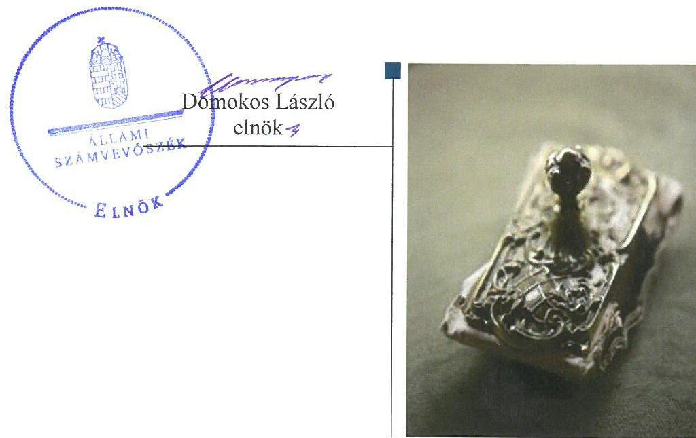

---

# AZ ELLENŐRZÉST FELÜGYELTE:

## MAKKAI MÁRIA felügyeleti vezető

## AZ ELLENŐRZÉST VEZETTE ÉS A VÉGREHAJTÁSÁÉRT FELELŐS:

### RÁCZKEVI KATALIN ellenőrzésvezető

## A PROGRAM ÖSSZEÁLLÍTÁSÁÉRT FELELŐS:

### JANIK JÓZSEF LÁSZLÓ osztályvezető

---

**IKTATÓSZÁM:** V-1152-160/2016.

**TÉMASZÁM:** 2186

**ELLENŐRZÉS-AZONOSÍTÓ SZÁM:** V0763

---

Jelentéseink az Országgyűlés számítógépes hálózatán és az Interneta a www.asz.hu címen is olvashatóak.

---

# TARTALOMJEGYZÉK 

■ ÖSSZEGZÉS ..... 5
■ AZ ELLENŐRZÉS CÉLJA ..... 6
■ AZ ELLENŐRZÉS TERÜLETE ..... 7
■ AZ ELLENŐRZÉS HÁTTERE, INDOKOLTSÁGA ..... 8
■ A JELENTÉS LÉNYEGES KÉRDÉSKÖREI ..... 9
■ ELLENŐRZÉS HATÓKÖRE ÉS MÓDSZEREI ..... 10
■ MEGÁLLAPÍTÁSOK ..... 12
■ JAVASLATOK ..... 27
■ MELLÉKLETEK ..... 29
I. Sz. melléklet: Értelmező szótár. ..... 29
II. Sz. melléklet: Főbb beszámoló adatok 2012. évben és 2015. évben ..... 30
■ FÜGGELÉK: ÉSZREVÉTELEK ..... 31
■ RÖVIDÍTÉSEK JEGYZÉKE ..... 39

---

.

---

# ÖSSZEGZÉS 

A Magyar Energetikai és Közmű-szabályozási Hivatalra és a jogelőd Hivatalra vonatkozó irányító szervi feladatellátás szabályszerű volt. A belső kontrollrendszer kialakítása és müködtetése 2012. évben nem felelt meg a jogszabályi előírásoknak. A 2015. évben müködtetett kontrollrendszer szabályszerű volt, támogatta az integritás szemlélet érvényesülését. A Hivatal pénzügyi és vagyongazdálkodása megfelelő volt. A közigazgatási hatósági tevékenységet szabályszerűen látta el.

## Az ellenőrzés társadalmi indokoltsága

A közpénzek felhasználásában meghatározó, központi alrendszerbe tartozó intézmények pénzügyi és vagyongazdálkodása, valamint szakmai feladatellátásuk súlya miatt jelentős hatást gyakorolhatnak a költségvetés egyensúlyának fenntartására. Hatással vannak továbbá az állami vagyonnal való gazdálkodás minőségére, a kormányzati (szak) politikák végrehajtására, illetve az ellátott közfeladatok tekintetében az állampolgárok életminőségére, jogaik és kötelezettségeik gyakorlására. Mindez indokolja, hogy az Állami Számvevőszék ezen intézmények pénzügyi és vagyongazdálkodását, az esetleges szervezeti átalakulások szabályszerűségét rendszeresen ellenőrizze. A Magyar Energetikai és Közmű-szabályozási Hivatal az energiahatékonysági stratégia kidolgozása és a megújuló energia hasznosításának előtérbe helyezése révén fontos szerepet tölt be a fenntartható fejlődés biztosításában, így a szervezet ellenőrzése különösen indokolt volt. A Hivatal egyik tevékenysége az ellenőrzés, így az Állami Számvevőszék az ellenőrzők ellenőreként a szervezetnél végrehajtott ellenőrzésével az intézménynél jóval nagyobb közpénzügyi szegmensre láthat rá.

## Főbb megállapítások, következtetések, javaslatok

Az irányító szervi feladatellátás szabályszerű volt. Az alapítói jogosultságok gyakorlása a jogszabályi előírásoknak megfelelően történt. Az irányításért felelős szerv a munkáltatói jogosultságait szabályszerűen gyakorolta.

A jogelőd Hivatalnál 2012. évben a belső kontrollrendszeren belül a kontrollkörnyezet, a kockázatkezelési rendszer, a kontrolltevékenységek és a monitoring rendszer kialakítása és működtetése nem volt szabályszerű, az információ és a kommunikáció területe megfelelt az előírásoknak. A Hivatalnál 2015. évben a belső kontrollrendszer kialakítása és működtetése szabályszerű volt.

A 2013. évi átalakulás keretében az elnöki feladatok átadás-átvételét összességében szabályszerűen hajtották végre, az átalakuláshoz kapcsolódó beszámolási és bejelentési kötelezettséget a Hivatal szabályszerűen teljesítette.

A jogelőd Hivatal pénzügyi gazdálkodása 2012. évben összességében szabályszerű volt, azonban a gazdálkodási jogkörök gyakorlása nem felelt meg az előírásoknak. A Hivatal pénzügyi gazdálkodása 2015. évben szabályszerű volt.

Az állami vagyon kezelésére kötött szerződések megfeleltek a jogszabályi előírásoknak. A jogelőd Hivatal valamint a Hivatal vagyongazdálkodása megfelelt a szabályoknak.

A jogelőd Hivatal és a Hivatal az egyes szakmai feladatainak ellátása során az engedélyezési és felügyeleti közigazgatási hatósági tevékenységét az előírásokkal összhangban látta el.

---

# AZ ELLENŐRZÉS CÉLJA 

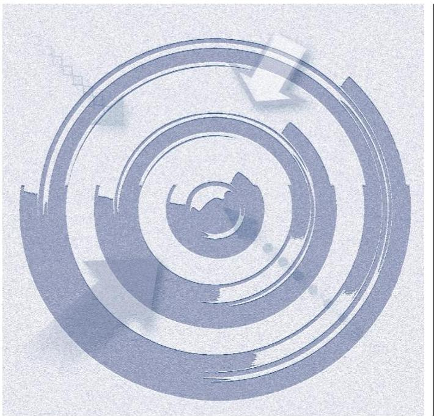

AZ ELLENŐRZÉS CÉLJA annak megítélése volt, hogy a jogelőd Hivatalra és a Hivatalra vonatkozó irányító szervi feladatellátás a jogszabályi előírások betartásával történt-e; a belső kontrollrendszer kialakítása és múködtetése, valamint az intézmény pénzügyi és vagyongazdálkodása megfelelt-e a jogszabályi előírásoknak és belső szabályzatainak, egyes szakmai feladatainak és a hatósági ellenőrzési tevékenységeinek ellátása megfelelő volt-e, illetve az intézmény 2013. évi átalakulása szabályszerűen történt-e.

---

# AZ ELLENŐRZÉS TERÜLETE 

## A Magyar Energetikai és Közmű-szabályozási Hivatal

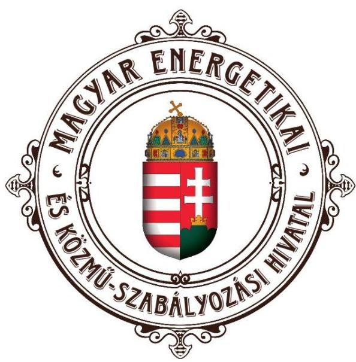

A MAGYAR ENERGETIKAI ÉS KÖZMÚ-
SZABÁLYOZÁSI HIVATAL a hazai energia- és köz-
szolgáltatások piacának legfőbb szabályozó hatósága. Jog-
elődje a Magyar Energia Hivatal volt, melynek irányító szerve a
kormány¹, felügyeleti szerve a nemzeti fejlesztési miniszter
volt, fő feladatai közé tartozott az engedélyköteles tevékeny-
ségek gyakorlásához szükséges engedélyek kiadása a
villamosenergia, a földgáz, és a távhőellátás területén, vala-
mint a víziközmű-szolgáltatás árszabályozása.

A Magyar Energetikai és Közmű-szabályozási Hivatal, mint rendeletalkotási jogkörrel felruházott önálló szabályozó szerv megnövekedett feladatellátással a 2013. évi XXII. törvénnyel jött létre. A Magyar Energetikai és Közmű-szabályozási Hivatal fejezetet irányító szervi jogállással bíró központi költségvetési szerv.

A Magyar Energetikai és Közmű-szabályozási Hivatal engedélyezési, felügyeleti, árszabályozási, ár- és díjelőkészítői feladatokat lát el a villamosenergia, a földgáz és a távhőellátás, illetve a víziközmű-szolgáltatás területén, valamint előkészíti a hulladékgazdálko dási közszolgáltatás díját. A Magyar Energetikai és Közmű-szabályozási Hivatal tevékenységéről évente beszámol az Országgyűlésnek, valamint külön felkérésre tájékoztatást ad az Országgyűlés feladatkörrel rendelkező bizottságának.

A Magyar Energetikai és Közmű-szabályozási Hivatal költségvetése a központi költségvetés szerkezeti rendjében önálló fejezet. Elnöke a Magyar Energetikai és Közmű-szabályozási Hivatal, mint központi költségvetési fejezet tekintetében a fejezetet irányító szerv vezetője.

A MAGYAR ENERGIA HIVATAL 2013-BAN JOGUTÓDLÁSSAL TÖRTÉNT MEGSZÚNÉSE és a Magyar Energetikai és Közmű-szabályozási Hivatal létrehozása során szervezeti átalakításra és vezetőváltásra került sor. Az átalakulás évében a Hivatalnál öt gazdasági vezetö ${ }_{1-5}{ }^{2}$ volt.

A jelentéstervezetben a továbbiakban a jogelőd Hivatal³, valamint Hiva$\mathrm{tal}^{4}$ megjelölést alkalmazzuk.

A Magyar Energetikai és Közmű-szabályozási Hivatal kiadása 2012-ben 3793,7 M Ft, 2015. évben 8769,7 M Ft volt. A bevételek 2012-ben 5671,2 M Ft-ot, 2015 évben 7849,8 M Ft-ot tettek ki.

A Magyar Energetikai és Közmű-szabályozási Hivatal vagyona 2012. évben 3094,7 M Ft, 2015. évben 8775,2 M Ft volt. A tényleges létszám 2012. évben 197 fő, 2015. évben 293 fő volt.

---

# AZ ELLENŐRZÉS HÁTTERE, INDOKOLTSÁGA 

A Hivatal a magyarországi közműszolgáltató szervezetek legfőbb szabályozó, felügyeleti és ellenőrző szerve, tevékenysége valamennyi piaci szereplőre hatással van. A Hivatal egyik tevékenysége az ellenőrzés, így az ÁSZ ${ }^{5}$-nak az ellenőrzők ellenőreként a szervezetnél végrehajtott ellenőrzése különösen indokolt volt.

A Hivatal tevékenységével elősegítheti az energiafogyasztói költségek csökkentését, valamint a környezeti erőforrások megóvását a jövő nemzedékek számára. A felhasználók érdekeit szem előtt tartva folyamatosan ellenőrzi az engedélyesek számlázási, szerződéskezelési és ügyfélszolgálati tevékenységét.

Az ellenőrzés hozzájárul az ÁSZ Stratégiájában megfogalmazott küldetése megvalósításához, a közpénzügyek átláthatóságának, rendezettségének előmozdításához.

Az ellenőrzés eredményeképpen javulhat a Hivatal gazdálkodása és átfogó képet kaphatunk a Hivatal működéséről és gazdálkodásáról, egyes szakmai feladatainak ellátásáról, a közpénzekkel való felelős gazdálkodásról, ezzel elősegítheti az általános szakmai tájékozottságot, a szervezetről kialakított összkép társadalmi kommunikációját.

---

# A JELENTÉS LÉNYEGES KÉRDÉSKÖREI 

1. Az irányító szerv jogelőd Hivatalra és Hivatalra vonatkozó feladatellátása szabályszerű volt-e?
2. A belső kontroll-rendszer kialakítása és múködtetése megfelel-t-e a jogszabályi elöírásoknak, támogatta-e az integritás szemlélet érvényesülését?
3. Szabályszerüen hajtották-e végre az ellenőrzött időszakban a jogelőd Hivatal szervezeti átalakulását?
4. A jogelőd Hivatal és a Hivatal pénzügyi gazdálkodása szabály-szerü volt-e?
5. Szabályszerü volt-e a jogelőd Hivatal és a Hivatal vagyongazdálkodása?
6. Szabályszerü volt-e a jogelőd Hivatal és a Hivatal egyes szakmai feladatainak ellátása?
7. A jogelőd Hivatal és a Hivatal hatósági helyszíni ellenőrzési tevékenységét szabályszerüen látta-e el?

---

# ELLENŐRZÉS HATÓKÖRE ÉS MÓDSZEREI 

## Az ellenőrzés típusa

Megfelelőségi ellenőrzés.

## Az ellenőrzött időszak

Az ellenőrzött időszak 2012. év és 2015. év, valamint az átalakulásra való tekintettel 2013. év.

## Az ellenőrzés tárgya

Az ellenőrzött szervezetre vonatkozó irányító szervi feladatok ellátása. Az intézmény belső kontroll rendszerének kialakítása és múködtetése. A szervezet átalakulásának szabályszerűsége. A pénzügyi és vagyongazdálkodás szabályszerűsége, a Hivatal egyes szakmai feladatainak ellátása és hatósági ellenőrzési tevékenységének szabályszerűsége.

Az ellenőrzés kiterjed minden olyan körülményre és adatra, amely az ÁSZ jogszabályban meghatározott feladatainak teljesítéséhez, valamint a program végrehajtása során felmerült újabb összefüggések feltárásához vezet.

## Az ellenőrzött szervezet

Magyar Energetikai és Közmű-szabályozási Hivatal, valamint a Nemzeti Fejlesztési Minisztérium, mint a jogelőd Magyar Energia Hivatal irányító szerve.

## Az ellenőrzés jogalapja

Az ellenőrzés jogszabályi alapját az ÁSZ tv. 1. § (3) bekezdés, 5. § (2)-(6) bekezdései, valamint Áht. 61. § (2) bekezdésének előírásai képezik.

## Az ellenőrzés módszerei

Az ellenőrzést az ÁSZ az ellenőrzési program szempontjai, az ellenőrzött időszakban hatályos jogszabályok, az ellenőrzés szakmai szabályai, a jelen ellenőrzésre irányadó ÁSZ módszertanok figyelembevételével végezte.

---

Az ellenőrzési kérdések megválaszolásához szükséges bizonyítékok megszerzése az ellenőrzött által rendelkezésre bocsátott dokumentumokra, adatokra alapozva megfigyelés, szemle (szemrevételezés), kérdésfeltevés (információkérés), mintavételezés útján történt. Az ellenőrzési bizonyítékként felhasználható adatforrások közé tartoztak egyrészt a szakmai program részletes szempontjainál felsorolt adatforrások, másrészt minden egyéb - az ellenőrzés folyamán feltárt, az ellenőrzés szempontjából információt tartalmazó - dokumentum.

Az ellenőrzés lefolytatásához az ellenőrzött szervezet a tanúsítványok kitöltésével, valamint az ÁSZ által kért dokumentumok megküldésével szolgáltatott adatokat.

Az integritás szemlélet érvényesülésének értékelése a Hivatal önbevallás útján kitöltött tanúsítványa alapján történt.

Az ellenőrzés a jogelőd $\mathrm{MEH}^{6}$ vonatkozásában a 2012. évre, a MEKH ${ }^{7}$ vonatkozásában a 2015. évre, valamint a szervezeti átalakulásra való tekintettel a 2013. évre terjedt ki.

Az ÁSZ a belső kontrollrendszer jogszabályi előírások szerinti kialakításának és működtetésének szabályszerűségét az erre irányuló ellenőrzési kérdésekre adott válaszok összesítése alapján, a lényegességi szempontok figyelembe vételével évente pillérenként (kontrollkörnyezet, kockázatkezelési rendszer, kontrolltevékenységek, információs és kommunikációs rendszer, monitoring rendszer) és összesítetten is minősítette.

Mintavétellel ellenőrizte az ÁSZ a jogelőd Hivatalnál és a Hivatalnál a kiadási és a bevételi előirányzatok felhasználásának szabályszerűségét. A minta alapján a sokaságban előforduló hibaarányt statisztikai becslés módszerével állapította meg. Az értékelés eredményeként kétféle, "Megfelelő" és "Nem megfelelő" minősítést alkalmazott. „Megfelelő"-nek értékelt egy ellenőrzött területet, amennyiben a hibaarány a teljes sokaságban 95\%-os bizonyossággal legfeljebb 10\% arányt képviselt. Abban az esetben, ha adott sokaság tekintetében a 10\%-os hibaarány küszöbérték átlépése megítélésének megbízhatósága nem érte el a 95\%-ot, annak elérése érdekében az értékelést lényegességi alapon további szempontokkal egészítette ki, és figyelembe vette a feltárt hibák értékét.

A szállítói állomány kezelésének szabályszerűségét az ÁSZ a lejárt szállítói állományból kockázat alapú - a legrégebben fennálló és legnagyobb öszszegű tételek - kiválasztásával értékelte.

Az ÁSZ a szakmai feladatellátás közigazgatási hatósági eljárásjogi szempontból való megfelelését 2012. és 2015. évre vonatkozóan a felügyeleti és engedélyezési valamint 2015. évre vonatkozóan a hatósági helyszíni ellenőrzési eljárásokból egyszerű véletlen mintavétellel kiválasztott ügyek áttekintésével, 2012. évre vonatkozóan a hatósági helyszíni ellenőrzési eljárások tételes ellenőrzésével értékelte.

A jelentéstervezetben használt fogalmak magyarázatát az I. számú melléklet tartalmazza.

---

# 1. Az irányító szerv jogelőd Hivatalra és Hivatalra vonatkozó feladatellátása szabályszerű volt-e? 

Összegző megállapítás

Az NFM ${ }^{8}$ és a Hivatal irányító szervi ${ }^{9}$ feladatellátása szabályszerű volt.

### 1.1. számú megállapítás

Az alapítói jogok gyakorlása a jogszabályi előírásoknak megfelelt.
AZ ORSZÁGGYŰLÉS ÁLTAL ALAPÍTOTT HIVATAL rendelkezett az Áht. ${ }^{10}$-ben foglaltaknak megfelelően alapító okirattal ${ }_{1}{ }^{11}$. Az alapító okirat ${ }_{1}$ módosítására 2012-ben egy alkalommal került sor, melynek egységes szerkezetbe foglalását az Ávr. ${ }^{12}$-nek megfelelően elkészítették.

Az egységes szerkezetbe foglalt alapító okiratot ${ }_{1,2}{ }^{13}$ az Áht. és a Ksztv. ${ }^{14}$ - ben előírtaknak megfelelően a miniszterelnök ${ }^{15}$ adta ki. Az alapító okirat ${ }_{1-2}$ tartalma megfelelt az Áht. és az Ávr. előírásainak.

A MEKH tv. ${ }^{16}$ hatályba lépésével az irányító szervi feladatokat a Hivatal elnöke látta el. Az alapító okirat ${ }_{3}{ }^{17}$-ot az Áht. előírásainak megfelelően a Hivatal vezetője hagyta jóvá. Az alapító okirat módosítására 2015-ben egy alkalommal került sor, az egységes szerkezetbe foglalt alapító okirat ${ }_{4}{ }^{18}$ a jogszabályoknak megfelelt.

Az NFM 2012. évben a jogelőd Hivatallal kapcsolatos egyéb irányítási, felügyeleti és ellenőrzési jogosultságát szabályszerűen gyakorolta. Az irányításért felelős szerv a munkáltatói jogokat szabályszerűen gyakorolta.

A jogelőd Hivatal 2012. évben rendelkezett az irányító szerv által az Áht.ben foglaltak szerint jóváhagyott SZMSZ ${ }_{1}{ }^{19}$-el. Az alapító okirat ${ }_{2}$ módosítása miatt 2012. november 16-i hatállyal új SZMSZ ${ }_{2}{ }^{20}$ került kiadásra.

Az irányító szerv a 2012. évi elemi költségvetés és a költségvetési beszámoló elkészítésénél kötelezően érvényesítendő követelményeket körlevelekben ${ }^{21}$ fogalmazta meg a jogelőd Hivatal részére. A 2012. évi elemi költségvetést és a költségvetési beszámolót az irányító szerv az Ávr.-ben foglaltak szerint jóváhagyta. A jogelőd Hivatal 2012. évi létszám keretét az irányító szerv az Áht.-ban foglaltaknak megfelelően az SZMSZ ${ }_{1,2}$-ben hagyta jóvá. Az irányító szerv által 2012. január hónapban előírt létszámcsökkentést a jogelőd Hivatal végrehajtotta.

Az NFM az Áht.-ban foglaltaknak eleget téve 2012. évben ellenőrizte az államháztartással összefüggő közérdekú és közérdekből nyilvános adatok kötelező közzétételének, illetve igényre történő szolgáltatásának végrehajtását.

---

A MUNKÁLTATÓI JOGOK GYAKORLÁSÁT az elnök vonatkozásában az alapító okirat szabályozta. A munkáltató jogokat 2012. évben a nemzeti fejlesztési miniszter, 2015. évben a Hivatal elnöke szabályszerűen gyakorolta.

A hivatalban 2012. évben javaslat ${ }^{22}$ készült az egyéni teljesítményértékelés ütemezésre, illetve az egyéni teljesítmény értékelési lap tartalmára vonatkozólag, melyet az elnök 2012. november 15-én jóváhagyott. Az egyéni teljesítményértékeléseket 2012. évben szabályszerűen elvégezték.

# 2. A belső kontroll-rendszer kialakítása és múködtetése megfelel-e a jogszabályi előírásoknak, támogatta-e az integritás szemlélet érvényesülését? 

Összegző megállapítás

A belső kontroll rendszer kialakítása és múködtetése 2012. évben nem felelt meg a jogszabályi előírásoknak, 2015. évben megfelelő volt.
(A belső kontrollrendszer évenkénti és összesített értékelését az 1. táblázat tartalmazza.)
1. táblázat

A HIVATAL BELSŐ KONTROLLRENDSZERE KIALAKÍTÁSÁNAK ÉS MŰKÖDTETÉSÉNEK ÉRTÉKELÉSE 2012. ÉS 2015. ÉVEKBEN

| Év | Kontrollkörnyezet | Kockázatkezelési rendszer | Kontrolltevékenységek | Információ és kommunikáció | Monitoring | ÖSSZÉSEN |
| :--: | :--: | :--: | :--: | :--: | :--: | :--: |
| 2012. | nem szabályszerű | nem szabályszerű | nem szabályszerű | szabályszerű | nem szabályszerű | nem szabályszerű |
| 2015. | szabályszerű | szabályszerű | szabályszerű | szabályszerű | szabályszerű | szabályszerű |

2.1. számú megállapítás

A kontrollkörnyezet kialakítása és múködtetése 2012. évben nem volt megfelelő, 2015. évben megfelelő volt.

A JOGELÓD HIVATAL ÉS A HIVATAL SZERVEZETI KERETEIT meghatározó alapító okirat ${ }_{1-4}$ Ügyrend ${ }_{1,2}{ }^{23}$, Éves munka$\operatorname{terv}_{1,2}{ }^{24}$ az Áht. és az Ávr. előírásainak megfelelt. Az SZMSZ ${ }_{2,3}{ }^{25}$ a helyettesítések rendjét valamennyi munkakör helyett csak az elnökhelyettesek vonatkozásában szabályozta, mely nem felelt meg az Ávr. 13. § (1) bekezdés g) pontjában előírtaknak. Az SZMSZ ${ }_{3}$ az Ávr. 13. § (1) bekezdés b) pontjával ellentétben nem foglalta magában a hatályos egységes szerkezetbe foglalt alapító okirat keltét és számát. Közszolgálati szabályzat ${ }_{1,2}$-vel ${ }^{26}$ rendelkeztek, Hivatásetikai kódex ${ }^{27}$ csak a 2015. év vonatkozásában készült, így a jogelőd Hivatal 2012-ben nem tett eleget a Kttv. 83. §-ában, és a 231. § (1) bekezdésében előírtaknak.

A GAZDÁLKODÁSRA VONATKOZÓ SZABÁLYZATOK 2012. évben nem, 2015. évben összességében megfeleltek a követelményeknek.

---

A Számviteli politika ${ }_{1,2}{ }^{28}$, és az annak keretében elkészített szabályzatok közül a Bizonylati rend ${ }_{1,2}{ }^{29}$, a Pénzkezelési szabályzat ${ }_{1,2}{ }^{30}$, és Önköltség számítási szabályzat ${ }_{1,2}{ }^{31}$, a Számv. tv. ${ }^{32}$ az Áhsz ${ }_{1}{ }^{33}$ és az Áhsz ${ }_{2}{ }^{34}$ előírásainak megfelelt. A 2012-ben hatályos Értékelési szabályzat ${ }_{1}{ }^{35}$ az Áhsz ${ }_{1}$ 8. § (17) bekezdése d) pontjában foglaltak ellenére nem tartalmazta követeléstípusonként a kis összegű követelések év végi meghatározásának elveit. A jogelőd Hivatal 2012-évben hatályos Leltározási szabályzata ${ }_{1}{ }^{36}$ nem tartalmazta a mérlegben értékkel nem szereplő immateriális javak, tárgyi eszközök, készletek leltározási módját, amely nem felelt meg az Áhsz ${ }_{1}$ 37. § (6) bekezdésében előírtaknak. A Hivatal a 2015. évi Számlarend ${ }_{2}{ }^{37}$-et az alkalmazható főkönyvi számlaszámok tekintetében Számv. tv. 161. § (4) bekezdésének előírása ellenére nem tartotta folyamatosan karban, mert az Áhsz. ${ }_{2}$ módosulását követően a szabályzatban lévő számlaszámok nem feleltek meg a gyakorlatban alkalmazott számlaszámoknak. A Hivatalnál alkalmazott ügyviteli rendszer a főkönyvi számlák változását kezelte, a szabályszerű működés biztosított volt.

A jogelőd Hivatal és a Hivatal az Áht. és az Ávr. előírásainak megfelelően kialakította a belföldi és külföldi kiküldetések ${ }_{1,2}{ }^{38}$, a reprezentációs kiadások ${ }_{1,2}{ }^{39}$, a gépjármú igénybevételének és használatának ${ }_{1,2}{ }^{40}$ szabályzatait. A vezetékes és mobiltelefonok használatának eljárásrendje ${ }_{1}{ }^{41}$ szabályzattal a jogelőd Hivatal 2012. évben nem rendelkezett, mely nem felelt meg az Áht. 10. § (5) bekezdésében, és az Ávr. 13. § (2) bekezdés g) pontjában leírtaknak. A 2012. évi Gazdálkodási szabályzat ${ }_{1}{ }^{42}$ nem felelt meg az Ávr. előírásainak. A Hivatal a 2015. évben hatályos Gazdálkodási szabályzat ${ }_{2}{ }^{43}$ ot a jogszabályoknak megfelelően alakította ki.

AZ ELLENŐRZÉSI NYOMVONALAKAT a jogelőd Hivatal 2012. évre vonatkozóan a Bkr. ${ }^{44}$ 6. § (3) bekezdésében előírtak ellenére nem alakított ki. 2015. évben a gazdálkodási folyamatok mellett a Hivatal múködését meghatározó folyamatokra is kialakították az ellenőrzési nyomvonalat, melyet aktualizáltak. A jogelőd Hivatal és a Hivatal a Bkr. előírásainak megfelelő Szabálytalanságkezelési eljárásrend ${ }_{1,2}{ }^{45}$-et alakított ki.
2.2. számú megállapítás

Kockázatkezelési rendszert 2012. évre vonatkozóan nem alakítottak ki, 2015-ben a kockázatkezelési rendszer szabályszerűen múködött.

KOCKÁZATKEZELÉSI rendszert a jogelőd Hivatal 2012. évre vonatkozóan nem alakított ki, 2015. évben a Hivatal vezetője a kockázatkezelési rendszert a jogszabálynak megfelelően kialakította és múködtette. A Kockázatkezelési szabályzat ${ }^{46}$ 2015. évben a Bkr. előírásaival összhangban volt.

AZ ÁSZ INTEGRITÁS PROJEKTJÉBEN a Hivatal önként részt vett. A Hivatal 2015. évre vonatkozó integritás kontrollrendszerének értékelése alapján a kockázatok kezelése és a kontrollpontok megfelelőek voltak.

---

### 2.3. számú megállapítás

A kontrolltevékenységek gyakorlóinak felhatalmazása, kijelölése megfelelte a jogszabályokban foglaltaknak. A gazdálkodási jogkörök gyakorlása a 2012. évben a kiadási előirányzatok felhasználása és a bevételek elszámolása terén nem felelt meg, 2015. évben megfelelte a jogszabályi előírásoknak és a belső szabályozásnak.

## A GAZDÁLKODÁSI JOGKÖRÖK KIALAKÍTÁSÁHOZ

kapcsolódó felhatalmazások, kijelölések szabályszerűen megtörténtek. A kijelölések 2012. évben a Gazdálkodási szabályzat ${ }_{1}$ mellékletét képező aláírási jogosultságot bemutató jegyzékeiben rendelkezésre álltak. 2015. évben a személyre szóló írásbeli felhatalmazások, kijelölések mellett a pénzügyi jogkörök gyakorlása kontrolltevékenységhez kapcsolódó aláírási jogosultságok jegyzékeit a Gazdálkodási szabályzat ${ }_{2}$ melléklete tartalmazta.

AZ ÖSSZEFÉRHETETLENSÉG SZABÁLYOZÁSA a jogelőd Hivatalnál 2012-ben nem felelt meg az Ávr. 60. § (2) bekezdésében leírtaknak, mert a Gazdálkodási szabályzat ${ }_{1}$ nem tartalmazta, hogy a teljesítés igazolására irányuló feladatot nem végezheti az a személy, aki ezt a tevékenységét a Ptk. ${ }^{47}$ szerinti közeli hozzátartozója, vagy maga javára látná el. A Hivatal a 2015. évben hatályos Gazdálkodási szabályzat ${ }_{2}$-ban az összeférhetetlenség eseteit megfelelően szabályozta.

## A GAZDÁLKODÁSI JOGKÖRÖK GYAKORLÁSÁNAK

szabályszerűsége a kiadások területén a jogelőd szervezetnél 2012. évben összességében nem volt szabályszerű.

A kötelezettségvállalás ellenjegyzésekor nem tüntették fel a dátumot és az ellenjegyzés tényére történő utalást, amely nem felelt meg az Ávr. 55. § (1) bekezdésében leírtaknak, valamint a pénzügyi fedezet ellenőrzése nem történt meg az Áht. 37. § (2) bekezdésében foglaltak ellenére. Teljesítésigazolásra nem került sor az Ávr. 57. § (3) bekezdésével ellentétben, az érvényesítés során nem tartották be az Ávr. 58. §. (1)-(5) bekezdésében foglaltakat. Az utalványozás elmaradt, amely az Áht. 38. § (1) bekezdésben foglaltaknak nem felel meg. A kötelezettségvállalást, a pénzügyi ellenjegyzést, a teljesítés igazolást, az utalványozást nem az arra felhatalmazott személy gyakorolta, amely ellentétes az Ávr. 52. §-ban, az Ávr. 55. § (2)-(3) bekezdésében, az Ávr. 57. § (4) bekezdésében, ill. az Áht. 38. §, és Ávr. 59. § (1) bekezdésében foglaltaknak.

A HIVATALNÁL 2015. ÉVBEN A KIADÁSOK területén a gazdálkodási jogkörök gyakorlása szabályszerű volt.

A BEVÉTELEK ELSZÁMOLÁSA során a jogelőd Hivatal a 2012. évben hatályos Gazdálkodási szabályzat ${ }_{1}$ 3.3.1. pontja előírtak ellenére a teljesítés igazolást nem végezte el.

A Hivatalnál 2015. évben a bevételek elszámolása megfelelte a jogszabályi előírásoknak és a belső szabályzatoknak.

A jogelőd Hivatalnál a szállítói kötelezettség elszámolása során 2012-ben előfordult, hogy a kötelezettségvállalás pénzügyi ellenjegyzése elmaradt, így nem teljesültek az Áht. 37. § -ban, az Ávr. 55. §-ban foglalt az ellenjegyzésre vonatkozó előírások.

---

A jogelőd Hivatal és a FEUVE ${ }^{48}$ részeként a Bkr. előírásainak megfelelően a kötelezettségvállalásokat és a szerződéseket nyilvántartotta.
2.4. számú megállapítás

Az információs és kommunikációs folyamatok 2012-ben összességében megfeleltek a jogszabályi előírásoknak, 2015. évben megfelelőek voltak. A jogszabályokban előírt közzétételi és adatszolgáltatási kötelezettségnek eleget tettek.

INFORMÁCIÓKEZELÉSI SZABÁLYZATTAL 2012. ÉVRE a jogelőd Hivatal nem rendelkezett, amely nem felelt meg a Bkr. 3. § d) pontjában foglaltaknak. A Hivatal információs rendszerét 2015. évben ügyrendek és ellenőrzési nyomvonalak keretében megfelelően szabályozták. A kommunikációs folyamatokat 2012. évben az SZMSZ1-ben, míg 2015. évben az ellenőrzési nyomvonalakban és az ügyrendekben rögzített eljárásrendek, valamint az SZMSZ2-ben szabályozták a Bkr. előírásainak megfelelően.
2012. és 2015. évben meghatározták a kötelezően közzéteendő adatok nyilvánosságra hozatalának, valamint a közérdekú adatok megismerésére irányuló igények teljesítésének rendjét az Info tv. ${ }^{49}$ és az Ávr. előírásainak megfelelően. A panaszok és közérdekú bejelentések kezelését a jogszabálynak megfelelően kialakították, a Panaszok kivizsgálásának rendje ${ }_{1,2}{ }^{50}$ keretében szabályozták.

AZ ADATOK BIZTONSÁGÁNAK, VÉDELMÉNEK érvényre juttatásához szükséges eljárási szabályokat, a jogszabálynak megfelelően alakították ki, a feladatokat és hatásköröket meghatározták.

A JOGELŐD HIVATAL 2012. ÉVI IRATKEZELÉSI szabályzata ${ }_{1}{ }^{51}$ nem felelt meg az Ltv. 10. §-ában előírtaknak, mivel a Magyar Nemzeti Levéltár egyetértő állásfoglalásával nem rendelkeztek. A Hivatal 2015. évben hatályos iratkezelési szabályzata a jogszabályoknak megfelelő volt.

A jogelőd Hivatal és a Hivatal az Info tv.-ben előírtaknak megfelelően 2012. és 2015. évben közzétette az SZMSZ-eit, a költségvetését és az éves költségvetési beszámolóját. Információ biztonsági szabályzatot az Info tv. 1. sz. mell. II/1 pontjában előírtak ellenére a jogelőd Hivatal 2012-ben nem tett közzé.

Adatszolgáltatási kötelezettségét a Hivatal 2015. évben a hulladékgazdálkodási közszolgáltatásra vonatkozóan a 16/2015. (IV.9) NFM rendeletnek, a víziközmű-szolgáltatás vonatkozásában a 17/2015. (IV.9) NFM rendeletnek megfelelően teljesítette. A 2012. és a 2015. évre vonatkozó költségvetési beszámolókat az Áhsz ${ }_{1}$ és az Áhsz ${ }_{2}$ előírásainak megfelelőn elkészítették, a beszámolókat a Kincstárhoz ${ }^{52}$ határidőben benyújtották. A jogelőd Hivatal beszámolóját 2012. évről a Ksztv. előírásainak megfelelően a kormánynak, a Hivatal 2014. évről készült beszámolóját a MEKH tv.-nek megfelelően az Országgyűlésnek megküldte.

---

# 2.5. számú megállapítás 

A monitoring rendszert 2012. évben kialakították, működtetése nem volt megfelelő. 2015. évben a monitoring rendszert megfelelően kialakították és múködtették.

A MONITORING-RENDSZER kialakítása során 2012. évben és 2015 évben meghatározták a célok elérését szolgáló követelményeket, azok teljesülésének értékelését a Hivatal végezte el.

SZERVEZET CÉLJAI NYOMON KÖVETÉSÉT biztosító vezetői információs rendszerét a jogelőd Hivatal az SZMSZ2-ben, 2015. évben a Hivatal az SZMSZ3-ben, valamint az ellenőrzési nyomvonalakban, és a szervezeti egységek ügyrendjeiben határozta meg.

A BELSŐ ELLENŐRZÉS kialakításáról a jogelőd Hivatal és a Hivatal elnöke az Áht. és a Bkr. előírásainak megfelelően gondoskodott, működtetése 2012. évben nem felelt meg a jogszabályi előírásoknak. 2015. évben a belső ellenőrzés kialakítása és működtetése megfelelt az előírásoknak.

A jogelőd Hivatal 2012. évre belső ellenőrzési tervet a Bkr. 22. § (1) bekezdés b) pontjában, és a 31. §-ában előírtak ellenére nem készített. A Hivatalban 2015. évre belső ellenőrzési terv készült. A belső ellenőrzési jelentéseket elkészítették.

A jogelőd Hivatal a Bkr. 50. §-ában előírt belső ellenőrzésekre vonatkozó nyilvántartást nem vezetett, 2012. évben külső ellenőrzés nem volt. A Hivatalnál 2015. évre vonatkozóan a Bkr.-nek megfelelően a belső és külső ellenőrzésekről nyilvántartást vezettek.

A belső kontrollrendszer múködésére vonatkozó nyilatkozatot a jogelőd Hivatal és a Hivatal vezetője a Bkr. előírásainak megfelelően 2012. évre és 2015. évre vonatkozóan megtette. A 2013. február 28-án kelt elnöki nyilatkozat tartalmazta, hogy a belső kontrollrendszer a belső szabályzatok területén fejlesztést igényel.

## 3. Szabályszerűen hajtották-e végre az ellenőrzött időszakban a jogelőd Hivatal szervezeti átalakulását?

Összegző megállapítás

## 3.1. számú megállapítás

A feladatok átadás-átvétele összességében szabályszerű volt.
Az átalakuláshoz kapcsolódó beszámolási és bejelentési kötelezettséget szabályszerűen teljesítették.

A MAGYAR ENERGIA HIVATAL JOGUTÓDLÁSSAL TÖRTÉNŐ MEGSZÜNTETÉSÉRŐL 2013. május 30-án megszüntető okiratban rendelkeztek, amely megfelelt a jogszabályi előírásoknak. A megszüntető okiratban a költségvetési szerv megszüntetési időpontját 2013. április 3-ában határozták meg, valamint rögzítették, hogy a leltározásért, az éves költségvetési beszámoló elkészítéséért, a vagyonátadás lebonyolításáért a Hivatal elnöke ${ }^{53}$ a felelős.

Az NFM a jogelőd Hivatal évközi átszervezésével kapcsolatban a beszámolási kötelezettség rendjéről rendelkezett, meghatározta, hogy a zárási

---

#### Abstract

feladatok elvégzésénél a fejezetek között intézményátadási módot kell követni, amely megfelelt a jogszabályoknak. A Hivatal a 2013. évközi költségvetési (megszűnési) beszámolót az Áhsz1,-ben előírtak szerinti mellékletekkel, mérlegsorokat alátámasztó leltárral és főkönyvi kivonattal 60 napon belül elkészítette, és megküldte az irányító szervnek.

# A KÖLTSÉGVETÉSI BESZÁMOLÓ ELLENŐRZÉSÉT 

az irányító szerv 2013. május 22-én elvégezte a jogszabályoknak megfelelően.

### 3.2. számú megállapítás

Az elnöki feladatok átadás-átvételét összességben szabályszerűen hajtották végre.

A SZERVEZET ÁTALAKULÁSÁRA 2013. április 03-i fordulónappal került sor.

A HIVATAL ELNÖKÉNEK TISZTSÉGE a MEKH tv. 23. § (2) bekezdésében foglaltak alapján 2013. április 4-ével megszűnt, a miniszterelnök 2013. április 5. - 2013. június 30-ig tartó időszakra az elnöki hatáskör teljes körének ellátására és gyakorlására hatalmazta fel az elnököt. A Hivatal elnökének személye nem változott.

A Hivatal új elnöke 2013. július 1-től került kinevezésre, az elnöki feladatok átadására a 2013. július 2-án került sor.

Az átadás-átvételi jegyzőkönyvben ${ }^{54}$ a 2010. évi XLII. tv. ${ }^{55}$ 1. sz. melléklete III/1. pontja szerint a közfeladatokkal kapcsolatos tevékenységek, valamint a jogelődnél folyamatban lévő közbeszerzések átadása megtörtént

A jegyzőkönyv a 2010. évi XLII. tv. 1. mellékletében meghatározottak ellenére nem tartalmazta a Hivatal múködését leíró okiratok, szabályzatok felsorolását, az intézményi létszámot, a foglalkoztatottak adatait, a kötelezettségvállalások leltárát, az igény- vagy jog lemondások és elismerések tételes felsorolását, a harmadik személlyel szemben fennálló, érvényesíthető jogosultságokat, a követelésállományt tartalmazó kimutatást, valamint a 2. számú mellékletében meghatározottak szerint a Hivatal informatikai hálózat átadás-átvételének dokumentálását.

## 4. A jogelőd Hivatal és a Hivatal pénzügyi gazdálkodása szabályszerű volt-e?

Összegző megállapítás

## 4.1. számú megállapítás

A jogelőd Hivatal pénzügyi gazdálkodása 2012-ben összességében szabályszerű volt, a Hivatal pénzügyi gazdálkodása 2015-ben szabályszerű volt.

A jogelőd Hivatal és a Hivatal bevételi előirányzatainak tervezése és teljesítése megfelelt a jogszabályok és belső szabályzatok előírásainak.

A BEVÉTELEK TERVEZÉSE során a jogelőd Hivatal és a Hivatal az Áht., az Ávr., az 5/2012. (III. 1.) NGM ${ }^{56}$ rendelet és a 10/2013. (III. 13.) NGM rendelet előírásainak megfelelően az előirányzatok összegét mindkét

---

ellenőrzött évben számításokkal alátámasztotta. A jogelőd Hivatal és a Hivatal az Ávr. előírásának megfelelően belső szabályzatokban rögzítette a költségvetési tervezéssel kapcsolatos feladatokat, eljárásrendet.

A jogelőd Hivatal és a Hivatal figyelembe vette a bevételi előirányzatok megállapításakor az ismert feladatellátásokat. A 2012. évi tervezés idején nem ismert, évközi feladatbővülések - víziközmű tervezés elfogadása, dijváltozások - miatt a bevétel jelentősen nőtt. A jogelőd Hivatal és a Hivatal költségvetési javaslatát és az elemi költségvetését az Áht. és Ávr. szerint előírt határidőben nyújtotta be és teljesítette az adatszolgáltatási kötelezettségét az államháztartás információs rendszerébe.

A BEVÉTELEK TELJESÍTÉSE a jogelőd Hivatal és a Hivatal gazdálkodásában az Áht. előírásainak megfelelően a tervezett, illetve módosított előirányzatnak megfelelő összegű volt. A bevételek mértékét és beszedésének eljárását a hatályos ágazati törvények - Vet. ${ }^{57}$, Get. ${ }^{58}$, Tszt. ${ }^{59}$, Vksz. tv. ${ }^{60}$, Ht. ${ }^{61}$ - és a 1/2014. (III.4.) MEKH ${ }^{62}$ rendelet határozták meg. A Hivatal a feladatai ellátásával és a múködésével összefüggő kiadásokat saját bevételeiből fedezte, költségvetési támogatásban nem részesült. A jogelőd Hivatal és a Hivatal bevételét képezte a felügyeleti díj, a kiszabott bírságok, az igazgatási szolgáltatási díj és az egyéb bevételek.

A 2012. évi költségvetésének eredeti előirányzata 3401,5 M Ft bevétel volt, amely túlteljesült, a költségvetési bevételek teljes összege 5671,2 M Ft az eredeti előirányzat 166,7\%, a módosított előirányzat 100,8\%-a. A Hivatal 2015. évi eredeti előirányzata 7100,0 M Ft bevétel volt, amely 749,8 M Ft-tal, díj és feladat növekedés miatt túlteljesült, a költségvetési bevételek teljes összege 7849,8 M Ft volt.

A jogelőd Hivatal és a Hivatal az előirányzat módosításokat szabályszerűen hajtotta végre, az engedélyköteles bevételi előirányzat módosításhoz jóváhagyással rendelkezett. Az előirányzat módosítások alakulását a 2. táblázat mutatja be.
2. táblázat

A 2012. ÉS 2015. ÉVI ELŐIRÁNYZAT-MÓDOSÍTÁSOK HATÁSKÖRÖNKÉNT (M FT)

| Év | Kormányzati ha-   táskorben | Irányító szervi   hatáskorben | Intézményi ha-   táskorben | Összesen |
| :--: | :--: | :--: | :--: | :--: |
| 2012. | 0,9 | 2109,5 | 202,8 | 2313,2 |
| 2015. | 0 | 731,8 | 4374,0 | 5105,8 |

2012. évben 2313,2 M Ft előirányzat módosítást hajtottak végre, amelyből a felügyeleti díj növekedése és a víziközmú tevékenységhez kapcsolódó nem tervezett felügyeleti díj emelkedése miatti többletbevétel előirányzat módosítása 2019,5 M Ft volt. A Hivatal a 2015. évben 5105,8 M Ft előirányzat módosítást hajtott végre, amelyből a 2014. évi költségvetési maradvány előirányzat módosítása 4356,0 M Ft volt.

---

### 4.2. számú megállapítás

A bevételek beszedése és elszámolása, a kiadási előirányzatok felhasználása megfelelt a jogszabályi előírásoknak. A gazdálkodási jogkörök gyakorlása a 2012. évben nem volt megfelelő, 2015. évben megfelelő volt.

A KÖZHATALMI BEVÉTELEK TELJESÍTÉSE során a jogelőd Hivatal 2012. évben a pénzügyi jogkörök gyakorlása szabályszerűsége vonatkozásában a jogszabályok előírásait igen, a belső szabályozásában, a Gazdálkodási szabályzat ${ }_{1}$-ban foglaltakat nem tartotta be. A Gazdálkodási szabályzat ${ }_{1}$ eljárásrendben - az Áht. 38. §, Ávr. 57. § (2) bekezdése, 59. § (1) bekezdésében foglaltakon túlmenően - előírták a bevételek teljesítés igazolását, amelyet 2012-ben nem tartottak be. A bevételek elszámolása szabályszerű volt. A Hivatal a 2015. évben a közhatalmi bevételek teljesítése során betartotta a jogszabályok és belső szabályzatok előírásait.

TARTALÉKOT a Hivatal 2013. évtől 2015. évig évente képzett a bevételeiből - a bírságból származó bevétel kivételével - amelyet az MEKH tv. előírásainak megfelelően használt fel. A bevételekből az egyes években képzett tartalék összege az alap 25\%-a volt. A 2013. évben 1190,4 M Ft, a 2014. évben 2038,9 M Ft és a 2015. évben 1940,7 M Ft volt. A Hivatal a képzett tartalékot személyi juttatásokra, munkaadót terhelő járulékokra és dologi kiadásokra szabályszerűen használta fel.

## A KISZABOTT BíRSÁGBÓL SZÁRMAZÓ TELJESÍ-

TETT BEVÉTEL összege a MEKH tv. előírásainak megfelelően a 2013. évben 27,5 M Ft, a 2014. évben 129,7 M Ft és a 2015. évben 72,9 M Ft volt. A bevétel a MEKH tv. 20 § (3) bekezdése alapján 2013. április 4-től volt felhasználható. A Hivatal által kiszabott bírságból származó bevétel felhasználása a MEKH tv.-ben foglaltaknak megfelelt. A felhasználás jogcímeit a 3. táblázat mutatja be.

## A KIADÁSI ELŐIRÁNYZATAIT A JOGELŐD HIVA-

TAL ÉS A HIVATAL SZABÁLYSZERŰEN HASZNALTA FEL, a módosított előirányzatokat az ellenőrzött években nem lépte túl. A kiadásainak összege megegyezett a tervezett bevételek összegével.

A kiadási előirányzat felhasználásánál a kulcskontrollok múködtetése 2012. évben nem volt megfelelő, 2015. évben összességében megfelelő volt.

A SZEMÉLYI JUTTATÁSOK kiadásainak volumene megegyezett a tervezett bevételek összegével, kifizetett összege az elszámolást megalapozó számfejtési bizonylaton szereplő összeggel megegyezett.

## A DOLOGI KIADÁSOK FELHASZNÁLÁSÁNÁL

2012. ÉVBEN a külföldi kiküldetésekhez az elrendelést megelőzően nem készültek a külföldi kiküldetésről szóló szabályzat ${ }^{63}$ III. fejezetében foglaltak ellenére költségkalkulációk és feladattervek. A Hivatalnál 2015ben a dologi kiadások felhasználása szabályszerű volt.

A kiadási előirányzatok felhasználásánál a kulcskontrollok múködtetése 2012. évben nem volt megfelelő, 2015. évben megfelelő volt.

---

# 4.3. számú megállapítás 

A FELHALMOZÁSI KIADÁSOKNÁL a jogelőd Hivatalnál 2012. évben előfordult, hogy nem rendelkeztek a szerződő fél (szállítók) nyilatkozatával arra vonatkozóan, hogy szervezetük átlátható szervezetnek minősült, amely nem felelt meg az Nvt. 3. § (2) bekezdésben előírtaknak.

A Hivatal 2015. évi gazdálkodásánál a felhalmozási célú kiadások elszámolása és nyilvántartása szabályszerű volt.
(A gazdálkodási jogkörök részletes értékelése lásd a 2.3. pontnál.)

Az előirányzat maradvány megállapítása az ellenőrzött időszakban szabályszerű volt.

A jogelőd Hivatal 2012. évi előirányzat maradványa az Áhsz.1 előírásainak megfelelően az éves beszámoló maradvány kimutatásában és a kapcsolódó főkönyvi számlákon kimutatott előirányzat-maradvány összegével megegyezett. A Hivatalnál a 2015. évi előirányzat maradvány az Áhsz. 2 előírásai alapján a maradvány kimutatásban és a kapcsolódó főkönyvi számlákon kimutatott előirányzat-maradvánnyal egyező volt. A kötelezettséggel terhelt maradvány megállapítása megfelelt az Ávr.-ben foglaltaknak.

A jogelőd Hivatal 2012. évben rendelkezett az Ávr.-ben foglaltaknak megfelelően az irányító szerv értesítésével az előirányzat-maradvány jóváhagyásáról.

A Hivatal 2012. évi előirányzat maradványa 1878,5 M Ft volt, melyből 46,5 M Ft a központi költségvetést illette, 1,0 M Ft az előző évi előirányzat maradvány kötelezettségvállalással terhelt, de nem teljesült része, valamint 1831,0 M Ft a kötelezettségvállalással terhelhető összeg volt.

A Hivatal 2015. évi előirányzat maradványa 3436,1 M Ft volt, melyből 633,6 M Ft kötelezettségvállalással nem terhelt maradvány, amelyet a ma-radvány-elszámolás keretében a Hivatal elvonásra ajánlott fel. A fennmaradó 2 802,5 M Ft maradvány kötelezettségvállalással terhelt maradt.
4.4. számú megállapítás

A jogelőd Hivatal és a Hivatal a jogszabályi előírásoknak megfelelően készítette el éves költségvetési beszámolóját és teljesítette beszámolási kötelezettségét.

A JOGELŐD HIVATAL ÉS A HIVATAL 2012. ÉS 2015. ÉVBEN ELEGET TETT A BESZÁMOLÁSI KÖTELEZETTSÉGÉNEK, az éves költségvetési beszámolót a jogszabályokban előírt formában és tartalommal készítették el. A főkönyvi könyvelés és az analitikus nyilvántartás adatai között biztosított volt az egyezőség.

A Hivatal az Áht.-ban foglaltaknak megfelelően az éves költségvetési beszámolók alapján az elfogadott költségvetéssel összehasonlítható módon, az év utolsó napján érvényes szervezeti, besorolási rendnek megfelelően készítette el zárszámadását.

A Hivatal az Áht. és az Ávr. alapján teljesítette az éves költségvetési beszámolóról az adatszolgáltatási kötelezettségét az államháztartás információs rendszerébe, valamint az Ávr. alapján teljesítette a zárszámadáshoz kapcsolódó szöveges és számszaki adatszolgáltatási kötelezettségét.

---

# 5. Szabályszerú volt-e a jogelőd Hivatal és a Hivatal vagyongazdálkodása? 

Összegző megállapítás

### 5.1. számú megállapítás

A jogelőd Hivatal és a Hivatal vagyongazdálkodása szabályszerű volt.

2012. és 2015. évben a jogszabályok és a belső szabályzatok előírásainak megfelelően történt a mérlegben kimutatott eszközök és források értékelése, a mérleg tételek leltári alátámasztása. 2012. évben nem volt szabályszerű a szállítói kötelezettségek nyilvántartása, 2015. évben szabályszerű volt.

## A VAGYONKEZELÉSI SZERZŐDÉS 2012. ÉVBEN ÉS 2015. ÉVBEN a megfelelt a jogszabályi előírásoknak.

2012. évben a jogelőd Hivatal rendelkezett a feladatellátásához szükséges - az állami vagyon kezelésére vonatkozó - MNV Zrt. ${ }^{64}$-vel kötött 33126. számú Vagyonkezelői szerződés ${ }^{65}$-sel. A Vagyonkezelői szerződés tartalmában megfelelt az Nvtv. ${ }^{66}$ a Vtv. ${ }^{67}$, a Vtvr. ${ }^{68}$ előírásainak. A szerződés tárgya a Budapest VIII. kerület belterület 34684. hrsz. szám alatt bejegyzett irodaház ingatlan kezelői jogának átadás-átvétele.

Az Áhsz ${ }_{2}$ alapján az analitikus, részletező nyilvántartásoknak a kapcsolódó főkönyvi számlákkal való 2012. és 2015. év végi egyeztetését dokumentált módon elvégezték összhangban a Számv. tv., a Számviteli poli-tika ${ }_{1}$ - 2-ben, a Számlarend ${ }_{1-2}$-ben, a Leltározási szabályzat ${ }_{1-2}{ }^{69}$ ben foglalt előírásokkal.

A mérlegben kimutatott eszközök bekerülési értékének megállapítása, állományba vétele, nyilvántartása, év végi értékelése, az értékcsökkenés elszámolása az előírásoknak megfelelően történt 2012. és 2015. évben. A 2012. évi és a 2015. évi beszámoló elkészítéséhez a Számv. tv, az Áhsz ${ }_{1-2}$., valamint a belső szabályzatok előírásainak megfelelően elvégezték a mérlegben szereplő eszközök és források év végi értékelését.

A jogelőd Hivatal és a Hivatal az Nvtv. és a Vtv. szabályainak megfelelően nem rendelkezett önálló tulajdonjoggal, nem mutatott ki saját vagyont a 2012. évi és 2015. évi beszámolóban, és az év végi leltárban.

## A SZÁLLÍTÓI KÖTELEZETTSÉGEK NYILVÁNTARTÁSA során 2012. évben előfordult, hogy a szállítói kötelezettséget alátámasztó dokumentumok nem álltak rendelkezésre, amely nem felelt meg a Számv. tv. 165. § (1),(2) bekezdésében, illetve a Számv. tv. 169. § (2) bekezdésében előírtaknak.

2015. évben a kötelezettségek analitikus nyilvántartását a jogszabályi előírásoknak megfelelően vezették.

A követelések és kötelezettségek állományát rögzítő számlák vezetése, a negyedévenkénti összegző kimutatások elkészítése, főkönyvi feladása, az analitikus nyilvántartások folyamatosan vezetése megfelelt az Áhsz ${ }_{1-2}$ előírásainak. Az ellenőrzött időszakban 60 napon túli szállítói tartozás nem volt.

---

A kötelezettségek elszámolása során a gazdálkodási jogkör gyakorlása a kötelezettségvállalás vonatkozásában 2012. évben nem volt szabályszerű, 2015. évben megfelelt a jogszabályoknak és a belső előírásoknak.
(A gazdálkodási jogkör gyakorlásának értékelését a 2.3. megállapítás tartalmazza.)

A 2012. ÉVI ÉS A 2015. ÉVI MÉRLEG LELTÁRI ALÁTÁMASZTÁSA, a költségvetési beszámoló elkészítése a Számv. tv., az Áhsz1-2, a Leltározási szabályzat1-2 követelményeinek megfelelően történt.

# 5.2. számú megállapítás 

A jogelőd Hivatal 2012. évben a jogszabályoknak megfelelően teljesítette a tárgyi eszközökre vonatkozó állagmegóvási kötelezettségeit, azonban a beruházások elmaradása miatt a tárgyi eszközök értéke csökkent. 2015. évben a Hivatal a jogszabályoknak megfelelően teljesítette az állami vagyonnal kapcsolatos állagmegőrzési, értékmegőrzési kötelezettségeit.

## A VAGYON MEGŐRZÉS SZABÁLYSZERŰSÉGÉNEK ÉRTÉKELÉSE ALAPJÁN 2012. ÉVBEN a jogelőd Hivatal

gondoskodott a befektetett eszközök állagának megóvásáról, karbantartásáról, ugyanakkor az állami vagyon értéke csökkent.

## 1. ábra

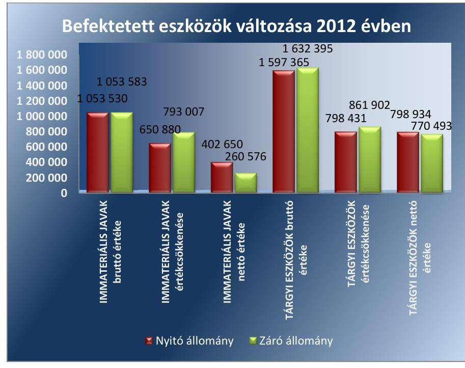

Forrás: a jogelőd Hivatal 2012. évi beszámolója
2012. évben a befektetett eszközök összes bruttó érték növekedése 8,5 M Ft volt, ebből az immateriális javak értéke $0,1 \mathrm{M} \mathrm{Ft}$, az ingatlanok értéke 0,8 M Ft, a gépek, berendezések értéke 7,6 M Ft volt.
2012. évben a jogelőd Hivatal mérlegében kimutatott vagyon értéke 1492 M Ft-tal, közel a kétszeresére növekedett a pénzeszközök növekedése miatt. Az immateriális javak nettó értéke 142,1 M Ft-tal, a tárgyi esz-

---

közök nettó értéke 28,4 M Ft-tal csökkent. A tárgyévi értékcsökkenési leírás elszámolása meghaladta beruházások értékét. (A vagyon változását a II. számú melléklet mutatja be.)

# 2015. ÉVBEN A HIVATAL ELEGET TETT AZ ÁLLAMI VAGYONNAL KAPCSOLATOS, a jogszabályokban és a vagyonkezelési szerződésben előírt értékmegőrzési, állagmegóvási kötelezettségeinek. 

2. ábra
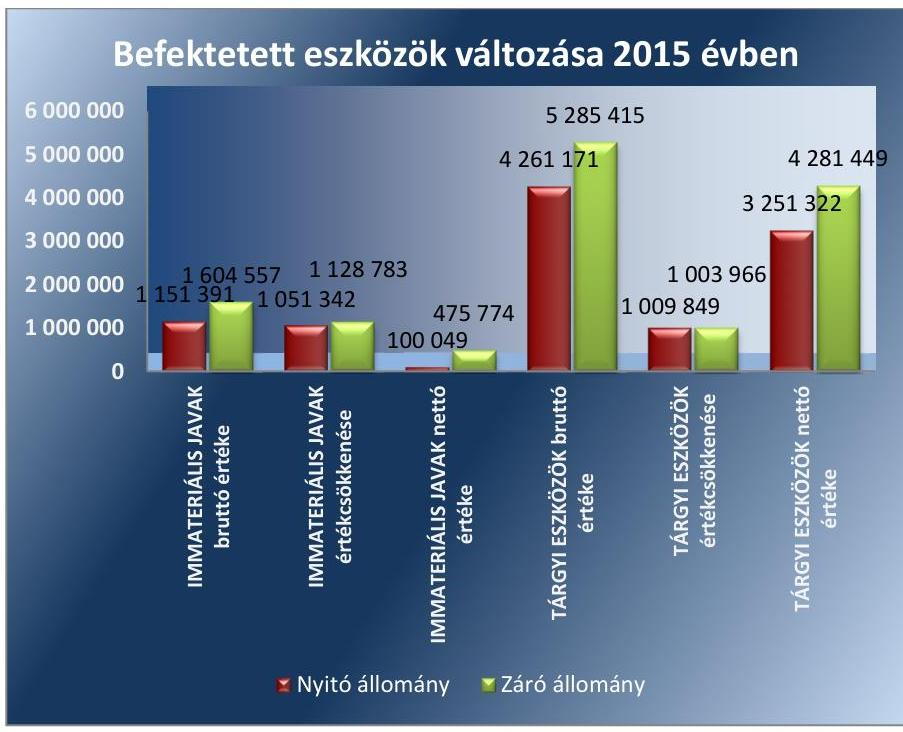

Forrás: a Hivatal 2015. évi beszámolója
2015. évben 3403,4 M Ft értékben növekedett a befektetett eszközök bruttó értéke. 2015. évben a mérlegben kimutatott vagyon értéke 499, 2 M Ft-tal, 5,3 \%-kal csökkent. A saját tőke értékének csökkenését az új székhely kialakításával összefüggésben - a korábbi székhely átadásával kapcsolatos 652,1 M Ft összegű vagyonváltozás okozta.

A Hivatal az Nvtv. és a Vtv.-ben előírt célokra, a közfeladatainak ellátására használta a kezelésére bízott állami vagyont. 2015. évben a Hivatal a nemzeti vagyonba tartozó, a kötelező alapfeladatai ellátásához rendelkezésre bocsátott ingatlanokon végzett felújításhoz a tulajdonosi joggyakorló írásbeli engedélyével rendelkezett.

## 2015. ÉVBEN A VAGYONKEZELÉSI SZERZŐDÉS

részleges megszűnésére vonatkozó, 2015. november 04-ei hatállyal létrejött 33126/3. számú vagyonkezelői szerződés megkötése az Nvtv., a Vtv., a Vtvr. szabályainak megfelelően történt. A Vagyonkezelői szerződés tárgya a Budapest VIII. kerület belterület 34684. helyrajzi számon nyilvántartott telek és irodaház MNV Zrt. részére történő visszaadása volt.

A Hivatal az ingatlan nettó értékét a 2015. november 25-i birtok átruházás napjának dátumával - 651,4 M Ft összegben - szabályszerűen kivezette a számviteli nyilvántartásaiból.

---

Az MNV Zrt. részére történt állami vagyon átadása jogcímén 2015. évben a Hivatal számviteli nyilvántartásaiból mindösszesen 652,0 M Ft nettó értékű eszközt vezettek ki, ennek alapján a 2015. évi beszámolóban a vagyonátadásból eredően a tárgyi eszközök értéke 652,0 M Ft-tal csökkent, amely megegyezett a forrás oldalon a saját tőke csökkenéseként, a nemzeti vagyon változásaként kimutatott értékkel.

# 6. Szabályszerú volt-e a jogelőd Hivatal és a Hivatal egyes szakmai feladatainak ellátása? 

## Összegző megállapítás

### 6.1. számú megállapítás

A jogelőd Hivatal és a Hivatal engedélyezési és felügyeleti közigazgatási hatósági tevékenysége megfelelt a jogszabályi előírásoknak.

Az alapító okirat és a belső szabályozások összhangban voltak a jogszabályokban előírt engedélyezési, felügyeleti feladatokkal.

## A JOGELŐD HIVATAL ÉS A HIVATAL ALAPÍTÓ OKIRATÁBAN $1,2,3,4$ MEGHATÁROZOTT HATÓSÁGI

FELADATOK összhangban voltak az SZMSZ $1,2,3,4$-ben foglaltakkal. Az SZMSZ $_{1,2,3,4}$ 2. számú függelékében, a jogelőd Hivatal és a Hivatal szervezeti egységeinek feladatai között szabályozták a Vet., a Tszt., a Get., - az SZMSZ2-ben - a Vksztv. valamint - az SZMSZ3,4 -ben a Ht. ágazati jogszabályokban meghatározott engedélyezési és felügyeleti feladatok ellátását.

A hatósági feladatokat ellátó főosztályainak tevékenységét a jogelőd Hivatalnál 2012-ben az Áht. 10. § (5) bekezdésében foglaltak ellenére ügyrendekben nem szabályozták. A Hivatalnál 2015-ben ügyrendekkel, ellenőrzési nyomvonalakkal rendelkeztek.

A Hivatal rendelkezett a fogyasztói panaszok kezelésére vonatkozó szabályzattal. A panaszokkal kapcsolatos adatkezelésre és adatvédelemre vonatkozó előírásokat 2015-ben a Hivatal iratkezelési szabályzata, valamint a Informatikai Biztonsági Szabályzat ${ }_{2}$ tartalmazta a Ket. ${ }^{70}$ és az Info tv. előírásainak megfelelően.
6.2. számú megállapítás

A jogelőd Hivatal és a Hivatal engedélyezési és felügyeleti közigazgatási hatósági tevékenysége megfelelt a jogszabályi előírásoknak.

A jogelőd Hivatal és a Hivatal engedélyezési és felügyeleti közigazgatási hatósági tevékenységét az ellenőrzött időszakban a jogszabályok alapján ellátta.

A jogelőd Hivatal és a Hivatal egyes ágazatokban végrehajtott felügyeleti és engedélyezési ügyek számát a 4. táblázat mutatja be.
4. táblázat

FELÜGYELETI ÉS ENGEDÉLYEZÉSI TEVÉKENYSÉG (DB)

| Ágazat | 2012. 8 v | 2015. 8 v |
| :-- | --: | --: |
| villamos-energia | 217 | 369 |
| földgáz | 3 | 62 |
| távhőszolgáltatás | 239 | 153 |
| víziközmú | - | 934 |
| hulladékgazdálkodás | - | 37 |

---

### 6.3. számú megállapítás

A Hivatal 2015-ben eleget tett az ágazati jogszabályokban meghatározott szabályozási, rendeletalkotási kötelezettségének. A Hivatal elnöke által kiadott rendeletek honlapon történő közzétételi kötelezettségnek eleget tettek.

# A HIVATAL RENDELETALKOTÁSI KÖTELEZETTSÉGÉT a MEKH tv. és az egyes ágazati törvények alapján végezte, a jogszabályok a rendelet megalkotására vonatkozó határidőt nem írtak elő. 

A Hivatal Elnöke a MEKH tv. 12. a) pontja alapján rendeletben állapította meg a Vet. 170. § (5) bekezdés 1) pontja a villamos energia vonatkozásában a rendszerhasználati díjakat és alkalmazásuk szabályait, a Vet. 170. § (5) bekezdés 2) és 3) pontja alapján a csatlakozási díjak meghatározásának szempontjait, a csatlakozási díjak elemeit, valamint a csatlakozási díjak mértékét és alkalmazásuk szabályait, valamint az elosztók közötti kiegyenlítő fizetések mértékét.

A Hivatal honlapján a MEKH tv. 4. § (2) bekezdés b) pontjában foglaltaknak megfelelően a Hivatal elnökének rendeleteit - a 9/2015. (XI. 12.) MEKH rendelet kivételével - közzétették.

## 7. A jogelőd Hivatal és a Hivatal hatósági helyszíni ellenőrzési tevékenységét szabályszerűen látta-e el?

## Összegző megállapítás

A jogelőd Hivatal és a Hivatal hatósági helyszíni ellenőrzési tevékenységét a jogszabályoknak megfelelően ellátta.

A hatósági helyszíni ellenőrzések számát 2012. évben és 2015. évben az 5. táblázat foglalja össze.
5. táblázat

HELYSZÍNI ELLENŐRZÉSI TEVÉKENYSÉG (DB)

| Ágazat | 2012. év | 2015. év |
| :-- | :--: | :--: |
| villamosenergia | 2 | 31 |
| földgáz | 0 | 2 |
| távhőszolgáltatás | 7 | 1 |
| víziközmú | - | 37 |

A jogelőd Hivatal 2012. évre a Ket. 91. § (1) és (2) bekezdésében előírt ellenőrzési tervvel, valamint ellenőrzési jelentéssel nem rendelkezett.

A Hivatal a Ket. előírásainak megfelelően 2015-ben elkészítette az ellenőrzési tervét és az ellenőrzési jelentését, melyeket a honlapon közzétett.

A Hivatal 2015. évben a jogszabályoknak megfelelően eleget tett a hulladékgazdálkodási közszolgáltatást érintő, valamint a víziközmű szolgáltatáshoz kapcsolódó adatszolgáltatási és javaslattételi kötelezettségének.

---

# JAVASLATOK 

Az ÁSZ tv. 33. § (1) bekezdésében foglaltak értelmében az ellenőrzött szervezet vezetője köteles a jelentésben foglalt megállapításokhoz kapcsolódó intézkedési tervet összeállítani és azt a jelentés kézhezvételétől számított 30 napon belül az ÁSZ részére megküldeni. Amennyiben az ellenőrzött szervezet vezetője nem küldi meg határidőben az intézkedési tervet, vagy továbbra sem elfogadható intézkedési tervet küld, az Állami Számvevőszék elnöke az ÁSZ tv. 33. § (3) bekezdése a) és b) pontjaiban foglaltakat érvényesítheti.

## A Magyar Energetikai és Közmű-szabályozási Hivatal elnökének

1. Intézkedjen a fökönyvi számlaszámok tekintetében a számlarend aktualizálásáról.
(2.1. sz. megállapítás 3. bekezdés utolsó előtti mondata alapján)

---

.

---

# MELLÉKLETEK 

- I. SZ. MELLÉKLET: ÉRTELMEZŐ SZÓTÁR
belső kontroll rendszer
engedélyes
irányító szerv/felügyeleti szerv
ÁSZ Integritás Projekt
közhatalmi bevétel

A belső kontrollrendszer a kockázatok kezelése és tárgyilagos bizonyosság megszerzése érdekében kialakított folyamatrendszer, amely azt a célt szolgálja, hogy a múködés és gazdálkodás során a tevékenységeket szabályszerűen, gazdaságosan, hatékonyan, eredményesen hajtsák végre, az elszámolási kötelezettségeket teljesítsék, megvédjék az erőforrásokat a veszteségektől, károktól és nem rendeltetésszerű használattól. (Forrás: Áht. 69. § (1) bekezdése)

1. Aki a VET szerint engedélyköteles tevékenység végzésére a Magyar Energetikai és Közmű-szabályozási Hivatal (a továbbiakban: Hivatal) által kiadott hatályos engedéllyel rendelkezik. (Forrás: Vet. 3. § 13. pontja)
2. Aki a Get. szerint engedélyköteles tevékenység végzésére a Hivatal által kiadott érvényes engedéllyel rendelkezik. (Forrás: Get. 3. § 15. pontja)
3. A távhőtermelő létesítmény létesítésére, távhőtermelésre, valamint a távhőszolgáltatásra engedéllyel rendelkező. (Forrás: Tszt. 3. § c) pontja)
A költségvetési szerv tekintetében az e törvényben meghatározott irányítási hatáskört gyakorló szerv. (Forrás: Áht. 1. § 9. pontja)
Az Állami Számvevőszék 2009-ben indította el a „Korrupciós kockázatok feltérképezése - Integritás alapú közigazgatási kultúra terjesztése" című, európai uniós forrásból megvalósított kiemelt projektjét (Integritás Projekt). Az Integritás Projekt célja, hogy felmérje a közszféra intézményei korrupciós kockázatoknak való kitettségét, illetőleg az azok mérséklésére hivatott kontrollok szintjét. Az Állami Számvevőszék a projekt révén az integritás szemlélet minél szélesebb körrel történő megismertetését, gyakorlatba ültetését kívánja elérni. Az integritás követelményeinek megfelelő szervezeti múködést előnyben részesítő közigazgatási kultúra elterjesztését és a korrupció elleni fellépést az ÁSZ önmagára nézve is stratégiai jelentőségű célként fogalmazta meg. A projekt a felmérésben résztvevő intézmények számára helyzetükről egyfajta „tükörképet" mutat be, ami alapot teremt a jövőbeni pozitív irányú elmozduláshoz. (Forrás: a http://integritas.asz.hu honlapon közzétett, a 2013. évi Integritás felmérés eredményeiről készült összefoglaló tanulmány)
a közhatalmi bevételek, amelyek az adókból, illetékekből, járulékokból, hozzájárulásokból, bírságokból, díjakból és más fizetési kötelezettségekből származnak (Forrás: Áht. 6. § (3) b pontja)

---

II. SZ. MELLÉKLET: FŐBB BESZÁMOLÓ ADATOK 2012. ÉVBEN ÉS 2015. ÉVBEN

|  A HIVATAL 2012. ÉVI ESZKÖZ-FORRÁS ADATAINAK VÁLTOZÁSA (EZER FT ) |  |  |   |
| --- | --- | --- | --- |
|  Megnevezés | Nyitó állomány | Záró állomány | Változás V/  |
|  Immateriális javak | 402650 | 260576 | $-142074$  |
|  Tárgyi eszközök | 798934 | 770493 | $-28441$  |
|  Befektetett pénzügyi eszközök | 28668 | 25542 | $-3126$  |
|  Készletek | 0 | 0 | 0  |
|  Követelések | 7276 | 29432 | 22156  |
|  Pénzeszközök | 361209 | 1994888 | 1633679  |
|  Egyéb sajátos eszközoldali elszámolások | 4040 | 13790 | 9750  |
|  Aktív időbeli elhatárolások | 0 | 0 | 0  |
|  ESZKÖZÖK ÖSSZESEN | 1602777 | 3094721 | 1491944  |
|  Saját tőke | 1429997 | 2916575 | 1486578  |
|  Kötelezettségek | 7975 | 49867 | 41892  |
|  Passzív időbeli elhatárolás | 164805 | 128279 | $-36526$  |
|  FORRÁSOK ÖSSZESEN | 1602777 | 3094721 | 1491944  |
|   |  |  | Forrás: a jogelőd Hivatal 2012. évi beszámolója  |

# A HIVATAL 2015. ÉVI ESZKÖZ-FORRÁS ADATAINAK VÁLTOZÁSA (EZER FT)

|  Megnevezés | Nyitó állomány | Záró állomány | Változás  |
| --- | --- | --- | --- |
|  Immateriális javak | 100049 | 475774 | 375725  |
|  Tárgyi eszközök | 4354563 | 4281449 | $-73114$  |
|  Készletek | 11737 | 7503 | $-4234$  |
|  Pénzeszközök | 4515779 | 3654449 | $-861330$  |
|  Követelések | 249549 | 293297 | 43748  |
|  Egyéb sajátos eszközoldali elszámolások | 1424 | 20532 | 19108  |
|  Aktív időbeli elhatárolások | 41395 | 42243 | 848  |
|  ESZKÖZÖK ÖSSZESEN | 9274496 | 8775247 | $-499249$  |
|  Saját tőke | 8773336 | 8153744 | $-619592$  |
|  Kötelezettségek | 294665 | 391456 | 96791  |
|  Passzív időbeli elhatárolás | 206495 | 230047 | 23552  |
|  FORRÁSOK ÖSSZESEN | 9274496 | 8775247 | $-499249$  |
|   |  |  | Forrás: a Hivatal 2015. évi beszámolója  |

---

# FÜGGELÉK: ÉSZREVÉTELEK 

A jelentéstervezetet a Számvevőszék 15 napos észrevételezésre megküldte az ellenőrzött szervezetek vezetőjének az ÁSZ tv. 29. §* (1) bekezdése előírásának megfelelően.

Az ÁSZ a jelentéstervezetet észrevételezésre megküldte a Magyar Energetikai és Közműszabályozási Hivatal elnökének és az Nemzeti Fejlesztési Miniszternek.
A Magyar Energetikai és Közmű-szabályozási Hivatal elnökének és az Nemzeti Fejlesztési Miniszternek észrevételeit és az arra adott választ a függelék alább tartalmazza.

[^0]
[^0]:    * 29. § (1) Az Állami Számvevőszék az ellenőrzési megállapításait megküldi az ellenőrzött szervezet vezetőjének vagy az általa megbízott személynek, és annak, akinek személyes felelősségét állapította meg.
    (2) Az ellenőrzött szervezet vezetője és a felelősként megjelölt személy az ellenőrzés megállapításaira tizenöt napon belül írásban észrevételt tehet.
    (3) Az Állami Számvevőszék az észrevételre a beérkezésétől számított harminc napon belül írásban válaszol. A figyelembe nem vett észrevételeket köteles a jelentésben feltüntetni, és megindokolni, hogy azokat miért nem fogadta el.

---

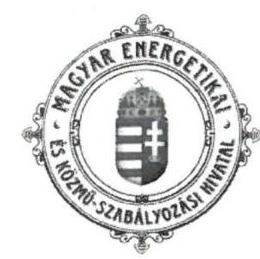

550
Mallai H.
1054 Budapest, Bajcsy-Zsilinszky út 52. $\cdot$ Tel.: +36 1 459 7777 $\cdot$ www.mckh.hu

Domokos László
elnök részére

Iktatószám: 3202011141-1
Készítette: Jogi-és Humánpolitikai
Főosztály
Tel: 06-1- 459-7884
ÁLLAMI SZÁMVEVŐSZÉK
BE-22 789/2014/1
Eken: 2017 APR 06.
Tisztestin: V-1152-152/2016
55-1141/1st

# Tárgy: A Magyar Energetikai- és Közmü- szabályozási Hivatal ellenörzése 

Tisztelt Elnök Úr!

Hivatkozással az Állami Számvevőszék fenti tárgyú, 2017. március 20. napján kézhez vett jelentésében foglaltakra tájékoztatom a T. Elnök Urat, hogy a Magyar Energetikai és KözműSzabályozási Hivatal a jelentéstervezetben foglaltakra észrevételt az alábbi kivétellel nem tesz:

A jelentéstervezet 27. oldalán a T. Számvevőszék javaslatot fogalmazott meg a MEKH elnöke részére, hogy intézkedjen a fökönyvi számlaszámok tekintetében a számlarend aktualizálásáról. A fenti javaslattal összefüggésben tájékoztatom a T. Elnök Urat, hogy a Magyar Energetikai és Közmü-szabályozási Hivatal 2016. január 16-i hatálybalépéssel új számlarendet adott ki (2/2016. MEKH szabályzat a Magyar Energetikai és Közműszabályozási Hivatal Számlarendjéről), mely a jogszabályi előírásoknak megfelelően tartalmazta a Hivatalnál gyakorlatban alkalmazott fökönyvi számlaszámokat, az azokra történő elszámolás rendjét. A Hivatal a Számlarendet 2016. október 17-i hatálybalépéssel aktualizálta az időközben bekövetkezett változásoknak megfelelően, a 16/2016. MEKH szabályzattal, melyet levelem melléklekeként másolatban megküldök Elnök Úr részére.

Elnök Úr és valamennyi kollégája Hivatalunk ellenőrzése során tanúsított munkáját valamint a jelentéstervezet észrevételezésének lehetőségét megköszönöm.

Budapest, 2017. április 4.
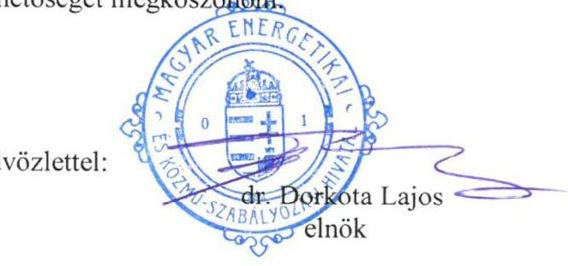

Melléklet: 1 pld 2/2016. sz. szabályzat, valamint az azt módosító 16/2016. sz. szabályzat

---

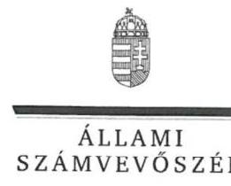

ELNÖK

Ikt.szám: V-1152-153/2016.

# Dr. Dorkota Lajos úr 

elnök
Magyar Energetikai és Közmű-szabályozási Hivatal

## Budapest

## Tisztelt Elnök Úr!

„A Magyar Energetikai és Közmü-szabályozási Hivatal ellenörzése" címmel készített számvevőszéki jelentéstervezetre tett észrevételét köszönettel megkaptam.

Az Állami Számvevőszék észrevételre vonatkozó álláspontjáról a felügyeleti vezető által készített tájékoztatást csatoltan megküldőm.

Tájékoztatom Elnök urat, hogy a számvevőszéki jelentésben - az Állami Számvevőszékről szóló 2011. évi LXVI. törvény 29. § (3) bekezdése alapján - a figyelembe nem vett észrevételt szerepeltetjük a kapcsolódó indokolás feltüntetésével.

Budapest, 2017. 0 hó 16 nap
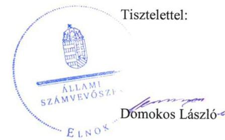

Melléklet: Tájékoztatás az észrevételek kezeléséről

---

# Tájékoztatás   az észrevételek kezeléséről 

„A Magyar Energetikai és Közmü-szabályozási Hivatal" címủ jelentéstervezetre 2017. április 7 -én érkezett észrevételét áttekintettük, annak kezelésével kapcsolatban a következő tájékoztatást adom.

## 1. A Magyar Energetikai és Közmü-szabályozási Hivatal elnöke részére megfogalmazott javaslat

A jelentéstervezet 2.1. számú megállapítás 3. bekezdésében az Állami Számvevőszék a 2015. évi számlarend aktualizálásának elmaradására tett megállapítást. Ez alapozta meg a javaslatot. A számlarenddel kapcsolatos tájékoztatást köszönjük. Az észrevételükben jelzett új számlarend kiadására és annak aktualizálására az ellenőrzött időszakot követően került sor, ezért a jelentéstervezetben foglalt javaslat módosítása nem indokolt.

Budapest, 2017. 04. hó 18. nap

Makkai Mária
felügyeleti vezető

---

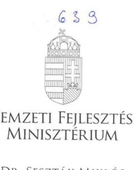

# Iktatószám: EFO/16992-1/2017-NFM 

Ügyintéző: Simonné Hábencius Gizella
Telefonszám: 79-54405
E-mail:gizella.habencius.simonne@nfm.gov.hu
Hiv. szám: V-1152-149/2016.

## Domokos László

elnök
részére
Állami Számvevőszék

## Budapest

Apáczai Csere János u. 10.
1052

Tárgy: Jelentéstervezet véleményezése

## Tisztelt Elnök Úr!

Köszönettel vettem kézhez „A Magyar Energetikai és Közmü-szabályozási Hivatal ellenörzése" címmel készített számvevőszéki jelentéstervezetet.

A jelentéstervezetre az alábbi észrevételt tesszük:
A jelentéstervezet 17. oldalán szereplő, belső ellenőrzésre vonatkozó megállapítás:
„A jogelöd Hivatal 2012. évre belső ellenőrzési tervet a Bkr. 22. § (1) bekezdés b) pontjában, és a 31. §-ában elöirtak ellenére nem készített."

---

A megállapítást kérjük pontosítani, mivel az NFM nyilvántartása szerint a Hivatal 2012. évre készített kockázatelemzéssel alátámasztott belső ellenőrzési tervet, melynek aláírt példányai ugyan nem, de szerkeszthető, word és excel formátumai rendelkezésre állnak.

A Hivatal a tervet határidőre megküldte a felügyeletet ellátó NFM részére, így a tervadatok szerepelnek az NFM által összeállított tárca szintű éves tervben. A tárca szintű éves terv aláírt példányát mellékeljük, melynek mellékleteiben a 9-es sorszám alatt szerepelnek a Magyar Energia Hivatal adatai.

Budapest, 2017. április ,, 7. ,

Üdvözlettel:
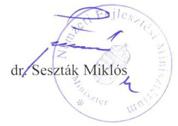

---

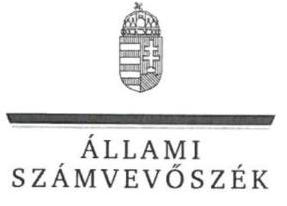

ELNÖK

Ikt.szám: V-1152-159/2016.

# Dr. Seszták Miklós úr 

miniszter
Nemzeti Fejlesztési Minisztérium

## Budapest

## Tisztelt Miniszter Úr!

„A Magyar Energetikai és Közmü-szabályozási Hivatal ellenörzése" címmel készített számvevőszéki jelentéstervezetre tett észrevételét köszönettel megkaptam.

Az Állami Számvevőszék észrevételre vonatkozó álláspontjáról a felügyeleti vezető által készített tájékoztatást csatoltan megküldöm.

Tájékoztatom Miniszter urat, hogy a számvevőszéki jelentésben - az Állami Számvevőszékről szóló 2011. évi LXVI. törvény 29. § (3) bekezdése alapján - a figyelembe nem vett észrevételt szerepeltetjük a kapcsolódó indokolás feltüntetésével.

Budapest, 2017.
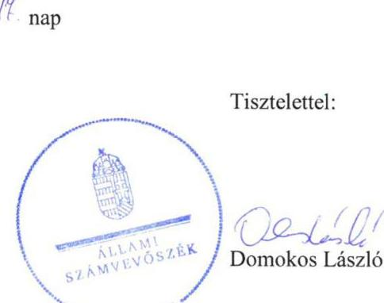

Melléklet: Tájékoztatás az észrevételek kezeléséről

---

# Tájékoztatás   az észrevételek kezeléséről 

„A Magyar Energetikai és Közmü-szabályozási Hivatal ellenörzése" címủ jelentéstervezetre 2017. április 20-án érkezett észrevételét áttekintettük, annak kezelésével kapcsolatban a következő tájékoztatást adom.

1. A jelentéstervezet 17 oldalán szereplő megállapítás: „A jogelöd Hivatal 2012. évre belsö ellenörzési tervet a Bkr. 22. § (1) bekezdés b) pontjában, és a 31. §-ában elöirtak ellenére nem készített."

Észrevételük szerint a Nemzeti Fejlesztési Minisztériumnál nem áll rendelkezésre a 2012. évre vonatkozóan elkészített, aláirt belső ellenőrzési terv, amely megerősíti az ÁSZ megállapítását. A szerkeszthető formátumban elkészített belső ellenőrzési terv nem tekinthető hiteles ellenőrzési bizonyítéknak. Mindezekre tekintettel az ÁSZ a megállapítását továbbra is fenntartja, annak módosítása nem indokolt.

Budapest, 2017. mifj hó 11. nap
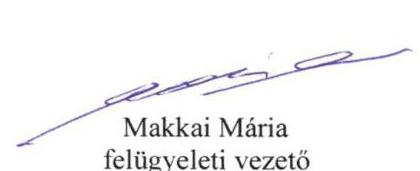

---

# RÖVIDÍTÉSEK JEGYZÉKE 

${ }^{1}$ kormány ${ }^{2}$ öt gazdasági vezető

${ }^{3}$ jogelőd Hivatal
${ }^{4}$ Hivatal
${ }^{5}$ ÁSZ
${ }^{6}$ MEH
${ }^{7}$ MEKH
${ }^{8}$ NFM
${ }^{9}$ irányító szerv
${ }^{10}$ Áht.
${ }^{11}$ alapító okirat ${ }_{1}$
${ }^{12}$ Ávr.
${ }^{13}$ alapító okirat ${ }_{2}$
${ }^{14}$ Ksztv.
${ }^{15}$ miniszterelnök
${ }^{16}$ MEKH tv.
${ }^{17}$ alapító okirat ${ }_{3}$
${ }^{18}$ alapító okirat ${ }_{4}$
${ }^{19}$ SZMSZ $_{1}$
${ }^{20}$ SZMSZ $_{2}$
${ }^{21}$ NFM körlevél
${ }^{22}$ javaslat
${ }^{23}$ Ügyrend ${ }_{1,2}$

Magyarország Kormánya
gazdasági vezetö ${ }_{1} \quad$ munkakör betöltve 2013.03.17-ig
gazdasági vezetö ${ }_{2} \quad$ munkakör betöltve 2013.07.31-ig
gazdasági vezetö ${ }_{3} \quad$ munkakör betöltve 2013.08.01-2013.09.03
gazdasági vezetö ${ }_{4} \quad$ munkakör betöltve 2013.09.05-2013.10.11.
gazdasági vezetö ${ }_{5} \quad$ munkakör betöltve 2013.10.16-tól
Magyar Energia Hivatal, a Magyar Energetikai és Közmű-szabályozási Hivatal jogelődje, 2013. április 03-ig
Magyar Energetikai és Közmű-szabályozási Hivatal 2013. április 04-től
Állami Számvevőszék
Magyar Energia Hivatal
Magyar Energetikai és Közmű-szabályozási Hivatal
Nemzeti Fejlesztési Minisztérium, mint a jogelőd Magyar Energia Hivatal irányító szerve 2013. április 03-ig
a Hivatal irányító szerve 2013. április 3-ig a Nemzeti Fejlesztési Minisztérium, 2013. április 4-től a Hivatal
2011. évi CXCV. törvény az államháztartásról (hatályos 2012. január 1-jétől)

NFM/42/42/2011. iktatószámon kiadott Magyar Energia Hivatal alapító okirata (hatályos 2012. 11.14-ig)
368/2011. (XII.31.) Korm. rendelet az államháztartásról szóló törvény végrehajtásáról
NFM /15924/10/2012. iktatószámon kiadott Magyar Energia Hivatal alapító okirata (hatályos 2012.11.14-től)
2010. évi XLIII. tv. a központi államigazgatási szervekről, valamint a Kormány tagjai és az államtitkárok jogállásáról
Magyarország miniszterelnöke
2013. évi XXII. tv. a Magyar Energetikai és Közmű-szabályozási Hivatalról (hatályos: 2013. április 4-étől)
JIFO-02-2/2/2013 iktatószámon kiadott, a Magyar Energetikai és Közműszabályozási Hivatal alapító okirata (hatályos 2013.április 04-től)
2015 JHFO-205/43-3 iktatószámon kiadott, a Magyar Energetikai és Közműszabályozási Hivatal 2015. május 27-én kelt egységes szerkezetbe foglalt alapító okirata
az 51/2011. (XI.25.) NFM számú normatív utasítással kiadott MEH Szervezeti és Müködési Szabályzata
a 31/2012. (XI.16.) NFM normatív utasítással kiadott MEH Szervezeti és Müködési Szabályzata
ISZF/3422/2013_NFM körlevél a költségvetési beszámoló készítéséhez, kelte 2012. 02.11.

HR-2012/413-1 iktatószámú feljegyzés, a MEH 2012. évi egyéni teljesítmény értékelései ütemezésére, az egyéni teljesítményértékelési lap tartalmára, jóváhagyva 2012.11.15.
Ügyrends a 27/2010. számú elnöki utasítás a Gazdasági és Humánpolitikai Főosztály ügyrendje, Ügyrends A MEKH Gazdasági Főosztályának ügyrendje

---

${ }^{24}$ Éves munkaterv ${ }_{1,2}$
${ }^{25}$ SZMSZ ${ }_{3}$
${ }^{26}$ Közszolgálati szabályzat ${ }_{1,2}$
${ }^{27}$ Hivatásetikai kódex
${ }^{28}$ Számviteli politika $_{1,2}$
${ }^{29}$ Bizonylati rend ${ }_{1,2}$
${ }^{30}$ Pénzkezelési szabályzat ${ }_{1,2}$
${ }^{31}$ Önklötség számítási szabályzat ${ }_{1,2}$
${ }^{32}$ Számv. tv.
${ }^{33}$ Áhsz $_{1}$
${ }^{34}$ Áhsz $_{2}$
${ }^{35}$ Értékelési szabályzat ${ }_{1}$
${ }^{36}$ Leltározási szabályzat ${ }_{1}$
${ }^{37}$ Számlarend $_{2}$
${ }^{38}$ Belföldi és külföldi kiküldetések ${ }_{1,2}$
${ }^{39}$ Reprezentációs kiadások eljárásrendje ${ }_{1,2}$
${ }^{40}$ Gépjármú használatának eljárásrendje ${ }_{1,2}$
${ }^{41}$ Telefonok használatának eljárásrendje ${ }_{1}$
${ }^{42}$ Gazdálkodási szabályzat ${ }_{1}$
${ }^{43}$ Gazdálkodási szabályzat ${ }_{2}$
${ }^{44} \mathrm{Bkr}$.
${ }^{45}$ Szabálytalanságkezelési eljárásrend ${ }_{1,2}$

Éves munkaterv ${ }_{1}$ a MEH 2012. évre vonatkozó munkaterve; Éves Munkaterv ${ }_{2}$ a MEKH 2015. évi munkaterve
1/2015. (II 9.) MEKH utasítás 1. számú melléklete a Hivatal Szervezeti Müködési Szabályzata
Közszolgálati szabályzat ${ }_{1}$ a 25/2010. számú elnöki utasítás Kormánytisztviselői jogviszonyról, Közszolgálati szabályzat ${ }_{2}$ a 2/2015 (VI. 8) MEKH utasítás a MEKH közszolgálati szabályzatáról
21/2015. szabályzat a MEKH Hivatásetikai Kódexéről
Számviteli politika ${ }_{1}$ a 2/2011. (XII. 9.) MEH utasítás a Hivatal számviteli politikájáról, számlarendjéről és számlatükörről, Számviteli politika ${ }_{2}$ a 18/2015. MEKH szabályzat a MEKH számviteli politikájáról
Bizonylati rend ${ }_{1} 21 / 2010$. elnöki utasítás a MEH Bizonylati szabályzatáról, Bizonylati rend ${ }_{2} 20 / 2015$. MEKH szabályzat a MEKH Bizonylati szabályzatáról
Pénzkezelési szabályzat ${ }_{1} 19 / 2009$ elnöki utasítás a MEH Pénzkezelési szabályzatáról, Pénzkezelési szabályzat ${ }_{2} 11 / 2015$ MEKH szabályzat a MEKH Pénzkezelési szabályzatáról
Önklötség számítási szabályzat ${ }_{1} 26 / 2010$ elnöki utasítás a MEH Önklötség számítási szabályzatáról, Önklötség számítási szabályzat ${ }_{2} 29 / 2015$ MEKH szabályzat a MEKH Önklötség számítási szabályzatáról
2000. évi C. törvény a Számvitelről (Hatályos 2001. január 1-jétől
249/2000. (XII. 24.) kormányrendelet az államháztartás szervezetei beszámolási és könyvvezetési kötelezettségének sajátosságairól (hatályon kívül 2013. december 31.)
4/2013. (I. 11.) Korm. rendelet az államháztartás számviteléről (hatályos 2014. január 1-jétől
Értékelési szabályzat ${ }_{1} 14 / 2008$ elnöki utasítás a MEH eszközök és források értékelési szabályzatáról
14/2009 elnöki utasítás elnöki utasítás a MEH Leltározási és leltárkészítési szabályzatáról
A Hivatal 2015. évben hatályos Számlarendje
Belföldi és külföldi kiküldetések ${ }_{1} 8 / 2009$. elnöki utasítás a MEH kiküldetések rendjéről, Belföldi és külföldi kiküldetések ${ }_{2} 9 / 2014$. MEKH szabályzat a MEKH kiküldetések rendjéről
Reprezentációs kiadások eljárásrendje ${ }_{1} 11 / 2010$ Elnöki utasítás a MEH reprezentációs és protokolláris kiadások felhasználásáról, Reprezentációs kiadások eljárásrendje ${ }_{2} 6 / 2013$. MEKH szabályzat a MEKH reprezentációs és protokolláris kiadások felhasználásáról
Gépjármú használatának eljárásrendje ${ }_{1} 20 / 2009$ Elnöki utasítás a MEH gépjármúvek hivatali célú felhasználásáról, Gépjármú használatának eljárásrendje ${ }_{2} 3 / 2014$ MEKH szabályzat a MEKH gépjármúvek üzemeltetéséről
1/2015 MEKH szabályzat a MEKH vezetékes és mobil telefonok használati rendjéről
8/2010. elnöki utasítása a MEH gazdálkodási szabályzatáról, 2012. évben hatályos
a MEKH 2015-ben hatályos gazdálkodási szabályzata
370/2011. (XII.31.) Korm. rendelet a költségvetési szervek belső kontrollrendszeréről és belső ellenőrzéséről. (Hatályos 2012. január 1-jétől
Szabálytalanságkezelési eljárásrend ${ }_{1} 12 / 2010$. elnöki utasítás a Szabálytalanságkezelés eljárásrendjéről, Szabálytalanságkezelési eljárásrend ${ }_{2}$ 10/2014. MEKH szabályzat a Szabálytalanságkezelés eljárásrendjéről

---

${ }^{46}$ Kockázatkezelési szabályzat
${ }^{47}$ Ptk.
${ }^{48}$ FEUVE
${ }^{49}$ Info tv.
${ }^{50}$ Panaszok kivizsgálásának rendje 1,2
${ }^{51}$ Iratkezelési szabályzat ${ }_{1,2}$
${ }^{52}$ Kincstár
${ }^{53}$ Hivatal elnöke
${ }^{54}$ átadás-átvételi jegyzőkönyv
${ }^{55}$ 2010.évi XLII. tv.
${ }^{56}$ NGM rendelet
${ }^{57}$ Vet.
${ }^{58}$ Get.
${ }^{59}$ Tszt.
${ }^{60}$ Vksztv.
${ }^{61} \mathrm{Ht}$.
${ }^{62}$ 1/2014. (III.4.) MEKH rendelet
${ }^{63}$ külföldi kiküldetési szabályzat
${ }^{64}$ MNV Zrt.
${ }^{65}$ Vagyonkezelői szerződés
${ }^{66}$ Nvtv.
${ }^{67}$ Vtv.
${ }^{68}$ Vtvr.
${ }^{69}$ Leltározási szabályzat ${ }_{2}$
${ }^{70}$ Ket.

22/2015 MEKH utasítás a MEKH Kockázatkezelési szabályzatáról (módosította a 40/2015 MEKH utasítás)
Polgári Törvénykönyv
folyamatba épített, előzetes utólagos és vezetői ellenőrzés
2011. évi CXII. törvény az információs önrendelkezési jogról és az információszabadságról (hatályos 2011. július 27.-étől)
Panaszok kivizsgálásának rendje1 11/2001. számú Főigazgatói utasítás a fogyasztóvédelem részletes szabályairól (Hatályon kívül: 2015. július 22.) Panaszok kivizsgálás rendje2 33/2015 MEKH szabályzat a felhasználói panaszok kivizsgálásának rendjéről
Iratkezelési szabályzat ${ }_{1} 28 / 2009$. elnöki utasítás a MEH Iratkezelési szabályzatáról, Iratkezelési szabályzat ${ }_{2} 11 / 2014$ MEKH szabályzat az iratkezelés rendjéről (módosította a 8/2015.MEKH szabályzat)
Magyar Államkincstár
50/2010.(VII.1.) ME határozattal kinevezett Elnök
MEH/MEKH elnöke munkakörének átadásáról készült 2013.07.02-készült jegyzőkönyv
Magyar Köztársaság minisztériumainak felsorolásáról szóló tv.
5/2012. (III. 1.) számú rendelet
a villamos energiáról szóló 2007. évi LXXXVI. törvény
a földgázellátásról szóló 2008. évi XL. törvény
a távhőszolgáltatásról szóló 2005. évi XVIII. törvény
a víziközmű-szolgáltatásról szóló 2011. évi CCIX. törvény
a hulladékról szóló 2012. évi CLXXXV. törvény
1/2014. (III.4.) MEKH rendelet a Magyar Energetikai és Közmű-szabályozási Hivatal igazgatási szolgáltatási díjainak mértékéről, valamint az igazgatási szolgáltatási, a felügyeleti díjak és egyéb bevételek beszedésére, kezelésére, nyilvántartására és visszatérítésére vonatkozó szabályokról
8/2009. számú Elnöki utasítás Az ideiglenes - 3 hónapot meg nem haladó külföldi kiküldetések engedélyezéséről, a pénzügyi kérdések szabályozásáról és az útijelentés készítéséről, hatályos 2009. március 2-től
Magyar Nemzeti Vagyonkezelő Zrt.
MNV Zrt. és MEH között létrejött SZT-33126. számú szerződés (2010. április 23.) és módosításai
2011. évi CXCVI. törvény a nemzeti vagyonról
2007. évi CVI. törvény az állami vagyonról

54/2007. (X. 4.) Korm. rendelet az állami vagyonnal való gazdálkodásról
15/2015 MEKH szabályzat a MEKH Leltározási és leltárkészítési szabályzatáról 2004. évi CXL. törvény a közigazgatási hatósági eljárás és szolgáltatás általános szabályairól

---

# ÁLLAMI SZÁMVEVŐSZÉK 

1052 Budapest, Apáczai Csere János utca 10.
Levélcím: 1364 Budapest 4. Pf. 54
Telefon: +36 14849100 Telefax: +36 14849200
www.asz.hu