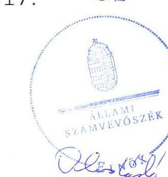
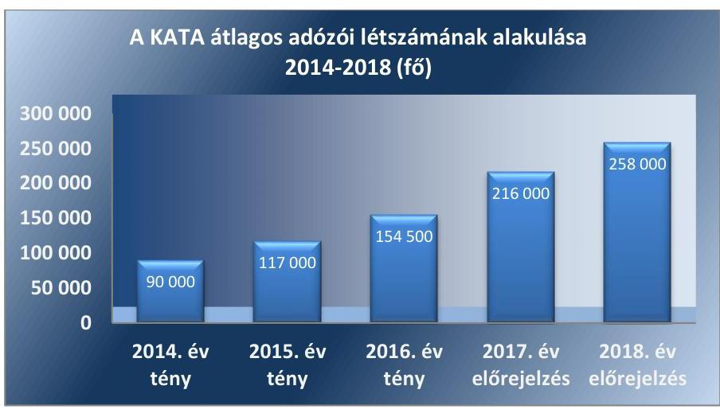
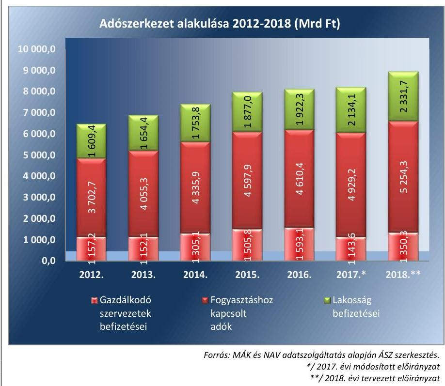
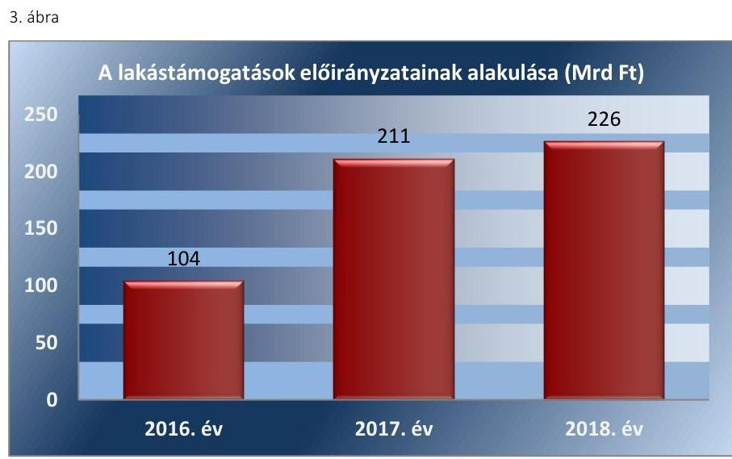
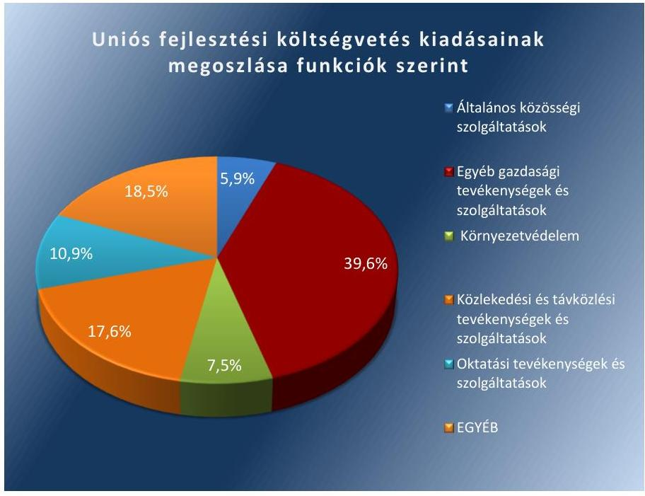

# Vélemény a 2018. évi költségvetésről 

Vélemény Magyarország 2018. évi központi költségvetéséről szóló törvényjavaslatról
2017.

---

# Vélemény a 2018. évi költségvetésről 

Vélemény Magyarország 2018. évi központi költségvetéséről szóló törvényjavaslatról
2017. ๑5 hó 12 nap

---

# AZ ELLENŐRZÉST FELÜGYELTE:

- **HOLMAN MAGDOLNA JULIANNA** felügyeleti vezető
- **AZ ELLENŐRZÉST VEZETTE ÉS A VÉGREHAJTÁSÁÉRT FELELŐS:**
  - **DR. SIMON JÓZSEF** ellenőrzésvezető
  - **A PROGRAM ÖSSZEÁLLÍTÁSÁÉRT FELELŐS:**
    - **TÓTPÁL SZABOLCS** osztályvezető

**IKTATÓSZÁM:** EL-0025-419/2017.

**Jelentéseink az Országgyűlés számítógépes hálózatán és az Interneten a www.asz.hu címen is olvashatóak.**

**TÉMASZÁM:** 2168

**ELLENŐRZÉS-AZONOSÍTÓ SZÁM:** V0787

---

# TARTALOMJEGYZÉK 

■ ÖSSZEGZÉS ..... 5
■ A VÉLEMÉNYADÁS CÉLJA ..... 6
■ A VÉLEMÉNYADÁS TERÜLETE ..... 7
■ A VÉLEMÉNYADÁS HÁTTERE, INDOKOLTSÁGA ..... 8
■ FÓKUSZKÉRDÉSEK ..... 9
■ VÉLEMÉNYADÁS HATÓKÖRE ÉS MÓDSZEREI ..... 10
■ ÁSZ VÉLEMÉNYEK ..... 12
■ MELLÉKLETEK ..... 49
I. sz. melléklet: Értelmező szótár ..... 49
II. sz. melléklet: A költségvetés részben megalapozott, nem megalapozott és kockázatos kiadási előirányzatai ..... 51
III. sz. melléklet: A költségvetésben pozitív kockázatot hordozó bevételi előirányzatok ..... 52
IV. sz. melléklet: A költségvetésben megjelenő kiemelt kormányzati beruházások ..... 53
■ RÖVIDÍTÉSEK JEGYZÉKE ..... 55

---

.

---

# ÖSSZEGZÉS 

A 2018. évi költségvetésről szóló törvényjavaslat megfelel a hazai és uniós hiány, illetve államadósság-szabályoknak. A tervezés szabályszerűen történt. A költségvetési törvényjavaslat egésze megalapozott, a bevételi előirányzatok megalapozottak és a kiadási előirányzatok alátámasztottak. A törvényjavaslat hozzájárul a költségvetés stabilitásához és fenntarthatóságához.

## A véleményadás társadalmi indokoltsága

A véleményadás során súlyponti kérdésként kezeljük, hogy az Állami Számvevőszékről szóló 2011. évi LXVI. törvény 5. § (1) bekezdése alapján az Állami Számvevőszék törvényi kötelezettségének teljesítésével támogassa a megalapozott döntéshozatalt annak érdekében, hogy az Országgyűlés a követelményeknek megfelelő költségvetési törvényt fogadhasson el.

A véleményadás keretében az Állami Számvevőszék rámutat a 2018. évi költségvetésvetésről szóló törvényjavaslatban azonosított kockázatokra, amely kezelése hatékonyan és megfelelő időben megtörténhet. A véleményadás megállapításai támogatják a költségvetés tervezéséért felelős intézményeket és szervezeteket illetve a költségvetési szerveket is a megalapozott költségvetési tervek elkészítésében.

## Főbb vélemények, következtetések

A 2018. évi költségvetési törvényjavaslat elkészítése során a tervezést végző szervezetek az előírásoknak megfelelően jártak el, a törvényjavaslat szerkezete és tartalma megfelel a jogszabályi előírásoknak, ezáltal teljesíti a felelős költségvetési gazdálkodás alapkövetelményét.

A feltételezett gazdasági növekedés elérése mellett a GDP arányos hiány és államadósság-mutató, egy kivétellel, megfelel a hazai és az uniós előírásoknak. A 2,4\%-os strukturális egyenleg nem biztosítja a középtávú költségvetési hiánycéllal való összhang követelményét. Az államadósság-mutató 1,9 százalékpontos csökkenése további implicit tartalékot jelent a magyar költségvetés számára. Az eladósodottsági szint csökkenése megteremti a lehetőségét a gazdaságfejlesztési és más fontos társadalmi célok elérését szolgáló intézkedések megvalósítására.

A központi költségvetés számára ugyanakkor kiemelt feladatot jelent a hiány alacsony szinten tartása, megelőzve a hiány és közvetetten az államadósság kedvezőtlen irányba történő változását. A gazdasági növekedés és az európai uniós módszertan szerinti hiány 3\% alatti értéke megfelelő implicit tartalékot jelent a különböző intézkedések számára illetve egyéb váratlan hatások ellen. Ugyanakkor a költségvetési döntések során továbbra is konzekvens költségvetési gazdálkodás szükséges a központi és helyi szinten valamint a kormányzati szektorba sorolt egyéb szervezeteknél egyaránt.

A Magyarország 2018. évi központi költségvetési törvényjavaslat bevételi előirányzatai teljes körűen megalapozottak, a kiadási előirányzatok 90,6\%-a megalapozott, 8,68\%-a részben megalapozott és 0,72\%-a nem megalapozott. A véleményadás által feltárt kockázatok megfelelő költségvetési intézkedésekkel kezelhetőek, továbbá az Országvédelmi Alapban rendelkezésre álló forrás elegendő biztonsági tartalékot jelent a költségvetési kockázatok kivédésére.

---

# A VÉLEMÉNYADÁS CÉLJA 

A véleményadás célja annak értékelése, hogy a központi költségvetési törvényjavaslat összeállítása megfelel-e a jogszabályi előírásoknak, a törvényjavaslat bevételi és kiadási előirányzatait, valamint a költségvetési évet követő három év tervezett előirányzatainak keretszámait a makrogazdasági előrejelzéseket is figyelembe véve tervezték$\cdot$ e meg; biztosították-e a tervezésnél alkalmazott módszerek, háttérszámítások, hatástanulmányok, valamint az állami szabályozó eszközök javasolt módosításai a törvényjavaslat megalapozottságát.

Értékeljük, hogy az Alaptörvényben és a Gst-ben foglaltak alapján érvényesül-e államadósság-szabály, számításba vették-e az EU tagság pénzügyi, gazdasági hatásait.

---

# A VÉLEMÉNYADÁS TERÜLETE 

A véleményadás során az ÁSZ értékeli, hogy a központi költségvetési törvényjavaslat összeállítása szabályszerűen történt-e; Magyarország 2018. évi központi költségvetéséről szóló törvényjavaslat bevételi és kiadási előirányzatai, valamint a költségvetési évet követő három év tervezett előirányzatai keretszámainak megtervezése szabályszerű volt-e, a tervezett előirányzatok megalapozottak illetve alátámasztottak-e, az Alaptörvényben és a Gst-ben foglaltak alapján érvényesül-e az államadósság-szabály.

Az ÁSZ törvény 5. § (13) bekezdése alapján az ÁSZ év közben figyelemmel kíséri a 2017. évi költségvetés végrehajtását, ennek keretében év közben ellenőrizheti a költségvetés teljesítésének egyes elemeit és a KT 2017. évi feladattervének megfelelően a 2017. első félévi költségvetési folyamatokról elemzést készít a KT részére.

---

# A VÉLEMÉNYADÁS HÁTTERE, INDOKOLTSÁGA 

Az ÁSZ törvényi kötelezettségének teljesítésével véleményezi a költségvetési törvényjavaslatot rámutatva annak kockázataira. Ezáltal támogatja az országgyűlési képviselőket a jogszabályi követelményeknek megfelelő költségvetési törvény elfogadásában.

Az ÁSZ törvény 5. § (13) bekezdése alapján az ÁSZ elemzéseket és tanulmányokat készít, ezek rendelkezésre bocsátásával segíti a Költségvetési Tanácsot feladatai ellátásában. Az ÁSZ a 2018. évi központi költségvetés véleményezéséhez kapcsolódó elemzésekben véleményt nyilvánít a 2018. évi költségvetési törvényjavaslatról, az államadósság-mutató kidolgozására vonatkozó eljárásokról, a tervezett államadósság összegét megalapozó számításokról, azok alátámasztottságáról, valamint a 2018. évi költségvetési törvényjavaslat parlamenti zárószavazását megelőzően az Alaptörvényben és a Gst-ben rögzített államadósság szabály érvényesüléséről, vagyis arról, hogy a törvényjavaslat elfogadásához szükséges feltételek teljesültek-e.

---

# FÓKUSZKÉRDÉSEK 

1. A központi költségvetési törvényjavaslat összeállítása az irányadó szabályoknak megfelelően történt-e?
2. A Magyarország 2018. évi költségvetési törvényjavaslata tervezetében foglalt bevételi és kiadási előirányzatok megalapozottak-e és a bevételi előirányzatok teljesíthetőek-e?

---

# VÉLEMÉNYADÁS HATÓKÖRE ÉS MÓDSZEREI 

## A véleményadás típusa

Értékelés.

## A véleményadással érintett időszak

A véleményadással érintett időszak: 2018.

## A véleményadás tárgya

A 2018. évi központi költségvetésről szóló törvényjavaslat összeállításának szabályszerűsége, a tervezés megalapozottsága, az előirányzatok alátámasztottsága, megalapozottsága, teljesíthetősége valamint az államadó-ság-szabály érvényesülése.

## A véleményadásban érintett szervezetek

Nemzetgazdasági Minisztérium, Belügyminisztérium, Emberi Erőforrások Minisztériuma, Földművelésügyi Minisztérium, Honvédelmi Minisztérium, Igazságügyi Minisztérium, Külgazdasági és Külügyminisztérium, Miniszterelnökség, Nemzeti Fejlesztési Minisztérium Nemzeti Adó- és Vámhivatal, Nemzeti Egészségbiztosítási Alapkezelő (korábban Országos Egészségbiztosítási Pénztár), Országos Nyugdíjbiztosítási Főigazgatóság, Államadósság Kezelő Központ Zrt., Magyar Államkincstár.

## A véleményadás jogalapja

Az ÁSZ tv. 1. § (3), 5. § (1) bekezdéseiben foglaltak.

## A véleményadás módszerei

Az elemzést a végrehajtáshoz készített program kérdései, a véleményadási időszakban hatályos jogszabályok, az irányadó ÁSZ módszertan figyelembevételével végeztük (Módszertani útmutató a Magyarország központi költségvetéséről szóló törvényjavaslat véleményezését megalapozó ellenőrzéshez).

A program által meghatározott módszertan a bevételi előirányzatok megalapozottságára és a kiadási előirányzatok alátámasztottságára vonatkozóan valamennyi meghatározó előirányzatnál (beleértve az európai

---

uniós fejlesztési költségvetésbe tartozó előirányzatokat is) egységesen került alkalmazásra.

Az ÁSZ véleményének kialakításához szükséges bizonyítékok megszerzése az ellenőrzött szervezetek által rendelkezésre bocsátott dokumentumokra, adatokra alapozva megfigyelés, szemle (szemrevételezés), kérdésfeltevés (információkérés), mintavételezés, valamint elemző eljárás útján történt.

A véleményadáshoz az ellenőrzött szervezetek a tanúsítványok és monitoring táblázatok kitöltésével, valamint az ÁSZ által kért dokumentumok megküldésével szolgáltattak adatokat.

A véleményadás lefolytatása során figyelembe vettük a T/15429. számú Magyarország 2018. évi központi költségvetésének megalapozásáról valamint a T/15428. számú az egyes adótörvények és más kapcsolódó törvények módosításáról szóló törvényjavaslatokat valamint az Európai Bizottság részére a Kormány által benyújtott Magyarország 2017-2021. évekre vonatkozó Konvergencia Programját.

---

# 1. A központi költségvetési törvényjavaslat összeállítása az irányadó szabályoknak megfelelően történt-e? 

Összegző vélemény

1.1. számú vélemény

A központi költségvetési törvényjavaslat előkészítése és tartalma megfelel az irányadó szabályoknak. A 2018. évi költségvetési törvényjavaslat tervezése során egy kivétellel, betartották a hiány- és államadósság szabállyal kapcsolatos előírásokat.

A központi költségvetési törvényjavaslat összeállításának folyamata az irányadó szabályoknak megfelelően történt. A központi költségvetés tervezete megfelel a jogszabályi előírásoknak és összhangban van Magyarország aktuális Konvergencia Programjával.

A Kormány a jogszabályi előírásoknak megfelelően 2017. május 2-án benyújtotta a Magyarország 2018. évi központi költségvetéséről szóló T/15381. számú törvényjavaslatot az Országgyűlésnek.

A 2018. évi költségvetési törvényjavaslat a 2017. évi költségvetési törvényjavaslat felépítésével megegyező szerkezetben mutatja be a 2018. évi költségvetési előirányzatokat, azokat hazai müködési, illetve felhalmozási és uniós fejlesztési kiadásokra és bevételekre bontva, ezáltal biztosítva a költségvetési előirányzatok jobb átláthatóságát valamint az előző évvel való összehasonlíthatóságot.

A Kormány a Gst. 5/A. § és az Ávr. 14/A. § előírásainak megfelelően a honlapján is közzétett, a gazdaságpolitikai intézkedések makrogazdasági hatásai számszerűsítésének eljárásait tartalmazó ún. Dinamo (Dinamikus Nemzeti számlák Alapú Modell) előrejelzési módszertant felhasználta a tervezés során.

Az államháztartásért felelős miniszter az Áht. rendelkezéseinek megfelelően a fejezetet irányító szervekkel való egyeztetések és a kormányzati szektorba sorolt egyéb szervezetek, valamint a besorolás szempontjából statisztikai módszertani vizsgálat alá vett jogi személyek adatszolgáltatásai alapján készítette el a költségvetési törvényjavaslatot. A költségvetési törvényjavaslatban az Áht. előírásának megfelelően az Áht. 14. § (3) - (4) bekezdései alá tartozó fejezetek kizárólag központi kezelésű előirányzatokat tartalmaznak, továbbá az Áht. előírásának megfelelően a költségvetési szervek a fejezeteken belül címet alkotnak.

A Kormány a költségvetési törvényjavaslatban - összhangban a Konvergencia Programmal - a 2018. évre 4,3\%-os gazdasági növekedést (GDP) határozott meg. Mindez a 2017. évi tervezett gazdasági növekedéshez képest 0,2 százalékponttal magasabb növekedési ütemet jelent. A gazdasági növekedéshez nagymértékben hozzájárul a lakosság rendelkezésére álló jövedelem emelkedése, annak fogyasztást élénkítő hatása valamint a

---

bruttó állóeszköz-felhalmozás Kormány által előrejelzett 12,9\%-os tervezett növekedése.

A 2018. évi költségvetés tervezése során 10,4\%-os bruttó bér-és keresettömeg növekedéssel és 8,8\%-os bruttó átlagkereset növekedéssel számoltak, amely egyaránt mutatkozik a magán- és a kormányzati szektorban egyaránt.

A bér- és keresetnövekedési intézkedések a 2017. évet követően tovább folytatódnak a központi költségvetéshez tartozó szervezeteknél - a közszolgálati dolgozók körében, a fegyveres és rendvédelmi ágazatban, az egészségügyben, a Nemzeti Adó és Vámhivatal foglalkoztatottjainál, a járási és megyei kormányhivatalok munkatársainak körében. Az életpálya- és bérnövekedési programok hatása megmutatkozik a központi alrendszer személyi juttatásokra fordítani tervezett előirányzat értékben. E jogcímen a 2018. évben 2407,2 Mrd Ft kerül felhasználásra a költségvetési törvényjavaslat szerint, amely a 2017. évi személyi juttatások előirányzatnál 13,1\%-kal magasabb. A 2017. évtől eltérően a 2018. évi költségvetést terhelő személyi juttatások kiadásai többségében az egyes fejezetek költségvetési előirányzataiba épülnek be a céltartalékok helyett.

A 2018. évi költségvetési törvényjavaslat (a 2017. évre előrejelzett 3\%os inflációs rátát figyelembe véve) a 2018. évre vonatkozóan változatlan nagyságú inflációs rátával számolt.

A Kormány az Európai Bizottság részére 2017. április 30-ig benyújtotta Magyarország 2017-2021. évekre vonatkozó, középtávú tervdokumentumnak tekinthető Konvergencia Programját. Ennek kidolgozása az előző évhez hasonlóan a költségvetési tervezéssel egyidejűleg zajlott.

# 1.2. számú vélemény 

A 2018. évi költségvetési törvényjavaslatban meghatározott hiánycél megfelel a Gst. 3/A. § (2) bekezdés b) pontja szerinti követelménynek, ugyanakkor nem teljesíti a középtávú költségvetési hiánycélt.

A 2018. évi költségvetési törvényjavaslat a központi alrendszer hiányát 1 360,7 Mrd Ft-ban állapítja meg, amely a nullszaldósan tervezett múködési költségvetés mellett a felhalmozási költségvetés 857,3 Mrd Ft-os és az európai uniós fejlesztési költségvetés 503,4 Mrd Ft-os tervezett hiányából tevődik össze.

A 2018. évben az államháztartás pénzforgalmi hiánya a költségvetési törvényjavaslat szerint a GDP 2,9\%-a lesz. Ennek értékét leginkább a központi költségvetés 3,2\%-os GDP arányos hiánya határozza meg, az elkülönített állami pénzalapok 0,1\%-os hiánya, a helyi önkormányzatok 0,5\%-os többlete és a TB alapok nullszaldós egyenlege mellett.

Az államháztartás fentiek szerint meghatározott 2,9\%-os pénzforgalmi hiányából kiindulva a törvényjavaslat általános indokolásának V. fejezete részletesen levezeti, hogy ebből az egyenlegből milyen összefüggések és százalékos mértékek alapján állapítható meg a kormányzati szektor uniós módszertan szerinti hiánya, amelyet a 479/2009/EK rendelet szerint kell kiszámítani. A levezetés szerint a kormányzati szektor hiányának a bruttó hazai termék előre jelzett mértékének (40 353 Mrd Ft) a hányadosa százalékban kifejezve 2,4\%. Ez alatta marad a Gst. 3/A § (2) bekezdés b) pontjában meghatározott 3\%-os értéknek, ezáltal megfelel ezen előírásnak.

---

A Kormány az Áht. 22. § (3) bekezdés d) pontja előírásának megfelelően a központi költségvetésről szóló törvényjavaslat indokolásában ismerteti a kormányzati szektornak a Gst. 1. § e) pontja szerinti strukturális egyenlegét. A 2,4\%-os uniós módszertan szerinti hiánynak a költségvetési törvényjavaslat indokolásában foglaltak szerint 2,4\%-os strukturális egyenleg felel meg.

A 2018. évre tervezett 2,4\%-os strukturális egyenleg a Gst. 3/A § (2) bekezdés a) pontjában előírtak ellenére nincs összhangban a központi költségvetés fejezeti szintű 2017-2019. évi bevételi és kiadási középtávú tervszámairól szóló 1827/2016. (XII. 23.) Korm. határozat által meghatározott 1,8\%-os középtávú költségvetési hiánycéllal.

Magyarország 2017-2021. évekre szóló Konvergencia Programja a középtávú uniós módszertan szerint számított költségvetési hiánycélt 2018ig 2,4\%-ban jelzi előre, majd 2019-től folyamatosan csökkenő pályát határoz meg.

A 2017. év első három hónapját pénzforgalmi szemlélet szerint a központi költségvetés 168,6 Mrd Ft-os, a társadalombiztosítás pénzügyi alapjai 45,9 Mrd Ft-os deficittel, míg az elkülönített állami pénzalapok 16,4 Mrd Ft-os szufficittel zárták. A központi alrendszer negatív egyenlege 198,1 Mrd Ft volt, ami a 2017. évre tervezett hiánycél 17,0\%-a.
2017. I negyedévében a hiány előző évinél kedvezőtlenebb alakulásában szerepet játszott, hogy a központi költségvetés 2017. január-március havi 2 706,0 Mrd Ft kiadásai az előző év azonos időszakához képest 159,1 Mrd Ft-tal (6,2\%-kal) magasabb összegben realizálódtak. E kiadások növekedésében meghatározó indok volt a szakmai fejezeti kezelésű előirányzatok uniós kiadásainak előző évhez viszonyított 92,0 Mrd Ft-os (57,4\%-os), valamint a költségvetési szervek kiadásainak 127,5 Mrd Ft-os (13,1\%-os) növekménye. A költségvetési szervek kiadásainak első 3 havi időarányos teljesítése $27,2 \%$-os.

A 2018. évi költségvetési célok teljesüléséhez megfelelő feltételt teremt, hogy a 2017. évre tervezett 3,1\%-os (uniós módszertan szerinti 2,4\%os) GDP arányos hiány várhatóan teljesül.

A bázis időszaki adatok ellenére nem lehet kizárni, hogy a makrogazdasági folyamatok 2018-ban az előre jelzettnél kedvezőtlenebbül alakulnak. Ezért érzékenységi vizsgálatot végeztünk arra vonatkozóan, hogy az uniós módszertan szerint számított hiány a feltételek milyen változása esetén teljesíti a Gst. 3/A (2) bekezdés b) pontja szerinti feltételt. Az érzékenység vizsgálat eredményét lásd az 1. sz. táblázatban. Ennek eredménye azt mutatja, hogy az említett követelmény akkor nem teljesülne, ha az - a tervezett GDP növekedés mellett - a hiány további 242,2 Mrd Ft-ot meghaladó mértékben nőne, vagy pedig a nominális GDP - a tervezett hiány mellett nem érné el a 32 280,0 Mrd Ft-ot. A hiány teljesülése szempontjából tehát a 2018. évi tervezett nominális GDP 8073,0 Mrd Ft tartalékot tartalmaz. Ezen összefüggéseket mutatja be az 1. táblázat.

---

A hiánycél teljesülésének határai a 2018. évben (Mrd Ft)

|  | 2017. év | 2018. év | 2018. év |  |  |
| :--: | :--: | :--: | :--: | :--: | :--: |
|  |  |  | Tervezett GDP | Tervezett hiány | Tervezett GDPminimális GDP |
|  | Várható | Tervezett | Maximális hiány | Minimális nominális GDP | Maximális hiánytervezett hiány |
| Nominális GDP | 37491,8 | 40353,0 | 40353,0 | 32280,0 | 8073,0 |
| Hiány | 899,8 | 968,4 | 1210,6 | 968,4 | 242,2 |

Forrás: ÁSZ számítás Magyarország 2018. évi központi költségvetéséről szóló törvényjavaslat adatai alapján

Az implicit tartalék 2018. évi nagyságrendjében emelkedés figyelhető meg ( $+8 \%$ ) az előző évhez képest, amely egyfajta biztonságot jelent a Gst. 3/A (2) bekezdés b) pontjának betartásához az esetlegesen bekövetkező, kedvezőtlen gazdasági illetve költségvetési folyamatok esetén.

# 1.3. számú vélemény 

A 2018. évi költségvetési törvényjavaslat alapján az államadósságmutató csökkenést mutat, ez alapján teljesíti az adósság-szabállyal kapcsolatos előírásokat.

Az államadósság-mutató számításakor a Gst. 2. § (1) bekezdés a) pontja értelmében a konszolidált korrigált államadósságot vették figyelembe, amelynek 2018. december 31-i várható értéke 28 043,6 Mrd Ft lesz. A mutató nevezőjében a Gst. 2. § (1) bekezdés b) pontja szerinti bruttó hazai termék értékét rögzítették, amelynek 2018. december 31-i tervezett értéke 40 353,0 Mrd Ft. Ebből következően a számított államadósság-mutató 2018. december 31-i várható mértéke 69,5\%. A mutató értéke az Alaptörvény 36. cikk (5) bekezdésében meghatározott legalább 0,1\%-os csökkenésre vonatkozó követelménynek - a 2017. évi GDP arányos 71,4\%-os érték figyelembe vételével - eleget tesz. A mutató értékének csökkenése a 2017. év végi várható értékhez képest 1,9 százalékpont.

Mivel az infláció és a GDP növekedési üteme közül kizárólag a gazdasági növekedés üteme haladja meg a 2018. évben előreláthatóan a 3\%-os értéket, ezért a Gst. 4. § (2) bekezdése alapján az államadósság-mutatót oly módon kell meghatározni, hogy az államadósság-mutatónak a 2017. évhez viszonyított csökkenése legalább 0,1 százalékpontot érjen el. A kritériumnak a 2018. évi költségvetési törvényjavaslat megfelel.

A 2018. évi költségvetési törvényjavaslatban szereplő államadósságráta eleget tesz az Európai Unió adósságszabályának is. Lévén az állam-adósság-ráta meghaladja a GDP 60\%-át, a csökkenési ütemének teljesítenie kell az un. "egyhuszados szabályt". Ezen előírás Magyarország számára nagyságrendileg 0,7\%-os csökkenést jelent, amely szintén teljesül a tervezett 1,9\%-os csökkenés mellett.

A Tervezési Tájékoztató meghatározta azon 44 szervezetet, amelynek adatszolgáltatását az ESA 2010 alapján a hiány és adósságállomány megállapításánál a 2018. év költségvetése tervezésekor figyelembe kell venni. A szervezetek az adósság számításához szükséges adatokat rendelkezésre

---

bocsátották. A kormányzati szektor adósságának a költségvetési év utolsó napjára vonatkozó tervezett értékének meghatározásához a Gst. 2. § (1) bekezdés a) pontja által érintett szervezetek adatot szolgáltattak az államháztartásért felelős miniszter számára.

A központi költségvetés adósságát kezelő ÁKK Zrt. elkészítette a 2018. évi finanszírozási tervet illetve az ezt megalapozó adattáblát és számításokat. 2018. év végére a központi alrendszer Gst. szerint korrigált adóssága várhatóan 28 043,6 Mrd Ft-ra nő. A konszolidált, korrigált államadósság 2017. évi várható összege 26771 Mrd Ft. Ezek alapján az idei évhez képest nominálisan az államadósság 1 272,6 Mrd Ft-tal növekszik a 2018. évben.

A 2018. évi költségvetési törvényjavaslat szerint az önkormányzati alrendszer adósságának 2017. évi várható értéke 150,0 Mrd Ft, a 2018. évre vonatkozóan megtervezett adóssága 240,0 Mrd Ft, amely az előző évi várható érték 160\%-a. A 240,0 Mrd Ft-os tervezett adósság a teljes államadósság 0,86\%-a. A Gst. 2. § (4) bekezdése szerint a kormányzati szektorba sorolt egyéb szervezetek adósságának 2017. évi várható értéke 318,7 Mrd Ft, a 2018. december 31-re tervezett adósságuk összesen 314,3 Mrd Ft. Az összeget a rendszeres adatszolgáltatásra kötelezett szervezetek adatai alapozták meg.

A 2018. évi költségvetési törvény későbbi végrehajtását alapvetően befolyásolja az elfogadásakor alkalmazott makrogazdasági prognózisok és az ezekben szereplő paraméterek változása. Ezért is kiemelt jelentőségű az ilyen hatások kivédését szolgáló, elegendő nagyságú implicit tartalék rendelkezésre állása.

Az implicit tartalék nagyságát az általunk végzett 2. táblázatban bemutatott érzékenység-vizsgálat szemlélteti, amely megmutatja, hogy mekkora mozgásteret tartalmaz az államadósság-mutató összetevőire (konszolidált, korrigált államadósság és nominális GDP) a prognózis, az államadósságszabály teljesülése mellett. Az érzékenység vizsgálat elvégzéséhez a 2018. évi költségvetési törvényjavaslatban meghatározott adatokat használtuk fel, amely a 2017. év végére 71,4\%-os és a 2018. év végére 69,5\%-os ál-lamadósság-mutatót prognosztizál.
2. táblázat

Az államadósságcél teljesülésének határai a 2018. évben (Mrd Ft)

|  | 2017. év | 2018. év | 2018. év |  |  |  |
| :--: | :--: | :--: | :--: | :--: | :--: | :--: |
|  |  |  | Tervezett GDP | Tervezett államadósság |  | Tervezett GDP-minimális GDP |
|  | Várható | Tervezett | Maximális államadósság | Minimális nominális GDP | Minimális reál GDP növekedés | Maximális állam-adósság-tervezett államadósság |
| Nominális GDP | 37491,8 | 40353,0 | 40353,0 | 39276,8 | 1,9\% | 1076,2 Mrd Ft |
| Államadósság | 26771,0 | 28043,6 | 28812,0 | 28043,6 | 28043,6 | 768,4 Mrd Ft |

Forrás: ÁSZ számítás Magyarország 2018. évi központi költségvetéséről szóló törvényjavaslat adatai alapján

A számítás alapján az államadósság-szabály akkor nem teljesülne, ha az államadósság - tervezett GDP növekedés mellett - további, 768,4 Mrd Ftot meghaladó mértékben nőne, vagy pedig a reál GDP növekedési üteme - a tervezett államadósság mellett - nem érné el az 1,9\%-ot.

---

# 2. A Magyarország 2018. évi költségvetési törvényjavaslata tervezetében foglalt bevételi és kiadási előirányzatok megalapozottak-e és a bevételi előirányzatok teljesíthetőek-e? 

Összegző vélemény

2.1. számú vélemény

A 2018. évi központi költségvetési törvényjavaslat előirányzatai megalapozottak, a bevételi előirányzatok teljesíthetőek.

A fejezetek tervezéséért felelős szervezetek a tervezési eljárást szabályszerűen hajtották végre.

A fejezetek tervezéséért felelős szervezetek a tervezési eljárás során az Áht., az Ávr., valamint egyes fejezetek esetében az ágazati jogszabályok vonatkozó rendelkezései, továbbá az államháztartásért felelős miniszter által közzétett szempontok figyelembevételével jártak el.

A tervezett bevételeknek és a kiadásoknak az egyeztetése - a fejezetet irányító szervek és az államháztartásért felelős miniszter között - 2017. április első hetéig megtörtént. Az egyeztetési folyamatot követően a tervezett bevételeket és kiadásokat a fejezetet irányító szervek véglegezték, az előirányzatokat minden esetben rögzítették a Költségvetési Adatcserélő Rendszerben.

A 2018. évi költségvetésről szóló törvényjavaslatban szereplő előirányzatok esetében a véleményadás a bevételi főösszeg 88,69\%-ra, a kiadási főösszegnek pedig a 80,26\%-ára terjedt ki. Az ellenőrzött bevételi előirányzatok 100\%-a, valamint a kiadási előirányzatok 90,6\%-a megalapozott, 8,68\%-a részben megalapozott és 0,72\%-a nem megalapozott.

A 2018. évi költségvetési törvényjavaslatban a költségvetési szervek és fejezeti kezelésű előirányzatok tervezett kiadási összege 9021,0 Mrd Ft, a tervezett bevételeik összege 1364,0 Mrd Ft, amely mintegy 38,4\%-os növekedést jelent a 2017. évi előirányzatokhoz képest. Ennek értékelésekor figyelembe kell venni, hogy az államháztartás bevételi főösszegének 13,7 \%-a a költségvetési szervektől és fejezeti kezelésű előirányzatoknál jelentkezik. A költségvetési szervek és fejezeti kezelésű előirányzatok tervezett kiadása az államháztartás központi alrendszere tervezett kiadásai között 44,8 \%-os arányt képvisel.

A felülről nyitott előirányzatok kiadásai összesen 9844,7 Mrd Ft értéket tesznek ki, amely a 2018. évi központi költségvetés tervezett kiadási főöszszegének közel 49\%-át jelenti. E részarány valamelyest csökkent a 2017. évhez képest, amikor ez az arány 53,5\%-ot ért el. A felülről nyitott előirányzatok jellemzője, hogy a kiadás jóváhagyás nélkül eltérhet a tervezett értéktől. Emiatt alapvetően fontos az eredményes és hatékony költségvetési gazdálkodás szempontjainak figyelembe vétele.
2.2. számú vélemény

A költségvetés közvetlen bevételei és kiadásai fejezet ellenőrzött bevételei összességében megalapozottak, kockázatot nem hordoznak. Az adóbevételek biztosításához nélkülözhetetlenek az adófehérítést támogató költségvetési intézkedések.

A 2018. évi költségvetési törvényjavaslat-tervezetben az adó- és adó jellegű bevételek tervezésénél az NGM figyelembe vette a 2017. évi várható

---

teljesülési, a 2017. évi költségvetési törvény, valamint e törvény módosítására vonatkozó javaslat előirányzatainak bázisát képező 2016. évi bevételek előzetes teljesítési adatait. Az ÁSZ véleményét megalapozó ellenőrzés időszakában rendelkezésünkre álltak az egyes adótörvények és más kapcsolódó törvények módosításáról szóló jogszabály-tervezetek.

A 2017. év első negyedévi költségvetési folyamatok alapján az ellenőrzött bevételi előirányzatok körében jelentősebb elmaradást nem állapítottunk meg. A 2018. évi tervezés bázisául szolgáló 2017. évi várható teljesítések az NGM prognózisa szerint egyes adónemek esetében meghaladják az eredetileg tervezett előirányzatot, ami szükségessé tette néhány a költségvetés közvetlen bevételi előirányzatának módosítását. A 2017. évi költségvetés módosítására vonatkozó törvényjavaslat a 3. táblázatban felsorolt közvetlen bevételi előirányzatoknál javasolt előirányzat módosítást.
3. táblázat

EGYES KÖZVETLEN BEVÉTELI ELŐIRÁNYZATOK ALAKULÁSA (MRD FT)

| Előirányzat megnevezése | 2017. évi eredeti   előirányzat | 2017. évi törvény-   javaslat módosítás | Eltérés   összege |
| :-- | :--: | :--: | :--: |
| Társasági adó | 734,7 | 595,7 | -139 |
| Kisadózók tételes adója | 75,5 | 94,5 | 19 |
| Kisvállalati adó | 13,5 | 23,5 | 10 |
| Általános forgalmi adó | 3542,0 | 3542 | 0 |
| Jövedéki adó | 1034,5 | 1068,5 | 34 |
| Személyi jövedelemadó | 1792,5 | 1903,5 | 111 |
| Lakossági illetékek | 155,2 | 178,2 | 23 |
| Megtett úttal arányos díj | 154,5 | 169,9 | 15,4 |

A 2018. évi költségvetés közvetlen bevételi előirányzatainak tervezése során az NGM figyelembe vette a makrogazdasági mutatókra vonatkozó gazdasági előrejelzéseket, az ezt alátámasztó számítások, indoklások rendelkezésre álltak, a szerkezeti változásokat a tervezés során figyelembe vették.

Minden közvetlen bevételi előirányzat esetén számításba vették és értékelték az előirányzatot megalapozó bázis évi várható és időarányos teljesítéseket valamint a 2017. évi költségvetési törvény módosításáról szóló törvényjavaslatban foglalt változások hatásait. A bevételi előirányzatok teljesítését befolyásoló jogszabály módosítási javaslatokat előterjesztették, azokat indokolták.

A 2018. évi költségvetés közvetlen bevételi előirányzatai megalapozottak, a kormányzat makrogazdasági előrejelzéseinek teljesülése esetén az előirányzott adóbevételek teljesülése összességében nem hordoz kockázatot.

A központi költségvetés gazdálkodásának biztonsága szempontjából alapvető fontosságúak a gazdaság fehérítését szolgáló intézkedések.

Ezen célt szolgálja a 2017. évben elindult a NAV Stratégiai Megújulása Program, amelynek első intézkedései a 2018. évben járulnak hozzá a költségvetési bevételek növeléséhez. A tervezett intézkedések közé tartozik például az ügyfél kommunikáció javítása, a jogkövetés elősegítése valamint az adóelkerülő magatartás veszélyét automatikusan jelző informatikai fej-

---

lesztések. Ez utóbbi eszközök a feketegazdasággal továbbra is érintett ágazatokra összpontosítanak. A Program által becsült költségvetési bevétel növekedés értéke együttesen 21 Mrd Ft a 2018. évben.

A 2017. évben tervezett intézkedések közé tartozik az online számlázási rendszer bevezetése, amely főként az általános forgalmi adó bevételek növekedését érinti pozitívan és meghatározó szempontot jelent a 2018. évi általános forgalmi adóbevétel előirányzat teljesülése szempontjából.

A T/15429. számú Magyarország 2018. évi központi költségvetésének megalapozásáról valamint a T/15428. számú az egyes adótörvények és más kapcsolódó törvények módosításáról szóló törvényjavaslat az egyes adónemek esetében a hatályos szabályozás pontosítását, adókedvezmények bevezetését illetve megszüntetését továbbá eljárási szabályokra vonatkozó módosítást tartalmaznak.

A törvényjavaslatok tervezett intézkedései között szerepel a 2018. évi költségvetési törvényjavaslat általános forgalmi adó előirányzatában is figyelembe vett fogyasztási célú hal, valamint az internet-szolgáltatás adókulcsának mérséklése. Emellett az adótörvények változásának fontos eleme a növekedési adóhitelnél a fizetési halasztás esetén fizetendő kamatkötelezettség bevezetése és az adófizetés elkerülését szolgáló intézkedések (például a dohánytermékek esetén a jövedéki adóval azonos időben szükséges az általános forgalmi adót megfizetni, az adófizetési biztosíték megállapításával kapcsolatos rendelet megalkotása). Ezen tervezett intézkedések fontos eszközt jelentenek a bevételek és jövedelmek kifehérítése érdekében.

# Vállalkozások költségvetési befizetései 

A társasági adó 2018. évi előirányzata 362,6 Mrd Ft, ami 233,1 Mrd Ft$\mathrm{tal}(39,1 \%-\mathrm{kal})$ elmarad a 2017. évi módosított előirányzattól.

Az adónem tervezett 2017. évi módosított előirányzata 595,7 Mrd Ft, ami 139,0 Mrd Ft-tal (18,9\%-kal) alacsonyabb az eredeti előirányzatnál. Az előirányzat módosítása során figyelembe vették a társasági adókulcs 2017. január 1-től egységesen 9\%-ra történő csökkenését, valamint a növekedési adóhitelből származó átmeneti bevétel növekedést. Az adókulcs egységes csökkenése együttesen 211 Mrd Ft bevételcsökkenést eredményezett a 2016. évi teljesítési adathoz képest. A növekedési adóhitel következtében a 2017. évben 27 Mrd Ft többletbevétel várható.

Az előirányzat 2018. évi tervezése során figyelembe vették a folyóáras GDP alakulását. Az adóalap esetében 7,6\%-os növekedéssel számoltak, ami az egységes adókulcs mellett 33,3 Mrd Ft számított adó növekedést jelent a 2017. évi várható összeghez képest.

A befolyó adóbevételek nagyságát meghatározó tényező az is, hogy a kedvezőbb adózási feltételek mellett várhatóan magasabb lesz az adózási hajlandóság. A regionális összehasonlításban is alacsonyabb adókulcs befolyásolhatja a vállalkozások társasági adóval kapcsolatos döntéseit, amely megjelenik az adózók számának növekedésében, illetve az összesített adóalap növekedésében. Az adózási hajlandóság ilyen formájú változása központi kérdés a társasági adó esetén. A 2018. évi költségvetés tervezése során az adónem esetében e hatás nem került figyelembe vételre.

A NAV Stratégiai Megújulása Program intézkedései hozzájárulnak majd az előirányzat tervezett értéken való teljesüléséhez. Várhatóan ezen intézkedés 3 Mrd Ft többletbevétellel jár a 2018. évben.

---

A 2015. évben igénybe vett növekedési adóhitelhez kapcsolódó visszafizetések várhatóan megtörténnek a 2017. év végéig, ami a 2018. évben bevételcsökkentő hatású (együttesen -266,9 Mrd Ft). Az adókedvezmények és az adóról való rendelkezések és a rendelkező nyilatkozatok után járó adójóváírás összege várhatóan 5,8 Mrd Ft-tal növekszik a 2017. évi várható összeghez képest, amely szintén csökkenti a 2018. évi bevétel nagyságát.

A bevételi előirányzat megalapozott, az előirányzat kialakítását a számítások, indoklás alátámasztják, jogszabályi háttere biztosított, értéke összhangban van a makrogazdasági előrejelzésekkel, az előirányzat nem hordoz kockázatot.

A KATA 2018. évi előirányzata 113,0 Mrd Ft, ami 18,5 Mrd Ft-tal (19,6\%kal) haladja meg a 2017. évi módosított előirányzatot. Az adónem esetében a bevétel növekedésének fő indoka a 19,4\%-os átlagos adózói létszám növekedése, amely a 2018. évben eléri várhatóan a 258 ezer főt.

Az átlagos adózói létszám növekedését a 2017. évtől érvényes jogszabályváltozás magyarázza. Eszerint az adónem bevételi értékhatára 6 millió Ft helyett 12 millió Ft-ra emelkedett. E jogszabályváltozás következtében a 2017. évben várhatóan az átlagos adózói létszám tovább növekszik és év végére eléri a 216 ezer főt. E változást mutatja be az 1. ábra.

1. ábra

Forrás: NAV adatszolgáltatás
A bevételi előirányzat vonatkozásában jogszabály változás nem várható. Az előirányzat kialakítása megalapozott, a bevételi előirányzat teljesíthető, nem tartalmaz kockázatot.

A KIVA 2018. évi előirányzata 27,2 Mrd Ft, ami 3,7 Mrd Ft-tal (15,7\%kal) magasabb a tervezett 2017. évi módosított előirányzatnál.

A KIVA esetében is, hasonlóan a KATA-hoz, változtak a 2017. évben a jogszabályi előírások. Az adómérték 2017. január 1-től 16\%-ról 14\%-ra csökkent, amely a 2018. évtől további 1 százalékponttal csökken, és változott az adóalap meghatározása is, az adókötelezettség a tárgyidőszakban jóváhagyott osztalékra és a tőkemúveletek egyenlegére épül. A 2017. évtől változtak a jogosultsági feltételek is, az adónem a korábbinál szélesebb kör számára elérhető. E változások hatására a 2017. évi várható teljesítés jelentősen növekszik az előző évhez képest és e folyamat folytatódik a 2018. évben is. A 2018. évben az adókulcs csökkentésének hatását (-2,1 Mrd Ft)

---

kompenzálni fogja az átlagos adózói létszám- és az adóalap nagyságának bővülése.

A bevételi előirányzat megalapozott, teljesülése nem hordoz kockázatot.

A pénzügyi szervezetek különadójának 2018. évi előirányzata 50,4 Mrd Ft, ami 16,1 Mrd Ft-tal (24,2\%-kal) marad el a 2017. évi előirányzattól. Az előirányzat kialakítása az EBRD-vel kötött megállapodás szerinti csökkentett, 0,21\%-os adómértékkel, valamint a 2014. évi beszámolók adatai alapján történt. Továbbá figyelembe vették, hogy a hitelintézetek adócsökkentő kedvezményt érvényesíthetnek a vállalkozások számára történő hitelkihelyezések bővítése esetén.

Az előirányzat tervezése megalapozott, teljesülése nem hordoz kockázatot.

Fogyasztáshoz kapcsolt adók
Az általános forgalmi adó 2018. évi előirányzata 3838,6 Mrd Ft, amely a 2017. évi előirányzatot 296,6 Mrd Ft-tal (8,4\%-kal) haladja meg.

A bevételek bázis alapú tervezésekor alapvetően a folyóáras lakossági vásárolt fogyasztás alakulását ( $9,1 \%$-os növekedés a 2017. évi várható értékhez képest) és az átlagos adókulcsot (22,1\%) vették figyelembe. A bevételeket befolyásolta a lakossági beruházások és az államháztartási szektor vásárlásainak növekedése, ami a számítások szerint 107,7 Mrd Ft többletbevételt eredményez.

Az előirányzat a tervezett ÁFA csökkentő intézkedések (a hal, az inter-net-szolgáltatás és az éttermi étkezés áfa kulcsának 5\%-ra való, a friss tej értékesítési ÁFA kulcsának 18\%-ra csökkentése) miatti adócsökkentő hatást együttesen 38 Mrd Ft összegben tartalmazza. A gazdaság fehérítését célzó intézkedésekből a 2017. évhez képest többlettel nem számoltak, a NAV Stratégiai Megújulása Program hatásaként 7 Mrd Ft többletbevétel várható.

A 2018. évi előirányzat megalapozott, a bevételi előirányzat teljesíthető, nem tartalmaz kockázatot.

A jövedéki adó 2018. évi előirányzata 1099,3 Mrd Ft, ami 30,8 Mrd Fttal (2,8\%-kal) haladja meg 2017. évi módosított előirányzatot. Az előirányzat tervezésekor a 2017. évben is alkalmazott 3,1\%-os bevétel növekedéssel számoltak, ami alacsonyabb a 2018. évre előjelzett folyóáras GDP növekedésnél (4,3\%). A NAV Stratégiai Megújulása Program hatására a várható többletbevétel ezen adónemnél 1 Mrd Ft. Az üzemanyagok, valamint az alkoholtermékek esetén szintén a gazdaság további élénkülésével számoltak. A dohánytermékek esetén a bevételeket a dohánypiac kereslet rugalmatlan jellege valamint a 2017. évben ismét emelkedő adókulcs hatása határozza meg.

A 2018. évi előirányzat megalapozott, a bevételi előirányzat teljesíthető, nem tartalmaz kockázatot. A gazdasági növekedés feltételezettnek megfelelő teljesülése esetén a jövedéki adóbevétel 10 Mrd Ft-os túlteljesülése prognosztizálható.

A pénzügyi tranzakciós illeték 2018. évi előirányzata 204,7 Mrd Ft, ami 1,0 Mrd Ft-tal (0,5\%-kal) alacsonyabb a 2017. évi előirányzatnál.

A bázisalapú tervezéskor figyelembe vették a 2016. év teljes évi, valamint a 2017. év rendelkezésre álló bizonylatsoros halmozott bevallási adatokat, valamint a bevételekről rendelkezésre álló teljesülési adatokat. A

---

2018. évi illeték alapját képező tranzakciók esetén a Magyar Államkincstárnál az illetékalap változatlanságával számoltak.

A piaci szolgáltatások esetén a készpénzes kifizetések forgalmának csökkenésével számoltak, amely 2,6 Mrd Ft-os illetékbevétel csökkenést okoz. Ezen kieső bevételt kompenzálja az alacsonyabb illetékkulcs alá tartozó illetékalap növekedéséből származó 3,8 Mrd Ft-os illetékbevétel bővülés.

Az előirányzat összességében megalapozott, teljesülése nem hordoz kockázatot.

# Egyéb költségvetési bevételek 

A megtett úttal arányos útdíj 2018. évi előirányzata 177,7 Mrd Ft, amely a 2017. évi módosított előirányzatot 7,8 Mrd Ft-tal (4,6\%-kal) haladja meg. Az előirányzat tervezésekor a 2017. évi első negyedéves teljesítési adatokat és a GDP növekedésére vonatkozó legfrissebb előrejelzést vették figyelembe. A feltételezett gazdasági növekedési ütem alátámasztja az előirányzat növekedését a 2018. évi törvényjavaslatban a 2017. évi módosított előirányzathoz képest, mert a gazdasági növekedés várhatóan pozitív hatást fejt ki az adó alapját jelentő megtett út nagyságára. Ugyanakkor a díjfizetés ellenében igénybe vehető útszakaszok bővítésével nem számoltak.

A 2018. évi előirányzat megalapozott, nem tartalmaz kockázatot.

## Lakosság költségvetési befizetései

A személyi jövedelemadó 2018. évi előirányzata 2090,2 Mrd Ft, ami a 2017. évi módosított előirányzatot 186,7 Mrd Ft-tal ( $9,8 \%$-kal) haladja meg.

Az adónemből származó bevételek növekedésének legfontosabb forrása a 2018. évben az összevontan adózó jövedelmek 10,1\%-os növekedése, amely valamelyest alacsonyabb, mint a bruttó bértömeg dinamika tervezett növekedése (10,4\%). A bevételek tervezése során a két növekedési ütem közötti 0,3\%-os különbség az adónem teljesülése szempontjából nagyságrendileg 6 Mrd Ft-os pozitív többletet jelent.

A 2017. évhez képest magasabb adóbevétel tervezése során az elkülönülten adózó jövedelmek, azon belül is az osztalékjövedelem további növekedésével számoltak (+7,7\%-os mértékben). A NAV Stratégiai Megújulása Program ezen adónem esetén várhatóan 2 Mrd Ft bevételnövelő hatást képes elérni. A 2018. évtől az ingatlan-bérbeadásból származó jövedelmet terhelő egészségügyi hozzájárulás megszűnése elősegíti a lakásbérletből származó jövedelmek kifehérítését. Az intézkedés hatásaként a 2018. évi bevétel várhatóan 7 Mrd Ft-tal növekszik.

A 2018. évben tovább folytatódik a családi adókedvezmények bővítése. Ennek keretében a két gyermekesek családi kedvezménye tovább növekszik (17,5 ezer Ft a 15 ezer Ft helyett) amely 15 Mrd Ft-os, a bruttó bér és keresettömeg emelkedése pedig további 6 Mrd Ft családi adókedvezmény növekedést okoz.

Összességében a bevételnövelő tényezők hatásaként a 2018. évi előirányzat tervezése megalapozott, teljesíthető.

A lakossági illetékek 2018. évi előirányzata 188,6 Mrd Ft értékű, amely a 2017. évi módosított előirányzatot 10,4 Mrd Ft-tal (+5,8\%-kal) haladja meg.

---

A bázis alapú tervezés során az ingatlanpiac felfutásából fakadó jelentősebb mértékű visszterhes ingatlan átruházási illeték növekedés várható. Ennek hatásaként a 2018. évre tervezett bevétel 9,2 Mrd Ft-tal növekszik. Mindezt a folyamatosan javuló ingatlanpiaci statisztikák is alátámasztják. Az öröklési és ajándékozási, illetve a gépjármú átruházási illeték esetében kismértékű növekedés lett figyelembe véve a bevételek tervezésekor.

A 2018. évi előirányzat megalapozott, nem hordoz kockázatot.
A 2012-2018. közötti adószerkezet alakulását a 2. ábra szemlélteti:
2. ábra

A költségvetés közvetlen bevételei és kiadásai fejezet ellenőrzött kiadásai jellemzően alátámasztottak, kockázatot nem hordoznak, kivéve a filmszakmai közvetett támogatásokat.

A lakástámogatások alcímen a 2018. évi költségvetési törvényjavaslatban 25,3 Mrd Ft múködési kiadást és 201 Mrd Ft felhalmozási kiadást, összesen 226,3 Mrd Ft-ot irányoztak elő. A 2018. évi előirányzat 15,0 Mrd Ft-tal ( $7,1 \%$-kal) magasabb az előző évi eredeti előirányzatnál.

A lakástámogatásokra fordított kiadásokat mutatja be a 3. ábra.

---

Forrás: Költségvetési törvények és a 2018. évi törvényjavaslat alapján ÁSZ szerkesztés
A lakástámogatások alcímen belül a legfontosabb támogatási formák közé tartozik a 2016 februárjában bevezetett családi otthonteremtési kedvezmény (CSOK), a lakás-takarékpénztári támogatás valamint az adó-viszszatérítési támogatás. Az egyes támogatási formákat elemenként különkülön megtervezték, számításokat, előrejelzéseket készítettek az igénylők, illetve az igénybe vevők számára és az igénylés jellemzőire vonatkozóan.

A CSOK 2018. évre tervezett összegéhez 12 ezer új lakást vásárló igénylővel, illetve 22 ezer használt lakást vásárló igénylővel számoltak. E célra összesen 126,7 Mrd Ft áll majd rendelkezésre.

A lakás-takarékpénztári megtakarítások állami támogatása az előző évi tendenciák, illetve a 2017. január-március havi teljesítési adatok alapján jelentős növekedéssel számolva a 2017. évi 54,4 Mrd Ft-nál lényegesen magasabb, a 2018. évre 71,1 Mrd Ft összeggel került megtervezésre. Az igénybevételi adatok és az előrejelzések alapján látható, hogy a lakástámogatások 2017. évhez képest tervezett növekményét a lakás-takarékpénztári megtakarítások állományának növekedése köti majd le.

A CSOK támogatások nyújtásánál fontos szempontot jelent, hogy az ingatlanpiacon az állami által generált keresletnövekedés vegye figyelembe a kínálat viszonylagos lassú reagáló képességét és ezáltal ne járjon jelentős ingatlan árnövekedéssel.

A lakáspiaci tendenciák élénkülést mutattak a 2016. évben. A felépült új lakások száma 9994 volt (31\%-os növekedés az előző évhez képest), illetve hogy a kiadott lakásépítési engedélyek és az új lakások építésére vonatkozó bejelentések száma 31559 volt, több mint két és félszerese a 2015. évhez képest. A lakásépítési engedélyek számának gyors emelkedése az építési kedv élénkülését jelzi, azonban ennek hatása jellemzően 2018tól érezteti a hatását a lakáspiacon. A CSOK támogatás fontos ingatlanpiaci befolyásoló eszköz a Kormány részéről, amellyel a keresleti oldal befolyásolható.

Az adó-visszatérítési támogatást a számítások szerint 6 ezren veszik igénybe. A 2018. évre 25,5 Mrd Ft adó-visszatérítési támogatással számoltak.

Az előirányzat 2018. évi értéke alátámasztott. Felülről nyitott kiadási előirányzatként célszerű figyelembe venni, hogy az egyes lakástámogatási

---

formáknál az igénylési feltételek változatlansága esetén növeli a kiadási előirányzat túllépésének kockázatot.

A szociálpolitikai menetdíj-támogatás kiadási előirányzata a közszolgáltatások keretei között az állam által jogszabályban biztosított utazási kedvezmények igénybevétele alapján az elmaradt szolgáltatói bevételek ellentételezését biztosító állami támogatás. A 2018. évre tervezett előirányzat 97,5 milliárd Ft.

A 2018. éves költségvetési törvényjavaslat készítéséhez rendelkezésre álló 2016. évi és 2017. évi első negyedévi teljesítés adatok alapján a kiadási előirányzat teljesülése várható, alátámasztott és kockázatot nem hordoz.

Az egyéb költségvetési kiadások 2018. évi előirányzata az előző évi eredeti előirányzathoz képest 42,4\%-kal magasabb összegben, 35 Mrd Ft öszszegben került megtervezésre. Ezen belül a felszámolással kapcsolatos kiadások előirányzata 3 Mrd Ft-ra, az 1\%-os SZJA közcélú felhasználásának összege 9,5 Mrd Ft-ra, az átmeneti hulladék-közszolgáltatással kapcsolatos kiadások 4 Mrd Ft-ra növekedett, illetve az egyéb vegyes kiadások korábbi összege a 2017. évhez képest több mint a duplájára, 11,8 Mrd Ft-ra emelkedett.

Az egyéb költségvetési kiadásokon belül részben megalapozott előirányzat a 2018. évben a filmszakmai közvetett támogatások mozgókép törvény szerinti kiegészítő finanszírozása 3 Mrd Ft értékben. Ezen jogcímcsoportok esetén nem állnak rendelkezésre megalapozó dokumentumok, de az előirányzat várhatóan elegendő lesz a kiadások teljesítésére.

Az Állam által vállalt kezesség és viszontgarancia érvényesítése kiadási előirányzatának 2018. évi tervezett összege 28,7 Mrd Ft, amely 7,8 Mrd Fttal $(37,1 \%)$ magasabb a 2017. évi előirányzatnál. Az alcímen történt növekedés hátterében jellemzően a Garantiqa Hitelgarancia Zrt. növekvő hitelportfóliója alapján a magasabb szinten várt fizetési kötelezettségek állnak. A 2017. évi 15140 M Ft kiadási előirányzathoz képest a 2018. évre 18 392,9 M Ft összeget terveztek a fizetési kötelezettségek fedezeteként. Az MFB Zrt. szöveges értékelése szerint a Garantiqa Hitelgarancia Zrt. garanciaügyleteiből eredő fizetési kötelezettségre a 2017. évi üzleti terv figyelembe vételével 18334 M Ft költségvetési forrást szükséges biztosítani, továbbá 62,9 M Ft biztonsági tartalékként került megtervezésre.

A jogcímcsoport keretében tervezett forrás összességében elegendő a feladatok ellátására, alátámasztott és összességében nem hordoz kockázatot.

A Pénzbeli kárpótlás előirányzaton tervezett 0,9 Mrd Ft és az 1947-es Párizsi Békeszerződésből eredő kárpótlás előirányzaton tervezett 2 Mrd Ft mindkét előirányzatnál 0,1 Mrd Ft-tal alacsonyabb az előző évi eredeti előirányzatnál. A tervszámhoz elemzések és számítások rendelkezésre állnak, ezek alapján az előirányzat alátámasztott.

A nemzetközi pénzügyi intézmények felé vállalt kötelezettségek kiadási előirányzatai a 2018. évi tervezés során a nemzetközi szervezetekben fennálló tulajdoni részarányokhoz, illetve tagságokhoz, valamint az együttműködési megállapodások alapján a programokhoz kapcsolódó hozzájárulások kiadásait vették figyelembe. A 2018. évi előirányzat összege 2,8 Mrd Ft, mely a 2017. évi eredeti előirányzattól jelentősen elmarad 5,9 Mrd Fttal. Ennek oka, hogy az IBRD (Nemzetközi Újjáépítési és Fejlesztési Bank) alaptőke értékállóságának biztosításához szükséges utolsó részlet a 2017.

---

# 2.4. számú vélemény 

évben kifizetésre került, a 2018. évben e célra előirányzat tervezése már nem volt indokolt. Az előirányzatok tervezett összege alátámasztott.

A Központi Nukleáris Pénzügyi Alap (KNPA) támogatására a 2018. évre 2,5 Mrd Ft előirányzatot terveztek, ami 24,3\%-kal kevesebb a 2017. évi 3,3 Mrd Ft-os összeghez képest. A KNPA részére folyósított költségvetési támogatás a KNPA várható állományának alakulása és a számított kamat alapján került meghatározásra. A támogatás a 2016. évtől kezdődően folyamatosan csökken. A kiadási előirányzat összege számításokkal alátámasztott, várhatóan elegendő a közfeladat finanszírozásához, nem tartalmaz kockázatot.

## A központi tartalék előirányzatok tervezése szabályszerűen történt, az előirányzatok alátámasztottak.

A költségvetési törvényjavaslatban a központi alrendszer tartalék-előirányzatai a XI. Miniszterelnökség fejezetben kerültek megtervezésre. A tartalék jellegű előirányzatok összege együttesen 257,05 Mrd Ft. A jogcímcsoporton belül található előirányzatok közül az Országvédelmi Alap tekinthető valódi költségvetési tartalékként, lévén a többi tartalék nem használható fel szabadon a költségvetési kockázatok kezelése érdekében.

## Szabad tartalék

Az Országvédelmi Alap kiadási előirányzatát, a 2017. évi eredeti előirányzattal megegyezően, 60,0 Mrd Ft összegben határozták meg. Felhasználhatóságáról a Kormány határozatban dönt az EDP jelentéshez kapcsolódó ütemezésben, az EDP hiány figyelembevételével, ami nem haladhatja meg a GDP 2,4\%-át, azaz az EU módszertan szerinti költségvetési hiánycélt. Az első jelentést követően (2018. március 31.) legfeljebb 30,0 Mrd Ft használható fel, a fenti feltételek teljesülése esetén.

Meghatározott célokra tervezett, felosztás előtti tartalékok
A rendkívüli kormányzati intézkedésekre a Miniszterelnökség fejezet 110,0 Mrd Ft kiadást tartalmaz, ami megegyezik a 2017. évi költségvetési törvényben elfogadottal. A tervezett kiadás a 2018. évi költségvetési kiadási főösszegnek (20 101,3 Mrd Ft ) a 0,55\%-a, ami megfelel az előírásnak, lévén magasabb mint a kiadási főösszeg 0,5\%-a. A tervezett előirányzat összege alátámasztott.

A Céltartalékok alcímen belül a közszférában foglalkoztatottak bér-kompenzációjára a 2017. évi kiadási előirányzattal megegyező összegű tervezés történt, a különféle kifizetésekre fordítható előirányzat pedig 3,6 Mrd Fttal csökkent. Jelentős mértékű, 69,2\%-os csökkenéssel számol a költségvetési törvényjavaslat az ágazati életpályák és bérintézkedések előirányzatánál. Az előirányzatot alátámasztó számítások alapján fedezetet nyújt a várható kiadásokra, kockázatot nem tartalmaz.

A szabad és az egyéb tartalékok alakulását a 4. táblázat mutatja be:

---

4. táblázat

# A MEGHATÁROZOTT CÉLOKRA FELHASZNÁLÁSRA KERÜLŐ TARTALÉKOK TERVSZÁMAI (MRD FT) 

| Megnevezés | 2016 | 2017 | 2018 |
| :-- | :--: | :--: | :--: |
| Rendkívüli kormányzati intézkedések | 120,0 | 120,0 | 110,0 |
| Céltartalékok | 161,4 | 205,2 | 87,05 |
| Forrás: Költségvetési törvények és 2018. évi törvényjavaslat |  |  |  |

Az egyes fejezeteknél ezen kívül fejezeti tartalékok is megtervezésre kerültek a 2018. évi költségvetési törvényjavaslatban, amelyek speciális, a fejezethez tartozó feladat finanszírozását szolgálják.
2.5. számú vélemény

Az európai uniós és EGT források tervezése a Tervezési Tájékoztató és a fejezet tervezését végző szervezetek belső szabályzatainak megfelelően történt. Az EGT, Norvég Alap támogatásából megvalósuló 2014-2021. közötti projektekre tervezett előirányzat részben megalapozott.

A Partnerségi Megállapodás alapján a 2014-2020. közötti programozási időszakban összességében 25,0 Mrd euró forrásallokációs fejlesztési kerettel számolhat Magyarország. A rendelkezésre álló összes forrás lehívása mellett elsődleges cél a gazdaságfejlesztési célú támogatások arányának növelése, a vállalkozások versenyképességének javítása.

A 2018. évi költségvetés tervezése a korábbi évek gyakorlatától eltérően az EU forrásból származó bevételeket nem a XIX. Uniós fejlesztések fejezeten belül tervezte meg, hanem az uniótól származó bevételek egységesen a XLII. fejezetben jelennek meg. A 2017. évben az uniós forrásból származó bevételek az uniós programok kiadásainak előirányzataival egy soron szerepeltek. A 2018. évi tervezési konstrukcióban az uniós programok kiadásai azonos összegű, központi költségvetési támogatási előirányzat mellett kerültek tervezésre. A tervezési módszer előnye, hogy az uniós bevételek érkezésének ütemétől függetleníthető az európai uniós fejlesztési költségvetésből finanszírozott kiadások teljesítése. A kifizetések biztosítása érdekében a XLII. fejezetbe érkező egyéb bevételek is felhasználhatóak a központi költségvetés számára.

A 2018. évi költségvetés tervezése során a fejezetek a 2014-2020. évi költségvetési ciklus alatt felhasználható uniós és hazai forrás bevételeit és kiadásait megtervezték.

Az Uniós fejlesztések fejezet európai uniós programjainak kiadási és azzal azonos összegű központi költségvetési támogatási előirányzatát az adott programért felelős tárcák és az adott program irányító hatóságának bevonásával a Miniszterelnökség a Tervezési Tájékoztatóban foglaltak alapján tervezte meg. Az EU-forrásból származó bevételeket az adott programért felelős tárca bevonásával az NGM szintén a Tervezési Tájékoztatóban foglaltak szerint tervezte meg.

A fejezet irányító szervek a vállalt nemzeti társfinanszírozás összegét a Kormány és az Európai Unió Bizottsága által jóváhagyott éves vagy több évre szóló szakmai programokban vállalt kötelezettségek figyelembevételével tervezték meg, továbbá a programok benyújtásakor megjelölt finanszírozási eszközt a költségvetés tervezésekor biztosították.

---

A 2018. évre vonatkozóan a XIX. Uniós fejlesztések fejezet meghatározóan a 2014-2020-as elszámolási időszakban megvalósításra kerülő programok előirányzatait tartalmazza. A 2007-2013-as uniós periódushoz tartozó a Nemzeti Stratégiai Referenciakeret és a Területi Együttmüködés programjaihoz kapcsolódóan tartalmazott összesen 2,7 Mrd Ft kiadási előirányzatot, ami a fejezet kiadásainak 0,1\%-át képezte.

A 2018. évi költségvetésben tervezett európai uniós források teljesítése szempontjából meghatározóak a 2017. évi folyamatok.

A Kormány szándékának megfelelően a jelentősebb nagyságrendű, 2014-2020 közötti időszakra vonatkozó, európai uniós források esetén 2017. I. negyedévének végéig megtörtént a pályázati lehetőségek meghirdetése. Ezt mutatja be az 5. táblázat.
5. táblázat

MEGHIRDETETT UNIÓS PÁLYÁZATI KIIRÁSOK 2017. MÁRCIUS 31-IG

| OP | Pályázati kiírások száma | Meghirdetett forráskeret |
| :--: | :--: | :--: |
|  | db | \% |
| EFOP | 124 | 102 |
| GINOP | 102 | 104 |
| IKOP | 5 | 100 |
| KEHOP | 47 | 109 |
| KÖFOP | 30 | 106 |
| MAHOP | 13 | 100 |
| RSZTOP | 5 | 100 |
| TOP | 69 | 107 |
| VEKOP | 47 | 106 |
| VP | 66 | 100 |
| Összesen | 508 | 104 |

A táblázat adatai alapján látható, hogy a pályázatok meghirdetése során a Kormány a rendelkezésre álló indikatív keretnél átlagosan 4\%-kal magasabb összegben hirdette meg a pályázatokat. Ennek célja, hogy az uniós források lehívása teljes körűen lehívásra kerüljön.

Az uniós források felhasználásával kapcsolatos további jellemzőket mutatja be a 6. táblázat.
6. táblázat

# AZ UNIÓS FORRÁSOK FELHASZNÁLÁSÁNAK ALAKULÁSA 2017. MÁRCIUS 31.-I ADATOK ALAPJÁN 

| OP | Elfogadott pályázatok   megoszlása | Megítélt támogatás az   indikatív keret \%-ában |
| :--: | :--: | :--: |
| EFOP | $3,4 \%$ | $27,0 \%$ |
| GINOP | $14,8 \%$ | $59,4 \%$ |
| IKOP | $0,2 \%$ | $67,5 \%$ |
| KEHOP | $2,8 \%$ | $77,6 \%$ |
| KÖFOP | $2,1 \%$ | $114,5 \%$ |
| MAHOP | $0,0 \%$ | $6,8 \%$ |
| RSZTOP | $0,0 \%$ | $99,4 \%$ |
| TOP | $2,1 \%$ | $27,8 \%$ |
| VEKOP | $0,1 \%$ | $47,0 \%$ |
| VP | $74,4 \%$ | $35,5 \%$ |
| Összesen | $100,0 \%$ | $53,2 \%$ |

---

A 6. táblázat adatai szerint bizonyos támogatási formák iránt élénk érdeklődés mutatkozik a pályázók részéről, ilyen például a GINOP, az IKOP, KEHOP, KÖFOP, RSZTOP, TOP, VEKOP és VP programok.

Az eddig megítélt támogatások összesített értékei alapján megállapítható, hogy az IKOP, KEHOP, KÖFOP, RSZTOP programokon kívül a további uniós programoknál a lekötött források aránya alacsonyabb arányt mutat.

A rendelkezésre álló indikatív keret vonatkozásában a kifizetési, és egyúttal a felhasználási arány átlagosan 21,5\% volt 2017. március 31-én. Az egyes programokat külön-külön vizsgálva legalább 30\%-os teljesítési aránnyal mindössze a KÖFOP, RSZTOP, KEHOP, IKOP és GINOP programok rendelkeznek.

A jelentősebb nagyságrendet képviselő uniós programok 2017. I. negyedévi költségvetését mutatja be a 7. táblázat.
7. táblázat

# A KIEMELT UNIÓS PROGRAMOK 2017. I. NEGYEDÉVI TELJESÍTÉSI ADATAI (MRD FT) 

| Megnevezés | 2017. évl előirányzat |  |  | 2017. I. negyedévi teljesítés |  |  |
| :--: | :--: | :--: | :--: | :--: | :--: | :--: |
|  | Kiadás | Bevétel | Támogatás | Kiadás | Bevétel | Támogatás |
| GINOP | 560,3 | 532,0 | 28,3 | 31,2 | 0,4 | 30,8 |
| VEKOP | 67,9 | 24,6 | 43,2 | 5,1 | 0,0 | 5,1 |
| TOP | 220,7 | 152,1 | 68,5 | 0,0 | 0,1 | 0 |
| IKOP | 451,4 | 259,4 | 192,0 | 83,6 | 0,0 | 83,6 |
| KEHOP | 359,6 | 223,0 | 136,6 | 61,2 | 53,5 | 7,7 |
| EFOP | 154,1 | 115,6 | 38,5 | 14,3 | 0,0 | 14,3 |
| KÖFOP | 60,1 | 34,0 | 26,1 | 7,9 | 2,5 | 5,4 |
| RSZTOP | 8,6 | 7,3 | 1,3 | 0,0 | 0,0 | 0 |
| VP | 203,4 | 172,8 | 30,5 | 0,7 | 4,5 | 0 |
| MAHOP | 1,6 | 1,4 | 0,2 | 0,0 | 0,0 | 0 |
| Összesen | 1882,6 | 1348,0 | 534,6 | 204 | 61 | 146,9 |

A kifizetés összességében a 2017. év I negyedévében a kiadási előirányzat 10,8\%-át érte el. A legnagyobb kifizetési előrehaladást az IKOP érte el 83,6 Mrd Ft-tal. A legnagyobb lassulás az első negyedévben a kifizetések tekintetében a GINOP-nál volt tapasztalható. Az 1348 Mrd Ft éves uniós bevételi előirányzatból 61 Mrd Ft (4,5\%) teljesült. A központi költségvetési forrásból származó támogatási arány a tervezett mértéket meghaladóan $72 \%$-ot ért el.

Az uniós források esetében két potenciális kockázati tényező merül, mindkettő az európai uniós fejlesztési költségvetés tervértékeitől való eltéréshez kapcsolódik.

Egyrészt amennyiben az uniós fejlesztési források felhasználása nem éri el a tervezett kiadási szintet, akkor mindez azt jelenti, hogy kevesebb beruházás indul el, ami negatívan érinti a gazdasági növekedést. A csökkenő ütemű gazdasági fejlődési ütem pedig mérsékli a költségvetési bevételeket, kiváltva ezáltal a pénzforgalmi hiány emelkedését. Ugyanakkor az uniós kiadások tervezetthez képest alacsonyabb teljesítése a támogatási mechanizmuson keresztül rövid távon javítja a pénzforgalmi hiányt.

Másrészt megállapítható, hogy az európai uniós támogatások esetén a költségvetés számára lehetséges kockázatot jelent a támogatások Európai

---

Bizottság felé történő elszámolásának késedelme. Mindez azt eredményezi a központi költségvetés számára, hogy saját forrásból kell megelőlegezni az uniós bevételeket. A kifizetésre kerülő, tervezettnél magasabb összegű támogatás negatívan érinti a pénzforgalmi hiány alakulását.

Mindkét kockázati tényező kivédése szempontjából kiemelten fontos, hogy a meghirdetett pályázati forrásoknál a projektek előkészítettsége minél magasabb fokú legyen illetve alapvető fontosságú az uniós fejlesztési költségvetés tudatos megvalósítása, a tervezettől való elmaradás esetén intézkedések meghozatala.

Az uniós források felhasználására vonatkozó táblázatok alapján megállapítható, hogy a 2018. évi költségvetés keretében a tervezett kiadások alulteljesülése a jelentősebb kockázati tényező.

A 2018. évi költségvetés kiemelt hangsúlyt helyez a költségvetési kiadások között meghatározó nagyságrendű beruházásokra és fejlesztésekre. A beruházások a megvalósításuk forrása szerint kategorizáltan jelennek meg. A központi költségvetésből finanszírozott beruházások a hazai, az európai uniós forrásból megvalósítandó beruházások az európai uniós fejlesztési költségvetésben szerepelnek.

A hazai felhalmozási költségvetés 2018. évi tervezett bevételi főösszege 873,6 Mrd Ft, a kiadási főösszeg 1730,8 Mrd Ft. A 2018. évi költségvetési törvényjavaslat az európai uniós fejlesztési fejezet kiadási előirányzatát 2417,6 Mrd Ft, a bevételi előirányzatát 1914,3 Mrd Ft összeggel tartalmazza. Az uniós programokhoz kapcsolódó EU forrásokból származó bevétel tartalmazza az uniós programok korábbi években teljesített, valamint a tárgyévi kiadásainak uniós forrásrendezéséből befolyó bevételeket. Az uniós támogatások felhasználása érdekében az uniós bevételek és kiadások különbségeként, a központi költségvetés által finanszírozandó támogatási előirányzat 503,4 Mrd Ft.

A hazai és az uniós fejlesztési költségvetés alapján megállapítható, hogy a beruházásokra rendelkezésre álló források nagyságrendje a 2018. évben összességében eléri a GDP 10\%-át. Ezen belül az uniós források aránya valamelyest magasabb a hazai forráshoz képest.

A 2018. évi költségvetési törvényjavaslatban a hazai falhalmozási költségvetésben tervezett beruházások funkciók szerinti megoszlását a 8. táblázat mutatja be.
8. táblázat

# A HAZAI FELHALMOZÁSI KÖLTSÉGVETÉS FŐBB BERUHÁZÁSAI FUNKCIÓK SZERINT* A 2018. ÉVBEN 

| Funkciók | Összeg   Mrd Ft |
| :-- | --: |
| Általános közösségi szolgáltatások | 1,7 |
| Közlekedési és távközlési tevékenységek és szolgáltatások | 336,4 |
| Szórakoztató, kulturális, vallási tevékenységek és szolgáltatások | 104,5 |
| Lakásügyek, települési és közösségi tevékenységek és szolgáltatások | 201,1 |
| Tüzelő- és üzemanyag, valamint energiaellátási feladatok | 106,7 |
| Egyéb gazdasági tevékenységek és szolgáltatások | 94,6 |
| Egészségügy | 29,2 |
| Környezetvédelem | 5,2 |
| Társadalombiztosítási és jóléti szolgáltatások | 0,4 |
| Összesen | $\mathbf{8 7 9 , 8}$ |

[^0]
[^0]:    *J'A költségvetési törvényjavaslat alapján egyértelmüen beazonosítható beruházásokra vonatkozóan.

---

A táblázat adatai alapján megállapítható, hogy a funkció szerinti csoportosítás szerint kiemelkedő nagyságrendet képviselnek a gazdasági jellegú funkciókhoz kapcsolódó beruházások. A beruházások összetételének megítélését nehezíti, hogy a költségvetési törvényjavaslat nem mutatja be a legnagyobb nagyságrendet képviselő (522,6 Mrd Ft) egyéb felhalmozási kiadások a költségvetési szerveknél sor részletes tartalmát, illetve a Modern Városok Program 150 Mrd Ft-os előirányzata is több funkciót érint.

A hazai felhalmozási költségvetés áttekintését és az egyes beruházások hatásának értékelését javítaná, ha a felhalmozási költségvetés is rendelkezésre állna funkcionális bontásban.

Az európai uniós fejlesztési költségvetésben szereplő források megoszlását a 4. ábra szemlélteti.
4. ábra

Forrás: A 2018. évi költségvetési törvényjavaslat alapján ÁSZ szerkesztés
A 4. ábra alapján látható, hogy az uniós fejlesztési költségvetésen belül többségében vannak a gazdasági növekedést közvetlenül támogató kiadások. Az egyéb kategóriában meghatározó nagyságrendet képvisel az Európai Mezőgazdasági Vidékfejlesztési Alapból történő kifizetések.

A 2014-2020. közötti kohéziós politikai operatív programok közé nyolc operatív program tartozik. A XIX. fejezeten belül az alćm kiadásainak aránya meghatározó, a 2018. évi előirányzat tekintetében 86,1\%-ot tesz ki. Az operatív programok 2018. évi tervezett kiadási előirányzata együttesen 1970,4 Mrd Ft, amely 4,6\%-kal magasabb a 2017. évi előirányzathoz képest.

Ezzel összefüggésben a 2018. évi tervezés célja, hogy a 2017. évig teljes körűen kiírt pályázatok alapján a 2014-2020. programozási időszakban rendelkezésre álló támogatások az ütemezésnek megfelelően felhasználásra kerüljenek. A 2018. évi tervszámok összhangban vannak a tervezett felhasználással.

---

Az Európai Területi Együttmúködés alcím kiadási előirányzata a 2018. évi költségvetési törvényjavaslat szerint 17,6 Mrd Ft, amelyhez ezen az alcímen előirányzott 2,6 Mrd Ft egyéb bevétel és 15,0 Mrd Ft költségvetési támogatás kapcsolódik. Az alcímhez kapcsolódó 2018. évi előirányzatok alátámasztottak, megalapozottak és nem minősülnek kockázatosnak.

Az EGT, Norvég Alap támogatás új finanszírozási mechanizmust jelent a 2018. évi költségvetési törvényjavaslat alapján. E támogatás új jogcímcsoportot képezve a 2014-2021. időszakban tovább folytatódik. Az EGT és a Norvég Finanszírozás Mechanizmusok 2014-2021-es időszakára vonatkozóan az Európai Bizottság és a donorok között 2016 tavaszán megszületett a megállapodás, amelyek szerint az új, hétéves periódusban Magyarország részesedése összesen 218 154,5 ezer EUR. A programról szóló részletes, egyedi megállapodás megkötésére várhatóan a 2017. évben kerül sor. Ezen indok alapján az előirányzat teljesítése bizonytalan, vagyis kockázatot hordoz.

A Vidékfejlesztési és Halászati Programok esetében a 2018. évi költségvetésről szóló törvényjavaslat 254,3 Mrd Ft-ot tervez a Vidékfejlesztési Program, illetve 4,5 Mrd Ft-ot a Magyar Halgazdálkodási Operatív Program céljainak megvalósítására. Mindkét jogcímcsoport esetében a tervezés a Tervezési Tájékoztató előírásainak megfelelően történt. Az alcímcsoporthoz tartozó előirányzatok tervezése dokumentumokkal alátámasztott, teljesülések nem hordoz kockázatot.

A Földművelésügyi Minisztérium Uniós programok kiegészítő támogatása jogcímcsoporton a 2018. évi költségvetési törvényjavaslatban 12 Mrd Ft kiadási előirányzatot terveztek. A jogcímcsoport előirányzatok tervszámai megalapozottak, a teljesítésük nem hordoz kockázatot. Az elmúlt évben az ÁSZ által kockázatosnak ítélt lgyál tejet program kikerült a felülről nyitott előirányzatok köréből valamint az előirányzat tervezésénél a kalkulációkkal alátámasztott összeg került figyelembe vételre.

A BM fejezetbe tartozó Európai Uniós és nemzetközi projektek/programok megvalósításához kapcsolódó kiadások és a Belügyi Alapok 2018. évi kiadási előirányzatainak meghatározása a Tervezési Tájékoztató előírásainak megfelelően történt. Az előirányzatok alátámasztottak, kockázatot nem hordoznak.

A CEF projektek (Európai Hálózatfinanszírozási Eszköz) keretében a 2018. évben a 2017. évben támogatást nyert projektek megvalósítása és ehhez kapcsolódó finanszírozása történik. A projektek között többségében vasútfejlesztési programok szerepelnek, amelyek előkészítése folyamatosan zajlik az idei évben. A 2018. évben rendelkezésre álló előirányzat 138,7 Mrd Ft. A CEF keretében túlnyomó része (74\%-át) a 2. pályázati körben lekötésre került. A CEF projektek kiadási és bevételi előirányzatának teljesülése nem minősül kockázatosnak, az előirányzat megalapozott és alátámasztott.

Az egyéb uniós bevételekre, amelybe beletartozik a vám-, és a cukorágazati hozzájárulás beszedési költségének megtérítése, valamint az Uniós támogatások utólagos megtérülése - tervezett összeg a 2018. évre összesen 75,8 Mrd Ft-ot tett ki, amely a 2017. évi előirányzathoz képest 33 Mrd Ft-tal nagyobb értékű. A jelentős emelkedést főként az uniós támogatások utólagos megtérülése jogcímen belül a Strukturális Alapokból származó bevételek emelkedése okozza. Az előirányzat megalapozott.

---

A XLII. fejezet kiadásai között megjelenő Hozzájárulás az EU költségvetéséhez előirányzat 2018. évre tervezett értéke 307,4 Mrd Ft. Ezen belül az ÁFA alapú hozzájárulás 44,3 Mrd Ft, a GNI alapú hozzájárulás 241,6 Mrd Ft, a Brit korrekció 21,5 Mrd Ft valamint az Ausztria, Dánia, Hollandia és Svédország éves GNI alapú hozzájárulás 2,6 Mrd Ft összeget tesz ki. Az előirányzat alátámasztott, nem hordoz kockázatot.
2.6. számú vélemény

## Az állami vagyonnal és a Nemzeti Földalappal kapcsolatos bevételek és kiadások tervezése szabályszerűen történt, az előirányzatok összességében megalapozottak, illetve alátámasztottak.

A XLIII. fejezetben az állami vagyonnal kapcsolatos bevételek 2018. évi előirányzata 60,6 Mrd Ft, ami az előző évi előirányzat 97\%-a. A 2018. évben tervezett bevételek 56,3\%-át, 34,1 Mrd Ft-ot az osztalékbevételek jelentik.

Az előző évek teljesítési adataival szemben (2016-ban 120,4 Mrd Ft, 2017. I. negyedévében 120,9 Mrd Ft) az állami vagyon értékesítéséből mindössze 8,3 Mrd Ft bevételt irányoztak elő. A tervezett bevétel csökkenésének fő oka, hogy jellemzően kisebb értékű, forgalomképes vagyontárgyak értékesítését tervezi az MNV Zrt.

Az állami vagyonnal kapcsolatos bevételi előirányzatok számszaki és szöveges indoklásai alapján megalapozottak, a bázisévi előzetes, valamint a 2017. évi időarányos teljesítési adatok figyelembe vételével teljesítésük nem hordoz kockázatot.

Az állami vagyonnal kapcsolatos kiadások 2018. évi előirányzata 176,4 Mrd Ft, ami a 2017. évi módosított előirányzatnál 12,2 Mrd Ft-tal kevesebb és nagyságrendileg a 2016. évre vonatkozó kiadási előirányzati szintnek felel meg.

A 2017. évi módosított előirányzathoz képest lényegesen 37,8\%-kal (30,3 Mrd Ft-tal) kisebb összeg került tervezésre ingatlan beruházásra, illetve ingatlanvásárlásra.

A 2017. évi módosított előirányzatnál 8\%-kal alacsonyabban, 12,6 Mrd Ft-ban határozták meg az állami tulajdonú részesedések növelését eredményező kiadásokat.

A 2018. évre az állami tulajdonú társaságok támogatására 60,3 Mrd Ftot terveztek, ami 47,4\%-kal (19,4 Mrd Ft-tal) haladja meg a 2017. évi módosított előirányzatot az MNV Zrt. tulajdonosi joggyakorlásába tartozó társaságok többlettámogatása miatt. A megnövekedett támogatás indoka jellemzően az MNV Zrt. tulajdonosi joggyakorlásába tartozó társaságok béremelés miatti- valamint a társasági portfolióba tartozó vállalkozások finanszírozási többlettámogatása.

A vagyongazdálkodás egyéb kiadásainak 2018. évi tervezett előirányzata 27,5 Mrd Ft, ami az előző évi eredeti előirányzatot 4,8 Mrd Ft-tal 21,1\%kal haladja meg, az állami tulajdonú társaságok európai uniós programok fejlesztési projektjeinek önerő biztosításához szükséges kiadások előirányzatainak többlete miatt.

Az állami vagyonnal kapcsolatos kiadások előirányzatai alátámasztottak, kockázatot nem hordoznak.

A Nemzeti Földalappal kapcsolatos 2018. évi bevételek és kiadások fejezet 14,9 Mrd Ft tervezett kiadási előirányzata 14,1 \%-os (2,1 Mrd Ft) csökkenést, a tervezett 3,4 Mrd Ft-os bevételi előirányzata 60,5 \%-os (5,2 Mrd Ft) csökkenést mutat a 2017. évi eredeti bevételi előirányzathoz képest.

---

A 2018. évi tervezett fejezeti kiadási előirányzat az előző évek tendenciái alapján alátámasztott, elegendő a közfeladatok ellátásához és teljesítési kockázat nem lép fel.

A 2018. évre tervezett az ingatlan értékesítéséből származó bevételek alcím előirányzata 0,3 Mrd Ft. A 2017. évhez képest a jelentős bevételcsökkenés oka a termőföld értékesítésből származó bevételek visszaesése. A 2018. évre tervezett haszonbérleti díj alcím előirányzata 2,9 Mrd Ft, amely megegyezik a 2017. évi előirányzattal.

A 2018. évre a termőföld vásárlás alcím előirányzata 1,3 Mrd Ft 0,7 Mrd Ft-os csökkenést mutat a 2017. évi előirányzathoz képest.

A 2018. évi bevételi és kiadási előirányzatai számításokkal és kimutatásokkal megalapozottak, illetve alátámasztottak, kockázatot nem hordoznak.

# 2.7. számú vélemény 

A társadalombiztosítás pénzügyi alapjainál az ellenőrzött bevételek és kiadások tervezése szabályszerűen történt, az előirányzatok jellemzően megalapozottak, illetve alátámasztottak.

A társadalombiztosítás pénzügyi alapjainak 2018. évi tervezett kiadási és bevételi főösszege 5677,3 Mrd Ft a költségvetési törvényjavaslat szerint, amely a 2017. évi módosított előirányzatot (5253,4 Mrd Ft) 8,1\%-kal, 424,1 Mrd Ft-tal haladja meg.

A 2018. évi törvényjavaslatban az idei évhez képest változást jelent, hogy a TB Alapok bevételei esetében a szociális hozzájárulási adó Ny. Alap és E. Alap közötti felosztás aránya a 2017. évi 71,61-20,50\%-ról, 79,5-20,50\%-ra változik. Ezzel párhuzamosan a 2018. évtől ezen adónemből származó bevételből a Nemzeti Foglalkoztatási Alap már nem részesedik.

A Tervezési Tájékoztatóban megfogalmazott követelményeknek megfelelően szabályosan történt a TB Alapok tervezése, figyelembe vették a megadott tervezési paramétereket, azok várható hatásait, az adók és járulékokra vonatkozó speciális szabályozásból adódó sajátosságokat.

## Nyugdíjbiztosítási Alap (Ny. Alap)

Az Ny. Alap 2018. évre tervezett kiadási és bevételi főösszege 3361,5 Mrd Ft, amely a 2017. évi módosított előirányzatnál 192,6 Mrd Ft-tal magasabb. A 2018. évben is a bevételek 96\%-át a szociális hozzájárulási adó, a munkáltatói valamint a biztosítottak által fizetett nyugdíjbiztosítási járulék képezi.

A szociális hozzájárulási adó Ny. Alapot megillető része és munkáltatói nyugdíjbiztosítási járulék 2018. évi előirányzata 1943,4 Mrd Ft. A benyújtott 2018. évi költségvetési törvényjavaslat szerint az Ny. Alap részesedése a teljes bevételből 79,5\%-ra emelkedik, a szociális hozzájárulási adó mértéke ezzel párhuzamosan 2 százalékpontos csökkenéssel 20\%-ra mérséklődik.

A számítások során a 2017. évi várható bevételeken túl figyelembe vették a bruttó keresettömeg 10,4\%-os mértékű várható növekedését, az adókulcs csökkenését, a szociális hozzájárulási adó felosztásából származó többletbevételt, valamint számoltak a KATA és KIVA hatálya alá átlépők által kiváltott bevételcsökkentő hatással. A tervezett bevételi előirányzatot számításokkal alátámasztották.

---

A 2018. évi törvényjavaslatban szereplő előirányzat a jelenleg ismert makrogazdasági paraméterek, jogszabályi környezet figyelembe vételével teljesíthető, megalapozott, nem minősül kockázatosnak.

A biztosítotti nyugdíjárulék 2018. évi tervezett előirányzata 1285 Mrd Ft, amely 10,1\%-kal nagyobb a 2017. évi módosított előirányzatnál. A 2018. évi bevétel tervezése során a 10,4\%-os tervezett keresettömeg növekedés mellett figyelembe vételre került a KATA-KIVA rendszerbe átlépők, valamint a családi adókedvezmény kiterjesztésének bevételcsökkentő hatása. A tervezett bevételi előirányzat számításokkal megalapozott, teljesíthető.

A Nyugellátások kiadási jogcímei közül a 2018. évben, az öregségi nyugdíj (a Korhatár feletti és a Nők korhatár alatti nyugellátása) 2929,7 Mrd Ft, amely 6,1\%-kal magasabb a 2017. évi törvényi módosított előirányzatnál. A Korhatár felettiek öregségi nyugdíja esetén 2669,74 Mrd Ft és a nők korhatár alatti nyugellátása esetén 259,9 Mrd Ft a tervezett kiadás nagysága. A hozzátartozói nyugellátás (árvaellátás és özvegyi nyugellátás) tervezett értéke 380,7 Mrd Ft.

A Nyugellátások előirányzatának tervezése során a 2017. évi kiadásokból kiindulva a tervezett 3\%-os infláció mértékével megegyező nyugdíjemeléssel, az új nyugdíjakba beépülő magasabb bérdinamika hatásával, a nyugdíjasok átlaglétszámának 0,6\%-os emelkedésével kalkuláltak. A jogosulti létszám szempontjából a legfontosabb tényező, hogy 2017. második, illetve 2018. első félévében az 1954-ben születettek elérik a számukra 63,5 éves életkorban meghatározott nyugdíjkorhatárt. Ezáltal a nyugdíjas korú létszám 0,6\%-os növekedése prognosztizálható.

Az Öregségi nyugdíj, a Hozzátartozói nyugellátás, valamint a Nyugdíjbiztosítás egyéb kiadásai előirányzatok felülről nyitottak, nem minősülnek kockázatosnak, számításokkal alátámasztottak, a tervezés során az óvatosság elvét érvényesítették, az összegek a közfeladatok ellátására elegendőek.

Az Ny. Alap negatív egyenlege 2017. I. negyedévben 48,1 Mrd Ft-ot ért el, amely jellemzően a bevételi előirányzatok elmaradásából adódott. A tervezett 2017. évi törvényi módosítás az Ny. Alap kiadási és bevételi főösszegét egyaránt 3168,8 Mrd Ft-ban határozza meg, továbbra is nulla egyenleggel. A 2017. I. negyedévi negatív egyenleg finanszírozását a 2017. évi módosítás kezeli, 208 Mrd Ft-os pénzeszköz átadás formájában. Ez is ráirányítja a figyelmet a bevételek ütemezett és a kiadások mértékének megfelelő rendelkezésre állására.

# Egészségbiztosítási Alap 

A törvényjavaslat alapján az E. Alap 2018. évi kiadási és bevételi főöszszege 2315,9 Mrd Ft. Az Alap előirányzatainak tervezése szabályosan történt, figyelembe vették a megadott tervezési paraméterek várható hatásait. Az Alap bevételi és kiadási főösszegét a 2017. évi módosított előirányzathoz pedig 11,1 \%-kal és 231,1 Mrd Ft-tal nagyobb összegben tervezték meg.

A szociális hozzájárulási adó E. Alapot megillető része és munkáltatói egészségbiztosítási járulék előirányzat összege a 2018. évi törvényjavaslatban 496,2 Mrd Ft. A 2018. évben továbbra is a szociális hozzájárulási adó 20,5\%-a illeti meg az E. Alapot, azonban az adó mértéke a 2018. évtől 22\%ról 20\%-ra csökken. A 2018. évre tervezett bevétel (496,2 Mrd Ft) a 2017. évi módosított előirányzatnál 0,9\%-kal kevesebb.

---

A tervezés során a 2017. évi várható bevételből kiindulva figyelembe vették az adókulcs 2 százalékpontos csökkentésének hatását, valamint a bruttó bér- és keresettömeg 10,4\%-os növekedését. A tervezett bevétel, háttérszámításokkal megalapozott, teljesíthető.

A biztosítotti egészségbiztosítási járulék alcímen 867,3 Mrd Ft bevételt tartalmaz a 2018. évi törvényjavaslatban, amely a 2017. évi eredeti módosított előirányzatnál 9,6\%-kal magasabb.

A 2018. évi tervezéskor változatlanul 7,0\%-os biztosított által fizetendő egészségbiztosítási járulékkal számoltak. A bevétel tervezése során a 10,4\%-os tervezett keresettömeg növekedés mellett figyelembe vették a KATA-KIVA rendszerbe átlépők, valamint a családi adókedvezmény bevételcsökkentő hatását. A tervezett bevételi előirányzatot megalapozott, számításokkal alátámasztott és teljesíthető.

Az egészségügyi hozzájárulás címen a 2018. évi törvényjavaslatban a 2017. törvényi eredeti előirányzatnál 4,5\%-kal, míg a 2017. törvényi módosított előirányzatnál 1,2\%-kal kevesebb bevétel, 164,3 Mrd Ft került megtervezésre. A tervezés során a hozzájárulás 2 százalékpontos csökkentésével, továbbá az NGM által megadott fogyasztói árszínvonallal számoltak. Az előirányzat megalapozott és teljesíthető.

A költségvetési hozzájárulások között a járulék címen átvett pénzeszköz bevételi előirányzatra 2018. évi törvényjavaslatban 465,5 Mrd Ft terveztek. Az előirányzat számításokkal megalapozott, teljesíthető és nem minősül kockázatosnak.

Az egészségbiztosítás pénzbeli ellátások kiadásaira tervezett összeg 2018-ban 661,0 Mrd Ft, amely a 2017. év módosítotthoz képest 39 Mrd Fttal magasabb. A kiadási előirányzat alátámasztott.

A csecsemőgondozási díj, terhességi-gyermekágyi segély kiadási cím a 2018. évi törvényjavaslatban 63,9 Mrd Ft, amely a 2017. évi törvényi előirányzathoz képest 28,5\%-kal magasabb összegben került meghatározásra. A 2018. évi tervezésekor a 2017. évi várható kiadásokból kiindulva figyelembe vették a bruttó átlagkereset növekedést, továbbá 1\%-os igénybevétel növekedéssel számoltak. A kiadás alátámasztott, és elegendő a közfeladat ellátására.

A táppénz kiadásokra a 2018. évi törvényjavaslatban összesen 115,8 Mrd Ft-ot irányoztak elő, amely 14,4 Mrd Ft-tal magasabb a 2017. évi törvényi módosított előirányzatnál. A táppénz kiadás tervezésekor a 2017. évi várható kiadásból kiindulva 10,4\%-os bruttó bér és keresettömeg növekedést, valamint az előző évek átlagos növekedése alapján 1\%-os igénybevétel növekedést vettek figyelembe. A kiadási előirányzat alátámasztott, nem hordoz kockázatot.

A baleseti járadék kiadási előirányzaton a 2018. évi törvényjavaslatban 0,2 Mrd Ft növekedéssel számoltak a 2017. évi törvényi módosított előirányzathoz képest. Figyelembe vételre került az NGM által kiadott 2018. évi fogyasztó árindex hatása, valamint az utolsó három év átlagos létszámcsökkenése. A kiadás számításokkal alátámasztott, és elegendő a közfeladat ellátására.

A gyermekgondozási díj cím nagyságrendje a 2018. évi törvényjavaslatban 162,9 Mrd Ft, amely a 2017. évi módosított előirányzathoz képest 15,5\%-kal magasabb összeget jelent. A kiadás 2018. évi tervezésekor a

---

2017. évi várható kiadásokból kiindulva figyelembe vették a bruttó átlagkereset átlagos növekedését, továbbá 2\%-os igénybevétel növekedéssel is számoltak. A kiadási előirányzat alátámasztott, elegendő a közfeladat ellátására.

A rokkantsági, rehabilitációs ellátásokra a 2017. évi törvényi előirányzathoz képest 20,6 Mrd Ft-tal kevesebb, 308,9 Mrd Ft összeg szerepel a 2018. évi törvényjavaslatban. A számítások során a 2017. évi várható teljesítést vették alapul, figyelembe véve a 2018. évi fogyasztói árindex hatását. A 2018. évi költségvetési törvényjavaslatban a kiadási előirányzat alátámasztott és elegendő a közfeladat ellátására.

Az egészségbiztosítás természetbeni kiadásaira tervezett összeg 2018ban 1633,4 Mrd Ft, amely a 2017. évi előirányzatnál 13,3 \%-kal, 192,3 Mrd Ft-tal magasabb.

A természetbeni kiadásokon belül a gyógyító-megelőző ellátások kiadásaira a 2018. évi költségvetési törvényjavaslatban 1201,4 Mrd Ft-ot irányoztak elő, amely a 2017. évi előirányzatnál 15,5 \%-kal, 161,7 Mrd Ft-tal magasabb.

A gyógyító-megelőző ellátásokon belül a törvényjavaslatban a háziorvosi, háziorvosi ügyeleti ellátás előirányzata (124,0 Mrd Ft) 9,8\%-kal, az Öszszevont szakellátás előirányzata (811,2 Mrd Ft) pedig 8,7\%-kal emelkedik a 2018. évben a 2017. évi előirányzathoz képest. A számítások alátámasztják a kialakított költségvetési előirányzatokat, a szervezeti és szerkezeti változásoknak megfelelően alakították ki az előirányzatot, a makrogazdasági előrejelzéseknek megfelelően. A Háziorvosi, háziorvosi ügyeleti ellátás előirányzat alátámasztott.

Az összevont szakellátás előirányzata 811,2 Mrd Ft a 2018. évi költségvetési törvényjavaslatban. A Tervezési Tájékoztató előírásának megfelelően a tervezés a 2017. évi várható teljesítés alapján történt. Azonban a 2017. évi várható kiadás becslése során közel 5,1 Mrd Ft-tal kisebb kiadási szint került érvényesítésre a NEAK által kiszámított, alátámasztott értékhez képest. Ezáltal a 2018. évi költségvetés tervezése során báziskockázat lépett fel. Az előirányzat a 2018. évben alultervezett, ezáltal részben alátámasztott. A kockázat becsült nagysága 5,1 Mrd Ft.

A gyógyfürdő és egyéb gyógyászati ellátások előirányzata 4,2 Mrd Ft értékű a 2018. évi költségvetési törvényjavaslatban. A kiadási előirányzat számításokkal alátámasztott, elegendő a közfeladat teljesítésére.

A gyógyszertámogatás kiadási előirányzata 2018. évben 337,4 Mrd Ft, amely a 2017. évi eredeti előirányzathoz (313,0 Mrd Ft) viszonyítva 7,8\%kal magasabb. Az előirányzatot a NEAK számításokkal megalapozta. A kiadásokra vonatkozó kalkulációk alapján a közfeladat ellátásához szükséges forrásigény 342 Mrd Ft. A költségvetési törvényjavaslatban szereplő, ettől alacsonyabb érték nem került indoklásra és a szakmailag alátámasztott kiadás nagyságához képest értelmezett eltérés az előirányzat túlteljesülését vetíti előre. A 4,6 Mrd Ft értékű különbözet kockázatot jelent az előirányzat esetén, az előirányzat részben alátámasztott.

Az E. Alap esetében is kiemelt jelentőségú az adó- és járulékbevétel tervezett mértékben való rendelkezésre állása. További figyelmet érdemlő tényezőt jelent, hogy az E. Alap fejezeten belül 18 felülről nyitott előirányzat található, amelyek közül több, évről-évre rendszeresen magasabb értéken teljesül a tervezetthez képest.

---

### 2.8. számú vélemény

Az ellenőrzött költségvetési fejezetek bevételi és kiadási előirányzatainak tervezése összességében szabályszerűen történt, az előirányzatok jellemzően megalapozottak, illetve alátámasztottak.

## IX. Helyi önkormányzatok támogatásai

A helyi önkormányzatok támogatásai fejezet 2018. évi kiadási előirányzata 695,5 Mrd Ft, amelyből 670,8 Mrd Ft a múködési és 24,7 Mrd Ft a felhalmozási költségvetés főösszege. A 2017. évi módosított előirányzathoz képest a múködési kiadások tervezett értéke a 2018. évben 9,3\%-kal növekedett, ezzel együtt a felhalmozási kiadások értéke 24,5\%-kal csökkent a 2017. évi eredeti előirányzathoz képest.

A helyi önkormányzatok múködésének általános támogatására tervezett (156,4 Mrd Ft) 2018. évi előirányzat 4,8 Mrd Ft-tal (3,2\%-kal) haladja meg a 2017. évi módosított előirányzatot. A polgármesteri illetmények támogatása 3,1 Mrd Ft-tal növelte az előirányzat összegét. A támogatásokat számításokra alapozva határozták meg, a törvényjavaslatban a támogatási feltételeket meghatározták, az előirányzat elegendő a közfeladat ellátásához.

A települési önkormányzatok egyes köznevelési feladatainak támogatásában szerkezeti változás nem következett be, a 2018. évre tervezett támogatás összege 192,6 Mrd Ft, 4,5\%-kal magasabb a 2017. évi eredeti előirányzatnál. A növekedést az óvodapedagógusi életpályamodell magasabb összegű támogatása okozza. Az előirányzat számításokkal alátámasztott, a közfeladat ellátásához elegendő.

A települési önkormányzatok egyes szociális, gyermekjóléti feladatainak támogatása vonatkozásában a 2018. évre tervezett 155,3 Mrd Ft előirányzat. A 2017. évhez képest a 2018. évi előirányzat 35,1 Mrd Ft támogatási többletet tartalmaz a közép és felsőfokú végzettségű kisgyermeknevelők bértámogatására. A gyermekétkeztetés támogatása ( $+5,4 \mathrm{MrdFt}$ ) és a szociális ágazati pótlék ( $+2,6 \mathrm{MrdFt}$ ) növekedett, az egyes szociális és gyermekjóléti feladatok támogatására fordított összeg csökkent (-10,7 Mrd Ft) a 2017. évi törvényi módosított előirányzathoz képest. Ennek indoka, hogy egyes önkormányzati feladatok a kormányhivatalokhoz kerültek. A kiadási előirányzat tervezése dokumentumokkal alátámasztott, a közfeladat ellátásához elegendő.

A IX. Helyi önkormányzatok támogatásai fejezet 2018. évi ellenőrzött előirányzatai alátámasztottak, teljesítésük során kockázat nem merül fel.

## XI. Miniszterelnökség

A Miniszterelnökség fejezet 2018. évi tervezett költségvetési kiadási főösszege 846,3 Mrd Ft, ami a 2017. évi módosított előirányzat 1021,9 Mrd Ft kiadás 82,9 \%-a. A tervezett bevételi főösszeg 51,5 Mrd Ft.

A Fővárosi, megyei kormányhivatalok és járási kormányhivatalokhoz kapcsolódóan a 2018. évi tervezett kiadási előirányzat 225,7 Mrd Ft, amely a 2017. évi módosított előirányzathoz képest 29,0\%-kal (175,0 Mrd Ft) magasabb. A növekedés legnagyobb mértékben a személyi juttatások előirányzatát érintette, amely az előző évhez képest 46,7 Mrd Ft-ot jelent. A tervezett többletkiadás a járási és megyei kormányhivatali dolgozók életpálya modell keretében végrehajtott intézkedések továbbviteléhez nyújt fedezetet.

A tervezett kiadási előirányzat várhatóan fedezetet biztosít a feladat ellátására, kockázatot nem tartalmaz.

---

# XII. Földművelésügyi Minisztérium 

Az állat-, növény- és GMO kártalanítás előirányzat felhasználásának célja az élelmiszerláncról és hatósági felügyeletről szóló törvényben foglalt feladatok végrehajtásához szükséges források biztosítása. Az előirányzat jellegéből adódóan a bekövetkező káresemények száma és összegszerűsége előre nem látható.

Az előirányzat értéke a 2016. évtől kezdődően folyamatosan alultervezett. A 2016. évben az előirányzat eredeti 1 Mrd Ft-os értékéhez képest a teljesülés 3,3 Mrd Ft volt. A 2017. évi módosított előirányzat 1 Mrd Ft-hoz képest a várható teljesülés 11,4 Mrd Ft.

A 2018. évi költségvetési törvényjavaslat 1,2 Mrd Ft-os előirányzattal számol. A korábbi évek, valamint a 2017. évi várható teljesítési adatok alapján az előirányzat nem megalapozott és kockázatosnak minősül. Az előirányzat tervezése során nem vették figyelembe a Tervezési Tájékoztató felülről nyitott előirányzatokra vonatkozó előírását, amely szerint az aktuális év várható teljesítésből kell kiindulni a következő évi tervezés során.

## XIII. Honvédelmi Minisztérium

A HM fejezet 2018. évi tervezett kiadási előirányzata 427,3 Mrd Ft, amely a 2017. évi módosított előirányzathoz képest 7,2\%-os (28,7 Mrd Ftos) növekedést jelent. A 2017. évi módosított bevételi előirányzathoz képest a 2018. évi bevételi előirányzat 48,6\%-kal (5,7 Mrd Ft-tal) csökkent.

A fejezet GDP arányában számított támogatási főösszege megfelel a 1273/2016. (VI. 7.) Korm. határozat rendelkezésének, amely szerint a Magyar Honvédség jogszabályi és nemzetközi kötelezettségeinek teljesítése érdekében a 2017-2026 költségvetési évekre a kiadások GDP részarányát évi legalább 0,1 százalékponttal szükséges növelni. A 2018. évben a támogatási főösszeg részaránya a GDP százalékában 0,97\%, a 2017. évi 0,86\%hoz képest.

Az Egyéb HM szervezetek alcím alá tartozó szervezetek előirányzatán 111,5 Mrd Ft kiadási és 3,7 Mrd Ft bevételi összeget terveztek. A kiadási előirányzat 44,2 \%-os (34,2 Mrd Ft-os) növekedést, a tervezett bevételi előirányzata (77,3 Mrd Ft) 2,7\%-os (0,1 Mrd Ft) csökkenést mutat a 2017. évi eredeti bevételi előirányzathoz képest. A kiadási előirányzat alátámasztott és megalapozott, a kiadási előirányzat összege elegendő a közfeladat ellátásához. Az előirányzat nem minősül kockázatosnak.

Az MH ÖHP és alárendelt szervezetei kiadási előirányzata a 2018. évben 121,8 Mrd Ft, amely 16,1 \%-os (16,9 Mrd Ft-os) növekedést jelent a 2017. évi előirányzathoz képest. A tervezett bevételi előirányzata 5,4 Mrd Ft, amely 2,4\%-os növekedést mutat a 2017. évi bevételi előirányzathoz viszonyítva.

A Honvéd Vezérkar közvetlen szervezeteihez tartozó szervezetek személyi juttatásaira 25,2\%-kal több forrást terveztek, továbbá az ellátottak pénzbeli juttatásaira szánt összeget is 68,4 millió Ft-tal (34,9\%-kal) növelték. A dologi kiadások 6,0 \%-kal (2,2 Mrd Ft) 37,0 Mrd Ft-ra csökkentek, azonban a 2017. évi előirányzathoz képest a felhalmozásí kiadásoknál a 2018. évben 10,1 Mrd Ft-tal több (23,9\%) forrást terveznek felhasználni.

Az előirányzat alátámasztott, nem minősül kockázatosnak.
A Hozzájárulás a hadigondozásról szóló törvényt végrehajtó közalapítványhoz fejezeti kezelésú előirányzat 2018. évi kiadásainak összegét a költ-

---

ségvetési törvényjavaslat - a 2017. évi előirányzathoz, 4,6 Mrd Ft-hoz képest - jelentősen, 80,5\%-kal emelt összegben, 8,2 Mrd Ft-ban határozza meg. A kiadási előirányzat az előző évek tendenciái alapján, az ÁSZ 2017. évi véleményében foglalt tervezési kockázat figyelembe vételével történt, megfelelően tervezett, nem minősül kockázatosnak.

# XIV. Belügyminisztérium 

A fejezet 2018. évi költségvetési törvénytervezetében szereplő kiadási főösszege 785,8 Mrd Ft, ami a 2017. évi módosított kiadási főösszeget 13,1\%-kal haladja meg. A 2018. évi tervezett bevételi főösszeg 25,9 Mrd Ft, amely a 2017. évi módosított bevételi főösszegnél 3,4\%-kal kevesebb. A fejezet részére a 2018. évi költségvetése tervezése során biztosított többletforrás a rendvédelmi életpálya illetményemelésével, valamint a pedagógus életpálya bevezetésével kapcsolat kiadásokra tervezik felhasználni.

A Rendőrség cím 2018. évi tervezett kiadási összege 318,0 Mrd Ft, amely a 2017. évi eredeti előirányzathoz képest 3,4\%-kal emelkedett. A 2018. évi tervezett bevételi előirányzat összege a 2017. évi eredeti előirányzat szintjén alakul. A működési kiadások 2018. évi összege (301,3 Mrd Ft) nagyságrendileg megegyezik a 2017. évi eredeti előirányzattal. A felhalmozási előirányzaton a 2018. évre tervezett összeg (16,6 Mrd Ft) 9,3 Mrd Ft-tal haladja meg a 2017. évi előirányzat összegét.

Az előirányzat alátámasztott, illetve megalapozott, a kiadási előirányzat összege elegendő a közfeladat ellátásához.

## XV. Nemzetgazdasági Minisztérium

A fejezet 2018. évi tervezett kiadási előirányzata 369,3 Mrd Ft, amely 93,9 Mrd Ft-tal (34,1\%-kal) meghaladja a 2017. évi eredeti előirányzatot. A XV. fejezet 2018. évi tervezett bevételi előirányzata 93,1 Mrd Ft, amely 22,4 Mrd Ft-tal (31,7\%-kal) több az előző évi előirányzathoz képest. Az intézményi kiadások 2018. évi előirányzata 258,1 Mrd Ft, amely 18,8\%-kal meghaladja az előző évit. Ezen belül a működési költségvetés 39,2 Mrd Ft összegű (18,6\%-os) növekedése a leginkább meghatározó.

A fejezet irányítása alá tartozó intézmények közül a Magyar Államkincstár kiadási előirányzata 24,7 Mrd Ft-tal (80,4\%-kal) emelkedett, elsősorban a pénzügyi tranzakciós illeték előirányzatként történt tervezése miatt. A fejezeti kezelésű előirányzatok közül a Pest megyei fejlesztések 2018. évi előirányzata számottevően növekedett, 15,8 Mrd Ft-tal (112,9\%-kal) magasabb az előző évihez viszonyítva.

A szakképzési centrumok kiadási előirányzata a 2018. évi költségvetési törvényjavaslatban 145,7 Mrd Ft. Az előirányzat számításokkal alátámasztott, és várhatóan elegendő lesz a közfeladatok ellátásához.

A XV. fejezet fejezeti kezelésű előirányzatai között Szakképzési Centrumok által ellátott felnőtt oktatási tevékenységek finanszírozása címen a 2017. évtől terveztek kiadást, melynek 2017. évi előirányzata 6,0 Mrd Ft. A 2018. évi előirányzat 8,0 Mrd Ft. A 2017. évi várható teljesítési adatok alapján várhatóan a 2018. évi előirányzat nem lesz elegendő a feladat ellátására. Az előirányzat felülről nyitott, ami szükség esetén lehetőséget biztosít a tervezettnél nagyobb összegű költségvetési forrás e célra történő felhasználására. Az előirányzat részben alátámasztott, kockázatosnak minősül.

---

A Magyar Államkincstár 2018. évi 26,5 Mrd Ft összegű bevételi előirányzata 13,0 Mrd Ft tranzakciós illetékből teljesítendő bevételt tartalmaz. A tranzakciós illetékekből származó bevételek költségvetésbe való beépítésével az ÁSZ 2017. évi véleményezése során tett kockázati észrevétel hasznosult.

A tranzakciós illetékből származó bevételek az utóbbi években csökkenő tendenciát mutattak, de a teljesítés mindegyik évben meghaladta a 2018. évre tervezett összeget. A Kincstár tranzakciós illeték nélküli 2018. évi bevételi előirányzata 13,5 Mrd Ft, melyből 3,4 Mrd Ft működési célú támogatás (KÖFOP). A számlavezetési és a rendelkezésre állási díj bevételeknél havi 450 millió Ft, az állampapír értékesítésből származó bevételeknél havi 300 millió Ft összeggel számoltak. A 2018. évi bevételi előirányzat alátámasztott és az előző évek teljesítési adatai alapján teljesíthető.

A Kincstár 2018. évi kiadási előirányzata 55,4 Mrd Ft, mely a dologi kiadások között 13,0 Mrd Ft tranzakciós illeték befizetési kötelezettséget tartalmaz. A 2018. évi költségvetési törvényjavaslat alapján új szabályt jelent, hogy a Kincstár az eredeti előirányzaton felül keletkezett tranzakciós illeték bevételeivel - az államháztartásért felelős miniszter engedélye nélkül - saját hatáskörben megnövelheti a kiadási előirányzatait. A kiadási előirányzatok számításokkal alátámasztottak.

A kárrendezési célelőirányzat 2018. évi költségvetési törvényjavaslatban szereplő értéke 3,6 Mrd Ft (a 2017. évinél 0,2 Mrd Ft-tal kevesebb). Az NGM a rendelkezésére álló dokumentumok, információk alapján a 2018. évi előirányzat tervezésénél a célelőirányzat mindhárom kifizetési jogcíménél (Függő kár kifizetés, Járadék kifizetés, Tőkésítésre történő kifizetés) csökkentette azok összegét az előző évi eredeti előirányzathoz képest. A 2018. évi előirányzat alátámasztott és teljesíthető.

A nemzetgazdasági támogatások előirányzata esetében a 2018. évi előirányzat 15 Mrd Ft , amely megegyezik az előző két évben tervezett előirányzattal. A 2018. évre tervezett előirányzatot a meglévő és a 2017. évre tervezett kötelezettségvállalásokból eredő fizetési kötelezettségekkel alátámasztották, nem minősül kockázatosnak.

# XVI. Nemzeti Adó- és Vámhivatal 

A Nemzeti Adó- és Vámhivatal (NAV) fejezet 2018. évi előirányzatának meghatározása szabályszerűen történt. A tervezésnél a bevételeket és a kiadásokat tételesen számba vették és értékelték. A Nemzeti Adó és Vámhivatal múködési költségvetésén belül a 2018. évi bevételi előirányzat (3,2 Mrd Ft) azonos a 2017. évi előirányzattal. A NAV 2018. évi javasolt kiadási előirányzata 197,3 Mrd Ft, amely 51,0 Mrd Ft-tal (34,9\%-kal) meghaladja az előző évi eredeti előirányzatot. A 2017. évi eredeti előirányzathoz viszonyított növekedésből a szerkezeti változások 13,7 Mrd Ft-ot, az elismert - jellemzően a bér- és dologi kiadások növekedését finanszírozó többletek 37,3 Mrd Ft-ot tesznek ki. A NAV 2018. évi bevételi és kiadási előirányzata megalapozott, illetve alátámasztott, és elegendő a szervezet közfeladatainak ellátásához.

---

# XVII. Nemzeti Fejlesztési Minisztérium 

A fejezet 2018. évi bevételi előirányzata összesen 56,3 Mrd Ft, amely a 2017. évi előirányzatnál 13,6\%-kal kevesebb. A bevétel csökkenés oka jellemzően az európai uniós bevételek 8,9 Mrd Ft-os csökkenése. A 2018. évi kiadási főösszeg (1353,6 Mrd Ft) a 2017. évi módosított előirányzathoz képest 5,1\%-kal (66,2 Mrd Ft-tal) növekedett. A növekedés 16,4\%-kal érintette a működési kiadásokat, az európai uniós fejlesztési kiadások 68,1\%kal növekedtek, míg a hazai felhalmozási kiadások 18,1\%-kal csökkentek. A fejezet intézményi kiadásai a 2017. évi eredeti előirányzathoz képest 7,1\% kal (5,2 Mrd Ft-tal), a fejezeti kezelésű előirányzatok kiadásai 5,8\%-kal növekedtek.

A Kiemelt közúti projektek kiadási előirányzat 2018. évre tervezett értéke 256,5 Mrd Ft, amely a 2017. évi előirányzatnál 23,5 Mrd Ft-tal (8,4\%kal) kevesebb, illetve a 2017. évi várható teljesítést 26,8 \%-kal 54,2 Mrd Fttal haladta meg. A 2018. évi előirányzat az 1505/2016. (IX.21.) Korm. határozat 1. számú mellékletében meghatározottak szerint a központi költségvetési hazai forrásigények alapján fedezetet biztosít a 2. számú mellékletben szereplő negyven költségvetési forrásból megvalósítani tervezett közútfejlesztés 2018. évi ütemére, Az előirányzat alátámasztott, elegendő a közfeladat ellátásához.

Az Autópálya rendelkezésre állási díj 2018. évre tervezett előirányzata 114,0 Mrd Ft. Az előirányzat kialakítása részletes számszaki és szöveges indoklásokkal alátámasztott, a bázisévi előzetes, illetve a 2017. évi várható teljesítési adatok alapján biztosítja a közfeladat ellátását. A kiadási előirányzat kockázatot nem hordoz.

A Vasúti személyszállítási közszolgáltatások költségtérítése 2018. évre tervezett előirányzata 165,0 Mrd Ft, ami a 2017. évi előirányzathoz képest 6,8\%-os (10,6 Mrd Ft-os) forrásbővülést jelent. A többletforrás 10,5 Mrd Ft összegben a bérfejlesztésre, 0,1 Mrd Ft összegben az EIB hitelből vásárolt mozdonyok elismert költségeire nyújt fedezetet. Az előirányzat számításokkal megalapozott, várhatóan biztosítja a közfeladat ellátását. A kiadási előirányzat teljesítése során kockázat nem azonosítható.

Az Autóbusszal végzett személyszállítási közszolgáltatások költségtérítése kiadási előirányzat tervezett értéke a 2018. évre 65,3 Mrd Ft, ami az előző évi előirányzatot 55,4\%-kal (23,3 Mrd Ft-tal) haladja meg. A többletforrás fedezetet biztosít a 2018. évi bérfejlesztésre 11,3 Mrd Ft összegben, valamint az új járműbeszerzésekre 12,0 Mrd Ft értékben, azonban a rendelkezésre álló források nem biztosítanak teljes körű fedezetet közfeladat ellátásához. Az Állami Számvevőszék által a 2017. évi véleményadás keretében feltárt tervezési hiba továbbra is fennáll, a rendelkezésre álló forrás nincs összhangban a 2012. évi XLI. törvény rendelkezésével. A kiadási előirányzat nem megalapozott és 43,9 Mrd Ft összegű kockázatot hordoz.

A Peres ügyek kiadási előirányzata a 2018. évi költségvetési törvényjavaslat szerint 1,5 Mrd Ft. Az előirányzat kockázatot jelent, mert a 2018. évben két folyamatban levő eljárásban születhet döntés, amelyekben elmarasztalás esetén a Magyar Államot együttesen 135,0 millió EUR (42,1 Mrd Ft) tőke és kamatfizetési kötelezettség terheli, amire a 2018. évre tervezett előirányzat nem biztosít fedezetet. A kockázat nagyságrendje nem számszerűsíthető.

---

# XVIII. Külgazdasági és Külügyminisztérium 

A Külgazdasági és Külügyminisztérium fejezet kiadási előirányzata, az előző évek tendenciájának folytatásaként, a 2017. évhez képest tovább növekszik a 2018. évben, a költségvetési törvényjavaslat szerint értéke 220,09 Mrd Ft. A kiadási előirányzatokon belül jelentősen emelkedett a Beruházási célelőirányzatnál (30,0 Mrd Ft-ról 50,0 Mrd Ft-ra) és a Külképviseletek igazgatásán belül a személyi juttatásoknál, amely 27,8 Mrd Ft-ról 50,0 Mrd Ft-ra növekedett.

A fejezeti kezelésű előirányzatokon belül a beruházás ösztönzési célelőirányzaton a magyarországi székhellyel, fióktelephellyel rendelkező, kiemelt ágazatok beruházását preferáló támogatásokra a 2018. évi költségvetési törvényjavaslat szerint 50 Mrd Ft forrás áll rendelkezésre.

Jelenleg 72 érvényes támogatási szerződést finanszíroz a Beruházás ösztönzési célelőirányzat, a 2017-2018 évekre vállalt kötelezettség az érvényes szerződések alapján 94.699.809 ezer Ft. A 2017. évben további 30 támogatási szerződés megkötésére lehet számítani. A korábbi években teljesült kifizetések terv szerinti ütemezéshez viszonyított arányát figyelembe véve a 2017. évi forrásigény meghaladja majd az idei évben rendelkezésre álló 30 Mrd Ft-ot, a 2018. évi forrásigény pedig a tervezett 50,0 milliárd forintot.

A folyamatban lévő éven túli kötelezettségvállalások miatt a Beruházás ösztönzési célelőirányzat nem alátámasztott, teljesítése kockázatot hordoz. A tervezési kockázat nagyságrendje az idei évben megkötésre kerülő támogatási szerződések értékének, illetve a realizálás időpontjának a függvénye. További kockázatot jelent, hogy a 2017. évi költségvetési törvény, valamint a 2018. évi költségvetési törvényjavaslat 26. §-a 97,5 Mrd Ft-ban rögzíti a tárgyéven túli kifizetési kötelezettség felső határát. Ezen előírás alapján a felső határnál magasabb összegű kötelezettségvállalás nem lehetséges.

A vállalkozások folyó támogatása alcím Eximbank Zrt. kamatkiegyenlítése előirányzat kiadásaira 25,6 Mrd Ft áll rendelkezésre a 2018. évi költségvetési törvényjavaslat szerint. Az Eximbank Zrt. pénzkölcsön nyújtása keretében az export finanszírozása érdekében kedvező kamatozású hitelt nyújt devizabelföldi és devizakülföldi hitelintézeteknek a magyar áruk és szolgáltatások kivitelét végző gazdálkodó szervezeteknek és az ezeket megvásárló devizakülföldieknek. A nyújtott hitelek kamatának valamint az e célt szolgáló finanszírozási költségek különbözetének forrását az Eximbank részére a központi költségvetés biztosítja (kamatkiegyenlítési rendszer). A 2018. évi előirányzat 2,4\%-al magasabb a 2017. évinél. Az előirányzat számításokkal alátámasztott, a közfeladat ellátáshoz elegendő, a rendelkezésre álló dokumentumok illetve az előző évi teljesítési adatok alapján nem hordoz kockázatot.

## XX. Emberi Erőforrások Minisztériuma

A fejezet a 2018. évre 3371,5 Mrd Ft kiadást tervezett összesen, amely 4\%-kal több a 2017. év módosított előirányzathoz képest. A fejezet bevételi főösszegének tervezett értéke 1049,8 Mrd Ft.

A Gyógyító-megelőző ellátás szakintézetei előirányzatot a 2018. évre előirányzott 607,8 Mrd Ft kiadás illetve ezzel közel azonos összegű 616,7 Mrd Ft bevétel alátámasztott, összege elegendő a közfeladat ellátásához.

---

A vizsgált előirányzat nem minősül kockázatosnak. A 2018. évi kiadási előirányzat 14,65\%-al, a bevételi előirányzat 13,24\%-al magasabb az előző évi tervezettnél. Az előirányzat alátámasztott, kockázatot nem hordoz.

A Szociális és gyermekvédelmi, gyermekjóléti feladatellátás és irányítás intézményei kiadási előirányzata 124,6 Mrd Ft, bevételi előirányzata 24,8 Mrd Ft. A 2018. évi tervezés során kiadási oldalon 11,81\%-os növekedéssel számoltak elsősorban a minimálbér, illetve a garantált bérminimum emelkedés miatt. A tervezett kiadások és bevételek teljesíthetők, alátámasztottak, illetve megalapozottak, nem minősülnek kockázatosnak.

A 2018. évi törvényjavaslatban az Egyetemek, főiskolák cím tervezett kiadási előirányzat összege (542,8 Mrd Ft) 2,74\%-kal, a bevételi előirányzat összege (310,8 Mrd Ft) pedig 7,52\%-kal magasabb a 2017. évi előirányzathoz képest. Mind a kiadási, mind a bevételi előirányzatok alátámasztottak, nem minősülnek kockázatosnak.

A Klebelsberg Intézményfenntartó Központra 2018. évben előirányzott 582,3 Mrd Ft kiadás 2,23\%-al kevesebb, 9,5 Mrd bevétel pedig 13,32\%-kal több a 2017. évben tervezettnél. Az előirányzatok változásának indoka, hogy a támogatott intézményeknél átszervezés történt, a tankerületek száma jelentősen csökkent, amely működési megtakarítást eredményez. A minimálbér, illetve a garantált bérminimum emelkedés miatt 2018. évi törvényjavaslatban a személyi juttatások értéke 419,6 Mrd Ft-ra (5,0\%-al) növekedtek. A személyi juttatásokhoz kapcsolódóan figyelembe vették a szociális hozzájárulási adó csökkenését.

A kiadási, illetve bevételi előirányzatok alátámasztottak, az előirányzatok nem minősülnek kockázatosnak.

A 2018. évi Szociális célú nem állami humánszolgáltatások támogatása előirányzat (77,2 Mrd Ft) 7,74\%-kal haladja meg a 2017. évi előirányzatot. Az előirányzat az egyházi és más nem állami fenntartású szociális, gyermekjóléti és gyermekvédelmi intézmények működési kiadásainak támogatására szolgál. A tervezett kiadás összege alátámasztott és elegendő a közfeladat ellátásához, a vizsgált előirányzat nem minősül kockázatosnak.

A Családi támogatások előirányzatok a Központi kezelésű előirányzatok között a Nemzeti Család- és Szociálpolitikai Alap alcím részei. Itt találhatóak a családi pótlék, az anyasági támogatás, a GYES, a GYET és további gyermekneveléssel kapcsolatos támogatások. A 2018. évi kiadási előirányzat (406,5 Mrd Ft), amely 7,3 Mrd Ft-os csökkenésnek felel meg a 2017. évi előirányzathoz képest. A 2018. évi tervezés a 2017. évi várható teljesülés alapján és a kapcsolódó létszámváltozásokra, valamint az ellátási összegek változására figyelemmel történt. A tervezéshez figyelembe vették az egyes családtámogatások igénybevevői számának alakulását több évre visszamenőleg.

Az előirányzat elegendő a közfeladat ellátására, alátámasztott, nem tekinthető kockázatosnak.

A korhatár alatti ellátások jogcímcsoporton belül két előirányzat található: szolgálati járandóság és a korhatár előtti, balett művészeti életjáradék. A 2018. évben a kiadási előirányzatokra tervezett összeg 89,9 Mrd Ft. A támogatást igénybevevők a korhatár elérését követően már nyugdíjban részesülnek és így folyamatosan kikerülnek az ellátásból. Az előző évek tendenciája, valamint a rendelkezésre álló dokumentumok alapján a tervezett kiadás összege alátámasztott és elegendő a közfeladat ellátásához és nem minősül kockázatosnak.

---

A Jövedelempótló és jövedelemkiegészítő szociális támogatások jogcímcsoport különféle szociális támogatásokat tartalmaz, mint például a bányász járadék, a fogyatékossági támogatás és a vakok személyi járadéka, járási szociális feladatok ellátása. A 2018. évben a költségvetési törvényjavaslat szerint a tervezett összeg e célokra összesen 124,6 Mrd Ft. Az előirányzat összege nagyságrendileg megegyezik a 2017. évi előirányzattal.

A 2018. évi tervezés a 2017. évi várható teljesülés alapján és a kapcsolódó létszámváltozásokra, valamint ellátási összeg változásaira figyelemmel történt. Ezek alapján megalapozottnak minősíthető, kockázatot nem hordoz.

A Közgyógyellátás kiadási előirányzat 15,7 Mrd Ft értékben jelenik meg a 2018. évi költségvetési törvényjavaslatban. Az előirányzat 4,74\%-kal csökkent a 2017. évi előirányzathoz képest. A tervezett kiadás összege alátámasztott és elegendő a közfeladat ellátásához és a vizsgált előirányzat nem minősül kockázatosnak

# XLI. Adósságszolgálattal kapcsolatos bevételek és kiadások 

Az adósságszolgálattal kapcsolatos bevételek és kiadások fejezet 2018. évi költségvetési törvényjavaslatban előirányzott kiadási összege 1 034,8 Mrd Ft, amely a 2017. évi módosított előirányzatot 88,9 Mrd Ft-tal haladja meg. A fejezet bevételeinél és kiadásainál is kifejeződnek az államadósság szerkezeti változásának, illetve a finanszírozási stratégia által alkalmazott módszerek hatásai.

A költségvetés adósságával kapcsolatos bruttó pénzforgalmi kamatkiadások előirányzata 2018-ban 978,3 Mrd Ft, ami a GDP 2,4\%-át teszi ki. A 2018. évre tervezett előirányzat a 2017. évi módosított előirányzathoz (901,3 Mrd Ft) viszonyítva 77,0 Mrd Ft-os növekedést, a 2016. évi várható teljesítéshez (1 118,2 Mrd Ft) képest 139,9 Mrd Ft-os csökkenést mutat. A kamatkiadások csökkenése az elmúlt időszakban bekövetkezett forintpiaci hozamcsökkenést mutatja.

Az adóssággal kapcsolatos pénzforgalmi kamatbevételek 2018. évre tervezett összege 73,5 Mrd Ft, amely a 2017. évi előirányzatot 30,7 Mrd Fttal meghaladja. A bevételek összegét jelentősen befolyásolja a hiányt finanszírozó államkötvények értékesítése során realizált felhalmozott kamat és árfolyamnyereség, amely a 2018. évben 49,9 Mrd Ft-ot jelent. A lakossági állampapíroknál 21,1 Mrd Ft bevétel várható, ami az értékesítés folyamán elért, felhalmozott kamatokból adódik.

A devizában fennálló adósság és követelések kamatelszámolásainak költségvetési előirányzata az elmúlt években csökkenő tendenciát mutat. A 2018. évi előirányzat 204,6 Mrd Ft-os összege 25,2\%-kal alacsonyabb a 2016. évi 273,6 Mrd Ft-hoz és 11,1\%-kal alacsonyabb a 2017. évi módosított előirányzathoz viszonyítva.

A forintban fennálló adósság és követelések kamatelszámolásainak 2018. évre tervezett költségvetési előirányzata 700,2 Mrd Ft, amely 71,8 Mrd Ft-tal (11,4\%-kal) magasabb a 2017. évi módosított előirányzathoz viszonyítva.

A központi költségvetés devizában fennálló adósságának mérséklődése, a devizakitettség csökkenő tendenciája összhangban van a kormány 20172021. évekre szóló Konvergencia Programjában meghatározott, a devizaadósság arányának csökkentésére, a lejáró adósság forint-kötvényekkel való finanszírozására kitűzött céllal. Az adósságállomány deviza arányának

---

csökkenésével mérséklődik az árfolyam kockázat, ami a kamatbevételek és kamatkiadások tervezését, a tervszámok teljesülését támogatja.

Az adósság és követeléskezelés egyéb kiadásainak 2018. évi előirányzata 56,5 Mrd Ft, amely a 2017. évi előirányzatnál 11,9 Mrd Ft-tal magasabb. Az adósság és követeléskezelés egyéb kiadásain belül a jutalékok és egyéb költségek tervezett 2018. évi előirányzata megalapozott volt, az állampapírok értékesítését támogató kommunikációs kiadások előirányzata csak részben volt megalapozott, mert a 2,9 Mrd Ft-os előirányzatból, 1,0 Mrd Ft-ot számításokkal nem támasztottak alá, de elegendő a feladat ellátásához.

# LXIII. Nemzeti Foglalkoztatási Alap 

A Nemzeti Foglalkoztatási Alap (NEFA) bevételi főösszege a 2018. évi költségvetési törvényjavaslatban 367,8 Mrd Ft, kiadási főösszege pedig 436,1 Mrd Ft. A 2018. évi tervezett bevételi előirányzat a 2017. évi módosított előirányzatnál 27,8\%-kal (141,9 Mrd Ft-tal) alacsonyabb.

A NEFA 2018. évi költségvetésének egyenlege 68,3 Mrd Ft deficit. Ennek legfőbb oka, hogy a 2018. évtől az Alap már nem részesül a szociális hozzájárulási adóból, amely a 2017. évi törvényi módosított előirányzathoz képest 195,5 Mrd Ft bevételkiesést jelent. Ezt csak részben pótolja a 25,0 Mrd Ft összegű költségvetési támogatás, illetve a 2017. évi törvényi módosított előirányzathoz képest az egészségbiztosítási és munkaerőpiaci járulékból származó bevétel 10,4\%-os emelkedése.

A 2018. évi törvényjavaslatban a NEFA Egészségbiztosítási és munkaerőpiaci járulék bevételi előirányzata 194,2 Mrd Ft, amely a 2017. évi módosított előirányzatnál 10,4 \%-kal, 18,3 Mrd Ft-tal magasabb. Az előirányzat tervezésekor a 2017. évi módosított előirányzatból kiindulva az NGM által megadott bruttó bér és keresettömeg növekedésével számoltak. A tervezett bevétel megalapozott, háttérszámításokkal alátámasztott, a makrogazdasági paraméterek figyelembe vételével teljesíthető.

Az Álláskeresési ellátásokra a 2018. évi törvényjavaslat 55,0 Mrd Ft kiadási előirányzatot tartalmaz, amely a 2017. évi módosított előirányzatot 3 Mrd Ft-tal haladja meg. A tervezés során a 2017. évi várató adatokból kiindulva az átlagos havi bruttó ellátás 3,3\%-os emelkedésével számoltak, az átlagos napi létszám 1,5\%-os csökkenése mellett. A kiadási előirányzat háttérszámításokkal alátámasztott, és elegendő a közfeladat ellátására.

A Bérgarancia kifizetések kiadási előirányzata a 2018. évi törvényjavaslatban 4,0 Mrd Ft, amely megegyezik a 2017. évi előirányzattal. A kiadási előirányzat összege dokumentumokkal nem alátámasztott. Az előirányzat részben megalapozott, kockázatosnak minősül.

A 2018. évi törvényjavaslat a Start-munkaprogramra 225,0 Mrd Ft kiadási előirányzatot tartalmaz. A tervezett összeg 30,8\%-kal alacsonyabb a 2017. évi módosított előirányzatnál. Ezen előirányzat a NEFA kiadási főöszszegének (436,1 Mrd Ft) 51,6 \%-át jelenti.

A munkaprogram a 2018. évben 28 \%-kal kevesebb, összesen 180 ezer fő éves, átlagos létszám közfoglalkoztatásának a megvalósítását tervezi. A közfoglalkoztatottak létszáma 2016. II. félévétől folyamatosan csökken. Az előirányzathoz kapcsolódóan a tervezés során feltételt jelent, hogy az egy főre jutó dologi kiadások nem haladják meg a 1,25 millió Ft/fő/év költséget. A kiadási előirányzat tervezése során a költségkalkulációk nem készültek el, ezek alapján az előirányzat számításokkal részben alátámasztott. A ki-

---

adási előirányzat összege - figyelembe véve a korábbi évek teljesítésre vonatkozó adatokat - nem elegendő a feladat ellátásához, várhatóan meghaladja az előirányzott kiadási összeget. Ezek alapján az előirányzat kockázatosnak minősül.

# 2.9. számú vélemény 

A kiválasztott kormányzati stratégiák közül a Nemzeti Vidékstratégia célkitűzéseire a szükséges forrásokat a költségvetési törvényjavaslatban megtervezték. A 2018. évre a Nemzeti Korrupcióellenes Program és a Társadalmi Felzárkózási Stratégia II. végrehajtása vonatkozásában intézkedési terv hiányában nem került sor költségvetési források tervezésére.

Az ÁSZ a 2018. évi költségvetés véleményezése keretében értékelte, hogy a 2018. évi költségvetési törvényjavaslatban milyen mértékben vették figyelembe a tervezés során a kiválasztott ágazati stratégiákban foglalt célkitűzéseket. Az ellenőrzés az alábbi három nemzeti stratégiával összefüggésben tett megállapításokat:
$\longrightarrow$ Nemzeti Vidékstratégia (2012-2020)
$\longrightarrow$ Nemzeti Korrupcióellenes Program (2015-2018)
$\longrightarrow$ Nemzeti Társadalmi Felzárkózási Stratégia II. (2011-2020)
A stratégiai dokumentumok hosszú távú, irányadó koncepcióként szolgálnak és elsősorban alapelveket, alapértékeket, főbb cselekvési irányokat fektetnek le, amelyek hosszabb távon érvényes, átfogó szemléleti és értelmezési keretet nyújtanak.

A 2012-2020 között megvalósuló Nemzeti Vidékstratégia ütemezett programok mentén támogatja a társadalmi és gazdasági folyamatokat a 1074/2012. (III. 28.) Korm. határozat alapján. A Nemzeti Vidékstratégia a célok megvalósításához hét területen 43 nemzeti stratégiai és 8 térségi programot nevesít. A Stratégia kiemeli, hogy annak megvalósításának elsődleges és közvetlen pénzügyi eszközét a Közös Agrárpolitika (KAP) keretében rendelkezésre álló források jelentik. A 2018. évi költségvetési törvényjavaslat alapján összesen 254 Mrd Ft áll rendelkezésre a célok megvalósítására. A stratégia megvalósításával kapcsolatos további forrásokat a XII. FM fejezet is tartalmaz, részben tisztán hazai forrásból megvalósuló, részben pedig uniós társfinanszírozású programok nemzeti hozzájárulásaként a fejezeti kezelésű előirányzatok között. Ide tartozik például a Tanyafejlesztési Program, a Génmegőrzési program illetve az Erdő- és Vadgazdálkodási program.

A Nemzeti Korrupcióellenes Program középtávú szakpolitikai stratégia, amely 2015-2018 időszakra meghatározza a korrupció elleni cselekvés alapelveit, a célkitűzéseket, valamint az elvi-módszertani pontokat. A 1336/2015. (V. 27.) Korm. határozat előírja a nemzetgazdasági miniszternek, hogy az e határozatban és a Programban szereplő feladatok végrehajtásához szükséges költségvetési források rendelkezésre állásáról gondoskodjon. A Korm. határozat továbbá az államigazgatási szervek, a közszféra intézményei, a köztulajdonban álló gazdasági társaságok, és egyéb gazdasági társaságok, valamint a civil szervezetek tekintetében határoz meg a korrupció elleni küzdelem vonatkozásában feladatokat. A Program nyomon követése a belügyminiszter feladata, az intézkedésekről, és azok eredményéről a Kormánynak 2017. március 31-i határidővel szakmai beszámo-

---

lót készített. A jelentés elfogadását követően készül el a 2017-2018. időszakra vonatkozó intézkedési terv és ezt követően kerül sor a szükséges költségvetési források tervezésére.

A Nemzeti Társadalmi Felzárkózási Stratégia II. (2011-2020) az egész életen át tartó tanulás szakpolitikájának keretstratégiájából, a Köznevelés-fejlesztési stratégiából, továbbá a Végzettség nélküli iskolaelhagyás elleni középtávú stratégiából áll. A 1603/2014. (XI. 4.) Korm. határozat előírja az emberi erőforrások miniszterének és a stratégiák megvalósításában érintett további minisztereknek, hogy a stratégiákban meghatározott célok elérését szolgáló eszközöket építsék be a szakpolitikai tevékenységeikbe és tegyék meg az e célok eléréséhez szükséges intézkedéseket.

A Stratégia 2018-2020-as intézkedési tervét várhatóan a 2018. évben fogadja el a Kormány a 2017. évi beszámoló elfogadását követően. A 2018. évi költségvetésben nem került sor források tervezésére e stratégia vonatkozásában.

---

# MELLÉKLETEK 

- I. SZ. MELLÉKLET: ÉRTELMEZŐ SZÓTÁR
államadósság-mutató
államadósság-szabály
egyhuszados szabály
előirányzatok alátámasztottsága
előirányzatok megalapozottsága
előirányzatok teljesíthetősége
felülről nyitott előirányzatok
infláció
Kincstári Egységes Számla
kockázatos előirányzat
konszolidált adósság

Az államadósság-mutató olyan százalékban kifejezett, egy tizedesig kerekített hányados, amely számlálójában az államháztartás központi alrendszerének, az államháztartás önkormányzati alrendszerének, és a kormányzati szektorba sorolt egyéb szervezetek egymással szembeni kötelezettségek kiszűrésével számított (konszolidált) adósságának, nevezőjében a nemzeti és regionális számlák európai rendszeréről szóló tanácsi rendeletben meghatározottak szerint számított bruttó hazai terméknek a Gst. szerinti értéke szerepel.
Az Országgyűlés nem fogadhat el olyan központi költségvetésről szóló törvényt, amelynek eredményeképpen az államadósság meghaladná a teljes hazai össztermék felét. Mindaddig, amíg az államadósság a teljes hazai össztermék felét meghaladja, az Országgyűlés csak olyan központi költségvetésről szóló törvényt fogadhat el, amely az államadósság a teljes hazai össztermékhez viszonyított arányának csökkentését tartalmazza. (Forrás: Alaptörvény, Az állam fejezet 36. cikk (4) és (5) bekezdése) Az egyhuszados szabály szerint az államadósságot évente legalább a tényleges adósságszint és a 60 százalékos államadósság-küszöb közötti különbség egyhuszad részével kell csökkenteni, mindezt egy középtávú, hároméves kitekintésben kell teljesíteni. Egy előirányzat alátámasztott, amennyiben az irányító szerv vagy az előirányzatot kezelő szerv felmérte a várható teljesítéseket és előirányzat-maradványokat; az előirányzat kialakítását dokumentáló módszertan, modellek, számítások, hatástanulmányok, stratégia rendelkezésre állnak, a számítások alátámasztják a kialakított költségvetési előirányzatot; a jogszabályi háttere biztosított, valamint a szervezeti és szerkezeti változásoknak megfelelően alakították ki az előirányzatot; megfelel a makrogazdasági előrejelzéseknek, a gazdaságpolitikai céloknak. (Forrás: Módszertani útmutató a Magyarország központi költségvetéséről szóló törvényjavaslat véleményezését megalapozó ellenőrzéshez.)
Egy kiadási előirányzat megalapozottsága azt jelenti, hogy a tervezett kiadás összege alátámasztott és elegendő a közfeladat ellátásához. A bevételi előirányzat akkor megalapozott, ha összege alátámasztott és teljesíthető. (Forrás: Módszertani útmutató a Magyarország központi költségvetéséről szóló törvényjavaslat véleményezését megalapozó ellenőrzéshez.)
A bevételi előirányzat teljesíthető, ha az előirányzat az előző évi tendenciákkal és a várható értékkel összhangban van, vagy túlteljesülés várható. (Forrás: Módszertani útmutató a Magyarország központi költségvetéséről szóló törvényjavaslat véleményezését megalapozó ellenőrzéshez.)
A központi alrendszer azon - a költségvetési törvény mellékletében felsorolt - előirányzatai, amelyek telje-sülése módosítás nélkül eltérhet (felfelé) az előirányzattól. az árszínvonal tartós emelkedése, a pénz vásárlóerejének romlása mellett
A Magyar Államkincstár Magyar Nemzeti Bank által vezetett pénzforgalmi számlája a pénzellátás és a pénzforgalom lebonyolítására.
nincs szabályozási háttere, számítási háttere, stratégia, hatástanulmány; nem teljesíthető előirányzat
A Gst. 2. § (1) bekezdésének a) pontja értelmében az államháztartás központi alrendszerének, az államháztartás önkormányzati alrendszerének, és a kormányzati szektorba sorolt egyéb szervezetek egymással szembeni kötelezettségek kiszűrésével számított adóssága.

---

| Konvergencia Program | Az 1997. június 16-án és június 17-én elfogadott Stabilitási és Növekedési Paktum egyik fő célja a Gazdasági és Monetáris Unió megteremtésének további lépéseihez szükséges költségvetési fegyelem biztosítása. Az euró-övezeti tagállamok által készített stabilitási, illetve az egyéb tagállamok által beterjesztett konvergencia program a tagállamok középtávú költségvetési stratégiáját ismerteti, azaz azt, hogy az egyes tagállamok a Paktummal összhangban miként kívánnak középtávon rendezett költségvetési egyenleget elérni vagy megőrizni. |
| :--: | :--: |
| kormányzati szektor | Az uniós statisztika szerinti „kormányzati szektor" magában foglalja a „központi kormányzatot", a „tartományi kormányzatot", a „helyi önkormányzatot" és a „társadalombiztosítási alapokat". A magyar terminológia szerinti költségvetési szerveken kívül egyéb, meghatározott feltételeknek eleget tevő szervezetek is a kormányzati szektorhoz, azon belül meghatározott alszektorokba tartoznak. |
| Költségvetési Tanács | Magyarországon az állami költségvetés készítésének folyamatát felügyelő független testület. A Költségvetési Tanácsnak nincs vétójoga költségvetési kérdésekben, de saját számításokat végez, javaslatokat tesz és feladata, hogy tekintélye súlyával őrködjön az állami költségvetések magalapozottsága és átláthatósága felett. |
| középtávú Terv | A Kormány december 31-éig egyedi határozatban megállapítja a központi költségvetés - a központi költségvetésről szóló törvényben megállapított fejezetek szerinti bontású - költségvetési bevételeinek és költségvetési kiadásainak, valamint költségvetési egyenlegének a költségvetési évet követő három évre tervezett összegét. (Forrás: Áht. 29. § (1) bekezdése) |
| makrogazdasági előrejel-   zések | A kormány által készített makrogazdasági előrejelzések. |
| megalapozott előirányzat | teljesíthető és alátámasztott előirányzat |
| meghatározó előirányzat | A költségvetési egyenlegcél betartására meghatározó hatást gyakorló, a központi alrendszer bevételi, illetve kiadási főösszegének 0,5\%-át elérő, vagy meghaladó öszszegű előirányzatok, amelyek körének kialakítását további szűrők támogatják. |
| módosított előirányzat | A T/15427 számú Magyarország 2017. évi központi költségvetéséről szóló 2016. évi XC. törvény módosításáról szóló törvényjavaslatban szereplő előirányzat. |
| nem megalapozott előirányzat | nem teljesíthető és nem alátámasztott előirányzat |
| részben megalapozott előirányzat | teljesíthető és részben alátámasztott előirányzat |
| Partnerségi Megállapodás strukturális egyenleg | Magyarország Partnerségi Megállapodása a 2014-2020-as fejlesztési időszakra a kormányzati szektornak a gazdaság ciklikus hatásaitól és egyedi tételektől megtisztított egyenlege |
| teljesíthető előirányzat | az előző évi tendenciákkal és várható értékkel a kialakított előirányzat összhangban van |
| Tervezési Tájékoztató | Az államháztartásért felelős miniszter által kidolgozott, a központi költségvetési tervezés részletes ütemtervét, kereteit, tartalmi követelményeit, így különösen a tervezés során érvényesítendő számszerű és szabályozási követelményeket, a tervezéshez használt dokumentumokat, módszertani elveket, feltevéseket és paramétereket, továbbá az előírt adatszolgáltatások teljesítésének módját meghatározó dokumentum. (Forrás: Áht. 13. § (1) bekezdése) |

---

II. SZ. MELLÉKLET: A KÖLTSÉGVETÉS RÉSZBEN MEGALAPOZOTT, NEM MEGALAPOZOTT ÉS KOCKÁZATOS KIADÁSI ELŐIRÁNYZATAI

A költségvetés részben megalapozott, nem megalapozott és kockázatos kiadási előirányzatai (M Ft-ban)

|  Megnevezés | 2018. évi előirányzat | Részben megalapozott | Nem megalapozott | Tülteljesülés kockázata  |
| --- | --- | --- | --- | --- |
|  XII. Földművelésügyi Minisztérium |  |  |  |   |
|  20/16 Állat-, növény- és GMO kártalanítás | 1200,0 |  | 1200,0 | 6000,0  |
|  XV Nemzetgazdasági Minisztérium |  |  |  |   |
|  Szakképzési centrumok által ellátott felnőtt oktatási tevékenység finanszírozása | 8000,0 | 8000,0 |  |   |
|  XVII. Nemzeti Fejlesztési Minisztérium |  |  |  |   |
|  21/1/1/7 Autóbusszal végzett személyszállítási közszolgáltatások költségtérítése | 65300,3 |  | 65300,3 | 43900,0  |
|  21/2 Peres ügyek | 1500,0 | 1500,0 |  |   |
|  XVIII. Külgazdasági és Külügyminisztérium |  |  |  |   |
|  Beruházás ösztönzési célelőirányzat | 50000,0 |  | 50000,0 | 47500,0  |
|  XIX. Uniós fejlesztések |  |  |  |   |
|  EGT, Norvég Alap támogatásból megvalósuló projektek 2014-2020 | 6500,0 | 6500,0 |  |   |
|  XLI. Adósságszolgálattal kapcsolatos bevételek és kiadások |  |  |  |   |
|  3/2 Állampapírok értékesítését támogató kommunikációs kiadások | 2950,0 | 2950,0 |  |   |
|  XLII. A költségvetés közvetlen bevételei és kiadásai |  |  |  |   |
|  Filmszakmai közvetett támogatások mozgókép törvény szerinti kiegészítő finanszírozása | 3000,0 | 3000,0 |  |   |
|  LXIII. Nemzeti Foglalkoztatási Alap |  |  |  |   |
|  Bérgarancia kifizetések | 4000,0 | 4000,0 |  |   |
|  Start-munkaprogram | 225000,0 | 225000,0 |  |   |
|  LXXII. Egészségbiztosítási Alap |  |  |  |   |
|  Összevont szakellátás | 811 159,7 | 811 159,7 |  | 5 100,0  |
|  Gyógyszertámogatás | 337 400,0 | 337 400,0 |  | 4600,0  |
|  Összesen (Mrd Ft-ban) | 1516,0 | 1399,5 | 116,5 | 107,1  |

A táblázat az ellenőrzött előirányzatok vonatkozásában készült.

---

III. SZ. MELLÉKLET: A KÖLTSÉGVETÉSBEN POZITÍV KOCKÁZATOT HORDOZÓ BEVÉTELI ELŐIRÁNYZATOK

| Megnevezés | 2018. évi előirányzat | Túlteljesülés   várható értéke (Mrd Ft) |
| :-- | --: | --: |
| XLII. Költségvetés közvetlen bevételei és kiadásai |  |  |
| Jövedéki adó | 1099,3 | 10,0 |
| Személyi jövedelemadó | 2090,2 | 6,0 |
| Összesen (Mrd Ft-ban) | 3189,5 | 16,0 |

---

# - IV. SZ. MELLÉKLET: A KÖLTSÉGVETÉSBEN MEGJELENŐ KIEMELT KORMÁNYZATI BERUHÁZÁSOK 

A Modern Városok Program (MVP) célja a vidéki nagyvárosok modernizálása, versenyképességük, kulturális vonzerejük növelése, az életminőség javítása. A Program megvalósításáról szóló 250/2016. (VIII. 24.) Korm. rendeletnek megfelelően a Kormány egyedi határozatokban döntött és az egyes megyei jogú városok önkormányzatai között létrejött együttműködési megállapodások, illetve támogatói okiratok végrehajtásával összefüggő feladatokról, a fejlesztések céljairól.
A Modern Városok Program a 2015. év folyamán indult, az első kormányhatározatok 2015 áprilisában léptek hatályba. A 2017. év I. negyedévéig összesen 20 darab együttműködési megállapodás és három előzetes megállapodás jött létre.
A 2015. évben 25 Mrd Ft állt rendelkezésre a Program megvalósítására, amelynek felhasználása nem történt meg. A forrásfelhasználás előirányzata a 2016. évben 50 Mrd Ft volt, a 2017. évben pedig 152,825 Mrd Ft áll rendelkezésre az MVP-re. A 2018. évi költségvetési törvényjavaslat a kormányzati beruházások hazai felhalmozási költségvetése részeként az MVP közúti fejlesztések nélküli kiadását 150,0 Mrd Ft összegben tartalmazza.

A Modern Városok Program esetében nem áll rendelkezésre a teljes megvalósítási időszakra vonatkozóan részletes költségvetési terv, amely tartalmazza a kiadások megvalósítási időszakra vonatkozó ütemezését, az egyes években a működési és fejlesztési feladatokhoz kapcsolódó tervezett kiadások értékét valamint a több évre szóló költségvetési döntéseket. Ennek hiánya tervezési kockázatot jelent.

A Liget Budapest Projekt célja a Városliget megújításáról és fejlesztéséről szóló 2013. évi CCXLII. törvény szerint a Városliget országos jelentőségének és a nemzet emlékezetében betöltött kiemelkedő szerepének tudatában a Városliget megújítása és fejlesztése.
A Projekt megvalósításához a 2016. év végéig felhasznált forrás 22,6 Mrd Ft, a 2017. évben előirányzott kiadás 32,6 Mrd Ft.
A 2018. évi felhalmozási előirányzat tervezésének alapját a Liget Budapest projekt projektjeit felsoroló, az ütemezést alátámasztó kormányhatározat előterjesztésén alapuló kimutatás jelenti. A 2018. évi költségvetésben szereplő működési előirányzat 9,7 Mrd Ft, a felhalmozási előirányzat értéke 30,2 Mrd Ft. A projekt kiadásai a hazai felhalmozási költségvetése részeként kerültek megtervezésre. A Liget Budapest projekt megvalósítása kapcsán felmerülő ingatlanvásárlások- és beruházások felhalmozási kiadási előirányzat a XLIII fejezetben 1 180,0 millió Ft összegben került meghatározásra.
A Liget Budapest Projekt kapcsán, mint kezdeti szakaszban lévő beruházási program, indokolt a teljes megvalósítási időszakra vonatkozó költségvetési terv készítése, amely tartalmazza az egyes évekre lebontott beruházási költségvetést.

A Paks II. projekt a Paksi Atomerőmű bővítési Programja keretében a Paksi Atomerőmű 5. és 6. erőműblokkja tervezéséhez, megépítéséhez és üzembe helyezéséhez szükséges munkálatok, szolgáltatások és eszközbeszerzések finanszírozására a Kormány elindította a Paksi Atomerőmű bővítési programját.
A 2015. évben 14,0 Mrd Ft, a 2016. évben 19,7 Mrd Ft forrás került felhasználásra, a 2017. évi előirányzat 99,7 Mrd Ft. A 2018. évi törvényjavaslat 106,7 Mrd Ft felhalmozási kiadást tartalmaz ezen a jogcímen, amelyet az Atomerőmű Fejlesztő Zrt. 2018. évre benyújtott üzleti terve alapoz meg.

---

.

---

# RÖVIDÍTÉSEK JEGYZÉKE 

ÁFA
Áht.
ÁKK Zrt.
Alaptörvény
ÁSZ
Ávr.
BM
CEF
CSOK
Dinamo
E. Alap

EBRD
EDP
EFOP
EGT
EIB
EU
FM
GDP
GINOP
GMO
GNI
Gst.
GYES
GYET
HM
IBRD
IKOP
IM
KAP
KATA
KEHOP
KIVA
KNPA
KÖFOP
KT
költségvetési törvényjavaslat
MAHOP
MÁK
ME
MFB Zrt.
MH ÖHP
MNV ZRT
MVP

Általános Forgalmi Adó
2011. évi CXCV. törvény az államháztartásról

Államadósság Kezelő Központ Zártkörűen Múködő Részvénytársaság
Magyarország Alaptörvénye
Állami Számvevőszék
368/2011. (XII. 31.) Korm. rendelet az államháztartásról szóló törvény végrehajtásáról
Belügyminisztérium
Európai Hálózatfinanszírozási Eszköz
Családi Otthonteremtési Kedvezmény
Dinamikus Nemzeti számlák Alapú Modell
Egészségbiztosítási Alap
European Bank for Reconstruction and Development (Európai Újjáépítési és Fejlesztési Bank)
Európai Unió Túlzott Hiány Eljárása (Excessive Deficit Procedure)
Emberi Eröforrás Fejlesztési OP
Európai Gazdasági Térség
Európai Beruházási Bank
Európai Unió
Földművelésügyi Minisztérium
Bruttó Hazai Termék (Gross Domestic Product)
Gazdaságfejlesztés és Innovációs OP
Genetikailag Módosított Organizmusok
Bruttó Nemzeti Jövedelem
2011. évi CXCIV. törvény Magyarország gazdasági stabilitásáról
Gyermekgondozási segély
Gyermeknevelési támogatás
Honvédelmi Minisztérium
Nemzetközi Újjáépítési és Fejlesztési Bank
Integrált Közlekedésfejlesztési Operatív Program
Igazságügyi Minisztérium
Közös Agrárpolitika
Kisadózó Vállalkozások Tételes Adója
Környezet és Energetikai Hatékonysági OP
Kisvállalati Adó
Központi Nukleáris Pénzügyi Alap
Közigazgatás- és Közszolgáltatás Fejlesztési OP
Költségvetési Tanács
T/15381. számú törvényjavaslat Magyarország 2018. évi központi költségvetéséről
Magyar Halgazdasági Operatív Program
MAGYAR ÁLLAM KINCSTÁR
Miniszterelnökség
Magyar Fejlesztési Bank Zártkörűen Múködő Részvénytársaság
Magyar Honvédség Összhaderőnemi Parancsnokság
Magyar Nemzeti Vagyonkezelő Zrt.
Modern Városok Program

---

| NAV | Nemzeti Adó- és Vámhivatal |
| :-- | :-- |
| NEAK | Nemzeti Egészségbiztosítási Alapkezelő |
| NEFA | Nemzeti Foglakoztatási Alap |
| NGM | Nemzetgazdasági Minisztérium |
| Ny. Alap | Nyugdíjbiztosítási Alap |
| OP | Operatív Program |
| RSZTOP | Rászoruló Személyeket Támogató OP |
| SZJA | Személyi Jövedelemadó |
| TB | Társadalombiztosítási Alapok |
| TOP | Terület és Településfejlesztési OP |
| VEKOP | Versenyképes Közép-Magyarország Operatív Program |
| VP | Vidékfejlesztési Program |

---

ÁLLAMI SZÁMVEVŐSZÉK
1052 Budapest, Apáczai Csere János utca 10.
Levélcím: 1364 Budapest 4. Pf. 54
Telefon: +36 14849100 Telefax: +36 14849200
www.asz.hu