ÁLLAMI
SZÁMVEVŐSZÉK

# Jelentés 

## A Nemzeti Adó- és Vámhivatal informatikai rendszereinek ellenőrzése

2017.

---

# Jelențtés 

## A Nemzeti Adó- és Vámhivatal informatikai rendszereinek ellenőrzése

2017. OS hó 1 K nap
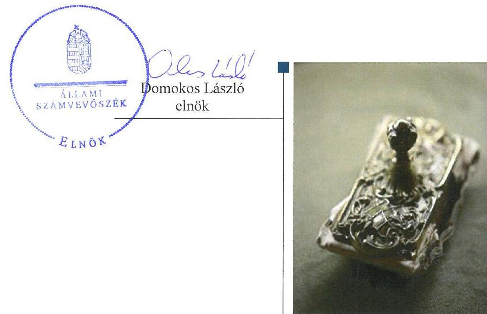

---

# AZ ELLENŐRZÉST FELÜGYELTE:

- HOLMAN MAGDOLNA JULIANNA felügyeleti vezető

- AZ ELLENŐRZÉST VEZETTE ÉS A VÉGREHAJTÁSÁÉRT FELELŐS:
  - BORSOS FERENC ellenőrzésvezető
  - A PROGRAM ÖSSZEÁLLÍTÁSÁÉRT FELELŐS:
    - JANIK JÓZSEF LÁSZLÓ osztályvezető

- IKTATÓSZÁM: V-1146-373/2016.
- TÉMASZÁM: 2180
- ELLENŐRZÉS-AZONOSÍTÓ SZÁM: V0761

Jelentéseink az Országgyűlés számítógépes hálózatán és az Interneta a www.asz.hu címen is olvashatóak.

---

# TARTALOMJEGYZÉK 

■ ÖSSZEGZÉS ..... 5
■ AZ ELLENŐRZÉS CÉLJA ..... 7
■ AZ ELLENŐRZÉS TERÜLETE ..... 8
■ AZ ELLENŐRZÉS HÁTTERE, INDOKOLTSÁGA ..... 9
■ A JELENTÉS LÉNYEGES KÉRDÉSKÖREI ..... 10
■ ELLENŐRZÉS HATÓKÖRE ÉS MÓDSZEREI ..... 11
■ MEGÁLLAPÍTÁSOK ..... 13
■ JAVASLATOK ..... 26
■ MELLÉKLETEK ..... 27
I. Sz. melléklet: Értelmező szótár ..... 27
II. Sz. melléklet: Az informatikai szervezeti egységek a Nemzeti Adó- és Vámhivatal szervezetében ..... 30
III. Sz. melléklet: Adók módjára behajtandó köztartozások mutatószám elemzése ..... 32
■ FÜGGELÉK: ÉSZREVÉTELEK ..... 37
■ RÖVIDÍTÉSEK JEGYZÉKE ..... 57

---

.

---

# ÖSSZEGZÉS 

A Nemzeti Adó- és Vámhivatal az informatikai terület irányítási rendszerét és belső kontrolljait kialakította, a müködéshez szükséges szervezeti kereteket és szabályzatokat kialakította. Az informatika területre vonatkozó belső kontrollrendszer és belső ellenőrzés müködtetéséről, valamint az informatikai terület összehangolt irányításáról nem gondoskodott.
Az Állami Számvevőszék az ellenőrzés keretében három további terület ellenőrzését végezte el, ahol az alábbiakat állapította meg:
a) A Nemzeti Adó- és Vámhivatal az e-kereskedelemmel összefüggő adóhatósági feladatok szervezeti, szabályozási és informatikai feltételeit kialakította. Ellenőrzési feladatait a hazai e-kereskedőkkel kapcsolatosan ellátta, ugyanakkor a más EU tagállamban letelepedett adózók ellenőrzéséről nem gondoskodott.
b) A Nemzeti Adó- és Vámhivatal a kutatás-fejlesztési kedvezményekkel kapcsolatos feladatait megfelelően ellátta.
c) A Nemzeti Adó- és Vámhivatal az adók módjára behajtandó köztartozásokkal összefüggő feladatait ellátta, a szükséges szabályozó eszközöket, szervezeti kereteket kialakította.

## Az ellenőrzés társadalmi indokoltsága

A Nemzeti Adó- és Vámhivatallal szemben támasztott elvárás az állami kiadások fedezetére szolgáló költségvetési bevételek jogszerű és eredményes biztosítása. Ennek érdekében szükséges, hogy a szervezet a számára előírt feladatokat a jogszabályban előírt elvárásoknak megfelelő informatikai támogatással végezze. A hatóság feladatellátása, az adó- és vámbevételek realizálása alapvetően függ a támogató informatikai rendszer megbízható működésétől és működtetésétől, amely rendszerek egyben a nemzeti adatvagyon meghatározó részét kezelik.

Az e-kereskedelem olyan új, bővülő piac, ahol a szolgáltatás természete miatt magasabb az ÁFA befizetés elkerülésének kockázata, az adózatlan forgalom aránya. 2015-től az e-kereskedelem ÁFA szabályai alapvetően megváltoztak, amely új feladatot jelent az adóhatóság számára. A tudásalapú gazdaság megteremtésének, a fenntartható gazdasági növekedésnek egyik alapvető feltétele a kutatásfejlesztési, illetve innovációs ágazat eredményessége.

## Főbb megállapítások, következtetések, javaslatok

Az informatikai terület irányítási és kontrollrendszerét a Nemzeti Adó- és Vámhivatal kialakította, az informatika terület operatív célkitűzéseit meghatározta, a működéshez szükséges szervezeti kereteket és szabályzatokat kialakította, erőforrás-gazdálkodási feladatait ellátta. A belső kontrollrendszer kockázatkezelési, nyomon követési és kontrolltevékenységekre vonatkozó elemeinek, illetve az államháztartási kontrollrendszer belső ellenőrzési pillérének működtetéséről ugyanakkor az informatika területén nem gondoskodott. A közép- és hosszú távú stratégia, az adat-vagyon-gazdálkodási stratégia, az informatikai szolgáltatásokkal szembeni szervezeti szintű elvárások meghatározásának hiánya nem biztosította az informatikai terület szakmai irányainak egyértelmű meghatározását, a vezetői illetve adó- és vámszakmai elvárásoknak megfelelő, hosszú távú működtetés kereteit.

Az informatikai tárgyú szerződések kapcsán a Nemzeti Adó- és Vámhivatal betartotta a beszerzésekre és kötelezettségvállalásra vonatkozó szabályzatait. A szerződések informatikai szakmai követelményeinek meghatározása, a

---

kapcsolódó teljesítések, illetve az informatikai fejlesztések során a belső szabályzatokban foglalt előírásokat nem tartották be.

Az e-kereskedelemmel kapcsolatos adóhatósági feladatok szervezeti, szabályozási és informatikai feltételeit a Nemzeti Adó- és Vámhivatal kialakította, a hazai e-kereskedőkkel kapcsolatos ellenőrzési feladatait ellátta. Kockázatkezelését és ellenőrzéseit ugyanakkor a más EU tagállamban letelepedett, távolról is nyújtható szolgáltatást nyújtó adózókra nem terjesztette ki.

A kutatás-fejlesztési kedvezményekkel kapcsolatos feladatokat a Nemzeti Adó- és Vámhivatal a társasági adóztatással összefüggő folyamatain belül látta el, amely feladatellátás az ellenőrzött időszakban szabályszerűen, megfelelő informatikai támogatás mellett történt.

Az adók módjára behajtandó köztartozásokkal kapcsolatos feladatait a Nemzeti Adó- és Vámhivatal ellátta, a szükséges belső szabályozó eszközöket, szervezeti kereteket kialakította. A végrehajtás során azonban nem tartották be a jogszabályban előírt határidőket. A szakmai feladatellátást és a belső kontrollok múködését informatikai rendszerek támogatták, de nem biztosították a feladatellátás folyamatában a határidők és a feldolgozás teljes körűségének kontrollját.

---

# AZ ELLENŐRZÉS CÉLJA 

## A Nemzeti Adó- és Vámhivatal informatikai rendszereinek ellenőrzése

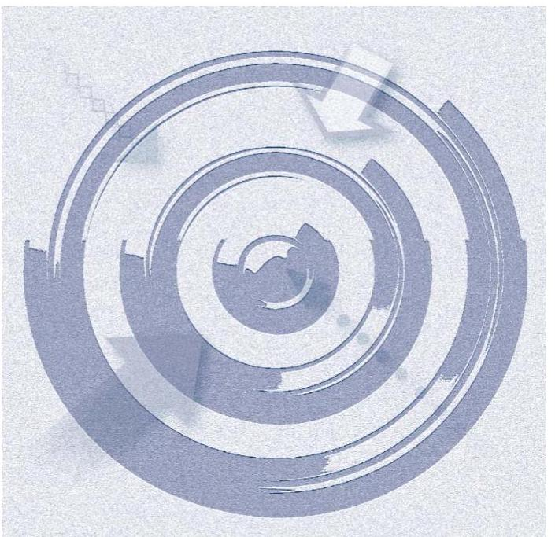

Vámhivatal tevékenységének megfelelőségét.

AZ ELLENŐRZÉS CÉLJA annak megállapítása, hogy a Nemzeti Adó- és Vámhivatal informatikai rendszereit az előírt követelményeknek megfelelően alakították-e ki; megfelelő volt-e az e-kereskedelemmel összefüggő ÁFA megfizetésével, a kutatás-fejlesztési adókedvezmény érvényesítésével, valamint az adók módjára behajtandó köztartozások beszedésével kapcsolatos feladatellátás, valamint az információs és monitoring rendszer kiépítése és múködtetése; a feladatellátást támogató informatikai alkalmazások és azok kontrolljai biztosították-e a Nemzeti Adó- és

---

# **AZ ELLENŐRZÉS TERÜLETE**

## **A Nemzeti Adó- és Vámhivatal**

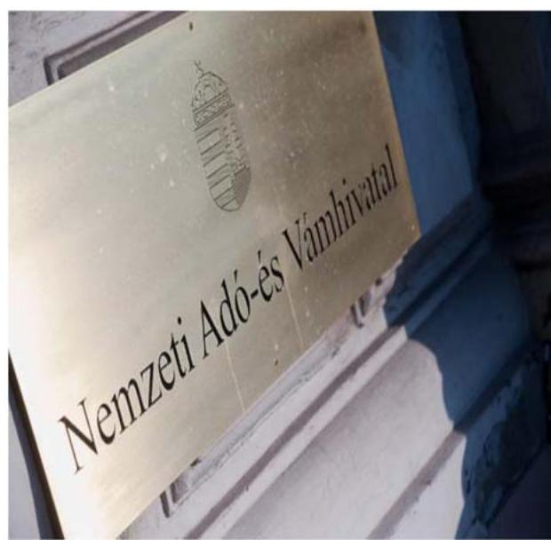

A Nemzeti Adó- és Vámhivatalt 2011. január 1-jén az Országgyűlés alapította az Adó- és Pénzügyi Ellenőrzési Hivatal és a Vám- és Pénzügyőrség általános jogutódjaként. A NAV1 az államháztartás központi alrendszerébe tartozó költségvetési szerv, amelynek felügyeletét a nemzetgazdasági miniszter látja el. A NAV vezetését 2015. év végéig az elnök látta el. A NAV vezetőjének feladat- és hatáskörét 2016. január 1-jétől a kijelölt miniszter irányítása alá tartozó, a Kormány rendeletében kijelölt államtitkár gyakorolja.

A NAV feladata többek között a központi költségvetés javára teljesítendő kötelező befizetés, a központi költségvetés terhére juttatott támogatás, adó-visszaigénylés vagy adó-viszszatérítés megállapítása, beszedése, nyilvántartása, végrehajtása, visszatérítése, kiutalása és ellenőrzése, az adók módjára behajtandó köztartozások beszedése. A NAV végzi a közösségi és nemzeti jogszabályokban meghatározott nemzetközi adószakmai együttműködésből adódó feladatokat.

2015-re vonatkozóan a NAV informatikai beruházásainak eredeti 994 MFt-os előirányzata 1 014 MFt-on, működési költségvetésének eredetileg tervezett 5 655 MFt-os előirányzata 9 185 MFt-on teljesült. Az informatikai terület teljes létszáma 2015 végén 1254 fő volt. A NAV informatikai szervezeti egységeinek szervezeti elhelyezkedését, illetve azok változását az ellenőrzött időszak alatt a II. sz. melléklet mutatja be.

A NAV felügyeletét végző nemzetgazdasági miniszter az adópolitikáért való felelőssége keretében előkészíti az adózás rendjére és a NAV-ra vonatkozó jogszabályokat, felügyeli az államháztartás központi alrendszerét megillető fizetési kötelezettségek beszedését, folyósítását és ellenőrzését és az ezekkel kapcsolatos adatszolgáltatásokat, koordinálja az adóigazgatás szervezeti rendszere egyes elemeinek együttműködését.

---

# AZ ELLENŐRZÉS HÁTTERE, INDOKOLTSÁGA 

## A Nemzeti Adó- és Vámhivatal informatikai rendszereinek ellenőrzése

A NAV-val szemben támasztott elvárás az állami kiadások fedezetére szolgáló költségvetési bevételek jogszerű és eredményes biztosítása. Ennek érdekében szükséges, hogy a NAV a számára előírt feladatokat a jogszabályban előírt elvárásoknak megfelelő informatikai támogatással végezze. A NAV feladatellátása, az adóbevételek realizálása alapvetően függ a több száz támogató informatikai rendszer megbízható működésétől és működtetésétől, amely rendszerek egyben a nemzeti adatvagyon meghatározó részét kezelik.

Az általános forgalmi adóból származik az államháztartás legnagyobb összegű bevétele. Az e-kereskedelem olyan új, bővülő piac, ahol a szolgáltatás természete miatt magasabb az ÁFA² befizetés elkerülésének kockázata, az adózatlan forgalom aránya. 2015-től az e-kereskedelem ÁFA szabályai alapvetően megváltoztak, amely 2015-ben 17,3 M euró többletbevételt hozott Magyarország számára, egyben új feladatokat jelentett az állami adóhatóság részére.

A tudásalapú gazdaság megteremtésének, a fenntartható gazdasági növekedésnek egyik alapvető feltétele a kutatásfejlesztési, illetve innovációs ágazat eredményessége. A 2014. és a 2015. évi társasági adóbevallásban a kutatás-fejlesztési tevékenység miatt érvényesített adóalap csökkentő kedvezmény összege 327,3 Mrd Ft, illetve 288,8 Mrd Ft volt.

Az adók módjára behajtandó köztartozások beszedésével összefüggően a NAV 2015-ben 100 jogcímen, 471 ezer megkeresést dolgozott fel 66,75 Mrd Ft összértékben, amely feladat végrehajtásának támogatásában az informatikai rendszerek kulcsszerepet játszottak.

Az ÁSZ ${ }^{3}$ a NAV korábbi ellenőrzései során kockázatokat tárt fel az informatikai biztonsággal, a NAV feladatellátásával, a központi költségvetést megillető ÁFA bevételek teljesítésével, a kockázatkezelési és ellenőrzési rendszer müködésével összefüggésben.

Az ellenőrzés a NAV informatikai rendszerének, illetve az e-kereskedelemmel összefüggő ÁFA megfizetésével, a kutatás-fejlesztési kedvezmények érvényesítésével és az adók módjára behajtandó köztartozások beszedésével kapcsolatos tevékenységének értékelésével kíván hozzájárulni a szabályszerű és átlátható feladatellátás elősegítéséhez, és ezzel a költségvetést megillető bevételek minél teljesebb körű realizálásához.

---

# A JELENTÉS LÉNYEGES KÉRDÉSKÖREI 

1.     - A NAV megfelelően alakította-e ki és müködtette-e az informatikai terület irányítási, értékelési, kockázatkezelési rendszerét, biztositotta-e a szakmai feladatellátás informatikai támogatását?
2.     - Megfelelő volt-e az e-kereskedelemmel összefüggő feladatok ellátása, a kapcsolódó folyamatok, kontrollok kialakítása és müködése, azok informatikai támogatása?
3.     - Megfelelő volt-e a kutatás-fejlesztési kedvezményekkel kapcsolatos NAV feladatellátás, a kapcsolódó folyamatok, kontrollok, információs és monitoring rendszer kialakítása és müködése, azok informatikai támogatása?
4.     - Megfelelő volt-e az adók módjára behajtandó köztartozásokkal kapcsolatos feladatellátás, a kapcsolódó folyamatok, kontrollok, információs és monitoring rendszer kialakítása és müködése, azok informatikai támogatása?

---

# ELLENŐRZÉS HATÓKÖRE ÉS MÓDSZEREI 

## Az ellenőrzés típusa

Megfelelőségi ellenőrzés.

## Az ellenőrzött időszak

A 2015. január 1-jétől 2016. június 30 -áig terjedő időszak. Az ellenőrzés kiterjedt a 2014. évre vonatkozóan a 2015. évben benyújtott társasági adó bevallásokban érvényesített kutatás-fejlesztési kedvezményekre is.

## Az ellenőrzés tárgya

Az ellenőrzés tárgyát képezte a NAV informatikai rendszerei tekintetében a biztonsági követelményeknek történő megfelelés, a teljesítménykritériumok kialakítása, a NAV tevékenységei közül az e-kereskedelemből származó ÁFA beszedésével, a kutatás-fejlesztési kedvezmények érvényesítésével, az adók módjára behajtandó köztartozások beszedésével kapcsolatosan a folyamatok, eljárások, kontrollok, információs és monitoring rendszer, informatikai alkalmazások kialakítása és müködése, a kapcsolódó adatáramlás, az adók módjára behajtandó köztartozásoknál a teljesítménykritériumok, indikátorok kialakítása. Az ellenőrzés kiterjedt a Nemzetgazdasági Minisztérium e-kereskedelemmel, a kutatás-fejlesztési kedvezményekkel és adók módjára behajtandó köztartozásokkal kapcsolatos feladatainak ellátására, ugyanakkor a szervezetre nézve lényeges megállapítást nem tettünk.

Az ellenőrzés kiterjedt minden olyan körülményre és adatra, amely az ÁSZ jogszabályban meghatározott feladatainak teljesítéséhez, valamint a program végrehajtása folyamán felmerült újabb összefüggések feltárásához szükséges.

## Az ellenőrzött szervezet

Nemzeti Adó- és Vámhivatal, Nemzetgazdasági Minisztérium.

## Az ellenőrzés jogalapja

Az ÁSZ tv. ${ }^{4} 1 . \S$ (3) bekezdése és 5. § (8) bekezdése.

---

# Az ellenőrzés módszerei 

Az ellenőrzést az ellenőrzési program szempontjai, az ellenőrzött időszakban hatályos jogszabályok, az ellenőrzés szakmai szabályai, és a megfelelőségi ellenőrzéshez kapcsolódó ÁSZ módszertan alapján végeztük.

Az ellenőrzési kérdések megválaszolásához szükséges bizonyítékok megszerzése megfigyelés, szemrevételezés, kérdésfeltevés (információkérés), tételes dokumentumellenőrzés, mintavételezés, valamint elemző eljárás alapján történt. Az ellenőrzést a kérdésekre adott válaszok kiértékelésével, a tanúsítványok felhasználásával, továbbá az adott időszakban hatályos jogszabályok figyelembe vételével folytattuk le.

Az ellenőrzési bizonyítékként felhasználható adatforrások közé tartoztak egyrészt az ellenőrzés szakmai programjában felsorolt adatforrások, másrészt adatforrás lehetett minden egyéb - az ellenőrzés folyamán feltárt, az ellenőrzés szempontjából információt tartalmazó - dokumentum. Az ellenőrzés lefolytatásához az ellenőrzött szervezetek tanúsítványok kitöltésével, valamint az ÁSZ által kért dokumentumok elektronikus megküldésével szolgáltattak adatokat, információkat. A rendelkezésre bocsátott adatok, információk kontrollja az ellenőrzés keretében történt.

Mintavétellel ellenőriztük az e-kereskedelemhez, a kutatásfejlesztési kedvezményekhez és az adók módjára behajtandó köztartozásokhoz kapcsolódó adóhatósági feladatellátás szabályszerűségét, a kapcsolódó kontrollok kialakítását és múködését. Mintavétellel ellenőriztük továbbá az informatikai tárgyú szerződések szabályszerűségét, az informatikai rendszerek fejlesztéseihez kapcsolódó előírások betartását. Az egyes feladatellátáshoz kapcsolódó, részletesen ellenőrzött informatikai rendszereket kockázati alapon választottuk ki.

A minta alapján a sokaságban előforduló hibaarányt becsültük. Az értékelés eredményeként kétféle, „Megfelelő" és „Nem megfelelő" minősítést alkalmaztunk. „Megfelelőnek" értékeltünk egy ellenőrzött területet, amennyiben a hibaarány a teljes sokaságban 95\%-os bizonyossággal legfeljebb 10\% arányt képviselt. Abban az esetben, ha adott sokaság tekintetében a 10\%-os hibaarány küszöbérték átlépése megítélésének megbízhatósága nem érte el a 95\%-ot, akkor minősítettük „Megfelelőnek" a területet, ha a minta alapján a teljes sokaság vonatkozásában a hibaarány nagyobb valószínűséggel volt 10\% alatti, mint 10\% feletti.

---

# 1. A NAV megfelelően alakította-e ki és múködtette-e az informatikai terület irányítási, értékelési, kockázatkezelési rendszerét, biztosította-e a szakmai feladatellátás informatikai támogatását? 

Összegző megállapítás

Az informatikai terület irányítási és kontrollrendszerét a NAV kialakította, ugyanakkor kockázatkezelési, nyomon követési és kontrolltevékenységekre vonatkozó elemeit nem múködtette. Az informatikai tárgyú szerződések követelményeinek meghatározása, illetve a teljesítések kapcsán a NAV nem tartotta be a belső szabályzatokban előírtakat. Az informatikai szolgáltatások szintjére vonatkozó vezetői követelményeket nem határozták meg.

A NAV az informatika terület operatív célkitűzéseit meghatározta, a múködéshez szükséges szervezeti kereteket és szabályzatokat kialakította, erőforrás-gazdálkodási feladatait ellátta. A belső kontrollrendszer kockázatkezelési, nyomon követési és kontrolltevékenységekre vonatkozó elemeinek múködtetéséről, illetve az államháztartási kontrollrendszer belső ellenőrzési pillérének múködtetéséről ugyanakkor az informatika területén nem gondoskodott.

A NAV 2015-IG RENDELKEZETT INTÉZMÉNYI STRATÉGIÁVAL ${ }^{5}$, amely meghatározta a 2011-2015. évekre szóló informatikai stratégiai irányokat is. Az ellenőrzött időszakban 2016. január 1-jétől ugyanakkor a NAV az SZMSZ ${ }_{3}{ }^{6}$ 9. §. g) pontjában foglaltak ellenére már nem rendelkezett közép- és hosszú távú stratégiai célokat megfogalmazó informatikai részstratégiával.

INTÉZMÉNYI MUNKATERVÉT a NAV a kormányzati stratégiai irányításról szóló 38/2012. (III. 12.) sz. Korm. rendeletnek megfelelően a 2015. és 2016. évre vonatkozóan elkészítette. A munkatervek az informatikai szakterület éves operatív tervét - a kormányrendelet fogalmi meghatározása szerinti rövid távú stratégiai tervét - meghatározták, ugyanakkor nem tartalmazták a 38/2012. (III. 12.) sz. Korm. rendelet 30. § c) pontjában foglaltak szerint a szervezeti célok, programok és intézkedések teljesítéséhez szükséges személyi, tárgyi, szakmai és szervezeti feltételeket.

A rövid távú informatikai stratégiai célkitűzések és a feladatellátás teljesülését a NAV operatív szinten nyomon követte, ami a Bkr. ${ }^{7}$-ben előírtaknak megfelelt. A NAV vezetője számára készített beszámolók ugyanakkor nem tartalmaztak rendszeres beszámolást az informatikai szakterület tevékenységének tapasztalatairól, ami nem felelt meg az SZMSZ ${ }_{3}{ }^{8} 28$. § h),

---

illetve az SZMSZ2 27. § e) előírásainak. Az NGM ${ }^{9}$ felé benyújtott negyedéves beszámolók a 2015. évi NAV intézményi munkatervben meghatározott 11 stratégiai feladatból egy feladat eredményéről tartalmaztak információt, a 2016. I. negyedévben kiadott beszámoló nem foglalkozott stratégiai informatikai fejlesztésekkel, azonban tartalmazott informatikai feladatok végrehajtásáról beszámolót. Pozitív változást mutatott, hogy a 2016. évi féléves beszámolóban az informatikai terület már önálló részt képviselt, amely több fejlesztési eredményről is információt nyújtott.

A NAV kockázatkezelési rendszerét a szervezet vezetője a Belső kontrollrendszerről szóló szabályzattal ${ }^{10}$ meghatározta, ugyanakkor azt a Bkr. 7. § (2) bekezdésében előírtak ellenére az informatikai területen nem működtette. A Bkr. 3.§ a) pontja, valamint a Bkr. 6. § (3) bekezdésében előírtaknak ellenére az informatikai főosztályok és az INIT ${ }^{11}$ ellenőrzési nyomvonalai nem kerültek kialakításra. A kockázatelemzés és kockázatkezelés hiányában a NAV nem felelt meg a Bkr. 8. § (1) bekezdés előírásainak, mert nem volt biztosított azon kontrollok teljes körű kialakítása, amelyek a kockázatokat kezelik, és hozzájárulnak a szervezet céljainak eléréséhez.

# AZ INFORMATIKAI KÖLTSÉGVETÉS TERVEZÉSÉ- 

NEK FELADATAIT a NAV informatikai területekért felelős vezetője az SZMSZ ${ }_{1,2}$-ben előírtaknak megfelelően, az éves szintű tervezés keretében ellátta, gondoskodott a rendelkezésre álló informatikai szempontú beruházási, üzemeltetési erőforrások felhasználásáról és tervezéséről.

A NAV informatikai területekért felelős vezetője az informatikai tárgyú beszerzéseket az SZMSZ ${ }_{1,2}$ előírásainak megfelelően szakmailag előkészítette, az informatikai szakterületet érintő munkafolyamatok koordinációját ellátta, a szerződések teljesülését vizsgálta, a tervezett és jóváhagyott beszerzésekről, szerződésekről nyilvántartást vezetett.

## AZ INFORMATIKAI FELADATELLÁTÁS SZERVE-

ZETI KERETEIT a NAV az Ávr. ${ }^{12}$, Bkr., illetve Ibtv. ${ }^{13}$ előírásainak megfelelően kialakította, melyet a kapcsolódó feladatokkal és felelősségi körökkel együtt az SZMSZ ${ }_{1,2}$-ben rögzített. $\mathrm{A} \mathrm{KH}^{14}, \mathrm{KI}^{15}$, valamint az INIT ügyrendjeiben meghatározták az informatikai üzemeltetés, fejlesztés és minőségellenőrzés feladatait, illetve azok felelőseit.

AZ INFORMATIKAI SZABÁLYZATAIT a NAV - az Általános Üzemeltetési Szabályzat kivételével - az Ibtv., az SZMSZ ${ }_{1,2}$ és az $\mathrm{IBSZ}^{16}{ }_{1,2}$ előírásainak megfelelően kialakította, biztosítva ezzel többek között az informatikai fejlesztések és azok minőségellenőrzésének, a projekt keretében megvalósuló informatikai fejlesztésekre vonatkozó eljárások, a biztonsági eljárások szabályozási kereteit.

Belső ellenőrzési tervét a NAV a 2015. évre szólóan elkészítette, kockázatelemzéssel alátámasztotta, azonban abban nem tért ki az informatikai kockázatokra, azokat rendszeresen nem mérte fel, ami nem felelt meg a Bkr. 21. § (1) bekezdésében megfogalmazottaknak, miszerint a belső ellenőrzés tevékenysége kiterjed az adott szervezet minden tevékenységére. A 2016. évre vonatkozóan, az ellenőrzött időszakban a Bkr. 32. § (5) bekezdésében foglaltak ellenére a NAV belső ellenőrzési tervvel nem rendelkezett, kockázatelemzést nem végzett. A NAV belső ellenőrzése a Bkr. 21. §

---

(3) bekezdés e) pontja szerinti informatikai ellenőrzést nem tervezett és nem végzett.

A szervezet biztonsági szint besorolását, illetve az elektronikus információs rendszerei biztonsági osztályba sorolását a NAV elvégezte, informatikai biztonsági szabályzatát kialakította.

Az adatvagyon-gazdálkodás stratégiai irányainak és cselekvési programjának kidolgozásáról a NAV nem gondoskodott, ami nem felelt meg az SZMSZ ${ }_{1}$ 2. sz. függelékének 2.2 pontjában és az SZMSZ ${ }_{2}$ 3. sz. függelékének 7.5 pontjában előírtaknak.

# AZ INFORMATIKAI SZAKMAI BELSŐ TUDÁSFEJ- 

LESZTÉS működtetéséről a NAV informatikai területekért felelős vezetője az SZMSZ ${ }_{1}$-ben előírtaknak megfelelően gondoskodott. Megtervezte és felügyelte a belső informatikai szakmai tudásfejlesztési rendszert, koordinálta az informatikai képzéseket, szakmai továbbképzések előkészítéséhez szükséges feladatokat.
1.2. számú megállapítás

Az informatikai tárgyú szerződések kapcsán a NAV a beszerzésekre és kötelezettségvállalásra vonatkozó szabályzatainak megfelelően járt el. Az informatikai szakmai követelmények meghatározása, illetve a kapcsolódó teljesítések során a belső szabályzatokban foglalt előírásokat nem tartották be.

AZ INFORMATIKAI TÁRGYÚ SZERZŐDÉSEK megkötése során a NAV a beszerzésekre és kötelezettségvállalásra vonatkozó belső szabályzataiban foglalt előírásoknak megfelelően járt el, a szerződésekben a szerződéses biztosítékokat alkalmazták, annak alkalmazási feltételeit a teljesítések kapcsán ellenőrizték és betartották, a teljesítések szakmai igazolása szabályszerűen megtörtént. A NAV informatikai tárgyú szerződéseinek kialakítása és azok szakmai teljesítése során az alkalmazásfejlesztésre és minőségbiztosításra vonatkozó belső szabályzatokban, az $\mathrm{IBSZ}_{1,2}$-ben előírt követelményeket nem tartották be, így többek között:

- a szerződések nem tartalmazták az Alkalmazásfejlesztési szabályzat ${ }^{17}$ 1. pont 2. alpont, valamint az Informatikai minőségbiztosítási szabályzat I. fejezet 1. pont 2. alpontja követelményét, nem írták elő a NAV informatikai fejlesztési és minőségbiztosítási szabályzatának betartását;
- a szerződések végrehajtása során nem tartották be a Minőségbiztosítási szabályzat ${ }^{18} 1$. fejezetének 1. pont követelményeit, amikor az átvett végtermékek vagy igénybe vett szolgáltatások kapcsán minőségbiztosítási dokumentumot nem készítettek.
A NAV a stratégiai fejlesztések végrehajtása során nem a belső szabályzatai szerint járt el, a fejlesztések során nem alkalmazta az IISZ ${ }^{19} 5$. pontjában és a 2134/2013 sz. „az informatikai fejlesztéssel megvalósuló projektek irányításáról" szóló szabályzatában megfogalmazottakat. A kiemelt informatikai rendszerek továbbfejlesztését érintő kisebb volumenű feladatok esetén a telepítést megelőző minőségellenőrzésről a NAV megfelelően gondoskodott.

---

### 1.3. számú megállapítás

Az informatikai múködés technikai szintű felügyeleti rendszerét a NAV kialakította, ugyanakkor az informatikai szolgáltatások szintjére vonatkozó vezetői követelményeket nem határozták meg.

AZ INFORMATIKAI SZOLGÁLTATÁSI folyamatokhoz kapcsolódó fejlesztési, mérési, felülvizsgálati, valamint hatékonyságelemzési, minőségelemzési feladatokat, a szükséges szolgáltatás-felügyeleti informatikai eszközrendszer tervezését, fejlesztését, üzemeltetését a NAV a technikai üzemeltetés szintjén az SZMSZ ${ }_{1,2}$-ben előírtak szerint ellátta.

Az SZMSZ 16. § j), SZMSZ 2 15. § k) pontjában, illetve az INIT Ügyrend ${ }_{1}{ }^{20}$ 74. pontjában és az INIT Ügyrend ${ }^{21}{ }_{2} 40$. pontjában meghatározottak ellenére ugyanakkor a NAV nem alakította ki az informatikai és szervezeti szolgáltatások jegyzékét, nem határozta meg a szolgáltatási szinteket.
1.4. számú megállapítás

Az e-kereskedelemmel, a kutatás-fejlesztési kedvezményekkel, illetve a köztartozások behajtásával összefüggő szakmai feladatellátást az informatikai terület megfelelően támogatta. Az informatikai fejlesztések során ugyanakkor a belső szabályzatokban foglalt előírásokat nem tartották be.

A NAV GONDOSKODOTT az e-kereskedelemmel, a kutatás-fejlesztési kedvezményekkel, illetve a köztartozások behajtásával összefüggő feladatellátás informatikai feltételeinek kialakításáról. A fejlesztési igénylések során a szakmai felügyelet a fejlesztéssel szemben elvárt alapvető funkcionalitást megfelelően meghatározta, végrehajtásáról az informatikai terület gondoskodott.

AZ ÚJ FEJLESZTÉSEK végrehajtásának és üzembe helyezésének folyamata során a NAV nem gondoskodott teljes körűen az alkalmazásfejlesztésre és minőségbiztosításra vonatkozó belső szabályzatokban, az IBSZ ${ }_{1,2}$-ben előírtak betartásáról, így többek között:
$\longrightarrow$ az IISZ 48. pontjában előírt fejlesztői teszt-jegyzőkönyvek dokumentált elkészítéséről;
$\longrightarrow$ annak biztosításáról, hogy a fejlesztést - az IISZ 40. pontja alapján az adott rendszer szakmai felügyeletét ellátó egység minden esetben dokumentáltan jóváhagyja;
$\longrightarrow$ az Alkalmazásfejlesztési szabályzat 26. pontjában és a Minőségellenőrzési szabályzat 34. pontjában előírt, az üzemi átadást megelőző minőségauditról.
A Biztonsági osztályba történő besorolást a NAV az Ibtv. 7. § (1) bekezdés alapján elvégezte, ugyanakkor a MOSS rendszer ${ }^{22}$ besorolása, annak 2015. január 1-jei bevezetését követően, az Ibtv. 8. § (2) bekezdése ellenére nem történt meg.

A felhasználói tevékenységek nyomon követésének lehetőségét a NAV által üzemeltetett rendszerek biztosították. A szakmai feladatellátást támogató informatikai rendszerek kapcsán a NAV a biztonsági mentési eljárásokat megfelelően kialakította és alkalmazta.

---

# 2. Megfelelő volt-e az e-kereskedelemmel összefüggő feladatok ellátása, a kapcsolódó folyamatok, kontrollok kialakítása és müködése, azok informatikai támogatása? 

Összegző megállapítás

Az e-kereskedelemmel kapcsolatos adóhatósági feladatok szervezeti, szabályozási és informatikai feltételeit a NAV kialakította, ellenőrzési feladatait a hazai e-kereskedőkkel kapcsolatosan ellátta. Kockázatkezelését és ellenőrzéseit ugyanakkor a más EU tagállamban letelepedett szolgáltatókra nem terjesztette ki. A távolról is nyújtható szolgáltatások ellenőrzési módszereit nem alakította ki.
2.1. számú megállapítás

A NAV az e-kereskedelemmel kapcsolatos feladatellátáshoz szükséges belső szabályozó eszközöket megfelelően kialakította. Kockázatkezelését az e-kereskedelemre nem terjesztette ki.

Jellemző példák távolról nyújtott elektronikus szolgáltatásokra:

- zene, film és játék rendelkezésre bocsátása
- médiaszolgáltatás
- honlap tárolása és üzemeltetése
- kép, szöveg rendelkezésre bocsátása, adatbázis elérhetővé tétele

AZ E-KERESKEDELEMMEL KAPCSOLATOS adóhatósági feladatai ellátása során a NAV alapvetően a tradicionális kereskedelemre vonatkozó - a bevallások benyújtása, bevallások és befizetések ellenőrzésével kapcsolatos - szabályozásokat alkalmazta. Ezen túlmenően megfelelően kialakította az európai uniós kötelezettségekből adódó, az Európai Parlament és a Tanács vonatkozó rendeletei által meghatározott belső eljárásrendeket, amelyek többek között az ÁFA területén a tagállamok közötti történő információcserére, a többoldalú ellenőrzések szabályaira vonatkoztak. A belső szabályozó eszközök kialakították annak keretfeltételeit, hogy a NAV - az Art. ${ }^{23}$-ban foglaltaknak megfelelően - ellássa adóhatósági feladatait mind a Magyarországon, mind az Európai Közösség más tagállamában letelepedett e-kereskedőkkel kapcsolatban.

Az e-kereskedelemre vonatkozó specifikus adóhatósági feladatok részletes meghatározásához, a hazai webáruházak kockázatelemzéséhez és ellenőrzéséhez a NAV módszertani segédletet ${ }^{24}$ dolgozott ki.

A távolról is nyújtható szolgáltatások 2015. január 1-jétől megváltozott ÁFA fizetési szabályai eredményeként Magyarországnak negyedévente nettó 4,1 - 4,98 M euró többletbevétele keletkezett (1. ábra), tekintettel arra, hogy a magyarországi fogyasztók jelentősen több szolgáltatást vásároltak külföldről, mint a külföldiek a Magyarországon letelepedett vállalkozásoktól. Ez az egyenleg ugyanakkor azt is mutatja, hogy a távolról is nyújtható szolgáltatásokat nyújtó szolgáltatók bevallásainak ellenőrzése elsősorban Magyarország érdekeit képezi. A távolról nyújtható szolgáltatások kapcsán magyarországi ÁFA befizetéssel érintett külföldi vállalkozások száma az ellenőrzött időszakban 37\%-kal nőtt (2. ábra).

---

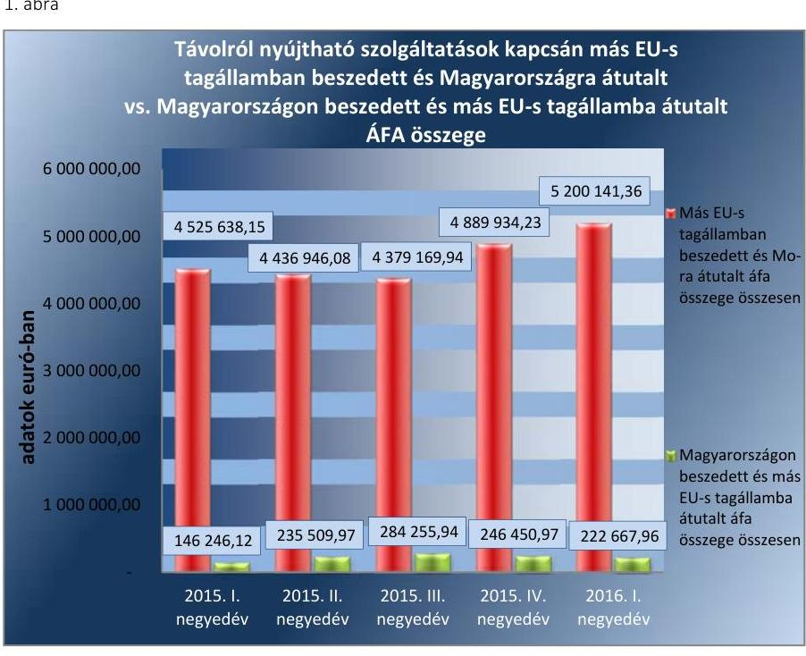

Forrás: Saját szerkesztés NAV adatszolgáltatás alapján

AZ E-KERESKEDELEMRE VONATKOZÓ területet a NAV nem vonta be a kockázatkezelési rendszerébe, a Bkr. 3. § b) pontja, valamint a Bkr. 7. § (2) bekezdésben foglaltaknak ellenére nem mérte fel az ekereskedelem területén a szervezet tevékenységében rejlő, a szervezeti célokkal összefüggő kockázatokat. Kockázatelemzés hiányában nem volt biztosított, hogy a NAV a Bkr. 8. § (1)-(2) bekezdésében meghatározott, a kockázatok kezelését szolgáló kontrolltevékenységeket az e-kereskedelem területén megfelelően és teljes körűen kialakítsa.
2. ábra
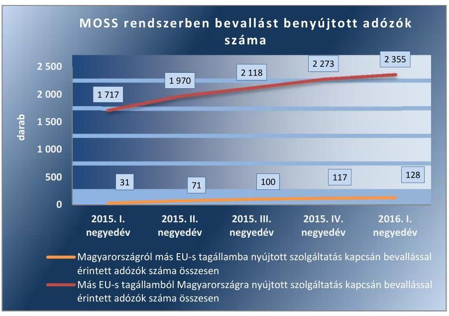

A NAV BELSŐ ELLENŐRZÉSE az ellenőrzött időszakban az e-kereskedelem témakörében ellenőrzést nem végzett.

---

### 2.2. számú megállapítás

A NAV a magyarországi e-kereskedőkkel kapcsolatos ellenőrzési feladatait megfelelően ellátta. A NAV a más EU tagállamban letelepedett, távolról igénybe vehető szolgáltatásokat nyújtó adózók ellenőrzéséről nem gondoskodott.

AZ E-KERESKEDELEM ELLENÖRZÉSÉRE vonatkozó általános vezetői elvárásokat a NAV a 2015. és 2016. évi Ellenőrzési Irányokban ${ }^{25,26}$ rögzítette. E dokumentumokban a kiemelten ellenőrizendő tevékenységi körök között szerepelt a csomagküldő, internetes kiskereskedelem ellenőrzése, illetve az e-kereskedelemmel kapcsolatosan a folyamatos adóhatósági jelenlét biztosítása, az adókötelezettségek teljesítésére irányuló vizsgálatok elvégzése.

A NAV az e-kereskedelemmel kapcsolatos adóhatósági ellenőrzési feladatait a Magyarországon letelepedett e-kereskedők ÁFA-kötelezettsége tekintetében megfelelően ellátta. A Magyarországon letelepedett adózók kockázatelemzése, ellenőrzésre történő kiválasztása során a NAV az interneten fellelt, adózókra vonatkozó, illetve saját nyilvántartásaiban rendelkezésre álló információkat felhasználta, biztosította a világhálón a folyamatos adóhatósági jelenlétet, alkalmazta a próbavásárlás eszközét.

KÜLFÖLDI ILLETŐSÉGŰ ADÓALANY adófizetési kötelezettsége kapcsán a NAV az ellenőrzött időszakban adóhatósági ellenőrzést nem végzett. Ez nem felelt meg az Art. 86. § (1), (2) bekezdéseiben foglalt, az ellenőrzéssel és az ellenőrzöttség tudatával kapcsolatos, valamint a jogkövető magatartás kikényszerítésének elvárásával kapcsolatos követelményeknek. A más EU tagállamban regisztrált, de Magyarországra adókötelezettségüket bevalló, távolról nyújtható szolgáltatásokat végző vállalkozások adatait a NAV a kockázatelemzési és kiválasztási rendszereibe nem csatolta vissza, ami nem felelt meg az Art. 90. § (5) és (6) bekezdések előírásainak.

Mint azt a 3. ábra mutatja, 2015-ben a távolról is nyújtható, magyarországi vásárlók által igénybe vett szolgáltatások után fizetendő ÁFA 90\%-a öt uniós tagállamban letelepedett szolgáltatótól származott, amelyen belül 60 százalékpontot a Luxemburgban letelepedett vállalkozások képviseltek.
3. ábra

Távolról nyújtható szolgáltatások kapcsán más EU-s tagállamban bevallott ÁFA összegének megoszlása
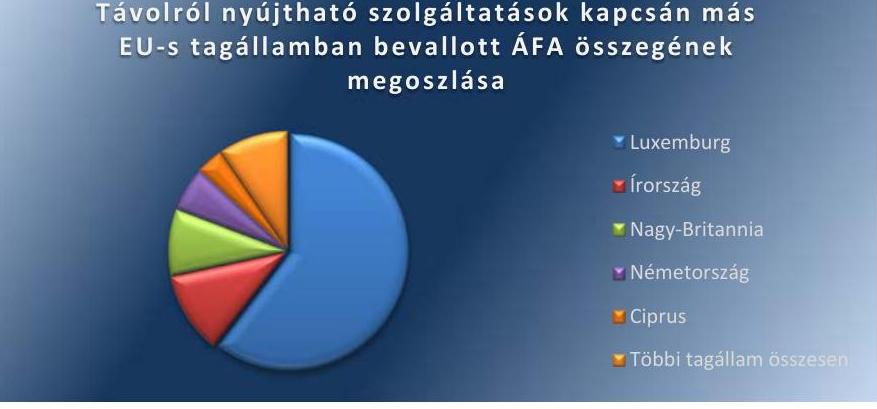

Forrás: Saját szerkesztés NAV adatszolgáltatás alapján

---

# 2.3. számú megállapítás 

A NAV a feladatellátás informatikai támogatását megfelelően kialakította.

A BEVALLÁSOK FELDOLGOZÁSÁT ÉS AZ ADÓELLENŐRZÉSEKET TÁMOGATÓ informatikai rendszerek megfelelően biztosították, hogy a NAV a belső szabályozó eszközökben meghatározott követelmények szerint hajtsa végre az e-kereskedők adatainak feldolgozását, ellenőrzését. A rendszerek biztosították többek között a hibás műveleteket vagy adatfeldolgozást detektáló kontrollok múködését, a múködési folyamat - vezetői vagy négy szem elvű - érvényesítési és jóváhagyási szabályainak, illetve kontrolljainak megvalósítását, az ellenőrzésre kiválasztott adóalanyok feldolgozása teljes körűségének kontrollját.

A távolról is nyújtható szolgáltatások bevallás-feldolgozási rendszerét (MOSS) a NAV az EU Bizottság specifikációja alapján alakította ki. A távolról nyújtható szolgáltatások után befizetett HÉA ${ }^{27}$ feldolgozása során az informatikai rendszer szabályszerűen biztosította a mindenkor aktuális HÉA-kulcsok alkalmazását, a beérkező befizetések tagállamok közötti felosztását, a hibák és eltérések kezelését. A rendszer a Tanács 2010. október 7-ei 904/2010/EU rendelet 46. cikk (3) bekezdésében meghatározottaknak megfelelően gondoskodott arról, hogy a tagállamokat megillető bevételek átutalási tételeiből a Magyarországot megillető 30\%-os összeg visszatartásra kerüljön.

AZ EU BIZOTTSÁG ÁLTAL MEGHATÁROZOTT MOSS rendszer belső kontrolljai ugyanakkor nem biztosították teljes körűen a tagállamok által nyilvántartott követelésállomány egyezőségét, valódiságát, ha a bevallást benyújtott adózó az esedékes összeget nem vagy nem teljes egészében fizette meg. A 282/2011/EU tanácsi végrehajtási rendelet ${ }^{28}$ előírásain alapuló MOSS eljárásrend ${ }^{29} 77$. pontja alapján ugyanis - a letelepedés szerinti tagállam által az adózónak kiküldött felszólítást követő 10 napos türelmi idő letelte után - a fogyasztás szerinti tagállam közvetlenül az adózónak bocsáthat ki fizetési felszólítást, amennyiben az nem teljesítette befizetési kötelezettségét. Ezen közvetlen felszólítással való eljárás lebonyolítását, illetve a közvetlen felszólítás eredményeként létrejött tranzakciók nyilvántartását, a kapcsolódó információk megosztását az érintett tagországok között a rendszer ugyanakkor nem támogatta. Ennek hiányában nem volt biztosított a tagállamok által nyilvántartott követelésállomány egyezősége. A rendszer közösségi szinten ilyen formában történő működése magában hordozza az egyes tagállamok követelésállomány nyilvántartása közötti eltérések növekedésének kockázatát.

A SZAKMAI HASZNÁLATI SZABÁLYOKAT az informatikai rendszerekhez a szakmai felügyeletet ellátó szervezeti egységek az SZMSZ1,2-ben előírtaknak megfelelően kialakították, és gondoskodtak azok aktualizálásáról.

---

# 3. Megfelelő volt-e a kutatás-fejlesztési kedvezményekkel kapcsolatos NAV feladatellátás, a kapcsolódó folyamatok, kontrollok, információs és monitoring rendszer kialakítása és múködése, azok informatikai támogatása? 

Összegző megállapítás

A kutatás-fejlesztési kedvezményekkel kapcsolatos feladatokat a NAV a társasági adóztatással összefüggő folyamatain belül látta el, amely feladatellátás az ellenőrzött időszakban szabályszerűen, megfelelő informatikai támogatás mellett történt.
3.1. számú megállapítás

A kutatás-fejlesztési tevékenység adóalap- és adókedvezmény érvényesítésével kapcsolatos feladatellátás feltételeit a NAV megfelelően kialakította.

A BELSŐ SZABÁLYOZÓ ESZKÖZÖK a kutatás-fejlesztési kedvezményekkel kapcsolatos feladatellátás kapcsán megfeleltek az Áht. ${ }^{30}$, az Art., valamint a Bkr-ben előírtaknak. A társasági adóbevallások kitöltésére, feldolgozására, ellenőrzésére vonatkozó szabályokat a NAV az SZMSZ ${ }_{1,2}$-ben, az ügyrendekben, illetve a folyamatok részletes rendjét szakmai belső szabályzatokban előírta. A szabályozó eszközök kialakítása biztosította az Art. 10. § (2)-(3) bekezdésében a NAV számára előírt feladatok ellátását, valamint az Art. 31. § (1) bekezdésében az adóbevallásokra megfogalmazott követelményeket. Az SZMSZ ${ }_{1,2}$ az Úgyrend, az Igazgatóságok ügyrendjei, a belső szabályzatok, körlevelek, irányelvek egymással összhangban voltak, biztosították az ellenőrzött időszakban a társasági adóbevallások szabályszerű feldolgozását és ellenőrzését.

A KOCKÁZATKEZELÉSI RENDSZERÉT a NAV a Bkr. 3. § (b) pontjának megfelelően a Belső kontrollrendszerről szóló szabályzattal kialakította.

A NAV a Bkr. 3.§ d)-e) pontjában előírt információs és vezetői monitoring rendszert a társasági adóbevallások feldolgozása és ellenőrzése kapcsán szabályszerűen kialakította és működtette, amely ezen belül a kuta-tás-fejlesztési kedvezmények igénybevételére, azokkal kapcsolatos információszolgáltatásra és nyomon követésre külön nem tért ki.

A BELSŐ ELLENŐRZÉS a 2015. évi ellenőrzési tervét a Bkr. 29. § (1) bekezdésének megfelelően kockázatelemzéssel támasztotta alá. A ku-tatás-fejlesztési kedvezmények tárgyában az ellenőrzött időszakban a NAV belső ellenőrzése nem végzett vizsgálatot.

---

1. táblázat

A 2014-2015. ÉVI TÁRSASÁGI ADÓBEVALLÁSOKBAN ÉRVÉNYESÍTETT KUTATÁS-FEJLESZTÉSI ADÓALAP ÉS ADÓKEDVEZMÉNYEK ADATAI (DB, MRD FT)

|  Megnevezés | 2014. évre vonat-   kozó | 2015. évre vonat-   kozó  |
| --- | --- | --- |
|  Társasági adóbevallást benyújtó adózók száma (db) | 432083 | 401052  |
|  Fejlesztési adókedvezményt érvényesítő adózók száma (db) | 2 | 1  |
|  Érvényesített fejlesztési adókedvezmény összege (MRD Ft) | 0,004 | 0,9  |
|  Kutatás-fejlesztés miatt adóalap csökkentő kedvezményt saját tevékenység után érvényesítő adózók száma (db) | 550 | 473  |
|  Saját kutatás-fejlesztési tevékenység miatt érvényesített adóalap csökkentő kedvezmény összege (MRD Ft) | 317,4 | 280,4  |
|  Kutatás-fejlesztés miatt, kapcsolt vállalkozás által átengedett adóalap csökkentő kedvezményt érvényesítő adózók száma (db) | 23 | 20  |
|  Kapcsolt vállalkozás által átengedett kutatás-fejlesztés miatt érvényesített adóalap csökkentő kedvezmény összege (MRD Ft) | 9,9 | 8,4  |

Forrás: Saját szerkesztés NAV adatszolgáltatás alapján

# 3.2. számú megállapítás

A kutatás-fejlesztési kedvezményeket érintő adóhatósági feladatait a NAV megfelelően ellátta.

A TÁRSASÁGI ADÓBEVALLÁSOK feldolgozása során a NAV elvégezte a NAV. tv. ${ }^{31}$ 13. § (1) a) és b) pontjában, a központi költségvetés javára teljesítendő kötelező befizetésekkel és adó-visszatérítésekkel kapcsolatos feladatait. A 2014. évi társasági adóbevallások kutatás-fejlesztési tevékenységgel kapcsolatos adatait a NAV szabályszerűen dolgozta fel.

Az 2014. és 2015. évekre vonatkozóan a társasági adóbevallást benyújtó vállalkozások valamivel több, mint 1 ezreléke vett igénybe valamilyen kutatás-fejlesztési kedvezményt (ld. 1. táblázat), amelyen belül a két évben összesen 904 M Ft adókedvezményt, és 616,1 Mrd Ft adóalap csökkentő kedvezményt érvényesítettek.

A TÁRSASÁGI ADÓALANYOK ellenőrzésre történő kiválasztásakor a NAV megfelelt az Art. 89-90. § és az 1019/2014. eljárási rendben ${ }^{32}$, valamint a NAV 2015. és a 2016. évi Ellenőrzési Irányelveiben előírtaknak. Az irányelvekben a kiválasztás egyik szempontja a kutatás-fejlesztési adóalap- és adókedvezmény igénybevétel volt. A társasági adóbevallások ellenőrzésre történő kiválasztását támogató informatikai rendszerek megfelelően támogatták a kutatás-fejlesztési kedvezményeket igénybevevő adózók elkülönítését, lekérdezését.

A KUTATÁS-FEJLESZTÉSI KEDVEZMÉNYEK érvényesítésének ellenőrzését a NAV az Art. 87. § (1) bekezdés a) pontja alapján a társasági adóbevallások utólagos vizsgálata során végezte. Az adóellenőrzések teljes körűek voltak, kiterjedtek minden társasági adóalap- és adócsökkentő tételre.

A kutatás-fejlesztést érintő utólagos adóellenőrzések során a NAV eljárása megfelelt az Art. 48. §, 86-119/A. §-aiban, valamint az SZTNH körlevélben ${ }^{33}$ az ellenőrzésekkel kapcsolatosan megfogalmazott előírásoknak. A NAV a kutatás-fejlesztési tevékenység során keletkezett társasági adóalapot növelő adókülönbözeteknél a késedelmi pótlékot az Art. 165. § előírása szerint számolta, az adóbírságok az Art. 170-171. § előírásai alapján

---

kerültek meghatározásra, a kiszabott mulasztási bírságok megfeleltek az Art. 172-174. §-ban foglaltaknak. Az ellenőrzések megindítása, lefolytatása, megszakítása, befejezése, valamint az adózó fellebbezése során a határidők számítása a Ket. ${ }^{34} 65 . \S$ előírásai szerint történtek.

# 3.3. számú megállapítás 

A kutatás-fejlesztési kedvezményekkel kapcsolatos feladatellátást támogató informatikai rendszerek a szabályoknak megfelelően biztosították az adóhatósági feladatok ellátását.

A TÁRSASÁGI ADÓBEVALLÁSOK FELDOLGOZÁSA és ellenőrzése során használt informatikai rendszerek szabályszerű kialakítását és folyamatos aktualizálását az SZMSZ ${ }_{1,2}$ és az IBSZ ${ }_{1,2}$ előírásai szerint a felelős szakterület elvégezte, a rendszerhasználati utasításokat megfelelően kialakította. Az Art. 10. § (3) bekezdés szerint megtervezték a társasági adóbevallás, a kitöltési útmutató vonatkozó részeit, a kapcsolódó kontroll adatszolgáltatásokat, bejelentő lapokat, meghatározták a kutatás-fejlesztési kedvezmények érvényesítésénél az összefüggés-vizsgálati szempontokat, a belső feldolgozó programokat. A NAV a $\mathrm{BM}^{35}$ rendelet szerint biztosította, hogy az informatikai rendszerekben felhasznált, más rendszerekből vagy intézményektől származó elektronikus és papír alapon érkezett adatok pontosságának és teljes körűségének kontrolljai megfelelően múködjenek, illetve a mindenkori naprakész adatok elérhetőek legyenek.

## 4. Megfelelő volt-e az adók módjára behajtandó köztartozásokkal kapcsolatos feladatellátás, a kapcsolódó folyamatok, kontrollok, információs és monitoring rendszer kialakítása és múködése, azok informatikai támogatása?

Összegző megállapítás

Az adók módjára behajtandó köztartozásokkal kapcsolatos feladatait a NAV ellátta, azonban a végrehajtás során nem tartották be a jogszabályban előírt határidőket. Az informatikai rendszerek nem biztosították a feladatellátás folyamatában a határidők és a feldolgozás teljes körűségének kontrollját.
4.1. számú megállapítás

A feladatellátásra vonatkozó belső szabályozó eszközöket, szervezeti kereteket a NAV kialakította. Az információs és monitoring rendszert megfelelően kialakították és múködtették.

A BELSŐ SZABÁLYOZÁSI ESZKÖZÖK körében a NAV Alapító Okirat ${ }^{36}{ }_{2}{ }^{37}$-ben az adók módjára behajtandó köztartozásokkal kapcsolatos feladatokat az Ávr-nek megfelelően meghatározta. Az SZMSZ ${ }_{1,2}$ az Áht. 10. § (5) bekezdése és az Ávr. 13. § (1) bekezdés c) pontja ellenére nem jelölte meg az adók módjára behajtandó köztartozással kapcsolatos feladatok végrehajtását, mint ellátandó alaptevékenységet. A szakmai irányításért felelős főosztályok feladatait az ügyrendek az Áht. előírásainak megfelelően meghatározták. Az SZMSZ ${ }_{1,2} 4$. függelékében felsorolt regionális, valamint adó- és vámigazgatóságok ügyrendjei az Áht. 10. § (5) bekezdésének megfelelően tartalmazták az adók módjára behajtandó köztartozások végrehajtásával kapcsolatos feladatokat.

---

A NAV az Art. 161. §-ban előírtak betartása érdekében a megkeresésre történő behajtási feladatok végrehajtása tárgyában együttműködési megállapodással rendelkezett a GVH ${ }^{38}$-val, a Diákhitel Zrt.-vel, MKIK ${ }^{39}$-val, a NÉBIH ${ }^{40}$-hel, $\mathrm{NMH}^{41}$-val, $\mathrm{OEP}^{42}$-pel és az ONYF ${ }^{43}$-fel.

Az adók módjára behajtandó köztartozások végrehajtásával kapcsolatos feladatok szabályait a NAV elnöke által kiadott eljárási rendek meghatározták. A végrehajtás feladataihoz tartozó eljárásrendeket, melyek az adók módjára behajtandó köztartozások érvényesítése során is alkalmazandók, 2015-ben, az ÁSZ által a 15044. sorszámú jelentésben ${ }^{44}$ megfogalmazott észrevételek alapján adták ki.

A 1083/2012. számú ${ }^{45}$, a 1034/2012. számú ${ }^{46}$, valamint a 1032/2015. számú ${ }^{47}$, a 1037/2015. számú ${ }^{48}$ és a 1034/2015. számú ${ }^{49}$ eljárásrendekben a befolyt összegek továbbutalására meghatározott határidők nem feleltek meg az Art. 161. § (7) bekezdésében rögzített - haladéktalan átutalásra vonatkozó - követelményének, mert lehetővé tették a legfeljebb öt munkanapos, illetve 8 napos utalási határidőt is.

A KOCKÁZATKEZELÉSI RENDSZERT a NAV elnöke a Belső kontrollrendszerről szóló szabályzattal a Bkr. 3.§ (b) bekezdésében előírtaknak megfelelően meghatározta. Azonban az adók módjára behajtandó köztartozások feladat-végrehajtásával kapcsolatos kockázatokat beleértve a feladatot végrehajtó adó- és vámigazgatóságok tevékenységében rejlő kockázatokat - nem határozták meg, nem mérték fel, nem elemezték és értékelték, ami nem felelt meg a Bkr. 7. § (1) és (2) bekezdések előírásainak.

A NAV vezetője a Bkr. 6. § (3) bekezdése ellenére az adók módjára behajtandó köztartozással kapcsolatos feladatok végrehajtására vonatkozó ellenőrzési nyomvonalat - a KH ellenőrzési nyomvonalának meghatározásának kivételével - nem készített. A Bkr. 2. § n) pont nc) alpontja, illetve a Belső kontrollrendszerről szóló szabályzat 152. pontja ellenére a regionális adó- és vámigazgatóságok vezetői nem készítették el ellenőrzési nyomvonalaikat.

# AZ INFORMÁCIÓS ÉS KOMMUNIKÁCIÓS RENDSZER kialakítása és múködtetése a Bkr. 3. § d) pontjának megfelelt. Az információkhoz való hozzáférés rendszerét a Bkr-nek megfelelően a NAV belső szabályzataiban rögzítette. A NAV elnöke által kiadott 2150/2012. számú szabályzatnak ${ }^{50}$ megfelelően a NAV KH/KI szakmai irányításért felelős főosztálya körlevelekben iránymutatást adott az adók módjára behajtandó köztartozásokkal kapcsolatos végrehajtási tevékenységekre.

A NAV KH/KI szakmai irányításért felelős főosztálya figyelemmel kísérte a megkeresésre történő végrehajtással, az adók módjára behajtandó köztartozással kapcsolatos adatokat, rendszeres beszámolókat készített a behajtási szervezet tevékenységéről, mely tartalmazta a bevételi előirányzatok, a tervezett bevételek időarányos teljesítését, a hátralékállomány alakulását.

A NAV BELSŐ ELLENŐRZÉSE az adók módjára behajtandó köztartozások tárgyában nem végzett vizsgálatot.

---

### 4.2. számú megállapítás

Az adók módjára behajtandó köztartozásokkal összefüggő feladatellátás során az ügyintézési határidőt nem tartották be. Az informatikai rendszerek nem biztosították a feldolgozási folyamat határidőkre és teljes körű feldolgozásra irányuló belső kontrollját.

A NAV az adók módjára behajtandó köztartozásokat az egyéb hátralékkezelési és végrehajtási eljárásokkal együtt hajtotta végre. Amennyiben az adósnak adótartozása is volt, a végrehajtási eljárás az adótartozásra és a megkereső követelésére együtt, egy ügyben folyt.

A FELADATELLÁTÁS SORÁN a NAV nem gondoskodott a jogszabályban és belső eljárásrendekben megszabott, ügyintézési határidőkre vonatkozó előírások betartásáról, így:
$\longrightarrow$ nem tett eleget a Htv. ${ }^{51}$ 52. § (4) bekezdésében foglaltaknak, amikor megkeresések beérkezése és a kötelezettségek rögzítése között több mint 8 nap telt el;
$\longrightarrow$ nem tett eleget a Htv. 52 § (4) bekezdésében foglaltaknak, amikor 8 napon belül a NAV nem utalt át behajtott követelést a jogosultnak;
$\longrightarrow$ nem tett eleget a 1034/2015. számú eljárásrend 50. pontjának, amikor a felosztást követő 5 napon belül nem intézkedett az adók módjára behajtandó köztartozásoknak a jogosult részére történő kiutalásáról;
$\longrightarrow$ nem tett eleget a 1083/2012. számú eljárásrend 35. pontjában foglaltaknak, amikor eredménytelen fizetési felszólítás esetében nem intézkedett végrehajtási cselekmények foganatosításáról.
A feladatellátást támogató rendszerek belső kontrolljai nem biztosították az automatikus határidő-figyelést az ügyek feldolgozási folyamatában, illetve nem biztosították az ügyek ügyintézőre való kiszignálásának teljes körűségét. A kontrollok elmaradása azt eredményezte, hogy ügyek elintézetlenül maradtak, azokat nem szignálták ki ügyintézőre.

A FELADATELLÁTÁS további részeit érintő kontrollok kialakításról a NAV - a Bkr. 8. § (1)-(2) pontjainak és a feladatellátáshoz kapcsolódó szabályozásoknak - megfelelően gondoskodott. Az informatikai rendszeren belül működő eljárások megfelelően kontrollálták többek között az illetékesség miatti változást, a letéti karton megnyitását, az adóazonosító számok letéti kartonhoz rendelését, a négy szem elvű vezetői jóváhagyást a fizetési felszólítás kibocsátása során, illetve a felhasználói tevékenységek naplózását. A befolyt összegek felosztása automatikusan, humán beavatkozás nélkül, az Art. 43.§ (5a) bekezdése szerint történt meg. Ezzel a NAV az adók módjára behajtandó köztartozásokkal kapcsolatos feladatellátás legnagyobb kockázataival rendelkező pontjain automatizált kontrollokat alakított ki, biztosítva ezzel az adatok Ibtv-ben előírt sértetlenségét.

---

# JAVASLATOK 

Az ÁSZ tv. 33. § (1) bekezdésében foglaltak értelmében az ellenőrzött szervezet vezetője köteles a jelentésben foglalt megállapításokhoz kapcsolódó intézkedési tervet összeállítani és azt a jelentés kézhezvételétől számított 30 napon belül az ÁSZ részére megküldeni. Amennyiben az intézkedési tervet az ellenőrzött szervezet vezetője nem küldi meg határidőben, vagy továbbra sem elfogadható intézkedési tervet küld, az ÁSZ elnöke az ÁSZ tv. 33. § (3) bekezdés a)-b) pontjaiban foglaltakat érvényesítheti.

## A Nemzeti Adó- és Vámhivatal vezetőjének

1. Intézkedjen a Bkr. előírásai alapján a belső kontrollrendszer keretében kialakított integrált kockázatkezelési rendszer müködtetéséről, az ellenőrzési nyomvonalak kialakításáról.
(1.1. számú megállapítás 4. bekezdése, a 2.1. számú megállapítás 4. bekezdése, a 4.1. megállapítás 5. bekezdése alapján)
2. Intézkedjen az SZMSZ és az INIT Ügyrend előírásai alapján az informatikai és szervezeti szolgáltatások jegyzéke kialakításáról és a szolgáltatási szintek meghatározásáról.
(1.3. számú megállapítás 2. bekezdése alapján)
3. Intézkedjen, hogy az Áht. és az Ávr. rendelkezései szerint a jogszabály által előírt alaptevékenységek az SZMSZ-ben rögzítésére kerüljenek.
(4.1. számú megállapítás 1. bekezdés 2. mondata alapján)
4. Intézkedjen a jogszabály és belső eljárásrendek által előírt ügyintézési határidők betartására.
(4.2. számú megállapítás 2. bekezdése alapján)

---

# MELLÉKLETEK 

- I. SZ. MELLÉKLET: ÉRTELMEZŐ SZÓTÁR

Adatfeldolgozás

Adók módjára behajtandó köztartozás
Architekturális tervezés

Belső ellenőrzés

Belső kontrollrendszer

Biztonsági osztály
Biztonsági osztályba sorolás

Biztonsági szint

Biztonsági szintbe sorolás

Elektronikus információs rendszer

Elektronikus információs rendszer biztonsága

Elektronikus kereskedelmi szolgáltatás
(e-kereskedelem)

Európai Unió Tanácsa (Tanács)
Informatikai szolgáltatási szint

Az adatkezelési múveletekhez kapcsolódó technikai feladatok elvégzése, függetlenül a műveletek végrehajtásához alkalmazott módszertől és eszköztől, valamint az alkalmazás helyétől, feltéve hogy a technikai feladatot az adaton végzik. (Forrás: Ibtv. 1.§ (1) 2.)

Azok a köztartozások, továbbá igazgatási és bírósági szolgáltatási díjak, amelyekre törvény az adók módjára való behajtást rendeli el (Forrás: Art.).
Informatikai rendszerek szervezeti szintű formális leírása, illetve szervezése, amely magában foglalja az alkotóelemeket, azok egymás közötti kapcsolatát, a környezetet, és az elveket amelyek a tervezést és értékelést meghatározzák.
Független, tárgyilagos bizonyosságot adó és tanácsadó tevékenység, amelynek célja, hogy az ellenőrzött szervezet múködését fejlessze és eredményességét növelje, az ellenőrzött szervezet céljai elérése érdekében rendszerszemléletű megközelítéssel és módszeresen értékeli, illetve fejleszti az ellenőrzött szervezet irányítási és belső kontrollrendszerének hatékonyságát. (Forrás: Bkr. 2. § b) pontja)
A belső kontrollrendszer a kockázatok kezelése és tárgyilagos bizonyosság megszerzése érdekében kialakított folyamatrendszer, amely azt a célt szolgálja, hogy a múködés és gazdálkodás során a tevékenységeket szabályszerűen, gazdaságosan, hatékonyan, eredményesen hajtsák végre, az elszámolási kötelezettségeket teljesítsék, megvédjék az erőforrásokat a veszteségektől, károktól és nem rendeltetésszerű használattól. (Forrás: Áht. 69. § (1) bekezdése)
Az elektronikus információs rendszer védelmének elvárt erőssége (Forrás: Ibtv.).
A kockázatok alapján az elektronikus információs rendszer védelme elvárt erősségének meghatározása (Forrás: Ibtv.).
A szervezet felkészültsége a 2013. évi L. törvényben és a végrehajtására kiadott jogszabályokban meghatározott biztonsági feladatok kezelésére (Forrás: Ibtv.).
A szervezet felkészültségének meghatározása az e törvényben és a végrehajtására kiadott jogszabályokban meghatározott biztonsági feladatok kezelésére (Forrás: Ibtv.).
Az adatok, információk kezelésére használt eszközök (környezeti infrastruktúra, hardver, hálózat és adathordozók), eljárások (szabályozás, szoftver és kapcsolódó folyamatok), valamint az ezeket kezelő személyek együttese (Forrás: Ibtv.).
Az elektronikus információs rendszer olyan állapota, amelyben annak védelme az elektronikus információs rendszerben kezelt adatok bizalmassága, sértetlensége és rendelkezésre állása, valamint az elektronikus információs rendszer elemeinek sértetlensége és rendelkezésre állása szempontjából zárt, teljes körű, folytonos és a kockázatokkal arányos (Forrás: Ibtv.).
Olyan információs társadalommal összefüggő szolgáltatás, amelynek célja valamely birtokba vehető forgalomképes ingó dolog - ideértve a pénzt és az értékpapírt, valamint a dolog módjára hasznosítható természeti erőket -, szolgáltatás, ingatlan, vagyoni értékű jog (a továbbiakban együtt: áru) üzletszerű értékesítése, beszerzése, cseréje vagy más módon történő igénybevétele. (Forrás: Ektv.)
EU-tagállamok kormányainak képviseletét ellátó intézmény, mely uniós jogszabályokat fogad el és összehangolja az uniós szakpolitikákat.
A szolgáltatást nyújtó (informatika) által a megrendelőnek (felhasználó) nyújtott adott szolgáltatás minőségi- és mennyiségi mutatója.

---

Informatikai terület vezetője 2015. december 31-ig a NAV informatikai elnökhelyettese, 2016. január 1-jétől a Központi Irányítás főigazgatója
Intézményi munkaterv Az intézményi munkaterv egy naptári évre szóló intézkedési és erőforrás-felhasználási rövid távú stratégiai tervdokumentum, amely tartalmazza
a) az adott időszakra vonatkozó szervezeti célokat, programokat és intézkedéseket;
b) az a) pontban foglaltak teljesítési határidőit;
c) az a) pontban foglaltak teljesítéséhez szükséges személyi, tárgyi, szakmai és szervezeti feltételeket; valamint
d) az a)-c) pontokban foglaltak teljesítéséért felelősök meghatározását.
(Forrás: 38/2012. (III. 12.) Korm. rendelet a kormányzati stratégiai irányításról 30. §)
Kockázatkezelési rendszer Olyan irányítási eszközök és módszerek összessége, melynek elemei a szervezeti célok elérését veszélyeztető tényezők (kockázatok) azonosítása, elemzése, csoportosítása, nyomon követése, valamint szükség esetén a kockázati kitettség mérséklése (Forrás: Bkr. 2. § m) pont)
Kontrollkörnyezet A költségvetési szerv vezetője által kialakított világos szervezeti struktúra, egyértelmű felelősségi, hatásköri viszonyok és feladatok, meghatározott etikai elvárások a szervezet minden szintjén, és átlátható humánerőforrás-kezelés a szervezeten belül (Forrás: Bkr. 6. § (1) bekezdés)
Kutatás-fejlesztési kedvezmények Az 1996. évi LXXXI. törvény a társasági adóról és az osztalékadóról szóló törvényben biztosított kutatás-fejlesztési adóalap- és adókedvezmények
Letelepedett szolgáltató (e-kereskedelem) Állandó telephellyel rendelkező szolgáltató, amely határozatlan ideig tényleges gazdasági tevékenységként nyújt információs társadalommal összefüggő szolgáltatást. Az, hogy a szolgáltatás nyújtásához szükséges műszaki eszközök rendelkezésre állnak, illetve az ehhez szükséges technológiákat alkalmazzák, önmagában nem minősül állandó letelepedésnek. (Forrás: Ektv.)
MOSS rendszer A Mini Egyablakos Rendszer (MOSS) olyan adózók számára kínál egyszerű, hatékony, egyablakos és elektronikus ügyintézési lehetőséget, akik az Európai Közösség országaiba teljesítenek távolról is nyújtható szolgáltatást (vagyis távközlési, rádió- és tele-vízió-műsor-, illetve elektronikus szolgáltatást) olyan fogyasztók számára, akik nem alanyai az általános forgalmi adónak (ill. a hozzáadottérték-adónak).
Nemzeti adatvagyon A közfeladatot ellátó szervek által kezelt közérdekű adatok, személyes adatok és közérdekből nyilvános adatok összessége (Forrás: a nemzeti adatvagyon körébe tartozó állami nyilvántartások fokozottabb védelméről szóló 2010. évi CLVII. törvény)
Sértetlenség Az adat tulajdonsága, amely arra vonatkozik, hogy az adat tartalma és tulajdonságai az elvárttal megegyeznek, ideértve a bizonyosságot abban, hogy az az elvárt forrásból származik (hitelesség) és a származás ellenőrizhetőségét, bizonyosságát (letagadhatatlanságát) is, illetve az elektronikus információs rendszer elemeinek azon tulajdonságát, amely arra vonatkozik, hogy az elektronikus információs rendszer eleme rendeltetésének megfelelően használható. (Forrás: Ibtv.)
Távolról nyújtott szolgáltatás - telekommunikációs szolgáltatások; (e-kereskedelem)

- rádiós és audiovizuális médiaszolgáltatások;
- elektronikus úton nyújtott szolgáltatások
i) elektronikus tárhely rendelkezésre bocsátása, honlap tárolása és üzemeltetése, valamint számítástechnikai eszköz és program távkarbantartása,
ii) szoftver rendelkezésre bocsátása és frissítése,
iii) kép, szöveg és egyéb információ rendelkezésre bocsátása, valamint adatbázis elérhetővé tétele,

---

iv) zene, film és játék - ideértve a szerencsejátékot is - rendelkezésre bocsátása, valamint politikai, kulturális, művészeti, tudományos, sport- és szórakoztatási célú médiaszolgáltatás, illetőleg ilyen célú események közvetítése, sugárzása,
v) távoktatás,
feltéve, hogy a szolgáltatás nyújtása és igénybevétele globális információs hálózaton keresztül történik. A szolgáltatás nyújtója és igénybevevője közötti, ilyen hálózaton keresztüli kapcsolat felvétele és tartása - ideértve az ajánlat tételét és elfogadását is - azonban önmagában még nem elektronikus úton nyújtott szolgáltatás.
(Forrás: Áfa tv. 45/A. §)
Távolról is nyújtható szolgáltatás ÁFA kötelezettsége

Üzletmenet-folytonosság tervezés

Webáruház
2015. január 1. után a nem adóalanyok részére nyújtott rádiós és audiovizuális médiaszolgáltatási, telekommunikációs, valamint az elektronikus úton nyújtott szolgáltatások a fogyasztás helye szerint adóznak. Az ÁFA mértékét teljesítés helye határozza meg, amely az a hely, ahol a szolgáltatást igénybevevő nem adóalany letelepedett, letelepedés hiányában pedig, ahol lakóhelye vagy szokásos tartózkodási helye van.
Az adózónak az Art. 44. §-ában megállapított nyilvántartás-vezetési kötelezettségének oly módon kell eleget tennie, hogy a teljesítési hely szerinti tagállam adóhatósága által végzett ellenőrzést is lehetővé tegye. Az adózónak a nyilvántartást felhívásra, elektronikus úton is rendelkezésre kell bocsátania.
Az a folyamat, melynek során a szervezet felkészül a kritikus üzleti (működési) folyamatok valamilyen informatikai esemény utáni visszaállítására, lehetőleg a legkisebb kieséssel.
Internetes felület, amely különböző javak végfelhasználói vásárlásának lebonyolítására alkalmas.

---

II. SZ. MELLÉKLET: AZ INFORMATIKAI SZERVEZETI EGYSÉGEK A NEMZETI ADÓ- ÉS VÁMHIVATAL SZERVEZETÉBEN
2016. január 1-jétől:
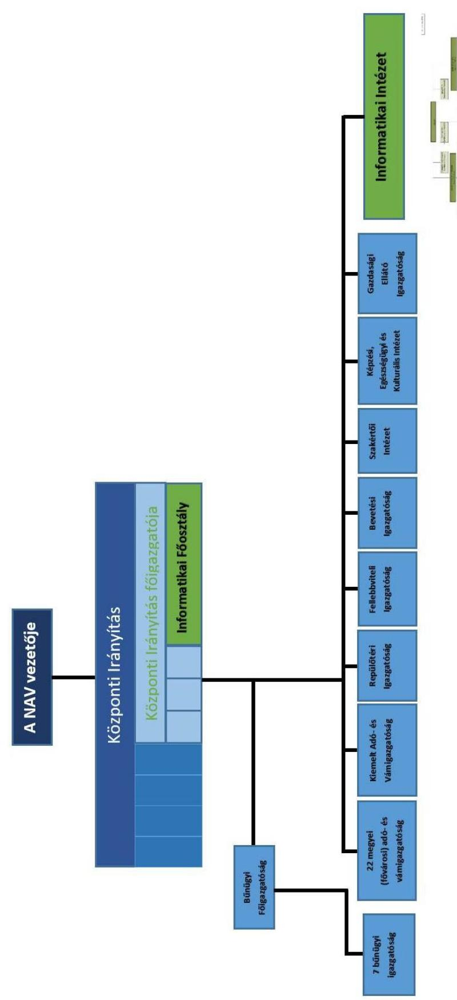

---

Mellékletek

2015. évben:

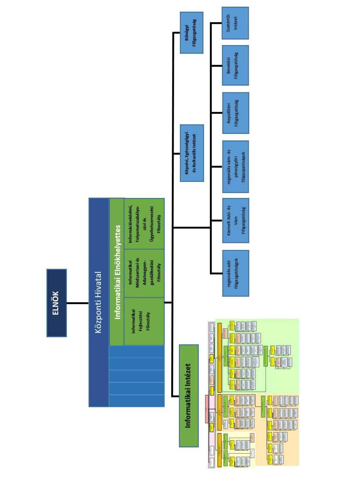

---

2015. évben az adók módjára behajtandó köztartozásokra (AMBK) vonatkozóan a tárgyidőszakban beérkezett - azaz előző évekkel nem kumulált - megkeresések száma 471 e db, amelyek értéke összesen 66,75 Mrd Ft volt. Az egy megkeresésre eső kötelezettség átlagos összege 141,7 e Ft volt. A megkeresésekre az adott időszakban összesen 6,77 Mrd Ft-ot hajtottak be (ld. 1. ábra), ami 10,2\%-os behajtási aránynak felel meg.
2016. első félévében az adók módjára behajtandó köztartozásokra vonatkozóan a tárgyidőszakban érkezett megkeresések száma 266 e db volt, míg összege 46 Mrd Ft (átlagosan 172,7 e Ft), amely köztartozásokból az adott időszakban 3,47 Mrd Ft került behajtásra (ld. 1. ábra), ami 7,6\%-os behajtási aránynak felel meg.
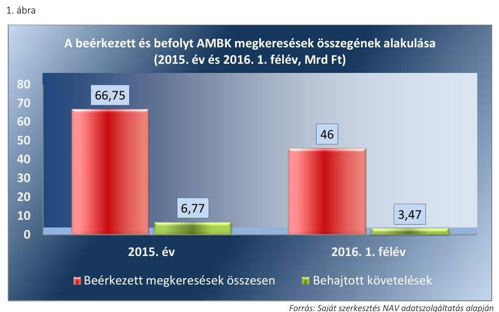

Az Art. 163. § (1) bekezdése alapján az adók módjára behajtandó köztartozás kötelezettje végrehajtási költségátalány megfizetésére is kötelezett, amelynek összege ingó és ingatlan végrehajtása esetén nem lehet kevesebb, mint 5000 Ft. A megkeresésekkel kapcsolatos végrehajtási ügyekben az ellenőrzött időszakban összesen 688,6 M Ft behajtási költség folyt be (2015-ben 463,4 M Ft végrehajtási költség és 35,5 M Ft földhivatali eljárási díj, 2016 első félévében 180,7 M Ft végrehajtási költség és 9 M Ft földhivatali eljárási díj). A fennálló, be nem folyt költségek összesen 203,5 M Ft-ot tettek ki (2015-ben 94,7 M Ft végrehajtási költség és 29 M Ft földhivatali eljárási díj, 2016 első félévében 66,6 M Ft végrehajtási költség és 13,2 M Ft földhivatali eljárási díj). A behajtási költségeknek a teljes másfél éves időszakra vonatkozó 77,2\%-os behajtási aránya azt mutatja, hogy a fennálló adótartozás kiegyenlítésére törekvő adóalanyok többsége a kifizetéshez kapcsolódó eljárási díjat is hajlandó volt megfizetni (ld. 2. ábra).
2. ábra
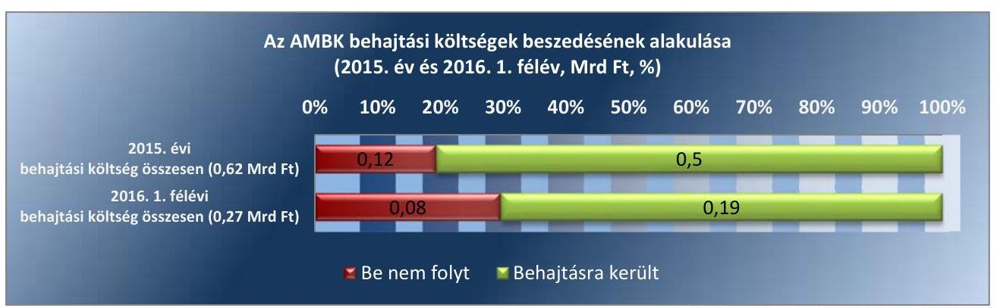

---

A 2015-ben a NAV-hoz beérkezett megkeresések közül az öt legnagyobb darabszámú köztartozáscsoport - Hulladékgazdálkodási díj, Gazdasági Kamara, Diákhitel ${ }_{1}$, Rendőrség Közúti bírság, Nyugdíjfolyósító Igazgatóság - az összes beérkezett megkeresés mintegy 91\%-át adta (ld. 1. táblázat). Ezen öt köztartozáscsoport összértéke (22 857,93 M Ft) a NAV összes vonatkozó beérkezett megkeresése (66 750,68 M Ft) összértékének 34,2\%-át tette ki. A beérkezett köztartozásos megkeresések megoszlása 2015-ben a 3. ábra mutatja be.

1. táblázat

# AZ 5 LEGNAGYOBB SZÁMBAN BEÉRKEZETT MEGKERESÉS ÉS ÁTLAGOS ÉRTÉKE 2015-BEN 

| jogcím | darab-   szám | összérték   (M Ft) | átlagos érték   (ezer Ft) |
| :-- | :--: | :--: | :--: |
| AMBK összesen | 471014 | $66750,68$ | 141,7 |
| Hulladékgazdálkodási Díj | 280053 | $5410,44$ | 19,3 |
| Gazdasági Kamara | 76380 | 458,28 | 6 |
| Diákhitel ${ }_{1}$ (Szabad Felh. Cél) | 36938 | $13076,21$ | 354 |
| Rendőrség Közúti Bírság | 21585 | $2510,78$ | 116,3 |
| Nyugdíjfolyósító Igazgatóság | 15711 | $1402,22$ | 89,25 |

Forrás: Saját szerkesztés NAV adatszolqáltatás alapján
2. ábra

## Beérkezett köztartozásos megkeresések megoszlása 2015-ben

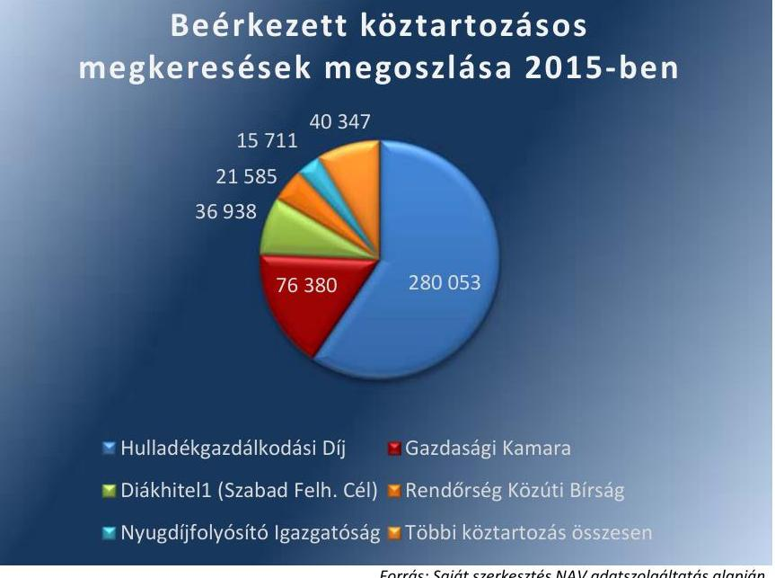

Forrás: Saját szerkesztés NAV adatszolqáltatás alapján
2. táblázat

## AZ 5 LEGNAGYOBB ÖSSZÉRTÉKŰ BEÉRKEZETT KÖZTARTOZÁSOS MEGKERESÉS 2015-BEN (M FT)

| jogcím | összeg (M Ft) |
| :-- | :--: |
| Kki-Végrehajtás Tőkére | $16158,04$ |
| Diákhitel ${ }_{1}$ (Szabad Felh. Cél) | $13076,21$ |
| Hulladékgazdálkodási Díj | $5410,44$ |
| Kki-Megkereső Kés. Pótlékra | 4538,30 |
| Közösségi Támogatás | 4393,34 |
| Többi köztartozás összesen | 23174,35 |

Forrás: Saját szerkesztés NAV adatszolqáltatás alapján

2015-ben a NAV-hoz beérkezett 5 legnagyobb összegű köztartozás együttes értéke 43 576,3 M Ft volt, amely az összes, adott időszakban beérkezett köztartozásos megkeresés értékének 65,28 \%-át adta (ld. 2. táblázat).

---

A 2016. I. félévében a NAV-hoz beérkezett megkeresések közül az öt legnagyobb darabszámú köztartozáscsoport az összes beérkezett megkeresés mintegy 84\%-át adta (ld. 3. táblázat). Ebben az időszakban az összes beérkezett köztartozásos megkeresés átlagos értéke 172,7 E Ft volt. A beérkezett köztartozásos megkeresések megoszlása 2016ban a 4. ábra mutatja be.
3. táblázat

# AZ 5 LEGNAGYOBB SZÁMBAN BEÉRKEZETT MEGKERESÉS ÉS ÁTLAGOS ÉRTÉKE 2016. I. FÉLÉVBEN 

| jogcím | darabszám | összérték (M Ft) | átlagos érté*   (eger Ft) |
| :-- | --: | --: | --: |
| AMBK összesen | 266360 | 45996,06 | 172,7 |
| Hulladékgazdálkodási Díj | 150233 | 3079,91 | 20,5 |
| Diákhitel1 (Szabad Felh. Cél | 21142 | 8902,78 | 421,1 |
| Gazdasági Kamara | 20268 | 232,07 | 11,45 |
| Földhivatali Díj És Költség | 19676 | 163,66 | 8,3 |
| Rendőrség Közúti Bírság | 12324 | 870,88 | 70,7 |

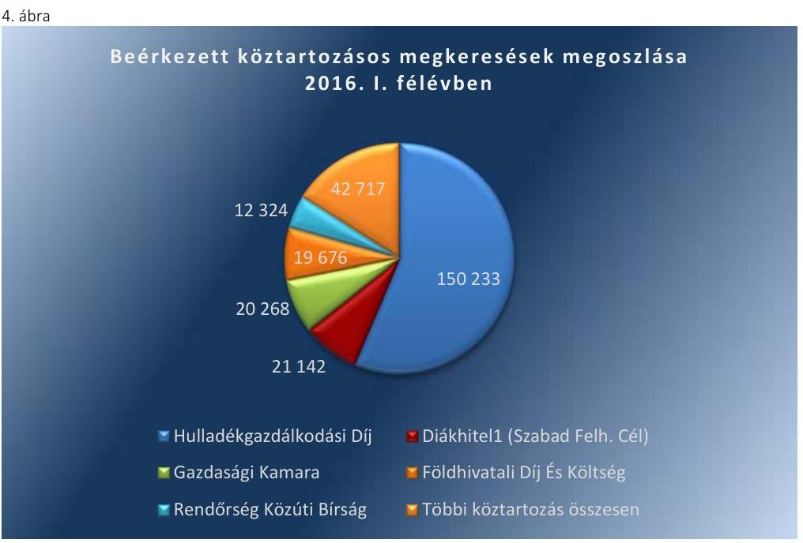

4. táblázat

## AZ 5 LEGNAGYOBB ÖSSZÉRTÉKŰ BEÉRKEZETT KÖZTARTOZÁSOS MEGKERESÉS 2016. I.FÉLÉVBEN (M FT)

| jogcím | összeg |
| :-- | :--: |
| Diákhitel1 (Szabad Felh. Cél) | 8902,78 |
| Kki-Végrehajtás Tőkére | 7693,27 |
| Kki-Végrehajtás Bírságra | 3981,55 |
| Közösségi Támogatás | 3417,88 |
| Hulladékgazdálkodási Díj | 3079,91 |
| Többi köztartozás összesen | 18920,66 |

Forrás: Saját szerkesztés NAV adatszolgáltatás alapján
2016. I. félévében a NAV-hoz beérkezett 5 legnagyobb összegű köztartozás együttes értéke 27 075,4 M Ft volt, ami összes, adott időszakban beérkezett köztartozásos megkeresés értékének 58,86\%-át tette ki (ld. 4. táblázat).

---

A NAV 25 köztartozás esetében ért el 2015. év során 20\%-nál magasabb behajtási arányt (az adott évben az adott köztartozásfajtára összesen behajtott tartozást a beérkezett összes megkeresés összegéhez viszonyítva). Ezen 25 köztartozás kapcsán a behajtott tartozások összege 1 294,06 M Ft volt, amelynek aránya a 2015. évben összes behajtott összeghez viszonyítva 19,11\%, illetve aránya a 2015. évben beérkezett összes megkeresés összegéhez viszonyítva 1,94\%. A 2. táblázatban már bemutatott öt legnagyobb összértékű köztartozás behajtási aránya ugyanakkor a 20\%-ot nem érte el, a hulladékgazdálkodási díj kivételével kifejezetten alacsony arányt sikerült elérni (ld. 5. táblázat). Jóval kedvezőbb képet mutatnak az öt legnagyobb darabszámban beérkezett köztartozás - 6. táblázatban bemutatott - behajtási arányai, ahol csak a szabad felhasználású diákhitel behajtási aránya marad el a 10,2\%-os átlagtól, a többiek aránya azt jelentősen meg is haladja.
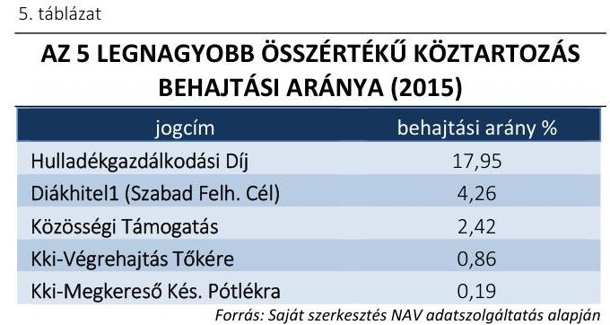
6. táblázat

AZ 5 LEGNAGYOBB DARABSZÁMÚ KÖZTARTOZÁS BEHAJTÁSI ARÁNYA (2015)

| jogcím | behajtási arány \% |
| :-- | :--: |
| Hulladékgazdálkodási Díj | 17,95 |
| Diákhitel1 (Szabad Felh. Cél) | 4,26 |
| Közösségi Támogatás | 2,42 |
| Kki-Végrehajtás Tőkére | 0,86 |
| Kki-Megkereső Kés. Pótlékra | 0,19 |

6. táblázat

AZ 5 LEGNAGYOBB DARABSZÁMÚ KÖZTARTOZÁS BEHAJTÁSI ARÁNYA (2015)

| jogcím | behajtási arány \% |
| :-- | :--: |
| Gazdasági Kamara | 30,52 |
| Rendőrség Közúti Bírság | 23,09 |
| Hulladékgazdálkodási Díj | 17,95 |
| Nyugdíjfolyósító Igazgatóság | 14,73 |
| Diákhitel1 (Szabad Felh. Cél) | 4,26 |

A NAV kimutatása alapján az egy ügyintézőre jutó napi, adók módjára behajtandó köztartozásos ügyek száma 2015. évben átlagosan 111 volt, amely 2016. június 30 -ára 134-re, mintegy 20,7\%-kal nőtt (ld. 5. és 6. ábra). Az ügyek az egyes adó- és vámigazgatóságok között nem egyenletesen oszlottak meg, így az egy ügyintézőre jutó napi úgyszám 2016. félévében pl. Szabolcs-Szatmár-Bereg megyében elérte a 262-t, vagy kiugró értékként a Kiemelt Adó- és Vámigazgatóságon az 1089-et.
5. ábra
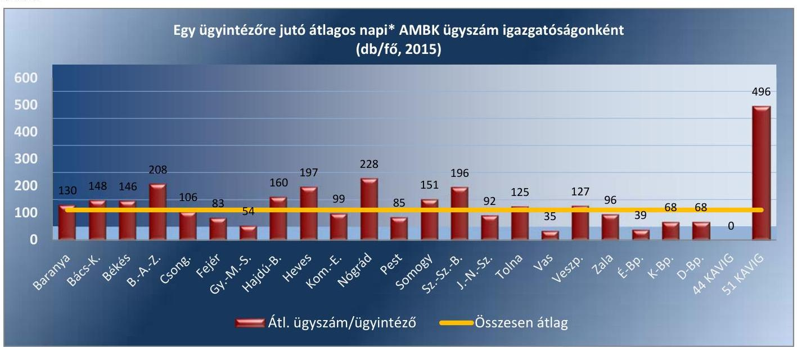

Forrás: Saját szerkesztés NAV adatszolgáltatás alapján

---

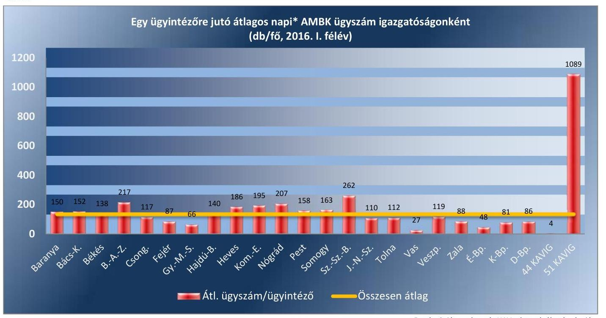

Fornás: Saját szerkesztés NAV adatszolgáltatás alapján

* Naponta átlagosan ennyi ügyet kell kezelni, illetve figyelemmel kísérni az ügy eseményeit (cselekmények megtétele, ezek eredményei, letéti rendszerben könyvelések stb.).

---

# FÜGGELÉK: ÉSZREVÉTELEK 

A jelentéstervezetet a Számvevőszék 15 napos észrevételezésre megküldte az ellenőrzött szervezet vezetőjének az ÁSZ tv. 29. §* (1) bekezdése előírásának megfelelően.
Az elfogadott észrevételek alapján a Számvevőszék módosította a jelentést.

A függelék tartalmazza az ellenőrzött észrevételeit, illetve az el nem fogadott észrevételek elutasításának indoklását.

- A Nemzeti Adó- és Vámhivatal vezetőjének 2161492826 iktatószámú levele észrevételekkel
- Tájékoztatás az elfogadott és az el nem fogadott észrevételekről (V-1146-367/2016.)

[^0]
[^0]:    * 29. § (1) Az Állami Számvevőszék az ellenőrzési megállapításait megküldi az ellenőrzött szervezet vezetőjének vagy az általa megbízott személynek, és annak, akinek személyes felelősségét állapította meg.
    (2) Az ellenőrzött szervezet vezetője és a felelősként megjelölt személy az ellenőrzés megállapításaira tizenöt napon belül írásban észrevételt tehet.
    (3) Az Állami Számvevőszék az észrevételre a beérkezésétől számított harminc napon belül írásban válaszol. A figyelembe nem vett észrevételeket köteles a jelentésben feltüntetni, és megindokolni, hogy azokat miért nem fogadta el.

---

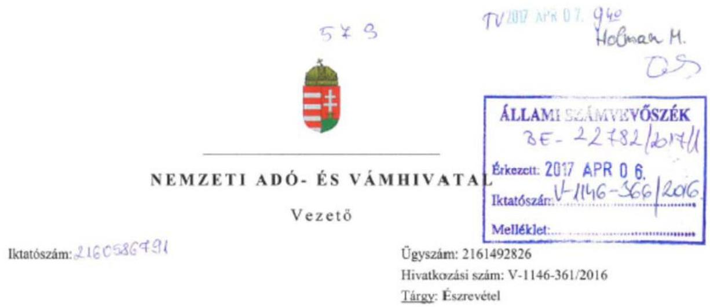

# Domokos László úr
elnök
részére

Állami Számvevőszék

Budapest

Tisztelt Elnök Úr!

Köszönettel megkaptam „a Nemzeti Adó- és Vámhivatal informatikai rendszereinek ellenőrzése” témájában készített, fenti számon megküldött számvevőszéki Jelentés tervezetet (a továbbiakban: Tervezet), melyet áttekintettem, és azzal kapcsolatosan az alábbi észrevételeket fogalmazom meg:

I. Intézkedési javaslattal érintett megállapítások:

1.) A Tervezet 26. oldalán szereplő 1. sz. intézkedési javaslat szerint intézkedni kell „a Bkr. előírásai alapján a belső kontrollrendszer keretében kialakított integrált kockázatkezelési rendszer müködtetéséről, az ellenőrzési nyomvonalak kialakításáról.”

A megállapítás az 1.1. számú megállapítás 4. bekezdésén (14. oldal), a 2.1. számú megállapítás 4. bekezdésén (18. oldal), a 3.1. számú megállapítás 2. bekezdésén (21. oldal) és a 4.1. megállapítás 5. bekezdésén (24. oldal) alapul.

Az intézkedési javaslat alapját képező 2.1. számú megállapítás 4. bekezdésére észrevételt nem teszek, míg a 1.1. számú megállapítás 4. bekezdése, a 3.1. számú megállapítás 2. bekezdése és a 4.1. megállapítás 5. bekezdése kapcsán a következő az észrevételem.

1./a.) A Tervezet 14. oldalán található 1.1. számú megállapítás 4. bekezdése szerint „A NAV kockázatkezelési rendszerét a szervezet vezetője a Belső kontrollrendszerről szóló szabályzattal meghatározta, ugyanakkor azt a Bkr. 7. § (2) bekezdésében előírtak ellenére az informatikai területen nem müködtette. A Bkr. 3.§ a) pontja, valamint a Bkr. 6. § (3) bekezdésében előírtaknak ellenére az informatikai főosztályok és az INIT ellenőrzési nyomvonalai nem kerültek kialakításra. A kockázatelemzés és kockázatkezelés hiányában a NAV nem felelt meg a Bkr. 8. § (1) bekezdés előírásainak, mert nem volt biztosított azon

1054 Budapest, Széchenyi u. 2.
Telefon: (06-1) 428-5100 • Fax: (06-1) 428-5504

---

kontrollok teljes körü kialakítása, amelyek a kockázatokat kezelik, és hozzájárulnak a szervezet céljainak eléréséhez."

Ezzel szemben a vizsgált időszakban (2015. 01.01-2016.06.30.)

- az informatikai főosztályok ellenőrzési nyomvonalait a Nemzeti Adó- és Vámhivatal Központi Hivatalának ellenőrzési nyomvonaláról, szabálytalanság- és kockázatkezelési felelősének kijelelőséről szóló 2140/2014. szabályzat 1. melléklete tartalmazza - 181. föfolyamatban (1443. sor), a 182. föfolyamatban (1449. sor), a 192. föfolyamatban (1584. sor).
- az INIT ellenőrzési nyomvonalát pedig az INIT ellenőrzési nyomvonalról, valamint a szabálytalanság- és kockázatkezelési felelős kijelöléséről szóló 2004/2015/50. szabályzat 1. mellékletet tartalmazza.

Mindezekre tekintettel kérem 1.1. számú megállapítás 4. bekezdés módosítását, törlését, és a Tervezet 1. számú intézkedési javaslatának ezen pontra való hivatkozásának elhagyását.
1./b.) A Tervezet 21. oldalán található 3.1. számú megállapítás 2. bekezdése szerint - a kutatás-fejlesztési tevékenység adóalap és adókedvezmény érvényesítése körében - a NAV ,,A kockázatkezelési rendszerét a NAV a Bkr. 3. § (b) pontjának megfelelően a Belső kontrollrendszerről szóló szabályzattal kialakította. A NAV vezetője a Bkr. 6. § (3) bekezdésében, valamint a Belső kontrollrendszerről szóló szabályzat 29-35., 75. pontjában és az I-II. sz. mellékletében elöirtak ellenére ugyanakkor nem gondoskodott a kutatás-fejlesztési kedvezményekkel kapcsolatos feldolgozási feladatokat ellátó Bevallási Főosztály ellenőrzési nyomvonalának kidolgozásáról. Ennek hiányában nem határozták meg a Belső kontrollrendszerről szóló szabályzat által előirt felelősségi és információs szinteket és kapcsolatokat, az irányítási és ellenőrzési folyamatokat sem."

Az ÁSZ által ellenőrzött időszakban érvényes - a Tervezetben hivatkozott -, a Nemzeti Adóés Vámhivatal egységes belső kontrollrendszeréről szóló 2124/2014. szabályzat 151. pontja alapján 2014. november 20 -án kiadásra került a Nemzeti Adó- és Vámhivatal Központi Hivatalának ellenőrzési nyomvonaláról, szabálytalanság- és kockázatkezelési felelősének kijelöléséről szóló 2140/2014. szabályzat.

A hivatkozott 2140/2014. számú szabályzat 1. számú melléklete tartalmazta a NAV Központi Hivatalának ellenőrzési nyomvonalát. E dokumentumba beépítésre kerültek a Bevallási Főosztály tevékenységével kapcsolatos folyamatok is (a táblázat 12-16. sorai).

Emellett az ellenőrzéssel érintett időszakot követően 2016. november 9 -én kiadmányozott, a NAV vezetője által kiadott 2160/2016/VEZ szabályzat a Nemzeti Adó- és Vámhivatal egységes belső kontrollrendszeréről 1. számú melléklete a korábbiakhoz hasonlóan tartalmazza a Központi Irányítás ellenőrzési nyomvonalát, benne a Bevallási Főosztályt érintő folyamatokkal (a táblázat 40-45. sorai).

---

A fenti szabályozással érintett folyamatokban a bevallások fogadásának, feldolgozásának kockázatkezelése szerepel, a bevallások egységes bevallás-feldolgozó rendszerben történő kezeléséből adódóan nem indokolt a bevallásonkénti, bevallás soronkénti előírás.

Mindezekre tekintettel kérem a 3.1. számú megállapítás 2. bekezdésének törlését és a Tervezet 1. számú intézkedési javaslatának ezen pontra való hivatkozásának törlését.
1./c.) A Tervezet 24. oldalán található 4.1. megállapítás 5. bekezdése szerint „a kockázatkezelési rendszert a NAV elnöke a Belső kontrollrendszerről szóló szabályzattal a Bkr. 3.§ (b) bekezdésében elöirtaknak megfelelően meghatározta. Azonban az adók módjára behajtandó köztartozások feladat-végrehajtásával kapcsolatos kockázatokat - beleértve a feladatot végrehajtó adó- és vámigazgatóságok tevékenységében rejlő kockázatokat - nem határozták meg, nem mérték fel, nem elemezték és értékelték, ami nem felelt meg a Bkr. 7. § (1) és (2) bekezdések elöírásainak."

A következő bekezdésben, azaz a 4.1. megállapítás 6. bekezdésben továbbá az is rögzítésre került, hogy „A NAV vezetője a Bkr. 6. § (3) bekezdése ellenére az adók módjára behajtandó köztartozással kapcsolatos feladatok végrehajtására vonatkozó ellenőrzési nyomvonalat - a KH ellenőrzési nyomvonalának meghatározásának kivételével - nem készített. A Bkr. 2. § n) pont nc) alpontja, illetve a Belső kontrollrendszerről szóló szabályzat 152. pontja ellenére a regionális adó- és vámigazgatóságok vezetői nem készítették el ellenőrzési nyomvonalalikat."

Az adók módjára behajtandó köztartozások (továbbiakban: AMBK) behajtási feladataival kapcsolatban a föigazgatóságok tekintetében nem kellett meghatározni kockázatokat, ellenőrzési nyomvonalat, tekintettel arra, hogy a föigazgatóságok nem folytattak hátralékkezelési és végrehajtási tevékenységet.

Ugyanakkor a NAV egységes belső kontrollrendszeréről szóló 2124/2014/ELN szabályzat alapján valamennyi adóföigazgatóság elkészítette a saját magára és az igazgatóságaira vonatkozó ellenőrzési nyomvonalakat, és az igazgatóság nyomvonalai tartalmazták az AMBK-ra vonatkozó nyomvonalat is. A szabályozásokat megvizsgáltam és megállapítottam, hogy az ellenőrzési nyomvonalat az AMBK kezelésére vonatkozóan mindegyikük tartalmazza. (Lásd: 2001/2015/72 szabályzat 2. melléklet 51. pont, 2001/2015/73 szabályzat 2. számú melléklet 45 . pont, 2001/2015/74 szabályzat 2 . melléklet A12. pont, 2001/2015/75 szabályzat 2 . melléklet 55 . pont, 3 . melléklet 56 . pont, 4 . melléklet 56. pont, 2001/2015/76 szabályzat 2.,3.,4., számú mellékletek, hátralékkezelési fül, 2002/2015/77 szabályzat, 2. melléklet 75 . pont, 2002-2015-78 szabályzat 2 .melléklet 23 . pont, 2005/2015/71 szabályzat 2 . melléklet 12 . pont, illetve 2001/2015/71. szabályzat 2 .sz. melléklet 12 . pont.)

Emellett jelzem, hogy a 2016. november 9 -én kiadott, a NAV egységes belső kontrollrendszeréről szóló 2160/2016/VEZ szabályzat a volt föigazgatóságok igazgatóságokra is - érvényes tárgybani szabályozásait érvénytelenítette, de az új szabályzat az AMBK ellenőrzési nyomvonalat az igazgatóságokra vonatkozóan hasonlóképpen tartalmazza.

Az új szabályzat SZ_01-es melléklete szerint valamennyi igazgatósági szabályozásban beépítésre került az AMBK kezelés és behajtás kockázati szintjének és ellenőrzési nyomvonalának meghatározása, az alábbi táblázatnak megfelelő tartalommal:

---

|  Tevékenység/feladat |  |  | Jogi alap (jogszabály/belső rendelkezés) | Keletkező dokument um | Végrehajt ásért felelős | Határidő | Ellenőrzés felelőse | Ellenőrz és módja | Eredendő kockázati szint  |
| --- | --- | --- | --- | --- | --- | --- | --- | --- | --- |
|  Főfolyamat | Részfolyamat |  |  |  |  |  |  |  |   |
|   |  | részfolya |  |  |  |  |  |  |   |
|   | folyama | mat |  |  |  |  |  |  |   |
|  Hátralékkezel ési feladatok |  | Kéltő megkeres ések befogadás a és letéti számlára könyvelés a (végrehajt ás alá vonás). | 1994. évi LIII. törvény, 2003. évi XCII. törvény, 2004. évi CXL. törvény, 2011. évi CXCV. törvény, 1/2015. (IV.2.) NAV utasítás, 1049/2011. eljárási rend, 1162/2011. eljárási rend, 1034/2012. eljárási rend, 1055/2012. eljárási rend, 1030/2015. eljárási rend, 1032/2015. eljárási rend, 1024/2016/VE Z eljárási rend, 1101/2016/V NH. eljárási rend, 1164/2016/V NH eljárási rend, 5042/2012/FV F körlevél, Ügyrend | Kötelezett ség rögzítő |  |  |  |  |  |   |
|   | Adók módjára behajta adó köztartozások végreha jtás alá vonása |  |  |  |  |  |  |  |   |
|   |  | Hatáskör, illetékessé a vizsgálat. |  |  |  |  |  |  |   |
|   |  |  |  |  |  | Ügyintéz | Haladéktala | Osztályvezet |   |
|   |  |  |  |  |  |  | 0/Főosztályve |  |   |
|   |  |  |  |  |  |  | zető/Igazgató helyettes | Szúrópr óbuszer á | Közepes  |
|  |   |   |   |   |   |   |   |   |   |
|  |   |   |   |   |   |   |   |   |   |
|  |   |   |   |   |   |   |   |   |   |
|  |   |   |   |   |   |   |   |   |   |
|  |   |   |   |   |   |   |   |   |   |
|  |   |   |   |   |   |   |   |   |   |
|  |   |   |   |   |   |   |   |   |   |
|  |   |   |   |   |   |   |   |   |   |
|  |   |   |   |   |   |   |   |   |   |
|  Mindezekre tekintettel kérem |  |  |  |  |  |  |  |  |   |
|  - a 4.1. megállapítás 5. bekezdésének módosítás és a Tervezet 1. számú intézkedési javaslatának ezen pontra való hivatkozásának elhagyását, továbbá |  |  |  |  |  |  |  |  |   |
|  - a 4.1. megállapítás 6. bekezdés törlését. |  |  |  |  |  |  |  |  |   |
|  |   |   |   |   |   |   |   |   |   |
|  2.) A Tervezet 26. oldalán szereplő 3. sz. intézkedési javaslat szerint intézkedni kell „hogy az Áht. és az Ávr. rendelkezései szerint a jogszabály által előirt alaptevékenységek az SZMSZ-ben rögzítésre kerüljenek." |  |  |  |  |  |  |  |  |   |
|  A megállapítás az 4.1. számú megállapítás 1. bekezdés 2. mondatán (23. oldal) alapul. E szerint „Az SZMSZ ${ }_{1,2}$ az Áht. 10. § (5) bekezdése és az Ávr. 13. § (1) bekezdés c) pontja ellenére nem jelölte meg az adók módjára behajtandó köztartozással kapcsolatos feladatok végrehajtását, mint ellátandó alaptevékenységet." |  |  |  |  |  |  |  |  |   |

---

Az Áht. 10.§ (5) bekezdése szerint a költségvetési szerv szervezetét, feladatai ellátásának részletes belső rendjét és módját szervezeti és müködési szabályzat állapítja meg. A szervezeti egységekre vonatkozó szabályokat a költségvetési szerv szervezeti és müködési szabályzatában vagy a szervezeti egységek ügyrendjében, a gazdálkodás részletes rendjét belső szabályzatban kell meghatározni.
Az Ávr. 13. § (1) bekezdés c) pontja szerint a költségvetési szerv szervezeti és müködési szabályzata tartalmazza az ellátandó, és a kormányzati funkció szerint besorolt alaptevékenységek, rendszeresen ellátott vállalkozási tevékenységek megjelölését.

A NAV SZMSZ szabályozási módja tekintetében elöljáróban fontos kiemelni, hogy a jogalkotásról szóló 2010. évi CXXX. törvény (Jat.) 3. §-a szerint az azonos vagy hasonló életviszonyokat azonos vagy hasonló módon, szabályozási szintenként lehetőleg ugyanabban a jogszabályban kell szabályozni. A szabályozás nem lehet indokolatlanul párhuzamos vagy többszintü. A jogszabályban nem ismételhető meg az Alaptörvény vagy olyan jogszabály rendelkezése, amellyel a jogszabály az Alaptörvény alapján nem lehet ellentétes.

Erre is tekintettel álláspontom szerint a vizsgált időszakban a hatályos NAV SZMSZ az Áht. 10. § (5) bekezdésében foglaltaknak megfelelően tartalmazza a NAV feladatai ellátásának részletes belső rendjét és módját a következők szerint:

- A NAV SZMSZ III. fejezet tartalmazza a NAV egyes szerveinek feladatkörét, mely figyelemmel Jat. hivatkozott előírására - ugyanakkor nem tartalmazhatja a szervek által ellátott összes feladat tételes felsorolását, de tartalmazza az ellátandó feladatokat tartalmazó jogszabályokra történő utalást.
- Így 6. függelék tartalmazza a NAV feladat- és hatáskörét meghatározó alapvető jogszabályok felsorolását,
- a 2. függelék tartalmazza a Központi Irányítás főosztályai által ellátott feladatokat.
- Ezen felül a 11. §-ban foglaltak értelmében a NAV szervek müködésének részletes szabályait az egyes NAV szervek ügyrendje tartalmazza.

Továbbá az SZMSZ az Ávr. 13. § (1) bekezdés c) pontjának megfelelően tartalmazza a kormányzati funkció szerint besorolt alaptevékenységeket is. Így az SZMSZ 1. § (1) bekezdés q) pontja a kormányzati funkciók, államháztartási szakfeladatok és szakágazatok osztályozási rendjéről szóló 68/2013. (XII. 29.) NGM rendeletben meghatározott funkciókódok közül tartalmazza többek között a „011220 Adó-, vám- és jövedéki igazgatás" funkciókódot. A rendelet értelmében ez alatt az adók, vámok, jövedéki adók kiszabásával, ellenőrzésével, beszedésével, behajtásával összefüggő feladatok ellátását kell érteni.
Fontos továbbá kiemelni, hogy az adók módjára behajtandó köztartozások végrehajtásával kapcsolatos feladatokat külön tartalmazó funkciókódot a rendelet nem tartalmaz, így ezen feladatot, mint a kormányzati funkció szerint besorolt alaptevékenységet külön/önállóan megjeleníteni nem lehet.

Ezért álláspontom szerint a fentiekre figyelemmel a NAV SZMSZ eleget tesz a jogszabályi követelményeknek.

Mindezekre tekintettel kérem a 4.1. számú megállapítás 1. bekezdés 2. mondatának pontositását, és a Tervezet 3. számú intézkedési javaslatának törlését.

---

3.) A Tervezet 26. oldalán szereplő 4. sz. intézkedési javaslat szerint intézkedni kell „a jogszabály és a belső eljárásrendek által elöirt ügyintézési határidők betartásáról." Az intézkedési javaslat a Tervezet 4.2. számú megállapítás 2. bekezdésén (25. oldal) alapul.

A megállapítás lényege szerint a hulladékról szóló 2012. évi CLXXXV. törvény 52. § (4) bekezdésében, valamint a vonatkozó belső szabályozásokban foglalt kapcsolódó határidőket a NAV nem minden esetben tartotta be, illetve a következő bekezdés (4.2. megállapítás 3. bekezdés) szerint az ügyek kiszignálása sem volt minden esetben teljes körű. (Ez utóbbi kapcsán lásd még az észrevétel 14.) pontját.)

A feldolgozási folyamatban az automatikus határidő figyelés korlátját az képezte, hogy a megkeresések papír alapon érkeztek, és amíg ezek kézi rögzítése nem történt meg, a végrehajtási ügyintézést támogató szakrendszer nem tudott határidőt figyelni. Azonban épp a behajtási megkeresések rögzítése igényelte a legnagyobb - amúgy is szűkös - humán erőforrást, mivel a papír alapú megkeresések feldolgozása korábban nem volt informatikailag támogatható.

A fenti problémát a behajtás iránti megkeresések 2017. január 1-jei elektronikus útra terelése mára már teljes egészében megoldotta, így az elektronikusan érkező megkeresések a rendszerben azonnal megjelennek (nem maradnak könyveletlenül), és a rendszer alapján a határidők is követhetőek, kontrolálhatóak.

A fentiek alapján kérem a 4.2. számú megállapítás 2. bekezdés megfelelő kiegészítését, és a 4. sz. intézkedési javaslat akkénti pontosítását, hogy a feladat nem a 4.2. számú megállapítás 2. bekezdésén, hanem a 4.2. számú megállapítás 2. bekezdés 2.-4. francia bekezdésén alapul, mivel a megkeresések beérkezését követően a kötelezettségek rögzítésére vonatkozó határidő megtartásának biztosítása az ügymenet elektronikussá alakítása miatt további intézkedést már nem igényel.

# II. Egyéb megállapítások: 

4.) A 9. oldal 4. bekezdését a következők szerint javaslom pontosítani:
„Az adók módjára behajtandó köztartozások beszedésével összefüggően a NAV 2015ben 122102 jogcimen, 471 ezer megkeresést dolgozott fel 66,75 Mrd Ft összértékben, amely feladat végrehajtásának támogatásában az informatikai rendszerek kulcsszerepet játszottak."
5.) A Tervezet 13. oldalán található 1.1. számú megállapítás 1. bekezdése szerint „a NAV 2015-ig rendelkezett intézményi stratégiával, amely meghatározta a 2011-2015. évekre szóló informatikai stratégiai irányokat is. Az ellenőrzött időszakban, 2016. január 1-től ugyanakkor a NAV az SZMSZ2 9. § g) pontjában foglaltak ellenére már nem rendelkezett közép- és hosszú távú stratégiai célokat megfogalmazó informatikai részstratégiával."

---

Az intézményi stratégia körében a következőkről tájékoztatom. A kormányzati stratégiai irányításról szóló 38/2012. (III.12.) Korm. rendelet 11. § (2) pontja értelmében az intézményi stratégia nem kötelezően elkészítendő stratégiai tervdokumentum. A hivatkozott rendelkezés szerint nem kell, hanem el lehet készíteni - a rendeletnek az egyes nem kötelezően elkészítendő stratégiai tervdokumentumokra vonatkozó szabályokat megállapító IV. fejezet alá tartozó - intézményi stratégiát (37. §).
A Kormányrendelet elvárásaira figyelemmel ugyanakkor a NAV-nál továbbra is kiemelt szervezeti célként jelentkezik - a kormányzati stratégiai irányítási rendszer szerves részeként - a NAV stratégiai menedzsment rendszerének teljes körű kialakítása, folyamatos fejlesztése, illetve ezzel párhuzamosan a stratégiai gondolkodás elmélyítése. Ennek megfelelően a NAV a 2016-2020. évekre vonatkozóan is elkészítette a középtávú - a NAV informatikai irányait, céljait is tartalmazó - szervezeti stratégiáját.
Ezen stratégia a Kormányrendelet 37. §-ában foglaltak figyelembevételével tartalmazza a szerv egészére - így az informatikai szakterületre is - vonatkozó mérhető működési és fejlesztési célokat, az ezek alapján elvégzendő feladatokat, valamint a megvalósítást szolgáló beavatkozások célterületeit és ezek eszközeit.

A hiányolt részstratégiával kapcsolatban - mely az előzőekre tekintettel szintén nem kötelezően elkészítendő dokumentum - a következőkről tájékoztatom.

A vizsgált időszakban hatályos SZMSZ-nek a Tervezetben hivatkozott 9. § g) pontja szerint a Központi Igazgatás „gondoskodik a NAV stratégiai irányainak, cél- és feladatrendszerének kialakításáról", mely - a fentieknek megfelelően - a 2016-2020. évekre vonatkozó szervezeti stratégia elkészítésével, valamint az éves intézményi munkatervek összeállításával megvalósul.

A fentiekre tekintettel kérem 1.1. számú megállapítás 1. bekezdés módosítását, illetve törlését.
6.) A Tervezet 13. oldalán található 1.1. számú megállapítás 2. bekezdés szerint „az intézményi munkatervét a NAV a kormányzati stratégiai irányitásról szóló 38/2012. (III.12.) sz. Korm. rendeletnek megfelelően a 2015. és 2016. évre vonatkozóan elkészítette. A munkatervek az informatikai szakterület éves operatív tervét - a kormányrendelet fogalmi meghatározása szerinti rövid távú stratégiai tervét - meghatározták, ugyanakkor nem tartalmazták a 38/2012. (III.12.) sz. Korm. rendelet 30. § c) pontjában foglaltak szerint a szervezeti célok, programok és intézkedések teljesitéséhez szükséges személyi, tárgyi, szakmai és szervezeti feltételeket."

A szervezeti célok, valamint azok elérését biztosító intézkedések, feladatok, programok középtávra vonatkozó pontos erőforrás szükségletének meghatározása, ütemezése teljes bizonyossággal nem biztosítható. Ugyanakkor a stratégia kialakításánál törekedtünk az objektív, racionális, megvalósítható és a stratégia időtávjára ütemezett stratégiai irányok, célok meghatározására, amelyek nem haladják meg a szervezet teljesítőképességének határait. A NAV 2015. és 2016. évre vonatkozó intézményi munkatervének szerves részét képezi az a melléklet, amely szerint a munkatervekben foglalt feladatokhoz szükséges

---

erőforrásigény a NAV elemi költségvetésének tervezése során figyelembe vételre került, illetve a feladatok végrehajtása a tárgyévi elemi költségvetés terhére történik.

A fentiekre tekintettel kérem 1.1. számú megállapítás 2. bekezdés fentiek szerinti módosítását, illetve a személyi, tárgyi, szakmai és szervezeti feltételeket hiányára vonatkozó rész elhagyását.
7.) A Tervezet 13. oldal végén, 14. oldal elején található 1.1. számú megállapítás 3. bekezdése többek között azt rögzíti, hogy „... a 2016. I. negyedévben kiadott beszámoló nem foglalkozott stratégiai informatikai fejlesztésekkel. Pozitív változást mutatott, hogy a 2016. évi felleves beszámolóban az informatikai terület már önálló részt képviselt, amely több fejlesztési eredményéröl is információt nyújtott."

A megállapítás kapcsán jelezni kívánom, hogy a NAV tevékenységéről szóló beszámoló tartalmára és szerkezetére vonatkozóan sem jogszabályi, sem pedig felügyeleti szervi előírás, vagy megkötés nincsen. A beszámoló egyes részeinek súlyát és tartalmát, az adott beszámolási időszak kiemelt tevékenységei és elért eredményei határozzák meg. Az való igaz, hogy a 2016. I. negyedévi beszámolóban az informatikai terület nem képezett önálló részt, de a szakmai eredmények bemutatását szolgáló részekben ismertetésre kerültek az adott időszak kiemelhető informatikai fejlesztései és eredményei, elvégzett feladatai is, így:

- a 12. oldal 5. szakaszában: módosításokra került sor az EKNYI (Egységes Képviseleti Nyilvántartás) rendszerében, melyek a korábbi lekérdező felület komfortosabb felhasználását segítik elő.
- a 14. oldal 3. szakaszában: Az első negyedévben megkezdődött a NAV honlapjának korszerűsítése.
- 16. oldal 1. szakaszában: A kitöltő-ellenőrző programok letöltése és használata az ÁNYK és az aktív súgó egyidejű telepítését támogató gyorsgombok segítségével vált az adózók számára egyszerűbbé.
- 23. oldal 6. szakaszában: Az EKAER kötelezettségek ellenőrzése során alkalmazott módszerek folyamatosan fejlődtek és igazodtak az esetlegesen újként megjelenő adókikerülő magatartásokhoz. Mindezt a több informatikai fejlesztés használatba vétele, valamint az ennek következtében továbbfejlesztett kockázatelemzési metodikák és újfajta lekérdezési lehetőségek kialakítása alapozták meg, melyek az ellenőrzésre történő kiválasztás eredményességét is javították.
- 38. oldal 4. szakaszában: a vonatkozó időszakban, folyamatban lévő 81 közbeszerzési/beszerzési eljárás becsült/szerződéseses értéke mintegy 15,7 Mrd forint volt, melyből közel 13 Mrd forintot az informatikai tárgyú beszerzések képviseltek.
- 43. oldal 2. szakaszában: A szolgáltatási folyamatokat támogató Informatikai Szolgáltatások Jegyzékén (ISZJ) 2016. I. negyedévében beérkezett és kezelt problémák, igények száma több mint 71 ezer darab volt.

A fentiekre tekintettel kérem 1.1. számú megállapítás 3. bekezdésnek az előzőek figyelembevételével történő módosítását.

---

8.) A Tervezet 15 . oldalán található 1.2. számú megállapítás első bekezdés második mondata és az első és második francia bekezdése szerint „.... A NAV az informatikai tárgyú szerződéseinek kialakítása és azok szakmai teljesitése során az alkalmazásfejlesztésre és minöségbiztositásra vonatkozó belső szabályzatokban, az IBSZ ${ }_{1,2}$-ben elöirt követelményeket nem tartották be, igy többek között

- a szerződések nem tartalmazták az Alkalmazásfejlesztési szabályzat 1. pont követelményét, mert nem irták elö a NAV informatikai fejlesztési és minöségbiztositási szabályzatának betartását;
- a szerződések végrehajtása során nem tartották be a Minöségbiztositási szabályzat 1. fejezetének 1. pont követelményeit, amikor az átvett végtermékek vagy igénybe vett szolgáltatások kapcsán minöségbiztositási dokumentumot nem készitettek."

Az első francia bekezdés kapcsán jelzem, hogy az Alkalmazásfejlesztési szabályzat 1. pontja az informatikai tárgyú szerződések körében kizárólag az Alkalmazásfejlesztési szabályzat és Alkalmazásfejlesztési Kézikönyv tekintetében fogalmaz meg előírásokat.

A második francia bekezdés kapcsán jelzem, hogy a fejlesztésre irányuló informatikai tárgyú szerződések esetében a termék átvételekor az üzembe helyezést megelőző minőségbiztosítás során a belső szabályok szerint kell eljárni. Minőség audit új rendszer üzembe helyezésekor történik, a szerződés tartalma szerinti módosító, karbantartó - ún. rövid életciklusú fejlesztések esetében csak a verziókezelést megelőző minőség-ellenőrzést kell elvégezni.
A vizsgálat során bekért megrendelések esetében megállapítható, hogy azok mindegyike módosító vagy karbantartó és rövid életciklusú fejlesztésnek tekinthető, amire az 1.4. számú megállapítás második bekezdés harmadik francia bekezdése kapcsán is kitérek.

A fentiekre tekintettel kérem az 1.2. számú megállapítás első bekezdés második mondata és az első és második francia bekezdésének módosítását, elhagyását.
9.) A Tervezet 16. oldalán található 1.4. számú megállapítás második bekezdés harmadik francia bekezdése értelmében az e-kereskedelemmel, a kutatás-fejlesztési kedvezményekkel, illetve a köztartozások behajtásával összefüggő „Új fejlesztések végrehajtásának és üzembe helyezésének folyamata során a NAV nem gondoskodott teljes körüen az alkalmazásfejlesztésre és minöségbiztositásra vonatkozó belső szabályzatokban, az IBSZ ${ }_{1,2}$-ben elöirtak betartásáról, igy többek között .....

- az Alkalmazásfejlesztési szabályzat 26. pontjában és a Minőségellenőrzési szabályzat 34. pontjában elöirt, az üzemi átadást megelőző minőségeauditról.

Ahogy azt a 8.) pontban jeleztem, és ahogy azt az Informatikai Intézet igazgatója 2016. november 8 -án a helyszíni szemrevételezéskor nyilatkozta (2136541159), a vizsgálat során bekért megrendelések esetében megállapítható, hogy azok mindegyike módosító vagy karbantartó és rövid életciklusú fejlesztésnek tekinthető, melyek minősítése és kezelése a hivatkozott nyilatkozatban foglaltak szerint a szabályoknak megfelelően történt. Az üzemi bevezetést megelőző minőségellenőrzési dokumentumok a vizsgálat során az ÁSZ részére átadásra kerültek, a folyamatot a helyszíni ellenőrzések során részletesen ismertettük.

---

Erről a Tervezet 15 -ik oldalán is pozitív visszajelzést kaptunk, ahol az ÁSZ megállapította, hogy „a kiemelt informatikai rendszerek továbbfejlesztését érintő kisebb volumenü feladatok esetén a telepítést megelőző minőségellenőrzésről a NAV megfelelően gondoskodott."

A fentiekre tekintettel kérem az 1.4. számú megállapítás második bekezdés harmadik francia bekezdése módosítását, elhagyását.
10.) A Tervezet 17. oldalán található 2.1. számú megállapítás második mondata szerint a NAV a „Kockázatkezelését az e-kereskedelemre nem terjesztette ki, a távolról nyújtható szolgáltatások ellenőrzésével összefüggő ellenőrzési módszereket nem határozta meg."

A jelentés 2.1. számú megállapítás 2. bekezdésében rögzíti, hogy a NAV rendelkezik a „hazai webáruházak" kockázatkezeléséhez és ellenőrzéséhez módszertani segédlettel (6003/2014/ELL számú módszertani segédlet). A bekezdés második mondata szerint „A segédlet azonban nem tért ki az Afa tv. 45/A. §-ában meghatározott távolról is nyújtható szolgáltatásokra, amivel nem felelt meg teljes körüen a NAV Stratégiában rögzített azon céljának, hogy ellenőrzési módszereket dolgozzon ki az interneten zajló gazdasági folyamatokra."

A 6003/2014/ELL számú módszertani segédlet amellett, hogy ismerteti a távközlési, rádió- és televízióműsor- és elektronikus szolgáltatásokra vonatkozó speciális áfa szabályokat, általánosan alkalmazható a webáruházon keresztül értékesített elektronikus szolgáltatások kockázatelemzése és ellenőrzése során is.

Álláspontom szerint a hivatkozott módszertani segédlet egyes pontjai a „külföldi" MOSS adózók elemzésére és ellenőrzésére is alkalmasak, hiszen az ellenőrzési módszerek elektronikus szolgáltatók esetében nem függnek attól, hogy hazai vagy külföldi szolgáltató elektronikus felületét/elérhetőségét kell megállapítani ill. vizsgálni, ráadásul a segédlet külön is kitér a külföldi webáruházakra.

Figyelembe veendőnek tartom továbbá e körben, hogy rendelkezésre áll egy közösségi szinten kidolgozott, minden tagállam számára ajánlásként megfogalmazott egységes „MOSS audit útmutató" is, ami az Európai Bizottság honlapján, valamint ugyanezen linkre mutatva a NAV honlapon is elérhető.

A fentiek következtében kérem a 2.1. számú megállapítás 2. bekezdés 2. mondatának elhagyását.
11.) A Tervezet 19. oldalán található 2.2. számú megállapítás 3. bekezdés első két mondata szerint „Külföldi illetőségü adóalany adófizetési kötelezettsége kapcsán a NAV az ellenőrzött időszakban adóhatósági ellenőrzést nem végzett. Ez nem felelt meg az Art. 86. § (1), (2) bekezdéseiben foglalt, az ellenőrzéssel és az ellenőrzöttség tudatával kapcsolatos, valamint a jogkövető magatartás kikényszeritésének elvárásával kapcsolatos követelményeknek."

---

A fentiek kapcsán elsődlegesen arra a körülményre kívánok rámutatni, hogy a 2015. január 1jén hatályba lépett MOSS - Mini Egyablakos Rendszer a közösségi jogi szabályozás nyomán, az Európai Unió mind a 28 tagállamában egy időpontban - újonnan - bevezetett olyan rendszer, amelyre vonatkozóan a bevezetés évében az Európai Unió valamennyi tagállama számára a fö feladatot a rendszer egységes követelmények szerinti összekapcsolása és müködtetése jelentette.

A MOSS rendszert nem csak az adóhatóságoknak, hanem az adózóknak is 2015. évtől kellett adaptálniuk, így a kezdeti időszakban - 2015. évben - tudomásunk szerint egy tagállam sem indított a MOSS adóalanyokkal kapcsolatban ellenőrzést, illetve ilyen irányú megkeresés a Központi Kapcsolattartó Iroda útján hazánk részére nem érkezett.

Az Állami Számvevőszék ellenőrzése során a NAV jelezte, illetőleg a 2016. október 19-ei tisztázó megbeszélésről készült V-1146-192/2016. iktatószámú helyszíni jegyzőkönyv 2. oldal utolsó bekezdésében is rögzíti, hogy a távolról nyújtható szolgáltatásokat végző külföldi vállalkozások kapcsán az ellenőrzött időszakban a hozzáadottérték-adó területén történő közigazgatási együttműködésről és csalás elleni küzdelemről szóló, Európai Unió Tanácsának 2010. október 7-ei 904/2010/EU rendelete alapján a NAV a MOSS rendszer keretében Magyarországra bevallott ügyletek tekintetében indított precedens jelleggel a „MOSS audit útmutató" szerint adóhatósági ellenőrzés céljából megkeresést (jogsegély iránti kérelmet), azonban arra a számvevőszéki vizsgálat időszakában az érintett tagállam még nem válaszolt. Jelzem továbbá, hogy egy a MOSS rendszerbe regisztrált, irországi illetőségủ adózó ellenőrzését 2016. májusában, azaz az ÁSZ vizsgálattal érintett időszakban kezdte meg a NAV, azonban a vizsgálat nem fejeződött be az ÁSZ vizsgálat időszakában.

Emellett vizsgálat lefolytatása a MOSS audit Guide-ban (melyet alkalmazók köréhez Magyarország is csatlakozott) foglaltak szerint csak nemzetközi együttműködéssel, a túlzott adminisztrációs terhek elkerülését célzó korlátozott keretek között, az azonosítót kiadó tagállam közreműködésével lehetséges.

Álláspontunk szerint a rendszer kezdeti időszakában, figyelemmel a fentiekre is a NAV erőforrásainak célszerűségi és gazdaságossági szempontok szerinti optimális felhasználását nem szolgálta volna a MOSS rendszerben regisztrált, és Magyarország felé áfa fizetési kötelezettséget való adózók fokozott, széles körű ellenőrzés alá vonása, azaz egy ilyen gyakorlat nem felelt volna meg az Art. 86. § (2) bekezdésében foglaltaknak.

Ennek megfelelően - és a 12.) pontban kifejtett nemzetközi együttműködési kötelezettség és annak korlátai miatt is - kérem a 2.2. számú megállapítás 3. bekezdés 2. mondatának elhagyását.
12.) A Tervezet 19. oldalán található 2.2. számú megállapítás 3. bekezdés 3. mondata szerint „a más EU tagállamban regisztrált, de Magyarországra adókötelezettségüket bevalló, távolról nyújtható szolgáltatásokat végző vállalkozások adatait a NAV a kockázatelemzési és kiválasztási rendszereibe nem csatolta vissza, ami nem felelt meg az Art. 90. § (5) és (6) bekezdések elöirásainak."

---

Ezen megállapítás kapcsán ismét utalni kívánok a webáruházak kockázatelemzéséhez és ellenőrzéséhez szolgáló 6003/2014. módszertani segédlet 4-5-6. fejezetében foglaltakra. A módszertani segédlet ezen fejezetei mind a belföldi, mind a külföldi illetőségủ adóalanyokra irányadóan részletesen elemzik, hogy melyek azok a keresési, adózó beazonosítását szolgáló információtechnológiai lehetőségek, melyek révén a kockázatos adózó feltárható, továbbá részletes útmutatást adnak a webáruházak kockázatelemzésének egyes szempontjai, a kockázatra utaló anomáliák feltárásához, elemzéséhez, továbbá adóellenőrzés során történő felhasználásához.

Mindezek alapján a Tervezet 19. oldalán a 2.2. számú megállapítás 3. bekezdés 3. mondatában foglaltak - mely szerint a NAV a más EU tagállamban regisztrált, de Magyarországra adókötelezettségüket bevalló, távolról nyújtható szolgáltatásokat végző vállalkozások adatait a kockázatkezelési és kiválasztási rendszereibe nem csatolta vissza nem felel meg a tényleges gyakorlatnak, hiszen a 6003/2014. módszertani segédlet a kockázatelemzésre, kiválasztásra részletes útmutatást ad.

E körben figyelembe veendő, hogy a közösségi jogszabályokból következően az ellenőrzés elsősorban az adóalany által a Héa. irányelv 369 k . cikke szerinti, az adóalany által vezetett nyilvántartás vizsgálatára terjedhet ki.
Összehasonlító kontroll adatokkal ugyanakkor - a nem adóalany magánszemély szolgáltatás-igénybevevői körre tekintettel - nem rendelkezik egyik tagállam sem.

Emellett vizsgálat lefolytatása az Európai Bizottság ajánlása szerinti MOSS audit Guide-ban (melyet alkalmazók köréhez Magyarország is csatlakozott) foglaltak szerint, csak nemzetközi együttmüködéssel, így túlzott adminisztrációs terhek elkerülését célzó korlátozott keretek között, az azonosítót kiadó tagállam közremüködésével lehetséges. Mindez szintén nem indokolja a kiterjedt, adózók széles körét érintő ellenőrzéseket.

Ennek megfelelően javaslom a 2. pont 2.2. számú megállapítás 3. bekezdés 3. mondatának törlését.
13.) A Tervezet 20. oldalán található 2.3. számú megállapítás 3. bekezdés 1. mondata szerint „Az EU Bizottság által meghatározott MOSS rendszer belső kontrolljai nem biztositották teljes körüen a tagállamok által nyilvántartott követelésállomány egyezőségét, valódiságát, ha a bevallást benyújtó adózó az esedékes összeget nem vagy nem teljes egészében fizette meg."

A megállapítás helytálló. A közösségi szabályok valamint az EU Bizottság által meghatározott specifikációk szerint kialakított rendszerben jelenleg is problémát okoz, hogy az esedékesség után - a fogyasztási tagállam felhívása alapján - közvetlenül más tagállamnak teljesítő magyar adózók hátralékait nyilvántartsuk illetve nyomon kövessük. Ennek kiküszöbölésére azonban sem a NAV-nak, sem Magyarországnak önállóan nincs lehetősége, a probléma csak a közösségi szabályok módosításával és a rendszernek mind a 28 tagállami átalakításával oldható fel.

---

Erre tekintettel kérem a 2.3. számú megállapítás 3. bekezdés 1. mondatának fentieken alapuló megfelelő kiegészitését.
14.) A Tervezet 25. oldalán a 4.2. számú megállapítás 3. bekezdése az adók módjára behajtandó köztartozással kapcsolatos feladatellátással összefüggésben többek között rögzíti, hogy a „feladatellátást támogató rendszerek belső kontrolljai .... nem biztositották az ügyek ügyintézőre való kiszignálásának teljes körüségét. ...."

Az ügyintézői képernyőn a vezetőnek minden, a megyében folyamatban levő ügy megjelenik, ami az osztályához tartozik, vagy „üres" azaz nincs osztályhoz (ügyintézőhöz) rendelve.
A vezetői ellenőrzés támogatására vannak további szürhető, rendezhető listák és statisztikák. Ezek mellett a teljességvizsgálatot támogatja a "Feldolgozottság" statisztika, ami tetszőleges időszakot választva mutatja, hogy a megadott időszakban beérkezett megkeresések feldolgozottság szerint, a lekérdezéskor milyen állapotban vannak.
Összességében tehát álláspontom szerint a vezetői információk teljes körűen rendelkezésre állnak a rendszerben a szignálás végrehajtásához. (Jelzem, hogy az észrevétel ezen pontja kapcsolódik a 3.) pont szerinti észrevételhez.)

A fentiek alapján kérem a 4.2. számú megállapítás 3. bekezdés jelzett részének elhagyását.
15.) A Tervezet általános forgalmi adónemet érintő vonatkozásai tekintetében - az egyértelműség kedvéért - indokoltnak tartom az 5. oldal közepén és a 9. oldal 2. bekezdésében található „távértékesítés" kifejezés törlését, tekintettel arra, hogy a Tervezet tárgykörével megítélésem szerint nem az Áfa törvény 29-31. §-aiban szabályozott termékértékesítési tényállások (ún. távolsági értékesítések), hanem kizárólag az Áfa törvény 45/A. §-a szerinti, ún. távolról is nyújtható szolgáltatások érintettek.

A végső szövegezés kialakításakor kérem észrevételeim, javaslataim szíves elfogadását.

Budapest, 2017. április ,, 4. "

Tisztelettel:
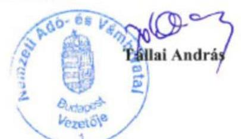

---

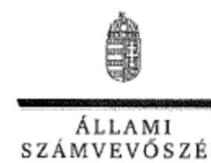

# Tállai András úr 

parlamenti és adóügyekért felelős államtitkár, miniszterhelyettes

Nemzeti Adó- és Vámhivatal

## Budapest

## Tisztelt Államtitkár Úr!

A Nemzeti Adó- és Vámhivatal informatikai rendszereinek ellenôrzése címủ számvevôszéki jelentéstervezetre tett észrevételeit köszönettel megkaptam.

Az Állami Számvevőszék észrevételekre vonatkozó álláspontjáról a felügyeleti vezető által készített részletes tájékoztatást csatoltan megküldőm.

Tájékoztatom Államtitkár urat, hogy a jelentésben - az Állami Számvevőszékről szóló 2011. évi LXVI. törvény 29. § (3) bekezdése alapján - a figyelembe nem vett észrevételeket szerepeltetjük az elutasítás indokának feltüntetésével együtt.

Budapest, 2017.
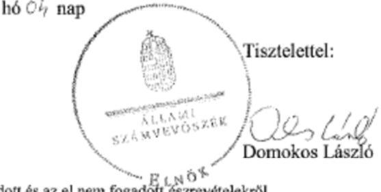

Melléklet: Tájékoztatás az elfogadott és az el nem fogadott észrevételekröl

---

# Tájékoztatás az elfogadott és az el nem fogadott észrevételekről 

A Nemzeti Adó- és Vámhivatal informatikai rendszereinek ellenörzése címü számvevőszéki jelentéstervezetre 2160586791 iktatószámú levelében tett észrevételeit áttekintettük, annak kezeléséről az alábbi tájékoztatást adom.

## I. Intézkedést igényló megállapítások

1. 1/a.) A jelentéstervezet 14. oldalán szereplő 1.1. számú megállapítás 4. bekezdésére tett észrevételét nem fogadtuk el. A Nemzeti Adó- és Vámhivatal (NAV) Központi Hivatalánál a 2015-ben hatályos Szervezeti és Müködési Szabályzata (továbbiakban: SZMSZ) szerint 2015. év végéig három föosztály (Informatikai Fejlesztési Főosztály, Informatikai Módszertani és Adatvagyon-gazdálkodási Főosztály, Információvédelmi, Folyamatszabályozási és Ügyvitelszervezési Főosztály) látott el informatikához kapcsolódó feladatokat. A Nemzeti Adó- és Vámhivatal Központi Hivatalának ellenőrzési nyomvonaláról, szabálytalanság- és kockázatkezelési felelősének kijelöléséről szóló 2140/2014. számú szabályzat 1. számú mellékletének az észrevételében hivatkozott fölolyamatai és a hozzá tartozó folyamatok, részfolyamatok a föosztályok részére SZMSZ 2. számú függelék 2.1 pontjában meghatározott feladataikat nem, vagy azoknak csak egy szük területét tartalmazzák. 2016. január 1-jétől - az SZMSZ módosítását követően - létrehozott Informatikai Főosztály feladataira, folyamataira vonatkozóan ellenőrzési nyomvonal nem készült, a 2140/2014. szabályzat e területre vonatkozóan nem tartalmaz folyamatokat.

A Nemzeti Adó-és Vámhivatal Informatikai Intézete ellenőrzési nyomvonalára tett észrevételében hivatkozott 2004/2015/50. számú szabályzatot a NAV nem bocsájtotta az ellenőrzés részére annak ellenére, hogy az Állami Számvevőszék (ÁSZ) - 2016. augusztus 1-jén a NAV számára megküldött - adatbekérő levele 3. sz. melléklet (Dokumentumjegyzék) 3.2.c. és 4.1.c. pontjai szerint a támogató informatikai feladatellátás folyamataira vonatkozó ellenőrzési nyomvonalakat kérte be. A dokumentumra való hivatkozást a teljességi nyilatkozat sem tartalmazza. Ezért az észrevételében hivatkozott szabályzatot nem tudjuk figyelembe venni.

1/b.) A jelentéstervezet 24. oldalán szereplő 3.1. számú megállapítás 2. bekezdésére tett észrevételét elfogadtuk, a számvevőszéki jelentés készítésénél figyelembe vesszük.

1/c.) A jelentéstervezet 21. oldalán szereplő 4.1. számú megállapítás 5. és 6. bekezdésére tett észrevételét nem fogadtuk el.

Észrevételében az 1/c.) ponthoz tartozó 3. bekezdésben foglaltak szerint a NAV regionális főigazgatóságok nem folytattak hátralékkezelési és végrehajtási tevékenységet, így a főigazgatóságoknak nem kellett meghatározni kockázatokat, ellenőrzési nyomvonalat. A jelentéstervezet 5. bekezdésében tett megállapítás nem a főigazgatóságokra, hanem a

---

szervezet egésze tekintetében állapítja meg a kockázatkezelési rendszer müködtetésének hiányát az adók módjára behajtandó köztartozások tekintetében.

Észrevételében szerepel, hogy valamennyi föigazgatóság elkészítette a 2124/2014/ELN szabályzat alapján saját magára és az igazgatóságaira vonatkozó ellenőrzési nyomvonalat. Az ellenőrzés rendelkezésére bocsátott dokumentumok alapján csak a Nemzeti Adó- és Vámhivatal Közép-magyarországi Regionális Adó föigazgatóságának föigazgatója által kiadott, az ellenőrzési nyomvonalról, valamint a szabálytalanság- és kockázatkezelési felelős kijelöléséről szóló 2001/2015/71. szabályzat tartalmazza az „Adók módjára behajtandó köztartozások végrehajtás alá vonása" folyamat meghatározását, más ellenőrzési nyomvonal nem. Az észrevételben hivatkozott további szabályzatokat (2001/2015/72., 2001/2015/74., 2001/2015/75., 2002/2015/77., 2002-2015-78., sz. szabályzatok) a NAV nem küldte meg az ellenőrzés részére annak ellenére, hogy az ÁSZ Fötitkára által 2016. augusztus 1-jén a NAV számára megküldött adatbekérő levél 3. sz. melléklet (Dokumentumjegyzék) 4.1.c. pontja tartalmazta a feladatellátás folyamataira vonatkozó ellenőrzési nyomvonalakat. A szabályzatokra való hivatkozást a záró teljességi nyilatkozat sem tartalmazza.

Az észrevételében jelzett 2016. november 9-től történő változások az ellenőrzött időszakot követően történtek, ezért azt a jelentés készitésénél nem tudjuk figyelembe venni. Örömmel vettük azonban, hogy az adók módjára történő behajtandó köztartozások föfolyamatként és részfolyamatonként beépülnek valamennyi igazgatóság szabályozásába.

Az ellenőrzés számára átadott dokumentumok, valamint az észrevételben foglaltak alapján a 4.1. számú megállapítása 5. és 6 . bekezdésében foglalt megállapításunkat és a megállapítás alapján tett javaslatunkat továbbra is fenntartjuk.
2. A jelentéstervezet 4.1. számú megállapítás 1. bekezdés 2. mondatára tett észrevételét nem fogadtuk el. Az SZMSZ nem határozza meg és nem jelöli ki az adók módjára behajtandó köztartozásokkal (AMBK) kapcsolatos feladatok végrehajtásának feladatát, amelyet a Nemzeti Adó- és Vámhivatalról szóló 2010. évi CXXII. törvény azt külön nevesíti a NAV adóigazgatási jogkörében. Az észrevételében hivatkozott Ávr. 13. §. (1) bekezdés c) pontban foglaltak szerint az SZMSZ-nek tartalmaznia kell az ,alaptevékenyágeek megielölését". Mivel az AMBK a NAV alapító okirata alapján alaptevékenység, ezért az SZMSZ-nek a megjelölést mindenképp kellett volna tartalmaznia. Tekintve, hogy az Ávr. 13. §-a az államháztartásról szóló CXCV. törvény (továbbiakban: Áht.) 10. § (5) bekezdéséhez kapcsolódóan tartalmaz rendelkezéseket, így a jelentéstervezetben az Áht.-re való hivatkozás is helytálló. Az államháztartásról szóló törvény végrehajtásáról szóló 368/2011. (XII.31.) Korm. rendelet (továbbiakban: Ávr.) 13. § (1) bekezdés c) pontjában szereplő, a kormányzati funkció szerinti besorolásra a jelentéstervezet kifogásolt része nem tartalmaz megállapítást, azt az ellenőrzés sem állapította meg hiányosságként.

Mindezek alapján a 4.1. számú megállapítása 1. bekezdésének 2. mondatában foglalt megállapításunkat és a megállapítás alapján tett javaslatunkat továbbra is fenntartjuk.

---

3. A jelentéstervezet 4.2. számú megállapítás 2. bekezdésében foglaltakra tett észrevételét nem fogadtuk el. Észrevételében a jelentéstervezet megállapítását nem kifogásolja, azzal kapcsolatban kiegészitő információt nyújt. A behajtás iránti megkeresések kapcsán feltárt szabálytalanság - 2017. január 1-jei elektronikus útra terelésével történő - kezelését a jelentéstervezetben nem tudjuk figyelembe venni, mert az ellenőrzött időszakot követően történt.

# II. Egyéb megállapítások 

4. A jelentéstervezet 9. oldal 4. bekezdésében foglalt észrevételét részben fogadtuk el. A jelentéstervezetben a jogcímek számát módosítjuk, a jogcímek számát azonban a NAV által az AMBK tárgyában az ellenőrzés részére megküldött 4. számú Tanúsítvány adatai alapján - a 0 -s tételeket figyelmen kívül hagyva - határozzuk meg. Ennek figyelembevételével a NAV 2015-ben 100 jogcímen dolgozott fel 471 ezer megkeresést.
5. A jelentéstervezet 13. oldalán az 1.1. számú megállapítás 1. bekezdésében foglaltakra tett észrevételét nem fogadtuk el. A jelentéstervezet idézett megállapítása tényszerüen rögzíti, hogy 2015-ig a NAV rendelkezett intézményi stratégiával. Az 1. bekezdés második mondata nem tartalmaz jogszabály be nem tartására vonatkozó megállapítást, észrevételében az SZMT 9. § g) pontjában meghatározott feladat szerinti, a NAV stratégiai irányainak, cél- és feladatrendszerének kialakítására irányuló kötelezettségre tett megállapítást nem vitatja, így a módosítás észrevétele alapján nem indokolt. A NAV a 20162020 évekre ki is alakította stratégiáját, azonban az ellenőrzött időszakban ez a stratégia még nem állt rendelkezésre. Ezáltal a hivatkozott szervezeti stratégiára irányuló megállapítást a nem tudunk tenni.
6. A jelentéstervezet 13. oldalán az 1.1. számú megállapítás 2. bekezdésében foglaltakra tett észrevételét nem fogadtuk el. A hivatkozott 38/2012. (III. 12.) Korm. rendelet szerint:
7. § Az intézményi munkaterv egy naptári évre szóló intézkedési és eröforrásfelhasználási rövid távú stratégiai tervdokumentum, amely tartalmazza
a) az adott idöszakra vonatkozó szervezeti célokat, programokat és intézkedéseket;
b) az a) pontban foglaltak teljesitési határidöit;
c) az a) pontban foglaltak teljesitéséhez szükséges személyi, tárgyi, szakmai és szervezeti feltételeket; valamint
d) az a)-c) pontokban foglaltak teljesitéséért felelösök meghatározását.

Az észrevételében jelzett, a munkatervekben foglalt feladatokhoz szükséges erőforrásigény a NAV elemi költségvetése tervezése során történő figyelembe vétele nem egyenértékủ az abban foglalt kötelezettség teljesítésével. Ezen túl a munkatervek hivatkozott mellékletei nem tartalmazzák az észrevételben rögzített azon kitételt sem, mely szerint a munkatervekben foglalt feladatokhoz szükséges erőforrásigény a NAV elemi költségvetésének tervezése során figyelembevételre került.
7. A jelentéstervezet 13. oldalán az 1.1. számú megállapítás 3. bekezdésében foglaltakra tett észrevételét részben fogadtuk el. A jelentéstervezet hivatkozott része nem tartalmaz

---

jogszabálysértést. A jelentéstervezet azt a tényt rögziti, hogy a NAV 2016. I. negyedévi beszámolója nem tartalmazott információt a NAV által is megjelölt 11 stratégiai informatikai fejlesztés végrehajtásáról vagy tapasztalatairól. Észrevétele alapján azonban a hivatkozott bekezdést kiegészitjük az alábbiak szerint: „a 2016. I. negyedévben kiadott beszámoló nem foglalkozott stratégiai informatikai fejlesztésekkel, azonban tartalmazott informatikai feladatok végrehajtásáról beszámolót".
8. A jelentéstervezet 15 . oldalán az 1.2. számú megállapítás 1 . bekezdéshez tartozó első francia bekezdésében foglaltakra tett észrevételét részben fogadtuk el. Nem fogadtuk el az első bekezdés első francia bekezdésére vonatkozó észrevételét, mert a 2023/2014. számú szabályzat 1 . pont 2 . alpontja, valamint 2131/2013. számú szabályzat I. fejezet 1 . pont 2. alpontja alapján biztosítani kell a szabályzatok rendelkezéseinek érvényesülését a szerződésekben. Észrevétele alapján azonban a szabályzatok pontjaira való hivatkozást tovább részletezzük a számvevőszéki jelentés készítése során, valamint töröljük a „mert" szót a bekezdésböl.

Nem fogadtuk el az 1.2 számú megállapítás 1 . bekezdés második francia bekezdésre tett észrevételét, mert a 2131/2013. számú szabályzat I. fejezet 1. pontja (1-6 alpontja) a szabályzat alkalmazását írja elő az informatikai termékek minőségbiztosítása céljából, amelyet többek között az informatikai termékek minőségellenőrzésével kell végrehajtani. Ennek részletes szabályait ugyanezen szabályzat III. fejezet 5. pont 23. alpontja szerint a 2010/2013/50. számú szabályzat rögziti. A rövid életciklusú fejlesztések esetén pl. a 2023/2014. számú szabályzat 4. pont 26. alpontja szerint „közvetlenül az üzemi átadást megelőzően kötelező kérni egy minöségauditot". Azon szerződéseknél, amelyek fejlesztési célú (beleértve a vásárlást is) tevékenység eredményeként elóállított/elöálló informatikai termékekre irányultak minőségbiztosítási (minőségellenőrzési) dokumentumokat nem bocsátottak az ellenőrzés rendelkezésére. A 2131/2013. számú szabályzat III. fejezet 6. pont 28. alpontja szerint a minőségellenőrzési tevékenységet dokumentálni kell. Mindezek alapján megállapításunkat továbbra is fenntartjuk. Figyelemmel arra, hogy a minőségellenőrzés a minőségbiztosítás egyik formája a számvevőszéki jelentés készitésénél a hivatkozott bekezdésben a minőségbiztosítás mellett zárójelben megjelenítjük a minőségellenőrzést is.
9. A jelentéstervezet 16. oldalán az 1.4. számú megállapítás 2. bekezdéséhez tartozó 3. francia bekezdésében foglaltakra tett észrevételét nem fogadtuk el részben az előző pontban leírtak alapján, részben a 2010/2013/50 számú szabályzat VI. fejezet 5. pont 34. alpontjában elöírtak alapján. Az üzemi átadást megelőző minőségaudítokról a NAV azonban nem adott át az ellenőrzés részére minőség-auditra vonatkozó dokumentumokat.
10. A jelentéstervezet 17. oldalán a 2.1. számú megállapítás 2 . mondatára és 2 . bekezdésében foglaltakra tett észrevételét elfogadtuk. A 2.1. számú megállapítás 2 . mondatából „a távolról is nyújtható szolgáltatások ellenörzésével összefüggö ellenörzési módszereket nem határozta meg", valamint a 2.1. számú megállapítás 2. bekezdésének 2. mondatát töröljük.

---

11. A jelentéstervezet 19. oldalán a 2.2. számú megállapítás 3. bekezdésének 2. mondatában foglaltakra tett észrevételét nem fogadtuk el. Észrevétele a tényeken nem változat, miszerint a külföldi illetóségủ adóalany adófizetési kötelezettsége kapcsán az ellenőrzött időszakban a NAV adóhatósági ellenőrzést nem végzett.
12. A jelentéstervezet 19. oldalán a 2.2. számú megállapítás 3. bekezdésének 3. mondatában foglaltakra tett észrevételét nem fogadtuk el. A módszertani segédlet megléte, a kockázatelemzési technikák azonosítása a kockázatelemzés elkészitését és visszacsatolását nem támasztja alá, a módszerek megléte önmagában nem igazolja annak végrehajtását. Észrevétele és az ellenőrzés rendelkezésére bocsátott dokumentumok nem igazolják, hogy a NAV el is végezte volna a kockázatelemzést, és azt visszacsatolta volna a kockázatelemzési és kiválasztási rendszerébe. A nemzetközi ellenőrzés együttmüködéssel történő megvalósítása nem zárja ki a kockázatelemzést.
13. A jelentéstervezet 20. oldalán a 2.3. számú megállapítás 3. bekezdésének 1. mondatában foglaltakat észrevétele nem kifogásolja, ahhoz kiegészítő információt nyújt, ezért megállapításunkat továbbra is fenntartjuk.
14. A jelentéstervezet 25 . oldalán a 4.2. számú megállapítás 3 . bekezdésében foglaltakra tett észrevételét nem fogadtuk el. Az észrevételben leírtak, és az ellenőrzés eredményei is azt támasztják alá, hogy a feladatellátást támogató informatikai rendszerek biztositottak ugyan funkciókat az ügyek feldolgozásához, azonban kontrollok nem kerültek kialakításra. Ennek alkalmazását sem a belső szabályzatok sem az informatikai rendszer nem kényszerítette ki. Mindezek következtében „a kontrollok elmaradása azt eredményezte, hogy ügyek elintézetlenül maradtak, azokat nem szignálták ki ügyintézőre", mely megállapítást az észrevételében nem kifogásolta.
15. A jelentéstervezet 5. és 9. oldalán szereplő távértékesítésre tett észrevételét elfogadtuk, a jelentéstervezet 5 . oldalán $A z$ ellenőrzés társadalmi indokoltsága címü fejezet 2 . bekezdés első mondatában és a 9. oldal 2. bekezdés 3. mondatában a „távértékesítésben" szavakat töröljük.

Budapest, 2017. 05 hó c4 nap
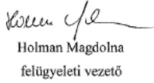

---

# RÖVIDÍTÉSEK JEGYZÉKE 

${ }^{1}$ NAV
${ }^{2}$ ÁFA
${ }^{3}$ ÁSZ
${ }^{4}$ ÁSZ tv.
${ }^{5}$ Stratégia
${ }^{6} \mathrm{SZMSZ}_{2}$
${ }^{7}$ Bkr.
${ }^{8} \mathrm{SZMSZ}_{1}$
${ }^{9}$ NGM
${ }^{10}$ Belső kontrollrendszerről szóló szabályzat
${ }^{11}$ INIT
12 Ávr.
${ }^{13}$ Ibtv.
${ }^{14} \mathrm{KH}$
${ }^{15} \mathrm{KI}$
${ }^{16} \mathrm{IBSZ}_{1,2}$
${ }^{17}$ Alkalmazásfejlesztési szabályzat
${ }^{18}$ Minőségbiztosítási szabályzat
${ }^{19}$ IISZ
${ }^{20}$ INIT Ügyrend $_{1}$
${ }^{21}$ INIT Ügyrend $_{2}$
${ }^{22}$ MOSS rendszer
${ }^{23}$ Art.
${ }^{24}$ 6003/2014/ELL módszertani segédlet
${ }^{25}$ 2015. évi Ellenőrzési Irányok

Nemzeti Adó- és Vámhivatal
általános forgalmi adó
Állami Számvevőszék
Az Állami Számvevőszékről szóló 2011. évi LXVI. törvény, hatályos 2011. július 1-jétől
A Nemzeti Adó- és Vámhivatal 2011-2015. évekre vonatkozó stratégiája
26/2015. (XII.30.) NGM utasítás a Nemzeti Adó- és Vámhivatal Szervezeti és Múködési Szabályzatáról, hatályos 2016. január 1-jétől
370/2011. (XII. 31.) Korm. rendelet a költségvetési szervek belső
kontrollrendszeréről és belső ellenőrzéséről, hatályos 2012. január 1-jétől
23/2011. (VI. 30.) NGM utasítás a Nemzeti Adó- és Vámhivatal Szervezeti és Múködési Szabályzatáról, hatályos 2015. december 31-ig
Nemzetgazdasági Minisztérium
A Nemzeti Adó- és Vámhivatal elnöke által kiadott 2124/2014. szabályzat a Nemzeti Adó- és Vámhivatal egységes belső kontrollrendszeréről
Nemzeti Adó- és Vámhivatal Informatikai Intézete
368/2011. (XII. 31.) Korm. rendelet az államháztartásról szóló törvény végrehajtásáról, hatályos 2012. január 1-jétől
Az állami és önkormányzati szervek elektronikus információbiztonságáról szóló 2013. évi L. törvény, hatályos 2013. július 1-jétől

Nemzeti Adó- és Vámhivatal Központi Hivatala
Nemzeti Adó- és Vámhivatal Központi Irányítása
A Nemzeti Adó- és Vámhivatal elnöke által kiadott 2087/2013. szabályzat a Nemzeti Adó- és Vámhivatal Informatikai Biztonsági Szabályzatáról A Nemzeti Adó- és Vámhivatal elnöke által kiadott 2107/2015. szabályzat a Nemzeti Adó- és Vámhivatal Informatikai Biztonsági Szabályzatáról
A Nemzeti Adó- és Vámhivatal elnöke által kiadott 2023/2014. szabályzat a Nemzeti Adó- és Vámhivatal Alkalmazásfejlesztési Szabályzatáról
A Nemzeti Adó- és Vámhivatal elnöke által kiadott 2131/2013. szabályzat a Nemzeti Adó- és Vámhivatal informatikai minőségbiztosításáról
A Nemzeti Adó- és Vámhivatal elnöke által kiadott 2090/2013. szabályzat a Nemzeti Adó- és Vámhivatal informatikai alkalmazásaival kapcsolatos fejlesztési igények kezelésének eljárási szabályairól
A Nemzeti Adó- és Vámhivatal elnöke által kiadott 2119/2014. szabályzat a Nemzeti Adó- és Vámhivatal Informatikai Intézetének ügyrendjéről
A Nemzeti Adó- és Vámhivatal vezetője által kiadott 2010/2016/VEZ szabályzat a Nemzeti Adó- és Vámhivatal Informatikai Intézetének ügyrendjéről
Mini Egyablakos Rendszer
Az adózás rendjéről szóló 2003. évi XCII. törvény, hatályos 2004 január 1-jétől
6003/2014/ELL módszertani segédlet a webáruházak kockázatelemzéséhez és ellenőrzéséhez
A Nemzeti Adó- és Vámhivatal 2015. évi ellenőrzési feladatainak végrehajtásához kapcsolódó ellenőrzési irányokról szóló 4004/2015. tájékoztatás

---

${ }^{26}$ 2016. évi Ellenőrzési Irányok
${ }^{27}$ héa
${ }^{28}$ 282/2011/EU tanácsi végrehajtási rendelet
${ }^{29}$ MOSS eljárásrend
${ }^{30}$ Áht.
${ }^{31}$ NAV tv.
${ }^{32}$ 1019/2014. eljárási rendben
${ }^{33}$ SZTNH körlevél
${ }^{34}$ Ket.
${ }^{35}$ BM rendelet
${ }^{36}$ NAV Alapító Okirat ${ }_{1}$
${ }^{37}$ NAV Alapító Okirat ${ }_{2}$
${ }^{38}$ GVH
${ }^{39}$ MKIK
${ }^{40}$ NÉBIH
${ }^{41}$ NMH
${ }^{42}$ OEP
${ }^{43}$ ONYF
${ }^{44}$ ÁSZ 15044 sz. jelentése
${ }^{45}$ 1083/2012. számú eljárási rend
${ }^{46}$ 1034/2012. számú eljárási rend
${ }^{47}$ 1032/2015. számú eljárási rend
${ }^{48}$ 1037/2015. számú eljárási rend

A Nemzeti Adó- és Vámhivatal 2016. évi ellenőrzési feladatainak végrehajtásához kapcsolódó ellenőrzési irányokról szóló 4001/2016. tájékoztatás
hozzáadottérték-adó
A Tanács 282/2011/EU végrehajtási rendelete (2011. március 15.) a közös hozzáadottértékadó-rendszerről szóló 2006/112/EK irányelv végrehajtási intézkedéseinek megállapításáról
A Nemzeti Adó- és Vámhivatal elnöke által kiadott 1108/2015. számú eljárási rendje a távolról is nyújtható szolgáltatásokat nyújtó adózók közösségi Mini Egyablakos Rendszerének (MOSS) eljárási szabályairól
Az államháztartásról szóló 2011. évi CXCV. törvény, hatályos 2011. december 31-től
A Nemzeti Adó- és Vámhivatalról szóló 2010. évi CXXII. törvény, hatályos 2010. november 20 -tól
A Nemzeti Adó- és Vámhivatal elnöke által kiadott 1019/2014. eljárási rend az állami adóhatóság hatáskörébe tartozó ellenőrzések tervezésének és az ellenőrzésre történő kijelölésnek, kiválasztásnak általános alapelveiről, módszereiről
A Nemzeti Adó- és Vámhivatal elnöke által kiadott 5014/2012/ELL sz. körlevél a Szellemi Tulajdon Nemzeti Hivatalának, mint a kutatás-fejlesztési tevékenység minősítésére hatáskörrel rendelkező hivatalnak - az adóhatósági ellenőrzések során - szakértőként történő kirendeléséről (hatályos 2012. március 28-tól)
A közigazgatási hatósági eljárás és szolgáltatás általános szabályairól szóló 2004. évi CXL. törvény, hatályos 2005. november 1-jétől
Az állami és önkormányzati szervek elektronikus információbiztonságáról szóló 2013. évi L. törvényben meghatározott technológiai biztonsági, valamint a biztonságos információs eszközökre, termékekre, továbbá a biztonsági osztályba és biztonsági szintbe sorolásra vonatkozó követelményekről szóló 41/2015. (VII. 15.) BM rendelet, hatályos 2015. október 1-jétől

A Nemzeti Adó- és Vámhivatal Alapító Okirata (Hatályos 2013. július 4-től 2015. december 31-ig)
A Nemzeti Adó- és Vámhivatal Alapító Okirata (Hatályos 2016. január 1-jétől)
Gazdasági Versenyhivatal
Magyar Kereskedelmi és Iparkamara
Nemzeti Élelmiszerlánc-biztonsági Hivatal
Nemzeti Munkaügyi Hivatal
Országos Egészségbiztosítási Pénztár
Országos Nyugdíjbiztosításai Főigazgatóság
Az Állami Számvevőszék jelentése a Nemzeti Adó- és Vámhivatal hátralékkezelési és végrehajtási eljárási, valamint a kiemelt adózói körben gyakorolt tevékenysége szabályszerűségének, az EUROFISC rendszer működésének ellenőrzéséről
A Nemzeti Adó- és Vámhivatal elnöke által kiadott, megkeresésre történő végrehajtásról szóló 1083/2012. számú eljárásrend (hatályos: 2012. június 20-tól 2016. augusztus 23 -ig)

A Nemzeti Adó- és Vámhivatal elnöke által kiadott, a letéti számla vezetéséről szóló 1034/2012. számú eljárási rend (hatályos:2013. május 2-tól)
A Nemzeti Adó- és Vámhivatal elnöke által kiadott, a hátralékkezelésről, végrehajtási eljárások kezdeményezésének és lefolytatásának szabályairól szóló 1032/2015. számú eljárási rend (hatályos:2015. április 27-tól)
A Nemzeti Adó- és Vámhivatal elnöke által kiadott, a jövedelem-letiltás végrehajtásáról szóló 1037/2015. számú eljárási rend (hatályos:2015. április 30-tól)

---

${ }^{49}$ 1034/2015. számú eljárási rend
${ }^{50}$ 2150/2012. számú szabályzat
${ }^{51} \mathrm{Htv}$.

A Nemzeti Adó- és Vámhivatal elnöke által kiadott, a letéti számla vezetéséről szóló 1034/2015. számú eljárási rend (hatályos:2013. május 2-től)
A Nemzeti Adó- és Vámhivatal elnöke által kiadott, az irányító és a jogalkalmazást segítő eszközök kiadásának rendjéről szóló 2150/2012. számú szabályzat
A hulladékról szóló 2012. évi CLXXXV. törvény, hatályos 2013. január 1-jétől

---

ÁLLAMI SZÁMVEVŐSZÉK
1052 Budapest, Apáczai Csere János utca 10.
Levélcím: 1364 Budapest 4. Pf. 54
Telefon: +36 14849100 Telefax: +36 14849200
www.asz.hu