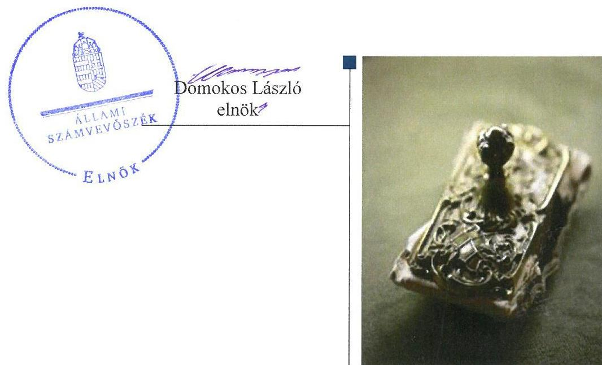
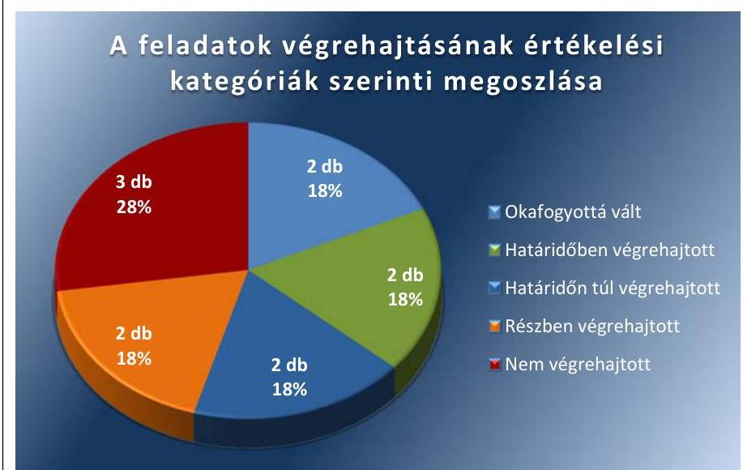
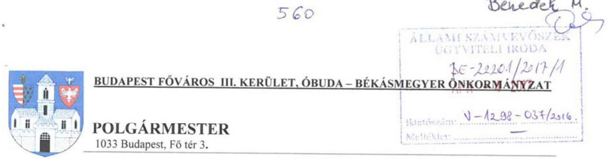
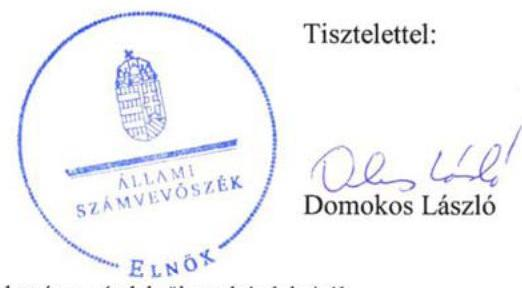
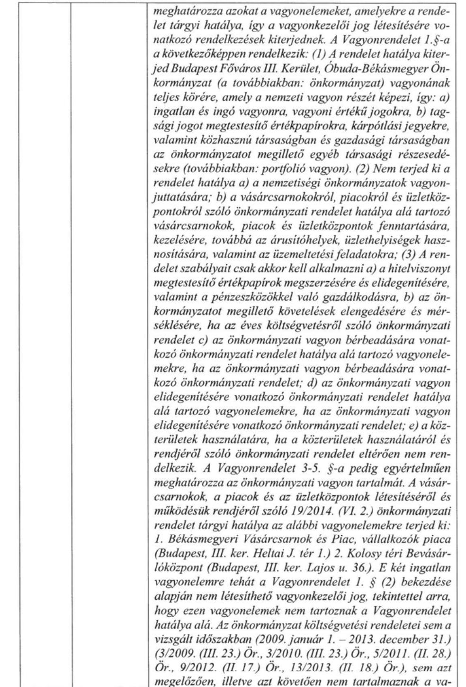
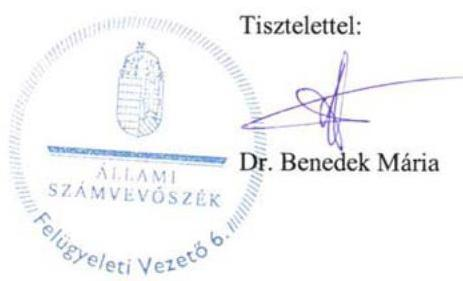

# Jelentés 

## Utóellenőrzések

Budapest Főváros III. kerület, Óbuda-Békásmegyer Önkormányzat vagyongazdálkodása szabályszerűségének utóellenőrzése
2017. 05. hó 26. nap

---

# AZ ELLENŐRZÉST FELÜGYELTE: 

DR. BENEDEK MÁRIA felügyeleti vezető

## AZ ELLENŐRZÉST VEZETTE ÉS A VÉGREHAJTÁSÁÉRT FELELŐS:

HEFFNER ZOLTÁN ellenőrzésvezető

## A PROGRAM ÖSSZEÁLLÍTÁSÁÉRT FELELŐS:

JANIK JÓZSEF LÁSZLÓ osztályvezető

## A TÉMÁHOZ KAPCSOLÓDÓ KORÁBBI SZÁMVEVŐSZÉKI JELENTÉSEK:

- címe: Jelentés az önkormányzatok vagyongazdálkodása szabályszerűségének ellenőrzéséről - Budapest III. kerület, Óbuda-Békásmegyer
- sorszáma: 14231

IKTATÓSZÁM: V-1298-040/2016.
TÉMASZÁM: 2332
ELLENŐRZÉS-AZONOSÍTÓ SZÁM: V075557

---

# TARTALOMJEGYZÉK 

ÖSSZEGZÉS ..... 5
AZ ELLENŐRZÉS CÉLJA ..... 6
AZ ELLENŐRZÉS TERÜLETE ..... 7
AZ ELLENŐRZÉS HÁTTERE, INDOKOLTSÁGA ..... 8
A JELENTÉS LÉNYEGES KÉRDÉSKÖRE ..... 9
ELLENŐRZÉS HATÓKÖRE ÉS MÓDSZEREI ..... 10
MEGÁLLAPÍTÁSOK ..... 12
KÖVETKEZTETÉSEK ..... 15
MELLÉKLETEK ..... 17
I. Sz. melléklet: Az ÁSZ 14231. számú jelentéséhez kapcsolódó intézkedési terv végrehajtása ..... 17
FÜGGELÉK: ÉSZREVÉTELEK ..... 21
RÖVIDÍTÉSEK JEGYZÉKE ..... 39

---

.

---

# ÖSSZEGZÉS 

Az Állami Számvevőszék Budapest Főváros III. kerület, Óbuda-Békásmegyer Önkormányzat vagyongazdálkodása szabályszerűségének utóellenőrzése megállapította, hogy az intézkedési tervben meghatározott feladatok jelentős részét részben vagy nem hajtotta végre. Nem intézkedett a gépjárművek és az ingatlanok mennyiségi leltározásáról, nem szabályozta a vagyonkezelésbe adható vagyontárgyak körét, ami jelentős kockázatot jelent a vagyongazdálkodás szabályszerűsége és elszámoltathatósága, a közpénzekkel történő felelős gazdálkodás biztosításában.

## Az ellenőrzés társadalmi indokoltsága

Az Állami Számvevőszék stratégiájában célul tűzte ki a számvevőszéki munka hasznosulásának javítását. Ezzel összhangban ellenőrzi, hogy az ellenőrzött szervezetek megvalósították-e a korábbi ellenőrzései által feltárt hibák, hiányosságok és szabálytalanságok megszüntetése céljából kialakított intézkedési terveikben foglaltakat. A rendszeres utóellenőrzések hozzájárulnak a szükséges intézkedések tényleges végrehajtásához, ezáltal a közpénzügyek rendezettségének javulásához, igazolják, hogy lezárult a következmények nélküli ellenőrzések időszaka.

## Főbb megállapítások, következtetések

Budapest Főváros III. kerület, Óbuda-Békásmegyer Önkormányzat polgármestere az intézkedési tervet megküldte az Állami Számvevőszék részére.

Az intézkedési tervben meghatározott tizenegy feladatból kettő határidőben, kettő határidőn túl került végrehajtásra, kettő jogszabályi változások miatt okafogyottá vált. A végrehajtott intézkedéseken keresztül erősítette a szervezet belső kontrollját, csökkentve ezzel a szervezet működésével kapcsolatos kockázatokat.

Két feladatot részben, hármat nem hajtott végre. Nem tett intézkedéseket a gépjármű és az ingatlan leltározásra vonatkozóan és nem tartotta be a jogszabályokban és a leltárkészítési szabályzatában leírt követelményeket. Nem szabályozta a vagyonkezelésbe adható vagyonelemek körét, a szervezeten belülről érkező közérdekű bejelentések eljárásrendjét, továbbá nem mérte fel az európai uniós forrásból megvalósított feladatok végrehajtásának és a közbeszerzési eljárások lebonyolításának kockázatát, aminek következtében nem valósult meg maradéktalanul a felelős vagyongazdálkodás és szabályszerű működés.

Budapest Főváros III. kerület, Óbuda-Békásmegyer Önkormányzat az intézkedési tervben meghatározott feladatok végrehajtásáról a jogszabály szerinti nyilvántartást vezette, de annak tartalma nem felelt meg a jogszabályban előírtaknak.

---

# AZ ELLENŐRZÉS CÉLJA 

Az ellenőrzés célja annak értékelése volt, hogy a számvevőszéki jelentésben ${ }^{1}$ foglalt intézkedést igénylő megállapításokkal és javaslatokkal összhangban készített intézkedési tervben ${ }^{2}$ meghatározott feladatokat az ellenőrzött szervezet végrehajtotta-e.

---

# AZ ELLENŐRZÉS TERÜLETE

## Budapest Főváros III. kerület, Óbuda-Békásmegyer Önkormányzat

Budapest Főváros III. kerület, Óbuda-Békásmegyer Önkormányzat állandó lakosainak száma a KSH által közzétett népességi adatok szerint 2016. január 1-én 130 415 fő volt.

A polgármester³ a 2006. évi általános önkormányzati választás óta tölti be hivatalát, a jegyző⁴ 2010. december 1-étől látja el feladatait. A 22 tagú Képviselő-testület⁵ munkáját hat állandó bizottság segíti.

Az Önkormányzat⁶ a 2015. évi konszolidált beszámolója szerint 22 951,2 M Ft költségvetési bevételt ért el és 22 797,7 M Ft költségvetési kiadást teljesített. A 2015. december 31-i fordulónapi konszolidált beszámoló mérlegfőösszege 75 047,5 M Ft, ezen belül befektetett eszközvagyona 68 316,8 M Ft, követelés állománya 3642,2 M Ft, kötelezettségállománya 4181,6 M Ft volt.

Az Állami Számvevőszék 2014. évben ellenőrizte Budapest III. kerület Óbuda-Békásmegyer Önkormányzatnál az önkormányzat vagyongazdálkodás szabályszerűségét a 2009. január 1. és 2013. december 31. közötti időszak vonatkozásában. Az erről szóló 14231. számú jelentését az ÁSZ⁷ 2014. december 4-én tette közzé. Az ellenőrzés célja annak megállapítása volt, hogy az önkormányzat vagyongazdálkodási tevékenységét a jogszabályi előírásokkal összhangban szabályozta-e, a vagyon nyilvántartása és a vagyongazdálkodási tevékenységek végrehajtása a jogszabályoknak és a belső előírásoknak megfelelően történt-e, továbbá annak megállapítása, hogy az önkormányzatnál a vagyongazdálkodás során biztosították-e az átláthatóságot, valamint a külső és belső ellenőrzések megállapításai, javaslatai hozzájárultak-e a szabályszerű vagyongazdálkodáshoz. Az ÁSZ jelentésben foglalt javaslatok végrehajtása érdekében az Önkormányzat Képviselő-testülete a 934/2014. (XII.11.) számú határozattal intézkedési tervet fogadott el.

Az utóellenőrzés – a 2014. december 4. és 2016. december 23. között végrehajtott feladatokat figyelembe véve – az ÁSZ jelentésben a jegyző részére megfogalmazott intézkedést igénylő megállapításokra és javaslatokra készített, az ÁSZ részére megküldött intézkedési tervben foglalt feladatok megvalósításának ellenőrzésére, illetve értékelésére fókuszált.

---

# AZ ELLENŐRZÉS HÁTTERE, INDOKOLTSÁGA 

Az ÁSZ tv. ${ }^{8}$ 33. § (1) bekezdése értelmében a számvevőszéki jelentések intézkedést igénylő megállapításaihoz és javaslataihoz kapcsolódóan az ellenőrzött szervezet vezetője intézkedési tervet köteles összeállítani, és az Állami Számvevőszék részére megküldeni. Az intézkedési tervben foglaltak megvalósítását - az ÁSZ tv. 33. § (7) bekezdésében foglaltak alapján - az Állami Számvevőszék utóellenőrzés keretében ellenőrizheti. Az intézkedések megvalósulásának értékelése során az Állami Számvevőszék figyelembe veszi az ellenőrzött szervezetek működési feltételeiben, valamint a jogszabályi előírásokban bekövetkezett változásokat.

Az intézkedési tervekben foglalt feladatok hiányos, illetve késedelmes végrehajtása, valamint megvalósításának elmaradása azt mutatja, hogy az ellenőrzések során feltárt hibák, hiányosságok és szabálytalanságok megszüntetése nem kapott kellő hangsúlyt. Ez a szabályszerű működés és a felelős vezetői magatartás vonatkozásában kockázatot hordoz. E kockázatok feltárásával az Állami Számvevőszék utóellenőrzési rendszere fokozza a fegyelmet, és igazolja, hogy a közpénzzel való szabályos gazdálkodás felelőssége elől nem lehet kitérni.

Az utóellenőrzés négy szinten hasznosulhat:
$\longrightarrow$ A társadalom szintjén az utóellenőrzés jelzi, hogy a számvevőszéki ellenőrzés megállapításainak van következménye: a hiányosságok megszüntetésére az ellenőrzött szervezet által meghatározott intézkedések végrehajtását is számon kéri az ÁSZ.
$\longrightarrow$ Az ellenőrzött terület szintjén az utóellenőrzés tájékoztatást nyújt a terület döntéshozóinak a hiányosságok kiküszöbölésének jó gyakorlatairól, ezzel lehetőséget biztosítva arra, hogy az ÁSZ ellenőrzési megállapításai, javaslatai a terület nem ellenőrzött szervezeteinek a működése során is hasznosuljanak.
$\longrightarrow$ Az ellenőrzött szervezet szintjén az utóellenőrzés feltárja, hogy a szervezet az intézkedések végrehajtásával hasznosította-e a korábbi ellenőrzési jelentésben a hiányosságok megszüntetése, illetve a kockázatok kezelése érdekében megfogalmazott javaslatokat.
$\longrightarrow$ Az ÁSZ szintjén az utóellenőrzés visszacsatolást ad az ellenőrzési jelentések hasznosulásáról, az intézkedések elmaradása vagy részleges megvalósulása a további ellenőrzésekhez kockázati jelzésként szolgál. Az ÁSZ szintjén az utóellenőrzés visszacsatolást ad az ellenőrzési jelentések hasznosulásáról, az intézkedések elmaradása vagy részleges megvalósulása a további ellenőrzésekhez kockázati jelzésként szolgál.

---

# A JELENTÉS LÉNYEGES KÉRDÉSKÖRE 

Az Önkormányzat az intézkedési tervben foglaltakat az előírt határidőben végrehajtotta-e?

---

# ELLENŐRZÉS HATÓKÖRE ÉS MÓDSZEREI 

## Az ellenőrzés típusa

Megfelelőségi ellenőrzés.

## Az ellenőrzött időszak

Az utóellenőrzés alapját képező ÁSZ jelentés közzétételének (2014. december 4.) napjától az ellenőrzésről szóló kiértesítő levél keltének (2016. december 23.) napjáig tartó időszak.

## Az ellenőrzés tárgya

Az ÁSZ tv. 2011. július 1-jei hatálybalépését követően a számvevőszéki jelentésben foglalt intézkedést igénylő megállapításokkal és javaslatokkal összhangban - az ellenőrzött szervezet által - készített intézkedési tervben foglaltak végrehajtásának ellenőrzése.

Az ellenőrzés kiterjedt minden olyan körülményre és adatra, amely az ÁSZ jogszabályban meghatározott feladatainak teljesítéséhez, valamint a program végrehajtása folyamán felmerült újabb összefüggések feltárásához szükséges.

## Az ellenőrzött szervezet

Budapest Főváros III. kerület, Óbuda-Békásmegyer Önkormányzat.

## Az ellenőrzés jogalapja

Az Alaptörvény ${ }^{9}$ 43. cikk (1) bekezdése alapján az ÁSZ az Országgyűlés pénzügyi és gazdasági ellenőrző szerve. Az ÁSZ törvényben meghatározott feladatkörében ellenőrzi a központi költségvetés végrehajtását, az államháztartás gazdálkodását, az államháztartásból származó források felhasználását és a nemzeti vagyon kezelését.

Az ÁSZ tv. 1. § (3) bekezdése szerint az ÁSZ általános hatáskörrel végzi a közpénzekkel és az állami és önkormányzati vagyonnal való felelős gazdálkodás ellenőrzését.

Az ÁSZ tv. 33. § (7) bekezdése alapján a 33. § (1)-(2) bekezdése szerinti intézkedési tervben foglaltak megvalósítását az ÁSZ utóellenőrzés keretében ellenőrizheti.

---

# Az ellenőrzés módszerei 

Az ÁSZ az ellenőrzést a nemzetközi standardokat irányadónak tekintve az ellenőrzési program ellenőrzési kérdései, az ellenőrzött időszakban hatályos jogszabályok, az ellenőrzés szakmai szabályok és módszertanok figyelembevételével, önállóan vagy ellenőrzéshez kapcsolódóan végezte.

Az ÁSZ az ellenőrzés ideje alatt az ellenőrzött szervezettel történő kapcsolattartást az ÁSZ SZMSZ ${ }^{10}$-ének vonatkozó előírásai alapján biztosította.

Az utóellenőrzés megállapításait elsősorban az ÁSZ rendelkezésére álló, valamint az ellenőrzött szervezetektől elektronikusan bekért dokumentumok alapozták meg.

Az ellenőrzési bizonyítékként felhasználható adatforrások közé tartoznak egyrészt a szakmai programban felsorolt adatforrások, másrészt minden - az ellenőrzés folyamán feltárt, az ellenőrzés szempontjából információt tartalmazó - dokumentum.

Az intézkedési tervben előírt feladatokat azok végrehajthatósága, illetve végrehajtása szempontjából az alábbiak szerint értékelte az ÁSZ:
$\longrightarrow$ „határidőben végrehajtott" a feladat, ha a teljesítés dokumentáltan, az intézkedési tervben előírt határidőben és tartalommal megtörtént;
$\longrightarrow$ „határidőn túl végrehajtott" a feladat, ha annak teljesítése az intézkedési tervben meghatározott módon, de az előírt határidőn túl történt meg;
$\longrightarrow$ „részben végrehajtott" a feladat, ha végrehajtása teljes körűen az intézkedési tervben előírt módon nem történt meg;
$\longrightarrow$ „nem végrehajtott" a feladat, ha a végrehajtás nem történt meg, vagy amennyiben a teljesítést nem dokumentálták;
$\longrightarrow$ „okafogyottá vált" a feladat, ha végrehajtására - meghatározott esemény bekövetkezése, továbbá külső körülmény, a működést érintő feltétel változása miatt - már nincs szükség, illetve lehetőség, és egyértelműen megállapítható, hogy az intézkedést szükségessé tevő körülmény a jövőben nem fordulhat elő;
$\longrightarrow$ „nem időszerű" az a feladat, amelynek ellenőrzési időszakon belüli végrehajtására azért nem került (kerülhetett) sor, mert az intézkedés alapjául szolgáló esemény nem következett be, de annak jövőbeni előfordulása lehetséges, a végrehajtása nem volt esedékes, vagy a végrehajtás határideje még nem járt le.
Az ellenőrzés lefolytatásához az ellenőrzött szervezet a tanúsítványok elektronikus kitöltésével, valamint az ÁSZ által kért dokumentumok elektronikus megküldésével szolgáltat adatokat, amelyek valódiságát és teljes körűségét az ellenőrzött szervezet vezetője által tett teljességi és hitelességi nyilatkozat igazolta. Az így rendelkezésre bocsátott adatok, információk kontrollja az ellenőrzés keretében történt.

---

# MEGÁLLAPÍTÁSOK 

## Az Önkormányzat az intézkedési tervben foglaltakat az előírt határidőben végrehajtotta-e?

Összegző megállapítás

Az intézkedési tervben meghatározott 11 feladatból kettő határidőben, kettő határidőn túl, kettő részben került végrehajtásra. Három feladat végrehajtása nem történt meg, és két feladat okafogyottá vált. A feladatok végrehajtásáról a jogszabályban meghatározott nyilvántartást vezette, azonban annak tartalma nem felelt meg az előírt követelményeknek.

Az ÁSZ a jelentésében a jegyző részére hat javaslatot fogalmazott meg. A polgármester által előterjesztett és a Képviselő-testület által jóváhagyott intézkedési tervbe a hiányosságok, szabálytalanságok megszüntetésére kiegészítve a jelentésben foglalt egyéb észrevételekhez kapcsolódó kötelezettségekkel - 11 feladatot határoztak meg, amelyek végrehajtásáért a jegyző lett kijelölve, mint általános felelős.

Az intézkedési tervben meghatározott feladatokat, határidőket, felelősöket és a feladatok végrehajtását az I. számú melléklet
 mutatja be.

Az Önkormányzat az intézkedési tervben meghatározott feladatok végrehajtásáról vezette a Bkr. ${ }^{11}$ előírásainak megfelelő nyilvántartást, de annak tartalma nem felelt meg teljes körűen a Bkr. 47. § (2) bekezdésében előírtaknak, mivel nem tartalmazta a végrehajtott intézkedések rövid leírását és a végre nem hajtott intézkedések okát.

Az Önkormányzat intézkedési tervében meghatározott feladatok végrehajtásának értékelési kategóriák szerinti megoszlását az 1. ábra szemlélteti.

1. ábra

---

# HATÁRIDŐBEN VÉGREHAJTOTT feladatok: 

1. A belső ellenőrzési csoportvezető határidőben elkészítette a kockázatelemzéssel alátámasztott stratégiai és éves belső ellenőrzési terveket, amelyek kockázatelemzés során felállított prioritásokon alapultak.
2. A belső ellenőrzési csoportvezető határidőben elkészítette a belső ellenőrök számának kapacitás felméréssel történő meghatározását.

## HATÁRIDŐN TÚL VÉGREHAJTOTT feladatok:

3. A jegyző az intézkedési tervben meghatározott 2014. évi beszámoló helyett a 2015. évi beszámolóban gondoskodott a jogszabály által előírt szerkezetű és tartalmú vagyonkimutatás elkészítéséről.
4. Az Önkormányzat az intézkedési tervben vállalt 2015. április 30-i határidő helyett 2015. júliusában fogadta el az európai uniós pályázatok folyamatait szabályozó Működési kézikönyv ${ }^{12}$-et. Az Önkormányzat Óbuda-Békásmegyer Városfejlesztő Nonprofit Kft.-vel kötött Alapszerződés és módosításai keretében, valamint annak működését szabályozó Működési Kézikönyvben rögzítette a külső szervezettel kötött szerződések kapcsolattartási és ellenőrzési rendjét, a fejlesztések lebonyolításával kapcsolatban szükséges intézkedéseket, a kapcsolattartás és az információszolgáltatás rendjének szabályozását.

## RÉSZBEN VÉGREHAJTOTT feladatok:

5. Az Önkormányzat integritás kontrollrendszerének fejlesztése érdekében az etikai elvárásokat, hivatásetikai alapelveket, az etikai eljárás szabályait Hivatásetikai szabályzatban rögzítette, amelyet a Képviselő-testület 2015. április 9-én elfogadott, továbbá kialakította az Ügyfélkapcsolati Iroda által történő, kívülről érkező közérdekű bejelentéseket kezelő rendszert, azonban nem szabályozta a szervezeten belülről érkező közérdekű bejelentések eljárásrendjét, a bejelentést tevők megfelelő védelmének biztosítását.
6. Az Önkormányzat az intézkedési tervben meghatározott 2015. február helyett 2015. június 22-én fogadta el a Belső Kontroll Kézikönyv ${ }^{13}$-et, amely a belső kontrollnál az ellenőrzési nyomvonalat kiegészítette az ellenőrzési pontokkal, az egyes feladatok végrehajtását igazoló dokumentumok megnevezésével, de nem egészítette ki a dokumentumok nyilvántartási helyével. Az Önkormányzat az intézkedési tervben meghatározott 2015. február helyett 2016. szeptember 1-jén - 2016. január 1-i visszamenőleges hatállyal fogadta el az Értékelési szabályzat ${ }^{14}$-ot, amely tartalmazta a vagyonértékű jogok és szellemi termékek minősítésénél a figyelembe veendő szempontokat.

---

# NEM VÉGREHAJTOTT feladatok: 

7. Az önkormányzati tulajdonban lévő ingatlanok és gépjárművek mennyiségi felvétellel történő leltározása nem történt meg. Az Önkormányzat nem tett eleget a jogszabályban, valamint a Leltározási és Leltárkészítési Szabályzat ${ }^{15}$-ban rögzített leltározási kötelezettségének.
8. Az Önkormányzat nem készítette el a vagyonkezelői jog létesítésére meghatározott vagyonelemek körére vonatkozó rendelet-tervezetet.
9. A Polgármesteri Hivatal és az intézmények tekintetében nem történt meg az európai uniós forrásból megvalósított feladatok végrehajtása, valamint a közbeszerzési eljárások lebonyolítása kockázatának értékelése.

## OKAFOGYOTTÁ VÁLT feladatok:

10. A könyvviteli mérlegben kimutatott üzemeltetésre átadott eszközök vonatkozásában az üzemeltetést, kezelést végző szervnek 2014. január 1-jétől jogszabályváltozás miatt - megszűnt a leltározási kötelezettsége. Az Önkormányzat vagyonkezelésre nem adott át eszközöket, így a feladat okafogyottá vált.
11. Az Önkormányzat az e-közszolgáltatási feladatait jogszabályi felhatalmazás alapján 2013. január 1-jétől átadta a KEKKH ${ }^{16}$ részére, így a feladat okafogyottá vált.

---

# KÖVETKEZTETÉSEK 

Az Önkormányzat nem intézkedett a gépjárművek és ingatlanok mennyiségi leltározásáról, ami jelentős kockázatot jelent a vagyongazdálkodás szabályszerűsége és elszámoltathatósága szempontjából, így a végre nem hajtott feladat indokolja a feltárt hiányosság és szabálytalanság tekintetében a munkajogi felelősség tisztázására irányuló eljárás megindítását, és eredményének ismeretében a szükséges intézkedések megtételét.

---

.

---

# MELLÉKLETEK

- I. SZ. MELLÉKLET: AZ ÁSZ 14231. SZÁMÚ JELENTÉSÉHEZ KAPCSOLÓDÓ INTÉZKEDÉSI TERV VÉGREHAJTÁSA

|  Sorszám | Intézkedési terv alapján meghatározott feladat | Az intézkedési tervben meghatározott határidő | Az intézkedési tervben meghatározott felelős | A feladat végrehajtása  |
| --- | --- | --- | --- | --- |
|   | 1. | 2.
Határidőben végrehajtott feladat | 3.
Határidőben végrehajtott feladat | 4.  |
|  1. | A stratégiai és éves belső ellenőrzési terveket kockázatelemzéssel kell alátámasztani. Az éves ellenőrzési tervnek a kockázatelemzés alapján felállított prioritásokon kell alapulnia. | 2015.
I. negyedév | jegyző /
belső ellenőrzési
csoportvezető | A belső ellenőrzési csoportvezető elkészítette és a Képviselő-testület a 928/2014. (XII. 11.) számú határozatával 2014. december 11-én elfogadta a 2015. évre vonatkozó, a kockázat-elemzés során felállított prioritásokon alapuló éves belső ellenőrzési tervet. A Budapest Főváros III. kerület Óbuda-Békásmegyer Önkormányzat Polgármesteri Hivatal Belső Ellenőrzési Csoportjának stratégiai terve 2015-2018. évekre vonatkozóan kockázatelemzéssel alátámasztásra került.  |
|  2. | Gondoskodni kell a belső ellenőrök számának kapacitás felméréssel történő megállapításáról. | 2015.
I. negyedév | jegyző /
belső ellenőrzési
csoportvezető | A belső ellenőrzési csoportvezető a belső ellenőrök létszámára vonatkozó kapacitás felmérést 2014. decemberében elkészítette, amely részét képezte a 2015. évi belső ellenőrzési tervnek.  |
|   | Határidőn túl végrehajtott feladat |  |  |   |
|  3. | Az Önkormányzat vagyongazdálkodási feladatainál a vagyonkimutatás szerkezetének és tartalmának tartalmaznia kell a források eszközcsoporton belül a tartalékokat és a saját tőke elemeit, a törzsvagyont, a törzsvagyonon kívüli egyéb (üzleti) csoportba sorolást, a "0"-ra leírt és az érték nélkül nyilvántartott eszközök állományát, valamint a mérlegben értékkel nem szereplő kötelezettségeket. | 2014. évi
beszámoló | jegyző /
pénzügyi
és gazdálkodási
főosztályvezető | A jegyző az intézkedési tervben meghatározott 2014. évi beszámoló helyett a 2015. évi beszámolóban gondoskodott az Áhsz. ${ }^{17}$ 30. § (2)-(3) bekezdése által előírt szerkezetű és tartalmú vagyonkimutatás elkészítéséről.  |

---

|  4. | Az intézkedési terv alapján meghatározott feladat | Az intézkedési tervben meghatározott határidő | Az intézkedési tervben meghatározott felelős | A feladat végrehajtása  |
| --- | --- | --- | --- | --- |
|   | 1. | 2. | 3. | 4.  |
|  4. | Az európai uniós forrásokkal kapcsolatban gondoskodni kell a pályázatok nyilvántartásának vezetéséről, a külső szervezettel kötött szerződésekben a kapcsolattartás és ellenőrzés rendjének rögzítéséről. A fejlesztések lebonyolításával kapcsolatban intézkedni szükséges a kapcsolattartás és az információ-szolgáltatás rendjének szabályozásáról. | 2015. 04. 30. | jegyző / Őbuda-Békásmegyer Városfejlesztő Nonprofit Kft. ügyvezető igazgatója | A jegyző az intézkedési tervben meghatározott 2015. április 30-a helyett 2015. júliusában hajtotta végre a feladatot, mivel a naprakész pályázati nyilvántartás, valamint a kapcsolódó szabályozás határidőn túl készült el. A nyilvántartásban történő rögzítés feladatát a Működési Kézikönyv tartalmazta. A fejlesztések bonyolításával kapcsolatos feladatokat az NKft.^{18} látta el az Önkormányzattal kötött Alapszerződés alapján. Az NKft. Működési Kézikönyve folyamatábrák formájában tartalmazta a fejlesztések lebonyolításának rendjét és az ellenőrzés koordinációját. Az NKft.-vel kötött Alapszerződés és módosításai, valamint a 2016. augusztus 30-ai egységes szerkezet tartalmazta a kapcsolattartás és információszolgáltatás rendjét és rögzítette a kapcsolattartásra kijelölt személyeket.  |
|   |  |  | Részben végrehajtott feladat |   |
|  5. | Az Önkormányzat integritás kontrollrendszerének fejlesztése érdekében az etikai elvárásokat, hivatásetikai alapelveket, az etikai eljárás szabályait elő kell készíteni és Képviselő-testület elé kell terjeszteni. Szabályozni kell a szervezeten belülről érkező közérdekű bejelentések eljárásrendjét, a bejelentést tevők megfelelő védelmének biztosítását, továbbá ki kell alakítani a szervezeten kívülről érkező panaszokat és közérdekű bejelentéseket kezelő rendszert. | 2015. folyamatos | jegyző | A jegyző elkészítette, a Képviselő-testület a 244/2015. (IV. 9.) számú határozatával elfogadta a Hivatásetikai Szabályzatot, amely tartalmazta az etikai elvárásokat, a hivatásetikai alapelveket, az etikai eljárás szabályait. Az Önkormányzat kialakította az Ügyfélkapcsolati Iroda által történő, kívülről érkező közérdekű bejelentéseket kezelő rendszert, azonban nem szabályozta a szervezeten belülről érkező közérdekű bejelentések eljárásrendjét, a bejelentést tevők megfelelő védelmének biztosítását.  |
|  6. | Szabályozni kell, hogy a számviteli elszámolás és értékelés szempontjából mi tekintendő figyelembe veendő szempontnak a vagyonértékű jogok és szellemi termékek minősítésénél. A belső kontrollnál az ellenőrzési nyomvonalat ki kell bővíteni az ellenőrzési pontokkal és az egyes feladatok elvégzését igazoló dokumentumok megnevezésével, valamint nyilvántartás helyével. | 2015. február | jegyző / belső ellenőrzési csoportvezető / pénzügyi és gazdálkodási főosztályvezető | Az Önkormányzat 2015. február helyett 2016. szeptember 1-jén fogadta el – 2016. január 1-jétől visszamenőleges hatállyal – az Értékelési szabályzatát, amelyben meghatározta a vagyonértékű jogok és szellemi termékek minősítésénél a figyelembe veendő szempontokat. A Belső Kontroll Kézikönyv 2015. februárja helyett 2015. június 22-én lépett hatályba, amelynek 2. számú melléklete tartalmazta a költségvetés tervezésének és végrehajtásának ellenőrzési nyomvonalát, az ellenőrzési pontokkal, az egyes feladatok végrehajtását igazoló dokumentumokkal, azonban nem szabályozta a dokumentumok nyilvántartási helyét.  |

---

|  6
7 | Intézkedési terv alapján meghatározott feladat | Az intézkedési tervben meghatározott határidő | Az intézkedési tervben meghatározott felelős | A feladat végrehajtása  |
| --- | --- | --- | --- | --- |
|   | 1. | 2. | 3. | 4.  |
|   |  |  | Nem végrehajtott feladat |   |
|  7. | Az ingatlanokat és gépjárműveket a jogszabályi előírás, a leltározási szabályzat és az értékelési szabályzat értelmében mennyiségi felvétellel is kell leltározni az előírásoknak megfelelő gyakorisággal. | 2014. évi beszámoló | jegyző / pénzügyi és gazdálkodási főosztályvezető | A 2014. évi beszámoló alátámasztásaként az önkormányzati tulajdonban lévő ingatlanok és gépjárművek mennyiségi felvétellel történő leltározása nem történt meg a Leltározási és Leltárkészítési Szabályzat 1. pontja és a 13. számú mellékletében foglalt előírások ellenére. Az ingatlanokról és a gépjárművekről egyedi leltáríveket nem készített, dokumentált leltározást nem végzett.  |
|  8. | Rendelet-tervezetet kell készíteni azon vagyonelemek meghatározásáról, amelyekre az Önkormányzat vagyonkezelői jogot létesíthet és kezdeményezni kell a polgármesternél a rendelet tervezet Képviselő-testület elé történő terjesztését. | 2015. február | jegyző | A jegyző nem készített rendelet-tervezetet a vagyonkezelésbe adható vagyonelemek köréről.  |
|  9. | Értékelni kell a Polgármesteri Hivatal és az intézmények tekintetében az európai uniós forrásból megvalósított feladatok végrehajtásának, valamint a közbeszerzési eljárások lebonyolításának kockázatát. | Folyamatos | jegyző / belső ellenőrzési csoportvezető | Az Önkormányzat nem végezte el a Polgármesteri Hivatal és az intézmények vonatkozásában az európai uniós forrásból megvalósított feladatok végrehajtása, valamint a közbeszerzési eljárások lebonyolítása kockázatainak felmérését.  |
|   |  |  | Okafogyotta vált feladat |   |
|  10. | A könyvviteli mérlegben kimutatott üzemeltetésre, vagyonkezelésbe adott eszközöket az üzemeltetést, kezelést végző szerv által elkészített, hitelesített leltárral kell alátámasztani. | 2014. évi beszámoló | jegyző / pénzügyi és gazdálkodási főosztályvezető / Öbudai Vagyonkezelő Zrt. vezérigazgató | Az Önkormányzat tulajdonjogának fenntartása
 mellett üzemeltetésre adott át eszközöket (gépjárművek), amelyekre vonatkozó leltározási kötelezettséget 2014. január 1-jétől, a jogszabály – az Áhsz. 22. § (2) bekezdésének – változása miatt a továbbiakban nem az üzemeltető, hanem az Önkormányzat részére írja elő a feladatot. Az Önkormányzat vagyonkezelésbe adott eszközzel nem rendelkezett.  |
|  11. | Gondoskodni kell az e-közszolgáltatási feladatokat ellátó informatikai rendszer ügyfelek általi igénybevételének figyelemmel kíséréséről és a tapasztalatok értékeléséről. Az értékelési és értékelés ellenőrzési feladatokat a munkaköri leírásokban rögzíteni kell. | Folyamatos | jegyző | Az Önkormányzat az e-közszolgáltatási feladatait jogszabály – a 85/2012. (IV. 21.) Kormányrendelet – változás alapján 2013. január 1-jétől átadta a KEKKH-nek.  |

*Forrás: ÁSZ által készített táblázat*

---

.

---

# FÜGGELÉK: ÉSZREVÉTELEK 

A jelentéstervezetet a Számvevőszék 15 napos észrevételezésre megküldte az ellenőrzött szervezet vezetőjének az ÁSZ tv. 29. § (1) bekezdése előírásának megfelelően.
A függelék tartalmazza az ellenőrzött észrevételeit, illetve az el nem fogadott észrevételek elutasításának indoklását.

[^0]
[^0]:    * 29. § (1) Az Állami Számvevőszék az ellenőrzési megállapításait megküldi az ellenőrzött szervezet vezetőjének vagy az általa megbízott személynek, és annak, akinek személyes felelősségét állapította meg.
    (2) Az ellenőrzött szervezet vezetője és a felelősként megjelölt személy az ellenőrzés megállapításaira tizenöt napon belül írásban észrevételt tehet.
    (3) Az Állami Számvevőszék az észrevételre a beérkezésétől számított harminc napon belül írásban válaszol. A figyelembe nem vett észrevételeket köteles a jelentésben feltüntetni, és megindokolni, hogy azokat miért nem fogadta el.

---

# Domokos László 

Elnök Úr

## Állami Számvevőszék

1052 Budapest
Apáczai Csere János u. 10.

## Tisztelt Elnök Úr!

Az Állami Számvevőszék Budapest Főváros III. kerület, Óbuda-Békásmegyer Önkormányzat vagyongazdálkodása szabályszerűségének utóellenőrzése keretében 2017.01.10-én helyszíni ellenőrzést végzett Önkormányzatunknál.
Az ellenőrzés megállapításait tartalmazó számvevőszéki jelentéstervezetet 2017. március 20-án kaptam kézhez, melyre az alábbi észrevételeket teszem.

ÁSZ jelentéstervezet 14. oldal:
Nem végrehajtott feladatok:
7. Az önkormányzati tulajdonában levő ingatlanok és gépjárművek mennyiségi felvétellel történő leltározása nem történt meg. Az Önkormányzat nem tett eleget a jogszabályban, valamint a Leltározási és Leltárkészítési Szabályzat-ban rögzített leltározási kötelezettségének."

## Észrevétel:

A 3. kerület Budapest egyik legnagyobb kerülete, mind a népességszámot, mind a területét tekintve.
Az Önkormányzat ingatlanvagyona is jelentős nagyságrendet képvisel, több mint 3.000 db helyrajzi számú vagyonelemből áll, amelyek mintegy 12.000 db kataszteri eszközt jelentenek. Az ingatlanok analitikus nyilvántartása a vagyonkataszteri rendszerben történik, melynek vezetése folyamatos, szabályozott előírások szerint frissítésre, aktualizálásra kerül. A 2014.12.31. és 2015.12.31. időpontokra vonatkozó részletes (több száz oldalas) vagyonkataszteri kimutatások bemutatásra és elektronikusan feltöltésre kerültek az utóellenőrzés során. A 2015. és 2016. évi zárszámadások keretében a vagyonkataszteri nyilvántartásban szereplő ingatlan vagyon bruttó értéke és a számviteli nyilvántartás szerinti bruttó érték egyeztetése megtörtént, az ehhez kapcsolódó dokumentumok átadásra kerültek.

---

A helyszíni vizsgálat során az ellenőrzés nem hívta fel a figyelmet arra, nem jelezte az önkormányzat ellenőrzésben résztvevő munkatársai számára, hogy a vagyonkataszteri és a számviteli kimutatásokon túl további dokumentumok bemutatását tartja szükségesnek ahhoz, hogy megfelelő következtetések levonására kerülhessen sor.

Ennek lehet az is oka volt, hogy rendes munkaidő keretében csak 1,5 óra állt rendelkezésre a teljes utóellenőrzésre, a helyszíni vizsgálat jelentős része munkaidőn túl történt meg.

Az előzőek miatt nem történt meg annak az igazolása, hogy az önkormányzati ingatlanok tekintetében a mennyiségi leltár felvétele részben megtörtént. Ugyanis az Óbudai Vagyonkezelő Zrt. - mint önkormányzati vagyongazdálkodási feladatokat (üzemeltetés, bérbeadás stb.) ellátó 100%-os önkormányzati tulajdonú gazdasági társaság - önkormányzati rendelet és a közszolgáltatási szerződésben foglaltak szerint a bérbe adott önkormányzati ingatlanokat (lakások és üzlethelyiségek, melyek az ingatlanvagyon kb. 30%-át teszik ki) évente egyszer helyszíni ellenőrzés keretében személyesen megtekinti, az ingatlanok állapotát és az ellenőrzés tapasztalatait aláirt jegyzőkönyvek formájában dokumentálja. Az aktuális állapot rögzítése céljából fényképfelvétel is készül minden ingatlanról.
2015-ben és 2016-ben teljes körűen megvalósult a helyszíni szemrevételezés, mely feladatot a Vagyonkezelő Zrt. Lakásgazdálkodási osztályának, illetve az Értékesítési és Telekhasznosítási osztályának munkatársai végezték el személyesen.

A 3. kerület területére, így a teljes önkormányzati tulajdonra vonatkozóan rendszeresen légi fotók készülnek. A feldolgozott légi fotó sorozat a Minerva Térinformatikai Rendszerünkbe kerül be digitális feldolgozás után. A Térinformatikai program alapja a földhivatali alaptérkép, melynek tartalma minden évben aktualizálásra kerül. A program mennyiségi adatok egyeztetésére, ellenőrzésére alkalmas digitális formában. Ezt a térinformatikai alkalmazást többlet kiadással járó szolgáltatásként igényli az Önkormányzat.

Megállapítható, hogy a bérbe adott ingatlanok esetében a leltár teljes körűen megvalósult, a közterületek esetében pedig a szükséges előkészületek megtörténtek.

Az Önkormányzat és a Polgármesteri Hivatal gépjárműállománya 7 db személygépkocsiból áll, melyek mindennapos használatban vannak, meglétük evidencia, a használat lényegében véve azonos bizonyosságot jelent a mennyiségi felvétellel.

Összegezve, az ingatlan vagyon nagyságrendje miatt a tételes mennyiségi felvétel a rendelkezésre álló munkaerő kapacitással és költségvetési forrással nem kivitelezhető teljes körűen, azonban önkormányzatunk törekszik a feladat minél nagyobb részben történő elvégzésére. Emiatt az Önkormányzat a digitális ellenőrzést tartja végrehajthatónak és lényegesen pontosabbnak a helyszíni ellenőrzéssel szemben.
Megítélésünk szerint a gépjárműállomány nem képvisel olyan nagyságrendet önkormányzatunknál, hogy az itt feltárt hiányosság jelentős kockázatot jelentsen az önkormányzati vagyongazdálkodás szabályszerűsége biztosításában és fent kifejtettek miatt nem tartom indokoltnak a munkajogi felelősség kérdésének tisztázását a feladat kapcsán.

Az előzőek alapján a leltározási kötelezettség „részben végrehajtott feladatok" közé sorolását tartjuk helytállónak az önkormányzat leltározási tevékenységének megítélése tekintetében.

---

„8. Az Önkormányzat nem készítette el a vagyonkezelői jog létesítésére meghatározott vagyonelemek körére vonatkozó rendelet-tervezetet."

# Észrevétel: 

1. a Magyarország helyi önkormányzatairól szóló 2011. évi CLXXXIX. törvény (a továbbiakban: Mötv.) 109. §-a és a nemzeti vagyonról szóló 2011. évi CXCVI. törvény (a továbbiakban: Nvtv.) 11. §-a határozza meg a vagyonkezelői jog létesítésére vonatkozó szabályokat. E rendelkezések nem tartalmaznak olyan szükítő feltételeket, amelyek tartalommal való feltöltése szükségszerűen (kötelező jelleggel) maga után vonná a helyi rendeletalkotást.
2. az Alaptörvény T) cikk (2) bekezdése alapján az önkormányzat rendelete jogszabály. A Jat. 22. §-a, valamint a jogszabályszerkesztésről szóló 61/2009. (XII. 14.) IRM rendelet 3. §-a szerint jogszabálynak normatív tartalmú rendelkezéseket kell tartalmazni. Azaz joghatás kiváltása a célja. Tekintettel arra, hogy az önkormányzat nem tervezi vagyonkezelői jog létesítését, egy elméleti lehetőség meghatározása nem bír normatív tartalommal. Az elméleti lehetőségek, stratégiai elképzelések színtere nem egy jogszabály, hanem a gazdasági koncepció. A képviselőtestület által 2015. május 14-én elfogadott „Gazdasági program 2015-2019" dokumentumban ilyen stratégiai elképzelés nem szerepel.
3. szintén a normativitás hiányát támasztja alá az a tény, hogy a Nvtv. 11. § (5) bekezdése szerint de íure kizárólag (és csak kivételesen) törvény konstituálhat vagyonkezelői jogot. Az önkormányzat ilyen irányú elhatározása esetén vagyonkezelői jogot csak vagyonkezelési szerződéssel hozhat létre a Nvtv. 11. § (1) bekezdése alapján. Egyrészt tehát hiába kerül meghatározásra önkormányzati rendeletben azon vagyonelemek köre, amelyre vagyonkezelői jogot lehetne létesíteni, az önmagában semmit nem ér. A vagyonkezelői jog létesítéséhez további döntésekre van szükség. Másrészt amennyiben - az időközben bekövetkező társadalmi-gazdasági változások miatt - olyan vagyonelemre szeretne vagyonkezelői jogot létesíteni az önkormányzat, amelyre a saját rendelete nem ad lehetőséget, szándéka megvalósításához először a saját rendeletét kellene módosítani. Vagyis feleslegesen korlátozza önmaga mozgásterét.
4. a jogalkotásról szóló 2010. évi CXXX. törvény (a továbbiakban: Jat.) 17. §-a alapján egy rendelet-tervezet előkészítése során előzetes hatásvizsgálatot kell lefolytatni. Az önkormányzati rendelet előzetes hatásvizsgálatára vonatkozó szabályokat az Önkormányzat Szervezeti és Működési Szabályzatáról szóló 22/2013. (III. 29.) önkormányzati rendelet (a továbbiakban: SZMSZ) határozza meg. Az SZMSZ 49. §-a és 4. melléklete szerint a hatásvizsgálatnak ki kell terjednie költségvetési szempontú vizsgálatra is. A 2016. december 31-i állapot szerinti nettó 67.056.761 ezer Ft értékű önkormányzati vagyon felmérése annak céljából, hogy mely vagyonelemeket lehet és érdemes hatékonysági-gazdaságossági szempontok alapján „kiszervezni" (vagyonkezelői jogot létesíteni rá) vélhetően nagyobb összegű kiadást jelentene önkormányzatunk számára. Kérdésként merül fel, hogy felelősen gazdálkodik-e az önkormányzat, ha egy olyan szolgáltatás megrendelésére fordít költségvetési forrást, amelynek eredményét egyébként nem is kívánja felhasználni, csak azért, mert egy törvény jogalkotási felhatalmazást delegált e tárgykört érintően az önkormányzathoz.

Fentiekből következően a Mötv. 143. § (4) bekezdés i) pontjában foglalt felhatalmazás alapján az ÁSZ véleménye szerint - megalkotandó „jogi norma" szabályozási igény nélküli, költséges, és nem rendelkezik normatív tartalommal. Egy ilyen előírás csak elméleti jellegű lehet. Véleményünk szerint ennek a kívánalomnak a jelenleg hatályos az önkormányzat vagyonáról és

---

a vagyontárgyak feletti tulajdonosi jogok gyakorlásáról szóló 17/2014. (VI. 2.) önkormányzati rendelet (a továbbiakban: Vagyonrendelet) eleget tesz.

A Vagyonrendelet 19. § (1) bekezdése szerint önkormányzati vagyon kizárólag közfeladat ellátása céljából adható vagyonkezelésbe a Magyarország helyi önkormányzatairól szóló törvényben (a továbbiakban: Mötv.), valamint a nemzeti vagyonról szóló törvényben foglalt rendelkezések figyelembe vételével.

A Vagyonrendelet meghatározza azokat a vagyonelemeket, amelyekre a rendelet tárgyi hatálya, így a vagyonkezelői jog létesítésére vonatkozó rendelkezések kiterjednek.

A Vagyonrendelet 1. §-a a következőképpen rendelkezik:
(1) A rendelet hatálya kiterjed Budapest Főváros III. Kerület, Óbuda-Békásmegyer Önkormányzat (a továbbiakban: önkormányzat) vagyonának teljes körére, amely a nemzeti vagyon részét képezi, így:
a) ingatlan és ingó vagyonra, vagyoni értékű jogokra,
b) tagsági jogot megtestesítő értékpapírokra, kárpótlási jegyekre, valamint közhasznú társaságban és gazdasági társaságban az önkormányzatot megillető egyéb társasági részesedésekre (továbbiakban: portfolió vagyon).
(2) Nem terjed ki a rendelet hatálya
a) a nemzetiségi önkormányzatok vagyon-juttatására;
b) a vásárcsarnokokról, piacokról és üzletközpontokról szóló önkormányzati rendelet hatálya alá tartozó vásárcsarnokok, piacok és üzletközpontok fenntartására, kezelésére, továbbá az árusítóhelyek, üzlethelyiségek hasznosítására, valamint az üzemeltetési feladatokra;
(3) A rendelet szabályait csak akkor kell alkalmazni
a) a hitelviszonyt megtestesítő értékpapírok megszerzésére és elidegenítésére, valamint a pénzeszközökkel való gazdálkodásra,
b) az önkormányzatot megillető követelések elengedésére és mérséklésére,
ha az éves költségvetésről szóló önkormányzati rendelet
c) az önkormányzati vagyon bérbeadására vonatkozó önkormányzati rendelet hatálya alá tartozó vagyonelemekre, ha az önkormányzati vagyon bérbeadására vonatkozó önkormányzati rendelet;
d) az önkormányzati vagyon elidegenítésére vonatkozó önkormányzati rendelet hatálya alá tartozó vagyonelemekre, ha az önkormányzati vagyon elidegenítésére vonatkozó önkormányzati rendelet;
e) a közterületek használatára, ha a közterületek használatáról és rendjéről szóló önkormányzati rendelet
eltérően nem rendelkezik.
A Vagyonrendelet 3-5. §-a pedig egyértelműen meghatározza az önkormányzati vagyon tartalmát.

A vásárcsarnokok, a piacok és az üzletközpontok létesítéséről és működésük rendjéről szóló 19/2014. (VI. 2.) önkormányzati rendelet tárgyi hatálya az alábbi vagyonelemekre terjed ki:

1. Békásmegyeri Vásárcsarnok és Piac, vállalkozók piaca (Budapest, III. ker. Heltai J. tér 1.)
2. Kolosy téri Bevásárlóközpont (Budapest, III. ker. Lajos u. 36.)

E két ingatlan vagyonelemre tehát a Vagyonrendelet 1. § (2) bekezdése alapján nem létesíthető vagyonkezelői jog, tekintettel arra, hogy ezen vagyonelemek nem tartoznak a Vagyonrendelet hatálya alá.

---

Az önkormányzat költségvetési rendeletei sem a vizsgált időszakban (2009. január 1. - 2013. december 31.) (3/2009. (III. 23.) Ör., 3/2010. (III.
 23.) Ör., 5/2011. (II. 28.) Ör., 9/2012. (II. 17.) Ör., 13/2013. (II. 18.) Ör.), sem azt megelőzően, illetve azt követően nem tartalmaznak a vagyonkezelői jogra vonatkozó eltérő rendelkezéseket.

Az önkormányzat tulajdonában álló egyes vagyontárgyak bérbeadásáról szóló 9/2015. (II. 16.) önkormányzati rendelet (a továbbiakban: bérbeadási rendelet) tárgyi hatálya az alábbi vagyonelemekre terjed ki:

1. az önkormányzat tulajdonában álló lakások
2. az önkormányzat tulajdonában álló nem lakás céljára szolgáló helyiségek
3. az önkormányzat tulajdonában álló bel- és külterületi telekingatlanok
(A vizsgált időszakban hatályos az önkormányzati tulajdonú nyugdíjasházban lévő lakások bérbeadásáról és lakbérének megállapításáról szóló 19/1998. (IX. 16.) önkormányzati rendelet, a tulajdonában álló lakások bérbeadásának feltételeiről szóló 46/2001. (2002. I. 2.) önkormányzati rendelet, a tulajdonában álló nem lakás céljára szolgáló helyiségek bérbeadásának feltételeiről szóló 47/2001. (2002. I. 2.) önkormányzati rendelet, a pályázati úton elnyert állami támogatás felhasználásával megvalósított, költségalapon meghatározott lakbérlő és garzon (fecske) házakban lévő bérlakások bérbeadásának szabályairól és bérleti jogviszony feltételeiről szóló 1/2002. (II. 25.) önkormányzati rendelet, az önkormányzat tulajdonában lévő lakások lakbérének megállapításáról szóló 40/2009. (IX. 30.) önkormányzati rendelet tárgyi hatálya - a 3. pont kivételével - megegyezik a fent részletezett vagyonelemekkel.)

A bérbeadási rendelet azonban nem tartalmaz eltérő rendelkezéseket a vagyonkezelői jogra vonatkozóan, tehát a bérbeadási rendeletben meghatározott vagyonelemekre - a Mötv. és a Nvtv. előírásai figyelemmel - létesíthető lenne vagyonkezelői jog a Vagyonrendelet szerint.

Az önkormányzat tulajdonában lévő egyes vagyontárgyak elidegenítéséről szóló 18/2014. (VI. 2.) önkormányzati rendelet (a továbbiakban: elidegenítési rendelet) tárgyi hatálya az alábbi vagyonelemekre terjed ki:

1. az önkormányzat tulajdonában álló lakások
2. az önkormányzat tulajdonában álló nem lakás céljára szolgáló helyiségek
3. az önkormányzat tulajdonában álló telekingatlanok
(A vizsgált időszakban hatályos az önkormányzat tulajdonában lévő nem lakás célú helyiségek elidegenítésének egyes feltételeiről szóló 34/1997. (X. 10.) önkormányzati rendelet, a tulajdonában lévő lakások elidegenítésének egyes feltételeiről szóló 12/1998. (V. 7.) önkormányzati rendelet tárgyi hatálya - a 3. pont kivételével - megegyezik a fent részletezett vagyonelemekkel.)

Az elidegenítési rendelet azonban nem tartalmaz eltérő rendelkezéseket a vagyonkezelői jogra vonatkozóan, tehát az elidegenítési rendeletben meghatározott vagyonelemekre - a Mötv. és a Nvtv. előírásai figyelemmel - létesíthető lenne vagyonkezelői jog a Vagyonrendelet szerint.

Az önkormányzat tulajdonában lévő közterületek használatáról és rendjéről szóló 10/2014. (II. 28.) önkormányzati rendelet (a továbbiakban: közterületi rendelet) - a vizsgálat szempontjából releváns - tárgyi hatálya az alábbi vagyonelemekre terjed ki:

1. az önkormányzat tulajdonában álló, az ingatlan-nyilvántartás helyrajzi számmutatójában közterületként nyilvántartott földrészlet

---

2. az önkormányzat tulajdonában álló, az a) pontban foglaltakon kívüli egyéb földrészlet vagy építmény közforgalom céljára megnyitott része
(A vizsgált időszakban hatályos az önkormányzat tulajdonában lévő közterületek használatáról és rendjéről szóló 30/2004. (VII. 1.) önkormányzati rendelet tárgyi hatálya - a 2. pont kivételével - megegyezik a fent részletezett vagyonelemekkel.)

A közterületi rendelet sem tartalmaz a vagyonkezelői jogra vonatkozó eltérő szabályokat.
A vagyonkezelői jog létesítésére vonatkozóan tehát csak a Vagyonrendelet tartalmaz rendelkezéseket.

Fentiekből egyértelműen megállapíthatóak azok a vagyonelemek, amelyekre az önkormányzat a magasabb szintű jogszabályok keretei között - vagyonkezelői jogot létesíthet, amennyiben ilyen irányú szándéka lenne, ezért megítélésünk szerint a Vagyonrendelet vagyonkezelői jogra vonatkozó rendelkezései - figyelemmel a fentebb kifejtett elvi jogalkotási kifogásokra (nincs szabályozási igény, költséges, normatív tartalom hiánya) - nem igényelnek módosítást.

Érvelésünk alátámasztásaként hivatkozunk a Kúria Köf. I. 5042/2013/5. sz. döntésére, melynek lényege, hogy a Kúria elfogadhatónak tartja a vagyonrendelet tárgyi hatályát a Mötv. 143. § (4) bekezdés i) pontjában foglalt felhatalmazás teljesítéseként, amennyiben az nem példálózó jellegű.
Budapest Főváros III. Kerület, Óbuda-Békásmegyer Önkormányzat Képviselőtestülete által alkotott Vagyonrendelet 1. §-a által meghatározott tárgyi hatály nem példálózó jellegű, 3-5. §-ai pedig egyértelműen rögzítik az önkormányzati vagyon tartalmát.
„_9. A Polgármesteri Hivatal és az intézmények tekintetében nem történt meg az európai uniós forrásból megvalósított feladatok végrehajtása, valamint a közbeszerzési eljárások lebonyolítása kockázatának értékelése."

# Észrevétel: 

A Képviselő-testület által a 934/2014. (XII.11.) Határozattal elfogadott Intézkedési terv 11. pontja írta elő a feladatot, 2015. évben folyamatos határidő megjelöléssel.

Első alkalommal a 2016. évre vonatkozó belső ellenőrzési munkatervhez készült el az értékelés, ezt követően a 2017. évi munkaterv összeállításához is értékelésre került.

Kérem az európai forrásból megvalósított feladatok végrehajtása, valamint a közbeszerzési eljárások lebonyolítása kockázatának értékelése feladat a nem végrehajtott feladatok helyett a határidőn túl végrehajtott feladatok közé kerüljön áthelyezésre.

Kérem Tisztelt Elnök Urat, hogy a fent részletezett észrevételeket szíveskedjenek figyelembe venni a számvevőszéki jelentés elkészítésekor.

Óbuda-Békásmegyer, 2017. március 30.

---

ELNÖK

Ikt.szám: V-1298-038/2016.

# Bús Balázs úr 

Polgármester
Budapest Főváros III. kerület, Óbuda-Békásmegyer Önkormányzat

## Budapest

## Tisztelt Polgármester Úr!

Köszönettel megkaptam az Állami Számvevőszékhez 2017. április 4. napján érkezett "Utóellenőrzések - Budapest Főváros III. kerület, Óbuda-Békásmegyer Önkormányzat vagyongazdálkodása szabályszerűségének utóellenőrzése" című számvevőszéki jelentéstervezetben foglalt megállapításokra tett észrevételét.

Tájékoztatom Polgármester urat, hogy az el nem fogadott észrevételeket - az Állami Számvevőszékről szóló 2011. évi LXVI. törvény 29. § (3) bekezdése alapján - a jelentésben szerepeltetjük az elutasítás indokainak feltüntetésével együtt.

Az Állami Számvevőszék észrevételekre vonatkozó álláspontjáról a felügyeleti vezető által készített részletes tájékoztatást csatoltan megküldöm.

Budapest, 2017. 04. hó 28. nap

Melléklet: Tájékoztatás az el nem fogadott észrevételekről, azok indokairól

---

# FELÜGYELETI VEZETŐ 

1. számú melléklet
a V-1298-038/2016. ikt. számú levélhez

## Tájékoztatás

az el nem fogadott észrevételekről, azok indokairól

| 1. | Észrevétel: | Az észrevétel 1. oldalán az ÁSZ jelentéstervezet 14. oldal Nem végrehajtott feladatok 7. pontjára tett észrevétel szerint: „... 7. Az önkormányzati tulajdonában lévő ingatlanok és gépjárművek mennyiségi felvétellel történő leltározása nem történt meg. Az Önkormányzat nem tett eleget a jogszabályban, valamint a Leltározási és Leltárkészítési Szabályzat-ban rögzített leltározási kötelezettségének." Észrevétel: A 3. kerület Budapest egyik legnagyobb kerülete, mind a népességszámot, mind a területét tekintve. Az Önkormányzat ingatlanvagyona is jelentős nagyságrendet képvisel, több mint 3.000 db helyrajzi számú vagyonelemből áll, amelyek mintegy 12.000 db kataszteri eszközt jelentenek. Az ingatlanok analitikus nyilvántartása a vagyonkataszteri rendszerben történik, melynek vezetése folyamatos, szabályozott előírások szerint frissítésre, aktualizálásra kerül. A 2014.12.31. és 2015.12.31. időpontokra vonatkozó részletes (több száz oldalas) vagyonkataszteri kimutatások bemutatásra és elektronikusan feltöltésre kerültek az utóellenőrzés során. A 2015. és 2016. évi zárszámadások keretében a vagyonkataszteri nyilvántartásban szereplő ingatlan vagyon bruttó értéke és a számviteli nyilvántartás szerinti bruttó érték egyeztetése megtörtént, az ehhez kapcsolódó dokumentumok átadásra kerültek. A helyszíni vizsgálat során az ellenőrzés nem hívta fel a figyelmet arra, nem jelezte az önkormányzat ellenőrzésben résztvevő munkatársai számára, hogy a vagyonkataszteri és a számviteli kimutatásokon túl további dokumentumok bemutatását tartja szükségesnek ahhoz, hogy megfelelő következtetések levonására kerülhessen sor. Ennek lehet az is oka volt, hogy rendes munkaidő keretében csak 1,5 óra állt rendelkezésre a teljes utóellenőrzésre, a helyszíni vizsgálat jelentős része munkaidőn túl történt meg. Az előzőek miatt nem történt meg annak az igazolása, hogy az önkormányzati ingatlanok tekintetében a mennyiségi leltár felvétele részben megtörtént. Ugyanis az |
| :--: | :--: | :--: |

---

|  | Öbudai Vagyonkezelő Zrt. - mint önkormányzati vagyongazdálkodási feladatokat (üzemeltetés, bérbeadás stb.) ellátó 100%-os önkormányzati tulajdonú gazdasági társaság - önkormányzati rendelet és a közszolgáltatási szerződésben foglaltak szerint a bérbe adott önkormányzati ingatlanokat (lakások és üzlethelyiségek, melyek az ingatlanvagyon kb. 30%-át teszik ki) évente egyszer helyszíni ellenőrzés keretében személyesen megtekinti, az ingatlanok állapotát és az ellenőrzés tapasztalatait aláírt jegyzőkönyvek formájában dokumentálja. Az aktuális állapot rögzítése céljából fényképfelvétel is készül minden ingatlanról. 2015-ben és 2016-ban teljes körűen megvalósult a helyszíni szemrevételezés, mely feladatot a Vagyonkezelő Zrt. Lakásgazdálkodási osztályának, illetve az Értékesítési és Telekhasznosítási osztályának munkatársai végezték el személyesen. A 3. kerület területére így a teljes önkormányzati tulajdonra vonatkozóan rendszeresen légi fotók készülnek. A feldolgozott légi fotó sorozat a Minerva Térinformatikai Rendszerünkbe kerül be digitális feldolgozás után. A Térinformatikai program alapja a földhivatali alaptérkép, melynek tartalma minden évben aktualizálásra kerül. A program mennyiségi adatok egyeztetésére, ellenőrzésére alkalmas digitális formában. Ezt a térinformatikai alkalmazást többlet kiadással járó szolgáltatásként igényli az Önkormányzat. Megállapítható, hogy a bérbe adott ingatlanok esetében a leltár teljes körűen megvalósult, a közterületek esetében pedig a szükséges előkészületek megtörténtek. Az Önkormányzat és a Polgármesteri Hivatal gépjárműállománya 7 db személygépkocsiból áll, melyek mindennapos használatban vannak, meglétük evidencia, a használat lényegében véve azonos bizonyosságot jelent a mennyiségi felvétellel. Összegezve, az ingatlan vagyon nagyságrendje miatt a tételes mennyiségi felvétel a rendelkezésre álló munkaerő kapacitással és költségvetési forrással nem kivitelezhető teljes körűen, azonban önkormányzatunk törekszik a feladat minél nagyobb részben történő elvégzésére. Emiatt az Önkormányzat a digitális ellenőrzést tartja végrehajthatónak és lényegesen pontosabbnak a helyszíni ellenőrzéssel szemben. Megítélésünk szerint a gépjárműállomány nem képvisel olyan nagyságrendet önkormányzatunknál, hogy az itt feltárt hiányosság jelentős kockázatot jelentsen az önkormányzati vagyongazdálkodás szabályszerűségének biztosításában és fent kifejtettek miatt nem tartom indokoltnak a munkajogi felelősség kérdésének tisztázását a feladat kapcsán. Az előzőek alapján a leltározási kötelezettség „részben végrehajtott feladatok" közé sorolását tartjuk helytállónak az önkormányzat leltározási tevékenységének megítélése tekintetében." |
| :--: | :--: |
| Válasz: | Az ÁSZ az észrevételt nem fogadja el. |

---

|  | Indokolás: | Az észrevétel nem megalapozott. Az ÁSZ ellenőrzés részére átadott 2017. január 16-i keltezésű Teljességi és hitelességi nyilatkozatban az Önkormányzat polgármestere kijelentette, hogy ,,az ellenőrzés keretében átadott, a jelen Teljességi és hitelességi nyilatkozatban részletezett dokumentumok, adatok megbízható, teljes körű információt tartalmaznak és az eredetivel mindenben megegyeznek. Az ellenőrzéshez az ellenőrzést végzők részéről az ellenőrzött tárgykörben kért és átadott dokumentumokon kívül más adatokkal, iratokkal nem rendelkezünk, az ellenőrzést végzőket tájékoztattuk minden olyan eseményről, amely bármiféle hatással bírt az ellenőrzött időszakra vonatkozó információkra és adatokra. " Az Önkormányzat az ÁSZ részére az önkormányzati ingatlanok és gépjárművek tekintetében a mennyiségi leltárfelvételt igazoló dokumentumot nem adott át, amit az alábbiak szerint megerősített az észrevételt tartalmazó levélben: ,... nem történt meg annak az igazolása, hogy az önkormányzati ingatlanok tekintetében mennyiségi leltár felvétel részben megtörtént.". Fentiek figyelembevételével az ÁSZ fenntartja a jelentéstervezetben az ingatlanok és gépjárművek mennyiségi felvétellel történő leltározására tett megállapítását. |
| 2. | Észrevétel: | Az észrevétel 3. oldalán az ÁSZ jelentéstervezet 14. oldal Nem végrehajtott feladatok 8. pontjára tett észrevétel szerint: „ 8. Az Önkormányzat nem készítette el a vagyonkezelői jog létesítésére meghatározott vagyonelemek körére vonatkozó rendelet-tervezetet." Észrevétel: 1. A Magyarország helyi önkormányzatairól szóló 2011. évi CLXXXIX. törvény (a továbbiakban: Mötv) 109.§-a és a nemzeti vagyonról szóló 2011. évi CXCVI. törvény (a továbbiakban: Nvtv.) 11. §-a határozza meg a vagyonkezelői jog létesítésére vonatkozó szabályokat. E rendelkezések nem tartalmaznak olyan szűkítő feltételeket, amelyek tartalommal való feltöltése szükségszerűen (kötelező jelleggel)

 maga után vonná a helyi rendeletalkotást. 2. Az Alaptörvény T) cikk (2) bekezdése alapján az önkormányzat rendelete jogszabály. A 3at. 22. §-a valamint a jogszabályszerkesztésről szóló 61/2009. (XII. 14.) IRM rendelet 3. §-a szerint jogszabálynak normatív tartalmú rendelkezéseket kell tartalmazni. Azaz joghatás kiváltása a célja. Tekintettel arra, hogy az önkormányzat nem tervezi vagyonkezelői jog létesítését, egy elméleti lehetőség meghatározása nem bír normatív tartalommal. Az elméleti lehetőségek, stratégiai elképzelések szintje nem egy jogszabály, hanem a gazdasági koncepció. A képviselőtestület által 2015. május 14-én elfogadott "Gazdasági program 2015-2019" dokumentumban ilyen stratégiai elképzelés nem szerepel. 3. Szintén a normativitás hiányát támasztja alá az a tény, hogy a Nvtv. 11.§ (5) bekezdése szerint de jure kizárólag (és csak kivételesen) törvény konstituálhat vagyonkezelői jogot. Az önkormányzat ilyen irányú elhatározása esetén vagyonkezelői jogot csak vagyonkezelési szerződéssel hozhat létre a Nvtv. 11. § (1) bekezdése alapján. Egyrészt tehát hiába kerül meghatározásra önkormányzati rendeletben azon vagyonelemek köre, amelyre vagyonkezelői jogot lehetne létesíteni, az önmagában semmit nem ér. A vagyonkezelői jog létesítéséhez további döntésekre van szükség. Másrészt amennyiben - az időközben bekövetkező társadalmi-gazdasági változások miatt - olyan vagyonelemre szeretne vagyonkezelői jogot létesíteni az önkormányzat, amelyre a saját rendelete nem ad lehetőséget, szándéka megvalósításához először a saját rendeletét kellene módosítani. Vagyis feleslegesen korlátozza önmaga mozgásterét. 4. A jogalkotásról szóló 2010. évi CXXX. törvény (a továbbiakban: Jat.) 17. §-a alapján egy rendelettervezet előkészítése során előzetes hatásvizsgálatot kell lefolytatni. Az önkormányzati rendelet előzetes hatásvizsgálatára vonatkozó szabályokat az Önkormányzat Szervezeti és Működési Szabályzatáról szóló 22/2013. (III. 29.) önkormányzati rendelet (a továbbiakban: SZMSZ) határozza meg. Az SZMSZ 49. §-a és 4. melléklete szerint a hatásvizsgálatnak ki kell terjednie költségvetési szempontú vizsgálatra is. A 2016. december 31-i állapot szerinti nettó 67.056.761 ezer Ft értékű önkormányzati vagyon felmérése annak céljából, hogy mely vagyonelemeket lehet és érdemes hatékonysági-gazdaságossági szempontok alapján "kiszervezni" (vagyonkezelői jogot létesíteni rá) vélhetően nagyobb összegű kiadást jelentene önkormányzatunk számára. Kérdésként merül fel, hogy felelősen gazdálkodik-e az önkormányzat, ha egy olyan szolgáltatás megrendelésére fordít költségvetési forrást, amelynek eredményét egyébként nem is kívánja felhasználni, csak azért, mert egy törvény jogalkotási felhatalmazást delegált e tárgykört érintően az önkormányzathoz. Fentiekből következően a Mötv. 143.§ (4) bekezdés i) pontjában foglalt felhatalmazás alapján - az ÁSZ véleménye szerint - megalkotandó „jogi norma” szabályozási igény nélküli, költséges, és nem rendelkezik normatív tartalommal. Egy ilyen előírás csak elméleti jellegű lehet. Véleményünk szerint ennek a követelménynek a jelenleg hatályos az önkormányzat vagyonáról és a vagyontárgyak feletti tulajdonosi jogok gyakorlásáról szóló 17/2014. (VI. 2.) önkormányzati rendelet (a továbbiakban: Vagyonrendelet) eleget tesz. A Vagyonrendelet 19.§ (1) bekezdése szerint önkormányzati vagyon kizárólag közfeladat ellátása céljából adható vagyonkezelésbe a Magyarország helyi önkormányzatairól szóló törvényben (a továbbiakban: Mötv.), valamint a nemzeti vagyonról szóló törvényben foglalt rendelkezések figyelembe vételével. A Vagyonrendelet

---

- 5 -

---

vagyonkezelői jogra vonatkozó eltérő rendelkezéseket. Az önkormányzat tulajdonában álló egyes vagyontárgyak bérbeadásáról szóló 9/2015. (II. 16.) önkormányzati rendelet (a továbbiakban: bérbeadási rendelet) tárgyi hatálya az alábbi vagyonelemekre terjed ki: 1. az önkormányzat tulajdonában álló lakások 2. az önkormányzat tulajdonában álló nem lakás céljára szolgáló helyiségek 3. az önkormányzat tulajdonában álló bel- és külterületi telekingatlanok. (A vizsgált időszakban hatályos az önkormányzati tulajdonú nyugdíjasházban lévő lakások bérbeadásáról és lakbérének megállapításáról szóló 19/1998. (IX. 16.) önkormányzati rendelet, a tulajdonában álló lakások bérbeadásának feltételeiről szóló 46/2001. (2002. I. 2.) önkormányzati rendelet, a tulajdonában álló nem lakás céljára szolgáló helyiségek bérbeadásának feltételeiről szóló 47/2001. (2002. I. 2.) önkormányzati rendelet, a pályázati úton elnyert állami támogatás felhasználásával megvalósított, költségalapon meghatározott lakbérlő és garzon (fecske) házakban lévő bérlakások bérbeadásának szabályairól és bérleti jogviszony feltételeiről szóló 1/2002. (II. 25.) önkormányzati rendelet, az önkormányzat tulajdonában lévő lakások lakbérének megállapításáról szóló 40/2009. (IX. 30.) önkormányzati rendelet tárgyi hatálya - a 3. pont kivételével - megegyezik a fent részletezett vagyonelemekkel.) A bérbeadási rendelet azonban nem tartalmaz eltérő rendelkezéseket a vagyonkezelői jogra vonatkozóan, tehát a bérbeadási rendeletben meghatározott vagyonelemekre - a Mötv. és a Nvtv. előírásai figyelemmel - létesíthető lenne vagyonkezelői jog a Vagyonrendelet szerint. Az önkormányzat tulajdonában lévő egyes vagyontárgyak elidegenítéséről szóló 18/2014. (VI. 2.) önkormányzati rendelet (a továbbiakban: elidegenítési rendelet) tárgyi hatálya az alábbi vagyonelemekre terjed ki: 1. az önkormányzat tulajdonában álló lakások 2. az önkormányzat tulajdonában álló nem lakás céljára szolgáló helyiségek 3. az önkormányzat tulajdonában álló telekingatlanok (A vizsgált időszakban hatályos az önkormányzat tulajdonában lévő nem lakás célú helyiségek elidegenítésének egyes feltételeiről szóló 34/1997. (X. 10.) önkormányzati rendelet, a tulajdonában lévő lakások elidegenítésének egyes feltételeiről szóló 12/1998. (V. 7.) önkormányzati rendelet tárgyi hatálya - a 3. pont kivételével - megegyezik a fent részletezett vagyonelemekkel.) Az elidegenítési rendelet azonban nem tartalmaz eltérő rendelkezéseket a vagyonkezelői jogra vonatkozóan, tehát az elidegenítési rendeletben meghatározott vagyonelemekre - a Mötv. és a Nvtv. előírásai figyelemmel - létesíthető lenne vagyonkezelői jog a Vagyonrendelet szerint. Az önkormányzat tulajdonában lévő közterületek használatáról és rendjéről szóló 10/2014. (II. 28.) önkormány-

---

|  | zati rendelet (a továbbiakban: közterületi rendelet) - a vizsgálat szempontjából releváns - tárgyi hatálya az alábbi vagyonelemekre terjed ki: 1. az önkormányzat tulajdonában álló, az ingatlan-nyilvántartás helyrajzi számmutatójában közterületként nyilvántartott földrészlet 2. az önkormányzat tulajdonában álló, az a) pontban foglaltakon kívüli egyéb földrészlet vagy építmény közforgalom céljára megnyitott része. (A vizsgált időszakban hatályos az önkormányzat tulajdonában lévő közterületek használatáról és rendjéről szóló 30/2004. (VII. 1.) önkormányzati rendelet tárgyi hatálya - a 2. pont kivételével - megegyezik a fent részletezett vagyonelemekkel.) A közterületi rendelet sem tartalmaz a vagyonkezelői jogra vonatkozó eltérő szabályokat. A vagyonkezelői jog létesítésére vonatkozóan tehát csak a Vagyonrendelet tartalmaz rendelkezéseket. Fentiekből egyértelműen megállapíthatóak azok a vagyonelemek, amelyekre az önkormányzat - a magasabb szintű jogszabályok keretei között - vagyonkezelői jogot létesíthet, amennyiben ilyen irányú szándéka lenne, ezért megítélésünk szerint a Vagyonrendelet vagyonkezelői jogra vonatkozó rendelkezései - figyelemmel a fentebb kifejtett elvi jogalkotási kifogásokra (nincs szabályozási igény, költséges, normatív tartalom hiánya) - nem igényelnek módosítást. Érvelésünk alátámasztásaként hivatkozunk a Kúria Köf. I. 5042/2013/5. sz. döntésére, melynek lényege, hogy a Kúria elfogadhatónak tartja a vagyonrendelet tárgyi hatályát a Mötv. 143. § (4) bekezdés i) pontjában foglalt felhatalmazás teljesítéseként, amennyiben az nem példálózó jellegű. Budapest Főváros III. Kerület, Óbuda-Békásmegyer Önkormányzat Képviselőtestülete által alkotott Vagyonrendelet 1. §-a által meghatározott tárgyi hatály nem példálózó jellegű, 3-5. §-ai pedig egyértelműen rögzítik az önkormányzati vagyon tartalmát." |
| :--: | :--: |
| Válasz: | Az ÁSZ az észrevételt nem fogadja el. |
| Indokolás: | Az észrevétel nem megalapozott. Az Önkormányzat Képviselőtestülete a 934/2014. (XII.11.) számú határozatával elfogadott intézkedési terv 4. pontjában végrehajtandó feladatként rögzítette a vagyonkezelői jog létesítésére meghatározott vagyonelemek körére vonatkozó rendelettervezet polgármester által a Képviselőtestület elé történő terjesztését. A V-1298-006/2016. iktatószámú levél mellékleteként az ÁSZ elnöke által az Önkormányzat polgármestere részére 2016. december 23. napján megküldött V-1062-003/2016. iktatószámú „Utóellenőrzések” című Ellenőrzési program alapján az utóellenőrzés célja annak értékelése volt, hogy a számvevőszéki jelentésben foglalt intézkedést igénylő megállapításokkal és javaslatokkal összhangban készített |

---

|  |  | intézkedési tervben meghatározott feladatokat az ellenőrzött szervezet végrehajtotta-e. Így az észrevételben szereplő adatok, információk az Önkormányzat intézkedési tervének 4. pontjában meghatározott feladat végrehajtása szempontjából nem értékelhetők. Az ÁSZ ellenőrzés részére a 2017. január 16-i keltezésű Teljességi és hitelességi nyilatkozat szerint az Önkormányzat nem adott át a vagyonkezelői jog létesítésére meghatározott vagyonelemek körére vonatkozó rendelettervezet megalkotását igazoló dokumentumot, ezért az intézkedési tervben meghatározott feladat végrehajtása nem történt meg. Fentiek figyelembevételével az ÁSZ fenntartja a jelentéstervezetben a vagyonkezelői jog létesítésére meghatározott vagyonelemek körére vonatkozó rendelettervezetre tett megállapítását. |
| :--: | :--: | :--: |
| 3. | Észrevétel: | Az észrevétel 6. oldalán az ÁSZ jelentéstervezet 14. oldal Nem végrehajtott feladatok 9. pontjára tett észrevétel szerint: „ 9. A Polgármesteri Hivatal és az intézmények tekintetében nem történt meg az európai uniós forrásból megvalósított feladatok végrehajtása, valamint a közbeszerzési eljárások lebonyolítása kockázatának értékelése. "Észrevétel: A Képviselőtestület által a 934/2014. (XII. 11.) Határozattal elfogadott Intézkedési terv 11. pontja írta elő a feladatot, 2015. évben folyamatos határidő megjelöléssel. Első alkalommal a 2016. évre vonatkozó belső ellenőrzési munkatervhez készült el az értékelés, ezt követően a 2017. évi munkaterv összeállításához is értékelésre került. Kérem az európai forrásból megvalósított feladatok végrehajtása, valamint a közbeszerzési eljárások lebonyolítása kockázatának értékelése feladat a nem végrehajtott feladatok helyett a határidőn túl végrehajtott feladatok közé kerüljön áthelyezésre." |
|  | Válasz: | Az ÁSZ az észrevételt nem fogadja el. |
|  | Indokolás: | Az észrevétel nem megalapozott. Az ÁSZ ellenőrzés részére az Önkormányzat által intézkedési tervében meghatározott feladat végrehajtásának igazolásaként megküldött „Belső ellenőrzési jelentés Óbuda-Békásmegyer Önkormányzat vagyongazdálkodása szabályszerűségének 2014. évi ellenőrzéséről szóló Állami Számvevőszék által készített jelentésben feltárt hiányosságok pótlására vonatkozó intézkedési terv végrehajtásáról" (file neve: Kockázatértékelő lapok_BE jelentésben.pdf) című dokumentum felülvizsgálata alapján az ÁSZ megállapította, hogy a feladat végrehajtásaként az Önkormányzat a belső ellenőrzési jelentésben azt rögzítette, hogy „A kockázatértékelés vizsgálandó és minősítendő szempontjai kiegészítésre kerültek. A kifogásolt két feladat kockázati tényezőit az alábbi táblázatokban részletezett |

---

|  | szempontok alapján kell minősíteni.", azonban az ÁSZ részére a polgármesteri hivatal és az intézmények tekintetében az európai uniós forrásból megvalósított feladatok végrehajtása és a közbeszerzési eljárások lebonyolítása vonatkozásában kockázatok értékelését igazoló dokumentumot az Önkormányzat nem adott át. Fentiek figyelembevételével az ÁSZ fenntartja a jelentéstervezetben az európai uniós forrásból megvalósított feladatok végrehajtása és a közbeszerzési eljárások lebonyolítása vonatkozásában kockázatok értékelésére tett megállapítását. |
| :--: | :--: |

Budapest, 2017. április 48.

---

.

---

# RÖVIDÍTÉSEK JEGYZÉKE 

${ }^{1}$ számvevőszéki jelentés
${ }^{2}$ intézkedési terv
${ }^{3}$ polgármester
${ }^{4}$ jegyző
${ }^{5}$ Képviselőtestület
${ }^{6}$ Önkormányzat
${ }^{7}$ ÁSZ
${ }^{8}$ ÁSZ tv.
${ }^{9}$ Alaptörvény
${ }^{10}$ SZMSZ
${ }^{11}$ Bkr.
${ }^{12}$ Működési Kézikönyv
${ }^{13}$ Belső Kontroll Kézikönyv
${ }^{14}$ Értékelési szabályzat
${ }^{15}$ Leltározási és Leltárkészítési Szabályzat
${ }^{16}$ KEKKH
${ }^{17}$ Áhsz.
${ }^{18}$ Nkft.

Az ÁSZ 14231. számú jelentése - Jelentés az önkormányzatok vagyongazdálkodása szabályszerűségének ellenőrzéséről - Budapest III. kerület Óbuda-Békásmegyer (elérhető a www.asz.hu honlapon)
Budapest Főváros III. kerület, Óbuda-Békásmegyer Önkormányzat intézkedési terve
Budapest Főváros III. kerület, Óbuda-Békásmegyer Önkormányzat polgármestere
Budapest Főváros III. kerület, Óbuda-Békásmegyer Önkormányzat jegyzője
Budapest Főváros III. kerület, Óbuda-Békásmegyer Önkormányzat Képviselőtestülete
Budapest Főváros III. kerület, Óbuda-Békásmegyer Önkormányzat Állami Számvevőszék
2011. évi LXVI. törvény az Állami Számvevőszékről (hatályos 2011. július 1-jétől)

Magyarország Alaptörvénye (hatályos
 2011. április 25.)
Az Állami Számvevőszék elnökének 3/2016. (XII.29.) ÁSZ utasítása az Állami
Számvevőszék Szervezeti és Működési Szabályzatáról (hatályos 2017. január 1-jétől)
370/2011. (XII.31.) Korm. rendelet a költségvetési szervek belső
kontrollrendszeréről és belső ellenőrzéséről (hatályos 2012. január 1-jétől)
Óbudai Városfejlesztő Kft. Működési Kézikönyve (hatályos 2015. júliustól)
Budapest Főváros III. kerület, Óbuda-Békásmegyer Önkormányzat Polgármesteri Hivatal Belső Kontroll Kézikönyve (hatályos 2015. június 22-től)
Budapest Főváros III. kerület, Óbuda-Békásmegyer Önkormányzat és Budapest Főváros III. kerület, Óbuda-Békásmegyer Önkormányzat Polgármesteri Hivatala Értékelési szabályzata (hatályos 2016. január 1-jétől)
Budapest Főváros III. kerület, Óbuda-Békásmegyer Önkormányzat és Budapest Főváros III. kerület, Óbuda-Békásmegyer Önkormányzat Polgármesteri Hivatala Leltározási és Leltárkészítési Szabályzata (hatályos 2010. január 1-jétől)
Közigazgatási és Elektronikus Közszolgáltatások Központi Hivatala
4/2013. (I. 11.) Korm. rendelet az államháztartás számviteléről (hatályos 2014. január 1-jétől)
Óbuda-Békásmegyer Városfejlesztő Nonprofit Korlátolt Felelősségű Társaság

---

ÁLLAMI SZÁMVEVŐSZÉK
1052 Budapest, Apáczai Csere János utca 10.
Levélcím: 1364 Budapest 4. Pf. 54
Telefon: +36 14849100 Telefax: +36 14849200
www.asz.hu
