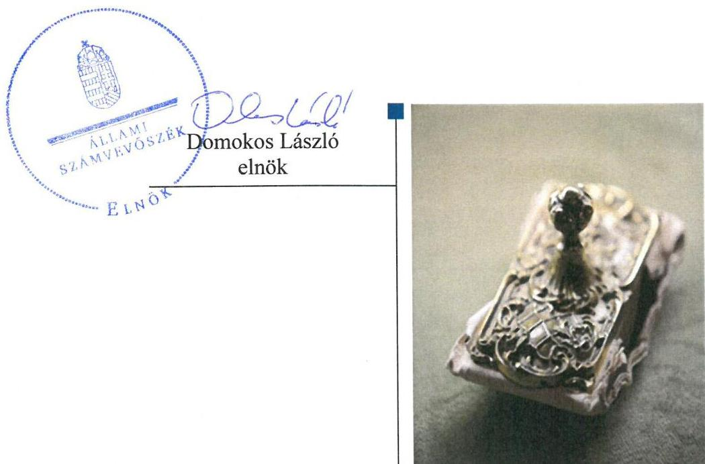
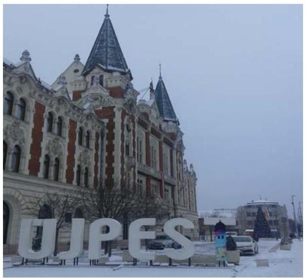
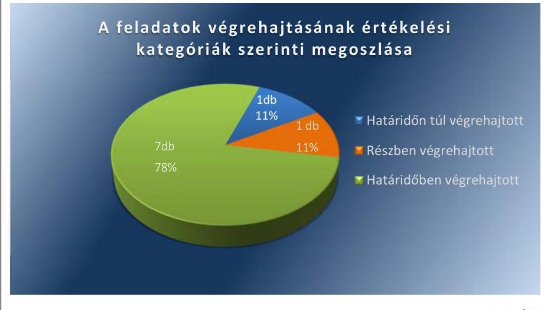
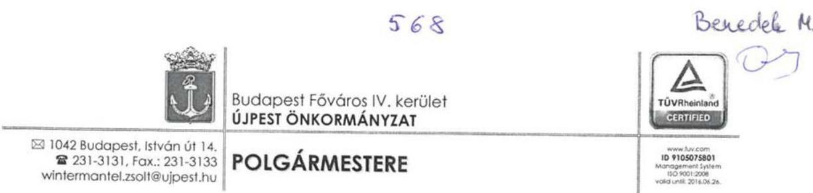
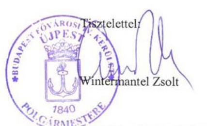
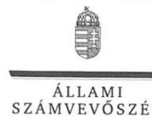
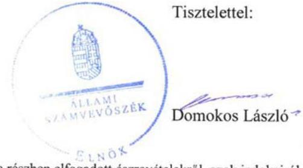
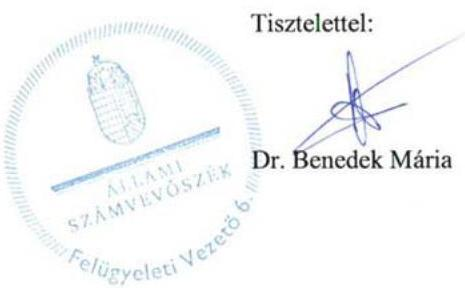

# Jelentés 

## Utóellenőrzések

Budapest Főváros IV. kerület Újpest Önkormányzata vagyongazdálkodása szabályszerűségének utóellenőrzése 2017.

---

# Jelentés 

## Utóellenőrzések

Budapest Főváros IV. kerület Újpest Önkormányzata vagyongazdálkodása szabályszerűségének utóellenőrzése 2017. 96. hó 27. nap

---

# AZ ELLENŐRZÉST FELÜGYELTE:

DR. BENEDEK MÁRIA felügyeleti vezető

# AZ ELLENŐRZÉST VEZETTE ÉS A VÉGREHAJTÁSÁÉRT FELELŐS:

HEIDINGER TIBOR ellenőrzésvezető

# A PROGRAM ÖSSZEÁLLÍTÁSÁÉRT FELELŐS:

JANIK JÓZSEF LÁSZLÓ osztályvezető

# A TÉMÁHOZ KAPCSOLÓDÓ KORÁBBI SZÁMVEVŐSZÉKI JELENTÉSEK:

|  • címe: | Budapest Főváros IV. kerület Újpest Önkormányzata vagyongazdálkodása szabályszerűségének ellenőrzése  |
| --- | --- |
|  • sorszáma: | 14217  |

Jelentéseink az Országgyűlés számítógépes hálózatán és az Interneten a www.asz.hu címen is olvashatóak.

IKTATÓSZÁM: V-1299-050/2016.

TÉMASZÁM: 2333

ELLENŐRZÉS-AZONOSÍTÓ SZÁM: V075558

---

# TARTALOMJEGYZÉK 

■ ÖSSZEGZÉS ..... 5
■ AZ ELLENŐRZÉS CÉLJA ..... 6
■ AZ ELLENŐRZÉS TERÜLETE ..... 7
■ AZ ELLENŐRZÉS HÁTTERE, INDOKOLTSÁGA ..... 8
■ A JELENTÉS LÉNYEGES KÉRDÉSKÖRE ..... 9
■ ELLENŐRZÉS HATÓKÖRE ÉS MÓDSZEREI ..... 10
■ MEGÁLLAPÍTÁSOK ..... 12
■ MELLÉKLETEK ..... 15
I. sz. melléklet: Az ÁSZ 14217. számú jelentéséhez kapcsolódó intézkedési terv végrehajtása ..... 15
■ FÜGGELÉK: ÉSZREVÉTELEK ..... 19
■ RÖVIDÍTÉSEK JEGYZÉKE ..... 27

---

.

---

# ÖSSZEGZÉS 

Az Állami Számvevőszék Budapest Főváros IV. kerület Újpest Önkormányzata vagyongazdálkodása szabályszerűségének utóellenőrzése során megállapította, hogy az intézkedési tervben meghatározott feladatok jelentős része végrehajtásra került. A vagyongazdálkodás szabályszerűsége javult.

## Az ellenőrzés társadalmi indokoltsága

Az Állami Számvevőszék stratégiájában célul tűzte ki a számvevőszéki munka hasznosulásának javítását. Ezzel összhangban ellenőrzi, hogy az ellenőrzött szervezetek megvalósították-e a korábbi ellenőrzései által feltárt hibák, hiányosságok és szabálytalanságok megszüntetése céljából kialakított intézkedési terveikben foglaltakat. A rendszeres utóellenőrzések hozzájárulnak a szükséges intézkedések tényleges végrehajtásához, ezáltal a közpénzügyek rendezettségének javulásához, igazolják, hogy lezárult a következmények nélküli ellenőrzések időszaka.

## Főbb megállapítások, következtetések

A polgármester az Állami Számvevőszék jelentésében rögzített intézkedést igénylő megállapításokhoz és javaslatokhoz kapcsolódóan összeállított intézkedési tervet megküldte az Állami Számvevőszék részére. Budapest Főváros IV. kerület Újpest Önkormányzata az intézkedési tervben meghatározott kilenc feladat közül hetet határidőben, egyet határidőn túl, egyet részben hajtott végre. Ezáltal a vagyongazdálkodás szabályszerűsége javult.

A polgármester az intézkedési tervben meghatározott határidőben beterjesztette Budapest Főváros IV. kerület Újpest Önkormányzata Képviselő-testület számára a térítésmentes átvételre és átadásra vonatkozó előterjesztéseket. A jegyző intézkedett a vagyonkimutatás megfelelő tartalommal történő elkészítéséről, a Fővárosi Önkormányzat részére vagyonkezelésbe adott ingatlanok jogszabályoknak megfelelő számviteli nyilvántartásáról, az immateriális javak, tárgyi eszközök számviteli politikában előírtaknak megfelelő üzembe helyezéséről és a terv szerinti értékcsökkenés elszámolásáról. A jegyző intézkedett továbbá az Értékelési szabályzat módosításáról és az év végi értékelések eszerinti végrehajtásáról, a megszűnt Újpesti Média Kht. adatainak a számviteli nyilvántartásokból történő kivezetéséről, valamint a Hivatásetikai Kódex elkészítéséről és a Budapest Főváros IV. kerület Újpest Önkormányzata Képvi-selő-testület számára történő előterjesztéséről.

A jegyző az intézkedési tervben meghatározott határidőn túl intézkedett az ingatlanvagyon-kataszter adatainak a számviteli nyilvántartásban szereplő adatokkal való egyezőségének megteremtéséről, valamint a későbbiekben az egyeztetés negyedévente történő biztosításáról.

A jegyző nem intézkedett teljes körűen Budapest Főváros IV. kerület Újpest Önkormányzata két gazdasági társasága részére üzemeltetésre átadott eszközök december 31-i fordulónapra történő, évenkénti leltározásának végrehajtásáról. A gazdasági társaságok a fordulónapi leltárakat elkészítették és az előírt határidőben átadták, azonban azok nem teljes körűen feleltek meg a leltározási szabályzatban előírtaknak.

A jegyző az intézkedési terv feladatainak végrehajtásáról a jogszabály előírásainak megfelelő tartalmú nyilvántartást vezetett, ezzel biztosította az intézkedések végrehajtásának átláthatóságát.

---

# AZ ELLENŐRZÉS CÉLJA 

Az ellenőrzés célja annak értékelése volt, hogy a számvevőszéki jelentésben foglalt intézkedést igénylő megállapításokkal és javaslatokkal összhangban készített intézkedési tervben meghatározott feladatokat az ellenőrzött szervezet végrehajtotta-e.

---

# **A Z ELLENŐRZÉS TERÜLETE**

## **Budapest Főváros IV. kerület Újpest Önkormányzata**

Budapest Főváros IV. kerület állandó lakosainak száma a KSH1 által közzétett népességi adatok alapján 2016. január 1-jén 101 558 fő volt.

A polgármester2 a 2010. évi önkormányzati választások óta tölti be tisztségét, a jegyző3 2012. március 1-jétől látja el közszolgálati feladatait.

Az Önkormányzat4 a 2015. évi zárszámadási rendelete szerint 42 123,8 M Ft költségvetési bevételt ért el, valamint 40 227,8 M Ft költségvetési kiadást valósított meg. Az Önkormányzat mérlegfőösszegének értéke 2015. december 31-én 40 330,2 M Ft, a követelések állománya 1 085,7 M Ft, a kötelezettségek állománya 438,7 M Ft volt.

Az ÁSZ5 2014. évben ellenőrizte az Önkormányzat vagyongazdálkodása szabályszerűségét 2009. január 1. és 2013. december 31. közötti időszakra vonatkozóan, az erről szóló 14217 számú jelentését 2014. november 5-én tette közzé. Az ellenőrzés célja annak megállapítása volt, hogy az Önkormányzat vagyongazdálkodási tevékenységét a jogszabályi előírásokkal összhangban szabályozta-e, a vagyon nyilvántartása és a vagyongazdálkodási tevékenységek végrehajtása a jogszabályoknak és a belső előírásoknak megfelelően történt-e. Az ellenőrzés célja volt továbbá annak megállapítása, hogy az Önkormányzatnál a vagyongazdálkodás során biztosították-e az átláthatóságot, valamint a külső és belső ellenőrzések megállapításai, javaslatai hozzájárultak-e a szabályszerű vagyongazdálkodáshoz.

Az utóellenőrzés – 2014. november 5-től 2016. december 23-ig végrehajtott feladatokat figyelembe véve – az ÁSZ jelentésben a polgármester és a jegyző részére megfogalmazott intézkedést igénylő megállapításokra és javaslatokra készített, az ÁSZ részére megküldött intézkedési tervben foglalt feladatok megvalósításának ellenőrzésére, illetve értékelésére fókuszált.

---

# AZ ELLENŐRZÉS HÁTTERE, INDOKOLTSÁGA 

Az ÁSZ tv. ${ }^{6}$ 33. § (1) bekezdése értelmében a számvevőszéki jelentések intézkedést igénylő megállapításaihoz és javaslataihoz kapcsolódóan az ellenőrzött szervezet vezetője intézkedési tervet köteles összeállítani, és az ÁSZ részére megküldeni. Az intézkedési tervben foglaltak megvalósítását az ÁSZ tv. 33. § (7) bekezdésében foglaltak alapján - az ÁSZ utóellenőrzés keretében ellenőrizheti. Az intézkedések megvalósulásának értékelése során az ÁSZ figyelembe vette az ellenőrzött szervezet működési feltételeiben, valamint a jogszabályi előírásokban bekövetkezett változásokat. Az intézkedési tervekben foglalt feladatok hiányos, illetve késedelmes végrehajtása, valamint megvalósításának elmaradása azt mutatja, hogy az ellenőrzések során feltárt hibák, hiányosságok és szabálytalanságok megszüntetése nem kapott kellő hangsúlyt. Ez a szabályszerű működés és a felelős vezetői magatartás vonatkozásában kockázatot hordoz. E kockázatok feltárásával az ÁSZ utóellenőrzési rendszere fokozza a fegyelmet, és igazolja, hogy a közpénzzel való szabályos gazdálkodás felelőssége elől nem lehet kitérni.

Az utóellenőrzés négy szinten hasznosulhat:

- A társadalom szintjén az utóellenőrzés jelzi, hogy a számvevőszéki ellenőrzés megállapításainak van következménye: a hiányosságok megszüntetésére az ellenőrzött szervezet által meghatározott intézkedések végrehajtását is számon kéri az ÁSZ.
- Az ellenőrzött terület szintjén az utóellenőrzés tájékoztatást nyújt a terület döntéshozóinak a hiányosságok kiküszöbölésének jó gyakorlatairól, ezzel lehetőséget biztosítva arra, hogy az ÁSZ ellenőrzési megállapításai, javaslatai a terület nem ellenőrzött szervezeteinek a működése során is hasznosuljanak.
- Az ellenőrzött szervezet szintjén az utóellenőrzés feltárja, hogy a szervezet az intézkedések végrehajtásával hasznosította-e a korábbi ellenőrzési jelentésben a hiányosságok megszüntetése, illetve a kockázatok kezelése érdekében megfogalmazott javaslatokat.
- Az ÁSZ szintjén az utóellenőrzés visszacsatolást ad az ellenőrzési jelentések hasznosulásáról, az intézkedések elmaradása vagy részleges megvalósulása a további ellenőrzésekhez kockázati jelzésként szolgál.

---

# A JELENTÉS LÉNYEGES KÉRDÉSKÖRE 

Az Önkormányzat az intézkedési tervben foglaltakat az elöirt határidőben végrehajtotta-e?

---

# ELLENŐRZÉS HATÓKÖRE ÉS MÓDSZEREI 

## Az ellenőrzés típusa

Megfelelőségi ellenőrzés.

## Az ellenőrzött időszak

Az utóellenőrzés alapját képező ÁSZ jelentés közzétételének napjától (2014. november 5.) az ellenőrzésről szóló kiértesítő levél keltének napjáig (2016. december 23.) tartó időszak.

## Az ellenőrzés tárgya

Az ÁSZ tv. 2011. július 1-jei hatálybalépését követően a számvevőszéki jelentésben foglalt intézkedést igénylő megállapításokkal és javaslatokkal összhangban - az Önkormányzat által - készített intézkedési tervben foglaltak végrehajtásának ellenőrzése volt.

Az ellenőrzés kiterjedt minden olyan körülményre és adatra, amely az ÁSZ jogszabályban meghatározott feladatainak teljesítéséhez, valamint a program végrehajtása folyamán felmerült újabb összefüggések feltárásához szükséges volt.

## Az ellenőrzött szervezet

Budapest Főváros IV. kerület Újpest Önkormányzata.

## Az ellenőrzés jogalapja

Az Alaptörvény ${ }^{7}$ 43. cikk (1) bekezdése alapján az ÁSZ az Országgyűlés pénzügyi és gazdasági ellenőrző szerve. Az ÁSZ törvényben meghatározott feladatkörében ellenőrzi a központi költségvetés végrehajtását, az államháztartás gazdálkodását, az államháztartásból származó források felhasználását és a nemzeti vagyon kezelését.

Az ÁSZ tv. 1. § (3) bekezdése szerint az ÁSZ általános hatáskörrel végzi a közpénzekkel és az állami és önkormányzati vagyonnal való felelős gazdálkodás ellenőrzését.

Az ÁSZ tv. 33. § (7) bekezdése alapján a 33. § (1)-(2) bekezdése szerinti intézkedési tervben foglaltak megvalósítását az ÁSZ utóellenőrzés keretében ellenőrizheti.

---

# Az ellenőrzés módszerei 

Az ÁSZ az ellenőrzést a nemzetközi standardokat irányadónak tekintve az ellenőrzési program ellenőrzési kérdései, az ellenőrzött időszakban hatályos jogszabályok, az ellenőrzés szakmai szabályok és módszertanok figyelembevételével, önálló ellenőrzés keretében végezte.

Az ÁSZ az ellenőrzés ideje alatt az ellenőrzött szervezettel történő kapcsolattartást az ÁSZ SZMSZ ${ }^{\circledR}$-ének vonatkozó előírásai alapján biztosította.

Az utóellenőrzés megállapításait elsősorban az ÁSZ rendelkezésére álló, valamint az ellenőrzött szervezetektől elektronikusan bekért dokumentumok alapozták meg.

Az ellenőrzési bizonyítékként felhasználható adatforrások közé tartoztak egyrészt a szakmai programban felsorolt adatforrások, másrészt minden - az ellenőrzés folyamán feltárt, az ellenőrzés szempontjából információt tartalmazó - dokumentum.

Az intézkedési tervben előírt feladatokat azok végrehajtása szempontjából az alábbiak szerint értékelte az ÁSZ:
"határidőben végrehajtott" a feladat, ha a teljesítés dokumentáltan, az intézkedési tervben előírt határidőben és tartalommal megtörtént;
"határidőn túl végrehajtott" a feladat, ha annak teljesítése az intézkedési tervben meghatározott módon, de az előírt határidőn túl történt meg;
"részben végrehajtott" a feladat, ha végrehajtása teljes körűen az intézkedési tervben előírt módon nem történt meg;
"nem végrehajtott" a feladat, ha a végrehajtás nem történt meg, vagy amennyiben a teljesítést nem dokumentálták;
"okafogyottá vált" a feladat, ha végrehajtására - meghatározott esemény bekövetkezése, továbbá külső körülmény, a működést érintő feltétel változása miatt - már nincs szükség, illetve lehetőség, és egyértelműen megállapítható, hogy az intézkedést szükségessé tevő körülmény a jövőben nem fordulhat elő;
"nem időszerű" az a feladat, amelynek ellenőrzési időszakon belüli végrehajtására azért nem került (kerülhetett) sor, mert az intézkedés alapjául szolgáló esemény nem következett be, de annak jövőbeni előfordulása lehetséges, a végrehajtása nem volt esedékes, vagy a végrehajtás határideje még nem járt le.
Az ellenőrzés lefolytatásához az ellenőrzött szervezet a tanúsítványok elektronikus kitöltésével, valamint az ÁSZ által kért dokumentumok elektronikus megküldésével szolgáltatott adatokat, amelyek valódiságát és teljes körűségét az ellenőrzött szervezet vezetője által tett teljességi és hitelességi nyilatkozat igazolta. Az így rendelkezésre bocsátott adatok, információk kontrollja az ellenőrzés keretében történt.

---

# MEGÁLLAPÍTÁSOK 

## Az Önkormányzat az intézkedési tervben foglaltakat az előírt határidőben végrehajtotta-e?

Összegző megállapítás

Az Önkormányzat az intézkedési tervben meghatározott kilenc feladatból hetet* határidőben, egyet határidőn túl, egyet* részben hajtott végre. Az intézkedési tervben meghatározott feladatok végrehajtásáról az Önkormányzat a jogszabályban előírt tartalommal vezette a nyilvántartást.

Az ÁSZ a jelentésében a polgármester részére egy, a jegyző részére nyolc intézkedést igénylő megállapítást és javaslatot fogalmazott meg. A polgármester az Állami Számvevőszék részére megküldte a Képviselő-testület ${ }^{9}$ által elfogadott intézkedési tervet, amelyben a polgármester részére egy, a jegyző részére nyolc intézkedési feladat került meghatározásra.

Az intézkedési tervben meghatározott feladatokat, határidőket, felelősöket, és a feladatok végrehajtását az I. számú melléklet mutatja be.

A jegyző gondoskodott az ÁSZ megállapításaira és javaslataira készített intézkedési terv végrehajtásáról a Bkr. ${ }^{10} 14 . \S$ (1) bekezdésében előírt nyilvántartás vezetéséről a Bkr. 47. § (2) bekezdése szerinti tartalommal.

Az Önkormányzat intézkedési tervében meghatározott feladatok végrehajtásának értékelési kategóriák szerinti megoszlását az 1. ábra szemlélteti.

1. ábra

Fornás: ÁSZ

[^0]
[^0]:    * számelírás javítása

---

# HATÁRIDŐBEN VÉGREHAJTOTT feladatok: 

1.A polgármester a 2009-ben keletkezett 19,4 M Ft értékű forgalomképtelen törzsvagyon tulajdonjogának térítésmentes megszerzéséről szóló Gazdasági Bizottsági és a 2011-ben keletkezett Budapesti Rendőr főkapitányság részére történő 0,6 M Ft értékű informatikai eszköz térítésmentes átadásáról szóló a Gazdasági és Pénzügyi Ellenőrző Bizottsági döntéseket 2015. január 12-én előterjesztette a Képviselő-testület számára, amely azokat jóváhagyta.
2.A jegyző intézkedett az Önkormányzat vagyonkimutatásának a hatályos jogszabályi előírásoknak megfelelő összeállításáról törzsvagyon, illetve üzleti vagyon bontásban, továbbá a „0"-ra leírt, de használatban lévő, illetve használaton kívüli eszközök állománya részletezettségben.
3.A jegyző intézkedett az egyes ingatlanok Fővárosi Önkormányzat ${ }^{11}$ részére történő átadásáról, továbbá a vagyonkezelésbe átadott ingatlanoknak az Önkormányzat számviteli nyilvántartásában főkönyvi számlaszámok közötti átvezetéséről.
4.A jegyző gondoskodott az immateriális javak, tárgyi eszközök számviteli politikában előírtaknak megfelelő üzembe helyezéséről és a terv szerinti értékcsökkenés tényleges használatba vétel időpontjának megfelelő elszámolásáról.
5.A jegyző az előírt határidőben gondoskodott az Önkormányzat számviteli politikájának ${ }^{12}$ gazdasági társasági részesedések utáni értékhelyesbítés elszámolásának vonatkozásában történő módosításáról, továbbá az év végi értékelés szabályzatban előírtak szerinti elkészítéséről.
6.A jegyző intézkedett a megszűnt Újpesti Média Kht. ${ }^{13}$-ben lévő önkormányzati részesedés számviteli nyilvántartásokból történő kivezetéséről.
7.A jegyző 2015. január 12-én a Képviselő-testület számára előterjesztette a Kttv. ${ }^{14}$ 83. § bekezdésében foglalt hivatásetikai alapelveket, az etikai eljárásokra vonatkozó részletes eljárásokat tartalmazó Hivatásetikai Kódexet ${ }^{15}$, melyet a Képviselő-testület 7/2015. (I.29.) számú határozatával állapította meg.

## HATÁRIDŐN TÚL VÉGREHAJTOTT feladat:

8.A jegyző az Önkormányzat ingatlanvagyon-katasztere és ingatlan számviteli nyilvántartása szerinti egyezőségét az intézkedési tervben meghatározott 2015. február 15-i határidőn túl, 2015. december 31-i időponttal teremtette meg. A Vagyongazdálkodási Osztály ${ }^{16}$ és a Pénzügyi és Számviteli Osztály ${ }^{17}$ közötti negyedéves szinten történő egyeztetést 2016. első negyedévétől kezdődően elvégezték.

## RÉSZBEN VÉGREHAJTOTT feladat:

9.A jegyző és a polgármester gondoskodott az UV Zrt. ${ }^{18}$ és az ÉPIT Zrt. ${ }^{19}$ részére üzemeltetésre átadott eszközök leltározási dokumentumainak az előírt határidőben az Önkormányzat részére történő megküldéséről. Az üzemeltetők által megküldött hitelesített leltárak nem teljes körűen feleltek meg a leltározási szabályzatban ${ }^{20}$ előírtaknak.

---

.

---

# MELLÉKLETEK

- I. SZ. MELLÉKLET: AZ ÁSZ 14217. SZÁMÚ JELENTÉSÉHEZ KAPCSOLÓDÓ INTÉZKEDÉSI TERV VÉGREHAJTÁSA

|  Az intézkedési tervben meghatározott feladat | Az intézkedési tervben meghatározott határidő | Az intézkedési tervben meghatározott feladat végrehajtásának felelése | Az intézkedési tervben meghatározott feladat végrehajtása  |
| --- | --- | --- | --- |
|  1. | 2. | 3. | 4.  |
|  Határidőben végrehajtott feladatok |  |  |   |
|  1. A Képviselő-testület számára előterjesztésre kerül a 2009-ben keletkezett 19,4 millió Ft értékű forgalomképtelen törzsvagyon tulajdonjogának térítésmentes megszerzéséről szóló Gazdasági Bizottsági és a 2011-ben keletkezett a Budapesti Rendőr-főkapitányság részére történő 0,6 millió Ft értékű informatikai eszköz térítésmentes átadásáról szóló Gazdasági és Pénzügyi Ellenőrző Bizottsági döntések jóváhagyása. | 2015. január 31. | polgármester | A polgármester a 2009. évi 19,4 M Ft értékű forgalomképtelen törzsvagyon tulajdonjogának térítésmentes megszerzéséről szóló Gazdasági Bizottsági, továbbá a 2011. évi a Budapesti Rendőr-főkapitányság részére történő 0,6 M Ft értékű informatikai eszköz térítésmentes átadásáról szóló Gazdasági és Pénzügyi Ellenőrző Bizottsági döntéseket 2015. január 12-én a Képvi-selő-testület számára megtárgyalásra előterjesztette. A Képviselő-testület a bizottsági döntéseket 9/2015. (I.29.) határozatával 2015. január 29-én jóváhagyta.  |
|  2. A hatályos jogszabályi előírásoknak és az ÁSZ javaslatának megfelelően kell összeállítani a vagyonkimutatást törzsvagyon, illetve üzleti vagyon bontásban, továbbá a „0"-ra leírt, de használatban lévő, illetve használaton kívüli eszközök állományát. | folyamatos | jegyző | A jegyző gondoskodott az Önkormányzat a 2014. évi zárszámadásról szóló 15/2015. (V. 28) számú önkormányzati rendelete és a 2015. évi zárszámadásról szóló 9/2016. (IV. 28.) számú önkormányzati rendelete vagyonkimutatásai 8. számú mellékleteinek a Mótv. ${ }^{21} 110 . \S$ (2) bekezdésének megfelelően a törzsvagyont az üzleti vagyon elkülönítéséről, továbbá a "0"-ra leírt, de használatban lévő, illetve használaton kívüli eszközök állományának bemutatásáról.  |
|  3. Az egyes ingatlanok fővárosi önkormányzat részére történő átadásáról, valamint önkormányzatokat érintő egyes törvények módosításáról szóló 2012. évi CXC. törvény alapján a fővárosi önkormányzat vagyonkezelésébe adott ingatlanok az | 2015. január 15. | jegyző | A jegyző intézkedett a Fővárosi Önkormányzat vagyonkezelésébe adott ingatlanoknak az Önkormányzat számviteli nyilvántartásában a főkönyvi számlaszámok között átvezetéséről. Az Önkormányzat az ingatlanokat 2014. december 15-től, mint vagyonkezelésbe adott ingatlanokat a „0"-ás számlaosztályában tartotta nyilván. Az Önkormányzat vagyonkezelésbe adott ingatlanainak számviteli nyilvántartása megfelel az államháztartás számviteléről szóló Áhsz. ${ }^{22} 10 . \S$ (2) bekezdésében foglaltaknak.  |

---

|  Az intézkedési tervben meghatározott feladat | Az intézkedési tervben meghatározott határidő | Az intézkedési tervben meghatározott feladat végrehajtásának felelőse | Az intézkedési tervben meghatározott feladat végrehajtása  |
| --- | --- | --- | --- |
|  1 | 2 | 3 | 4  |
|  önkormányzat számviteli nyilvántartásában a főkönyvi számlaszámok között átvezetésre kerülnek. |  |  |   |
|  4. A Számviteli politikában előírtaknak megfelelően az immateriális javak, tárgyi eszközök üzembe helyezése (használatbavétele) Üzembe helyezési jegyzőkönyv vagy Üzembe helyezési okmány alapján kerül aktiválásra, melyet a (vég)számlához kell csatolni és a terv szerinti értékcsökkenést a tényleges használatba vétel időpontjának megfelelően kell elszámolni. | folyamatos | jegyző | A jegyző az ellenőrzött dokumentumok alapján biztosította az immateriális javak, tárgyi eszközök üzembe helyezését a Számviteli politikában előírtak szerint, mert az aktiválásokat Üzembe helyezési jegyzőkönyv/Üzembe helyezési okmány alapján végezték el, továbbá a terv szerinti értékcsökkenést a tényleges használatbevétel időpontjának megfelelően számolták el.  |
|  5. A Számviteli politika részét képező Értékelési szabályzat a gazdasági társasági részesedések után az értékhelyesbítés elszámolásának vonatkozásában módosításra kerül, az év végi értékelés a szabályzatban előírtaknak megfelelően készül el. | 2015. január 31. | jegyző | A számviteli politikát módosító 31/26/2014. számú polgármesteri-jegyzői közös utasítás 2014. december 1-jétől rendelkezett a piaci értékelés alkalmazásáról a tartós részesedések vonatkozásában az Önkormányzat számviteli rendszerében. Az Önkormányzat élt a piaci értékelés lehetőségével, azt a tartós részesedésekre vonatkozóan évente elkészítette. A számviteli politikában és értékelési szabályzatban meghatározottakat betartva számolta el az értékhelyesbítés visszairását. Értékhelyesbítésre, értékvesztés elszámolására nem került sor az elvégzett értékelések alapján.  |
|  6 Az önkormányzat részesedései közül az Újpesti Média Kht.-t ki kell vezetni a számviteli nyilvántartásokból. | 2014. december 31. | jegyző | A jegyző gondoskodott a 16221 főkönyvi számon az Újpesti Média Kht.-ban lévő részesedés könyv szerinti értékének 2014. december 31-i könyvelési dátummal az Önkormányzat számviteli nyilvántartásaiból történő kivezetéséről. A 15/2015. (V.28.) számú zárszámadási rendelet mellékletét képező, az Önkormányzat tulajdonában álló gazdasági szervezetekben meglévő részesedéseinek és gazdasági szervezetek kötelezettségeit bemutató 12. számú melléklet a főkönyvi kartonnal összhangban az Újpesti Média Kht.-t nem tartalmazta.  |
|  7. A Képviselő-testület számára előterjesztésre kerül a Polgármesteri Hivatal Etikai ködexe, melyben a közszolgálati tisztviselőkről szóló 2011. évi | 2015. január 31. | jegyző | A jegyző intézkedett a Kttv. 83. §-ában foglalt hivatásetikai alapelveket és az etikai eljárásokra vonatkozó részletes szabályokat tartalmazó Hivatásetikai Ködex előkészítéséről és a Képviselő-  |

---

|  Az intézkedési tervben meghatározott feladat | Az intézkedési tervben meghatározott határidő | Az intézkedési tervben meghatározott feladat végrehajtásának felelése | Az intézkedési tervben meghatározott feladat végrehajtása  |
| --- | --- | --- | --- |
|  1 | 2 | 3 | 4  |
|  CXCIX. törvény 231.§ (1) bekezdésében meghatározottaknak megfelelően meghatározásra kerülnek a köztisztviselők hivatásetikai alapelvei, az etikai elvárások és az etikai eljárás szabályai. |  |  | testület elé terjesztéséről. A Hivatásetikai Kódexet a jegyző 2015. január 12-én a Képviselő-testület számára előterjesztette, melyet a Képviselő-testület a 7/2015. (I.29.) számú határozatával a Kttv. 231. § (1) bekezdésében foglaltakkal összhangban állapított meg.  |
|  Határidőn túl végrehajtott feladat |  |  |   |
|  8. Az önkormányzatok tulajdonában lévő ingatlanvagyon nyilvántartási és adatszolgáltatási rendjéről szóló 147/1992. (XI.6.) Korm. rendelet23 1. § (3) bekezdésében foglaltak és 2. számú melléklet alapján az ingatlanvagyon-kataszter és az ingatlan számviteli nyilvántartás szerinti egyezőséget meg kell teremteni. A Vagyongazdálkodási Osztály és Pénzügyi és Számviteli Osztály közötti egyeztetést a későbbiekben negyedéves szinten biztosítani kell. | 2015. február 15. | jegyző | A jegyző az intézkedési tervben meghatározott határidőn túl, 2015. december 31-i dátummal biztosította az ingatlanvagyon-kataszter összesített bruttó érték adatainak a számviteli nyilvántartás szerinti ingatlanvagyon bruttó értékadataival történő egyezőségét. A Vagyongazdálkodási Osztály és a Pénzügyi és Számviteli Osztály közötti negyedévenkénti egyeztetéseket ezt követően - a 2016. I-III. negyedévekben - elvégezték.  |
|  Részben végrehajtott feladat |  |  |   |
|  9. Az UV Zrt. és az ÉPÍT Zrt. köteles az üzemeltetésre átadott eszközöket az általa december 31-i fordulónapra vonatkozó évenkénti leltározás alapján elkészített, hitelesített leltárral alátámasztani és azt a következő év január 31. napjáig megküldeni az önkormányzat részére, melynek formátuma meg kell hogy feleljen a leltárfelvételi ív és a leltárkiértékelő jegyzőkönyv tartalmi követelményeinek. | 2015. január 31. | jegyző, polgármester | A jegyző intézkedett az üzemeltetésre átadott eszközök leltározási dokumentumainak az üzemeltetők által az előírt határidőben történő megküldéséről. Az Önkormányzat leltározási szabályzatának 4.3. pontja tartalmazta az üzemeltetésre átadott eszközök leltározásával kapcsolatos feladatokat nevesítve az UV Zrt.-t és az ÉPÍT Zrt.-t. A feladat azonban csak részben teljesült, mert az UV Zrt. és az ÉPÍT Zrt. által az Önkormányzat részére megküldött leltározási dokumentumok tartalmilag nem teljes körűen feleltek meg a leltározási szabályzat 4.3. pontjában előírtaknak. A két gazdasági társaság 2014. december 31-i és 2015. december 31-i leltár felvételi ívei nem tartalmazták a leltározást végzők neveit. Az UV Zrt. leltárjai nem tartalmazták a leltározás napját és az eszközök bruttó értékét.  |

---

.

---

# FÜGGELÉK: ÉSZREVÉTELEK 

A jelentéstervezetet a Számvevőszék 15 napos észrevételezésre megküldte az ellenőrzött szervezet vezetőjének az ÁSZ tv. 29. § ${ }^{+}$(1) bekezdése előírásának megfelelően.
Az elfogadott észrevételek alapján a Számvevőszék módosította a jelentést.

A függelék tartalmazza az ellenőrzött észrevételeit, illetve az elfogadott és a részben el fogadott észrevétel el nem fogadott részének indoklását.

[^0]
[^0]:    ${ }^{+}$29. § (1) Az Állami Számvevőszék az ellenőrzési megállapításait megküldi az ellenőrzött szervezet vezetőjének vagy az általa megbízott személynek, és annak, akinek személyes felelősségét állapította meg.
    (2) Az ellenőrzött szervezet vezetője és a felelősként megjelölt személy az ellenőrzés megállapításaira tizenöt napon belül írásban észrevételt tehet.
    (3) Az Állami Számvevőszék az észrevételre a beérkezésétől számított harminc napon belül írásban válaszol. A figyelembe nem vett észrevételeket köteles a jelentésben feltüntetni, és megindokolni, hogy azokat miért nem fogadta el.

---

Állami Számvevőszék
Domokos László
elnök részére

Budapest 4.
Pf.: 54
1364

Tisztelt Elnök Úr!

Hivatkozással az Állami Számvevőszék V-1299-046/2016. iktatószámú jelentéstervezetére, az abban foglaltakra jelzett pontonként, megállapításonként az alábbi észrevételeket teszem:

A részben végrehajtott feladatok

8.A pont: „A jegyző és a polgármester gondoskodott az UV Zrt. és az ÉPIT Zrt. részére üzemeltetésre átadott eszközök leltározási dokumentumainak az előírt határidőben az Önkormányzat részére történő megküldéséről. Az üzemeltetők által megküldött hitelesített leltárak nem teljes körűen felelnek meg a leltározási szabályzatban előírtaknak.”

Észrevétel:

A jegyző és polgármester gondoskodott az UV Zrt. és az ÉPIT Zrt. részére üzemeltetésre átadott eszközök leltározási dokumentumainak az előírt határidőben az Önkormányzat részére történő megküldéséről. Mindkét gazdasági társaságnál az arra jogosultsággal rendelkező személyek végezték el a leltározással kapcsolatos feladatokat, a leltárfelvételi íveken szereplő aláírások alapján a munkafolyamatot végzők személye egyértelműen beazonosítható.

Az Önkormányzat az „1.4_ÉPIT_Zrt_alairt_leltar_20141231_HP” nevű dokumentumot a helyszíni vizsgálat során feltöltötte, a dokumentum a leltárívek mellett a 9. oldaltól kezdődően tartalmazza az ÉPIT Zrt. hiteles leltárkiértékelési jegyzőkönyveit a 2014. december 31-i fordulónapra vonatkozóan.

Fentiek alapján kérem, hogy a melléklet 8. 4. szövegrészből a „A két gazdasági társaság 2014. december 31-i és 2015. december 31-i leltár felvételi ívei nem tartalmazták a leltározást végzők neveit.”, valamint „Az ÉPIT Zrt. 2014. december 31-i leltárjai nem tartalmazták a hitelesített leltárkiértékelési jegyzőkönyveket.” mondat kerüljön törlésre.

9.A pont: „A jegyző nem teljes körűen gondoskodott az immateriális javak, tárgyi eszközök számviteli politikában előírtaknak megfelelő üzembe helyezéséről és terv szerinti értékcsökkenés és tényleges használatba vétel időpontjának megfelelő elszámolásáról, mert esetenként nem a számviteli politika előírásainak megfelelően végezték el az üzembe helyezést és a terv szerinti értékcsökkenés elszámolását.”

Észrevétel:

A 9.A pont szövegezése ellentétes a melléklet 9.4. pontjában megfogalmazott megállapítással, mert a 9. A pontban az szerepel, hogy hogy „esetenként nem a számviteli politika előírásainak megfelelően végezték el az üzembe helyezést”, a melléklet 9.4. pontjában pedig az került megfogalmazásra, hogy „egy esetben üzembe helyezési jegyzőkönyv nélkül végezték el az aktiválást,…”

ÜJPESTI ÖNKORMÁNYZAT POLGÁRMESTERE * 1041 BUDAPEST, ISTVÁN ÚT 14. * wintermantel.zsolt@ujpest.hu

---

Ellentétes továbbá a 9.A pont szövegezése a melléklet 9.4. pontjában megfogalmazott megállapítással abban a tekintetben is, hogy a 9.A pontban az szerepel, hogy „esetenként nem a számviteli politika elöírásainak megfelelően végezték el ...a terv szerinti értékcsökkenés elszámolását.", a melléklet 9.4. pontjában pedig az került megfogalmazásra, hogy ,egy esetben, annak ellenére, hogy üzembe helyezték a tárgyi eszközt, az időarányos értékcsökkenést nem számolták el utána."
A jelentéstervezet alapján nem azonosíthatóak a kifogásolt tételek és ez nem segíti elő a jelentéstervezetre adott észrevételezésünket.

A Számviteli politikában előírtaknak megfelelően az immateriális javak, tárgyi eszközök üzembe helyezése, használatba vétele Üzembe helyezési okmány vagy Üzembe helyezési bizonylat alapján kerül aktiválásra, ezt az okmányt minden esetben csatolni kell a számlához és a terv szerinti értékcsökkenést a tényleges használatba vétel időpontjának megfelelően kell elszámolni. A vizsgált mintatételeknél a bemutatott dokumentumok minden egyes esetben tartalmazták a számlához, utalványrendelethez csatolt Üzembe helyezési okmányt illetve Üzembe helyezési bizonylatot, mely alapján az aktiválás megtörtént. A mintavétel során vizsgált tíz tételnél a minden esetben elkészített, a vizsgálati anyaghoz már feltöltött használatba vételi okmányokat jelen levelem mellékleteként csatolom.
A fentiekre tekintettel kérem, hogy a melléklet 9.4. pontjában szereplő, „egy esetben üzembe helyezési jegyzőkönyv nélkül végezték el az aktiválást" szövegrész kerüljön törlésre.

Az 1900 augusztusában elkészült, eklektikus, szecessziós stílusban, a kor két elismert építésze, Böhm Henrik és Hegedűs Ármin tervei alapján épült Újpesti Városháza - Budapest Főváros IV. kerület Újpest Önkormányzata Képviselő-testületének az Önkormányzat vagyonáról és a vagyonelemek feletti tulajdonosi jogok gyakorlásáról szóló 48/2012. (XI.30.) önkormányzati rendelete, valamint Budapest Főváros építészeti örökségének fővárosi helyi védelméről szóló 37/2013. (V.10) Föv. Kgy. rendelet alapján - nemzetgazdasági szempontból kiemelt jelentőségű nemzeti vagyonnak minősülő, helyi védettségủ építészeti örökségnek nyilvánított épület. Ennek megfelelően a számvitelről szóló 2000. évi C. törvény 52. § (6) bekezdése és az államháztartás számviteléről szóló 4/2013. (I.11.) Kormányrendeletben meghatározott egységes - és a Forrás.Net Integrált ügyviteli rendszerben tovább alábontott - számlatükör szerint az épület és az épületen végzett beruházások a 121122 Értékét nem csökkentő, mủemléki védettségủ épület aktivált állománya megnevezésủ számlaszámon kerültek aktiválásra, melyre terv szerinti értékcsökkenést elszámolni nem szabad. Az Önkormányzat vagyonrendeletének vonatkozó részét, valamint az ingatlan tulajdoni lapját jelen levelem mellékleteként csatolom.
A fentiekre tekintettel kérem, hogy a melléklet 9.4. pontjában szereplő, „egy esetben, annak ellenére, hogy üzembe helyezték a tárgyi eszközt, az időarányos értékcsökkenést nem számolták el utána." szövegrész kerüljön törlésre.

Az észrevételeket összegezve elmondható, hogy mind a tíz, a mintavétel során vizsgált tétel üzembe helyezési okmány, bizonylat alapján került aktiválásra, és minden szükséges esetben az értékcsökkenés elszámolása szabályszerűen megtörtént.

Fentiek alapján kérem észrevételeim figyelembevételét és a 9. pont átminősítését a részben végrehajtott feladatok közül a határidőben végrehajtott feladatok közé!

Budapest, 2017. március 30.

[^0]
[^0]:    (JJPESTI ÖNKORMÁNYZAT POLGÁRMESTERE * 1042 BUDAPEST, ISTVÁN ÚT 14, * wintermantel.zsolt@ujpest.hu

---

# KINOK 

Ikt.szám: V-1299-048/2016.

## Wintermantel Zsolt úr

polgármester
Budapest Főváros IV. kerület Újpest Önkormányzata

## Budapest

## Tisztelt Polgármester Úr!

Köszönettel megkaptam az Állami Számvevőszékhez 2017. április 4-én érkezett, az "Utóellenörzések - Budapest Föváros IV. kerület Újpest Önkormányzata vagyongazdálkodása szabályszerűségének utóellenőrzése" című számvevőszéki jelentéstervezetben foglalt megállapításokra tett észrevételét.

Tájékoztatom Polgármester urat, hogy az elfogadott észrevételek a jelentésben átvezetésre kerültek, a részben elfogadott észrevétel el nem fogadott részének indoklását - az Állami Számvevőszékről szóló 2011. évi LXVI. törvény 29. § (3) bekezdése alapján - a jelentésben szerepeltetjük az elutasítás indokának feltüntetésével együtt.

Az Állami Számvevőszék észrevételekre vonatkozó álláspontjáról a felügyeleti vezető által készített részletes tájékoztatást csatoltan megküldőm.

Budapest, 2017. hó nap

Melléklet: Tájékoztatás az elfogadott és a részben elfogadott észrevételekről, azok indokairól

---

# Tájékoztatás 

az elfogadott és a részben elfogadott észrevételekről, azok indokairól

| 1. | Észrevétel: | Az észrevétel 1. oldalán a jelentéstervezet 13. oldal 8. pontjához tartozó észrevétel szerint:   „A jegyző és polgármester gondoskodott az UV Zrt. és az ÉPIT Zrt. részére üzemeltetésre átadott eszközök leltározási dokumentumainak az elöirt határidőben az Önkormányzat részére történő megküldéséről. Mindkét gazdasági társaságnál az arra jogosultsággal rendelkező személyek végezték el a leltározással kapcsolatos feladatokat, a leltárfelvételi iveken szereplő aláírások alapján a munkafolyamatot végzők személye egyértelmüen beazonosítható.   Az Önkormányzat az „1.4_ÉPIT_Zrt_alairt_leltar_20141231_HP" nevü dokumentumot a helyszini vizsgálat során feltöltötte, a dokumentum a leltárivek mellett a 9. oldaltól kezdődően tartalmazza az ÉPIT Zrt. hiteles leltárkiértékelési jegyzőkönyveit a 2014. december 31-i fordulónapra vonatkozóan.   Fentiek alapján kérem, hogy a melléklet 8.4. szövegrészböl a „A két gazdasági társaság 2014. december 31-i és 2015. december 31-i leltár felvételi ivei nem tartalmazták a leltározást végzők neveit.", valamint „Az ÉPIT Zrt. 2014. december 31-i leltárjai nem tartalmazták a hitelesített leltárkiértékelési jegyzőkönyveket." mondat kerüljön törlésre." |
| :--: | :--: | :--: |
|  | Válasz: | Az ÁSZ az észrevételt részben fogadja el. |
|  | Indokolás: | Az észrevétel részben megalapozott. Az ÁSZ az észrevételben foglaltak és az ellenőrzés során rendelkezésre bocsátott dokumentumok   (1.4_ÉPIT_Zrt_alairt_leltar_20141231_HP, a 31/8/2013. számú jegyzői utasítással kiadott Eszközök és források leltározási és leltárkészítési szabályzata) felülvizsgálata alapján elfogadja az észrevételnek az ÉPIT Zrt. 2014. évre vonatkozó hiteles leltárkiértékelési jegyzőkönyvei meglététere vonatkozó részét. Ennek figyelembe vételével az ÁSZ törli |

---

|  |  | a jelentéstervezet erre vonatkozó megállapítását. Az ÁSZ az észrevétel további részét nem fogadja el, az nem megalapozott. A 31/8/2013. számú jegyzői utasítással kiadott Eszközök és források leltározási és leltárkészítési szabályzatának (továbbiakban: leltározási szabályzat) 4.3. Leltározandó eszközök és források köre és módszere fejezet tartalmazza az üzemeltetésre, kezelésre átadott, koncesszióba, vagyonkezelésbe adott eszközök leltározásával kapcsolatos előírásokat, és nevesítve tartalmazza, hogy az UV Zrt-nek és az ÉPÍT Zrt.-nek a leltározási szabályzatban előirtak szerint kell a leltározást végrehajtania. A leltározási szabályzatban az Önkormányzat előirta a leltárkimutatás tartalmi követelményeit, amelyek között külön tartalmi elemként szerepelt a leltározást végzők neve, valamint a leltározást végzők aláírása, amelyekből a két gazdasági társaság 2014. december 31-i és 2015. december 31-i leltárfelvételi ívei a leltározást végzők neveit nem tartalmazták. Ennek figyelembevételével az ÁSZ fenntartja a jelentéstervezet I. sz. melléklet 8. sor 4. oszlopában szereplő, a leltározást végzők neveinek hiányára vonatkozó megállapítását. |
| :--: | :--: | :--: |
|  |  | Az észrevétel 1. oldalán a jelentéstervezet 13. oldal 9. pontjához tartozó észrevétel szerint:   „A 9.A pont szövegezése ellentétes a melléklet 9.4. pontjában megfogalmazott megállapítással, mert a 9.A pontban az szerepel, hogy hogy ,,esetenként nem a számviteli politika elöirásainak megfelelöen végezték el az üzembe helyezést", a melléklet 9.4. pontjában pedig az került megfogalmazásra, hogy ,,egy esetben üzembe helyezési jegyzőkönyv nélkül végezték el az aktiválást,..."   Ellentétes továbbá a 9.A pont szövegezése a melléklet 9.4. pontjában megfogalmazott megállapítással abban a tekintetben is, hogy a 9.A pontban az szerepel, hogy ,,esetenként nem a számviteli politika elöirásainak megfelelöen végezték el... a terv szerinti értékcsökkenés elszámolását.", a melléklet 9.4. pontjában pedig az került megfogalmazásra, hogy ,,egy esetben, annak ellenére, hogy üzembe helyezték a tárgyi eszközt, az idöarányos értékcsökkenést nem számolták el utána."   A jelentéstervezet alapján nem azonosíthatóak a kifogásolt tételek és ez nem segiti elö a jelentéstervezetre adott észrevételezésünket.   A Számviteli politikában elöirtaknak megfelelően az immateriális javak, tárgyi eszközök üzembe helyezése, használatba vétele Üzembe helyezési okmány vagy Üzembe helyezési bizonylat alapján kerül aktiválásra, ezt az okmányt minden esetben csatolni kell a számlához és a terv szerinti értékcsökkenést a tényleges használatba vétel idöpontjának |

---

|  | megfelelően kell elszámolni. A vizsgált mintatételeknél a bemutatott dokumentumok minden egyes esetben tartalmazták a számlához, utalványrendelethez csatolt Üzembe helyezési okmányt illetve Üzembe helyezési bizonylatot, mely alapján az aktiválás megtörtént. A mintavétel során vizsgált tíz tételnél a minden esetben elkészitett, a vizsgálati anyaghoz már feltöltött használatbavételi okmányokat jelen levelem mellékleteként csatolom.   A fentiekre tekintettel kérem, hogy a melléklet 9.4. pontjában szereplő, ,,egy esetben üzembe helyezési jegyzőkönyv nélkül végezték el az aktiválást" szövegrész kerüljön törlésre.   Az 1900 augusztusában elkészült, eklektikus, szecessziós stílusban, a kor két elismert építésze, Böhm Henrik és Hegedüs Ármin tervei alapján készült Újpesti Városháza - Budapest Főváros IV. kerület Újpest Önkormányzata Képviselö-testületének az Önkormányzat vagyonáról és a vagyonelemek feletti tulajdonosi jogok gyakorlásáról szóló 48/2012. (XI. 30.) önkormányzati rendelete, valamint Budapest Főváros épitészeti örökségének fövárosi helyi védelméről szóló 37/2013. (V. 10.) Föv. Kgy. rendelet alapján - nemzetgazdasági szempontból kiemelt jelentőségü nemzeti vagyonnak minősülö, helyi védettségủ épitészeti örökségnek nyilvánított épület. Ennek megfelelően a számvitelről szóló 2000. évi C. törvény 52. § (6) bekezdése és az államháztartás számviteléről szóló 4/2013. (I. 11.) Kormányrendeletben meghatározott egységes - és a Forrás.Net Integrált ügyviteli rendszerben tovább alábontott - számlatükör szerint az épület és az épületen végzett beruházások a 121122 Értékét nem csökkentő, müemléki védettségủ épület aktivált állománya számlaszámon kerültek aktiválásra, melyre terv szerinti értékcsökkenést elszámolni nem szabad. Az Önkormányzat vagyonrendeletének vonatkozó részét, valamint az ingatlan tulajdoni lapját jelen levelem mellékleteként csatolom.   A fentiekre tekintettel kérem, hogy a melléklet 9.4. pontjában szereplő, ,,egy esetben, annak ellenére, hogy üzembe helyezték a tárgyi eszközt, az idöarányos értékcsökkenést nem számolták el utána." szövegrész kerüljön törlésre.   Az észrevételeket összegezve elmondható, hogy mind a tíz, a mintavétel során vizsgált üzembe helyezési okmány, bizonylat alapján került aktiválásra és minden szükséges esetben az értékcsökkenés elszámolása szabályszerűen megtörtént.   Fentiek alapján kérem észrevételeim figyelembevételét és a 9. pont átminősitését a részben végrehajtott feladatok közül a határidőben végrehajtott feladatok közé!'" |
| :--: | :--: | :--: |
|  | Válasz: | Az ÁSZ az észrevételt elfogadja. |

---

|  | Indokolás: | Az észrevétel megalapozott. Az ÁSZ az ellenőrzés során rendelkezésre bocsátott dokumentumok felülvizsgálata alapján elfogadja a jelentéstervezet 13. oldal 9. pontjában, valamint az I. sz. melléklet 9. sor 4. oszlopában szerepeltetett, az immateriális javak, tárgyi eszközök üzembe helyezése és a terv szerinti értékcsökkenésnek a tényleges használatba vétel időpontjának megfelelő elszámolására vonatkozó észrevételben foglaltakat. Ennek figyelembe vételével az ÁSZ módosítja a jelentéstervezet vonatkozó megállapításait. |
| :--: | :--: | :--: |

Budapest, 2017. április "26.".

---

# RÖVIDÍTÉSEK JEGYZÉKE 

${ }^{1}$ KSH
${ }^{2}$ polgármester
${ }^{3}$ jegyző
${ }^{4}$ Önkormányzat
${ }^{5}$ ÁSZ
${ }^{6}$ ÁSZ tv.
${ }^{7}$ Alaptörvény
${ }^{8}$ ÁSZ SZMSZ
${ }^{9}$ Képviselő-testület
${ }^{10}$ Bkr.
${ }^{11}$ Fővárosi Önkormányzat
${ }^{12}$ Számviteli politika
${ }^{13}$ Újpesti Média Kht.
${ }^{14}$ Kttv.
${ }^{15}$ Hivatásetikai Kódex
${ }^{16}$ Vagyongazdálkodási Osztály
${ }^{17}$ Pénzügyi és Számviteli Osztály
${ }^{18}$ UV Zrt.
${ }^{19}$ ÉPIT Zrt.
${ }^{20}$ leltározási szabályzat
${ }^{21}$ Mötv.
${ }^{22}$ Áhsz.
${ }^{23}$ 147/1992. (XI.6.) Korm. rendelet

Központi Statisztikai Hivatal
Budapest Főváros IV. kerület Újpest Önkormányzatának polgármestere
Budapest Főváros IV. kerület Újpest Önkormányzatának jegyzője
Budapest Főváros IV. kerület Újpest Önkormányzata
Állami Számvevőszék
2011. évi LXVI. törvény az Állami Számvevőszékről

Magyarország Alaptörvénye (kihirdetve 2011. április 25-én, hatályos 2012. január 1-jétől)
Az Állami Számvevőszék elnökének 3/2016. (XII.29.) ÁSZ utasítása az Állami Számvevőszék Szervezeti és Működési Szabályzatáról (hatályos: 2017. január 1-jétől)
Budapest Főváros IV. kerület Újpest Önkormányzatának Képviselő-testülete 370/2011. (XII.31.) Korm. rendelet a költségvetési szervek belső kontrollrendszeréről és belső ellenőrzéséről
Budapest Főváros Önkormányzata
Budapest Főváros IV. kerület Újpest Önkormányzata 31/21/2013. számú polgármesteri-jegyzői közös utasítás, Számviteli politika; hatályos: 2013. január 1. napjától
Újpesti Média Szolgáltató Közhasznú Társaság
2011. évi CXCIX. a közszolgálati tisztviselőkről

Budapest Főváros IV. kerület Újpest Önkormányzata 31/4/2015. számú polgármesteri-jegyzői közös utasítása, Hivatásetikai Kódexe
Budapest Főváros IV. kerület Újpest Önkormányzata Vagyongazdálkodási Osztálya
Budapest Főváros IV. kerület Újpest Önkormányzata Pénzügyi és Számviteli Osztálya
Újpesti Vagyonkezelő Zrt.
Észak-Pesti Ingatlan- és Térségfejlesztési Zártkörűen Működő Részvénytársaság
Budapest Főváros IV. kerület Újpest Önkormányzata 31/8/2013. számú jegyzői utasítása, Eszközök és Források Leltározási és Leltárkészítési szabályzata
2011. évi CLXXXIX. törvény Magyarország helyi önkormányzatairól 4/2013 (I.11.) Korm. rendelet az államháztartás számviteléről 147/1992. (XI.6.) Korm. rendelet az önkormányzatok tulajdonában lévő ingatlanvagyon nyilvántartási és adatszolgáltatási rendjéről

---

ÁLLAMI SZÁMVEVŐSZÉK
1052 Budapest, Apáczai Csere János utca 10.
Levélcím: 1364 Budapest 4. Pf. 54
Telefon: +36 14849100 Telefax: +36 14849200
www.asz.hu