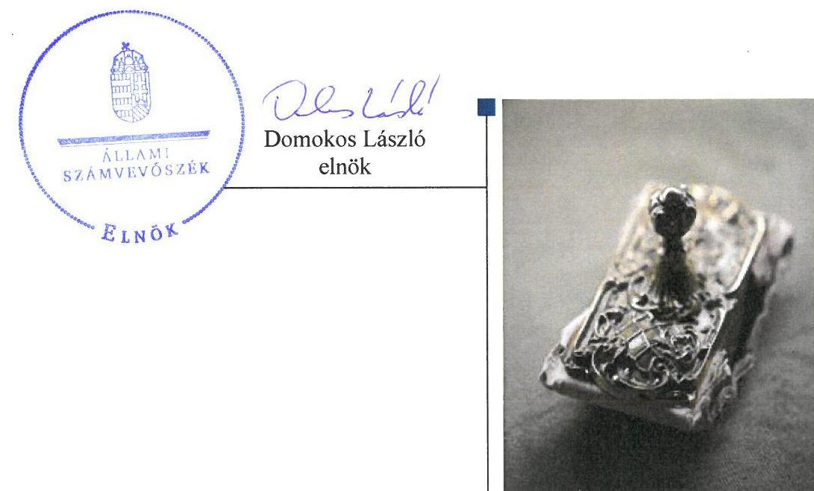
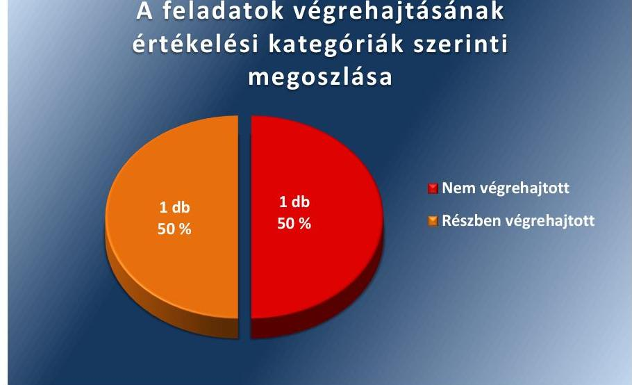
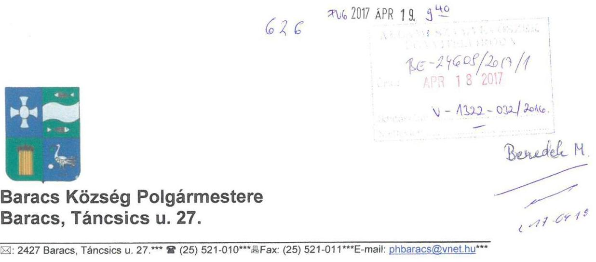
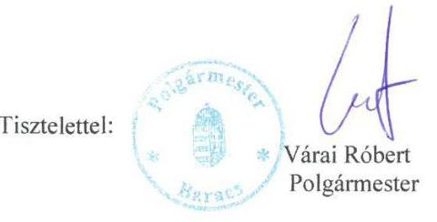
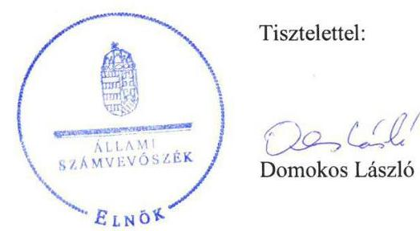
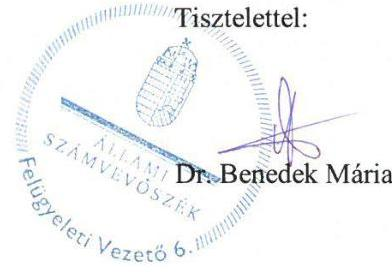

# Jelentés 

## Utóellenőrzések

Baracs Község Önkormányzata vagyongazdálkodása szabályszerűségének utóellenőrzése
2017. 06. hó 22. nap

---

# AZ ELLENŐRZÉST FELÜGYELTE: 

DR. BENEDEK MÁRIA felügyeleti vezető

## AZ ELLENŐRZÉST VEZETTE ÉS A VÉGREHAJTÁSÁÉRT FELELŐS:

CSAPÓ TIBORNÉ ellenőrzésvezető

## A PROGRAM ÖSSZEÁLLÍTÁSÁÉRT FELELŐS:

JANIK JÓZSEF LÁSZLÓ osztályvezető

## A TÉMÁHOZ KAPCSOLÓDÓ KORÁBBI SZÁMVEVŐSZÉKI JELENTÉSEK:

- címe: Jelentés az önkormányzatok vagyongazdálkodása szabályszerűségének ellenőrzéséről - Baracs
- sorszáma: 14059

Jelentéseink az Országgyűlés számítógépes hálózatán és az Interneten a www.asz.hu címen is olvashatóak.

IKTATÓSZÁM: V-1322-034/2016.
TÉMASZÁM: 2356
ELLENŐRZÉS-AZONOSÍTÓ SZÁM: V075581

---

# TARTALOMJEGYZÉK 

■ ÖSSZEGZÉS ..... 5
■ AZ ELLENŐRZÉS CÉLJA ..... 6
■ AZ ELLENŐRZÉS TERÜLETE ..... 7
■ AZ ELLENŐRZÉS HÁTTERE, INDOKOLTSÁGA ..... 8
■ A JELENTÉS LÉNYEGES KÉRDÉSKÖRE ..... 9
■ ELLENŐRZÉS HATÓKÖRE ÉS MÓDSZEREI ..... 10
■ MEGÁLLAPÍTÁSOK ..... 12
■ KÖVETKEZTETÉSEK ..... 14
■ MELLÉKLETEK ..... 15
I. Sz. melléklet: Az ÁSZ 14059 számú jelentéséhez kapcsolódó intézkedési terv végrehajtása ..... 15
■ FÜGGELÉK: ÉSZREVÉTELEK ..... 17
■ RÖVIDÍTÉSEK JEGYZÉKE ..... 27

---

.

---

# ÖSSZEGZÉS 

Az Állami Számvevőszék Baracs Község Önkormányzata vagyongazdálkodása szabályszerűségének utóellenőrzése során megállapította, hogy az intézkedési tervében meghatározott feladatokat részben, illetve nem hajtotta végre. A vagyongazdálkodásban és a működés szabályszerűségében korábban feltárt kockázatok még fennállnak. A közérdekű adatokra vonatkozó tájékoztatási kötelezettségének Baracs Község Önkormányzata nem tett eleget, veszélyeztetve ezzel a közpénzekkel, az állami és önkormányzati vagyonnal való felelős gazdálkodás átláthatóságát.

## Az ellenőrzés társadalmi indokoltsága

Az Állami Számvevőszék stratégiájában célul tűzte ki a számvevőszéki munka hasznosulásának javítását. Ezzel összhangban ellenőrzi, hogy az ellenőrzött szervezetek megvalósították-e a korábbi ellenőrzései által feltárt hibák, hiányosságok és szabálytalanságok megszüntetése céljából kialakított intézkedési terveikben foglaltakat. A rendszeres utóellenőrzések hozzájárulnak a szükséges intézkedések tényleges végrehajtásához, ezáltal a közpénzügyek rendezettségének javulásához, igazolják, hogy lezárult a következmények nélküli ellenőrzések időszaka.

## Főbb megállapítások, következtetések

Baracs Község Önkormányzata az intézkedést igénylő megállapításokhoz és javaslatokhoz kapcsolódóan összeállított intézkedési tervet megküldte az Állami Számvevőszék részére.

Az intézkedési tervben meghatározott két feladatból egyet részben, egyet nem hajtott végre.
Baracs Község Önkormányzata az intézkedési tervében meghatározott határidőn túl, nem teljes körűen készítette el a beszerzések lebonyolításával kapcsolatos eljárásrendet, melyben kizárólag a közbeszerzési értékhatár alatti beszerzések eljárásrendjét szabályozta. Baracs Község Önkormányzata nem intézkedett a közérdekű adatok közzétételéről, amivel sérült a közérdekű és közérdekből nyilvános adatok megismeréséhez és terjesztéséhez fűződő jog érvényesülése, ami jelentős kockázatot jelent a vagyongazdálkodás szabályszerűsége és elszámoltathatósága szempontjából.

Baracs Község Önkormányzata az intézkedési terv feladatainak végrehajtásáról a jogszabályi előírással összhangban nyilvántartást vezetett, annak tartalma azonban nem felelt meg a jogszabályban foglaltaknak.

---

# AZ ELLENŐRZÉS CÉLJA 

Az ellenőrzés célja annak értékelése volt, hogy a számvevőszéki jelentésben foglalt intézkedést igénylő megállapításokkal és javaslatokkal összhangban készített intézkedési tervben meghatározott feladatokat az ellenőrzött szervezet végrehajtotta-e.

---

# AZ ELLENŐRZÉS TERÜLETE

## Baracs Község Önkormányzata

Baracs Község Önkormányzata a Közép-Dunántúli régióban, Fejér megye déli részén, a Dunaújvárosi járásban található. Lakosainak száma a KSH által közzétett adatok szerint 2015. január 1-jén 3362 fő volt. Baracs az 1900-as évek elején több tanyából és pusztából szerveződött önálló faluvá.

Baracs Község Önkormányzata Kisapostag Község Önkormányzatával 2013. március 1-jétől működteti a Baracsi Közös Önkormányzati Hivatalt. A polgármester 2010. október 3-ától tölti be tisztségét, a jegyző 2010. január 16-ától látja el feladatait.

A kincstári adatbázis szerint a Baracs Község Önkormányzata 2015. éves költségvetésének végrehajtásáról szóló beszámolója 952,2 millió Ft költségvetési és 119,8 millió Ft finanszírozási bevételt, valamint 679,8 millió Ft költségvetési és 139,0 millió Ft finanszírozási kiadást tartalmazott. A 2015. december 31-i könyvviteli mérleg főösszege 3084,3 millió Ft, ezen belül a nemzeti vagyonba tartozó befektetett eszközeinek értéke 2825,5 millió Ft, a követelések állománya 12,7 millió Ft, a kötelezettségek állománya 75,5 millió Ft volt.

Az ÁSZ a 2014. évben ellenőrizte a 2009-2012. közötti időszakra vonatkozóan Baracs Község Önkormányzata vagyongazdálkodásának szabályszerűségét, az erről szóló 14059 számú jelentését 2014. április 11-én tette közzé. Az ellenőrzés célja annak megállapítása volt, hogy a települési önkormányzat vagyongazdálkodási tevékenységének szabályozottsága és tevékenysége a jogszabályi előírásokkal összhangban volt-e, átlátható, a jogszabályi előírásoknak megfelelő volt-e a vagyon nyilvántartása, a külső és belső ellenőrzések megállapításai hozzájárultak-e az önkormányzati vagyongazdálkodási tevékenység szabályszerűségéhez. Az ÁSZ jelentés a jegyző részére két javaslatot fogalmazott meg. Baracs Község Önkormányzata az intézkedési tervet megküldte az ÁSZ részére, amelyben a jegyzőnek két feladat került meghatározásra.

Az utóellenőrzés - a 2014. április 11-étől 2016. december 28-áig végrehajtott feladatokat figyelembe véve - az ÁSZ jelentésben a jegyző részére megfogalmazott intézkedést igénylő megállapításokra és javaslatokra készített, az ÁSZ részére megküldött intézkedési tervben foglalt feladatok megvalósításának ellenőrzésére, illetve értékelésére fókuszált.

---

# AZ ELLENŐRZÉS HÁTTERE, INDOKOLTSÁGA 

Az ÁSZ tv. ${ }^{4}$ 33. § (1) bekezdése értelmében a számvevőszéki jelentések intézkedést igénylő megállapításaihoz és javaslataihoz kapcsolódóan az ellenőrzött szervezet vezetője intézkedési tervet köteles összeállítani, és az Állami Számvevőszék részére megküldeni. Az intézkedési tervben foglaltak megvalósítását - az ÁSZ tv. 33. § (7) bekezdésében foglaltak alapján - az Állami Számvevőszék utóellenőrzés keretében ellenőrizheti. Az intézkedések megvalósulásának értékelése során az Állami Számvevőszék figyelembe veszi az ellenőrzött szervezetek működési feltételeiben, valamint a jogszabályi előírásokban bekövetkezett változásokat.

Az intézkedési tervekben foglalt feladatok hiányos, illetve késedelmes végrehajtása, valamint megvalósításának elmaradása azt mutatja, hogy az ellenőrzések során feltárt hibák, hiányosságok és szabálytalanságok megszüntetése nem kapott kellő hangsúlyt. Ez a szabályszerű működés és a felelős vezetői magatartás vonatkozásában kockázatot hordoz. E kockázatok feltárásával az Állami Számvevőszék utóellenőrzési rendszere fokozza a fegyelmet, és igazolja, hogy a közpénzzel való szabályos gazdálkodás felelőssége elől nem lehet kitérni.

Az utóellenőrzés négy szinten hasznosulhat:
$\longrightarrow$ A társadalom szintjén az utóellenőrzés jelzi, hogy a számvevőszéki ellenőrzés megállapításainak van következménye: a hiányosságok megszüntetésére az ellenőrzött szervezet által meghatározott intézkedések végrehajtását is számon kéri az ÁSZ.
$\longrightarrow$ Az ellenőrzött terület szintjén az utóellenőrzés tájékoztatást nyújt a terület döntéshozóinak a hiányosságok kiküszöbölésének jó gyakorlatairól, ezzel lehetőséget biztosítva arra, hogy az ÁSZ ellenőrzési megállapításai, javaslatai a terület nem ellenőrzött szervezeteinek a működése során is hasznosuljanak.
$\longrightarrow$ Az ellenőrzött szervezet szintjén az utóellenőrzés feltárja, hogy a szervezet az intézkedések végrehajtásával hasznosította-e a korábbi ellenőrzési jelentésben a hiányosságok megszüntetése, illetve a kockázatok kezelése érdekében megfogalmazott javaslatokat.
$\longrightarrow$ Az ÁSZ szintjén az utóellenőrzés visszacsatolást ad az ellenőrzési jelentések hasznosulásáról, az intézkedések elmaradása vagy részleges megvalósulása a további ellenőrzésekhez kockázati jelzésként szolgál.

---

# A JELENTÉS LÉNYEGES KÉRDÉSKÖRE 

Az Önkormányzat az intézkedési tervben foglaltakat az előírt határidőben végrehajtotta-e?

---

# ELLENŐRZÉS HATÓKÖRE ÉS MÓDSZEREI 

## Az ellenőrzés típusa

Megfelelőségi ellenőrzés

## Az ellenőrzött időszak

Az utóellenőrzés alapját képező ÁSZ jelentés közzétételének napjától (2014. április 11.) az ellenőrzésről szóló kiértesítő levél keltének (2016. december 28.) napjáig tartó időszak.

## Az ellenőrzés tárgya

Az ÁSZ tv. 2011. július 1-jei hatálybalépését követően a számvevőszéki jelentésben foglalt intézkedést igénylő megállapításokkal és javaslatokkal összhangban - Baracs Község Önkormányzata által - készített intézkedési tervben foglaltak végrehajtásának ellenőrzése volt.

Az ellenőrzés kiterjedt minden olyan körülményre és adatra, amely az ÁSZ jogszabályban meghatározott feladatainak teljesítéséhez, valamint a program végrehajtása folyamán felmerült újabb összefüggések feltárásához szükséges volt.

## Az ellenőrzött szervezet

Baracs Község Önkormányzata

## Az ellenőrzés jogalapja

Az Alaptörvény ${ }^{5}$ 43.cikk (1) bekezdése alapján az ÁSZ az Országgyűlés pénzügyi és gazdasági ellenőrző szerve. Az ÁSZ törvényben meghatározott feladatkörében ellenőrzi a központi költségvetés végrehajtását, az államháztartás gazdálkodását, az államháztartásból származó források felhasználását és a nemzeti vagyon kezelését.

Az ÁSZ tv. 1. § (3) bekezdése szerint az ÁSZ általános hatáskörrel végzi a közpénzekkel és az állami és önkormányzati vagyonnal való felelős gazdálkodás ellenőrzését.

A 33. § (7) bekezdése alapján az ÁSZ tv. 33. § (1)-(2) bekezdése szerinti intézkedési tervben foglaltak megvalósítását az ÁSZ utóellenőrzés keretében ellenőrizheti.

---

# Az ellenőrzés módszerei 

Az ellenőrzést a nemzetközi standardokat irányadónak tekintve az ellenőrzési program ellenőrzési kérdései, az ellenőrzött időszakban hatályos jogszabályok, az ellenőrzés szakmai szabályok és módszertanok figyelembevételével, önállóan ellenőrzéshez kapcsolódóan végeztük.

Az ellenőrzés ideje alatt az ellenőrzött szervezettel történő kapcsolattartást az ÁSZ SZMSZ ${ }^{\circledR}$-ének vonatkozó előírásai alapján biztosítottuk.

Az utóellenőrzés megállapításait elsősorban az ÁSZ rendelkezésére álló, valamint az ellenőrzött szervezettől elektronikusan bekért dokumentumok alapozzák meg, amely szükség esetén helyszíni ellenőrzéssel egészülhet ki. Az ÁSZ az ellenőrzés keretében egyes esetekben teljesítményellenőrzés tervezéséhez is kérhet adatokat.

Az ellenőrzési bizonyítékként felhasználható adatforrások közé tartoznak egyrészt a szakmai programban felsorolt adatforrások, másrészt minden -az ellenőrzés folyamán feltárt, az ellenőrzés szempontjából információt tartalmazó - dokumentum.

Az intézkedési tervben előírt feladatokat azok végrehajthatósága, illetve végrehajtása szempontjából az alábbiak szerint kell értékelni:
"határidőben végrehajtott" a feladat, ha a teljesítés dokumentáltan, az intézkedési tervben előírt határidőben és tartalommal megtörtént;
"határidőn túl végrehajtott" a feladat, ha annak teljesítése az intézkedési tervben meghatározott módon, de az előírt határidőn túl történt meg;
"részben végrehajtott" a feladat, ha végrehajtása teljes körűen az intézkedési tervben előírt módon nem történt meg;
"nem végrehajtott" a feladat, ha a végrehajtás nem történt meg, vagy amennyiben a teljesítést nem dokumentálták;
"okafogyottá vált" a feladat, ha végrehajtására - meghatározott esemény bekövetkezése, továbbá külső körülmény, a működést érintő feltétel változása miatt - már nincs szükség, illetve lehetőség, és egyértelműen megállapítható, hogy az intézkedést szükségessé tevő körülmény a jövőben nem fordulhat elő;
"nem időszerű" az a feladat, amelynek ellenőrzési időszakon belüli végrehajtására azért nem került (kerülhetett) sor, mert az intézkedés alapjául szolgáló esemény nem következett be, de annak jövőbeni előfordulása lehetséges, a végrehajtása nem volt esedékes, vagy a végrehajtás határideje még nem járt le.
Az ellenőrzés lefolytatásához az ellenőrzött szervezet a tanúsítványok elektronikus kitöltésével, valamint az ÁSZ által kért dokumentumok elektronikus megküldésével szolgáltatott adatokat, amelyek valódiságát és teljes körűségét az ellenőrzött szervezet vezetője által tett teljességi és hitelességi nyilatkozat igazolja. Az így rendelkezésre bocsátott adatok, információk kontrollja az ellenőrzés keretében történt.

---

# MEGÁLLAPÍTÁSOK 

## Az Önkormányzat az intézkedési tervben foglaltakat az előírt határidőben végrehajtotta-e?

Összegző megállapítás

Az Önkormányzat az intézkedési tervben meghatározott két feladatból egyet részben, egyet nem hajtott végre. A feladatok végrehajtásáról a jogszabályban meghatározott nyilvántartást vezette, annak tartalma azonban nem felelt meg az előírt követelményeknek.

Az ÁSZ jelentésében a jegyző részére két javaslatot fogalmazott meg, amelynek hasznosítására a Képviselő-testület által elfogadott intézkedési terv két feladatot határozott meg, melyek felelőseként a jegyző került megjelölésre. Az ÁSZ javaslatai alapján készült intézkedési tervben meghatározott két feladatból egyet részben, egyet nem hajtott végre.

Az intézkedési tervben meghatározott feladatokat, határidőket, felelősöket és a feladatok végrehajtását az I. számú melléklet mutatja be.

A jegyző a Bkr. 14.§-nak megfelelően nyilvántartást vezetett az ÁSZ jelentésében megfogalmazott intézkedést igénylő megállapításokra és javaslatokra készített intézkedési terv végrehajtásáról. A nyilvántartás tartalma nem felelt meg a Bkr. 47.§ (2) bekezdésében foglaltaknak, mivel nem tartalmazta az ellenőrzési jelentésben
 tett javaslatokat, az elfogadott intézkedési tervet, a végrehajtott intézkedések rövid leírását, a végre nem hajtott intézkedések okát.

Az Önkormányzat intézkedési tervében meghatározott feladatok végrehajtásának értékelési kategóriák szerinti megoszlását az 1. ábra szemlélteti.

1. ábra

A feladatok végrehajtásának értékelési kategóriák szerinti megoszlása

Forrás: ÁSZ

---

# RÉSZBEN VÉGREHAJTOTT feladat: 

1. A jegyző az intézkedési tervben meghatározott határidőn túl nem teljes körűen intézkedett a feladat végrehajtásáról, mert az Ávr. ${ }^{10} 13 . \S$ (2) bekezdés b) pontjában előírtak ellenére a beszerzések lebonyolításával kapcsolatos eljárásrendet kizárólag a közbeszerzési értékhatár alatti beszerzések tekintetében készítette el.

## NEM VÉGREHAJTOTT feladat:

2. A jegyző nem intézkedett az Info. tv. ${ }^{11} 37 . \S$ (1) bekezdése alapján ugyanezen törvény 1. mellékletében meghatározott közérdekű adatok közzétételéről, annak ellenére, hogy a közérdekű adatok közzététele érdekében az elektronikus felület kialakításáról gondoskodott.

---

# KÖVETKEZTETÉSEK 

Az Önkormányzat nem intézkedett a közérdekű adatok közzétételéről, amivel sérül a közérdekű és közérdekből nyilvános adatok megismeréséhez és terjesztéséhez fűződő jog érvényesülése, ami jelentős kockázatot jelent a vagyongazdálkodás szabályszerűsége és elszámoltathatósága szempontjából. A nem végrehajtott feladat indokolja a feltárt hiányosság, szabálytalanság tekintetében a munkajogi felelősség tisztázására irányuló eljárás megindítását, és eredményének ismeretében a szükséges intézkedések megtételét.

---

# MELLÉKLETEK

- I. SZ. MELLÉKLET: AZ ÁSZ 14059 SZÁMÚ JELENTÉSÉHEZ KAPCSOLÓDÓ INTÉZKEDÉSI TERV VÉGREHAJTÁSA

|  Sorszám | Az intézkedési tervben meghatározott feladat | Az intézkedési tervben meghatározott határidő | Az intézkedési tervben meghatározott feladat felelőse | A feladat végrehajtása  |
| --- | --- | --- | --- | --- |
|   | 1. | 2. | 3. | 4.  |
|  Részben végrehajtott feladat |  |  |  |   |
|  1. | Az Ávr. 13.§ (2) bekezdés b.) pontjában előírtaknak megfelelően a beszerzések lebonyolításával kapcsolatos eljárásrendet elkészíti. | 2014. július 1. | jegyző | A jegyző az intézkedési tervben meghatározott határidőn túl nem teljes körűen készítette el az Ávr. 13. § (2) bekezdés b.) pontjában előírtak szerinti beszerzések lebonyolításával kapcsolatos eljárásrendet, melyet az Önkormányzat Képviselő-testülete a 132/2014.(VII.24.) számú határozatával fogadott el 2014. július 24-én. A 2014. augusztus 1-jén hatályba lépett szabályzat kizárólag a közbeszerzési értékhatár alatti beszerzések lebonyolításával kapcsolatos eljárásrendet határozta meg. A szabályzat hatálya azonban az Ávr. 13. § (2) bekezdés b.) pontjában előírtak ellenére nem terjedt ki a közbeszerzésekről szóló 2011. évi CVIII. törvény (továbbiakban: Kbt.) hatálya alá tartozó, valamint a katasztrófa okozta károk elhárítása érdekében szükségessé váló, azonnali beszerzésekre. A szabályzat céljával összhangban tartalmazta a közbeszerzési értékhatár alatti beszerzések tárgyát, az összeférhetetlenségre vonatkozó előírásokat, a beszerzési érték és az értékhatárok meghatározásának előírásait. Továbbá a beszerzési eljárás lefolytatásának általános rendje keretében a szabályzat előírta a megrendelésekre, illetve az ajánlatok kérésére, és értékelésére vonatkozó előírásokat. A szabályzat szerint a beszerzési tevékenység irányításáért a jegyző a felelős, akinek a feladatait részletesen meghatározták.  |
|  Nem végrehajtott feladat |  |  |  |   |
|  2. | Az Info. tv. 37.§(1) bekezdése alapján ugyanezen törvény 1. számú mellékletében meghatározott adatokat közzéteszi. | A honlapos felület kialakítására 2014. július 1, ezt követően folyamatos | jegyző | A jegyző az ellenőrzési dokumentumok alapján az intézkedési tervben meghatározott feladat végrehajtásáról nem intézkedett, mert az Info. tv. 37.§ (1) bekezdése alapján ugyanezen törvény 1. mellékletében meghatározott közérdekű adatokat nem tette közzé.  |

---

.

---

# FÜGGELÉK: ÉSZREVÉTELEK 

A jelentéstervezetet a Számvevőszék 15 napos észrevételezésre megküldte az ellenőrzött szervezet vezetőjének az ÁSZ tv. 29. §* (1) bekezdése előírásának megfelelően.

A függelék tartalmazza az ellenőrzött észrevételeit, illetve az el nem fogadott észrevételek elutasításának indoklását.

[^0]
[^0]:    * 29. § (1) Az Állami Számvevőszék az ellenőrzési megállapításait megküldi az ellenőrzött szervezet vezetőjének vagy az általa megbízott személynek, és annak, akinek személyes felelősségét állapította meg.
    (2) Az ellenőrzött szervezet vezetője és a felelősként megjelölt személy az ellenőrzés megállapításaira tizenöt napon belül írásban észrevételt tehet.
    (3) Az Állami Számvevőszék az észrevételre a beérkezésétől számított harminc napon belül írásban válaszol. A figyelembe nem vett észrevételeket köteles a jelentésben feltüntetni, és megindokolni, hogy azokat miért nem fogadta el.

---

Állami Számvevőszék
Budapest
Apáczai Csere János utca 10.
1364

Tisztelt Domokos László Elnök Úr!

Hivatkozási számú levele mellékleteként megküldött „Utóellenőrzések Baracs Község Önkormányzata vagyongazdálkodása szabályszerűségének utóellenőrzése 2017.” című Számvevőszéki jelentéstervezettel (továbbiakban: Jelentéstervezet) kapcsolatosan az Állami Számvevőszékről szóló 2011. évi LXVI. törvény 29.§ (2) bekezdése alapján észrevételt teszek.

Álláspontom szerint a Jelentéstervezetben foglalt megállapítások nem megfelelőek. A Jelentéstervezetben részben végrehajtott és nem végrehajtott feladatról írnak. A részben végrehajtott Önök szerint a beszerzések lebonyolításával kapcsolatos szabályzat megalkotása, a nem végrehajtott a közérdekű adatok közzététele (13. oldal). Mindezekről pedig azt írják, hogy „hiányuk jelentős kockázatot jelentenek a vagyongazdálkodás szabályszerűsége és elszámolhatósága szempontjából” (5. oldal).

Az 5. oldalon írt „Összegzés”, „Főbb megállapítások, következtetések” cím alatt írtakkal és a 13. oldalon a „Megállapítások”, „Az önkormányzat az intézkedési tervben foglaltakat az előírt határidőben végrehajtotta-e?” cím alatt írtakkal az alábbiakban és az alábbi indokolással nem értek egyet, ezért észrevételt teszek:

1. Álláspontom szerint az alap ellenőrzést követően elkészített intézkedési tervben előírt Baracs Község Önkormányzata Beszerzési Szabályzat határidőben elkészült, amit Önök sem vitatnak. A Jelentéstervezetben is írt Ávr. 13.§ (2) bekezdés b.) pontja kimondja: „(2) A költségvetési szerv vezetője belső szabályzatban rendezi a működéséhez kapcsolódó, pénzügyi kihatással bíró, jogszabályban nem szabályozott kérdéseket, így különösen b.) a beszerzések lebonyolításával kapcsolatos eljárásrendet” Az - Önök által is hivatkozott - idézett jogszabályhely alapján látható, hogy nem ír elő mást a jogalkotó sem, csak a Beszerzési Szabályzat elkészítését. Kifogásolják, hogy csak a közbeszerzés értékhatár alatti beszerzésekre vonatkozó eljárásrendre készítettük el a

---

szabályzatot. Tájékoztatom, hogy az alap ellenőrzés lefolytatása során Baracs Község Önkormányzata Közbeszerzési Szabályzatát Önök munkatársa vizsgálta, azt nem kifogásolták. A közbeszerzési értékhatár feletti beszerzésekre a Közbeszerzési Szabályzat a hatályos, az alattira a Beszerzési Szabályzat, ahogy azt a Beszerzési Szabályzat bevezető részében le is szögezzük. Fentiek alapján az intézkedési terv az álláspontom alapján VÉGREHAJTOTT feladatként kellene, hogy szerepeljen a Jelentéstervezetben.
2. Nem végrehajtott feladatként jelölik meg az Info tv. 37.§ (1) bekezdése alapján előírt az 1. számú mellékletben felsorolt adatok közzétételét. Ezt az Önök hivatala jelezte is a Nemzeti Adatvédelmi és Információszabadság Hatóságnak (továbbiakban: Hatóság). Az Intézkedési tervben a feladat elvégzésére „2015. január 1-jétől folyamatosan" határidőt szerepeltettünk. Az Intézkedési terv óta dr.Horváth Zsolt jegyző megjelölt felelős folyamatosan tölti fel a honlapot adatokkal. Sajnálatos, hogy ilyen kis településen külön informatikust nem tudunk alkalmazni, éppen ezért adtuk meg a fent már idézett határidőt, fix dátumot ezért nem jelöltünk meg. A Jelentéstervezet 13. oldalán a RÉSZBEN VÉGREHAJTOTT megjelölést tartom megfelelő jelzésnek, az Önök „nem végrehajtott" jelzésével ellentétben. Ezt támasztja alá a Hatóság vizsgálata is, mellyel kapcsolatosan Baracs Község Önkormányzatának küldött NAIH/2017/1266/2/V ügyszámú okiratban is a részben teljesítette jelzéssel éltek felénk. Az Önök által írt" nem végrehajtott" jelzés semmi esetre sem állja meg a helyét.
3. Az előző két pont észrevételei alapján a Jelentéstervezet 5. oldalán írt - „hiányuk jelentős kockázatot jelentenek a vagyongazdálkodás szabályszerűsége és elszámolhatósága szempontjából" - sem állja meg a helyét, álláspontom szerint eredendően az ilyen hiányosságok nem jelentenek kockázatot a vagyongazdálkodásunkra, - amelyet még az alap ellenőrzés során jelen lévő két munkatársa is nagymértékben megdicsért - de hogy jelentős kockázatot nem jelentenek abban biztos vagyok. Azért sem értek ezzel egyet, mert ha szúrópróba szerűen találomra nézem meg a különböző önkormányzatok honlapjait, akkor sajnos az ország nagy részének településein igen „nagy bajban" vannak vagyongazdálkodás terén.

Fentiek alapján kérem a Jelentés végleges elkészítésekor figyelembe venni fentebb írtakat, hiszen amiket leírtam tények.
Tény, hogy a Beszerzési Szabályzatunk elkészült, és az a jogszabály szerinti tartalommal, a beszerzések tekintetében tartalmaz előírásokat. A Közbeszerzési Szabályzat, ami korábban is hatályban volt, pedig szabályozza a közbeszerzési értékhatár feletti beszerzéseket. Ez eddig sem volt hiányosság, egyik jelentésben sem esett erről szó, nem is eshetett, hiszen rendelkeztünk, rendelkezünk hatályos Közbeszerzési Szabályzattal.
Tény az is, hogy a közérdekű adatok feltöltése folyamatos, ahogyan ezt az intézkedési tervben vállaltuk. Az semmi esetre sem igaz, hogy nem végrehajtott, a Hatóság is ezt támasztja alá fentebb hivatkozott okiratában, ahol részben teljesített jelzéssel illette az önkormányzatunkat e feladat tekintetében. Álláspontom szerint részben végrehajtott ez a feladatunk.

Baracs, 2017. április 11.

---

ELNÖK

# Várai Róbert úr 

polgármester
Baracs Község Önkormányzata

## Baracs

## Tisztelt Polgármester Úr!

Köszönettel megkaptam az Állami Számvevőszékhez 2017. április 18. napján érkezett "Utóellenőrzések - Baracs Község Önkormányzata vagyongazdálkodása szabályszerűségének utóellenőrzése" című számvevőszéki jelentéstervezetben foglalt megállapításokra tett észrevételét.

Tájékoztatom Polgármester urat, hogy az el nem fogadott észrevételeket - az Állami Számvevőszékről szóló 2011. évi LXVI. törvény 29. § (3) bekezdése alapján - a jelentésben szerepeltetjük az elutasítás indokainak feltüntetésével együtt.

Az Állami Számvevőszék észrevételekre vonatkozó álláspontjáról a felügyeleti vezető által készített részletes tájékoztatást csatoltan megküldöm.

Budapest, 2017. 05. hó 05. nap

Melléklet: Tájékoztatás az el nem fogadott észrevételekről, azok indokairól

---

# Tájékoztatás 

az el nem fogadott észrevételekről, azok indokairól

| 1. Észrevétel: | Az észrevétel 1. oldalán az ÁSZ jelentéstervezet 13. oldal „Részben végrehajtott feladat" 1. pontjára tett észrevétel szerint: „ $\qquad$ I. A jegyző az intézkedési tervben meghatározott határidőn túl nem teljes körűen intézkedett a feladat végrehajtásáról, mert az Ávr. 13. § (2) bekezdés b) pontjában előírtak ellenére a beszerzések lebonyolításával kapcsolatos eljárásrendet kizárólag a közbeszerzési értékhatár alatti beszerzések tekintetében készítette el." Észrevétel: „Álláspontom szerint az alap ellenőrzést követően elkészített intézkedési tervben előírt Baracs Község Önkormányzata Beszerzési Szabályzat határidőben elkészült, amit Önök sem vitatnak. A Jelentéstervezetben is írt Ávr. 13.§ (2) bekezdés b.) pontja kimondja: „, (2) A költségvetési szerv vezetője belső szabályzatban rendezi a működéséhez kapcsolódó, pénzügyi kihatással bíró, jogszabályban nem szabályozott kérdéseket, így különösen b.) a beszerzések lebonyolításával kapcsolatos eljárásrendet" Az - Önök által is hivatkozott - idézett jogszabályhely alapján látható, hogy nem ír elő mást a jogalkotó sem, csak a Beszerzési Szabályzat elkészítését. Kifogásolják, hogy csak a közbeszerzés értékhatár alatti beszerzésekre vonatkozó eljárásrendre készítettük el a szabályzatot. Tájékoztatom, hogy az alap ellenőrzés lefolytatása során Baracs Község Önkormányzata Közbeszerzési Szabályzatát Önök munkatársa vizsgálta, azt nem kifogásolták. A közbeszerzési értékhatár feletti beszerzésekre a Közbeszerzési Szabályzat a hatályos, az alattira a Beszerzési |
| :--: | :--: |

 a Jelentéstervezetben." |
| :--: | :--: |
| Válasz: | Az ÁSZ az észrevételt nem fogadja el. |
| Indokolás: | Az észrevétel nem megalapozott. A korábbi ÁSZ ellenőrzés alapján nyilvánosságra hozott „Jelentés az önkormányzatok vagyongazdálkodása szabályszerűségének ellenőrzéséről - Baracs" című 14059 számú ÁSZ jelentés 7. oldal első bekezdésében tett megállapítás szerint „Az Önkormányzatnál a beszerzések szabályozása az Ámr. 3-ban és az Ávr.-ben foglaltak ellenére nem történt meg.". Az ÁSZ jelentés 10. oldal hatodik bekezdésében foglalt megállapítások szerint „Az Önkormányzat közbeszerzési szabályzattal nem rendelkezett, azonban a 2009-ben lefolytatott közbeszerzési eljáráshoz elkészítette a Kbt. 22. § (l) bekezdése szerinti eljárásrendet. A beszerzések szabályozása az Ámr.; 20. § (3) bekezdés b) pontja, valamint az Ávr. 13. § (2) bekezdés b) pontja ellenére nem történt meg.". Az ÁSZ jelentésben a jegyző részére tett 1. számú javaslat úgy szólt, hogy „Intézkedjen az Ávr. 13. § (2) bekezdés b) pontjában előírtaknak megfelelően a beszerzések lebonyolításával kapcsolatos eljárásrend elkészítéséről.". Az Önkormányzat által elkészített és az ÁSZ részére megküldött intézkedési tervben meghatározott 1. számú intézkedés a következő volt: „Az Ávr. 13. § (2) bekezdés b.) pontjában előírtaknak megfelelően a beszerzések lebonyolításával kapcsolatos eljárásrendet elkészíti.". Az intézkedés felelőseként a jegyző került megjelölésre. Az Önkormányzat által az utóellenőrzés lefolytatásához megküldött ellenőrzési dokumentumok tartalmazták a Beszerzési Szabályzat elfogadására vonatkozó az Önkormányzat Képviselő-testülete 132/2014. (VII.24.) számú határozatát, valamint a Beszerzések Lebonyolításának Szabályzatát, melynek hatálya azonban az Ávr. 13. § (2) bekezdés b.) pontjában előírtak ellenére kizárólag a közbeszerzési értékhatárt el nem érő beszerzésekre terjedt ki. Fentiek figyelembevételével az ÁSZ fenntartja a jelentéstervezetben a feladat végrehajtásának „Részben végrehajtott" feladatként történő értékelését, és a feladat végrehajtására vonatkozóan a jelentéstervezetben tett megállapításait. |

---

| 2. | Észrevétel: | Az észrevétel 2. oldalán az ÁSZ jelentéstervezet 13. oldal „Nem végrehajtott feladat" 2. pontjára tett észrevétel szerint: „ 2. A jegyző nem intézkedett az Info. tv. 37.§ (1) bekezdése alapján ugyanezen törvény 1. mellékletében meghatározott közérdekű adatok közzétételéről, annak ellenére, hogy a közérdekű adatok közzététele érdekében az elektronikus felület kialakításáról gondoskodott." Észrevétel: Nem végrehajtott feladatként jelölik meg az Info tv. 37.§ (1) bekezdése alapján előírt az 1. számú mellékletben felsorolt adatok közzétételét. Ezt az Önök hivatala jelezte is a Nemzeti Adatvédelmi és Információszabadság Hatóságnak (továbbiakban: Hatóság). Az Intézkedési tervben a feladat elvégzésére "2015. január 1-jétől folyamatosan" határidőt szerepeltettünk. Az Intézkedési terv óta dr. Horváth Zsolt jegyző megjelölt felelős folyamatosan tölti fel a honlapot adatokkal. Sajnálatos, hogy ilyen kis településen külön informatikust nem tudunk alkalmazni, éppen ezért adtuk meg a fent már idézett határidőt, fix dátumot ezért nem jelöltünk meg. A Jelentéstervezet 13. oldalán a RÉSZBEN VÉGREHAJTOTT megjelölést tartom megfelelő jelzésnek, az Önök "nem végrehajtott" jelzésével ellentétben. Ezt támasztja alá a Hatóság vizsgálata is, mellyel kapcsolatosan Baracs Község Önkormányzatának küldött NAIH/2017/1266/2/V ügyszámú okiratban is a részben teljesítette jelzéssel éltek felénk. Az Önök által írt "nem végrehajtott" jelzés semmi esetre sem állja meg a helyét." |
| :--: | :--: | :--: |
|  | Válasz: | Az ÁSZ az észrevételt nem fogadja el. |
|  | Indokolás: | Az észrevétel nem megalapozott. Az Önkormányzat által elkészített és az ÁSZ részére megküldött intézkedési tervben meghatározott 2. számú intézkedés a következő volt: „Az Info. tv. 37.§(1) bekezdése alapján ugyanezen törvény 1. számú mellékletében meghatározott adatokat közzéteszi. ". A feladat 2014. július 1-jét követően folyamatos határidővel lett meghatározva, az intézkedés felelőseként a jegyző került megjelölésre. Az ÁSZ ellenőrzés részére átadott 2017. január 17-ei keltezésű Teljességi és hitelességi nyilatkozatban az Önkormányzat polgármestere kijelentette, hogy ,,az ellenőrzés keretében átadott, a jelen Teljességi és hitelességi nyilatkozatban részletezett dokumentumok, adatok megbízható, teljes körű információt tartalmaznak és az |

---

|  |  | eredetivel mindenben megegyeznek. Az ellenőrzéshez az ellenőrzést végzők részéről az ellenőrzött tárgykörben kért és átadott dokumentumokon kívül más adatokkal, iratokkal nem rendelkezünk, az ellenőrzést végzőket tájékoztattuk minden olyan eseményről, amely bármiféle hatással bírt az ellenőrzött időszakra vonatkozó információkra és adatokra. ". Az Önkormányzat fentiekben hivatkozott Teljességi és hitelességi nyilatkozatában rögzítette „az Info tv. 37.§ (1) bekezdésben megállapított kötelezettség teljesítését mutató link"-et, és az 1. számú tanúsítványon feltüntetette az elérési útvonalat megjelölő linket http://baracs.hu/kozerdeku-adatok/, amely tartalmának felülvizsgálata alapján az ÁSZ megállapította, hogy az nem tartalmaz a feladat ellenőrzött időszakban történt végrehajtására vonatkozó adatot, információt. Fentiek figyelembevételével az ÁSZ fenntartja a jelentéstervezetben a feladat végrehajtásának „Nem végrehajtott" feladatként történő értékelését, és a jelentéstervezetben erre vonatkozóan tett megállapításait. |
| :--: | :--: | :--: |
| 3. | Észrevétel: | Az észrevétel 2. oldalán az ÁSZ jelentéstervezet 5. oldal „Főbb megállapítások, következtetések" harmadik bekezdésére tett észrevétel szerint: „Baracs Község Önkormányzata nem intézkedett a közérdekű adatok közzétételéről, amivel sérült a közérdekű és közérdekből nyilvános adatok megismeréséhez és terjesztéséhez fűződő jog érvényesülése, ami jelentős kockázatot jelent a vagyongazdálkodás szabályszerűsége és elszámoltathatósága szempontjából." Észrevétel: „Az előző két pont észrevételei alapján a Jelentéstervezet 5. oldalán írt - "hiányuk jelentős kockázatot jelentenek a vagyongazdálkodás szabályszerűsége és elszámoltathatósága szempontjából" - sem állja meg a helyét, álláspontom szerint eredendően az ilyen hiányosságok nem jelentenek kockázatot a vagyongazdálkodásunkra, - amelyet még az alap ellenőrzés során jelen lévő két munkatársa is nagymértékben megdicsért - de hogy jelentős kockázatot nem jelentenek abban biztos vagyok. Azért sem értek ezzel egyet, mert ha szúrópróba szerűen találomra nézem meg a különböző önkormányzatok honlapjait, akkor sajnos az ország nagy részének településein igen "nagy bajban" vannak vagyongazdálkodás terén." |

---

| Válasz: | Az ÁSZ az észrevételt nem fogadja el. |
| :--: | :--: |
| Indokolás: | Az észrevétel nem megalapozott. A V-1322-005/2016. iktatószámú levél mellékleteként az ÁSZ elnöke által az Önkormányzat polgármestere részére 2016. december 28-ai keltezéssel megküldött V-1062-003/2016. iktatószámú „Utóellenőrzések" című Ellenőrzési program alapján az utóellenőrzés célja annak értékelése volt, hogy a számvevőszéki jelentésben foglalt intézkedést igénylő megállapításokkal és javaslatokkal összhangban készített intézkedési tervben meghatározott feladatokat az ellenőrzött szervezet végrehajtotta-e. Az észrevételben szereplő információk az önkormányzat intézkedési tervének 2. pontjában meghatározott feladat ellenőrzött időszakban történt végrehajtása szempontjából nem értékelhetők. Az Önkormányzat által tett Teljességi és hitelességi nyilatkozat szerint az Önkormányzat nem adott át a közérdekű adatok közzétételére vonatkozó feladat ellenőrzött időszakban történt végrehajtását igazoló dokumentumot, ezért az intézkedési tervben meghatározott feladat nem végrehajtottként értékelhető. Tekintettel arra, hogy az Önkormányzat nem intézkedett a közérdekű adatok közzétételéről, sérült a közérdekű és közérdekből nyilvános adatok megismeréséhez és terjesztéséhez fűződő jog érvényesülése. Ez jelentős kockázatot jelent a vagyongazdálkodás szabályszerűsége és elszámoltathatósága szempontjából, mivel nem biztosította a vagyongazdálkodási tevékenység nyilvánosságát. Fentiekre tekintettel az ÁSZ fenntartja a jelentéstervezet vonatkozó megállapításait. |

Budapest, 2017. május 4.

---

.

---

# RÖVIDÍTÉSEK JEGYZÉKE 

${ }^{1}$ polgármester
${ }^{2}$ jegyző
${ }^{3}$ ÁSZ
${ }^{4}$ ÁSZ tv.
${ }^{5}$ Alaptörvény
${ }^{6}$ SZMSZ
${ }^{7}$ Önkormányzat
${ }^{8}$ Képviselő-testület
${ }^{9}$ Bkr.
${ }^{10}$ Ávr.
${ }^{11}$ Info. tv.

Baracs Község Önkormányzata polgármestere
Baracs Község Önkormányzata jegyzője
Állami Számvevőszék
2011. évi LXVI. törvény az Állami Számvevőszékről
Magyarország Alaptörvénye
Az Állami Számvevőszék Szervezeti és Működési Szabályzata
Baracs Község Önkormányzata
Baracs Község Önkormányzata Képviselő-testülete
370/2011.(XII.31.) Korm. rendelet a költségvetési szervek belső
kontrollrendszeréről és belső ellenőrzéséről
368/2011.(XII.31.) Korm. rendelet az államháztartásról szóló törvény végrehajtásáról
2011. évi CXII. törvény az információs önrendelkezési jogról és az információszabadságról

---

# ÁLLAMI SZÁMVEVŐSZÉK 

1052 Budapest, Apáczai Csere János utca 10.
Levélcím: 1364 Budapest 4. Pf. 54
Telefon: +36 1 4849100 Telefax: +36 1 4849200
www.asz.hu

