# Jelentés 

## A parlagfű elleni védekezés ellenőrzése

2017

---

# A parlagfű elleni védekezés ellenőrzése 

2017. 05. hó 23. nap
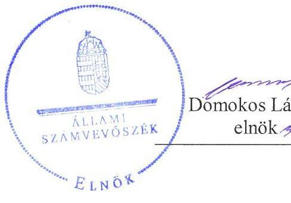

---

# AZ ELLENŐRZÉST FELÜGYELTE: 

DR. NÉMETH ERZSÉBET felügyeleti vezető

## AZ ELLENŐRZÉST VEZETTE ÉS A VÉGREHAJTÁSÁÉRT FELELŐS:

BÍRÓ ZSOLT ellenőrzésvezető

## A PROGRAM ÖSSZEÁLLÍTÁSÁÉRT FELELŐS:

JANIK JÓZSEF LÁSZLÓ osztályvezető

IKTATÓSZÁM: V-1151-423/2016.
TÉMASZÁM: 2185

## ELLENŐRZÉS-AZONOSÍTÓ SZÁM: V0762

Jelentéseink az Országgyűlés számítógépes hálózatán és az Interneten a www.asz.hu címen is olvashatóak.

---

# TARTALOMJEGYZÉK 

■ ÖSSZEGZÉS ..... 5
■ AZ ELLENŐRZÉS CÉLJA ..... 7
■ AZ ELLENŐRZÉS TERÜLETE ..... 8
■ AZ ELLENŐRZÉS HÁTTERE, INDOKOLTSÁGA ..... 11
■ A JELENTÉS LÉNYEGES KÉRDÉSKÖREI ..... 13
■ ELLENŐRZÉS HATÓKÖRE ÉS MÓDSZEREI ..... 14
■ MEGÁLLAPÍTÁSOK ..... 17
■ JAVASLATOK ..... 39
■ MELLÉKLETEK ..... 43
I. sz. melléklet: Fogalomtár ..... 43
II. sz. melléklet: Az ellenőrzött területek és az ellenőrzésre fordított napok száma a 2013-2015. években ..... 46
III. sz. melléklet: Helyszíni ellenőrzési jegyzőkönyvek összesítése a 2013-2015. években ..... 47
IV. sz. melléklet: Az Akciótervben rögzített célok és feladatok ..... 48
V. sz. melléklet: Az FM és a kormányhivatalok között 2013-2015. években megkötött megállapodások alapján a parlagfű elleni védekezéssel kapcsolatos források alakulása (Ft) ..... 49
■ FÜGGELÉK: ÉSZREVÉTELEK ..... 55
■ RÖVIDÍTÉSEK JEGYZÉKE ..... 89

---

.

---

# ÖSSZEGZÉS 

A parlagfű elleni védekezés kapcsán megtett intézkedések elősegítették, de nem biztosították a hosszú távú célok megvalósítását. Az információs adatbázisok és rendszerek kialakítása és fejlesztése megtörtént. A célzott védekezés feltételeit megteremtő felderítés és a védekezés volumene az ellenőrzött időszakban csökkent. A parlagfű elleni védekezéssel kapcsolatos erőfeszítések nem bizonyultak hatékonynak, nem javult érzékelhetően az emberek életminősége.

## Az ellenőrzés társadalmi indokoltsága

Hazánkban a parlagfű széles körű elterjedése számos negatív hatással jár. A parlagfű mezőgazdasági területeken terméscsökkenést eredményez, a parlagfű-pollen magas szintje egészségügyi problémákat okoz és jelentős egészségügyi kiadásokat generál. 2013-ban közel 2,5 millió ember szenvedett allergiás megbetegedésben, a hazai allergének közül első helyen a rendkívül erősen allergizáló parlagfű-pollen áll. Bár a parlagfű elleni védekezésre jelentős erőforrást fordít a társadalom, az erőfeszítések ellenére a parlagfű-pollen koncentrációja nem csökkent hazánkban.

A jelenség számos okra visszavezethető, így például a védekezés rendszerében fennálló esetleges problémákra, hiányosságokra is. Az ellenőrzés célja annak megállapítása volt, hogy a parlagfű elleni védekezés rendszere megfelelően működött-e, a felderítési, szankciós és közérdekű védekezés rendszerében részt vevő hatóságok szabályszerűen látták-e el ezzel kapcsolatos feladataikat, illetve a parlagfű elleni védekezés kapcsán megtett intézkedések elősegítették-e a hosszú távú célok megvalósulását.

## Főbb megállapítások, következtetések, javaslatok

A parlagfű elleni védekezésre vonatkozó szabályozási környezet kialakítása megtörtént. A stratégiai dokumentumok és az Akcióterv összességében nem teremtették meg a parlagfű elleni védekezés teljesítmény-értékelésének feltételeit, mivel a kitűzött célokhoz jellemzően nem rendeltek indikátorokat, kritériumokat. A parlagfű elleni védekezésben résztvevők rögzítették belső szervezetszabályozó eszközeikben a védekezéshez kapcsolódó feladataikat, azok felelőseit, összhangban a jogszabályokban és az Akciótervben előírtakkal.

A szakmai koordinációt, irányítást, ellenőrzési, beszámolási feladatait a Földművelésügyi Minisztérium szabályszerűen látta el, a környezetvédelemért való felelősségi körében a földtulajdonosok, mezőgazdasági termelők részére a parlagfű-mentesítést ösztönző rendszer kidolgozására vonatkozó feladatainak azonban nem tett eleget.

Az információs adatbázisok és rendszerek kialakítása, működtetése és fejlesztése megtörtént. Az Önkormányzati Parlagfű Bejelentő Rendszerhez az önkormányzatok csupán mintegy ötöde csatlakozott, valamint a csatlakozók jellemzően azt csak a bejelentések fogadására használták, így nem éltek teljes körűen a rendszer adta lehetőségekkel. Az Emberi Erőforrások Minisztériuma koordinációja mellett eredményesen működött az országos parlagfű pollen riasztási rendszer, valamint a parlagfű pollenterhelésének monitorozása. A Földmérési és Távérzékelési Intézet a 2013-2014. években nem, a 2015. évben pedig az ország területének egy részén végzett távérzékeléses parlagfű felderítést, ezért a parlagfű veszélyeztetettségi térképnek az űrfelvételek távérzékeléses kiértékelésének eredményeivel való frissítése nem történt meg. A veszélyeztetett területek felderítése összességében nem felelt meg a jogszabályi előírásoknak.

A közérdekű védekezés rendszerében részt vevő kormányhivatalok és jegyzők nem szabályszerűen látták el feladataikat.

A parlagfű elleni védekezés kapcsán kitűzött, a parlagfű koncentrációjára vonatkozó 30 pollenszem/m³ maximumértékre és a biológiai allergének okozta egészségi kockázat csökkenésére a 2009-2014 közötti időszakra szóló Nem-

---

zeti Környezetvédelmi Programban megfogalmazott célok nem valósultak meg. A parlagfű pollen országos napi átlagkoncentrációja minden évben többszörösen meghaladta a stratégiai dokumentumban előírt határértéket. A biológiai allergének okozta egészségi kockázat érdemben nem mérséklődött, az allergének által okozott megbetegedések számának változása hullámzó volt. A parlagfű elleni védekezésre fordított erőfeszítések, illetve a parlagfűpollen koncentrációjának változása között nem mutatható ki összefüggés.

A biológiai allergének terjedésének kutatása, monitorozása, előrejelzése megtörtént, hatékonyabbá és megbízhatóbbá vált a parlagfű pollen koncentráció területi eloszlásának meghatározása.

A parlagfű elleni védelem szervezeti keretei fenntartása, fejlesztése megtörtént, azonban a feladatellátás nem volt eredményes. A célzott védekezés feltételeit megteremtő felderítés és az erre épülő védekezés volumene az ellenőrzött időszakban csökkent. A felderítéssel érintett terület mérete, a felderítés következtében felvett jegyzőkönyvek alapján megindítható eljárással érintett terület, a közérdekű védekezéssel érintett terület nagysága, illetve a kormányhivatalok által ellenőrzésre fordított napok száma egyaránt csökkenő tendenciát mutatott.

Az akciótervi célok nem valósultak meg teljes körűen. A távérzékeléses monitorozási módszer hatósági felderítési rendszerbe történő beillesztése, belterületi és külterületi hatósági rendszer egyszerűsítése és hatékonyabbá tétele nem valósult meg. Az Akciótervben előírtakkal ellentétben a mezőgazdasági termelők részére az FM nem dolgozott ki ösztönző rendszert. A feladatok végrehajtásáról az érintett miniszterek elkészítették éves beszámolóikat. Az éves beszámolók adattartalmára vonatkozó előírások hiányában a beszámolók különböző tartalommal készültek, akadályozva így az évenkénti és az intézmények közötti összevetést, a tendenciák felderítését, illetve a parlagfű elleni védekezésre fordított források teljes körének számbavételét.

A „Parlagfű elleni közérdekű védekezés végrehajtásának támogatása" fejezeti kezelésű előirányzaton rendelkezésre álló forrásokból a kormányhivatalok számára az előirányzatot nem a parlagfű elleni védekezés időszakában biztosították, így az nem hasznosult megfelelően. Az FM mint a parlagfű elleni védekezés rendszerének szakmai koordinálója és irányítója nem rendelkezett információkkal a védekezésre fordított kiadások teljes összegéről, illetve az országban lévő parlagfűvel fertőzött területek nagyságáról. Az ellenőrzés megállapította, hogy a parlagfű elleni védekezés eredményességének értékelése, illetve az eredmények alapján történő visszacsatolás ezen információk hiányában nem végezhető el.

A hiányosságok megszüntetése érdekében a Számvevőszék javaslatokat fogalmazott meg az érintett szervezetek vezetői számára. Annak érdekében, hogy a védekezés eredményesen tudjon hozzájárulni a parlagfű pollen-koncentráció csökkenéséhez, indokolt a védekezés céljainak, rendszerének és módszereinek a tapasztalatokon és kutatási eredményeken alapuló felülvizsgálata, illetve szükség szerinti átalakítása, továbbá a védekezés rendszerétől elvárt célok megvalósításának értékelése érdekében a célokhoz kritériumok rendelése.

---

# AZ ELLENŐRZÉS CÉLJA 

AZ ELLENŐRZÉS CÉLJA annak megállapítása volt, hogy a parlagfű elleni védekezés rendszere megfelelően működött-e, a felderítési, szankciós és közérdekű védekezés rendszerében részt vevő hatóságok szabályszerűen látták-e el ezzel kapcsolatos feladataikat. A parlagfű elleni védekezés kapcsán megtett intézkedések elősegítették-e a hosszú távú célok megvalósulását.

---

# **AZ ELLENŐRZÉS TERÜLETE**

## **A parlagfű elleni védekezés**

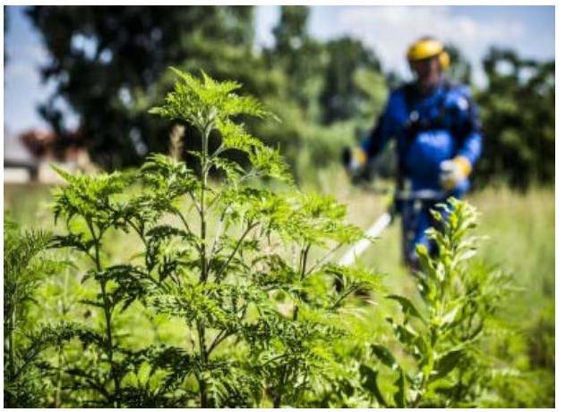

Az OGY¹ az ellenőrzött időszakban az NKP1,2²-ben fogalmazta meg a parlagfű elleni harcra is vonatkozó célkitűzéseit. A parlagfű elleni védekezés céljaként fogalmazta meg, hogy a parlagfű koncentrációja az év minden napján, minden egyes településen 30 pollenszem/m³ alatt maradjon, a biológiai allergének okozta egészségi kockázat csökkenjen. Továbbá a parlagfű elleni hatékony védelem szervezeti kereteinek fenntartását és fejlesztését.

A Kormány az Akcióterv³-ben határozta meg a 2012-2020-as időszakra vonatkozó parlagfű elleni védekezéssel kapcsolatos célokat és feladatokat.

A szabályozási környezet kialakítása megtörtént, amely megteremtette a parlagfű elleni védekezés rendszerében résztvevők szabályszerű feladatellátásának feltételeit. A parlagfű elleni védekezés ellátásának rendszerét az 1. ábra szemlélteti.

1. ábra

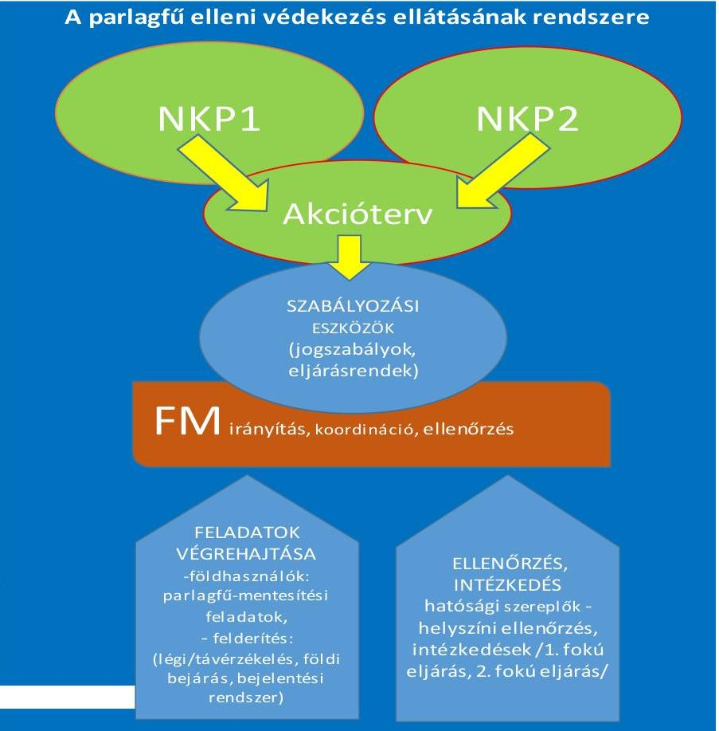

*Forrás: ÁSZ adatok*

---

A parlagfű elleni védekezés többszereplős rendszer, az ellenőrzés a következő közreműködőkre terjedt ki az általuk ellátott alábbi feladatok tekintetében.

Az $\mathrm{FM}^{4}$ - Élelmiszerlánc-felügyeletért Felelős Államtitkárság feladata a szakmai koordináció, felügyelet, a rendszer ellenőrzés/monitorozás, az Akcióterv végrehajtására vonatkozó jelentéstétel, a „Parlagfű elleni közérdekű védekezés végrehajtásának támogatása" címen rendelkezésre álló források felhasználásának koordinálása.

A FÖMI ${ }^{5}$ feladata a fertőzött/veszélyeztetett területek felderítése, a parlagfű veszélyeztetettségi térkép kiadása, karbantartása a PIR ${ }^{6}$ üzemeltetése. A NÉBIH ${ }^{7}$ a Parlagfű Bejelentő Rendszer (PBR/ÖPBR ${ }^{8}$ ) működtetését biztosítja.

Az EMMI ${ }^{9}$ a PPRR ${ }^{10}$ rendszerrel kapcsolatos koordinációs feladatot lát el, illetve az Akcióterv szerint társminisztériumként közreműködik annak végrehajtása során.

A kormányhivatalok ingatlanügyi hatóságai (földhivatalok) felderítést, helyszíni ellenőrzéseket végeznek, mint elődleges feladatellátók, a növény- és talajvédelmi igazgatóságok (NTI11) a külterületek és az önkormányzati tulajdonú belterületek esetében elrendelik a közérdekű védekezést, illetve bírságolási tevékenységet végző hatósági feladatot látnak el.

A kiválasztott települési önkormányzatok jegyzői felderítési, a belterületek esetében a helyszíni ellenőrzés lefolytatását, illetve a közérdekű védekezés elrendelési feladatokat végeznek.

A parlagfű elleni védekezés keretében működtetett információs rendszerekben központi szerepe van a PIR-nek, amely biztosítja a bejelentésektől, a hatósági eljáráson keresztül a feladatok támogatását. A PIR, a PBR és az ÖPBR informatikai kapcsolatban van egymással, azonban a parlagfű elleni védekezés keretében működtetett információs rendszeren belül a PPRR rendszer a többi rendszertől függetlenül működik. A 2. ábra a parlagfű elleni védekezés rendszerében működtetett információs adatbázisok/rendszerek kapcsolatait és az információ áramlás irányait szemlélteti.
2. ábra
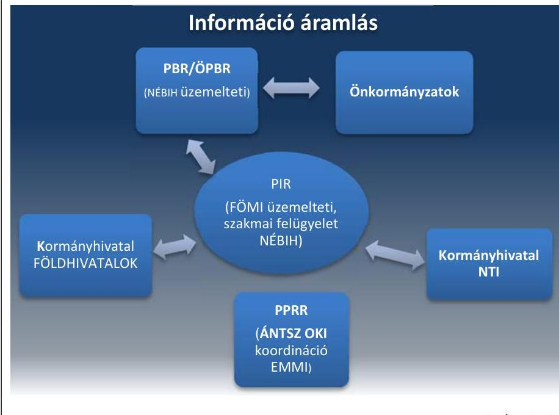

---

A parlagfű elleni védekezésre a „Parlagfű elleni közérdekű védekezés végrehajtásának támogatása" fejezeti kezelésű előirányzaton biztosított forrásból a 2013. évben 143,0 M Ft, a 2014. évben 54,7 M Ft, a 2015. évben 688,1 M Ft került felhasználásra.

---

# AZ ELLENŐRZÉS HÁTTERE, INDOKOLTSÁGA 

A parlagfű pollenje által okozott allergiás hatások minden évben július végétől október közepéig mintegy két millió embert érintenek. A legutóbbi 2007-2008. évi gyomfelvételezés adatai szerint az ország szántóterületének 5,3%-át borította parlagfű. A parlagfű elleni védekezést törvény (Éltv. ${ }^{12}$ ) és kormányrendelet (Élvhr. ${ }^{13}$ ) írja elő, az irtás elmulasztását közérdekű védekezés elrendelésével és pénzbüntetéssel szankcionálja a magyar állam. Az Országgyűlés a Nemzeti Környezetvédelmi Programokban $\left(\mathrm{NKP}_{1,2}\right)$ stratégiai szinten fogalmazta meg a parlagfű elleni harcra is vonatkozó hosszú távú célkitűzéseket: a parlagfű koncentrációjának, a biológiai allergének okozta egészségi kockázat csökkenését, a védelem szervezeti kereteinek fenntartását, fejlesztését. A földterületek parlagfű fertőzöttségének visszaszorítása törvényileg előírt védekezési feladata elsősorban a földhasználók, illetve a hatóságok kötelezettsége. Az Akciótervről készült beszámolók szerint 2013-ról 2014-re csökkent a közérdekű védekezéssel érintett terület nagysága, miközben az éves pollenszám nőtt. A 2013-2015. évek költségvetési törvényeiben biztosított támogatások a XII. Vidékfejlesztési Minisztérium* fejezetben a 20. Fejezeti kezelésű előirányzatok 3. Agrár célelőirányzatok között szerepeltek, a parlagfű elleni közérdekű védekezés végrehajtásának támogatása jogcímcsoporton.

Magyarországon a parlagfű elleni állami szerepvállalás fő iránya a prevenció, a megelőzést elősegítő kommunikáció, az érintett társadalmi szervezetekkel, civilekkel való együttműködés. A parlagfű elleni védekezés elsősorban a föld használójának a kötelezettsége, mivel törvény (Éltv. 17. § (4) bekezdés) írja elő, hogy minden év június 30-ig elvégezzék a földterületeiken a parlagfű-mentesítést. A jogkövető magatartás, vagyis jogszabályi előírás betartásának ellenőrzését, illetve kötelező védekezés elrendelését szintén a hivatkozott

 jogszabály (Éltv. 50. §) írja elő a parlagfű elleni védekezés rendszerében résztvevő költségvetési szervezeteknek. A védekezés szempontjából első fokon eljáró hatóságok (kormányhivatalok földhivatalai és NTI-ik, önkormányzatok jegyzői) végezték a parlagfűvel borított területek felderítését, a területek helyszíni ellenőrzését, közérdekű védekezés elrendelését, növényvédelmi bírság kiszabását. A felderítésben, illetve az előrejelzésben ezen túl más költségvetési szervezeteknek - NÉBIH, FÖMI, ÁNTSZ-OKI - is szerepük volt. A kormányhivatalok mezőgazdasági szakmai tevékenységének irányítását, valamint a törvényességi és szakszerűségi ellenőrzési hatásköröket szakmai irányító miniszterként a földművelésért felelős miniszter gyakorolja.

A parlagfű elleni védekezés/mentesítés rendszere eredményességére, a Stratégiákban, Akciótervben megfogalmazott célokhoz viszonyított tényleges teljesítményére a következő tényezők hatnak:
$\longrightarrow$ a parlagfű elleni védekezés/mentesítés stratégiai céljainak megalapozottsága, összhangja, prioritása,

[^0]
[^0]:    * 2014-től a 2014. évi LXXXIV. tv. alapján, Földművelésügyi Minisztérium (FM)

---

$\longrightarrow$ a Stratégiákban, az Akciótervben megfogalmazott célokhoz viszonyított tevékenység mérési, értékelési rendszerének kialakítottsága (mutatók, módszertan),
$\longrightarrow$ az emberi, tárgyi és pénzügyi erőforrások - megfelelő mennyiségben, minőségben való - biztosítása, elosztása, felhasználása,
$\longrightarrow$ parlagfű elleni védekezés/mentesítés, mint tevékenység végrehajtásának szervezettsége, a feladat-, hatás- és felelősségi körök elhatárolása,
$\longrightarrow$ a működtetett monitoring rendszerből nyert információk alapján a szükséges intézkedések meghozatala, végrehajtása.
A parlagfű-pollen magas szintje egészségügyi problémákat okoz, jelentős egészségügyi kiadásokat generál. A parlagfű elleni védekezésre jelentős erőforrást fordít a társadalom. Az erőfeszítések ellenére ugyanakkor a parlagfű-pollen koncentrációja nem csökkent. A jelenség számos okra visszavezethető, így például a védekezés rendszerében fennálló esetleges problémákra, hiányosságokra is.

Az ellenőrzés megállapításai rámutatnak arra, hogy melyek a parlagfű elleni védekezési rendszer jellemzői, gyenge/erős pontjai, a szabályozás hiányosságai, a védekezéssel sikerült-e csökkenteni a fertőzött területek nagyságát, csökkent-e az előfordulások száma. Az ellenőrzés képet ad a felderítési rendszer (a NÉBIH által kezelt PBR/ÖPBR, a FÖMI által üzemeltetett PIR, az ÁNTSZ-OKI ${ }^{14}$ által koordinált PPRR) működéséről, az oda érkező bejelentések, mérési információk kezeléséről, a rendszerekben megtalálható információk hasznosításáról, az esetleges hiányosságokról a hasznosítás, lakossági felvilágosítás terén. Az ellenőrzés indokoltságát alátámasztja, hogy a témát érintően több közérdekű bejelentés is érkezett az ÁSZ-hoz. Az ellenőrzés megállapításai a Kormány, a jogalkotó, a társadalom és az ellenőrzött szervezetek számára egyaránt hasznos információkkal szolgálhatnak.

---

# A JELENTÉS LÉNYEGES KÉRDÉSKÖREI 

1.     - A parlagfű elleni védekezés rendszere megfelelően működött-e, a felderítésben, a szankcionálásban és a közérdekű védekezésben részt vevő hatóságok szabályszerűen látták-e el az ezzel kapcsolatos feladataikat?
2.     - A parlagfű elleni védekezés kapcsán megtett intézkedések elősegítették-e a hosszú távú célok megvalósulását?

---

# ELLENŐRZÉS HATÓKÖRE ÉS MÓDSZEREI 

## Az ellenőrzés típusa

Megfelelőségi és teljesítmény-ellenőrzés.

## Az ellenőrzött időszak

A 2013. január 1-je és 2015. december 31-e közötti időszak.

## Az ellenőrzés tárgya

Az ellenőrzés tárgya a parlagfű elleni védekezés magyarországi rendszere, vagyis a felderítés, tájékoztatás/riasztás, a szankcionálás és közérdekű védekezés rendszerében részt vevő hatóságok tevékenységeinek, feladatellátásának összessége, annak eredményessége.

Az ellenőrzés kiterjedt minden olyan körülményre és adatra, amely az ÁSZ jogszabályban meghatározott feladatainak teljesítéséhez, valamint a program végrehajtása folyamán felmerült újabb összefüggések feltárásához szükséges.

## Az ellenőrzött szervezetek

Az ellenőrzött szervezetek a Földművelésügyi Minisztérium Élelmiszerlánc-felügyeletért Felelős Államtitkársága tekintetében, a BAMKH ${ }^{15}$, BAZMKH ${ }^{16}$, BFKH ${ }^{17}$, BKMKH ${ }^{18}$, BMKH ${ }^{19}$, CSMKH ${ }^{20}$, FMKH ${ }^{21}$, GYMSMKH ${ }^{22}$, HBMKH ${ }^{23}$, HMKH ${ }^{24}$, JNSZMKH ${ }^{25}$, KEMKH ${ }^{26}$, NMKH ${ }^{27}$, PMKH ${ }^{28}$, SMKH ${ }^{29}$, SZSZBMKH ${ }^{30}$, TMKH ${ }^{31}$, VEMKH ${ }^{32}$, VMKH ${ }^{33}$, ZMKH ${ }^{34}$ ingatlanügyi hatóságai és a növény- és talajvédelmi igazgatóságai tekintetében. Apc önkormányzata ${ }^{35}$, Aranyosapáti önkormányzata ${ }^{36}$, Balatonboglár önkormányzata ${ }^{37}$,Balatongyörök önkormányzata ${ }^{38}$, Bánk önkormányzata ${ }^{39}$, Hajdúsámson önkormányzata ${ }^{40}$, Jászberény önkormányzata ${ }^{41}$, Kecskemét önkormányzata ${ }^{42}$, Miskolc önkormányzata ${ }^{43}$, Mohács önkormányzata ${ }^{44}$, Pápa önkormányzata ${ }^{45}$, Pincehely önkormányzata ${ }^{46}$, Rádóckölked önkormányzata ${ }^{47}$, Sarkadkeresztúr önkormányzata ${ }^{48}$, Sárbogárd önkormányzata ${ }^{49}$, Sopron önkormányzata ${ }^{50}$ Soroksár önkormányzata ${ }^{51}$, Szentes önkormányzata ${ }^{52}$ Tata önkormányzata ${ }^{53}$ és Veresegyház önkormányzata ${ }^{54}$, a Nemzeti Élelmiszerlánc-biztonsági Hivatal a PBR/ÖPBR rendszerek tekintetében, a Földmérési és Távérzékelési Intézet a PIR rendszer és az Emberi Erőforrások Minisztériuma a PPRR rendszer vonatkozásában.

---

# Az ellenőrzés jogalapja 

Az ellenőrzés jogszabályi alapját az Állami Számvevőszékről szóló 2011. évi LXVI. törvény 1. § (3) bekezdése, valamint az 5. § (3)-(5) bekezdései képezik.

## Az ellenőrzés módszerei

Az ÁSZ az ellenőrzést az ellenőrzési program szempontjai, kérdései, az ellenőrzött időszakban hatályos jogszabályok, az ellenőrzés szakmai szabályok és módszertanok figyelembe vételével végezte el.

Az ellenőrzés végrehajtása két ütemben történt. Az első ütemben (1. lényeges kérdéskör) a szabályozási környezet keretrendszerének kialakítása kerül ellenőrzésre. A második ütemben (2. lényeges kérdéskör) teljesítmény-ellenőrzés keretében a parlagfű elleni védekezés kapcsán kitűzött stratégiai és Akciótervi célok megvalósítása került ellenőrzésre.

A parlagfű elleni védekezés rendszere eredményessége támogatására vonatkozó javaslatok kidolgozásakor a hatályos jogszabályok az irányadóak.

Az ellenőrzési kérdéseket az ÁSZ a parlagfű elleni védekezés kialakított rendszere szabályozásának, koordinálásának, a működésének, vagyis a parlagfű elleni védekezés végrehajtásának és monitoringjának, a kontrollok létezésének és működtetésének értékelésén keresztül válaszolta meg. A kritériumokat a parlagfű elleni védekezés rendszeréhez kapcsolódó stratégiákban, Akciótervben kitűzött célok, elvárt eredmények, illetve a rendszer működése mennyiségi, vagy minőségi jellemzői, mutatói, adatai, információi alapján határozta meg az ÁSZ.

Az ellenőrzési kérdések megválaszolásához szükséges bizonyítékok megszerzése az ellenőrzöttek által rendelkezésre bocsátott dokumentumokra, adatokra alapozva, kérdésfeltevéssel (információkérés), valamint elemző eljárással történt.

Az ellenőrzési bizonyítékként felhasználható adatok közé tartoztak egyrészt a szakmai programban felsorolt adatok, másrészt minden - az ellenőrzés folyamán feltárt, az ellenőrzés szempontjából információt tartalmazó - dokumentum.

Az ellenőrzés lefolytatásához a parlagfű elleni védekezésben érintett szervezetek - a rájuk vonatkozó stratégiai célok, a rendszerben ellátott feladataik, a parlagfűmentesítés kapcsán elért eredmények vonatkozásában - tanúsítványok, valamint az ÁSZ által kért dokumentumok elektronikus úton való megküldésével szolgáltattak adatokat, információkat. Az ellenőrzött terület nagyságára, a helyszíni ellenőrzésre fordított napok számára, a felderítéssel érintett területre, a felderített fertőzött területre, a közérdekű védekezéssel érintett összes mentesített területre, a helyszíni ellenőrzésre, a közérdekű védekezés elrendelésére vonatkozó adatokat az FM, a pollenszámmal és a megbetegedéssel kapcsolatos adatokat az EMMI szolgáltatta. A rendelkezésre bocsátott adatok, információk és a tanúsítványok adatai valódiságának kontrollja az ellenőrzés keretében történt.

Az ellenőrzés ideje alatt az ellenőrzött szervezettel történő kapcsolattartást az ÁSZ SZMSZ ${ }^{55}$-ének vonatkozó előírásai alapján biztosítottuk.

---

A parlagfű elleni védekezés rendszere ellenőrzése során mintavételre az önkormányzatok jegyzői által, illetve a megyei kormányhivatalok irányítása alá tartozó NTI-k által végrehajtott hatósági eljárások tekintetében került sor. Az így ellenőrzött, a parlagfű elleni védekezéssel összefüggő hatósági eljárások tekintetében - 95%-os megbízhatóság mellett - a teljes sokaságra kivetített eredmények alapján, a bel- és külterületen végrehajtott hatósági feladatellátás szabályszerűségéről mondunk véleményt. Megfelelőnek tekintettük a hatósági feladatellátást, amennyiben a minta ellenőrzésének eredménye alapján 95%-os bizonyossággal a teljes sokaságban a hibaarány kisebb volt, mint 10%, nem megfelelőnek értékeltük, ha a hibaarány a 10%-ot meghaladta.

---

# MEGÁLLAPÍTÁSOK 

## 1. A parlagfű elleni védekezés rendszere megfelelően működött-e, a felderítésben, a szankcionálásban és a közérdekű védekezésben részt vevő hatóságok szabályszerűen látták-e el az ezzel kapcsolatos feladataikat?

Összegző megállapítás

### 1.1. számú megállapítás

Kialakították a parlagfű elleni védekezés keretrendszerét.

A parlagfű elleni védekezés rendszere nem működött teljes körűen megfelelően, a felderítésben, a szankcionálásban és a közérdekű védekezésben részt vevő hatóságok nem szabályszerűen látták el az ezzel kapcsolatos feladataikat.

A parlagfű elleni védekezés kialakított keretrendszere, illetve az e rendszerre vonatkozó szabályozási környezet megteremtette a szabályszerű működés feltételeit. Nem teremtette ugyanakkor meg az eredményes végrehajtás feltételeit.

Az OGY által 96/2009. (XII. 9.) számú határozattal, illetve 27/2015. (VI. 17.) számú határozattal elfogadott NKP ${ }_{1,2}$-ben meghatározták a parlagfű elleni védekezés céljait.

Az NKP ${ }_{1}$-a 5.3.2. Biológiai allergének pontban meghatározta a parlagfű elleni védekezés céljait. A program hosszú távú célkitűzésként rögzítette, hogy az év minden napján 30 pollenszem $/ \mathrm{m}^{3}$ érték alatt maradjon a parlagfű pollen koncentrációja, és csökkenjen a biológiai allergének okozta egészségi kockázat. Továbbá célként meghatározta a biológiai allergének terjedésének kutatását, monitorozását, előrejelzését és a parlagfű elleni hatékony védelem szervezeti kereteinek fenntartását, fejlesztését. Az NKP ${ }_{1}$ a célok elérése érdekében szükséges intézkedésként a Kormány, az önkormányzatok és az ingatlan tulajdonosok számára határozott meg feladatokat.

Az NKP ${ }_{1}$ a Kormány részére feladataként határozta meg:

- Az ÁNTSZ Aerobiológiai Hálózat fenntartását, a meglévő automata pollenfelismerő rendszer szoftver- és a pollen előrejelzések fejlesztését, az előrejelzések közzétételét. (A forrás függvényében.)
- A különböző allergizáló fajok elterjedésének részletes felmérését, kutatását, a fertőzési gócok feltárását és ennek alapján a védekezés térbeli súlypontjainak megállapítását. Az új allergén, ill. korábban nem monitorozott növényfajok palinológiai és aerobiológiai vizsgálatát. (A forrás függvényében.)
- Az időjárási tényezők és a pollenszórás közötti összefüggések tudományos vizsgálatát.

---

- A parlagfű és egyéb igen erősen allergén növények allergenitásának vizsgálatát, illetve a lakosság általános szenzitizáltságának (érzékenységének) felmérését.
- Az állami tulajdonban lévő területek (pl. vízügyi, katonai területek, nyomvonalas létesítmények) gyommentesítését.
- A parlagfű elleni közérdekű védekezést elősegítő hatósági rendszer hatékony működésének biztosítását. A helyszíni ellenőrzések folytatását, parlagfű és az ellene való védekezési kötelezettség elmulasztásának felderítését, a kapcsolódó hatósági intézkedések foganatosítását. (A források függvényében.)
- A műholdfelvételeken alapuló parlagfű veszélyeztetettségi térkép elkészítését, frissítését. A FÖMI, valamint az eljáró hatóságok közötti elektronikus adatcserét biztosító „parlagfű-szerver" üzemeltetését. (A források függvényében.)
- Gyommentesítéssel kapcsolatos közmunkaprogramok támogatását.

Az NKP ${ }_{1}$ önkormányzatok számára az önkormányzati területek parlagfűmentesítési feladatok végrehajtását, illetve a parlagfűvel borított területek felderítését, illetve hatósági intézkedést határozott meg parlagfű elleni védekezés elmulasztása esetére.

Az NKP ${ }_{1}$-ben rögzítettek szerint az ingatlan tulajdonosának, illetőleg a termőföld használójának intézkednie kell a parlagfű elleni védekezés elvégzése és a parlagfűmentes állapot fenntartása, illetve a környezetbarát gyepgazdálkodási technikák alkalmazása, a szántóföldi művelés alatt nem álló területek növényzeti záródásának segítése érdekében.

Az NKP2 a parlagfű elleni védekezés céljaként a biológiai allergének okozta egészségi kockázat csökkentését határozza meg. Az NKP ${ }_{2}$ az NKP ${ }_{1}$ ben meghatározottak részére írt elő a már kiépített rendszer működtetésével összefüggő feladatokat. A parlagfű elleni védekezés rendszerének működtetésével és fejlesztésével kapcsolatosan az NKP ${ }_{1}$-ben megfogalmazott elvárt intézkedéseken túl az NKP ${ }_{2}$ további feladatot nem határozott meg.

A parlagfű elleni védekezés céljai eléréséhez szükséges eszközöket a NKP $_{1,2}$-ben nem rögzítették, a célok között prioritásokat nem fogalmaztak meg.

A parlagfű elleni védekezés alapvető jogszabályi környezetét az Éltv., az Élvhr., a 194/2008. (VII. 31.) Korm. rendelet ${ }^{56}$ határozta meg.

Az AKCIÓTERVET a Kormány 2012-ben fogadta el, amely felelős miniszterek kijelölésével,
 intézkedés határidejének rögzítésével meghatározta a 2012-2020-as időszakra vonatkozóan a parlagfű elleni védekezéssel kapcsolatos célokat és feladatokat. Az Akcióterv 1.2.2. pontja alapján elvárás a teljes mentesség érdekében a 2012-2013-ban megkezdett munka folytatása. Az Akcióterv az elfogadást követően nem került módosításra. Ennek következtében a 2014-2015. évek, illetve a 2016-2020-ig tartó időszak céljai és feladatai meghatározása során nem épülhettek be a 2012. évet követő időszak tapasztalatai. Az Akciótervben a Kormány feladatok felelőseként jelölte meg az FM, a $\mathrm{BM}^{57}$, az EMMI, a $\mathrm{KIM}^{58}$, az $\mathrm{NFM}^{59}$ és az

---

NGM ${ }^{60}$ minisztert és feladatokat határozott meg a megyei kormányhivatalok feladat- és hatáskörrel rendelkező szakigazgatási szervei és az ÁNTSZ ${ }^{61}$ részére.

A Kormány által az Akciótervben a 2012-2013. évekre, és a 2014-2015. évekre vonatkozó feladatokat és azok végrehajtását a jelentés 2.2. pontja mutatja be.

A Kormány a 2016-2020. évekre vonatkozóan a hatékonynak bizonyuló eszközök további használatát és a napi pollenkoncentráció alacsony szinten tartását szabta feladatul.

Az Akcióterv a végrehajtott feladatokról az FM miniszter számára éves jelentés-készítési kötelezettséget határozott meg az érintett miniszterek éves beszámolói alapján.

MUTATÓSZÁMOKAT, teljesítménymutatókat a parlagfű elleni védekezés eredményességének mérésére az NKP ${ }_{1}$-ben határoztak meg, a parlagfű és új, invazív növények éves össz-pollen koncentrációja, a 30 pollenszem $/ \mathrm{m}^{3}$ koncentrációjú napok száma, valamint a szénanátha és asztma megbetegedések előfordulási gyakoriságának alakulása elnevezéssel.

Az NKP ${ }_{1}$-ben rögzített további célok esetében, illetve az NKP $_{2}$-ben és az Akciótervben meghatározott célok vonatkozásában a célok megvalósításának értékeléséhez szükséges indikátorokat, teljesítménymutatókat nem határoztak meg.

A kitűzött célok eléréséhez szükséges anyagi források rendelkezésre állásának meghatározására az Élvhr. 5-8. §-aiban, illetve az Akcióterv 1.1.3., 1.1.6. pontjaiban került sor. Ez alapján az FM „Parlagfű elleni közérdekű védekezés végrehajtásának támogatása" előirányzatban biztosítanak forrást az állami védekezés végrehajtásának fedezetére, a lakossági bejelentések automatizálása és a hatósági eljárás transzparenciájának biztosítására.

# BELSŐ SZERVEZETSZABÁLYOZÓ ESZKÖZEIKBEN az Éltv.-ben és az Akciótervben előírtakkal összhangban a parlagfű elleni védekezésben résztvevők rögzítették, meghatározták a védekezéshez kapcsolódó feladataikat, azok felelőseit. Az FM az ellenőrzött időszakban hatályos FM SZMSZ ${ }_{1,2,3}$-ben ${ }^{62}$ rögzítette a parlagfű előfordulásának és elterjedésének, illetve ezek felderítésének irányításával, ellenőrzésével és a parlagfű-mentesítéssel összefüggő összehangolási feladatokat. Az Élelmiszerlánc-felügyeleti Főosztály ügyrend ${ }_{1,2}$-ben ${ }^{63}$ és a Földügyi Főosztály ügyrendjében ${ }^{64}$ meghatározták a parlagfű elleni közérdekű védekezés végrehajtásának irányítási, szervezési, ellenőrzési feladatait, valamint a parlagfű felderítésével összefüggő, a földhivatalt és a FÖMI-t terhelő feladatok irányítását és ellenőrzését. A felderítéshez, a helyszíni ellenőrzéshez az ellenőrzött időszakra vonatkozóan az FM adott ki Földhivatali eljárásrend ${ }_{1-3}{ }^{65}$ et. Ezekben meghatározták az eljárás jogszabályi alapját, a helyszíni ellenőrzés végrehajtásának szabályait, a költségelszámolást, továbbá az adatszolgáltatás, kapcsolattartás rendjét.

A FÖMI Alapító okirat ${ }_{1-2}{ }^{66}$ a FÖMI SZMSZ ${ }^{67}$, valamint a FÖMI Ügyrendje ${ }^{68}$ az előírásokkal összhangban tartalmazta a FÖMI parlagfű elleni védekezésre vonatkozó feladatait. A FÖMI alaptevékenysége keretében ellátja -

---

A parlagfű elleni védekezés szakmai koordinációját, irányítását, ellenőrzési, beszámolási feladatait az FM szabályszerűen látta el.
többek között - a távérzékelés mezőgazdasági, vidékfejlesztési és környezetgazdálkodási területein az adatok gyűjtésével, kezelésével, feldolgozásával szolgáltatásával és a vonatkozó téradat infrastruktúrák működtetésével kapcsolatos, valamint a jogszabályokban meghatározott, vagy delegált országos adatbázisok vonatkozásában az adatok gyűjtésével, kezelésével, feldolgozásával és szolgáltatásával kapcsolatos feladatokat.

A NÉBIH a 2013-2015. években a PBR/ÖPBR rendszer kialakításával és működtetésével kapcsolatos feladatait az FM-mel kötött megállapodásokban rögzítette. A NÉBIH a 2012. és a 2014. években adott ki a megyei kormányhivatalok NTI részére a parlagfű elleni védekezés elmulasztása esetén követendő eljárásrendet a bel- és külterületi ingatlanokra vonatkozóan. A Belterületi eljárásrend ${ }_{1-2}{ }^{69}$ tartalmazta az Éltv., az Élvhr, a 194/2008. (VII. 31.) Korm. rendelet, a Ket. ${ }^{70}$, a 19/1992. (I. 28.) Korm. rendelet ${ }^{71}$ és a 328/2010. (XII. 27.) Korm. rendelet ${ }^{72}$ alapján az önkormányzatok jegyzőinek és a megyei NTI-nek a hatáskörük szerinti feladatait és azok megosztását.

A Külterületi eljárásrend ${ }_{1-2}{ }^{73}$-ben a megyei kormányhivatalok földhivatalai és az NTI-k feladatmegosztásán túl, a NÉBIH meghatározta a feladat végrehajtása során a PIR rendszer, illetve az abban kötelezően alkalmazandó dokumentumok használatát figyelemmel az Éltv., az Élvhr, a 194/2008. (VII. 31.) Korm. rendelet, a Ket. előírásaira.

AZ EMMI belső szabályzataiban az Akciótervvel összhangban az SZMSZ ${ }_{1,2}{ }^{74}$-ben és az EMMI NF Ügyrend ${ }_{1,2}{ }^{75}$-ben határozta meg az egészségfejlesztési, népegészségügyi tárgyú stratégiák, programok, cselekvési tervek kidolgozásának koordinálását, együttműködést azok kidolgozásában, felügyeletet azok megvalósulása során, valamint a lakosság egészségi állapotának folyamatos monitorozását. Kifejezetten a parlagfűvel összefüggő feladatokat az EMMI SZMSZ ${ }_{2}$, valamint az EMMI NF Ügyrend ${ }_{2}$ rögzítette.

A KORMÁNYHIVATALOK az ellenőrzött időszakban hatályos MKH SZMSZ ${ }_{1-4}{ }^{76}$-nek megfelelően ügyrendjeikben határozták meg a parlagfű elleni védekezés feladatait. A járási hivatalok ügyrendjei meghatározták a parlagfű elleni közérdekű védekezéssel kapcsolatos járási földhivatali feladatokat. Az NTI ügyrendekben rögzítették a parlagfű elleni védekezéssel kapcsolatos hatósági feladatokat.

A SZAKMAI KOORDINÁCIÓT, irányítást, ellenőrzési, beszámolási feladatait az FM szabályszerűen látta el a parlagfű elleni védekezés területén, ezzel támogatta a rendszer szabályszerű működését. Az FM miniszter ${ }^{77}$ belső szabályozási környezetben meghatározta a parlagfű elleni védekezéssel összefüggő feladatellátás feltételrendszerét. A környezetvédelemért való felelőssége keretében a földtulajdonosok, mezőgazdasági termelők részére a parlagfű-mentesítést ösztönző rendszer kidolgozása keretében a 2014. évben értékelték a parlagfű elleni védekezéssel összefüggő motivációs rendszert, amely hiányosságokat tárt fel, azonban a motivációs rendszer kialakítására a 152/2014. (VI. 6.) Korm. rendelet ${ }^{78}$ 73. § (2) bekezdés a) pontjában előírtak ellenére az FM nem tett javaslatot.

---

Az ellenőrzött időszakban az FM a parlagfű elleni védekezés kapcsán a környezeti tudatosság fejlesztését szolgáló programok szervezésére több intézkedést hozott, számos rendezvényen, szakmai napon voltak jelen, több civil szervezet részére nyújtott támogatást a parlagfű elleni közérdekű védekezéssel kapcsolatos programok, előadások, képzések szervezésére és lebonyolítására.

A hatósági eljárásban közreműködő szervezetek és a lakosság közötti információáramlás meggyorsítása és pontosabbá tétele érdekében a 2013. évtől fogadta a bejelentéseket a PBR. A megtett intézkedések ellenére az FM nem tett eleget a 152/2014. (VI. 6.) Korm. rendelet 73. § (2) bekezdés d) pontjában előírtaknak, mert a parlagfű szennyezettség felmérését és értékelését szolgáló mérő-, megfigyelő-, ellenőrző-, értékelő- és információs rendszerek teljes összehangolása nem valósult meg. Az önkormányzatok hozzáférés hiányában nem tudták használni a PIR rendszert, az ÖPBR-t elsősorban a bejelentések fogadására használták, a PPRR rendszer a többi rendszertől függetlenül működött. Az FM a térképészetért való felelőssége keretében elkészítette és az Élvhr. tartalmazta a parlagfű-veszélyeztetett területek feltérképezésére és a távérzékeléses kiértékelésekre vonatkozó előírásokat.

Az ellenőrzött időszakban az FM-ben a parlagfű elleni közérdekű védekezés végrehajtásának támogatása előirányzat felhasználásának feltételeit, részletes szabályait meghatározták. Az FM a parlagfű-mentesítés sikerességének nyomon követése érdekében monitoring rendszert alakított ki és működtetett. Az FM az NKP ${ }_{1,2}$-ben és az Akciótervben megfogalmazott feladatok elvégzéséről történő beszámolás rendjét nem határozta meg.

# A PARLAGFŰ ELLENI VÉDEKEZÉS RENDSZERÉBEN MŰKÖDTETETT INFORMÁCIÓS ADATBÁZISOK kialakítása és működtetése megtörtént. A PBR rendszer működtetését az FM a NÉBIH-vel kötött megállapodásban adta át. A NÉBIH a PBR/ÖPBR fejlesztésére, működtetésére 2013. évben kötött szerződéssel a Kbt. ${ }^{79}$ 5. §-ban fennálló közbeszerzési kötelezettségét - a Kbt. 18. §-a szerinti egybeszámítási szabályokra figyelemmel - megsértette.

AZ EMMI koordinációja mellett az Akciótervben meghatározott feladatokat biztosítva működik a PPRR rendszer, amelyet az ÁNTSZ Aerobiológiai Hálózat működtet. A PPRR rendszert az ellenőrzött időszakban fejlesztették, amelynek révén lehetővé vált a határmenti pollenszórás pontosabb becslése, a rendszer nemzetközivé vált a határon túli állomások bevonásával.

A 2013. évi parlagfű szezonra már heti rendszerességgel készültek el a tájékoztató térképek a parlagfű pollenkoncentráció becsült országos eloszlásáról. A PPRR térkép az ÁNTSZ Aerobiológiai Hálózat megelőző hétre vonatkozó hivatalos parlagfű pollen adatainak felhasználásával készült, tájékoztatásul szolgált az adott térség átlagos pollenviszonyairól. A lakosság a riasztási szintekről és a pollenterhelés területi eloszlásáról térképek segítségével tájékozódhatott.

---

### 1.2. számú megállapítás

A veszélyeztetett területek felderítése nem felelt meg teljes körűen a jogszabályi előírásoknak.

A közérdekű védekezés rendszerében részt vevő hatóságok nem szabályszerűen látták el feladataikat.

A parlagfű elleni védekezés stratégiai céljaiban, akciótervében meghatározott feladatok végrehajtása és a rendszer működtetése nem volt teljes körűen szabályszerű.

## A VESZÉLYEZTETETT TERÜLETEK FELDERÍTÉSE

részben felelt meg a jogszabályi előírásoknak. A FÖMI a távérzékeléses parlagfű-felderítést a 2013. és 2014. években nem végezte, ezért az Élvhr. 4. § (4) bekezdésében előírtak szerint a parlagfű veszélyeztetettségi térkép űrfelvételek távérzékeléses kiértékelésének eredményeivel való frissítése nem történt meg. A kormányhivatalok az Élvhr. előírásainak megfelelően a parlagfű elleni védekezés keretében helyszíni ellenőrzéseket hajtottak végre. Több esetben előfordult azonban, hogy a kormányhivatalok földhivatali szervezete nem rendelkezett hatósági ellenőrzési tervvel a 288/2010 (XII. 21.) Korm. rendelet ${ }^{80}$ 6/A. § (2) bekezdés előírása, 2015. április 1-jét követően a 66/2015. (III. 30.) Korm. rendelet ${ }^{81}$ 7. § (2) bekezdés előírása ellenére.

Az Élvhr. 3. § (1) bekezdésében előírtak ellenére a területek helyszíni ellenőrzését a 2013-2015. években öt ellenőrzött önkormányzat jegyzője nem végezte el.

A KORMÁNYHIVATALOK részére az FM az Akciótervben és az $\mathrm{NKP}_{1-2}$ programokban megfogalmazott parlagfű elleni védekezés középtávú célkitűzéseivel összhangban előírta a parlagfű szezonban a parlagfűvel borított területek felderítését és a végrehajtott helyszíni ellenőrzésekről kéthetente történő adatszolgáltatást. Az adatszolgáltatást a kormányhivatalok teljesítették, a járási földhivatalok a külterületek esetében az elvégzett feladatokról jelentést készítettek.

## A PARLAGFŰ ELLENI KÖZÉRDEKŰ VÉDEKEZÉSBEN résztvevő hatóságok nem szabályszerűen látták el feladataikat.

AZ ÖNKORMÁNYZATOKNÁL a 2013-2015. években a parlagfű elleni védekezés kapcsán a jegyzők hatósági feladatellátása nem volt megfelelő, mert:
$\qquad$ 1. a helyszíni ellenőrzések során az Élvhr. 3. § (5) bekezdésében előírtak ellenére esetenként nem vettek fel jegyzőkönyvet;
$\qquad$ 2. az elkészített helyszíni jegyzőkönyvek adattartalma nem minden esetben felelt meg az Élvhr. 1. számú melléklet 14. pontjában foglaltaknak, mert nem tartalmazták a parlagfűvel való felületi borítottság mértékét;
3. az Éltv. 50. § (4) bekezdésében rögzítetteket megsértve nem rendelte el minden esetben a közérdekű védekezést, ha a földhasználó nem tett eleget a 17. § (4) bekezdésében szereplő parlagfű elleni védekezési kötelezettségének;
4. az elrendelt közérdekű védekezésekről az Élvhr. 3. § (8) bekezdésében rögzítettek ellenére a határozatot nem minden esetben közölték a MVH ${ }^{82}$-val;
5. a 2013-2014. években a földhasználót az Éltv. 50. § (2) bekezdésében előírtakat megsértve nem minden esetben kötelezte a közérdekű védekezés költségeinek 15 napon belüli megtérítésére;

---

6. a Ket. 94. § (1) bekezdés c) pontjában foglaltak ellenére a jegyzőkönyv jogszabálysértésre vonatkozó részének megküldésével nem minden esetben kezdeményezte a növényvédelmi bírság kiszabás eljárását az NTI-knél.

A KORMÁNYHIVATALOKNÁL a 2013-2015.
 években a parlagfű elleni védekezés kapcsán a hatósági feladatellátás nem volt megfelelő, mert:

1. az Élvhr. 3. § (8) bekezdésében foglaltak ellenére a közérdekű védekezést elrendelő határozatot nem minden esetben közölték az MVH-val;
2. a 2014-2015. években előfordult, hogy az Éltv. 50. § (2)-(3) bekezdésében, az Élvhr. 2. § (3) bekezdésében előírtak ellenére az eljárási költségek tizenöt napon belüli megtérítésére nem kötelezték a közérdekű védekezés elmulasztóját;
3. a 2013. évben előfordult, hogy a közérdekű védekezést elrendelő határozatot - az Éltv. 50. § (5) bekezdése szerinti - hirdetmény útján, a Ket. 80. § (4) bekezdésben foglaltak ellenére az ügyfél lakcíme szerinti önkormányzat hirdetőtábláján nem, csak az ingatlan fekvése szerinti önkormányzat hirdetőtábláján tették közzé;
4. előfordult, hogy a földhasználó által megtérített eljárás költségét a megyei kormányhivatalok az Élvhr. 8. § (2) bekezdésében rögzítettekkel ellentétben nyolc napon belül nem térítették vissza az előirányzatba.

A kormányhivatalok a helyszíni ellenőrzés során betartották a belső szabályzatban foglaltakat, az Élvhr.-ben előírtaknak megfelelően megtörtént a terület beazonosítása a fertőzött terület főbb töréspontjainak koordinátái alapján. A helyszíni ellenőrzésekről a földhivatal felvette a jegyzőkönyvet. A PIR rendszerben előállított jegyzőkönyvek adattartalma megfelelt az Élvhr. 1. számú mellékletében foglaltaknak. A parlagfű felületi borítottságot és a kultúrnövény tőszámát az Éltv. és az Élvhr.-ben foglaltak alapján állapították meg.

A NÖVÉNYVÉDELMI BÍRSÁG KISZABÁSA megyei kormányhivataloknál a jogszabályoknak megfelelően történt.

---

# 2. A parlagfú elleni védekezés kapcsán megtett intézkedések elősegítették-e a hosszú távú célok megvalósulását? 

Összegző megállapítás

### 2.1. számú megállapítás

A parlagfű elleni védekezés rendszerében működtetett információs adatbázisok kialakítása megtörtént.

A parlagfű-mentesítés sikerességét a közreműködő szervezetek szabályszerű és eredményes feladatellátását részben támogatták az alkalmazott információs rendszerek.

Az NKP ${ }_{1}$-ben meghatározott 30 pollenszem/m³ stratégiai cél az ellenőrzött időszakban nem valósult meg.

A parlagfű elleni védekezés kapcsán megtett intézkedések elősegítették, de nem voltak elégségesek a hosszú távú célok megvalósításához.

A parlagfű elleni védekezés kapcsán kitűzött stratégiai célok nem valósultak meg.

AZ INFORMÁCIÓS ADATBÁZISOK/RENDSZEREK kialakítása, működtetése és fejlesztése megtörtént. Az Akciótervben meghatározott feladatok felelősei az ellenőrzött időszakban a parlagfű elleni védekezés rendszerében működtetett informatikai rendszerek - PIR, PBR, ÖPBR, PPRR - adatainak felhasználásával készítették el éves beszámolóikat, amelyek megalapozták az FM által évente készített jelentést az Akciótervben foglalt feladatok végrehajtásáról. Az információs adatbázisok ellenére az FM nem rendelkezett adatokkal az országban lévő parlagfűvel fertőzött területek nagyságáról. A PIR rendszer biztosította a parlagfűves területek felvételétől, a közérdekű védekezés elrendelésén és a hatósági eljáráson át, az eljárások lezárásáig azok támogatását, irányítását, nyomon követését. A hatósági eljárásban közreműködő szervezetek és a lakosság közötti információáramlásának érdekében kifejlesztésre került a PBR. Az ÖPBR biztosította a regisztrált önkormányzatok számára a bejelentés alapján induló eljárás intézéséhez kapcsolódó adatok és események rögzítését, az ügyintézési folyamat vezérlését, továbbá a rögzített adatok alapján az ügyintézéshez kapcsolódó nyomtatványokat. A PPRR rendszer segítségével országos online riasztási rendszer működött az ellenőrzött időszakban.

A parlagfű-mentesítés sikerességét, a közreműködő szervezetek szabályszerű és eredményes feladatellátását részben támogatták az alkalmazott információs adatbázisok/rendszerek, mivel mind a négy rendszer között nem volt informatikai kapcsolat. A PPRR rendszer a PIR, a PBR és az ÖPBR rendszerektől függetlenül működött. A különböző rendszerek adatait azonban az elemzések, kutatások során hasznosították, felhasználták. A PBR révén megtörtént a bejelentések továbbítása a PIR rendszerbe. A PBR rendszernek azonban belterület esetén a bejelentéseket közvetlenül az önkormányzatokhoz kellett volna eljuttatnia. Ezzel szemben a PBR-ből a kormányhivatalhoz érkezett bejelentéseket több esetben az NTI-k juttatták el az érintett önkormányzat számára. Az információáramlás gyorsabbá, a parlagfű elleni eljárásokban résztvevő szervezetek együttműködése hatékonyabbá vált az által, hogy a kormányhivatalok értesültek a bejelentésekről. A PBR és a PIR rendszer közötti kapcsolat megjelent a rendszerekben. Az önkormányzatok azonban az ÖPBR-t érdemben nem használták, így a parlagfű elleni védekezés belterületi adatainak rögzítése nem volt teljes körű.

Nem valósult meg az a stratégiai cél, hogy az év minden napján, minden egyes településen 30 pollenszem/m³ érték alatt maradjon a parlagfű koncentrációja, és csökkenjen a biológiai allergének okozta egészségi kockázat.

---

PARLAGFŰ POLLEN KONCENTRÁCIÓJÁNAK változása a 2013-2015. évek között hullámzó volt, a 2014. évben jelentősen nőtt, a 2015. évben csökkent az előző évhez képest, de a parlagfű pollenkoncentrációja az ellenőrzött időszakban meghaladta az NKP ${ }_{1}$-ben meghatározott 30 pollenszem $/ \mathrm{m}^{3}$ értéket.

Az NKP 1 2009-2014 időtartamát tekintve a 2011-es szezon volt kiemelkedő, amikor nemzetközileg is „nagyon magasnak" számító parlagfű pollenkoncentráció átlagértékeket mértek az ország túlnyomó részén. Az ellenőrzött időszakban a korábbi időszakhoz képest változatlanul jellemzőek voltak az egészségi hatás szempontjából kritikus értékek. A parlagfű pollen országos napi átlagkoncentrációja az NKP ${ }_{1}$ elfogadásának évéhez, azaz a 2009. évhez képest csökkent, az ellenőrzött időszakban mértéke hullámzó volt, $81 \mathrm{db} / \mathrm{m}^{3} /$ nap és $183 \mathrm{db} / \mathrm{m}^{3} /$ nap között változott. Az éves átlagos össz-pollenszám ugyancsak csökkent a 2009. évhez viszonyítva, az ellenőrzött időszakban $4212 \mathrm{db} / \mathrm{m}^{3} /$ év és $6902 \mathrm{db} / \mathrm{m}^{3} /$ év között változott.

Az ellenőrzött évek sorrendjében az NKP ${ }_{1}$-ben előírt célértéket 51, 153, $110 \mathrm{db} / \mathrm{m}^{3}$-rel haladta meg a parlagfű pollen országos napi átlagkoncentrációja. Az éves átlagos össz-pollenszám és a parlagfű pollen országos napi átlagkoncentrációjának alakulását a 3. ábra mutatja be.
3. ábra
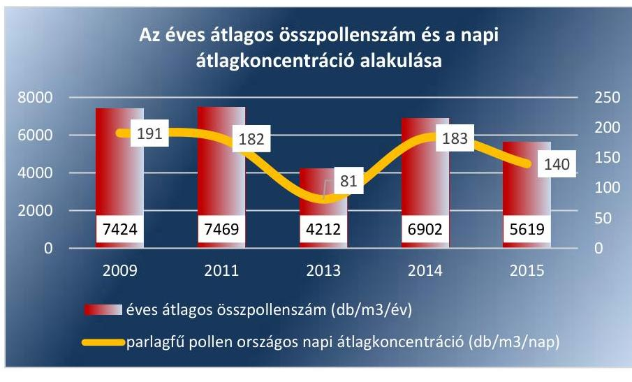

Forrás: EMMI 3. B. sz. tanúsítvány
A parlagfű napi országos átlaga a legmagasabb napi pollenkoncentráció idején, 2013. szeptember 8-án $219 \mathrm{db} / \mathrm{m}^{3}$, 2014. szeptember 4-én $735 \mathrm{db} / \mathrm{m}^{3}$, 2015. augusztus 31-én $431 \mathrm{db} / \mathrm{m}^{3}$ volt. A mért legmagasabb napi maximum érték 2013-ban $617 \mathrm{db} / \mathrm{m}^{3}$, 2014-ben $1883 \mathrm{db} / \mathrm{m}^{3}$, 2015-ben $1267 \mathrm{db} / \mathrm{m}^{3}$ volt. A parlagfű szezon teljes hossza a 2013. évben 81, a 2014. évben 65, a 2015. évben 64 nap volt.

A pollenkoncentráció mértékében meghatározó szerepet játszottak az időjárási tényezők. Az ellenőrzött időszakban a parlagfű szezon hossza (az országos átlagértékek alapján első és utolsó tüneteket okozó nap közötti időszak) ugyan rövidebb, de intenzitásában erősebb lett. A pollenkoncentráció megoszlását a tüneteket okozó időszakban a 4. ábra mutatja be.

---

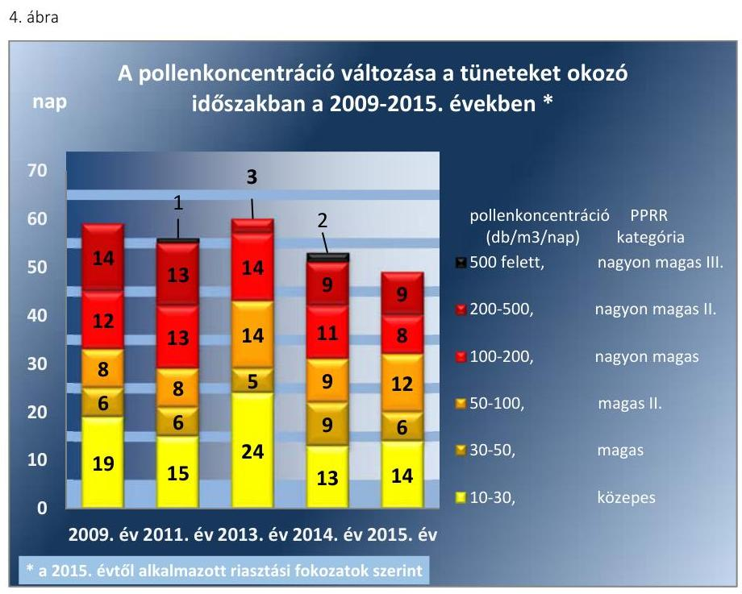

A biológiai allergének okozta egészségi kockázat az ellenőrzött időszakban nem csökkent, hullámzó volt.

## AZ ALLERGÉNEK ÁLTAL OKOZOTT MEGBETEGEDÉSEK számának változása ugyancsak hullámzó volt az ellenőrzött időszakban. A 2015. évre csökkent, azonban a biológiai allergének okozta egészségi kockázat érdemben nem mérséklődött, mivel a parlagfű pollen napi átlagkoncentrációja az allergiás tüneteket okozó értéket meghaladta, a levegőben lévő parlagfű pollen mennyiségének változása nem állt egyenes arányban az allergiás megbetegedések változásával. Nem mutatható ki összefüggés a parlagfű pollen napi átlagkoncentrációja és a megbetegedések száma között.

Az NKP $_{1}$-ben meghatározott, a szénanátha és az asztma megbetegedések előfordulási gyakoriságának alakulása mutató a 2009. és a 2011. évi adatokhoz képest a 2013. évben (19,0\%-kal, illetve 8,5\%-kal) mérséklődött, a 2014. évben 1,1\%-kal nőtt, a 2015. évben 3,8\%-kal csökkent az előző évhez képest. A parlagfű pollennel összefüggésbe hozható megbetegedések száma az ellenőrzött időszakban kedvezőbb képet mutatott a 2009., illetve a 2011. évekhez képest. A megbetegedések előfordulásának számát az 5. ábra mutatja be.

---

Megtörtént a biológiai allergének terjedésének kutatása, monitorozása, előrejelzése.
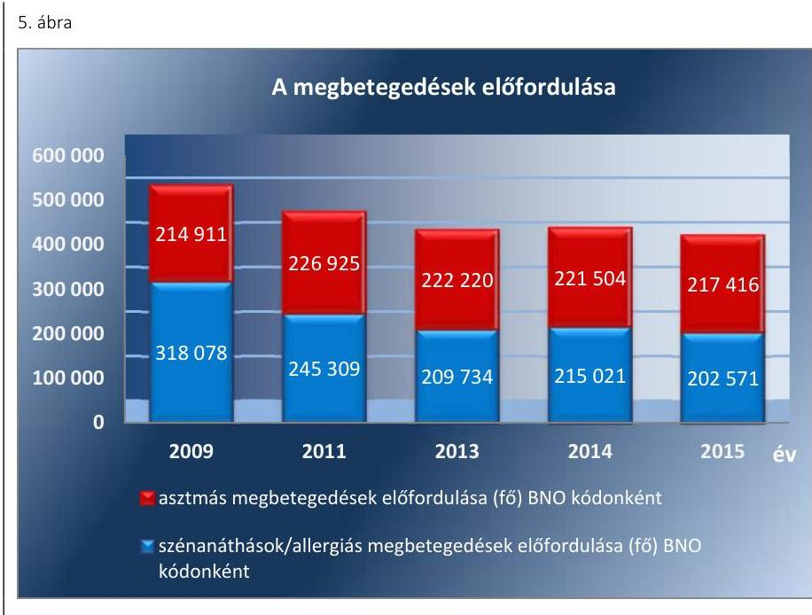

Forrás: EMMI 3. B. sz. tanúsítvány

## A BIOLÓGIAI ALLERGÉNEK TERJEDÉSÉNEK KUTATÁSA, MONITOROZÁSA, előrejelzése érdekében tett intézkedések nem voltak eredményesek. A parlagfű pollen koncentráció területi eloszlásának meghatározása céljából létrehozott rendszer kialakítása és működtetése megtörtént, azonban a parlagfűvel szennyezett területek teljes körű felmérése és monitorozása nem történt meg. A kutatási eredmények, a monitorozási, előrejelzési adatok felhasználása révén kimutatható módon nem csökkent a parlagfűvel szennyezett területek nagysága. Az ÁNTSZ Aerobiológiai Hálózat működésének és a PPRR fejlesztésnek köszönhetően hatékonyabbá és megbízhatóbbá vált a parlagfű pollen koncentráció területi eloszlásának meghatározása. A lakossági tájékoztatás keretében a parlagfű szezon alatt folyamatos polleninformációs szolgáltatás működött. Az egészségügyi kockázatot csökkentő intézkedések körében a 2013. évtől elérhető a pollennapló intézménye. A pollennapló segítségével mérhetővé vált a lakosság szenzitizáltsága (érzékenysége).

A pollennapló adatainak feldolgozása alapján a 2015. évben már elemzés is történt. A pollen allergizáltság felmérésére kérdőíves felmérés történt a 2015. évben tekintettel arra, hogy Magyarországon nincsenek megbízható adatok a pollen-, különösen a parlagfű pollen allergia gyakoriságára. Az ellenőrzött időszakban a parlagfű veszélyeztetettségi térkép részlegesen egészült ki távérzékeléssel történt felméréssel, felmérés készült a parlagfűves területek drónokkal történő felderítésének lehetőségéről, továbbá Elemzés ${ }^{83}$ készült a PIR rendszerben tárolt adatok felhasználásával. Az Elemzés eredményként értékelte, hogy az alapadatok részletes elemzése megmutathatja az adott év parlagfű előfordulás legfőbb adatait, azonban további elemzéseket kell elvégezni. Az Elemzés rámutat arra, hogy e munka sikeres befejezése esetén „egy olyan fontos eredmény birtokába juthatunk, mely végre valóban objektív módon megmutathatja nekünk az adott évi parlagfű elleni védekezés (és védekezési módszer) hatékonyságát. Ilyen visszacsatolás nélkül a védekezési próbálkozásaink csak az elpazarolt évek számát és elpazarolt erőforrások mennyiségét növelik."

---

A parlagfű elleni hatékony védelem szervezeti keretei fenntartása, fejlesztése megvalósult, azonban a feladatellátás nem volt eredményes.

Az EMMI éves beszámolóiban rámutatott arra, hogy az aerobiológiai monitorozással történő adatgyűjtés alkalmas arra, hogy a pollentermelés eredete és kimenetei megismerhetőkké, követhetőkké váljanak. Ezeket több tényezővel együtt elemezve feltárhatók a pollenszennyezés és az egészségkárosodások közötti összefüggések. A pollen monitorozási vizsgálatok eredményeinek összevetése szoros kapcsolatot mutat a parlagfű-borítottsággal, tehát a pollen adatok ismeretében meghatározhatók azok a területek, ahol fokozott parlagfű-mentesítés szükséges. Az EMMI véleménye alapján a légtér pollenkoncentrációja szoros összefüggésben áll az időjárás változékonyságával és a helyi klimatikus viszonyokkal.

Az NKP ${ }_{1}$-ben kitűzött cél végrehajtásáról a Kormány beszámolt az OGY-nek. Az NKP2-ben meghatározott - a 2015-2020 közötti időszakra vonatkozó - cél 2015. évi megvalósítását a Kormány nem értékelte, erre a Környezetvédelmi tv. ${ }^{84}$ első alkalommal a 2017. évben kötelezi.

## A PARLAGFŰ ELLENI HATÉKONY VÉDELEM

SZERVEZETI KERETEI fenntartása, fejlesztése megvalósult, azonban a feladatellátás nem volt eredményes.

A PBR és ÖPBR rendszerek FM, NÉBIH és FÖMI egyeztetése alatt zajló fejlesztése nem biztosította a parlagfű szennyezettség felmérését és értékelését szolgáló mérő-, megfigyelő-, ellenőrző-, értékelő- és információs rendszerek összehangolását. A fejlesztések ellenére a PPRR mérőrendszert nem integrálták be a parlagfű elleni védekezés információs rendszerébe.

Az ellenőrzött időszakban a kormányhivatalok által ellenőrzésre fordított napok száma és az ellenőrzött területek nagysága is csökkenést mutat. A felderítéssel összefüggő országos adatokat, a helyszíni ellenőrzések számának alakulását és az ellenőrzött terület nagyságát a 6. ábra szemlélteti. A megyei adatokat a számvevőszéki jelentés 2. melléklete mutatja be.
6. ábra
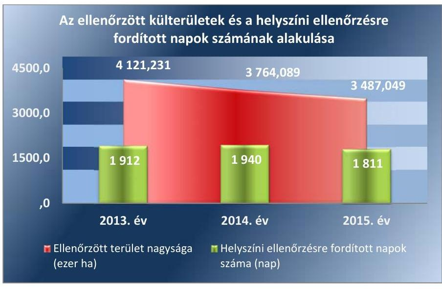

Forrás: FM adatszolgáltatás
A helyszíni ellenőrzésre fordított napok száma a 2013. évről a 2014. évre 1,4\%-kal nőtt, majd 2015. évre 6,6\%-kal csökkent. Ugyanakkor az ellenőrzött területek nagysága
 mindkét évben csökkent, a 2013. évről 2015. évre összességében 15,4%-kal.

---

A felderítéssel érintett terület mérete, a felderítés következtében felvett jegyzőkönyvek alapján megindítható eljárással érintett terület és a közérdekű védekezéssel érintett összes mentesített terület nagysága is csökkenő tendenciát mutatott a 2013-2015. években, melyet a 7. ábra szemléltet.
7. ábra
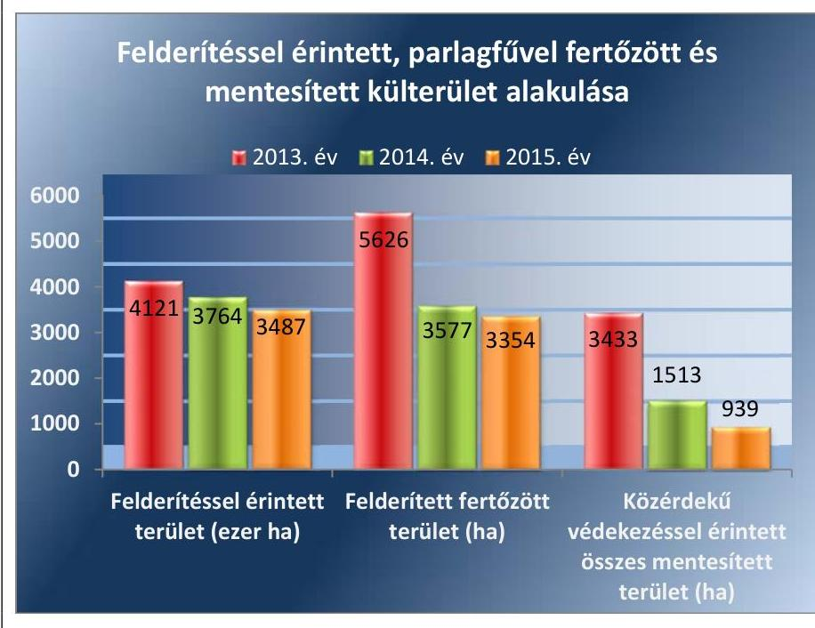

Forrás: FM adatszolgáltatás
A 2013. évben a felderített fertőzött terület a felderítéssel érintett területek 0,1%-a volt. A felderített fertőzött területnek 61%-ában történt közérdekű védekezés. A 2015. évben a felderített fertőzött terület és a felderítéssel érintett terület aránya 0,1% volt, azonban a felderített fertőzött területnek csak 28%-án történt közérdekű védekezés. A hatóságok által ellenőrzött területek körében a 2013. évi 5626 ha-ról a 2014. évben 3577 ha-ra (36,1%-kal), a 2015. évben 3354 ha-ra (a 2013. évhez képest 40,4%-kal, az előző évhez viszonyítva 6,7%-kal) csökkent a parlagfűvel fertőzött külterületek nagysága. A részletes adatokat az 3. számú melléklet tartalmazza.

Belterületen a jegyzők és a kormányhivatalok a külterületek nagyságához viszonyítva lényegesen kisebb területhez kapcsolódóan tettek hatósági intézkedéseket a parlagfűvel fertőzött területek miatt. Az ellenőrzött időszakban rendelkezésre álló parlagfű veszélyeztetettségi térkép nem adott pontos tájékoztatást a parlagfűvel fertőzött külterületekről, mivel távérzékelési adatokkal nem frissült.

A megyei kormányhivatalok által, az ellenőrzött időszakban külterületek vonatkozásában hozott hatósági intézkedések száma csökkent. A kormányhivatalok parlagfű elleni védekezés hatósági feladatainak alakulását a 8. ábra mutatja be:

---

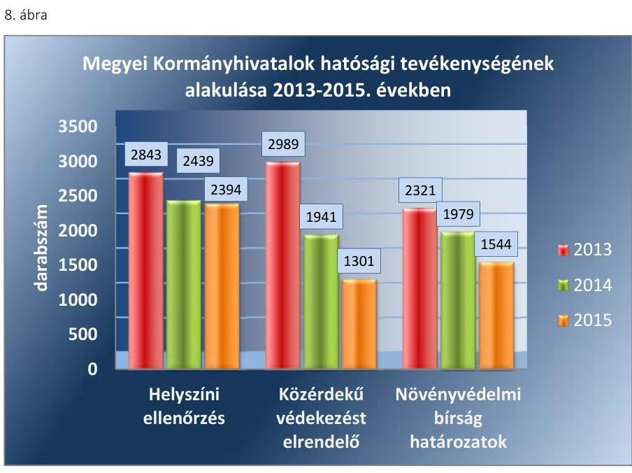

Forrás: PIR statisztikák és a kormányhivatalok adatszolgáltatása
A 2013. évről 2014-évre a közérdekű védekezést elrendelő határozatok száma 35,0%-kal, a 2015. évre további 33,0%-kal csökkent. A növényvédelmi bírság határozatok száma a 2013-2015. években szintén csökkenést mutat, 14,7%-kal és 22,0%-kal csökkent az előző évhez viszonyítva.

Az Élvhr.-ben előírt parlagfű elleni védekezés nem volt eredményes az ellenőrzött időszakban, mert a teljesített közérdekű védekezés esetszáma és a mentesített területek nagysága is csökkent. Ezek 2013-2015. évi alakulását szemlélteti a 9. ábra.
9. ábra
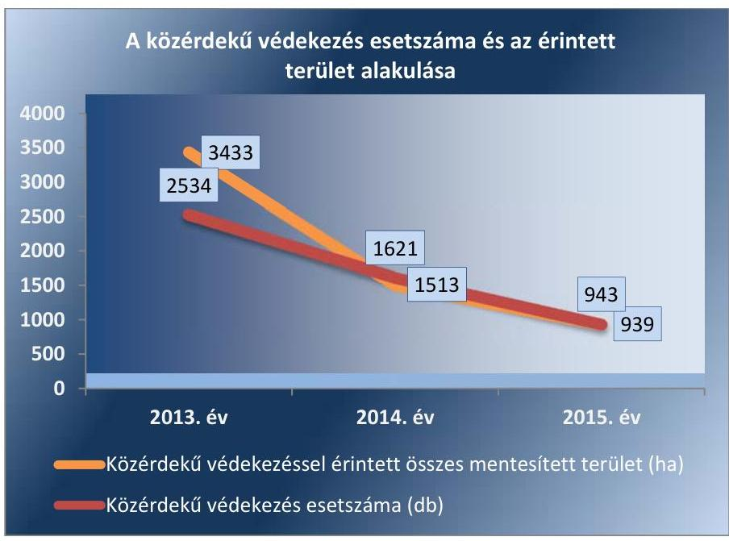

Forrás: PIR statisztikák

---

### 2.2. számú megállapítás

A parlagfű elleni védekezés kapcsán kitűzött akciótervi célok és feladatok nem valósultak meg teljes körűen.

Az akciótervben meghatározott feladatok teljesítése nem volt teljes körűen eredményes.

Az ellenőrzött időszak tekintetében rögzített célok és feladatok részletes felsorolását az 4. melléklet tartalmazza. A feladatok az alábbiak szerint valósultak meg:

## 2012-2013. ÉVEKRE ELŐÍRT FELADATOK ÉS AZOK MEGVALÓSÍTÁSA:

1. A hatósági felderítés rendjének felülvizsgálata, a belterületen a hatóság feladatainak racionalizálása, a távérzékeléses monitorozás.

Az akciótervi feladat részben valósult meg, mivel a belterületen a hatósági feladatok racionalizálása és a távérzékeléses monitorozás hatósági felderítési rendszerbe illesztése nem valósult meg. A parlagfüves területek hatósági felderítés támogatására informatikai rendszereket működtettek. A rendszereket a jelentés 2.1. pontja mutatja be. A szankcionálási rendszer változásaként az eljárásrend és jogszabály módosításról döntöttek. A jogszabály módosítás révén megemelkedett a kiszabható bírság mértéke.

Megvalósult a légi felderítés hatósági rendszerbe illesztése.
A BM a belterületi és külterületi hatósági parlagfű eljárási rendszer hatékonyabb működtetése érdekében a közérdekű védekezés és a bírságolás feladatok szétválasztásának megszüntetését javasolta. A javaslat nem valósult meg.
2. A külterületek ellenőrzése.

Az akciótervi feladat megvalósításra került, mivel a megyei kormányhivatalok a 2013-2015. években lakossági bejelentés alapján, illetve saját kezdeményezésre helyszíni ellenőrzéseket végeztek. A helyszíni ellenőrzések eredményét PIR rendszerben rögzítették.
3. A lakossági bejelentések kezelésének automatizálása.

Az akciótervi feladat megvalósult, mivel a PBR és ÖPBR rendszer kifejlesztése megtörtént. A rendszert igénybe vevő önkormányzatok tevékenysége csupán a bejelentések fogadására korlátozódott, az ÖPBR által nyújtott egyéb lehetőségeket (pl.: dokumentumsablonok használata) kettő önkormányzat vette igénybe.
4. Az ÁNTSZ Aerobiológiai Hálózat működtetése, polleninformáció szolgáltatás.

Az akciótervi feladat megvalósult, mivel az ÁNTSZ Aerobiológiai Hálózata ellátta a parlagfű légtéri koncentrációjának monitorozását és végrehajtotta a lakosság tájékoztatását.

A PPRR 2013-tól a parlagfű szezon alatt hetente tett közzé tájékoztató térképet a parlagfű pollenkoncentráció becsült országos eloszlásáról.
5. A fertőzött, pollenadó területek méretének csökkentése érdekében a közfoglalkoztatás megszervezése, elítéltek bevonása a fertőzött területek mentesítésébe.

---

Az akciótervi feladat megvalósításra került. A közfoglalkoztatás keretén belül megvalósuló parlagfű-mentesítési feladatellátás a BM irányítása alatt zajlott, melyhez az FM szakmai segítséget nyújtott.

A büntetés-végrehajtási intézetek a kezelésükben lévő zöld területeiket a fogvatartottak és a személyi állomány közreműködésével gondozták. A közfoglalkoztatásban, az elítéltek foglalkoztatásával végzett, valamint az állami területek parlagfű mentesítésének eredményessége nem ítélhető meg, mivel nem dokumentált, hogy a parlagfű elleni védekezés a tulajdonosok/használók tulajdonában/használatában álló teljes területen megtörtént-e, illetve milyen gyakorisággal történt meg a védekezés.

A 2015. évben az FM pályázati felhívást tett közzé, melynek célja a levegőben előforduló, allergiát okozó pollenkoncentráció csökkentése volt. A pályázaton nyertes civil szervezeteknek lehetőségük volt közfoglalkoztatottak alkalmazására.

Az ellenőrzött időszakban a közfoglalkoztatás keretén belül mentesített terület nagyságát és a mentesítésben közreműködők létszámát mutatja be a 10. ábra:
10. ábra
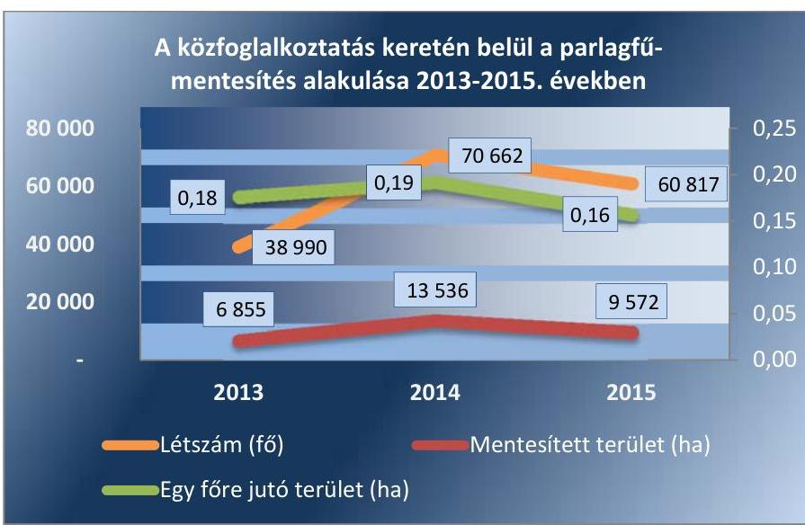

Forrás: FM 2013-2015. évre vonatkozó Akcióprogramban foglalt feladatok végrehajtásáról szóló jelentései

A 2014. évben a 2013. évhez képest jelentősen megnőtt mind a közfoglalkoztatottak létszáma, mind a parlagfű-mentesített terület, de az egy főre vetített megtisztított terület nagysága közel azonos maradt. A 2015. évben mindhárom adatban csökkenés volt megfigyelhető.
6. A mezőgazdasági, fő pollenadó területek parlagfű mentesítése érdekében a gazdálkodók részére parlagfű mentesítési és prevenciós ismeretek átadása, a hatósági felderítés fejlesztése, a növényorvos alkalmazásának vizsgálata.

Az akciótervi feladat megvalósult. Az FM több rendezvényen, szakmai napon képviseltette magát, több szervezet részére nyújtott támogatást, környezettudatosságra nevelés, szemléletformálás, a parlagfű elleni hatékony védekezés módszereinek megismertetésére.

A felderítés részét képezte a parlagfüves területek helikopterről történő felderítése. Az ellenőrzött időszakban hat megyében történt a földi

---

bejárás mellett helikopteres felderítés. A 2013-2015. években a parlagfű légi felderítések során 1,6-2,2-1,5 millió hektárnyi területet ellenőriztek.

Az Akciótervi cél elérése érdekében egyeztetés zajlott az NTI-k, az MNMNK $^{85}$ és az FM között. Ennek hatására az egyes törvényeknek agrár és környezetügyi tárgyban történő módosításáról szóló 2013. évi CCL. törvény módosította az Éltv.-t. A módosítás alapján a NÉBIH 2013. december 31-étől felhatalmazást kapott a növényvédelmi szolgáltatási tevékenységet végzők és a növényorvosok nyilvántartására. A szaktanácsadáshoz fűződő tevékenységek részletes feltételei a növényvédelmi tevékenységről szóló 43/2010. (IV. 23.) FVM rendelet módosításában kerültek kidolgozásra.
7. A parlagfű mentesítés kérdésének beépítése a Nemzeti Alaptantervbe.

A feladat a Nemzeti Alaptanterv kiadásáról, bevezetéséről és alkalmazásáról szóló 110/2012. (VI. 4.) számú Kormányrendelet megjelenésével teljesült.
8. Információ gyűjtése és tájékoztató kampányok szervezése az allergiás betegségekről.
Az akciótervi feladat teljesült, mivel az információgyűjtés érdekében az OKI betegnapló adatok és statisztikai modellek segítségével pollennapló rendszert fejlesztett ki, amelyet részletesebben a jelentés 2.1 pontja mutat be.

Az FM a tájékoztató kampányok megvalósítására több szervezettel kötött támogatási szerződést a 2013-2015. években.

# 2014-2015. ÉVEKRE ELŐÍRT FELADATOK ÉS AZOK MEGVALÓSÍTÁSA: 

9. A földtulajdonosok, mezőgazdasági termelők részére parlagfű mentesítést ösztönző rendszer kidolgozása.

A feladat végrehajtása nem valósult meg, mert a mezőgazdasági termelők részére az FM nem dolgozott ki ösztönző rendszert. Az FM által készített jelentés szerint a parlagfű-mentesítést ösztönző rendszer kidolgozásának célja a szemléletformálás megváltoztatása volt, a földtulajdonosok és földhasználók pozitív motiválásával megvalósítani területük önkéntes parlagfű-mentesítését. Ennek érdekében pályázatot írtak ki parlagfű elleni védekezést végző civil szervezetek részére, amely nem egyezett meg az akciótervi földtulajdonosok és mezőgazdasági termelők célcsoporttal.
10. A 2012-2013-ban megkezdett munkák folytatása a teljes mentesség elérése érdekében.

Az akciótervi feladat megvalósult, az NFM 2014 májusában hívta fel az állami közlekedési szolgáltató, üzemeltető és fejlesztő társaságok figyelmét a vasúti területek, közutak, autópályák, gyorsforgalmi utak mentén a gyommentesítésre. A mentesítési tevékenységet a 2014-2015. években több ütemben hajtották végre. A 2015. évtől a parlagfű mentesítési tevékenységhez hozzájárult a civil szervezeteknek nyújtott támogatás is
$\qquad$ 11. A több napon keresztül jelentkező extrém magas parlagfű pollencsúcsok megszüntetése.

Az ellenőrzött időszakban az ÁNTSZ Aerobiológiai Hálózat csapdaállomásai segítségével gyűjtött adatok alapján nem valósult meg a kitűzött cél,

---

az extrém magas parlagfű pollenkoncentrációt elérő pollencsúcsokat nem sikerült megszüntetni. Az ellenőrzött időszakban a parlagfű pollen országos napi átlagkoncentrációját és a $100 \mathrm{db} / \mathrm{m}^{3}$ koncentrációt elérő napok számát mutatja be a 11. ábra.
11. ábra
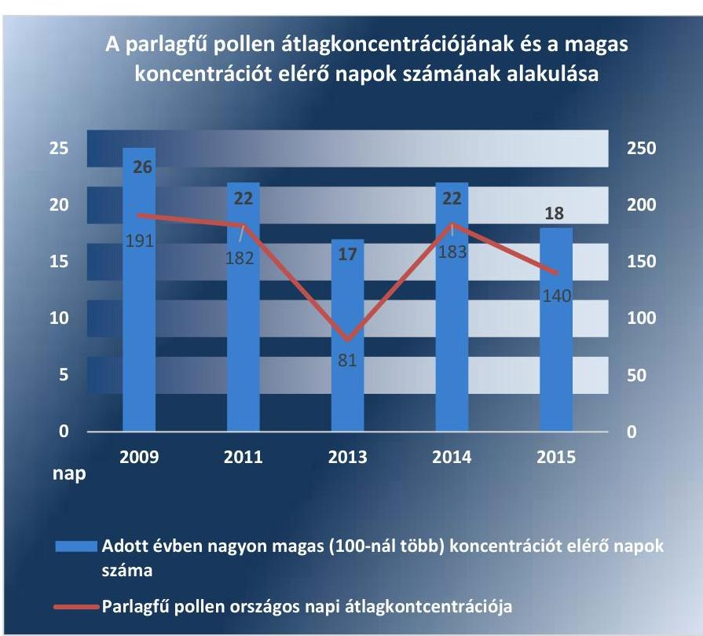

Forrás: EMMI 3. B. tanúsítvány
Az Akciótervben előírtakkal ellentétben a pollenkoncentráció drasztikus csökkentésére nem került sor.
12. Az Akcióprogram végrehajtásáról évente miniszteri beszámoló készítése.

Az Akciótervben rögzített feladatokat megvalósító miniszterek gondoskodtak az éves beszámolók elkészítéséről. A beszámolók összeállítása megtörtént, amelyeket megküldtek az FM részére.
13. A vidékfejlesztési miniszter a Kormány számára az Akcióprogramban foglalt feladatok végrehajtásáról jelentést készít.
Az érintett feladatellátók szakmai beszámolói alapján az FM összeállította az éves jelentést, melyet az FM miniszter benyújtotta a Kormány részére. A benyújtott jelentéseket a Kormány megtárgyalta és elfogadta.

# Az akciótervben a beszámolók kötelező 

adattartalmát nem rögzítették. Az elkészített beszámolók csak naturális adatokat tartalmaztak (hektár, munkanap, db, stb.). A Kormány által elfogadott jelentésekből nem állapítható meg a feladatok éves megvalósítására felhasznált pénzeszközök mértéke. A jelentések alapján

---

### 2.3. számú megállapítás

A védekezésre fordított kiadások teljes összegével kapcsolatos információ hiányosságai miatt nem lehetett értékelni, hogy a parlagfű elleni védekezésre fordított források elősegítették-e a célok megvalósítását.
nem ismerhető meg, hogy mennyi adófizetői forrást használtak fel a parlagfű elleni védekezésre, annak eredményes felhasználásáról sincs információ $^{4}$.

## A 2013-2015. években a kormányhivatalok számára a parlagfű elleni védekezést szolgáló intézkedésekhez rendelkezésre bocsátott előirányzatot nem a parlagfű elleni védekezés időszakában biztosították. Az FM a fejezeti kezelésű előirányzaton lévő forrás felhasználásán kívül egyéb források felhasználásáról nem rendelkezett információval.

A stratégiákban, Akciótervben megfogalmazott parlagfű elleni védekezésre vonatkozó célok elérése érdekében megvalósított intézkedésekhez felhasznált forrásokról az FM nem rendelkezett teljes körű információval. Az Akcióterv 2. pontjában - az érintett miniszterek részére - előírt, az Akcióterv végrehajtásáról készített beszámolók a felhasznált forrásokat nem tartalmazták.

Az FM mint a parlagfű elleni védekezés rendszerének szakmai koordinálója és irányítója nem rendelkezett információkkal a védekezésre fordított kiadások teljes összegéről, illetve az országban lévő parlagfűvel fertőzött területek nagyságáról. Így sem a döntéshozók, sem az ellenőrzés számára nem értékelhető, hogy a parlagfű elleni védekezésre fordított kiadások eredményeképpen országos szinten csökkent-e a parlagfűvel fertőzött területek nagysága.

A „Parlagfű elleni közérdekű védekezés végrehajtásának támogatása" fejezeti kezelésű előirányzaton a 2013. évben a 2012. évi kötelezettséggel terhelt maradvány igénybevételével és az előirányzat zárolását követően 163,1 M Ft előirányzat állt rendelkezésre. Az előirányzat 2014. évben a 642,0 M Ft támogatást követően 714,4 M Ft-ra nőtt. A 2015. évben az előirányzat 717,2 M Ft volt, amelynek döntő részét a 2014. évi 659,7 M Ft maradvány képezte.

Az Akciótervben és az NKP 1,2-ben megfogalmazott parlagfű elleni védekezés középtávú célkitűzései megvalósításához FM a feladat megvalósítóival megállapodásokat, támogatási szerződéseket kötött, amelyben meghatározták a feladatokat, a feladatellátás költségeihez történő hozzájárulás összegét a szerződés költségterve alapján. A kedvezményezettet az átvett előirányzat felhasználásával kapcsolatban a szerződésben meghatározott határidőre teljes körű (pénzügyi - számlával alátámasztott - és szakmai) záró elszámolási és szöveges beszámolási kötelezettség terhelte.

Az ellenőrzött időszakban
 a támogatott szervezetnek a pénzügyileg jóváírt „Parlagfű elleni közérdekű védekezés végrehajtásának támogatása" fejezeti kezelésű előirányzatból rendelkezésre bocsátott támogatásokat mutatja be a 1. táblázat:

[^0]
[^0]:    ${ }^{4}$ Az Akciótervben foglalt feladatok végrehajtásáról készült jelentések a http://elelmiszerlanc.kormany.hu/ oldalon érhetők el.

---

| 1. táblázat |  |  |  |
| :--: | :--: | :--: | :--: |
| PARLAGFŰ ELLENI KÖZÉRDEKŰ VÉDEKEZÉS VÉGREHAJTÁSÁNAK TÁMOGATÁSA" FEJEZETI KEZELÉSŰ ELŐIRÁNYZATON BIZTOSÍTOTT TÁMOGATÁSOK MEGOSZLÁSA A 2013-2015. ÉVEKBEN (MFT) |  |  |  |
| Időszak Megnevezés | 2013. év | 2014. év | 2015. év |
| Kormányhivatalok | 42,1 | 38,1 | 35,5 |
|  | $36,4^{*}$ | 0 | 20,6** |
| NÉBIH | 38,3 | 5,4 | 26,1 |
| FÖMI | 9,0 | 4,0 | 31,0 |
| BM-ORFK | - | - | 17,5 |
| Civil szervezetek | - | - | 532,1 |
| Önkormányzatok | 15,0 | 3,6 | 4,5 |
| Egyéb támogatások | 2,2 | 3,6 | 41,4 |
| Összes utalás és előirányzat átadás: | 143,0 | 54,7 | 688,1 |
| Forrás: FM adatszolgáltatás és a Megállapodások ${ }^{49}$ *2012. évről áthúzódó pénzügyi teljesítés, **A pénzügyi jóváírás 2016. évben történt |  |  |  |

A fejezeti kezelésű előirányzaton biztosított forrás az ellenőrzött időszakban évenként változóan alakult, a 2015. évi kimagasló támogatás a 2014. évben visszapótolt 642,0 M Ft-nak volt köszönhető. A Kormány 2014-ben 642,0 M Ft egyszeri átcsoportosítását rendelte el a „Parlagfű elleni közérdekű védekezés végrehajtásának támogatása" fejezeti kezelésű előirányzat javára, visszapótolva ezzel a 2011. évben más előirányzatokra átcsoportosításra került összeget.

A Kormányhivatalok az ellenőrzött időszakban a „Parlagfű elleni közérdekű védekezés végrehajtásának támogatása" fejezeti kezelésű előirányzatból a parlagfű elleni védekezéssel kapcsolatos feladatokra támogatásban részesültek. A megkötött megállapodásokat, a támogatás összegét, a jóváírás időpontját, az elszámolt, illetve elfogadott összeget és a beszámolás illetve elfogadás időpontját az 5. melléklet tartalmazza. A megállapodás időtartamát és a jóváírás időpontját összevetve kitűnik, hogy a forrás nem a feladat végrehajtás időpontjában állt a kormányhivatalok rendelkezésére. A három évben megkötött megállapodások alapján nyújtott támogatások összege - a 2012. évről áthúzódó összeg (36,4 M Ft) nélkül - 136,3 M Ft, a ténylegesen felhasznált 109,5 M Ft volt. A megkötött megállapodásokkal kapcsolatosan előforduló hiányosságok voltak:

1. Az FM a megállapodásokat, támogatási szerződéseket 2013-2014. években megkötötte, de a 48/2013. (VI. 7.) VM rendelet 9. § (2) előírásával ellentétben a lebonyolítás céljából átadásra kerülő előirányzat folyósításának ütemezését nem a kötelezettségvállalás pénzügyi finanszírozási igényének megfelelően állapították meg.
2. A 48/2013. (VI. 7.) VM rendelet - 2014. március 20-ig hatályos 49. § (4) bekezdése - szerint az előirányzat felhasználása utólagos elszámolás melletti előfinanszírozás vagy beszámolást követő utófinanszírozás formájában történt. 2014. március 20-át követően azonban az Áht. 37. § (1) bekezdés és az Ávr. 56. § előírásai szerint kötelezettséget aláírt megállapodások hiányában a kormányhivatalok szabályszerűen nem vállalhattak. A parlagfű elleni védekezés időszakában nem állt rendelkezésre a szükséges forrás. Emiatt a

---

2015. évi támogatások nagy részét nem tudták felhasználni, a támogatás 40%-a 2016. évben visszautalásra került az FM számlájára.
3. A 2013. évről a beszámolás és annak ellenőrzése több esetben nem felelt meg a határidők tekintetében a 48/2013. (VI. 7.) VM rendelet 12. § előírásainak, mert az FM részéről a beszámoló elfogadására a 2016. évben került sor.

A kormányhivatalok a közérdekű védekezés végrehajtására illetve a földhivatalok és az NTI-k a költségeinek megelőlegezésére, a 2013-2015. évekre - a megállapodások költségterve alapján - 18,0-14,6-14,4 M Ft támogatást kaptak. A 2015. évben a 2014. évi maradványból a földhivatalok 30,3 M Ft-ot fordíthattak a földhivatali felderítés során használt elektronikus, térinformatikai eszközök javítására, pótlására, az NTI-k további 5,2 M Ft-ot a közérdekű védekezés végrehajtására.

Az FM a kormányhivatalok Népegészségügyi Szakigazgatási szerveinek az Aerobiológiai hálózat fejlesztésére és működtetésére 6,1-6,0-6,2 M Ft támogatást nyújtott. A szakmai felügyeletüket ellátó OTH${ }^{87}$ - saját forrásból - 2013. évben 6,0 M Ft-ot, 2014. évben 7,0 M Ft-ot, 2015. évben 8,0 M Ft-ot biztosított az OKI-nak, mint a szakmai irányítónak az ÁNTSZ Aerobiológiai Hálózat működtetésére.

A kormányhivatalok közül hat parlagfűves foltok légi felderítésére 2013. évben 18,0 M Ft, 2014. évben 17,5 M Ft összegű támogatást kapott, ezzel segítve az előre bejelentett, kommunikált légi felderítés alkalmazását. A parlagfű légi felderítésére az NTI-k a 2013-2014. években minden esetben vállalkozói szerződéseket kötöttek.

A NÉBIH-nek az FM a 2013. évben az előző évi maradványból 30,0 M Ft-ot biztosított a PBR fejlesztésére és a működtetésére, valamint az ÖPBR kialakítására, a 2014-2015. években 4,0-4,0 M Ft-ot a rendszerek működtetésére.

A parlagfű mentesítési és prevenciós ismeretek átadására a NÉBIH az ellenőrzött időszakban 31,9 M Ft támogatásban részesült.

A FÖMI-nek az FM az ellenőrzött időszakban, minden évben a PIR rendszer működtetésére évente 4,0 M Ft-ot, 2013. évben a fejlesztéshez 5,0 M Ft-ot biztosított.

A 2015. évben az előző évi maradvány terhére az FM 27,0 M Ft-ot biztosított a FÖMI részére a feladatai végrehajtására. Így lehetőség volt a veszélyeztetett területek egy részénél elvégezni a távérzékeléses felmérést.

A civil szervezetnek nyújtott támogatást az FM 2015. évben különböző gyomszabályozási eszközök beszerzésére, a parlagfűvel szennyezett területek mentesítésére. A 164 nyertes civil szervezet 538,4 M Ft összegben megkötött támogatási szerződésekből 532,1 M Ft támogatást használt fel.

A FM pályázatán nyertes civil szervezetek további 118,3 M Ft támogatásban részesültek, mivel 277 fő közfoglalkoztatottat alkalmaztak a parlagfű irtására leginkább megfelelő 2015. július 1. és 2015. szeptember 30. közötti időszakban.

---

Több szakmai szervezet és a Jász-Nagykun-Szolnok Megye Önkormányzata kapott az ellenőrzött időszakban összesen 70,3 M Ft támogatást növénytermesztési, technológiai, parlagfű-mentesítési és prevenciós ismeretek átadására.

A közfoglalkoztatási programok keretében a parlagfűmentesítés a BM irányítása alatt a 2013. évben három, a 2014-2015. években négy ütemben történt. Az FM nyilatkozata szerint az erre a célra felhasznált forrásokról nem áll rendelkezésre információ, az - FM által összeállított - éves beszámolókban is csak a közfoglalkoztatottak létszámáról és az általuk gyommentesített területről rendelkeztek adatokkal.

A növényvédelmi bírság bevétel - az Áht. 42. § (1) bekezdése alapján - költségvetési bevételt képez, nem forrása a parlagfű elleni védekezésnek. Az ellenőrzött időszakban kiszabott és befolyt növényvédelmi bírság alakulását az 2. táblázat mutatja be:
2. táblázat

NÖVÉNYVÉDELMI BÍRSÁG ALAKULÁSA A 2013-2015. ÉVEKBEN (MFT)

| 2013. év |  |  | 2014. év |  |  | 2015. év |  |   |
| --- | --- | --- | --- | --- | --- | --- | --- | --- |
| növényvédelmi bírság |  |  |  |  |  |  |  |   |
| száma | kiszabott | befolyt | száma | kiszabott | befolyt | száma | kiszabott | befolyt  |
| db | összege | összege | db | összege | összege | db | összege | összege  |
| 2321 | 150,2 | 117,4 | 1979 | 114,4 | 110,2 | 1544 | 100,3 | 92,1  |
|   |  |  |  |  |  |  |  | 7013.  |

A 2013-2015. években az NTI-k összesen 364,9 M Ft növényvédelmi bírságot szabtak ki, amelynek 87,6%-a befolyt. A 2013. évtől minden évben csökkent a kiadott határozatok száma, a kiszabott és a befolyt bírság összege is. A határozatok számának csökkenése visszavezethető a helyszíni ellenőrzések számának csökkenésére, valamint az önkormányzatok belterületen végzett hatósági tevékenységének hiányosságaira.

---

# JAVASLATOK 

Az ÁSZ tv. 33. § (1) bekezdésében foglaltak értelmében az ellenőrzött szervezet vezetője köteles a jelentésben foglalt megállapításokhoz kapcsolódó intézkedési tervet összeállítani és azt a jelentés kézhezvételétől számított 30 napon belül az ÁSZ részére megküldeni. Amennyiben az ellenőrzött szervezet vezetője nem küldi meg határidőben az intézkedési tervet, vagy továbbra sem elfogadható intézkedési tervet küld, az Állami Számvevőszék elnöke az ÁSZ tv. 33. § (3) bekezdés a) és b) pontjaiban foglaltakat érvényesítheti.

## Földművelésügyi miniszternek

1. Annak érdekében, hogy a parlagfű elleni védekezés eredményesen járuljon hozzá a parlagfű pollen-koncentráció csökkenéséhez, illetve a parlagfűvel fertőzött területek nagyságának csökkenéséhez, intézkedjen a védekezés céljainak, rendszerének és módszereinek a tapasztalatokon és kutatási eredményeken alapuló felülvizsgálatáról.
(2.1. sz. megállapítás, 25. illetve 28. oldal alapján)
2. Gondoskodjon a védekezés rendszerétől elvárt célok megvalósításának eredményesség, hatékonyság és gazdaságosság szempontjából történő értékeléséről.
(2.2. sz. megállapítás alapján)
3. Tegyen intézkedéseket a célzott védekezés feltételeit megteremtő felderítés és az erre épülő védekezés volumenében tapasztalható romló tendencia megállítása érdekében.
(2.1. sz. megállapítás alapján)

## Nemzeti Élelmiszerlánc-biztonsági Hivatal elnökének

1. a) Tegyen intézkedéseket a feltárt szabálytalanságok tekintetében a munkajogi felelősség tisztázására irányuló eljárás megindításáról, és ennek eredménye ismeretében tegye meg a szükséges intézkedéseket.
b) A szabályszerű pénzügyi gazdálkodás érdekében intézkedjen közbeszerzési eljárás lefolytatására a jogszabályban előírt esetekben.
(1.1. sz. megállapítás, 21. oldal 4. bekezdése alapján)

---

# A fővárosi és a megyei kormányhivatalok vezetőinek 

1. A parlagfű elleni védekezés keretében intézkedjen a hatósági ellenőrzési tervek elkészítéséről.

Címzett megyei kormányhivatalok:
Borsod-Abaúj-Zemplén Megyei Kormányhivatal
Békés Megyei Kormányhivatal
Komárom-Esztergom Megyei Kormányhivatal
Pest Megyei Kormányhivatal
Somogy Megyei Kormányhivatal
Szabolcs-Szatmár-Bereg Megyei Kormányhivatal
Tolna Megyei Kormányhivatal
Vas Megyei Kormányhivatal
illetve Budapest Főváros Kormányhivatala
(1.2. sz. megállapítás, 22. oldal 1. bekezdése alapján)
2. Intézkedjen arra vonatkozóan, hogy a jogszabályi előírásoknak megfelelően a kormányhivatal kötelezze a közérdekű védekezés elmulasztóját az eljárási költségek megtérítésére.

Címzett megyei kormányhivatalok:
Heves Megyei Kormányhivatal
Pest Megyei Kormányhivatal
(1.2. sz. megállapítás, 23. oldal 2. számú alpontja alapján)
3. Intézkedjen annak érdekében, hogy a közérdekű védekezést elrendelő hatóság a jogszabályok szerint térítse vissza az előirányzatba a földhasználó által befizetett összeget.

Címzett megyei kormányhivatalok:
Borsod-Abaúj-Zemplén Megyei Kormányhivatal
Hajdú-Bihar Megyei Kormányhivatal
Komárom-Esztergom Megyei Kormányhivatal
Somogy Megyei Kormányhivatal
Tolna Megyei Kormányhivatal
Vas Megyei Kormányhivatal
Zala Megyei Kormányhivatal
(1.2. sz. megállapítás, 23. oldal 4. számú alpontja alapján)

---

# Helyi önkormányzatok jegyzőinek 

1. A parlagfű elleni védekezés keretein belül, a jogszabályi előírásoknak megfelelően végezze el a területek helyszíni ellenőrzését.

Címzett önkormányzatok:
Balatonboglár Városi Önkormányzat
Rádóckölked Község Önkormányzata
Sarkadkeresztúr Község Önkormányzata
Szentes Város Önkormányzata
Veresegyház Város Önkormányzata
(1.2. sz. megállapítás, 22. oldal 2. bekezdése alapján)
2. A parlagfű elleni védekezési kötelezettség betartásának helyszíni ellenőrzése során a jogszabályi előírások alapján vegyen fel jegyzőkönyvet.

Címzett önkormányzatok:
Apc Községi Önkormányzat
Aranyosapáti Község Önkormányzata
Balatonboglár Városi Önkormányzat
Balatongyörök Község Önkormányzata
Bánk Község Önkormányzata
Miskolc Megyei Jogú Város Önkormányzata
Sarkadkeresztúr Község Önkormányzata
Sárbogárd Város Önkormányzata
Sopron Megyei Jogú Város Önkormányzata
Szentes Város Önkormányzata
Tata Város Önkormányzata
Veresegyház Város Önkormányzata
(1.2. sz. megállapítás, 22. oldal 1. számú alpontja alapján)
3. Intézkedjen arról, hogy a helyszíni ellenőrzések jegyzőkönyveinek adattartalma megfeleljen a jogszabályi előírásoknak.

Címzett önkormányzatok:
Hajdúsámson Város Önkormányzata
Pincehely Nagyközség Önkormányzata
Tata Város Önkormányzata
(1.2. sz. megállapítás, 22. oldal 2. számú alpontja alapján)

---

4.
 Minden olyan esetben rendeljen el közérdekű védekezést, amikor a földhasználó nem tesz eleget a jogszabályban meghatározott, parlagfű elleni védekezéssel kapcsolatos kötelezettségének.

Címzett önkormányzatok:
Balatonboglár Városi Önkormányzat
Hajdúsámson Város Önkormányzata
Pincehely Nagyközség Önkormányzata
Szentes Város Önkormányzata
Tata Város Önkormányzata
Veresegyház Város Önkormányzata
(1.2. sz. megállapítás, 22. oldal 3. számú alpontja alapján)
5. Kötelezze termelőt, illetve a földhasználót a közérdekű védekezéssel kapcsolatos eljárás költségeinek jogszabály szerinti megtérítésére.

Címzett önkormányzat:
Pincehely Nagyközség Önkormányzata
(1.2. sz. megállapítás, 23. oldal 5. számú alpontja alapján)
6. A jegyzőkönyv jogszabálysértésre vonatkozó információkat tartalmazó részének megküldésével kezdeményezze a hatáskörrel rendelkező hatóságnál a növényvédelmi bírság kiszabás eljárását.

Címzett önkormányzatok:
Hajdúsámson Város Önkormányzata
Miskolc Megyei Jogú Város Önkormányzata
Mohács Város Önkormányzata
Pincehely Nagyközség Önkormányzata
(1.2. sz. megállapítás, 23. oldal 6. számú alpontja alapján)

---

# MELLÉKLETEK 

- I. SZ. MELLÉKLET: FOGALOMTÁR

30 pollenszem $/ \mathrm{m}^{3}$
aerobiológia
allergia
allergiás rhinitis
asztma

A 30 pollenszem $/ \mathrm{m}^{3}$ pollenszám feletti légtéri koncentráció a parlagfű pollenre súlyosan érzékenyek számára már állandó, kisebb erősségű tüneteket okoz, de a kevésbé érzékenyek is számíthatnak a kezdeti tünetek megjelenésére. Ez esetben minden parlagfűre allergiás személy kisebb-nagyobb mértékben érintett. A $30 \mathrm{db} / \mathrm{m}^{3}$ nemzetközileg is a „high" kategória alsó határaként elfogadott. Kommunikációja a PPRR 2015. évtől bevezetett rendszere szerint: „I. fokú riasztás lépett érvénybe". (OKI Aerobiológiai és Pollenmonitorozási Osztály pollenjelentései)
A levegőben található, biológiai eredetű részecskéket vizsgáló tudomány. Az aerobiológia a biológia egyik ága, mely a légkörben passzívan szállítódó biológiai eredetű részecskék (baktériumok, gomba spórák, virágpor szemek, magok, kisméretű rovarok és vírusok) vizsgálatával foglalkozik. Az aerobiológia két fő ága a beltéri és a kültéri levegő vizsgálatára terjed ki. A beltéri aerobiológia lakások, irodaházak, raktárak, barlangok, üvegházak stb. levegőjének vizsgálatát végzi. A kültéri aerobiológia főként városok, mezőgazdasági területek, komposztálóüzemek stb. levegőjében található részecskék gyűjtésével, koncentrációjának meghatározásával, biometeorológiai összefüggéseinek vizsgálatával, a várható koncentráció ill. szezonkezdet előrejelzésével foglalkozik. Az aerobiológiai hálózatok világszerte a kültéri levegő allergén pollen koncentrációjának monitorozását végzik pollencsapdák segítségével, melynek eredményeit pollenjelentéseikben teszik közzé. (https://hu.wikipedia.org/wiki/Aerobiológia)
Az allergia az immunrendszer helytelen működése következtében kialakuló reakció. Környezetünkben megtalálható, egyébként ártalmatlan anyagokra (allergiát okozó anyagok/allergének) az immunrendszer fokozottan reagál. Nem velünk született, hanem szerzett reakció, mely bármely életkorban jelentkezhet. Az allergénnel való találkozáskor a szervezet ellenanyagokat (antitesteket) termel. Amikor a szervezet ismételten találkozik az allergénnel, kialakul az allergiás reakció. Az allergén kapcsolódik az ellenanyaghoz, s ennek hatására az allergiás beteg bizonyos sejtjeiből olyan anyagok (pl. hisztamin) szabadulnak fel, melyek tüneteket okoznak. Az allergia különböző betegségeket okozhat (allergiás nátha, allergiás kötőhártyagyulladás, asztma, csalánkiütés, gyomor-bélrendszeri panaszok, atópiás dermatitisz, anafilaxiás sokk, idegrendszeri tünetek - fejfájás, ingerlékenység, depresszió - , ízületi- és izomfájdalmak). Ezek a betegségek megjelenhetnek egyenként, egymást követve, de gyakran társulnak is. Az allergiás betegségek nagyon gyakoriak, a lakosság 10-15\%-át érintik. A WHO előrejelzése szerint 10 év múlva minden második ember allergiás lesz a Földön. (http://www.allergiadoktor.com/index.php?oldal=allergia/meghatarozas.html)
Szénanátha
Az asztma a légutak krónikus gyulladásával járó betegség. A hörgő-rendszerben zajló krónikus gyulladás miatt a hörgők túlérzékennyé válnak, s a legkisebb ingerlő hatásra a hörgőfal simaizmai görcsösen összehúzódnak, a nyálkahártya megduzzad, a hörgők keresztmetszete beszűkül, sűrű, tapadós nyák zárja el a levegő útját. Fajtái: allergiás (gyermekkorban a betegek 90\%-a, felnőttkorban kb. fele), nem allergiás. (http://www.allergiadoktor.com/index.php?oldal=kohoges/okok/asztma.html)

---

asztmás megbetegedések

BNO kód
drón
élelmiszerlánc
élelmiszerlánc-esemény
élelmiszerlánc-felügyeleti szerv
éves átlagos össz-pollenszám (db/m³/év)
helyszíni ellenőrzés
invazív növény
kötelező védekezés
közérdekű védekezés
növényvédelmi bírság

Járóbeteg-szakellátás és gondozás keretében kezelt, parlagfű érzékenységgel összefüggésbe hozható, J4500 Főként allergiás asthma, J4580 Kevert asthma, J4590 Asthma, k.m.n., J46HO Status asthmaticus.
Betegségek Nemzetközi Osztályozása - kódrendszer
Távirányítással működő, pilóta nélküli légi jármű (lehet repülőgép, helikopter, stb.)
Azon folyamatok összessége, melyek szereplői közvetlen vagy közvetett hatással vannak az élelmiszerre a talajvédelem, agrár-környezetvédelem, növénytermesztés, növény-egészségügy, növényvédelem, az engedélyköteles termék és az állatgyógyászati termék előállítása, forgalomba hozatala és felhasználása, az élelmiszer- és takarmány-előállítás, szállítás, tárolás és forgalomba hozatal, felhasználás, az állat tartása, szállítása, forgalomba hozatala, az állat-egészségügy, a növényi és állati eredetű melléktermék kezelés, tárolás, szállítás, forgalomba hozatal és felhasználás során (Éltv. melléklet 21. pont)
Az élelmiszerláncban bekövetkező olyan e törvény hatálya alá tartozó esemény, mely az élelmiszerlánc-felügyeleti szerv hatósági intézkedését teszi szükségessé (Éltv. melléklet 22. pont)
Nemzeti Élelmiszerlánc-biztonsági Hivatal (NÉBIH) (22/2012. (II. 29.) Korm. rendelet) Megyei Kormányhivatalok Élelmiszerlánc-biztonsági és Állategészségügyi Igazgatóságai (ÉBÁl)
A 24 órás átlag parlagfű légköri pollenkoncentrációt 19 pollenmonitorozó állomás méri. A mérési adatok állomásonként összeadásra kerülnek, majd ezen 19 összeg átlagolása történik. Ez az érték megadja, hogy országosan átlagban mekkora volt a parlagfű adott évi össz-pollenkoncentrációja azokon napok figyelembe vételével, amikor a levegőben lévő össz-pollenszám az 1\%-ot elérte, egészen addig, amikor már csak 1\% össz-pollenszám volt jelen a légtérben.
Az Éltv. 17. § (4) bekezdésében foglaltak betartásának ellenőrzése érdekében saját kezdeményezésre vagy bejelentés alapján külterületen az ingatlanügyi hatóság (Kormányhivatal Földhivatala), belterületen a jegyző végez (Élvhr. 3. § (1) bek., 4. § (1) bek.)
Olyan növényfaj, ami az új területre kerülve hamar elterjed. (http://idegen-szavak-szotara.hu/invazív-jelentése)
Az élelmiszerlánc-felügyeleti szerv által elrendelt állami, közérdekű vagy termelői védekezés. (Éltv. melléklet 39. pont)
Közérdekű védekezést kell elrendelni, ha a termelő, illetve a földhasználó védekezési kötelezettségének az azt elrendelő hatósági határozat ellenére sem tesz határidőre eleget, illetve ha a földhasználó az Éltv. 17. § (4) bekezdésében szereplő parlagfű elleni védekezési kötelezettségének nem tesz eleget. A közérdekű védekezést az élelmiszerlánc-felügyeleti szerv rendeli el. A parlagfű elleni közérdekű védekezés abban az esetben rendelhető el, ha az adott területen a kultúrnövény tőszáma nem éri el az agronómiailag indokolt tőszám 50\%-át és a parlagfűvel való felületi borítottság a 30\%-ot meghaladja. A parlagfű elleni közérdekű védekezés során az érintett kultúrában okozott károkért a földhasználó kártalanításra nem tarthat igényt. (Éltv. 50. § (1), (6) bek.)
A közérdekű védekezést célirányosan, költségtakarékosan, hatékonyan és a lehető legkisebb környezeti károsodással járó eljárással kell elvégezni. (Élvhr. 2. § (2) bek.)
Növényvédelmi bírságot kell kiszabni azzal szemben, aki a 17. § (4) bekezdésében előírt, a parlagfű elleni védekezési kötelezettségét elmulasztja (Éltv. 60. § (1) bek. c) pont; 194/2008. (VII. 31.) korm. rendelet 3-5. §, 1. sz. melléklet)

---

parlagfű elleni védekezési kötelezettség
parlagfű pollen országos napi átlagkoncentráció ( $\mathrm{db} / \mathrm{m}^{3} / \mathrm{nap}$ )
parlagfű szezon teljes hossza
szénanátha
szénanáthások/allergiás megbetegedések
szenzitizáció
veszélyeztetett terület

A földhasználó köteles az adott év június 30. napjáig az ingatlanon a parlagfű virágbimbójának kialakulását megakadályozni, és ezt követően ezt az állapotot a vegetációs időszak végéig folyamatosan fenntartani. (Éltv. 17. § (4) bek.)
A 19 állomáson a 24 órás mérési adatok átlagolása. Az állomásonként kapott értékek összege kerül elosztásra az állomások számával, azokon napok figyelembe vételével, amikor a levegőben lévő össz-pollenszám az 1\%-ot elérte, egészen addig, amikor már csak 1\% össz-pollenszám volt jelen a légtérben
Az az időszak, amelyben a mért össz-pollenszám már elérte, vagy meghaladta az abszolút szezonkezdet - az éves pollenszám 1\%-át. A mért adatok alapján a szezon végén történik meg a szezon hosszának megállapítása, amely a levegőben lévő össz-pollenszám 1\%-ának elérésével kezdődik és akkor fejeződik be, amikor már csak 1\% össz-pollenszám van jelen a légtérben. Ez alapján a parlagfű pollenszezonja július végén kezdődik és az első fagyokig tart. (EMMI tájékoztatója)
A pollenek és penészspórák belélegzésekor keletkező allergia. (http://www.informed.hu/betegsegek/gyacs/allergy/?article_hid=39368) A beszívott levegő a benne lévő allergén pollenekkel először a felső légutakba, az orr- és szájüregbe kerül, ahol - a korábban már az adott pollenre érzékennyé vált szervezetben - erős immunreakció jön létre. A leggyakoribb időszakos szénanáthát kiváltó allergének: parlagfű, fekete üröm, fűfélék, nyári gyomok, tavasszal virágzó fák, macskaallergén, kutyaszőr. (http://www.jumed.hu/szakteruletek/allergologia/szenanatha.html)
Járóbeteg-szakellátás és gondozás keretében kezelt, parlagfű érzékenységgel összefüggésbe hozható, H1010 Heveny atopiás kötőhártya-gyulladás, H1030 Heveny kötőhártya-gyulladás, k.m.n., J3010 Allergiás rhinitis pollentől, J3020 Egyéb szezonális allergiás rhinitis, J3030 Egyéb allergiás rhinitis, J3040 Allergiás rhinitis, k.m.n., T7840 Allergia, k.m.n.

Érzékenység, egy adott ingerre egyre erőteljesebb a viselkedés-változás. (http://www.mimi.hu/pszichologia/szenzitizacio.html)
Parlagfű-veszélyeztetett területnek azon külterületi fekvésű területek minősülnek, amelyeken az űrfelvételek távérzékeléses kiértékelése és a korábbi helyszíni ellenőrzések tapasztalatai alapján a tárgyévi parlagfű-fertőzöttség valószínűsíthető, a veszélyeztetett területeket a Földmérési és Távérzékelési Intézet (a továbbiakban: FÖMI) megfigyelő rendszerben azonosítja, és azokról veszélyeztetettségi térképet készít (Élvhr. 4. § (2-3) bek.)

---

II. SZ. MELLÉKLET: AZ ELLENŐRZÖTT TERÜLETEK ÉS AZ ELLENŐRZÉSRE FORDÍTOTT NAPOK SZÁMA A 2013-2015. ÉVEKBEN

| Megnevezés | Ellenőrzött terület nagysága (ha) |  |  | Helyszíni ellenőrzésre fordított napok száma (nap) |  |  |
| :--: | :--: | :--: | :--: | :--: | :--: | :--: |
|  | 2013 | 2014 | 2015 | 2013 | 2014 | 2015 |
| Budapest | 1470 | 1294 | 1689 | 28 | 31 | 28 |
| BAMKH | 106697 | 103128 | 94251 | 107 | 124 | 106 |
| BKMKH | 529084 | 547020 | 468364 | 162 | 152 | 141 |
| BÉMKH | 83335 | 165462 | 139013 | 78 | 158 | 139 |
| BAZMKH | 146636 | 223401 | 188942 | 119 | 105 | 97 |
| CSMKH | 133233 | 139873 | 114847 | 111 | 98 | 90 |
| FMKH | 581897 | 510308 | 485668 | 92 | 98 | 99 |
| GYMSMKH | 382815 | 564976 | 334485 | 83 | 89 | 68 |
| HBMKH | 115790 | 29916 | 137482 | 58 | 52 | 72 |
| HMKH | 108789 | 40017 | 26376 | 108 | 77 | 70 |
| JNSZMKH | 118494 | 139248 | 145355 | 76 | 93 | 73 |
| KEMKH | 54564 | 73095 | 52425 | 57 | 64 | 60 |
| NMKH | 120539 | 106071 | 128464 | 53 | 41 | 45 |
| PMKH | 511450 | 104232 | 139640 | 239 | 253 | 249 |
| SMKH | 369839 | 204695 | 293602 | 83 | 92 | 74 |
| SZSZBMKH | 290521 | 404705 | 338611 | 114 | 98 | 72 |
| TMKH | 95438 | 94888 | 69738 | 100 | 95 | 88 |
| VMKH | 87095 | 62850 | 71814 | 74 | 65 | 75 |
| VEMKH | 104329 | 36988 | 56260 | 69 | 56 | 61 |
| ZMKH | 179216 | 211922 | 200023 | 101 | 99 | 104 |
| Összesen | 4121231 | 3764089 | 3487049 | 1912 | 1940 | 1811 |

---

III. SZ. MELLÉKLET: HELYSZÍNI ELLENŐRZÉSI JEGYZŐKÖNYVEK ÖSSZESÍTÉSE A 2013-2015. ÉVEKBEN

| Időszak/   Kormány-   hivatalok | Helyszíni ellenőrzéssel érintett területek |  |  |  |  |  |  |  |  |
| :--: |

 :--: | :--: | :--: | :--: | :--: | :--: | :--: | :--: | :--: |
|  | 2013. év |  |  | 2014. év |  |  | 2015. év |  |  |
|  | száma | ebből   fertőzött | ebből   fertőzött   terület | száma | ebből   fertőzött | ebből   fertőzött   terület | száma | ebből   fertőzött | ebből   fertőzött   terület |
|  | (db) | (db) | (ha) | (db) | (db) | (ha) | (db) | (db) | (ha) |
| Budapest | 36 | 26 | 14,4713 | 88 | 58 | 62,9631 | 50 | 37 | 13,1657 |
| BAMKH | 234 | 210 | 452,5326 | 169 | 146 | 275,3056 | 138 | 135 | 258,5437 |
| BKMKH | 224 | 212 | 237,6757 | 218 | 188 | 241,4278 | 220 | 149 | 142,4773 |
| BÉMKH | 40 | 38 | 119,5839 | 44 | 37 | 35,3602 | 62 | 43 | 21,9944 |
| BAZMKH | 188 | 126 | 207,6957 | 158 | 97 | 156,4131 | 95 | 60 | 98,7176 |
| CSMKH | 135 | 127 | 91,273 | 145 | 72 | 39,6024 | 58 | 46 | 38,5075 |
| FMKH | 99 | 91 | 125,8598 | 103 | 98 | 161,4118 | 70 | 39 | 56,8073 |
| GYMSMKH | 144 | 140 | 429,838 | 56 | 56 | 149,8474 | 70 | 45 | 232,9413 |
| HBMKH | 230 | 153 | 334,0639 | 161 | 96 | 220,7816 | 83 | 76 | 117,5366 |
| HMKH | 143 | 134 | 233,477 | 203 | 200 | 298,0879 | 154 | 154 | 266,6069 |
| JNSZMKH | 120 | 104 | 57,8749 | 108 | 88 | 63,3987 | 37 | 27 | 15,7125 |
| KEMKH | 65 | 59 | 89,1252 | 70 | 52 | 202,8809 | 40 | 25 | 39,8873 |
| NMKH | 39 | 20 | 65,4163 | 33 | 21 | 30,4332 | 28 | 15 | 45,9174 |
| PMKH | 317 | 285 | 716,7929 | 229 | 206 | 490,8658 | 510 | 326 | 734,5746 |
| SMKH | 221 | 216 | 1590,7802 | 158 | 150 | 542,767 | 162 | 105 | 406,1053 |
| SZSZBMKH | 199 | 189 | 299,8252 | 187 | 176 | 294,9079 | 102 | 97 | 167,521 |
| TMKH | 119 | 116 | 41,3397 | 115 | 111 | 66,5212 | 127 | 125 | 143,107 |
| VMKH | 107 | 94 | 301,7978 | 34 | 26 | 108,8443 | 111 | 63 | 241,976 |
| VEMKH | 79 | 45 | 54,5491 | 56 | 47 | 39,1619 | 84 | 41 | 160,1598 |
| ZMKH | 104 | 74 | 162,9617 | 104 | 78 | 96,8995 | 193 | 140 | 151,8499 |
| Összesen: | 2843 | 2459 | 5626,9339 | 2439 | 2003 | 3577,8813 | 2394 | 1748 | 3354,1091 |

Forrás: FM odatszolgáltatás (PIR adatok)

---

# 1230/2012. (VII.6.) Korm. határozat Magyarország Parlagfű Elleni Rövid és Középtávú Védekezési Akciótervéről 

1. A 2012–2015-ös időszakra vonatkozó, Magyarország Parlagfű Elleni Rövid és Középtávú Védekezési Akcióterve keretében a Kormány az alábbi célokat és feladatokat határozza meg.
1.1. 2012–2013. évek vonatkozásában
1.1.1. Felül kell vizsgálni a lakosságot érő pollenterhelés csökkentése érdekében a parlagfüves területek hatósági felderítési rendjét, és egyszerűbb, hatékonyabb eljárási és szankcionálási rendszert kell kidolgozni. A belterületi parlagfű-felderítéssel és a közérdekű védekezés elrendelésével kapcsolatos feladatokat racionalizálni kell. A távérzékeléses monitorozási módszereket a hatósági felderítési rendszerbe kell illeszteni.
1.1.2. A megyei kormányhivatalok feladat- és hatáskörrel rendelkező szakigazgatási szerveinek júliustól szeptemberig folyamatosan ellenőriznie kell a külterületek parlagfű mentességét.
1.1.3. A lakossági bejelentések kezelésének automatizálása, a hatósági eljárás transzparenciájának biztosítása érdekében meg kell vizsgálni külterületeken a Lakossági Parlagfű Bejelentő Rendszer bevezetésének lehetőségét, a Magyarország 2012. évi központi költségvetéséről szóló 2011. évi CLXXXVIII. törvény XII. Vidékfejlesztési Minisztérium fejezet Agrár célelőirányzatok 10. jogcímcsoportján a „Parlagfű elleni közérdekű védekezés végrehajtásának támogatása" előirányzaton rendelkezésre álló források felhasználásával.
1.1.4. Elengedhetetlen cél a parlagfű pollenterhelés monitorozása és ennek érdekében az ÁNTSZ Aerobiológia Hálózat működtetése. Erre való tekintettel
a) fenn kell tartani és fejleszteni kell a pollenmonitorozó hálózatot,
b) fenn kell tartani, illetve javítani kell a polleninformációs szolgáltatást.
1.1.5. A fertőzött, pollenadó területek méretének csökkentése érdekében, a közfoglalkozásban rendelkezésre álló források bevonásával, az állami és önkormányzati tulajdonban álló területeken meg kell szervezni a vagyonkezelőkkel együttműködve a folyamatos parlagfű mentesítést. Meg kell vizsgálni az elítéltek foglalkoztatásának lehetőségét a fertőzött területek mentesítése tekintetében. A közterületek parlagfű/gyommentességét végző alkalmazottaknak munka- és egészségügyi alkalmassági vizsgálaton kell átesniük, a biztonságos munkavégzés feltételeinek megteremtése mellett.
1.1.6. Kiemelt cél a mezőgazdasági, fő pollenadó területek parlagfű mentesítése. Ennek érdekében
a) a szakmaközi szervezetek aktív bevonásával növénytermesztési, technológiai, parlagfű mentesítési és prevenciós ismereteket kell átadni a gazdálkodóknak,
b) fejleszteni kell a hatósági felderítési és szankcionálási eljárást előre bejelentett, kommunikált légi felderítés alkalmazásával, az érintett megyei kormányhivatalok feladat- és hatáskörrel rendelkező szakigazgatási szervei számára rendelkezésre álló 2011. évi előirányzatból származó, kötelezettségvállalással terhelt maradvány forrás felhasználásával,
c) meg kell vizsgálni a kötelező növényorvos szakirányító alkalmazásának lehetőségét adott területnagyságot meghaladó gazdálkodók esetén.
1.1.7. A parlagfű mentesítés kérdését be kell építeni a Nemzeti Alaptantervbe. A kerettantervek természettudományos fejezeteiben kiemelten kell foglalkozni a parlagfű felismerésével, biológiájával és az ellene való védekezés fontosságával. Be kell építeni a nevelési és oktatási tananyagba az egészségnevelés terén kiemelt szerepet játszó, az allergiát okozó növényzet elleni hatékony védekezéssel, prevencióval kapcsolatos alapismereteket.
1.1.8. Információt kell gyűjteni és tájékoztató kampányokat kell szervezni az allergiás betegségekről, a megelőzés módszereiről és az allergia megfelelő kezelésének lehetőségeiről.
1.2. 2014–2015-ös évek
1.2.1. Ki kell dolgozni a földtulajdonosok, mezőgazdasági termelők részére a parlagfű mentesítést ösztönző rendszert, amely a szankciók megtartása mellett segíti a parlagfű mentesség elérését.
1.2.2. A 2012–2013-ban megkezdett munkát a teljes mentesség elérése érdekében folytatni kell, különös figyelemmel az állami és az önkormányzati mezőgazdasági területek, a vasútvonalak és a közutak mentén, továbbá egyéb, állami és önkormányzati kezelésben lévő területek vonatkozásában, kiegészítve a szerzett tapasztalatok alapján szükséges intézkedésekkel.
1.2.3. Az elmúlt években gyakori, több napon keresztül jelentkező extrém magas parlagfű pollenkoncentrációt elérő pollencsúcsokat meg kell szüntetni, a pollenkoncentrációt drasztikusan csökkenteni kell.
2. A kormány felhívja az érintett minisztereket, hogy e kormányhatározatban foglalt Akcióprogram végrehajtásáról évente készítsenek beszámolót.
3. A kormány felhívja a vidékfejlesztési minisztert, hogy a 2. pont szerinti beszámolók alapján készítsen jelentést a Kormány számára az Akcióprogramban foglalt feladatok végrehajtásától.

---

### V. SZ. MELLÉKLET: AZ FM ÉS A KORMÁNYHIVATALOK KÖZÖTT 2013–2015. ÉVEKBEN MEGKÖTÖTT MEGÁLLAPODÁSOK ALAPIÁN A PARLAGFŰ ELLENI VÉDEKEZÉSSEL KAPCSOLATOS FORRÁSOK ALAKULÁSA (FT)

|  Megállapodás időtartama | 2013.01.01.–2014.06.30. |  |  |  |  | 2014.01.01–2015.06.30. |  |  |  |  | 2015.07.28–2015.12.31./2015.07.01–2016.06.30. |  |  |   |
| --- | --- | --- | --- | --- | --- | --- | --- | --- | --- | --- | --- | --- | --- | --- |
|  Jóváhagyás |  |  |  |  |  |  |  |  |  |  |  |  |  |   |
|  Dátum: |  | 2013.10.14. |  |  |  |  | 2014.07.25. |  |  |  |  | 2015.12.31. |  |   |
|  Kormányhivatalok | támogatási megállapodás | összege | elszámolás/ elfogadás dátuma | elszámolt/ elfogadott összeg | elfogadás aránya | támogatási megállapodás | összege | elszámolás/ elfogadás dátuma | elszámolt/ elfogadott összeg | elfogadás aránya | támogatási megállapodás | összege | elszámolás/ elfogadás dátuma | elszámolt/ elfogadott összeg  |
|  BAMKH | 2013.09.24. Élff- 699/1/2013 | 3 050 000 | 2015.02.11. / 2016.01.15. | 2 633 921 | 86,4% | 2015.03.12. Élff- 1016/1/2014 | 2 600 000 | 2015.07.22 | 2 600 000 | 100,0% | 2015.12.12. Élff- 1026/1/2015 | 1 500 000 | 2016.06.28 | 707 567  |
|   |  |  |  |  |  |  |  |  |  |  | 2015.12.22. Élff- 1021/1/2015 | 1 800 000 | 2016.07.28 | 1 623 109  |
|   |  |  |  |  |  |  |  |  |  |  | 2015.12.09. Élff- 1026/2/2015 | 1 500 000 | 2016.01.13 | 419 762  |
|  BKMKH | 2013.09.24. Élff- 699/2/2013 | 5 590 000 | 2015.12.23 | 5 240 150 | 93,7% | 2014.12.31. Élff- 1016/4/2014. | 4 960 000 | 2016.06.10 | 4 626 096 | 93,3% | 2015.12.10. Élff- 1026/2/2015 | 1 500 000 | 2016.01.13 | 419 762  |
|   |  |  |  |  |  |  |  |  |  |  | 2015.12.10. Élff- 1021/2/2015 | 1 160 000 | 2016.07.21 | 0  |
|   |  |  |  |  |  |  |  |  |  |  | 2015.12.11. Élff- 1026- 3/2015. | 1 900 000 | 2016.01.14 | 1 500 000  |
|  BMKH | 2013.09.24. Élff- 699/3/2013 | 295 000 | 2014.07.14 | 295 000 | 100,0% | 2015.03.17. Élff- 1016/2/2014. | 310 000 | 2015.07.31 | 310 000 | 100,0% | 2015.12.08. Élff- 1021/3/2015 | 760 000 | 2016.07.27 | 479 865  |
|   |  |  |  |  |  |  |  |  |  |  | 2015.12.08. Élff- 1021/3/2015 | 760 000 | 2016.07.27 | 479 865  |
|  BAZMKH | 2013.09.24. Élff- 699/4/2013 | 2 030 000 | 2014.07.14 / 2015.12.28. | 1 846 104 | 90,9% | 2014.12.31. Élff-

 1016/3/2014. | 1 540 000 | 2015.07.28 | 1 527 047 | 99,2% | 2015.12.09. Élő- 1026/4/2015 | 2 300 000 | 2016.01.14 / 2016.04.16 | 474 539  |
|   |  |  |  |  |  |  |  |  |  |  | 2015.12.10. Élő- 1021/4/2015 | 1 290 000 | 2016.07.25 | 483 917  |

---

|  Mégállapodás időtartama | 2013.01.01.-2014.06.30. |  |  |  |  | 2014.01.01-2015.06.30. |  |  |  |  | 2015.07.28-2015.12.31./ 2015.07.01-2016.06.30. |  |  |   |
| --- | --- | --- | --- | --- | --- | --- | --- | --- | --- | --- | --- | --- | --- | --- |
|  Jóváírás | 2013.10.14. |  |  |  |  | 2014.07.25. |  |  |  |  | 2015.12.31. |  |  |   |
|  dátuma: |  |  |  |  |  |  |  |  |  |  |  | 2016.02.25. |  |   |
|  Kormány | támogatási | összege | elszámolás/ elfogadás | elszámolt/ elfogadott | elfogadás | támogatási | összege | elszámolás/ elfogadás | elszámolt/ elfogadott | elfogadás | elszámolt/ elfogadott |  | elszámolt/ | elfogadás  |
|  hivatalok | magállapodás |  | dátuma |  |  |  |  | dátuma |  |  |  | dátuma | dátuma | dátuma  |
|  CSMKH | 2013.09.24. Élő- 699/5/2013 | 725000 | 2014.07.30 | 590000 | 81,4% | 2015.03.13. Élő- 1016/5/2014. | 740000 | 2015.07.30 | 528116 | 71,4% | 2015.12.11. Élő- 10265/2015. | 1900000 | 2016.01.14
/
2016.06.23 | 1000760  |
|   |  |  |  |  |  |  |  |  |  |  | 2015.12.17. Élő- 1021/5/2015 | 1190000 | 2016.07.28 | 590000  |
|   |  |  |  |  |  |  |  |  |  |  |  |  |  | 49,6%  |
|  FMKH | 2013.09.24. Élő- 699/6/2013 | 3430000 | 2015.02.16
/
2016.02.16. | 3281623 | 95,7% | 2015. 03. 13. Élő- 1016-7/2014. | 3280000 | 2015.07.23 | 3280000 | 100,0% | 2015. 12. 12. Élő- 10266/2015 | 1800000 | 2016.01.13 | 1466071  |
|   |  |  |  |  |  |  |  |  |  |  | 2015. 12. 18., Élő- 1021/6/2015 | 860000 | 2016.07.19 | 604230  |
|  GYMSMKH | 2013.09.24. Élő- 699/7/2013 | 5425000 | 2014.07.25
/
2016.02.05. | 5425000 | 100,0% | 2015. 03. 18. Élő- 1016/6/2014. | 5190000 | 2015.07.23 | 4995595 | 96,3% | 2015. 12.10. Élő-10267/2015. | 1800000 | 2016.01.13 | 1800000  |
|   |  |  |  |  |  |  |  |  |  |  | 2015. 12. 10. Élő- 1021/7/2015. | 1290000 | 2016.06.23 | 0  |
|  HBMKH | 2013.09.24. Élő- 699/8/2013 | 250000 | 2014.07.28 | 250000 | 100,0% | 2014.12.31. Élő- 1016/8/2014. | 260000 | 2015.07.27 | 260000 | 100,0% | 2015.12.21. Élő- 1026/8/2015 | 1600000 | 2016.01.15
/
2016.05.31 | 895925  |
|   |  |  |  |  |  |  |  |  |  |  | 2015.12.21. Élő- 1021/8/2015 | 1060000 | 2016.07.28 | 1060000  |

---

|  Mégállapodás időtartama | 2013.01.01.-2014.06.30. |  |  |  |  | 2014.01.01-2015.06.30. |  |  |  |  | 2015.07.28-2015.12.31./ 2015.07.01-2016.06.30. |  |  |   |
| --- | --- | --- | --- | --- | --- | --- | --- | --- | --- | --- | --- | --- | --- | --- |
|  Jóváírás dátuma: | 2013.10.14. |  |  |  |  | 2014.07.25. |  |  |  |  | 2015.12.31. |  |  |   |
|  Kormány hivatalok | támogatási megállapodás | összege | elszámolás/ elfogadás dátuma | elszámolt/ elfogadott összeg | elfogadás aránya | támogatási megállapodás | összege | elszámolás/ elfogadás dátuma | elszámolt/ elfogadott összeg | elfogadás aránya | támogatási megállapodás | összege | elszámolás/ elfogadás dátuma | elszámolt/ elfogadott összeg  |
|  HMKH | 2013.09.24. Élő- 699/9/2013 | 846 000 | 2014.07.22 | 777 740 | 91,9% | 2015.03. Élő- 1016/9/2014. | 850 000 | 2015.07.21 | 849 779 | 100,0% | 2015.12.10. Élő- 1026/9/2015 | 1 700 000 | 2016.01.19 | 1 700 000  |
|   |  |  |  |  |  |  |  |  |  |  | 2015.12.17 Élő- 1021/9/2015 | 1 490 000 | 2016.07.21 | 1 490 000  |
|  JNSZMKH | 2013.09.24. Élő- 699/10/2013 | 750 000 | 2014.07.18 / 2016.01.14. | 750 000 | 100,0% | 2014.12.31. Élő- 1016/10/2014. | 750 000 | 2015.07.30 | 750 000 | 100,0% | 2015.12.10. Élő- 1026/10/2015 | 2 000 000 | 2016.01.15 / 2016.09.06 | 2 000 000  |
|   |  |  |  |  |  |  |  |  |  |  | 2015.12.22. Élő- 1021/10/2015 | 760 000 | 2016.07.29 | 760 000  |
|  KEMKH | 2013.09.24. Élő- 699/11/2013 | 2 050 000 | 2014.07.28. / 2015.02.13 | 1 048 232 | 51,1% | 2015.03.16 Élő- 1016/11/2014. | 1 760 000 | 2015.07.31 | 1 760 000 | 100,0% | 2015.12.11 Élő- 1026/11/2015 | 1 700 000 | 2016.01.15 | 27 235  |
|   |  |  |  |  |  |  |  |  |  |  | 2015.12.10. Élő- 1021/11/2015 | 860 000 | 2016.07.28 | 531 542  |
|  NMKH | 2013.09.24. Élő- 699/12/2013 | 375 000 | 2014.07.31 / 2015.12.09 | 375 000 | 100,0% | 2014.12.31. Élő- 1016/12/2014. | 380 000 | 2015.07.30 | 380 000 | 100,0% | 2015.12.15. Élő- 1026/12/2015 | 1 900 000 | 2016.01.15 | 1 900 000  |
|   |  |  |  |  |  |  |  |  |  |  | 2015.12.18. Élő- 1021/12/2015 | 760 000 | 2016.07.22 | 760 000  |

---

|  Mégállapodás időtartama | 2013.01.01.-2014.06.30. |  |  |  |  | 2014.01.01-2015.06.30. |  |  |  |  | 2015.07.28-2015.12.31./ 2015.07.01-2016.06.30. |  |  |   |
| --- | --- | --- | --- | --- | --- | --- | --- | --- | --- | --- | --- | --- | --- | --- |
|  Jóváírás | 2013.10.14. |  |  |  |  | 2014.07.25. |  |  |  |  | 2015.12.31. |  |  |   |
|  dátuma: |  |  |  |  |  |  |  |  |  |  |  | 2016.02.25. |  |   |
|  Kormány | támogatási | összege | elszámolás/ elfogadás | elszámolt/ elfogadott | elfogadás | támogatási | összege | elszámolás/ elfogadás | elszámolt/ elfogadott | elfogadás |  | elszámolt/ elfogadott |  | elfogadás  |
|  hivatalok | magállapodás |  | dátuma |  |  | megállapodás |  | dátuma |  | dátuma |  |  | dátuma | aránya  |
|   |  |  |  |  |  | aránya |  | aránya |  |  |  |  |  |   |
|  PMKH | 2013.09.24. | 4 260 000 | 2014.08.08 |  |  |  |  |  |  |  |  |  |  |   |
|   | Élő- |  | / |  |  |  |  |  |  |  |  |  |  |   |
|   | 699/13/2013 |  | 2015.12.12. | 4 047 792 | 95,0% | 2014.12.31. |  |  |  |  |  |  |  |   |
|   | Élő- |  | Élő- |  |  | Élő- | 3 660 000 | 2015.07.27 | 3 660 000 | 100,0% |  | 2015.12.18. |  |   |
|   | 1016/13/2014. |  |  |  |  | 1016/13/2014. |  |  |  |  | Élő-1026- | 1 500 000 | 2016.01.15 | 1 500 000  |
|   |  |  |  |  |  |  |  |  |  |  | 13/2015. |  |  |   |
|   |  |  |  |  |  |  |  |  |  |  | 2015.12.21. |  |  |   |
|   |  |  |  |  |  |  |  |  |  |  | Élő- | 1 000 000 | 2016.07.18 | 1 000 000  |
|   |  |  |  |  |  |  |  |  |  |  | 1021/13/2015 |  |  |   |
|  SMKH | 2013.09.24. | 5 790 000 | 2014.07.30. |  |  |  |  |  |  |  |  |  |  |   |
|   | Élő- |  | / | 

 |  |  |  |  |  |  |  |  |  |   |
|   | 699/14/2013 |  | 2016.06.10. | 5 375 537 | 92,8% | 2015.03.18 |  |  |  |  |  |  |  |   |
|   |  |  |  |  |  | ÉlfF- | 5 060 000 | 2015.07.23 | 5 060 000 | 100,0% |  | 2015.12.18 |  |   |
|   |  |  |  |  |  | 1016/14/2014. |  |  |  |  | ÉlfF- | 1 600 000 | 2016.02.08 | 393 789  |
|   |  |  |  |  |  |  |  |  |  |  | 1026/14/2015 |  |  |   |
|   |  |  |  |  |  |  |  |  |  |  | 2015.12.17 |  |  |   |
|   |  |  |  |  |  |  |  |  |  |  | ÉlfF- | 1 160 000 | 2016.07.22 | 1 159 905  |
|   |  |  |  |  |  |  |  |  |  |  | 1021/14/2015 |  |  |   |
|  SZSZBMKH | 2013.09.24. | 4 060 000 | 2014.07.29 | 4 016 278 | 98,9% | 2014.12.31. |  |  |  |  |  |  |  |   |
|   | ÉlfF- |  |  |  |  | ÉlfF- | 3 910 000 | 2015.07.30 | 3 897 770 | 99,7% |  | 2015.12.16. |  |   |
|   | 1016/15/2014. |  |  |  |  | 1016/15/2014. |  |  |  |  | ÉlfF- | ÉlfF- |  |   |
|   |  |  |  |  |  |  |  |  |  |  | 1026/15/2015 |  |  |   |
|   |  |  |  |  |  |  |  |  |  |  | 2015.12.22. |  |  |   |
|   |  |  |  |  |  |  |  |  |  |  | ÉlfF- | 1 060 000 | 2016.07.28 | 53 771  |
|   |  |  |  |  |  |  |  |  |  |  | 1021/15/2015 |  |  |   |
|  TMKH | 2013.09.24. | 610 000 | 2014.07.24 |  |  |  |  |  |  |  |  |  |  |   |
|   | ÉlfF- |  | 2015.02.0 | 610 000 | 100,0% | 2014.12.31. |  |  |  |  |  |  |  |   |
|   | 699/16/2013 |  | ÉlfF- |  |  | ÉlfF- | 360 000 | 2015.07.21 | 359 729 | 99,9% |  | 2015.12.14 |  |   |
|   |  |  |  |  |  | 1016/16/2014. |  |  |  |  | ÉlfF- | ÉlfF- |  |   |
|   |  |  |  |  |  |  |  |  |  |  | 1026/16/2015 |  |  |   |
|   |  |  |  |  |  |  |  |  |  |  | 2015.12.10 |  |  |   |
|   |  |  |  |  |  |  |  |  |  |  | ÉlfF- | 760 000 | 2016.07.25 | 54 764  |
|   |  |  |  |  |  |  |  |  |  |  | 1021/16/2015 |  |  |   |
|   |  |  |  |  |  |  |  |  |  |  |  |  |  |   |

---

|  Megállapodás időtartama | 2013.01.01.-2014.06.30. |  |  |  |  | 2014.01.01-2015.06.30. |  |  |  |  | 2015.07.28-2015.12.31./ 2015.07.01-2016.06.30. |  |  |   |
| --- | --- | --- | --- | --- | --- | --- | --- | --- | --- | --- | --- | --- | --- | --- |
|  Jóváírás | 2013.10.14. |  |  |  |  | 2014.07.25. |  |  |  |  | 2015.12.31. |  |  |   |
|  dátuma: |  |  |  |  |  |  |  |  |  |  |  | 2016.02.25. |  |   |
|  Kormány hivatalok | támogatási megállapodás | összege | elszámolás/ elfogadás dátuma | elszámolt/ elfogadott összeg | elfogadás aránya | támogatási megállapodás | összege | elszámolás/ elfogadás dátuma | elszámolt/ elfogadott összeg | elfogadás aránya | támogatási megállapodás | összege | elszámolás/ elfogadás dátuma | elszámolt/ elfogadott összeg  |
|  VMKH | 2013.09.24. ÉlfF- 699/17/2013 | 824 000 | 2014.07.24 | 824 000 | 100,0% | 2015.03.16. ÉlfF- 1016/17/2014. | 830 000 | 2015.07.28 | 830 000 | 100,0% | 2015.12.10. ÉlfF- 1026/17/2015 | 1 900 000 | 2016.01.24 | 648 435  |
|   |  |  |  |  |  |  |  |  |  |  | 2015.12.17. ÉlfF- 1021/17/2015 | 1 290 000 | 2016.07.22 | 590 000  |
|  VEMKH | 2013.09.24. ÉlfF- 699/18/2013 | 520 000 | 2015.02.13. 2016.01.13 | 352 024 | 67,7% | 2014. 12. 31. ÉlfF- 1016/18/2014. | 520 000 | 2015.07.29 | 164 745 | 31,7% | 2015. 12. 08., ÉlfF-1026- 18/2015. | 1 900 000 | 2016.01.15. 2016.04.19 | 413 780  |
|   |  |  |  |  |  |  |  |  |  |  | 2015. 12. 17., ÉlfF-1021- 18/2015. | 760 000 | 2016.07.29 | 0  |
|  ZMKH | 2013.09.24. ÉlfF- 699/19/2013 | 1 220 000 | 2014.07.29 | 1 220 000 | 100,0% | 2014.03.19. ÉlfF- 1016/19/2014. | 1 140 000 | 2015.07.21 | 1 140 000 | 100,0% | 2015. 12. 09., ÉlfF- 1026/19/2015 | 1 800 000 | 2016.01.13 | 1 479 296  |
|   |  |  |  |  |  |  |  |  |  |  | 2015. 12. 20., ÉlfF-1021- 19/2015. | 1 290 000 | 2016.07.26 | 1 290 000  |
|  Budapest főváros |  | 0 |  | 0 |  |  | 0 |  | 0 |  | 2015.12.17. ÉlfF- 1026/20/2015 | 1 500 000 | 2016.01.15 | 1 500 000  |
|  Megyei Kormány hivatalok összesen |  | 42 100 000 |  | 38 958 401 | 92,5% |  | 38 100 000 |  | 36 978 877 | 97,1% |  | 56 100 000 |  | 33 578 459  |
|  2013-2015. év összesen |  |  |  |  |  |  |  |  |  |  |  | 136 300 000 |  | 109 515 737  |
|  Ebből 2015.07.28- 2015.12.31. |  |  |  |  |  |  |  |  |  |  |  | 35 500 000 |  | 21 047 356  |

---

.

---

# FÜGGELÉK: ÉSZREVÉTELEK 

A jelentéstervezetet a Számvevőszék 15 napos észrevételezésre megküldte az ellenőrzött szervezetek vezetőinek az ÁSZ tv. 29. §²(1) bekezdése előírásának megfelelően.
Az elfogadott észrevételek alapján a Számvevőszék módosította a jelentést.

A függelék tartalmazza a NÉBIH, a BAMKH, a BFKH, a CSMKH, a HMKH, a KEMKH, a SMKH, a TMKH és Bánk önkormányzata vezetői által megküldött észrevételeket, az azokra adott válaszokat, illetve az el nem fogadott észrevételek elutasításának indoklását.

[^0]
[^0]:    ${ }^{2}$ 29. § (1) Az Állami Számvevőszék az ellenőrzési megállapításait megküldi az ellenőrzött szervezet vezetőjének vagy az általa megbízott személynek, és annak, akinek személyes felelősségét állapította meg.
    (2) Az ellenőrzött szervezet vezetője és a felelősként megjelölt személy az ellenőrzés megállapításaira tizenöt napon belül írásban észrevételt tehet.
    (3) Az Állami Számvevőszék az észrevételre a beérkezésétől számított harminc napon belül írásban válaszol. A figyelembe nem vett észrevételeket köteles a jelentésben feltüntetni, és megindokolni, hogy azokat miért nem fogadta el.

---

# 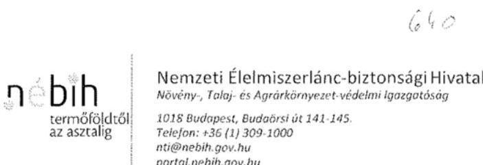 

Ikt. sz.: 04.2/1300-2/2017.
Tárgy: Észrevételek a Számvevőszéki jelentéstervezetre
Ügyintéző: Pinke Viktória
Elérhetőségek: pinkev@ncbih.gov.hu
Mellékletek:
$\frac{16.5-3.5452 / 2017 / 4}{4 / 712012017}$
$4-1151-301 / 2016$

## Domokos László

elnök úr részére
Állami Számvevőszék

## Budapest 4.

Pf.: 54 .
1364
Tisztelt Elnök Úr!
Az Állami Számvevőszék „A parlagfű elleni védekezés ellenőrzéséről" tárgyú, V-1151-382/2016. iktatási számú jelentés-tervezetre a Nemzeti Élelmiszerlánc-biztonsági Hivatal (a továbbiakban: NÉBIH) az alábbi észrevételt teszi:

A jelentés-tervezet 1.1.
 számú megállapításban foglaltakkal a NÉBIH nem ért egyet, mivel a Komunáldata Számítástechnikai Fejlesztő és Szolgáltató Kft-vel (a továbbiakban: Fejlesztő) történt szerződéskötés során az akkor hatályos jogszabályi rendelkezések, így a közbeszerzésekről szóló 2011. évi CVIII. törvény 18. § (2) bekezdésében foglaltak figyelembe vételre kerültek. A megrendelt fejlesztési szolgáltatások becsült értékének megállapítása a vonatkozó jogszabályok alapján történt, az egyes különálló funkciókra vonatkozóan.

Az egyes különálló szolgáltatások funkciójuk betöltésére önállóan alkalmasak, így a megkötött szerződések tárgya és tartalma nem ugyanaz, céljuk eltérő, az alábbiak szerint:
1.) a Fejlesztő által - a Vidékfejlesztési Minisztérium 2012. évi közbeszerzési eljárásának eredményeként - kialakított és megfelelően működő, a lakossági bejelentéseket kezelő Parlagfű Bejelentő Rendszer (a továbbiakban: PBR) üzemeltetésének és biztonságának, a rendszer folyamatos, hibamentes működésének biztosítása;
2.) az Önkormányzati Parlagfű Bejelentő Rendszer (a továbbiakban: ÖPBR) kifejlesztése, amely hatékonyan támogatja az önkormányzatok munkáját a parlagfű-mentesítésben azzal, hogy az ügyintézéshez kapcsolódó adatokat és eseményeket rögzíti, majd automatikusan előállítja a kapcsolódó dokumentumokat;
3.) az önkormányzatok csatlakozásának támogatása az ÖPBR-hez, amely kiterjed az önkormányzatok oktatására a rendszer használatáról, valamint a folyamatos ügyfélszolgálat biztosítására.

Kérem észrevételem szíves elfogadását.
Budapest, 2017. április 12.
Tisztelettel:
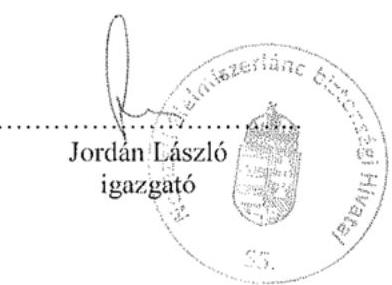

---

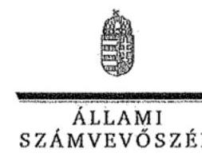

ELNÖK

Ikt.szám: V-1151-415/2016.

Dr. Oravecz Márton
elnök
Nemzeti Élelmiszer-biztonsági Hivatal

# Budapest 

## Tisztelt Elnök Úr!

"A parlagfű elleni védekezés ellenőrzése" című jelentéstervezetre tett észrevételeit köszönettel megkaptam.

Az ellenőrzési megállapításokra vonatkozó észrevételét az Állami Számvevőszékről szóló 2011. évi LXVI. törvény 29. § (2) bekezdésében meghatározott tizenöt napos határidőn belül küldte meg. Az Állami Számvevőszék észrevétellel kapcsolatos álláspontját a mellékletként csatolt, a felügyeleti vezető által készített indokolás tartalmazza.

Tájékoztatom Elnök urat, hogy a számvevőszéki jelentésben - az Állami Számvevőszékről szóló 2011. évi LXVI. törvény 29. § (3) bekezdése alapján - a figyelembe nem vett észrevételeket szerepeltetjük annak indoklásával, hogy azokat az Állami Számvevőszék miért nem fogadta el.

Budapest, 2017. május 15. nap

Melléklet: Észrevételre adott válasz
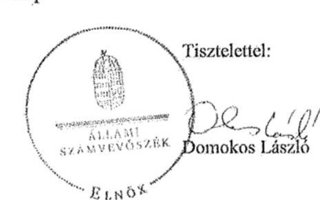

---

"A parlagfű elleni védekezés ellenőrzése" című jelentéstervezethez tett észrevételekre adott válasz

# Nemzeti Élelmiszer-biztonsági Hivatal 

"A parlagfű elleni védekezés ellenőrzése" című jelentéstervezetre tett észrevételeket áttekintettem, annak kezelésével kapcsolatban a következő tájékoztatást adom.
A jelentéstervezet 1.1. számú megállapítása szerint a Nemzeti Élelmiszer-biztonsági Hivatal (a továbbiakban: NÉBIH) a Parlagfű Bejelentő Rendszer/Önkormányzati Parlagfű Bejelentő Rendszer fejlesztésére, működtetésére 2013. évben kötött szerződéssel a közbeszerzésekről szóló 2011. évi CVIII. törvény (továbbiakban: Kbt.) 5. §-ában fennálló közbeszerzési kötelezettségét - a 18. § szerinti egybeszámítási szabályokra figyelemmel - megsértette.
A NÉBIH elnöke észrevételében jelezte, hogy nem ért egyet a megállapításban foglaltakkal. Véleménye szerint a szerződéskötés során a hatályos jogszabályi rendelkezések figyelembe vételre kerültek.
Az Állami Számvevőszék a parlagfű elleni védekezés ellenőrzése során feltárta, hogy a NÉBIH 2013. június 20-án, június 24-én és július 9. napján közbeszerzési eljárás lefolytatása nélkül szerezte be a kezdeményezéssel érintett szerződések tárgyát képező szolgáltatásokat. Emiatt a Számvevőszék az érintett beszerzések ellen hivatalból kezdeményezést nyújtott be a Közbeszerzési Hatósághoz. Az ellenőrzés által feltártakkal összhangban a Hatóság megállapította, hogy a beszerző megsértette a Kbt. 119. §-ára tekintettel a Kbt. 5. §-át és a Kbt. 18. §-át, ezért az ÁSZ az észrevételben foglaltakat nem fogadja el.
A fentiekre való tekintettel a megállapítás módosítása nem indokolt.

Budapest, 2017.
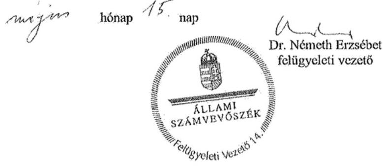

---

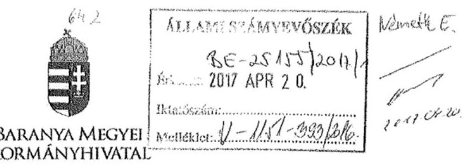

Ügyiratszám: BAB/8/00891-12/2017.
Ügyintéző: Kaufmann Eszter/dr. Schwab Ildikó
Elérhetőség: 72/507-064/72/507-025

Tárgy: „A parlagfű elleni védekezés ellenőrzése" tárgyú jelentéstervezet véleményezése

# Állami Számvevőszék 

## Domokos László

## Elnök részére

Budapest
Pf. 54
1364

## Tisztelt Elnök Úr!

Hivatkozással a 2017. március 30. napján, postai úton érkezett V-1151-382/2016. számú levelére a Baranya Megyei Kormányhivatal (a továbbiakban: Kormányhivatal) „A parlagfű elleni védekezés ellenőrzése" című jelentéstervezethez az alábbi észrevételeket teszi.

A Kormányhivatal Pécsi Járási Hivatal Agrárügyi Főosztály Földhivatali Osztályának észrevételei:
A jelentéstervezet több, alább felsorolt helyen általánosan úgy fogalmaz, mintha minden kormányhivatal, ezen belül minden járási hivatal földhivatali osztálya nem a szabályoknak, előírásoknak megfelelően járna el. Ugyanakkor a jelentéstervezet Megállapítások és a Javaslatok fejezeteiből kitűnik, hogy a feltárt hibák, illetve hiányosságok nem érintik a Kormányhivatali, így annak földhivatali osztályait sem. A földhivatali osztály munkáját (fertőzött területek felderítése) érintő statisztikai adatok esetében nem vesz figyelembe elég tényezőt, amelyek magyarázatot adhatnak egyes trendek irányára. Mivel ezek nem részei a statisztikát képező jelentéseknek, valóban nem használhatók, azonban a jelentéstervezet ezek létezését nem említi.
5. oldal, „Összegzés" fejezet: „A közérdekű védekezés rendszerében résztvevő kormányhivatalok és jegyzők nem szabályszerűen látták el feladataikat.".
23. oldal, „Megállapítások" fejezet: A kormányhivataloknál a 2013-2015. években a parlagfű elleni védekezés kapcsán a hatósági feladatellátás nem volt megfelelő, mert: (a felsorolt hibák a földhivatali osztály munkáját nem érintik).
29-30. oldal, „Megállapítások" fejezet: statisztikai adatok elemzése során nem vesz figyelembe az eredményt, trendet befolyásoló, vagy okozó tényezőket, (pl.: időjárás, leterheltség, eszközök meghibásodása miatti adatvesztés, a rendelkezésre bocsátott eszközök valós felhasználási területe, a „felderített terület nagysága", mint becsült adat rendkívüli pontatlansága, stb.).

A Kormányhivatal Pécsi Járási Hivatal Agrárügyi Főosztály Növény- és Talajvédelmi Osztályának észrevételei:

A Nemzeti Környezetvédelmi programokban, a Magyarország Parlagfű elleni Rövid és Középtávú Védekezési Akciótervében, továbbá a hatályos jogszabályokban leírtak alapján végrehajtott ellenőrzés megállapításaival, az abban leírt hibákkal/hiányosságokkal egyetértek. Ugyanakkor azt is megemlítendő, hogy a jelentéstervezetben foglalt nem megfelelések/megvalósulások némelyike a fentebb idézett dokumentumok egyes céljait tekintve (kizárólag a szakmai szempontok alapján) eltúlzott, a gyomnövény biológiájából adódó, továbbá a fertőzöttség mértékét befolyásoló ökológiai tényezők miatt rövidtávon nem megvalósítható célkitűzések. Ilyen cél például a teljes parlagfű mentesség elérése. A teljes mentesség elérése a termelők és a civil társadalom évről évre történő hatékony gyomirtása esetén sem

Baranya Megyei Kormányhivatal
7623 Pécs, József Attila u. 10. :f/ 7602 Pécs, Pf.: 405.
+36-72 507-000 & +36-72 507-012 (c) hivatal@baranya.gov.hu Honlap: www.bamkh.hu

---

elvárható,- évtizedes időintervallum mellett is csak a gyérítés lehet a reális cél. A stratégiai célok és hatályos jogszabályok a parlagfű elleni védekezést a tulajdonos/földhasználó kötelezettségévé teszik, a hatóságok fő feladata az ismeretterjesztés, a parlagfű mentesítésre ösztönző rendszer kidolgozása, továbbá a kötelezettség betartásának ellenőrzése. A termelő ösztönzése elsősorban a védekezésre fordított eszközök (növényvédő szerek,- mechanikai eszközök) jelentős támogatásával lenne elérhető, ami nagy költségvetési igényű, de így a kevésbé tőkeerős gazdálkodók is hatékonyabb növényvédő szerekhez,- gyomirtó eszközökhöz jutnának.

Az élelmiszerláncról és hatósági felügyeletéről szóló 2008. évi XLVt. törvényben előírt parlagfű elleni védekezés nem volt eredményes, állítja a jelentéstervezet. Ennek okát többek között abban látja, hogy a közérdekű védekezések száma és a mentesített terület nagysága 2014-2015. években csökkent. A közérdekű védekezések száma több tényező függvénye. Nagyon fontos tényező,- hogy egy adott év ellenőrzési időszakában a felderítést végző (megyei átlagban 8- 10 fő) humán erőforrásnak milyen volumenű egyéb, helyszíni jelenlétet is igénylő feladata van. Szintén fontos tényező a felderítés során fertőzöttnek talált területek kultúrával való fedettsége. (Elfogadott tény, hogy a pollenterhelés döntő többsége a mezőgazdaságilag művelt,- parlagfűvel fertőzött-, területről származik.) Ha az ellenőrzött mezőgazdasági terület kultúrnövénnyel fedett, akkor a jogszabályok szerint a közérdekű védekezések száma, ebből következően pedig a mentesített terület nagysága is alacsonyabb lesz.

A jelentéstervezet szerint a több napon keresztül jelentkező extrém magas parlagfű pollencsúcsok megszüntetése, mint 2014-2015. évekre előírt cél szintén nem valósult meg. Ez a teljes parlagfű mentességhez hasonlóan nem elérhető cél. A mért pollenszám a parlagfű fertőzöttségtől, részben a mérőállomás környékének fertőzöttségétől, valamint a meteorológiai viszonyoktól függ. Nem elérhető azért, mert az országosan fertőzött területhez viszonyítottan a hatósági eljárás során felderített/mentesített terület aránya nem számottevő, és akkor sem lenne az, ha felderítések száma duplázódna.

A jelentéstervezet feltárta a parlagfű elleni védekezés hatósági tevékenységével kapcsolatos pozitívumokat, és hiányosságokat. A jelentéstervezetben megfogalmazott javaslatok, intézkedési tervek megvalósulása az eljárás hatékonyságát javítják, ugyanakkor jelentős költségvetési hozzájárulás nélkül a termelő/földhasználói magatartás,- így a parlagfű önkéntes irtása-, rövidtávon nem javul. Fontos feladat a jogszabályi előírások betartásának hatósági ellenőrzése és annak hiányában a szankcionálás. Ennek javításához elengedhetetlen feltétel az eljárásban résztvevők számának jelentős növelése, akár feladatra orientált csoportok létrehozásával. A jelentéstervezet megállapítja, hogy a kormányhivatalok számára a közérdekű védekezésre bocsátott előirányzatot nem a védekezés időszakában biztosították. Egyetértve a megállapítással úgy vélem, hogy az előirányzat összegének sokkal nagyobb hányadát kellett volna/kellene az effektív védekezéshez hozzájáruló hatóságok tevékenységére fordítani.

A Kormányhivatal Élelmiszerlánc-biztonsági és Földhivatali Főosztály Földhivatali Osztályának észrevételei:

A földhivatali osztályokra háruló parlagfű elleni védekezés feladatait a Földművelésügyi Minisztérium által évenként aktualizált „Eljárásrend a parlagfű-felderítésről és a parlagfű elleni közérdekű védekezéshez szükséges adatszolgáltatásról" című dokumentum, valamint a Kormányhivatal ügyrendje szabályozza. A földhivatali osztályok az ügyrend, valamint az eljárásrend alapján a helyszíni ellenőrzés feladatait a rendelkezésre álló feltételek maximálisan kihasználásával, a jogszabályi előírások figyelembevételével, határidőben hajtották végre. A helyszíni ellenőrzésekről minden esetben készültek jegyzőkönyvek, adattartalmuk az előírásoknak mindenben megfelelt, a feladatok végrehajtásában hiányosság nem merült fel.

Kérem, észrevételeimet figyelembe venni szíveskedjen.
Pécs, 2017. április 13.
Tisztelettel:
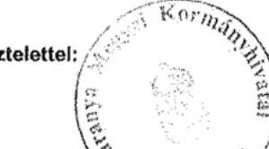

Dr. Horváth Zoltán
kormánymegbízott
Baranya Megyei Kormányhivatal
7623 Pécs, József Attila u. 10. rl 7602 Pécs, Pf.: 405
+36-72 507-000 & +36-72 507-012 (c) hivatal@baranya.gov.hu Honlap: www.bamkh.hu

---

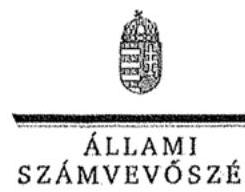

ELNÖK

Ikt.szám: V-1151-405/2016.

Dr. Horváth Zoltán
kormánymegbízott
Baranya Megyei Kormányhivatal

Pécs

Tisztelt Kormánymegbízott Úr!
"A parlagfű elleni védekezés ellenőrzése" című jelentéstervezetre tett észrevételeit köszönettel megkaptam.

Az ellenőrzési megállapításokra vonatkozó észrevételét az Állami Számvevőszékről szóló 2011. évi LXVI. törvény 29. § (2) bekezdésében meghatározott tizenöt napos határidőn belül küldte meg. Az Állami Számvevőszék észrevétellel kapcsolatos álláspontját a mellékletként csatolt, a felügyeleti vezető által készített indokolás tartalmazza.

Budapest, 2017. március 4. nap

Melléklet: Észrevételre adott válasz
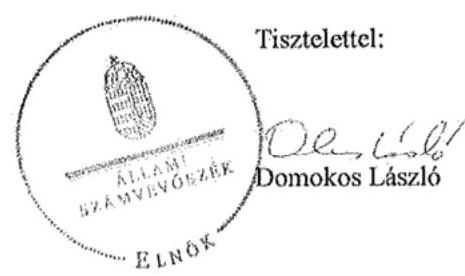

---

"A parlagfű elleni védekezés ellenőrzése" című jelentéstervezethez tett észrevételre adott válasz

# Baranya Megyei Kormányhivatal 

"A parlagfű elleni védekezés ellenőrzése" című jelentéstervezetre tett észrevételeit áttekintettem, annak kezelésével kapcsolatban a következő tájékoztatást adom.

## 1. A jelentéstervezet megállapításaira vonatkozó észrevétel

Kormánymegbízott Úr a BAB/8/00891-12/2017. iktatószámú levelében fenti címủ jelentéstervezethez észrevételt tett, mely szerint „a jelentéstervezet több helyen általánosan úgy fogalmaz, mintha minden kormányhivatal, ezen belül minden járási hivatal földhivatali osztálya nem a szabályoknak, előírásoknak megfelelően járna el."

Tekintettel arra, hogy az ellenőrzött szervezetek között a kormányhivatalok szerepelnek, a megállapítások címzettjei is a kormányhivatalok. A számvevőszéki jelentés Összegzés fejezetében, illetve a Megállapítások 1.2. pontjában a kormányhivatalokra vonatkozóan összegző megállapítások szerepelnek. Ugyanakkor a részmegállapítások és a Javaslatok alapján azonosítható, hogy milyen típusú hibák és melyik ellenőrzött szervezetnél fordultak elő, illetve az elvégzendő feladat mely kormányhivatalra vonatkozik.

A fentiekre való tekintettel észrevétele alapján a jelentéstervezet 5. oldal „Összegzés" fejezetben, 23. oldal „Megállapítások" fejezetben, valamint a 29-30. oldalon szereplő megállapítások módosítása nem indokolt.

## 2. Egyéb észrevételek

Kormánymegbízott Úr egyéb - így például a parlagfű elleni védekezés célkitűzéseire, támogatásaira, költségeire, humán erőforrás problémáira vonatkozó - észrevételei a jelentéstervezetben foglaltakhoz kapcsolódnak, azonban annak megállapításait nem vitatják. Annak érdekében, hogy szakmai véleménye, javaslatai hasznosuljanak, indokoltnak tartom észrevételeit a Földművelésügyi Minisztérium döntéshozói felé jeleznie.
Budapest, 2017.
május
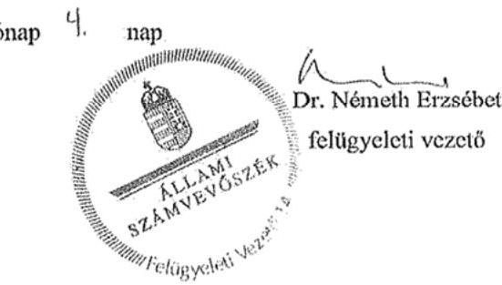

---

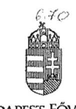

# BUDAPEST FŐVÁROS KORMÁNYHIVATALA 

KORMÁNYMEGBÍZOTT

Úgyiratszám: 10033/1/2017
Ügyintéző: Cseri Zoltán
Telefon: 354-2979
E-mail: cseri.zoltan@bfkh.gov.hu

Tárgy:

 észrevételek „A parlagfű elleni védekezés ellenőrzése" című jelentéstervezettel kapcsolatban Melléklet: -
Hiv. szám: V-1151-382/2016.

## Domokos László részére elnök

Állami Számvevőszék
Budapest
Apáczai Csere János utca 10.
1052

ÁLLAMISZÁMVEVŐSZÉK
$36-20180 / 2017 / 1$
Erkest: 2017. ÁPR 25.
Iktatószám: $1 /-1 / 24$ - beth/2016
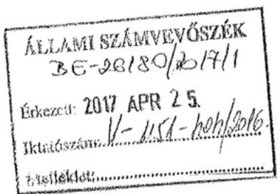

## Tisztelt Elnök Úr!

Fenti iktatószámra hivatkozva az állami számvevőszékről szóló 2011. évi LXVI. törvény 29. § (2) bekezdése szerint „A Parlagfű elleni védekezés ellenőrzése" című jelentéstervezettel kapcsolatban alábbiakról tájékoztatom.

A jelentéstervezetben megfogalmazott javaslatnak (1.2. sz. megállapítás, 22. oldal 1. bekezdése és 40. oldal 2. pontja alapján), mely szerint intézkedni kell a hatósági ellenőrzési tervek elkészítéséről, Budapest Főváros Kormányhivatala már eleget tett. A Földmérési, Távérzékelési és Földhivatali Főosztály (a továbbiakban: Főosztály) az Állami Számvevőszék (a továbbiakban: ÁSZ) helyszíni ellenőrzését követően, 10066/28/2016. számú, 2016. szeptember 6. napján kelt körlevélben nyomatékosan felhívta az első fokon eljáró ingatlanügyi hatóságok figyelmét a hatósági ellenőrzési tervek elkészítésének szükségességére.

Ezen felül a parlagfű elleni hatósági védekezés helyszíni ellenőrzéseit megelőzően a Főosztály a kerületi hivatalok földügyi szakügyintézői részére szakmai értekezletet is szervez 2017. május hónapban. Az értekezleten kiemelt figyelmet kap az ÁSZ jelentésében feltárt észrevételek, javaslatok ismertetése, megbeszélése, annak érdekében, hogy ellenőrzési kötelezettségnek Budapest Főváros Kormányhivatala minél hatékonyabban eleget tehessen.

Budapest, 2017. április 5.

Tisztelettel:
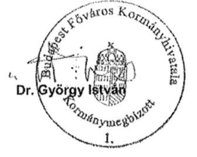

---

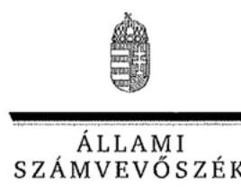

ELNÖK

Ikt.szám: V-1151-417/2016.

# Dr. György István 

kormánymegbízott
Budapest Főváros Kormányhivatala

## Budapest

## Tisztelt Kormánymegbízott Úr!

"A parlagfű elleni védekezés ellenőrzése" című jelentéstervezetre tett észrevételeit köszönettel megkaptam.

Az ellenőrzési megállapításokra vonatkozó észrevételét az Állami Számvevőszékről szóló 2011. évi LXVI. törvény 29. § (2) bekezdésében foglaltak szerint intézményünk számára megküldte. Az Állami Számvevőszék észrevétellel kapcsolatos álláspontját a mellékletként csatolt, a felügyeleti vezető által készített indokolás tartalmazza.

Tájékoztatom Kormánymegbízott urat, hogy a számvevőszéki jelentésben - az Állami Számvevőszékről szóló 2011. évi LXVI. törvény 29. § (3) bekezdése alapján - a figyelembe nem vett észrevételeket szerepeltetjük annak indoklásával, hogy azokat az Állami Számvevőszék miért nem fogadta el.

Budapest, 2017. 03. hó 14. nap

Tisztelettel:

Melléklet: Észrevételre adott válasz
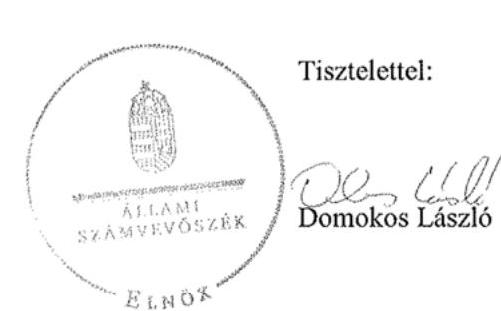

---

# "A parlagfű elleni védekezés ellenőrzése" című jelentéstervezethez tett észrevételre adott válasz 

## Budapest Főváros Kormányhivatala

"A parlagfű elleni védekezés ellenőrzése" című jelentéstervezetre tett észrevételeket áttekintettem, annak kezelésével kapcsolatban a következő tájékoztatást adom.

A jelentéstervezet 1.2. számú megállapítás, 22. oldal 1. bekezdése kapcsán Kormánymegbízott úr jelzi, hogy Budapest Főváros Kormányhivatala Földmérési, Távérzékelési és Földhivatali Főosztálya körlevélben felhívta az első fokon eljáró ingatlanügyi hatóságok figyelmét a hatósági ellenőrzési tervek elkészítésének szükségességére, illetve szakmai értekezletre is sor kerül.

A tájékoztatásban foglaltakat az Állami Számvevőszék tudomásul veszi, azok a jelentés megállapításait nem vitatják, ezért annak módosítása nem indokolt.

Budapest, 2017.
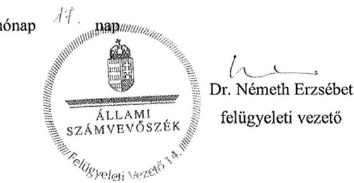

---

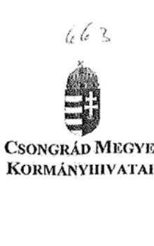

Csongrád Megyei Kormányhivatal

Tárgy: Tájékoztatási Hiv.szám: V-1151-382/2016. Mell.: -

Domokos László elnök úr részére

Állami Számvevőszék

Budapest Pf: 54. 1364

Tisztelt Elnök Úr!

Az Állami Számvevőszék megküldte a Csongrád Megyei Kormányhivatalnak (továbbiakban: Kormányhivatal) a „parlagfű elleni védekezés ellenőrzése" című jelentéstervezetet. A jelentéstervezettel kapcsolatosan az alábbi észrevételt teszem:

A jelentéstervezet intézkedési kötelezettséget ír elő a Kormányhivatal tekintetében a hatósági ellenőrzési tervek elkészítésével kapcsolatosan.

A jelentéstervezet 22. oldal 1. bekezdésébe foglalt megállapítás szerint: „Több esetben előfordult azonban, hogy a kormányhivatalok földhivatali szervezete nem rendelkezett hatósági ellenőrzési tervekkel....".

Szeretném tájékoztatni, hogy a vizsgálati eljárás során a 2013-2015. évekre vonatkozó ellenőrzési tervek benyújtásra kerültek. (Ellenőrzési terv-határszemle felhívás 2013., Ellenőrzési terv-határszemle felhívás 2014., Ellenőrzési terv-határszemle felhívás 2015.) A földhivatali szervezetek a parlagfű elleni védekezéssel kapcsolatosan alapvetően a felderítést végzik, amely összekapcsolódik a határszemlével.

Egyebekben a jelentéstervezettel kapcsolatosan észrevételt nem kívánok tenni.

Kérem tájékoztatásom szíves elfogadását.

Szeged, 2017. április 11.

Tisztelettel:

dr. Juhász Tünde
kormánymegbízott

Kapja: 1. Domokos László elnök Állami Számvevőszék
2. Irattár

6722 Szeged, Rákóczi tér 1. 6701 Szeged, Pf. 1096.
☎ +36 (62) 562-663 ☎ +36 (62) 562-601
www.csmkh.hu ✓vezeto@csongrad.gov.hu

---

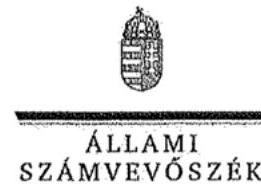

# Dr. Juhász Tünde 

kormánymegbízott
Csongrád Megyei Kormányhivatal

## Szeged

## Tisztelt Kormánymegbízott Úrhölgy!

"A parlagfű elleni védekezés ellenőrzése" című jelentéstervezetre tett észrevételeit köszönettel megkaptam.

Az ellenőrzési megállapításokra vonatkozó észrevételét az Állami Számvevőszékről szóló 2011. évi LXVI. törvény 29. § (2) bekezdésében meghatározott tizenöt napos határidőn belül küldte meg. Az Állami Számvevőszék észrevétellel kapcsolatos álláspontját a mellékletként csatolt, a felügyeleti vezető által készített indokolás tartalmazza.

Budapest, 2017. 04. hó 28. nap

Melléklet: Észrevételre adott válasz
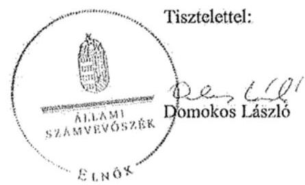

---

"A parlagfű elleni védekezés ellenőrzése" című jelentéstervezethez tett észrevételre adott válasz

# Csongrád Megyei Kormányhivatal 

"A parlagfű elleni védekezés ellenőrzése" című jelentéstervezetre tett észrevételeket áttekintettem, annak kezelésével kapcsolatban a következő tájékoztatást adom.
A jelentéstervezet „A fővárosi és a megyei kormányhivatalok vezetőinek" szóló javaslatok 1. pontjában foglaltakra vonatkozó megállapításához kapcsolódóan tett észrevételét a dokumentumok ismételt áttekintését és felülvizsgálatát követően elfogadtuk, és azt a számvevőszéki jelentés összeállításánál figyelembe vesszük.

Budapest, 2017. 05. hónap
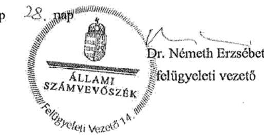

---

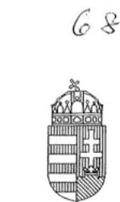

Heves Megyei Kormányhivatal

Ikt.szám: HE/KOR/158-2/2017. Hivatkozási szám: V-1151-382/2016.

## Domokos László elnök úr részére   Állami Számvevőszék   Budapest

Apáczai Csere János utca 10.
1052

Tárgy: „A parlagfű elleni védekezés ellenőrzése" című jelentéstervezet észrevételének megküldése

## Tisztelt Elnök Úr!

Tájékoztatom, hogy a Heves Megyei Kormányhivatalt érintő „A parlagfű elleni védekezés ellenőrzése" című jelentéstervezet részemre történő megküldését köszönöm, a dokumentumot Hivatalunk teljes körűen áttekintette, azzal összefüggő észrevételeimet az alábbiak szerint teszem meg.

- Megállapítások- A veszélyeztetett területek felderítése- 1.2 számú megállapítás - 22. oldal: „Több esetben előfordult azonban, hogy a kormányhivatalok földhivatali szervezete nem rendelkezett hatósági ellenőrzési tervvel."

A vizsgált időszakban (2013-2015) a Kormányhivatal Földhivatali Főosztálya és a Járási Hivatalok Földhivatal Osztályai együttes hatósági ellenőrzési tervében csak a 2013. évben nem kerültek szerepeltetésre a parlagfű ellenőrzések, de a 2014. és a 2015. években már igen.

- Javaslatok - 2. pont - 40. oldal: „A parlagfű elleni védekezés keretében intézkedjen a hatósági ellenőrzési tervek elkészítéséről". (Címzettek között megjelenítve a Heves Megyei Kormányhivatal)

A parlagfű elleni hatósági védekezés helyszíni ellenőrzési munkáit a Földművelésügyi Minisztérium vonatkozó körlevelei alapján - valamennyi vizsgált évben, a határszemle ellenőrzésekkel párhuzamosan (ugyanazon területeken) - kellett lefolytatni, így a feladat ellátásának ütemezése és a helyszínek ismételt ellenőrzési terv bevonása nem tűnt szükségesnek.
A földhivatalok a parlagfű elleni hatósági védekezésben csak közreműködő, felderítő szerepet játszottak, a vonatkozó hatósági eljárásokat a Kormányhivatal más szervezeti egysége, mint ellenőrzésre és szankcionálásra jogosult hatóság folytatta le.

---

A jelentéstervezettel kapcsolatosan további észrevételünk nincs.

Eger, 2017. április 18.
Dr. Pajtók Gábor, a Heves Megyei Kormányhivatalt vezető kormánymegbízott nevében és megbízásából:
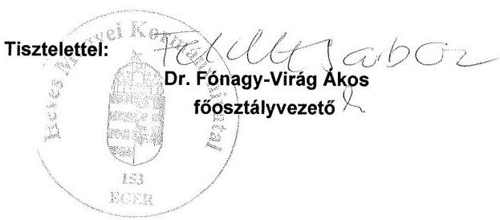

---

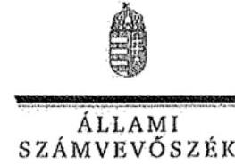

ELNÖK

Ikt.szám: V-1151-419/2016.

Dr. Pajtók Gábor
kormánymegbízott
Heves Megyei Kormányhivatal

# Eger 

## Tisztelt Kormánymegbízott Úr!

"A parlagfű elleni védekezés ellenőrzése" című jelentéstervezetre tett észrevételeit köszönettel megkaptam.

Az ellenőrzési megállapításokra vonatkozó észrevételét az Állami Számvevőszékről szóló 2011. évi LXVI. törvény 29. § (2) bekezdésében meghatározott tizenöt napos határidőn belül küldte meg. Az Állami Számvevőszék észrevétellel kapcsolatos álláspontját a mellékletként csatolt, a felügyeleti vezető által készített indokolás tartalmazza.

Budapest, 2017. 04. hó 28. nap

Melléklet: Észrevételre adott válasz
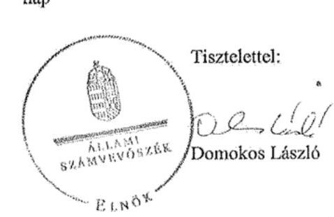

---

"A parlagfű elleni védekezés ellenőrzése" című jelentéstervezethez tett észrevételre adott válasz

Heves Megyei Kormányhivatal
"A parlagfű elleni védekezés ellenőrzése" című jelentéstervezetre tett észrevételeket áttekintettem, annak kezelésével kapcsolatban a következő tájékoztatást adom.
A jelentéstervezet „A fővárosi és a megyei kormányhivatalok vezetőinek" szóló javaslatok 1. pontjában foglaltakra vonatkozó megállapításához kapcsolódóan tett észrevételét a dokumentumok ismételt áttekintését és felülvizsgálatát követően elfogadtuk. A számvevőszéki jelentésben a 40. oldal 1. pontjában a címzett megyei kormányhivatalok közül a Heves Megyei Kormányhivatal törlésre került.

Budapest, 2017. 05. hónap
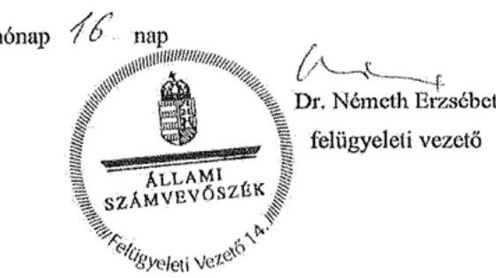

---

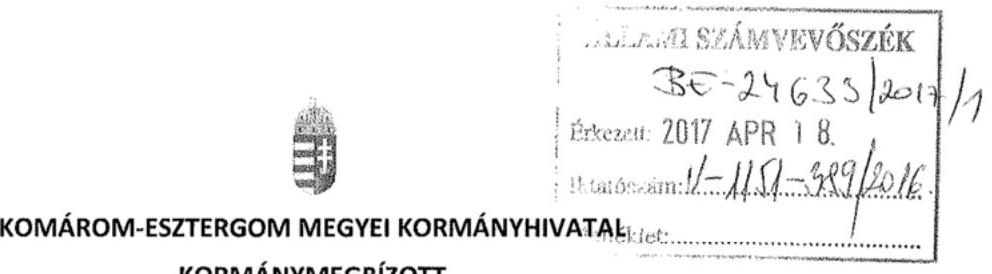

# KORMÁNYMEGBÍZOTT 

Ügyszám: KE/13/23-6/2017.
Ügyintéző: Tóbiásné Makai Edit
Tel: $34 / 515-146$

Tárgy: Észrevételek „A parlagfű elleni védekezés ellenőrzése" című jelentéstervezethez
Hivatkozás: V-1151-382/2016.

## ÁLLAMI SZÁMVEVŐSZÉK

## Domokos László

## Elnök Úr részére

## Budapest

Apáczai Csere János u. 10.

## Tisztelt Elnök Úr!

Az Állami Számvevőszék „A parlagfű elleni védekezés ellenőrzése" tárgyában megküldött jelentés tervezetét áttekintettem, és a Komárom-Esztergom Megyei Kormányhivatalt érintő megállapításokra, illetve a fővárosi és megyei kormányhivatalok vezetőinek tett javaslatokra az alábbi észrevételeket teszem.

## 1) A jelentéstervezet 40. oldal 1. pontjában foglalt javaslathoz

A jelentéstervezet megállapítása szerint több esetben előfordult, hogy a kormányhivatalok földhivatali szervezete nem rendelkezett hatósági ellenőrzési tervvel a 288/2010. (XII.21.) Korm. rendelet 6/A.§ (2) bekezdés, 2015. április 1-jét követően a 66/2015. (III.30.) Korm. rendelet 7. § (2) bekezdés előírása ellenére.

Az 1.2. számú megállapítás 1. bekezdéséhez kapcsolódóan a jelentéstervezet 39. oldalán a címzett 11 fővárosi és megyei kormányhivatal - köztük a Komárom-Esztergom Megyei Kormányhivatal - vezetői részére javaslat került megfogalmazásra, mely szerint: A parlagfű elleni védekezés keretében intézkedjen a hatósági ellenőrzési tervek elkészítéséről.
> Az ÁSZ vizsgálattal érintett 2013. évben a Komárom-Esztergom Megyei Kormányhivatal Földhivatala a szervezeti egységre vonatkozó önálló hatósági ellenőrzési tervvel nem rendelkezett, a parlagfű elleni közérdekű védekezéssel kapcsolatos földhivatalra háruló feladatok ellátása a 2013. évi munkaterv 3.1.8. pontjában, valamint a KEM KH Földhivatala 20184/2013. sz. ügyrendjének a Földügyi Osztályra vonatkozó részében (II. fejezet 2.3. pontjának 1.b. alpontja) került rögzítésre. A Komárom-Esztergom Megyei

---

Kormányhivatal Tatabányán, 2012. december 15. napján kelt 2013. évi összevont ellenőrzési tervének 32. pontja tartalmazza ugyanakkor a 2013. augusztus-szeptember hónapokra, a Parlagfű elleni védekezési kötelezettség ellenőrzése érdekében a KEM KH Növény- és Talajvédelmi Igazgatósága és a KEM KH Földhivatala hatóságok tervezett közös helyszíni ellenőrzéseit.
> 2014. évre vonatkozóan a Komárom-Esztergom Megyei Kormányhivatal Földhivatala a szervezeti egységre vonatkozó önálló hatósági ellenőrzési tervvel nem rendelkezett. 2013. decemberében a Vidékfejlesztési Minisztérium Földügyi és Térinformatikai Főosztályának 2014. évi országos hatósági ellenőrzési terve alapján a KEM KH Földhivatala és járási hivatalai részére hatósági ellenőrzési terv nem készült.
> A Vidékfejlesztési Minisztérium Földügyi és Térinformatikai Főosztályának FF/1473/2014. számú 2015. évi országos hatósági ellenőrzési terve és a 288/2010. (XII.21.) Korm. rendelet 6/A.§ -a alapján 2014. december 19. napján kelt a Komárom-Esztergom Megyei Kormányhivatal Földhivatala és az illetékességi területén működő járási hivatalok 2015. évre vonatkozó hatósági ellenőrzési terve, amelynek 7. pontja tartalmazza a parlagfű elleni védekezési kötelezettség ellenőrzésével kapcsolatos feladatokat, 1-7. alpontjai az ellenőrzés tárgyát, időszakát, ütemezését, eszközét, a kiválasztás szempontjait, célját, formáját és módját határozták meg.
> 2015-től a Kormányhivatal Földhivatali Főosztálya és járási hivatalai, illetve 2017.01.01-jétől az Élelmiszerlánc-biztonsági és Földhivatali Osztálya és járási hivatalai - többek között - a parlagfű elleni védekezési kötelezettség ellenőrzésével is kapcsolatos terve a KEM KH tárgyévi hatósági ellenőrzési tervének részét képezi. A KEM Kormányhivatal 2015., 2016. és 2017. évi hatósági ellenőrzési tervei tartalmazzák a földhivatali feladatellátás keretében elvégzendő, adott tárgyévre vonatkozó parlagfű elleni védekezési kötelezettség ellenőrzésével kapcsolatos feladatokat.

# 2) A jelentéstervezet 40. oldal 2. pontjában foglalt javaslathoz 

A jelentéstervezet 40. oldalán a fővárosi és megyei kormányhivatalok vezetőinek szóló javaslatok 2. pontja a Komárom-Esztergom Megyei Kormányhivatalnak címzetten így szól: „Intézkedjen a jogszabályi előírásoknak megfelelően a parlagfű elleni közérdekű védekezés elrendeléséről".
A javaslatot a 22. oldal 1.2 számú megállapítására és a 23. oldal 1. számú alpontjára alapozzák.
Áttekintettük a 23. oldal 1. számú alpontban hivatkozott 2015. évben lefolytatott parlagfűves eljárásokat, és megállapítottuk, hogy 8 esetben nem került elrendelésre a közérdekű védekezés. Ennek oka, hogy 7 esetben a helyszíni jegyzőkönyv
 tanúsága szerint az adott terület kultúrnövénnyel fedett volt (a kultúrnövény tőszáma meghaladta, a parlagfű felületi borítottsága pedig nem érte el a jogszabályi minimum értékeket), 1 esetben pedig a helyszíni ellenőrzést követően, de a határozat meghozatalát megelőzően a földhasználó maga elvégezte a mentesítést, így a közérdekű védekezés elrendelése okafogyottá vált.
Tehát egyik esetben sem állt fenn az élelmiszerláncról és hatósági felügyeletéről szóló 2008. évi XLVI. törvény 50. § (7) bekezdése szerint feltétel: „Ha a parlagfű elleni közérdekű védekezést kultúrnövény károsodása nélkül nem lehet elvégezni, a parlagfű

---

elleni közérdekű védekezés abban az esetben rendelhető el, ha az adott területen a kultúrnövény tőszáma nem éri el az agronómiailag indokolt tőszám 50%-át és a parlagfűvel való felületi borítottság a 30%-ot meghaladja. A parlagfű elleni közérdekű védekezés során az érintett kultúrában okozott károkért a földhasználó kártalanításra nem tarthat igényt."
Fentiek alapján a növényvédelmi hatóság a közérdekű védekezést a kifogásolt ügyekben jogszerűen nem rendelhette volna el, így a növény- és talajvédelmi hatóságnál feltárt hiányosságot nem látjuk megalapozottnak.

# 3) A jelentéstervezet 41. oldal 4. pontjában foglalt javaslathoz 

Hivatalunk minden esetben visszatéríti az előirányzatba a földhasználó által befizetett összeget.
A 23. oldal 5. számú alpontja az Élvhr.8. (2) bekezdésére hivatkozva 8 napon belüli visszatérítési kötelezettséget ír elő. Hivatalunk esetében a könyvelést és egyeztetést követően történtek meg a visszautalások, amelyek meghaladták a 8 napot. Megtesszük a szükséges intézkedéseket, hogy a jövőben a 8 napos határidő fokozott figyelembe vételével történjen a visszautalás.

Kérem, hogy észrevételeinket szíveskedjenek figyelembe venni a végleges jelentés elkészítésekor.

Tatabánya, 2017. április 11.

Tisztelettel:
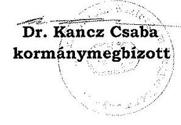

---

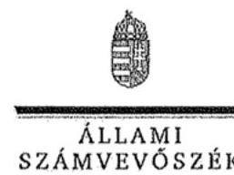

ELKÖK

Ikt.szám: V-1151-395/2016.

Dr. Kancz Csaba
kormánymegbízott
Komárom-Esztergom Megyei Kormányhivatal

# Tatabánya 

## Tisztelt Kormánymegbízott Úr!

"A parlagfű elleni védekezés ellenőrzése" című jelentéstervezetre tett észrevételeit köszönettel megkaptam.

Az ellenőrzési megállapításokra vonatkozó észrevételét az Állami Számvevőszékről szóló 2011. évi LXVI. törvény 29. § (2) bekezdésében meghatározott tizenöt napos határidőn belül küldte meg. Az Állami Számvevőszék észrevétellel kapcsolatos álláspontját a mellékletként csatolt, a felügyeleti vezető által készített indokolás tartalmazza.

Budapest, 2017. 24. hó 4. nap

Melléklet: Észrevételre adott válasz
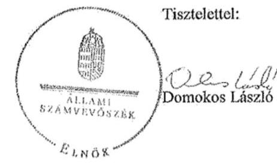

---

"A parlagfű elleni védekezés ellenőrzése" című jelentéstervezethez tett észrevételekre adott válasz

# Komárom-Esztergom Megyei Kormányhivatal 

"A parlagfű elleni védekezés ellenőrzése" című jelentéstervezetre tett észrevételeket áttekintettem, annak kezelésével kapcsolatban a következő tájékoztatást adom.

1. A jelentéstervezet 1.2 számú megállapítás 22. oldal 1. bekezdésére vonatkozó észrevétel
A 2012. szeptember 27. és 2015. március 31. között hatályos, a fővárosi és megyei kormányhivatalokról szóló 288/2010. (XII. 21.) Korm. rendelet 6/A. § (2) bekezdése, illetve a 2015. április 1-jétől hatályos 66/2015. (III. 30.) Korm. rendelet 7. § (2) bekezdése szerint a fővárosi és megyei kormányhivatal a szakmai irányító miniszterek által kiadott országos hatósági ellenőrzési tervek alapján készíti el a közigazgatási hatósági eljárás és szolgáltatás általános szabályairól szóló 2004. évi CXL. törvény szerinti hatósági ellenőrzési terveit az ellenőrzési időszakot megelőző 15. napig.

Kormánymegbízott Úr a KE/13/23-6/2017. iktatószámú levelében „A parlagfű elleni védekezés ellenőrzése" című jelentéstervezethez kapcsolódóan észrevételezi, hogy a jelentéstervezet 40. oldalán javaslatként szerepel a Komárom-Esztergom Megyei Kormányhivatal (a továbbiakban Kormányhivatal) vezetője részére, hogy a parlagfű elleni védekezés keretében intézkedjen a hatósági ellenőrzési tervek elkészítéséről.

Kormánymegbízott Úr tájékoztat, hogy a Kormányhivatal 2013. évi összevont ellenőrzési terve tartalmazta a parlagfű elleni védekezési kötelezettség ellenőrzése érdekében tervezett feladatokat, valamint hogy a 2014. évre a Kormányhivatal Földhivatala és járási hivatalai részére hatósági ellenőrzési terv nem készült. Tájékoztat továbbá, hogy a Kormányhivatal 2015-2017. évi hatósági ellenőrzési tervei tartalmazzák a földhivatalai feladatellátás keretében elvégzendő, adott tárgyévre vonatkozó parlagfű elleni védekezési kötelezettség ellenőrzésével kapcsolatos feladatokat. Kormánymegbízott Úr kéri észrevételei figyelembe vételét a végleges jelentés elkészítésekor.

A Kormányhivatal részéről az Állami Számvevőszékhez az ellenőrzés során beküldött dokumentumokat ismételten áttekintettük és megállapítottuk, hogy az Állami Számvevőszék részére az ellenőrzés során a Kormányhivatal hatósági ellenőrzési terveket nem adott át. Erre való tekintettel észrevétele alapján megállapításunk módosítása nem indokolt.

## 2. A jelentéstervezet 1.2 számú megállapítás 23. oldal 1. számú alpontjára vonatkozó észrevétel

A jelentéstervezet 1.2. számú megállapításához kapcsolódóan tett észrevételt a dokumentumok ismételt áttekintését és felülvizsgálatát követően elfogadtuk, és azt a számvevőszéki jelentés összeállításánál figyelembe vesszük.
3. A jelentéstervezet 1.2 számú megállapítás 23. oldal 5. számú alpontjára vonatkozó észrevétel
Az észrevétel nem vitatja a jelentéstervezet megállapítását, ezért a megállapítás módosítása nem indokolt.

Budapest, 2017.
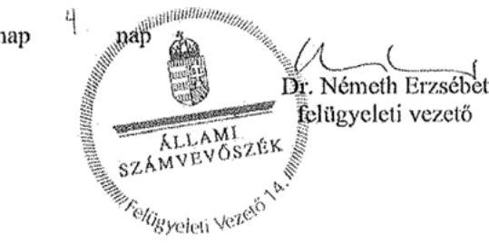

---

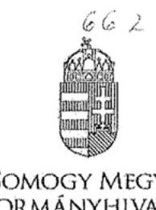

# SOMOGY MEGYEI KORMÁNYHIVATAL 

KORMÁNYMEGBIZOTT

Úgyiratszám: SOB/07/00091-2/2017.
Hivatkozási szám:V-1151-382/2016.

Tárgy:
Észrevétel megküldése
Úgyintéző: Ruszka Zoltán
Telefonszám: 82/502-679

## ÁLLAMI SZÁMVEVŐSZÉK

## Domokos László   Elnök

## Budapest

Apáczai Csere János u. 10. 1052

## Tisztelt Elnök Úr!

A 2017. április 4-én érkezett „A parlagfű elleni védekezés ellenőrzése" című jelentéstervezethez az alábbi észrevételeket teszem.

Az 1.2. számú megállapítás, 22. oldal 1. bekezdés vonatkozásában:
A Somogy Megyei Kormányhivatal a jogszabályi előírásoknak megfelelően minden évben (így a vizsgált időszakban is) valamennyi érintett szervezeti egységének bevonásával elkészíti az adott évre vonatkozó hatósági ellenőrzési tervét. A Hivatal éves terve tartalmazza a földhivatali szervezeti egység parlagfű elleni közérdekű védekezés keretében végrehajtandó helyszíni ellenőrzéseinek tervezett időszakát is.

Az 1.2. számú megállapítás, 23. oldal 5. számú alpont vonatkozásában:
A költség behajtási végzések meghozatala és a bevételek könyvelése fizikailag nem egy helyen történik. A bevételek beazonosításáért és könyveléséért felelős Pénzügyi és gazdálkodási Főosztály számára elengedhetetlen az alapbizonylatnak számító végzések megléte ahhoz, hogy a Kormányhivatal 10 db bankszámlájára érkező bevételeket megfelelő módon és időben azonosítani, könyvelni tudja. A különböző, nem a Hivatalt illető bevételek továbbutalásáról csak a tételes beazonosítást követően lehet intézkedni. Ezért véleményem szerint a földhasználó által megtérített eljárási költség visszafizetésére a 221/2008. (VIII. 30.) Korm. rendelet 8. § (2) bekezdésben rögzített nyolc napos határidő túl rövid.

A 2.1. számú megállapításban a parlagfű pollenkoncentrációval kapcsolatban:
Szakmailag elhibázott elvárás, hogy a hatósági intézkedéseknek köszönhetően csökkenő parlagfűvel fertőzött területek nagysága az augusztus-szeptember hónapokban mérhető pollenkoncentrációra is jelentős hatással lesz, lehet. Sajnos egy olyan növényt próbálunk visszaszorítani, aminek magjai évtizedekig csíraképesek, a talajszink akár negyven évre elegendő gyommaggal fertőzöttek, melyek bolygatás után pionír növényként azonnal megjelennek a területen. Ráadásul egy tő akár több millió pollent is termel, az országhatárok sem szabnak gátat a terjedésének, a nyári déli áramlatokkal a tőlünk délre eső országok pollenje is megtalálható a levegőben, ahol nincs ilyen szigorú védekezési kötelezettség ezen növénnyel szemben. Az augusztus, szeptemberi levegőben mérhető pollentartalmat

---

elsősorban az időjárási körülmények határozzák meg: száraz, meleg nyarakon jóval magasabb pollenszámok mérhetők, hűvösebb, csapadékosabb évjáratokban kevesebb, függetlenül attól, hogy abban az évben mekkora a fertőzött területek aránya.

A felderítéssel érintett terület méretének csökkenését alapvetően a BM által biztosított repülési idő (légi felderítés) mennyisége, valamint a helyszíni ellenőrzések végrehajtására biztosított forrás jelentős mértékű csökkenése idézte elő.

Kaposvár, 2017. április 18.
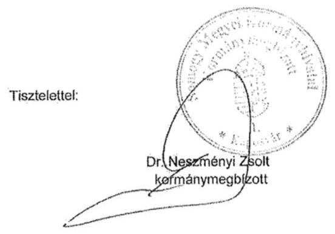

---

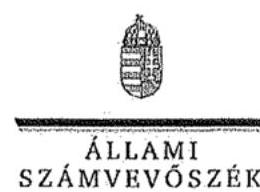

ELNÖK

Ikt.szám: V-1151-406/2016.

Dr. Neszményi Zsolt
kormánymegbízott
Somogy Megyei Kormányhivatal

Kaposvár

Tisztelt Kormánymegbízott Úr!
"A porlagfű elleni védekezés ellenőrzése" című jelentéstervezetre tett észrevételeit köszönettel megkaptam.

Az ellenőrzési megállapításokra vonatkozó észrevételét az Állami Számvevőszékről szóló 2011. évi LXVI. törvény 29. § (2) bekezdésében meghatározott tizenöt napos határidőn belül küldte meg. Az Állami Számvevőszék észrevétellel kapcsolatos álláspontját a mellékletként csatolt, a felügyeleti vezető által készített indokolás tartalmazza.

Tájékoztatom Kormánymegbízott urat, hogy a számvevőszéki jelentésben - az Állami Számvevőszékről szóló 2011. évi LXVI. törvény 29. § (3) bekezdése alapján - a figyelembe nem vett észrevételeket szerepeltetjük annak indoklásával, hogy azokat az Állami Számvevőszék miért nem fogadta el.

Budapest, 2017. május hó 15. nap

Tisztelettel:

Melléklet: Észrevételre adott válasz

Domokos László

FYSZ BUDAPEST, APÁCZAI CSERE JÁNOS UTCA 10. 1364 Budapest 4. Pl. 54 telefon. 484 9101 fax. 484 9291

---

"A parlagfű elleni védekezés ellenőrzése" című jelentéstervezethez tett észrevételekre adott válasz

# Somogy Megyei Kormányhivatal 

"A parlagfű elleni védekezés ellenőrzése" című jelentéstervezetre tett észrevételeket áttekintettem, annak kezelésével kapcsolatban a következő tájékoztatást adom.

## 1. A jelentéstervezet 1.2. számú megállapítás 22. oldal 1. bekezdésére vonatkozó észrevétel

A 2012. szeptember 27. és 2015. március 31. között hatályos, a fővárosi és megyei kormányhivatalokról szóló 288/2010. (XII. 21.) Korm. rendelet 6/A. § (2) bekezdése, illetve a 2015. április 1-jétől hatályos 66/2015. (III. 30.) Korm. rendelet 7. § (2) bekezdése szerint a fővárosi és megyei kormányhivatal a szakmai irányító miniszterek által kiadott országos hatósági ellenőrzési tervek alapján készíti el a közigazgatási hatósági eljárás és szolgáltatás általános szabályairól szóló 2004. évi CXL. törvény szerinti hatósági ellenőrzési terveit az ellenőrzési időszakot megelőző 15. napig.
Kormánymegbízott Úr az SOB/07/00091-2/2017. iktatószámú levelében „A parlagfű elleni védekezés ellenőrzése" című jelentéstervezethez kapcsolódóan észrevételezi, hogy a Somogy Megyei Kormányhivatal (a továbbiakban Kormányhivatal) ,, minden évben (így a vizsgált időszakban is) valamennyi érintett szervezeti egységének bevonásával elkészíti az adott évre vonatkozó hatósági ellenőrzési tervét."
A Kormányhivatal részéről az Állami Számvevőszékhez az ellenőrzés során beküldött dokumentumokat ismételten áttekintettük és megállapítottuk, hogy az Állami Számvevőszék részére az ellenőrzés során a Kormányhivatal hatósági ellenőrzési terveket nem adott át, ezért az ÁSZ az észrevételben foglaltakat nem fogadja el.
A fentiekre való tekintettel észrevétele alapján a megállapítás módosítása nem indokolt.

## 2. A jelentéstervezet 1.2. számú megállapítás 23. oldal 5. számú alpontjára vonatkozó észrevétel

A parlagfű elleni közérdekű védekezés végrehajtásának, valamint az állami, illetve a közérdekű védekezés költségei megállapításának és igénylésének részletes szabályairól szóló 221/2008. (VIII. 30.) Korm. rendelet 8. § (2) bekezdése alapján a földhasználó által a közérdekű védekezést elrendelő hatóságnak befizetett, illetve az adóhatóság által behajtott és a közérdekű védekezést elrendelő hatóságnak továbbított összeget a beérkezésétől számított nyolc napon belül, a növény- és talajvédelmi hatóság által elrendelt közérdekű védekezés esetén a fővárosi és megyei kormányhivatal visszatéríti az előirányzatba.
Kormánymegbízott Úr felhívja a figyelmet a földhasználó által megtérített eljárási költség visszafizetésére vonatkozó, jogszabály által meghatározott határidő szűkösségére.
Az észrevétel a jelentéstervezet megállapítását nem vitatja, így annak módosítása nem indokolt.

## 3. A jelentéstervezet 2.1. számú megállapításához kapcsolódó észrevétel

Kormánymegbízott Úr észrevételében jelzi, hogy szakmailag hibás elvárás a hatósági intézkedésekkel érintett területek nagyságának jelentős hatást tulajdonítani az augusztusi-szeptemberi pollenkoncentrációra, illetve hangsúlyozza az időjárás szerepét a parlagfű pollenkoncentrációjának alakulásában.

---

A parlagfű elleni védekezésre vonatkozó, hosszú távú célkitűzéseket az Országgyűlés határoztta meg a Nemzeti Környezetvédelmi Programokban. Az ellenőrzés azt vizsgálta, hogy a védekezés kapcsán megtett intézkedések elősegítették-e a - parlagfű koncentrációjára is vonatkozó - hosszú távú célok megvalósulását. A jelentéstervezet megállapítja, hogy a parlagfű pollen koncentrációjának alakulása hullámzó volt, továbbá felhívja a figyelmet az időjárási tényezők meghatározó szerepére.
Kormánymegbízott Úr észrevételei a jelentéstervezet megállapítását nem vitatják, így annak módosítása nem indokolt.

Budapest, 2017. 34. hónap
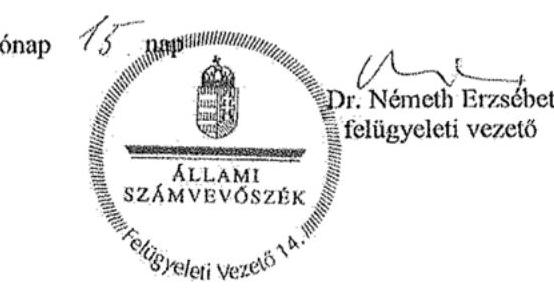

---

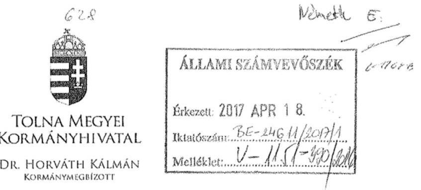

DOMOKOS LÁSZLÓ
Állami Számvevőszék
Elnök

Iktatószám: TOB/21/532-3/2017.
Ügyintéző: dr. Tarnai Nikoletta
Hiv.szám: V-1151-382/2016.

# BUDAPEST 4. 

1364
Pf.:54.

Tárgy: Észrevétel

## Tisztelt Elnök Úr!

Az Állami Számvevőszékről szóló 2011. évi LXVI. törvény (a továbbiakban: ÁSZ tv.) 29. § (1) bekezdésében foglaltak alapján a „Parlagfű elleni védekezés ellenőrzése" című jelentéstervezetet köszönettel megkaptam.
A jelentéstervezetet a kollégák áttekintették, az

 ÁSZ tv. 29. § (2) bekezdésében foglaltakra hivatkozva az alábbi észrevételt tesszük: a jelentéstervezet 40. oldalán javaslatként szerepel, hogy a parlagfű elleni védekezés keretében intézkedni kell a hatósági ellenőrzési tervek elkészítéséről.
A Tolna Megyei Kormányhivatal hatósági ellenőrzési tervében minden évben rögzítjük a külterületi parlagfű mentesítési feladatok hatósági ellenőrzésének feladatát.
A 2015. április 1-jei szervezeti integráció előtt pedig a Tolna Megyei Kormányhivatal Földhivatala, mint szakigazgatási szerv hatósági ellenőrzési tervében is mindig szerepelt.

Kérem, észrevételünk szíves elfogadását.

További együttműködésünkről biztosítjuk.

Szekszárd, 2017. április 11.
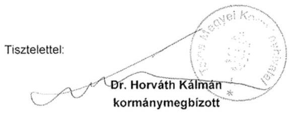

## Melléklet: -

[^0]
[^0]:    7100 Szekszárd, Augusz Imre u. 7. Telefon: (36 74) 629871 Fax: (36 74) 415686 E-mail: hivatal@tolna.gov.hu Honlap: www.kommanyhivatal.hu

---

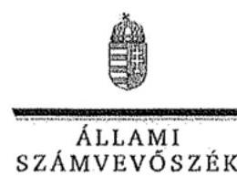

ELNÖK

Ikt.szám: V-1151-391/2016.

Dr. Horváth Kálmán
kormánymegbízott
Tolna Megyei Kormányhivatal

# Szekszárd 

## Tisztelt Kormánymegbízott Úr!

"A parlagfű elleni védekezés ellenőrzése" című jelentéstervezetre tett észrevételeit köszönettel megkaptam.

Az ellenőrzési megállapításokra vonatkozó észrevételét az Állami Számvevőszékről szóló 2011. évi LXVI. törvény 29. § (2) bekezdésében meghatározott tizenöt napos határidőn belül küldte meg. Az Állami Számvevőszék észrevétellel kapcsolatos álláspontját a mellékletként csatolt, a felügyeleti vezető által készített indokolás tartalmazza.

Budapest, 2017. 04. hó 28. nap
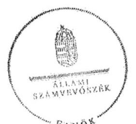

Tisztelettel:

Dornokos László

Melléklet: Észrevételre adott válasz

---

# "A parlagfű elleni védekezés ellenőrzése" című jelentéstervezethez tett észrevételre adott válasz 

## Tolna Megyei Kormányhivatal

"A parlagfű elleni védekezés ellenőrzése" című jelentéstervezetre tett észrevételeket áttekintettem, annak kezelésével kapcsolatban a következő tájékoztatást adom.
A 2012. szeptember 27. és 2015. március 31. között hatályos, a fővárosi és megyei kormányhivatalokról szóló 288/2010. (XII. 21.) Korm. rendelet 6/A. § (2) bekezdése, illetve a 2015. április 1-jétől hatályos 66/2015. (III. 30.) Korm. rendelet 7. § (2) bekezdése szerint a fővárosi és megyei kormányhivatal a szakmai irányító miniszterek által kiadott országos hatósági ellenőrzési tervek alapján készíti el a közigazgatási hatósági eljárás és szolgáltatás általános szabályairól szóló 2004. évi CXL. törvény szerinti hatósági ellenőrzési terveit az ellenőrzési időszakot megelőző 15. napig.

Kormánymegbízott Úr a TOB/21/532-3/2017. iktatószámú levelében „A parlagfű elleni védekezés ellenőrzése" című jelentéstervezethez kapcsolódóan észrevételezi, hogy a jelentéstervezet 40. oldalán javaslatként szerepel a Tolna Megyei Kormányhivatal (a továbbiakban Kormányhivatal) vezetője részére, hogy a parlagfű elleni védekezés keretében intézkedjen a hatósági ellenőrzési tervek elkészítéséről.

Tájékoztat továbbá, hogy a Kormányhivatal hatósági ellenőrzési tervében minden évben rögzítették a külterületi parlagfű mentesítési feladatok hatósági ellenőrzésének feladatát, valamint hogy a 2015. április 1-jei szervezeti integráció előtt pedig a Kormányhivatal Földhivatala, mint szakigazgatási szerv hatósági ellenőrzési tervében is mindig szerepelt. Kormánymegbízott Úr kéri észrevételeinek elfogadását.

A Kormányhivatal részéről az Állami Számvevőszékhez az ellenőrzés során beküldött dokumentumokat ismételten áttekintettük. Megállapítottuk, hogy Kormánymegbízott Úr a 2016. június 8-i keltezésű Nyilatkozat dokumentumban arról tett nyilatkozatot, hogy ,,A parlagfűvel szennyezett területekkel kapcsolatos hatósági ellenőrzéseket tartalmazó ellenőrzési tervekkel a Tolna Megyei Kormányhivatal nem rendelkezik." Az Állami Számvevőszék részére az ellenőrzés során a Kormányhivatal hatósági ellenőrzési terveket nem adott át.

A fentiekre való tekintettel észrevétele alapján megállapításunk módosítása nem indokolt.

Budapest, 2017.  hónap 28. nap
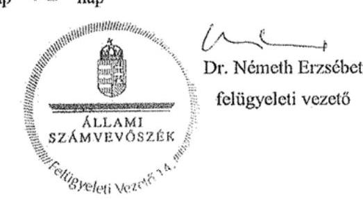

---

Bánk Község Önkormányzata
2653 Bánk, Hősök tere 11.
Tel/Fax: 35/342-804, 35/342-806
www.bank-falu.hu www.bank.hu hivatal@bank-falu.hu V-851-356/2016

Iktatószám: 173-2/2017/B.

Tárgy: tájékoztatás
felelelemezek muall
Elmélet posta
V

# Állami Számvevőszék 

Budapest
Apáczai Csere János u. 10.
1052

## Tisztelt Címzett!

Hivatkozva V-1151-382/2016. számú levelük mellékleteként megküldött „A parlagfű elleni védekezés ellenőrzése" című jelentéstervezet helyi önkormányzatok jegyzőinek szóló javaslatok 2. pontjában foglaltakra, tájékoztatjuk Önöket, hogy a vizsgálat időszakban (2013-2015. között) Bánk község belterületén parlagfűvel fertőzött ingatlan (terület) nem volt, ezért nem került sor jegyzőkönyv felvételére a parlagfű elleni védekezési kötelezettség betartásának helyszíni ellenőrzéséről.
A település helyszíni bejárásáról (melynek során felmérjük a gyommal fertőzött területeket) jegyzőkönyv felvételére sor került.
Megítélésem szerint mindezek miatt önkormányzatunkra nem vonatkozik a jelentéstervezet helyi önkormányzatok jegyzőinek szóló javaslatok 2. pontjában foglalt javaslat.

Bánk, 2017. március 31.
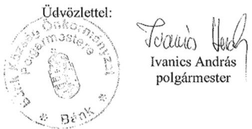

---

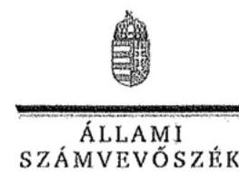

ELNÖK

Ikt.szám: V-1151-387/2016.

Ivanics András
polgármester
Bánk Község Önkormányzata

Bánk

# Tisztelt Polgármester Úr! 

"A parlagfű elleni védekezés ellenőrzése" című jelentéstervezetre tett észrevételeit köszönettel megkaptam.

Az ellenőrzési megállapításokra vonatkozó észrevételét az Állami Számvevőszékről szóló 2011. évi LXVI. törvény 29. § (2) bekezdésében meghatározott tizenöt napos határidőn belül küldte meg. Az Állami Számvevőszék észrevétellel kapcsolatos álláspontját a mellékletként csatolt, a felügyeleti vezető által készített indokolás tartalmazza.

Budapest, 2017. 04. hó 28. nap

Melléklet: Észrevételre adott válasz
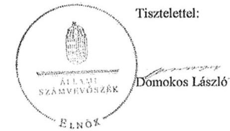

---

"A parlagfű elleni védekezés ellenőrzése" című jelentéstervezethez tett észrevételre adott válasz

# Bánk Község Önkormányzata (a továbbiakban Önkormányzat) 

"A parlagfű elleni védekezés ellenőrzése" című jelentéstervezetre tett észrevételeket áttekintettem, annak kezelésével kapcsolatban a következő tájékoztatást adom.
A parlagfű elleni közérdekű védekezés végrehajtásának, valamint az állami, illetve a közérdekű védekezés költségei megállapításának és igénylésének részletes szabályairól szóló 221/2008. (VIII.30.) Korm. rendelet (a továbbiakban Élvhr.) 3. § (1) bekezdése szerint a parlagfű elleni közérdekű védekezés helyszíni ellenőrzését - az élelmiszerláncról és hatósági felügyeletéről szóló 2008. évi XLVI. tv. (a továbbiakban Éltv.) 17. § (4) bekezdésében foglaltak betartásának ellenőrzése érdekében - saját kezdeményezésére vagy bejelentés alapján, külterületen az ingatlanügyi hatóság, belterületen a jegyző végez.

Az Élvhr. 3. § (5) bekezdése alapján a 3. § (1) és (3) bekezdés szerinti helyszíni ellenőrzés során az ingatlanügyi hatóság és a jegyző a vidékfejlesztési miniszter által az 1. számú melléklet szerinti adattartalommal rendszeresített, a Nemzeti Élelmiszerlánc-biztonsági Hivatal honlapján és a Földhivatalai portálon közzétett formanyomtatvány felhasználásával jegyzőkönyvet vesz fel.

Polgármester úr a 173-2/2017/B. iktatószámú levelében „A parlagfű elleni védekezés ellenőrzése" című jelentéstervezethez észrevételt tett, mely szerint Bánk Község területén parlagfűvel fertőzött ingatlan nem volt, azért nem került sor jegyzőkönyv felvételére a parlagfű elleni védekezési kötelezettség betartásának helyszíni ellenőrzéséről, így megítélése szerint az Önkormányzatra nem vonatkozik a jelentéstervezet helyi önkormányzatok jegyzőinek szóló javaslatok 2. pontjában foglalt javaslat.

Az Önkormányzat részéről az Állami Számvevőszékhez beküldött dokumentumokat ismételten áttekintettük. Megállapítottuk, hogy a település helyszíni bejárásáról, melynek során felmérik a gyommal fertőzött területeket, az Éltv. 17. § (1) bekezdés c) pontjára hivatkozással jegyzőkönyvet készítettek a helyszíni ellenőrzésről.

Az Éltv. 17. § (4) bekezdésében foglaltak betartásának ellenőrzése érdekében az Élvhr. 3. § (1) bekezdése szerinti helyszíni ellenőrzésről az (5) bekezdés alapján az Élvhr. 1. sz. melléklete szerinti jegyzőkönyvet kell felvenni függetlenül attól, hogy a község területén parlagfűvel fertőzött ingatlan van-e vagy sem.

A fentiekre való tekintettel észrevétele alapján megállapításunk módosítása nem indokolt.

Budapest, 2017.
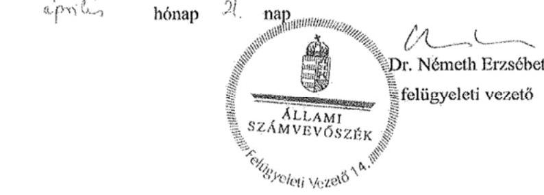

---

# RÖVIDÍTÉSEK JEGYZÉKE 

${ }^{1}$ OGY
${ }^{2} \mathrm{NKP}_{1,2}$
${ }^{3}$ Akcióterv
${ }^{4} \mathrm{FM}$
${ }^{5}$ FÖMI
${ }^{6}$ PIR
${ }^{7}$ NÉBIH
${ }^{8}$ PBR/ÖPBR
${ }^{9}$ EMMI
${ }^{10}$ PPRR
${ }^{11}$ NTI
${ }^{12}$ Éltv.
${ }^{13}$ Élvhr.
${ }^{14}$ ÁNTSZ-OKI
${ }^{15}$ BAMKH
${ }^{16}$ BAZMKH
${ }^{17}$ BFKH
${ }^{18}$ BKMKH
${ }^{19}$ BMKH
${ }^{20}$ CSMKH
${ }^{21}$ FMKH
${ }^{22}$ GYMSMKH
${ }^{23}$ HBMKH
${ }^{24}$ HMKH
${ }^{25}$ JNSZMKH
${ }^{26}$ KEMKH
${ }^{27}$ NMKH
${ }^{28}$ PMKH
${ }^{29}$ SMKH
${ }^{30}$ SZSZBMKH
${ }^{31}$ TMKH
${ }^{32}$ VEMKH

Országgyűlés
96/2009. (XII. 9.) OGY határozat a 2009-2014 közötti időszakra szóló Nemzeti Környezetvédelmi Programról,
27/2015. (VI. 17.) OGY határozat a 2015-2020 közötti időszakra szóló Nemzeti Környezetvédelmi Programról
1230/2012. (VII. 6.) Korm. határozat Magyarország Parlagfű Elleni Rövid és Középtávú Védekezési Akciótervéről
Földművelésügyi Minisztérium 2014-től, ezt megelőzően Vidékfejlesztési Minisztérium
Földmérési és Távérzékelési Intézet
Parlagfű Információs Rendszer
Nemzeti Élelmiszerlánc-biztonsági Hivatal
Parlagfű Bejelentő Rendszer/Önkormányzati Parlagfű Bejelentő Rendszer
Emberi Erőforrások Minisztériuma
Parlagfű Pollen Riasztási Rendszer
Megyei Kormányhivatal Növény- és Talajvédelmi Igazgatósága
2015. április 1-jétől növény- és talajvédelmi osztály
2008. évi XLVI. törvény az élelmiszerláncról és hatósági felügyeletéről

221/2008. (VIII. 30.) Korm. rendelet a parlagfű elleni közérdekű védekezés végrehajtásának, valamint az állami, illetve a közérdekű védekezés költségei megállapításának és igénylésének részletes szabályairól
Állami Népegészségügyi és Tisztiorvosi szolgálat - Országos
Környezetegészségügyi Intézet (koordinálta Aerobiológiai Hálózat csapdaállomásai adatai alapján)
Baranya Megyei Kormányhivatal
Borsod-Abaúj-Zemplén Megyei Kormányhivatal
Budapest Főváros Kormányhivatala
Bács-Kiskun Megyei Kormányhivatal
Békés Megyei Kormányhivatal
Csongrád Megyei Kormányhivatal
Fejér Megyei Kormányhivatal
Győr-Moson-Sopron Megyei Kormányhivatal
Hajdú-Bihar Megyei Kormányhivatal
Heves Megyei Kormányhivatal
Jász-Nagykun-Szolnok Megyei Kormányhivatal
Komárom-Esztergom Megyei Kormányhivatal
Nógrád Megyei Kormányhivatal
Pest Megyei Kormányhivatal
Somogy Megyei Kormányhivatal
Szabolcs-Szatmár-Bereg Megyei Kormányhivatal
Tolna Megyei Kormányhivatal
Veszprém Megyei Kormányhivatal

---

${ }^{33}$ VMKH
${ }^{34}$ ZMKH
${ }^{35}$ Apc önkormányzata
${ }^{36}$ Aranyosapáti önkormányzata
${ }^{37}$ Balatonboglár önkormányzata
${ }^{38}$ Balatongyörök önkormányzata
${ }^{39}$ Bánk önkormányzata
${ }^{40}$ Hajdúsámson önkormányzata
${ }^{41}$ Jászberény önkormányzata
${ }^{42}$ Kecskemét önkormányzata
${ }^{43}$ Miskolc önkormányzata
${ }^{44}$ Mohács önkormányzata
${ }^{45}$ Pápa önkormányzata
${ }^{46}$ Pincehely önkormányzata
${ }^{47}$ Rádóckölked önkormányzata
${ }^{48}$ Sarkadkeresztúr önkormányzata
${ }^{49}$ Sárbogárd önkormányzata
${ }^{50}$ Sopron önkormányzata
${ }^{51}$ Soroksár önkormányzata
${ }^{52}$ Szentes önkormányzata
${ }^{53}$ Tata önkormányzata
${ }^{54}$ Veresegyház önkormányzata
${ }^{55}$ ÁSZ SZMSZ
${ }^{56}$ 194/2008. (VII. 31.) Korm. rendelet
${ }^{57}$ BM
${ }^{58}$ KIM
${ }^{59}$ NFM
${ }^{60}$ NGM
${ }^{61}$ ÁNTSZ
${ }^{62}$ FM SZMSZ ${ }_{1}$

FM SZMSZ ${ }_{2}$

FM SZMSZ ${ }_{3}$
${ }^{63}$ Élelmiszerlánc-felügyeleti Főosztály ügyrend ${ }_{1}$

Élelmiszerlánc-felügyeleti Főosztály ügyrend ${ }_{2}$

Vas Megyei Kormányhivatal
Zala Megyei Kormányhivatal
Apc Községi Önkormányzat
Aranyosapáti Község Önkormányzata
Balatonboglár Városi Önkormányzat
Balatongyörök Község Önkormányzata
Bánk Község Önkormányzata
Hajdúsámson Város Önkormányzata
Jászberény Városi Önkormányzat
Kecskemét Megyei Jogú Város Önkormányzata
Miskolc Megyei Jogú Város Önkormányzata
Mohács Város Önkormányzata
Pápa Város Önkormányzata
Pincehely Nagyközség Önkormányzata
Rádóckölked Község Önkormányzata
Sarkadkeresztúr Község Önkormányzata
Sárbogárd Város Önkormányzata
Sopron Megyei Jogú Város Önkormányzata
Budapest Főváros XXIII. kerület Soroksár Önkormányzata
Szentes Város Önkormányzata
Tata Város Önkormányzata
Veresegyház Város Önkormányzata
Állami Számvevőszék Szervezeti és Működési Szabályzata
Az élelmiszerlánc felügyeletével összefüggő bírságok kiszabásának módjáról és mértékéről szóló 194/2008. (VII. 31.) Korm. rendelet
Belügyminisztérium
Közigazgatási és Igazságügyi Minisztérium
Nemzeti Fejlesztési Minisztérium
Nemzetgazdasági Minisztérium
Állami Népegészségügyi és Tisztiorvosi Szolgálat
A vidékfejlesztési miniszter 7/2012. (IV. 21.) VM utasítása a Vidékfejlesztési Minisztérium szervezeti és működési szabályzatáról (hatályos: 2012. április 21-étől 2013. június 18-áig)
A vidékfejlesztési miniszter 12/2013. (VI. 18.) VM utasítása a Vidékfejlesztési Minisztérium szervezeti és működési szabályzatáról (hatályos: 2013. június 18-ától 2014. július 31-éig)
A földművelésügyi miniszter 3/2014. (VIII. 1.) FM utasítása a Földművelésügyi Minisztérium szervezeti és működési szabályzatáról (hatályos: 2014. augusztus 1-jétől)

Vidékfejlesztési Minisztérium Élelmiszerlánc-felügyeleti Főosztály 563/2012. számú ügyrendje (hatályos: 2012. május 10-étől 2013. július 17-éig)

Vidékfejlesztési Minisztérium Élelmiszerlánc-felügyeleti Főosztály 711/2013. számú ügyrendje (hatályos: 2013. július 18-ától)

---

| ${ }^{64}$ Földügyi Főosztály ügyrendje | Vidékfejlesztési Minisztérium Földügyi Főosztály 623/2011. számú ügyrendje (hatályos: 2011. február 1-jétől) |
| :--: | :--: |
| ${ }^{65}$ Földhivatali eljárásrend: | A VM által 2010. június 28-án kiadott A parlagfű elleni közérdekű védekezés eljárásrendje a földhivatalok részére /2010. évre aktualizált/ |
| Földhivatali eljárásrend: | Az FM által 2014. június 23-án kiadott A parlagfű elleni közérdekű védekezés eljárásrendje a földhivatalok részére /2014. évre aktualizált/ |
| Földhivatali eljárásrend: | 2015. július 6-án FM által kiadott Eljárásrend a parlagfű-felderítésről és a parlagfű elleni közérdekű védekezéshez szükséges adatszolgáltatásról |
| ${ }^{66}$ FÖMI Alapító okirat: | A VM által a KGF/1271/2/2012. számon kiadott, 2012. október 31-én kelt, a Földmérési és Távérzékelési Intézet alapító okirata |
| FÖMI Alapító okirat: | A VM által a IfPF/277/6/2015. számon kiadott, 2015. június 23-án kelt, a Földmérési és Távérzékelési Intézet alapító okirata |
| ${ }^{67}$ FÖMI SZMSZ | a vidékfejlesztési miniszter 18/2012. (VIII. 30) VM utasítása a Földmérési és Távérzékelési Intézet Szervezeti és Működési Szabályzatának kiadásáról |
| ${ }^{68}$ FÖMI Ügyrend | a Földmérési és Távérzékelési Intézet főigazgatójának 65/16/2012. számú utasítása |
| ${ }^{69}$ Belterületi eljárásrend: | NÉBIH elnöke által 2012. június 28-án a Megyei Kormányhivatalok Növény- és Talajvédelmi Igazgatóságai részére kiadott a parlagfű
 elleni védekezés elmulasztása esetén követendő eljárásrend belterületi ingatlanokra vonatkozóan (érvényes 2014. július 9-ig) |
| Belterületi eljárásrend: | NÉBIH elnöke által 2014. július 10-én a Megyei Kormányhivatalok Növény- és Talajvédelmi Igazgatóságai részére kiadott a parlagfű elleni védekezés elmulasztása esetén követendő eljárásrend belterületi ingatlanokra vonatkozóan (érvényes 2014. július 10-től) |
| ${ }^{70}$ Ket. | A közigazgatási hatósági eljárás és szolgáltatás általános szabályairól szóló 2004. évi CXL. törvény |
| ${ }^{71}$ 19/1992. (I. 28.) Korm. rendelet | a helyi önkormányzatok és szerveik, a köztársasági megbízottak, valamint egyes centrális alárendeltségű szervek feladat- és hatáskörének megállapításával kapcsolatos földművelésügyi ágazati jogszabályok módosításáról szóló 19/1992. (I. 28.) Korm. rendelet |
| ${ }^{72} 328 / 2010$. (XII. 27.) Korm. rendelet | A fővárosi és megyei kormányhivatalok mezőgazdasági szakigazgatási szerveinek kijelöléséről szóló 328/2010. (XII. 27.) Korm. rendelet (hatályos 2015. április 1-jéig) |
| ${ }^{73}$ Külterületi eljárásrend: | NÉBIH elnöke által 2012. június 28-án a Megyei Kormányhivatalok Növény- és Talajvédelmi Igazgatóságai részére kiadott a parlagfű elleni védekezés elmulasztása esetén követendő eljárásrend külterületi ingatlanokra vonatkozóan (érvényes 2014. július 9-ig) |
| Külterületi eljárásrend: | NÉBIH elnöke által 2014. július 10-én a Megyei Kormányhivatalok Növény- és Talajvédelmi Igazgatóságai részére kiadott a parlagfű elleni védekezés elmulasztása esetén követendő eljárásrend külterületi ingatlanokra vonatkozóan (érvényes 2014. július 10-től) |
| ${ }^{74}$ EMMI SZMSZ: | 4/2013. (I. 31.) EMMI utasítás az Emberi Erőforrások Minisztériuma Szervezeti és Működési Szabályzatáról |
| EMMI SZMSZ: | 33/2014. (IX. 16.) EMMI utasítás az Emberi Erőforrások Minisztériuma Szervezeti és Működési Szabályzatáról |
| ${ }^{75}$ EMMI NF Ügyrend: | EMMI Népegészségügyi Főosztály Ügyrendje (hatályos 2013. szeptember 25-től) |
| EMMI NF Ügyrend: | EMMI Népegészségügyi Főosztály Ügyrendje (hatályos 2015. szeptember 10-től) |
| ${ }^{76}$ MKH SZMSZ: | 26/2012. (VIII. 24.) KIM utasítás a Megyei Kormányhivatalok Szervezeti és Működési Szabályzatáról (hatályos 2012. augusztus 25-től 2013. január 18-ig) |
| MKH SZMSZ: | 3/2013. (I. 18.) KIM utasítás a fővárosi és megyei kormányhivatalok szervezeti és működési szabályzatáról (hatályos 2013. január 19-től) |

---

| MKH SZMSZ ${ }_{3}$ | 11/2014. (XII. 23.) MvM utasítás a fővárosi és megyei kormányhivatalok szervezeti és működési szabályzatáról (hatályos 2014. december 24-től) |
| :--: | :--: |
| MKH SZMSZ ${ }_{4}$ | 7/2015. (III. 31.) MvM utasítás a fővárosi és megyei kormányhivatalok szervezeti és működési szabályzatáról |
| ${ }^{77}$ FM miniszter | Földművelésügyi miniszter |
| ${ }^{78} 152 / 2014$. (VI. 6.) Korm. rendelet | 152/2014. Korm. rendelet a Kormány tagjainak feladat- és hatásköréről (hatályos 2014. június 6-től) |
| ${ }^{79} \mathrm{Kbt}$. | a közbeszerzésekről szóló 2011. évi CVIII. törvény (hatálytalan 2015. november 1-től) |
| ${ }^{80} 288 / 2010$. (XII. 21.) Korm. rendelet | A fővárosi és megyei kormányhivatalokról szóló 288/2010. (XII. 21.) Korm. rendelet (hatályos 2015. március 31-ig) |
| ${ }^{81} 66 / 2015$. (III. 30.) Korm. rendelet | 66/2015. (III. 30.) Korm. rendelet a fővárosi és megyei kormányhivatalokról, valamint a járási (fővárosi kerületi) hivatalokról (hatályos 2015. április 1-jétől) |
| ${ }^{82} \mathrm{MVH}$ | Mezőgazdasági és Vidékfejlesztési Hivatal |
| ${ }^{83}$ Elemzés | A Parlagfű Információs Rendszerben (PIR) tárolt adatok elemzése (FÖMI 2015. december) |
| ${ }^{84}$ Környezetvédelmi tv. | A környezet védelmének általános szabályairól szóló 1995. évi LIII. törvény |
| ${ }^{85}$ MNMNK | Magyar Növényvédő Mérnöki és Növényorvosi Kamara |
| ${ }^{86}$ Megállapodások | 2013-2015. években az FM-mel a „Parlagfű elleni közérdekű védekezés végrehajtásának támogatása" fejezeti előirányzatban biztosított támogatás felhasználására megkötött megállapodások, támogatási szerződések |
| ${ }^{87}$ OTH | Országos Tisztifőorvosi Hivatal |

---

ÁLLAMI SZÁMVEVŐSZÉK
1052 Budapest, Apáczai Csere János utca 10.
Levélcím: 1364 Budapest 4. Pf. 54
Telefon: +36 14849100 Telefax: +36 14849200
www.asz.hu
