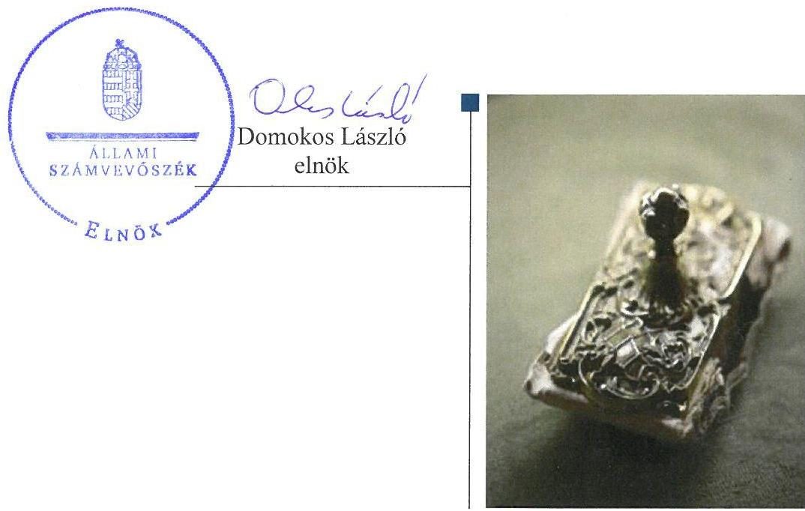
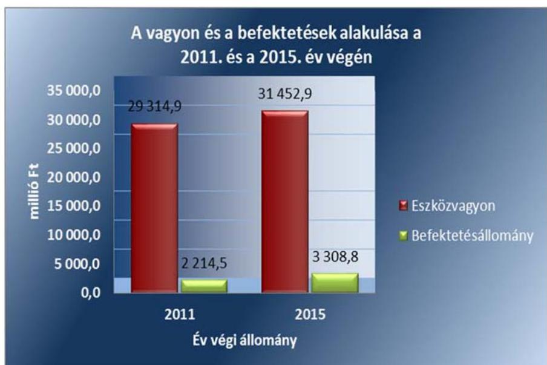
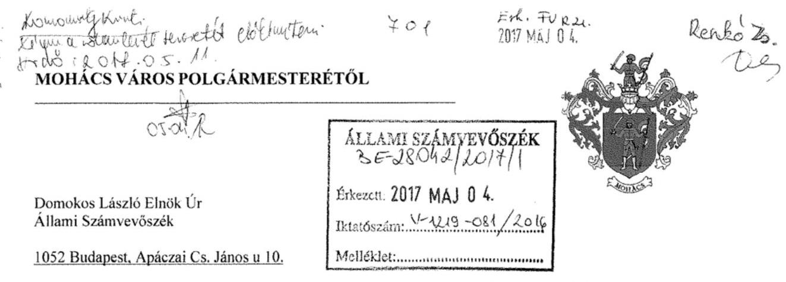
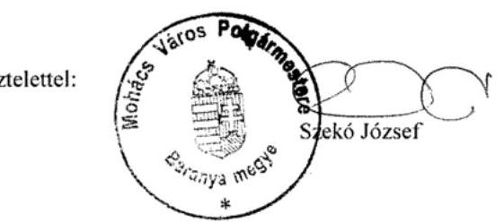
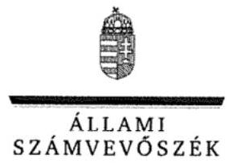
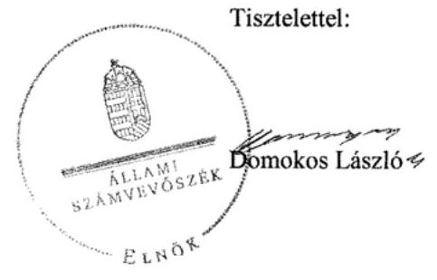
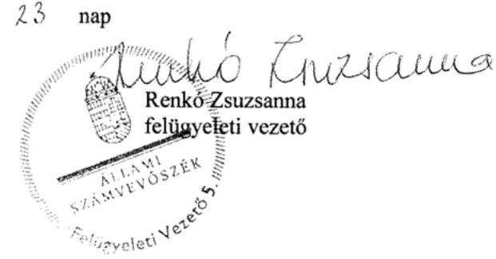

# Jelenetés 

## Önkormányzatok belső kontrollrendszere

Az önkormányzatok belső kontrollrendszere kialakításának és működtetésének ellenőrzése - Mohács
2017.

---

# Jelentés 

## Önkormányzatok belső kontrollrendszere

Az önkormányzatok belső kontrollrendszere kialakításának és működtetésének ellenőrzése - Mohács
2017. 06. hó 13. nap

---

# AZ ELLENŐRZÉST FELÜGYELTE: 

RENKÓ ZSUZSANNA felügyeleti vezető

## AZ ELLENŐRZÉST VEZETTE ÉS A VÉGREHAJTÁSÁÉRT FELELŐS:

DR. TIMÁR BALÁZS ellenőrzésvezető

## A PROGRAM ÖSSZEÁLLÍTÁSÁÉRT FELELŐS:

JANIK JÓZSEF LÁSZLÓ osztályvezető

IKTATÓSZÁM: V-1219-095/2016.
TÉMASZÁM: 24

## ELLENŐRZÉS-AZONOSÍTÓ SZÁM: V076401

Jelentéseink az Országgyűlés számítógépes hálózatán és az Interneten a www.asz.hu címen is olvashatóak.

---

# TARTALOMJEGYZÉK 

■ ÖSSZEGZÉS ..... 5
■ AZ ELLENŐRZÉS CÉLJA ..... 6
■ AZ ELLENŐRZÉS TERÜLETE ..... 7
■ AZ ELLENŐRZÉS HÁTTERE, INDOKOLTSÁGA ..... 8
■ A JELENTÉS LÉNYEGES KÉRDÉSKÖREI ..... 10
■ ELLENŐRZÉS HATÓKÖRE ÉS MÓDSZEREI ..... 11
■ MEGÁLLAPÍTÁSOK ..... 14
■ JAVASLATOK ..... 20
■ MELLÉKLETEK ..... 23
I. sz. melléklet: Értelmező szótár ..... 23
II. sz. melléklet: 50 millió Ft-ot meghaladó értékű befektetési döntések (2012. okt. 29- 2015. dec. 31.) ..... 26
III. sz. melléklet: Helytelen értékpapír nyilvántartásból adódó különbözetek évente (2011- 2015) ..... 27
IV. sz. melléklet: Az integritás érvényesítése érdekében kialakított és működtetett kontrollrendszer ..... 28
■ FÜGGELÉK: ÉSZREVÉTELEK ..... 31
■ RÖVIDÍTÉSEK JEGYZÉKE ..... 39

---

.

---

# ÖSSZEGZÉS 

Mohács Város Önkormányzatánál a belső kontrollrendszer kialakításának és működtetésének hiányosságai következtében a közvagyon biztonságos befektetése nem volt biztosított. A befektetési döntések meghozatala az Önkormányzati SZMSZ1,2-nek megfelelően történt. A befektetések valós értékéről a számviteli szabálytalanságok miatt nem álltak rendelkezésre megbízható adatok.

## Az ellenőrzés társadalmi indokoltsága

Magyarország Alaptörvénye az önkormányzatoktól is elvárja a kiegyensúlyozott, átlátható és fenntartható költségvetési gazdálkodás elvének érvényesítését. A korábbi évek ellenőrzési tapasztalatai, az önkormányzatok által betöltött társadalmi szerep, az általuk kezelt közpénz nagysága, a nemzeti vagyon átruházására vagy hasznosítására vonatkozó döntéseik sokrétűsége egyaránt indokolttá tették a számvevőszéki ellenőrzések folytatását. A belső kontrollrendszer jogszabályoknak megfelelő kialakítása és működtetése nélkül nem valósítható meg a közpénzek, a közvagyon szabályos, gazdaságos, hatékony és eredményes felhasználása.

Mohács Város Önkormányzata 2015. december 31-én 451,5 millió Ft forint alapú, és 2 389,1 millió Ft deviza alapú tartós hitelviszonyt megtestesítő értékpapírt tartott nyilván.

## Főbb megállapítások, következtetések

A belső kontrollrendszer kialakításának és működtetésének hiányosságai miatt az nem segítette elő a közpénzfelhasználás szabályosságát. A befektetési tevékenység végzéséről szóló szabályozások ellentmondó, jogalkalmazást nehezítő rendelkezései miatt nem voltak egyértelműek a felelősségi és hatásköri viszonyok. A közvagyon biztonságos és körültekintő befektetését nem biztosították, mivel nem mérték fel a gazdálkodással, a befektetésekkel - különösképpen a nagy kockázatot hordozó deviza alapú befektetésekkel - kapcsolatos kockázatokat. A kontrolltevékenységek nem járultak hozzá a szabálytalanságok feltárásához.

Az értékpapírok beszerzése az Önkormányzati SZMSZ1,2-ben foglalt hatásköri szabályok alapján, azonban a vagyonrendelet értékhatárra vonatkozó rendelkezései mellőzésével történt.

A bekerülési érték helytelen megállapítása miatt az Önkormányzat beszámolója a befektetett közvagyon nagyságát és annak változását nem a valóságnak megfelelően mutatta be.

---

# AZ ELLENŐRZÉS CÉLJA 

Az ellenőrzés célja annak megállapítása volt, hogy szabályszerűen történt-e az Önkormányzat ${ }^{1}$ belső kontrollrendszerének kialakítása és működtetése, az biztosította-e az Önkormányzatnál a közpénzfelhasználás szabályosságát, a közpénzekkel és a nemzeti vagyonnal történő szabályszerű és felelős gazdálkodást, a beszámolási és adatszolgáltatási kötelezettségek szabályszerű teljesítését. Az ellenőrzés keretében értékeltük az Önkormányzat korrupciós kockázatainak kezelését szolgáló integritás kontrollok kiépítettségét és az integritás szemlélet érvényesülését.

Az Önkormányzat egyes befektetési tevékenységeinek ellenőrzése során az ellenőrzés célja volt, hogy a kialakított kontrollkörnyezet biztosította-e a befektetési tevékenységek szabályszerű végzését. Megítéltük, hogy az egyes befektetési tevékenységekkel kapcsolatos döntéshozatal és a döntések végrehajtása, valamint az egyes befektetések számviteli elszámolása, nyilvántartása szabályszerű volt-e, és a belső és külső ellenőrzések hozzájárultak-e az egyes befektetési tevékenységek szabályszerűségéhez.

---

# **AZ ELLENŐRZÉS TERÜLETE**

## **Mohács Város Önkormányzata**

A Baranya megyében található Mohács lélekszáma 2015. január 1-én 17 633 fő volt. Az Önkormányzat az ellenőrzött időszakban 12 tagú Képviselő-testület2-tel rendelkezett, melynek munkáját három állandó bizottság segítette. Az Önkormányzat a Hivatalon3 kívül négy intézménnyel, valamint három 100% tulajdoni részesedésű gazdasági társasággal látta el a feladatait. Mohácsnak négy nemzetiségi önkormányzata (szerb, horvát, német, roma) volt.

A Polgármester4 1998 óta tölti be tisztségét, a Jegyző5 2005 óta látja el feladatait. A Hivatal a következő szervezeti egységekre tagolódott: Titkársági osztály, Városfejlesztési osztály, Pénzügyi osztály és Népjóléti osztály. A Hivatal gazdasági szervezettel rendelkezett, ennek feladatait a Költségvetési, Számviteli és Adó Csoportok látták el, vezetője a Pénzügyi Osztály vezetője volt. A Hivatalban foglalkoztatott köztisztviselők száma 2015. év végén 52 fő volt.

Az Önkormányzat a 2015. évi éves költségvetési beszámoló szerint 5 404,3 millió Ft költségvetési bevételt ért el, valamint 4 817,8 millió Ft költségvetési kiadást teljesített. Az eszközvagyon értéke 2015. december 31-én 31 452,9 millió Ft volt, a költségvetési évben esedékes kötelezettség állomány 46,7 millió Ft-ot, a költségvetési évet követően esedékes kötelezettség állomány 65,8 millió Ft-ot tett ki. A befektetett pénzügyi eszközök 2015. december 31-én kimutatott állománya 3 308,8 millió Ft volt.

Az Önkormányzat vagyonának és befektetéseinek alakulását a 2011. év és a 2015. év végén az 1. ábra mutatja be:

1. ábra

*Forrás: Az Önkormányzat beszámolói*

---

# AZ ELLENŐRZÉS HÁTTERE, INDOKOLTSÁGA 

A demokratikus társadalmakban alapvető igény, hogy a közpénzeket, a közvagyont használók tevékenységükről elszámoljanak, a tevékenységekhez egyértelmű és érvényesíthető felelősségi szabályok társuljanak. Ennek a jogos igénynek az érvényesítéséhez meg kell teremteni azokat a folyamatokat, rendszereket, amelyek nélkülözhetetlenek az elszámoltatáshoz. Az elszámoltatás eredményes működtetéséhez szükség van a megfelelő információs, kontroll-, értékelési és beszámolási rendszerek kialakítására. A belső kontrollok kiépítettsége hozzájárul az integritási szemlélet kialakításához és érvényesüléséhez.

A BELSŐ KONTROLLRENDSZER azt a célt szolgálja, hogy a költségvetési szervek működésük és gazdálkodásuk során a tevékenységeket szabályszerűen, gazdaságosan, hatékonyan és eredményesen hajtsák végre, teljesítsék elszámolási kötelezettségeiket és megvédjék erőforrásaikat a veszteségektől, a károktól és a nem rendeltetésszerű használattól. A belső kontrollrendszer magába foglalja mindazon szabályokat, eljárásokat, gyakorlati módszereket és szervezeti struktúrákat, kockázatkezelési technikákat, kontrolltevékenységeket, amelyek segítséget nyújtanak a szervezetnek céljai eléréséhez. A belső kontrollrendszer szabályozása háromszintű: a törvényi előírásokat az Áht. ${ }_{2}^{6}$ és a Mötv. ${ }^{7}$, a rendeleti szintű szabályozást az Ávr. ${ }^{8}$ és a Bkr. ${ }^{9}$ tartalmazza, amelyeket útmutatói szinten az $\mathrm{NGM}^{10}$ által kiadott standardok és kézikönyvek támogatnak.

A MEGFELELŐ BELSŐ KONTROLLRENDSZER jelentősen csökkenti a hibák és szabálytalanságok kockázatát. Az ÁSZ ${ }^{11}$ célja, hogy javuljon az ellenőrzött önkormányzatok belső kontrollrendszerének szabályozottsága, működésének megfelelősége, hozzájárulva ezzel az egyensúlyi helyzet fenntarthatóságának biztosításához, biztosítva az önkormányzatnál a közpénzfelhasználás szabályosságát, a közpénzekkel és a nemzeti vagyonnal történő szabályszerű, gazdaságos, hatékony és eredményes gazdálkodást. Az ÁSZ ellenőrzés tapasztalatai nem csupán a közvetlenül ellenőrzött önkormányzatokat segíthetik, hanem a „jó gyakorlat" elterjesztésével azok az önkormányzatok is átvehetik a pozitív példákat, ahol nem végez ellenőrzést az ÁSZ. Az MNB ${ }^{12}$ három befektetési szolgáltató tevékenységi engedélyét 2015. első felében visszavonta és kezdeményezte a vállalkozások felszámolását a működéssel kapcsolatos szabálytalanságok, hiányosságok miatt. A befektetési vállalkozások problémás helyzetbe kerülése jelentős veszteségekhez vezetett számos önkormányzat esetében. A korábbi évek ellenőrzési tapasztalatai alapján fennáll a lehetősége annak, hogy az önkormányzatok befektetési döntései, továbbá a döntések végrehajtása és számviteli elszámolása nem voltak teljes mértékben szabályszerűek, a belső kontrollrendszer és a kapcsolódó külső ellenőrzések sem működtek minden esetben megfelelően.

AZ ÖNKORMÁNYZATI VAGYONGAZDÁLKODÁS keretében az önkormányzatok átmenetileg szabad pénzeszközeinek befekte-

---

tését jogszabály nem tiltja, a befektetések jellege nem korlátozott, a pénzpiaci szolgáltatók közül az önkormányzatok a kínált szolgáltatás és annak költségei alapján, szabadon választhatnak, azonban a veszteséges gazdálkodás kockázatai és következményei az önkormányzatokat terhelik. A szabad pénzeszközök felhasználása során kiemelten fontos a felelős gazdálkodás érvényesülése, amely összhangban kell, hogy legyen az önkormányzati gazdálkodás alapelveivel. A közszféra integritás alapú kultúrájának kialakítása, megerősítése és működése szorosan összefügg a belső kontrollrendszer működésével, ezért az ellenőrzés kiterjed annak értékelésére is, hogy a belső kontrollrendszer kialakítása és működtetése hogyan hatott az integritás szemlélet érvényesülésére.

# AZ ELLENŐRZÉS VÁRHATÓ HASZNOSULÁSA 

NÉGY SZINTEN valósul meg. A törvényalkotás számára összegzett tapasztalatok állnak rendelkezésre a belső kontrollrendszer önkormányzati területen való kialakításáról, működtetéséről és hatásairól. Az ellenőrzés az ellenőrzött számára visszajelzést ad a belső kontrollrendszer kialakításában és működésében lévő hiányosságokról, javaslataival hozzájárul azok kiküszöböléséhez. Az ellenőrzés megállapításait és javaslatait más szervezetek is hasznosíthatják a rendezett gazdálkodási keretek kialakításához. A társadalom számára jelzi, hogy közpénz nem maradhat ellenőrizetlenül, az ÁSZ értékteremtő rend kialakításához és megőrzéséhez hozzájáruló tevékenysége pozitív hatással lesz a szervezetről kialakított összkép formálásában. Az ellenőrzéssel feltárásra kerülhetnek azok a kockázatok, amelyek az önkormányzatok gazdálkodásával, ezen belül befektetési tevékenységeivel, kontrollkörnyezetével kapcsolatosak és a befektetési tevékenységek szabályszerű végrehajtását befolyásolják. Az ellenőrzéssel az önkormányzatok befektetési/vagyongazdálkodási döntéseinek összessége értékelhetővé válik, és megalapozott megállapítás tehető arra vonatkozóan, hogy milyen hatást gyakoroltak az önkormányzat vagyonára a képviselő-testület döntései.

---

# A JELENTÉS LÉNYEGES KÉRDÉSKÖREI 

1. Az önkormányzat kialakított belső kontrollrendszere egyes pillérei összességében biztosították-e a befektetési tevékenységek szabályszerű végzését a 2011 - 2015. években?
2. Az önkormányzat belső kontrollrendszerének kialakítása és működtetése a 2015. évben szabályszerű volt-e, az biztosította-e a közpénzfelhasználás szabályosságát, a nemzeti vagyonnal történő felelős gazdálkodást?
3. Az egyes befektetésekkel kapcsolatos döntéshozatal és a döntések végrehajtása szabályszerű volt-e?
4. Az egyes befektetések számviteli elszámolása, nyilvántartása szabályszerű volt-e?

---

# ELLENŐRZÉS HATÓKÖRE ÉS MÓDSZEREI 

## Az ellenőrzés típusa

A belső kontrollrendszer ellenőrzése esetében megfelelőségi ellenőrzés, a befektetési tevékenységnél szabályszerűségi ellenőrzés.

## Az ellenőrzött időszak

A belső kontrollrendszer kialakításának és működtetésének ellenőrzése a 2015. január 1. és december 31. közötti időszakra terjedt ki. Az önkormányzatok egyes befektetési tevékenységeinek ellenőrzése tekintetében az ellenőrzött időszak a 2011. január 1. - 2015. december 31. közötti időszak. Ezen felül az önkormányzat befektetésekkel kapcsolatos döntés-előkészítésének és döntéshozatalának szabályszerűségét a 2011. január 1. előtti időszakra visszanyúlóan is ellenőriztük, amennyiben a 2015. december 31-én meglévő befektetéseire 2011. január 1-je előtt került sor. Az integritás szemlélet érvényesülését a 2015. évre vonatkozó adatszolgáltatás alapján értékeltük.

## Az ellenőrzés tárgya

Az Önkormányzatnak, mint éves költségvetési beszámoló készítésére kötelezett szervezetnek és Hivatalának belső kontrollrendszere. Az integritás szemlélet érvényesülése.

Az Önkormányzat 2015. december 31-én meglévő, értékpapírokban megtestesülő befektetései, lekötött betétei, valamint az önkormányzat üzleti vagyonába tartozó ingatlanok, kulturális javak (műtárgyak, műalkotások, stb.), illetve a feladatellátást nem szolgáló egyéb értéktárgyak (pl. ékszerek, befektetési nemesfém).

Az ellenőrzés kiterjedt minden olyan körülményre és adatra, amely az ÁSZ jogszabályban meghatározott feladatainak teljesítéséhez, valamint a program végrehajtása folyamán felmerült újabb összefüggések feltárásához szükséges volt.

## Az ellenőrzött szervezet

Mohács Város Önkormányzata (az Önkormányzat mint önálló éves költségvetési beszámoló készítésére kötelezett), valamint az Önkormányzat gazdálkodási feladatait ellátó Hivatal.

---

# Az ellenőrzés jogalapja 

Az ÁSZ tv. ${ }^{13}$ 1. § (3) bekezdésében foglaltak alapján az ÁSZ általános hatáskörrel végzi a közpénzekkel és az állami és önkormányzati vagyonnal való
 felelős gazdálkodás ellenőrzését. Az ÁSZ tv. 5. § (2) bekezdése alapján az államháztartás gazdálkodásának ellenőrzése keretében az ÁSZ ellenőrzi a helyi önkormányzatok gazdálkodását, valamint az ÁSZ tv. 5. § (6) bekezdése alapján ellenőrzése során értékeli az államháztartás számviteli rendjének betartását és a belső kontrollrendszer működését.

## Az ellenőrzés módszerei

Az ellenőrzést a nemzetközi standardokat irányadónak tekintve az ellenőrzési program szempontjai, kérdései, az ellenőrzött időszakban hatályos jogszabályok, az ellenőrzés szakmai szabályok és módszertanok figyelembe vételével végeztük.

Az ellenőrzés lefolytatásához az önkormányzat a tanúsítványok elektronikus kitöltésével, valamint az ÁSZ által kért dokumentumok elektronikus megküldésével szolgáltatott adatokat. A rendelkezésre bocsátott adatok, információk kontrollja az ellenőrzés keretében történt. A jelentésben használt fogalmak magyarázatát az I. sz. melléklet, az integritás érvényesítése érdekében kialakított és működtetett kontrollrendszer minősítését a IV. sz. melléklet tartalmazza.

A belső kontrollrendszer jogszabályi előírások szerinti kialakításának és működtetésének szabályszerűségét, az erre irányuló ellenőrzési kérdésekre adott válaszok összesítése alapján a 2015. január 1. és december 31. közötti időszakra, pillérenként (kontrollkörnyezet, kockázatkezelési rendszer, kontrolltevékenységek, információs és kommunikációs rendszer, monitoring rendszer) és összesítetten is értékeltük.

A belső kontrollrendszer egyes pilléreinek kialakítása és működtetése „szabályszerű" volt, amennyiben az értékelt területen az elért igen válaszok százalékban kifejezett, egész számra kerekített aránya meghaladta a 85%-ot, „részben szabályszerű" volt, ha a 85%-ot nem haladta meg, de 60%-nál nagyobb volt, „nem szabályszerű" volt, ha nem haladta meg a 60%-ot. Az önkormányzat belső kontrollrendszerének összesített értékelése megegyezett a pillérenként (kontrollterületenként) alkalmazott százalékos értékelésekkel, a következő eltérésekkel. A kontrollrendszer egésze esetében a „szabályszerű" értékelésnek a százalékos értéken felül további feltétele volt, hogy egyik kontrollterület sem kaphat „nem szabályszerű" értékelést, a „részben szabályszerű" értékelés további feltétele volt, hogy legfeljebb egy ellenőrzött kontrollterület lehetett „nem szabályszerű" értékelésű. Az összesített értékelés a százalékos értéktől függetlenül „nem szabályszerű" volt, ha az ellenőrzött kontrollterületek közül több mint egynek „nem szabályszerű" volt az értékelése.

A kontrolltevékenységek működésének megfelelőségét a foglalkoztatottak személyi juttatásaival, a külső személyi juttatásokkal, a működési kiadásokkal és a felhalmozási célú kiadásokkal kapcsolatos kifizetések esetében mintavétellel ellenőriztük. „Megfelelőnek" értékeltünk egy ellenőrzött

---

területet, amennyiben 95%-os bizonyossággal a teljes sokaságban a hibaarány legfeljebb 10%, „nem megfelelőnek", amennyiben 10%-nál magasabb arányt képviselt. Abban az esetben, ha a teljes sokaság tekintetében a 10%-os hibaarányhoz való viszony megítélésének megbízhatósága nem érte el a 95%-ot, annak elérése érdekében értékelésünket további szempontokkal egészítettük ki, és figyelembe vettük a feltárt hibák értékét.

Az integritás szemlélet érvényesülésének értékelése az önkormányzat által kitöltött kérdőív alapján, az abban foglalt válaszok megalapozottságának kontrollja mellett történt.

---

# 1. Az önkormányzat kialakított belső kontrollrendszere egyes pillérei összességében biztosították-e a befektetési tevékenységek szabályszerű végzését a 2011 - 2015. években? 

Összegző megállapítás

A 2011-2015. években a belső kontrollrendszer egyes pillérei a befektetési tevékenység szabályszerű végzését nem biztosították, ezáltal az értékpapírokban megtestesülő vagyon megőrzése és gyarapítása nem volt biztosított.

A KONTROLLKÖRNYEZET kialakítása nem biztosította a befektetési tevékenység szabályszerű végzését, mivel a Képviselő-testület a befektetések vonatkozásában - rendeleteiben egymásnak ellentmondó rendelkezéseket fogadott el. Az Önkormányzati SZMSZ ${ }_{1}{ }^{14}$ 2. melléklete IV. 9 pontja, illetve az Önkormányzati SZMSZ ${ }_{2}{ }^{15}$ 5. melléklete IV. 9 pontjának előírása szerint a Polgármester „értékhatárra tekintet nélkül" dönt az önkormányzati tulajdonú értékpapírok, kötvények értékesítéséről, hasznosításáról, visszavonásáról, ugyanakkor a vagyonrendelet ${ }^{16}$ az üzleti vagyon körébe tartozó vagyonelem elidegenítése esetében a Polgármester döntési hatáskörét legfeljebb 50 millió Ft-ban szabta meg. Ezzel megsértették a Jat. ${ }^{17}$ 2. § (1) bekezdésében foglaltakat, mivel az Önkormányzati SZMSZ ${ }_{1,2}$ és a vagyonrendelet nem rendelkezett a címzettek számára egyértelműen értelmezhető szabályozási tartalommal, továbbá a Jat. 3. §-ának előírása ellenére indokolatlanul párhuzamos szabályozást alakítottak ki.

A befektetések megszerzésére vonatkozóan az Önkormányzat rendeletei a hatásköri szabályokat meghatározták. Az Önkormányzati SZMSZ ${ }_{1,2}$ rögzítette, hogy a polgármester „dönt az átmenetileg és tartósan szabad pénzeszközök betétként vagy értékpapírban történő elhelyezéséről és egyéb banki szolgáltatás igénybevételéről." A vagyonrendeletben rögzítettek szerint „az önkormányzati üzleti vagyon körébe tartozó vagyonelem szerzéséről nettó 50 millió Ft egyedi forgalmi értékhatárig a polgármester, nettó 50 millió Ft feletti egyedi forgalmi értékhatártól a Képviselő-testület dönt."

A KOCKÁZATKEZELÉSI RENDSZERT az Ámr. ${ }^{18}$ 157. § (1) bekezdésének és a Bkr. 7. § (1) bekezdésének előírása ellenére nem működtették. Az Önkormányzat vagyonának jelentős részét kitevő befektetések tekintetében az Ámr. 157. § (2)-(3) bekezdéseiben és a Bkr. 7.§ (2) bekezdésében foglaltak ellenére nem állapítottak meg - egyebek mellett a deviza-alapú kötvények árfolyam-ingadozásából eredő - kockázatokat, nem határozták meg az egyes kockázatokkal kapcsolatban szükséges intézkedéseket.

---

1. táblázat

5 MILLIÓ FT FELETTI ÜGYLETEK (2012-2015)

|  Gy | Üzletkötések   száma | Összérték   (millió Ft) |
| :--: | :--: | :--: |
| 2012. | 3 | 111 |
| 2013. | 13 | 1610 |
| 2014. | 23 | 2652 |
| 2015. | 24 | 4439 |

Forrás: ÁSZ saját kigyűjtése az Önkormányzat adatszolgáltatásából

AZ INFORMÁCIÓS ÉS KOMMUNIKÁCIÓS RENDSZER nem biztosította az Önkormányzat gazdálkodásának átláthatóságát, mivel a 2012-2015. években az Info. tv. ${ }^{19}$ 37. § (1) bekezdésének és 1. melléklete III/4. pontjának előírása ellenére nem tették közzé az üzleti befektetések (5 millió Ft érték feletti megbízások) tekintetében a megbízások megnevezését (típusát), tárgyát, a szerződő fél (megbízott) nevét, a szerződés (megbízás) értékét. Az ügyletek számát és évenkénti volumenét az 1. táblázatban mutatjuk be.

A MONITORING RENDSZER keretén belül működő belső ellenőrzés bizonyosságot adó tevékenysége körében az Önkormányzat befektetései vonatkozásában nem fogalmazott meg megállapításokat, következtetéseket és javaslatokat a befektetésekkel kapcsolatos kockázati tényezők, hiányosságok megszüntetése, kiküszöbölése vagy csökkentése, a szabálytalanságok megelőzése, illetve feltárása érdekében. A külső ellenőrzések a befektetési tevékenységre nem terjedtek ki, ezek nem járultak hozzá az Önkormányzat befektetéseinek szabályszerű végzéséhez.

# 2. Az önkormányzat belső kontrollrendszerének kialakítása és működtetése a 2015. évben szabályszerű volt-e, az biztosította-e a közpénzfelhasználás szabályosságát, a nemzeti vagyonnal történő felelős gazdálkodást? 

## Összegző megállapítás

A gazdálkodás egészét tekintve a belső kontrollrendszer 2015. évi kialakítása és működtetése összességében nem volt szabályszerű, az nem biztosította a közpénzfelhasználás szabályosságát és a nemzeti vagyonnal való felelős gazdálkodást.

A KONTROLLKÖRNYEZET kialakítása összességében szabályszerű volt, mert a jogszabályokban előírt, megfelelő tartalmú szabályzatokat - az alábbi kivételekkel, illetve hiányosságok mellett - elkészítették:

- a Hivatali SZMSZ az Ávr. 13. § (1) bekezdés e) pontjában foglaltak ellenére a szervezeti egységek - ezen belül a gazdasági szervezet megnevezését nem tartalmazta, illetve az i) pont előírása ellenére nem szerepelt benne azon költségvetési szervek felsorolása, amelyeknek a gazdasági feladatait a Hivatal látja el.
- az Ávr. 13. § (2) bekezdés g) pontja előírásának ellenére belső szabályzatban nem rendezték a mobiltelefonok használatát.
- a számviteli politikában a Számv. tv. ${ }^{20}$ 14. § (4) bekezdésének előírása ellenére nem rögzítették azokat a gazdálkodóra jellemző szabályokat, előírásokat, módszereket, amelyekkel meghatározzák, hogy mit tekintenek a számviteli elszámolás, az értékelés szempontjából lényegesnek, jelentősnek, nem lényegesnek, nem jelentősnek - 2015. július 4-től terjedő hatállyal azt is, hogy mit tekint kivételes nagyságú vagy előfordulású bevételnek, költségnek, ráfordításnak, továbbá nem határozták meg, hogy a törvényben biztosított válasz-

---

tási, minősítési lehetőségek közül melyeket, milyen feltételek fennállása esetén alkalmaznak, az alkalmazott gyakorlatot milyen okok miatt kell megváltoztatni.
A Képviselő-testület a 2015. évre a Htv. ${ }^{21}$ 138. § (1) bekezdés a) pontjának előírása ellenére nem határozta meg az Önkormányzat gazdasági programját.

A Képviselő-testület által meghatározott hivatásetikai alapelveket és az etikai eljárás szabályait a Hivatal dolgozóival dokumentáltan nem ismertették meg, ezért fennáll annak kockázata, hogy az említett belső szabályzatban rögzített rendelkezések a Bkr. 9. § (1) bekezdésének előírása ellenére az azok betartására kötelezett személyekhez nem jutottak el.

A KOCKÁZATKEZELÉSI RENDSZER kialakításra került, mivel a Hivatal rendelkezett kockázatok kezelésének szabályozásával, azt azonban a Bkr. 7. § (1) bekezdésének előírása ellenére nem működtették, a 7. § (2) bekezdésében előírtakkal ellentétesen a tevékenységben, gazdálkodásban rejlő konkrét kockázatokat nem mérték fel és nem állapították meg, intézkedéseket nem határoztak meg. A belső szabályzat ${ }^{22}$ 1.4.5. pontja ellenére nem tartották nyilván a kockázati tényezőket, valamint a kockázatokra vonatkozó információkat.

A KONTROLLTEVÉKENYSÉGEK működtetése nem volt szabályszerű, mert a kiadási előirányzatok terhére történt kötelezettségvállalást az esetek több mint harmadában nem előzte meg pénzügyi ellenjegyzés, az Áht. 37. § (1) bekezdésének előírása ellenére. A gazdálkodási jogkörök gyakorlása során
— a teljesítést nem az arra jogosult igazolta, továbbá a teljesítésigazolás dátuma nem került megjelölésre az Ávr. 57. § (3) bekezdésének előírása ellenére, ezért az utalványozásra - az Áht. 38. § (1) bekezdésének előírása ellenére - nem a teljesítés igazolását követően került sor,
— az érvényesítés során az összeférhetetlenséggel kapcsolatos előírásokra több esetben nem voltak tekintettel, mivel a teljesítésigazolást és érvényesítést ugyanazon gazdasági esemény tekintetében azonos személy gyakorolta az Ávr. 60. § (1) bekezdésében foglaltak ellenére.
A Hivatal kiadási előirányzatai terhére vállalt kötelezettségeket az Ávr. 56. § (1) bekezdésének előírása ellenére nem, vagy nem a jogszabályi előírásoknak megfelelően vették nyilvántartásba, mivel ezek nem tartalmazták az Áhsz. ${ }^{23}$ 14. számú melléklet II.4. pontja
— a) alpontjának előírása ellenére a pénzügyi ellenjegyzés adatait,
— d) alpontjának előírása ellenére a kötelezettségvállalás, más fizetési kötelezettség tárgyát, összegét az egységes rovatrend szerint,
— f) alpontjának előírása ellenére a kötelezettségvállalás, más fizetési kötelezettség módosulásait,
— g) alpontjának előírása ellenére a pénzügyi teljesítések egységes rovatrend szerinti besorolását,
— i) alpontjának előírása ellenére a devizában fennálló kötelezettségvállalás, más fizetési kötelezettség összegét és annak módosulásait.
A belső szabályzat részeként elkészített ellenőrzési nyomvonalat a Bkr. 6. § (3) bekezdés ellenére rendszeresen nem aktualizálták, az régi és

---

2. táblázat

ADATSZOLGÁLTATÁS TELJESÍTÉSE (2015)

| Jelentés | Határidő | Teljesítés |
| :--: | :--: | :--: |
| I.negyedévi Hi-   vatali | 2015.04.20. | 2015.04.24. |
| I.negyedévi Ön-   kormányzati | 2015.04.20. | 2015.04.27. |
| III.negyedévi Hi-   vatali | 2015.10.20. | 2015.10.26. |
| III.negyedévi   Önkormányzati | 2015.10.20. | 2015.10.29. |
| Éves beszámoló   Önkormányzati | 2016.03.19. | 2016.04.06. |
| Forrás: ÁSZ saját kigyűjtése az Önkormányzat adatszolgáltatásából |  |  |

érvényben nem lévő jogszabályokra hivatkozott és olyan számviteli meghatározásokat tartalmazott, amelyek a 2015. évben már nem voltak hatályban. Az ellenőrzési nyomvonal a Bkr. 6. § (3) bekezdésének előírása ellenére nem tartalmazta a működési folyamatokkal (pénz- és vagyongazdálkodással) kapcsolatos ellenőrzési és irányítási folyamatokat.

## AZ INFORMÁCIÓS ÉS KOMMUNIKÁCIÓS RENDSZER kialakítása és működtetése nem volt szabályszerű, mivel annak szabályozása keretében a Bkr. 9. § (1) bekezdésének előírása ellenére nem alakították ki a szervezeten kívülre történő információátadás rendszerét, amely biztosítja, hogy a külső
 felek (illetékes szervezetek) részére a megfelelő információk a megfelelő időben eljussanak. Az Önkormányzat éves költségvetését és a 2014. évi költségvetési beszámolót az Info. tv. 37. § (1) bekezdésének és 1. melléklete III/1. pontjának előírása ellenére nem tették közzé. A közérdekű adatok megismerésére irányuló igények teljesítésének eljárásrendjéről és az iratkezelés szabályozásáról a jogszabályoknak megfelelően gondoskodtak.

A Kincstár ${ }^{24}$ által működtetett elektronikus adatszolgáltató rendszerbe - a 2. táblázatban bemutatottak szerint - késve került feltöltésre az önkormányzati éves költségvetési beszámoló az Áhsz. 32. § (4) bekezdésének előírása ellenére, továbbá az I. és a III. negyedévi időközi költségvetési jelentések és mérlegjelentések az Ávr. 169. § (3) bekezdésekben foglaltak ellenére.

A MONITORING RENDSZER kialakítása és működtetése nem volt szabályszerű, mivel a Hivatal tevékenységének, a célok megvalósításának nyomon követését biztosító rendszer részeként az operatív tevékenységek keretében megvalósuló folyamatos és eseti nyomon követést a Bkr. 10. § előírása ellenére 2015. szeptember 24-ig nem alakították ki. A Képviselőtestület 2015. szeptember 25-én fogadta el az Önkormányzat Integrált Területfejlesztési Stratégiáját, mely a Bkr.-nek megfelelő monitoring rendszer kialakítását tartalmazta.

A társulás keretében ellátott belső ellenőrzési feladathoz kapcsolódóan a belső ellenőrzési kézikönyv jóváhagyására határozattal a Jegyzőt jelölték ki, azonban azt a Bkr. 17. § (1) bekezdésének előírása ellenére - az 56. § (7) bekezdésének rendelkezéseire is figyelemmel - a Jegyző nem hagyta jóvá, ezért a Hivatal 2015-ben érvényes belső ellenőrzési kézikönyvvel nem rendelkezett. A belső ellenőrzési terv készítése, a stratégiai ellenőrzési terv felülvizsgálata és ezek jóváhagyása a Bkr. előírásának megfelelően történt. A szervezeti egységek vezetői a 45. § (3) bekezdésének előírása ellenére határidőn belül - egy kivételével - nem készítettek intézkedési tervet. A Jegyző a Bkr. 45. § (4) bekezdés ellenére az intézkedési terv jóváhagyásáról határidőn belül nem döntött.

A KÜLSŐ ELLENŐRZÉSEKET a 2015. évben a Magyar Államkincstár pályázati kötelezettségek helyszíni ellenőrzése tárgyában, az ÁSZ önkormányzati tulajdonú gazdasági társaság közfeladat-ellátást érintő gazdálkodása tárgyában végzett, a Kormányhivatal, az EMMI ${ }^{25}$ és a NAV ${ }^{26}$ hatósági ellenőrzéseket folytatott le. A külső ellenőrzések megállapításai, javaslatai alapján a Bkr.-nek megfelelő intézkedési tervet készítettek, az intézkedéseket végrehajtották. A külső ellenőrzések javaslatai alapján készült intézkedési tervek végrehajtásáról a Bkr. 14. § (1) bekezdése előírása ellenére nem vezettek nyilvántartást.

A BELSŐ KONTROLLRENDSZER MINŐSÉGÉT a Jegyző a Bkr. 1. számú melléklete szerinti nyilatkozatban megfelelőnek értékelte. Jelen ellenőrzés ettől eltérően - a kontrollkörnyezet kivételével - az egyes pillérek kialakításának és működtetésének hiányosságait állapította meg.

A HIVATAL a nemzetiségi önkormányzatokkal kapcsolatos gazdálkodási és egyéb feladatai ellátása során a hatályos jogszabályokat betartotta. A nemzetiségi önkormányzatok 2015. évi költségvetési határozattervezeteit, illetve a zárszámadási határozattervezeteit az Áht. ${ }_{2}$ és a Nek. tv. ${ }^{27}$ előírásainak megfelelően készítették elő.

AZ INTEGRITÁS SZEMLÉLET érvényesítését az Önkormányzat belső kontrollrendszerének kialakítása és működtetése nem támogatta. A Hivatal által az Önkormányzat nevében kitöltött kérdőívben foglalt válaszokat az ellenőrzés keretében, annak dokumentumokkal való alátámasztottsága szempontjából kontroll alá vetettük, ennek eredményeit a IV. sz. mellékletben részletezzük.

# 3. Az egyes befektetésekkel kapcsolatos döntéshozatal és a döntések végrehajtása szabályszerű volt-e? 

Összegző megállapítás

Az értékpapírok vételével kapcsolatos döntések az Önkormányzati SZMSZ1,2-nek megfeleltek.

3. táblázat

## ÉRTÉKPAPÍR ÁLLOMÁNY

(2015.12.31.)

| Típus | Érték   (millió $2 / 1$ ) |
| :--: | :--: |
| Forint-alapú kötvény | 451,5 |
| Deviza alapú kötvény | 2389,1 |
| ÖSSZESEN | 2840,6 |
| Forrás: ÁSZ saját kigyűjtése az Önkormányzat adat-   szolgáltatása alapján |  |

AZ ÖNKORMÁNYZAT 2015. december 31-én a 3. táblázatban bemutatottak szerint tartott nyilván tartós hitelviszonyt megtestesítő értékpapírokat. 2011. és 2015. között lekötött betéttel és üzleti célú részesedéssel nem rendelkezett, befektetési céllal ingatlant, kulturális javakat, egyéb értéktárgyakat nem vásárolt.

A döntések előkészítésével kapcsolatban belső szabályozást nem határoztak meg. A befektetési szolgáltatók kiválasztása pályáztatással, illetve egyedi ajánlatkéréssel történt. A deviza alapú tartós hitelviszonyt megtestesítő értékpapírok árfolyamkockázatáról a befektetési szolgáltató a megkötött szerződésben tájékoztatta az Önkormányzatot.

Az értékpapírok megszerzésére vonatkozó döntések - 1. pont alatt bemutatottak szerint egymásnak ellentmondó rendeleti szintű szabályozások közül - a vagyonrendelet 14 § (3) bekezdésének - az ott rögzített értékhatár figyelmen kívül hagyása miatt - nem, de az Önkormányzati SZMSZ1,2ben foglaltaknak megfeleltek. Az érintett üzletkötéseket a II. számú mellékletben foglaltuk össze.

Az Önkormányzat értékpapír ügyleteire kötött adásvételi szerződések minden esetben az előzetes ajánlatokkal megegyező feltételeket tartalmazták. A szerződésekre vonatkozó, jogszabályban előírt alaki szabályokat betartották. A befektetési vállalkozások tevékenységükről az Önkormányzatnak évente beszámoltak. A Polgármester a Képviselő-testület felé beszámolási kötelezettségének eleget tett.

# 4. Az egyes befektetések számviteli elszámolása, nyilvántartása szabályszerű volt-e? 

Összegző megállapítás

A 2011-2015. években a deviza alapú kötvények bekerülési értékének helytelen meghatározása miatt a befektetett vagyonra és annak változására vonatkozó valós számviteli információk nem álltak rendelkezésre.

A BEKERÜLÉSI ÉRTÉK meghatározását tekintve a 2011. és 2015. között beszerzésre került, tartós hitelviszonyt megtestesítő, devizaalapú értékpapírokat a Számv. tv. 60. § (4) bekezdésének előírása ellenére 2011. január 1-től 2013. december 31-ig nem a választott hitelintézet által meghirdetett devizavételi és devizaeladási árfolyam átlagán, vagy az MNB által közzétett, hivatalos devizaárfolyamon, 2014. január 1-től az Áhsz.; 20. § (3) bekezdés alkalmazása mellett a 15. § (6) bekezdésének előírása ellenére nem az MNB által közzétett, hivatalos árfolyamon vették nyilvántartásba. A helytelen könyvelés miatt adódott értékkülönbözet 2011., 2012. és 2013. évben az Áhsz. ${ }^{28}$ 5. § 7. d) pontjának előírása szerint jelentős összegű eltérésnek, a 2015. évben az Áhsz.; 1. § 3. pontjának rendelkezése szerint jelentős összegű hibának minősült. Az Önkormányzat értékpapírokba befektetett vagyona értékének megőrzését, gyarapítását szolgáló döntéshozatalhoz a mérlegekben kimutatott helytelen értékek miatt nem állt rendelkezésre megbízható és valós információ. Az eltéréseket a III. számú mellékletben mutatjuk be.

Az Önkormányzat 2011. és 2015. között az egyes befektetésekhez köthető analitikus nyilvántartásokat megfelelően vezette, a kapcsolódó kiadásokat és bevételeket a jogszabállyal összhangban számolta el.

AZ ÉV VÉGI SZÁMVITELI FELADATOK végzése során a 2011-2015. években a befektetések leltározása, az értékvesztés elszámolása, illetve visszaírása a forint alapú értékpapírok tekintetében a jogszabályi előírásoknak megfelelően történt. A külföldi pénzértékre szóló értékpapírok mérlegfordulónapra vonatkozó devizaárfolyamon történő értékelését - a Számv. tv. 60. § (2) bekezdésének előírása ellenére - nem szabályszerűen végezték el, melynek következtében a 2011-2012. években elszámolt értékvesztés és a 2012-2014. években elszámolt értékvesztés visszaírása sem volt megfelelő.

---

# JAVASLATOK 

Az ÁSZ tv. 33. § (1) bekezdésében foglaltak értelmében az ellenőrzött szervezet vezetője köteles a jelentésben foglalt megállapításokhoz kapcsolódó intézkedési tervet összeállítani és azt a jelentés kézhezvételétől számított 30 napon belül az ÁSZ részére megküldeni. Amennyiben az ellenőrzött szervezet vezetője nem küldi meg határidőben az intézkedési tervet, vagy továbbra sem elfogadható intézkedési tervet küld, az Állami Számvevőszék elnöke az ÁSZ tv. 33. § (3) bekezdése a) és b) pontjaiban foglaltakat érvényesítheti.

## a polgármesternek:

1. Intézkedjen a Polgármesterre átruházott hatáskörök értékhatárának meghatározására vonatkozó szabályozások közötti összhangot biztosító előterjesztés Képviselő-testület elé terjesztéséről.
(1. számú megállapítás 1. bekezdése alapján)
2. Intézkedjen a jogszabályi előírásoknak megfelelően kiegészített hivatali SZMSZ jóváhagyásáról.
(2. számú megállapítás 1. bekezdés 1. pontja alapján)
3. Intézkedjen a gazdasági programról szóló előterjesztés Képviselő-testület elé terjesztéséről.
(2. számú megállapítás 2. bekezdése alapján)
4. Intézkedjen a feltárt hiányosságok és/vagy szabálytalanságok tekintetében a munkajogi felelősség tisztázására irányuló eljárás megindításáról és ennek eredménye ismeretében tegye meg a szükséges intézkedéseket.
(1. számú megállapítás 3. bekezdése, 2. számú megállapítás 1. bekezdés 2-3. pontjai, 3-4. és 7. bekezdései, 8. bekezdés 1. mondata, 11. bekezdés 1. és 4. mondata, 12. bekezdés 3. mondata alapján)

---

# a jegyzőnek: 

1. Intézkedjen a belső kontrollrendszer egyes elemei jogszabályi előírásnak megfelelő kialakításáról és működtetéséről, valamint a gazdálkodási jogkörök gyakorlása során a jogszabályi előírások betartásáról.
(1. számú megállapítás 3-4. bekezdései, 2. számú megállapítás 1. bekezdés 2-3. pontjai, 3-9. bekezdései, 11. bekezdés 1. és 3-4. mondatai, 12. bekezdés 3. mondata alapján)
2. Intézkedjen a jogszabályi előírásoknak megfelelően kiegészített hivatali SZMSZ-tervezet elkészítéséről és jóváhagyásra a polgármester elé terjesztéséről.
(2. számú megállapítás 1. bekezdés 1. pontja alapján)
3. Intézkedjen a tartós hitelviszonyt megtestesítő, deviza alapú értékpapírok jogszabályi előírásoknak megfelelő kimutatásáról a főkönyvi nyilvántartásokban.
(4. számú megállapítás 1. bekezdés 1. mondata alapján)
4. Intézkedjen az éves költségvetési beszámoló mérlegében kimutatott külföldi pénzértékre szóló értékpapírok jogszabályi előírásoknak megfelelő értékeléséről.
(4. számú megállapítás 3. bekezdés 2. mondata alapján)
5. Intézkedjen az Állami Számvevőszék ellenőrzése során feltárt hiányosságok és/vagy szabálytalanságok tekintetében a munkajogi felelősség tisztázására irányuló eljárás megindításáról, és ennek eredménye ismeretében tegye meg a szükséges intézkedéseket.
(1. számú megállapítás 4. bekezdése, 2. számú megállapítás 5-6. bekezdései, 8. bekezdés 2. mondata, 9. bekezdése, 11. bekezdés 3. mondata, 4. számú megállapítás 1. bekezdés 1. mondata, 4. számú megállapítás 3. bekezdés 2. mondata alapján)

---

.

---

# MELLÉKLETEK 

- I. SZ. MELLÉKLET: ÉRTELMEZŐ SZÓTÁR
befektetési vállalkozás
belső ellenőrzés
belső kontrollrendszer
belső kontrollrendszer pillérei, kontrollterületei
betét
helyi önkormányzat
a Bszt. szerinti, tevékenység végzésére jogosító engedély alapján, harmadik személy részére, ellenérték fejében, rendszeres gazdasági tevékenysége keretében befektetési szolgáltatást nyújt, vagy befektetési tevékenységet végez, ide nem értve a 3. §ban meghatározottakat (Bszt. 4. § (2) bekezdés 10. pont)
Független, tárgyilagos bizonyosságot adó és tanácsadó tevékenység, amelynek célja, hogy az ellenőrzött szervezet működését fejlessze és eredményességét növelje, az ellenőrzött szervezet céljai elérése érdekében rendszerszemléletű megközelítéssel és módszeresen értékeli, illetve fejleszti az ellenőrzött szervezet irányítási és belső kontrollrendszerének hatékonyságát. (Forrás: Bkr. 2. § b) pontja)
A belső kontrollrendszer a kockázatok kezelése és tárgyilagos bizonyosság megszerzése érdekében kialakított folyamatrendszer, amely azt a célt szolgálja, hogy a működés és gazdálkodás során a tevékenységeket szabályszerűen, gazdaságosan, hatékonyan, eredményesen hajtsák végre, az elszámolási kötelezettségeket teljesítsék, megvédjék az erőforrásokat a veszteségektől, károktól és nem rendeltetésszerű használattól. (Forrás: Áht. 69. § (1) bekezdése)
A kontrollkörnyezet, a kockázatkezelési rendszer, a kontrolltevékenységek, az információs és kommunikációs rendszer, valamint a nyomon követési (monitoring) rendszer. (Forrás: Bkr. 3. §-a)
a Ptk. szerinti betétszerződés vagy a takarékbetétről szóló 1989. évi 2. törvényerejű rendelet szerinti takarékbetét-szerződés alapján fennálló tartozás, ideértve a hitelintézetnél a fizetésiszámla-szerződés alapján fennálló pozitív számlaegyenleget is (Hpt. 6. § (1) bekezdés 8. pont).
A helyi önkormányzat jogi személy. Az önkormányzati feladatok ellátását a képviselőtestület és szervei biztosítják. A képviselőtestület szervei: a polgármester, a főpolgármester, a megyei közgyűlés elnöke, a képviselő-testület bizottságai, a részönkormányzat testülete, a polgármesteri hivatal, a megyei önkormányzati hivatal, a közös önkormányzati hivatal, a jegyző, továbbá a társulás. A képviselő-testület a feladatkörébe tartozó közszolgáltatások ellátására - jogszabályban meghatározottak szerint - költségvetési szervet, a Polgári perrendtartásról szóló 1952. évi III. törvény szerinti gazdálkodó szervezetet (a továbbiakban: gazdálkodó szervezet), nonprofit szervezetet és egyéb szervezetet (a továbbiakban együtt: intézmény) alapíthat, továbbá
 szerződést köthet természetes és jogi személlyel vagy jogi személyiséggel nem rendelkező szervezettel. A helyi önkormányzat éves költségvetési beszámolója magába foglalja a helyi önkormányzat – nem költségvetési szerveihez tartozó – feladataihoz kapcsolódó bevételeket és kiadásokat. A helyi önkormányzat összevont (konszolidált) költségvetési beszámolóját a helyi önkormányzatra és költségvetési szerveire vonatkozóan külön-külön beérkezett éves költségvetési beszámolók alapján a Kincstár készíti el és küldi meg az önkormányzatnak. (Forrás: Mótv. 41. § (1), (2), (6) bekezdései; Áhsz. 2. § (1) bekezdése, 6. § (1) bekezdés a) és f) pontja, 30. §-a, 37. § (1) és (6) bekezdése)
hitelviszonyt megtestesítő értékpapír
minden olyan értékpapír, illetve törvény által értékpapírnak minősített, jogot megtestesítő okirat, amelyben a kibocsátó (adós) meghatározott pénzösszeg rendelkezésére bocsátását elismerve arra kötelezi magát, hogy a pénz (kölcsön) összegét, valamint annak meghatározott módon számított kamatát vagy egyéb hozamát, és az általa esetleg vállalt egyéb szolgáltatásokat az értékpapír birtokosának (a hitelezőnek) a megjelölt időben és módon megfizeti, illetve teljesíti. Ide tartozik különösen: a kötvény, a kincstárjegy, a letéti jegy, a pénztárjegy, a célrészjegy, a takaréklevél, a jelzáloglevél, a hajóraklevél, a közraktárjegy, az árujegy, a zálogjegy, a kárpótlási jegy, a határozott idejű befektetési alap által kibocsátott befektetési jegy (Számv. tv. (6) bekezdés 2. pont)
A költségvetési szerv vezetője által kialakított és működtetett olyan rendszer, mely biztosítja, hogy a megfelelő információk a megfelelő időben eljutnak az illetékes szervezethez, szervezeti egységhez, illetve személyhez. (Forrás: Bkr. 9. § (1) bekezdés)
Az integritás elvek, értékek, cselekvések, módszerek, intézkedések konzisztenciáját jelenti: olyan magatartásmódot, amely meghatározott értékeknek felel meg. Az integritás a közszféra esetében a társadalom által elvárt nyilvánossági, átláthatósági, illetve jogi/etikai normáknak történő megfelelést jelenti. (Forrás: a http://integritas.asz.hu honlapon közzétett „A 2012. évi integritás felmérés eredményeinek összefoglalója" című dokumentum 3. oldal 1. bekezdése)
névre szóló, hitelviszonyt megtestesítő értékpapír, amely lejárat nélküli vagy – jogszabály által megszabott keretek között – lejárattal rendelkezik. A kötvényben a kibocsátó (az adós) arra kötelezi magát, hogy az ott megjelölt pénzösszegnek az előre meghatározott kamatát vagy egyéb jutalékait, valamint az általa vállalt esetleges egyéb szolgáltatásokat (a továbbiakban együtt: kamat), továbbá a pénzösszeget a kötvény mindenkori tulajdonosának, illetve jogosultjának (a hitelezőnek) a megjelölt időben és módon megfizeti és teljesíti (Tpt. 12/B. § (1) bekezdés)
Olyan irányítási eszközök és módszerek összessége, melynek elemei a szervezeti célok elérését veszélyeztető tényezők (kockázatok) azonosítása, elemzése, csoportosítása, nyomon követése, valamint szükség esetén a kockázati kitettség mérséklése. (Forrás: Bkr. 2. § m) pontja)
A költségvetési szerv vezetője által kialakított olyan elvek, eljárások, belső szabályzatok összessége, amelyben világos a szervezeti struktúra, egyértelműek a felelősségi, hatásköri viszonyok és feladatok, meghatározottak az etikai elvárások a szervezet minden szintjén, átlátható a humánerőforrás-kezelés. (Forrás: Bkr. 6. § (1) bekezdés)
A költségvetési szerv vezetője által a szervezeten belül kialakított (kontroll) tevékenységek, melyek biztosítják a kockázatok kezelését, hozzájárulnak a szervezet céljainak eléréséhez. (Forrás: Bkr. 8. § (1) bekezdés)
az élettelen és élő természet keletkezésének, fejlődésének, az emberiség, a magyar nemzet, Magyarország történelmének kiemelkedő és jellemző tárgyi, képi, hangrögzített, írásos emlékei és egyéb bizonyítékai – az ingatlanok kivételével –, valamint a művészeti alkotások (a kulturális örökség védelméről szóló 2001. évi LXIV. törvény)
tartós hitelviszonyt megtestesítő értékpapírként azokat a befektetési céllal beszerzett értékpapírokat kell kimutatni, amelyek lejárata, beváltása a tárgyévet követő üzleti évben még nem esedékes, és a vállalkozó azokat a tárgyévet követő üzleti évben nem szándékozik értékesíteni (Számv. tv. 27. § (7) bekezdés)
minden olyan nyomdai úton előállított (előállíttatható) vagy dematerializált értékpapír, illetve törvény által értékpapírnak minősített, jogot megtestesítő okirat, amelyben a kibocsátó meghatározott pénzösszeg, illetve pénzértékben meghatározott nem pénzbeli vagyoni érték tulajdonba – vagy használatbavételét elismerve arra kötelezi magát, hogy ezen értékpapír, okirat birtokosának meghatározott vagyoni és egyéb jogokat biztosít. Ide tartozik különösen: a részvény, az üzletrész, a szövetkezeti részesedés, a vagyonjegy, az egyéb társasági részesedés, a határozatlan futamidejű befektetési alap által kibocsátott befektetési jegy, a kockázati tőkejegy, a kockázati tőkerészvény (Számv. tv. (6) bekezdés 3. pont)
a nemzeti vagyon azon része, amely nem tartozik az önkormányzati vagyon esetén a törzsvagyonba (Nvtv. 3. § (1) bekezdés 18. pontja)
a nemzeti vagyongazdálkodás feladata a nemzeti vagyon rendeltetésének megfelelő, az állam, az önkormányzat mindenkori teherbíró képességéhez igazodó, elsődlegesen a közfeladatok ellátásához és a mindenkori társadalmi szükségletek kielégítéséhez szükséges, egységes elveken alapuló, átlátható, hatékony és költségtakarékos működtetése, értékének megőrzése, állagának védelme, értéknövelő használata, hasznosítása, gyarapítása, továbbá az állam vagy a helyi önkormányzat feladatának ellátása szempontjából feleslegessé váló vagyontárgyak elidegenítése (Nvtv. 7. § (2) bekezdése)

---

# ÉRTÉKPAPÍR TRANZAKCIÓK

|  Üzletkötés
(déporti) | Megállás kipusa | Értékpapír fajtája | Összeg (szer-ft)  |
| --- | --- | --- | --- |
|  2013.03.08. | Értékpapír vásárlás | D140305 Diszkont kincstárjegy | 154000  |
|  2013.03.08. | Értékpapír vásárlás | A161222D13 államkötvény | 155000  |
|  2013.03.21. | Értékpapír vásárlás | OPUS 3.95 vállalati kötvény | 140314  |
|  2013.04.12. | Értékpapír vásárlás | OPUS 3.95 vállalati kötvény | 145241  |
|  2013.04.17. | Értékpapír vásárlás | OPUS 3.95 vállalati kötvény | 146975  |
|  2013.05.10. | Értékpapír vásárlás | OPUS 3.95 vállalati kötvény | 87822  |
|  2013.05.21. | Értékpapír vásárlás | REPHUN 3 államkötvény | 87117  |
|  2013.06.04. | Értékpapír vásárlás | A201112A04 államkötvény | 83280  |
|  2013.06.04. | Értékpapír vásárlás | REPHUN 3 államkötvény | 87876  |
|  2013.09.19. | Értékpapír vásárlás | REPHUN 5 államkötvény | 177630  |
|  2013.11.12. | Értékpapír vásárlás | OPUS 3.95 vállalati kötvény | 149370  |
|  2013.11.14. | Értékpapír vásárlás | OPUS 3.95 vállalati kötvény | 149035  |
|  2014.02.20. | Értékpapír vásárlás | A181220A13 államkötvény | 184000  |
|  2014.02.20. | Értékpapír vásárlás | A190624A08 államkötvény | 171970  |
|  2014.02.20. | Értékpapír vásárlás | A220624A11 államkötvény | 169500  |
|  2014.02.20. | Értékpapír vásárlás | A231124A07 államkötvény | 187570  |
|  2014.03.25. | Értékpapír vásárlás | A180425B14 államkötvény | 50520  |
|  2014.05.20. | Értékpapír vásárlás | A281022A11 államkötvény | 176780  |
|  2014.05.20. | Értékpapír vásárlás | A250624B14 államkötvény | 195640  |
|  2014.05.22. | Értékpapír vásárlás | OPUS 3.95 vállalati kötvény | 60726  |
|  2014.05.23. | Értékpapír vásárlás | OTP HB 5 7/8 11/29/49 váll. ktvny. | 103640  |
|  2014.09.12. | Értékpapír vásárlás | FRANK TE külföldi befektetési jegy | 199656  |
|  2014.09.12. | Értékpapír vásárlás | FRANK TEMP külföldi bef. jegy | 199373  |
|  2014.09.17. | Értékpapír vásárlás | MOL MAGNOLIA 6.25 váll. kötvény | 188376  |
|  2014.09.30. | Értékpapír vásárlás | REPHUN 5 államkötvény | 93640  |
|  2014.09.30. | Értékpapír vásárlás | MAEXIM vállalati kötvény | 100503  |
|  2014.10.29. | Értékpapír vásárlás | MOL MAGNOLIA 6.25 váll. kötvény | 185340  |
|  2014.11.25. | Értékpapír vásárlás | OPUS 3.95 vállalati kötvény | 82628  |
|  2014.12.18. | Értékpapír vásárlás | A281022A11 államkötvény | 76000  |
|  2015.01.13. | Értékpapír vásárlás | OPUS 3.95 vállalati kötvény | 79448  |
|  2015.01.14. | Értékpapír vásárlás | MOL MAGNOLIA 6.25 váll. kötvény | 63970  |
|  2015.01.14. | Értékpapír vásárlás | OTP HB 5 7/8 11/29/49 váll. ktvny. | 79963  |
|  2015.01.23. | Értékpapír vásárlás | MOL MAGNOLIA 6.25 váll. kötvény | 257768  |
|  2015.01.26. | Értékpapír vásárlás | MOL MAGNOLIA 6.25 váll. kötvény | 200011  |
|  2015.01.27. | Értékpapír vásárlás | MOL MAGNOLIA 6.25 váll. kötvény | 93783  |
|  2015.02.25. | Értékpapír vásárlás | RBIAV 5 10/16/23 külföldi kötvény | 91650  |
|  2015.03.19. | Értékpapír vásárlás | RBIAV 5 10/16/23 külföldi kötvény | 120824  |
|  2015.03.20. | Értékpapír vásárlás | RBIAV 6 10/16/23 külföldi kötvény | 151685  |
|  2015.03.23. | Értékpapír vásárlás | OPUS 3.95 vállalati kötvény | 571899  |
|  2015.03.23. | Értékpapír vásárlás | OTP HB 5 7/8 11/29/49 váll. ktvny. | 819996  |
|  2015.03.23. | Értékpapír vásárlás | Magyar Államkötvény 2020/I | 447968  |
|  2015.04.10. | Értékpapír vásárlás | RBIAV 4 1/2 10/16/23 külf. kötvény | 417256  |
|  2015.05.21. | Értékpapír vásárlás | REPHUN 5 államkötvény | 234787  |
|  2015.10.15. | Értékpapír vásárlás | RBIAV 5 10/16/23 külföldi kötvény | 341165  |
|  2015.11.17. | Értékpapír vásárlás | RBIAV 4 1/2 02/21/25 külf. kötvény | 124537  |
|  2015.12.04. | Értékpapír vásárlás | VW 3.5 12/29/49 vállalati kötvény | 188157  |

Forrás: ÁSZ saját kigyűjtése az Önkormányzat adatszolgáltatása alapján

---

II. SZ. MELLÉKLET: HELYTELEN ÉRTÉKPAPÍR NYILVÁNTARTÁSBÓL ADÓDÓ KÜLÖNBÖZETEK ÉVENTE (2011-2015)

TARTÓS HITELVISZONYT MEGTESTESÍTŐ ÉRTÉKPAPÍROK NYILVÁNTARTOTT ÉRTÉKÉNEK KÜLÖNBÖZETEI (EZER FT)

|  Év | Beszerzés |  | Értékesítés |  | Különbözet |  | Eltérés  |
| --- | --- | --- | --- | --- | --- | --- | --- |
|   | Könyvelt érték | Bekerülési érték | Könyvelt
érték | Bekerülési
érték | Beszerzés | Értékesítés |   |
|  2011. | 551009 | 546237 | - | - | 4772 | - | 4772  |
|  2012. | 110001 | 109741 | 80298 | 80027 | 260 | 272 | 532  |
|  2013. | 923499 | 932265 | 529069 | 534200 | -8767 | -5131 | 13898  |
|  2014. | 869537 | 869085 | 350599 | 355571 | 452 | -4972 | 5424  |
|  2015. | 3618760 | 3692556 | 3080231 | 3107712 | -73797 | -27481 | 101278  |

Forrás: ÁSZ saját számítása az Önkormányzat adatszolgáltatása alapján

---

# - IV. SZ. MELLÉKLET: AZ INTEGRITÁS ÉRVÉNYESÍTÉSE ÉRDEKÉBEN KIALAKÍTOTT ÉS MŰKÖDTETETT KONTROLLRENDSZER 

Elvégeztük a Mohács Város Önkormányzata által kitöltött integritás-tanúsítvány egyes kérdéseire adott válaszok kontrollját abból a szempontból, hogy azokat az ellenőrzés folyamán szolgáltatott adatok alátámasztották-e. Megállapítottuk, hogy az Önkormányzat saját értékelése alapján kialakított válaszai minden egyes, az integritás kontrollrendszer szempontjából releváns kérdés
 esetében dokumentumokkal igazolhatók, illetve azokban az esetekben, amelyeknél az Önkormányzat nemleges választ adott, a kontroll eredménye is megerősítette az adott integritás-terület kialakításának hiányát. Az integritás kontrollrendszert a 2015. évre vonatkozóan öt blokkba soroltuk. Ezek a következők:

1. Összeférhetetlenség és etikai elvárások
2. Humánerőforrás-gazdálkodás
3. Szervezet vagyonának megvédésére tett intézkedések
4. A nemkívánatos dolgozói magatartással szembeni intézkedések és azok érvényesülése
5. Az integritás erősítése, annak tudatosítása, valamint a kockázatelemzések alkalmazása

Az alábbi táblázatban bemutatott blokkok értékelési szintjének (alacsony, közepes, magas) meghatározásához viszonyítási pontként a 2015. évi Integritás felmérésben válaszadó helyi önkormányzatokra számított értékek számtani átlaga szolgált.

Mohács Város Önkormányzata integritás kontrollrendszerének blokkonkénti és összesített értékelése 2015. évben

| Blokk megnevezése | Értékelés |
| :-- | :-- |
| Összeférhetetlenség és etikai elvárások | Alacsony |
| Humánerőforrás-gazdálkodás | Alacsony |
| Szervezet vagyonának megvédésére tett intézkedések | Alacsony |
| A nemkívánatos dolgozói magatartással szembeni intézkedések és azok érvényesülése | Alacsony |
| Az integritás erősítése, annak tudatosítása, valamint a kockázatelemzések alkalmazása | Alacsony |
| ÖSSZESÍTETT ÉRTÉKELÉS | Alacsony |

Az integritás kontrollrendszer első pillére, az összeférhetetlenség és az etikai elvárások területe alacsony értéket ért el, mivel az Önkormányzat munkatársai nem nyilatkoztak a gazdasági érdekeltségeikről, vagy egyéb, az Önkormányzat tevékenysége szempontjából releváns összeférhetetlenségről. A szervezet nem szabályozta a különféle ajándékok, meghívások, utaztatás elfogadásának feltételeit.

A humán erőforrás területén új munkatársak kiválasztásakor nem írtak ki álláspályázatot. Az önkormányzat nem ellenőrizte a jelentkezők által benyújtott pályázati dokumentumok hitelességét.

A szervezet vagyonának megvédésére tett intézkedések körében az Önkormányzat nem határozta meg a munkáltató tulajdonában, kezelésében lévő egyes eszközök használatára vonatkozó szabályokat (gépjármű, telefon, internet), nem rendelkezett a vonatkozó jogszabályi előírásokkal összhangban álló adatkezelési, titokvédelmi (minősített adatok kezelésére vonatkozó) szabályzattal, nem szabályozta a külső személyekkel való kapcsolattartást és nem alkalmazta a „négy szem elvét”.

A nemkívánatos dolgozói magatartással szembeni intézkedések és azok érvényesülése területen nem rendelkezett belső szabályzattal a költségvetési szerven belüli közérdekű bejelentők védelmére vonatkozóan. Az Önkormányzat nem működtetett közérdekű bejelentéseket kezelő rendszert és szintén nem működtetett a szervezeten kívülről érkező panaszokat és közérdekű bejelentéseket kezelő rendszert.

---

Az integritás erősítése, annak tudatosítása, valamint a kockázatkezelések alkalmazása terén szintén alacsony a kontrollrendszer értékelése. Szervezetük stratégiájában nem szerepelt a szervezeti kultúra javítása, az integritás erősítése és a korrupció elleni fellépés. Az önkormányzatnál nem volt korrupcióellenes képzés, és nem végeztek rendszeres korrupciós kockázatelemzést sem.

Az integritás kontrollrendszer összesített értékelése alacsony. Jelen ellenőrzés is alátámasztotta, hogy a kiépített integritás kontrollrendszer nem képes hatékonyan kezelni az önkormányzati működés és a Hivatal feladatellátása során fellépő korrupciós kockázatokat, ezért az Önkormányzatnak még további intézkedéseket kell tennie az integritás szemlélet megfelelő érvényesülése érdekében.

---

.

---

# FÜGGELÉK: ÉSZREVÉTELEK 

A jelentéstervezetet a Számvevőszék 15 napos észrevételezésre megküldte az ellenőrzött szervezetek vezetőinek az ÁSZ tv. 29. § (1) bekezdése előírásának megfelelően.
Az elfogadott észrevételek alapján a Számvevőszék módosította a jelentést.

A függelék tartalmazza az ellenőrzött észrevételeit, illetve az el nem fogadott észrevételek elutasításának indoklását.

[^0]
[^0]:    * 29. § (1) Az Állami Számvevőszék az ellenőrzési megállapításait megküldi az ellenőrzött szervezet vezetőjének vagy az általa megbízott személynek, és annak, akinek személyes felelősségét állapította meg.
    (2) Az ellenőrzött szervezet vezetője és a felelősként megjelölt személy az ellenőrzés megállapításaira tizenöt napon belül írásban észrevételt tehet.
    (3) Az Állami Számvevőszék az észrevételre a beérkezésétől számított harminc napon belül írásban válaszol. A figyelembe nem vett észrevételeket köteles a jelentésben feltüntetni, és megindokolni, hogy azokat miért nem fogadta el.

---

Tisztelt Elnök Úr!

V-1219-076/2016 iktatószámú leveléhez mellékelten megkaptam az „Önkormányzatok belső kontrollrendszere – Az önkormányzatok belső kontrollrendszere kialakításának és működtetésének ellenőrzése” tárgyában kelt jelentéstervezetet.

Az ÁSZ tv. 29. § (2) bekezdése szerinti lehetőséggel élve a jelentéstervezettel kapcsolatban az alábbiakban fogalmazom meg észrevételeimet:

A megállapítások 1. pontjának összegző megállapítása taglalja, hogy a 2011-2015. években a belső kontrollrendszer egyes pillérei a befektetési tevékenység szabályszerű végzését nem biztosították, ezáltal az értékpapírokban megtestesülő vagyon megőrzése és gyarapítása nem volt biztosított.

Ez a megállapítás nem felel meg a valóságnak, hiszen befektetési tevékenységünk kifejezetten sikeres, eredményes.

Önkormányzatunk munkáját, a befektetési tevékenységét értékelve városunk Képviselő-testülete általánosságban a vagyonmegőrzésről és a vagyon gyarapításáról, de különös tekintettel a befektetési tevékenységre rendre elismerően foglal állást.

Biztosak vagyunk abban, hogy magyar viszonylatban kevés önkormányzat büszkélkedhet hozzánk hasonló eredményekkel.

Befektetési tevékenységünk a vizsgálat által érintett 2011-2015-ös időszakban úgy hozott 1.217.796.752 Ft eredményt, hogy egyetlen ügyletünk se zárult veszteséggel.

Tevékenységünk során se önkormányzatunknak, se semmilyen más piaci, pénzügyi, vagy állami szereplőnek semmilyen kárt, pénzügyi érdeksérelmet vagy hátrányt nem okoztunk.

A befektetéseink során keletkezett eredmény nagymértékben stabilizálta gazdálkodásunkat, forrást teremtett a központilag alulfinanszírozott feladataink ellátásához, lehetőséget adott városunk fejlesztésére, ezáltal a nemzeti vagyon gyarapítására.

Mindezt úgy értük el, hogy Mohács nem tartozik a jelentős konszolidációra szorult települések sorába és sajnos azon szerencsés települések sorába sem, akik komoly iparüzési vagy egyéb adóbevétellel rendelkeznek.

Városunk összes adóbevétele 1,2 milliárd Ft, melyből az iparüzési adó 740 millió Ft. Az adóbevételeinkből 797 millió Ft-ot a város üzemeltetésére kell fordítanunk, tehát annak csak egy kisebb hányada gyarapítja a fejlesztési forrásainkat.

Ennek ellenére 2010 és 2016 között közel 11 milliárd Ft értékű beruházást hajtottunk végre, melynek listáját mellékelem.

Gazdálkodásunk során folyamatosan arra törekedtünk, hogy gazdaságos, „üzemméretű” intézményhálózatot, településszerkezetet alakítsunk ki és úgy véljük az eredmények igazolják is, hogy ezen törekvésünk sikeres volt.

---

# MOHÁCS VÁROS POLGÁRMESTERÉTŐL 

Amikor befektetési tevékenységünket értékelik, akkor ezen körülmények figyelembe vételét is szükségesnek tartjuk, és elfogadhatatlan az olyan sommás, elmarasztaló összegzés, mely az eredményeket, tényeket figyelmen kívül hagyja.

Ezért az összegző megállapítást kérjük mellőzni vagy módosítani.

A megállapítások 2. pontjában az önkormányzat belső kontrollrendszerének kialakításáról és működtetéséről esik szó.

A Kontrollkörnyezet vizsgálata kapcsán a 2. bekezdésében megállapításra került, hogy az Ávr. 13. § (2) bekezdése c) és e) és g) pontjainak előírásai ellenére belső szabályzatban nem rendeztük a belföldi és külföldi kiküldetések elrendelésével és lebonyolításával, elszámolásával kapcsolatos kérdéseket, a reprezentációs kiadások felosztását, azok teljesítésének, elszámolásának szabályait, valamint a mobiltelefonok használatát.

Ezen megállapítással kapcsolatban jelezni kívánjuk, hogy a belföldi és külföldi kiküldetésekkel, valamint a reprezentációs kiadásokkal kapcsolatos előírásokat a „Pénzkezelési szabályzatunk” V.1-3 pontjai tartalmazzák, amelyeket munkánk során betartunk és betartatunk.

Ugyanezen pont Kontrolltevékenységek működtetésével kapcsolatos megállapításai között generálisan megemlítésre kerül, hogy a kötelezettségvállalásokat nem előzte meg pénzügyi ellenjegyzés, a teljesítéseket nem az arra jogosultak igazolták, valamint a teljesítésigazolást és az érvényesítést ugyanazon gazdasági esemény tekintetében azonos személy gyakorolta.

A fenti megállapítás nem felel meg a valóságnak, mert a pénzügyi ellenjegyzés minden esetben megelőzi a kötelezettség vállalást, továbbá a teljesítés-igazolást és az érvényesítést ugyanazon gazdasági esemény tekintetében különböző személyek gyakorolják.
Az éves szinten előforduló 3-4.000 gazdasági esemény dokumentálása során természetesen előfordulhat néhány tévedés, vagy hiba, de ezek alapján nem lehet általánosan kijelenteni, hogy ez minden esetben így történik.

Az infokommunikációs és kommunikációs rendszer működését értékelő bekezdésben leírásra került, hogy a Kincstár által működtetett elektronikus adatszolgáltató rendszerbe bizonyos esetekben késve kerültek feltöltésre az önkormányzat beszámolói, jelentései.

Önkormányzatunk és a Magyar Államkincstár között a hibaként jelzett esetekben a KGR rendszeren keresztül folyamatos egyeztetés volt. Ezekből kiderült, hogy rendszeresen adódnak olyan helyzetek, melyek során hálózati, kommunikációs hibák, verzióváltások miatt a felszámolók munkája, időben történő teljesítése akadályozott. Ezen esetekben a KGR rendszeren keresztül tájékoztatásokat kapunk, hogy a hiba elhárításáig határidő módosítást alkalmaznak.
Megítélésem szerint az ilyen esetek miatti késedelmek nem róhatók fel Önkormányzatunknak.
Kérjük, hogy a fenti észrevételeink figyelembe vételével az ellenőrzésről készült jelentés-tervezetet módosíttatni szíveskedjen.

Mohács, 2017. április 27.

Tisztelettel:

---

ELNÖK

Ikt. szám: V-1219-082/2016.

# Szekó József úr 

polgármester
Mohács Város Önkormányzata

## Mohács

## Tisztelt Polgármester Úr!

Köszönettel megkaptam az „Önkormányzatok belső kontrollrendszere - Az önkormányzatok belső kontrollrendszere kialakításának és működtetésének ellenőrzése - Mohács" című jelentéstervezet megállapításaira tett észrevételét.

Az ellenőrzési megállapításokra vonatkozó észrevételét az Állami Számvevőszékről szóló 2011. évi LXVI. törvény 29. § (2) bekezdésében meghatározott tizenöt napos határidőn belül küldte meg. Az Állami Számvevőszék észrevétellel kapcsolatos álláspontját a mellékletként csatolt, a felügyeleti vezető által készített indokolás tartalmazza. Tájékoztatom, hogy az ÁSZ tv. 29. § (3) bekezdése szerint az ÁSZ a figyelembe nem vett észrevételeket feltüntetni az észrevétel elutasításának indoklásával együtt.

Budapest, 2017. 05 hónap 22 nap

Melléklet: Észrevételre adott válasz

---

„Önkormányzatok belső kontrollrendszere - Az önkormányzatok belső kontrollrendszere kialakításának és működtetésének ellenőrzése - Mohács" című jelentéstervezetre tett észrevételekre adott válasz

|  | 1. számú megállapítás   Megállapítás: A 2011-2015. években a belső kontrollrendszer egyes pillérei a befektetési tevékenység szabályszerű végzését nem biztosították, ezáltal az értékpapírokban megtestesülő vagyon megőrzése és gyarapítása nem volt biztosított.   Észrevétel: Az észrevétel szerint a megállapítás nem felel meg a valóságnak, mivel az Önkormányzat befektetési tevékenysége kifejezetten sikeres, eredményes. Az észrevétel szerint biztosak abban, hogy magyar viszonylatban kevés önkormányzat büszkélkedhet hozzájuk hasonló eredménnyel. Befektetési tevékenységük úgy hozott 1217796752 Ft eredményt a 2011-2015. években, hogy egyetlen ügyletük sem zárult veszteséggel. Tevékenységük során se az Önkormányzatnak, se más piaci, pénzügyi vagy állami szereplőnek nem okoztak semmilyen kárt, pénzügyi érdeksérelmet vagy hátrányt. A befektetések során keletkezett eredmény nagymértékben stabilizálta gazdálkodásukat, forrást teremtett a központilag alulfinanszírozott feladatok ellátásához, lehetőséget adott a város fejlesztésére, ezáltal a nemzeti vagyon gyarapítására. |
| :--: | :--: |
| Válasz: | Az Állami Számvevőszék az észrevételt nem fogadja el. |
| Indoklás: | Az ellenőrzés során az Állami Számvevőszék azt értékelte, hogy az Önkormányzat belső kontrollrendszere összességében biztosította-e a befektetési tevékenységek szabályszerű végzését. A belső kontrollrendszer - az értékpapírok értékesítésével kapcsolatos döntési jogkörök ellentmondásos szabályozása, a befektetésekkel kapcsolatos kockázatok felmérésének elmulasztása, az 5 millió Ft-ot meghaladó befektetési megbízások közzétételének elmaradása miatt - nem biztosította a vagyon megőrzését és gyarapítását, az észrevételben jelzett eredmény nem a belső kontrollrendszer szabályszerű kialakításának és működésének köszönhető. Az Állami Számvevőszék ellenőrzésének nem volt célja az egyedi befektetési tranzakciók pénzügyi eredményességének minősítése. |
| Észrevétel: | 2. számú megállapítás 1. bekezdés 2. pontja   Megállapítás: belső szabályzatban nem rendezték a belföldi és külföldi kiküldetések elrendelésével és lebonyolításával, elszámolásával kapcsolatos kérdéseket, a reprezentációs kiadások felosztását, azok teljesítésének és elszámolásának szabályait, valamint a mobiltelefonok használatát.   Észrevétel: A belföldi és külföldi kiküldetésekkel, valamint a reprezentációs kiadásokkal kapcsolatos elszámolásokat a Pénzkezelési szabályzat V.1-3. pontjai tartalmazzák. |
| Válasz: | Az Állami Számvevőszék az észrevételt elfogadja. |
| Indoklás: | Az észrevételben hivatkozott és az ellenőrzés rendelkezésére bocsátott pénzkezelési szabályzat felülvizsgálata során megállapítottuk, hogy abban szabályozásra kerültek |

---

|  | a belföldi és külföldi kiküldetések elrendelésével és lebonyolításával, elszámolásával kapcsolatos kérdések, illetve a reprezentációs kiadások felosztása, azok teljesítésének és elszámolásának szabályai, így

 az ezekre vonatkozó megállapítás törlésre került. |
| :--: | :--: |
| Észrevétel: | 2. számú megállapítás 5. bekezdése   Megállapítás: A kontrolltevékenységek működtetése nem volt szabályszerű, mert a kiadási előirányzatok terhére történt kötelezettségek vállalását nem előzte meg pénzügyi ellenjegyzés. A gazdálkodási jogkörök gyakorlása során   - a teljesítést nem az arra jogosult igazolta, továbbá a teljesítésigazolás dátuma nem került megjelölésre, ezért az utalványozásra nem a teljesítés igazolását követően került sor,   - az érvényesítés során az összeférhetetlenséggel kapcsolatos előírásokra nem voltak tekintettel, mivel a teljesítésigazolást és érvényesítést ugyanazon gazdasági esemény tekintetében azonos személy gyakorolta,   Észrevétel: Az észrevétel szerint a pénzügyi ellenjegyzés minden esetben megelőzi a kötelezettségvállalást, továbbá a teljesítés igazolását és az érvényesítést ugyanazon gazdasági esemény tekintetében különböző személyek gyakorolják. Az éves szinten előforduló 3-4 000 gazdasági esemény dokumentálása során természetesen előfordulhat néhány tévedés vagy hiba, de ezek alapján az észrevétel szerint nem lehet általánosan kijelenteni, hogy ez minden esetben így történik. |
| Válasz: | Az Állami Számvevőszék az észrevételt elfogadja. |
| Indoklás: | Az észrevétel alapján a pénzügyi ellenjegyzésre és az összeférhetetlenséggel kapcsolatos előírások betartására vonatkozó megállapítás pontosításra került. |
| Észrevétel: | 2. számú megállapítás 9. bekezdése   Megállapítás: A Magyar Államkincstár által működtetett elektronikus adatszolgáltató rendszerbe késve került feltöltésre az önkormányzati éves költségvetési beszámoló, továbbá az I. és a III. negyedévi időközi költségvetési jelentések és mérlegjelentések.   Észrevétel: Az észrevétel szerint az Önkormányzat és a Magyar Államkincstár között a hibaként jelzett esetekben a KGR rendszeren keresztül folyamatos egyeztetés volt. Ezekből kiderült, hogy rendszeresen adódnak olyan helyzetek, amelyek során hálózati, kommunikációs hibák, verzióváltások miatt a felszámolók munkája, időben történő teljesítése akadályozott. Ezen esetben a KGR rendszeren keresztül tájékoztatásokat kapnak, hogy a hiba elhárításáig határidő módosítást alkalmaznak. Az észrevétel szerint az ilyen esetek miatt késedelmek nem róhatók fel az Önkormányzatnak. |
| Válasz: | Az Állami Számvevőszék az észrevételt nem fogadja el. |
| Indoklás: | Az észrevétel nem vitatta, hogy késve került feltöltésre a Magyar Államkincstár által működtetett elektronikus adatszolgáltató rendszerbe az önkormányzati éves költségvetési beszámoló, továbbá az I. és a III. negyedévi időközi költségvetési jelentések és mérlegjelentések. Az észrevételben hivatkozott határidő módosítások alkalmazásáról szóló tájékoztatásokat az ellenőrzés során nem bocsátották az ÁSZ rendelkezésére, azokat az észrevételhez sem csatolták. |

---

Tájékoztatom Polgármester Urat, hogy az Állami Számvevőszékről szóló 2011. évi LXVI. törvény 29. § (3) bekezdése alapján az Állami Számvevőszék a figyelembe nem vett észrevételeket köteles a jelentésben feltüntetni, és megindokolni, hogy azokat miért nem fogadta el.

Budapest, 2017.

---

.

---

# RÖVIDÍTÉSEK JEGYZÉKE 

${ }^{1}$ Önkormányzat
${ }^{2}$ Képviselő-testület
${ }^{3}$ Hivatal
${ }^{4}$ Polgármester
${ }^{5}$ Jegyző
${ }^{6}$ Áht. 2
${ }^{7}$ Mótv.
${ }^{8}$ Ávr.
${ }^{9}$ Bkr.
${ }^{10}$ NGM
${ }^{11}$ ÁSZ
${ }^{12}$ MNB
${ }^{13}$ ÁSZ tv.
${ }^{14}$ Önkormányzati SZMSZ ${ }_{1}$
${ }^{15}$ Önkormányzati SZMSZ ${ }_{2}$
${ }^{16}$ vagyonrendelet
${ }^{17}$ Jat.
${ }^{18}$ Ámr.
${ }^{19}$ Info tv.
${ }^{20}$ Számv. tv
${ }^{21}$ Htv.
${ }^{22}$ belső szabályzat
${ }^{23}$ Áhsz. 2
${ }^{24}$ Kincstár
${ }^{25}$ EMMI
${ }^{26}$ NAV
${ }^{27}$ Nek. tv.
${ }^{28}$ Áhsz. 1

Mohács Város Önkormányzata
Mohács Város Önkormányzatának Képviselő-testülete
Mohácsi Polgármesteri Hivatal
Mohács Város polgármestere
Mohács Város Önkormányzatának jegyzője
2011. évi CXCV. törvény az államháztartásról (hatályos 2012. január 1-jétől)

Magyarország helyi önkormányzatairól szóló 2011. évi CLXXIX. törvény
az államháztartásról szóló törvény végrehajtásáról szóló 368/2011. (XII. 31.)
Korm. rendelet (hatályos 2012. január 1-jétől)
a költségvetési szervek belső kontrollrendszeréről és belső ellenőrzéséről szóló 370/2011. (XII. 31.) Korm. rendelet (hatályos 2012. január 1-jétől)
Nemzetgazdasági Minisztérium
Állami Számvevőszék
Magyar Nemzeti Bank
az Állami Számvevőszékről szóló 2011. évi LXVI. törvény
Mohács Város Önkormányzata Képviselő-testületének Szervezeti és Működési Szabályzata (hatálytalan: 2013. május 30-tól)
Mohács Város Önkormányzata Képviselő-testületének Szervezeti és Működési Szabályzata (hatályos: 2013. május 31-től)
Mohács Város Képviselő-testületének 25/2012 (X.27.) önkormányzati rendelete a vagyongazdálkodás szabályairól
a jogalkotásról szóló 2010. évi CXXX. törvény
az államháztartás működési rendjéről szóló 292/2009. (XII. 19.) Korm. rendelet (hatálytalan: 2012. január 1-től)
az információs önrendelkezési jogról és az információszabadságról szóló 2011. évi CXII. törvény (hatályos: 2011. július 27-től)
a számvitelről szóló 2000. évi C. törvény
a helyi önkormányzatok és szerveik, a köztársasági megbízottak, valamint egyes centrális alárendeltségű szervek feladat- és hatásköreiről szóló 1991. évi XX. törvény
Mohács Város Önkormányzat Polgármesteri Hivatal, Homorúd Község Önkormányzat (Hivatal) és a Mohács Többcélú Kistérségi Társulás, valamint az általuk felügyelt önállóan működő költségvetési szervek Belső kontrollrendszere III. Kockázatkezelés (érvényes 2010. december 1-től)
az államháztartás számviteléről szóló 4/2013 (I.11.) Korm. rendelet (hatályos: 2014. január 1-től)

Magyar Államkincstár
Emberi Erőforrások Minisztériuma
Nemzeti Adó- és Vámhivatal
a nemzetiségek jogairól szóló 2011. évi CLXXIX. törvény
az államháztartás szervezetei beszámolási és könyvvezetési kötelezettségének sajátosságairól szóló 249/2000 (XII.24.) Korm. rendelet

---

ÁLLAMI SZÁMVEVŐSZÉK
1052 Budapest, Apáczai Csere János utca 10.
Levélcím: 1364 Budapest 4. Pf. 54
Telefon: +36 14849100 Telefax: +36 14849200
www.asz.hu
