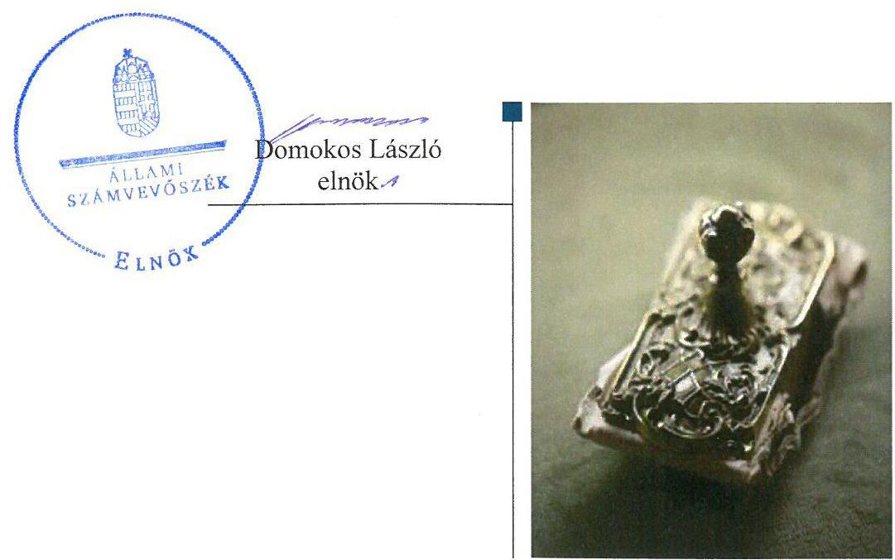

# Jelentés 

## Pártalapítványok gazdálkodása

A költségvetési támogatásban részesülő pártalapítványok 2014-2015. évi gazdálkodása törvényességének ellenőrzése a Barankovics István Alapítványnál 2017.

---

# Jelentés 

## Pártalapítványok gazdálkodása

A költségvetési támogatásban részesülő pártalapítványok 2014-2015. évi gazdálkodása törvényességének ellenőrzése a Barankovics István Alapítványnál 2017. OG hó 12. nap

---

# AZ ELLENŐRZÉST FELÜGYELTE: 

DR. BENEDEK MÁRIA felügyeleti vezető

## AZ ELLENŐRZÉST VEZETTE ÉS A VÉGREHAJTÁSÁÉRT FELELŐS:

KAKAS SÁNDOR ellenőrzésvezető

## A PROGRAM ÖSSZEÁLLÍTÁSÁÉRT FELELŐS:

JANIK JÓZSEF LÁSZLÓ osztályvezető

## A TÉMÁHOZ KAPCSOLÓDÓ KORÁBBI SZÁMVEVŐSZÉKI JELENTÉSEK:

- címe: Jelentés a Barankovics István Alapítvány 20122013. évi gazdálkodása törvényességének ellenőrzéséről
- sorszáma: 15079

IKTATÓSZÁM: EL-0029-044/2017.
TÉMASZÁM: 2299
ELLENŐRZÉS-AZONOSÍTÓ SZÁM: V077802

---

# TARTALOMJEGYZÉK 

■ ÖSSZEGZÉS ..... 5
■ AZ ELLENŐRZÉS CÉLJA ..... 6
■ AZ ELLENŐRZÉS TERÜLETE ..... 7
■ AZ ELLENŐRZÉS HÁTTERE, INDOKOLTSÁGA ..... 8
■ A JELENTÉS LÉNYEGES KÉRDÉSKÖREI ..... 9
■ ELLENŐRZÉS HATÓKÖRE ÉS MÓDSZEREI ..... 10
■ MEGÁLLAPÍTÁSOK ..... 12
■ JAVASLATOK ..... 17
■ MELLÉKLETEK ..... 19
I. sz. melléklet: Értelmező szótár ..... 19
II. sz. melléklet: 2014. évi egyszerúsített éves beszámoló mérlege, eredménykimutatása ..... 21
III. sz. melléklet: 2015. évi egyszerúsített éves beszámoló mérlege, eredménykimutatása ..... 24
■ FÜGGELÉK: ÉSZREVÉTELEK ..... 27
■ RÖVIDÍTÉSEK JEGYZÉKE ..... 29

---

.

---

# ÖSSZEGZÉS 

Az Állami Számvevőszék a Barankovics István Alapítvány gazdálkodásának törvényességét ellenőrizte 2014. január 1-jétől 2015. december 31-ig terjedő időszakra vonatkozóan. Megállapította, hogy gazdálkodásának törvényessége biztositott volt, a könyvvezetés és a gazdálkodás során a jogszabályi előírásokat összességében betartotta. A 2014-2015. évi tevékenységéről szóló jelentéseket és annak részeként a számviteli beszámolókat elkészítette és közzétette, biztositotta a gazdálkodásának, vagyoni helyzetének áttekinthetőségét.

## Az ellenőrzés társadalmi indokoltsága

A pártok - a Magyarország Alaptörvényében biztosított, a népakarat kialakításában és kinyilvánításában történő közreműködésének elősegítése, az állampolgári tájékoztatás szélesítése, a politikai kultúra fejlesztése érdekében történő politikai képzés, kutatás, tudományos és ismeretterjesztő tevékenység támogatása érdekében - költségvetési támogatásra jogosult alapítványt hozhatnak létre. Jogszabályi előírások alapján a pártalapítványok gazdálkodása törvényességének ellenőrzésére az Állami Számvevőszék jogosult, ezért kétévente ellenőrzi a költségvetésből támogatásban részesülő pártalapítványoknak a gazdálkodását.

Az Állami Számvevőszék stratégiájában megfogalmazta, hogy államháztartáson kívülre nyújtott költségvetési támogatások és az ingyenes vagyonjuttatás ellenőrzésével hozzájárul ahhoz, hogy a közpénzeket a civil szervezetek is átlátható módon használják fel a közfeladatok szerződésben vállalt ellátása érdekében. A pártalapítványok gazdálkodása szabályszerűségének bemutatásával az ellenőrzés értékteremtő módon járul hozzá az Állami Számvevőszék stratégiai céljainak megvalósításához, a nyilvánosság megfelelő tájékoztatásához.

## Főbb megállapítások, következtetések, javaslatok

A Barankovics István Alapítvány Alapító okirata és a gazdálkodására vonatkozó belső szabályozás megfelelt a jogszabályi előírásoknak, ami megteremtette a közpénzekkel való átlátható és ellenőrizhető gazdálkodás alapjait.

A 2014. és a 2015. évre vonatkozóan elkészítette a költségvetési terveket, így biztosította a kiszámítható, tervezhető gazdálkodás feltételeit. A támogatások elfogadása, felhasználása, a kiadások elszámolása összességében szabályszerű volt.

A 2014. és a 2015. évi tevékenységéről elkészítette a jelentést és annak részeként a számviteli beszámolót, amelyek összességében megfeleltek a jogszabályban előírtaknak, ezáltal biztosította a gazdálkodásának, vagyoni helyzetének áttekinthetőségét.

---

# AZ ELLENŐRZÉS CÉLJA 

AZ ELLENŐRZÉS CÉLJA annak megállapítása volt, hogy a Barankovics István Alapítvány törvényesen gazdálkodott-e, az éves számviteli beszámolók és a tevékenységéről szóló éves jelentések a jogszabályi előírásoknak megfeleltek-e, a könyvvezetés és gazdálkodás során a vonatkozó jogszabályi rendelkezéseket és belső előírásokat betartotta-e.

---

# **AZ ELLENŐRZÉS TERÜLETE**

## **Barankovics István Alapítvány**

A Pártalapítványi tv.¹ alapján a pártok a politikai kultúra fejlesztése érdekében tudományos, ismeretterjesztő, kutatási és oktatási tevékenységük elősegítésére a Párt tv.²-ben meghatározott mértékű költségvetési támogatásra jogosult alapítványt hozhatnak létre.

A Kereszténydemokrata Néppárt a törvény által biztosított lehetősége alapján 2006-ban létrehozta a Barankovics István Alapítványt.

A Barankovics István Alapítvány Alapító okirata³ szerinti célja:

- korszerű oktatási, tudományos, ismeretterjesztő tevékenységi formák szervezése, illetve támogatása,
- a célokat szolgáló kutatási tevékenység szervezése, illetve támogatása,
- előadások, konferenciák szervezése, illetve támogatása,
- tanulmányok, szakkönyvek, egyéb, a célokat szolgáló kiadványok kiadása, illetve kiadásuk támogatása,
- bel- és külföldi szaklapok, szakfolyóiratok, illetve szakkönyvek megvásárlása,
- fenti célokkal összefüggésben kiírt pályázatokon való részvétel.

A Barankovics István Alapítvány a törvényi előírásoknak megfelelően a 2014. évben 61 618 ezer Ft, a 2015. évben 53 800 ezer Ft költségvetési támogatásban részesült.

---

# AZ ELLENŐRZÉS HÁTTERE, INDOKOLTSÁGA 

Társadalmi elvárás a közpénzek értékelvű, rendeltetésszerű felhasználása, a közpénzekből nyújtott támogatások átláthatóságának megteremtése, amelyhez az ÁSZ ${ }^{4}$ az államháztartásból nyújtott támogatások ellenőrzésével kíván hozzájárulni. A Párt tv. 9/A § (1) bekezdése alapján a politikai kultúra fejlesztése érdekében tudományos, ismeretterjesztő, kutatási, oktatási tevékenység folytatása céljából létrehozott pártalapítványok gazdálkodása törvényességének ellenőrzése - Pártalapítványi tv. 4. § (2) bekezdése értelmében - az ÁSZ feladata. E törvény 4. § (4) bekezdése alapján az ÁSZ kétévente - kötelező jelleggel - ellenőrzi azoknak a pártalapítványoknak a gazdálkodását, amelyek költségvetési támogatásban részesültek.

Az ÁSZ, mint az Országgyűlés ellenőrző szerve a pártalapítványok gazdálkodása törvényességének/szabályszerűségének értékelésével hozzájárul ahhoz, hogy a társadalom objektív képet alkothasson a pártalapítványok működéséről. Az ellenőrzés eredményeinek célzott felhasználói a nyilvánosság, a jogalkotó, továbbá a pártalapítványok esetén azok alapítója és szervei. A jelentésben foglalt megállapítások, következtések és javaslatok alapján a törvényalkotók konkrét lépéseket tehetnek a pártalapítványokra vonatkozó szabályozások megváltoztatása, átláthatóbbá, ellenőrizhetőbbé tétele irányába. Az ellenőrzött szervezetek szintjén a hiányosságok, szabálytalanságok feltárása, az ennek kapcsán megfogalmazott megállapítások elősegíthetik a pártalapítványok szabályszerű gazdálkodását.

---

# A JELENTÉS LÉNYEGES KÉRDÉSKÖREI 

1. A Barankovics István Alapítvány gazdálkodásának törvényessége biztositott volt-e?
2. A Barankovics István Alapítvány könyvvezetése és gazdálkodása során a vonatkozó jogszabályi rendelkezéseket és belső elöírásokat betartották-e?
3. A Barankovics István Alapítvány tevékenységéről szóló éves jelentések, az éves számviteli beszámolók a jogszabályi elöírásoknak megfeleltek-e?

---

# ELLENŐRZÉS HATÓKÖRE ÉS MÓDSZEREI 

## Az ellenőrzés típusa

Szabályszerúségi ellenőrzés.

## Az ellenőrzött időszak

2014. január 1. - 2015. december 31.

## Az ellenőrzés tárgya

Az ellenőrzés tárgyát képezte a Barankovics István Alapítvány gazdálkodása, a könyvvezetés szabályozása és gyakorlata szabályszerűsége, az éves számviteli beszámolókra és a Barankovics István Alapítvány tevékenységéről szóló éves jelentésekre vonatkozó kötelezettség teljesítése, valamint a gazdálkodáshoz kapcsolódó ellenőrzések javaslatainak hasznosítására irányuló tevékenység.

Az ellenőrzés kiterjedt minden olyan körülményre és adatra, amely az ÁSZ jogszabályban meghatározott feladatainak teljesítéséhez, valamint a program végrehajtása folyamán felmerült újabb összefüggések feltárásához volt szükséges.

## Az ellenőrzött szervezet

Barankovics István Alapítvány

## Az ellenőrzés jogalapja

Az ÁSZ tv. ${ }^{5}$ 1. § (3) bekezdése, 5. § (3) bekezdése, a Pártalapítványi tv. 4. § (2) és (4) bekezdései.

## Az ellenőrzés módszerei

Az ÁSZ az ellenőrzést az ellenőrzési program szempontjai, az ellenőrzött időszakban hatályos jogszabályok, a jelen ellenőrzésre irányadó ÁSZ módszertan figyelembe vételével végezte.

Az ellenőrzés ideje alatt a Barankovics István Alapítvánnyal történő kapcsolattartás az ÁSZ SZMSZ5-ének vonatkozó előírásai alapján történt.

---

Az ellenőrzési kérdések megválaszolásához szükséges bizonyítékok megszerzése az ellenőrzött által rendelkezésre bocsátott dokumentumokra, adatokra alapozva megfigyelés, szemle (szemrevételezés), kérdésfeltevés (információkérés), mintavételezés, valamint elemző eljárás útján történt. A mintavételezés véletlen mintavételi eljárással történt.

Az ellenőrzési bizonyítékként felhasználható adatforrások közé tartoztak egyrészt az ellenőrzési program részletes szempontjainál felsorolt adatforrások, másrészt minden egyéb - az ellenőrzés folyamán - feltárt, az ellenőrzés szempontjából információt tartalmazó dokumentum.

Az ellenőrzés lefolytatásához a Barankovics István Alapítvány a tanúsítványok elektronikus kitöltésével, valamint az ÁSZ által kért dokumentumok elektronikus megküldésével szolgáltatott adatokat. Az így rendelkezésre bocsátott adatok, információk, a tanúsítványok adatai valódiságának kontrollja az ellenőrzés keretében történt.

---

# 1. A Barankovics István Alapítvány gazdálkodásának törvényessége biztosított volt-e? 

Összegző megállapítás

### 1.1. számú megállapítás

A BIA ${ }^{7}$ gazdálkodásának törvényessége biztosított volt.
A BIA gazdálkodása szervezeti kereteinek kialakítása a jogszabályi előírásoknak megfelelt.

AZ ALAPÍTÓ OKIRATBAN rögzített alapítványi célok, fő tevékenységek a Párt. tv. és a Pártalapítványi tv. rendelkezéseivel összhangban voltak. A BIA céljaira rendelt vagyont és annak felhasználási módját, kezelésének szabályait - a Ptk. ${ }_{1}^{8}$ előírásaival összhangban - az Alapító okirat tartalmazta. Az induló vagyon összegét az Alapító 700 ezer Ft-ban határozta meg, ami az ellenőrzött időszakban változatlan maradt. A BIA az Alapítótól kapott induló vagyont a jogszabályban és az Alapító okiratban foglaltaknak megfelelően használta fel.

A BIA gazdálkodásával kapcsolatos feladatok, a képviseleti jog gyakorlása a Pártalapítványi tv. és a Ptk. ${ }_{1}$ elöírásainak megfelelően szabályozottak voltak. A BIA döntéshozó és kezelő szerveként az Alapító okirat hét tagú Kuratórium létrehozását rögzítette. A kuratóriumi tagok jogait és kötelességeit az Alapító okirat és az SZMSZ ${ }_{1,2}{ }^{9}$ egymással és a Ptk. ${ }_{1}$ előírásaival összhangban szabályozta. Az SZMSZ ${ }_{1,2}$ a BIA céljaira rendelt vagyon felhasználásának módjával kapcsolatban szabályozta a Kuratórium és a Kuratórium elnökének döntési jogkörét. A Kuratórium munkáját az SZMSZ ${ }_{1,2}$ alapján az Alapítványi iroda ${ }^{10}$ segítette. Az Alapító - a tulajdonosi ellenőrzési feladat ellátásának biztosítása érdekében - háromtagú $\mathrm{FB}^{11}$-t hozott létre, melynek múködését, feladat- és hatáskörét ügyrendben szabályozta.

A BIA pénzügyi és számviteli feladatait külső szervezet látta el. A könyvviteli szolgáltatás körébe tartozó feladatok irányításával, vezetésével, az egyszerűsített éves beszámoló elkészítésével megbízott társaság tagja rendelkezett a Számv. tv. ${ }^{12}$-ben meghatározott képesítéssel és a szolgáltatás nyújtására jogosító engedéllyel.

A BIA vállalkozási tevékenységet nem végzett.
A BIA a Számviteli politika ${ }_{1,2}{ }^{13}$-ben a Számviteli vhr. ${ }^{14}$ előírásának megfelelően egyszerűsített éves beszámoló készítését és kettős könyvvitel vezetetését rögzítette.
1.2. számú megállapítás

A BIA gazdálkodására vonatkozó belső szabályozás megfelelt a jogszabályi előírásoknak.

## A KÖNYVVEZETÉS ÉS BESZÁMOLÓ KÉSZÍTÉS

rendjét meghatározó Számviteli politika ${ }_{1,2}$-vel - a Számv. tv.-ben előírtaknak megfelelően - a BIA rendelkezett. A BIA elkészítette a Számlarend ${ }_{1,2}{ }^{15}$ t, a Leltározási szabályzatot ${ }^{16}$, valamint a Pénzkezelési szabályzat ${ }_{1,2}{ }^{17}$-t, to-

---

#### Abstract

vábbá a Számviteli politika ${ }_{1,2}$-ben rögzítette az eszközök és a források értékelésére vonatkozó szabályokat. Az önköltségszámítás rendjére vonatkozó belső szabályzat készítése alól a Számv. tv. alapján mentesült. A szabályzatokat az arra jogosult írta alá. A felelősségi köröket, engedélyezési, jóváhagyási eljárásokat az Alapító okirat mellett az SZMSZ ${ }_{1,2}$ is rögzítette.

Az Alapító okirat rögzítette, hogy a cél szerinti tevékenységből származó bevételeket és ráfordításokat elkülönítetten kell nyilvántartani. A Számlarend ${ }_{1,2}$ elkülönítetten tartalmazta a bevételeket és a kiadásokat.

1.3. számú megállapítás

A BIA alapcélja ellátásához kapcsolódó gazdálkodási tevékenysége szabályszerű volt.

A BIA gazdálkodására vonatkozó különös szabályokat - a támogatások elfogadásának szabályait - a Pártalapítványi tv., az Ectv. ${ }^{18}$, valamint az Ecvhr. ${ }^{19}$ előírásainak megfelelően az Alapító okirat rögzítette.

Az Alapító okirat, egyéb belső szabályzat más szervezet alapításáról, más szervezetben, gazdasági társaságban történő részvételről rendelkezést nem tartalmazott.

A BIA külföldi jogi személyektől, illetve magánszemélyektől 2014-2015. években összesen 2501 ezer Ft támogatást kapott. A támogatók személye egyértelműen azonosítható volt. A költségvetési támogatáson felül kapott támogatások elfogadásáról minden esetben a Kuratórium döntött. A Pártalapítvány tv. előírásai alapján a BIA valamennyi támogatást a honlapján közzétette.

Az ellenőrzött időszakban a BIA gazdasági társaságot, alapítványt vagy egyéb szervezetet nem alapított, ilyen szervezethez nem csatlakozott.

A BIA működőképessége - a 2014. és 2015. évi tevékenységéről szóló beszámolója alapján - biztosított volt, fizetésképtelenség nem merült fel.

# 2. A Barankovics István Alapítvány könyvvezetése és gazdálkodása során a vonatkozó jogszabályi rendelkezéseket és belső előírásokat betartották-e? 

Összegző megállapítás

A BIA a könyvvezetés és gazdálkodás során a vonatkozó jogszabályi rendelkezéseket és belső előírásokat összességében betartotta.

### 2.1. számú megállapítás

A BIA a 2014-2015. években a jogszabályi és a belső szabályozási előírásoknak megfelelően elkészítette a költségvetési terveket.

KÖLTSÉGVETÉSI TERV készítési kötelezettségét a BIA az Ectv. és az Alapító okirat előírásainak megfelelően, a belső szabályozás szerint teljesítette. Az éves költségvetések tartalmazták a BIA bevételeit és kiadásait, az alapítványi célú tevékenység közvetlen és közvetett költségeit, valamint a Kuratórium költségeit és egyéb közvetett (működési) költségeket, a járulékokat, valamint a tartalékokat és az előző évi maradványt. A költségvetéseket a BIA mindkét évben módosította, amit a Kuratórium jóváhagyott.

---

# 2.2. számú megállapítás 

A BIA a támogatásokat szabályszerűen fogadta el, azok elszámolása összességében megfelelt a jogszabályi előírásoknak.

KÖLTSÉGVETÉSI TÁMOGATÁSRA a Párt tv. előírásainak megfelelően a BIA jogosult volt. A 2014. évi Kvtv. ${ }^{20} 69400$ ezer Ft költségvetési előirányzatot hagyott jóvá, melyet a 1321/2014. (V.30.) Korm. határozat ${ }^{21} 7782$ ezer Ft-tal csökkentett, így a BIA a 2014. évben 61618 ezer Ft, a 2015. évi Kvtv. ${ }^{22}$ alapján 53800 ezer Ft összegű támogatásban részesült. A BIA által a 2014-2015. években szervezett rendezvények összhangban voltak a Párt tv.-ben és a Pártalapítványi tv.-ben rögzítettekkel, a BIA a támogatásokat szabályosan használta fel. A költségvetési támogatások kifizetése a Párt. tv.-ben előírtak szerint naptári negyedévenként történt.

A BIA a költségvetési támogatásokat a Számviteli vhr. előírásainak megfelelően bevételként, az egyéb bevételek között számolta el.

A támogatások elszámolása vonatkozásában feltárt hiányosságot az 1. táblázat tartalmazza.

## A TÁMOGATÁSOK ELSZÁMOLÁSÁVAL KAPCSOLATOS HIÁNYOSSÁG

Sorszám
1. A 2014. évben a BIA két esetben készpénzben kapott költségtérítést, amit a Számv. tv. 16. § (3) bekezdésében foglalt, a tartalom elsődlegessége a formával szemben elvét figyelmen kívül hagyva támogatásként könyvelt le, és azt magánszemély adományaként mutatta ki a 2014. évi eredménykimutatásban.

Forrás: ÁSZ

### 2.3. számú megállapítás

A BIA kiadásainak elszámolása összességében szabályszerű volt.
A BERUHÁZÁSOK, FELÚJÍTÁSOK során a költségelszámolást megalapozó dokumentumok közül a számla rendelkezésre állt a Számv. tv. előírásainak megfelelően. A beszerzések nem tartoztak a Kbt ${ }_{1,2}{ }^{23}$ hatálya alá, mely értelmében a BIA-nak közbeszerzési eljárást nem kellett lefolytatnia.

A KÖLTSÉGEK, RÁFORDÍTÁSOK felhasználása, kifizetése és elszámolása során az utalványozás a Számv. tv.-nek megfelelő volt. Az anyagjellegú ráfordítások elszámolása a Számv. tv. szerinti költségnemre történt, a személyi jellegú ráfordítások a jogszabályi előírásoknak megfelelően kerültek elszámolásra.

A kiadások vonatkozásában feltárt hiányosságot részletesen a 2. táblázat tartalmazza.

## A KIADÁSOKKAL KAPCSOLATOS HIÁNYOSSÁG

Sorszám
1. A ráfordítások könyvviteli elszámolását közvetlenül alátámasztó bizonylatok nem feleltek meg Számv. tv. 167. § (1) bekezdés c) és h) pontjában foglalt előírásnak, mert nem tartalmazták a rendelkezés végrehajtását igazoló személy és a pénztár bizonylatokon - a Pénzkezelési szabályzat ${ }_{2}$ 2.2. pontjában is előírt - pénztárellenőr aláírását, továbbá a könyvelés módjára, az érintett könyvviteli számlákra történő hivatkozást.

---

A TÁMOGATÁSOKRA fordított összegek felhasználása esetében a Kuratórium, illetve egymillió Ft értékhatárig a Kuratórium elnöke döntött a támogatás odaítéléséről. A BIA minden támogatás esetében szerződést kötött a támogatottal, mely tartalmazta a támogatás célját, rendelkezésre bocsátásának formáját, módját, felhasználásának dokumentumokkal történő alátámasztási kötelezettségét, elszámolás kötelezettségét, módját és határidejét. Az elszámolás nem teljesítése, elmulasztása esetére a BIA a szerződésekben visszafizetési kötelezettséget határozott meg. A támogatottak minden esetben elszámoltak a támogatás felhasználásával. A támogatások ellenőrzését a BIA múködésének belső ellenőrzését szerződés alapján ellátó külső szolgáltató végezte.

A BIA a Párt. tv. előírását betartva az alapító párt részére vagyoni hozzájárulást nem nyújtott.

# 3. A Barankovics István Alapítvány tevékenységéről szóló éves jelentések, az éves számviteli beszámolók a jogszabályi előírásoknak megfeleltek-e? 

Összegző megállapítás

A 3.1. számú megállapítás

A BIA 2014-2015. évi tevékenységéről szóló éves jelentések és annak részét képező éves számviteli beszámolók összességében megfeleltek a jogszabályi előírásoknak.

A BIA a 2014-2015. évi tevékenységéről szóló éves jelentési, beszámolási és közzétételi kötelezettségének összességében szabályszerűen tett eleget.

A TEVÉKENYSÉGÉRŐL SZÓLÓ ÉVES JELENTÉSEKET a BIA elkészítette és határidőben közzétette. A Pártalapítványi tv.nek megfelelően a Kuratórium a BIA beszámolóit az előírt határidőn belül jóváhagyta. Az éves jelentéseket a Pártalapítványi tv.-ben foglaltak szerint a BIA a honlapján közzétette.

A jelentések részeként a BIA bemutatta a támogatások felhasználását cél szerinti tevékenységek és múködési költségek szerint.

SZÁMVITELI BESZÁMOLÓJÁT a BIA a múködéséről, vagyoni, pénzügyi és jövedelmi helyzetéről az üzleti év könyveinek lezárását követően összességében - a Számv. tv.-ben, a Számviteli vhr.-ben és a Számviteli politika ${ }_{1,2}$-ben foglaltaknak - megfelelően az üzleti év utolsó napjára vonatkozóan elkészítette. A 2014. évi éves beszámoló közzétételi és letétbe helyezési kötelezettségének a jogszabályi előírásoknak megfelelően határidőben, a 2015. évi éves beszámoló vonatkozásában határidőn túl tett eleget.

A beszámolással kapcsolatban feltárt hiányosságot a 3. táblázat tartalmazza.

---

# A BESZÁMOLÁSSAL KAPCSOLATOS HIÁNYOSSÁG 

| Sorszám | Részmegállapítás | Megjegyzés |
| :--: | :--: | :--: |
| 1. | A BIA 2015. évi közzétett számviteli beszámoló eredménykimutatása - a 2014. év vonatkozásában feltárt jelentős összegű előlegszámlának a Számv. tv. 65. § (1) bekezdésében előírtak megsértésével történt téves könyvelése következtében nem helyesen tartalmazta a mérleg szerinti eredményt. | A 2015. évi mérleg a Kuratórium által jóváhagyott mérleg szerinti eredményt helyesen tartalmazta. |

Forrás: ÁSZ
3.2. számú megállapítás Az FB a gazdálkodással kapcsolatos feladatait az Alapító által előírtaknak megfelelően végezte.

Az FB a 2014. és 2015. évi költségvetési terveket és módosításokat - egy költségvetési módosítás kivételével -, valamint a beszámolókat véleményezte.
3.3. számú megállapítás Külső ellenőrzést az ÁSZ-on kívül más szervezet nem végzett.

KÜLSŐ ELLENŐRZÉST az ellenőrzött időszakban a BIA-nál a 2015. év elején lezajlott - a 2012-2013. évekre kiterjedő - ÁSZ ellenőrzésen kívül más szervezet nem végzett.

---

# JAVASLATOK 

Az ÁSZ tv. 33. § (1) bekezdésében foglaltak értelmében az ellenőrzött szervezet vezetője köteles a jelentésben foglalt megállapításokhoz kapcsolódó intézkedési tervet összeállítani és azt a jelentés kézhezvételétől számított 30 napon belül az ÁSZ részére megküldeni. Amennyiben az ellenőrzött szervezet vezetője nem küldi meg határidőben az intézkedési tervet, vagy továbbra sem elfogadható intézkedési tervet küld, az Állami Számvevőszék elnöke az ÁSZ tv. 33. § (3) bekezdése a) és b) pontjaiban foglaltakat érvényesítheti.

## A Kuratórium elnökének

1. Intézkedjen a Számv. tv.-ben foglalt elöírások betartására a tekintetben, hogy
a) a költségtérítések a tartalom elsődlegessége a formával szemben elvének figyelembe vételével kerüljenek bemutatásra, illetve annak megfelelően elszámolásra a könyvvezetés során;
(1. számú táblázat 1. sorszámú megállapítás alapján)
b) a 2014. év vonatkozásában feltárt jelentős összegű előlegszámla helyesen kerüljön könyvelésre, aminek következtében a 2015. évi számviteli beszámolójának a mérlegében és az eredménykimutatásában szereplő mérleg szerinti eredmény egyezősége valósuljon meg;
(3. számú táblázat 1. sorszámú megállapítás alapján)
2. Intézkedjen annak érdekében, hogy a Számv. tv.-ben foglalt elöírásoknak megfelelően a ráfordítások könyvviteli elszámolását közvetlenül alátámasztó bizonylatokon kerüljön rögzítésre a rendelkezés végrehajtását igazoló személy aláírása, a könyvelés módja, az érintett könyvviteli számlákra történő hivatkozás, továbbá a Pénzkezelési szabályzatában elöírtak szerint a pénztár bizonylatokon szerepeljen a pénztárellenőr aláírása;
(2. számú táblázat 1. sorszámú megállapítás alapján)

---

.

---

# MELLÉKLETEK 

- I. SZ. MELLÉKLET: ÉRTELMEZŐ SZÓTÁR
adomány
alapítvány
beruházás
Felügyelő Bizottság
felújítás

A civil szervezetnek - létesítő okiratban rögzített céljaira - ellenszolgáltatás nélkül juttatott eszköz, illetve nyújtott szolgáltatás (forrás: Ectv. 2. § 1. pontja); az a pénzbeli vagy természetbeni juttatás, amelyet az adományozó az adományozott civil szervezet alapcéljának, illetve közhasznú céljának elérésére ellenszolgáltatás nélkül juttat. (forrás: 350/2011. (XII. 30.) Korm. rendelet 1. § (5) bekezdés a) pontja)
A közhasznú szervezet részére törvényben meghatározott közhasznú tevékenysége támogatására, valamint az egyházi jogi személy részére törvényben meghatározott tevékenysége támogatására, továbbá a közérdekü kötelezettségvállalás céljára az adóévben visszafizetési kötelezettség nélkül adott támogatás, juttatás, térítés nélkül átadott eszköz könyv szerinti értéke, térítés nélkül nyújtott szolgáltatás bekerülési értéke, feltéve hogy az nem jelent az e törvényben meghatározottakon túl vagyoni előnyt az adományozónak, az adományozó tagjának vagy részvényesének, vezető tisztségviselőjének, felügyelőbizottsága vagy igazgatósága tagjának, könyvvizsgálójának, illetve ezen személyek vagy a természetes személy tag vagy részvényes közeli hozzátartozójának azzal, hogy nem minősül vagyoni előnynek az adományozó nevére, tevékenységére történő utalás. (a társasági adóról és az osztalékadóról szóló 1996. évi LXXXI. törvény 4. § 1/a. pont)
Magánszemély, jogi személy és jogi személyiséggel nem rendelkező gazdasági társaság (a továbbiakban együtt: alapító) - tartós közérdekű célra - alapító okiratban alapítványt hozhat létre. Alapítvány elsődlegesen gazdasági tevékenység folytatása céljából nem alapítható. Az alapítvány javára a célja megvalósításához szükséges vagyont kell rendelni. Az alapítvány jogi személy. Az alapítvány a bírósági nyilvántartásba vételével jön létre. (Forrás: Ptk. 1 74/A. § (1) - (2) bekezdés)
Az alapítvány az alapító által az alapító okiratban meghatározott tartós cél folyamatos megvalósítására létrehozott jogi személy. Az alapító az alapító okiratban meghatározza az alapítványnak juttatott vagyont és az alapítvány szervezetét. Alapítvány nem alapítható gazdasági-vállalkozási tevékenység folytatására. Az alapítvány az alapítványi cél megvalósításával közvetlenül összefüggő gazdasági tevékenység végzésére jogosult. Alapítvány nem lehet korlátlan felelősségű tagja más jogalanynak, nem létesíthet alapítványt és nem csatlakozhat alapítványhoz. (Forrás: Ptk. ${ }^{24}$ 3:378§, 3:379. § (1) - (3) bekezdés)
A tárgyi eszköz beszerzése, létesítése, saját vállalkozásban történő előállítása, a beszerzett tárgyi eszköz üzembe helyezése. A beruházás a meglévő tárgyi eszköz bővítését, rendeltetésének megváltoztatását, átalakítását, élettartamának, teljesítőképességének közvetlen növelését eredményező tevékenység. (Forrás: Számv. tv. 3. § (4) bekezdés 7. pont)

Az alapítók a létesítő okiratban három tagból álló FB-t hozhatnak létre, azzal a feladattal, hogy az ügyvezetést a jogi személy érdekeinek megóvása céljából ellenőrizze. Ha az alapítványnál felügyelőbizottság múködik, a tevékenységét az alapító részére végzi, tevékenységéről évente az alapítói jogok gyakorlójának számol be. (Forrás: Ptk. 2 3:36-3:28 §, 3:400. §)
Az elhasználódott tárgyi eszköz eredeti állaga (kapacitása, pontossága) helyreállítását szolgáló időszakonként visszatérő olyan tevékenység, melynek során az eszköz élettartama megnövekszik, minősége, használata jelentősen javul, így a pótlólagos ráfordításból a jövőben gazdasági előnyök származnak. (Forrás: Számv. tv. 3. § (4) 8. pont)

---

költségvetési támogatás
kuratórium
pártalapítvány
támogatást nyújtó személy

Az államháztartás alrendszerei terhére nyújtott pénzbeli vagy nem pénzbeli juttatás, amelyet a támogató nem elsősorban ellenszolgáltatás ellenében, de konkrét program megvalósítása vagy meghatározott időszakban a támogatott szervezet múködtetése érdekében nyújt. (Civil tv. 2. § 15. pont)
A társadalombiztosítás pénzügyi alapjai kivételével az államháztartás központi alrendszeréből ellenérték nélkül, pénzben nyújtott támogatások, ide nem értve az adományokat, segélyeket, felajánlásokat, a pártok és pártalapítványok támogatását. (forrás: az államháztartásról szóló 2011. évi CXCV. törvény 2. § (1) bekezdés n) pont)
Az alapítvány kezelő/ügyvezető szervezete. (forrás: Ptk. 3:397. § (1) bekezdése)
A politikai kultúra fejlesztése érdekében, tudományos, ismeretterjesztő, kutatási és oktatási tevékenység folytatása céljából pártok által létrehozott, külön jogszabályban - a Pártalapítványi tv. 1. § és 3. § (1) bekezdése - meghatározott, jogi személynek minősülő egyéb szervezet, speciális jogállású alapítvány (Forrás: Párt tv. 9/A. § (1) bekezdés, Pártalapítványi tv. 1. §, Ectv. 1. § (2) bekezdés, 2. § 6. c) pont, Számv. tv. 3. § (1) bekezdése 4. pont, Számviteli vhr. 2. § (1) bekezdés k) pont, (2) bekezdése, 3. § (1), (5)-(6) bekezdései, 4. § (1) bekezdés)
egyértelműen azonosítható - természetes, vagy jogi - személy. (Forrás: Pártalapítványi tv. 3. § (3)-(4) bekezdése)

---

# II. SZ. MELLÉKLET: 2014. ÉVI EGYSZERŰSÍTETT ÉVES BESZÁMOLÓ MÉRLEGE, EREDMÉNYKIMUTATÁSA

## A Barankovics István Alapítvány 2014. évi jelentése a pártok müködését segítő tudományos, ismeretterjesztő, kutatási, oktatási tevékenységet végző alapítványokról szóló törvény szerint

Adószám: 18191705-1-42 Törvényszék: 01 Fővárosi Törvényszék Bejegyző határozat száma: 12 PK 60.540/2006/ Nyilvántartási szám: 01/03/60540 Székhely: 1078 Budapest, István utca 44.

A Barankovics István Alapítvány 2014. évi számviteli beszámolója Éves beszámoló mérlege - "A" A mérleg fordulónapja: 2014. december 31.

|   | 1000 HUF | Előző év | Tárgyév  |
| --- | --- | --- | --- |
|   | ESZKÖZÖK (aktívák) |  |   |
|  01. | A. Befektetett eszközök (02+10+18. sor) | 4672 | 5229  |
|  02. | I. Immateriális javak (03-09. sorok) | 1387 | 1055  |
|  06. | 4. Szellemi termékek | 1387 | 1055  |
|  10. | II. Tárgyi eszközök (11-17. sorok) | 3285 | 4174  |
|  11. | 1. Ingatlanok és a kapcsolódó vagyoni értékű jogok | 2378 | 2271  |
|  12. | 2. Műszaki berendezések, gépek, járművek | 859 | 1881  |
|  13. | 3. Egyéb berendezések, felszerelések, járművek | 48 | 22  |
|  18. | III. Befektetett pénzügyi eszközök (19-26. sorok) | 0 | 0  |
|  27. | B. Forgóeszközök (28+35+43+49. sor) | 57415 | 20412  |
|  28. | I. Készletek (29-34. sorok) | 96 | 40  |
|  32. | 4. Késztermékek | 96 | 40  |
|  35. | II. Követelések (36-42. sorok) | 0 | 100  |
|  40. | 5. Egyéb követelések | 0 | 100  |
|  43. | III. Értékpapírok (44-48. sorok) | 0 | 0  |
|  49. | IV. Pénzeszközök (50-51. sorok) | 57319 | 20272  |
|  50. | 1. Pénztár, csekkek | 34 | 117  |
|  51. | 2. Bankbetétek | 57285 | 20155  |
|  52. | C. Aktív időbeli elhatárolások (53-55. sorok) | 0 | 7  |
|  54. | 2. Költségek, ráfordítások aktív időbeli elhatárolása | 0 | 7  |
|  56. | ESZKÖZÖK (AKTÍVÁK) ÖSSZESEN | 62087 | 25648  |
|   | 1000 HUF | Előző év | Tárgyév  |
|   | FORRÁSOK (passzívák) |  |   |
|  57. | D. Saját tőke (58+60+61+62+63+64+67. sor) | 58793 | 24290  |
|  58. | I. Jegyzett tőke | 700 | 700  |
|  60. | II. Jegyzett, de még be nem fizetett tőke (-) | 0 | 0  |
|  61. | III. Tőketartalék | 0 | 0  |
|  62. | IV. Eredménytartalék | 52526 | 58093  |
|  63. | V. Lekötött tartalék | 0 | 0  |

---

|   | 1000 HUF | Dózó év | Tárgyév  |
| --- | --- | --- | --- |
|  64. | VI. Értékelési tartalék (65-66. sorok) | 0 | 0  |
|  67. | VII. Mérleg szerinti eredmény | 5567 | $-34503$  |
|  68. | E. Céltartalékok (69-71. sorok) | 0 | 0  |
|  72. | F. Kötelezettségek (73+77+86. sor) | 3261 | 1324  |
|  73. | I. Hátrasorolt kötelezettségek (74-76. sorok) | 0 | 0  |
|  77. | II. Hosszú lejáratú kötelezettségek (78-85. sorok) | 0 | 0  |
|  86. | III. Rövid lejáratú kötelezettségek (87. és 89-97. sorok) | 3261 | 1324  |
|  91. | 4. Kötelezettségek áruszállításból és szolgáltatásból (szállítók) | 2486 | 745  |
|  95. | 8. Egyéb rövid lejáratú kötelezettségek | 775 | 579  |
|  98. | G. Passzív időbeli elhatárolások (99-101. sorok) | 33 | 34  |
|  100. | 2. Költségek, ráfordítások passzív időbeli elhatárolása | 33 | 34  |
|  102. | FORRÁSOK (PASSZÍVÁK) ÖSSZESEN | 62087 | 25648  |

Éves beszámoló "A" eredménykimutatása (összköltség eljárással) Beszámolási időszak: 2014. január 1.-2014. december 31.

|   | 1000 HUF | Dózó év | Tárgyév  |
| --- | --- | --- | --- |
|  I. | Értékesítés nettó árbevétele (01+02. sor) | 0 | 0  |
|  II. | Aktivált saját teljesítmények értéke ( $\pm 03 \pm 04$. sor) | 0 | 0  |
|  III. | Egyéb bevételek | 76706 | 66351  |
|  IIII | III. sorból: visszaírt értékvesztés | 0 | 0  |
|  01. | Adomány (magánszemélyektől) | 0 | 4658  |
|  05. | Anyagköltség | 332 | 633  |
|  06. | Igénybe vett szolgáltatások értéke | 24672 | 31921  |
|  07. | Egyéb szolgáltatások értéke | 493 | 1733  |
|  IV. | Anyagjellegú ráfordítások (05-09. sorok) | 25497 | 34287  |
|  10. | Bérköltség | 10073 | 12992  |
|  11. | Személyi jellegú egyéb kifizetések | 3490 | 4427  |
|  12. | Bérjárulékok | 2547 | 3232  |
|  V. | Személyi jellegú ráfordítások (10-12. sorok) | 16110 | 20651  |
|  VI. | Értékcsökkenési leírás | 2436 | 2845  |
|  VII. | Egyéb ráfordítások | 28620 | 43176  |
|   | VII. sorból: értékvesztés | 0 | 0  |
|  A. | ÜZEMI (ÜZLETI) TEVÉKENYSÉG EREDMÉNYE (I+II+III-IV-V-VI-VII. sor) | 4043 | $-34608$  |
|  17. | Pénzügyi műveletek egyéb bevételei | 1524 | 227  |
|   | 17. sorból: értékelési különbözet | 0 | 0  |
|  VIII. | Pénzügyi műveletek bevételei (13-17. sorok) | 1524 | 227  |
|  21. | Pénzügyi műveletek egyéb ráfordításai | 0 | 122  |
|   | 21. sorból: értékelési különbözet | 0 | 0  |
|  IX. | Pénzügyi műveletek ráfordításai (18+19 $\pm 20+21$. sor) | 0 | 122  |
|  B. | PÉNZÜGYI MÜVELETEK EREDMÉNYE (VIII-IX. sor) | 1524 | 105  |
|  C. | SZOKÁSOS VÁLLALKOZÁSI EREDMÉNY ( $\pm \mathrm{A} \pm \mathrm{B}$. sor) | 5567 | $-34503$  |
|  X. | Rendkívüli bevételek | 0 | 0  |
|  XI. | Rendkívüli ráfordítások | 0 | 0  |
|  D. | RENDKÍVÜLI EREDMÉNY (X-XI. sor) | 0 | 0  |

---

|   | 1000 HUF | Előző év | Tárgyév  |
| --- | --- | --- | --- |
|  E. | ADÓZÁS ELÓTTI EREDMÉNY ( $\pm \mathrm{C} \pm \mathrm{D}$. sor) | 5567 | -34503  |
|  XII. | Adófizetési kötelezettség | 0 | 0  |
|  F. | ADÓZOTT EREDMÉNY ( $\pm \mathrm{E}-\mathrm{XII}$. sor) | 5567 | -34503  |
|  G. | MÉRLEG SZERINTI EREDMÉNY ( $\pm \mathrm{F}+22-23$. sor) | 5567 | -34503  |

Budapest, 2015. április 27.

---

# III. SZ. MELLÉKLET: 2015. ÉVI EGYSZERŰSÍTETT ÉVES BESZÁMOLÓ MÉRLEGE, EREDMÉNYKIMUTATÁSA

## A Barankovics István Alapítvány 2015. évi jelentése a pártok müködését segítő tudományos, ismeretterjesztő, kutatási, oktatási tevékenységet végző alapítványokról szóló törvény szerint

Adószám: Törvényszék: Bejegyző határozat száma: Nyilvántartási szám:

18191705-1-42 01 Fővárosi Törvényszék 12 PK 60.540/2006/ 01/03/60540

A Barankovics István Alapítvány 2015. évi számviteli beszámolója

Eves beszámoló mérlege - „A"

A mérleg fordulónapja: 2015. december 31.

|   | 1000 HUF | Előző év | Előző évek módosítása | Tárgyév  |
| --- | --- | --- | --- | --- |
|   | ESZKÖZÖK (aktívák) |  |  |   |
|  A. | Befektetett eszközök | 5229 | 0 | 3757  |
|  A.I. | Immateriális javak | 1055 | 0 | 728  |
|  A.I.4. | Szellemi termékek | 1055 | 0 | 728  |
|  A.II. | Tárgyi eszközök | 4174 | 0 | 3029  |
|  A.II.1. | Ingatlanok és a kapcsolódó vagyoni értékủ jogok | 2271 | 0 | 2164  |
|  A.II.2. | Műszaki berendezések, gépek, járművek | 1881 | 0 | 860  |
|  A.II.3. | Egyéb berendezések, felszerelések, járművek | 22 | 0 | 5  |
|  A.III. | Befektetett pénzügyi eszközök | 0 | 0 | 0  |
|  B. | Forgóeszközök | 20412 | 4499 | 17841  |
|  B.I. | Készletek | 40 | 0 | 104  |
|  B.I.4. | Késztermékek | 40 | 0 | 104  |
|  B.II. | Követelések | 100 | 4499 | 200  |
|  B.II.5. | Egyéb követelések | 100 | 4499 | 200  |
|  B.III. | Értékpapírok | 0 | 0 | 0  |
|  B.IV. | Pénzeszközök | 20272 | 0 | 17537  |
|  B.IV.1. | Pénztár, csekkek | 117 | 0 | 123  |
|  B.IV.2. | Bankbetétek | 20155 | 0 | 17414  |
|  C. | Aktív időbeli elhatárolások | 7 | 0 | 0  |
|  C.2. | Költségek, ráfordítások aktív időbeli elhatárolása | 7 | 0 | 0  |
|   | ESZKÖZÖK (AKTÍVÁK) ÖSSZESEN | 25648 | 4499 | 21598  |

|   | 1000 HUF | Előző év | Előző évek módosítása | Tárgyév  |
| --- | --- | --- | --- | --- |
|   | FORRÁSOK (passzívák) |  |  |   |
|  D. | Saját tőke | 24290 | 4499 | 19858  |
|  D.I. | Jegyzett tőke | 700 | 0 | 700  |
|  D.II. | Jegyzett, de még be nem fizetett tőke (-) | 0 | 0 | 0  |
|  D.III. | Tőketartalék | 0 | 0 | 0  |
|  D.IV. | Eredménytartalék | 58093 | 0 | 23589  |
|  D.V. | Lekötött tartalék | 0 | 0 | 0  |
|  D.VI. | Értékelési tartalék | 0 | 0 | 0  |

---

|   | 1000 HUF | Előző év | Előzö évek   módosítása | Tárgyév  |
| --- | --- | --- | --- | --- |
|  D.VII. | Mérleg szerinti eredmény | -34503 | 4499 | -4431  |
|  E. | Céltartalékok | 0 | 0 | 0  |
|  F. | Kötelezettségek | 1324 | 0 | 1733  |
|  F.I. | Hátrasorolt kötelezettségek | 0 | 0 | 0  |
|  F.II. | Hosszú lejáratú kötelezettségek | 0 | 0 | 0  |
|  F.III. | Rövid lejáratú kötelezettségek | 1324 | 0 | 1733  |
|  F.III.A. | Kötelezettségek áruszállításból és szolgáltatásból (szállítók) | 745 | 0 | 1509  |
|  F.III.B. | Egyéb rövid lejáratú kötelezettségek | 579 | 0 | 224  |
|  G. | Passzív időbeli elhatárolások | 34 | 0 | 7  |
|  G.2. | Költségek, ráfordítások passzív időbeli elhatárolása | 34 | 0 | 7  |
|   | FORRÁSOK (PASSZÍVÁK) ÖSSZESEN | 25648 | 4499 | 21598  |

Éves beszámoló „A" eredménykimutatása (összköltség eljárással) Beszámolási időszak: 2015. január 1.-2015. december 31.

|   | 1000 HUF | Előzö év | Előzö évek
módosítása | Tárgyév  |
| --- | --- | --- | --- | --- |
|  I. | Értékesítés nettó árbevétele (01.+02. sor) | 0 | 0 | 0  |
|  II. | Aktivált saját teljesítmények értéke ( $+-03 .+-04$. sor) | 0 | 0 | 0  |
|  III. | Egyéb bevételek | 66351 | 0 | 56842  |
|  01. | Adomány (magánszemélyektől) | 4658 | 0 | 1818  |
|  III.a. | ebből: visszaírt értékvesztés | 0 | 0 | 0  |
|  01. | Adomány (magánszemélyektől) | 4658 | 0 | 1818  |
|  05. | Anyagköltség | 633 | 0 | 342  |
|  06. | Igénybe vett szolgáltatások értéke | 31921 | -4499 | 27077  |
|  07. | Egyéb szolgáltatások értéke | 1733 | 0 | 368  |
|  IV. | Anyagjellegú ráfordítások (05-09. sorok) | 34287 | -4499 | 27787  |
|  10. | Bérköltség | 12992 | 0 | 8533  |
|  11. | Személyi jellegú egyéb kifizetések | 4427 | 0 | 3023  |
|  12. | Bérjárulékok | 3232 | 0 | 2229  |
|  V. | Személyi jellegú ráfordítások (10-12. sorok) | 20651 | 0 | 13785  |
|  VI. | Értékcsökkenési leírás | 2845 | 0 | 1695  |
|  VII. | Egyéb ráfordítások | 43176 | 0 | 22548  |
|  VII.a. | ebből: értékvesztés | 0 | 0 | 0  |
|  A. | ÜZEMI (ÜZLETI) TEVEKENYSEG EREDMENYE
(I+II+III-IV-V-VI-VII. sor) | -34608 | 4499 | -8973  |
|  17. | Pénzügyi műveletek egyéb bevételei | 227 | 0 | 43  |
|  17.a. | ebből: értékelési különbözet | 0 | 0 | 0  |
|  VIII. | Pénzügyi műveletek bevételei (13-17. sorok) | 227 | 0 | 43  |
|  21. | Pénzügyi műveletek egyéb ráfordításai | 122 | 0 | 0  |
|  21.a. | ebből: értékelési különbözet | 0 | 0 | 0  |
|  IX. | Pénzügyi műveletek ráfordításai (18.+19.+-20.+21. sor) | 122 | 0 | 0  |
|  B. | PÉNZÜGYI MÜVELETEK EREDMENYE (VIII-IX. sor) | 105 | 0 | 43  |
|  C. | SZOKÁSOS VÁLLALKOZÁSI EREDMÉNY (+-A.+-B. sor) | -34503 | 4499 | -8930  |

---

|   | 1000 HUF | Előző év | Előző évek
módosítása | Tárgyév  |
| --- | --- | --- | --- | --- |
|  X. | Rendkívüli bevételek | 0 | 0 | 0  |
|  XI. | Rendkívüli ráfordítások | 0 | 0 | 0  |
|  D. | RENOKÍVÜLI EREDMÉNY (X-XI. sor) | 0 | 0 | 0  |
|  E. | ADÓZÁS ELŐTTI EREDMÉNY (+-C.+-D. sor) | -34503 | 4499 | -8930  |
|  XII. | Adófizetési kötelezettség | 0 | 0 | 0  |
|  F. | ADÓZOTT EREDMÉNY (+-E.-XII. sor) | -34503 | 4499 | -8930  |
|  G. | MÉRLEG SZERINTI EREDMÉNY (+-F.+22.-23. sor) | -34503 | 4499 | -8930  |

Budapest, 2016. március 31. Prof. Dr. Mészáros József s. k.

---

# FÜGGELÉK: ÉSZREVÉTELEK 

A jelentéstervezetet a Számvevőszék 15 napos észrevételezésre megküldte az ellenőrzött szervezet vezetőjének az ÁSZ tv. 29. §* (1) bekezdése előírásának megfelelően.

Az ellenőrzött szervezet vezetője az ÁSZ tv. 29. § (2) bekezdésében foglalt észrevételezési jogával nem élt, a jelentéstervezetre észrevételt nem tett.

[^0]
[^0]:    * 29. § (1) Az Állami Számvevőszék az ellenőrzési megállapításait megküldi az ellenőrzött szervezet vezetőjének vagy az általa megbízott személynek, és annak, akinek személyes felelősségét állapította meg.
    (2) Az ellenőrzött szervezet vezetője és a felelősként megjelölt személy az ellenőrzés megállapításaira tizenöt napon belül írásban észrevételt tehet.
    (3) Az Állami Számvevőszék az észrevételre a beérkezésétől számított harminc napon belül írásban válaszol. A figyelembe nem vett észrevételeket köteles a jelentésben feltüntetni, és megindokolni, hogy azokat miért nem fogadta el.

---

.

---

# RÖVIDÍTÉSEK JEGYZÉKE 

${ }^{1}$ Pártalapítványi tv.
${ }^{2}$ Párt tv.
${ }^{3}$ Alapító okirat
${ }^{4}$ ÁSZ
${ }^{5}$ ÁSZ tv.
${ }^{6}$ ÁSZ SZMSZ
${ }^{7}$ BIA
${ }^{8}$ Ptk. 1
${ }^{9} \mathrm{SZMSZ}_{1}$
SZMSZ ${ }_{2}$
${ }^{10}$ Alapítványi iroda
${ }^{11} \mathrm{FB}$
${ }^{12}$ Számv. tv.
${ }^{13}$ Számviteli politika $_{1}$
Számviteli politika ${ }_{2}$
${ }^{14}$ Számviteli vhr.
${ }^{15}$ Számlarend $_{1}$
Számlarend $_{2}$
${ }^{16}$ Leltározási szabályzat
${ }^{17}$ Pénzkezelési szabályzat ${ }_{1}$
Pénzkezelési szabályzat ${ }_{2}$
${ }^{18}$ Ectv.
${ }^{19}$ Ecvhr.
${ }^{20}$ 2014. évi Kvtv.
2003. évi XLVII. törvény a pártok múködését segítő tudományos, ismeretterjesztő, kutatási, oktatási tevékenységet végző alapítványokról (hatályos 2003. július 1-jétől)
1989. évi XXXIII. törvény a pártok múködéséről és gazdálkodásáról (hatályos 1989. október 30-tól)

Barankovics István Alapítvány Alapító Okirata (módosításokkal egységes szerkezetbe foglalva hatályos 2014. január 2-ától)
Állami Számvevőszék
2011. évi LXVI. törvény az Állami Számvevőszékről (hatályos 2011. július 1-jétől)

Állami Számvevőszék Szervezeti és Működési Szabályzata
Barankovics István Alapítvány
1959. évi IV. törvény a Polgári Törvénykönyvről (hatálytalan 2014. március 15-étől)

Barankovics István Alapítvány Kuratóriumának Szervezeti és Múködési Szabályzata (hatályos 2011. július 14-étől 2015. április 27-éig)
Barankovics István Alapítvány Kuratóriumának Szervezeti és Múködési Szabályzata (hatályos 2015. április 28-ától)
Barankovics István Alapítvány Alapítványi irodája
Felügyelő Bizottság
2000. évi C. törvény a számvitelről (hatályos 2001. január 1-jétől)

Barankovics István Alapítvány Számviteli Politika (hatályos 2013. február 19-től 2015. április 27-ig)

Barankovics István Alapítvány Számviteli Politika (hatályos 2015. április 28-tól)
224/2000. (XII. 19. ) Korm. rendelet a számviteli törvény szerinti egyes egyéb szervezetek beszámoló készítési és könyvvezetési kötelezettségének sajátosságairól (hatályos 2001. január 1-jétől 2016. december 31-ig)
Barankovics István Alapítvány Számlarend és Számlatükör (hatályos 2013. február 19-étől 2015. április 27-éig)
Barankovics István Alapítvány Számlarend és Számlatükör (hatályos 2015. április 28-ától)
Barankovics István Alapítvány leltárkészítési és leltározási szabályzat (hatályos 2011. január 1-jétől)

Barankovics István Alapítvány pénzkezelési szabályzat (hatályos 2011. január 1-jétől 2015. április 27-éig)
Barankovics István Alapítvány pénzkezelési szabályzat (hatályos 2015. április 28ától)
2011. évi CLXXV. törvény az egyesülési jogról, a közhasznú jogállásról, valamint a civil szervezetek múködéséről és támogatásáról (hatályos 2011. december 22-től)
350/2011. (XII. 30.) Korm. rendelet a civil szervezetek gazdálkodása, az adománygyűjtés és a közhasznúság egyes kérdéseiről (hatályos 2012. január 1-jétől)
2013. évi CCXXX. törvény Magyarország 2014. évi központi költségvetéséről (hatályos 2013. december22-től)

---

${ }^{21}$ 1321/2014. (V.30.) Korm. határozat
a pártokat és a pártalapítványokat az országgyűlési képviselők 2014. évi általános választása eredményének megfelelően megillető támogatás mértékének meghatározásáról, valamint a támogatást szolgáló előirányzatok közötti átcsoportosításról
${ }^{22}$ 2015. évi Kvtv.
${ }^{23} \mathrm{Kbt} .{ }_{1}$
Kbt. 2
${ }^{24}$ Ptk. 2
2014. évi C. törvény Magyarország 2015. évi központi költségvetéséről (hatályos 2015. január 1-jétől)
2011. évi CVIII. törvény a közbeszerzésekről (hatályos 2015. november 1-ig)
2015. évi CXLIII. tv a közbeszerzésekről (hatályos 2015. november 1-jétől)
2013. évi V. törvény a Polgári Törvénykönyvről (hatályos 2014. március 15-től)

---

ÁLLAMI SZÁMVEVŐSZÉK
1052 Budapest, Apáczai Csere János utca 10.
Levélcím: 1364 Budapest 4. Pf. 54
Telefon: +36 14849100 Telefax: +36 14849200
www.asz.hu