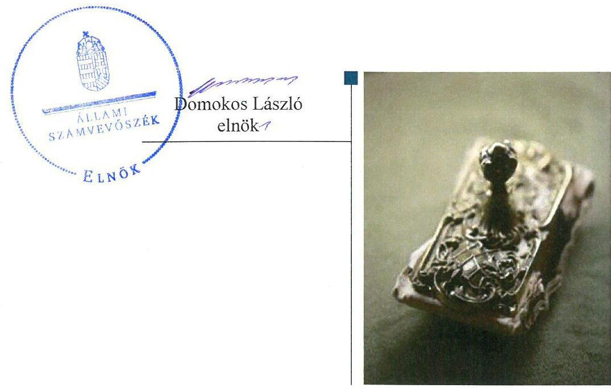

# Jelentés 

## Pártalapítványok gazdálkodása

A költségvetési támogatásban részesülő pártalapítványok 2014-2015. évi gazdálkodása törvényességének ellenőrzése a Szövetség a Polgári Magyarországért Alapítványnál
2017. OG. hó 12. nap

---

# AZ ELLENŐRZÉST FELÜGYELTE:

DR. BENEDEK MÁRIA felügyeleti vezető

# AZ ELLENŐRZÉST VEZETTE ÉS A VÉGREHAJTÁSÁÉRT FELELŐS:

KAKAS SÁNDOR ellenőrzésvezető

# A PROGRAM ÖSSZEÁLLÍTÁSÁÉRT FELELŐS:

JANIK JÓZSEF LÁSZLÓ osztályvezető

# A TÉMÁHOZ KAPCSOLÓDÓ KORÁBBI SZÁMVEVŐSZÉKI JELENTÉSEK:

|  • címe: | Jelentés a Szövetség a Polgári Magyarországért Alapítvány 2012-2013. évi gazdálkodása törvényességének ellenőrzéséről  |
| --- | --- |
|  • sorszáma: | 15070  |

Jelentéseink az Országgyűlés számítógépes hálózatán és az Interneten a www.asz.hu címen is olvashatóak.

IKTATÓSZÁM: EL-0028-042/2017.

TÉMASZÁM: 2299

ELLENŐRZÉS-AZONOSÍTÓ SZÁM: V077801

---

# TARTALOMJEGYZÉK 

■ ÖSSZEGZÉS ..... 5
■ AZ ELLENŐRZÉS CÉLJA ..... 6
■ AZ ELLENŐRZÉS TERÜLETE ..... 7
■ AZ ELLENŐRZÉS HÁTTERE, INDOKOLTSÁGA ..... 8
■ A JELENTÉS LÉNYEGES KÉRDÉSKÖREI ..... 9
■ ELLENŐRZÉS HATÓKÖRE ÉS MÓDSZEREI ..... 10
■ MEGÁLLAPÍTÁSOK ..... 12
■ MELLÉKLETEK ..... 17
I. sz. melléklet: Értelmező szótár ..... 17
II. sz. melléklet: 2014. évi egyszerűsített éves beszámoló mérlege, eredménykimutatása ..... 19
III. sz. melléklet: 2015. évi egyszerűsített éves beszámoló mérlege, eredménykimutatása ..... 21
■ FÜGGELÉK: ÉSZREVÉTELEK ..... 23
■ RÖVIDÍTÉSEK JEGYZÉKE ..... 25

---

.

---

# ÖSSZEGZÉS 

Az Állami Számvevőszék a Szövetség a Polgári Magyarországért Alapítvány gazdálkodásának törvényességét ellenőrizte 2014. január 1-jétől 2015. december 31-ig terjedő időszakra vonatkozóan. Megállapította, hogy gazdálkodásának törvényessége biztosított volt, a könyvvezetés és a gazdálkodás során a jogszabályi előírásokat betartotta. A 2014-2015. évi tevékenységéről szóló jelentéseket és annak részeként a számviteli beszámolókat a jogszabályi előírásoknak megfelelően elkészítette, a jogszabályban előírt közzétételi kötelezettségét teljesítette, a gazdálkodásának, vagyoni helyzetének, valamint a közpénzek felhasználásának átláthatóságát biztosította.

## Az ellenőrzés társadalmi indokoltsága

A pártok - a Magyarország Alaptörvényében biztosított, a népakarat kialakításában és kinyilvánításában történő közreműködésének elősegítése, az állampolgári tájékoztatás szélesítése, a politikai kultúra fejlesztése érdekében történő politikai képzés, kutatás, tudományos és ismeretterjesztő tevékenység támogatása érdekében - költségvetési támogatásra jogosult alapítványt hozhatnak létre. Jogszabályi előírások alapján a pártalapítványok gazdálkodása törvényességének ellenőrzésére az Állami Számvevőszék jogosult, ezért kétévente ellenőrzi a költségvetésből támogatásban részesülő pártalapítványoknak a gazdálkodását.

Az Állami Számvevőszék stratégiájában megfogalmazta, hogy államháztartáson kívülre nyújtott költségvetési támogatások és az ingyenes vagyonjuttatás ellenőrzésével hozzájárul ahhoz, hogy a közpénzeket a civil szervezetek is átlátható módon használják fel a közfeladatok szerződésben vállalt ellátása érdekében. A pártalapítványok gazdálkodása szabályszerűségének bemutatásával az ellenőrzés értékteremtő módon járul hozzá az Állami Számvevőszék stratégiai céljainak megvalósításához, a nyilvánosság megfelelő tájékoztatásához.

## Főbb megállapítások, következtetések

A Szövetség a Polgári Magyarországért Alapítvány Alapító okirata és a gazdálkodására vonatkozó belső szabályozása megfelelt a jogszabályi előírásoknak, ami megteremtette a közpénzekkel való átlátható és ellenőrizhető gazdálkodás alapjait.

A 2014. és a 2015. évre vonatkozóan a költségvetési terveket elkészítette, aminek következtében a kiszámítható, tervezhető gazdálkodás feltételeit biztosította. A támogatások elfogadása, elszámolása, felhasználása megfelelt a jogszabályi előírásoknak, a kiadások elszámolása szabályszerű volt.

A 2014. és a 2015. évi tevékenységéről a jelentést és annak részeként a számviteli beszámolót a jogszabályi előírásoknak megfelelően készítette el, közzétételi kötelezettségének határidőben, az előírt módon tett eleget, ezáltal biztosította a gazdálkodásának, vagyoni helyzetének, valamint a közpénzek felhasználásának átláthatóságát.

---

# AZ ELLENŐRZÉS CÉLJA 

AZ ELLENŐRZÉS CÉLJA annak megállapítása volt, hogy a Szövetség a Polgári Magyarországért Alapítvány törvényesen gazdálkodott-e, az éves számviteli beszámolók és a tevékenységéről szóló éves jelentések a jogszabályi előírásoknak megfeleltek-e, a könyvvezetés és gazdálkodás során a vonatkozó jogszabályi rendelkezéseket és belső előírásokat betartotta-e.

---

# AZ ELLENŐRZÉS TERÜLETE 

## Szövetség a Polgári Magyarországért Alapítvány

A Pártalapítványi tv. ${ }^{1}$ alapján a pártok a politikai kultúra fejlesztése érdekében tudományos, ismeretterjesztő, kutatási és oktatási tevékenységük elősegítésére a Párt tv. ${ }^{2}$-ben meghatározott mértékű költségvetési támogatásra jogosult alapítványt hozhatnak létre.

A Fidesz - Magyar Polgári Szövetség a törvény által biztosított lehetőség alapján 2003-ban létrehozta a Szövetség a Polgári Magyarországért Alapítványt.

A Szövetség a Polgári Magyarországért Alapítvány Alapító okirata ${ }^{3}$ szerinti célja,
a politikai kultúra fejlesztése, a nemzeti elkötelezettség és a kereszténydemokrata eszmekör jegyében, az ország határain belül, illetve a határon túli magyarság lakta területeken tudományos, kutatási tevékenységek szervezése, elsősorban a társadalomtudományok (történelem, közgazdaságtan, jog, politika, szociológia stb.) körében,
majd ezen kutatások eredményeinek felhasználásával is oktatási, ismeretterjesztő tevékenységek végzése, mely jelentős mértékben hozzájárulhat az állampolgárok közéleti ismereteinek szélesítéséhez, a politikai szféra, a pártok és az állampolgárok kapcsolatának erősítéséhez, valamint a határon túli magyarság nemzeti elkötelezettségének fejlesztéséhez, nemzettudatának erősítéséhez,
valamint a professzionális politika tudományos igényű vizsgálata, majd ennek eredményeként javaslatok, új módszerek, eljárások kidolgozása a politikai tevékenység minőségének, hatékonyságának javítása érdekében, amelyek a politikai rendszer egészének jobb, hatékonyabb, a közjót fokozottan szolgáló működéséhez járulhat hozzá.
Fenti célokat a Szövetség a Polgári Magyarországért Alapítvány
$\longrightarrow$ korszerű oktatási, tudományos, ismeretterjesztő tevékenységi formák szervezésével, illetve támogatásával;
$\longrightarrow$ kutatási tevékenység szervezésével, illetve támogatásával;
$\longrightarrow$ előadások, konferenciák szervezésével illetve támogatásával;
$\longrightarrow$ tanulmányok, szakkönyvek, egyéb kiadványok kiadásával, illetve kiadásuk támogatásával;
$\longrightarrow$ bel- és külföldi szaklapok, szakfolyóiratok, illetve szakkönyvek megvásárlásával;
$\longrightarrow$ a célokkal összefüggésben kiírt pályázatokon való részvétellel valósítja meg.
A Szövetség a Polgári Magyarországért Alapítvány a törvényi előírásoknak megfelelően a 2014. évben 570671 ezer Ft, a 2015. évben 529700 ezer Ft költségvetési támogatást kapott.

---

# AZ ELLENŐRZÉS HÁTTERE, INDOKOLTSÁGA 

Társadalmi elvárás a közpénzek értékelvű, rendeltetésszerű felhasználása, a közpénzekből nyújtott támogatások átláthatóságának megteremtése, amelyhez az ÁSZ ${ }^{4}$ az államháztartásból nyújtott támogatások ellenőrzésével kíván hozzájárulni. A Párt tv. 9/A § (1) bekezdése alapján a politikai kultúra fejlesztése érdekében tudományos, ismeretterjesztő, kutatási, oktatási tevékenység folytatása céljából létrehozott pártalapítványok gazdálkodása törvényességének ellenőrzése - Pártalapítványi tv. 4. § (2) bekezdése értelmében - az ÁSZ feladata. E törvény 4. § (4) bekezdése alapján az ÁSZ kétévente - kötelező jelleggel - ellenőrzi azoknak a pártalapítványoknak a gazdálkodását, amelyek költségvetési támogatásban részesültek.

Az ÁSZ, mint az Országgyűlés ellenőrző szerve a pártalapítványok gazdálkodása törvényességének/szabályszerűségének értékelésével hozzájárul ahhoz, hogy a társadalom objektív képet alkothasson a pártalapítványok működéséről. Az ellenőrzés eredményeinek célzott felhasználói a nyilvánosság, a jogalkotó, továbbá a pártalapítványok esetén azok alapítója és szervei. A jelentésben foglalt megállapítások, következtetések és javaslatok alapján a törvényalkotók konkrét lépéseket tehetnek a pártalapítványokra vonatkozó szabályozások megváltoztatása, átláthatóbbá, ellenőrizhetőbbé tétele irányába. Az ellenőrzött szervezetek szintjén a hiányosságok, szabálytalanságok feltárása, az ennek kapcsán megfogalmazott megállapítások elősegíthetik a pártalapítványok szabályszerű gazdálkodását.

---

# A JELENTÉS LÉNYEGES KÉRDÉSKÖREI 

1. A Szövetség a Polgári Magyarországért Alapítvány gazdálkodásának törvényessége biztosított volt-e?
2. A Szövetség a Polgári Magyarországért Alapítvány könyvvezetése és gazdálkodása során a vonatkozó jogszabályi rendelkezéseket és belső előírásokat betartották-e?
3. A Szövetség a Polgári Magyarországért Alapítvány tevékenységéről szóló éves jelentések, az éves számviteli beszámolók a jogszabályi előírásoknak megfeleltek-e?

---

# ELLENŐRZÉS HATÓKÖRE ÉS MÓDSZEREI 

## Az ellenőrzés típusa

Szabályszerűségi ellenőrzés.

## Az ellenőrzött időszak

2014. január 1. - 2015. december 31.

## Az ellenőrzés tárgya

Az ellenőrzés tárgyát képezte a Szövetség a Polgári Magyarországért Alapítvány gazdálkodása, a könyvvezetés szabályozása és gyakorlata szabályszerűsége, az éves számviteli beszámolókra és a Szövetség a Polgári Magyarországért Alapítvány tevékenységéről szóló éves jelentésekre vonatkozó kötelezettség teljesítése, valamint a gazdálkodáshoz kapcsolódó ellenőrzések javaslatainak hasznosítására irányuló tevékenység.

Az ellenőrzés kiterjedt minden olyan körülményre és adatra, amely az ÁSZ jogszabályban meghatározott feladatainak teljesítéséhez, valamint a program végrehajtása folyamán felmerült újabb összefüggések feltárásához volt szükséges.

## Az ellenőrzött szervezet

Szövetség a Polgári Magyarországért Alapítvány

## Az ellenőrzés jogalapja

Az ÁSZ tv. ${ }^{5}$ 1. § (3) bekezdése, 5. § (3) bekezdése, a Pártalapítványi tv. 4. § (2) és (4) bekezdései.

## Az ellenőrzés módszerei

Az ÁSZ az ellenőrzést az ellenőrzési program szempontjai, az ellenőrzött időszakban hatályos jogszabályok, a jelen ellenőrzésre irányadó ÁSZ módszertan figyelembe vételével végezte.

Az ellenőrzés ideje alatt a Szövetség a Polgári Magyarországért Alapítvánnyal történő kapcsolattartás az ÁSZ SZMSZ5-ének vonatkozó előírásai alapján történt.

---

Az ellenőrzési kérdések megválaszolásához szükséges bizonyítékok megszerzése az ellenőrzött által rendelkezésre bocsátott dokumentumokra, adatokra alapozva megfigyelés, szemle (szemrevételezés), kérdésfeltevés (információkérés), mintavételezés, valamint elemző eljárás útján történt. A mintavételezés véletlen mintavételi eljárással történt.

Az ellenőrzési bizonyítékként felhasználható adatforrások közé tartoztak egyrészt az ellenőrzési program részletes szempontjainál felsorolt adatforrások, másrészt minden egyéb - az ellenőrzés folyamán - feltárt, az ellenőrzés szempontjából információt tartalmazó dokumentum.

Az ellenőrzés lefolytatásához a Szövetség a Polgári Magyarországért Alapítvány a tanúsítványok elektronikus kitöltésével, valamint az ÁSZ által kért dokumentumok elektronikus megküldésével szolgáltatott adatokat. Az így rendelkezésre bocsátott adatok, információk, a tanúsítványok adatai valódiságának kontrollja az ellenőrzés keretében történt.

---

# 1. A Szövetség a Polgári Magyarországért Alapítvány gazdálkodásának törvényessége biztosított volt-e? 

Összegző megállapítás

### 1.1. számú megállapítás

Az SZPMA ${ }^{7}$ gazdálkodásának törvényessége biztosított volt.
Az SZPMA gazdálkodása szervezeti kereteinek kialakítása a jogszabályi előírásoknak megfelelt.

AZ SZPMA ALAPÍTÓ OKIRATA megfelelt a Ptk. ${ }^{8}$, a Párt tv. és a Pártalapítványi tv. rendelkezéseinek. Az Alapító okirat rögzítette - a Ptk. ${ }^{1}$-ben meghatározott kötelező tartalmi elemeken túl - a Kuratórium ${ }^{9}$ döntési jogköreit és felelősségét a vagyon kezeléséért, a pénzügyi, szakmai és gazdasági tevékenységért. Az Alapító okirat rendelkezett arról, hogy az SZPMA működésének és gazdálkodásának ellenőrzésére a háromtagú FB${ }^{10}$ jogosult, amelynek tevékenységét az FB az általa megállapított ügyrendben szabályozta. Az FB - az éves költségvetés, az éves beszámoló, a könyvvizsgálói jelentés és az SZPMA éves tevékenységéről szóló jelentés vonatkozásában - előzetes véleményezési jogát és kötelezettségét, valamint az alapítványi feladatok ellátására létrehozott munkaszervezet működését az SZMSZ ${ }^{11}$ szabályozta.

Az SZPMA cél szerinti tevékenységéből származó bevételeinek, költségeinek, ráfordításainak elkülönített nyilvántartási kötelezettségét az Alapító okirat és a Számlarend ${ }^{12}$ határozta meg.

Az SZPMA beszámolási kötelezettségét a Számv. vhr. ${ }^{13}$-ben foglaltaknak megfelelően egyszerűsített éves beszámoló elkészítésével teljesítette. Könyvvezetési kötelezettségének az ellenőrzött időszakban a Számv. tv. ${ }^{14}$-ben, valamint a Számv. vhr.-ben foglaltaknak megfelelően kettős könyvvitel vezetésével tett eleget.

Az SZPMA könyvvezetését a Számv. vhr. előírásai szerint megbízási szerződés alapján külső szervezet végezte, akinek tagja rendelkezett a Számv. tv.-ben meghatározott képesítéssel és a szolgáltatás nyújtására jogosító engedéllyel.

### 1.2. számú megállapítás

Az SZPMA gazdálkodására vonatkozó belső szabályozás megfelelt a jogszabályi előírásoknak.

SZÁMVITELI POLITIKÁVAL ${ }^{15}$ az SZPMA a Számv. tv.-ben előírtaknak megfelelően rendelkezett, ami tartalmilag megfelelt a Számv. vhr.-ben foglaltaknak.

Az SZPMA az eszközök és a források értékelésére vonatkozó szabályokat a Számviteli politikájában rögzítette, a Pénzkezelési szabályzata ${ }^{16}$ a Számv. tv.-ben foglalt előírásoknak megfelelt. Az SZPMA Leltározási szabályzatát ${ }^{17}$ elkészítette a Számv. tv. szerint, önköltségszámítási szabályzat készítésére a Számv. tv. alapján nem volt kötelezett.

---

Az SZPMA a gazdálkodására vonatkozó további szabályokat részben az Alapító okiratban, részben az SZMSZ-ben határozta meg. Az SZMSZ tartalmazta a támogatási szerződésekkel kapcsolatos szabályokat is.
1.3. számú megállapítás Az SZPMA alapcélja ellátásához

 kapcsolódó gazdálkodási tevékenysége szabályszerű volt.

Az SZPMA a gazdálkodására vonatkozó különös szabályokat - az SZPMA-hoz történő csatlakozás, a támogatások elfogadásának szabályait - a Pártalapítványi tv., az Ectv. ${ }^{18}$, valamint az Ecvhr. ${ }^{19}$ előírásainak megfelelően az Alapító okiratban rögzítette.

A Ptk. 1-ben foglaltaknak megfelelően az SZPMA az Alapító okiratban rendelkezett az Alapítvány alapcél szerinti vagyona felhasználásának szabályairól. Az SZPMA a Számviteli politikában rögzítette, hogy vállalkozási tevékenységet nem folytat.

Az SZPMA két alapítványt hozott létre, a PSZA-t ${ }^{20}$ a 2004. évben 5000 ezer Ft, a PKA-t ${ }^{21}$ pedig a 2009. évben 6000 ezer Ft induló vagyonnal alapította. Az SZPMA a PSZA-t kérelmére - a Polgári Szemle lapszámainak kiadásával kapcsolatos költségekre, valamint működési költségek fedezésére - 2014. évben 5000 ezer Ft, 2015. évben 5600 ezer Ft támogatásban részesítette. A PKA-t az ellenőrzött időszakban az SZPMA támogatásban nem részesítette. A Fővárosi Törvényszék 2015. június 2. napján jogerőre emelkedett végzésével megállapította a PKA megszűnését.

# 2. A Szövetség a Polgári Magyarországért Alapítvány könyvvezetése és gazdálkodása során a vonatkozó jogszabályi rendelkezéseket és belső előírásokat betartották-e? 

Összegző megállapítás Az SZPMA könyvvezetése és gazdálkodása során a vonatkozó jogszabályi rendelkezéseket és belső előírásokat betartották.

Az számú megállapítás Az SZPMA a 2014-2015. években a jogszabályi és a belső szabályozási előírásoknak megfelelően elkészítette a költségvetési terveket.

KÖLTSÉGVETÉSI TERV készítési kötelezettségét az SZPMA az Ecvhr. és az Alapító okirat előírásainak megfelelően teljesítette.
2.2. számú megállapítás Az SZPMA a támogatásokat szabályszerűen fogadta el, használta fel és számolta el.

Az SZPMA úgy alakította ki számviteli, nyilvántartási rendszerét, hogy az biztosította a bevételek Számv. vhr. szerinti részletezettséggel történő kimutatását.

A KÖLTSÉGVETÉSI TÁMOGATÁSRA az SZPMA a Párt tv. alapján jogosult volt. A 2014. évben az általános országgyűlési képviselő választások miatti év közbeni változtatások után összesen 570671 ezer Ft, míg 2015. évben 529700 ezer Ft költségvetési támogatásban részesült. A támogatási összegek kifizetése az előírásoknak megfelelően negyedévenként az SZPMA pénzforgalmi számlájára történt.

---

Az SZPMA a költségvetési támogatások mellett magánszemélyektől a 2014-2015. években egy-egy alkalommal kapott támogatást, a 2014. évben 62 ezer Ft, míg a 2015. évben 3000 ezer Ft összegben. A 2014. évben egy külföldi alapítványtól (CES ${ }^{22}$ ) is részesült támogatásban, amelynek összege 155 ezer Ft volt. A támogatások elfogadása megfelelt a Pártalapítványi tv.-ben előírtaknak. A 2014. évi külföldi jogi személytől és a 2015. évi természetes személytől kapott támogatás esetében az SZPMA eleget tett a közzétételi kötelezettségének, a támogatást nyújtó személyét és a támogatás összegét közzétette honlapján.

A központi költségvetésből, valamint a magánszemélyektől kapott támogatások könyvelése a Számv. vhr., valamint a Számviteli politika és a Számlarend ${ }_{1,2}$ előírásainak megfelelően történt.

# 2.3. számú megállapítás 

Az SZPMA kiadásainak elszámolása szabályszerű volt.
Az SZPMA beruházásaira, felújításaira fordított összegek felhasználása, valamint az anyagjellegű és személyi jellegű költségek, ráfordítások kifizetése, elszámolása szabályszerű volt.

A beszerzett eszközök és immateriális javak értékének meghatározása és azok besorolása megfelelt Számv. tv.-ben előírtaknak, az azokkal kapcsolatos kötelezettségvállalások az SZMSZ1-5 előírásai szerint történtek. A beszerzett tárgyi eszközöket és immateriális javakat a 2014. évi analitikus nyilvántartásból készített összesítő kimutatás, illetve a 2015. évi mennyiségi leltár tartalmazta, azok értékcsökkenésének elszámolása megfelelt a Számv. tv.-ben előírtaknak, valamint a Számviteli politikában és a Számlarend ${ }_{1,2}$-ben rögzített szabályoknak.

Az anyagjellegű és személyi jellegű költségek, ráfordítások, valamint a beruházásokra, felújításokra fordított kiadások elszámolása a Számv. tv., az SZMSZ ${ }_{1-5}$ és a Pénzkezelési szabályzat ${ }_{1,2}$ előírásainak megfelelően történt.

A NYÚJTOTT TÁMOGATÁSOK elbírálásának, folyósításának, nyilvántartásának, elszámolásának, a támogatásokról való beszámoltatásának rendjét az SZPMA az Alapító okiratban és a SZMSZ ${ }_{1-5}$-ben rögzítette, az elszámolás és a nyilvántartás rendjét a Számlarend ${ }_{1,2}$-ben határozta meg.

Az SZPMA által nyújtott támogatásokról az Alapító okirat és az SZMSZ ${ }_{1-}$5-nek megfelelően minden esetben a Kuratórium döntött, a támogatottakkal támogatási szerződést kötöttek. A kifizetett összegek könyvekben történő elszámolása és azok nyilvántartása a Számlarend ${ }_{1,2}$-nek megfelelő volt. Az SZPMA a természetes személyeket a jogi személyeknek nyújtott támogatásoktól eltérően az Szja tv. ${ }^{23}$ adta lehetőséggel élve ösztöndíj keretében támogatta, támogatási szerződések megkötése mellett, amelyekben tartalmi elszámolási kötelezettséget írtak elő.

A támogatások felhasználásának ellenőrzése megtörtént, azok elfogadásáról a Kuratórium döntött. Az ellenőrzések során nem célszerű felhasználást nem állapítottak meg, visszafizetési kötelezettsége egy támogatottnak keletkezett, aki az SZPMA által küldött felszólítást követően a maradvány összeget visszafizette.

---

# 3. A Szövetség a Polgári Magyarországért Alapítvány tevékenységéről szóló éves jelentések, az éves számviteli beszámolók a jogszabályi előírásoknak megfeleltek-e? 

Összegző megállapítás

Az SZPMA a 2014-2015. évi tevékenységéről szóló jelentéseket és annak részeként a számviteli beszámolókat a jogszabályi előírásoknak megfelelően készítette el.
3.1. számú megállapítás

Az SZPMA a 2014-2015. évi tevékenységéről szóló jelentési, beszámolási és közzétételi kötelezettségének szabályszerűen tett eleget.

A TEVÉKENYSÉGÉRŐL SZÓLÓ JELENTÉSEKET az SZPMA elkészítette, amelyek megfeleltek a Pártalapítványi tv.-ben, valamint a Számv. vhr.-ben rögzített tartalmi és formai követelményeknek. Az SZPMA a Pártalapítványi tv. alapján az éves jelentések közzétételéről gondoskodott, azokat a Magyar Közlöny mellékleteként megjelenő Hivatalos Értesítőben való közzététel céljából az IM-nek ${ }^{24}$ határidőben megküldte.

A Számv. tv. és a Számv. vhr., valamint a Számviteli politika előírásainak megfelelően az SZPMA az ellenőrzött időszak mindkét évében eleget tett egyszerűsített éves beszámoló készítési kötelezettségének.

A mérleg fordulónapra elkészített leltárak és főkönyvi kivonatok a Számv. tv.-ben előírtaknak megfelelve alátámasztották a számviteli beszámolóban feltüntetett adatokat. A leltárban és a főkönyvi könyvelésben kimutatott nettó értékek az ellenőrzött időszakban az analitikus nyilvántartásokkal alátámasztottak voltak. Az SZPMA az eszközök bekerülési értékét a Számv. tv. és a Számv. vhr. előírásainak megfelelően vette számításba.

SZÁMVITELI BESZÁMOLÓIT az SZPMA a Számv. tv. és a Számv. vhr. előírásainak megfelelően készítette el. A Pártalapítványi tv.-ben előírtaknak megfelelően az SZPMA beszámolóját a Kuratórium a Számv. tv.-ben megjelölt május 31-i határidőt megelőzően mindkét évben jóváhagyta. A beszámolók közzétételéről és letétbe helyezéséről az SZPMA szabályszerűen gondoskodott, azokat a Cnytv.-ben ${ }^{25}$ rögzített előírásokat betartva, az előírt határidőben megküldte az OBH-nak ${ }^{26}$.

Az SZPMA a Pártalapítványi tv. szerint fennálló, a támogató személyek és szervezetek közzétételére vonatkozó kötelezettségének honlapján eleget tett, az Info tv. ${ }^{27}$-ben foglalt közzétételi kötelezettségét teljesítette, mert kérésre közérdekből nyilvános adatot szolgáltatott, valamint eleget tett a Kbt. ${ }^{28}$ szerinti 2014. és 2015. évi közbeszerzési tervre vonatkozó közzétételi kötelezettségének is.

A VAGYON VÉDELME a 2014. és 2015. évben az SZPMA-nál biztosított volt, az Alapító okiratban meghatározott célok megvalósításához szükséges vagyon rendelkezésére állt, amelyet a Pártalapítványi tv.-ben meghatározott célokkal összhangban használt fel.

---

# 3.2. számú megállapítás 

Az FB a gazdálkodással kapcsolatos feladatait az Alapító által előírtaknak megfelelően végezte.

Az Alapító okiratban előírt, a gazdálkodás ellenőrzésére vonatkozó kötelezettségének az FB eleget tett, a gazdasági tartalmú kérdésekről határozat formájában döntéseket hozott. Az FB ülésein önálló napirendi pont keretében tárgyalta az SZPMA éves költségvetéseit és beszámolóit, a könyvvizsgálói jelentést, továbbá a könyvvizsgálói szerződés módosítását és a honlappal kapcsolatos korszerűsítési kérdéseket.

## A külső ellenőrzések az SZPMA számára javaslatokat nem fogalmaztak meg.

KÜLSŐ ELLENŐRZÉST az ellenőrzött időszakban az SZPMA-nál a 2015. év elején lezajlott - a 2012-2013. évekre kiterjedő - ÁSZ ellenőrzésen kívül, a Kuratórium szabad elhatározásából megbízott könyvvizsgáló végzett.

Az SZPMA a Számv. tv. és a Számv. vhr. szerint nem volt kötelezett könyvvizsgálatra. Ennek ellenére a Számv. vhr.-ben biztosított lehetőségével élve az ellenőrzött időszakban számviteli beszámolójának felülvizsgálatával könyvvizsgálót bízott meg. A könyvvizsgáló az SZPMA beszámolóit hitelesítő záradékkal látta el, megfogalmazott véleménye szerint a beszámolók az SZPMA pénzügyi és vagyoni helyzetéről megbízható és valós képet adtak, javaslatokat a gazdálkodási és számviteli tevékenység vonatkozásában nem fogalmazott meg.

---

# MELLÉKLETEK 

- I. SZ. MELLÉKLET: ÉRTELMEZŐ SZÓTÁR
adomány
alapítvány
beruházás

Felügyelő Bizottság

A civil szervezetnek - létesítő okiratban rögzített céljaira - ellenszolgáltatás nélkül juttatott eszköz, illetve nyújtott szolgáltatás (forrás: Ectv. 2. § 1. pontja); az a pénzbeli vagy természetbeni juttatás, amelyet az adományozó az adományozott civil szervezet alapcéljának, illetve közhasznú céljának elérésére ellenszolgáltatás nélkül juttat. (forrás: 350/2011. (XII. 30.) Korm. rendelet 1. § (5) bekezdés a) pontja)
A közhasznú szervezet részére törvényben meghatározott közhasznú tevékenysége támogatására, valamint az egyházi jogi személy részére törvényben meghatározott tevékenysége támogatására, továbbá a közérdekű kötelezettségvállalás céljára az adóévben visszafizetési kötelezettség nélkül adott támogatás, juttatás, térítés nélkül átadott eszköz könyv szerinti értéke, térítés nélkül nyújtott szolgáltatás bekerülési értéke, feltéve hogy az nem jelent az e törvényben meghatározottakon túl vagyoni előnyt az adományozónak, az adományozó tagjának vagy részvényesének, vezető tisztségviselőjének, felügyelőbizottsága vagy igazgatósága tagjának, könyvvizsgálójának, illetve ezen személyek vagy a természetes személy tag vagy részvényes közeli hozzátartozójának azzal, hogy nem minősül vagyoni előnynek az adományozó nevére, tevékenységére történő utalás. (a társasági adóról és az osztalékadóról szóló 1996. évi LXXXI. törvény 4. § 1/a. pont)
Magánszemély, jogi személy és jogi személyiséggel nem rendelkező gazdasági társaság (a továbbiakban együtt: alapító) - tartós közérdekű célra - alapító okiratban alapítványt hozhat létre. Alapítvány elsődlegesen gazdasági tevékenység folytatása céljából nem alapítható. Az alapítvány javára a célja megvalósításához szükséges vagyont kell rendelni. Az alapítvány jogi személy. Az alapítvány a bírósági nyilvántartásba vételével jön létre. (Forrás: Ptk. 1 74/A. § (1) - (2) bekezdés)
Az alapítvány az alapító által az alapító okiratban meghatározott tartós cél folyamatos megvalósítására létrehozott jogi személy. Az alapító az alapító okiratban meghatározza az alapítványnak juttatott vagyont és az alapítvány szervezetét. Alapítvány nem alapítható gazdasági-vállalkozási tevékenység folytatására. Az alapítvány az alapítványi cél megvalósításával közvetlenül összefüggő gazdasági tevékenység végzésére jogosult. Alapítvány nem lehet korlátlan felelősségű tagja más jogalanynak, nem létesíthet alapítványt és nem csatlakozhat alapítványhoz. (Forrás: Ptk. ${ }^{29}$ 3:378§, 3:379. § (1) - (3) bekezdés)
A tárgyi eszköz beszerzése, létesítése, saját vállalkozásban történő előállítása, a beszerzett tárgyi eszköz üzembe helyezése. A beruházás a meglévő tárgyi eszköz bővítését, rendeltetésének megváltoztatását, átalakítását, élettartamának, teljesítőképességének közvetlen növelését eredményező tevékenység. (Forrás: Számv. tv. 3. § (4) bekezdés 7. pont)

Az alapítók a létesítő okiratban három tagból álló FB-t hozhatnak létre, azzal a feladattal, hogy az ügyvezetést a jogi személy érdekeinek megóvása céljából ellenőrizze. Ha az alapítványnál felügyelőbizottság működik, a tevékenységét az alapító részére végzi, tevékenységéről évente az alapítói jogok gyakorlójának számol be. (Forrás: Ptk. 2 3:36-3:28 §, 3:400. §)

---

költségvetési támogatás
kuratórium
pártalapítvány

Az államháztartás alrendszerei terhére nyújtott pénzbeli vagy nem pénzbeli juttatás, amelyet a támogató nem elsősorban ellenszolgáltatás ellenében, de konkrét program megvalósítása vagy meghatározott időszakban a támogatott szervezet működtetése érdekében nyújt. (Civil tv. 2. § 15. pont)
Az államháztartás központi alrendszeréből ellenérték nélkül, pénzben nyújtott támogatások, ide nem értve

 az adományokat, segélyeket, felajánlásokat, a pártok és pártalapítványok támogatását. (forrás: az államháztartásról szóló 2011. évi CXCV. törvény 2. § (1) bekezdés n) pont)
Az alapítvány kezelő/ügyvezető szervezete. (forrás: Ptk. 3:397. § (1) bekezdése) A politikai kultúra fejlesztése érdekében, tudományos, ismeretterjesztő, kutatási és oktatási tevékenység folytatása céljából pártok által létrehozott, külön jogszabályban - a Pártalapítványi tv. 1. § és 3. § (1) bekezdése - meghatározott, jogi személynek minősülő egyéb szervezet, speciális jogállású alapítvány (Forrás: Párt tv. 9/A. § (1) bekezdés, Pártalapítványi tv. 1. §, Ectv. 1. § (2) bekezdés, 2. § 6. c) pont, Számv. tv. 3. § (1) bekezdés 4. pont, Számviteli vhr. 2. § (1) bekezdés k) pont, (2) bekezdés, 3. § (1), (5)-(6) bekezdései, 4. § (1) bekezdés)

---

# II. SZ. MELLÉKLET: 2014. ÉVI EGYSZERŰSÍTETT ÉVES BESZÁMOLÓ MÉRLEGE, EREDMÉNYKIMUTATÁSA

A Szövetség a Polgári Magyarországért Alapítvány 2014. évi jelentése a pártok működését segítő tudományos, ismeretterjesztő, kutatási, oktatási tevékenységet végző alapítványokról szóló törvény szerint

Szövetség a Polgári Magyarországért Alapítvány Adószám: 18180987-1-41 Bírósági végzés száma: 61.038/2003 KSH statisztikai számjel: 18180987-9499-569-01

Szövetség a Polgári Magyarországért Alapítvány a) Egyéb szervezetek egyszerűsített éves beszámoló - Mérleg

|  Ssz.
szám | Megnevezés/E Ft | 2013 | Ellenőrzés
hatása | 2014  |
| --- | --- | --- | --- | --- |
|  1 | A. | BEFEKTETETT ESZKÖZÖK | 2125 | 0  |
|  2 | I. | IMMATERIÁLIS JAVAK | 129 | 0  |
|  3 | II. | TÁRGYI ESZKÖZÖK | 1996 | 0  |
|  4 | III. | BEFEKTETETT PÉNZÜGYI ESZKÖZÖK | 0 | 0  |
|  5 | B. | FORGÓESZKÖZÖK | 902030 | 0  |
|  6 | I. | KÉSZLETEK | 0 | 0  |
|  7 | II. | KÖVETELÉSEK | 5213 | 0  |
|  8 | III. | ÉRTÉKPAPÍROK | 0 | 0  |
|  9 | IV. | PÉNZESZKÖZÖK | 896817 | 0  |
|  10 | C. | AKTÍV IDŐBELI ELHATÁROLÁSOK | 1590 | 0  |
|  11 |  | ESZKÖZÖK ÖSSZESEN | 905745 | 0  |

|  12 | D. | SÁJÁT TÖKE | 872531 | 0 | 1038897  |
| --- | --- | --- | --- | --- | --- |
|  13 | I. | INDULÓ TÖKE / JEGYZETT TÖKE | 600 | 0 | 600  |
|  14 | II. | TÖKEVÁLTOZÁS / EREDMÉNY | 675672 | 0 | 871931  |
|  15 | III. | LEKÖTÖTT TARTALÉK | 0 | 0 | 0  |
|  16 | IV. | ÉRTÉKELÉSI TARTALÉK | 0 | 0 | 0  |
|  17 | V. | TÁRGYÉVI EREDMÉNY ALAPTEVÉKENYSÉGBŐL
(KÖZHASZNÚ TEVÉKENYSÉGBŐL) | 196259 | 0 | 166366  |
|  18 | VI. | TÁRGYÉVI EREDMÉNY VÁLLALKOZÁSI TEVÉKENYSÉGBŐL | 0 | 0 | 0  |
|  19 | E. | CÉLTARTALÉKOK | 0 | 0 | 0  |
|  20 | F. | KÖTELEZETTSÉGEK | 17355 | 0 | 28258  |
|  21 | I. | HÁTRASOROLT KÖTELEZETTSÉGEK | 0 | 0 | 0  |
|  22 | II. | HOSSZÚ LEJÁRATÚ KÖTELEZETTSÉGEK | 0 | 0 | 3546  |
|  23 | III. | RÖVID LEJÁRATÚ KÖTELEZETTSÉGEK | 17355 | 0 | 24712  |
|  24 | G. | PASSZÍV IDŐBELI ELHATÁROLÁSOK | 15859 | 0 | 8657  |
|  25 |  | FORRÁSOK ÖSSZESEN | 905745 | 0 | 1075812  |

---

### Szövetség a Polgári Magyarországért Alapítvány

### a) Egyéb szervezetek egyszerűsített éves beszámoló – Eredménykimutatás

|  Szó | Megnevezés (E.F) | Alap
tevékenység | Vállalkozó
tevékenység | Összesen | Alap
tevékenység | Vállalkozó
tevékenység | Összesen | Alap
tevékenység | Vállalkozó
tevékenység | Összesen  |
| --- | --- | --- | --- | --- | --- | --- | --- | --- | --- | --- |
|  1 | 1. | ÉRTÉKESÍTÉS NETTÓ ÁRBEVÉTELE | 0 | 0 | 0 | 0 | 0 | 0 | 0 | 0  |
|  2 | 2. | AKTIVÁLT SÁJÁT TELJESTMÉNYEK ÉRTÉKE | 0 | 0 | 0 | 0 | 0 | 0 | 0 | 0  |
|  3 | 3. | EGYÉB BEVÉTELEK | 612065 | 0 | 612065 | 0 | 0 | 0 | 570943 | 570943  |
|  4 |  | ebből | 0 | 0 | 0 | 0 | 0 | 0 | 0 | 0  |
|  5 |  | – tagdíj, alapítótól kapott befizetés | 0 | 0 | 0 | 0 | 0 | 0 | 0 | 0  |
|  6 |  | – támogatások | 611700 | 0 | 611700 | 0 | 0 | 0 | 570733 | 570733  |
|  7 | 4. | PÉNZÜGYI MŰVELETEK BEVÉTELEI | 31870 | 0 | 31870 | 0 | 0 | 0 | 19255 | 19255  |
|  8 | 5. | RENDKIVÜLI BEVÉTELEK | 0 | 0 | 0 | 0 | 0 | 0 | 0 | 0  |
|  9 |  | ebből | 0 | 0 | 0 | 0 | 0 | 0 | 0 | 0  |
|  10 |  | – alapítótól kapott befizetés | 0 | 0 | 0 | 0 | 0 | 0 | 0 | 0  |
|  11 |  | – támogatások | 0 | 0 | 0 | 0 | 0 | 0 | 0 | 0  |
|  12 | A. | ÖSSZES BEVÉTEL | 643935 | 0 | 643935 | 0 | 0 | 0 | 590198 | 590198  |
|  13 |  | ebből közhasznú tevékenység bevételei | 0 | 0 | 0 | 0 | 0 | 0 | 0 | 0  |
|  14 | 6. | ANYAGJELLEGŰ RÁFORDÍTÁSOK | 131938 | 0 | 131938 | 0 | 0 | 0 | 83870 | 83870  |
|  15 | 7. | SZEMÉLYI JELLEGŰ RÁFORDÍTÁSOK | 47711 | 0 | 47711 | 0 | 0 | 0 | 76145 | 76145  |
|  16 |  | ebből vezető tisztségviselők juttatásai | 0 | 0 | 0 | 0 | 0 | 0 | 0 | 0  |
|  17 | 8. | ÉRTÉKCSÖKKENÉSI LEÍRÁS | 1350 | 0 | 1350 | 0 | 0 | 0 | 1050 | 1050  |
|  18 | 9. | EGYÉB RÁFORDÍTÁSOK | 265548 | 0 | 265548 | 0 | 0 | 0 | 262271 | 262271  |
|  19 | 10. | PÉNZÜGYI MŰVELETEK RÁFORDÍTÁSAI | 1129 | 0 | 1129 | 0 | 0 | 0 | 496 | 496  |
|  20 | 11. | RENDKIVÜLI RÁFORDÍTÁSOK | 0 | 0 | 0 | 0 | 0 | 0 | 0 | 0  |
|  21 | B. | ÖSSZES RÁFORDÍTÁS | 447676 | 0 | 447676 | 0 | 0 | 0 | 423832 | 423832  |
|  22 |  | ebből közhasznú tevékenység ráfordításai | 0 | 0 | 0 | 0 | 0 | 0 | 0 | 0  |
|  23 | C. | ADÓZÁS ELŐTTI EREDMÉNY | 196259 | 0 | 196259 | 0 | 0 | 0 | 166366 | 166366  |
|  24 | 12. | ADÓFIZETÉSI KÖTELEZETTSÉG | 0 | 0 | 0 | 0 | 0 | 0 | 0 | 0  |
|  25 | D. | ADÓZOTT EREDMÉNY | 196259 | 0 | 196259 | 0 | 0 | 0 | 166366 | 166366  |
|  26 | 13. | JÓVÁHAGYOTT OSZTÁLYRÉSZ | 0 | 0 | 0 | 0 | 0 | 0 | 0 | 0  |
|  27 | E. | TÁRGYÉVI EREDMÉNY | 196259 | 0 | 196259 | 0 | 0 | 0 | 166366 | 166366  |

Budapest, 2015. május 19.

Bolog Zoltán s. k.,

kuratóriumi elnök

Elfogadva: a 16/2015. (V. 22.) számú kuratórium határozattal

---

# A Szövetség a Polgári Magyarországért Alapítvány 2015. évi jelentése a pártok működését segítő tudományos, ismeretterjesztő, kutatási, oktatási tevékenységet végző alapítványokról szóló törvény szerint

Adószám: 18180987-1-41 Bírósági végzés száma: 61.038/2003 KSH statisztikai számjel: 18180987-9499-569-01 a) Számviteli beszámoló

Egyéb szervezetek egyszerűsített éves beszámolója - Mérleg Adatok ezer forintban

|  Sor-
szám |  | Megnevezés | 2014 | Ellenőrzés hatása | 2015  |
| --- | --- | --- | --- | --- | --- |
|  1. | A. | BEFEKTETETT ESZKÖZÖK | 3258 | 0 | 2930  |
|  2. | I. | IMMATERIÁLIS JAVAK | 0 | 0 | 0  |
|  3. | II. | TÁRGYI ESZKÖZÖK | 3258 | 0 | 2930  |
|  4. | III. | BEFEKTETETT PÉNZÜGYI ESZKÖZÖK | 0 | 0 | 0  |
|  5. | B. | FORGÓESZKÖZÖK | 1051654 | 0 | 1100455  |
|  6. | I. | KÉSZLETEK | 0 | 0 | 0  |
|  7. | II. | KÖVETELÉSEK | 5012 | 0 | 5040  |
|  8. | III. | ÉRTÉKPAPÍROK | 0 | 0 | 0  |
|  9. | IV. | PÉNZESZKÖZÖK | 1046642 | 0 | 1095415  |
|  10. | C. | AKTÍV IDŐBELI ELHATÁROLÁSOK | 20900 | 0 |
 | 12589  |
|  11. |  | ESZKÖZÖK ÖSSZESEN | 1075812 | 0 | 1115974  |
|  12. | D. | SAJÁT TÖKE | 1038897 | 0 | 1081944  |
|  13. | I. | INDULÓ TÖKE/JEGYZETT TÖKE | 600 | 0 | 600  |
|  14. | II. | TÖKEVÁLTOZÁS/EREDMÉNY | 871931 | 0 | 1038297  |
|  15. | III. | LEKÖTÖTT TARTALÉK | 0 | 0 | 0  |
|  16. | IV. | ÉRTÉKELÉSI TARTALÉK | 0 | 0 | 0  |
|  17. | V. | TÁRGYÉVI EREDMÉNY ALAPTEVÉKENYSÉGBŐL (KÖZHASZNÚ TEVÉKENYSÉGBŐL) | 166366 | 0 | 43047  |
|  18. | VI. | TÁRGYÉVI EREDMÉNY VÁLLALKOZÁSI TEVÉKENYSÉGBŐL | 0 | 0 | 0  |
|  19. | E. | CÉLTARTALÉKOK | 0 | 0 | 0  |
|  20. | F. | KÖTELEZETTSÉGEK | 28258 | 0 | 18044  |
|  21. | I. | HÁTRASOROLT KÖTELEZETTSÉGEK | 0 | 0 | 0  |
|  22. | II. | HOSSZÚ LEJÁRATÚ KÖTELEZETTSÉGEK | 3546 | 0 | 0  |
|  23. | III. | RÖVID LEJÁRATÚ KÖTELEZETTSÉGEK | 24712 | 0 | 18044  |
|  24. | G. | PASSZÍV IDŐBELI ELHATÁROLÁSOK | 8657 | 0 | 15986  |
|  25. |  | FORRÁSOK ÖSSZESEN | 1075812 | 0 | 1115974  |

---

Egyéb szervezetek egyszerűsített éves beszámolója - Eredménykimutatás

|  Sza szám |  | Megnevezés | 2014 |  |  | Eőzõ évek helyesbítésű |  |  | 2015 |  |   |
| --- | --- | --- | --- | --- | --- | --- | --- | --- | --- | --- | --- |
|   |  |  | Alapterekkenység | Vállalkozási tevékenység | Összesen | Alapterekkenység | Vállalkozási tevékenység | Összesen | Alapterekkenység | Vállalkozási tevékenység | Összesen  |
|  1. | 1. | ÉRTÉKESÍTÉS NETTÓ ÁRBEVÉTELE | 0 | 0 | 0 | 0 | 0 | 0 | 0 | 0 | 0  |
|  2. | 2. | AKTIVÁLT SAJÁT TELJESÍTMÉNYEK ÉRTÉKE | 0 | 0 | 0 | 0 | 0 | 0 | 0 | 0 | 0  |
|  3. | 3. | EGYÉB BEVÉTELEK | 570943 |  | 570943 | 0 | 0 | 0 | 532767 |  | 532767  |
|  4. |  | ebből: | 0 |  | 0 | 0 | 0 | 0 | 0 |  | 0  |
|  5. |  | - tagdíj alapítótól kapott befizetés | 0 |  | 0 | 0 | 0 | 0 | 0 |  | 0  |
|  6. |  | - támogatások | 570733 |  | 570733 | 0 | 0 | 0 | 532700 |  | 532700  |
|  7. | 4. | PÉNZÜGYI MŰVELETEK BEVÉTELEI | 19255 |  | 19255 | 0 | 0 | 0 | 14015 |  | 14015  |
|  8. | 5. | RENDKÍVÜLI BEVÉTELEK | 0 |  | 0 | 0 | 0 | 0 | 0 |  | 0  |
|  9. |  | ebből: | 0 |  | 0 | 0 | 0 | 0 | 0 |  | 0  |
|  10. |  | - alapítótól kapott befizetés | 0 |  | 0 | 0 | 0 | 0 | 0 |  | 0  |
|  11. |  | - támogatások | 0 |  | 0 | 0 | 0 | 0 | 0 |  | 0  |
|  12. | A. | ÖSSZES BEVÉTEL | 590198 |  | 590198 | 0 | 0 | 0 | 546782 |  | 546782  |
|  13. |  | ebből: közhasznú tevékenység bevételei | 0 |  | 0 | 0 | 0 | 0 | 0 |  | 0  |
|  14. | 6. | ANYAGJELLEGŰ RÁFORDÍTÁSOK | 83870 |  | 83870 | 0 | 0 | 0 | 119531 |  | 119531  |
|  15. | 7. | SZEMÉLYI JELLEGŰ RÁFORDÍTÁSOK | 76145 |  | 76145 | 0 | 0 | 0 | 66121 |  | 66121  |
|  16. |  | ebből: vezető tisztségviselők juttatásai | 0 |  | 0 | 0 | 0 | 0 | 0 |  | 0  |
|  17. | 8. | ÉRTÉKCSÖKKENÉSI LÉPÉS | 1050 |  | 1050 | 0 | 0 | 0 | 1052 |  | 1052  |
|  18. | 9. | EGYÉB RÁFORDÍTÁSOK | 262271 |  | 262271 | 0 | 0 | 0 | 316683 |  | 316683  |
|  19. | 10. | PÉNZÜGYI MŰVELETEK RÁFORDÍTÁSAI | 496 |  | 496 | 0 | 0 | 0 | 348 |  | 348  |
|  20. | 11. | RENDKÍVÜLI RÁFORDÍTÁSOK | 0 |  | 0 | 0 | 0 | 0 | 0 |  | 0  |
|  21. | B. | ÖSSZES RÁFORDÍTÁS | 423832 |  | 423832 | 0 | 0 | 0 | 503735 |  | 503735  |
|  22. |  | ebből: közhasznú tevékenység ráfordításai | 0 |  | 0 | 0 | 0 | 0 | 0 |  | 0  |
|  23. | C. | ADÓZÁS ELŐTTI EREDMÉNY | 166366 |  | 166366 | 0 | 0 | 0 | 43047 |  | 43047  |
|  24. | 12. | ADÓFIZETÉSI KÖTELEZETTSÉG | 0 |  | 0 | 0 | 0 | 0 | 0 |  | 0  |
|  25. | D. | ADÓZOTT EREDMÉNY | 166366 |  | 166366 | 0 | 0 | 0 | 43047 |  | 43047  |
|  26. | 13. | JÓVÁHAGYOTT OSZTÁLYÉK | 0 |  | 0 | 0 | 0 | 0 | 0 |  | 0  |
|  27. | E. | TÁRGYÉVI EREDMÉNY | 166366 |  | 166366 | 0 | 0 | 0 | 43047 |  | 43047  |

Budapest, 2016. május 23.

Balog Zoltán s. k., kuratóriumi elnök

Elfogadva: a 18/2016. (V. 23.) számú kuratórium határozattal

---

# FÜGGELÉK: ÉSZREVÉTELEK 

A jelentéstervezetet a Számvevőszék 15 napos észrevételezésre megküldte az ellenőrzött szervezet vezetőjének az ÁSZ tv. 29. § (1) bekezdése előírásának megfelelően.

Az ellenőrzött szervezet vezetője az ÁSZ tv. 29. § (2) bekezdésében foglalt észrevételezési jogával nem élt, a jelentéstervezetre észrevételt nem tett.

[^0]
[^0]:    * 29. § (1) Az Állami Számvevőszék az ellenőrzési megállapításait megküldi az ellenőrzött szervezet vezetőjének vagy az általa megbízott személynek, és annak, akinek személyes felelősségét állapította meg.
    (2) Az ellenőrzött szervezet vezetője és a felelősként megjelölt személy az ellenőrzés megállapításaira tizenöt napon belül írásban észrevételt tehet.
    (3) Az Állami Számvevőszék az észrevételre a beérkezésétől számított harminc napon belül írásban válaszol. A figyelembe nem vett észrevételeket köteles a jelentésben feltüntetni, és megindokolni, hogy azokat miért nem fogadta el.

---

.

---

# RÖVIDÍTÉSEK JEGYZÉKE 

${ }^{1}$ Pártalapítványi tv.
${ }^{2}$ Párt tv.
${ }^{3}$ Alapító okirat
${ }^{4}$ ÁSZ
${ }^{5}$ ÁSZ tv.
${ }^{6}$ ÁSZ SZMSZ
${ }^{7}$ SZPMA
${ }^{8}$ Ptk. 1
${ }^{9}$ Kuratórium
${ }^{10} \mathrm{FB}$
${ }^{11} \mathrm{SZMSZ}_{1}$
${ }^{11} \mathrm{SZMSZ}_{2}$
${ }^{11} \mathrm{SZMSZ}_{3}$
${ }^{11} \mathrm{SZMSZ}_{4}$
${ }^{11} \mathrm{SZMSZ}_{5}$
${ }^{12}$ Számlarend $_{1}$
${ }^{12}$ Számlarend $_{2}$
${ }^{13}$ Számv. vhr.
${ }^{14}$ Számv. tv.
${ }^{15}$ Számviteli politika
${ }^{16}$ Pénzkezelési szabályzat ${ }_{1}$

Pénzkezelési szabályzat ${ }_{2}$
${ }^{17}$ Leltározási szabályzat
${ }^{18}$ Ectv.
2003. évi XLVII. törvény a pártok működését segítő tudományos, ismeretterjesztő, kutatási, oktatási tevékenységet végző alapítványokról (hatályos 2003. július 1-jétől)
1989. évi XXXIII. törvény a pártok működéséről és gazdálkodásáról (hatályos 1989. október 30-tól)

Szövetség a Polgári Magyarországért Alapítvány Alapító Okirata (hatályos 2013. október 16-ától)
Állami Számvevőszék
2011. évi LXVI. törvény az Állami Számvevőszékről (hatályos 2011. július 1-jétől)

Állami Számvevőszék Szervezeti és Működési Szabályzata
Szövetség a Polgári Magyarországért Alapítvány
1959. évi IV. törvény a Polgári Törvénykönyvről (hatályos 2014. március 15-ig)

Szövetség a Polgári Magyarországért Alapítvány Kuratóriuma
Szövetség a Polgári Magyarországért Alapítvány Felügyelő Bizottsága
Szövetség a Polgári Magyarországért Alapítvány Szervezeti Működési Szabályzata (hatályos 2013. január 1-től 2014. február 16-ig)
Szövetség a Polgári Magyarországért Alapítvány Szervezeti Működési Szabályzata (hatályos 2014. február 17-től 2014. november 30-ig)
Szövetség a Polgári Magyarországért Alapítvány Szervezeti Működési Szabályzata (hatályos 2014. december 1-től 2014. december 31-ig)
Szövetség a Polgári Magyarországért Alapítvány Szervezeti Működési Szabályzata (hatályos 2015. január 1-től 2015. március 22-ig)
Szövetség a Polgári Magyarországért Alapítvány Szervezeti Működési Szabályzata (hatályos 2015. március 23-tól)
Szövetség a Polgári Magyarországért Alapítvány Számlarendje (hatályos 2012. január 1-től 2014. december 31-ig)
Szövetség a Polgári Magyarországért Alapítvány Számlarendje (hatályos 2015. január 1-től)
224/2000 (XII. 19.) Korm. rendelet a számviteli törvény szerinti egyes egyéb szervezetek beszámoló készítési és könyvvezetési kötelezettségének sajátosságairól (hatályos 2001. január 1-jétől)
2000. évi C. törvény a számvitelről (hatályos 2001. január 1-jétől)

Szövetség a Polgári Magyarországért Alapítvány Számviteli politikája (hatályos 2013. január 1-től)

Szövetség a Polgári Magyarországért Alapítvány Pénzkezelési Szabályzata (hatályos 2013. január 1-től 2014. szeptember 30-ig)
Szövetség a Polgári Magyarországért Alapítvány Pénzkezelési Szabályzata (hatályos 2014. október 1-től)
Szövetség a Polgári Magyarországért Alapítvány Leltárkészítési és leltározási Szabályzata (hatályos 2011. január 31-től)
2011. évi CLXXV. törvény az egyesülési jogról, a közhasznú jogállásról, valamint a civil szervezetek működéséről és támogatásáról (hatályos 2011. december 22-től)

---

${ }^{19}$ Ecvhr.
${ }^{20}$ PSZA
${ }^{21}$ PKA
${ }^{22}$ CES
${ }^{23}$ Szja tv.
${ }^{24} \mathrm{IM}$
${ }^{25}$ Cnytv.
${ }^{26} \mathrm{OBH}$
${ }^{27}$ Info tv.
${ }^{28} \mathrm{Kbt}$.
${ }^{29} \mathrm{Ptk}_{2}$

350/2011. (XII. 30.) Korm. rendelet a civil szervezetek gazdálkodása, az adománygyűjtés és a közhasznúság egyes kérdéseiről (hatályos 2012. január 1-jétől)
Polgári Szemle Alapítvány
Polgári Kultúráért Alapítvány
Wilfried Martens Centre for European Studies, az Európai Néppárt Alapítványa
1995. évi

 CXVII. törvény a személyi jövedelemadóról szóló (hatályos 1996. január 1-jétől)
Igazságügyi Minisztérium
2011. évi CLXXXI. törvény a civil szervezetek bírósági nyilvántartásáról és az ezzel összefüggő eljárási szabályokról (hatályos 2011. december 23-ától)
Országos Bírósági Hivatal
2011. évi CXII. törvény az információs önrendelkezési jogról és az információszabadságról (hatályos 2011. július 27-től)
2011. évi CVIII. törvény a közbeszerzésekről szóló (hatályos 2015. október 31-ig)
2013. évi V. törvény a Polgári Törvénykönyvről (hatályos 2014. március 15-től)

---

ÁLLAMI SZÁMVEVŐSZÉK
1052 Budapest, Apáczai Csere János utca 10.
Levélcím: 1364 Budapest Pf. 54
Telefon: +36 1 4849100 Telefax: +36 1 4849200
www.asz.hu
