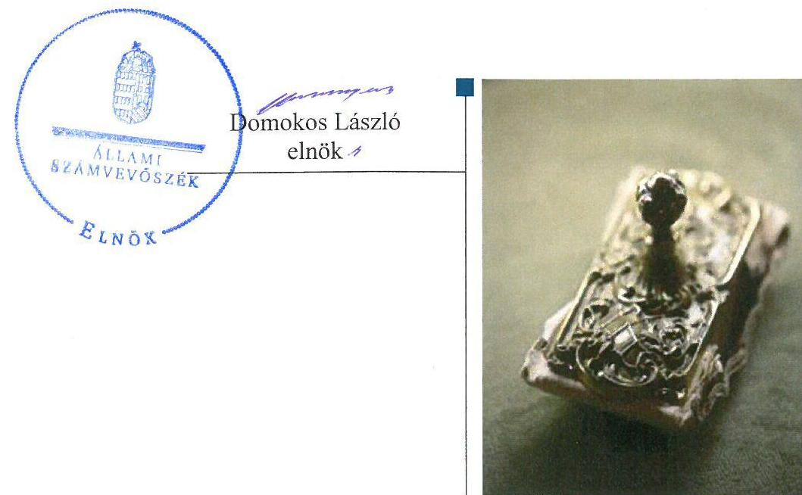
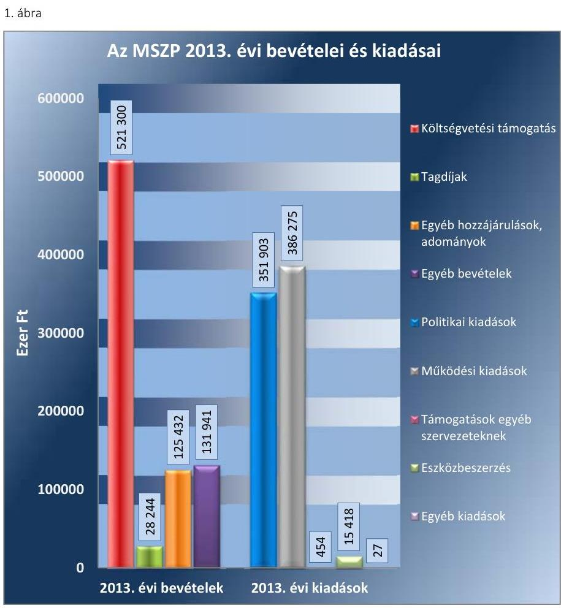
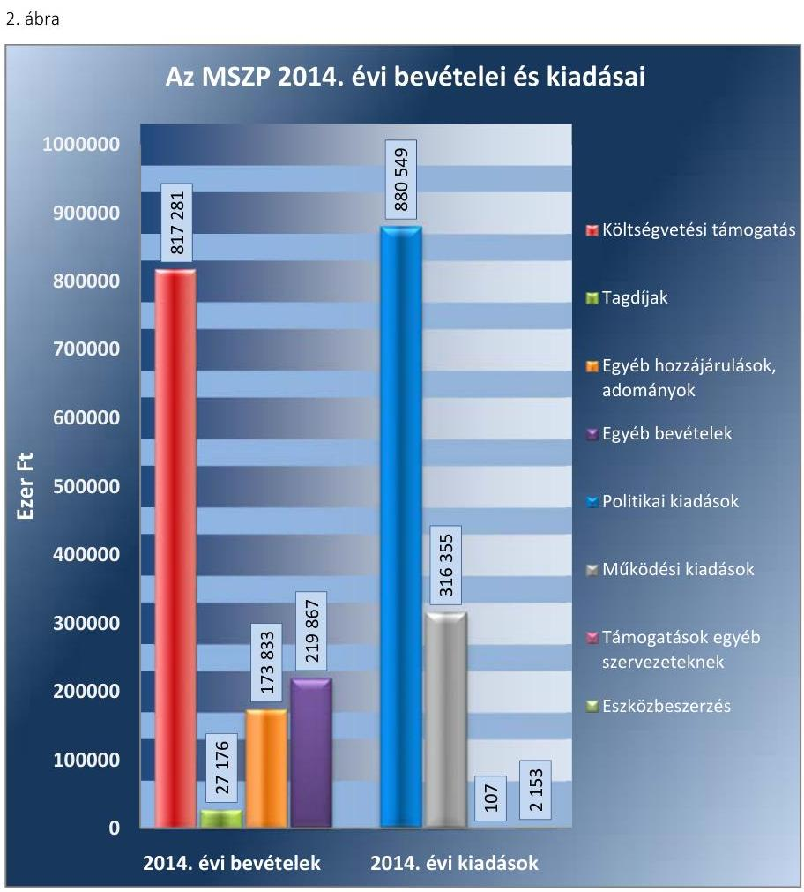
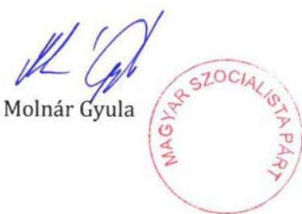
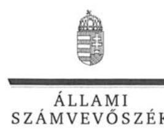
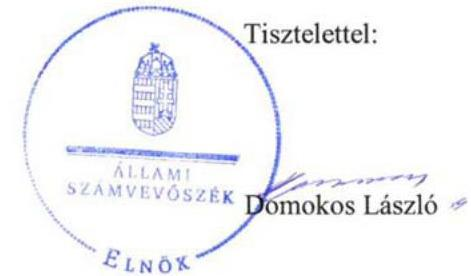
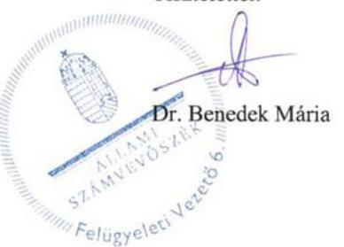

# Jelentés 

## Pártok gazdálkodása

A költségvetési támogatásban részesülő pártok 2013-2014. évi gazdálkodása törvényességének ellenőrzése a Magyar Szocialista Pártnál
2017.

---

# Jelentés 

## Pártok gazdálkodása

A költségvetési támogatásban részesülő pártok 2013-2014. évi gazdálkodása törvényességének ellenőrzése a Magyar Szocialista Pártnál
2017. 06. hó 13. nap

---

|  J | AZ ELLENŐRZÉST FELÜGYELTE:  |
| --- | --- |
|   | DR. BENEDEK MÁRIA felügyeleti vezető  |
|   | AZ ELLENŐRZÉST VEZETTE ÉS A VÉGREHAJTÁSÁÉRT FELELŐS:  |
|   | MODER BEATRIX ellenőrzésvezető  |
|   | A PROGRAM ÖSSZEÁLLÍTÁSÁÉRT FELELŐS:  |
|   | JANIK JÓZSEF LÁSZLÓ osztályvezető  |
|   | A TÉMÁHOZ KAPCSOLÓDÓ KORÁBBI SZÁMVEVŐSZÉKI JELENTÉSEK:  |
|   | - címe: Kampánypénzek ellenőrzése - A 2014. évi országgyűlési képviselő-választási kampányokra fordított pénzeszközök elszámolásának ellenőrzése a képviselethez jutott jelölő szervezeteknél  |
|  J | - sorszáma: 15057  |
|   | - címe: Az MSZP gazdálkodása - A Magyar Szocialista Párt 2011-2012. évi gazdálkodása törvényességének ellenőrzéséről  |
|   | - sorszáma: 14003  |
|   | IKTATÓSZÁM: V-0995-140/2016.  |
|   | TÉMASZÁM: 2029  |
|   | ELLENŐRZÉS-AZONOSÍTÓ SZÁM: V-074601  |

---

# TARTALOMJEGYZÉK 

■ ÖSSZEGZÉS ..... 5
■ AZ ELLENŐRZÉS CÉLJA ..... 7
■ AZ ELLENŐRZÉS TERÜLETE ..... 8
■ AZ ELLENŐRZÉS HÁTTERE, INDOKOLTSÁGA ..... 9
■ A JELENTÉS LÉNYEGES KÉRDÉSKÖREI ..... 10
■ ELLENŐRZÉS HATÓKÖRE ÉS MÓDSZEREI ..... 11
■ MEGÁLLAPÍTÁSOK ..... 14
■ JAVASLATOK ..... 32
■ MELLÉKLETEK ..... 35
I. Sz. melléklet: Értelmező szótár ..... 35
II. Sz. melléklet: Az MSZP 2013. évi közzétett beszámolója ..... 36
III. Sz. melléklet: Az MSZP 2014. évi közzétett pénzügyi kimutatása ..... 38
IV. Sz. melléklet: A 2014. évben jogi személyektől elfogadott nem pénzbeli hozzájárulás kimutatása. ..... 41
■ FÜGGELÉK: ÉSZREVÉTELEK ..... 43
■ RÖVIDÍTÉSEK JEGYZÉKE ..... 51

---

.

---

# ÖSSZEGZÉS 

A Magyar Szocialista Párt 2013. évi beszámolója nem felelt meg a jogszabályi követelményeknek. A 2014. évi pénzügyi kimutatása, valamint a 2013. és a 2014. évi könyvvezetése és gazdálkodása összességében megfelelt a törvényi előírásoknak. A párt a 2013. évben szabályszerűen igénybe vehető forrásokat használt fel a müködéséhez, a 2014. évben azonban jogszerűen igénybe nem vehető, jogi személyektől származó nem pénzbeli hozzájárulást is elfogadott. A Magyar Szocialista Párt az előző ÁSZ ellenőrzés során feltárt hiányosságok megszüntetésére készített intézkedési tervben foglalt feladatokat határidőben végrehajtotta.

## Az ellenőrzés társadalmi indokoltsága

A pártok az állampolgárok egyesülési szabadsága alapján létrehozott olyan szervezetek, amelyek szervezeti kereteket nyújtanak a népakarat kialakításához és kinyilvánításához, a politikai életben való állampolgári részvételhez. A pártoknak más társadalmi szervezetekhez képest különleges a viszonya a közhatalomhoz, ugyanis a pártok kifejezett célja és feladata, hogy képviselőik útján részt vállaljanak a közhatalomból, illetőleg politikai eszközökkel folyamatosan befolyásolják a közhatalom tevékenységét.

A politikai élet tisztasága érdekében törvény állapítja meg a pártok vagyonára és gazdálkodására vonatkozó szabályokat. Az egyesülési jog alapján létrejövő más szervezetekhez képest szűkebb körben határozza meg azt a gazdasági tevékenységet, amelyet a párt végezhet, biztosítja azonban a pártok részére azt a jogosultságot, hogy az állami költségvetésből támogatásban részesüljenek. A pártok gazdálkodását a politikai élet tisztasága érdekében rendszeresen indokolt ellenőrizni, ezért törvényi előírás alapján az ÁSZ a költségvetési támogatást kapott pártok gazdálkodását kétévente ellenőrzi.

Az ÁSZ tv. és a Párttörvény alapján a pártok gazdálkodása törvényességének ellenőrzésére az ÁSZ jogosult. Az ÁSZ kiemelt szerepet tölt be és felelősséget visel a pártok feletti társadalmi kontroll érvényesítése terén. A Párttörvényben előírt kétévenkénti ellenőrzési kötelezettségen túlmenően az ellenőrzést az a garanciális követelmény indokolja, hogy a pártok gazdálkodásának törvényességi ellenőrzése biztosított legyen, a törvényi rendelkezések megsértését szankciók követhessék.

A pártok müködésével és gazdálkodásával kapcsolatos speciális előírásokat tartalmazó Párttörvény az ellenőrzött időszakban módosult. A főbb változások érintették a párt által elfogadható vagyoni hozzájárulásokra, a pártok beszámolására, valamint megszűnésére, felszámolására vonatkozó szabályokat.

## Főbb megállapítások, következtetések, javaslatok

A Magyar Szocialista Párt a Párttörvényben előírt határidőn belül elkészítette és közzétette a 2013. évi beszámolóját és a 2014. évi pénzügyi kimutatását. A 2013. évi beszámoló azonban a Párttörvény előírását megsértve, a naptári évben magánszemélyektől kapott 500 ezer Ft-ot meghaladó hozzájárulásokat elkülönítve - a hozzájárulást adó megnevezésével és az összeg megjelölésével - nem teljes körűen tartalmazta. A beszámoló és a pénzügyi kimutatás készítése során sérült a valódiság számviteli alapelv, mivel a beszámoló és a pénzügyi kimutatás a könyvviteli nyilvántartások adataival teljes körűen nem egyezett meg, azonban az eltérések összege egyik ellenőrzött évben sem érte el a bevételi főösszeg 2\%-ának megfelelő lényegességi küszöb mértékét.

---

A Magyar Szocialista Párt számviteli rendszerének szabályozása - a Számviteli politika és a Számlarend aktualizálásának elmaradása mellett - összességében megfelelt a jogszabályi előírásoknak. A párt könyvvezetése és gazdálkodása összességében megfelelt a jogszabályokban meghatározott követelményeknek. A könyvvezetés során a számviteli alapelveket - eseti, a lényegességi szintet el nem érő hibák mellett - érvényesítették. A Magyar Szocialista Párt a gazdálkodással összefüggő egyéb jogszabályi előírásokat betartotta, az ellenőrzési rendszert az előírásoknak megfelelően működtette. A pénzügyi-számviteli informatikai rendszer működése megfelelő volt, az adatok biztonságáról, megőrzéséről gondoskodtak. Az alkalmazott informatikai rendszer biztosította a jogszabályban előírt megőrzési idő alatt a számviteli adatállományokból az adatok teljes körű előállíthatóságát.

A Magyar Szocialista Párt a működéséhez a 2013. évben szabályszerűen igénybe vehető forrásokat - költségvetési támogatást, tagdíjbevételeket, pénzbeli és nem pénzbeli vagyoni hozzájárulásokat és a Párttörvényben engedélyezett gazdálkodó tevékenységből származó bevételeket - használt fel, a vagyon használata szabályszerű volt. A 2014. évben azonban a párt jogszerűen igénybe nem vehető - jogi személyektől származó - 3055664 Ft nem pénzbeli hozzájárulást fogadott el. A Magyar Szocialista Párt az előző ÁSZ ellenőrzés javaslatai alapján készített intézkedési tervben foglalt feladatokat határidőben végrehajtotta, gondoskodott a Számviteli politika és az Értékelési szabályzat módosításáról.

---

# AZ ELLENŐRZÉS CÉLJA 

Az ellenőrzés célja annak értékelése volt, hogy a Magyar Szocialista Párt közzétett 2013. évi beszámolója, illetve a 2014. évi pénzügyi kimutatása a törvényi előírásoknak megfelelt-e, a könyvvezetés és gazdálkodás során betartották-e a vonatkozó jogszabályi és belső előírásokat, továbbá a Magyar Szocialista Párt a múködéséhez szabályszerűen igénybe vehető forrásokat használt-e fel, valamint az előző ÁSZ ellenőrzés során feltárt hiányosságok megszüntetéséről intézkedett-e.

---

# AZ ELLENŐRZÉS TERÜLETE

## A Magyar Szocialista Párt

A párt olyan egyesület, amely nyilvántartott tagsággal rendelkezik, és amely a nyilvántartásba vételét végző bíróság előtt kinyilvánítja, hogy a Párttörvény1 rendelkezéseit magára nézve kötelezőnek ismeri el a Párttörvény 1. §-a alapján.

Az ÁSZ tv.2 5. § (11) bekezdés a) pontja alapján az ÁSZ3 – a Párttörvény rendelkezéseinek megfelelően – törvényességi szempontok szerint ellenőrzi a pártok gazdálkodását. A Párttörvény 10. § (1) bekezdése alapján a párt gazdálkodása törvényességének ellenőrzésére az ÁSZ jogosult. A Párttörvény 10. § (3) bekezdése alapján az ÁSZ kétévente ellenőrzi azoknak a pártoknak a gazdálkodását, amelyek rendszeres költségvetési támogatásban részesültek.

A pártok működésével és gazdálkodásával kapcsolatos speciális előírásokat tartalmazó Párttörvény az ellenőrzött időszakban módosult. A főbb változások érintették a párt által elfogadható vagyoni hozzájárulásokra, a pártok beszámolására, valamint megszűnésére, felszámolására vonatkozó szabályokat. A Párttörvény 9. § (1) bekezdése értelmében a pártok kötelesek minden év április 30-ig az előző évi gazdálkodásukról szóló beszámolót (zárszámadást) – a 2014. május 6-tól hatályos szabályozás szerint minden év május 31-ig a melléklet szerinti pénzügyi kimutatást – a Magyar Közlönyben, valamint internetes honlapjukon közzétenni.

Az MSZP4 a 2013. évi Párttörvény szerinti beszámolójában 806 917 ezer Ft bevételt, valamint 754 077 ezer Ft kiadást számolt el. A 2014. évi pénzügyi kimutatás szerint az összes bevétel 1 238 157 ezer Ft, a kiadások összege 1 199 164 ezer Ft volt. Az MSZP hitelállománya 2013. év elején 991 657 ezer Ft, 2014. év végén 848 464 ezer Ft volt.

Az MSZP 2003-ban létrehozta a Táncsics Mihály Alapítványt, gazdasági társaságot nem alapított.

---

# AZ ELLENŐRZÉS HÁTTERE, INDOKOLTSÁGA 

Az ÁSZ tv. és a Párttörvény alapján a pártok gazdálkodása törvényességének ellenőrzésére az ÁSZ jogosult. Az ÁSZ kiemelt szerepet tölt be és felelősséget visel a pártok feletti társadalmi kontroll érvényesítése terén. A Párttörvényben előírt kétévenkénti ellenőrzési kötelezettségen túlmenően az ellenőrzést az a garanciális követelmény indokolja, hogy a pártok gazdálkodásának törvényességi ellenőrzése biztosított legyen, a törvényi rendelkezések megsértését szankciók követhessék.

Az ÁSZ legutóbb az MSZP 2011-2012. évi gazdálkodásának törvényességét ellenőrizte.

A gazdálkodás szabályszerűségének, a felhasznált közpénzek nagyságának bemutatásával a társadalom objektív képet alkothat a pártok működéséről. Az ellenőrzés megállapításai a gazdálkodás megfelelőségének bemutatásával elősegíthetik, hogy a törvényalkotók konkrét lépéseket tegyenek a pártok finanszírozására vonatkozó szabályozások átláthatóbbá, ellenőrizhetőbbé tétele irányába. Az ellenőrzés rámutat a pártok gazdálkodásával, valamint az állami költségvetésből származó források felhasználásával kapcsolatos jó gyakorlatokra és szabálytalanságokra. A hiányosságok, szabálytalanságok feltárása, az ennek kapcsán megfogalmazott megállapítások elősegíthetik a törvényi rendelkezések megsértésének szankcionálását. Ugyancsak az ellenőrzés hozadékát képezi az előző ÁSZ ellenőrzés felhívásai hasznosulásának értékelése.

---

# A JELENTÉS LÉNYEGES KÉRDÉSKÖREI 

1.     - Az MSZP közzétett beszámolója, pénzügyi kimutatása megfelel-t-e a törvényi elöírásoknak?
2.     - Az MSZP könyvvezetése és gazdálkodása megfelelt-e az elöírásoknak?
3.     - Az MSZP a müködéséhez szabályszerűen igénybe vehető forrásokat használt-e fel?
4.     - Az MSZP intézkedett-e az előző ÁSZ ellenőrzés során feltárt hiányosságok megszüntetéséről?

---

# ELLENŐRZÉS HATÓKÖRE ÉS MÓDSZEREI 

## Az ellenőrzés típusa

Szabályszerúségi ellenőrzés.

## Az ellenőrzött időszak

A 2013. január 1-jétől 2014. december 31-ig terjedő időszak.

## Az ellenőrzés tárgya

Az ellenőrzés tárgyát képezték a 2013. évi beszámoló és a 2014. évi pénzügyi kimutatás elkészítésére, közzétételére, az MSZP könyvvezetésére, gazdálkodására, ennek keretében a számviteli szabályozás kialakítására, a bizonylati rend, bizonylati fegyelem betartására, egyéb gazdálkodási, ellenőrzési és pénzügyi-számviteli informatikai feladatok ellátására irányuló tevékenységek. Az ellenőrzés tárgya volt továbbá az előírt források fogadása, illetve a vagyon előírt hasznosítása, a korábbi ÁSZ ellenőrzés javaslatainak végrehajtása.

A 2014. évi országgyűlési képviselő-választási kampányra fordított pénzeszközök elszámolását az ÁSZ már ellenőrizte, a kampányra fordított bevételek és kiadások a jelen ellenőrzésnek nem képezték a részét.

Az ellenőrzés kiterjedt minden olyan körülményre és adatra, amely az ÁSZ jogszabályban meghatározott feladatainak teljesítéséhez, valamint a program végrehajtása folyamán felmerült újabb összefüggések feltárásához szükséges.

## Az ellenőrzött szervezet

A Magyar Szocialista Párt

## Az ellenőrzés jogalapja

Az ellenőrzés jogszabályi alapját az ÁSZ tv. 5. § (11) bekezdés a) pontjában, a Párttörvény 10. § (1) és (3) bekezdéseiben, valamint az ÁSZ tv. 33. § (7) bekezdésében foglalt előírások képezték.

---

# Az ellenőrzés módszerei 

Az ÁSZ az ellenőrzést az ellenőrzési program szempontjai, az ellenőrzött időszakban hatályos jogszabályok, az ellenőrzés szakmai szabályai, a jelen ellenőrzésre irányadó ÁSZ módszertan (Módszertan a pártok gazdálkodása törvényességének ellenőrzéséhez) és a nemzetközi standardok figyelembevételével végezte. A gazdálkodás hibáinak kijavítására irányuló javaslatok kidolgozásakor a hatályos jogszabályokat tekintette irányadónak.

Az ellenőrzés ideje alatt az MSZP-vel történő kapcsolattartást az ÁSZ az SZMSZ5-ének vonatkozó előírásai alapján biztosította.

Az ellenőrzési kérdések megválaszolásához szükséges bizonyítékok megszerzése a következő ellenőrzési eljárások alkalmazásával történt: tételes és mintavételen alapuló dokumentumellenőrzés, megerősítés, összehasonlító elemzés.

Az ellenőrzési bizonyítékként felhasználható adatforrások közé tartoztak egyrészt a szakmai program részletes szempontjainál felsorolt adatforrások, másrészt adatforrás lehetett minden egyéb - az ellenőrzés folyamán feltárt, az ellenőrzés szempontjából releváns információt tartalmazó - dokumentum.

Az ellenőrzés lefolytatásához az MSZP a tanúsítványok elektronikus kitöltésével, valamint az ÁSZ által kért dokumentumok elektronikus megküldésével szolgáltatott adatokat. A rendelkezésre bocsátott adatok, információk kontrollja az ellenőrzés keretében történt.

Az ellenőrzésnél az átfogó lényegességi küszöb mértékét az ÁSZ az MSZP által közzétett beszámoló, illetve pénzügyi kimutatás bevételi főöszszegének 2\%-ában határozta meg.

Az ellenőrzés során figyelembe kellett venni azt, hogy
$\longrightarrow$ a Párttörvényben előírt beszámoló/pénzügyi kimutatás formájában és tartalmában nem felel meg a Számv. tv. ${ }^{6}$ szerinti mérleg, valamint az eredménykimutatás követelményeinek,
$\longrightarrow$ a Párttörvényben előírt éves beszámoló/pénzügyi kimutatás nem illeszkedik a Számv. tv.-ben meghatározott éves beszámoló elkészítésére vonatkozó tételes szabályokhoz,
$\longrightarrow$ a beszámoló/pénzügyi kimutatás elkészítéséhez nem készült a Párttörvény 1. számú melléklete szerinti beszámoló-soronként kitöltési útmutató, nincsenek fogalmi meghatározások, így az éves beszámoló/pénzügyi kimutatás elkészítése pártonként eltérő felfogások érvényesítésére ad lehetőséget,
$\longrightarrow$ a Párttörvény 2014. január 1-jei módosítása érintette a pártok felszámolási és végelszámolási eljárásra vonatkozó rendelkezéseit is,
$\longrightarrow$ 2014. január 1-jétől a módosított Párttörvény megtiltja, hogy a pártok jogi személyektől, jogi személyiséggel nem rendelkező szervezettől, külföldi szervezettől és nem magyar állampolgár természetes személytől vagyoni hozzájárulást fogadjanak el.
A jelentésben használt fogalmak magyarázatát az I. számú melléklet, az MSZP 2013. évi beszámolójának adatait a II. számú melléklet, a 2014. évi pénzügyi kimutatásának adatait a III. számú melléklet tartalmazza.

---

A 2013. évi beszámoló, illetve a 2014. évi pénzügyi kimutatás könyvviteli nyilvántartás adataival való egyezőségének, a könyvvezetés és gazdálkodás szabályszerűségének ellenőrzéséhez az ÁSZ tételes ellenőrzést és MUS mintavételi eljárást is alkalmazott. Teljes körűen ellenőrzésre kerültek a központi költségvetésből származó támogatások, valamint a beszámolóban, illetve pénzügyi kimutatásban a Párttörvény alapján nevesítésre kötelezett, értékhatárt meghaladó adományok, hozzájárulások, továbbá az 1 millió Ft feletti kiadások. Mintavételi eljárás alapján ellenőrizte az ÁSZ a tagdíjbevételeket, a nevesítésre nem kötelezett adományokat, hozzájárulásokat, az egyéb bevételeket, valamint az 1 millió Ft-ot el nem érő kiadásokat.

Az ÁSZ a beszámoló/pénzügyi kimutatás elkészítésének, a számviteli rendszer jogszabályi előírások szerinti kialakításának és múködtetésének, valamint a források igénybevételének szabályszerűségét az erre irányuló ellenőrzési kérdésekre adott válaszok összesítése alapján, a lényegességi szempontok figyelembevételével évenkénti bontásban minősítette. Megfelelőnek értékelte az ellenőrzött területet, amennyiben a szabályozás, illetve végrehajtás során a jogszabályi követelményeket maradéktalanul, vagy kisebb hiányosságok mellett érvényesítették, nem megfelelőnek értékelte, amennyiben a szabályozás hiányosságai nem biztosították a szabályszerű működés feltételeit, illetve a gazdálkodás folyamatában, a könyvvezetés során jelentkező hibák lényegesek, nagyszámúak, vagy rendszerszerűek voltak.

A 2014. évben jogi személyektől, jogi személyiséggel nem rendelkező bérbeadó szervezettől származó, kedvezményes bérleti díj formájában kapott tiltott nem pénzbeli vagyoni hozzájárulások értékét az ÁSZ a következő módszerrel határozta meg. Az Áht. ${ }^{7}$ hatálya alá tartozó bérbeadó szervezet tulajdonában lévő ingatlan esetében megvizsgálta, hogy más civil szervezet - amennyiben ilyen megkülönböztetést nem alkalmaztak, bármely más bérlő - esetében azonos mértékű fajlagos bérleti díjat alkalmazott-e a bérbeadó az azonos övezeti besorolású, azonos komfortfokozatú bérleményeknél. Amennyiben a párt által fizetendő bérleti díj alacsonyabb volt, akkor a más civil szervezetek, illetve egyéb szervezetek által fizetendő legmagasabb díj és a párt által fizetett díj különbözeteként állapította meg a tiltott forrásból származó nem pénzbeli hozzájárulás értékét az ÁSZ. Amennyiben a bérbeadó szervezetnek azonos övezetben, azonos komfortfokozatú ingatlan bérbeadása nem volt, valamint az egyéb piaci szereplő bérbeadók esetében értékbecslő által megállapított piaci bérleti díj és a párt által ténylegesen fizetett bérleti díj különbözetében állapította meg az ÁSZ a tiltott nem pénzbeli vagyoni hozzájárulás értékét.

---

# 1. Az MSZP közzétett beszámolója, pénzügyi kimutatása megfelel-e a törvényi előírásoknak? 

Összegző megállapítás

Az MSZP közzétett 2013. évi beszámolója nem felelt meg, a 2014. évi pénzügyi kimutatása megfelelt a vonatkozó törvényi előírásoknak.
1.1. számú megállapítás

A 2013. évi beszámoló elkészítése - egy 500 ezer Ft feletti adomány nevesítésének elmaradása miatt - nem felelt meg, a 2014. évi pénzügyi kimutatás elkészítése, valamint azok közzététele megfelelt a jogszabályi előírásoknak.

AZ MSZP HATÁRIDŐBEN ELKÉSZÍTETTE a 2013. évi gazdálkodásáról szóló beszámolót és a 2014. évi gazdálkodásáról a pénzügyi kimutatást, továbbá gondoskodott azoknak a Magyar Közlöny mellékletét képező Hivatalos Értesítőben, valamint a saját honlapján történő közzétételéről. A 2013. évi beszámoló 2014. április 30-án a Hivatalos Értesítő 22. számában, a 2014. évi pénzügyi kimutatás 2015. május 29-én a Hivatalos Értesítő 25. számában jelent meg.

Az MSZP a 2013. évi beszámolóját módosította, amelyet 2014. július 28-án a Hivatalos értesítő 38. számában tett közzé. A módosítás során a Szegfű-Szeg Alapítványtól kapott 600 ezer Ft adományt a Párttörvény előírásának megfelelően a belföldi jogi személyektől kapott adományok között nevesítve, elkülönítve mutatták ki.

A közzétett 2013. évi beszámoló és módosítása, valamint a 2014. évi pénzügyi kimutatás a Párttörvény szerinti formában és tartalommal készültek, a Párttörvény 1. számú mellékletében meghatározott beszámolósorokon tartalmaztak bevételeket és kiadásokat.

Az MSZP a 2013. évi beszámolóban a magánszemélyektől származó 500 ezer Ft feletti, a Párttörvény szerint nevesítésre kötelezett adományok, hozzájárulások között dr. Sós Tamás 583 ezer Ft adományát - a hozzájárulást adó megnevezésével és az összeg megjelölésével - elkülönítve nem mutatta ki, valamint egy-egy fő nevesített adományát tévesen 5 ezer Ft-tal magasabb, illetve 52 ezer Ft-tal alacsonyabb összegben szerepeltette.

A 2014. évi pénzügyi kimutatásban a nevesítésre kötelezett adományokat, hozzájárulásokat - a hozzájárulást adó megnevezésével és az összeg megjelölésével - elkülönítve, teljes körűen bemutatták, két magánszemély adományát azonban tévesen összesen 13 ezer Ft-tal magasabb összegben mutatták ki a ténylegesen befizetett összegnél.

A 2013. évi beszámolót és a 2014. évi pénzügyi kimutatást - az Alapszabály ${ }^{8}$ előírásainak megfelelően - a KPEB ${ }^{9}$ megtárgyalta és a Párttanácsnak ${ }^{10}$ elfogadásra javasolta. A Párttanács a 2013. évi beszámolót a 2014. április

---

18-i ülésén, a 2014. évi pénzügyi kimutatást a 2015. május 6-án megtartott ülésén fogadta el.

A 2013. évi beszámoló és a 2014. évi pénzügyi kimutatás hiányosságait az 1. táblázat tartalmazza.

# A BESZÁMOLÓ ÉS A PÉNZÜGYI KIMUTATÁS ELKÉSZÍTÉSÉVEL KAPCSOLATOS SZABÁLYTALANSÁGOK 

Sorszám Részmegállapítás
Megjegyzés

1. Az MSZP a 2013. évi beszámolóban a Párttörvény 9. § (2) bekezdésében foglaltak ellenére dr. Sós Tamás 583 ezer Ft hozzájárulását - a hozzájárulást adó megnevezésével és az összeg megjelölésével - külön nem tüntette fel. Továbbá egy magánszemély nevesített adományát - az analitikus nyilvántartás szerinti 766 ezer Ft helyett - tévesen 5 ezer Ft-tal magasabb összegben, 771 ezer Ftban tüntette fel, további egy magánszemély 1005 ezer Ft-ban nevesített adományát a tényleges 1057 ezer Ft-nál 52 ezer Ft-tal alacsonyabb összegben tüntette fel.
Az MSZP a Párttörvény 9. § (2) bekezdésében foglaltak ellenére a 2014. évi pénzügyi kimutatásban két magánszemély nevesített adományát - a ténylegesen befizetett 516 ezer Ft, illetve 829 ezer Ft helyett tévesen 1 ezer, illetve 12 ezer Ft-tal magasabb összegben, 517 ezer Ft-tal, illetve 841 ezer Ft-tal szerepeltette. Az eltérések a beszámoló, illetve a pénzügyi kimutatás bevételi főösszegét nem érintették, mivel azokat az egyes bevételi jogcímek közötti téves könyvelés, illetve az 500 ezer Ft feletti nevesített, és a nevesítésre nem kötelezett adományok, hozzájárulások hibás összesítése okozta.

Forrás: ÁSZ
1.2. számú megállapítás

A 2013. évi beszámoló és a 2014. évi pénzügyi kimutatás egyezősége a könyvviteli nyilvántartás adataival nem volt biztosított, azonban az eltérések összege nem érte el a lényegességi küszöbértéket.

AZ MSZP BEVÉTELEINEK ÉS KIADÁSAINAK SZÁMVITELI NYILVÁNTARTÁSOKBAN VALÓ ELSZÁMOLÁSA a Számlarendben ${ }^{11}$ meghatározott főkönyvi számlákon történt.

AZ MSZP 2013. ÉVI 806917 ezer Ft összegű bevétele központi költségvetési támogatásból, a tagok által fizetett tagdíjakból, belföldi jogi személyektől, valamint belföldi magánszemélyektől származó adományokból, hozzájárulásokból, továbbá egyéb bevételekből képződött.

A 2013. évi beszámolóban kimutatott összesen 754077 ezer Ft kiadás egyéb szervezeteknek nyújtott támogatásokat, működési kiadásokat, eszközbeszerzéseket, politikai tevékenységhez kapcsolódó kiadásokat és egyéb kiadásokat tartalmazott.

Az MSZP 2013. évi beszámolójában közzétett bevételeit és kiadásait az 1. ábra szemlélteti.

---

Forrás: Az MSZP 2013. évi közzétett beszámolójának adatai

A 2013. évi beszámoló bevételi sorainak adatai - a Párttörvény és a Számv. tv. előírásainak megfelelően - megegyeztek a könyvviteli nyilvántartás adataival. A főkönyvi számlákon és a beszámolósorokon minden esetben bizonylattal alátámasztott és - a tagdíjbevételek kivételével - csak az adott jogcímhez tartozó összegek szerepeltek.

A központi költségvetésből származó támogatás beszámolósor a könyvviteli nyilvántartással egyezően, az előírt jogcímű, banki bizonylatokkal alátámasztott, a MÁK ${ }^{12}$ által ténylegesen átutalt összegeket tartalmazta. A 2013. évi beszámolóban kimutatott 521300 ezer Ft költségvetési támogatás összege megegyezett a 2013. évi költségvetési törvény ${ }^{13}$ és a 2013. évi zárszámadási törvény ${ }^{14} 1$. számú mellékleteiben szereplő összeggel.

Tagdíj jogcímen az MSZP 2013. évi beszámolójában - a könyvviteli nyilvántartással egyezően - 28244 ezer Ft bevételt mutatott ki. A beszámolósor bizonylatokkal alátámasztott és - tévesen tagdíjként elszámolt 92 ezer Ft összegű adomány, hozzájárulás kivételével - a tagdíjak fogalomkörébe tartozó, megfelelő jogcímű tételeket tartalmazott. Az MSZP az Alapszabályban rögzítette a tagdíjfizetés szabályait, amely szerint a tagok jövedelmükkel arányos havi tagdíjat fizetnek, valamint 200 Ft-ban meghatározta a havi tagdíj legkisebb mértékét. A tagdíj tagonkénti tényleges mértékét a párttagok és a helyi szervezetek között létrejött megállapodásokban rögzítették.

Az Egyéb hozzájárulások, adományok beszámolósor a 2013. évben a kapcsolódó főkönyvi számlák adataival egyezően összesen 125432 ezer Ft

---

bevételt tartalmazott, a beszámolósoron bizonylatokkal alátámasztott, kizárólag adomány, hozzájárulás jogcímű összegek szerepeltek. Az Egyéb hozzájárulások, adományok 77,8\%-a, 97561 ezer Ft, belföldi magánszemélyektől, 22,2 \%-a, 27871 ezer Ft, belföldi jogi személyektől származott, amelyek a Párttörvényben előírtaknak megfelelően tartalmazták az önkormányzati és az egyéb tulajdonú bérelt ingatlanok bérleti dijának tényleges és piaci értéke közötti különbözeteként kapott nem pénzbeli vagyoni hozzájárulások értékét is.

A 2013. évben nevesítésre kötelezett 500 ezer Ft feletti adományt, hozzájárulást 11 jogi személy, valamint 37 magánszemély teljesített 25778 ezer Ft, illetve 27379 ezer Ft összegben. A jogi személyek nevesítésre kötelezett adományait a beszámoló - a főkönyvi és analitikus nyilvántartás adataival egyezően - a Párttörvény előírásainak megfelelően teljes körűen elkülönítve tartalmazta. A 2013. évi beszámolóban - az 1.1. pontban részletezett hibák következtében - 500 ezer Ft feletti adományozóként 36 magánszemélyt nevesítettek, összesen 26748 ezer Ft összeggel.

Az MSZP a 2013. évi 131941 ezer Ft egyéb bevételeit megfelelő dokumentumokkal alátámasztva, a főkönyvi nyilvántartással egyezően mutatta ki a beszámolóban. Az egyéb bevételek között a megfelelő jogcímű - tárgyi eszköz értékesítéséből, ingatlan és tárgyi eszközök bérbeadásából származó bevételeket, értékpapír és lekötött betétek után járó kamatbevételeket, költségtérítéseket, árfolyam különbözetből származó, valamint káresemény miatti - bevételeket mutattak ki.

A 2013. évi beszámoló kiadási főösszege - a Párttörvény és a Számv. tv. előírásainak megfelelően - megegyezett a könyvviteli nyilvántartás adataival.

Az egyéb szervezeteknek nyújtott támogatás, az eszközbeszerzés és az egyéb kiadások beszámolósorokon közzétett adatok a könyvviteli nyilvántartások adataival megegyeztek, az elszámolt kiadásokat bizonylatokkal alátámasztották. Egyéb szervezeteknek nyújtott támogatásként - az előírásoknak megfelelően - a Civil tv. ${ }^{15}$ szerinti, Magyarországon bejegyzett egyesületek, alapítványok részére nyújtott támogatásokat mutattak ki, az egyéb kiadások kamatkiadásokból és kerekítési elszámolásokból adódtak.

Politikai és működési kiadásként bizonylatokkal alátámasztott kiadásokat számoltak el, azonban a 2013. évi múködési kiadások beszámolósor adata 170 ezer Ft-tal több, a politikai kiadások beszámolósor adata ugyanennyivel kevesebb volt a kapcsolódó főkönyvi számlák könyvviteli adatainál. A kiadási beszámolósoroknál feltárt hiba a számviteli elszámolások szempontjából nem tekinthető lényegesnek, mivel nem érte el a bevételi főösszegre vetített 2\%-os lényegességi küszöb mértékét.

AZ MSZP 2014. ÉVI pénzügyi kimutatása szerinti összes bevétele 1238157 ezer Ft volt, amely központi költségvetési támogatásból, tagdíjbevételből, magyar állampolgár természetes személyek vagyoni hozzájárulásaiból és egyéb bevételekből tevődött össze. A 2014. évi 1199164 ezer Ft összegű ráfordításokat egyéb szervezetnek nyújtott támogatások, múködési kiadások, eszközbeszerzések és a politikai tevékenységhez kapcsolódó kiadások képezték.

Az MSZP 2014. évi pénzügyi kimutatásában közzétett bevételeit és kiadásait a 2. számú ábra szemlélteti.

---

Forrás: Az MSZP 2014. évi pénzügyi kimutatásának adatai

A 2014. évi pénzügyi kimutatás bevételi főösszege megegyezett, a kiadási főösszege 246 ezer Ft-tal eltért a könyvviteli nyilvántartás adataitól.

A 2014. évi tagdíjak pénzügyi kimutatás szerinti összege megegyezett a főkönyvi és analitikus nyilvántartás adataival, azon csak tagdíj jogcímű, bizonylatokkal alátámasztott összegeket számoltak el.

A központi költségvetésből származó, 2014. évi támogatásként kimutatott összesen 817281 ezer Ft összeg megegyezett a 2014. évi zárszámadási törvény 1. sz. melléklete szerinti 466319 ezer Ft összegű költségvetési alaptámogatás, valamint a Kftv. ${ }^{16}$ szerinti, választási kampányfinanszírozásra folyósított 350962 ezer Ft összegével. A központi költségvetésből származó támogatás összegét a könyvviteli nyilvántartással és a MÁK által átutalt összegekkel egyezően szerepeltették a pénzügyi kimutatásban.

Az egyéb hozzájárulások, adományok belföldi magánszemélyektől jogcímen befolyt bevételeket a 2014. évi pénzügyi kimutatásban a Párttörvény előírásainak megfelelően részletezték, elkülönítetten, nevesítve bemutatták az 500 ezer Ft-ot meghaladó hozzájárulásokat.

Az MSZP a 2014. évi pénzügyi kimutatásban a könyvviteli nyilvántartással egyezően, bizonylatokkal alátámasztott 219867 ezer Ft egyéb bevételt szerepeltetett.

Az MSZP 2014. évi 1199164 ezer Ft összegű összes kiadásának 73,4\%-át az országgyűlési kampányra fordított politikai kiadások összege tette ki. A 2014. évi pénzügyi kimutatás egyes kiadási sorai ezen felül egyéb

---

szervezeteknek nyújtott támogatásokat, múködési kiadásokat, eszközbeszerzéseket és kampánytevékenységen felüli politikai tevékenységhez kapcsolódó kiadásokat tartalmaztak.

A 2014. évi pénzügyi kimutatás kiadási sorainak adatai - az eszközbeszerzések kivételével - megegyeztek az azokat alátámasztó főkönyvi számlák összesített adataival, az egyes kiadási sorokon az adott jogcímhez tartozó, megfelelő számviteli bizonylatokkal alátámasztott összegek szerepeltek.

A 2014. évi pénzügyi kimutatás eszközbeszerzés sorában szereplő öszszeg eltért a főkönyvi és analitikus nyilvántartás adataitól, a pénzügyi kimutatás 246 ezer Ft-tal magasabb összeget tartalmazott a kapcsolódó főkönyvi számlák összesített forgalmánál. A feltárt hiba nem tekinthető lényegesnek, mivel az nem érte el a 2014. évi bevételi főösszegre vetített $2 \%$-os lényegességi küszöb mértékét.

A 2013. évi beszámoló és a 2014. évi pénzügyi kimutatás és a kapcsolódó könyvviteli elszámolások szabálytalanságait a 2. táblázat tartalmazza.
2. táblázat

# A BESZÁMOLÓ ÉS A PÉNZÜGYI KIMUTATÁS ÉS AZ AZOKAT ALÁTÁMASZTÓ FŐKÖNYVI ELSZÁMOLÁSOK SZABÁLYTALANSÁGAI 

| Sorszám | Részmegállapítás | Megjegyzés |
| :--: | :--: | :--: |
| 1. | Az MSZP a Számv. tv. 16. § (3) bekezdésében foglalt, a tartalom elsődlegessége a formával szemben alapelv ellenére a 2013. évi beszámolóban nem a gazdasági esemény tényleges tartalmának megfelelően mutatott ki bevételt, mivel a 2013. évben adományként befizetett 92 ezer Ft összeget téves számlakijelölés miatt a könyvvezetés során tagdíjként számolta el, valamint 170 ezer Ft múködési kiadást politikai tevékenység kiadásaként rögzítette a főkönyvi könyvelésben. |  |
| 2. | A Számv. tv. 15. § (3) bekezdésében foglalt valódiság alapelvet figyelmen kívül hagyva a 2013. évi beszámoló és a 2014. évi pénzügyi kimutatás egyezősége a könyvviteli nyilvántartás adataival nem volt biztosított. A 2013. évi beszámoló múködési kiadások sorának összege 170 ezer Ft-tal magasabb, a politikai kiadások sorának összege 170 ezer Ft-tal alacsonyabb volt a könyvviteli és analitikus nyilvántartásban kimutatott összegnél. A 2014. évi pénzügyi kimutatás 246 ezer Ft-tal magasabb kiadási főösszeget tartalmazott a könyvviteli nyilvántartásban elszámolt összegnél, mivel az eszközbeszerzés beszámolósoron kimutatott 2153 ezer Ft kiadás 246 ezer Ft-tal magasabb volt a kapcsolódó főkönyvi számlán elszámolt és az analitikus nyilvántartásban kimutatott, bizonylatokkal alátámasztott összegnél. |  |

Forrás: ÁSZ

---

# 2. Az MSZP könyvvezetése és gazdálkodása megfelelt-e az előírásoknak? 

Összegző megállapítás

Az MSZP könyvvezetése és gazdálkodása összességében megfelelt a jogszabályi és belső előírásoknak.
2.1. számú megállapítás

Az MSZP számviteli rendszere - a Számviteli politika34, és a Számlarend aktualizálásának elmaradása mellett - megfelelően szabályozott volt.

AZ MSZP RENDELKEZETT A SZÁMV. TV.-BEN ELŐíRT SZABÁLYZATOKKAL, amelyeket az Alapszabály mellékletét képező Gazdálkodási szabályzat ${ }^{17}$ előírásának megfelelően a pártigazgató ${ }^{18}$ és a KPEB elnöke kiadmányozott.

A Számviteli politika ${ }_{1}{ }^{19},{ }_{2}{ }^{20},{ }_{3}{ }^{21},{ }_{4}{ }^{22}$, a Számv. tv. előírásainak megfelelően tartalmazta a könyvvezetés módját, az évközi és év végi zárlati feladatokat és azok időpontját. Meghatározták, hogy az értékelésnél mit tekintenek lényegesnek, nem lényegesnek, jelentős, illetve nem jelentős összegű hibának. Rögzítették a beszámoló elkészítésekor és a könyvvezetés során érvényesítendő számviteli alapelveket, az éves beszámoló készítésének rendjét, időpontját, az eszközök és források minősítésének szempontjait, a bekerülési érték tartalmát, az amortizációs politika elemeit. A Számv. tv. előírásaival összhangban meghatározták a helyi szervezetek elszámolásának határidejét, ugyanakkor a Számv. tv. előírása ellenére a Számviteli poli$\mathrm{tika}_{3.4}$ - Párttörvény 2014. évi módosításával összhangban történő - aktualizálása elmaradt.

A Leltározási szabályzat ${ }^{23}$ tartalmazta a leltározás módját, a leltározás lebonyolításának rendjét, a leltárellenőrzés szabályait, valamint a leltározás bizonylati rendjét. A szabályzatban a Számv. tv. előírásaival összhangban meghatározták a mennyiségi felvétellel történő leltározás gyakoriságát.

Az Értékelési szabályzat ${ }_{1}{ }^{24},{ }_{2}{ }^{25},{ }_{3}{ }^{26}$ a Számv. tv.-ben előírtaknak megfelelően, a Számviteli politika ${ }_{1-4}$ előírásaival összhangban tartalmazta az esz-köz- és forráscsoportok választott értékelési eljárásait.

A Pénzkezelési szabályzat ${ }_{1}{ }^{27},{ }_{2}{ }^{28}$ a Számv. tv.-ben előírtaknak megfelelően tartalmazta a pénzforgalom készpénzben és bankszámlán történő lebonyolításának rendjét, a pénzkezelés személyi és tárgyi feltételeit, a pénzkezelés felelősségi szabályait, valamint a napi készpénz záró állomány maximális mértékét.

Az ellenőrzött időszakban hatályos Számlarend a Számv. tv.-ben előírtaknak megfelelően tartalmazta a számlák értéke növekedésének, csökkenésének jogcímeit, a számlákat érintő gazdasági eseményeket, a számlák más számlákkal való kapcsolatát, az analitikus és a főkönyvi nyilvántartás egyeztetésének módját. A Számlarend - az MSZP működési sajátosságainak megfelelően - tartalmazta a Párttörvény szerinti beszámoló, illetve pénzügyi kimutatás összeállításához szükséges, a működési és politikai tevékenységek kiadásainak meghatározását. A Számlarendben meghatározott számlák számjele és megnevezése azonban nem volt teljes körűen összhangban az ellenőrzött időszakban alkalmazott főkönyvi számlákkal,

---

valamint elmaradt a Számlarendnek a Párttörvény 2014. január 1-jei módosításával kapcsolatos aktualizálása.

A számviteli rendszer szabályozásának hiányosságait a 3. táblázat tartalmazza.
3. táblázat

# A SZÁMVITELI RENDSZER SZABÁLYOZÁSÁNAK HIÁNYOSSÁGAI 

| Sorszám | Részmegállapítás | Megjegyzés |
| :--: | :--: | :--: |
| 1. | A Számv. tv. 14. § (11) bekezdésében előírtak ellenére a Számviteli politikát a Párttörvény rendelkezéseinek 2014-től hatályos módosításával összefüggésben nem aktualizálták, mivel abban nem került átvezetésre a pénzügyi kimutatás közzétételi határidejének május 31-re történő módosítása, valamint a pénzügyi kimutatás szerkezetének változása. |  |
| 2. | A Számv. tv. 161. § (4) bekezdésében foglaltak ellenére a Számlarendet nem aktualizálták a Párttörvény 2014. évi módosításával összhangban, mivel a belföldi és külföldi jogi személyek, valamint a nem magyar állampolgár természetes személyek támogatására vonatkozó szabályokat nem helyezték hatályon kívül. |  |
| 3. | A Számlarend a Számv. tv. 161. § (2) bekezdés a) pontjában előírtak ellenére nem tartalmazta valamennyi alkalmazásra kijelölt számla számjelét és megnevezését, mivel - esetenként - a könyvelés során ténylegesen alkalmazott számlák nem szerepeltek a Számlarendben (pl. 571, 572, 864. számú főkönyvi számlák). |  |

Forrás: ÁSZ
2.2. számú megállapítás

Az MSZP könyvvezetése - eseti téves számlakijelölés és a vevőkövetelések utáni értékvesztés elszámolásának elmaradása ellenére - összességében megfelelt a jogszabályi és belső szabályzatokban foglalt előírásoknak.

AZ MSZP KÖNYVVITELI FELADATAIT az ellenőrzött időszakban megbízási szerződés alapján külső könyvviteli szolgáltató látta el - a Számv. tv. és a Számviteli politika 1-4 előírásaival összhangban - a kettős könyvvitel rendszerében. Az MSZP a könyvvezetését úgy alakította ki, hogy a Párttörvényben előírt éves beszámolási kötelezettségének az előírt formában és tartalommal, határidőben eleget tudjon tenni. Könyvviteli szolgáltató váltás az ellenőrzött időszakban nem történt, a feladatellátás folyamatossága biztosított volt.

Az ellenőrzött időszakban az eszközök bekerülési értékének meghatározása, az értékcsökkenés elszámolása a Számv. tv. előírásaival összhangban, a Számviteli politika ${ }_{1-4}$ és az Értékelési szabályzat ${ }_{1-3}$ előírásainak betartásával történt. A Számviteli politika ${ }_{1-4}$-ben előírtaknak megfelelően az 50 ezer Ft egyedi értékhatárt el nem érő tárgyi eszközök bekerülési értékét költségként egy összegben a használatba vételt követő negyed év végén számolták el, az 50 ezer Ft egyedi értékhatárt meghaladó tárgyi eszközökről egyedi nyilvántartó lapokat vezettek, az értékcsökkenést év végén számolták el.

Az MSZP az ellenőrzött időszakban - a Számv. tv. előírásainak megfelelően - a Számviteli politika ${ }_{1-4}$-ben előírt zárlati feladatokat határidőben elvégezte. A Számviteli politika ${ }_{1-4}$ előírásainak megfelelően kialakított és folyamatosan vezetett analitikus nyilvántartások és a főkönyvi könyvelés, illetve az azt megalapozó bizonylatok adatai közötti egyeztetés és ellenőrzés

---

végrehajtásáról az év végi zárlati feladatok keretében gondoskodtak, az egyezőség az ellenőrzött években biztosított volt.

Az MSZP szállítói kötelezettségeinek 2013. év végi állománya 291 739,4 ezer Ft volt, ami 2014. december 31-re 41,8\%-kal, 413 678,9 ezer Ft-ra növekedett. A 90 napon túl lejárt szállítói kötelezettség a 2013. év végi 247667,8 ezer Ft-ról a 2014. év végére 398 463,4 ezer Ft-ra (60,9\%-kal) növekedett. A 2014. év végi 90 napon túli lejárt szállítói kötelezettség 30,7\%-a (122 424,1 ezer Ft) egy szállítóval szemben fennálló lejárt tartozás volt, amelynek rendezése érdekében a szállító az MSZP-nek 2014. augusztus 14-én fizetési felszólítást küldött. A számlák pénzügyi teljesítésére a helyszíni ellenőrzés befejezéséig nem került sor, mivel az MSZP a számlák jogalapját nem, de az összegszerűségét vitatja. A szállítói kötelezettségek a főkönyvi és analitikus nyilvántartásban teljes körűen, a beérkezett számlákkal azonos összegben szerepeltek.

A könyvvezetés során a Számv. tv.-ben szabályozott számviteli alapelvek - az 1.2. pontban jelzett eseti téves számlakijelölés mellett, és az óvatosság alapelv kivételével - érvényesültek. Az MSZP a Számv. tv. előírásaival összhangban az Értékelési szabályzat ${ }_{1-3}$-ban előírta a vevő, az adós minősítése alapján az üzleti év mérlegfordulónapján fennálló és a mérlegkészítésig pénzügyileg nem rendezett követeléseinél az értékvesztés elszámolásának kötelezettségét a követelés könyv szerinti értéke és a követelés várhatóan megtérülő összege közötti veszteség jellegű különbözet értékében, ha a különbözet tartósnak mutatkozik és jelentős. Az adósok minősítésére és értékvesztés elszámolására azonban annak ellenére nem került sor, hogy a korosított vevőlistákon a 2013. évben 525 ezer Ft összegű, a 2014. évben 765 ezer Ft vevőkövetelés éven túli volt. Az óvatosság alapelvének fentiek szerinti figyelmen kívül hagyása a számviteli elszámolások szempontjából nem eredményezett lényeges hibát, mivel az éven túli vevőkövetelések összege nem érte el a bevételi főösszegre vetített 2\%-os lényegességi küszöb mértékét.

Az MSZP a zárlati munkák keretében a leltározási kötelezettségének a Számv. tv. és a Leltározási szabályzat előírásainak megfelelően eleget tett, a 2013. és a 2014. évi mérleget leltárral alátámasztotta. Az MSZP 2013. szeptembere és novembere között elvégezte a tulajdonában lévő eszközök mennyiségi felvétellel történő leltározását is a 2013. szeptember 30-ai fordulónapra vonatkozóan.

A Számv. tv.-ben előírt bizonylati elv és fegyelem a könyvvezetés során összességében érvényesült. A gazdasági eseményeket bizonylatokkal alátámasztották, a kiállított vegyes bizonylatok megalapozottak voltak, a főkönyvi könyvelésben a gazdasági események időrendisége érvényesült. Az MSZP a könyvviteli elszámolásokat alátámasztó bizonylatok megőrzéséről a Számv. tv. és a Bizonylati szabályzat ${ }^{29}$ előírásainak megfelelően gondoskodott, az elmentett számviteli adatállományokból az adatok előállíthatóságát biztosította.

Az ellenőrzött gazdasági események könyvviteli elszámolását közvetlenül alátámasztó számviteli bizonylatok - a 4. számú táblázat 2. sorszámú részmegállapításában rögzített eseti hiányosságok mellett - a Számv. tv.ben előírt alaki és tartalmi követelményeknek összességében megfeleltek.

A szigorú számadású nyomtatványok köréről, nyilvántartásáról, ellenőrzéséről és őrzéséről a Bizonylati szabályzat, valamint a Pénzkezelési sza-

---

bályzat ${ }_{1-2}$ rendelkezett. A szigorú számadási kötelezettség alá vont nyomtatványok nyilvántartása megfelelt a Számv. tv. és a belső szabályzatok előírásainak.

A pénzkezelés szabályszerűsége az ellenőrzött időszakban biztosított volt. A banki kifizetések engedélyezése során a bankszámla feletti rendelkezésre jogosultak írtak alá. A házipénztár kezelése során a kerekítési szabályokat és a Pénzkezelési szabályzat ${ }_{1-2}$-ban meghatározott napi készpénz záró állomány maximális mértékét betartották. A készpénzforgalmat érintő gazdasági műveletek bizonylatainak adatait késedelem nélkül, a pénzmozgással egyidejűleg rögzítették a pénztárjelentésben, azonban a bankszámla forgalomhoz kapcsolódó tételek rögzítése a Számv. tv. előírásai ellenére a hitelintézeti értesítés megérkezését követően több napos, hetes késedelemmel történt.

A könyvvezetéssel kapcsolatos szabálytalanságokat a 4. táblázat tartalmazza.
4. táblázat

# A KÖNYVVEZETÉSSEL KAPCSOLATOS SZABÁLYTALANSÁGOK 

## Sorszám

1. Az MSZP az Értékelési szabályzat ${ }_{1-2}$ 2.3.2. pontjában előírtak ellenére, a Számv. tv. 15. § (8) bekezdésében foglalt óvatosság alapelvét figyelmen kívül hagyva nem számolt el értékvesztést az üzleti év mérlegfordulónapján egy éven túl fennálló és a mérlegkészítésig pénzügyileg nem rendezett követelései után.
2. A Számv. tv. 167. § (1) bekezdés c) pontjának előírásai ellenére a könyvviteli elszámolást közvetlenül alátámasztó ellenőrzött bizonylatok esetenként nem tartalmazták a gazdasági múveletet elrendelő személy megjelölését, az utalványozó aláírását, illetve a pénztárbizonylatok Pénzkezelési szabályzat ${ }_{1-2}$ 3.2. pontjában előírt pénztárellenőrzésének igazolását, továbbá a Számv. tv. 167. § (1) bekezdés i) pontja ellenére a könyvviteli nyilvántartásban való rögzítés időpontját és igazolását.
3. A Számv. tv. 165. § (3) bekezdésének a) pontjában előírtak ellenére a bankszámla forgalomhoz kapcsolódóan ellenőrzött gazdasági műveletek, események bizonylatainak adatait a könyvviteli nyilvántartásokban a hitelintézeti értesítés megérkezését követően több napos, hetes késedelemmel rögzítették.

Forrás: ÁSZ

### 2.3. számú megállapítás

Az MSZP a gazdálkodással összefüggő, egyéb jogszabályokban meghatározott előírásokat betartotta.

## AZ MSZP-NÉL A FOGLALKOZTATÁS, A MUNKABÉREK ÉS EGYÉB SZEMÉLYI JELLEGŰ KIADÁSOK elszámolása az ellenőrzött időszakban szabályszerű volt.

Az ellenőrzött időszakban a munkaerő foglalkoztatása munkaviszony keretében, a Munka tv. ${ }^{30}$ előírásainak megfelelő, szabályozott tartalmú munkaszerződések alapján történt. A munkaszerződéseket az MSZP, mint munkáltató részéről - a Gazdálkodási szabályzatban előírtakkal összhangban - a munkáltatói jogkört gyakorló pártigazgató, illetve a pártigazgató mint vezető állású munkavállaló munkaszerződését az MSZP elnöke írta alá.

---

A foglalkoztatottak bejelentése az Art. ${ }^{31}$ rendelkezéseinek megfelelő tartalommal és határidőben az illetékes adóhatóság felé megtörtént.

Az ellenőrzött időszakban a teljes- és részmunkaidős, valamint a megbízással foglalkoztatottak munkabérének, megbízási dijának számfejtése és kifizetése a munkaszerződésekben, illetve megbízási szerződésekben foglaltaknak megfelelően, a hatályos Art., Szja tv. ${ }^{32}$, Tbj. tv. ${ }^{33}$, Szhtv. ${ }^{34}$ és Eho. tv. ${ }^{35}$ előírásaival összhangban, szabályszerűen történt.

Az MSZP a 2013. és 2014. években a munkavállalói számára a 39/2010. (II. 26.) Korm. rendeletben ${ }^{36}$ foglaltakkal összhangban, a Kiküldetési és költségtérítési szabályzat ${ }^{37}$ előírásainak figyelembevételével munkába járással kapcsolatos utazási költségtérítést fizetett.

Az MSZP a hivatalos utazással kapcsolatos költségeket - a Kiküldetési és költségtérítési szabályzat és a Gépkocsi használati szabályzat ${ }^{38}$ előírásai szerint - az Szja. tv.-ben előírt tartalmú belföldi kiküldetési rendelvény alapján számolta el. A hivatalos utazások elszámolásánál a magántulajdonú gépjármú használati jogának előírt igazolásait a Kiküldetési és költségtérítési szabályzat és a Gépkocsi használati szabályzat alapján megkövetelték.

A hivatali telefon magáncélú használata vonatkozásában a Telefonszolgáltatás használati rendje ${ }^{39}$ rögzítette, hogy az MSZP-nél a magáncélú használat tételes elkülönítésének technikai feltételei nem adottak, ezért az Szja. előírásaival összhangban a számlázott érték 20\%-a számít adóköteles, magáncélú használatnak, amely után az MSZP a közterheket megfizeti. Az MSZP az ellenőrzött években - a belső szabályozással összhangban - az Szja. tv. szerinti adófizetési kötelezettségének eleget tett.

A munkabérekhez, illetve egyéb személyi jellegú juttatásokhoz kapcsolódó, a munkavállalókat és a kifizetőt terhelő adókkal, járulékokkal kapcsolatos nyilvántartási, bevallási, levonási és befizetési kötelezettségeinek az MSZP az Art.-ban előírt módon és gyakorisággal eleget tett. Az MSZP az ellenőrzött időszakban a személyi jellegú kifizetések vonatkozásában két alkalommal végzett önellenőrzést. A bevallott és befizetett adók és járulékok adatai a főkönyvi nyilvántartás adataival megegyeztek.

Az MSZP a személyi jellegú kifizetések között a reprezentációs kiadásokat elkülönítetten - a Protokoll és vendéglátási szabályzat ${ }^{40}$ előírásaival összhangban - külön főkönyvi számlán tartotta nyilván. Az MSZP területi szövetségeinél és az Országos Központ által együttesen elszámolt reprezentációs költség - az MSZP Konszolidált beszámolója alapján - nem haladta meg az Szja. tv.-ben meghatározott adómentes mértéket, így az MSZP-nek a reprezentációs kiadások után adó- és járulékfizetési kötelezettsége nem keletkezett.

Az MSZP-nek az ellenőrzött időszakban rehabilitációs hozzájárulás fizetési kötelezettsége nem keletkezett, mivel a foglalkoztatottak átlagos létszáma az ellenőrzött évek egyikében sem érte el a 25 főt.

Az MSZP Országos Központja és két területi szövetsége részére 2013. május és június hónapjaiban összesen négy gépjármú került beszerzésre, amelyhez kapcsolódó cégautó adó fizetési kötelezettségnek a Gjt. ${ }^{41}$ előírásaival összhangban eleget tett.

Az MSZP-nek a Párttörvényben megengedett gazdálkodó tevékenységével összefüggésben, valamint közösségi, illetve harmadik országbeli adóalanyoktól megrendelt szolgáltatások miatt keletkezett az Áfa tv. ${ }^{42}$ hatálya

---

alá tartozó adófizetési kötelezettsége, amelynek az ellenőrzött időszakban eleget tett.
2.4. számú megállapítás

Az MSZP ellenőrzési rendszere a belső szabályzatok előírásainak megfelelően múködött.

AZ MSZP DÖNTÉSHOZÓ, IRÁNYÍTÓ ÉS ELLENÖRZŐ SZERVEIT és azok feladat- és hatáskörét az Alapszabályban határozták meg.

Az MSZP országos hatáskörú döntéshozó testületei a Kongresszus, az MSZP Választmánya és a Párttanács, országos hatáskörú, központi irányító testülete az Országos Elnökség.

A Kongresszus az MSZP legfelső képviseleti és döntéshozó szerve. Az Alapszabály előírásai szerint a Kongresszus választja meg a Választmány elnökét, az MSZP elnökét, elnökhelyetteseit, és az Elnökség további tagjait, a KPEB elnökét és tagjait, valamint beszámoltatja az Alapszabályban meghatározott országos döntéshozó, irányító és ellenőrző testületeket és a tisztségviselőket.

A Választmány két Kongresszus között az Országos Elnökséggel egyeztetve állást foglal az MSZP irányvonalát érintő stratégiai kérdésekben, és arról beszámol a Kongresszusnak, továbbá dönt soron kívüli tisztújító kongresszus, illetőleg az Országos Elnökség javaslata alapján a kétévente tartandó tisztújító kongresszus összehívásáról. Az elnökségi tagság megszủnése esetén a döntéshozatalra jogosultak többségének szavazatával - a pártelnök, az elnökhelyettes (elnökhelyettesek) és az alelnökök, valamint az MSZP Választmánya elnökének kivételével - a következő tisztújító kongresszusig tartó időszakra az Országos Elnökség tagjai létszámának egyharmadáig új tagokat választhat.

A Párttanács feladata a költségvetés, illetve a költségvetés teljesüléséről készült konszolidált pénzügyi zárómérleg elfogadása.

Az Alapszabály szerint az Országos Elnökség gyakorolja az MSZP vagyona feletti tulajdonosi jogokat, ennek keretében jóváhagyja az Országos Központ költségvetését és az annak végrehajtásáról szóló beszámolót az MSZP tulajdonában lévő ingatlanok értékesítését.

A döntéshozó és irányító testületek az ellenőrzött időszakban az Alapszabályban előírt feladataikat ellátták, a számukra biztosított hatásköröket gyakorolták.

Az MSZP az ellenőrzött időszakban a 2011. december 1-jén elfogadott Alapszabály szerint múködött, az Alapszabály az ellenőrzött időszakban nem módosult. Az Alapszabály értelmében az MSZP gazdálkodását ellenőrző központi testület a KPEB volt, amelynek az Alapszabályban előírt feladatai a következők:
ellenőrzi a pártvagyon kezelésének szabályszerűségét, ennek keretében az MSZP központi szervei, országos intézményei, vállalkozásai és alapítványai gazdálkodásának szabályszerűségét, valamint ellenőrizheti a helyi szervezetek és a területi szövetségek, valamint azok intézményei, vállalkozásai és alapítványai gazdálkodásának szabályszerűségét;
tapasztalatairól tájékoztatja a pártigazgatót, az Országos Elnökséget, az MSZP Választmányát és a Kongresszust;

---

- szabálytalanság esetén intézkedéseket kezdeményezhet, amelyeket az illetékes testület, illetőleg tisztségviselő harminc napon belül köteles érdemben elbírálni, kezdeményezésének eredménytelensége esetén az országos etikai és egyeztető bizottsághoz fordulhat és indítványozhatja a szabálytalanul gazdálkodó szervezet vezetésének felfüggesztését, súlyos esetben feloszlatását;
- véleményezi az MSZP gazdálkodási rendjére vonatkozó szabályokat;
- előzetesen állást foglal a hosszú lejáratú hitelfelvétel és kötelezettségvállalás indokoltságáról, az MSZP vagyonának megterheléséről.
A KPEB az ellenőrzött években az Alapszabályban előírt feladatainak eleget tett. A KPEB megtárgyalta és véleményezte az MSZP adott évi költségvetését, valamint az MSZP előző évi költségvetésének teljesüléséről készült konszolidált pénzügyi zárómérleget, és egyetértett azok Párttanács elé terjesztésével. A szabályzatok módosításait jóváhagyta, továbbá megtárgyalta az előző ÁSZ jelentés megállapításait, valamint az MSZP átfogó, 2006-2013. évek közötti gazdálkodása ellenőrzésének a tapasztalatait. Az Alapszabály előírásának megfelelően az MSZP 2014. július 19-i Kongreszszusán a KPEB elnöke beszámolt a 2012-2014. évek között elvégzett munkáról. A KPEB az ellenőrzött években szabálytalanságokat nem tárt fel.

Az MSZP ellenőrzési rendszerét támogatta - a könyvviteli szolgáltatóval kötött megbízási szerződés 8. pontjában rögzítettek alapján - a könyvviteli szolgáltatást végző szervezet által lefolytatott belső ellenőrzés, valamint a könyvviteli szolgáltató és a KPEB által közösen lefolytatott eseti ellenőrzés. A közös ellenőrzés során szúrópróbaszerűen ellenőrizték a szállítói számlák, valamint a pénztár, illetve bankszámla kezelés szabályosságát. A közös ellenőrzések hiányosságot nem tártak fel.

A könyvviteli szolgáltató a megbízási szerződésben vállalt ellenőrzési feladata ellátása érdekében az ellenőrzött években belső ellenőrzési tervet készített. A lefolytatott ellenőrzésekről jegyzőkönyv készült, amelyeket tájékoztatásul megküldtek az Országos Központ részére. A jegyzőkönyvek alapján a könyvviteli szolgáltató a 2013. évben a szállító és vevő analitikákat, a főkönyvi kivonatokat, a könyvelési bizonylatokat, a kiküldetési rendelvényeket, valamint a bérfeladásokat ellenőrizte szúrópróbaszerűen. A 2014. évi ellenőrzések a szállító és vevő analitikákra, a pénztár egyenlegek vizsgálatára, a bizonylatok alaki és tartalmi megfelelőségére terjedtek ki. A feltárt hiányosságokról (szerződés hiánya, vevő számla hiánya, valamint a bizonylatok nem teljes körű megfelelősége) és azok javításáról az ellenőrzést végző az Országos Központot tájékoztatta.

A vezetői ellenőrzés kereteit, a pártigazgató feladatait, valamint a kötelezettségvállalási, utalványozási jogkörök gyakorlásának rendjét az Alapszabályban és a Gazdálkodási szabályzatban rögzítették. Az Alapszabály alapján a pártigazgató gondoskodott az Országos Elnökség határozatainak végrehajtásáról, a Területi Szövetségek elnökei értekezletének összehívásáról és vezette az Országos Központ szervezetét. Az Alapszabály, illetve a Gazdálkodási szabályzat alapján a pártigazgató gyakorolta a munkáltatói jogkört az MSZP alkalmazottai tekintetében. A Gazdálkodási szabályzatban rögzítették, hogy a kötelezettségvállalás és az utalványozás az Országos Központ költségvetése vonatkozásában a mindenkori pártigazgató hatáskörébe tartozott, a területi szervezetek esetében kötelezettségvállalásra és utalványozásra a Gazdálkodási szabályzatban és az SZMSZ ${ }^{43}$-ben erre

---

# 2.5. számú megállapítás 

felhatalmazott személyek voltak jogosultak. Az ellenőrzött gazdasági események alapján a kötelezettségvállalási és az utalványozási jogkört az arra felhatalmazott személyek gyakorolták.

A Pénzkezelési szabályzat ${ }_{1,2}$ szerint a pénztárellenőri feladatokat az Országos Központban a munkaköri leírásában azzal megbízott személy látta el. A szabályozásban részletesen meghatározták a pénztárellenőr által elvégzendő konkrét feladatokat. A pénztárellenőrzést az Országos Központnál a Pénzkezelési szabályzat ${ }_{1,2}$-ben előírt gyakorisággal (a pénztári forgalommal érintett napokon és az évek utolsó napján), az előírt követelményeknek megfelelően elvégezték, az ellenőrzés tényét a pénztárellenőr az időszaki pénztárjelentéseken aláírásával igazolta.

## A pénzügyi-számviteli informatikai rendszer múködése megfelelt a jogszabályi előírásoknak.

Az MSZP a pénzügyi-számviteli feladatok ellátására könyvviteli szolgáltatóval kötött szerződést.

A szerződésben a könyvviteli szolgáltató által ellátandó feladatokat és felelősségi szabályokat rögzítették. Ennek keretében a könyvviteli szolgáltató kötelezettségeként előírták a tárgyévi, valamint a tárgyévet megelőző, mérleggel lezárt két üzleti évre vonatkozóan a számviteli bizonylatok megőrzését, és ezt követően az alapbizonylatok, valamint az egyéb dokumentumok MSZP részére történő átadását. Az átadás-átvétel az MSZP központi szerve, illetve területi szövetségei szerinti megbontásban átadás-átvételi dokumentumokkal igazoltan történt. Az MSZP a Bizonylati albumban ${ }^{44}$ a Számv. tv. előírásaival összhangban előírta a könyvviteli nyilvántartást közvetlenül és közvetetten alátámasztó bizonylatok megőrzési kötelezettségét.

Az MSZP tulajdonában, használatában, illetve felügyelete alatt álló számítógépeken, szervereken tárolt adatállományok időszaki mentéséről az MSZP az IBSZ ${ }^{45}$-ben és a mellékletét képező Információvédelmi szabály-zat ${ }^{46}$-ban rendelkezett. A szabályozás ezen felül kiterjedt a jelszavak védelmének, a levelezések, a távoli elérés, a felhasználó-kezelés szabályaira. A könyvviteli szolgáltatóval kötött megbízási szerződésben a könyvviteli szolgáltató által alkalmazott informatikai rendszerekben tárolt adatok védelméről külön nem rendelkeztek, de a megbízási szerződés 1. pontja tartalmazta, hogy a könyvviteli szolgáltató megismerte és tudomásul vette az MSZP gazdálkodására vonatkozó jogszabályokat, valamint a belső szabályzatok, így köztük az IBSZ előírásait is. Az MSZP adatvédelmi megbízottja a könyvviteli szolgáltatási szerződés megkötését megelőzően ellenőrizte a könyvviteli szolgáltató informatikai rendszereinek múködését és megbízhatóságát, azok megfelelőségéről feljegyzésben tájékoztatta a pártigazgatót. A könyvelést végző munkatársak szoftverekhez való hozzáférési jogosultságait egyedi jelszavak megadásával szabályozták, melyeket a munkaviszonyuk megszűnésével törölt a rendszerüzemeltető.

A könyvviteli szolgáltató által alkalmazott pénzügyi-számviteli szoftver mentési eljárásait felhasználói kézikönyv tartalmazta. A számviteli adatállományok időközönkénti mentéséről, valamint a szoftverek jogszabályi változásoknak megfelelő rendszeres frissítéséről a könyvviteli szolgáltató szerződött informatikai partnere a Számv. tv. előírásaival összhangban gondoskodott. A könyvviteli szolgáltató által használt informatikai rend-

---

szerről napi mentések készültek szalagra, illetőleg hálózati tárolóra, az alkalmazott informatikai rendszer biztosította a számviteli adatállományokból a Számv. tv.-ben előírt megőrzési idő alatt az adatok teljes körű előállíthatóságát.

# 3. Az MSZP a múködéséhez szabályszerűen igénybe vehető forrásokat használt-e fel? 

## Összegző megállapítás

Az MSZP a múködéséhez a szabályszerűen igénybe vehető források mellett a 2014. évben jogszerűen igénybe nem vehető forrást is felhasznált.

### 3.1. számú megállapítás

Az MSZP múködéséhez a források, különösen a támogatás, vagyoni hozzájárulás, adomány igénybevétele a 2013. évben megfelelt, a 2014. évben nem felelt meg a jogszabályi előírásoknak.

Az MSZP vagyona - a beszámoló, illetve a pénzügyi kimutatás, a bevételek elszámolására szolgáló főkönyvi számlák és kapcsolódó analitikus nyilvántartások adatai alapján - a 2013. és a 2014. években a Párttörvényben meghatározott, szabályszerűen igénybe vehető forrásokból képződött.

Az MSZP az ellenőrzött időszakban a Párttörvény szerinti, a 2013., illetve 2014. évi költségvetési törvény és az 1321/2014. (V 30.) Korm. határozat alapján meghatározott összegű központi költségvetésből származó támogatásban, illetve a 2014. évben kampányfinanszírozási célú központi költségvetési támogatásban részesült.

Az MSZP bevételei a költségvetési forrásból juttatott támogatáson felül a 2013. évben tagdíjakból, belföldi jogi személyek és magánszemélyek vagyoni hozzájárulásaiból, adományaiból, továbbá a Párttörvényben engedélyezett gazdálkodó tevékenység bevételeiből, valamint kártérítésből, kamatbevételből és árfolyamnyereségből képződtek.

A Párttörvény módosításával összhangban az MSZP a 2014. évben jogi személyektől és jogi személyiséggel nem rendelkező gazdasági társaságoktól származó adományokat, hozzájárulásokat nem számolt el a bevételei között, a könyvviteli nyilvántartások szerinti ellenőrzött bevételek alapján az elfogadott adományok, hozzájárulások kizárólag magyar állampolgár természetes személyektől származtak.

Az MSZP a Párttörvényben előírt beszámolási kötelezettség teljesíthetősége érdekében a kapott hozzájárulásokat, adományokat a könyvviteli nyilvántartásaiban tovább részletezte, az analitikus nyilvántartás adományozó személyenként tartalmazta a hozzájárulásokat.

Az MSZP az ellenőrzött években piaci ár alatti ingatlanbérleti szerződések alapján jutott nem pénzbeli vagyoni hozzájáruláshoz.

Az MSZP 2013-ban 74 db, 2014-ben 71 db ingatlant bérelt. A 2013. évben bérelt ingatlanok közül 39 bérlemény után számoltak el nem pénzbeli vagyoni hozzájárulást a ténylegesen fizetett és a piaci bérleti díj közötti különbözet összegében. A nem pénzbeli vagyoni hozzájárulások értékének meghatározása érdekében az MSZP a bérelt ingatlanok tulajdonosait levélben kereste meg a piaci érték és a tényleges bérleti díj különbözetének

---

meghatározása érdekében. Amennyiben a bérbeadó az aktuális piaci értékről nem nyilatkozott, a felek által korábban meghatározott piaci bérleti díjat az inflációs rátával korrigálva vette figyelembe a nem pénzbeli vagyoni hozzájárulás értékének meghatározásához. A kedvezményes bérleti díjú ingatlanok közül a naptári évben elszámolt nem pénzbeli vagyoni hozzájárulás értéke tíz bérlemény esetében haladta meg az 500 ezer Ft-ot, amelyeket az MSZP a 2013. évi beszámolóban az adományozók megnevezésével és az adományozott összeg feltüntetésével megjelenített.

A Párttörvény 2014. január 1-jétől hatályos módosítása értelmében a pártok jogi személyektől vagyoni hozzájárulást nem fogadhatnak el. Az MSZP 2014. októberében a piaci bérleti díj közlése, a szerződések piaci bérleti díjra történő módosítása és a 2014. évi bérleti díj különbözet kiszámlázása érdekében tértivevényes levelekben megkereste azon bérlemények bérbeadóit, amely bérlemények után a 2013. évben nem pénzbeli vagyoni hozzájárulást számolt el. A szerződésekben foglalt bérleti díjak összegének a piaci bérleti díjaknak megfelelő módosítása és a 2014. évi bérleti díj különbözetek kiszámlázása, illetve annak igazolása, hogy a bérbeadó valamennyi párt számára egységes bérleti díjat alkalmazott, 29 esetben megtörtént. További tíz jogi személy esetében, ahol kedvezményes bérleti díj, illetve térítésmentes ingatlan használat állt fenn, a jogi személy bérbeadó az aktuális piaci bérleti díjról nem nyilatkozott, nem számlázott ki bérleti díj különbözetet és nem kezdeményezte a bérleti szerződés módosítását, az MSZP az eredetileg fizetett - kedvezményes - bérleti díjat tekintette a piaci bérleti díjnak. A Párttörvény 4. § (5) bekezdése szerint, ha a párt a (2) bekezdésben foglalt szabályt megsértve, tiltott nem pénzbeli hozzájárulást fogadott el, annak értékét az ÁSZ állapítja meg. Ennek megfelelően az ÁSZ megállapította, hogy a térítésmentesen használt ingatlanok után, illetve a változatlan összegben fizetett, kedvezményes bérleti díjak és a piaci bérleti díjak különbözeteként - a IV. számú mellékletben részletezettek szerint az MSZP a 2014. évben ténylegesen 3055664 Ft nem pénzbeli vagyoni hozzájárulást fogadott el jogi személyektől, amely a Párttörvény 2014. január 1-jétől hatályos rendelkezései szerint tiltott nem pénzbeli hozzájárulásnak minősül.

Az MSZP az ellenőrzött időszakban a pártalapítványával - a Táncsics Mihály Alapítvánnyal - közös feladatot nem végzett, sem közvetlen, sem közvetett formában nem fogadott el vagyoni hozzájárulást pártalapítványtól.

Az MSZP más államtól támogatást, illetve névtelen adományt az ellenőrzött években nem fogadott el.
Az MSZP múködéséhez igénybe vett forrásokkal kapcsolatos szabálytalanságot az 5. táblázat tartalmazza.
5. táblázat

# A PÁRT MŰKÖDÉSÉHEZ IGÉNYBE VETT FORRÁSOKKAL KAPCSOLATOS SZABÁLYTALANSÁG 

Sorszám
1. Az MSZP a Párttörvény 4. § (2) bekezdésében foglaltakat megsértve a 2014. évben tíz jogi személytől - kedvezményes bérleti díj, illetve térítésmentes ingatlanhasználat formájában - összesen 3055664 Ft összegben tiltott, nem pénzbeli hozzájárulást fogadott el.

---

# 3.2. számú megállapítás 

Az MSZP 2013-2014. évi múködése során a vagyon használata megfelelit a törvényi előírásoknak.

Az MSZP a 2013. és a 2014. években - a költségek fedezése és a vagyon gyarapítása érdekében - a Párttörvényben megengedett gazdálkodó tevékenységet folytatott. A politikai céljainak és tevékenységének megismertetése érdekében kiadványokat értékesített, az MSZP-t szimbolizáló jelvényeket, tárgyakat értékesített, amelyből a 2013. évben 545,3 ezer Ft, 2014-ben 117,1 ezer Ft bevétele keletkezett.

Az MSZP az ellenőrzött időszakot megelőzően saját forrásból, illetve a Vagyontörvény ${ }^{47}$-ben biztosított lehetőséggel élve az MFB ${ }^{48}$ által nyújtott kedvező kamatozású hitelből ingatlanokat vásárolt. Az MSZP összesített, a folyószámlahiteleket is tartalmazó adósságállománya 2013. év elején 991657 ezer Ft volt, amely 2014. év végére 143193 ezer Ft-tal csökkent 848464 ezer Ft-ra.

Az MSZP 2013-ban 73 db, 2014-ben 72 db saját tulajdonú ingatlannal rendelkezett, a tulajdonában álló ingatlanok és egyéb tárgyi eszközök döntő részét saját működéséhez használta, egy részét a Párttörvényben megengedett módon hasznosította. Az ingatlanok közül mindkét ellenőrzött évben hetet bérbeadással hasznosítottak. A bérbeadásból származó bérleti díjakat az MSZP Országos Központja által kiállított számlák alapján - az Áfa tv. előírásának megfelelően - tárgyi adómentesen számolták el.

Az MSZP egy hitelből vásárolt budapesti ingatlanját 2013-ban eladta, az ingatlan értékesítésből származó 100000 ezer Ft bevételből 46 617,2 ezer Ft összeget az ingatlanon fennálló MFB jelzálogkölcsön rendezésére fordította. Ezen felül 2013-ban Szarvas Város Önkormányzatával kötött megállapodás alapján bonyolított le 4500 ezer Ft értékű ingatlancserét.

Az MSZP a tárgyi eszközeinek értékesítéséből és egyéb hasznosításából 2013-ban 19027 ezer Ft, 2014-ben 11655 ezer Ft bevételre tett szert.

Az MSZP a szabad pénzeszközeit kamatozó, illetve diszkontkincstárjegyekbe fektette, 2013. december 31-én 11 911,7 ezer Ft, 2014. december 31-én 6898,4 ezer Ft névértékű kincstárjeggyel rendelkezett.

Egyszemélyes korlátolt felelősségű társaságot az MSZP nem alapított, a Párttörvény előírásainak megfelelően egyéb gazdasági társaságban részesedéssel nem rendelkezett.

## 4. Az MSZP intézkedett-e az előző ÁSZ ellenőrzés során feltárt hiányosságok megszüntetéséről?

Összegző megállapítás

Az MSZP az előző ÁSZ ellenőrzés során feltárt hiányosságok megszűntetéséről intézkedett.

Az MSZP az előző ÁSZ ellenőrzés során feltárt hiányosságok megszűntetésére vonatkozó intézkedési tervet határidőben küldte meg az ÁSZ részére.

Az MSZP a 2011-2012. évi gazdálkodása törvényességének ellenőrzéséről készült 14003. számú számvevőszéki jelentést 2014. január 15-én vette át. A jelentésben megfogalmazott javaslatokra elkészítették az intézkedési

---

# 4.2. számú megállapítás 

tervet, amelyet az ÁSZ tv.-ben előírt határidőn belül, 2014. január 30-án megküldtek az ÁSZ részére. Az intézkedési tervben foglaltakat az ÁSZ elnöke 2014. február 14-én kelt válaszlevelében elfogadta.

## Az MSZP az ÁSZ által elfogadott intézkedési tervben foglaltakat végrehajtotta.

Az előző ÁSZ ellenőrzésről készült számvevőszéki jelentés az MSZP elnöke számára két témakörben fogalmazott meg intézkedési javaslatot. Az MSZP az intézkedési tervében a javaslatok hasznosítása érdekében két feladatot határozott meg, amelyeket határidőben végrehajtott.

Az MSZP 2014. január 1-jétől módosította a Számviteli politikáját, amelyben a helyi szervezetek elszámolására vonatkozó határidőt - a Számv. tv. előírásaival összhangban - tárgyhót követő hó 15-re módosította.

A 2013. december 20-tól hatályos Értékelési szabályzatot a nem pénzben nyújtott vagyoni hozzájárulások értékelésének meghatározásával kiegészítették.

---

# JAVASLATOK 

Az ÁSZ tv. 33. § (1) bekezdésében foglaltak értelmében az ellenőrzött szervezet vezetője köteles a jelentésben foglalt megállapításokhoz kapcsolódó intézkedési tervet összeállítani és azt a jelentés kézhezvételétől számított 30 napon belül az ÁSZ részére megküldeni. Amennyiben az ellenőrzött szervezet vezetője nem küldi meg határidőben az intézkedési tervet, vagy továbbra sem elfogadható intézkedési tervet küld, az Állami Számvevőszék elnöke az ÁSZ tv. 33. § (3) bekezdése a) és b) pontjaiban foglaltakat érvényesítheti.

## Az MSZP elnökének:

1. Intézkedjen annak érdekében, hogy a 2013. évi beszámolóban és a 2014. évi pénzügyi kimutatásban a Párttörvény elöirásának megfelelően az egy naptári év alatt kapott, 500 ezer Ft-ot meghaladó nevesítésre kötelezett hozzájárulásokat teljes körüen, a pontos összeg megjelölésével külön tüntessék fel, és az ennek megfelelően módosított beszámolót és pénzügyi kimutatást tegyék közzé.
(1. számú táblázat 1. sorszámú megállapítása alapján)
2. Intézkedjen a gazdálkodás során a Számv. tv.-ben foglalt elöírások betartására a tekintetben, hogy
a) a könyvvezetés, a beszámoló és a pénzügyi kimutatás készités során minden esetben érvényesüljön a tartalom elsődlegessége a formával szemben, valamint a valódiság számviteli alapelv;
(2. számú táblázat 1-2. sorszámú megállapításai alapján)
b) aktualizálja a Számviteli politikát és a Számlarendet a Párttörvény módosításával összhangban;
(3. számú táblázat 1-2. sorszámú megállapításai alapján)
c) a Számlarend tartalmazza valamennyi alkalmazott fókönyvi számla számjelét és megnevezését;
(3. számú táblázat 3. sorszámú megállapítása alapján)
d) a mérlegkészités során az óvatosság számviteli alapelv érvényesítése érdekében, a mérleg fordulónapján egy éven túl fennálló és a mérlegkészitésig pénzügyileg nem rendezett követelések esetében az értékvesztést az értékelési szabályzat elöírásainak megfelelően számolják el;
(4. számú táblázat 1. sorszámú megállapítása alapján)

---

e) a könyvviteli elszámolást közvetlenül alátámasztó bizonylatok minden esetben tartalmazzák a gazdasági múveletet elrendelő személy megjelölését, az utalványozó aláirását, a könyvviteli nyilvántartásban való rögzítés időpontját és igazolását, valamint a pénztárbizonylatok Pénzkezelési szabályzatban előirtak szerinti pénztárellenőrzésének igazolását;
(4. számú táblázat 2. sorszámú megállapítása alapján)
f) a bankszámlaforgalomhoz kapcsolódó gazdasági múveletek, események bizonylatai adatainak könyvviteli nyilvántartásokban történő rögzítése a hitelintézeti értesítés megérkezésekor történjen meg.
(4. számú táblázat 3. sorszámú megállapítása alapján)
3. Intézkedjen a gazdálkodás során a Párttörvényben foglalt előírások betartására a tekintetben, hogy a jövőben a párt jogi személyektől vagyoni hozzájárulást ne fogadjon el.
(5. számú táblázat 1. sorszámú megállapítása alapján)

---

.

---

# MELLÉKLETEK 

- I. SZ. MELLÉKLET: ÉRTELMEZŐ SZÓTÁR
beszámoló
pénzügyi kimutatás
gazdálkodó tevékenység
költségvetési támogatás
nem pénzbeli támogatás

A Párttörvény 9. § (1) bekezdésében meghatározott, a párt előző évi gazdálkodásáról szóló beszámoló (zárszámadás) (hatálytalan 2014. május 6 -ától), amelyet a pártok kötelesek minden év április 30 -áig a Magyar Közlönyben, valamint saját honlappal rendelkező pártok a honlapjukon is - e törvény 1. számú mellékletében meghatározott minta szerint - közzétenni.
A Párttörvény 9. § (1) bekezdésében meghatározott, az 1. számú melléklet szerinti pénzügyi kimutatás (hatályos 2014. május 6 -ától), amelyet a pártok kötelesek minden év május 31-ig a Magyar Közlönyben, valamint saját honlappal rendelkező pártok a honlapjukon is közzétenni.
A párt a költségeinek fedezése és vagyonának gyarapítása érdekében a következő gazdasági-vállalkozási tevékenységeket folytathatja:

- politikai céljainak és tevékenységének megismertetése érdekében kiadványokat jelentethet meg és terjeszthet, a pártot szimbolizáló jelvényeket és más ilyen célú tárgyakat árusíthat, és pártrendezvényeket szervezhet;
- a tulajdonában álló ingatlanokat és ingókat dí ellenében hasznosíthatja és elidegenítheti.
(Forrás: Párttörvény 6. §)
Az államháztartás alrendszerei terhére nyújtott pénzbeli vagy nem pénzbeli juttatás, amelyet a támogató nem elsősorban ellenszolgáltatás ellenében, de konkrét program megvalósítása vagy meghatározott időszakban a támogatott szervezet múködtetése érdekében nyújt.
(Forrás: Civil tv. 2. § 15. pont)
Vagyoni értékkel rendelkező forgalomképes dolog, szellemi alkotás, illetve vagyoni értékű jog részben vagy egészében, véglegesen vagy ideiglenesen, teljesen vagy részben ingyenesen történő átruházása vagy átengedése, illetve szolgáltatás biztosítása. (Forrás: Civil tv. 2. § 25. pont)
Pénzegység alapú mintavétel (Monetary Unit Sampling).

---

# A Magyar Szocialista Párt (1066 Budapest, Jókai u. 6.) 2013. évi módosított beszámolója a pártok múködéséről és gazdálkodásáról szóló törvény szerint

## BEVÉTELEK

2013. év

A közzétett adatokat könyvvizsgáló nem ellenőrizte.

|  Sorszám | A tétel megnevezése | Adatok ezer forintban  |
| --- | --- | --- |
|  1 | 1. Tagdíjak | 28244  |
|  2 | 2. Központi költségvetésből származó támogatás | 521300  |
|  3 | 3. A párt országgyűlési képviselőcsoportjának nyújtott állami támogatás | 0  |
|  4 | 4. Egyéb hozzájárulások, adományok | 125432  |
|  5 | 4.1. Jogi személyektől | 27871  |
|  6 | 4.1.1. Belföldiektől (az 500000 Ft feletti hozzájárulás nevesítve) | 27871  |
|  7 | Pécs Holding Zrt. | 645  |
|  8 | Belváros-Lipótváros Önkormányzata | 8463  |
|  9 | Terézvárosi Önkormányzat | 3799  |
|  10 | Palota Holding Zrt. | 1901  |
|  11 | Városüzemeltető Kft. | 2375  |
|  12 | Civis Ház Zrt. | 3109  |
|  13 | Takszöv Kft. | 1707  |
|  14 | Törökszentmiklós Önkormányzata | 1432  |
|  15 | Cegléd Önkormányzata | 600  |
|  16 | Nagykörös Önkormányzata | 1147  |
|  17 | Országos Nyugdíjfolyósító Föigazgatóság | $-4399$  |
|  18 | Szegfü-Szeg Alapítvány | 600  |
|  19 | Belföldi jogi személyek | 6492  |
|  20 | 4.1.2. Külföldiektől (a 100000 Ft feletti hozzájárulás nevesítve) | 0  |
|  21 | 4.2. Jogi személynek nem minősülő gazdasági társaságtól | 0  |
|  22 | 4.2.1. Belföldiektől (az 500000 Ft feletti hozzájárulás nevesítve) | 0  |
|  23 | 4.2.2. Külföldiektől (a 100000 Ft feletti hozzájárulás nevesítve) | 0  |
|  24 | 4.3. Magánszemélyektől | 97561  |
|  25 | 4.3.1. Belföldiektől (az 500000 Ft feletti hozzájárulás nevesítve) | 97561  |
|  26 | Boldvai László | 504  |
|  27 | Dr. Botka László | 1005  |
|  28 | Burány Sándor | 771  |
|  29 | Dr. Harangozó Tamás | 604  |
|  30 | Dr. Hiller István | 505  |
|  31 | Dr. Józsa István | 516  |
|  32 | Dr. Katona Tamás | 1263  |
|  33 | Dr. Lampert Mónika | 558  |
|  34 | Dr. Molnár Zsolt | 842  |
|  35 | Dr. Nemény András | 632  |
|  36 | Dr. Simon Gábor | 690  |
|  37 | Dr. Szekeres Imre | 512  |
|  38 | Dr. Varga László | 504  |
|  39 | Dr. Veres János | 657  |
|  40 | Dr. Tóth Bertalan | 770  |
|  41 | Farkas Péter | 610  |
|  42 | Gajda Péter | 525  |
|  43 | Gúr Nándor | 614  |

---

|  Sorszám | A tétel megnevezése | Adatok ezer forintban  |
| --- | --- | --- |
|  44 | Gurmai Zita dr. | 3134  |
|  45 | Harangozó Gábor István | 654  |
|  46 | Iváncsík Imre | 776  |
|  47 | Kovács László | 516  |
|  48 | Kovács Tibor | 768  |
|  49 | Mandur László | 504  |
|  50 | Mesterházy Attila | 864  |
|  51 | Nyakó István | 612  |
|  52 | Puch László | 1466  |
|  53 | Simon Gábor | 564  |
|  54 | Simonka Csaba dr. | 568  |
|  55 | Szabó Vilmos | 771  |
|  56 | Tukacs István | 504  |
|  57 | Újhelyi István | 720  |
|  58 | Varga Zoltán | 612  |
|  59 | Velez Árpád | 505  |
|  60 | Vinczek György | 558  |
|  61 | Dr. Garai István Levente | 570  |
|  62 | Belföldi magánszemélyek | 70813  |
|  63 | 4.3.2. Külföldiektól (a 100000 Ft feletti hozzájárulás nevesítve) | 0  |
|  64 | 5. A párt által alapított vállalat és kft. nyereségéből származó bevétel | 0  |
|  65 | 6. Egyéb bevétel | 131941  |
|  66 | Összes bevétel a gazdasági évben | 806917  |

# KIADÁSOK

2013. év

A közzétett adatokat könyvvizsgáló nem ellenőrizte.

|  Sorszám | A tétel megnevezése | Adatok ezer forintban  |
| --- | --- | --- |
|  1 | Támogatás a párt országgyúlési képviselöcsoportja számára | 0  |
|  2 | Támogatás egyéb szervezeteknek | 454  |
|  3 | Vállalkozások alapítására fordított összegek | 0  |
|  4 | Müködési kiadások | 386275  |
|  5 | Eszközbeszerzés | 15418  |
|  6 | Politikai tevékenység kiadása | 351903  |
|  7 | Egyéb kiadások | 27  |
|  8 | Összes kiadás a gazdasági évben | 754077  |

Budapest, 2014. június 2.

---

# A Magyar Szocialista Párt 2014. évi pénzügyi beszámolója a pártok múködéséről és gazdálkodásáról szóló törvény szerint

Székhely: 1066 Budapest, Jókai u. 6.

## BEVÉTELEK

|  Sorszám | A tétel megnevezése | Adatok ezer forintban  |
| --- | --- | --- |
|  1. | 1. Tagdíjak | 27176  |
|  2. | 2. Központi költségvetésből származó támogatás | 817281  |
|  3. | 3. A párt országgyűlési képviselöcsoportjának nyújtott állami támogatás |   |
|  4. | 4. Egyéb hozzájárulások, adományok | 173833  |
|  5. | 4.1. Magánszemélyektől | 173833  |
|  6. | 4.1.1. Belföldiektől (az 500000 forint feletti hozzájárulás nevesítve) | 52312  |
|  7. | Balogh József | 591  |
|  8. | Bangóné Borbély Ildikó | 516  |
|  9. | Bogó Józsefné | 544  |
|  10. | Boldvai László | 804  |
|  11. | Bukó Géza | 544  |
|  12. | Burány Sándor | 1361  |
|  13. | Csák László | 716  |
|  14. | Demeter Márta | 512  |
|  15. | Dévényi József | 500  |
|  16. | Dr. Bács Márton | 727  |
|  17. | Dr. Bárándy Gergely | 794  |
|  18. | Dr. Botka László | 856  |
|  19. | Dr. Garai István | 535  |
|  20. | Dr. Harangozó Tamás | 856  |
|  21. | Dr. Hiller István | 1097  |
|  22. | Dr. Józsa István | 1191  |
|  23. | Katona Tamás dr. | 560  |
|  24. | Dr. Legény Zsolt | 1049  |
|  25. | Dr. Molnár Zsolt | 1577  |
|  26. | Dr. Perjési Zsolt | 544  |
|  27. | Simonka Csaba dr. | 691  |
|  28. | Dr. Steiner Pál | 632  |
|  29. | Dr. Szakács László | 1361  |
|  30. | Dr. Szanyi Tibor | 542  |
|  31. | Dr. Szekeres Imre | 782  |
|  32. | Dr. Tóth Bertalan | 910  |
|  33. | Dr. Ujhelyi István | 720  |
|  34. | Dr. Varga László | 1024  |
|  35. | Dr. Veres János | 844  |
|  36. | Gajda Péter | 1080  |
|  37. | Gögös Zoltán | 933  |
|  38. | Gúr Nándor | 917  |
|  39. | Hajmási Judit | 620  |

---

|  Sorszám | A tétel megnevezése | Adatok ezer forintban  |
| --- | --- | --- |
|  40. | Halmi József | 549  |
|  41. | Harangozó Gábor István | 824  |
|  42. | Heringes Anita | 531  |
|  43. | Hiszékeny Dezső | 757  |
|  44. | Ilosfai Gábor | 585  |
|  45. | Iváncsík Imre | 1431  |
|  46. | Juhász Ferenc | 555  |
|  47. | Kántorné Bíró Emilia | 710  |
|  48. | Kiss László | 841  |
|  49. | Korózs Lajos | 614  |
|  50. | Kovács László | 517  |
|  51. | Kránitz Ferenc | 533  |
|  52. | Kunhalmi Ágnes | 650  |
|  53. | Lázár Sándor | 610  |
|  54. | Lukács Zoltán | 862  |
|  55. | Makra Károlyné | 502  |
|  56. | Mesterházy Attila | 816  |
|  57. | Nyeste László | 605  |
|  58. | Örsi Gergely | 810  |
|  59. | Pásztor László | 684  |
|  60. | Patek Gábor | 582  |
|  61. | Pétervári György | 510  |
|  62. | Puch László | 1338  |
|  63. | Rácz Béla | 741  |
|  64. | Reispler Pál | 523  |
|  65. | Szabó Sándor | 549  |
|  66. | Szabó Vilmos | 1018  |
|  67. | Szöllőssy Nikoletta | 849  |
|  68. | Tóbiás József | 945  |
|  69. | Tóth Csaba | 794  |
|  70. | Tukacs István | 1023  |
|  71. | Varga Zoltán | 568  |
|  72. | Vécsei Éva | 737  |
|  73. | Velez Árpád | 531  |
|  74. | Vinczek György | 688  |
|  75. | 4.1.2. Belföldi magánszemélyek | 121521  |
|  76. | 5. A párt által alapított korlátolt felelősségű társaság nyereségéből
származó bevétel | 0  |
|  77. | 6. Egyéb bevétel | 219867  |
|  78. | Összes bevétel a gazdasági évben | 1238157  |

---

# KIADÁSOK

|  Sorszám | A tétel megnevezése | Adatok ezer forintban  |
| --- | --- | --- |
|  1. | Támogatás a párt országgyúlési képviselőcsoportja számára | 0  |
|  2. | Támogatás egyéb szervezeteknek | 107  |
|  3. | Vállalkozások alapítására fordított összegek | 0  |
|  4. | Müködési kiadások | 316355  |
|  5. | Eszközbeszerzés | 2153  |
|  6. | Politikai tevékenység kiadása | 880549  |
|  7. | Egyéb kiadások | 0  |
|  8. | Összes kiadás a gazdasági évben | 1199164  |

A közzétett adatokat könyvvizsgáló nem ellenőrizte.

Budapest, 2015. május 15.

Dr. Katona Tamás s. k., pártigazgató

Szücs Gábor s. k., KPEB elnök

---

| Sorszám | Bérelt/térítésmentesen használt ingatlan címe | Helyrajzi szám | Piaci bérleti dij* ( $\mathbf{1} / \mathbf{n m} / \mathbf{h o})$ | Alapterület ( nm ) | 2014. évi piaci (összehasonlító) bérleti dij**   (Kt) | 2014. évre tenylegesen fizetett bérleti dij összesen (Kt) | Nem pénzbeli hozzájárulás értéke (Kt) |
| :--: | :--: | :--: | :--: | :--: | :--: | :--: | :--: |
| 1. | Pécs, Nagy F.tér 9-10. fsz. 105. | 23913/71/A/105 | 1856,74 | 47 | 959935 | 588137 | 371798 |
| 2. | Mórahalom,   Röszkei u.2. | 897 | 293,50 | 34 | 119748 | 63552 | 56196 |
| 3. | Mosonmagyaróvár, Erkel F.u. 10. | 18100/4 | 1574,80 | 56,3 | 1063935 | 637440 | 426495 |
| 4. | Vác, Zrínyi u.9. | 2707/1/A/27-28 | 686,03 | 40 | 329293 | 171069 | 158224 |
| 5. | Érd, Mária u.22. | 21498 | 720 | 20 | 172800 | 0 | 172800 |
| 6. | Cegléd, Szent Imre herceg u. 15. | 2657/1/A/60 | 940 | 63 | 710640 | 0 | 710640 |
| 7. | Özd, Árpád Vezér u.22/A. I. em. | 8360/A/25 | 837,50 | 31,1 | 312555 | 141900 | 170655 |
| 8. | Hajdúböszörmény, Bocskai tér 2. | 3716 | 698,50 | 33,7 | 282473 | 33383 | 249090 |
| 9. | Púspókladány,   Bajcsy Zs. u.2. | 3832 | 1524 | 21 | 384048 | 55000 | 329048 |
| 10. | Dombóvár, Hunyadi tér 26. fsz. 4. | 763/17/A/31 | 2159 | 42 | 544068 | 133350 | 410718 |
| NEM PÉNZBELI HOZZÁJÁRULÁS ÉRTÉKE A 2014. ÉVBEN ÖSSZESEN: |  |  |  |  |  |  | 3055664 |

* Áht. hatálya alá tartozó bérbeadó szervezetek tulajdonában lévő ingatlan esetében az ellenőrzés módszereinél meghatározott összehasonlító díj, egyéb piaci szereplő bérbeadó esetében értékbecslő - Igazságügyi ingatlanszakértő - által készített értékbecslésben meghatározott érték
**A bérleti jogviszony 2014. évben fennálló időtartamára

---

.

---

# FÜGGELÉK: ÉSZREVÉTELEK 

A jelentéstervezetet a Számvevőszék 15 napos észrevételezésre megküldte az ellenőrzött szervezet vezetőjének az ÁSZ tv. 29. §* (1) bekezdése előírásának megfelelően.

A függelék tartalmazza az ellenőrzött észrevételét, illetve az el nem fogadott észrevétel elutasításának indoklását.

[^0]
[^0]:    * 29. § (1) Az Állami Számvevőszék az ellenőrzési megállapításait megküldi az ellenőrzött szervezet vezetőjének vagy az általa megbízott személynek, és annak, akinek személyes felelősségét állapította meg.
    (2) Az ellenőrzött szervezet vezetője és a felelősként megjelölt személy az ellenőrzés megállapításaira tizenöt napon belül írásban észrevételt tehet.
    (3) Az Állami Számvevőszék az észrevételre a beérkezésétől számított harminc napon belül írásban válaszol. A figyelembe nem vett észrevételeket köteles a jelentésben feltüntetni, és megindokolni, hogy azokat miért nem fogadta el.

---

# MOLNÁR GYULA 

a Magyar Szocialista Párt elnykée

Állami Számvevőszék

1052 Budapest
Apáczai Csere János utca 10.

## Domokos László

Elnök úr
részére

## Tisztelt Elnök úr!

A Magyar Szocialista Párt (1073 Budapest, Erzsébet krt.40-42.fsz.I-1) kézhez vette „A költségvetési támogatásban részesülő pártok 2013-2014. évi gazdálkodása törvényességi ellenőrzése a Magyar Szocialista Pártnál" című számvevőszéki jelentés tervezetet.

Elsődlegesen engedje meg, hogy kifejezzem köszönetemet az Állami Számvevőszék törvényességi ellenőrzésében részt vevő munkatársai felé.

A Magyar Szocialista Párt Elnökeként az intézkedési terv összeállítása során figyelembe veszem az ellenőrzés során feltárt hibákat, hiányosságokat. Az intézkedések célja ezek kiküszöbölése.

A megküldött jelentéstervezetben foglaltakkal összefüggésben a Magyar Szocialista Párt az alábbi észrevételek kívánja tenni.
3.1. számú megállapítás: Amint azt a jelentéstervezet is tartalmazza a Magyar Szocialista Párt 2014. évben a Párttörvény 2014. január 1. napjától hatályos rendelkezéseinek a betartása érdekében az általa bérlet ingatlanok tekintetében megkereséssel élt a Bérbeadók felé, annak érdekében, hogy a párttörvény vonatkozó rendelkezésének betartását biztosítsa. A mindösszesen 39 bérlemény vonatkozásában a IV. számú mellékletben részletesen megjelölt bérlemények jogi személy Bérbeadói azon magatartása, miszerint a Párt, mint Bérlő részére az „aktuális piaci bérleti dijról nem nyilatkozott, nem számlázott ki bérleti dij különbözetet és nem kezdeményezte a bérleti szerződés módosítását" eredményezte az ellenőrzés azon megállapítását, miszerint is a Párt a párttörvény vonatkozó rendelkezését megsértette.

---

# MOLNÁR GYULA 

a Magyar Szocialista Párt elnöke

A Magyar Szocialista Párt álláspontja szerint a maga személyében minden tőle elvárhatót megtett annak érdekében, hogy a párttörvény vonatkozó rendelkezését betartsa, a bérleti szerződés egyoldalú módosítására általában, de a bérleti díj tekintetében különösen nem egy a bérlő általi egyoldalú nyilatkozat formájában tud sor kerülni.

A fentiek okán a Magyar Szocialista Párt nem ért egyet a 3.1 számú megállapítás 2014. évre vonatkozó megállapításával, mely a IV. számú mellékletben részletezettek szerinti nem pénzbeli vagyoni hozzájárulás elfogadásán alapszik.

A jelentéstervezet IV. számú mellékletének 6. pontjában megjelölt bérleménnyel összefüggésben jelen észrevétel mellékleteként csatolom a Bérbeadó részéről kiadott „nyilatkozat önkormányzati tulajdonban lévő helyiség használatának jogcíméről" tárgyú nyilatkozatot. A nyilatkozat kézhezvétele az Állami Számvevőszék ellenőrzésének olyan szakaszában történt meg, melyben a nyilatkozat elektronikus adatszolgáltatás keretében történő benyújtására a Pártnak már nem volt lehetősége. A nyilatkozatban foglaltak alapján a jelentéstervezet IV. számú mellékletének 6. pontjában történő bérlemény megjelöléssel nem értünk egyet. Ebből fakadóan a jelentéstervezet 5. táblázat 1. sorszám alatt tett részmegállapításban foglalt összegmegjelöléssel sem értünk egyet.

A Magyar Szocialista Párt amint eddig is, úgy most is az ellenőrzése során feltárt hiányosságok megszűntetésére intézkedési tervet készít, melyet a jelentés kézhezvételétől számított 30 napon belül az Állami Számvevőszék részére megküld.

Budapest, 2017. május 26.

Tisztelettel:

Melléklet:

- Nyilatkozat Cegléd Város Polgármesterétől (másolat)

---

# Cegléd Város Polgármesterétől 2700 Cegléd, Kossuth tér 1.   Levéleim: 2701 Cegléd, Pf.: 85.   Tel.: 06/53-511-400 

Ügyiratszám: 53/2576-2/2016.
Ügyintéző: Jäger Mária vezető-fötanácsos

Tárgy: Nyilatkozat önkormányzati tulajdonban lévő helyiség használatának jogcíméről

## NYILATKOZAT

Cegléd Város Önkormányzata Képviselő-testületének nevében eljárva kijelentem, hogy Cegléd Város Önkormányzata nem részesíti támogatásban a Magyar Szocialista Párt Ceglédi Szervezetét.

Az MSZP Ceglédi Szervezete részére a Cegléd, Szent Imre herceg (előző nevén Beloiannisz) u. 15. szám alatti, 63 m 2 alapterületü nem lakás céljára szolgáló helyiség (iroda) használati jogát a Ceglédi Rendőrkapitányság engedte át.

A korabeli jogszabályi előírásoknak (a társadalmi szervezetek kezelői jogának megszünéséről szóló 1990. évi LXX. törvény 2. §) megfelelően - a Kincstári Vagyonkezelő Szervezetnél 5542/TÁSZ-1203/1991. szám alatti úgy folyományaként - csereingatlanként, határozatlan időtartamra szóló térítésmentes használatba kapta a párt a korábbi MSZMP székház Cegléd, Rákóczi út 22-24. szám alatti épület kezelői jogának ellentételezésére, amely már a Ceglédi Rendőrkapitányság elhelyezését szolgálta.

A Szent Imre herceg utca 15. szám alatti helyiséget a tulajdonos, Cegléd Város Önkormányzata bocsátotta a Pest Megyei Rendőr-főkapitányság rendelkezésére, a közöttük 1992. február 5-én létrejött megállapodás értelmében. A megállapodás szerint a rendőrfőkapitányság kizárólag az MSZP Ceglédi Szervezete elhelyezésére jogosult felhasználni az átvett helyiséget. A Ceglédi Rendőrkapitányság 1992. február 26-án adta birtokba az MSZP Helyi Szervezete részére a helyiséget.

Cegléd, 2016. március 1.

A nyilatkozatról értesülnek:

1. Nagy Tamás önkormányzati képviselő és általa 2-3. MSZP Helyi Szervezete
2. VÁRVAG Nonprofit Kft.
3. Ceglédi KÖH Pénzügyi Iroda (ingatlankataszter)
4. Irattár

---

ELNÖK

Ikt.szám: V-0995-139/2016.

# Molnár Gyula úr 

elnök
Magyar Szocialista Párt

## Budapest

## Tisztelt Elnök Úr!

Köszönettel megkaptam az Állami Számvevőszékhez 2017. május 30. napján érkezett "A költségvetési támogatásban részesüló pártok 2013-2014. évi gazdálkodása törvényességének ellenörzése a Magyar Szocialista Pártnál" címủ számvevőszéki jelentéstervezetben foglalt megállapításokra tett észrevételét.

Tájékoztatom Elnök urat, hogy az el nem fogadott észrevételt - az Állami Számvevőszékről szóló 2011. évi LXVI. törvény 29. § (3) bekezdése alapján - a jelentésben feltüntetjük, és megindokoljuk, hogy azokat miért nem fogadtuk el.

Az Állami Számvevőszék észrevételre vonatkozó álláspontjáról a felügyeleti vezető által készített részletes tájékoztatást csatoltan megküldőm.

Budapest, 2017. $\mathcal{C} \mathcal{C}$ hó $\mathcal{C}$ nap

Melléklet: Tájékoztatás az el nem fogadott észrevételről, annak indokáról

---

# FELÜGYELETI VEZETŐ 

1. számú melléklet
a V-0995-139/2016. ikt. számú levélhez

## Tájékoztatás

az el nem fogadott észrevételről, annak indokáról

| 1. | Észrevétel: | A Magyar Szocialista Párt elnöke levelének 1. oldalán az   5. bekezdéstől kezdőd észrevétel szerint: „3.1. számú   megállapítás: Amint azt a jelentéstervezet is tartalmazza a   Magyar Szocialista Párt 2014. évben a Párttörvény 2014.   január 1. napjától hatályos rendelkezéseinek a betartása ér-   dekében az általa bérlet ingatlanok tekintetében megkeres-   séssel élt a Bérbeadók felé, annak érdekében, hogy a pár-t   törvény vonatkozó rendelkezéseinek betartását biztosítsa. A   mindösszesen 39 bérlemény vonatkozásában a IV. számú   mellékletben részletesen megjelölt bérlemények jogi személy   Bérbeadót azon magatartása, miszerint a Párt, mint Bérlő   részére az ,,aktuális piaci bérleti dijról nem nyilatkozott,   nem számlázott ki bérleti dij különbözetet és nem kezdemé-   nyezte a bérleti szerződés módosítását" eredményezte az el-   lenőrzés azon megállapítását, miszerint is a Párt a párttör-   vény vonatkozó rendelkezését megsértette. |
| :--: | :--: | :--: |
| 1. | Észrevétel: | A Magyar Szocialista Párt álláspontja szerint a maga sze-   mélyében minden tőle elvárhatót megtett annak érdekében,   hogy a párttörvény vonatkozó rendelkezését betartsa, a bér-   leti szerzödés egyoldalú módosítására általában, de a bér-   leti dij tekintetében különösen nem egy a bérlő általi egyol-   dalú nyilatkozat formájában tud sor kerülni. |
|  |  | A fentiek okán a Magyar Szocialista Párt nem ért egyet a   3.1. számú megállapítás 2014. évre vonatkozó megállapítá-   sával, mely a IV. számú mellékletben részletezettek szerinti   nem pénzbeli vagyoni hozzájárulás elfogadásán alapszik. |
|  |  | A jelentéstervezet IV. számú mellékletének 6. pontjában   megjelölt bérleménnyel összefüggésben jelen észrevétel   mellékleteként csatolom a Bérbeadó részéről kiadott „nyi-   latkozat önkormányzati tulajdonban lévő helyiség használatáak jogcíméröl" tárgyú nyilatkozatot. A nyilatkozat kéz-   hezvétele az Állami Számvevőszék ellenőrzésének olyan sza-   kaszában történt meg, melyben a nyilatkozat elektronikus   adatszolgáltatás keretében történő benyúitására a Pártnak |

---

|  | már nem volt lehetősége. A nyilatkozatban foglaltak alapján   a jelentéstervezet IV. számú mellékletének 6. pontjában tör-   ténő bérlemény megjelöléssel nem értünk egyet. Ebből faka-   dóan a jelentéstervezet 5. táblázat 1. sorszám alatt tett rész-   megállapításban foglalt összegmegjelöléssel sem értünk   egyet. |
| :-- | :-- |
| Válasz: | Az ÁSZ az észrevételt nem fogadja el. |
|  | Az észrevétel nem megalapozott. A pártok müködéséről és   gazdálkodásáról szóló 1989. évi XXXIII. törvény (Párttör-   vény) 4. § (5) bekezdés elöirja: „Ha a párt részére a vagyoni   hozzájárulást nem pénzben nyújtották, köteles annak értéke-   léséről (értékének meghatározásáról) gondoskodni." A Ma-   gyar Szocialista Párt 2014. októberében a piaci bérleti dij   közlése, a szerződések piaci bérleti dijra történő módosítása   és a 2014. évi bérleti dij különböz et kiszámlázása érdekében   tértivevényes levelekben megkereste azon bérlemények bér-   beadóit, amely bérlemények után a 2013. évben nem pénz-   beli vagyoni hozzájárulást számolt el. Tíz jogi személy ese-   tében, ahol kedvezményes bérleti dij, illetve téritésmentes   ingatlan használat állt fenn, nem történt meg a szerződések-   ben foglalt bérleti díjak összegének a piaci bérleti díjaknak   megfelelő módosítása és a 2014. évi bérleti dij különbözetek   kiszámlázása, illetve annak igazolása, hogy a bérbeadó va-   lamennyi párt számára egységes bérleti díjat alkalmazott. A   Magyar Szocialista Párt a Párttörvényben elöirt, fentebb   részletezett kötelességének ezen tíz bérlemény esetében   nem tett eleget, mert az eredetileg fizetett - kedvezményes   - bérleti díjat tekintette piaci bérleti díjnak és nem tett to-   vábbi lépéseket a vagyoni hozzájárulás értékének meghatá-   rozására.   Az észrevétel további része, amely szerint ,,..a jelentéster-   vezet IV. számú mellékletének 6. pontjában történő bérle-   miny megjelöléssel nem értünk egyet." szintén nem megala-   pozott, mert a Magyar Szocialista Párt az ellenőrzés részére   nem adott át olyan dokumentumot, amely igazolta volna a   térítésmentesen használt ingatlan „nem bérlemény" megjel-   ölését. Továbbá az ÁSZ ellenőrzés részére átadott 2016.   március 31-i keltezésü Teljességi és hitelességi nyilatkozat-   ban a Magyar Szocialista Párt pártigazgatója kijelentette,   hogy „Az ellenörzéshez - az ellenörzés végzők részéről - az   ellenőrzött tárgykörben kért és átadott dokumentumokon ki-   vül más adatokkal, iratokkal nem rendelkezünk. Az ellenö-   zést végzöket tájékoztattuk minden olyan eseményről, amely   bármiféle hatással birt az ellenőrzött idöszakra vonatkozó   információkra és adatokra." |

---

|  | Fentiek figyelembevételével az ÁSZ fenntartja a jelentéstervezet 3.1. pontjában, az 5. táblázat 1. sorszámú részmegállapításában és a IV. számú mellékletben a 2014. évben jogi személyektől elfogadott nem pénzbeli hozzájárulás vonatkozásában tett megállapításait. |
| :--: | :--: |

Budapest, 2017. június " $6 . "$.
Tisztelettel:

---

# RÖVIDÍTÉSEK JEGYZÉKE 

${ }^{1}$ Párttörvény
${ }^{2}$ ÁSZ tv.
${ }^{3}$ ÁSZ
${ }^{4}$ MSZP
${ }^{5}$ ÁSZ SZMSZ
${ }^{6}$ Számv. tv.
${ }^{7}$ Áht.
${ }^{8}$ Alapszabály
${ }^{9}$ KPEB
${ }^{10}$ Párttanács
${ }^{11}$ Számlarend
${ }^{12}$ MÁK
${ }^{13}$ 2013. évi költségvetési törvény
${ }^{14}$ 2013. évi zárszámadási törvény
${ }^{15}$ Civil tv.
${ }^{16} \mathrm{Kftv}$.
${ }^{17}$ Gazdálkodási Szabályzat
${ }^{18}$ pártigazgató
${ }^{19}$ Számviteli politika ${ }_{1}$
${ }^{20}$ Számviteli politika ${ }_{2}$
${ }^{21}$ Számviteli politika ${ }_{3}$
${ }^{22}$ Számviteli politika ${ }_{4}$
${ }^{23}$ Leltározási szabályzat
${ }^{24}$ Értékelési szabályzat ${ }_{5}$
${ }^{25}$ Értékelési szabályzat ${ }_{2}$
${ }^{26}$ Értékelési szabályzat ${ }_{3}$
${ }^{27}$ Pénzkezelési szabályzat ${ }_{1}$
${ }^{28}$ Pénzkezelési Szabályzat ${ }_{2}$
${ }^{29}$ Bizonylati szabályzat

1989. évi XXXIII. törvény a pártok működéséről és gazdálkodásáról
2011. évi LXVI. törvény az Állami Számvevőszékről

Állami Számvevőszék
Magyar Szocialista Párt
Állami Számvevőszék Szervezeti és Működési Szabályzata.
2000. évi C. törvény a Számvitelről
2011. évi CXCV. törvény az államháztartásról

Magyar Szocialista Párt Alapszabálya (hatályos 2011. december 1-jétől)
Magyar Szocialista Párt Központi Pénzügyi Ellenőrző Bizottság
Magyar Szocialista Párt Országos Párttanácsa
Magyar Szocialista Párt Számlarendje (hatályos 2012. január 1-től, módosítva 2013. december 19-én)

Magyar Államkincstár
2012. évi CCIV. törvény Magyarország 2013. évi központi költségvetéséről
2014. évi LXII. törvény Magyarország 2013. évi központi költségvetéséről szóló 2012. évi CCIV. törvény végrehajtásáról
2011. évi CLXXV. törvény az egyesülési jogról, a közhasznú jogállásról, valamint a civil szervezetek múködéséről és támogatásáról
2013. évi LXXXVII. törvény az országgyűlési képviselők választása kampányköltségeinek átláthatóvá tételéről
Magyar Szocialista Párt Gazdálkodási Szabályzata, az Alapszabály 3. számú melléklete
A Magyar Szocialista Párt pártigazgatója
Magyar Szocialista Párt Számviteli Politikája (Hatályos: 2013. december 19-ig)
Magyar Szocialista Párt Számviteli Politikája (Hatályos: 2013. december 20-tól 2013. december 31-ig)

Magyar Szocialista Párt Számviteli Politikája (Hatályos: 2014. január 1-től) szeptember 29-ig)
Magyar Szocialista Párt Számviteli Politikája (Hatályos: 2014. október 1-től)
Magyar Szocialista Párt Leltározási és Selejtezési Szabályzata (Hatályos: 2012. január 1-től)
Magyar Szocialista Párt Országos Központ Értékelési Szabályzata (Hatályos: 2011. január 1-től 2013. december 19-ig)
Magyar Szocialista Párt Országos Központ Értékelési Szabályzata (Hatályos: 2013. december 20-tól 2013. december 31-ig)
Magyar Szocialista Párt Országos Központ Értékelési Szabályzata (Hatályos: 2014. január 1-től)
Magyar Szocialista Párt Országos Központ Pénzkezelési szabályzata (Hatályos: 2013. január 1-től 2013. december 31-ig)

Magyar Szocialista Párt Országos Központ Pénzkezelési szabályzata (Hatályos: 2014. január 1-től 2014. december 17-ig)

A Magyar Szocialista Párt Bizonylati szabályzata és Bizonylati albuma (Hatályos: 2001. január 1-től)

---

${ }^{30}$ Munka tv.
${ }^{31}$ Art.
${ }^{32}$ Szja. tv.
${ }^{33}$ Tbj. tv.
${ }^{34}$ Szhtv.
${ }^{35}$ Eho. tv.
${ }^{36}$ 39/2010. (II. 26.) Korm. rendelet
${ }^{37}$ Kiküldetési és költségtérítési szabályzat
${ }^{38}$ Gépkocsi használati szabályzat
${ }^{39}$ Telefonszolgáltatás használati rendje
${ }^{40}$ Protokoll és vendéglátási szabályzat
${ }^{41}$ Gjt.
${ }^{42}$ Áfa tv.
${ }^{43}$ SZMSZ
${ }^{44}$ Bizonylati album
${ }^{45}$ IBSZ
${ }^{46}$ Információvédelmi szabályzat
${ }^{47}$ Vagyontörvény
${ }^{48}$ MFB
2012. évi I. törvény a munka törvénykönyvéről
2003. évi XCII. törvény az adózás rendjéről
1995. évi CXVII. törvény a személyi jövedelemadóról
1997. évi LXXX. törvény a társadalombiztosítás ellátásaira és a magánnyugdíjra jogosultakról, valamint e szolgáltatások fedezetéről
2011. évi CLV törvény a szakképzési hozzájárulásról és a képzés fejlesztésének támogatásáról
1998. évi LXVI. törvény az egészségügyi hozzájárulásról

39/2010. (II.26.) Korm. rendelet a munkába járással kapcsolatos utazási költségtérítésről
A Magyar Szocialista Párt Országos Központjának Belföldi kiküldetés elszámolásának és utazási költségtérítésének szabályzata (Hatályos: 2013. január 1-től)
A Magyar Szocialista Párt Országos Központjának Gépkocsi használati szabályzata (Hatályos: 2013. május 21-től)
Magyar Szocialista Párt Telefonszolgáltatás használati rendje (Hatályos: 2012. július 1-től)
A Magyar Szocialista Párt Protokoll és Vendéglátási Szabályzata (Hatályos: 2012. január 1-től)
A gépjárműadóról szóló 1991. évi LXXXII. törvény
Az általános forgalmi adóról szóló - többször módosított - 2007. évi CXXVII. törvény
A Magyar Szocialista Párt Országos Központjának Szervezeti és Működési Szabályzata (Hatályos: 2011. november 12.-től)
Az MSZP Bizonylati szabályzat és bizonylati album című szabályzata (Hatályos: 2001. január 1-től)

Az MSZP Informatikai Biztonsági Szabályzata (Hatályos: 2012. január 1-től)
Az MSZP Belső adat- és információvédelmi szabályzata (Hatályos: 2012. január 1-től)
Az állami vagyonról szóló 2007. évi CVI. törvény
Magyar Fejlesztési Bank

---

ÁLLAMI SZÁMVEVŐSZÉK
1052 Budapest, Apáczai Csere János utca 10.
Levélcím: 1364 Budapest 4. Pf. 54
Telefon: +36 14849100 Telefax: +36 14849200
www.asz.hu