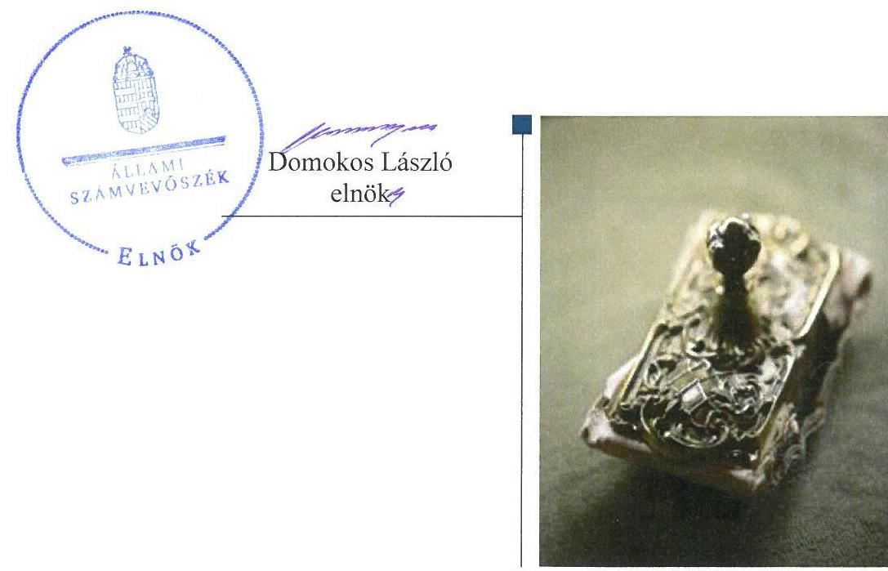
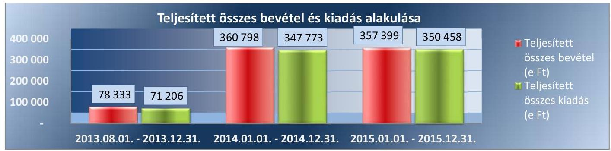
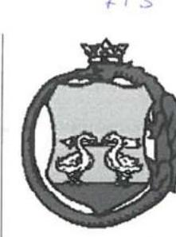
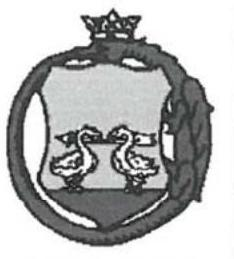
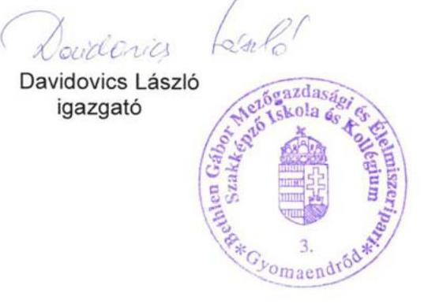
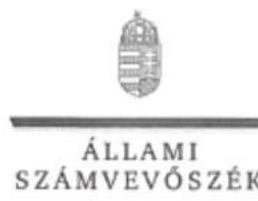
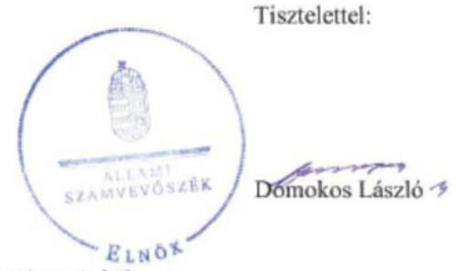
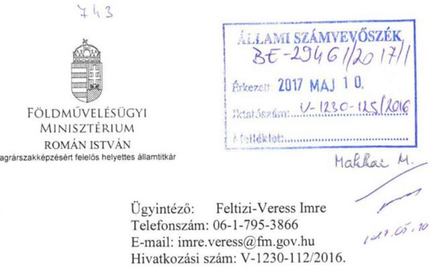
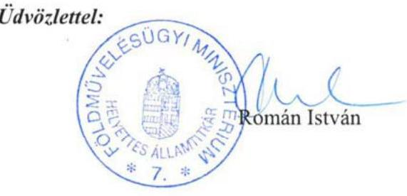
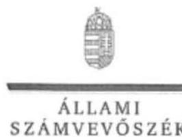

# Jelentés 

## A központi alrendszer egyes intézményei

A központi alrendszer egyes intézményei pénzügyi és vagyongazdálkodásának ellenőrzése - Bethlen Gábor Mezőgazdasági és Élelmiszeripari Szakképző Iskola és Kollégium
2017.

---

# A központi alrendszer egyes intézményei 

A központi alrendszer egyes intézményei pénzügyi és vagyongazdálkodásának ellenőrzése - Bethlen Gábor Mezőgazdasági és Élelmiszeripari Szakképző Iskola és Kollégium
2017. június hó 28. nap

---

# AZ ELLENŐRZÉST FELÜGYELTE:

## MAKKAI MÁRIA felügyeleti vezető

## AZ ELLENŐRZÉST VEZETTE ÉS A VÉGREHAJTÁSÁÉRT FELELŐS:

### HORVÁTH JÓZSEF ellenőrzésvezető

### A PROGRAM ÖSSZEÁLLÍTÁSÁÉRT FELELŐS:

### JANIK JÓZSEF LÁSZLÓ osztályvezető

---

**IKTATÓSZÁM:** V-1230-128/2016.

**TÉMASZÁM:** 2264

**ELLENŐRZÉS-AZONOSÍTÓ SZÁM:** V076010

---

Jelentéseink az Országgyűlés számítógépes hálózatán és az Interneta a www.asz.hu címen is olvashatóak.

---

# TARTALOMJEGYZÉK 

■ ÖSSZEGZÉS ..... 5
■ AZ ELLENŐRZÉS CÉLJA ..... 6
■ AZ ELLENŐRZÉS TERÜLETE ..... 7
■ AZ ELLENŐRZÉS HÁTTERE, INDOKOLTSÁGA ..... 8
■ A JELENTÉS LÉNYEGES KÉRDÉSKÖREI ..... 9
■ ELLENŐRZÉS HATÓKÖRE ÉS MÓDSZEREI ..... 10
■ MEGÁLLAPÍTÁSOK ..... 12
■ JAVASLATOK ..... 24
■ MELLÉKLETEK ..... 29
I. Sz. melléklet: Értelmező szótár ..... 29
II. Sz. melléklet: Az integritás érvényesítése érdekében kialakított és müködtetett kontrollrendszer ..... 33
III. Sz. melléklet: A 2014. és 2015. évi beszámoló és főkönyvi kivonat adatai (ezer Ft-ban) ..... 34
IV. Sz. melléklet: Az Intézmény eredeti és módosított előirányzatainak alakulása a 2013-2015. években az éves beszámoló adatai szerint (ezer Ft-ban) ..... 35
V. Sz. melléklet: A feladatellátást szolgáló vagyon 2013-2015. évi értéke a különböző nyilvántartásokban (ezer Ft-ban) ..... 36
■ FÜGGELÉK: ÉSZREVÉTELEK ..... 37
■ RÖVIDÍTÉSEK JEGYZÉKE ..... 47

---

.

---

# ÖSSZEGZÉS 

A Bethlen Gábor Mezőgazdasági és Élelmiszeripari Szakképző Iskola és Kollégiumnál az irányítási feladatok Földmúvelésügyi Minisztérium általi ellátása nem volt szabályszerű. Az Intézménynél a jogszabályi előírásokkal ellentétesen kialakított belső irányítási rendszer nem biztositotta a közpénzekkel és a nemzeti vagyonnal történő szabályszerű, gazdaságos, hatékony, eredményes gazdálkodást, az nem járult hozzá a korrupciós veszélyek mérsékléséhez, illetve csökkentéséhez. Az Intézmény pénzügyi és vagyongazdálkodása nem volt szabályszerű.

## Az ellenőrzés társadalmi indokoltsága

Az államháztartás központi alrendszerének közpénz felhasználása, az intézmények által ellátott közfeladatok sokrétűsége, valamint a feladatellátásához rendelt vagyon nagyságrendje indokolja, hogy az ÁSZ ellenőrzéseket folytasson a pénzügyi és vagyongazdálkodás területén. Az ÁSZ az ellenőrzései során feltárja a gazdálkodást, a központi alrendszer intézményei átalakulását, átszervezését érintő szabályozások esetleges hiányosságait, a szabályozással nem érintett gazdálkodási területeket, rámutathat a vagyongazdálkodási tevékenység - ezen belül a tulajdonosi joggyakorlás és vagyonkezelés - esetleges szabálytalanságaira, értékeli az állami vagyon nyilvántartására és elszámolására vonatkozó eljárásokat. Az ellenőrzés hozzájárulhat a központi intézmények pénzügyi helyzetének pontosabb megítéléséhez és a jó gyakorlat kialakításán és terjesztésén keresztül az ellenőrzések elősegíthetik a gazdálkodás szabályszerűségének javítását.

## Főbb megállapítások, következtetések, javaslatok

A fenntartó és irányító szervi feladatok ellátása a Földművelésügyi Minisztérium részéről nem volt szabályszerű, ezáltal nem járult hozzá az Intézmény jogszabályokkal összhangban történő működtetéséhez.

A Bethlen Gábor Mezőgazdasági és Élelmiszeripari Szakképző Iskola és Kollégium nem szabályszerűen alakította ki és működtette belső kontrollrendszerét, ezért az nem biztosította a nemzeti vagyonnal történő szabályszerű, gazdaságos, hatékony és eredményes gazdálkodást, illetve a beszámolási és adatszolgáltatási kötelezettségek szabályszerű végzését. Az Intézmény nem rendelkezett SZMSZ-el.

Az Intézmény pénzügyi gazdálkodása során az előirányzatok módosítását, az előirányzat-maradvány megállapítását, nyilvántartását és elszámolását, valamint az éves beszámolási kötelezettség teljesítését nem a jogszabályi előírásoknak megfelelően végezte. Az Intézmény pénzügyi egyensúlya csak a keret felhasználásának előrehozásával, illetve a Fenntartó által adott póttámogatással volt biztosított. A főkönyvi könyvelés és a részletező nyilvántartások a költségvetési beszámoló adatait a jogszabályi előírások ellenére nem támasztották alá. Az Intézmény feladatellátást szolgáló nemzeti vagyon körébe tartozó ingó-és ingatlanvagyonra vonatkozóan az ellenőrzött időszakban vagyonkezelői szerződéssel nem rendelkezett. A jogcím nélkül használt vagyont ennek ellenére könyveiben és a beszámoló mérlegében kimutatta, ennek következtében a vagyongazdálkodás feltételeinek kialakítása, valamint a vagyon nyilvántartása nem volt szabályszerű. Az Intézmény az ingatlan-hasznosítási szerződések megkötése és az ebből származó bevétel realizálása során az ingatlanok hasznosítására vonatkozóan az MNV Zrt. engedélyével nem rendelkezett, 20142015. évi beszámolóiban ezeket nem mutatta ki. A kiadási előirányzatok felhasználása során a gazdálkodási jogköröket nem szabályszerűen gyakorolták, illetve azok terhére történő kifizetések rendszeresen kötelezettségvállalás és pénzügyi ellenjegyzés nélkül történtek meg. A házipénztár kezelése során folyamatosan megsértették a belső szabályzatokban és a jogszabályokban előírtakat. Az Intézménynél a vagyon értékének megőrzését, gyarapítását szolgáló vagyongazdálkodás feltételeinek kialakítása, valamint a vagyon nyilvántartása körében a mérlegben kimutatott eszközök és források értékelése, leltározása nem a jogszabályban foglaltaknak megfelelően történt. Ennek következtében a beszámolók a pénzügyi és vagyoni helyzetről nem adtak megbízható és valós képet.

---

# AZ ELLENŐRZÉS CÉLJA 

AZ ELLENŐRZÉS CÉLJA annak megítélése volt, hogy az ellenőrzött intézményre vonatkozó irányító szervi feladatellátás a jogszabályi előírások betartásával történt-e; az intézménynél a belső kontrollrendszer kialakítása és múködtetése szabályszerű volt-e; kialakították-e az erőforrásokkal való szabályszerű, gazdaságos, hatékony és eredményes gazdálkodás követelményeit; szabályszerű volt-e a beszámolási és adatszolgáltatási kötelezettségek teljesítése; az intézmény pénzügyi és vagyongazdálkodása megfelelt-e a jogszabályi előírásoknak és belső szabályzatainak; az intézmény átalakításának vagy átszervezésének lebonyolítása szabályszerűen történt-e.

Az ellenőrzés keretében értékeljük az intézmény korrupciós kockázatainak kezelését szolgáló integritás kontrollok kiépítettségét és az integritás szemlélet érvényesülését.

---

# **AZ ELLENŐRZÉS TERÜLETE**

## **Bethlen Gábor Mezőgazdasági és Élelmiszeripari Szakképző Iskola és Kollégium**

A békés megyei Gyomaendrődön fekvő Intézmény¹ 2013. szeptember 1-től a szakképzésről szóló 2011. évi CLXXXVII. törvény 5. § (14) bekezdésében foglaltak alapján a Földművelésügyi Minisztérium fenntartása és irányítása alá került.

Alapfeladata a nemzeti köznevelésről szóló 2011. évi CXC. törvény 4. §-a, illetve az Alapító okiratban foglaltak alapján a szakközépiskolai oktatás, szakiskolai nevelés-oktatás, kollégiumi ellátás, felnőttoktatás, a Köznevelési Hídprogram keretében folyó nevelés-oktatás, továbbá a többi tanulóval együtt nevelhető, oktatható sajátos nevelési igényű tanulók iskolai nevelése, oktatása. Az Intézmény a mezőgazdaság, élelmiszeripar, vendéglátás-turisztika, faipar szakmacsoportokban folytat szakképzést országos illetékességgel.

Az Intézmény köznevelési feladatainak ellátása érdekében telephelyként két tangazdaságot működtetett (növénytermesztés, állattenyésztés).

Az ellenőrzött időszakban az Intézmény székhelyén 645 fő (nappali 555 fő, esti 90 fő) volt a maximális gyermek-, tanulólétszám, a két kollégium 175 fő bentlakását biztosította.

Az Intézmény gazdasági szervezeti feladatait 2015. augusztus 31-től a Szentannai Sámuel Gimnázium, Szakközépiskola és Kollégium látta el.

Az igazgató² személye az ellenőrzött időszakban nem változott, 2013. augusztus 1-től megbízott, 2015. július 1-től öt évre kinevezett igazgatóként látta el feladatát. A gazdasági vezető³ személye az ellenőrzött időszakban négy alkalommal változott, 2013. november 1. - 2013. december 31, valamint 2014. április 23. - 2014. június 15. között az intézmény nem rendelkezett gazdasági vezetővel.

Az Intézmény mérleg szerinti vagyona 2013. december 31-én 408,6 millió Ft, 2015. december 31-én 375,6 millió Ft volt. A 2013-2015. évi költségvetési bevételek és kiadások teljesítését alakulását az 1. ábra tartalmazza.

*Forrás: Intézményi beszámolók 2013-2015.*

---

# AZ ELLENŐRZÉS HÁTTERE, INDOKOLTSÁGA 

AZ ÁLLAMHÁZTARTÁS KÖZPONTI ALRENDSZERÉNEK közpénz felhasználása, az intézmények által ellátott közfeladatok sokrétűsége, valamint a feladatellátásához rendelt vagyon nagyságrendje indokolja, hogy az ÁSZ ellenőrzéseket folytasson a pénzügyi és vagyongazdálkodás területén. Az ÁSZ az ellenőrzései során feltárja a gazdálkodást, a központi alrendszer intézményei átalakulását, átszervezését érintő szabályozások esetleges hiányosságait, a szabályozással nem érintett gazdálkodási területeket, rámutathat a vagyongazdálkodási tevékenység - ezen belül a tulajdonosi joggyakorlás és vagyonkezelés - esetleges szabálytalanságaira, értékeli az állami vagyon nyilvántartására és elszámolására vonatkozó eljárásokat. A Kormány „jó állam" megteremtésével kapcsolatos céljaival összhangban van, hogy olyan teljesítményértékelési rendszer kerüljön kialakításra és működtetésre, amely hozzájárul a szervezeti teljesítmény növeléséhez, a fejlődési lehetőségek kihasználásához. Az ÁSZ a rendszer kiépítésében vállalt aktív ellenőrzési, értékelési tevékenységével kíván hozzájárulni a „jó állam" megteremtéséhez. Az ellenőrzés eredményeképpen nemcsak az ellenőrzött intézmények gazdálkodása javul, hanem átfogó képet kapunk a szakképző iskolák gazdálkodásának hiányosságairól, de a jó gyakorlatokról is. Ellenőrzéseivel, javaslataival és megállapításaival az ÁSZ ${ }^{4}$ elősegíti a költségvetési szervek pénzügyi és vagyongazdálkodása szabályozásának javítását és hozzájárulhat a jó kormányzáshoz.

---

# A JELENTÉS LÉNYEGES KÉRDÉSKÖREI 

1. Az irányító szerv ellenőrzött Intézményre vonatkozó feladatellátása szabályszerű volt-e?
2. Szabályszerüen történt-e az Intézményt érintő szervezeti és szerkezeti átalakítások lebonyolítása?
3. A belső kontrollrendszer kialakítása és müködtetése biztosi-totta-e a közpénzekkel és a nemzeti vagyonnal történő szabályszerű, gazdaságos, hatékony és eredményes gazdálkodást, illetve a beszámolási és adatszolgáltatási kötelezettségek szabályszerű teljesitését?
4. Az Intézmény pénzügyi gazdálkodása szabályszerű volt-e?
5. Az Intézmény vagyongazdálkodása szabályszerű volt-e?
6. Érvényesült-e az integritás szemlélet és ennek megfelelően ki-építették-e az integritás kontrollrendszert az intézménynél?

---

# ELLENŐRZÉS HATÓKÖRE ÉS MÓDSZEREI 

## Az ellenőrzés típusa

Megfelelőségi ellenőrzés.

## Az ellenőrzött időszak

Bethlen Gábor Mezőgazdasági és Élelmiszeripari Szakképző Iskola és Kollégium pénzügyi és vagyongazdálkodásának ellenőrzése tekintetében 2013. augusztus 1. és 2015. december 31. közötti időszak.

## Az ellenőrzés tárgya

Az ellenőrzött szervezetre vonatkozó irányító szervi feladatok ellátása. Az intézmény belső kontroll rendszerének kialakítása és müködtetése. A pénzügyi és vagyongazdálkodás szabályszerűsége. Az intézmény beszámolási és adatszolgáltatási kötelezettségének teljesítése. Az intézmény átalakításának vagy átszervezésének lebonyolítása szabályszerűsége.

Az ellenőrzés kiterjed minden olyan körülményre és adatra, amely az ÁSZ jogszabályban meghatározott feladatainak teljesítéséhez, valamint a program végrehajtása folyamán felmerült újabb összefüggések feltárásához szükséges.

## Az ellenőrzött szervezet

Bethlen Gábor Mezőgazdasági és Élelmiszeripari Szakképzó Iskola és Kollégium,
Földművelésügi Minisztérium, mint fenntartó és irányító szerv, Szentannai Sámuel Gimnázium, Szakközépiskola és Kollégium, mint 2015. augusztus 31-től a gazdasági feladatokat ellátó szerv.

## Az ellenőrzés jogalapja

Az ellenőrzés jogszabályi alapját az ÁSZ tv. 1. § (3) bekezdés, 5. § (2)-(6) bekezdései, valamint Áht. 61. § (2) bekezdésének előírásai képezik.

---

# Az ellenőrzés módszerei 

Az ellenőrzést az ellenőrzési program szempontjai, az ellenőrzött időszakban hatályos jogszabályok, az ellenőrzés szakmai szabályai, a jelen ellenőrzésre irányadó ÁSZ módszertanok figyelembevételével végeztük.

Az ellenőrzési kérdések megválaszolásához szükséges bizonyítékok megszerzése a következő ellenőrzési eljárások alkalmazásával történt: az ellenőrzött által rendelkezésre bocsátott dokumentumokra, adatokra alapozott megfigyelés, szemle (szemrevételezés), kérdésfeltevés (információkérés), mintavételezés, valamint elemző eljárás.

Az ellenőrzési bizonyítékként felhasználható adatforrások közé tartoztak egyrészt az ellenőrzési program részletes szempontjainál felsorolt adatforrások, másrészt adatforrás volt minden egyéb - az ellenőrzés folyamán feltárt, az ellenőrzés szempontjából információt tartalmazó - dokumentum.

Az ellenőrzés lefolytatásához az Intézmény a tanúsítványok kitöltésével, valamint az ÁSZ által kért dokumentumok elektronikus megküldésével szolgáltatott adatokat. A rendelkezésre bocsátott adatok, információk kontrollja az ellenőrzés keretében történt.

Az Intézmény belső kontrollrendszere jogszabályi előírások szerinti kialakításának és működtetésének szabályszerűségét az erre irányuló ellenőrzési kérdésekre adott válaszok összesítése alapján, évente pillérenként (kontrollkörnyezet, kockázatkezelési rendszer, kontrolltevékenységek, információs és kommunikációs rendszer, monitoring rendszer) és összesítetten is minősítettük. Az Intézmény belső kontrollrendszere egyes pilléreinek kialakítása és működtetése „szabályszerü", amennyiben az értékelt területen az elért és elérhető pontok százalékban kifejezett, egész számra kerekített hányadosa eléri, vagy meghaladja a $80 \%$-ot, „nem szabályszerű", ha nem haladja meg a $80 \%$-ot. Az Intézmény belső kontrollrendszerének öszszesített értékelése megegyezik a pillérenként (kontrollterületenként) alkalmazott \%-os értékelésekkel, a következő eltérésekkel. A kontrollrendszer egésze esetében a „szabályszerű" értékelésnek a \%-os értéken felül további feltétele, hogy egyik kontrollterület sem kaphat „nem szabályszerű" értékelést. Az összesített értékelés a \%-os értéktől függetlenül „nem szabályszerű", ha az ellenőrzött kontrollterületek közül több mint egynek „nem szabályszerű" az értékelése.

A tárgyi eszközök nyilvántartásba vételének, a közbeszerzései eljárások lefolytatásának, a bevételek beszedésének, a kiadási előirányzatok teljesítésének, a gazdálkodási jogkörök gyakorlásának, a tartozásállomány kezelésének szabályszerűségét mintatételek értékelésével végeztük.

Megfelelőnek értékeltük a bevételek beszedését, illetve a kiadások teljesítését, valamint a gazdálkodási jogkörök gyakorlását, amennyiben a mintatételek ellenőrzésének eredménye alapján 95\%-os bizonyossággal a teljes sokaságban a hibás tételek aránya legfeljebb 10\% volt, nem megfelelőnek, ha hibás tételek aránya elérte, vagy meghaladta a 10\%-ot.

Az integritás szemlélet érvényesülésének értékelése az Intézmény által kitöltött tanúsítvány alapján történt.

Az ellenőrzés során minden olyan körülményt és adatot is ellenőriztünk, amely a program végrehajtása kapcsán felmerült újabb összefüggéseknek az ellenőrzés céljaival összhangban lévő feltárásához szükséges volt.

---

# 1. Az irányító szerv ellenőrzött Intézményre vonatkozó feladatellátása szabályszerű volt-e? 

Összegző megállapítás

Az irányító szerv Intézményre vonatkozó feladatellátása öszszességében nem volt szabályszerű.

AZ ALAPÍTÓI JOGOSULTSÁGOK GYAKORLÁSA az ellenőrzött időszakban nem felelt meg a jogszabályi előírásoknak. Az irányítási és fenntartói jogkört gyakorló $\mathrm{VM}^{5}$ által kiadott Alapító okirat ${ }_{1,2,3}{ }^{6}$ tartalma nem felelt meg a Nkt. ${ }^{7}$ 21. § (3) bekezdés j) pontjában foglaltaknak, mivel az nem a valóságnak megfelelően tartalmazta a feladatellátást szolgáló vagyon feletti rendelkezést. Az Intézmény az ellenőrzött időszakban nem rendelkezett vagyonkezelési szerződéssel, azonban az Alapító okirat ${ }_{1,2,3}$ tényként rögzíti annak meglétét.

A Fenntartó ${ }^{8}$ az Alapító okirat ${ }_{1} 8$. pontjában, valamint az Alapító okirat ${ }_{2,3}$ 7. pontjában foglaltak ellenére az SZMSZ ${ }^{9}$ érvényességéhez nem nyilvánította ki egyetértését. A Fenntartó egyetértése hiányában az Intézmény nem rendelkezett SZMSZ-el.

A MUNKÁLTATÓI JOGOK GYAKORLÁSA során az oktatási intézmény vezetője - a Fenntartó által kinevezett gazdasági vezető hiányában - átmeneti időre az Intézmény állományába tartozó, megfelelő képesítéssel rendelkező alkalmazottat jelölt ki. A kijelöléshez írásban kezdeményezte a Fenntartónál az egyetértés megadását, azonban arra 2013. augusztus 12. és 2013. november 1. között a Fenntartó vezetője az Ávr. ${ }^{10}$ 11. § (8) bekezdésében foglaltak ellenére egyetértését nem adta.

AZ EGYÉB IRÁNYÍTÁSI, FELÜGYELETI ÉS ELLENÖRZÉSI JOGOSULTSÁGOK GYAKORLÁSA során a Fenntartó a tervezett bevételek és kiadások megállapításához meghatározta az általános és kötelezően érvényesítendő tervezési követelményeket, előfeltételeket, módszertant és előírásokat, valamint a tervezési eljárás teendőit. Az Intézmény 2014. és 2015. évi elemi költségvetését jóváhagyta. Az Intézmény 2013-2015. évi éves költségvetési beszámolóját az Áhsz. ${ }_{2}$ 32. § (1) bekezdésében foglaltak szerint felülvizsgálta és jóváhagyta. Az éves beszámolók és az azt alátámasztó főkönyvi kivonatok adatai eltértek egymástól.

AZ ELŐIRÁNYZATOKKAL VALÓ GAZDÁLKODÁST a Fenntartó rendszeresen figyelemmel kísérte. Az Áht. előírásának megfelelően a közfeladat ellátása veszélybe kerülésének megelőzése érdekében tizenhét alkalommal az Intézmény éves előirányzata terhére, annak előrehozásáról, továbbá hét alkalommal póttámogatás adásáról intézkedett.

---

# 2. Szabályszerűen történt-e az Intézményt érintő szervezeti és szerkezeti átalakítások lebonyolítása? 

Összegző megállapítás

Intézményt érintő szervezeti átalakítás összességében szabályszerűen történt.

AZ INTÉZMÉNYT ÉRINTŐ SZERKEZETI ÁTALAKÍTÁS SORÁN a fenntartói jogokat gyakorló miniszter 2015. július 20án az Intézmény gazdasági szervezeti feladatai ellátására a Szentannai Sámuel Gimnázium, Szakközépiskola és Kollégium gazdasági szervezetét jelölte ki. A szerkezeti átalakítás összességében szabályszerűen történt.

A GAZDASÁGI SZERVEZET ÁTADÁS-ÁTVÉTELÉ-
RŐL szóló Együttműködési megállapodás ${ }^{11}$ jogszabályi előírás hiányában nem tartalmazta az átadó teljességi nyilatkozatát.

## 3. A belső kontrollrendszer kialakítása és múködtetése biztosí-totta-e a közpénzekkel és a nemzeti vagyonnal történő szabályszerű, gazdaságos, hatékony és eredményes gazdálkodást, illetve a beszámolási és adatszolgáltatási kötelezettségek szabályszerű teljesítését?

## Összegző megállapítás

3.1. számú megállapítás

1. táblázat

A BELSŐ KONTROLLRENDSZER ÉRTÉKELÉSE 2013-2015. ÉVEKBEN

Belső kontrollrendszer értékelése
Kontrollkörnyezet
Kockázatkezelés
Kontrolltevékenység
Információ és
kommunikáció
Monitoring
Összesen

A belső kontrollrendszer kialakítása és múködtetése nem felelet meg a belső szabályzatban és jogszabályokban foglaltaknak.

A kontrollkörnyezet kialakítása nem volt szabályszerű.

AZ INTÉZMÉNY SZERVEZETI ÉS MŰKÖDÉSI SZABÁLYZATTAL az ellenőrzött időszakban nem rendelkezett.

AZ INTÉZMÉNY 2013. ÉVBEN NEM RENDELKEZETT a Számv. tv. ${ }^{12}$ 14. § (4) és (5) bekezdéseiben előírt szabályzatokkal, valamint az Ávr. 13. § (2) bekezdés a)-h) pontjaiban foglaltak ellenére belső szabályzatban nem rendezte a múködéshez kapcsolódó, pénzügyi kihatással bíró, jogszabályban nem szabályozott kérdéseket. A Számv. tv. 14. § (11) bekezdésének ellenére az Intézmény megalakulását követő 90 napon belül nem adta ki a 2013. évre vonatkozó számviteli politikát ${ }^{13}$, számlarend $_{1}$-et $^{14}$, bizonylati rend $_{1}$ et $^{15}$, leltározási ${ }_{1}{ }^{16}$, értékelési ${ }_{1}{ }^{17}$, pénzkezelési ${ }_{1}{ }^{18}$, valamint közbeszerzési ${ }_{1}{ }^{19}$ szabályzatait.

Az Intézmény gazdálkodására vonatkozóan a 2014. januárban kiadott beszerzési szabályzat ${ }^{20}$ és a kiküldetési szabályzat ${ }^{21}$ tartalma nem biztosította a hatályos jogszabályoknak megfelelő szabályos feladatellátást.

A számviteli politika a Számv. tv. 14.§ (3)-(4) bekezdése ellenére nem a gazdálkodó adottságainak, körülményeinek leginkább megfelelő, a gazdál-

---

kodóra leginkább jellemző előírásokat, módszereket tartalmazta, nem vették figyelembe az állattenyésztés és növénytermesztés működtetéséből eredő sajátosságokat.

A BELSŐ SZABÁLYZATOK közül a számlarend ${ }_{1,2}{ }^{22}$ az Áhsz. ${ }_{1}$ 49. § (3) bekezdésében, 2014. január 1-től az Áhsz. ${ }_{2}$ 51. § (3) bekezdésében, valamint a Számv. tv. 161. § (2) bekezdésének c) pontja ellenére nem tartalmazta a főkönyvi számla és az analitikus nyilvántartások kapcsolatát, egyeztetési módját, annak dokumentálását, valamint a részletező nyilvántartások vezetési módját, a pénzügyi könyveléshez készült összesítő bizonylatok (feladások) elkészítésének rendjét, tartalmi és formai követelményeit. Az értékelési szabályzatban ${ }_{1,2}{ }^{23}$ az Áhsz. ${ }_{1} 8 . \S$ (17) bekezdés d) pontjában, valamint az Áhsz. ${ }_{2} 50 . \S$ (2) bekezdés b) pontjában foglaltak ellenére nem rögzítették követeléstípusonként a kis összegű követelések év végi meghatározásának elveit, dokumentálásának szabályait. Az értékelési szabályzat ${ }_{2}$-ban az Áhsz. ${ }_{2} 17 . \S$ (2) bekezdésével ellentétesen a kis értékű immateriális javak és tárgyi eszközök esetében az egyösszegű tervszerinti értékcsökkenése helyett, ezen eszközök dologi kiadásként történő elszámolását írták elő. A saját termelésű készletek, a mezei leltárak és az állatállomány szaporulata bekerülési értékének meghatározását az Ávr. 13. § (2) bekezdés d) pontjában előírtak ellenére nem szabályozták. A gépjármú üzemeltetési szabályzat ${ }^{24}$ rendelkező részében hivatkozott mellékletek (37. számú) adatokat nem tartalmaztak, például a gépjármú-üzemeletetéssel kapcsolatos jogkörök gyakorlóit, a gépjárművek vezetésére jogosult személyek, gépjárművek tárolási helyének adatait. Az önköltség-számítási szabályzat ${ }^{25}$ 2. pontjában az önköltség-számítási séma nem megfelelően tartalmazta az általános forgalmi adó beszámítását, a közvetett költségek felosztásának módját és figyelmen kívül hagyta a mezőgazdasági melléktermékek értékét, ennek következtében a mérlegben szereplő állatok, valamint vetésterületek (befejezetlen termelés) értéke nem felelt meg az Áhsz. ${ }_{2} 16 . \S$ (7) bekezdésében foglaltaknak. A pénzgazdálkodási szabály-zat ${ }^{26}$-ban 2015. szeptember 1-jétől nem írták elő a bevételek beszedésének elrendelése előtt a teljesítés igazolását, ezzel nem tettek eleget Együttműködési megállapodás 4. § (4) bekezdésében foglaltaknak.

Az Intézménynél az ellenőrzött időszakban a Bkr. 6. § (1) c) pontjában, 3) bekezdéseiben foglaltak ellenére nem határozták meg a szervezet minden szintjén az etikai elvárásokat, valamint nem rendelkeztek ellenőrzési nyomvonallal.

# 3.2. számú megállapítás 

Az Intézmény kockázatkezelési rendszert nem alakított ki és nem múködtetett.

KOCKÁZATKEZELÉSI RENDSZERT a Bkr. 7. § (1) bekezdésében foglaltak ellenére az igazgató nem alakított ki és nem működtetett.

A 2014-ben kiadott kockázatkezelési szabályzat ${ }^{27}$-ban nem határozta meg a Bkr. 2. § m) pontja szerinti kockázatkezelési rendszer működtetésének feladatait, így a kockázatok azonosításának, elemzésének, csoportosításának módját, a kockázati kitettség mérséklésének módszerét, a kockázatok kezelése érdekében azok nyomon követési módját.

---

# 3.3. számú megállapítás 

A kontrolltevékenység gyakorlása, múködtetése nem felelt meg a jogszabályokban és a belső szabályzatokban foglaltaknak.

A GAZDÁLKODÁSSAL, így különösen a kötelezettségvállalás, ellenjegyzés, teljesítés igazolása, érvényesítés, utalványozás gyakorlásának módjával, eljárási és dokumentációs részletszabályaival, valamint az ezeket végző személyek kijelölésének rendjével kapcsolatos belső előírásokat, feltételeket Ávr. 13. § (2) bekezdés a) pontjában, valamint a Bkr. 8. § (2) bekezdés a), c) és d) pontjában foglaltak ellenére az Intézménynél 2013. december 31-ig nem szabályozták.
2014. január 1. és 2015. augusztus 31. közötti időszakban a szabályzatok mellékleteit képező, a pénzgazdálkodási jogköröket gyakorlók kijelölését tartalmazó felhatalmazások a pénzügyi ellenjegyzés és érvényesítés vonatkozásában ellentétesek az Ávr. 55. § (2) bekezdés a) pontjával, valamint az 58. § (4) bekezdésében foglaltakkal, mert a kijelölés a gazdasági vezető helyett az Intézmény vezetőjének aláírását tartalmazta.
2015. szeptember 1-től a - a gazdasági vezetö́ az Ávr. előírásainak megfelelően írásban kijelölte a pénzügyi ellenjegyzésre, valamint az érvényesítésére jogosult személyeket.

A KONTROLLTEVÉKENYSÉGEK kialakítása és múködtetése a Bkr. 8. § (2) bekezdésében előírtak ellenére a kontrolltevékenység részeként nem biztosították a folyamatba épített, előzetes, utólagos és vezetői ellenőrzést.

A kontrolltevékenység múködtetése során feltárt hiányosságokat részletesen a 4.2. pont tartalmazza.

Az információs és kommunikációs folyamatok kialakítása és múködtetése nem felelt meg a jogszabályi előírásoknak.

INFORMÁCIÓS RENDSZERT az Intézmény vezetője a Bkr. 3. § d) pontjában foglaltak ellenére nem alakított ki és nem múködtetett.

Az Intézmény 2013-ban az Info tv. ${ }^{28}$ 24. § (3) bekezdésében foglaltakat megsértve nem rendelkezett adatbiztonsági szabályzattal, az Info tv. 30 § (6) bekezdése ellenére közérdekú adatok megismerésére irányuló igények teljesítésének rendjét rögzítő szabályzattal, továbbá az Info tv. 35. § (3) bekezdése ellenére nem szabályozták az elektronikus közzététel, a folyamatos hozzáférhetőség, a hitelesség és az adatok frissítésének részletes szabályait. 2013. évben az Ltv. ${ }^{29}$ 9. § (4) bekezdése előírása ellenére nem alakították ki iratok kezelésének rendjét, valamint 2014-től az iratkezelési szabályzat ${ }^{30}$ kiadásához az Ltv. 10. § (1) bekezdés a) pontjában foglaltak ellenére nem kérték meg az illetékes közlevéltár egyetértését.

A KÖZZÉTÉTELI kötelezettségről az Intézmény az Info. tv. 37. § (1) bekezdésében foglaltakat megsértve - az SZMSZ és a 2014. évi beszámoló kivételével - honlapján ${ }^{31}$ nem gondoskodott.

---

# 3.5. számú megállapítás 

A költségvetési szerv vezetője a jogszabályi előírások ellenére nem alakított ki monitoring rendszert, továbbá a belső ellenőrzést hiányosan múködtette.

NEM ALAKÍTOTTÁK KI a szervezet tevékenységének, a célok megvalósításának nyomon követését biztosító rendszert, mely az operatív tevékenységek keretében megvalósuló folyamatos és eseti nyomon követését biztosítja, ezzel megsértették a Bkr. 10. §-ban foglalt előírásokat.

A BELSŐ ELLENŐRZÉS kialakításáról és múködtetésről 2013ban az Intézmény vezetője a Bkr. 15. § (1) bekezdésében foglaltak ellenére nem gondoskodott. A 2014-2015. években belső ellenőrzési feladatok ellátást külső szolgáltató megbízásával biztosították. Az Intézménynél a Bkr. 22. § (1) bekezdés b) pontjának előírása ellenére stratégiai ellenőrzési tervet az ellenőrzött időszakban nem készítettek.

2014-2015. években a belső ellenőrzés számos észrevételt tett az intézmény szabályozottságának, gazdálkodásának hiányosságaival kapcsolatban, mellyel kapcsolatban a szükséges intézkedéseket nem teljes körűen hajtották végre.

A 2014-2015. évi belső ellenőrzésekről vezetett nyilvántartás nem felelt meg a Bkr. 47. § (2) bekezdésében foglaltaknak, mert nem tartalmazta az ellenőrzési jelentésben szereplő javaslatot, az elfogadott intézkedési tervet, az intézkedési terv alapján végrehajtott intézkedések rövid leírását és a végre nem hajtott intézkedések okát.

KÜLSŐ ELLENŐRZÉSEKET az ellenőrzött időszakban a Békés Megyei Katasztrófavédelmi Igazgatóság, a NAV, valamint a Békés Megyei Kormányhivatal Járási Állategészségügyi és Élelmiszeri Ellenőrzési Hivatala végzett. Az ellenőrzések javaslatai alapján az Intézmény intézkedett a hiányosságok megszüntetéséről. A Fenntartó felügyeleti ellenőrzést 2013. augusztus 1. és 2015. december 31. között az Iskolánál nem végzett. A külső ellenőrzésekről vezetett nyilvántartás megfelelt a Bkr. előírásainak.

Az Intézmény vezetője a Bkr. 11. § (1) bekezdésében foglalt nyilatkozatban a belső kontrollrendszer kiépítését és múködtetését minden évben megfelelőnek minősítette. Ennek megfelelőségét jelen ellenőrzés nem támasztotta alá.
3.6. számú megállapítás

Az Intézménynél nem alakították ki a célok elérését szolgáló olyan követelményeket, amelyek biztosítják a rendelkezésre álló források gazdaságos, hatékony és eredményes felhasználását.

A költségvetési szerv vezetője a Bkr. 6. § (2) bekezdésében foglaltak ellenére nem alakított ki olyan szabályzatokat és nem múködtetett olyan folyamatokat, amelyek biztosítják, hogy az Intézmény tevékenységei és céljai összhangban legyenek a gazdaságosság, hatékonyság és eredményesség követelményével.

---

# 4. Az Intézmény pénzügyi gazdálkodása szabályszerű volt-e? 

## Összegző megállapítás

4.1. számú megállapítás
2. táblázat

AZ INTÉZMÉNY BEVÉTELEI ÉS KIADÁSI ELŐIRÁNYZATÁNAK ALAKULÁSA 2013-2015. ÉVEKBEN (EZER FT)

|  | 2013 | 2014 | 2015 |
| :--: | :--: | :--: | :--: |
| Eredeti előirányzat | 44757 | 248639 | 309542 |
| Módosított előirányzat | 76980 | 387665 | 370492 |

Forrás: Intézményi beszámolók 2013-2015.

## Az Intézmény pénzügyi gazdálkodása nem volt szabályszerű.

A költségvetési tervezés és a kapcsolódó adatszolgáltatás összességében megfelelt a jogszabályi előírásoknak. Az előirányzatok módosítása, az előirányzat-maradvány megállapítása, valamint az éves beszámolási kötelezettség teljesítése nem felelt meg a jogszabályi előírásoknak.

A KÖLTSÉGVETÉSI TERVEZÉSSEL kapcsolatos belső előírásokat, feltételeket az Ávr. 13. § (2) bekezdés a) pontjában foglaltak ellenére az Intézmény a 2013. évben nem szabályozta. A 2013-2015. évekre Áht.-ban előírtak szerint az Intézmény elkészítette Kincstári és éves elemi költségvetéseit, amelyek kiemelt előirányzati, finanszírozási bevételi és kiadási előirányzati szinten megegyeztek.

AZ INTÉZMÉNY ELŐIRÁNYZAT MÓDOSÍTÁSAI 2013-2015. években - melyet a 2. táblázat tartalmaz - összességében nem feleltek meg a jogszabályi előírásoknak. Az előirányzat-módosításokról 2013.-ban analitikus nyilvántartást nem vezettek, ezzel megsértették az Áhsz. 1 49. § (1) bekezdésében foglaltakat. A 2014. és 2015. években az előirányzat módosításokról részletező nyilvántartást vezettek. 2013. évben a beszámolóban kimutatott előirányzat-módosítások összegét teljes körűen bizonylatokkal nem támasztották alá, ezzel megsértették a Számv. tv. 169. § (1) bekezdésében foglalt bizonylat megőrzési kötelezettséget. 2014. és a 2015. években az éves költségvetési beszámoló adatait az Áhsz. 2 5. § (1) bekezdése előírása ellenére főkönyvi kivonatok és részletező nyilvántartások nem támasztották alá. A 2014-2015. évi beszámolóban és a főkönyvi kivonatban szereplő módosított előirányzatok és teljesítési adatok eltéréseit a III. melléklet mutatja be.

A PÉNZÜGYI EGYENSÚLY az ellenőrzött időszakban csak keret előrehozásokkal, valamint a Fenntartó által adott póttámogatással volt biztosítható.

A TÁRGYÉVI KÖLTSÉGVETÉSI MARADVÁNYT az Intézmény a 2013-2015. években az Ávr. és az Áhsz.1,2-ben előírt formában, az éves elemi költségvetési beszámoló részeként kimutatta. A 2013. évi előirányzat-maradvány összegét az Áhsz 1 38. § (11) bekezdésében foglaltakkal ellentétesen a kiadási megtakarítás összegét is bevételi többletként jelenítette meg. A 2014-2015. évi éves beszámolójában kimutatott elő-irányzat-maradvány és a kapcsolódó a főkönyvi számlák közötti egyezőséget az Áhsz 2 5. § (1) és a 39. § (1) bekezdésében foglaltak ellenére nem biztosította. 2014-2015. években a költségvetési beszámolókban kimutatott kötelezettségvállalással terhelt előirányzat maradványról részletező nyilvántartást az Áhsz. 2 39. § (3) bekezdésének foglaltak ellenére nem vezetett.

AZ ÉVES KÖLTSÉGVETÉSI BESZÁMOLÓKAT az ellenőrzött időszak minden évéről az Áhsz 1 10. § (1), illetve az Áhsz. 2 32. §

---

(1) bekezdésében meghatározott határidőn túl küldte meg az Irányító szervnek, aki a beszámoló tartalmára észrevételt nem tett.

A KÖLTSÉGVETÉSI BESZÁMOLÓ ADATAI, a főkönyvi könyvelés és az analitikus, részletező nyilvántartás adatai között a Számv. tv. 161. § (3) bekezdésében foglaltak ellenére az egyezőség nem volt biztosított.
4.2. számú megállapítás

A bevételi előirányzatok beszedése és elszámolása, valamint a kiadási előirányzatok felhasználása nem felelt meg a jogszabályokban foglaltaknak. A gazdálkodási jogkörök gyakorlása nem felelt meg a jogszabályoknak.

Az Intézmény 2013-ban a módosított bevételi előirányzatát teljesítette, 2014-ben és 2015-ben a bevételek teljesítése elmaradt a módosított előirányzattól. A módosított kiadási előirányzatát az ellenőrzött időszakban az Áht.-ban foglaltaknak megfelelően nem lépte túl. A bevételi és kiadási előirányzatok alakulását a 2. tábla, valamint a IV. számú melléklet szemlélteti.

A BEVÉTELEK BESZEDÉSE ÉS ELSZÁMOLÁSA a 2013-2015. években nem felelt meg a jogszabályi előírásoknak. Az Intézmény az ellenőrzött időszakban a nemzeti vagyonba tartozó állami tulajdonú ingatlanra az Nvtv. 11. § (14) bekezdésében, valamint a Vhr. ${ }^{32}$ 10. § (1) bekezdésében foglaltak ellenére hasznosítási szerződést kötött, ezáltal bevételt realizált. A bérleti díj megállapítása során megsértették az Ávr. 63. § (1) bekezdésében foglaltakat, mivel önköltségszámítást nem végeztek. Az Intézmény a bérbeadás során nem rendelkezett az Nvtv. 3. § (2) bekezdésében foglaltak ellenére a szerződő fél nyilatkozatával arról, hogy átlátható szervezetnek minősül-e. A 2014. évben 7288,7 ezer Ft, 2015. évben 4766,2 ezer Ft bérleti és lízing díjból származó bevételt az éves beszámolóban nem mutatták ki, amivel megsértették a Számv tv. 15. § (2) bekezdésében rögzített „teljesség elvét". A 106/1999 (XII.28.) FVM rendelet ${ }^{33}$ 2. § (1) és 3. § (1) bekezdésében foglaltakkal ellentétesen a szolgálati lakást az Intézménnyel jogviszonyban nem álló személy részére, határozatlan időre adták bérbe. A 2014-2015. években bérleti díjak beszedése során a Számv. tv. 165. § (1) bekezdés ellenére a készpénz átvételét nem dokumentálták.

A költségvetési kiadási előirányzatok felhasználása megfelelt a Kbt. ${ }_{1,2}{ }^{34}$ előírásainak.

# A KÖTELEZETTSÉGVÁLLALÁS, ILLETVE ANNAK 

PÉNZÜGYI ELLENJEGYZÉSE 2013-2015. években az Ávr. 52. § (1) bekezdésében foglaltak ellenére nem történt meg, valamint az Ávr. 56. § (1) bekezdése ellenére nem vagy késedelmesen került nyilvántartásba vételre. Az Áht. 2 37. § (1) bekezdésében foglaltak ellenére a felhalmozási kiadások, valamint a munkáltatói döntésen alapuló illetménykiegészítésre irányuló kötelezettségvállalások esetében a pénzügyi ellenjegyzés nélkül történt meg. A pénzügyi ellenjegyzést végzők az Ávr. 11. § (8) és az Ávr. 55. § (2) bekezdés a) pontjában foglaltak ellenére nem minden esetben rendelkeztek az arra jogosult vezető írásbeli felhatalmazásával.

---

Az Ávr. 55. § (1) bekezdésében foglaltak ellenére a pénzügyi ellenjegyzés nem a kötelezettségvállalás dokumentumán történt, illetve hiányzott a pénzügyi ellenjegyzés dátuma.

A TELJESÍTÉSIGAZOLÁS SORÁN elmaradt az Ávr. 57. § (3) bekezdésében előírt dátum feltüntetése, illetve a teljesítés tényére történő utalás megjelölése, továbbá az Ávr. 57. § (1) bekezdésével szemben nem történt meg a kiadások teljesítése jogosságának ellenőrzése, mivel a teljesítésigazolást megalapozó dokumentumok nem álltak rendelkezésre.

AZ ÉRVÉNYESÍTÉS során a jogkör gyakorlója az Ávr. 58. § (3) bekezdésben foglaltak ellenére aláírását keltezés nélkül végezte el, továbbá az érvényesítést gyakorló személy tevékenységét jogosulatlanul gyakorolta, mivel az Ávr. 58. § (4) bekezdésében foglaltak ellenére kijelöléssel nem rendelkezett.

AZ UTALVÁNYOZÁS az Ávr. 59. § (1)-(3) bekezdését megsértve vagy nem történt meg, vagy azt nem a jogkör gyakorlására jogosult személy végezte el, illetve annak végrehajtása nem volt szabályszerű, az utalványozást dátummal nem látták el, nem érvényesített okmány alapján végezték el.

AZ ÖSSZEFÉRHETETLENSÉGI SZABÁLYOKAT nem tartották be, mert az Ávr. 60. § (2) bekezdésében foglaltak ellenére a gazdálkodási jogkör gyakorlója a személyi jellegű kifizetéseknél a Ptk. ${ }^{35}$ 685. § b) pont, a Ptk. ${ }^{36} 8: 1$ § (1) bekezdés 1. pont szerinti közeli hozzátartozója javára vállalt kötelezettséget, igazolta a teljesítést, illetve utalványozta a kifizetést.

# A MŰKÖDÉSI KIADÁSOK TELJESÍTÉSÉVEL KAP- 

CSOLATOS kifizetéseket megalapozó számlák a jogszabályban meghatározott alaki és tartalmi követelményeknek nem feleltek meg. A 20132015. években a megkötött visszterhes, illetve megbízási szerződések az általános adatokon, feltételeken túlmenően az Ávr. 50. § (1) bekezdés a)-c) pontjai ellenére nem tartalmazták a szakmai, műszaki teljesítés menynyiségi és minőségi jellemzőinek meghatározását, a teljesítési határidőt, a kifizetendő összeget vagy a számlázás alapjául szolgáló egységárat, a kifizetés határidejét. A kiadásokat nem könyvelték, azok könyvviteli elszámolása 2013-ban nem minden esetben az Áhsz. ${ }^{37}$ 9. számú mellékletének, 2014-2015-ben az Áhsz. ${ }^{38} 40 . \S$ (1) bekezdésének és 15. számú mellékletének megfelelő nyilvántartási számlákon történt. A házipénztári kifizetések bizonylatolása nem felelt meg a Számv. tv. a 167. § (1) bekezdésének, mert a pénzkezelési szabályzat ${ }_{1,2} 2.1$. pontjában foglaltak ellenére a bizonylatok egyes alaki és tartalmai kellékei hiányoztak. A 2013-2015. évi időszaki pénztárjelentések hitelessége, megbízhatósága és helytállósága a Számv. tv. 166. § (2) bekezdésében, valamint a pénzkezelési szabályzat ${ }_{1,2}$ 3.3. pontjában foglaltak ellenére nem volt igazolható, a pénztárellenőr, a pénztáros aláírása hiányában. A 2014. február 7-étől 2015. december 31éig tartó időszakban a jogi személlyel, jogi személyiséggel nem rendelkező szervezettel kötött visszterhes szerződések az Ávr. 50. § (1a) bekezdésében foglaltakkal ellentétben nem tartalmazták a szervezet képviselőjének

---

nyilatkozatát arra vonatkozóan, hogy átlátható szervezet-e. A pénztári kifizetés során megsértették a Számv. tv. 165. § (2) bekezdésének előírását, mert a pénzmozgás szabályszerűen kiállított bizonylat nélkül történt. Az elszámolások a Számv. tv. 165. § (2) és a 166. § (1) bekezdésében foglaltak ellenére olyan bizonylatokat is tartalmaztak, amelyek a gazdasági esemény elszámolását nem támasztották alá.

# 5. Az Intézmény vagyongazdálkodása szabályszerű volt-e? 

## Összegző megállapítás

### 5.1. számú megállapítás

3. táblázat

A MÉRLEGBEN HELYTELENÜL KIMUTATOTT BEFEKTETETT ESZKÖZÖK (EZER FT)

|  | 2013 | 2014 | 2015 |
| :--: | :--: | :--: | :--: |
| Ingatlanok | 348968 | 340827 | 317962 |
| Egyéb   gép,   jármú | 22390 | 11393 | 5805 |
| Össze-   sen | 371358 | 352220 | 323767 |

Forrás: Intézmény éves beszámolói
nyilatkozatát arra vonatkozóan, hogy átlátható szervezet-e. A pénztári kifizetés során megsértették a Számv. tv. 165. § (2) bekezdésének előírását, mert a pénzmozgás szabályszerűen kiállított bizonylat nélkül történt. Az elszámolások a Számv. tv. 165. § (2) és a 166. § (1) bekezdésében foglaltak ellenére olyan bizonylatokat is tartalmaztak, amelyek a gazdasági esemény elszámolását nem támasztották alá.

## Az Intézmény vagyongazdálkodása nem volt szabályszerű.

A vagyongazdálkodás feltételeinek kialakítása, valamint a vagyon nyilvántartása nem volt szabályszerű.

VAGYONKEZELŐI SZERZŐDÉS az Intézmény feladatellátását szolgáló, a nemzeti vagyon körébe tartozó ingó- és ingatlanvagyonra vonatkozóan az Nvtv. 11.§ (1) bekezdésében, valamint az NFA tv ${ }^{39}$. 19/A § (1) bekezdésében foglaltakat megsértve 2015. december 31-ig nem jött létre az Intézmény, az MNV Zrt. illetve az NFA ${ }^{40}$ között.

Az MNV Zrt. tulajdonosi joggyakorlása alá tartozó, az Intézmény feladatellátását szolgáló ingatlanok 2015. december 31-én még az ASZK ${ }^{41}$ vagyonkezelésében voltak. Az Intézmény 2002. szeptember 1-től 2008. augusztus 31-ig az ASZK tagintézménye volt. Az időközben bekövetkezett fenntartó váltásokat, a többszöri adategyeztetés ellenére nem követte a vagyonkezelői jog átadása.

Az NFA 2013-2015. években a tulajdonosi joggyakorlása alá tartozó, az Intézmény feladatellátását szolgáló kilenc ingatlan közül mindössze három termőföld hasznosítására kötött megbízási szerződést egy-egy év időtartamra, a többi földterületet az Intézmény jogalap nélkül használta.

Az EMMI ${ }^{42}$, a KLIK ${ }^{43}$ és VM ${ }^{44}$ által 2013. december 30-án aláírt megállapodásban ${ }^{45}$ foglaltak ellenére az ingóságok tekintetében az Intézmény és a korábbi vagyonkezelő a vagyonkezelői jog átadására vonatkozóan megállapodást 2015. december 31-ig nem kötött. A megállapodásban foglaltak ellenére a gépjárművek esetében 2015. december 31-ig az Intézmény nem rendelkezett üzembentartói nyilatkozattal.

A VAGYON NYILVÁNTARTÁSA nem felelt meg a Számv. tv., az Áhsz.1-2 és a Vhr. előírásainak. Az Intézmény az általa jogcím nélkül használt ingó- és ingatlanvagyont a Számv. tv. 23. § (2) bekezdése, valamint Áhsz. 1 15. § (1) bekezdésében és az Áhsz. 1 10. § (2) bekezdésében foglaltak ellenére a könyveiben, valamint a 2013-2015. évi beszámoló mérlegében annak ellenére kimutatta, hogy az erre feljogosító vagyonkezelői szerződéssel nem rendelkezett. Ezzel megsértette az állami vagyonnal való gazdálkodásról szóló Vhr. 7. § (1) bekezdésének és a Számv. tv. 23. § (2) bekezdésének előírásait. A helytelen vagyonkimutatás következtében az Intézmény beszámolóiban a befektetett eszközök értéke az Áhsz. 1 5. § 8. pont, és az Áhsz. 1 1. § (1) bekezdés 3. pontja szerinti jelentős összegű hibát tartalmazott. A mérlegben helytelenül kimutatott befektetett eszközök értékét a 3. táblázat tartalmazza.

---

Az immateriális javak, a tárgyi eszközök, illetve a készletek analitikus nyilvántartása, és a hozzá kapcsolódó főkönyvi kivonat megfelelő sorai között a Számv. tv. 69. § (2) bekezdése ellenére az egyeztetést nem végezték el. Az Áhsz.; 5. § (1) bekezdésében foglaltak ellenére az éves költségvetési beszámolót folyamatosan vezetett részletező nyilvántartásokkal, valamint főkönyvi kivonattal nem támasztották alá.

Az Intézmény feladatellátását szolgáló vagyon analitikus nyilvántartása és főkönyvi könyvelése közötti eltéréseket a V. számú melléklet mutatja.

A VAGYON MEGŐRZÉSE az ellenőrzött időszakban nem volt biztosított. Az Intézmény 2013. augusztus 1-jei alakulásakor az átadás átvétel végrehajtása nem felelt meg az Áhsz.; 29/B. § (1) bekezdése előírásainak, mert az az átadott eszközökre vonatkozóan érték adatokat nem tartalmazott. Ennek következtében már az átadás-átvétel időpontjában jelentős eltérések voltak az állományba vett, illetve a ténylegesen megtalálható eszközök között. A feladatellátáshoz szükséges, az Intézmény általa használt vagyon könyvszerinti értékét a főkönyvi könyvelésbe az átadó nyilvántartásából informatikai úton emelték át.
5.2. számú megállapítás

A mérlegben kimutatott eszközök és források értékelése, leltározása nem a jogszabályoknak megfelelően történt, ezért a beszámolók az Intézmény pénzügyi és vagyoni helyzetéről nem adtak megbízható, valós képet.

LELTÁRRAL a Számv. tv. 69.§ (1) bekezdésben foglaltak ellenére öszszességében az ellenőrzött időszak egyik évében sem támasztották alá a könyvviteli mérlegben kimutatott eszközöket és forrásokat mennyiségben és értékben. 2013. évben a 2014. évi számviteli rend változása miatti rendező mérleghez az NGM rendelet ${ }^{46}$ 2. § (1) bekezdését és az Áhsz.; 37. § (1) bekezdését megsértve december 31-e fordulónappal leltárt nem készítettek. 2014. évben csak a tárgyi eszközök és az állatállomány leltározását végezték el. 2015. évben a tangazdaságban használt készletek és az állatállomány kivételével az eszközök értékbeli és mennyiségi felvétele nem történt meg. A követelések és a kötelezettségek egyeztetéssel történő leltározását egyik évben sem végezték el.

Az Intézmény a 2014-2015. évben több alkalommal hajtott végre selejtezést. A selejtezések következtében az eszközök állományában bekövetkezett csökkenésről a Számv. tv. 165. § (1) bekezdése ellenére bizonylatot (selejtezési jegyzőkönyvet) nem állított ki, valamint a nyilvántartásból történő kivezetés a Számv. tv. 165. § (2) bekezdése ellenére szabálytalanul kiállított bizonylat alapján történt meg.

2014-ben az Intézmény a 2013. augusztus 1-jén átvett, a nyilvántartásában szereplő és a ténylegesen meglévő eszközök összehasonlítása eredményeként 6755,1 e Ft eszközhiányt állapított meg. Az eltérés okainak feltárása, rendezése 2014. évben nem történt meg.

A hiányból 2015. évben 3954 e Ft került a nyilvántartásokból kivezetésre selejtezés címén. A selejtezésről dokumentáció nem került kiállításra, mellyel megsértették a Számv. tv. 165. § (1) bekezdésének előírását, valamint a selejtezési szabályzat ${ }^{47}$ I. fejezete 2. és 3. pontjaiban foglaltakat. A

---

4. táblázat

|  | SZÁLLÍTÓI TARTOZÁSOK |  |  |
| :-- | :--: | :--: | :--: |
|  | ALAKULÁSA |  |  |
|  | $\mathbf{2 0 1 3}$ | $\mathbf{2 0 2 4}$ | $\mathbf{2 0 1 5}$ |
| Szállítói állomány összesen |  |  |  |
| ezer Ft | 4382,8 | 5939,1 | 7733,7 |
| Ebből 60 napon túli szállítói állomány |  |  |  |
|  |  |  |  |
| ezer Ft | 1057,1 | 1899,3 | 3274,0 |
| 60 napon túli tartozás aránya |  |  |  |
| $\%$ | $24,1 \%$ | $32,0 \%$ | $42,3 \%$ |
|  | Forrás: Intézményi adatszolgáltatás |  |  |

hiány dokumentumok nélküli selejtezésével sérült az Nvtv. 7. § (1) bekezdése előírása, azaz a nemzeti vagyonnal való felelős módon, rendeltetésszerűen történő gazdálkodás követelménye.

AZ ESZKÖZÖK ÉS FORRÁSOK ÉRTÉKÉNEK meghatározása, illetve az éves mérlegben történő bemutatása során az Intézmény nem tartotta be a jogszabályi előírásokat. A befejezetlen termelés, félkész termék, késztermék, növendék-, hízó és egyéb állatok közvetlen költségének megállapítása nem felelt meg az Áhsz. 7 . számú mellékletében előírt, „a költségekről és megtérült költségekről szóló kimutatás" tartalmának. A 2015. évi mérleg az Áhsz. 16. § (7) bekezdésében foglaltak ellenére nem tartalmazta befejezetlen termelés (őszi vetésterületek) és a vásárolt takarmány készletértékét. A követelések és kötelezettségek év végi egyeztetését és értékelését a Számv tv. 46. § (3) bekezdésének előírása ellenére egyik évben sem végezték el.

## A TÁRGYI ESZKÖZÖK ÉRTÉKCSÖKKENÉSÉNEK

AZ ELSZÁMOLÁSA során a Számv. tv. 53. § (1) bekezdés b) pontját megsértve a tenyészállatok elhullása következtében elszámolandó terven felüli értékcsökkenést az éves beszámolókban nem mutatták ki, valamint a 2015-ben beszerzett tenyészállat 25\%-os értékcsökkenési leírási kulcsa nem felelt meg az Áhsz. 17. § (3) bekezdésében előírt (14,5\%) leírási kulcsnak.

A SZÁLLÍTÓI KÖTELEZETTSÉGEI az Intézménynek az ellenőrzött időszak minden évében emelkedtek, ezen belül a 60 napon túli lejárt szállítói tartozás is abszolút értékben és arányiban is folyamatosan növekedtek. Ennek alakulását a 4. táblázat mutatja.

Az Intézmény kötelezettségeire vonatkozóan annak teljes körűségére, összetételére, nagyságára, esedékességére vonatkozóan nem rendelkezett naprakész pontos információkkal, ezzel megsértették az Áhsz. 1 49. § (1) bekezdésében, az Áhsz. 1 9. számú melléklet 4) pont da) bekezdésében, valamint az Áhsz. 2 5.§ (1) bekezdésében foglaltakat. A nem megfelelő nyilvántartások következtében a Számv. tv. 165. § (4) bekezdésében foglaltak ellenére a főkönyvi könyvelés, az analitikus nyilvántartások és a bizonylatok adatai közötti egyeztetés és ellenőrzés lehetőségét és a nyilvántartások logikailag zárt rendszerét nem biztosították. A szállítók analitikus nyilvántartása az ellenőrzött időszak minden évében tartalmazott olyan számlát, amely az Áfa tv. 169. § e) pontja ellenére nem a szolgáltatást igénybevevő Intézmény nevére szólt. Az Áhsz. 2 14. számú melléklet II/4. pont, g) alpont előírása ellenére a szállítói kötelezettségekről nem vezettek olyan nyilvántartást, amely alapján a pénzügyi teljesítés időpontja, összege, egységes rovatrend szerinti besorolása megállapítható lett volna. Ennek következtében a szállítói nyilvántartás 2014-ben és 2015-ben tartalmazott olyan kötelezettségeket is, amelynek pénzügyi teljesítése a számla kézhezvétele előtt már megtörtént.

---

5.3. számú megállapítás

Az Intézmény a jogszabályban előírt értékmegőrzési, állagmegóvási kötelezettségének nem tett eleget.
5. táblázat

FELHALMOZÁSI KIADÁSOK (E FT)

|  | Ére-   deti | Módod-   tett | Telje-   stés |
| :-- | :--: | :--: | --: |
| 2013. év | 0 | 0 | 0 |
| 2014. év |  | 1349 | 1348 |
| 2015. év | 0 | 1510 | 1501 |
| Összesen | 0 | 2859 | 2849 |
| Forrás: Intézmény 2013-2015. évi beszámolói |  |  |  |

Az Intézmény az Nvtv. 7. § (2) bekezdését megsértve nem gondoskodott a feladatellátását szolgáló nemzeti vagyon értékének megőrzéséről, állagának védelméről, értéknövelő használatáról. Beruházási, felújítási tervet 2015. év kivételével a gazdálkodási szabályzat 11. § (5) pontjában foglaltak ellenére nem készített. A 2015. évi beruházási tervben ${ }^{48} 20000,0$ ezer Ftot terveztek nyílászáró cserére, fűtéskorszerűsítésre, 12 000,0 ezer Ft-ot gépjármú beszerzésre. Az Intézményvezető értékelése szerint a tervezett beruházások nem valósultak meg. Felhalmozási, állagmegóvási célra az elemi költségvetésben előirányzatot egyik évben sem terveztek.

Az Intézmény éves beszámolójában kimutatott felhalmozási kiadásainak összegeit az 5. táblázat tartalmazza. A 2014-2015. évi éves beszámolóban kimutatott felhalmozási kiadások összege az Áhsz: 5. § (1) bekezdésében foglaltak ellenére nem egyezett meg a zárás előtti főkönyvi kivonat költségvetési könyvelés 1415,0 ezer Ft, illetve 1917,2 ezer Ft összegével.

# 6. Érvényesült-e az integritás szemlélet és ennek megfelelően ki- 

építették-e az integritás kontrollrendszert az intézménynél?

## Összegző megállapítás

Az Intézmény nem intézkedett az integritás szemlélet érvényesítése érdekében.

Az Intézménynél a belső kontrollrendszer kialakítása és múködtetése nem támogatta az integritásszemlélet érvényesülését, ennek eléréshez további intézkedések megtétele szükséges.

Az ellenőrzés részletes megállapításait a jelentéstervezet II. számú melléklete tartalmazza „Az Integritás érvényesítése érdekében kialakított és múködtetett kontrollrendszer" címmel.

---

# JAVASLATOK 

Az ÁSZ tv. 33. § (1) bekezdésében foglaltak értelmében az ellenőrzött szervezet vezetője köteles a jelentésben foglalt megállapításokhoz kapcsolódó intézkedési tervet összeállítani és azt a jelentés kézhezvételétől számított 30 napon belül az ÁSZ részére megküldeni. Amennyiben az ellenőrzött szervezet vezetője nem küldi meg határidőben az intézkedési tervet, vagy továbbra sem elfogadható intézkedési tervet küld, az Állami Számvevőszék elnöke az ÁSZ tv. 33. § (3) bekezdése a) és b) pontjaiban foglaltakat érvényesítheti.

## a Földmúvelésügyi Miniszternek

1. Intézkedjen az ellenőrzés során feltárt hiányosságok és szabálytalanságok tekintetében felelősség tisztázása érdekében az intézménynél, és szükség szerint intézkedjen a felelősség érvényesítéséről.
(4.1. sz. megállapítás 2., 4. és 6. bekezdései, 5.1. sz. megállapítás 6. bekezdése, 5.2. sz. megállapítás 1-6., 8. bekezdései alapján)

## a Szentannai Sámuel Középiskola és Kollégium, mint a Bethlen Gábor Mezőgazdasági és Élelmiszeripari Szakképző Iskola és Kollégium gazdasági szervezeti feladatait ellátó szerv igazgatójának

1. Intézkedjen a számviteli politika, a számlarend, az értékelési szabályzat és az önköltségszámítási szabályzat módosításáról, hogy azok a jogszabályi előírásoknak megfeleljenek.
(3.1. sz. megállapítás 4. bekezdése, 5. bekezdés 1-4. és 6. mondata alapján)
2. Intézkedjen a költségvetési beszámoló szabályszerű könyvvezetéssel, folyamatosan vezetett részletező nyilvántartásokkal, fökönyvi kivonattal való szabályszerű alátámasztásáról.
(4.1. sz. megállapítás 2., 4. és 6. bekezdései, 5.1. sz. megállapítás 6. bekezdése, 5.2. megállapítás 8. bekezdése alapján)

---

3. Intézkedjen a bevételek és kiadások jogszabályi elöírásoknak megfelelő teljesitése és elszámolása, továbbá a gazdálkodási jogkörök - pénzügyi ellenjegyzés, érvényesités - szabályszerü gyakorlása érdekében.
(4.2. sz. megállapítás 2. bekezdés 3., 5, 7. mondata, 4-5., 7. bekezdései alapján)
4. Intézkedjen a kötelezettségek jogszabályi elöírásoknak megfelelő nyilvántartásáról.
(5.2. sz. megállapítás 8. bekezdése alapján)
5. Intézkedjen az eszközök és források értékének meghatározása érdekében az eszközök és források jogszabályi elöírásoknak megfelelő értékeléséről és az értékcsökkenés szabályszerü elszámolásáról.
(5.2. sz. megállapítás 5-6. bekezdései alapján)
6. Intézkedjen az ellenőrzés során feltárt hiányosságok és szabálytalanságok tekintetében a felelősség tisztázása érdekében, és szükség szerint intézkedjen a felelősség érvényesitéséről.
(4.1. sz. megállapítás 2., 4. és 6. bekezdései, 5.1. sz. megállapítás 6. bekezdése, 5.2. sz. megállapítás 1-6, 8. bekezdései alapján)

# a Bethlen Gábor Mezőgazdasági és Élelmiszeripari Szakképző Iskola és Kollégium igazgatójának 

1. Készítse el a hatályos alapító okiratnak megfelelő, az abban meghatározott ellátandó és a kormányzati funkciók szerint besorolt alaptevékenységek tekintetében többlet feladatot nem tartalmazó SZMSZ-t. Továbbá gondoskodjon az Nkt. előírásainak megfelelő elfogadásáról.
(3.1. sz. megállapítás 1. bekezdése alapján)
2. Intézkedjen a beszerzési szabályzat, kiküldetési szabályzat és a pénzgazdálkodási szabályzat módosításáról, hogy azok a jogszabályi előírásoknak megfeleljenek, továbbá az ellenőrzési nyomvonal elkészitéséről, valamint a szervezet minden szintjén érvényesülő etikai elvárások meghatározásáról.
(3.1. sz. megállapítás 3. bekezdése, 5. bekezdés utolsó mondata és 6. bekezdése alapján)

---

3. Intézkedjen a jogszabályi előírásoknak megfelelően az integrált kockázatkezelési rendszer kialakításáról és müködtetéséről.
(3.2. sz. megállapítás 1. bekezdése alapján)
4. Intézkedjen az iratkezelési szabályzat szabályszerű kiadásáról.
(3.4. sz. megállapítás 2. bekezdés utolsó mondata alapján)
5. Intézkedjen a kötelezően közzéteendő adatok teljes körű közzétételéről.
(3.4. sz. megállapítás 3. bekezdése alapján)
6. Intézkedjen a szervezet tevékenységének, a célok megvalósításának nyomon követését biztosító rendszer kialakításáról, mely az operatív tevékenységek keretében megvalósuló folyamatos és eseti nyomon követését biztosítja.
(3.5. sz. megállapítás 1. bekezdése alapján)
7. Intézkedjen a stratégiai ellenőrzési terv elkészítéséről és a belső ellenőrzésekről készült nyilvántartás jogszabályi előírásoknak megfelelő vezetéséről.
(3.5. sz. megállapítás 2. és 4. bekezdései alapján)
8. Intézkedjen a bevételek és kiadások jogszabályi előírásoknak megfelelő teljesítése, továbbá a gazdálkodási jogkörök - kötelezettségvállalás, teljesítésigazolás, utalványozás - szabályszerű gyakorlása érdekében.
(4.2. sz. megállapítás 2. bekezdés 2. 4. 6. mondata, 4, 6, 8-9. bekezdései alapján)
9. Kezdeményezze az MNV Zrt.-nél a feladatellátáshoz szükséges vagyon használata jogcímének szerződésben történő rendezését.
(5.1. sz. megállapítás 1-2. és 4. bekezdései alapján)
10. Kezdeményezze az NFA-nál a feladatellátáshoz szükséges vagyon használata jogcímének szerződésben történő rendezését.
(5.1. sz. megállapítás 1., 3. és 4. bekezdései alapján)
11. Intézkedjen, hogy a költségvetési beszámoló alátámasztásához a jogszabályi előírásoknak megfelelő leltár álljon rendelkezésre.
(5.2. sz. megállapítás 1. bekezdése alapján)

---

12. | Intézkedjen a selejtezés dokumentált módon történő elvégzéséről.
(5.2. sz. megállapítás 2-4. bekezdései alapján)
13. | Intézkedjen a mérleg szabályszerű alátámasztásához olyan leltár elkészítéséről, amely tételesen, ellenőrizhető módon tartalmazza a mérleg fordulónapján meglévő eszközöket és forrásokat mennyiségben és értékben.
(5.2. sz. megállapítás 1. bekezdése alapján)
14. Intézkedjen az ellenőrzés során feltárt hiányosságok és szabálytalanságok tekintetében a felelősség tisztázása érdekében, és szükség szerint intézkedjen a felelősség érvényesítéséről.
(5.1. sz. megállapítás 1-4. bekezdései alapján)

---

.

---

# MELLÉKLETEK 

- I. SZ. MELLÉKLET: ÉRTELMEZŐ SZÓTÁR
állami vagyon
állami vagyonnak minősül:
a) az állam tulajdonában lévő dolog, valamint a dolog módjára hasznosítható természeti erő,
b) az a) pont hatálya alá nem tartozó mindazon vagyon, amely vonatkozásában törvény az állam kizárólagos tulajdonjogát nevesíti,
c) az állam tulajdonában lévő tagsági jogviszonyt megtestesítő értékpapír, illetve az államot megillető egyéb társasági részesedés,
d) az államot megillető olyan immateriális, vagyoni értékkel rendelkező jogosultság, amelyet jogszabály vagyoni értékű jogként nevesít. (Forrás: Vtv. 1. § (2) bekezdése)
állami vagyon értékesítése
állami vagyon használója
állami vagyon hasznosítása
állami vagyon hasznosítására kötött szerződés
állami vagyon kezelője /vagyonkezelő

ÁSZ Integritás Projekt

Behajtási költségátalány

Állami vagyonnak minősül:
a) az állam tulajdonában lévő dolog, valamint a dolog módjára hasznosítható természeti erő,
b) az a) pont hatálya alá nem tartozó mindazon vagyon, amely vonatkozásában törvény az állam kizárólagos tulajdonjogát nevesíti,
c) az állam tulajdonában lévő tagsági jogviszonyt megtestesítő értékpapír, illetve az államot megillető egyéb társasági részesedés,
d) az államot megillető olyan immateriális, vagyoni értékkel rendelkező jogosultság, amelyet jogszabály vagyoni értékű jogként nevesít. (Forrás: Vtv. 1. § (2) bekezdése)
Állami vagyon tulajdonjogának bármely jogcímen történő, visszterhes átruházása. (Forrás: Vhr. 1. § (7) bekezdés d) pontja)

Az a természetes vagy jogi személy, jogi személyiséggel nem rendelkező szervezet, aki, vagy amely törvény vagy szerződés alapján, bármely jogcímen (bérlet, haszonbérlet, használat stb.) állami vagyont birtokol, használ, szedi annak hasznait, hasznosít, ide nem értve a haszonélvezőt, a vagyonkezelőt és a tulajdonosi jogok gyakorlóját". (Forrás: Vhr. 1. § (7) bekezdés a) pontja)
Az állami vagyonnal a tulajdonosi joggyakorló maga gazdálkodik, vagy szerződés - így különösen bérlet, haszonbérlet, megbízás - alapján hasznosításra átengedi, illetőleg vagyonkezelésbe, haszonélvezetbe adja. (Forrás: Vtv. 23. § (1) bekezdése, hatályos 2013. június 28-ától)
Az állami vagyon hasznosítására kötött szerződések elsődleges célja az állami vagyon hatékony működtetése, állagának védelme, értékének megőrzése, illetve gyarapítása, az állami és közfeladatok ellátásának elősegítése. (Forrás: Vtv. 23. § (2) bekezdése)
Az állami vagyont az MNV Zrt. maga kezeli, vagy szerződés - így különösen bérlet, haszonbérlet, megbízás - alapján központi költségvetési szervnek, természetes vagy jogi személynek, vagy jogi személyiséggel nem rendelkező gazdálkodó szervezetnek hasznosításra átengedi." Az állami vagyonra vonatkozóan az MNV Zrt. kizárólag az Nvtv-ben meghatározott személykekkel köthet vagyonkezelési szerződést. (Forrás: Vtv. 27. § (1) bekezdése, hatályos 2012. január 1-jétől)
Az Állami Számvevőszék 2009-ben indította el a „Korrupciós kockázatok feltérképezése - Integritás alapú közigazgatási kultúra terjesztése" című, európai uniós forrásból megvalósított kiemelt projektjét (Integritás Projekt). Az Integritás Projekt célja, hogy felmérje a közszféra intézményei korrupciós kockázatoknak való kitettségét, illetőleg az azok mérséklésére hivatott kontrollok szintjét. Az Állami Számvevőszék a projekt révén az integritás szemlélet minél szélesebb körrel történő megismertetését, gyakorlatba ültetését kívánja elérni. Az integritás követelményeinek megfelelő szervezeti működést előnyben részesítő közigazgatási kultúra elterjesztését és a korrupció elleni fellépést az ÁSZ önmagára nézve is stratégiai jelentőségű célként fogalmazta meg. A projekt a felmérésben résztvevő intézmények számára helyzetükről egyfajta „tükörképet" mutat be, ami alapot teremt a jövőbeni pozitív irányú elmozduláshoz. (Forrás: a http://integritas.asz.hu honlapon közzétett, a 2013. évi Integritás felmérés eredményeiről készült összefoglaló tanulmány)
Ptk. 2 6:155. § (2014. március 15-től 2016. március 24-ig hatályos rendelkezése) (2) Ha vállalkozások közötti szerződés esetén a kötelezett, szerződő hatóságnak szerződő hatóságnak nem minősülő vállalkozással kötött szerződése esetén a szerződő hatóság fizetési késedelembe esik, köteles a jogosultnak a követelése behajtásával kapcsolatos költségei fedezésére negyven eurónak a Magyar Nemzeti Bank késedelmi kamatfizetési kötelezettség kezdőnapján érvényes hivatalos deviza-középárfolyama alapján meghatározott forintösszeget megfizetni. E kötelezettség teljesítése nem mentesít a késedelem egyéb jogkövetkezményei alól; a kártérítésbe azonban a behajtási költségátalány összege beszámít. A behajtási költségátalányt kizáró, vagy azt negyven eurónál alacsonyabb összegben meghatározó szerződési kikötés semmis

---

belső ellenőrzés
belső kontrollrendszer
belső kontrollrendszer területei elemi költségvetés

EOS ügyviteli rendszer

Erasmus Program
éves elemi költségvetési beszámoló felújítás
hasznosítás
információs és kommunikációs rendszer
integritás
irányító szerv/felügyeleti szerv
kincstári költségvetés

Független, tárgyilagos bizonyosságot adó és tanácsadó tevékenység, amelynek célja, hogy az ellenőrzött szervezet működését fejlessze és eredményességét növelje, az ellenőrzött szervezet céljai elérése érdekében rendszerszemléletű megközelítéssel és módszeresen értékeli, illetve fejleszti az ellenőrzött szervezet irányítási és belső kontrollrendszerének hatékonyságát. (Forrás: Bkr. 2. § b) pontja)
A belső kontrollrendszer a kockázatok kezelése és tárgyilagos bizonyosság megszerzése érdekében kialakított folyamatrendszer, amely azt a célt szolgálja, hogy a múködés és gazdálkodás során a tevékenységeket szabályszerűen, gazdaságosan, hatékonyan, eredményesen hajtsák végre, az elszámolási kötelezettségeket teljesítsék, megvédjék az erőforrásokat a veszteségektől, károktól és nem rendeltetésszerű használattól. (Forrás: Áht. 69. § (1) bekezdése)
A kontrollkörnyezet, a kockázatkezelési rendszer, a kontrolltevékenységek, az információs és kommunikációs rendszer, valamint a nyomon követési (monitoring) rendszer. (Forrás: Bkr. 3. §-a)
Az államháztartás központi alrendszerébe tartozó költségvetési szerv, központi kezelésű előirányzat, fejezeti kezelésű előirányzat, elkülönített állami pénzalap, társadalombiztosítás pénzügyi alapja kincstári költségvetésben, a helyi önkormányzat, nemzetiségi önkormányzat, társulás, térségi fejlesztési tanács, valamint az általuk irányított költségvetési szerv költségvetési rendeletben, határozatban megállapított bevételi és kiadási előirányzatai egységes rovatrend szerinti részletezéséről a Kormány rendeletében foglaltak szerint elemi költségvetést kell készíteni. (Forrás: Áht. 28/A. § (2) bekezdés)
Az EOS Ügyviteli rendszer a hazai oktatási Iskolák körében széles körben alkalmazott ügyviteli rendszer, amely azonnali és valós idejű keretgazdálkodási adatokat szolgáltatva képes ellátni felhasználóit a hatékony gazdálkodásukhoz szükséges pénzügyi információkkal.
Az Erasmus+ az Európai Bizottság programja, amely az oktatást és képzést, az ifjúsági szférát és a sportot támogatja. A pályázati program az oktatás és képzés területén mobilitási, partnerségi és szakpolitikai tevékenységek megvalósítását teszi lehetővé a felsőoktatási, a közoktatási, a szakképzési és a felnőtt tanulási szektorokban. Az Erasmus+ ennek érdekében 2014. és 2020. között 14,7 milliárd eurót biztosít az európai oktatás, képzés, ifjúsági szakma és sport megerősítésére. Magyarországon a program megvalósítását két nemzeti iroda koordinálja:

Oktatás és képzés területe: Tempus Közalapítvány
Ifjúság és sport területe: Erasmus+ Ifjúsági Programiroda
(Forrás: http://www.tka.hu/palyazatok/108/erasmus)
A vagyonról és a költségvetés végrehajtásáról a számviteli jogszabályok szerinti éves költségvetési beszámolót kell készíteni. (Forrás: Áht. 87. § a) pont)
Az elhasználódott tárgyi eszköz eredeti állaga (kapacitása, pontossága) helyreállítását szolgáló időszakonként visszatérő olyan tevékenység, melynek során az eszköz élettartama megnövekszik, minősége, használata jelentősen javul, így a pótlólagos ráfordításból a jövőben gazdasági előnyök származnak. (Forrás: Számv. tv. 3. § (4) bekezdés 8. pontja)
A nemzeti vagyon birtoklásának, használatának, hasznok szedése jogának bármely - a tulajdonjog átruházását nem eredményező - jogcímen történő átengedése, ide nem értve a vagyonkezelésbe adást, valamint a haszonélvezeti jog alapítását. (Forrás: Nvtv. 3. § (1) bekezdés 4. pontja)
A költségvetési szerv vezetője által kialakított és múködtetett olyan rendszer, mely biztosítja, hogy a megfelelő információk a megfelelő időben eljutnak az illetékes szervezethez, szervezeti egységhez, illetve személyhez. (Forrás: Bkr. 9. § (1) bekezdés)
Az integritás az elvek, értékek, cselekvések, módszerek, intézkedések konzisztenciáját jelenti, vagyis olyan magatartásmódot, amely meghatározott értékeknek megfelel. (Forrás: Nemzetgazdasági Minisztérium: Magyarországi államháztartási belső kontroll standardok Útmutató 1.6.1. pontja, 2012. december)
A költségvetési szerv tekintetében az e törvényben meghatározott irányítási hatáskört gyakorló szerv. (Forrás: Áht. 1. § 9. pontja)
A központi költségvetésről szóló törvény elfogadását követően a fejezetet irányító szerv az államháztartás központi alrendszerébe tartozó költségvetési szerv és a fejezeti kezelésű előirányzat kiemelt előirányzatait, valamint az elkülönített állami pénzalapok és a társadalombiztosítás pénzügyi alapjai

---

kockázat
kockázatkezelési rendszer
kontrollkörnyezet
kontrolltevékenységek
kommunikáció
költségvetési főfelügyelő, felügyelő
közfeladat
közfeladat
leltár fogalma
a leltár értékelése (kiértékelése)
jogszabályi előírás szerinti bevételeit és kiadásait kincstári költségvetés kiadásával állapítja meg. (Forrás: Áht. 28. § (2) bekezdés)
A kockázat annak a valószínűségét jelenti, hogy egy vagy több esemény vagy intézkedés nem kívánt módon befolyásolja a rendszer múködését, céljainak megvalósulását. (Forrás: Javaslatok a korrupciós kockázatok kezelésére - Kockázatkezelési és ellenőrzési módszertan 35. oldal, ÁSZ)
Olyan irányítási eszközök és módszerek összessége, melynek elemei a szervezeti célok elérését veszélyeztető tényezők (kockázatok) azonosítása, elemzése, csoportosítása, nyomon követése, valamint szükség esetén a kockázati kitettség mérséklése. (Forrás: Bkr. 2. § m) pontja)
A költségvetési szerv vezetője által kialakított olyan elvek, eljárások, belső szabályzatok összessége, amelyben világos a szervezeti struktúra, egyértelmúek a felelősségi, hatásköri viszonyok és feladatok, meghatározottak az etikai elvárások a szervezet minden szintjén, átlátható a humánerőforrás-kezelés. (Forrás: Bkr. 6. § (1) bekezdés)
A költségvetési szerv vezetője által a szervezeten belül kialakított (kontroll) tevékenységek, melyek biztosítják a kockázatok kezelését, hozzájárulnak a szervezet céljainak eléréséhez. (Forrás: Bkr. 8. § (1) bekezdés)
Az a tevékenység, melynek során információ továbbítása valósul meg. A kommunikációs folyamat résztvevői között tájékoztatás történik, mely során tényeket, ezek magyarázatát közlik.
Az államháztartásért felelős miniszter a Kormány irányítása alá tartozó fejezetet irányító szervhez, a Kormány irányítása vagy felügyelete alá tartozó költségvetési szervhez, valamint az elkülönített állami pénzalapok és a társadalombiztosítás pénzügyi alapjai kezelő szerveihez költségvetési főfelügyelőt, felügyelőt rendelhet ki. A költségvetési főfelügyelő, felügyelő a gazdálkodás költségvetés-politikával való összhangja és a takarékos, szabályszerű, eredményes müködés érdekében a Kormány rendeletében meghatározott intézkedéseket tehet, így különösen előzetesen véleményezi a kötelezettségvállalásra irányuló eljárásokat és a nagy összegű kötelezettségvállalások tekintetében kifogással élhet. (Forrás: Áht. 39. § (1)-(2) bekezdés)
Jogszabályban meghatározott állami vagy önkormányzati feladat, amit az arra kötelezett közérdekből, a jogszabályban meghatározott követelményeknek és feltételeknek megfelelve végez, ideértve a lakosság közszolgáltatásokkal való ellátását, továbbá az állam nemzetközi szerződésekben vállalt kötelezettségeiből adódó közérdekú feladatokat, valamint e feladatok ellátásakor szükséges infrastruktúra biztosítását is. (Forrás: Nvtv. 3. § (1) bekezdés 7. pontja)
A leltározás az a tevékenység, amelynek során megállapítjuk (felmérjük) a vállalkozás kezelésében és/vagy birtokában lévő vagyonelemeket. A leltározás tehát maga a tevékenység, amelynek eredményeként állítjuk össze a leltárt. A leltározás végrehajtható mennyiségi felvétellel és egyeztetéssel. A leltárkészítés módszereinek megválasztása alapvetően attól függ, hogy a vállalkozó az eszközeiről, illetve azok forrásairól év közben milyen nyilvántartást vezet. A mennyiségi felvétel a vagyonelemek tényleges megszámlálását, megmérését jelenti. A mennyiségi felvétel kétféle módon valósítható meg:
a meglévő nyilvántartásoktól független mennyiségi felvétellel,
a meglévő nyilvántartások alapján történő mennyiségi felvétellel.
Forrás: Dr. Sztanó Imre (2013) Számvitel alapjai
A leltár olyan tételes - jegyzékszerú kimutatatás, amely részletesen feltünteti a vállalkozó vagyonelemeit összetétel (azaz eszköz) és eredet (azaz forrás) szerint, egy adott időpontra (a fordulónapra) vonatkozóan, mennyiségben és/vagy értékben. Másképpen fogalmazva a leltár olyan kimutatás, amely - meghatározott napra vonatkoztatva - tételesen és ellenőrizhető módon, főkönyvi számlánkénti, illetve mérlegtételenkénti csoportosításban tartalmazza az eszközök mennyiségét, az eszközök és a források értékét. Gyakorlatilag ebből a megfogalmazásból az is következik, hogy a leltár a mérleg egyes tételeit részletezi.
Forrás: Dr. Sztanó Imre (2013) Számvitel alapjai
A leltár tételeinek értékelése a Számviteli törvény eszközök és források értékelésére vonatkozó előírásainak figyelembevételével történik. Az eszközök és források értékelése a Számviteli törvény és az Áhsz ${ }_{1,2}$ elöírásainak figyelembevételével az Intézmény által a számviteli politikája keretében kidolgozott az Eszközök és források értékelési szabályzata alapján kell elvégezni. A leltár adatait a könyvviteli

---

monitoring
monitoring-rendszer
tulajdonosi joggyakorló
vagyongazdálkodás
vagyonkezelésbe vett eszköz bekerülési értéke (Áhsz: 29/B § (2) bek.)
zárszámadás
nyilvántartásokkal (analitikus nyilvántartások, könyvviteli számlák) a leltárfelvétel időpontjától számított, lehetőleg 30 napon belül kell összevetni és meg kell állapítani az eltéréseket. Az egyeztetés eredményét jegyzőkönyvben kell rögzíteni és a megállapított hiányosságok okát ki kell vizsgálni és a különbözeteket rendezni kell. Hiány esetén felvetődhet a személyi felelősség kérdése is.
A monitoring általánosságban a különböző szintű szervezeti célok megvalósításának folyamatát kíséri figyelemmel, melynek során a releváns eseményekről és tevékenységekről (együtt: folyamatokról) rendszeres jelleggel, strukturált, döntéstámogató információkhoz jutnak a szervezet vezetői. (Forrás: NGM Útmutató a költségvetési szervek monitoring rendszeréhez 2011. november)
A költségvetési szerv vezetője köteles olyan monitoring rendszert működtetni, mely lehetővé teszi a szervezet tevékenységének, a célok megvalósításának nyomon követését. A költségvetési szerv monitoring rendszere az operatív tevékenységek keretében megvalósuló folyamatos és eseti nyomon követésből, valamint az operatív tevékenységektől függetlenül múködő belső ellenőrzésből áll. (Forrás: Bkr. 10. §)
Aki a nemzeti vagyon felett az államot vagy a helyi önkormányzatot megillető tulajdonosi jogok és kötelezettségek összességének gyakorlására jogosult. (Forrás: Nvtv. 3. § (1) bekezdés 17. pontja)
A nemzeti vagyongazdálkodás feladata a nemzeti vagyon rendeltetésének megfelelő, az állam, az önkormányzat mindenkori teherbíró képességéhez igazodó, elsődlegesen a közfeladatok ellátásához és a mindenkori társadalmi szükségletek kielégítéséhez szükséges, egységes elveken alapuló, átlátható, hatékony és költségtakarékos múködtetése, értékének megőrzése, állagának védelme, értéknövelő használata, hasznosítása, gyarapítása, továbbá az állam vagy a helyi önkormányzat feladatának ellátása szempontjából feleslegessé váló vagyontárgyak elidegenítése. (Forrás: Nvtv. 7. § (2) bekezdése) (2) Államháztartási szervezet alapítása, átszervezése esetén az alapító, az irányító szerv (ideértve központi költségvetési szervek esetében a MNV Zrt. Igazgatóságát) döntése alapján vagyonkezelésbe vett eszköz bekerülési értékének - ha jogszabály eltérően nem rendelkezik - a vagyonkezelési szerződésben (illetve annak mellékletét képező átadás/átvételi jegyzőkönyvben) szereplő érték minősül. Az átadó szervezetnél kimutatott bruttó (illetve bekerülési) érték alkalmazása esetén az átadásig elszámolt halmozott értékcsökkenést (illetve értékvesztést) is nyilvántartásba kell venni.
A vagyonról és a költségvetés végrehajtásáról az éves költségvetési beszámolók alapján évente, az elfogadott költségvetéssel összehasonlítható módon, az év utolsó napján érvényes szervezeti, besorolási rendnek megfelelő záró számadást kell készíteni. (Forrás: Áht. 87. § b) pont)

---

# II. SZ. MELLÉKLET: AZ INTEGRITÁS ÉRVÉNYESÍTÉSE ÉRDEKÉBEN KIALAKÍTOTT ÉS MŰKÖDTETETT KONTROLLRENDSZER 

Az ÁSZ 2009-ben indította el azóta bővülő Integritás Projektjét, amelynek célja az integritás szemlélet erősítése. Az integritás felmérés önkéntes adatfelvételen alapul. Az Iskola az integritás értékeléshez 2015. évben csatlakozott, kérdőívet töltött ki. Az Iskola által kitöltött integritás kérdőív értékelése alacsony minősítésű volt. Az eredmény azt mutatja, hogy az Iskolánál további intézkedések szükségesek az integritás kontroll rendszer fejlesztése érdekében. Az Integritás értékelés öt indexérték meghatározásával történt, amelyek a következők.

Az Összeférhetetlenség és etikai elvárások értékelése, amely az összeférhetetlenség és annak fennállása esetén a követendő eljárás szabályozására, a munkavégzésre vonatkozó etikai elvárások meghatározására, kötelezettségszegés esetén etikai eljárás megindítására, valamint a különféle ajándékok, meghívások, utaztatás elfogadása feltételeinek szabályozására kérdezett rá.

A Humánerőforrás-gazdálkodás értékelése, amely a humánpolitikai tevékenység szabályozására, a munkaköri leírások meglétére, valamint az új munkatársak kiválasztásának objektív megítélését lehetővé tevő, általánosan elfogadott módszerek alkalmazására kérdezett rá.

A Szervezet vagyonának megvédésére tett intézkedések értékelése, amely egyes eszközök használatának szabályozására, dokumentumok, pénzeszközök, kulcsok biztonságos tárolására, az információ biztonsága érdekében tett intézkedésekre, a külső személyekkel való kapcsolattartás szabályozására, valamint a „négy szem elvének" alkalmazására kérdezett rá.

A nemkívánatos dolgozói magatartással szembeni intézkedések és azok érvényesülésének értékelése, amely a nemkívánatos magatartás kezelésére, fegyelmi vagy büntető ügy indítására, a közérdekű bejelentések eljárásrendjének meghatározására, a bejelentést tevők megfelelő védelmének biztosítására, valamint a szervezeten kívülről érkező panaszok és közérdekú bejelentések kezelését ellátó rendszer múködtetésére kérdezett rá.

Az integritás erősítésének, annak tudatosításának, valamint a kockázatelemzések alkalmazásának értékelése, amely az integritással kapcsolatos intézkedésekre, a mindennapi tevékenység során az integritás fontosságának hangsúlyozására, a korrupciós szempontból veszélyeztetett beosztásokban dolgozók figyelmének felhívására, a belső ellenőrzési tervek megalapozásához a kockázatelemzések elvégzésére, valamint a rendszeres korrupciós kockázatelemzés végrehajtására kérdezett rá.

Az integritás szemlélet érvényesítése érdekében tett intézkedésekkel a szervezetek „őrködnek, figyelnek" annak érvényesülése mellett. Az ÁSZ a tanúsítvány értékelésével és vizsgálatával rámutat a hiányosságokra. Az ÁSZ az értékelések alapján tereli a szervezeteket jelzésével az integritás szemlélet erősítése érdekében. Az Iskola által elért eredményeket, a felülvizsgálandó szabályozásokat és tevékenységeket és a fejlesztési lehetőségeket a következő tábla foglalja össze.

| Sorszám | Megnevezés | Maximum elérhető pontszámok | Elért pontszámok | Értékelés:   alacsony, közepes, ma-   g35- |
| :--: | :--: | :--: | :--: | :--: |
| 1. | Összeférhetetlenség és etikai elvárások | 5 | 2 | alacsony |
| 2. | Humánerőforrás-gazdálkodás | 5 | 4 | közepes |
| 3. | Szervezet vagyonának megvédésére tett intézkedések | 5 | 3 | alacsony |
| 4. | A nemkívánatos dolgozói magatartással szembeni intézkedések és azok érvényesülése | 5 | 2 | alacsony |
| 5. | Az integritás erősítése, annak tudatosítása, valamint a kockázatelemzések alkalmazása | 5 | 0 | alacsony |
|  | Összesítő értékelés | 25 | 11 | alacsony |

---

|   | 2014 |  | 2015 |   |
| --- | --- | --- | --- | --- |
|   | Módosított előirányzat | Teljesítés | Módosított előirányzat | Teljesítés  |
|  Kiadások összesen (K1-K8) |  |  |  |   |
|  Beszámoló | 387665 | 347773 | 370492 | 350458  |
|  Főkönyvi kivonat | 255601 | 385562 | 340782 | 345438  |
|  Eltérés | 132064 | $-37789$ | 29710 | 5020  |
|  Kiadások összesenből |  |  |  |   |
|  Törvény szerinti illetmények, munkabérek (K1101) |  |  |  |   |
|  Beszámoló | 171670 | 171670 | 180790 | 177788  |
|  Főkönyvi kivonat | 148439 | 194812 | 180790 | 165584  |
|  Eltérés | 23231 | $-23142$ | 0 | 12204  |
|  Munkaadókat terhelő járulékok (K2) |  |  |  |   |
|  Beszámoló | 57332 | 47150 | 51612 | 50603  |
|  Főkönyvi kivonat | 47018 | 55492 | 51612 | 63987  |
|  Eltérés | 10314 | $-8342$ | 0 | $-13384$  |
|  Szakmai és üzemeltetési anyag beszerzése (K311-K312) |  |  |  |   |
|  Beszámoló | 30800 | 23427 | 25090 | 23881  |
|  Főkönyvi kivonat | 9388 | 25699 | 19564 | 21398  |
|  Eltérés | 21412 | $-2272$ | 5526 | 2483  |
|  Közüzemi díjak (K331) |  |  |  |   |
|  Beszámoló | 17252 | 14769 | 13595 | 10699  |
|  Főkönyvi kivonat | 11300 | 12527 | 13595 | 9105  |
|  Eltérés | 5952 | 2242 | 0 | 1594  |
|  Kiküldetések kiadásai (K341) |  |  |  |   |
|  Beszámoló | 1024 | 944 | 850 | 225  |
|  Főkönyvi kivonat | 20 | 1824 | 850 | 167  |
|  Eltérés | 1004 | $-880$ | 0 | 58  |
|  Müködési c. előzetesen felszámított áfa (K351) |  |  |  |   |
|  Beszámoló | 9152 | 7697 | 11014 | 10781  |
|  Főkönyvi kivonat | 3963 | 12844 | 11014 | 11677  |
|  Eltérés | $-5189$ | 5147 | 0 | 896  |
|  Beruházás áfa-val (K63, K64, K67) |  |  |  |   |
|  Beszámoló | 1349 | 1348 | 1510 | 1501  |
|  Főkönyvi kivonat | 0 | 1415 | 1510 | 1914  |
|  Eltérés | 1349 | $-67$ | 0 | $-413$  |
|  Bevételek összesen (B1-B8) |  |  |  |   |
|  Beszámoló | 394792 | 367925 | 370492 | 357399  |
|  Főkönyvi kivonat | 191019 | 344816 | 315522 | 246699  |
|  Eltérés | 203773 | 23109 | 54970 | 110700  |
|  Bevételek összesenből |  |  |  |   |
|  Költségvetési bevételek összesen (B1-B7) |  |  |  |   |
|  Beszámoló | 181632 | 154765 | 134725 | 121632  |
|  Főkönyvi kivonat | 36311 | 179827 | 91092 | 133028  |
|  Eltérés | 145321 | $-25062$ | 43633 | $-11396$  |
|  Finanszírozási bevételek (B8) |  |  |  |   |
|  Beszámoló | 213160 | 213160 | 224430 | 224430  |
|  Főkönyvi kivonat | 154708 | 164989 | 224430 | 113671  |
|  Eltérés | 58452 | 48171 | 0 | 110759  |
|  * Költségvetési számvitel |  |  | Forrás: intézmény adatszolgáltatatása |   |

---

- IV. SZ. MELLÉKLET: AZ INTÉZMÉNY EREDETI ÉS MÓDOSÍTOTT ELŐIRÁNYZATAINAK ALAKULÁSA A 2013-2015. ÉVEKBEN AZ ÉVES BESZÁMOLÓ ADATAI SZERINT (EZER FT-BAN)

| Megnevezés | 2013. év |  |  | 2014. év |  |  | 2015. év |  |  |
| :--: | :--: | :--: | :--: | :--: | :--: | :--: | :--: | :--: | :--: |
| Kiemelt elöirányzat | Induló | módosított | Teljesítés | eredeti | módosított | Teljesítés | eredeti | módosított | Teljesítés |
|  | elöirányzat |  |  | elöirányzat |  |  | elöirányzat |  |  |
| Személyi juttatások | 32350 | 48962 | 48932 | 173030 | 207694 | 206181 | 206097 | 200871 | 197097 |
| Munkaadókat terhelő járulékok és szociális hozzájárulási adó | 8735 | 13950 | 12345 | 47018 | 57332 | 47150 | 49854 | 51612 | 50603 |
| Dologi kiadások | 3672 | 14068 | 9929 | 28591 | 121290 | 93094 | 53591 | 115767 | 100655 |
| Ellátottak pénzbeli juttatása | 0 | 0 |  | 0 | 0 |  | 0 | 730 | 600 |
| Támogatásértékű müködési kiadások | 0 | 0 |  | 0 | 0 |  | 0 | 2 | 2 |
| Felhalmozási kiadások | 0 | 0 |  | 0 | 1349 | 1348 | 0 | 1510 | 1501 |
| Kiadások összesen: | 44757 | 76980 | 71206 | 248639 | 387665 | 347773 | 309542 | 370492 | 350458 |
| Intézményi múködési bevételek | 0 | 8349 | 9504 | 85804 | 85804 | 110700 | 105000 | 92418 | 65786 |
| Müködési c. pénz eszköz átvételek | 0 | 56 | 254 |  |  |  | 0 | 17069 | 17069 |
| Támogatásértékủ múködési bevétel | 0 | 0 |  | 8127 | 94680 | 42917 | 11500 | 23713 | 37252 |
| Támogatásértékủ felhalmozási bevétel | 0 | 0 |  | 0 | 1148 | 1148 | 0 | 1525 | 1525 |
| Elöirányzat-maradvány igénybevétele | 0 | 0 |  | 0 | 7127 | 7127 | 0 | 11337 | 11337 |
| Irányító szervi támogatás | 44757 | 68575 | 68575 | 154708 | 198906 | 198906 | 193042 | 224430 | 224430 |
| Bevételek összesen: | 44757 | 76980 | 78333 | 248639 | 387665 | 360798 | 309542 | 370492 | 357399 |

Forrás: Intézmény 2013-2015. évi beszámolói

---

V. SZ. MELLÉKLET: A FELADATELLÁTÁST SZOLGÁLÓ VAGYON 2013-2015. ÉVI ÉRTÉKE A KÜLÖNBÖZŐ NYILVÁNTARTÁSOKBAN (EZER FT-BAN)

|  | 2011 év |  | 2014 év |  | 2015 év |  |
| :--: | :--: | :--: | :--: | :--: | :--: | :--: |
| Eszköz érték | Bruttó | Nettó | Bruttó | Nettó | Bruttó | Nettó |
| Immateriális javak |  |  |  |  |  |  |
| Analitika | 3004,0 | 97,8 | 3004,0 | 10,4 | 3004,0 | 0,0 |
| Főkönyv | 3004,0 | 97,8 | 8202,0 | 5208,4 | 87,0 | 0,0 |
| Mérleg | - | 98,0 | - | 87,0 | - | 0,0 |
| Ingatlanok |  |  |  |  |  |  |
| Analitika | 446 432,6 | 334 244,5 | 446 432,6 | 326 103,0 | 446 432,6 | 317 961,6 |
| Főkönyv | 446 432,6 | 334 244,5 | 461 156,6 | 340 827,0 | 461 156,6 | 329 851,6 |
| Mérleg | - | 348 968,0 | - | 340 827,0 | - | 317 962,0 |
| Egyéb gép, jármú |  |  |  |  |  |  |
| Analitika | 208 641,1 | 22390,1 | 192 468,9 | 10701,4 | 194 594,3 | 5805,3 |
| Főkönyv | 210 850,9 | 25 874,0 | 208 910,7 | 11393,2 | 209 922,5 | 5805,3 |
| Mérleg | - | 22 390,0 | - | 11393,0 | - | 5805,0 |
| Tenyészállat |  |  |  |  |  |  |
| Analitika | 2488,8 | 629,1 | 2531,6 | 1265,3 | 2376,6 | 1345,0 |
| Főkönyv | 3338,6 | 1008,6 | 5082,9 | 2760,2 | 3436,9 | 1345,0 |
| Mérleg | - | 629,0 | - | 1197,0 | - | 1345,0 |
| Beruházás, felújítás |  |  |  |  |  |  |
| Analitika | 0,0 | 0,0 | 0,0 | 0,0 | 0,0 | 0,0 |
| Főkönyv | 14724,1 | 14724,1 | 20879,0 | 20879,1 | 18 150,5 | 18 150,5 |
| Mérleg | - | 0,0 | - | 1201,0 | - | 12961,0 |
| Immateriális javak és tárgyi eszközök összesen |  |  |  |  |  |  |
| Analitika | 660 566,5 | 357 361,5 | 644 437,1 | 338 080,1 | 646 407,5 | 325 111,9 |
| Főkönyv | 678 350,2 | 375 949,0 | 704 231,2 | 381 067,9 | 692 753,5 | 355 152,4 |
| Mérleg | - | 372 085,0 | - | 354 705,0 | - | 338 073,0 |

Forrás: intézmény adatszolgáltatatása

---

# FÜGGELÉK: ÉSZREVÉTELEK 

A jelentéstervezetet a Számvevőszék 15 napos észrevételezésre megküldte az ellenőrzött szervezetek vezetőjének az ÁSZ tv. 29. §* (1) bekezdése előírásának megfelelően.

Az ÁSZ a jelentéstervezetet észrevételezésre megküldte a Bethlen Gábor Mezőgazdasági és Élelmiszeripari Szakképző Iskola és Kollégium igazgatójának, a Szentannai Sámuel Középiskola és Kollégium igazgatójának és a Földmüvelésügyi Miniszternek.
A Szentannai Sámuel Középiskola és Kollégium igazgatója az ÁSZ tv. 29. § (2) bekezdésében foglalt észrevételezési jogával nem élt, a törvényes határidőn belül észrevételt nem tett. A Bethlen Gábor Mezőgazdasági és Élelmiszeripari Szakképző Iskola és Kollégium igazgatójának, valamint az agrárszakképzésért felelős Helyettes Államtitkár Úr által a minisztérium nevében tett észrevételeit és az arra adott válaszokat a függelék alább tartalmazza.

[^0]
[^0]:    * 29. § (1) Az Állami Számvevőszék az ellenőrzési megállapításait megküldi az ellenőrzött szervezet vezetőjének vagy az általa megbízott személynek, és annak, akinek személyes felelősségét állapította meg.
    (2) Az ellenőrzött szervezet vezetője és a felelősként megjelölt személy az ellenőrzés megállapításaira tizenöt napon belül írásban észrevételt tehet.
    (3) Az Állami Számvevőszék az észrevételre a beérkezésétől számított harminc napon belül írásban válaszol. A figyelembe nem vett észrevételeket köteles a jelentésben feltüntetni, és megindokolni, hogy azokat miért nem fogadta el.

---

# Bethlen Gábor 

Mezögazdasági és Élelmiszeripari
Szakképzö Iskola és Kollégium

5500 Gyomaendröd, Hösök u. 40.

Tel: 66/581-200
E-mail: gyomaendrodszki@gmail.com Honlap: www.bethlengaborszki.hu OM azonosító: 202739

Állami Számvevőszék
Domokos László Elnök Úr részére
1052 Budapest
Apáczai Csere János u. 10.

Tisztelt Domokos László Elnök Úr!

Tárgy: Észrevétel megküldése a V-1137-001/2016. sz. jelentéstervezethez
Ikt.sz.: G - 350/2017.
B E - $2 \times 340 / 2017$
Öllesen 2017 MAJ 05.
Bibitőszém: V-1136-110/2016
Melléklet:

A V-1137-001/2016 számú „A központi alrendszer egyes intézményi pénzügyi és vagyongazdálkodásának ellenőrzése - Bethlen Gábor Mezőgazdasági és Élelmiszeripari Szakképzö Iskola és Kollégium" címü számvevőszéki jelentéstervezetet megkaptuk, mellyel kapcsolatban az alábbi észrevételeket tesszük.
3.1. számú megállapítással kapcsolatban:

Az iskola Szervezeti és Müködési Szabályzatát 2013-ban elkészítette, a fenntartónak elküldte jóváhagyásra, visszajelzés nem érkezett.

Az intézmény rendelkezett szabályzatokkal, amik nem fedték le teljes körűen az intézmény tevékenységét, a pótlásuk és a specifikációjuk kidolgozása folyamatban van az új gazdasági szervezet iránymutatása alapján.
3.6. számú és az 5.3. számú megállapításokkal kapcsolatban:

Az intézmény költségvetését a Földművelésügyi Minisztérium által meghatározott keretszámok alapján készítette el. Ennek alapján önálló tervezése nem volt lehetőség, felújításra, beruházásra tervezni nem lehetett.
4.1. számú megállapítással kapcsolatban:

Az éves beszámolót a KGR rendszerben a Magyar Államkincstár által meghatározott időpontra minden esetben teljesítettük.
4.2 számú megállapítással kapcsolatban:
2013.08.01-ig önálló gazdasági szervezet nem volt az akkori gazdasági adatokba nem volt betekintése az intézménynek. Az első alapító okirat 15. pontja alapján (KGF/1172/2/2013) a Magyar Állam tulajdonában álló ingatlanok a fenntartó vagyonkezelésében, illetve a költségvetési szerv használatában vannak. 2015. év elején jött létre a Klebelsberg Intézményfenntartó Központ és a Földművelésügyi Minisztérium között a megállapodás az átadás-átvételről. A vagyonkezelői szerződés megkötésének folyamatát 2014. októberében mind az NFA-val, mind a MNV Zrt-vel elindítottuk. Ez a folyamat 2017-ben zárult le, amit már az ellenőrzést követően kaptuk meg.

A szállásdíj szolgáltatási dijként került lekönyvelésre.

---

# Bethlen Gábor   Mezögazdasági és Élelmiszeripari   Szakképzö Iskola és Kollégium 

5500 Gyomaendród, Hösök u. 40.
Tel: 66/581-200
E-mail: gyomaendrodszki@gmail.com
Honlap: www.bethlengaborszki.hu
OM azonosító: 202739

A kötelezettségvállalás, a teljesítésigazolás, érvényesítés és utalványozás illetve a pénzügyi ellenjegyzés zömégen határidőben aláírásra került, egyedi esetben merültek fel hiányosságok.
5.2 számú megállapítás szállítói kötelezettségeivel kapcsolatban:

A megállapítással kapcsolatban kifogással kívánunk élni, mi szerint „Az intézmény kötelezettségeire vonatkozóan annak teljes körűségére, összetételére, nagyságára esedékességére vonatkozóan nem rendelkezett naprakész pontos információkkal."

Az intézmény minden hónap végén jelentést tett a szállítói kötelezettségéről a Magyar Államkincstár honlapján keresztül az AT-01 felület kitöltésével, feladásával, melyet a fenntartó, a Földművelésügyi Minisztérium részére is megküldött. Szállítói tartozást a könyvelési program naprakészen nyilvántartja, mindannak összegére és esedékességére vonatkozóan. A szállítói tartozást, és az AT-01 dokumentumokat az ÁSZ által megnyitott felületre feltöltöttük. (AT_01_13_aláirt, AT_01_14_aláirt, AT_01_15_aláirt, és az AT_01_elküldés _dátumok, továbbá a Szállít_tart_14 és Szállít_tart_15 hivatkozási néven a szállítói tartozásokat.)

E-ON - KLIK - Bethlen Gábor Mezőgazdasági és Élelmiszeripari Szakképző Iskola között a fogyasztó, illetve számlafizető az intézmény nevére történő átírása a mai napig nem történt meg. Két ingatlan esetében a villanyóra gyári számok felcserélődtek az E-ON rendszerében, ennek tisztázására egy helyszíni szemlére lenne szükség, melyet az intézményünk kezdeményezett is, de a szolgáltató azóta sem járt el. Az intézmény zavartalan müködése érdekében a szolgáltatási díjat fizetni kell.

A számla pénzügyi teljesítése csak abban az esetben került előzetes kiegyenlítésre, amennyiben a szolgáltató díjbekérőt küldött (pl. NetLock), illetve amikor eljárási díjak kerültek megfizetésre (NSZFH - képzések engedélyezési díja).

Tájékoztatjuk, hogy az ellenőrzés során feltárt hiányosságok jelentős részét javítottuk, illetve pótoltuk.
Az ellenőrzés során tapasztalt segítő együttműködésüket köszönjük.

Gyomaendród, 2017. május 2.

Tisztelettel:

---

ELKÖK

Ikt.szám: V-1230-124/2016.

Davidovics László úr
igazgató

Bethlen Gábor Mezőgazdasági és Élelmiszeripari Szakképző Iskola és Kollégium

Gyomaendröd

Tisztelt Igazgató Úr!
„A központi alrendszer egyes intézményei pénzügyi és vagyongazdálkodásának ellenörzése Bethlen Gábor Mezőgazdasági és Élelmiszeripari Szakképzö Iskola és Kollégium" címmel készített számvevőszéki tett észrevételét köszönettel megkaptam.

Az Állami Számvevőszék észrevételre vonatkozó álláspontjáról a felügyeleti vezető által készített részletes tájékoztatást csatoltan megküldöm.

Tájékoztatom Igazgató urat, hogy a számvevőszéki jelentésben - az Állami Számvevőszékről szóló 2011. évi LXVI. törvény 29. § (3) bekezdése alapján - a figyelembe nem vett észrevételt szerepeltetjük az elutasítás indokának feltüntetésével.

Budapest, 2017. 05 hó 29 nap

Melléklet: Tájékoztatás az el nem fogadott észrevételiről

---

# Tájékoztatás   az el nem fogadott észrevételről 

„A központi alrendszer egyes intézményei pénzügyi és vagyongazdálkodásának ellenôrzése Bethlen Gábor Mezôgazdasági és Élelmiszeripari Szakképzô Iskola és Kollégium" címú jelentéstervezetre 2017. május 5 -án érkezett észrevételt áttekintettük, annak kezelésével kapcsolatban a következö tájékoztatást adom.

1. A 3.1. számú megállapítással kapcsolatban tett észrevételre adott válasz:

Az észrevételben foglaltak nem cáfolják az ÁSZ megállapításait. Az észrevétel azt tartalmazza, hogy az Intézmény elkészítette és megküldte a fenntartónak egyetértése megadásához az SZMSZ-t. Továbbá megerősítik, hogy az Intézmény SZMSZ-e nem került jóváhagyásra. A szabályzatok folyamatban lévő kidolgozásával kapcsolatban a tájékoztatást köszönjük. A tájékoztatásban foglaltak az ÁSZ megállapításait nem érintik, annak módosítása nem indokolt. Az észrevételt nem fogadtuk el.
2. A 3.6. számú és az 5.3. számú megállapításokkal kapcsolatban tett észrevételre adott válasz:
Az észrevételben foglaltak nem érintik közvetlenül az ÁSZ megállapításait. Az észrevétel a szabályszerűségi hiányosságok egy részének okáról ad tájékoztatást. Az ÁSZ megállapítása tényszerủ és helytálló, annak módosítása nem indokolt. Az észrevételt nem fogadtuk el.
3. A 4.1. számú megállapítással kapcsolatban tett észrevételre adott válasz:

Az észrevételben foglaltakkal ellentétben az ellenőrzés során rendelkezésre bocsátott KGR dokumentumok alapján az éves költségvetési beszámolók irányító szervi jóváhagyás érdekében történő megküldésére a jogszabályban foglalt határidőt követően került sor. Az ÁSZ megállapítása helytálló, annak módosítása nem indokolt. Az észrevételt nem fogadtuk el.
4. A 4.2. számú megállapítással kapcsolatban tett észrevételre adott válasz:

Az észrevétel azt tartalmazza, hogy az Intézmény a vagyonkezelési szerződés megkötésének folyamatát 2014. októberében mind az NFA-val, mind az MNV Zrt.-vel elindította és a folyamat 2017-ben zárult le. Így az észrevételben foglaltak megerősítik az ÁSZ megállapítását, amely szerint vagyonkezelési szerződés megkötésére az ellenőrzött időszakban nem került sor. A szállásdíj „lekönyvelésére" vonatozó megállapítást az ÁSZ jelentéstervezete nem tartalmaz, ezért a vonatozó észrevétel a jelentéstervezetet nem érinti. A gazdálkodási jogkörök gyakorlására vonatkozó észrevétellel kapcsolatban tájékoztatom, hogy az „Ellenőrzés hatókőre és módszerei" fejezet tartalmazza az ÁSZ vonatkozó módszertanát. A bevételek beszedését, illetve a kiadások teljesítését, valamint a gazdálkodási jogkörök gyakorlását statisztikai mintavétellel ellenőriztük, ezért a „zömében", illetve „egyedi esetben" kifejezések

---

fogalmilag nem értelmezhetőek. Mindezek alapján az ÁSZ a megállapításait fenntartja, azok módosítása nem indokolt. Az észrevételt nem fogadtuk el.
5. A 5.2. számú megállapítás - szállítói kötelezettségekkel - kapcsolatban tett észrevételre adott válasz:
Az észrevételben kifogásolt ÁSZ megállapítás: „Az Intézmény kötelezettségeire vonatkozóan annak teljes körüségére, összetételére, nagyságára, esedékességére vonatkozóan nem rendelkezett naprakész pontos információkkal".
Az észrevétel kitér az „AT-01" havi adatszolgáltatás teljesítésére és bemutatja a - nem az Intézmény nevére szóló - számlák számviteli nyilvántartásokban való szabálytalan szerepeltetésének, valamint az előzetes pénzügyi teljesítések okát. Ezen információk közvetlenül nem érintik az ÁSZ megállapítását.
Az észrevétel nem cáfolja a kifogásolt megállapítást követő, ahhoz szorosan kapcsolódó, azt megalapozó megállapítást, amely szerint „a fökönyvi könyvelés, az analitikus nyilvántartások és a bizonylatok adatai közötti egyeztetés és ellenőrzés lehetőségét és a nyilvántartások logikailag zárt rendszerét nem biztosították". Emiatt naprakész és pontos információk sem állhatnak rendelkezésre.
A havi adatszolgáltatások teljesítése, valamint a nyilvántartási szabálytalanságok és az előzetes pénzügyi teljesítések okának ismerete nem jelenti a naprakész és pontos információk rendelkezésre állását. Mindezekből adódóan az ÁSZ megállapítása helytálló, annak módosítása nem indokolt. Az észrevételt nem fogadtuk el.

Budapest, 2017. - - hó 7 nap

Makkai Mária
felügyeleti vezető

---

# Domokos László úr   elnök részére 

## Állami Számvevőszék

Budapest
Apáczai Csere János utca 10.
1052
Elektronikus úton az alábbi e-mail címekre:
elnok@azs.hu; szamvevoszek@asz.hu

Tárgy: Észrevételek a V-1230-112/2016. iktatószámmal megküldött számvevőszéki jelentéshez

## Tisztelt Elnök Úr!

Hivatkozva a tárgyban jelzett, 2017. április 11-én kelt számvevőszéki jelentéstervezetre, amely a Földművelésügyi Minisztérium (továbbiakban: minisztérium) által fenntartott Bethlen Gábor Mezőgazdasági és Élelmiszeripari Szakképző Iskola és Kollégiumra (továbbiakban: intézmény) vonatkozó ellenőrzés megállapításait és javaslataikat tartalmazza; ezúton küldöm a minisztérium észrevételeit az alábbiak szerint.

A jelentéstervezet „Megállapítások" részében szereplő 1. pontban lévő megállapításokhoz költségvetési szempontból az alábbi észrevételeket tesszük:

1. A Költségvetési Főosztály határozott álláspontja szerint a minisztérium az Ávr. 16. § (1) bekezdésében előírtaknak megfelelően járt el a tervezett bevételek és kiadások megállapítása során, továbbá a jogszabályi előírásoknak megfelelően határozta meg az általános és kötelezően érvényesítendő tervezési követelményeket, előfeltételeket, módszertant és előírásokat. A tárca a vizsgált években részletes - a hivatkozott jogszabályban előírtaknak megfelelően - kiadmányokban tájékoztatta, illetve hívta fel az Iskola vezetőjének figyelmét a költségvetés tervezésével kapcsolatos feladatokra.

---

(Minden esetben a Magyar Államkincstár által előirt, a költségvetés tervezésére vonatkozó Útmutatók elérési útvonala is megküldésre került.)
Ehhez csatoljuk PDF formátumban az ezen állításunkat igazoló dokumentumokat.
2. Nem értünk egyet azzal, hogy a minisztérium az intézmény 2014. és 2015. évi elemi költségvetését az Ávr. 32. § (3) 2015. január 1-jétől Ávr 32. § (1) bekezdésében meghatározott határidőn túl hagyta jóvá. Mindkét évben február 24-i időponttal került a fejezet által jóváhagyásra az intézmény elemi költségvetése.
Jelen állításunkat igazoló dokumentumokat is csatoljuk véleményünkhöz.
3. Nem értünk egyet továbbá azzal, hogy az irányító szerv beszámolókat érintő felülvizsgálata a fökönyvi nyilvántartásokkal történő egyeztetésekre is ki kell terjedjen. A költségvetési szervek költségvetési beszámolójának irányító szervi felülvizsgálatának módszertana jogszabályban nincs meghatározva. Az FM-nél a felülvizsgálat alapvetően ellenőrző kérdéssor felhasználásával történik, amelyben a tartalmi és vizsgálati szempontoknak való megfelelést a gazdasági vezető aláírásával igazolja. Ezt a módszertant alkalmazta a tárca a jelentéstervezettel érintett iskola esetében is. Amennyiben egy intézmény azt nyilatkozza, hogy a fökönyvi adatállományra vonatkozó kötelező egyeztetési kötelezettségeknek eleget tett, abban az esetben a tárca nem végez részletes, számlaszámokra és beszámoló-sorokra lebontott tételes eltérésvizsgálatot. Kérjük, hogy az ÁSz szíveskedjen ezen észrevételét jogszabályi hivatkozással ellátni.

Az észrevételekre biztosított rövid határidőre tekintettel a véleményt elektronikus úton továbbítom Önnek, de természetesen postai úton is megküldjük mindezt.

Budapest, 2017. május 3.
Melléklet:
Költségvetéshez kapcsolódó (PDF formátumú) dokumentumok (7 db.)

---

ELKÖK

Ikt.szám: V-1230-122/2016.

Dr. Fazekas Sándor úr
miniszter

Földművelésügyi Minisztérium

Budapest

Tisztelt Miniszter Úr!

„A központi alrendszer egyes intézményei pénzügyi és vagyongazdálkodásának ellenőrzése – Bethlen Gábor Mezőgazdasági és Élelmiszeripari Szakképző Iskola és Kollégium” címmel készített számvevőszéki jelentéstervezetre az agrárszakképzésért felelős Helyettes Államtitkár Úr által a minisztérium nevében tett észrevételt köszönettel megkaptam.

Az Állami Számvevőszék észrevételre vonatkozó álláspontjáról a felügyeleti vezető által készített részletes tájékoztatást csatoltan megküldöm.

Tájékoztatom Miniszter urat, hogy a számvevőszéki jelentésben – az Állami Számvevőszékről szóló 2011. évi LXVI. törvény 29. § (3) bekezdése alapján – a figyelembe nem vett észrevételt szerepeltetjük az elutasítás indokának feltüntetésével.

Budapest, 2017. 05. hó 15. nap

Tisztelettel:

Dómokos László

Melléklet: Tájékoztatás az észrevétel kezeléséről

1052 BUDAPEST, AFRICZAI CSERE JÁNOS UTCA 10. 1364 Budapest 4. Pf. 54 telefon. 484 9101 fax. 484 9201

---

# Tájékoztatás   az észrevétel kezeléséről 

„A központi alrendszer egyes intézményei pénzügyi és vagyongazdálkodásának ellenörzése Bethlen Gábor Mezögazdasági és Élelmiszeripari Szakképzö Iskola és Kollégium" címủ jelentéstervezetre 2017. május 3-án érkezett, az agrárszakképzésért felelős Helyettes Államtitkár Úr által a minisztérium nevében tett észrevételt áttekintettük, annak kezelésével kapcsolatban a következő tájékoztatást adom.

## A „Megállapítások" részben szereplő 1. pontban lévő megállapításokhoz tett észrevételre adott válasz:

Az észrevételben foglalt három alpont mindegyike a jelentéstervezet egyetlen bekezdését érintette. Az észrevételeket elfogadjuk és a vonatkozó megállapítások és az ellenőrzés során rendelkezésre álló dokumentumok ismételt felülvizsgálata alapján a bekezdést, az alábbiak szerint pontosítjuk.

1. A költségvetés tervezési követelmények, előfeltételek, módszertan és teendők meghatározásának hiányára, valamint az Intézmény elemi költségvetésének határidőn túli jóváhagyására vonatkozó megállapítást (a jelentéstervezetben szereplő 1. számú megállapítás 4. bekezdés első és második mondata) és a Földművelésügyi Miniszternek címzett 1. számú javaslatot a dokumentumok felülvizsgálata alapján töröljük.
2. Az észrevétel nem cáfolja a beszámolók és azokat alátámasztó főkönyvi kivonatok eltérését. A megállapítás tényszerűen rögzíti, hogy a Minisztérium a beszámolókat jogszabályban foglaltak szerint felülvizsgálta, valamint a beszámolók és az azt alátámasztó főkönyvi kivonatok adatai eltérnek egymástól. A megfogalmazást az egyértelmüség érdekében az észrevétel alapján pontosítjuk.
Az észrevételhez csatolt dokumentumokat az észrevétel kezelése során nem vettük figyelembe, mivel a jelentéstervezet megállapításai és javaslatai az ellenőrzés során rendelkezésre bocsátott és a teljességi és hitelességi nyilatkozatban szereplő dokumentumokon alapulnak.
Budapest, 2017. m. hó 23 nap

Makkai Mária
felügyeleti vezető

---

# RÖVIDÍTÉSEK JEGYZÉKE 

${ }^{1}$ Intézmény
${ }^{2}$ igazgató
${ }^{3}$ gazdasági vezetö ${ }^{1}$
gazdasági vezetö ${ }^{2}$
gazdasági vezetö ${ }^{3}$
gazdasági vezetö ${ }^{4}$
${ }^{4}$ ÁSZ
${ }^{5} \mathrm{VM}$
${ }^{6}$ Alapító okirat ${ }_{1}$
Alapító okirat ${ }_{2}$
Alapító okirat ${ }_{3}$
Alapító okirat ${ }_{4}$
${ }^{6}$ Nvtv.
${ }^{7}$ Nkt.
${ }^{8}$ Fenntartó
${ }^{9}$ SZMSZ
${ }^{10}$ Ávr.
${ }^{11}$ Együttmüködési megállapodás
${ }^{12}$ Számv tv.
${ }^{13}$ számviteli politika
${ }^{14}$ számlarend $_{1}$
${ }^{15}$ bizonylati rend $_{1}$

Bethlen Gábor Mezőgazdasági és Élelmiszeripari Szakképzői Iskola és Kollégium, Gyomaendrőd
Bethlen Gábor Mezőgazdasági és Élelmiszeripari Szakképző Iskola és Kollégium igazgatója
Bethlen Gábor Mezőgazdasági és Élelmiszeripari Szakképző Iskola és Kollégium Gazdasági szervezetének 2013.08.12. - 2013. 11. 01. közötti időszakban a vezetője
Bethlen Gábor Mezőgazdasági és Élelmiszeripari Szakképző Iskola és Kollégium Gazdasági szervezetének 2014.01.01. - 2014.04.22 közötti időszakban a vezetője
Bethlen Gábor Mezőgazdasági és Élelmiszeripari Szakképző Iskola és Kollégium Gazdasági szervezetének 2014.06.16. - 2015.09.01. közötti időszakban a vezetője
2015. 09.01-től a Bethlen Gábor Mezőgazdasági és Élelmiszeripari Szakképző Iskola és Kollégium gazdasági vezetői feladatait is ellátó Szentannai Sámuel Állami Számvevőszék
Vidékfejlesztési Minisztérium
KGF/1172/2013. számú Alapító okirat (Kelte, 2013. július 25. kiadta VM miniszter)
KGF/637/2014. számú Alapító okirat(Kelte: 2014. április 3. kiadta: VM miniszter)
IfPf/67/2/2014. számú Alapító okirat (Kelte: 2014. augusztus 25. kiadta FM miniszter)
IfPF/923/2015. számú Alapító okirat (Kelte: 2015. 08. 17, hatályos: 2015. 08.31-től, kiadta: FM miniszter)
2011. évi CXCVI. törvény - a nemzeti vagyonról
a nemzeti köznevelésről szóló 2011. évi CXC. törvény
Vidékfejlesztési Minisztérium, 2014. június 6-ától Földművelésügyi Minisztérium
Bethlen Gábor Mezőgazdasági és Élelmiszeripari Szakképzői Iskola és Kollégium Szervezeti és Müködési szabályzata (Kelte: 2013. év)
368/2011. (XII.31.) Korm. rendelet az államháztartásról szóló törvény végrehajtásáról
A Bethlen Gábor Mezőgazdasági és Élelmiszeripari Szakképző Iskola és Kollégium, valamint a Szentannai Sámuel Gimnázium, Szakközépiskola és Kollégium között 2015. augusztus 31-én aláírt, fenntartó által jóváhagyott Együttmüködési (munkamegosztási) megállapodás a pénzügyi-gazdasági feladatok ellátásáról 2000. évi C. törvény a számvitelről (kihirdetve: 2000. szeptember21.)

Bethlen Gábor Mezőgazdasági és Élelmiszeripari Szakképző Iskola és Kollégium Számviteli politika 2013. (Kelte: 2013. 08.01., hatályos 2013. 08.01-től, kiadta igazgató)
Bethlen Gábor Mezőgazdasági és Élelmiszeripari Szakképző Iskola és Kollégium Számlarend 2013. (Kelte: 2013. 08.01., hatályos 2013. 08.01-től, kiadta igazgató, mb gazdasági vezető)
Bethlen Gábor Mezőgazdasági és Élelmiszeripari Szakképző Iskola és Kollégium Bizonylati rend 2013. (Kelte: 2013. 08.01- hatályos 2013. 08. 02-től, kiadta igazgató)

---

${ }^{16}$ leltározási szabályzat ${ }_{1}$
${ }^{17}$ értékelési szabályzat ${ }_{1}$
${ }^{18}$ pénzkezelési szabályzat ${ }_{1}$
pénzkezelési szabályzat ${ }_{2}$
${ }^{19}$ közbeszerzési szabályzat ${ }_{1}$
${ }^{20}$ beszerzési szabályzat
${ }^{21}$ kiküldetési szabályzat
${ }^{22}$ számlarend $_{2}$
${ }^{23}$ értékelési szabályzat ${ }_{2}$
${ }^{24}$ gépjármű üzemeltetési szabályzat
${ }^{25}$ önköltségszámítási szabályzat
${ }^{26}$ pénzgazdálkodási szabályzat
${ }^{27}$ Kockázatkezelési szabályzat
${ }^{28}$ Info tv.
${ }^{29}$ Ltv.
${ }^{30}$ iratkezelési szabályzat
${ }^{31}$ intézmény honlapja
${ }^{32} \mathrm{Vhr}$.
${ }^{33}$ 106/1999 (XII.28.) FVM rendelet
${ }^{34} \mathrm{Kbt} .{ }_{1}$
Kbt. 2
${ }^{35} \mathrm{Ptk}_{1}$
${ }^{36} \mathrm{Ptk} .{ }_{2}$
${ }^{37}$ Áhsz. 1

Bethlen Gábor Mezőgazdasági és Élelmiszeripari Szakképző Iskola és Kollégium Leltározási szabályzat 2013. (Kelte: 2013. 08.01- hatályos 2013. 08.01-től, kiadta igazgató)
Bethlen Gábor Mezőgazdasági és Élelmiszeripari Szakképző Iskola és Kollégium Eszközök és források értékelésnek szabályzata 2013. (Kelte: 2013. 08.01hatályos 2013. 08.01-től, kiadta igazgató)
Bethlen Gábor Mezőgazdasági és Élelmiszeripari Szakképző Iskola és Kollégium Pénz és Értékkezelési szabályzata (Kelte: 2013. 08.01.)
Bethlen Gábor Mezőgazdasági és Élelmiszeripari Szakképző Iskola és Kollégium Pénz és Értékkezelési szabályzata (Kelte: 2014.01.01.)
Bethlen Gábor Mezőgazdasági és Élelmiszeripari Szakképző Iskola és Kollégium Közbeszerzési szabályzata 2013. (Kelte: 2013. 08.01- hatályos 2013. 08.01-től, kiadta igazgató)
Szabályzat a beszerzések lebonyolításának eljárásrendjéről 2014. (Kelte: 2014. 01.01., hatályos 2014. 01.01-től, kiadta igazgató)

Szabályzat a kiküldetésekről 2014. (Kelte: 2014. 01.06., hatályos 2014. 01.01-től, kiadta igazgató)
Bethlen Gábor Mezőgazdasági és Élelmiszeripari Szakképző iskola és Kollégium Számlarend 2014. (Kelte: 2014. 01.01., hatályos 2014. 01.01-től, kiadta igazgató)
Bethlen Gábor Mezőgazdasági és Élelmiszeripari Szakképző Iskola és Kollégium Eszközök és források értékelésének szabályzata 2014. (Kelte: 2014. 01.01., hatályos 2014. 01.01-től, kiadta igazgató)
Szabályzat a gépjármű-üzemeltetésről, 2014. (Kelte: 2014. 01.06., hatályos 2014. 01.01-től, kiadta igazgató)

Önköltségszámítási szabályzat 2014. (Kelte: 2014. 01 05., hatálybalépés nincs megjelölve, kiadta igazgató)
Szabályzat a pénzgazdálkodással kapcsolatos kötelezettségvállalás, utalványozás, érvényesítés és ellenjegyzés hatásköri rendjéről, 2014. (Kelte: 2014. 01.01., hatályos 2014. 01.01-től, kiadta igazgató)
Bethlen Gábor Mezőgazdasági és Élelmiszeripari Szakképző iskola és Kollégium Folyamatba épített, előzetes és utólagos ellenőrzés rendje, ellenőrzési nyomvonal, kockázatkezelés, szabálytalanságkezelési szabályzata (hatályos: 2014. január 13-tól)
2011. évi CXII. törvény az információs önrendelkezési jogról és az információszabadságról (hatályos: 2011. július 26-ától)
1995. évi LXVI. törvény a köziratokról, a közlevéltárakról és a magánlevéltári anyag védelméről (hatályos: 1996. január1-től)
Bethlen Gábor Mezőgazdasági és Élelmiszeripai Szakképző Iskola és Kollégium Iratkezelési szabályzat, 2014. (Kelte: 2014. 01.01, hatályos 2014. 01.01-től, kiadta igazgató)
http://www.bethlengaborszki.hu
az állami vagyonnal való gazdálkodásról szóló 254/2007. (X. 4.) Korm. rendelet 106/1999. (XII. 28.) FVM rendelet a lakások és helyiségek bérletére, valamint az elidegenítésükre vonatkozó egyes szabályokról szóló 1993. évi LXXVIII. törvény végrehajtásáról
a közbeszerzésekről szóló 2011. évi CVIII. törvény
a közbeszerzésekről szóló 2015. évi CXLIII. törvény (hatályos 2015.XI.1-től)
1959. évi IV. törvény a Polgári Törvénykönyvről
2013. évi V. törvény a Polgári Törvénykönyvről

249/2000. (XII. 24.) Korm. rendelet az államháztartás szervezetei beszámolási és könyvvezetési kötelezettségének sajátosságairól (hatálytalan 2014. 01 01-től)

---

${ }^{38}$ Áhsz. 2
${ }^{39}$ NFA tv.
${ }^{40}$ NFA
${ }^{41}$ ASZK
${ }^{42}$ EMMI
${ }^{43}$ KLIK
${ }^{44} \mathrm{VM}$
${ }^{45}$ megállapodás
${ }^{46}$ NGM rendelet
${ }^{47}$ selejtezési szabályzat
${ }^{48} 2015$. évi beruházási terv
4/2013. (I. 11.) Korm. rendelet az államháztartás számviteléről
2010. évi LXXXVII. törvény a Nemzeti Földalapról

Nemzeti Földalap
VM Kelet-Magyarországi Agrárszakképző Központ Mezőgazdasági Szakképző Iskola és Kollégium, Jánoshalma
Emberi Erőforrások Minisztériuma
Klebelsberg Intézményfenntartó Központ
Vidékfejlesztési Minisztérium
EMMI - KLIK - VM által 2015. december 30-án aláírt 58844/2013. ügyiratszámú Megállapodás
36/2013. (IX. 13.) NGM rendelet az államháztartás számvitelének 2014. évi megváltozásával kapcsolatos feladatokról (hatálytalan 2015. január 1-től)
Selejtezési szabályzat, 2014. (Kelte: 2014. január 1., kiadta igazgató)
Karbantartási, felújítási, beruházási terv, 2015. (Kelt, 2014. november 30. kiadta igazgató)

---

ÁLLAMI SZÁMVEVŐSZÉK
1052 Budapest, Apáczai Csere János utca 10.
Levélcím: 1364 Budapest 4. Pf. 54
Telefon: +36 14849100 Telefax: +36 14849200
www.asz.hu