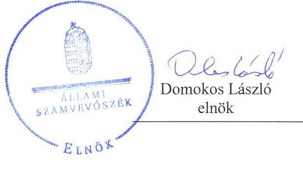
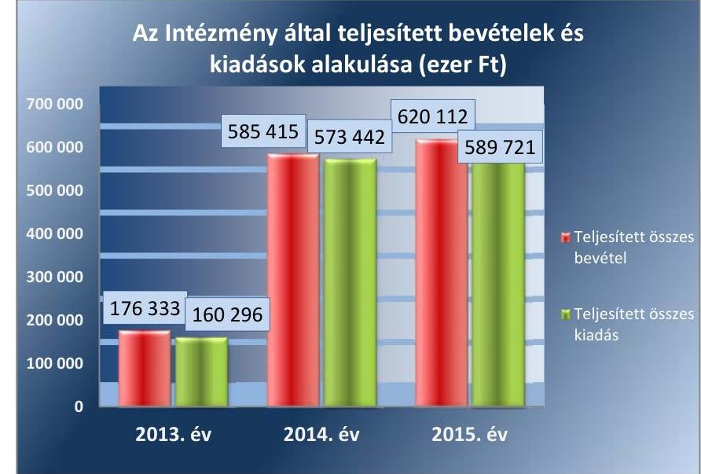
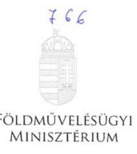

# Jelentés 

## A központi alrendszer egyes intézményei

A központi alrendszer egyes intézményei pénzügyi és vagyongazdálkodásának ellenőrzése - Magyar Gyula Kertészeti Szakképző Iskola
2017.

---

# Jelentés 

## A központi alrendszer egyes intézményei

A központi alrendszer egyes intézményei pénzügyi és vagyongazdálkodásának ellenőrzése - Magyar Gyula Kertészeti Szakképző Iskola
2017. 06. hó 28. nap

---

|  J | AZ ELLENŐRZÉST FELÜGYELTE:  |
| --- | --- |
|   | MAKKAI MÁRIA felügyeleti vezető  |
|   | AZ ELLENŐRZÉST VEZETTE ÉS A VÉGREHAJTÁSÁÉRT FELELŐS:  |
|   | DR. KOVÁCS DIÁNA ellenőrzésvezető  |
|   | A PROGRAM ÖSSZEÁLLÍTÁSÁÉRT FELELŐS:  |
|   | JANIK JÓZSEF LÁSZLÓ osztályvezető  |
|   | A TÉMÁHOZ KAPCSOLÓDÓ KORÁBBI SZÁMVEVŐSZÉKI JELENTÉSEK:  |
|  - címe: | 2015. évi zárszámadás - Magyarország 2015. évi központi költségvetése végrehajtásának ellenőrzése  |
|  - sorszáma: | 16163  |
|  - címe: | 2014. évi zárszámadás - Magyarország 2014. évi központi költségvetése végrehajtásának ellenőrzéséről  |
|  - sorszáma: | 15167  |
|  |   |
|   | IKTATÓSZÁM: V-1250-088/2016  |
|   | TÉMASZÁM: 2284  |
|   | ELLENŐRZÉS-AZONOSÍTÓ SZÁM: V076013  |

---

# TARTALOMJEGYZÉK 

■ ÖSSZEGZÉS ..... 5
■ AZ ELLENŐRZÉS CÉLJA ..... 6
■ AZ ELLENŐRZÉS TERÜLETE ..... 7
■ AZ ELLENŐRZÉS HÁTTERE, INDOKOLTSÁGA ..... 8
■ A JELENTÉS LÉNYEGES KÉRDÉSKÖREI ..... 9
■ ELLENŐRZÉS HATÓKÖRE ÉS MÓDSZEREI ..... 10
■ MEGÁLLAPÍTÁSOK ..... 12
■ JAVASLATOK ..... 20
■ MELLÉKLETEK ..... 23
I. Sz. melléklet: Értelmező szótár ..... 23
II. Sz. melléklet: A teljesítmény-ellenőrzési kiegészítő modul megállapításai ..... 27
III. Sz. melléklet: Az integritás kontrollrendszer értékelése. ..... 28
■ FÜGGELÉK: ÉSZREVÉTELEK ..... 29
■ RÖVIDÍTÉSEK JEGYZÉKE ..... 33

---

.

---

# ÖSSZEGZÉS 

A Minisztérium Magyar Gyula Kertészeti Szakképző Iskolára vonatkozó irányító szervi feladatellátása összességében nem volt szabályszerű. A belső kontrollrendszer kialakítása és működtetése nem járult hozzá a közpénzekkel és a nemzeti vagyonnal történő gazdaságos, hatékony és eredményes gazdálkodáshoz, a beszámolási és adatszolgáltatási tevékenységek szabályszerű teljesítéséhez. SZMSZ hiányában az irányítás feltételei nem voltak biztosítottak. A pénzügyi gazdálkodás összességében megfelelő volt. A vagyongazdálkodás nem volt szabályszerű, a 2014. évi beszámoló nem mutatott valós és megbízható képet. Az Intézmény integritás kontrollrendszerének kiépítése további erőfeszítéseket igényel.

## Az ellenőrzés társadalmi indokoltsága

A közpénzek felhasználásában és az állami vagyonnal való gazdálkodásban a központi alrendszer egyes intézményei meghatározó súlyt képviselnek. E szervezetekkel szemben társadalmi igény, hogy tevékenységükről a döntéshozók és a nyilvánosság felé elszámoljanak. Ezzel a társadalmi igénnyel és az ÁSZ Stratégiájával összhangban, a közpénzügyek átláthatóságának előmozdítása, a közvagyon védelme érdekében került sor az Intézmény pénzügyi- és vagyongazdálkodásának ellenőrzésére.

## Főbb megállapítások, következtetések, javaslatok

Az irányító szervi feladatellátás során az SZMSZ érvényességével és a munkáltatói jogkörgyakorlással kapcsolatban tapasztalt hiányosságot az ellenőrzés.

A belső kontrollrendszer kialakítása és működtetése nem volt szabályszerű, pozitív irányú változás csupán a kontrolltevékenységek kialakítása és gyakorlása, valamint az információ és kommunikáció területén következett be.

Az Intézmény pénzügyi gazdálkodása összességében megfelelő volt. A gazdálkodási jogkörök gyakorlása 2013-2014. években nem felelt meg a jogszabályi előírásoknak, ami elsősorban a belső szabályozás hiányosságaira vezethető vissza. Az Intézmény 2014-2015. években megkötött szerződéseinél előfordult, hogy az Ávr.-ben foglaltak ellenére nem tartalmazta a szervezet képviselőjének nyilatkozatát arra vonatkozóan, hogy átlátható szervezetnek minősül.

Az egész ellenőrzött időszakban rendszeresen előfordult, hogy a teljesítés igazolására és a kapcsolódó kifizetésekre a kiadás teljesítésének jogosságát, összegszerűségét alátámasztó, ellenőrizhető okmányok hiányában került sor.

Az Intézmény vagyongazdálkodása nem volt megfelelő. Az Intézmény nem rendelkezett vagyonkezelési szerződéssel a 2013-2014. években. Az Intézmény 2013. évi beszámolója nem volt leltárral alátámasztott, a 2014. évi beszámolója nem mutatott valós és megbízható képet, 2014. évre vonatkozóan a vagyonkezelésbe vett eszközök könyvviteli rögzítése a Számv. tv.-ben előírtak ellenére szabályszerűen kiállított bizonylatok hiányában történt meg. A 2013. és 2015. években a bevételek elszámolásának szabályszerűsége - a bérleti szerződéseknél feltárt hiányosságok miatt - nem volt megfelelő.

---

# AZ ELLENŐRZÉS CÉLJA 

AZ ELLENŐRZÉS CÉLJA annak megítélése volt, hogy az ellenőrzött intézményre vonatkozó irányító szervi feladatellátás a jogszabályi előírások betartásával történt-e; az intézménynél a belső kontrollrendszer kialakítása és működtetése szabályszerű volt-e; kialakították-e az erőforrásokkal való szabályszerű, gazdaságos, hatékony és eredményes gazdálkodás követelményeit; szabályszerű volt-e a beszámolási és adatszolgáltatási kötelezettségek teljesítése; az intézmény pénzügyi és vagyongazdálkodása megfelelt-e a jogszabályi előírásoknak és belső szabályzatainak.

Az ellenőrzés keretében értékeltük az intézmény korrupciós kockázatainak kezelését szolgáló integritás kontrollok kiépítettségét és az integritás szemlélet érvényesülését.

---

# **AZ ELLENŐRZÉS TERÜLETE**

## **Magyar Gyula Kertészeti Szakképző Iskola**

Az Intézmény¹ a Köznev. tv.² alapján létrejött köznevelési intézmény, amelynek közfeladata szakmai középfokú oktatás nyújtása. Az ellenőrzött időszakban a mezőgazdaság szakmacsoportba tartozó szakképzést és szakközépiskolai, szakgimnáziumi ágazati képzést (kertészet, parképítés) folytatott.

Az Intézmény 2013. augusztus 1-jétől önállóan működő és gazdálkodó költségvetési szerv volt, működési köre országos. Az alapítói, fenntartói és irányítói jogokat a Minisztérium³ gyakorolta.

Az Intézményt az igazgató vezette. Az igazgató és a gazdasági vezető személye az ellenőrzött időszakban változott.

A nappali képzésben maximálisan felvehető tanulói létszám 1000 fő volt. 2013-ban 606 fő, 2014-ben 556 tanuló, 2015-ben 524 diák kezdte meg a tanulmányait.

Az Intézmény által teljesített költségvetési bevételek és kiadások alakulását az 1. ábra mutatja be.

*Forrás: Az Intézmény 2013-2015. évi beszámolói*

Az Intézménynél szervezeti, szerkezeti átalakítás nem történt.

---

# AZ ELLENŐRZÉS HÁTTERE, INDOKOLTSÁGA 

Az államháztartás központi alrendszerének közpénz felhasználása, az intézmények által ellátott közfeladatok sokrétűsége, valamint a feladatellátásához rendelt vagyon nagyságrendje indokolja, hogy az ÁSZ ellenőrzéseket folytasson a pénzügyi és vagyongazdálkodás területén. Az ÁSZ az ellenőrzései során feltárja a gazdálkodást, a szabályozással nem érintett gazdálkodási területeket, rámutathat a vagyongazdálkodási tevékenység - ezen belül a tulajdonosi joggyakorlás és vagyonkezelés - esetleges szabálytalanságaira, értékeli az állami vagyon nyilvántartására és elszámolására vonatkozó eljárásokat.

Az ellenőrzés hozzájárul a központi intézmények pénzügyi helyzetének pontosabb megítéléséhez és a jó gyakorlat kialakításán, bemutatásán keresztül a gazdálkodás szabályszerűségének javításához.

---

# A JELENTÉS LÉNYEGES KÉRDÉSKÖREI 

1. Az irányító szerv ellenőrzött költségvetési szervre vonatkozó feladatellátása szabályszerű volt-e?
2. A belső kontrollrendszer kialakítása és működtetése biztosította-e a közpénzekkel és a nemzeti vagyonnal történő szabályszerű, gazdaságos, hatékony és eredményes gazdálkodást, illetve a beszámolási és adatszolgáltatási kötelezettségek szabályszerű teljesítését?
3. A költségvetési szerv pénzügyi gazdálkodása szabályszerű volt-e?
4. A költségvetési szerv vagyongazdálkodása szabályszerű volt-e?
5. Érvényesült-e az integritás szemlélet és ennek megfelelően kiépítették-e az integritás kontrollrendszert az intézménynél?

---

# ELLENŐRZÉS HATÓKÖRE ÉS MÓDSZEREI 

## Az ellenőrzés típusa

Megfelelőségi ellenőrzés.

## Az ellenőrzött időszak

Az ellenőrzött időszak 2013. augusztus 1-jétől 2015. december 31-ig tartó időszak volt.

## Az ellenőrzés tárgya

Az Intézményre vonatkozó irányító szervi feladatok ellátása. Az Intézmény belső kontroll rendszerének kialakítása és működtetése. A pénzügyi és vagyongazdálkodás szabályszerűsége. Az Intézmény beszámolási és adatszolgáltatási kötelezettségének teljesítése. Az Intézményre vonatkozóan a gazdálkodás folyamatában a gazdaságossági, hatékonysági és eredményességi célok és célértékek kialakítása, a kapcsolódó intézkedések meghatározása, a célkitűzések elérésének értékelése.

Az ellenőrzés kiterjedt minden olyan körülményre és adatra, amely az ÁSZ jogszabályban meghatározott feladatainak teljesítéséhez, valamint a program végrehajtása folyamán felmerült újabb összefüggések feltárásához szükséges.

## Az ellenőrzött szervezet

Magyar Gyula Kertészeti Szakképző Iskola, Földművelésügyi Minisztérium (Vidékfejlesztési Minisztérium) mint irányító szerv.

## Az ellenőrzés jogalapja

Az ellenőrzés jogszabályi alapját az ÁSZ tv. ${ }^{4}$ 1. § (3) bekezdés, 5. § (2)-(6) bekezdései, valamint Áht. ${ }^{5}$ 61. § (2) bekezdésének előírásai képezték.

## Az ellenőrzés módszerei

Az ellenőrzést az ellenőrzési program szempontjai, az ellenőrzött időszakban hatályos jogszabályok, az ellenőrzés szakmai szabályai, a jelen ellenőrzésre irányadó ÁSZ módszertanok figyelembevételével végeztük.

---

Az ellenőrzési kérdések megválaszolásához szükséges bizonyítékok megszerzése az Intézmény által rendelkezésre bocsátott dokumentumokra, adatokra alapozva megfigyelés, szemle (szemrevételezés), kérdésfeltevés (információkérés), mintavételezés, valamint elemző eljárás útján történt. Az ellenőrzési bizonyítékként felhasználható adatforrások közé tartoznak egyrészt az ellenőrzési program részletes szempontjainál felsorolt adatforrások, másrészt minden egyéb - az ellenőrzés folyamán feltárt, az ellenőrzés szempontjából információt tartalmazó - dokumentum.

Az ellenőrzés lefolytatásához az Intézmény a tanúsítványok kitöltésével, valamint az ÁSZ által kért dokumentumok megküldésével szolgáltatott adatokat.

Az ÁSZ a belső kontrollrendszer jogszabályi előírások szerinti kialakításának és működtetésének szabályszerűségét az erre irányuló ellenőrzési kérdésekre adott válaszok összesítése alapján, a lényegességi szempontok figyelembe vételével évente pillérenként (kontrollkörnyezet, kockázatkezelési rendszer, kontrolltevékenységek, információs és kommunikációs rendszer, monitoring rendszer) és összesítetten is minősítette.

Az Intézmény kiadási előirányzatai felhasználásának, a vagyonhasznosítási bevételi előirányzatok teljesítésének szabályszerűségét, valamint ezekhez kapcsolódóan a gazdálkodási jogkörök gyakorlásának szabályszerűségét mintavételezéssel ellenőriztük. A minta alapján a sokaságban előforduló hibaarányt becsültük. Az értékelés eredményeként kétféle, "Megfelelő" és "Nem megfelelő" minősítést alkalmaztunk. „Megfelelő"-nek értékeltünk egy ellenőrzött területet, amennyiben a hibaarány a teljes sokaságban 95\%-os bizonyossággal legfeljebb 10\% arányt képviselt. Abban az esetben, ha adott sokaság tekintetében a 10\%-os hibaarány küszöbérték átlépése megítélésének megbízhatósága nem érte el a 95\%-ot, annak elérése érdekében értékelésünket lényegességi alapon további szempontokkal egészítettük ki, és figyelembe vettük a feltárt hibák értékét. Az ellenőrzött időszakon belüli változás esetében a változás trendjét értékeltük.

Az integritás szemlélet érvényesülésének értékelése az Intézmény önbevallás útján kitöltött tanúsítványa alapján, a kockázatkezelési rendszer keretében történt.

---

# 1. Az irányító szerv ellenőrzött költségvetési szervre vonatkozó feladatellátása szabályszerű volt-e? 

Összegző megállapítás

A Minisztérium Intézményre vonatkozó feladatellátása összességében nem volt szabályszerű.

AZ INTÉZMÉNY ALAPÍTÁSÁVAL kapcsolatos jogosultságok gyakorlása a jogszabályi előírásoknak megfelelően történt. Az Intézmény Alapító okirat ${ }_{1}{ }^{6}$-ét a Minisztérium az Ávr. ${ }^{7}$ szerinti tartalommal 2013. augusztus 1-jén léptette hatályba, majd az Alapító okirat ${ }_{2}{ }^{8}$-vel kiegészítette.

A módosításokkal egységes szerkezetbe foglalt Alapító okirat ${ }_{3,4,5}{ }^{9}$ tartalmazta az előírt elemeket, azzal, hogy a Minisztérium az Alapító okirat ${ }_{1-4}$ ben az Intézmény feladatellátását szolgáló ingatlan tulajdonosának tévesen a Magyar Államot tüntette fel a Fővárosi Önkormányzat helyett.

A Minisztérium Intézménnyel kapcsolatos egyéb irányítási, felügyeleti és ellenőrzési jogosultságainak gyakorlása nem volt szabályszerű.

Az SZMSZ ${ }^{10}{ }_{1,2}$ elfogadásakor hatályos Alapító okirat ${ }_{1-4}$ a Minisztérium egyetértését az SZMSZ érvényességi kellékeként jelölte meg. A Minisztérium az egyetértéséről nem nyilatkozott annak ellenére, hogy az Intézmény az SZMSZ ${ }_{1,2}$-t megküldte számára.

Az elemi költségvetéseket a Minisztérium az ellenőrzött időszakban jóváhagyta, a beszámolókat ellenőrizte és jóváhagyta.

Az irányító szerv Intézménnyel kapcsolatos munkáltatói jogosultságok gyakorlása nem volt megfelelő és szabályszerű.

Az igazgatói feladatokat az ellenőrzött időszakban a Minisztérium részéről szabályszerűen kinevezett és megbízott személy látta el.

GAZDASÁGI VEZETŐT a Minisztérium nem nevezett ki 2013. augusztus 1-je és 2014. június 30-a között. Ezen időszak alatt az Intézmény vezetője gondoskodott a gazdasági vezetői feladatok ellátásáról, azonban - mivel az nem vonatkozott a teljes időszakra, illetve a kijelöléshez az Intézmény vezetője nem kérte az irányító szerv vezetőjének egyetértését - erre nem szabályszerűen került sor, a gazdasági vezetői feladatok
 ellátása az Ávr. 11. § (8) bekezdésében foglaltaknak nem felelt meg.

Az Intézmény 2014. július 1-jétől rendelkezik a Minisztérium által szabályszerűen, pályázat útján kinevezett gazdasági vezetővel.

---

# 2. A belső kontrollrendszer kialakítása és működtetése biztosította-e a közpénzekkel és a nemzeti vagyonnal történő szabályszerű, gazdaságos, hatékony és eredményes gazdálkodást, illetve a beszámolási és adatszolgáltatási kötelezettségek szabályszerű teljesítését? 

Összegző megállapítás

A belső kontrollrendszer kialakítása és működtetése nem biztosította a közpénzekkel és a nemzeti vagyonnal történő gazdaságos, hatékony és eredményes gazdálkodást, a beszámolási és adatszolgáltatási tevékenységek szabályszerű teljesítését.

1. táblázat

AZ INTÉZMÉNY BELSŐ KONTROLLRENDSZERE KIALAKÍTÁSÁNAK ÉS MŰKÖDTETÉSÉNEK ÉRTÉKELÉSE 2013-2015. ÉVEK KÖZÖTT

| Év | Kontrollkörnyezet | Kockázatkezelési rendszer | Kontrolltevékenységek | Információ és kommunikáció | Monitoring | ÖSSZESSÉGÉBEN |
| :--: | :--: | :--: | :--: | :--: | :--: | :--: |
| 2013. | nem   szabályszerű | nem   szabályszerű | nem   szabályszerű | nem   szabályszerű | nem   szabályszerű | nem   szabályszerű |
| 2014. | nem   szabályszerű | nem   szabályszerű | nem   szabályszerű | nem   szabályszerű | nem   szabályszerű | nem   szabályszerű |
| 2015. | nem   szabályszerű | nem   szabályszerű | szabályszerű | szabályszerű | nem   szabályszerű | nem   szabályszerű |

2.1. számú megállapítás

A kontrollkörnyezet kialakítása nem volt szabályszerű. Az Intézmény SZMSZ-szel az ellenőrzött időszakban nem rendelkezett.

2. táblázat

KONTROLL KÖRNYEZET MINŐSÍTÉSE ÉVENTE

| Év | Minősítés |
| :-- | :-- |
| 2013. | Nem megfelelő |
| 2014. | Nem megfelelő |
| 2015. | Nem megfelelő |
| Összesen | Nem megfelelő |

A SZERVEZETI KERETEK részeként az Alapító okirat ${ }_{1-5}$ az Ávr. által előírt elemeket tartalmazta. Az Intézmény - érvényességi kellékek hiányában - SZMSZ-szel nem rendelkezett, mert az SZMSZ ${ }_{1,2}$ az Alapító okirat ${ }_{1,4}$-ben leírtak ellenére nem tartalmazta a fenntartói egyetértést, míg az SZMSZ ${ }_{3}$-ra vonatkozóan a köznev tv. 25. § (4) bekezdésében előírtak ellenére az Intézmény nem rendelkezett az iskolaszék és a diákönkormányzat véleményével. 2013. augusztus 1. és 2014. szeptember 30. között az Áht. 10. § (5) bekezdésében foglaltak ellenére az Intézmény nem rendelkezett a gazdasági szervezet ügyrendjével. A gazdasági szervezet alkalmazottai a Munka tv. ${ }^{11} 46. §$ (1) bekezdés d) pontjában foglaltak ellenére 2013. augusztus 1. és 2014. június 30. között nem rendelkeztek munkaköri leírással.

BELSŐ SZABÁLYZATOK keretében kialakításra került a Számviteli politika ${ }_{1,2,3}{ }^{12}$ azonban a Számviteli politika ${ }_{1}$-t az Áhsz ${ }_{2}{ }^{13}$ hatályba lépését követő 90 napon belül nem aktualizálták, megsértve a Számv. tv. ${ }^{14} 14. §$ (11) bekezdésében leírtakat. Az Intézmény 2013. augusztus 1-je és 2013. november 9-e között nem rendelkezett Leltározási és leltárkészítési szabályzattal, ebben az időszakban megsértette a Számv. tv. 14. § (5) bekezdés a) pontjában, és az Áhsz ${ }_{1}{ }^{15} 8. §$ (4) bekezdés a) pontjában leírtakat. Az Intézmény a Számv. tv. 14. § (5) bekezdés b) és c) pontokban előírtak ellenére 2013. augusztus 1. és 2014. július 31. között nem rendelkezett az

---

eszközök és a források értékelési szabályzatával és az önköltségszámítás rendjére vonatkozó belső szabályzattal, valamint a Számv. tv. 161. § (1) bekezdésében előírtakat megsértve számlarenddel. A Számviteli politika ${ }_{1,2,3}$ keretében kialakított szabályzatok - ideértve a Számlarend ${ }_{1,2}{ }^{16}$-et is 2014. II. félév során kerültek kiadmányozásra. Az Intézmény megsértette a Kbt ${ }_{1}{ }^{17} 22. §$ (1)-(2) bekezdéseiben leírtakat 2013. augusztus 1. és 2014. október 31. között, mivel nem rendelkezett Közbeszerzési szabályzattal, azt 2014. novemberben helyezte hatályba.

Az Intézmény 2013. augusztus 1. és 2014. szeptember 30. között megsértette az Ávr. 13. § (2) bekezdés b) pontja által előírtakat, mivel nem szabályozta a Kbt. hatálya alá nem tartozó beszerzések lebonyolítását meghatározó eljárásrendet.

Az Intézmény 2013. augusztus 1. és 2014. november 9. között megsértette az Ávr. 13. § (2) bekezdés c) és e) pontjában foglaltakat, mivel nem rendelkezett kiküldetési, valamint reprezentációs kiadásokra vonatkozó szabályzattal.

Az Intézmény 2013. augusztus 1. és 2014. november 11. között nem rendelkezett gépjármű igénybevételét szabályozó eljárásrenddel, ezért ebben az időszakban megsértette az Ávr. 13. § (2) bekezdés f) pontja által előírtakat.

Az Intézmény 2013. augusztus 1. és 2014. november 10. között nem rendelkezett a vezetékes és mobiltelefonok használatának szabályzatával, megsértve az Ávr. 13. § (2) bekezdés g) pontja által előírtakat.

A Bkr. ${ }^{18} 6. §$ (3) és (4) bekezdéseiben előírtak ellenére az Intézmény 2013. augusztus 1. és 2014. november 9. között nem rendelkezett megfelelő tartalmú, a pénzügyi és működési folyamatokat bemutató ellenőrzési nyomvonalakkal és a Szabálytalanságkezelési eljárásrenddel, azokat 2014. novemberben helyezte hatályba.

## 2.2. számú megállapítás

## KOCKÁZATKEZELÉS MINŐSÍTÉSE ÉVENTE

|  Év | Minősítés  |
| --- | --- |
|  2013. | Nem megfelelő  |
|  2014. | Nem megfelelő  |
|  2015. | Nem megfelelő  |
|  Összesen | Nem megfelelő  |

Forrás: ÁSZ értékelés 2.3. számú megállapítás

## A kockázatkezelési rendszert 2014. második feléig nem alakították ki, a kialakítást követő működtetése nem volt megfelelő.

Az Intézmény 2013. augusztus 1-je és 2014. november 9-e közötti időszakban megsértette a Bkr. 3. § b) pontjában és 7. § (1) bekezdésében előírtakat, mert nem rendelkezett kockázatkezelési eljárásrenddel, kockázatkezelési rendszert nem működtetett. A kockázatkezelési szabályzat megfelelő tartalommal a 2014. novemberben kiadmányozott Belső kontroll szabályzat ${ }^{19}$ önálló része. Az Intézmény a kockázatokat felmérte, megállapította, kategóriákba sorolta, meghatározta a kezelésükhöz szükséges válaszintézkedéseket, de azok teljesítésének folyamatos nyomon követése elmaradt, a Bkr. 7. § (1) bekezdésében előírtak ellenére az Intézmény a kockázatkezelési rendszert nem működtette.

## A kontrolltevékenységek kialakítása és működtetése csak 2014. második félévtől felelt meg a jogszabályokban foglalt követelményeknek.

A gazdálkodás rendjét szabályozó Gazdálkodási szabályzat ${ }_{1}{ }^{20}$ 2013. augusztus 1. és 2014. július 31. között az Ávr. 52-59. §-ait megsértve nem tartalmazta a költségvetés megalapozott végrehajtását biztosítani hivatott kötelezettségvállalásra, a folyamatba épített, garanciális jellegű kontrollokra -

---

4. táblázat

KONTROLL TEVÉKENYSÉG KIALAKÍTÁS MINŐSÍTÉSE ÉVENTE

| Év | Minősítés |
| :--: | :--: |
| 2013. | Nem megfelelő |
| 2014. | Nem megfelelő |
| 2015. | Megfelelő |
| Összesen | Nem megfelelő   Forrás: ÁSZ értékelés |

2.4. számú megállapítás
5. táblázat

## INFORMÁCIÓ, KOMMUNIKÁCIÓ MINŐSÍTÉSE ÉVENTE

| Év | Minősítés |
| :--: | :--: |
| 2013. | Nem megfelelő |
| 2014. | Nem megfelelő |
| 2015. | Megfelelő |
| Összesen | Nem megfelelő   Forrás: ÁSZ értékelés |

2.5. számú megállapítás
6. táblázat

## MONITORING MINŐSÍTÉSE ÉVENTE

| Év | Minősítés |
| :--: | :--: |
| 2013. | Nem megfelelő |
| 2014. | Nem megfelelő |
| 2015. | Nem megfelelő |
| Összesen | Nem megfelelő   Forrás: ÁSZ értékelés |

pénzügyi ellenjegyzésre, teljesítésigazolásra, utalványozásra, érvényesítésre - vonatkozó előírásokat. 2014. augusztus 1-től a Gazdálkodási szabályzat ${ }_{2,3}{ }^{21}$ az Ávr. előírásainak megfelelt.

Az Intézmény 2013. augusztus 1. és 2014. július 31. között az Ávr. 60. § (1) és (2) bekezdését megsértette, mert nem megfelelően szabályozta az összeférhetetlenség eseteit, valamint a FEUVE ${ }^{22}$ vonatkozásában a Bkr. 8. § (2) a), c) és d) pontjaiban, míg a tevékenységek feladatköri elkülönítése tekintetében a Bkr. 8. § (3) bekezdésében leírtakat.

A kontrolltevékenység részeként 2014. augusztus 1-től az összeférhetetlenség eseteit a Gazdálkodási szabályzat ${ }_{2,3}$ a FEUVE-t a Gazdálkodási szabályzat ${ }_{2,3}$, a Számviteli politika ${ }_{2,3}$ és a Számlarend ${ }_{1,2}$, míg a feladatkörök elkülönítését a Belső kontroll szabályzat és a munkaköri leírások megfelelően tartalmazták.

## Az információs és kommunikációs folyamatok kialakítása és működtetése 2014. második feléig nem felelt meg a jogszabályi előírásoknak, azt követően megfelelő volt.

AZ INFORMÁCIÓS és kommunikációs rendszer kialakítása során a 2013. évben az Intézmény megsértette a Bkr. 9. § (1)-(2) bekezdéseiben leírtakat, mivel megfelelő módon csak a zárlati tevékenységgel összefüggésben alakított ki információs rendszert. 2014. év második félévtől az Intézmény a jogszabályi előírásoknak megfelelően a Számviteli politika ${ }_{2,3}$, az Ellenőrzési nyomvonalak, a Számlarend ${ }_{1,2}$, a Gazdasági szervezet Ügyrendje és a munkaköri leírások keretében alakította ki az információs és kommunikációs rendszerét.

A Közzétételi és a Közérdekű adatok nyilvánosságának rendje szabályzatok - megsértve 2013. augusztus 1. és 2014. november 9. között az Info. tv. ${ }^{23} 35. §$ (3), illetve 2013. augusztus 1. és 2014. szeptember 30. között a 30. § (6) bekezdését - 2014. II. félévben léptek hatályba. 2013. augusztus 1. és 2014. november 9. között az Intézmény megsértette az Info tv. 24. § (3) bekezdésében foglaltakat, mert nem rendelkezett adatvédelmi és adatbiztonsági szabályzattal. 2013. augusztus 1. és 2015. február 28. között a Ltv. ${ }^{24} 9. §$ (4) bekezdésében és 10. § (1) bekezdés a) pontjában előírtakat megsértve, a Közlevéltár ${ }^{25}$ egyetértő nyilatkozatát is tartalmazó Iratkezelési szabályzattal az Intézmény nem rendelkezett. Honlapján az Intézmény közzétette az Info. tv.-ben előírt dokumentumokat, tartozásállományát a Kincstár, ${ }^{26}$ a Vagyonkezelési szerződésben foglalt adatszolgáltatást a Tulajdonos ${ }^{27}$ részére megküldte.

Belső ellenőrzési rendszerét az Intézmény a jogszabályi előírásoknak megfelelően kialakította, de annak működtetése nem volt megfelelő.

A BELSŐ ELLENŐRZÉSI feladatokat az Intézmény külső szakértővel látta el, akinek jogállását, feladatait, függetlensége deklarálását biztosította. Az Intézmény belső ellenőrzési kézikönyvvel 2013. augusztus 1. és 2014. október 31. között a Bkr. 22. § (1) bekezdés a) pontjában foglaltak ellenére nem rendelkezett.
2013. évre vonatkozóan nem készült éves ellenőrzési terv, megsértve a Bkr. 31. § (1) bekezdésében foglaltakat. A 2014-2015. évekre vonatkozó

---

belső ellenőrzési tervekben rögzített feladatokat végrehajtották, a beszámoló az Intézmény vezetője részére elkészült. Az éves ellenőrzési jelentések nem feleltek meg a Bkr. 48. § ba) pontjában előírtaknak, mert nem mutatták be a belső kontrollrendszer szabályszerűségének, gazdaságosságának, hatékonyságának és eredményességének növelése, javítása érdekében tett javaslatokat. Az ellenőrzésekről vezetett nyilvántartások nem tartalmazták a Bkr. 50. § (2) bekezdés a)-b) és e) pontja szerinti elemeket. A külső ellenőrzéseket nyilvántartotta az Intézmény, a belső kontrollrendszert az Intézmény vezetője értékelte, amely nem egyezik az ellenőrzés tapasztalataival.
2.6. számú megállapítás

Az Intézmény szakmai tevékenységét monitorozta, de nem alakította ki az erőforrásai gazdaságos, hatékony és eredményes felhasználását biztosítani hivatott követelményeket.

A FŐ FELADATOKAT, amelyeket az előirányzatok, és a vagyongazdálkodás során az erőforrások szabályszerű, gazdaságos, hatékony és eredményes felhasználása érdekében szükséges elvégezni, az Intézmény Belső kontrollrendszer szabályzata bemutatta, azonban a folyamatok működtetéséről nem gondoskodott, megsértve a Bkr. 6. § (2) bekezdését. Az Intézmény feladatait éves munkatervekben rögzítette, végrehajtását vezetői, nevelő-testületi és gazdasági értekezletek keretében monitorozta.

# 3. A
 költségvetési szerv pénzügyi gazdálkodása szabályszerű volt-e? 

## Összegző megállapítás

Az Intézmény pénzügyi gazdálkodása összességében megfelelt a jogszabályi előírásoknak.
3.1. számú megállapítás

Az elemi költségvetés készítése és az előirányzatok megállapítása során betartották a jogszabályi előírásokat és a belső szabályzatokban foglaltakat.

A tervezés során, az előzetes és a végleges költségvetés készítésének folyamata megfelelt a jogszabályban foglaltaknak. Az Intézmény megsértette az Ávr. 13.§ (5) bekezdésében foglaltakat, mert az elemi költségvetés készítésével kapcsolatos feladatokat 2013. augusztus 1. és 2014. június 30. között nem szabályozta. A jogszabályi előírásoknak megfelelően 2014 októberétől a gazdasági szervezet ügyrendje, 2014 novemberétől az ellenőrzési nyomvonal és 2014 júliusától a gazdasági területen dolgozók munkaköri leírásai tartalmazták az elemi költségvetés készítésével kapcsolatos feladatokat. Az elemi költségvetés és a kincstári költségvetés adatai közötti egyezőség minden ellenőrzött évben fennállt.
3.2. számú megállapítás

A bevételi és kiadási előirányzatok módosítása, átcsoportosítása megfelelt a jogszabályi előírásoknak.

Az Intézmény folyamatosan vezette az előirányzat módosítások analitikus, részletező nyilvántartását, amely tartalmazta a változások jogcímét, összegét és hatáskörét, az elrendelő dokumentumokra történő hivatkozást, a

---

# 3.3. számú megállapítás 

7. táblázat

## A KIADÁSOK FELHASZNÁLÁSÁNÁL A GAZDÁLKODÁSI JOGKÖRÖK GYAKORLÁSÁNAK MINŐSÍTÉSE

| Ellenőrzött év | Minőstés |
| :--: | :--: |
| 2013. év | nem megfelelő |
| 2014. év | nem megfelelő |
| 2015. év | megfelelő |

8. táblázat

## A KIADÁSOK FELHASZNÁLÁSÁNÁL A MEGKÖTÖTT VISSZTERHES SZERZŐDÉSEK, ADOTT MEGBÍZÁSOK, MEGRENDELÉSEK SZABÁLYSZERŰSÉGÉNEK MINŐSÍTÉSE

| Ellenőrzött év | Minőstés |
| :--: | :--: |
| 2013. év | megfelelő |
| 2014. év | megfelelő |
| 2015. év | megfelelő |

kincstári bejelentéshez szükséges adatokat, valamint a főkönyvi könyvelésbe történő feladás rendjét.

## A bevételek beszedése és elszámolása, a kiadási előirányzatok felhasználása összességében megfelelt a jogszabályi előírásoknak.

A bevételek beszedésénél a gazdálkodási jogkörgyakorlás megfelelt a jogszabályi előírásoknak. A bevételeket az előírt könyvvezetési szabályoknak megfelelő főkönyvi számlákon számolták el. A bérleti díjak beszedése a szolgáltatást igénybe vevők számára kiállított számla alapján történt, a bevétel beszedését alátámasztó számlák rendelkezésre álltak, a kiszámlázott bevételek teljes összegükben realizálódtak.

A kiadási előirányzatok felhasználásánál a gazdálkodási jogkörök gyakorlása a 2013-2014. években - a belső szabályzat hiányosságai miatt - nem megfelelő, míg 2015. évben megfelelő volt (7. táblázat). Az Intézmény csak 2014. augusztus 1-jétől rendelkezett, a gazdálkodás részletes rendjét - a jogszabályi előírásoknak megfelelően - tartalmazó szabályzattal és az ahhoz kapcsolódó, a pénzügyi jogkörök szabályszerű gyakorlását támogató felhatalmazásokkal és kijelölésekkel.

Az ellenőrzés a kiadási előirányzatok felhasználásánál a gazdálkodási jogkörök gyakorlása során az alábbi hibákat tárta fel:

- A 2013-2014. években a 100 ezer forint alatti működési kiadásoknál - mivel nem élt az Intézmény az Ávr. 53. § (1)-(2) bekezdésében foglalt lehetőséggel - nem történt meg írásban a kötelezettségvállalás.
- A 2013-2014. években - az Áht. 37. § (1) bekezdésében és az Ávr. 55. § (1) bekezdésében foglaltak ellenére - nem történt meg a pénzügyi ellenjegyzés, továbbá a 2013. évben a kötelezettségvállalás dokumentumán a pénzügyi ellenjegyzésre utaló megjelölést nem tüntették fel.
- A 2013-2014. években a teljesítés igazolása - az Ávr. 57. § (1) és (3) bekezdésében előírtak ellenére - nem történt meg, illetve a 2015. évben - az Ávr. 57. § (3) bekezdésében előírtak ellenére - nem a kötelezettségvállaló által arra írásban kijelölt személy végezte el. A 2013-2015. években a teljesítés igazolására és a kapcsolódó kifizetésekre - az Ávr. 57. § (1) bekezdésében előírtak ellenére - a kiadás teljesítésének jogosságát, összegszerűségét alátámasztó, ellenőrizhető okmányok hiányában került sor.
- A 2013-2014. években az érvényesítést - az Ávr. 58. § (4) bekezdésében előírtak ellenére - nem az arra írásban kijelölt személy végezte el.
A kiadási előirányzatok felhasználásánál a megkötött visszterhes szerződések, adott megbízások, megrendelések szabályszerűsége a 2013-2015. években megfelelő volt (8. táblázat). A megkötött visszterhes szerződéseknél, adott megbízásoknál, megrendeléseknél a 2014-2015. években rendszeresen előfordult, hogy a kiadási előirányzatok terhére jogi személlyel, jogi személyiséggel nem rendelkező szervezettel kötött visszterhes szerződés - az Ávr. 50. § (1a) bekezdésében foglaltak ellenére - nem tartalmazta a szervezet képviselőjének nyilatkozatát arra vonatkozóan, hogy átlátható szervezetnek minősül.

---

# 3.4. számú megállapítás 

Az Intézmény a jogszabályban előírt éves költségvetési beszámolóit elkészítette.

Az összeállított beszámolók az elfogadott költségvetéssel összehasonlítható módon, az év utolsó napján érvényes szervezeti, besorolási rendnek megfelelően készültek el.
3.5. számú megállapítás

Az Intézmény előirányzat-maradvány megállapítása szabályszerű volt.

Az előirányzat-maradvány megállapítása megfelelt a jogszabályokban foglaltaknak, a főkönyvi számlák, az analitikus nyilvántartások és az éves beszámolók között az adategyezőség fennállt. A kötelezettséggel terhelt maradvány megállapítása az Ávr.-ben foglaltaknak megfelelt.

## 4. A költségvetési szerv vagyongazdálkodása szabályszerű volt-e?

## Összegző megállapítás

Az Intézmény vagyongazdálkodása nem volt szabályszerű.
4.1. számú megállapítás

A vagyon értékének megőrzését, gyarapítását szolgáló vagyongazdálkodás feltételeinek kialakítása - a 2015. év kivételével - nem szabályszerűen történt.

Az Intézmény az ellenőrzött időszakban a közfeladata ellátásához Budapest Főváros Önkormányzata tulajdonába tartozó vagyont használt. Az Intézmény az Nvtv. ${ }^{28}$ 11. § (1) bekezdésében előírtak ellenére 2013-2014. években vagyonkezelési szerződéssel nem rendelkezett, a Vagyonkezelési szerződés ${ }^{29}$ megkötésére 2015. évben került sor. A 2015. január 13-án hatályba lépett Vagyonkezelési szerződés tartalmilag az Nvtv., illetve a Vagyonrendelet ${ }^{30}$ előírásainak megfelelt.
4.2. számú megállapítás

A 2013. évi beszámoló leltárral nem volt alátámasztott. A 2014. évi beszámoló nem mutatott valós és megbízható képet.

A leltározási feladatokat az Intézménynél a 2013. év tekintetében a Számv. tv. 69. § (1)-(2) bekezdéseiben és az Áhsz. 37. § (1)-(2) bekezdéseiben, illetve a Leltározási szabályzat ${ }_{1}^{31}$ I.4. pontjában leírtak ellenére nem megfelelően végezték el, a 2013. évi beszámoló nem volt leltárral alátámasztott. Az Intézménynél a 2014., illetve 2015. éves költségvetési beszámolók elkészítéséhez, a mérleg tételeinek alátámasztásához a leltározási feladatokat a jogszabályi előírásoknak és a Leltározási szabályzat ${ }_{2,3}{ }^{32}$-ban előírtaknak megfelelően végezték el. A követelések év végi értékelését az Intézménynél 2013-2014. években az Áhsz. 1 9. számú melléklet 2. ci) pontjában, illetve az Áhsz. 2 21. § (8) bekezdésében előírtak ellenére nem végezték el.

Az Intézmény 2014. évi beszámoló mérlegében szerepeltek a vagyonkezelésbe vett eszközök, annak ellenére, hogy a Vagyonkezelési szerződés hatályba lépése, a vagyonkezelési jog keletkezése 2015. január 13-a volt, és a Vagyonkezelési szerződés 2-es pontja szerint ezeket az eszközöket a 2015. január 13-át követően 60 napon belül kellett volna az Intézménynek a könyveibe bevezetnie. Az Intézmény megsértette a Számv. tv. 18. §-át, mert a 2014. évi beszámoló nem mutatott vagyoni helyzetéről megbízható

---

és valós képet. A vagyonkezelésbe vett eszközök könyvviteli rögzítése a Számv. tv. 165. § (2) bekezdésben előírtak ellenére szabályszerűen kiállított bizonylatok hiányában történt meg.

A rendező mérleg elkészítéséhez 2013. december 31-ei mérleg-fordulónappal a teljes körű leltározást az NGM rendelet ${ }^{33} 2$. § (1) bekezdése ellenére nem végezték el. Dokumentált módon nem történt meg a tárgyi eszközök, az anyagok, a követelések, a tőkeváltozás, a költségvetési tartalékok és a rövidlejáratú kötelezettségek leltározása.
4.3. számú megállapítás

Az Intézmény értékmegőrzési kötelezettségének nem tett eleget, a vagyonelemek hasznosítása az Intézménynél nem felelt meg a jogszabályoknak és belső szabályzatok előírásainak.

Az Intézmény a Nvtv. 7. § (2) bekezdésében és a vagyonrendelet 17.§ (9) bekezdésében előírtak ellenére nem gondoskodott a nemzeti vagyon értékének megőrzéséről, állagának megóvásáról, függetlenül attól, hogy karbantartási feladatokat folyamatosan végeztek. Az ellenőrzött időszakban vagyon elidegenítésére nem került sor, az Intézménynek vagyonhasznosítással összefüggésben a 2013. és 2015. években bérleti tevékenység végzéséből származott bevétele. A 2013. és 2015. években a bevételek elszámolásának szabályszerűsége - a bérleti szerződéseknél feltárt hiányosságok miatt - nem volt megfelelő.

A 2013. évben egy bérbeadásból származó bevétel kiszámlázása a bérleti szerződésben megjelölt összegnél alacsonyabb összegben történt.

Az Intézmény a 2015. évben az ingatlan bérbeadási folyamat során nem rendelkezett az Nvtv. 11.§ (10)-(11) bekezdésében, illetve a 3. § (2) bekezdésében foglaltak ellenére a szerződő fél nyilatkozatával arról, hogy az átlátható szervezetnek minősül.

# 5. Érvényesült-e az integritás szemlélet és ennek megfelelően ki-építették-e az integritás kontrollrendszert az intézménynél? 

## Összegző megállapítás

Az integritás kontrollrendszer kiépítése nem megfelelően történt, az integritás szemlélet nem érvényesült.

Az integritás kontrollrendszer kiépítettségi szintje alacsony. A humánerőforrás gazdálkodás és a vagyonvédelem terület kockázatmentes, míg az összeférhetetlenség, etikai elvárások tekintetében a kockázat közepes. Ugyanakkor - az egyéni teljesítményértékelések hiánya okán - a nemkívánatos dolgozói magatartással szembeni intézkedések és az integritás erősítése, tudatosítása területek - a stratégia hiánya és a korrupciós kockázatelemzés elmaradása miatt - magas kockázatúak.

---

# JAVASLATOK 

Az ÁSZ tv. 33. § (1) bekezdésében foglaltak értelmében az ellenőrzött szervezet vezetője köteles a jelentésben foglalt megállapításokhoz kapcsolódó intézkedési tervet összeállítani és azt a jelentés kézhezvételétől számított 30 napon belül az ÁSZ részére megküldeni. Amennyiben az ellenőrzött szervezet vezetője nem küldi meg határidőben az intézkedési tervet, vagy továbbra sem elfogadható intézkedési tervet küld, az Állami Számvevőszék elnöke az ÁSZ tv. 33. § (3) bekezdése a) és b) pontjaiban foglaltakat érvényesítheti.

## a Magyar Gyula Kertészeti Szakképző Iskola igazgatójának

1. Intézkedjen az Intézmény SZMSZ-ének a jogszabályi előírásoknak megfelelő elkészítéséről.
(2.1. sz. megállapítás első bekezdés 2. mondata alapján)
2. Intézkedjen arról, hogy az éves ellenőrzési jelentés a Bkr.-ben foglaltaknak megfelelően tartalmazza a belső kontrollrendszer szabályszerűségének, gazdaságosságának, hatékonyságának és eredményességének növelése, javítása érdekében tett fontosabb javaslatokat.
(2.5. sz. megállapítás 2. bekezdés 3. mondata alapján)
3. Intézkedjen a Bkr.-ben előírtaknak megfelelő tartalmú ellenőrzési nyilvántartás vezetéséről.
(2.5. sz. megállapítás 2. bekezdés 4. mondata alapján)
4. Intézkedjen az Ávr.-ben előírtak szerint arról, hogy a visszterhes szerződések tartalmazzák a szerződő fél (szervezet) képviselőjének nyilatkozatát arra vonatkozóan, hogy átlátható szervezetnek minősül.
(3.3. sz. megállapítás utolsó bekezdése alapján)
5. Intézkedjen a bérbeadási folyamat során arról, hogy az intézmény rendelkezzen az Nvtv.-ben előírtaknak megfelelően a szerződő fél nyilatkozatával arról, hogy átlátható szervezetnek minősül.
(4.3. sz. megállapítás 3. bekezdése alapján)

---

6. Intézkedjen a feltárt hiányosságok és szabálytalanságok tekintetében a felelősség tisztázása érdekében, és szükség szerint intézkedjen a felelősség érvényesítéséről.
(4.2. sz. megállapítás 2. bekezdése, a 4.3. sz. megállapítás 2. bekezdése alapján)

---

.

---

# MELLÉKLETEK 

- I. SZ. MELLÉKLET: ÉRTELMEZŐ SZÓTÁR
állami vagyon
állami vagyonnak minősül:
a) az állam tulajdonában lévő dolog, valamint a dolog módjára hasznosítható természeti erő,
b) az a) pont hatálya alá nem tartozó mindazon vagyon, amely vonatkozásában törvény az állam kizárólagos tulajdonjogát nevesíti,
c) az állam tulajdonában lévő tagsági jogviszonyt megtestesítő értékpapír, illetve az államot megillető egyéb társasági részesedés,
d) az államot megillető olyan immateriális, vagyoni értékkel rendelkező jogosultság, amelyet jogszabály vagyoni értékű jogként nevesít. (Forrás: Vtv. 1. § (2) bekezdése)
állami vagyon értékesítése
állami vagyon használója
állami vagyon használója
állami vagyon hasznosítása
állami vagyon hasznosítására kötött szerződés
állami vagyon kezelője /vagyonkezelő
Állami vagyonnak minősül:
a) az állam tulajdonában lévő dolog, valamint a dolog módjára hasznosítható természeti erő,
b) az a) pont hatálya alá

 nem tartozó mindazon vagyon, amely vonatkozásában törvény az állam kizárólagos tulajdonjogát nevesíti,
c) az állam tulajdonában lévő tagsági jogviszonyt megtestesítő értékpapír, illetve az államot megillető egyéb társasági részesedés,
d) az államot megillető olyan immateriális, vagyoni értékkel rendelkező jogosultság, amelyet jogszabály vagyoni értékű jogként nevesít. (Forrás: Vtv. 1. § (2) bekezdése)
Állami vagyon tulajdonjogának bármely jogcímen történő, visszterhes átruházása. (Forrás: Vtvr. 1. § (7) bekezdés d) pontja)
Az a természetes vagy jogi személy, jogi személyiséggel nem rendelkező szervezet, aki, vagy amely törvény vagy szerződés alapján, bármely jogcímen (bérlet, haszonbérlet, használat stb.) állami vagyont birtokol, használ, szedi annak hasznait, hasznosít, ide nem értve a haszonélvezőt, a vagyonkezelőt és a tulajdonosi jogok gyakorlóját. (Forrás: Vtvr. 1. § (7) bekezdés a) pontja)
Az állami vagyont az MNV Zrt. maga kezeli, vagy szerződés - így különösen bérlet, haszonbérlet, megbízás - alapján központi költségvetési szervnek, természetes vagy jogi személynek, vagy jogi személyiséggel nem rendelkező gazdálkodó szervezetnek hasznosításra átengedi.
(Forrás: Vtv. 23. § (1) bekezdése, hatályos 2012. január 1-jétől)
Az állami vagyonnal a tulajdonosi joggyakorló maga gazdálkodik, vagy szerződés - így különösen bérlet, haszonbérlet, megbízás - alapján hasznosításra átengedi, illetőleg vagyonkezelésbe, haszonélvezetbe adja. (Forrás: Vtv. 23. § (1) bekezdése, hatályos 2013. június 28-ától)
Az állami vagyon hasznosítására kötött szerződések elsődleges célja az állami vagyon hatékony működtetése, állagának védelme, értékének megőrzése, illetve gyarapítása, az állami és közfeladatok ellátásának elősegítése. (Forrás: Vtv. 23. § (2) bekezdése)
Az állami vagyont az MNV Zrt. maga kezeli, vagy szerződés - így különösen bérlet, haszonbérlet, megbízás - alapján központi költségvetési szervnek, természetes vagy jogi személynek, vagy jogi személyiséggel nem rendelkező gazdálkodó szervezetnek hasznosításra átengedi. Az állami vagyonra vonatkozóan az MNV Zrt. kizárólag az Nvtv-ben meghatározott személyekkel köthet vagyonkezelési szerződést. (Forrás: Vtv. 27. § (1) bekezdése, hatályos 2012. január 1-jétől)

---

| ÁSZ Integritás Projekt | Az Állami Számvevőszék 2009-ben indította el a „Korrupciós kockázatok feltérképezése - Integritás alapú közigazgatási kultúra terjesztése" című, európai uniós forrásból megvalósított kiemelt projektjét (Integritás Projekt). Az Integritás Projekt célja, hogy felmérje a közszféra intézményei korrupciós kockázatoknak való kitettségét, illetőleg az azok mérséklésére hivatott kontrollok szintjét. Az Állami Számvevőszék a projekt révén az integritás szemlélet minél szélesebb körrel történő megismertetését, gyakorlatba ültetését kívánja elérni. Az integritás követelményeinek megfelelő szervezeti működést előnyben részesítő közigazgatási kultúra elterjesztését és a korrupció elleni fellépést az ÁSZ önmagára nézve is stratégiai jelentőségű célként fogalmazta meg. A projekt a felmérésben résztvevő intézmények számára helyzetükről egyfajta „tükörképet" mutat be, ami alapot teremt a jövőbeni pozitív irányú elmozduláshoz. (Forrás: a http://integritas.asz.hu honlapon közzétett, a 2013. évi Integritás felmérés eredményeiről készült összefoglaló tanulmány) |
| :--: | :--: |
|  |  |
| belső ellenőrzés | Független, tárgyilagos bizonyosságot adó és tanácsadó tevékenység, amelynek célja, hogy az ellenőrzött szervezet működését fejlessze és eredményességét növelje, az ellenőrzött szervezet céljai elérése érdekében rendszerszemléletű megközelítéssel és módszeresen értékeli, illetve fejleszti az ellenőrzött szervezet irányítási és belső kontrollrendszerének hatékonyságát. (Forrás: Bkr. 2. § b) pontja) |
| belső kontrollrendszer | A belső kontrollrendszer a kockázatok kezelése és tárgyilagos bizonyosság megszerzése érdekében kialakított folyamatrendszer, amely azt a célt szolgálja, hogy a működés és gazdálkodás során a tevékenységeket szabályszerűen, gazdaságosan, hatékonyan, eredményesen hajtsák végre, az elszámolási kötelezettségeket teljesítsék, megvédjék az erőforrásokat a veszteségektől, károktól és nem rendeltetésszerű használattól. (Forrás: Áht. 69. § (1) bekezdése) |
| belső kontrollrendszer területei | A kontrollkörnyezet, a kockázatkezelési rendszer, a kontrolltevékenységek, az információs és kommunikációs rendszer, valamint a nyomon követési (monitoring) rendszer. (Forrás: Bkr. 3. §-a) |
| felújítás | Az elhasználódott tárgyi eszköz eredeti állaga (kapacitása, pontossága) helyreállítását szolgáló időszakonként visszatérő olyan tevékenység, melynek során az eszköz élettartama megnövekszik, minősége, használata jelentősen javul, így a pótlólagos ráfordításból a jövőben gazdasági előnyök származnak. (Forrás: Számv. tv. 3. § (4) bekezdés 8. pontja) |
| hasznosítás | A nemzeti vagyon birtoklásának, használatának, hasznok szedése jogának bármely a tulajdonjog átruházását nem eredményező jogcímen történő átengedése, ide nem értve a vagyonkezelésbe adást, valamint a haszonélvezeti jog alapítását. (Forrás: Nvtv. 3. § (1) bekezdés 4. pontja) |
| információs és kommunikációs rendszer | A költségvetési szerv vezetője által kialakított és működtetett olyan rendszer, mely biztosítja, hogy a megfelelő információk a megfelelő időben eljutnak az illetékes szervezethez, szervezeti egységhez, illetve személyhez. (Forrás: Bkr. 9. § (1) bekezdés) |
| integritás | Az integritás az elvek, értékek, cselekvések, módszerek, intézkedések konzisztenciáját jelenti, vagyis olyan magatartásmódot, amely meghatározott értékeknek megfelel. (Forrás: Nemzetgazdasági Minisztérium: Magyarországi államháztartási belső kontroll standardok Útmutató 1.6.1. pontja, 2012. december) |
| irányító szerv/felügyeleti szerv | A költségvetési szerv tekintetében az e törvényben meghatározott irányítási hatáskört gyakorló szerv. (Forrás: Áht. 1. § 9. pontja) |
| kincstári biztos | A kincstári biztos kijelölését az államháztartásért felelős miniszternél a Kincstár kezdeményezi. A kincstári biztos köteles figyelemmel kísérni megbízatásának időpontjától kezdve a költségvetési szerv tervezését, gazdálkodását, beszámolását, a jogszabályokban előírt feladatainak ellátását, feltárni azokat az okokat, amelyek a tartozás fizetésképtelenséghez vezettek, a szükséges intézkedések azonnali végrehajtására irányuló intézkedési tervet készíteni, azonnali intézkedéseket kezdeményezni és írásbeli utasításokat kiadni a tartozásállomány felszámolására, a gazdálkodás egyensúlyának biztosítására, a követelések behajtására. (Forrás: Ávr. 116-117. § hatályos 2013. augusztus 18-ig) |

---

kincstári költségvetés
kockázat
kockázatkezelési rendszer
kontrollkörnyezet
kontrolltevékenységek
kommunikáció
költségvetési főfelügyelő, felügyelő
középirányító szerv
közfeladat
monitoring
A központi költségvetésről szóló törvény elfogadását követően a fejezetet irányító szerv az államháztartás központi alrendszerébe tartozó költségvetési szerv és a fejezeti kezelésű előirányzat kiemelt előirányzatait, valamint az elkülönített állami pénzalapok és a társadalombiztosítás pénzügyi alapjai jogszabályi előírás szerinti bevételeit és kiadásait kincstári költségvetés kiadásával állapítja meg. (Forrás: Áht. 28. § (2) bekezdés)
A kockázat annak a valószínűségét jelenti, hogy egy vagy több esemény vagy intézkedés nem kívánt módon befolyásolja a rendszer működését, céljainak megvalósulását. (Forrás: Javaslatok a korrupciós kockázatok kezelésére - Kockázatkezelési és ellenőrzési módszertan 35. oldal, ÁSZ)
Olyan irányítási eszközök és módszerek összessége, melynek elemei a szervezeti célok elérését veszélyeztető tényezők (kockázatok) azonosítása, elemzése, csoportosítása, nyomon követése, valamint szükség esetén a kockázati kitettség mérséklése. (Forrás: Bkr. 2. § m) pontja)
A költségvetési szerv vezetője által kialakított olyan elvek, eljárások, belső szabályzatok összessége, amelyben világos a szervezeti struktúra, egyértelműek a felelősségi, hatásköri viszonyok és feladatok, meghatározottak az etikai elvárások a szervezet minden szintjén, átlátható a humánerőforrás-kezelés. (Forrás: Bkr. 6. § (1) bekezdés)
A költségvetési szerv vezetője által a szervezeten belül kialakított (kontroll) tevékenységek, melyek biztosítják a kockázatok kezelését, hozzájárulnak a szervezet céljainak eléréséhez. (Forrás: Bkr. 8. § (1) bekezdés)
Az a tevékenység, melynek során információ továbbítása valósul meg. A kommunikációs folyamat résztvevői között tájékoztatás történik, mely során tényeket, ezek magyarázatát közlik.
Az államháztartásért felelős miniszter a Kormány irányítása alá tartozó fejezetet irányító szervhez, a Kormány irányítása vagy felügyelete alá tartozó költségvetési szervhez, valamint az elkülönített állami pénzalapok és a társadalombiztosítás pénzügyi alapjai kezelő szerveihez költségvetési főfelügyelőt, felügyelőt rendelhet ki. A költségvetési főfelügyelő, felügyelő a gazdálkodás költségvetés-politikával való összhangja és a takarékos, szabályszerű, eredményes működés érdekében a Kormány rendeletében meghatározott intézkedéseket tehet, így különösen előzetesen véleményezi a kötelezettségvállalásra irányuló eljárásokat és a nagy összegű kötelezettségvállalások tekintetében kifogással élhet. (Forrás: Áht. 39. § (1)-(2) bekezdés)
A költségvetési szerv tekintetében törvény vagy kormányrendelet alapján meghatározott, átruházott irányítási hatásköröket gyakorló szerv. (Forrás: Áht. 9. § (4) bekezdés)
Jogszabályban meghatározott állami vagy önkormányzati feladat, amit az arra kötelezett közérdekből, a jogszabályban meghatározott követelményeknek és feltételeknek megfelelve végez, ideértve a lakosság közszolgáltatásokkal való ellátását, továbbá az állam nemzetközi szerződésekben vállalt kötelezettségeiből adódó közérdekű feladatokat, valamint e feladatok ellátásakor szükséges infrastruktúra biztosítását is. (Forrás: Nvtv. 3. § (1) bekezdés 7. pontja)
A monitoring általánosságban a különböző szintű szervezeti célok megvalósításának folyamatát kíséri figyelemmel, melynek során a releváns eseményekről és tevékenységekről (együtt: folyamatokról) rendszeres jelleggel, strukturált, döntéstámogató

---

monitoring-rendszer

A költségvetési szerv vezetője köteles olyan monitoring rendszert működtetni, mely lehetővé teszi a szervezet tevékenységének, a célok megvalósításának nyomon követését. A költségvetési szerv monitoring rendszere az operatív tevékenységek keretében megvalósuló folyamatos és eseti nyomon követésből, valamint az operatív tevékenységektől függetlenül működő belső ellenőrzésből áll. (Forrás: Bkr. 10. §)
tulajdonosi joggyakorló

Aki a nemzeti vagyon felett az államot vagy a helyi önkormányzatot megillető tulajdonosi jogok és kötelezettségek összességének gyakorlására jogosult. (Forrás: Nvtv. 3. § (1) bekezdés 17. pontja)

A nemzeti vagyongazdálkodás feladata a nemzeti vagyon rendeltetésének megfelelő, az állam, az önkormányzat mindenkori teherbíró képességéhez igazodó, elsődlegesen a közfeladatok ellátásához és a mindenkori társadalmi szükségletek kielégítéséhez szükséges, egységes elveken alapuló, átlátható, hatékony és költségtakarékos működtetése, értékének megőrzése, állagának védelme, értéknövelő használata, hasznosítása, gyarapítása, továbbá az állam vagy a helyi önkormányzat feladatának ellátása szempontjából feleslegessé váló vagyontárgyak elidegenítése. (Forrás: Nvtv. 7. § (2) bekezdése)

---

# - II. SZ. MELLÉKLET: A TELJESÍTMÉNY-ELLENŐRZÉSI KIEGÉSZÍTŐ MODUL MEGÁLLAPÍTÁSA! 

Gazdaságossági, hatékonysági és eredményességi követelményeket a pénzügyi és a vagyongazdálkodás folyamatában az Intézmény nem alakított ki. A teljesítmény-ellenőrzési kiegészítő modul ellenőrzése nem volt lefolytatható.

---

# - III. SZ. MELLÉKLET: AZ INTEGRITÁS KONTROLLRENDSZER ÉRTÉKELÉSE 

Az Intézmény alapvetően a gazdálkodási szabályzatokban, az ellenőrzési nyomvonalakban és a munkaköri leírásokban szabályozta az összeférhetetlenség kérdéskörét. Vagyonnyilatkozat tételi szabályzattal és Etikai eljárásrenddel rendelkezett. Szakmai etikai eljárás kötelezettségszegés miatt nem indult egyetlen munkatárs ellen sem. Önálló dokumentumban nem kerültek szabályozásra a különféle ajándékok, meghívások, utaztatás elfogadásának feltételei, ezek a magatartásformák a munkaköri leírásokban kerültek rögzítésre.

Új munkaerő álláspályázat, majd az ezt követő egyéni beszélgetés (állásinterjú) útján került az Intézményhez, a vezetők és az alkalmazottak rendelkeztek munkaköri leírásokkal. Az Intézmény meghatározta a tulajdonában lévő egyes eszközök használatára vonatkozó szabályokat, a titokvédelmi előírások az SZMSZ-ben és az Etikai kódexben kerültek meghatározásra. Az Intézmény alkalmazta a „négy szem" elvét. Szabályozást készített a szervezeten belüli közérdekű bejelentők védelmére vonatkozóan, és kialakította a szervezeten kívülről érkező panaszokat és közérdekű bejelentéseket kezelő rendszert is. Egyéni teljesítményértékelési rendszert azonban nem működtetett.

Az Intézmény nem rendelkezett nyilvánosan közzétett stratégiával. Ennek folyamodványaként a tervek végrehajtását nyilvánosan megismerhető mutatókkal (indikátorokkal) nem mérte, illetve nem értékelte. Olyan stratégiához kapcsolódó, vagy azt helyettesítő dokumentumokkal sem rendelkeztek, amely többek között hivatott volt bemutatni a szervezeti kultúra javítása, az integritás erősítése, a korrupció elleni fellépés témaköreit. Korrupcióellenes képzést a munkatársak részére nem tartottak, korrupciós kockázatelemzést nem végeztek. Nem mérték fel a vezetők, pedagógusok és a nem pedagógus alkalmazottak érdekérvényesítőkkel való találkozására vonatkozó információkat, és az ezzel kapcsolatos kockázatokat. A gazdálkodási és reálfolyamatok vonatkozásában rendszerszerű kockázatelemzést nem végeztek. A nem rendszerszerűen - összesen egy alkalommal - elvégzett
 kockázatelemzés során azonosított kockázati tényezők adatbázisban nem kerültek rögzítésre.

---

# FÜGGELÉK: ÉSZREVÉTELEK 

A jelentéstervezetet a Számvevőszék 15 napos észrevételezésre megküldte az ellenőrzött szervezet vezetőjének az ÁSZ tv. 29. § (1) bekezdése előírásának megfelelően.

Az ÁSZ a jelentéstervezetet észrevételezésre megküldte a Földművelésügyi Minisztérium miniszterének és a Magyar Gyula Kertészeti Szakképző Iskola igazgatójának.
A Magyar Gyula Kertészeti Szakképző Iskola igazgatója az ÁSZ tv. 29. § (2) bekezdésében foglalt észrevételezési jogával nem élt, a törvényes határidőn belül észrevételt nem tett. A Földművelésügyi Miniszter által átruházott hatáskörben eljáró Agrárszakképzésért felelős Helyettes Államtitkár észrevételét és az arra adott választ a függelék alább tartalmazza.

[^0]
[^0]:    * 29. § (1) Az Állami Számvevőszék az ellenőrzési megállapításait megküldi az ellenőrzött szervezet vezetőjének vagy az általa megbízott személynek, és annak, akinek személyes felelősségét állapította meg.
    (2) Az ellenőrzött szervezet vezetője és a felelősként megjelölt személy az ellenőrzés megállapításaira tizenöt napon belül írásban észrevételt tehet.
    (3) Az Állami Számvevőszék az észrevételre a beérkezésétől számított harminc napon belül írásban válaszol. A figyelembe nem vett észrevételeket köteles a jelentésben feltüntetni, és megindokolni, hogy azokat miért nem fogadta el.

---

# FÖLDMŰVELÉSÜGYI MINISZTÉRIUM

ROMÁN ISTVÁN
agrárszakképzésért felelős helyettes államtitkár

Iktatószám: AszF/ 557/1/2017.

Ügyintéző: Mácsár Zsuzsanna
Telefonszám: 06-1-795-1004
E-mail: zsuzsanna.macsar@fm.gov.hu
Hivatkozási szám: V-1250-069/2016.

Domokos László úr
elnök részére

Állami Számvevőszék

Budapest
Apáczai Csere János utca 10.
1052

Tárgy: Észrevételek a V-1250-069/2016. iktatószámmal megküldött számvevőszéki jelentéshez

Tisztelt Elnök Úr!

Hivatkozva a tárgyban jelzett, 2017. április 21-én kelt számvevőszéki jelentéstervezetre, amely a Földművelésügyi Minisztérium (továbbiakban: minisztérium) által fenntartott Magyar Gyula Kertészeti Szakképző Iskolára (továbbiakban: intézmény) vonatkozó ellenőrzés megállapításait és javaslataikat tartalmazza; ezúton küldöm a minisztérium észrevételét az alábbiak szerint.

A jelentéstervezet „Megállapítások” rész 1. pontjához az alábbi észrevételeket tesszük:
A nemzeti köznevelésről szóló 2011. évi CXC. törvény 25. § (4) bekezdése szerint a köznevelési intézmény SzMSz-ét, a nevelési-oktatási intézmény házirendjét nevelési-oktatási intézményben a nevelőtestület, más köznevelési intézményben a szakalkalmazotti értekezlet az óvodaszék, iskolaszék, kollégiumi szék, továbbá az iskolai vagy a kollégiumi diákönkormányzat véleményének kikérésével fogadja el. Az SzMSz és a házirend azon rendelkezéseinek érvénybelépéséhez, amelyekből a fenntartóra, a működtetőre többletkötelezettség hárul, a fenntartó, a működtető egyetértése szükséges.

A számvevőszéki jelentéstervezet fentieken túli megállapításait tudomásul vesszük, azokra észrevételt nem teszünk.

Az észrevételre biztosított rövid határidőre tekintettel a véleményt elektronikus úton továbbítom Önnek, de természetesen postai úton is megküldjük mindezt.

Budapest, 2017. május 10.

Üdvözlettel:

Román István
1055 Budapest, Kossuth Lajos tér 11. fev. 2017. 9580 E-mail: aszhat@fm.gov.hu

---

ELNÖK

Ikt.szám: V-1250-082/2016.

Dr. Fazekas Sándor úr
miniszter

Földművelésügyi Minisztérium

Budapest

Tisztelt Miniszter Úr!

„A központi alrendszer egyes intézményei pénzügyi és vagyongazdálkodásának ellenőrzése – Magyar Gyula Kertészeti Szakképző Iskola” címmel készített számvevőszéki jelentéstervezetre a Földművelésügyi Minisztérium agrárszakképzésért felelős Helyettes Államtitkár úr által tett észrevételét köszönettel megkaptam.

Az Állami Számvevőszék észrevételre vonatkozó álláspontjáról a felügyeleti vezető által készített tájékoztatást csatoltan megküldöm.

Tájékoztatom Miniszter urat, hogy a számvevőszéki jelentésben – az Állami Számvevőszékről szóló 2011. évi LXVI. törvény 29. § (3) bekezdése alapján – a figyelembe nem vett észrevételt szerepeltetjük az elutasítás indokának feltüntetésével.

Budapest, 2017. 07. hó 20 nap

Tisztelettel:

Domokos László

Melléklet: Tájékoztatás az észrevétel kezeléséről

3852 BUDAPEST, KIRÁLYI CSERE JÁNOS UTCA 10, 3364 Budapest 4. Pl. 54 telefon. 484 9101 fax. 484 9201

---

Melléklet
Ikt.szám: V-1250-082/2016.

# Tájékoztatás az észrevétel kezeléséről

A központi alrendszer egyes intézményei pénzügyi és vagyongazdálkodásának ellenőrzése – Magyar Gyula Kertészeti Szakképző Iskola – című jelentéstervezetre 2017. május 16-án érkezett, a Földművelésügyi Minisztérium agrárszakképzésért felelős Helyettes Államtitkár úr által tett észrevételt értékeltük és annak kezelésével kapcsolatban a következő tájékoztatást adom.

## A "Megállapítások" rész 1. pontjához tett észrevételre adott válasz:

Az észrevételben leírt tájékoztatást – amely az SZMSZ elfogadásával kapcsolatban a nemzeti köznevelésről szóló 2011. évi CXC. törvény 25. § (4) bekezdésben foglaltakat tartalmazza – köszönettel vettük. A tájékoztatás a jelentéstervezet 1. pont 4. bekezdésében szereplő megállapítást nem cáfolja, mert az Intézmény SZMSZ1,2-jének elfogadásakor hatályos Alapító okirat1-4 írta elő a Minisztérium egyetértését az SZMSZ érvényességéhez. Ezért a megállapítás helytálló, annak módosítása nem indokolt.

Budapest, 2017.

hó 22 nap

Makkai Mária
felügyeleti vezető

---

# RÖVIDÍTÉSEK JEGYZÉKE 

${ }^{1}$ Intézmény
${ }^{2}$ Köznev. tv.
${ }^{3}$ Minisztérium
${ }^{4}$ ÁSZ tv.
${ }^{5}$ Áht.
${ }^{6}$ Alapító Okirat ${ }_{1}$
${ }^{7}$ Ávr.
${ }^{8}$ Alapító okirat ${ }_{2}$
${ }^{9}$ Alapító okirat ${ }_{3}$

Alapító okirat ${ }_{4}$
Alapító okirat ${ }_{5}$
${ }^{10} \mathrm{SZMSZ}_{1}$
SZMSZ $_{2}$
SZMSZ $_{3}$
${ }^{11}$ Munka tv.
${ }^{12}$ Számviteli politika ${ }_{1}$
Számviteli politika ${ }_{2}$
Számviteli politika ${ }_{3}$
${ }^{13}$ Áhsz $_{2}$
${ }^{14}$ Számv. tv.
${ }^{15}$ Áhsz $_{1}$
${ }^{16}$ Számlarend $_{1}$
Számlarend $_{2}$
${ }^{17} \mathrm{Kbt}_{3}$
${ }^{18} \mathrm{Bkr}$.
${ }^{19}$ Belső kontroll szabályzat
${ }^{20}$ Gazdálkodási szabályzat ${ }_{1}$
${ }^{21}$ Gazdálkodási szabályzat ${ }_{2}$
Gazdálkodási szabályzat ${ }_{3}$

Magyar Gyula Kertészeti Szakképző Iskola
a nemzeti köznevelésről szóló 2011. évi CXC. törvény (Hatályos: 2012.09.01-től) Földművelésügyi Minisztérium (Vidékfejlesztési Minisztérium 2013. 08. 01-től 2014. 06. 05-ig)
az Állami Számvevőszékről szóló 2011. évi LXVI. törvény (Hatályos: 2011.07.01-től)
az államháztartásról szóló 2011. évi CXCV. törvény (Hatályos: 2012.01.01-től) KGF 1172/2/2013. azonosító számú, 2013. július 25-én kelt alapító okirat (Hatályos: 2013.08.01-től 2014.04.23-ig)
az államháztartásról szóló törvény végrehajtásáról szóló 368/2011. (XII.31.) Korm. rendelet (Hatályos: 2012.01.01-től)
KGF/410/2014. azonosító számú, 2014. február 25-én kelt alapító okirat (Hatályos: 2014.01.01-től 2014.04.23-ig)
KGF/637/2014. azonosító számú, 2014. április 3-án kelt alapító okirat (Hatályos: 2014.04.24-től 2014.08.25-ig)
IfPF/67/2/2014. azonosító számú, 2014. augusztus 25-én kelt alapító okirat (Hatályos: 2014.08.26-tól 2015.08.30-ig)
IfPF/939/2015. azonosító számú, 2015. augusztus 31-én kelt alapító okirat (Hatályos: 2015.08.31-től)
Intézmény Szervezeti és Működési Szabályzata (2013.11.25-től 2014.12.18-ig) Intézmény Szervezeti és Működési Szabályzata (2014.12.19-től 2015.11.23-ig) Intézmény Szervezeti és Működési Szabályzata (2015.11.23-tól) 2012. évi I. törvény a Munka Törvénykönyvéről (Hatályos: 2012.07.01-től) Intézmény Számviteli politika 2013. (Hatályos: 2013.09.01-től) Intézmény Számviteli politika 2014. (Hatályos: 2014.07.28-tól) Intézmény Számviteli politika 2015. (Hatályos: 2015.12.01-től) az államháztartás számviteléről szóló 4/2013. (I. 11.) Korm. rendelet (Hatályos: 2014.01.01-től)
a számvitelről szóló 2000. évi C. törvény (Hatályos: 2001.01.01-től) az államháztartás szervezetei beszámolási és könyvvezetési kötelezettségének sajátosságairól szóló 249/2000. (XII. 24.) Korm. rendelet (Hatályos: 2000.01.01-től 2013.12.31-ig)
Intézmény Számlarend 2014. (Hatályos: 2014.08.01-től)
Intézmény Számlarend 2015. (Hatályos: 2015.12.01-től)
a közbeszerzésekről szóló 2011. évi CVIII. törvény (Hatályos: 2011.08.21-től 2015.01.01-ig)
370/2011. (XII.31.) Korm. rendelet a költségvetési szervek belső kontrollrendszeréről és belső ellenőrzéséről (Hatályos: 2012.01.01-től) Intézmény Belső kontrollrendszer szabályzat 2014. (Hatályos: 2014.11.10-től) Intézmény Kötelezettségvállalás, az ellenjegyzés, az utalványozás és az érvényesítés rendjének szabályozása 2013 (Hatályos: 2013.09.01-től) Intézmény Gazdálkodási szabályzata 2014 (Hatályos: 2014.08.01-től) Intézmény Gazdálkodási szabályzata 2015 (Hatályos: 2015.12.01-től)

---

${ }^{22}$ FEUVE
${ }^{23}$ Info tv
${ }^{24}$ Ltv.
${ }^{25}$ Közlevéltár
${ }^{26}$ Kincstár
${ }^{27}$ Tulajdonos
${ }^{28}$ Nvtv.
${ }^{29}$ Vagyonkezelési Szerződés
${ }^{30}$ Vagyonrendelet
${ }^{31}$ Leltározási szabályzat ${ }_{1}$
${ }^{32}$ Leltározási szabályzat ${ }_{2}$

Leltározási szabályzat ${ }_{3}$
${ }^{33}$ NGM rendelet

Folyamatba épített, előzetes és utólagos vezetői ellenőrzés
Az információs önrendelkezési jogról és az információszabadságról szóló 2011. évi CXII. törvény (Hatályos: 2011.07.27-től)
1995. évi LXVI. törvény a köziratokról, a közlevéltárakról és a magán-levéltári anyag védelméről (Hatályos: 1996.01.01-től)
Budapest Főváros Levéltára
Magyar Államkincstár
Budapest Főváros Önkormányzata
2011. évi CXCVI. törvény a nemzeti vagyonról (Hatályos: 2011.12.31-től)
a Magyar Gyula Kertészeti Szakképző Iskola és a Budapest Fővárosi Önkormányzat által kötött FPH079/216-84/2014. iktatószámú vagyonkezelési szerződés (Hatályos: 2015.01.13-tól)
22/2012. (III. 14.) Főv. Kgy. rendelet Budapest Főváros Önkormányzata vagyonáról, a vagyonelemek feletti tulajdonosi jogok gyakorlásáról (Hatályos: 2012.03.15-től)

Intézmény Leltározási és leltárkészítési szabályzata 2013. (Hatályos: 2013. 11.10-től 2014.07.08-ig)
Intézmény Leltározási és leltárkészítési szabályzata 2014. (Hatályos: 2014.07.09-től 2015.11.30-ig)
Intézmény Leltározási és leltárkészítési szabályzata 2015. (Hatályos: 2015.12.01-től)

36/2013. (IX. 13.) NGM rendelet az államháztartás számvitelének 2014. évi megváltozásával kapcsolatos feladatokról (Hatályos: 2013.09.14-től 2014.12.31-ig)

---

ÁLLAMI SZÁMVEVŐSZÉK
1052 Budapest, Apáczai Csere János utca 10.
Levélcím: 1364 Budapest 4. Pf. 54
Telefon: +36 14849100 Telefax: +36 14849200
www.asz.hu

