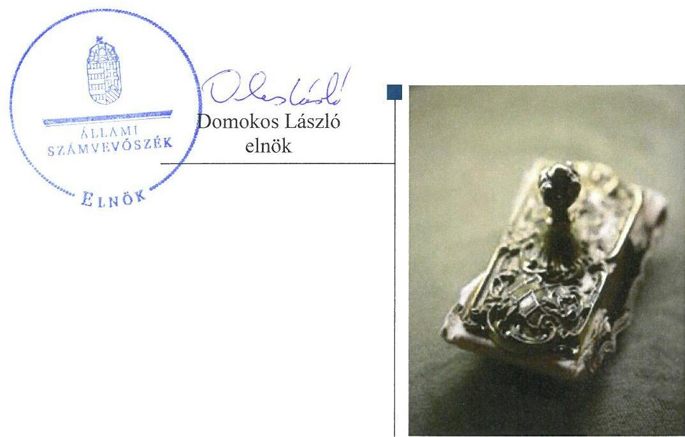
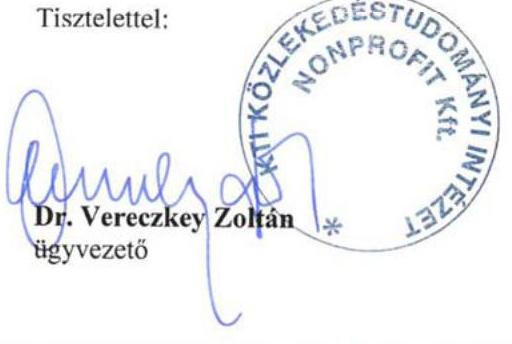
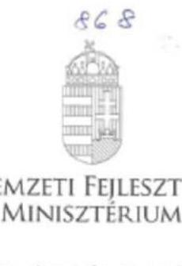
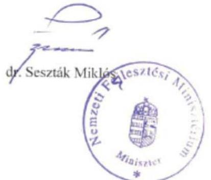

# Jelentés 

## KTI Közlekedéstudományi Intézet Nonprofit Kft.

Az állami tulajdonban (résztulajdonban) lévő gazdálkodó szervezetek vagyonmegőrzési és gazdálkodási tevékenységének ellenőrzése 2017. 07. hó 05. nap

---

# AZ ELLENŐRZÉST FELÜGYELTE: 

MAKKAI MÁRIA felügyeleti vezető

## AZ ELLENŐRZÉST VEZETTE ÉS A VÉGREHAJTÁSÁÉRT FELELŐS:

KORSÓSNÉ VIGH ANDREA ellenőrzésvezető

## A PROGRAM ÖSSZEÁLLÍTÁSÁÉRT FELELŐS:

JANIK JÓZSEF LÁSZLÓ osztályvezető

IKTATÓSZÁM: V-1199-110/2016.
TÉMASZÁM: 2233

## ELLENŐRZÉS-AZONOSÍTÓ SZÁM: V075907

Jelentéseink az Országgyülés számítógépes hálózatán és az Interneten a www.asz.hu címen is olvashatóak.

---

# TARTALOMJEGYZÉK 

■ ÖSSZEGZÉS ..... 5
■ AZ ELLENŐRZÉS CÉLJA ..... 6
■ AZ ELLENŐRZÉS TERÜLETE ..... 7
■ AZ ELLENŐRZÉS HÁTTERE, INDOKOLTSÁGA ..... 8
■ A JELENTÉS LÉNYEGES KÉRDÉSKÖREI ..... 9
■ ELLENŐRZÉS HATÓKÖRE ÉS MÓDSZEREI ..... 10
■ MEGÁLLAPÍTÁSOK ..... 12
■ JAVASLATOK ..... 18
■ MELLÉKLETEK ..... 19
I. Sz. melléklet: Értelmező szótár ..... 19
■ FÜGGELÉK: ÉSZREVÉTELEK ..... 21
■ RÖVIDÍTÉSEK JEGYZÉKE ..... 25

---

.

---

# ÖSSZEGZÉS 

A KTI Közlekedéstudományi Intézet Nonprofit Kft-nél a Nemzeti Fejlesztési Minisztérium szabályszerűen gyakorolta a tulajdonosi jogokat. A KTI Közlekedéstudományi Intézet Nonprofit Kft. 2012-2015. évi vagyongazdálkodása átlátható volt, a vagyon értékének megőrzéséről, állagának megóvásáról gondoskodott. A bevételek és ráfordítások elszámolása szabályszerű volt.

## Az ellenőrzés társadalmi indokoltsága

Magyarországon az intézmény-centrikus közfeladat-ellátás, közvagyon-gazdálkodás jellemző a költségvetésen kívüli feladatellátás térnyerése mellett. Ennek szereplői az állami tulajdonú gazdálkodó szervezetek is.

Az állami tulajdonban álló gazdálkodó szervezetek államot megillető társasági részesedése a nemzeti vagyon részét képezi és legfőbb rendeltetése szerint a közfeladatok ellátását szolgálja.

Az Állami Számvevőszék stratégiájában megfogalmazta, hogy az államháztartáson kívülre nyújtott költségvetési támogatások és ingyenes vagyonjuttatások, valamint az államháztartáson kívül működő közfeladat-ellátó rendszerek ellenőrzéseivel hozzájárul ahhoz, hogy a közpénzeket az államháztartáson kívül működő szervezetek is átlátható, rendezett módon használják fel a közfeladatok szerződésben vállalt ellátása érdekében.

## Főbb megállapítások

A Nemzeti Fejlesztési Minisztérium a KTI Közlekedéstudományi Intézet Nonprofit Kft. részesedései tekintetében a tulajdonosi joggyakorlásra vonatkozó előírásokat, feladatokat, hatásköröket, jogosultságokat meghatározta és az előírásoknak megfelelően gyakorolta a tulajdonosi jogokat.

A KTI Közlekedéstudományi Intézet Nonprofit Kft. belső szabályzataiban kialakította a vagyona megőrzését, gyarapítását szolgáló, szabályszerű vagyongazdálkodás feltételeit. Rendelkezett közép- és hosszú távú vagyongazdálkodási stratégiával, továbbá a Nemzeti Fejlesztési Minisztérium által jóváhagyott éves üzleti tervekben meghatározta a tervezett beruházásokat, felújításokat, közbeszerzéseket. A 2012-2015. években összességében az értékcsökkenést meghaladó összegű beruházás, felújítás a vagyon értékének megőrzését, a tervszerű karbantartás a vagyon állagmegóvását biztosította. A vagyonnyilvántartás átlátható és naprakész, a mérleg leltárral alátámasztott volt. Az éves beszámolókat, közhasznúsági mellékleteket az előírások szerinti formában, tartalommal és határidőben elkészítették, a tulajdonosi jóváhagyást követően közzétették és letétbe helyezték.

A ráfordításokat és a bevételeket a jogszabályi előírásoknak megfelelően számolták el. A közhasznú és vállalkozási tevékenységek bevételeit és ráfordításait megfelelően elkülönítették. A végzett szolgáltatások önköltségét utókalkuláció módszerével a Számv. tv. és az önköltségszámítási szabályzat előírása ellenére nem állapították meg.

---

# AZ ELLENŐRZÉS CÉLJA 

Az ellenőrzés célja annak értékelése volt, hogy a tulajdonosi jogok gyakorlása szabályszerű volt-e; a gazdálkodó szervezet szabályozottsága, gazdálkodása és vagyongazdálkodási tevékenysége megfelelt-e a jogszabályi és a tulajdonosi előírásoknak; biztosítva volt-e a közfeladatok átláthatósága és elszámoltathatósága érdekében a szolgáltatás díjának megalapozottsága szabályszerű önköltségszámítással; a vagyonváltozást eredményező döntések esetében a tulajdonosi jogok gyakorlója és a gazdálkodó szervezet szabályszerűen jártak-e el.

---

# AZ ELLENŐRZÉS TERÜLETE

## KTI Közlekedéstudományi Intézet Nonprofit Kft.

A Társaság¹ jogelődjét² 2003. december 31-én a Magyar Állam nevében a Gazdasági és Közlekedési Minisztérium hozta létre közfeladatok ellátására. Közhasznú tevékenysége keretében ellátott közfeladatai a közúti közlekedésről szóló 1988. évi I. törvényben és egyéb ágazati jogszabályokban meghatározott állami feladatok voltak. A közlekedési terület egészét érintő tudományos tevékenységet, kutatást, oktatást, környezetvédelmet, fogyasztóvédelmet érintő, minőségellenőrzési, minőségbiztosítási és terméktanúsítási, nyilvántartási feladatokat láttak el, műszaki vizsgálatokat végeztek. Közhasznú tevékenységét vállalkozási tevékenységgel egészítette ki.

A Társaság tulajdonosa a Magyar Állam. A tulajdonosi jogköröket az MNV Zrt.³ és a KHEM⁴ között 2008. szeptember 12-én megkötött megállapodás, majd a 77/2012. (XII. 22.) NFM rendelet⁵ alapján az NFM⁶ gyakorolta. Jegyzett tőkéje 2015. december 31-én 295,6 M Ft volt, az ellenőrzött időszakban nem változott.

A Társaságnak vagyonkezelésbe vett állami eszköze nem volt, tevékenységét saját vagyonával látta el. A Társaság főbb vagyoni adatait az 1. táblázat mutatja be.

1. táblázat

|  A TÁRSASÁG FŐBB VAGYONI ADATAI (M FT) |  |  |  |  |   |
| --- | --- | --- | --- | --- | --- |
|  Megnevezés | 2012. | 2012. | 2013. | 2014. | 2015.  |
|   | Jan.1. | Dec.31. | Dec.31. | Dec.31. | Dec.31.  |
|  Mérlegfőösszeg | 2102,3 | 1738,2 | 2126,9 | 1921,6 | 1871,1  |
|  Mérleg szerinti eredmény | 5,0 | 2,5 | 5,9 | 9,1 | 4,3  |
|  Saját tőke | 1291,0 | 1293,5 | 1299,5 | 1308,5 | 1312,8  |
|  Kötelezettségek | 302,0 | 227,9 | 299,7 | 356,7 | 248,2  |
|  Követelések | 448,9 | 313,5 | 458,1 | 292,8 | 285,5  |
|   |  |  |  | Forrás: Társaság 2012-2015. évi beszámolói |   |

Az ellenőrzött időszakban az alkalmazottak átlagos statisztikai létszáma a 2012. évi 178,3 főről folyamatosan emelkedett, 2015-ben 234 fő volt. A Társaság ügyvezetőjének személye az ellenőrzött időszakban egyszer változott, a jelenlegi ügyvezető 2014. február elsejétől látja el feladatát.

---

# AZ ELLENŐRZÉS HÁTTERE, INDOKOLTSÁGA 

## AZ ÁSZ KÖZÉPTÁVRA SZÓLÓ STRATÉGIÁJÁBAN

megfogalmazta, hogy az államháztartáson kívülre nyújtott költségvetési támogatások, valamint az államháztartáson kívül működő közfeladat-ellátó rendszerek ellenőrzéseivel hozzájárul ahhoz, hogy a közpénzeket az államháztartáson kívül működő szervezetek is átlátható, rendezett módon használják fel a közfeladatok szerződésben vállalt ellátása érdekében.

Az ellenőrzés feladata a közfeladat ellátással kapcsolatban a közpénzek átláthatósága, nyilvánossága érdekében a jogszabályokban, belső szabályzatokban megfogalmazott előírások érvényesülésének az állami tulajdonban (résztulajdonban) lévő gazdálkodó szervezetek vagyonérték megőrzési és gazdálkodási tevékenységének értékelése.

AZ ELLENŐRZÉS EREDMÉNYEKÉPP a törvényalkotás számára tapasztalatok állnak rendelkezésre a közfeladat-ellátás és gazdálkodás értékeléséhez, az átláthatóságot biztosító szabályozáshoz. Az ellenőrzés tapasztalatai segítik és erősítik az ÁSZ hozzáadott értéket teremtő tevékenységét és tanácsadó szerepét.

---

# A JELENTÉS LÉNYEGES KÉRDÉSKÖREI 

1. A tulajdonosi jogok gyakorlása szabályszerű volt-e?
2. A társaság működésének szabályozottsága megfelelt-e az előírásoknak?
3. A társaságnál a pénzügyi-számviteli, adatszolgáltatási és ellenőrzési feladatok ellátása szabályszerű volt-e?
4. A társaság vagyongazdálkodása szabályszerű volt-e?

---

# ELLENŐRZÉS HATÓKÖRE ÉS MÓDSZEREI 

## Az ellenőrzés típusa

Megfelelőségi ellenőrzés.

## Az ellenőrzött időszak

A 2012. január 1-jétől 2015. december 31-ig tartó időszak.

## Az ellenőrzés tárgya

Az állami tulajdonban (résztulajdonban) lévő gazdasági társaság gazdálkodása, kiemelten vagyongazdálkodási tevékenysége, a tulajdonosi jogok gyakorlása.

## Az ellenőrzött szervezet

KTI Közlekedéstudományi Intézet Nonprofit Kft., valamint a tulajdonosi jogokat gyakorló Nemzeti Fejlesztési Minisztérium.

## Az ellenőrzés jogalapja

Az ellenőrzés jogszabályi alapját az ÁSZ tv.⁸ 5. § (3)-(5) bekezdései, valamint a Vtv.⁹ 3. § (4) bekezdése képezték.

## Az ellenőrzés módszerei

Az ellenőrzést a nemzetközi standardokat irányadónak tekintve az ellenőrzési program ellenőrzési kérdései, az ellenőrzött időszakban hatályos jogszabályok, az ellenőrzés szakmai szabályok és módszertanok figyelembe vételével végeztük el.

Az ellenőrzött szervezetek az ellenőrzés lefolytatásához tanúsítványok kitöltésével, valamint az ÁSZ által kért dokumentumok megküldésével szolgáltattak adatokat.

A bevételek és ráfordítások elszámolását, és a vagyonnyilvántartás terén a szabályszerű működést véletlenszerű mintavétellel ellenőriztük. A mintavétellel ellenőrzött területek esetében minden egyes tétel vonatkozásában szabályszerűségre vonatkozó kérdéseket tettünk fel, amelyek eredménye összesítésre került. A jogszabályoknak és a belső előírásoknak

---

megfelelőnek tekintettük az adott területet, amennyiben a minta ellenőrzésének eredménye alapján 95%-os bizonyossággal a teljes sokaságban a hibaarány kisebb volt, mint 10%, nem megfelelőnek értékeltük, ha a hibaarány a 10%-ot meghaladta. A ráfordítások elszámolására és a vagyonnyilvántartásra vonatkozó véletlen mintavételt kockázati alapú kiválasztással egészítettük ki, amelynek során évente a három legnagyobb összegű tételt választottuk ki.

---

# 1. A tulajdonosi jogok gyakorlása szabályszerű volt-e? 

Összegző megállapítás

Az NFM tulajdonosi joggyakorlása szabályszerű volt.
A TULAJDONOSI JOGGYAKORLÁSRA vonatkozó előírásokat, feladatokat az NFM a Társaság alapító okiratában¹⁰, az NFM SZMSZ¹¹-ében, valamint a feladatellátásban érintett főosztályok ügyrendjében határozta meg. Az alapító okiratban rögzítette, hogy a Társaságnál taggyűlés nem működik, hatáskörében a tulajdonosi joggyakorló jár el. Meghatározták a tulajdonosi jogok gyakorlójának kizárólagos hatáskörébe tartozó jogosultságokat, a döntések megalapozására előterjesztési kötelezettséget írtak elő.

A Társaság feladatait, közhasznú tevékenységét - az alapító okirat előírásain túl - részletesen, számon kérhető módon a közhasznú szerződésben és az évente megkötött támogatási szerződésekben rögzítették. Az NFM üzleti terv készítési kötelezettséget írt elő, amelynek követelményeit évente meghatározta. A Társaság üzleti terve jóváhagyásáról az alapító okirat előírásai szerint minden évben döntött.

AZ FB¹² ÉS A KÖNYVVIZSGÁLÓ tevékenységéhez kapcsolódóan a tulajdonosi joggyakorlás szabályszerű volt. Az alapító okirat, illetve a tulajdonosi döntések a Gt.¹³ és a Ptk.¹⁴ előírásaival összhangban tartalmazták az FB tagok és a könyvvizsgáló személyére, megbízatásának időtartamára vonatkozó adatokat, feladat- és hatásköröket.

A TÁRSASÁG BESZÁMOLTATÁSA az alapító okiratban foglaltaknak és a jogszabályi előírásoknak megfelelően valósult meg. Az NFM az FB és a könyvvizsgáló írásbeli jelentése birtokában hagyta jóvá az éves beszámolókat és a Civil tv.¹⁵ szerinti közhasznúsági mellékleteket. A közhasznú szerződésekhez kapcsolódó támogatási szerződésekben az NFM beszámolási és elszámolási kötelezettséget határozott meg, amit számon kért. A Társaság tevékenységét figyelemmel kísérte: az ügyvezetőnek a Társaság működésére vonatkozó negyedéves tájékoztatási, a tulajdonosi határozatok végrehajtásáról éves beszámolási és további eseti adatszolgáltatási kötelezettsége volt.

---

# 2. A társaság működésének szabályozottsága megfelelt-e az előírásoknak? 

Összegző megállapítás

A Társaság működésének szabályozottsága összességében megfelelt az előírásoknak.

A BELSŐ SZABÁLYZATOKAT az előírásoknak megfelelően elkészítették. A Társaság rendelkezett a Számv. tv.¹⁶ előírása szerint számviteli politikával¹⁷ és számlarenddel¹⁸, a számviteli politika részeként értékelési szabályzattal¹⁹, leltározási szabályzattal²⁰, önköltségszámítási szabályzattal²¹, pénzkezelési szabályzattal²². A számlarend, az értékelési szabályzat, az önköltségszámítási szabályzat és a pénzkezelési szabályzat megfelelt a Számv. tv. előírásainak. A Társaság rendelkezett továbbá selejtezési és hasznosítási szabályzattal, továbbá az alapító okiratban előírt pénzügyi befektetések szabályzattal.

A SZÁMVITELI POLITIKA¹⁷-ben a Számv. tv. 14. § (11) bekezdése előírása ellenére nem vezették át teljes körűen a Számv. tv. változásait. A számviteli politika¹⁷ a beszámoló letétbe helyezésének és közzétételének időpontjaként a mérlegfordulót követő 150. napot határozta meg a Számv. tv. 153. § (1) bekezdése előírásával szemben, amely 2012. évtől a mérleg fordulónapot követő ötödik hónap utolsó napját írta elő. A devizás eszközök és kötelezettségek mérlegforduló napi értékelésére vonatkozó előírás a Számv. tv. 60. § (2) bekezdése
 előírásának nem felelt meg, mert előírta az értékelést megelőzően a jelentőség vizsgálatát, amit a törvény módosítása 2011. évtől megszüntetett. A számviteli politika ${ }_{2}$ megfelelt a jogszabályi előírásoknak.

A leltározási szabályzat a mennyiségben és értékben nyilvántartott eszközök mennyiségi leltárfelvételénél öt évenkénti gyakoriságot írt elő, a Számv. tv. 69. § (3) bekezdésében meghatározott mennyiségi leltárfelvételre vonatkozó legalább három évenkénti gyakorisággal szemben.

A leltározási gyakorlat a szabályozástól eltérően megfelelt a jogszabályi előírásoknak.

JAVADALMAZÁSI SZABÁLYZATBAN ${ }^{23}$ a Taktv. ${ }^{24}$ 5. § (3) bekezdése előírásának megfelelően rögzítette a Társaság az üzleti terv teljesítését elősegítő anyagi ösztönzési rendszerre vonatkozó követelményeket, amelyet a tulajdonosi jogok gyakorlója határozatával elfogadott.

---

# 3. A társaságnál a pénzügyi-számviteli, adatszolgáltatási és ellenőrzési feladatok ellátása szabályszerű volt-e? 

Összegző megállapítás

A pénzügyi-számviteli, az adatszolgáltatási és ellenőrzési feladatok ellátása összességében szabályszerű volt.
3.1. számú megállapítás

A ráfordítások és a bevételek elszámolása megfelelt a jogszabályi előírásoknak.

Az anyagjellegű ráfordítások elszámolása megfelelő volt. A kifizetéseket a Számv. tv. előírásainak megfelelő bizonylat támasztotta alá. A belső szabályzatban előírt esetekben a szerződések, megrendelések rendelkezésre álltak, az igénybevett szolgáltatásoknál a teljesítésigazolásokat elvégezték, a kifizetéseket a megfelelő főkönyvi számlákra könyvelték.

A személyi jellegű ráfordítások elszámolása megfelelő volt. A bérkifizetést munkaszerződés és munkaidő elszámolás támasztotta alá, a számfejtett bruttó bér megegyezett a szerződésekben foglaltakkal. A béren kívüli juttatások kifizetésére a belső szabályzat alapján, a munkavállalói nyilatkozatokkal összhangban került sor. A személyi jellegű egyéb ráfordítások elszámolása a jogszabályi és a belső szabályozásnak megfelelt.

Az értékcsökkenési leírás elszámolása
megfelelt a Számv. tv. és a Számviteli politika előírásainak. Az értékcsökkenés főkönyvi könyvelése, az eszközök üzembe helyezésének dokumentálása, a bekerülési érték megállapítása megfelelő volt, az eszközök megtalálhatóak voltak a tárgyidőszaki leltárban.

A bevételek könyvelése és bizonylati alátámasztása megfelelt a Számv. tv. előírásainak és a számviteli politikában foglaltaknak.

A Társaság közhasznú tevékenysége bevételeit, költségeit és ráfordításait elkülönítette vállalkozási tevékenységétől a Civil tv. előírásainak megfelelően.

A határidőn túli vevőkövetelés értéke a 2012. évi 3,0 M Ft-ról 2015. év végére 59,7 M Ft-ra emelkedett, azonban a megtett intézkedések hatására a lejárt követelések 99%-a 30 napon belüli volt. A Társaság intézkedett a követelésállomány csökkentése érdekében, egyenlegközlőket, fizetési felszólításokat küldött ki, végrehajtási eljárásokat indított. A követelések év végi értékelése és ez alapján az értékvesztés (2012-ben 19,2 M Ft, 2013-ban 3,7 M Ft, 2014-ben 0,6 M Ft) elszámolása megfelelt a Számv. tv. és a belső szabályzatok előírásainak.

---

# 3.2. számú megállapítás 

A szolgáltatások díjának megállapítását nem alapozták meg önköltségszámítással.

Önköltségszámításra az ellenőrzött időszak egészében kötelezett volt a Társaság, az önköltségszámítás rendjét a Számv. tv. előírásának megfelelően belső szabályzatban kialakította. A szabályzat tartalmazta az elő-, közbeeső és a tényleges utókalkuláció módját, a közvetlen és közvetett költségek elkülönítését, a felosztandó költségek vetítési alapját, valamint az árképzés irányelveit.

A Társaság - a Számv. tv. 14. § (7) bekezdés és az önköltségszámítási szabályzat előírásait figyelmen kívül hagyva - a végzett szolgáltatások Számv. tv. 51. § (2) bekezdése szerinti önköltségét nem állapította meg az utókalkuláció módszerével.

A szolgáltatási díjakat az ágazatban megfigyelhető piaci árak figyelembe vételével határozták meg.
3.3. számú megállapítás

A Társaság teljesítette tervezési, beszámolási, adatszolgáltatási kötelezettségeit.

A Társaság üzleti tervét az alapító okirat és a tulajdonosi joggyakorló évenként kiadott tervezési utasításának megfelelően az ügyvezető minden évben határidőre elkészítette.

Az éves beszámolót és a közhasznúsági mellékletet a Számv. tv. , illetve a Civil tv. és a számviteli politika előírásainak megfelelően, határidőre elkészítették, a tulajdonosi joggyakorló számára jóváhagyásra előterjesztették. A közzététel és letétbe helyezés a céginformációs portálon megtörtént. A Társaság teljesítette a támogatási szerződésekben előírt beszámolási kötelezettséget a támogatások felhasználásáról.

A közérdekű adatok közzétételére vonatkozó szabályozással az Info tv. ${ }^{25}$ előírásának megfelelően rendelkeztek. Az előírásoknak megfelelően a honlapon közzé tették a szervezeti struktúrát, SZMSZ-t, a foglalkoztatottak létszámára és személyi juttatásaira vonatkozó, továbbá közbeszerzési adatokat. A Tak tv. előírásának megfelelően közzétették az FB, vezető tisztségviselő, vezető állású munkavállalók adatait.
3.4. számú megállapítás

A Társaság működtetett belső ellenőrzést, a belső, illetve a tulajdonosi ellenőrzések javaslatait hasznosította.

Belső ellenőrzést működtetett a Társaság külső megbízott bevonásával, az ügyvezető közvetlen irányításával. Az éves belső ellenőrzési terveket, valamint az azok végrehajtásáról készített jelentést az FB tárgyalta és elfogadta. A belső ellenőrzési feladatok kockázatelemzés alapján kerültek kiválasztásra, abban a vagyongazdálkodás területe kiemelt szerepet kapott. A belső ellenőrzési javaslatokra intézkedési tervek készültek, amelyek megvalósulását a belső ellenőr nyomon követte.

---

# 4. A társaság vagyongazdálkodása szabályszerű volt-e? 

## Összegző megállapítás

### 4.1. számú megállapítás

### 4.2. számú megállapítás

A Társaság vagyongazdálkodása szabályszerű volt.
A Társaság kialakította a vagyonának megőrzését, gyarapítását szolgáló, szabályszerű vagyongazdálkodásának feltételeit.

A Társaság rendelkezett közép- és hosszú távú vagyongazdálkodási stratégiával. Az ügyvezető által elkészített üzleti tervek tartalmazták a tervezett éves beruházásokat, felújításokat és közbeszerzéseket, amelyeket az NFM tulajdonosi határozatokkal jóváhagyott.

A Társaság az SZMSZ ${ }^{36}$-ében, a leltározási, az értékelési szabályzatban, a pénzkezelési szabályzatban, illetve ügyvezető igazgatói utasításokban a jogszabályi és tulajdonosi előírásoknak megfelelően meghatározta a saját vagyonával való gazdálkodásának rendjét, feladat- és hatásköreit, felelősségi viszonyait.

## A vagyon nyilvántartása az előírásoknak megfelelő volt.

A Társaság vagyonáról - a Számv. tv.-ben előírtaknak megfelelően mennyiségben és értékben - vezetett nyilvántartás átlátható és naprakész volt, a vagyonváltozást folyamatosan kimutatták. Az immateriális javak, tárgyi eszközök állománynövekedési tételeinek nyilvántartásba vétele megfelelt az előírásoknak.

A befektetett pénzügyi eszközök értékelésénél a jogszabályi előírásokat betartották, értékvesztést nem számoltak el.

A mérleg leltári alátámasztása megfelelő volt. A leltározási szabályzattól eltérő gyakorisággal, a jogszabályi előírásokkal összhangban 2013-ban mennyiségi felvétellel teljes körűen leltározta eszközeit, a többi években egyeztetéssel készítette el a mérleg alátámasztó leltárakat.

## 4.3. számú megállapítás

A gazdálkodó szervezet az előírásoknak megfelelően gondoskodott a vagyon értékének, állagának megőrzéséről.

A vagyonra vonatkozóan visszapótlási kötelezettséget nem írt elő a tulajdonosi joggyakorló. A Társaság által elvégzett beruházások, felújítások - a 2015. év kivételével - az elszámolt értékcsökkenésből képzett forrásokat meghaladó mértékben valósultak meg. A beruházások és az elszámolt értékcsökkenés alakulását a 2. táblázat szemlélteti.

---

| A beruházások és az értékcsökkenés alakulása (M Ft) |  |  |  |  |
| :--: | :--: | :--: | :--: | :--: |
| Megnevezés | 2012. | 2013. | 2014. | 2015. |
| Beruházások, felújítások összesen. | 131,6 | 187,4 | 214,6 | 133,6 |
| Értékcsökkenés összesen | 83,5 | 104,5 | 119,2 | 160,4 |
| Forrás: Társaság. 2012-2015. évi beszámolói |  |  |  |  |

A tárgyi eszközök államegóvásáról tervszerűen gondoskodtak. A Társaság a 2012-2015. években összesen 94,2 M Ft-ot fordított karbantartásra.
4.4. számú megállapítás

A vagyon változását eredményező döntések megfeleltek az előírásoknak.

A vagyon változását eredményező döntések megfeleltek az alapító okiratban a tulajdonosi joggyakorló, illetve az ügyvezető számára meghatározott döntési hatásköröknek.

Az üzleti tervek részét képező beruházási és felújítási tervek, a közbeszerzési tervek és a közbeszerzési tervekben nem szereplő közbeszerzések jóváhagyásáról a tulajdonosi joggyakorló, az eszközök térítés nélküli átvételéről az ügyvezető döntött.

---

# JAVASLATOK 

Az ÁSZ tv. 33. § (1) bekezdésében foglaltak értelmében az ellenőrzött szervezet vezetője köteles a jelentésben foglalt megállapításokhoz kapcsolódó intézkedési tervet összeállítani és azt a jelentés kézhezvételétől számított 30 napon belül az ÁSZ részére megküldeni. Amennyiben az ellenőrzött szervezet vezetője nem küldi meg határidőben az intézkedési tervet, vagy továbbra sem elfogadható intézkedési tervet küld, az Állami Számvevőszék elnöke az ÁSZ tv. 33. § (3) bekezdése a) és b) pontjaiban foglaltakat érvényesítheti.

## a KTI Közlekedéstudományi Intézet Nonprofit Kft. ügyvezetőjének

1. Intézkedjen, hogy a leltározási szabályzat a Számv. tv. előírásainak megfelelően tartalmazza a mennyiségi leltárfelvétel gyakoriságát.
(2. sz. megállapítás 3. bekezdés első mondata alapján)
2. Intézkedjen, hogy a Számv. tv. előírásainak megfelelően a végzett szolgáltatások önköltségét az önköltségszámítási szabályzat szerinti utókalkuláció módszerével állapítsák meg.
(3.2. sz. megállapítás 2. bekezdése alapján)

---

# MELLÉKLETEK 

- I. SZ. MELLÉKLET: ÉRTELMEZŐ SZÓTÁR
állami vagyon
gazdasági társaság
gazdálkodó szervezet
nonprofit gazdasági társaság
tulajdonosi ellenőrzés
a) Az állam tulajdonában lévő dolog, valamint dolog módjára hasznosítható természeti erő;
b) az a) pont hatálya alá tartozó mindazon vagyon, amely vonatkozásában törvény az állam kizárólagos tulajdonjogát nevesíti;
c) az állam tulajdonában lévő tagsági jogviszonyt megtestesítő értékpapír, illetve az államot megillető egyéb társasági részesedés;
d) az államot megillető olyan immateriális, vagyoni értékkel rendelkező jogosultság, amelyet jogszabály vagyoni értékű jogként nevesít;
2012. november 10-től az állami vagyon fogalma kiegészül a következő ponttal:
e) az állam tulajdonában lévő pénzügyi eszközök.
(Forrás: Vtv. 1. § (2) bekezdése)
A Ptk. 3:88. § (1) bekezdése szerint „a gazdasági társaságok üzletszerű közös gazdasági tevékenység folytatására, a tagok vagyoni hozzájárulásával létrehozott, jogi személyiséggel rendelkező vállalkozások, amelyekben a tagok a nyereségből közösen részesednek, és a veszteséget közösen viselik".
2014. március 14-ig:

A Ptk. ${ }^{27}$ 685. § c) pontja szerint gazdálkodó szervezet:
„az állami vállalat, az egyéb állami gazdálkodó szerv, a szövetkezet, a lakásszövetkezet, az európai szövetkezet, a gazdasági társaság, az európai részvénytársaság, az egyesülés, az európai gazdasági egyesülés, az európai területi együttműködési csoportosulás, az egyes jogi személyek vállalata, a leányvállalat, a vízgazdálkodási társulat, az erdő birtokossági társulat, a végrehajtói iroda, az egyéni cég, továbbá az egyéni vállalkozó."
2014. március 15-től:

A gazdasági társaság, az európai részvénytársaság, az egyesülés, az európai gazdasági egyesülés, az európai területi együttműködési csoportosulás, a szövetkezet, a lakásszövetkezet, az európai szövetkezet, a vízgazdálkodási társulat, az erdőbirtokossági társulat, az állami vállalat, az egyéb állami gazdálkodó szerv, az egyes jogi személyek vállalata, a közös vállalat, a végrehajtói iroda, a közjegyzői iroda, az ügyvédi iroda, a szabadalmi ügyvivői iroda, az önkéntes kölcsönös biztosító pénztár, a magánnyugdíjpénztár, az egyéni cég, továbbá az egyéni vállalkozó. Az állam, a helyi önkormányzat, a költségvetési szerv, az egyesület, a köztestület, valamint az alapítvány gazdálkodó tevékenységével összefüggő polgári jogi kapcsolataira is a gazdálkodó szervezetre vonatkozó rendelkezéseket kell alkalmazni.
Forrás: Ppt. ${ }^{28} 396 . \S$
Civil tv. 9/F. § (2) bekezdése szerint „az a gazdasági társaság minősül nonprofit gazdasági társaságnak és cégnevében az a gazdasági társaság tüntetheti fel a nonprofit jelleget, amelynek létesítő okirata tartalmazza, hogy a gazdasági társaság tevékenységéből származó nyereség a tagok között nem osztható fel, hanem az a gazdasági társaság vagyonát gyarapítja." (hatályos 2014. március 15-től)
2014. március 14-ig:

Az állami vagyon kezelőjét, haszonélvezőjét, használóját megillető jogok gyakorlását, annak szabályszerűségét, célszerűségét az MNV Zrt. - szükség szerint területi szervei útján - ellenőrzi.

---

# 2014. március 15-től: 

Az állami vagyon használóját, vagyonkezelőjét és haszonélvezőjét megillető jogok gyakorlását, annak szabályszerűségét, a kötelezettségek teljesítését, valamint a vagyon rendeltetése szerinti célszerűségét a tulajdonosi joggyakorló rendszeresen ellenőrzi. Forrás: Vhr. ${ }^{29} 20$. §.(1)
tulajdonosi joggyakorló
1.

## 2013. június 27-ig:

Az állami vagyon felett a Magyar Államot megillető tulajdonosi jogok és kötelezettségek összességét - ha

 törvény eltérően nem rendelkezik – az állami vagyon felügyeletéért felelős miniszter (a továbbiakban: miniszter) gyakorolja, aki e feladatát a Magyar Nemzeti Vagyonkezelő Zártkörűen Működő Részvénytársaság (a továbbiakban: MNV Zrt.), a Magyar Fejlesztési Bank, illetve a tulajdonosi joggyakorló szervezet útján látja el. A miniszter miniszteri rendeletben, a törvényben meghatározott állami vagyoni kör tekintetében, meghatározott időtartamra, a joggyakorlás egyes szabályainak meghatározásával – az őt megillető tulajdonosi jogok és kötelezettségek összességének, illetve azok meghatározott részének gyakorlóját az Áht. szerinti központi költségvetési szervek, ezek intézménye, továbbá a 100%-ban állami tulajdonban álló gazdasági társaságok közül kijelölheti.
Forrás: Vtv. 3. § (1) és (2)
2013. június 28-ától:

A rábízott állami vagyon felett az államot megillető tulajdonosi jogok és kötelezettségek összességét tulajdonosi joggyakorlóként:
a) ha törvény vagy miniszteri rendelet eltérően nem rendelkezik, a Magyar Nemzeti Vagyonkezelő Zártkörűen Működő Részvénytársaság (a továbbiakban: MNV Zrt.),
b) törvényben kijelölt személy vagy
c) az állami vagyon felügyeletéért felelős miniszter (a továbbiakban: miniszter) által rendeletben kijelölt személy gyakorolja.
[...] A miniszter e törvény felhatalmazása alapján – a meghatározott célok hatékonyabb elérése érdekében, miniszteri rendeletben, az ott meghatározott állami vagyoni kör tekintetében, meghatározott időtartamra – e törvény keretei között, a joggyakorlás egyes szabályainak meghatározásával – az államot megillető tulajdonosi jogok és kötelezettségek összességének, illetve azok meghatározott részének gyakorlóját az Áht. szerinti központi költségvetési szervek, ezek intézménye, továbbá a 100%-ban állami tulajdonban álló gazdasági társaságok közül kijelölheti.
Forrás: Vtv. 3. § (1) és (2)
2.

Aki a nemzeti vagyon felett az államot vagy a helyi önkormányzatot megillető tulajdonosi jogok és kötelezettségek összességének gyakorlására jogosult.
Forrás: Nvtv. ${ }^{30}$ 3. § (1) 17. pontja

---

# FÜGGELÉK: ÉSZREVÉTELEK 

A jelentéstervezetet a Számvevőszék 15 napos észrevételezésre megküldte az ellenőrzött szervezetek vezetőinek az ÁSZ tv. 29. § (1) bekezdése előírásának megfelelően.

Az ÁSZ a jelentéstervezetet észrevételezésre megküldte a KTI Közlekedéstudományi Intézet Nonprofit Kft. ügyvezetőjének, valamint a Nemzeti Fejlesztési Miniszternek.

A KTI Közlekedéstudományi Intézet Nonprofit Kft. ügyvezetőjének, valamint a Nemzeti Fejlesztési Miniszternek nemleges észrevételét a függelék alább tartalmazza.

[^0]
[^0]:    * 29. § (1) Az Állami Számvevőszék az ellenőrzési megállapításait megküldi az ellenőrzött szervezet vezetőjének vagy az általa megbízott személynek, és annak, akinek személyes felelősségét állapította meg.
    (2) Az ellenőrzött szervezet vezetője és a felelősként megjelölt személy az ellenőrzés megállapításaira tizenöt napon belül írásban észrevételt tehet.
    (3) Az Állami Számvevőszék az észrevételre a beérkezésétől számított harminc napon belül írásban válaszol. A figyelembe nem vett észrevételeket köteles a jelentésben feltüntetni, és megindokolni, hogy azokat miért nem fogadta el.

---

Domokos László úr
elnök

Ikt. sz.: 2017/1137/2.
Hiv. sz.: V-1199-104/2016.
Állami Számvevőszék
Budapest 4.
Pf. 54
1364

Tisztelt Elnök Úr!

A fenti szám alatt megküldött „Az állami tulajdonban (résztulajdonban) lévő gazdálkodó szervezetek vagyonmegőrzési és gazdálkodási tevékenységének ellenőrzése - KTI Közlekedéstudományi Intézet Nonprofit Kft." címmel készített számvevőszéki jelentéstervezetet köszönettel megkaptam.

Az ÁSZ tv. 29. § (2) bekezdése szerint az ellenőrzés megállapításaira észrevételt nem teszek.

Az ÁSZ. tv. 33. § (1) bekezdése alapján, a számvevőszéki jelentés javaslataira hivatkozással csatoltan megküldöm a KTI Nonprofit Kft. intézkedési tervét.

Kérem, Tisztelt Elnök Urat az intézkedési tervünk szíves elfogadására.
Budapest, 2017. május 11.
Melléklet: Intézkedési terv

Tisztelettel:

[^0]
[^0]:    199 Budapest, Thun Kársty u. 3-5.
    1099 Budapest, Pf. 501
    Tel.: 013715556
    Fax: 013715557
    E-mail: info@kti.hu
    Internet: www.kti.hu

    Eg. 01-09-890710
    1994 számászám
    10032000-00287584-00000017
    SAVIT: www.savit
    Adószám: 21525221-2-43
    Felsötőrszáml. nyilvántartási szám: 00128-2011
    instanrenyaakivéktár.és. tájéromszám: AL-2659

    H-1199 Budapest, Thun Kársty u. 3-5
    H-1208 Budapest, Pf. 560-101 Hungary
    Phone +36013715936
    Fax +36013715937
    E-mail: info@kti.hu
    Internet: www.kti.hu

    Reg.Nu.: 01-09-890710
    BME-14223 10032000-00287584-00000017
    SAVIT: www.savit
    1417 Kr., HU 21525221
    Adult Education Registration Number: 00028-2011
    Institutional Accreditation
    Registration Number: AL-2659

---

# NEMZETI FEJLESZTÉSI MINISZTÉRIUM

DR. SESZTÁK MIKLÓS

---

# Iktatószám: EFO/30703-1/2017-NFM

Úgyintéző: Simonné Hábencius Gizella
Telefonszám: 79-54405
E-mail: gizella.habencius.simonne@nfin.gov.hu
Hiv. szám: V-1199-105/2016.

---

**Domokos László**

**elnök**

**részére**

**Állami Számvevőszék**

**Budapest**

Apáczai Csere János u. 10.
1052

**Tárgy:** Jelentéstervezet véleményezése

---

# Tisztelt Elnök Úr!

Köszönettel vettem „Az állami tulajdonban (résztulajdonban) lévő gazdálkodó szervezetek vagyonmegőrzési és gazdálkodási tevékenységének ellenőrzése – KTI Közlekedéstudományi Intézet Nonprofit Kft.” címen megküldött számvevőszéki jelentéstervezetüket. A tervezetre észrevételt nem teszek.

Budapest, 2017. május 5.

**Üdvözlettel:**

---

Postacím: 1440 Budapest, Pf. 1 Telefon: (06 1) 795 1700 Fax: (06 1) 795 0631 E-mail: miniszter@nfin.gov.hu Web: www.komany.hu

---

.

---

# RÖVIDÍTÉSEK JEGYZÉKE 

${ }^{1}$ Társaság
${ }^{2}$ jogelőd
${ }^{3}$ MNV Zrt.
${ }^{4}$ KHEM
${ }^{5} 77 / 2012$. (XII. 22.) NFM rendelet
${ }^{6}$ NFM
${ }^{7}$ ÁSZ
${ }^{8}$ ÁSZ tv.
${ }^{9}$ Vtv.
${ }^{10}$ alapító okirat
${ }^{11}$ NFM SZMSZ
${ }^{12}$ FB
${ }^{13} \mathrm{Gt}$.
${ }^{14} \mathrm{Ptk}_{2}$.
${ }^{15}$ Civil tv.
${ }^{16}$ Számv. tv.
${ }^{17}$ számviteli politika
${ }^{18}$ számlarend

KTI Közlekedéstudományi Intézet Nonprofit Kft.
KTI Közlekedéstudományi Intézet Közhasznú Társaság
Magyar Nemzeti Vagyonkezelő Zártkörű Részvénytársaság
Közlekedési, Hírközlési és Energiaügyi Minisztérium (jogutódja a Nemzeti
Fejlesztési Minisztérium)
77/2012. (XII. 22) NFM rendelet az egyes gazdasági társaságok felett az államot megillető tulajdonosi jogok és kötelezettségek összességét gyakorló szervezet kijelöléséről
Nemzeti Fejlesztési Minisztérium
Állami Számvevőszék
2011. évi LXVI. törvény az Állami Számvevőszékről
2007. évi CVI. törvény az állami vagyonról
alapító okirat1: KTI Közlekedéstudományi Intézet Nonprofit Kft. Alapító okirata (hatályos 2013. február 22-ig);
alapító okirat2: KTI Közlekedéstudományi Intézet Nonprofit Kft. Alapító okirata (hatályos 2013. február 22-től 2015. október 27-ig)
alapító okirat3: KTI Közlekedéstudományi Intézet Nonprofit Kft. Alapító okirata (hatályos 2015. október 28-tól)
NFM SZMSZ1: 9/2011. (II. 15.) NFM utasítás a Nemzeti Fejlesztési Minisztérium Szervezeti és Működési Szabályzatáról (hatályos 2012. szeptember 18-ig)
NFM SZMSZ2: 25/2012. (IX. 17.) NFM utasítás a Nemzeti Fejlesztési Minisztérium Szervezeti és Működési Szabályzatáról (hatályos 2012. szeptember 19-től 2013. július 12-ig).
NFM SZMSZ3: 24/2013. (VII. 12.) NFM utasítás a Nemzeti Fejlesztési Minisztérium Szervezeti és Működési Szabályzatáról (hatályos 2013. július 13-tól 2014. október 10-ig)
NFM SZMSZ4: 33/2014. (X. 10.) NFM utasítás - a Nemzeti Fejlesztési Minisztérium Szervezeti és Működési Szabályzatáról (hatályos: 2014. október 11-től)
felügyelőbizottság
2006. évi IV. törvény a gazdasági társaságokról (hatálytalan: 2014. március 15-től)
2013. évi V. törvény a Polgári Törvénykönyvről (hatályos: 2014. március 15-től)
2011. évi CLXXV. törvény az egyesülési jogról, a közhasznú jogállásról, valamint a civil szervezetek működéséről és támogatásáról
2000. évi törvény a számvitelről
számviteli politika: KTI Közlekedéstudományi Intézet Nonprofit Kft. számviteli politikája (hatályos 2015. december 9-ig)
számviteli politika: KTI Közlekedéstudományi Intézet Nonprofit Kft. számviteli politikája (hatályos 2015. december 10-től)
számlarend: KTI Közlekedéstudományi Intézet számlarendje (hatályos: 2015. december 9-ig)
számlarend2: KTI Közlekedéstudományi Intézet számlarendje (hatályos: 2015. december 10-től)

---

${ }^{19}$ értékelési szabályzat
${ }^{20}$ leltározási szabályzat
${ }^{21}$ önköltségszámítási szabályzat
${ }^{22}$ pénzkezelési szabályzat
${ }^{23}$ javadalmazási szabályzat
${ }^{24}$ Taktv.
${ }^{25}$ Info tv.
${ }^{26}$ SZMSZ
${ }^{27} \mathrm{Ptk}_{1}$.
${ }^{28} \mathrm{Ppt}$.
${ }^{29} \mathrm{Vhr}$.
${ }^{30} \mathrm{Nvtv}$.
értékelési szabályzat ${ }_{1}$ : KTI Közlekedéstudományi Intézet Nonprofit Kft. eszközök és források értékelési szabályzata (hatályos: 2015. december 9-ig)
értékelési szabályzat ${ }_{2}$ : KTI Közlekedéstudományi Intézet Nonprofit Kft. eszközök és források értékelési szabályzata (hatályos 2015. december 10-től)
KTI Közlekedéstudományi Intézet Nonprofit Kft. eszközök és források leltárkészítési és leltározási szabályzata
önköltségszámítási szabályzat ${ }_{1}$ : KTI Közlekedéstudományi Intézet Nonprofit Kft. önköltség-számítási szabályzata (hatályos: 2014. május 9-ig)
önköltségszámítási szabályzat ${ }_{2}$ : KTI Nonprofit Kft. önköltség-számítási szabályzata (hatályos 2014. május 10-től)
pénzkezelési szabályzat ${ }_{1}$ : KTI Közlekedéstudományi Intézet Nonprofit Kft. pénzkezelési szabályzata (hatályos: 2015. május 6-ig)
pénzkezelési szabályzat ${ }_{2}$ : KTI Közlekedéstudományi Intézet Nonprofit Kft. pénzkezelési szabályzata (hatályos: 2015. május 7-től)
javadalmazási szabályzat ${ }_{1}$ : KTI Közlekedéstudományi Intézet Nonprofit Kft 10/2010. (IV. 15) sz. tulajdonosi határozattal elfogadott javadalmazási szabályzat; javadalmazási szabályzat ${ }_{2}$ :KTI Közlekedéstudományi Intézet Nonprofit Kft. 5/2012.(XII. 11.) sz. tulajdonosi határozattal elfogadott javadalmazási szabályzat. 2009. évi CXXII törvény a köztulajdonban álló gazdasági társaságok takarékosabb működéséről
2011. évi törvény az információs önrendelkezési jogról és az információszabadságról
SZMSZ1: KTI Közlekedéstudományi Intézet Nonprofit Kft Szervezeti és Működési Szabályzata (hatályos 2013. november 16-ig)
SZMSZ2: KTI Közlekedéstudományi Intézet Nonprofit Kft Szervezeti és Működési Szabályzata (hatályos 2013. november 17-től)
1959. évi IV. törvény a Polgári Törvénykönyvről (hatályos 2014. március 15-ig.) 1952. évi III. törvény a polgári perrendtartásról 254/2007. (X. 4.) Kormányrendelet az állami vagyonnal való gazdálkodásról 2011. évi CXCVI. törvény a nemzeti vagyonról

---

ÁLLAMI SZÁMVEVŐSZÉK
1052 Budapest, Apáczai Csere János utca 10.
Levélcím: 1364 Budapest 4. Pf. 54
Telefon: +36 14849100 Telefax: +36 14849200
www.asz.hu

