# Jelentés 

## HungaroControl Magyar Légiforgalmi Szolgálat Zrt.

Az állami tulajdonban (résztulajdonban) lévő gazdálkodó szervezetek vagyonmegőrzési és gazdálkodási tevékenységének ellenőrzése 2017.

---

# Jelentés 

## HungaroControl Magyar Légiforgalmi Szolgálat Zrt.

Az állami tulajdonban (résztulajdonban) lévő gazdálkodó szervezetek vagyonmegőrzési és gazdálkodási tevékenységének ellenőrzése
2017. 114 hó 5. nap
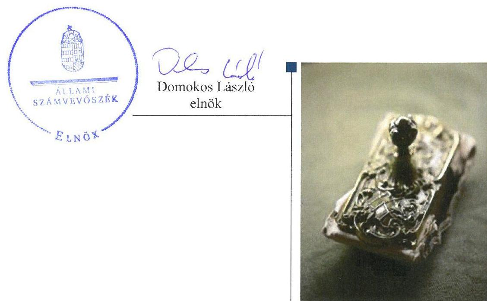

---

# AZ ELLENŐRZÉST FELÜGYELTE:

## MAKKAI MÁRIA felügyeleti vezető

## AZ ELLENŐRZÉST VEZETTE ÉS A VÉGREHAJTÁSÁÉRT FELELŐS:

### SALI SÁNDORNÉ ellenőrzésvezető

## A PROGRAM ÖSSZEÁLLÍTÁSÁÉRT FELELŐS:

### TÓTPÁL SZABOLCS osztályvezető

---

**IKTATÓSZÁM: V-1203-192/2016.**

**TÉMASZÁM: 2237**

**ELLENŐRZÉS-AZONOSÍTÓ SZÁM: V075904**

---

Jelentéseink az Országgyűlés számítógépes hálózatán és az Interneta a www.asz.hu címen is olvashatóak.

---

# TARTALOMJEGYZÉK 

■ ÖSSZEGZÉS ..... 5
■ AZ ELLENŐRZÉS CÉLJA ..... 6
■ AZ ELLENŐRZÉS TERÜLETE ..... 7
■ AZ ELLENŐRZÉS HÁTTERE, INDOKOLTSÁGA ..... 8
■ A JELENTÉS LÉNYEGES KÉRDÉSKÖREI ..... 9
■ ELLENŐRZÉS HATÓKÖRE ÉS MÓDSZEREI ..... 10
■ MEGÁLLAPÍTÁSOK ..... 12
■ MELLÉKLETEK ..... 19
I. Sz. melléklet: Értelmező szótár ..... 19
■ FÜGGELÉK: ÉSZREVÉTELEK ..... 23
■ RÖVIDÍTÉSEK JEGYZÉKE ..... 35

---

.

---

# ÖSSZEGZÉS 

A Nemzeti Fejlesztési Minisztérium és a Magyar Nemzeti Vagyonkezelő Zrt. HungaroControl Magyar Légiforgalmi Szolgálat Zrt. feletti tulajdonosi joggyakorlása szabályszerű volt. A Társaság müködésének szabályozottsága, a pénzügyi, számviteli, adatszolgáltatási és ellenőrzési feladatok ellátása megfelel az előírásoknak. A Társaság vagyongazdálkodása a kezelt vagyonon aktivált értéknövelő beruházások, felújítások 2014. évi számviteli elszámolása kivételével szabályszerű volt.

## Az ellenőrzés társadalmi indokoltsága

Az állami tulajdonú gazdálkodó szervezetek a nemzeti vagyon részét képezik. Az állami vagyonnal való gazdálkodást illetően a tulajdonosi joggyakorlás és a vagyongazdálkodás feladata az állami vagyon átlátható, rendeltetésszerű és felelős felhasználásának biztosítása. Az állam meghatározza az ellátandó közszolgáltatással kapcsolatos feladatokat, amelyhez a vagyonnal kapcsolatos döntéseknek igazodniuk kell. A nemzetgazdasági szempontból kiemelt jelentőségű nemzeti vagyonban tartandó állami tulajdonban álló társasági részesedést a nemzeti vagyonról szóló törvény határozza meg.

Az Állami Számvevőszék az általa korábban ellenőrizetlen területek, szervezetek körébe tartozó társaságnál végzett ellenőrzést. A számvevőszéki ellenőrzés hozzájárul a közpénzek szabályos, átlátható, elszámoltatható és eredményes felhasználásához, a rend pedig értéket teremt. Minden közpénzt, közvagyont használó szervezettel szemben társadalmi igény, hogy tevékenységükről elszámoljanak. Ezt figyelembe véve és az Állami Számvevőszék Stratégiájával összhangban került sor a HungaroControl Magyar Légiforgalmi Szolgálat Zrt. ellenőrzésére a 2012-2015. évek vonatkozásában.

## Főbb megállapítások, következtetések

A Nemzeti Fejlesztési Minisztérium a társasági részesedések feletti, a Magyar Nemzeti Vagyonkezelő Zrt. a Társaság kezelésébe adott nemzeti vagyon feletti tulajdonosi jogokat szabályszerűen gyakorolta. A Magyar Nemzeti Vagyonkezelő Zrt. vagyonkezelési szerződésben rögzítette a vagyongazdálkodásra vonatkozó jogokat, a felelős gazdálkodáshoz szükséges követelményeket, valamint elszámolási szerződésben határozták meg a vagyonkezelt eszközökön aktivált beruházások, felújítások számviteli elszámolásának szabályait.

A HungaroControl Zrt. müködésének szabályozottsága megfeleltt a jogszabályi és belső szabályozásban foglalt előírásoknak. A Társaságnál a pénzügyi-számviteli és ellenőrzési feladatok ellátása szabályszerű volt. A bevételek és ráfordítások elszámolása az előírások szerint történt, a végzett szolgáltatások önköltségét az előírások szerinti utókalkulációval támasztották alá. A jogszabályi és belső szabályozásban előírt beszámolási és adatszolgáltatási kötelezettségét szabályszerűen teljesítette.

A Társaság kialakította a szabályszerű vagyongazdálkodás feltételeit és az előírásoknak megfelelően gondoskodott a saját és a kezelésében lévő állami vagyon értékének, állagának megőrzéséről. A vagyonkezelt eszközök és a müködtetésükből származó bevételek, felmerült ráfordítások és költségek elkülönített nyilvántartását biztosították. A HungaroControl Zrt. a 2014. évben a vagyonkezelt eszközökön aktivált 73,4 M Ft értéknövelő beruházások, felújításokhoz kapcsolódó adatszolgáltatást szabályszerűen teljesítette a tulajdonosi joggyakorló; felé.

---

# AZ ELLENŐRZÉS CÉLJA 

Az ellenőrzés célja annak értékelése volt, hogy a tulajdonosi jogok gyakorlása szabályszerű volt-e; a gazdálkodó szervezet szabályozottsága, gazdálkodása és vagyongazdálkodási tevékenysége megfelelt-e a jogszabályi és a tulajdonosi előírásoknak, biztosítva volt-e a közfeladatok átláthatósága és elszámoltathatósága érdekében a közszolgáltatás díjának megalapozottsága szabályszerű önköltségszámítással; a vagyonváltozást eredményező döntések esetében a tulajdonosi jogok gyakorlója és a gazdálkodó szervezet szabályszerűen jártak-e el.

---

# **AZ ELLENŐRZÉS TERÜLETE**

## **A HungaroControl Magyar Légiforgalmi Szolgálat Zártkörűen Működő Részvénytársaság**

A HungaroControl Magyar Légiforgalmi Szolgálat Zártkörűen Működő Részvénytársaságot 2006. november 22-én alapították. A HungaroControl Zrt.1 kizárólagos tulajdonosa a Magyar Állam. A Vtv.2-ben foglaltak alapján az állami tulajdont egyrészt a társasági részesedés, másrészt a Társaság vagyonkezelésében lévő ingatlanok és kapcsolódó vagyonértékű jogok jelentették. Az ellenőrzött időszakban az Nvtv.3 felhatalmazása alapján, az Lt.4 előírása szerint a részesedések feletti tulajdonosi jogokat a nemzeti fejlesztési miniszter, a Vtv. előírása szerint a kezelt állami vagyon felett az államot megillető tulajdonosi jogok és kötelezettségek összességét az MNV Zrt.5 gyakorolta.

Az Lt. rögzíti, hogy a légiközlekedés biztonsága érdekében a magyar légtérben légiforgalmi szolgálatot kell fenntartani. A Magyar Állam a légiforgalmi szolgálat közfeladatának ellátására alapította a HungaroControl Zrt.-t. A Társaság légiforgalmi szolgáltatásokat nyújtott a magyar légtérben (a NATO6 felkérése alapján a Koszovó feletti magas légtérben is), a légiforgalmi szakszemélyzet képzését végezte, továbbá légi navigációs kutatás-fejlesztéssel is foglalkozott.

A HungaroControl Zrt. gazdálkodása az ellenőrzött években nyereséges volt. A jegyzett tőke változatlan összege (20 201,6 M Ft) mellett saját tőkéje folyamatosan nőtt. A Társaság vagyonkezelésbe vett és saját tulajdonú eszközökkel látta el feladatait. Az ügyvezetést és operatív irányítást 2012-2014. időszakban a vezérigazgató, 2015 óta az Igazgatóság végezte. Az átlagos statisztikai létszám 2015. évben 737 fő volt. A Társaság mérlegében szereplő eszközvagyon 2015. év végén 56 060,8 M Ft, a kezelt vagyon könyv szerinti értéke 4 129,0 M Ft volt.

---

# AZ ELLENŐRZÉS HÁTTERE, INDOKOLTSÁGA 

## HungaroControl Magyar Légiforgalmi Szolgálat Zártkörüen Müködő Részvénytársaság

Az ÁSZ ${ }^{7}$ alapvető célkitűzése, hogy az államháztartáson kívülre nyújtott költségvetési támogatások és ingyenes vagyon juttatások ellenőrzésével hozzájáruljon ahhoz, hogy a közpénzeket az államháztartáson kívül müködő szervezetek is átlátható, rendezett módon használják fel a szerződésben átvállalt állami feladatok ellátása érdekében.

Az ellenőrzés feladata a közvagyonnal biztosított közfeladat ellátással kapcsolatban a közpénzek átláthatósága, nyilvánossága érdekében a jogszabályokban, belső szabályzatokban megfogalmazott előírások érvényesülésének az állami tulajdonban lévő gazdálkodó szervezetek vagyonérték megőrzési és gazdálkodási tevékenységének értékelése.

Az ellenőrzés várható hasznosulásaként az ellenőrzés megállapításai a jogalkotás számára segítséget nyújthatnak az államháztartáson kívüli köz-feladat-ellátás, közvagyonnal való gazdálkodás értékeléséhez, jogszabályi keretei pontosításához, az átláthatóságot biztosító szabályozáshoz. Az ellenőrzöttek számára visszajelzést ad a gazdálkodási tevékenységgel, az állami vagyon felhasználásával, a közszolgáltatási árképzés megalapozottságával és az éves elszámolással kapcsolatos szabálytalanságokról és kockázatokról. Az ellenőrzés tapasztalatai segítik és erősítik az ÁSZ hozzáadott értéket teremtő elemző tevékenységét és tanácsadó szerepét.

---

# A JELENTÉS LÉNYEGES KÉRDÉSKÖREI 

1. A tulajdonosi jogok gyakorlása szabályszerű volt-e?
2. A Társaság müködésének szabályozottsága megfelelt-e az előírásoknak?
3. A Társaságnál a pénzügyi-számviteli, adatszolgáltatási és ellenőrzési feladatok ellátása szabályszerű volt-e?
4. A Társaság vagyongazdálkodása szabályszerű volt-e?

---

# ELLENŐRZÉS HATÓKÖRE ÉS MÓDSZEREI 

## Az ellenőrzés típusa

Megfelelőségi ellenőrzés.

## Az ellenőrzött időszak

2012. január 1-jétől 2015. december 31-éig tart

## Az ellenőrzés tárgya

Az állami tulajdonban lévő gazdasági társaság gazdálkodása, kiemelten vagyongazdálkodási tevékenysége, valamint a tulajdonosi jogok gyakorlása.

## Az ellenőrzött szervezet

A HungaroControl Magyar Légiforgalmi Szolgálat Zrt., a Magyar Nemzeti Vagyonkezelő Zrt. és a Nemzeti Fejlesztési Minisztérium.

## Az ellenőrzés jogalapja

Az Állami Számvevőszékről szóló 2011. évi LXVI. törvény 5. § (3)-(5) bekezdései.

## Az ellenőrzés módszerei

Az ellenőrzést a nemzetközi standardokat irányadónak tekintve az ellenőrzött időszakban hatályos jogszabályok, az ellenőrzés szakmai szabályok és módszertanok figyelembevételével végeztük.

Az ellenőrzés a tulajdonosi jogokat gyakorló Magyar Nemzeti Vagyonkezelő Zrt.-re és Nemzeti Fejlesztési Minisztériumra, valamint a HungaroControl Magyar Légiforgalmi Szolgálat Zrt.-re terjedt ki.

Az ellenőrzési kérdések megválaszolásához szükséges bizonyítékok megszerzése a következő ellenőrzési eljárások alkalmazásával történt: megfigyelés, kérdésfeltevés (információkérés), összehasonlítás, valamint elemző eljárás. Az ellenőrzési bizonyítékként felhasználható adatforrások közé tartoztak egyrészt az ellenőrzési programban felsorolt adatforrások, másrészt az ellenőrzés során feltárt, az ellenőrzés szempontjából információkat tartalmazó dokumentumok.

---

A bevételek és ráfordítások elszámolása, valamint a vagyonnyilvántartás terén a szabályszerű múködést véletlen mintavétellel és irányított kiválasztással ellenőriztük. A mintatételek értékelése alapján egyrészt a sokaságban előforduló hibás tételek arányát becsültük, másrészt az irányítottan kiválasztott tételeket értékeltük. A jogszabályoknak és a belső előírásoknak megfelelőnek, azaz szabályszerűnek tekintettük az adott területet, amenynyiben a minta ellenőrzésének eredménye alapján 95\%-os bizonyossággal a teljes sokaságban a hibaarány kisebb volt, mint 10\%, nem megfelelőnek értékeltük, ha a hibaarány a 10\%-ot meghaladta. A ráfordítások elszámolására és a vagyonnyilvántartásra vonatkozó véletlen mintavételt kockázati alapú kiválasztással egészítettük ki, amelynek során évente a három legnagyobb összegű tételt választottuk ki.

---

# 1. A tulajdonosi jogok gyakorlása szabályszerű volt-e? 

## Összegző megállapítás

### 1.1. számú megállapítás

Az NFM és az MNV Zrt. tulajdonosi joggyakorlása szabályszerű volt.

## A NFM részesedések feletti tulajdonosi joggyakorlása megfelelt az előírásoknak.

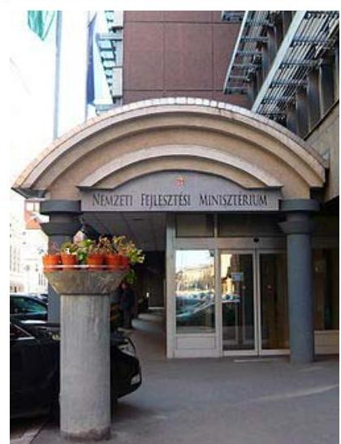

A TULAJDONOSI JOGGYAKORLÁS szabályait a Gt. tv. ${ }^{8}$ és a Ptk. ${ }^{9}$ előírásaival összhangban lévő létesítő okiratokban és a belső szabályzatokban határozta meg az NFM ${ }^{10}$. A szervezeti és müködési szabályzatban rögzítette az egyes szervezeti egységek tulajdonosi joggyakorlással kapcsolatos feladatait. A tulajdonosi joggyakorlással kapcsolatos munkafolyamatokat a feladatot ellátó szervezeti egységek ügyrendje tartalmazta.

A KÖNYVVIZSGÁLÓT ÉS AZ FB ${ }^{11}$-T-figyelemmel a Gt. tv., Ptk. kapcsolódó előírásaira, valamint az Alapító okiratban foglaltakra - a tulajdonosi joggyakorló; ${ }^{12}$ választotta meg, illetve hozta létre. A tulajdonosi joggyakorló; az FB és könyvvizsgáló tevékenysége tekintetében szabályszerűen járt el.

A BESZÁMOLTATÁSI RENDSZER keretében a tulajdonosi joggyakorló; havi, negyedéves, féléves - eljárásrendben rögzített tartalmú - jelentések készítésével számoltatta be a Társaságot. A Társaság számviteli beszámolóit - az FB előzetes írásbeli véleményezését követően - a tulajdonosi joggyakorló; a Gt. tv.-ben, illetve Ptk.-ban előírtaknak megfelelően, a könyvvizsgálói jelentések birtokában fogadta el, valamint döntött az adózott eredmény felhasználásáról.

AZ ÜZLETI TERVEK tulajdonosi joggyakorló; általi elfogadásával a tervezett beruházások, fejlesztések, valamint a közbeszerzési terv jóváhagyása is megtörtént.

AZ ANYAGI ÉRDEKELTSÉGI RENDSZER elemeit az Alapító által kiadott javadalmazási szabályzat ${ }^{13}$; ${ }^{14}$-ben rögzítették. A szabályzatok a Taktv. ${ }^{15}$ előírásainak megfelelően rendelkeztek a vezető tisztségviselők, FB tagok, valamint a vezető állású munkavállalók javadalmazása, a jogviszony megszűnése esetére biztosított juttatások módjának, mértékének elveiről, annak rendszeréről.
1.2. számú megállapítás

Az MNV Zrt. a Társaság vagyonkezelésébe adott állami vagyon feletti tulajdonosi jogait szabályszerűen gyakorolta.

A VAGYONKEZELÉSI SZERZŐDÉST a Társaság 2007-ben kötötte meg az MNV Zrt. jogelődjével, a Kincstári Vagyonkezelő Igazgatósággal. A 2012. január 1-jén hatályban lévő vagyonkezelési szerződést az ellenőrzött időszakban kétszer módosították. A vagyonkezelési szerződés

---

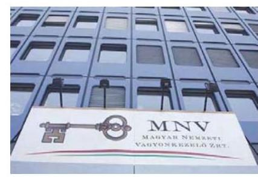
és módosításai a Vtv., Nvtv., Vhr. ${ }^{16}$ előírásaival összhangban meghatározták az állami vagyon működtetésének, értéke megőrzésének követelményeit, rögzítették a vagyonkezelési díjat, a díjfizetés módját, gyakoriságát, a nyilvántartási, adatszolgáltatási, elszámolási, visszapótlási kötelezettséget, majd a visszapótlási kötelezettség alóli mentesülés tényét.

Az elszámolás érdekében a tulajdonosi joggyakorló ${ }^{17}$ és a Társaság 2015. december 21-én elszámolási szerződést ${ }^{18}$ kötött a 2013. december 31-ig (2012-2013. években és azt megelőző években) 606,7 M Ft értékben aktivált beruházások, felújítások elszámolására. A 2014-ben és 2015-ben végzett beruházások és felújítások számviteli szabályok szerinti elszámolásához kapcsolódó adatszolgáltatást a Társaság teljesítette.

A vagyonkezelésbe vett eszközökön végzett beruházásokat az MNV Zrt. - a Vhr. és vagyonkezelési szerződés előírásainak megfelelően - előzetesen, írásban engedélyezte.

Az MNV Zrt. felkérésére, a Társaság belső ellenőrzése által végzett ellenőrzés a kezelt vagyon megóvása, gyarapítása, szabályoknak megfelelő hasznosítása és a vagyonkezelő szerződéses kötelezettségei teljesítésére terjedt ki. A belső ellenőrzési jelentésben rögzített hiányosságokat a vagyonkezelési szerződés 2015. év végi módosításával és az elszámolási szerződés megkötésével megszüntették.

# 2. A Társaság müködésének szabályozottsága megfelelt-e az előírásoknak? 

## Összegző megállapítás

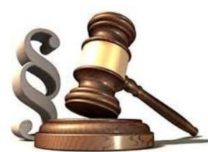

## A Társaság müködésének szabályozottsága megfelelt az előírásoknak.

A számviteli politika ${ }^{19}{ }_{2}{ }^{20}$-ben a Számv. tv. ${ }^{21}$ előírásával összhangban meghatározták a számviteli beszámoló elkészítése során alkalmazandó elveket, értékelési módszereket, eljárásokat. A Számv. tv.-ben foglaltak alapján szabályszerűen elkészítették az eszközök és források leltárkészítési és leltározási szabályzatát, az eszközök és források értékelési szabályzatát, a pénzkezelési szabályzatot. a számlarendet, valamint a selejtezési szabályzatot.

A számlarendben a főkönyvi számok tagolásával - eleget téve a vagyonkezelési szerződésben előírt kötelezettségnek - biztosították a vagyonkezelésbe vett vagyon, és annak múködtetéséből származó bevételek, költségek, ráfordítások elkülönített nyilvántartását.

---

# 3. A Társaságnál a pénzügyi-számviteli, adatszolgáltatási és ellenőrzési feladatok ellátása szabályszerű volt-e? 

## Összegző megállapítás

### 3.1. számú megállapítás

1. ábra
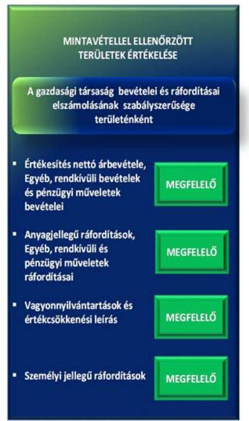
3.2. számú megállapítás

A Társaságnál a pénzügyi-számviteli és ellenőrzési feladatok ellátása szabályszerű volt. Az adatszolgáltatási kötelezettségének eleget tett.

A bevételek és ráfordítások elszámolása során a jogszabályi és belső szabályozások előírásait betartották.

A BEVÉTELEK ELSZÁMOLÁSA megfelelt a jogszabályi és belső szabályozásban foglalt előírásoknak. Az értékesítés nettó árbovétele, az egyéb, rendkívüli és pénzügyi műveletek bevétele kiszámlázása, főkönyvi számlákra történő elszámolása megfelelt a Számv. tv.-ben, a belső szabályozásban és a vagyonkezelési szerződésben előírtaknak. A Társaság az EU-s és hazai jogszabályi előírásoknak megfelelő árakat alkalmazott.

A RÁFORDÍTÁSOK ELSZÁMOLÁSA megfeleĺt a jogszabályi és belső szabályozásban foglalt előírásoknak. Az anyagjellegú ráfordítások, valamint az egyéb, rendkívüli és pénzügyi műveletek ráfordításai esetében az elszámolást megalapozó dokumentumok rendelkezésre álltak. A ráfordítások elszámolása a számviteli bizonylatok alapján, a szerződés szerinti teljesítéssel, a megfelelő főkönyvi számlákra történt. A személyi jellegű ráfordítások elszámolását megalapozó dokumentumok rendelkezésre álltak. A munkabérek kifizetését munkaszerződés alapján, az Szja tv. ${ }^{22}$ és a Tbj tv. ${ }^{23}$ előírásainak megfelelő levonások alkalmazásával teljesítették. A személyi jellegű egyéb, illetve cafetéria kifizetésekre a belső szabályzatok előírásaival összhangban került sor. Az értékcsökkenés elszámolása megfelelt a Számv. tv. és a számviteli politika előírásainak.

A Társaság intézkedett a hátralékos követelés állomány csökkentésére, melyek hatására a határidőn túli követelések 43,3\%-kal, 333,1 M Ft-ra csökkentek az ellenőrzött időszakban.

## A szolgáltatások díjait az önköltségszámítási szabályzat szerinti önköltségszámítással megalapozták.

AZ ÖNKÖLTSÉGSZÁMÍTÁS feltételeinek kialakítása szabályszerű volt, a szabályozás az egyes feladatokra vonatkozó ágazati előírásokat (léginavigációs szolgáltatások közös díjszámítási rendszere, útvonaldíjakra és a termináldíjakra vonatkozó előírások) megjelenítette, meghatározta a kalkulációs módszereket, a felosztandó költségek vetítési alapját, az árképzéshez szükséges önköltségszámítás során alkalmazandó elő és utókalkuláció tartamát, időszakait.

A léginavigációs és egyéb szolgáltatások díjtételeinek megalapozására a Társaság az önköltségszámítási szabályzat előírásai szerinti utókalkulációt végzett.

---

# 3.3. számú megállapítás 

A beszámolási és adatszolgáltatási kötelezettségét szabályszerűen teljesítette.

AZ ADATSZOLGÁLTATÁSI, BESZÁMOLÁSI KÖTELEZETTSÉGET a Társaság a létesítő okiratokban, valamint tulajdonosi határozatban előírtak szerint teljesítette. A gazdálkodásról szóló beszámolás keretében értékelték a forgalom alakulását, a Társaság pénzügyi helyzetét, beruházási tevékenységét, valamint a várható eredményét üzletági bontásban.

Az MNV Zrt. részére történő, a Vtv.-ben, Vhr.-ben, valamint a vagyonkezelési szerződésben rögzített éves adatszolgáltatási kötelezettségét a Társaság a vagyonkataszteri jelentés elkészítésével szabályszerűen teljesítette.

A vagyonkezelt eszközökön végzett beruházások és felújítások számviteli szabályok szerinti elszámolását 2012-2013 vonatkozásában az elszámolási szerződésben, 2014-ben és 2015-ben a kapcsolódó adatszolgáltatás MNV Zrt. részére történő megküldésével teljesítette a Társaság.

AZ ÉVES BESZÁMOLÓKAT a Társaság a Számv. tv.-ben előírt tartalommal készítette el, azokat a könyvvizsgáló hitelesítő záradékkal látta el. Az éves beszámolók letétbe helyezése az előírt határidőben megtörtént, közzétételi kötelezettségét teljesítette a Társaság.

A Társaság az Info tv. ${ }^{24}$-ben és a közérdekú adatok közzétételéről szóló szabályzatában foglaltakat betartotta, a honlapján teljes körűen közzé tette szervezetére, személyzetére, tevékenységére, múködésére és gazdálkodására vonatkozó adatait.

## 3.4. számú megállapítás

A Társaság intézkedett a belső ellenőrzés és a tulajdonosi ellenőrzés javaslatainak végrehajtásáról.

A Társaság kialakította és múködtette a belső ellenőrzési kézikönyvében foglalt előírások alapján az operatív tevékenységektől független belső ellenőrzést, valamint folyamatosan monitorozta a vagyongazdálkodást. Az NFM 2014-ben ellenőrizte a Társaság belső kontrollrendszerét, és a kontrollkörnyezet kialakítását megfelelőnek értékelte. A könyvvizsgáló egy esetben vezetői levélben hívta fel a Társaság figyelmét a felmentett repülések költségeinek elszámolására vonatkozó megállapodások megkötésére. A Társaság az ellenőrzések javaslatait hasznosította.

## 4. A Társaság vagyongazdálkodása szabályszerű volt-e?

Összegző megállapítás

## 4.1. számú megállapítás

A Társaság vagyongazdálkodása a kezelt vagyonon aktivált értéknövelő beruházások, felújítások 2014. évi számviteli elszámolása kivételével szabályszerű volt.

A Társaság a szabályszerű vagyongazdálkodás feltételeit kialakította.

A Társaság vagyongazdálkodásának feltételeit a jogszabályokon túlmenően a létesítő okiratok, a Társaság belső szabályzatai, valamint a vagyon-

---

kezelési szerződés rögzítette. A Társaság vagyongazdálkodása vonatkozásában a feladat- és hatásköröket, valamint a felelősségi viszonyokat a szervezeti és múködési szabályzatban, a számviteli politika keretében elkészített szabályzatokban határozták meg. A kezelt vagyonon aktivált értéknövelő beruházás, felújítás elszámolására kötött elszámolási szerződés megfelelő az MNV Zrt. elszámolási szabályzatában rögzített tartalmi követelményeknek.

# 4.2. számú megállapítás 

A Társaság a saját vagyonát szabályosan tartotta nyilván. A vagyonkezeléshez kapcsolódó lekötött tartalék elszámolás 2014-ben nem volt szabályszerű.

## AZ ANALITIKUS ÉS FŐKÖNYVI NYILVÁNTARTÁSI

RENDSZER biztosította a Társaság vagyonának Számv. tv. és belső szabályozás szerinti nyilvántartását, a változások folyamatos nyomon követését. A saját és a kezelt vagyon számviteli elkülönítése megtörtént. A részesedések és az egyéb befektetett pénzügyi eszközök értékelése a jogszabályi és belső előírások szerint történt.

Az ellenőrzött évek beszámolóinak mérlegét alátámasztó, a Számv. tv. 69. § (1) bekezdése szerinti leltárakat elkészítették. Az eszközök és források mennyiségi felvétellel és egyeztetéssel - a Számv. tv. 69. § (3) bekezdése szerint - végzett leltározása megfelelő az eszközök és források leltározási és leltárkészítési szabályzata előírásainak.

A VAGYONGAZDÁLKODÁS során megvalósult a saját vagyon értékének megőrzése, a Társaság vagyona nőtt az ellenőrzött időszakban. A főbb mérlegadatokat az 1. táblázat mutatja be.

## A TÁRSASÁG FŐBB MÉRLEG ADATAINAK ALAKULÁSA (M FT)

| Megnevezés | 2012.01.01. | 2012.12.31. | 2013.12.31. | 2014.12.31. | 2015.12.31. |
| :--: | :--: | :--: | :--: | :--: | :--: |
| Mérlegfőösszeg | 43586,0 | 44145,4 | 45345,8 | 50880,5 | 56060,8 |
| Befektetett eszközök | 18202,9 | 21487,7 | 20376,9 | 21210,7 | 28787,2 |
| Tárgyi eszközök | 13053,0 | 15383,8 | 14184,1 | 14244,2 | 16549,3 |
| ebből: vagyonkezelésbe vett eszközözök | 4360,2 | 4315,4 | 3535,5 | 3311,9 | 4129,0 |
| Befektetett pénzügyi eszközök | 8,0 | 7,1 | 6,6 | 8,3 | 3352,7 |
| Követelések | 5361,1 | 6410,3 | 5450,3 | 7982,5 | 6609,1 |
| Értékpapírok | 0,0 | 1000,0 | 0,0 | 10562,7 | 13705,0 |
| Pénzeszközök | 13604,7 | 9266,4 | 15240,8 | 8199,7 | 3828,3 |
| Saját tőke | 22157,1 | 240000 | 26220,7 | 27566,0 | 30855,0 |
| Alaptőke (jegyzett tőke) | 20201,6 | 20201,6 | 20201,6 | 20201,6 | 20201,6 |
| Lekötött tartalék | 698,2 | 802,3 | 1947,7 | 1764,1 | 874,3 |
| ebből: visszapótlási kötelezettség fedezetére lekötött tartalék | 198,2 | 302,3 | 947,7 | 874,3 | 874,3 |
| Céltartalékok | 5668,5 | 5415,1 | 5333,0 | 5650,0 | 5168,0 |
| Kötelezettségek | 11755,3 | 10541,6 | 9603,2 | 9745,5 | 9332,2 |
| ebből: állami vagyon kezelésbevételéhez kapcsolódó kötelezettség | 4558,4 | 4558,4 | 4424,0 | 4127,0 | 3908,9 |

A mérlegfőösszeg 28,6\%-os növekedését alapvetően a befektetett eszközök értékének 58,1\%-os emelkedése eredményezte. Az eszközök mérlegértékének alakulására hatással volt a rövid távú finanszírozáshoz nem szükséges pénzeszközök jelentős részének éven belüli lejáratú, a Magyar

---

Állam által kibocsátott diszkontkincstárjegyekbe, 2015. évben pedig éven túli lejáratú államkötvényekbe történő befektetése.

A Társaság saját vagyona gyarapodott az ellenőrzött időszakban, mivel a beruházások értéke (22 092,7 M Ft) meghaladta az elszámolt értékcsökkenés (11 497,7 M Ft) összegét. Ugyanakkor a vagyonkezelt eszközök mérlegértéke - a 2015. évi 1035,1 M Ft értékben aktivált fejlesztés ellenére csökkent, a beruházásokat, fejlesztéseket 231,3 M Ft-tal meghaladó öszszegben elszámolt értékcsökkenés miatt. A Társaság a vagyonkezelt eszközök visszapótlási kötelezettségének teljesítésére 2013. június 27-ig - a Vtv. által előírtaknak megfelelően - lekötött tartalékot képzett.

A lekötött tartalék összegét 2014-ben annak ellenére csökkentették a vagyonkezelt eszközökön aktivált beruházások értékével (73,4 M Ft), hogy a 2014. évi elszámolás Vhr. 18. § (3c) bekezdés szerinti - MNV Zrt. részéről történő - írásbeli elfogadására a mérlegkészítés időpontjáig nem került sor. Ezzel a Társaság megsértette a Számv. tv. 165. § (2) bekezdésében előírt bizonylati elvet, mivel a saját források összetételét bizonylat nélkül könyvelt gazdasági eseménnyel változtatta meg.

A vagyonkezeléshez kapcsolódó kötelezettségek összege 649,5 M Fttal, a 2013. június 28-tól az ellenőrzött időszak végéig elszámolt értékcsökkenés összegével csökkent. A vagyonkezelési szerződés módosításában rögzítették, hogy a Társaság ettől a naptól az értékcsökkenést az eredmény terhére számolja el, és a Vtv. előírásai alapján a 2013. június 28. napjától képződött visszapótlási kötelezettség teljesítése alól a Vtv. erejénél fogva mentesül.

Az állapotfelmérésen alapuló karbantartási tervek szerint elvégezték a tárgyi eszközök rendszeres, időközönkénti karbantartását, állagmegóvását megfelelve a Vtv., valamint a vagyonkezelési szerződés előírásának.
4.3. számú megállapítás

A vagyonváltozást eredményező döntések szabályszerűek voltak.
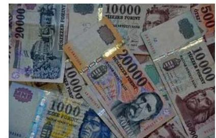

A SAJÁT VAGYONON tervezett beruházások jóváhagyására az üzleti tervek elfogadásával, az eszközök értékesítésére és bérbeadására a döntési jogosultsági szabályok betartásával került sor.

A VAGYONKEZELÉSBE VETT VAGYONT érintő döntések előtt a Táraság az MNV Zrt.-t a jogszabályi előírásoknak megfelelően tájékoztatta, előzetes véleményét megkérte, a döntéshozatal szabályszerű volt.

---

.

---

# MELLÉKLETEK 

- I. SZ. MELLÉKLET: ÉRTELMEZŐ SZÓTÁR
állami vagyon
a) Az állam tulajdonában lévő dolog, valamint a dolog módjára hasznosítható természeti erő,
b) az a) pont hatálya alá nem tartozó mindazon vagyon, amely vonatkozásában törvény az állam kizárólagos tulajdonjogát nevesíti,
c) az állam tulajdonában lévő tagsági jogviszonyt megtestesítő értékpapír, illetve az államot megillető egyéb társasági részesedés,
d) az államot megillető olyan immateriális, vagyoni értékkel rendelkező jogosultság, amelyet jogszabály vagyoni értékű jogként nevesít.
Forrás: Vtv. 1. § (2) bekezdése
2012. november 10-től az állami vagyon fogalma kiegészül a következő ponttal:
e) az állam tulajdonában lévő pénzügyi eszközök

Forrás: Vtv. 1. § (2) bekezdése
állami vagyon használója
Az a természetes vagy jogi személy, jogi személyiséggel nem rendelkező szervezet, aki, vagy amely törvény vagy szerződés alapján, bármely jogcímen (bérlet, haszonbérlet, használat stb.) állami vagyont birtokol, használ, szedi annak hasznait, hasznosít, ide nem értve a haszonélvezőt, a vagyonkezelőt és a tulajdonosi jogok gyakorlóját.
Forrás: Vhr. 1. § (7) a. pontja
állami vagyon hasznosítása
2013. június 27-ig:

Az állami vagyont az MNV Zrt. maga kezeli, vagy szerződés - így különösen bérlet, haszonbérlet, megbízás - alapján központi költségvetési szervnek, természetes vagy jogi személynek, vagy jogi személyiséggel nem rendelkező gazdálkodó szervezetnek hasznosításra átengedi.
Forrás: Vtv. 23. § (1) bekezdése
2013. június 28-ától:

Az állami vagyonnal az MNV Zrt. maga gazdálkodik, vagy szerződés - így különösen bérlet, haszonbérlet, megbízás - alapján központi költségvetési szervnek, természetes vagy jogi személynek, vagy jogi személyiséggel nem rendelkező gazdálkodó szervezetnek hasznosításra átengedi, illetőleg vagyonkezelésbe, haszonélvezetbe adja.
Forrás: Vtv. 23. § (1) bekezdése
állami vagyon hasznosítására kötött szerződések elsődleges célja az állami vagyon hatékony működtetése, állagának védelme, értékének megőrzése, illetve gyarapítása, az állami és közfeladatok ellátásának elősegítése.
Forrás: Vtv. 23. § (2) bekezdése
2013. június 27-ig:

Az állami vagyont az MNV Zrt. maga kezeli, vagy szerződés - így különösen bérlet, haszonbérlet, megbízás - alapján központi költségvetési szervnek, természetes vagy jogi személynek, vagy jogi személyiséggel nem rendelkező gazdálkodó szervezetnek hasznosításra átengedi. Az állami vagyonra vonatkozóan az MNV Zrt. kizárólag az Nvtv-ben meghatározott személyekkel köthet vagyonkezelési szerződést.
Forrás: Vtv. 23. § (1), 27. § (1)
2013. június 28-ától:

---

felmentett repülések
gazdasági társaság

MNV Zrt.
nemzeti vagyon
nemzeti vagyon hasznosítása

Az állami vagyonnal az MNV Zrt. maga gazdálkodik, vagy szerződés - így különösen bérlet, haszonbérlet, megbízás - alapján központi költségvetési szervnek, természetes vagy jogi személynek, vagy jogi személyiséggel nem rendelkező gazdálkodó szervezetnek hasznosításra átengedi, illetőleg vagyonkezelésbe, haszonélvezetbe adja. Az állami vagyonra vonatkozóan az MNV Zrt. kizárólag az Nvtv-ben meghatározott személyekkel köthet vagyonkezelési szerződést.
Forrás: Vtv. 23. § (1), 27. § (1)
A léginavigációs szolgálatok közös díjszámítási rendszerének létrehozásáról szóló 1794/2006/EK rendelet 9. cikk (4) bekezdése, illetve az azt követő 391/2013/EU bizottsági rendelet 10. cikk (5) bekezdése alapján a tagállamok biztosítják a léginavigációs szolgáltatók számára a léginavigációs díjak fizetése alól mentességet élvező repülésekkel kapcsolatban felmerült költségeinek megtérülését.
A Ptk. 3:88. § (1) bekezdése szerint „a gazdasági társaságok üzletszerű közös gazdasági tevékenység folytatására, a tagok vagyoni hozzájárulásával létrehozott, jogi személyiséggel rendelkező vállalkozások, amelyekben a tagok a nyereségből közösen részesednek, és a veszteséget közösen viselik".
Az állami vagyon felett, a Magyar Államot megillető tulajdonosi jogok és kötelezettségek összességét - a hatályos szabályozás szerint - az állami vagyon felügyeletéért felelős miniszter (jelenleg a nemzeti fejlesztési miniszter) gyakorolja. A miniszter feladatát nagy részben az MNV Zrt., mint tulajdonosi joggyakorló szervezet útján látja el.
a) az állam vagy a helyi önkormányzat kizárólagos tulajdonában álló dolgok,
b) az a) pont hatálya alá nem tartozó, állam vagy a helyi önkormányzat tulajdonában lévő dolog,
c) az állam vagy a helyi önkormányzatot tulajdonában lévő pénzügyi eszközök, továbbá az államot vagy a helyi önkormányzatot megillető társasági részesedések,
d) az államot vagy a helyi önkormányzatot megillető bármely vagyoni értékkel rendelkező jogosultság, amelyet jogszabály vagyoni értékű jogként nevesít,
e) Magyarország határa által körbezárt terület feletti légtér,
f) az üvegházhatású gázok kibocsátási egységeinek kereskedelméről szóló törvény szerint kibocsátási egység és légiközlekedési kibocsátási egység, valamint az ENSZ Éghajlatváltozási Keretegyezménye és annak Kiotói Jegyzőkönyve végrehajtási keretrendszeréről szóló törvény szerinti kiotói egység,
g) állami vagy helyi önkormányzati fenntartású közgyűjtemény (muzeális intézmény, levéltár, közgyűjteményként működő kép- és hangarchívum, valamint könyvtár) saját gyűjteményében nyilvántartott kulturális javak körébe tartozó dolog, kivéve, ha az állami vagy önkormányzati tulajdon jogszerű létrejötte kétséget kizáró módon nem bizonyítható és a dologra nézve más a tulajdonjogát bizonyítja vagy a kulturális javakra vonatkozó jogszabályokban meghatározott eljárás keretében valószínűsíti (g. pont módosult 2013. december 7-től),
h) a régészeti lelet,
i) a nemzeti adatvagyon körébe tartozó állami nyilvántartások fokozottabb védelméről szóló törvény szerinti nemzeti adatvagyon.
Forrás: Nvtv. 1. § (2)
A tulajdonosi joggyakorló vagy a nemzeti vagyon használója által a nemzeti vagyon birtoklásának, használatának, hasznok szedése jogának bármely - a tulajdonjog átruházását nem eredményező - jogcímen történő átengedése, ide nem értve a vagyonkezelésbe adást, valamint a haszonélvezeti jog alapítását.
Forrás: Nvtv. 3. § (1) 4. pont

---

rábízott vagyon

Tulajdonosi ellenőrzés
tulajdonosi jogok gyakorlója

Egyrészt minden a Vtv. alkalmazásában állami vagyonnak minősülő vagyon, amit az MNV Zrt. kezel és nyilvántart.
Másrészt az a vagyon, amely felett a Magyar Állam nevében az MFB Zrt. gyakorolja a tulajdonosi jogokat.
Forrás: MFB tv. ${ }^{25}$ 3. § (9)
A rábízott vagyon a tulajdonosi jogokat gyakorló szervezetek saját vagyonától elkülönítendő.
Forrás: Vtv. 22. § (6)
2014. március 14-ig:

Az állami vagyon kezelőjét, haszonélvezőjét, használóját megillető jogok gyakorlását, annak szabályszerűségét, célszerűségét az MNV Zrt. - szükség szerint területi szervei útján - ellenőrzi.
2014. március 15-től:

Az állami vagyon használóját, vagyonkezelőjét és haszonélvezőjét megillető jogok gyakorlását, annak szabályszerűségét, a kötelezettségek teljesítését, valamint a vagyon rendeltetése szerinti célszerűségét a tulajdonosi joggyakorló rendszeresen ellenőrzi.
Forrás: Vhr. 20. § (1)
1.
2013. június 27-ig:

Az állami vagyon felett a Magyar Államot megillető tulajdonosi jogok és kötelezettségek összességét - ha törvény eltérően nem rendelkezik - az állami vagyon felügyeletéért felelős miniszter (a továbbiakban: miniszter) gyakorolja, aki e feladatát a Magyar Nemzeti Vagyonkezelő Zártkörűen Működő Részvénytársaság (a továbbiakban: MNV Zrt.), a Magyar Fejlesztési Bank, illetve a tulajdonosi joggyakorló szervezet útján látja el. A miniszter miniszteri rendeletben, a törvényben meghatározott állami vagyoni kör tekintetében, meghatározott időtartamra, a joggyakorlás egyes szabályainak meghatározásával - az őt megillető tulajdonosi jogok és kötelezettségek összességének, illetve azok meghatározott részének gyakorlóját az Áht. szerinti központi költségvetési szervek, ezek intézménye, továbbá a 100\%-ban állami tulajdonban álló gazdasági társaságok közül kijelölheti.
Forrás: Vtv. 3. § (1) és (2)
2013. június 28-ától:

A rábízott állami vagyon felett az államot megillető tulajdonosi jogok és kötelezettségek összességét tulajdonosi joggyakorlóként:
a) ha törvény vagy miniszteri rendelet eltérően nem rendelkezik, a Magyar Nemzeti Vagyonkezelő Zártkörűen Múködő Részvénytársaság (a továbbiakban: MNV Zrt.), b) törvényben kijelölt személy vagy
c) az állami vagyon felügyeletéért felelős miniszter (a továbbiakban: miniszter) által rendeletben kijelölt személy gyakorolja.
[...] A miniszter e törvény felhatalmazása alapján - a meghatározott célok hatékonyabb elérése érdekében, miniszteri rendeletben, az ott meghatározott állami vagyoni kör tekintetében, meghatározott időtartamra - e törvény keretei között, a joggyakorlás egyes szabályainak meghatározásával - az államot megillető tulajdonosi jogok és kötelezettségek összességének, illetve azok meghatározott részének gyakorlóját az Áht. szerinti központi költségvetési szervek, ezek intézménye, továbbá a 100\%-ban állami tulajdonban álló gazdasági társaságok közül kijelölheti.
Forrás: Vtv. 3. § (1) és (2)

---

2. 

Aki a nemzeti vagyon felett az államot vagy a helyi önkormányzatot megillető tulajdonosi jogok és kötelezettségek összességének gyakorlására jogosult
Forrás: Nvtv. 3. § (1) 17. pontja
2013. június 27-től:

A vagyonkezelő köteles a vagyontárgy értékét megőrizni, állagának megóvásáról, jó karban tartásáról, működtetéséről gondoskodni, továbbá - a központi költségvetési szervek kivételével - díjat fizetni vagy a szerződésben előírt más kötelezettséget teljesíteni.
Forrás: Vtv. 27. § (2)
2013. június 28-ától december 31-ig:

A vagyonkezelő köteles a vagyontárgy állagának megóvásáról, jó karbantartásáról, működtetéséről gondoskodni, továbbá - a központi költségvetési szervek kivételével - díjat fizetni, jogszabályban és szerződésben előírt más kötelezettségét teljesíteni, valamint a vagyontárgyat jogszabályban vagy szerződésben meghatározott célnak megfelelően használni. Amennyiben a vagyonkezelő ezen kötelezettségének nem tesz eleget, a tulajdonosi joggyakorló jogosult a szerződést azonnali hatállyal felmondani.
Forrás: Vtv. 27. § (2)
2014. január 1-jétől:

A vagyonkezelő köteles a vagyontárgy állagának megóvásáról, jó karbantartásáról, működtetéséről gondoskodni, jogszabályban és szerződésben előírt más kötelezettségét teljesíteni, valamint a vagyontárgyat jogszabályban vagy szerződésben meghatározott célnak megfelelően használni.

A vagyonkezelő - a központi költségvetési szervek és a kizárólag közfeladatot ellátó nem központi költségvetési szerv vagyonkezelők kivételével - köteles díjat fizetni, jogszabályban és szerződésben előírt más kötelezettségét teljesíteni, valamint a vagyontárgyat jogszabályban vagy szerződésben meghatározott célnak megfelelően használni. Amennyiben a vagyonkezelő ezen kötelezettségeinek nem tesz eleget, a tulajdonosi joggyakorló jogosult a szerződést azonnali hatállyal felmondani.
Forrás: Vtv. 27. § (2), (2a)

---

# FÜGGELÉK: ÉSZREVÉTELEK 

A jelentéstervezetet a Számvevőszék 15 napos észrevételezésre megküldte az ellenőrzött szervezet vezetőjének az ÁSZ tv. 29. §* (1) bekezdése előírásának megfelelően.

Az ÁSZ a jelentéstervezetet észrevételezésre megküldte a HungaroControl Magyar Légiforgalmi Szolgálat Zrt. vezérigazgatójának, a Magyar Nemzeti Vagyonkezelő Zrt. vezérigazgatójának, valamint a Nemzeti Fejlesztési miniszternek.

A HungaroControl Magyar Légiforgalmi Szolgálat Zrt. vezérigazgatójának, a Magyar Nemzeti Vagyonkezelő Zrt. vezérigazgatójának észrevételeit és az arra adott válaszokat, valamint a Nemzeti Fejlesztési miniszter nemleges észrevételét a függelék alább tartalmazza.

[^0]
[^0]:    * 29. § (1) Az Állami Számvevőszék az ellenőrzési megállapításait megküldi az ellenőrzött szervezet vezetőjének vagy az általa megbízott személynek, és annak, akinek személyes felelősségét állapította meg.
    (2) Az ellenőrzött szervezet vezetője és a felelősként megjelölt személy az ellenőrzés megállapításaira tizenöt napon belül írásban észrevételt tehet.
    (3) Az Állami Számvevőszék az észrevételre a beérkezésétől számított harminc napon belül írásban válaszol. A figyelembe nem vett észrevételeket köteles a jelentésben feltüntetni, és megindokolni, hogy azokat miért nem fogadta el.

---

# HungaroControl 

## Állami Számvevőszék 1052, Budapest

Apáczai Csere János utca 10.

## Domokos László úr részére elnök

## 824

## 11. 8. 7. 8. 3. 2017

ÁLLAMI SZÁMVEVÓSZÉK
DE-35003/2017/
Bikezel: 2017 MAJ 30.
Hatalásdám: V.-1265.-14/306
Melléklet:

## Tisztelt Elnök Úr!

2017. május 11. napján kaptuk kézhez „Az állami tulajdonban (résztulajdonban) lévő gazdálkodó szervezetek vagyonmegőrzési és gazdálkodási tevékenységének ellenőrzése - HungaroControl Magyar Légiforgalmi Szolgálat Zrt." címmel készített számvevőszéki jelentéstervezetet. A jelentéstervezet 4. és 4.2. megállapításaiban foglaltakra az ÁSZ tv. 29.§ (2) bekezdése szerint nyitva álló tizenöt napon belül alábbi észrevételt tesszük:

## ÉSZREVÉTELEZETT MEGÁLLAPÍTÁSOK

## 4. összegző megállapítás:

„A Társaság vagyongazdálkodása szabályszerű volt a vagyonkezelt eszközökön aktivált értéknövelő beruházások, felújítások 2014. évi elszámolása kivételével."
4.2. megállapítás:
„A Társaság a saját vagyonát szabályosan tartotta nyilván. A vagyonkezeléshez kapcsolódó lekötött tartalék elszámolás 2014-ben nem volt szabályszerű."
4.2. indoklása:
„A lekötött tartalék összegét 2014-ben annak ellenére csökkentették a vagyonkezelt eszközökön aktivált beruházások értékével ( $73,4 \mathrm{M} \mathrm{Ft}$ ), hogy a 2014. évi elszámolás Vhr. 18.§ (3c) bekezdés szerinti - MNV Zrt. részéről történő - írásbeli elfogadására a mérlegkészítés időpontjáig nem került sor. Ezzel a Társaság megsértette a Számv. tv. 165.§ (2) bekezdésében előírt bizonylati elvet, mivel a saját források összetételét bizonylat nélkül könyvelt gazdasági eseménnyel változtatta meg."

## ÉSZREVÉTEL

## Visszapótlási kötelezettség

A HungaroControl Zrt. mérlegében a vagyonkezelt eszközök értéke a hosszú lejáratú kötelezettségekkel szemben került állományba vételre, a Sztv. 42.§nak megfelelően szabályosan. Az eszközök értékcsökkenésével azok nettó mérlegértéke csökken, a kötelezettség értéke viszont nem. A kettő közötti

---

# HungaroControl 

Különbség a visszapótlási kötelezettség, amely megjelenik a hosszú lejáratú kötelezettség értékében. Tehát a visszapótlási kötelezettség szabályosan kimutatásra kerül a hosszú lejáratú kötelezettségek között.
A vizsgált időszak valamennyi évében a vagyonkezelt eszközökhöz kapcsolódó értéknövelő beruházások esetén az aktivált, de még az MNV Zrt-vel el nem számolt tételek összegével a Társaság mérlegében kimutatott hosszú lejáratú kötelezettség összege nem változott, azaz az MNV Zrt-vel szembeni kötelezettséget végig helyesen, a visszapótlási kötelezettséget is tartalmazó értéken tartotta nyilván a Társaság.

## Lekötött tartalék képzése

A HungaroControl Zrt. a lekötött tartalékot a Sztv. 38.§ (3) g) pontja alapján saját elhatározása és megítélése alapján képezi meg, ennek képzését nem írja elő jogszabály. A Társaság a lekötött tartalék megképzésével tehát konzervatívan, óvatosan jár el, annak mértékét pedig saját megítélése alapján határozza meg. A képzés célja és módja, hogy a visszapótlási kötelezettség azon részére, melyre még nem valósított meg értéknövelő beruházásokat, a HungaroControl Zrt. tartalékot képez, azaz a szükséges forrást lekötött tartalékba helyezi, hogy saját forrásainak ez a része osztalékfizetés formájában se kerülhessen ki a Társaságból.
A 2014. év során a vagyonkezelt eszközökön megvalósított értéknövelő beruházások a Társsaság megítélése szerint a visszapótlási kötelezettség teljesítésére alkalmasak voltak, emiatt ezek összegében a saját tőkén belüli tartalékképzés már nem volt indokolt, így ezzel összhangban - az elszámolás hiányában is - csökkenhetett a lekötött tartalék értéke. (A Társaság feltételezésének helyességét támasztja alá, hogy a 2014. évi beruházások MNV Zrt-vel történő elszámolása időközben meg is valósult. Az aláírt megállapodást tájékoztatásul az 1.sz. mellékletben csatoljuk.)

## Bizonylati elv

A Szt. 165.§-ban leírt bizonylati elv a lekötött tartalék 2014. évi feloldásnál nem sérült, mivel a feloldás - a lekötött tartalék képzésére vonatkozó Társasági gyakorlat szerint - nem az értéknövelő beruházások elszámolása alapján történt, így a Társaság 2014. évi lekötött tartalék feloldása esetében a feloldott összeg alapbizonylatai a megvalósított értéknövelő beruházások bekerülési értékét meghatározó alátámasztó bizonylatok, valamint azok összefoglaló kimutatása. Ezen bizonylatok szabályszerűen kiállított bizonylatok, melyekben az adott gazdasági műveletre (értéknövelő beruházások) vonatkozóan a könyvvitelben rögzítendő és a más jogszabályban előírt adatokat a valóságnak megfelelően, hiánytalanul tartalmazza, és megfelelnek a bizonylat általános alaki és tartalmi követelményeinek. A könyvelés alapját képező aláírt összefoglaló kimutatási bizonylatot az észrevétel 2.sz. mellékletében csatoljuk.

---

# HungaroControl 

Fenti észrevételeink alapján véleményünk szerint a Társaság szabályszerűen járt el, egyetértünk ugyanakkor, hogy a lekötött tartalék feloldása során az Állami Számvevőszék által felvetett elszámolási mód még óvatosabb eljárást képviselt volna. Ennek megfelelően kérjük a 4., illetve a 4.2. megállapítások szabályszerűtlenséget megállapító részének módosítását.

Egyidejűleg megköszönöm az Állami Számvevőszék munkatársainak az eredményes ellenőrzésben nyújtott munkájukat.

Budapest, 2017. május 25.

Tisztelettel:

Szepessy Kornél
vezérigazgató
HungaroControl Zrt.
1185 Budapest, Igló u. 23-35.
Vezérigazgató
Mellékletek:

1. sz. melléklet HC-2017-7297. számú szerződés - MNV elszámolás megállapodás 2014-2015. évi értéknövelő beruházásokról
2. sz. melléklet Könyvelési bizonylat - FOKHAS14-00204 - Vagyonkezelt eszközökhöz kapcsolódó 2014.12.31-i lekötött tartalék feloldásról

---

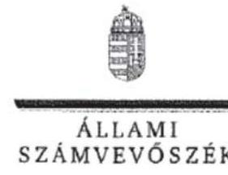

ELMÖK

Ikt.szám: V-1203-189/2016.

Szepessy Kornél András úr
vezérigazgató

HungaroControl Magyar Légiforgalmi Szolgálat Zrt.

Budapest

Tisztelt Vezérigazgató Úr!

A „HungaroControl Magyar Légiforgalmi Szolgálat Zrt. – Az állami tulajdonban (résztulajdonban) lévő gazdálkodó szervezetek vagyonmegőrzési és gazdálkodási tevékenységének ellenőrzése” címmel készített számvevőszéki jelentéstervezetre tett észrevételét köszönettel megkaptam.

Az Állami Számvevőszék észrevételre vonatkozó álláspontjáról a felügyeleti vezető által készített részletes tájékoztatást mellékelten megküldöm.

Tájékoztatom Vezérigazgató urat, hogy a számvevőszéki jelentésben – az Állami Számvevőszékről szóló 2011. évi LXVI. törvény 29. § (3) bekezdése alapján – a figyelembe nem vett észrevételt szerepeltetjük az elutasítás indokának feltüntetésével.

Budapest, 2017. 7. nap

Tisztelettel:

Melléklet: Tájékoztatás az észrevételek kezeléséről

1052 BUDAPEST, APÁCZAI CSERE JÁNOS UTCA 10. 1364 Budapest 4. Pf. 54 telefon. 484 9101 fax. 484 9201

27

---

# Tájékoztatás   az észrevételek kezeléséről 

A „HungaroControl Magyar Légiforgalmi Szolgálat Zrt. - Az állami tulajdonban (résztulajdonban) lévő gazdálkodó szervezetek vagyonmegőrzési és gazdálkodási tevékenységének ellenőrzése" címủ jelentéstervezetre 2017. május 30-án érkezett észrevételét áttekintettük, annak kezelésével kapcsolatban a következő tájékoztatást adom.
A 4. összegző megállapításra, a 4.2. számú megállapításra és a 4.2. számú megállapítás indoklására tett észrevételre adott válasz:

Köszönjük a vagyonkezelt eszközökön végzett 2014. évi felújítások, beruházások elszámolására vonatkozó szerződés 2017. május 5-i létrejöttéről adott tájékoztatásukat.

Az állami vagyonnal való gazdálkodásról szóló 254/2007. (X. 4.) Korm. rendelet (Vhr.) 18. § (3c) bekezdése szerint azokban az esetekben, ahol a felújítás, beruházás eredményére a meglévő vagyon részeként a vagyonkezelői jog a törvény erejénél fogva kiterjed, nincs szükség a vagyonkezelési szerződés módosítására. Ez esetben a számviteli szabályok szerinti elszámolásra a vagyonkezelő adatszolgáltatásának a tulajdonosi joggyakorló írásbeli elfogadása alapján kerül sor.

A 2014. évi felújítások, beruházások esetében azonban a vagyonkezelő adatszolgáltatásának tulajdonosi joggyakorló általi írásbeli elfogadása a számviteli elszámolás időpontjában nem állt rendelkezésre, ezért a jelentéstervezet megállapításának módosítása nem indokolt.

Budapest, 2017. júla hó 6. nap

Makkai Mária
felügyeleti vezető

---

# 807 

## MARYAR NemzetI   VAGYONKEZELÓ ZRT.

VEZÉRIGAZGATO

Állami Számvevőszék

## Domokos László

elnök

1052 Budapest
Apáczai Cs. J. u. 10.

Ikt. sz.: MNV/01/5548/4/2017.
Hiv. sz.: V-1203-180/2016.

Tisztelt Elnök Úr!

Tájékoztatom, hogy a 2017. május 10. napján ,,Az állami tulajdonban (résztulajdonban) lévő gazdálkodó szervezetek vagyonmegőrzési és gazdálkodási tevékenységének ellenőrzése - HungaroControl Magyar Légiforgalmi Szolgálat Zrt." tárgyában kézhez vett, V-1203-180/2016. ikt. sz. levél mellékleteként megküldött Jelentés-tervezetre az alábbi észrevételeket tesszük:
„Összegzés" / 5. oldal 1. bekezdés 3. mondata és „Megállapítások" 4. pont „Összegző megállapítás" / 16. oldal 1. bekezdése:

A Jelentés-tervezet szerint a Társaság vagyongazdálkodása szabályszerű volt a vagyonkezelt eszközökön aktivált értéknövelő beruházások, felújítások 2014. évi elszámolása kivételével.

A megállapítással kapcsolatban kiegészítésként kívánjuk jelezni, hogy a HungaroControl Magyar Légiforgalmi Szolgálat Zrt. által vagyonkezelt állami vagyonon a 2014. év és 2015. év közötti időszakban végrehajtott értéknövelő beruházásoknak és felújításoknak az állami vagyonnal való gazdálkodásról szóló 254/2007. (X. 4.) Korm. rendelet 18. § (3b) és (3c) bekezdése szerinti elszámolása még nem történt meg, az jelenleg is folyamatban van. Ez önmagában kifogást tartalmazó megállapítás alapjául az MNV Zrt. álláspontja szerint nem szolgálhat, illetve azzal közvetlen összefüggésben nem áll.
„Megállapítások" 4. 2. megállapítás / 17. oldal 4. bekezdés 2. mondata:
A Jelentés-tervezet megállapítása szerint a vagyonkezelési szerződés módosításában rögzítésre került, hogy a Társaság ettől a naptól az értékcsökkenést az eredmény terhére számolja el, és a Vtv. előírásai alapján a visszapótlási kötelezettséget - a törvény erejénél fogva - elengedettnek tekinti.

---

Az MNV Zrt. a hivatkozott vagyonkezelési szerződés-módosításban ezzel szemben nem engedte el a Társaság 2013. június 28. napjáig felhalmozódott, a mai napon 844.301.207,- Ft összegű visszapótlási kötelezettségét, hanem a Társaság a 2013. június 28. napjától képződött visszapótlási kötelezettség teljesítése alól - mivel közfeladatot lát el - mentesül azzal, hogy azt továbbra is köteles nyilvántartani.

A fentiek alapján kérjük a hivatkozott szövegrész alábbiak szerinti pontosítását: „A vagyonkezelési szerzödés módosításában rögzítették, hogy a Társaság ettől a naptól az értékcsökkenést az eredmény terhére számolja el, és a Vtv. elöírásai alapján a 2013. június 28. napjától képződött visszapótlási kötelezettség teljesitése alól a Vtv. erejénél fogva mentesül."

Jelezzük továbbá, hogy a Jelentés-tervezet 4. és 18. oldalt nem tartalmaz.
Kérem Elnök Urat, hogy a jelentés véglegesítése során jelen észrevételeinket szíveskedjenek figyelembe venni.

Budapest, 2017. május „21"
Üdvözlettel:
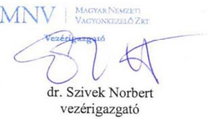

---

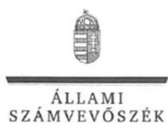

ELNÖK

Ikt.szám: V-1203-185/2016.

Dr. Szívek Norbert úr
vezérigazgató

Magyar Nemzeti Vagyonkezelő Zrt.

Budapest

Tisztelt Vezérigazgató Úr!

A „HungaroControl Magyar Légiforgalmi Szolgálat Zrt. – Az állami tulajdonban (résztulajdonban) lévő gazdálkodó szervezetek vagyonmegőrzési és gazdálkodási tevékenységének ellenőrzése” címmel készített számvevőszéki jelentéstervezetre tett észrevételét köszönettel megkaptam.

Az Állami Számvevőszék észrevételre vonatkozó álláspontjáról a felügyeleti vezető által készített részletes tájékoztatást mellékelten megküldöm.

Tájékoztatom Vezérigazgató urat, hogy a számvevőszéki jelentésben – az Állami Számvevőszékről szóló 2011. évi LXVI. törvény 29. § (3) bekezdése alapján – a figyelembe nem vett észrevételt szerepeltetjük az elutasítás indokának feltüntetésével.

Budapest, 2017. 27. hó 31. nap

Tisztelettel:

Dómokos László

Melléklet: Tájékoztatás az észrevételek kezeléséről

1052 BUDAPEST, APÁCZNI CSERE JÁNOS UTCA 10, 1364 Budapest 4. Pf. 54 telefon: 484 0101 fax: 484 0201

---

# Tájékoztatás   az észrevételek kezeléséről 

A „HungaroControl Magyar Légiforgalmi Szolgálat Zrt. - Az állami tulajdonban (résztulajdonban) lévő gazdálkodó szervezetek vagyonmegőrzési és gazdálkodási tevékenységének ellenőrzése" címú jelentéstervezetre 2017. május 25 -én érkezett észrevételt áttekintettük, annak kezelésével kapcsolatban a következő tájékoztatást adom.

1. Az Összegzés/5. oldal 1. bekezdés 3. mondatával és a „Megállapítások" 4. pont „Összegzö megállapítás" / 16. oldal 1. bekezdésével kapcsolatban tett észrevételre adott válasz:
A megállapításhoz tett kiegészítésüket köszönjük. Az észrevételezett megállapítások a vagyonkezelt eszközökön aktivált értéknövelő beruházások, felújítások 2014. évi számviteli elszámolására vonatkoznak, nem a 254/2007. (X. 4.) Korm. rendelet 18. § (3b) és (3c) bekezdése szerinti elszámolására. Az egyértelműség érdekében a megállapításokat a következők szerint pontosítjuk:
„A Társaság vagyongazdálkodása a kezelt vagyonon aktivált értéknövelő beruházások, felújitások 2014. évi számviteli elszámolása kivételével szabályszerű volt."
2. „Megállapítások" 4.2. megállapítás / 17. oldal 4. bekezdés 2. mondatával tett észrevételre adott válasz:
Az cgyértelműség érdekében a visszapótlási kötelezettséggel kapcsolatos megállapítást az alábbiak szerint pontosítjuk:
„A vagyonkezelési szerzödés módosításában rögzítették, hogy a Társaság ettől a naptól az értékcsökkenést az eredmény terhére számolja el, és a Vtv. elöírásai alapján a 2013. június 28. napjától képződött visszapótlási kötelezettség teljesitése alól a Vtv. erejénél fogva mentesül."

Tájékoztatom Vezérigazgató urat, hogy a jelentéstervezet 4. és 18. oldala üres oldal, oldalszámozást nem tartalmaz.

Budapest, 2017. (un.) hó 51 nap

Makkai Mária
felügyeleti vezető

---

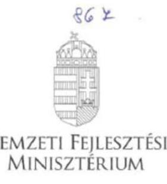

# Iktatószám: EFO/33277-1/2017-NFM

Ügyintéző: Simonné Hábencius Gizella Telefonszám: 79-54405 E-mail: gizella.habencius.simonne@nfm.gov.hu Hiv. szám: V-1203-181/2016.

**Domokos László**

*elnök*

*részére*

*Állami Számvevőszék*

**Budapest**

Apáczai Csere János u. 10. 1052

**Tárgy:** Az Állami Számvevőszék jelentéstervezetének véleményezése

**Tisztelt Elnök Úr!**

Köszönettel vettem „Az állami tulajdonban (résztulajdonban) lévő gazdálkodó szervezetek vagyonmegőrzési és gazdálkodási tevékenységének ellenőrzése Hungary Control Magyar Légiforgalmi Szolgálat Zrt.” címen megküldött számvevőszéki jelentéstervezetüket. A tervezetre észrevételt nem teszek.

Budapest, 2017. május „1.”

**Üdvözlettel:**

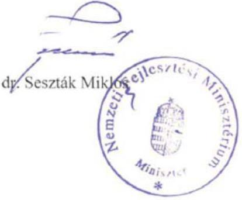

Postacím: 1440 Budapest, Pl. 1 Telefon: (06 1) 795 1700 Fax: (06 1) 795 0631 E-mail: miniszter@nfm.gov.hu Web: www.kormany.hu

---

.

---

# RÖVIDÍTÉSEK JEGYZÉKE 

${ }^{1}$ Társaság/HungaroControl Zrt.
${ }^{2}$ Vtv.
${ }^{3}$ Nvtv.
${ }^{4}$ Lt.
${ }^{5}$ MNV Zrt.
${ }^{6}$ NATO
${ }^{7}$ ÁSZ
${ }^{8}$ Gt. tv.
${ }^{9}$ Ptk.
${ }^{10}$ NFM
${ }^{11} \mathrm{FB}$
${ }^{12}$ tulajdonosi joggyakorló:
${ }^{13}$ javadalmazási szabályzat ${ }_{1}$
${ }^{14}$ javadalmazási szabályzat ${ }_{2}$
${ }^{15}$ Taktv.
${ }^{16} \mathrm{Vhr}$.
${ }^{17}$ tulajdonosi joggyakorló:
${ }^{18}$ elszámolási szerződés
${ }^{19}$ számviteli politika ${ }_{1}$
${ }^{20}$ számviteli politika ${ }_{2}$
${ }^{21}$ Számv. tv.
${ }^{22}$ Szja tv.
${ }^{23} \mathrm{Tbj}$. tv.
${ }^{24}$ Info tv.
${ }^{25}$ MFB tv.

HungaroControl Magyar Légiforgalmi Szolgálat Zártkörűen Működő Részvénytársaság
az állami vagyonról szóló 2007. évi CVI. törvény
a nemzeti vagyonról szóló 2011. évi CXCVI. törvény (hatályos: 2012. január 1-jétől)
a légiközlekedésről szóló 1995. évi XCVII. törvény
Magyar Nemzeti Vagyonkezelő Zrt.
North Atlantic Treaty Organisation (Észak-atlanti Szerződés Szervezete)
Állami Számvevőszék
a gazdasági társaságokról szóló 2006. évi IV. törvény (hatálytalan: 2014. március 15-től)
a Polgári Törvénykönyvről szóló 2013. évi V. törvény
Nemzeti Fejlesztési Minisztérium
a HungaroControl Zrt. felügyelőbizottsága
Nemzeti Fejlesztési Minisztérium (részesedések vonatkozásában)
a HungaroControl Zrt. 2010. április 15-től hatályos, módosított javadalmazási szabályzata, melyet az Alapító a 12/2010. (IV. 15.) számú részvényesi határozattal léptetett hatályba (hatályos: 2012. december 31-ig)
a HungaroControl Zrt. 2013. január 1-jétől hatályos javadalmazási szabályzata, melyet az Alapító az 24/2012. (XII. 4.) számú részvényesi határozatával léptetett hatályba
a köztulajdonban álló gazdasági társaságok takarékosabb müködéséről szóló 2009. évi CXXII. törvény
az állami vagyonnal való gazdálkodásról szóló 254/2007. (X.4.) Kormányrendelet
Magyar Nemzeti Vagyonkezelő Zrt. (kezelt vagyon vonatkozásában)
az MNV Zrt. és a HungaroControl Zrt. által 2015. december 21-én kötött elszámolási szerződés a vagyonkezelt vagyonon a 2007-2013 közötti időszakban végrehajtott értéknövelő beruházások és felújítások elszámolása tárgyában
a HungaroControl Zrt. 2011. december 22-én hatályba léptetett, többször módosított számviteli politikája (hatályos: 2015. november 6-ig)
a HungaroControl Zrt. 2015. november 7-től hatályos számviteli politikája
a számvitelről szóló 2000. évi C. törvény
a személyi jövedelemadóról szóló 1995. évi CXVII. törvény
a társadalombiztosítás ellátásaira és a magánnyugdíjra jogosultakról, valamint e szolgáltatások fedezetéről 1997. évi LXXX. törvény
2011. évi CXII. törvény az információs önrendelkezési jogról és az információszabadságról (hatályos 2011. július 27-étől)
a Magyar Fejlesztési Bank Részvénytársaságról szóló 2001. évi XX. törvény

---

ÁLLAMI SZÁMVEVŐSZÉK
1052 Budapest, Apáczai Csere János utca 10.
Levélcím: 1364 Budapest 4. Pf. 54
Telefon: +36 14849100 Telefax: +36 14849200
www.asz.hu