# Jelentés 

## Utóellenőrzések

Az állami vagyon feletti tulajdonosi
joggyakorlással kapcsolatos
tevékenységek utóellenőrzése
2017.

17099
www.asz.hu

---

# Jelentés 

## Utóellenőrzések

Az állami vagyon feletti tulajdonosi
joggyakorlással kapcsolatos
tevékenységek utóellenőrzése
2017. 06 hó 20 nap
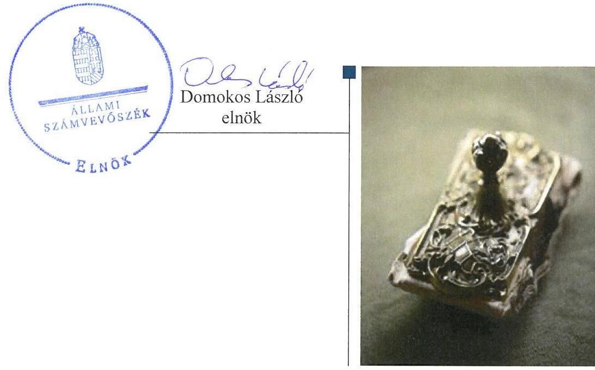

---

# AZ ELLENŐRZÉST FELÜGYELTE: 

HOLMAN MAGDOLNA JULIANNA felügyeleti vezető

## AZ ELLENŐRZÉST VEZETTE ÉS A VÉGREHAJTÁSÁÉRT FELELŐS:

IMRE ZSUZSANNA ellenőrzésvezető

## A PROGRAM ÖSSZEÁLLÍTÁSÁÉRT FELELŐS:

JANIK JÓZSEF osztályvezető

## A TÉMÁHOZ KAPCSOLÓDÓ KORÁBBI SZÁMVEVŐSZÉKI JELENTÉSEK:

- címe: Jelentés az állami vagyon feletti tulajdonosi joggyakorlással kapcsolatos tevékenységek ellenőrzéséről
- sorszáma: $\quad 15215$

IKTATÓSZÁM: V-1405-171/2016
TÉMASZÁM: 14
ELLENŐRZÉS-AZONOSÍTÓ SZÁM: V075582

---

# TARTALOMJEGYZÉK 

■ ÖSSZEGZÉS ..... 5
■ AZ ELLENŐRZÉS CÉLJA ..... 7
■ AZ ELLENŐRZÉS TERÜLETE ..... 8
■ AZ ELLENŐRZÉS HÁTTERE, INDOKOLTSÁGA ..... 10
■ A JELENTÉS LÉNYEGES KÉRDÉSKÖREI ..... 11
■ ELLENŐRZÉS HATÓKÖRE ÉS MÓDSZEREI ..... 12
■ MEGÁLLAPÍTÁSOK ..... 14
■ MELLÉKLETEK ..... 21
I. sz. melléklet: Az MNV Zrt. intézkedési tervének végrehajtása ..... 21
II. sz. melléklet: Az NFM intézkedési tervének végrehajtása ..... 24
III. sz. melléklet: Az FM intézkedési tervének végrehajtása ..... 25
IV. sz. melléklet: Az MFB ZRT. intézkedési tervének végrehajtása ..... 26
V. sz. melléklet: Az EMMI intézkedési tervének végrehajtása ..... 27
VI. sz. melléklet: Az ÁEEK intézkedési tervének végrehajtása ..... 28
VII. sz. melléklet: Az NFA intézkedési tervének végrehajtása ..... 30
■ FÜGGELÉK: ÉSZREVÉTELEK ..... 31
■ RÖVIDÍTÉSEK JEGYZÉKE ..... 45

---

.

---

# ÖSSZEGZÉS 

A Magyarországon az állami vagyon felett meghatározó tulajdonosi joggyakorló szervezetek a végrehajtott intézkedéseikkel hozzájárultak az állami vagyonnal való szabályos gazdálkodás feltételeinek megteremtéséhez, az átláthatóság érvényesitéséhez. Az Magyar Nemzeti Vagyonkezelő Zrt., az Állami Egészségügyi Ellátó Központ, a Nemzeti Földalapkezelő Szervezet, a Földmüvelésügyi Minisztérium és az Emberi Eröforrások Minisztériuma esetében a részben vagy nem végrehajtott intézkedések továbbra is kockázatot hordoznak a vagyonnyilvántartás megbizhatósága, a vagyongazdálkodás szabályossága tekintetében. A Nemzeti fejlesztési Minisztérium és a Magyar Fejlesztési Bank Zrt. a vállalt intézkedéseket végrehajtotta.

## Az ellenőrzés társadalmi indokoltsága

Az Állami Számvevőszék stratégiájában célul tűzte ki a számvevőszéki munka hasznosulásának javítását. Ezzel összhangban ellenőrzi, hogy az ellenőrzött szervezetek megvalósították-e a korábbi ellenőrzései által feltárt hibák, hiányosságok és szabálytalanságok megszüntetése céljából elkészített intézkedési terveikben foglaltakat. A rendszeres utóellenőrzések hozzájárulnak a szükséges intézkedések tényleges végrehajtásához, ezáltal a közpénzügyek rendezettségének javulásához. Az intézkedési tervekben foglalt feladatok hiányos, illetve késedelmes végrehajtása, valamint megvalósításának elmaradása azt mutatja, hogy az ellenőrzések során feltárt hibák, hiányosságok és szabálytalanságok megszüntetése nem kapott kellő hangsúlyt. Ez a szabályszerű múködés és a felelős vezetői magatartás vonatkozásában kockázatot hordoz. E kockázatok feltárásával az Állami Számvevőszék utóellenőrzési rendszere fokozza a fegyelmet, és igazolja, hogy a közpénzzel való szabályos gazdálkodás felelőssége elől nem lehet kitérni.

## Főbb megállapítások, következtetések

Az intézkedési tervben foglalt feladatok közül az ellenőrzött szervezetek 11 feladatot határidőben, 4 feladatot határidőn túl hajtottak végre, 3 feladatot részben hajtottak végre. 5 feladat nem került végrehajtásra.

A határidőben végrehajtott feladatok között a Magyar Nemzeti Vagyonkezelő Zrt. kidolgozta a jogszabályi előírásoknak megfelelő lakásbérleti szerződések, valamint az ingyenes használatba adási megállapodások mintáját és módosította számlarendjét. Megtörtént a MÁV Zrt.-nek a Nemzeti Fejlesztési Minisztérium részére történt átadásának végrehajtása céljából kötött átadás-átvételi megállapodás módosítása a tényleges kivezetési érték rögzítése érdekében. A megállapodással összefüggésben feltárt szabálytalanság tekintetében a Magyar Nemzeti Vagyonkezelő Zrt. belső ellenőrzést folytatott le. A Nemzeti Fejlesztési Minisztérium a tulajdonosi joggyakorlásával kapcsolatos feladatokat ellátó főosztályok ügyrendjét kidolgozta. A Magyar Fejlesztési Bank Zrt. Szervezeti és Múködési Szabályzatát a módosításkor hatályos Magyar Fejlesztési Bank Zrt.-ről szóló törvényben foglaltaknak megfelelően aktualizálta. Az Állami Egészségügyi Ellátó Központ szabályzatában rögzítette a tulajdonosi és múszaki ellenőrzés eljárásrendjét, és a 2016. évben a tulajdonosi ellenőrzéseket elvégezte. A Nemzeti Földalapkezelő Szervezet a vagyonnyilvántartással kapcsolatosan több, a szabályszerűséget szolgáló intézkedést tett.

A Magyar Nemzeti Vagyonkezelő Zrt. leltározási és vagyon-nyilvántartási szabályzata módosítását határidőn túl végezte el, valamint a bérleti szerződések módosítása érdekében az intézkedési tervben foglalt határidőn túl intézkedett. A Magyar Nemzeti Vagyonkezelő Zrt. által kötött bérleti szerződések tartalma bizonyos esetekben továbbra sem felelt meg a nemzeti vagyonról szóló törvényben és az állami vagyonról szóló törvény végrehajtási rendeletében foglaltaknak.

Az államháztartáson belüli egyéb vagyonkezelő részére vagyonkezelésbe adott ingatlanok nyilvántartási számlákon való rögzítését a Magyar Nemzeti Vagyonkezelő Zrt. és a Nemzeti Földalapkezelő Szervezet teljes körűen nem

---

végezte el. A Nemzeti Földalapkezelő Szervezet leltározási szabályzatában nem határozták meg a mennyiségi felvétellel történő leltározás gyakoriságát. Az Állami Egészségügyi Ellátó Központ nem vizsgálata felül vagyonhasznosítási szerződéseit, és új szerződésmintát sem dolgozott ki. Az Állami Egészségügyi Ellátó Központ esetében az államháztartáson belüli szervezettel kötött vagyonkezelési szerződések aláírását követően a főkönyvi számlaosztályból kivezetésre került a vagyonkezelésbe adott ingatlanok bruttó értéke, azonban a nullás számlaosztályban nem került nyilvántartásba vételre. Az Emberi Erőforrások Minisztériuma a társadalombiztosítási alapok tekintetében tulajdonosi ellenőrzést nem végzett.

A külső ellenőrzések javaslatai alapján készült intézkedési tervek végrehajtásáról az arra kötelezett ellenőrzöttek vezették a belső kontrollrendszerről szóló kormányrendelet által előírt tartalmú nyilvántartást.

---

# AZ ELLENŐRZÉS CÉLJA 

Az ellenőrzés célja annak értékelése volt, hogy a 15215. számú számvevőszéki jelentésben foglalt intézkedést igénylő megállapításokkal és javaslatokkal összhangban készített intézkedési tervekben meghatározott feladatokat az ellenőrzött szervezetek végrehajtották-e.

---

# AZ ELLENŐRZÉS TERÜLETE 

Az állami vagyon feletti tulajdonosi joggyakorlással kapcsolatos tevékenységeket az ÁSZ ${ }^{1}$ évente ellenőrzi, és az ellenőrzés tapasztalatai alapján megállapításokat és javaslatot fogalmaz meg a tulajdonosi joggyakorlók részére.

AZ MNV ZRT. ${ }^{2}$ az állam által alapított egyszemélyes részvénytársaság, amely gondoskodik a rábízott állami vagyonnal kapcsolatos tulajdonosi jogok gyakorlásáról, az állami vagyon hasznosításáról, kezeléséről. Feladata a nemzeti vagyon védelme, értékének megőrzése és gyarapítása.

AZ NFM ${ }^{3}$ minisztere felel az állami vagyon felügyeletéért, az állami vagyonnal való gazdálkodás szabályozásáért, felügyeli a vagyon-nyilvántartási rendszer változáskövetését, karbantartását, fejlesztését, illetve gyakorolja az MNV Zrt.nél a részvényesi jogokat.

AZ FM ${ }^{4}$ minisztere gyakorolja a tulajdonosi jogokat több erdészeti és mezőgazdasági tevékenységet ellátó gazdasági társaság tekintetében, valamint a Nemzeti Földalapba tartozó állami tulajdonban álló ingatlanok felett.

AZ EMMI ${ }^{5}$ minisztere gyakorolja a tulajdonosi jogokat az Egészségbiztosítási Alap és a Nyugdíjbiztosítási Alap ellátási vagyona tekintetében.

AZ MFB ZRT. ${ }^{6}$ az állam nevében az MFB tv.-ben ${ }^{7}$ meghatározott állami tulajdonú gazdálkodó szervezetek esetében gyakorolja az állam tulajdonosi jogait. Az MFB Zrt. feletti tulajdonosi jogokat a Miniszterelnökséget vezető miniszter látja el.

AZ ÁEEK ${ }^{8}$ jogosult az egyes egészségügyi intézményeinek átvétele során állami tulajdonba került, állami egészségügyi feladatellátást szolgáló vagyon tekintetében tulajdonosi jogokat gyakorolni.

AZ NFA ${ }^{9}$ útján gyakorolja az agrárpolitikáért felelős miniszter az állam nevében a Nemzeti Földalap felett a tulajdonosi jogokat és kötelezettségeket.

Jelen utóellenőrzés az állami vagyon feletti tulajdonosi joggyakorlással kapcsolatos tevékenységek ellenőrzéséről készült, 15215. számú számvevőszéki jelentésben foglalt megállapításokhoz kapcsolódó intézkedési tervekben vállalt feladatok végrehajtásának ellenőrzésére irányult.

Az utóellenőrzéssel érintett számvevőszéki jelentés javaslatai és az azok alapján az ellenőrzött szervezetek által elkészített intézkedési tervekben foglalt feladatok adatait ellenőrzött szervezetek szerinti bontásban az alábbi táblázat foglalja össze:

---

1. táblázat

# AZ ÁSZ 2015. ÉVBEN VÉGREHAJTOTT ELLENŐRZÉSE ALAPJÁN KÉSZÜLT INTÉZKEDÉSI TERVEKBEN VÁLLALT FELADATOK ÉS ELLENŐRZÖTT FELADATOK SZÁMA ELLENŐRZÖTT SZERVEZETENKÉNT

|  Szervezet | Intézkedési tervben
vállalt feladatok
száma | Utóellenőrzéssel
érintett feladatok
száma  |
| --- | --- | --- |
|  Magyar Nemzeti Vagyonkezelő Zrt. | 8 | 8  |
|  Magyar Fejlesztési Bank Zrt. | 1 | 1  |
|  Földművelésügyi Minisztérium | 1 | 1  |
|  Nemzeti Fejlesztési Minisztérium | 3 | 3  |
|  Emberi Erőforrások Minisztériuma | 1 | 1  |
|  Állami Egészségügyi Ellátó Központ | 4 | 4  |
|  Nemzeti Földalapkezelő Szervezet | 5 | 5  |

---

# AZ ELLENŐRZÉS HÁTTERE, INDOKOLTSÁGA 

Az ÁSZ tv. ${ }^{10}$ 33. § (1) bekezdése értelmében a számvevőszéki jelentések intézkedést igénylő megállapításaihoz és javaslataihoz kapcsolódóan az ellenőrzött szervezet vezetője intézkedési tervet köteles összeállítani, és az ÁSZ részére megküldeni. Az intézkedési tervben foglaltak megvalósítását az ÁSZ tv. 33. § (7) bekezdésében foglaltak alapján - az ÁSZ utóellenőrzés keretében ellenőrizheti. Az intézkedések megvalósulásának értékelése során az ÁSZ figyelembe veszi az ellenőrzött szervezetek működési feltételeiben, valamint a jogszabályi előírásokban bekövetkezett változásokat.

Az intézkedési tervekben foglalt feladatok hiányos, illetve késedelmes végrehajtása, valamint megvalósításának elmaradása azt mutatja, hogy az ellenőrzések során feltárt hibák, hiányosságok és szabálytalanságok megszüntetése nem kapott kellő hangsúlyt. Ez a szabályszerű működés és a felelős vezetői magatartás vonatkozásában kockázatot hordoz. E kockázatok feltárásával az ÁSZ utóellenőrzési rendszere fokozza a fegyelmet, és igazolja, hogy a közpénzzel való szabályos gazdálkodás felelőssége elől nem lehet kitérni.

Az utóellenőrzés négy szinten hasznosulhat:
A társadalom szintjén az utóellenőrzés jelzi, hogy a számvevőszéki ellenőrzés megállapításainak van következménye: a hiányosságok megszüntetésére az ellenőrzött szervezet által meghatározott intézkedések végrehajtását is számon kéri az ÁSZ.

- Az ellenőrzött terület szintjén az utóellenőrzés tájékoztatást nyújt a terület döntéshozóinak a hiányosságok kiküszöbölésének jó gyakorlatairól, ezzel lehetőséget biztosítva arra, hogy az ÁSZ ellenőrzési megállapításai, javaslatai a terület nem ellenőrzött szervezeteinek a működése során is hasznosuljanak.
- Az ellenőrzött szervezet szintjén az utóellenőrzés feltárja, hogy a szervezet az intézkedések végrehajtásával hasznosította-e a korábbi ellenőrzési jelentésben a hiányosságok megszüntetése, illetve a kockázatok kezelése érdekében megfogalmazott javaslatokat.
- Az ÁSZ szintjén az utóellenőrzés visszacsatolást ad az ellenőrzési jelentések hasznosulásáról, az intézkedések elmaradása vagy részleges megvalósulása a további ellenőrzésekhez kockázati jelzésként szolgál.

---

# A JELENTÉS LÉNYEGES KÉRDÉSKÖREI 

1. Az ellenőrzött szervezetek az intézkedési tervben foglaltakat az elöirt határidőben végrehajtották-e?

---

# ELLENŐRZÉS HATÓKÖRE ÉS MÓDSZEREI 

## Az ellenőrzés típusa

Megfelelőségi ellenőrzés.

## Az ellenőrzött időszak

Az utóellenőrzés alapját képező ÁSZ jelentés közzétételének napjától 2015. december 29. - az ellenőrzésről szóló kiértesítő levél keltének napjáig - 2017. január 03. - tartó időszak.

## Az ellenőrzés tárgya

Az ÁSZ tv. 2011. július 1-jei hatálybalépését követően a számvevőszéki jelentésben foglalt intézkedést igénylő megállapításokkal és javaslatokkal összhangban - az ellenőrzött szervezet által - készített intézkedési tervben foglaltak végrehajtásának ellenőrzése.

Az ellenőrzés kiterjedt minden olyan körülményre és adatra, amely az ÁSZ jogszabályban meghatározott feladatainak teljesítéséhez, valamint a program végrehajtása folyamán felmerült újabb összefüggések feltárásához szükséges.

## Az ellenőrzött szervezet

A 15215. sz. számvevőszéki jelentés javaslataiban megnevezett, intézkedésért felelős szervezetek: MNV Zrt., NFM, FM, MFB Zrt., EMMI, ÁEEK, NFA.

## Az ellenőrzés jogalapja

Az Alaptörvény 43. cikk (1) bekezdése alapján az ÁSZ az Országgyűlés pénzügyi és gazdasági ellenőrző szerve. Az ÁSZ törvényben meghatározott feladatkörében ellenőrzi a központi költségvetés végrehajtását, az államháztartás gazdálkodását, az államháztartásból származó források felhasználását és a nemzeti vagyon kezelését. Az ÁSZ tv. 1. § (3) bekezdése szerint az ÁSZ általános hatáskörrel végzi a közpénzekkel és az állami- és önkormányzati vagyonnal való felelős gazdálkodás ellenőrzését. A 33. § (7) bekezdése alapján az ÁSZ tv. 33. § (1)-(2) bekezdése szerinti intézkedési tervben foglaltak megvalósítását az ÁSZ utóellenőrzés keretében ellenőrizheti.

---

# Az ellenőrzés módszerei 

Az ellenőrzést a nemzetközi standardokat irányadónak tekintve az ellenőrzési program ellenőrzési kérdései, az ellenőrzött időszakban hatályos jogszabályok, az ellenőrzés szakmai szabályok és módszertanok figyelembevételével, önállóan végeztük.

Az utóellenőrzés megállapításait elsősorban az ÁSZ rendelkezésére álló, valamint az ellenőrzött szervezetektől elektronikusan bekért dokumentumok alapozták meg, amely szükség esetén helyszíni és mintavétellel történő ellenőrzéssel egészülhetett ki.

Az ellenőrzési bizonyítékként felhasználható adatforrások közé tartoztak egyrészt a szakmai programban felsorolt adatforrások, másrészt minden - az ellenőrzés folyamán feltárt, az ellenőrzés szempontjából információt tartalmazó - dokumentum.

Az intézkedési tervekben előírt feladatok azok végrehajthatósága, illetve végrehajtása szempontjából az alábbiak szerint kerültek értékelésre:
$\longrightarrow$ „határidőben végrehajtott" a feladat, ha a teljesítés dokumentáltan, az intézkedési tervben előírt határidőben és tartalommal megtörtént;
$\longrightarrow$ „határidőn túl végrehajtott" a feladat, ha annak teljesítése az intézkedési tervben meghatározott módon, de az előírt határidőn túl történt meg;
$\longrightarrow$ „részben végrehajtott" a feladat, ha végrehajtása teljes körűen az intézkedési tervben előírt módon nem történt meg;
$\longrightarrow$ „nem végrehajtott" a feladat, ha a végrehajtás nem történt meg, vagy amennyiben a teljesítést nem dokumentálták;
$\longrightarrow$ „okafogyottá vált" a feladat, ha végrehajtására - meghatározott esemény bekövetkezése, továbbá külső körülmény, a működést érintő feltétel változása miatt - már nincs szükség, illetve lehetőség, és egyértelműen megállapítható, hogy az intézkedést szükségessé tevő körülmény a jövőben nem fordulhat elő;
$\longrightarrow$ „nem időszerű" az a feladat, amelynek ellenőrzési időszakon belüli végrehajtására azért nem került (kerülhetett) sor, mert az intézkedés alapjául szolgáló esemény nem következett be, de annak jövőbeni előfordulása lehetséges, a végrehajtása nem volt esedékes, vagy a végrehajtás határideje még nem járt le.
Az ellenőrzés lefolytatásához az ellenőrzött szervezetek a tanúsítványok elektronikus kitöltésével, valamint az ÁSZ által kért dokumentumok elektronikus megküldésével szolgáltattak adatokat, amelyek valódiságát és teljes körűségét az ellenőrzött szervezetek vezetője által tett teljességi és hitelességi nyilatkozat igazolja. Az így rendelkezésre bocsátott adatok, információk kontrollja az ellenőrzés keretében történt.

---

# MEGÁLLAPÍTÁSOK 

## 1. Az ellenőrzött szervezetek az intézkedési tervben foglaltakat az előírt határidőben végrehajtották-e?

Összegző megállapítás

Az intézkedési tervben foglalt feladatok közül az ellenőrzött szervezetek tizenegy feladatot határidőben, négy feladatot határidőn túl hajtottak végre. Három feladatot részben hajtottak végre. Öt feladat nem került végrehajtásra.
A Bkr. ${ }^{11}$ hatálya alá tartozó ellenőrzött szervezetek vezették az intézkedési tervben rögzített feladatok végrehajtásáról a rendeletben előírt nyilvántartást.

Az MFB Zrt. vállalt feladatát határidőben végrehajtotta. Az NFM kettő feladatát határidőben, egyet határidőn túl hajtott végre. Az MNV Zrt. négy feladatot határidőben, kettő feladatot határidőn túl, egy feladatot részben és egy feladatot nem hajtott végre. Az FM a feladatát részben, az EMMI nem hajtotta végre. Az intézkedési tervben foglalt feladatok közül az ÁEEK egy feladatot határidőben, egy feladatot határidőn túl hajtott végre, kettő feladat végrehajtása nem történt meg. Az NFA három feladatot határidőben hajtott végre, egy feladat részben, egy feladat nem került végrehajtásra.

Az intézkedési tervekben meghatározott feladatokat, azok határidejét és a feladatok végrehajtását az I.-VII. számú melléklet ellenőrzött szervezetenként tartalmazza.

AZ MNV ZRT. intézkedési tervében foglalt feladatok végrehajtásának minősítését az 1. ábra szemlélteti.

1. ábra

## Az MNV Zrt. Intézkedéseinek végrehajtása

- Határidőben végrehajtott
- Határidőn túl végrehajtott
- Részben végrehajtott
- Nem hajtotta végre

---

# HATÁRIDŐBEN VÉGREHAJTOTT FELADATOK: 

1. Az Nvtv. ${ }^{12}$ 11. § (11) bekezdésében, valamint a Vhr. ${ }^{13} 14 . \S$ (3) bekezdésében és 20. § (1) bekezdésében foglalt előírásoknak megfelelő lakásbérleti szerződések és ingyenes használati megállapodások mintáját az MNV Zrt. kidolgozta.
2. A MÁV Zrt.-nek az NFM részére 2014. január 1. napi hatállyal történt átadásának végrehajtása céljából kötött átadás-átvételi megállapodás módosítása a tényleges kivezetési érték rögzítése érdekében, az NFM-mel egyeztetve megvalósult. A megállapodás módosítása az MNV Zrt. vezérigazgatója részéről aláírásra került.
3. A MÁV Zrt. átadás-átvételéről szóló megállapodással összefüggésben feltárt szabálytalanság tekintetében belső ellenőrzés lefolytatására került sor a felelősség tisztázása, szükség szerint a felelősség érvényesítése érdekében. Az ellenőrzés egyik szervezeti egység, illetve munkavállaló felelősségét sem állapította meg.
4. Az MNV Zrt. az rábízott vagyonára vonatkozó számlarendjét az Intézkedési tervben foglalt határidőben, 2016. március 31-én hatályba léptette a 9/2016. számú vezérigazgatói utasítással.

## HATÁRIDŐN TÚL VÉGREHAJTOTT FELADATOK:

1. Az MNV Zrt a saját és rábízott vagyonának leltározási szabályzatát a határidőt két hónappal meghaladva módosította.
2. A rábízott vagyonba tartozó, közvetlen kezelésű immateriális javak, tárgyi eszközök és készletek nyilvántartási szabályzata módosítására a határidőt több mint két hónappal meghaladva került sor.

## RÉSZBEN VÉGREHAJTOTT FELADATOK:

1. Az MNV Zrt a 2014. január 1. - 2014. december 31. között létrejött bérleti szerződéseket felülvizsgálta és - amennyiben a felülvizsgálat eredményeként szükséges volt- intézkedett azok módosítása érdekében. A bérleti szerződések tartalma egyes esetekben továbbra sem felel meg az Nvtv. 11. § (11) bekezdésében foglaltaknak, mivel nem tartalmazzák az előírt beszámolási, nyilvántartási, adatszolgáltatási kötelezettségek teljesítésére, a vagyon meghatározott hasznosítási célnak megfelelő használatára, valamint a harmadik fél részére történő hasznosítás esetében az átlátható szervezet rögzítésére vonatkozó kötelezettségeket. Egyes bérleti szerződések módosítására nem került sor annak érdekében, hogy azok tartalmazzák a Vhr. 14. § (3) bekezdésében és a 20. § (1) bekezdésében foglaltak szerint azt, hogy a szerződő partner az MNV Zrt. vagyon-nyilvántartási szabályzatát megismerte és magára nézve kötelező érvényűnek ismeri el, valamint azt, hogy az MNV Zrt. tulajdonosi ellenőrzés eljárásrendjét, a felek jogait, kötelezettségeit a felek a szerződés részének tekintik.

## NEM VÉGREHAJTOTT FELADATOK:

1. Az államháztartáson belüli egyéb vagyonkezelő részére vagyonkezelésbe adott ingatlanokat az MNV Zrt. az Áhsz. ${ }^{14}$ 47. § (3) bekezdésében foglaltak ellenére teljes körűen nem tartja nyilván a 0 . számlaosztályban. Több ingatlan esetében az intézkedési tervben

---

foglaltakkal szemben nem történt meg a főkönyvből való kivezetés, a 0-s számlaosztályba való felvétel, valamint az SAP rendszerben való rögzítés. Az ellenőrzött tételek között volt olyan ingatlan, amely nem került nyilvántartásra sem az MNV Zrt. főkönyvében, sem a 0-s nyilvántartási számlákon, ami fokozott kockázatot jelent a vagyonnyilvántartás megbízhatósága tekintetében.

AZ NFM intézkedési tervében foglalt feladatok végrehajtásának minősítését a 2. ábra szemlélteti.
2. ábra

# AZ NFM Intézkedéseinek végrehajtása 

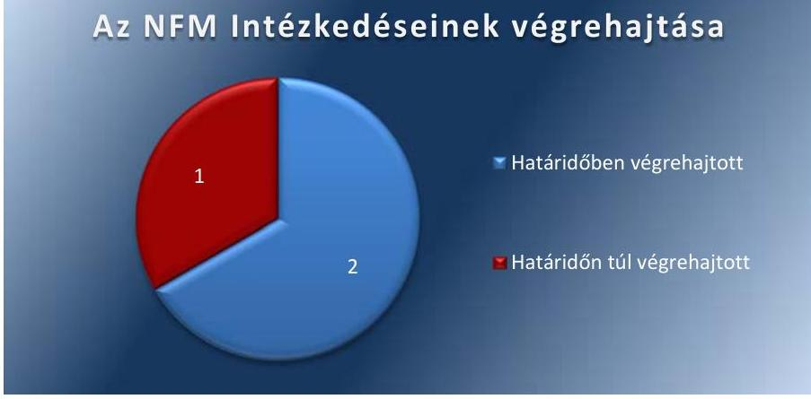

Forrás: $A S Z$

## HATÁRIDŐBEN VÉGREHAJTOTT FELADATOK:

1. Az NFM 2015. július 22-től, továbbá 2016. augusztus 20-tól hatályos SZMSZ-e (NFM SZMSZ ${ }_{1,3}{ }^{15}$ ) szerint a tulajdonosi joggyakorlással kapcsolatos feladatokat ellátó főosztályok ügyrendjét kidolgozták.
2. A MÁV Zrt. átadás-átvételi megállapodás alapján 2015. december 31-i időpontra az NFM intézkedett a MÁV Zrt. átvételi értékének korrekciójáról, módosította a MÁV Zrt. nyilvántartási értékét főkönyvi nyilvántartásában.

## HATÁRIDŐN TÚL VÉGREHAJTOTT FELADAT:

1. A MÁV Zrt. átadás-átvételi megállapodás módosítása - a helyes könyv szerinti érték feltüntetése érdekében - az intézkedési tervben foglalt határidőt 11 nappal meghaladva ugyan, de megtörtént.

AZ FM az utóellenőrzött feladatot részben hajtotta végre.

## RÉSZBEN VÉGREHAJTOTT FELADAT:

1. Az FM minisztere által jóváhagyott számlarend a központi kezelésű előirányzatokra című szabályzata kizárólag a részesedések mérlegsorra kiterjedően írja elő a részletező nyilvántartásoknak a kapcsolódó könyvviteli és nyilvántartási számlákkal való egyeztetésének dokumentálását, ami részben felel meg az Áhsz. 51. § (3) bekezdésében foglaltaknak. Mindez kockázatot jelent az állami vagyonnal való felelős gazdálkodásra.

---

AZ MFB ZRT. az utóellenőrzött alábbi feladatot határidőben végrehajtotta.

# HATÁRIDŐBEN VÉGREHAJTOTT FELADAT: 

$\qquad$ 1. Az MFB Zrt. 2015. február 13-ától hatályos SZMSZ-e megfelelt az akkor hatályos MFB Zrt. törvényben foglaltaknak.

AZ EMMI az utóellenőrzött feladatot nem hajtotta végre.

## NEM VÉGREHAJTOTT FELADAT:

1. Az EMMI a TB Alapok tekintetében az ingatlanvagyonnal kapcsolatos és megállapodásban rögzített vagyonkezelői feladatra vonatkozóan ugyan több adatkérést és kapcsolódó adatfeldolgozást végzett, azonban a bekért adatok, dokumentumok feldolgozása alapján a Vhr. 21. § (2) bekezdésének c) pontjában foglaltak ellenére a megállapításokat nem foglalta ellenőrzési jelentésbe, így azt az ellenőrzött szervezet vezetőjének sem küldte meg, mindezek alapján nem tett eleget a Vhr. 20. § (1) bekezdésében foglaltak szerinti ellenőrzési kötelezettségének.

AZ ÁEEK intézkedési tervében foglalt feladatok végrehajtásának minősítését a 3. ábra szemlélteti.
3. ábra
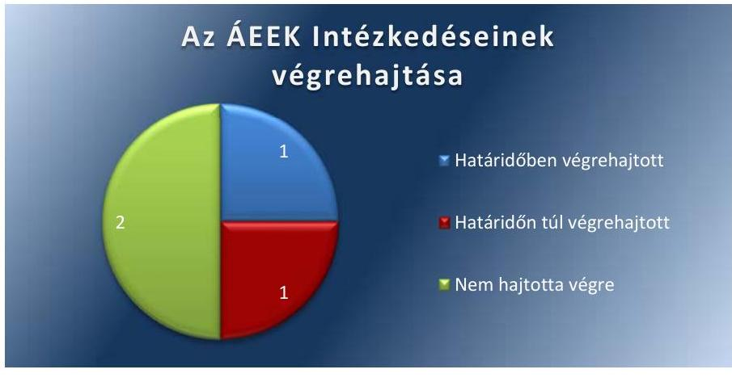

Fonás: Ász

## HATÁRIDŐBEN VÉGREHAJTOTT FELADAT:

1. Az ÁEEK 2015. július 14-étől az ÁEEK Fenntartói ellenőrzési szabályzatában ${ }^{16}$ rögzítette az Nvtv. 10. § (2) bekezdésének megfelelően a tulajdonosi és műszaki ellenőrzés eljárásrendjét. A 2016. évben gondoskodtak az erőforrások biztosításáról az ÁEEK tulajdonosi joggyakorlása alatt álló ingatlanok üzemeltetési gyakorlatának monitorozása és fejlesztése céljából. Az ÁEEK a 2016. évben végzett tulajdonosi ellenőrzést.

## HATÁRIDŐN TÚL VÉGREHAJTOTT FELADAT:

1. Az ÁEEK főigazgatója az intézkedési tervben vállalt határidőn túl, 2016. december 13-i hatállyal adta ki a Számlarend és Számviteli politika módosítását: a 28/2016. Főigazgatói utasítással az „ÁEEK

---

Rábízott Vagyon számlarendjének szabályzata" és a 29/2016. Főigazgatói utasítással „A rábízott vagyon- Számviteli politikáról szóló szabályzat"-ot. Az ÁEEK főigazgatója a „vagyon nyilvántartási szabályzatot az intézkedési tervben vállalt határidőben, 2015. július 1-i hatállyal, 14/2015. Főigazgatói utasítással kiadta.

# NEM VÉGREHAJTOTT FELADATOK: 

$\qquad$ 1. Az államháztartáson belüli szervezettel kötött vagyonkezelési szerződések aláírását követően a szerződések tárgyát képező ingatlanok bruttó értékei az 1-es főkönyvi számlaosztályból kivezetésre kerültek, azonban az Áhsz. 47. § (3) bekezdésének előírása ellenére azokat a 0 -s számlaosztályban nem vették nyilvántartásba.
2. Az intézkedési tervben vállalt feladat a vagyonhasznosítási szerződések felülvizsgálatára és új szerződésminta kidolgozására vonatkozóan nem teljesült. A vagyonhasznosítási szerződések nem tartalmazták az Nvtv. 11. § (11) bekezdése a) pontjába foglalt beszámolási, nyilvántartási, adatszolgáltatási kötelezettségek teljesítésére vonatkozó kitételt, továbbá nem tartalmazták a Vhr. 14. § (3) bekezdésében foglalt kitételt, amely szerint a vagyont hasznosító a tulajdonosi joggyakorló vagyon-nyilvántartási szabályzatát megismerte és magára nézve kötelező érvényűnek ismerte el.

AZ NFA intézkedési tervében foglalt feladatok végrehajtásának minősítését a 4. számú ábra szemlélteti:
4. ábra

## Az NFA intézkedéseinek végrehajtása

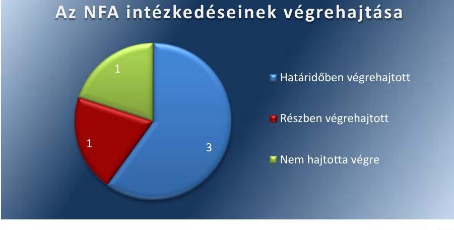

## HATÁRIDŐBEN VÉGREHAJTOTT FELADAT:

$\qquad$ 1. Az NFA az önkormányzat részére történő ingatlanok ingyenes tulajdonba adását követően intézkedett a 15 éves elidegenítési tilalom ingatlan-nyilvántartásba történő feljegyzéséről.
2. Az NFA a számviteli nyilvántartásaiban lekönyvelte a megállapítással érintett, 3 310,6 M Ft nyilvántartási értékű államháztartáson kívüli szervezetek részére vagyonkezelésbe adott földrészletet, s szerepeltette az elfogadott beszámolóban.
3. A 15215. sz. ÁSZ jelentésben javaslattal érintett, 2014. évben kötött vagyonkezelési szerződés alapján vagyonkezelésbe adott in-

---

# 1.2. számú megállapítás 

gatlan számviteli nyilvántartása - a megtett intézkedés eredményeként - a Számv. tv. ${ }^{17}$ 15. § (3) bekezdésében foglaltakkal összhangban megtörtént.

## RÉSZBEN VÉGREHAJTOTT FELADAT:

1. Az NFA a Számviteli politikájában ${ }_{1,2}{ }^{18}$ - a Számv. tv. 14. § (4) bekezdésében előírtaknak megfelelően - írásban rögzítette, hogy a számviteli elszámolás és az értékelés szempontjából mi minősül jelentősnek, illetve nem jelentősnek. A NFA leltározási szabályzatában ${ }^{19}$ - a Számv. tv. 69. § (3) bekezdésében előírtak ellenére - nem határozták meg a mennyiségi felvétellel történő leltározás gyakoriságát.

## NEM VÉGREHAJTOTT FELADAT:

1. Az NFA-nál az államháztartáson belüli szervezetek részére vagyonkezelésébe adott ingatlanok könyvekből történő kivezetése és azok bruttó értékének a 0 . számlaosztály befektetett eszközei között való nyilvántartásba vétele teljes körűen nem történt meg, ami nem felel meg az Áhsz. 47. § (3) bekezdésben foglaltaknak.

Az NFM, az FM, az EMMI, az ÁEEK és az NFA a jogszabályi rendelkezéseknek megfelelően vezette az előírt nyilvántartást az intézkedési tervben rögzített feladatok végrehajtásáról. Az MFB Zrt. és az MNV részére a jogszabály nem írta elő a nyilvántartás vezetését.

AZ NFM, AZ FM, AZ EMMI, AZ ÁEEK ÉS AZ NFA a Bkr. 14. § (1) bekezdés előírásának megfelelően a külső ellenőrzések javaslatai alapján készült intézkedési tervek végrehajtásáról éves bontásban vezetett nyilvántartást.

Az FM a nyilvántartást nem vezette naprakészen, ezért az a helyszíni ellenőrzés időpontjában a 15215. sz. ÁSZ jelentéshez kapcsolódóan elkészített intézkedési tervre vonatkozó adatokat nem tartalmazta.

A nyilvántartások tartalma megfelelt a Bkr. 47. § (2) bekezdésében foglalt előírásoknak.

AZ MNV ZRT. ÉS AZ MFB ZRT. részére a jogszabály nem írta elő nyilvántartás vezetését.

---

.

---

# MELLÉKLETEK

■ I. SZ. MELLÉKLET: AZ MNV ZRT. INTÉZKEDÉSI TERVÉNEK VÉGREHAJTÁSA

|  Sor-
szám | Intézkedési terv alapján elvégzendő feladat | Intézkedési tervben meghatározott határidő | Az intézkedési tervben rögzített feladatok elvégzésének felelőse | Az intézkedés végrehajtása  |
| --- | --- | --- | --- | --- |
|  Határidőben végrehajtott feladatok |  |  |  |   |
|  1. | Hasznosítási szerződésminta kidolgozása, különös tekintettel az ÁSZ jelentésben szereplő megállapításokkal kapcsolatos klauzulákra. | 2016.04.30. | ingó és ingatlanvagyonért felelős főigazgató/ közvetlen kezelésű ingatlangazdálkodási igazgató | A hasznosítási, így a lakásbérleti szerződések és az ingyenes használati megállapodások mintájának módosítását határidőben elvégezték.  |
|  2. | A MÁV Zrt. által az NFM részére 2014. január 1. napi hatállyal történő átadásának végrehajtása céljából kötött átadás-átvételi megállapodás módosítása a tényleges kivezetési érték rögzítésével, az NFM-mel egyeztetve. | 2016.02.28. | társasági portfólióért felelős főigazgató II./társaságokért felelős igazgató II.; gazdasági igazgató | A MÁV Zrt. átadás-átvételi megállapodás NFM-mel történt egyeztetést követő módosítása határidőben megtörtént. Az MNV Zrt. igazgatósága a megállapodás módosítását 2016. február 23-án 61/2016. (II.23.) IG sz. határozatában jóváhagyta, az MNV Zrt. vezérigazgatója részéről 2016. február 25-én aláírásra került.  |
|  3. | A MÁV Zrt átadás-átvételéről szóló megállapodással összefüggésben feltárt szabálytalanság tekintetében belső ellenőrzés lefolytatása az MNV Zrt.-nél a felelősség tisztázása, szükség szerint a felelősség érvényesítése érdekében. | 2016.06.30. | ellenőrzési igazgató | Az MNV Zrt. Ellenőrzési Igazgatósága 2016. június 30-án lezárta a MÁV Zrt. átadás-átvételéről szóló megállapodással összefüggésben feltárt szabálytalanság tekintetében lefolytatott ellenőrzését. Az ellenőrzés egyik szervezeti egység, illetve munkavállaló felelősségét sem állapította meg.  |
|  4. | A rábízott vagyon számlarendjének módosítása | 2016.03.31. | gazdasági igazgató/pénzügyi, számviteli és követeléskezelési igazgató | A 2016. március 31-én jóváhagyott, az MNV Zrt. rábízott vagyonára vonatkozó Számlarendet (9/2016. számú vezérigazgatói utasítás) módosították  |
|  Határidőn túl végrehajtott feladatok |  |  |  |   |
|  5. | Saját és rábízott vagyon leltározási szabályzat módosítása | 2016.03.31. | gazdasági igazgató/pénzügyi, számviteli és követeléskezelési igazgató | Az MNV Zrt. a vállalt határidőt két hónappal meghaladva, 2016. május 31-én módosította a saját és rábízott vagyonának leltározási szabályzatát (16/2016. számú vezérigazgatói utasítás).  |

---

|  Sorszám | Intézkedési terv alapján elvégzendő feladat | Intézkedési tervben meghatározott határidő | Az intézkedési tervben rögzített feladatok elvégzéseinek felelőse | Az intézkedés végrehajtása  |
| --- | --- | --- | --- | --- |
|  6. | Vagyon-nyilvántartási szabályzat módosítása | 2016.09.30. | gazdasági igazgató/pénzügyi, számviteli és követeléskezelési igazgató | Az MNV Zrt. a vállalt határidőt több mint két hónappal meghaladva, 2016. december 13-án módosította a rábízott vagyonába tartozó, közvetlen kezelésű immateriális javak, tárgyi eszközök és készletek nyilvántartási szabályzatát. (60/2016. számú vezérigazgatói utasítás)  |
|   |  | Részben végrehajtott feladat |  |   |
|  7. | Az ÁSZ által vizsgált időszakban /2014. január 1. – 2014. december 31./ létrejött bérleti szerződéseket az MNV Zrt. felülvizsgálja, és amennyiben szükséges – a felülvizsgálat időpontjában hatályos jogszabályi előírásokra is tekintettel, a szerződő partner egyező akaratnyilatkozata esetén –, intézkedik azok módosítása érdekében, vagy a szerződő partnert – alakszerű visszaigazolás megkövetelése mellett – tájékoztatja arról, hogy a szerződéses kötelezettségei teljesítése során milyen további jogszabályi kötelezettségek figyelembevételével kell eljárnia. | 2016.06.30. | ingó és ingatlanvagyonért felelős főigazgató | Az MNV Zrt. a 2014. január 1- 2014. december 31. között létrejött bérleti szerződéseket felülvizsgálta és – amennyiben a felülvizsgálat eredményeként szükséges volt – intézkedett azok módosítása érdekében. Az érintett bérleti szerződések módosításáról a 412/2016. (IX.06) VIG sz. a 413/2016. (IX.06) VIG sz. és a 414/2016. (IX.06) VIG sz. határozatokban és a 466/2016.(VIII.10) VIG sz. határozatban hoztak döntést, majd ezt követő időszakban intézkedtek a szerződő partnerek tájékoztatásáról. A bérleti szerződések részben kerültek módosításra, több ellenőrzött szerződés továbbra sem tartalmazza az Nvtv. 11. § (11) bekezdésében foglalt beszámolási, nyilvántartási, adatszolgáltatási kötelezettségek tejesítését, a vagyon meghatározott hasznosítási célnak megfelelő használatát, valamint a harmadik fél részére történő hasznosítás esetében az átlátható szervezet rögzítését. Az utóellenőrzött szerződések egy része továbbra sem tartalmazza a Vhr. 14. § (3) bekezdésében és a 20. § (1) bekezdésében foglaltakkal ellentétben azt, hogy a szerződő partner az MNV Zrt. vagyon-nyilvántartási szabályzatát megismerte és magára nézve kötelező érvényűnek ismeri el, és hogy az MNV Zrt. tulajdonosi ellenőrzés eljárásrendjét, a felek jogait, kötelezettségeit a felek a szerződés részének tekintik.  |
|   |  | Nem végrehajtott feladat |  |   |
|  8 | Az ingatlanok államháztartáson belüli egyéb vagyonkezelők részére történő vagyonkezelésbe adásának SAP rendszerben történő rögzítése, a vagyonkezelésbe adott eszközök mérlegből | 2016.06.30. | gazdasági főigazgató/pénzügyi, számviteli és követeléskezelési igazgató | A 2014. évben megállapítással érintett 11 ingatlan közül 4 szerződés kapcsolódott egyéb vagyonkezelő szervezethez. Az ellenőrzött négy szerződéshez kapcsolódóan  |

---

|  Sorszám | Intézkedési terv alapján elvégzendő feladat | Intézkedési tervben meghatározott határidő | Az intézkedési tervben rögzített feladatok elvégzéseinek felelőse | Az intézkedés végrehajtása  |
| --- | --- | --- | --- | --- |
|   | történő kivezetése, mérlegen kívüli tételként történő teljes körű kimutatása |  |  | teljes körűen nem történt meg az intézkedési tervben foglaltak határidőben való végrehajtása, mivel a főkönyvből való kivezetés, 0-s számlaosztályba való felvétel ugyan megtörtént, azonban az SAP rendszerbe való rögzítést nem végezték el; előfordult, hogy az átvezetés nem történt meg, így az érintett ingatlan nem került nyilvántartásra sem az MNV Zrt. főkönyvében, sem a 0s nyilvántartási számlákon.  |

*Forrás: ÁSZ saját szerkesztés*

---

# II. SZ. MELLÉKLET: AZ NFM INTÉZKEDÉSI TERVÉNEK VÉGREHAITÁSA

|  Sor-
szám | Intézkedési terv alapján elvégzendő feladat | Intézkedési tervben
meghatározott határ-
idő | Az intézkedési tervben
rögzített feladatok el-
végzésének felelőse | Az intézkedés végrehajtása  |
| --- | --- | --- | --- | --- |
|  Határidőben végrehajtott feladatok |  |  |  |   |
|  1. | Tulajdonosi joggyakorlással kapcsolatban feladatokat ellátó fő-
osztályok ügyrendjei SZMSZ-nek megfelelő aktualizálása | intézkedési terv készítéséig
megtörtént | NFM miniszter | Az NFM 2015. július 22-től hatályos SZMSZ-e szerint a
tulajdonosi joggyakorlással kapcsolatos feladatokat el-
látó főosztályok ügyrendjét az NFM kidolgozta.  |
|  2. | A módosított megállapodás alapján intézkedés a MÁV Zrt. átvé-
teli érték korrekciójának az NFM 2015. évi számviteli nyilvántar-
tásaiban való rögzítéséről. | 2016.03.15. | NFM Gazdasági Ügyekért fe-
lelős Helyettes Államtitkárság | A MÁV Zrt. átadás-átvételi megállapodás alapján 2015.
december 31-i időpontra az NFM intézkedett a MÁV Zrt.
átvételi értékének korrekciójáról, módosította a MÁV
Zrt. nyilvántartási értékét főkönyvi nyilvántartásában.  |
|  Határidőn túl végrehajtott feladatok |  |  |  |   |
|  3. | A MÁV Zrt. feletti tulajdonosi joggyakorlás átadás-átvételéről az
NFM és az MNV Zrt. között létrejött megállapodás módosítása
a társaság helyes könyv szerinti értékének feltüntetése érdeké-
ben. | 2016.02.28. | NFM Vagyongazdálkodásért
Felelős Helyettes Államtitkár-
ság | A MÁV Zrt. átadás-átvételi megállapodás módosítása -
a helyes könyvszerinti érték feltüntetése érdekében - az
intézkedési tervben foglalt határidőt 11 nappal megha-
ladva történt meg. Az NFM részéről a megállapodás alá-
írására 2016. március 11-én került sor.  |

Fonrás: ÁSZ saját szerkesztés

---

# III. SZ. MELLÉKLET: AZ FM INTÉZKEDÉSI TERVÉNEK VÉGREHAJTÁSA

|  Sor-
szám | Intézkedési terv alapján elvégzendő feladat | Intézkedési tervben meghatározott határidő | Az Intézkedési tervben rögzített feladatok elvégzésének felelőse | Az Intézkedés végrehajtása  |
| --- | --- | --- | --- | --- |
|  Részben végrehajtott feladatok |  |  |  |   |
|  1. | A jogszabályi kötelezettségnek eleget téve 2015. évtől központi kezelésű előirányzaton mutatjuk ki a tulajdonosi műveletek hatását, amelynek következményeként a kapcsolódó feladatok elvégzésére szervezeti egységek közötti feladat átadás-átvétel történt. Ezt követően elkészült az új és aktualizált Számviteli Politika a hozzá kapcsolódó szabályzatokkal, köztük a Számlarenddel, amely a jogszabályi előírásoknak megfelelően került összeállításra oly módon, hogy hiányosságként kiemelt egyeztetési dokumentálási folyamat leírását részleteiben is beépítjük a Számlarendbe, annak 2. számú függelékeként. | 2016.03.31. | Költségvetési Főosztály vezetője | Az FM kiegészítette a számlarendjét, azonban az FM határidőn túl módosított, 2016. június 24-től hatályos számlarendje a részletező nyilvántartásoknak a kapcsolódó könyvviteli és nyilvántartási számlákkal való egyeztetésének dokumentálására vonatkozó előírása kizárólag a részesedések mérleggorra terjed ki. Az FM Számlarend a többi mérleggorra vonatkozóan az egyeztetés dokumentálására vonatkozó előírásokat nem rögzít.  |

Fonás: ÁSZ saját szerkesztés

---

# IV. SZ. MELLÉKLET: AZ MFB ZRT. INTÉZKEDÉSI TERVÉNEK VÉGREHAJTÁSA

|  Sor-
szám | Intézkedési terv alapján elvégzendő feladat | Intézkedési tervben
meghatározott határ-
idő | Az intézkedési tervben
rögzített feladatok el-
végzésének felelőse | Az intézkedés végrehajtása  |
| --- | --- | --- | --- | --- |
|  Határidőben végrehajtott feladat |  |  |  |   |
|  1. | Az MFB Zrt. módosítása SZMSZ-ét az állami számvevőszéki javaslatnak megfelelően. | intézkedési terv készítéséig megtörtént | MFB ZRT. vezérigazgatója | Az SZMSZ módosítása a módosításkor hatályos MFB tvben foglaltaknak megfelelt. Az SZMSZ a Vtv. 3. § (2) bekezdésében foglaltak szerint tartalmazza az MFB Zrt. felett tulajdonosi jogokat gyakorló miniszter megnevezését.  |

Fonrás: ÁSZ saját szerkesztés

---

# V. SZ. MELLÉKLET: AZ EMMI INTÉZKEDÉSI TERVÉNEK VÉGREHAJTÁSA

|  Sor-
szám | Intézkedési terv alapján elvégzendő feladat | Intézkedési tervben meghatározott határidő | Az intézkedési tervben rögzített feladatok elvégzésének felelőse | Az intézkedés végrehajtása  |
| --- | --- | --- | --- | --- |
|  Nem végrehajtott feladatok |  |  |  |   |
|  1. | Intézkedés az állami vagyonnal való gazdálkodás jogszabályban foglaltak szerinti tulajdonosi ellenőrzéséről | 2016.12.31. | A gazdasági ügyekért felelős helyettes államtitkár (az egészségügyért felelős államtitkár és a család- és ifjúságért felelős államtitkár közreműködésével) | Az EMMI a TB Alapok tekintetében az ingatlanvagyonnal kapcsolatos és megállapodásban rögzített vagyonkezelői feladatra vonatkozóan tulajdonosi ellenőrzést nem végzett. Több adatkérést (pl. leltár, adatszolgáltatás az átalakulással érintett vagyonról, működési folyamatok és problémák azonosítása) és kapcsolódó adatfeldolgozást ugyan végzett, azonban a bekért adatok, dokumentumok feldolgozása alapján a Vhr. 21. § (2) bekezdésének c) pontjában foglaltak ellenére a megállapításokat nem foglalta ellenőrzési jelentésbe, így azt az ellenőrzött szervezet vezetőjének sem küldte meg, mindezek alapján nem tett eleget a Vhr. 20. § (1) bekezdésében foglaltak szerinti ellenőrzési kötelezettségének.
Fonráz: ÁSZ saját szerkesztés  |

---

# V. SZ. MELLÉKLET: AZ ÁEEK INTÉZKEDÉSI TERVÉNEK VÉGREHAJTÁSA

|  Sorszám | Intézkedési terv alapján elvégzendő feladat | Intézkedési tervben meghatározott határidő | Az intézkedési tervben rögzített feladatok elvégzésének felelőse | Az intézkedés végrehajtása  |
| --- | --- | --- | --- | --- |
|  **Határidőben végrehajtott feladatok** |  |  |  |   |
|  1. | A tulajdonosi ellenőrzés személyi és tárgyi feltételeit biztosítani kell, a tulajdonosi ellenőrzéseket kockázatelemzésen alapuló ellenőrzési terv alapján végre kell hajtani az ÁEEK fenntartásában lévő intézményekben | folyamatos | Intézmények Ellenőrzéséért Felelős Főosztály vezetője, Intézmény Koordinációs Főosztály vezetője | Az ÁEEK 2015. július 14-étől a Fenntartói ellenőrzési szabályzatában rögzítette a tulajdonosi és műszaki ellenőrzés eljárásrendjét. A 2016. évben 3 fő került felvételre az ÁEEK tulajdonosi joggyakorlása alatt álló ingatlanok üzemeltetési gyakorlatának monitorozása és fejlesztése céljából. Az ÁEEK a 2016. évben 70 db tulajdonosi ellenőrzést tervezett, amelyekből a 2016. évben 56 db fejeződött be.  |
|  **Határidőn túl végrehajtott feladatok** |  |  |  |   |
|  2. | El kell készíteni a számviteli politika, a számlarend, a vagyon-nyilvántartási szabályzat módosítását. | 2016.06.30 | az ÁEEK Gazdálkodásért Felelős Főosztályvezetője | Az ÁEEK főigazgatója az intézkedési tervben vállalt határidőn túl, 2016. december 13-i hatállyal adta ki a Számlarend és Számviteli politika módosítását: a 28/2016. Főigazgatói utasítással az „ÁEEK Rábízott Vagyon számlarendjének szabályzata” és a 29/2016. Főigazgatói utasítással a „A rábízott vagyon- Számviteli politikáról szóló szabályzat”-ot. Az ÁEEK főigazgatója a vagyon-nyilvántartási szabályzatot az intézkedési tervben vállalt határidőben, 2015. július 1-i hatállyal, a 14/2015. Főigazgatói utasítással kiadta.  |
|  **Nem végrehajtott feladat** |  |  |  |   |
|  3. | A vagyonkezelésbe adott ingatlanok könyvekből történő kivezetését, azok bruttó értékének a 0. számlaosztályban történő nyilvántartásba vételét el kell végezni. | folyamatos | Számviteli osztályvezető | Az állománycsökkentési bizonylatok alapján, az államháztartáson belüli szervezettel kötött vagyonkezelési szerződések aláírását követően a vagyonkezelésbe adott ingatlanok az 1-es főkönyvi számlaosztályból kivezetésre kerültek, azonban az Áhsz. 47. § (3) bekezdés előírása ellenére az adott ingatlanok bruttó értékét a 0-s számlaosztályban nem vette nyilvántartásba.  |

---

|  4. | A vagyonhasznosítási szerződéseket felül kell vizsgálni, új szerződésmintát kell kialakítani. |  | Jogi Főosztály vezetője, intézmény Koordinációs Főosztály vezetője | Az intézkedés nem tartalmazta a beszámolási, nyilván-tartási, adatszolgáltatási kötelezettségek teljesítésére vonatkozó kitételt, továbbá nem tartalmazták azt a kitételt, amely szerint a vagyont hasznosító a tulajdonosi joggyakorló vagyon nyilvántartási szabályzatát megismerte és magára nézve kötelező érvényűnek ismerte el.  |
| --- | --- | --- | --- | --- |
|  |   |   |   |   |

Fonrás: ASZ saját szerkesztés

---

# VIL. SZ. MELLÉKLET: AZ NFA INTÉZKEDÉSI TERVÉNEK VÉGREHAJTÁSA

|  Sorszám | Intézkedési terv alapján elvégzendő feladat | Intézkedési tervben meghatározott határidő | A javaslat címzettje | Az intézkedés végrehajtása  |
| --- | --- | --- | --- | --- |
|  **Intézkedési terv alapján elvégzendő feladatok** |  |  |  |   |
|  1. | Az ÁSZ vizsgálati jelentésében szerepeltetett, az ingyenes önkormányzati tulajdonba adással érintett 18 db földrészlet esetében az ingatlan-nyilvántartásba az elidegenítési tilalom feljegyzése megtörtént. | Végrehajtott, 2015.08.31. | NFA elnöke | Az NFA az önkormányzat részére történő ingatlan ingyenes tulajdonba adását követően az intézkedési tervben foglalt határidőt megelőzően intézkedett az ingatlanok esetében az elidegenítési tilalom ingatlan-nyilvántartásba történő feljegyzéséről.  |
|  2. | A megállapított hiányzó földrészleteket lekönyvelik és szerepeltetik a számviteli nyilvántartásaikban és az elfogadott beszámolóban. | Végrehajtott, 2015.08.19. | NFA elnöke | A hiányzó földrészleteket az NFA lekönyvelte és szerepeltette a számviteli nyilvántartásaiban és az elfogadott beszámolóban.  |
|  3. | Intézkednek az önkormányzat vagyonkezelésébe adott földrészletek @vatar vagyon-nyilvántartási rendszerben történő, jogszabálynak megfelelő nyilvántartásáról. | Végrehajtott, 2015.08.19. | NFA elnöke | Az önkormányzat vagyonkezelésébe adott ingatlan jogszabálynak megfelelő nyilvántartását elvégezték és szerepeltették az Avatar vagyon-nyilvántartási rendszerben.  |
|  **Intézkedési tervben meghatározott határidő** |  |  |  |   |
|  4. | A Számviteli Politika 2015. március 12-én módosult, amely tartalmazza a jelentéstervezetben kifogásolt számviteli elszámolás és az értékelés szempontjából jelentős, nem jelentős értékhatárok meghatározását. A leltározási és leltárkészítési szabályzatban a 2015. március 12-én történt módosítással egyidejűleg meghatározásra került a mennyiségi felvétellel történő leltározás gyakorisága. | Végrehajtott, 2015.03.12. | NFA elnöke | Az NFA 2015. március 12-től hatályos Számviteli politikájá-ban, illetve a 2016. február 29-étől hatályos Számviteli politikájá-ban írásban rögzítették, hogy a számviteli elszámolás és az értékelés szempontjából mit tekintenek jelentősnek, nem jelentősnek.  |
|  **Nem végrehajtott feladatok** |  |  |  |   |
|  5. | Intézkednek az államháztartáson belüli szervezet vagyonkezelésébe adott ingatlanok könyvekből történő kivezetéséről és azok bruttó értékének a 0. számlaosztály befektetett eszközei között való nyilvántartásáról. | Végrehajtott, 2015.08.19. | NFA elnöke | Az ellenőrzött mintatételek alapján, az államháztartáson belüli szervezet vagyonkezelésébe adott ingatlanok könyvekből történő kivezetése és azok bruttó értékének a 0. számlaosztály befektetett eszközei között való nyilvántartásba vétele nem történt meg.  |

*Forrás: ÁSZ saját szerkesztés*

---

# FÜGGELÉK: ÉSZREVÉTELEK 

A jelentéstervezetet a Számvevőszék 15 napos észrevételezésre megküldte az ellenőrzött szervezetek vezetőinek az ÁSZ tv. 29. §* (1) bekezdése előírásának megfelelően.

A függelék tartalmazza az ellenőrzött szervezetek észrevételeit, illetve az el nem fogadott észrevételek elutasításának indoklását.

- Az Emberi Erőforrások Minisztériuma közigazgatási államtitkára 3340-10/2017/ELL iktatószámú levele
- A Magyar Fejlesztési Bank Zrt. ügyvezető igazgatóinak 722-9/2017. iktatószámú levele
- Az Állami Egészségügyi Ellátó Központ főigazgatójának AEEK/1200-020/2017. iktatószámú levele észrevételekkel
- Tájékoztatás az elfogadott és az el nem fogadott észrevételekről (V-1405-166/2016.)
- A Magyar Nemzeti Vagyonkezelő Zrt. vezérigazgatójának MNV/01/25875/1/2017. iktatószámú levele észrevételekkel
- Tájékoztatás az elfogadott és az el nem fogadott észrevételekről (V-1405-163/2016.)
* 29. § (1) Az Állami Számvevőszék az ellenőrzési megállapításait megküldi az ellenőrzött szervezet vezetőjének vagy az általa megbízott személynek, és annak, akinek személyes felelősségét állapította meg.
(2) Az ellenőrzött szervezet vezetője és a felelősként megjelölt személy az ellenőrzés megállapításaira tizenöt napon belül írásban észrevételt tehet.
(3) Az Állami Számvevőszék az észrevételre a beérkezésétől számított harminc napon belül írásban válaszol. A figyelembe nem vett észrevételeket köteles a jelentésben feltüntetni, és megindokolni, hogy azokat miért nem fogadta el.

---

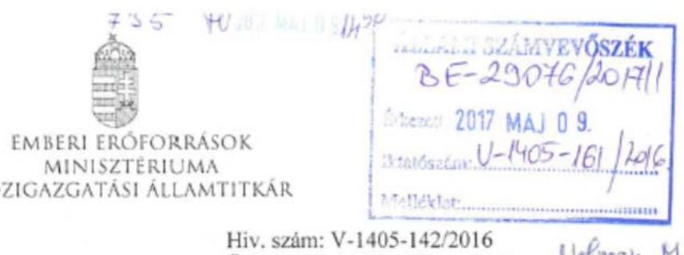

Iktatószám: 3340-10/2017/ELL

Hiv. szám: V-1405-142/2016
Ügyintéző: Bánkné Simon Judit
Tel. szám: +36 (1) 795 4430
Melléklet: -

Domokos László részére
elnök

Állami Számvevőszék

Budapest
Apáczai Csere János u. 10.
1052

Tárgy: Észrevétel jelentéstervezethez

Tisztelt Elnök Úr!

Tájékoztatom, hogy az „Utóellenőrzések – Az állami vagyon feletti tulajdonosi joggyakorlással kapcsolatos tevékenységek utóellenőrzése” című számvevőszéki jelentéstervezethez – a Szervezeti és Működési Szabályzat 146. § (1) bekezdés (b) pontjában meghatározott jogkörömben eljárva – nem teszek észrevételt.

Budapest, 2017. május 2.

Üdvözlettel:

Dr. Lengyel Györgyi

Cím: 1054 Budapest Akadémia utca 3. Tel: +36 1 795 1200, Fax: +36 1 795 0022
E-mail: info@cmmis.gov.hu

---

# MFB

**Domokos László úr**

**elnök részére**

**Állami Számvevőszék**

**Tisztelt Elnök Úr!**

2017. április 21-én köszönettel kézhez vettük az Állami Számvevőszék „Utóellenőrzések – Az állami vagyon tulajdonosi joggyakorlással kapcsolatos tevékenységek utóellenőrzéséről” szóló jelentéstervezetét.

Az MFB Zrt. a jelentéstervezettel kapcsolatban észrevételt tenni nem kíván.

Budapest, 2017. április 25.

Tisztelettel:

**MFB MAGYAR FEJLESZTÉSI BANK**

**Zártkörűen Működő Részvénytársaság**

**Huray King**

**Huray Kinga**

**ügyvezető igazgató**

---

# Függelék: Észrevételek 

## 716

## 1125 Budapest, Ciós árok 3

Tel. 13561522 , Fax 13757253
1525 Budapest 114 M. 32

Domokos László
elnök részére
Állami Számvevőszék

Budapest
Apáczai Csere János utca 10.
1052

Iktatószám:
Úgyintéző:
Telefonszám:
E-mail:
horváth Attila Vilmos
horvath Attila vilmos
06-1-356-1522/163
horvath.artila.vilmos@aeek.hu

## 2017 MAJ 05

## 1405-150/2016

Tárgy: Válasz a V-1405-141/2016. és V-1405-150/2016. ikt. számú számvevőszéki levelekre

## Tisztelt Elnök Úr!

Az Ön által V-1405-141/2016. iktató számon, az „Utóellenőrzések - Az állami vagyon feletti tulajdonosi joggyakorlással kapcsolatos tevékenységek utóellenőrzése" tárgyú ellenőrzéssel kapcsolatban megküldött, 2017. április 18-án kelt leveléhez csatolt jelentés-tervezetben szereplő, az Állami Egészségügyi Ellátó Központ (ÁEEK) nem végrehajtott feladataira vonatkozó megállapításokra az alábbi észrevételeket teszem.
1.) A jelentés-tervezetben nem végrehajtott feladatként szerepel, hogy a vagyonkezelésbe adott ingatlanok bruttó értékei az 1-es főkönyvi számlaosztályból kivezetésre kerültek, azonban az Áhsz. 47. § (3) bekezdésének előirása ellenére azokat a nullás számlaosztályban nem vette nyilvántartásba az ÁEEK.

Kérem a megállapítások pontositását, az alábbiak figyelembe vételével:
Az egészségügyi ágazatban használt Ct-Ecostat integrált számviteli rendszer jelenleg a „ullás számlaosztályban nyilvántartásba vett eszközöket kizárólag egy soron, egy összegben tudja nyilvántartani, azon belül tételes bontásra nincs lehetőség. A problémával érintett vagyonkezelésbe adott többféle eszköz nagy száma miatt a probléma teljes körű megoldása összetett folyamat, annak keretében irányítási, szervezési és finanszírozási kérdéseket is meg kell vizsgálni. A megoldási lehetőségek azonosítása folyamatban van. Ennek keretében az ÁEEK már felvette a kapcsolatot a rendszer fejlesztőjével és megkezdte a szakértői egyeztetéseket egy esetleges fejlesztés lehetőségeiről. A megoldandó problémák összetettsége miatt az intézkedési tervben a feladat végrehajtására folyamatos határidőt vállaltunk, a végrehajtás ezzel összhangban folyamatban van.

---

# AEEK 

Ailami Egészsárjügyi Ellátó Központ
2.) A jelentéstervezet nem végrehajtott feladatok közé sorolta a vagyonhasznosítási szerződések felülvizsgálatát és új szerződésminta kidolgozását.

A megállapításokat kérem kiegészíteni az alábbiak figyelembevételével:

A helyszíni ellenőrzés 2017. februárí befejezését követően az ingatlanok hasznosítása tárgyában kötött vagyonhasznosítási szerződéseket az ÁEEK szakterülete felülvizsgálta. A tapasztalt hiányosságok alapján a szakterület új szerződésmintát dolgozott ki, továbbá átláthatósági nyilatkozat mintát készített, amelyeket levelem mellékleteként megküldök.

Kérem Elnök Urat a végleges jelentés elkészítésénél a fentiekben foglalt észrevételeimet szíveskedjen figyelembe venni.

Kérem továbbá Elnök Urat, hogy jelen tájékoztatásomat az Ön által V-1405-150/2016. iktató számon megküldött figyelemfelhívó levelével kapcsolatos értesítésként is szíveskedjen elfogadni, valamint a bemutatott intézkedéseket a jogszabálysértő gyakorlat megszüntetésére, valamint a kockázatok kezelésére megtett intézkedésekként szíveskedjen elismerni.

Budapest, 2017. 2017. MÁJ 05 ".
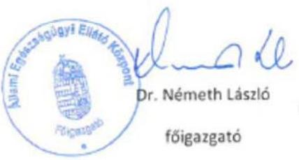

Mellékletek: - szerződésminta

- átláthatósági nyilatkozat minta

---

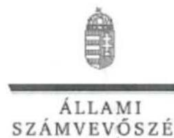

ELNÖK

Ikt.szám: V-1405-166/2016.

Dr. Németh László úr
főigazgató
Állami Egészségügyi Ellátó Központ

Budapest

Tisztelt Főigazgató Úr!

Utóellenőrzések - Az állami vagyon feletti tulajdonosi joggyakorlással kapcsolatos tevékenységek utóellenőrzése címủ számvevőszéki jelentéstervezetre tett észrevételeit köszönettel megkaptam.

Az Állami Számvevőszék észrevételekre vonatkozó álláspontjáról a felügyeleti vezető által készített részletes tájékoztatást csatoltan megküldöm.

Tájékoztatom Főigazgató urat, hogy a jelentésben - az Állami Számvevőszékről szóló 2011. évi LXVI. törvény 29. § (3) bekezdése alapján - a figyelembe nem vett észrevételeket szerepeltetjük az elutasítás indokának feltüntetésével együtt.

Budapest, 2017.
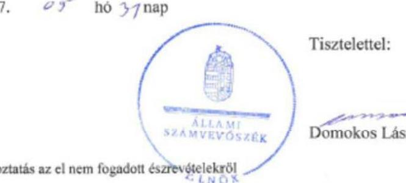

Tisztelettel:

Melléklet: Tájékoztatás az el nem fogadott észrevételekről

1852 BUDAPEST, APÁCZAI ÉSZRE JÁNOS UTCA 19. 1354 Budapest 4. Pf. 54 telefon: 4849101 fax: 4849201

---

# Tájékoztatás az el nem fogadott észrevételekröl 

Utóellenörzések - Az állami vagyon feletti tulajdonosi joggyakorlással kapcsolatos tevékenységek utóellenörzése címü számvevöszéki jelentéstervezetre AEEK/1200-020/2017. iktatószámú levelében tett észrevételeit áttekintettük, annak kezeléséről az alábbi tájékoztatást adom.

1. A jelentéstervezet 18. oldalán az ÁEEK Nem végrehajtott feladatok címszóhoz tartozó 1. sorszám alatti megállapításra tett észrevételét nem fogadtuk el. Örömmel vettük tájékoztatását, mely szerint az ÁEEK részéről a megoldási lehetőségek azonosítása folyamatban van, ugyanakkor a jelentéstervezet megállapításait az észrevételében foglaltak nem módosítják. Az államháztartás számviteléröl szóló 4/2013. (I.11.) Korm. rendelet (Áhsz). 47. § (3) bekezdése előírja, hogy a vagyonkezelésbe adott tárgyi eszközök, részesedések bruttó értékét és elszámolt értékcsökkenését, értékvesztését a vagyonkezelésbe adáskor köteles a könyveiből kivezetni, és azok bruttó értékét a 0 . számlaosztály befektetett eszközei között nyilvántartani. Észrevételében is megerősítette, hogy az ÁEEK a 0. számlaosztályban a vagyonkezelők év végi adatszolgáltatása alapján, fökönyvi számlánként összevontan, egy összegben könyvelte az államháztartáson belüli szervezeteknek vagyonkezelésébe adott tárgyi eszközök bruttó értékét és az elszámolt értékcsökkenést, mely nem felel meg a jogszabály által elöírt követelményeknek.
2. A jelentéstervezet 18. oldalán az ÁEEK Nem végrehajtott feladatok címszóhoz tartozó 2. sorszám alatti megállapításra tett észrevételét nem fogadtuk el, az abban foglalt intézkedések az ellenőrzés megállapításinál nem vehetők figyelembe, mert az ellenőrzött időszakot követően történtek. Örömmel vettük, hogy az ellenőrzött időszakot követően az ÁEEK szakterülete az ingatlanok hasznosítása tárgyában kötött vagyonhasznosítási szerződéseket felülvizsgálta, az új szerződésmintákat kidolgozta és átláthatósági nyilatkozat mintát készített, ugyanakkor az észrevételében foglaltak a jelentéstervezet megállapításait nem módosítják.

Budapest, 2017. 65 hó 2 inap

Holman Magdolna
felügyeleti vezető

---

# Tisztelt Elnök Úr! 

A 2017. április 20. napján „Az állami vagyon feletti tulajdonosi joggyakorlással kapcsolatos tevékenységek utóellenörzése" tárgyában kézhez vett, V-1405-144/2016. ikt. sz. levél mellékleteként megküldött Jelentés-tervezetre az alábbi észrevételeket tessszük:

Összegzö megállapítás 1.1. számú megállapítás „Részben végrehajtott feladatok" 1. pontja / 15. oldal 7. bekezdés és I. sz. melléklet / 22. oldal 7. pontja:

A Jelentés-tervezet megállapítása szerint az MNV Zrt. a 2014. január 1. napja és 2014. december 31. napja között létrejött bérleti szerződéseket felülvizsgálta és - amennyiben a felülvizsgálat eredményeként szükséges volt - intézkedett azok módosítása érdekében. A bérleti szerződések tartalma egyes esetekben továbbra sem felel meg az Nvtv. 11. § (11) bekezdés, Vhr. 14. § (3) bekezdés és a 20. § (1) bekezdésében foglaltaknak.

Az MNV Zrt. „Intézkedési terv az Állami Számvevőszék az állami vagyon feletti tulajdonosi joggyakorlással kapcsolatos tevékenységek ellenőrzése tárgyban készített, 15215. sz. Jelentésben foglalt intézkedést igénylő megállapításaira és javaslataira" tárgyban meghozott 23/2016. (I.23.) Vig. sz. határozatával jóváhagyásra került az Állami Számvevőszék az állami vagyon feletti tulajdonosi joggyakorlással kapcsolatos tevékenységek ellenőrzése tárgyban készített, 15215. sz. Jelentésben foglalt intézkedést igénylő megállapítások és javaslatok végrehajtására vonatkozó Intézkedési terv.

Az Intézkedési terv 3.2. pontja szerint az Állami Számvevőszék által vizsgált időszakban /2014. január 1.-2014. december 31./ létrejött bérleti szerződéseket az MNV Zrt. felülvizsgálja és amennyiben szükséges - a felülvizsgálat időpontjában hatályos jogszabályi előírásokra is tekintettel, a szerződő partner egyező akaratnyilvánítása esetén - intézkedik azok módosítása érdekében, vagy a szerződő partnert alakszerü visszaigazolás megkövetelése mellett tájékoztatja arról, hogy a szerződéses kötelezettségei teljesítése során milyen további jogszabályi kötelezettségek figyelembe vételével kell eljárnia."

---

A jogszabályoknak történő megfeleltetés érdekében az érintett 8 bérlőnek megküldésre került a szerződésmódosítás, amelyből:

- 3 bérlő aláírta a szerződésmódosítást (Nagy Ernő/SZT-101586, RC Duna Kft./ SZT-41609/2.,SZAFI-LAK Kft./SZT-102110);
- 1 bérlő esetében az alapszerződésének módosítása miatt a kezdeményezett szerződésmódosítás okafogyottá vált (STÜDIÓ-V Ingatlanhasznosító Kft./ SZT-102847);
- 1 bérlő átvette a szerződés-módosítást, azonban azt nem küldte vissza az MNV Zrt. részére (Menoni János/SZT-100598);
- 3 bérleti szerződés esetében a megküldött szerződés-módosítás „nem kereste" jelzéssel visszaérkezett Társaságunkhoz (Gróf Csaba, Grófné Váradi Anna, Csonka Dániel Áron/SZT-102251, Mobilier Kereskedelmi és Szolgáltató Kft./SZT-101152, Pandovici Anna/SZT-103237).

Tekintettel arra, hogy mind az Intézkedési terv 3.2. pontja szerint, mind a szerződések módosítására vonatkozó általános jogi gyakorlat szerint egy szerződés a szerződő partner egyező akaratnyilvánítása esetén módosítható, ezért a partnerek egy részének nem együttmüködő magatartása miatt ezen szerződéseket az MNV Zrt. nem tudta módosítani, azonban az Intézkedési terv 3.2. pontjában foglalt feladatok végrehajtása megtörtént.

A fentiek alapján kérjük a hivatkozott megállapítás pontosítását.

Összegző megállapítás 1.1. számú megállapítás „Nem végrehajtott feladatok" 1. pontja / 15. oldal 8. bekezdés és I. sz. melléklet / 22. oldal 8. pontja:

A Jelentés-tervezet szerint az MNV Zrt. a vagyonkezelésbe adott ingatlanokat nem teljes körűen tartja nyilván a 0 . számlaosztályban és több ingatlan esetében az Intézkedési tervben foglaltakkal szemben nem történt meg a fökönyvből való kivezetése.

A megállítással kapcsolatban megjegyezzük, hogy az MNV Zrt.-nek az államháztartás számviteléről szóló 4/2013. (I. 11.) Korm. rendelet 5. § (1) bekezdése, valamint a 33. § (3) bekezdése szerint a rábízott állami vagyonról éves költségvetési beszámolót kell készíteni és azt a Kincstár által működtetett elektronikus adatszolgáltató rendszerbe fel kell töltenie a költségvetési évet követő év június 30 -áig.

Az elkészült éves költségvetési beszámolót az MNV Zrt. harminc napon belül megküldi az állami vagyon felügyeletéért felelős miniszternek is. Az MNV Zrt. éves költségvetési beszámolója az állami vagyon felügyeletéért felelős miniszter mint a Részvényesi Jogok Gyakorlója által a tárgyban kiadott jóváhagyó határozattal válik véglegessé.

Az utóellenőrzés idöszaka 2015. december 29. napjától 2017. január 3. napjáig terjedt. Az utóellenőrzés időszakában 2016. évre vonatkozóan az MNV Zrt. még nem zárta le könyveit, a nyilvántartások rendezése az éves zárás időpontjáig folyamatosan történik. Az állami vagyonváltozását érintő mozgások - így az államháztartáson belüli vagyonkezelésbe adás rögzítése ütemezetten történik, az ellenőrzés időszakában nem minősülhetett teljes körüen végrehajtott feladatnak.

---

Az SAP nyilvántartásában a vagyonkezelésbe adás esetén automatizmus keretén belül történik a könyvelés a 0. számlaosztályba. Az előzőekben foglaltak miatt a feladat nem volt elvégezhető, a végrehajtásának tervezett időpontja az MNV Zrt. 2016. évi éves költségvetési beszámolója lezárásának napja.

Kérem Elnök Urat, hogy a jelentés véglegesítése során jelen észrevételeinket szíveskedjenek figyelembe venni.

Budapest, 2017. május „11 „

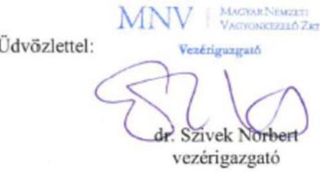

---

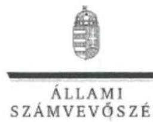

# Dr. Szivek Norbert úr 

vezérigazgató

Magyar Nemzeti Vagyonkezelő Zrt.

## Budapest

## Tisztelt Vezérigazgató Úr!

Az Utóellenőrzések - Az állami vagyon felettí tulajdonosi joggyakorlással kapcsolatos tevékenységek utóellenőrzése címủ számvevôszéki jelentéstervezetre tett észrevételeit köszönettel megkaptam.

Az Állami Számvevőszék észrevételekre vonatkozó álláspontjáról a felügyeleti vezető által készített részletes tájékoztatást csatoltan megküldöm.

Tájékoztatom Vezérigazgató urat, hogy a jelentésben - az Állami Számvevőszékről szóló 2011. évi LXVI. törvény 29. § (3) bekezdése alapján - a figyelembe nem vett észrevételeket szerepeltetjük az elutasítás indokának feltüntetésével együtt.

Budapest, 2017.
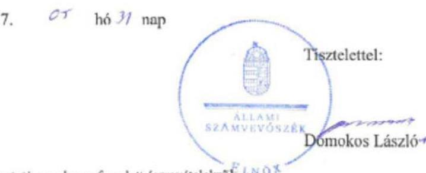

Melléklet: Tájékoztatás az el nem fogadott észrevételekröl

---

# Tájékoztatás az el nem fogadott észrevételekről 

Utóellenörzések - Az állami vagyon feletti tulajdonosi joggyakorlással kapcsolatos tevékenységek utóellenörzése címủ számvevőszéki jelentéstervezetre MNV/01/25875/1/2017. iktatószámú levelében tett észrevételeit áttekintettük, annak kezeléséről az alábbi tájékoztatást adom.

1. A jelentéstervezet 15. oldalán az MNV Zrt. Részben végrehajtott feladatok címszóhoz tartozó 1. sorszám alatti megállapításra tett észrevételét nem fogadtuk el. A jelentéstervezet - Az ellenörzés módszerei címủ fejezetben - részletesen rögzíti az Állami Számvevőszék által az ellenőrzés lefolytatása során alkalmazott módszereket. Az MNV Zrt. utóellenőrzött intézkedési tervének 3.2. pontjában vállalt intézkedés végrehajtását mintavétellel ellenőriztük. A mintavételes eljárás során kiválasztásra került elemek nem az észrevételében jelzett 8 bérlőre korlátozódtak, a jelentéstervezet kifogásolt megállapítása az észrevételben szereplő szerződéses partnereken kívül más partnerekkel kötött szerződéseket is érintettek. Az ellenőrzött mintatételek között az észrevételben jelzetteken kívül több esetben előfordult, hogy a szerződések nem tartalmazták a jogszabályok (a nemzeti vagyonról szóló 2011. évi CXCVI. törvény (Nvtv.), valamint az állami vagyonnal való gazdálkodásról szóló 254/2007. (X. 4.) Korm. rendelet (Vhr.)) által előírt tartalmi elemeket. Mindezek alapján a jelentéstervezetben szereplő megállapításunkat továbbra is fenntartjuk.

Ezen túl az MNV Zrt. jogszabályban rögzített eszközökkel rendelkezik az általa kötött vagyonkezelési szerződések tekintetében a jogszabályi előírások betartásához és betartatásához, mert jogszabályi felhatalmazás alapján jogosult a szerződéses partnerekkel szemben fellépni. Így a Vhr.12. § (4) bekezdés c) pontja szerint a vagyonkezelési szerződés felmondása írásban, azonnali hatállyal történhet, ha a felek valamelyike jogszabályból vagy a szerződésből eredő lényeges kötelezettségét felróható módon megszegte. Az észrevételében jelzett indoklás, mely szerint „... a partnerek egy része nem együttmüködő magatartása miatt ezen szerzödéseket az MNV Zrt. nem tudta módosítani..." a Polgári Törvénykönyvről szóló 2013. évi V. törvény (Ptk.) rendelkezései alapján szintén nem fogadható el. A Ptk. jogszabály által meghatározott szerződési tartalmat szabályozó 6:60. § (1) bekezdésében foglaltak szerint: „Ha jogszabály a szerzödés valamely tartalmi elemét kötelezöen meghatározza, a szerzödés a jogszabály által elöirt tartalommal jön létre." Ezért az észrevételében kifogásolt megállapítást megalapozó esetekben nem a szerződéses partnerek egyező akaratnyilvánítása, hanem a jogszabályi előírás határozza meg a szerződés tartalmát.

Az állami vagyonról szóló 2007. évi CVI. törvényben (Vtv.) 17. § (1) bekezdés e) pont előírása alapján az MNV Zrt. az állami vagyonnal kapcsolatos polgári jogi jogviszonyokban - jogszabály eltérő rendelkezése hiányában - az államot képviseli. A Vtv.-ben meghatározott célok, így a nemzet számára tartós értékként megőrzendő vagyon vé-

---

delmét, értékmegőrzését szolgáló vagyongazdálkodás érdekében az MNV Zrt.-vel szemben elvárás a jogszabályoknak megfelelő vagyonkezelési szerződések megkötése.
2. A jelentéstervezet 15. oldalán az MNV Zrt. Nem végrehajtott feladatok címszóhoz tartozó 1. sorszám alatti megállapításra tett észrevételét nem fogadtuk el. Az észrevételében jelzett, az államháztartás számviteléről szóló 4/2013. (I.11.) Korm. rendelet (Áhsz.) 33. § (3) bekezdés szerint éves költségvetési beszámolót kell készíteni a tulajdonosi joggyakorló szervezetnek. Ugyanakkor az éves költségvetési beszámolót az Áhsz. 5. § (1) bekezdésében meghatározott, az Áhsz. 45. § (1) bekezdésben foglaltak szerinti, folyamatosan vezetett, zárt rendszerủ, áttekinthető nyilvántartással megalapozott könyvvezetéssel kell alátámasztani. Az Áhsz. 53. § rendelkezik az évközi és év végi könyvviteli zárlat szabályairól, a folyamatos könyvelés érdekében. Mindezek alapján az észrevételében jelzett év végi zárással egyidejűleg végrehajtott könyvviteli zárás és „nyilvántartások rendezése" nem felel meg a jogszabályi előírásoknak.

Áhsz. 53. § (1) A könyvviteli zárlat során a (3) bekezdés szerinti elszámolási időszakokat követően el kell végezni a folyamatos könyvelés teljessé tétele érdekében szükséges kiegészitő, helyesbitő, egyeztető, összesitő könyvelési munkákat, a könyvviteli, valamint a költségvetési könyvvitel során vezetett nyilvántartási számlák lezárását, és - a (3) bekezdés b) és c) pontja szerinti könyvviteli zárlat alátámasztására - a fökönyvi kivonat elkészitését.

Áhsz. 5. § (1) A 7. § szerinti idöszakról a könyvek zárását követően bizonylatokkal, szabályszerű könyvvezetéssel, e rendelet szabályai szerint folyamatosan vezetett részletező nyilvántartásokkal, a könyvviteli zárlat során készített fökönyvi kivonattal, valamint leltárral alátámasztott éves költségvetési beszámolót kell készíteni

Áhsz. 45. § (1) A pénzügyi könyvvezetés keretében a tevékenység során előforduló, az eszközökre és forrásokra, azok változására és az eredmény alakulására ható gazdasági eseményekről a valóságnak megfelelő, folyamatos, zárt rendszerủ, áttekinthető nyilvántartást kell vezetni és azt a költségvetési év végével lezárni.

Budapest, 2017. 05 hó 3/nap

Holman Magdolna
felügyeleti vezető

---

.

---

# RÖVIDÍTÉSEK JEGYZÉKE 

${ }^{1}$ ÁSZ
${ }^{2}$ MNV Zrt.
${ }^{3}$ NFM
${ }^{4}$ FM
${ }^{5}$ EMMI
${ }^{6}$ MFB Zrt.
${ }^{7}$ MFB tv.
${ }^{8}$ ÁEEK
${ }^{9}$ NFA
${ }^{10}$ ÁSZ tv.
${ }^{11}$ Bkr.
${ }^{12}$ Nvtv.
${ }^{13} \mathrm{Vhr}$.
${ }^{14}$ Áhsz
${ }^{15}$ NFM SZMSZ ${ }_{1,3}$
${ }^{16}$ ÁEEK Fenntartói ellenőrzési szabályzata
${ }^{17}$ Számv. tv.
${ }^{18}$ NFA Számviteli politika 1

NFA Számviteli politika 2
${ }^{19}$ NFA leltározási szabályzat

Állami Számvevőszék
Magyar Nemzeti Vagyonkezelő Zrt.
Nemzeti Fejlesztési Minisztérium
Földművelésügyi Minisztérium
Emberi Erőforrások Minisztériuma
Magyar Fejlesztési Bank Részvénytársaság
2001. évi XX. törvény a Magyar Fejlesztési Bank Részvénytársaságról

Állami Egészségügyi Ellátó Központ
Nemzeti Földalapkezelő Szervezet
2011. évi LXVI. törvény az Állami Számvevőszékről
370/2011. (XII. 31.) Korm. rendelet a költségvetési szervek belső
kontrollrendszeréről és belső ellenőrzéséről
a nemzeti vagyonról szóló 2011. évi CXCVI. törvény
254/2007. (X. 4.) Korm. rendelet az állami vagyonnal való gazdálkodásról
4/2013. (I. 11.) Korm. rendelet az államháztartás számviteléről
33/2014. (X. 10.) NFM utasítás a Nemzeti Fejlesztési Minisztérium Szervezeti és
Múködési Szabályzatáról (hatályos: 2015. július 22-től, illetve hatályos: 2016.
augusztus 20-tól)
az ÁEEK 15/2015. számú Főigazgatói Utasítás a Fenntartói ellenőrzési
szabályzatról (hatályos 2015. július 14.-étől)
a számvitelről szóló 2000. évi C. törvény
a Nemzeti Földalapkezelő Szervezet elnökének a Nemzeti Földalapkezelő
Szervezet vagyonfejezetét érintő utasításról szóló 18/2015. (III. 12.) NFA
utasítása 2. számú melléklet (hatályos: 2015. március 12-től)
a Nemzeti Földalapkezelő Szervezet elnökének a Nemzeti Földalapkezelő Szervezet vagyonfejezetét érintő utasításról szóló 1/2016. (II. 29.) NFA utasítása 2. számú melléklet (hatályos: 2016. február 29-től)
a Nemzeti Földalapkezelő Szervezet elnökének a Nemzeti Földalapkezelő Szervezet vagyonfejezetét érintő utasításról szóló 18/2015. (III. 12.) NFA utasítása 3. számú melléklet (hatályos: 2015. március 12-től)

---

ÁLLAMI SZÁMVEVŐSZÉK
1052 Budapest, Apáczai Csere János utca 10.
Levélcím: 1364 Budapest 4. Pf. 54
Telefon: +36 14849100 Telefax: +36 14849200
www.asz.hu