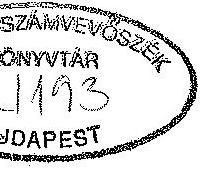
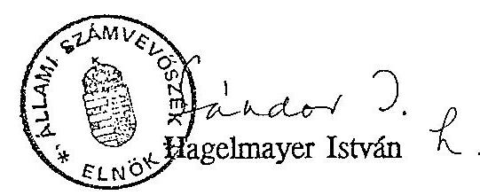

# VÉLEMÉNY 

a Magyar Köztársaság 1994. évi költségvetéséről szóló törvényjavaslatról
II. Rész

---

# Tartalomjegyzék 

BEVEZETŐ ..... 3
I. Az 1994. évi központi költségvetés helyszini ellenőrzése ..... 4

1. A makroszámítások megbízhatósága ..... 4
2. A költségvetés egyes fó bevételi jogcímei ..... 6
2.1. Társasági adó (pénzintézetek nélkül) ..... 6
2.2. Különleges helyzetek miatti befizetések ..... 7
2.3. Vám- és importbefizetések ..... 7
2.4. Egyéb befizetések ..... 9
2.5. Általános forgalmi adó ..... 9
2.6. Fogyasztási adó ..... 11
2.7. Személyi jövedelemadó ..... 11
2.8. Földadó ..... 12
2.9. Lakossági illetékek ..... 12
2.10. Pénzintézetek társasági adója és osztaléka ..... 12
2.11. Privatizációs bevételek ..... 13
3. A fejezetek költségvetési előirányzatai ..... 14
3.1. Kiadási előirányzatok ..... 15
3.1.1 Az elkülönített állami pénzalapok támogatása ..... 24
3.2. Bevételi előirányzatok ..... 27
3.3. Az intézmény- és feladatfelülvizsgálat eredményei ..... 29
4. Belföldi államadósság fejezet ..... 31
4.1. A belföldi államadósság kiadási előirányzatai ..... 31
4.1.1 Az államadósság törlesztése ..... 32
4.1.2 Az államadóssághoz kapcsolódó kamat és jutalék előirányzat ..... 32
4.2. A belföldi államadósság bevételi előirányzatai ..... 36
5. A garanciabeváltások tervezése ..... 38
II. Az önkormányzatok 1994. évi költségvetésének előkészítési tapasztalatai, különös tekintettel az állami támogatások tervezésére ..... 40
6. A tervezés feltételrendszere ..... 40
7. Az 1994. évi forrásszabályozás jellemzői, különös tekintettel az önkormányzati költségvetések megalapozottságára ..... 41

---

3. Állami hozzájárulás tervezése ..... 42
3.1 Normatív állami hozzájárulás ..... 42
3.2 Címzett és céltámogatások ..... 45
3.3 Kiegészítő támogatás ..... 47
4. Átengedett bevételek ..... 48
5. Saját bevételek ..... 49
6. 1994.évi gazdálkodás egyensúlya ..... 53
III. Javaslatok ..... 55

---

# BEVEZETŐ 

A Magyar Köztársaság 1994. évi központi költségvetéséről szóló törvényjavaslatra adott 12728. számú számvevőszéki vélemény (I. rész) az Országgyúlés részére benyújtott törvényjavaslat dokumentumainak átvizsgálása alapján tett észrevételeket foglalja össze. Jelen véleményünkben (II. rész) a helyszíni ellenőrzések megállapításait részletezzük. (Amint azt már jeleztük, az Állami Számvevőszék az 1994. évi központi költségvetési törvényjavaslatnak a korábbi gyakorlattól és az AHT-ban megjelölt ütemezéstől eltérő benyújtása miatt kényszerült arra, hogy véleményét két ütemben küldje meg az Országgyűlésnek.)

Az ellenőrzés célja annak megállapítása volt, hogy az 1994. évi központi költségvetésről szóló törvényjavaslat megalapozottságát a tervezésnél alkalmazott módszerek, az állami feladatrendszer és a szabályozók javasolt módosításai kielégítően biztosítják-e, a költségvetési javaslat összeállítása megfelel-e az államháztartásról szóló 1992. évi XXXVIII. törvény előírásainak.

A Pénzügyminisztérium központi tervező és koordináló tevékenysége mellett a helyszínen ellenőriztük az Országgyűlés (OGY), Alkotmánybíróság (AB), Legfelsőbb Bíróság (LB), Magyar Köztársaság Ügyészsége (MKÜ), Igazságügyi Minisztérium (IM), Közlekedési, Hírközlési és Vízügyi Minisztérium (KHVM), Pénzügyminisztérium (PM), Környezetvédelmi és Területfejlesztési Minisztérium (KTM), Magyar Távirati Iroda (MTI), Gazdasági Versenyhivatal (GV) és a Központi Statisztikai Hivatal (KSH) fejezetek, valamint a Vám- és Pénz ügyőrség (VP), az Adó- és Pénzügyi Ellenőrzési Hivatal (APEH) és a Büntetésvégrehajtás (BV) kiemelt címeknél és a vizsgált fejezetek kezelésében lévő elkülönített állami pénzalapok, továbbá 47 önkormányzat, 1 körjegyzőség (amelyhez 7 önkormányzat tartozik) és 8 megyei TÁKISZ költségvetési javaslatainak kimunkálását.

Az 1994. évi költségvetési törvényjavaslat szerves részét képezi a központi költségvetés mérlege. Az áttekinthetőség érdekében - a törvényjavaslat szerkezetére figyelemmel - helyszíni ellenőrzésünk alapján a több fejezetet érintő, általánosít-

---

ható megállapításainkat a költségvetés mérlegének szerkezetéhez igazodva összegezzük. Tartalmi összefüggései miatt a központi fejezetek, az önkormányzatok, valamint belföldi államadósság bevételi - kiadási előirányzatainak ellenőrzési tapasztalatait együtt tárgyaljuk.

# I.   AZ 1994. ÉVI KÖZPONTI KÖLTSÉGVETÉS HELYSZÍNI ELLENŐRZÉSE 

## 1. A makroszámítások megbízhatósága

A költségvetés összeállítását megalapozó makroszintű gazdasági modellszámítások - helyszínen ellenőrzött - információs, szervezeti és együttmüködési feltételei összességében kedvezőtlennek értékelhetők.

A gazdasági folyamatok alakulására, a jövedelmek képződésére és felhasználására, a gazdaság szereplőire stb. vonatkozó információk a korábbi évekbenél is hiányosabb, bizonytalanabb alapot szolgáltattak a makroszámítások, gazdasági prognózisok elkészítéséhez.

A számviteli törvény okozta tartalmi változások az 1992. évi bázisadatoknak az előző évek adataival való közvetlen összehasonlíthatóságát objektíve lehetetlenné tették. Az áthidaló megoldást jelentő rendező mérlegek jelentős hibaaránya és részleges feldolgozása következtében sem volt biztosítható a kielégítő megfeleltetés.

A gazdasági adatok tartalmi változását okozták az árbevétel elszámolásának módosított szabályai, az új amortizációs előírások, a céltartalék és értékvesztési elszámolási lehetőségek, a belső felhasználások módosult értékelése stb. A számviteli törvénnyel belépett új eredménykategóriák bázis nélküliek, így még a jövedelmezőség változási irányának meghatározása is bizonytalanná vált.

A számítások információs alapját jelentő február végi társasági adóbevallások és az azok feldolgozásával elkészített gyorsjelentés adatai egyrészt hiányosak, másrészt a megbízhatóság szempontjából is kétségesek voltak.

---

Az adatok hiányossága az adóbevallásra kötelezettek és a bevallások adattartalmának szükebb körére, továbbá a bevallást elmulasztók mintegy 5\%-os arányára volt visszavezethető.

Az adatok megbizhatóságát a február végi adóbevallások elözetes jellege, valamint a bevallásokból származó adatok körében tapasztalható pontatlanságok, hibák hátrányosan befolyásolták. (Az APEH-nél ez évben elvégzett ellenőrzésünk tapasztalatai szerint az alapadatok - jellemzően nagyságrendi (helyiérték) tévedésekből származó - hibái az összesitésekben is súlyosabb torzulásokat okozhatnak.)

Az információs feltételek vázolt problémái miatt a makroszámítások során számos esetben feltételezésekre, becslésekre szorítkoztak még a múltbeli folyamatok elemzése, értékelése terén is. Ez az 1994-re vonatkozó prognózisok megalapozottságát erősen gyengítette. Ebbe az irányba hatott az is, hogy - a vállalati átalakulások következtében - számottevően lazultak az ágazati irányító szervek és a gazdasági szféra informális kapcsolatai, így töredékére csökkentek a vállalatok jövő évi terveivel, lehetőségeivel kapcsolatos mikrogazdasági kontroll-információk.

A makroszámítások lényegesebb módszertani változására nem került sor. A tervezés körülményei annyiban voltak kedvezőbbek, hogy a korai ütemezés miatt a szervezeti és személyi feltételek biztosítottak voltak, az együttmúködést a nyári szabadságok nem hátráltatták.

Az 1994. évi prognózisok bizonytalan megalapozására tekintettel a tervezésnél felhasznált - nagyrészt becsült - adatok folyamatos ütköztetést igényelnek az 1992-1993. évekre vonatkozó tényszámokkal. Az 1994. évi költségvetésről szóló vita megkezdéséig nem voltak olyan lényeges eltérések, amelyek a prognózisok alapvető átértékelésének szükségességét jelentették. Mivel bizonyos adatok (társasági adóbevallás feldolgozása) csak a törvényjavaslat beterjesztését követően álltak rendelkezésre és az 1993. évi folyamatok részben eltérnek az előrejelzésektől, korrekciókra van szükség, amelyek iránya és hatása az ellenőrzés idején még nem volt felmérhető.

---

# 2. A költségvetés egyes fó bevételi jogcímei 

### 2.1. Társasági adó (pénzintézetek nélkül)

A társasági adó 1994. évi pénzforgalmi előirányzata 62 Mrd Ft, amely 14,8 \%-kal magasabb az 1993. évi terv, illetve várható adatnál. Az előirányzat teljesülése a társasági adóalanyi kör adózás előtti eredményének 13,2 \%-os, illetve adóalapjának $16,3 \%$-os növekedését feltételezi, ami azonban az előre nem tervezhető, illetve a tervezettől eltérő gazdasági folyamatok függvényében bizonytalansági tényezőt hordoz magában.

Az előirányzat kialakítása - az előző évhez hasonlóan - ágazatonként történt, bázisul a gazdálkodók (1993. február végén benyújtott társasági adóbevallásainak adóhatóság által feldolgozott) adatállománya szolgált.

A prognózis ágazati számítási anyaga az 1994. évi központi költségvetés előirányzatainak kialakításához kiadott munkaprogram szerint készült. A tervet a KSH 1992. évi ágazati besorolási rendjének megfelelő szerkezetben állították össze.

A bázisadatok esetenként nem egységes figyelembevétele, nem segítette elő a prognózis megalapozottságát.

Az adóhatóság az 1992. évben átalakult jelentős számú és nagyságrendet képviselő gazdálkodó (1991. évi arányosított) adataiból feldolgozást készített. A bázis kialakításánál az átalakult gazdálkodó szervezetek 1992. évl adatait több nemzetgazdasági ágazatnál is figyelembe vették (pl. mezőgazdaság és vadgazdálkodás, élelmiszerek és italok gyártása, szállítás), más ágazatoknál azonban nem vettek számításba (pl. bányászat, gépipar).

Az egyszeres könyvvitelt vezető vállalkozások adóját nemzetgazdasági szinten egy összegben - a bázissal azonosan - tervezték. Ugyanakkor néhány ágazat - bázisadatal kialakításánál - kalkulált ezzel a gazdálkodói körrel is (pl. élelmiszerek és italok gyártása, mező- és vadgazdálkodás), így ezen ágazatok társasági adó prognózisa a kettős könyvvitelt vezető vállalkozások mellett az egyszeres könyvvitelt vezetők tervét is tartalmazta.

Fentiek következtében nem zárható ki, hogy az érintett - jelenleg nem jelentős nagyságrendű - gazdálkodói körnek egy része kétszeresen került a tervezés folyamatába.

---

A pénzforgalmi szemléletű adóbevételi terv kialakítása becsléssel történt, kiindulópontul az 1993. évi várható pénzforgalmi előirányzat szolgált.

Az előirányzat elkészítésére előírt határidő nem tette lehetővé, hogy a tervezés a gazdálkodók 1993. május 31 -én benyújtott 1992. évi bevallásaiból készített adóhatósági feldolgozáson alapuljon, így a korábban benyújtott bevallások adatai képezték a bázist.

Az 1994. évi költségvetési előirányzat nem tartalmazza még az Érdekegyeztető Tanács szeptember 4-i plenáris ülésén kötött megállapodások és a Kormány szeptember 16-i ülésén elfogadott törvényjavaslatok, kiegészítések számszerüsített hatásait.

# 2.2. Különleges helyzetek miatti befizetések 

A törvényjavaslat e címen megjelenített bevételi előirányzata összesen 24 Mrd Ft. Ez a bányászatról szóló 1993. évi XLVIII. törvény hatálybalépése miatt csökkenést jelent az előző évhez képest.

A bányajáradékból származó bevételek (előirányzata: 18 Mrd Ft ) jelentik az előirányzat döntő hányadát. Ennek meghatározása az alapnyersanyagok (szén, olaj, ásványok stb.) ára és a kitermelés mértéke alapján történt. A bevétel teljesülését jelentősen befolyásolhatja az a körülmény, hogy a kitermelt nyersanyag értékét a jelenleg érvényes árak alapján tervezték, valamint, hogy a kitermelés mértéke évről-évre csökkenő tendenciát mutat.

A távközlési koncessziós szerződésből mintegy 6 Mrd Ft bevételt terveztek. Ez nem minősíthető megalapozottnak, mivel több szerződést még nem írtak alá és ezek fizetési feltételei még nem tisztázódtak. A bevétel összegét a két minisztérium (KHVM és PM) közötti egyeztetés alapján határozták meg. (Megvalósulása és mértéke kétséges.)

### 2.3. Vám- és importbefizetések

Az 1994. évi költségvetési előirányzat 12,5 Mrd USD import mellett - ami az előző évhez képest kb. $9 \%$-os import növekedést feltételez -, mintegy $7 \%$-os vám- és illetékbevétel növekedéssel, összességében 88 Mrd Ft bevétellel számol. A tervezet a relatív csökkenés okaként a szabadkereskedelmi megállapodások bevezetését jelölte meg, ami mintegy 10 Mrd Ft vámcsökkentést tesz ki. A tervezett

---

bevétel megalapozottnak minősíthető, bár a tervezés menetében több olyan művelet volt, ami a számítások során hibaforrásként szerepelhet.

A tervezet-készítés kiinduló bázisaként az NGKM, illetve a KOPINT-DATORG által készített export-import kimutatás szolgált. Az adatok a különböző feldolgozási rendszerek miatt gyakran nem összehasonlíthatók, illetve a korábbi vámeljárások időközbeni változásai miatt helyesbítésre szorulnak.

A költségvetésben a bevételeket termékcsoportonként részletezõ táblázat szerkezetileg különbözik a kiindulási alapként figyelembe vett vámstatisztika felépítésétől. A szabadkereskedelmi megállapodások vámbevételt csökkentő hatását termékcsoportonként nem mutatták ki.

A tervezet szerint a megállapodások alapján a csökkenés mértéke a következő: EK-val kötött megállapodás 6 Mrd Ft, EFTA 3 Mrd Ft, Visegrádi Csoport 1 Mrd Ft. Az EFTA megállapodás ratifikálása az egyes tagországokkal folyamatosan valósul meg, így ennek csökkentő hatása várhatóan csak fokozatosan és bizonytalan mértékben érvényesül.

A fentiek miatt olyan termékcsoportos bontás készítése kívánatos, amely a termékcsoportra jellemző legnagyobb bevételt hozó termékekre utal, illetve kimutatja, hogy a tervezett változások legnagyobb mértékben milyen termék(ek)re hatnak, és ez a hatás számszakilag milyen mértékben jelentkezik a termékcsoport és ezzel összefüggésben az összbevétel alakulására.

A forint (keresztárfolyamokat is figyelembe vevő átlagos) árfolyamát 94 Ft/USDben prognosztizálták.

Egyes gazdasági tényezők (az import áruk árpozíciójának romlása a hazai termékekkel szemben, a vámszabályok szigorítása stb.) a vámbevételt negatívan befolyásolják. A jelzett negatív hatások föként az utolsó negyedévben érződnek -, így csak korlátozott mértékben vehetők figyelembe. Az import az év első felében jobban növekedett, az árfolyam jelenleg 96 Ft/USD-ot meghaladja.

A tervezett bevétel elérésének feltétele az ellenőrzés hatékonyságának növelése és a rendeletek következetes érvényesítése. A vám- és illetékbevételek kintlévő-

---

sége 11 Mrd Ft, aminek kb. fele befizetési hátralékból, további része pedig a csődés felszámolás alatt álló cégek tartozásából tevődik össze.

# Lakossági vámbevételek 

Az 1994. évi költségvetési törvényjavaslatban a lakosságtól származó vámbevételként mintegy 2 Mrd Ft bevételt irányoztak elő, ami az 1993. évi tervezethez képest 1,2 Mrd Ft csökkenést jelent. A vámbevételek csökkenését részben a gépkocsi behozatal szigorítása (6 évnél idősebb gépkocsik behozatalának tiltása) hatásaként bekövetkező behozatal-csökkenésre alapozták a törvényjavaslatban. A várható bevételcsökkenés előirányzata nem megalapozott.

A személygépkocsi behozatal döntó részét a lakossági behozatal adja, ami a jövedelmi viszonyokat figyelembe véve továbbra is a használt személygépkocsik iránti kereslet irányába hat. A 6 évnél fiatalabb gépkocsik ára és ennek következtében vámtétele is magasabb, így elképzelhető a behozatal kismértékű csökkenése. A magánimportból származó darabszám csökkenést azonban várhatóan kompenzálja a kiszabott magasabb vámtétel, ezért a prognosztizált bevételcsökkenés bekövetkezése bizonytalan.

### 2.4. Egyéb befizetések

Az egyéb befizetések bevételi előirányzata összességében 11,7 Mrd Ft a törvényjavaslatban, ami az 1993. évi várható teljesüléshez viszonyítva kismértékű csökkenést, az 1992. évi teljesítéshez ( $7,8 \mathrm{Mrd}$ Ft) viszonyítva 3,9 Mrd Ft bevétel-növekedést jelent. Az előirányzat meghatározásakor az adózás rendjéről szóló törvény különböző módosításai, szigorításai (bírságok, pótlékok számítási alapjának, valamint mértékének emelésével) bevételt növelő hatását valószínűsítették. Teljesülésének feltétele, hogy a javaslat a benyújtott formában kerüljön elfogadásra, valamint a szigorítás hatására miképpen alakul a befizetési fegyelem.

### 2.5. Általános forgalmi adó

A költségvetés bevételi forrásai közül az ezen adónemből származó bevétel mind összegét ( 340 Mrd Ft ), mind a növekedés mértékét tekintve ( $72,2 \mathrm{Mrd}$ Ft) az egyes adónemek között a legjelentősebb.

A tervezetben a lakossági vásárlásoknál a termékcsoportonként feltüntetett volumen- és árindexek óvatos becslés alapján készültek. Ezek azonban nem

---

támasztják alá megnyugtató módon az 1994. évi költségvetési előirányzatot, mivel az 1994. évi terv készítésekor - az 1993. évi költségvetési tervezet készítéséhez hasonlóan - nem állt rendelkezésre a tervkészítéshez szükséges statisztika. Az 1993. évi költségvetés megalapozottságáról végzett számvevőszéki ellenőrzés megállapításaihoz képest nem történt előrelépés.

Az ÁFA bevételek 77 \%-át ( 264 Mrd Ft) a lakosság vásárolt fogyasztása adja, ezért ennek vizsgálata kiemelt jelentőségủ. Az 1994. évre a lakossági fogyasztás összegét 2.190 Mrd Ft összegben tervezték. Ennek megalapozásához részletes, termékcsoportonkénti felmérés vagy statisztika nem állt rendelkezésre, mivel a KSH ilyen jellegü összeállítást utoljára 1991-ben készített, és az 1994. évi tervezet is ez alapján készült. Kiskereskedelmi üzlettípusok forgalma szerinti kimutatás áll rendelkezésre, ez azonban termékcsoportos fogyasztás-elemzésre és tervkészítésre nem alkalmas.

A tervezett lakossági és intézményi vásárlásokból származó ÁFA befizetések előirányzata 343,2 Mrd Ft, ami pénzforgalmi szemléletben 340 Mrd Ft, ami azt jelenti, hogy 3,2 Mrd Ft-tal kevesebb adó folyik be a központi költségvetésbe.

Az előirányzatban szereplő pénzforgalmi áthúzódások tervezett összegéről részletes számításokat nem végeztek, hanem ún. "technikallag kidolgozott számként" határozták azt meg, ami nagyságrendileg sem megfelelő.

A PM által alkalmazott számítási mód bonyolult összefüggései, valamint a tényadatok hiánya nagy bizonytalanságot jelent (áruforgalom alakulása, fizetési fegyelem stb.), emiatt a táblázat ezen áthúzódásokat tartalmazó része csak kis mértékben befolyásolja a tervezett bevétel összegét.

Az előbbiek alapján javasolható, hogy a táblázat ezen kiegészítő részét a jövőben ne ebben a formában alkalmazzák.

A költségvetési terv készítésekor a vásárolt fogyasztás értékindexeként 18,6 \%-os, árindexként $17,5 \%$-os, volumenindexként $1 \%$-os növekedést prognosztizáltak, ami rendkívül óvatos becslés.

A lakosság jövedelméről szóló részletes kimutatásban 17,9 \%-os jövedelemnövekedést, ugyanakkor a megtakarítási hajlandóság (képesség) kismértékủ csökkenését tervezték, ami a tervezettnél összértékben nagyobb mértékủ vásárolt fogyasztást feltételez. A fogyasztás várható tervezését az a körülmény is befolyásolta, hogy ennek egy jelentős hányada - kb. $20 \%$-a - szabadpiaci vásárlásoknál jelentkezik, ami az ÁFA bevételeknél nem realizálódik.

A bizonytalanságot tovább fokozza az a prognózis, ami a várható árindexet 1994-ben $17,5 \%$-ra tervezi és ez jóval alacsonyabb az előző években (22-23\%) teljesültnél.

---

Az általános forgalmi adóból származó bevételek alakulását a fizetési fegyelem, valamint az ellenőrzés hatékonysága jelentősen befolyásolhatja (az APEH kimutatása szerint 1992. december 31-én az adóhátralék összege 22,2 Mrd Ft volt és jelentős a csőd- és felszámolás alatti cégek adótartozása is).

# 2.6. Fogyasztási adó 

A fogyasztási adó előirányzott bevételének összege ( 185 Mrd Ft ) megalapozott, teljesülésének azonban feltétele az 1994. évre előirányzott adótétel-növekedéseket tartalmazó törvényjavaslat elfogadása.

A fogyasztási adó bevételi elöirányzata az előző évhez képest 9 Mrd Ft növekedést tartalmaz, amit - változatlan fogyasztást feltételezve - döntően az adótétel növekedés határoz meg. Ez a fizetési fegyelem javulásával, hatékony jövedéki ellenőrzéssel valósítható meg, mivel a tartozások mértéke már eddig is mintegy 4 Mrd Ft-ot tesz ki.

### 2.7. Személyi jövedelemadó

A személyi jövedelemadó 1994. évi pénzforgalmi bevételének prognózisa 308,6 Mrd Ft, amiből a központi költségvetés tervezett bevétele 228,0 Mrd Ft. Az előirányzatot egy, a korábbi években készült személyi jövedelemadó rendszermodell alapján határozták meg.

A költségvetési törvényjavaslat elkészitésére elöírt határidőig az 1992. évi személyi jövedelemadóra vonatkozó bevallások teljeskörü feldolgozása még nem történt meg, így az adóalanyi kör kb. $86 \%$-os reprezentációjából történt a bázis adatállomány kialakítása. (Az adatállomány helyessége még ekkora reprezentáció esetén is a mintavétel helyességének függvénye, ezért - a korábbi évekhez hasonlóan - kockázatot hordozhat magában.)

Az előirányzat a lakosság adóköteles jövedelmének (az 1993. évi várható összeghez viszonyítva) $14,9 \%$-os feltételezett növekedésén alapult, amit a fő jövedelemtulajdonosoknál az egyes jövedelemsávokban differenciálás nélkül érvényesítettek.

A prognózis a jövedelemadóra vonatkozó törvényjavaslat egy részével már számolt, alkalmazva azt az adótáblát, (mint valószínüsithető változatot), amit konkrétan csak az 1993. szeptemberben benyújtott kiegészitő törvényjavaslat tartalmazott.

---

# 2.8. Földadó 

A költségvetési törvényjavaslat földadóból 1,3 Mrd Ft bevételt számszerüsít. A szöveges indoklásban szereplő́ bevételcsökkentő hatások figyelembevételével a teljesülés az előirányzat szintjén várható.

### 2.9. Lakossági illetékek

A költségvetési törvényjavaslat készítése során lakossági illetékbefizetésként 22 Mrd Ft bevételt prognosztizáltak. A jelenlegi illetékfizetéshez képest több változást terveznek, amiből 13,5 Mrd Ft bevétel növekedést várnak.

Ennek megoszlása szerint: útlevél illetékből 1 Mrd Ft, bírósági végrehajtásokból 2 Mrd Ft, vagyonszerzési illetékből 10,5 Mrd Ft többletbevétel várható.

A bevétel teljesülésének feltétele az illetékek mértékéről intézkedő törvényjavaslat elfogadása, illetve mielőbbi bevezetése. A várható bevétel nagyságát befolyásolhatja, hogy a lakosság a várható illetékemelés miatt előrehozza az új útlevél igénylését és ez a tervezett bevétel csökkenéséhez vezethet.

### 2.10. Pénzintézetek társasági adója és osztaléka

A pénzintézetek társasági adójának tervezése során a Magyar Nemzeti Bank pénzforgalmi előirányzataként 8,5 Mrd Ft-ot, a kereskedelmi bankok pénzforgalmi előirányzataként 4,5 Mrd Ft-ot, összesen 13 Mrd Ft bevételt irányoztak elő.

Az adóbevételi terv óvatos, visszafogott prognózisra enged következtetni.
Az eredmény számításánál a korábbi éveknél magasabb összegű céltartalék képzést vettek figyelembe. Ez az 1994. évi feltöltési kötelezettség, valamint annak következtében, hogy a nemzetközi számviteli normáknak megfelelően, várhatóan a befektetések és a függő kötelezettségek is tartalékkötelessé válnak, indokolt.

Az 1994. évi költségvetési előirányzat nem minden tekintetben alátámasztott.

A kereskedelmi bankok társasági adójának prognosztizálása során az 1992. évi tény, és az 1994. évi tervadatokból nem állapítható meg teljes biztonsággal, hogy az - az MNB-t és a veszteséget prognosztizáló biztosítókat leszámítva - az összes pénzügyi tevékenységet és kiegészítő szolgáltatást

---

végzõ gazdálkodót tartalmazza-e. Így az adatok teljeskörüségét csak valószínüsiteni lehet.

A kereskedelmi bankok 1994. évi társasági adó tervéhez az eredménykimutatás (bevételek, ráfordítások), valamint az adózás elôttl nyereséget csökkentô és növelô tényezők tételes, a hatályos törvények alapján való levezetése illetve ezek számítási anyaga - a tervezés során módosított adatok keresztülvezetésének hiánya miatt - sok kívánnivalót hagy maga után.

Pénzintézetek osztaléka címen 1994. évre bevételt nem terveztek. A törvényjavaslat indoklása szerint ez a bankok tőkebefektetése folytatásának, így az államot megillető nettó osztalék tőkésítésének következménye. Ezzel ellentétes, hogy az állami tulajdonosi jogokat gyakorló szervezetek (ÁV Rt. és ÁVÚ) kalkulálnak osztalékbevétellel, amit a törvényjavaslat a Belföldi államadósság fejezet javára teljesítendő befizetésként számba is vesz.

# 2.11. Privatizációs bevételek 

Az Állami Vagyonügynökség elkészítette a törvényjavaslat megalapozásához szükséges elörejelzéseit.
Eszerint az 1994. évi várható összes bevétel 106.120 millió Ft. Ez az összeg a privatizáció becsült teljes értéke, de nem azonos a készpénzbevételekkel, s főleg nem a szabadon felhasználható bevételekkel. A jelzett összegből a kárpótlási jegy ellenében történő vagyoneladás értéke 27.042 millió Ft. Ez nem készpénz bevétel, így a költségvetési kiadásoknál ezzel számolni nem lehet.

Az 1994. évi teljes bevételből 36.541 millió forintnak megfelelő értékesítés (bevétel) különféle hitelkonstrukciókban történik. Ezek ugyan készpénzes bevételek, de felhasználásuk - törvényi előírás szerint - kötött. A hitelből történő értékesítésből befolyó összeget az államadósság törlesztésére kell fordítani, azaz ezzel a költségvetés mint kiadási fedezettel nem számolhat.

E két tétel után fennmaradó és elvárható gondossággal prognosztizált és számításokkal dokumentált 42.538 millió Ft az az érték, mely készpénz és szabadon felhasználható. Ezzel a tervezett készpénzt jelentő privatizációs bevétellel szemben - vagyonhozadék nélkül - a törvénytervezet 55.069 millió Ft privatizációs bevételt* és annak felhasználását rögzíti, amelyet viszont semmiféle

[^0]
[^0]:    * Ez az összeg nem tartalmazza az ÁVÚ ideiglenes állami vagyonnal kapcsolatos bevételeiből történő 4000 millió forint befizetést.

---

számítás nem támaszt alá. Az eltérés 12.539 millió Ft, azaz az ÁVÜ által tervezett bevétellel szemben ennyivel több felhasználásról intézkedik a törvény.

A tervezett készpénzes bevétel ismeretében indokolt és szükséges lenne a törvényben rendelkezni arról, hogy a privatizációs bevételekből tervezett kiadási céloknak mi a sorrendje, azaz mely kiadás teljesítése maradjon el, ha a bevételek nem fedezik a tervezett kiadásokat. Ez azért is fontos, mert az ÁVÜ által 1994-re tervezett készpénzes bevétel ( 42.530 millió Ft) és a költségvetés tervezett kiadásai (55.069 millió Ft) ismeretében az egyes kiadási jogcímek csak egymás rovására teljesíthetők.

Az ÁV_Rt-től származó bevételekről a XXXI. Belföldi államadósság fejezet rendelkezik. A törvénytervezet 5000 millió forintos osztalékbevételt és 3000 millió forintos privatizációs bevételt ír elő.

Az 5000 millió forintos osztalék bevételllel a tervezet reálisan számol. Ez ugyanis az ÁV Rt-hez tartozó társaságok jóváhagyott üzleti tervén alapul, átlagosan 35\%-os osztalék elvonást érvényesít.

Az osztalékon felül tervezett 3000 millió forintos privatizációs bevétel teljesítésének lehetősége a rendelkezésre álló vagyon alapján fennáll. Ez az összeg ugyanis az ÁV Rt kimutatása szerint privatizálható vagyonnak csupán $1,5 \%$-a.

# 3. A fejezetek költségvetési előirányzatai 

A fejezetek és intézményeik 1994. évi költségvetési javaslata összeállításának módszertani megújítására a Kormány ebben az évben sem vállalkozott. A bevételi és a kiadási előirányzatok kialakítása hagyományos módon, bázisalapon történt. Az állami feladatrendszer és a pénzügyi források összehangolása - néhány részeredmény kivételével - nem valósult meg, a korábban kialakult torzulások, feszültségek tovább élnek.

Az 1994. évi költségvetési javaslat fejezeti előirányzataiban a Pénzügyminisztérium költségvetési tervezési útmutatójában megfogalmazott célok csak részben tükröződnek vissza. A költségvetési szervek bevételi és kiadási előirányzatai - az ellenőrzött fejezetek döntő többségénél - megalapozatlanok. A megalapozatlanság mind a feladatstruktúrával, mind az annak teljesítéséhez reálisan számbavehető forrásokkal és kiadási szükségletekkel szemben fennáll. Az összhang hiánya a költségvetési támogatás mértékére is kihat.

---

A fejezeti költségvetések szakszerű és reális tervezését több tényező kedvezőtlenül befolyásolta. Az 1992. évi költségvetés zárszámadási munkáinak későbbre ütemezése miatt nem álltak rendelkezésre az 1992. évi véglegesített tényszámok és a pótköltségvetés előterjesztése következtében az 1993. évi várható adatok is bizonytalanná váltak. A munkák összecsúszása rendkívüli terhelést okozott a tárcák pénzügyi apparátusai számára, amelyek a felerősödött fluktuáció hatására nem egy helyen szakmailag érzékelhetően meggyengültek. Ez a körülmény a PM tervezést irányító, összehangoló szerepét is érintette, mert a fokozottabb egyeztetés, hibajavítás jelentős kapacitásokat kötött le.

Az 1994. évi kiadási és bevételi előirányzatok realizálását megalapozó jogalkotási feladatok a helyszíni ellenőrzés idején még csak az előkészítés stádiumába jutottak. A PM felmérte azoknak a - többnyire az utóbbi időben hatályba lépett törvényeknek a körét és hatását, amelyek változatlan formájukban többlet támogatási kötelezettséget rónak a központi költségvetésre. A módosításukra vonatkozóan még csak elképzelések voltak, részleteikben is egyeztetett előterjesztések nem készültek.

# 3.1. Kiadási előirányzatok 

A szokásos módon, bázisalapon megtervezett kiadási előirányzatok az ellenőrzött fejezetek kisebb részénél egészében reálisnak minősíthetők. Az egyes kiadási jogcímek növekedését támogatási többlettel és a saját bevételek előirányzatának arányos megemelésével ellensúlyozták.

A BV az 1994. évi költségvetési terv elkészitéséhez a forrásszükséglet meghatározásába bevonta intézményeit, intézeteit. A müködés minőségét és a biztonságot alapul véve 3 változatban készítették el kiadási tárgyjavaslataikat. A költségvetési törvényjavaslatban szereplő előirányzat összege a folyamatos müködés kiadásain túlmenően a készletek, felszerelések, eszközök pótlására, javítására is - az alapvető mértékig - biztosít pénzügyi forrást.

Kifogásolható, hogy a dologi kiadásokon belül a közmúdíjaknál az 1993. évihez viszonyítottan 1994-re több mint háromszoros ( $311,5 \%$ ) kiadásnövekedéssel számoltak. A törvényjavaslatban szereplő 190 M Ft kiadási elöirányzat - a becslési bizonytalanságok mellett - túlzott, és az intézmények által tervezett változatokat is jelentősen meghaladja.

A GV fejezetnél a szolgáltatásokra 17,8 M Ft összeget irányoztak elő (a dologi kiadások 21\%-a) ami az 1992. évi felhasználást 128\%-kal, az 1993. évi várható teljesítést $27 \%$-kal haladja meg. Az emelkedés a versenytörvény módosításával kapcsolatos fordítási, tolmácsolási igény és külső szakértői tanulmányok

---

készítésén túlmenően az adatbázis használat, könyvtár, üdülő́rész használat térítési díja növekedésének következménye.

A fejezetek többségének előirányzatai ugyanakkor elmaradnak a változatlan, esetenként növekvő feladattömeg ráfordítás igényétől. A feladatok és a megvalósításukhoz szükséges források összhangjának hiánya különösen szembetűnő azokban az esetekben, ahol magas szintű jogszabályok, vagy kormányhatározatok által elrendelt feladatok forrás szükségletét a fejezet költségvetése nem biztosítja.

A törvényjavaslat a PM fejezetnél, VP jogszabályban meghatározott egyes feladatal (a jövedéki törvény végrehajtása során a lefoglalt áruk tárolása, örzése, továbbítása, kezelése) megvalósítására, valamint az azonnali vámkiszabás bevezetésével megnövekedett bankköltségre (csekk kezelési dij) nem tartalmaz pénzügyi előirányzatot. Az előbbiekben jelölt feladatok 1993. I-VIII. hónapjában 21 M Ft-tal, illetve mintegy 400 M Ft-tal terhelték az intézmény költségvetését.

A tervek szerint 1994-ben 9 új határátkelőhelyet adnak át. Ezek fenntartására és üzemeltetésére a törvényjavaslat elöirányzatot nem tartalmaz.

A törvényjavaslat nem tartalmazza a tervezés időszakában hatályba lépett 16/1993. (VI.15.) számú PM rendeletben a KVSZ részére meghatározott - az állam örökléssel összefüggő kezelői jogok gyakorlására vonatkozó feladatal előirányzatát.

A KHVM-nél a Közúti és Autópálya Igazgatóságokat, valamint a Légiforgalmi és Repülőtéri Igazgatóságot kivéve a fejezet egyik címének 1994. évi müködési kiadási, előirányzata sem haladja meg az 1993. évi várhatót, ami - figyelembe véve a tárca feladatainak növekedését, valamint a kiadási megtakarítással járó szervezeti változások hiányát - a feladatok és a tervezett források közti összhang hiányára utal.

A KHVM-nél a kiadási elöirányzatok nem tartalmaznak fedezetet a tárca tulajdonosi joggyakorlásával összefüggő feladatokra (a közlekedési, hírközlési és vízügyi miniszter gyakorolja a tulajdonosi jogokat a 29 személyszállító autóbusztársaság, a MÁV Rt., a Magyar Posta Vállalat és a GYSEV Rt. felett), a gazdasági információs rendszer és a K-600-as kormányzati hírrendszer ( 700 M Ft ) müködtetésére.

A KTM fejezetnél az elmúlt időszakban a feladatok folyamatosan növekedtek. Az ezek ellátásához rendelkezésre álló források összegét azonban az egyre szükülő költségvetési lehetőségek határozták meg. Az 1994. évi költségvetési előirányzat nem tartalmaz fedezetet az épített környezet védelme érdekében szükséges építésfelügyeleti tevékenység ellátására ( 85 M Ft ), a Budavári Dísz-tér - Szent György tér térségének helyreállítására ( 350 M Ft ), a világörökség részét képező Hollókő várának helyreállítására ( 50 M Ft ), a 24/1991. és a 28/1991. számú országgyűlési határozatokban előírt új Nemzeti

---

Park létrehozására. A Grassalkovich kastély helyreállításához szükséges 300 M Ft helyett csak 100 M Ft szerepel a költségvetési törvényjavaslatban.

Az Országgyưlés Könyvtáránál a feladat és pénzforrás összhangja - a szakmai munkavégzéshez szükséges létszám, az elhelyezési körülmény, a jelenleg nem egyértelmü szolgáltatási kötelezettségből eredő̉ megnövekedett igények alapján - nem biztosított. A Könyvtár müködési kladásainak elöirányzatai nem tartalmazzák a Könyvtár alaptevékenységével összefüggő bibliográflák elơállításának költségeit.

Az AB 1994. évi dologi előirányzatai tervezésénél készletbeszerzésekre az 1993. évinél csak 2 M Ft-tal terveztek többet, igy az elöirányzat nem tartalmazza az új székházba költözés kapcsán felmerülö beszerzések, valamint az alkotmánybíró választások kapcsán jelentkező beszerzések (együttesen mintegy 65 M Ft ) összegét.

A költségvetési fejezetek egy részénél a köztisztviselői és közalkalmazotti törvényekben meghatározott különjuttatás biztosítása is problémát jelent. Találkoztunk olyan előirányzattal, amely nem tartalmazza a törvény végrehajtásához szükséges pénzügyi forrásokat.

Az Országgyúlési Könyvtár az 1994. évi béralap előirányzat meghatározása során nem vette figyelembe az előirt különjuttatás (13. havi) bér és cimpótlék fedezetét ( $2,6 \mathrm{M} \mathrm{Ft}$ ). Így a rendelkezésre álló béralap az alapilletményen túl nem nyújt fedezetet a közalkalmazotti törvény szerinti kifizetésekre.

A KTM igazgatási költségeinek elöirányzata - mely az 1993. évben bekövetkezett módosítások figyelembevételével a szintrehozáshoz szükséges, valamint fejlesztési többletként engedélyezett összeget tartalmazza - nem biztosítja a köztisztviselöi törvényben elöirt különjuttatás bér fedezetét.

A GV 1994. évi - az alaptevékenységi feladatbővülésre biztosított növekményt is figyelembe vevő - béralap elöirányzata nem tartalmazza a köztisztviselöi törvényben elöirt 13. havi bér fedezetét ( $7,4 \mathrm{M} \mathrm{Ft}$ ). A tervezett béralap összege az alapilletményen, illetménykiegészitésen, vezetői pótlékon, nyelvpótlékon kívül a teljes létszám feltöltöttség ( 135 fö) 1994. évi elérése esetén nem nyújt fedezetet a köztisztviselői törvény szerinti kifizetésekre.

A törvényjavaslat korai időpontban való beterjesztése és az azóta meghozott intézkedések következtében a fejezetek költségvetési előirányzata nem tartalmazza a megváltozott ÁFA fizetési kötelezettség pénzügyi fedezetét. Ez az éves gazdálkodás során súlyos feszültségekhez vezethet, különösen ott, ahol a feladatellátás és a pénzügyi források összhangja jelentősen megbomlott.

---

A kiadási előirányzatok előre jelezhető túllépése a célok reálisabb számbavételével és a tervezési szabályok rugalmasabb alkalmazásával több esetben elkerülhető lenne.

A KSH megyel Igazgatóságok cím az 1994. évi költségvetési előirányzata összeállításánál készletbeszerzésre kiadási elöirányzatot nem tervezett. A címnél a szolgáltatásokon belül a telex-, telefon- és egyéb postal díjak elöirányzata 1994. évi meghatározásánál az 1993. évi várható összegnek csak mintegy $7 \%$-át irányozták elő, mivel a cím szolgáltatási kiadásokra aránytalanul tervezett elöirányzatot.

A KTM 1994. évre a belföldi kiküldetés tervezésénél a szintentartást figyelembevéve $1,9 \mathrm{M}$ Ft-ot tervezett. 1993. I. félévében az éves előirányzat ( $1,9 \mathrm{M}$ Ft) mintegy $2 / 3$-át $(1,2 \mathrm{M} \mathrm{Ft})$ felhasználta, így túllépés várható. A költségek növekedése miatt az 1994. évi előirányzat nem megalapozott.

Az MTI kül- és belföldi kiküldetéseit az előző évi szinten tervezték. Az alaptevékenység jellege miatt kiküldetési terv nem készült. Egyes közvéleményt érdeklő események (1994. évi képviselöválasztás, labdarúgó világbajnokság stb.), jelentősen befolyásolhatják az ezen a címen tervezett összegek teljesülését.

A pénzügyi lehetőségek által meghatározott korlátozások több esetben nem tették lehetővé, hogy a nagyértékủ tárgyi eszközök felújításához szükséges mértékű pénzforrás a költségvetési törvényjavaslatban szerepeljen. A felújítások halasztása a következő évek költségvetéseinek lökésszerű terhelésével járhat.

Az Országház a több éve folyó rekonstrukciós munkálatok ellenére a romlás állapotát mutatja. Az épület állagára jelentősen kihatott a protokoll és egyéb rendezvények számának emelkedése. A felújítás szakaszolására, sorrendiségére a teljes épületkomplexumra vonatkozó átfogó elemzés nem készült. Felújításának ütemezése és az ehhez szükséges pénzügyi források biztosítása az 1996. évi Világkiállítással összefüggésben ismételt átgondolást igényel. Szükséges lenne - az előbbiek alapján meghatározandó összeg figyelembevételével - a felújítás AHT szerinti átminősítése kiemelt jelentősségủ kormányzati beruházássá.

A költségvetési törvényjavaslat közvetlenül nem tartalmazza az Országgyülési Könyvtár indokolt mértékủ felújítási, beruházási igényét.

Az AB-ről szóló 1989. évi XXXII. törvény 3. §-a szerint az Alkotmánybiróság székhelye Esztergom. Az elhelyezésre kijelölt régi épületegyüttes több éve elkezdett felújítása - a budapesti székházban való elhelyezéstől függetlenül folyik, az 1994. évre előirányzott összeg 20 M Ft. Az átalakítást több tényező (az épület múemlék jellege, eredeti pompájának helyreállítása, a felújítás közben régi freskó maradványok kerültek elő stb.) nehezíti. Belső felmérések szerint az AB jelenlegi szervezetének zavartalan müködését az épület nagysága,

---

sajátosságai nem biztosítják. Várhatóan 1994-ben foglalja el az AB - a működéshez szükséges speciális igényeket jobban kielégítő - új székházát a Donáti utcában. A szükséges átalakítás költsége meghaladja a 300 M Ft-ot, melyre az 1993. évi pótköltségvetés 180 M Ft-ot juttatott. A hiányzó összeg forrása nem ismert, az nem szerepel az AB 1994. évi előirányzatai között.

Az MKÜ tételesen kimunkálta a halaszthatatlan felújítások forrásigényét, amit 89 M Ft-ban számszerúsített. A törvényjavaslatban szereplő - a tervezés során PM-mel egyeztetett - 50 M Ft több szükséges felújítás, rekonstrukció halasztását eredményezheti.

Az IM-nél a Müszaki Osztály megállapítása szerint az épületek megfelelő szintű felújítására, rekonstrukciójára mintegy 10 Mrd Ft-ra lenne szükség, amiből a tervjavaslat 155 M Ft beruházási összeggel és 338 M Ft felújítással számol.

A PM fejezetnél az APEH előirányzatai kialakításánál a nagyértékű tárgyi eszközök karbantartására a szükségesnél lényegesen kevesebb előirányzat jutott, felújítására pedig nem is tervezett, így a meglévő eszközállomány működőképességének szintentartása is veszélybe kerülhet.

Ellensúlyozó intézkedések hiányában szintén lökésszerủ támogatási igényt fog jelenteni a következő évben a köztisztviselői törvény 1995. évi hatályba lépése. A fejezeteknél és az intézményeknél, az 1993. évi költségvetésben meghatározott illetményalaphoz viszonyított tényleges bérek összege (beállási szint) ugyanis rendkívül eltérő képet mutat.

Az OGY Képviselőtestület alcím 1994. évi béralapja tervezésénél, a tiszteletdíjak megállapításánál az illetményalap 15.000 Ft-os 1992. évi mértékéből a miniszteri fizetések figyelembevételével indultak ki, növelésére a tervjavaslat előirányzatot nem tartalmaz.

Az OGY Hivatala dolgozóinak a köztisztviselői törvény figyelembevételével ( 15.000 Ft -os 1992. évi illetményalappal számított) átlagos bérbeállási szintje $77 \%$, ( $62-93 \%$ között szóródik).

A KTM fejezet minisztériumi feladatokat ellátó dolgozóinak a köztisztviselői törvény által előirt illetményhez viszonyított átlagos beállási szintje 72,5\%, ami 40,4-87,0\% között szóródik a különböző állománycsoportoknál.

A GV teljes munkaidős létszámának feltöltöttsége $81 \%$-os ( 110 fő) volt az 1993. április 1-jei állapot szerint. A hivatali alkalmazottak bérelőirányzatának meghatározásakor az engedélyezett létszám ( 135 fő) feltöltöttségével, a dolgozók $90 \%$-nak megfelelő átlagos beállási szint elérésével ( $18.000 \mathrm{Ft} /$ fő/hó illetményalap) számoltak.

---

A KSH fejezetnél a köztisztviselői törvény alá tartozó címek dolgozólnál az átlagos bérbeállási szint $65-68 \%$, amely az egyes címeken belül és a címek között is nagy szóródást mutat.

A költségkímélő, szigorú feltételek melletti tervezés ellenére néhány esetben a béralap előirányzatok - különféle jogcímeken, esetenként indoklás, illetve alapos indoklás nélküli - növelésére került sor.

Az IM fejezetnél a bíróságok béralap növekedésében szerepet játszott az 1972. évi IV. törvény - az ellenőrzés időpontjában - tervezett módosításából (a 6410. számú OGY előterjesztésben szereplő) a készenléti díjak pénzügyi forrásaként megjelölt összeg ( 93 M Ft ) is.

A készenléti díjakra készített számítás feltételezi, hogy a törvénymódosítás 1994. január 1-jével hatályba lép. Az ügyelet és készenlét ellátása személyi feltételeinél megyénként egy átlagos bérbesorolású bíró, illetve bírósági ügykezelő személyével számoltak, figyelmen kívül hagyva az ügyeleti idöre jutó esetszámot.

A PM igazgatás 396 M Ft 1993. évi eredeti béralap előirányzatát 681,9 M Ft-ra növelték. A növekedés domináns része - 240 M Ft - "konszolidáció" jogcímen jelentkezik. Ezen összegből 120 M Ft-ot a pótköltségvetés biztosított, a fennmaradó 120 M Ft szintrehozás eredményeként emelte a TB járulék nélkül képzett 1994. évi javasolt béralalap-előirányzatát. A konszolidáció miatti béralap-növekedés a számszakl alátámasztást, részletes, megalapozott indoklást nélkülözi. A gazdasági konszolidációval összefüggö feladatok kidolgozásának és végrehajtásának forrását indokolt lenne figyelemmel az AHT 16. § (3) bekezdésében foglaltakra - céljellegú előirányzatként szerepeltetni.

Speciális gondot jelentett - az 1994. évi képviselőválasztás következtében - az Országgyúlés fejezet képviselőtestület váltásával kapcsolatos kiadások meghatározása.

A képviselők tiszteletdíjáról szóló 1990. évi LVI. törvény alapján a képviselöket újraválasztásuk elmaradása esetén 6 havi tiszteletdij ( 56.000 Ft/fő/hó) és pótlékal (átlagos pótlék $28.000 \mathrm{Ft} /$ fő/hó) illetik meg. Az OGY Hivatala a képviselöváltásra elöirányzott 700 M Ft -on belül 386 képviselő 6 havi alapdiját ( 130 M Ft ), valamint 200 képviselő 6 havi pótdíját ( 34 M Ft ) valamint további 16 M Ft erre a célra fordítható összeget vett figyelembe a társadalombiztosítási járulék ( 79 M Ft , mivel nem végkielégitésnek minősül) fizetési kötelezettségével.

A törvényjavaslat számítási mellékletében így 180 M Ft elöirányzat szerepel, ami - a pénzügyi kötelezettségeket visszaszámítva - 357 fő képviselö újraválasztásának elmaradása esetén fizetendő összeg fedezetét jelenti. Az

---

1994. évi előirányzat - az előbbiekből következően - csak 28 fő újraválasztott képviselővel számol, ami túlzott biztonságra való törekvést jelent az összeg kialakításánál.

Az OGY fejezet, a képviselötestület béralapja előirányzat számszerüsítésénél a választások után az alakuló Országgyưlés összehívásáig (maximum 1 hónap) az újra nem választott képviselők alapdijával, pótdijával ( 200 fő esetén $17-20 \mathrm{M} \mathrm{Ft}$ ) járulékalval nem számoltak.

A frakció alkalmazottak költségvetési elöirányzatának meghatározásakor 176 fó, 1994. évi illetményfejlesztést ( 20.000 Ft alapdij) is figyelembe vevő 6 havi felmentési idöre járó átlagkeresettel és 12 havi végkielégitéssel ( 165,5 M Ft), valamint az engedélyezett és ténylegesen betöltött létszám átlagkereset különbözetével ( $44,1 \mathrm{M} \mathrm{Ft}$ ), összesen 209,6 M Ft-tal számoltak. A köztisztviselöl alapdij növelésére a törvényjavaslat nem tartalmaz intézkedést, így a számított és ténylegesen figyelembe vehető, valamint a számításnál figyelembe vett és a tényleges szolgálati idő miatti végkielégités összegének különbözete tartaléknak tekinthető.

A költségvetési előirányzat összeállításakor bizonytalanságot jelentett a képviselők újraválasztási arányának meghatározása, ezért a törvényjavaslatban szereplő összeg céltól eltérő felhasználási lehetőségét kizárva, utólagos, tételes elszámolási kötelezettségű, fejezeti kezelésű előirányzatként szerepeltetik.

Az Országgyűlési fejezet képviselőváltásra előirányzott 700 M Ft-os kerete mellett, a Miniszterelnökség fejezet is tartalmaz a képviselő választással, kormányváltással összefüggő rendkívüli kiadásokra előzetesen elkülönített 800 M Ft előirányzatot. Felhasználása összetevőinek kimunkálását - a törvényjavaslat szerint - a Kormány elkezdte.

Az országgyűlési képviselőtestület választásával és váltásával kapcsolatosan az 1994. évi költségvetési törvényjavaslatban megjelenített összegeket - az ellenőrizhetőség biztosítása, a megjelölt célnak való egyértelmű felhasználás érdekében céljellegủ előirányzatként szükséges szerepeltetni.

A tervezési szabályok és aktuális előírások általában szigorú alkalmazása ellenére előfordultak szabálysértő, nagyvonalú megoldások is. Ezek egy része indokolatlanul, illetve megalapozatlanul válik támogatást növelő tényezővé.

A PM fejezet a társasági adó feldolgozására egyszeri céljelleggel 50 M Ft-tal növelte az APEH 1993. évi elöirányzatát. Ezt az egyszerisége ellenére nem vonták el, és - 1994. évi fejlesztési többlet helyett - szerkezeti változásként az 1993. évi báziselöirányzatot növelték vele. (A feladat folyamatos ellátására indoklást a költségvetési javaslat nem tartalmaz.)

---

A PM-nél a fejezeti kezelésű intézményi előirányzat alcimen 17,5 M Ft béralap és 7,7 M Ft TB járulék, továbbá fejezeti tartalékként 22,3 M Ft béralap, a KSH-nál fejezeti kezelésű intézményi előirányzat alcimen 16,8 M Ft béralap, 3,1 M Ft TB járulék és 13,7 M Ft dologi kiadás indoklás nélkül szerepel a költségvetési törvényjavaslatban. Ezek ellentétesek az 1994. évi költségvetési tervezési köríratban foglaltakkal. A KSH a bázisidőszakhoz viszonyítva - a Kormány által elrendelt új feladatokhoz kapcsolódóan - növelte célelőirányzatát. A vállalkozások éves teljesítményéről készítendő beszámoló előirányzata (szintrehozással) 60 M Ft , melyre kalkuláció készült, munkafázisokra való részletesebb megosztás azonban nem.

A termelői árindex-számítás módszertani megújításának szintrehozott 1994. évi előirányzata 55 M Ft. A 2-3 évre szóló feladat központi általános költségek nélküli, szakmailag kalkulált összege 37 M Ft , melyben - helytelenül - figyelembe vették az 1993. év végéig már megvalósult árindexszámítás egyszeri módszerének szakértői megbízási diját is.

Az Országgyưlés hivatali szervezetei cím (alcím) 1993. évi költségvetési előirányzata, valamint ez alapján az 1994. évi tervjavaslat tartalmazza az 1992. március 1-jével átvett nyugdíjbiztosítási és egészségbiztosítási alapok felügyelő bizottságainak 1993. évi szintrehozott előirányzatát ( $16,2 \mathrm{M}$ Ft béralap, 7,1 M Ft tb járulék). A társadalombiztosítási önkormányzatok választásával a felügyelő bizottságok a költségvetési törvényjavaslat benyújtása után (a tiszteletdíj folyósítása 1993. június 18 -ával) megszüntek.

Az OGY fejezet tervjavaslata képviselőváltásra 675,8 M Ft-ot tartalmaz. A PM feldolgozás során ez az előirányzat - mint az 1994. évi költségvetési céltartaléknak része - a kerekítés miatt 700 M Ft nagysággal került rögzítésre.

A KSH-nál - helytelen tervezés következtében - az 1994. évi előirányzatok meghatározásánál, az 1992. év január 1-től a társadalombiztosítási járulék mértékének felemelése ellentételezéseként kapott 6,1 M Ft összeget a fejezeti kezelésű előirányzatok között felújításra elkülönített elöirányzat növeléseként (szintrehozásként) tervezték. Az AHT 24. § (3) bekezdése alapján az esetlegesen jóváhagyásra kerülő összeg csak felújításra, társadalombiztosítási járulék fizetésére nem használható fel és arra át sem csoportosítható.

A KSH Központi igazgatási cím 1994. évi költségvetési előirányzatai között végklelégitésre 3 M Ft-ot irányzott elő. Tekintettel arra, hogy a béralap tervezésénél a létszám meghatározására az 1993. évi bázis engedélyezett létszám figyelembevételével került sor, létszámleépítést 1994-ben nem terveznek, a végklelégités ilyen nagyságrendủ elöirányzata nem megalapozott.

A kormányzati beruházások támogatási előirányzatának meghatározásában - a törvényjavaslatban megjelölt kiemelt célok kivételével - szintén a hagyományos alkumechanizmus érvényesült. A pénzügyi lehetőségeket lényegesen meghaladó

---

tárcaigények mérséklése körüli viták során az eredeti beruházási célok, tartalmak többnyire figyelmen kívül kerültek, motiváló tényezőt a folyamatban lévő fejlesztések determinációi jelentettek. Ez a kormányzati beruházások egészére vonatkozóan - az ÁFI május végi felmérése szerint - mintegy $40 \%$-os volt.

Az igényekhez képest lecsökkentett fejezeti kereteket a tárcák önállóan osztották fel a folyamatban lévő és az induló új beruházások között. A Kormány által kijelölt prioritások, szelekciós elvek teljeskörü érvényesítése a tárcák döntéseinél csak rendkívül hézagosan ítélhető meg, mert a törvényjavaslat fejezeti indoklásai sok esetben hiányosak. A beruházások tartalma, a fejezeti kezelésű előirányzatok rendeltetése, a finanszírozási arányok, a pénzforrások koncentrált felhasználása az indoklások feltűnően nagy hányadában nem követhető, ami a parlamenti döntés megalapozottságának veszélyeztetése mellett a beruházási célok - tervezéskori - kiforratlanságára is felhívja a figyelmet.

A kormányzati beruházásoknak az 1994. évi központi költségvetésben való megjelenítése - a szigorú gazdálkodási feltételek következtében, az előirányzatok meghatározásának alkufolyamata eredményeként - feszültségekkel terhelt.

Az LB fejezetnél az 1991. évben elkezdődött, jelenleg 60 terminálos Novell hálózat kiépítésének 1994. évi forrásszükséglete 30 M Ft. Az ítélkezési tevékenységet és az elvi irányítás színvonalas teljesítését szolgáló rendszer továbbfejlesztésére a pénzügyi forrás nem áll rendelkezésre, azt a törvényjavaslat nem tartalmazza. (Az IM-mel közösen kialakítandó egységes informatikai rendszer létrehozását javasolta a Pénzügyminisztérium, de erre vonatkozóan írásbeli dokumentációt nem találtunk.)

Az MKƯ fejezet 1994. évi halaszthatatlan fejlesztési igényét 323,2 M Ft-ban számszerüsítette, melyböl beruházásként 35 M Ft-ot határozott meg a számítástechnikai hálózat fejlesztésére. A tervezés folyamán a feladat pénzügyi forrására nem tudtak fedezetet biztosítani, így az a törvényjavaslatban nem szerepel.

A KHVM a termelő infrastruktúra fejlesztésére összesen 30.360 M Ft a Kormány által meghatározott prioritásoknak megfelelő - beruházási elơirányzatot tervezett. A költségvetési törvényjavaslatba elölrányzatként csak 18.960 M Ft került, ami az 1993. évi összegnek mintegy kétszerese, a prioritásokban meghatározott feladatok szükségletétől azonban jelentősen elmarad (vasúthálózat fejlesztése, regionális víziközmű hálózat fejlesztéseinek determinációja stb.).

Kifogásolható, hogy a költségvetési alkumechanizmus következményeként a törvényjavaslatban szereplő elölrányzat nem konkrét beruházásokra lebontott, így nem eldöntött, hogy a javaslatban szereplő összegből a korábban tervbe

---

vett fejlesztések közül melyek és milyen ütemben valósulnak meg. Mivel így a kiemeltnek minősülő beruházások az elöirányzat meghatározásakor nem tételesen kerültek felsorolásra a törvényjavaslat sérti az AHT 23. § (1) bekezdésének elöírását.

A KHVM fejezetnél a törvényjavaslat kombinált fuvarozásra 300 M Ft elöirányzatot tartalmaz, mely - a tárca álláspontja szerint - a fuvarozás mellett a koncessziós kikötő fejlesztés elöirányzatát ( 60 M Ft ) is magában foglalja. A törvényjavaslatot ez esetben az elöbbieknek megfelelően korrigálni szükséges, indokolt továbbá a fuvarozás és a kikötőfejlesztés előirányzatának külön-külön történő szerepeltetése.

A felhalmozási és tőkejellegủ kiadások 1994. évi előirányzatai ellenőrzésénél a rendkívüli kiadások tervezési rendjétől eltérő gyakorlattal is találkoztunk.

Az MTI-nél a felhalmozás és tőkejellegủ kiadásokra az 1993. évivel azonos ( 40 M Ft ) összegủ kiadást terveztek. Beruházási, felújítási tervet nem készítettek, azt a kialakult gyakorlatnak megfelelően, a költségvetés jóváhagyását követően kívánják megbontani. A fejezetnél az előző évhez viszonyítva a beruházásoknál 70 M Ft csökkenéssel számolnak, melyet a törvényjavaslat a költségvetési tervezési rend gyakorlatától eltérően, szerkezeti változásként tüntet fel.

A KSH felhalmozási és tőkejellegủ kiadásként 20,4 M Ft-ot tervezett (az 1993. évi eredeti elöirányzat, valamint a helytelenül itt számszerüsített $6,1 \mathrm{M} \mathrm{Ft}$ a társadalombiztosítási előirányzat szintrehozásának együttes összege). Beruházási és felújítási terv 1994. évre nem készült a korábbi évek gyakorlata alapján a költségvetés jóváhagyását követően kerül összeállításra.

# 3.1.1 Az elkülönített állami pénzalapok támogatása 

Az elkülönített állami pénzalapok 1994. évi támogatási előirányzatai lényegesen - egyes alapoknál fele, egyharmad arányban - elmaradnak a tervezés első fázisaiban igényelt összegektől. Az alapok kezelőinek - a pénzügyi lehetőségekhez képest - túlméretezett igényei részben megalapozottsági, alapvetően finanszírozási okokból nem voltak érvényesíthetők.

A törvényjavaslat indoklásában jelzett strukturális változások (KMÜFA támogatás megjelenése, alapok egymás közötti pénzeszköz átadásának és a Világkiállítási Alap támogatásának megszűnése) mellett az 1993. évi várható adatok szerint közel $40 \%$-kal csökkenő költségvetési hozzájárulás néhány alapnál forráskiesést okoz (Kereskedelemfejlesztési, Központi Ifjúsági, OTKA, Intervenciós, Szolidaritási Alapok). Ez a támogatási céloknál, illetve mértékeknél kényszerủ, de szükséges

---

visszalépést jelent. Az automatizmusszerủen jelentkező kötelezettségek prognosztizálhatósága a Szolidaritási és részben a Foglalkoztatási Alapok forrásigényét továbbra is bizonytalanná teszi.

Az 1993. évi előirányzatok eddigi alacsony szintű teljesülése alapján kétségesnek tekinthető az alapok támogatására előirányzott 28,3 Mrd Ft privatizációs bevétel átadás realizálása. Ez kedvezőtlen esetben átmeneti, vagy tartós müködési zavarokat okozhat az érintett alapoknál, illetőleg túlterhelheti az állami forgóalapot.

A törvényjavaslat 6. § (8) bek. a privatizációs bevételekből támogatandó alapoknak csak egy részére tervez garanciális jellegü költségvetési kötelezettséget. A tervezett bevételek elmaradása esetén a Kisvállalkozói Garancia Alap és a Gépjármú Felelősségbiztosítási és Kárrendezési Alap számottevő (együtt 4,8 Mrd Ft) forrástól esik el.

Az 1994. évi belépéssel tervezett Bérgarancia Alap kivételével a többi alap szabályozása az ÁHT-nak megfelelően törvényi szintű. A Bérgarancia Alap esetében a törvényjavaslat előterjesztésére még nem került sor. A müködő alapok szabályozásának módosítására többnyire nincs szükség, egyes indokolt módosításokat a törvényjavaslat második része tartalmazza. Így az alapok előirányzatainak tervszerű teljesítése a prognózisok megbízhatóságának (pl. a munkanélküliség és a privatizációs bevételek alakulása) és a hatályos jogszabályok érvényesíthetőségének függvénye.

A törvényjavaslatban a prezentációs elvek egységes alkalmazását sérti, hogy az elkülönített állami pénzalapok kezelő szervei közül a többség előirányzata megjelenik, egyes szervezetek (pl.: Szolidaritási Alapot kezelő szervezet) viszont nem.

A fejezetek kezelésében lévő elkülönített állami pénzalapok 1994. évi költségvetési előirányzatainak kialakításánál több, a jogszabályi előírásokkal, illetve a tervjavaslat összeállítására kiadott útmutatóval ellentétes megoldást tapasztaltunk.

A KHVM fejezetnél, költségvetési támogatás nélkül müködő, a fejezet összes müködési kiadásából mintegy $59 \%$-kal részesülő Közúti és Autópálya Igazgatóságok (4. cím) müködési kiadási előirányzata 10\%-kal meghaladja az 1993. évi várható értéket. Az igazgatóságok költségeinek mintegy 95\%-át az Útalap finanszírozza, így az előirányzatok döntő mértékben függnek az Alap bevételeinek alakulásától. A cím bevételi és kiadási tervszámainak meghatározásakor az Útalap nagyobb mértékủ forrásbővülésével számolt a fejezet, mint

---

ami a törvényjavaslatban szerepel, így a 4. cím és az Útalap elöirányzatal közti összhang nem biztosított, több milliárd Ft betervezett kiadás fedezetlen.

Az előbbiek alapján módosítani szükséges az Igazgatóságok, vagy az Útalap (esetleg mindkettő) elöirányzatait, valamint ennek megfelelően az Útalapról szóló 1992. évi XXX. törvényt (ismereteink szerint az Útalapról szóló törvény módosítása az Országgyűlés elé beterjesztésre került, tartalmáról nincs információnk).

Az Alap legjelentősebb bevételi forrása az üzemanyag értékesítést és -felhasználást terhelő befizetés, melyet 1994. évre - az útalaphozzájárulás mintegy $33 \%$-os emelését feltételezve (a benzin esetében ez $2 \mathrm{Ft} / \mathrm{l}$ emelést jelent) - 20 Mrd Ft-ra prognosztizálták. A költségvetési törvényjavaslat ugyanakkor az útalaphozzájárulás $10 \%$-os emelésével (a benzin esetében ez $0,60 \mathrm{Ft} / \mathrm{l}$ emelést jelent) és ennek megfelelően 16,6 Mrd Ft e jogcímen befolyó bevétellel számol. Mivel a tárca és a pénzügyi vezetés a hozzájárulás emelésének mértékéről nem tudott megegyezni, a törvényjavaslatba az Útalap költségvetése indokolás nélkül került.
Az indokolás elmaradása ellentétes az államháztartásról szóló 1992. évi XXXVIII. törvény 58. §-ában foglaltakkal.

A PM fejezet költségvetése nem tartalmazza a Gépjármú-felelősség Biztosítási és Kárrendezési Alap Indoklását, bár az Alap egyik bevételi forrása a költségvetési támogatás, ezért müködtetése közvetlen elkötelezettséget jelent a Kormány számára. Az indoklás elmaradása sérti az AHT 58. §-ában foglaltakat. A tervezési útmutatóban foglaltakkal ellentétesen megváltoztatásra került az Alap költségvetési címrendben szereplő hivatkozása. A Gépjármüfelelősség Biztosítási és Kárrendezési Alap az 1993. évi pótköltségvetésben a 22. cím 5. alcím alatt, az 1994. évi költségvetési tervjavaslatban a 25. cím 1. alcímen nyert felvételt a költségvetés címrendjében.

Az 1994. évi költségvetési törvényjavaslat összeállításával nem teljesült az államháztartásról szóló törvény 14. §-a, mely szerint az államháztartás alrendszereinek költségvetésében hitelfelvételt és törlesztést nem lehet a hiányt illetve többletet módosító bevételként, illetőleg kiadásként elszámolni.

Az elkülönített állami pénzalapok 243,6 Mrd Ft-os bevételi és azonos kiadási előirányzata - deficit kimutatása nélkül - tartalmaz 5,1 Mrd Ft hitelfelvételt és 3,2 Mrd Ft visszafizetést (Útalap, Területfejlesztési Alap).

A törvényjavaslatnak az államháztartás adósságállományát bemutató táblázata a költségvetési intézmények, az önkormányzatok és az elkülönített állami pénzalapok 1993. XII. 31-i várható hitelállományát is tartalmazza ugyan, de

---

annak összegei megközelítően sem azonosak az alrendszerek korábbi terveiből és zárszámadásaiból számítható adatokkal.

# 3.2. Bevételi előirányzatok 

A saját (intézményi) bevételek tervezését a fejezetek döntő többségénél a hagyományosan érvényesülő visszafogottság jellemezte. A költségvetési támogatástól való függés lazítását, a szabadabb mozgástér lehetőségét megteremtő tervezési magatartás az 1994. évi intézményi bevételek ismételt alátervezését eredményezte. Hatására az eredeti előirányzatok év közbeni lényeges túllépésével kell számolni.

A nyilvánvalóan irracionális előirányzatokat sem a fejezetgazda minisztérium, sem a Pénzügyminisztérium nem korrigáltatta. Az áremelkedések kiadásokat növelő következményeivel szemben az egyes címeknél ritkán találkoztunk a saját ár- és dijbevételek megemelésének többletbevételt eredményező hatásával, így csak szűk körben volt tapasztalható a bevételek növelésére - szükség esetén jogszabálymódosítás előkészítésére - tett intézkedés és annak törvényjavaslatban való megjelenítése.

A KHVM fejezetnél a bevételek növekedését a dijbevétel növeléséből kívánják megvalósítani a Közlekedési Felügyeletek címnél. Ennek érdekében a szükséges jogszabálymódosítás előkészítését végzik.

A Kormány és tagjai hatáskörébe tartozó, az ellátandó feladatokat, a hatósági, eljárási és egyéb díjakat módosító jogszabályok tervezetei általában még szintén nem készültek el. Több esetben a költségvetés parlamenti vitájának eredményére várnak a szükséges intézkedések megtételével.

A BV bevételeket növelő jogszabály módosítást nem kezdeményezett, a térítési dij emelésére nem intézkedtek. A büntetésvégrehajtásról szóló törvény 1993. évi módosítása a térítési dí fizetését mérsékli és a költségvetésre ezáltal nagyobb terhet ró.

A költségvetési tervjavaslat készítése során a napl térítési dij felemelésével nem számoltak, holott a napi élelmezési norma 1993. évi $46 \%$-os térítési aránya 1994-ben - az előirányzat szerint - 36\%-ra csökken. A térítési díj növelésének jogszabályi akadálya nem volt, a BV megítélése szerint annak emelését a fogvatartottak munkáltatása és bérezési rendje nem teszi lehetővé.

---

A KHVM fejezetnél az 1993. évi várható bevételt el nem éro elöirányzatot szerepeltetnek a törvényjavaslatban a Vízügyi és Árvizvédelmi címnél, melyet indoklással nem támasztottak alá.

A PM Igazgatási cím üdülési, valamint vállalkozási bevételének (PM Gazdálkodó Szervezete kezelésében levő ingatlanok bérbeadása) előirányzata megegyezik az 1993. évi várható teljesítéssel. Ennek előirányzata az első 8 hónapban már $93 \%$-ban teljesült.

Az APEH nem mérte fel reálisan a vállalkozási tevékenységéből származó bevételét. Az 1993. évi elöirányzat várható teljesitéséhez viszonyítva e tevékenység (számítástechnika) csökkenésével számol, melyet az ellenőrzésünk befejezéséig elért bevétel nem támaszt alá.

A KTM fejezet bevételei hatósági díjtételekből származnak, melyek növeléséhez az azokat meghatározó törvények módosítása szükséges. A fejezet az e forrásokból származó bevételek növelésére lépéseket nem tett.

Az MTI 1994-re a térítési díjak emelésére intézkedéseket nem tett. Bevételeit az esetlegesen elérhető díjnövekedésen túlmenően a bevétel összegét befolyásolhatja a jelenleg meglévő $213,8 \mathrm{M} \mathrm{Ft}$ kintlévőség (ami jelentős mértékben országos napilapok 6-8 M Ft-os tartozásaiból tevődik össze) behajtására tett intézkedések eredményessége.

A KSH Központi igazgatás cím 1994-re tervezett bevétele a fejezet bevételének $67 \%$-át ( $90,3 \mathrm{M} \mathrm{Ft}$ ) teszi ki, ami az 1993. évi eredeti elöirányzattal egyezik meg. Az ár- és díjtételekre, a térítési díjakra vonatkozó belső szabályzatokat és árvetéseket a hivatal évente felülvizsgálja és az önköltség növekedésétől függően módosítja. A saját bevétel realizálása bizonytalan, a teljesítés csak a térítési díjak és egységárak módosításán túlmenően a meglévő kintlévőségek (1993. VI. 30-i állomány szerint a nem teljesített számlakövetelés 9 M Ft volt) behajtása mellett valósulhat meg.

A költségvetési előirányzatok között a cím - az AHT-ban szabályozottaktól eltérően - a bevételeken belül nem különítette el a vállalkozásból realizálható bevételt.

Az IM fejezet előirányzatain belül a bíróságok bevételét döntően az egyedi esetekben kiszabott pénzbüntetések, illetve foglalások (elkobzások) jelentik, melyekről egyedi eljárás során dönt a bíróság és feltételeit hatályos szabályozás rögzíti. A bevételek növelésére, illetve a kiadások csökkentésére lehetőség nyíthat az 5. cím 2. Ágazati feladatok alcím 1. Gyermektartásdíjak állami megelőlegezésénél.

Az állami megelőlegezés kiadási előirányzataként 140 M Ft , az előleg visszatérítéseként a bevételek között 9 M Ft (a megítélhető előleg 6,4\%-a) szerepel. A korábbi években az e címen megitélt és folyósított előlegeknek is csak töredéke térült meg.

---

Az előlegek visszafizetését, behajtását a fejezet nem tudja biztosítani. Így a vissza nem térített összegek nem nevezhetők előlegeknek, gyakorlatilag - a költségvetési terv szöveges indoklásában megfogalmazottaknak megfelelően szociális juttatás jellegük van, melyet azonban a törvényi szabályozás nem tesz lehetővé.

Az előbbiek alapján, a Gyermektartásdljak állami megelőlegezése intézményének felülvizsgálatát és a finanszírozási konstrukció ismételt átgondolását tartjuk szükségesnek, mivel az funkcióját már nem az eredeti jogalkotói szándéknak megfelelően tölti be.

# 3.3. Az intézmény- és feladatfelülvizsgálat eredményei 

A feladat- és szervezeti rendszer felülvizsgálatában újabb, koncepcionálisan megalapozott elemek nem mutatkoznak. A törvényjavaslat indoklásában jelzett strukturális változások jellemzően a megelőző években hozott döntések végrehajtásának folytatását jelentik. Az általános indoklás az intézmény megszüntetések mellett nem szól az új intézmények létrehozásáról, pedig összességében nem csökkent, hanem nőtt a központi költségvetési szervek száma ( 15 intézmény megszüntetése - más címbe való beolvasztása - mellett 17 szervezet létrehozására (illetve címként, alcímként való kiemelésére) került sor.

Általános tapasztalat szerint - a feladat- és szervezeti rendszer felülvizsgálatában - a tárcák továbbra sem vállaltak kezdeményező szerepet, bízva a szokásos alkumechanizmus során elérhető pozíciójavításban. Erről még a törvényjavaslat véglegesítése után sem mondtak le, gondolva az általános tartalék magas összegére.

Az előbbiekből következően az évek óta szorgalmazott intézmény- és feladatfelülvizsgálat - mely az 1994. évi költségvetési javaslat összeállításának szempontjai között is kiemelt jelentőséget kapott - eredményei elmaradtak a kormányhatározatokban rögzített céltól. Érzékelhető hatásai a költségvetési kiadások területén nem tapasztalhatók.

A KHVM fejezetnél az 1994. évi költségvetési támogatás - intézmény- és feladatfelülvizsgálat címén - 400 M Ft-tal csökkent ( 300 M Ft a vízügyi és árvizvédelmi intézményeknél, 100 M Ft a közlekedési felügyeleteknél).

A 100 M Ft összegű csökkentést a felügyeletek dijbevételének növelésével, a 300 M Ft-os csökkentést a vízügyi és árvízvédelmi intézmények vállalkozási tevékenységeinek leválasztásával, területi szerveinek koncentrálásával kellene kigazdálkodni. Ez utóbbi realitásával a fejezet nem számol, bár a hatósági

---

feladatok leválasztásának lehetőségeit bizottság vizsgálja. A 300 M Ft elvonást a Vizügyi Alapból biztosított forrással kívánják kompenzálni.

A költségvetési támogatásban nem részesülő Vizügyi Alap 1994. évre tervezett összes bevételének ( 4.050 M Ft ) 99\%-a vízkészletjárulékból származik. A bevételi terv megalapozottságát a fejezet elfogadható számítással nem tudta alátámasztani. A költségvetési törvényjavaslat benyújtását követően elkészített kormányelőterjesztésben az Alap 1994. évre prognosztizált bevétele már csak 3.900 M Ft , megalapozott számítással azonban ez az összeg sincs alátámasztva.

Az Alap 1994. évben már 900 M Ft-tal - ebből mintegy 600 M Ft az 1993. évi támogatás csökkentés ellentételezése - fogja támogatni a vizügyi és árvizvédelmi intézmények állami alapfeladatainak ellátását.

A KHVM-nél 1994. évben, a támogatásban nem részesülő Postai és Távközlési Főfelügyelet és a Frekvenciagazdálkodási Intézet (3. cím) összevonásának szervezeti változását tervezik. Az összevonás alapján kiadáscsökkenéssel nem számolnak, annak ellenére, hogy az új szervezet létrehozásával a korábban fennálló párhuzamosságok megszünnek, a feladatellátás racionálisabb szervezeti keretek közé kerülhet.

A PM fejezet intézményhálózatát az 1991-1993. közötti években felülvizsgálta. A törvényjavaslat általános indoklásában szereplő intézmény- és feladatfelülvizsgálat címén megjelölt támogatás mérséklés 7,5 Mrd Ft-jából 1,3 Mrd Ft az APEH, a Kincstári Vagyonkezelő Szervezet és a - Miniszterelnökség fejezethez tartozó - Kárpótlási Hivatalok előirányzatának csökkenéséből származik.

Az 1,3 Mrd Ft-ból 700 M Ft az APEH vagyonnyilatkozatok feldolgozása cébelőirányzatának - az Alkotmánybíróság határozata alapján való - elvonása. Ebből az összegből csak a KVSZ-től elvont 100 M Ft a feladatfelülvizsgálat eredménye.

A KSH-nál átszervezés történt, melynek során a fejezet központi igazgatásához került - a központosított feladatellátás érdekében a 4. cím KSH Könyvtár és Dokumentációs Szolgálat, valamint az 5. cím KSH Népességtudományi Kutató Intézet pénzügyi- gazdasági és személyzeti feladatainak ellátása. A kötelezettvállalási és utalványozási jog a címek vezetőinél maradt. E szervezeti változtatás - a pénzügyi- gazdasági feladatok hatékonyabb ellátásának lehetőségét elismerve - nincs összhangban a 4/1991. (II.13.) sz. PM rendelet 3. § (4)-(5) bekezdéselben foglaltakkal.

Az MTI költségvetési támogatásának meghatározása során sajátos helyzet alakult ki. Az eredeti elképzelések szerint a fejezet 1994. január 1-jei hatállyal gazdasági társasággá (Rt-vé) alakulna át, kikerülve a támogatott költségvetési szervek köréből. Az átalakulás előkészítésére azonban ellenőrzésünk lezárásáig nem került sor.

---

A PM közigazgatási államtitkára 1993. február 14-én kelt levelében hívta fel az MTI vezetésének figyelmét az átalakulásra azzal, hogy a szükséges teendőket az év hátralévő részében végezzék el. A levél szerint az MTI-nél maradó állami feladatok finanszírozását - a feladat finanszírozás keretén belül - a Miniszterelnökség fejezet végzi, a szükséges pénzügyi forrás előirányzatát itt szerepelteti, ugyanakkor az 1994. évi költségvetési tervezési összeállítás - amely az MTI 1993. évi költségvetési támogatása teljes összegének elvonásával számolt - a Miniszterelnöki Hivatalnál nem tüntette fel a feladat finanszírozáshoz szükséges pénzügyi forrást.

Az átalakulás megvalósítására az elmúlt időszakban nem történtek érdemi lépések. A szervezet az átalakulás jogi, szervezeti, gazdálkodási feltételeit nem teremtette meg.

A kialakult helyzet kényszerpályája alapján szóbeli alkufolyamat indult el, melynek eredményeként a költségvetés 1994-ben $400+50 \mathrm{M}$ Ft-tal (müködés + beruházás) támogatja az MTI-t, mely kiadási elöirányzatának $36,2 \%$-át jelenti.

# 4. Belföldi államadósság fejezet 

A törvényjavaslat a belföldi államadósság fejezetben 1994. évben elérendő bevételként 63,7 Mrd Ft-ot irányoz elő, a tervezett 289,2 Mrd Ft adósságszolgálati kiadással szemben. A fejezet központi költségvetést terhelő deficitje 225,5 Mrd Ft, ami $70,4 \%$-kal haladja meg a fejezet pótköltségvetési törvény szerinti 1993. évi várható hiányát.

### 4.1. A belföldi államadósság kiadási előirányzatai

Az 1994. évi tervezett adósságszolgálat az 1993. évi eredeti előirányzatot 85,6 Mrd Ft-tal ( $42,1 \%$-kal) haladja meg. A kiadási elemek kisebb belső elmozdulásai mellett a volumen növekedésben meghatározó szerepe az 1991-92. évi költségvetési hiány részbeni finanszírozására kibocsátott államkötvények 1994. évben esedékes 45,0 Mrd Ft-os visszafizetésének, illetve a hitelkonszolidációhoz és a TB hiány finanszírozásához kapcsolódóan előirányzott 31,0 és 6,9 Mrd Ft kamatfizetési kötelezettségnek van.

---

# 4.1.1 Az államadósság törlesztése 

Az államháztartás hitel és államkötvény visszafizetésekhez kapcsolódó 1994. évi 69,2 Mrd Ft-os előirányzata - 1,0 Mrd Ft kivételével - szerződésekkel alátámasztott.

A becsült - szerződésben rögzített idópont előtti - 1,0 Mrd Ft-os Lakásalap fedezetl államkötvény visszavásárlása az 1989. évi XVIII. törvény 25. § (2) bekezdéséhez, illetve a 39/1992. (III. 4.) kormányrendelet elöirásaihoz kapcsolódik. Tervezése Indokolt, mértéke, bizonytalansága miatt éppúgy nem védhetö, mint nem vitatható.

A tőkevisszafizetéseket a hitelszerződésekben és kötvénykibocsátási tervben rögzített, ütemben és mértékben irányozták elő a törvényjavaslatban. A törlesztés pénzügyi fedezetét - a hiány finanszírozás keretében - értékpapír kibocsátással tervezik megteremteni, így a kötelezettségek (kedvezményes kamatozású hitelek, államkötvények) felváltása a kamatozás feltételeinek változásával (jellemzően növekedésével) valósul meg.

Az ellenőrzés időpontjáig nem kötötték újra az 1983. évi PM-ÁB közötti, államkötvény kibocsátás feltételeit rögzítő szerződést az 1992. évi LXII. törvény 12. § d., pontjának megfelelően; ez azonban a tőketörlesztést nem, "csak" a kamattartozási előirányzat megalapozottságát érinti.

### 4.1.2 Az államadóssághoz kapcsolódó kamat és jutalék előirányzat

Az államadóssághoz kapcsolódó 1994. évi kamatfizetési kötelezettség törvényjavaslat szerinti előirányzatának megalapozottságában meghatározó, hogy a Kormány és a jegybank tervezést követő döntései gyökeresen megváltoztatták a feltételeket. Mindezek alakításában a tervezés folyamatát szervező és irányító PM-nek nagyobb szerepet kellett volna vállalni.

Az államadósság kezelésének kérdéseire vonatkozó - a Belföldi államadósság fejezet bevételi és kiadási előirányzatainak összegszerűségét alapvetően befolyásoló - előterjesztésről (előterjesztő a Pénzügyminisztérium) a Kormány 1993. szeptember 16-án (3335/1993.) határozott. A határozatban rögzített módosításokról előterjesztés hiányában az Országgyülés még nem dönthetett.

Az 1994. évi központi költségvetési törvényjavaslat összeállitásánál a PM Állami Költségvetési Főosztály a kamatszintek és a pénzügyi folyamatok várható alakulására vonatkozóan prognózist a monetáris politikát

---

(1991. évi LX. törvény 5-8. § alapján) alakító MNB-től, a PM Pénz- és Tökepiaci Főosztálytól - dokumentáltan, utólag ellenőrizhető módon - nem kért be.

A törvényjavaslat korrekcióját a megváltozott pénzügyi folyamatok, a bejelentett jegybanki alapkamatemelés, a belföldi államadósság kezelésében 1993. szeptember 16-án hozott kormányhatározat indokolttá teszi, a hosszúlejáratú hitelek, a költségvetési hiányt finanszírozó államkötvények (nem fix kamatozású tételei), valamint a kincstárjegyek kamatelőirányzatánál.

# A hosszúlejáratú hitelek kamatai a törvényjavaslat szerint 

| Megnevezés | 1993. végén várható toketartozás (MNB hitelek) Mrd Ft | Kamatláb   $\%$ | 1994. évre számított kamat   Mrd Ft |
| :--: | :--: | :--: | :--: |
| - Kedvezményes kamatozású   (1. alcím-7. kiemelt előir.) | 729,9 | 7,0 | 51,1 |
| - Jegybanki alapkamattal kamatozó   (2. alcím+1. alcímböl a 7. kiemelt   elöir.) | 62,0 | 17,5 | 10,85 |
| Összesen: | 791,9 | - | 61,95 |

kedvezményes kamat $=$ jegybanki alapkamat $40,0 \%$-a
Táblázatunk a törvényjavaslatban szereplő előirányzatokat foglalja össze. A helyszíni ellenőrzésüket követően meghozott döntések hatásaként a hosszúlejáratú hitelek kamatelőirányzatai közel 15,0 Mrd Ft-tal módosulhatnak.

Az államkötvények közül a jegybanki alapkamattal kamatozó 2002/A számú speciális kötvény kamatterhét a törvényjavaslat 17,5\%-kal tartalmazza. Az előirányzat az új kamatláb miatt várhatóan 1,35 Mrd Ft-tal emelkedik.

A diszkont kincstárjegyek átlaghozamához kötött változó kamatozású tételek kamatelőirányzatának meghatározása a tervezés időszakában érvényes kamatokra épült. A diszkont kincstárjegyek - törvényjavaslat benyújtását követő - aukciós átlaghozamának növekedése, illetve jövőbeni alakulása függvényében az előirányzat változhat.
1993. hátralévő részében várható - a költségvetési hiányt fedező - 60,0 Mrd Ft-os államkötvény kibocsátásból mindössze 25,0 Mrd Ft kamatköltsége 17,0\%-os

---

kamatlábbal került a törvényjavaslatban figyelembe vételre. A további 35,0 Mrd Ft összegű kibocsátás kamatterhét nem tartalmazza a törvényjavaslat.

A költségvetés 1993. szeptember 20-án összeállított fınanszírozási terve a várható kötvénykibocsátást a törvényjavaslatban a tervezett nél kisebb, a kincstárjegy-kibocsátást nagyobb összegben tartalmazza. Kamatelőirányzata a törvényjavaslatban nem került számszerüsitésre.

Az ellenőrzés időszakában kibocsátott kétszer 10,0 Mrd Ft össznévértékủ államkötvény, fix 19,5\% kamatozással került forgalomba (1995/G, 1995/H).

A kincstárjegyek állomány-növekedésének mértéke (törvényjavaslat 3. § (1) bek. b., pontja) a kibocsátás fajtánkénti ütemtervének hiányában nem ítélhető meg. Az 1993. évről áthúzódó és az 1994. évi fajtánként, éves szinten összesített kibocsátások 31,0 Mrd Ft-os kamat előirányzata az ezévben várható mennyiségtől és kamatától függően megalapozatlan.

A költségvetés finanszírozásának 1993. évhez kapcsolódó operatív intézkedései, az államadósság menedzselésével kapcsolatos kormánydöntés és a kamatpozíciók függvényében a hiányfinanszírozás (államkötvény, kincstárjegy) költségelőirányzata átdolgozandó.

Korrekciós tényezőt jelent a társadalombiztosítás és a hitelkonszolidáció tervezést követően ismertté váló, az államadósságot érintő finanszírozási igénye (3. kiadási cím 2. alcímében előirányzata).

Az államháztartás 1993. december 31-én várható belföldi adósságállományában a TB 1992-93. évi hiányának fedezetére tervezett 70,0 Mrd Ft Kötvénykibocsátás kamatköltségéből a fejezet kiadási előirányzata csak a TB 1993. évre jóváhagyott költségvetés szerinti hiányának ( 40,0 Mrd Ft) 17,0\%-os kamattal számolt 6,9 Mrd Ft összegét tartalmazza a 3. cím 2. alcímének részeként. A TB 1992. évi zárszámadásában kimutatott 31,4 Mrd Ft-os hiány fedezetének kamatköltsége a tervben figyelembevételre nem került, aminek 17,0\%-os kamattal számolva is 5,3 Mrd Ft-os alultervezés a következménye.

A reális tervszámok kialakítása érdekében figyelembe kell venni az 1994. évi TB hiányt finanszírozó államkötvény kibocsátás költségeit, valamint a TB októberben benyújtásra kerülő 1993. évi pótköltségvetésében szereplő esetleges többletkiadások pénzügyi fedezetét.

---

Az alcím előirányzatában legnagyobb volument az 1992-93-as hitelkonszolidációhoz kapcsolódó - a Pénz- és Tőkepiaci Főosztály adatszolgáltatása alapján meghatározott - 31,0 Mrd Ft képvisel, ami nem megalapozott.

Az Országgyülés érték nélkül adott felhatalmazására - 1992. évi LXXX. törvény 3. § (3) bek. - kibocsátott (A és B típusú, 1993. december 31-i elszámolású) hitelkonszolidációs kötvények 225,0 Mrd Ft-os állományával számoltak. Az 1994. évi kamatkladási elöirányzat teljesíthetősége a konszolidálásra kerülő állomány nagyságától - a kereskedelmi bankok 1993. augusztusi felméréseiben a tervezettet lényegesen meghaladó összegben jelezték a "rossznak" minősített követeléseiket -, a diszkontkincstárjegy tervezés időszakában érvényes átlaghozamától függően, valamint a választott megoldás ismeretének hiányában nem megalapozott.

A tervezéskor előre nem ismert intézkedések mellett is számos kétség merül fel az előirányzatok teljeskörüségét, megbízhatóságát illetően.

A korábbi évek központi költségvetési hiányát finanszírozó kötvénykibocsátás fix kamatozású tételeiből, az 1994. évi kötelezettség meghatározásánál, 0,14 Mrd Ft-os pontatlanság tapasztalható.

Az eltérés az 1987. évi pénzintézeti alaptőke hozzájárulás fedezetére kibocsátott államkötvény - 1993. XII. 31 -én várhatóan 7,2 Mrd Ft - tőketartozása után a szerződésben rögzített $10,0 \%$-os kamatláb helyett alkalmazott $8,0 \%$ következménye.

A kereskedelmi bankok által nyújtandó lakásépítési hitelek 2,0 Mrd Ft-os kamatkedvezmény előirányzata dokumentálisan megalapozatlan. A bankoktól a tervezés időpontjáig megkötött szerződésekre és a prognózisra vonatkozó információt nem kértek.

Az 1993. évi elöirányzathoz viszonyított $25 \%$-os növekedés indokoltságát a KSH 1993. I. féléves lakásépítés alakulását értékelő "Statisztikai Hírek"-kel (Érk: 1993. VIII.3.) illetve a sajtóban megjelent információkkal kívánták az ellenőrzés számára alátámasztani, hivatkozva a Kormány lakásépítés élénkítésre irányuló célkitűzésére. Az 1993. évi I-VIII. hónapban ténylegesen felmerült költség 0,5 Mrd Ft.

Lakásfedezeti államkötvény 2,6 Mrd Ft-os kamatelőirányzat részletes számítási anyaggal alátámasztott. Bizonytalanságot a tőkeállomány pontatlansága, az 1,0 Mrd Ft-os rendkívüli törlesztés becsült értéke, és az előzőekben jelzett kamatláb alakulása jelent.

---

A Kincstári államkötvénnyel kapcsolatos 12,0 Mrd Ft-os kamatelőirányzat számításokra épül, de a takarékszövetkezetekkel elszámolatlan tételek miatt az államkötvény állomány, illetve a számítás alapjául szolgáló kamatláb alakulása bizonytalan.

A kedvezményes kamatozású lakáshitelek 4,3 Mrd Ft összegű kamatelőirányzata dokumentálisan megalapozatlan. Az előirányzat 36,0 Mrd Ft-os hitelállomány $12 \%$-os kiegészítésével számolt, a hitel és kamatának dokumentális alátámasztása hiányában is valószínüsíthető jelzett értékektől való 1994. évi várható eltérés.

A külföldi adósságkezelés miatt előirányzott 8,5 Mrd Ft-os MNB-nek fizetendő veszteségtérítés dokumentálisan megalapozatlan és indokolatlan, mivel az időközben bekö̉vetkezett jegybanki-alapkamat emelés, valamint a kormányhatározat végrehajtása eredményének jelentős növekedésével jár.

A Világkiállítási Alap kőtvénykibocsátásának 1,0 Mrd Ft-os kamatelőirányzatát a Világkiállítási Programiroda az 1993. VII. 22-i kormányülés PM-es előterjesztésére alapozta, de a Kormány határozatát bemutatni nem tudta (3273/1993. sz. korm. hat.)

A volt rubel követelés miatti MNB kőtvény 4,0 Mrd Ft-os kamatának előirányzata - fix kamatozású szerződéssel - megalapozott.

A költségvetési törvényjavaslat előterjesztésének részletezettségével a pénzügyminiszter csak részben mutatta be az államháztartási törvény 116. § (2) bekezdésében előírt tartalommal a költségvetési hiány finanszírozásának hitelezők szerinti mérlegét. Az államadósság ( $1.004,7 \mathrm{Mrd} \mathrm{Ft}$ ) $35,4 \%$-át kitevő államkötvény és kincstárjegy állomány hitelezők szerinti beutatását - törvényben rögzített kötelezettség ellenére - nem tartalmazza a javaslat.

# 4.2. A belföldi államadósság bevételi előirányzatai 

A fejezet 1994. évi tervezett 63,7 Mrd Ft-os bevétele az 1993. évi eredeti előirányzattól 17,1 Mrd Ft-tal (21,1\%) marad el, míg a pótköltségvetés 1993. évre várható adatát $2,2 \mathrm{Mrd}$ Ft-tal, $3,6 \%$-kal haladja meg. A bevétel főbb vonalaiban az 1993. évi várható adatokhoz igazodik.

A bevételek között 37,7\%-ot képviselnek a 24,0 Mrd Ft-os adósságtörlesztéshez kapcsolódó tételek. Az államkölcsön törlesztés és állami alapjuttatás járadéka

---

alcímek együttes 10,0 Mrd Ft-os előirányzatát csak részben alapozzák meg a csőd- és felszámolási eljárások bizonytalanságát is magában hordozó szerződéses megállapodások. A szerződéseken kívül megkötött csődegyezségek, analitika és becslések képezték a tervezés alapját.

A jamburgi gázszállítás 14,0 Mrd Ft-os bevételi előirányzata bár az ÁFI adatszolgáltatására épül, a tétel megalapozottsága - dokumentáció hiányában nem minősíthető.

Dokumentálatlan az 1994. évben szállítandó gázmennyiségnél alkalmazásra kerülő ár, a számítás alapjául szolgáló árfolyam. Továbbra is - MOL, IKM, PM közötti árvita miatt - hiányzik az elszámolást, a kapcsolódó pénzügyi teljesítések feltételrendszerét rögzítő szerződés - ezt már több zárszámadási és tervezési jelentésben rögzítette ÁSZ ellenőrzés -, ami az előirányzott árbevételt teljesen bizonytalanná teszi.

Az 1994. évi kamatbevétel prognosztizált értéke 5,0 Mrd Ft, melyen belül 1,0 Mrd Ft az államkölcsön kamatbevétele. A szerződéseken alapuló, 2,5 Mrd Ft teljesülését az ÁFI által tapasztalt nem megfelelő fizetési készség (csőd, felszámolás) miatt csökkentették, fokozva ezzel a bevétel teljesülésének realitását.

Az MNB által becsült, állami forgóalap utáni kamatbevétel ( 4,0 Mrd Ft) bázis információkra épül. E bevételről időközben a Kormány szeptember 16-i (3335/1993.) határozatával lemondott, tovább rontva ezzel a központi költségvetés egyensúlyi pozícióját. Az 1991. évi CIV. törvényt módosító törvényjavaslat országgyűlési beterjesztéséről még nem intézkedett.

A forrásadó 22,0 Mrd Ft-os bevételi javaslata bázisadatokra és az MNB havijelentéseire épülő becsült adat, amit felmérés nem alapozott meg.

A forrásadó 1992. évi tényleges alakulása 15,2 Mrd Ft; az 1993. évi várható érték előjelzése (1993. évi pótköltségvetési törvény) 18,8 Mrd Ft.

A belföldi államadósság fejezet privatizációból származó bevételi előirányzata állami vagyonnal kapcsolatos bevételek az ÁVÜ-től, az ÁV RT által fizetendő osztalék, privatizációs bevételek költségvetést megillető hányada - 12,0 Mrd Ft. Megalapozottságáról dokumentum a PM-ben nem állt rendelkezésre.

A konszolidációs (hitel és vállalati) intézkedések hatása a pénzintézeti osztalékok bevételi tervszámából nem érzékelhető. (A pénzintézetek jövedelmezőségének

---

remélt javulása a költségvetés pénzintézetektől származó társasági adóbevételeinél sem jelenik meg.)

A fejezet származékos világbanki hitelből előirányzott 0,7 Mrd Ft-os bevételét az MNB tervezési adatszolgáltatása alapozza meg, mivel a jelenlegi elszámolások technikai rendje szerint dokumentumokra épülő́ tervszámokat - az államháztartás főkönyvi könyvelését végző - MNB tud prezentálni.

# 5. A garanciabeváltások tervezése 

Az 1994-ben esedékessé váló költségvetési garanciák fedezetére tervezett 12 Mrd Ft elöirányzat megalapozottsága nem állapítható meg. A kötelezettségek tételes felsorolása, amelyet az ÁHT 42. § (2) bek. szerint a Kormány - a költségvetési törvényjavaslat részeként - köteles előterjeszteni az Országgyűlésnek, hiányzik.

A törvényjavaslat indoklásában említett 20,5 Mrd Ft összegű, 1994-ben esedékes garanciavállalási összeg megegyezik a PM nyilvántartásával. A nyilvántartás teljeskörüsége és folyamatos aktualitása azonban nem megnyugtató, így a részletes tervezés alapjaként is csak fenntartással fogadható el.

Előfordult, hogy a Kormány vonatkozó határozatával, (más esetben a kezességvállalói nyilatkozattal) a PM, illetőleg annak érintett főosztálya nem rendelkezett, így az a nyilvántartásba sem kerülhetett bele.

A nyilvántartott egyedi kezességvállalások 1994. évi üteme azért is bizonytalan, mert a költségvetés tervezése idején a $20,5 \mathrm{Mrd}$ Ft esedékes összegből közel 3 Mrd Ft-ra vonatkozóan nem állt rendelkezésre banki hitelszerződés, illetve pénzügyminiszteri kezességvállalási nyilatkozat. Ezek nélkül a Kormány határozatai eszmei értékűek, érvényesíthető kötelezettséget nem jelentenek.

A FÁK országokba irányuló gyógyszerexport elősegítésére, 10 M USD rulirozó hitelhez biztosított kezesség pl. - a Kormány határozata ellenére, szerződés

---

létrejöttének hiányában - érvényét vesztette. E kezesség 850 M Ft-tal szerepel az 1994-re ütemezett kötelezettségek között.

Az esedékes összegből további 8,1 Mrd Ft azért megalapozatlan, mert a három kereskedelmi bank (MHB, OKHB, BB) örökölt kétes hitelállományára vállalt kezesség 1993. évi ütemét a PM - elfogadható indok nélkül - 1994-re helyezte át. Az átütemezést igazolt banki egyeztetés, szerződésmódosítás nem előzte meg.

Általában sem volt megítélhető az esedékes, várhatóan érvényesítésre kerülő kötelezettségek érintettekkel való egyeztetése, pontosítása a vonatkozó iratok (levelezés, feljegyzés stb.) hiányában.

Az előirányzat kialakításához számítások nem készültek. Így nem állapítható meg, hogy a PM az érvényes kezességvállalások milyen arányú beváltásával kalkulált, a tőketartozások mellett milyen mértékű kamatterhet és egyéb kötelezettséget, illetőleg visszatérülést vett figyelembe. A törvényjavaslat indoklása utal a jogszabályokban vállalt és a nemzetközi pénzügyi intézmények hiteleihez kapcsolódó garanciákra, számszerűsített hatásuk azonban nem volt megismerhető.

---

# II.   AZ ÖNKORMÁNYZATOK 1994. ÉVI KÖLTSÉGVETÉSÉNEK ELŐKÉSZÍTÉSI TAPASZTALATAI, KÜLÖNÖS TEKINTETTEL AZ ÁLLAMI TÁMOGATÁSOK TERVEZÉSÉRE 

## 1. A tervezés feltételrendszere

Az önkormányzatok 1994. évi költségvetési tervezésének feltételrendszerét tekintve az elmúlt évhez képest előrelépés nem történt. Az előkészítő munkát számos szabályozásbeli hiányosság jellemzi.

- A Kormány nem készítette el a költségvetés összeállításához szükséges irányelveket és az önkormányzatok pénzügyi szabályozásának előzetes elgondolásait. Ezzel megsértette az ÁHT 43 § (2) bekezdésben foglalt előírásokat.
- Az ÁHT 116 § (2) bekezdése és a 118. § alapján a helyi önkormányzatok költségvetésének előterjesztésekor a képviselőtestület részére 6 db különböző tartalmú mérleget kell az adott helyi önkormányzatokra vonatkozóan tájékoztatásul bemutatni. Az ÁHT 124 § (2) bekezdése felhatalmazta a Kormányt, hogy a költségvetésben jóváhagyásra kerülő mérlegek tartalmát rendeletben szabályozza. Ezt a Kormány az 1994. évi költségvetési törvényjavaslat benyújtásáig még nem teljesítette. Ennek hiányában az önkormányzatok a törvényi előírásnak objektív okok miatt nem tudnak érvényt szerezni.
- Nem került módosításra "az ideiglenesen állami tulajdonban lévő vagyon értékesítéséről, hasznosításáról és védelméről" szóló 1992. évi LIV törvény. Ez hátrányosan érinti az önkormányzatokat az egyes vállalkozásokba bevitt vagyonrészek reális értékének megállapítását illetően. A törvény 41.§-a szerint ugyanis az önkormányzatok csak véleményezési joggal rendelkeznek az átalakuló vállalat által használt belterületi földek értékének megállapításánál, amit a Vagyonügynökség a legtöbb esetben nem vesz figyelembe.

---

- Az 1994. évi költségvetési törvényjavaslathoz - arra vonatkozóan, hogy a korábban megjelent önkormányzati költségvetést jelentős mértékben befolyásoló törvények milyen hatást gyakorolnak az önkormányzatok feladatellátására - számítási anyag teljeskörűen nem áll rendelkezésre. Ennek hiányában az önkormányzatok 1994. évi várható pénzügyi lehetőségei egyértelműen nem ítélhetők meg.

2. Az 1994. évi forrásszabályozás jellemzői, különös tekintettel az önkormányzati költségvetések megalapozottságára

A költségvetési reform keretében 1990-ben bevezetett szabályozás alapelvei néhány kismértékủ korrekciótól eltekintve - a törvényjavaslat szerint 1994-ben sem változnak. Nem történt meg az állami és önkormányzati feladatok egyértelmú elhatárolása - amit az államháztartási törvény sem rendezett - így a forrásszabályozást továbbra is az évtizedek óta konzerválódott feladat - és intézménystruktúra determinálja.

Az önkormányzati feladatellátás és a forrásszabályozás változatlansága mellett ugyanakkor állandósult az önkormányzatoknál meghatározó bevételi forrást jelentő, központi elosztáson alapuló támogatások körének és mértékének évrölévre történő módosítása. Az évenkénti módosítás minden esetben csak egy-egy forráselemet érint, annak egyéb más bevételi forrásra, a feladatellátásra gyakorolt hatását legtöbb esetben figyelmen kívül hagyja. A jelenlegi gyakorlat kiszámíthatatlanná, bizonytalanná teszi az önkormányzatok hosszabb távú elképzeléseinek megvalósítását, egy hatékony gazdálkodás alapjainak lerakását.

További hiányosság, hogy a Kormányzati szervek részéről nem került kialakításra egy olyan átfogó információsrendszer, mely mindenkor az önkormányzatok valós pénzügyi gazdasági helyzetét tükrözné. Nem fogadható el, hogy az önkormányzatok mennyiségi - minőségi ellátottságát, illetve annak változásait tükrözó mutatók ma nem állnak rendelkezésre a tervező munkához. Ezek nélkül figyelembe véve a fejlettebb országok gyakorlatát - megalapozott központi elosztás és forrásszabályozás, illetve átgondolt és objektív döntés nem hozható.

A teljesség igényére való törekvés nélkül kellően szemlélteti a helyzetet a fejlesztéshez kapcsolódó támogatások odaítélésének jelenleg kialakult gyakorlata.

Az önkormányzati fejlesztésekhez kapcsolódó központi támogatások odaítélésénél a fejlesztések között nem az ellátottság mértéke - az infrastruktúra

---

kiépítettsége - hanem a saját forrás biztosítása, illetve annak megléte az elsődleges szempont, amely legtöbb esetben a jó pénzügyi kondíciókkal rendelkező önkormányzatokat juttatja előnyösebb helyzetbe. Ennek következtében, a jó pozícióban lévő önkormányzatok sok esetben még jobb pozícióba kerülnek.

A forrásszabályozás alapkoncepciójának ellentmondásos helyzetét tükrözi, hogy az 1994. évi tervezett bevételek több mint $70 \%$-a egy központilag determinált szabályozáson alapul, ugyanakkor ezek az állami pénzek minden kötöttség nélkül felhasználhatók.

A szabályozásnál figyelembe vett források nominálértékben növekedtek, a növekedés üteme azonban mind abszolút összegben, mind százalékos mértékében évrőlévre csökkenő tendenciát mutat. Ezt a megállapítást támasztja alá az önkormányzatok fơbb forrásait és azok változásait bemutató táblázat.

| Megnevezés | 1992. tény változás az elózó évhez |  | 1993. várható változás az elózó évhez |  | 1994. terv változás az elózó évhez |  |
| :--: | :--: | :--: | :--: | :--: | :--: | :--: |
|  | Md Ft | \% | Md Ft | \% | Md Ft | \% |
| Átengedett bevétel | 65,3 | 38,9 | 51,6 | $-21,0^{\mathrm{x}}$ | 61,2 | 18,6 |
| Áll.hozzájár. és támogatás | 219,5 | 15,1 | 267,4 | 21,8 | 281,5 | 5,3 |
| Összesen: | 284,8 | 19,8 | 319,0 | 12,0 | 342,7 | 7,4 |
| Egyéb önkorm.bevételek | 231,1 | 29,0 | 245,5 | 6,2 | 255,7 | 4,2 |
| Mindösszesen: | 515,9 | 23,7 | 564,5 | 9,4 | 598,4 | 6,0 |

x Az SZJÁ átengedés mértéke $50 \%$-ról $30 \%$-ra változott.

Az 1994. évi költségvetési törvényjavaslat szerint elosztható források további relatív csökkenése és az önkormányzatok saját bevételeinek mérsékeltebb ütemű növekedése várhatóan az ellátási színvonal romlásához és az egyes területeken mutatkozó infrastruktúrális elmaradottság fokozódásához vezethet.

# 3. Állami hozzájárulás tervezése 

### 3.1 Normatív állami hozzájárulás

Az önkormányzatok állami támogatásánál 1994-ben is meghatározó szerepet játszik a normatív módon elosztott állami hozzájárulás, mely továbbra is csak egyéb kiegészítő támogatásokkal tartható fenn.

---

Az önkormányzatok normatív támogatására a törvényjavaslat szerint 1994. évre 209,9 milliárd Ft áll rendelkezésre, amely mindössze 2,1 milliárd Ft-tal, $1 \%$-kal haladja meg az 1993. évit. A normatív támogtás állami hozzájáruláson belüli részaránya viszont csökkent. Az előző évi 77,7 \%-kal szemben 1994-ben csak $74,6 \%$.

Az előző évi 25 igénybevételi jogcím 1994-ben a törvényjavaslat szerint kiegészül az önkormányzatok által fenntartott hajléktalanok átmeneti szállásaira igényelhető 78 ezer Ft-os hozzájárulással, továbbá a szociális törvény szerinti új intézménystruktúra bevezetéséhez tervezett 330,6 millió Ft-os előirányzattal.

A normatív állami hozzájárulás fajlagos mértéke 22 jogcím esetében változatlan. Az oktatási "normatívák" közül a gimnáziumi és a szakközépiskolai normatíva értelmezési köre - a szakmunkások érettségire felkészítő képzésével - kibővül.

Előrelépést jelent, hogy néhány oktatási és szociális támogatásnál a korábbiakhoz képest az értelmezés egyértelműbbé vált, egyes meghatározásokat a törvényjavaslat pontosított.

Az igénybevétel törvényességével kapcsolatban ugyanakkor problémát okoz, hogy nem sikerült megteremteni az összhangot a költségvetési törvényjavaslat és a szociális törvény szabályozása között. A szociális törvény szakmai végrehajtási szabályai még csak részben születtek meg. A két törvény fogalomhasználata sok esetben különböző, de a szociális normatívák tartalma változatlan. A támogatás korábbi intézményi besorolás alapján vehető igénybe, a napirenden lévő - szociális törvény előírása szerinti - önkormányzati szociális rendeletalkotás, ugyanakkor már az új ellátási formákhoz igazodik.

A törvényjavaslatban két normatíva - a gazdasági társadalmi szempontból elmaradott települések kiegészítő támogatása, valamint a szociálpolitikai feladatok fajlagos összege - nem került meghatározásra.

A demográfiai hullám változással összefüggésben csökken az óvodás, az általános iskolás korúak száma, így az igénybe vehető normatív állami támogatás összege is. Ez kedvezőtlenül érinti az önkormányzatokat, mivel jelentős kiegészítésre van szükség ahhoz, hogy a ténylegesen jelentkező kiadásokra a forrást biztosítani tudják.

Bács-Klskun megyében az óvodai ellátásra kapott támogatást Kiskőrös városnál 1993. évben 17,4 millióról 35,5 millió Ft-ra, Kerekegyháza nagyközségnél

---

a 6,3 millió Ft-os támogatást 16,2 millió Ft-ra, Bátya községnél 3,4 millió Ft-ot 6,4 millió Ft-ra kellett kiegészíteni.

Kedvezőtlenül érinti továbbá a településüzemeltetési normatíva csökkenése az önkormányzatokat, mivel az ellátandó feladatoknál nem került sor mérséklésre.

Bács-Kiskun megyében ez 1994. évben 111 millió Ft támogatás-kiesést jelent megyei szinten. Ezen belül a kiesés mértéke Kecskemét Megyei Jogú Városnál 21 millió Ft, Bajánál 8 millió Ft, a kisebb városoknál Kunszentmiklós és Jászjákóhalma esetében 2-2 millió Ft.

A normatív támogatás alapjául szolgáló naturális mutatók nyilvántartását központi előírás nem szabályozza, helyi kezdeményezéssel is csak néhány helyen találkoztunk. Még mindig előfordul, hogy a mutatószámok információs háttere nem egységes.

A kollégiumok esetében nem egyezik meg a normatíva és a szakfeladat mutatója, vagyis az elsőnél a létszámot, a másodiknál a férőhelyek számát kell figyelembe venni.

További problémát jelent, hogy a szociálpolitikai támogatás alapjául szolgáló szorzószám tényezőjeként a munkanélküliek száma a július havi állapot szerint került figyelembevételre. Tapasztalat szerint a regisztrált munkanélküliek száma július hónapban átmenetileg csökken az alkalmi foglalkoztatási lehetőségek miatt. A foglalkoztatás megszünésével 3-4 hónap múlva mint segélyezésre jogosult munkanélküliek jelentkeznek szociális segélyért az önkormányzatoknál, ehhez viszont nem biztosított a központi támogatás.

A szabályozás alapvető problémája, hogy nem történt meg az állami és az önkormányzati feladatok elhatárolása ezért a normatíva nem feladatot finanszíroz. A normatívák a feladatok többségénél csak egy töredékét fedezik a felmerülő tényleges kiadásoknak. (Különösen érezhető ez az alsófokú oktatásban).

Ezen túlmenően születtek olyan központi intézkedések, pl. közalkalmazotti törvény, amelyek a helyi önkormányzatoknak többletkiadást jelentenek, ugyanakkor ennek pénzügyi fedezetének biztosítására nem kerül sor.

A normatív állami hozzájárulásnál általános rendező elv, hogy a támogatások igénybevételére valamilyen mennyiségi mutatószám alapján kerül sor. Ez alól kivételt képez a községek támogatására megállapított 2 millió Ft-os hozzájárulás, mely nem veszi figyelembe az adott település népességszámát. Ebből eredően a 100-200 fős település ugyanannyi támogatást kap mint a 10 ezer fő feletti önkormányzat. Ez a települések közötti gazdasági integráció ellen hat.

---

A vizsgálati tapasztalatok alapján a normatív állami hozzájárulás igénybevételének alapjául szolgáló mutatószámok bekérésére olyan korai időszakban került sor, amikor az önkormányzatok csak megközelítő becsléssel tudták azt megállapítani. Élesen jelentkezik ez a probléma a középfokú oktatási intézménnyel rendelkező önkormányzatoknál, ahol az 1994. öszén várható tanulólétszám alakulását nem tudták megfelelő biztonsággal tervezni. Hasonló gondként jelentkezik az üdülőhelyi feladatok támogatási alapjául szolgáló alapösszeg meghatározása. Az adatközlés időszakában az 1993. évi bevételek nem voltak megállapíthatók megfelelő pontossággal, így az 1994. évi adatközlés pontossága ugyancsak megkérdőjelezhető.

Az adatszolgáltatást elrendelő 1994. május 14-én kelt 96.391/1993. számú BM-PM együttes leirat a következőkre hívta fel az önkormányzatok figyelmét: "A tervezés folyamán mutatószámok módosítására nem lesz lehetőség. Kérjük ezért, hogy körültekintően járjanak el az adatok közlésénél."

Az 1994. évi törvényjavaslat értelmében a korrekcióra nemcsak a tervezés időszakában, de azt követően sem nyílik lehetőség. Ugyanakkor a törvényjavaslat szerint abban az esetben, ha az önkormányzat a konkrét feladatmutatóhoz kapcsolódó normatív állami hozzájárulást az őt ténylegesen megilletőnél $5 \%$-kal vagy azt meghaladó mértékben vette igénybe, köteles a túllépés teljes összege után kamatot fizetni. Mivel a tervezett mutatószámok többsége az adatközlés időszakában csak becsléssel állapítható meg, az évközi módosítás lehetősége nem biztosított, ugyanakkor a szankcionálás ilyen módon történő fenntartása egyoldalú felelősségáthárítást jelent az önkormányzatok számára.

# 3.2 Címzett és céltámogatások 

A Magyar Köztársaság 1994. évi költségvetési törvényjavaslatában 33 milliárd Ft szerepel a címzett- és céltámogatási feladatok megvalósítására, amely több mint 4,3 milliárd Ft-al haladja meg az 1993. évre jóváhagyott összeget. Ennek önkormányzatokhoz való lebontását a helyi önkormányzatok címzett- és céltámogatási rendszeréről szóló 1992. évi LXXXIX. törvény, valamint a végrehajtására kiadott 46/1993. (III. 11) Kormány számú rendelet szabályozza. A törvényben a korábbi évek tapasztalatai alapján alakították ki a támogatott célok körét, amelyek részben a települések infrastruktúrális fejlesztésének előmozdítását, részben az önkormányzatok éves költségvetési tervezésének stabilitását szolgálják.

---

Bár az önkormányzatok címzett- és céltámogatási rendszere törvényerőre emelkedett, ennek ellenére nem biztosítja a stabilitást, a rendszerbeli hiányosságok és a késôn történő megjelenés miatt.

A törvény 8. paragrafusának (2) és (3) bekezdésébe jelentős korlátozó tényezők kerültek beépítésre. Ezek szerint az Országgyűlés a költségvetés helyzetétől függően az új induló céltámogatási igényekre vonatkozóan a költségvetési törvényben szűkítheti a célok körét, módosíthatja a támogatási arányokat, rangsorolhat, átütemezhet, illetve felfüggesztheti a céltámogatási rendszer múködését. Az 1994. évi költségvetési törvénybe már beépültek a rendszer múködését korlátozó tényezők, vagyis a célok körének szűkítése, illetve a támogatások egy részének átütemezése.

Zala megyében az önkormányzatok megyei szinten az 1994. évi induló beruházásokhoz eredetileg 416,6 millió Ft céltámogatási igényt nyújtottak be. A célok szükítése miatt a támogatás kiesés összege 326,8 millió Ft. Ugyanakkor az átütemezés következtében 174,5 millió Ft-tól esnek el az önkormányzatok.

A költségvetés helyzetéből adódó megszorításokon túlmenően, több hatékonyságot csökkentő tényező került előtérbe, melyek a tervezett beruházások elmaradásából vagy elhúzódásából adódó kedvezőtlen hatást tovább fokozzák.

Az 1993. évi beruházásokról csak a vizsgálat idején szeptemberben történt döntés. A bonyodalmas előkészítés és a döntés elhúzódása az infláció miatt jelentős többletterhet jelent.

Heves megyében Nagyréde községben az 1993. évi indításra tervezett beruházásoknál az önkormányzat számításai szerint a szennyvizeivezetésnél 10 millió Ft-ot, a tornaterem építésnél 3 millió Ft-ot veszítettek az infláció hatására bekövetkezett költségnövekedés miatt.

A testületeknek majdnem egy évvel korábban kell kötelezettséget vállalniok a saját források biztosítását illetően, a következő évi költségvetési tervszámok ismeretének hiányában.

Kisebb településeken az önkormányzatok évekig takarékoskodnak, illetve tartalékolnak egy-egy beruházás céltámogatással történő megvalósításához szükséges saját forrás biztosításához. Terveiket mind az infláció, mind a céltámogatások körének szükítése keresztülhúzhatja.

---

Kisebb önkormányzatok esélyeit szűkös anyagi helyzetük mind a megpályázott célok számát illetően, mind azok feltételeinek teljesíthetőségét illetően rosszabbak a jobb feltételekkel induló településeknél.

A támogatott célok szűkítése és az ellátottságbeli különbségek figyelmen kívül hagyása következtében előfordul, hogy az önkormányzat nem a szükséges, hanem a támogatott, kevésbé égető beruházását fogja megvalósítani.

# 3.3 Kiegészítő támogatás 

A helyi önkormányzat által felhasználható központosított előirányzatok köre az 1993. évi 17 -ről 1994-re 16-ra csökkent azáltal, hogy megszűnt a lakossági távhőszolgáltatás támogatása. A központosított előirányzatok 1994. évi tervezett 19,1 milliárd Ft-os összege jelentősen meghaladja az ez évi várható 15,4 milliárd Ft-ot ( $26,4 \%$-al). A növekedés a magánszemélyek jövedelemadójában a közmúfejlesztésre megállapított kedvezmények megszüntetésének ellentételezésénél ( 1 milliárd Ft) és a munkanélküliek jövedelempótló iámogatásánál ( 2,6 milliárd Ft) jelentkezik.

E támogatási rendszer hiányosságaként jelentkeznek a következők:

- hátrányos helyzetbe hozza a vidéki városokat azáltal, hogy csak a fővárosi tömegközlekedést támogatja,
- a kistelepüléseknél a feladat ellátása terén további decentralizációra ösztönöz a 100 főt meg nem haladó tanuló létszámú általános iskolát fenntartó községi önkormányzatok támogatása.

A törvényjavaslatban az önhibájukon kívül hátrányos helyzetben lévő helyi önkormányzatok támogatására - azonosan az előző évivel - 1,5 milliárd Ft szerepel. Ugyanakkor a támogatandó célok köre - az un. vis maior esetek, illetve az alapvető lakossági ellátásra képtelen önkormányzatok támogatásán túl - kibővült az egyéb, működőképességet akadályozó körülmény elhárítására szolgáló támogatással.

Az előirányzat igénybevételének feltételeit a törvényjavaslat 6. sz. melléklete tartalmazza. Szerintünk a területileg illetékes TÁKISZ-ok (FÁKISZ) helyi ismereteken alapuló véleménye, illetve az igényléshez csatolt elemzése nem nélkülözhető továbbra sem a pályázatok elbírálásánál.

---

A támogatások odaítéléséről 1993-ban a Kormány, míg 1994-ben a költségvetési törvényjavaslat szerint a kérelmek beküldésének sorrendjében a pénzügyminiszter és a belügyminiszter együttesen dönt. Így a forrásszabályozás által nem kezelhető esetekben egyedi elbírálásra is lehetőség van.

# 4. Átengedett bevételek 

Az átengedett bevételek (személyi jövedelemadó, gépjárműadó) az önkormányzati források 10,2 \%-át jelentik. Az 1994.évi költségvetési törvényjavaslat szerint összegük az 1993. évi eredeti előirányzathoz képest 8,2 milliárd forinttal növekszik.

Az önkormányzatoknak átengedett SzJA ( $30 \%$-os mérték) 9,6 milliárd forinttal emelkedik, ugyanakkor a gépjárműadó ( $50 \%$-os részarány) 1,4 milliárd forinttal csökken.

Figyelembe véve, hogy az SzJA kiegészítésre rendelkezésre álló forrás előirányzata megegyezik az előző évivel és a kiegészítés igénybevételének kritériumai sem változtak, az önkormányzatok számára az SzJA kiegészítés szerepe is csökken a források között. Az infláció, a növekvő jövedelmek és a változatlan szintig történő kiegészítés miatt a korábbinál kevesebb önkormányzat lesz jogosult SzJA kiegészítésre, amelynek reálértéke (SzJA és az SzJA kiegészítés együttes összege) csökken. Növekedéssel 1994-ben csak a városi rangot elérő önkormányzatok számolhatnak.

Jelenleg az önkormányzatoknak átengedett SZJA számításánál a kamatadót nem veszik figyelembe. Tekintettel arra, hogy az 1994.évi költségvetési törvényjavaslat szerint a települési önkormányzatot az állandó lakosok által 1992. évre bevallott - APEH által településenként kimutatott - személyi jövedelemadó $30 \%$-a illeti meg, megítélésünk szerint a kamatadó után is jogos lenne az SzJA bevétel $30 \%$-a, amely további 6 milliárd forintot jelentene az önkormányzatoknak.

A települési önkormányzatok a PM, BM által készített önkormányzati tájékoztatóból ismerték meg a személyi jövedelemadó átengedésének és kiegészítésének 1993-hoz képes változatlan mértékét. Ugyanakkor még sem a TÁKISZ-ok, sem az önkormányzatok nem ismerik az SzJA települési adatait. Így az önkormányzatok nem végeztek a vizsgálat időpontjáig számításokat az SzJA mértékére vonatkozóan. Jelenleg az ismert, hogy a vizsgált településeken 1993. évben jelentős forráskiesése volt ebből az önkormányzatoknak. Így

---

Heves megyében Gyöngyös városnál az 1992.évi 220,7 millió Ft-al szemben 1993-ban 187,6 millió Ft az SzJA-ból származó bevétel. A tényleges kiesés azonban ettől nagyobb, mivel $50 \%$-os átengedés esetén 321,7 millió Ft lett volna a bevételük.

Hatvan városban az SzJA átengedés mértékének csökkenése 49,0 millió Ft-os kiesést eredményezett.

Két községnél - Nagyréde és Boldog esetében - 3-4 millió Ft a kiesés mértéke az 1992 évihez képest.

Baranya megyében Pécs Megyei Jogú Városnál az SzJA volumene az 1992.évi 1.271 millió Ft-ról 1993-ban 950 millió Ft-ra csökkent.

Somogy megyében Nagyatád városnál a vizsgált időszak alatt 85,7 millió Ft-ról 65 millió Ft-ra, Osztopán községnél 4 millió Ft-ról 3,3 millió Ft-ra csökkent az SzJA bevétel.

Az SzJA kiesés általában azt eredményezte, hogy csökkent az intézményüzemeltetésnél a beszerzésekre, felújításokra, valamint a településüzemeltetésre, fejlesztésekre előirányzott pénzek volumene.

Gépjárműadó tekintetében a törvényjavaslatban szereplő 2,6 milliárd összeg reálisnak tűnik, annak ellenére, hogy több adófizetésre kötelezett vállalat, szövetkezet felszámolása, vagy rossz pénzügyi helyzete miatt adófizetési kötelezettségének nehezen tud eleget tenni.

# 5. Saját bevételek 

Az önkormányzatok forrásainak az 1994.évi törvényjavaslat szerint mintegy 18\%-a származik saját bevételből. A saját bevételeken belül a javaslat szerint tovább nő a helyi adók szerepe, 1994.évben már elérheti a 25 milliárd forintot és erre ösztönöz a központi költségvetés korlátozott teherviselő képessége is.

A helyi adóból származó bevételek az önkormányzatok összes forrásán belül átlagosan $4 \%$-os arányt képviselnek, amely önkormányzatonként bizonyos mértékű szóródást mutat, de az önkormányzatok többségénél a helyi adókból származó bevétel aránya az átlag körül ingadozik.

1993-ban a helyi adókból származó bevételi arány Tiszaújvárosnál várhatóan eléri a $23 \%$-ot, míg Miskolc város önkormányzatánál csak $2 \%$ várható.

---

Általános tapasztalat, hogy a helyi adóknál 1993-ban az elmúlt évhez képest nőtt a hátralék összege. A hátralékok összegét alapvetően a csődeljárásba bevont vállalkozások fizetésképtelensége okozza. A települési önkormányzatok helyi adóbevételének ugyanis mintegy $70 \%$-a iparúzési adóból származik.

A törvényjavaslattal ellentétben a gyakorlatban 1994. évben az 1993. évihez képest az önkormányzatoknál helyi adóbevételből származó forrásnövekedéssel nem lehet számolni. A tapasztalatok szerint az önkormányzatoknál 1994-ben újabb helyi adó bevezetésére nem kerül sor, sőt néhány helyen annak mérséklését tervezik. A helyi adók bevezetésének elmaradása, illetve mérséklése a következő okokra vezethetők vissza:

- a közmủ beruházásokhoz való hozzájárulás levonható a helyi adóból, így azokon a településeken, ahol nagyobb részt a lakossági források bevonásával végzik a közmủ beruházásokat az önkormányzatok nem látják értelmét a helyi adó bevezetésének,
- a lakosság jövedelmi viszonyai, sok településen az elöregedő lakosság nagy száma jelent korlátot a helyi adó bevezetésében.

A lakosság korlátozott teherviselő-képessége, a növekvő szociális problémák, az önkormányzatoknak a lakossággal és a vállalkozásokkal való jó kapcsolatra törekvése olyan tényezők, amelyek az önkormányzatok számára fontosabbak, mint a helyi bevételek növelésének kényszere és az így elérhető szerény anyagi előny. Ebből következik, hogy 1994-ben nem várható elmozdulás a helyi adók körének szélesítésében és mértékük növelésében.

A saját bevételek $45 \%$-át kitevô intézményi bevételek közül a müködési bevételeknél a térítési díjak árváltozás miatti emelése okoz sok esetben nehézséget. Az árváltozások lakosságra történő áthárítása miatt sok intézménynél csökken az ellátottak száma.

A szociális törvény a térítési díjak évenkénti egyszeri módosítását teszi lehetővé, legkésóbb március 31-ig. E szabályozás gátat szab a késóbbiekben bekövetkező árváltozások térítési díjakban történő figyelembevételének. Így a müködési bevételek nem, míg a tényleges kiadások egyértelmúen növekedhetnek. Ha ezt a körülményt a tervezés során magasabb térítési díj elöirányzat meghatározásával kívánják elkerülni, akkor viszont az igénybevevők számának várható csökkenése miatt lesz írréális a müködési bevétel elöirányzata.

---

Az 1994.évi költségvetési törvényjavaslat az illetékekből várható önkormányzati bevételek változatlan mértékével- 10 milliárd Ft - számol. Az illetékek emelése és az így befolyt bevételek egyenlő arányban történő megosztása önkormányzatok és a központi költségvetés között, megítélésünk szerint nem biztosítja az önkormányzatoknak az 1993. évivel megegyező bevételt. Várhatóan az ingatlanforgalom lelassul és csupán a hagyatéki ügyeknél lehet növekedéssel számolni. Az ügyek növekedése ugyanakkor még nem eredményezi a bevételek azonnali emelkedését, mivel az eljárások átfutási ideje, illetve elhúzódása miatt az emelt mértékek hatása inkább a bevezetést követő évben jelentkezik.

Az önkormányzatok vagyoni és pénzügyi helyzetét csekély mértékben befolyásolta eddig a privatizációs folyamat. Ez a helyzet várhatóan 1994-ben is folytatódik. A törvényjavaslat az idei várható bevélellel megegyező 3,5 milliárd forinttal számol és mindössze 100 millió forinttal 900 millió Ft-ra emelkedik az értékpapírok értékesítéséből tervezett bevétel.

A privatizációban érintett állami vállalatok gazdasági társasággá történő átalakulása során az önkormányzatok belterületi ingatlanaik értéke ellenében értékpapírt (üzletrészt vagy részvényt) kapnak. A községi önkormányzatok egy részét viszont nem is érintik az ilyen típusú bevételek. A nagyobb településeken, városokban sincs igazán ráhatása az önkormányzatoknak a privatizációs bevételekre, pontos tervezésük lehetetlen, ezért bizonytalan bevételi forrásnak számítanak.

Győr Megyel Jogú Város 10 millió Ft privatizációs bevételt tervezett 1993. évre vállalatértékesítés címén. Ebből ténylegesen 1.645 E Ft folyt be. Ugyanakkor a Keksz RT önkormányzati tulajdonban lévő részvényeinek értékesítéséből 182 millió Ft bevételt értek el.

Kevés helyen terveznek jelentősebb összegű értékpapír utáni osztalék-bevételt és tervezésük körül nagy a bizonytalanság, mivel mértéke alapvetően a gazdálkodó szervek jövedelmi viszonyaitól függ.

[^0]
[^0]:    Mosonmagyaróvár város 1993. I. félévi osztalékokból származó bevétele 29 E Ft. Győrben 1,8 millió Ft az I. félévi osztalékbevétel összege.

    Zalaegerszeg város osztalék bevételének 1993. évi előirányzata 30 millió Ft volt, ennek első félévi tényszáma 11,1 millió Ft, mely a már átalakult gazdasági egységek befizetéséből adódik. A két legnagyobb tételt a ZALAKERÁMIA 2,7 millió, valamint a ZALAHÚS 5,8 millió Ft-os összege képezi.

---

Hasonló a helyzet a vagyonhasznosításból származó bevételek alakulásánál is. A tervezett bevételek teljesülését ugyanis erősen befolyásolja a piaci kereslet és a változó jogszabályok.

A szigetvári önkormányzat pénzügyi helyzetét pillanatnyilag nem befolyásolja a megszerzett tulajdon, mert az önkormányzati ingatlanokra nincs kereslet sem vétel, sem bérbevétel formájában.

Pécs Megyei Jogú Város önkormányzatánál lakó- és egyéb ingatlanok értékesítéséből 1992-ben 1.571 millió Ft bevételre tettek szert, 1993-ra 1.000 millió Ft ilyen bevételt terveztek, de ennél 1994-ben már jóval kevesebb várható, mert lakásokat már nem, illetve várhatóan a lakástörvény miatt kedvezőtlenebbül tudják értékesíteni.

Az önkormányzatok döntő többsége nem vesz részt vállalkozásban. Leginkább a városokra jellemző a vállalkozások létrehozása, elsősorban nem nyereségszerzés, hanem a helyi kommunális igények kielégítése céljából. A vállalkozások főként a volt tanácsi vállalatokból alakultak és működőképességüket döntő részben az önkormányzati támogatások és megrendelések biztosítják.
A vállalkozói tevékenységbő́ keletkező források tervezését, ellenőrzését nehezíti, hogy nem egyértelmű az önkormányzatok gazdálkodásában az alaptevékenység, illetve a vállalkozói tevékenységek elhatárolása. Az alapító okiratban az alapító döntheti el a tevékenység jellegét. Ebből az következik, hogy ugyanazon tevékenység egyik önkormányzatnál adóköteles vállalkozási tevékenység lehet, míg egy másik önkormányzatnál nem minősül annak (Pl. épület bérbeadás). Célszerű lenne ennek egyértelmű szabályozása, mivel ez szinte valamennyi önkormányzatot érintő problémakör.

Pécsett 1992-ben 13,5 millió Ft volt a vállalkozási bevétel, 1993-ban csak 1.970 ezer Ft várható, mivel az alapító okiratok felülvizsgálata nyomán a korábbi vállalkozási bevételek egy része az alaptevékenység bevételei között jelenik meg.

Összességében az önkormányzatok saját forrásainak tervezése jelenleg még nehezen ítélhető meg, mivel csak kevés helyen rendelkeznek előzetes 1994.évi pénzügyi mérleggel, így a saját források megalapozottsága általánosságban nem értékelhető.

Az önkormányzatoknál a saját bevételeket a helyi tapasztalatok és a realitások figyelembevételével kívánják megtervezni, lehetőség szerint a lakossági terhek további növelésének elkerülésével.

---

Gondot okoz, a saját bevételek tervezésénél az önkormányzatok egyre nagyobb és emelkedő tendenciát mutató kintlévősége. Ez egyaránt jelentkezik a helyi adó bevételeknél és a lakásbérleti díjaknál is. A helyi adók szélesebb körű kiterjesztésének éppen ez az egyik legfőbb akadálya, ugyanis a hátralék növelése nem lehet cél egyetlen önkormányzatnál sem.

# 6. 1994.évi gazdálkodás egyensúlya 

A várható bevételek és a kiadások közötti egyensúly megteremtése érdekében az önkormányzatok jelentős része áttekintette az ellátandó feladatokat és azok kiadásait. A költségvetés helyzete bizonyos mértékig ösztönzőleg hatott a gazdálkodás racionális átszervezésére. Több önkormányzatnál tapasztalható a hatékonyabb feladatellátás érdekében az intézmények átvilágítása, a szakmai feladatok, s a pénzügyi lehetőségek összhangjának biztosítása.

Sásdon 1991. óta folyamatos racionalizálást végeznek az intézményekben. 1993-ban az általános iskolában megszüntették a napközit, az óvodában pedig az 1993/94-es tanévtől csoportösszevonást hajtanak végre.

Nagyatád város rendeletet alkotott intézményeinek 1993. évi átvilágításáról.
Sok helyen jelentős érdekek hatnak a gazdaságtalanul működő intézmények fenntartása, a nem feltétlen szükséges feladatok ellátása mellett. Ezért a feladat- és intézményracionalizálásból adódó társadalmi konfliktusokat össze kell vetni az elérhető anyagi előnyökkel.

A tervezés módszerében is lehet találkozni újszerű megoldásokkal, az önkormányzatok igyekeznek elszakadni a bázis szemlélettől.

Pécsett 1993-ban a bázisszemlélet korrekcióját jelentette az intézmények támogatásának $10 \%$-os elvonása és differenciált újraelosztása pályázati alapon.

Tiszaújváros önkormányzata az intézmények éves költségvetésének tervezéséhez úgynevezett "egységes tervezési lap"-ot állított össze, melyben normatívákat határoztak meg az intézmények számára. Az intézmények között meglévő ellátottságbeli és feltételrendszerbeli különbségek kiegyenlítésére különböző alapokat képeztek, melyet az éves költségvetési rendeletben külön szabályoztak. Az alapokból előre meghatározott feltételek mellett pályázat útján juthatnak forráshoz az intézmények.

---

Az önkormányzatok tartalékai csökkentek, vállalkozási lehetőségük gyakorlatilag kevés, a hitelfelvételt, illetve költvénykibocsátást távlatilag nem tartják reális lehetőségnek, mivel az önkormányzatok eladósodásához vezetnének.

A bevételek alakulása ma még önkormányzati szinten nem ismeretes, a kiadási oldal tervezését pedig alapvetően befolyásolja az időközben megjelent törvények költségvetésre gyakorolt hatása. Pl. köztisztviselői, közalkalmazotti törvény, közoktatási törvény, lakás törvény, az 1994. évben várhatóan megalkotásra kerülő gyermek- és ifjúságvédelmi törvény.

A jelenlégi szabályozás egyik neuralgikus pontja, hogy a normatív állami támogatáson felül juttatott cél-, címzett és kiegészítő támogatások rendszere a törvényi szabályozás ellenére nem kellően összehangolt, valamennyi támogatási forma sok esetben egymástól elszigetelten fejti ki hatását.

Az önkormányzatok müködőképességének azonos elvek és módszerek alapján történő megítéléséhez elsőrendű feladat egy olyan információs rendszer alapjainak lerakása, mely lehetőséget nyújt egy hatékony és jól működő támogatási rendszer kialakításához. A támogatások objektív módon történő elosztásához mindenképpen szükséges lenne naprakészen ismerni valamennyi önkormányzat fó ellátottsági mutatóit.

---

# III.   JAVASLATOK 

## A. A költségvetési törvényjavaslathoz közvetlenül kapcsolódó javaslatok:

1) A Kormány az 1994. évi költségvetési törvényjavaslat egyes előirányzatai módosításával (PM fejezet Igazgatási címen belül a konszolidáció céljellegủ előirányzatként való szerepeltetésével, az Útalap és a Területfejlesztési Alap hitelkapcsolatainál, a Belföldi államadósság hitelezők szerinti mérlegének kiegészítésével), valamint az elmaradt indoklások pótlásával teremtse meg az összhangot az AHT-ben foglaltakkal.
2) Az országgyűlési képviselőtestület választásával és váltásával kapcsolatban egyes fejezetek előirányzataként megjelenített összegeket (OGY, Miniszterelnökség, Belügyminisztérium), a pontos elszámolás és a feladatra való egyértelmű felhasználás érdekében céljellegủ előirányzatként szükséges a törvényjavaslatban szerepeltetni.
3) Jelentőségénél fogva a Parlament felújítását - az AHT 23. §-ban foglaltakra figyelemmel - kiemelt kormányzati felújításként kell kezelni.
4) Az 1994. évi költségvetési törvénytervezetet javasoljuk kiegészíteni:

Amennyiben az Állami Számvevőszék megállapítása szerint - az önkormányzatok a normatív támogatást nem a tényleges mutatók alapján használták fel, illetve a címzett- és céltámogatáshoz, valamint a központosított előirányzatok valamelyikéhez valótlan adatszolgáltatással jutottak hozzá és ezeket a támogatásokat nem a megjelölt célra használták fel- a jogtalanul felvett támogatást az önkormányzatok annak kamataival együtt kötelesek a központi költségvetés javára visszafizetni. Ennek eljárási rendjét a Kormány dolgozza ki.
5) A normatív állami hozzájárulás mutatószámaival kapcsolatban - tekintettel a korai felmérésre - az 1994. évi költségvetési törvényben lehetővé kellene tenni az önkormányzatok számára az utólagos korrekciót.

---

6) A költségvetési törvényjavaslat pótlólag rendezze a Belügynisztérium fejezetnél előirányzott 330,6 millió Ft (szociális törvény szerinti intézménystruktúra bevezetését segítő előirányzat) önkormányzatok közötti felosztásának elveit.
7) Az egységes elvek érvényesítése érdekében célszerű lenne a községek általános támogatása normatívát a többihez hasonlóan mutatóhoz pl. népességszámhoz igazítani.
8) Az SZJA önkormányzatoknak átengedett részének megállapításánál a kamatadó kerüljön figyelembevételre.
B. A költségvetési törvényjavaslattal összefüggésben hosszabb távon megvalósítható javaslatok.
9) A Kormány az AHT-ben foglalt határidők betartásához igazítva hozza meg a következő évi költségvetés megalapozottságát szolgáló kormányzati döntéseket.
10) Az 1994. évi költségvetés előirányzatai tervezésének tapasztalatai is felhívják a figyelmet, hogy
a.) fel kell gyorsítani az államigazgatás korszerűsítésének, az állami feladatok, és intézmények felülvizsgálatának folyamatát, érvényt szerezve az e témában hozott kormányhatározatok következetes végrehajtásának;
b) alapos szakmai előkészítés, elvi és koncepcionális megalapozás kialakításával kell megteremteni a költségvetés tervezési rendszerének megújítását eredményező tervezés szakmai és szabályozási feltételeit.
11. A Pénzügyminisztérium az adó-, vám- és illetékbevételek tervezése során:
a) teremtse meg a társasági adó ágazati szintű tervezésénél az egységes számbavételi szempontok érvényesítésének feltételeit,
b) készítsen olyan egységes termékcsoportos kimutatásokat (vám- és illetékbevételek), amelyekben a termékcsoporton belüli fő(bb) bevételt jelentő termékek a tervezés megalapozottsága érdekében - kiemelhetők,

---

c) munkálja ki a különböző nemzetközi szerződések bevételt csökkentő és növelő hatását és azt mellékelje a költségvetéshez.
4) A végrehajtási tevékenység javításával a Pénzügyminisztérium tegyen további intézkedéseket az adó-, vám- és illetékbevételek és kintlévőségek beszedése hatékonyságának növelésére.
5) Szükséges a gyermektartásdíjak állami megelőlegezése intézményének felülvizsgálata és a finanszírási konstrukció ismételt átgondolása.
6) Az elhelyezési gondok megoldása, valamint az ehhez szükséges pénzügyi források biztosítása érdekében célszerűnek tartjuk az Alkotmánybíróság székhelye meghatározásának (és ennek függvényében elhelyezésének) újragondolását.
7) A hiányzó törvények, kormányrendeletek pótlásával, illetve módosításával meg kell teremteni az önkormányzati költségvetés tervezésének komplex, hosszabb távra szóló hátterét.
8) Célszerű lenne központilag egységesen szabályozni a mutatószám nyilvántartást, ezen belül az önkormányzatok és az intézmények közötti kötelező adatszolgáltatás körét és gyakoriságát.
9) A TÁKISZ-ok hatáskörét és feladatkörét a szükségletekhez lenne célszerű igazítani a hatályos 19/1991. (I.29) Kormány számú rendelet módosításával, egyidejűleg szakértő szervezetekké kellene válniuk, hogy szellemi kapacitásuk birtokában - az önkormányzati önállóság megsértése nélkül - a központi és a helyi döntésekhez érdemi segítséget tudjanak biztosítani.

Budapest, 1993. október hó 26.
