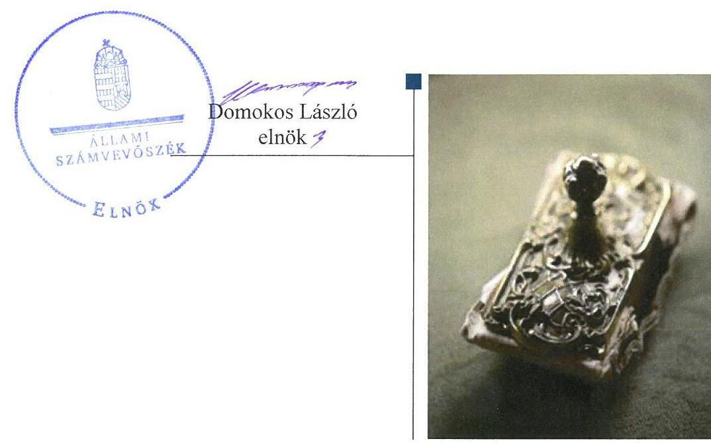
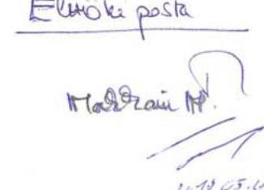
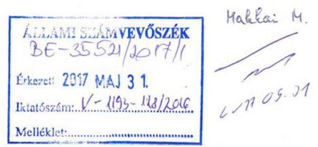

# Jelentés 

## MFB Invest Befektetési és Vagyonkezelő Zrt.

Az állami tulajdonban (résztulajdonban) lévő gazdálkodó szervezetek vagyonmegőrzési és gazdálkodási tevékenységének ellenőrzése 2017.

---

# Jelentés 

## MFB Invest Befektetési és Vagyonkezelő Zrt.

Az állami tulajdonban (résztulajdonban) lévő gazdálkodó szervezetek vagyonmegőrzési és gazdálkodási tevékenységének ellenőrzése
2017. 11. 16. 4. hó 5. nap

---

# AZ ELLENŐRZÉST FELÜGYELTE:

## MAKKAI MÁRIA felügyeleti vezető

## AZ ELLENŐRZÉST VEZETTE ÉS A VÉGREHAJTÁSÁÉRT FELELŐS:

### SALI SÁNDORNÉ ellenőrzésvezető

## A PROGRAM ÖSSZEÁLLÍTÁSÁÉRT FELELŐS:

### TÓTPÁL SZABOLCS osztályvezető

---

**IKTATÓSZÁM: V-1193-131/2016.**

**TÉMASZÁM: 2227**

**ELLENŐRZÉS-AZONOSÍTÓ SZÁM: V075914**

---

Jelentéseink az Országgyűlés számítógépes hálózatán és az Interneten a www.asz.hu címen is olvashatóak.

---

# TARTALOMJEGYZÉK 

■ ÖSSZEGZÉS ..... 5
■ AZ ELLENŐRZÉS CÉLJA ..... 6
■ AZ ELLENŐRZÉS TERÜLETE ..... 7
■ AZ ELLENŐRZÉS HÁTTERE, INDOKOLTSÁGA ..... 8
■ A JELENTÉS LÉNYEGES KÉRDÉSKÖREI ..... 9
■ ELLENŐRZÉS HATÓKÖRE ÉS MÓDSZEREI ..... 10
■ MEGÁLLAPÍTÁSOK ..... 12
■ JAVASLATOK ..... 17
■ MELLÉKLETEK ..... 19
I. Sz. melléklet: Értelmező szótár ..... 19
■ FÜGGELÉK: ÉSZREVÉTELEK ..... 21
■ RÖVIDÍTÉSEK JEGYZÉKE ..... 27

---

.

---

# ÖSSZEGZÉS 

Az MFB Magyar Fejlesztési Bank Zrt. az MFB Invest Befektetési és Vagyonkezelő Zrt. feletti tulajdonosi joggyakorlása szabályszerű volt. A Társaság gazdálkodásának szabályozottsága megfelelt az előírásoknak, beszámolási, adatszolgáltatási kötelezettségeit teljesítette. A vagyonnal felelősen, a tulajdonosi előírások betartásával gazdálkodott. A bevételek és ráfordítások elszámolása megfelelő volt.

## Az ellenőrzés társadalmi indokoltsága

Az állami tulajdonú gazdálkodó szervezetek ellenőrzése kiemelten fontos a nemzeti vagyon megőrzése, megóvása érdekében. Gazdálkodásuk jellemzően a közérdeklődés és a média figyelmének középpontjában áll, amihez hozzájárul a gazdálkodásuk körébe tartozó vagyon nagysága. A szolgáltatási árképzés megalapozottsága és az éves elszámoltatás feltételeinek kialakítása az ellenőrzés során nagy hangsúlyt kap. A szolgáltatás árában és annak támogatásában meg kell jelennie az önköltségszámítás szempontjainak, amely biztosítja a működés fenntarthatóságát (eszközpótlást) is.

Az Állami Számvevőszék az általa korábban ellenőrizetlen területek, szervezetek körébe tartozó társaságnál végzett ellenőrzést. A számvevőszéki ellenőrzés hozzájárul a közpénzek szabályos, átlátható, elszámoltatható és eredményes felhasználásához, a rend pedig értéket teremt. Minden közpénzt, közvagyont használó szervezettel szemben társadalmi igény, hogy tevékenységükről elszámoljanak. Ezt figyelembe véve és az Állami Számvevőszék Stratégiájával összhangban került sor az MFB Invest Befektetési és Vagyonkezelő Zrt. ellenőrzésére a 2012-2015. évek vonatkozásában.

## Főbb megállapítások, következtetések

Az MFB Magyar Fejlesztési Bank Zrt. a társasági részesedések feletti tulajdonosi joggyakorlás kereteit a szervezeti és működési szabályzatában, részletes szabályait belső szabályzataiban, valamint azzal összhangban az MFB Invest Befektetési és Vagyonkezelő Zrt. Alapító Okiratában rögzítette. A tulajdonos a Társaság üzleti tervét - az Alapító Okiratban rögzítettekkel összhangban - jóváhagyta, számviteli beszámolóit a jogszabályi előírások betartásával elfogadta, valamint megalkotta a javadalmazási, juttatási rendszerről szóló szabályzatot. A Társaságot tevékenységéről, gazdálkodásáról az előírt tartalommal és gyakorisággal beszámoltatták.

A Társaság működésének szabályozottsága megfelelő volt. A bevételeket és ráfordításokat a jogszabályi előírások és belső szabályozás szerint számolták el. Az önköltségszámítás feltételeit kialakították, a végzett szolgáltatások díjának alapja az előkalkuláció volt, ugyanakkor a jogszabályi előírások ellenére a szolgáltatások önköltségét utókalkulációval nem határozták meg. A Társaság a jogszabályokban és az Alapító Okiratban előírt beszámolási és adatszolgáltatási kötelezettségét szabályszerűen teljesítette.

Az MFB Invest Befektetési és Vagyonkezelő Zrt. a vagyon megőrzését, gyarapítását szolgáló szabályszerű vagyongazdálkodás kereteit kialakította, vagyonnyilvántartása szabályszerű volt, vagyon értékének, állagának megőrzéséről gondoskodott. A vagyonváltozást eredményező döntéseket az arra jogosultak hozták meg. A Társaság leányvállalatát vagyongazdálkodásáról beszámoltatta.

---

# AZ ELLENŐRZÉS CÉLJA 

Az ellenőrzés célja annak értékelése volt, hogy a tulajdonosi jogok gyakorlása szabályszerű volt-e; a gazdálkodó szervezet szabályozottsága, gazdálkodása és vagyongazdálkodási tevékenysége megfelelt-e a jogszabályi és a tulajdonosi előírásoknak, biztosítva volt-e a szolgáltatás díjának megalapozottsága szabályszerű önköltségszámítással; a vagyonváltozást eredményező döntések esetében a tulajdonosi jogok gyakorlója és a gazdálkodó szervezet szabályszerűen jártak-e el.

---

# AZ ELLENŐRZÉS TERÜLETE 

## Az MFB Invest Befektetési és Vagyonkezelő Zrt. és az MFB Magyar Fejlesztési Bank Zrt.

Az MFB Invest Befektetési és Vagyonkezelő Zrt. az MFB Magyar Fejlesztési Bank Zrt. kizárólagos tulajdonában volt az ellenőrzött időszakban.

A MFB Invest Zrt. ${ }^{1}$ feladata volt a bankcsoport hazai- és nemzetközi fejlesztési, valamint kockázati tőkefinanszírozási tevékenység ellátása. A Társaság a saját forrásai terhére piaci alapú közvetlen tőkekihelyezéseket végzett, melynek eredményeként az ellenőrzött időszakban számos aktív befektetéssel rendelkezett. A tőkefinanszírozási tevékenységet egészítette ki a szakmai szolgáltatásokat nyújtó tanácsadási üzletág, az egyéb szolgáltatások keretében nyújtott számviteli és közvetített szolgáltatások, valamint a bankcsoport tagjai részére nyújtott portfólió kezelés.

A 2004-ben az MFB Magyar Fejlesztési Bank Zrt. által alapított Társaság jegyzett tőkéjének összege 2012. január 1-jén 16 388,0 M Ft² volt. Az Alapító ${ }^{3}$ a jegyzett tőke összegét 2012-ben felemelte 27 388,0 M Ft-ra, majd 2015-ben leszállította 13 818,0 M Ft-ra. A Társaság gazdálkodása az ellenőrzött időszakban nyereséges volt, a saját tőke meghaladta a jegyzett tőkét.

Az MFB Invest Zrt. feladatait saját vagyonával látta el, vagyonkezelésbe vett vagyonnal nem rendelkezett, továbbá nem látott el közfeladatot.

---

# **AZ ELLENŐRZÉS HÁTTERE, INDOKOLTSÁGA**

## *MFB Invest Befektetési és Vagyonkezelő Zártkörűen Működő Részvénytársaság*

Az ÁSZ2 célkitűzése, hogy ellenőrzésével rámutasson az állami tulajdonú gazdálkodó szervezetek gazdálkodási tevékenységével kapcsolatos jó gyakorlatra és szabálytalanságokra.

Az ellenőrzés feladata felhívni a figyelmet a jogszabályi követelmények teljesítéséhez szükséges feltételek hiányosságára, valamint hozzájárulni az államháztartáson kívüli, de (közvetlenül vagy közvetve) állami vagyont használó gazdálkodó szervezetek tevékenységének átláthatóságához.

Az ellenőrzés várható hasznosulásaként az ellenőrzés megállapításai a jogalkotás számára segítséget nyújthatnak az átláthatóságot biztosító szabályozáshoz. Az ellenőrzöttek számára visszajelzést ad a vagyongazdálkodási tevékenységgel, beszámolással kapcsolatos szabálytalanságokról és kockázatokról. Az ellenőrzés tapasztalatai segítik és erősítik az ÁSZ hozzáadott értéket teremtő elemző tevékenységét és tanácsadó szerepét.

---

# A JELENTÉS LÉNYEGES KÉRDÉSKÖREI 

1. Az MFB Magyar Fejlesztési Bank Zrt. tulajdonosi joggyakor-
lása szabályszerű volt-e?
2. Az MFB Invest Zrt. működésének szabályozottsága megfelelt-e
az előírásoknak?
3. Az MFB Invest Zrt.-nél a pénzügyi-számviteli, adatszolgáltatási és ellenőrzési feladatok ellátása szabályszerű volt-e?
4. Az MFB Invest Zrt. vagyongazdálkodása szabályszerű volt-e?

---

# ELLENŐRZÉS HATÓKÖRE ÉS MÓDSZEREI 

## Az ellenőrzés típusa

Megfelelőségi ellenőrzés.

## Az ellenőrzött időszak

2012. január 1-jétől 2015. december 31-éig tart.

## Az ellenőrzés tárgya

Az állami tulajdonban lévő gazdasági társaság gazdálkodása, kiemelten vagyongazdálkodási tevékenysége, valamint a tulajdonosi jogok gyakorlása.

## Az ellenőrzött szervezet

Az MFB Invest Befektetési és Vagyonkezelő Zrt. és az MFB Magyar Fejlesztési Bank Zrt.

## Az ellenőrzés jogalapja

Az Állami Számvevőszékről szóló 2011. évi LXVI. törvény 5. § (3)(5) bekezdései.

## Az ellenőrzés módszerei

Az ellenőrzést a nemzetközi standardokat irányadónak tekintve az ellenőrzött időszakban hatályos jogszabályok, az ellenőrzés szakmai szabályok és módszertanok figyelembevételével végeztük.

Az ellenőrzés a tulajdonosi jogokat gyakorló, állami tulajdonban lévő MFB Magyar Fejlesztési Bank Zrt.-re és a tulajdonában lévő MFB Invest Befektetési és Vagyonkezelő Zrt.-re terjedt ki.

Az ellenőrzési kérdések megválaszolásához szükséges bizonyítékok megszerzése a következő ellenőrzési eljárások alkalmazásával történt: megfigyelés, kérdésfeltevés (információkérés), összehasonlítás, valamint elemző eljárás. Az ellenőrzési bizonyítékként felhasználható adatforrások közé tartoztak egyrészt az ellenőrzési programban felsorolt adatforrások, másrészt az ellenőrzés során feltárt, az ellenőrzés szempontjából információkat tartalmazó dokumentumok.

---

A bevételek és ráfordítások elszámolása, valamint a vagyonnyilvántartás terén a szabályszerű működést véletlen mintavétellel és irányított kiválasztással ellenőriztük. A mintatételek értékelése alapján, egyrészt a sokaságban előforduló hibás tételek arányát becsültük, másrészt az irányítottan kiválasztott tételeket értékeltük. A jogszabályoknak és a belső előírásoknak megfelelőnek, azaz szabályszerűnek tekintettük az adott területet, amennyiben a minta ellenőrzésének eredménye alapján 95%-os bizonyossággal a teljes sokaságban a hibaarány kisebb volt, mint 10%, nem megfelelőnek értékeltük, ha a hibaarány a 10%-ot meghaladta. A ráfordítások elszámolására és a vagyonnyilvántartásra vonatkozó véletlen mintavételt kockázati alapú kiválasztással egészítettük ki, amelynek során évente a három legnagyobb összegű tételt választottuk ki.

---

# 1. Az MFB Magyar Fejlesztési Bank Zrt. tulajdonosi joggyakorlása szabályszerű volt-e? 

Összegző megállapítás

Az MFB Zrt. Társaság feletti tulajdonosi joggyakorlása szabályszerű volt.

A TULAJDONOSI JOGGYAKORLÁS kereteit Gt. ${ }^{5}$ és a Ptk. ${ }^{6}$ előírásaival összhangban lévő SZMSZ ${ }^{7}$-ben, részletes szabályait belső szabályzatokban, valamint a Társaság Alapító Okiratában ${ }^{8}$ határozta meg az Alapító. Az SZMSZ nevesítette a tulajdonos döntéshozó szervezeti egységeit, valamint döntéseket előkészítő testületeit. A döntési jogosultságokat, hatásköröket, a tulajdonosi joggyakorlással kapcsolatos feladatok munkafolyamatait a feladatot ellátó szervezeti egységek ügyrendjében rögzítették. Az Alapító megválasztotta a Társaság könyvvizsgálóját.

AZ FB ${ }^{9}$ 2014. október 27-ig - az Igazgatóság létrehozásáig - a Gt. és a Ptk. szerinti ügydöntő felügyelőbizottságként működött, az igazgatóság jogait a vezérigazgató gyakorolta. Az Alapító Okiratban rögzítették az FB előzetes jóváhagyásához kötött döntések körét. Az FB tagjainak számát három és hat fő között határozták meg, összhangban a Taktv. ${ }^{10}$ előírásaival. Az Alapító Okiratban előírtaknak megfelelően az FB működéséről, a végzett ellenőrzéseiről, intézkedéseiről hozott határozatok, évközi, valamint éves jelentések útján tájékoztatta az Alapítót.

A BESZÁMOLTATÁSI RENDSZER keretében a tulajdonos havi, negyedéves, féléves - eljárásrendben rögzített tartalmú - jelentések készítésével számoltatta be a Társaságot. A Társaság számviteli beszámolóit - az FB előzetes írásbeli véleményezését követően - a tulajdonos a Gt.ben, illetve Ptk.-ban előírtaknak megfelelően, a könyvvizsgálói jelentések birtokában elfogadta, valamint döntött az adózott eredmény felhasználásáról.

AZ ÜZLETI TERVEKET a tulajdonos - az Alapító Okiratban előírtak szerint- határozattal hagyta jóvá. Az üzleti tervek elfogadásával a tervezett beruházások, fejlesztések, tárgyi eszköz értékesítések jóváhagyása is megtörtént.

AZ ANYAGI ÉRDEKELTSÉGI RENDSZER elemeit az Alapító által elfogadott javadalmazási szabályzat; ${ }^{11}{ }_{2}{ }^{12}$-ben rögzítették. A szabályzatok a Taktv. előírásainak megfelelően rendelkeztek a vezető tisztségviselők, FB tagok, a vezető állású munkavállalók javadalmazása, valamint a jogviszony megszűnése esetére biztosított juttatásokról.

---

# 2. Az MFB Invest Zrt. működésének szabályozottsága megfelelt-e az előírásoknak? 

Összegző megállapítás

A Társaság működésének szabályozottsága megfelelt az előírásoknak.

A Társaság rendelkezett a Számv. tv. ${ }^{13}$-ben előírt számviteli politikával ${ }^{14}$, annak keretében az eszközök és források értékelési szabályzatával, az eszközök és források leltárkészítési és leltározási szabályzatával ${ }^{15}$, a pénzkezelési szabályzattal ${ }^{16}$, önköltségszámítási szabályzattal ${ }^{17}$, továbbá a számlarenddel ${ }^{18}$. Az elkészített szabályzatok megfeleltek a Számv. tv.-ben foglaltaknak.

A tőkebefektetési szabályzat és eljárásrendben a jogszabályi előírásoknak megfelelően határozta meg a Társaság a tőkebefektetések célját, a befektetésekkel kapcsolatos döntési folyamatot, a tőkebefektetés megvalósítását, továbbá a befektetések megszűnésének lehetséges módjait.

## 3. Az MFB Invest Zrt.-nél a pénzügyi-számviteli, adatszolgáltatási és ellenőrzési feladatok ellátása szabályszerű volt-e?

## Összegző megállapítás

3.1. számú megállapítás

A Társaságnál a pénzügyi-számviteli, adatszolgáltatási és ellenőrzési feladatok ellátása szabályszerű volt.

A bevételek és ráfordítások elszámolása során a jogszabályi és belső szabályozások előírásait betartották.

A BEVÉTELEK ELSZÁMOLÁSA megfelelt a jogszabályi és belső szabályozásban foglalt előírásoknak. Az értékesítés nettó árbevételének, az egyéb bevételeknek, rendkívüli bevételeknek és a pénzügyi műveletek bevételeinek kiszámlázása, főkönyvi számlákra történő elszámolása megfelelt a Számv. tv. és a számviteli politika előírásainak. A bankcsoporton belül nyújtott szolgáltatások esetében az árakat transzferár nyilvántartással alátámasztották.

A RÁFORDÍTÁSOK ELSZÁMOLÁSA megfelelt a jogszabályi és belső szabályozásban foglalt előírásoknak. Az anyagjellegű ráfordítások, az
 egyéb ráfordítások, a rendkívüli ráfordítások és a pénzügyi műveletek ráfordításai esetében a költségelszámolást megalapozó dokumentumok rendelkezésre álltak. A ráfordítások elszámolása számviteli bizonylattal alátámasztva, a megfelelő főkönyvi számlákra történt. Az Alapító Okiratban előírtaknak megfelelően a meghatározott értékhatárt meghaladó kötelezettségvállalás esetén a tulajdonosi jóváhagyás rendelkezésre állt. A személyi jellegű ráfordítások elszámolásánál a munkabérek kifizetését munkaszerződés alapján, az Szja tv. ${ }^{19}$ és a Tbj. tv ${ }^{20}$. előírásainak megfelelő levonások alkalmazásával teljesítették. A személyi jellegű egyéb kifizetésekre (13. és 14. havi fizetés, jutalom és prémium, cafeteria kifizetések) a belső szabályzatok előírásaival összhangban került sor. Az értékcsökkenés elszámolása a Számv. tv.-ben előírtaknak megfelelően, a maradványértékkel csökkentett bruttó érték alapulvételével történt.

---

# 3.2. számú megállapítás 

A szolgáltatások díját előkalkuláció alapján állapították meg, a tényleges önköltséget utókalkulációval a jogszabályi előírások ellenére nem támasztották alá.

Az ÖNKÖLTSÉGSZÁMÍTÁSI SZABÁLYZATBAN meghatározták a kalkulációs módszereket, az előkalkuláció és utókalkuláció tartalmát, gyakoriságát, a számvitellel való egyezőség követelményét, a kalkuláció elkészítésének feladatát, a közvetett és közvetlen költségek elkülönítését.

A Társaság által végzett ingatlan-fejlesztés, tanácsadás (ingatlan szoftver, hardver, műszaki mérnöki, gazdasági, pénzügyi, számviteli, átvilágító és egyéb), ingatlan ügynöki kezelői tevékenység, valamint az ingatlan-bérbeadás alkalmazott díjainak alapjául szolgáló előkalkulációt elvégezték. A díjak meghatározására a közvetlen és közvetett költségek, valamint a nyereség hányad figyelembevételével került sor. Ugyanakkor a Számv. tv. 14. § (7) bekezdésben előírtak ellenére a végzett szolgáltatások 51. § szerinti önköltségét az önköltségszámítás rendjére vonatkozó belső szabályzat szerinti utókalkuláció módszerével nem állapították meg.

## 3.3. számú megállapítás

A Társaság teljesítette a tervezési, beszámolási, adatszolgáltatási kötelezettségét. A belső ellenőrzés a vagyongazdálkodást ellenőrizte.

Adatszolgáltatási kötelezettségét a Társaság az Alapító Okiratban, a szervezeti és működési szabályzatban, valamint a számviteli politikában és számlarendben meghatározottak szerint teljesítette az Alapító részére.

A Társaság tervezési tevékenysége keretében összeállította - a tulajdonos által meghatározott irányelvek alapján - az éves üzleti terveket, melyekben bemutatták a gazdasági feltételrendszert, a mérleg és eredménykimutatás részletes tervszámait, a várható likviditást, az üzleti aktivitást és a humánerőforrás adatokat. A beruházási terveket az üzleti tervek melléklete tartalmazta.

Az éves beszámolókat a Társaság a Számv. tv.-ben előírt tartalommal elkészítette, azokat a könyvvizsgáló hitelesítő záradékkal látta el. Az éves beszámolók letétbe helyezése a Számv. tv.-ben előírt határidőben megtörtént, közzétételi kötelezettségének eleget tett a Társaság.

A Társaság monitoring keretében történő beszámoltatása gazdálkodásáról és a feladatellátásról a tulajdonos által meghatározott adatszolgáltatások teljesítésével megtörtént.

A Társaság a közérdekű adatok nyilvánosságra hozatalát - közzétételi szabályzata szerint - biztosította, mivel honlapján közzétette a Taktv.-ben előírt közérdekű adatokat. Az adatvédelemre vonatkozó normákat az adatvédelmi és adatbiztonsági szabályzat előírása alapján alkalmazták.

Tulajdonosi ellenőrzés keretében a Társaság 2010. és 2011. I. félév gazdálkodásának átfogó vizsgálatához kapcsolódó utóellenőrzést folytatott le az MFB Zrt. Ennek során a tett megállapítások hasznosulását, a vállalt intézkedések végrehajtását ellenőrizték. A függetlenített

---

belső ellenőrzés is vizsgálta a vagyongazdálkodás szabályszerűségét, a feltárt hiányosságok megszüntetésére a Társaság intézkedett.

# 4. Az MFB Invest Zrt. vagyongazdálkodása szabályszerű volt-e? 

## Összegző megállapítás

A Társaság vagyongazdálkodása szabályszerű volt.

## Az analitikus és főkönyvi nyilvántartási

RENDSZER biztosította a Társaság vagyonának Számv. tv. és belső szabályozás szerinti nyilvántartását, a változások folyamatos nyomon követését. Az ellenőrzött évek beszámolóinak mérlegét alátámasztó, Számv. tv. szerinti leltárakat elkészítették. A főkönyvi könyvelés és analitikus nyilvántartások közötti egyezőséget biztosították. A folyamatosan mennyiségben nyilvántartott eszközök mennyiségi felvétellel történő leltározását a leltározási és leltárkészítési szabályzatban előírtaknak megfelelően, évenként elvégezték.

A Társaság vagyona 4179,6 M Ft-tal (20,9%-kal) csökkent az ellenőrzött időszakban. A főbb mérleg és eredménykimutatás adatokat az 1. táblázat mutatja be.

1. táblázat

| A főbb mérleg és eredménykimutatás adatainak alakulása (M Ft) |  |  |  |  |  |
| :--: | :--: | :--: | :--: | :--: | :--: |
| Megnevezés | 2012.01.01. | 2012.12.31. | 2013.12.31. | 2014.12.31. | 2015.12.31. |
| Mérlegfőösszeg | 20006,4 | 30440,9 | 35683,8 | 30612,9 | 15826,8 |
| Befektetett eszközök | 7431,4 | 15777,3 | 10189,8 | 16028,1 | 1894,7 |
| Tárgyi eszközök | 62,7 | 79,9 | 83,5 | 26,5 | 21,0 |
| Befektetett pénzügyi eszközök | 7368,7 | 15696,2 | 10101,8 | 15987,0 | 1861,3 |
| Forgóeszközök | 12502,4 | 14602,9 | 25425,4 | 14559,9 | 13918,3 |
| Követelések | 538,3 | 405,2 | 226,0 | 83,2 | 939,1 |
| Pénzeszközök | 11241,5 | 13547,3 | 24221,4 | 14004,4 | 12564,5 |
| Saját tőke | 18984,6 | 30324,0 | 30324,0 | 30324,0 | 14928,4 |
| Jegyzett tőke | 16388,0 | 27388,0 | 27388,0 | 27388,0 | 13818,0 |
| Kötelezettségek | 851,3 | 39,8 | 5285,7 | 205,3 | 835,1 |
| Értékesítés nettó árbevétele | 659,5 | 3653,9 | 162,1 | 92,6 | 185,8 |
| Üzemi (üzleti) eredmény | $-266,3$ | $-450,1$ | $-648,1$ | $-700,5$ | $-665,3$ |
| Pénzügyi műveletek eredménye | 841,6 | 803,4 | 823,3 | 728,7 | 966,4 |
| Adózott eredmény | 563,2 | 339,4 | 150,4 | 138,6 | 299,7 |
| Jóváhagyott osztalék, részesedés | 0,0 | 0,0 | 150,4 | 138,6 | 676,2 |
| Mérleg szerinti eredmény | 563,2 | 339,4 | 0,0 | 0,0 | 0,0 |

A Társaság az MFB csoporton belüli befektetések portfoliójának kezelése mellett a nemzetgazdasági szempontból kiemelten kezelt fejlesztések megvalósítását szolgáló projektekbe teljesített tőkebefektetéseket. Az eszközérték 91,1-98,0%-át - a Társaság tevékenységéből adódóan - a befektetett pénzügyi eszközök és pénzeszközök együttes értéke képviselte. A Társaság eredményesen gazdálkodott az ellenőrzött években, ugyanakkor a nyereség - osztalékként történő kifizetése miatt - a saját tőkét nem növelte. A saját tőke értékének alakulására alapvetően a 2012-ben végrehajtott jegyzett tőke emelés és a 2015. évi tőkeleszállítás volt hatással. Az Alapító 2012. évi, 11 000,0 M Ft összegű tőkeemelését - pályázaton való részvétel érdekében történő - egy konzorcium alakítás forrásának biztosítása

---

indokolta. A 2015. évi 13 570,0 M Ft tőkeleszállítás oka az Alapító részére, nemzeti közműszolgáltatási rendszer kialakítása érdekében történő - jogszabályi előíráson alapuló - részesedés értékesítés miatti tőkekivonás volt. A jegyzett tőke leszállítással egyidejűleg a tőketartalék 1079,7 M Ft-tal, az eredménytartalék 369,5 M Ft-tal csökkent.

Az ellenőrzött években az immateriális javak és tárgyi eszközök után elszámolt terv szerinti értékcsökkenés összegét (57,5 M Ft) meghaladta az eszközpótlásra (beruházásra) fordított kiadás összege (66,2 M Ft).

A vagyonváltozást eredményező, alapítói hatáskörbe tarozó döntési jogosultságokat az Alapító Okiratban rögzítették. A döntések előzetes jóváhagyása 2014. október 27-ig az ügyvezető felügyelőbizottság, 2014. október 28-tól a vezérigazgató jogosultsági körébe tartozott. A tervezett beruházások jóváhagyására az üzleti tervek elfogadásával, a befektetői tevékenységből ingatlanok (átvett lakóingatlanok, garázsok, teremgarázsban lévő parkolóhelyek) értékesítésére és bérbeadására az Alapító Okiratban rögzített döntési jogosultsági szabályok betartásával került sor.

A Társaság leányvállalatának az Alapító Okiratban előírta a vagyongazdálkodással kapcsolatos adatszolgáltatási és beszámoltatási kötelezettséget, mely határidőben, az előírtak szerint teljesült.

---

# JAVASLATOK 

Az ÁSZ tv. 33. § (1) bekezdésében foglaltak értelmében az ellenőrzött szervezet vezetője köteles a jelentésben foglalt megállapításokhoz kapcsolódó intézkedési tervet összeállítani és azt a jelentés kézhezvételétől számított 30 napon belül az ÁSZ részére megküldeni. Amennyiben az ellenőrzött szervezet vezetője nem küldi meg határidőben az intézkedési tervet, vagy továbbra sem elfogadható intézkedési tervet küld, az Állami Számvevőszék elnöke az ÁSZ tv. 33. § (3) bekezdése a) és b) pontjaiban foglaltakat érvényesítheti.

## Az MFB Invest Befektetési és Vagyonkezelő Zrt. vezérigazgatójának

1. Intézkedjen, hogy a Számv. tv. előírásainak megfelelően a végzett szolgáltatások önköltségét az önköltségszámítás rendjére vonatkozó belső szabályzat szerinti utókalkuláció módszerével állapítsák meg.
(3.2. sz. megállapítás 2. bekezdés utolsó mondata alapján)

---

.

---

# MELLÉKLETEK 

- I. SZ. MELLÉKLET: ÉRTELMEZŐ SZÓTÁR
gazdasági társaság
kockázati tőkefinanszírozás
leányvállalat

A Ptk. 3:88. § (1) bekezdése szerint „a gazdasági társaságok üzletszerű közös gazdasági tevékenység folytatására, a tagok vagyoni hozzájárulásával létrehozott, jogi személyiséggel rendelkező vállalkozások, amelyekben a tagok a nyereségből közösen részesednek, és a veszteséget közösen viselik".
a tevékenység keretében egy társaság vagy alap nem hitel formájában finanszíroz, hanem - átmeneti időre - részesedést vásárol a kezdő vállalkozásban azzal a céllal, hogy annak későbbi eladásánál minél nagyobb tőkenyereséget érjen el.
Forrás: www.kockazatitoke.info
Az a gazdasági társaság, amelyre az anyavállalat meghatározó befolyást képes gyakorolni.
Forrás: Számv. tv. 3. § (2) bekezdés 2. pont

---

.

---

# FÜGGELÉK: ÉSZREVÉTELEK 

A jelentéstervezetet a Számvevőszék 15 napos észrevételezésre megküldte az ellenőrzött szervezetek vezetőinek az ÁSZ tv. 29. § (1) bekezdése előírásának megfelelően.

Az ÁSZ a jelentéstervezetet észrevételezésre megküldte az MFB Magyar Fejlesztési Bank Zrt. elnök-vezérigazgatójának és az MFB Invest Befektetési és Vagyonkezelő Zrt. vezérigazgatójának.

Az MFB Magyar Fejlesztési Bank Zrt. elnök-vezérigazgatójának észrevételét és az arra adott választ, valamint az MFB Invest Befektetési és Vagyonkezelő Zrt. vezérigazgatójának nemleges észrevételét a függelék alább tartalmazza.

[^0]
[^0]:    * 29. § (1) Az Állami Számvevőszék az ellenőrzési megállapításait megküldi az ellenőrzött szervezet vezetőjének vagy az általa megbízott személynek, és annak, akinek személyes felelősségét állapította meg.
    (2) Az ellenőrzött szervezet vezetője és a felelősként megjelölt személy az ellenőrzés megállapításaira tizenöt napon belül írásban észrevételt tehet.
    (3) Az Állami Számvevőszék az észrevételre a beérkezésétől számított harminc napon belül írásban válaszol. A figyelembe nem vett észrevételeket köteles a jelentésben feltüntetni, és megindokolni, hogy azokat miért nem fogadta el.

---

# MFB 

## INVEST

MFB Invest Befektetési és Vagyonkezelő Zrt. Fővárosi Bíróság, mint Cégbíróság Cg. 01-10-045174 1027 Budapest, Kapás u. 6-12. Tel.: 452-5700, Fax: 452-5702

Állami Számvevőszék
1052 Budapest, Apáczai Csere János utca 10.
1364 Budapest 4. pf. 54.

## 803

$M 1-6-15 / 2017$
$R k-34007 / 2017 / 1$
MAY 25 2017
$U-IM 3-121 / 2016$
Elküldött posta

Budapest, 2017. május 18.

Tárgy: V-1193-123/2016. iktatószámú tájékoztató levéllel megküldött jelentéstervezet tekintetében tájékoztatás

Tisztelt Állami Számvevőszék!
Az MFB Invest Befektetési és Vagyonkezelő Zártkörűen Működő Részvénytársaság (székhely: 1027 Budapest, Kapás utca 6-12.; Cg.: 01-10-045174; képviseli: Katona Zsolt - vezérigazgató; a továbbiakban: Társaság) a V-1193-123/2016. iktatószámú tájékoztató levéllel a Társaság részére megküldött - 2017. május 09-én kézbesített - jelentéstervezet kapcsán az Állami Számvevőszékről szóló 2011. évi LXVI. törvény (a továbbiakban: Ász tv.) 29. § (2) bekezdése alapján az alábbiakról kívánja tájékoztatni a tisztelt Állami Számvevőszéket.

A jelentéstervezet 3.2. pontjában a tisztelt Állami Számvevőszék megállapítja, hogy a Társaság ,,a Számv. tv. 14. § (7) bekezdésében előírtak ellenére a végzett szolgáltatások 51. § szerinti önköltségét az önköltségszámítás rendjére vonatkozó belső szabályzat szerinti utókalkuláció módszerével nem állapították meg. ".

A Társaság a jelentéstervezet fenti megállapítása kapcsán észrevételt nem tesz.

Üdvözlettel,

## Katona Zsolt   Vezérigazgató   MFB Invest Befektetési és Vagyonkezelő Zártkörűen Működő Részvénytársaság

---

M782082
Domokos László úr
elnök részére
Állami Számvevőszék

Budapest

Tisztelt Elnök Úr!

Köszönettel megkaptuk az Állami
 Számvevőszék 2017. május 5-én kelt, „Az állami tulajdonban (résztulajdonban) lévő gazdálkodó szervezetek vagyonmegőrzési és gazdálkodási tevékenységének ellenőrzése - MFB Invest Befektetési és Vagyonkezelő Zrt." címmel készített V-1193-124/2016. számú levelében részünkre megküldött számvevőszéki jelentéstervezetet.

A jelentéstervezetben az MFB Zrt. vonatkozásában foglalt megállapításokkal egyetértünk, az ÁSZ tv. 29. § (2) bekezdésében foglaltak alapján az MFB Zrt.-re vonatkozó részek kapcsán az alábbi pontosító módosítási javaslatokat tesszük.

Az MFB Zrt. 2015. július 14-ig a 2001. évi XX. tv. 8. § (3) bekezdés b) pontjában és 2. számú mellékletében, 2015. július 14-től a 2001. évi XX. tv. 8. § (3) bekezdés h) pontjában foglaltak alapján az MFB Invest Zrt.-ben 100% tulajdoni részesedéssel rendelkezik.

A fentiek alapján kérjük, hogy a tervezetben előforduló esetekben a „tulajdonosi joggyakorlás"-t „tulajdonlás"-ra, míg a „tulajdonosi joggyakorló"-t „tulajdonos"-ra módosítani szíveskedjenek.

Az MFB Invest Zrt. vonatkozásában tett megállapítások kapcsán az észrevételeket a Társaság fogja megtenni.

Ezúton köszönjük meg a szakszerű vizsgálatuk kapcsán tapasztalt együttműködési készségüket, amennyiben további kérdésük, felvetésük van, örömmel állunk rendelkezésükre.

Budapest, 2017. május 23.
Tisztelettel:

Bernáth Tamás
elnök-vezérigazgató
az MFB Magyar Fejlesztési Bank Zártkörűen Működő Részvénytársaság
képviseletében

#  

dr. Simon Katalin
vezérigazgató-helyettes
képviseletében

---

ELNÖK

Ikt.szám: V-1193-129/2016.

Bernáth Tamás úr
elnök-vezérigazgató

MFB Magyar Fejlesztési Bank Zrt.

Budapest

Tisztelt Elnök-vezérigazgató Úr!

A „Az állami tulajdonban (résztulajdonban) lévő gazdálkodó szervezetek vagyonmegőrzési és gazdálkodási tevékenységének ellenőrzése – MFB Invest Befektetési és Vagyonkezelő Zrt.” címmel készített számvevőszéki jelentéstervezetre tett észrevételét köszönettel megkaptam.

Az Állami Számvevőszék észrevételre vonatkozó álláspontjáról a felügyeleti vezető által készített részletes tájékoztatást mellékelten megküldöm.

Tájékoztatom Elnök-vezérigazgató urat, hogy a számvevőszéki jelentésben – az Állami Számvevőszékről szóló 2011. évi LXVI. törvény 29. § (3) bekezdése alapján – a figyelembe nem vett észrevételt szerepeltetjük az elutasítás indokának feltüntetésével.

Budapest, 2017. 26. hó 27. nap

Tisztelettel:

Melléklet: Tájékoztatás az észrevételek kezeléséről

1852 BUDAPEST, AVÁGÓN CSERE, SÁRÓG UTCA 111. 135/4. Budapest A. Pf. 5/4 telefon: 484 9081 fax: 484 9281

---

# Tájékoztatás   az észrevételek kezeléséről 

A „Az állami tulajdonban (résztulajdonban) lévő gazdálkodó szervezetek vagyonmegőrzési és gazdálkodási tevékenységének ellenőrzése - MFB Invest Befektetési és Vagyonkezelő Zrt." címü jelentéstervezetre 2017. május 31-én érkezett észrevételt áttekintettük, annak kezelésével kapcsolatban a következő tájékoztatást adom.
A jelentéstervezetben szereplő „tulajdonosi joggyakorló" és „tulajdonosi joggyakorlás" kifejezésekkel kapcsolatban tett pontosító javaslatukat köszönjük, azt részben fogadjuk el.
A „tulajdonosi joggyakorlás" kifejezés használatát az észrevétellel ellentétben indokoltnak tartjuk, mivel az MFB Magyar Fejlesztési Bank Zrt.-t tulajdonosi jogok illetik meg, amelyeket az MFB Invest Zrt.-ben fennálló társasági részesedése felett tulajdonosként gyakorol. A jelentéstervezet szövegkörnyezetében a „tulajdonosi joggyakorlás" kifejezés használata helytálló.
A „tulajdonosi joggyakorló" kifejezés pontosítására vonatkozó észrevételüket elfogadjuk, azt a jelentéstervezetben „tulajdonos"-ra módosítjuk. Kapcsolódó pontosításként a jelentéstervezet 10. oldalán szereplő „Az ellenőrzés módszerei" fejezet 2. bekezdését is pontosítjuk a tulajdonosi viszonyokra tekintettel. A pontosított szöveg a következő: „Az ellenőrzés a tulajdonosi jogokat gyakorló, állami tulajdonban lévő MFB Magyar Fejlesztési Bank Zrt.-re és a tulajdonában lévő MFB Invest Befektetési és Vagyonkezelő Zrt.-re terjedt ki."

Budapest, 2017.  hó 3. nap

Makkai Mária
felügyeleti vezető

---

.

---

# RÖVIDÍTÉSEK JEGYZÉKE 

${ }^{1}$ Társaság/ MFB Invest Zrt.
${ }^{2} \mathrm{MFB}$
${ }^{3}$ Alapító
${ }^{4}$ ÁSZ
${ }^{5}$ Gt.
${ }^{6}$ Ptk.
${ }^{7}$ SZMSZ
${ }^{8}$ Alapító Okirat
${ }^{9} \mathrm{FB}$
${ }^{10}$ Taktv.
${ }^{11}$ javadalmazási szabályzat ${ }_{1}$
${ }^{12}$ javadalmazási szabályzat ${ }_{2}$
${ }^{13}$ Számv. tv.
${ }^{14}$ számviteli politika
${ }^{15}$ eszközök és források leltárkészítési és leltározási szabályzata
${ }^{16}$ pénzkezelési szabályzat
${ }^{17}$ önköltségszámítási szabályzat
${ }^{18}$ számlarend
${ }^{19}$ Szja tv.
${ }^{20} \mathrm{Tbj.} \mathrm{tv.}$

MFB Invest Befektetési és Vagyonkezelő Zártkörűen Működő Részvénytársaság millió forint

MFB Magyar Fejlesztési Bank Zártkörűen Működő Részvénytársaság
Állami Számvevőszék
a gazdasági társaságokról szóló 2006. évi IV. törvény (hatálytalan: 2014. március 15-től)
a Polgári Törvénykönyvről szóló 2013. évi V. törvény (hatályos 2014. III. 15-től)
az MFB Zrt. szervezeti és működési szabályzatai
az MFB Invest Zrt. többször módosított Alapító Okirata (hatályos: 2014. október 26-ig), Alapszabálya (hatályos: 2014. október 27-től)
az MFB Invest Zrt. felügyelő bizottsága
a köztulajdonban álló gazdasági társaságok takarékosabb működéséről szóló 2009. évi CXXII. törvény (hatályos: 2009. december 4-től)
az MFB Invest Zrt. javadalmazási szabályzata, melyet az Alapító a 15/2010. (IV. 20.) számú határozatával léptetett hatályba (hatályos: 2015. január 14-ig)
az MFB Invest Zrt. javadalmazási szabályzata, melyet az Alapító az 1/2015. (I. 15.) számú határozatával léptetett hatályba (hatályos: 2015. január 15-től)
a számvitelről szóló 2000. évi C. törvény
az MFB Invest Zrt. többször módosított számviteli politikája
az MFB Invest Zrt. leltározási és selejtezési szabályzata
az MFB Invest Zrt. pénzkezelési szabályzata
az MFB Invest Zrt. önköltségszámítási szabályzata
az MFB Invest Zrt. számlarendje
a személyi jövedelemadóról szóló 1995. évi CXVII. törvény
a társadalombiztosítás ellátásaira és a magánnyugdíjra jogosultakról, valamint e szolgáltatások fedezetéről 1997. évi LXXX. törvény

---

ÁLLAMI SZÁMVEVŐSZÉK
1052 Budapest, Apáczai Csere János utca 10.
Levélcím: 1364 Budapest 4. Pf. 54
Telefon: +36 14849100 Telefax: +36 14849200
www.asz.hu
