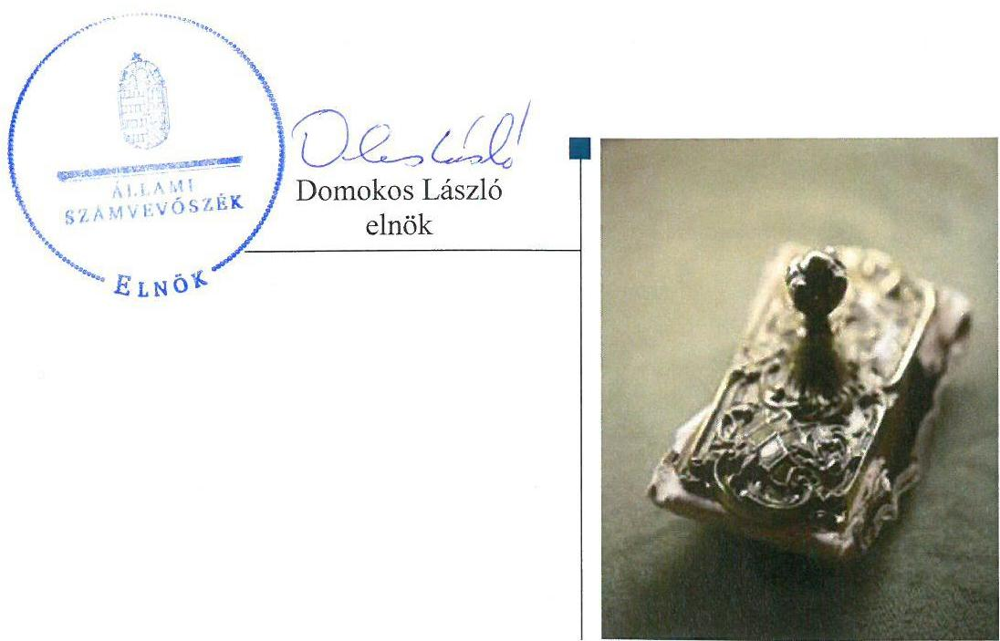
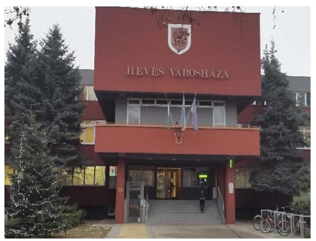
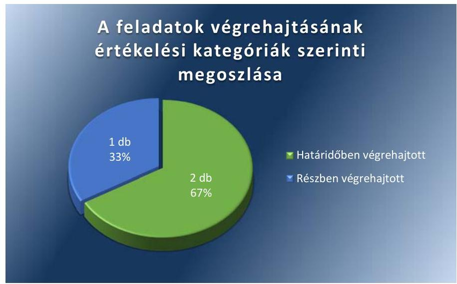

# Jelentés 

## Utóellenőrzések

Heves Város Önkormányzata vagyongazdálkodása
szabályszerűségének utóellenőrzése 2017.

---

# Jelentés 

## Utóellenőrzések

Heves Város Önkormányzata vagyongazdálkodása
szabályszerűségének utóellenőrzése
2017.  hó 22. nap

---

# AZ ELLENŐRZÉST FELÜGYELTE: 

DR. BENEDEK MÁRIA felügyeleti vezető

## AZ ELLENŐRZÉST VEZETTE ÉS A VÉGREHAJTÁSÁÉRT FELELŐS:

SIPOSNÉ DÓCZI KLÁRA ellenőrzésvezető

## A PROGRAM ÖSSZEÁLLÍTÁSÁÉRT FELELŐS:

JANIK JÓZSEF LÁSZLÓ osztályvezető

## A TÉMÁHOZ KAPCSOLÓDÓ KORÁBBI SZÁMVEVŐSZÉKI JELENTÉSEK:

- címe: Jelentés az önkormányzati vagyongazdálkodás szabályszerűségi ellenőrzéséről - Heves
- sorszáma: 13104

Jelentéseink az Országgyúlés számítógépes hálózatán és az Interneten a www.asz.hu címen is olvashatóak.

IKTATÓSZÁM: V-1320-044/2016.
TÉMASZÁM: 2354
ELLENŐRZÉS-AZONOSÍTÓ SZÁM: V075579

---

# TARTALOMJEGYZÉK 

■ ÖSSZEGZÉS ..... 5
■ AZ ELLENŐRZÉS CÉLJA ..... 6
■ AZ ELLENŐRZÉS TERÜLETE ..... 7
■ AZ ELLENŐRZÉS HÁTTERE, INDOKOLTSÁGA ..... 8
■ A JELENTÉS LÉNYEGES KÉRDÉSKÖRE ..... 9
■ ELLENŐRZÉS HATÓKÖRE ÉS MÓDSZEREI ..... 10
■ MEGÁLLAPÍTÁSOK ..... 12
■ KÖVETKEZTETÉSEK ..... 14
■ MELLÉKLETEK ..... 15
I. Sz. melléklet: Az ÁSZ 13104 számú jelentéséhez kapcsolódó intézkedési terv végrehajtása.. 15
■ FÜGGELÉK: ÉSZREVÉTELEK ..... 19
■ RÖVIDÍTÉSEK JEGYZÉKE ..... 21

---

.

---

# ÖSSZEGZÉS 

Az Állami Számvevőszék Heves Város Önkormányzata vagyongazdálkodása szabályszerűségének utóellenőrzése során megállapította, hogy az intézkedési tervben meghatározott feladatok többségét határidőben végrehajtották, melynek eredményeként a vagyongazdálkodás működésében rejlő kockázatok csökkentek. A közérdekű adatok nem teljes körű közzététele miatt tájékoztatási kötelezettségének Heves Város Önkormányzata részben tett eleget, ezáltal nem biztosította a vagyongazdálkodás és a közpénzzel történő felelős gazdálkodás átláthatóságát.

## Az ellenőrzés társadalmi indokoltsága

Az Állami Számvevőszék stratégiájában célul tűzte ki a számvevőszéki munka hasznosulásának javítását. Ezzel összhangban ellenőrzi, hogy az ellenőrzött szervezetek megvalósították-e a korábbi ellenőrzései által feltárt hibák, hiányosságok és szabálytalanságok megszüntetése céljából kialakított intézkedési terveikben foglaltakat. A rendszeres utóellenőrzések hozzájárulnak a szükséges intézkedések tényleges végrehajtásához, ezáltal a közpénzügyek rendezettségének javulásához, igazolják, hogy lezárult a következmények nélküli ellenőrzések időszaka.

## Főbb megállapítások, következtetések

Heves Város Önkormányzata az intézkedést igénylő megállapításokhoz és javaslatokhoz kapcsolódóan összeállított intézkedési tervben meghatározott három feladatból kettőt határidőben, egyet részben hajtott végre.

Határidőben intézkedett a jogszabály által előírt kötelezettségvállalás nyilvántartás vezetéséről, valamint a kötelezettségvállalások jogszabályban foglalt követelményeknek megfelelő pénzügyi ellenjegyzéséről, ezáltal a vagyongazdálkodása működési szabályozottságában és szabályszerűségében korábban ezeken a területeken tapasztalt hiányosságok és szabálytalanságok megszüntetésre kerültek.

Heves Város Önkormányzata nem gondoskodott teljes körűen a jogszabályban meghatározott közérdekű adatok közzétételéről, továbbá a Közbeszerzési törvény alanyi hatálya alá tartozó szervezetként megsértette a közbeszerzési eljárás alapján megkötött szerződések, a részvételi jelentkezések és az ajánlatok elbírálásáról szóló összegezés közzétételére vonatkozó kötelezettségét. Így a korábban feltárt kockázatok egy része továbbra is fennáll.

Az intézkedési tervben meghatározott feladatok végrehajtásáról Heves Város Önkormányzata a jogszabályban meghatározott nyilvántartást vezette, annak tartalma megfelelt az előírt követelményeknek.

---

# AZ ELLENŐRZÉS CÉLJA 

Az ellenőrzés célja annak értékelése volt, hogy a számvevőszéki jelentésben foglalt intézkedést igénylő megállapításokkal és javaslatokkal összhangban készített intézkedési tervben meghatározott feladatokat az ellenőrzött szervezet végrehajtotta-e.

---

# AZ ELLENŐRZÉS TERÜLETE 

## Heves Város Önkormányzata

Heves város az Észak-Magyarországi régióban, Heves megyében fekszik, a lakónépességének száma a Központi Statisztikai Hivatal Magyarország közigazgatási helynévkönyve alapján 2016. január 1-jén 10475 fő volt.

A Polgármester ${ }^{1}$ a 2014. évi önkormányzati választások óta, a Jegyző${ }^{2}$ pedig 2015. májusától tölti be tisztségét.

Az Önkormányzat ${ }^{3}$ 2015. évi költségvetési bevétele 3,46 milliárd Ft-ra, a kiadása 3,32 milliárd Ft-ra teljesült. Az éves zárszámadási rendeletek (Heves Város Önkormányzatának 2013. és 2015. évi zárszámadásai, a Képviselő-testület ${ }^{4}$ által elfogadott beszámolók) alapján eszközeinek nettó értéke 2015-ben 7,1 milliárd Ft volt, amely 8,8 %-kal haladta meg a 2013. évit.

Az Önkormányzat 2015. évi vagyona meghatározó részben befektetett eszközökből állt. 5,6 milliárd Ft összegben a nemzeti vagyon befektetett eszközök értékéből, és 1,5 milliárd Ft üzleti vagyonból.

Az ÁSZ ${ }^{5}$ Heves Város Önkormányzata vagyongazdálkodásának szabályszerűségi ellenőrzéséről szóló 13104 számú jelentését 2013. október 8-án hozta nyilvánosságra. Az ellenőrzés célja annak értékelése volt, hogy az Önkormányzat szabályszerűen alakította-e ki a vagyongazdálkodási tevékenységet, annak szervezeti kereteit szabályozták-e, biztosította-e a vagyongazdálkodás törvényességét, szabályszerűségét, hasznosították-e a külső és belső ellenőrzések megállapításait, javaslatait.

Az ÁSZ jelentés ${ }^{6}$ az Önkormányzat jegyzője számára két pontban összeségében három javaslatot tartalmazott, melyre az intézkedési tervet az Önkormányzat határidőben megküldte.

Az utóellenőrzés - a 2013. október 8-tól 2016. december 9-ig végrehajtott feladatokat figyelembe véve - az ÁSZ jelentésben a jegyző részére megfogalmazott intézkedést igénylő megállapításokra és javaslatokra készített, az ÁSZ részére megküldött intézkedési tervben foglalt feladatok megvalósításának ellenőrzésére, illetve értékelésére fókuszált.

---

# AZ ELLENŐRZÉS HÁTTERE, INDOKOLTSÁGA 

Az ÁSZ tv. ${ }^{7}$ 33. § (1) bekezdése értelmében a számvevőszéki jelentések intézkedést igénylő megállapításaihoz és javaslataihoz kapcsolódóan az ellenőrzött szervezet vezetője intézkedési tervet köteles összeállítani, és az ÁSZ részére megküldeni. Az intézkedési tervben foglaltak megvalósítását az ÁSZ tv. 33. § (7) bekezdésében foglaltak alapján - az ÁSZ utóellenőrzés keretében - ellenőrizheti. Az intézkedések megvalósulásának értékelése során az ÁSZ figyelembe veszi az ellenőrzött szervezetek működési feltételeiben, valamint a jogszabályi előírásokban bekövetkezett változásokat.

Az intézkedési tervekben foglalt feladatok hiányos, illetve késedelmes végrehajtása, valamint megvalósításának elmaradása azt mutatja, hogy az ellenőrzések során feltárt hibák, hiányosságok és szabálytalanságok megszüntetése nem kapott kellő hangsúlyt. Ez a szabályszerű működés és a felelős vezetői magatartás vonatkozásában kockázatot hordoz. E kockázatok feltárásával az ÁSZ utóellenőrzési rendszere fokozza a fegyelmet, és igazolja, hogy a közpénzzel való szabályos gazdálkodás felelőssége elől nem lehet kitérni.

Az utóellenőrzés négy szinten hasznosulhat:
$\longrightarrow$ A társadalom szintjén az utóellenőrzés jelzi, hogy a számvevőszéki ellenőrzés megállapításainak van következménye: a hiányosságok megszüntetésére az ellenőrzött szervezet által meghatározott intézkedések végrehajtását is számon kéri az ÁSZ.
$\longrightarrow$ Az ellenőrzött terület szintjén az utóellenőrzés tájékoztatást nyújt a terület döntéshozóinak a hiányosságok kiküszöbölésének jó gyakorlatairól, ezzel lehetőséget biztosítva arra, hogy az ÁSZ ellenőrzési megállapításai, javaslatai a terület nem ellenőrzött szervezeteinek a működése során is hasznosuljanak.
$\longrightarrow$ Az ellenőrzött szervezet szintjén az utóellenőrzés feltárja, hogy a szervezet az intézkedések végrehajtásával hasznosította-e a korábbi ellenőrzési jelentésben a hiányosságok megszüntetése, illetve a kockázatok kezelése érdekében megfogalmazott javaslatokat.
$\longrightarrow$ Az ÁSZ szintjén az utóellenőrzés visszacsatolást ad az ellenőrzési jelentések hasznosulásáról, az intézkedések elmaradása vagy részleges megvalósulása a további ellenőrzésekhez kockázati jelzésként szolgál.

---

# A JELENTÉS LÉNYEGES KÉRDÉSKÖRE 

Az Önkormányzat az intézkedési tervben foglaltakat az előírt határidőben végrehajtotta-e?

---

# ELLENŐRZÉS HATÓKÖRE ÉS MÓDSZEREI 

## Az ellenőrzés típusa

Megfelelőségi ellenőrzés

## Az ellenőrzött időszak

Az utóellenőrzés alapját képező ÁSZ jelentés közzétételének napjától (2013. október 8.) az ellenőrzésről szóló kiértesítő levél keltének napjáig (2016. december 9.) tartó időszak.

## Az ellenőrzés tárgya

Az ÁSZ tv. 2011. július 1-jei hatálybalépését követően a számvevőszéki jelentésben foglalt intézkedést igénylő megállapításokkal és javaslatokkal összhangban - az ellenőrzött szervezet által - készített intézkedési tervben foglaltak végrehajtásának ellenőrzése volt.

Az ellenőrzés kiterjedt minden olyan körülményre és adatra, amely az ÁSZ jogszabályban meghatározott feladatainak teljesítéséhez, valamint a program végrehajtása folyamán felmerült újabb összefüggések feltárásához szükséges volt.

## Az ellenőrzött szervezet

Heves Város Önkormányzata

## Az ellenőrzés jogalapja

Az ÁSZ törvényben meghatározott feladatkörében ellenőrzi a központi költségvetés végrehajtását, az államháztartás gazdálkodását, az államháztartásból származó források felhasználását és a nemzeti vagyon kezelését.

Az ÁSZ tv. 1. § (3) bekezdése szerint az ÁSZ általános hatáskörrel végzi a közpénzekkel és az állami és önkormányzati vagyonnal való felelős gazdálkodás ellenőrzését.

Az ÁSZ tv. 33. § (7) bekezdése alapján az ÁSZ tv. 33. § (1)-(2) bekezdése szerinti intézkedési tervben foglaltak megvalósítását az ÁSZ utóellenőrzés keretében ellenőrizheti.

---

# Az ellenőrzés módszerei 

Az ÁSZ az ellenőrzést a nemzetközi standardokat irányadónak tekintve az ellenőrzési program ellenőrzési kérdései, az ellenőrzött időszakban hatályos jogszabályok, az ellenőrzés szakmai szabályok és módszertanok figyelembevételével, önálló ellenőrzés keretében végezte.

Az ÁSZ az ellenőrzés ideje alatt az Önkormányzattal történő kapcsolattartást az ÁSZ SZMSZ ${ }^{\circledR}$-ének vonatkozó előírásai alapján biztosította.

Az utóellenőrzés megállapításait elsősorban az ÁSZ rendelkezésére álló, valamint az Önkormányzattól elektronikusan bekért dokumentumok alapozták meg.

Az ellenőrzési bizonyítékként felhasználható adatforrások közé tartoznak egyrészt a szakmai programban felsorolt adatforrások, másrészt minden - az ellenőrzés folyamán feltárt, az ellenőrzés szempontjából információt tartalmazó - dokumentum.

Az intézkedési tervekben előírt feladatokat azok végrehajthatósága, illetve végrehajtása szempontjából az alábbiak szerint kell értékelni:
"határidőben végrehajtott" a feladat, ha a teljesítés dokumentáltan, az intézkedési tervben előírt határidőben és tartalommal megtörtént;
"határidőn túl végrehajtott" a feladat, ha annak teljesítése az intézkedési tervben meghatározott módon, de az előírt határidőn túl történt meg;
"részben végrehajtott" a feladat, ha végrehajtása teljes körűen az intézkedési tervben előírt módon nem történt meg;
"nem végrehajtott" ha a végrehajtás nem történt meg, vagy amenynyiben a teljesítést nem dokumentálták;
"okafogyottá vált" a feladat, ha végrehajtására - meghatározott esemény bekövetkezése, továbbá külső körülmény, a működést érintő feltétel változása miatt - már nincs szükség, illetve lehetőség, és egyértelműen megállapítható, hogy az intézkedést szükségessé tevő körülmény a jövőben nem fordulhat elő;
"nem időszerű" az a feladat, amelynek ellenőrzési időszakon belüli végrehajtására azért nem került (kerülhetett) sor, mert az intézkedés alapjául szolgáló esemény nem következett be, de annak jövőbeni előfordulása lehetséges, a végrehajtása nem volt esedékes, vagy a végrehajtás határideje még nem járt le.
Az ellenőrzés lefolytatásához az Önkormányzat a tanúsítványok elektronikus kitöltésével, valamint az ÁSZ által kért dokumentumok elektronikus megküldésével szolgáltatott adatokat, amelyek valódiságát és teljes körűségét a Polgármester által tett teljességi és hitelességi nyilatkozat igazolta. Az így rendelkezésre bocsátott adatok, információk kontrollja az ellenőrzés keretében történt.

---

# MEGÁLLAPÍTÁSOK 

## Az Önkormányzat az intézkedési tervben foglaltakat az előírt határidőben végrehajtotta-e?

Összegző megállapítás

Az Önkormányzat az intézkedési tervben meghatározott három feladatból kettőt határidőben, egyet részben hajtott végre. Az intézkedési tervben foglalt feladatok végrehajtásáról az Önkormányzat a jogszabály által előírt tartalommal a nyilvántartást vezette.

Az ÁSZ jelentésében a jegyző részére három javaslatot fogalmazott meg, amelynek hasznosítására a Polgármester három feladatot határozott meg. Mindhárom feladat végrehajtásának felelőseként a jegyzőt jelölte meg. Az ÁSZ javaslatai alapján készült intézkedési tervben meghatározott három feladatból kettőt határidőben, egyet részben hajtott végre az Önkormányzat.

Az intézkedési tervben meghatározott feladatokat, határidőket, felelősöket és a feladatok végrehajtását az I. számú melléklet mutatja be.

A Jegyző - a Bkr. ${ }^{9}$ 14. § (1) bekezdésének megfelelően - nyilvántartást vezetett az ÁSZ jelentés javaslatai alapján készült intézkedési terv végrehajtásáról. A nyilvántartás - a Bkr. 47. § (2) bekezdésének megfelelően - tartalmazta az ÁSZ jelentésben szereplő javaslatokat, az elfogadott intézkedési tervet, az intézkedési terv alapján végrehajtott intézkedések rövid leírását.

Az Önkormányzat intézkedési tervében meghatározott feladatok végrehajtásának értékelési kategóriák szerinti megoszlását az 1. ábra szemlélteti.

1. ábra

---

# HATÁRIDŐBEN VÉGREHAJTOTT feladatok: 

1. A Jegyző az intézkedési tervben meghatározott határidőben gondoskodott a kötelezettségvállalások Ávr. 56. § (1) bekezdésében előírt nyilvántartásának vezetéséről.
2. A Jegyző az intézkedési tervben meghatározott határidőben gondoskodott a kötelezettségvállalások Ávr. 55. § (1) bekezdésében foglalt előírások szerinti pénzügyi ellenjegyzéséről.

## RÉSZBEN VÉGREHAJTOTT feladat:

3. A Jegyző az intézkedési tervben meghatározott határidőben nem
 gondoskodott a kötelezően közzéteendő közérdekű adatok teljes körű közzétételéről, mert csak egy részét tette közzé az Info tv. ${ }^{10}$ 1. mellékletében meghatározott közérdekű adatoknak ${ }^{11}$. Ezzel az Önkormányzat egyben megsértette az Info tv. 37. § (1) bekezdésében, valamint a Kbt. ${ }^{12}$ 5. § (1) bekezdésének b) pontja alapján a Kbt. alanyi hatálya alá tartozó szervezetként a Kbt. 43. § (1) bekezdésének d) és e) pontjában foglaltakra vonatkozó közzétételi kötelezettségét is. Nem tett közzé az Önkormányzat többek között olyan lényeges közérdekű adatokat, mint gazdálkodását érintően a költségvetési támogatások kedvezményezettjeire vonatkozó adatok, valamint az Önkormányzat nem alapfeladatai ellátására (így különösen egyesület támogatására, alapítványok által ellátott feladatokkal összefüggő kifizetésekre) fordított ötmillió forintot meghaladó kifizetések adatai.

---

# KÖVETKEZTETÉSEK 

Az Önkormányzat nem gondoskodott teljes körűen a kötelezően közzéteendő közérdekű adatok közzétételéről, amivel sérül a közérdekű és közérdekből nyilvános adatok megismeréséhez és terjesztéséhez fűződő jog érvényesülése, ami jelentős kockázatot hordoz a vagyongazdálkodás és a közpénzekkel történő felelős gazdálkodás átláthatósága szempontjából. A nem teljes körűen végrehajtott feladat indokolja a feltárt hiányosság, szabálytalanság tekintetében a munkajogi felelősség tisztázására irányuló eljárás megindítását, és eredményének ismeretében a szükséges intézkedések megtételét.

---

# MELLÉKLETEK

- I. SZ. MELLÉKLET: AZ ÁSZ 13104 SZÁMÚ JELENTÉSÉHEZ KAPCSOLÓDÓ INTÉZKEDÉSI TERV VÉGREHAJTÁSA

|  Sorszám | Az intézkedési tervben meghatározott feladat | Az intézkedési tervben meghatározott határidő | Az intézkedési tervben meghatározott feladat felelőse | A feladat végrehajtása  |
| --- | --- | --- | --- | --- |
|   | 1. | 2. | 3. | 4.  |
|  Határidőben végrehajtott feladat |  |  |  |   |
|  1. | Az államháztartásról szóló törvény végrehajtásáról szóló 368/2011.(XII.31.) Korm. rendelet 56. § (1) bekezdésében előírt kötelezettségvállalás nyilvántartást 2014. évtől kezdődően vezetni fogjuk. | értelem szerint | Jegyző | A jegyző az intézkedési tervben meghatározott határidőben gondoskodott a kötelezettségvállalások nyilvántartásáról, mely 2014-től a Saldo Creator Integrált Számviteli Információs Rendszer könyvelő program kötelezettségvállalás moduljának alkalmazásával történt az Önkormányzatnál. Az ellenőrzési dokumentumok alapján az Önkormányzat az ellenőrzött időszakban az Ávr. 56. § (1) bekezdésében előírt nyilvántartást a kötelezettségvállalásokról folyamatosan vezette.  |
|  2. | A továbbiakban az államháztartásról szóló törvény végrehajtásáról szóló 368/2011.(XII.31.) Korm. rendelet 55. § (1) bekezdése alapján a pénzügyi ellenjegyzést a kötelezettségvállalás dokumentumán a pénzügyi ellenjegyzés dátumának és a pénzügyi ellenjegyzés tényére utalás megjelölésével, az arra jogosult személy fogja az aláírásával igazolni. | folyamatos | Jegyző | A jegyző az intézkedési tervben meghatározott határidőben intézkedett arról, hogy a kötelezettségvállalások pénzügyi ellenjegyzése az Ávr. 55. § (1) bekezdésében előírtak szerint teljesüljön. Az ellenőrzési dokumentumok alapján az ellenőrzött időszakban az Önkormányzat a kötelezettségvállalások pénzügyi ellenjegyzését a kötelezettségvállalás dokumentumán a pénzügyi ellenjegyzés dátumának és a pénzügyi ellenjegyzés tényére történő utalás megjelölésével, az arra jogosult személy aláírásával a jogszabályi előírásoknak megfelelően végezte.  |
|  Részben végrehajtott feladat |  |  |  |   |
|  3. | A továbbiakban az Információs önrendelkezési jogról és az információszabadságról szóló 2011. évi CXII. törvény 1. sz. mellékletében meghatározott adatokat teljes körűen közzé fogjuk tenni. | folyamatos | Jegyző | A jegyző az intézkedési tervben meghatározott határidőben nem gondoskodott teljes körűen az Info tv. 1. mellékletében előírt kötelezően közzéteendő közérdekű adatok elektronikus közzétételéről, mivel ezen mellékletben meghatározott közérdekű adatoknak csak egy részét tette közzé. Ezzel az Önkormányzat egyben megsértette az Info tv. 37. § (1) bekezdésében, valamint a Kbt. 5. § (1) bekezdésének b) pontja alapján a Kbt. alanyi hatálya alá tartozó szervezetként a Kbt. 43. § (1) bekezdésének d) és e) pontjában foglaltakra vonatkozó közzétételi kötelezettségét is.
Az Önkormányzat az Info tv. 1. mellékletében meghatározott közérdekű adatok közzétételét az alábbiak szerint teljesítette:  |

---

|  Az intézkedési tervben meghatározott feladat | Az intézkedési tervben meghatározott határidő | Az intézkedési tervben meghatározott feladat felelőse | A feladat végrehajtása  |
| --- | --- | --- | --- |
|  1. | 2. | 3. | 4.  |
|   |  |  | Határidőben közzétett adatok:  |
|   |  |  | Info tv. 1. melléklet I. A személyzeti adatokból:  |
|   |  |  | - az Önkormányzatra vonatkozó alapinformációk, melyek az elérhetőséget, a struktúrát és illetékességet adják meg;  |
|   |  |  | - az Önkormányzat tulajdonában és / vagy felügyelete alatt álló szervezetek, alapítványok adatai;  |
|   |  |  | - az Önkormányzat által alapított lap adatai.  |
|   |  |  | Info tv. 1. melléklet II. A tevékenységre, működésre vonatkozó adatokból  |
|   |  |  | - az Önkormányzat önként vállalt feladatai;  |
|   |  |  | - az Önkormányzat nyilvános kiadványai és azok elérhetősége;  |
|   |  |  | - a Képviselő-testület döntés előkészítésével kapcsolatos információk;  |
|   |  |  | - az Önkormányzat közleményei, hirdetményei, pályázatai;  |
|   |  |  | - közérdekű adatok megismerésének rendje.  |
|   |  |  | Info tv. 1. melléklet III. A gazdálkodási adatokból  |
|   |  |  | - költségvetés és számviteli / költségvetési beszámolók;  |
|   |  |  | - foglalkoztatottakra és vezetőkre vonatkozó létszám és juttatások adatai;  |
|   |  |  | - koncesszióról szóló törvényben meghatározott nyilvános adatok.  |
|   |  |  | Hiányosságokkal közzétett adatok:  |
|   |  |  | Info tv. 1. melléklet I. A személyzeti adatokból: az alapított költségvetési szerv adatai.  |
|   |  |  | Info tv. 1. melléklet II. A tevékenységre, működésre vonatkozó adatokból  |
|   |  |  | - a szervre vonatkozó jogszabályok;  |
|   |  |  | - hatósági ügyek ügyintézését segítő információk.  |
|   |  |  | Info tv. 1. melléklet III. A gazdálkodási adatokból  |
|   |  |  | - EU-s támogatással megvalósuló fejlesztések adatai és a kapcsolódó szerződések;  |
|   |  |  | - közbeszerzési információk.  |
|   |  |  | Közzé nem tett adatok  |
|   |  |  | Info tv. 1. melléklet I. A személyzeti adatokból: közfeladatot ellátó szerv felett törvényességi ellenőrzést gyakorló szervnek az adatai  |
|   |  |  | Info tv. 1. melléklet II. A tevékenységre, működésre vonatkozó adatokból:  |
|   |  |  | - az Önkormányzat által nyújtott közszolgáltatással kapcsolatos adatok;  |
|   |  |  | - a helyi önkormányzat képviselő-testületének nyilvános ülésére benyújtott előterjesztések a benyújtás időpontjától;  |

---

|  Az intézkedési tervben meghatározott feladat | Az intézkedési tervben meghatározott határidő | Az intézkedési tervben meghatározott feladat felelőse | A feladat végrehajtása  |
| --- | --- | --- | --- |
|  1. | 2. | 3. | 4.  |
|   |  |  | - az alaptevékenységgel kapcsolatos vizsgálatok, ellenőrzések nyilvános megállapításai;
- a statisztikai adatszolgáltatásra vonatkozó közzététel;
- Info. tv. 1. melléklet III. A gazdálkodási adatokból;
- a költségvetési támogatások kedvezményezetteire vonatkozó adatok;
- az ötmillió forintot elérő, vagy azt meghaladó értékű szerződések adatai;
- az Önkormányzat nem alapfeladatai ellátására (így különösen egyesület támogatására, alapítványok által ellátott feladatokkal összefüggő kifizetésekre,) fordított ötmillió forintot meghaladó kifizetések  |

---

.

---

# FÜGGELÉK: ÉSZREVÉTELEK 

A jelentéstervezetet a Számvevőszék 15 napos észrevételezésre megküldte az ellenőrzött szervezet vezetőjének az ÁSZ tv. 29. §* (1) bekezdése előírásának megfelelően.

Az ellenőrzött szervezet vezetője az ÁSZ tv. 29. § (2) bekezdésében foglalt észrevételezési jogával nem élt, a jelentéstervezetre észrevételt nem tett.

[^0]
[^0]:    * 29. § (1) Az Állami Számvevőszék az ellenőrzési megállapításait megküldi az ellenőrzött szervezet vezetőjének vagy az általa megbízott személynek, és annak, akinek személyes felelősségét állapította meg.
    (2) Az ellenőrzött szervezet vezetője és a felelősként megjelölt személy az ellenőrzés megállapításaira tizenöt napon belül írásban észrevételt tehet.
    (3) Az Állami Számvevőszék az észrevételre a beérkezésétől számított harminc napon belül írásban válaszol. A figyelembe nem vett észrevételeket köteles a jelentésben feltüntetni, és megindokolni, hogy azokat miért nem fogadta el.

---

.

---

# RÖVIDÍTÉSEK JEGYZÉKE 

${ }^{1}$ Polgármester
${ }^{2}$ Jegyző
${ }^{3}$ Önkormányzat
${ }^{4}$ Képviselő-testület
${ }^{5}$ ÁSZ
${ }^{6}$ ÁSZ jelentés
${ }^{7}$ ÁSZ tv.
${ }^{8}$ SZMSZ
${ }^{9}$ Bkr.
${ }^{10}$ Info tv.
${ }^{11}$ közérdekű adat
${ }^{12} \mathrm{Kbt}$.

Heves Város Polgármestere
Heves Város Jegyzője
Heves Város Önkormányzata
Heves Város Képviselő-testülete
Állami Számvevőszék
Az Állami Számvevőszék 13104. számú 2013. október 8-án nyilvánosságra hozott jelentése
2011. évi LXVI. törvény az Állami Számvevőszékről (hatályos: 2011. július 1-jétől)

SZMSZ;: Az Állami Számvevőszék elnökének 3/2015. (XII.30.) ÁSZ utasítása az Állami Számvevőszék Szervezeti és Működési Szabályzatáról (hatályos: 2016. január 1-jétől)
SZMSZ;: Az Állami Számvevőszék elnökének 3/2016. (XII.29.) ÁSZ utasítása az Állami Számvevőszék Szervezeti és Működési Szabályzatáról (hatályos: 2017. január 1-jétől)
370/2011. (XII.31.) Korm. rendelet a költségvetési szervek belső
kontrollrendszeréről és belső ellenőrzéséről (hatályos: 2012. január 1-jétől)
2011. évi CXII. törvény az információs önrendelkezési jogról és az
információszabadságról (hatályos: 2011. július 27-től)
az Info tv 3. § (5) bekezdés szerint: „az állami vagy helyi önkormányzati feladatot, valamint jogszabályban meghatározott egyéb közfeladatot ellátó szerv vagy személy kezelésében lévő és tevékenységére vonatkozó vagy közfeladatának ellátásával összefüggésben keletkezett, a személyes adat fogalma alá nem eső, bármilyen módon vagy formában rögzített információ vagy ismeret, függetlenül kezelésének módjától, önálló vagy gyűjteményes jellegétől, így különösen a hatáskörre, illetékességre, szervezeti felépítésre, szakmai tevékenységre, annak eredményességére is kiterjedő értékelésére, a birtokolt adatfajtákra és a működést szabályozó jogszabályokra, valamint a gazdálkodásra, a megkötött szerződésekre vonatkozó adat;"
2015. évi CXLIII. törvény a közbeszerzésekről (hatályos: 2015. november 1-jétől)

---

ÁLLAMI SZÁMVEVŐSZÉK
1052 Budapest, Apáczai Csere János utca 10.
Levélcím: 1364 Budapest 4. Pf. 54
Telefon: +36 14849100 Telefax: +36 14849200
www.asz.hu
