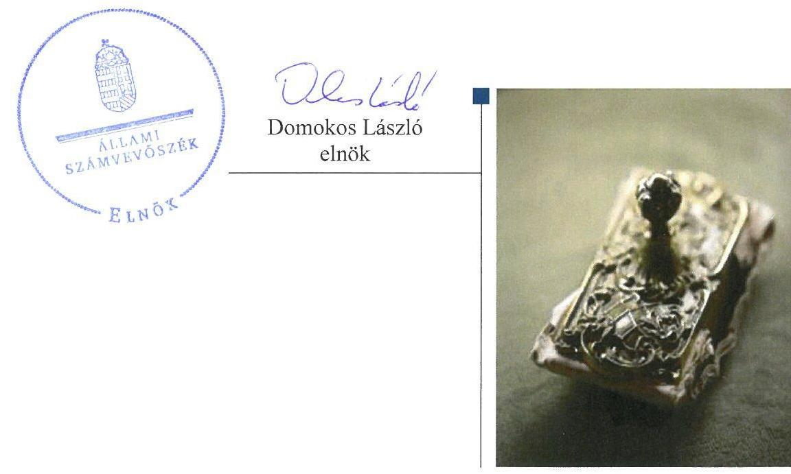
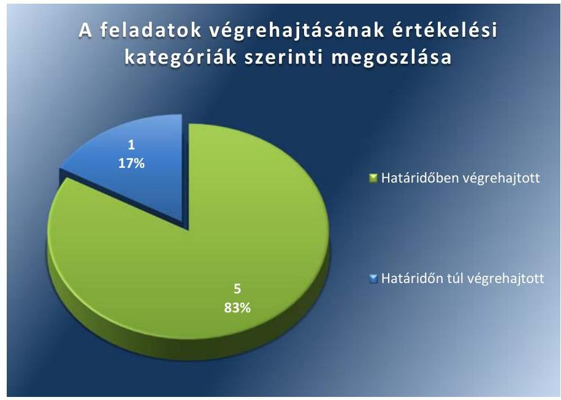

# Jelentés 

## Utóellenőrzések

Az önkormányzatok vagyongazdálkodása szabályszerűségének utóellenőrzése Budapest Főváros XVII. kerület Rákosmente Önkormányzata
2017.

---

# Jelentés 

## Utóellenőrzések

Az önkormányzatok vagyongazdálkodása szabályszerűségének utóellenőrzése Budapest Főváros XVII. kerület Rákosmente Önkormányzata
2017. 07 hó 12 nap

---

# AZ ELLENŐRZÉST FELÜGYELTE: 

RENKÓ ZSUZSANNA felügyeleti vezető

## AZ ELLENŐRZÉST VEZETTE ÉS A VÉGREHAJTÁSÁÉRT FELELŐS:

DR. PELLEI TAMÁS ellenőrzésvezető

## A PROGRAM ÖSSZEÁLLÍTÁSÁÉRT FELELŐS:

JANIK JÓZSEF LÁSZLÓ osztályvezető

## A TÉMÁHOZ KAPCSOLÓDÓ KORÁBBI SZÁMVEVŐSZÉKI JELENTÉSEK:

- címe: Jelentés az önkormányzatok vagyongazdálkodása szabályszerűségének ellenőrzéséről Budapest Főváros XVII. kerület Rákosmente
- sorszáma: $\quad 14232$

IKTATÓSZÁM: V-1312-029/2016.
TÉMASZÁM: 2346
ELLENŐRZÉS-AZONOSÍTÓ SZÁM: V075571

---

# TARTALOMJEGYZÉK 

■ ÖSSZEGZÉS ..... 5
■ AZ ELLENŐRZÉS CÉLJA ..... 6
■ AZ ELLENŐRZÉS TERÜLETE ..... 7
■ AZ ELLENŐRZÉS HÁTTERE, INDOKOLTSÁGA ..... 8
■ FÓKUSZKÉRDÉS ..... 9
■ ELLENŐRZÉS HATÓKÖRE ÉS MÓDSZEREI ..... 10
■ MEGÁLLAPÍTÁSOK ..... 12
■ MELLÉKLETEK ..... 15
I. sz. melléklet: Az ÁSZ 14232. számú jelentéséhez kapcsolódó intézkedési terv végrehajtása ..... 15
■ FÜGGELÉK: ÉSZREVÉTELEK ..... 17
■ RÖVIDÍTÉSEK JEGYZÉKE ..... 19

---

.

---

# ÖSSZEGZÉS 

Az Állami Számvevőszék Budapest Főváros XVII. kerület Rákosmente Önkormányzata vagyongazdálkodása szabályszerűségének utóellenőrzése során megállapította, hogy az intézkedési tervben foglalt feladatokat az Önkormányzat megvalósította. Az Állami Számvevőszék jelentésében a szabálytalanságok megszüntetése, illetve a kockázatok kezelése érdekében megfogalmazott javaslatokat az Önkormányzat hasznosította, amelynek következtében a vagyongazdálkodás szabályszerűsége javult.

## Az ellenőrzés társadalmi indokoltsága

Az Állami Számvevőszék stratégiájában célul tűzte ki a számvevőszéki munka hasznosulásának javítását. Ezzel összhangban ellenőrzi, hogy az ellenőrzött szervezetek megvalósították-e a korábbi ellenőrzései által feltárt hibák, hiányosságok és szabálytalanságok megszüntetése céljából elkészített intézkedési terveikben foglaltakat. A rendszeres utóellenőrzések hozzájárulnak a szükséges intézkedések tényleges végrehajtáshoz, ezáltal a közpénzügyek rendezettségének javulásához.

Az ÁSZ korábbi ellenőrzésében megállapította, hogy Budapest Főváros XVII. kerület Rákosmente Önkormányzatánál a vagyongazdálkodás szabályozottságát, a vagyongazdálkodási tevékenység szabályszerűségét hiányosan biztosították, az operatív gazdálkodási jogköröket nem a jogszabályi előírásoknak megfelelően működtették. A vagyongazdálkodás szabályozottságában és a vagyongazdálkodás működésének szabályszerűségében megállapított hiányosságok indokolták az utóellenőrzés lefolytatását.

## Főbb megállapítások, következtetések

Budapest Főváros XVII. kerület Rákosmente Önkormányzata az intézkedési tervet az előírt határidőt követően küldte meg az Állami Számvevőszék részére.

Az intézkedési tervben meghatározott hat feladatból ötöt határidőben, egyet határidőn túl hajtottak végre. A leltározási szabályzatot, a zárszámadási rendeletek mellékleteit képező vagyonkimutatásokat, a belső ellenőrzési kézikönyvet, a polgármesteri hivatal szervezeti és működési szabályzatát, az informatikai biztonsági szabályzatot módosították, a pénzügyi ellenjegyzést és az érvényesítést ellátó személyek kijelöléséről gondoskodtak. Az intézkedési tervben rögzített feladatok végrehajtásáról vezették a jogszabályi előírásnak megfelelő nyilvántartást.

Az utóellenőrzés megállapította, hogy a vagyongazdálkodás területén tapasztalt hiányosságok megszüntetése következtében a vagyongazdálkodás szabályszerűsége javult.

---

# AZ ELLENŐRZÉS CÉLJA 

Az ellenőrzés célja annak értékelése volt, hogy a számvevőszéki jelentésben ${ }^{1}$ foglalt intézkedést igénylő megállapításokkal és javaslatokkal összhangban készített intézkedési tervben meghatározott feladatokat az ellenőrzött szervezet végrehajtotta-e.

---

# **A Z ELLENŐRZÉS TERÜLETE**

## **Budapest Főváros XVII. kerület Rákosmente Önkormányzata**

Rákosmente Budapestnek a Dunától keletre legtávolabb fekvő, a főváros legnagyobb kiterjedésű kerülete. Lakónépességének száma a KSH által közzétett népességi adatok² szerint 2016. január 1-jén 87 793 fő volt.

Az ÁSZ³ 2014-ben ellenőrizte az Önkormányzat⁴ vagyongazdálkodásának szabályszerűségét. Az ellenőrzés a 2009. január 1. és 2013. december 31. közötti időszakra terjedt ki. Az ellenőrzés célja annak értékelése volt, hogy az Önkormányzat vagyongazdálkodási tevékenységét a jogszabályi előírásokkal összhangban szabályozta-e, a vagyon nyilvántartása és a vagyongazdálkodási tevékenységek végrehajtása a jogszabályoknak és a belső előírásoknak megfelelően történt-e, vagyongazdálkodás során biztosította-e az átláthatóságot, valamint a külső és belső ellenőrzések megállapításai, javaslatai hozzájárultak-e a szabályszerű vagyongazdálkodáshoz.

Az ÁSZ 2014-ben lefolytatott ellenőrzése óta a polgármester⁵ és a jegyző⁶ személye nem változott.

Az Önkormányzat és intézményei a 2015. évi zárszámadási rendelet alapján 71 019,2 millió Ft bevételt értek el, feladataik megvalósításához 69 566,7 millió Ft kiadást teljesítettek. A könyvviteli mérleg 2015. december 31-re vonatkozó mérlegfőösszege 73 143,8 millió Ft volt, melynek jelentős eszközeit a nemzeti vagyonba tartozó befektetett eszközök 64 234,8 millió Ft, a pénzeszközök 7 131,6 millió Ft, a követelések 1 750,7 millió Ft jelentették. Az eszközök jelentős forrásai a saját tőke 69 838,9 millió Ft, és a kötelezettségek 957,6 millió Ft voltak.

---

# AZ ELLENŐRZÉS HÁTTERE, INDOKOLTSÁGA 

Az ÁSZ tv. ${ }^{7}$ 33. § (1) bekezdése értelmében a számvevőszéki jelentések intézkedést igénylő megállapításaihoz kapcsolódóan az ellenőrzött szervezet vezetője intézkedési tervet köteles összeállítani, és az ÁSZ részére megküldeni. Az intézkedési tervben foglaltak megvalósítását - az ÁSZ tv. 33. § (7) bekezdésében foglaltak alapján - az ÁSZ utóellenőrzés keretében ellenőrizheti. Az intézkedések megvalósulásának értékelése során az ÁSZ figyelembe veszi az ellenőrzött szervezetek működési feltételeiben, valamint a jogszabályi előírásokban bekövetkezett változásokat.

Az intézkedési tervekben foglalt feladatok hiányos, illetve késedelmes végrehajtása, valamint megvalósításának elmaradása azt mutatja, hogy az ellenőrzések során feltárt hibák, hiányosságok és szabálytalanságok megszüntetése nem kapott kellő hangsúlyt. Ez a szabályszerű működés és a felelős vezetői magatartás vonatkozásában kockázatot hordoz. E kockázatok feltárásával az ÁSZ utóellenőrzési rendszere fokozza a fegyelmet, és igazolja, hogy a közpénzzel való szabályos gazdálkodás felelőssége elől nem lehet kitérni.

## AZ UTÓELLENŐRZÉS VÁRHATÓ HASZNOSULÁSA

Az utóellenőrzés négy szinten hasznosulhat:

- A társadalom szintjén az utóellenőrzés jelzi, hogy a számvevőszéki ellenőrzés megállapításainak van következménye: a hiányosságok megszüntetésére az ellenőrzött szervezet által meghatározott intézkedések végrehajtását is számon kéri az ÁSZ.
- Az ellenőrzött terület szintjén az utóellenőrzés tájékoztatást nyújt a terület döntéshozóinak a hiányosságok kiküszöbölésének jó gyakorlatairól, ezzel lehetőséget biztosítva arra, hogy az ÁSZ ellenőrzési megállapításai, javaslatai a terület nem ellenőrzött szervezeteinek a működése során is hasznosuljanak.
- Az ellenőrzött szervezet szintjén az utóellenőrzés feltárja, hogy a szervezet az intézkedések végrehajtásával hasznosította-e a korábbi ellenőrzési jelentésben a hiányosságok megszüntetése, illetve a kockázatok kezelése érdekében megfogalmazott javaslatokat.
- Az ÁSZ szintjén az utóellenőrzés visszacsatolást ad az ellenőrzési jelentések hasznosulásáról, az intézkedések elmaradása vagy részleges megvalósulása a további ellenőrzésekhez kockázati jelzésként szolgál.

---

# FÓKUSZKÉRDÉS 

Az Önkormányzat az intézkedési tervben foglaltakat az elöirt határidőben végrehajtotta-e?

---

# ELLENŐRZÉS HATÓKÖRE ÉS MÓDSZEREI 

## Az ellenőrzés típusa

Megfelelőségi ellenőrzés

## Az ellenőrzött időszak

Az utóellenőrzés alapját képező ÁSZ jelentés közzétételének napjától (2014. december 4.) az ellenőrzésről szóló kiértesítő levél keltének napjáig (2017. március 20.) tartó időszak.

## Az ellenőrzés tárgya

A számvevőszéki jelentésben foglalt intézkedést igénylő megállapításokkal és javaslatokkal összhangban - az Önkormányzat által - készített intézkedési tervben foglaltak végrehajtásának ellenőrzése.

Az ellenőrzés kiterjedt minden olyan körülményre és adatra, amely az ÁSZ jogszabályban meghatározott feladatainak teljesítéséhez, valamint a program végrehajtása folyamán felmerült újabb összefüggések feltárásához szükséges volt.

## Az ellenőrzött szervezet

Budapest Főváros XVII. kerület Rákosmente Önkormányzata

## Az ellenőrzés jogalapja

Az ÁSZ törvényben meghatározott feladatkörében ellenőrzi a központi költségvetés végrehajtását, az államháztartás gazdálkodását, az államháztartásból származó források felhasználását és a nemzeti vagyon kezelését.

Az ÁSZ tv. 1. § (3) bekezdése szerint az ÁSZ általános hatáskörrel végzi a közpénzekkel és az állami és önkormányzati vagyonnal való felelős gazdálkodás ellenőrzését.

Az ÁSZ tv. 33. § (7) bekezdése alapján az ÁSZ tv. 33. § (1)-(2) bekezdése szerinti intézkedési tervben foglaltak megvalósítását az ÁSZ utóellenőrzés keretében ellenőrizheti.

---

# Az ellenőrzés módszerei 

Az ÁSZ az utóellenőrzést a nemzetközi standardokat irányadónak tekintve az ellenőrzési program ellenőrzési kérdései, az ellenőrzött időszakban hatályos jogszabályok, az ellenőrzés szakmai szabályok és módszertanok figyelembevételével, önálló ellenőrzés keretében végezte.

Az ÁSZ az ellenőrzés ideje alatt az Önkormányzattal történő kapcsolattartást az ÁSZ SZMSZ-ének vonatkozó előírásai alapján biztosította.

Az utóellenőrzés megállapításait elsősorban az ÁSZ rendelkezésére álló, valamint az ellenőrzött szervezetektől elektronikusan bekért dokumentumok alapozták meg.

Az ellenőrzési bizonyítékként felhasználható adatforrások közé tartoznak egyrészt az ellenőrzés szakmai programjában felsorolt adatforrások, másrészt minden - az ellenőrzés folyamán feltárt, az ellenőrzés szempontjából információt tartalmazó - dokumentum.

Az intézkedési tervekben előírt feladatokat, azok végrehajthatósága, illetve végrehajtása szempontjából az alábbiak szerint értékelte az ÁSZ:
$\longrightarrow$ „határidőben végrehajtott" a feladat, ha a teljesítés dokumentáltan, az intézkedési tervben előírt határidőben és tartalommal megtörtént;
$\longrightarrow$ „határidőn túl végrehajtott" a feladat, ha annak teljesítése az intézkedési tervben meghatározott módon, de az előírt határidőn túl történt meg;
$\longrightarrow$ „részben végrehajtott" a feladat, ha végrehajtása teljes körűen az intézkedési tervben előírt módon nem történt meg;
$\longrightarrow$ „nem végrehajtott" a feladat, ha a végrehajtás nem történt meg, vagy amennyiben a teljesítést nem dokumentálták;
$\longrightarrow$ „okafogyottá vált" a feladat, ha végrehajtására - meghatározott esemény bekövetkezése, továbbá külső körülmény, a múködést érintő feltétel változása miatt - már nincs szükség, illetve lehetőség, és egyértelműen megállapítható, hogy az intézkedést szükségessé tevő körülmény a jövőben nem fordulhat elő;
$\longrightarrow$ „nem időszerü" az a feladat, amelynek ellenőrzési időszakon belüli végrehajtására azért nem került (kerülhetett) sor, mert az intézkedés alapjául szolgáló esemény nem következett be, de annak jövőbeni előfordulása lehetséges, a végrehajtása nem volt esedékes, vagy a végrehajtás határideje még nem járt le.
Az ellenőrzés lefolytatásához az ellenőrzött szervezet a tanúsítványok elektronikus kitöltésével, valamint az ÁSZ által kért dokumentumok elektronikus megküldésével szolgáltatott adatokat, amelyek valódiságát és teljes körűségét az ellenőrzött szervezet vezetője által tett teljességi és hitelességi nyilatkozat igazolta. Az így rendelkezésre bocsátott adatok, információk kontrollja az ellenőrzés keretében történt.

---

# MEGÁLLAPÍTÁSOK 

## Az Önkormányzat az intézkedési tervben foglaltakat az előírt határidőben végrehajtotta-e?

Összegző megállapítás

Az Önkormányzat az intézkedési tervben meghatározott hat feladatból öt feladatot határidőben végrehajtott, egy feladatot határidőn túl hajtott végre. Az intézkedési tervben rögzített feladatok végrehajtásáról vezették a jogszabályban előírt nyilvántartást.

Az ÁSZ a jelentésében a jegyző részére három javaslatot fogalmazott meg. A polgármester és a jegyző az ÁSZ részére megküldött intézkedési tervben a hiányosságok, szabálytalanságok megszüntetésére hat feladatot határozott meg, a feladatok elvégzésének felelőseként a gazdasági irodavezetőt, a jegyzői irodavezetőt, az informatikai vezetőt és a belső ellenőrzési vezetőt jelölte meg.

Az ÁSZ javaslatai alapján készített intézkedési tervben rögzített feladatok végrehajtásáról a jegyző vezette a Bkr. ${ }^{8}$ előírásainak megfelelő nyilvántartást.

Az intézkedési tervben meghatározott feladatokat, határidőket, a feladatok elvégzésének felelősét és a feladatok végrehajtását az I. számú melléklet mutatja be.

Az intézkedési tervben tervezett feladatok végrehajtásának értékelési kategóriák szerinti megoszlását az 1. ábra szemlélteti.

1. ábra

Fornás: ÁSZ

---

# HATÁRIDŐBEN VÉGREHAJTOTT feladatok: 

$\qquad$ 1. A vagyongazdálkodási rendelet ${ }^{9}$, a Számv. tv. ${ }^{10}$, valamint az Áhsz. ${ }^{11}$ elöírásainak megfelelően módosították a leltározási szabályzatot ${ }^{12}$.
$\qquad$ 2. Az Áht. ${ }^{13}$ és az Mötv. ${ }^{14}$ rendelkezései alapján elkészített 2014. és 2015. évi zárszámadási rendeletek ${ }_{1-2}{ }^{15}$ mellékleteit képező vagyonkimutatások tartalmi és formai szempontból megfeleltek az Áhsz. ${ }_{2}$, valamint vagyongazdálkodási rendeletben foglaltaknak.
$\qquad$ 3. A jegyző az Ávr. ${ }^{16}$-ben foglaltaknak megfelelően gondoskodott a pénzügyi ellenjegyzést és az érvényesítést ellátó személyek kijelöléséről.
$\qquad$ 4. Az Ávr.-ben foglalt előírásoknak megfelelően a Hivatal ${ }^{17}$ 2015. február 9-étől hatályos SZMSZ ${ }^{18}$-ében meghatározták a Hivatal Gazdasági szervezetét ${ }^{19}$.
$\qquad$ 5. A belső ellenőrzési vezető által elkészített és a jegyző által jóváhagyott belső ellenőrzési kézikönyvben ${ }^{20}$ rögzítésre kerültek a belső ellenőrzési tevékenység minőségét biztosító szabályok.

## HATÁRIDŐN TÚL VÉGREHAJTOTT feladat:

6. A jegyző az intézkedési tervben meghatározott 2015. április 30-ai határidőt követően a 2015. július 1-én hatályba léptetett informatikai biztonsági szabályzat ${ }^{21}$ keretében gondoskodott a külső hozzáférések biztonsági követelményeinek, valamint a frissítések elvégzésére vonatkozó jogosultságok meghatározásáról.

---

.

---

# MELLÉKLETEK

- I. SZ. MELLÉKLET: AZ ÁSZ 14232. SZÁMÚ JELENTÉSÉHEZ KAPCSOLÓDÓ INTÉZKEDÉSI TERV VÉGREHAJTÁSA

|  1. | Az intézkedési terv alapján elvégzendő feladat | Az intézkedési tervben meghatározott határidő | Az intézkedési tervben megjelölt felelős | A feladat végrehajtása  |
| --- | --- | --- | --- | --- |
|  1. | „A leltározási szabályzat módosítása a jogszabályi előírásoknak megfelelően". | 2014. december 31. | Gazdasági Iroda vezető | A polgármester és a jegyző által kiadmányozott, 2014. november 1-jétől hatályos leltározási szabályzat megfelelt a Számv. tv., az Áhsz.,l. illetve a vagyongazdálkodási rendelet előírásainak, tartalmazta a leltározással kapcsolatos alapkövetelményeket, a leltározás módját, biztosította a vagyon megőrzését.  |
|  2. | „A zárszámadás keretében benyújtandó vagyonkimutatás a jogszabályi előírásoknak megfelelően kerüljön benyújtásra a Képviselő-testület elé". | 2014. évi zárszámadás benyújtása, folyamatos | Gazdasági Iroda vezető | A 2014. és 2015. évi zárszámadási rendeletek ${ }_{1-2}$ VT jelű mellékletei képezték az Önkormányzat költségvetési szervei vagyonkimutatását, amely tartalmazta a könyvviteli mérlegben értékkel szereplő eszközöket, forrásokat, az érték nélkül nyilvántartott eszközöket, valamint a függő követeléseket és kötelezettségeket, a biztos követeléseket. Az Áht. 91. § (2) bekezdés c) pontban és az Mótv. 110. (2) bekezdésben foglaltak alapján elkészített vagyonkimutatások tartalmi és formai szempontból is megfeleltek az Áhsz. 30. § (2)-(3) bekezdéseiben, valamint az Önkormányzat vagyongazdálkodási rendeletében foglaltaknak.  |
|  3. | „A pénzügyi ellenjegyzést és érvényesítést ellátó személyeket a jegyző jelöli ki". | 2014. december 31. | Gazdasági Iroda vezető | A jegyző 2014. január 1-jén, 2014. szeptember 1-jén, 2014. október 1-jén a pénzügyi ellenjegyzést és az érvényesítést ellátó személyek kijelölését - az Ávr. 55. § (2) bekezdés a) pontjában, valamint 58. § (4) bekezdésében foglalt rendelkezéseknek megfelelően felhatalmazások kiadásával teljesítette.  |
|  4. | „A Polgármesteri Hivatal SZMSZ-ben kerüljön kijelölésre, meghatározásra a gazdasági szervezet". | 2015. április 30. | Jegyzői Iroda vezető | A Hivatal 2015. február 9-étől hatályos SZMSZ-ében - az Ávr. 13. § (1) bekezdés e) pontjában előírtaknak megfelelően - meghatározták a Hivatal Gazdasági szervezetét.  |
|  5. | „Belső ellenőrzési kézikönyvben kerüljön rögzítésre, előírásra a belső ellenőrzési tevékenység minőségét biztosító szabályok". | 2015. április 30. | Belső ellenőrzési vezető, Jegyzői Iroda vezető | A Hivatal - 2012. április 19-től érvényes, 2013. április 19-én felülvizsgált - belső ellenőrzési kézikönyve tartalmazta a belső ellenőrzési tevékenység minőségét biztosító szabályokat, mivel meghatározta az ellenőrzést követő felmérő lapok használatát, a kulcsfontosságú teljesítménymutatók alkalmazását, a szakmai-vezetői felülvizsgálatot, a folyamatos felülvizsgálatot, az ellenőrzési listák alkalmazását, valamint az önértékelést.  |

---

|  E
Z
A | Az intézkedési terv alapján elvégzendő feladat | Az intézkedési tervben meghatározott határidő | Az intézkedési tervben megjelölt felelős | A feladat végrehajtása  |
| --- | --- | --- | --- | --- |
|  Határidőn túl végrehajtott feladat |  |  |  |   |
|  6. | „Az adatvédelmi szabályzatban kerüljön rögzítésre a külső fejlesztők hozzáférésének tilalma, ill. kerüljenek szabályozásra a frissítések elvégzésére vonatkozó jogosultságok". | 2015. április 30. | Informatikai vezető | A jegyző a 2015. június 29-én elkészített és 2015. július 1-jétől hatályos informatikai biztonsági szabályzatban gondoskodott külső fejlesztők hozzáférésével kapcsolatos szabályok, valamint a frissítések elvégzésére vonatkozó jogosultságok meghatározásáról. A szabályzatban meghatározta a külsős hozzáférések biztonsági követelményeit, valamint a szerződéssel rendelkező vállalkozások külső hálózatból történő kapcsolódásának feltételeit. Rögzítette továbbá a programváltozások, frissítések ellenőrzésének, tesztelésének szabályait, a mentési, archiválási eljárások meghatározását, folyamatát, nyilvántartását, dokumentálását, felelősségi köreit.  |

Forrás: ÁSZ által készített táblázat

---

# FÜGGELÉK: ÉSZREVÉTELEK 

A jelentéstervezetet a Számvevőszék 15 napos észrevételezésre megküldte az ellenőrzött szervezet vezetőjének az ÁSZ tv. 29. §* (1) bekezdése előírásának megfelelően.
A polgármester és a jegyző az ÁSZ tv. 29. § (2) bekezdésében foglalt észrevételezési jogával nem élt.

[^0]
[^0]:    * 29. § (1) Az Állami Számvevőszék az ellenőrzési megállapításait megküldi az ellenőrzött szervezet vezetőjének vagy az általa megbízott személynek, és annak, akinek személyes felelősségét állapította meg.
    (2) Az ellenőrzött szervezet vezetője és a felelősként megjelölt személy az ellenőrzés megállapításaira tizenöt napon belül írásban észrevételt tehet.
    (3) Az Állami Számvevőszék az észrevételre a beérkezésétől számított harminc napon belül írásban válaszol. A figyelembe nem vett észrevételeket köteles a jelentésben feltüntetni, és megindokolni, hogy azokat miért nem fogadta el.

---

.

---

# RÖVIDÍTÉSEK JEGYZÉKE 

${ }^{1}$ számvevőszéki jelentés
${ }^{2}$ KSH által közzétett népességi adatok
${ }^{3}$ ÁSZ
${ }^{4}$ Önkormányzat
${ }^{5}$ polgármester
${ }^{6}$ jegyző
${ }^{7}$ ÁSZ tv.
${ }^{8}$ Bkr.
${ }^{9}$ vagyongazdálkodási rendelet
${ }^{10}$ Számv. tv.
${ }^{11}$ Áhsz $_{2}$
${ }^{12}$ leltározási szabályzat
${ }^{13}$ Áht.
${ }^{14}$ Mötv.
${ }^{15}$ zárszámadási rendelet ${ }_{1-2}$
${ }^{16}$ Ávr.
${ }^{17}$ Hivatal
${ }^{18}$ SZMSZ
${ }^{19}$ Gazdasági szervezet
${ }^{20}$ belső ellenőrzési kézikönyv
${ }^{21}$ informatikai biztonsági szabályzat

Az ÁSZ 14232. számú jelentése - Jelentés az önkormányzatok vagyongazdálkodása szabályszerűségének ellenőrzéséről Budapest Főváros XVII. kerület Rákosmente (elérhető a www.asz.hu honlapon)
Központi Statisztikai Hivatal, Magyarország Közigazgatási Helységnévkönyvének 2016. január 1-jei adatai

Állami Számvevőszék
Budapest Főváros XVII. kerület Rákosmente Önkormányzata
Budapest Főváros XVII. kerület Rákosmente Önkormányzatának polgármestere
Budapest Főváros XVII. kerület Rákosmenti Polgármesteri Hivatal jegyzője
Az Állami Számvevőszékről szóló 2011. évi LXVI. törvény (hatályos: 2011. július 1jétől)
A költségvetési szervek belső kontrollrendszeréről és belső ellenőrzéséről szóló 370/2011. (XII.31.) Korm. rendelet (hatályos: 2012. január 1-jétől)
Budapest Főváros XVII. kerület Rákosmente Önkormányzata Képviselőtestületének 33/2013. (VIII. 29.) számú rendelete az Önkormányzat vagyonáról, a vagyonelemek feletti tulajdonosi jogok gyakorlásáról (hatályos: 2013. október Ijétől)
A számvitelről szóló 2000. évi C. törvény (hatályos: 2001. január 1-jétől)
Az államháztartás számviteléről szóló 4/2013. (I. 11.) Korm. rendelet (hatályos: 2014. január 1-jétől)

Budapest Főváros XVII. kerület Rákosmente Önkormányzatának, Polgármesteri Hivatalának és az önállóan múködő intézményeinek, Nemzetiségi Önkormányzatainak leltározási és leltárkészítési szabályzata (hatályos: 2014. november 1 -jétől)
Az államháztartásról szóló 2011. évi CXCV. törvény (hatályos: 2012. január 1jétől)
Magyarország helyi önkormányzatairól szóló 2011. évi CLXXXIX. törvény (hatályos: 2012. január 1-jétől)
zárszámadási rendelet ${ }_{1}$ : Budapest Főváros XVII. kerület Rákosmente Önkormányzata Képviselő-testületének 15/2015. (V. 28.) önkormányzati rendelete a 2014. évi költségvetés zárszámadásáról; zárszámadási rendelet ${ }_{2}$ : Budapest Főváros XVII. kerület Rákosmente Önkormányzata Képviselőtestületének 13/2016. (V. 26.) önkormányzati rendelete a 2015. évi költségvetés zárszámadásáról
Az államháztartásról szóló törvény végrehajtásáról szóló 368/2011. (XII. 31.) Korm. rendelet (hatályos: 2012. január 1-jétől)
Budapest Főváros XVII. kerület Rákosmenti Polgármesteri Hivatal
Budapest Főváros XVII. kerület Rákosmente Önkormányzata Polgármesteri Hivatalának Szervezeti és Múködési Szabályzata (hatályos: 2015. február 9-étől)
Budapest Főváros XVII. kerület Rákosmente Önkormányzata Polgármesteri Hivatalának gazdasági szervezete
Budapest Főváros XVII. kerület Rákosmente Önkormányzatának Polgármesteri Hivatala Belső Ellenőrzési Kézikönyv (hatályos: 2012. április 19-étől)
Budapest Főváros XVII. kerület Rákosmenti Polgármesteri Hivatal Informatikai Biztonsági Szabályzat (hatályos: 2015. július 1-jétől)

---

ÁLLAMI SZÁMVEVŐSZÉK
1052 Budapest, Apáczai Csere János utca 10.
Levélcím: 1364 Budapest 4. Pf. 54
Telefon: +36 14849100 Telefax: +36 14849200
www.asz.hu