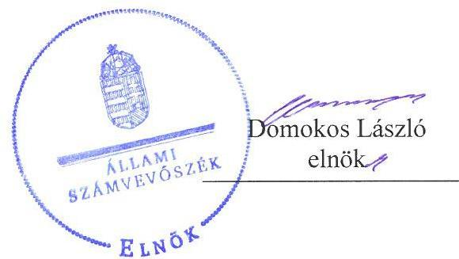
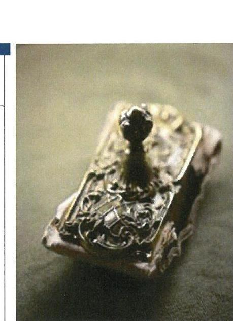
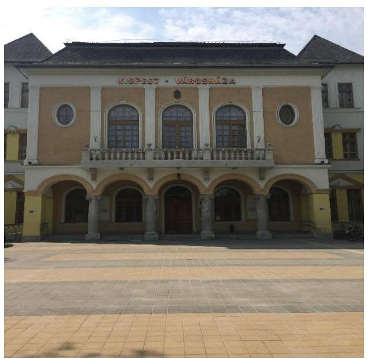
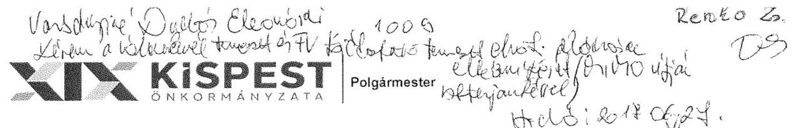
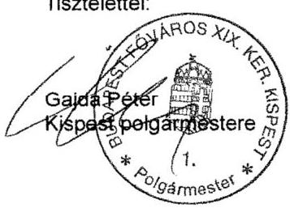
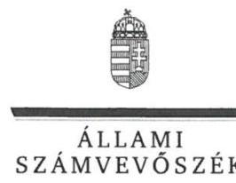
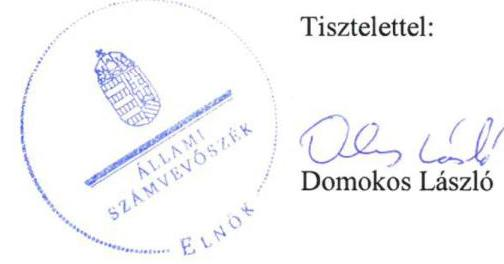
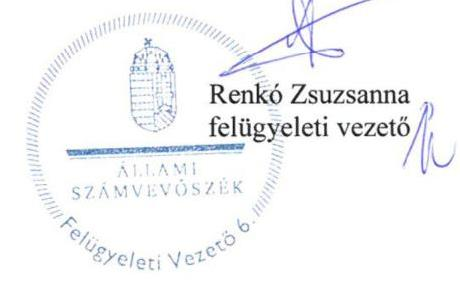

# Jelentés 

## Utóellenőrzések

Az önkormányzatok vagyongazdálkodása szabályszerűségének utóellenőrzése Budapest Főváros XIX. kerület Kispest Önkormányzata
2017.

---

# Jelentés 

## Utóellenőrzések

Az önkormányzatok vagyongazdálkodása szabályszerűségének utóellenőrzése Budapest Főváros XIX. kerület Kispest Önkormányzata
2017. 07 hó 12 nap

---

# AZ ELLENŐRZÉST FELÜGYELTE: 

RENKŐ ZSUZSANNA felügyeleti vezető

## AZ ELLENŐRZÉST VEZETTE ÉS A VÉGREHAJTÁSÁÉRT FELELŐS:

DR. PELLEI TAMÁS ellenőrzésvezető

## A PROGRAM ÖSSZEÁLLÍTÁSÁÉRT FELELŐS:

JANIK JÓZSEF LÁSZLÓ osztályvezető

## A TÉMÁHOZ KAPCSOLÓDÓ KORÁBBI SZÁMVEVŐSZÉKI JELENTÉSEK:

- címe: Jelentés az önkormányzatok vagyongazdálkodása szabályszerűségének ellenőrzéséről Budapest Főváros XIX. kerület Kispest
- sorszáma: 13077

IKTATÓSZÁM: V-1314-034/2016.
TÉMASZÁM: 2348
ELLENŐRZÉS-AZONOSÍTÓ SZÁM: V075573

---

# TARTALOMJEGYZÉK 

■ ÖSSZEGZÉS ..... 5
■ AZ ELLENŐRZÉS CÉLJA ..... 6
■ AZ ELLENŐRZÉS TERÜLETE ..... 7
■ AZ ELLENŐRZÉS HÁTTERE, INDOKOLTSÁGA ..... 8
■ A JELENTÉS LÉNYEGES KÉRDÉSKÖREI ..... 9
■ ELLENŐRZÉS HATÓKÖRE ÉS MÓDSZEREI ..... 10
■ MEGÁLLAPÍTÁSOK ..... 12
■ MELLÉKLETEK ..... 15
I. Sz. melléklet: Az ÁSZ 13077 számú jelentéséhez kapcsolódó intézkedési terv végrehajtása ..... 15
■ FÜGGELÉK: ÉSZREVÉTELEK ..... 19
■ RÖVIDÍTÉSEK JEGYZÉKE ..... 23

---

.

---

# ÖSSZEGZÉS 

Az Állami Számvevőszék Budapest Főváros XIX. kerület Kispest Önkormányzata vagyongazdálkodása szabályszerűségének utóellenőrzése során megállapította, hogy az intézkedési tervben foglalt feladatok jelentős részét az Önkormányzat nem hajtotta végre, így nem tett megfelelő lépéseket a vagyongazdálkodás szabályszerűségét érintő hiányosságok megszüntetése és az elszámoltathatóság biztositása érdekében.

## Az ellenőrzés társadalmi indokoltsága

Az Állami Számvevőszék stratégiájában célul tűzte ki a számvevőszéki munka hasznosulásának javítását. Ezzel összhangban ellenőrzi, hogy az ellenőrzött szervezetek megvalósították-e a korábbi ellenőrzései által feltárt hibák, hiányosságok és szabálytalanságok megszüntetése céljából elkészített intézkedési terveikben foglaltakat. A rendszeres utóellenőrzések hozzájárulnak a szükséges intézkedések tényleges végrehajtáshoz, ezáltal a közpénzügyek rendezettségének javulásához.

Az Állami Számvevőszék korábbi ellenőrzésében megállapította, hogy Budapest Főváros XIX. kerület Kispest Önkormányzatánál a vagyongazdálkodás szabályozottságát, a vagyongazdálkodási tevékenység szabályszerűségét teljes körűen nem biztosították, a vagyon nyilvántartása nem felelt meg a jogszabályi előírásoknak. Emellett hiányosságok mutatkoztak a közzétételi kötelezettség teljesítése, valamint az összefoglaló éves belső ellenőrzési jelentés elkészítésének terén. A feltárt hiányosságok indokolták az utóellenőrzés lefolytatását.

## Főbb megállapítások, következtetések

Budapest Főváros XIX. kerület Kispest Önkormányzatának polgármestere az intézkedési tervet az előírt határidőn belül megküldte az Állami Számvevőszék részére.

Az intézkedési tervben meghatározott kilenc feladatból négyet határidőben, egyet határidőn túl hajtottak végre, valamint négy feladat végrehajtása nem történt meg. Kettő vagyongazdálkodással kapcsolatos szabályozást, és az összefoglaló éves ellenőrzési jelentést elkészítették, valamint a közzétételi kötelezettségnek eleget tettek, a számviteli politika módosítását azonban határidőn túl hajtották végre. Négy feladat végrehajtása nem történt meg. A vagyon nyilvántartásának keretében nem biztosították az ingatlanvagyon-kataszter adatainak egyezőségét a földhivatali in-gatlan-nyilvántartás azonos tartalmú adataival, valamint az ingatlanok számviteli nyilvántartása szerinti bruttó értékének adataival. Továbbá nem gondoskodtak a korábban felvett kölcsön fedezetének fedezeti körből történő kivonásáról, valamint arról, hogy a mérlegben kimutatott, üzemeltetésre átadott eszközök állományi értéke a jogszabályi előírásoknak megfelelően az üzemeltető, kezelő által készített és hitelesített leltárral legyen alátámasztva. A leltározással kapcsolatos szabályokat nem tartották be. Az intézkedési terv feladatainak végrehajtásáról a jogszabály előírásainak megfelelő tartalmú nyilvántartást vezették.

Megállapítható, hogy a vagyongazdálkodás területén tapasztalt hiányosságok miatt a vagyongazdálkodás szabályszerűsége és az elszámoltathatóság nem biztosított.

---

# AZ ELLENŐRZÉS CÉLJA 

Az ellenőrzés célja annak értékelése volt, hogy a számvevőszéki jelentésben ${ }^{1}$ foglalt intézkedést igénylő megállapításokkal és javaslatokkal összhangban készített intézkedési tervben meghatározott feladatokat az ellenőrzött szervezet végrehajtotta-e.

---

# **A2 ELLENŐRZÉS TERÜLETE**

## **Budapest Főváros XIX. kerület Kispest Önkormányzata**

Kispest egyike volt az 1950. január 1-jén Budapesthez csatolt megyei városoknak, amelyből létrejött Budapest XIX. kerülete. Lakónépességének száma a KSH által közzétett népességi adatok2 szerint 2016. január 1-jén 60 731 fő volt.

Az ÁSZ3 2013-ban ellenőrizte az Önkormányzat4 vagyongazdálkodásának szabályszerűségét. Az ellenőrzés a 2007. január 1. és 2011. december 31. közötti időszakra terjedt ki. Az egyes közbeszerzési eljárások lefolytatásának ellenőrzése a 2011. évet és a 2012. év I. negyedévét érintette. Az ellenőrzés célja annak értékelése volt, hogy az Önkormányzatnál a vagyongazdálkodási tevékenységet, annak szervezeti kereteit szabályozták-e, az önkormányzati vagyongazdálkodás törvényességét, szabályszerűségét biztosították-e a döntések előkészítése és végrehajtása során, jogszerű döntéseken alapult-e a vagyon értékének és összetételének változása, a belső ellenőrzés elősegítette-e a vagyongazdálkodás szabályszerű működését, valamint hasznosultak-e a korábbi külső ellenőrzések által tett javaslatok.

Az ÁSZ 2013-ban lefolytatott ellenőrzése óta a polgármester5 személye nem változott. A jegyző6 személyében változás történt, a jelenlegi jegyző 2016. május 17-étől látja el feladatait.

A 2015. évi zárszámadási rendelet szerint az Önkormányzat összes bevételi előirányzata 11 228,3 millió Ft, a teljesített bevétele 10 792,1 millió Ft, az összes kiadási előirányzata 11 228,4 millió Ft, a teljesített kiadása 9 739,8 millió Ft volt.

---

# AZ ELLENŐRZÉS HÁTTERE, INDOKOLTSÁGA 

Az ÁSZ tv. ${ }^{7}$ 33. § (1) bekezdése értelmében a számvevőszéki jelentések intézkedést igénylő megállapításaihoz kapcsolódóan az ellenőrzött szervezet vezetője intézkedési tervet köteles összeállítani, és az ÁSZ részére megküldeni. Az intézkedési tervben foglaltak megvalósítását - az ÁSZ tv. 33. § (7) bekezdésében foglaltak alapján - az ÁSZ utóellenőrzés keretében ellenőrizheti. Az intézkedések megvalósulásának értékelése során az ÁSZ figyelembe veszi az ellenőrzött szervezetek működési feltételeiben, valamint a jogszabályi előírásokban bekövetkezett változásokat.

Az intézkedési tervekben foglalt feladatok hiányos, illetve késedelmes végrehajtása, valamint megvalósításának elmaradása azt mutatja, hogy az ellenőrzések során feltárt hibák, hiányosságok és szabálytalanságok megszüntetése nem kapott kellő hangsúlyt. Ez a szabályszerű működés és a felelős vezetői magatartás vonatkozásában kockázatot hordoz. E kockázatok feltárásával az ÁSZ utóellenőrzési rendszere fokozza a fegyelmet, és igazolja, hogy a közpénzzel való szabályos gazdálkodás felelőssége elől nem lehet kitérni.

## AZ UTÓELLENŐRZÉS VÁRHATÓ HASZNOSULÁSA

Az utóellenőrzés négy szinten hasznosulhat:
$\longrightarrow$ A társadalom szintjén az utóellenőrzés jelzi, hogy a számvevőszéki ellenőrzés megállapításainak van következménye: a hiányosságok megszüntetésére az ellenőrzött szervezet által meghatározott intézkedések végrehajtását is számon kéri az ÁSZ.
$\longrightarrow$ Az ellenőrzött terület szintjén az utóellenőrzés tájékoztatást nyújt a terület döntéshozóinak a hiányosságok kiküszöbölésének jó gyakorlatairól, ezzel lehetőséget biztosítva arra, hogy az ÁSZ ellenőrzési megállapításai, javaslatai a terület nem ellenőrzött szervezeteinek a működése során is hasznosuljanak.
$\longrightarrow$ Az ellenőrzött szervezet szintjén az utóellenőrzés feltárja, hogy a szervezet az intézkedések végrehajtásával hasznosította-e a korábbi ellenőrzési jelentésben a hiányosságok megszüntetése, illetve a kockázatok kezelése érdekében megfogalmazott javaslatokat.
$\longrightarrow$ Az ÁSZ szintjén az utóellenőrzés visszacsatolást ad az ellenőrzési jelentések hasznosulásáról, az intézkedések elmaradása vagy részleges megvalósulása a további ellenőrzésekhez kockázati jelzésként szolgál.

---

# A JELENTÉS LÉNYEGES KÉRDÉSKÖREI 

Az Önkormányzat az intézkedési tervben foglaltakat az elöirt határidőben végrehajtotta-e?

---

# ELLENŐRZÉS HATÓKÖRE ÉS MÓDSZEREI 

## Az ellenőrzés típusa

Megfelelőségi ellenőrzés.

## Az ellenőrzött időszak

Az utóellenőrzés alapját képező ÁSZ jelentés közzétételének napjától (2013. augusztus 28.) az ellenőrzésről szóló kiértesítő levél keltének napjáig (2017. március 20.) tartó időszak.

## Az ellenőrzés tárgya

A számvevőszéki jelentésben foglalt intézkedést igénylő megállapításokkal és javaslatokkal összhangban - az Önkormányzat által - készített intézkedési tervben foglaltak végrehajtásának ellenőrzése.

Az ellenőrzés kiterjedt minden olyan körülményre és adatra, amely az ÁSZ jogszabályban meghatározott feladatainak teljesítéséhez, valamint a program végrehajtása folyamán felmerült újabb összefüggések feltárásához szükséges volt.

## Az ellenőrzött szervezet

Budapest Főváros XIX. kerület Kispest Önkormányzata

## Az ellenőrzés jogalapja

Az ÁSZ törvényben meghatározott feladatkörében ellenőrzi a központi költségvetés végrehajtását, az államháztartás gazdálkodását, az államháztartásból származó források felhasználását és a nemzeti vagyon kezelését.

Az ÁSZ tv. 1. § (3) bekezdése szerint az ÁSZ általános hatáskörrel végzi a közpénzekkel és az állami és önkormányzati vagyonnal való felelős gazdálkodás ellenőrzését.

Az ÁSZ tv. 33. § (7) bekezdése alapján az ÁSZ tv. 33. § (1)-(2) bekezdése szerinti intézkedési tervben foglaltak megvalósítását az ÁSZ utóellenőrzés keretében ellenőrizheti.

---

# Az ellenőrzés módszerei 

Az ÁSZ az ellenőrzést a nemzetközi standardokat irányadónak tekintve az ellenőrzési program ellenőrzési kérdései, az ellenőrzött időszakban hatályos jogszabályok, az ellenőrzés szakmai szabályok és módszertanok figyelembevételével, önállóan végezte.

Az ÁSZ az ellenőrzés ideje alatt az Önkormányzattal történő kapcsolattartást az ÁSZ SZMSZ²-ének vonatkozó előírásai alapján biztosította.

Az utóellenőrzés megállapításait elsősorban az ÁSZ rendelkezésére álló, valamint az ellenőrzött szervezetektől elektronikusan bekért dokumentumok alapozták meg.

Az ellenőrzési bizonyítékként felhasználható adatforrások közé tartoznak egyrészt a szakmai programban felsorolt adatforrások, másrészt minden - az ellenőrzés folyamán feltárt, az ellenőrzés szempontjából információt tartalmazó - dokumentum.

Az intézkedési tervekben előírt feladatokat, azok végrehajthatósága, illetve végrehajtása szempontjából az alábbiak szerint értékelte az ÁSZ:
$\longrightarrow$ „határidőben végrehajtott" a feladat, ha a teljesítés dokumentáltan, az intézkedési tervben előírt határidőben és tartalommal megtörtént;
$\longrightarrow$ „határidőn túl végrehajtott" a feladat, ha annak teljesítése az intézkedési tervben meghatározott módon, de az előírt határidőn túl történt meg;
$\longrightarrow$ „részben végrehajtott" a feladat, ha végrehajtása teljes körűen az intézkedési tervben előírt módon nem történt meg;
$\longrightarrow$ „nem végrehajtott" a feladat, ha a végrehajtás nem történt meg, vagy amennyiben a teljesítést nem dokumentálták;
$\longrightarrow$ „okafogyottá vált" a feladat, ha végrehajtására - meghatározott esemény bekövetkezése, továbbá külső körülmény, a múködést érintő feltétel változása miatt - már nincs szükség, illetve lehetőség, és egyértelműen megállapítható, hogy az intézkedést szükségessé tevő körülmény a jövőben nem fordulhat elő;
$\longrightarrow$ „nem időszerü" az a feladat, amelynek ellenőrzési időszakon belüli végrehajtására azért nem került (kerülhetett) sor, mert az intézkedés alapjául szolgáló esemény nem következett be, de annak jövőbeni előfordulása lehetséges, a végrehajtása nem volt esedékes, vagy a végrehajtás határideje még nem járt le.
Az ellenőrzés lefolytatásához az ellenőrzött szervezet a tanúsítványok elektronikus kitöltésével, valamint az ÁSZ által kért dokumentumok elektronikus megküldésével szolgáltatott adatokat, amelyek valódiságát és teljes körűségét az ellenőrzött szervezet vezetője által tett teljességi és hitelességi nyilatkozat igazolta. Az így rendelkezésre bocsátott adatok, információk kontrollja az ellenőrzés keretében történt.

---

# MEGÁLLAPÍTÁSOK 

## Az Önkormányzat az intézkedési tervben foglaltakat az előírt határidőben végrehajtotta-e?

Összegző megállapítás

Az Önkormányzat az intézkedési tervben meghatározott kilenc feladatból négyet határidőben, egyet határidőn túl hajtott végre, valamint négy feladat végrehajtása nem történt meg. A feladatok végrehajtásáról vezették a Bkr. előírásainak megfelelő nyilvántartást.

Az ÁSZ a jelentésében a jegyző részére kilenc javaslatot fogalmazott meg. A polgármester az ÁSZ részére megküldött intézkedési tervben a hiányosságok, szabálytalanságok megszüntetésére kilenc feladatot határozott meg, a feladatok elvégzésének felelőseként a jegyzőt és egy esetben a belső ellenőrzési csoportot jelölte meg.

Az ÁSZ javaslatai alapján készített intézkedési tervben rögzített feladatok végrehajtásáról a jegyző a Bkr. előírásainak megfelelő nyilvántartást vezetett.

Az intézkedési tervben meghatározott feladatokat, határidőket, a feladatok elvégezésnek felelősét és a feladatok végrehajtását az I. számú melléklet mutatja be.

Az intézkedési tervben tervezett feladatok végrehajtásának értékelési kategóriák szerinti megoszlását az 1. ábra szemlélteti.

1. ábra

A feladatok végrehajtásának
értékelési kategóriák szerinti
megoszlása

- Határidőben végrehajtott
- Határidőn túl végrehajtott
- Nem végrehajtott

---

# HATÁRIDŐBEN VÉGREHAJTOTT feladatok: 

1. A jegyző - az Nvtv. ${ }^{9}$-ben előírtakra figyelemmel - gondoskodott arról, hogy az Önkormányzat 2013. július 1-jétől hatályos vagyongazdálkodási rendelete ${ }^{10}$ tartalmazza a nemzetgazdasági szempontból kiemelt jelentőségű nemzeti vagyonnak minősülő forgalomképtelen vagyonelemek kijelölésére vonatkozó rendelkezést.
2. A jegyző gondoskodott a vagyongazdálkodási rendelet módosításáról annak érdekében, hogy az immateriális javak leltározásának helyi szabályozása az Áhsz. ${ }^{11}$-ben foglaltaknak megfeleljen.
3. A belső ellenőrzési vezető a Bkr. ${ }^{12}$ előírásinak megfelelően elkészítette a 2013. évi összefoglaló éves ellenőrzési jelentést.
4. A jegyző gondoskodott az Info tv. ${ }^{13}$ I. mellékletében meghatározott adatok Önkormányzat honlapján történő közzétételéről.

## HATÁRIDŐN TÚL VÉGREHAJTOTT feladat:

5. A jegyző az intézkedési tervben foglalt határidőt követően gondoskodott a számviteli politika kiegészítéséről, mert a befektetett eszközök üzembe helyezésének dokumentálási szabályait a 2016. április 8 -án hatályba léptetett Számviteli politikában ${ }^{14}$ rögzítette.

## NEM VÉGREHAJTOTT feladatok:

6. A jegyző nem intézkedett az Áht. ${ }^{15}$ rendelkezéseivel ellentétes állapot megszüntetésről, mert a korábban felvett kölcsön fedezetének módosításáról nem gondoskodott.
7. A jegyző az Inyr. ${ }^{16}$ előírása ellenére nem biztosította az ingatlanva-gyon-kataszter adatai egyezőségét a földhivatali ingatlan-nyilvántartás azonos tartalmú adataival, továbbá az ingatlanvagyon kataszter és az ingatlanok számviteli nyilvántartása szerinti bruttó adatai között.
8. A jegyző nem gondoskodott arról, hogy a mérlegben kimutatott, üzemeltetésre átadott eszközök állományi értéke az Áhsz1. előírtaknak megfelelően az üzemeltető, kezelő által készített és hitelesített leltárral legyen alátámasztva.
9. A jegyző nem gondoskodott a leltározási szabályzatban ${ }^{17}$ foglaltak betartásáról, mivel a 2013. évi immateriális javak, gépek, berendezések, felszerelések, járművek leltározása során nem tartották be a leltárral szemben támasztott tartalmi és formai követelményeket, továbbá valamennyi mérlegtételre vonatkozó leltározás végrehajtását nem igazolta.

---

.

---

# MELLÉKLETEK

- I. SZ. MELLÉKLET: AZ ÁSZ 13077 SZÁMÚ JELENTÉSÉHEZ KAPCSOLÓDÓ INTÉZKEDÉSI TERV VÉGREHAJTÁSA

|  Sorszám | Az intézkedési terv alapján elvégzendő feladat | Az intézkedési tervben meghatározott határidő | Az intézkedési tervben megjelölt felelős | A feladat végrehajtása  |
| --- | --- | --- | --- | --- |
|  1. | „Rendelettervezetet kell készíteni a nemzetgazdasági szempontból kiemelt jelentőségű nemzeti vagyonnak minősülő forgalomképtelen vagyonelemek kijelölése érdekében az Nvt. 18. § (1) bekezdésében előírtak szerint." | 2013. november 30. | jegyző
Vagyongazdálkodási és Hasznosítási Iroda | A Képviselő-testület által elfogadott és 2013. július 1-jén hatályba léptetett vagyongazdálkodási rendeletben - az Nvtv. 18. § (1) bekezdésében előírtakra figyelemmel - rögzítésre került a nemzetgazdasági szempontból kiemelt jelentőségű nemzeti vagyonnak minősülő forgalomképtelen vagyonelemek kijelölésére vonatkozó rendelkezés. A vagyongazdálkodási rendelet értelmében az Önkormányzat nem rendelkezett nemzetgazdasági szempontból kiemelt jelentőségű vagyonelemmel.  |
|  2. | „Elő kell készíteni a Vagyongazdálkodási rendelet módosítást, annak érdekében, hogy az immateriális javak leltározásának helyi szabályozása az Ahsz. 37. § (3) bekezdésében foglaltaknak megfeleljen." | 2013. november 30. | jegyző | A jegyző gondoskodott a vagyongazdálkodási rendelet módosításáról annak érdekében, hogy az immateriális javak leltározásának helyi szabályozása az Ahsz ${ }_{1}$. 37. § (3) bekezdésében foglaltaknak megfeleljen. A 2013. július 1-jén hatályba léptetett vagyongazdálkodási rendelet nem tartalmazott ellentétes rendelkezéseket az immateriális javak leltározásának helyi szabályozásával, az immateriális javak leltározására vonatkozó előírásokat az Ahsz ${ }_{1}$. 37. § (3) bekezdésében foglaltaknak megfelelően a leltározási szabályzat tartalmazta.  |
|  3. | A belső ellenőrzés vezetője tegyen eleget a Bkr. 22. §-ának (1) bekezdés g) pontjában rögzített előírásoknak, készítse el az összefoglaló éves ellenőrzési jelentést. | 2014. április 30 | Belső Ellenőrzési
Csoport | A belső ellenőrzési vezető a Bkr. 22. §-ának (1) bekezdés g) pontjában rögzített előírás figyelembevételével 2014. január 24-én elkészítette a 2013. évre vonatkozó összefoglaló éves ellenőrzési jelentés, amelyet a Képviselő-testület a 384/2014. (IV.17.) Ökt. határozatával elfogadott.  |
|  4. | „Gondoskodni kell az információs önrendelkezési jogról és az információszabadságról szóló 2011. évi CXII. törvény 1. számú mellékletében meghatározott adatok közzétételéről, mely a honlapon való megjelenéssel teljesítésre került." | Teljesítve | - | A jegyző gondoskodott az Info tv. I. mellékletében meghatározott adatok közzétételéről.  |

---

|  5. | „A számviteli politikát ki kell egészíteni az Áhsz. 8. § (7.) bekezdésében előírtaknak megfelelően a beszerzett, illetve előállított immateriális javak, tárgyi eszközök üzembe helyezésének dokumentálási szabályaival." | 2013. november 30. | jegyző,
Pénzügyi és
Gazdasági Iroda | A jegyző az intézkedési tervben foglalt határidőt követően gondoskodott a számviteli politika kiegészítéséről, mert a Számv. tv. ${ }^{18}$ 52. § (2) bekezdése, valamint az Áhsz: ${ }^{19} 17$. § (1) bekezdése alapján a befektetett eszközök üzembe helyezésének dokumentálási szabályait a 2016. április 8-án hatályba léptetett számviteli politikában rögzítette.  |
| --- | --- | --- | --- | --- |
|  6. | „Az Áht. 84. § (4) bekezdésével ellentétes állapot megszüntetése 2013. június 27-én az OTP Bank Nyrt-vel kötött hitelszerződés módosításával megtörtént." | Teljesítve |  | Az Önkormányzat nem intézkedett az Áht. 84. § (4) bekezdésével ellentétes állapot megszüntetéséről, mert a hosszú távú fejlesztéseinek megvalósítása érdekében a 2006. és a 2008. években felvett kölcsön fedezetét az intézkedési tervben meghatározottaknak megfelelően nem módosították. Az Önkormányzat 2012. december 31-én fennálló adósságállománya mintegy 1000 millió Ft fejlesztési célú hitelállományból, valamint 651,5 millió Ft folyószámlahitelből állt, amelyből a 2013. június 27-én a Magyar Állam, az Önkormányzat és a pénzintézet által megkötött tartozásátvállalási szerződés alapján a folyószámlahitel összege konszolidálásra és törlésre került 2013. június 28. napjával a 2013. évi költségvetési törvény²0 72-75. §-a alapján. A tartozásátvállalási szerződés értelmében az Önkormányzatnak a pénzintézettel szembeni, az átvállalt fizetési kötelezettségekkel nem érintett adósságait, tartozásait biztosító mellékkötelezettségek, biztosítékok, fedezetek, illetve biztosítékú célú szerződések az átvállalás napját követően is hatályban maradtak.  |
|  7. | „Intézkedést kell tenni annak érdekében, hogy a 147/1992. (IX.6.) Korm. rendelet 1. § (2) bekezdésében rögzítetteknek megfelelően az ingatlanvagyon kataszter adatai megegyezzenek a földhivatal ingatlan-nyilvántartásának azonos tartalmú adataival, valamint az 1. § (3) bekezdésében foglaltakra figyelemmel egyezőséget biztosítson az ingatlanvagyon kataszter és az ingatlanok számviteli nyilvántartása szerinti bruttó adatok között." | 2014. április 30. | jegyző,
Vagyongazdálkodási és Hasznosítási Iroda, Pénzügyi és
Gazdasági Iroda | A jegyző az Inyr. 1. § (2) bekezdése előírása ellenére az ingatlanvagyon-kataszter adatai és a földhivatali ingatlan-nyilvántartás azonos tartalmú adatai, továbbá az Inyr. 1. § (3) bekezdésében és ugyanezen jogszabály 2. mellékletében foglalt előírások ellenére az ingatlanvagyon-kataszter és az ingatlanok számviteli nyilvántartása szerinti bruttó adatai közötti egyezőséget nem biztosította, mivel az adatok közötti egyezőség fennállását hitelt érdemlően nem igazolta.  |

---

|  8. | „Gondoskodni kell arról, hogy a mérlegben kimutatott, üzemeltetésre átadott eszközök állományi értéke az Áhsz. 37. § (4) bekezdésében előírtaknak megfelelően az üzemeltető, kezelő által készített és hitelesített leltárral legyen alátámasztva." | 2014. április 30. | jegyző,
Vagyongazdálko-
dási és Hasznosítási Iroda, Pénzügyi és Gazdasági Iroda | A jegyző az intézkedési tervben meghatározott feladat ellenére nem gondoskodott arról, hogy a mérlegben kimutatott, üzemeltetésre átadott eszközök állományi értéke az Áhsz. ${ }_{1}$ 37. § (4.) bekezdésében előírtaknak megfelelően az üzemeltető, kezelő által készített és hitelesített leltárral legyen alátámasztva. A 2013. december 31-ei könyvviteli mérleg alátámasztásához - az Áhsz. ${ }_{1}$ 37. § (4) bekezdés előírásai ellenére - nem állt rendelkezésre az összes üzemeltető által elkészített és hitelesített leltár.  |
| --- | --- | --- | --- | --- |
|  9. | „Gondoskodni kell, a leltározási szabályzatban foglaltak betartásáról: a leltárral szemben támasztott tartalmi és formai követelményeknek eleget kell tenni, a leltárakban fel kell tüntetni a bizonylatok sorszámát, az eszközök egyértelmű meghatározását és a hitelesítők aláírását." | 2014. április 30. | jegyző,
Vagyongazdálko-
dási és Hasznosítási Iroda, Pénzügyi és Gazdasági Iroda | A jegyző az intézkedési tervben meghatározott feladat ellenére nem gondoskodott a leltározási szabályzatban foglaltak betartásáról. A 2013. évi immateriális javak, gépek, berendezések, felszerelések, járművek leltározása során nem tartották be a leltárral szemben támasztott tartalmi és alaki követelményeket, a leltár nem tartalmazta a hitelesítő aláírását, a leltározási körzet megjelölését, továbbá a leltározás során a leltározási szabályzat által előírt leltározási utasítást, megbízólevelet, a leltártárgyak bemutatásáról szóló nyilatkozatot, leltározás megkezdéséről és a leltározás befejezéséről szóló jegyzőkönyveket, a leltárellenőr által végzett ellenőrzésekről készített jelentést, valamint a megismerési nyilatkozatot nem készítették el. A leltározási szabályzat 2.7. pontjában előírtak ellenére nem tartották be továbbá a leltárral szemben támasztott tartalmi és formai követelményeket, mert a többi mérlegtételre vonatkozóan a leleltározás végrehajtását nem igazolták.  |

Forrás: ÁSZ által készített táblázat

---

.

---

# FÜGGELÉK: ÉSZREVÉTELEK 

A jelentéstervezetet a Számvevőszék 15 napos észrevételezésre megküldte az ellenőrzött szervezet vezetőjének az ÁSZ tv. 29. §* (1) bekezdése előírásának megfelelően.
Az elfogadott észrevétel alapján a Számvevőszék módosította a jelentést.
A függelék tartalmazza az ellenőrzött észrevételét.

[^0]
[^0]:    * 29. § (1) Az Állami Számvevőszék az ellenőrzési megállapításait megküldi az ellenőrzött szervezet vezetőjének vagy az általa megbízott személynek, és annak, akinek személyes felelősségét állapította meg.
    (2) Az ellenőrzött szervezet vezetője és a felelősként megjelölt személy az ellenőrzés megállapításaira tizenöt napon belül írásban észrevételt tehet.
    (3) Az Állami Számvevőszék az észrevételre a beérkezésétől számított harminc napon belül írásban válaszol. A figyelembe nem vett észrevételeket köteles a jelentésben feltüntetni, és megindokolni, hogy azokat miért nem fogadta el.

---

ügyintéző: Lászlóné Mester Zsuzsanna/ Ignáczné
Balázs Gabriella
telefonszám: 34-74-546/34-77-433
e-mail: laszlone@hivatal.kispest.hu/ ignaczne@hivatal.kispest.hu

Állami Számvevőszék
Domokos László
elnök

Budapest 4.
Pf. 54.
1364

Tisztelt Elnök Úr!

Az önkormányzatok vagyongazdálkodása szabályszerűségének utóellenőrzése jelentéstervezetükre az alábbi észrevételt kívánjuk tenni.

A jelentéstervezet „Ellenőrzés területe" 7. oldalán a „jegyzö személyében változás történt, a jelenlegi jegyző 2013. május 01-jétől látja el a feladatait" nem helyes. Dr. Béja Julianna 2016. május 17-e óta látja el a jegyzői feladatokat.

Kérjük észrevételünk szíves tudomásul vételét.

Budapest, 2017. június 19.
Tisztelettel:

---

ELNÖK

# Gajda Péter úr 

polgármester

Budapest Főváros XIX. kerület Kispest Önkormányzata

## Budapest

## Tisztelt Polgármester Úr!

Köszönettel megkaptam az „Utóellenörzések - Az önkormányzatok vagyongazdálkodása szabályszerüségének utóellenörzése - Budapest Főváros XIX. kerület Kispest Önkormányzata" címủ jelentéstervezet megállapításaira tett észrevételét.

Az ellenőrzési megállapításokra vonatkozó észrevételét az Állami Számvevőszékről szóló 2011. évi LXVI. törvény 29. § (2) bekezdésében meghatározott tizenöt napos határidőn belül küldte meg. Az Állami Számvevőszék észrevétellel kapcsolatos álláspontját a mellékletként csatolt, a felügyeleti vezető által készített indokolás tartalmazza.

Budapest, 2017. 06 hónap 28 nap

Melléklet: Észrevételre adott válasz

---

„Utóellenörzések - Az önkormányzatok vagyongazdálkodása szabályszerüségének utó-ellenörzése - Budapest Föváros XIX. kerület Kispest Önkormányzata" címú jelentéstervezetre tett észrevételre adott válasz

| Észrevétel: | Az ellenőrzés területe   Megállapítás: A jegyző személyében változás történt, a jelenlegi jegyző 2013. május   1-jétől látja el feladatait.   Észrevétel: A jelentéstervezet „Ellenőrzés területe" 7. oldalán a „jegyző személyé-   ben változás történt, a jelenlegi jegyző 2013. május 01-től látja el a feladatait" nem   helyes. Dr. Béja Julianna 2016. május 17-e óta látja el a jegyzői feladatokat. |
| :-- | :-- |
| Válasz: | Az Állami Számvevőszék az észrevételt elfogadja. |
| Indoklás: | A Magyar Államkincstár törzskönyvi alapadatainak nyilvántartása alapján az „El-   lenőrzés területe" részben a jegyző feladatellátásával kapcsolatos mondatot módosítottuk. |

Tájékoztatom Polgármester Urat, hogy az elfogadott észrevétel alapján az Állami Számvevőszék a jelentéstervezetet módosította.

Budapest, 2017. C6 hónap 28 nap

---

# RÖVIDÍTÉSEK JEGYZÉKE 

${ }^{1}$ számvevőszéki jelentés
${ }^{2}$ KSH által közzétett népességi adatok
${ }^{3}$ ÁSZ
${ }^{4}$ Önkormányzat
${ }^{5}$ polgármester
${ }^{6}$ jegyző
${ }^{7}$ ÁSZ tv.
${ }^{8}$ SZMSZ
${ }^{9}$ Nvtv.
${ }^{10}$ vagyongazdálkodási rendelet
${ }^{11}$ Áhsz. 1
${ }^{12}$ Bkr.
${ }^{13}$ Info tv.
${ }^{14}$ Számviteli politika
${ }^{15}$ Áht.
${ }^{16}$ Inyr.
${ }^{17}$ leltározási szabályzat
${ }^{18}$ Számv. tv.
${ }^{19}$ Áhsz. 2
${ }^{20}$ 2013. évi költségvetési törvény

Az ÁSZ 13077 számú jelentése - Jelentés az önkormányzatok vagyongazdálkodása szabályszerűségének ellenőrzéséről Budapest Főváros XIX. kerület Kispest (elérhető a www.asz.hu honlapon)
Központi Statisztikai Hivatal, Magyarország Közigazgatási Helységnévkönyvének 2016. január 1-jei adatai
Állami Számvevőszék
Budapest Főváros XIX. kerület Kispest Önkormányzata
Budapest Főváros XIX. kerület Kispest Önkormányzatának polgármestere
Budapest Főváros XIX. kerület Kispesti Polgármesteri Hivatal jegyzője
Az Állami Számvevőszékről szóló 2011. évi LXVI. törvény (hatályos: 2011. július 1-jétől)
Az Állami Számvevőszék elnökének 3/2016. (XII.29.) ÁSZ utasítása az Állami Számvevőszék Szervezeti és Működési Szabályzatáról (hatályos: 2017. január 1-jétől)
A nemzeti vagyonról szóló 2011. évi CXCVI. törvény (hatályos: 2011. december 31-étől)
Budapest Főváros XIX. kerület Kispest Önkormányzat képviselő-testületének 20/2013. (VI.26.) önkormányzati rendelete az önkormányzat vagyonával való rendelkezés szabályairól (hatályos: 2013. július 1-jétől)
Az államháztartás szervezeti beszámolási és könyvvezetési kötelezettségeinek sajátosságairól szóló 249/2000. (XII.24.) Korm. rendelet (hatálytalan: 2014. január 1-jétől)
A költségvetési szervek belső kontrollrendszeréről és belső ellenőrzéséről szóló 370/2011. (XII.31.) Korm. rendelet (hatályos: 2012. január 1-jétől)
Az információs önrendelkezési jogról és az információszabadságról szóló 2011. évi CXII. törvény (hatályos: 2012. január 1-jétől)
Budapest Főváros XIX. Ker. Kispesti Polgármesteri Hivatal Számviteli Politikája és az eszközök és Források Értékelésének rendjéről (hatályos: 2016. április 8-ától)
Az államháztartásról szóló 2011. évi CXCV. törvény (hatályos: 2011. december 31-étől)
Az önkormányzatok tulajdonában lévő ingatlanvagyon nyilvántartási és adatszolgáltatási rendjéről szóló 147/1992. (XI.6.) Korm. rendelet (hatályos: 1993. január 1-jétől)

5-20/2009. sz. Polgármesteri - Jegyzői közös intézkedés a leltárkészítési és leltározási szabályzatról
A számvitelről szóló 2000. évi C. törvény (hatályos: 2001. január 1-jétől)
Az államháztartás számviteléről szóló 4/2013. (I. 11.) Korm. rendelet (hatályos: 2014. január 1-jétől)

Magyarország 2013. évi központi költségvetéséről szóló 2012. évi CCIV. törvény

---

# ÁLLAMI SZÁMVEVŐSZÉK 

1052 Budapest, Apáczai Csere János utca 10.
Levélcím: 1364 Budapest 4. Pf. 54
Telefon: +36 14849100 Telefax: +36 14849200
www.asz.hu