# Jelentés 

## Az önkormányzatok gazdasági társaságai

Az önkormányzatok többségi tulajdonában lévő gazdasági társaságok gazdálkodásának ellenőrzése - Via Kanizsa Városüzemeltető Nonprofit Zrt.
2017.

---

# Jelentés 

## Az önkormányzatok gazdasági társaságai

Az önkormányzatok többségi tulajdonában lévő gazdasági társaságok gazdálkodásának ellenőrzése - Via Kanizsa Városüzemeltető Nonprofit Zrt.
2017. 07. hó 13. nap
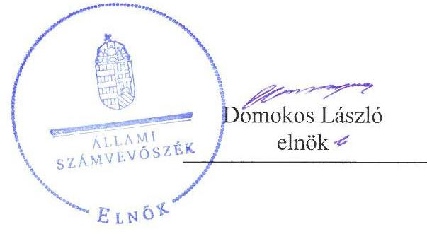

---

# AZ ELLENŐRZÉST FELÜGYELTE:

DR. NAGY IMRE felügyeleti vezető

# AZ ELLENŐRZÉST VEZETTE ÉS A VÉGREHAJTÁSÁÉRT FELELŐS:

SALAMIN VIKTOR ellenőrzésvezető

# A PROGRAM ÖSSZEÁLLÍTÁSÁÉRT FELELŐS:

JANIK JÓZSEF osztályvezető

IKTATÓSZÁM: V-1282-175/2016.

TÉMASZÁM: 2316

ELLENŐRZÉS-AZONOSÍTÓ SZÁM: V075807

Jelentéseink az Országgyűlés számítógépes hálózatán és az Interneten a www.asz.hu címen is olvashatóak.

---

# TARTALOMJEGYZÉK 

■ ÖSSZEGZÉS ..... 5
■ AZ ELLENŐRZÉS CÉLJA ..... 6
■ AZ ELLENŐRZÉS TERÜLETE ..... 7
■ AZ ELLENŐRZÉS HÁTTERE, INDOKOLTSÁGA ..... 8
■ A JELENTÉS LÉNYEGES KÉRDÉSKÖREI ..... 9
■ ELLENŐRZÉS HATÓKÖRE ÉS MÓDSZEREI ..... 10
■ MEGÁLLAPÍTÁSOK ..... 12
■ JAVASLATOK ..... 18
■ MELLÉKLETEK ..... 21
I. sz. melléklet: Értelmező szótár. ..... 21
II. sz. melléklet: A Társaság 2012-2015. évi főbb mérleg adatai (M Ft) ..... 23
■ FÜGGELÉK: ÉSZREVÉTELEK ..... 25
■ RÖVIDÍTÉSEK JEGYZÉKE ..... 33

---

.

---

# ÖSSZEGZÉS 

Nagykanizsa Megyei Jogú Város Önkormányzata a tulajdonosi jogait összességében szabályszerűen gyakorolta. A Társaság a vagyonával összességében megfelelően gazdálkodott, fizetőképessége biztosított volt. A Társaság bevételeinek, ráfordításainak elszámolása szabályszerű volt. Az árképzés szabályszerű volt, azonban önköltségszámítást a jogszabályi kötelezettség ellenére nem végeztek.

## Az ellenőrzés társadalmi indokoltsága

Magyarországon az intézmény-centrikus közfeladat-ellátás jellemző, de egyre jelentősebb a költségvetésen kívüli feladatellátás térnyerése. Helyi szinten ennek legfontosabb szereplői az önkormányzati tulajdonú gazdasági társaságok, amelyeknek ellenőrzése kiemelten fontos a közfeladat ellátása és a közvagyon megőrzése, megóvása érdekében. Ezért alapvető követelmény, hogy gazdálkodásuk, működésük szabályszerű és átlátható legyen.

Nagykanizsán az ellenőrzött időszakban a Via Kanizsa Városüzemeltető Nonprofit Zrt. végezte az önkormányzati közfeladatok közül a vásárok és piacok fenntartását és működtetését, a temetők üzemeltetését, a fizető parkolás működtetését. A Társaság feladatellátása ezáltal a lakosság széles rétegét érintette. Az Állami Számvevőszék az ellenőrzése során arra kereste a választ, hogy 2012-2015. között szabályszerű volt-e a Társaság gazdálkodása és az Önkormányzat ehhez kapcsolódó tulajdonosi joggyakorlása.

Meggyőződésünk, hogy az ellenőrzés rendet, a rend értéket teremt. Ezért bízunk abban, hogy a jelentésben foglalt megállapítások és az ezek alapján megfogalmazott számvevőszéki javaslatok hasznosítása elősegítheti a feltárt hiányosságok orvoslását.

## Főbb megállapítások, következtetések, javaslatok

Az Önkormányzat a Társaság feletti tulajdonosi joggyakorlásának kereteit a közép- és hosszú távú vagyongazdálkodási tervkészítési kötelezettsége kivételével a jogszabályoknak megfelelően kialakította, a feladatellátás feltételeit biztosította, tulajdonosi jogait összességében szabályszerűen gyakorolta. Rendeletalkotási kötelezettségét teljesítette, a Társaság beszámolóit jóváhagyta. Az FB a felügyeleti tevékenység kereteit biztosító, jogszabályban foglalt ügyrenddel nem rendelkezett.

A Társaság az előírt szabályzatokat elkészítette, azok azonban nem feleltek meg teljes körűen a jogszabályi előírásoknak, továbbá aktualizálásuk a jogszabály előírásai ellenére nem történt meg. A Társaság vagyonával összességében megfelelően gazdálkodott, a vagyon nyilvántartása a jogszabályoknak és a belső szabályzatoknak megfelelt. Az éves számviteli beszámolók adatait leltárral alátámasztotta. A Társaság fizetőképessége az ellenőrzött időszakban biztosított volt, a kötelezettségállomány, az eladósodás mértéke csökkent.

Az éves beszámolókat a Társaság az ellenőrzött időszakban a jogszabályi előírásoknak és a belső szabályzatainak megfelelő formában, határidőben elkészítette, a kiegészítő mellékletek tartalma azonban nem felelt meg teljes körűen a jogszabály előírásainak. Közzétételi kötelezettségének nem teljes körűen, jelentéstételi kötelezettségének nem tett eleget.

A Társaság bevételeinek, ráfordításainak elszámolása megfelelő volt, önköltségszámítást azonban a jogszabályi kötelezettség ellenére nem végeztek. Az árképzés során a Társaság a jogszabálynak és az Önkormányzat rendeleteinek megfelelően járt el.

---

# AZ ELLENŐRZÉS CÉLJA 

AZ ELLENŐRZÉS CÉLJA annak értékelése volt, hogy az önkormányzat vagyongazdálkodási tevékenysége során szabályszerűen gyakorolta-e a tulajdonosi jogait; a gazdasági társaság szabályozottsága, gazdálkodása és vagyongazdálkodási tevékenysége, bevételeinek és ráfordításainak elszámolása megfelel-e a jogszabályi és tulajdonosi előírásoknak; a gazdasági társaság fizetőképessége biztosított volt-e a gazdálkodás során, valamint a gazdálkodás átláthatósága és elszámoltathatósága érdekében biztosítva volt-e a szolgáltatás díjának megalapozottsága szabályszerű önköltségszámítással.

---

# AZ ELLENŐRZÉS TERÜLETE 

## Nagykanizsa Megyei Jogú Város Önkormányzata és a kizárólagos tulajdonában lévő Via Kanizsa Városüzemeltető Nonprofit Zrt.

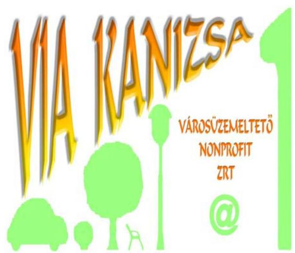

Nagykanizsa Megyei Jogú Város Önkormányzata a Via Kanizsa Városüzemeltető Nonprofit Zrt. jogelődjét 1996-ban alapította utak és fizetőparkolók üzemeltetésére. A Társaságot az Önkormányzat 2008-ban hozta létre annak jogelődje és két önkormányzati tulajdonban lévő gazdasági társaság összeolvadása révén. Az Önkormányzat a Társaság egyedüli részvényese volt.

Az Önkormányzat a 2012-2015. években a Társaságon kívül 11 gazdasági társaságban rendelkezett többségi tulajdonnal.

A Társaság fő feladata a 2015. december 31-én 48339 fő lakosságszámú Nagykanizsa Város közigazgatási területén ingatlankezelés volt. Közfeladatként végezte - többek között - a vásárok és piacok fenntartását és működtetését, a temetők üzemeltetését, a fizető parkolás működtetését. A Társaság közhasznú jogállással rendelkezett.
Az ellátott feladatokat és az azokhoz biztosított pénzügyi fedezet előirányzatát az Önkormányzat és a Társaság által évenként kötött városüzemeltetési és finanszírozási szerződésekben rögzítették. A temetők üzemeltetésére bérleti szerződést és kegyeleti közszolgáltatási szerződést kötöttek, a vásárcsarnok és a vásártér használatát bérleti szerződésben szabályozták.

Igazgatóság létrehozására a Társaságnál nem került sor, az igazgatóság jogait és kötelezettségeit az Alapító okirat alapján a Társaság vezérigazgatója gyakorolta.

A társasági SZMSZ szerint a vezérigazgató feladata volt az éves üzleti terv, valamint az éves beszámolók elkészítése. A Közgyűlés a vezérigazgató által előterjesztett üzleti terveket és éves beszámolókat jóváhagyta.

A Társaság jegyzett tőkéje 5,2 M Ft volt, amely a 2012-2015. években nem változott. A mérlegfőösszeg a 2012. évi 157,7 M Ft-ról 2015-re 165,9 M Ft-ra, a mérleg szerinti eredmény 29,2 M Ft veszteségről 23,0 M Ft nyereségre, az értékesítés nettó árbevétele 545,5 M Ft-ról 721,9 M Ft-ra nőtt. A Társaság főbb mérleg adatait a II. számú melléklet szemlélteti.

Az Önkormányzat 2012-2015. között a Társaság vonatkozásában garanciát, illetve kezességet nem vállalt.

A polgármester személye a 2014. évi önkormányzati választások után változott, 2014. október 12-től látta el feladatát. A jegyző személye egy alkalommal változott, az új jegyző kinevezésére 2013. június 15-én került sor, ettől az időponttól a korábbi aljegyző töltötte be a tisztséget.

---

# AZ ELLENŐRZÉS HÁTTERE, INDOKOLTSÁGA 

## AZ ÖNKORMÁNYZATOK TÖBBSÉGI TULAJDONÁBAN ÁLLÓ GAZDASÁGI TÁRSASÁGOK ELLENŐRZÉSE kiemelten fontos a vagyon megőrzése, megóvása érdekében, amelyekkel szemben alapvető követelmény, hogy gazdálkodásuk, működésük szabályszerű, az általuk szolgáltatott adatok minél megbízhatóbbak legyenek. A feladatellátás költségeinek, ráfordításainak alakulása a lakosság széles rétegét érinti. Ellenőrzéseink feltárhatják, hogy az önkormányzat a feladatellátásához rendelt vagyon működtetését a tulajdonostól elvárható gondossággal végezte-e, a feladatot ellátó gazdasági társaság a létesítő okiratban, szolgáltatási szerződésben foglaltak betartásával biztosította-e a feladat ellátását. Az ellenőrzés rávilágíthat arra, hogy a gazdasági társaság a vagyon használatával biztosította-e a szolgáltatás folytatásának feltételeit, az önkormányzat tulajdonosi felügyelete hozzájárult-e a szabályszerű gazdálkodáshoz és feladatellátáshoz. A megállapítások alapján megfogalmazott számvevőszéki javaslatok hasznosítása elősegítheti a meglévő hibák megszüntetését. A jó gyakorlatok bemutatásával az ÁSZ ${ }^{1}$ hozzájárulhat a követendő megoldások megismertetéséhez, terjesztéséhez.

---

# A JELENTÉS LÉNYEGES KÉRDÉSKÖREI 

1. Az önkormányzat tulajdonosi joggyakorlása szabályszerű volt-e?
2. A gazdasági társaság vagyongazdálkodása szabályszerű volt-e, fizetőképessége biztosított volt-e a gazdálkodás során?
3. A gazdasági társaság bevételeinek és ráfordításainak elszámolása, valamint az önköltségszámítás és árképzés szabályszerű volt-e?

---

# ELLENŐRZÉS HATÓKÖRE ÉS MÓDSZEREI 

## Az ellenőrzés típusa

Megfelelőségi ellenőrzés.

## Az ellenőrzött időszak

Az ellenőrzött időszak 2012. január 1-jétől 2015. december 31-ig tartott.

## Az ellenőrzés tárgya

Az önkormányzatok - többségi tulajdonában lévő gazdasági társaságok feletti - tulajdonosi joggyakorlása, valamint a gazdasági társaságok gazdálkodásának szabályozottsága és szabályszerűsége.

Az ellenőrzés kiterjedt minden olyan körülményre és adatra, amely az ÁSZ jogszabályban meghatározott feladatainak teljesítéséhez, valamint a program végrehajtása folyamán felmerült újabb összefüggések feltárásához szükséges volt.

## Az ellenőrzött szervezet

Nagykanizsa Megyei Jogú Város Önkormányzata és a kizárólagos tulajdonában lévő Via Kanizsa Városüzemeltető Nonprofit Zrt.

## Az ellenőrzés jogalapja

Az ellenőrzés jogszabályi alapját az ÁSZ tv. ${ }^{2}$ 1. § (3) bekezdése és 5. § (3)(4)-(5) bekezdései képezték.

## Az ellenőrzés módszerei

Az ellenőrzést a nemzetközi standardokat irányadónak tekintve az ellenőrzési program ellenőrzési kérdései, az ellenőrzött időszakban hatályos jogszabályok, az ellenőrzés szakmai szabályok és módszertanok figyelembe vételével végeztük.

Az ellenőrzés ideje alatt az ellenőrzött szervezettel történő kapcsolattartást az ÁSZ Szervezeti és Működési Szabályzatának vonatkozó előírásai alapján biztosítottuk.

---

Az ellenőrzés a kiválasztott, kizárólagos tulajdonosi jogokat gyakorló önkormányzatra, illetve az ellenőrzésre kijelölt gazdasági társaság felett tulajdonosi jogokat gyakorló szervezetre és az ellenőrzött gazdasági társaságra terjedt ki.

Az ellenőrzési kérdések megválaszolásához szükséges bizonyítékok megszerzése a következő ellenőrzési eljárások alkalmazásával történt: megfigyelés, kérdésfeltevés (információkérés), összehasonlítás, valamint elemző eljárás. Az ellenőrzési bizonyítékként felhasználható adatforrások közé tartoztak egyrészt az ellenőrzési programban felsorolt adatforrások, másrészt adatforrás lehetett még minden - az ellenőrzés folyamán - feltárt, az ellenőrzés szempontjából információkat tartalmazó dokumentum.

A gazdasági társaság bevételei és ráfordításai, ezeken belül az értékcsökkenés, valamint a vagyonnyilvántartás szabályszerűségének megítéléséhez a bevételeket és a ráfordításokat, a tárgyi eszközök állományváltozásait tartalmazó adott évi főkönyvi kivonat adatbázisát vettük alapul. A minta kiválasztása során véletlen mintavételt alkalmaztunk évenkénti, elemszámmal arányos rétegezéssel a teljes időszakra vonatkozóan. A mintavételt megelőzően az anyagjellegű ráfordítások, valamint a tárgyi-eszköz növekedési tételei sokaságból évente sokaságonként kiemeltük a 3-3 legnagyobb összegű tételt annak biztosítására, hogy az ellenőrzés az egyszerű véletlen mintavétel ellenére a legnagyobb értékű tételek ellenőrzésére biztosan kiterjedjen. A lényegességi szempontokat figyelembe véve a mintavétel előtt az anyagjellegű ráfordítások közül kiszűrtük a postaköltséget, bankköltséget, minden sokaságból az elszámolt kerekítési különbözetet, a helyesbítő tételek összegét, a technikai és rendező tételeket, az árfolyamkülönbözeteket.

Az ellenőrzést a kérdésekre adott válaszok kiértékelésével, valamint a megjelölt adatforrások, a csatolt tanúsítványok felhasználásával, továbbá az adott időszakban hatályos jogszabályok figyelembe vételével folytattuk le.

---

# 1. Az önkormányzat tulajdonosi joggyakorlása szabályszerű volt-e? 

Összegző megállapítás

Az Önkormányzat tulajdonosi joggyakorlása összességében szabályszerű volt.

### 1.1. számú megállapítás

Az Önkormányzat ${ }^{3}$ az Ötv. ${ }^{4}$ 91. § (6) bekezdésének, 2013. január 1-jétől az Mötv. ${ }^{5}$ 116. § (3)-(4) bekezdéseinek megfelelően a Gazdasági programban ${ }^{6}{ }^{7}$ határozta meg célkitűzéseit, fejlesztési elképzeléseit.

Közép- és hosszú távú vagyongazdálkodási terv készítési kötelezettségének az Önkormányzat az Nvtv. ${ }^{8}$ 9. § (1) bekezdésében foglalt előírás ellenére nem tett eleget.

A tulajdonosi jogok gyakorlásának rendjét az Önkormányzat - a Gt. ${ }^{9}$ és a Ptk. ${ }^{10}$ előírásaival összhangban - az SZMSZ ${ }^{11}$-ben, a Vagyonrendeletben ${ }^{12}$, illetve az Alapító okiratban ${ }^{13}$ határozta meg. Az SZMSZ és a Vagyonrendelet előírása szerint a tulajdonost megillető jogokat a Közgyűlés ${ }^{14}$ gyakorolta, a Társaságban ${ }^{15}$ a tulajdonosi képviseletet a polgármester ${ }^{16}$ látta el. Az Ötv. 18. § (1) bekezdése, valamint az Mötv. 53. § (1) bekezdése alapján az SZMSZ-ben határozták meg a Közgyűlés működésének részletes szabályait, így többek között rendelkeztek az átruházott hatáskörökről, bizottságokról

 és azok feladatairól.

RENDELETALKOTÁSI KÖTELEZETTSÉGE az Önkormányzatnak a Társaság feladatellátásával kapcsolatban a Kktv. ${ }^{17}$ 48. § (5) bekezdésében kapott felhatalmazás alapján, a belváros területén lévő parkolóhelyek hasznosítása, a Ttv. ${ }^{18}$-ben foglaltakra tekintettel a tisztességes és méltó temetés biztosítása, valamint az Ötv. 16. § (1) bekezdésében, illetve az Mötv. 13. § (1) bekezdés 14. pontjában kapott felhatalmazás alapján a vásárok és piacok fenntartása vonatkozásában volt. Az Önkormányzat a jogszabályok által előírt rendeleteket ${ }^{19}$ megalkotta.

A VAGYONRENDELETBEN az Önkormányzat rögzítette a vagyonnal való jogszerű gazdálkodás kereteit és a vagyonhasznosítás szabályait. Vagyonkezelésbe az Önkormányzat nem adott át vagyont a Társaságnak.

---

1. táblázat

A SAJÁT TŐKE, JEGYZETT TŐKE ÉS MÉRLEG SZERINTI EREDMÉNY ALAKULÁSA (M FT)

| Ev | Saját   tőke | Jegyzett   tőke | Mérleg   szerinti   ered-   mény |
| :--: | :--: | :--: | :--: |
| 2012. | $-12,6$ | 5,2 | $-29,2$ |
| 2013. | 8,9 | 5,2 | 3,7 |
| 2014. | $-9,3$ | 5,2 | $-18,3$ |
| 2015. | 28,2 | 5,2 | 23,0 |

A TULAJDONOSI JOGOKAT az Önkormányzat a Vagyonrendeletben, az SZMSZ-ben, valamint az Alapító okiratban foglaltaknak megfelelően gyakorolta.

AZ FB ${ }^{20}$ a Gt. és a Ptk. előírásainak megfelelően három főből állt. Az FB a Társaság üzleti terveit és éves beszámolóit - a Gt. és a Ptk. előírása szerint - írásban véleményezte. Az éves számviteli beszámolók tárgyalása során a Közgyűlés rendelkezésére álltak azok elfogadásáról szóló felügyelő bizottsági határozatok.

Az FB a Gt. 34. § (4), illetve a Ptk. 3:122. § (3) bekezdésében foglalt előírásokat megsértve nem rendelkezett ügyrenddel.

A KÖNYVVIZSGÁLÓ a Gt. és a Ptk. előírásaival összhangban elkészítette a könyvvizsgálói jelentéseket, melyeket az éves beszámolók Közgyűlés részére történő előterjesztéséhez csatoltak. A könyvvizsgáló az éves beszámolókat hitelesítő záradékkal látta el, 2012. és a 2014. évben a Számv. tv. ${ }^{21}$ 156. § (5) bekezdés g) pontjában foglalt figyelemfelhívással élt a Társaság tőkevesztésére tekintettel. A Közgyűlés a Társaság éves beszámolóit minden évben határozattal elfogadta.

AZ ÖNKORMÁNYZAT BELSŐ ELLENŐRZÉSE kettő alkalommal végzett ellenőrzést a Társaságnál, 2012-ben a gazdálkodásra, 2015-ben az Önkormányzat által biztosított források eredményes felhasználására vonatkozóan. A belső ellenőrzés által feltárt hiányosságok alapján a Társaságnak intézkedési tervkészítési kötelezettsége keletkezett, melynek eleget tett, a vállalt feladatok teljesítéséről a jegyző ${ }^{22}$ felé beszámolt.

A VESZTESÉG pótlására - mivel 2012-ben és 2014-ben a Társaság eredménye negatív volt - a Közgyűlés határozatában 17,8 M Ft, illetve 14,5 M Ft pótbefizetésről döntött. A 2013. és 2015. évben a Társaság pozitív eredményt ért el, a Közgyűlés ezekben az években az éves eredmény eredménytartalékba helyezéséről döntött.

Az Önkormányzat a Társaság 2012. évi üzleti tervét a 2011. évhez képest közel 80,0 M Ft önkormányzati forráscsökkenéssel fogadta el, a bevételek 13,7 M Ft-tal elmaradtak a tervezettől. A ráfordítások - a téli hóeltakarítási feladatok és a közvilágítás kiadásainak emelkedése miatt 42,3 M Ft-tal haladták meg a tervezett értéket. 2014-ben a veszteség fő oka volt, hogy a közvilágítás tényleges kiadásai év végén közel 16,0 M Ft-tal meghaladták a tervezett összeget, melynek kompenzálására már nem volt lehetőség.

A Társaság saját tőkéje, jegyzett tőkéje és mérleg szerinti eredménye alakulását az 1. táblázat szemlélteti.

---

# 2. A gazdasági társaság vagyongazdálkodása szabályszerű volt-e, fizetőképessége biztosított volt-e a gazdálkodás során? 

Összegző megállapítás

2.1. számú megállapítás

A Társaság vagyongazdálkodása összességében szabályszerű, fizetőképessége biztosított volt, az előírt adatszolgáltatási kötelezettségeit ugyanakkor nem teljesítette teljes körűen.

A Társaság az előírt szabályzatokkal rendelkezett, azonban azok nem feleltek meg teljes körűen a jogszabályi előírásoknak.

A Társaság a Számv. tv. 14. § (3) bekezdése alapján megalkotta számviteli politikáját ${ }^{23}$, valamint elkészítette a 14. § (5) bekezdés a-d) pontjaiban előírt szabályzatokat. Rendelkezett továbbá társasági SZMSZ ${ }^{24}$-szel és javadalmazási szabályzattal ${ }^{25}$.

A SZÁMVITELI POLITIKÁBAN a Számv. tv. 14. § (4) bekezdésének előírása ellenére nem rögzítették azokat a gazdálkodóra jellemző szabályokat, előírásokat, módszereket, amelyekkel meghatározzák, hogy mit tekintenek a számviteli elszámolás, értékelés szempontjából lényegesnek, nem lényegesnek, nem jelentősnek. A számviteli politikán - a Számv. tv. 14. § (11) bekezdésében foglaltak ellenére - nem vezették át a törvénymódosításokat, amelyek a 2012. január 1-jétől hatályos bizonylatok megőrzési idejének és módjának változását (Számv. tv. 169. § (1), (5)-(6) bekezdések), illetve a 2013. január 1-jétől hatályos, a jelentős összegű hiba és a 2013. január 1-jétől hatálytalan megbízható, valós képet lényegesen befolyásoló hiba fogalmi meghatározását (Számv. tv. 3. § (3) bekezdés 3. és 5. pontok) érintették.

A SZÁMLARENDET a Számv. tv. 161. § (1) bekezdésében foglaltakkal összhangban elkészítették, azonban annak folyamatos karbantartásáról a Számv. tv. 161. § (4) bekezdésének előírása ellenére nem gondoskodtak. A Társaság a számlarenden nem vezette át a Számv. tv. 86. §-ának 2015. július 4-ei hatályon kívül helyezésének (a rendkívüli bevételek és kiadások, mint számviteli kategória megszűnésének) megfelelő változásokat.

AZ ESZKÖZÖK ÉS A FORRÁSOK LELTÁRKÉSZÍTÉSI ÉS LELTÁROZÁSI SZABÁLYZATA ${ }^{26}$ a tárgyi eszközök és készletek esetében évenkénti mennyiségi felvétellel, az egyéb eszközök és források esetében egyeztetéssel történő leltározást írt elő. A szabályozás a Számv. tv. előírásainak megfelelt.

AZ ÉRTÉKELÉSI SZABÁLYZAT ${ }^{27}$ a Számv. tv. előírásainak megfelelően tartalmazta az eszközök és források értékelésének módszereit.

AZ ÖNKÖLTSÉGSZÁMÍTÁSI SZABÁLYZAT ${ }^{28}$ készítésére a Társaság a Számv. tv. 14. § (5) bekezdés c) pontjában foglaltak szerint kötelezett volt, melynek eleget tett.

---

# Megállapítások 

2.2. számú megállapítás
2.3. számú megállapítás
2. táblázat

## A KÖTELEZETTSÉGEK ALAKULÁSA (M FT)

| Mégnevezés | 2012. | 2015. |
| :-- | --: | --: |
| Összes kötelezettség | 100,2 | 77,1 |
| ebből: rövid lej. | 100,2 | 77,1 |
| ebből: szállítók | 86,1 | 63,8 |
| ebből: lejárt szállítók | 39,9 | 12,2 |
| Forrás: A Társaság 2012. és 2015. évi éves beszámolói |  |  |

A PÉNZKEZELÉSI SZABÁLYZAT ${ }^{29}$ a Számv. tv. 14. § (8) bekezdésében foglaltaknak megfelelt.

A társasági SZMSZ tartalmazta a szervezeti rendet, a vezetők feladatait és felelősségi köreit.

A javadalmazási szabályzat a Taktv. ${ }^{30}$ előírásainak megfelelt, azt a Gt.ben foglaltaknak megfelelően a Közgyűlés határozatában jóváhagyta.

## A Társaság vagyonával összességében szabályszerűen gazdálkodott.

A VAGYON nyilvántartása mind a jogszabályi, mind a belső szabályozási előírásoknak megfelelt, a változásokat az analitikus és a főkönyvi nyilvántartási rendszerben rögzítették.

Az éves beszámolókat alátámasztó, a Számv. tv. 69. § (1) bekezdésében előírt leltárakat elkészítették, azonban az eszközök és források leltárkészítési és leltározási szabályzat 3.8. pontjában évenként előírt mennyiségi felvételű leltározást 2012-ben nem hajtották végre.

A Társaság vagyona 4,8%-kal csökkent 2015. december 31-ére a 2012. január 1-jei állapothoz képest. Ezen belül a befektetett eszközök értéke 36,0%-kal csökkent az elszámolt értékcsökkenés hatására. A saját tőke összege 2012-ben és 2014-ben is a jegyzett tőke összege alá csökkent. A veszteség pótlására az éves beszámolókat elfogadó közgyűlési határozatokban pótbefizetésről rendelkeztek, biztosítva ezzel a Gt. 207. § (1) bekezdésében, illetve Ptk. 3:212. § (2) bekezdésében meghatározott alaptőke mértéket és eleget téve Gt. 245. § (2) bekezdésében, illetve a Ptk. 3:270. § (2) bekezdésében foglaltaknak.

## A Társaság fizetőképessége a 2012-2015. években javult, a gazdálkodás során a fizetőképesség biztosított volt.

A TÁRSASÁG FIZETŐKÉPESSÉGE az ellenőrzött időszakban javult, a kötelezettség állomány, az eladósodás mértéke csökkent. A kötelezettségek a 2012-2014. években meghaladták a forgóeszközök és a saját tőke összegét. 2015-ben a kötelezettségek értéke alatta maradt a forgóeszközök és a saját tőke együttes értékének.

A Társaság hosszú lejáratú kötelezettséggel nem rendelkezett. A rövid lejáratú kötelezettségek 2015-ben - a 2012. évhez képest - 23,1 M Ft-tal (23,1%-kal) csökkentek. A rövid lejáratú kötelezettségek 85,9%-a, illetve 82,7%-a szállítói tartozás volt, amelyet a 2. táblázat szemléltet. A határidőn túli lejárt szállítói tartozások állománya a 2012. évi 39,9 M Ft-ról 2015 végére 12,2 M Ft-ra (69,4%-kal) csökkent.

## A Társaság az előírt beszámolási és adatszolgáltatási kötelezettségeit teljes körűen nem teljesítette.

AZ ÉVES BESZÁMOLÓKAT a Társaság összességében a Számv. tv., a Civil tv. ${ }^{31}$, a számviteli politika, az Alapító okirat, valamint a társasági SZMSZ előírásainak megfelelő tartalommal és formában, határidőben elkészítette, majd azokat a Számv. tv. 153. § (1) bekezdésének megfelelően letétbe helyezte és a Számv. tv. 154. § (1) bekezdésével összhangban közzétette. Az éves beszámolók kiegészítő melléklete azonban - a Számv. tv. 88.§ (6) bekezdésének előírása ellenére - a cash-flow kimutatást

---

nem tartalmazta. Az éves beszámolókhoz - a Civil tv. 29. § (3) bekezdése előírásának megfelelően - csatolták a közhasznúsági mellékletet.

A Társaság a 2012-2015. években a Gt. 244. § (2) bekezdésben, majd a Ptk. 3:284. § (1) bekezdésében előírtak ellenére az ügyvezetésről, a vagyoni helyzetről, az üzletpolitikáról az Önkormányzat felé jelentést nem készített, valamint az FB felé történő - háromhavonkénti - beszámolási kötelezettségét nem teljesítette.

A Társaság a 2012. évben - az Info tv. ${ }^{32}$ 24. § (3) bekezdésének, illetve 30. § (6) bekezdésének előírása ellenére - nem rendelkezett adatvédelmi és adatbiztonsági, valamint a közérdekű adatok megismerésére irányuló igények teljesítésének rendjét rögzítő szabályzattal, azokat egy évvel később, 2013. január 1-jével készítette el és helyezte hatályba. Az adatvédelmi és adatbiztonsági szabályzatban - az Info tv. előírásával összhangban - kijelölték az adatvédelmi felelőst.

KÖZZÉTÉTELI KÖTELEZETTSÉGEINEK a Társaság honlapján tett eleget. A nyilvánosságra hozott adatok a Taktv. előírásainak megfeleltek, azonban azok az Info tv. 1. melléklet I/2. sora szerinti, az egyes szervezeti egységek feladatait, a II/1. sora szerinti, a Társaságra vonatkozó alapvető jogszabályokat, szervezeti és működési szabályzatot, adatvédelmi és adatbiztonsági szabályzatot nem tartalmazták, ezzel nem tettek maradéktalanul eleget az Infotv. 37. § (1) bekezdése előírásának.

# 3. A gazdasági társaság bevételeinek és ráfordításainak elszámolása, valamint az önköltségszámítás és árképzés szabályszerű volt-e? 

Összegző megállapítás

## 3.1. számú megállapítás

A Társaság bevételeinek, ráfordításainak elszámolása megfelelő volt, önköltségszámítást azonban a jogszabályi kötelezettség ellenére nem végeztek.

A bevételek, ráfordítások, beruházások, felújítások és az értékcsökkenés elszámolása megfelelő volt.

AZ ÉRTÉKESÍTÉS NETTÓ ÁRBEVÉTELÉNEK, az egyéb bevételeknek, a pénzügyi műveletek bevételeinek és a rendkívüli bevételeknek az elszámolása megfelelő volt. A Társaság a jogszabályi és a belső szabályozás előírásait figyelembe vette.

AZ ANYAGJELLEGŰ RÁFORDÍTÁSOK, az egyéb ráfordítások, a pénzügyi műveletek ráfordításainak és a rendkívüli ráfordítások elszámolása megfelelő volt. A Társaság a Számv. tv. és a számviteli politika előírásait figyelembe vette.

A SZEMÉLYI JELLEGŰ RÁFORDÍTÁSOK elszámolása megfelelő volt. A Társaság a Számv. tv. 79. §. és a számviteli politika előírásait figyelembe vette.

---

A BERUHÁZÁSOK, FELÚJÍTÁSOK elszámolása megfelelő volt. A Társaság a bekerülési értéket a Számv. tv. 47-51. §-aiban előírtak alapján határozta meg. Az értékcsökkenési leírás elszámolása a
 Számv. tv. és a számviteli politika előírásainak megfelelt.

AZ ESZKÖZÖK PÓTLÁSA a 2014. év kivételével alatta maradt az értékcsökkenés leírásának, az eszközök átlagos használhatósági foka a 2012-2015. évek között összességében csökkent. Az értékcsökkenés mértékének megfelelő pótlás, felújítás hiányában a Társaságnál a vagyon értékének szinten tartása a 2012, 2013. és 2015. években nem valósult meg.

A KÖVETELÉSÁLLOMÁNY a 2012. év végétől a 2014. év végéig folyamatosan nőtt ( $7,6 \mathrm{M}$ Ft-ról 31,8 M Ft-ra), majd 2015. év végén 11,8 M Ft-ra csökkent, melyet a határidőn túli vevőkövetelések kiegyenlítése okozott. A határidőn túli vevőkövetelések értékében 2015-ben következett be jelentős csökkenés, az összes határidőn túli követelés már csak 37,0\%-a volt az előző évinek. A Társaság a követelések csökkentése érdekében intézkedett, a határidőn túli követelésekre fizetési felszólítást küldött, a parkolási pótdíjak kezelésére 2013-ban szolgáltatási megállapodást kötött.
3.2. számú megállapítás

Az önköltség-számítás szabályait meghatározták, azonban az előírások ellenére önköltségszámítást nem végeztek.

A Társaság a Számv. tv. előírása szerint az önköltségszámítási szabályzatot elkészítette, az önköltségszámítás szabályait meghatározta.

A Társaság a 2012-2015. években a Számv. tv. 14. § (7) bekezdésében foglaltak ellenére a végzett szolgáltatások Számv. tv. 51. § szerinti önköltségét az önköltségszámítási szabályzat szerinti utókalkuláció módszerével nem állapította meg.

AZ ÁRKÉPZÉS során a Társaság - az ellátott közfeladatok esetében - az Önkormányzat rendeleteinek megfelelően járt el. A parkolási pótdíjakat a Kktv. 15/C. § (2) bekezdése előírásainak megfelelően határozta meg.

---

# JAVASLATOK 

Az ÁSZ tv. 33. § (1) bekezdésében foglaltak értelmében az ellenőrzött szervezet vezetője köteles a jelentésben foglalt megállapításokhoz kapcsolódó intézkedési tervet összeállítani és azt a jelentés kézhezvételétől számított 30 napon belül az ÁSZ részére megküldeni. Amennyiben az ellenőrzött szervezet vezetője nem küldi meg határidőben az intézkedési tervet, vagy továbbra sem elfogadható intézkedési tervet küld, az Állami Számvevőszék elnöke az ÁSZ tv. 33. § (3) bekezdés a) és b) pontjaiban foglaltakat érvényesítheti.

## Via Kanizsa Városüzemeltető Nonprofit Zrt. Vezérigazgatójának

1. Intézkedjen a számviteli politika és a számlarend jogszabályi rendelkezések szerinti módosításáról és szabályszerű aktualizálásáról, karbantartásáról.
(2.1 sz. megállapítás 2. és 3. bekezdése alapján)
2. Intézkedjen, hogy az éves beszámolók kiegészítő melléklete a Számv. tv. előírásainak megfelelően tartalmazza a Társaság cash-flow kimutatását.
(2.4 sz. megállapítás 1. bekezdése alapján)
3. Intézkedjen, hogy a Társaság a jogszabályban foglalt jelentéstételi kötelezettségének eleget tegyen.
(2.4 sz. megállapítás 2. bekezdése alapján)
4. Intézkedjen annak érdekében, hogy a Társaság az Info tv.-ben foglalt közzétételi kötelezettségének maradéktalanul eleget tegyen.
(2.4 sz. megállapítás 4. bekezdése alapján)
5. Intézkedjen annak érdekében, hogy a Társaság az általa végzett szolgáltatások önköltségét a Számv. tv. előírásainak megfelelően állapítsa meg.
(3.2 sz. megállapítás 2. bekezdése alapján)

---

# Nagykanizsa Megyei Jogú Város Önkormányzata Polgármesterének 

1. Intézkedjen az Önkormányzat közép- és hosszú távú vagyongazdálkodási tervének elkészítéséről az Nvtv. előírásának megfelelően.
(1.1 sz. megállapítás 2. bekezdése alapján)
2. Kezdeményezze a felügyelőbizottságnál az ügyrend elkészítését, és annak a Társaság legfőbb szerve általi jóváhagyását.
(1.2 sz. megállapítás 3. bekezdése alapján)

---

.

---

# MELLÉKLETEK 

- I. SZ. MELLÉKLET: ÉRTELMEZŐ SZÓTÁR
garancia
gazdasági társaság
kezesség
közép és hosszú távú vagyongazdálkodási terv
közfeladat

A garancia olyan önálló, az önkormányzat nevében vállalt kötelezettség, amely alapján az önkormányzat az önkormányzati költségvetés terhére szerződésben meghatározott feltételek szerint, a kötelezett nem teljesítése esetén a jogosultnak fizetést teljesít az előzetesen rögzített összeghatárig.
Ptk. 3.88. § (1) bekezdése szerint „a gazdasági társaságok üzletszerű közös gazdasági tevékenység folytatására, a tagok vagyoni hozzájárulásával létrehozott, jogi személyiséggel rendelkező vállalkozások, amelyekben a tagok a nyereségből közösen részesednek, és a veszteséget közösen viselik".
A kezességre vonatkozó előírásokat a Ptk. 6:416-430. §-ai tartalmazzák. Kezességi szerződéssel a kezes kötelezettséget vállal a jogosulttal szemben, hogyha a kötelezett nem teljesít, maga fog helyette a jogosultnak teljesíteni. Kezesség egy vagy több, fennálló vagy jövőbeli, feltétlen vagy feltételes, meghatározott vagy meghatározható összegű pénzkövetelés vagy pénzben kifejezhető értékkel rendelkező egyéb kötelezettség biztosítására vállalható.
A Ptk. szerint kezességet csak írásban lehet vállalni. A kezes kötelezettsége ahhoz a kötelezettséghez igazodik, amelyért kezességet vállalt. A kezes kötelezettsége nem válhat terhesebbé, mint amilyen elvállalásakor volt, kiterjed azonban a kötelezett szerződésszegésének jogkövetkezményeire és a kezesség elvállalása után esedékessé váló mellékkövetelésekre is.
Az Nvtv. 7.§ (2) bekezdése szerint „a nemzeti vagyongazdálkodás feladata a nemzeti vagyon rendeltetésének megfelelő, az állam, az önkormányzat mindenkori teherbíró képességéhez igazodó, elsődlegesen a közfeladatok ellátásához és a mindenkori társadalmi szükségletek kielégítéséhez szükséges, egységes elveken alapuló, átlátható, hatékony és költségtakarékos működtetés, értékének megőrzése, állagának védelme, értéknövelő használata, hasznosítása, gyarapítása, továbbá az állam vagy a helyi önkormányzat feladatának ellátása szempontjából feleslegessé váló vagyontárgyak elidegenítése." Az Nvtv. 9.§ (1) bekezdése szerint az önkormányzat ennek biztosítása céljából közép- és hosszú távú vagyongazdálkodási tervet köteles készíteni. (hatályos 2012. január 1-jétől)
Jogszabályban meghatározott állami vagy önkormányzati feladat, amit az arra kötelezett közérdekből, jogszabályban meghatározott követelményeknek és feltételeknek megfelelve végez, ideértve a lakosság közszolgáltatásokkal való ellátását, továbbá az állam nemzetközi szerződésekben vállalt kötelezettségeiből adódó közérdekű feladatokat, valamint e feladatok ellátásához szükséges infrastruktúra biztosítását is (Nvtv. 3. § (1) bekezdés 7. pont, hatályos 2012. január 1-jétől 2014. december 31-ig)

---

közszolgáltatás

A közszolgáltatás: „közcélú, illetőleg közérdekű szolgáltatást jelent, amely egy nagyobb közösség (állam, település) minden tagjára nézve megközelítőleg azonos feltételek mellett vehető igénybe, ezért valamilyen mértékig közösségi megszervezést, illetve szabályozást, ellenőrzést igényel." Az Ebktv. ${ }^{33} 3 . \S$ d) pontja a következőképpen határozza meg a közszolgáltatást: „szerződéskötési kötelezettség alapján a lakosság alapvető szükségleteinek ellátására irányuló szolgáltatás, így különösen a villamos energia-, gáz-, hő-, víz-, szennyvíz- és hulladékkezelési, köztisztasági, postai és távközlési szolgáltatás, továbbá a menetrend alapján közlekedő járművekkel végzett közforgalmú személyszállítás".
nonprofit gazdasági társaság
tulajdonosi joggyakorló

A Civil tv. 9/F. § (2) bekezdése szerint „az a gazdasági társaság minősül nonprofit gazdasági társaságnak és cégnevében az a gazdasági társaság tüntetheti fel a nonprofit jelleget, amelynek létesítő okirata tartalmazza, hogy a gazdasági társaság tevékenységéből származó nyereség a tagok között nem osztható fel, hanem az a gazdasági társaság vagyonát gyarapítja." (hatályos 2014. március 15-étől)
Aki a nemzeti vagyon felett az államot vagy a helyi önkormányzatot megillető tulajdonosi jogok és kötelezettségek összességének gyakorlására jogosult. (Nvtv. 3. § (1) bekezdés 17. pont).

---

II. SZ. MELLÉKLET: A TÁRSASÁG 2012-2015. ÉVI FŐBB MÉRLEG ADATAI (M FT)

|  Tétel megnevezése | 2012.01.01. | 2012.12.31. | 2013.12.31. | 2014.12.31. | 2015.12.31.  |
| --- | --- | --- | --- | --- | --- |
|  Befektetett eszközök | 99,9 | 78,7 | 61,7 | 75,9 | 63,9  |
|  - ebből: Tárgyi eszközök | 83,3 | 70,2 | 59,5 | 75,9 | 63,9  |
|  Forgóeszközök | 69,9 | 78,6 | 132,4 | 73,4 | 97,5  |
|  - ebből: Követelések | 31,1 | 7,6 | 11,5 | 31,8 | 11,8  |
|  Aktív időbeli elhatárolások | 4,5 | 0,4 | 11,2 | 3,8 | 4,5  |
|  ESZKÖZÖK ÖSSZESEN | 174,3 | 157,7 | 205,3 | 153,1 | 165,9  |
|  Saját tőke | 16,6 | $-12,6$ | 8,9 | $-9,3$ | 28,2  |
|  - ebből Jegyzett tőke | 5,2 | 5,2 | 5,2 | 5,2 | 5,2  |
|  - ebből: Mérleg szerinti eredmény | 5,3 | $-29,2$ | 3,7 | $-18,3$ | 23,0  |
|  Céltartalékok | 0,0 | 0,0 | 0,0 | 0,0 | 0,0  |
|  Kötelezettségek | 78,9 | 100,2 | 150,6 | 112,9 | 77,1  |
|  Passzív időbeli elhatárolások | 78,8 | 70,1 | 45,8 | 49,5 | 60,6  |
|  FORRÁSOK ÖSSZESEN | 174,3 | 157,7 | 205,3 | 153,1 | 165,9  |

Forrás: A Társaság 2012-2015. évi beszámolói

---

.

---

# FÜGGELÉK: ÉSZREVÉTELEK 

A jelentéstervezetet az Állami Számvevőszék 15 napos észrevételezésre megküldte az ellenőrzött szervezetek vezetőinek az ÁSZ tv. 29. § (1) bekezdése előírásának megfelelően.

Észrevételezési jogukkal éltek az ellenőrzött szervezetek vezetői, a Via Kanizsa Városüzemeltető Nonprofit Zrt. vezérigazgatója és Nagykanizsa Megyei Jogú Város Önkormányzatának polgármestere.
A függelék tartalmazza az ellenőrzöttek észrevételeit mellékletek nélkül, illetve az el nem fogadott észrevételek elutasításának indoklását.

[^0]
[^0]:    * 29. § (1) Az Állami Számvevőszék az ellenőrzési megállapításait megküldi az ellenőrzött szervezet vezetőjének vagy az általa megbízott személynek, és annak, akinek személyes felelősségét állapította meg.
    (2) Az ellenőrzött szervezet vezetője és a felelősként megjelölt személy az ellenőrzés megállapításaira tizenöt napon belül írásban észrevételt tehet.
    (3) Az Állami Számvevőszék az észrevételre a beérkezésétől számított harminc napon belül írásban válaszol. A figyelembe nem vett észrevételeket köteles a jelentésben feltüntetni, és megindokolni, hogy azokat miért nem fogadta el.

---

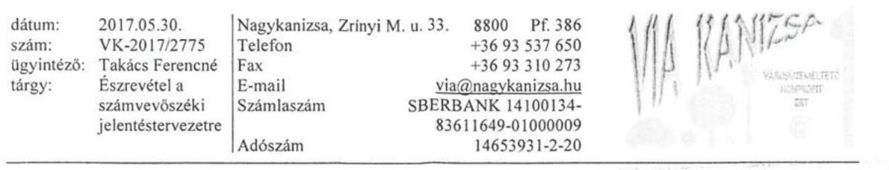

# ÁLLAMI SZÁMVEVŐSZÉK 

dr. Nagy Imre felügyeleti vezető

Budapest 4.
Pf. 54
1364

Tisztelt dr. Nagy Imre Úr!

Hivatkozva a V-1282-162/2016. iktatószámú, 2316 témaszámú, V075807 ellenőrzés-azonosító számú számvevőszéki jelentéstervezetre, tájékoztatjuk Önöket, hogy a tervezetben foglaltak közül a felügyelőbizottsági ügyrendet elkészítettük, melyet a tulajdonos (Nagykanizsa Megyei Jogú Város Önkormányzata) a 62/2017 (III.30.) sz. határozatával elfogadott.

A jelentésben tett többi javaslattal szemben kifogást nem emelünk.

Nagykanizsa, 2017. május 30.

Üdvözlettel:
Via Kanizsa Városüzemeltető
Nonprofit Zrt.
8600 Nagykanizsa, Zrinyi M. u. 33.
Adószám: 14683931-2-20
1.

Fitos István
vezérigazgató

---

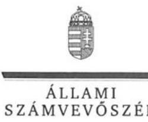

ELNÖK

# Fitos István úr 

vezérigazgató
Via Kanizsa Városüzemeltető Nonprofit Zrt.

## Nagykanizsa

## Tisztelt Vezérigazgató Úr!

„Az önkormányzatok gazdasági társaságai - Az önkormányzatok többségi tulajdonában lévő gazdasági társaságok gazdálkodásának ellenőrzése -Via Kanizsa Városüzemeltető Nonprofit Zrt. " címmel készített számvevőszéki jelentéstervezetre tett észrevételeit köszönettel megkaptam.
Az Állami Számvevőszék észrevételre vonatkozó álláspontjáról a felügyeleti vezető által készített részletes tájékoztatást csatoltan megküldöm.
Tájékoztatom Vezérigazgató urat, hogy a számvevőszéki jelentésben - az Állami Számvevőszékről szóló 2011. évi LXVI. törvény 29. § (3) bekezdése alapján - a figyelembe nem vett észrevételeket szerepeltetjük az elutasítás indokának feltüntetésével.

Budapest, 2017. 06 hó 15 nap
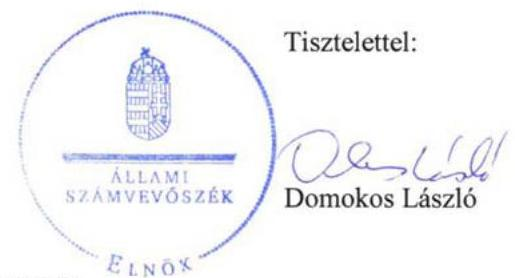

Melléklet: Tájékoztatás az észrevétel kezeléséről

---

# Tájékoztatás   az észrevétel kezeléséről 

„Az önkormányzatok gazdasági társaságai - Az önkormányzatok többségi tulajdonában lévő gazdasági társaságok gazdálkodásának ellenőrzése - Via Kanizsa Városüzemeltető Nonprofit Zrt. " című számvevőszéki jelentéstervezetre 2017. május 30-án tett észrevételét áttekintettük, annak kezelésével kapcsolatban a következő tájékoztatást adom.
A jelentéstervezet 13. oldal 1.2 sz. megállapítás 3. bekezdés megállapítására („Az FB a Gt. 34. § (4), illetve a Ptk. 3:122. § (3) bekezdésében foglalt előírásokat megsértve nem rendelkezett ügyrenddel.") vonatkozó észrevétel
A Társaság Felügyelő Bizottságának ügyrendjének elfogadásáról szóló tájékoztatását köszönjük. Az észrevételben leírt intézkedés az ellenőrzött időszakot követően történt, ezért az a jelentéstervezet megállapítását nem érinti, az intézkedést igénylő megállapítás és a Nagykanizsa Megyei Jogú Város Önkormányzata Polgármesterének címzett 2. javaslat módosítása, illetve törlése nem indokolt.

Budapest, 2017. 06 hó 15 nap
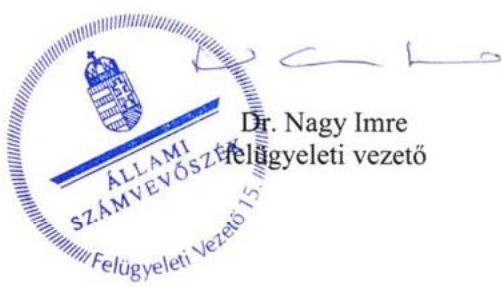

---

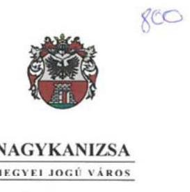

# POLGÁRMESTERE 

## Tárgy: észrevétel jelentéstervezetre

Állami Számvevőszék

## Domokos László

elnök

 úr részére

Budapest 4. Pf. 54
1364

## Tisztelt Elnök Úr!

A V-1282-162/2016. iktatószámú, a VIA Kanizsa Városüzemeltető Nonprofit Zrt. gazdálkodásának ellenőrzése jelentéstervezetének, az önkormányzatot érintő javaslataival kapcsolatosan az alábbi észrevételeket teszem:

1. Az Nvtv. előírása szerinti közép- és hosszú távú vagyongazdálkodási tervvel önkormányzatunk rendelkezett, ezt a Közgyűlés a 169/2013. (V.30.) számú határozatával fogadta el. A dokumentumot nem töltöttük fel és hiánya az ellenőrzés során sem merült fel. (1. sz. melléklet: NMJV Önkormányzata közép- és hosszú távú vagyongazdálkodási terve)
2. A Társaság Felügyelő Bizottsága a vizsgált időszakban ügyrenddel nem rendelkezett. E hiányosság megszüntetése érdekében intézkedtem és a Közgyűlés a 62/2017. (III.30.) számú határozatával az ügyrendet elfogadta. (2. sz. melléklet).

Nagykanizsa, 2017. május 22.
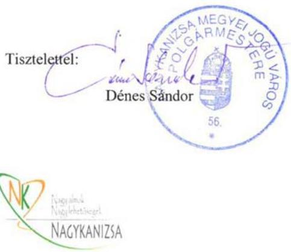

---

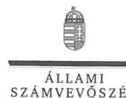

# Dénes Sándor úr 

polgármester
Nagykanizsa Megyei Jogú Város Önkormányzata

## Nagykanizsa

## Tisztelt Polgármester Úr!

„Az önkormányzatok gazdasági társaságai - Az önkormányzatok többségi tulajdonában lévő gazdasági társaságok gazdálkodásának ellenőrzése -Via Kanizsa Városüzemeltető Nonprofit Zrt. " címmel készített számvevőszéki jelentéstervezetre tett észrevételeit köszönettel megkaptam.
Az Állami Számvevőszék észrevételekre vonatkozó álláspontjáról a felügyeleti vezető által készített részletes tájékoztatást csatoltan megküldöm.
Tájékoztatom Polgármester urat, hogy a számvevőszéki jelentésben - az Állami Számvevőszékről szóló 2011. évi LXVI. törvény 29. § (3) bekezdése alapján - a figyelembe nem vett észrevételeket szerepeltetjük az elutasítás indokának feltüntetésével.

Budapest, 2017. 06. hó 13. nap
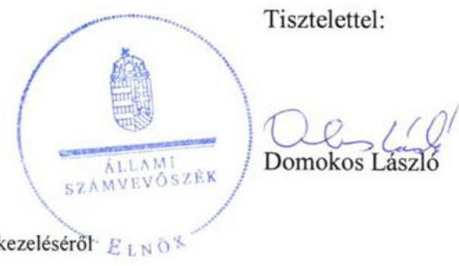

Melléklet: Tájékoztatás az észrevételek kezeléséről

---

# Tájékoztatás   az észrevételek kezeléséről 

„Az önkormányzatok gazdasági társaságai - Az önkormányzatok többségi tulajdonában lévő gazdasági társaságok gazdálkodásának ellenőrzése - Via Kanizsa Városüzemeltető Nonprofit Zrt. " című számvevőszéki jelentéstervezetre 2017. május 22-én tett (az Állami Számvevőszékhez 2017. május 25-én érkezett) észrevételeit áttekintettük, annak kezelésével kapcsolatban a következő tájékoztatást adom.
A jelentéstervezet Nagykanizsa Megyei Jogú Város Önkormányzata Polgármesterének címzett 1. javaslatra („Intézkedjen az Önkormányzat közép- és hosszú távú vagyongazdálkodási tervének elkészítéséről az Nvtv. előírásának megfelelően.") vonatkozó észrevétel
Az észrevételben jelezte, hogy az Önkormányzat rendelkezett közép- és hosszú távú vagyongazdálkodási tervvel, azonban azt nem adta át az ellenőrzés részére.
Az Állami Számvevőszék az ellenőrzését a megküldött ellenőrzési programnak megfelelően, a rendelkezésére bocsátott adatok és dokumentumok alapján végzi. Az Állami Számvevőszékről szóló 2011. évi LXVI. törvény 28. § (2) bekezdése alapján a közreműködésre felhívott szervezet az Állami Számvevőszék részére - annak kérésére soron kívül, de legkésőbb öt munkanapon belül - az ellenőrzés lefolytatása érdekében szükséges adatokat és dokumentumokat rendelkezésre bocsátja. A 2016. október 24-ei adatbekérő levelünk melléklete tartalmazta az Önkormányzat által elektronikusan feltöltendő dokumentumok körét. A bekért dokumentumok közül a közép- és hosszú távú vagyongazdálkodási terv nem került feltöltésre vagy átadásra az ellenőrzést végzők részére. Polgármester úr 2016. november 4-ei, adatszolgáltatáshoz csatolt nyilatkozata szerint az Állami Számvevőszék részére átadott dokumentumok a bekért adatokra, dokumentumokra vonatkozóan teljes körű információt tartalmaznak. Erre tekintettel a most megküldött dokumentumot a jelentésben nem tudjuk figyelembe venni, az intézkedést igénylő megállapítás és a javaslat módosítása, illetve törlése nem indokolt.
A jelentéstervezet Nagykanizsa Megyei Jogú Város Önkormányzata Polgármesterének címzett 2. javaslatra („Kezdeményezze a felügyelőbizottságnál az ügyrend elkészítését, és annak a Társaság legfőbb szerve általi jóváhagyását.") vonatkozó észrevétel
A Társaság Felügyelő Bizottságának ügyrendjének elfogadásáról szóló tájékoztatását köszönjük. Az észrevételben leírt intézkedés az ellenőrzött időszakot követően történt, ezért az a jelentéstervezet megállapítását nem érinti, az intézkedést igénylő megállapítás és a javaslat módosítása, illetve törlése nem indokolt. Az ellenőrzött időszakot követően megtett intézkedést az intézkedési terv összeállítása során indokolt figyelembe venni.

Budapest, 2017. 06. hó 15. nap
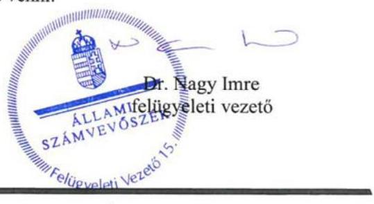

---

.

---

# RÖVIDÍTÉSEK JEGYZÉKE 

${ }^{1}$ ÁSZ
${ }^{2}$ ÁSZ tv.
${ }^{3}$ Önkormányzat
${ }^{4}$ Ötv.
${ }^{5}$ Mötv.
${ }^{6}$ Gazdasági program $_{1}$
${ }^{7}$ Gazdasági program $_{2}$
${ }^{8}$ Nvtv.
${ }^{9}$ Gt.
${ }^{10}$ Ptk.
${ }^{11}$ SZMSZ
${ }^{12}$ Vagyonrendelet
${ }^{13}$ Alapító okirat
${ }^{14}$ Közgyűlés
${ }^{15}$ Társaság
${ }^{16}$ polgármester
${ }^{17}$ Kktv.
${ }^{18}$ Ttv.
${ }^{19}$ Önkormányzat rendeletei
${ }^{20}$ FB
${ }^{21}$ Számv. tv.

Állami Számvevőszék
az Állami Számvevőszékről szóló 2011. évi LXVI. törvény
Nagykanizsa Megyei Jogú Város Önkormányzata
a helyi önkormányzatokról szóló 1990. évi LXV. törvény (hatálytalan: 2014. október 12-étől)
Magyarország helyi önkormányzatairól szóló 2011. évi CLXXXIX. törvény (hatályos: 2012. január 1-jétől)

Nagykanizsa Megyei Jogú Város Önkormányzata 2011-2014. évekre szóló gazdasági programja, amelyet a Közgyűlés a 85/2011. (III. 31.) számú határozatával fogadott el
Nagykanizsa Megyei Jogú Város Önkormányzata 2015-2019. évekre szóló gazdasági programja, amelyet a Közgyűlés a 77/2015. (IV. 30.) számú határozatával fogadott el
a nemzeti vagyonról szóló 2011. évi CXCVI. törvény (hatályos: 2012. január 1-jétől)
a gazdasági társaságokról szóló 2006. évi IV. törvény (hatálytalan: 2014. március 15-étől)
a Polgári Törvénykönyvről szóló 2013. évi V. törvény (hatályos: 2014. március 15-étől)
Nagykanizsa Megyei Jogú Város Önkormányzata Közgyűlésének 100/2011. (XII. 3) önkormányzati rendelete a szervezeti és működési szabályzatáról és annak módosításai (hatályos: 2012. január 1-jétől)
Nagykanizsa Megyei Jogú Város Önkormányzata Közgyűlésének 35/2010. (XI. 4) számú rendelete az önkormányzat vagyonáról, a vagyongazdálkodás és a vagyonhasznosítás szabályairól és annak módosításai
a Via Kanizsa Zrt. Alapító okirata/Alapszabálya és módosításai
Nagykanizsa Megyei Jogú Város Önkormányzatának Közgyűlése
VIA Kanizsa Városüzemeltető Nonprofit Zártkörűen Működő Részvénytársaság (rövidített elnevezése: Via Kanizsa Városüzemeltető Nonprofit Zrt.)
Nagykanizsa Megyei Jogú Város polgármestere
a közúti közlekedésről szóló 1988. évi I. törvény
a temetőkről és a temetkezésről szóló 1999. évi XLIII. törvény
Nagykanizsa Megyei Jogú Város Önkormányzatának 4/2001. (I. 31.) számú rendelete a köztemetőkről és a temetkezés rendjéről (hatályos: 2001. február 1-jétől), Nagykanizsa Megyei Jogú Város Önkormányzata Közgyűlésének 29/2005. (VI. 8.) önkormányzati rendelete a vásárokról és piacokról (hatályos: 2012. július 4-éig), Nagykanizsa Megyei Jogú Város Önkormányzata Közgyűlésének 36/2012. (VII. 4.) önkormányzati rendelete a vásárokról és piacokról (a Közgyűlés a 25/2014. (VIII. 8.) számú önkormányzati rendelettel módosította), Nagykanizsa Megyei Jogú Város Önkormányzata Közgyűlésének 20/2009. (V. 8.) önkormányzati rendelete a fizető parkolóhelyek működtetéséről és igénybevételéről (hatályos: 2012. december 31-ig), valamint Nagykanizsa Megyei Jogú Város Önkormányzata Közgyűlésének 64/2012. (XI. 30.) önkormányzati rendelete a fizető parkolóhelyek működtetéséről és igénybevételéről, amelyet a Közgyűlés az 5/2013. (II. 5.) önkormányzati rendeletével módosított (hatályos: 2013. január 1-jétől)
a Via Kanizsa Zrt. felügyelőbizottsága
a számvitelről szóló 2000. évi C. törvény

---

${ }^{22}$ jegyző
${ }^{23}$ számviteli politika
${ }^{24}$ társasági SZMSZ
${ }^{25}$ javadalmazási szabályzat
${ }^{26}$ leltározási szabályzat
${ }^{27}$ értékelési szabályzat
${ }^{28}$ önköltségszámítási szabályzat
${ }^{29}$ pénzkezelési szabályzat
${ }^{30}$ Taktv.
${ }^{31}$ Civil tv.
${ }^{32}$ Info. tv.
${ }^{33}$ Ebktv.

Nagykanizsa Megyei Jogú Város jegyzője
a Via Kanizsa Városüzemeltető Nonprofit Zrt. számviteli politikája (hatályos: 2009. április 2-ától)
a Via Kanizsa Városüzemeltető Nonprofit Zrt. szervezeti és működési szabályzata (hatályos: 2009. április 10-étől)
a Via Kanizsa Városüzemeltető Nonprofit Zrt. javadalmazási szabályzata (hatályos: 2010. június 20-ától)
a Via Kanizsa Városüzemeltető Nonprofit Zrt. szabályzata az eszközök és források leltározási és leltárkészítési rendjéről (hatályos: 2009. május 29-étől)
a Via Kanizsa Városüzemeltető Nonprofit Zrt. értékelési szabályzata (hatályos: 2009. április 2-ától)
a Via Kanizsa Városüzemeltető Nonprofit Zrt. önköltségszámítási szabályzata (hatályos: 2010. április 24-étől)
a Via Kanizsa Városüzemeltető Nonprofit Zrt. pénzkezelési szabályzata és módosításai (hatályos: 2009. április 2-ától)
a köztulajdonban álló gazdasági társaságok takarékosabb működéséről szóló 2009. évi CXXII. törvény
az egyesülési jogról, a közhasznú jogállásról, valamint a civil szervezetek működéséről és támogatásáról szóló 2011. évi CLXXV. törvény
2011. évi CXII. törvény az információs önrendelkezési jogról és az információszabadságról
az egyenlő bánásmódról és az esélyegyenlőség előmozdításáról szóló 2003. évi CXXV. törvény

---

ÁLLAMI SZÁMVEVŐSZÉK
1052 Budapest, Apáczai Csere János utca 10.
Levélcím: 1364 Budapest 4. Pf. 54
Telefon: +36 14849100 Telefax: +36 14849200
www.asz.hu
