# Jelentés 

## A központi alrendszer intézményei

A központi alrendszer egyes intézményei pénzügyi és vagyongazdálkodásának ellenőrzése - Magyar Nemzeti Múzeum 2017.

---

# Jelentés 

## A központi alrendszer intézményei

A központi alrendszer egyes
intézményei pénzügyi és
vagyongazdálkodásának ellenőrzése -
Magyar Nemzeti Múzeum
2017. 06. hó 15. nap
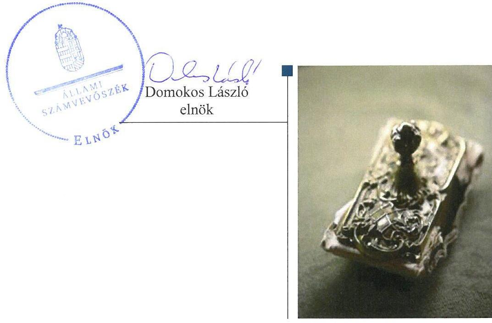

---

# AZ ELLENŐRZÉST FELÜGYELTE: 

MAKKAI MÁRIA felügyeleti vezető

## AZ ELLENŐRZÉST VEZETTE ÉS A VÉGREHAJTÁSÁÉRT FELELŐS:

DR. GYŐRI GABRIELLA ellenőrzésvezető

## A PROGRAM ÖSSZEÁLLÍTÁSÁÉRT FELELŐS:

JANIK JÓZSEF LÁSZLÓ osztályvezető

IKTATÓSZÁM: V-1231-144/2016
TÉMASZÁM: 2265
ELLENŐRZÉS-AZONOSÍTÓ SZÁM: V076009

---

# TARTALOMJEGYZÉK 

■ ÖSSZEGZÉS ..... 5
■ AZ ELLENŐRZÉS CÉLJA ..... 7
■ AZ ELLENŐRZÉS TERÜLETE ..... 8
■ AZ ELLENŐRZÉS HÁTTERE, INDOKOLTSÁGA ..... 10
■ A JELENTÉS LÉNYEGES KÉRDÉSKÖREI ..... 11
■ ELLENŐRZÉS HATÓKÖRE ÉS MÓDSZEREI ..... 12
■ MEGÁLLAPÍTÁSOK ..... 15
■ JAVASLATOK ..... 24
■ MELLÉKLETEK ..... 27
I. sz. melléklet: Értelmező szótár ..... 27
II. sz. melléklet: Az Integritás érvényesítése érdekében kialakított és működtetett kontrollrendszer ..... 30
■ FÜGGELÉK: ÉSZREVÉTELEK ..... 31
■ RÖVIDÍTÉSEK JEGYZÉKE ..... 41

---

.

---

# ÖSSZEGZÉS 

Az irányító szerv Magyar Nemzeti Múzeumra vonatkozó feladatellátása szabályszerű volt. A Múzeum belső kontrollrendszerének kialakítása és működtetése nem támogatta az átlátható és elszámoltatható közpénzfelhasználást. A pénzügyi gazdálkodás összességében szabályszerű volt. A vagyongazdálkodás nem volt szabályszerű, a vagyonkezelési szerződés hiányosságai miatt nem biztosította az elszámoltathatóságot és a vagyonvédelmet. A 2012-2015. évi beszámolók nem mutattak megbízható és valós képet a Magyar Nemzeti Múzeum vagyoni helyzetéről. A Múzeum nem építette ki a megfelelő védelmet a korrupciós veszélyekkel szemben. A közpénzfelhasználás eredményességét a gazdálkodás folyamatában mérhető célok nem támasztották alá.

## Az ellenőrzés társadalmi indokoltsága

A központi alrendszer részét képező múzeum alapvető rendeltetése a közfeladatok ellátásának biztosítása, ennek keretében a kulturális örökséghez tartozó javak védelme, őrzése és a nyilvánosság számára történő hozzáférhetővé tétele. A közpénzek felhasználásában meghatározó, központi alrendszerbe tartozó intézmények pénzügyi és vagyongazdálkodási tevékenységük és/vagy feladatellátásuk súlya miatt jelentős hatást gyakorolhatnak a költségvetés egyensúlyának fenntartására. Hatással vannak továbbá az állami vagyonnal való gazdálkodás minőségére, a kormányzati (szak)politikák végrehajtására, illetve közfeladat ellátásuk vonatkozásában az állampolgárok életminőségére, jogaik és kötelezettségeik gyakorlására. E szervezetekkel szemben társadalmi igény, hogy tevékenységükről a döntéshozók és a nyilvánosság felé elszámoljanak.

## Főbb megállapítások, következtetések, javaslatok

Az irányító szerv az ellenőrzött időszakban szabályszerűen gyakorolta az alapítói, az egyéb felügyeleti, ellenőrzési, valamint a munkáltatói jogosultságokat.

A belső kontrollrendszer kialakítása és működtetése az ellenőrzött időszakban nem támogatta az átlátható, elszámoltatható és ellenőrizhető közpénzfelhasználást. A Magyar Nemzeti Múzeum az ellenőrzött időszakban a közzétételi kötelezettségét hiányosan teljesítette, ezáltal nem biztosították a Múzeum működésének és gazdálkodásának átláthatóságát. A belső ellenőrzés kialakításáról, függetlenségéről a jogszabályi előírásoknak megfelelően gondoskodtak.

A Magyar Nemzeti Múzeum pénzügyi gazdálkodása összességében szabályszerű volt. Az elemi költségvetés készítése során betartották a jogszabályi előírásokat és a belső szabályzatokban foglaltakat. A bevételi és kiadási előirányzatok módosítása és átcsoportosítása megfelelt a jogszabályi előírásoknak. A Magyar Nemzeti Múzeum a beszámolási kötelezettségét a 2014. év kivételével határidőben teljesítette, azonban a beszámolók a leltározás és a vagyonkezelés hiányosságai miatt nem feleltek meg a jogszabályi előírásoknak.

A Magyar Nemzeti Múzeum vagyongazdálkodása nem volt szabályszerű. Vagyonkezelési szerződéssel nem rendezett vagyonelemeket is kimutattak a 2012-2015. évi mérlegekben. A szabálytalanul kimutatott állami vagyon értéke meghaladta a jelentős összegű hiba mértékét, ezáltal a 2012-2015. évi beszámolók nem mutattak megbízható és valós képet a Magyar Nemzeti Múzeum vagyoni helyzetéről. A 2012-2014. években, a könyvviteli mérlegben szereplő követelések és kötelezettségek szabályszerű leltározásáról nem gondoskodtak. A Magyar Nemzeti Múzeum az állagmegóvási kötelezettségeit a jogszabályok és a vagyonkezelési szerződés figyelembe vételével teljesítette. A vagyonelemek elidegenítése és hasznosítása szabályszerű volt.

Az ellenőrzött időszakban a Magyar Nemzeti Múzeumot érintő szervezeti átalakítások lebonyolítása összességében szabályszerű volt.

---

A Magyar Nemzeti Múzeumnál az integritási kontrollok kiépítettsége összességében alacsony volt.
A gazdálkodás folyamatában számszerűsített, mérhető célokat, célértékeket nem határoztak meg, emiatt azok teljesítése nem volt értékelhető.

---

# AZ ELLENŐRZÉS CÉLJA 

AZ ELLENŐRZÉS CÉLJA annak megítélése volt, hogy az ellenőrzött Múzeum ${ }^{1}$-ra vonatkozó irányító szervi feladatellátás a jogszabályi előírások betartásával történt-e; a Múzeumnál a belső kontrollrendszer kialakítása és működtetése szabályszerű volt-e; kialakították-e az erőforrásokkal való szabályszerű, gazdaságos, hatékony és eredményes gazdálkodás követelményeit; szabályszerű volt-e a beszámolási és adatszolgáltatási kötelezettségek teljesítése; a Múzeum pénzügyi és vagyongazdálkodása megfelelt-e a jogszabályi előírásoknak és belső szabályzatainak; a Múzeum átalakításának vagy átszervezésének lebonyolítása szabályszerűen történt-e.

Az ellenőrzés keretében értékeltük a Múzeum korrupciós kockázatainak kezelését szolgáló integritás kontrollok kiépítettségét és az integritás szemlélet érvényesülését.

A KIEGÉSZÍTŐ TELJESÍTMÉNY-ELLENŐRZÉSI MODUL célja annak értékelése volt, hogy a gazdálkodás folyamatában a gazdaságossági, hatékonysági és eredményességi célok kialakítása megtörtént-e, a célok elérése érdekében tettek-e intézkedéseket, a célkitűzéseket elérték-e; a szándékolt eredményeket elérték-e.

---

# **AZ ELLENŐRZÉS TERÜLETE**

## **Magyar Nemzeti Múzeum**

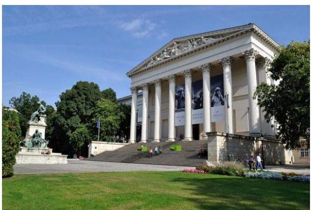

A Múzeum országos hatókörű, önállóan működő és gazdálkodó költségvetési szerv, amely a magyar történelem tárgyi emlékeit gyűjti össze és mutatja be, székhelye Budapesten található. A Múzeum alapítása 1802-ben történt, gróf Széchényi Ferenc nevéhez fűződött, létrehozásáról az 1808. évi VIII. törvénycikk rendelkezett.

Az ellenőrzött időszakban a Múzeum szakmai besorolása szerint országos múzeum volt, tevékenysége során átfogó, egy vagy több alaptudományra támaszkodó, szakterületén kiemelkedő jelentőségű, művelődéstörténeti, tudományos teljességre törekvő gyűjteményt gondozott; gyűjtőterülete az egész országra, illetve a magyarság története vonatkozásában – a nemzetközi egyezmények figyelembe vételével – a világ valamennyi országára kiterjedt. 2012–2014. között a Múzeum – a szervezeti egységeként működő –NÖK2 révén régészeti örökségvédelmi és műemlékvédelmi alapfeladatokat is ellátott. A Múzeum tevékenységét az Mtv. 3 és a Kult. tv.4 határozták meg, az alkalmazottak foglalkoztatására a Kjt.5 alapján került sor. Alaptevékenysége mellett a Múzeum vállalkozási tevékenységet nem folytatott. Irányító szerve 2012. május 13-ig a NEFMI6, azt követően az ellenőrzött időszak végéig az EMMI7 volt. A Múzeum pénzügyi, gazdálkodási feladatait saját szervezeti egysége útján, önállóan látta el. Az ellenőrzött időszakban a Múzeum főigazgatójának és gazdasági vezetőjének személye nem változott.

A Múzeumhoz 2012-ben három területi múzeum besorolású muzeális intézmény – Rákóczi Múzeum (Sárospatak), Mátyás Király Múzeum (Visegrád), Esztergomi Vármúzeum (Esztergom) –, továbbá két közérdekű muzeális kiállítóhely – Vértesszőlősi kiállítóhely (Vértesszőlős), Salamon torony (Visegrád) – tartozott.

2012. december 30-ával az 1543/2012. (XII. 4.) Korm. határozat8-ban döntöttek a megyei múzeumi szervezetek állami fenntartásban maradó tagintézményeiről. A döntés alapján további kettő területi múzeum besorolású muzeális intézmény, egy közérdekű muzeális gyűjtemény és három közérdekű muzeális kiállítóhely került a Múzeum szervezetébe. A Balassa Bálint Múzeum (Esztergom) az 1311/2012. (VIII. 23.) Korm. határozat9 alapján beolvadással megszűnt és 2013. január 1-jétől a Múzeum tagintézményeként működött tovább.

A 199/2014 (VIII. 1) Korm. rendelet10 alapján az 1513/2014. (IX. 16.) Korm. határozat11 és az 1643/2014. (XI. 14.) Korm. határozat12 rendelkezett a NÖK 2014. december 31. napjával történő megszüntetéséről. Ezt követően a NÖK által ellátott egyes feladatok a Forster Központ13 részére kerültek átadásra 2015. január 1-jétől.

Vésztő Város Önkormányzatával 2015. december végén született megállapodás Vésztő–Mágor Történelmi Emlékhely és Csolt Monostor középkori romkert működtetésére irányuló közfeladat átadásáról.

---

A Múzeum 2012-2015. évi működése során történt szervezeti változásokat az 1. táblázat szemlélteti:

1. táblázat

# A MÚZEUMOT ÉRINTŐ SZERVEZETI VÁLTOZÁSOK A 2012-2015. ÉVEKBEN 

| Szervezet | Mtv. szerinti beosztólása | Változás iránya | Elrendelő döntés |
| :--: | :--: | :--: | :--: |
| Széchenyi István Emlékkiállítás (Nagycenk) | közérdekű muzeális kiállítóhely | fenntartói jog átvétel | 1543/2012 (XII. 4) Korm. határozat |
| Vay Ádám Muzeális Gyűjtemény (Vaja) | közérdekű muzeális gyűjtemény | fenntartói jog átvétel | 1543/2012 (XII. 4) Korm. határozat |
| Báthori István Múzeum (Nyírbátor) | területi múzeum | fenntartói jog átvétel | 1543/2012 (XII. 4) Korm. határozat |
| Palóc Múzeum (Balassagyarmat) | területi múzeum | fenntartói jog átvétel | 1543/2012 (XII. 4) Korm. határozat |
| Villa Romana Baláca (Nemesvámos) | közérdekű muzeális kiállítóhely | fenntartói jog átvétel | 1543/2012 (XII. 4) Korm. határozat |
| Vésztő-Mágor Történelmi Emlékhely és Csolt Monostor (Vésztő) | közérdekű muzeális kiállítóhely | fenntartói jog átvétel | 1543/2012 (XII. 4) Korm. határozat |
| Balassa Bálint Múzeum (Esztergom) | területi múzeum | beolvadás | 1311/2012. (VIII. 23.) Korm. határozat |
| NÖK | - | megszűnés | 1513/2014 (IX. 16.) Korm. határozat és 1643/2014. (XI. 14.) Korm. határozat |
| MNM Széchenyi István Emlékkiállítása (Nagycenk) | közérdekű muzeális kiállítóhely | működtetés átadás | 1392/2014 (VII. 18.) Korm. határozat ${ }^{14}$ |
| Vésztő-Mágor Történelmi Emlékhely és Csolt Monostor (Vésztő) | közérdekű muzeális kiállítóhely | közfeladat átadás | megállapodás alapján |

A Múzeum 2012. évi költségvetési engedélyezett létszáma 441 fő volt, mely a 2015. évre 335 főre csökkent. A Múzeum teljesített bevételeinek és kiadásainak alakulását az 1. ábra mutatja be:

1. ábra
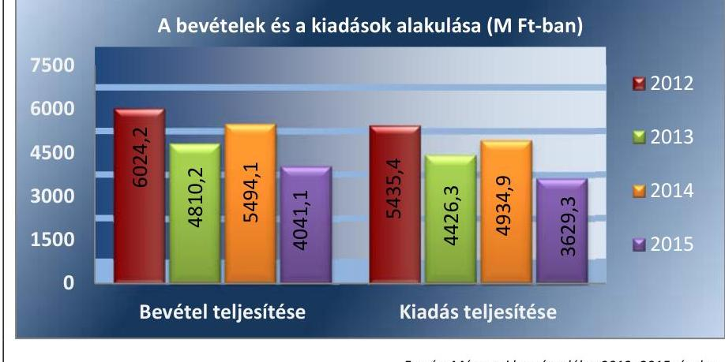

Forrás: Múzeumi beszámolók a 2012-2015. évekre

---

# AZ ELLENŐRZÉS HÁTTERE, INDOKOLTSÁGA 

A központi alrendszer egyes intézményei közfeladat-ellátásának változásait, a közfeladatok átadásából és átvételéből adódó módosításait, előirányzat-gazdálkodására ható tényezőit az Áht. ${ }^{15}$ 11. §-a és az Ávr. ${ }^{16}$ 14. §-a írja elő. A közfeladatok megszűnéséből, intézmény átszervezéséből, belső szerkezeti korszerűsítéséből, vagy más hasonló okból adódó módosításai miatt szerepeltetendő szerkezeti változásokat, valamint a szerkezeti változásként beépült közfeladatok szintre hozásként történő számításba vételét az Ávr. 15. § (2)-(3) bekezdése határozza meg.

AZ ELLENŐRZÉS EREDMÉNYEKÉPPEN nemcsak az ellenőrzött intézmények gazdálkodása javulhat, hanem átfogó képet kaphatunk a központi alrendszerbe tartozó költségvetési szervek gazdálkodásának hiányosságairól, de a jó gyakorlatokról is. Ellenőrzéseivel, javaslataival és megállapításaival az ÁSZ ${ }^{17}$ elősegítheti a költségvetési szervek pénzügyi és vagyongazdálkodása szabályozásának javítását és hozzájárulhat a jó kormányzáshoz. Az ellenőrzés az ellenőrzött számára visszajelzést ad a pénzügyi és vagyongazdálkodásában feltárt hiányosságokról, javaslataival hozzájárul azok kiküszöböléséhez, amely csökkentheti a későbbi ellenőrzések gyakoriságát. Az ellenőrzés megállapításait és javaslatait a rendezett gazdálkodási keretek kialakítása során más szervezetek is hasznosíthatják.

---

# A JELENTÉS LÉNYEGES KÉRDÉSKÖREI 

1. Az irányító szerv ellenőrzött Múzeumra vonatkozó feladatellátása szabályszerű volt-e?
2. A belső kontrollrendszer kialakítása és működtetése biztosította-e a közpénzekkel és a nemzeti vagyonnal történő szabályszerű, gazdaságos, hatékony és eredményes gazdálkodást, illetve a beszámolási és adatszolgáltatási kötelezettségek szabályszerű teljesítését?
3. A Múzeum pénzügyi gazdálkodása szabályszerű volt-e?
4. A Múzeum vagyongazdálkodása szabályszerű volt-e?
5. Szabályszerűen történt-e az ellenőrzött időszakban a Múzeumot érintő szervezeti, szerkezeti átalakítások lebonyolítása?
6. Érvényesült-e az integritás szemlélet és ennek megfelelően kiépítették-e az integritás kontrollrendszert a Múzeumnál?
7. Meghatároztak-e célokat a gazdálkodási folyamatok tekintetében és értékelték-e azok teljesülését?

---

# ELLENŐRZÉS HATÓKÖRE ÉS MÓDSZEREI 

## Az ellenőrzés típusa

Megfelelőségi és teljesítmény-ellenőrzés.

## Az ellenőrzött időszak

Az ellenőrzött időszak 2012. január 1-jétől 2015. december 31-ig tartott.

## Az ellenőrzés tárgya

Az ellenőrzött szervezetre vonatkozó irányító szervi feladatok ellátása. Az intézmény belső kontroll rendszerének kialakítása és működtetése. A pénzügyi és vagyongazdálkodás szabályszerűsége. Az intézmény beszámolási és adatszolgáltatási kötelezettségének teljesítése. Az intézmény átalakításának vagy átszervezésének lebonyolítása szabályszerűsége.

A

 teljesítmény-ellenőrzési kiegészítő modul esetében az intézmény gazdálkodási folyamatában a gazdaságossági, hatékonysági és eredményességi célok és célértékek kialakítása, a kapcsolódó intézkedések meghatározása, a célkitűzések elérésének értékelése.

Az ellenőrzés kiterjedt minden olyan körülményre és adatra, amely az ÁSZ jogszabályban meghatározott feladatainak teljesítéséhez, valamint a program végrehajtása folyamán felmerült újabb összefüggések feltárásához szükséges.

## Az ellenőrzött szervezet

A Magyar Nemzeti Múzeum és az irányító szervi feladatot 2012. január 1-je és 2012. május 13. között ellátó Nemzeti Erőforrás Minisztérium, továbbá az irányító szervi feladatot 2012. május 14-től ellátó Emberi Erőforrások Minisztériuma.

## Az ellenőrzés jogalapja

Az ellenőrzés jogszabályi alapját az ÁSZ tv. ${ }^{18} 1 . \S$ (3) bekezdés, 5. § (2)-(6) bekezdései, valamint Áht. 61. § (2) bekezdésének előírásai képezik.

---

# Az ellenőrzés módszerei 

Az ellenőrzést a szakmai program szempontjai, az ellenőrzött időszakban hatályos jogszabályok, az ellenőrzés szakmai szabályai, a jelen ellenőrzésre irányadó ÁSZ módszertanok figyelembevételével végeztük.

Az ellenőrzési kérdések megválaszolásához szükséges bizonyítékok megszerzése az ellenőrzött által rendelkezésre bocsátott dokumentumokra, adatokra alapozva megfigyelés, szemle (szemrevételezés), kérdésfeltevés (információkérés), mintavételezés, valamint elemző eljárás útján történt. Az ellenőrzési bizonyítékként felhasználható adatforrások közé tartoztak egyrészt a szakmai program részletes szempontjainál felsorolt adatforrások, másrészt minden egyéb - az ellenőrzés folyamán feltárt, az ellenőrzés szempontjából információt tartalmazó - dokumentum.

Az ellenőrzés lefolytatásához a Múzeum a tanúsítványok kitöltésével, valamint az ÁSZ által kért dokumentumok megküldésével szolgáltatott adatokat.

Az integritás szemlélet érvényesülésének értékelése a Múzeum önbevallás útján kitöltött tanúsítványa alapján, valamint az integritási kontrollok kiépítettségére vonatkozó ellenőrzési kérdésekre adott válaszok alapján történt.

Az ÁSZ a belső kontrollrendszer jogszabályi előírások szerinti kialakításának és működtetésének szabályszerűségét az erre irányuló ellenőrzési kérdésekre adott válaszok összesítése alapján, a lényegességi szempontok figyelembe vételével évente pillérenként (kontrollkörnyezet, kockázatkezelési rendszer, kontrolltevékenységek, információs és kommunikációs rendszer, monitoring rendszer) és összesítetten is minősítette. Az ÁSZ a pénzügyi gazdálkodás és a vagyongazdálkodás kialakításának és működtetésének szabályszerűségét az erre irányuló ellenőrzési kérdésekre adott válaszok összesítése alapján, a lényegességi szempontok figyelembe vételével évenkénti bontásban minősítette. „Szabályszerű"-nek értékelte az ellenőrzött területet, amennyiben a szabályozás, illetve végrehajtás során a jogszabályi követelményeket maradéktalanul, vagy kisebb hiányosságok mellett érvényesítették, „Nem szabályszerű"-nek értékelte, amennyiben a szabályozás hiányosságai nem biztosították a szabályszerű működés feltételeit, illetve a gazdálkodás folyamatában jelentkező hibák lényegesek, nagyszámúak, vagy rendszerszerűek voltak.

Mintavételi eljárás alapján ellenőrizte az ÁSZ a Múzeumnál a foglalkoztatottak személyi juttatásai és a külső személyi juttatások, a dologi és felhalmozási kiadások, a bevételek beszedése, a pénzgazdálkodáshoz kapcsolódó kontrolltevékenységek, az előírányzat módosítások szabályszerűségét. A minta alapján a sokaságban előforduló hibaarányt statisztikai becslés módszerével állapította meg. Az értékelés eredményeként kétféle, "Megfelelő" és "Nem megfelelő" minősítést alkalmazott. „Megfelelő"-nek értékelt egy ellenőrzött területet, amennyiben a hibaarány a teljes sokaságban 95%-os bizonyossággal legfeljebb 10% arányt képviselt. Abban az esetben, ha adott sokaság tekintetében a 10%-os hibaarány küszöbérték átlépése megítélésének megbízhatósága nem érte el a 95%-ot, annak elérése érdekében az értékelést lényegességi alapon további szempontokkal egészítette ki, és figyelembe vette a feltárt hibák értékét.

---

A teljesítmény-ellenőrzés során a számvevőszéki ellenőrzés szakmai szabályai szerint, a megfelelőségi ellenőrzést kiegészítve, a teljesítményellenőrzés módszerével, a vonatkozó nemzetközi standardok figyelembe vételével értékelte az ÁSZ, hogy a gazdálkodás folyamatában a gazdaságossági, hatékonysági és eredményességi célok kialakítása megtörtént-e, a célok elérése érdekében tettek-e intézkedéseket, a célkitűzéseket elérték-e; a szándékolt eredményeket elérték-e. Az ellenőrzés a gazdálkodási feladatokra terjedt ki, a szakmai feladatellátást nem értékelte.

A teljesítmény-ellenőrzési kiegészítő programmodulban megfogalmazott ellenőrzési cél megválaszolásához az alapprogram végrehajtása során megfogalmazott megállapításokat is figyelembe vette.

A jelentéstervezetben használt fogalmak magyarázatát az I. számú melléklet, az integritás szemlélet érvényesülésének értékelését a II. számú melléklet tartalmazza.

---

# 1. Az irányító szerv ellenőrzött Múzeumra vonatkozó feladatellátása szabályszerű volt-e? 

Összegző megállapítás Az irányító szerv ${ }^{19}$ Múzeumra vonatkozó feladatellátása szabályszerű volt.

AZ ALAPÍTÓI JOGOSULTSÁGOT az irányító szerv az Áht. előírásainak megfelelően szabályszerűen gyakorolta. Az alapító okirat ${ }_{1-8}{ }^{20}$ tartalma megfelelt az Ávr. előírásainak. Az alapító okiratok kiadásához és módosításához az államháztartásért felelős miniszter előzetes egyetértését beszerezték.

AZ EGYÉB IRÁNYÍTÁSI, FELÜGYELETI ÉS ELLENŐRZÉSI JOGOSULTSÁGAIT az irányító szerv az Áht.-ban és az Ávr.-ben előírtaknak megfelelően gyakorolta. Az SZMSZ ${ }_{1-3}$-at ${ }^{21}$ jóváhagyta. Az egyes tagintézmények törvényességi ellenőrzését a 3/2009. (II.18.) OKM rendelet ${ }^{22}$ alapján lefolytatott muzeológiai szakfelügyelet keretében elvégezte.

MUNKÁLTATÓI JOGOSULTSÁGAIT az irányító szerv az Áht.-ban, a Kjt.-ben és az Mtv.-ben meghatározottak szerint gyakorolta.
2. A belső kontrollrendszer kialakítása és működtetése biztosította-e a közpénzekkel és a nemzeti vagyonnal történő szabályszerű, gazdaságos, hatékony és eredményes gazdálkodást, illetve a beszámolási és adatszolgáltatási kötelezettségek szabályszerű teljesítését?

Összegző megállapítás
2.1. számú megállapítás

A belső kontrollrendszer kialakítása és működtetése az ellenőrzött időszakban összességében nem volt szabályszerű.

A kontrollkörnyezet kialakítása összességében szabályszerű volt.
A MÚZEUM MŰKÖDÉSÉNEK SZERVEZETI KERETEIT az ellenőrzött időszakban kialakították. A Múzeum rendelkezett a Számv. tv. ${ }^{23}$, az Áht., az Áhsz. ${ }^{24}$ és Áhsz. ${ }^{25}$, valamint az Ávr. és a Bkr. ${ }^{26}$ által előírt, a gazdálkodás és működés rendjét meghatározó belső szabályzatokkal. A humánerőforrás-kezelés működésének szabályait az ellenőrzött időszakban a Múzeum kialakította, a gazdasági szervezet vezetője rendelkezett az Ávr.-ben előírt végzettséggel, szakképesítéssel.

---

# A KONTROLLKÖRNYEZET kialakításában a szabályszerű értékelés mellett előfordultak hiányosságok. A számlarend ${ }_{2}{ }^{27}$ folyamatos karbantartásáról 2012-2015. között a Számv. tv. 161. § (4) bekezdésében foglaltak ellenére nem gondoskodtak, ezért az az időközben hatályba lépett Áhsz. ${ }_{2}$ előírásaival nem volt összhangban. A Bkr. 6. § (4) bekezdésében foglaltak ellenére nem szabályozták 2015. szeptember 24-től a szabálytalanságok kezelésének eljárásrendjét, mert az erre vonatkozó szabályozást hatályon kívül helyezték, de újat nem alkottak. A 2012-2015. években a Bkr. 6. § (1) bekezdés c) pontjában foglaltak ellenére nem alakítottak ki olyan kontrollkörnyezetet, melyben meghatározottak az etikai elvárások a szervezet minden szintjén.

## 2.2. számú megállapítás

## 2.3. számú megállapítás

## 2.4. számú megállapítás

A nem a jogszabályi előírásoknak megfelelően kialakított kockázatkezelési rendszert nem működtették.

A Múzeum a kockázatkezelési rendszer kialakításáról 2012. január 1-je és 2015. szeptember 23. között gondoskodott, azonban az nem felelt meg a Bkr. 2. § m) pontjában foglaltaknak, mert nem határozták meg a kockázatokkal kapcsolatos intézkedések teljesítése nyomon követési módját. A kockázatkezelési rendszer kialakításáról 2015. szeptember 24-től a Bkr. 3. § b) pontjának előírása ellenére a Múzeum nem gondoskodott, mert a kockázatkezelési szabályzatot ${ }^{28}$ hatályon kívül helyezték, de újat nem alkottak.

A Múzeumnál kialakított kockázatkezelési rendszert 2012. január 1. és 2015. szeptember 23. között a Bkr. 7. § (1)-(2) bekezdésében foglaltak ellenére nem működtették.

A kontrolltevékenység gyakorlása, működtetése - a 2014. év kivételével - megfelelt a jogszabályokban és a belső szabályzatokban foglaltaknak.

A gazdálkodási jogkörök gyakorlására jogosultak kijelölése/megbízása az ellenőrzött időszakban az Ávr. előírásai alapján szabályszerűen történt. A kontrolltevékenység működtetése - a gazdálkodási jogkörök gyakorlásával összefüggésben feltárt hibák miatt - a 2014. évben nem volt szabályszerű. A kontrolltevékenység 2012-2015. évi működtetése során feltárt hiányosságokat részletesen a 3.3. pont tartalmazza.

Az információs és kommunikációs folyamatok kialakítása és működtetése összességében nem felelt meg a jogszabályi előírásoknak.

A KÖZÉRDEKŰ ADATOK MEGISMERÉSÉRE irányuló igények teljesítésének rendjét rögzítő szabályzattal a Múzeum 2012-ben nem rendelkezett, ami ellentétes volt az Info tv. ${ }^{29}$ 30. § (6) bekezdésében foglaltakkal.

AZ ADATVÉDELMI SZABÁLYOZÁS 2012-ben nem volt megfelelő, mert az Info tv. 7. § (2)-(3) bekezdésének előírásai ellenére, nem alakították ki az adatok biztonságának, védelmének érvényre juttatásához szükséges eljárási szabályokat.

---

# Megállapítások 

A Múzeum iratkezelési szabályzata ${ }^{30}$ nem felelt meg az Ltv. ${ }^{31} 10 . \S$ (1) bekezdés a) pontjának, mert azt az illetékes közlevéltár egyetértése hiányában adták ki.

A KÖZZÉTÉTELI KÖTELEZETTSÉGET az ellenőrzött időszakban az Info tv. 37. § (1) bekezdésében foglaltak ellenére hiányosan teljesítették. A Múzeum nem tette közzé az általa kiírt pályázatok szakmai leírását, eredményeit és azok indokolását (Info tv. 1. melléklet II. 11. pont); továbbá nem tették közzé az Európai Unió támogatásával megvalósuló fejlesztésekre vonatkozó szerződéseket (Info tv. 1. melléklet III. 7. pont).
2.5. számú megállapítás

## A Múzeumnál a jogszabályi előírásoknak megfelelően alakították ki a szervezet tevékenységének, a célok megvalósításának folyamatos- és eseti nyomon követését biztosító rendszerét.

A Bkr. előírásainak megfelelően a Múzeum SZMSZ ${ }_{1-3}$-ban és teljesítményalapú éves munkatervekben kialakították a szakmai eredmények, feladatok célrendszerét és azok megvalósulását nyomon követték.

A BELSŐ ELLENŐRZÉS kialakításáról, függetlenségéről az Áht. és a Bkr. előírásainak megfelelően gondoskodtak. A belső ellenőrzés a 2012-2015. években elkészítette éves ellenőrzési tervét, amelyek tartalmazták a tervezést megalapozó kockázatelemzést. A Múzeum belső ellenőrzési vezetője az elvégzett belső ellenőrzésekről vezette a Bkr. előírásai szerinti nyilvántartást, nyomon követte a belső ellenőrzési jelentésekben tett megállapítások, javaslatok alapján készített intézkedési terveket és azok végrehajtását.

A KÜLSŐ ELLENŐRZÉSEKRŐL a Múzeumban az ellenőrzött időszakban a Bkr. előírásainak megfelelő nyilvántartást vezettek. Egy alkalommal, 2014-ben kellett a Főigazgatónak külső ellenőrzés megállapításai, javaslatai alapján intézkedési tervet készíteni, mely kötelezettségének, valamint az intézkedési tervben foglalt feladatok végrehajtására vonatkozó beszámolási kötelezettségnek határidőben eleget tett.
2.6. számú megállapítás

## A Múzeum kialakította a célok elérését szolgáló követelményeket és gondoskodott azok érvényesítéséről.

A rendelkezésre álló források gazdaságos, hatékony és eredményes felhasználásának követelményeit meghatározó belső szabályzatokkal (számviteli politika és kapcsolódó szabályzatok) a Múzeum az ellenőrzött időszakban rendelkezett.

---

# 3. A Múzeum pénzügyi gazdálkodása szabályszerű volt-e? 

## Összegző megállapítás

3.1. számú megállapítás
3.2. számú megállapítás

## KORMÁNYZATI, IRÁNYÍTÓ SZERVI ÉS SAJÁT HATÁSKÖRŰ ELŐIRÁNYZAT MÓDOSÍTÁSOK ALAKULÁSA (M FT)

| Évek | Kormányzati | Irányító
szervi | Saját hatáskörű |
| :--: | :--: | :--: | :--: |
| 2012. | $+49,4$ | $-25,9$ | $+2493,7$ |
| 2013. | $+169,0$ | $-29,5$ | $+1779,8$ |
| 2014. | $+528,8$ | $+1,1$ | $+1384,8$ |
| 2015. | $+139,2$ | $-32,2$ | $+1142,4$ |

A Múzeum pénzügyi gazdálkodása összességében szabályszerű volt.

Az elemi költségvetés megállapítása során betartották a jogszabályi előírásokat és a belső szabályzatokban foglaltakat.

A KÖLTSÉGVETÉSI TERVEZÉS előírásait az SZMSZ1-3, a számviteli politika ${ }_{1-4}{ }^{32}$ és a Gazdasági Igazgatóság ügyrendje ${ }_{1-4}{ }^{33}$ tartalmazták az Ávr.-nek megfelelően.

Az irányító szerv minden évben, körlevélben rögzítette az elemi költségvetés elkészítésének követelményeit. A Múzeum az Ávr.-ben és a körlevélben előírtak alapján elkészítette és megküldte az éves költségvetések tervezetét az irányító szerv részére. A bevételek és a kiadások tervezése során az előirányzatok összegét számításokkal alátámasztották.

A bevételi és kiadási előirányzatok módosítása és átcsoportosítása összességében megfelelt a jogszabályi előírásoknak.

AZ ELŐIRÁNYZATOK MÓDOSÍTÁSA és nyilvántartása összességében szabályszerű volt. Egy 2014. év végi, 60,0 M Ft összegű saját hatáskörben végrehajtott korrekció alátámasztó dokumentumai hiányoztak, ami ellentétes volt a Számv. tv. 165. § (1)-(2) bekezdésében - a bizonylati elvre vonatkozóan - előírtakkal. A további előirányzat módosítások
 alátámasztottsága összességében megfelelő volt.

Országgyűlési hatáskörben elrendelt előirányzat-módosítás az ellenőrzött időszakban nem volt. Kormányzati, irányító szervi és saját hatáskörű előirányzat-módosítások mindegyik ellenőrzött évben történtek, melyek adatait a 2. táblázat tartalmazza. Az ellenőrzött időszakban a Múzeum előirányzataiból szabályszerűen sor került átcsoportosításra több intézmény részére.

A bevételek beszedése és elszámolása az ellenőrzött időszakban megfelelt, a kiadási előirányzatok felhasználása - a 2014. év kivételével - megfelelt a jogszabályi előírásoknak.

A bevétel beszedése és elszámolása a Számv. tv., az Áhsz. 1, 2 és a belső szabályzatok előírásainak megfelelt. Az ingatlanok hasznosítása, területek, termek bérbeadása során a díjak belső szabályozás vagy - egyedi igények esetén - külön megállapodás alapján szabályosan kerültek megállapításra és kiszámlázásra. Nagyobb területek tartós bérbeadása szabályosan, a Vtv. ${ }^{34}$ előírásai szerint, ajánlati felhívás alapján történt.

A KIADÁSI ELŐIRÁNYZATOK teljesítésével összefüggő kifizetések során a gazdálkodási jogköröket - a 2014. év kivételével - megfelelően gyakorolták, azonban előfordultak hiányosságok. A 2014. évben teljesítésigazolásra az Ávr. 57. § (3) bekezdésében foglaltak ellenére nem került sor, továbbá nem biztosították az Ávr. 60. § (1) bekezdésében foglalt

---

összeférhetetlenségi szabályok érvényesülését. A 2012-2015. években kötött - régészeti, illetve múzeumpedagógiai tárgyú - megbízási szerződések az Ávr. 50. § (1) bekezdés a) pontjában előírt szakmai, műszaki teljesítés mennyiségi és minőségi jellemzőinek meghatározását nem tartalmazták.

A kötelezettségvállalásokról az ellenőrzött időszakban nyilvántartást vezettek, amely azonban nem tartalmazta a 2012-2013. években a kötelezettségvállalás éveinek és előirányzatok szerinti megoszlását, a kifizetési határidőket, a 2014-2015. években a kötelezettségvállalás éveinek szerinti megoszlását, a pénzügyi teljesítések dátumát. Emiatt a nyilvántartás nem felelt meg az Ávr. - 2012-2013. években hatályos - 56. § (1) bekezdésének, valamint a 2014-2015. években az Áhsz. 14. melléklet II./4. pont e) és g) pontjai előírásainak.

A 2012-2015. években a Kbt. ${ }^{35}$ hatálya alá tartozó beszerzéseknél a közbeszerzés tárgyának becsült értékét meghatározták, a lefolytatott eljárásokat dokumentálták, a szerződéseket a nyertes ajánlattevőkkel kötötték meg.

# 3.4. számú megállapítás 

A Múzeum a beszámolási kötelezettségét teljesítette. A beszámolók - a vagyongazdálkodás és a leltározás hiányosságai miatt - nem feleltek meg a jogszabályi előírásoknak.

## A MÚZEUM AZ ÉVES KÖLTSÉGVETÉSI BESZÁMOLÓIT - a 2014. évi beszámoló kivételével - az Áhsz. 1, 2-ben előírtaknak megfelelően határidőben készítette el. A 2014. évi beszámolót - az Áhsz. 2 32. § (1) bekezdésében és az Ávr. 160. §-ában rögzített - határidőn túl, 2015. május 23-án készítették el. A Múzeum a Kincstár felé teljesítette az időközi mérlegjelentés készítési kötelezettségét.

A főkönyvi könyvelés és az analitikus nyilvántartás adatai közötti egyezőség a Számv. tv. 165. § (4) bekezdésében foglaltaknak megfelelően csak 2015. évben volt biztosított. A leltározással és vagyongazdálkodással kapcsolatos hiányosságokat részletesen a 4.1.-4.2. pontok tartalmazzák.

### 3.5. számú megállapítás

Az előirányzat-maradvány megállapítása szabályszerű volt.

| 3. táblázat |  |  |
| :--: | :--: | :--: |
| A MARADVÁNY ÖSSZEGÉNEK ALAKULÁSA (M FT) |  |  |
| Évek | Összege | Kötelezettségvállalással terhelt |
| 2012. | 1079,6 | 1079,6 |
| 2013. | 651,2 | 651,2 |
| 2014. | 559,2 | 514,8 |
| 2015. | 411,8 | 411,8 |

A MARADVÁNY összegének alakulását a 3. táblázat tartalmazza. A jóváhagyott maradvány összege (a 2014. évi 44,4 M Ft összegű maradvány kivételével) kötelezettségvállalással terhelt volt. A Múzeum a tárgyévi előirányzat-maradvány megállapítása során a jogszabályi előírásokat betartotta. A tárgyévi maradványok irányító szerv általi jóváhagyása megtörtént. Az éves beszámolóban, a maradvány-kimutatásban, valamint a kapcsolódó főkönyvi számlákon kimutatott előirányzat-maradvány megegyezett, ami megfelelt az Áhsz. 1, 2 rendelkezéseinek.

---

# 4. A Múzeum vagyongazdálkodása szabályszerű volt-e? 

## Összegző megállapítás

### 4.1. számú megállapítás

## A Múzeum vagyongazdálkodása nem volt szabályszerű.

A vagyongazdálkodás feltételeinek kialakítása nem volt szabályszerű.

A MÚZEUM VAGYONKEZELŐI JOGVISZONYÁT az MNV Zrt.-vel ${ }^{36}$ kötött vagyonkezelési szerződés ${ }_{1,2}{ }^{37}$ deklarálta. A vagyonkezelési szerződés ${ }_{1,2}$ - a szerződésben foglalt vagyon tekintetében - az ellenőrzött időszakban a Vtvr. ${ }^{38}$ előírásainak megfelelően biztosította a tulajdonosi joggyakorlás és a vagyonkezelői feladatok szabályozott, átlátható végrehajtását és a vagyon használatának ellenőrzését.

A vagyonkezelési szerződés ${ }_{1,2}$ az ellenőrzött időszakban nem tartalmazta a 2012-2013. években átvett muzeális intézmények ingatlan vagyonát, ezért a Múzeum a Vtvr. 1. § (7) bekezdés ba) pontjában és bb) pont második fordulatában meghatározottak alapján az ingatlanok tekintetében nem volt vagyonkezelő. A múzeum annak ellenére, hogy az ingatlanok tekintetében nem volt vagyonkezelő, a mérlegben és a nyilvántartásokban az ingatlanokat vagyonkezelt eszközként mutatta ki, ami ellentétes volt a Számv. tv. 23. § (2) bekezdésében foglaltakkal.

A 2012-2015. évi mérlegekben szabálytalanul kimutatott állami vagyon értéke meghaladta - az Áhsz. 1 5. § 8. pontja, illetve az Áhsz. 2 1. § (1) bekezdés 3. pontja szerinti - jelentős összegű hiba mértékét. A 2012-2015. évi beszámolók a Számv. tv. 18. §-ában foglaltak ellenére nem mutattak a Múzeum vagyoni helyzetéről megbízható és valós képet.

Az adatszolgáltatási kötelezettséget - a vagyon nyilvántartásával kapcsolatban - a vagyonkezelési szerződés ${ }_{1,2}$-ben foglaltaknak megfelelően rendszeresen teljesítette a Múzeum az MNV Zrt. felé. A szakmai nyilvántartás vonatkozásában betartotta a 20/2002. (X. 4.) NKÖM rendelet ${ }^{39}$ előírását a kulturális javak nyilvántartásból törlésének engedélyeztetését illetően.
4.2. számú megállapítás

A 2012-2014. években nem megfelelően, a 2015. évben a jogszabályok előírásainak megfelelően történt a mérlegben kimutatott eszközök és források leltározása.

## A mérleget alátámasztó leltárt összeállították, azonban a 2012-2014. években nem felelt meg az Áhsz. 1 37. § (2)-(3) bekezdéseiben illetve az Áhsz. 2 22. § (1) bekezdésében, továbbá a leltározási szabályzat ${ }_{1}{ }^{40}$ III/3.2. és III/4.2. pontjában foglaltaknak, mert a követelések, kötelezettségek egyeztetéssel történő leltározását nem dokumentálták teljes körűen. A 2014. évi leltározás lebonyolításáról a leltározási szabályzat ${ }_{1}$ II/5. pontjában előírt kiértékelő jegyzőkönyv nem készült. A 2015. évi leltározást szabályszerűen végrehajtották, a kimutatásokkal való egyeztetést teljes körűen dokumentálták.

A mérlegben kimutatott eszközök bekerülési értékének megállapítása a vagyonkezelési szerződés ${ }_{1,2} 4.1$. pontban részletezett hiányosságai miatt nem felelt meg az Áhsz. 1 29/A § (1) bekezdésében, illetve az Áhsz. 2 15. § (2) bekezdésében foglaltaknak.

---

# 4.3. számú megállapítás 

A lejárt szállítói tartozásállomány miatt a közfeladatok végrehajtása nem került veszélybe. A lejárt tartozásállomány a fizetési határidőt követően, későbbi időpontban kiegyenlítésre került.

A Múzeum az eredményszemléletű számvitelre történő áttérés feladatait a 36/2013. (IX. 13.) NGM rendelet ${ }^{41}$ előírásai szerint végrehajtotta, azonban a rendező mérleg - a leltározás előzőekben kifejtett hiányosságai miatt - nem volt szabályszerű és a rendező mérleget a 36/2013. (IX. 13.) NGM rendelet 8. § (2) bekezdés a) pontjában foglalt határidőt követően készítették el.

A Múzeum értékmegőrzési, állagmegóvási kötelezettségeit a jogszabályok és a vagyonkezelési szerződés ${ }_{1,2}$ alapján teljesítette. A vagyonelemek elidegenítése és hasznosítása szabályszerű volt.

A Múzeum a rendelkezésre álló költségvetési kereteken belül teljesítette a vagyonkezelésbe vett vagyontárgyak állagának megóvását, karbantartását, működtetését és a kulturális javak védelmét.

Beruházás, felújítás vonatkozásában a Múzeum a vagyonkezelőre vonatkozó - a vagyonkezelési szerződés 4.3. pontjában foglalt - tájékoztatási kötelezettséget nem teljesítette. Ugyancsak elmaradt a vagyonkezelési szerződés 4.4. pontjában foglalt rendszeres, utólagos tájékoztatás a megvalósult értéket növelő beruházásokról, felújításokról. A vagyonkezelési szerződés 4.9. pontjának előírása szerint az ingatlan vagyon gyarapításához (adásvétel) kapcsolódóan a Múzeum intézkedett az engedélyeztetés érdekében.

A vagyonelemek hasznosítása, bérbeadása megfelelt az Nvtv., a Vtvr. és a vagyonkezelési szerződés ${ }_{1,2}$ rendelkezéseinek. Vagyon-elidegenítés ingatlant érintően nem történt, az ingóságok elidegenítése a hasznosítási és selejtezési szabályzat ${ }_{1-4}{ }^{42}$ szerint szabályszerűen történt. Vagyonkezelői jog és kötelezettség átruházása harmadik félre az ellenőrzött időszakban szakmai nyilvántartásban szereplő ingóságot érintett és szabályszerűen történt.

## 5. Szabályszerűen történt-e az ellenőrzött időszakban a Múzeumot érintő szervezeti, szerkezeti átalakítások lebonyolítása?

Összegző megállapítás

### 5.1. számú megállapítás

A Múzeumot érintő szervezeti változások lebonyolítása összességében szabályszerű volt.

Az irányító szerv átalakításhoz kapcsolódó alapítói, irányítói döntései szabályszerűek voltak.

Az Áht. 11. § (2) bekezdésében szerinti átalakításra egy esetben került sor. Az 1311/2012. (VIII. 23.) Korm. határozat alapján a Balassa Bálint Múzeum 2012. december 31-ével a Múzeumba való beolvadással megszűnt, 2013. január 1-jétől a Múzeum tagintézményeként működött tovább. A Balassa Bálint Múzeum átadás-átvételéről szóló megállapodást a Komárom-Esztergom Megyei Intézményfenntartó Központ és a Múzeum az irányító

---

szerv egyetértésével írták alá. A megállapodásban rendelkeztek a teljes vagyoni kör és a kulturális javak átadásáról. A szervezeti változás a Múzeum alapító okirat ${ }_{3}$-ában átvezetésre került, tartalmazta, hogy a Múzeum a megszűnt szervezet általános jogutódja.

Az ellenőrzött időszakban kormányhatározatok alapján - az Áht. 11. § szerinti átalakításnak nem minősülő - további szervezeti változások zajlottak, melyeket részletesen az „Ellenőrzés területe" fejezet tartalmaz. A szervezeti változásokkal összhangban az alapító okirat ${ }_{2,7-8}$ elkészült.

# 5.2. számú megállapítás 

A Múzeum a szervezeti változásához kapcsolódó feladatait határidőn túl végezte el.

Az 1543/2012. (XII. 4.) Korm. határozatban előírt határidőhöz (2012. december 15.) képest az átadás-átvételi megállapodások aláírására négy esetben (Széchenyi István Emlékkiállítás, Palóc Múzeum, Villa Romana Baláca, Vésztő-Mágor Történelmi Emlékhely és Csolt Monostor) határidőn túl, két esetben (Vay Ádám Muzeális Gyűjtemény, Báthori István Múzeum) határidőben került sor.

A Múzeum és a Forster Központ a 2015. január 1-jén bekövetkezett szervezeti változással összefüggésben - 10 hónappal később - 2015. október 8-án kötött átmeneti megállapodást. Ebben rögzítették az átadásra kerülő ingó vagyonelemeket és az ingatlanok, gépjárművek használatának rendjét.

A szervezeti változásokkal összefüggésben az SZMSZ 2, 3 módosítására az alapító okirat ${ }_{2,7}$-ben foglalt 60 napos határidőn túl került sor.

## 6. Érvényesült-e az integritás-szemlélet és ennek megfelelően kiépítették-e az integritás-kontrollrendszert a Múzeumnál?

Összegző megállapítás

A Múzeum erőfeszítéseket tett az integritás-szemlélet érvényesítésére, azonban az integritás-kontrollok kiépítettségi szintje nem volt egyensúlyban a korrupciós kockázatok szintjével.

A Múzeum 2015. évben részt vett az ÁSZ Integritás Projektjében ${ }^{43}$.
A Múzeum a jogszabályok által előírt szabályossági kontrollokat összességében kiépítette, azonban a korrupciós kockázatokkal szembeni védettséget növelő integritás-kontrollok kiépítettsége alacsony volt. Az ellenőrzés részletes megállapításait a jelentéstervezet II. számú - „Az Integritás érvényesítése érdekében kialakított és működtetett kontrollrendszer" című melléklete tartalmazza.

---

# 7. Meghatároztak-e célokat a gazdálkodási folyamatok tekintetében és értékelték-e azok teljesülését? 

Összegző megállapítás A gazdálkodási folyamatban számszerűsített, mérhető célokat, célértékeket nem határoztak meg, emiatt azok teljesítése nem volt értékelhető.

A Múzeum, illetve az irányító szerv nem határozott meg a gazdálkodási folyamatok tekintetében elérendő számszerűsíthető célokat, célértékeket és azokhoz kapcsolódó intézkedéseket. A célkitűzés hiányában azok teljesítése nem volt értékelhető.

---

# JAVASLATOK 

Az ÁSZ tv. 33. § (1) bekezdésében foglaltak értelmében az ellenőrzött szervezet vezetője köteles a jelentésben foglalt megállapításokhoz kapcsolódó intézkedési tervet összeállítani és azt a jelentés kézhezvételétől számított 30 napon
 belül az ÁSZ részére megküldeni. Amennyiben az ellenőrzött szervezet vezetője nem küldi meg határidőben az intézkedési tervet, vagy továbbra sem elfogadható intézkedési tervet küld, az Állami Számvevőszék elnöke az ÁSZ tv. 33. § (3) bekezdése a) és b) pontjaiban foglaltakat érvényesítheti.

## a Magyar Nemzeti Múzeum főigazgatójának

1. Intézkedjen a Számlarend módosításáról, hogy az teljes körűen feleljen meg az Ahsz2-ben előírtaknak.
(2.1. sz. megállapítás 2. bekezdés 2. mondata alapján)
2. Intézkedjen a Bkr.-ben előírtaknak megfelelően a szabálytalanságok kezelése eljárásrendjének szabályozásáról és az etikai elvárások meghatározásáról a szervezet minden szintjén.
(2.1. sz. megállapítás 2. bekezdés 3. és 4. mondatai alapján)
3. Intézkedjen a Bkr.-ben előírt integrált kockázatkezelési rendszer kialakításáról és működtetéséről.
(2.2. sz. megállapítás 1-2. bekezdései alapján)
4. Intézkedjen az Ltv.-ben foglaltak szerint az iratkezelési szabályzat illetékes közlevéltár egyetértésével történő kiadásáról.
(2.4 sz. megállapítás 3. bekezdése alapján)
5. Intézkedjen az Info tv. mellékletében előírtaknak megfelelően a közzétételi kötelezettség teljes körű teljesítéséről.
(2.4. sz. megállapítás 4. bekezdése alapján)
6. Intézkedjen, hogy a kötelezettségvállalásokról vezetett nyilvántartás teljes körűen feleljen meg az Ahsz.2 előírásainak.
(3.3. sz. megállapítás 3. bekezdése alapján)

---

7. Kezdeményezze az MNV Zrt.-nél a vagyonkezelési szerződés ${ }_{2}$ módosítását, hogy az egyértelműen meghatározza a Múzeum vagyonkezelésében lévő ingatlan vagyon körét és értékét. Továbbá intézkedjen, hogy a beszámoló a jogszabályi előírásoknak megfelelően megbízható és valós képet mutasson a Múzeum vagyoni helyzetéről.
(4.1. sz. megállapítás 2-3. bekezdései alapján)
8. Intézkedjen a vagyonkezelési szerződésben előírtaknak megfelelően a beruházás, felújítás vonatkozásában a tájékoztatási kötelezettség teljesítéséről, valamint a megvalósult értéket növelő beruházások és felújítások esetében a rendszeres és utólagos tájékoztatásról.
(4.3. sz. megállapítás 2. bekezdés 1-2. mondata alapján)
9. Intézkedjen a feltárt hiányosságok és szabálytalanságok tekintetében a felelősség tisztázása érdekében, és szükség szerint intézkedjen a felelősség érvényesítéséről.
(3.2. sz. megállapítás első bekezdése, a 3.3. sz. megállapítás 2. bekezdése, a 4.1. számú megállapítás 2-3. bekezdései alapján)

---

.

---

# MELLÉKLETEK 

- I. SZ. MELLÉKLET: ÉRTELMEZŐ SZÓTÁR
állami vagyon
állami vagyonnak minősül:
a) az állam tulajdonában lévő dolog, valamint a dolog módjára hasznosítható természeti erő,
b) az a) pont hatálya alá nem tartozó mindazon vagyon, amely vonatkozásában törvény az állam kizárólagos tulajdonjogát nevesíti,
c) az állam tulajdonában lévő tagsági jogviszonyt megtestesítő értékpapír, illetve az államot megillető egyéb társasági részesedés,
d) az államot megillető olyan immateriális, vagyoni értékkel rendelkező jogosultság, amelyet jogszabály vagyoni értékű jogként nevesít. (Forrás: Vtv. 1. § (2) bekezdése)
állami vagyon értékesítése
állami vagyon használója
állami vagyon használója
állami vagyon hasznosítása
állami vagyon hasznosítására kötött szerződés
állami vagyon kezelője /vagyonkezelő

ÁSZ Integritás Projekt

Állami vagyonnak minősül:
a) az állam tulajdonában lévő dolog, valamint a dolog módjára hasznosítható természeti erő,
b) az a) pont hatálya alá nem tartozó mindazon vagyon, amely vonatkozásában törvény az állam kizárólagos tulajdonjogát nevesíti,
c) az állam tulajdonában lévő tagsági jogviszonyt megtestesítő értékpapír, illetve az államot megillető egyéb társasági részesedés,
d) az államot megillető olyan immateriális, vagyoni értékkel rendelkező jogosultság, amelyet jogszabály vagyoni értékű jogként nevesít. (Forrás: Vtv. 1. § (2) bekezdése)
Állami vagyon tulajdonjogának bármely jogcímen történő, visszterhes átruházása. (Forrás: Vtvr. 1. § (7) bekezdés d) pontja)
Az a természetes vagy jogi személy, jogi személyiséggel nem rendelkező szervezet, aki, vagy amely törvény vagy szerződés alapján, bármely jogcímen (bérlet, haszonbérlet, használat stb.) állami vagyont birtokol, használ, szedi annak használt, hasznosít, ide nem értve a haszonélvezőt, a vagyonkezelőt és a tulajdonosi jogok gyakorlóját". (Forrás: Vtvr. 1. § (7) bekezdés a) pontja)
Az állami vagyont az MNV Zrt. maga kezeli, vagy szerződés - így különösen bérlet, haszonbérlet, megbízás - alapján központi költségvetési szervnek, természetes vagy jogi személynek, vagy jogi személyiséggel nem rendelkező gazdálkodó szervezetnek hasznosításra átengedi.
(Forrás: Vtv. 23. § (1) bekezdése, hatályos 2012. január 1-jétől)
Az állami vagyonnal a tulajdonosi joggyakorló maga gazdálkodik, vagy szerződés - így különösen bérlet, haszonbérlet, megbízás - alapján hasznosításra átengedi, illetőleg vagyonkezelésbe, haszonélvezetbe adja. (Forrás: Vtv. 23. § (1) bekezdése, hatályos 2013. június 28-ától)
Az állami vagyon hasznosítására kötött szerződések elsődleges célja az állami vagyon hatékony működtetése, állagának védelme, értékének megőrzése, illetve gyarapítása, az állami és közfeladatok ellátásának elősegítése. (Forrás: Vtv. 23. § (2) bekezdése)
Az állami vagyont az MNV Zrt. maga kezeli, vagy szerződés - így különösen bérlet, haszonbérlet, megbízás - alapján központi költségvetési szervnek, természetes vagy jogi személynek, vagy jogi személyiséggel nem rendelkező gazdálkodó szervezetnek hasznosításra átengedi." Az állami vagyonra vonatkozóan az MNV Zrt. kizárólag az Nvtv-ben meghatározott személyekkel köthet vagyonkezelési szerződést. (Forrás: Vtv. 27. § (1) bekezdése, hatályos 2012. január 1-jétől)
Az Állami Számvevőszék 2009-ben indította el a „Korrupciós kockázatok feltérképezése - Integritás alapú közigazgatási kultúra terjesztése" című, európai uniós forrásból megvalósított kiemelt projektjét (Integritás Projekt). Az Integritás Projekt célja, hogy felmérje a közszféra intézményei korrupciós kockázatoknak való kitettségét, illetőleg az azok mérséklésére hivatott kontrollok szintjét. Az Állami Számvevőszék a projekt révén az integritás szemlélet minél szélesebb körrel történő megismertetését, gyakorlatba ültetését kívánja elérni. Az integritás követelményeinek megfelelő szervezeti működést előnyben részesítő közigazgatási kultúra elterjesztését és a korrupció elleni fellépést az ÁSZ önmagára nézve is stratégiai jelentőségű célként fogalmazta meg. A projekt a felmérésben résztvevő intézmények számára helyzetükről

---

|  | egyfajta „tükörképet" mutat be, ami alapot teremt a jövőbeni pozitív irányú elmozduláshoz. (Forrás: a http://integritas.asz.hu honlapon közzétett, a 2013. évi Integritás felmérés eredményeiről készült összefoglaló tanulmány) |
| :--: | :--: |
| belső ellenőrzés | Független, tárgyilagos bizonyosságot adó és tanácsadó tevékenység, amelynek célja, hogy az ellenőrzött szervezet működését fejlessze és eredményességét növelje, az ellenőrzött szervezet céljai elérése érdekében rendszerszemléletű megközelítéssel és módszeresen értékeli, illetve fejleszti az ellenőrzött szervezet irányítási és belső kontrollrendszerének hatékonyságát. (Forrás: Bkr. 2. § b) pontja) |
| belső kontrollrendszer | A belső kontrollrendszer a kockázatok kezelése és tárgyilagos bizonyosság megszerzése érdekében kialakított folyamatrendszer, amely azt a célt szolgálja, hogy a működés és gazdálkodás során a tevékenységeket szabályszerűen, gazdaságosan, hatékonyan, eredményesen hajtsák végre, az elszámolási kötelezettségeket teljesítsék, megvédjék az erőforrásokat a veszteségektől, károktól és nem rendeltetésszerű használattól. (Forrás: Áht. 69. § (1) bekezdése) |
| belső kontrollrendszer területei | A kontrollkörnyezet, a kockázatkezelési rendszer, a kontrolltevékenységek, az információs és kommunikációs rendszer, valamint a nyomon követési (monitoring) rendszer. (Forrás: Bkr. 3. §-a) |
| felújítás | Az elhasználódott tárgyi eszköz eredeti állaga (kapacitása, pontossága) helyreállítását szolgáló időszakonként visszatérő olyan tevékenység, melynek során az eszköz élettartama megnövekszik, minősége, használata jelentősen javul, így a pótlólagos ráfordításból a jövőben gazdasági előnyök származnak. (Forrás: Számv. tv. 3. § (4) bekezdés 8. pontja) |
| hasznosítás | A nemzeti vagyon birtoklásának, használatának, hasznok szedése jogának bármely a tulajdonjog átruházását nem eredményező - jogcímen történő átengedése, ide nem értve a vagyonkezelésbe adást, valamint a haszonélvezeti jog alapítását. (Forrás: Nvtv. 3. § (1) bekezdés 4. pontja) |
| információs és kommunikációs rendszer | A költségvetési szerv vezetője által kialakított és működtetett olyan rendszer, mely biztosítja, hogy a megfelelő információk a megfelelő időben eljutnak az illetékes szervezethez, szervezeti egységhez, illetve személyhez. (Forrás: Bkr. 9. § (1) bekezdés) |
| integritás | Az integritás az elvek, értékek, cselekvések, módszerek, intézkedések konzisztenciáját jelenti, vagyis olyan magatartásmódot, amely meghatározott értékeknek megfelel. (Forrás: Nemzetgazdasági Minisztérium: Magyarországi államháztartási belső kontroll standardok Útmutató 1.6.1. pontja, 2012. december) |
| irányító szerv/felügyeleti szerv | A költségvetési szerv tekintetében az e törvényben meghatározott irányítási hatáskört gyakorló szerv. (Forrás: Áht. 1. § 9. pontja) |
| kincstári költségvetés | A központi költségvetésről szóló törvény elfogadását követően a fejezetet irányító szerv az államháztartás központi alrendszerébe tartozó költségvetési szerv és a fejezeti kezelésű előirányzat kiemelt előirányzatait, valamint az elkülönített állami pénzalapok és a társadalombiztosítás pénzügyi alapjai jogszabályi előírás szerinti bevételeit és kiadásait kincstári költségvetés kiadásával állapítja meg. (Forrás: Áht. 28. § (2) bekezdés) |
| kockázat | A kockázat annak a valószínűségét jelenti, hogy egy vagy több esemény vagy intézkedés nem kívánt módon befolyásolja a rendszer működését, céljainak megvalósulását. (Forrás: Javaslatok a korrupciós kockázatok kezelésére - Kockázatkezelési és ellenőrzési módszertan 35. oldal, ÁSZ) |
| kockázatkezelési rendszer | Olyan irányítási eszközök és módszerek összessége, melynek elemei a szervezeti célok elérését veszélyeztető tényezők (kockázatok) azonosítása, elemzése, csoportosítása, nyomon követése, valamint szükség esetén a kockázati kitettség mérséklése. (Forrás: Bkr. 2. § m) pontja) |
| kontrollkörnyezet | A költségvetési szerv vezetője által kialakított olyan elvek, eljárások, belső szabályzatok összessége, amelyben világos a szervezeti struktúra, egyértelműek a felelősségi, |

---

kontrolltevékenységek
kommunikáció
középirányító szerv
közfeladat
monitoring
monitoring-rendszer
tulajdonosi joggyakorló
vagyongazdálkodás
hatásköri viszonyok és feladatok, meghatározottak az etikai elvárások a szervezet minden szintjén, átlátható a humánerőforrás-kezelés. (Forrás: Bkr. 6. § (1) bekezdés)
A költségvetési szerv vezetője által a szervezeten belül kialakított (kontroll) tevékenységek, melyek biztosítják a kockázatok kezelését, hozzájárulnak a szervezet céljainak eléréséhez. (Forrás: Bkr. 8. § (1) bekezdés)
Az a tevékenység, melynek során információ továbbítása valósul meg. A kommunikációs folyamat résztvevői között tájékoztatás történik, mely során tényeket, ezek magyarázatát közlik.
A költségvetési szerv tekintetében törvény vagy kormányrendelet alapján meghatározott, átruházott irányítási hatásköröket gyakorló szerv. (Forrás: Áht. 9. § (4) bekezdés)
Jogszabályban meghatározott állami vagy önkormányzati feladat, amit az arra kötelezett közérdekből, a jogszabályban meghatározott követelményeknek és feltételeknek megfelelve végez, ideértve a lakosság közszolgáltatásokkal való ellátását, továbbá az állam nemzetközi szerződésekben vállalt kötelezettségeiből adódó közérdekű feladatokat, valamint e feladatok ellátásakor szükséges infrastruktúra biztosítását is. (Forrás: Nvtv. 3. § (1) bekezdés 7. pontja)
A monitoring általánosságban a különböző szintű szervezeti célok megvalósításának folyamatát kíséri figyelemmel, melynek során a releváns eseményekről és tevékenységekről (együtt: folyamatokról) rendszeres jelleggel, strukturált, döntéstámogató információkhoz jutnak a szervezet vezetői. (Forrás: NGM Útmutató a költségvetési szervek monitoring rendszeréhez 2011. november)
A költségvetési szerv vezetője köteles olyan monitoring rendszert működtetni, mely lehetővé teszi a szervezet tevékenységének, a célok megvalósításának nyomon követését. A költségvetési szerv monitoring rendszere az operatív tevékenységek keretében megvalósuló folyamatos és eseti nyomon követésből, valamint az operatív tevékenységektől függetlenül működő belső ellenőrzésből áll. (Forrás: Bkr. 10. §)
Aki a nemzeti vagyon felett az államot vagy a helyi önkormányzatot megillető tulajdonosi jogok és kötelezettségek összességének gyakorlására jogosult. (Forrás: Nvtv. 3. § (1) bekezdés 17. pontja)

A nemzeti vagyongazdálkodás feladata a nemzeti vagyon rendeltetésének megfelelő, az állam, az önkormányzat mindenkori teherbíró képességéhez igazodó, elsődlegesen a közfeladatok ellátásához és a mindenkori társadalmi szükségletek kielégítéséhez szükséges, egységes elveken alapuló, átlátható, hatékony és költségtakarékos működtetése, értékének megőrzése, állagának védelme, értéknövelő használata, hasznosítása, gyarapítása, továbbá az állam vagy a helyi önkormányzat feladatának ellátása szempontjából feleslegessé váló vagyontárgyak elidegenítése. (Forrás: Nvtv. 7. § (2) bekezdése)

---

A Múzeum intézkedett az integritás szemlélet érvényesítése érdekében, mivel - az ellenőrzést megelőzően - az integritás kérdőív kitöltésével részt vett a 2015. évre vonatkozó
 ÁSZ Integritás Projekt adatszolgáltatásában. A Múzeum saját helyzetértékelése alapján kitöltött és kiértékelt kérdőív alapján öt kockázati területen a kialakított kontrollokat értékeltük. Az integritás kontrollrendszer kiépítettségi szintje összességében alacsony volt, amelyet kockázati területenként az alábbi táblázat szemléltet:

# AZ INTEGRITÁS KONTROLLRENDSZERÉNEK ÉRTÉKELÉSE 

| Sorszám | Megnevezés | Értékelés   alacsony, közepes, magas |
| :--: | :--: | :--: |
| 1. | Összeférhetetlenség és etikai elvárások | alacsony |
| 2. | Humánerőforrás-gazdálkodás | közepes |
| 3. | Szervezet vagyonának megvédésére tett intézkedések | alacsony |
| 4. | A nemkívánatos dolgozói magatartással szembeni intézkedések és azok érvényesülése | alacsony |
| 5. | Az integritás erősítése, annak tudatosítása, valamint a kockázatelemzések alkalmazása | alacsony |
| Összesítő értékelés |  | alacsony |

Az összeférhetetlenség és etikai elvárások kontrollszintjének kiépítettségi szintje alacsony volt. Az összeférhetetlenség kérdését szabályozták. A Bkr. 6. § (1) bekezdés c) pontjának előírása ellenére a szervezet minden szintjére vonatkozóan nem határozták meg az etikai elvárásokat. A különféle ajándékok, meghívások, utazások elfogadásának feltételeit nem szabályozták.

A humánerőforrás-gazdálkodás kontrollszintjének kiépítettségi szintje közepes volt. A szervezet minden alkalmazottja rendelkezett munkaköri leírással. Az új munkatársak kiválasztása álláspályázat alapján történt, azonban az állásra jelentkezők által benyújtott dokumentumok hitelességének ellenőrzésére nem volt kiépített kontroll.

A szervezet vagyonának megvédésére tett intézkedések kontrolljának kiépítettségi szintje alacsony volt. A munkáltató tulajdonában levő gépkocsi és telefon magáncélú használatára vonatkozó szabályokat meghatározták. Rendelkeztek informatikai és adatvédelmi szabályozással, valamint a kötelezően közzéteendő adatok nyilvánosságra hozatalának rendjét is szabályozták. Rendelkeztek iratkezelési szabályzattal, azonban annak kiadásakor az Ltv. szabályai nem érvényesültek. A Múzeum nem alkalmazta a „négy szem elvét”.

A nemkívánatos dolgozói magatartással szembeni intézkedések és azok érvényesülésére tett intézkedések kontrollszintjének kiépítettsége alacsony volt, mert nem működtettek közérdekű bejelentéseket kezelő rendszert. Nem határozták meg a szervezeten belüli és szervezeten kívülről érkező közérdekű bejelentések kezelésének eljárásrendjét.

Az integritás erősítése, annak tudatosítása, valamint a kockázatelemzések alkalmazása területen a kontrollok kiépítettsége alacsony volt. A Múzeum nem rendelkezett nyilvánosan közzétett stratégiával, nem szervezett korrupcióellenes képzést az elmúlt három évben. Nem tudatosította az alkalmazottakban a szervezeti kultúra javításának, az integritás erősítésének, a korrupció elleni fellépésnek a fontosságát. A Múzeum a kockázatkezelési rendszert nem működtette.

---

# FÜGGELÉK: ÉSZREVÉTELEK 

A jelentéstervezetet a Számvevőszék 15 napos észrevételezésre megküldte az ellenőrzött szervezetek vezetőinek az ÁSZ tv. 29. § (1) bekezdése előírásának megfelelően.

Az ÁSZ a jelentéstervezetet észrevételezésre megküldte az Emberi Erőforrások Miniszterének és a Magyar Nemzeti Múzeum főigazgatójának.

Az Emberi Erőforrások Miniszterének és a Magyar Nemzeti Múzeum főigazgatójának észrevételét és az arra adott választ a függelék alább tartalmazza.

[^0]
[^0]:    * 29. § (1) Az Állami Számvevőszék az ellenőrzési megállapításait megküldi az ellenőrzött szervezet vezetőjének vagy az általa megbízott személynek, és annak, akinek személyes felelősségét állapította meg.
    (2) Az ellenőrzött szervezet vezetője és a felelősként megjelölt személy az ellenőrzés megállapításaira tizenöt napon belül írásban észrevételt tehet.
    (3) Az Állami Számvevőszék az észrevételre a beérkezésétől számított harminc napon belül írásban válaszol. A figyelembe nem vett észrevételeket köteles a jelentésben feltüntetni, és megindokolni, hogy azokat miért nem fogadta el.

---

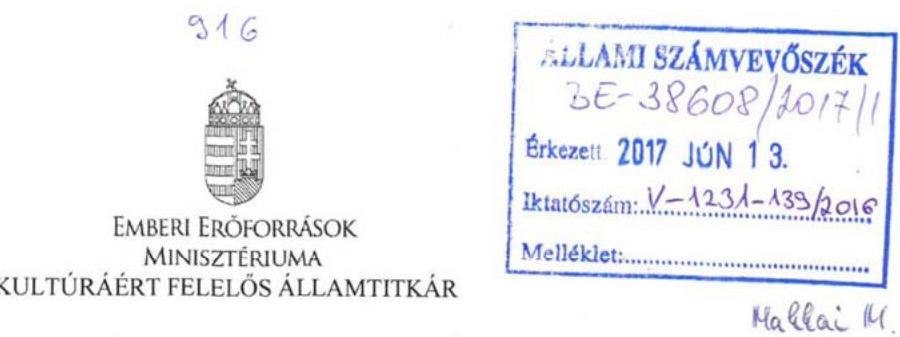

# Domokos László részére 

elnök

Állami Számvevőszék
Budapest
Apáczai Csere János u. 10.
1052

Tárgy: „A központi alrendszer egyes intézményei ellenőrzése - Magyar Nemzeti Múzeum" címmel készített számvevőszéki jelentéstervezet észrevételezése

Tisztelt Elnök Úr!
Köszönöm ,,A központi alrendszer egyes intézményei ellenőrzése - Magyar Nemzeti Múzeum" címmel készített számvevőszéki jelentéstervezet megküldését.

Az abban foglaltakkal kapcsolatban az alábbi - szakmai-pontosító jellegű - észrevételeket fogalmazom meg:

1. Javaslat: A jelentéstervezet 9. oldalán szereplő táblázatban a Szervezet oszlopban kérem javítani a „Széchenyi Kastély és emlékmúzeum, Széchenyi-mauzóleum, valamint a fertőrákosi Püspöki palota" elnevezést „MNM Széchenyi István Emlékmúzeuma (Nagycenk)" elnevezésre.
Indoklás: A Magyar Nemzeti Múzeum szervezetében az MNM Széchenyi István Emlékmúzeum működött, a fertőrákosi Püspöki palota soha nem képezte a Magyar Nemzeti Múzeum részét.
2. Javaslat: A jelentéstervezet 9. oldalán lévő táblázatban a Szervezet oszlopban az MNM Széchenyi István Emlékmúzeum elnevezésű tagintézmény esetében a szakmai besorolás tematikus múzeum, amit kérünk feltüntetni.
Indoklás: Az MNM Széchenyi István Emlékmúzeum muzeális intézmény, így - a táblázat egységes adattartalma érdekében - szükséges a szakmai besorolás feltüntetése.

---

3. Javaslat: A jelentéstervezet 9. oldalán lévő táblázatban a Szervezet oszlopban a Vésztő-Mágor Történelmi Emlékhely és Csolt Monostor (Vésztő) elnevezésű tagintézmény esetében a szakmai besorolás közérdekű muzeális kiállítóhely, amit kérünk feltüntetni. Indoklás: A Vésztő-Mágor Történelmi Emlékhely és Csolt Monostor muzeális intézmény, így - a táblázat egységes adattartalma érdekében - szükséges a szakmai besorolás feltüntetése.

A fentieken túlmenően további észrevételt nem fogalmazok meg.
Ezúton is köszönöm Elnök úr és munkatársai együttműködését, mellyel megkönnyítették az Emberi Erőforrások Minisztériuma vizsgálatban való részvételét.

Budapest, 2017. június „, „
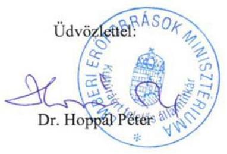

---

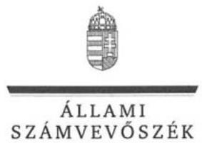

# Balog Zoltán úr 

miniszter

Emberi Erőforrások Minisztériuma

## Budapest

## Tisztelt Miniszter Úr!

„A központi alrendszer egyes intézményei ellenőrzése - Magyar Nemzeti Múzeum" címmel készített számvevőszéki jelentéstervezetre a kultúráért felelős Államtitkár Úr által a minisztérium nevében tett észrevételét köszönettel megkaptam.

Az Állami Számvevőszék észrevételre vonatkozó álláspontjáról a felügyeleti vezető által készített részletes tájékoztatást csatoltan megküldöm.

Tájékoztatom Miniszter urat, hogy a számvevőszéki jelentésben - az Állami Számvevőszékről szóló 2011. évi LXVI. törvény 29. § (3) bekezdése alapján - a figyelembe nem vett észrevételt szerepeltetjük az elutasítás indokának feltüntetésével.

Budapest, 2017. június
hó 16. nap

Tisztelettel:
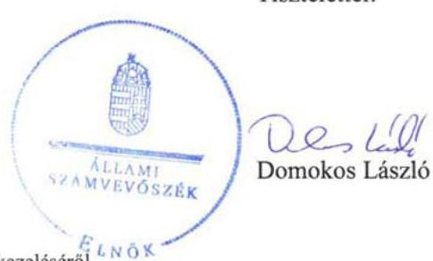

Melléklet: Tájékoztatás az észrevételek kezeléséről

---

# Tájékoztatás   az észrevételek kezeléséről 

„A központi alrendszer egyes intézményei ellenőrzése - Magyar Nemzeti Múzeum" címû jelentéstervezetre 2017. június 13-án érkezett észrevételét áttekintettük, annak kezelésével kapcsolatban a következő tájékoztatást adom.

A jelentéstervezet 9. oldalán található, „A múzeumot érintő szervezeti változások a 2012-2015. években" címû táblázathoz kapcsolódó észrevételekre adott válasz:
A dokumentumok ismételt áttekintését követően a táblázatot a Múzeum Alapító Okiratával összhangban pontosítottuk.

Budapest, 2017. június hó 16. nap

Makkai Mária
felügyeleti vezető

---

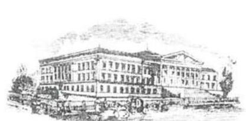

# MAGYAR NEMZETI MÚZEUM 

Ungarisches Nationalmuseum Hungarian National Museum

## Domokos László

elnök úr részére

Állami Számvevőszék
1052 Budapest
Apáczai Csere János utca 10.
Tárgy: jelentéstervezettel kapcsolatos észrevétel

Ikt.szám: 1747-013-5-7|17.60

## ÁLLAMI SZÁMVEVŐSZÉK   3E-37017/2017/1

Erkest: 2017 JÚNIUS 07.
Bindelezim: V-1124-1341206
Melléklet:

Budapest, 2017. június 2.

Tisztelt Elnök Úr!

Mindenekelőtt engedje meg, hogy a magam és az ellenőrzés során érintett kollégáim nevében megköszönjem Önnek azt az együttműködést, amit az ellenőrzés végrehajtása során az Állami Számvevőszék munkatársai tanúsítottak. Örömünkre szolgált, hogy tényleg zökkenőmentesen és hatékonyan tudott lezajlani az ellenőrzés.
„A központi alrendszer egyes intézményei ellenőrzése - Magyar Nemzeti Múzeum" címmel készített számvevőszéki jelentéstervezethez az alábbi észrevételeket tesszük:

Főbb megállapítások, következtetések, javaslatok (5. oldal)
4. bekezdéshez
megállapítás: „A Magyar Nemzeti Múzeum vagyongazdálkodása nem volt szabályszerű. Vagyonkezelési szerződéssel nem rendezett vagyonelemeket is kimutattak a 2012-2015. évi mérlegekben. A szabálytalanul kimutatott állami vagyon értéke meghaladta a jelentős összegű hiba mértékét, ezáltal a 2012-2015. évi beszámolók nem mutattak megbízható és valós képet a Magyar Nemzeti Múzeum vagyoni helyzetéről.”

A hivatkozott vagyonelemek kormányhatározat alapján kerültek a Magyar Nemzeti Múzeum (továbbiakban: Múzeum) által átvételre, átadás-átvételi megállapodások keretében. Ezen megállapodások tartalmazzák többek között az átadó részéről az eszköz- és vagyonleltárak dokumentumainak átadását, megnevezve azokban az eszközök bruttó és nettó értékét.
A megállapodások, illetve az átadó szervezetek analitikus nyilvántartásai alapján az átadó szervezet minden eszközét, követelését és kötelezettségét kivezette könyvviteli nyilvántartásaiból, ugyanakkor az átvevő Múzeum ezeket az eszközöket, követeléseket és kötelezettségeket könyveiben nyilvántartásba vette. Ezzel vált biztosítottá az állami vagyon teljes körű nyilvántartása.

A Múzeum irányító szerve által jóváhagyott, 2013. január 1-től hatályos alapító okiratában is szerepelnek telephelyként az említett vagyonelemek.

---

Az MNV Zrt. felé a Múzeum évente teljesítette a vagyonnyilvántartásával kapcsolatos adatszolgáltatási kötelezettségét (vagyonkataszter jelentés), amelyet az MNV Zrt. nem kifogásolt. Ez is alátámasztja azt, hogy a vagyonelemek nyilvántartásba vételével a Múzeum helyesen járt el. Itt kívánjuk megjegyezni, hogy a Múzeum és az MNV Zrt. közötti vagyonkezelési szerződés - minden szóban forgó ingatlan tekintetében - 2017-ben került megkötésre.

Mindezeket figyelembe véve kérjük a fenti megállapításból „A szabálytalanul kimutatott állami vagyon értéke meghaladta a jelentős összegű hiba mértékét, ezáltal a 2012-2015. évi beszámolók nem mutattak megbízható és valós képet a Magyar Nemzeti Múzeum vagyoni helyzetéről.” szövegrész törlését, hiszen ez olyan megállapítás, amely valótlan képet fest a Múzeum vagyongazdálkodásáról, a számviteli szabályok alkalmazásáról és könyvviteli nyilvántartásáról.

# 3.3. számú megállapítás A KIADÁSI ELŐIRÁNYZATOK (13. oldal) 

utolsó mondatához
„A 2014. évben teljesítésigazolásra ...nem került sor" szövegrészből az tűnik ki, mintha 2014-ben egyáltalán nem került volna sor a kiadások teljesítésigazolására. Kérjük ennek a mondatnak a pontosítását.

### 4.1. számú megállapítás (20. oldal)

2. bekezdéshez
megállapítás: „A Múzeum annak ellenére, hogy az ingatlanok tekintetében nem volt vagyonkezelő, a mérlegben és a nyilvántartásokban az ingatlanokat vagyonkezelt eszközként mutatta ki, ami ellentétes volt a Számv. tv. 23. § (2) bekezdésében foglaltakkal.”
és a 3. bekezdéshez
megállapítás: „A 2012-2015. évi mérlegekben szabálytalanul kimutatott állami vagyon értéke meghaladta - az Ahsz. 5. § 8. pontja, illetve az Ahsz. 1. § (1) bekezdés 3. pontja szerinti jelentős összegű hiba mértékét. A 2012-2015. évi beszámolók a Számv. tv. 18. §-ában foglaltak ellenére nem mutattak a Múzeum vagyoni helyzetéről megbízható és valós képet.”

Kérjük mindkét idézett megállapítás törlését a Főbb megállapítások, következtetések, javaslatok (5. oldal) 4. bekezdéshez írt észrevételünk, valamint az alábbi indokok alapján:

A megállapítás arra enged következtetni, hogy a Múzeum nem tartotta be a számviteli törvény előírásait. Azonban a Múzeum számviteli alapbizonylata a vagyonelemek nyilvántartásba vételéhez - az átadás-átvételi dokumentumok mellett - a megyei múzeumi szervezetek állami fenntartásban maradó tagintézményeiről szóló 1543/2012. (XII. 4.) Korm. határozat volt, amelyben az alábbiak kerültek megfogalmazásra:
„1. A Kormány
a) egyetért azzal, hogy a megyei önkormányzatok konszolidációjáról, a megyei önkormányzati intézmények és a Fővárosi Önkormányzat egyes egészségügyi intézményeinek átvételéről szóló 2011. évi CLIV. törvény alapján állami tulajdonba és fenntartásba került megyei múzeumi szervezetek tagintézményei közül 2012. december 30-tól - a feladat ellátásához rendelkezésre álló személyi, tárgyi, vagyoni és pénzügyi feltételek egyidejű átadásával -
2. a Széchenyi István Emlékkiállítás (Nagycenk), a Vay Ádám Muzeális Gyűjtemény (Vaja), a Báthori István Múzeum (Nyírbátor), a Palóc Múzeum (Balassagyarmat), Villa Romana Baláca -Római kori villagazdaság és romkert (Nemesvámos), valamint a Vésztő-Mágor Történelmi
Emlékhely és Csolt Monostor - Középkori Romkert (Vésztő) a Magyar Nemzeti Múzeum;

---

# szervezetében működjön tovább. 

b) felhívja az emberi erőforrások miniszterét és a közigazgatási és igazságügyi minisztert, valamint - a Honvédelmi Minisztérium Hadtörténeti Intézet és Múzeum tekintetében - a honvédelmi minisztert, hogy - az illetékes kormánymegbízottak bevonásával, a megyei intézményfenntartó központok útján, az érintett megyei múzeumi szervezetek közreműködésével - gondoskodjanak az átadáshoz szükséges eszközök és források leltározásáról, a személyi és szervezeti intézkedések megtételéről, valamint az a) pontban felsorolt tagintézményeknek a jogutód költségvetési szervek részére történő átadásához szükséges megállapodások megkötéséről;
d) felhívja a közigazgatási és igazságügyi

 minisztert, az emberi erőforrások miniszterét, valamint a honvédelmi minisztert, hogy az a) pontban foglaltak végrehajtása érdekében az érintett költségvetési szervek alapító okiratának módosítását 2012. december 30-i hatálybalépéssel készítsék elő, és gondoskodjanak azoknak a Magyar Államkincstárhoz történő benyújtásáról.

A Magyar Nemzeti Múzeum a vagyonelemek nyilvántartásba vételével - a nemzeti vagyon teljes körű nyilvántartása érdekében - a rendelkezésére álló dokumentumok alapján kellő gondossággal járt el, a vagyonelemeket csak a vagyonkezelt eszközök között tudta nyilvántartásba venni.

## 5.2. számú megállapítás (22. oldal)

2. bekezdéshez

A Múzeum és a Forster Központ közötti megállapodásra vonatkozó megállapítás fedi a valóságot, azonban ezt a megállapítást kérjük a következő mondattal kiegészíteni:
„Az átmeneti megállapodás a Múzeum kezdeményezésére született annak érdekében, hogy a végleges megállapodás aláírásáig a felek rögzítsék az ingatlan- és ingóvagyon tényleges használatának részleteit, valamint rendezzék az átmeneti időre szóló, elszámolási kötelezettséggel járó kérdéseket."

Tisztelettel és köszönettel:

Varga Benedek főigazgató
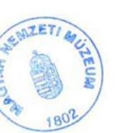

Zsurki Attila gazdasági igazgató

---

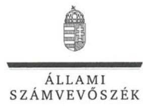

# Varga Benedek úr 

főigazgató
Magyar Nemzeti Múzeum

## Budapest

## Tisztelt Főigazgató Úr!

„A központi alrendszer egyes intézményei ellenőrzése - Magyar Nemzeti Múzeum" címmel készített számvevőszéki jelentéstervezetre tett észrevételeit köszönettel megkaptam.

Az Állami Számvevőszék észrevételekre vonatkozó álláspontjáról a felügyeleti vezető által készített részletes tájékoztatást csatoltan megküldöm.

Tájékoztatom Főigazgató urat, hogy a számvevőszéki jelentésben - az Állami Számvevőszékről szóló 2011. évi LXVI. törvény 29. § (3) bekezdése alapján - a figyelembe nem vett észrevételeket szerepeltetjük, annak indoklásával, hogy azokat az Állami Számvevőszék miért nem fogadta el.

Budapest, 2017. június hó 26. nap

Tisztelettel:
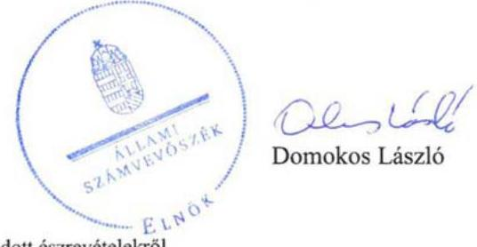

Melléklet: Tájékoztatás az el nem fogadott észrevételekről

---

# Tájékoztatás   az el nem fogadott észrevételekről 

„A központi alrendszer egyes intézményei ellenőrzése - Magyar Nemzeti Múzeum" címû jelentéstervezetre 2017. június 7-én érkezett észrevételeit áttekintettük, azok kezelésével kapcsolatban a következő tájékoztatást adom.

1. A Főbb megállapítások, következtetések, javaslatok 5. oldal 4. bekezdéséhez és a 4.1. számú megállapítás 2. bekezdéséhez, a vagyonkezelt vagyon számviteli nyilvántartásokban történő bemutatására vonatkozó megállapításokhoz kapcsolódó észrevételre adott válasz:
Az Állami Számvevőszék kiemelten fontosnak tartja a nemzeti vagyon kezeléséhez, az abból eredő jogszabályi kötelezettségekhez kapcsolódó szerződéses viszony rendezettségét, valamint a nemzeti vagyon teljes körű, szabályszerű nyilvántartását. A Számv. tv. 23. § (2) bekezdése szerint a vagyonkezelőnél a mérlegben eszközként kell kimutatni a kezelésbe vett, az állami vagy önkormányzati vagyon részét képező eszközöket is. Az állami vagyonnal való gazdálkodásról szóló 254/2007. (X. 4.) Korm. rendelet 1. § (7) bekezdése szerint vagyonkezelő az a személy, akivel a Magyar Nemzeti Vagyonkezelő Zrt. vagyonkezelési szerződést kötött. A Múzeum az ingatlanok tekintetében vagyonkezelési szerződéssel nem rendelkezett, tehát nem volt vagyonkezelő. A fentiek alapján a jelentéstervezet módosítása nem indokolt.
2. A jelentéstervezet 3.3. számú, a teljesítésigazolás elmaradásának kifogásolására vonatkozó megállapításra tett észrevételre adott válasz:
A kiadások ellenőrzése „Az ellenőrzés módszerei" fejezetben leírtakkal összhangban mintavételi eljárással történt. A mintatételek ellenőrzése és a statisztikai kiértékelés eredménye alapján állapította meg az ellenőrzés, hogy teljesítésigazolásra a 2014. évben nem került sor a Múzeumnál. A fentiek alapján a megállapítás módosítása nem indokolt.
3. A jelentéstervezet 5.2. számú megállapítás 2. bekezdésében szereplő, a Múzeum és a Forster Központ között létrejött átmeneti megállapodással kapcsolatban tett észrevételre adott válasz:
A Múzeum és a Forster Központ között létrejött átmeneti megállapodással összefüggésben adott kiegészítésüket köszönjük, az abban leírtak nem cáfolják a jelentéstervezet megállapítását, ezért a megállapítás módosítása nem szükséges.

Budapest, 2017. június hó 26. nap

Makkai Mária
felügyeleti vezető

---

# RÖVIDÍTÉSEK JEGYZÉKE 

${ }^{1}$ Múzeum
${ }^{2}$ NÖK
${ }^{3}$ Mtv.
${ }^{4}$ Kult. tv.
${ }^{5}$ Kjt.
${ }^{6}$ NEFMI
${ }^{7}$ EMMI
${ }^{8}$ 1543/2012. (XII. 4.) Korm. határozat
${ }^{9}$ 1311/2012. (VIII. 23.) Korm. határozat
${ }^{10}$ 199/2014. (VIII. 1.) Korm. rendelet
${ }^{11}$ 1513/2014. (IX. 16.) Korm. határozat
${ }^{12}$ 1643/2014. (XI. 14.) Korm. határozat
${ }^{13}$ Forster Központ
${ }^{14}$ 1392/2014. (VII. 18.) Korm. határozat
${ }^{15}$ Áht.
${ }^{16}$ Ávr.
${ }^{17}$ ÁSZ
${ }^{18}$ ÁsZ tv.
${ }^{19}$ irányító szerv
${ }^{20}$ alapító okirat ${ }_{1}$
alapító okirat ${ }_{2}$
alapító okirat ${ }_{3}$

Magyar Nemzeti Múzeum
Nemzeti Örökségvédelmi Központ (megszűnt 2014. december 31. napjával)
1997. évi CXL. törvény a muzeális intézményekről, a nyilvános könyvtári ellátásról és a közművelődésről (hatályos: 1998. január 1-jétől)
2001. évi LXIV. törvény a kulturális örökség védelméről (hatályos: 2001. október 10-től)
1992. évi XXXIII. törvény a közalkalmazottak jogállásáról (hatályos: 1992. július 1-jétől)
Nemzeti Erőforrás Minisztérium
Emberi Erőforrások Minisztériuma
1543/2012. (XII. 4.) Korm. határozat a megyei múzeumi szervezetek állami fenntartásban maradó tagintézményeiről
1311/2012. (VIII. 23.) Korm. határozat a megyei múzeumok, könyvtárak és közművelődési intézmények fenntartásáról
199/2014. (VIII. 1.) Korm. rendelet a Forster Gyula Nemzeti Örökségvédelmi és Vagyongazdálkodási Központról (hatályos: 2014. augusztus 6-tól 2017. január 1-jéig)
1513/2014. (IX. 16.) Korm. határozat a Magyar Nemzeti Múzeum Nemzeti Örökségvédelmi Központja által ellátott egyes feladatoknak a Forster Gyula Nemzeti Örökségvédelmi és Vagyongazdálkodási Központ részére történő átadásáról
1643/2014. (XI. 14.) Korm. határozat a Magyar Nemzeti Múzeum Nemzeti Örökségvédelmi Központja által ellátott egyes feladatoknak a Forster Gyula Nemzeti Örökségvédelmi és Vagyongazdálkodási Központ részére történő átadásáról szóló 1513/2014. (IX. 16.) Korm. határozat végrehajtásának feltételeiről
Forster Gyula Nemzeti Örökségvédelmi és Vagyongazdálkodási Központ
1392/2014. (VII. 18.) Korm. határozat a nagycenki Széchenyi Kastély és emlékmúzeum, a Széchenyi-mauzóleum, valamint a fertőrákosi Püspöki palota működtetésének és vagyonkezelői jogának az Eszterháza Kulturális, Kutató- és Fesztiválközpont részére történő átadásáról
2011. évi CXCV. törvény az államháztartásról (hatályos: 2012. január 1-jétől)
368/2011. (XII. 31.) Korm. rendelet az államháztartásról szóló törvény végrehajtásáról (hatályos: 2012. január 1-jétől)
Állami Számvevőszék
2011. évi LXVI. törvény az Állami Számvevőszékről (hatályos: 2011. július 1-jétől)

Nemzeti Erőforrás Minisztérium 2012. május 13-ig, azt követően az Emberi Erőforrások Minisztériuma
Magyar Nemzeti Múzeum OK-6853-19/2010. számú alapító okirata (hatályos: 2010. november 2-től 2012. december 29-ig)

Magyar Nemzeti Múzeum 57004/2012. számú alapító okirata (hatályos: 2012. december 30-tól 2013. január 1-ig)

Magyar Nemzeti Múzeum 57008/2012. számú alapító okirata (hatályos: 2013. január 1-jétől 2013. december 31-ig)

---

alapító okirat ${ }_{4}$
alapító okirat ${ }_{5}$
alapító okirat ${ }_{6}$
alapító okirat ${ }_{7}$
alapító okirat ${ }_{8}$
${ }^{21}$ SZMSZ $_{1}$

SZMSZ $_{2}$

SZMSZ $_{3}$
${ }^{22}$ 3/2009. (II. 18.) OKM rendelet
${ }^{23}$ Számv. tv.
${ }^{24}$ Áhsz. $_{1}$
${ }^{25}$ Áhsz. $_{2}$
${ }^{26}$ Bkr.
${ }^{27}$ számlarend $_{1}$
számlarend $_{2}$
${ }^{28}$ kockázatkezelési szabályzat
${ }^{29}$ Info tv.
${ }^{30}$ iratkezelési szabályzat
${ }^{31}$ Ltv.
${ }^{32}$ számviteli politika $_{1}$
számviteli politika $_{2}$
számviteli politika $_{3}$
számviteli politika $_{4}$
${ }^{33}$ Gazdasági Igazgatóság ügyrendje $_{1}$

Gazdasági Igazgatóság ügyrendje $_{2}$

Magyar Nemzeti Múzeum 2013. december 21-én kelt 56665/2013. számú alapító okirata (nem lépett hatályba)

Magyar Nemzeti Múzeum 13420/2014. számú alapító okirata (hatályos: 2014. január 1-jétől 2014. március 13-ig)

Magyar Nemzeti Múzeum 12895/2014. számú alapító okirata (hatályos: 2014. március 14-étől 2014. december 30-ig)

Magyar Nemzeti Múzeum 43412-6/2014. számú alapító okirata (hatályos: 2014. december 31-től 2014. december 31-ig)

Magyar Nemzeti Múzeum 57409/2014. számú alapító okirata (hatályos: 2015. január 1-jétől 2015. december 31-éig)

Magyar Nemzeti Múzeum Szervezeti és Működési Szabályzata (hatályos: 2011. április 18-tól 2014. április 9-ig)

Magyar Nemzeti Múzeum Szervezeti és Működési Szabályzata (hatályos: 2014. április 10-től 2015. szeptember 23-ig)

Magyar Nemzeti Múzeum Szervezeti és Működési Szabályzata (hatályos: 2015. szeptember 24-től)
3/2009. (II. 18.) OKM rendelet a muzeális intézmények szakfelügyeletéről (hatályos: 2009. február 26-tól)
2000. évi C. törvény a számvitelről (hatályos: 2001. január 1-jétől)

249/2000. (XII. 24.) Korm. rendelet az államháztartás szervezetei beszámolási és könyvvezetési kötelezettségének sajátosságairól (hatályos: 2001. január 1-jétől 2013. december 31-ig)
4/2013. (I. 11.) Korm. rendelet az államháztartás számviteléről (hatályos: 2014. január 1-jétől)
370/2011. (XII. 31.) Korm. rendelet a költségvetési szervek belső kontrollrendszeréről és belső ellenőrzéséről (hatályos: 2012. január 1-jétől)
A Magyar Nemzeti Múzeum Számlarendje (hatályos: 2011. március 31-től 2012. március 29-ig)
A Magyar Nemzeti Múzeum Számlarendje (hatályos: 2012. március 30-tól)
Kockázatkezelési szabályzat (Magyar Nemzeti Múzeum Szervezeti és Működési Szabályzata 9. melléklet hatályos: 2011. március 31-től 2015. szeptember 23-ig) 2011. évi CXII. törvény az információs önrendelkezési jogról és az információszabadságról (hatályos: 2011. július 27-től)
A Magyar Nemzeti Múzeum Iratkezelési szabályzata (hatályos: 2006. július 1-jétől) 1995. évi LXVI. törvény a köziratokról, a közlevéltárakról és a magánlevéltári anyag védelméről (hatályos: 1996. január 1-jétől)
Magyar Nemzeti Múzeum Számviteli politikája (hatályos: 2011. március 31-től 2012. március 29-ig)

Magyar Nemzeti Múzeum Számviteli politikája (hatályos: 2012. március 30-tól 2014. június 15-ig)

Magyar Nemzeti Múzeum Számviteli politikája (hatályos: 2014. június 16-tól 2015. december 7-ig)
Magyar Nemzeti Múzeum Számviteli politikája (hatályos: 2015. december 8-tól)
Gazdasági Igazgatóság ügyrendje (hatályos: 2011. március 31-től 2012. március 29-ig)
Gazdasági Igazgatóság ügyrendje (hatályos: 2012. március 30-tól 2014. május 29-ig)

---

Gazdasági Igazgatóság ügyrendje ${ }_{3}$

Gazdasági Igazgatóság ügyrendje ${ }_{4}$
${ }^{34}$ Vtv.
${ }^{35}$ Kbt.
${ }^{36}$ MNV Zrt.
${ }^{37}$ vagyonkezelési szerződés ${ }_{1}$
vagyonkezelési szerződés ${ }_{2}$
${ }^{38}$ Vtvr.
${ }^{39}$ 20/2002. (X. 4.) NKÖM rendelet
${ }^{40}$ leltározási szabályzat ${ }_{1}$
leltározási szabályzat ${ }_{2}$
${ }^{41}$ 36/2013. (IX. 13.) NGM rendelet
${ }^{42}$ hasznosítási és selejtezési szabályzat ${ }_{1}$
hasznosítási és selejtezési szabályzat ${ }_{2}$
hasznosítási és selejtezési szabályzat ${ }_{3}$
hasznosítási és selejtezési szabályzat ${ }_{4}$
${ }^{43}$ ÁSZ Integritás Projekt

Gazdasági Igazgatóság ügyrendje (hatályos: 2014. május 30-tól 2015. március 25-ig)
Gazdasági Igazgatóság ügyrendje (hatályos: 2015. március 26-tól)
2007. évi CVI. törvény az állami vagyonról (hatályos: 2007. szeptember 25-től)
2011. évi CVIII. törvény a közbeszerzésekről (hatályos: 2012. január 1-jétől)

Magyar Nemzeti Vagyonkezelő Zrt.
Kincstári Vagyoni Igazgatósággal kötött vagyonkezelési szerződés (hatályos 2000. június 5-től 2013. december 11-ig)
Az Magyar Nemzeti Vagyonkezelő Zrt.-vel kötött vagyonkezelési szerződés (hatályos: 2013. december 12-től); a SEUSO kincsek vagyonkezelésbe adásáról szóló szerződéssel módosítva 2015. május 22-én
254/2007. (X. 4.) Korm. rendelet az állami vagyonnal való gazdálkodásról (hatályos: 2007. október 4-től)
20/2002. (X. 4.) NKÖM rendelet a muzeális intézmények nyilvántartási szabályzatáról (hatályos: 2003. január 1-jétől)
Az eszközök és források leltározási és leltárkészítési szabályzata (hatályos: 2011. március 31-től 2015. július 19-ig)
Az eszközök és források leltározási és leltárkészítési szabályzata (hatályos: 2015. július 20-tól)
36/2013. (IX. 13.) NGM rendelet az államháztartás számvitelének 2014. évi megváltozásával kapcsolatos feladatokról (hatályos: 2013. szeptember 14-től 2014. december 31-ig)
Felesleges vagyontárgyak hasznosításának és selejtezésének szabályzata (hatályos: 2011. március 31-től 2012. március 29-ig)
Felesleges vagyontárgyak hasznosításának és selejtezésének szabályzata (hatályos: 2012. március 30-tól 2014. június 2-ig)
Felesleges vagyontárgyak hasznosításának és selejtezésének szabályzata (hatályos: 2014. június 3-tól 2015. november 29-ig)
Felesleges vagyontárgyak hasznosításának és selejtezésének szabályzata (hatályos: 2015. november 30-tól)
Az ÁSZ 2009-ben indított „Korrupciós kockázatok feltérképezése - Integritás alapú közigazgatási kultúra terjesztése" című kiemelt projektje (http://integritas.asz.hu/)

---

ÁLLAMI SZÁMVEVŐSZÉK
1052 Budapest, Apáczai Csere János utca 10.
Levélcím: 1364 Budapest 4. Pf. 54
Telefon: +36 14849100 Telefax: +36 14849200
www.asz.hu

