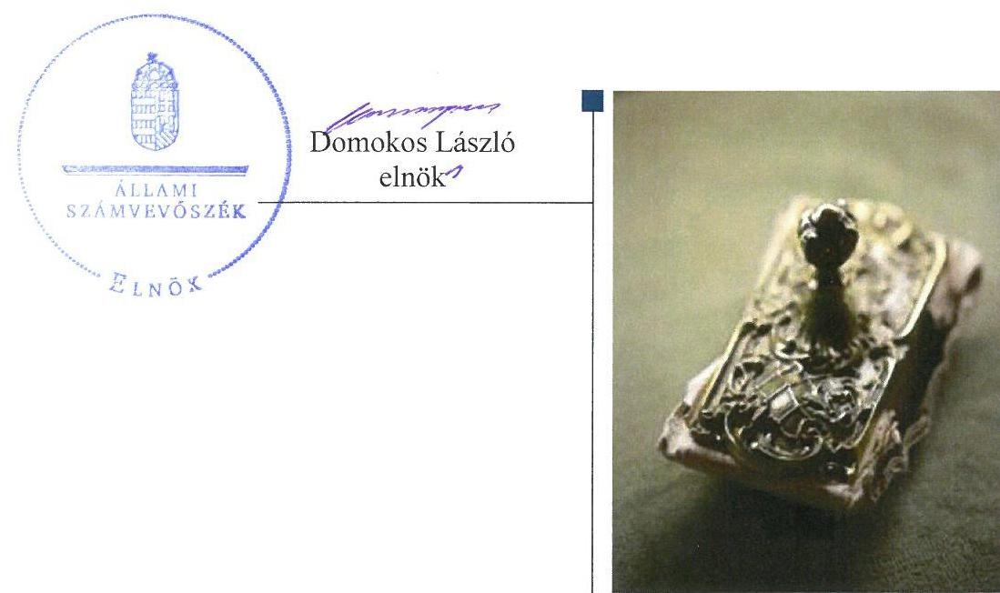
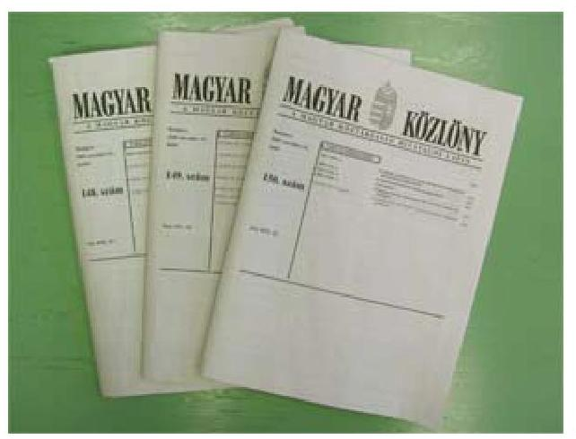
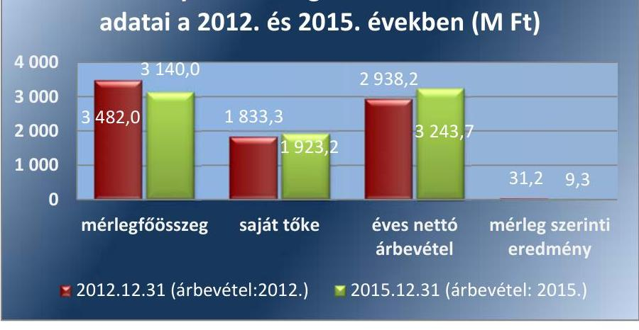
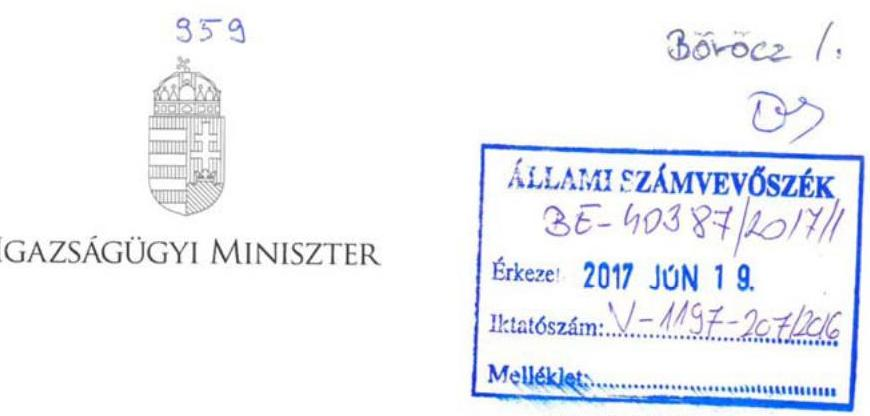
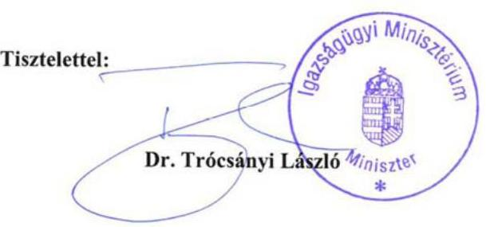
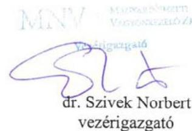
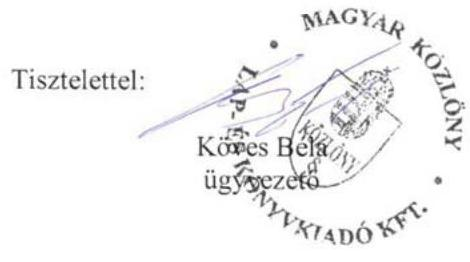

# Jelentés 

## Állami tulajdonú gazdasági társaságok

Az állami tulajdonban (résztulajdonban) lévő gazdálkodó szervezetek vagyonmegőrzési és gazdálkodási tevékenységének ellenőrzése Magyar Közlöny Lap- és Könyvkiadó Kft.
2017.

---

# Jelentés 

## Állami tulajdonú gazdasági társaságok

Az állami tulajdonban (résztulajdonban) lévő gazdálkodó szervezetek vagyonmegőrzési és gazdálkodási tevékenységének ellenőrzése Magyar Közlöny Lap- és Könyvkiadó Kft.
2017. július 16. nap

---

# AZ ELLENŐRZÉST FELÜGYELTE: 

BÖRÖCZ IMRE felügyeleti vezető

## AZ ELLENŐRZÉST VEZETTE ÉS A VÉGREHAJTÁSÁÉRT FELELŐS:

IMRE ZSUZSANNA ellenőrzésvezető

## A PROGRAM ÖSSZEÁLLÍTÁSÁÉRT FELELŐS:

JANIK JÓZSEF osztályvezető

IKTATÓSZÁM: V-1197-208/2016

TÉMASZÁM: 2231.

## ELLENŐRZÉS-AZONOSÍTÓ SZÁM: V075909

Jelentéseink az Országgyűlés számítógépes hálózatán és az Interneten a www.asz.hu címen is olvashatóak.

---

# TARTALOMJEGYZÉK 

■ ÖSSZEGZÉS ..... 5
■ AZ ELLENŐRZÉS CÉLJA ..... 6
■ AZ ELLENŐRZÉS TERÜLETE ..... 7
■ AZ ELLENŐRZÉS HÁTTERE, INDOKOLTSÁGA ..... 8
■ A JELENTÉS LÉNYEGES KÉRDÉSKÖREI ..... 9
■ ELLENŐRZÉS HATÓKÖRE ÉS MÓDSZEREI ..... 10
■ MEGÁLLAPÍTÁSOK ..... 12
■ MELLÉKLETEK ..... 17
I. Sz. melléklet: Értelmező szótár ..... 17
II. Sz. melléklet: A Közlönykiadó Kft. vagyonának megoszlása a 2012-2015. években (M Ft.) ..... 21
III. Sz. melléklet: A Közlönykiadó Kft. eredményének alakulása 2012-2015. (M Ft.) ..... 22
■ FÜGGELÉK: ÉSZREVÉTELEK ..... 23
■ RÖVIDÍTÉSEK JEGYZÉKE ..... 27

---

.

---

# ÖSSZEGZÉS 

A Magyar Közlöny Lap- és Könyvkiadó Kft. tulajdonosi joggyakorlói a tevékenységüket szabályszerűen látták el. A társaság működésének szabályozottsága megfelelő volt. A pénzügyiszámviteli, adatszolgáltatási feladatokat a törvényi előírásoknak megfelelően látta el. A vagyonával szabályszerűen gazdálkodott.

## Az ellenőrzés társadalmi indokoltsága

Az Állami Számvevőszék stratégiájában megfogalmazta, hogy az államháztartáson kívülre nyújtott költségvetési támogatások és ingyenes vagyonjuttatások, valamint az államháztartáson kívül működő közfeladat-ellátó rendszerek ellenőrzéseivel hozzájárul ahhoz, hogy a közpénzeket az államháztartáson kívül működő szervezetek is átlátható, rendezett módon használják fel a közfeladatok szerződésben vállalt ellátása érdekében. Ezt figyelembe véve és az Állami Számvevőszék Stratégiájával összhangban került sor a Magyar Közlöny Lap- és Könyvkiadó Kft ellenőrzésére a 2012-2015. évek vonatkozásában.

A Magyar Közlöny Lap- és Könyvkiadó Kft a közszolgáltatási tevékenysége keretében a Nemzeti Jogszabálytár szolgáltatójaként ellátja Magyarországon a hivatalos közlönyök és a hatályos joganyag folyamatos megjelentetését és közforgalomba bocsátását, mellyel biztosítja a jogi kultúra továbbélését.

## Főbb megállapítások, következtetések

A Magyar Közlöny Lap- és Könyvkiadó Kft.-ben fennálló társasági részesedés feletti tulajdonosi joggyakorlás megfelelt a jogszabályi előírásoknak.

A Magyar Közlöny Lap- és Könyvkiadó Kft. a vagyongazdálkodással kapcsolatos szabályozást kialakította, az megfelelt a jogszabályi előírásoknak.

A bevételeinek és ráfordításainak elszámolása megfelelt a jogszabályi előírásoknak, a szolgáltatások és közszolgáltatások díjának megállapítását az előírásoknak megfelelő önköltségszámítással alapozták meg. Összességében szabályszerűen teljesítette a tervezési, beszámolási, adatszolgáltatási kötelezettségét.

A Magyar Nemzeti Vagyonkezelő Zrt. és az Igazságügyi Minisztérium a felügyelőbizottságon keresztül, valamint állandó könyvvizsgáló megbízásával biztosította a tulajdonosi ellenőrzést.

A Magyar Közlöny Lap- és Könyvkiadó Kft. kialakította a szabályszerű vagyongazdálkodás feltételeit. A vagyonának változását eredményező döntései szabályszerűek voltak. A vagyonát az előírásoknak megfelelően tartotta nyilván.

---

# AZ ELLENŐRZÉS CÉLJA 

Az ellenőrzés célja annak értékelése volt, hogy a tulajdonosi jogok gyakorlása szabályszerű volt-e; a gazdálkodó szervezet szabályozottsága, gazdálkodása és vagyongazdálkodási tevékenysége megfelelt-e a jogszabályi és a tulajdonosi előírásoknak; biztosítva volt-e a közfeladatok átláthatósága és elszámoltathatósága érdekében a közszolgáltatás díjának megalapozottsága szabályszerű önköltségszámítással; a vagyonváltozást eredményező döntések esetében a tulajdonosi jogok gyakorlója és a gazdálkodó szervezet szabályszerűen jártak-e el.

---

# AZ ELLENŐRZÉS TERÜLETE 

## Magyar Közlöny Lap- és Könyvkiadó Kft.

A Közlönykiadó Kft.¹ 100%-ban állami tulajdonban lévő egyszemélyes korlátolt felelősségű társaság, amelyet 1994. január 1-jén a magyar állam alapított. Nevében a tulajdonosi jogok gyakorlására az MNV Zrt.² volt jogosult, aki a Közlönykiadó Kft. társasági részesedése feletti tulajdonosi jogokat és kötelezettségeket korlátozásokkal és feltételekkel 2012. december 31-ig vagyonkezelési szerződés, 2013. január 1-jétől 2013. december 31-ig, valamint 2014. augusztus 1-jétől az ellenőrzött időszak végéig megbízási szerződés alapján az IM³ részére átengedte. 2014. január 01. - július 31. közötti időszakban a tulajdonosi jogokat az MNV Zrt. gyakorolta. Fő tevékenysége a hivatalos közlönyök és a jogszabályok folyamatos megjelentetése, ezek nyomdai, kiadási és terjesztői tevékenységével kapcsolatos tevékenység ellátása, továbbá közszolgáltatás keretében a Nemzeti Jogszabálytár működtetése.

Gazdálkodásának főbb adatait a II. és III. számú mellékletek és az 1. ábra szemléltetik:

1. ábra

A közlönykiadó Kft. gazdálkodásának főbb adatai a 2012. és 2015. években (M Ft)

A társaság⁴ valamennyi ellenőrzött évben nyereségesen gazdálkodott, a 2012-2015. években összesen 121,1 M Ft adózott eredményt ért el. A jegyzett tőkéje nem változott, 290,6 M Ft volt. A mérlegfőösszeg csökkenését jórészt a tárgyi eszközök állományának csökkenése okozta. Tevékenységét saját tulajdonában lévő eszközökkel látta el, vagyonkezelésbe vagy hasznosításra átvett nemzeti vagyonnal nem rendelkezett. Az ellenőrzött időszakban egy gazdasági társaságban rendelkezett - kezdetben 100%-os, majd 50%-os - részesedéssel. A foglalkoztatott munkavállalók átlagos statisztikai létszáma a 2012. évi 152 főről 2015. évben 119 főre csökkent. Az ügyvezető személye egy alkalommal változott az ellenőrzött időszakban.

---

# AZ ELLENŐRZÉS HÁTTERE, INDOKOLTSÁGA 

Az állami tulajdonú gazdálkodó szervezetek ellenőrzése kiemelten fontos a nemzeti vagyon megőrzése, megóvása érdekében. Gazdálkodásuk jellemzően a közérdeklődés és a média figyelmének középpontjában áll, amihez hozzájárul a gazdálkodásuk körébe tartozó - közvetlen vagy közvetett állami tulajdonú - vagyon nagysága, illetve az általuk ellátott közszolgáltatások minősége és hatékonysága. A szolgáltatási/közszolgáltatási árképzés megalapozottsága és az éves elszámoltatás feltételeinek kialakítása az ellenőrzés során nagy hangsúlyt kap. A szolgáltatás/közszolgáltatás árában és annak támogatásában meg kell jelennie az önköltségszámítás szempontjainak, amely biztosítja a működés fenntarthatóságát (eszközpótlást) is. Az ellenőrzés rámutathat az állami tulajdonú gazdálkodó szervezetek gazdálkodási tevékenységével kapcsolatos jó gyakorlatokra és szabálytalanságokra. Felhívhatja a figyelmet a jogszabályi követelmények teljesítéséhez szükséges feltételek hiányosságaira, hozzájárulhat az államháztartáson kívüli, de (közvetlenül vagy közvetve) állami vagyont használó gazdálkodó szervezetek tevékenységének átláthatóságához. Ellenőrzésünk eredményeképpen javaslatainkkal, megállapításainkkal hozzájárulhatunk a nemzeti vagyonnal való gazdálkodás átláthatóságának, elszámoltathatóságának javításához.

---

# A JELENTÉS LÉNYEGES KÉRDÉSKÖREI 

1. A tulajdonosi jogok gyakorlása szabályszerű volt-e?
2. A társaság működésének szabályozottsága megfelelt-e az előírásoknak?
3. A társaságnál a pénzügyi-számviteli, adatszolgáltatási és ellenőrzési feladatok ellátása szabályszerű volt-e?
4. A társaság vagyongazdálkodása szabályszerű volt-e?

---

# ELLENŐRZÉS HATÓKÖRE ÉS MÓDSZEREI 

## Az ellenőrzés típusa

Megfelelőségi ellenőrzés.

## Az ellenőrzött időszak

Az ellenőrzött időszak 2012. január 1-jétől 2015. december 31-ig tart.

## Az ellenőrzés tárgya

Állami tulajdonban lévő gazdasági társaság gazdálkodása, kiemelten vagyongazdálkodási tevékenysége, a tulajdonosi jogok gyakorlása.

Az ellenőrzés kiterjed minden olyan körülményre és adatra, amely az ÁSZ jogszabályban meghatározott feladatainak teljesítéséhez, valamint a program végrehajtása folyamán felmerült újabb összefüggések feltárásához szükséges.

## Az ellenőrzött szervezet

Magyar Közlöny Lap- és Könyvkiadó Kft;
Igazságügyi Minisztérium;
Magyar Nemzeti Vagyonkezelő Zrt.

## Az ellenőrzés jogalapja

Az ellenőrzés jogalapját az ÁSZ tv.⁵ 1. § (3) bekezdése és 5. § (3)-(5) bekezdései képezik.

## Az ellenőrzés módszerei

Az ellenőrzést a nemzetközi standardokat irányadónak tekintve az ellenőrzési program ellenőrzési kérdései, az ellenőrzött időszakban hatályos jogszabályok, az ellenőrzés szakmai szabályok és módszertanok figyelembevételével végeztük.

Az ellenőrzésre a nemzetgazdasági szempontból kiemelt jelentőségű nemzeti vagyon körébe tartozó gazdálkodó szervezeteknél és a többségi állami tulajdonban álló gazdálkodó szervezeteknél került sor. A program szerinti feladatokat a kiválasztott gazdálkodó szervezeteknél, valamint a tulajdonosi jogok gyakorlójánál hajtottuk végre.

---

Az ellenőrzési kérdések megválaszolásához szükséges bizonyítékok megszerzése a következő ellenőrzési eljárások alkalmazásával történt: megfigyelés, kérdésfeltevés (információkérés), összehasonlítás, valamint mintavételi és elemző eljárás. Az ellenőrzési bizonyítékként felhasználható adatforrások közé tartoznak egyrészt az ellenőrzési programban felsorolt adatforrások, másrészt adatforrás lehet még minden - az ellenőrzés folyamán - feltárt, az ellenőrzés szempontjából releváns információkat tartalmazó dokumentum.

Az ellenőrzést a kérdésekre adott válaszok kiértékelésével, valamint a megjelölt adatforrások, a csatolt tanúsítványok felhasználásával, továbbá az adott időszakban hatályos jogszabályok figyelembevételével folytattuk le.

---

# 1. A tulajdonosi jogok gyakorlása szabályszerű volt-e? 

## Összegző megállapítás

1. táblázat

A KÖZLÖNYKIADÓ KFT. FELETTI TULAJDONOSI JOGGYAKORLÁS ALAKULÁSA 2012 ÉS 2015 KÖZÖTT

| Ellenőrzött időszak | Tulajdonosijoggyakorló | Jogalap |
| :--: | :--: | :--: |
| 2012.01.01. -   2012. 12.31. | IM | SZT-35610 sz. vagyonkezelési szerződés |
| 2013.01.01. -   2013.12.31. | IM | SZT-39.125 sz. megbízási szerződés |
| 2014.01.01. -   2014.07.31. | MNV   Zrt. | Vtv. |
| 2014.08.01. -   2015.12.31. | IM | SZT-101745   sz. megbízási szerződés |

A Közlönykiadó Kft.-ben fennálló társasági részesedés feletti tulajdonosi joggyakorlás szabályszerű volt.

A tulajdonosi jogok gyakorlására a magyar állam nevében a Vtv.⁶ alapján az MNV Zrt. volt jogosult, aki a Közlönykiadó Kft. társasági részesedése feletti tulajdonosi jogokat és kötelezettségeket az 1. táblázatban foglaltak szerint az IM részére átengedte.

Az IM a 2012-2013. években és 2014. augusztus 1-jét követően a vagyonkezelési szerződésben⁷, majd a megbízási szerződés¹,²⁸-ban leírtakkal összhangban az IM SZMSZ⁹¹,²¹⁰-ben rögzítette a Közlönykiadó Kft. feletti tulajdonosi joggyakorlással kapcsolatos feladatait. Az MNV Zrt. az MNV Zrt. SZMSZ¹¹₁₋₇-ben rendelkezett az állami tulajdonban álló társasági részesedések hasznosításával, értékesítésével, kezelésével kapcsolatos gazdálkodási feladatokról.

Az Alapító okiratban¹²₁₋₇ az MNV Zrt. és az IM rendelkeztek a vagyongazdálkodásra vonatkozó követelményekről, a Gt.¹³ és a Ptk.¹⁴ előírásainak megfelelően az FB tagjairól, a könyvvizsgáló személyéről, továbbá meghatározták az FB és az ügyvezető jogait, feladatait.

Az éves üzleti terv jóváhagyása az Alapító okirat¹₋₇ alapján az alapító kizárólagos jogkörébe tartozott, ennek megfelelően a 2012-2015. évekre vonatkozó üzleti terveket az IM és MNV Zrt. alapítói határozattal fogadta el.

Az MNV Zrt. és az IM a Gt. és a Ptk.² előírásainak megfelelően a Közlönykiadó Kft. éves beszámolóinak jóváhagyásáról az FB írásbeli jelentése, valamint a Számv. tv.-ben foglaltak figyelembevételével a könyvvizsgálói jelentés birtokában, alapítói határozattal döntöttek.

## 2. A társaság működésének szabályozottsága megfelelt-e az előírásoknak?

## Összegző megállapítás

A Közlönykiadó Kft. működésének szabályozottsága megfelelt az előírásoknak.

A Számviteli politika¹⁵₁₋₅, valamint annak részét képező szabályzatok, az Értékelési szabályzat¹⁶₁₋₂, az Önköltség-számítási szabályzat¹⁷, az Árképzési és önköltség-számítási szabályzat¹⁸₁₋₃, a Pénzkezelési szabályzat₁₋₆ megfeleltek a Számv. tv.¹⁹ előírásainak.

A Leltározási szabályzatban²⁰₁₋₂ meghatározták az eszközök és a források leltározásának módját és gyakoriságát.

A Számlarend²¹₁₋₄ és az annak részét képező Bizonylati szabályzat²² megfelelt a Számv. tv. előírásának.

---

A Közlönykiadó Kft. működésének szabályozása keretében a Számviteli Politikán és annak részét képező szabályzatokon túl megalkotta az IM és az MNV Zrt. által előírtakkal összhangban az SZMSZ²³₁₋₂, a Kötelezettségvállalási Ügyvezetői Utasítást²⁴, továbbá az Értékvesztési és selejtezési szabályzatot²⁵₁₋₂, továbbá az ITBSZ²⁶-t.

Rendelkeztek az MNV Zrt. által alapítói határozatokkal jóváhagyott, a Taktv.²⁷ előírásának megfelelő Javadalmazási szabályzattal²⁸₁₋₂.

# 3. A társaságnál a pénzügyi-számviteli, adatszolgáltatási és ellenőrzési feladatok ellátása szabályszerű volt-e?
 Összegző megállapítás

### 3.1. számú megállapítás

2. táblázat

## VEVŐKKEL SZEMBENI LEJÁRT KÖVETELÉSEK (M FT)

| Megnevezés | 2012. | 2015. |
| :-- | --: | :--: |
| 1-30 nap | 37,0 | 23,4 |
| 31-75 nap | 5,7 | 2,1 |
| 76-180 nap | 6,5 | 0,0 |
| 181-360 nap | 9,5 | 0,4 |
| 361 napon túl | 15,7 | 2,8 |
| Összesen | 74,4 | 28,6 |
| Behajthatatlan követelésként leírt összeg | 2,2 | 2,5 |
| Forrás: A Közlönykiadó Kft. 2012-2015. évi beszámolói |  |  |

A Közlönykiadó Kft.-nél a pénzügyi-számviteli, adatszolgáltatási feladatok ellátása szabályszerű volt. Az ellenőrzési feladatok ellátása nem felelt meg a jogszabályi előírásoknak.

A bevételek és ráfordítások elszámolása megfelelt a jogszabályi előírásoknak.

Az értékesítés nettó árbevételének elszámolása a Számv. tv., a Számviteli politika ${ }_{1-5}$ és a Számlarend $_{1-4}$ előírásainak megfelelt. A bevételek kiszámlázása a belső szabályozások szerint történt, a megfelelő főkönyvi számlákra számolták el azokat.

Az anyagjellegű ráfordítások elszámolása megfelelt a Számv. tv.-ben, a Számviteli politikában ${ }_{1-5}$ és a Számlarendben ${ }_{1-4}$ foglalt előírásoknak. A költségelszámolást alátámasztó dokumentumok rendelkezésre álltak, azok megfeleltek a Számv. tv. által előírt általános alaki és tartalmi követelményeknek, a költségeket a megfelelő költségnem-számlákra számolták el.

A személyi jellegű ráfordítások elszámolása szabályszerű volt, megfelelt a Számv. tv.-ben előírtaknak. A személyi juttatások kifizetését dokumentumokkal alátámasztották és a belső szabályozásnak megfelelően határozták meg. Az egyéb személyi jellegű juttatások esetében az Szja. tv. ${ }^{29}$-ben meghatározott előírásokat betartották, a Cafeteria szabályzatban ${ }_{1-4}{ }^{30}$ foglaltaknak megfeleltek.

Az értékcsökkenés elszámolása megfelelt a Számv. tv., a Számviteli Politika ${ }_{1-5}$ és az ITBSZ előírásainak, az elszámolt értékcsökkenési leírás az éves beszámoló kiegészítő mellékletében bemutatásra került.

## A VEVŐKKEL SZEMBENI KÖVETELÉSEK ÁLLOMÁNYA a 2012. évi 278,0 M Ft-ról 2015-re 362,9 M Ft-ra emelkedett, míg a hátralékos állomány -mely az analitikus nyilvántartások alapján megállapítható volt - a kintlévőségek megfelelő kezelésének eredményeként csökkent, melyet a 2. táblázat szemléltet.

A követelések beszedését a Közlönykiadó Kft. a Kintlévőségek kezelésének rendjéről szóló szabályzata ${ }_{1-3}{ }^{31}$ alapján végezte.

---

### 3.2. számú megállapítás

3.3. számú megállapítás
3. táblázat

A KÖZLÖNYKIADÓ KFT. SAJÁT TŐKE ALAKULÁSA 2012-2015. ÉVEKBEN (M FT)

| Tőkeelemek | 2012. | 2015. |
| :-- | --: | --: |
| Saját tőke | 1833,3 | 1923,3 |
| Jegyzett tőke | 290,6 | 290,6 |
| Saját tőke / jegyzett tőke |  |  |
|  | 6,3 | 6,6 |

A szolgáltatások és a közszolgáltatások díját az előírásoknak megfelelő önköltségszámítással megalapozták.
A szolgáltatások és a közszolgáltatások árképzését megalapozó Önköltségszámítási szabályzat és az Árképzési és önköltség-számítási szabályzat ${ }_{1-3}$ összhangban volt a Számv. tv. előírásaival. A szabályzatokban üzletáganként került meghatározásra a közvetlen és közvetett költségek elkülönítése, az alkalmazott kalkulációs módszerek, a felosztandó költségek vetítési alapja. Teljes körűen rendelkeztek az utókalkuláció és az előkalkuláció tartalmáról és időszakairól, készítésének határidejéről.

A Közlönykiadó Kft. a szolgáltatások és a közszolgáltatások díjtételeinek megállapítását az Önköltség-számítási szabályzat és az Árképzési és önköltség-számítási szabályzat ${ }_{1-3}$ előírásainak megfelelően végezte, az árakat önköltségszámításon alapuló előkalkuláció alapján állapították meg.

## A Közlönykiadó Kft. összességében szabályszerűen teljesítette a tervezési, beszámolási, adatszolgáltatási kötelezettségét.

Az üzleti terveit a 2012-2015. évekre elkészítette, amelyek tartalmazták a tervezett bevételeket és költségeket, a részletes eredményterveket, beruházási terveket, valamint megfogalmazták a működési feltételeket, annak környezetét, az ágazati sajátosságokat, és az üzleti évek célkitűzéseit is.

A Közlönykiadó Kft. az éves beszámolókat elfogadásra az előírt határidőig az alapító részére beterjesztette, az FB írásbeli jelentésének és a könyvvizsgáló írásbeli véleménye birtokában az MNV Zrt. és az IM alapítói határozattal elfogadták azokat. A Számv. tv. előírásának megfelelően a jóváhagyott éves beszámolót, a független könyvvizsgálói jelentéssel együtt határidőben letétbe helyezték és közzétették.

Az adatszolgáltatási kötelezettségét a tulajdonosi joggyakorló felé az előírtaknak megfelelően és szabályszerűen teljesítette.

A saját tőke és a jegyzett tőke aránya tartósan kedvező, gazdálkodása nyereséges volt. A saját tőke többszörösen meghaladta a jegyzett tőke összegét, melyet a 3. táblázat és a II. számú melléklet szemléltet.

A közérdekű adatok nyilvánosságra hozatala a Taktv., valamint az Info.tv. ${ }^{32}$ előírásai alapján szabályszerű volt. Ugyanakkor a 2012. január 1. és 2015. május 3. közötti időszakban a közérdekű adatok megismerésére irányuló igények teljesítésének rendjét rögzítő szabályzattal nem rendelkezett, ezzel megsértették az Info.tv. 30. § (6) bekezdésének előírását. A Közlönykiadó Kft. 2015. május 4-én helyezte hatályba a Közérdekű adatok közzétételi szabályzatát ${ }^{33}$, mely kiterjedt a közérdekű adatok közzétételének és a közadatok megismerésére irányuló igények teljesítésének rendjére.

Az FB és a könyvvizsgáló nem tett olyan megállapítást vagy jelzést, amely a Közlönykiadó Kft. számára intézkedési kötelezettséget vont volna maga után.

Az FB, valamint a könyvvizsgáló az ellenőrzött időszakban nem állapított meg olyan tényt, amely alapján kezdeményezni kellett volna a Közlönykiadó Kft. legfőbb szerve rendkívüli ülésének összehívását.

---

# 4. A társaság vagyongazdálkodása szabályszerű volt-e? 

## Összegző megállapítás

### 4.1. számú megállapítás

### 4.2. számú megállapítás

## A Közlönykiadó Kft. vagyongazdálkodása szabályszerű volt.

A Közlönykiadó Kft. kialakította a vagyon értékének megőrzését, gyarapítását szolgáló, szabályszerű vagyongazdálkodás feltételeit.

A VAGYONGAZDÁLKODÁSHOZ kapcsolódó feladat- és hatáskörök, felelősségi viszonyok, valamint az MNV Zrt. és az IM kizárólagos döntési hatáskörei a Gt., majd a Ptk. 2 szabályaival összhangban az Alapító okiratban ${ }_{1-7}$ valamint az SZMSZ ${ }_{1-2}$-ben, valamint a Kötelezettségvállalási Ügyvezetői Utasításban meghatározásra kerültek. Az MNV Zrt. és az IM által megfogalmazott elvárásokkal, célokkal összhangban lévő fejlesztési tervet az éves üzleti tervek részeként elkészítette a 2012-2015. években.

## A Közlönykiadó Kft. a vagyonát az előírásoknak megfelelően tartotta nyilván.

A Közlönykiadó Kft. saját vagyonáról átlátható, naprakész vagyonnyilvántartást vezetett, az ellenőrzött időszakban vagyonkezelésbe vett állami vagyonnal nem rendelkezett.

Leltárral támasztotta alá a Számv. tv.-nek megfelelően az éves beszámolók részét képező mérleg tételeit. A beszámolókban és a számviteli nyilvántartásokban lévő vagyontárgyak állományát egyeztetéssel és mennyiségi felvétellel leltározta, az ingatlanokat kétévente, míg a készleteket évente.

A Közlönykiadó Kft. vagyona csökkent 549,2 M Ft-tal, melyből a tárgyi eszközállomány csökkenése meghatározó, 330,5 M Ft volt. A Közlönykiadó Kft. tárgyi eszközállományának alakulását a 4. táblázat szemlélteti:

## A KÖZLÖNYKIADÓ KFT. TÁRGYI ESZKÖZÁLLOMÁNYÁNAK ALAKULÁSA 2012-2015. (M FT)

| Megnevezés | 2012. nyitó | 2012. | 2013. | 2014. | 2015. | változás | összesen |
| :--: | :--: | :--: | :--: | :--: | :--: | :--: | :--: |
| Tárgyi eszközök könyv szerinti értéke | 1990,3 | 2015,1 | 1895,3 | 1800,9 | 1659,8 | $-330,5$ | nr |
| Tárgyi eszközök értékcsökkenése | - | 153,0 | 143,7 | 130,9 | 134,8 | nr | 562,4 |
| Beruházás, felújítás | - | 39,9 | 19,7 | 8,7 | 120,8 | nr | 219,1 |
| Beruházás és elszámolt écs különbözete | - | $-113,1$ | $-124,0$ | $-92,2$ | $-14,0$ |  | $-343,3$ |

A saját vagyonba tartozó eszközök elhasználódási foka az ellenőrzött időszak alatt 63,1\%-ról 66,2 %-ra romlott.

A tárgyi eszközök folyamatos karbantartásáról, állagmegóvásáról gondoskodtak, az ellenőrzött időszakban a tervezett 165,3 M Ft-hoz képest 258,2 M Ft-ot fordítottak karbantartásra, állagmegóvásra.

---

# 4.3. számú megállapítás 

## 4.4. számú megállapítás

## A Közlönykiadó Kft.-nél a vagyon változását eredményező döntések megfeleltek az előírásoknak.

Az MNV Zrt. és az IM az alapító okiratban, a Közlönykiadó Kft. az SZMSZ-ben szabályozta a vagyon változását eredményező döntések rendjét, melyet a saját vagyon hasznosítása, értékesítése során betartottak.

- Az üzleti tervekben minden évben a tulajdonosi joggyakorlók felé előterjesztésre, s általuk jóváhagyásra kerültek a beruházások és felújítások.
- Ingatlanok pályázat útján történő értékesítéséről, illetve bérbeadásáról az MNV Zrt. és az IM írásban határoztak.
- Eszközök selejtezésére az Értékvesztés és Selejtezési szabályzatának megfelelően került sor.

## A Közlönykiadó Kft. a részesedése értékének védelmében az adatszolgáltatási követelményeket a leányvállalata ${ }^{34}$ alapszabályában meghatározta.

A Közlönykiadó Kft. 2012. november 8-ig a 20 M Ft alaptőkéjű FÁMA Lapterjesztő Zrt.-ben 100\%-os tulajdoni részesedéssel rendelkezett, melynek 50\%-át 2012. november 9-én a Nemzeti Közszolgálati Egyetemnek értékesítette, mely időponttól abban meghatározó befolyással nem rendelkezett.

A Közlönykiadó Kft. részesedése védelmében alkalmazott előírásai leányvállalatával szemben:
— a vezérigazgató a társaság vagyoni helyzetéről és üzletpolitikájáról legalább évente egyszer a Közgyűlésen beszámol.
— a vezérigazgató minden év március 15-ig előterjeszti a társaság tárgyévi üzleti tervét.
— amennyiben az éves árbevétel és az adózás előtti eredmény várhatóan 15\%-kal eltér az elfogadott értéktől, úgy a Közgyűlést össze kell hívni.

---

# MELLÉKLETEK 

- I. SZ. MELLÉKLET: ÉRTELMEZŐ SZÓTÁR
állami vagyon
anyavállalat
gazdasági társaság
vagyonkezelő
a) Az állam tulajdonában lévő dolog, valamint a dolog módjára hasznosítható természeti erő,
b) az a) pont hatálya alá nem tartozó mindazon vagyon, amely vonatkozásában törvény az állam kizárólagos tulajdonjogát nevesíti,
c) az állam tulajdonában lévő tagsági jogviszonyt megtestesítő értékpapír, illetve az államot megillető egyéb társasági részesedés,
d) az államot megillető olyan immateriális, vagyoni értékkel rendelkező jogosultság, amelyet jogszabály vagyoni értékű jogként nevesít.
Forrás: Vtv. 1. § (2) bekezdése
2012. november 10-től az állami vagyon fogalma kiegészül a következő ponttal:
e) az állam tulajdonában lévő pénzügyi eszközök

Forrás: Vtv. 1. § (2) bekezdése
Az a vállalkozó, amely egy másik vállalkozónál (a továbbiakban: leányvállalat) közvetlenül vagy leányvállalatán keresztül közvetetten meghatározó befolyást képes gyakorolni, mert az alábbi feltételek közül legalább eggyel rendelkezik:
a) a tulajdonosok (a részvényesek) szavazatának többségével (50 százalékot meghaladóval) tulajdoni hányada alapján egyedül rendelkezik, vagy
b) más tulajdonosokkal (részvényesekkel) kötött megállapodás alapján a szavazatok többségét egyedül birtokolja, vagy
c) a társaság tulajdonosaként (részvényesként) jogosult arra, hogy a vezető tisztségviselők vagy a felügyelő bizottság tagjai többségét megválassza vagy visszahívja, vagy
d) a tulajdonosokkal (a részvényesekkel) kötött szerződés (vagy a létesítő okirat rendelkezése) alapján - függetlenül a tulajdoni hányadtól, a szavazati aránytól, a megválasztási és visszahívási jogtól - döntő irányítást, ellenőrzést gyakorol.
Forrás: Számv. tv. 3. § (2) 1. pont
A Ptk. 2. 3:88. § (1) bekezdése szerint „a gazdasági társaságok üzletszerű közös gazdasági tevékenység folytatására, a tagok vagyoni hozzájárulásával létrehozott, jogi személyiséggel rendelkező vállalkozások, amelyekben a tagok a nyereségből közösen részesednek, és a veszteséget közösen viselik".
2013. június 27-ig:

Az állami vagyont az MNV Zrt. maga kezeli, vagy szerződés - így különösen bérlet, haszonbérlet, megbízás - alapján központi költségvetési szervnek, természetes vagy jogi személynek, vagy jogi személyiséggel nem rendelkező gazdálkodó szervezetnek hasznosításra átengedi. Az állami vagyonra vonatkozóan az MNV Zrt. kizárólag az Nvtv-ben meghatározott személyekkel köthet vagyonkezelési szerződést.
Forrás: Vtv. 23. § (1), 27. § (1)
2013. június 28-ától:

Az állami vagyonnal az MNV Zrt. maga gazdálkodik, vagy szerződés - így különösen bérlet, haszonbérlet, megbízás - alapján központi költségvetési szervnek, természetes vagy jogi személynek, vagy jogi személyiséggel nem rendelkező gazdálkodó szervezetnek hasznosításra
 átengedi, illetőleg vagyonkezelésbe, haszonélvezetbe adja.

---

gazdálkodó szervezet
közszolgáltatás
leányvállalat
meghatározó befolyás

Az állami vagyonra vonatkozóan az MNV Zrt. kizárólag az Nvtv-ben meghatározott személyekkel köthet vagyonkezelési szerződést.
Forrás: Vtv. 23. § (1), 27. § (1)
2014. március 14-ig:

A Ptk. ${ }^{35}$ 685. § c) pontja szerint gazdálkodó szervezet: „az állami vállalat, az egyéb állami gazdálkodó szerv, a szövetkezet, a lakásszövetkezet, az európai szövetkezet, a gazdasági társaság, az európai részvénytársaság, az egyesülés, az európai gazdasági egyesülés, az európai területi együttműködési csoportosulás, az egyes jogi személyek vállalata, a leányvállalat, a vízgazdálkodási társulat, az erdő birtokossági társulat, a végrehajtói iroda, az egyéni cég, továbbá az egyéni vállalkozó."
2014. március 15-től:

A gazdasági társaság, az európai részvénytársaság, az egyesülés, az európai gazdasági egyesülés, az európai területi együttműködési csoportosulás, a szövetkezet, a lakásszövetkezet, az európai szövetkezet, a vízgazdálkodási társulat, az erdőbirtokossági társulat, az állami vállalat, az egyéb állami gazdálkodó szerv, az egyes jogi személyek vállalata, a közös vállalat, a végrehajtói iroda, a közjegyzői iroda, az ügyvédi iroda, a szabadalmi ügyvivői iroda, az önkéntes kölcsönös biztosító pénztár, a magánnyugdíjpénztár, az egyéni cég, továbbá az egyéni vállalkozó. Az állam, a helyi önkormányzat, a költségvetési szerv, az egyesület, a köztestület, valamint az alapítvány gazdálkodó tevékenységével összefüggő polgári jogi kapcsolataira is a gazdálkodó szervezetre vonatkozó rendelkezéseket kell alkalmazni.
Forrás: Ppt ${ }^{36} .396 . \S$
Az Ebktv. ${ }^{37}$ 3. § d) pontja a következőképpen határozza meg a közszolgáltatást: „szerződéskötési kötelezettség alapján a lakosság alapvető szükségleteinek ellátására irányuló szolgáltatás, így különösen a villamos energia-, gáz-, hő-, víz-, szennyvíz- és hulladékkezelési, köztisztasági, postai és távközlési szolgáltatás, továbbá a menetrend alapján közlekedő járművekkel végzett közforgalmú személyszállítás".
Az a gazdasági társaság, amelyre az anyavállalat meghatározó befolyást képes gyakorolni.
Forrás: Számv. tv. 3. § (2) 2. pont
2014. március 14-ig:

A befolyással rendelkező akkor rendelkezik egy jogi személyben meghatározó befolyással, ha annak tagja, illetve részvényese és
a) jogosult e jogi személy vezető tisztségviselői vagy felügyelőbizottsága tagjainak többségének megválasztására, illetve visszahívására, vagy
b) a jogi személy más tagjaival, illetve részvényeseivel kötött megállapodás alapján egyedül rendelkezik a szavazatok több mint ötven százalékával.
A meghatározó befolyás akkor is fennáll, ha a befolyással rendelkező számára az előzőek szerinti jogosultságok közvetett módon biztosítottak. A befolyással rendelkezőnek egy jogi személyben a szavazatok több mint ötven százalékával közvetett módon való rendelkezése vagy egy jogi személyben közvetetten fennálló meghatározó befolyása megállapítása során a jogi személyben szavazati joggal rendelkező más jogi személyt (köztes vállalkozást) megillető szavazatokat meg kell szorozni a befolyással rendelkezőnek a köztes vállalkozásban, illetve vállalkozásokban fennálló szavazatával. Ha a köztes vállalkozásban fennálló szavazatok mértéke az ötven százalékot meghaladja, akkor azt egy egészként kell figyelembe venni.
Forrás: Ptk ${ }_{1}$. 685/B. § (2)-(3) bekezdések

---

# 2014. március 15-től: 

A befolyással rendelkező akkor rendelkezik egy jogi személyben meghatározó befolyással, ha annak tagja vagy részvényese, és
a) jogosult e jogi személy vezető tisztségviselői vagy felügyelőbizottsága tagjainak többségének megválasztására, illetve visszahívására; vagy
b) a jogi személy más tagjai, illetve részvényesei a befolyással rendelkezővel kötött megállapodás alapján a befolyással rendelkezővel azonos tartalommal szavaznak, vagy a befolyással rendelkezőn keresztül gyakorolják szavazati jogukat, feltéve, hogy együtt a szavazatok több mint felével rendelkeznek.
Forrás: $\mathrm{Ptk}_{2}$. 8:2. § (2) bekezdés
MNV Zrt.
nemzeti vagyon
b) az állam vagy a helyi önkormányzat kizárólagos tulajdonában álló dolgok,
b) az a) pont hatálya alá nem tartozó, állam vagy a helyi önkormányzat tulajdonában lévő dolog,
c) az állam vagy a helyi önkormányzat tulajdonában lévő pénzügyi eszközök, továbbá az államot vagy a helyi önkormányzatot megillető társasági részesedések,
d) az államot vagy a helyi önkormányzatot megillető bármely vagyoni értékkel rendelkező jogosultság, amelyet jogszabály vagyoni értékű jogként nevesít,
e) Magyarország határa által körbezárt terület feletti légtér,
f) az üvegházhatású gázok kibocsátási egységeinek kereskedelméről szóló törvény szerint kibocsátási egység és légiközlekedési kibocsátási egység, valamint az ENSZ Éghajlatváltozási Keretegyezménye és annak Kiotói Jegyzőkönyve végrehajtási keretrendszeréről szóló törvény szerinti kiotói egység,
g) állami vagy helyi önkormányzati fenntartású közgyűjtemény (muzeális intézmény, levéltár, közgyűjteményként működő kép- és hangarchívum, valamint könyvtár) saját gyűjteményében nyilvántartott kulturális javak körébe tartozó dolog, kivéve, ha az állami vagy önkormányzati tulajdon jogszerű létrejötte kétséget kizáró módon nem bizonyítható és a dologra nézve más a tulajdonjogát bizonyítja vagy a kulturális javakra vonatkozó jogszabályokban meghatározott eljárás keretében valószínűsíti (g. pont módosult 2013. december 7-től),
h) a régészeti lelet,
i) a nemzeti adatvagyon körébe tartozó állami nyilvántartások fokozottabb védelméről szóló törvény szerinti nemzeti adatvagyon.
Forrás: Nvtv. 1. § (2)
tulajdonosi ellenőrzés
2014. március 14-ig:

Az állami vagyon kezelőjét, haszonélvezőjét, használóját megillető jogok gyakorlását, annak szabályszerűségét, célszerűségét az MNV Zrt. - szükség szerint területi szervei útján - ellenőrzi.
2014. március 15 -től:

Az állami vagyon használóját, vagyonkezelőjét és haszonélvezőjét megillető jogok gyakorlását, annak szabályszerűségét, a kötelezettségek teljesítését, valamint a vagyon rendeltetése szerinti célszerűségét a tulajdonosi joggyakorló rendszeresen ellenőrzi.
Forrás: Vhr. ${ }^{38}$ 20. § (1)

---

tulajdonosi jogok gyakorlója 1.
2013. június 27-ig:

Az állami vagyon felett a Magyar Államot megillető tulajdonosi jogok és kötelezettségek összességét - ha törvény eltérően nem rendelkezik - az állami vagyon felügyeletéért felelős miniszter (a továbbiakban: miniszter) gyakorolja, aki e feladatát a Magyar Nemzeti Vagyonkezelő Zártkörűen Működő Részvénytársaság (a továbbiakban: MNV Zrt.), a Magyar Fejlesztési Bank, illetve a tulajdonosi joggyakorló szervezet útján látja el. A miniszter miniszteri rendeletben, a törvényben meghatározott állami vagyoni kör tekintetében, meghatározott időtartamra, a joggyakorlás egyes szabályainak meghatározásával - az őt megillető tulajdonosi jogok és kötelezettségek összességének, illetve azok meghatározott részének gyakorlóját az Áht. szerinti központi költségvetési szervek, ezek intézménye, továbbá a 100%-ban állami tulajdonban álló gazdasági társaságok közül kijelölheti.
Forrás: Vtv. 3. § (1) és (2)
2013. június 28-ától:

A rábízott állami vagyon felett az államot megillető tulajdonosi jogok és kötelezettségek összességét tulajdonosi joggyakorlóként:
a) ha törvény vagy miniszteri rendelet eltérően nem rendelkezik, a Magyar Nemzeti Vagyonkezelő Zártkörűen Működő Részvénytársaság (a továbbiakban: MNV Zrt.),
b) törvényben kijelölt személy vagy
c) az állami vagyon felügyeletéért felelős miniszter (a továbbiakban: miniszter) által rendeletben kijelölt személy gyakorolja.
[...] A miniszter e törvény felhatalmazása alapján - a meghatározott célok hatékonyabb elérése érdekében, miniszteri rendeletben, az ott meghatározott állami vagyoni kör tekintetében, meghatározott időtartamra - e törvény keretei között, a joggyakorlás egyes szabályainak meghatározásával - az államot megillető tulajdonosi jogok és kötelezettségek összességének, illetve azok meghatározott részének gyakorlóját az Áht. szerinti központi költségvetési szervek, ezek intézménye, továbbá a 100%-ban állami tulajdonban álló gazdasági társaságok közül kijelölheti.
Forrás: Vtv. 3. § (1) és (2)
2.

Aki a nemzeti vagyon felett az államot vagy a helyi önkormányzatot megillető tulajdonosi jogok és kötelezettségek összességének gyakorlására jogosult.
Forrás: Nvtv. 3. § (1) 17. pontja

---

| Megnevezés | 2012.01.01. | 2012.12.31. | 2013.12.31. | 2014.12.31. | 2015.12.31. | Változás   2015.12.31./2012.01.01.   (M Ft) |
| :--: | :--: | :--: | :--: | :--: | :--: | :--: |
| Befektetett eszközök | 2183,0 | 2149,6 | 1989,8 | 2016,3 | 1901,9 | $-281,1$ |
| Immateriális javak | 172,6 | 124,5 | 84,5 | 215,3 | 242,1 | 69,5 |
| Szellemi termékek | 156,0 | 106,2 | 68,7 | 200,7 | 224,8 | 68,8 |
| Tárgyi eszközök | 1990,3 | 2015,1 | 1895,3 | 1800,9 | 1659,8 | $-330,5$ |
| Ingatlanok és a kapcsolódó vagyoni értékű jogok | 1109,2 | 1060,1 | 1024,7 | 973,2 | 878,4 | $-230,8$ |
| Egyéb berendezések, felszerelések, járművek | 60,6 | 43,0 | 29,6 | 43,1 | 59,5 | $-1,1$ |
| Forgóeszközök | 1465,4 | 1174,7 | 1200,3 | 1133,9 | 1217,6 | $-247,8$ |
| Követelések | 925,3 | 358,4 | 435,7 | 461,1 | 407,5 | $-517,8$ |
| Követelések áruszállításból és szolgáltatásból (vevők) | 712,6 | 278,0 | 410,4 | 376,3 | 362,9 | $-349,7$ |
| Egyéb követelések | 212,7 | 76,6 | 25,2 | 84,8 | 44,6 | $-168,1$ |
| Pénzeszközök | 294,8 | 654,6 | 596,9 | 511,1 | 593,7 | 298,9 |
| Pénztár, csekkek | 0,3 | 0,5 | 0,3 | 0,2 | 0,3 | 0,0 |
| Bankbetétek | 294,5 | 654,1 | 596,6 | 510,9 | 593,4 | 298,9 |
| Aktív időbeli elhatárolások | 40,9 | 157,7 | 6,9 | 46,8 | 20,6 | $-20,3$ |
| Költségek, ráfordítások aktív időbeli elhatárolása | 1,2 | 2,0 | 0,8 | 2,1 | 5,8 | 4,6 |
| Eszközök (aktívák) összesen | 3689,2 | 3482,0 | 3197,0 | 3197,0 | 3140,0 | $-549,2$ |
| Saját tőke | 1802,5 | 1833,3 | 1840,2 | 1914,0 | 1923,3 | 120,8 |
| Jegyzett tőke | 290,6 | 290,6 | 290,6 | 290,6 | 290,6 | 0,0 |
| Tőketartalék | 123,2 | 123,2 | 123,2 | 123,2 | 123,2 | 0,0 |
| Eredménytartalék | 1213,0 | 1362,9 | 1400,6 | 1412,0 | 1500,2 | 287,2 |
| Mérleg szerinti eredmény | 175,7 | 31,2 | 6,9 | 73,8 | 9,3 | $-166,5$ |
| Céltartalékok | 304,5 | 439,7 | 519,2 | 266,5 | 133,0 | $-171,5$ |
| Céltartalék a jövőbeni költségekre | - | - | 1,7 | 3,1 | 2,9 | 2,9 |
| Kötelezettségek | 567,5 | 655,9 | 471,1 | 682,8 | 565,7 | $-1,8$ |
| Hosszú lejáratú kötelezettségek | 58,3 | 8,3 | - | - | - | $-58,3$ |
| Rövid lejáratú kötelezettségek | 509,1 | 647,6 | 471,1 | 682,8 | 565,7 | 56,6 |
| Rövid lejáratú kölcsönök | - | - | - | - | - | - |
| Kötelez. áruszállításból és szolgáltatásból (szállítók) | 292,2 | 479,8 | 311,0 | 554,9 | 391,8 | 99,6 |
| Egyéb rövid lejáratú kötelezettségek | 171,7 | 115,7 | 150,3 | 126,8 | 173,9 | 2,2 |
| Passzív időbeli elhatárolások | 1014,8 | 553,0 | 366,5 | 333,7 | 518,0 | $-496,8$ |
| Bevételek passzív időbeli elhatárolása | 712,3 | 473,8 | 329,5 | 265,5 | 198,5 | $-513,8$ |
| Költségek, ráfordítások passzív időbeli elhatárolása | 293,8 | 60,0 | 23,4 | 19,8 | 79,7 | $-214,1$ |
| Halasztott bevételek | 8,7 | 19,3 | 13,6 | 48,4 | 239,9 | 231,2 |
| Források (passzívák) összesen | 3689,2 | 3482,0 | 3197,0 | 3197,0 | 3140,0 | $-549,2$ |

---

III. SZ. MELLÉKLET: A KÖZLÖNYKIADÓ KFT. EREDMÉNYÉNEK ALAKULÁSA 2012-2015. (M Ft.)

| Megnevezés | 2012.12.31. | 2013.12.31. | 2014.12.31. | 2015.12.31.  |
| --- | --- | --- | --- | --- |
| Értékesítés nettó

 árbevétele | 2938,3 | 2794,5 | 3063,1 | 3243,7  |
|  Aktivált saját teljesítmények értéke |  | -21,3 | 150,4 | 88,4  |
|  Egyéb bevételek | 116,8 | 35,5 | 373,7 | 369,2  |
|  Anyagjellegű ráfordítások |  | 1440,8 | 2157,5 | 2362,9  |
|  Személyi jellegű ráfordítások |  | 921,2 | 931,8 | 833,7  |
|  Értékcsökkenési leírás |  | 180,4 | 164,9 | 198,3  |
|  Egyéb ráfordítások | 371,5 | 247,8 | 249,2 | 344,4  |
|  Üzemi (üzleti) tevékenység eredménye | 53,2 | 18,6 | 83,8 | -38,0  |
|  Pénzügyi műveletek bevételei | 23,4 | 15,9 | 15,2 | 16,6  |
|  Pénzügyi műveletek ráfordításai | 25,8 | 19,7 | 28,6 | 16,5  |
|  Pénzügyi műveletek eredménye | -2,3 | -3,8 | -13,4 | 0,6  |
|  Szokásos vállalkozási eredmény | 50,9 | 14,8 | 70,4 | -37,9  |
|  Rendkívüli bevételek | 3,7 | 5,7 | 5,7 | 51,4  |
|  Rendkívüli ráfordítások | 3,6 | 3,9 | 2,3 | 4,3  |
|  Rendkívüli eredmény | 0,04 | 1,8 | 3,4 | 47,2  |
|  Adózás előtti eredmény | 50,9 | 16,6 | 73,8 | 9,3  |
|  Adófizetési kötelezettség | 19,7 | 9,7 | - | -  |
|  Adózott eredmény | 31,2 | 6,9 | 73,8 | 9,3  |
|  Eredménytartalék igénybevétel osztalékra | - | - | - | -  |
|  Jóváhagyott osztalék, részesedés | - | - | - | -  |
|  Mérleg szerinti eredmény | 31,2 | 6,9 | 73,8 | 9,3  |

Forrás: Közlönykiadó Kft. 2012-2015. évek éves beszámolói

---

# FÜGGELÉK: ÉSZREVÉTELEK 

A jelentéstervezetet a Számvevőszék 15 napos észrevételezésre megküldte az ellenőrzött szervezet vezetőjének az ÁSZ tv. 29. § (1) bekezdése előírásának megfelelően.
Az ellenőrzött szervezetek vezetői arról tájékoztatták az ÁSZ elnökét, hogy észrevételt nem tesznek.

- Az Igazságügyi Miniszter levele
- Az MNV Zrt. vezérigazgatójának levele
- A Közlönykiadó Kft. ügyvezetőjének levele

[^0]
[^0]:    * 29. § (1) Az Állami Számvevőszék az ellenőrzési megállapításait megküldi az ellenőrzött szervezet vezetőjének vagy az általa megbízott személynek, és annak, akinek személyes felelősségét állapította meg.
    (2) Az ellenőrzött szervezet vezetője és a felelősként megjelölt személy az ellenőrzés megállapításaira tizenöt napon belül írásban észrevételt tehet.
    (3) Az Állami Számvevőszék az észrevételre a beérkezésétől számított harminc napon belül írásban válaszol. A figyelembe nem vett észrevételeket köteles a jelentésben feltüntetni, és megindokolni, hogy azokat miért nem fogadta el.

---

IX-15/9/2/2017.

# Domokos László   elnök úr részére 

## Állami Számvevőszék

## Budapest

Tárgy: „Az állami tulajdonban (résztulajdonban) lévő gazdálkodó szervezetek vagyonmegőrzési és gazdálkodási tevékenységének ellenőrzése - Magyar Közlöny Lap- és Könyvkiadó Kft." címmel készített számvevőszéki jelentéstervezet véleményezése

## Tisztelt Elnök Úr!

Hivatkozással „Az állami tulajdonban (résztulajdonban) lévő gazdálkodó szervezetek vagyonmegőrzési és gazdálkodási tevékenységének ellenőrzése - Magyar Közlöny Lap- és Könyvkiadó Kft." címmel készített számvevőszéki jelentéstervezet elektronikus úton hozzám érkezett szövegezésében foglaltakra az alábbiakról tájékoztatom.

A megküldött tervezet az ellenőrzött időszak vagyonmegőrzési és gazdálkodási tevékenységéről mind a társaság, mind a tárcánk feladatait illetően valós és megbízható képet ad, így a jelentéstervezetben foglaltakhoz észrevételt nem teszek.

Budapest, 2017. június 1½.

---

# Állami Számvevőszék 

## Domokos László

elnök

1052 Budapest
Apáczai Cs. J. u. 10.

Ikt. sz.: MNV/01/13153/2/2017.
Hiv. sz.: V-1197-202/2016.

Tisztelt Elnök Úr!
Tájékoztatom, hogy az MNV Zrt. a 2017. június 2. napján „Az állami tulajdonban (résztulajdonban) lévő gazdálkodó szervezetek vagyonmegőrzési és gazdálkodási tevékenységének ellenőrzése - Magyar Közlöny Lap- és Könyvkiadó Kft" tárgyában kézhez vett, V-1197-202/2016. ikt. sz. Jelentés-tervezetre nem kíván észrevételt tenni.

Budapest, 2017. június 14.

Üdvözlettel:

---

# MAGYAR KÖZLÖNY LAP- ÉS KÖNYVKIADÓ 

## Állami Számvevőszék

Budapest
Apáczai Csere János u. 10. 1052

Domokos László
elnök úr részére

Iktatószám: V-1197-200/2016.

## Tisztelt Elnök Úr!

Köszönettel kézhez vettük 2017. június 02-án a „Az állami tulajdonban (résztulajdonban) lévő gazdálkodó szervezetek vagyonmegőrzési és gazdálkodási tevékenységének ellenőrzése - Magyar Közlöny Lap- és Könyvkiadó Kft." címmel készült számvevőszéki jelentéstervezetet.

A számvevőszéki jelentéstervezetben foglaltakat elfogadjuk, észrevételt nem kívánunk tenni.

Budapest, 2017. június 8.

---

# RÖVIDÍTÉSEK JEGYZÉKE 

${ }^{1}$ Közlönykiadó Kft.
${ }^{2}$ MNV Zrt.
${ }^{3}$ IM
${ }^{4}$ társaság
${ }^{5}$ ÁSZ tv.
${ }^{6}$ Vtv.
${ }^{7}$ vagyonkezelési szerződés
${ }^{8}$ megbízási szerződés$_{1,2}$

## ${ }^{9}$ IM SZMSZ$_{1}$

${ }^{10}$ IM SZMSZ$_{2}$
${ }^{11}$ MNV Zrt. SZMSZ$_{1-7}$
${ }^{12}$ Alapító Okirat$_{1-7}$
${ }^{13}$ Gt.
${ }^{14}$ Ptk$_{.2}$
${ }^{15}$ Számviteli politika$_{1-5}$

[^0]Magyar Közlöny Lap- és Könyvkiadó Kft.
Magyar Nemzeti Vagyonkezelő Zrt.
Igazságügyi Minisztérium (2010. május 29. - 2014. június 5-ig Közigazgatási és Igazságügyi Minisztérium 2014. június 6-tól Igazságügyi Minisztérium)
Magyar Közlöny Lap- és Könyvkiadó Kft.
Az Állami Számvevőszékről szóló 2011. évi LXVI. törvény
az állami vagyonról szóló 2007. évi CVI. törvény
MNV Zrt és KIM között létrejött SZT-35610. sz vagyonkezelési szerződés
SZT-39.125 Megbízási szerződés; társasági részesedéshez kapcsolódó tulajdonosi jogok gyakorlásra (az MNV Zrt. és a KIM között hatályos 2012. december 20-tól 2013. december 31-ig)

SZT-101745 Megbízási szerződés; a Magyar Közlöny Lap- és könyvkiadó Kft. állami tulajdonú társasági részesedéseihez kapcsolódó tulajdonosi jogok gyakorlásra (az MNV Zrt. és az IM között hatályos 2014. augusztus 1-jétől
KIM SZMSZ, 17/2010. (VIII. 31.) KIM utasítás, hatályos 2014. november 14-ig
IM SZMSZ 7/2014. (XI. 14.) IM utasítás (hatályos 2014.november 15-tól)
MNV Zrt. SZMSZ$_{1}$: 301/2011. (V.30.) Igazgatósági Határozat (hatályos: 2011. május 30-tól)

MNV Zrt. SZMSZ$_{2}$: 180/2012. (IV.23) Igazgatósági Határozat (hatályos: 2012. április 23-tól)

MNV Zrt. SZMSZ$_{3}$: 508/2012. (X.08.) Igazgatósági Határozat (hatályos: 2012. október 08-tól)

MNV Zrt. SZMSZ$_{4}$: 123/2013. (III.07.) Igazgatósági Határozat (hatályos: 2013. március 16-tól)

MNV Zrt. SZMSZ$_{5}$: 246/2013. (IV.22.) Igazgatósági Határozat (hatályos: 2013. április 25-től)
MNV Zrt. SZMSZ$_{6}$: 287/2013. (V.06.) Igazgatósági Határozat (hatályos: 2013. július 01-től)

MNV Zrt. SZMSZ$_{7}$: 617/2015. (XI.17.) Igazgatósági Határozat
A Magyar Közlöny és Lapkiadó Kft Alapító Okirata. Hatályos 2011.08.05-től. Módosítások: 2012.12.04; 2013.06.01; 2014.01.01; 2014.11.07; 2015.02.02; 2015.04.15.
a gazdasági társaságokról szóló 2006. évi IV. törvény (hatálytalan 2014. március 15-től)
a Polgári Törvénykönyvről szóló 2013. évi V. törvény (hatályos 2014. március 15-től)

Közlönykiadó Kft. Számviteli politikája$_{1}$, hatályos 2012. január 1-től
Közlönykiadó Kft. Számviteli politikája$_{2}$, hatályos 2014. január 1-től
Közlönykiadó Kft. Számviteli politikája$_{3}$, hatályos 2014. november 30-tól
Közlönykiadó Kft. Számviteli politikája$_{4}$, hatályos 2015. január 1-től
Közlönykiadó Kft. Számviteli politikája$_{5}$, hatályos 2015. június 1-től
Közlönykiadó Kft. Értékelési szabályzata$_{1}$, hatályos 2012. január 1-től
Közlönykiadó Kft. Értékelési szabályzata$_{2}$, hatályos 2014. január 1-től

[^0]:    ${ }^{1}$ Közlönykiadó Kft.
    ${ }^{2}$ MNV Zrt.
    ${ }^{3}$ IM
    ${ }^{4}$ társaság
    ${ }^{5}$ ÁSZ tv.
    ${ }^{6}$ Vtv.
    ${ }^{7}$ vagyonkezelési szerződés
    ${ }^{8}$ megbízási szerződés$_{1,2}$

    ${ }^{9}$ IM SZMSZ$_{1}$
    ${ }^{10}$ IM SZMSZ$_{2}$
    ${ }^{11}$ MNV Zrt. SZMSZ$_{1-7}$
    ${ }^{12}$ Alapító Okirat$_{1-7}$
    ${ }^{13}$ Gt.
    ${ }^{14}$ Ptk$_{.2}$
    ${ }^{15}$ Számviteli politika$_{1-5}$

    ${ }^{16}$ Értékelési szabályzat$_{1-2}$

---

${ }^{17}$ Önköltség-számítási szabályzat
${ }^{18}$ Árképzési és önköltség-
számítási szabályzat$_{1-3}$
${ }^{19}$ Számv. tv.
${ }^{20}$ Leltározási szabályzat$_{1-2}$
${ }^{21}$ Számlarend$_{1-4}$
${ }^{22}$ Bizonylati Szabályzat
${ }^{23}$ SZMSZ$_{1-2}$
${ }^{24}$ Kötelezettségvállalási Ügyvezetői Utasítás
${ }^{25}$ Értékvesztés és selejtezetési szabályzat$_{1-2}$
${ }^{26}$ ITBSZ
${ }^{27}$ Taktv.
${ }^{28}$ Javadalmazási szabályzat$_{1-2}$
${ }^{29}$ Szja tv.
${ }^{30}$ Cafeteria szabályzat$_{1-4}$

Közlönykiadó Kft. Önköltség-számítási szabályzata, hatályos 2012. január 1-től 2012. december 31-ig

Közlönykiadó Kft. Árképzési szabályzata$_{1}$, hatályos 2013. január 1-től 2014 május 31-ig
Közlönykiadó Kft. Árképzési szabályzata$_{2}$, hatályos 2014. június 1-től 2014 november 29-ig
Közlönykiadó Kft. Árképzési szabályzata$_{3}$, hatályos 2014. november 30-tól
2000. évi C. törvény - a számvitelről

Közlönykiadó Kft. Leltározási szabályzata$_{1}$, hatályos 2012. január 1-től
Közlönykiadó Kft. Leltározási szabályzata$_{2}$, hatályos 2014. január 1-től
Közlönykiadó Kft. Számlarendje$_{1}$, hatályos 2012. január 1-től
Közlönykiadó Kft. Számlarendje$_{2}$, hatályos 2013. január 1-től
Közlönykiadó Kft. Számlarendje$_{3}$, hatályos 2014. január 1-től
Közlönykiadó Kft. Számlarendje$_{4}$, hatályos 2015. január 1-től
Közlönykiadó Kft. Bizonylati szabályzata, hatályos 2012. január 1-től
Közlönykiadó Kft. szervezeti és működési szabályzata (hatályos 2011. december 1-től)
Közlönykiadó Kft. szervezeti és működési szabályzata (hatályos 2014. január 1-től 2015. december 31-ig)
A Közlönykiadó Kft. ügyvezetőjének kötelezettségvállalási jogosultsága körébe tartozó utalványozási jogosultság részletes átruházásáról és a teljesítésigazolás, valamint a számlamozgás rendjéről, továbbá a megrendelések útjáról szóló 2/2013. sz. Ügyvezetői Utasítás, hatályos 2013. július 2-től.
Közlönykiadó Kft. Értékvesztés és selejtezetési szabályzata$_{1}$, hatályos 2012. január 1-től 2013. december 31-ig

Közlönykiadó Kft. Értékvesztés és selejtezetési szabályzata$_{2}$, hatályos 2014. január 1-től 2015. december 31-ig

Közlönykiadó Kft. Immateriális javak, tárgyi eszközök és beruházások elszámolásának szabályzata, hatályos 2012. január 1-től
a köztulajdonban álló gazdasági társaságok takarékosabb működéséről szóló 2009. évi CXXII. törvény
az MNV Zrt. 56/2010.(I.27.) számú alapítói határozattal kiadott Javadalmazási szabályzata$_{1}$, hatályos 2010. január 27-től 2015. december 10-ig
az IM 9/2015. számú alapítói határozattal kiadott Javadalmazási szabályzata$_{2}$, hatályos 2015. december 15-től
a személyi jövedelemadóról szóló 1995. évi CXVII. törvény
Szabályzat a Közlönykiadó Kft. bérjellegű és béren kívüli juttatások 2012. évre irányadó feltételrendszeréről és elszámolási módjáról, hatályos 2012. március 7-től 2013. május 13-ig
Szabályzat a Közlönykiadó Kft. bérjellegű és béren kívüli juttatások 2013. évre irányadó feltételrendszeréről és elszámolási módjáról, hatályos 2013. május 14-től 2014. június 18-ig

Szabályzat a Közlönykiadó Kft. bérjellegű és béren kívüli juttatások 2014. évre irányadó feltételrendszeréről és elszámolási módjáról, hatályos 2014. június 18-tól 2015. április 12-ig
Szabályzat a Közlönykiadó Kft. bérjellegű és béren kívüli juttatások 2015. évre irányadó feltételrendszeréről és elszámolási módjáról, hatályos 2015. április 13-tól

---

${ }^{31}$ Kintlévőségek kezelésének rendjéről szóló szabályzat$_{1-3}$
a Közlönykiadó Kft. Topsoft rendszerben megjelenő követelések kezelési rendjéről szóló 6/2011. sz. Ügyvezető Igazgatói Utasítás, hatályos 2011. február 24-től 2014. február 24-ig
a Közlönykiadó Kft. kintlévőségek kezelési rendjéről szóló 1/2014. sz. Ügyvezetői Utasítás, hatályos 2014. február 25-től 2015. december 2-ig
a Közlönykiadó Kft. kintlévőségek kezelési rendjéről szóló 2/2015. sz. Ügyvezetői Utasítás, hatályos 2015. december 3-tól
az információs önrendelkezési jogról és az információszabadságról szóló 2011. évi CXII. törvény
a Közlönykiadó Kft. a közérdekű adatok közzétételének és igénylésének

 rendjéről szóló szabályzata (hatályos 2015. május 4-től)
FÁMA Lapterjesztő Zrt., majd a névváltozást követően: Nemzeti Közszolgálati és Tankönyvkiadó Zrt.
a Polgári Törvénykönyvről szóló 1959. évi IV. törvény (hatálytalan 2014. március 15-től)
a polgári perrendtartásról szóló 1952. évi III. törvény
egyenlő bánásmódról és az esélyegyenlőség előmozdításáról szóló 2003. évi
CXXV. törvény
az állami vagyonnal való gazdálkodásról szóló 254/2007. (X. 4.) Korm. rendelet

---

ÁLLAMI SZÁMVEVŐSZÉK
1052 Budapest, Apáczai Csere János utca 10.
Levélcím: 1364 Budapest Pf. 54
Telefon: +36 1 4849100 Telefax: +36 1 4849200
www.asz.hu
