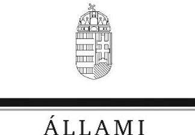

# Jelentés

## A regionális vízművek gazdálkodásának ellenőrzése

2017.

17107 www.asz.hu

---

# A A 1   ÁLLAMI   SZÁMVEVÔSZÉK 

## Jelentés

## A regionális vízmúvek gazdálkodásának ellenőrzése

2017. 07. hó 06. nap
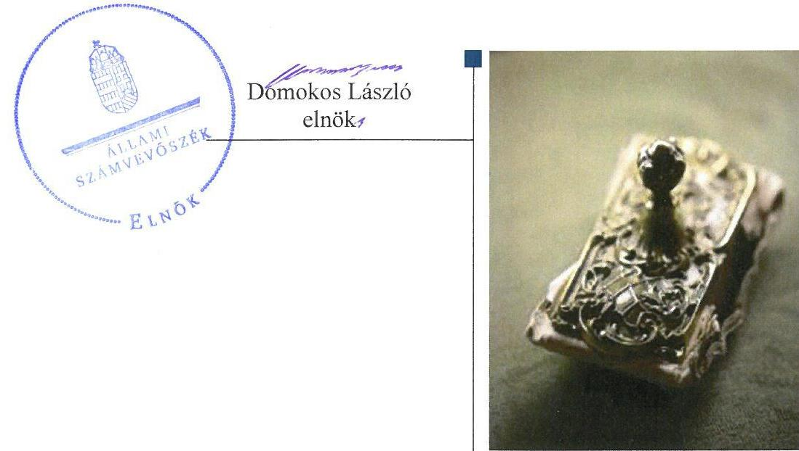

---

# AZ ELLENŐRZÉST FELÜGYELTE:

## MAKKAI MÁRIA felügyeleti vezető

## AZ ELLENŐRZÉST VEZETTE ÉS A VÉGREHAJTÁSÁÉRT FELELŐS:

### DR. SIMON JÓZSEF ellenőrzésvezető

## A PROGRAM ÖSSZEÁLLÍTÁSÁÉRT FELELŐS:

### JANIK JÓZSEF LÁSZLÓ osztályvezető

---

**IKTATÓSZÁM: V-1178-372/2016.**

**TÉMASZÁM: 2212**

**ELLENŐRZÉS-AZONOSÍTÓ SZÁM: V0767**

---

Jelentéseink az Országgyűlés számítógépű kálózatát és az Interneta a www.asz.hu címen is olvashatóak.

---

# TARTALOMJEGYZÉK 

■ ÖSSZEGZÉS ..... 5
■ AZ ELLENŐRZÉS CÉLJA ..... 6
■ AZ ELLENŐRZÉS TERÜLETE ..... 7
■ AZ ELLENŐRZÉS HÁTTERE, INDOKOLTSÁGA ..... 9
■ A JELENTÉS LÉNYEGES KÉRDÉSKÖREI ..... 10
■ ELLENŐRZÉS HATÓKÖRE ÉS MÓDSZEREI ..... 11
■ MEGÁLLAPÍTÁSOK ..... 13
■ JAVASLATOK ..... 24
■ KÖVETKEZTETÉSEK ..... 26
■ MELLÉKLETEK ..... 27
I. Sz. melléklet: Értelmező szótár ..... 27
II. Sz. melléklet: A regionális vízmű társaságok gazdálkodási mutatói 2011-2015. között ..... 30
■ FÜGGELÉK: ÉSZREVÉTELEK ..... 35
■ RÖVIDÍTÉSEK JEGYZÉKE ..... 65

---

.

---

# ÖSSZEGZÉS 

Az ágazati irányítást ellátó minisztériumok, a tulajdonosi joggyakorló és a felügyeleti szerv intézkedései támogatták az integrációs folyamat megvalósitását. A regionális vizmü társaságok a szolgáltatási dijakat szabályszerüen alkalmazták. A költséggazdálkodásuk hatékonysága javult. A közfeladat ellátására szolgáló vagyonnal összességében szabályszerűen gazdálkodtak.

## Az ellenőrzés társadalmi indokoltsága

Alapvető nemzeti érdek a megfelelő színvonalú és biztonságos ivóvíz- illetve szennyvízszolgáltatás biztosítása. Napjainkban ezért nagy jelentőséggel bír a fenntartható vízgazdálkodás, az ivóvízkincs megóvása valamint a nemzeti víziközmú-vagyon védelme. E stratégiai célok megvalósitásában kiemelkedő jelentőséggel bírnak a többségi állami tulajdonban lévő regionális víziközmú-szolgáltatók.

A víziközmú-szolgáltatások területén a 2011. évben elindult integrációs folyamat következtében a regionális vizmú társaságok ellátási területe, ezáltal az általuk múködtetett vagyon értéke is dinamikusan növekedett. A jogalkotó szándéka az integrált, egységes és szabályozott piac feltételeinek megteremtése volt, amelynek szereplői megfelelnek a jogszabályban előírt gazdasági, múszaki és környezetvédelmi feltételeknek. További szabályozói célt jelentett, hogy a víziközmú-szolgáltatók közel azonos minőséggel, valamint a hatékony és hosszú távú, folyamatos múködést biztosítva nyújtsanak közszolgáltatást a kapacitások megfelelő kihasználtsága mellett.

Az ellenőrzés lefolytatását a társadalmi szempontok kiemelt jelentősége, valamint a 2011-től bekövetkezett jelentős jogszabályváltozások mellett az is indokolta, hogy a korábbi számvevőszéki jelentések hibákat, hiányosságokat és szabálytalanságokat tártak fel a regionális víziközmú-szolgáltatók vagyonérték megőrző és gyarapító tevékenységével kapcsolatban.

## Főbb megállapítások, következtetések, javaslatok

A 2011. évben kidolgozott víziközmú szolgáltatásról szóló törvény a jogszabályalkotó szándékának megfelelően betöltötte szerepét, a víziközmú ágazat integrációs folyamatának alapját jelentette.

A víziközmú-szolgáltatási díjak alkalmazása a jogszabályok előírásai szerint történt. A regionális vizmú társaságok a 2013. évtől kezdődően megvalósították a szolgáltatási díjak csökkentését.

Az integrációs folyamat hozzájárult a hatékonyabb üzemméret kialakításához, a költséghatékonyság javulásához. Az integrációs folyamat hatására növekedett az egyes ellátási területeken a regionális vizmú társaságok által kiszolgált fogyasztók száma és ez pozitív hatást gyakorolt az egységnyi ráfordításra.

A társaságok a közfeladat ellátására a használatukba illetve kezelésükbe került vagyonnal összességében szabályszerűen gazdálkodtak. A társaságok vagyongazdálkodásának hatékonysága kedvezőtlen irányba változott, mert az eszközök elhasználódási foka, a vevőkövetelések, illetve az erre elszámolt értékvesztések értéke növekedett. A tárgyi eszközök élettartamát növelő felújítások, beruházások az ellenőrzött időszakban a 2014. évig jellemzően az elhasználódási mértéknek megfelelően valósultak meg. Az elvégzett beruházások a 2015. évben azonban nem biztosították a vagyonérték megőrzését.

---

# AZ ELLENŐRZÉS CÉLJA 

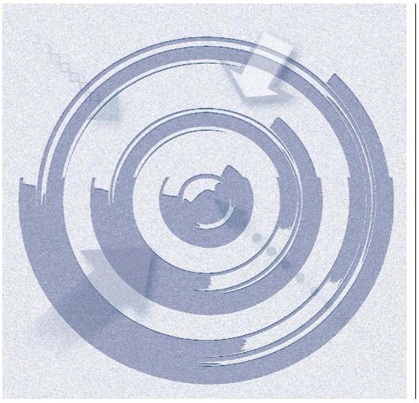

Az ellenőrzés célja annak értékelése volt, hogy a többségi állami tulajdonban álló regionális víziközmű-szolgáltató társaságok, a tulajdonosi joggyakorló, valamint a felügyeleti és irányító szervek által megtett intézkedések biztosították-e a szektor integrációjára és a szolgáltatási díjak csökkentésére vonatkozó kormányzati célkitűzések teljesülését, a társaságok a víziközmú-vagyonnal hatékonyan gazdálkodtak-e.

---

# AZ ELLENŐRZÉS TERÜLETE 

## Az öt regionális vízmű társaság, a tulajdonosi jogokat gyakorló Magyar Nemzeti Vagyonkezelő Zrt., a Földművelésügyi Minisztérium, a Belügyminisztérium, a Nemzeti Fejlesztési Minisztérium, továbbá a Magyar Energetikai és Közmű-szabályozási Hivatal.

A víziközmű-szolgáltatás Magyarországon két fő alaptevékenységet jelent, a közműves ivóvízellátást, illetve a közműves szennyvízelvezetést és -tisztítást. Az alaptevékenységeken kívül egyéb tevékenységeket is elláthatnak a víziközmú-szolgáltatók. Ezek közé tartoznak többek között a vízipari építőmunka, a tervezési, a mérnöki, a műszaki szakértői valamint a fürdőszolgáltatások nyújtása. A víziközmű-szolgáltatás engedélyköteles tevékenység, amelynek szabályozási hátterét a Vgtv. ${ }^{1}$ és a 2011. december 31-től hatályos Vksztv. ${ }^{2}$ határozza meg.

Az egészséges ivóvíz ellátás és a helyi szintű szennyvízkezelés biztosítása az állam, illetve a települési önkormányzatok kötelessége, akik a víziközmű-szolgáltatók közreműködésével végzik a tulajdonukban lévő víziközmű-rendszerek üzemeltetését. Az állam e feladatra 2014-től kezdődően külön közszolgáltatási szerződéseket kötött a regionális vízmű társaságokkal.

A víziközmű-szolgáltatási ágazaton belül 2011-ben közel 400 önkormányzati, illetve állami tulajdonú víziközmű-szolgáltató gazdasági társaság múködött. A Vksztv. hatályba lépését követően elkezdődött a víziközműszektor piaci struktúrájának átalakítása, a víziközmű-szolgáltatás integrációja. Ennek eredményeként 2015-ben 42-re csökkent az engedéllyel rendelkező víziközmű-szolgáltatók száma. A társaságok között öt regionális többségi állami tulajdonú, kettő többségi fővárosi tulajdonú, 35 pedig többségi önkormányzati tulajdonú volt. Az ágazat közvetlenül összesen mintegy húszezer munkavállalót foglalkoztatott.

Az irányítási feladatokat a víziközmű ágazat esetében több minisztérium látta el az ellenőrzött időszakban. 2012. június 26-ig e feladatok egységesen az $\mathrm{FM}^{3}$ jogelődjének hatáskörébe tartoztak. Ezen időpontot követően az $\mathrm{NFM}^{4}$ felelősségi körébe került át a víziközmű ágazat gazdálkodói tevékenységének szabályozása. Az egyéb tevékenységek szabályozását továbbra is a vidékfejlesztési miniszter látta el 2014. január 1-ig, majd ezt követően e feladatok a $\mathrm{BM}^{5}$ hatáskörébe kerültek.

A víziközmű társaságok felett a Vtv. ${ }^{6}$ valamint a Vksztv. szerint az állam jogainak és kötelezettségeinek tulajdonosi joggyakorlója az állami vagyon felügyeletéért felelős miniszter, aki e feladatát az $\mathrm{MNV}^{7}$ útján látja el.

A víziközmű társaságok szakmai tevékenységét a $\mathrm{MEH}^{8}$ jogutódjaként 2013. április 4-től a MEKH ${ }^{9}$ felügyeli. A korábbiakhoz képest a felügyeleti

---

1. táblázat

| ÁLLAMI VAGYON ARÁNYA A |  |
| :--: | :--: |
| KEZELT ÖSSZES VAGYONHOZ |  |
| KÉPEST (\%) |  |
| Év | Arány |
| 2011. | 98 |
| 2012. | 98 |
| 2013. | 96 |
| 2014. | 96 |
| 2015. | 98 |

szerv szélesebb körű jogosítványokkal rendelkezik, a víziközmű szolgáltatások engedélyeztetési, ellenőrzési és nyomon követési feladatai esetén.

A regionális vízmű társaságok többségi állami tulajdonú gazdasági társaságok. Az állami vagyon arányát az ellenőrzött időszakban a teljes vagyonhoz képest az 1. táblázat mutatja be.

A 2011-ben elindult integrációs folyamat révén ellátási területük jelentősen növekedett, ezáltal az általuk kezelt vagyon értéke 2015. december 31-én 239,92 Mrd Ft-ra növekedett, a 2011. január 1-jei 130,96 Mrd Fthoz képest. E változásban alapvető szerepet játszott, hogy 2014-től elkezdődött a víziközmű-vagyon piaci értékének megállapítása, amelynek révén a kezelésben lévő vagyon értéke jelentősen növekedett.

A víziközmű ágazatban az ellenőrzött időszakban több lényegi változás is lezajlott. A Vksztv. hatályba lépését követően központi hatósági árszabályozás valósult meg a víziközmű díjak megállapítása során, az önkormányzatok ármegállapítási jogosítványa megszűnt. Az árazás területén 2013. július 1-jétől kezdődően valósult meg a lakossági terhek mérséklését célzó rezsicsökkentés.

A víziközmű társaságok az ellátásbiztonság hosszú távú garantálása érdekében 2014-től kezdődően gördülő fejlesztési tervet kötelesek készíteni, amely a víziközmű-rendszerek rekonstrukciós programjának megvalósítását célzó 15 évre szóló felújítási, pótlási, valamint beruházási tervet foglalja magába.

Az ellenőrzött regionális víziközmű-szolgáltatók főbb gazdasági, piaci és műszaki adatait a 2. táblázat mutatja be.
2. táblázat

# AZ ÖT REGIONÁLIS VÍZIKÖZMŰ-SZOLGÁLTATÓ FŐBB GAZDASÁGI, PIACI ÉS MŰSZAKI ADATAI (2011-2015) 

|  | 2011. | 2012. | 2013. | 2014. | 2015. |
| :--: | :--: | :--: | :--: | :--: | :--: |
| Értékesítés nettó árbévétel összesen (M Ft) | 42945 | 45470 | 50128 | 52564 | 59799 |
| Alaptevékenységek (ivóvízellátás, szennyvízkezelés) nettó árbevétele (M Ft) | 34616 | 36589 | 45338 | 46635 | 52361 |
| Átlagos állományi létszám (fő) | 4317 | 4441 | 5397 | 6007 | 6647 |
| Üzemeltetett ivóvízhálózat hossza (km) | 14349 | 14717 | 21106 | 23905 | 25221 |
| Üzemeltetett szennyvíz csatornahálózat hossza (km) | 8704 | 9269 | 12913 | 15076 | 16379 |
| Mérleg szerinti eredmény (M Ft) | 593 | $-787$ | $-5545$ | $-1545$ | 450 |
| Követelések (M Ft) | 9098 | 9662 | 14120 | 12814 | 14466 |
| Kötelezettségek (M Ft) | 143807 | 144550 | 161112 | 156734 | 259748 |
| Saját tőke (M Ft) | 15747 | 14960 | 10998 | 12278 | 13298 |
| Befektetett eszközök (M Ft) | 11637 | 11879 | 12093 | 12678 | 12664 |
| Kezelt vagyon értéke (M Ft) | 133763 | 134197 | 143729 | 138303 | 239917 |
| - ebből állami vagyonkezelésből | 131535 | 131431 | 137904 | 133116 | 235149 |
| - önkormányzati vagyonkezelésből | 2228 | 2766 | 5826 | 5187 | 4768 |
| Felhasználói egyenérték (FE) | 2067833 | 2063847 | 2614625 | 2798050 | 2809616 |

Forrás: Társaságok adatszolgáltatása, éves beszámolók

---

# AZ ELLENŐRZÉS HÁTTERE, INDOKOLTSÁGA 

A REGIONÁLIS VÍZIKÖZMŰ-SZOLGÁLTATÓK VAGYONI ÉS GAZDÁLKODÁSI HELYZETÉT alapvetően befolyásolta a víziközmű ágazatban zajló integrációs folyamat valamint az új ellátási területek átvétele. A regionális víziközmű-szolgáltatók ellátási területének növekedése eltérő mértékben hat az árbevétel, a költségek és a ráfordítások alakulására. Megállapításaink és javaslataink hozzájárulnak a vagyongazdálkodási tevékenység hatékonyságának javításához, a víziközmű ágazat eredményesebb működéséhez.

## AZ ELLENŐRZÉS VÁRHATÓ HASZNOSULÁSA-

KÉNT a közvélemény hiteles információkhoz juthat a regionális vízmű társaságok müködésének és gazdálkodásának hatékonyságáról, a közszolgáltatás ellátásának helyzetéről, az integráció folyamatáról, a szolgáltatási díjak alakításáról, továbbá az állami víziközmű-vagyonnal való felelős gazdálkodásról. Ezáltal növelhetjük az általános szakmai tájékozottságot, erősíthetjük a társadalom és a gazdasági szereplők bizalmát az ÁSZ ${ }^{10}$ ellenőrző tevékenységével szemben.

A REGIONÁLIS VÍZMŰ TÁRSASÁGOKNÁL a 2014. évben végzett szabályszerűségi ellenőrzések tapasztalatai, az ágazatban lezajló integrációs folyamat és jogszabályi változások indokolják a téma ellenőrzését.

---

# A JELENTÉS LÉNYEGES KÉRDÉSKÖREI 

1.     - A víziközmú-szektor ágazati irányítását ellátó minisztérium, a tulajdonosi joggyakorló, valamint a felügyeleti szerv intézkedései támogatták-e a víziközmú-szolgáltatás integrációját?
2.     - A regionális vizmúvek a szolgáltatási dijak csökkentését a kormányzati célkitüzésekkel összhangban valósitották-e meg?
3.     - Javult-e az ellenőrzött időszakban a társaságoknál a költségilletve a vagyongazdálkodás hatékonysága?
4.     - A regionális vizmü társaságok a közfeladat ellátására használatukba/kezelésükbe került vagyonnal szabályszerűen gazdál-kodtak-e?

---

# ELLENŐRZÉS HATÓKÖRE ÉS MÓDSZEREI 

## Az ellenőrzés típusa

Megfelelőségi és teljesítmény ellenőrzés.

## Az ellenőrzött időszak

Az ellenőrzött időszak 2011. január 1-től 2015. december 31-ig tart.

## Az ellenőrzés tárgya

A víziközmű-szektor integrációját megvalósító ágazati irányító szervek, a tulajdonosi joggyakorló, valamint a felügyeleti szerv által megtett intézkedések.

A víz és szennyvíz szolgáltatási díjak csökkentésére vonatkozó kormányzati célkitűzések teljesülése.

A regionális víziközmú-szolgáltató társaságok a közfeladat ellátására tulajdonukba került vagyonnal történő hatékony gazdálkodása.

Az ellenőrzés kiterjed minden olyan körülményre és adatra, amely az ÁSZ jogszabályban meghatározott feladatainak teljesítéséhez, valamint a program végrehajtása folyamán felmerült újabb összefüggések feltárásához szükséges.

## Az ellenőrzött szervezet

A nemzetgazdasági szempontból kiemelt jelentőségű regionális vízművek: Északmagyarországi Regionális Vízművek Zrt. (ÉRV) ${ }^{11}$, DMRV Duna Menti Regionális Vízmú Zrt. (DMRV) ${ }^{12}$, Északdunántúli Vízmú Zrt. (ÉDV) ${ }^{13}$, Dunántúli Regionális Vízmú Zrt. (DRV) ${ }^{14}$, Tiszamenti Regionális Vízmúvek Zrt. (TRV) ${ }^{15}$, a tulajdonosi jogokat gyakorló Magyar Nemzeti Vagyonkezelő Zrt. (MNV), a Földművelésügyi Minisztérium (FM), a Belügyminisztérium (BM), a Nemzeti Fejlesztési Minisztérium (NFM), továbbá a Magyar Energetikai és Közmű-szabályozási Hivatal (MEKH).

## Az ellenőrzés jogalapja

ÁSZ tv. 5. § (2) - (5) bekezdésében foglaltak.

---

# Az ellenőrzés módszerei 

Az ellenőrzést az ellenőrzési program szempontjai, kérdései, az ellenőrzött időszakban hatályos jogszabályok, az ellenőrzés szakmai szabályai, az ÁSZ megfelelőségi és teljesítmény ellenőrzési módszertana alapján végeztük.

Az ellenőrzés ideje alatt az ellenőrzött szervezettel történő kapcsolattartást az ÁSZ Szervezeti és Múködési Szabályzatának vonatkozó előírásai alapján biztosítottuk.

Az ellenőrzési kérdések megválaszolásához szükséges bizonyítékok megszerzése a következő ellenőrzési eljárások alkalmazásával történt: megfigyelés, kérdésfeltevés (információkérés), összehasonlítás, valamint elemző eljárás. Az ellenőrzési bizonyítékként felhasználható adatforrások közé tartoztak egyrészt az ellenőrzési programban felsorolt adatforrások, másrészt adatforrást jelentett még minden - az ellenőrzés folyamán - feltárt, az ellenőrzés szempontjából információkat tartalmazó dokumentum.

Az ellenőrzést a kérdésekre adott válaszok kiértékelésével, valamint a megjelölt adatforrások, a csatolt tanúsítványok felhasználásával, továbbá az adott időszakban hatályos jogszabályok figyelembe vételével folytattuk le.

Mintavétellel ellenőriztük a regionális vízmú társaságoknál az ellátásért felelős és a regionális víziközmű-szolgáltató közötti víziközmű-üzemeltetési szerződések szabályszerűségét. A minta alapján a sokaságban előforduló hibaarányt becsültük. „Megfelelőnek" értékeltünk egy ellenőrzött területet, amennyiben 95\%-os bizonyossággal a teljes sokaságban a hibaarány legfeljebb 10\%, nem megfelelőnek, amennyiben 10\%-nál magasabb arányt képviselt.

Az ellenőrzés során minden olyan körülményt és adatot is ellenőriztünk, amely a program végrehajtása kapcsán felmerült újabb összefüggéseknek az ellenőrzés céljaival összhangban lévő feltárásához volt szükséges.

Az ellenőrzés végrehajtása során teljesítmény-ellenőrzési kritériumok is felhasználásra kerültek.

A regionális vízmú társaságok költséghatékonyságát a költségnemek abszolút értékeinek időbeli változásának összehasonlításával valamint teljesítménymutatók (az egy kilométer vezetékre illetve a felhasználói egyenértékre jutó árbevétel illetve ráfordítás) alkalmazásával ellenőriztük.

A vagyongazdálkodás hatékonyságának változását az eszközök elhasználódási szintje mutató, a vevő követelésállomány, illetve a vevő követelésállományra elszámolt értékvesztés értékének alakulása alapján értékeltük.

---

# MEGÁLLAPÍTÁSOK 

## 1. A víziközmú-szektor ágazati irányítását ellátó minisztérium, a tulajdonosi joggyakorló, valamint a felügyeleti szerv intézkedései támogatták-e a víziközmú-szolgáltatás integrációját?

Összegző megállapítás

1.1. számú megállapítás

A víziközmú-szektor ágazati irányítását ellátó minisztériumok, a tulajdonosi joggyakorló és a felügyeleti szerv intézkedései alapvetően támogatták a víziközmú-szolgáltatás integrációjának megvalósítását.

A víziközmú-szektor ágazati irányítását ellátó Vidékfejlesztési Minisztérium kidolgozta törvényjavaslat formájában az állami tulajdonú vízmúvek integrációját.

A VÍZIKÖZMÚ ÁGAZAT INTEGRÁCIÓJÁRA vonatkozó koncepció kidolgozása 2011-ben a Vksztv. előkészítése által valósult meg a $\mathrm{VM}^{16}$ irányításával. A jogszabálytervezet tartalmazta a közremúködésért felelős minisztériumok által meghatározott, a víziközmú-szektor múködésével kapcsolatos, az integrációt is érintő, átfogó alapelveket. A Vksztv. 2011. december 31-i hatálybalépését követően kezdődött el a víziközmú ágazat integrációs folyamatának megvalósítása.

A nemzeti fejlesztési miniszter 2012. június 27-től előkészítette a víziközmú-szolgáltatáshoz és a víziközmú-múködtetéshez kapcsolódó gazdálkodói tevékenység szabályozásáról szóló jogszabályokat, valamint az integráció forrásszükségletének felmérését követően kormányhatározati előterjesztéseket dolgozott ki, amelyeket a Kormány jóváhagyott.

A víziközmú-szektor ágazati irányítását ellátó Vidékfejlesztési Minisztérium illetve 2012. június 27-től a Nemzeti Fejlesztési Minisztérium és a tulajdonosi joggyakorló figyelemmel kísérték a regionális vízmúvek gazdálkodását, illetve az integráció folyamatát. A felügyeleti szerv összességében kialakította a víziközmú-szolgáltatás ellenőrzésére irányuló monitoring rendszert.

Az ágazati irányítást ellátó NFM 2013. júniusig, a tulajdonosi joggyakorló és a felügyeleti szerv közremúködésével, nyomon követte a víziközmú ágazat gazdálkodási helyzetét és az integráció előrehaladását.

Az MNV az üzletmenetén keresztül folyamatosan nyomon követte a regionális vízmú társaságok gazdálkodását és adatokat szolgáltatott az NFM részére.

A TERVEZÉSI IRÁNYELVEK minden évben kiadásra kerültek a regionális vízmú társaságok részére. A tervezési irányelvekben rögzítették az éves beszámoló valamint üzleti terv elfogadására vonatkozó elvárá-

---

sokat. Az üzleti év végén az éves beszámolók MNV általi elfogadása megtörtént. A Vtv., az Nvtv. ${ }^{17}$ valamint a Tulajdonosi ellenőrzési szabályzattal összhangban az MNV a regionális vízmű társaságok vagyongazdálkodását érintő ellenőrzéseket végzett.

# AZ INTEGRÁCIÓ ÁTFOGÓ PÉNZÚGYI ÉS GAZDÁL- 

KODÁSI HATÁSAIRÓL az MNV egy alkalommal kért adatokat a regionális vízmű társaságoktól. A 2015-ben történt adatszolgáltatás évente törzs-, integrált- és közérdekú kijelölésben érintett területek szerinti bontásban tartalmazott részletes gazdálkodási adatokat 2010-ig visszamenőleg, amely alapján összefoglaló értékelést készített az NFM számára az elért eredményekről.

## A MEKH A VÍZIKÖZMŰ-SZOLGÁLTATÁS ELLENÖRZÉSÉRE IRÁNYULÓ ELLENŐRZÉSI MÓDSZERTANNAL 2013. november 13-tól rendelkezett. A MEKH tv. ${ }^{18}$ rendelkezésével összhangban lévő, a víziközmű-engedélyezési és ellenőrzési feladatokra vonatkozó ügyrend 2014. június 7 -én lépett hatályba.

A MEKH elnöke rendelet helyett utasítás formájában írta elő az ellenőrzött vízmű társaságok számára a rendszeres információ szolgáltatási kötelezettség tartalmát.

A MEKH rendszeresen felügyeleti ellenőrzéseket végzett a víziközmúszolgáltatóknál. Az elvégzett ellenőrzések statisztikai adatait, illetve tapasztalatait 2013-tól kezdődően éves ellenőrzési- valamint költségvetési jelentés keretében mutatta be.

A MEKH a víziközmű-szolgáltatás adatairól vezetett Nemzeti Viziközmú Nyílvántartási Rendszert kialakította. A nyilvántartás - a Vksztv. előírásának megfelelően - teljes körűen tartalmazta a víziközmű-szolgáltatással kapcsolatos adatokat.

A regionális vízmú társaságok intézkedtek az integráció megvalósítása érdekében. Az elért eredményeket értékelték az éves üzleti jelentéseikben, illetve összegző értékeléseket is készítettek.

AZ INTEGRÁCIÓVAL KAPCSOLATBAN VÉGREHAJTOTT INTÉZKEDÉSEKET a regionális vízmú társaságok az éves üzleti jelentéseikben mutatták be, valamint saját belső elemzéseket, összefoglalókat is készítettek. E dokumentumokban - a DMRV-t kivéve - elemezték az integrációs folyamat pozitív és negatív hatásait, kitérve a kezdeti átállási nehézségekre és a költségek növekedésére, valamint - a TRV-t kivéve - az integráció potenciális szakmai és gazdasági előnyeire is.

A regionális vízmű társaságok az integráció hatásainak értékelése során felmérést készítettek a települések csatlakozásának előkészítését célzó feladatokról. Az ÉRV részletes intézkedési tervet, a DRV pedig integrációs stratégiát készített.

---

# 2. A regionális vízművek a szolgáltatási díjak csökkentését a kormányzati célkitűzésekkel összhangban valósították-e meg? 

Összegző megállapítás

## 2.1. számú megállapítás

A regionális vízművek a szolgáltatási díjak csökkentését a kormányzati célkitűzésekkel összhangban valósították meg.

Az ágazati irányítást ellátó miniszter a 2011. évben meghatározta az alkalmazandó árpolitikát és eleget tett az árszabályozási kötelezettségének.

AZ ÁGAZATI IRÁNYÍTÁST ELLÁTÓ VIDÉKFEJLESZTÉSÉRT FELELŐS MINISZTER a 2011. évben meghatározta az állami tulajdonú közüzemi vízműveket működtető társaságok által felszámítható lakossági és nem lakossági ivóvíz- és csatornahasználat legmagasabb díjait, valamint a közműves vízszolgáltatást végző gazdálkodó szervezeteknek közüzemi szolgáltatásra átadott és átvett ivóvíz legmagasabb átadás díjait.

A regionális vízmú társaságok által alkalmazott víziközmű-szolgáltatás díjak megállapítása megfelelt a jogszabályi előírásoknak, a 2013. évtől kezdődően megvalósították a szolgáltatási díjak csökkentését.

Az állami valamint az önkormányzati tulajdonú víziközműből szolgáltatott jellemzően ellátási területenként és településenként eltérő - lakossági, illetve nem lakossági ivóvíz és csatornahasználat alapdíjai és fogyasztási valamint az átadott ivóvíz átadásai díjai az előírt legmagasabb díjakat nem haladták meg az ellenőrzött időszakban.

A 2012. évtől kezdődően a regionális vízmű társaságok érvényesítették a díjemelés felső mértékét, az önkormányzati tulajdonú vízművekből nyújtott szolgáltatások esetében a Vksztv. rendelkezései alapján, a 2011. december 31-én alkalmazott bruttó díjhoz képest 4,2\%-kal magasabb díjat alkalmaztak.
2013. július 1-jét követően - a Rezsi tv. ${ }^{19}$ előírásainak megfelelően - egységesen 10\%-kal csökkentették a 2013. január 31-én alkalmazott lakossági szolgáltatási árakat, a nem lakossági fogyasztók esetén 2013. május 10-től a 2013. január 31-én hatályos árakat, illetve átadási árakat alkalmazták.

A TRV nem a megfelelő díjat számlázta ki 2011. december 31-től az egyik szolgáltatási területén található önkormányzat részére - nem lakossági felhasználónak lakossági díjszabást alkalmazott, ami nem felelt meg a 47/1999. (XII. 28.) KHVM rendelet 1. § és 4/A. §-aiban foglalt rendelkezéseknek, valamint szabálytalanul érvényesítette 2013. július 1-től a Rezsi tv. 4. § (1) bekezdése által a kizárólag a lakossági fogyasztók számára előírt díjcsökkentést.

---

# 2.3. számú megállapítás 

A regionális vízmú társaságok jellemzően szabályszerűen eleget tettek számviteli szétválasztási kötelezettségüknek. A keresztfinanszírozás tilalmának való megfelelés teljes körűen megvalósult.

Az ellenőrzött víziközmű-szolgáltatók a Számv. tv. ${ }^{20}$ rendelkezésének megfelelően az ellenőrzött időszakban rendelkeztek hatályos önköltség-számítási szabályzattal és az abban előírt módon az önköltségszámítást elkészítették. A Számv. tv. és a Vksz.Vhr. ${ }^{21}$ rendelkezéseivel összhangban meghatározták az Önköltség-számítási szabályzatban a költségek szétválasztási módszereit, a szétválasztás vetítési alapjait. Az ÉRV az ellenőrzött időszakban nem az Önköltség-számítási szabályzatában előírtaknak megfelelően végezte az önköltségszámítást, mert a számításokat nem az általa meghatározott kalkulációs egységekre végezte el.

A víziközmű-szolgáltatás díjkalkulációinál az ellenőrzött időszakban a Vksztv. 62. § (1) bekezdés b) pontjában szereplő folyamatos és biztonságos víziközmű-szolgáltatás indokolt költségeinek tartalma nem volt meghatározott. Ezáltal a kalkulációkban a költségtételek kimutatásának szabályszerűsége jogszabályi szempontból nem volt megítélhető.

A Vksztv. rendelkezése alapján a víziközmű-szolgáltatás díjait a költségekre és árakra vonatkozó közgazdasági összehasonlító elemzések felhasználásával határozták meg az ellenőrzött víziközmű szolgáltatatók - kivéve a DRV-t, amely az önkormányzati településekre vonatkozó díjkalkulációit nem a Vksztv. 62. § (1) bekezdésében foglalt előírásnak megfelelően készítette el.

Az ellenőrzött víziközmű-szolgáltatók a 2013. évtől kezdődően a Vksztv. rendelkezéseinek megfelelően tettek eleget számviteli szétválasztási kötelezettségüknek. Az éves beszámoló kiegészítő mellékletében a Vksztv. előírásainak megfelelően mutatták be az ágazati tevékenységek elkülönített eredménykimutatását.

## 3. Javult-e az ellenőrzött időszakban a társaságoknál a költségilletve a vagyongazdálkodás hatékonysága?

Összegző megállapítás

Az ellenőrzött időszakban a társaságok költséggazdálkodásának hatékonysága - a költségek növekedése mellett - összességében pozitívan változott, a vagyongazdálkodás hatékonysága jellemzően romlott.
3.1. számú megállapítás

A regionális vízmú társaságok gazdálkodásának hatékonyságát a folyamatban lévő integráció és jogszabályi változások befolyásolták. Az ellenőrzött időszakban érvényesült az integráció által a mérethatékonyság elve.

AZ ÉRTÉKESÍTÉS NETTÓ ÁRBEVÉTELE minden regionális vízmű társaságnál összességében növekvő tendenciát mutatott az ellenőrzött időszakban, amelynek meghatározó oka az integrációból fakadó szolgáltatási terület bővülése és a víziközmú-rendszerekre történt rákötések számának növekedése volt. A víziközmű-szolgáltatással ellátott települések száma összesen 608-ról 1160-ra emelkedett.

---

Az árbevétel volumenére hatással volt a szolgáltatási díjak 2013. január 1-jétől érvényes változatlansága, illetve a Rezsi tv. alkalmazása. A TRV és ÉRV esetében az árbevétel növekedése e tényezők mellett is folyamatos volt.

Az egyéb bevételek növekedését valamennyi ellenőrzött társaságnál a 2014. évben bevezetett közszolgáltatási ellentételezések okozták.

Az ellenőrzött időszakban, főként a szolgáltatási terület bővülése miatt, az elszámolt költségek értéke jelentősen emelkedett. A regionális vízmű társaságok ez alapján a 2012. évtől kezdődően költségcsökkentő intézkedéseket hajtottak végre, amelyek azonban a költségek növekedéséhez képest kisebb megtakarítást eredményeztek.

Az anyagköltség és az igénybevett szolgáltatások értéke a társaságoknál együttesen 2011-2015. között 16,3 Mrd Ft-os növekedést mutatott. Az integráció miatt a nem gazdaságosan működtethető szolgáltatási terület bővülése fajlagosan is magasabb anyag és energia felhasználást okozott. A munkavállalói létszám közel 58\%-os növekedése miatt a személyi jellegű ráfordítások az ellenőrzött időszakban összességében 10,9 Mrd Ft-tal, 62,6\%-kal növekedtek. Az állami vagyon piaci értékelése és a magasabb eszközértékek számviteli nyilvántartásokban való megjelenése miatt az elszámolt értékcsökkenés összege a 2015. évben összesen 9,8 Mrd Ft-tal növekedett a 2014. évihez képest. Az elszámolt értékcsökkenés társaságonként legalább kétszeresére növekedett a 2015. évben a 2014. évi értékhez viszonyítva, ami szintén költségnövekedést okozott.

AZ EGYÉB RÁFORDÍTÁSOK értékének jelentős növekedését a regionális vízmű társaságoknál főként a közműadó okozta, amelynek mértéke 2014-ben 3,8 Mrd Ft-ot, 2015-ben pedig összesen 4,4 Mrd Ft-ot tett ki.

Az egyes eredménykategóriák regionális vízmű társaságonkénti alakulását a II. számú melléklet mutatja be.

A regionális vízmű társaságok összesített mérleg szerinti eredményének alakulását az 1. ábra mutatja be alátámasztva az előzőekben bemutatott tényezők együttes hatását.
1. ábra
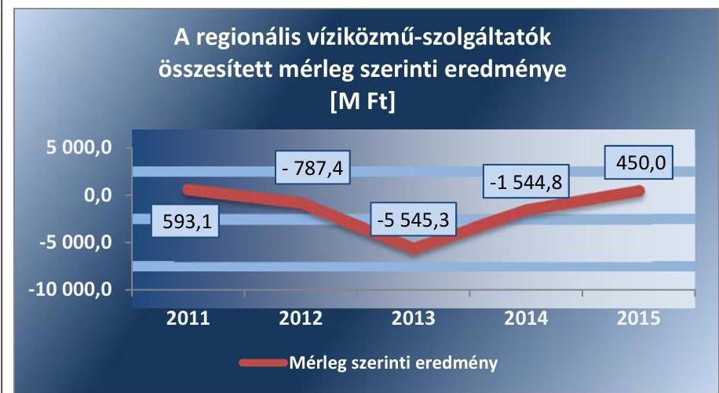

Forrás: Társaságok éves beszámolói.

---

A regionális vízmű társaságok mérleg szerinti eredményének 2013. évtől tapasztalható javulásában szerepet játszottak az integráció gazdálkodásra gyakorolt pozitív hatásai, valamint az egyéb és a rendkívüli bevételek jelentős növekedése.

Az ellenőrzött időszakban - a területi ellátási viszonyok függvényében az egyes társaságok egy kilométer vezetékre jutó árbevétele átlagosan 22,5\%-kal csökkent. A 2014. évi értékekhez képest a mutató értékében minden társaságnál jelentős növekedés volt tapasztalható a 2015. évben.

# AZ EGY KILOMÉTER VEZETÉKRE JUTÓ RÁFORDÍ- 

TÁSOK ezzel szemben átlagosan 29,5\%-kal nőttek (15,5-40,3\%). A TRVnél egy $\mathrm{FE}^{22}$ ellátásához átlagosan 20-25 méter vezetékhossz szükséges, míg az ÉDV esetében mindössze 8-10 méter.

Az integrációs folyamat gazdálkodásra gyakorolt hatását kifejező egy kilométer vezetékhosszra jutó árbevétel és ráfordítás mutatószámok társaságonkénti alakulását mutatja be a II. számú melléklet.

## A FELHASZNÁLÓI EGYENÉRTÉKRE VETÍTETT ÁR-

BEVÉTEL ÉS RÁFORDÍTÁS fajlagos értékei között társaságonként jelentős különbség nem állapítható meg. Ezt mutatja be a következő 3. táblázat.
3. táblázat

| AZ FE ÉS AZ FE-RE VETÍTETT RÁFORDÍTÁS VÁLTOZÁSA |  |  |  |
| :--: | :--: | :--: | :--: |
| TRV | 2011. | 2015. | Arány (2015/2011) |
| FE | 54055 | 521700 | 9,65 |
| ráfordítás/FE (eFt) | 35,9 | 29,4 | 0,82 |
| ÉRV | 2011. | 2015. | Arány (2015/2011) |
| FE | 228316 | 459800 | 2,01 |
| ráfordítás/FE (eFt) | 30,3 | 35,5 | 1,17 |
| ÉDV | 2011. | 2015. | Arány (2015/2011) |
| FE | 394887 | 505053 | 1,28 |
| ráfordítás/FE (eFt) | 18,2 | 27,2 | 1,49 |
| ÖRV | 2011. | 2015. | Arány (2015/2011) |
| FE | 819842 | 906595 | 1,11 |
| ráfordítás/FE (eFt) | 22,8 | 35,1 | 1,54 |
| ÖMRV | 2011. | 2015. | Arány (2015/2011) |
| FE | 570733 | 416468 | 0,73 |
| ráfordítás/FE (eFt) | 21 | 39,3 | 1,87 |

A 3. táblázat adatai alapján megállapítható, hogy az integrációs folyamat hatására kiváltott FE növekedés pozitív hatást fejtett ki a fajlagos ráfordítások értékére - minél intenzívebb az FE növekedése annál kedvezőbben változott az egységnyi FE-re jutó ráfordítás. Az integrációs folyamat, az ebben való részvétel alapján, kedvező hatást gyakorolt a regionális vízmű társaságok gazdálkodásának hatékonyságára.

Az egy FE-re jutó szolgáltatási volumen, árbevétel, illetve ráfordítás mutatószámok társaságonkénti alakulását szemlélteti a II. melléklet.

A regionális vízmű társaságok eszközeinek elhasználódási szintjének változását mutatja be a 2. ábra. A mutató értékének növekedése azt jelzi, hogy a rendelkezésre álló eszközök egyre kevésbé használhatóak fel a víziközmű-tevékenységek ellátása érdekében.

---

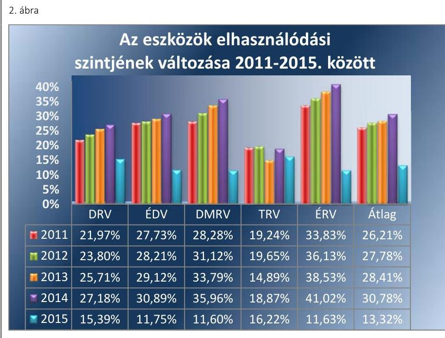

Forrás: Társaságok adatszolgáltatása
AZ ESZKÖZÖK ELHASZNÁLÓDÁSI SZINTJE 20112014. között - a TRV kivételével - folyamatosan romlott. A mutató 2015 évi jelentős javulása nem valós elhasználódási szint csökkenést takar, hanem az állami vagyonértékelések átvezetésének eredménye.

A vagyongazdálkodás területén kedvezőtlen tendenciát mutat a vevő követelésállomány értékének növekedése, amelynek fő indoka a hátrányos gazdasági helyzetű térségekben élő fogyasztók tartozásának dinamikus emelkedése. A lejárt vevő követelésállomány értéke az ÉDV-nél 44,5\%-kal, a TRV-nél 695,1\%-kal, az ÉRV-nél 121,4\%-kal volt magasabb a 2015. évben a 2011. évi bázishoz képest. A vevőkövetelések korösszetétele folyamatosan romlott az ellenőrzött időszakban a regionális vízmű társaságoknál. A regionális vízmű társaságok vevő követelésállományának alakulását részletesen a II. számú melléklet tartalmazza.

# A VEVŐKÖVETELÉSEK ELSZÁMOLT ÉRTÉKVESZ- 

TÉSE a 2015. évben a 2011. évihez képest mind az öt vízmű társaság esetében jelentősen növekedett 2011-2015. között, összességében 1,23 Mrd Ft-ról 226,5\%-kal, 4,01 Mrd Ft-ra. A DRV és a DMRV esetében a 2012. évet követően a vevőkövetelésekre elszámolt értékvesztés növekvő nagyságrendet mutat, ami jelentősen hozzájárult a vevő követelésállomány csökkenő tendenciájához. A regionális vízmű társaságok vevő követelésállományát és az elszámolt értékvesztés alakulását részletesen a II. számú melléklet 2. ábrája tartalmazza.

A folyamatban lévő integráció egyszerre okozott negatív és pozitív hatásokat. A szolgáltatási terület bővülése által szükségszerűen növekedtek abszolút mértékben a múködés költségei valamint a megnövekedett eszközérték után elszámolt értékcsökkenés is hasonló hatást okozott. Ugyanakkor az integráció által pozitív irányba változott az árbevétel, továbbá javult a társaságok költséghatékonysága is. Ez utóbbi javulásának mértéke az integrációs aktivitás, illetve lehetőségek függvénye volt. Nem számszerűsíthető előnyként jelentkezett az ellátásbiztonság javulása.

---

A vagyongazdálkodás hatékonyságát jellemző mutatók kedvezőtlen alakulásában összességében meghatározó tényezőt jelentett az eszközök elhasználódási fokának romlása, a kinnlevőségek és az ezekre elszámolt értékvesztés növekedése. A 2015. évi vagyonértékelés következtében a vagyongazdálkodás hatékonysági mutatói kedvezőbb képet mutatnak, azonban a jelentős nagyságrendű vevőkövetelések által okozott problémák továbbra is fennállnak.

# 4. A regionális vízmű társaságok a közfeladat ellátására használatukba/kezelésükbe került vagyonnal szabályszerűen gazdálkod-tak-e? 

Összegző megállapítás

A regionális vízmű társaságok - a vagyon kezelésére és hasznosítására vonatkozó szerződések megkötését, illetve az ÉDV esetében a vagyonértékelés teljes körű számviteli átvezetésének elmaradását kivéve - a közfeladat ellátására használatukba/kezelésükbe került vagyonnal összességében szabályszerűen gazdálkodtak.
4.1. számú megállapítás

Az ellenőrzött időszakban a víziközmú-vagyon kezelésére vonatkozó szerződések - a 2015. évi módosításig - illetve az üzemeltetési szerződések tartalma nem volt szabályszerű.

AZ ÁLLAMI VAGYONRA VONATKOZÓ VAGYONKEZELÉSI SZERZŐDÉSEK, amelyek 1998-ban léptek hatályba, a 2015. évig a szabályozás tartalmát tekintve nem módosultak, ezért a 2011. december 31-én és 2013. március 1-jén hatályba lépett jogszabályi változásoknak (Vtv., Nvt., Vtv.Vhr. ${ }^{23}$, Vksztv., Vksz.Vhr.) nem feleltek meg. A vagyonkezelési szerződéseket ezt követően a jogszabályi előírásoknak megfelelően alakította ki és kötötte meg, társaságonként eltérő időpontban, az MNV a regionális víziközmű-szolgáltatókkal.

Az ellenőrzött időszakban - jellemzően az állami vagyonra vonatkozó vagyonkezelési szerződések módosításának elmaradása miatt - az állami vagyon kategóriájába tartozó tárgyi eszközök értéke a számviteli nyilvántartásokban minden regionális vízmű társaságnál eltért az egyéb hosszú lejáratú kötelezettségek értékétől. A 2015. évben megkötött új vagyonkezelési szerződésekben meghatározták az aktuálisan vagyonkezelésben lévő állami vagyont, továbbá ennek változása esetén a szerződés módosításának eljárásrendjét, a könyvvezetésben az állami vagyon szabályszerű kimutatása érdekében.

A regionális vízmű társaságok az ellenőrzött időszakban a Vtv.Vhr. rendelkezésének megfelelően az MNV által meghatározott, az állami vagyonra vonatkozó nyilvántartási, adatszolgáltatási és elszámolási kötelezettségeiknek eleget tettek.

AZ MNV VAGYONNYILVÁNTARTÁSI SZABÁLYZATA, ${ }^{24} 2^{25}$ a 2015. évben újonnan megkötött vagyonkezelési szerződések 4. számú mellékletében szerepelt. Ezt megelőzően a Vtv.Vhr. 14. § (3)

---

bekezdésével ellentétesen a vagyonkezelési szerződések nem tartalmazták e szabályzat vagyonkezelővel történő kötelező megismertetést.

Az ellátásért felelős és a regionális vízmű társaságok közötti üzemeltetési szerződések a Vksz.Vhr. 1. mellékletének rendelkezései alapján 2013. március 1-jét követően nem voltak szabályszerűek. A Vksz.Vhr. 1. melléklet 13a. pontja a.a), a.b) és a.c) alpontjainak rendelkezése alapján nem tartalmazták a tárgyi feltételeken belül a víziközmű-üzemeltetéshez átadott víziközművek és egyéb eszközök átadás-átvételi jegyzőkönyvei tételesen az átadáskor fennálló bruttó, nettó és könyv szerinti értékeket továbbá a DRV, a TRV, az ÉDV és az ÉRV esetében a műszaki azonosításra vonatkozó adatokat és az alkalmazott értékcsökkenési leírási kulcsokat. A Vksz.Vhr. 1. melléklet 20. és 21. pontjainak rendelkezése alapján az üzemeltetési szerződések nem tartalmazták a DMRV, a TRV és a DRV esetében a szavatossági jogokat és kötelezettségeket, illetve a környezetvédelmi, természetvédelmi és vízvédelmi követelmények meghatározását.
4.2. számú megállapítás

A regionális vízmú társaságok rendelkeztek az ellenőrzött időszakban a vagyonelemek számviteli nyilvántartására és szétválasztására vonatkozó szabályzatokkal, azonban ezek tartalma nem felelt meg teljes körűen a jogszabályi előírásoknak.

A regionális vízmű társaságok az ellenőrzött időszakra vonatkozóan rendelkeztek a Számv. tv. előírása szerint számviteli politikával.

A TRV kivételével a regionális vízmű társaságok az ellenőrzött időszakra vonatkozóan rendelkeztek a Számv. tv. rendelkezéseinek megfelelő leltárkészítési és leltározási szabályzattal. A TRV ilyen típusú szabályzata 2012. január 1-jét követően 2015. január 1-ig nem felelt meg a Számv. tv. 69. § (3) bekezdésében foglalt előírásnak, mivel a tárgyi eszközök vonatkozásában nem írta elő a tárgyi eszközök leltározásának gyakoriságát.

A regionális vízmű társaságok az ellenőrzött időszakra vonatkozóan - a TRV kivételével - rendelkeztek a Számv. tv. előírásainak megfelelő eszközök és források értékelési szabályzattal. A TRV csak 2012. június 1-től kezdődően rendelkezett e szabályzattal, megsértve ezzel a Számv. tv. 14. § (5) bekezdés b) pontjának előírását.

A regionális vízmű társaságok rendelkeztek számviteli szétválasztási szabályzattal a 2013-2015. évekre vonatkozóan, de azokat a Vksz.Vhr. 91. § (4) bekezdésétől eltérően nem a számviteli politikában, hanem önálló szabályzatként fogadták el. A szabályzatok kialakítása során figyelembe vették a Vksztv. és a Vksz.Vhr. rendelkezéseit, illetve a MEKH ajánlását ${ }^{26}$. A DMRV kivételével valamennyi regionális vízmű társaságnál érvényesült a Vksz.Vhr. 92. § c) pontja szerinti állandóság elve. A DMRV Számviteli szétválasztási szabályzatának 2014., illetve 2015. évi módosítását az elfogadást megelőzően nem küldte meg tájékoztatásul a MEKH részére.

Az egyes ágazati tevékenységekhez kapcsolódó vagyon értékének és összetételének alakulása az elkülönített nyilvántartás alapján biztosított volt, garantálva az egyes tevékenységek átláthatóságát a Vksztv. előírásainak megfelelően. Az elkülönített nyilvántartások a Vtv.Vhr. rendelkezésének megfelelően tételesen tartalmazták az állami és a saját eszközök számviteli adatait.

---

# A VAGYON SZÁMVITELI NYILVÁNTARTÁSA során a 

DRV a 2012. évtől kezdődően megsértette a Számv. tv. 23. § (4) bekezdésben szereplő rendelkezést, mert a forgóeszközök között a múködést egy éven túl szolgáló vagyonelemeket is szerepeltetett.
4.3. számú megállapítás

Az állami tulajdonú víziközmú-vagyon piaci értékének megállapítása és ennek számviteli nyilvántartásokban történő átvezetése az ellenőrzött időszakban összességében megvalósult.

A regionális vízmú társaságok vagyonkezelésében lévő állami tulajdonú víziközmű-vagyon piaci értékének megállapítása megtörtént a 24/2013. (V.29.) NFM rendelet ${ }^{27}$ rendelkezéseinek megfelelően.

Az állami tulajdonú víziközmú-vagyon piaci értékének megállapítása a 24/2013. (V.29.) NFM rendelet előírásai alapján az avulással korrigált újraelőállítási költségalapú módszerrel történt, egységesen a 2014. június 30-i fordulónapra vonatkozóan.

Az elvégzett vagyonértékelések miatt a regionális vízmú társaságoknál kimutatott vagyonkezelésben lévő állami vagyon értéke 235,1 Mrd Ft-ra emelkedett, ami 77\%-os növekedésnek felel meg a 2014. évi értékhez viszonyítva.

A regionális vízmú társaságok a főkönyvi könyvelésben a vagyonértékelések eredményét átvezették. Az ÉDV-nél a vagyonértékelés eredményének átvezetése teljes körűen nem történt meg a tárgyi eszközök analitikus nyilvántartásában. Ezáltal megsértette a Számv. tv. 15. § (3) bekezdésében és az állami vagyonra vonatkozó - az MNV és az ÉDV között a 2015. évben megkötött - vagyonkezelési szerződés 3.3.1. pontjában foglalt rendelkezéseket.
4.4. számú megállapítás

A regionális vízmú társaságok rendelkeztek éves beruházási, felújítási tervvel és 2014-től kezdődően jellemzően rendelkeztek gördülő fejlesztési tervvel.

A regionális vízmú társaságok gondoskodtak a vagyoni eszközök vonatkozásában a rendszeres időközönkénti állapotfelmérésről és a Vksztv., illetve a Vksz.Vhr. rendelkezéseinek megfelelően rendelkeztek karbantartási tervekkel.

A 2014. évtől kezdődően a hosszú távú fenntarthatóság érdekében elkészítették víziközmű-rendszerenként a gördülő fejlesztési terveket. Ezen belül a beruházási, illetve a felújítási és pótlási tervek - a Vksz.Vhr. és 2015. november 5-től a 61/2015 NFM rendeletben ${ }^{28}$ foglalt követelményeknek előírt tartalommal készültek, víziközmű-rendszerenként és fejlesztési ütemenkénti bontásban, az ellátásért felelős kötelezettségének felsorolásával. A beruházási és fejlesztési terveket az üzleti tervek tartalmazták, amelyeket a regionális vízmú társaságok közgyűlései minden évben elfogadták.

---

### 4.5. számú megállapítás

A víziközmű-szolgáltatás hosszú távú biztosítása érdekében szükséges élettartam növelő felújítások, beruházások az elszámolt értékcsökkenés értékét a 2011. évtől folyamatosan meghaladták, a 2015. évben azonban nem volt biztosított a vagyon értékének megőrzése.

## AZ ÁLLAMI TULAJDONÚ TÁRGYI ESZKÖZÖK ÉS

IMMATERIÁLIS JAVAK NETTÓ ESZKÖZÉRTÉKE a 2011-2014 közötti időszakban az öt víziközmű társaságnál összességében érdemben nem növekedett (elhanyagolható mértékben, 0,8\%-kal nőtt).

A regionális vízmű társaságok által megvalósított beruházások éves nagyságrendje az ellenőrzött időszakban a 2015. évig - a 2011. évet kivéve - meghaladta az elszámolt értékcsökkenés értékét. A 2012-2014. évek közötti időszakban az átlagos beruházási ráta az értékcsökkenés éves értékéhez képest 110 és $127 \%$ között változott. A DMRV-nél és az ÉRV-nél ugyanakkor a visszapótlás mértéke jellemzőn elmaradt az elhasználódás nagyságrendjétől.

A 2015. évtől a trend megfordult, a víziközmű társaságok által teljesített beruházások jelentősen elmaradtak az elszámolt értékcsökkenés értékéhez képest. A beruházások és az elszámolt értékcsökkenés összesített éves alakulását a 3. ábra mutatja be.
3. ábra
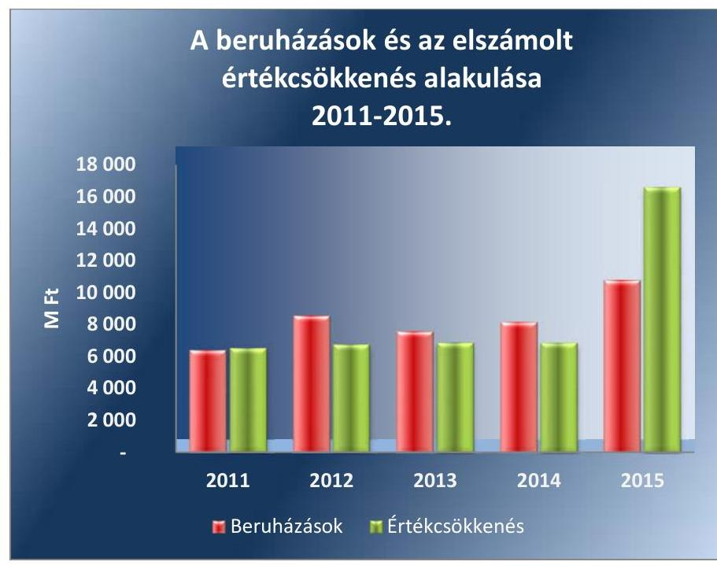

Forrás: Társaságok adatszolgáltatása
Az állami víziközmű-vagyon elemek 2015-ben megvalósult piaci vagyonértékelése miatt a vagyonérték jelentősen növekedett. Az állami tulajdonú tárgyi eszközök állományának a 2011-2014. évek közötti alacsonyabb értéke miatt az ezen időszakban teljesített beruházási ráta mellett nem volt biztosítható a víziközmű-eszközök elhasználódási szintjének megfelelő mértékű visszapótlás. A saját vagyon esetében a beruházásoknál az ellenőrzött időszakban jellemzően inkább túlteljesítés volt megfigyelhető az elszámolt terv szerinti értékcsökkenéshez képest.

---

# JAVASLATOK 

Az ÁSZ tv. 33. § (1) bekezdésében foglaltak értelmében az ellenőrzött szervezet vezetője köteles a jelentésben foglalt megállapításokhoz kapcsolódó intézkedési tervet összeállítani és azt a jelentés kézhezvételétől számított 30 napon belül az ÁSZ részére megküldeni. Amennyiben az ellenőrzött szervezet vezetője nem küldi meg határidőben az intézkedési tervet, vagy továbbra sem elfogadható intézkedési tervet küld, az Állami Számvevőszék elnöke az ÁSZ tv. 33. § (3) bekezdése a) és b) pontjaiban foglaltakat érvényesítheti.

## a Tiszamenti Regionális Vízmúvek Zrt. vezérigazgatójának

1. Intézkedjen, hogy a Társaság által számlázott díjak teljes körűen feleljenek meg a jogszabályi előírásoknak.
(2.2. sz. megállapítás 4. bekezdése alapján)
2. Intézkedjen a Társaság által számlázott díjakkal összefüggésben feltárt szabálytalanság tekintetében a felelősség tisztázása érdekében és szükség szerint intézkedjen a felelősség érvényesítéséről.
(2.2. sz. megállapítás 4. bekezdése alapján)
3. Kezdeményezze az önkormányzatok és a Társaság közötti üzemeltetési szerződések módosítását, hogy azok teljes körűen feleljenek meg a jogszabályi előírásoknak.
(4.1. sz. megállapítás 5. bekezdése alapján)

## a Dunántúli Regionális Vízmú Zrt. vezérigazgatójának

1. Kezdeményezze az önkormányzatok és a Társaság közötti üzemeltetési szerződések módosítását, hogy azok teljes körűen feleljenek meg a jogszabályi előírásoknak.
(4.1. sz. megállapítás 5. bekezdése alapján)

---

# az Északmagyarországi Regionális Vízmúvek Zrt. vezérigazgatójának 

1. Intézkedjen, hogy a Társaságnál az önköltség számításokat az önkölt-ség-számitási szabályzatban előirtaknak megfelelően végezzék el.
(2.3. sz. megállapítás 1. bekezdés 3. mondata alapján)
2. Kezdeményezze az önkormányzatok és a Társaság közötti üzemeltetési szerződések módosítását, hogy azok teljes körüen feleljenek meg a jogszabályi előírásoknak.
(4.1. sz. megállapítás 5. bekezdése alapján)

## az Északdunántúli Vízmú Zrt. vezérigazgatójának

1. Kezdeményezze az önkormányzatok és a Társaság közötti üzemeltetési szerződések módosítását, hogy azok teljes körüen feleljenek meg a jogszabályi előírásoknak.
(4.1. sz. megállapítás 5. bekezdése alapján)
2. Intézkedjen a Számv. tv.-ben és a vagyonkezelési szerződésben előirtaknak megfelelően a vagyonértékelés eredményének az analitikus nyilvántartásban történő teljes körü átvezetéséről.
(4.3. sz. megállapítás 4. bekezdése alapján)

## a Duna Menti Regionális Vízmú Zrt. vezérigazgatójának

1. Kezdeményezze az önkormányzatok és a Társaság közötti üzemeltetési szerződések módosítását, hogy azok teljes körüen feleljenek meg a jogszabályi előírásoknak.
(4.1. sz. megállapítás 5. bekezdése alapján)

---

# KÖVETKEZTETÉSEK 

A víziközmű-szolgáltatások integrációs folyamata az ellenőrzött időszakban még nem zárult le, emiatt az ÁSZ nem fogalmazott meg javaslatokat a regionális vízmű társaságok gazdálkodásának hatékonyságára vonatkozóan.

A folyamatban lévő integráció egyszerre okozott negatív és pozitív hatásokat. A szolgáltatási terület bővülése által abszolút mértékben növekedtek a múködés költségei. Ugyanakkor az integráció pozitív hatást gyakorolt a fajlagos ráfordításokra.

Az integrációs folyamat lezárását követően az ÁSZ megállapításainak figyelembevételével előtérbe kell helyezni a költségcsökkentő lehetőségek feltárását és a szükséges intézkedések megtételét a gazdálkodás hatékonyságának javítása érdekében.

---

# MELLÉKLETEK 

- I. SZ. MELLÉKLET: ÉRTELMEZŐ SZÓTÁR
állami vagyon
a) Az állam tulajdonában lévő dolog, valamint a dolog módjára hasznosítható természeti erő,
b) az a) pont hatálya alá nem tartozó mindazon vagyon, amely vonatkozásában törvény az állam kizárólagos tulajdonjogát nevesíti,
c) az állam tulajdonában lévő tagsági jogviszonyt megtestesítő értékpapír, illetve az államot megillető egyéb társasági részesedés,
d) az államot megillető olyan immateriális, vagyoni értékkel rendelkező jogosultság, amelyet jogszabály vagyoni értékű jogként nevesít. Forrás: Vtv. 1. § (2) bekezdése
2012. november 10-től az állami vagyon fogalma kiegészül a következő ponttal:
e) az állam tulajdonában lévő pénzügyi eszközök Forrás: Vtv. 1. § (2) bekezdése
2013. június 27-ig:

Az állami vagyont az MNV maga kezeli, vagy szerződés - így különösen bérlet, haszonbérlet, megbízás - alapján központi költségvetési szervnek, természetes vagy jogi személynek, vagy jogi személyiséggel nem rendelkező gazdálkodó szervezetnek hasznosításra átengedi. Forrás: Vtv. 23. § (1) bekezdése
2013. június 28-ától: Az állami vagyonnal az MNV maga gazdálkodik, vagy szerződés - így különösen bérlet, haszonbérlet, megbízás - alapján központi költségvetési szervnek, természetes vagy jogi személynek, vagy jogi személyiséggel nem rendelkező gazdálkodó szervezetnek hasznosításra átengedi, illetőleg vagyonkezelésbe, haszonélvezetbe adja. Forrás: Vtv. 23. § (1) bekezdése
2013. június 27-ig: Az állami vagyont az MNV maga kezeli, vagy szerződés - így különösen bérlet, haszonbérlet, megbízás - alapján központi költségvetési szervnek, természetes vagy jogi személynek, vagy jogi személyiséggel nem rendelkező gazdálkodó szervezetnek hasznosításra átengedi. Az állami vagyonra vonatkozóan az MNV kizárólag az Nvtv-ben meghatározott személyekkel köthet vagyonkezelési szerződést. Forrás: Vtv. 23. § (1), 27. § (1)
2013. június 28-ától: Az állami vagyonnal az MNV Zrt. maga gazdálkodik, vagy szerződés - így különösen bérlet, haszonbérlet, megbízás - alapján központi költségvetési szervnek, természetes vagy jogi személynek, vagy jogi személyiséggel nem rendelkező gazdálkodó szervezetnek hasznosításra átengedi. Az állami vagyonra vonatkozóan az MNV kizárólag az Nvtv-ben meghatározott személyekkel köthet vagyonkezelési szerződést. Forrás: Vtv. 23. § (1), 27. § (1)
2013. június 28-ától: Az állami vagyonnal az MNV Zrt. maga gazdálkodik, vagy szerződés - így különösen bérlet, haszonbérlet, megbízás - alapján központi költségvetési szervnek, természetes vagy jogi személynek, vagy jogi személyiséggel nem rendelkező gazdálkodó szervezetnek hasznosításra átengedi, illetőleg vagyonkezelésbe, haszonélvezetbe adja. Az állami vagyonra vonatkozóan az MNV kizárólag az Nvtv-ben meghatározott személyekkel köthet vagyonkezelési szerződést. Forrás: Vtv. 23. § (1), 27. § (1)
ellátásért felelős

Az állam vagy a települési önkormányzat kötelessége és joga gondoskodni a közműves ivóvízellátással és a közműves szennyvízelvezetéssel és -tisztítással kapcsolatos víziközmű-szolgáltatási feladatok elvégzéséről. (Vksztv. 1. § (1) bekezdés c) pont)

---

felhasználói egyenérték

gördülő fejlesztési terv
ivóvízellátás
keresztfinanszírozás elve
közmúadó
mérethatékonyság
regionális víziközmú
rezsicsökkentés
számviteli szétválasztás

A víziközmű-szolgáltatást igénybe vevő felhasználók számosságát kifejező komplex mutatószám, amely víziközmű-szolgáltatási ágazatonként figyelembe veszi a lakossági felhasználók számát, a nem lakossági felhasználók esetén az éves fogyasztást, az ipari fogyasztók esetén pedig a m3/nap-ban kifejezett rendelkezésre álló kapacitást (Vksztv. 1. számú melléklet).
Tizenöt évre szóló, felújítási és pótlási, valamint beruházási részből álló terv, amely víziközmű-rendszerenként és fejlesztési ütemenkénti bontásban tartalmazza az elvégzendő feladatokat. A terv elkészítése az adott víziközmú-rendszerre vonatkozó üzemeltetési jogviszony típusától függően a víziközmű tulajdonosának vagy üzemeltetőjének a felelőssége. (Vksz.Vhr. 90/C. §)
Az ivóvíztermelés, az ehhez kapcsolódó ivóvízbázis-védelem, az ivóvízkezelés, -tárolás, -szállítás és -elosztás, a felhasználási helyekre történő eljuttatás, valamint mindezekhez kapcsolódóan a tűzivíz biztosításának összessége.
A víziközmű-szolgáltatás díját a víziközmű-szolgáltatási ágazatra nézve úgy kell megállapítani, hogy az maradéktalanul fedezetet nyújtson a víziközmű-szolgáltatási ágazati tevékenység indokolt költségeire és ráfordításaira, valamint a víziközmű-szolgáltató e tevékenységével kapcsolatos ésszerű üzleti nyereségére, de nem tartalmazhatja e tevékenységén kívül eső egyéb gazdasági tevékenységei költségeinek, ráfordításainak fedezetét.
A vezetékes közszolgáltatásokat 2013. január 1-jétől kezdődően terhelő adónem. Az adó mértéke a közművezetékek hosszára vetítve méterenként 125 Ft. Az adót a vezeték tulajdonosa, a víziközmű szektor esetében a közművezeték üzemeltetője köteles megfizetni. (2012. évi CLXVII. tv.)
Egy tevékenység akkor tekinthető méretgazdaságosnak, ha a kibocsátás növekedésével együtt csökken a kibocsátott outputra jutó egységköltség.
Az egymással oly módon összefüggő - műszakilag elkülönítve gazdaságosan nem üzemeltethető - víziközművek, melyek egységes rendszert alkotnak, és a rendszer több települést (megyét) átfogó, összefüggő földrajzi területen (országrész, régió) nagyszámú, jellemzően vízbázistól távol fekvő település részére a vízkitermelést, -tisztítást, -elosztást - amelyhez a fogyasztók közműves ivóvízellátása, szennyvízelvezetés is tartozhat - látják el. (Vgtv. 1. számú melléklet 14. pont)
A közszolgáltatások széles körére kiterjedő, a hatósági árak csökkentését célzó többlépcsős szabályozási folyamat, amelyet a víziközmű szektorra a rezsicsökkentések végrehajtásáról szóló 2013. évi LIV. törvény terjesztett ki. A jogszabály 2013. július 1jétől a bruttó lakossági hatósági díjakat (azonos szolgáltatott mennyiséget feltételezve) 10\%-kal csökkentette.
A víziközmű-szolgáltatók három ágazati tevékenységének (ivóvízellátás, szennyvízelvezetés és -tisztítás, valamint egyéb tevékenységek) elkülönült számviteli nyilvántartását biztosító előírás. Annak érdekében, hogy a szolgáltatók ágazati tevékenységeinek vagyoni, pénzügyi és jövedelmi helyzetéről valós képet lehessen kapni, a társaságok 2013 óta kötelesek a mérlegüket és az eredménykimutatásukat úgy elkészíteni, mintha az ágazati tevékenységek külön társaságban múködnének. (Vksztv. 49. §)

---

tulajdonosi jogok gyakorlója 2013. június 27-ig: Az állami vagyon felett a Magyar Államot megillető tulajdonosi jogok és kötelezettségek összességét - ha törvény eltérően nem rendelkezik - az állami vagyon felügyeletéért felelős miniszter (a továbbiakban: miniszter) gyakorolja, aki e feladatát az MNV, a Magyar Fejlesztési Bank, illetve a tulajdonosi joggyakorló szervezet útján látja el. A miniszter miniszteri rendeletben, a törvényben meghatározott állami vagyoni kör tekintetében, meghatározott időtartamra, a joggyakorlás egyes szabályainak meghatározásával - az őt megillető tulajdonosi jogok és kötelezettségek összességének, illetve azok meghatározott részének gyakorlóját az Áht. ${ }^{29}$ szerinti központi költségvetési szervek, ezek intézménye, továbbá a 100\%-ban állami tulajdonban álló gazdasági társaságok közül kijelölheti. Forrás: Vtv. 3. § (1) és (2)
2013. június 28-ától: A rábízott állami vagyon felett az államot megillető tulajdonosi jogok és kötelezettségek összességét tulajdonosi joggyakorlóként:
a) ha törvény vagy miniszteri rendelet eltérően nem rendelkezik, a Magyar Nemzeti Vagyonkezelő Zártkörűen Működő Részvénytársaság,
b) törvényben kijelölt személy vagy
c) az állami vagyon felügyeletéért felelős miniszter (a továbbiakban: miniszter) által rendeletben kijelölt személy gyakorolja.
[...] A miniszter e törvény felhatalmazása alapján - a meghatározott célok hatékonyabb elérése érdekében, miniszteri rendeletben, az ott meghatározott állami vagyoni kör tekintetében, meghatározott időtartamra - e törvény keretei között, a joggyakorlás egyes szabályainak meghatározásával - az államot megillető tulajdonosi jogok és kötelezettségek összességének, illetve azok meghatározott részének gyakorlóját az Áht. szerinti központi költségvetési szervek, ezek intézménye, továbbá a 100\%-ban állami tulajdonban álló gazdasági társaságok közül kijelölheti. Forrás: Vtv. 3. § (1) és (2)

Aki a nemzeti vagyon felett az államot vagy a helyi önkormányzatot megillető tulajdonosi jogok és kötelezettségek összességének gyakorlására jogosult Forrás: Nvtv. 3. § (1) 17. pontja
üzemeltetési jogviszony Az ellátásért felelős és a víziközmű-szolgáltató között létrejött jogviszony. Víziközmúszolgáltatást kizárólag a MEKH által jóváhagyott üzemeltetési szerződés és múködési engedély birtokában végezhetnek a szolgáltatók. A szerződés vagyonkezelési, koncessziós vagy bérleti-üzemeltetési szerződés lehet, típustól függően eltérő jogokkal és kötelezettségekkel. Időtartamát illetően minimum 15 évre, de maximum 35 évre szóló határozott idejű szerződés. (Vksztv.)
víziközmű-szolgáltató

A közműves ivóvízellátás az ahhoz kapcsolódó tűzivíz biztosítással, továbbá a közműves szennyvízelvezetés és -tisztítás, ide értve az egyesített rendszerú csapadékvízelvezetést is, mely tevékenységek által megnyilvánuló szolgáltatások közül az egyiket, vagy mindkettőt a víziközmű-szolgáltató a felhasználó részére közszolgáltatási jogviszony keretében nyújtja. (Vksztv. 2. § 24. pont)
víziközmű-ágazat integrációja

A víziközmű-szolgáltatók koncentrálódását célzó folyamat, amely a Vksztv. hatályba lépése óta tart, és várhatóan 2016 végén fejeződik be. A szabályozás a szolgáltatói működés feltételeként minimum értéket szab meg a felhasználói egyenértékre vonatkozóan.
vízterhelési díj
Azt a kibocsátót terheli, aki vízjogi engedélyezés alá tartozó tevékenységet végez A víziközmű-szolgáltatók által az állam részére befizetett díj, amelyet a szennyvíztisztító telepekről a felszíni vizekbe juttatott, a tisztított szennyvízben még jelenlévő szenynyezőanyagok mennyisége után kell megfizetni. (2003. évi LXXXIX. törvény 7. §).

---

A regionális vízmű társaságok eredménykategóriáinak alakulása (M Ft)

| DMRV | 2011. | 2012. | 2013. | 2014. | 2015. |
| :--: | :--: | :--: | :--: | :--: | :--: |
| üzemi tevékenység er. | 140,3 | $-175,8$ | $-1227,1$ | $-1371,0$ | $-2799,3$ |
| pénzügyi műveletek er. | 28,9 | 51,0 | 28,7 | 10,4 | $-44,2$ |
| rendkívüli er. | 5,1 | $-0,9$ | 842,2 | 1419,6 | 2929,0 |
| adózás előtti er. | 174,4 | $-125,7$ | $-356,2$ | 59,0 | 85,5 |
| mérleg szerinti er. | 151,7 | $-135,2$ | $-356,2$ | 0,5 | 39,3 |
| DRV | 2011. | 2012. | 2013. | 2014. | 2015. |
| üzemi tevékenység er. | 193,7 | $-587,5$ | $-3291,3$ | $-2240,6$ | $-5531,6$ |
| pénzügyi műveletek er. | $-45,1$ | 21,9 | $-83,1$ | $-49,7$ | $-78,6$ |
| rendkívüli er. | $-20,1$ | $-24,7$ | 587,8 | 1446,5 | 5983,6 |
| adózás előtti er. | 128,4 | $-590,3$ | $-2786,6$ | $-843,8$ | 373,5 |
| mérleg szerinti er. | 128,4 | $-590,3$ | $-2786,6$ | $-843,8$ | 107,1 |
| ÉDV | 2011. | 2012. | 2013. | 2014. | 2015. |
| üzemi tevékenység er. | 88,7 | $-21,1$ | $-1133,8$ | $-979,6$ | $-2428,4$ |
| pénzügyi műveletek er. | 16,5 | 22,1 | 4,4 | $-14,8$ | $-22,5$ |
| rendkívüli er. | $-1,6$ | $-0,9$ | 427,6 | 1155,0 | 2655,3 |
| adózás előtti er. | 103,7 | 0,1 | $-701,8$ | 160,6 | 204,4 |
| mérleg szerinti er. | 103,7 | $-2,1$ | $-701,8$ | 153,4 | 124,8 |
| ÉRV | 2011. | 2012. | 2013. | 2014. | 2015. |
| üzemi tevékenység er. | 269,0 | $-65,2$ | $-1396,0$ | $-1360,6$ | $-2102,4$ |
| pénzügyi műveletek er. | $-47,4$ | $-38,3$ | $-58,3$ | $-6,6$ | $-51,8$ |
| rendkívüli er. | 4,3 | 54,6 | 894,8 | 905,3 | 2219,0 |
| adózás előtti er. | 225,9 | $-48,9$ | $-559,5$ | $-461,9$ | 64,8 |
| mérleg szerinti er. | 202,1 | $-66,6$ | $-580,0$ | $-488,6$ | 27,1 |
| TRV | 2011. | 2012. | 2013. | 2014. | 2015. |
| üzemi tevékenység er. | 7,3 | $-14,8$ | $-1162,5$ | $-437,8$ | $-392,4$ |
| pénzügyi műveletek er. | $-3,9$ | 16,8 | 6,3 | 0,7 | $-13,9$ |
| rendkívüli er. | 3,9 | 4,8 | 35,5 | 70,9 | 607,2 |
| adózás előtti er. | 7,3 | 6,8 | $-1120,7$ | $-366,2$ | 200,8 |
| mérleg szerinti er. | 7,3 | 6,8 | $-1120,7$ | $-366,2$ | 151,6 |

Forrás: Társaságok adatszolgáltatósa

---

Az egy kilométer vezetékre jutó árbevétel és ráfordítás alakulása (Ezer Ft/Kilométer)

| DMRV | 2011. | 2012. | 2013. | 2014. | 2015. |
| :--: | :--: | :--: | :--: | :--: | :--: |
| árbevétel | 1913 | 2012 | 1845 | 1793 | 1882 |
| ráfordítás | 2075 | 2182 | 2183 | 2353 | 2688 |
| DRV | 2011. | 2012. | 2013. | 2014. | 2015. |
| árbevétel | 1905 | 1872 | 1749 | 1674 | 1713 |
| ráfordítás | 2077 | 2164 | 2360 | 2545 | 2915 |
| EDV | 2011. | 2012. | 2013. | 2014. | 2015. |
| árbevétel | 2083 | 2103 | 1994 | 1639 | 1874 |
| ráfordítás | 2208 | 2276 | 2496 | 2248 | 2850 |
| ERV | 2011. | 2012. | 2013. | 2014. | 2015. |
| árbevétel | 1515 | 529 | 1033 | 1108 | 1128 |
| ráfordítás | 1694 | 753 | 1375 | 1705 | 1957 |
| TRV | 2011. | 2012. | 2013. | 2014. | 2015. |
| árbevétel | 1568 | 1949 | 980 | 770 | 958 |
| ráfordítás | 1698 | 2159 | 1176 | 1022 | 1326 |

Forrás: Társaságok adatszolgáltatása

---

Az FE, az egy FE-re jutó szolgáltatási volumen, árbevétel és ráfordítás alakulása

| DMRV | 2011. | 2012. | 2013. | 2014. | 2015. |
| :--: | :--: | :--: | :--: | :--: | :--: |
| FE | 570733 | 531289 | 536588 | 546333 | 416468 |
| szolgáltatási volumen/FE (m3) | 78,1 | 88,3 | 86,7 | 86,6 | 121,0 |
| ráfordítás/FE (eFt) | 21,0 | 24,1 | 24,3 | 26,3 | 39,3 |
| árbevétel/FE (eFt) | 19,4 | 22,2 | 20,5 | 20,0 | 27,9 |
| DNV | 2011. | 2012. | 2013. | 2014. | 2015. |
| FE | 819842 | 836308 | 884793 | 899506 | 906595 |
| szolgáltatási volumen/FE (m3) | 66,0 | 65,5 | 62,5 | 63,1 | 66,2 |
| ráfordítás/FE (eFt) | 22,8 | 24,4 | 26,2 | 29,4 | 35,1 |
| árbevétel/FE (eFt) | 20,9 | 21,1 | 19,4 | 19,3 | 20,6 |
| EDV | 2011. | 2012. | 2013. | 2014. | 2015. |
| FE | 394887 | 396302 | 398174 | 505053 | 505053 |
| szolgáltatási volumen/FE (m3) | 49,8 | 50,7 | 49,4 | 43,9 | 53,3 |
| ráfordítás/FE (eFt) | 18,2 | 19,5 | 21,4 | 20,3 | 27,2 |
| árbevétel/FE (eFt) | 17,1 | 18,0 | 17,1 | 14,8 | 17,9 |
| ÉRV | 2011. | 2012. | 2013. | 2014. | 2015. |
| FE | 228316 | 244916 | 437070 | 455693 | 459800 |
| szolgáltatási volumen/FE (m3) | 75,8 | 71,6 | 48,4 | 49,6 | 49,4 |
| ráfordítás/FE (eFt) | 30,3 | 31,3 | 25,3 | 31,1 | 35,5 |
| árbevétel/FE (eFt) | 27,1 | 27,3 | 19,0 | 20,2 | 20,4 |
| TRV | 2011. | 2012. | 2013. | 2014. | 2015. |
| FE | 54055 | 55032 | 358000 | 391465 | 521700 |
| szolgáltatási volumen/FE (m3) | 53,9 | 57,9 | 68,6 | 68,6 | 63,4 |
| ráfordítás/FE (eFt) | 35,9 | 44,5 | 22,8 | 25,6 | 29,4 |
| árbevétel/FE (eFt) | 33,2 | 40,1 | 19,0 | 19,3 | 21,2 |

Forrás: Társaságok adatszolgáltatása

---

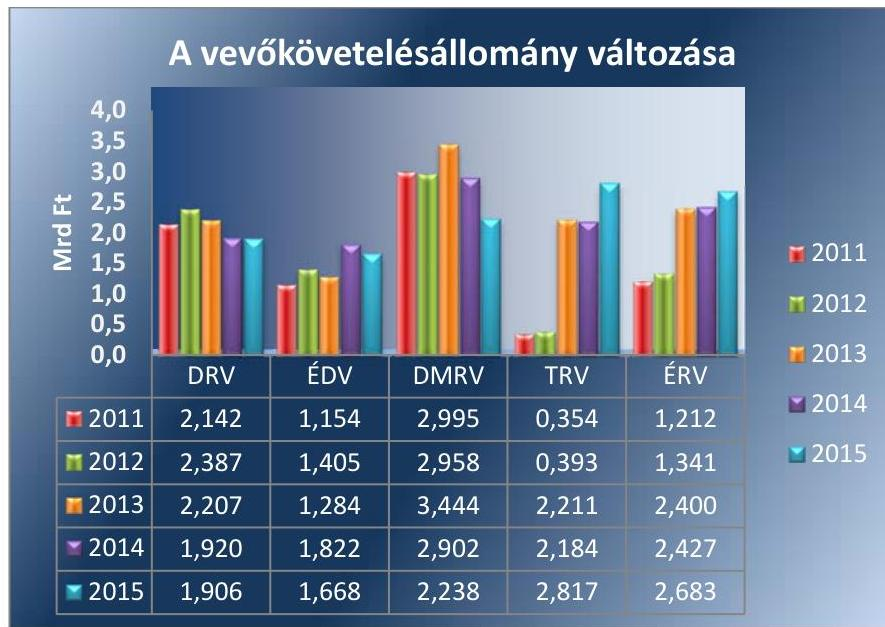

*Forrás: Társaságok adatszolgáltatása*

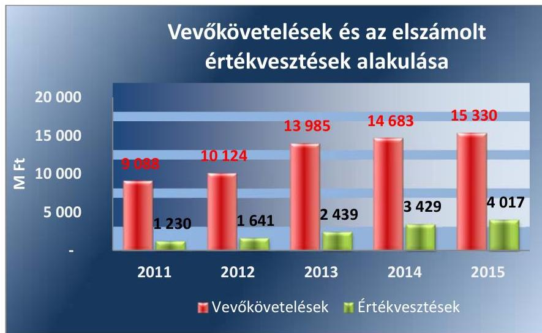

*Forrás: Társaságok adatszolgáltatása*

---

.

---

# FÜGGELÉK: ÉSZREVÉTELEK 

A jelentéstervezetet a Számvevőszék 15 napos észrevételezésre megküldte az ellenőrzött szervezetek vezetőinek az ÁSZ tv. 29. §* (1) bekezdése előírásának megfelelően.

Az ÁSZ a jelentéstervezetet észrevételezésre megküldte az ÉRV Zrt. vezérigazgatójának, a DMRV Zrt. vezérigazgatójának, az ÉDV Zrt. vezérigazgatójának, a DRV Zrt. vezérigazgatójának, a TRV Zrt. vezérigazgatójának, az MNV Zrt. vezérigazgatójának, a Földművelésügyi miniszternek, a Belügyminiszternek, a Nemzeti Fejlesztési Miniszternek, valamint a MEKH elnökének.

Az ÉRV Zrt. vezérigazgatójának, a DMRV Zrt. vezérigazgatójának, az ÉDV Zrt. vezérigazgatójának, az MNV Zrt. vezérigazgatójának és a Nemzeti Fejlesztési Miniszter észrevételét és az arra adott választ, valamint a DRV Zrt. vezérigazgatójának és a TRV Zrt. vezérigazgatójának nemleges észrevételét a függelék alább tartalmazza. A Földművelésügyi miniszter, a Belügyminiszter, MEKH elnöke észrevételezési jogával nem élt.

[^0]
[^0]:    * 29. § (1) Az Állami Számvevőszék az ellenőrzési megállapításait megküldi az ellenőrzött szervezet vezetőjének vagy az általa megbízott személynek, és annak, akinek személyes felelősségét állapította meg.
    (2) Az ellenőrzött szervezet vezetője és a felelősként megjelölt személy az ellenőrzés megállapításaira tizenöt napon belül írásban észrevételt tehet.
    (3) Az Állami Számvevőszék az észrevételre a beérkezésétől számított harminc napon belül írásban válaszol. A figyelembe nem vett észrevételeket köteles a jelentésben feltüntetni, és megindokolni, hogy azokat miért nem fogadta el.

---

# Északmagyarországi Regionális Vízmúvek ZRt. 

Állami Számvevőszék
Domokos László elnök úr részére

Budapest 4.
Pf.: 54
1364

## 5203/1-2017

## LLLAMI SZÁMVEVÓSZÉK 26-37710/2017/   Érkeze: 2017 JON 09.   Iktalószám: 4178 - 353 /2016   Moltéklet: $\qquad$

Tárgy: észrevételek megküldése

## Tisztelt Domokos László Úr!

Engedje meg, hogy ezúton is köszönetet mondjunk az ÉRV ZRt. ellenörzése során végzett szakmai munkájukért és segitökész, konstruktiv javaslataikért.

Társaságunk legföbb célja, hogy az eredményesség követelményeit szem elött tartva a ránk bizott vagyon értékét megörizzük és gyarapítsuk, valamint azok segítségével megbízható, magas színvonalú víziközmú-szolgáltatást nyújtsunk.

Társaságunk a mindenkori jogszabályoknak való megfelelőségre törekvéssel, a tulajdonosi elvárásoknak eleget téve végzi tevékenységét.

A Tisztelt Állami Számvevőszék V-1178-329/2016. számú levelére válaszolva, a Társaságunknál is végzett vizsgálatukról elkészült „A regionális vizmúvek gazdálkodásának ellenörzése" címú jelentéstervezetükkel kapcsolatosan az alábbi észrevételeket tesszük.

Ezúton is kérjük, hogy a végleges számvevőszéki jelentés szövegezése során a jelen levelünkben megfogalmazottakat is szíveskedjenek figyelembe venni.

[^0]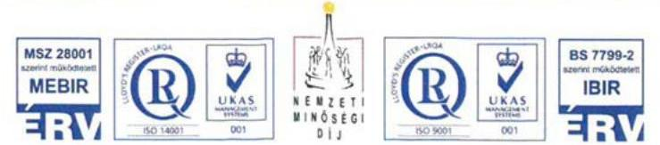

[^0]:    3700 Kazincbarcika, Tardonal u. 1. - Levéloim: 3701 Kazincbarcika, Pf. 117. - Tel.: (48) 514-500 - Telefax: (48) 514-582 E-mail: info@ervzrt.hu $\cdot$ www.ervzrt.hu $\cdot$ Cégbíróság: Miskolc) Törvényszék $\cdot$ Cégjegyzék szám: 05-10-000 123 $\cdot$ N-0-1-1/

---

Északmagyarországi Regionális Vízmúvek ZRt.
20. oldal: „Az ellenőrzött időszakban - jellemzően az állami vagyonra vonatkozó vagyonkezelési szerződések módosításának elmaradása miatt - az állami vagyon kategóriájába tartozó tárgyi eszköz értéke a számviteli nyilvántartásokban minden regionális vizmü társaságnál eltért a hosszú lejáratú kötelezettségek értékétöl, megsértve a Számv. tv. 42. § (5) bekezdésében szereplő rendelkezést."

# Észrevétel: 

A törvényi rendelkezés 42.§ (5) szerint: „Egyéb hosszú lejáratú kötelezettségként kell kimutatni ..., ... valamint az állami vagy önkormányzati vagyon részét képező eszközök - törvényi rendelkezés, illetve felhatalmazás alapján történő kezelésbevételéhez kapcsolódó kötelezettséget."

Az ÉRV ZRt. minden esetben ennek a rendelkezésnek megfelelően járt el. A vagyonkezelési szerződés szerinti értéket, illetve az annak finanszírozására átvett és felhasznált külső forrást, - amelyből kivitelezett eszközérték a vagyonkezelési szerződés szerint szintén állami vagyonnak minősül - a hosszú lejáratú kötelezettségek között vette állományba, amely ilyen tartalommal a vagyonkezelési szerződés szerinti értéket tükrözte.

Az eltérés oka az, hogy a vagyonkezelési szerződés a Felek között hosszú távú elszámolásról rendelkezett, ami 2013. június hónapban történt meg. Ezen elszámolásig az időszaki (év végi beszámoló időpontja) értékek különbözetet mutattak, mely különbözet esetünkben mindig a vagyonkezelő által saját forrásként a vagyonkezelt eszközkörre fordított értéket tükrözte. Az eltérés az elszámolás módjából egyértelmüen adódott, az minden évben alátámasztott volt.

Egyezőség abban az esetben állhatott volna fenn, ha ez az eltérés a felek között kötelezettségként vagy követelésként került volna kimutatásra. Ezen elszámolás elvetésre került azért, mert elszámolás hiányában nem volt bizonylata a követelés/kötelezettség kimutatásának.

3700 Kazincbarcika, Tardonai u. 1. - Leveleim: 3701 Kazincbarcika, Pf. 117. - Tel.: (48) 514-500 - Telefax: (48) 514-582 E-mail: info@ervzrt.hu $\cdot$ www.ervzrt.hu $\cdot$ Cégbíróság: Miskolci Törvényszék $\cdot$ Cégjegyzék szám: 05-10-000 123 $\cdot$ N-ö-t-t/

---

# Északmagyarországi Regionális Vízmúvek ZRt. 

A különbözet az elszámolással érintett felhasznált saját forrást tartalmazta, amelyhez az adott időszakban még nem tartozott elszámolás.
2013. év júniusától, az elszámolás évente megtörténik. Az év végi különbözet jelen esetben is fennáll, azonban a különbség az MNV Zrt felé tételes kimutatással, meghatározott eljárásrend szerint benyújtásra kerül, erről Elszámolási szerződés amely a vagyonkezelési szerződés módosításával is együtt jár - születik. Az Elszámolási szerződés biztosítja éves viszonylatban az eszközérték, és a hosszú lejáratú kötelezettség egyezőségét.
21. oldal: „A regionális vizmü társaságok az ellenőrzött időszakra vonatkozóan rendelkeztek Számviteli tv elöirása szerinti számviteli politikával. A Számviteli politikában azonban - a DMRV kivételével - nem szerepeltették az állami vagyon után elszámolt értékcsökkenési leírás módszereit a Számv. tv 14.§ (4) bekezdése ellenére."

## Észrevétel:

A regionális vizmú társaságok 2012. évtől egységes számviteli politikával rendelkeznek, amelynek az összeállítása közös munkával, az MNV Zrt. koordinálásával történt.

Az egységes számviteli politika célja az, hogy minden azt alkalmazó társaság azonosan értelmezze a fogalmakat, azonos szabályozási keretek mentén, azonos gyakorlatot kövessen. Ennek keretében a víziközmü vagyonra vonatkozó szabályozás is egységesitésre került, amely a számviteli politika 10. fejezetét képezi. A fejezet kitér a vagyonkezelt eszközkör definiálására, elszámolására, amortizációjának szabályozására, amelyre vonatkozóan a számviteli politika mellékletei is iránymutatást biztosítanak.

---

# Északmagyarországi Regionális Vízmúvek ZRt. 

Összefoglalva rögzíteni kívánjuk, hogy az ÉRV ZRt. Számviteli Politikája külön fejezettel rendelkezik a víziközmú vagyonra vonatkozó elszámolási, köztük az amortizációs szabályok tekintetében.
4.5. számú megállapítás: „Az ÉRV ZRt esetében, a vizsgált időszakban van olyan gazdasági év, melyben a tárgyév, közmü eszközértéket növelő aktiválások nagyságrendje elmarad a közmü vagyonkör után elszámolt amortizációtól."

## Észrevétel:

Az állami vagyonról szóló 2007. évi CVI. törvény 27. § (8) bekezdése alapján az ÉRV ZRt., mint közfeladatot ellátó vagyonkezelő, a visszapótlási kötelezettség teljesítése alól mentesül. A jogszabályi rendelkezés 2013. június 28-i időponttal lépett hatályba.

Erre a jogszabályhelyre való tekintettel az MNV Zrt. kezdeményezte a vagyonkezelésben lévő vagyon elszámolását 1998. január 1-től 2013. június 27-ei időszakra vonatkozóan. A vagyonelszámolás egyenlege, egyben az ÉRV ZRt. követelése 901.717 eFt volt, amely azt mutatja, hogy a Társaság az elvártnál nagyobb mértékben tett eleget visszapótlási kötelezettségének.
2013. június 27-ét követően az ÉRV ZRt-t visszapótlási kötelezettség nem terheli, a vagyonkezelt közmüvagyonon csak a tulajdonos által biztosított fejlesztési források, a közmüfejlesztési hozzájárulások, vagy a pályázatokon elnyert egyéb források mértékéig van lehetősége fejlesztéseket végrehajtani.

---

# Északmagyarországi Regionális Vizmüvek ZRt. 

A Számvevőszéki Jelentés a megállapításainak orvoslása céljából Intézkedési terv összeállitását várja el a Társaságok vezérigazgatóitól, melyet a Jelentés kézhezvételétól számított 30 napon belül kell az ÁSZ részére megküldeni. Intézkedési terv összeállitásában az ÉRV ZRt. két tárgykörben érintett:

## 1.

„Intézkedjen, hogy a Társaságnál az önköltségszámitásokat az önköltség-számitási szabályzatban foglaltaknak megfelelően végezzék el."

Hivatkozott szövegrész: „Az ÉRV ZRt az időszakban nem az önköltség-számitási szabályzatban elöírtaknak megfelelően végezte az önköltségszámitást, mert a számításokat nem az általa meghatározott kalkulációs egységre végezte el."

## Észrevétel:

Az ÉRV ZRt. az önköltség-számitási szabályzatban, annak 6. oldalán definiálja a kalkulációs egység, valamint az önköltség fogalmát. A szabályzat 39. oldalán kezdődő 11. fejezet rögzíti a Társaság által alkalmazott Kalkuláció fajtákat, azok meghatározásának időszakait. Ez utóbbi időszak a szabályzat szerint a havi zárás befejezésével összhangban, tárgyhót követő hónap 18.-a. A szabályzat hivatkozott pontjai szerint az ÉRV ZRt. minden hónap 18-i határidejével meghatározza a szolgáltatása $\mathrm{m}^{2}$-ben meghatározott mennyiségének elöállítására fordított élő- és holt munka pénzértékben kifejezett értékét.

A Tisztelt Állami Számvevőszék megállapítást tett arra vonatkozóan, hogy Társaságunk a szabályozásával ellentétben nem a nevezett időszakonként és határidőig, hanem éves szinten határozza meg a kalkulációs egységre jutó önköltséget.

3700 Kazincbarcika, Tardonai u. 1. - Levéicim: 3701 Kazincbarcika, Pt. 117. - Tel.: (48) 514-500 - Telefax: (48) 514-582 E-mail: info@ervzrt.hu $\cdot$ www.ervzrt.hu $\cdot$ Cégbíróság: Miskolcs Törvényszék $\cdot$ Cégjegyzék szám: 05-10-000 123 $\cdot$ /v-0-1-1/

---

# Északmagyarországi Regionális Vizmüvek ZRt. 

Az ellenőrzés során feltárt észrevételre tájékoztatásként közöljük, hogy az utó- és közbenső kalkuláció során minden adat (gazdálkodási adatok, termelt és értékesített mennyiségi adatok) rendelkezésre áll annak érdekében, hogy meghatározásra kerüljön a kalkulációs egységre jutó önköltség, azonban az mégis kizárólag éves szinten kerül kiszámításra. Ennek oka az, hogy a tárgyév időközi gazdasági adatai tartalmazhatnak olyan gazdasági eseményeket, illetve még hiányozhatnak az időszakból azt érintő gazdasági események, melyek torzító hatást gyakorolnak az időszakra. Az éves kalkulációs egységre jutó önköltség megállapítás biztosítja az azonos időszakok közötti, következetes és azonos alapokon nyugvó összehasonlítás feltételeit.

A fent leírtakra hivatkozva Társaságunk a fennálló gyakorlatot javasolja elfogadni. A szabályzat és a gyakorlat közötti eltérés feltárásával, lehetőség nyilt arra, hogy az ellentmondást kezeljük. Intézkedést kezdeményezünk annak érdekében, hogy a szabályzat elöírásait megváltoztassuk, és azt a Társaság által a jövőben is alkalmazni javasolt éves érték-megállapításhoz igazítsuk.

## 2.

„Kezdeményezze az önkormányzatok és a Társaság közötti üzemeltetési szerződések módosítását, hogy azok teljes körüen feleljenek meg a jogszabályi elöírásoknak."

Hivatkozott szövegrész: „Az ellátásért felelős és a regionális vizmü társaságok közötti üzemeltetési szerződések... ...nem tartalmazták a tárgyi feltételeken belül a viziközmü üzemeltetéshez átadott viziközmüvek és egyéb eszközök átadás-átvételi jegyzőkönyvei tételesen az átadáskor fennálló bruttó, nettó, és könyv szerinti értéket, továbbá a DRV, a TRV, az ÉDV és az ÉRV esetében a müszaki azonosításra vonatkozó adatokat, és az alkalmazott értékcsökkenési leírási kulcsokat.

---

# Észrevétel: 

A Társaságunk által alkalmazott üzemeltetési szerződések tartalmát befolyásoló tényező, hogy az önkormányzatok nyilvántartási rendszere milyen mélységü adatokat tartalmaz. Az önkormányzatok az üzemeltetési szerződések megkötésének időpontjában még nem rendelkeztek megfelelő információval a szerződések mellékleteinek adatokkal való feltöltéséhez, így Társaságunk önhibáján kívül nem tudta teljesíteni a követelményeket.

Ugyanakkor az üzemeltetés megfelelő biztosítása érdekében, az integráció, illetve az új Víziközmü törvény egyik fontos eredményeként Társaságunk folyamatosan végzi az önkormányzati közmüvek felmérését.

A kollégáink által támogatott vagyonértékelést, valamint az objektumok egyedi felmérését követően Társaságunk már többségében ismeri az önkormányzatok tulajdonában található eszközök körét, annak megállapított piaci értékét. Ennek birtokában már kezdeményezhetjük az üzemeltetési szerződések módosítását, kiegészítését.

Kérjük tájékoztatásunk szíves elfogadását és javaslataink, észrevételeink szíves megfontolását!
2017. május 24.

Üdvözlettel:

## 3alil

Bakendi György Patrik
vezérgazgáá

3700 Kazincbarcika, Tardonai u. 1. - Leveleim: 3701 Kazincbarcika, Pf. 117. - Tel.: (48) 514-500 - Telefax: (48) 514-582 E-mail: info@ervzrt.hu $\cdot$ www.ervzrt.hu $\cdot$ Cégbíróság: Miskolci Törvényszék $\cdot$ Cégjegyzék szám: 05-10-000 123 $\cdot$ N-0-1-1
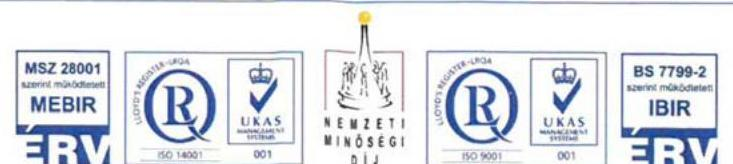

---

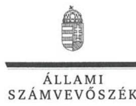

# Bakondi György Patrik úr 

vezérigazgató
Északmagyarországi Regionális Vízmúvek Zrt.

## Kazincbarcika

## Tisztelt Vezérigazgató Úr!

„A regionális vizmüvek gazdálkodásának ellenörzése" címmel készített számvevőszéki jelentéstervezetre tett észrevételét köszönettel megkaptam.

Az Állami Számvevőszék észrevételre vonatkozó álláspontjáról a felügyeleti vezető által készített részletes tájékoztatást csatoltan megküldőm.

Tájékoztatom Vezérigazgató urat, hogy a számvevőszéki jelentésben - az Állami Számvevőszékről szóló 2011. évi LXVI. törvény 29. § (3) bekezdése alapján - a figyelembe nem vett észrevételt szerepeletjük az elutasítás indokának feltüntetésével.

Budapest, 2017. yuans hó 21 . nap
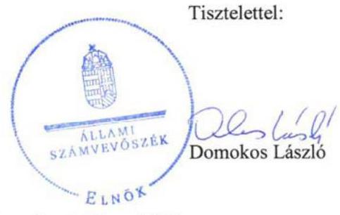

Melléklet: Tájékoztatás az elfogadott és el nem fogadott észrevételről

---

# Tájékoztatás   az elfogadott és az el nem fogadott észrevételről 

„A regionális vizmüvek gazdálkodásának ellenörzése" címủ jelentéstervezetre 2017. május 30án érkezett észrevételét áttekintettük, annak kezelésével kapcsolatban a következő tájékoztatást adom.

1. Jelentéstervezet 4.1. számú megállapítás 2. bekezdés 1. mondatához, a vagyonkezelt vagyon számviteli nyilvántartására vonatkozóan tett észrevételre adott válasz:
A jelentéstervezet 4.1. számú megállapítás 2. bekezdés 1. mondatát az alábbiak szerint pontosítjuk:
„Az ellenőrzött időszakban - jellemzően az állami vagyonra vonatkozó vagyonkezelési szerződések módosításának elmaradása miatt - az állami vagyon kategóriájába tartozó tárgyi eszközök értéke a számviteli nyilvántartásokban minden regionális vizmü társaságnál eltért az egyéb hosszú lejáratú kötelezettségek értékétől."
2. A 4.2. számú megállapítás 1. bekezdés 2. mondatához, a számviteli politikára vonatkozó megállapítással vonatkozóan tett észrevételre adott válasz:
A dokumentumok ismételt áttekintését követően a 4.2. számú megállapítás 1 . bekezdés 2 . mondatát töröljük.
3. A 4.5. számú megállapításhoz, a közmủ vagyon értékének megőrzésére vonatkozóan tett észrevételre adott válasz:
A jelentéstervezet nem tartalmazza az észrevételben idézett mondatot. Az észrevételhez kapcsolódóan a jelentéstervezet 4.5 . számú megállapítás 2 . bekezdés utolsó mondata azt tartalmazza, hogy ,...és az ÉRV-nél ugyanakkor a visszapótlás mértéke jellemzően elmaradt az elhasználódás nagyságrendjétől."
Az ÉRV által rendelkezésre bocsátott tanúsítvány alapján a 2012-2015. években a vagyonkezelésbe vett állami vagyon értékcsökkenése meghaladta a visszapótlás értékét. Ezért a megállapítás helytálló, annak módosítása nem indokolt.

---

4. Az Északmagyarországi Regionális Vízmúvek Zrt. vezérigazgatójának tett 1. számú, az önköltségszámítás hiányosságaival összefüggésben megfogalmazott javaslathoz kapcsolódó észrevételre adott válasz:
Az önköltségszámítás módjára vonatkozó tájékoztatásukat köszönjük, az abban leírtak megerősítik a jelentéstervezet megállapítását, ezért a megállapítás módosítása nem szükséges.
5. Az Északmagyarországi Regionális Vízmúvek Zrt. vezérigazgatójának tett 1. számú, az önkormányzatok és a Társaság közötti üzemeltetési szerződések módosításával összefüggésben megfogalmazott javaslathoz kapcsolódó észrevételre adott válasz:
Az ellátásért felelős és az ÉRV közötti üzemeltetési szerződésekre vonatkozó tájékoztatásukat köszönjük, azok megerősítik a jelentéstervezet megállapítását, ezért annak módosítása nem szükséges.

Budapest, 2017. jüminis hó 21. nap

Makkai Mária
felügyeleti vezető

---

# DMRV DUNA MENTI REGIONÁLIS VÍZMÚ ZÁRTKÖRÜEN MÜKÖDŐ RÉSZVÉNYTÁRSASÁG 2600 Vác, Kodály Zoltán út 3. 

Kelt:Vác, 2017. májús 25. Ikt.sz:DMRV/450-4/2017/GIG Úgyintéző:Podhorszki László Melléklet:

## Állami Számvevőszék

Budapest
Apáczai Csere János u. 10. 1052

Tárgy: Észrevétel az Állami Számvevőszék „A regionális vízművek gazdálkodásának ellenőrzése" címmel készített jelentéstervezetére

Tisztelt Számvevőszék!

Köszönettel vettük fenti témában véleményezésre megküldött jelentéstervezetüket, melyhez kapcsolódóan az alábbi észrevételeket tesszük:

1. A tárgyban nevezett jelentéstervezet (továbbiakban: Jelentéstervezet) 4. oldalán a Főbb megállapítások, következtetések, javaslatok cím alatt megfogalmazottakhoz, valamint a Jelentéstervezet 19. oldalának első bekezdésében is a levont végkövetkeztetéshez az alábbi megjegyzést füzzük:

Az év végi követelés-állományok alapján tett megállapításra vonatkozóan - miszerint a társaságok hatékonyságának romlása a vevökövetelések növekedésére is visszavezethető és hogy a kinnlevőségek és úgy általában a vevőkövetelések problémája továbbra is fennáll szeretnénk felhívni a figyelmet Társaságunk esetében a problémák mellett hatékonyság javulást mutató tényezőre is.

Úgy véljük, hogy a hatékonyság javulása irányába tett intézkedések eredményére utal az éves nettó árbevétel és a vevőkövetelés év végi záró érték arányának tendenciája. Például DMRV Zrt. esetében 2013. évben a nettó árbevétel növekedésének köszönhetően számlázott megnövekedett követelés $27 \%$-a volt év végén a nyitott követelés, ez 2014. évben $21 \%$ lett, 2015. évben pedig $15 \%$. Tehát az ez irányú tendencia javuló irányt mutat, ellentétben az általánosságban megfogalmazott hatékonyság romlásként említett vevőkövetelések növekedésével.

Ezen túlmenően jelentős befolyással bír a kintlévőség év végi alakulására a számlázási rend, annak ütemezésében történt változás.
A nettó árbevétel növekedésének köszönhetően is jelentősen megnövekedhet a számlázott, de az adott fizetési határidőt még el nem érő, nem lejárt követelések állománya, mely esedékességkor nagy arányban kiegyenlítésre is kerül. A hatékonyságot sokkal jobban befolyásolja a bizonytalan követelések alakulása.
DMRV Zrt. tapasztalata szerint a 90 napon túl lejárt követelések azok, melyek pénzügyi realizálása bizonytalanná válik.

---

2. A Jelentéstervezet 10. oldalán, valamint a 38. oldalon szereplő rövidítések jegyzékében is a DMRV Duna Menü Regionális Vízmú Zártkorúen Müködő Részvénytársaság nevét javasoljuk pontosítani.
3. A Jelentéstervezet a 13. oldalon megállapítja, hogy a DMRV Zrt. nem készített integrációval kapcsolatos saját belső elemzéseket és összefoglalókat, holott a Jelentéstervezet ugyanezen oldal második bekezdésben jelzi is, hogy a tulajdonos MNV kért erre vonatkozó adatot. Tisztelettel észrevételezzük, hogy a tulajdonos MNV Zrt. DMRV Zrt-től megkapta a hivatkozott anyagot. Elkészítettünk egy szöveges összefoglalót és az integráció hatását illetően készítettünk egy táblázatos kimutatást is a tulajdonos MNV Zrt. részére, s egyben saját belső használatra is. Kérjük a Tisztelt Számvevőszéket, szíveskedjen az üzleti jelentésekben írottakon kívül az integrációval kapcsolatosan elkészített belső jelentésünket (a vizsgálat előtt rendelkezésükre bocsátott 2015_FB_Strat_tajekoztatáshoz.pdf) és táblázatos kimutatást (a vizsgálat előtt rendelkezésükre bocsátott Integracio_hatasai_2010_2015.xlsx) is figyelembe venni és módosítani ez irányú megállapításukat a Jelentéstervezet 13. oldalának utolsó előtti bekezdésében az alábbiak szerint:
„....az éves üzleti jelentéseikben mutatták be, valamint - a-DMRV-t kivéve - saját belső elemzéseket

Kérjük a DMRV-t kivéve megjegyzést törölni.
4. A Jelentéstervezet II.sz. mellékletében (30.oldalon) társaságunk feltüntetett adatai tekintetében az alábbi pontosítást javasoljuk:
a. 2011-ben a DMRV Zrt. pénzügyi múveleteinek eredménye nem $26,9 \mathrm{mFt}$ volt, hanem $28,9 \mathrm{mFt}$.
b. 2012-ben a DMRV Zrt. rendkívüli eredménye nem $0,9 \mathrm{mFt}$ volt, hanem $-0,9 \mathrm{mFt}$.
c. 2011-ben a DMRV Zrt. adózás előtti eredménye nem $125,7 \mathrm{mFt}$ volt, hanem -125,7 mFt .
5. A 19. oldal 2. bekezdésének első mondatát javasoljuk módosítani az alábbiak szerint:

Az ellenőrzött időszakban - jellemzően az állami vagyonra vonatkozó vagyonkezelési szerződések módosításának elmaradása miatt - az állami vagyon kategóriájába tartozó tárgyi eszközök értéke a számviteli nyilvántartásokban minden a regionális vizmú társaságoknál eltért az egyéb hosszú lejáratú kötelezettségek értékétől. megsértve-a-Számv. tv. 42-5-(6) bekezdésében-szereplö-rendelkezést.

A módosítás szükségességét azzal indokoljuk, hogy a hivatkozott jogszabály nem tartalmaz arra vonatkozóan elölrást, hogy az eszköz értéknek és a kötelezettségnek minden esetben meg kell egyeznie. Véleményünk szerint e két érték eltérhet, mint ahogyan megjelenik az önkormányzati vagyonkezelési konstrukcióban üzemeltetett eszközök esetében is. Vagyonkezelésbe vételkor szükséges annak egyezősége, majd az elszámoláskor (mint ahogyan az állami vagyon tekintetében 2013. év során meg is történt) szükséges a különbözet rendezése. Tehát a jogszabály ezen pontjának megsértésére való hivatkozás véleményünk szerint nem feltétlen indokolt.

Tisztelettel kérjük a Tisztelt Számvevőszéket, tárgyban nevezett jelentéstervezetét észrevételeinknek megfelelően szíveskedjen pontosítani.

Tisztelettel:
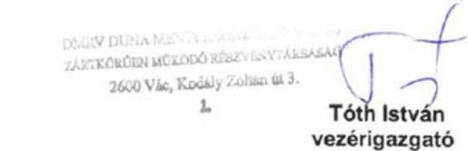

Tevélom: 2601 Vác. Pf. 96. Telefon: 27-511-500 $\cdot$ Fax: 27-316-195 $\cdot$ Adószám: 10863877-2-44 $\cdot$ mimi.cmivzrt.ha
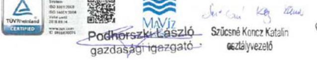

---

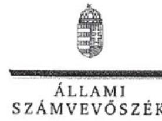

Tóth István úr
vezérigazgató
DMRV Duna Menti Regionális Vízmú Zrt.

# Vác 

## Tisztelt Vezérigazgató Úr!

„A regionális vizmüvek gazdálkodásának ellenörzése" címmel készített számvevőszéki jelentéstervezetre tett észrevételét köszönettel megkaptam.

Az Állami Számvevőszék észrevételre vonatkozó álláspontjáról a felügyeleti vezető által készített részletes tájékoztatást csatoltan megküldöm.

Tájékoztatom Vezérigazgató urat, hogy a számvevőszéki jelentésben - az Állami Számvevőszékről szóló 2011. évi LXVI. törvény 29. § (3) bekezdése alapján - a figyelembe nem vett észrevételt szerepeltetjük az elutasítás indokának feltüntetésével.

Budapest, 2017. jhun hó $t$. nap
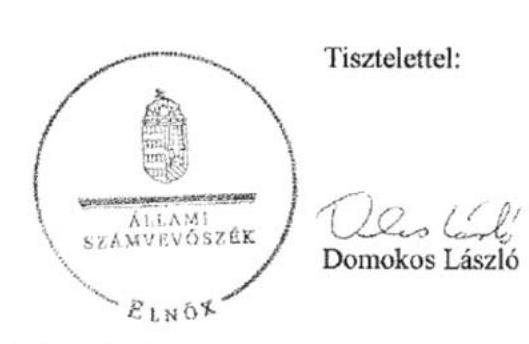

Melléklet: Tájékoztatás az elfogadott és el nem fogadott észrevételről

---

# Tájékoztatás   az elfogadott és az el nem fogadott észrevételről 

„A regionális vizmüvek gazdálkodásának ellenörzése" címủ jelentéstervezetre 2017. május 30án érkezett észrevételét áttekintettük, annak kezelésével kapcsolatban a következő tájékoztatást adom.

1. Jelentéstervezet Főbb megállapítások, következtetések, javaslatok fejezetéhez és a 19. oldal 1. bekezdéséhez tett észrevételre adott válasz:

A vagyongazdálkodás hatékonyságát jellemző mutatók kedvezőtlen alakulásában meghatározó tényezőt jelentő kinnlevőség-növekedéssel összefüggésben a hatékonyság javulását mutató - a kinnlevőség-növekedés hatásának megítélését meg nem változtató - tényezőről adott tájékoztatásukat köszönjük. A leírtak nem cáfolják a jelentéstervezet megállapítását, ezért a megállapítás módosítása nem indokolt.
2. A jelentéstervezet 10. oldalához és a Rövidítések jegyzékéhez tett észrevételre adott válasz:
A DMRV Duna Menti Regionális Vízmủ Zártkörűen Müködő Részvénytársaság nevét pontosítjuk.
3. Az 1.3. megállapítás 1. bekezdéshez tett észrevételre adott válasz:

A dokumentumok ismételt áttekintése alapján a jelentéstervezetet az alábbiak szerint módosítjuk:
„Az integrációval kapcsolatban végrehajtott intézkedéseket a regionális vizmü társaságok az éves üzleti jelentéseikben mutatták be, valamint saját belső elemzéseket, összefoglalókat is készitettek. E dokumentumokban - a DMRV-t kivéve - elemezték az integrációs folyamat pozitív és negatív hatásait, kitérve a kezdeti átállási nehézségekre és a költségek növekedésére, valamint - a TRV-t kivéve - az integráció potenciális szakmai és gazdasági előnyeire is."
4. A jelentéstervezet II. számú mellékletéhez kapcsolódó észrevételre adott válasz:

A dokumentumok ismételt áttekintése alapján a mellékletet javítjuk.

---

5. A jelentéstervezet 19. oldal 4.1. számú megállapítás 2. bekezdés első mondatához kapcsolódó észrevételre adott válasz:
A jelentéstervezet 19. oldal 4.1. számú megállapítás 2. bekezdés 1. mondatát az alábbiak szerint pontosítjuk:
,,Az ellenőrzött időszakban - jellemzően az állami vagyonra vonatkozó vagyonkezelési szerződések módosításának elmaradása miatt - az állami vagyon kategóriájába tartozó tárgyi eszközök értéke a számviteli nyilvántartásokban minden regionális vizmü társaságnál eltért az egyéb hosszú lejáratú kötelezettségek értékétől."
Budapest, 2017. 5. 5. 5. nap

Makkai Mária
felügyeleti vezető

---

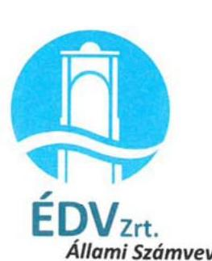

# Domokos László   elnök részére 

1364 BUDAPEST 4.
Pf. 54.

## Tisztelt Elnök Úr!

Hivatkozva az Északdunántúli Vízmú Zrt-nél „A regionális vizmúvek gazdálkodásának ellenörzése" címmel készített számvevőszéki jelentéstervezetre, az alábbi észrevételeket tesszük:
> 3.1. számú megállapítás: Társaságunkat 2014 óta jelentősen érintette az integráció. A rezsicsökkentés végrehajtása ellenére az értékesítés nettó árbevétele 2011 és 2015 között 33,5 \%-kal emelkedett. Kérjük, hogy az árbevétel volumenét elemző ezen megállapításban az ÉDV Zrt-re vonatkozóan ezt szíveskedjenek kiemelni.
> 4.2. számú megállapítás: Társaságunk Számviteli Politikájának 10. pontja tartalmazza a vagyonkezelés keretében üzemeltetett állami tulajdonú viziközmúvekre vonatkozó számviteli előírásokat, közte az értékcsökkenési leírás módszerét is. Társaságunk Számviteli szétválasztási szabályzata, ugyan külön szakmai szabályzatként került kiadásra, azonban a szabályzat a Számviteli Politika 7. számú mellékletét képezi. Álláspontunk szerint Társaságunkra nézve a megállapítást pontosítani szükséges.
> 4.3. számú megállapítás: Társaságunknál a vagyonértékelés eredményének átvezetése 2015. január 1-jei dátummal megtörtént, a tárgyi eszköz analitikus nyilvántartó modulban (SAP R/3 AM modul) történő felvétellel. Ennek bizonyítékául a 2016.12.14-ei helyszíni ellenőrzés alkalmával a 2-3-12 Vagyonértékelés Fk analitikája.zip dokumentum keretében - az ellenőrzés rendelkezésére bocsátottuk kimutatásainkat, fökönyvi kivonatainkat, tárgyi eszköz tábláinkat. Társaságunk így nem sértette meg az MNV Zrt-vel 2015. évben megkötött vagyonkezelési szerződés 3.3.1. pontjában foglaltakat. A vagyonértékelés eredményének nyilvántartásba vétele és a kivezetett eszközök megfeleltetése valóban folyamatban volt még az ellenőrzés során, erről 2016. december 14-én az Állami Számvevőszék részére nyilatkozatot állítottunk ki.

---

Az eszközök megfeleltetésének folyamata az analitikus nyilvántartásba való felvételt nem befolyásolta, azt teljesen körűen megvalósítottuk. A vagyonértékelésben szereplő és felvételre került tárgyi eszközök fizikailag is megtalálhatók, azok paramétereinek és teljes körűségének vizsgálata volt folyamatban az ellenőrzés során, így véleményünk szerint nem vétettünk a Sztv. 15 § (3) bekezdésében foglaltak ellen. Álláspontunk szerint a megállapítás 4. bekezdésében foglaltak félrevezetőek, így kérjük a Társaságunkra vonatkozó rész törlését a jelentésből.

Tisztelettel:
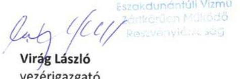

---

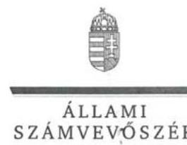

ELNÖK

Ikt.szám: V-1178-347/2016.

# Virág László úr 

vezérigazgató
Északdunántúli Vízmú Zrt.

## Tatabánya

## Tisztelt Vezérigazgató Úr!

„A regionális vizmüvek gazdálkodásának ellenörzése" címmel készített számvevőszéki jelentéstervezetre tett észrevételét köszönettel megkaptam.

Az Állami Számvevőszék észrevételre vonatkozó álláspontjáról a felügyeleti vezető által készített részletes tájékoztatást csatoltan megküldőm.

Tájékoztatom Vezérigazgató urat, hogy a számvevőszéki jelentésben - az Állami Számvevőszékről szóló 2011. évi LXVI. törvény 29. § (3) bekezdése alapján - a figyelembe nem vett észrevételt szerepeltetjük az elutasítás indokának feltüntetésével.

Budapest, 2017. június hó 15. nap
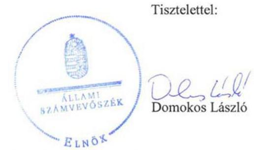

Melléklet: Tájékoztatás az elfogadott és el nem fogadott észrevételről

---

# Tájékoztatás   az elfogadott és az el nem fogadott észrevételről 

„A regionális vizmüvek gazdálkodásának ellenörzése" címủ jelentéstervezetre 2017. május 29én érkezett észrevételt áttekintettük, annak kezelésével kapcsolatban a következő tájékoztatást adom.

## 1. A 3.1. számú megállapításhoz tett észrevételre adott válasz:

Az észrevételben foglalt árbevétel növekedés külön ÉDV Zrt-re vonatkozó kiemelését nem tartjuk indokoltnak. A jelentéstervezet melléklete tartalmazza a felhasználói egyenértékre vetített árbevétel adatok alakulását társaságonként. Az észrevételt nem fogadjuk el, a jelentéstervezet módosítása nem indokolt.

## 2. A 4.2. számú megállapításhoz tett észrevételre adott válasz:

A számviteli politika vonatkozásában tett észrevételt az ellenőrzés során rendelkezésre bocsátott dokumentumok ismételt felülvizsgálata alapján elfogadjuk. A 4.2. számú megállapítás első bekezdését pontosítjuk.
A számviteli szétválasztási szabályzattal kapcsolatban tett észrevétel nem megalapozott. A számviteli politika nem tartalmazza a mellékletek felsorolását, jegyzékét és hivatkozást sem tartalmaz a mellékletekre. Önmagában attól, hogy egy külön elkészített szabályzat borító lapja hivatkozik arra, hogy az a számviteli politika adott számú melléklete, nem válik automatikusan a számviteli politika részévé. Az észrevétel ezen részét nem fogadjuk el, a jelentéstervezet módosítása nem indokolt.

## 3. A 4.3. számú megállapításhoz tett észrevételre adott válasz:

Az észrevétel szerint a vagyonértékelés eredményének átvezetése 2015. január 1-jei dátummal megtörtént a tárgyi eszköz analitikus nyilvántartó modulban. Az észrevétel tartalmazza továbbá, hogy a „vagyonértékelés eredményének nyilvántartásba vétele és a kivezetett eszközök megfeleltetése valóban folyamatban volt még az ellenörzés során", ez megerősíti az ÁSZ megállapítását, amely 2015. január 1-ét követően is fennállt az ellenőrzött időszakban. Az ellenőrzés során rendelkezésre bocsátott információk alapján a vagyonértékelés eredményének az analitikus nyilvántartásban történő átvezetése teljes körűen nem történt meg. Az analitikus nyilvántartásban a vagyonértékelés struktúrája és a korábbi nyilvántartási struktúra teljes körűen nem felelt meg egymásnak, a megfeleltetés az ellenőrzés során még folyamatban volt. A vagyonkezelési szerződés 3.3.1. pontja is a vagyonértékelésben megjelölt struktúra szerinti nyilvántartási kötelezettséget írja elő, amely struktúra analitikus nyilvántartásokban való teljes körű átvezetése az ellenőrzés során még folyamatban volt, a tárgyi eszköz nyilvántartás és karbantartási modul összefüggésében. A jelentéstervezet 4.3. számú megállapítás utolsó

---

bekezdését és az ÉDV Zrt. vezérigazgatójának címzett 2. számú javaslatot pontosítjuk figyelemmel az ellenőrzés során rendelkezésre bocsátott dokumentumokra és a 4. számú összegző megállapítással való összhang biztosítására.
A Számv. tv. előírása alapján a könyvvitelben rögzített és beszámolóban szereplő tételeknek kívülállók által is megállapíthatónak kell lenniük, az alapelv teljes körű érvényesüléséhez elengedhetetlen a számviteli nyilvántartásokon való teljes körű átvezetés és megfeleltetés a vagyonstruktúra tekintetében.

Budapest, 2017. június hó 15. nap
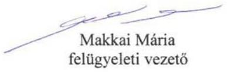

---

# MNV | MAGYAR NEMZETI   VAGYONKEZELÓ ZRT.   VEZÉRIGAZGATÓ 

## Állami Számvevőszék

## Domokos László

elnök

1052 Budapest
Apáczai Cs. J. u. 10.

Ikt. sz.: MNV/01/9867/2/2017.
Hiv. sz.: V-1178-334/2016.

Tisztelt Elnök Úr!
Tájékoztatom, hogy a 2017. május 10. napján „A regionális vizmüvek gazdálkodásának ellenőrzése" tárgyában kézhez vett, V-1178-334/2016. ikt. sz. levél mellékleteként megküldött Jelentés-tervezetre az alábbi észrevételeket tesszük:
„Megállapítások" 4. pont „Összegző megállapítás" / 19. oldal 2. bekezdése és 4. 3. számú megállapítás 4. bekezdés 2-3. mondata / 21. oldal 7. bekezdése:

A Jelentés-tervezet rögzíti, hogy az ÉDV-nél a vagyonértékelés eredményének átvezetése nem történt meg a tárgyi eszközök analitikus nyilvántartásában. Ezáltal megsértette a Számv. tv. 15. § (3) bekezdésében és az állami vagyonra vonatkozó, az MNV és az ÉDV között a 2015. évben megkötött vagyonkezelési szerződés 3.3.1. pontjában foglalt rendelkezéseket.

Ezen megállapítások alapján a Jelentés-tervezet 24. oldalán az ÉDV Zrt. vezérigazgatója részére az alábbi 2. sz. intézkedést igénylő javaslat került megfogalmazásra: „Intézkedjen a Számv. tv.-ben és a vagyonkezelési szerződésben előírtaknak megfelelően a vagyonértékelés eredményének az analitikus nyilvántartásban történő átvezetéséről."

A rendelkezésünkre álló információk szerint az ÉDV Zrt. az SZT-104856 számú szerződésmódosításban vállalt kötelezettségének eleget tève 2015. január 1-jei dátummal átvezette számviteli nyilvántartásában a 2014. június 30 -ai fordulónappal elkészített vagyonértékelés eredményét.

Az ÉDV Zrt. - tájékoztatása szerint - ennek megfelelően teljesítette az MNV Zrt. felé a 2015. évről szóló Vagyonkataszteri jelentését, illetőleg ennek megfelelően készítette el a 2015. évi Éves beszámolóját is.

Kérem Elnök Urat, hogy a jelentés véglegesítése során jelen észrevételeinket szíveskedjenek figyelembe venni.
Budapest, 2017. május „ 25 "

Üdvözlettel:
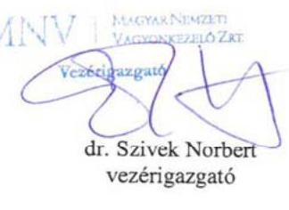

---

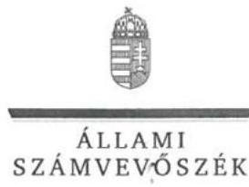

ELNÖK

Ikt.szám: V-1178-348/2016.
dr. Szívek Norbert úr
vezérigazgató
Magyar Nemzeti Vagyonkezelő Zrt.

# Budapest 

## Tisztelt Vezérigazgató Úr!

„A regionális vizmüvek gazdálkodásának ellenörzése" címmel készített számvevőszéki jelentéstervezetre tett észrevételét köszönettel megkaptam.

Az Állami Számvevőszék észrevételre vonatkozó álláspontjáról a felügyeleti vezető által készített részletes tájékoztatást csatoltan megküldőm.

Tájékoztatom Vezérigazgató urat, hogy a számvevőszéki jelentésben - az Állami Számvevőszékről szóló 2011. évi LXVI. törvény 29. § (3) bekezdése alapján - a figyelembe nem vett észrevételt szerepeltetjük az elutasítás indokának feltüntetésével.

Budapest, 2017. június hó 15. nap
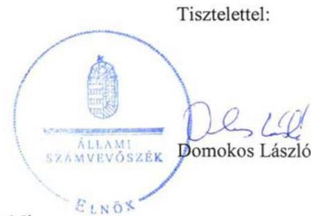

Melléklet: Tájékoztatás az észrevétel kezeléséről

---

# Tájékoztatás   az észrevétel kezeléséről 

„A regionális vizmüvek gazdálkodásának ellenörzése" címủ jelentéstervezetre 2017. május 26án érkezett észrevételt áttekintettük, annak kezelésével kapcsolatban a következő tájékoztatást adom.

## A 4. számú összegző megállapításhoz és a 4.3. számú megállapítás 4. bekezdéséhez tett észrevételre adott válasz:

Az észrevétel tartalmazza, hogy az ÉDV Zrt. a szerződéses kötelezettségének eleget téve 2015. január 1-jei dátummal átvezette számviteli nyilvántartásában a 2014. június 30 -ai fordulónappal elkészített vagyonértékelés eredményét.
Az ellenőrzés során rendelkezésre bocsátott információk alapján a vagyonértékelés eredményének az analitikus nyilvántartásban történő átvezetés teljes körűen nem történt meg. A vagyonkezelési szerződés 3.3.1. pontja a vagyonértékelésben megjelölt struktúra szerinti nyilvántartási kötelezettséget írja elő, amely struktúra analitikus nyilvántartásokban való teljes körű átvezetése az ellenőrzés rendelkezésére bocsátott dokumentumok alapján az ellenőrzés során még folyamatban volt a tárgyi eszköz nyilvántartás és karbantartási modul összefüggésében.
A fentiek alapján az észrevételt részben fogadjuk el. Az ellenőrzés során rendelkezésre bocsátott dokumentumok ismételt felülvizsgálata alapján és a 4. számú összegző megállapítással való teljes összhang megteremtése érdekében pontosítjuk a 4.3. számú megállapítás utolsó bekezdését és az ÉDV Zrt. vezérigazgatójának címzett 2. számú javaslatot.
Az észrevétel tartalmazza továbbá, hogy az ÉDV Zrt. ennek megfelelően teljesítette az MNV Zrt. felé a 2015. évről szóló Vagyonkataszteri jelentését, illetőleg ennek megfelelően készítette el a 2015. évi beszámolóját is.
Az ÁSZ jelentéstervezet 4.1. megállapítás 3. bekezdése rögzíti, hogy a regionális vízmủ társaságok - az ÉDV Zrt. is - az állami vagyonra vonatkozó adatszolgáltatási kötelezettségeiknek szabályszerűen eleget tettek. Az ÉDV Zrt. éves beszámolójára vonatkozóan negatív megállapítást az ÁSZ jelentéstervezete nem tartalmaz. Az észrevétel ezen része összhangban van az ÁSZ megállapításával, ezért a jelentéstervezet módosítása nem indokolt.

Budapest, 2017. június 3 hó 45 . nap
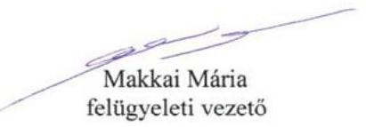

---

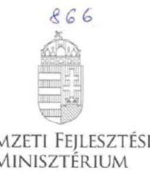

# Iktatószám: EFO/33270-1/2017-NFM 

Ügyintéző: Simonné Hábencius Gizella
Telefonszám: 79-54405
E-mail:gizella.habenclas.simonse@ofin.gov.hu
Hiv. szám: V-1178-337/2016.

## Domokos László

elnök
részére
Állami Számvevőszék

## Budapest

Apáczai Csere János u. 10.
1052

Tárgy: Jelentéstervezet véleményezése

## Tisztelt Elnök Úr!

Köszönettel vettem „A Regionális vizművek gazdálkodásának ellenőrzése" címen megküldött számvevőszéki jelentéstervezetüket. A tervezetre az alábbi észrevételeket tesszük:

- A jelentéstervezet főbb megállapításai, következtetései között szerepel, hogy a regionális vizmú társaságok a 2013. évtől kezdődően megvalósították a szolgáltatási díjak csökkentését.
A megállapítás kiegészitését kérjük azzal, hogy a díjcsökkentés megvalósítása a rezsicsökkentések végrehajtásáról szóló 2013. évi LIV. törvény (a továbbiakban: Rezsi tv.) következtében történt.

A Rezsi tv. hatására a lakossági víz- és csatornadíjak csökkentése következett be, a Rezsi tv. a lakossági fogyasztók számára 2013. július 1-jétől a 2013. január 31-i bruttó dijterheléshez képest $10 \%$-os csökkentést írt elő, a nem lakossági fogyasztók tekintetében pedig a víziközmú-szolgáltatásról szóló 2011. évi CCIX. törvény (a továbbiakban: Vksztv.) 76. § rendelkezése alapján az alkalmazott díjak rögzítésre kerültek.

- A jelentéstervezet 7. oldalán az „Ellenőrzés területe" címủ pont alapján a Vksztv. hatályba lépését követően centralizálttá vált a víziközmú díjak megállapítása.

---

A „centralizált" megfogalmazás helyett a következő szöveget javasoljuk: központi hatósági árszabályozás valósult meg.
A Vksztv. 65. § (1) bekezdése szerint a közmüves ivóvízellátás, valamint a közmüves szennyvïzelvezetés és -tisztitás diját (a továbbiakban együtt: hatósági dij) a Magyar Energetikai és Közmü-szabályozási Hivatal javaslatának figyelembevételével a miniszter rendeletben állapítja meg, mely a Rezsi tv. miatt nem kerül jelenleg kiadásra.

- A jelentéstervezetben a nemzeti fejlesztési minisztert (a továbbiakban: miniszter) több alkalommal is ágazati irányitóként nevezik meg. Ez nem helytálló, mert a Kormány tagjainak feladat- és hatásköréről szóló 152/2014. (VI. 6.) Korm. rendelet (a továbbiakban: 152/2014. (VI. 6.) Korm. rendelet) alapján a miniszter a Kormány viziközmü-szolgáltatásért felelős tagja. A 152/2014. (VI. 6.) Korm. rendelet 124. § (1) bekezdésének megfelelően a miniszter a viziközmü-szolgáltatásért való felelőssége keretében előkészíti a víziközmü-szolgáltatás közszolgáltatási tevékenységére és a víziközmü-müködtetéshez kapcsolódó gazdálkodói tevékenységre vonatkozó jogszabályokat.
Kérjük a fentiek javitását az alábbiak szerint: a víziközmü-szolgáltatásért felelős miniszter.
- A tervezet 6. oldalán az ivóvíz ellátás és a helyi szintü szennyvízkezeléssel kapcsolatos kötelezettségeket taglalják.
A jelentés nem tér ki arra, hogy a Vksztv. alapján a víziközmüvek, azaz az ivóvízellátást, valamint a szennyvïzelvezetést és -tisztitást biztosító létesítmények kizárólag települési önkormányzati vagy állami tulajdonba tartozhatnak. Fontosnak tartjuk kiemelni, hogy a felhasználók ellátásáért a települési önkormányzatok valamint - jogszabályban meghatározott esetekben - az állam a felelős. A felhasználók ellátásáért, a víziközmüfejlesztés megvalósításáról - ha a Vksztv. vagy kormányrendelet másként nem rendelkezik - az ellátásért felelős gondoskodik.

Kérem észrevételeink elfogadását.

Budapest, 2017. május „ ${ }^{\text { }}$,"

# Üdvözlettel: 

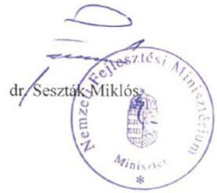

---

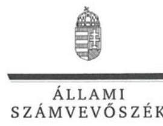

ELNÖK

Ikt.szám: V-1178-362/2016.

Dr. Seszták Miklós úr
miniszter

Nemzeti Fejlesztési Minisztérium

Budapest

Tisztelt Miniszter Úr!
„A regionális vizmüvek gazdálkodásának ellenőrzése" címmel készített számvevőszéki jelentéstervezetre tett észrevételét köszönettel megkaptam.

Az Állami Számvevőszék észrevételre vonatkozó álláspontjáról a felügyeleti vezető által készített részletes tájékoztatást csatoltan megküldöm.

Tájékoztatom Miniszter urat, hogy a számvevőszéki jelentésben - az Állami Számvevőszékről szóló 2011. évi LXVI. törvény 29. § (3) bekezdése alapján - a figyelembe nem vett észrevételt szerepeltetjük az elutasítás indokának feltüntetésével.

Budapest, 2017. gánciss hó 20 nap

Tisztelettel:
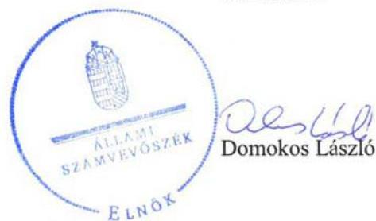

Melléklet: Tájékoztatás az észrevétel kezeléséről

---

# Tájékoztatás   az észrevétel kezeléséről 

„A regionális vizmüvek gazdálkodásának ellenörzése" címủ jelentéstervezetre 2017. június 2án érkezett észrevételt áttekintettük, annak kezelésével kapcsolatban a következő tájékoztatást adom.

1. A „Föbb megállapítások, következtetések" címü ponthoz tett észrevételre adott válasz:
Az összegző megállapítás kiegészítése nem indokolt, annak részletes kifejtése és alátámasztása a részletes megállapítások között szerepel. Ennek keretében a 2.2. számú megállapításon belül az észrevételben említett jogszabályi rendelkezések részletesen bemutatásra kerülnek.

## 2. Az „Ellenőrzés területe" címú ponthoz tett észrevételre adott válasz:

Az észrevételt elfogadjuk a megfogalmazást „centralizált" helyett „központi hatósági árszabályozásra" módosítjuk.

## 3. Az „ágazati irányító" megfogalmazás vonatkozásába tett észrevételre adott válasz:

A jelentéstervezet „víziközmü-szektor ágazati irányítását ellátó", „ágazati irányítást ellátó" és „ágazati irányító" kifejezéseket használ a Minisztériumra, amelyet az NFM részére megküldött ellenőrzési program is tartalmazott. A jelentéstervezet következetesen az ellenőrzési programnak megfelelően tartalmazza a kifejezéseket és „Az ellenőrzés területe" című fejezet 4. bekezdése rögzíti, hogy az irányítási feladatok alatt az ÁSZ mit ért, amely összhangban van az észrevételben foglaltakkal. A minisztériumra vonatkozó megfogalmazás jelentéstervezetben történő módosítása nem indokolt.
A nemzeti fejlesztési miniszter esetében a jelentéstervezet - az észrevétellel ellentétben egyetlen esetben - tartalmazza az „ágazati irányító" kifejezést, amelynek pontosítását átvezetjük. Az észrevételt részben fogadjuk el.

## 4. A jelentéstervezet 6. oldalán szereplő információk vonatkozásába tett észrevételre adott válasz:

Az észrevétel szerinti kiegészítést nem tartjuk indokoltnak, mivel „Az ellenőrzés területe" fejezet 2. bekezdésében az észrevételben leírtak tartalmilag megjelennek és a jelentéstervezet I. számú melléklete is tartalmazza az „ellátásért félelős" fogalom meghatározását.

Budapest, 2017. június hó 20. nap
Makkai Mária
felügyeleti vezető

---

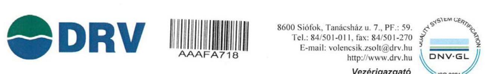

Ügyiratszám: 661374-16-17/2017
Hivatkozási szám:V-1178-332/2016.

Állami Számvevőszék

Budapest 4.
Pf.: 54.
1364

Domokos László úr
clnök

Tárgy: Ellenőrzés megállapításaira tett észrevétel „A regionális vízművek gazdálkodásának ellenőrzése" tárgyában

Tisztelt Elnök Úr!

A V-1179-332/2016. számú levelükkel megküldött „A regionális vízművek gazdálkodásának ellenőrzése" címmel készült számvevőszéki jelentéstervezetet megkaptuk, annak tartalmát megismertük. A Jelentésben rögzítettekkel kapcsolatban *észrevételt nem kívánok tenni*.

Siófok, 2017. május 24.

Tisztelettel:

Dunántúli
Regionális Vízmú Zrt.

Volencsik Zsolt
vezérigazgató

---

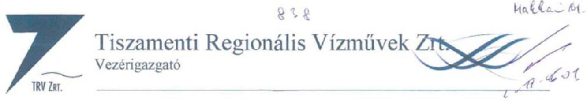

Ikt.szám: 1/02/4-3/2017

Állami Számvevőszék
Domokos László Állami Számvevőszék Elnöke részére
Budapest
Apáczai Csere János u. 10
1052

Tisztelt Domokos László!

Hivatkozva a V-1178-333/2016. iktatószámú jelentéstervezetre, ezúton szeretném jelezni, hogy
Társaságunk részéről észrevételt nem teszünk.

Szolnok, 2017. május 19.

Üdvözlettel:

Háza Gábor
vezérigazgató
Tiszamenti Regionális vízművek
Zártkörűen Működő Részvénytársaság

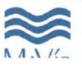

5000 Szolnok, Kossuth Lajos út 5. Tel: (56) 422-502 Fax: (56) 373-022
Web: www.teszet.hu E-mail: hathe@tesszet.hu

---

# RÖVIDÍTÉSEK JEGYZÉKE 

${ }^{1}$ Vgtv.
${ }^{2}$ Vksztv.
${ }^{3} \mathrm{FM}$
${ }^{4}$ NFM
${ }^{5}$ BM
${ }^{6}$ Vtv.
${ }^{7}$ MNV
${ }^{8}$ MEH
${ }^{9}$ MEKH
${ }^{10}$ ÁSZ
${ }^{11}$ ÉRV
${ }^{12}$ DMRV
${ }^{13}$ ÉDV
${ }^{14}$ DRV
${ }^{15}$ TRV
${ }^{16} \mathrm{VM}$
${ }^{17}$ Nvtv.
${ }^{18}$ MEKH tv.
${ }^{19}$ Rezsi tv.
${ }^{20}$ Számv. tv.
${ }^{21}$ Vksz.Vhr.
${ }^{22} \mathrm{FE}$
${ }^{23}$ Vtv.Vhr.
${ }^{24}$ Vagyonnyilvántartási szabályzat ${ }_{1}$
${ }^{25}$ Vagyonnyilvántartási szabályzat ${ }_{2}$
${ }^{26}$ MEKH ajánlás
${ }^{27}$ 24/2013. NFM rendelet
${ }^{28}$ 61/2015 NFM rendelet
${ }^{29}$ Áht.
1995. évi LVII. törvény a vízgazdálkodásról (hatályos 1996. január 1-től)
2011. évi CCIX. törvény a víziközmű-szolgáltatásról (hatályos 2011. december 31-től)
Földművelésügyi Minisztérium
Nemzeti Fejlesztési Minisztérium
Belügyminisztérium
2007. évi CVI. törvény az állami vagyonról (hatályos: 2007. szeptember 25.)

Magyar Nemzeti Vagyonkezelő Zártkörűen Működő Részvénytársaság
Magyar Energetikai Hivatal
Magyar Energetikai és Közmű-szabályozási Hivatal
Állami Számvevőszék
Északmagyarországi Regionális Vízmúvek Zrt.
DMRV Duna Menti Regionális Vízmú Zrt.
Északdunántúli Vízmú Zrt.
Dunántúli Regionális Vízmú Zrt.
Tiszamenti Regionális Vízmúvek Zrt.
Vidékfejlesztési Minisztérium
2011. évi CXCVI. törvény a nemzeti vagyonról (hatályos 2011. december 31-től)
2013. évi XXII. törvény a Magyar Energetikai és Közmű-szabályozási Hivatalról (hatályos 2013. április 4-től)
2013. évi LIV. törvény a rezsicsökkentések végrehajtásáról (hatályos 2013. május 10-től)
2000. évi C. törvény a számvitelről (hatályos 2000. szeptember 21-től)

58/2013. (II.27.) Korm. rendelet a víziközmú-szolgáltatásról szóló 2011. évi CCIX. törvény egyes rendelkezéseinek végrehajtásáról (hatályos: 2013. március 1-től)
felhasználói egyenérték
254/2007. (X. 4.) Korm. rendelet az állami vagyonnal való gazdálkodásról (hatályos 2007. október 4-től)

46/2008. számú MNV vezérigazgató utasítás (hatályos: 2008. július 11-től)
12/2014 számú MNV vezérigazgató utasítás (hatályos: 2014. március 24-től)
MEKH VK 5/2013. számú ajánlás a számviteli szétválasztás szabályainak kialakításához
a víziközmúvek vagyonértékelésének szabályairól és a víziközmú-szolgáltatók által közérdekből közzéteendő adatokról (hatályos: 2013. május 30-tól)
a víziközmúvek gördülő fejlesztési terve részét képező felújítási és pótlási terv, valamint beruházási terv részletes tartalmi és formai követelményeiről (hatályos: 2015. november 5-től)
az államháztartásról szóló 1992. évi XXXVIII. törvény (hatályos: 2011. december 31-ig) illetve az államháztartásról szóló 2011. évi CXCV. törvény (hatályos 2012. január 1-től)

---

ÁLLAMI SZÁMVEVŐSZÉK
1052 Budapest, Apáczai Csere János utca 10.
Levélcím: 1364 Budapest 4. Pf. 54
Telefon: +36 14849100 Telefax: +36 14849200
www.asz.hu