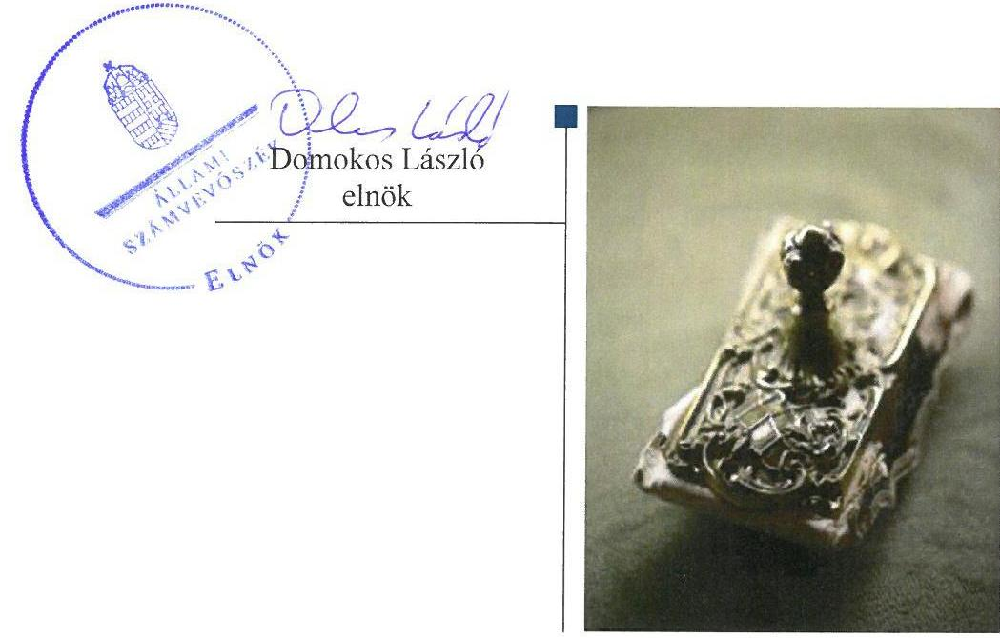

# Jelentés 

## Pártok gazdálkodása

A költségvetési támogatásban részesülő pártok 2014-2015. évi gazdálkodása törvényességének ellenőrzése a Kereszténydemokrata Néppártnál 2017.

---

# Jelentés 

## Pártok gazdálkodása

A költségvetési támogatásban részesülő pártok 2014-2015. évi gazdálkodása törvényességének ellenőrzése a Kereszténydemokrata Néppártnál 2017. június hó 29. nap

---

|  J | AZ ELLENŐRZÉST FELÜGYELTE:  |
| --- | --- |
|   | DR. BENEDEK MÁRIA felügyeleti vezető  |
|   | AZ ELLENŐRZÉST VEZETTE ÉS A VÉGREHAJTÁSÁÉRT FELELŐS:  |
|   | KAKAS SÁNDOR ellenőrzésvezető  |
|   | A PROGRAM ÖSSZEÁLLÍTÁSÁÉRT FELELŐS:  |
|   | JANIK JÓZSEF LÁSZLÓ osztályvezető  |
|   | A TÉMÁHOZ KAPCSOLÓDÓ KORÁBBI SZÁMVEVŐSZÉKI JELENTÉSEK:  |
|   | - címe: Jelentés a költségvetési támogatásban részesülő pártok 2012-2013. évi gazdálkodása törvényességének ellenőrzéséről – Kereszténydemokrata Néppárt  |
|  J | - sorszáma: 15055  |
|   | IKTATÓSZÁM: EL-0031-044/2017.  |
|   | TÉMASZÁM: 2295  |
|   | ELLENŐRZÉS-AZONOSÍTÓ SZÁM: V077603  |

---

# TARTALOMJEGYZÉK 

■ ÖSSZEGZÉS ..... 5
■ AZ ELLENŐRZÉS CÉLJA ..... 6
■ AZ ELLENŐRZÉS TERÜLETE ..... 7
■ AZ ELLENŐRZÉS HÁTTERE, INDOKOLTSÁGA ..... 8
■ A JELENTÉS LÉNYEGES KÉRDÉSKÖREI ..... 9
■ ELLENŐRZÉS HATÓKÖRE ÉS MÓDSZEREI ..... 10
■ MEGÁLLAPÍTÁSOK ..... 12
■ JAVASLATOK ..... 16
■ MELLÉKLETEK ..... 17
I. sz. melléklet: Értelmező szótár ..... 17
II. sz. melléklet: 2014. évi pénzügyi kimutatás ..... 18
III. sz. melléklet: 2015. évi pénzügyi kimutatás ..... 19
■ FÜGGELÉK: ÉSZREVÉTELEK ..... 21
■ RÖVIDÍTÉSEK JEGYZÉKE ..... 23

---

.

---

# ÖSSZEGZÉS 

Az Állami Számvevőszék a Kereszténydemokrata Néppárt gazdálkodásának törvényességét ellenőrizte 2014. január 1-jétől 2015. december 31-ig terjedő időszakra vonatkozóan. Megállapította, hogy gazdálkodásának szabályozási környezetét összességében a jogszabályi előírásoknak megfelelően alakította ki. A könyvvezetése és gazdálkodása során a vonatkozó jogszabályi rendelkezéseket és belső előírásokat összességében betartotta. A 2014-2015. évi pénzügyi kimutatásokat elkészítette és közzétette, biztosította a gazdálkodásának, vagyoni helyzetének áttekinthetőségét.

## Az ellenőrzés társadalmi indokoltsága

A pártok az állampolgárok egyesülési szabadsága alapján létrehozott olyan szervezetek, amelyek kereteket nyújtanak a népakarat kialakításához és kinyilvánításához, a politikai életben való állampolgári részvételhez.

A politikai élet tisztasága érdekében törvény állapítja meg a pártok vagyonára és gazdálkodására vonatkozó szabályokat. Az egyesülési jog alapján létrejövő más szervezetekhez képest szűkebb körben határozza meg azt a gazdasági tevékenységet, amelyet a párt végezhet, biztosítja azonban a pártok részére azt a jogosultságot, hogy az állami költségvetésből támogatásban részesüljenek. A pártok gazdálkodását a politikai élet tisztasága érdekében rendszeresen indokolt ellenőrizni, ezért törvényi előírás alapján az Állami Számvevőszék a költségvetési támogatást kapott pártok gazdálkodását kétévente ellenőrzi.

## Főbb megállapítások, következtetések, javaslatok

A Kereszténydemokrata Néppárt gazdálkodására vonatkozó számviteli keretek kialakítása és a belső szabályozások tartalma összességében megfelelő a jogszabályi előírásoknak, ami támogatta a közpénzekkel való átlátható és ellenőrizhető gazdálkodást. Az ellenőrzési rendszere összességében az előírásoknak megfelelően működött.

A 2014. és a 2015. évi pénzügyi kimutatást elkészítette, amelyek összességében megfeleltek a jogszabályi előírásoknak, ezáltal biztosította gazdálkodásának áttekinthetőségét. A 2014. évi pénzügyi kimutatást a jogszabályi határidőn túl, a 2015. évi pénzügyi kimutatást a jogszabályi határidőben tette közzé a Hivatalos Értesítőben, a közzétételről a saját honlapján a jogszabályban előírt határidőn túl gondoskodott.

A működéséhez a forrásokat, különösen a költségvetésből jutatott és az egyéb támogatásokat, adományokat szabályszerűen használta fel és számolta el, a gazdálkodással összefüggő tevékenységének keretében a kiadások kifizetése során a jogszabályok és a belső szabályzatok előírásait összességében betartotta, működése során a vagyont a törvényi előírásoknak megfelelően használta.

---

# AZ ELLENŐRZÉS CÉLJA 

AZ ELLENŐRZÉS CÉLJA annak értékelése volt, hogy a közzétett pénzügyi kimutatások a törvényi előírásoknak megfeleltek-e, a könyvvezetés és gazdálkodás során betartották-e a vonatkozó jogszabályi és belső előírásokat; a Kereszténydemokrata Néppárt a múködéséhez szabályszerűen igénybe vehető forrásokat használte fel.

---

# AZ ELLENŐRZÉS TERÜLETE 

## Kereszténydemokrata Néppárt

A Kereszténydemokrata Néppárt az 1944. évben létrejött Demokrata Néppárt jogutódja, olyan egyesület, amely nyilvántartott tagsággal rendelkezik, és amely a nyilvántartásba vételét végző bíróság előtt kinyilvánította, hogy a Párttörvény ${ }^{1}$ rendelkezéseit magára nézve kötelezőnek ismeri el a Párttörvény 1. §-a alapján.

A Kereszténydemokrata Néppárt célja a magyar nemzet és a magyar haza szolgálata a keresztény-keresztyén erkölcs és értékek alapján a politikai életben; az európai népek közösségében együttműködő, szabad és független Magyarország fejlődésének előmozdítása, hogy az ország szellemiekben és anyagiakban, népességében és erkölcsében egyaránt gyarapodjék. Ennek érdekében:
részt vesz a demokratikus, többpártrendszerű magyar jogállam múködésében és védelmében,
elősegíti az 1948. évi Emberi Jogok Egyetemes Nyilatkozatán alapuló, a Polgári és Politikai Jogok Nemzetközi Egyezségokmányában meghatározott emberi és politikai jogok érvényesülését,
megvalósítani törekszik az egyéni és közéleti erkölcsről, a politikai, társadalmi, gazdasági és kulturális életről, a szociális igazságosságról szóló keresztény felfogásnak a magyar közéletben való érvényre juttatását,
erősíti az állampolgárokban a társadalmi felelősségérzetet és a nemzeti tudatot.
A Kereszténydemokrata Néppárt a 2014. évben 185995 ezer Ft, a 2015. évben 152700 ezer Ft központi költségvetési támogatásban részesült. A 2014. évi pénzügyi kimutatásban 206541 ezer Ft bevételt, valamint 212951 ezer Ft kiadást számolt el. A 2015. évi pénzügyi kimutatás szerint az összes bevétele 174512 ezer Ft, a kiadások összege 163373 ezer Ft volt. Hitelállománya 2014. év végén 182862 ezer Ft, 2015. év végén 164364 ezer Ft volt.

A Kereszténydemokrata Néppárt a 2006. évben létrehozta a Barankovics István Alapítványt, gazdasági társaságot nem alapított.

---

# AZ ELLENŐRZÉS HÁTTERE, INDOKOLTSÁGA 

Az Állami Számvevőszékről szóló 2011. évi LXVI. törvény 5. § (11) bekezdés a) pontja, valamint a Párttörvény 10. § (1) bekezdése alapján a pártok gazdálkodása törvényességének ellenőrzésére az ÁSZ² jogosult. A Párttörvény 10. § (3) bekezdése alapján az ÁSZ kétévente ellenőrzi azoknak a pártoknak a gazdálkodását, amelyek rendszeres költségvetési támogatásban részesültek.

Az ÁSZ legutóbb a Kereszténydemokrata Néppárt 2012-2013. évi gazdálkodásának törvényességét ellenőrizte.

A gazdálkodás szabályszerűségének, a felhasznált közpénzek nagyságának bemutatásával a társadalom objektív képet alkothat a pártok működéséről. Az ellenőrzés megállapításai a gazdálkodás megfelelőségének bemutatásával elősegíthetik, hogy a törvényalkotók konkrét lépéseket tegyenek a pártok finanszírozására vonatkozó szabályozások megváltoztatása, átláthatóbbá, ellenőrizhetőbbé tétele irányába. Az ellenőrzés rámutathat a pártok gazdálkodásával, valamint az állami költségvetésből származó források felhasználásával kapcsolatos jó gyakorlatokra és szabálytalanságokra.

---

# A JELENTÉS LÉNYEGES KÉRDÉSKÖREI 

1. A Kereszténydemokrata Néppárt gazdálkodásának törvényességi kerete biztositott volt-e?
2. A Kereszténydemokrata Néppárt pénzügyi kimutatása megfelel-e a törvényi elöírásoknak, közzétételi kötelezettségét szabályszerüen teljesítette-e?
3. A Kereszténydemokrata Néppárt könyvvezetése és gazdálkodása során a vonatkozó jogszabályi rendelkezéseket és belső elöírásokat betartotta-e?

---

# ELLENŐRZÉS HATÓKÖRE ÉS MÓDSZEREI 

## Az ellenőrzés típusa

Szabályszerűségi ellenőrzés.

## Az ellenőrzött időszak

A 2014. január 1. - 2015. december 31. közötti időszak.

## Az ellenőrzés tárgya

A Kereszténydemokrata Néppárt ellenőrzése során az ellenőrzés tárgyát képezte a 2014. és a 2015. évi pénzügyi kimutatás elkészítésére, közzétételére, a párt könyvvezetésére, gazdálkodására, ennek keretében a számviteli szabályozás kialakítására, a bizonylati rend, bizonylati fegyelem betartására, egyéb gazdálkodási, ellenőrzési és pénzügyi-számviteli informatikai feladatok ellátására irányuló tevékenységek. Az ellenőrzés tárgya volt még a források elszámolása és felhasználása, valamint a vagyon jogszabályi előírásoknak megfelelő hasznosítása.

Az ellenőrzés kiterjedt minden olyan körülményre és adatra, amely az ÁSZ jogszabályban meghatározott feladatainak teljesítéséhez, valamint a program végrehajtása folyamán felmerült újabb összefüggések feltárásához szükséges volt.

## Az ellenőrzött szervezet

Kereszténydemokrata Néppárt

## Az ellenőrzés jogalapja

Az ellenőrzés jogalapját az ÁSZ tv. ${ }^{3}$ 5. § (11) bekezdés a) pontja, a Párttörvény 10. § (1) és (3)-(4) bekezdése képezte.

## Az ellenőrzés módszerei

Az ÁSZ az ellenőrzést az ellenőrzési program szempontjai, az ellenőrzött időszakban hatályos jogszabályok, az ellenőrzés szakmai szabályai az ellenőrzésre irányadó ÁSZ módszertanok figyelembevételével végezte. A gazdálkodás hibáinak kijavítására irányuló javaslatok kidolgozásakor a hatályos jogszabályok voltak az irányadóak.

---

Az ÁSZ az ellenőrzés ideje alatt a Kereszténydemokrata Néppárttal történő kapcsolattartást az ÁSZ SZMSZ²-ének vonatkozó előírásai alapján biztosította.

Az ellenőrzési bizonyítékként felhasználható adatforrások közé tartoztak egyrészt az ellenőrzési program részletes szempontjainál felsorolt adatforrások, másrészt minden egyéb az ellenőrzés folyamán feltárt, az ellenőrzés szempontjából információt tartalmazó dokumentum.

Az ellenőrzés lefolytatásához a Kereszténydemokrata Néppárt a tanúsítványok elektronikus kitöltésével, valamint az ÁSZ által kért dokumentumok elektronikus megküldésével szolgáltatott adatokat. A rendelkezésre bocsátott adatok, információk kontrollja az ellenőrzés keretében történt.

Az ÁSZ az ellenőrzést a Kereszténydemokrata Néppárt által rendelkezésre bocsátott dokumentumokra, adatokra alapozta. Az ellenőrzés céljának eléréséhez szükséges bizonyítékokat a számvevő az egyes adatok közvetlen, részletes elemzésével szerezte meg, a következő ellenőrzési eljárások alkalmazásával: megfigyelés, szemle (szemrevételezés), kérdésfeltevés (információkérés), mintavételezés, valamint elemző eljárás.

---

# 1. A Kereszténydemokrata Néppárt gazdálkodásának törvényességi kerete biztosított volt-e? 

Összegző megállapítás

1.1. számú megállapítás

A KDNP ${ }^{5}$ gazdálkodásának törvényességi kerete összességében biztosított volt.

A KDNP gazdálkodására vonatkozó számviteli keretek kialakítása és a belső szabályozások összességben megfeleltek a jogszabályi előírásoknak.

## A SZÁMV. TV.-BEN ${ }^{6}$ ELŐÍRT SZABÁLYZATOKKAL a KDNP rendelkezett.

A Számviteli politika ${ }^{7}$ a Számv. tv. előírásainak megfelelően tartalmazta a könyvvezetés módját, az évközi és év végi zárlati feladatokat és azok időpontját, valamint azt, hogy az értékelésnél a KDNP mit tekint jelentős, illetve nem jelentős összegű hibának. A Számv. tv. 14. § (4) bekezdésének előírása ellenére a KDNP a Számviteli politika keretében nem rögzítette azokat a jellemző szabályokat, előírásokat, módszereket, amelyekkel meghatározza, hogy mit tekint a számviteli elszámolás, az értékelés szempontjából lényegesnek, nem lényegesnek.

A Leltározási és leltárkészítési szabályzat ${ }^{8}$ tartalmazta a leltározás módját, a leltározás lebonyolításának rendjét, valamint a leltározás bizonylati rendjét.

Az Eszközök és források értékelési szabályzat ${ }^{9}$ a Számv. tv. előírása alapján rögzítette, hogy az értékpapírok (befektetési jegyek) mérlegértékének megállapítása során a 46. § (3) bekezdésében rögzített értékelési módszerek közül a KDNP mely eljárást választja, valamint rögzítette a kedvezményesen biztosított ingatlanokra vonatkozó bérleti díjak piaci értéke meghatározásának szabályait.

A Pénzkezelési szabályzat ${ }^{10}$ rögzítette a pénzkezelés személyi, tárgyi feltételeit, felelősségi szabályait.
1.2. számú megállapítás

A KDNP könyvvezetése, nyilvántartási rendszere összességében megfelelt a jogszabályi és belső szabályozási előírásoknak.

A KDNP KÖNYVVITELI FELADATAIT az ellenőrzött időszakban megbízási szerződés alapján külső könyvviteli szolgáltató látta el - a Számv. tv. és a Számviteli politika előírásaival összhangban - a kettős könyvvitel rendszerében. Könyvviteli szolgáltató váltás az ellenőrzött időszakban nem történt, a feladatellátás folyamatossága biztosított volt.

A Számlarend ${ }^{11}$ előírásainak megfelelően a részletező nyilvántartásokat elkészítették.

---

Az alkalmazott informatikai rendszer lehetővé tette a Számv. tv-ben előírt megőrzési idő alatt a számviteli adatállományokból az adatok teljes körű mentését.

A Számv. tv. 167. § (1) bekezdés c) és h) pontjának előírásai ellenére a könyvviteli elszámolást közvetlenül alátámasztó bizonylatok nem tartalmazták az utalványozó és a rendelkezés végrehajtását igazoló személy aláírását, a 2015. évben a bevételek könyvviteli elszámolását közvetlenül alátámasztó bizonylatok az érintett könyvviteli számlákra történő hivatkozást.
1.3. számú megállapítás

# A KDNP ellenőrzési rendszere összességében az előírásoknak megfelelően múködött. 

A KDNP szerveinek ellenőrzési területeit az Alapszabály ${ }^{12}$ rögzítette, meghatározta az Országos Elnökség, az Ügyvezető Elnökség, az OPEB ${ }^{13}$ ellenőrzési feladatait.

A kötelezettségvállalás és utalványozás rendjét a Szerződéskötés és utalványozás rendje ${ }^{14}$ tartalmazta, továbbá a Pénzkezelési szabályzat is rögzített a kötelezettségvállalásra vonatkozó szabályokat.

Az OPEB a 2014. évben egy alkalommal, a 2015. évben öt alkalommal végzett ellenőrzést.

A párt elnöke által megbízott személy, megyei pénztárak esetében a főpénztáros nem a Pénzkezelési szabályzat 8. pont III. Kiegészítésében előírt - megyei, valamint alapszervezeti pénztár esetében negyedéves - gyakorisággal végezte a pénztárellenőrzéseket. A 2014. évben a megyei és alapszervezeti pénztárakban nem végeztek, a 2015. évben hat megyei szervezetnél és 30 helyi szervezetnél végeztek pénztárellenőrzést. A MPEB-ok ${ }^{15}$ az Alapszabály 80. és 82. §-aiban előírt ellenőrzési feladatot az ellenőrzött időszakban nem végeztek.

## 2. A Kereszténydemokrata Néppárt pénzügyi kimutatása megfelel-e a törvényi előírásoknak, közzétételi kötelezettségét szabályszerűen teljesítette-e?

Összegző megállapítás

### 2.1. számú megállapítás

A KDNP pénzügyi kimutatása megfelelt a jogszabályi előírásoknak, közzétételi kötelezettségét nem szabályszerűen teljesítette.

A pénzügyi kimutatás elkészítése megfelelt a jogszabályi előírásoknak.

A KDNP a Párttörvényben előírt tartalommal készítette el a 2014. és 2015. évre vonatkozó pénzügyi kimutatást, amelyek tartalmazták a bevételeken belül a tagdíjakat, a központi költségvetésből származó támogatást, a párt országgyűlési képviselő csoportjának nyújtott támogatást, az egyéb hozzájárulásokat, adományokat. Az 500 ezer Ft összeghatár feletti befizetéseket a pénzügyi kimutatásaiban a hozzájárulást adó megnevezésével és az öszszeg megjelölésével feltüntette, a múködési és a politikai kiadásait elkülönítette.

---

# 2.2. számú megállapítás 

A KDNP a pénzügyi kimutatást a Hivatalos Értesítőben a jogszabályi határidőben, saját honlapján határidőn túl tette közzé.

A KDNP a 2014. évi és a 2015. évi pénzügyi kimutatását a Párttörvény előírásának megfelelően határidőben közzétette a Magyar Közlöny mellékletét képező Hivatalos Értesítőben. A saját honlapján azonban a Párttörvény 9. § (1) bekezdésében rögzített határidőn túl tette közzé.

## 3. A Kereszténydemokrata Néppárt könyvvezetése és gazdálkodása során a vonatkozó jogszabályi rendelkezéseket és belső előírásokat betartotta-e?

Összegző megállapítás

A KDNP a könyvvezetése és gazdálkodása során a vonatkozó jogszabályi rendelkezéseket és belső előírásokat összességében betartotta.
3.1. számú megállapítás

A KDNP szabályszerűen számolta el és használta fel a múködéséhez a forrásokat, köztük a költségvetésből jutatott és az egyéb támogatásokat, adományokat.

A KDNP bevételei a Párttörvény szerinti engedélyezett forrásokból - tagdíjfizetésből, központi költségvetési támogatásból, adományokból és egyéb bevételekből - származtak. 2014-ben összesen 206541 ezer Ft bevétele volt a pártnak, ami 2015-ben 32029 ezer Ft-tal csökkent, összesen 174512 ezer Ft forráshoz jutott. 2014-ben a KDNP bevételeinek $90 \%$-át, 2015-ben $87 \%$-át a költségvetési támogatás biztosította.

Az KDNP más államtól támogatást, illetve névtelen adományt az ellenőrzött években nem fogadott el.

A KDNP a Párttörvény előírásának megfelelően igazolható módon gondoskodott a nem pénzbeli vagyoni hozzájárulások értékének megállapításáról.

A KDNP a pártalapítványával - a Barankovics István Alapítvánnyal - közös feladatot nem végzett, vagyoni hozzájárulást a pártalapítványtól nem fogadott el.
3.2. számú megállapítás

A KDNP a gazdálkodással összefüggő tevékenységének keretében a kiadások kifizetése során a jogszabályok és a belső szabályzatok előírásait összességében betartotta.

A 2014. évben - az országgyűlési és az önkormányzati választások évében - a KDNP összes kiadása 212951 ezer Ft volt. A kiadások a 2015. évben 23,3\%-kal, 49578 ezer Ft-tal voltak alacsonyabbak az előző évinél.

A kiadási bizonylatokon a könyvviteli számlák kijelölése megfelelt a Számv. tv. és a Számlarend előírásainak, a kiadásokat a KDNP a megfelelő kiadási jogcímekre számolta el.

A KDNP a Tbj. ${ }^{16}$ előírása szerint a foglalkoztatottak adataira vonatkozó, adóhatóság felé történő bejelentési kötelezettségének eleget tett. A munkabéreket a jogszabályi előírásoknak megfelelően számfejtette, a munkabérekből a Tbj., az Szja tv. ${ }^{17}$ és az Art. ${ }^{18}$ rendelkezéseinek megfelelően a

---

járulékokat és a személyi jövedelemadót levonta, határidőben megfizette. Cafeteria Szabályzat ${ }_{1,2}$-ban ${ }^{19}$ meghatározta a juttatás éves keretösszegét és a jogosultak körét, az adott cafeteria juttatásról személyenként nyilvántartást vezetett. A reprezentációs kiadásai után adófizetési kötelezettsége nem keletkezett, a cégautó adót az Art. szerinti határidőben bevallotta. A 2014-2015. években a gazdálkodó tevékenységével összefüggésben ÁFA ${ }^{20}$ fizetési kötelezettsége nem keletkezett.

Az eszközök aktiválása, bekerülési értékének meghatározása szabályszerű volt. Az értékcsökkenés megállapítása és elszámolása összességében megfelelt a Számviteli politika előírásainak.

Az Alapszabály 63. § 12. pontja szerint a KDNP-vel munkaviszonyban álló személyek felett a munkáltatói jogok gyakorlása az Ügyvezető Elnökség hatáskörébe tartozott, amelynek a képviseletét a KDNP elnöke látta el. Az Alapszabály előírásai ellenére a 2014. január 1. - 2015. április 24. közötti időszakban a munkaszerződéseket az arra nem jogosult - ügyvezető főtitkár - írta alá. Az elnök 2015. április 25-én felhatalmazást adott az egyik alelnöknek, hogy elnöki hatáskörben teljes jogkörben eljárhat, ezen időpontot követően a munkaszerződések megkötése szabályosan történt.

# 3.3. számú megállapítás 

## A KDNP múködése során a vagyon használata megfelelt a törvényi előírásoknak.

Az Alapszabály tartalmazott a KDNP vagyongazdálkodásához kapcsolódó szabályozást, amely az Országos Elnökség hatáskörébe utalta a 10 millió Ft értékhatáron felüli jogügyletekről, különösen a párt hitelfelvételéről, ingatlan adásvételéről és vagyonának megterheléséről való döntést.

A KDNP hosszú lejáratú kötelezettségeiből 2014. évben 175602 ezer Ft, 2015. évben 157491 ezer Ft - a Vagyon tv. ${ }^{21}$ szerinti iroda rendeltetésű ingatlan vásárlási célú - MFB ${ }^{22}$ hitelhez kapcsolódott. Egy ingatlanhoz kapcsolódóan volt ( 7260 ezer Ft, illetve 6872 ezer Ft) hosszú lejáratú kötelezettsége. A KDNP mindkét évben teljesítette a törlesztési kötelezettségét.

A KDNP a 2014-2015. években 25 db saját tulajdonú ingatlannal rendelkezett, amelyeket saját működési feltételei biztosítására használt, a tulajdonában álló ingatlanokat díj ellenében nem hasznosította és nem idegenítette el.

---

# JAVASLATOK 

Az ÁSZ tv. 33. § (1) bekezdésében foglaltak értelmében az ellenőrzött szervezet vezetője köteles a jelentésben foglalt megállapításokhoz kapcsolódó intézkedési tervet összeállítani és azt a jelentés kézhezvételétől számított 30 napon belül az ÁSZ részére megküldeni. Amennyiben az ellenőrzött szervezet vezetője nem küldi meg határidőben az intézkedési tervet, vagy továbbra sem elfogadható intézkedési tervet küld, az Állami Számvevőszék elnöke az ÁSZ tv. 33. § (3) bekezdése a) és b) pontjaiban foglaltakat érvényesítheti.

## A Párt elnökének

1. Intézkedjen a Számv. tv.-ben foglalt elöírások betartására a tekintetben, hogy
a) a Számviteli politikája keretében rögzítse azokat a jellemző szabályokat, előírásokat, módszereket, amelyekkel meghatározza, hogy mit tekint a számviteli elszámolás, az értékelés szempontjából lényegesnek, nem lényegesnek;
(1.1. számú megállapítás 2. bekezdése 2. mondata alapján)
b) a könyvviteli elszámolást közvetlenül alátámasztó bizonylatok tartalmazzák az utalványozó és a rendelkezés végrehajtását igazoló személy aláírását, valamint a bevételek könyvviteli elszámolását közvetlenül alátámasztó bizonylatok az érintett könyvviteli számlákra történő hivatkozást;
(1.2. számú megállapítás 4. bekezdése alapján)
2. Intézkedjen annak érdekében, hogy a pénztárellenőrzéssel megbízott személyek és a föpénztárosok a Pénzkezelési szabályzatban elöírt gyakorisággal végezzenek pénztárellenőrzéseket, továbbá a MPEB-ok az Alapszabályban rögzített ellenőrzési feladataikat lássák el;
(1.3. számú megállapítás 4. bekezdése alapján)
3. Intézkedjen annak érdekében, hogy a Párttörvényben elöírt határidőben - minden év május 31-ig - a pénzügyi kimutatását tegye közzé a saját honlapján;
(2.2. számú megállapítás 1. bekezdése 2. mondata alapján)
4. Intézkedjen annak érdekében, hogy a Párttal munkaviszonyban álló személyek 2014. január 1. - 2015. április 24. közötti időszakban megkötött munkaszerződéseit az Alapszabályban foglalt előírásokat betartva a munkáltatói jogok gyakorlására jogosult személy írja alá;
(3.2. számú megállapítás 5. bekezdése alapján)

---

# MELLÉKLETEK 

- I. SZ. MELLÉKLET: ÉRTELMEZŐ SZÓTÁR
pénzügyi kimutatás
gazdálkodó tevékenység
költségvetési támogatás
nem pénzbeli támogatás

A Párttörvény 9. § (1) bekezdésében meghatározott, a törvény 1. számú melléklete szerinti pénzügyi kimutatás (hatályos 2014. május 6-ától), amelyet a pártok kötelesek minden év május 31-ig a Magyar Közlönyben, valamint saját honlappal rendelkező pártok a honlapjukon is közzétenni.
A párt a költségeinek fedezése és vagyonának gyarapítása érdekében a gazdaságivállalkozási tevékenységeket folytathat. (Párttörvény 6. §)
politikai céljainak és tevékenységének megismertetése érdekében kiadványokat jelentethet meg és terjeszthet, a pártot szimbolizáló jelvényeket és más ilyen célú tárgyakat árusíthat, és pártrendezvényeket szervezhet;
a tulajdonában álló ingatlanokat és ingókat díj ellenében hasznosíthatja és elidegenítheti.
Az államháztartás alrendszerei terhére nyújtott pénzbeli vagy nem pénzbeli juttatás, amelyet a támogató nem elsősorban ellenszolgáltatás ellenében, de konkrét program megvalósítása vagy meghatározott időszakban a támogatott szervezet müködtetése érdekében nyújt. (Civil tv. ${ }^{23}$ 2. § 15. pont)
vagyoni értékkel rendelkező forgalomképes dolog, szellemi alkotás, illetve vagyoni értékű jog részben vagy egészében, véglegesen vagy ideiglenesen, teljesen vagy részben ingyenesen történő átruházása vagy átengedése, illetve szolgáltatás biztosítása. Civil tv. 2. § 25. pont)

---

### II. SZ. MELÍÉKLET: 2014. ÉVI PÉNZÜGYI KIMUTATÁS

|  1178 |  |  |  |  |  |  |  |  |  |  |  |  |  |  |  |  |  |  |  |  |  |  |  |  |  |  |  |  |  |  |  |  |  |  |  |  |  |  |  |  |  |  |  |  |  |  |  |  |  |  |  |  |  |  |  |  |  |  |  |  |  |  |  |  |  |  |  |  |  |  |  |  |  |  |  |  |  |  |  |  |  |  |  |  |  |  |  |  |  |  |  |  |  |  |  |  |  |  |  |  |  |

---

# A Kereszténydemokrata Néppárt 2015. évi pénzügyi beszámolója a pártok müködéséről és gazdálkodásáról szóló törvény szerint

Bevételek

|  1. | Tagdijak |  |  |  | 7330  |
| --- | --- | --- | --- | --- | --- |
|  2. | Központi költségvetésből származó támogatás |  |  |  | 152700  |
|  3. | A párt országgyúlési képviselőcsoportjának nyújtott
támogatás |  |  |  | 0  |
|  4. | Egyéb hozzájárulások, adományok |  |  |  | 13959  |
|  4.1. | Jogi személyektől |  |  | 0 |   |
|  4.1.1.a. | Belföldiektől (500 ezer forint alatt) |  | 0 |  |   |
|  4.1.1.b. | Belföldiektől (500 ezer forint felett) |  | 0 |  |   |
|  4.2. | Jogi személyiséggel nem rendelkezőktől |  | 0 | 0 |   |
|  4.3. | Magánszemélyektől |  |  | 13959 |   |
|  4.3.1.a. | Belföldiektől (500 ezer forint alatt) |  | 9126 |  |   |
|  4.3.1.b. | Belföldiektől (500 ezer forint felett) |  | 4833 |  |   |
|   | Hölvényi György | 1166 |  |  |   |
|   | Kovács Lajos | 1980 |  |  |   |
|   | Nagy Sándor | 585 |  |  |   |
|   | Tökés László | 1102 |  |  |   |
|  4.3.2.a. | Küfföldiektől (100 ezer forint alatt) |  | 0 |  | 0  |
|  5. | A párt által alapított korlátolt felelősségú társaság
nyereségéből származó bevétel |  |  |  | 0  |
|  6. | Egyéb bevétel |  |  |  | 523  |
|  6.1. | - ebből felvett hitel |  |  | 0 | 0  |
|  Összes bevétel a gazdasági évben |  |  |  |  | 174512  |

## Kiadások

|   |  |  | Ezer forintban |   |
| --- | --- | --- | --- | --- |
|  1. | Támogatás a párt országgyúlési képviselőcsoportja
számára |  |  | 0  |
|  2. | Támogatás egyéb szervezeteknek |  |  | 556  |
|  3. | Vállalkozások alapítására fordított összeg |  |  | 0  |
|  4. | Müködési kiadások |  |  | 120204  |
|  5. | Eszközbeszerzés |  |  | 2175  |
|  6. | Politikai tevékenység kiadásai |  |  | 17465  |
|  7. | Egyéb kiadások |  |  | 22973  |
|  7.1. | - ebből hitel-visszafizetés |  | 18497 | 0  |
|  Összes kiadás a gazdasági évben |  |  |  | 163373  |

Budapest, 2016. április 14.

---

.

---

# FÜGGELÉK: ÉSZREVÉTELEK 

A jelentéstervezetet a Számvevőszék 15 napos észrevételezésre megküldte az ellenőrzött szervezet vezetőjének az ÁSZ tv. 29. §* (1) bekezdése előírásának megfelelően.

Az ellenőrzött szervezet vezetője az ÁSZ tv. 29. § (2) bekezdésében foglalt észrevételezési jogával nem élt, a jelentéstervezetre észrevételt nem tett.

[^0]
[^0]:    * 29. § (1) Az Állami Számvevőszék az ellenőrzési megállapításait megküldi az ellenőrzött szervezet vezetőjének vagy az általa megbízott személynek, és annak, akinek személyes felelősségét állapította meg.
    (2) Az ellenőrzött szervezet vezetője és a felelősként megjelölt személy az ellenőrzés megállapításaira tizenöt napon belül írásban észrevételt tehet.
    (3) Az Állami Számvevőszék az észrevételre a beérkezésétől számított harminc napon belül írásban válaszol. A figyelembe nem vett észrevételeket köteles a jelentésben feltüntetni, és megindokolni, hogy azokat miért nem fogadta el.

---

.

---

# RÖVIDÍTÉSEK JEGYZÉKE 

${ }^{1}$ Párttörvény
${ }^{2}$ ÁSZ
${ }^{3}$ ÁSZ tv.
${ }^{4}$ ÁSZ SZMSZ
${ }^{5}$ KDNP
${ }^{6}$ Számv. tv.
${ }^{7}$ Számviteli politika
${ }^{8}$ Leltározási és leltárkészítési szabályzat
${ }^{9}$ Eszközök és források értékelési szabályzat
${ }^{10}$ Pénzkezelési szabályzat
${ }^{11}$ Számlarend
${ }^{12}$ Alapszabály
${ }^{13}$ OPEB
${ }^{14}$ Szerződéskötés és utalványozás rendje
${ }^{15}$ MPEB
${ }^{16} \mathrm{Tbj}$.
${ }^{17}$ Szja tv.
${ }^{18}$ Art.
${ }^{19}$ Cafeteria Szabályzat ${ }_{1}$
Cafeteria Szabályzat ${ }_{2}$
${ }^{20}$ ÁFA
${ }^{21}$ Vagyon tv.
${ }^{22}$ MFB
${ }^{23}$ Civil tv.
1989. évi XXXIII. törvény a pártok működéséről és gazdálkodásáról (hatályos 1989. október 30-tól)

Állami Számvevőszék
2011. évi LXVI. törvény az Állami Számvevőszékről (hatályos 2011. július 1-jétől)

Állami Számvevőszék Szervezeti és Működési Szabályzata
Kereszténydemokrata Néppárt
2000. évi C. törvény a számvitelről (2001. január 1-jétől)

Kereszténydemokrata Néppárt Számviteli politikája (hatályos 2008. március 5től)
Kereszténydemokrata Néppárt Leltározási és leltárkezelési szabályzata (hatályos 2008. március 5-től)
Kereszténydemokrata Néppárt Eszközök és források értékelési szabályzata (hatályos 2007. november 24-től)
Kereszténydemokrata Néppárt Pénzkezelési szabályzata (hatályos 2008. március 5-től)
Kereszténydemokrata Néppárt Számlarendje (hatályos 2008. március 5-től)
Kereszténydemokrata Néppárt Alapszabálya (hatályos 2013. december 14-től)
Országos Pénzügyi Ellenőrző Bizottság
Kereszténydemokrata Néppárt Szerződéskötés és utalványozás rendje (hatályos 2007. november 24-től)

Megyei Pénzügyi Ellenőrző Bizottság
1997. évi LXXX. törvény a társadalombiztosítás ellátásaira és a magánnyugdíjra jogosultakról, valamint e szolgáltatások fedezetéről (hatályos 1998. január 1-jétől)
1995. évi CXVII. törvény a személyi jövedelemadóról (hatályos 1996. január 1-jétől)
2003. évi XCII. törvény az adózás rendjéről (hatályos 2004. január 1-jétől)

Kereszténydemokrata Néppárt Cafeteria szabályzat 2014. (hatályos 2014. január 5-étől)
Kereszténydemokrata Néppárt Cafeteria szabályzat 2015. (hatályos 2015. január 5-étől)
általános forgalmi adó
2007. évi CVI. törvény az állami vagyonról (hatályos 2007. szeptember 25-től)

Magyar Fejlesztési Bank Zártkörűen Működő Részvénytársaság
2011. évi CLXXV. törvény az egyesülési jogról, a közhasznú jogállásról, valamint a civil szervezetek müködéséről és támogatásáról (hatályos 2011. december 22-től)

---

ÁLLAMI SZÁMVEVŐSZÉK
1052 Budapest, Apáczai Csere János utca 10.
Levélcím: 1364 Budapest 4. Pf. 54
Telefon: +36 14849100 Telefax: +36 14849200
www.asz.hu