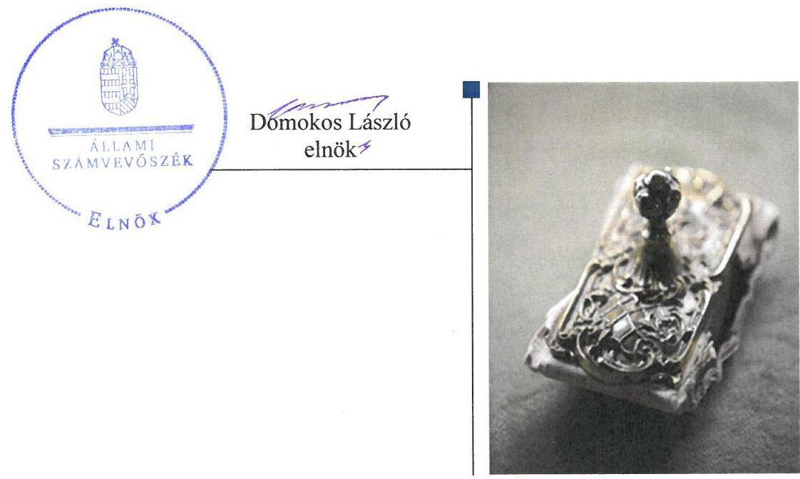
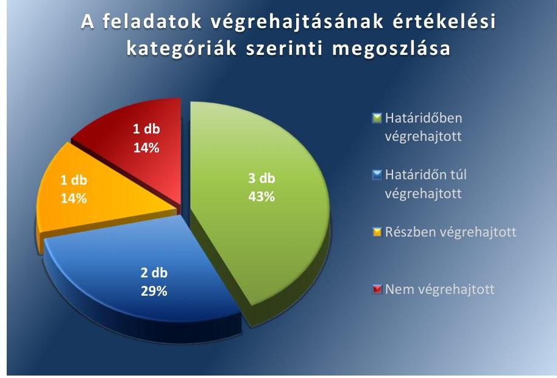
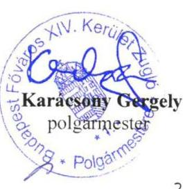
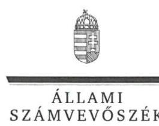
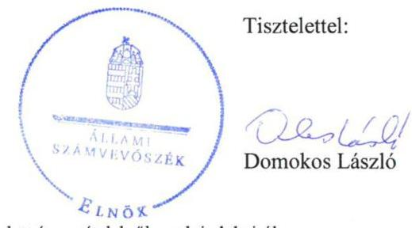
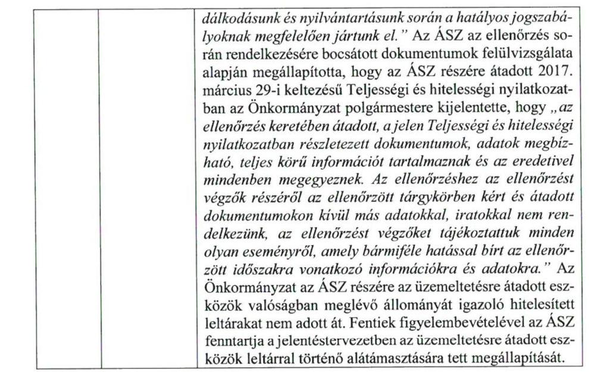
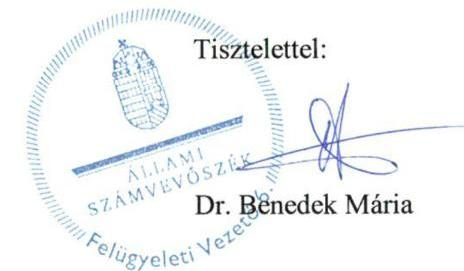

# Jelentés 

## Utóellenőrzések

Budapest Főváros XIV. kerület Zugló Önkormányzata vagyongazdálkodása szabályszerűségének utóellenőrzése 2017.

---

# Jelentés 

## Utóellenőrzések

Budapest Főváros XIV. kerület Zugló Önkormányzata vagyongazdálkodása szabályszerűségének utóellenőrzése 2017. 0 hó 12 nap

---

# AZ ELLENŐRZÉST FELÜGYELTE: 

DR. BENEDEK MÁRIA felügyeleti vezető

## AZ ELLENŐRZÉST VEZETTE ÉS A VÉGREHAJTÁSÁÉRT FELELŐS:

HOFMEISTER LÁSZLÓ ellenőrzésvezető

## A PROGRAM ÖSSZEÁLLÍTÁSÁÉRT FELELŐS:

JANIK JÓZSEF LÁSZLÓ osztályvezető

## A TÉMÁHOZ KAPCSOLÓDÓ KORÁBBI SZÁMVEVŐSZÉKI JELENTÉSEK:

- címe: Jelentés az önkormányzatok vagyongazdálkodása szabályszerűségének ellenőrzéséről - Budapest Főváros XIV. kerület Zugló
- sorszáma: 15012

IKTATÓSZÁM: V-1309-036/2016.
TÉMASZÁM: 2343
ELLENŐRZÉS-AZONOSÍTÓ SZÁM: V075568

---

# TARTALOMJEGYZÉK 

■ ÖSSZEGZÉS ..... 5
■ AZ ELLENŐRZÉS CÉLJA ..... 6
■ AZ ELLENŐRZÉS TERÜLETE ..... 7
■ AZ ELLENŐRZÉS HÁTTERE, INDOKOLTSÁGA ..... 8
■ A JELENTÉS LÉNYEGES KÉRDÉSKÖRE ..... 9
■ ELLENŐRZÉS HATÓKÖRE ÉS MÓDSZEREI ..... 10
■ MEGÁLLAPÍTÁSOK ..... 12
■ MELLÉKLETEK ..... 15
I. Sz. melléklet: Az ÁSZ 15012 számú jelentéséhez kapcsolódó intézkedési terv végrehajtása ..... 15
■ FÜGGELÉK: ÉSZREVÉTELEK ..... 19
■ RÖVIDÍTÉSEK JEGYZÉKE ..... 27

---

.

---

# ÖSSZEGZÉS 

Az Állami Számvevőszék Budapest Főváros XIV. kerület Zugló Önkormányzata vagyongazdálkodása szabályszerűségének utóellenőrzése során megállapította, hogy az intézkedési tervben meghatározott feladatok jelentős részét végrehajtotta, amivel hozzájárult a vagyongazdálkodás átláthatóságának javításához. Az üzemeltetésre átadott eszközök leltározásával, valamint a behajthatatlan adó és az elengedett követelések számviteli elszámolásával kapcsolatos feladatok nem kerültek végrehajtásra, ami kockázatot hordoz a közpénzekkel történő felelős gazdálkodás biztosításában.

## Az ellenőrzés társadalmi indokoltsága

Az Állami Számvevőszék stratégiájában célul tűzte ki a számvevőszéki munka hasznosulásának javítását. Ezzel összhangban ellenőrzi, hogy az ellenőrzött szervezetek megvalósították-e a korábbi ellenőrzései által feltárt hibák, hiányosságok és szabálytalanságok megszüntetése céljából kialakított intézkedési terveikben foglaltakat. A rendszeres utóellenőrzések hozzájárulnak a szükséges intézkedések tényleges végrehajtásához, ezáltal a közpénzügyek rendezettségének javulásához, igazolják, hogy lezárult a következmények nélküli ellenőrzések időszaka.

## Főbb megállapítások, következtetések

Budapest Főváros XIV. kerület Zugló Önkormányzata az intézkedési tervben meghatározott hét feladatból hármat - vagyonkimutatás elkészítése, az önkormányzati vagyonrendelet vagyonkezelésre vonatkozó szabályokkal való bővítése és a hivatásetikai alapelvek eljárási szabályzatban történő rögzítése - határidőben, kettőt - közérdekű adatok közzététele és az ingatlanvagyon-kataszter felfektetése, valamint annak vezetése - határidőn túl hajtott végre. A végrehajtott intézkedések megerősítették a vagyongazdálkodás átláthatóságát.

Egy feladatot részben, egyet nem hajtott végre. Részben gondoskodott a behajthatatlan adó és elengedett követelések hatályos jogszabályi előírásnak megfelelő elszámolásáról, valamint nem tett intézkedéseket arra vonatkozóan, hogy az üzemeltetésre átadott eszközökről hitelesített leltárak álljanak rendelkezésre, amely kockázatot jelent a szabályszerű közpénz felhasználásában.

Budapest Főváros XIV. kerület Zugló Önkormányzata az intézkedési tervben meghatározott feladatok végrehajtásáról a jogszabály szerinti nyilvántartást nem vezette.

---

# AZ ELLENŐRZÉS CÉLJA 

Az ellenőrzés célja annak értékelése volt, hogy a számvevőszéki jelentésben ${ }^{1}$ foglalt intézkedést igénylő megállapításokkal és javaslatokkal összhangban készített intézkedési tervben ${ }^{2}$ meghatározott feladatokat az ellenőrzött szervezet végrehajtotta-e.

---

# AZ ELLENŐRZÉS TERÜLETE

## Budapest Főváros XIV. kerület Zugló Önkormányzata

Budapest XIV. kerülete a főváros pesti oldalán található, állandó lakosainak száma a Központi Statisztikai Hivatal Magyarország közigazgatási helynévkönyv alapján 2016. január 1-jén 124 841 fő volt.

A polgármester³ a 2014. évi általános önkormányzati választás óta tölti be tisztségét. Az utóellenőrzés idején hivatalban lévő jegyző⁴ 2016. július 4-én váltotta a jegyző⁵.

Az Önkormányzat⁶ a 2015. évi konszolidált irányítószervi beszámolója szerint 18 849,2 M Ft költségvetési bevételt ért el, és 18 007,2 M Ft költségvetési kiadást teljesített. Mérlegfőösszege 90 687,3 M Ft, ezen belül befektetett eszközvagyona 85 907,6 M Ft, követelés állománya 2114,7 M Ft, míg kötelezettségállománya 1640,4 M Ft volt.

Az Állami Számvevőszék a 2014. évben ellenőrizte Budapest Főváros XIV. kerület Zugló Önkormányzatánál az önkormányzat vagyongazdálkodás szabályszerűségét a 2009. január 1. és 2013. december 31. közötti időszak vonatkozásában. Az erről szóló 15012 számú jelentését az ÁSZ⁷ 2015. március 11-én tette közzé. Az ellenőrzés célja annak megállapítása volt, hogy az önkormányzat vagyongazdálkodási tevékenységét a jogszabályi előírásokkal összhangban szabályozta-e, a vagyon nyilvántartása és a vagyongazdálkodási tevékenységek végrehajtása a jogszabályoknak és a belső előírásoknak megfelelően történt-e, továbbá annak megállapítása, hogy az önkormányzatnál a vagyongazdálkodás során biztosították-e az átláthatóságot, valamint a külső és belső ellenőrzések megállapításai, javaslatai hozzájárultak-e a szabályszerű vagyongazdálkodáshoz. Az ÁSZ jelentésben foglalt javaslatok végrehajtása érdekében a Képviselő-testület⁸ a 140/2015. (III.26.) számú határozattal intézkedési tervet fogadott el.

Az utóellenőrzés – a 2015. március 11. és 2017. március 16. között végrehajtott feladatokat figyelembe véve – az ÁSZ jelentésben a jegyző részére megfogalmazott intézkedést igénylő megállapításokra és javaslatokra készített, az ÁSZ részére megküldött intézkedési tervben foglalt feladatok megvalósításának ellenőrzésére, illetve értékelésére fókuszált.

---

# AZ ELLENŐRZÉS HÁTTERE, INDOKOLTSÁGA 

Az ÁSZ tv. ${ }^{9}$ 33. § (1) bekezdése értelmében a számvevőszéki jelentések intézkedést igénylő megállapításaihoz kapcsolódóan az ellenőrzött szervezet vezetője intézkedési tervet köteles összeállítani, és az Állami Számvevőszék részére megküldeni. Az intézkedési tervben foglaltak megvalósítását - az ÁSZ tv. 33. § (7) bekezdésében foglaltak alapján - az Állami Számvevőszék utóellenőrzés keretében ellenőrizheti. Az intézkedések megvalósulásának értékelése során az Állami Számvevőszék figyelembe veszi az ellenőrzött szervezetek működési feltételeiben, valamint a jogszabályi előírásokban bekövetkezett változásokat.

Az intézkedési tervekben foglalt feladatok hiányos, illetve késedelmes végrehajtása, valamint megvalósításának elmaradása azt mutatja, hogy az ellenőrzések során feltárt hibák, hiányosságok és szabálytalanságok megszüntetése nem kapott kellő hangsúlyt. Ez a szabályszerű működés és a felelős vezetői magatartás vonatkozásában kockázatot hordoz. E kockázatok feltárásával az Állami Számvevőszék utóellenőrzési rendszere fokozza a fegyelmet, és igazolja, hogy a közpénzzel való szabályos gazdálkodás felelőssége elől nem lehet kitérni.

Az utóellenőrzés négy szinten hasznosulhat:
$\longrightarrow$ A társadalom szintjén az utóellenőrzés jelzi, hogy a számvevőszéki ellenőrzés megállapításainak van következménye: a hiányosságok megszüntetésére az ellenőrzött szervezet által meghatározott intézkedések végrehajtását is számon kéri az ÁSZ.
$\longrightarrow$ Az ellenőrzött terület szintjén az utóellenőrzés tájékoztatást nyújt a terület döntéshozóinak a hiányosságok kiküszöbölésének jó gyakorlatairól, ezzel lehetőséget biztosítva arra, hogy az ÁSZ ellenőrzési megállapításai, javaslatai a terület nem ellenőrzött szervezeteinek a működése során is hasznosuljanak.
$\longrightarrow$ Az ellenőrzött szervezet szintjén az utóellenőrzés feltárja, hogy a szervezet az intézkedések végrehajtásával hasznosította-e a korábbi ellenőrzési jelentésben a hiányosságok megszüntetése, illetve a kockázatok kezelése érdekében megfogalmazott javaslatokat.
$\longrightarrow$ Az ÁSZ szintjén az utóellenőrzés visszacsatolást ad az ellenőrzési jelentések hasznosulásáról, az intézkedések elmaradása vagy részleges megvalósulása a további ellenőrzésekhez kockázati jelzésként szolgál. Az ÁSZ szintjén az utóellenőrzés visszacsatolást ad az ellenőrzési jelentések hasznosulásáról, az intézkedések elmaradása vagy részleges megvalósulása a további ellenőrzésekhez kockázati jelzésként szolgál.

---

# A JELENTÉS LÉNYEGES KÉRDÉSKÖRE 

Az Önkormányzat az intézkedési tervben foglaltakat az előírt határidőben végrehajtotta-e?

---

# ELLENŐRZÉS HATÓKÖRE ÉS MÓDSZEREI 

## Az ellenőrzés típusa

Megfelelőségi ellenőrzés.

## Az ellenőrzött időszak

Az utóellenőrzés alapját képező ÁSZ jelentés közzétételének (2015. március 11.) napjától az ellenőrzésről szóló kiértesítő levél keltének (2017. március 16.) napjáig tartó időszak.

## Az ellenőrzés tárgya

Az ÁSZ tv. 2011. július 1-jei hatálybalépését követően a számvevőszéki jelentésben foglalt intézkedést igénylő megállapításokkal és javaslatokkal összhangban - az ellenőrzött szervezet által - készített intézkedési tervben foglaltak végrehajtásának ellenőrzése.

Az ellenőrzés kiterjedt minden olyan körülményre és adatra, amely az ÁSZ jogszabályban meghatározott feladatainak teljesítéséhez, valamint a program végrehajtása folyamán felmerült újabb összefüggések feltárásához szükséges volt.

## Az ellenőrzött szervezet

Budapest Főváros XIV. kerület Zugló Önkormányzata

## Az ellenőrzés jogalapja

Az ÁSZ az ÁSZ törvényben meghatározott feladatkörében ellenőrzi a központi költségvetés végrehajtását, az államháztartás gazdálkodását, az államháztartásból származó források felhasználását és a nemzeti vagyon kezelését.

Az ÁSZ tv. 1. § (3) bekezdése szerint az ÁSZ általános hatáskörrel végzi a közpénzekkel és az állami és önkormányzati vagyonnal való felelős gazdálkodás ellenőrzését.

Az ÁSZ tv. 33. § (7) bekezdése alapján a 33. § (1)-(2) bekezdés szerinti intézkedési tervben foglaltak megvalósítását az ÁSZ utóellenőrzés keretében ellenőrizheti.

---

# Az ellenőrzés módszerei 

Az ÁSZ az ellenőrzést a nemzetközi standardokat irányadónak tekintve az ellenőrzési program ellenőrzési kérdései, az ellenőrzött időszakban hatályos jogszabályok, az ellenőrzés szakmai szabályok és módszertanok figyelembevételével, önállóan vagy ellenőrzéshez kapcsolódóan végezte.

Az ÁSZ az ellenőrzés ideje alatt az ellenőrzött szervezettel történő kapcsolattartást az ÁSZ SZMSZ ${ }^{10}$-ének vonatkozó előírásai alapján biztosította.

Az utóellenőrzés megállapításait elsősorban az ÁSZ rendelkezésére álló, valamint az ellenőrzött szervezetektől elektronikusan bekért dokumentumok alapozták meg.

Az ellenőrzési bizonyítékként felhasználható adatforrások közé tartoznak egyrészt a szakmai programban felsorolt adatforrások, másrészt minden - az ellenőrzés folyamán feltárt, az ellenőrzés szempontjából információt tartalmazó - dokumentum.

Az intézkedési tervben előírt feladatokat azok végrehajthatósága, illetve végrehajtása szempontjából az alábbiak szerint értékelte az ÁSZ:
$\longrightarrow$ „határidőben végrehajtott" a feladat, ha a teljesítés dokumentáltan, az intézkedési tervben előírt határidőben és tartalommal megtörtént;
$\longrightarrow$ „határidőn túl végrehajtott" a feladat, ha annak teljesítése az intézkedési tervben meghatározott módon, de az előírt határidőn túl történt meg;
$\longrightarrow$ „részben végrehajtott" a feladat, ha végrehajtása teljes körűen az intézkedési tervben előírt módon nem történt meg;
$\longrightarrow$ „nem végrehajtott" a feladat, ha a végrehajtás nem történt meg, vagy amennyiben a teljesítést nem dokumentálták;
$\longrightarrow$ „okafogyottá vált" a feladat, ha végrehajtására - meghatározott esemény bekövetkezése, továbbá külső körülmény, a működést érintő feltétel változása miatt - már nincs szükség, illetve lehetőség, és egyértelműen megállapítható, hogy az intézkedést szükségessé tevő körülmény a jövőben nem fordulhat elő;
$\longrightarrow$ „nem időszerű" az a feladat, amelynek ellenőrzési időszakon belüli végrehajtására azért nem került (kerülhetett) sor, mert az intézkedés alapjául szolgáló esemény nem következett be, de annak jövőbeni előfordulása lehetséges, a végrehajtása nem volt esedékes, vagy a végrehajtás határideje még nem járt le.
Az ellenőrzés lefolytatásához az ellenőrzött szervezet a tanúsítványok elektronikus kitöltésével, valamint az ÁSZ által kért dokumentumok elektronikus megküldésével szolgáltat adatokat, amelyek valódiságát és teljes körűségét az ellenőrzött szervezet vezetője által tett teljességi és hitelességi nyilatkozat igazolta. Az így rendelkezésre bocsátott adatok, információk kontrollja az ellenőrzés keretében történt.

---

# MEGÁLLAPÍTÁSOK 

## Az Önkormányzat az intézkedési tervben foglaltakat az előírt határidőben végrehajtotta-e?

Összegző megállapítás

Az Önkormányzat az intézkedési tervben meghatározott hét feladatból hármat határidőben, kettőt határidőn túl, egyet részben, egyet nem hajtott végre. Az intézkedési tervben meghatározott feladatok végrehajtásáról a jogszabályban előírt nyilvántartást nem vezette.

Az ÁSZ a jelentésében a jegyző részére hét javaslatot fogalmazott meg. A polgármester által előterjesztett és a Képviselő-testület által jóváhagyott intézkedési tervben a hiányosságok, szabálytalanságok megszüntetésére kiegészítve a jelentésben foglalt egyéb észrevételekhez kapcsolódó kötelezettségekkel - hét feladatot határoztak meg, amelyek végrehajtásának felelőse a jegyző volt.

Az intézkedési tervben meghatározott feladatokat, határidőket, felelősöket és a feladatok végrehajtását az I. számú melléklet mutatja be.

Az Önkormányzat az intézkedési tervben meghatározott feladatok végrehajtásáról nem vezette a Bkr. ${ }^{11} 14 . \S$ (1) bekezdésben előírt nyilvántartást.

Az Önkormányzat intézkedési tervében meghatározott feladatok végrehajtásának értékelési kategóriák szerinti megoszlását az 1. ábra szemlélteti.

1. ábra

A feladatok végrehajtásának értékelési kategóriák szerinti megoszlása

Forrás: ÁSZ

---

# HATÁRIDŐBEN VÉGREHAJTOTT feladatok: 

1. A jegyző gondoskodott arról, hogy az Önkormányzat

 vagyonkimutatása az Áhsz. ${ }^{12}$ előírásainak megfelelően tartalmazza az Önkormányzat vagyonát.
2. A jegyző ${ }_{1}$ előkészítette és a polgármester beterjesztette a Képviselőtestület elé az önkormányzat vagyonáról, a vagyontárgyak feletti tulajdonosi jogok gyakorlásáról szóló önkormányzati rendelet módosítását, amely a Mótv. ${ }^{13}$ előírásának megfelelően tartalmazta a vagyonkezelői jog megszerzésének, gyakorlásának és a vagyonkezelés ellenőrzésének részletes szabályait.
3. A jegyző ${ }_{1}$ előkészítette és a polgármester beterjesztette a Képviselőtestület elé jóváhagyásra a hivatásetikai alapelveket rögzítő Köztisztviselői Etikai Kódexet, mely tartalmazta a jogszabályi előírásoknak megfelelő etikai elvárásokat és a hivatásetikai alapelveket.

## HATÁRIDŐN TÚL VÉGREHAJTOTT feladatok:

4. A jegyző ${ }_{1}$ a közérdekű adatok között a nettó 5,0 millió Ft-ot elérő vagy azt meghaladó értékű árubeszerzések, építési beruházások, szolgáltatások, valamint a közbeszerzési eljárások adatainak közzétételét 2015. március 31-e helyett 2015. május 5-én hajtotta végre, valamint az adatok folyamatos közzétételét az Info tv. ${ }^{14}$ ben előírt határidőn túl teljesítette.
5. A jegyző ${ }_{1}$ határidőben intézkedett a jogszabályban előírt ingatlan-vagyon-kataszter felfektetéséről, azonban annak folyamatos vezetését a jogszabály által előírt határidőn túl biztosította.

## RÉSZBEN VÉGREHAJTOTT feladat:

6. A jegyző ${ }_{1,2}$ gondoskodott a behajthatatlan adó követelések Áhsz. előírásának megfelelő elszámolásáról, azonban a Számv. tv. ${ }^{15}$ által előírt elszámolások végrehajtását nem igazolta. Az elengedett követelések Számv. tv. rendelkezéseinek megfelelő elszámolásának végrehajtását nem igazolta.

## NEM VÉGREHAJTOTT feladat:

7. A jegyző ${ }_{1}$ az üzemeltetésre átadott eszközökről a 2016. évre vonatkozóan a könyvviteli mérleg alátámasztásához elkészített, hitelesített leltárakkal nem igazolta a feladat végrehajtását.

---

.

---

# MELLÉKLETEK

- I. SZ. MELLÉKLET: AZ ÁSZ 15012 SZÁMÚ JELENTÉSÉHEZ KAPCSOLÓDÓ INTÉZKEDÉSI TERV VÉGREHAJTÁSA

|  1. | Az intézkedési tervben meghatározott feladat
1. | Az intézkedési tervben meghatározott határidő
2. | Az intézkedési tervben meghatározott feladatok felelőse
3.  |
| --- | --- | --- | --- |
|   |  |  | A feladat végrehajtása  |
|   |  |  | 4.  |
|   |  | Határidőben végrehajtott feladat |   |
|  1. | Gondoskodjon arról, hogy az önkormányzat vagyonkimutatása a jogszabályi előírásoknak megfelelően tartalmazza az Önkormányzat vagyonát. Az Áhsz. 30. §-ában foglaltaknak megfelelően biztosítsa, hogy a Képviselőtestület részére a zárszámadáshoz készítendő vagyonkimutatás tartalma teljes körűen tartalmazza a jogszabályban előírtakat. | Tárgyévi költségvetési beszámoló elfogadása, illetve 2015. június 30. | Jegyző, gazdálkodási osztályvezető  |
|  2. | Gondoskodjon arról, hogy az önkormányzat vagyonrendelete tartalmazza a Mótv. 143. § (4) bekezdés i) pontjának második fordulatában szereplő előírást is, mely a vagyonkezelői jog megszerzésének, gyakorlásának és a vagyonkezelés ellenőrzésének részletes szabályait határozza meg. Készítse elő a kiegészítést tartalmazó rendelettervezetet a Képviselő-testület részére jóváhagyásra. | 2015. áprilisi
Képviselő-testületi ülés | Jegyző, jegyzői kabinetvezető  |
|  3. | Készítse elő a Polgármesteri Hivatal köztisztviselőire vonatkozóan a jogszabályi előírásoknak megfelelő etikai elvárásokat, hivatásetikai alapelveket meghatározó Etikai | 2015. március 26-i Képviselőtestületi ülés | Jegyző  |

A jegyző; a 2014. január 1-jétől hatályos Áhsz. alapján elkészítette az Önkormányzat zárszámadásához tartozó vagyonkimutatást. Az Önkormányzat Képviselő-testülete a 2015. évi zárszámadás és a költségvetési maradvány megállapításáról szóló 26/2016. (V. 24.) önkormányzati rendeletet elfogadta, melynek 29. melléklete tartalmazta a vagyonkimutatást az Áhsz. 30. § (2) és (3) bekezdésének megfelelően. A vagyonkimutatás forráscsoportonkénti tagolásban, ezen belül forgalomképtelen törzsvagyon, nemzetgazdasági szempontból kiemelt jelentőségű törzsvagyon, korlátozottan forgalomképes vagyon és üzleti vagyon bontásban készült. Tartalmazta a „0"-ra leírt de használatban lévő, illetve használaton kívüli eszközök állományát is. A jegyző; a 2015. április 23-i Képviselő-testületi ülésre előkészítette és a polgármester beterjesztette az Önkormányzat vagyonáról, a vagyontárgyak feletti tulajdonosi jogok gyakorlásáról szóló 14/2004. (III. 29.) önkormányzati rendelet módosítását. A Képviselőtestület megalkotta az Önkormányzat vagyonáról, a vagyontárgyak feletti tulajdonosi jogok gyakorlásáról szóló 14/2004. (III. 29.) önkormányzati rendelet módosításáról szóló 21/2015. (IV. 28.) rendeletét ${ }^{16}$, amely tartalmazta a vagyonkezelői jog megszerzésének, gyakorlásának és a vagyonkezelés ellenőrzésének részletes szabályait. A 2015. április 29-étől hatályos rendeletben a Képviselő-testület a Mótv. 109. § (4) bekezdésében foglaltaknak megfelelően meghatározta a vagyonkezelői jog ellenértékét, az ingyenes átengedés, a vagyonkezelői jog gyakorlásának, valamint a vagyonkezelés ellenőrzésének részletes szabályait. A jegyző; a 2015. március 26-i Képviselő-testületi ülésre előkészítette és a polgármester beterjesztette a Képviselő-testület elé jóváhagyásra a Budapest XIV. kerület Zuglói Polgármesteri Hivatalának Köztisztviselői Etikai Kódexét. A Képviselő-testület az előterjesztett Köztisztviselői Etikai Kódexet a 141/2015. (III. 26.) határozatával módosította, majd

---

|  Az intézkedési tervben meghatározott feladat | Az intézkedési tervben meghatározott határidő 2. | Az intézkedési tervben meghatározott feladatok felelőse 3. | A feladat végrehajtása  |
| --- | --- | --- | --- |
|  1. |  |  | 4.  |
|  eljárási szabályzatot és terjessze Képviselő-testület elé jóváhagyásra. |  |  | a 142/2015. (III. 26.) határozatával elfogadta a módosítással egységes szerkezetbe foglalt Etikai Kódexet, amely 2015. április 2-án lépett hatályba. Az Etikai Kódex tartalmazta a Polgármesteri Hivatal köztisztviselőire vonatkozóan a jogszabályi előírásoknak megfelelő etikai elvárásokat és a hivatásetikai alapelveket.  |
|  Határidőn túl végrehajtott feladat |  |  |   |
|  4. | Gondoskodjon arról, hogy az Önkormányzat honlapján a közérdekű adatok között a nettó 5,0 millió Ft-ot elérő vagy azt meghaladó értékű árubeszerzések, építési beruházások, szolgáltatások, valamint a közbeszerzési eljárások adatai közzétételre kerüljenek. | 2015. március 31., és azt követően folyamatosan | jegyző, polgármesteri kabinetvezető, jegyzői kabinetvezető, gazdálkodási osztályvezető  |
|  5. | Tegye meg a szükséges intézkedéseket a jogszabályban előírt ingatlanvagyon-kataszter felfektetésére és annak folyamatos vezetésére. | Adatfeldolgozás befejezése 2015. december 31. | jegyző, informatikai csoportvezető, gazdálkodási osztályvezető, építéshatósági osztályvezető  |
|  Részben végrehajtott feladat |  |  |   |
|  6. | Gondoskodjon arról, hogy a behajthatatlan adó követelések és az elengedett követelések - a számviteli jogszabályi előírásoknak megfelelően - hitelezési veszteségként kerüljenek elszámolásra. | Tárgyévi költségvetési beszámoló elfogadása (zárlati feladatok) | jegyző, gazdálkodási osztályvezető  |

Az Önkormányzat a közérdekű adatok között a nettó 5,0 M Ft-ot elérő vagy azt meghaladó értékű árubeszerzések, építési beruházások, szolgáltatások, valamint a közbeszerzési eljárások adatai közzétételét 2015. március 31-ei határidő helyett, 2015. május 5-én hajtotta végre első alkalommal.

Az Önkormányzat által megkötött 5,0 M Ft-ot elérő vagy azt meghaladó értékű szerződések az Önkormányzat honlapján megtalálhatók, azonban a szerződések dokumentumait az Info tv.-ben előírt határidőt követően töltötte fel az Önkormányzat.

A jegyző intézkedett a jogszabályban előírt ingatlanvagyon-kataszter felfektetéséről 2015. december 31-ig, azonban a tulajdoni lapok alapján az ingatlan valóságos állapotában, értékében bekövetkezett változás kataszteren történő átvezetése 90 napon túl történt meg, mely nem felel meg a 147/1992. (XI. 6.) Korm. rendelet^{17} 4. § (1) bekezdés rendelkezésének. Az Önkormányzat az ingatlanok állapotában, értékében bekövetkezett változásokat az ingatlankataszterben vezette.

Az Önkormányzat a behajthatatlan adó követelések elszámolását az Áhsz. 43. § (1) bekezdésében foglalt szabályozásnak megfelelően végrehajtotta, azonban a Számv. tv. 65. § (7) bekezdése által előírt hitelezési veszteségként történő elszámolását dokumentáltan nem igazolta.

Az Önkormányzat az elengedett követelések Számv. tv. 81. § (2) bekezdés I) pontjában rögzítetteknek megfelelő elszámolását dokumentumokkal nem igazolta.

---

|  E
S
Z
A | Az intézkedési tervben meghatározott feladat | Az intézkedési tervben meghatározott határidő | Az intézkedési tervben meghatározott feladatok felelőse | A feladat végrehajtása  |
| --- | --- | --- | --- | --- |
|   | 1. | 2. | 3. | 4.  |
|  Nem végrehajtott feladat |  |  |  |   |
|  7. | Tegye meg a szükséges intézkedéseket arra vonatkozóan, hogy az üzemeltetésre átadott eszközökről a könyvviteli mérleg alátámasztásához az üzemeltetést végzők által elkészített, hitelesített leltárak rendelkezésre álljanak. | Tárgyévi költségvetési beszámoló elfogadása, illetve tárgyév december 31. | jegyző, gazdálkodási osztályvezető, jegyzői kabinetvezető | Az Önkormányzat a könyvviteli mérleg alátámasztásához az üzemeltetésre átadott eszközök valóságban meglévő állományát hitelesített leltárakkal nem igazolta.  |

*Forrás: ÁSZ által készített táblázat*

---

.

---

# FÜGGELÉK: ÉSZREVÉTELEK 

A jelentéstervezetet a Számvevőszék 15 napos észrevételezésre megküldte az ellenőrzött szervezet vezetőjének az ÁSZ tv. 29. § (1) bekezdése előírásának megfelelően.

A függelék tartalmazza az ellenőrzött észrevételeit, illetve az el nem fogadott észrevételek elutasításának indoklását.

[^0]
[^0]:    * 29. § (1) Az Állami Számvevőszék az ellenőrzési megállapításait megküldi az ellenőrzött szervezet vezetőjének vagy az általa megbízott személynek, és annak, akinek személyes felelősségét állapította meg.
    (2) Az ellenőrzött szervezet vezetője és a felelősként megjelölt személy az ellenőrzés megállapításaira tizenöt napon belül írásban észrevételt tehet.
    (3) Az Állami Számvevőszék az észrevételre a beérkezésétől számított harminc napon belül írásban válaszol. A figyelembe nem vett észrevételeket köteles a jelentésben feltüntetni, és megindokolni, hogy azokat miért nem fogadta el.

---

# 344 

Budapest Főváros XIV. Kerület
Zugló Polgármestere
>>>1145 Budapest, Pétervárad utca 2
DE-38615/317/1
Ügyintéző: Szegvári Etelka JUN 152017
Telefonszáma: +36 18729209
Ügyiratszám: 41158844 . 1 1 2017 V-1305-034/2016
Tárgy: V-1309-033/2016. ikt.számú jelentés-
tervezetre észrevétel megküldése

## ÁLLAMI SZÁMVEVŐSZÉK   Domokos László úr   elnök

## Tisztelt Elnök Úr!

„Budapest Főváros XIV. Kerület Zugló Önkormányzata vagyongazdálkodása szabályszerűségének utóellenőrzése" című ellenőrzésről készített számvevőszéki jelentés-tervezetére az alábbiakban kívánunk észrevételt tenni:
1.) A Melléklet 6. pontjában megfogalmazott ,,..azonban a Számv. tv. 65. § (7) bekezdése által előírt hitelezési veszteségként történő elszámolását a Számv. tv. 81. § (3) bekezdés b) pontjában meghatározott módon dokumentáltan nem igazolta" szövegrészt az alábbiak alapján kérjük módosítani:

A számvitelről szóló 2000. évi C. törvény 178. § (1) szerint : „Felhatalmazást kap a Kormány arra, hogy rendeletben szabályozza: a) az államháztartás szervezetei beszámoló készítését, könyvvezetési kötelezettségét, a beszámolás és a könyvvezetés során érvényesített sajátos fogalmi meghatározásokat, figyelemmel az államháztartásról szóló törvényben foglaltakra; "

Ezen felhatalmazás szerint az Államháztartás számviteléről szóló 4/2013. Kormányrendeletet kell alkalmaznia az önkormányzatnak.

A behajthatatlan követelések hitelezési veszteségként való elszámolását a 249/2000 (XII.24.) Kormányrendelet írta elő, mely 2014. január 1-től hatályát vesztette.

A behajthatatlan adókövetelések külön szoftverben, egyedileg megtalálhatóak. A törlések egyedileg nyomon követhetőek az analitikus rendszerben. A Forrás szoftverben már csak az összevont (kumulált) követelés állomány-változások könyvelése történik meg negyedévente, a Számviteli Politika negyedéves zárlati feladatai szerint. Ezek dokumentumait helyszínen átadtuk.
Közhatalmi bevételek könyvvezetését a 38/2013. (IX.19.) NGM rendelet szerint végezzük. Ez az elszámolási technika sem a vagyon, sem az eredmény tekintetében nem jelent kockázatot.
2.) A Melléklet 7. pontjában megfogalmazott:"Az önkormányzat a könyvviteli mérleg alátámasztásához az üzemeltetésre átadott eszközök valóságban meglévő állományát az üzemeltetést végzők által elkészített, hitelesített
 leltárakkal nem igazolta" szövegrészt az alábbiak alapján kérjük módosítani/törölni.

---

Az Áhsz. hatályba lépésével 2014. január 1-től megszűnt az üzemeltetésre, kezelésre átadott mérlegcsoport.
Az önkormányzat gazdasági társaságai részére haszonkölcsön szerződések alapján adott át eszközöket, nem üzemeltetési szerződéseket kötött.

A haszonkölcsön szerződésekkel átadott eszközök a hatályos, az Államháztartás számviteléről szóló 4/2013.(I.11.) Kormányrendeletetnek megfelelően 2014. január 1-től a tárgyi eszközök között kerülnek kimutatásra, amely tárgyi eszközök leltárral alátámasztottak, ami megfelel az Áhsz 22. § Mérleg leltárral történő alátámasztására vonatkozó előírásnak.

A hivatkozott Áhsz 22. § (1) bekezdése szerint: „Az éves költségvetési beszámoló elkészítéséhez, a mérleg tételeinek alátámasztásához olyan leltárt kell összeállítani és megőrizni, amely tételesen, ellenőrizhető módon tartalmazza a mérlegben szereplő eszközöket és forrásokat.
(2)A leltározás végrehajtását az Szt. 69. § (1)-(3), valamint (5) és (6) bekezdése szerint kell végrehajtani azzal, hogy
a) a koncesszióba, vagyonkezelésbe adott eszközöket a működtető, vagyonkezelő által elkészített és hitelesített leltárral kell alátámasztani, és
b) a használt, de a mérlegben értékkel nem szereplő immateriális javakat, tárgyi eszközöket, készleteket a leltározási és leltárkészítési szabályzatban meghatározott módon kell leltározni.
(3) A vagyonkezelői, koncessziós szerződés eltérő rendelkezése hiányában a (2) bekezdés a) pontja szerinti leltározást a működtető, vagyonkezelő külön térítés és díjazás nélkül, évente köteles elvégezni."

Tehát a jogszabály változását követően 2014. január 1-től csak a koncesszióba, vagyonkezelésbe adott eszközök tekintetében kell leltárat készíttetni és hitelesíteni a vagyonkezelővel.

Az önkormányzat gazdasági társaságai nem minősülnek vagyonkezelőnek, ezért a leltározási kötelezettség az önkormányzatot terheli, amelyet az önkormányzat hitelt érdemlően el is készített.

Az Önkormányzat vizsgálatra vonatkozó intézkedési tervében még szerepelnek a hatályát vesztett jogszabályi helyek, amelyeket azonban az Önkormányzat már nem alkalmazhat, a hatályos jogszabályok értelmében, ezért az intézkedési tervben szereplő feladatokat a jelenleg hatályos jogszabályok szerint értelmeztük és gazdálkodásunk és nyilvántartásunk során a hatályos jogszabályoknak megfelelően jártunk el.

A helyszíni ellenőrzés keretében fentieket már jeleztük a vizsgálatot végző ellenőröknek is, amit ezen levelünkkel ismételten megerősítünk és ennek megfelelően kérjük a Tisztelt Állami Számvevőszéket, a jelentéstervezet módosítására az előzőekben leírtakat is figyelembevéve.

Budapest, 2017. június 13.

Tisztelettel:

---

ELNÖK

Ikt.szám: V-1309-035/2016.

# Karácsony Gergely Szilveszter úr 

Polgármester
Budapest Főváros XIV. kerület Zugló Önkormányzata

## Budapest

## Tisztelt Polgármester Úr!

Köszönettel megkaptam az Állami Számvevőszékhez 2017. június 15. napján érkezett "Utóellenőrzések - Budapest Főváros XIV. kerület Zugló Önkormányzata vagyongazdálkodása szabályszerűségének utóellenőrzése" című számvevőszéki jelentéstervezetben foglalt megállapításokra tett észrevételét.

Tájékoztatom Polgármester urat, hogy az el nem fogadott észrevételeket - az Állami Számvevőszékről szóló 2011. évi LXVI. törvény 29. § (3) bekezdése alapján - a jelentésben szerepeltetjük az elutasítás indokainak feltüntetésével együtt.

Az Állami Számvevőszék észrevételekre vonatkozó álláspontjáról a felügyeleti vezető által készített részletes tájékoztatást csatoltan megküldöm.

Budapest, 2017. 06. hó 22. nap

Melléklet: Tájékoztatás az el nem fogadott észrevételekről, azok indokairól

---

# Tájékoztatás 

az el nem fogadott észrevételekről, azok indokairól

|  |  | Az észrevétel 1. oldalán az ÁSZ jelentéstervezet L. melléklet 6. pontjára tett észrevétel szerint: A Melléklet 6. pontjában megfogalmazott „....azonban a Számv. tv. 65. § (7) bekezdése által előírt hitelezési veszteségként történő elszámolását a Számv. tv. 81. (3) bekezdés b) pontjában meghatározott módon dokumentáltan nem igazolta" szövegrészt az alábbiak alapján kérjük módosítani:   A számvitelről szóló 2000. évi C. törvény 178. § 1) szerint: „Felhatalmazást kap a Kormány arra, hogy rendeletben szabályozza: a) az államháztartás szervezetei beszámoló készítését, könyvvezetési kötelezettségét, a beszámolás és a könyvvezetés során érvényesítendő sajátos fogalmi meghatározásokat, figyelemmel az államháztartásról szóló törvényben foglaltakra;" |
| :--: | :--: | :--: |
| 1. | Észrevétel: | Ezen felhatalmazás szerint az Államháztartás számviteléről szóló 4/2013. Kormányrendeletet kell alkalmaznia az önkormányzatnak.   A behajthatatlan követelések hitelezési veszteségként való elszámolását a 249/2000 (XII. 24.) Kormányrendelet írta elő, mely 2014. január 1-től hatályát vesztette.   A behajthatatlan adókövetelések külön szoftverben, egyedileg megtalálhatóak. A törlések egyedileg nyomon követhetőek az analitikus rendszerben. A Forrás szoftverben már csak az összevont (kumulált) követelés állomány-változások könyvelése történik meg negyedévente, a Számviteli Politika negyedéves zárlati feladatai szerint. Ezek dokumentumait helyszínen átadtuk.   Közhatalmi bevételek könyvvezetését a 38/2013. (IX. 9.) NGM rendelet szerint végezzük. Ez az elszámolási technika sem a vagyon, sem az eredmény tekintetében nem jelent kockázatot. |

---

|  | Válasz: | Az ÁSZ az észrevételt nem fogadja el. |
| :--: | :--: | :--: |
|  | Indokolás: | Az észrevétel nem megalapozott. A számvitelről szóló 2000. évi C. törvény (Számv. tv.) 2. § (2) bekezdésében foglaltak szerint e törvény hatálya alá tartozik a gazdálkodó. A Számv. tv 3. § (1) bekezdés 1. pontja alkalmazásában a gazdálkodó körébe tartoznak többek között az államháztartás szervezetei, aminek része - a Számv. tv. 3. § (1) bekezdés 3. pontja alapján az államháztartásról szóló 2011. évi CXCV. törvény 3. § (3) bekezdés a) pontjában foglaltak szerint - az önkormányzati alrendszerbe tartozó szervként a helyi önkormányzat. Így az Önkormányzat a Számv. tv. hatálya alá tartozó szerv, aki a behajthatatlan adó követelések hitelezési veszteségként történő elszámolását a Számv. tv.ben meghatározott módon dokumentumokkal nem igazolta. Fentiek figyelembevételével az ÁSZ fenntartja a jelentéstervezetben a behajthatatlan adó követelések hitelezési veszteségként történő elszámolására tett megállapítását. |
| 2. | Észrevétel: | Az észrevétel 1. oldalán az ÁSZ jelentéstervezet 1. melléklet 7. pontjára tett észrevétel szerint: A Melléklet 7. pontjában megfogalmazott: "Az önkormányzat a könyvviteli mérleg alátámasztásához az üzemeltetésre átadott eszközök valóságban meglevő állományát az üzemeltetést végzők által elkészített, hitelesített leltárakkal nem igazolta" szövegrészt az alábbiak alapján kérjük módosítani/törölni.   Az Ahsz. hatályba lépésével 2014. január 1-től megszűnt az üzemeltetésre, kezelésre átadott mérlegcsoport.   Az önkormányzat gazdasági társaságai részére haszonkölcsön szerződések alapján adott át eszközöket, nem üzemeltetési szerződéseket kötött. |
|  | A haszonkölcsön szerződésekkel átadott eszközök a hatályos, az Államháztartás számviteléről szóló 4/2013.(I. 11.) Kormányrendeletnek megfelelően 2014. január 1-től a tárgyi eszközök között kerülnek kimutatásra, amely tárgyi eszközök leltárral alátámasztottak, ami megfelel az Ahsz 22. § Mérleg leltárral történő alátámasztására vonatkozó előírásnak.   A hivatkozott Ahsz. 22. § (1) bekezdése szerint: „Az éves költségvetési beszámoló elkészítéséhez, a mérleg tételeinek alátámasztásához olyan leltárt kell összeállítani és megőrizni, amely tételesen, ellenőrizhető módon tartalmazza a mérlegben szereplő eszközöket és forrásokat.   (2) A leltározás végrehajtását a Szt. 69. § (1)-(3), valamint (3) és (6) bekezdése szerint kell végrehajtani azzal, hogy |

---

|  | a) a koncesszióba, vagyonkezelésbe adott eszközöket a működtető, vagyonkezelő által elkészített és hitelesített leltárral kell alátámasztani, és   b) a használt, de a mérlegben értékkel nem szereplő immateriális javakat, tárgyi eszközöket, készleteket a leltározási és leltárkészítési szabályzatban meghatározott módon kell leltározni.   (3) A vagyonkezelői, koncessziós szerződés eltérő rendelkezése hiányában a (2) bekezdés a) pontja szerinti leltározást a működtető, vagyonkezelő külön térítés és díjazás nélkül, évente köteles elvégezni."   Tehát a jogszabály változását követően 2014. január 1-től csak a koncesszióba, vagyonkezelésbe adott eszközök tekintetében kell leltárat készíttetni és hitelesíteni a vagyonkezelővel.   Az önkormányzat gazdasági társaságai nem minősülnek vagyonkezelőnek, ezért a leltározási kötelezettség az önkormányzatot terheli, amelyet az önkormányzat hitelt érdemlően el is készített.   Az Önkormányzat vizsgálatra vonatkozó intézkedési tervében még szerepelnek a hatályát vesztett jogszabályi helyek, amelyeket azonban az Önkormányzat már nem alkalmazhat, a hatályos jogszabályok értelmében, ezért az intézkedési tervben szereplő feladatokat a jelenleg hatályos jogszabályok szerint értelmeztük és gazdálkodásunk és nyilvántartásunk során a hatályos jogszabályoknak megfelelően jártunk el.   A helyszíni ellenőrzés keretében fentieket már jeleztük a vizsgálatot végző ellenőröknek is, amit ezen levelünkkel ismételten megerősítünk és ennek megfelelően kérjük a Tisztelt Állami Számvevőszéket, a jelentéstervezet módosítására az előzőekben leírtakat is figyelembe véve. |
| :--: | :--: |
| Válasz: | Az ÁSZ az észrevételt nem fogadja el. |
| Indokolás: | Az észrevétel nem megalapozott. Az Önkormányzat észrevételében idézi az államháztartás számviteléről szóló 4/2013. (I. 11.) Kormányrendelet előírását (Áhsz.) „A hivatkozott Ahsz. 22. § (1) bekezdése szerint: „Az éves költségvetési beszámoló elkészítéséhez, a mérleg tételeinek alátámasztásához olyan leltárt kell összeállítani és megőrizni, amely tételesen, ellenőrizhető módon tartalmazza a mérlegben szereplő eszközöket és forrásokat. ", továbbá észrevételében rögzíti ,, ... az intézkedési tervben szereplő feladatokat a jelenleg hatályos jogszabályok szerint értelmeztük és gaz- |

---

Budapest, 2017.
$\mathrm{OG} . \quad$ hó 23 . nap

---

# RÖVIDÍTÉSEK JEGYZÉKE 

${ }^{1}$ számvevőszéki jelentés
${ }^{2}$ intézkedési terv
${ }^{3}$ polgármester
${ }^{4}$ jegyző ${ }_{2}$
${ }^{5}$ jegyző ${ }_{1}$
${ }^{6}$ Önkormányzat
${ }^{7}$ ÁSZ
${ }^{8}$ Képviselő-testület
${ }^{9}$ ÁSZ tv.
${ }^{10}$ SZMSZ
${ }^{11}$ Bkr.
${ }^{12}$ Áhsz.
${ }^{13}$ Mötv.
${ }^{14}$ Info tv.
${ }^{15}$ Számv. tv.
${ }^{16}$ 21/2015. (IV. 28.) rendelet
${ }^{17}$ 147/1992. (XI. 6.) Korm. rendelet

Az ÁSZ 15012 számú jelentése - Jelentés az önkormányzatok vagyongazdálkodása szabályszerűségének ellenőrzéséről - Budapest Főváros XIV. kerület Zugló (elérhető a www.asz.hu honlapon)
Budapest Főváros XIV. kerület Zugló Önkormányzata intézkedési terve
Budapest Főváros XIV. kerület Zugló Önkormányzatának polgármestere 2014. október 13-tól
Budapest Főváros XIV. kerület Zugló Önkormányzatának jegyzője 2016. július 4-től
Budapest Főváros XIV. kerület Zugló Önkormányzatának jegyzője 2016. július 2-ig
Budapest Főváros XIV. kerület Zugló Önkormányzata
Állami Számvevőszék
Budapest Főváros XIV. kerület Zugló Önkormányzata Képviselő-testülete
2011. évi LXVI. törvény az Állami Számvevőszékről (hatályos 2011. július 1-jétől)

Az Állami Számvevőszék elnökének 3/2016. (XII.29.) ÁSZ utasítása az Állami Számvevőszék Szervezeti és Működési Szabályzatáról (hatályos 2017. január 1-jétől)
370/2011. (XII.31.) Korm. rendelet a költségvetési szervek belső kontrollrendszeréről és belső ellenőrzéséről (hatályos 2012. január 1-jétől)
4/2013. (I.11.) Korm. rendelet az államháztartás számviteléről (hatályos 2014. január 1-jétől)
2011. évi CLXXXIX. törvény Magyarország helyi önkormányzatairól (hatályos 2012. január 1-jétől)
2011. évi CXII. törvény az információs önrendelkezési jogról és az információszabadságról (hatályos 2011. július 26-tól)
2000. évi C. törvény a számvitelről (hatályos 2001. január 1-jétől)

Az önkormányzat vagyonáról, a vagyontárgyak feletti tulajdonosi jogok gyakorlásáról szóló 14/2004. (III. 29.) önkormányzati rendelet módosításáról szóló 21/2015. (IV. 28.) rendelet (hatályos 2015. április 28-tól)
Az önkormányzatok tulajdonában lévő ingatlanvagyon nyilvántartási és adatszolgáltatási rendjéről szóló 147/1992. (XI. 6.) Korm. rendelet (hatályos 1992. szeptember 6-tól)

---

# ÁLLAMI SZÁMVEVŐSZÉK 

1052 Budapest, Apáczai Csere János utca 10.
Levélcím: 1364 Budapest 4. Pf. 54
Telefon: +36 14849100 Telefax: +36 14849200
www.asz.hu

