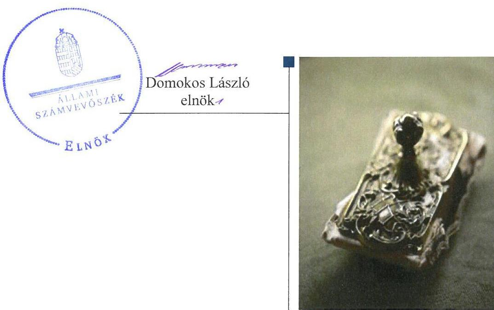
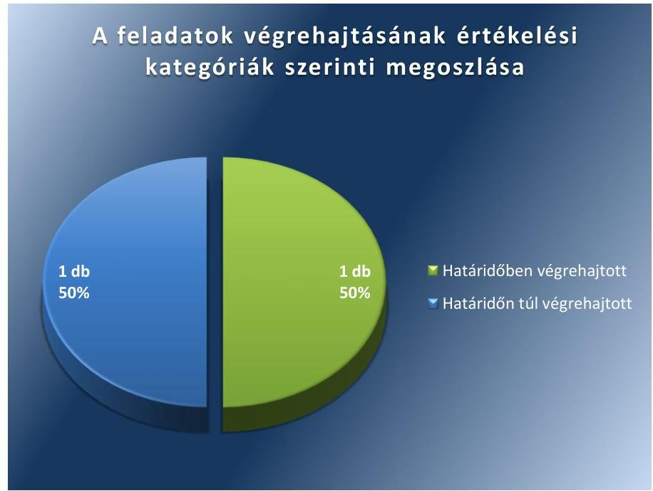
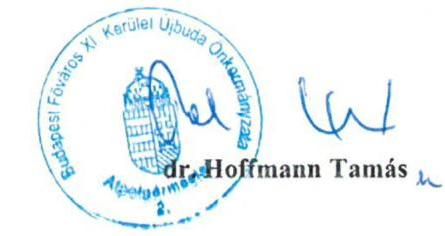
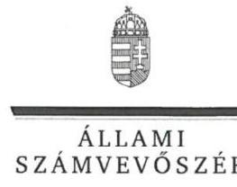
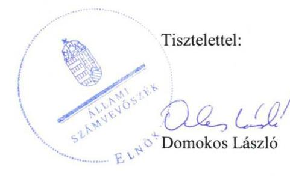
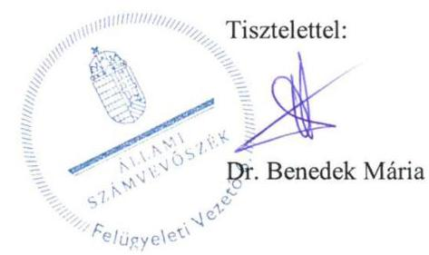

# Jelentés 

## Utóellenőrzések

Budapest Főváros XI. Kerület Újbuda Önkormányzata vagyongazdálkodása szabályszerűségének utóellenőrzése 2017.

---

# Jelențtés 

## Utóellenőrzések

Budapest Főváros XI. Kerület Újbuda Önkormányzata vagyongazdálkodása szabályszerűségének utóellenőrzése 2017. ๑7 hó 12 nap

---

# AZ ELLENŐRZÉST FELÜGYELTE: 

DR. BENEDEK MÁRIA felügyeleti vezető

## AZ ELLENŐRZÉST VEZETTE ÉS A VÉGREHAJTÁSÁÉRT FELELŐS:

KLINGA LÁSZLÓ ellenőrzésvezető

## A PROGRAM ÖSSZEÁLLÍTÁSÁÉRT FELELŐS:

JANIK JÓZSEF LÁSZLÓ osztályvezető

## A TÉMÁHOZ KAPCSOLÓDÓ KORÁBBI SZÁMVEVŐSZÉKI JELENTÉSEK:

- címe: Jelentés az önkormányzatok vagyongazdálkodása szabályszerűségének ellenőrzéséről - Budapest Főváros XI. kerület Újbuda
- sorszáma: 13076

IKTATÓSZÁM: V-1306-034/2016.
TÉMASZÁM: 2340
ELLENŐRZÉS-AZONOSÍTÓ SZÁM: V075565

---

# TARTALOMJEGYZÉK 

■ ÖSSZEGZÉS ..... 5
■ AZ ELLENŐRZÉS CÉLJA ..... 6
■ AZ ELLENŐRZÉS TERÜLETE ..... 7
■ AZ ELLENŐRZÉS HÁTTERE, INDOKOLTSÁGA ..... 8
■ A JELENTÉS LÉNYEGES KÉRDÉSKÖRE ..... 9
■ ELLENŐRZÉS HATÓKÖRE ÉS MÓDSZEREI ..... 10
■ MEGÁLLAPÍTÁSOK ..... 12
■ MELLÉKLETEK ..... 15
I. Sz. melléklet: Az ÁSZ 13076 számú jelentéséhez kapcsolódó intézkedési terv végrehajtása ..... 15
■ FÜGGELÉK: ÉSZREVÉTELEK ..... 17
■ RÖVIDÍTÉSEK JEGYZÉKE ..... 25

---

.

---

# ÖSSZEGZÉS 

Az Állami Számvevőszék Budapest Főváros XI. Kerület Újbuda Önkormányzata vagyongazdálkodása szabályszerűségének utóellenőrzése során megállapította, hogy az intézkedési tervben meghatározott feladatokat végrehajtotta, ezáltal a müködésben rejlő kockázatokat csökkentette.

## Az ellenőrzés társadalmi indokoltsága

Az Állami Számvevőszék stratégiájában célul tűzte ki a számvevőszéki munka hasznosulásának javítását. Ezzel összhangban ellenőrzi, hogy az ellenőrzött szervezetek megvalósították-e a korábbi ellenőrzései által feltárt hibák, hiányosságok és szabálytalanságok megszüntetése céljából elkészített intézkedési terveikben foglaltakat. A rendszeres utóellenőrzések hozzájárulnak a szükséges intézkedések tényleges végrehajtáshoz, ezáltal a közpénzügyek rendezettségének javulásához, igazolják, hogy lezárult a következmények nélküli ellenőrzések időszaka.

## Főbb megállapítások, következtetések

Budapest Főváros XI. Kerület Újbuda Önkormányzata az intézkedési tervben meghatározott két feladatból egyet határidőben, egyet határidőn túl hajtott végre, ezáltal az Állami Számvevőszék korábbi ellenőrzése során feltárt kockázatokat csökkentette.

A jegyző az intézkedési tervben meghatározott határidőben gondoskodott jogszabályban előírt külső ellenőrzések nyilvántartásának létrehozásáról, és a továbbiakban annak folyamatos vezetéséről. A jegyző az Újbuda Polgármesteri Hivatal Szervezeti és Működési Szabályzatának (Ügyrendjének) a belső ellenőrzést végző szervezeti egység jogállásának és feladatainak meghatározásával történő kiegészítéséről az intézkedési tervben meghatározott határidőn túl gondoskodott.

Az Önkormányzat az intézkedési tervben rögzített feladatok végrehajtásáról vezette a jogszabályi előírásnak megfelelő nyilvántartást.

---

# AZ ELLENŐRZÉS CÉLJA

Az ellenőrzés célja annak értékelése volt, hogy a számvevőszéki jelentésben foglalt intézkedést igénylő megállapításokkal és javaslatokkal összhangban készített intézkedési tervben meghatározott feladatokat az ellenőrzött szervezet végrehajtotta-e.

---

# **A2 ELLENŐRZÉS TERÜLETE**

## **Budapest Főváros XI. Kerület Újbuda Önkormányzata**

Budapest Főváros XI. Kerület Újbuda lakossága 2016. január 1-jén a Központi Statisztikai Hivatal Magyarország Közigazgatási Helynév kötet szerint közzétett adatok alapján 151 812 fő volt.

A polgármester¹ a 2010. évi önkormányzati választások óta tölti be hivatalát, a jegyző² személye az ellenőrzött időszakban egy alkalommal változott, a jelenlegi jegyző 2016. szeptember 1-től látja el feladatát.

Budapest Főváros XI. Kerület Újbuda Önkormányzata a 2015. évi költségvetési beszámolója szerint 19 682,1 millió Ft költségvetési bevételt ért el, valamint 18 294,2 millió Ft költségvetési kiadást teljesített. 2015. december 31-én a könyvviteli mérleg szerinti követelések állományának értéke 2 092,2 millió Ft, a kötelezettségek állományának értéke 1 186,7 millió Ft, mérlegfőösszege 55 614,4 millió Ft volt.

Az Állami Számvevőszék 2013. évben ellenőrizte Budapest Főváros XI. Kerület Újbuda Önkormányzatánál az önkormányzati vagyongazdálkodás szabályszerűségét a 2007. január 1. és 2011. december 31. közötti időszak vonatkozásában. Az erről szóló 13076. számú jelentését az ÁSZ³ 2013. augusztus 28-án tette közzé. Az ellenőrzés célja annak értékelése volt, hogy az önkormányzat vagyongazdálkodási tevékenységének szabályozottsága és tevékenysége a jogszabályi előírásokkal összhangban volt-e, átlátható, a jogszabályi előírásoknak megfelelő volt-e a vagyon nyilvántartása, a külső és belső ellenőrzések megállapításai hozzájárultak-e az önkormányzati vagyongazdálkodási tevékenység szabályszerűségéhez. Az ÁSZ jelentésben foglalt javaslatok végrehajtása érdekében az Önkormányzat Képviselő-testülete⁴ a 335/2013. (X. 24.) számú határozattal intézkedési tervet fogadott el.

Az utóellenőrzés – a 2013. augusztus 28-ától 2017. március 20-ig végrehajtott feladatokat figyelembe véve – az ÁSZ jelentésben a jegyző részére megfogalmazott intézkedést igénylő megállapításokra és javaslatokra készített, az ÁSZ részére megküldött intézkedési tervben foglalt feladatok megvalósításának ellenőrzésére, illetve értékelésére fókuszált.

---

# AZ ELLENŐRZÉS HÁTTERE, INDOKOLTSÁGA 

Az ÁSZ tv. ${ }^{5}$ 33. § (1) bekezdése értelmében a számvevőszéki jelentések intézkedést igénylő megállapításaihoz kapcsolódóan az ellenőrzött szervezet vezetője intézkedési tervet köteles összeállítani, és az ÁSZ részére megküldeni. Az intézkedési tervben foglaltak megvalósítását - az ÁSZ tv. 33. § (7) bekezdésében foglaltak alapján - az ÁSZ utóellenőrzés keretében ellenőrizheti. Az intézkedések megvalósulásának értékelése során az ÁSZ figyelembe veszi az ellenőrzött szervezetek működési feltételeiben, valamint a jogszabályi előírásokban bekövetkezett változásokat.

Az intézkedési tervben foglalt feladatok hiányos, illetve késedelmes végrehajtása, valamint megvalósításának elmaradása azt mutatja, hogy az ellenőrzések során feltárt hibák, hiányosságok és szabálytalanságok megszüntetése nem kapott kellő hangsúlyt. Ez a szabályszerű működés és a felelős vezetői magatartás vonatkozásában kockázatot hordoz. E kockázatok feltárásával az ÁSZ utóellenőrzési rendszere fokozza a fegyelmet, és igazolja, hogy a közpénzzel való szabályos gazdálkodás felelőssége elől nem lehet kitérni.

Az utóellenőrzés négy szinten hasznosulhat:

- A társadalom szintjén az utóellenőrzés jelzi, hogy a számvevőszéki ellenőrzés megállapításainak van következménye: a hiányosságok megszüntetésére az ellenőrzött szervezet által meghatározott intézkedések végrehajtását is számon kéri az ÁSZ.
- Az ellenőrzött terület szintjén az utóellenőrzés tájékoztatást nyújt a terület döntéshozóinak a hiányosságok kiküszöbölésének jó gyakorlatairól, ezzel lehetőséget biztosítva arra, hogy az ÁSZ ellenőrzési megállapításai, javaslatai a terület nem ellenőrzött szervezeteinek a működése során is hasznosuljanak.
- Az ellenőrzött szervezet szintjén az utóellenőrzés feltárja, hogy a szervezet az intézkedések végrehajtásával hasznosította-e a korábbi ellenőrzési jelentésben a hiányosságok megszüntetése, illetve a kockázatok kezelése érdekében megfogalmazott javaslatokat.
- Az ÁSZ szintjén az utóellenőrzés visszacsatolást ad az ellenőrzési jelentések hasznosulásáról, az intézkedések elmaradása vagy részleges megvalósulása a további ellenőrzésekhez kockázati jelzésként szolgál.

---

# A JELENTÉS LÉNYEGES KÉRDÉSKÖRE 

Az Önkormányzat az intézkedési tervben foglaltakat az elöirt határidőben végrehajtotta-e?

---

# ELLENŐRZÉS HATÓKÖRE ÉS MÓDSZEREI 

## Az ellenőrzés típusa

Megfelelőségi ellenőrzés.

## Az ellenőrzött időszak

Az utóellenőrzés alapját képező ÁSZ jelentés közzétételének napjától (2013. augusztus 28.) az ellenőrzésről szóló kiértesítő levél keltének napjáig (2017. március 20.) tartó időszak.

## Az ellenőrzés tárgya

Az ÁSZ tv. 2011. július 1-jei hatálybalépését követően a számvevőszéki jelentésben foglalt intézkedést igénylő megállapításokkal és javaslatokkal összhangban - Budapest Főváros XI. Kerület Újbuda Önkormányzata által - készített intézkedési tervben foglaltak végrehajtásának ellenőrzése.

Az ellenőrzés kiterjedt minden olyan körülményre és adatra, amely az ÁSZ jogszabályban meghatározott feladatainak teljesítéséhez, valamint a program végrehajtása folyamán felmerült újabb összefüggések feltárásához szükséges.

## Az ellenőrzött szervezet

Budapest Főváros XI. Kerület Újbuda Önkormányzata

## Az ellenőrzés jogalapja

Az ÁSZ az ÁSZ törvényben meghatározott feladatkörében ellenőrzi a központi költségvetés végrehajtását, az államháztartás gazdálkodását, az államháztartásból származó források felhasználását és a nemzeti vagyon kezelését.

Az ÁSZ tv. 1. § (3) bekezdése szerint az ÁSZ általános hatáskörrel végzi a közpénzekkel és az állami és önkormányzati vagyonnal való felelős gazdálkodás ellenőrzését.

Az ÁSZ tv. 33. § (7) bekezdése alapján a 33. § (1)-(2) bekezdése szerinti intézkedési tervben foglaltak megvalósítását az ÁSZ utóellenőrzés keretében ellenőrizheti.

---

# Az ellenőrzés módszerei 

Az ÁSZ az ellenőrzést a nemzetközi standardokat irányadónak tekintve az ellenőrzési program ellenőrzési kérdései, az ellenőrzött időszakban hatályos jogszabályok, az ellenőrzés szakmai szabályok és módszertanok figyelembevételével, önálló ellenőrzés keretében végezte.

Az ÁSZ az ellenőrzés ideje alatt az Önkormányzattal történő kapcsolattartást az ÁSZ SZMSZ ${ }^{6}$-ének vonatkozó előírásai alapján biztosította.

Az utóellenőrzés megállapításait elsősorban az ÁSZ rendelkezésére álló, valamint az ellenőrzött szervezetektől elektronikusan bekért dokumentumok alapozták meg.

Az ellenőrzési bizonyítékként felhasználható adatforrások közé tartoztak egyrészt a szakmai programban felsorolt adatforrások, másrészt minden - az ellenőrzés folyamán feltárt, az ellenőrzés szempontjából információt tartalmazó - dokumentum.

Az intézkedési tervben előírt feladatokat, azok végrehajthatósága, illetve végrehajtása szempontjából az alábbiak szerint értékelte az ÁSZ:
$\longrightarrow$ „határidőben végrehajtott" a feladat, ha a teljesítés dokumentáltan, az intézkedési tervben előírt határidőben és tartalommal megtörtént;
$\longrightarrow$ „határidőn túl végrehajtott" a feladat, ha annak teljesítése az intézkedési tervben meghatározott módon, de az előírt határidőn túl történt meg;
$\longrightarrow$ „részben végrehajtott" a feladat, ha végrehajtása teljes körűen az intézkedési tervben előírt módon nem történt meg;
$\longrightarrow$ „nem végrehajtott" a feladat, ha a végrehajtás nem történt meg, vagy amennyiben a teljesítést nem dokumentálták;
$\longrightarrow$ „okafogyottá vált" a feladat, ha végrehajtására - meghatározott esemény bekövetkezése, továbbá külső körülmény, a működést érintő feltétel változása miatt - már nincs szükség, illetve lehetőség, és egyértelműen megállapítható, hogy az intézkedést szükségessé tevő körülmény a jövőben nem fordulhat elő;
$\longrightarrow$ „nem időszerű" az a feladat, amelynek ellenőrzési időszakon belüli végrehajtására azért nem került (kerülhetett) sor, mert az intézkedés alapjául szolgáló esemény nem következett be, de annak jövőbeni előfordulása lehetséges, a végrehajtása nem volt esedékes, vagy a végrehajtás határideje még nem járt le.
Az ellenőrzés lefolytatásához az ellenőrzött szervezet a tanúsítványok elektronikus kitöltésével, valamint az ÁSZ által kért dokumentumok elektronikus megküldésével szolgáltatott adatokat, amelyek valódiságát és teljes körűségét az ellenőrzött szervezet vezetője által tett teljességi és hitelességi nyilatkozat igazolta. Az így rendelkezésre bocsátott adatok, információk kontrollja az ellenőrzés keretében történt.

---

# MEGÁLLAPÍTÁSOK 

## Az Önkormányzat az intézkedési tervben foglaltakat az előírt határidőben végrehajtotta-e?

Összegző megállapítás

Az Önkormányzat az intézkedési tervben meghatározott két feladatból egyet határidőben, egyet határidőn túl hajtott végre. Az intézkedési tervben meghatározott feladatok végrehajtásáról az Önkormányzat a jogszabályban előírt tartalommal vezette a nyilvántartást.

Az ÁSZ a számvevőszéki jelentésében ${ }^{7}$ a jegyző részére két intézkedést igénylő megállapítást és javaslatot fogalmazott meg. A Képviselő-testület által elfogadott és az ÁSZ részére a polgármester által megküldött intézkedési tervben a hiányosságok, szabálytalanságok megszüntetésére a jegyző részére két intézkedési feladat került meghatározásra.

Az intézkedési tervben meghatározott feladatokat, határidőket, felelősöket és a feladatok végrehajtását az I. számú melléklet mutatja be.

A jegyző az intézkedési tervben meghatározott feladatok végrehajtásáról a Bkr. ${ }^{8} 14 . \S$ (1) bekezdésében előírt nyilvántartást a Bkr. 47. § (2) bekezdése szerinti tartalommal vezette.

Az Önkormányzat ${ }^{9}$ intézkedési tervében meghatározott feladatok végrehajtásának értékelési kategóriák szerinti megoszlását az 1. ábra szemlélteti.

1. ábra

Fonrás: ÁSZ

---

HATÁRIDŐBEN VÉGREHAJTOTT feladat:

1. A jegyző az intézkedési tervben meghatározott határidőben, 2013. november 1-jétől gondoskodott a Bkr. 14. § (1) bekezdésében előírtak alapján a külső ellenőrzésekről készített nyilvántartás folyamatos vezetéséről.

HATÁRIDŐN TÚL VÉGREHAJTOTT feladat:
2. A jegyző az intézkedési tervben meghatározott 2013. november 1jei határidőn túl, a Polgármesteri - Jegyzői utasítás ${ }_{2}$-ben ${ }^{10}$ intézkedett a belső ellenőrzést végző szervezeti egység jogállásának és feladatainak a Polgármesteri Hivatal SZMSZ-ében történő meghatározásáról.

---

.

---

# MELLÉKLETEK

- I. SZ. MELLÉKLET: AZ ÁSZ 13076 SZÁMÚ JELENTÉSÉHEZ KAPCSOLÓDÓ INTÉZKEDÉSI TERV VÉGREHAJTÁSA

|  Sorszám | Intézkedési tervben meghatározott feladat | Az intézkedési tervben meghatározott határidő | Az intézkedési tervben meghatározott feladat felelőse | A feladat végrehajtása  |
| --- | --- | --- | --- | --- |
|   | 1. | 2. | 3. | 4.  |
|   |  |  | Határidőben végrehajtott feladat |   |
|  1. | A külső ellenőrzések nyilvántartásának létrehozása és folyamatos vezetése. | 2013. november 1. és folyamatos | jegyző | A jegyző az intézkedési tervben meghatározott határidőben, 2013. november 1-jétől gondoskodott a Bkr. 14. § (1) bekezdésében meghatározottak végrehajtásáról és éves bontásban nyilvántartást vezetett a külső ellenőrzések javaslatai alapján készült intézkedési tervek végrehajtásáról. A vezetett nyilvántartás tartalma megfelelt a Bkr. 47. § (2) bekezdésében előírt tartalmi követelményeknek.  |
|   |  |  | Határidőn túl végrehajtott feladat |   |
|  2. | A Budapest Főváros XI. Kerület Újbuda Önkormányzata Polgármesteri Hivatal Szervezeti és Müködési Szabályzatáról (Ügyrendjéről) szóló 2/2012. (VI. 28.) PolgármesteriJegyzői utasítás kiegészítése a belső ellenőrzést végző szervezeti egység jogállásának és feladatainak meghatározásával. | 2013. november 1. | jegyző | A jegyző a Polgármesteri - Jegyzői utasítás ${ }_{1}{ }^{11}$-nek a belső ellenőrzést végző szervezeti egység jogállásával és feladataival történő kiegészítéséről a Polgármesteri - Jegyzői utasítás ${ }_{2} \mathrm{~V}$. fejezetének 16. és 17. pontjaiban gondoskodott.  |

---

.

---

# FÜGGELÉK: ÉSZREVÉTELEK 

A jelentéstervezetet a Számvevőszék 15 napos észrevételezésre megküldte az ellenőrzött szervezet vezetőjének az ÁSZ tv. 29. §* (1) bekezdése előírásának megfelelően.

A függelék tartalmazza az ellenőrzött észrevételét, illetve az el nem fogadott észrevétel elutasításának indoklását.

[^0]
[^0]:    * 29. § (1) Az Állami Számvevőszék az ellenőrzési megállapításait megküldi az ellenőrzött szervezet vezetőjének vagy az általa megbízott személynek, és annak, akinek személyes felelősségét állapította meg.
    (2) Az ellenőrzött szervezet vezetője és a felelősként megjelölt személy az ellenőrzés megállapításaira tizenöt napon belül írásban észrevételt tehet.
    (3) Az Állami Számvevőszék az észrevételre a beérkezésétől számított harminc napon belül írásban válaszol. A figyelembe nem vett észrevételeket köteles a jelentésben feltüntetni, és megindokolni, hogy azokat miért nem fogadta el.

---

Ügyiratszám: 1-560-4/2017.
Ügyintéző: Major Edina
Hiv.szám: V-1306-031/2016.

# Állami Számvevőszék 

Domokos László elnök
részére

## Budapest

Apáczai Csere János utca 10.
1052
Tárgy: Számvevőszéki jelentéstervezet észrevételezése

## Tisztelt Elnök Úr!

Fent hivatkozott számú, 2017. június 9. napján érkezett, az „Utóellenörzések - Budapest Föváros XI. Kerület Újbuda Önkormányzato vagyongazdálkodása szabályszcriüégénci utóellenörzése" címủ ellenörzésről készített számvevőszéki jelentéstervezetet a Budapest Főváros XI. Kerület Újbuda Önkormányzata észrevételezi az alábbiak szerint:

A Budapest Főváros XI. Kerület Újbuda Önkormányzata intézkedési tervében meghatározott két feladatból az utóellenörzés jelentéstervezetében egyet határidőben, egyet határidőn túl jelölt végrehajtottnak az Állami Számvevőszék.

A határidőn túl végrehajtottnak jelölt, a Budapest Főváros XI. Kerület Újbuda Önkormányzata intézkedési tervben 2013. november 1. határidővel szerepelt a Budapest Főváros XI. Kerület Újbuda Önkormányzata Polgármesteri Hivatal Szervezeti és Müködési Szabályzatáról (Ügyrendjéről) szóló 2/2012.(VI.28.) Polgármesteri-Jegyzői utasítás kiegészítése, a belső ellenőrzést végző szervezeti egység jogállásának és feladatainak meghatározásával történő kiegészitése, melyet a 2013. november 1. hatályba lépésével a 8/2013.(X.31.) sz. Budapest Főváros XI. Kerület Újbuda Önkormányzata PolgármesterJegyzöje utasításával teljesített.

---

2016. november 8 -án az Állami Számvevőszék honlapjára az utóellenőrzésben feltöltött 3. számú mellékletének 3. és 4. pontjában szerepeltette az Önkormányzat a Budapest Főváros XI. Kerület Újbuda Önkormányzata Polgármester-Jegyzöje 8/2013.(X.31.) számú utasítását. Feltöltéskor az utolsó módosítást tartalmazó dokumentumokat, azaz a 3/2016.(IV.12.) számú Polgármesteri-Jegyzői utasításhoz „A belső ellenőrzés által ellátandó feladatcsoportok" és a 2/2016.(IV.12.) számú Polgármesteri-Jegyzöi utasítás a Budapest Főváros XI. Kerület Újbuda Önkormányzatának az Újbudai Polgármesteri Hivatal Szervezeti és Működési Szabályzatáról szóló „V. A Belső ellenőrzés feladatai" kivonatai kerültek megküldésre.

Az Állami Számvevőszék felhívására 2017. március 31 -én $11 .{ }^{00}$ órakor helyszíni szemrevételezés történt, ahol az összes beküldött, hitelesített dokumentum a helyszínen rendelkezésre állt, köztük az Önkormányzat a Budapest Főváros XI. Kerület Újbuda Önkormányzata Polgármester-Jegyzöje 8/2013.(X.31.) sz. utasításának hitelesített példánya is, azonban nem történt az Állami Számvevőszék részéről észrevételezés, hogy az a szerepeltetett dokumentumok közül hiányozna.

Mellékelten megküldöm a 2013. november 1-én hatályos, a Budapest Főváros XI. Kerület Újbuda Önkormányzata Polgármester-Jegyzöje 8/2013.(X.31.) sz. utasítással módosított, 2/2012.(VI.28.) Polgármesteri-Jegyzöi utasítás hiteles másolatát.

Kérem a Tisztelt Elnök Úr támogatását, hogy a csatolt dokumentumot az Állami Számvevőszék befogadja és az „Utóellenőrzések - Budapest Főváros XI. Kerület Újbuda Önkormáıyzata vagyongazdálkodása szabályszerűségének utóellenőrzése" címủ ellenőrzésről készített számvevőszéki jelentéstervezetét ennek ismeretében felülvizsgálni szíveskedjen.

Budapest, 2017. június 21.

# Melléklet: 

- I-452-14/2012. ügyiratszámra iktatott 2/2012(VI.28.) Budapest Főváros XI. Kerület Újbuda Önkormányzata Polgármester-Jegyzöje utasítása, 2013. november 1. hatállyal a 8/2013.(X.31.) számú Budapest Főváros XI. Kerület Újbuda Önkormányzata Polgármester-Jegyzöje utasítás módosítása
- „Utóellenörzések - Budapest Föváros XI. Kerület Újbuda Önkormányzata vagyongazdálkodása szabályszerűségének utóellenörzése" címủ ellenőrzéshez az ÁSZ honlapjára feltöltött 3 sz. melléklet

---

ELNÖK

# Dr. Hoffmann Tamás úr 

Polgármester
Budapest Főváros XI. Kerület Újbuda Önkormányzata

## Budapest

## Tisztelt Polgármester Úr!

Köszönettel megkaptam az Állami Számvevőszékhez 2017. június 28. napján érkezett "Utóellenörzések - Budapest Föváros XI. Kerület Újbuda Önkormányzata vagyongazdálkodása szabályszerüségének utóellenörzése" címủ számvevőszéki jelentéstervezetben foglalt megállapításokra tett észrevételét.

Tájékoztatom Polgármester urat, hogy az el nem fogadott észrevételt - az Állami Számvevőszékről szóló 2011. évi LXVI. törvény 29. § (3) bekezdése alapján - a jelentésben szerepeltetjük az elutasítás indokának feltüntetésével együtt.

Az Állami Számvevőszék észrevételekre vonatkozó álláspontjáról a felügyeleti vezető által készített részletes tájékoztatást csatoltan megküldőm.

Budapest, 2017. OQ. hó $\gg$ nap

Melléklet: Tájékoztatás az el nem fogadott észrevételről, annak indokáról

---

# Tájékoztatás 

az el nem fogadott észrevételről, annak indokáról

| 1. | Észrevétel: | Az észrevétel 1. oldal második bekezdésétől kezdődő, az ÁSZ jelentéstervezet 12. oldal Összegzö megállapításra tett észrevétel szerint:   „A Budapest Föváros XI. Kerület Újbuda Önkormányzata intézkedési tervében meghatározott két feladatból az utóellenörzés jelentéstervezetében egyet határidöben, egyet határidőn túl jelölt végrehajtottnak az Állami Számvevöszék.   A határidőn túl végrehajtottnak jelölt, a Budapest Föváros XI. Kerület Újbuda Önkormányzata intézkedési tervben 2013. november 1. határidővel szerepelt a Budapest Föváros XI. Kerület Újbuda Önkormányzata Polgármesteri Hivatal Szervezeti és Müködési Szabályzatáról (Ügyrendjéről) szóló 2/2012. (VI. 28.) Polgármesteri-Jegyzöi utasitás kiegészitése, a belső ellenőrzést végzö egység jogállásának és feladatainak meghatározásával történő kiegészitése, melyet a 2013. november 1. hatályba lépésével a 8/2013. (X. 31.)   sz. Budapest Föváros XI. Kerület Újbuda Önkormányzata Polgármester-Jegyzöje utasitásával teljesitett.   2016. november 8-án az Állami Számvevőszék honlapjára az utóellenörzésben feltöltött 3. számú mellékletének 3. és 4. pontjában szerepeltette az Önkormányzat a Budapest Föváros XI. Kerület Újbuda Önkormányzata Polgármester-Jegyzöje 8/2013.(X. 31.) számú utasitását. Feltöltéskor az utolsó módosítást tartalmazó dokumentumokat, azaz a 3/2016. (IV. 12.) számú Polgármesteri-Jegyzöi utasitáshoz „A belső ellenörzés által ellátandó feladatcsoportok" és a 2/2016. (IV. 12.) számú Polgármesteri-Jegyzöi utasitás a Budapest Föváros XI. Kerület Újbuda Önkormányzatának az Újbudai Polgármesteri Hivatal Szervezeti és Müködési Szabályzatáról szóló „V. A Belső ellenörzés feladatai" kivonatai kerültek megküldésre.   Az Állami Számvevőszék felhívására 2017. március 31-én $11 .{ }^{00}$ órakor helyszini szemlevételezés történt, ahol az összes |
| :--: | :--: | :--: |

---

|  | beküldött, hitelesitett dokumentum a helyszinen rendelkezésre állt, köztük az Önkormányzat a Budapest Föváros XI. Kerület Újbuda Önkormányzata Polgármester-Jegyzöje 8/2013. (X. 31.) sz. utasitásának hitelesitett példánya is, azonban nem történt az Állami Számvevöszék részéről észrevételezés, hogy az a szerepeltetett dokumentumok közül hiányozna.   Mellékelten megküldöm a 2013. november 1-jén hatályos, a Budapest Föváros XI. Kerület Újbuda Önkormányzata Pol-gár-mester-Jegyzöje 8/2013. (X. 31.) sz. utasitással módosított, 2/2012. (VI. 28.) Polgármesteri-Jegyzöi utasitás hiteles másolatát.   Kérem a Tisztelt Elnök Úr támogatását, hogy a csatolt dokumentumot az Állami Számvevöszék befogadja és az „Utóellenörzések - Budapest Föváros XI. Kerület Újbuda Önkormányzata vagyongazdálkodása szabályszerűségének utóellenörzése" címü ellenörzésről készitett számvevöszéki jelentéstervezetét ennek ismeretében felülvizsgálni sziveskedjen." |
| :--: | :--: |
| Válasz: | Az ÁSZ az észrevételt nem fogadja el. |
| Indokolás: | Az észrevétel nem megalapozott. Az Állami Számvevőszék (ÁSZ) az ellenőrzés során rendelkezésére bocsátott dokumentumok felülvizsgálata alapján megállapította, hogy az ellenőrzött által az ÁSZ részére a webes felületre megküldött dokumentumokkal egyezően „Az ÁSZ intézkedési tervével kapcsolatos feladatok végrehajtásáról" című 1. számú tanúsítvány 1 . sor 5 . oszlopában a feladat végrehajtását igazoló dokumentumként a 2/2016. (IV. 12.) PolgármesteriJegyzői utasítás az Újbudai Polgármesteri Hivatal SZMSZről (ügyrendjéről) "V. A Belső ellenőrzés feladatai" címủ irat került feltüntetésre.   Az ÁSZ részére megküldött, 2016. október 24-i keltezésű, a polgármester és a felelős vezető által aláirt Nyilatkozatban a jegyző kijelentette, hogy „Az Önkormányzati vagyongazdálkodás utóellenörzése c. ellenörzés kapcsán az Állami Számvevőszék részére átadott, a jelen nyilatkozatban részletezett dokumentumok, adatok megbizhatóak és a bekért adatokra, dokumentumokra vonatkozóan teljes körü információt tartalmaznak."   Az Önkormányzat az ÁSZ részére a tárgyi feladat határidőben történő végrehajtását igazoló dokumentumot nem küldött, amit az észrevételt tartalmazó levelében az alábbiak szerint leírtak is alátámasztottak: „Feltöltéskor az utolsó módositást tartalmazó dokumentumokat, azaz a 3/2016. (IV. 12.) számú Polgármesteri-Jegyzöi utasitáshoz „A belső ellenörzés által ellátandó feladatcsoportok" és a 2/2016. (IV. |

---

|  |  | 12.) számú Polgármesteri-Jegyzöi utasitás a Budapest Föváros XI. Kerület Újbuda Önkormányzatának az Újbudai Polgármesteri Hivatal Szervezeti és Müködési Szabályzatáról szóló , V. A Belső ellenörzés feladatai" kivonatai keriuttek megkiildésre. " |
| :--: | :--: | :--: |
|  |  | Fentiek figyelembevételével az ÁSZ fenntartja a jelentéstervezetben a belső ellenőrzést végző szervezeti egység jogállásának és feladatainak a Polgármesteri Hivatal SZMSZében történő meghatározásával történt intézkedés vonatkozásában tett megállapításait. |

Budapest, 2017. 03 . hó 03 . nap

---

.

---

# RÖVIDÍTÉSEK JEGYZÉKE 

${ }^{1}$ polgármester
${ }^{2}$ jegyző
${ }^{3}$ ÁSZ
${ }^{4}$ Képviselő-testület
${ }^{5}$ ÁSZ tv.
${ }^{6}$ SZMSZ
${ }^{7}$ számvevőszéki jelentés
${ }^{8}$ Bkr.
${ }^{9}$ Önkormányzat
${ }^{10}$ Polgármesteri - Jegyzői utasítás
${ }^{11}$ Polgármesteri - Jegyzői utasítás

Budapest Főváros XI. Kerület Újbuda Önkormányzat polgármestere
Budapest Főváros XI. Kerület Újbuda Önkormányzat jegyzője
Állami Számvevőszék
Budapest Főváros XI. Kerület Újbuda Önkormányzat Képviselő-testülete
2011. évi LXVI. törvény az Állami Számvevőszékről (hatályos: 2011. július 1-jétől)

Az Állami Számvevőszék elnökének 3/2016. (XII.29.) ÁSZ utasítása az Állami
Számvevőszék Szervezeti és Működési Szabályzatáról (hatályos: 2017. január 1-jétől)

Az ÁSZ 13076. számú jelentése - Jelentés az önkormányzati vagyongazdálkodás szabályszerűségi ellenőrzéséről - Budapest Főváros XI. Kerület Újbuda Önkormányzat (elérhető a www.asz.hu honlapon)
370/2011. (XII.31.) Korm. rendelet a költségvetési szervek belső kontrollrendszeréről és belső ellenőrzéséről (hatályos: 2012. január 1-jétől)

Budapest Főváros XI. Kerület Újbuda Önkormányzat
Budapest Főváros XI. Kerület Újbuda Önkormányzatának az Újbudai
Polgármester Hivatal Szervezeti és Müködési Szabályzatáról (Úgyrendjéről) szóló 2/2016. (IV. 12.) Polgármesteri - Jegyzői utasítás

Budapest Főváros XI. Kerület Újbuda Önkormányzatának az Újbudai
Polgármester Hivatal Szervezeti és Müködési Szabályzatáról (Úgyrendjéről) szóló 2/2012. (VI. 28.) Polgármesteri - Jegyzői utasítás

---

# ÁLLAMI SZÁMVEVŐSZÉK 

1052 Budapest, Apáczai Csere János utca 10.
Levélcím: 1364 Budapest 4. Pf. 54
Telefon: +36 14849100 Telefax: +36 14849200
www.asz.hu