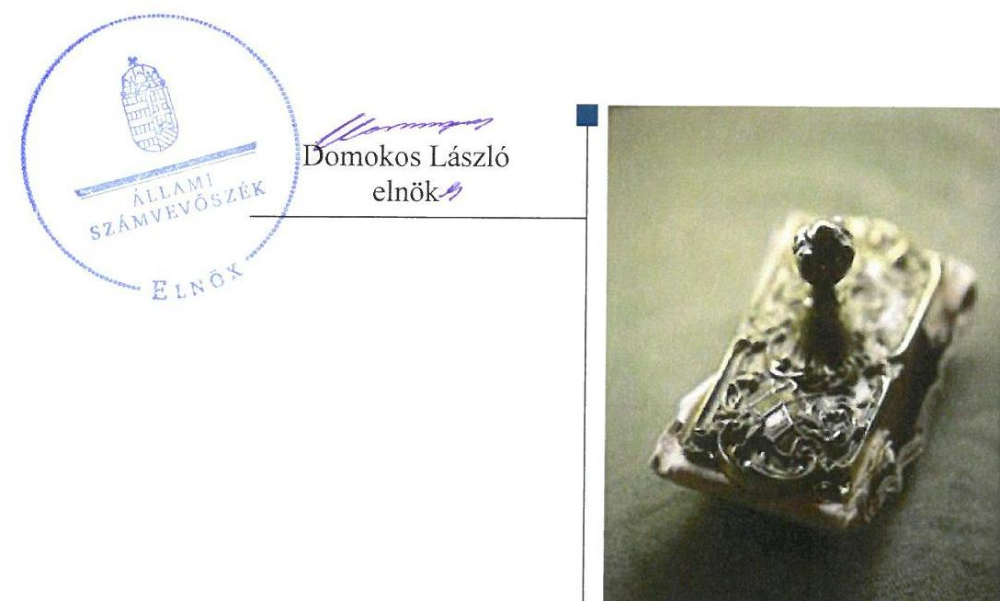
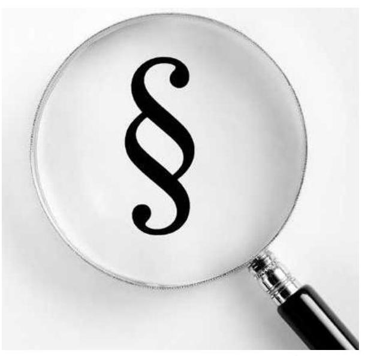
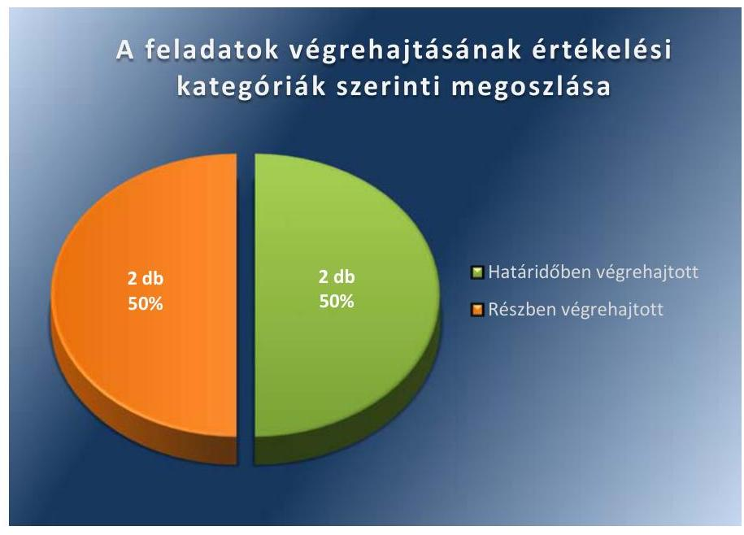

# Jelentés 

## Utóellenőrzések

A Barankovics István Alapítvány 2012-2013. évi gazdálkodása törvényességének utóellenőrzése
2017.

---

# Jelentés 

## Utóellenőrzések

A Barankovics István Alapítvány 2012-2013. évi gazdálkodása törvényességének utóellenőrzése
2017. 07. hó 11. nap

---

# AZ ELLENŐRZÉST FELÜGYELTE: 

DR. BENEDEK MÁRIA felügyeleti vezető

## AZ ELLENŐRZÉST VEZETTE ÉS A VÉGREHAJTÁSÁÉRT FELELŐS:

KAKAS SÁNDOR ellenőrzésvezető

## A PROGRAM ÖSSZEÁLLÍTÁSÁÉRT FELELŐS:

JANIK JÓZSEF LÁSZLÓ osztályvezető

## A TÉMÁHOZ KAPCSOLÓDÓ KORÁBBI SZÁMVEVŐSZÉKI JELENTÉSEK:

- címe: Jelentés a Barankovics István Alapítvány 20122013. évi gazdálkodása törvényességének ellenőrzéséről
- sorszáma: 15079

IKTATÓSZÁM: EL-0040-023/2017.
TÉMASZÁM: 21
ELLENŐRZÉS-AZONOSÍTÓ SZÁM: V075585

---

# TARTALOMJEGYZÉK 

■ ÖSSZEGZÉS ..... 5
■ AZ ELLENŐRZÉS CÉLJA ..... 6
■ AZ ELLENŐRZÉS TERÜLETE ..... 7
■ AZ ELLENŐRZÉS HÁTTERE, INDOKOLTSÁGA ..... 8
■ A JELENTÉS LÉNYEGES KÉRDÉSKÖRE ..... 9
■ ELLENŐRZÉS HATÓKÖRE ÉS MÓDSZEREI ..... 10
■ MEGÁLLAPÍTÁSOK ..... 12
■ MELLÉKLETEK ..... 15
I. sz. melléklet: Az ÁSZ 15079 számú jelentéséhez kapcsolódó intézkedési terv végrehajtása ..... 15
■ FÜGGELÉK: ÉSZREVÉTELEK ..... 17
■ RÖVIDÍTÉSEK JEGYZÉKE ..... 19

---

.

---

# ÖSSZEGZÉS 

Az Állami Számvevőszék a Barankovics István Alapítvány 2012-2013. évi gazdálkodása törvényességének utóellenőrzése során megállapította, hogy az intézkedési tervben meghatározott feladatok jelentős részét végrehajtotta, aminek következtében a gazdálkodásának szabályszerűsége és átláthatósága javult.

## Az ellenőrzés társadalmi indokoltsága

Az Állami Számvevőszék stratégiájában célul tűzte ki a számvevőszéki munka hasznosulásának javítását. Ezzel összhangban ellenőrzi, hogy az ellenőrzött szervezetek megvalósították-e a korábbi ellenőrzései által feltárt hibák, hiányosságok és szabálytalanságok megszüntetése céljából kialakított intézkedési terveikben foglaltakat. A rendszeres utóellenőrzések hozzájárulnak a szükséges intézkedések tényleges végrehajtásához, ezáltal a közpénzügyek rendezettségének javulásához, igazolják, hogy lezárult a következmények nélküli ellenőrzések időszaka.

## Főbb megállapítások, következtetések

A Barankovics István Alapítvány elnöke az intézkedést igénylő megállapításokhoz és javaslatokhoz kapcsolódóan öszszeállított intézkedési tervet megküldte az Állami Számvevőszék részére. Az intézkedési tervben meghatározott négy feladatból kettőt határidőben, kettőt részben hajtott végre.

A Számviteli politika módosításáról intézkedett a beszámoló felülvizsgálatára korábban előírt könyvvizsgálati kötelezettség törlése vonatkozásában, valamint felszólította a könyvelési szolgáltatást végző szerződéses partnerét a jogszabályi előírások betartására, aminek következtében javult gazdálkodásának szabályszerűsége.

A Természetbeni Juttatások Szabályzatát módosította, azonban az tartalmilag nem teljes körűen felelt meg a jogszabályi előírásoknak. A 2012. és 2013. évi tevékenységéről a jelentéseket a jogszabályi előírások alapján elkészítette és gondoskodott azok törvényi előírás szerinti közzétételéről, aminek következtében gazdálkodásának átláthatósága javult, azonban a jelentések a költségvetési támogatások felhasználásának bemutatását szerkezetükben nem a jogszabályi előírás szerinti költségvetési támogatás felhasználására vonatkozó kimutatásként, hanem az egyéb támogatásokkal együttesen tartalmazták.

---

# AZ ELLENŐRZÉS CÉLJA 

Az ellenőrzés célja annak értékelése volt, hogy a számvevőszéki jelentésben ${ }^{1}$ foglalt intézkedést igénylő megállapításokkal és javaslatokkal összhangban készített intézkedési tervben meghatározott feladatokat a Barankovics István Alapítvány végrehajtotta-e.

---

# **AZ ELLENŐRZÉS TERÜLETE**

## **Barankovics István Alapítvány**

A pártok a népakarat kialakításában és kinyilvánításában történő közreműködésének elősegítése, az állampolgári tájékoztatás szélesítése, a politikai kultúra fejlesztése érdekében a Pártalapítványi tv.2 alapján tudományos, ismeretterjesztő, kutatási és oktatási tevékenységük elősegítésére a Párttörvény3-ben meghatározott költségvetési támogatásra jogosult alapítványt hozhatnak létre.

A Kereszténydemokrata Néppárt a törvényben biztosított lehetőséggel élve 2006. évben létrehozta a Barankovics István Alapítványt. A Barankovics István Alapítvány célja:

- korszerű oktatási, tudományos, ismeretterjesztő tevékenységi formák szervezése, illetve támogatása,
- az alapítvány céljait szolgáló kutatási tevékenység szervezése, illetve támogatása,
- előadások, konferenciák szervezése, illetve támogatása,
- tanulmányok, szakkönyvek, egyéb, az alapítvány céljait szolgáló kiadványok kiadása, illetve támogatásuk kiadása,
- bel- és külföldi szaklapok, szakfolyóiratok, illetve szakkönyvek megvásárlása,
- fenti célokkal összefüggésben kiírt pályázatokon való részvétel.

A Barankovics István Alapítvány a 2012. és 2013. évben a törvényi előírásoknak megfelelően évente 69 400 ezer Ft költségvetési támogatásban részesült.

Az Állami Számvevőszék 2015. évben ellenőrizte a Barankovics István Alapítvány 2012–2013. évi gazdálkodása törvényességét. Az erről szóló 15079 számú jelentését 2015. május 19-én tette közzé. Az ellenőrzés célja annak megállapítása volt, hogy a Barankovics István Alapítvány a 2012–2013. években törvényesen gazdálkodott-e.

Az utóellenőrzés – a 2015. május 19-től a 2017. február 27-ig végrehajtott feladatokat figyelembe véve – az Állami Számvevőszék jelentésében a Kuratórium4 elnöke részére megfogalmazott intézkedést igénylő megállapításokra és javaslatokra készített, az Állami Számvevőszék részére megküldött intézkedési tervben foglalt feladatok megvalósításának ellenőrzésére, illetve értékelésére fókuszált.

---

# AZ ELLENŐRZÉS HÁTTERE, INDOKOLTSÁGA 

Az ÁSZ ${ }^{5}$ tv. ${ }^{6}$ 33. § (1) bekezdése értelmében a számvevőszéki jelentések intézkedést igénylő megállapításaihoz kapcsolódóan az ellenőrzött szervezet vezetője intézkedési tervet köteles összeállítani, és az ÁSZ részére megküldeni. Az intézkedési tervben foglaltak megvalósítását - az ÁSZ tv. 33. § (7) bekezdésében foglaltak alapján - az ÁSZ utóellenőrzés keretében ellenőrizheti. Az intézkedések megvalósulásának értékelése során az ÁSZ figyelembe veszi az ellenőrzött szervezetek működési feltételeiben, valamint a jogszabályi előírásokban bekövetkezett változásokat.

Az intézkedési tervekben foglalt feladatok hiányos, illetve késedelmes végrehajtása, valamint megvalósításának elmaradása azt mutatja, hogy az ellenőrzések során feltárt hibák, hiányosságok és szabálytalanságok megszüntetése nem kapott kellő hangsúlyt. Ez a szabályszerű működés és a felelős vezetői magatartás vonatkozásában kockázatot hordoz. E kockázatok feltárásával az ÁSZ utóellenőrzési rendszere fokozza a fegyelmet, és igazolja, hogy a közpénzzel való szabályos gazdálkodás felelőssége elől nem lehet kitérni.

## AZ UTÓELLENŐRZÉS VÁRHATÓ HASZNOSULÁSA

Az utóellenőrzés négy szinten hasznosulhat:
$\longrightarrow$ A társadalom szintjén az utóellenőrzés jelzi, hogy a számvevőszéki ellenőrzés megállapításainak van következménye: a hiányosságok megszüntetésére az ellenőrzött szervezet által meghatározott intézkedések végrehajtását is számon kéri az ÁSZ.
$\longrightarrow$ Az ellenőrzött terület szintjén az utóellenőrzés tájékoztatást nyújt a terület döntéshozóinak a hiányosságok kiküszöbölésének jó gyakorlatairól, ezzel lehetőséget biztosítva arra, hogy az ÁSZ ellenőrzési megállapításai, javaslatai a terület nem ellenőrzött szervezeteinek a működése során is hasznosuljanak.
$\longrightarrow$ Az ellenőrzött szervezet szintjén az utóellenőrzés feltárja, hogy a szervezet az intézkedések végrehajtásával hasznosította-e a korábbi ellenőrzési jelentésben a hiányosságok megszüntetése, illetve a kockázatok kezelése érdekében megfogalmazott javaslatokat.
$\longrightarrow$ Az ÁSZ szintjén az utóellenőrzés visszacsatolást ad az ellenőrzési jelentések hasznosulásáról, az intézkedések elmaradása vagy részleges megvalósulása a további ellenőrzésekhez kockázati jelzésként szolgál.

---

# A JELENTÉS LÉNYEGES KÉRDÉSKÖRE 

A Barankovics István Alapitvány az intézkedési tervben foglaltakat az elöirt határidőben végrehajtotta-e?

---

# ELLENŐRZÉS HATÓKÖRE ÉS MÓDSZEREI 

## Az ellenőrzés típusa

Megfelelőségi ellenőrzés.

## Az ellenőrzött időszak

Az utóellenőrzés alapját képező ÁSZ jelentés közzétételének napjától (2015. május 19.) az ellenőrzésről szóló kiértesítő levél keltének napjáig (2017. február 27.) tartó időszak.

## Az ellenőrzés tárgya

Az ÁSZ tv. 2011. július 1-jei hatálybalépését követően a számvevőszéki jelentésben foglalt intézkedést igénylő megállapításokkal és javaslatokkal összhangban - a Barankovics István Alapítvány által - készített intézkedési tervben foglaltak végrehajtásának ellenőrzése.

Az ellenőrzés kiterjedt minden olyan körülményre és adatra, amely az ÁSZ jogszabályban meghatározott feladatainak teljesítéséhez, valamint a program végrehajtása folyamán felmerült újabb összefüggések feltárásához szükséges volt.

## Az ellenőrzött szervezet

Barankovics István Alapítvány.

## Az ellenőrzés jogalapja

Az ÁSZ törvényben meghatározott feladatkörében ellenőrzi a központi költségvetés végrehajtását, az államháztartás gazdálkodását, az államháztartásból származó források felhasználását és a nemzeti vagyon kezelését.

Az ÁSZ tv. 1. § (3) bekezdése szerint az ÁSZ általános hatáskörrel végzi a közpénzekkel és az állami és önkormányzati vagyonnal való felelős gazdálkodás ellenőrzését.

Az ÁSZ tv. 33. § (7) bekezdése alapján a 33. § (1)-(2) bekezdése szerinti intézkedési tervben foglaltak megvalósítását az ÁSZ utóellenőrzés keretében ellenőrizheti.

---

# Az ellenőrzés módszerei 

Az ÁSZ az ellenőrzést a nemzetközi standardokat irányadónak tekintve az ellenőrzési program ellenőrzési kérdései, az ellenőrzött időszakban hatályos jogszabályok, az ellenőrzés szakmai szabályok és módszertanok figyelembevételével, önállóan végezte.

Az ÁSZ az ellenőrzés ideje alatt a Barankovics István Alapítvánnyal történő kapcsolattartást az ÁSZ SZMSZ ${ }^{7}$-ének vonatkozó előírásai alapján biztosította.

Az utóellenőrzés megállapításait elsősorban az ÁSZ rendelkezésére álló, valamint az ellenőrzött szervezetektől elektronikusan bekért dokumentumok alapozták meg.

Az ellenőrzési bizonyítékként felhasználható adatforrások közé tartoztak egyrészt a szakmai programban felsorolt adatforrások, másrészt minden - az ellenőrzés folyamán feltárt, az ellenőrzés szempontjából információt tartalmazó - dokumentum.

Az intézkedési tervekben előírt feladatokat azok végrehajthatósága, illetve végrehajtása szempontjából az alábbiak szerint értékelte az ÁSZ:
$\longrightarrow$ „határidőben végrehajtott" a feladat, ha a teljesítés dokumentáltan, az intézkedési tervben előírt határidőben és tartalommal megtörtént;
$\longrightarrow$ „határidőn túl végrehajtott" a feladat, ha annak teljesítése az intézkedési tervben meghatározott módon, de az előírt határidőn túl történt meg;
$\longrightarrow$ „részben végrehajtott" a feladat, ha végrehajtása teljes körűen az intézkedési tervben előírt módon nem történt meg;
$\longrightarrow$ „nem végrehajtott" feladat, ha a végrehajtás nem történt meg, vagy amennyiben a teljesítést nem dokumentálták;
$\longrightarrow$ „okafogyottá vált" a feladat, ha végrehajtására - meghatározott esemény bekövetkezése, továbbá külső körülmény, a működést érintő feltétel változása miatt - már nincs szükség, illetve lehetőség, és egyértelműen megállapítható, hogy az intézkedést szükségessé tevő körülmény a jövőben nem fordulhat elő;
$\longrightarrow$ „nem időszerű" az a feladat, amelynek ellenőrzési időszakon belüli végrehajtására azért nem került (kerülhetett) sor, mert az intézkedés alapjául szolgáló esemény nem következett be, de annak jövőbeni előfordulása lehetséges, a végrehajtása nem volt esedékes, vagy a végrehajtás határideje még nem járt le.
Az ellenőrzés lefolytatásához a Barankovics István Alapítvány a tanúsítványok elektronikus kitöltésével, valamint az ÁSZ által kért dokumentumok elektronikus megküldésével szolgáltatott adatokat, amelyek valódiságát és teljes körűségét a Kuratórium elnöke által tett teljességi és hitelességi nyilatkozat igazolta. Az így rendelkezésre bocsátott adatok, információk kontrollja az ellenőrzés keretében történt.

---

# MEGÁLLAPÍTÁSOK 

## A Barankovics István Alapítvány az intézkedési tervben foglaltakat az előírt határidőben végrehajtotta-e?

Összegző megállapítás

## A BIA ${ }^{8}$ az intézkedési tervben meghatározott négy feladatból kettőt határidőben, kettőt részben hajtott végre.

Az ÁSZ jelentésében a Kuratórium elnöke részére négy javaslatot fogalmazott meg, melynek hasznosítására az ÁSZ részére megküldött intézkedési tervben a hiányosságok, szabálytalanságok megszüntetésére a BIA négy feladatot határozott meg. A feladatok elvégzésének felelőse a Kuratórium elnöke volt.

Az intézkedési tervben meghatározott feladatokat, határidőket, felelősöket és a feladatok végrehajtását az 1. számú melléklet mutatja be.

A BIA intézkedési tervében meghatározott feladatok végrehajtásának értékelési kategóriák szerinti megoszlását az 1. ábra szemlélteti.

1. ábra

Fonrás: ÁSZ

## HATÁRIDŐBEN VÉGREHAJTOTT feladatok:

$\qquad$ 1. A BIA módosította a Számviteli politikáját ${ }^{9}$, annak rendelkezései közül a beszámoló felülvizsgálatára korábban előírt könyvvizsgálati kötelezettségét törölte.
$\qquad$ 2. A BIA felszólította a könyvelést végző szerződéses partnerét a Számv. tv. ${ }^{10}$ előírásainak betartására, a bizonylatok feldolgozásának törvényességére.

---

# RÉSZBEN VÉGREHAJTOTT feladatok: 

3. A BIA határidőben elkészítette a 2012. és 2013. évekre vonatkozó jelentéseket és gondoskodott azok törvényi előírás szerinti közzétételéről. A jelentések tartalmazták a költségvetési támogatások felhasználásának bemutatását is, azonban szerkezetükben nem a Pártalapítványi tv. előírása szerinti költségvetési támogatás felhasználására vonatkozó kimutatásként, hanem az egyéb támogatásokkal együttesen.
4. A BIA határidőben elkészítette a Természetbeni Juttatásokról szóló szabályzatának módosítását, azonban az az Szja. tv. ${ }^{11}$ rendelkezései által cafeteria elemként nem nevesíthető elemet is tartalmazott.

---

.

---

# MELLÉKLETEK

I. SZ. MELLÉKLET: AZ ÁSZ 15079 SZÁMÚ JELENTÉSÉHEZ KAPCSOLÓDÓ INTÉZKEDÉSI TERV VÉGREHAJTÁSA

|  5 | Az intézkedési tervben meghatározott feladat | Az intézkedési tervben meghatározott határidő | Az intézkedési tervben meghatározott feladat felelőse | A feladat végrehajtása  |
| --- | --- | --- | --- | --- |
|  1 |  | 2 | 3 | 4  |
|  Határidőben végrehajtott feladat |  |  |  |   |
|  1. Tekintettel arra, hogy az Alapítványnak könyvvizsgálatra vonatkozó jogszabályi kötelezettsége nincsen, a BIA módosítsa ennek megfelelően a Számviteli Politika elnevezésű szabályzatát. |  | megtett intézkedés | Kuratórium elnöke | A BIA jogszabályi kötelezettség hiányában Számviteli politikájának rendelkezései közül törölte a beszámoló felülvizsgálatára korábban előírt könyvvizsgálati kötelezettségét.  |
|  2. A Barankovics Alapítvány szólítsa fel a könyvelést végző szerződéses partnerét a Számviteli törvény előírásainak betartására, a bizonylatok feldolgozásának törvényességére. |  | megtett intézkedés | Kuratórium elnöke | A BIA 2015. április 10-én, levélben felszólította a könyvviteli szolgáltatást végző szerződéses partnerét a Számv. tv. előírásainak betartására és a bizonylatok feldolgozásának törvényességére.  |
|  Részben végrehajtott feladat |  |  |  |   |
|  3. A Barankovics István Alapítvány a vizsgált 20122013. évekre vonatkozóan haladéktalanul készítse el a hiányzó éves jelentéseket és gondoskodjon azok törvényi előírás szerinti közzétételéről. |  | megtett intézkedés | Kuratórium elnöke | A BIA Kuratóriuma a 2015. április 28-i ülésén, a 14/20158/04.28. számú határozatával elfogadta a 2012. és 2013. évre vonatkozó jelentéseket, melyek tartalmazták a költségvetési támogatások felhasználásának bemutatását is, azonban szerkezetében nem a Pártalapítványi tv. 3/A. § (3) bekezdés b) pontjának előírása szerinti költségvetési támogatás felhasználására vonatkozó kimutatásként, hanem az egyéb támogatásokkal együttesen. A BIA a törvényi előírás szerint a 2012. és 2013. évre vonatkozó jelentéseket közzétette a saját honlapján, valamint a Magyar Közlöny mellékletét képező Hivatalos Értesítőben.  |
|  4. A Barankovics Alapítvány a jogszabályi változások figyelembevételével készítse el a Természetbeni Juttatásokról szóló 2008. évi szabályzatának módosítását. |  | megtett intézkedés | Kuratórium elnöke | A BIA elkészítette a Természetbeni Juttatásokról szóló 2008. évi szabályzatának módosítását, azonban az nem felelt meg teljes körűen az Szia. tv. 71. § (1)-(3) bekezdésében foglalt előírásnak, mert béren kívüli juttatásként nem nevesíthető cafeteria elemet (bér) is tartalmazott.  |

Fonrás: ÁSZ által készített táblázat

---

.

---

# FÜGGELÉK: ÉSZREVÉTELEK 

A jelentéstervezetet a Számvevőszék 15 napos észrevételezésre megküldte az ellenőrzött szervezet vezetőjének az ÁSZ tv. 29. §* (1) bekezdése előírásának megfelelően.

Az ellenőrzött szervezet vezetője az ÁSZ tv. 29. § (2) bekezdésében foglalt észrevételezési jogával nem élt, a jelentéstervezetre észrevételt nem tett.

[^0]
[^0]:    * 29. § (1) Az Állami Számvevőszék az ellenőrzési megállapításait megküldi az ellenőrzött szervezet vezetőjének vagy az általa megbízott személynek, és annak, akinek személyes felelősségét állapította meg.
    (2) Az ellenőrzött szervezet vezetője és a felelősként megjelölt személy az ellenőrzés megállapításaira tizenöt napon belül írásban észrevételt tehet.
    (3) Az Állami Számvevőszék az észrevételre a beérkezésétől számított harminc napon belül írásban válaszol. A figyelembe nem vett észrevételeket köteles a jelentésben feltüntetni, és megindokolni, hogy azokat miért nem fogadta el.

---

.

---

# RÖVIDÍTÉSEK JEGYZÉKE 

${ }^{1}$ számvevőszéki jelentés
${ }^{2}$ Pártalapítványi tv.
${ }^{3}$ Párttörvény
${ }^{4}$ Kuratórium
${ }^{5}$ ÁSZ
${ }^{6}$ ÁSZ tv.
${ }^{7}$ ÁSZ SZMSZ
${ }^{8}$ BIA
${ }^{9}$ Számviteli politika
${ }^{10}$ Számv. tv.
${ }^{11}$ Szja. tv.
az ÁSZ 15079-es számú jelentése (Elérhető a www.asz.hu honlapon.)
2003. évi XLVII. törvény a pártok müködését segítő tudományos, ismeretterjesztő, kutatási, oktatási tevékenységet végző alapítványokról (hatályos 2003. március 15-től)
1989. évi XXXIII. törvény a pártok müködéséről és gazdálkodásáról (hatályos 1989. október 30-tól)

Barankovics István Alapítvány Kuratóriuma
Állami Számvevőszék
2011. évi LXVI. törvény az Állami Számvevőszékről (hatályos 2011. július 1.-jétől) Állami Számvevőszék Szervezeti és Működési Szabályzata
Barankovics István Alapítvány
Barankovics István Alapítvány Számviteli politikája (hatályos 2015. április 28-tól)
2000. évi C. törvény a számvitelről (hatályos 2001. január 1-jétől)
1995. évi CXVII. törvény a személyi jövedelemadóról (hatályos 1996. január 1-jétől)

---

ÁLLAMI SZÁMVEVŐSZÉK
1052 Budapest, Apáczai Csere János utca 10.
Levélcím: 1364 Budapest 4. Pf. 54
Telefon: +36 14849100 Telefax: +36 14849200
www.asz.hu