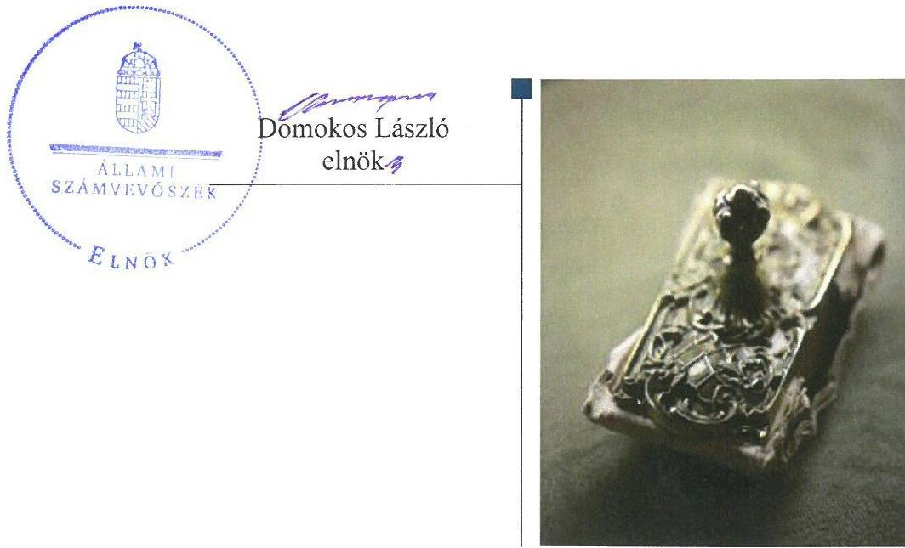
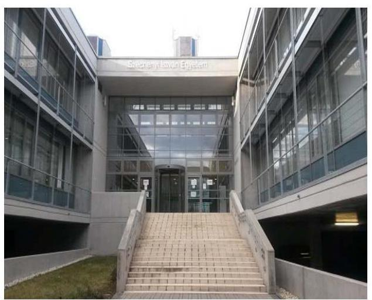
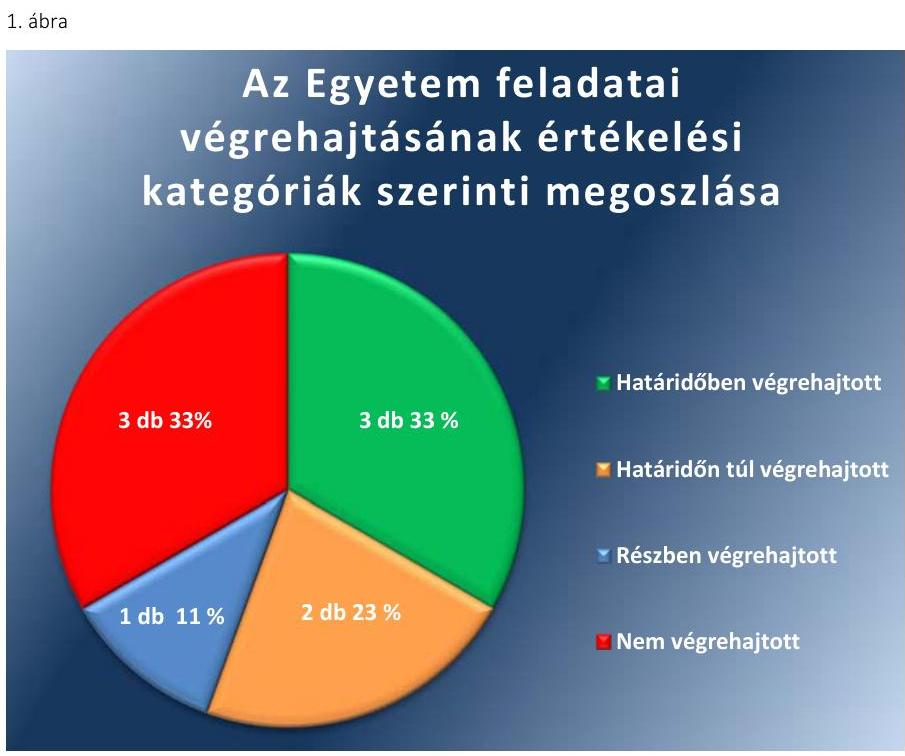
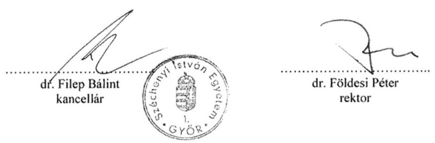
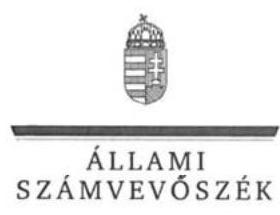
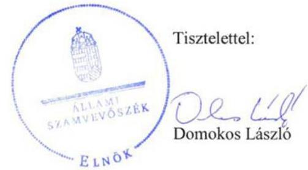
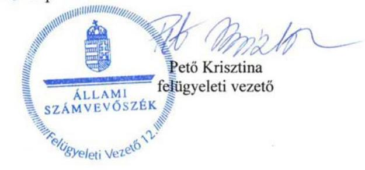
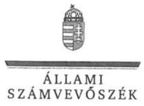
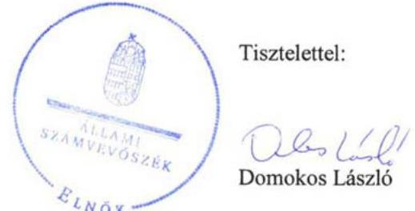
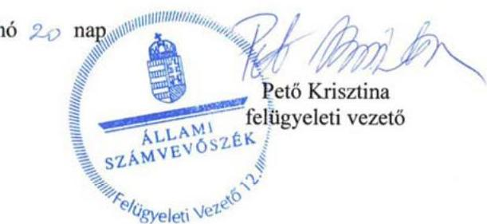

# Jelentés 

## Utóellenőrzések

Az állami felsőoktatási intézmények gazdálkodásának, működésének ellenőrzéséről készült jelentések utóellenőrzése - Széchenyi István Egyetem 2017.

---

# JEELAMI   SZÁMVEVÓSZÉK 

## Jelentés

## Utóellenőrzések

Az állami felsőoktatási intézmények gazdálkodásának, múködésének ellenőrzéséről készült jelentések utóellenőrzése - Széchenyi István Egyetem 2017. 07. hó 25. nap

---

# AZ ELLENŐRZÉST FELÜGYELTE: 

PETŐ KRISZTINA felügyeleti vezető

## AZ ELLENŐRZÉST VEZETTE ÉS A VÉGREHAJTÁSÁÉRT FELELŐS:

MOLNÁR ZSUZSANNA ellenőrzésvezető

## A PROGRAM ÖSSZEÁLLÍTÁSÁÉRT FELELŐS:

JANIK JÓZSEF LÁSZLÓ osztályvezető

## A TÉMÁHOZ KAPCSOLÓDÓ KORÁBBI SZÁMVEVŐSZÉKI JELENTÉS:

- címe: Jelentés a Széchenyi István Egyetem ellenőrzéséről - Az állami felsőoktatási intézmények gazdálkodásának, működésének ellenőrzése
- sorszáma: 14201

IKTATÓSZÁM: V-1182-062/2016.
TÉMASZÁM: 2216
ELLENŐRZÉS-AZONOSÍTÓ SZÁM: V075528

---

# TARTALOMJEGYZÉK 

■ ÖSSZEGZÉS ..... 5
■ AZ ELLENŐRZÉS CÉLJA ..... 6
■ AZ ELLENŐRZÉS TERÜLETE ..... 7
■ AZ ELLENŐRZÉS HÁTTERE, INDOKOLTSÁGA ..... 8
■ A JELENTÉS LÉNYEGES KÉRDÉSKÖRE ..... 9
■ ELLENŐRZÉS HATÓKÖRE ÉS MÓDSZEREI ..... 10
■ MEGÁLLAPÍTÁSOK ..... 13
■ MELLÉKLETEK ..... 17
I. Sz. melléklet: Az ÁSZ 14201. számú jelentéséhez kapcsolódó intézkedési terv végrehajtása az Széchenyi István Egyetemnél ..... 17
II. Sz. melléklet: Az ÁSZ 14201. számú jelentéséhez kapcsolódó intézkedési terv végrehajtása az Emberi Erőforrások Minisztériumánál. ..... 21
■ FÜGGELÉK: ÉSZREVÉTELEK ..... 23
■ RÖVIDÍTÉSEK JEGYZÉKE ..... 33

---

.

---

# ÖSSZEGZÉS 

A Széchenyi István Egyetem utóellenőrzése megállapította, hogy a korábbi számvevőszéki jelentés javaslatai alapján az Egyetem rektora által meghatározott intézkedési tervben szereplő kilenc feladat nagy részének végrehajtása javította az Egyetem müködésének szabályozottságát, azonban a belső kontrollrendszer területén feltárt hiányosságok egy része továbbra is fennáll. Az Emberi Erőforrások Minisztériuma - mint fenntartói jogkör gyakorlója - az intézkedési tervében foglalt feladatát végrehajtotta.

## Az ellenőrzés társadalmi indokoltsága

Az Állami Számvevőszék stratégiájában célul tűzte ki a számvevőszéki munka hasznosulásának javítását. Ezzel összhangban ellenőrzi, hogy az ellenőrzött szervezetek megvalósították-e a korábbi ellenőrzései által feltárt hibák, hiányosságok és szabálytalanságok megszüntetése céljából kialakított intézkedési terveikben foglaltakat. A rendszeres utóellenőrzések hozzájárulnak a szükséges intézkedések tényleges végrehajtásához, ezáltal a közpénzügyek rendezettségének javulásához.

## Főbb megállapítások, következtetések

Az intézkedési tervben meghatározott kilenc feladatból a Széchenyi István Egyetem hármat határidőben, kettőt határidőn túl, egyet részben, hármat nem hajtott végre. A feladatok nagy részének végrehajtása javította az Egyetem múködésének szabályozottságát.

A belső kontrollrendszer, ezen belül a kontrolltevékenységek területén feltárt hiányosságok megszüntetéséről és a kontrollkörnyezet jogszabályoknak megfelelő kialakítása érdekében végrehajtandó feladatok elvégzéséről részben gondoskodott a kancellár. Továbbra sem határozták meg az etikai elvárásokat, valamint nem készítettek valamennyi tevékenységcsoportra és folyamatra ellenőrzési nyomvonalakat. Elmaradt a munkajogi felelősség munkáltatói jogkörében történő kivizsgálása is.

A gazdálkodási jogkörök szabályszerű gyakorlásának érvényesítése sem valósult meg, mert a szabályszerű kifizetéseket biztosító kontrollokkal kapcsolatos tevékenységek ellátása több esetben nem volt szabályszerű.

Az Emberi Erőforrások Minisztériuma a kincstári körön kívüli számlavezetés miatt megállapított szabálytalan pénzkezeléshez kapcsolódó munkajogi felelősség munkáltatói jogkörében történő kivizsgálására határidőben intézkedett.

---

# AZ ELLENŐRZÉS CÉLJA 

Az ellenőrzés célja annak értékelése volt, hogy a számvevőszéki jelentésben ${ }^{1}$ foglalt intézkedést igénylő megállapításokkal és javaslatokkal összhangban készített intézkedési tervben meghatározott feladatokat az ellenőrzött szervezetek végrehajtották-e.

---

# **AZ ELLENŐRZÉS TERÜLETE**

## **Széchenyi István Egyetem**

A Széchenyi István Egyetem története 1968-ig nyúlik vissza, ekkor alapították az egyetem közvetlen jogelődjét a Közlekedési és Távközlési Műszaki Főiskolát. Széchenyi István nevét 1986. óta viseli az intézmény, amely a felsőoktatásról szóló 1993. évi LXXX. törvény módosításával 2002. január 1-jével egyetemi rangot kapott. A győri Egyetemen2 kilenc kar és négy doktori iskola működik. Jelenleg több mint 90 akkreditált alap- és mesterszakon, illetve felsőfokú szakképzés keretében, Győrben, Esztergomban, Szentgotthárdon és Szombathelyen folyik a hallgatók képzése. A karok között jogi, gazdasági, műszaki, bölcsész, egészségügyi, mezőgazdasági és zeneművészeti képzések találhatóak. A legnépszerűbbek a műszaki szakok, ezen belül is a gépészmérnök, a mérnök informatikus és a villamosmérnök alapszakok. Az Egyetem hallgatói létszáma 2015-ben több mint 15 000 fő volt.

A rektor3 2013. július 1-jétől tölti be tisztségét. Az ellenőrzött időszakban változások történtek az Egyetem gazdasági vezetésében, 2014. november 15-től a Miniszterelnök4 kancellárt5 bízott meg. A kancellár kinevezése 2017. november 15-ig szól.

Az Egyetem 2015. évi költségvetési beszámolója szerint 8410,2 millió Ft költségvetési bevételt, 6286,8 millió Ft finanszírozási bevételt ért el, valamint 9577,2 millió Ft költségvetési kiadást teljesített. A 2015. év december 31-i mérleg szerint az Egyetem eszközei 19876,2 millió Ft-ot tettek ki.

Az Egyetem gazdálkodásának, működésének ellenőrzését az ÁSZ6 a 2009. január 1.- 2012. december 31. közötti időszakra végezte el, az erről szóló 14201. számú jelentést 2014. augusztus 14-én tette közzé. Az ellenőrzés célja annak megállapítása volt, hogy szabályos volt-e az Egyetem pénzügyi és vagyongazdálkodása, biztosított volt-e a vagyonnal való felelős gazdálkodás követelményének érvényesülése, jogszabályi előírásoknak megfelelően működött-e a belső kontrollrendszer, az irányító szerv tevékenysége a jogszabályi előírásoknak megfelelő-e.

A fenntartói jogkörök gyakorlója az Emberi Erőforrások Minisztériuma volt.

Az utóellenőrzés a 2017. február 8-ig végrehajtott intézkedéseket figyelembe véve a Széchenyi István Egyetem ellenőrzéséről készült számvevőszéki jelentés intézkedést igénylő megállapításai és javaslatai hasznosítására elfogadott intézkedési tervben foglalt feladatok végrehajtására irányult. Az ÁSZ jelentés a Széchenyi István Egyetem rektora részére kilenc, az Emberi Erőforrások Minisztériuma részére egy javaslatot tartalmazott.

---

# AZ ELLENŐRZÉS HÁTTERE, INDOKOLTSÁGA 

Az ÁSZ tv. ${ }^{7}$ 33. § (1) bekezdése értelmében a számvevőszéki jelentések intézkedést igénylő megállapításaihoz és javaslataihoz kapcsolódóan az ellenőrzött szervezet vezetője intézkedési tervet köteles összeállítani, és az ÁSZ részére megküldeni. Az intézkedési tervben foglaltak megvalósítását az ÁSZ tv. 33. § (7) bekezdésében foglaltak alapján - az ÁSZ utóellenőrzés keretében ellenőrizheti. Az intézkedések megvalósulásának értékelése során az ÁSZ figyelembe vette az ellenőrzött szervezetek működési feltételeiben, valamint a jogszabályi előírásokban bekövetkezett változásokat.

Az intézkedési tervben foglalt feladatok hiányos, illetve késedelmes végrehajtása, valamint megvalósításának elmaradása azt mutatja, hogy az ellenőrzés során feltárt hibák, hiányosságok és szabálytalanságok megszüntetése nem kapott kellő hangsúlyt. Ez a szabályszerű működés és a felelős vezetői magatartás vonatkozásában kockázatot hordoz. E kockázatok feltárásával az ÁSZ utóellenőrzési rendszere fokozza a fegyelmet és igazolja, hogy a közpénzzel való szabályos gazdálkodás felelőssége elől nem lehet kitérni.

Az utóellenőrzés négy szinten hasznosulhat:
$\longrightarrow$ A társadalom szintjén az utóellenőrzés jelzi, hogy a számvevőszéki ellenőrzés megállapításainak van következménye: a hiányosságok megszüntetésére az ellenőrzött szervezet által meghatározott intézkedések végrehajtását is számon kéri az ÁSZ.
$\longrightarrow$ Az ellenőrzött terület szintjén az utóellenőrzés tájékoztatást nyújt a terület döntéshozóinak a hiányosságok kiküszöbölésének jó gyakorlatairól, ezzel lehetőséget biztosítva arra, hogy az ÁSZ ellenőrzési megállapításai, javaslatai a terület nem ellenőrzött szervezeteinek a működése során is hasznosuljanak.
$\longrightarrow$ Az ellenőrzött szervezet szintjén az utóellenőrzés feltárja, hogy a szervezet az intézkedések végrehajtásával hasznosította-e a korábbi ellenőrzési jelentésben a hiányosságok megszüntetése, illetve a kockázatok kezelése érdekében megfogalmazott javaslatokat.
$\longrightarrow$ Az ÁSZ szintjén az utóellenőrzés visszacsatolást ad az ellenőrzési jelentések hasznosulásáról, az intézkedések elmaradása vagy részleges megvalósulása a további ellenőrzésekhez kockázati jelzésként szolgál.

---

# A JELENTÉS LÉNYEGES KÉRDÉSKÖRE 

Az ellenőrzött szervezetek az intézkedési tervben foglaltakat az előirt határidőben végrehajtották-e?

---

# ELLENŐRZÉS HATÓKÖRE ÉS MÓDSZEREI 

## Az ellenőrzés típusa

Megfelelőségi ellenőrzés.

## Az ellenőrzött időszak

Az utóellenőrzés alapját képező számvevőszéki jelentés közzétételének napjától (2014. augusztus 14.) az ellenőrzésről szóló kiértesítő levél keltének napjáig (2017. február 8.) tartó időszak.

## Az ellenőrzés tárgya

Az ÁSZ tv. 2011. július 1-jei hatálybalépését követően a számvevőszéki jelentésben foglalt intézkedést igénylő megállapításokkal és javaslatokkal összhangban - az Egyetem és az $\mathrm{EMMI}^{\circledR}$ által - készített intézkedési tervekben foglaltak végrehajtásának ellenőrzése.

Az ellenőrzés kiterjedt minden olyan körülményre és adatra, amely az ÁSZ jogszabályban meghatározott feladatainak teljesítéséhez, valamint a program végrehajtása folyamán felmerült újabb összefüggések feltárásához szükséges.

## Az ellenőrzött szervezet

A Széchenyi István Egyetem és az Emberi Erőforrások Minisztériuma.

## Az ellenőrzés jogalapja

Az ÁSZ az Országgyűlés pénzügyi és gazdasági ellenőrző szerve. Az ÁSZ törvényben meghatározott feladatkörében ellenőrzi a központi költségvetés végrehajtását, az államháztartás gazdálkodását, az államháztartásból származó források felhasználását és a nemzeti vagyon kezelését.

Az ÁSZ tv. 1. § (3) bekezdése szerint az ÁSZ általános hatáskörrel végzi a közpénzekkel és az állami és önkormányzati vagyonnal való felelős gazdálkodás ellenőrzését.

Az ÁSZ tv. 33. § (7) bekezdés alapján a 33. § (1)-(2) bekezdése szerinti intézkedési tervben foglaltak megvalósítását az ÁSZ utóellenőrzés keretében ellenőrizheti.

---

# Az ellenőrzés módszerei 

Az ÁSZ az ellenőrzést a nemzetközi standardokat irányadónak tekintve az ellenőrzési program ellenőrzési kérdései, az ellenőrzött időszakban hatályos jogszabályok, az ellenőrzés szakmai szabályok és módszertanok figyelembevételével, önálló ellenőrzés keretében végezte.

Az ÁSZ az ellenőrzés ideje alatt az Egyetemmel és az EMMI-vel történő kapcsolattartást az ÁSZ SZMSZ-ének ${ }^{9}$ vonatkozó előírásai alapján biztosította.

Az utóellenőrzés megállapításait elsősorban az ÁSZ rendelkezésére álló, valamint az ellenőrzött szervezetektől elektronikusan bekért dokumentumok alapozták meg.

Az ellenőrzési bizonyítékként felhasználható adatforrások közé tartoztak egyrészt a szakmai programban felsorolt adatforrások, másrészt minden - az ellenőrzés folyamán feltárt, az ellenőrzés szempontjából információt tartalmazó - dokumentum.

A vagyonkimutatás hatályos jogszabályi előírásokkal összhangban történő elkészítését a hazai pályázati forrásból finanszírozott immateriális javak, tárgyi eszközök állományából, a pénzügyi folyamatokban kulcsszerepet betöltő kontrollokra vonatkozóan az intézkedési tervben foglalt feladatok végrehajtását a beruházások, felújítások, egyéb felhalmozási célú kiadások, dologi kiadások állományából és a bér és személyi jellegű kifizetésekből vett összesen 30 mintatétel alapján értékelte az ÁSZ. A véletlenszerűen kiválasztott tételek esetében azt ellenőrizte, hogy az Egyetem az intézkedési tervben meghatározott feladatok végrehajtása során biztosí-totta-e a jogszabályok és a belső szabályzatok előírásainak megfelelő működtetést.

Az intézkedési tervben előírt feladatokat azok végrehajthatósága, illetve végrehajtása szempontjából az alábbiak szerint értékelte az ÁSZ:
"határidőben végrehajtott" a feladat, ha a teljesítés dokumentáltan, az intézkedési tervben előírt határidőben és tartalommal megtörtént;
"határidőn túl végrehajtott" a feladat, ha annak teljesítése az intézkedési tervben meghatározott módon, de az előírt határidőn túl történt meg;
"részben végrehajtott" a feladat, ha végrehajtása teljes körűen az intézkedési tervben előírt módon nem történt meg;
"nem végrehajtott" ha a végrehajtás nem történt meg, vagy amenynyiben a teljesítést nem dokumentálták;
"okafogyottá vált" a feladat, ha végrehajtására - meghatározott esemény bekövetkezése, továbbá külső körülmény, a működést érintő feltétel változása miatt - már nincs szükség, illetve lehetőség, és egyértelműen megállapítható, hogy az intézkedést szükségessé tevő körülmény a jövőben nem fordulhat elő;
"nem időszerű" az a feladat, amelynek ellenőrzési időszakon belüli végrehajtására azért nem került (kerülhetett) sor, mert az intézkedés alapjául szolgáló esemény nem következett be, de annak jövőbeni előfordulása lehetséges, a végrehajtása nem volt esedékes, vagy a végrehajtás határideje még nem járt le.

---

Az ellenőrzés lefolytatásához az ellenőrzött szervezetek a tanúsítványok elektronikus kitöltésével, valamint az ÁSZ által kért dokumentumok elektronikus megküldésével szolgáltattak adatokat, amelyek valódiságát és teljes körűségét az ellenőrzött szervezet vezetője által tett teljességi és hitelességi nyilatkozat igazolta. Az így rendelkezésre bocsátott adatok, információk kontrollja az ellenőrzés keretében történt meg.

---

# MEGÁLLAPÍTÁSOK 

## Az ellenőrzött szervezetek az intézkedési tervben foglaltakat az előírt határidőben végrehajtották-e?

Összegző megállapítás

Az Egyetem az intézkedési tervben meghatározott feladatok közül három feladatot határidőben, kettőt határidőn túl, egy feladatot részben, három feladatot nem hajtott végre. Az EMMI intézkedési tervében meghatározott feladatot határidőben végrehajtotta. A feladatok végrehajtásáról a jogszabályban előírt nyilvántartást mindkét ellenőrzött szervezet vezette.

A számvevőszéki jelentésben megfogalmazott intézkedést igénylő javaslatok alapján - az ÁSZ elnöke által tudomásul vett intézkedési tervben - az Egyetem rektora kilenc feladatot határozott meg a végrehajtásért felelősök megjelölésével. A feladatok elvégzésének felelőseként hét feladat esetében a kancellár, két feladat esetében a belső ellenőrzési vezető került felelősként megjelölésre.

Az EMMI - 2015. március 25-i levelében megküldött - az ÁSZ elnöke által tudomásul vett intézkedési tervében egy feladat került meghatározásra az EMMI Belső Ellenőrzési Főosztálya számára.

Az ÁSZ javaslatai alapján készített intézkedési tervben rögzített feladatok végrehajtásáról az Egyetem és az EMMI a Bkr. ${ }^{10}$ által előírt nyilvántartást vezették.

Az Egyetem intézkedési tervében meghatározott feladatokat, határidőket, a feladatok végrehajtásáért felelős személyeket és a feladatok végrehajtását az I. számú melléklet, az EMMI intézkedési tervében meghatározott feladat végrehajtását a II. számú melléklet mutatja be.

Az Egyetem intézkedési tervében meghatározott feladatok végrehajtásának értékelési kategóriák szerinti megoszlását az 1. ábra szemlélteti.

---

Forrás: ÁSZ

# HATÁRIDŐBEN VÉGREHAJTOTT FELADATOK: 

1. (2.b) A kancellár intézkedett a hallgatói befizetések jogszabályi előírásoknak megfelelő kezeléséről. A kereskedelmi banknál vezetett számlát, amelyre a hallgatói befizetések teljesültek az intézkedési tervben meghatározott határidőre megszüntették, a számlán lévő összeget a bank átutalta a Kincstárnál ${ }^{11}$ megnyitott gyűjtőszámlára.
2. (3.a) A vagyongazdálkodási tervet 2015-ben és 2016-ban az intézkedési tervben vállaltaknak megfelelően elkészítették, az éves költségvetés elfogadásával egyidejűleg a Szenátus ${ }^{12}$ elfogadta.
3. (3.c) A kancellár határidőn belül gondoskodott a mérlegtételekkel kapcsolatban feltárt hiányosságok, a besorolási és értékelési szabálytalanságok megszüntetése érdekében, az Egyetem vagyonkimutatása a hatályos jogszabályi előírásokkal összhangban készült el.

## HATÁRIDŐN TÚL VÉGREHAJTOTT FELADATOK:

4. (2.d) A belső ellenőr a térítési díjak, költségtérítések szabályszerűségére irányuló soron kívüli ellenőrzésekkel az intézkedési tervben meghatározott határidő után - 2015 februárjában - készült el.
5. (3.b) A kötelezettségek kimutatásának szabályszerűségére vonatkozó soron kívüli ellenőrzést a belső ellenőr határidőn túl, 2015. februárjában végezte el.

## RÉSZBEN VÉGREHAJTOTT FELADAT:

6. (1) A belső kontrollrendszer megfelelő működtetése érdekében az intézkedési tervben megfogalmazott feladatok végrehajtása részben történt meg. A belső kontrollrendszeren belül a kontrollkörnyezet és a kontrolltevékenységek területén feltárt hiányosságok

---

megszüntetéséről, a jogszabályoknak megfelelő kialakításáról és működtetéséről az Egyetem nem gondoskodott. Nem határozták meg az etikai elvárásokat, valamint nem készítettek valamennyi tevékenységcsoportra és folyamatra ellenőrzési nyomvonalakat. Ezzel a Bkr. 6. § (1) bekezdés c) pontban és a (3) bekezdésben foglalt előírásoknak nem tettek eleget. Az Egyetem a kockázatkezelés részeként határidőben végrehajtotta a kockázatok rendszeres (évenkénti) felmérését és kockázatkezelési akciók kidolgozását, kialakították a beszámoló elkészítéséhez és a vezetői döntések meghozatalához szükséges információs és kommunikációs rendszert, valamint fejlesztették a nyomonkövetési rendszert. A beszerzési ${ }^{13}$ és a közbeszerzési szabályzat ${ }^{14}$, valamint a kötelezettségvállalási szabályzat ${ }^{15}$ aktualizálása határidőben, a gazdálkodási szabályzat ${ }^{16}$ aktualizálása határidőn túl történt meg.

# NEM VÉGREHAJTOTT FELADATOK: 

7. (2.a) A gazdálkodási jogkörök szabályszerű gyakorlásának érvényesítése a véletlen kiválasztott mintatételek 66\%-ának esetében nem valósult meg. A bérköltségek és személyi jellegú kifizetések esetében - az Áht. ${ }^{17} 37 . \S$ (1) bekezdésében foglaltak ellenére - a kifizetések 20\%-ában nem állt rendelkezésre a kifizetésekre vonatkozó írásos kötelezettségvállalás. Egy esetben a teljesítést igazoló nem rendelkezett - az Ávr. ${ }^{18} 57$. § (4) bekezdésében foglaltak ellenére - írásos kijelöléssel. A kifizetések 50\%-ában - az Ávr. 58. § (3) bekezdésben foglaltak ellenére - nem volt szabályszerű az érvényesítés. Az utalványozás bizonylatai - az Ávr. 59. § (3) bekezdésben foglaltak ellenére - egy esetben sem tartalmazták teljes körűen a jogszabályban előírt tartalmi elemeket. A dologi kiadások tekintetében a mintatételek több mint 60\%-ában nem volt szabályszerű, pénzügyi ellenjegyzéssel ellátott kötelezettségvállalás. Ezekben az esetekben az érvényesítő nem az Ávr. 58. § (1) bekezdés alapján látta el a feladatát, mert nem ellenőrizte, hogy a megelőző ügymenetben az Áht., az államháztartási számviteli kormányrendelet és az Ávr. előírásait, továbbá a belső szabályzatokban foglaltakat megtartották-e. A beruházások, felújítások, egyéb felhalmozási célú kiadások mintatételei körében a gazdálkodási jogkörök gyakorlása - egy eset kivételével - szabályszerű volt. Egy vállalkozói szerződést nem a pénzügyi ellenjegyzésre jogosult írt alá, megsértve ezzel az Ávr. 55. § (1) bekezdésében foglaltakat.
8. (2.c) A kancellár az Nftv. 13/A § (2) bekezdés e) pontja szerinti munkáltatói jogkörében a közbeszerzési szabálytalansághoz kapcsolódóan - az intézkedési tervben vállalt - munkajogi felelősség kivizsgálására irányuló eljárás lefolytatásáról nem gondoskodott.
9. (3.d) A kancellár az Nftv. 13/A § (2) bekezdés e) pontja szerinti munkáltatói jogkörében a pályázati források felhasználásával létrejött immateriális javak és tárgyi eszközök kimutatását érintő hiányosságokhoz kapcsolódóan - az intézkedési tervben vállalt munkajogi felelősség kivizsgálására irányuló eljárás lefolytatásáról nem gondoskodott.

---

# EMMI ÁLTAL HATÁRIDŐBEN VÉGREHAJTOTT FELADAT: 

$\qquad$ 1. (1.) Az EMMI intézkedési tervben vállalt, a kincstári körön kívüli számlavezetés miatt megállapított szabálytalan pénzkezeléshez kapcsolódó munkajogi felelősség kivizsgálásának során megállapította, hogy a munkajogi felelősség megállapítása - az Egyetem korábbi rektora munkaviszonyának megszűnése miatt - okafogyottá vált.

---

# MELLÉKLETEK

- I. SZ. MELLÉKLET: AZ ÁSZ 14201. SZÁMÚ JELENTÉSÉHEZ KAPCSOLÓDÓ INTÉZKEDÉSI TERV VÉGREHAJTÁSA AZ SZÉCHENYI ISTVÁN EGYETEMNÉL

|  1. | Intézkedési tervben meghatározott feladat | Az intézkedési tervben meghatározott határidő | Az intézkedési tervben meghatározott feladat felelőse | A feladat végrehajtása  |
| --- | --- | --- | --- | --- |
|   | 1. | 2. | 3. | 4.  |
|  Határidőben végrehajtott feladatok |  |  |  |   |
|  1. (2.b) Intézkedjen a hallgatói befizetések jogszabályi előírásoknak megfelelő kezeléséről. |  | 2014.
december 31. | kancellár | A kancellár határidőben gondoskodott a hallgatói befizetéseknek az Áht. 79. § (1) bekezdésének megfelelő kezeléséről. A Neptun gyűjtőszámla 2014. október 11-től megnyitásra került az Kincstárnál. A kereskedelmi banknál vezetett számla, amelyre a hallgatói befizetések teljesültek 2014. december 31-gyel megszüntetésre került, az azon lévő összeget a bank átutalta a Kincstárnál megnyitott számlára.  |
|  2. (3.a) Intézkedjen az intézmény vagyongazdálkodási tervének elkészítése érdekében, és kezdeményezze annak elfogadását. |  | 2015. április 30. (az éves költségvetés elfogadásával egyidejűleg) | kancellár | A Szenátus a vagyongazdálkodási tervet 2015-ben és 2016-ban az intézkedési tervben vállaltaknak megfelelően az éves költségvetés elfogadásával egyidejűleg elfogadta.  |
|  3. (3.c) Intézkedjen a mérlegtételekkel kapcsolatban feltárt hiányosságok, besorolási és értékelési szabálytalanságok megszüntetéséről, a vagyonkimutatás hatályos jogszabályi előírásokkal összhangban történő elkészítéséről, különösen a pályázati forrásból finanszírozott projektek eredményeként létrejött, az egyetem tulajdonát képező immateriális javak, tárgyi eszközök értékének megállapításáról, leltározásáról és számviteli nyilvántartásba vételéről. |  | 2015. február 28. | pénzügyi és vagyongazdálkodásért felelős személy (kancellár). | A mérlegtételekkel kapcsolatban feltárt hiányosságok, a besorolási és értékelési szabálytalanságok megszüntetése az intézkedési tervben vállalt határidőre megtörtént, az Egyetem vagyonkimutatása a hatályos jogszabályi előírásokkal összhangban készült el. A vagyoni értékű jogok és a szellemi termékek mérlegsorok értéke és az analitikus nyilvántartásban kimutatott érték a 2014. és a 2015. évi beszámoló részét képező mérlegben megegyezett. A pályázati forrásból finanszírozott projektek eredményeként létrejött, az Egyetem tulajdonát képező immateriális javak, tárgyi eszközök közül vett 10 mintatétel esetében a tárgyi eszközök és az immateriális javak besorolása szabályszerű volt, értékelésük és leltárba vételük megtörtént.  |
|  Határidőn túl végrehajtott feladatok |  |  |  |   |
|  4. (2.d) A belső ellenőrzés - a Bkr. 31. § (6) bekezdésében foglaltak alapján - soron kívül végezze el a térítési |  | 2014.
december 31. | belső ellenőr | A térítési díjak, költségtérítések szabályszerűségére vonatkozó soron kívüli ellenőrzés eredményét tartalmazó ellenőrzési jelentés határidőn túl, 2015. február hónapban készült el.  |

---

|  4. | Intézkedési
tervben meghatározott feladat | Az intézkedési
tervben
meghatározott
határidő | Az intézkedési
tervben meghatározott feladat felelőse | A feladat végrehajtása  |
| --- | --- | --- | --- | --- |
|   | 1. | 2. | 3. | 4.  |
|   | díjak, költségtérítések szabályszerűségének ellenőrzését a terület működésében jelentkező magas szabályszerűségi kockázat miatt. |  |  |   |
|  5. | (3.b) A belső ellenőrzés - a Bkr. 31. § (6) bekezdésében foglaltak alapján - soron kívül végezze el a kötelezettségek kimutatásának szabályszerűségi ellenőrzését, a terület működésében jelentkező magas szabályszerűségi kockázat miatt. | 2014.
december 31. | belső ellenőr | A kötelezettségek kimutatásának szabályszerűségi ellenőrzésére vonatkozó soron kívüli ellenőrzés eredményét tartalmazó ellenőrzési jelentés határidőn túl, 2015. január hónapban készült el.  |
|   |  |  | Részben végrehajtott feladat |   |
|  6. | (1.) A belső kontrollrendszer megfelelő működtetése érdekében szükséges a gazdálkodási szabályzatok aktualizálása, az SZMSZ tartalmi hiányosságainak megszüntetése, az etikai elvárások meghatározása (kontrollkörnyezet). Szükséges továbbá a kockázatok rendszeres (évenkénti) felmérése és kockázatkezelési akciók kidolgozása (kockázatkezelés), valamennyi tevékenycspontra és folyamatra vonatkozó ellenőrzési nyomvonal kialakítása (kontrolltevékenységek), a beszámoló elkészítéséhez és a vezetői döntések meghozatalához az információs rendszerek megfelelő paraméterezése (információs és kommunikációs rendszer), valamint a nyomonkövetési rendszer fejlesztése (monitoring). | 2015. március 31. | belső kontrollrendszer kialakításáért és működtetéséért felelős személy (kancellár) | Határidőben végrehajtott feladatrész:
Az Egyetem a Bkr. 7. § (1)-(2) bekezdéseinek megfelelően 2014-ben, 2015ben és 2016-ban a kockázatokat felmérte, azonosította, meghatározta a kockázatkezelési intézkedéseket. Az éves kockázati jelentéseket a Szenátus elfogadta.
Az Egyetem a beszámoló elkészítéséhez és a vezetői döntések meghozatalához információs rendszere megfelelő paraméterezését, integrált ügyviteli rendszerének fejlesztését végrehajtotta. A vezetői döntések meghozatalának támogatására új Egységes Vezetői Számviteli Adatszolgáltatási rendszert vezettek be, amely alkalmas a szervezeti egységek gazdálkodási folyamatainak negyedévenkénti nyomon követésére. Az Egyetem főállású belső ellenőrzési vezetőt foglalkoztat a monitoring rendszer fejlesztése érdekében. Az Egyetem információs és kommunikációs rendszere a Bkr. 9. §. § (1)(2) bekezdéseiben foglaltakat teljesítette. Az Egyetem a belső kontrollrendszer megfelelő működtetése érdekében szükséges gazdálkodási szabályzatokat felülvizsgálta, azokat az intézkedési tervben vállalt határidőre aktualizálta (beszerzési, közbeszerzési, kötelezettségvállalási szabályzat, szerződéses tevékenységek szabályzata ${ }^{19}$ ).
Nem végrehajtott feladatrész:
A belső kontrollrendszer megfelelő működtetése érdekében szükséges etikai elvárásokat a Bkr. 6. § (1) bekezdés c) pontjában előírtak ellenére nem határozták meg.  |

---

|  8
7
5
4 | Intézkedési
tervben meghatározott
haladát | Az intézkedési
tervben
megha
ározott feladat
felelőse | A feladat végrehajtása  |
| --- | --- | --- | --- |
|   | 1. | 2. | 3.  |
|   |  |  | A szükséges ellenőrzési nyomvonalakat valamennyi tevékenységcsoportra és folyamatra nem alakították ki. Ezzel nem tettek eleget a Bkr. 6. § (3) bekezdésben foglaltaknak.
Okafogyottá vált feladatrész:
Az SZMSZ tartalmi hiányosságát, az engedélyezett létszám feltüntetését az Ávr. 13. § (1) bekezdés e) pontja 2015. január 1-jétől nem írja elő, ezért az intézkedési tervben vállalt feladat végrehajtása okafogyottá vált.  |
|   |  | Nem végrehajtott feladat |   |
|  7. (2.a) Intézkedjen a gazdálkodási jogkörök szabályszerű gyakorlásának érvényesítéséről. |  | pénzügyi-, és vagyongazdálkodásért felelős személy (kancellár) | 2014. december 31.  |
|   |  |  | A gazdálkodási jogkörök szabályszerű gyakorlásának érvényesítése véletlenszerűen kiválasztott mintatételeken keresztül került ellenőrzésre.
A bérköltségekhez és személyi jellegű kifizetésekhez kapcsolódó tíz mintatétel esetében a gazdálkodási jogkörök gyakorlása nem volt szabályszerű. Két kifizetésnél nem állt rendelkezésre a kifizetésekre vonatkozó írásos kötelezettségvállalás. Ez nem felel meg az Áht. 37. § (1) bekezdésében foglaltaknak. Egy bérjellegű kifizetés esetén a teljesítés igazoló nem rendelkezett írásos kijelöléssel, ezzel megsértették az Ávr. 57. § (3) bekezdésében foglaltakat. A kifizetések 50%-ában – az Ávr. 60. § (3) bekezdésben foglaltak ellenére – az érvényesítés nem volt szabályszerű. A kiadási előirányzatok terhére kifizetett bérköltségek és személyi jellegű kifizetések egy esetben sem feleltek meg az Ávr. 59. § (3) bekezdésben foglalt előírásoknak, mert az utalványozás bizonylatai nem tartalmazták teljes körűen a jogszabályban előírt tartalmi elemeket.
A dologi kiadások tekintetében a gazdálkodási jogkörök szabályszerű gyakorlása a mintatételek 60%-ában nem valósult meg maradéktalanul. Két mintatétel esetében nem volt szabályszerű a kötelezettségvállalás az Áht. 37. § (1) bekezdése ellenére, valamint a pénzügyi ellenjegyző személye nem volt beazonosítható, mert aláírás mintájukról – az Ávr. 60. § (3) bekezdésében foglaltak ellenére – a nyilvántartást naprakészen nem vezették. A teljesítésigazolás minden kifizetés előtt megtörtént, azt az arra jogosult személy végezte. A kifizetések előtti érvényesítések megtörténtek, azonban az érvényesítő az esetek 60%-ában nem az Ávr. 58. § (1) bekezdés alapján látta el a feladatát, mert nem ellenőrizte, hogy a megelőző ügymenetben az Áht.  |

---

|  8. | (2.c) Intézkedjen az Nftv. ${ }^{20}$ 13. § (2) bekezdésében 2014. július 24.-től az Nftv. 13/A. § (2) bekezdés e) pontja - meghatározott munkáltatói jogkörében eljárva a közbeszerzési szabálytalansághoz kapcsolódóan a munkajogi felelősség kivizsgálására irányuló eljárás megindítása iránt, és a vizsgálat eredményének ismeretében tegye meg a szükséges intézkedéseket. | 2015. március 31. | kancellár | A kancellár az intézkedési tervben vállalt a bélyeszerzési szabálytalansághoz kapcsolódóan a munkajogi felelősség kivizsgálására irányuló eljárás lefolytatásáról nem gondoskodott.  |
| --- | --- | --- | --- | --- |
|  9. | (3.d) Intézkedjen az Nftv. 13. § (2) bekezdésében 2014. július 24-től az Nftv. 13/A. § (2) bekezdés e) pontja - meghatározott munkáltatói jogkörében eljárva a pályázati források felhasználásával létrejött immateriális javak és tárgyi eszközök kimutatását érintő hiányosságokkal kapcsolatos munkajogi felelősség kivizsgálására irányuló eljárás megindítása iránt, és a vizsgálat eredményének ismeretében tegye meg a szükséges intézkedéseket. | 2015. március 31. | kancellár | A kancellár az intézkedési tervben vállalt a pályázati források felhasználásával létrejött immateriális javak és tárgyi eszközök kimutatását érintő hiányosságokkal kapcsolatos munkajogi felelősség kivizsgálására irányuló eljárás megindítása iránt, és a vizsgálat eredményének ismeretében tegye meg a szükséges intézkedéseket.  |

---

#### *Mellékletek*

|  II. SZ. MELLÉKLET: AZ ÁSZ 14201. SZÁMÚ JELENTÉSÉHEZ KAPCSOLÓDÓ INTÉZKEDÉSI TERV VÉGREHAJTÁSA AZ EMBERI ERŐFORRÁSOK MINISZTÉRIUMÁNÁL |  |  |   |
| --- | --- | --- | --- |
|  **Intézkedési tervben meghatározott feladat** | **Az intézkedési tervben meghatározott határidő** | **Az intézkedési tervben meghatározott feladatok felelőse** | **A feladat végrehajtása**  |
|  1. | 2. | 3. | 4.  |
|  **Határidőben végrehajtott feladat** |  |  |   |
|  1. (1.) Intézkedjen az Nftv. 73. § (3) bekezdés e) pontja által meghatározott munkáltatói jogkörében a kincstári körön kívüli számlavezetés miatt szabálytalan pénzkezeléshez kapcsolódóan a munkajogi felelősség kivizsgálásáról és a vizsgálat eredményének ismeretében tegye meg a szükséges intézkedéseket. | 2015. december 31. | Belső Ellenőrzési Főosztály | Az EMMI Belső Ellenőrzési Főosztálya az intézkedési tervben vállalt munkajogi felelősség kivizsgálására vonatkozó feladatot határidőben végrehajtotta. A közigazgatási államtitkár részére 2015. július 10-én készített feljegyzésében megállapította, hogy a Széchenyi István Egyetemnél az ellenőrzött időszakot követően került kinevezésre a jelenlegi rektor, így a munkajogi felelősség vizsgálata okafogyottá vált.  |

---

.

---

# FÜGGELÉK: ÉSZREVÉTELEK 

A jelentéstervezetet a Számvevőszék 15 napos észrevételezésre megküldte az ellenőrzött szervezetek vezetőinek az ÁSZ tv. 29. §* (1) bekezdése előírásának megfelelően.

A Széchenyi István Egyetem kancellárja és rektora az ellenőrzés megállapításaira írásban észrevételt tett. Az Emberi Erőforrások Minisztériuma részéről észrevétel nem érkezett.
Az elfogadott észrevételek alapján a Számvevőszék módosította a jelentést.
A függelék tartalmazza mellékletek nélkül a Széchenyi István Egyetem kancellárja és rektora észrevételeit, illetve az el nem fogadott észrevételek indoklását.

[^0]
[^0]:    * 29. § (1) Az Állami Számvevőszék az ellenőrzési megállapításait megküldi az ellenőrzött szervezet vezetőjének vagy az általa megbízott személynek, és annak, akinek személyes felelősségét állapította meg.
    (2) Az ellenőrzött szervezet vezetője és a felelősként megjelölt személy az ellenőrzés megállapításaira tizenöt napon belül írásban észrevételt tehet.
    (3) Az Állami Számvevőszék az észrevételre a beérkezésétől számított harminc napon belül írásban válaszol. A figyelembe nem vett észrevételeket köteles a jelentésben feltüntetni, és megindokolni, hogy azokat miért nem fogadta el.

---

# SZÉCHENYI   STVAN   EGYETEM 

## Domokos László

## Elnök

Állami Számvevőszék
Tárgy: ÁSZ jelentéstervezetre tett észrevételek

## Tisztelt Elnök Úr!

Köszönettel megkaptuk az ,,Utóellenörzések az állami felsőoktatási intézmények gazdálkodásának, müködésének ellenörzéséről készült jelentések utóellenörzése - Széchenyi István Egyetem" címú ellenőrzéséről készült számvevőszéki jelentéstervezetüket. Az ÁSZ tv. 29. § (2) bekezdésében foglalt jogkörömben eljárva az alábbi észrevételt teszem a jelentés tervezetre:

Az ÁSZ. tv. 33.§ (1) bekezdésében foglaltak szerint a számvevőszéki jelentések intézkedést igénylő megállapításaihoz és javaslatihoz kapcsolódóan az ellenőrzött szervezet vezetője intézkedési tervet köteles összeállítani. A 14201. számú jelentés intézkedést igénylő megállapításaihoz az ÁSZ által tett javaslatokat vettük figyelembe az intézkedési terv készítése során, Az intézkedési tervet az ÁSZ a V-0364-527/2015 ikt. számú, 2015. április 10-én kelt levelével elfogadta. Az ÁSZ az ÁSZ tv 33. (7) bekezdésében foglaltak alapján az intézkedési tervben foglaltak megvalósulását ellenőrzi, tehát azt, amit korábban elfogadtak.

A 14. oldal 4.-5. pontban szerepel, hogy a belső ellenőr határidőn túl hajtotta végre a feladatait. Ellenőrzési jelentésekkel igazoltuk, hogy az Intézkedési terv ÁSZ általi jóváhagyását (2015. április) megelőzően, már 2015. január és február hónapokban elkészült az ellenőrzési jelentés. Kérjük a két megállapítás áthelyezését a határidőben végrehajtott feladatok közé, mivel a határidők az intézkedési terv ÁSZ által történő jóváhagyás előtti dátumra vonatkoztak.

A 15. oldal 6. pontjában szerepel, hogy nem készítettek valamennyi azonosított tevékenységcsoportokra és folyamatra ellenőrzési nyomvonalat. Az ellenőrzési nyomvonalak az azonosított tevékenységcsoportokra az egyes gazdálkodási szabályzatokban rendelkezésre állnak, ezzel kapcsolatban a 2017. márciusi helyszíni szemrevételezés sem állapított meg hiányzó dokumentumot (melléklet: ÁSZ helyszíni szemrevételezés jegyzőkönyv 4. sz. melléklet). Kérjük a megállapítás áthelyezését a határidőn túl végrehajtott feladatok közé.

A 15 oldal 14-19. sorában rögzítésre került a számviteli politika és annak kötelező elemei aktualizálásának elmaradása. Ezen szabályozók az intézkedési tervben nem szerepelnek (nevesítésre csak a gazdálkodási szabályzat, az SZMSZ és az Etikai szabályzat került). Az ÁSZ tv. fent hivatkozott pontja szerint az intézkedési tervben foglaltak megvalósulását ellenőrzik, így az utóellenőrzés számviteli szabályzatok aktualizálását nem ellenőrizheti. Ezen túlmenően a Számviteli törvény 14.§ (11) bekezdésében előírt változtatásokat a törvénymódosulás, vagy újonnan megalakuló gazdálkodó szervezetre kell értelmezni, amely esetek nem következtek be az Egyetem életében. Kérem ezen észrevételek alapján a számviteli szabályzatokra vonatkozó megállapítások törlését.

A 16. oldal nem végrehajtott feladatok között rögzíti a 8-9. pontban, hogy a kancellár nem tett intézkedéseket a közbeszerzési, valamint a pályázati források felhasználásával létrejött immateriális javak és tárgyi eszközök kimutatását érintő hiányosságokkal, szabálytalansághoz kapcsolódóan munkajogi felelősség kivizsgálása érdekében. Az Egyetem a munkajogi kivizsgálást megtartotta, de nem tartotta

---

# SZÉCHENYI   STVÁS   EGYETEM 

szükségesnek a felelősségre vonás meginditását egyik estben sem. Az esetet dokumentáltuk tanúsítvány és feljegyzés formájában is átadtuk az ellenőrzés részére (mellékeljük újra) ezért kérjük a 8-9. pontok megállapítását a végrehajtott feladatok közé átsorolni.

A jelentéstervezet mellékletének 7. pontjában szerepelnek a gazdálkodási jogkörök gyakorlására vonatkozó megállapítások. A mellékletben szereplő megállapítások alátámasztására nem kerültek feltüntetésre az érintett mintatételek, így ezekre érdemi észrevételt nem tudunk tenni.

Kérem a fenti észrevételeinket a végleges jelentés összeállítása során szíveskedjenek figyelembe venni.

Győr, 2017. június 8.

melléklet:

- Jegyzökönyv az ÁSZ helyszíni szemrevételezéséről
- Feljegyzések az Intézkedési Terv 2./c pontjának végrehajtásáról
- Feljegyzések az Intézkedési Terv 3./c-d pontjának végrehajtásáról

---

ELNÖK

Ikt.szám: V-1182-054/2016.

# Dr. Földesi Péter úr 

rektor
Széchenyi István Egyetem

Győr

## Tisztelt Rektor Úr!

Az „Utóellenörzések - az állami felsőoktatási intézmények gazdálkodásának, müködésének ellenörzéséről szóló jelentések utóellenörzése - Széchenyi István Egyetem" címmel készített számvevőszéki jelentéstervezetre tett észrevételét köszönettel megkaptam.
Az Állami Számvevőszék észrevételre vonatkozó álláspontjáról a felügyeleti vezető által készített részletes tájékoztatást csatoltan megküldőm.
Tájékoztatom Rektor urat, hogy a számvevőszéki jelentésben - az Állami Számvevőszékről szóló 2011. évi LXVI. törvény 29. § (3) bekezdése alapján - a figyelembe nem vett észrevételeket szerepeltetjük az elutasítás indokának feltüntetésével.
Tájékoztatom továbbá, hogy jelen levelem mellékletében foglaltakról dr. Filep Bálint kancellár urat is tájékoztattam.

Budapest, 2017. O6 hó 2 nap

Melléklet: Tájékoztatás az elfogadott és el nem fogadott észrevételekről

---

# Tájékoztatás az elfogadott és el nem fogadott észrevételekről 

Az „Utóellenörzések - az állami felsőoktatási intézmények gazdálkodásának, müködésének ellenörzéséről szóló jelentések utóellenörzése - Széchenyi István Egyetem" címü jelentéstervezetre az RH-2016/189/6. iktatószámú levélben tett észrevételeit áttekintettem, annak kezeléséről az alábbi tájékoztatást adom.

## A jelentéstervezet 14. oldal 4-5. pontjára tett észrevétele kapcsán

Nem fogadtuk el a jelentéstervezet 14. oldal 4-5. pontjára tett észrevételét, amelyben a megállapítások áthelyezését kérte a határidőben végrehajtott feladatok közé. Rektor úr arra tekintettel kérte a módosítást, hogy a megjelölt feladatok végrehajtása ,,az Intézkedési terv ÁSZ általi jóváhagyását (2015. április) megelőzően, már 2015. január és február hónapokban" megtörtént.

Ezúton tájékoztatom, hogy az intézkedési tervben vállalt feladatok végrehajtásának határidejét nem az intézkedési terv Állami Számvevőszék (továbbiakban: ÁSZ) által történő elfogadásának időpontja keletkezteti. A tervezett intézkedéseket, az azok végrehajtásáért felelős személyeket és a végrehajtás határidejét az intézkedési terv elkészítéséért felelős személyek, azaz a Rektor úr és a Kancellár úr meghatározta. Az intézkedési tervben a jelentéstervezet 14. oldalán a 4-5. pontokban megjelölt feladatok tekintetében a végrehajtás határidejeként 2014. december 31. napja került a Kancellár úr által meghatározásra, amelyhez képest a 2015. január és február hónapokban történt végrehajtás határidőn túl valósult meg. A fentiekre tekintettel észrevétele a jelentéstervezet megállapításait nem módosítja.

## A jelentéstervezet 15. oldal 6. pontjára tett észrevétele kapcsán

A jelentéstervezet 15. oldal 6. pontjára tett észrevételét a dokumentumok ismételt áttekintését követően nem fogadjuk el. Az ÁSZ rendelkezésére bocsátott gazdálkodási szabályzatok nem tartalmaznak a költségvetési szervek belső kontrollrendszeréről és belső ellenőrzéséről szóló 370/2011. (XII. 31.) Korm. rendelet (továbbiakban: Bkr.) 6. § (3) bekezdése szerinti ellenőrzési nyomvonalat. A Bkr. 6. § (2) bekezdése szerint kiadott szabályzatok pedig nem feleltethetőek meg a Bkr. 6. § (3) bekezdése szerinti ellenőrzési nyomvonalnak. A fentiekre tekintettel észrevétele a jelentéstervezet megállapításait nem módosítja.

Tájékoztatom továbbá, hogy a 2017. márciusi helyszíni szemrevételezés - összhangban a jegyzőkönyv tárgyával - az adatszolgáltatást lezáró cselekmény volt, ahol a dokumentumok számbavétele és nem értékelése történt meg.

---

# A jelentéstervezet 15. oldal 14-19. soraira tett észrevétele kapcsán 

A dokumentumok ismételt áttekintését követően a jelentéstervezet 15 . oldal 14-19. soraira tett észrevételét elfogadtuk és a számvevőszéki jelentés készitésénél a megállapítás módosításával figyelembe vesszük oly módon, hogy a vonatkozó szövegrészeket töröljük.

## A jelentéstervezet 16. oldal 8-9. pontjaira tett észrevétele kapcsán

Nem fogadtuk el a jelentéstervezet 16. oldal 8-9. pontjára tett észrevételét, amely szerint az ,,Egyetem a munkajogi kivizsgálást megtartotta, de nem tartotta szükségesnek a felelösségre vonás meginditását egyik esetben sem". Az esetet az ÁSZ által bekért tanúsítvány és az ÁSZ részére készített feljegyzés formájában dokumentálták.

Az Állami Számvevőszék álláspontja szerint a tanúsítványi adatszolgáltatás és a feladat végrehajtásáról szóló utólag megtett nyilatkozat nem minősül a vállalt intézkedés dokumentált végrehajtásának. A Rektor úr nyilatkozatában arról tájékoztatta az ÁSZ-t, hogy az intézkedési tervben foglaltak alapján a 2009. évben történt egyedi eset kivizsgálása megtörtént, azonban az ellenőrzés részére a kivizsgálást alátámasztó dokumentumot nem bocsátott rendelkezésre. Határidőben végrehajtottnak az a feladat minősül, amelynek teljesítése dokumentáltan (pl. valamilyen jelentés, feljegyzés vagy egyéb dokumentum) megtörtént. A fentiekre tekintettel észrevétele a jelentéstervezet megállapítását nem módosítja.

## A jelentéstervezet mellékletének 7. pontjára tett észrevétele kapcsán

Észrevétele a jelentéstervezet mellékletének 7. pontjában foglaltakat nem vitatja, ezért a jelentéstervezet módosítása nem indokolt.

Budapest, 2017. 06 hó 26 nap

---

ELNÖK

Ikt.szám: V-1182-055/2016.

# Dr. Filep Bálint úr 

kancellár
Széchenyi István Egyetem

Győr

## Tisztelt Kancellár Úr!

Az „Utóellenörzések - az állami felsőoktatási intézmények gazdálkodásának, müködésének ellenörzéséről szóló jelentések utóellenörzése - Széchenyi István Egyetem " címmel készített számvevőszéki jelentéstervezetre tett észrevételét köszönettel megkaptam.
Az Állami Számvevőszék észrevételre vonatkozó álláspontjáról a felügyeleti vezető által készített részletes tájékoztatást csatoltan megküldőm.
Tájékoztatom Kancellár urat, hogy a számvevőszéki jelentésben - az Állami Számvevőszékről szóló 2011. évi LXVI. törvény 29. § (3) bekezdése alapján - a figyelembe nem vett észrevételeket szerepeltetjük az elutasítás indokának feltüntetésével.
Tájékoztatom továbbá, hogy jelen levelem mellékletében foglaltakról dr. Földesi Péter rektor urat is tájékoztattam.

Budapest, 2017. O6 hó 20 nap

Melléklet: Tájékoztatás az elfogadott és el nem fogadott észrevételekről

---

# Tájékoztatás az elfogadott és el nem fogadott észrevételekról 

Az „Utóellenörzések - az állami felsőoktatási intézmények gazdálkodásának, müködésének ellenörzéséről szóló jelentések utóellenörzése - Széchenyi István Egyetem" címü jelentéstervezetre az RH-2016/189/6. iktatószámú levélben tett észrevételeit áttekintettem, annak kezeléséről az alábbi tájékoztatást adom.

## A jelentéstervezet 14. oldal 4-5. pontjára tett észrevétele kapcsán

Nem fogadtuk el a jelentéstervezet 14. oldal 4-5. pontjára tett észrevételét, amelyben a megállapítások áthelyezését kérte a határidőben végrehajtott feladatok közé. Kancellár úr arra tekintettel kérte a módosítást, hogy a megjelölt feladatok végrehajtása ,,az Intézkedési terv ÁSZ általi jóváhagyását (2015. április) megelőzően, már 2015. január és február hónapokban" megtörtént.

Ezúton tájékoztatom, hogy az intézkedési tervben vállalt feladatok végrehajtásának határidejét nem az intézkedési terv Állami Számvevőszék (továbbiakban: ÁSZ) által történő elfogadásának időpontja keletkezteti. A tervezett intézkedéseket, az azok végrehajtásáért felelős személyeket és a végrehajtás határidejét az intézkedési terv elkészítéséért felelős személyek, azaz a Rektor úr és a Kancellár úr meghatározta. Az intézkedési tervben a jelentéstervezet 14. oldalán a 4-5. pontokban megjelölt feladatok tekintetében a végrehajtás határidejeként 2014. december 31. napja került a Kancellár úr által meghatározásra, amelyhez képest a 2015. január és február hónapokban történt végrehajtás határidőn túl valósult meg. A fentiekre tekintettel észrevétele a jelentéstervezet megállapításait nem módosítja.

## A jelentéstervezet 15. oldal 6. pontjára tett észrevétele kapcsán

A jelentéstervezet 15. oldal 6. pontjára tett észrevételét a dokumentumok ismételt áttekintését követően nem fogadjuk el. Az ÁSZ rendelkezésére bocsátott gazdálkodási szabályzatok nem tartalmaznak a költségvetési szervek belső kontrollrendszeréről és belső ellenőrzéséről szóló 370/2011. (XII. 31.) Korm. rendelet (továbbiakban: Bkr.) 6. § (3) bekezdése szerinti ellenőrzési nyomvonalat. A Bkr. 6. § (2) bekezdése szerint kiadott szabályzatok pedig nem feleltethetőek meg a Bkr. 6. § (3) bekezdése szerinti ellenőrzési nyomvonalnak. A fentiekre tekintettel észrevétele a jelentéstervezet megállapításait nem módosítja.

Tájékoztatom továbbá, hogy a 2017. márciusi helyszíni szemrevételezés - összhangban a jegyzőkönyv tárgyával - az adatszolgáltatást lezáró cselekmény volt, ahol a dokumentumok számbavétele és nem értékelése történt meg.

---

# A jelentéstervezet 15 . oldal 14-19. soraira tett észrevétele kapcsán 

A dokumentumok ismételt áttekintését követően a jelentéstervezet 15 . oldal 14-19. soraira tett észrevételét elfogadtuk és a számvevőszéki jelentés készítésénél a megállapítás módosításával figyelembe vesszük oly módon, hogy a vonatkozó szövegrészeket töröljük.

## A jelentéstervezet 16. oldal 8-9. pontjaira tett észrevétele kapcsán

Nem fogadtuk el a jelentéstervezet 16 . oldal 8-9. pontjára tett észrevételét, amely szerint az „Egyetem a munkajogi kivizsgálást megtartotta, de nem tartotta szükségesnek a felelősségre vonás meginditását egyik esetben sem". Az esetet az ÁSZ által bekért tanúsítvány és az ÁSZ részére készített feljegyzés formájában dokumentálták.

Az Állami Számvevőszék álláspontja szerint a tanúsítványi adatszolgáltatás és a feladat végrehajtásáról szóló utólag megtett nyilatkozat nem minősül a vállalt intézkedés dokumentált végrehajtásának. A Rektor úr nyilatkozatában arról tájékoztatta az ÁSZ-t, hogy az intézkedési tervben foglaltak alapján a 2009. évben történt egyedi eset kivizsgálása megtörtént, azonban az ellenőrzés részére a kivizsgálást alátámasztó dokumentumot nem bocsátott rendelkezésre. Határidőben végrehajtottnak az a feladat minősül, amelynek teljesítése dokumentáltan (pl. valamilyen jelentés, feljegyzés vagy egyéb dokumentum) megtörtént. A fentiekre tekintettel észrevétele a jelentéstervezet megállapítását nem módosítja.

## A jelentéstervezet mellékletének 7. pontjára tett észrevétele kapcsán

Észrevétele a jelentéstervezet mellékletének 7. pontjában foglaltakat nem vitatja, ezért a jelentéstervezet módosítása nem indokolt.

Budapest, 2017.

---

.

---

# RÖVIDÍTÉSEK JEGYZÉKE 

${ }^{1}$ számvevőszéki jelentés
${ }^{2}$ Egyetem
${ }^{3}$ rektor
${ }^{4}$ Miniszterelnök
${ }^{5}$ kancellár
${ }^{6}$ ÁSZ
${ }^{7}$ ÁSZ tv.
${ }^{8}$ EMMI
${ }^{9}$ ÁSZ SZMSZ
${ }^{10}$ Bkr.
${ }^{11}$ Kincstár
${ }^{12}$ Szenátus
${ }^{13}$ beszerzési szabályzat
${ }^{14}$ közbeszerzési szabályzat
${ }^{15}$ kötelezettségvállalási szabályzat
${ }^{16}$ gazdálkodási szabályzat
${ }^{17}$ Áht.
${ }^{18}$ Ávr.
${ }^{19}$ szerződéses tevékenységek szabályzata
${ }^{20} \mathrm{Nftv}$.

ÁSZ 14201 számú, Jelentés a Széchenyi István Egyetem ellenőrzéséről - Az állami felsőoktatási intézmények gazdálkodásának, működésének ellenőrzése, (közzététel időpontja: 2014. augusztus 14.)
Széchenyi István Egyetem
Széchenyi István Egyetem rektora
Magyarország miniszterelnöke
Széchenyi István Egyetem kancellárja
Állami Számvevőszék
2011. évi LXVI. törvény az Állami Számvevőszékről (hatályos: 2011. július 1-jétől)

Emberi Erőforrások Minisztériuma
Az Állami Számvevőszék elnökének 3/2016. (XII. 29.) ÁSZ utasítása az Állami Számvevőszék Szervezeti és Működési Szabályzatáról (hatályos: 2017. január 1-jétől)
370/2011. (XII. 31.) Kormányrendelet a költségvetési szervek belső kontrollrendszeréről és belső ellenőrzéséről
Magyar Államkincstár
Széchenyi István Egyetem szenátusa
a Széchenyi István Egyetem Beszerzési szabályzata a közbeszerzési értékhatár alatti beszerzésekről
a Széchenyi István Egyetem Közbeszerzési Szabályzata
a Széchenyi István Egyetem Kötelezettségvállalási Szabályzata
a Széchenyi István Egyetem Gazdálkodási Szabályzata (hatályos: 2016. november 29-től)
2011. évi CXCV. törvény az államháztartásról

368/2011. (XII. 31.) Korm. rendelet az államháztartásról szóló törvény végrehajtásáról
a Széchenyi István Egyetem Szerződéses Tevékenységek Szabályzata
2011. évi CCIV. törvény a nemzeti felsőoktatásról

---

# ÁLLAMI SZÁMVEVŐSZÉK 

1052 Budapest, Apáczai Csere János utca 10.
Levélcím: 1364 Budapest 4. Pf. 54
Telefon: +36 14849100 Telefax: +36 14849200
www.asz.hu