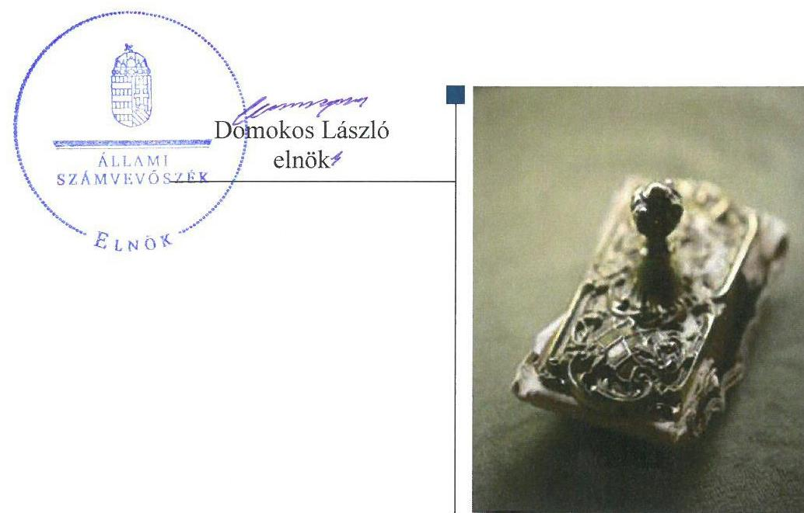
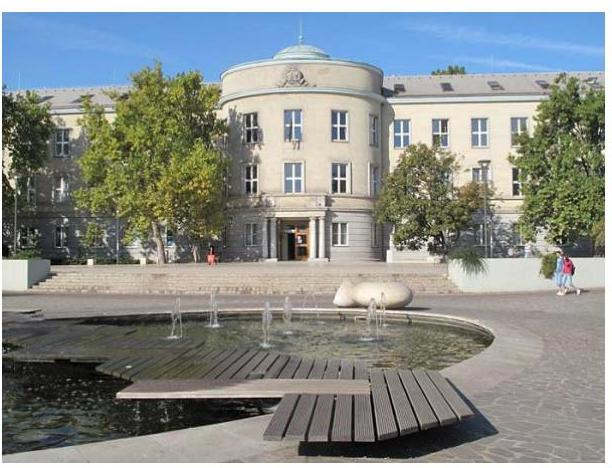
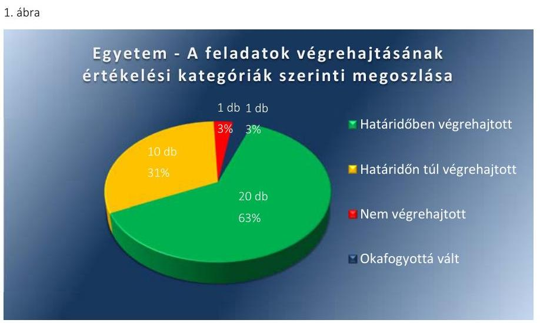
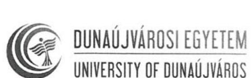
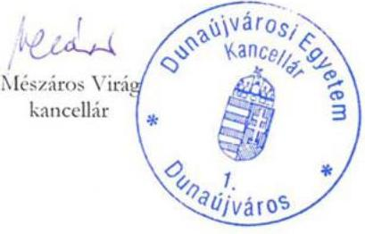
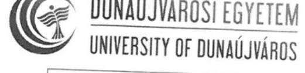
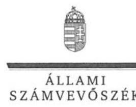
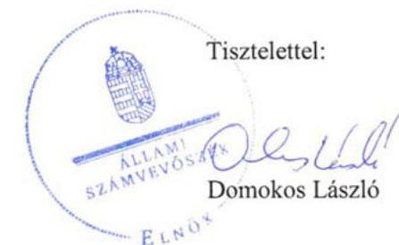
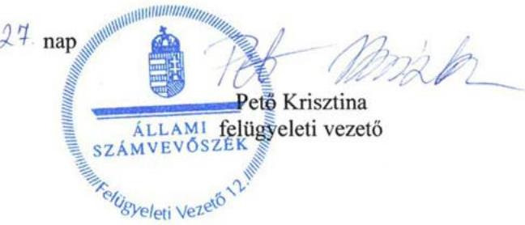

# Jelentés 

## Utóellenőrzések

Az állami felsőoktatási intézmények gazdálkodásának, működésének ellenőrzéséről készült jelentések utóellenőrzése - Dunaújvárosi Egyetem 2017.

---

# Jelentés 

## Utóellenőrzések

Az állami felsőoktatási intézmények gazdálkodásának, működésének ellenőrzéséről készült jelentések utóellenőrzése - Dunaújvárosi Egyetem 2017. 04. hó 25. nap

---

# AZ ELLENŐRZÉST FELÜGYELTE: 

PETŐ KRISZTINA felügyeleti vezető

## AZ ELLENŐRZÉST VEZETTE ÉS A VÉGREHAJTÁSÁÉRT FELELŐS:

HEIDINGER TIBOR ellenőrzésvezető

## A PROGRAM ÖSSZEÁLLÍTÁSÁÉRT FELELŐS:

JANIK JÓZSEF LÁSZLÓ osztályvezető

## A TÉMÁHOZ KAPCSOLÓDÓ KORÁBBI SZÁMVEVŐSZÉKI JELENTÉSEK:

- címe: Jelentés a Dunaújvárosi Főiskola ellenőrzéséről Az állami felsőoktatási intézmények gazdálkodásának, működésének ellenőrzése
- sorszáma: 15040

IKTATÓSZÁM: V-1340-068/2016.
TÉMASZÁM: 2374
ELLENŐRZÉS-AZONOSÍTÓ SZÁM: V075540

---

# TARTALOMJEGYZÉK 

■ ÖSSZEGZÉS ..... 5
■ AZ ELLENŐRZÉS CÉLJA ..... 6
■ AZ ELLENŐRZÉS TERÜLETE ..... 7
■ AZ ELLENŐRZÉS HÁTTERE, INDOKOLTSÁGA ..... 8
■ A JELENTÉS LÉNYEGES KÉRDÉSKÖRE ..... 9
■ ELLENŐRZÉS HATÓKÖRE ÉS MÓDSZEREI ..... 10
■ MEGÁLLAPÍTÁSOK ..... 13
■ MELLÉKLETEK ..... 21
I. sz. melléklet: Az ÁSZ 15040. számú jelentéséhez kapcsolódó Egyetem intézkedési terv végrehajtása ..... 21
II. sz. melléklet: Az ÁSZ 15040. számú jelentéséhez kapcsolódó EMMI intézkedési terv végrehajtása ..... 30
■ FÜGGELÉK: ÉSZREVÉTELEK ..... 33
■ RÖVIDÍTÉSEK JEGYZÉKE ..... 43

---

.

---

# ÖSSZEGZÉS 

Az utóellenőrzés megállapította, hogy a korábbi számvevőszéki jelentés javaslatai alapján a rektor és a kancellár által meghatározott intézkedési tervben szereplő harminckét feladat egy kivétellel végrehajtásra került, ezzel jelentősen javítva a Dunaújvárosi Egyetem müködésének szabályozottságát és támogatva a szabályszerű és átlátható közpénzfelhasználást. Az Emberi Erőforrások Minisztériuma - mint fenntartói jogkör gyakorlója - az intézkedési tervében foglalt feladatait végrehajtotta.

## Az ellenőrzés társadalmi indokoltsága

Az Állami Számvevőszék stratégiájában célul tűzte ki a számvevőszéki munka hasznosulásának javítását. Ezzel összhangban ellenőrzi, hogy az ellenőrzött szervezetek megvalósították-e a korábbi ellenőrzései által feltárt hibák, hiányosságok és szabálytalanságok megszüntetése céljából kialakított intézkedési terveikben foglaltakat. A rendszeres utóellenőrzések hozzájárulnak a szükséges intézkedések tényleges végrehajtásához, ezáltal a közpénzügyek rendezettségének javulásához.

## Főbb megállapítások, következtetések

A Dunaújvárosi Főiskola intézkedési tervében meghatározott harminckettő feladat közül húszat határidőben, tízet határidőn túl, egyet nem hajtottak végre. Egy intézkedési terv feladat okafogyottá vált.

A Dunaújvárosi Egyetem végrehajtotta a belső kontrollrendszer szabályszerű kialakítása és működtetése, valamint a szabályszerű pénzügyi és vagyongazdálkodás érdekében vállalt feladatokat. A gazdálkodás szempontjából meghatározó és egyéb belső szabályzatok elkészítéséről és aktualizálásáról gondoskodtak. A kockázatkezelési rendszer kialakításra került, ennek keretében a kockázatokat felmérték és elemezték. A kifizetésekhez kapcsolódó folyamatba épített kontrollokat - az ellenőrzött mintatételek alapján - működtették. A belső ellenőrzési vezetőt kinevezték, a szükséges intézkedési terveket elkészítették. Az intézkedési tervben foglaltak ellenére elmaradt a 2015. évi belső költségvetés külön mellékleteként a képzési, tudományos célú és fenntartási támogatás központosított és decentralizált részekre bontása.

Az Emberi Erőforrások Minisztériuma az intézkedési tervben meghatározott négy feladatát határidőben végrehajtotta.

---

# AZ ELLENŐRZÉS CÉLJA 

Az ellenőrzés célja annak értékelése volt, hogy a számvevőszéki jelentésben foglalt intézkedést igénylő megállapításokkal és javaslatokkal összhangban készített intézkedési tervben meghatározott feladatokat az ellenőrzött szervezet végrehajtotta-e.

---

# AZ ELLENŐRZÉS TERÜLETE 

## Dunaújvárosi Egyetem

A Dunaújvárosi Egyetem ${ }^{1}$ - 2016. január 1. előtt Dunaújvárosi Főiskola - jogelődjét 1969. évben alapították. Az Egyetem a gazdaságtudományok, bölcsészettudomány, informatika, műszaki tudományok, társadalomtudomány és pedagógusképzés területeken folytat képzést. Alapfeladata körében műszaki és társadalomtudományok képzési területeken kutatási tevékenységet végez.

A Dunaújvárosi Főiskola 2016. január 1-jétől Dunaújvárosi Egyetem, alkalmazott tudományok egyeteme, irányító szerve az EMMI². Az Egyetem hallgatóinak száma a 2016/2017 őszi szemeszterben: 1716 fő.

Az Egyetem rektora ${ }^{3}$ 2012. július 1-jén kapott megbízást a feladat ellátására. A kancellár ${ }^{4}$ 2014. november 15-étől látja el
feladatát.
Az Egyetem a 2015. évi költségvetési beszámolója alapján 2033,4 millió Ft költségvetési bevételt és 2445,5 millió Ft finanszírozási bevételt ért el, valamint 3794,1 millió Ft költségvetési kiadást valósított meg. Az Egyetem költségvetési mérlegének értéke 2015. december 31-én 5448,2 millió Ft, a követelések állománya 58,8 millió Ft, a kötelezettségek állománya 109,6 millió Ft volt.

Az ÁSZ ${ }^{5}$ 2015. évben ellenőrizte a Dunaújvárosi Főiskola gazdálkodásának, működésének szabályszerűségét 2009. január 1. - 2013. december 31. közötti időszakra vonatkozóan, az erről szóló 15040. számú jelentését 2015. március 12-én tette közzé. Az ellenőrzés célja annak megállapítása volt, hogy szabályos volt-e az állami felsőoktatási intézmény pénzügyi és vagyongazdálkodása, biztosított volt-e a vagyonnal való felelős gazdálkodás követelményének érvényesülése, jogszabályi előírásoknak megfelelően működött-e a belső kontrollrendszer, az irányító szerv tevékenysége a jogszabályi előírásoknak megfelelt-e.

Az utóellenőrzés az ÁSZ jelentésben a rektor és az emberi erőforrások minisztere részére megfogalmazott intézkedést igénylő megállapításokra és javaslatokra készített, az ÁSZ részére megküldött intézkedési terveikben foglalt feladatok megvalósításának ellenőrzésére, illetve értékelésére fókuszált.

---

# AZ ELLENŐRZÉS HÁTTERE, INDOKOLTSÁGA 

Az ÁSZ tv. ${ }^{6}$ 33. § (1) bekezdése értelmében a számvevőszéki jelentések intézkedést igénylő megállapításaihoz és javaslataihoz kapcsolódóan az ellenőrzött szervezet vezetője intézkedési tervet köteles összeállítani, és az ÁSZ részére megküldeni. Az intézkedési tervben foglaltak megvalósítását az ÁSZ tv. 33. § (7) bekezdésében foglaltak alapján - az ÁSZ utóellenőrzés keretében ellenőrizheti. Az intézkedések megvalósulásának értékelése során az ÁSZ figyelembe vette az ellenőrzött szervezet működési feltételeiben, valamint a jogszabályi előírásokban bekövetkezett változásokat. Az intézkedési tervekben foglalt feladatok hiányos, illetve késedelmes végrehajtása, valamint megvalósításának elmaradása azt mutatja, hogy az ellenőrzések során feltárt hibák, hiányosságok és szabálytalanságok megszüntetése nem kapott kellő hangsúlyt. Ez a szabályszerű működés és a felelős vezetői magatartás vonatkozásában kockázatot hordoz. E kockázatok feltárásával az ÁSZ utóellenőrzési rendszere fokozza a fegyelmet, és igazolja, hogy a közpénzzel való szabályos gazdálkodás felelőssége elől nem lehet kitérni.

Az utóellenőrzés négy szinten hasznosulhat:

- A társadalom szintjén az utóellenőrzés jelzi, hogy a számvevőszéki ellenőrzés megállapításainak van következménye: a hiányosságok megszüntetésére az ellenőrzött szervezet által meghatározott intézkedések végrehajtását is számon kéri az ÁSZ.
- Az ellenőrzött terület szintjén az utóellenőrzés tájékoztatást nyújt a terület döntéshozóinak a hiányosságok kiküszöbölésének jó gyakorlatairól, ezzel lehetőséget biztosítva arra, hogy az ÁSZ ellenőrzési megállapításai, javaslatai a terület nem ellenőrzött szervezeteinek a működése során is hasznosuljanak.
- Az ellenőrzött szervezet szintjén az utóellenőrzés feltárja, hogy a szervezet az intézkedések végrehajtásával hasznosította-e a korábbi ellenőrzési jelentésben a hiányosságok megszüntetése, illetve a kockázatok kezelése érdekében megfogalmazott javaslatokat.
- Az ÁSZ szintjén az utóellenőrzés visszacsatolást ad az ellenőrzési jelentések hasznosulásáról, az intézkedések elmaradása vagy részleges megvalósulása a további ellenőrzésekhez kockázati jelzésként szolgál.

---

# A JELENTÉS LÉNYEGES KÉRDÉSKÖRE 

Az Egyetem és az EMMI az intézkedési terveikben foglaltakat az elöirt határidőben végrehajtották-e?

---

# ELLENŐRZÉS HATÓKÖRE ÉS MÓDSZEREI 

## Az ellenőrzés típusa

Megfelelőségi ellenőrzés.

## Az ellenőrzött időszak

Az utóellenőrzés alapját képező ÁSZ jelentés közzétételének napjától (2015. március 12.) az ellenőrzésről szóló kiértesítő levél keltének napjáig (2017. február 10.) tartó időszak.

## Az ellenőrzés tárgya

Az ÁSZ tv. 2011. július 1-jei hatálybalépését követően a számvevőszéki jelentésben foglalt intézkedést igénylő megállapításokkal és javaslatokkal összhangban - a Dunaújvárosi Főiskola és az Emberi Erőforrások Minisztériuma által - készített intézkedési tervben foglaltak végrehajtásának ellenőrzése volt.

Az ellenőrzés kiterjedt minden olyan körülményre és adatra, amely az ÁSZ jogszabályban meghatározott feladatainak teljesítéséhez, valamint a program végrehajtása folyamán felmerült újabb összefüggések feltárásához szükséges volt.

## Az ellenőrzött szervezet

A Dunaújvárosi Egyetem és az Emberi Erőforrások Minisztériuma

## Az ellenőrzés jogalapja

Az ÁSZ az Országgyűlés pénzügyi és gazdasági ellenőrző szerve. Az ÁSZ törvényben meghatározott feladatkörében ellenőrzi a központi költségvetés végrehajtását, az államháztartás gazdálkodását, az államháztartásból származó források felhasználását és a nemzeti vagyon kezelését.

Az ÁSZ tv. 1. § (3) bekezdése szerint az ÁSZ általános hatáskörrel végzi a közpénzekkel és az állami és önkormányzati vagyonnal való felelős gazdálkodás ellenőrzését.

Az ÁSZ tv. 33. § (7) bekezdése alapján a 33. § (1)-(2) bekezdése szerinti intézkedési tervben foglaltak megvalósítását az ÁSZ utóellenőrzés keretében ellenőrizheti.

---

# Az ellenőrzés módszerei 

Az ÁSZ az ellenőrzést a nemzetközi standardokat irányadónak tekintve az ellenőrzési program ellenőrzési kérdései, az ellenőrzött időszakban hatályos jogszabályok, az ellenőrzés szakmai szabályok és módszertanok figyelembevételével, önálló ellenőrzés keretében végezte.

Az ÁSZ az ellenőrzés ideje alatt az ellenőrzött szervezettel történő kapcsolattartást az ÁSZ SZMSZ ${ }^{7}$-ének vonatkozó előírásai alapján biztosította.

Az utóellenőrzés megállapításait elsősorban az ÁSZ rendelkezésére álló, valamint az ellenőrzött szervezetektől elektronikusan bekért dokumentumok alapozták meg.

Az ellenőrzési bizonyítékként felhasználható adatforrások közé tartoztak egyrészt a szakmai programban felsorolt adatforrások, másrészt minden - az ellenőrzés folyamán feltárt, az ellenőrzés szempontjából információt tartalmazó - dokumentum. Az utóellenőrzés során az ÁSZ mintavételes ellenőrzési eljárást alkalmazott a működési megfelelőség ellenőrzésére. Az előirányzat maradványok, a személyi juttatások, a külső megbízási szerződések gazdálkodási folyamatainak szabályszerűségét 10-10 db véletlen mintavétellel kiválasztott tétel alapján értékelte az ÁSZ. A kiválasztott tételek esetében azt ellenőrizte az ÁSZ, hogy az Egyetem az intézkedési tervben meghatározott feladatok végrehajtása során biztosította-e a jogszabályok és a belső szabályzatok előírásainak megfelelő működést.

Az intézkedési tervben előírt feladatokat azok végrehajtása szempontjából az alábbiak szerint értékelte az ÁSZ:
"határidőben végrehajtott" a feladat, ha a teljesítés dokumentáltan, az intézkedési tervben előírt határidőben és tartalommal megtörtént;
"határidőn túl végrehajtott" a feladat, ha annak teljesítése az intézkedési tervben meghatározott módon, de az előírt határidőn túl történt meg;
"részben végrehajtott" a feladat, ha végrehajtása teljes körűen az intézkedési tervben előírt módon nem történt meg;
"nem végrehajtott" a feladat, ha a végrehajtás nem történt meg, vagy amennyiben a teljesítést nem dokumentálták;
"okafogyottá vált" a feladat, ha végrehajtására - meghatározott esemény bekövetkezése, továbbá külső körülmény, a működést érintő feltétel változása miatt - már nincs szükség, illetve lehetőség, és egyértelműen megállapítható, hogy az intézkedést szükségessé tevő körülmény a jövőben nem fordulhat elő;
"nem időszerű" az a feladat, amelynek ellenőrzési időszakon belüli végrehajtására azért nem került (kerülhetett) sor, mert az intézkedés alapjául szolgáló esemény nem következett be, de annak jövőbeni előfordulása lehetséges, a végrehajtása nem volt esedékes, vagy a végrehajtás határideje még nem járt le.
Az ellenőrzés lefolytatásához az ellenőrzött szervezet a tanúsítványok elektronikus kitöltésével, valamint az ÁSZ által kért dokumentumok elektronikus megküldésével szolgáltatott adatokat, amelyek valódiságát és tel-

---

jes körűségét az ellenőrzött szervezet vezetője által tett teljességi és hitelességi nyilatkozat igazolta. Az így rendelkezésre bocsátott adatok, információk kontrollja az ellenőrzés keretében megtörtént.

---

# MEGÁLLAPÍTÁSOK 

## Az Egyetem és az EMMI az intézkedési terveikben foglaltakat az előírt határidőben végrehajtották-e?

Összegző megállapítás

Az Egyetem az intézkedési tervében meghatározott harminckettő feladatból húszat határidőben, tízet határidőn túl, egyet nem hajtott végre. Egy feladat végrehajtása okafogyottá vált. Az EMMI az intézkedési tervében meghatározott négy feladatát határidőben végrehajtotta. Az Egyetem és az EMMI az intézkedési tervében meghatározott feladatok végrehajtásáról a jogszabályban előírt tartalommal vezette a nyilvántartást.

A 15040. sorszámú ÁSZ jelentés az Egyetem rektora részére hét, az emberi erőforrások minisztere részére három javaslatot fogalmazott meg. Az Egyetem és az EMMI elkészítette és az Állami Számvevőszék részére megküldte az intézkedési tervét. Az Egyetem rektora, kancellárja és szakterületi vezetői részére 32 intézkedési terv feladat, az emberi erőforrások minisztere részére 4 intézkedési terv feladat került meghatározásra.

Az Egyetem intézkedési tervében meghatározott feladatokat, határidőket, a feladatok végrehajtásáért felelős személyt és a feladatok végrehajtását az I. számú melléklet, az EMMI intézkedési tervében meghatározott feladatok végrehajtását a II. számú melléklet mutatja be.

## DUNAÚJVÁROSI EGYETEM:

Az Egyetem az intézkedési tervében meghatározott harminckettő feladatból húszat határidőben, tízet határidőn túl, egyet nem hajtott végre. Egy feladat végrehajtása okafogyottá vált.

A kancellár gondoskodott az ÁSZ megállapításaira és javaslataira készített intézkedési terv végrehajtásáról a Bkr. ${ }^{8}$ 14. § (1) bekezdésében előírt nyilvántartás vezetéséről a Bkr. 47. § (2) bekezdése szerinti tartalommal.

Az Egyetem intézkedési tervében meghatározott feladatok végrehajtásának értékelési kategóriák szerinti megoszlását az 1. ábra szemlélteti.

---

Fonrás: ÁsZ
A feladatok végrehajtását az intézkedési terv jelölés rendszere szerint értékeljük: I., II. és III. csoportba tartozó feladatok, a feladatok sorszáma (a csoporton belül), a csoportba tartozó feladatok száma.

# HATÁRIDŐBEN VÉGREHAJTOTT feladatok: 

1. (I.-1/4.) A kancellár határidőben gondoskodott szabályzatok hatályon kívül helyezéséről és új, vagy módosított szabályzatok Szenátus ${ }^{9}$ elé terjesztéséről. Szenátusi határozatokkal igazolták a nem érvényes szabályzatok hatályon kívül helyezését és új, vagy módosított szabályzatok Szenátus elé terjesztését, elfogadását.
2. (II.-1/25.) A rektor és a kancellár határidőben gondoskodott a Szenátus gazdálkodással kapcsolatos joggyakorlásának fejlesztéséről. A Szenátus értékelte a rektor tevékenységét, jóváhagyta a vagyongazdálkodási tervet ${ }^{10}$. A Szenátus fejlesztések indításáról - pl. az elektromos töltőállomás költségeinek elfogadásáról - döntött.
3. (II.-2/25.) A gazdasági osztályvezető és a gazdasági és üzemeltetési igazgató gondoskodott a Szenátus joggyakorlásának fejlesztéséről, döntési anyagok elkészítéséről. A támogatások korábban a vagyongazdálkodási terv részeként, valamint a 2015. évi belső költségvetés módosításával, Szenátusi határozattal elfogadásra kerültek.
4. (II.-3/25.) A kancellár és a rektor határidőben gondoskodott a belső ellenőrzési vezető megállapításai, javaslatai alapján intézkedési tervek készítéséről. Az intézkedési tervek végrehajtásáról beszámolók készültek.
5. (II.-4/25.) A gazdasági osztályvezető és a gazdasági és üzemeltetési igazgató folyamatosan gondoskodott arról, hogy az előirányzatmódosítások szabályszerűen kerüljenek végrehajtásra. Az elő-irányzat-módosítások nem tartalmaztak zárolást.
6. (II.-5/25.) Az Egyetem szakterületi vezetői kiemelt figyelmet fordítottak az előirányzat-maradványok szabályszerű felhasználására. A mintatételek ellenőrzése alapján megállapítható, hogy a gazdálkodási jogkörök gyakorlása megfelelt a jogszabályi előírásoknak és a

---

belső szabályozásnak. A kötelezettség vállalások a tárgyévre vonatkoztak, a kifizetések a tárgyévben megtörténtek.
7. (II.-6/25.) Az Egyetem szakterületi vezetői gondoskodtak arról, hogy a személyi juttatások területén a gazdálkodási jogkörök gyakorlása megfeleljen a jogszabályi előírásoknak és a belső szabályozásnak. A mintatételek ellenőrzése alapján megállapítható, hogy a gazdálkodási jogkörök gyakorlása megfelelt a jogszabályi és belső szabályozási előírásoknak.
8. (II.-7/25.) A gazdasági és üzemeltetési igazgató gondoskodott a teljesítésigazolás, érvényesítés és utalványozás rendjének, jogszabályi előírásoknak és belső szabályzatoknak megfelelő alkalmazásáról. A mintatételek ellenőrzése alapján megállapítható, hogy a gazdálkodási jogkörök gyakorlása megfelelt a jogszabályi és a belső szabályozási előírásoknak.
9. (II.-8/25.) A gazdasági osztályvezető és a gazdasági és üzemeltetési igazgató folyamatosan gondoskodott az ellátottak juttatásainak határidőben történő átutalásáról. Az Egyetem az intézkedési tervpontban vállalt feladatot határidőben, folyamatosan elvégezte.
10. (II.-11/25.) A gazdasági osztályvezető és a gazdasági és üzemeltetési igazgató határidőben intézkedett a feladat végrehajtásáról. Az Egyetem a hazai forrásból finanszírozott projektek esetében a szerződés szerinti időszaki elszámolások határidejét betartotta. Az Egyetem pályázati támogatásban két szerződés alapján részesült 2015-2016. években, mindkét esetben betartotta a beszámoló leadásának határidejét a támogatási szerződés rögzítetteknek megfelelően.
11. (II.-13/25.) A gazdasági osztályvezető és a gazdasági és üzemeltetési igazgató folyamatosan gondoskodott a mérlegvalódiság elvének biztosításáról. Az egyeztetéses leltározási jegyzőkönyv az analitikus nyilvántartások egyeztetéséről a főkönyvi könyvelés kartonjaival - az egyes mérlegtételeknek megfelelő összesítésben - bemutatja a mérlegtételekkel való egyezőséget.
12. (II.-14/25.) A gazdasági osztályvezető és a gazdasági és üzemeltetési igazgató határidőben gondoskodott a passzív pénzügyi elszámolások között nyilvántartott, devizában befizetett kaució és regisztrációs díj év végi értékelési feladatainak elvégzéséről a 2015. évi költségvetési beszámoló elkészítése során. A devizás tételek értékelése az MNB ${ }^{11}$ december 31-i EUR árfolyamon történt.
13. (II.-15/25.) A gazdasági osztályvezető és a gazdasági és üzemeltetési igazgató gondoskodott az ügyrend kialakításáról. A Számv. tv ${ }^{12}$-ben előírt számviteli bizonylat megőrzési kötelezettségnek való megfelelés érdekében fokozott figyelemmel kell biztosítani a könyvviteli elszámolást közvetetten és közvetlenül alátámasztó számviteli bizonylatok megőrzését. A Bizonylati Szabályzat ${ }^{13}$ 2016. május 25-től hatályos 2. kiadása a 7. §-ban tartalmazta a bizonylatok átvételének, tárolásának, megőrzésének előírásait. A mintatételek ellenőrzése alapján megállapítható, hogy a számviteli bizonylatok megőrzésére kiemelt figyelmet fordítottak.

---

14. (II.-17/25.) A gazdasági és üzemeltetési igazgató gondoskodott támogatási szerződés megkötéséről. Az államháztartáson kívülről átvett pénzeszközökről Felsőoktatási Támogatási Megállapodás jött létre az EMMI - mint fenntartó -, és egy gazdálkodó szervezet mint adózó - között, a Dunaújvárosi Egyetem részére visszafizetési kötelezettség nélkül nyújtandó támogatásra.
15. (II.-23/25.) A kancellár határidőben gondoskodott az intézményi vagyon bérbeadásánál az átláthatóság érvényesítéséről. A kancellár az intézkedési tervben meghatározott határidőben, 2015. július 31-én kiadta a kancellári utasítást: átláthatósági nyilatkozat kitöltésére vonatkozó előírás vagyon bérbeadása kapcsán.
16. (II.-24/25.) A belső ellenőrzési vezető határidőben gondoskodott az összeférhetetlenségre vonatkozó szabályozók felülvizsgálatáról. A Szenátus határozatával elfogadta a Foglalkoztatási követelményrendszert ${ }^{14}$, amely 2015. március 18-án lépett hatályba. A Foglalkoztatási követelményrendszer XI. fejezetében rögzítették az öszszeférhetetlenségre vonatkozó szabályokat, 1-4. számú mellékletei tartalmazták az összeférhetetlenségi nyilatkozatokat.
17. (II.-25/25.) Az ÁSZ jelentésére készített intézkedési tervben foglaltaknak megfelelően belső ellenőrzést rendeltek el. A munkajogi felelősséggel kapcsolatos körülményeket és összeférhetetlenséget kivizsgálták, de további intézkedés megtételét nem tartották indokoltnak.
18. (III.-1/3.) Az Etikai szabályzatot a Szenátus határozatával elfogadta.
19. (III.-2/3.) Az Egyetem elkészítette a belső szabályozást a kötelezően közzéteendő adatok nyilvánosságra hozatalának rendjéről. A Szenátus az adatvédelmi és adatkezelési szabályzatot az 53 - 014/2015. (2015.03.17.) számú határozatával elfogadta.
20. (III.-3/3.) Az Egyetem elkészítette a belső szabályozását az összeférhetetlenség megszüntetésére és megelőzésére. A Szenátus a Foglalkoztatási követelményrendszert határozatával elfogadta.

# HATÁRIDŐN TÚL VÉGREHAJTOTT feladatok: 

21. (I.-2/4.) A kancellár a 2015. április 30-i határidőn túl gondoskodott az új gazdálkodási rendszer kiépítéséről. A Gazdálkodási és Üzemeltetési Igazgatóság Ügyrendjét 2015. május 27-én illetve 2016. október 21-én módosították, a Kötelezettségvállalási és utalványozási szabályzatot ${ }^{15}$ 2015. április 22-én, 2015. május 27-én, illetve 2016. május 25-én aktualizálták. A vagyongazdálkodási terv 2016. február 15-én készült el.
22. (I.-3/4.) A kancellár a 2015. június 30-i határidőn túl intézkedett a FEUVE ${ }^{16}$ szabályzat aktualizálásáról és a kockázatkezelési rendszer kialakításáról. A Szenátus a FEUVE rendszert és kockázatkezelési szabályzatot ${ }^{17}$ határozatával elfogadta.
23. (I.-4/4.) A kancellár határidőn túl gondoskodott a feladat végrehajtásáról, mert a belső ellenőrzési vezető közalkalmazotti kinevezése - a 2015. május 31-i határidő után - 2015. július 29-én valósult meg. A szükséges intézkedési tervek és beszámolók elkészültek.

---

24. (II.-10/25.) A gazdasági és üzemeltetési igazgató a 2015. szeptember 30-i határidőn túl gondoskodott az önköltségszámítási rendszer aktualizálásáról. Az Egyetem módosított, 2015. november 18tól hatályos önköltségszámítási szabályzata már tartalmazta a javaslatban is megfogalmazott tevékenységek önköltségének részletes számítási módját.
25. (II.-12/25.) A gazdasági osztályvezető határidőn túl gondoskodott a támogatásként átvett pénzeszközök elszámolásáról. Az Egyetem a vállalt - 2015. április 15. - határidőn túl, 2015. június 3-án készítette el az elszámolást az átvett múködési célú pénzeszközökről. Az elszámolásban évenként kimutatták az átvett pénzeszközöket, mellékleteként csatolták az átadást alátámasztó dokumentumokat, valamint a pénzeszközök felhasználásának dokumentumait.
26. (II.-16/25.) A kancellár a 2015. május 31-i határidőn túl gondoskodott a kockázati alap létrehozásáról. Az Egyetem a jogszabályi előírások ellenére kötelező tartalék-, illetve kockázati alapot nem hozott létre. Az Egyetem két társaságban rendelkezett 100 \%-os tulajdonrésszel. Az Egyetem a tartalékképzést a társaságok - esetleges veszteségei miatt adódó - kockázatának csökkentésére 2015. augusztus 25-én keretátadással elvégezte 6,0 millió Ft értékben.
27. (II.-18/25.) A gazdasági osztályvezető és a gazdasági és üzemeltetési igazgató a 2015. május 31-i határidőn túl intézkedett a kötelezettségvállalási leltár elkészítéséről. Az ÁSZ jelentés megállapítása alapján az Egyetem elkészítette 2014. évre vonatkozóan a kötelezettségvállalási leltárt, melyen a készítés időpontjaként 2015. szeptember 3-a szerepel. A 2014. évi kötelezettségvállalási leltár kiemelt kiadási jogcímek szerinti bontásban tételesen tartalmazta a kötelezettségvállalás tárgyát és értékadatait.
28. (II.-19/25.) A kancellár határidőn túl gondoskodott a feladat végrehajtásáról. A beszerzési fegyelem javítását célozta az Egyetem új Kötelezettségvállalási és utalványozási szabályzatának elkészítése, amelyet a Szenátus határozatával az intézkedési tervben foglalt határidőn (2015.május 31.) belül fogadott el. A kísértékű beszerzéseket szabályozó új Beszerzési szabályzatot a Szenátus az intézkedési tervben rögzített határidőn túl, 2015. szeptember 1-jén fogadta el.
29. (II.-20/25.) A gazdasági és üzemeltetési igazgató a 2015. augusztus 31-i határidőn túl gondoskodott az önköltségszámítási szabályzat kiadásáról. A feladat az Egyetem új, 2015. november 18-tól hatályos önköltségszámítási szabályzatának kiadásával került végrehajtásra. Az önköltségszámítási szabályzatot ${ }^{18}$ a Szenátus határozatával elfogadta.
30. (II.-21/25.) A gazdasági és üzemeltetési igazgató határidőn túl gondoskodott az önköltségszámítási szabályzat kiadásáról. A feladat az Egyetem új, 2015. november 18-tól hatályos önköltségszámítási szabályzatának kiadásával került végrehajtásra, melyet a Szenátus határozatával elfogadott. Az önköltségszámítási szabályzat 3. számú melléklete tartalmazta a tárgyi eszközök és azokon belül

---

a termek bérbeadásához kapcsolódóan az önköltség megállapítására vonatkozó előírásokat. A helyiségek önköltségszámításának kalkulációs sémáját az önköltségszámítási szabályzat 3/a. számú melléklete tartalmazza.

# NEM VÉGREHAJTOTT feladat: 

31. (II.-22/25.) A gazdasági osztályvezető nem hajtotta végre a feladatot. A Szenátus a 109-2014/2015. (2015.05.26.) számú határozatával elfogadta az Egyetem 2015. évi belső költségvetését és annak mellékleteit. A belső költségvetés 2-6. számú mellékleteiben témaszámonként - a témaszám felelős és a kötelezettségvállaló megnevezésével - részletezték a költségvetési keretösszegeket és azok forrásait támogatás és saját forrás megbontásban. Az intézkedési tervben foglaltak ellenére nem készítették el a 2015. évi belső költségvetés külön mellékleteként a képzési, tudományos célú és fenntartási támogatás központosított és decentralizált részekre bontását és azok összegeit.

## OKAFOGYOTTÁ VÁLT feladat:

32. (II.-9/25.) A múködési bevételek szakmai teljesítés igazolását az Egyetem a belső szabályzatában szervezetére vonatkozóan előírta. A jogszabály - Ávr. ${ }^{19} 57$. § (2) bekezdése - kötelező teljesítésigazolást nem ír elő ilyen esetben, hanem ezt lehetőségként ajánlja a szervezeteknek. Az Egyetem időközben módosította a kötelezettségvállalási szabályzatát, amely már nem írja elő a bevételek esetében a szakmai teljesítésigazolást.

## EMBERI ERŐFORRÁSOK MINISZTÉRIUMA:

Az EMMI az intézkedési tervében meghatározott négy feladatot határidőben végrehajtotta. Az EMMI a Dunaújvárosi Főiskolánál 2015. május 5. - 2015. május 19. között soron kívüli szabályszerűségi ellenőrzést folytatott le. Az ellenőrzés megállapításairól 2015. június 4-én ellenőrzési jelentés készült. Az EMMI a felvetett munkajogi felelősségeket kivizsgálta, valamint gondoskodott az intézményracionalizálási terv végrehajtásának folyamatos ellenőrzéséről.

Az emberi erőforrások minisztere gondoskodott az ÁSZ megállapításaira és javaslataira készített intézkedési terv végrehajtásáról a Bkr. 14. § (1) bekezdésében előírt nyilvántartás vezetéséről a Bkr. 47. § (2) bekezdése szerinti tartalommal.

## HATÁRIDŐBEN VÉGREHAJTOTT feladatok:

1. (1/4.) Az emberi erőforrások minisztere határidőben gondoskodott a munkajogi felelősség kivizsgálásáról az ÁSZ jelentésben feltárt belső kontrollrendszer kialakításával és múködtetésével, a pénzügyi és vagyongazdálkodással összefüggésben feltárt szabálytalanságok illetve az intézkedési tervkészítési kötelezettség elmulasztása tekintetében. Az EMMI Belső Ellenőrzési Főosztálya az Egyetemnél 2015. május 5. - 2015. május 19. között soron kívüli szabályszerűségi ellenőrzést folytatott le. Az ellenőrzés megállapításai alapján fenntartói intézkedést nem kezdeményeztek.

---

2. (2/4.) Az emberi erőforrások minisztere határidőben intézkedett az összeférhetetlenséggel kapcsolatos szabálytalanságok tekintetében a munkajogi felelősség kivizsgálása érdekében. Az EMMI Belső Ellenőrzési Főosztálya az Egyetemnél 2015. május 5. 2015. május 19. között soron kívüli szabályszerűségi ellenőrzést folytatott le, amely alapján fenntartói intézkedést nem kezdeményeztek.
3. (3/4.) Az emberi erőforrások minisztere határidőben gondoskodott a kancellár által kidolgozott intézményracionalizálási terv végrehajtásának folyamatos ellenőrzéséről. A terv végrehajtásának folyamatos ellenőrzését a felsőoktatásért felelős államtitkár végezte, aki havonta kancellári beszámoló keretében írásban számoltatta be a kancellárt az általa megtett kancellári intézkedésekről.
4. (4/4.) Az emberi erőforrások minisztere határidőben intézkedett a kincstári körön kívüli számlavezetés miatt megállapított szabálytalan pénzkezeléshez kapcsolódó munkajogi felelősség kivizsgálásáról. Az EMMI Belső Ellenőrzési Főosztálya az Egyetemnél 2015. május 5. - 2015. május 19. között soron kívüli szabályszerűségi ellenőrzést folytatott le, amely alapján fenntartói intézkedést nem kezdeményeztek.

---

.

---

# MELLÉKLETEK

I. SZ. MELLÉKLET: AZ ÁSZ 15040. SZÁMÚ JELENTÉSÉHEZ KAPCSOLÓDÓ EGYETEM INTÉZKEDÉSI TERV VÉGREHAJTÁSA

|  Az intézkedési tervben meghatározott feladat | Az intézkedési tervben meghatározott határidő | Az intézkedési tervben meghatározott feladat végrehajtásának felelőse | Az intézkedési tervben meghatározott feladat végrehajtása  |
| --- | --- | --- | --- |
|  1. | 2. | 3. | 4.  |
|  Határidőben végrehajtott feladatok |  |  |   |
|  1. (I.-1/4.) Kontrollkörnyezet: Szükséges a szabályzatok teljes körű felülvizsgálata, a már nem érvényes szabályzatok hatályon kívül helyezése, illetve a szükséges (jogszabályi változás, vagy a duális vezetés és egyéb SZMSZ változások következtében) új, vagy módosított szabályzatok Szenátus elé terjesztése (kiemelt figyelemmel a gazdálkodás szempontjából meghatározó szabályzatokra). | 2015.06.30. (nem érvényes szabályzatok esetében), új szabályzatok esetében prioritások mentén kezelten folyamatos | kancellár, jogi iroda (nem érvényes szabályzatok), kancellár, rektor, jogi iroda (új szabályzatok) | A kancellár határidőben gondoskodott szabályzatok hatályon kívül helyezéséről és az új, vagy módosított szabályzatok Szenátus elé terjesztéséről. A nem érvényes szabályzatokat 2015. május 26-án hatályon kívül helyezték: Szenátus 114/115/116/117/118/119-2014/2015. (05.26.) számú határozatok. Az új szabályzatok Szenátus elé terjesztése megvalósult: Etikai szabályzat (2015.03.17.), Kegyeleti szabályzat (2015.04.21.), Gazdasági és Üzemeltetési Igazgatóság Ügyrendje (2015.04.21.), Gólyatábor szabályzat (2015.07.21.), Tartozások kezelése szabályzat (2015.11.17.) A módosított, aktualizált szabályzatok Szenátus elé terjesztése végrehajtásra került: FEUVE szabályzat ellenőrzési nyomvonal (2015.07.21.), Számviteli politika (2016.09.27.), Számlarend (2016.09.27.).  |
|  2. (II.-1/25.) A Szenátus gazdálkodással kapcsolatos joggyakorlásának fejlesztése, miszerint értékelje a rektor tevékenységét, a fejlesztések indításáról a fenntartó egyetértésével döntsön, vagyongazdálkodási tervet készítsen. | folyamatos | rektor, kancellár | A rektor és a kancellár határidőben intézkedett a Szenátus gazdálkodással kapcsolatos joggyakorlásának érvényesítéséről. A Szenátus a rektor időszaki beszámolóját rendszeresen értékelte és elfogadta. A Szenátusi határozatok száma: 62-2014/2015. (2015.03.17.), 1042014/2015. (2015.05.05.), 149-2014/2015. (2015.07.21.), 44-2015/2016. (2015.11.17.). A Szenátus elfogadta a 2014. évi vagyongazdálkodási terv értékelését: 69-2014/2015. (2015.04.21.), a 2015. évi vagyongazdálkodási tervet és annak értékelését - 71-2014/2015. (2015.04.21.), 92-2015/2016. (2016.03.16.) - valamint a 2016. évi vagyongazdálkodási tervet: 93-2015/2016. (2016.03.16.). A kancellár fejlesztési beruházással kapcsolatos előterjesztést tett a Szenátus részére pl. elektromos töltőállomás költségeinek elfogadására.  |
|  3. (II.-2/25.) A Szenátus joggyakorlásának fejlesztése a támogatások vonatkozásában, kerüljenek erre vonatkozóan megfelelő döntési anyagok a Szenátus elé. | folyamatos | gazdasági osztályvezető, gazdasági és üzemeltetési igaz-gató | A gazdasági osztályvezető és a gazdasági és üzemeltetési igazgató gondoskodott a Szenátus joggyakorlásának fejlesztéséről, döntési anyagok elkészítéséről. A vagyongazdálkodási terv részeként a támogatások korábban, valamint a 2015. évi belső költségvetés módosításával 146-2014/2015. (2015.07.21.) számú Szenátusi határozattal elfogadásra kerültek.  |

---

|  Az intézkedési tervben meghatározott feladat | Az intézkedési tervben meghatározott határidő | Az intézkedési tervben meghatározott feladat végrehajtásának felelőse | Az intézkedési tervben meghatározott feladat végrehajtása  |
| --- | --- | --- | --- |
|  4. (II.-3/25.) A belső ellenőrzési vezető megállapításai, javaslatai alapján intézkedési terv készítése. | folyamatos | kancellár, rektor | A kancellár és a rektor gondoskodott a belső ellenőrzési vezető megállapításai, javaslatai alapján intézkedési tervek készítéséről. Az intézkedési tervek végrehajtásáról beszámolók készültek.  |
|  5. (II.-4/25.) Szabályszerű előirányzat-módosításokra fordított fokozott figyelem (zárolások nem rögzíthetők előirányzat-csökkentésként). | folyamatos | gazdasági osztályvezető, gazdasági és üzemeltetési igazgató | A gazdasági osztályvezető és a gazdasági és üzemeltetési igazgató határidőben gondoskodott arról, hogy az előirányzat-módosítások szabályszerűen kerüljenek végrehajtásra. Az előirányzat-módosításokat tételesen bemutató dokumentum tartalmazta a jogcímeket, a tételek öszszegét, dátumát, leírását, értéknapját valamint azt, hogy kinek a hatáskörében történt az átcsoportosítás. Az előirányzatok nem tartalmaztak zárolást.  |
|  6. (II.-5/25.) Előirányzat-maradványok szabályszerű felhasználására kiemelt figyelem fordítása; kötelezettségvállalás nem lehet tárgyévet követő évi. | folyamatos | gazdasági osztályvezető, gazdasági és üzemeltetési igazgató | Az Egyetem szakterületi vezetői kiemelt figyelmet fordítottak az előirányzat-maradványok szabályszerű felhasználására. Az intézkedési terv feladat végrehajtását mintavételes ellenőrzési eljárással ellenőriztük. Az Egyetem a bekért minta tételek bizonylatait az ÁSZ elektronikus rendszerébe feltöltötte. A bizonylatok alapján a gazdálkodási jogkörök gyakorlása megfelelő a jogszabályban és a belső szabályozásban előírtaknak. A kötelezettség vállalások a tárgyévre vonatkoztak, a kifizetések a tárgyévben megtörténtek.  |
|  7. (II.-6/25.) Személyi juttatások, kötelezettségvállalás ellenjegyzése meg kell, hogy történjen. A hallgatói munkaszerződéseket át kell sorolni a külső személyi juttatásokhoz. A külső megbízási szerződések ellenjegyzése, teljesítése és számfejtése jogszabályi és belső szabályok szerint kiemelt figyelem mellett kell történnie (ellenjegyzés, teljesítésigazolás kötelező). | 2015.04.30. (hallgatói munkaszerződések), egyébként: folyamatos | HRSZK vezető, gazdasági és üzemeltetési igazgató | Az Egyetem szakterületi vezetői gondoskodtak arról, hogy a gazdálkodási jogkörök gyakorlása megfelelően a jogszabályi előírásoknak és a belső szabályozásnak. Az intézkedési terv feladat végrehajtását mintavételes ellenőrzési eljárással ellenőriztük. Az Egyetem a bekért minta tételek bizonylatait – 10-10 db közalkalmazotti és megbízási szerződés kifizetés - az ÁSZ elektronikus rendszerébe feltöltötte. A minta tételek ellenőrzése alapján megállapítható, hogy a gazdálkodási jogkörök gyakorlása megfelelő a jogszabályi és a belső szabályozási előírásoknak. A pénzügyi ellenjegyzés minden ellenőrzött esetben megtörtént. A külső megbízási szerződések ellenjegyzése, teljesítése és számfejtése szabályszerűen, kiemelt figyelem mellett történt.  |
|  8. (II.-7/25.) Teljesítésigazolás, érvényesítés és utalványozás rendjének, jogszabályi előírásoknak és belső szabályoknak megfelelő alkalmazása (Kötelezettségvállalási és utalványozási szabályzat). | folyamatos | gazdasági és üzemeltetési igazgató | A gazdasági és üzemeltetési igazgató gondoskodott a teljesítésigazolás, érvényesítés és utalványozás rendjének, jogszabályi előírásoknak és belső szabályzatoknak megfelelő alkalmazásáról. Az intézkedési terv feladat végrehajtását mintavételes ellenőrzési eljárással ellenőrizhet.  |

---

|  9. | (II.-8/25.) Az ellátottak juttatásai (átutalás határidejének betartása). | folyamatos | gazdasági osztályvezető, gazdasági és üzemeltetési igaz-gató | Az intézkedési tervben meghatározott feladat végrehajtása  |
| --- | --- | --- | --- | --- |
|  10. | (II.-11/25.) Időszaki elszámolások (pl. PPP, FSA céltámogatások, külső támogatások) határidejének betartása. | folyamatos | gazdasági osztályvezető, gazdasági és üzemeltetési igaz-gató | A gazdasági osztályvezető és a gazdasági és üzemeltetési igazgató folyamatosan gondoskodott az ellátottak juttatásai határidőben történő átutalásáról. Az Egyetem - a tanulmányi félév első hónapjának kivételével - legkésőbb a tárgyhó 10. napjáig köteles a számlavezető pénzintézet felé intézkedni a hallgatói juttatások átutalásáról. Az Nfiv. ${ }^{29} 85 /$ C. § a), ba), bc)bf), c)-d) pontjaiban meghatározott ösztöndíjat az Egyetem havi rendszerességgel, az átutalás határidejének betartásával átutalta. Az Egyetem a csatolt, az egyes juttatásoknak megfelelő főkönyvi számokra rendezett főkönyvi kivonat és hallgatói kifizetések összesítő táblázat alapján az intézkedési tervpontban vállalt feladatot folyamatosan elvégezte.  |
|  11. | (II.-13/25.) Mérlegvalódiság elvének kiemelt figyelemmel való követése (mérlegtételek tartalma, értékelések stb.) | folyamatos | gazdasági osztályvezető, gazdasági és üzemeltetési igaz-gató | A gazdasági osztályvezető és a gazdasági és üzemeltetési igazgató folyamatosan gondoskodott a mérlegvalódiság elvének biztosításáról. Az Egyetem rendelkezésre bocsátotta a leltárívet, a főkönyvi számra összesített kivonatot, az egyeztetéses leltározási jegyzőkönyvet. Az egyeztetéses leltározási jegyzőkönyv az analitikus nyilvántartások egyeztetéséről a főkönyvi könyvelés kartonjaival - az egyes mérlegtételeknek megfelelő összesítésben - bemutatja a mérlegtételekkel való egyezőséget.  |
|  12. | (II.-14/25.) Passzív pénzügyi elszámolások között nyilvántartott, devizában befizetett kaució és regisztrációs díj év végi értékelése a költségvetési | folyamatos | gazdasági osztályvezető, gazdasági és | A gazdasági osztályvezető és a gazdasági és üzemeltetési igazgató határidőben intézkedett a feladat végrehajtásáról. A passzív pénzügyi elszámolások között nyilvántartott, devizában be-  |

---

|  1. | Az intézkedési tervben meghatározott feladat | Az intézkedési tervben meghatározott határidő | Az intézkedési tervben meghatározott feladat végrehajtásának felelőse | Az intézkedési tervben meghatározott feladat végrehajtása  |
| --- | --- | --- | --- | --- |
|   |  | 1. | 2. | 3.  |
|   | beszámoló elkészítése során meg kell, hogy történjen. |  | üzemeltetési igazgató | fizetett kaució és regisztrációs díj év végi értékelési feladatait elvégezték a költségvetési beszámoló elkészítése során. A devizás tételek értékelése az MNB december 31-i EUR árfolyamon történt, mely az Erasmus OTP devizabetét számlát, a Magyar Állam Kincstár EUR Nemzetközi képzések deviza számlát, valamint a Magyar Állam Kincstár Erasmus deviza számlát érintette.  |
|  13. | (II.-15/25.) A könyvviteli elszámolást közvetlenül és közvetetten alátámasztó számviteli bizonylatok megőrzése kiemelt figyelem mellett történjen (ügyrend). | folyamatos | gazdasági osztályvezető, gazdasági és üzemeltetési igazgató | A gazdasági osztályvezető és a gazdasági és üzemeltetési igazgató gondoskodott az ügyrend kialakításáról. Az Egyetemnek a Számv. tv.-ben előírt számviteli bizonylat megőrzési kötelezettségnek való megfelelés érdekében fokozott figyelemmel kell lennie a könyvviteli elszámolást közvetetten és közvetlenül alátámasztó számviteli bizonylatok megőrzésére. A Bizonylati Szabályzat 2016. május 25-től hatályos 2. kiadása a 7. §-ban tartalmazta a bizonylatok átvételének, tárolásának, megőrzésének előírásait. A mintatételek ellenőrzése alapján megállapítható, hogy a számviteli bizonylatok megőrzésére kiemelt figyelmet fordítottak.  |
|  14. | (II.-17/25.) Jövőben támogatásként Áht-n kívülről átvett pénzeszközökről támogatási szerződés kötése elengedhetetlen. | folyamatos | gazdasági és üzemeltetési igazgató | A gazdasági és üzemeltetési igazgató gondoskodott támogatási szerződés megkötéséről. Az államháztartáson kívülről átvett pénzeszközökről Felsőoktatási Támogatási Megállapodás jött létre az EMMI - mint fenntartó -, és egy gazdálkodó szervezet - mint adózó - között, a Dunaújvárosi Egyetem részére visszafizetési kötelezettség nélkül nyújtandó támogatásra. A támogatási szerződés időtartama 6 év, amely a 2015. október 15. - 2020. december 31. időszakra szól. A Tao ${ }^{21}$ tv. 4. § 16/c pontjának rendelkezésén alapuló felsőoktatási támogatás.  |
|  15. | (II.-23/25.) Az Nftv. 11§ (10) bekezdésében foglaltak alapján az intézményi vagyon bérbeadása során az átláthatóság követelményének érvényesítése érdekében a jelenleg e tárgykörben érvényben lévő utasítást felül kell vizsgálni és ki kell terjeszteni a bérbeadásokra is az Átláthatósági Nyilatkozatok bekérési kötelezettségét, megkövetelve a szerződő felektől is a jogszabályban előírt nyilatkozatok megtételét. | 2015. július 31. | kancellár | A kancellárja az intézkedési tervben meghatározott határidőben, 2015. július 31-én kiadta a 12/2015. számú Kancellári utasítást, amely az átláthatósági nyilatkozat kitöltésére vonatkozó előírást tartalmazta vagyon bérbeadása esetén. A 2015. augusztus 1-jétől hatályos Kancellári utasítás rendelkezett az alkalmazandó formanyomtatványról, valamint a szerződő felek által ki-töltött átláthatósági nyilatkozatok nyilvántartásba vételéről. A Kancellári utasítás előírta továbbá, hogy a korábban átláthatósági nyilatkozat nélkül megkötött bérbeadási szerződések esetében 2015. december 31-ig intézkedni kell a nyilatkozatok pótlásáról.  |

---

|  16. | (II.-24/25.) Összeférhetetlenségre vonatkozó jelenlegi szabályozók felülvizsgálata (szükséges nyilatkozatok és azok kontrollja). | 2015. július 31. | Az intézkedési tervben meghatározott feladat végrehajtásának felelőse | Az intézkedési tervben meghatározott feladat végrehajtása  |
| --- | --- | --- | --- | --- |
|  17. | (II.-25/25.) Mindezeken túl belső ellenőrzési vizsgálatot indítok: a) a számviteli bizonylat-megőrzési kötelezettség ügyében feltárt szabálytalanságok tekintetében; b) a gazdálkodási jogkörök gyakorlása tekintetében feltárt hiányosságok és szabálytalanságok témakörében; valamint c) a kincstári körön kívüli számlavezetés miatti szabálytalan pénzkezelés tekintetében a munkajogi felelősséggel kapcsolatos körülmények kivizsgálására, d) összeférhetetlenség tekintetében. | 2015. június 30. | belső ellenőrzési vezető | A belső ellenőrzési vezető határidőben gondoskodott az összeférhetetlenségre vonatkozó szabályozók felülvizsgálatáról. A Szenátus a 61-2014/2015. (2015.03.17.) számú határozatával elfogadta a Foglalkoztatási követelményrendszert, amely 2015. március 18-án lépett hatályba. A Foglalkoztatási követelményrendszer XI. fejezetében rögzítették az összeférhetetlenségre vonatkozó szabályokat, 1-4. számú mellékletei tartalmazták az összeférhetetlenségi nyilatkozatokat.  |
|  18. | (III.-1/3.) Az Egyetem Etikai szabályzatának elfogadása. | 2015. június 11. | rektor, kancellár | Az ÁSZ jelentésére készített intézkedési tervben foglaltaknak megfelelően belső ellenőrzést rendeltek el. A munkajogi felelősséggel kapcsolatos körülményeket és összeférhetetlenséget kivizsgálták, de további intézkedés megtételét nem tartották indokoltnak.  |
|  19. | (III.-2/3.) Az Egyetem belső szabályozásának elkészítése a kötelezően közzéteendő adatok nyilvánosságra hozatalának rendjéről. Az adatvédelmi és adatkezelési szabályzat elfogadása. | 2015. június 11. | rektor, kancellár | Az Egyetem elkészítette a belső szabályozást a kötelezően közzéteendő adatok nyilvánosságra hozatalának rendjéről. A Szenátus az adatvédelmi és adatkezelési szabályzatot az 53-2014/2015. (2015.03.17.) számú határozatával elfogadta.  |
|  20. | (III.-3/3.) Az Egyetem belső szabályozásának elkészítése az összeférhetetlenség megszüntetésére és megelőzésére. | 2015. június 11. | rektor, kancellár | Az Egyetem elkészítette a belső szabályozását az összeférhetetlenség megszüntetésére és megelőzésére. A Szenátus a Foglalkoztatási követelményrendszert a 61-2014/2015. számú határozatával elfogadta.  |

---

|  Sorszám | Az intézkedési tervben meghatározott feladat | Az intézkedési tervben meghatározott határidő | Az intézkedési tervben meghatározott feladat végrehajtásának felelőse | Az intézkedési tervben meghatározott feladat végrehajtása  |
| --- | --- | --- | --- | --- |
|   | 1. | 2. | 3. | 4.  |
|   |  | Határidőn túl végrehajtott feladatok |  |   |
|  21. | (I.-2/4.) Kontrolltevékenységek kialakítása és működtetése: Szükséges a gazdálkodási jogkörök hiányosságainak megszüntetése, új gazdálkodási rendszer felépítése (gazdálkodási és üzemeltetési igazgatóság ügyrend, kötelezettségvállalási és utalványozási szabályzat, vagyongazdálkodási terv készítése). | 2015.04.30. | kancellár | A kancellár határidőn túl gondoskodott az új gazdálkodási rendszer kiépítéséről. A Gazdasági és Üzemeltetési Igazgatóság Ügyrendjét 2015. május 27-én és 2016. október 21-én módosították. A Kötelezettségvállalási és utalványozási szabályzatot 2015. április 22-én, 2015. május 27-én és 2016. május 25-én aktualizálták. A vagyongazdálkodási terv 2016. február 15-én készült el.  |
|  22. | (I.-3/4.) Kockázatkezelési rendszer: Folyamatba Épített Előzetes és Utólagos Vezetői Ellenőrzés (FEUVE) szabályzat aktualizálása és ehhez kapcsolódóan a kockázatkezelési menedzsment kialakítása. | 2015.06.30. | kancellár | A kancellár határidőn túl intézkedett a FEUVE szabályzat aktualizálásáról és a kockázatkezelési rendszer kialakításáról. A Szenátus a FEUVE rendszert és kockázatkezelési szabályzatot 139-2014/2015. (2015.07.21.) határozatával fogadta el. A kockázatokat felmérték, nyilvántartották, a kockázatkezelési szabályzat aktualizálásáról gondoskodtak.  |
|  23. | (I.-4/4.) Monitoring rendszer: A belső ellenőrzési vezetőre kiírt sikeres álláspályázat véglegesítése. A belső ellenőrzési vezető megállapítására intézkedési tervek készítése, annak végrehajtása és kontrollja. | 2015.05.31. (álláspályázat sikeres lezárása lehetőség szerint), más esetben folyamatos | kancellár | A kancellár határidőn túl gondoskodott a belső ellenőrzési vezető foglalkoztatásáról. A belső ellenőrzési vezető közalkalmazotti kinevezése 2015. július 29-én valósult meg. Intézkedési tervek és beszámolók készültek.  |
|  24. | (II.-10/25.) Kötelező az önköltség-számitási rendszer aktualizálása (Önköltség-számitási szabályzat módosítása). | 2015. szeptember 30. | gazdasági és üzemeltetési igazgató | A gazdasági és üzemeltetési igazgató határidőn túl intézkedett az önköltség-számitási rendszer aktualizálásáról. Az önköltség-számitási rendszer aktualizálása szükségessé vált, mivel az egyes díjbevételek és költségtérítések megállapításához – a kollégiumi díjat kivéve – az Áhsz.22 9. számú mellékletének 12. pontja előírásaival ellentétesen nem készítettek önköltségszámitást. A vagyonhasznosítás során (helyiség- és eszközhasználati szerződés alapján) nem vették figyelembe a felmerült költségeket. Az Egyetem módosított, 2015. november 18-tól hatályos önköltségszámitási szabályzata már tartalmazta a javaslatban is megfogalmazott tevékenységek önköltségének részletes számítási módját. A szabályzat megfogalmazta az ön-  |

---

|  25. | (II.-12/25.) Támogatásként átvett (Universitas NK Kft-től) pénzeszközökről elszámolás készítése 2008-2013 évekre. | 2015. április 15. | gazdasági osztályvezető | Az intézkedési tervben meghatározott feladat végrehajtása  |
| --- | --- | --- | --- | --- |
|  26. | (II.-16/25.) Részesedés-menedzsment "Ecotech NK Zrt." és "Universitas Service NK Kft." kockázatalap létrehozása esetleges veszteség kezelésére. | 2015. május 31. | kancellár | A kancellár határidőn túl gondoskodott a kockázatalap létrehozásáról. Az Egyetem a jogszabályi előírások ellenére kötelező tartalék-, illetve kockázatalapot nem hozott létre. Az Egyetem két társaságban rendelkezett 100 %-os tulajdoníésszel. Az Egyetem a tartalékképzést a társaságok – esetleges veszteségei miatt adódó – kockázatának csökkentésére 2015. augusztus 25-én – a vállalt határidőn túl – keretátadással elvégezte 6,0 millió Ft értékben. Az Egyetem 2016 év során a tartalékot további 6,0 millió Ft-tal megnövelte.  |
|  27. | (II.-18/25.) Kötelezettségvállalási leltár készítése (2014. évre). | 2015. május 31. | gazdasági osztályvezető, gazdasági és üzemeltetési igazgató | A gazdasági osztályvezető és a gazdasági és üzemeltetési igazgató határidőn túl intézkedett a kötelezettségvállalási leltár elkészítéséről. Az ÁSZ jelentés megállapítása alapján az Egyetem elkészítette 2014. évre vonatkozóan a kötelezettségvállalási leltárt, melyen a készítés időpontjaként 2015. szeptember 3-a szerepel. A 2014. évi kötelezettségvállalási leltár kiemelt kiadási jogcímek szerinti bontásban tételesen tartalmazta a kötelezettségvállalás tárgyát és értékadatait.  |
|  28. | (II.-19/25.) A beszerzési fegyelem szigorú betartása (jogszabályi és belső eljárás elemek betartása). | 2015. május 31. | kancellár | A kancellár határidőn túl gondoskodott a feladat végrehajtásáról. A beszerzési fegyelem javítását célozta az Egyetem új Kötelezettségvállalási és utalványozási szabályzatának elkészítése, amelyet a Szenátus a 74-2014/2015. (2015.04.21.) számú határozatával az intézkedési tervben foglalt határidőn belül fogadott el. A kísértékű beszerzéseket szabályozó új Beszerzési szabályzatot a Szenátus az intézkedési tervben rögzített határidőn túl, 2015. szeptember  |

---

|  29. | (II.-20/25.) A Főiskola hatályos Önköltség Számítási Szabályzatát ki kell egészíteni az egyes díjbevételek és költségtérítések megállapításának Önköltség számításon alapuló meghatározási kötelezettségével, és vonatkozó elő/utókalkulációs formanyomtatványok hozzárendelésével. | 2015. augusztus 31. | gazdasági és üzemeltetési igazgató | Az intézkedési tervben meghatározott feladat végrehajtása  |
| --- | --- | --- | --- | --- |
|  30. | (II.-21/25.) Felül kell vizsgálni a Dunaújvárosi Főiskola Szenátusa 49-2013/2014. (2014.04.01.) sz. határozatával 2014.04.01. napján elfogadott Önköltség Számítási Szabályzatot különös tekintettel a vagyonhasznosítás során előírt térítési díjak meghatározására, szükség esetén ki kell egészíteni a felhasználás, illetve az igénybevétel alapján felmerült közvetlen és közvetett költségek meghatározási módjáról. | 2015. augusztus 31. | gazdasági és üzemeltetési igazgató | A gazdasági és üzemeltetési igazgató határidőn túl gondoskodott az önköltségszámítási szabályzat kiadásáról. A feladat az Egyetem új, 2015. november 18-tól hatályos önköltségszámítási szabályzatának kiadásával került végrehajtásra. Az önköltségszámítási szabályzatot a Szenátus a 40-2015/2016. (2015.11.17.) számú határozatával fogadta el. Az önköltségszámítási szabályzat 1. számú melléklete tartalmazza a képzési költségek féléves kiszámítására, 2. számú melléklete tartalmazza a kollégiumi férőhelyek féléves önköltségének meghatározására vonatkozó előírásokat.  |
|  31. | (II.-22/25.) Az Intézmény funkcionális költségvetésében - felhasználási kötöttség nélküli - képzési, tudományos célú és fenntartási normatív támogatás központosított és de-centralizált részre | 2015. július 31. | gazdasági osztályvezető | A gazdasági osztályvezető nem hajtotta végre a feladatot. A Szenátus a 109-2014/2015. (2015.05.26.) számú határozatával elfogadta az Egyetem 2015. évi belső költségvetését és annak mellékleteit. A belső költségvetés 2-6. számú mellékleteiben témaszámonként - a témaszám felelős és a kötelezettségvállaló megnevezésével - részletezték a költségvetési ke-  |

---

|  32. | (II.-9/25.) Működési bevételek szakmai teljesítésigazolása nem maradhat el. |  |  |  |  |  |  |  |  |  |  |  |  |  |  |  |  |  |  |  |  |  |  |  |  |  |  |  |  |  |  |  |  |  |  |  |  |  |  |  |  |  |  |  |  |  |  |  |  |  |  |  |  |  |  |  |  |  |  |  |  |  |  |  |  |  |  |  |  |  |  |  |  |  |  |  |  |  |  |  |  |  |  |  |  |  |  |  |  |  |  |  |  |  |  |  |  |  |  |  |  | 

---

# II. SZ. MELLÉKLET: AZ ÁSZ 15040. SZÁMÚ JELENTÉSÉHEZ KAPCSOLÓDÓ EMMI INTÉZKEDÉSI TERV VÉGREHAJTÁSA

|  Sorszám | Az intézkedési tervben meghatározott feladat | Az intézkedési tervben meghatározott határidő | Az intézkedési tervben meghatározott feladat végrehajtásának felelőse | Az intézkedési tervben meghatározott feladat végrehajtása  |
| --- | --- | --- | --- | --- |
|   | 1. | 2. | 3. | 4.  |
|  Határidőben végrehajtott feladatok |  |  |  |   |
|  1. | (1/4.) A belső kontrollrendszer kialakításával és működtetésével, a pénzügyi és vagyongazdálkodással, vagyonkimutatással összefüggésben feltárt szabálytalanságokhoz kapcsolódóan, illetve az intézkedési tervkészítési kötelezettség elmulasztása tekintetében a munkajogi felelősség kivizsgálása, a szükséges intézkedések kezdeményezése. | 2015. december 31. | emberi erőforrások minisztere; Belső Ellenőrzési Főosztály | Az emberi erőforrások minisztere határidőben intézkedett a munkajogi felelősség kivizsgálásáról. Az EMMI Belső Ellenőrzési Főosztálya az Egyetemnél 2015. május 5. - 2015. május 19. között soron kívüli szabályszerűségi ellenőrzés folytatott le. Az ellenőrzés megállapításairól 2015. június 4-én ellenőrzési jelentés készült. Az EMMI Belső Ellenőrzési Főosztálya úgy ítélte meg, hogy az ÁSZ által tett megállapítások nem indokolják az Nftv. 73. § (3) bekezdés e) pontjában foglalt fenntartói intézkedést.  |
|  2. | (2/4.) A Főiskola és a közhasznú nonprofit társasága vezetői közötti összeférhetetlenséggel kapcsolatos szabálytalanságok tekintetében a munkajogi felelősség kivizsgálása, a szükséges intézkedések kezdeményezése. | 2015. december 31. | emberi erőforrások minisztere; Belső Ellenőrzési Főosztály | Az emberi erőforrások minisztere határidőben intézkedett a munkajogi felelősség kivizsgálása érdekében. Az EMMI Belső Ellenőrzési Főosztálya az Egyetemnél 2015. május 5. - 2015. május 19. között soron kívüli szabályszerűségi ellenőrzést folytatott le. Az ellenőrzés megállapításairól 2015. június 4-én ellenőrzési jelentés készült. Az összeférhetetlenség a rektor utasítására (0390-HJO/2014. számú levél) 2014. szeptember 29. napján a felügyelő bizottsági tagi tisztségről való lemondással megszűnt. Az EMMI Belső Ellenőrzési Főosztálya úgy ítélte meg, hogy az ÁSZ által tett megállapítások nem indokolják az Nftv. 73. § (3) bekezdés e) pontjában foglalt fenntartói intézkedést.  |
|  3. | (3/4.) A kancellár által kidolgozott intézményracionalizálási terv végrehajtásának folyamatos ellenőrzése. | folyamatos | emberi erőforrások minisztere, felsőoktatásért felelős államtitkár | Az emberi erőforrások minisztere határidőben gondoskodott az intézményracionalizálási terv végrehajtásának folyamatos ellenőrzéséről. A folyamatos ellenőrzés a felsőoktatásért felelős államtitkár feladatát képezte. A 11741-2/2016/INTFIN iktatószámú feljegyzés államtitkári beszámoló az ÁSZ ellenőrzés intézkedési tervének végrehajtásáról. A beszámolóban foglalt intézkedés: A felsőoktatásért felelős államtitkár havonta kancellári beszámoló keretében írásban számoltatja be a kancellárt az általa megtett kancellári intézkedésekről. A „Fokozatváltás a felsőoktatásban" című felsőoktatási stratégiával összhangban a felsőoktatási intézmény működésének racionalizálása folyamatos, ennek keretében az SZMSZ és az ahhoz kapcsolódó  |

---

|  4. | (4/4.) A Kincstári körön kívüli számlavezetés miatt megállapított szabálytalan pénzkezeléshez kapcsolódó munkajogi felelősség kivizsgálása, a szükséges intézkedések kezdeményezése. | 2015. december 31. | emberi erőforrások minisztere; Belső Ellenőrzési Főosztály | Az intézkedési tervben meghatározott feladat végrehajtása. A felsőoktatási intézmény kancellárjának éves minősítési szempontja volt az intézményracionalizálási feladatok végrehajtása. Az emberi erőforrások minisztere határidőben intézkedett a szabálytalan pénzkezeléshez kapcsolódó munkajogi felelősség kivizsgálásáról. A munkajogi felelősség kivizsgálását az EMMI Belső Ellenőrzési Főosztály végezte. A vizsgálatról a 24769-12/2015/ELL azonosító számú belső ellenőrzési jelentés készült. Az EMMI Belső Ellenőrzési Főosztálya úgy ítélte meg, hogy az ÁSZ által tett megállapítások nem indokolják az Nftv. 73. § (3) bekezdés e) pontjában foglalt fenntartói intézkedést.  |
| --- | --- | --- | --- | --- |
|  |   |   |   |   |

*Formás: ÁSZ által készített táblázat*

---

.

---

# FÜGGELÉK: ÉSZREVÉTELEK 

A jelentéstervezetet a Számvevőszék 15 napos észrevételezésre megküldte az ellenőrzött szervezetek vezetőinek az ÁSZ tv. 29. §* (1) bekezdése előírásának megfelelően.
A Dunaújvárosi Egyetem kancellárja az ellenőrzés megállapításaira írásban észrevételt tett.

A Dunaújvárosi Egyetem rektora és az Emberi Erőforrások Minisztériuma részéről észrevétel nem érkezett.
Az elfogadott észrevételek alapján a Számvevőszék módosította a jelentést.
A függelék tartalmazza mellékletek nélkül a Dunaújvárosi Egyetem kancellárja észrevételeit, illetve az el nem fogadott észrevételek indoklását.

[^0]
[^0]:    * 29. § (1) Az Állami Számvevőszék az ellenőrzési megállapításait megküldi az ellenőrzött szervezet vezetőjének vagy az általa megbízott személynek, és annak, akinek személyes felelősségét állapította meg.
    (2) Az ellenőrzött szervezet vezetője és a felelősként megjelölt személy az ellenőrzés megállapításaira tizenöt napon belül írásban észrevételt tehet.
    (3) Az Állami Számvevőszék az észrevételre a beérkezésétől számított harminc napon belül írásban válaszol. A figyelembe nem vett észrevételeket köteles a jelentésben feltüntetni, és megindokolni, hogy azokat miért nem fogadta el.

---

# ÁLLAMI SZÁMVEVŐSZÉK 

## Domokos László

elnök úr
Budapest 4.
Pf. 54
1364

Tisztelt Elnök Úr!

Dunaújváros, 2017. június 14.
Iktatószám: 2017.-Gl/2017.
Úgyintéző: Lepesi János
Hiv. szám: V-1340-056/2016.
ÁLLAMI SZÁMVEVŐSZÉK
DE-38981/2017/
Günest: 2017 JON 16.
Iktatószám: V-1340-061/2016.
Melléklet: 286

Hivatkozással a V-1340-056/2016. iktatószámú, 2017.05.29-én kelt levelére, az „Utóellenőrzések - Az állami felsőoktatási intézmények gazdálkodásának, müködésének ellenőrzéséről készült jelentések utóellenőrzése - Dunaújvárosi Egyetem" című ellenőrzésről készült számvevőszéki jelentéstervezetüket köszönettel megkaptam, melyre tett észrevételemet (1. sz. melléklet) megküldöm.

Kérem Elnök urat, hogy észrevételeimet a jelenés véglegesítésénél figyelembe venni szíveskedjék.
Egyidejúleg köszönöm Elnök úrnak és munkatársainak, hogy ellenőrzésükkel segítik a Dunaújvárosi Egyetem müködésének szabályozottságát és ezzel támogatják a szabályszerű és átlátható közpénzfelhasználást.

Tisztelettel:

---

# Észrevétel 

az „Utóellenörzések - Az állami felsőoktatási intézmények gazdálkodásának, müködésének ellenörzéséről készült jelentések utóellenörzése - Dunaújvárosi Egyetem" címü ellenőrzésről készült számvevőszéki jelentéstervezetre

| Jelentéstervezet tartalma | Észrevétel |
| :--: | :--: |
| 1. Főbb megállapítások, következtetések (5. oldal) második bekezdés utolsó előtti mondata   „A belső ellenőrzési vezetőt kinevezték, aki a szükséges intézkedési terveket elkészítette." | Kérem a mondat második felének pontositását az alábbiak figyelembe vételével:   A belső ellenőrzési vezető nem készített intézkedési terveket. A DUE-n maradéktalanul betartásra kerültek az intézkedési terv készítésére vonatkozó alábbi jogszabályhelyek:   A 370/2011. (XII. 31.) Korm. rendelet (továbbiakban: Bkr.) 19. § (2) f) pontja alapján a belső ellenőr nem vehet részt a költségvetési szerv operatív müködésével kapcsolatos feladatok ellátásában, többek között az intézkedési terv elkészítésében.   A Bkr. 44. § (1) c) pont alapján a kancellár a lezárt ellenőrzési jelentést megküldi annak, akire vonatkozóan megállapítást és javaslatot tartalmaz és felkéri az intézkedési terv elkészítésére.   A Bkr. 45. § (1) bekezdés alapján a DUE-n az intézkedési terv elkészítéséért, végrehajtásáért és a megtett intézkedésekről történő beszámolásért az ellenőrzött, valamint a javaslattal érintett szervezeti egység vezetője felelős.   Fentieket és az ÁSZ által jóváhagyott intézkedési tervben foglaltakat figyelembe véve, a DUE-n az ellenőrzési jelentésekben foglalt belső ellenőrzés megállapításaira az intézkedési terveket azok, akikre a jelentés javaslatokat fogalmazott meg, elkészítették és az intézkedési tervben meghatározott legutolsó határidő lejártát követő 8 napon belül írásban beszámoltak a kancellár részére, mely beszámolókat a belső ellenőrzési vezető is megkapott. |

---

# DunaújJárÓsI EGYETEM 

UNIVERSITY OF DUNAÚJJÁROS

Dunaújvárosi Egyetem - Gazdasági és Üzemeltetési Igazgatóság Dunaújváros Pf. 152, Táncsics M. u. 1/a., Hungary H-2401
Tel.: +36 (25) 551212 - Fax: +36 (25) 551148 - E-mail: tit-gazd@uniduna.hu

| Jelentéstervezet tartalma | Észrevétel |
| :--: | :--: |
| 2. Főbb megállapítások, következtetések (5. oldal) második bekezdés utolsó mondata   „Az intézkedési tervben foglaltak ellenére elmaradt a 2015. évi belső költségvetés külön mellékleteként a képzési, tudományos célú és fenntartási támogatás központosított és decentralizált részekre bontása."   Nem végrehajtott feladat _31. (18. oldal)   „A gazdasági osztályvezető nem hajtotta végre a feladatot. ...   Az intézkedési tervben foglaltak ellenére nem készítették el a 2015. évi belső költségvetés külön mellékleteként a képzési, tudományos célú és fenntartási támogatás központosított és decentralizált részekre bontását és azok összegeit."   Nem végrehajtott feladat (28-29. oldal) 31. sor utolsó oszlopa:   A gazdasági osztályvezető nem hajtotta végre a feladatot. ...   Az intézkedési tervben foglaltak ellenére nem készítették el a 2015. évi belső költségvetés külön mellékleteként a képzési, tudományos célú és fenntartási támogatás központosított és decentralizált részekre bontását és azok összegeit. Az Nftv. 9. § (2) bekezdésének előírása alapján az intézmények a részükre biztosított költségvetési támogatás felhasználásáról belső szabályozással döntenek, és az intézmények vezető testületeinek feladata dönteni a támogatási összeg központosított és decentralizált részre való felosztásról." | Kérem az ide vonatkozó mondatok pontosítását az alábbiak figyelembe vételével:

A DUE a központosított költséggazdálkodási elvek szerint müködik, ami azt is jelenti, hogy az intézetek, stb. témaszámán csupán azok a dologi költségek találhatók, melyeknek egy része a közvetlenül a témaszámhoz terhelhető irodai anyagköltséget, másik része pedig, egy költségvetési támogatásból és saját bevételből megvalósítandó fejlesztési keretet takar.

Mellékelten küldjük a 2015. 06.23-i Szabályzatok jegyzékét, ahol az Önök által alapul használt Gazdálkodási Szabályzat (a jegyzék 31. sora) már nem volt érvényes.

Ez alapján az intézkedési tervben foglalt feladat okafogyottá vált.

A hivatkozott Nftv. 9. § (2) bekezdése nem megfelelő, mert az nem azt tartalmazza. Nftv. 9. § (2) „Az „egyetem" vagy „fölskola" elnevezés, valamint ezek idegen nyelvű megfelelői használatára csak az e törvény 1. melléklete szerinti - továbbá az e törvény alapján a Magyarország területén müködő külföldi - felsőoktatási intézmény jogosult."

---

Dunaújvárosi Egyetem - Gazdasági és Üzemeltetési Igazgatóság Dunaújváros Pf. 152, Táncsics M. u. 1/a., Hungary H-2401 Tel.: +36 (25) 551212 - Fax: +36 (25) 551148 - E-mail: tit-gazd@uniduna.hu

| Jelentéstervezet tartalma | Észrevétel |
| :--: | :--: |
| 3. Az ellenőrzés háttere, indokoltsága (8. oldal) első bekezdés 3-5. mondatai   „Az intézkedési tervekben foglalt feladatok hiányos, illetve késedelmes végrehajtása, valamint megvalósításának elmaradása azt mutatja, hogy az ellenőrzések során feltárt hibák, hiányosságok és szabálytalanságok megszüntetése nem kapott kellő hangsúlyt. Ez a szabályszerű múködés és a felelős vezetői magatartás vonatkozásában kockázatot hordoz. E kockázatok feltárásával az ÁSZ utóellenőrzési rendszere fokozza a fegyelmet és igazolja, hogy a közpénzzel való szabályos gazdálkodás felelőssége elől nem lehet kitérni." | Kérem az ide vonatkozó mondatok pontositását az alábbiak figyelembe vételével:   A megfogalmazással nem értek egyet, az túlzóan negatívnak, alaptalannak tartom az ÁSZ részére átadott dokumentumok tartalma és az alábbiakban bemutatott tények miatt.   A közpénzzel való szabályos gazdálkodás felelősségét a DUE kiemelten kezelte és kezeli, az ÁSZ megállapításaira alapozott intézkedési terv képezte a kancellária rendszer felállításánál a követendő irányelveket. Az tény, hogy az új rendszer felállítása mellett az intézkedési terv sikeres ütemtervszerű végrehajtását nagymértékben befolyásolták a napi, sokszor a rendszerfelállításhoz kapcsolható váratlan feladatok, adatszolgáltatások, intézmény fejlődését szolgáló egyéb projektek, ilyenkor meg kellett hozni az intézmény érdekeit leginkább szolgáló vezetői döntést. Az intézkedési tervben lévő feladatok maradéktalanul teljesültek.   A feladatok hiányos megfogalmazása ( 32 feladatból 1 db nem került végrehajtásra, mely 3 \%-ot képvisel, azonban ez a 2. pontban foglaltak alapján okafogyottá vált), illetve késedelmes végrehajtása ( 32 db feladatból 10 db , mely $31 \%$ ot képvisel), valamint megvalósításának elmaradása (ilyen feladat nem volt!, $0 \%$ ) nem mutatja azt, hogy a szabálytalanságok megszüntetése nem kapott kellő hangsúlyt.   A DUE részére az ÁSZ jelentés 7 javaslatot és a javaslatokon belüli alpontokat is beleszámolva összesen 18 javaslatot tartalmazott. Ennek ellenére a DUE az ÁSZ jelentés I. Összegző megállapítások, következtetések, javaslatok részében ( 17 - 28. oldal) megfogalmazott, ugyanakkor a javaslatok és az alpontok között nem szerepeltetett megállapításokra is intézkedési tervet készített. Így az intézkedési terv nem 7 , vagy nem 18 , hanem 32 db feladatot tartalmazott. |

---

Már ez a tény is azt jelzi, hogy az ÁSZ által feltárt szabálytalanságok megszüntetése kellő hangsúlyt kapott.

A DUE az intézkedési terv megvalósulását hónapról hónapra figyelemmel kísérte, azok állásáról az EMMI-t is tájékoztatta.

A DUE belső ellenőrzése 2016-ban vizsgálatot végzett az intézkedési tervben lévő feladatok megvalósulásáról. A jelentésben a belső ellenőrzés megállapítást és javaslatot is tett a 2 db részben teljesített feladat teljessé tételére, melyre intézkedési terv is készült.

Az ÁSZ intézkedési tervben szereplő 32 db feladat közül 28 db-nak a végrehajtása ( $87 \%$ ) ugyanannak a 3 személynek a feladata volt, akik ezek megoldását a napi munkavégzésük mellett, szigorú ütemterv szerint végezték.

Az intézkedési tervben lévő legutolsó határidő 2015. szeptember 30. volt. Utólag már látható, hogy a szigorú ütemterv ellenére a munkatársak a napi munkavégzésük mellett a rövid határidőre nem tudták maradéktalanul elvégezni a plussz feladatokat.

A fentiek a szabálytalanságok megszüntetésére vonatkozó felelős vezetői magatartást tükrözik, melyben kellő hangsúlyt kapott az intézkedési tervben foglaltak megvalósítása. Gyakorlatilag a 32 db intézkedésből 30 db megvalósult és 2 db okafogyottá vált.

---

ELNÖK

# Mészáros Virág úrhölgy 

kancellár
Dunaújvárosi Egyetem

## Dunaújváros

## Tisztelt Kancellár Úrhölgy!

Az „Utóellenörzések - az állami felsőoktatási intézmények gazdálkodásának, müködésének ellenörzéséről szóló jelentések utóellenörzése - Dunaújvárosi Egyetem" címmel készített számvevőszéki jelentéstervezetre tett észrevételét köszönettel megkaptam.
Az Állami Számvevőszék észrevételre vonatkozó álláspontjáról a felügyeleti vezető által készített részletes tájékoztatást csatoltan megküldőm.
Tájékoztatom Kancellár úrhölgyet, hogy a számvevőszéki jelentésben - az Állami Számvevőszékről szóló 2011. évi LXVI. törvény 29. § (3) bekezdése alapján - a figyelembe nem vett észrevételeket szerepeltetjük az elutasítás indokának feltüntetésével.

Budapest, 2017. június
hó 27. nap

Melléklet: Tájékoztatás az elfogadott és el nem fogadott észrevételekról

---

# Tájékoztatás az elfogadott és el nem fogadott észrevételekről 

Az „Utóellenörzések - az állami felsőoktatási intézmények gazdálkodásának, müködésének ellenörzéséről szóló jelentések utóellenörzése - Dunaújvárosi Egyetem" címü jelentéstervezetre a 74-3-GI/2017. iktatószámú levélben tett észrevételeit áttekintettem, annak kezeléséről az alábbi tájékoztatást adom.

## 1. A jelentéstervezet Föbb megállapítások, követeztetések (5. o.) címü részének második bekezdés utolsó előtti mondatára tett észrevétele kapcsán

A dokumentumok ismételt áttekintését követően a jelentéstervezet Főbb megállapítások, követeztetések (5. o.) címủ részének második bekezdés utolsó előtti mondatára tett észrevételét elfogadtuk, és a számvevőszéki jelentés készítésénél a megállapítás módosításával figyelembe veszzük oly módon, hogy a vonatkozó szövegrészt pontosítjuk.
2. A jelentéstervezet Főbb megállapítások, követeztetések (5. o.) címủ részének második bekezdés utolsó mondatára, a 31. (,nem végrehajtott") minősitésủ feladatra (18. o.) és a jelentéstervezet I. sz. mellékletben szereplő táblázat 31. sorában (28-29. o.) szereplő (,nem végrehajtott") feladatra tett észrevétele kapcsán

Részben fogadtuk el a jelentéstervezet Föbb megállapítások, követeztetések címủ részének második bekezdés utolsó mondatára tett észrevételét, amely szerint „az intézkedési tervben foglalt feladat - amely szerint a „Belső költségvetés" külön mellékleteként meg kell határozni a képzési, tudományos célú és fenntartási támogatás központositott és decentralizált részeinek összegét"okafogyottá vált", továbbá ,, a hivatkozott Nftv. 9. § (2) bekezdése nem megfelelő".

Nem fogadtuk el az észrevételnek a „nem végrehajtott" feladat „okafogyottá vált" feladatra történő módosítására vonatkozó részét a következők miatt. Az észrevétel alapján a rendelkezésre bocsátott bizonyítékokat ismételten áttekintettük, és megállapítottuk, hogy a tanúsítványi adatszolgáltatásban a feladat végrehajtását igazoló dokumentumként a funkcionális költségvetés került megjelölésre (nem pedig a gazdálkodási szabályzat, vagy az annak hatályon kívül helyezésével kapcsolatos tájékoztatás). A rendelkezésre bocsátott funkcionális költségvetés nem tartalmazott mellékletet, következésképp a külön melléklet elkészítésének hiányában a feladat nem tekinthető végrehajtottnak. A 2015. június 23-i szabályzatoknak az észrevétel melléklete szerinti jegyzéke alapján a szabályzat érvényessége nem állapítható meg, mert még a hatályon kívül helyezés időpontját sem tartalmazza, ezért az sem elegendő, sem megfelelő bizonyítéknak nem tekinthető ahhoz, hogy a jelentéstervezet módosítását indokolttá tegye.

---

A dokumentumok ismételt áttekintését követően az észrevételnek a jogszabályi hivatkozással kapcsolatos részét elfogadtuk, és a számvevőszéki jelentés készítésénél az érintett jogszabályi hivatkozást pontosítjuk.

# 3. A jelentéstervezet Az ellenőrzés háttere, indokoltsága (8. o.) címü részének első bekezdés 3-5. mondataira tett észrevétele kapcsán 

Az észrevétel 3. pontjában megfogalmazott tájékoztatását köszönjük, azonban az Állami Számvevőszék azt nem tekinti észrevételnek, mivel az Állami Számvevőszékről szóló 2011. évi LXVI. törvény 29. § (2) bekezdése alapján észrevételt csak az ellenőrzés megállapításaira lehet tenni. Az ellenörzés háttere, indokoltsága címủ rész azonban arra kíván választ adni, hogy az Állami Számvevőszék miért ellenőrzi az adott területet, milyen eredményt vár az ellenőrzés lefolytatásától, valamint itt kerül bemutatásra a jogszabályi háttér. A hivatkozott fejezet nem tartalmaz a Dunaújvárosi Egyetemre vonatkozó megállapítást. Az észrevételben hivatkozott szövegrész az ugyanazon ellenőrzési program alapján lefolytatott ellenőrzésekről készült jelentésekben azonos tartalommal szerepel, és annak tartalmát az ellenőrzött szervezet által rendelkezésre bocsátott bizonyítékok nem befolyásolják.

Budapest, 2017. június hő 27 nap

---

.

---

# RÖVIDÍTÉSEK JEGYZÉKE 

${ }^{1}$ Egyetem
${ }^{2}$ EMMI
${ }^{3}$ rektor
${ }^{4}$ kancellár
${ }^{5}$ ÁSZ
${ }^{6}$ ÁSZ tv.
${ }^{7}$ ÁSZ SZMSZ
${ }^{8}$ Bkr.
${ }^{9}$ Szenátus
${ }^{10}$ Vagyongazdálkodási terv
${ }^{11}$ MNB
${ }^{12}$ Számv. tv.
${ }^{13}$ Bizonylati szabályzat
${ }^{14}$ Foglalkoztatási követelményrendszer
${ }^{15}$ Kötelezettségvállalási és utalványozási sz.
${ }^{16}$ FEUVE
${ }^{17}$ Kockázatkezelési szabályzat
${ }^{18}$ Önköltségszámítási szabályzat
${ }^{19}$ Ávr.
${ }^{20}$ Nftv.
${ }^{21}$ Tao tv.
${ }^{22}$ Áhsz.
${ }^{23}$ 50/2008. (III. 14.) Korm. rendelet

Dunaújvárosi Egyetem 2016. január 1-jétől; 2015. december 31-ig a Dunaújvárosi Főiskola

Emberi Erőforrások Minisztériuma
Dunaújvárosi Egyetem (Dunaújvárosi Főiskola) rektora
Dunaújvárosi Egyetem (Dunaújvárosi Főiskola) kancellárja
Állami Számvevőszék
2011. évi LXVI. törvény az Állami Számvevőszékről (hatályos 2011. július 1-jétől)

Az Állami Számvevőszék elnökének 3/2016. (XII. 29.) ÁSZ utasítása az Állami Számvevőszék Szervezeti és Működési Szabályzatáról (hatályos 2017. január 1-jétől)
370/2011. (XII. 31.) Korm. rendelet a költségvetési szervek belső kontrollrendszeréről és belső ellenőrzéséről (hatályos 2012. január 1-jétől) Dunaújvárosi Egyetem Szenátusa
A Dunaújvárosi Egyetem vagyongazdálkodási terve [93-2015/2016. (2016.03.16.), 2016. évi vagyongazdálkodási terv]

Magyar Nemzeti Bank
2000. évi C. törvény a számvitelről

Dunaújvárosi Egyetem bizonylati szabályzata [116-2015/2016. (2016.05.24.), hatályos 2016. május 25-től]
Dunaújvárosi Egyetem Foglalkoztatási követelményrendszere [25-2013/2014. (2014.01.14.), hatályos 2014. január 15-től; módosítás 34-2013/2014. (2014.03.11.) 60-2013/2014. (2014.05.06.) 17-2014/2015. (2014.12.05.), hatályos 2014. december 06-tól; 61-2014/2015. (2015.03.17.), hatályos 2015. március 18-tól; 28-2016/2017. (2016.10.25.), hatályos 2016. október 26-tól]
Dunaújvárosi Egyetem kötelezettségvállalási és utalványozási szabályzata [742014/2015. (2015.04.21.), hatályos 2015. április 22-től; módosítás 1212014/2015. (2015.05.26.), hatályos 2015. május 27-től; módosítás 1152015/2016. (2016.05.24.), hatályos 2016. május 25-től]
Folyamatba Épített Előzetes és Utólagos Vezetői Ellenőrzés
Dunaújvárosi Egyetem kockázatkezelési szabályzata [139-2014/2015. (2015.07.21.), hatályos 2015. július 22-től, módosítás 86-2015/2016. (2016.03.16.), hatályos 2016. március 17-től, módosítás 9-2016/2017. (2016.09.27.), hatályos 2016. szeptember 28-tól]

Dunaújvárosi Egyetem önköltségszámítási szabályzata [49-2013/2014. (2014.04.01.), hatályos 2014. április 2-től, módosítás 40-2015/2016. (2015.11.17.), hatályos 2015. november 18-tól]

368/2011. (XII. 31.) Korm. rendelet az államháztartásról szóló törvény végrehajtásáról (hatályos 2012. január 1-jétől)
2011. évi CCIV. törvény a nemzeti felsőoktatásról
1996. évi LXXXI. törvény a társasági adóról és az osztalékadóról

249/2000. (XII. 24.) Korm. rendelet az államháztartás szervezetei beszámolási és könyvvezetési kötelezettségének sajátosságairól
50/2008. (III. 14.) Korm. rendelet a felsőoktatási intézmények képzési, tudományos célú és fenntartói normatíva alapján történő finanszírozásáról

---

ÁLLAMI SZÁMVEVŐSZÉK
1052 Budapest, Apáczai Csere János utca 10.
Levélcím: 1364 Budapest 4. Pf. 54
Telefon: +36 14849100 Telefax: +36 14849200
www.asz.hu