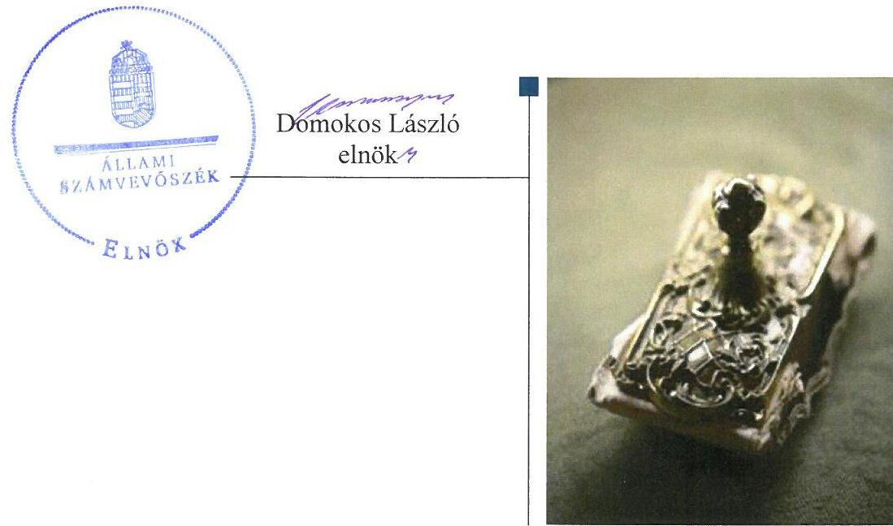
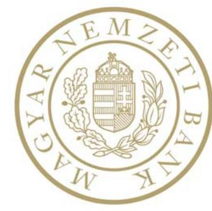
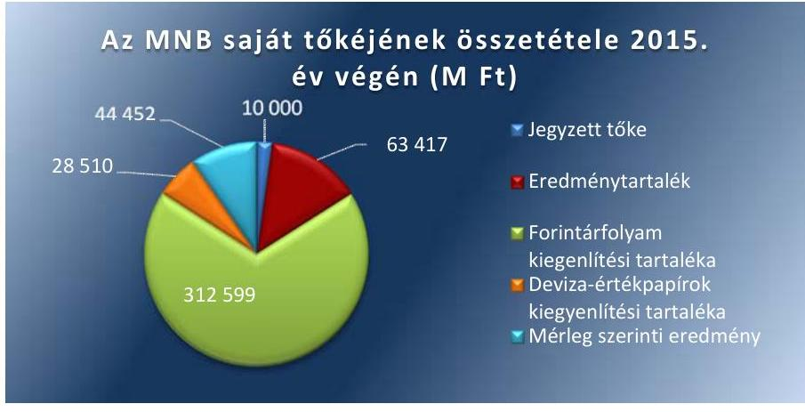
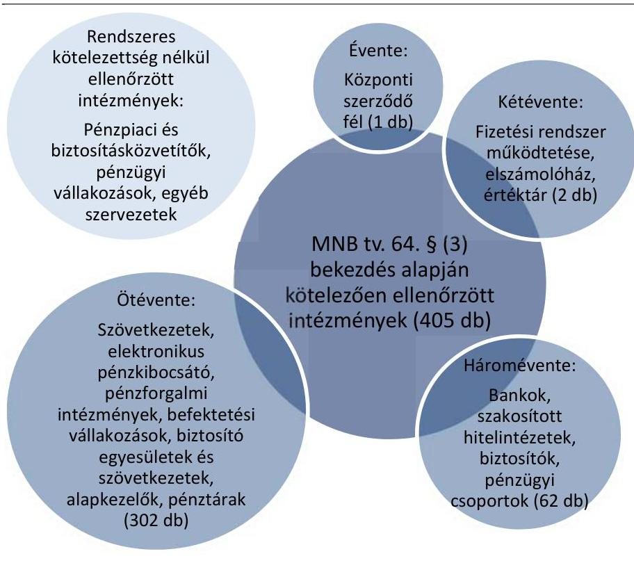
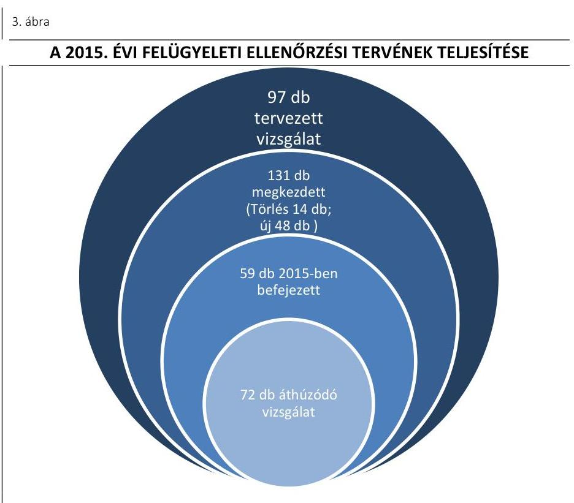
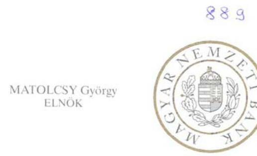
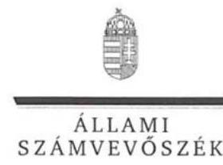
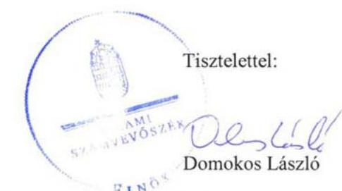

# Jelentés 

## A Magyar Nemzeti Bank működése szabályszerűségének ellenőrzése

2017

---

# Jelentés 

## A Magyar Nemzeti Bank működése szabályszerűségének ellenőrzése

2017. 04. hó 11. nap

---

|  AZ ELLENŐRZÉST FELÜGYELTE: |  |  |  |  |   |
| --- | --- | --- | --- | --- | --- |
|   |  | HOLMAN MAGDOLNA JULIANNA felügyeleti vezető |  |  |   |
|   |  | AZ ELLENŐRZÉST VEZETTE ÉS A VÉGREHAJTÁSÁÉRT FELELŐS: |  |  |   |
|   |  | DORMÁN ISTVÁN ZOLTÁN ellenőrzésvezető |  |  |   |
|   |  | A PROGRAM ÖSSZEÁLLÍTÁSÁÉRT FELELŐS: |  |  |   |
|   |  | JANIK JÓZSEF LÁSZLÓ osztályvezető |  |  |   |
|   |  | A TÉMÁHOZ KAPCSOLÓDÓ KORÁBBI SZÁMVEVŐSZÉKI JELENTÉSEK: |  |  |   |
|   |  | • címe: | Jelentés – A Magyar Nemzeti Bank működése szabályszerűségének ellenőrzése |  |   |
|   |  | • sorszáma: | 16116 |  |   |
|  Jelentéseink az Országgyűlés számítógépes hálózatán és az Interneten a www.asz.hu címen is olvashatóak. |  | • címe: | Jelentés az MNB ellenőrzéséről – a Magyar Nemzeti Bank működésének, valamint a Pénzügyi Szervezetek Állami Felügyelete működése, és tevékenysége MNB-be integrálása szabályszerűségének ellenőrzéséről |  |   |
|   |  | • sorszáma: | 15046 |  |   |
|   |  | IKTATÓSZÁM: V-1255-175/2016 |  |  |   |
|   |  | TÉMASZÁM: 2289 |  |  |   |
|   |  | ELLENŐRZÉS-AZONOSÍTÓ SZÁM: V0777 |  |  |   |

---

# TARTALOMJEGYZÉK 

■ ÖSSZEGZÉS ..... 5
■ AZ ELLENŐRZÉS CÉLJA ..... 6
■ AZ ELLENŐRZÉS TERÜLETE ..... 7
■ AZ ELLENŐRZÉS HÁTTERE, INDOKOLTSÁGA ..... 9
■ A JELENTÉS LÉNYEGES KÉRDÉSKÖREI ..... 10
■ ELLENŐRZÉS HATÓKÖRE ÉS MÓDSZEREI ..... 11
■ MEGÁLLAPÍTÁSOK ..... 14
■ JAVASLATOK ..... 33
■ MELLÉKLETEK ..... 35
I. Sz. melléklet: Értelmező szótár ..... 35
II. Sz. melléklet: Az MNB vagyonának alakulása 2015-ben (M Ft) ..... 38
III. Sz. melléklet: Az MNB működési költségeinek, ráfordításainak alakulása 2015-ben (E Ft) ..... 39
IV. Sz. melléklet: Az ÁSZ 16116. számú jelentéséhez kapcsolódó intézkedési terv végrehajtása ..... 40
■ FÜGGELÉK: ÉSZREVÉTELEK ..... 41
■ RÖVIDÍTÉSEK JEGYZÉKE ..... 57

---

.

---

# ÖSSZEGZÉS 

A Magyar Nemzeti Bank irányítási, döntéshozatali és ellenőrzési rendszere összességében szabályozottan működött a 2015. évben. Az MNB ${ }^{1}$ gazdálkodása és a központi költségvetéssel történő elszámolások szabályozottak és szabályszerűek voltak. A pénzügyi közvetítőrendszert felügyelő, ellenőrző és szabályozó tevékenysége összességében megfelelt a jogszabályi előírásoknak. Az MNB a szanálási hatósági feladatait - a szanálási tervezéssel kapcsolatos tevékenység kivételével - szabályszerűen látta el. Az MKB Zrt. szanálásának előkészítése, elrendelése megfelelt a jogszabályi előírásoknak. Az utóellenőrzés megállapította, hogy az MNB az intézkedési tervben foglaltakat az egy végre nem hajtott feladat kivételével határidőben hajtotta végre.

## Az ellenőrzés társadalmi indokoltsága

Az MNB részvénytársasági formában működő jogi személy, részvénye a Magyar Állam tulajdonában van. A részvényesi jogokat az államháztartásért felelős miniszter gyakorolja. Az ÁSZ² törvényi kötelezettsége az MNB gazdálkodásának és az alapvető feladatai közé nem tartozó tevékenységének ellenőrzése, amelynek teljesítésével segíti az Országgyűlés munkáját, tájékoztatja az érdekelt intézményeket és a szélesebb közvéleményt az MNB működésének és feladatellátásának szabályszerűségéről. Az ellenőrzés hozzájárul az ÁSZ Stratégiájában megfogalmazott küldetése megvalósításához, a közpénzügyek átláthatóságának, rendezettségének előmozdításához.

## Főbb megállapítások, következtetések, javaslatok

Az MNB irányítási, döntéshozatali és ellenőrzési rendszere összességében szabályozottan és szabályszerűen működött. Az MNB szervezeti felépítése, irányítási, döntéshozatali rendszere a jogszabályoknak megfelelt. A felügyelőbizottság működése megfelelt a jogszabályok és az ügyrend előírásainak. A belső ellenőrzési szervezet működése szabályozott és szabályszerű volt. Az MNB többségi tulajdonában álló gazdasági társaságai feletti tulajdonosi joggyakorlása megfelelt a jogszabályi előírásoknak. Az MNB a jogszabályi előírásoknak megfelelően biztosította a Pénzügyi Békéltető Testület működési feltételeit.

Az MNB gazdálkodása és a központi költségvetéssel történő elszámolások szabályozottak és szabályszerűek voltak. A működési költségek tervezése, a beszerzések és az elszámolások, a beruházási tervek összeállítása, a döntések meghozatala és azok megvalósítása, az MNB által nyújtott támogatások tervezése, kifizetése és elszámolása szabályszerű volt.

Az MNB pénzügyi közvetítőrendszert felügyelő, ellenőrző és szabályozó tevékenysége összességében megfelelt a jogszabályi előírásoknak. Az MNB a pénzügyi közvetítő rendszer felügyeletével összefüggő szabályozó tevékenységét - az MNB tv-ben foglalt felhatalmazással élve - megfelelően látta el. Az MNB a nyilvános elektronikus információs rendszer működtetését az előírásoknak megfelelően végezte.

Az MNB a pénzügyi közvetítőrendszer felügyeletéhez kapcsolódó engedélyezési és egyéb eljárásai során szabályszerűen járt el. Az MNB felügyeleti biztosok kirendelése szabályszerűen történt. A pénzügyi közvetítőrendszer szervezetei körében indított fogyasztóvédelmi eljárások lefolytatása során szabályszerűen járt el. A piacfelügyeleti eljárások lefolytatása szabályszerű volt.

Az MNB szanálási hatósági feladatait - a szanálási tervezéssel kapcsolatos tevékenység kivételével - szabályszerűen látta el. Az MKB Zrt. ${ }^{3}$ szanálásának előkészítése, elrendelése, a szanálási intézkedések megfeleltek a jogszabályi előírásoknak.

Az MNB az intézkedési tervben foglaltakat az egy végre nem hajtott feladat kivételével határidőben hajtotta végre.

---

# AZ ELLENŐRZÉS CÉLJA

**AZ ELLENŐRZÉS CÉLJA** az MNB alapfeladatai közé nem tartozó tevékenységei és gazdálkodása megfelelőségének értékelése, továbbá annak ellenőrzése, hogy az MNB irányítási, döntéshozatali és ellenőrzési rendszere szabályozottan és szabályszerűen működött-e; az MNB gazdálkodása és a központi költségvetéssel történő elszámolások szabályozottak és szabályszerűek voltak-e; a pénzügyi közvetítőrendszert felügyelő, ellenőrző és szabályozó tevékenysége, valamint szanálási hatósági tevékenysége megfelel-e a jogszabályi előírásoknak.

Az ellenőrzés célja volt továbbá annak értékelése, hogy az ÁSZ jelentésben4 foglalt intézkedést igénylő megállapításokkal és javaslatokkal összhangban készített intézkedési tervben meghatározott feladatokat az ellenőrzött szervezet végrehajtotta-e.

---

# AZ ELLENŐRZÉS TERÜLETE 

## Magyar Nemzeti Bank

A MAGYAR NEMZETI BANK 1924. június 24-én kezdte meg munkáját. Az MNB részvénytársasági formában működő jogi személy, részvénye a Magyar Állam tulajdonában van. Az államot, mint részvényest, az államháztartásért felelős miniszter képviseli.

Az Alaptörvény 41. cikke kimondja, hogy az MNB Magyarország központi bankja, sarkalatos törvényben meghatározott módon felelős a monetáris politikáért és ellátja a pénzügyi közvetítő rendszer felügyeletét.

Az MNB jogállását, elsődleges célját, alapvető valamint alapvető feladatai közé nem tartozó egyéb feladatait és szervezeti felépítését az MNB tv. határozza meg. E szerint az MNB a törvényben foglalt feladatai ellátása, valamint kötelességei teljesítése során független. Az MNB a Központi Bankok Európai Rendszerének, valamint a Pénzügyi Felügyeletek Európai Rendszerének tagja.

Az MNB elnökét a miniszterelnök javaslatára a köztársasági elnök nevezte ki 2013. március 4-ei hatállyal hat év időtartamra. Az elnök munkáját az ellenőrzött időszakban három alelnök segítette. Az MNB elnöke az MNB tevékenységéről évente beszámol az Országgyűlésnek. Az MNB elnöke az Országgyűlés törvényhozó tevékenységét támogató szervének, a Költségvetési Tanácsnak a tagja, amely a központi költségvetés megalapozottságát vizsgálja.

Az MNB szervei az ellenőrzött időszakban a Monetáris Tanács, a Pénzügyi Stabilitási Tanács, az igazgatóság és a felügyelőbizottság voltak. Az intézményt nem érintette szervezeti, szerkezeti átalakítás. Az MNB alapvető feladatain túl szanálási hatóságként jár el, kizárólagosan ellátja a pénzügyi közvetítőrendszer felügyeletét, valamint a Pénzügyi Békéltető Testület útján ellátja a fogyasztó és a pénzügyi közvetítőrendszer szervezetei között létrejött - szolgáltatás igénybevételére vonatkozó - jogviszony létrejöttével és teljesítésével kapcsolatos vitás ügy bírósági eljáráson kívüli rendezését.

Az ellenőrzés nem terjedt ki az MNB feladataival és elsődleges céljával összhangban álló gazdasági társaság vagy alapítvány létrehozására és azok gazdálkodására.

Az MNB az éves jelentése alapján a 2015. évben 449763 M Ft bevételt és 355311 M Ft ráfordítást számolt el. A könyvviteli mérleg adatai alapján 2014. december 31-ről 2015. december 31-ére az MNB vagyona 12640588 M Ft-ról 9,1\%-kal 11495507 M Ft-ra csökkent. A befektetett eszközök értéke 83740 M Ft-ról 27,9\%-kal 107137 M Ft-ra emelkedett. A saját tőke 645878 M Ft-ról 28,9\%-kal 458978 M Ft-ra, a kötelezettségek összege 11940972 M Ft-ról 8,4\%-kal 10935668 M Ft-ra csökkent.

Az utóellenőrzés ${ }^{5}$ „A Magyar Nemzeti Bank 2014. évi működése szabályszerűségének ellenőrzéséről" szóló ÁSZ jelentés (16116, 2016. július

---

12.) javaslatainak hasznosulására irányult. Az ÁSZ jelentés az MNB elnökének két javaslatot tartalmazott. Az utóellenőrzés a számvevőszéki jelentésben megfogalmazott intézkedést igénylő megállapításokra és javaslatokra készített intézkedési tervekben foglalt feladatok megvalósításának ellenőrzésére, illetve értékelésére fókuszált.

---

# AZ ELLENŐRZÉS HÁTTERE, INDOKOLTSÁGA 

## A Magyar Nemzeti Bank működése szabályszerűségének ellenőrzése

Az ÁSZ tv. ${ }^{6}$ 5. § (10) bekezdése szerint az Állami Számvevőszék ellenőrzi az MNB gazdálkodását és az MNB tv.-ben ${ }^{7}$ foglaltak alapján folytatott, az alapvető feladatok körébe nem tartozó tevékenységét. Az ÁSZ rendszeresen értékeli az MNB gazdálkodását, a szabályszerű működés feltételeinek érvényesülését, valamint a központi költségvetéssel összefüggő elszámolások szabályszerűségét.

Az ÁSZ az Országgyűlés legfőbb pénzügyi és gazdasági ellenőrző szerveként jogosult ellenőrizni más fontos, ellenőrzéseket végző államigazgatási, államhatalmi vagy felügyeleti szervek gazdálkodását és működését. Az „ellenőrök ellenőreként" az ÁSZ munkájának eredményei hatványozottan jelentkezhetnek, hiszen megállapításai az ellenőrzők tevékenységének szabályszerűbbé és hatékonyabbá tételében hasznosulhatnak. Ez is indokolja, hogy a pénzügyi közvetítőrendszer felügyeletét is ellátó MNB ellenőrzésére minden évben sor kerül.

Az ellenőrzés alapvető hozadéka az Országgyűlés munkájának támogatása, az érdekeltek és a szélesebb közvélemény tájékoztatása az MNB működésének és gazdálkodásának szabályszerűségéről. Az ellenőrzés rámutathat a jogszabályok, a belső szabályozás és a szabályszerű működés hiányosságaira, ami segítheti a döntéshozókat az indokolt jogszabály módosításokra, kiegészítésekre vonatkozó javaslatok kidolgozásában. Az ellenőrzött szervezet vonatkozásában az ellenőrzés megállapításai és javaslatai hozzájárulhatnak a működés szabályozottságában, a kontrollok kialakításában esetlegesen fellépő hiányosságok kiküszöböléséhez, a belső szabályzatok és a gyakorlat felülvizsgálatához. A közvélemény számára hiteles információt nyújt az MNB működéséről és gazdálkodásáról, alapfeladatai közé nem sorolt feladatainak ellátásáról, a közpénzekkel való felelős gazdálkodásról, ezzel hozzájárul az általános szakmai tájékozottság javításához.

---

# A JELENTÉS LÉNYEGES KÉRDÉSKÖREI 

1.     - Az MNB irányítási, döntéshozatali és ellenőrzési rendszere szabályozottan és szabályszerűen működött-e?
2.     - Az MNB gazdálkodása és a központi költségvetéssel történő elszámolások szabályozottak és szabályszerűek voltak-e?
3.     - Az MNB pénzügyi közvetítőrendszert felügyelő, ellenőrző és szabályozó tevékenysége megfelelt-e a jogszabályi előírásoknak?
4.     - Az MNB a szanálási hatósági feladatait szabályszerűen látta-e el?
5.     - Az MNB a 16116. számú számvevőszéki jelentésben foglalt javaslatokkal összhangban készített intézkedési tervben foglaltakat az előírt határidőben végrehajtotta-e?

---

# ELLENŐRZÉS HATÓKÖRE
 ÉS MÓDSZEREI 

## Az ellenőrzés típusa

Szabályszerűségi ellenőrzés.

## Az ellenőrzött időszak

A 2015. január 1-jétől 2015. december 31-éig terjedő időszak. Az éves beszámoló készítése, jóváhagyása, a beszámolóval kapcsolatos tájékoztatási kötelezettség teljesítése kapcsán az ellenőrzött időszak kiterjed a 2016. évre is.

Az utóellenőrzés tekintetében az ÁSZ jelentés közzétételének napjától (2016. július 12.) az utóellenőrzés megkezdésének napjáig (2017. március 6.) tartó időszak.

## Az ellenőrzés tárgya

Az MNB irányítási, döntéshozatali és ellenőrzési rendszere, továbbá gazdálkodása és a központi költségvetéssel való elszámolásainak ellenőrzése. Az ellenőrzés tárgyát képezte még az MNB pénzügyi közvetítőrendszert felügyelő, ellenőrző és szabályozó tevékenysége, valamint szanálási hatósági tevékenysége is. Utóellenőrzés keretében az ÁSZ 16116. számú jelentésében foglalt intézkedést igénylő megállapításokkal és javaslatokkal összhangban, az MNB által készített intézkedési tervben foglaltak végrehajtásának ellenőrzése.

Az ellenőrzés kiterjedt minden olyan körülményre és adatra, amely az ÁSZ jogszabályban meghatározott feladataiban, valamint a program végrehajtása folyamán felmerült újabb összefüggések feltárásához szükséges.

## Az ellenőrzött szervezet

Magyar Nemzeti Bank

## Az ellenőrzés jogalapja

Az ÁSZ tv. 1. § (3) bekezdésében foglaltak alapján az ÁSZ általános hatáskörrel végzi a közpénzekkel és az állami és önkormányzati vagyonnal való felelős gazdálkodás ellenőrzését, valamint az ÁSZ tv. 5. § (10) bekezdésében foglaltak alapján ellenőrzi az MNB gazdálkodását és az MNB tv.-ben foglaltak alapján folytatott, az alapvető feladatok körébe nem tartozó tevékenységét. Az MNB tv. 4. § (1)-(7) bekezdései tartalmazzák az MNB alapvető feladatait.

Az ÁSZ tv. 33. § (7) bekezdése alapján az ÁSZ jelentésben foglalt megállapításokhoz kapcsolódóan összeállított intézkedési tervben foglaltak megvalósítását az ÁSZ utóellenőrzés keretében ellenőrizheti. Az Áht. ${ }^{8} 61$. § (2) bekezdése szerint az államháztartás külső ellenőrzésével kapcsolatos feladatokat az ÁSZ látja el.

# Az ellenőrzés módszerei 

Az ÁSZ az ellenőrzést az ÁSZ hivatalos honlapján (www.asz.hu) az ellenőrzés szakmai szabályai közt közzétett, a jelen ellenőrzésre irányadó módszertani útmutatók alapján, az ellenőrzési programban foglalt értékelési szempontok szerint hajtja végre. Az ellenőrzést az ÁSZ a program kérdéseire adott válaszok kiértékelésével, valamint a programban ismertetett ellenőrzési kérdések, kritériumok, adatforrások között megjelölt adatforrások, a program III. sz. mellékletben felsorolt tanúsítványok felhasználásával, továbbá az adott időszakban hatályos jogszabályok figyelembevételével folytatja le.

Az ellenőrzési kérdések megválaszolásához szükséges bizonyítékok megszerzése a következő ellenőrzési eljárások alkalmazásával történik: megfigyelés, szemle (szemrevételezés), kérdésfeltevés (információkérés), mintavételezés, valamint elemző eljárás.

Az ellenőrzés ideje alatt az ellenőrzött szervezettel történő kapcsolattartást az ÁSZ SZMSZ ${ }^{9}$-e vonatkozó előírásai alapján biztosítottuk.

Mintavétellel ellenőriztük az emberi erőforrásokkal való gazdálkodást, a munkaerő felvételeket és a munkáltató felmondása útján történt munkaviszony megszüntetéseket; az információ-technológia rendszerek működtetési költségeivel összefüggő beszerzéseket és elszámolásokat; az üzemeltetési és egyéb költségekkel összefüggő beszerzéseket és elszámolásokat; a beruházások megvalósítását és az elszámolásokat; az MNB által nyújtott támogatások tervezését, kifizetését és elszámolását; az MNB pénzügyi közvetítőrendszer felügyeletéhez kapcsolódó engedélyezési, jóváhagyási, nyilvántartásba vételi, törlési eljárásait, továbbá a fogyasztóvédelmi eljárásai szabályszerűségét. A minta alapján a sokaságban előforduló hibaarányt becsültük. „Megfelelőnek" értékeltük az ellenőrzött területet, amennyiben 95\%-os bizonyossággal a teljes sokaságban a hibaarány legfeljebb 10\%, „részben megfelelőnek" értékeltük, ha a hibaarány felső határa 10-30\% között volt, „nem megfelelőnek" pedig akkor, ha a mintavételi eredmények alapján a sokaságbeli hibaarány felső határa meghaladta a 30\%-ot.

Az utóellenőrzés során az intézkedési tervben előírt feladatokat, azok végrehajthatósága, illetve végrehajtása szempontjából az alábbiak szerint értékelte az ÁSZ:
$\longrightarrow$ „határidőben végrehajtott" a feladat, ha a teljesítés dokumentáltan, az intézkedési tervben előírt határidőben és tartalommal megtörtént;
$\longrightarrow$ „határidőn túl végrehajtott" a feladat, ha annak teljesítése az intézkedési tervben meghatározott módon, de az előírt határidőn túl történt meg;
$\longrightarrow$ „részben végrehajtott" a feladat, ha végrehajtása teljes körűen az intézkedési tervben előírt módon nem történt meg;
$\longrightarrow$ „nem végrehajtott" a feladat, ha a végrehajtás nem történt meg, vagy amennyiben a teljesítést nem dokumentálták;
$\longrightarrow$ „okafogyottá vált" a feladat, ha végrehajtására - meghatározott esemény bekövetkezése, továbbá külső körülmény, a működést érintő feltétel változása miatt - már nincs szükség, illetve lehetőség, és egyértelműen megállapítható, hogy az intézkedést szükségessé tevő körülmény a jövőben nem fordulhat elő;
$\longrightarrow$ „nem időszerű" az a feladat, amelynek ellenőrzési időszakon belüli végrehajtására azért nem került (kerülhetett) sor, mert az intézkedés alapjául szolgáló esemény nem következett be, de annak jövőbeni előfordulása lehetséges, a végrehajtása nem volt esedékes, vagy a végrehajtás határideje még nem járt le.

# 1. Az MNB irányítási, döntéshozatali és ellenőrzési rendszere szabályozottan és szabályszerűen működött-e? 

Összegző megállapítás

1.1. számú megállapítás

2015-ben az MNB irányítási, döntéshozatali és ellenőrzési rendszere összességében szabályozottan és szabályszerűen működött.

Az MNB szervezeti felépítése, irányítási, döntéshozatali rendszere megfelelt a jogszabályoknak.

Az MNB-nél az alapvető feladatok körébe nem tartozó tevékenységek ellátására vonatkozó szervezeti kereteket az MNB SZMSZ 1.6${ }^{10}$-ban az MNB tv. rendelkezéseivel összhangban alakították ki. Az MNB SZMSZ 1-4 az MNB tv. 4. § (15) bekezdésében foglalt követelménynek 2015. augusztus 31-ig nem felelt meg, mert a szanálási hatósági feladatkör ellátását nem az MNB elnökének vagy bármelyik alelnökének közvetlen alárendeltségében és irányításában határozta meg. Az MNB SZMSZ 5. 6 a szanálási hatósági feladatkör ellátását az MNB tv.-ben előírtaknak megfelelően tartalmazta.

Az MNB tv. 4. § (9) és (14) bekezdésének megfelelően a pénzügyi közvetítőrendszer felügyelete feladatellátásának szervezeti kereteit az MNB SZMSZ 1-6-ban kialakították.

A 2/2015. (X. 28.) számú részvényesi határozattal hatályba léptetett Alapító Okirat 2 tartalma megfelelt a Ptk. 3:5. § és az MNB tv. előírásainak.

Az MNB elnöke az MNB tv. 131. § (2) és a 135. § (4) bekezdésében előírt beszámolási és tájékoztatási kötelezettségeinek eleget tett. Az MNB tevékenységéről az előírt határidőben és rendszerességgel, valamint az MNB tv. 131. § (2) bekezdésében előírt tartalommal az OGY ${ }^{11}$ gazdasági ügyekért felelős állandó bizottságának beszámolt.

Az MNB elnöke az MNB tv. 135. § (4) bekezdése szerinti, az MNB működésének irányításával összefüggő, a működés szempontjából kiemelten fontos, az igazgatóság az MNB tv. 12. § szerinti jogkörében meghozott döntésekkel kapcsolatban előírt tájékoztatási kötelezettségének a részvényesi jogokat gyakorló miniszter felé eleget tett. A 2015. évre vonatkozóan az MNB által szolgáltatandó további információ köréről szóló megállapodás megkötésére az MNB tv. 135. § (4) bekezdésében foglaltak ellenére nem került sor. Az MNB a 2008. április 24-én megkötött megállapodásra hivatkozva teljesítette a rendszeres (havi, negyedéves) adatszolgáltatásokat.

Az MNB tv. 135. § (2) bekezdésében előírt jelentéstételi kötelezettségének az MNB a 2015. évre vonatkozóan a makroprudenciális jelentés valamint a pénzügyi fogyasztóvédelmi jelentés közzétételével eleget tett.

# Az MNB egyéb feladatai tekintetében a PST${ }^{12}$ az előírásoknak megfelelően működött. Az MNB tv. 9. § (1) bekezdése alapján a szanálási, valamint a pénzügyi közvetítő-rendszer felügyeleti stratégia kereteit az MT${ }^{13}$ a 2014. évben határozattal elfogadta. A PST - az MNB tv. 13. § (1) bekezdése szerint - a szanálási hatósági feladatokkal kapcsolatos döntéseit az MT által meghatározott stratégiai keretek között hozta meg. Az MNB tv. 9. § (1) bekezdése alapján a pénzügyi közvetítőrendszer felügyeleti stratégiájára vonatkozó célkitűzések a 2015. évben érvényesültek a PST döntéseiben.

A PST az MNB tv. 13. § (10) bekezdésének megfelelően működésének rendjét saját hatáskörben, ügyrendben határozta meg, a PST üléseinek összehívása, valamint döntéshozatala az MNB tv. 13. § (6)-(9) bekezdései és az ügyrend előírásai szerint történt.

A PST az MNB tv. 13. § (3) bekezdésében előírt beszámolási kötelezettségének eleget tett, a PST ülések napirendjét, az ülésen tárgyalandó előterjesztéseket és jelentéseket megküldte az MT tagjainak az MT ügyrendje előírásának megfelelően.

Az MNB igazgatósága ${ }^{14}$ az MNB tv. 12. § (1) és (4) bekezdése szerinti, a PST szanálási hatósági feladatai, valamint a pénzügyi közvetítőrendszer felügyelete tekintetében hozott döntéseinek végrehajtásáért, a végrehajtás irányításáért való felelőssége a PST-re vonatkozó, annak működési kereteit biztosító rendelkezéseinek kialakításával érvényesült. Az MNB igazgatóság határozatait az MNB tv. 12. § (6) bekezdésének előírásai szerint hozta meg.

Az igazgatóság az MNB működésének irányítása körében az MNB tv. 6. § (2) bekezdésében, a 12. § (4) bekezdésében előírt feladatokat ellátta, a hatáskörébe tartozó ügyekben a belső ellenőrzési szervezet vezetőjét beszámoltatta.

Az igazgatóság az MNB 2014. és a 2015. évi számviteli beszámolója megállapításáról valamint az osztalékról határozatban döntött az MNB tv. 12. § (4) bekezdése alapján és a beszámolót a részvényesnek határidőben megküldte. Az MNB tv. 6. § (2) bekezdésének megfelelően az üzletvezetésről és az MNB vagyoni helyzetéről szóló jelentést jóváhagyta, és annak megküldésével a részvényest tájékoztatta.

Az igazgatóság a Ptk. 3:284. § (1) bekezdése szerinti, az ügyvezetésről, a társaság vagyoni helyzetéről és üzletpolitikájáról három havonta tájékoztatta az FB${ }^{15}$-t.
1.2. számú megállapítás

A felügyelőbizottság a jogszabályok és az ügyrend előírásainak megfelelően működött.

Az MNB tulajdonosi ellenőrzése szervezeti kereteinek kiépítése és működése 2015 júliusától megfelelő volt. Az Országgyűlés az MNB FB elnökét és tagjait 2015. július 6-án választotta meg. Az államháztartásért felelős miniszter képviselője és a miniszter által megbízott szakértő FB tag is kijelölésre került. Az MNB 2015. július 6-áig az MNB tv. 14. § (1) bekezdésében meghatározottaktól eltérően tulajdonosi ellenőrzési szerv nélkül működött.

Az FB elnöke a Ptk. 3:122. § (3) bekezdésének megfelelően 2015. július 28-án benyújtotta ügyrendjét jóváhagyásra, amelyet az 1/2015. (VIII. 24.) számú részvényesi határozattal fogadott el a részvényes. Az MNB SZMSZ 1. 6 meghatározta az FB munkáját támogató titkárság működésének feltételeit.

A 2015. évi munkatervről és költségtervről az FB határozatot hozott. Az FB döntéshozatali rendje megfelelt a Ptk. 3:27. § (3) bekezdése, a 3:121. § (1) bekezdése, a 3:122. § (2) bekezdése és az FB részvényes által jóváhagyott ügyrendjében rögzített előírásoknak.

Az FB a 2015. július 6. - 2016. május 31. közötti időszakra vonatkozó Felügyelőbizottsági jelentésében a Ptk. 3:120. § (2) bekezdése szerinti írásbeli jelentést adott a 2013. és 2014. évi beszámolókról is. Az FB a 2016. május 20-ai ülésén tárgyalta és elfogadta az igazgatóság által jegyzett 2015. évi beszámolót és tájékoztatta a részvényest az MNB 2015. évi mérlegében és eredménykimutatásában szereplő összegről.

A belső ellenőrzés irányításával kapcsolatos feladatokat az FB ügyrendje 2. § (9)-(11) bekezdéseiben szabályozta. Az FB az MNB tv. 14. § (2) bekezdése alapján a belső ellenőrzés 2015. szeptember 1. és december 31. közötti időszakra vonatkozó munkatervét, valamint a 2016. évi belső ellenőrzési tervét elfogadta.

Az FB tagjai az MNB tv. 14. § (10) bekezdése alapján tájékoztatási kötelezettségüknek az OGY, illetve az államháztartásért felelős miniszter felé az előírásoknak megfelelően eleget tettek.

# 1.3. számú megállapítás 

A belső ellenőrzési szervezet működése szabályozott és szabályszerű volt.

A belső ellenőrzési szervezet az MNB tv. 14. § (2) bekezdése alapján az FB, annak hatáskörébe nem tartozó feladatok tekintetében pedig az igazgatóság irányítása alá tartozott. A szervezeti
 kereteket az MNB SZMSZ 1-6-ban és a belső ellenőrzés rendjéről szóló elnöki utasításban ${ }^{16}$ kialakították. A szervezet függetlensége az irányítás rendszerében biztosított volt.

A belső ellenőrzés rendjét (célját, jogállását, függetlenségét, jog- és hatáskörét, az összeférhetetlenséget, a munkatervet) belső ellenőrzés rendjéről szóló elnöki utasítás szabályozta. 2015. évben aktualizálták a Belső ellenőrzési igazgatóság kézikönyvét, amely a belső ellenőrzés feladatait, eljárásának részleteit (a kockázatelemzést, az éves terv elkészítését, a vizsgálatok lefolytatását, dokumentálását és értékelését) szabályozta.

A belső ellenőrzés rendjéről szóló elnöki utasítás 8. § (1) bekezdésében előírtaknak megfelelően a belső ellenőrzés előre meghatározott és jóváhagyott terv szerint végezte munkáját.

### 1.4. számú megállapítás

Az MNB többségi tulajdonában álló gazdasági társaságai feletti tulajdonosi joggyakorlása megfelelt a jogszabályi előírásoknak.

Az MNB 2015. január 1-jén hét kizárólagos, egy többségi tulajdonában álló gazdasági társasággal rendelkezett. A 2015. évben két kizárólagos tulajdonú gazdasági társaságban - Pénzjegynyomda Zrt., MNB-Jóléti Kft. - tőkeemelést hajtottak végre, valamint a Budapesti

---

Értéktőzsde Zrt.-ben a kisebbségi részesedést többségire növelték. Az MNB belföldi kizárólagos, valamint többségi tulajdonosi részesedéseinek értéke 2014. december 31-ről 2015. december 31-ére 35,4%-kal, 42,2 Mrd Ft-ról 57,2 Mrd Ft-ra növekedett (az 1. táblázatban foglaltak szerint).

1. táblázat

Az MNB többségi tulajdonosi részesedései 2015.12.31-én

| Megnevezés | Tulajdoni hányad   (%) | Könyvszerinti   érték   (M Ft) |
| :-- | :--: | :--: |
| GIRO Elszámolásforgalmi Zrt. | 100,0 | 9778,9 |
| Magyar Pénzverő Zrt. | 100,0 | 575,0 |
| MARK Zrt. | 100,0 | 21700,0 |
| MNB-Biztonsági Zrt. | 100,0 | 200,0 |
| MNB-Jóléti Kft. | 100,0 | 75,0 |
| Pénzjegynyomda Zrt. | 100,0 | 10627,0 |
| Pénzügyi Stabilitási és Felszámoló NKft. | 100,0 | 50,0 |
| Budapesti Értéktőzsde Zrt. | 75,2 | 13542,5 |
| KELER Zrt. | 53,3 | 642,7 |

Forrás: MNB 2015. évi éves jelentése
Az MNB tulajdonosi joggyakorlása a többségi tulajdonában álló gazdasági társaságai felett szabályozott volt, a tulajdonosi döntések, valamint azok végrehajtása során a jogszabályokat és a belső szabályokat betartották.

Az MNB a gazdasági társaságok feletti tulajdonosi jogok gyakorlása során a Ptk. 3:109. § (4) bekezdésének megfelelően írásban, határozati formában döntött. Az igazgatóság írásban, - a Ptk. 3:109. § (2) bekezdésében foglaltaknak megfelelően - határozatban döntött a kizárólagos tulajdonában lévő gazdasági társaságok 2014. évi beszámolóinak jóváhagyásáról, valamint a nyereség felosztásáról.

Az MNB befektetéseire vonatkozó döntéseit - az MNB tv. 12. § (4) bekezdésében foglaltaknak megfelelően - az igazgatóság hozta meg. Az igazgatóság belföldi tulajdonrészekkel összefüggő döntései összhangban voltak az MNB tv. 165. § (2), valamint (5) bekezdéseinek, valamint az igazgatóság ügyrendje ${ }_{1-2}{ }^{17}$ 3. § (1) bekezdésének előírásaival.

Az MNB kizárólagos és többségi tulajdonában álló gazdasági társaságainál a felügyelőbizottságok szabályszerűen működtek. A felügyelőbizottságok ügyrenddel rendelkeztek, melyeket az MNB alapítói határozatokkal ${ }^{18}$ fogadott el a Ptk. 3:122. § (3) bekezdés előírásainak megfelelően. A felügyelőbizottságok a 2014. évi éves beszámolók jóváhagyásáról elkészítették írásos jelentéseiket a Ptk. 3:120. § (2) bekezdésében foglaltaknak megfelelően.

# 1.5. számú megállapítás 

Az MNB a jogszabályi előírásoknak megfelelően biztosította a Pénzügyi Békéltető Testület működési feltételeit.

A PBT ${ }^{19}$ szervezeti keretei megfeleltek az MNB tv. 96-97. § és a 100-101. §-aiban foglalt előírásoknak. A PBT az MNB tv. 96. § (3) bekezdésének megfelelően az MNB szervezeti rendjében közvetlenül az MNB elnökéhez került besorolásra.

---

Az MNB - az MNB tv.-ben foglaltak szerint - biztosította a PBT működéséhez szükséges pénzügyi fedezetet, betartotta a testületi tagok foglalkoztatásánál előírt végzettségi követelményeket.

A PBT a működésének rendjét az MNB tv. 101. § (1) bekezdése előírásának megfelelően a PBT elnöke szabályzatban alakította ki.

# A PBT a tájékoztatási kötelezettségének 

eleget tett. A PBT elnöke a PBT tevékenységéről - az MNB tv. 129. § (3) bekezdése és a 130. § (1) bekezdésében előírt - összefoglaló tájékoztatót, amelynek része volt a határon átnyúló fogyasztói jogviták rendezésével összefüggő tevékenységéről készült külön beszámoló is a 2014. évről elkészítette, és az MNB alelnökének jóváhagyása után 2015. február 26-án a PBT honlapján nyilvánosságra hozta.

A PBT a határon átnyúló fogyasztói jogviták rendezésével összefüggő tevékenységéről az előírt külön összefoglaló tájékoztatót az MNB tv. 129. § (4) bekezdésének megfelelően a pénz-, tőke- és biztosítási piac szabályozásáért felelős miniszternek, továbbá a PBT tevékenységéről az előírt összefoglaló tájékoztatót az MNB tv. 130. § (2) bekezdése alapján a fogyasztóvédelemért felelős miniszternek megküldte.

A PBT az Európai Bizottság felé 2015. július 1-jei határidőre teljesítette az elektronikus adatbekérőben kért statisztikai összegzést és esettanulmányt a 2014. évi tevékenységével kapcsolatban.

## 2. Az MNB gazdálkodása és a központi költségvetéssel történő elszámolások szabályozottak és szabályszerűek voltak-e?

Összegző megállapítás

2.1. számú megállapítás

2015-ben az MNB gazdálkodása és a központi költségvetéssel történő elszámolások szabályozottak és szabályszerűek voltak.

A működési költségek tervezése, a beszerzések és az elszámolások szabályszerűek voltak.

## Az MNB pénzügyi tervezésére és gazdál-

kodására vonatkozóan a belső szabályokat a Gazdálkodási kézikönyv ${ }_{1-3}{ }^{20}$ „R” fejezetében határozták meg, amelyben előírták a költséggazdák és a Számviteli igazgatóság pénzügyi tervezéssel kapcsolatos feladatait, a feladatokhoz rendelt határidőket.

Az MNB a pénzügyi év kezdete előtt az MNB tv. 131. § (5) bekezdésében előírtaknak megfelelően működési költségeire vonatkozóan részletes éves tervet készített, amelyet az igazgatóság elfogadott. A pénzügyi terv részeként az igazgatóság jóváhagyta a működési költségek alapvető és egyéb feladatokra felosztott főösszegét. Az előirányzatok felosztása az igazgatósági határozat alapján, a Bank szakterületeinek tevékenység szerinti besorolása és a költségek hozzárendelését meghatározó mutatószámok alapján történt.

Az MNB-nél a személyi jellegű ráfordítások, az IT ${ }^{21}$ rendszerek működtetési költségei, az üzemeltetési és egyéb költségek tervezése szabályozott

---

volt, a tervezési folyamat egyes műveleteit a vonatkozó előírásoknak megfelelően, szabályszerűen hajtották végre.

A banküzem működési költségei és ráfordításai között a személyi jellegű ráfordítások elszámolása - a 221/2000. (XII. 19.) Korm. rendelet 9. § (7) bekezdésének megfelelően, a kapcsolódó dokumentumok, a Kollektív szerződés és a Gazdálkodási kézikönyv 1-3 G-I fejezete alapján - szabályszerűen történt.

Az üzemeltetési és egyéb költségek működési költségek közötti tervezését, valamint összehasonlító elemzését az MNB tv., valamint az MNB belső szabályozása előírásainak megfelelően végezték el. Az üzemeltetési és az egyéb költségekkel kapcsolatos beszerzések és a számviteli elszámolások szabályszerűek voltak.

A beszerzési eljárások ajánlatainak értékelései megfeleltek a Kbt. ${ }^{22}$ 71. § (1) és (3), a 72. § (1) és (5) bekezdése és a 73. § előírásainak.

A beszerzési és a közbeszerzési eljárások az IT rendszerek esetében megfelelőek voltak, betartották a Kbt. előírásait. A közbeszerzési, valamint az egyéb beszerzési eljárások lefolytatása és a beszerzések pénzügyi teljesítése és számviteli elszámolása szabályszerű volt.

A költségek tervhez viszonyított alakulásáról költségnemenként havonta a főigazgatónak, negyedévenként az igazgatóságnak számoltak be. A havi működési költségek teljesítéséről készített jelentések költségsoronként részletes összehasonlítást tartalmaztak a bázisév hasonló adatával, valamint az éves terv adott hónapra ütemezett összegével. A pénzügyi év lezárását követően az MNB tv. 131. § (5) bekezdésében előírtaknak megfelelően összehasonlító elemzést készítettek a tervezett és a tényleges működési és beruházási költségek alakulásáról, melyet az MNB igazgatósága elfogadott.

Az értékcsökkenések elszámolásai, analitikus és főkönyvi nyilvántartásai szabályszerűek voltak és megfeleltek a Számv. tv. 52. § (1) bekezdésében, valamint a Számviteli politika G részében foglaltaknak. Az MNB a 2015. évi éves beszámoló kiegészítő mellékletében - a Számv. tv. 92. § (1) bekezdésében foglaltaknak megfelelően - bemutatta az immateriális javak és a tárgyi eszközök, valamint az értékcsökkenés előírt adatait.

# 2.2. számú megállapítás 

## A beruházási döntések, a tervek összeállítása és megvalósítása szabályszerű volt.

Az MNB beruházási költségeinek tervezése szabályozott volt, a tervezési folyamat egyes műveleteit az MNB tv., valamint a vonatkozó belső szabályozásoknak megfelelően, szabályszerűen hajtották végre. A beruházási döntések során a hatásköri szabályokat betartották.

A beruházási tervet a Gazdálkodási kézikönyv „R” fejezetében foglaltaknak, a pénzügyi tervezés módszertanának és a módosított ütemtervnek megfelelően készítették el. A pénzügyi terv igazgatósági előterjesztésében a beruházási terv főösszegét az MNB tv. 131. § (5) bekezdésében foglalt előírásoknak megfelelően alapvető és egyéb feladatok szerint megbontották. A jóváhagyott éves pénzügyi terv beruházási terv melléklete, valamint az év végén elkészített összehasonlító elemzés beruházási

---

melléklete és szöveges elemzése azonban az alapvető és egyéb feladat szerint elkülönített részletes adatokat nem tartalmazta.

Az igazgatóság az MNB beruházási költségeinek 2015-re tervezett 76 129,7 M Ft összegét határozattal hagyta jóvá. A tervezett beruházásokból az alapvető feladataihoz 3690,9 M Ft, az egyéb feladataihoz 72 438,8 M Ft kapcsolódott. A beruházások módosított pénzügyi terv szerinti összege 105 079,7 M Ft-ra nőtt, az Értéktár program műkincsvásárlásaira tervezett 28950 M Ft keretösszeg miatt. A beruházási kiadások teljesítése 2015-ben 10 581,2 M Ft volt. A beruházási kiadások teljesítése a módosított tervhez viszonyítva 89,9% elmaradást jelentett.

A beruházások megvalósítása, a beruházási kiadások elszámolása az MNB tv. 12. § (4) bekezdésében, valamint ügyrendjének 3. § (1) bekezdésében foglaltaknak megfelelően történt. A vállalkozási, illetve szállítási szerződéseket eredményes közbeszerzési eljárások lefolytatását követően kötötték meg, amelyeket írásba foglaltak a Kbt. 124. § (1) bekezdése előírásainak megfelelően. Az MNB a szerződések teljesítésének elismeréséről igazolást adott a Kbt. 130. § (1) bekezdésében foglaltaknak megfelelően. A beruházások megvalósítása az igazgatósági döntéseknek megfelelően történt, a beruházási kiadások elszámolása összességében szabályszerű volt.

Az ingatlanvásárlással kapcsolatos eljárást szabályszerűen bonyolították le. Az ingatlan megszerzéséről az igazgatóság döntött az MNB tv. 12. § (4) bekezdésében meghatározott döntési hatáskörében. Az ingatlan megvásárlásával összefüggő kiadások elszámolása szabályszerű volt.

Az Értéktár program keretében az igazgatóság a műtárgyak megvásárlására vonatkozó határozatait a Tanácsadó testület ${ }^{23}$ által készíttetett szakértői vélemények alapján hozta meg. A közbeszerzési eljárást lefolytatták, amennyiben a megvásárlásra szánt műtárgy értéke elérte az árubeszerzés uniós, a Kvtv. ${ }^{24}$ 71. § (1) bekezdése szerinti értékhatárát. A múzeumok kiállítóhelyein elhelyezett műtárgyakra az MNB letéti szerződéseket kötött.

Az igazgatóság által jóváhagyott részletes beruházási éves terv teljesülésének követésére a gazdálkodási kézikönyv „R” fejezetében foglaltak szerint a főigazgató részére havonta, az igazgatóság és az FB számára negyedéves gyakorisággal szöveges értékeléssel kiegészített számszaki jelentést készítettek.

# 2.3. számú megállapítás 

Az MNB által nyújtott támogatások tervezése, kifizetése és elszámolása szabályszerű volt.

## Az MNB által nyújtandó támogatások

tervezése az MNB tv. 131. § (5) bekezdésében foglaltak szerint valósult meg, az MNB pénzügyi terve tartalmazta a támogatási ráfordítások részletes éves tervét. Az ITB ${ }^{25}$ 2015. évi részletes költségtervéről - az MNB tv. 12. § (4) bekezdésének megfelelően - az igazgatóság határozattal döntött.

Az MNB 2015. évi pénzügyi tervében a TFS megvalósítására 1896,1 M Ft támogatási keretet terveztek. A tervezésnél figyelembe vették

---
az igazgatóság határozatát, amelyben az MNB működési költségterve 5%-ának megfelelő összegű
 támogatási célú felhasználásról döntöttek.

# A 2015. ÉVI TÁMOGATÁSOK KIFIZETÉSE ÉS ELSZÁMOLÁSA SZABÁLYSZERŰ VOLT. Az ITB hatáskörébe tartozó támogatások elbírálása az ITB ügyrendjében foglaltak szerint történt. Az ITB támogatási javaslatát az igazgatóság minden esetben határozattal jóváhagyta, valamint nem az ITB hatáskörébe tartozó támogatás esetében az igazgatóság egyedi döntést hozott. 

A támogatások kifizetését megelőzően az érintettekkel támogatási szerződést vagy több évre szóló stratégiai együttműködési megállapodást kötöttek, amelyben rögzítették a támogatás felhasználásával és elszámolásával kapcsolatos kötelezettségeket is. A támogatási összegek átutalása szabályszerűen történt.

A támogatások számviteli elszámolása megfelelő volt, a Számv. tv. 81. § (2) bekezdésében és 86. § (7) bekezdésében foglaltaknak megfelelően a rendkívüli ráfordítások között - végleges pénzátadásként - mutatták ki. Az MNB által 2015. évben nyújtott támogatásokat a 2. táblázat foglalja össze.
2. táblázat

AZ MNB ÁLTAL 2015. ÉVBEN NYÚJTOTT TÁMOGATÁSOK (M FT)

| Megnevezés | 2015. év tény |
| :-- | --: |
| Az ITB javaslata alapján megítélt eseti támogatások | 1483,1 |
| Egyedi igazgatósági döntés alapján nyújtott támogatások | 289,2 |
| Stratégiai megállapodások keretében nyújtott támogatások | 562,8 |
| Pénzügyi fogyasztóvédelmi támogatások | 147,5 |
| PSFN Kft. ${ }^{26}$ működésére adott támogatás | 555,4 |
| Értéktár program keretében nyújtott támogatás | 250,0 |
| Nemzeti Múzeumnak átadott érmék | 0,4 |
| Támogatások összesen* | 3288,4 |

*A táblázat nem tartalmazza az MNB alapítványainak 2015. évi alapítói vagyonként átadott 12000 M Ft-ot Forrás: MNB adatszolgáltatás a támogatásokról

Az MNB tv. 170. § (3) bekezdése a bírságból származó bevétel felhasználására vonatkozóan rögzítette a felhasználási célterületeket. A felügyeleti tevékenységből származó bírságbevétel 2015. évben 1208,9 M Ft-ot tett ki, amelyet a peres eljárások miatti visszautalás 1181,3 M Ft-ra csökkentett.

A 2015. év során realizált, hatósági eljárásból származó kapott bírságokat az MNBr. ${ }^{27}$ 8. § (7) bekezdésének megfelelően az egyéb bevételek között, elkülönített főkönyvi számlán mutatták ki.

Az MNB a számára megfizetett bírság összegét az MNB tv. 170. § (3) bekezdésében meghatározott jogcímeken meghatározott támogatásokra fordította, ezáltal nem keletkezett eredménytartalék javára történő elszámolhatósági kötelezettsége.
2.4. számú megállapítás

Az MNB központi költségvetéssel összefüggő elszámolásai szabályozottak és szabályszerűek voltak.

Az MNB által kezelt hivatalos devizatartalékok nagysága a 2015. év során 4,26 Mrd euróval csökkent, az év végén 30,3 Mrd eurót tett ki.

---

A devizaeszközök és devizaforrások év végi értékeléséből eredő árfo-lyam-különbözet az MNB tv. 147. § (1) bekezdésben előírtaknak megfelelően forint árfolyam kiegyenlítési tartalékaként, a deviza értékpapírok értékelési különbözetet az MNB tv. 147. § (2) bekezdésében előírtaknak megfelelően deviza értékpapírok kiegyenlítési tartalékaként mutatták ki a mérlegben. A forintárfolyam kiegyenlítési tartalék és deviza-értékpapír kiegyenlítési tartalék a saját tőke elemei között jelent meg az MNB mérlegében az MNB tv. 147. § (3) bekezdésének megfelelően. A kiegyenlítési tartalékok alakulását a 3. táblázat mutatja be.
3. táblázat

| A KIEGYENLÍTÉSI TARTALÉKOK ALAKULÁSA (M FT) |  |  |  |
| :--: | :--: | :--: | :--: |
| Megnevezés | Állomány 2014 év végén | Állomány 2015 év végén | Változás |
| Forintárfolyam kiegyenlítési tartaléka | 517984 | 312599 | -205384 |
| Deviza-értékpapírok kiegyenlítési tartaléka | 54477 | 28510 | -25967 |

Az éves beszámoló kiegészítő melléklete tartalmazta az MNBr. 19. § (1) bekezdésében előírtaknak megfelelően a kiegyenlítési tartalék összetételét, elemeinek változását. A saját tőke állománya 2015. év végén 458978 M Ft volt, amelyből a forintárfolyam kiegyenlítési tartaléka 312600 M Ft-ot, a deviza értékpapírok kiegyenlítési tartaléka 28510 M Ft-ot tett ki.

A kiegyenlítési tartalékok, az eredménytartalék és a mérleg szerinti eredmény összevont egyenlege a 2015. év végén pozitív volt, a központi költségvetésnek nem keletkezett az MNB tv. 147. § (4) bekezdés szerint térítési kötelezettsége. Az MNB 2015. évi mérlegében a saját tőke elemeit az 1. ábra mutatja be.

1. ábra

Forrás: Az MNB 2015. évi éves beszámolója
A KESZ ${ }^{28}$ és az ÁKK ${ }^{29}$ pénzforgalmi számlájának kamatelszámolása szabályozott és szabályszerű volt. Az MNB tv. 145. § (2) bekezdésének megfelelően az MNB a KESZ mindenkori egyenlege után a piaci kamatnak, de legfeljebb a jegybanki alapkamatnak megfelelő mértékű kamatot fizette a központi költségvetés javára. A devizaállomány után elszámolt kamatok a FED $^{30}$ és az $\mathrm{EKB}^{31}$ által megállapított irányadó kamatok számlavezetési szerződésben meghatározott korrekciója után - 2015 év folyamán negatív tartományban mozogtak. A 2015. évben a forintállomány után az MNB a KESZ számlán 11 223,4 M Ft, az ÁKK számlán 5,2 M Ft kamatot fizetett. A

---

KESZ devizaszámlájának állománya után elszámolt kamat - 1717,1 M Ft, az ÁKK devizabetéte utáni kamat - 19,5 M Ft volt.

A Kincstár számláinak összevont egyenlege után fizetett kamatok összegét, valamint a központi költségvetés által elhelyezett egyéb betétek kamatait az MNBr. 9. § (1) bekezdésében előírtaknak megfelelően a kamatráfordítások között mutatta ki.

# 3. Az MNB pénzügyi közvetítőrendszert felügyelő, ellenőrző és szabályozó tevékenysége megfelelt-e a jogszabályi előírásoknak? 

Összegző megállapítás

### 3.1. számú megállapítás

2015-ben az MNB pénzügyi közvetítőrendszert felügyelő, ellenőrző és szabályozó tevékenysége összességében megfelelt a jogszabályi előírásoknak.

Az MNB a nyilvános elektronikus információs rendszer működtetése során szabályszerűen járt el.

Az MNB a nyilvános elektronikus információs rendszer működtetésével kapcsolatos feladatai keretében, az MNB honlapján ${ }^{32}$ keresztül biztosította, hogy az MNB tv. 39. §-ában meghatározott törvények hatálya alá tartozó személyek és szervezetek által, a nyilvánosság felé nyújtandó információk elérhetőek legyenek.

Az MNB a honlapján szabályszerűen közzétette az MNB tv. 43. § (2) bekezdésében meghatározott információkat, az MNB internetes honlapjának működési rendjéről szóló elnöki utasítás ${ }_{1-2}{ }^{33}$ előírásaival megegyezően.

Az MNB honlapjának működtetésével az MNB tv. 43. § (2a) bekezdése szerint közzétételi kötelezettségének rendszeresen, egységes elektronikus elérési helyen, átlátható módon eleget tett.

Az MNB a pénzügyi közvetítő rendszer felügyeletével összefüggő szabályozó tevékenységét - az MNB tv-ben foglalt felhatalmazással élve - megfelelően látta el.

Az MNB ELNÖKE SZABÁLYOZTA az MNB tv. 171. § (1) bekezdése alapján, a hatáskörébe tartozó felügyeleti eljárások díj megfizetésének rendjét, annak kiszámítása módját és feltételeit, valamint 173. §-a szerint, az MNB tv. 1. mellékletében meghatározott kötelező elektronikus kapcsolattartással érintett ügyekben a szervezet és az MNB között kizárólagos elektronikus kapcsolattartás rendjét, módját, tartalmát és formáját, továbbá az MNB által működtetett kézbesítési tárhely működtetését és használatát.

Az MNB elnöke az MNB tv. 173. §-ában foglaltak szerint szabályozta az MNB által elfogadott, illetve a nemzetközi pénzügyi piacokon általában használt nyelveket, illetve megalkotta az MNB tv. 59. § (4) bekezdésében meghatározottak alapján alkalmazandó formanyomtatvány és elektronikus űrlap tartalmára, formájára és benyújtására vonatkozó részletes szabályokat.

---

Az MNB elnöke az MNB tv. 173. §-a alapján a 14/2015. (V. 13.) MNB rendeletével szabályozta, a pénzügyi közvetítőrendszer felügyelete keretében, valamint a bizalmi vagyonkezelő vállalkozások tekintetében lefolytatott egyes engedélyezési és nyilvántartásba vételi eljárások igazgatási szolgáltatási díj fizetésének szabályait.
3.3. számú megállapítás

Az MNB a pénzügyi közvetítőrendszer felügyeletéhez kapcsolódó engedélyezési és egyéb eljárásai során szabályszerűen járt el.

Az MNB az engedélyezési és egyéb eljárá-
sai során az MNB tv. 60. § (3) bekezdésében és a 61. § (1) - (4) bekezdésében előírt ügyintézési határidőt betartotta.

Az MNB az engedélyezési és jóváhagyási eljárások tekintetében az MNB maradéktalanul eleget tett a határozathozatali, és az MNB tv. 53. § (1) bekezdésében foglalt közzétételi kötelezettségének.
3.4. számú megállapítás

Az MNB pénzügyi közvetítőrendszer felügyeletéhez kapcsolódó ellenőrzési eljárásai során szabályszerűen járt el.

Az MNB a felügyeleti ellenőrzési tervét 2015. évre vonatkozóan, a jogszabályi előírásnak megfelelően elkészítette, melyet a PST a 228/2014. (XI. 25.) határozatban elfogadott, és a PST ügyrendje1-5 3. § (1) bekezdésében foglaltaknak megfelelően elrendelte annak végrehajtását. Az elfogadott átfogó ciklustervet az MNB tv. 64. § (3) bekezdésének (2015. július 7-től a 64. § (2) bekezdésének) megfelelően állították össze, amely tartalmazta az egy, illetve kétéves ellenőrzési gyakoriságba tartozó intézményeket is. A felügyelt intézményeknél a 2015. évben 57 átfogó és 40 egyéb tervezhető (cél- és utó) vizsgálatot terveztek.

Az ellenőrzések ütemezése biztosította, hogy a 2015. évben az MNB tv. 64. § (3) bekezdésében (2015. július 7-től 64. § (2) bekezdése) meghatározott gyakorisággal, átfogó vizsgálatot folytasson le a felügyelt szerveknél. Az MNB tv. szerinti ellenőrzések gyakoriságára és a szervezetekre vonatkozó előírásokat a 2. ábra mutatja be.

---

2. ábra

Az ellenőrzési gyakoriságra és a szervezetekre vonatkozó előírások 2015. július 6-áig

Forrás: MNB éves jelentés

Az MNB a helyszíni ellenőrzés megállapításait vizsgálati jelentésben, illetve csoportvizsgálati jelentésben határidőben rögzítette az MNB tv. 64. § (7) bekezdésének (2015. július 7-étől az MNB tv. 67. § (10) bekezdése) megfelelően. Az ellenőrzési határidőt - a jogszabály adta lehetőséggel élve - több vizsgálat esetében egy alkalommal, harminc nappal meghosszabbították. A vizsgálati jelentések az MNB tv. 69. § (2) bekezdésében előírt formai feltételeknek megfeleltek.

Az MNB tv. 69. § (4) bekezdésében meghatározott húsz napos észrevételezési időtartamot az MNB az ellenőrzött szervezetek számára biztosította. Az MNB az MNB tv. 70. § (1) bekezdése alapján hatvan napon belül döntést hozott.

Az MNB a hatósági ellenőrzések végrehajtásáról a jelentését elkészítette, melyet a PST a 27/2016. (II. 9.) határozatban jóváhagyott. A jelentésben szektoronként beszámoltak a terv-tény eltérésekről, a vizsgálatok fókuszáról és tapasztalatairól.

A 2015. évre tervezett 97 db vizsgálatból 14 db-ot töröltek vagy elhalasztottak, 48 db vizsgálatot terven felül végeztek el. Az MNB 2015. évben 59 vizsgálatot zárt le, 72 ellenőrzés a következő évre húzódott át. A 2015. évi felügyeleti ellenőrzési terv teljesülését a 3. ábra mutatja be.

---

# Az előírások megsértése esetén az MNB hatósági határozatában az MNB tv-ben előírt intézkedéseket alkalmazta. A 2014-ből áthúzódó, valamint a 2015. december 31-ig lezárt 2015-ös vizsgálatok eredményeként összesen 99 határozatot adott ki az MNB, melyek közül 42 tartalmazott intézményi bírságot, 4 esetben pedig személyi bírság kiszabására is sor került. A kiszabott bírságok együttes összege 878,4 millió Ft volt. A bírságot a törvényi előírásoknak megfelelően, az MNB tv. 76. §-ában megadott határértékek között állapították meg.

### 3.5. számú megállapítás

Az MNB a felügyeleti biztosok kirendelése során szabályszerűen járt el.

**Felügyeleti biztos kirendelésére** 2015. évben 12 alkalommal került sor.

Felügyeleti biztosként az MNB tv. 39. §-ában meghatározott törvény hatálya alá tartozó szervezetek felszámolását végző, nonprofit gazdasági társaság, a PSFN Kft. jelölése alapján a nonprofit gazdasági társasággal munkaviszonyban vagy munkavégzésre irányuló egyéb jogviszonyban álló személyt rendeltek ki az MNB tv. 79. § (2) bekezdésének megfelelően.

A felügyeleti biztos kirendelésekor az MNB tv. 4. § (9) bekezdésében meghatározott feladatkörében eljáró MNB 2 esetben határozatban, 10 esetben végzésben, az MNB tv. 80. § (1) bekezdésének megfelelően megállapította a kirendelt felügyeleti biztos szerepét, feladatait. A biztosok teljes jogkörű felhatalmazást kaptak.

Az MNB
 az MNB tv. 79. § (3)–(4) bekezdésének megfelelő személyeket választott ki a felügyeleti biztosi tevékenység ellátására, az MNB tv. 79. § (9) bekezdésében előírt vagyoni biztosíték igazolása megtörtént.

---

# 3.6. számú megállapítás 

A felügyeleti biztosi feladatok ellátására kirendelt személyek közül három esetben, az MNB tv. 79. § (11) bekezdésében előírt hatósági bizonyítványt nem a kirendelés előtt, hanem a biztosi tevékenység ideje alatt szerezték be.

Az MNB a pénzügyi közvetítőrendszer szervezetei körében indított fogyasztóvédelmi eljárások lefolytatása során szabályszerűen járt el.

## A FOGYASZTÓVÉDELMI ELLENŐRZÉSI ELJÁRÁSOK

lefolytatására az MNB tv. 46. §-a tartalmaz rendelkezéseket. A fogyasztóvédelmi ellenőrzési eljárások részletszabályait eljárásrendekben ${ }_{1,2}{ }^{34}$ határozták meg.

A 2015. évben lezárt fogyasztóvédelmi ellenőrzési eljárások típusát és számát a 4. táblázat foglalja össze.
4. táblázat
2015. ÉVBEN LEZÁRT FOGYASZTÓVÉDELMI ELLENŐRZÉSI ELJÁRÁSOK

| Eljárás típusa | Határozattal lezárt eljárások (db) | Végzéssel lezárt eljárások   (db) |
| :--: | :--: | :--: |
| Kérelemre | 263 | 366 |
| Hivatalból | 66 | 28 |

Forrás: MNB adatszolgáltatás

Az MNB a 2015. évben a kérelemre indított fogyasztóvédelmi eljárások, valamint a hivatalból indított eljárások esetében az MNB tv. 81. § (1) bekezdésében előírt törvények rendelkezéseinek betartását ellenőrizte.

## A FOGYASZTÓVÉDELMI ELJÁRÁSOK MEGINDÍTÁSA

szabályszerű volt. A kérelemre indított fogyasztóvédelmi eljárásokra az MNB tv. 81. § (3) bekezdésében meghatározott rendelkezések betartásával került sor. Az MNB – az MNB tv. 83. § (1) bekezdésére figyelemmel – fogyasztóvédelmi eljárást a jogsértés bekövetkezését követő három, illetve öt éven túl nem indított meg.

AZ MNB A FOGYASZTÓVÉDELMI ELJÁRÁSOKHOZ KAPCSOLÓDÓ PRÓBAÜGYLETEK KÖTÉSE során szabályszerűen járt el, betartotta az MNB tv. 68. §-ában meghatározott rendelkezéseket.

AZ MNB A JOGKÖVETKEZMÉNYEKET a fogyasztóvédelmi ellenőrzések során hozott határozatában – jogsértő magatartás esetén – az MNB tv. 88. § (1) bekezdésében előírtaknak megfelelően alkalmazta. A bírságok kiszabására fogyasztóvédelmi ellenőrzéseknél az MNB tv. 75. § (4) bekezdésében felsoroltakat figyelembe véve és az arányosság követelményét is szem előtt tartva került sor, mértékük megfelelt az MNB tv. 89. § (1) bekezdésében meghatározottaknak.

---

# 3.7. számú megállapítás 

Az MNB a piacfelügyeleti eljárások lefolytatása során szabályszerűen járt.

AZ MNB A FELÜGYELETI TEVÉKENYSÉG RÉSZEKÉNT az MNB tv. 90. § 1) bekezdése alapján, 2015. évben 45 piacfelügyeleti eljárást indított, amelyből 16 eljárás zárult le, összesen 26 ügyfél ellenőrzésével.

A piacfelügyeleti eljárások lefolytatása során az MNB az MNB tv. 90. § (2) bekezdésében előírt ügyintézési határidőt betartotta, a tényállás tisztázása érdekében minden esetben bizonyítási eljárást folytatott le, amelyek a jogszabály alapján az ügyintézési határidőbe nem számítanak bele. A piacfelügyeleti eljárás megszüntetésére az ellenőrzött időszakban a jogszabályi előírásokkal összhangban tíz esetben került sor.

Az MNB 2015. évben tíz esetben határozattal megszüntette a piacfelügyeleti eljárást, azonban ezekben az esetekben sem került sor a személyes adatok megsemmisítésére az MNB tv. 90. § (5) bekezdése a) pontja szerint.

A piacfelügyeleti eljárásokban hozott intézkedést tartalmazó határozatokat az MNB tv. 53. § (3a) bekezdésének megfelelő tartalommal a honlapon közzétették.

## AZ MNB A PIACFELÜGYELETI ELJÁRÁSOK EREDMÉNYEKÉNT ALKALMAZOTT INTÉZKEDÉSEI SORÁN – jogsértő magatartás esetén – az MNB tv. 93. §-ában előírt jogkövetkezményeket szabályszerűen alkalmazta. A piacfelügyeleti eljárás során hozott határozatában jogosulatlan tevékenységek végzése esetén, bírság kiszabása mellett, megtiltotta a tevékenység végzését, bennfentes kereskedelem, piacbefolyásolás miatt kettő esetben – a Tpt. ${ }^{35}$ törvény 400. § (1) bekezdésének a) és m) pontja szerint – a bírság kiszabásán felül, további intézkedést is hoztak. Öt esetben büntetőeljárást is kezdeményeztek. Az intézkedések alkalmazásánál mérlegelési jogkörükben értékelték a tényeket, az egyéb súlyosbító és enyhítő körülményeket az MNB tv. 75. § (4) bekezdésének megfelelően, a szankcionálási politikáról kiadott belső szabályzattal és a Pp. ${ }^{36}$ 339/B §-ában foglalt előírásokkal összhangban.

A KISZABOTT BÍRSÁG MÉRTÉKE megfelelt piacfelügyeleti eljárások során az MNB tv-ben előírt mértéknek. A 10 millió forintot meghaladó bírság kiszabása esetén a PST ügyrendje ${ }_{1–5}$ 3. § (2) bekezdésében foglaltaknak megfelelően jártak el.

---

# 4. Az MNB a szanálási hatósági feladatait szabályszerűen látta-e el? 

Összegző megállapítás

Az MNB szanálási hatósági feladatait, beleértve az MKB Zrt. szanálásának előkészítését és elrendelését – a szanálási tervezéssel kapcsolatos tevékenység kivételével – szabályszerűen látta el.
4.1. számú megállapítás

Az MNB szanálási tervezéssel, a szanálhatóság értékelésével kapcsolatos tevékenysége nem volt szabályszerű.

Az MNB az MNB tv. 45. §-ában meghatározott jogkörében az MNB tv. 4. § (8) bekezdése szerint, a Szantv. ${ }^{37}$ előírásai alapján szanálási hatóságként járt el. A hatósági feladatellátás belső szabályozását a tárgyidőszakban az MNB SZMSZ ${ }_{1–6}$, valamint a PST ügyrendje ${ }_{1–5}$ rögzítette.

Az MNB a jogszabály előírásoknak megfelelően gondoskodott a szanálási feladatok ellátásáért felelős szervezeti egységek MNB más feladatait ellátó szervezeti egységektől való működési függetlenségéről.

AZ MNB A 2015. ÉVBEN NEM KÉSZÍTETTE EL AZ EGYEDI ÉS CSOPORTSZINTŰ SZANÁLÁSI TERVEKET. A Szantv. 2015. január 1-jei módosulásával a 4. § (1) bekezdése szerint, a szanálási feladatkörében eljáró MNB-nek az összevont alapú felügyelet alá nem tartozó intézményekre egyedi, az összevont alapú felügyelet alá tartozó intézményekre csoportszintű szanálási tervet kell készítenie, amelynek során biztosítja az arányosság követelményének érvényesülését.

A PST 185/2014. (IX. 23.) határozatával 2015. év folyamán tizenöt, elsődlegesen a magyarországi székhelyű, külföldi pénzügyi csoporthoz nem tartozó hitelintézetekre és befektetési vállalkozásokra, ezt követően pedig az összes többi Szantv. hatálya alá tartozó intézményre egyedi „alap szanálási terv” készítését irányozta elő. A szanálási terv készítésére vonatkozó határidőket 2015. július 6-ig a Szantv. 148. § (3) bekezdése rögzítette.

Az MNB elkészítette a szanálási terv készítésére vonatkozó módszertani koncepciót, amelyben meghatározta azon intézményeket, amelyek tevékenysége, esetleges fizetésképtelensége és felszámolása valószínűsíthetően nem jár jelentős negatív hatással a pénzügyi piacokra, így a szanálási terv készítése során egyszerűsített terv készíthető. A módszertani koncepció elfogadásakor hatályos volt a PST szanálási tervekről és a szanálhatósági vizsgálatok ütemezéséről hozott 2014. IX. 23-án kiadott döntése, a végrehajtási kötelezettség továbbra is fennállt. Az MNB szanálási terv készítési kötelezettségének a jogszabályi előírás és a PST döntés ellenére nem tett eleget.

A szanálási tervek készítésének elmaradása miatt az MNB szanálási feladatkörében a Szantv. 10. § (1) bekezdése szerinti értékelést nem végzett, melyet a szanálási terv elkészítésekor és aktualizálásakor kell elvégezni a Szantv. 10. § (5) bekezdése szerint.

Az MNB 2015. évi szanálási tervezéssel kapcsolatos tevékenysége a rendszeres adatszolgáltatásokból rendelkezésére álló adatok elemzésére

---

# 4.2. számú megállapítás 

és adatszolgáltatási kötelezettség előírására, továbbá a csoportszintű szanálási tervezés előkészítéséhez a szanálási kollégium felállítására és szabályozására ${ }^{38}$ terjedt ki.

Az MKB Zrt. szanálásának előkészítése, elrendelése szabályszerűen történt.

AZ MNB AZ INFORMÁCIÓÁRAMLÁSRA VONATKOZÓ ${ }^{39}$ belső eljárásrendjét, a Szantv. 6. § (4) bekezdésében, a 105. § (2) bekezdésében és a 115. § (4) bekezdésében foglalt előírásoknak megfelelően elkészítette, amelyben meghatározták a szanálási és reorganizációs feladatok ellátásához szükséges adatigénylés és adattovábbítás részletes szabályait, amelyek teljesítéséről részletes nyilvántartást vezettek.

AZ MNB, AZ MKB ZRT. SZANÁLÁSÁNAK MEGINDÍTÁSÁRÓL a Szantv. 113. § (2) bekezdésében előírt szervezetek felé a tájékoztatást, határidőben teljesítette. A Szantv. 114. § (1) bekezdésében előírt szanálási intézkedések meghozatalát követő értesítési kötelezettségét – az eszköz elkülönítést kivéve – nem haladéktalanul teljesítette.

AZ MNB AZ MKB ZRT. SZANÁLÁSÁT a törvényben meghatározott feltételek teljesülése alapján rendelte el.

A szanálási feladatkörében eljáró MNB a Szantv. 17. § (1) bekezdésének megfelelően vonta szanálás alá az MKB Zrt-t.

A PST a Szantv. 17. § (10) bekezdésében meghatározott szanálási feltételek fennállásáról szóló MKB Zrt.-re vonatkozó döntését a SZAN-I-H3/2014. számú elrendelő határozattal 2014. XII. 18-án szabályszerűen hozta meg azzal, hogy az MNB tv. 4. § (9) bekezdés szerinti felügyeleti feladatkör ellátásáért felelős vezetők nem rendelkeztek szavazati joggal.

AZ MKB ZRT-RE VONATKOZÓ SZANÁLÁSI AKCIÓTERV a Szantv. 17. § (8) bekezdésében meghatározottak szerint tartalmazta a tervezett szanálási intézkedéseket és azok alkalmazásának tervezett ütemezését.
4.3. számú megállapítás

Az MKB Zrt. értékelésekor a független értékelők kiválasztására irányuló eljárások során betartották a jogszabályi előírásokat.

A szanálási feladatkörében eljáró MNB a Szantv. 22. § (4) bekezdésében előírt, a független értékelőkre vonatkozó nyilvános pályázatát félévente meghirdette, a 205/2014. (VIII. 15.) Korm. rendeletben ${ }^{40}$ meghatározott követelményeknek megfelelő pályázót, a Szantv. 22. § (3) bekezdése szerint közhiteles nyilvántartásnak minősülő névjegyzékbe felvette. A független értékelők névjegyzékét az MNB a honlapján közzétette. A független értékelői nyilvántartás a Szantv. 22 § (2) bekezdésének megfelelően tartalmazta a természetes személyek és jogi személyek adatait.

AZ MNB ELKÉSZÍTETTE és a honlapján közzétette a Szantv. 22. § (5) bekezdésében előírt, a bíráló bizottság tagjainak kiválasztására vonatkozó belső eljárásrendjét ${ }_{1,2}{ }^{41}$, amely tartalmazta a pályáztatással kapcsolatos előírásokat.

---

AZ MKB ZRT. ESZKÖZEINEK ÉS FORRÁSAINAK IDEIGLENES ÉRTÉKELÉSÉT a Szantv. 24. § (1) bekezdése szerint, az MKB Zrt. szanálásának elrendelése időpontjában, az MNB maga végezte el.

AZ MKB ZRT. UTÓLAGOS, VÉGLEGES ÉRTÉKELÉSÉT a Szantv. 26. § (2) bekezdése szerinti hat hónapos határidőn belül, a független értékelői nyilvántartásban szereplő, a Szantv. 22. § (7)–(9) bekezdésében meghatározott szakmai és összeférhetetlenségi követelményeknek megfelelő társaság végezte el. A független értékelő kirendelésére a Szantv. 22. § (10) bekezdése alapján kiadott 2015-207. számú belső szabályzatban ${ }^{42}$ meghatározott szempontok alapján került sor.

A PST, a Szantv. 26. § (3a) bekezdésének megfelelően – az MNB által elvégzett az ideiglenes értékelést alátámasztó – a független értékelést jóváhagyta.

Az MNB a Szantv. 54. § (2) bekezdésének megfelelően, az eszközelkülönítési eszköz alkalmazását megelőzően gondoskodott arról, hogy az MKB Zrt. eszközeinek és forrásainak 2015. szeptember 30-ai fordulónapi összetételére és értékére, valamint az MKB Zrt. két leányvállalata 2015. október 31-ei állapotú saját tőkéjének a meghatározására vonatkozó független értékelést a névjegyzékben szereplő, a jogszabályi előírásoknak megfelelő független értékelő végezze el.
4.4. számú megállapítás

Az MKB Zrt. szanálása során a szanálási eszközöket a jogszabályi rendelkezéseknek megfelelően alkalmazták.

A VAGYONÉRTÉKESÍTÉSBŐL SZÁRMAZÓ VÉTELÁR elszámolása és a felmerülő költségek áthárítása szabályszerű volt. Az MNB a 2015. évben öt alkalommal alkalmazta a vagyonértékesítési eszközt, melyek során a szanálási jogosultságok gyakorlásával kapcsolatos költségeit két alkalommal – a 363/2014. (XII. 30.) Korm. rendelet ${ }^{43}$ 2. §-ának megfelelően – hárította át az MKB Zrt. felé.

A szanálási akciótervnek megfelelően, az MKB Zrt. leválasztásra kijelölt eszközei közül, a vagyonértékesítés szanálási eszköz alkalmazásával értékesítettek minden olyan eszközt, amelyre elfogadható vételi ajánlatot tettek a piacon. A fennmaradó eszközök kerültek az eszközelkülönítés keretében leválasztásra. A vagyonértékesítésből befolyó vételár, a Szantv. 37. §-a szerint, a szanálás alatt álló MKB Zrt. számláján jóváírásra került.

A VAGYONÉRTÉKESÍTÉS ELJÁRÁSI KÖVETELMÉNYEIT a Szantv.-nek megfelelően érvényesítették. A végrehajtott vagyonértékesítések közül az MNB négy esetben teljesítette a Szantv. 42. § (2) bekezdés szerinti követelményeket, egy esetben a Szantv. 43. §-ában meghatározott
 követelmények szerint járt el.

AZ ESZKÖZELKÜLÖNÍTÉSI ESZKÖZ ALKALMAZÁSA SZABÁLYSZERŰ volt, a Szantv. 34. § (2) bekezdésének megfelelően, a vagyonértékesítési szanálási eszközzel együtt került sor. A szanálási feladatkörében eljáró MNB hatósági határozattal az MKB Zrt. eszközeinek egy részét az MSZVK Zrt. ${ }^{44}$-re ruházta át, a Szantv. 53. § (1) bekezdésének megfelelően. Az eszközelkülönítés alkalmazása során a Szantv.

---

54. § (1) bekezdésében megfogalmazott követelményeket érvényesítették.

Az MKB Zrt. szanálása során 2015. évben az MSZVK Zrt.-re, mint szanálási vagyonkezelőre átruházott eszközök további értékesítésére az ellenőrzött időszakban nem került sor.

# 5. Az MNB a 16116. számú számvevőszéki jelentésben foglalt javaslatokkal összhangban készített intézkedési tervben foglaltakat az előírt határidőben végrehajtotta-e? 

## Összegző megállapítás

Az MNB elnöke által az intézkedési tervben előírt két feladat közül egy határidőben teljesült, egy nem teljesült

AZ MNB az ÁSZ jelentésben megfogalmazott két javaslatra az intézkedési tervben az MNB elnöke két feladatot írt elő. A feladatok közül egy feladatot nem hajtottak végre, egy feladatot határidőben végrehajtottak.

Nem végrehajtott feladat:
$\qquad$ 1. A megküldött dokumentumok alapján az intézkedés „nem végrehajtott", mert a Gazdálkodási Kézikönyv R fejezetének módosítása az intézkedési tervben meghatározott tartalommal és az előírt határidőre nem történt meg. Az MNB igazgatóság 2016. július 26-ai ülésére készített előterjesztés szerint a 2017. évi pénzügyi tervezés módszerének új eleme a részletes pénzügyi terv az alapvető és egyéb feladatai szerinti bontásban. Az igazgatóság az előterjesztést a 146/2016. (07. 26.) számú igazgatósági határozattal elfogadta. Az Intézkedési terv 1. pontjában meghatározott feladat alapján a Gazdálkodási Kézikönyv R fejezetének pontosítását 2016. december 31-ig kellett volna elvégezni, azonban a jelenleg hatályos „2016-310. főigazgatói utasítás a Magyar Nemzeti Bank Gazdálkodási Kézikönyvéről" R fejezete, nem tartalmazza az MNB beruházásainak pénzügyi tervezésére vonatkozó részletes előírásokat az alapvető és egyéb feladatok szerinti megbontás tekintetében.

Határidőben végrehajtott feladat:
2. Az MNB alelnöke 2016. január 29-én a 2016-202. számú utasítással kiadta a pénzügyi szervezetek felügyelete keretében végzett ellenőrzési eljárások lefolytatásáról szóló belső szabályzatát, amelynek 10. számú függeléke tartalmazza az ellenőrzési eljárások során a vizsgálati jelentés tartalmi előírásait, amelyben az MNB tv. 69. § (2) a) pontja szerint rögzítették a vizsgálat tárgyát, továbbá a 69. § (2) bekezdésének b) pontja szerint a vizsgált személy vagy szervezet eljárásjogi helyzetét. A szabályzat 4. számú függeléke tartalmazza az MNB által folytatott vizsgálat során, az ügyfelet megillető jogokról és kötelezettségekről szóló tájékoztatót, az MNB tv. 69. § (2) bekezdés c) pontjának megfelelően.

---

# JAVASLATOK 

Az ÁSZ tv. 33. § (1) bekezdésében foglaltak értelmében az ellenőrzött szervezet vezetője köteles a jelentésben foglalt megállapításokhoz kapcsolódó intézkedési tervet összeállítani és azt a jelentés kézhezvételétől számított 30 napon belül az ÁSZ részére megküldeni. Amennyiben az ellenőrzött szervezet vezetője nem küldi meg határidőben az intézkedési tervet, vagy továbbra sem elfogadható intézkedési tervet küld, az Állami Számvevőszék elnöke az ÁSZ tv. 33. § (3) bekezdése a) és b) pontjaiban foglaltakat érvényesítheti.

## A Magyar Nemzeti Bank elnökének

1. Intézkedjen a szanálási tervezéssel és a szanálhatóság értékelésével kapcsolatos feladatok végrehajtására.
(4.1. sz. megállapítás 3., 5. és 6. bekezdése alapján)

---

.

---

# MELLÉKLETEK 

## I. SZ. MELLÉKLET: ÉRTELMEZŐ SZÓTÁR

arányosság elve
átfogó vizsgálat
befektetési vállalkozás
beruházás
csoportvizsgálat
értékpapír
Értéktár program eszköz elkülönítés
fogyasztó

A fogalmat jogszabály nem határozza meg. Az elv érvényesítése az MNB által kialakított szempontok szerint történik.
A Banknak az MNB tv. 4. § (9) bekezdése szerinti felügyeleti feladata ellátása érdekében, az MNB tv. 64. § (3) bekezdése szerinti gyakorisággal végzett, az MNB tv. 39. §-ában meghatározott törvények hatálya alá tartozó személy és szervezet működésére és tevékenységére vonatkozó, törvényben, MNB rendeletben és egyéb jogszabályban - ideértve az MNB tv. 40. §-ában hivatkozott uniós jogi aktusokat is-foglalt rendelkezések betartásának meghatározott vizsgálati szempontrendszer szerinti ellenőrzése céljából lefolytatott ellenőrzési eljárás. (Forrás: A Magyar Nemzeti Bank ellenőrzési eljárásainak alapvető szabályairól szóló 2014-106. elnöki utasítás 3. §.)
Az, aki a Bszt. szerinti, tevékenység végzésére jogosító engedély alapján, harmadik személy részére, ellenérték fejében, rendszeres gazdasági tevékenység keretében befektetési szolgáltatást nyújt, vagy befektetési tevékenységet végez.
A tárgyi eszköz beszerzése, létesítése, saját vállalkozásban történő előállítása, a beszerzett tárgyi eszköz üzembe helyezése, rendeltetésszerű használatbavétele érdekében az üzembe helyezésig, a rendeltetésszerű használatbavételig végzett tevékenység (szállítás, vámkezelés, közvetítés, alapozás, üzembe helyezés, továbbá mindaz a tevékenység, amely a tárgyi eszköz beszerzéséhez hozzákapcsolható, ideértve a tervezést, az előkészítést, a lebonyolítást, a hitel igénybevételt, a biztosítást is); beruházás a meglévő tárgyi eszköz bővítését, rendeltetésének megváltoztatását, átalakítását, élettartamának, teljesítőképességének közvetlen növelését eredményező tevékenység is, az előbbiekben felsorolt, e tevékenységhez hozzákapcsolható egyéb tevékenységekkel együtt. (Számv. tv. 3.§ (4) 7. pontja)
Az MNB tv. 39. §-ában meghatározott törvények hatálya alá tartozó olyan személynél és szervezetnél, amelyre kiterjed az összevont alapú felügyelet, az MNB tv. 64. § (4) bekezdése szerint az összes csoporttag vonatkozásában együttesen végzett átfogó, cél-, illetve utóvizsgálat. (Forrás: A Magyar Nemzeti Bank ellenőrzési eljárásainak alapvető szabályairól szóló 2014-106. elnöki utasítás 3. §.)
Ha valaki írásban, nem elektronikus formában vagy elektronikus formában rögzített és értékpapírszámlán nyilvántartott (dematerializált) módon egyoldalúan kötelezettséget vállal arra, hogy ő maga vagy a nyilatkozatában megjelölt más személy a nyilatkozatban rögzített jog gyakorlását a nyilatkozatban meghatározott feltételek szerint az okirat vagy az értékpapírszámla által jogosultként igazolt személy részére biztosítja, vagy az okiratban, illetve az elektronikus úton rögzített nyilatkozat szerinti szolgáltatást az okirat vagy az értékpapírszámla által jogosultként igazolt személy részére teljesíti, az okirat, illetve a nyilatkozatot rögzítő elektronikus jelsorozat értékpapírnak minősül. Az értékpapírban rögzített jog gyakorlása vagy követelés érvényesítése, továbbá a jog vagy követelés bizonyítása, illetve átruházása kizárólag az értékpapír által lehetséges. (Ptk. 6:565. § (1) és (3) bekezdés)
Az MNB nemzeti értékmegőrzést és értékteremtést célzó támogatási programja.
Szanálási eszköz, a szanálás alatt álló intézmény eszközeinek, jogainak, illetve kötelezettségeinek a 42. cikk szerinti, szanálási hatóság általi, vagyonkezelő szervezethez történő átadása (BRRD 2. cikk (55.) pont)
Az MNB törvény alkalmazásában az önálló foglalkozásán és gazdasági tevékenységén kívül eső célok érdekében eljáró természetes személy.

---

intézkedési terv
kiegyenlítési tartalék

Kincstári Egységes
Számla
MNB alapvető feladatai közé nem tartozó feladatok (MNB egyéb feladatai)

MNB részvényese
osztalék

Az ellenőrzött szervezet vezetője köteles a jelentésben foglalt megállapításokhoz kapcsolódó intézkedési tervet összeállítani, és azt a jelentés kézhezvételétől számított harminc napon belül az Állami Számvevőszék részére megküldeni. (ÁSZ tv. 2 33.§ (1) bekezdés) Az ellenőrzési javaslatok alapján az ellenőrzött szervezet, szervezeti egység által készített intézkedések végrehajtásának ütemezése a végrehajtásáért felelős személyek
és a vonatkozó határidők megjelölésével; (370/2011. (XII. 31.) Korm. rendelet 2. § (k) pontja, hatályos 2012. január 1-jétől)
Az MNB a forintárfolyam kiegyenlítési tartalékába helyezi a külföldi pénznemben fennálló követeléseinek és kötelezettségeinek a tárgyév utolsó napján érvényes hivatalos árfolyamon történő értékeléséből származó árfolyamnyereséget, illetve árfolyamveszteséget. Az MNB a devizában fennálló, értékpapíron alapuló követelések piaci értékelése alapján megállapított különbözetet - a nyitóállomány visszavezetése után - a deviza-értékpapírok kiegyenlítési tartalékába helyezi. (MNB tv. 2 147. § (1-5) bekezdés)
A Kincstári Egységes Számla a fizetési-számlavezetési tevékenységgel összefüggő pénzforgalom lebonyolítását szolgálja; (az államháztartásról szóló 2011. évi CXCV. törvény 77. §. (1) és (2) bekezdése.)
Az MNB tv. 4. § (8)-(10) bekezdései alapján:
„(8) Az MNB külön törvényben meghatározott jogkörében szanálási hatóságként jár el.
(9) Az MNB ellátja pénzügyi közvetítőrendszer felügyeletét a) a pénzügyi közvetítőrendszer zavartalan, átlátható és hatékony működésének biztosítása,b) a pénzügyi közvetítőrendszer részét képező személyek és szervezetek prudens működésének elősegítése, a tulajdonosok gondos joggyakorlásának felügyelete,c) az egyes pénzügyi szervezeteket, illetve a pénzügyi szervezetek egyes szektorait fenyegető, nemkívánatos üzleti és gazdasági kockázatok feltárása, a már kialakult egyedi vagy szektoriális kockázatok csökkentése vagy megszüntetése, illetve az egyes pénzügyi szervezetek prudens működésének biztosítása érdekében megelőző intézkedések alkalmazása,d) a pénzügyi szervezetek által nyújtott szolgáltatásokat igénybevevők érdekeinek védelme, a pénzügyi közvetítőrendszerrel szembeni közbizalom erősítése céljából.
(10) Az MNB - a Pénzügyi Békéltető Testület útján - ellátja a fogyasztó és a 39. §-ban meghatározott törvények hatálya alá tartozó szervezetek vagy személyek között létrejött - szolgáltatás igénybevételére vonatkozó - jogviszony létrejöttével és teljesítésével kapcsolatos vitás úgy bírósági eljáráson kívüli rendezését."
Az MNB részvénye a Magyar állam tulajdonában van. A Magyar Államot, mint részvénytulajdonost az államháztartásért felelős miniszter képviseli. Az MNB tv. értelmében az MNB-ben közgyűlés nem működik. A részvényes a kizárólagos hatáskörébe tartozó ügyekben: az alapító okirat megállapítása és módosítása; a könyvvizsgáló megválasztása és visszahívása; a könyvvizsgáló díjazásának megállapítása írásban dönt.
A Számv. tv. szerint pénzügyi műveletek bevételei között osztalék jogcímen kimutatott összeg, feltéve, hogy annak összegét az osztalékot megállapító társaság (ideértve a kezelt vagyont) nem számolja az adózás előtti eredmény terhére ráfordításként; (Tao tv. 4.§ 28/b. pont)

---

pénztár

Pénzügyi Békéltető Testület
szanálás
tárgyi eszközök

Társadalmi Felelősségvállalási Stratégia
további közvetítő
tulajdonosi joggyakorló
vagyonértékesítés

Az önkéntes kölcsönös biztosító pénztár és magánnyugdijpénztár gyűjtőneve. Az önkéntes kölcsönös biztosító pénztár a természetes személyek által a függetlenség, kölcsönösség, a szolidaritás és az önkéntesség elve alapján létrehozott, társadalombiztosítási ellátásokat kiegészítő, pótló, illetve ezeket helyettesítő szolgáltatásokat, továbbá az egészség védelmét elősegítő ellátásokat szervező és finanszírozó társulás. A pénztár szolgáltatásait rendszeres tagdijbefizetésekből, egyéni számlavezetés alapján szervezi, finanszírozza, illetve nyújtja. A magánnyugdijpénztár a társadalombiztosítási nyugdíjat részben helyettesítő, magánnyugdíj fedezetére fizetendő kötelező nyugdíjjárulékot (tagdijat) gyűjtő, azt befektető, a befizetéseket és a hozamokat egyéni számlán jóváíró, a nyugdíjkorhatár elérésekor nyugdíjszolgáltatást nyújtó, arról gondoskodó, az önkormányzatiság elvén működő, azaz a tagok tulajdonában lévő intézmény.
Az MNB tv. 96. § (2) bekezdése alapján az MNB által működtetett szakmailag független testület, amely az elnökből és a békéltető testületi tagokból áll.
A szanálás a fizetésképtelenség miatt válsághelyzetbe került pénzügyi intézmény vagy csoport közérdekből történő, hatósági kényszerrel megvalósuló szerkezetátalakítása a pénzügyi stabilitás fenntartása és az ügyfelek érdekében.
A tárgyi eszközök között a mérlegben azokat a rendeltetésszerűen használatba vett, üzembe helyezett anyagi eszközöket (földterület, telek, telkesítés, erdő, ültetvény, épület, egyéb építmény, műszaki berendezés, gép, jármű, üzemi és üzleti felszerelés, egyéb berendezés, ingatlanokhoz kapcsolódó vagyoni értékű jogok), tenyészállatokat kell kimutatni, amelyek tartósan - közvetlenül vagy közvetett módon - szolgálják a vállalkozó tevékenységét. A tárgyi eszközök között kell kimutatni a beruházásokra adott előlegeket, illetve a beruházásokat, valamint a tárgyi eszközök értékhelyesbítését. (Számv. tv. 26.§ (1) bekezdése)
Az MNB Társadalmi Felelősségvállalási Stratégiája (elfogadva a 143/2014. (06. 16.) számú igazgatósági határozattal)
A függő ügynök a befektetési szolgáltatási tevékenység, a kiegészítő szolgáltatás, illetőleg az árutőzsdei szolgáltatás közvetítésére irányuló tevékenységéhez további közvetítőt vehet igénybe, azzal, hogy a függő ügynök által igénybe vett közvetítő további közvetítőt nem vehet igénybe.
Aki a nemzeti vagyon felett az államot vagy a helyi önkormányzatot megillető tulajdonosi jogok és kötelezettségek összességének gyakorlására jogosult. (Nemzeti Vagyonról szóló 2011. évi CXCVI. törvény 3.§ (1) bekezdés 17. pontja)
a szanálás alatt
 álló intézmény által kibocsátott tagsági részesedés, illetve a szanálás alatt álló intézmény eszközeinek, forrásainak, jogainak és kötelezettségeinek törvény szerinti, a szanálási feladatkörében eljáró MNB általi, áthidaló intézménynek nem minősülő átvevőre történő átruházása (Szantv. 3. § (62.) pont)

---

II. SZ. MELLÉKLET: AZ MNB VAGYONÁNAK ALAKULÁSA 2015-BEN (M FT)

|  Ssz. | Megnevezés | 2014. december 31. | 2015. december 31. | Index 2015/2014 (%)  |
| --- | --- | --- | --- | --- |
|  1. | Követelések forintban | 1180874 | 1446828 | 122,5  |
|  2. | Központi költségvetéssel szembeni követelések | 139495 | 39178 | 28,1  |
|  3. | Hitelintézetekkel szembeni követelések | 1040063 | 1405552 | 135,1  |
|  4. | Egyéb követelések | 1316 | 2098 | 159,4  |
|  5. | Követelések devizában | 11263490 | 9843344 | 87,4  |
|  6. | Arany- és devizatartalék | 10814487 | 9436975 | 87,3  |
|  7. | Központi költségvetéssel szembeni devizakövetelések | 0 | 0 | 0  |
|  8. | Hitelintézetekkel szembeni devizakövetelések | 10500 | 6962 | 66,3  |
|  9. | Egyéb devizakövetelések | 438503 | 399407 | 91,1  |
|  10. | Banküzemi eszközök | 84220 | 109638 | 130,2  |
|  11. | ebből: Befektetett eszközök | 83740 | 107137 | 127,9  |
|  12. | Aktív időbeli elhatárolások | 112004 | 95697 | 85,4  |
|  13. | Eszközök összesen | 12640588 | 11495507 | 90,9  |

|  Ssz. | Megnevezés | 2014. december 31. | 2015. december 31. | Index 2015/2014 (%)  |
| --- | --- | --- | --- | --- |
|  1. | Kötelezettségek forintban | 10290278 | 9527734 | 92,6  |
|  2. | Központi költségvetés betétei | 524838 | 403624 | 76,9  |
|  3. | Hitelintézetek betétei | 5997814 | 4772252 | 79,6  |
|  4. | ebből: irányadó eszköz* | 5083350 | 2986826 | 58,8  |
|  5. | Forgalomban lévő bankjegy és érme | 3735554 | 4304879 | 115,2  |
|  6. | Egyéb betétek és kötelezettségek | 32072 | 46979 | 146,5  |
|  7. | Kötelezettségek devizában | 1650694 | 1407934 | 85,3  |
|  8. | Központi költségvetés betétei | 550771 | 416115 | 75,6  |
|  9. | Hitelintézetek betétei | 59096 | 58378 | 98,8  |
|  10. | Egyéb kötelezettségek devizában | 1040827 | 933441 | 89,7  |
|  11. | Céltartalék | 4267 | 1978 | 46,4  |
|  12. | Banküzem egyéb forrásai | 18017 | 67839 | 376,5  |
|  13. | Passzív időbeli elhatárolások | 31454 | 31044 | 98,7  |
|  14. | Saját tőke | 645878 | 458978 | 71,1  |
|  15. | Jegyzett tőke | 10000 | 10000 | 100,0  |
|  16. | Eredménytartalék | 36057 | 63417 | 175,9  |
|  17. | Értékelési tartalék | 0 | 0 | 0  |
|  18. | Forintárfolyam kiegyenlítési tartaléka | 517984 | 312599 | 60,3  |
|  19. | Deviza-értékpapírok kiegyenlítési tartaléka | 54477 | 28510 | 52,3  |
|  20. | Mérleg szerinti eredmény | 27360 | 44452 | 162,5  |
|  21. | Források összesen | 12640588 | 11495507 | 90,9  |

*2015. szeptember 23-tól a három hónapos futamidejű MNB-betét lett az irányadó eszköz a kéthetes betét helyett. Forrás: MNB 2015. évi éves jelentése

---

|  Ssz. | Megnevezés | 2015. évi terv | 2015. évi tény | Index 2015. tény/2015. terv (%)  |
| --- | --- | --- | --- | --- |
|  1. | Személyi jellegű ráfordítások | 22367675,8 | 19711835,8 | 88,1  |
|  1.1 | Állományba tartozók bérköltsége | 13465932,6 | 12483796,0 | 92,7  |
|  1.2 | Egyéb bérköltség | 551984,4 | 469996,6 | 85,1  |
|  1.3. | Személyi jellegű egyéb kifizetések | 3575503,0 | 2362456,2 | 66,1  |
|  1.3.1 | Választható béren kívüli juttatások | 946896,9 | 1072153,2 | 113,2  |
|  1.3.2 | Alapjuttatások és jóléti költségek | 2105513,6 | 923000,9 | 43,8  |
|  1.3.3 | Egyéb nem rendszeres kifizetés | 202394,2 | 146726,3 | 72,5  |
|  1.3.4 | Reprezentáció | 242193,3 | 154994,8 | 64,0  |
|  1.3.5 | Kiküldetéshez kapcsolódó költségek | 78505,0 | 65581,0 | 83,5  |
|  1.4 | Járulékok | 4774255,8 | 4395587,0 | 92,1  |
|  2. | IT költségek | 2040816,8 | 1893813,7 | 92,8  |
|  2.1. | Hardver és telekommunikációs eszközök | 241337,5 | 226022,4 | 93,7  |
|  2.2 | Szoftverek | 1237805,7 | 1096474,5 | 88,6  |
|  2.3 | Adatátviteli díjak | 126554,0 | 110097,4 | 87,0  |
|  2.4 | Hírszolgálati díjak | 368701,4 | 383339,5 | 104,0  |
|  2.5 | Tanácsadói díjak | 66418,2 | 77880,0 | 117,3  |
|  3. | Üzemeltetési költségek | 6069120,1 | 5771345,5 | 95,1  |
|  3.1 | Ingatlan költségek | 5211785,4 | 5020636,5 | 96,3  |
|  3.2 | Készpénzlogisztikai gépek, berendezések | 201490,7 | 196040,1 | 97,3  |
|  3.3 | Egyéb gépek, tárgyi eszközök | 82683,5 | 92621,4 | 112,0  |
|  3.4 | Járművek | 104905,0 | 101561,8 | 96,8  |
|  3.5 | Telefon, posta | 115814,9 | 124966,2 | 107,9  |
|  3.6 | Pénzszállítás | 33025,0 | 22170,6 | 67,1  |
|  3.7. | Nyomtatványok, irodaszerek | 36227,6 | 48380,5 | 133,5  |
|  3.8 | Vagyonbiztosítás | 3631,6 | 3804,1 | 104,7  |
|  3.9 | Tanácsadói díjak | 16120,4 | 67307,8 | 417,5  |
|  3.10 | Egyéb költségek | 263436,0 | 93856,5 | 35,6  |
|  4. | Értékcsökkenés | 2720923,5 | 2667558,9 | 98,0  |
|  5. | Egyéb költségek | 5746805,2 | 3844995,8 | 66,9  |
|  5.1 | Hatósági díjak | 600,0 | 6689,1 | 1114,9  |
|  5.2 | Tagsági díjak | 699283,0 | 487013,0 | 69,6  |
|  5.3 | Jogi költségek | 1208000,0 | 1124958,9 | 93,1  |
|  5.4 | Audit | 37205,0 | 39572,6 | 106,4  |
|  5.5 | Közgazdasági tanácsadás, adatvásárlás | 402541,6 | 439872,4 | 109,3  |
|  5.6 | Kommunikáció | 1766823,3 | 588173,9 | 33,3  |
|  5.7 | Újság, szakkönyv | 101137,3 | 100715,6 | 99,6  |
|  5.8 | Konferenciák | 37673,5 | 21653,9 | 57,5  |
|  5.9 | Egyéb kiküldetési költségek | 437839,0 | 354792,2 | 81,0  |
|  5.10 | Oktatás | 267000,0 | 108898,0 | 40,8  |
|  5.11 | Emberi erőforrások egyéb költségei | 77714,6 | 28040,0 | 36,1  |
|  5.12 | Egyéb vegyes költségek | 710987,9 | 544616,2 | 76,6  |
|  6. | Átvezetések | -736456,5 | -916119,5 | 124,4  |
|  7. | Költségek összesen | 38208884,9 | 32973430,1 | 86,3  |
|  8. | Tartalék | 573133,3 | 0 | 0  |
|  9. | Költségek főösszege | 38782018,2 | 32973430,1 | 85,0  |

---

### *Mellékletek*

### IV. SZ. MELLÉKLET: AZ ÁSZ 16116. SZÁMÚ JELENTÉSÉHEZ KAPCSOLÓDÓ INTÉZKEDÉSI TERV VÉGREHAJTÁSA

### Magyar Nemzeti Bank által készített intézkedési terv végrehajtása

|  Intézkedési terv alapján elvégzendő feladat és felelőse | Az intézkedési tervben meghatározott határidő | Az intézkedés végrehajtása  |
| --- | --- | --- |
|  1. | 2. | 3.  |
|   | Nem végrehajtott intézkedés |   |
|  1. Feladat: A Gazdálkodási Kézikönyv R fejezete kerüljön pontosításra, akképpen, hogy az alapvető és egyéb feladatai tekintetében elkülönítetten készüljön részletes éves terv az MNB beruházásaira vonatkozóan. Felelős: Számviteli igazgatóság vezetője | 2016. december 31. | A Gazdálkodási Kézikönyv R fejezetének módosítása az intézkedési tervben meghatározott tartalommal és az előírt határidőre nem történt meg. Az MNB igazgatóság 2016. július 26-ai ülésére készített előterjesztés szerint a 2017. évi pénzügyi tervezés módszerének új eleme a részletes pénzügyi terv az alapvető és egyéb feladatai szerinti bontásban. Az igazgatóság az előterjesztést a 146/2016. (07. 26.) számú igazgatósági határozattal elfogadta. Az Intézkedési terv 1. pontjában meghatározott feladat alapján a Gazdálkodási Kézikönyv R fejezetének pontosítását 2016. december 31-ig kellett volna elvégezni, azonban a jelenleg hatályos „2016-310. főigazgatói utasítás a Magyar Nemzeti Bank Gazdálkodási Kézikönyvéről” R fejezete, nem tartalmazza az MNB beruházásainak pénzügyi tervezésére vonatkozó részletes előírásokat az alapvető és egyéb feladatok szerinti megbontás tekintetében.  |
|   | Határidőben végrehajtott intézkedés |   |
|  2. Feladat: Vonatkozó belső szabályzat kapcsolódó függelékének (Vizsgálati jelentés sablon) kiegészítése a vizsgálat tárgyával, a vizsgált szervezet eljárásjogi helyzetével, valamint az eljárási cselekményben érintett személy vagy szervezet jogaira és kötelességeire való figyelemfelhívással. Felelős: Módszertani igazgatóság vezetője | az intézkedés megtörtént | Az MNB alelnöke 2016. január 29-én a 2016-202. számú utasítással kiadta a pénzügyi szervezetek felügyelete keretében végzett ellenőrzési eljárások lefolytatásáról szóló belső szabályzatát, amelynek 10. számú függeléke tartalmazza az ellenőrzési eljárások során a vizsgálati jelentés tartalmi előírásait, amelyben az MNB
 tv. 69. § (2) a) pontja szerint rögzítették a vizsgálat tárgyát, továbbá a 69. § (2) bekezdésének b) pontja szerint a vizsgált személy vagy szervezet eljárásjogi helyzetét. A szabályzat 4. számú függeléke tartalmazza az MNB által folytatott vizsgálat során, az ügyfelet megillető jogokról és kötelezettségekről szóló tájékoztatót, az MNB tv. 69. § (2) bekezdés c) pontjának megfelelően.  |

---

# FÜGGELÉK: ÉSZREVÉTELEK 

A jelentéstervezetet a Számvevőszék 15 napos észrevételezésre megküldte az ellenőrzött szervezet vezetőjének az ÁSZ tv. 29. § (1) bekezdése előírásának megfelelően.
Az elfogadott észrevételek alapján a Számvevőszék módosította a jelentést.

A függelék tartalmazza az ellenőrzött észrevételeit, illetve az el nem fogadott észrevételek elutasításának indoklását.

- A Magyar Nemzeti Bank elnökének 114385-4/2017. iktatószámú levele észrevételekkel
- Tájékoztatás az elfogadott és az el nem fogadott észrevételekről (V-1255-172/2016.)

[^0]
[^0]:    * 29. § (1) Az Állami Számvevőszék az ellenőrzési megállapításait megküldi az ellenőrzött szervezet vezetőjének vagy az általa megbízott személynek, és annak, akinek személyes felelősségét állapította meg.
    (2) Az ellenőrzött szervezet vezetője és a felelősként megjelölt személy az ellenőrzés megállapításaira tizenöt napon belül írásban észrevételt tehet.
    (3) Az Állami Számvevőszék az észrevételre a beérkezésétől számított harminc napon belül írásban válaszol. A figyelembe nem vett észrevételeket köteles a jelentésben feltüntetni, és megindokolni, hogy azokat miért nem fogadta el.

---

TW 2012 942 HoEman 4. $B_{0}$

MAGYAR NEMZETI BANK
Hernith Tincea 4.3

Állami Számvevőszék
Domokos László elnök úr részére

Budapest
Apáczai Csere János u. 10.
1052

Tárgy: Észrevételek küldése az MNB ellenőrzéseiről szóló jelentéstervezetekhez

Tisztelt Elnök Úr!
Iktatószám: 114385-4/2017
Budapest, 2017. június 6.

ÁLLAMI SZÁMVEVŐSZÉK
GE 04175120171
Edezet: 2017. JÚNIUS 07.
Iktatószám: 1-2017-12171-20171
Melléklet:

Mellékelten küldöm az MNB észrevételeit az Állami Számvevőszék „A Magyar Nemzeti Bank működése szabályszerűségének ellenőrzése" című, illetve „A Magyar Nemzeti Bank működése szabályszerűségének utóellenőrzése" című jelentéstervezetére.

Üdvözlettel:

Dr. Matolcsy György
$\boldsymbol{B}^{2}$

Melléklet

---

Iktatószám: 114385-5/2017.
Budapest, 2017. június 6.

# ÉSZREVÉTELEK 

az Állami Számvevőszék „A Magyar Nemzeti Bank működése szabályszerűségének utóellenőrzése" című, V-1255-164/2016. számú számvevőszéki jelentés tervezetéhez

## „ÖSSZEGZÉS" című fejezet

„Az utóellenőrzés megállapította, hogy az MNB az intézkedési tervben foglaltakat az egy végre nem hajtott feladat kivételével határidőben hajtotta végre."
„Főbb megállapítások, következtetések", javaslatok címü fejezet
6. bekezdéshez: „Az MNB az intézkedési tervben foglaltakat az egy végre nem hajtott feladat kivételével határidőben hajtotta végre.
32. oldal, 5. fejezet, 1. pont: „nem végrehajtott feladat".

## Észrevétel:

A fenti kijelentés kapcsán fontosnak tartjuk megjegyezni, hogy nem pontos az az állítás, miszerint az említett feladat végre nem hajtott, legfeljebb határidőn túl valósult meg.

Függetlenül attól, hogy az utasításba mikor került be a fenti rendelkezés, a 2017. évi pénzügyi tervezés során a költséggazdák - a Számviteli igazgatóság felhívására - már az alapvető és egyéb feladatok szerinti bontásban terveztek, beruházási és működési költségeket egyaránt, hiszen a tervezési metodikát a Számviteli igazgatóság már erre tekintettel készítette el, és az új módszert is magában foglaló éves pénzügyi tervezési irányelveket is eljuttatta minden költséggazdához az igazgatósági jóváhagyás után, a pénzügyi tervezés ütemezésének szabályai szerint. A pénzügyi tervezés módszerére tekintettel jelezték is a költséggazdák számára, hogy „A 2017. évi pénzügyi tervezés Igazgatóság által jóváhagyott módszere szerint az Állami Számvevőszék legutóbbi jelentésében szereplő megállapítások alapján az alapvető és egyéb feladatok tekintetében elkülönítetten készül részletes éves terv az MNB működési költségeire és beruházásaira vonatkozóan. Ehhez kapcsolódóan a Számviteli igazgatóság az eddigieknél részletesebb információkat kér majd a költséggazdáktól, az előirányzatok tevékenységekhez való hozzárendelése érdekében."

Az, hogy a működésbeli változásokat csak később követte a folyamat utasításszintű szabályozása, a megállapítások hasznosulását és a pénzügyi terv ennek megfelelő átalakítását nem befolyásolta, hiszen a részletes tervezés a fenti módszer szerint történt meg és ennek megfelelően került jóváhagyásra 2016 decemberében az MNB 2017. évi működési költségeinek és beruházási kiadásainak terve.

A Gazdálkodási Kézikönyv R fejezetének vonatkozó része az utasítás első 2017. évi módosításakor, április 10-i hatállyal pontosításra került az alábbiak szerint:
54. pont: „A pénzügyi terv igazgatósági előterjesztésében - a Ibt.-ben meghatározottakhoz igazodva - részletesen ki kell mutatni az alapvető és egyéb feladatok működési költségeinek és beruházási kiadásainak előirányzatát, ami a működési költségek esetében a felhasználó szervezeti egységekre történő költségfelosztáson, a beruházásoknál az egyes előirányzatok tevékenységekhez történő hozzárendelésén alapul.

Fenti indokok alapján kérjük a megállapítás pontosítását.

---

Megjegyezzük továbbá, hogy a megállapításban szereplő 2016-310. számú GKK 2016.04.07-2016.06.30 között volt hatályos, a vizsgálat idején a 2016-325. számú utasítás volt érvényben 2016. december 16-tól 2017. április 10-ig.

# 1.1. számú megállapítás: Az MNB szervezeti felépítése, irányítási, döntéshozatali rendszere megfelelt a jogszabályoknak. 

„Az MNB SZMSZ az MNBtv. 4 § (15) bekezdésében foglalt követelménynek 2015. augusztus 31-ig nem felelt meg, mert a szanálási hatósági feladatkör ellátását nem az MNB elnökének vagy bármelyik alelnökének közvetlen alárendeltségében és irányításában határozta meg."

## Észrevétel:

A Magyar Nemzeti Bankról szóló 2013. évi CXXXIX. törvény (MNBtv.) 2014. július 21-től hatályos 4. § (15) bekezdése szerint a (8) bekezdésben meghatározott feladatkör [szanálási feladatkör] ellátásánál gondoskodni kell a szanálási feladatok ellátásáért felelős szervezeti egységnek az MNB más feladatait ellátó szervezeti egységétől való működési függetlenségről, ideértve azt is, hogy ezen feladatkört kizárólag az MNB elnökének vagy bármelyik alelnökének közvetlen alárendeltségében és irányításában lehet ellátni.

Az ÁSZ megállapítása szerint ezen előírásnak az SZMSZ 1-4 2015. augusztus 31-ig nem felelt meg.
Álláspontunk szerint a 2014. december 16-tól 2015. augusztus 31-ig terjedő időszakban is az SZMSZ 1-4 megfelelt az MNBtv. 4. § (15) bekezdés szerinti követelménynek. Ebben az időszakban a szanálási feladatokat ellátó szakterület a monetáris politikáért, pénzügyi stabilitásért és hitelösztönzésért felelős alelnök (Alelnök) közvetlen alárendeltségében és irányítása alatt működött. A szakterület belső felépítése az alábbi volt: főosztály(ok) / igazgatóságok / szanálásért felelős ügyvezető igazgató. A szanálásért felelős ügyvezető igazgató a szanálási munkaszervezet része, az SZMSZ rendelkezései szerint nem különül el a munkaszervezettől, amit az SZMSZ két alábbi rendelkezése egyértelműen mutat.

Egyrészt az Alelnök közvetlenül irányította a szanálási területet, hiszen a vizsgált időszakban hatályos MNB SZMSZ I.4.2.2. pontja akként rendelkezik, hogy az alelnök feladatköre „az igazgatóság által meghatározott szervezeti egységek szakmai irányítása, illetve felügyelete, ennek keretében - közvetlenül vagy az ügyvezető igazgatón keresztül - részükre feladatok kijelölése, a felügyelt ügyvezető igazgatók és ügyvezető igazgató által nem felügyelt szervezetiegység-vezetők tevékenységének irányítása". Mindebből következően az irányítás az Alelnök feladatköre, ezen belül a feladat kiosztás, amely nem azonos az irányítással, lehet közvetett.

Másrészt a vizsgált időszakban hatályos MNB SZMSZ I.4.2.4. pontja szerint az ügyvezető igazgatók az igazgatóság és a Pénzügyi Stabilitási Tanács hatáskörébe tartozó kérdésekben a Pénzügyi Stabilitási Tanács határozatainak, valamint az igazgatósági tagok döntéseinek legmagasabb szintű végrehajtói. Az MNB SZMSZ 2.4. pontja szerint a szanálásért felelős ügyvezető igazgató támogatja az Alelnök szanálással kapcsolatos munkáját, irányítja az MNB tv.-ben, valamint külön törvényben részletesen is meghatározott szanálási feladatok végrehajtását.

Mindezekből következően az irányítás az Alelnök feladatköre, míg az így - és a megfelelő szinten történő döntéshozatalnak - megfelelően kijelölt keretek között a végrehajtás irányítása az ügyvezető igazgató feladata, aki maga is a szanálási munkaszervezet része.

A szanálásért felelős ügyvezető igazgató alá kizárólag a szanálási szakterület tartozott, ugyanakkor a munkakör az időszaknak csak egy része alatt volt betöltve. Mindez azonban nem befolyásolja a szakterület szervezeti felépítésének, irányítási, döntéshozatali rendszerének helyzetét, megítélését a tekintetben, hogy az mindvégig az Alelnök közvetlen alárendeltségében és irányítása alatt állt az SZMSZ rendelkezései szerint. Amennyiben az SZMSZ 1-4-ben szereplő szanálásért felelős ügyvezető

---

igazgatói munkakörre úgy lehetne tekinteni, mint ami közvetetté tenné a szakterület Alelnöknek való alárendeltségét, illetve az Alelnök általi irányítást, úgy ez a szanálási szakterület igazgatóiról és főosztályvezetőiről is elmondható lenne, vagyis ezzel azt állítanánk, hogy a szanálási szakterület ügyintézőit csak és kizárólag közvetlenül az MNB valamelyik alelnöke vagy az elnöke irányíthatná. Álláspontunk szerint az MNBtv. 4. § (15) bekezdés nem értelmezhető akként, hogy a szanálási szakterületnek ne lehetne a hatékony munkaszervezést elősegítő belső felépítése. Az, hogy az SZMSZ 5-6 szerint a szanálásért felelős ügyvezető igazgató munkaköre megszűnt, nem azt jelenti, hogy a szanálási szakterület korábban közvetetten állt volna az Alelnök alárendeltsége és irányítása alatt és ezt követően mindez közvetlenné vált volna, hanem azt jelenti, hogy a vizsgált időszakban mindvégig közvetlen az Alelnök alárendeltségében és irányítása alatt álló szakterület belső felépítése egyszerűsödött.

A fentiek alapján és figyelemmel arra, hogy az MNBtv. a szanálási feladatkör elnöki vagy alelnöki közvetlen alárendeltségéről és irányításáról rendelkezik, amely elvárást az MNB Szervezeti és Működési Szabályzata és kapcsolódó belső szabályai teljesítik, kérjük a jelentéstervezet 1.1. számú megállapítása indokolásának fent idézett részét mellőzni.

# 4.1. számú megállapítás: Az MNB szanálási tervezéssel, a szanálhatóság értékelésével kapcsolatos tevékenysége nem volt szabályszerű. 

„Az MNB szanálási tervkészítési kötelezettségének a jogszabályi előírás és a PST döntés ellenére nem tett eleget."

## Észrevétel:

A 4.1. számú megállapítással és a kapcsolódó, hivatkozott jelentésrészben foglalt állítással nem értünk egyet a következő indokok alapján:

- a szanálási tervek készítésére vonatkozó jogszabályi előírást az MNB nem sértette meg, ugyanis a jogszabály releváns rendelkezése /Szantv. 148. § (3) bekezdése/ még azelőtt módosult, hogy az abban foglalt teljesítési határidő letelt volna, az MNB tehát annak alapján nem került késedelembe,
- a PST döntés által meghatározott ütemterv teljesítésének objektív, külső akadályai is voltak, pl. minden, a (pl. K&H csoport, UniCredit csoport, Erste csoport, Raiffeisen csoport) nemzetközi kooperáció keretében szanálási kollégiumok készítik a szanálási terveket, így az MNB önállóan nem is készíthet tervet rájuk, tehát az eredeti ütemezés szerinti végrehajtásnak EU-s jogszabályi akadályai is voltak, arról a legtöbb szanálási kollégium még csak 2015-ben jött létre (némelyik 2016-2017-ben), az általuk készített első szanálási tervek pedig 2016. végén készültek el tervezet formában, jóváhagyásukra pedig 2017-ben került sor, nem véletlen tehát, hogy a PST a korábbi ütemezést felülvizsgálta 2016. december 7-én (az önálló MNB szanálási tervek készítését korlátozó EU-s jogi előírások és a nem az MNB által szervezett szanálási kollégiumok létrehozatalának késedelme nem felróható az MNB-nek).

A fentiekre tekintettel kérjük a 4.1. számú megállapítás mellőzését és a jelentés-tervezet hivatkozott mondatának kiegészítését azzal, hogy a PST elfogadta, hogy a szanálási tervek elkészítésének késedelme objektív okokra is visszavezethető. Szövegezési javaslatunk: „Az MNB szanálási tervkészítési kötelezettségének teljesítésével - részben külső, objektív okokra visszavezethető akadályozó tényezők miatt - PST által jóváhagyott ütemezéstől eltérően haladt, 2015-ben még nem volt jóváhagyott szanálási terv. Az ütemezéstől való eltérést az okok ismeretében utóbb a PST jóváhagyta."

### 4.1. számú megállapítás 1-2. bekezdése:

„Az MNB az MNB tv. 45. §-ában meghatározott jogkörében az MNB tv. 4. § (8) bekezdése szerint a Szantv. előírásai alapján szanálási hatóságként járt el. A hatósági feladatellátás
 belső szabályozását a tárgyidőszakban az MNB SZMSZ 1-6, valamint a PST ügyrendje ${ }_{1-5}$ rögzítette.

---

Az MNB a jogszabályi előírásoknak megfelelően gondoskodott a szanálási feladatok ellátásáért felelős szervezeti egységek működési függetlenségéről.

# Észrevétel: 

Az 1.1. számú megállapítás 1. bekezdéséhez képest a 4.1. számú megállapítás 1-2. bekezdései ugyanazon tényállás alapján ellentétes következtetést levonva azt állapítják meg, hogy az MNB a jogszabályi előírásoknak megfelelően gondoskodott a szanálási feladatok ellátásáért felelős szervezeti egységek működési függetlenségéről. Tekintettel arra, hogy a szervezeti és működési felépítés mindvégig leképezték egymást, nem fordulhat elő, hogy egyazon időszakban a működési függetlenség a jogszabályi előírásoknak megfelelő volt, ugyanakkor a szervezeti függetlenség követelményét az SZMSZ 1.4 2015. augusztus 31-ig ne biztosította volna megfelelően. Álláspontunk szerint - összhangban a 4.1. számú megállapítás 1-2. bekezdéseiben a működési függetlenség megállapított megfelelőségével és az 1.1. számú megállapítás 1. bekezdésére vonatkozóan kifejtett észrevételekkel - az SZMSZ 1.4 2015. augusztus 31-e előtt is jogszabályi előírásoknak megfelelően biztosította a szanálási szakterület szervezeti és működési függetlenségét is.

### 4.2. számú megállapítás: Az MKB Zrt. szanálásának előkészítése, elrendelése szabályszerűen történt.

„Az MNB az MKB Zrt. szanálásának megindításáról a Szantv. 113. § (2) bekezdésében előírt szervezetek felé a tájékoztatást határidőben teljesítette, kivéve a tulajdonosi jogok és kötelezettségek gyakorlójának kijelölt Miniszterelnökséget vezető minisztert."

## Észrevétel:

Az ÁSZ jelentéstervezet 4.2. számú megállapítás 2. bekezdésének első mondata szerint az MNB a Szantv. 113. § (2) bekezdés szerinti szervezeteket határidőben értesítette, kivéve a tulajdonosi jogok és kötelezettségek gyakorlójának kijelölt Miniszterelnökséget vezető minisztert (Miniszter).

Álláspontunk szerint a Szantv. ${ }^{1}$ 113. § (2) bekezdés alapján - az alább kifejtetteknek megfelelően az MNB-nek nem volt kötelezettsége, hogy a szanálást elrendelő határozatot megelőzően tájékoztassa a Minisztert a Szantv. 17. § (1) bekezdésében meghatározott feltételek teljesüléséről.

Álláspontunk szerint a Miniszter nem azonosítható a Szantv. 113. § (2) bekezdés h) vagy i) pontja szerinti minisztériumként vagy miniszterként, mivel az i) pont szerinti miniszter Magyarországon kétségkívül a Nemzetgazdasági Miniszter. A h) pont szerinti (vagyis a Szantv. 3. § 37. pontja szerinti meghatározás szerinti, illetve BRRD 81. cikk (3) bekezdés i) pontja szerinti) illetékes minisztérium pedig az EGT-állam azon minisztériuma, amelyet a nemzeti jogszabályok a szanálás tekintetében illetékes minisztériumnak jelölnek. Magyarországon az illetékes minisztérium a Nemzetgazdasági Minisztérium, mint olyan minisztérium, ami ellátja a Szantv. szerint az illetékes minisztérium által ellátandó feladatokat. Pl. a Szantv. 27. § (4) bekezdés f) pontja szerint a szanálási kollégium tagja az illetékes minisztérium, így ennek megfelelően a magyarországi székhelyű anyavállalat által irányított határon átnyúló csoportra vonatkozó szanálási kollégiumnak egyrészt a Nemzetgazdasági Minisztérium a tagja, másrészt azon más országok illetékes minisztériumai, amelyekben a csoport tevékenységet folytat.

Mindazonáltal a 196754-1/2014. iktatószámú levélben az MNB tájékoztatta a Minisztert arról, hogy az MKB Bank Zrt. tőkemegfelelése prudenciális szempontból nem megfelelő és azonnal tőkepótlásra szorul. A tájékoztatást a Miniszter a 196754-5/2014. iktatószámú irat szerint átvette. E tájékoztatás nem tekintendő a Szantv. 113. § (2) bekezdés szerinti tájékoztatásnak, de a fent kifejtettek szerint

[^0]
[^0]:    ${ }^{1}$ 2014. évi XXXVII. törvény a pénzügyi közvetítőrendszer egyes szereplőinek biztonságát erősítő intézményrendszer továbbfejlesztéséről

---

az MNB-nek nem is volt kötelezettsége, hogy a Miniszter részére a Szantv. 113. § (2) bekezdés szerinti tájékoztatást adjon.

# Pontosító jellegű javaslatok a megszövegezéshez 

A PST a Szantv. 17. § (10) bekezdésében meghatározott szanálási feltételek fennállásáról szóló MKB Zrt.-re vonatkozó döntését a SZAN-I-H-3/2014. számú elrendelő határozattal 2014. XII. 18-án szabályszerűen hozta meg azzal, hogy az MNB tv. 4. § (9) bekezdés szerinti felügyeleti feladatkör ellátásáért felelős vezetők nem rendelkeztek szavazati joggal.

Kiegészítő jellegű javaslatunkat fogalmazzuk meg a Megállapítások 4.2. pontjában írt, itt megjelölt szövegrészhez, annak érdekében, hogy a PST szabályszerű eljárásának megfelelősége egyértelműen rögzítve legyen, azzal, hogy a döntéshozatalban szavazati joggal nem rendelkező vezetők, az MKB Zrt. esetén a szanálási feltételek fennállásáról szóló döntés meghozatala során, - a jogszabályban foglaltaknak megfelelően - nem szavaztak.

A Megállapítások 4.4. pontja az alábbi megfogalmazást használja.
„A szanálási akciótervnek megfelelően, az MKB Zrt. leválasztásra kijelölt eszközei közül, a vagyonértékesítés szanálási eszköz alkalmazásával értékesítettek minden olyan eszközt, amelyre a vevő elfogadható vételi ajánlatot tett a piacon."

A megfogalmazás esetleges félreértésekre adhat okot, a tekintetben, hogy vételi ajánlat a leválasztásra kijelölt eszközökre egy vevőtől érkezett mindössze, ennek megfelelően az alábbi megfogalmazást javasoljuk:
„A szanálási akciótervnek megfelelően, az MKB Zrt. leválasztásra kijelölt eszközei közül, a vagyonértékesítés szanálási eszköz alkalmazásával értékesítettek minden olyan eszközt, amelyre elfogadható vételi ajánlatot tettek a piacon."

A Megállapítások 4.4. pontja akként fogalmaz, hogy: „A vagyonértékesítés elárás követelményeit a Szantv.-nek megfelelően érvényesítették. A végrehajtott vagyonértékesítések közül az MNB négy esetben teljesítette a Szantv. 42. § (2) bekezdés szerinti követelményeket, egy esetben a Szantv. 43. §-ában megfogalmazott, az objektív szempontok alapján történő megkülönböztetés tilalmának követelményétől jogszerűen tért el."

A megállapítás megfogalmazása esetlegesen félreértésre adhat okot mivel a szubjektív megkülönböztetés a tiltott, az objektív megkülönböztetés megengedett.

Ennek megfelelően, az esetleges félreértés elkerülése érdekében, javasoljuk a szövegrész átfogalmazását, miszerint „az MNB eljárása a vagyonértékesítések során a Szantv. 42. § (2) bekezdésében és a Szantv. 43. §-ban foglalt vagyonértékesítés eljárási követelményeinek megfelelt."

A 7. oldal tetején levő, Magyar Nemzeti Bank feliratú logót az MNB a 2015. évben már nem használta. Kérjük az MNB aktuális logójának feltüntetését.

A 15. oldal első bekezdésének (1.1. számú megállapítás)

## Észrevétel:

A megállapítás kiegészítését javasoljuk az MNB által - 2015. évtől évente megjelentetett - Bankszektoron kívüli pénzügyi piacok kockázati jelentésére utalással.
„Az MNB tv. 135. § (2) bekezdésében előírt jelentéstételi kötelezettségének az MNB a 2015. évre vonatkozóan a makroprudenciális jelentés, a Bankszektoron kívüli pénzügyi piacok kockázati jelentése valamint a pénzügyi fogyasztóvédelmi jelentés közzétételével eleget tett."

---

21. oldal 2.3. megállapítás, az MNB által 2015. évben nyújtott támogatásokról szóló táblázathoz

# Észrevétel: 

A táblázat 5. sorának megnevezése: „Működésére adott támogatás" nem pontos, a teljes megnevezés (9. tanúsítvány szerint): PSFN Kft. (Pénzügyi Stabilitási és Felszámoló Nonprofit Kft.) működésére adott támogatás.

A táblázat nem tartalmazza az MNB alapítványainak 2015. évi alapítói vagyonként átadott 12 Mrd Ft-ot. Ezt javasoljuk lábjegyzetben megjeleníteni.
22. oldalon a 3. táblázat

## Észrevétel:

A táblázathoz a forint árfolyam kiegyenlítési tartaléka 2015 végén helyesen 312 599 millió forint, a táblázatban szereplő 312 600 millió forint helyett. Kérjük javítani.

A 24. oldal 3.3. számú megállapítás 3. bekezdéséhez ${ }^{1}$

## Észrevétel:

A Magyar Fejlesztési Bankról szóló 2001. évi XX. törvény (MFB törvény) 13/A. §-a, mint speciális jogszabály a hitelintézetekről és a pénzügyi vállalkozásokról szóló 2013. évi CCXXXVII. törvényben (Hpt.) meghatározott eljárástól eltérő szabályokat határoz meg az MFB Zrt. vezető állású személyének, illetve ügyvezetőjének megválasztásához, illetve kinevezéséhez. (A rendelkezéseket az MFB törvény 13/A. § (5) bekezdése alapján az MFB Zrt. közvetlen vagy közvetett tulajdoni részesedésével működő pénzügyi intézményekre, valamint az MFB Zrt. közvetett tulajdoni részesedésével működő gazdálkodó szervezetek részesedésével működő pénzügyi intézményekre is alkalmazni kell).

A speciális rendelkezések értelmében a vezető állású személyek, illetve ügyvezetők megválasztásához, kinevezéséhez a Hpt.-ben meghatározott felügyeleti engedély nem szükséges. Vezető állású személy, illetve ügyvezető megválasztását, illetve kinevezését az intézménynek a kinevezéstől számított 2 munkanapon belül kell az MNB-nek bejelenteni. Amennyiben az MNB úgy ítéli meg, hogy a megválasztott, illetve kinevezett személy nem felel meg az MFB törvényben, valamint a Hpt. 137. §-ában és 155. §-ában meghatározott feltételeknek, 10 munkanapon belül kezdeményezheti a kormányzati tevékenység összehangolásáért felelős miniszternél a megválasztott személy visszahívását, illetve a kinevezett személy felmentését.

Az MNB a vezető állású személyek esetén előzetes felügyeleti engedélyezés helyett tehát utólagos kontrollt gyakorol. A speciális szabályozásra tekintettel az érintett intézmények vezető állású személyei vonatkozásában a Hpt.-nek csak azok a rendelkezései alkalmazandók, amelyeket az MFB törvény kifejezetten rögzít (Hpt. 137. §, 155. §).

Az MFB törvény alapján bejelentett személyeket a 13/A. § (2) bekezdésében foglaltak szerint az MNB megvizsgálja, s ha a személyeket megfelelőnek találja, azokat a nyilvántartásába felveszi, s erről a tényről az érintett intézményt értesíti.

[^0]
[^0]:    ${ }^{1}$ „A pénzügyi közvetítőrendszerfelügyeletéhez kapcsolódó engedélyezési és egyéb eljárások során előfordult, hogy a Hpt. 33. 200. § (2) bekezdés - 2015. július 6-áig hatályos - rendelkezése ellenére az MNB a vezető állású személyek nyilvántartásba vételénél elmulasztotta a határozathozatalait, és ezen esetekben - határozat hiányában - az MNB tv. 53. § (1) bekezdésének előírása ellenére elmaradt a hatósági eljárás során hozott döntés rendelkező részének a honlapján való közzététele is."

---

A közigazgatási hatósági eljárás és szolgáltatás általános szabályairól szóló 2004. évi CXL. törvény (Ket.) 82. § (2) bekezdése értelmében „a hatósági nyilvántartásba történt bejegyzést határozatnak kell tekinteni". Az MNB az új vezető állású személyek MNB nyilvántartásba történő rögzítésével, s erről az ügyfél értesítésével a Ket. 82. § (2) bekezdésének alkalmazásával járt el.

A Hpt. 200. § (2) bekezdésében foglalt szabály álláspontunk szerint az MFB törvény szerinti eljárásokban nem alkalmazható, hiszen mint azt fent írtuk, az MFB törvény speciális rendelkezést tartalmaz a Hpt-hez képest. Az MFB törvényben meghatározott eljárásjogi szabályokat továbbá jelen esetben nem csak a Hpt., hanem a Ket. rendelkezéseivel kell együtt alkalmazni, így a nyilvántartásba vételt önmagában, formális határozathozatal nélkül is határozatnak kell tekinteni. Megjegyezzük, hogy ennek következtében a 200. § (2) bekezdésében foglalt követelménynek az MNB eleget tett.

Mivel az MNB az MFB törvény hatálya alá tartozó intézmények vezető állású személyei nyilvántartásba vétele esetén a formális határozathozatalait a Ket. 82. § (2) bekezdése alapján jogszerűen mellőzte, arra az MNB törvény 53. §-át sem kell alkalmazni. Az ügyfelek az így nyilvántartásba vett személyekről az MNB honlapján a Piaci szereplők keresése menüpontban tájékozódhatnak. Az MNB ettől függetlenül - a Ket-tel való kollízió okán - kezdeményezte a Hpt. 200. § (2) bekezdésének módosítását, mely 2015. július 7-től megtörtént.

Kérjük a 3.3. számú megállapítás - hivatkozott részének - észrevételeink szerinti tartalmi módosítását.

A 25. oldal 2. ábrájához (3.4. számú megállapítás):

# Észrevétel: 

Az ábra „Az ellenőrzés gyakorisága és a szervezetekre vonatkozó előírások a 2015. évben" címével ellentétben nem a teljes évre vonatkozó, hanem csak a 2015. július 06. napjáig hatályos MNB tv. előírásait tükrözi. A jogszabályban rögzített ellenőrzési ciklus 2015. július 07-étől módosult, az ábrában ismertetett több intézménytípust érintően (pl. befektetési vállalkozások, elektronikus pénzkibocsátó) az öt évről három évre csökkent, továbbá az ábra szerinti három éves ciklusba sorolt intézményi kör is változott (pl. a „bank" az MNB tv. módosítását követően önálló kategóriaként nevesítve nem jelent meg).

Kérjük a 2. számú ábra tartalmi pontosítását az MNB tv. 2015. évi változásainak figyelembe vételével.

A 28. oldal 3.7.
 számú megállapítás 3. bekezdéséhez ${ }^{3}$

## Észrevétel:

Az ÁSZ ellenőrzése során az MNB az 5177-31/2016. iksz. alatti „Adatszolgáltatás ÁSZ ellenőrzéshez" című dokumentumban a bekért adatok kezelésére, megsemmisítésére vonatkozó alábbi nyilatkozatot tette, ugyanakkor ezt az ÁSZ jelentés hivatkozott megállapítása nem veszi figyelembe:
„(2) A bekért adatok kezelése, megsemmisítése vonatkozásában a PFI a következőket adja elő. Az adatbekérés, illetve az adatkezelés a piacfelügyeleti eljárásokban minden esetben az MNB feladat- és hatáskörébe tartozó esetekben, az ok és cél pontos megjelölésével, a megfelelő jogszabályi hivatkozásokkal alátámasztottan, valamint az adatok védelmére vonatkozó jogszabályok betartása mellett történik.

[^0]
[^0]:    ${ }^{3}$ „Az MNB 2015. évben tíz esetben határozattal megszüntette a piacfelügyeleti eljárást, azonban ezekben az esetekben sem került sor a személyes adatok megsemmisítésére az MNB tv. 90. § (5) bekezdése a) pontja szerint."

---

A szakterület a piacfelügyeleti eljárások lefolytatását követően a lezárt ügyiratokat az irattárba helyezi.
Az adatok megsemmisítése vonatkozásában előadjuk, hogy a Magyar Nemzeti Bank Iratkezelési Szabályzatáról szóló főigazgatói utasításban foglaltakat a PFI minden esetben betartja, miszerint a hivatalból indított piacfelügyeleti eljárások iratanyagai nem selejtezhető dokumentumok, azok levéltári átadási ideje 15 év.

A 2011. évi CXII. törvény az információs önrendelkezési jogról és az információszabadságról (Infotv.) 17. § (1) bekezdése szerint: „Ha a személyes adat a valóságnak nem felel meg, és a valóságnak megfelelő személyes adat az adatkezelő rendelkezésére áll, a személyes adatot az adatkezelő helyesbíti.
(2) A személyes adatot törölni kell, ha
a) kezelése jogellenes;
b) az érintett - a 14. § c) pontjában foglaltak szerint - kéri;
c) az hiányos vagy téves - és ez az állapot jogszerűen nem orvosolható -, feltéve, hogy a törlést törvény nem zárja ki;
d) az adatkezelés célja megszűnt, vagy az adatok tárolásának törvényben meghatározott határideje lejárt;
e) azt a bíróság vagy a Hatóság elrendelte.
(3) A (2) bekezdés d) pontjában meghatározott esetben a törlési kötelezettség nem vonatkozik azon személyes adatra, amelynek adathordozóját a levéltári anyag védelmére vonatkozó jogszabály értelmében levéltári őrizetbe kell adni.
(4) Törlés helyett az adatkezelő zárolja a személyes adatot, ha az érintett ezt kéri, vagy ha a rendelkezésére álló információk alapján feltételezhető, hogy a törlés sértené az érintett jogos érdekeit. Az így zárolt személyes adat kizárólag addig kezelhető, ameddig fennáll az az adatkezelési cél, amely a személyes adat törlését kizárta.
(5) Az adatkezelő megjelöli az általa kezelt személyes adatot, ha az érintett vitatja annak helyességét vagy pontosságát, de a vitatott személyes adat helytelensége vagy pontatlansága nem állapítható meg egyértelműen."

A teljeskörűség érdekében jelezni szeretnénk továbbá, hogy az MNB tv. 90. § (5) bekezdésének hatályos szövege, illetve az MNB tv. 39. § (1) bekezdésében írt jogszabályok rendelkezései között számos ellentmondás feszül. Az ágazati törvények jellemzően maguk is egzakt módon, részletesen szabályozzák az MNB által - az ok és a cél megjelölésével, tehát semmi esetre sem „készletező" jelleggel - megismerhető adatok körét, azok felhasználásának módját, illetve az adatkezeléssel kapcsolatos, a jogalkotó által az adott ágazati szabályok keretei között megismerhető adatok kapcsán relevánsnak ítélt rendelkezéseket. [Az iménti érvre példaként a Tpt. 394. § (5) bekezdés d) pontjára hivatkozunk, mely szerint „[a] Felügyelet az adatot (...) a bennfentes kereskedelem, piacbefolyásolás és ügyféllel kapcsolatos eljárás esetén a felügyeleti eljárás lezárásától számított tíz évig (...) kezelheti".]

Látható, hogy már a két törvény szabályozási logikája is eltérő, míg a Tpt. egzakt módon meghatározott időtartammal operál, az MNB tv. 90. § (5) bekezdése az MNB által hozott határozat megállapító vagy megszüntető jellegétől, annak végrehajtásától vagy éppen a végrehajtás elévülésétől stb. teszi függővé az adatkezelés időtartamát.

Hivatkozunk továbbá arra is, hogy a piacfelügyeleti eljárás, illetve az MNB egyéb eljárásai közötti, adatvédelmi szempontú különbségtétel semmilyen módon nem indokolható. Míg ugyanis az MNB más eljárásaira nem vonatkoznak speciális adatvédelmi rendelkezések, épp a jellemző módon büntetőeljárásba torkolló piacfelügyeleti eljárásban beszerzett adatokra ír elő az MNB tv. 90. §-a szigorú megsemmisítési kötelezettséget.

---

Ennek kapcsán jelezzük továbbá, hogy bár a hatályos MNB tv. 90. § (5) bekezdése a c) pontban „felismeri", hogy a piacfelügyeleti eljárást büntetőeljárás is követheti, azonban ahhoz még az adott bekezdésen belül is ellentmondást generálva - semmiféle következményt nem fűz, ugyanis büntetőeljárás kezdeményezése esetén is az MNB határozatának esetleges közigazgatási jogi felülvizsgálatáig engedi csak meg az adatok kezelését, amely előírás semmilyen megfontolással nem indokolható és erőteljesen a pénzügyi tárgyú bűncselekmények eredményes üldözése ellen hat. Ennek alátámasztására egyébiránt a büntetőeljárásról szóló 1998. évi XIX. törvény (Be.) 71. §-ára is hivatkozunk, amely szerint a bíróság, az ügyész és a nyomozó hatóság tájékoztatás adása, adatok közlése, átadása, illetőleg iratok rendelkezésre bocsátása végett az MNB-t a folyamatban lévő büntetőeljárás alatt bármikor megkeresheti. Erre a jogosulatlan pénzügyi tevékenység vagy tőkebefektetési csalás gyanújával folytatott büntetőeljárásokban szinte minden esetben - akár a közigazgatási ügy lezárását évekkel követően - sor kerül, tekintettel arra, hogy ezen büntetőeljárások szignifikáns része az MNB feljelentése alapján, az MNB által beszerzett adatok, iratok alapján indul és felhasználásával folyik.

Jelezni szeretnénk továbbá, hogy az MNB tv. adatkezelésre vonatkozó rendelkezései még a piacfelügyeleti eljárásra vonatkozó részen belül is inkongruensek, tekintettel arra, hogy az MNB tv. 91. § (6) bekezdése a 90. § (5) bekezdésének tárgyi hatálya alá is tartozó adatkörre az ott írtaktól teljesen eltérően úgy rendelkezik, hogy azokat az MNB a piacfelügyeleti eljárás során hozott határozat vagy az eljárást megszüntető végzés jogerőre emelkedésétől, illetve a bírósági eljárás - ideértve annak jogorvoslati szakaszait is - befejezésétől számított 5 évig kezelheti.

A szabályozási anomália kapcsán említésre érdemes, hogy az MNB tv. 48. § (4a) bekezdésében - figyelmen kívül hagyva az MNB tv.-nek az adatok megsemmisítésére vonatkozó egyéb, fentebb ismertetett saját rendelkezéseit - a valamely eljárásban megszerzett iratok, adatok, dokumentumok más (így például a piacfelügyeleti) eljárásban, illetve a folyamatos felügyelet keretében történő felhasználhatóságáról is rendelkezik, amelyre egyébként a piacfelügyeleti eljárásokban rendre sor is kerül. Az MNB engedélyezési eljárásaiban - akár indirekt módon is szintén napi szinten kerülnek felhasználásra korábbi piacfelügyeleti eljárásokban beszerzett információk, hiszen az egyes ágazati jogszabályok által elvárt, a szakmai alkalmassági és üzleti megbízhatósági elvárásoknak történő megfelelés vizsgálata kapcsán rendre kardinális kérdésként merül fel, hogy az adott természetes személy korábbi piacfelügyeleti eljárásban vizsgált tevékenységben érintett-e. Ezen körülmény ugyanis a felügyeleti gyakorlat szerint szinte automatikusan az adott személy fit&proper szempontból meg nem felelő személykénti minősítését alapozza meg.

Figyelemmel arra, hogy a fentebb ismertetett, a jelenleg hatályos, a piacfelügyeleti eljárásban beszerzett adatok kezelésére vonatkozó, egymással semmiféle konzisztenciát nem mutató, súlyos önellentmondásokkal terhelt jogszabályi környezet a jelen kérdés kapcsán jogalkalmazói minőségében eljáró MNB-t a hatályos jogszabályi rendelkezések közötti „választásra" kényszeríti, az MNB ezt a problémakört - érveit kimerítően ismertetve - az elmúlt időszakban számos alkalommal (így többek között 2015 őszén, 2016 tavaszán és 2016 őszén) a Nemzetgazdasági Minisztérium elé tárta, kérve a vonatkozó jogszabályok közötti összhang megteremtését. A Nemzetgazdasági Minisztérium illetékes munkatársaitól az MNB egy 2016. február 25. napján tartott egyeztetésen szóbeli ígéretet is kapott a helyzet rendezésére. Tekintettel ugyanakkor arra, hogy a kérdés kapcsán jogalkotói szinten azóta sem történt előrelépés, 2017 tavaszán a fentebb összefoglalt problémakört ismét jelezzük a jogalkotónak."

---

A 31. oldal 4.4. számú megállapítás 2. bekezdés első mondatához

# Észrevétel: 

A mondat ${ }^{4}$ megfogalmazása esetleges félreértésekre adhat okot, a tekintetben, hogy vételi ajánlat a leválasztásra kijelölt eszközökre egy vevőtől érkezett mindössze, ennek megfelelően az alábbi megfogalmazást javasoljuk: „A szanálási akciótervnek megfelelően, az MKB Zrt. leválasztásra kijelölt eszközei közül, a vagyonértékesítés szanálási eszköz alkalmazásával értékesítettek minden olyan eszközt, amelyre a vevő elfogadható vételi ajánlatot tett a piacon."

A 31. oldal 4.4. számú megállapítás 3. bekezdés 2. mondatához

## Észrevétel:

3. bekezdés 2. mondatában ${ }^{5}$ a megállapítás megfogalmazása esetlegesen félreértésre adhat okot, mivel a szubjektív megkülönböztetés a tiltott, az objektív megkülönböztetés megengedett. Ennek megfelelően, az esetleges félreértés elkerülése érdekében, javasoljuk a szövegrész átfogalmazását, miszerint „az MNB eljárása a vagyonértékesítések során a Szantv. 42. § (2) bekezdésében és a Szantv. 43. §-ban foglalt vagyonértékesítés eljárási követelményeinek megfelelt."

Észrevételeink beépítését kérjük a jelentéstervezet megállapításainak véglegesítése során.

[^0]
[^0]:    ${ }^{4}$ „A szanálási akciótervnek megfelelően, az MKB Zrt. leválasztásra kijelölt eszközei közül, a vagyonértékesítés szanálási eszköz alkalmazásával értékesítettek minden olyan eszközt, amelyre a vevő elfogadható vételi ajánlatot tett a piacon."
    ${ }^{5}$ „A végrehajtott vagyonértékesítések közül az MNB négy esetben teljesítette a Szantv. 42. § (2) bekezdés szerinti követelményeket, egy esetben a Szantv. 43. §-ban megfogalmazott, az objektív szempontok alapján történő megkülönböztetés tilalmának követelményétől jogszerűen tért el."

---

ELNÖK

Ikt.szám: V-1255-172/2016.

Dr. Matolesy György úr
elnök
Magyar Nemzeti Bank

# Budapest 

## Tisztelt Elnök Úr!

A Magyar Nemzeti Bank működése szabályszerűségének ellenőrzése című számvevőszéki jelentéstervezetre tett, 114385-5/2017. iktatószámú észrevételeit köszönettel megkaptam.

Az Állami Számvevőszék észrevételekre vonatkozó álláspontjáról a felügyeleti vezető által készített részletes tájékoztatást csatoltan megküldöm.

Tájékoztatom Elnök urat, hogy a jelentésben - az Állami Számvevőszékről szóló 2011. évi LXVI. törvény 29. § (3) bekezdése alapján - a figyelembe nem vett észrevételeket szerepeltetjük az elutasítás indokának feltüntetésével együtt.

Budapest, 2017. június hó 2. nap

Melléklet: Tájékoztatás az elfogadott és az el nem fogadott észrevételekről

---

# Tájékoztatás az elfogadott és az el nem fogadott észrevételekról 

A Magyar Nemzeti Bank működése szabályszerűségének ellenőrzése című számvevőszéki jelentéstervezetre a 114385-5/2017. iktatószámú észrevételeit áttekintettük, annak kezeléséről az alábbi tájékoztatást adom.

1. Az „Összegzés", a „Főbb megállapítások, következtetések, javaslatok" fejezetek, valamint a jelentéstervezet 32. oldal 5. fejezet 1. pont „nem végrehajtott feladat"-ra tett észrevételét nem fogadtuk el. A Magyar Nemzeti Bank (MNB) intézkedési tervében vállalt feladata volt, hogy a Gazdálkodási Kézikönyv R fejezete kerüljön pontosításra 2016. december 31-éig akképpen, hogy az alapvető és egyéb feladatai tekintetében elkülönítetten készüljön részletes éves terv az MNB beruházásaira vonatkozóan. Örömmel vettük, hogy az MNB a 2017. évi pénzügyi tervezés során az Állami Számvevőszék megállapításait figyelembe vette, és elkülönített részletes éves tervet készített az alapvető és egyéb feladatai tekintetében az MNB működési költségeire és beruházásaira vonatkozóan, valamint módosította a Gazdálkodási Kézikönyvet. Az észrevételében jelzett, a Gazdálkodási Kézikönyv R fejezetének 2017. április 10-én hatályba lépett módosítását a számvevőszéki jelentés készítésénél azonban nem tudjuk figyelembe venni, mert az utóellenőrzés tekintetében az ellenőrzött időszak az ÁSZ jelentés közzétételének napjától (2016. július 12.) az utóellenőrzés megkezdésének napjáig (2017. március 6.) tartó időszak volt.
A Gazdálkodási Kézikönyv számára tett észrevételét nem tudjuk figyelembe venni, mert a 2016-325. számú, 2016.12.16. és 2017.04.10. között hatályban lévő utasítás az ellenőrzés
 részére nem került megküldésre.
2. Az 1.1. számú megállapítás 1. bekezdésére tett észrevételét nem fogadtuk el. Az MNB Szervezeti és Működési Szabályzatai (SZMSZ) 2015. augusztus 31-ig a Magyar Nemzeti Bankról szóló 2013. évi CXXXIX. törvény (MNB tv.) 4. § (8) bekezdésében meghatározott feladatkör irányítását egyértelműen a szanálásért felelős ügyvezető igazgatónál határozták meg és nem az MNB elnökének vagy bármelyik alelnökének közvetlen alárendeltségében és irányításában. A monetáris politikáért, pénzügyi stabilitásért és hitelösztönzésért felelős alelnökök közvetlen irányítása alá tartozó szervezeti egységek közé csak a Kutatási főosztályt sorolták az SZMSZ-ek a jelzett időpontig.
„2.1. A monetáris politikáért, pénzügyi stabilitásért és hitelösztönzésért felelős alelnök közvetlen irányítása alá tartozó szervezeti egységek: 2.1.1. Kutatási főosztály"
„2.4. A szanálásért felelős ügyvezető igazgató irányítása alá tartozó szervezeti egységek ...A szanálásért felelős ügyvezető igazgató támogatja a monetáris politikáért, pénzügyi stabilitásért és hitelösztönzésért felelős alelnök szanálással kapcsolatos munkáját, irányítja az MNB tv.-ben, valamint külön törvényben részletesen is meghatározott szanálási feladatok végrehajtását."
Az SZMSZ szerint 2016. szeptember 1-jétől tartozott a monetáris politikáért, pénzügyi stabilitásért és hitelösztönzésért felelős alelnökök közvetlen irányítása alá tartozó szervezeti

---

egységek közé a Szanálási tervezési és reorganizációs igazgatóság, valamint a Szanálási jogi és szabályozási igazgatóság is.
„2.1. A monetáris politikáért, pénzügyi stabilitásért és hitelösztönzésért felelős alelnök közvetlen irányítása alá tartozó szervezeti egységek:
2.1.2. Szanálási tervezési és reorganizációs igazgatóság

A Szanálási tervezési és reorganizációs igazgatóság gondoskodik a szanálási tervek elkészítéséről, a helyreállítási tervek véleményezéséről, a szanálási kollégiumok működtetéséről és az ilyen kollégiumok munkájában való részvételről, a szanálási elemzési és reorganizációs feladatok ellátásáról.
2.1.3. Szanálási jogi és szabályozási igazgatóság

A Szanálási jogi és szabályozási igazgatóság feladata a szanáláshoz kapcsolódó jogi és szabályozási feladatok ellátása, az intézményi kapcsolatok ápolása, és a Bank nemzetközi szanálási kapcsolatrendszerének kiépítése és gondozása."
3. A 4.1. számú megállapítás szanálási terv készítésére (4.1 számú megállapítás 5. bekezdés utolsó mondata) tett észrevételét nem fogadtuk el. Megállapításunk nem a szanálási tervkészítési kötelezettség határidejének be nem tartására vonatkozott, hanem arra, hogy az MNB-nek a pénzügyi közvetítőrendszer egyes szereplőinek biztonságát erősítő intézményrendszer továbbfejlesztéséről szóló 2014. évi XXXVII. törvény (Szantv.) 4. § (1) bekezdése és a Pénzügyi Stabilitási Tanács 185/2014. (IX. 23.) határozata értelmében szanálási tervkészítési kötelezettsége állt fenn, amelynek nem tett eleget. Szanálási tervvel az ellenőrzött időszakban nem rendelkezett. Ezen túl, a Szantv. 2015. VII. 6-ig hatályos 148. § (3) bekezdése a törvény hatálybalépésekor a Szantv. 4. §-a alapján meghatározott intézményekre és csoportokra vonatkozó szanálási terv készítésre vonatkozott. Az egyes törvényeknek a pénzügyi közvetítőrendszer fejlesztésének előmozdítása érdekében történő módosításáról szóló 2015. évi LXXXV. törvény 281. §-ának indokolása szerint „Szintén hatályon kívül helyezendő a szanálási terv elkészítésére vonatkozó átmeneti rendelkezés, mivel a hivatkozott szakasz a törvény 2015. január 1-e előtt hatályos tartalmához kapcsolódik."
4. A 4.1. számú megállapítás 1-2. bekezdésére tett észrevételét részben fogadtuk el. Az MNB a szanálási feladatokat ellátó szervezeti egységeknek az MNB más feladatait ellátó szervezeti egységektől való működési függetlenségét biztosította. Ezért a vonatkozó megállapítást kiegészítjük a következők szerint: „MNB más feladatait ellátó szervezeti egységektől való működési függetlenségéről". Az MNB önálló szervezeti egységeket hozott létre a szanálási feladatok elvégzésére, azok az MNB más - alapvető és egyéb - feladatai végrehajtásáért nem voltak felelősek. A szanálási feladatokat ellátó szervezeti egységek más egységektől való működési függetlensége és azoknak a 2. pontban kifejtettek szerinti közvetlen irányítása egymással nincs ellentmondásban, így az észrevétel nincs hatással az irányításra vonatkozó megállapítással.
5. Elfogadtuk a 4.2. számú megállapítás 2. bekezdésére tett észrevételét. A számvevőszéki jelentés készítésénél a vonatkozó szövegrészt töröljük.
6. A jelentéstervezetre tett pontosító jellegű javaslataik közül elfogadtuk a 4.4 számú megállapítás második bekezdésére, 7. oldalon a logóra tett észrevételét. Nem fogadtuk el a jelentéstervezet

---

a. 4.2 számú megállapítás 5. bekezdésére vonatkozó javaslatát, mert a Szantv. 17. § (10) bekezdése a felelős vezetők szavazati jogára vonatkozóan tartalmaz előírást;
b. 4.4 megállapítás 3. bekezdésére vonatkozó szövegjavaslatát, de észrevétele alapján a megállapítást az alábbiak szerint módosítjuk ,...egy esetben a Szantv. 43. §-ában meghatározott követelmények szerint járt el".
7. Nem fogadtuk el a jelentéstervezet 15. oldal 1.1 számú megállapítás 6. bekezdésére tett észrevételét. Az észrevételében jelzett dokumentumot az MNB nem bocsátotta az ellenőrzés rendelkezésére, ezért arra hivatkozni nem tudunk.
8. Elfogadtuk a 2.3 számú megállapítás 2. táblázatához és a 2.4 számú megállapítás 3. táblázatához tett észrevételét. Azt a számvevőszéki jelentés készítésénél figyelembe vesszük.
9. Elfogadtuk a 3.3 számú megállapítás 3. bekezdéséhez tett észrevételét, a számvevőszéki jelentés készítésénél a vonatkozó bekezdést töröljük.
10. Elfogadtuk a 3.4 számú megállapítás 2. ábrájához tett észrevételét. A számvevőszéki jelentés készítése során az ábrában feltüntetjük, hogy az meddig volt hatályban.
11. Nem fogadtuk el a 3.7 számú megállapítás 3. bekezdésére tett észrevételét. Az észrevételében leírtak is alátámasztják az MNB tv.-ben előírtak be nem tartását. Az észrevételében foglaltak további jogi szabályozásra, az azok közötti ellentmondásra hívja fel a figyelmet.

Budapest, 2017. június hó 23. nap

Holman Magdolna felügyeleti vezető

---

# RÖVIDÍTÉSEK JEGYZÉKE 

${ }^{1}$ MNB
${ }^{2}$ ÁSZ
${ }^{3}$ MKB Zrt.
${ }^{4}$ ÁSZ jelentés
${ }^{5}$ utóellenőrzés
${ }^{6}$ ÁSZ tv.
${ }^{7}$ MNB tv.
${ }^{8}$ Áht.
${ }^{9}$ ÁSZ SZMSZ
${ }^{10}$ MNB SZMSZ ${ }_{1-6}$
${ }^{11}$ OGY
${ }^{12}$ PST
${ }^{13}$ MT
${ }^{14}$ igazgatóság
${ }^{15}$ FB
${ }^{16}$ belső ellenőrzés rendjéről
${ }^{17}$ igazgatóság ügyrendje ${ }_{1-2}$
${ }^{18}$ alapítói határozatok
${ }^{19}$ PBT

Magyar Nemzeti Bank
Állami Számvevőszék
MKB Bank Zrt.
Az ÁSZ 16116. számú, Jelentés az MNB ellenőrzéséről - a Magyar Nemzeti Bank működésének szabályszerűségének ellenőrzéséről
az ÁSZ 16116. számú jelentésében foglalt megállapításokhoz kapcsolódóan az MNB, az ÁSZ által elfogadott intézkedési tervekben foglaltak végrehajtása megvalósításának ellenőrzése
2011. évi LXVI. törvény az Állami Számvevőszékről, hatályos 2011. július 1-jétől
2013. évi CXXXIX. törvény a Magyar Nemzeti Bankról
az államháztartásról szóló 2011. évi CXCV. törvény
Állami Számvevőszék Szervezeti és Működési Szabályzata
SZMSZ ${ }_{1}$ 2014. december 16-tól hatályos Szervezeti és Működési Szabályzat 2015. június 8-ig

SZMSZ ${ }_{2}$ 2015. június 9-től hatályos Szervezeti és Működési Szabályzat 2015. június 29-ig
SZMSZ ${ }_{3}$ 2015. június 30-tól hatályos Szervezeti és Működési Szabályzat 2015. augusztus 25-ig
SZMSZ ${ }_{4}$ 2015. augusztus 26-tól hatályos Szervezeti és Működési Szabályzat 2015. augusztus 31-ig
SZMSZ ${ }_{5}$ 2015. szeptember 1-jétől hatályos Szervezeti és Működési Szabályzat 2015. december 9-ig
SZMSZ ${ }_{6}$ 2015. december 10-től hatályos Szervezeti és Működési Szabályzat
Országgyűlés
Pénzügyi Stabilitási Tanács
Monetáris Tanács
a Magyar Nemzeti Bank igazgatósága
a Magyar Nemzeti Bank felügyelőbizottsága
2014-103. elnöki utasítás a belső ellenőrzés rendjéről (hatályos 2014. március 11-től)
igazgatóság ügyrend ${ }_{1}$; a Magyar Nemzeti Bank Igazgatóságának ügyrendje, jóváhagyta az igazgatóság 22/2014. (01.20.) számú határozata. Hatályos: 2014. január 21-től
igazgatóság ügyrend ${ }_{2}$; a Magyar Nemzeti Bank Igazgatóságának ügyrendje, jóváhagyta az igazgatóság 188/2015. (08.26.) és 197/2015. (09.01.) számú határozata. Hatályos: 2015. szeptember 2-től
az MNB tulajdonosi képviselőjének 5/2015. (IV. 23.) számú határozata az MNB Biztonsági Szolgáltatások Zrt. Felügyelőbizottsága ügyrendjének, valamint 1/2015. (I. 26.) számú határozata az MNB-Jóléti Humán Szolgáltató és Üzemeltető Kft. Felügyelőbizottsága ügyrendjének, továbbá 8/2015. (V. 21.) számú és 12/2015. (VII. 23.) számú határozatai a Mark Magyar Reorganizációs és Követeléskezelő Zrt. Felügyelőbizottsága ügyrendjének jóváhagyásáról
Pénzügyi Békéltető Testület

---

${ }^{20}$ Gazdálkodási Kézikönyv ${ }_{1-3}$
${ }^{21}$ IT
${ }^{22}$ Kbt.
${ }^{23}$ Tanácsadó testület
${ }^{24}$ Kvtv.
${ }^{25}$ ITB
${ }^{26}$
${ }^{27}$ MNBr.
${ }^{28}$ KESZ
${ }^{29}$ ÁKK
${ }^{30}$ FED
${ }^{31}$ EKB
${ }^{32}$ honlap
${ }^{33}$ 2013-1009. elnöki utasítás ${ }_{1}$
${ }^{34}$ fogyasztóvédelmi eljárásrendek ${ }_{1-2}$
${ }^{35}$ Tpt.
${ }^{36}$ Pp.
${ }^{37}$ Szantv.
${ }^{38}$ 2015-216. alelnöki utasítás
${ }^{39}$ Információáramlás eljárásrendje
${ }^{40}$ 205/2014. (VIII. 15.) Korm. rendelet
${ }^{41}$ 2015-101. elnöki utasítás ${ }_{1}$
${ }^{41}$ 2015-107. elnöki utasítás ${ }_{2}$
${ }^{42}$ 2015-207. alelnöki utasítás
${ }^{43}$ 363/2014. (XII. 30. ) Korm. rendelet
${ }^{44}$ MSZVK Zrt.

2014-304. főigazgatói utasítás a Magyar Nemzeti Bank Gazdálkodási Kézikönyvéről (hatályos 2014. április 1-jétől)
2015-307. főigazgatói utasítás a Magyar Nemzeti Bank Gazdálkodási Kézikönyvéről (hatályos 2015. október 9-étől)
2015-309. főigazgatói utasítás a Magyar Nemzeti Bank Gazdálkodási Kézikönyvéről (hatályos 2015. november 20-ától)
Információ-technológia
a 2011. évi CVIII. tv a közbeszerzésekről
a Magyar Nemzeti Bank Értéktár Programjának Tanácsadó Testülete
2014. évi C. törvény Magyarország 2015. évi központi költségvetéséről

Ismeretterjesztési és Támogatási Bizottság
Pénzügyi Stabilitási és Felszámolási Nonprofit Kft.
a Magyar Nemzeti Bank éves beszámoló készítési és könyvvezetési
kötelezettségének sajátosságairól szóló többször módosított 221/2000. (XII. 19.)
Korm. rendelet (hatályos: 2001. január 1-jétől)
Kincstári Egységes Számla
Államadósság Kezelő Központ Zrt.
A Federal Reserve System az Amerikai Egyesült Államok központi banki rendszere.
Európai Központi Bank
www.mnb.hu
a Magyar Nemzeti Bank internetes honlapjának működési rendjéről szóló
2015-1006. elnöki utasítás ${ }_{2}$; a Magyar Nemzeti Bank internetes honlapjának működési rendjéről
2014-203. alelnöki utasítás ${ }_{1}$, a fogyasztóvédelmi ellenőrzés lefolytatásának eljárásrendjéről (hatályos 2014. január 24.)
2015-221. alelnöki utasítás ${ }_{2}$ a fogyasztóvédelmi ellenőrzési eljárások eljárásrendjéről szóló (hatályos 2015. augusztus 12.)
2001. évi CXX. törvény a tőkepiacról
1952. évi III. törvény a polgári perrendtartásról
2014. évi XXXVII. törvény a pénzügyi közvetítőrendszer egyes szereplőinek biztonságát erősítő intézményrendszer továbbfejlesztéséről az MNB a csoportszintű szanáláshoz kapcsolódó szanálási kollégium létrehozásáról és működéséről
2015-208. alelnöki utasítás a szanálási feladatok ellátásához kapcsolódó adatátadás szabályairól
a pénzügyi közvetítőrendszer egyes szereplőinek biztonságát erősítő intézmény rendszer továbbfejlesztéséről szóló törvény szerinti független értékelőkre, valamint kiválasztásukra vonatkozó egyes szabályokról
a független értékelők névjegyzékébe történő felvételre irányuló pályázatokat bíráló bizottság tagjainak kiválasztásáról (hatályos 2015. március 20)
a független értékelők névjegyzékébe történő felvételre irányuló pályázatokat bíráló bizottság tagjainak kiválasztásáról (hatályos 2015. július 23.)
a független értékelők kiválasztására és kirendelésére vonatkozó eljárási szabályokról (hatályos 2015. április 30.)
a szanálási eszközök alkalmazásakor felmerülő, elszámolható költségekről
Magyar Szanálási Vagyonkezelő Zártkörűen Működő Részvénytársaság

---

ÁLLAMI SZÁMVEVŐSZÉK
1052 Budapest, Apáczai Csere János utca 10.
Levélcím: 1364 Budapest 4. Pf. 54
Telefon: +36 14849100 Telefax: +36 14849200
www.asz.hu
