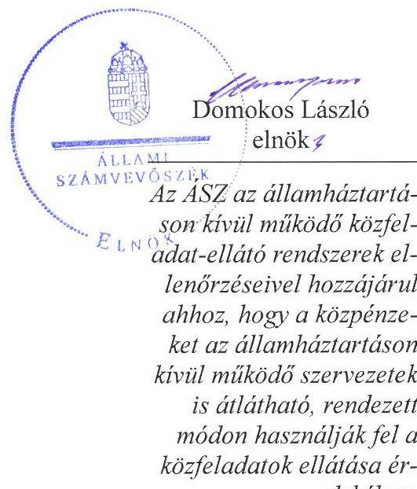
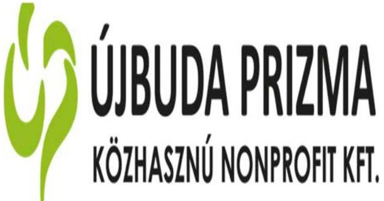
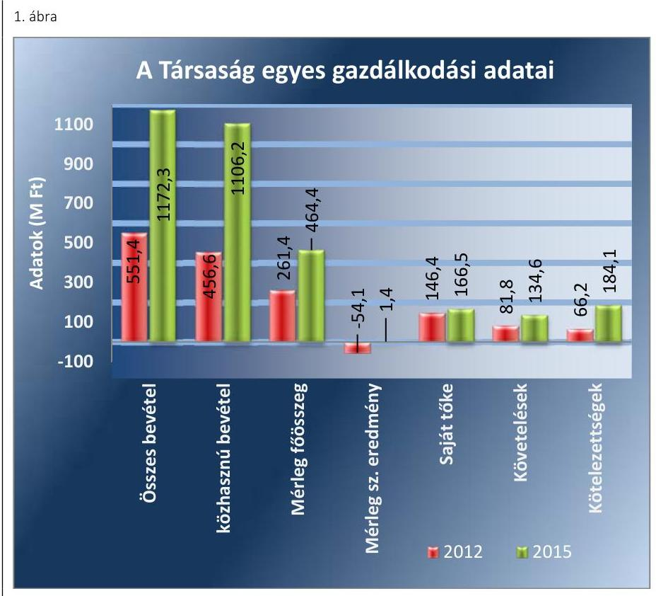
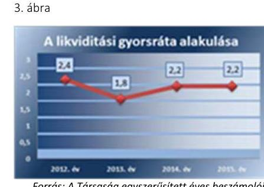
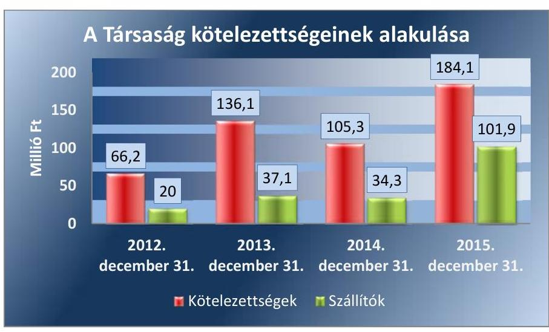
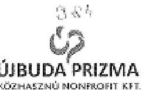

# Jelentés 

## Az önkormányzatok gazdasági társaságai

Az önkormányzatok többségi tulajdonában lévő gazdasági társaságok gazdálkodásának ellenőrzése - Újbuda Prizma Szociális Fejlesztési és Foglalkoztatási Közhasznú Nonprofit Kft. 2017.

Az ÁSZ az államháztartáson kívül működő közfeladat-ellátó rendszerek ellenőrzéseivel hozzájárul ahhoz, hogy a közpénzeket az államháztartáson kívül működő szervezetek is átlátható, rendezett módon használják fel a közfeladatok ellátása érdekében.

---

# Jelentés 

## Az önkormányzatok gazdasági társaságai

Az önkormányzatok többségi tulajdonában lévő gazdasági társaságok gazdálkodásának ellenőrzése - Újbuda Prizma Szociális Fejlesztési és Foglalkoztatási Közhasznú Nonprofit Kft.
2017. július 26. nap

---

# AZ ELLENŐRZÉST FELÜGYELTE: 

DR. HORVÁTH MARGIT felügyeleti vezető

## AZ ELLENŐRZÉST VEZETTE ÉS A VÉGREHAJTÁSÁÉRT FELELŐS:

KLINGA LÁSZLÓ ellenőrzésvezető

## A PROGRAM ÖSSZEÁLLÍTÁSÁÉRT FELELŐS:

JANIK JÓZSEF osztályvezető

IKTATÓSZÁM: V-1290-163/2016.
TÉMASZÁM: 2324

## ELLENŐRZÉS-AZONOSÍTÓ SZÁM: V075815

Jelentéseink az Országgyűlés számítógépes hálózatán és az Interneten a www.asz.hu címen is olvashatóak.

---

# TARTALOMJEGYZÉK 

■ ÖSSZEGZÉS ..... 5
■ AZ ELLENŐRZÉS CÉLJA ..... 6
■ AZ ELLENŐRZÉS TERÜLETE ..... 7
■ AZ ELLENŐRZÉS HÁTTERE, INDOKOLTSÁGA ..... 9
■ A JELENTÉS LÉNYEGES KÉRDÉSKÖREI ..... 10
■ ELLENŐRZÉS HATÓKÖRE ÉS MÓDSZEREI ..... 11
■ MEGÁLLAPÍTÁSOK ..... 13
■ JAVASLATOK ..... 20
■ MELLÉKLETEK ..... 23
I. sz. melléklet: Értelmező szótár ..... 23
II. sz. melléklet: A Társaság mérlegadatainak alakulása 2012-2015 között ..... 24
III. sz. melléklet: A Társaság eredményének alakulása 2012-2015 között ..... 25
■ FÜGGELÉK: ÉSZREVÉTELEK ..... 27
■ RÖVIDÍTÉSEK JEGYZÉKE ..... 29

---

.

---

# ÖSSZEGZÉS 

Budapest Főváros XI. kerület Újbuda Önkormányzata a tulajdonosi jogait a 2012-2015. években szabályszerűen gyakorolta. Az Újbuda Prizma Szociális Fejlesztési és Foglalkoztatási Közhasznú Nonprofit Kft. vagyongazdálkodása szabályszerű, a fizetőképesség biztosított volt. A Társaság belső szabályozása megfelelő az előírásoknak. Az árképzés a piaci árak figyelembe vételével történt.

## Az ellenőrzés társadalmi indokoltsága

Az Állami Számvevőszék kiemelt célja, hogy a helyi önkormányzatok gazdálkodásában rejlő pénzügyi kockázatok feltárásával, az államháztartáson kívülre nyújtott költségvetési támogatások és ingyenes vagyonjuttatások, valamint az államháztartáson kívül működő feladat-ellátó rendszerek ellenőrzéseivel hozzájáruljon ahhoz, hogy a közpénzeket az államháztartáson kívül működő szervezetek is átlátható, rendezett módon használják fel.

Az Állami Számvevőszék céljaival és a társadalmi igénnyel összhangban, a gazdasági társaságok kiemelt fontosságú szerepe miatt került sor az Újbuda Prizma Szociális Fejlesztési és Foglalkoztatási Közhasznú Nonprofit Kft. ellenőrzésére.

## Főbb megállapítások, következtetések, javaslatok

Az Önkormányzat a tulajdonosi jogok gyakorlásának kereteit az Alapító Okiratban szabályszerűen meghatározta. A tulajdonosi jogokat az arra jogosultak az Alapító Okiratban meghatározottaknak megfelelően gyakorolták. A Képviselő-testület az üzleti terv készítési kötelezettséget előírta a Társaság részére, a beszámoló elfogadásáról az FB írásbeli jelentésének birtokában döntött. A javadalmazással összefüggő szabályokat a Képviselő-testület a Taktv.-ben előírtak ellenére nem alkotott. Az Önkormányzat belső ellenőrzése a Társaságnál a 2014. évben végzett ellenőrzést, ezzel támogatta a szabályszerű működés kontrollját.

A Társaság rendelkezett a Számv. tv. előírásainak megfelelő számviteli szabályzatokkal, azonban a számviteli politika aktualizálása maradéktalanul nem történt meg. A saját vagyon nyilvántartása a jogszabályi és a belső előírásoknak megfelelt. A Társaság a 2012. évben veszteségesen, a 2013-2015. években nyereségesen gazdálkodott, fizetőképessége biztosított volt. A rövid lejáratú kötelezettségeinek az ellenőrzött időszakban döntően határidőben eleget tudott tenni. A Társaság a tervezési, beszámolási és adatszolgáltatási kötelezettségének határidőben eleget tett. Az Info. tv.-ben előírtak ellenére a közérdekű adatok megismerésére irányuló igények teljesítésének rendjét nem szabályozták.

A bevételeket a ráfordításokat, továbbá a beruházásokat, felújításokat szabályszerűen számolták el. Az önköltségszámítás rendjére vonatkozó szabályzat készítésére nem volt kötelezett a Társaság. A termékek és szolgáltatások díjának kialakításakor az aktuális piaci árakat, továbbá a kereslet-kínálat alakulását vették figyelembe.

---

# AZ ELLENŐRZÉS CÉLJA 

AZ ELLENŐRZÉS CÉLJA annak értékelése volt, hogy az önkormányzat vagyongazdálkodási tevékenysége során szabályszerűen gyakorolta-e a tulajdonosi jogait.

Ellenőriztük, hogy a gazdasági társaság szabályozottsága, gazdálkodása és vagyongazdálkodási tevékenysége, bevételeinek és ráfordításainak elszámolása megfelelt-e a jogszabályi és tulajdonosi előírásoknak.

Értékeltük továbbá, hogy a gazdasági társaság kötelezettségállománya jelentett-e kockázatot a működésre, valamint a gazdálkodás átláthatósága és elszámoltathatósága érdekében biztosítva volt-e a szolgáltatás díjának megalapozottsága szabályszerű önköltségszámítással.

---

# AZ ELLENŐRZÉS TERÜLETE

## Budapest Főváros XI. kerület Újbuda Önkormányzata és a kizárólagos tulajdonában lévő Újbuda Prizma Szociális Fejlesztési és Foglalkoztatási Közhasznú Nonprofit Kft.

**BUDAPEST FŐVÁROS XI. KERÜLET ÚJBUDA ÖNKORMÁNYZATA** a 100%-os tulajdonában lévő Újbuda Prizma Szociális Fejlesztési és Foglalkoztatási Közhasznú Kft-t 2001. november 16-án alapította, amely tevékenységét 2009. január 1-jétől kezdve Nonprofit Kft-ként folytatta.

A Társaság1 működésének célja a szociális alkalmazkodási képességben hátrányos helyzetben lévő emberek társadalmi felzárkóztatásának és a megváltozott munkaképességűek foglalkoztatási programok megvalósításának keretében történő foglalkoztatásának elősegítése. Ehhez kapcsolódóan a tartós munkanélküliség okozta szociálpszichológiai ártalmak csökkentése, munkahelyteremtés, megváltozott munkaképességű, illetve fogyatékkal élő személyek tartós foglalkoztatása, lelki sérültek rehabilitációja, esélyegyenlőség elősegítése, képzés és foglalkoztatáshoz kapcsolódó szolgáltatások nyújtása, helyi közutak, köztisztaság és települési környezet kialakítása és fenntartása volt a cél.

A Társaságnál a munkavégzés lehetőségét a parkfenntartási és kötészeti tevékenységek keretében biztosították, emellett őrzött parkolókat, sebesség-visszajelző táblákat és a Vahot utcai heti vásárt üzemeltették.

A 2012. évben az Önkormányzat2 döntése alapján az "ÚT XI" Nonprofit Kft. beolvadt a Társaságba, így az alapításkori 43,0 millió Ft törzstőkéje 57,6 millió Ft-ra emelkedett. A beolvadó társaság fő tevékenységként az Önkormányzat területén útkarbantartási feladatokat látott el.

A Társaságnál a 2012. évben 262 fő, a 2015. évben 271 fő munkavállalót alkalmaztak, ebből megváltozott munkaképességűek létszáma 166 fő, illetve 190 fő volt. A megváltozott munkaképességű munkavállalók 85%-át részmunkaidőben foglalkoztatták.

A Társaság gazdálkodásának egyes adatait a 2012-2015. évek vonatkozásában az 1. ábra szemlélteti.

---

Forrás: A Társaság 2012. és 2015. évi beszámolói
A mérlegfőösszeg 2012. év végéről 2015. december 31-re 261,4 millió Ft-ról 464,4 millió Ft-ra, összes bevétele 2012-ről 2015-re 551,4 millió Ft-ról 1172,3 millió Ft-ra emelkedett. Az ellenőrzött időszakban az Önkormányzat összesen 84,0 millió Ft támogatásban részesítette a Társaságot, amelyből 27,4 millió Ft fejlesztési célú támogatás volt.

Az ellenőrzött időszakban a polgármester ${ }^{3}$, a jegyző ${ }^{4}$ és az ügyvezető ${ }^{5}$ személyében nem történt változás.

---

# AZ ELLENŐRZÉS HÁTTERE, INDOKOLTSÁGA 

AZ ÖNKORMÁNYZATOK TÖBBSÉGI TULAJDONÁBAN ÁLLÓ GAZDASÁGI TÁRSASÁGOK ellenőrzése kiemelten fontos a vagyon megőrzése, megóvása érdekében, valamint a kormányzati szektor elszámolásaiban megjelenő önkormányzati tulajdonú gazdálkodó szervezetek esetében, amelyekkel szemben alapvető követelmény, hogy gazdálkodásuk, működésük szabályszerű, az általuk szolgáltatott adatok minél megbízhatóbbak legyenek. A feladatellátás költségeinek, ráfordításainak alakulása a lakosság széles rétegét érinti.

Ellenőrzéseink feltárhatják, hogy az önkormányzat a feladatellátásához rendelt vagyon működtetését a tulajdonostól elvárható gondossággal végezte-e, a feladatot ellátó gazdasági társaság a létesítő okiratban, szolgáltatási szerződésben foglaltak betartásával biztosította-e a feladat ellátását. Az ellenőrzés rávilágíthat arra, hogy a gazdasági társaság a vagyon használatával biztosította-e a szolgáltatás folytatásának feltételeit, az önkormányzat tulajdonosi felügyelete hozzájárult-e a szabályszerű gazdálkodáshoz és feladatellátáshoz. A megállapítások alapján megfogalmazott számvevőszéki javaslatok hasznosítása elősegítheti a meglévő hibák megszüntetését. A jó gyakorlatok bemutatásával az ÁSZ hozzájárulhat a követendő megoldások megismertetéséhez, terjesztéséhez.

---

# A JELENTÉS LÉNYEGES KÉRDÉSKÖREI 

1- Az önkormányzat tulajdonosi joggyakorlása szabályszerű volt-e?
2. A gazdasági társaság vagyongazdálkodása szabályszerű volt-e, fizetőképessége biztosított volt-e a gazdálkodás során?
3. A gazdasági társaság bevételeinek és ráfordításainak elszámolása, valamint az önköltségszámítás és árképzés szabályszerű volt-e?

---

# ELLENŐRZÉS HATÓKÖRE ÉS MÓDSZEREI 

## Az ellenőrzés típusa

Megfelelőségi ellenőrzés.

## Az ellenőrzött időszak

Az ellenőrzött időszak 2012. január 1-jétől 2015. december 31-ig tartott.

## Az ellenőrzés tárgya

Az önkormányzatok - többségi tulajdonában lévő gazdasági társaságok feletti - tulajdonosi joggyakorlása, valamint a gazdasági társaságok gazdálkodásának szabályozottsága és szabályszerűsége.

Az ellenőrzés kiterjedt minden olyan körülményre és adatra, amely az ÁSZ jogszabályban meghatározott feladatainak teljesítéséhez, valamint a program végrehajtása folyamán felmerült újabb összefüggések feltárásához szükséges volt.

## Az ellenőrzött szervezet

Budapest Főváros XI. kerület Újbuda Önkormányzata és Újbuda Prizma Szociális Fejlesztési és Foglalkoztatási Közhasznú Nonprofit Kft.

## Az ellenőrzés jogalapja

Az ellenőrzés jogszabályi alapját az ÁSZ tv. 1. § (3) bekezdése és 5. § (3)-(4)-(5) bekezdései képezték.

## Az ellenőrzés módszerei

Az ellenőrzést a nemzetközi standardokat irányadónak tekintve az ellenőrzési program ellenőrzési kérdései, az ellenőrzött időszakban hatályos jogszabályok, az ellenőrzés szakmai szabályok és módszertanok figyelembe vételével végeztük.

Az ellenőrzés ideje alatt az ellenőrzött szervezettel történő kapcsolattartást az ÁSZ Szervezeti és Működési Szabályzatának vonatkozó előírásai alapján biztosítottuk.

Az ellenőrzés a kiválasztott, többségi tulajdonosi jogokat gyakorló önkormányzatra, illetve az ellenőrzött gazdasági társaságra terjedt ki.

---

Az ellenőrzési kérdések megválaszolásához szükséges bizonyítékok megszerzése a következő ellenőrzési eljárások alkalmazásával történt: megfigyelés, kérdésfeltevés (információkérés), összehasonlítás, valamint elemző eljárás. Az ellenőrzési bizonyítékként felhasználható adatforrások közé tartoztak egyrészt az ellenőrzési programban felsorolt adatforrások, másrészt adatforrás lehetett még minden - az ellenőrzés folyamán - feltárt, az ellenőrzés szempontjából információkat tartalmazó dokumentum.

Az ellenőrzést a kérdésekre adott válaszok kiértékelésével, valamint a megjelölt adatforrások, a csatolt tanúsítványok felhasználásával, továbbá az adott időszakban hatályos jogszabályok figyelembe vételével folytattuk le.

A bevételek és ráfordítások elszámolása, valamint a vagyonnyilvántartás terén a szabályszerű működést véletlen mintavétellel ellenőriztük. A mintavétellel ellenőrzött területek esetében minden egyes tétel vonatkozásában a szabályszerűségre vonatkozó kérdéseket tettünk fel, amelyek eredménye összesítésre került. Megfelelőnek értékeltünk egy ellenőrzött területet, amennyiben 95%-os bizonyossággal a teljes sokaságban a hibaarány legfeljebb 10%, nem megfelelőnek, amennyiben 10%-nál magasabb arányt képviselt. Abban az esetben, ha a teljes sokaság tekintetében a 10%-os hibaarányhoz való viszony megítélésének megbízhatósága nem érte el a 95%-ot, annak elérése érdekében értékelésünket további szempontokkal egészítettük ki, és figyelembe vettük a feltárt hibák típusát és súlyát. A ráfordítások elszámolására és a vagyonnyilvántartásra vonatkozó véletlen mintavételt kockázati alapú kiválasztással egészítettük ki, amelynek során évente a három legnagyobb összegű tételt választottuk ki.

---

# 1. Az önkormányzat tulajdonosi joggyakorlása szabályszerű volt-e? 

Összegző megállapítás

A tulajdonosi joggyakorlás összességében szabályszerű volt.

### 1.1. számú megállapítás

A tulajdonosi joggyakorlás kereteit szabályszerűen alakították ki.
Az Önkormányzat az Ötv. 91. § (6) bekezdése, 2013. január 1-jétől az Mötv. 116. § (3)-(4) bekezdései alapján Gazdasági Programjában, valamint az Nvtv. 9. § (1) bekezdése alapján elkészítette közép- és hosszú távú vagyongazdálkodási tervében határozta meg a Társaság tevékenységére is kiterjedően a feladatok biztosítására és fejlesztésére vonatkozó célkitűzéseit.

## A TULAJDONOSI JOGOK GYAKORLÁSÁNAK KE-

RETEIT az Önkormányzat a Társaság Alapító Okiratában határozta meg, a Gt. és a Ptk. előírásaival összhangban. Részletes szabályokat a Vagyonrendeletben határozott meg, amelyben a Képviselő-testület az Önkormányzat egyszemélyes gazdasági társaságai és nonprofit gazdasági társaságai esetében - egyes jogokat - a Gazdasági Bizottságára ruházott át. A Képviselő-testület fenntartotta magának az FB tagjainak a Társaság könyvvizsgálójának, az ügyvezető és más vezető állású munkavállalók megválasztásának, visszahívásának és javadalmazásának megállapítási jogát. A Vagyonrendelet a gazdasági társaság alapításával, képviseletével, ügyvezető, FB tagok választásával kapcsolatos előírásai az Alapító Okirat előírásaival összhangban voltak.

## A FELADATELLÁTÁST SZOLGÁLÓ VAGYON KÖRE

- mint telephelyként szolgáló ingatlanok - az Alapító okiratban kerültek meghatározásra. Az Önkormányzat 2012-ben határozatban döntött - a kizárólagos tulajdonában lévő -
 „Út XI." Nonprofit Kft. társaságba történő beolvadásáról, így a feladatellátást szolgáló vagyon a beolvadó társaság vagyonával bővült. A Társaság az ellenőrzött időszakban vagyonkezelésbe vett vagyonnal nem rendelkezett.

Az Önkormányzat a Civil tv. ${ }^{15}$ 2. § 20. pontja alapján a Társaság közhasznú tevékenységeit az Alapító Okiratban ${ }^{16}$ határozta meg.

Az Önkormányzatnak a Társaság feladatellátásával kapcsolatban rendeletalkotási, továbbá árképzéssel és díjmegállapítással összefüggő szabályozási kötelezettsége nem volt.

---

# 1.2. számú megállapítás 

A tulajdonosi jogok gyakorlása a jogszabályi rendelkezések alapján kialakított szabályozásnak megfelelően történt.

A tulajdonosi jogok gyakorlását az ügyvezető, az FB tagok és a könyvvizsgáló megválasztása és javadalmazása megállapítása során Képviselő-testület látta el. Az ügyvezető tekintetében az egyéb munkáltatói jogokat a polgármester gyakorolta. A Gazdasági Bizottság feladatellátása a Képviselő-testület előírásainak megfelelően történt.

Üzleti terv készítési kötelezettséget az Önkormányzat a Társaság Alapító Okiratában írt elő. A Társaság az éves üzleti terveket elkészítette, melyet a tulajdonos az Alapító Okiratban foglalt határidőn - tárgyévet megelőző év december 10. - túl, következő év áprilisában fogadott el az ellenőrzött időszak minden évében.

Az FB a Gt. és a Ptk. 2. előírásának megfelelően három tagból állt. Az ellenőrzött időszakban az FB munkaterv alapján látta el feladatait. Megtárgyalta és véleményezte a Társaság üzleti tervét, egyszerűsített éves beszámolóját és közhasznúsági mellékletét, valamint az ügyvezető prémium feltételeinek kiírását és teljesítését. Az FB a 2012-2015. években a Gt. 35. § (3) bekezdésében, illetve a Ptk. 2. 3:120. § (2) bekezdésének megfelelően minden évben írásbeli jelentést készített a Társaság számviteli beszámolójáról.

Javadalmazási szabályzatot a Társaság legfőbb szerve a Taktv. ${ }^{17}$ 5. § (3) bekezdése előírása ellenére nem alkotott.

Az éves beszámoló elfogadására az FB írásbeli jelentésének és a független könyvvizsgálói vélemény birtokában került sor a Képviselőtestület által. A Társaság az ellenőrzött időszakban a 2012. év kivételével pozitív mérlegszerinti eredményt ért el, amelyet eredménytartalékba helyezett. A mérleg szerinti eredmény alakulását a 2. ábra szemlélteti.

Az Önkormányzat belső ellenőrzése az Ötv. 92. § (11) bekezdés b) pontjában, illetve az Áht. ${ }^{18}$ 70. § (1) bekezdés d) pontjában foglaltakkal élve 2013-ban és 2014-ben tervezte éves ellenőrzési terv alapján a Társaság ellenőrzését. A 2013. évi ellenőrzés elmaradt, a 2014. évi ellenőrzés a Társaság működésének eredményességére és gazdaságosságára irányult. Az ellenőrzés az Önkormányzat érdekeit sértő, jogszerűtlen vagyongazdálkodási tevékenységet nem tárt fel.

---

# 2. A gazdasági társaság vagyongazdálkodása szabályszerű volt-e, fizetőképessége biztosított volt-e a gazdálkodás során? 

Összegző megállapítás

2.1. számú megállapítás

A Társaság vagyongazdálkodása szabályszerű volt, fizetőképessége biztosított volt a gazdálkodás során.

A Társaság a jogszabály által előírt szabályzatokkal rendelkezett, azonban a számviteli politika aktualizálása nem történt meg maradéktalanul.

A Társaság rendelkezett a Számv. tv. ${ }^{19}$ 14. § (3) bekezdésében előírt számviteli politika ${ }_{1}{ }^{20}{ }_{2}{ }^{21}$-val, a Számv. tv. 14. § (5) bekezdés a), b), és d) pontjaiban foglaltaknak megfelelően eszközök és források leltárkészítési és leltározási szabályzatával ${ }^{22}$, eszközök és források értékelési szabályzatával ${ }_{1}{ }^{23}{ }_{2}{ }^{24}{ }_{3}{ }^{25}$-val és pénzkezelési szabályzat ${ }_{1}{ }^{26}{ }_{2}{ }^{27}{ }_{3}{ }^{28}$-tal. Rendelkeztek továbbá a Számv. tv. 161. § (1) bekezdésében előírt számlarend ${ }_{1}{ }^{29}{ }_{2}{ }^{30}$-del. A számlarend ${ }_{2}$ megfelelt a Számv. tv. 161. § (2) bekezdés a)-d) pontjaiban foglalt tartalmi követelményeknek. A Számv. tv. 14. § (5) bekezdés c) pontjában meghatározott, önköltségszámítás rendjére vonatkozó szabályzat készítésére a Társaság a Számv. tv. 14. § (6)-(7) bekezdéseiben foglaltak alapján nem volt kötelezett.

A számviteli politika ${ }_{1,2}$ a Számv. tv. 14. § (4) bekezdésében előírtaknak megfelelően meghatározta a Társaságra jellemző szabályokat, előírásokat, módszereket. Meghatározták, hogy mit tekintenek a számviteli elszámolás és értékelés szempontjából lényegesnek, jelentősnek, nem lényegesnek, nem jelentősnek, továbbá azt, hogy a törvényben biztosított választási, minősítési lehetőségek közül melyeket alkalmazza.

A Társaság a Számv. tv. 14. § (11) bekezdése ellenére nem vezette át a számviteli politiká ${ }_{1,2}$-n a Számv. tv. 2013. január 1-jei - eszközök bekerülési értéke, pénzügyi lízing, nem pénzbeli pótbefizetés - és a Számv. tv. 3. § (3) bekezdés 3. pont szerinti jelentős összegű hiba meghatározása változásait.

Az eszközök és források leltárkészítési és leltározási szabályzata a mérlegtételek leltárral való alátámasztását előírta, a mennyiségben is nyilvántartott eszközei esetében a mennyiségi leltározás szabályait a Számv. tv. 69. § (3) bekezdésében foglaltaktól szigorúbban határozta meg, mert évenkénti mennyiségi leltározást írt elő a Számv. tv. által meghatározott, legalább háromévenkénti mennyiségi leltározás helyett.

A pénzkezelési szabályzat ${ }_{1,2,3}$ a Számv. tv. 14. § (8) bekezdése előírásainak megfelelt, meghatározta - többek között - a pénzforgalom lebonyolításának rendjét, a pénzkezelés személyi és tárgyi feltételeit, felelősségi szabályait, a napi készpénz záró állomány maximális mértékét, a pénzforgalommal kapcsolatos nyilvántartási szabályokat.

Az eszközök és források értékelési szabályzata ${ }_{1,2,3}$ a Számv. tv. 47-59. §-aiban foglaltaknak megfelelően

---

meghatározta az eszközök és források bekerülési értéke, az eszközök értékcsökkenése és értékvesztése, valamint a mérlegben szereplő eszközök és források értékelése szabályait.

A Társaság közhasznú tevékenysége mellett vállalkozási tevékenységet is folytatott. A Számv. tv. 161/A. § (1) és (2) bekezdés előírása ellenére belső szabályait nem alakította ki oly módon, hogy azok a mérleg és eredménykimutatás alátámasztásán túlmenően a kiegészítő melléklet adatainak közvetlen alátámasztására is alkalmasak legyenek, továbbá a közpénzek felhasználásának és a köztulajdon használatának nyilvánossága és ellenőrizhetősége érdekében nem alakított ki olyan részletezettségű nyilvántartási (könyvvezetési) rendszert, melyből a vonatkozó külön jogszabályban meghatározott adatok rendelkezésre álltak.

# 2.2. számú megállapítás 

## A Társaság vagyongazdálkodása a jogszabályok és a belső szabályzatok előírásainak megfelelt.

A saját vagyon nyilvántartása a 2012-2015. években a jogszabályi és belső szabályzatokban foglaltaknak megfelelt, a Társaság a vagyonának értékét megőrizte, gyarapította. Az egyszerűsített éves beszámolóiban szereplő tárgyi eszközök, készletek állományát mennyiségi, egyéb eszközei és forrásai mérlegértékét december 31-i fordulónappal készült leltárral alátámasztották. A leltározási tevékenység végrehajtása és az egyszerűsített éves beszámoló leltárral történő alátámasztása a Számv. tv. 69. § (1)-(3) bekezdésében foglalt előírásoknak megfelelt.

Az eszközök és források értéke 2012. január 1-jéről 2012. december 31-re 62,1%-kal (100,2 millió Ft-tal) emelkedett, amelyet döntően az Önkormányzat tulajdonában lévő „Út XI" Kft.-nek - a Képviselő-testület határozata alapján - a Társaságba történő beolvadása eredményezett.

Az eszközök értéke 2012. december 31-ről 2015. december 31-re 77,6%-kal (202,9 millió Ft-tal) emelkedett, amelyet a tárgyi eszközök, a követelések és a pénzeszközök állományának növekedése okozott. A követelései 52,9 millió Ft-tal, pénzeszközei 68,9 millió Ft-tal növekedtek a 2012. év végéről a 2015. év végére. A Társaság a 2015. évben 101,5 millió Ft értékű beruházást aktivált. A források növekedését jellemzően a kötelezettségek több, mint másfélszeresére (117,9 millió Ft-tal), a passzív időbeli elhatárolások több mint kétszeresükre (58,4 millió Ft-tal) történő növekedése okozott.

Az ellenőrzött időszakban a Társaság rendelkezett a társasági formájára kötelezően előírt jegyzett tőkének megfelelő összegű saját tőkével, így az Önkormányzatnak a Gt. 51. § (1) bekezdés és a Ptk. 3:133. § (2) bekezdés szerinti intézkedési kötelezettsége nem keletkezett.

A Társaság főbb mérlegadatait a II. számú melléklet, az eredménykimutatás adatait a III. sz. melléklet szemlélteti.

## 2.3. számú megállapítás

A Társaság fizetőképessége biztosított volt a gazdálkodás során, a kötelezettségállománya nem jelentett veszélyt a feladat ellátására.

A Társaság kötelezettségeinek összege - amelyek kizárólag rövid lejáratúak voltak - a 2012. január 1-jei 47,1 millió Ft-ról 2015. december 31-re közel négyszeresére (137,0 millió Ft-tal) emelkedett. A kötelezettségállomány növekedése a Társaság működésére nem jelentett veszélyt. Likviditási

---

gyorsrátája - a 2013. év kivételével - 2,0 fölött volt, amelyet a szakirodalom kedvezőnek minősít. Alakulását a 3. ábra szemlélteti.

Rövidlejáratú kötelezettségeinek a Társaság az ellenőrzött időszakban döntően eleget tudott tenni. A 2012. év végén a Társaság 3,3 millió Ft lejárt határidejű szállítói tartozással rendelkezett, amely a 2015. év végére több mint kétszeresére (7,9 millió Ft-ra) emelkedett. 360 napon túli lejárt szállítói tartozással a Társaság a 2015. évben rendelkezett, összege 0,3 millió Ft volt. A szállítói tartozások a 2014. évről a 2015. évre közel háromszorosára emelkedtek, amit a csapadékvíz elvezetéssel kapcsolatos beruházások 64,8 millió Ft-os szállítói számlája kiegyenlítésének 2016. évre történő áthúzódása okozott.

A Társaság összes kötelezettsége és azon belül a szállítói tartozása alakulását a 4. ábra szemlélteti:
4. ábra

A Társaság egyéb kötelezettségei döntően a NAV ${ }^{31}$-val és a munkavállalókkal szemben fennálló kötelezettségek, amelyek a következő évre áthúzódó munkabérekkel és járulékokkal voltak kapcsolatosak.
2.4. számú megállapítás

A Társaság az előírt beszámolási, adatszolgáltatási kötelezettséget teljesítette. A közérdekű adatok megismerésére irányuló igények teljesítésének rendjét nem szabályozta.

## A beszámolási és adatszolgáltatási kö-

telezettséget az Alapító okiratban rögzítették. A Társaság az egyszerűsített éves beszámolókat a Számv. tv. 19. § (1) bekezdésében előírt tartalommal elkészítette, a Számv. tv. 153. § (1) bekezdésében foglaltaknak megfelelően közzétette, a letétbe helyezésről a Számv. tv. 154. § (1) bekezdésében foglaltaknak megfelelően gondoskodott. A Civil tv. 46. § (1) bekezdése alapján az ellenőrzött időszak minden évében közhasznúsági mellékletet készítettek, amelyek a 350/2011. (XII. 30.) Korm. rendelet mellékletében foglalt formai előírásoknak nem feleltek meg, mert azok a 2012. január 1-jével hatályon kívül helyezett 224/2000. (XII. 19.) Korm. rendelet 6. számú melléklete által előírt formában készültek.

---

Az egyszerűsített éves beszámolók elfogadásáról a Képviselő-testület a könyvvizsgáló és az FB írásos véleménye alapján döntött a beszámolóról. A könyvvizsgáló az egyszerűsített éves beszámolókat hitelesítő záradékkal látta el.

A Társaság a 2012-2015. években az Info tv. ${ }^{32}$ 33. § (3) bekezdésében és a 37. § (1) bekezdésében foglalt, az 1. mellékletben meghatározott tartalmú közzétételi kötelezettségének a gazdálkodási adatai tekintetében honlapján eleget tett.

Az Info tv. 30. § (6) bekezdése előírása ellenére a közérdekű adatok megismerésére irányuló igények teljesítésének rendjét rögzítő szabályzattal nem rendelkezett.

# 3. A gazdasági társaság bevételeinek és ráfordításainak elszámolása, valamint az önköltségszámítás és árképzés szabályszerű volt-e? 

Összegző megállapítás

## 3.1. számú megállapítás

A bevételek és ráfordítások elszámolása szabályszerű volt, önköltségszámítás rendjére vonatkozó szabályzat készítésére a Társaság nem volt kötelezett.

A bevételek és ráfordítások elszámolása szabályszerű volt.
A Társaság közhasznú tevékenysége mellett vállalkozási tevékenységet is végzett. Számviteli politikájában és számlarendjében nem rögzítette a közhasznú és a vállalkozási tevékenység bevételeinek és ráfordításainak elkülönített nyilvántartására vonatkozó előírásait. A szabályozási hiányosság ellenére a közhasznú és a vállalkozási tevékenység bevételei, kiadásai, költségei és ráfordításai elszámolása során az elkülönített nyilvántartás vezetését megvalósította.

A bevételek elszámolása szabályszerű volt. A bevételeket a belső szabályozásoknak megfelelően írták elő, elszámolásuk a Számv. tv. 72-77. §-ai előírásának és a számlatükörnek megfelelő számlacsoportban, feladatok szerint elkülönítve történt.

Az anyag- és személyi jellegű ráfordítások elszámolása szabályszerű volt, megfelelt a Számv. tv. 78. §, 79. § és 81.
 §-ok előírásainak. Az elszámolásokat megalapozó dokumentumok (szerződések, megrendelések, számlák) rendelkezésre álltak.

A BERUHÁZÁSOK, FELÚJÍTÁSOK KIADÁSAI ÉS AZ ÉRTÉKCSÖKKENÉSI LEÍRÁS ELSZÁMOLÁSA összességében szabályszerű volt. A bekerülési érték megállapítása, az eszközök besorolása megfelelt a Számv. tv. 47-51. §-ai előírásának. Az egyszerűsített éves beszámoló kiegészítő mellékletében a Számv. tv. 92. § (1) bekezdésében foglaltaknak megfelelően bemutatták az immateriális javak és tárgyi eszközök nyitó és záró bruttó értékét, valamint az elszámolt, halmozott értékcsökkenését mérlegtételek szerinti bontásban.

---

1. táblázat

|  ELSZÁMOLT ÉRTÉKCSÖKKENÉS ÉS |  |   |
| --- | --- | --- |
|  A BERUHÁZÁSOK ALAKULÁSA |  |   |
|  (MFT) |  |   |
|  Évek | Elszámolt értékcsökkenési leírás | Beruházások, felújítások  |
|  2012. | 15,4 | 31,3  |
|  2013. | 18,6 | 17,7  |
|  2014. | 22,1 | 31,5  |
|  2015. | 31,2 | 101,5  |
|  Forrás: a Társaság egyszerűsített éves beszámoló és kiegészítő mellékletei |  |   |

3.2. számú megállapítás

A Társaság az ellenőrzött időszakban összességében az elszámolt értékcsökkenést (87,3 millió Ft) meghaladó összegű beruházásokat, felújításokat (182,0 millió Ft) hajtott végre, biztosítva az eszközök elhasználódási ütemét meghaladó mértékű eszközpótlást. A beruházások, felújítások és az elszámolt értékcsökkenés alakulását a 2012-2015. években az 1. táblázat tartalmazza.

A KÖVETELÉSEK ÁLLOMÁNYA a 2012. év eleji 36,9 millió Ft-ról a 2015. év végére több, mint három és félszeresére (97,7 millió Ft-tal) növekedett. A Társaság határidőn túli vevőköveteléseinek összege 2015. december 31-én 7,4 millió Ft volt. A lejárt határidejű követelések esetében a Számv. tv. és a Számviteli politika előírása szerint a követelések minősítését elvégezték és a minősítések alapján az értékvesztést elszámolták.

A Társaság önköltségszámítás rendjére vonatkozó szabályzat készítésére nem volt kötelezett. Árképzése az aktuális piaci árak figyelembe vételével történt.

ÖNKÖLTSÉGSZÁMÍTÁS RENDJÉRE VONATKOZÓ SZABÁLYZAT készítésére a Társaság a Számv. tv. 14. § (6)-(7) bekezdéseiben foglaltak alapján nem volt kötelezett, nem is készített.

Árképzéssel kapcsolatos tulajdonosi elvárás, ágazati előírás a 2012-2015. években nem volt a Társaság felé. Az értékesített termékek és szolgáltatások díjainak kialakításakor a bázis időszak adatait, valamint a díjakat befolyásoló tényezők (bérek, anyagok) alakulását, az aktuális piaci árakat, a kereslet és kínálat alakulását vették figyelembe.

---

# JAVASLATOK 

Az ÁSZ tv. 33. § (1) bekezdésében foglaltak értelmében az ellenőrzött szervezet vezetője köteles a jelentésben foglalt megállapításokhoz kapcsolódó intézkedési tervet összeállítani és azt a jelentés kézhezvételétől számított 30 napon belül az ÁSZ részére megküldeni. Amennyiben az ellenőrzött szervezet vezetője nem küldi meg határidőben az intézkedési tervet, vagy továbbra sem elfogadható intézkedési tervet küld, az Állami Számvevőszék elnöke az ÁSZ tv. 33. § (3) bekezdés a) és b) pontjaiban foglaltakat érvényesítheti.

Javaslataink célja az Újbuda-Prizma Szociális Fejlesztési és Foglalkoztatási Közhasznú Nonprofit Kft. gazdálkodása szabályszerűségének és gyakorlatának javítása annak érdekében, hogy a szabályozási környezet és az alkalmazott gyakorlat megfelelően tudja támogatni az átlátható működést.

## Az Újbuda-Prizma Szociális Fejlesztési és Foglalkoztatási Közhasznú Nonprofit Kft. ügyvezetőjének

1. Intézkedjen a Társaság számviteli politikájának a Számv. tv.-nek megfelelő tartalommal történő módosításáról, kiemelt figyelemmel a jelentős összegű hiba meghatározására.
(2.1. sz. megállapítás 3. bekezdése alapján)
2. Intézkedjen a közérdekű adatok megismerésére irányuló igények teljesítésének rendjére vonatkozó szabályzat elkészítéséről az Info tv. előírásainak megfelelően.
(2.4. sz. megállapítás 4. bekezdése alapján)

---

Javaslataink célja az Önkormányzat szabályszerű működésének elősegítése, továbbá az önkormányzati tulajdonosi joggyakorlás kontrolljainak erősítése.

# Budapest Főváros XI. kerület Újbuda Önkormányzat polgármesterének 

1. Intézkedjen a Társaság vezető tisztségviselői, illetve a Felügyelő Bizottsági tagok, valamint az Mt. 208. §-ának hatálya alá eső munkavállalók javadalmazása, valamint a jogviszony megszünése esetére biztosított juttatások módjának, mértékének elveire, annak rendszerére vonatkozó javadalmazási szabályzat-tervezet elkészítése és Képviselőtestület elé terjesztése érdekében.
(1.2. sz. megállapítás 4. bekezdése alapján)

---

.

---

# MELLÉKLETEK 

- I. SZ. MELLÉKLET: ÉRTELMEZŐ SZÓTÁR
gazdasági társaság
gazdálkodó szervezet
nemzeti vagyon
nonprofit gazdasági társaság
vagyonkezelő
$\mathrm{Ptk}_{2}$. 3.88. § (1) bekezdése szerint „a gazdasági társaságok üzletszerű közös gazdasági tevékenység folytatására, a tagok vagyoni hozzájárulásával létrehozott, jogi személyiséggel rendelkező vállalkozások, amelyekben a tagok a nyereségből közösen részesednek, és a veszteséget közösen viselik".
A $\quad \mathrm{Ptk}_{.}{ }^{33} \quad 685 . \quad$ § c) pontja szerint gazdálkodó szervezet: „az állami vállalat, az egyéb állami gazdálkodó szerv, a szövetkezet, a lakásszövetkezet, az európai szövetkezet, a gazdasági társaság, az európai részvénytársaság, az egyesülés, az európai gazdasági egyesülés, az európai területi együttműködési csoportosulás, az egyes jogi személyek vállalata, a leányvállalat, a vízgazdálkodási társulat, az erdő birtokossági társulat, a végrehajtói iroda, az egyéni cég, továbbá az egyéni vállalkozó." (2014. 03. 15-ig hatályos)

Nvtv. 1. § (2) bekezdése szerint többek között:
„az állam vagy a helyi önkormányzat kizárólagos tulajdonában álló dolgok, az a) pont hatálya alá nem tartozó, állam vagy a helyi önkormányzat tulajdonában lévő dolog,
az állam vagy a helyi önkormányzat tulajdonában lévő pénzügyi eszközök, továbbá az államot vagy a helyi önkormányzatot megillető társasági részesedések,
az államot vagy a helyi önkormányzatot megillető bármely vagyoni értékkel rendelkező jogosultság, amelyet jogszabály vagyoni értékű jogként nevesít."
Civil tv. 9/F. § (2) bekezdése szerint „az a gazdasági társaság minősül nonprofit gazdasági társaságnak és cégnevében az a gazdasági társaság tüntetheti fel a nonprofit jelleget, amelynek létesítő okirata tartalmazza, hogy a gazdasági társaság tevékenységéből származó nyereség a tagok között nem osztható fel, hanem az a gazdasági társaság vagyonát gyarapítja." (hatályos 2014. március 15-től)
vagyonkezelő:
a) az állam tulajdonában álló nemzeti vagyon tekintetében:
aa) költségvetési szerv,
ab) helyi önkormányzat, önkormányzati társulás,
ac) önkormányzati intézmény,
ad) köztestület,
ae) az állam, az aa)-ac) alpontban meghatározott személyek együtt vagy külön-külön 100%-os tulajdonában álló gazdálkodó szervezet,
af) az ae) alpont szerinti gazdálkodó szervezet 100%-os tulajdonában álló gazdálkodó szervezet,
ag) a törvény által kijelölt egyedileg meghatározott jogi személy.
b) a helyi önkormányzat tulajdonában álló nemzeti vagyon tekintetében:
ba) önkormányzati társulás,
bb) költségvetési szerv vagy önkormányzati intézmény,
bc) köztestület,
bd) az állam, a helyi önkormányzat, a ba)-bb) alpontban meghatározott személyek együtt vagy külön-külön 100%-os tulajdonában álló gazdálkodó szervezet,
be) a bd) alpont szerinti gazdálkodó szervezet 100%-os tulajdonában álló gazdálkodó szervezet.
c) az egyházi jogi személy a tevékenysége ellátásához szükséges nemzeti vagyon tekintetében. (Forrás: Nvtv. 3. § (1) bekezdés 19. pontja)

---

|  |   |   |   |   |   |   |
| --- | --- | --- | --- | --- | --- | --- |
|  |   |   |   |   |   |   |
|  Megnevezés | 2012.01.01. | 2012.12.31. | 2013.12.31. | 2014.12.31. | 2015.12.31. | Változás 2015.12.31./ 2012.01.01. (%)  |
|  1. | 2. | 3. | 4. | 5. | 6. | 7.  |
|  A. Befektetett eszközök | 46 543 | 81 158 | 80 236 | 89 036 | 157 696 | 238,8%  |
|  I. IMMATERIÁLIS JAVAK | 139 | 462 | 873 | 566 | 327 | 135,3%  |
|  II. TÁRGYI ESZKÖZÖK | 46404 | 80696 | 79363 | 88470 | 157369 | 239,1%  |
|  B. Forgóeszközök | 82575 | 164194 | 257336 | 240902 | 290627 | 251,9%  |
|  I. KÉSZLETEK | 3408 | 3454 | 7731 | 9349 | 7435 | 118,2%  |
|  II. KÖVETELÉSEK | 36874 | 81786 | 108106 | 89631 | 134650 | 265,2%  |
|  IV. PÉNZESZKÖZÖK | 42293 | 79674 | 141499 | 141922 | 148542 | 251,2%  |
|  C. Aktív időbeli elhatárolások | 32136 | 15347 | 6353 | 0 | 16044 | -50,1%  |
|  ESZKÖZÖK (AKTÍVÁK) ÖSSZESEN | 161254 | 261419 | 343925 | 329938 | 464367 | 187,9%  |
|  D. SAJÁT TÖKE | 60573 | 146358 | 163960 | 165027 | 166456 | 174,8%  |
|  I. JEGYZETT TÖKE | 43000 | 57590 | 57590 | 57590 | 57590 | 33,9%  |
|  IV. EREDMÉNYTARTALÉK | -6118 | 142829 | 88769 | 106370 | 107436 | 1856,1%  |
|  VII. MÉRLEG SZERINTI EREDMÉNY | 23691 | -54061 | 17601 | 1067 | 1430 | -93,9%  |
|  E. Céltartalékok | 3354 | 0 | 0 | 0 | 6600 | 96,8%  |
|  F. Kötelezettségek | 47133 | 66174 | 136064 | 105292 | 184052 | 290,5%  |
|  III. RÖVID LEJÁRATÚ KÖTELEZETTSÉGEK | 47133 | 66174 | 136064 | 105292 | 184052 | 290,5%  |
|  G. Passzív időbeli elhatárolások | 50194 | 48887 | 43901 | 59619 | 107259 | 113,7%  |
|  FORRÁSOK (PASSZÍVÁK) ÖSSZESEN | 161254 | 261419 | 343925 | 329938 | 464367 | 187,9%  |

Forrás: a Társaság egyszerűsített éves beszámolói

---

| Megnevezés | 2012.01.01. | 2012.12.31. | 2013.12.31. | 2014.12.31. | 2015.12.31. | Változás 2015.12.31./ 2012.01.01. (%) |
| :--: | :--: | :--: | :--: | :--: | :--: | :--: |
| 1. | 2. | 3. | 4. | 5. | 6. | 7. |
| I. Értékesítés nettó árbevétele | 370683 | 315219 | 637866 | 1502610 | 840714 | 126,8% |
| III. Egyéb bevételek | 230914 | 227845 | 282824 | 374853 | 331513 | 43,6% |
| IV. Anyagjellegű ráfordítások | 183396 | 166792 | 351621 | 1157979 | 536142 | 192,3% |
| V. Személyi jellegű ráfordítások | 384844 | 417977 | 538587 | 698016 | 589552 | 53,2% |
| VI. Értékcsökkenési leírás | 10869 | 15429 | 18582 | 22132 | 31169 | 186,8% |
| VII. Egyéb ráfordítások | 4450 | 4896 | 2778 | 4869 | 13662 | 207,0% |
| VII. sorból: értékvesztés |  |  | 962 | - |  | - |
| Üzemi (üzleti) tevékenység eredménye | 18038 | -62030 | 9122 | -5533 | 1702 | -90,6% |
| VIII. Pénzügyi műveletek bevételei | 23 | 684 | 213 | 9 | 64 | 178,3% |
| IX. Pénzügyi műveletek ráfordításai | 27 | 43 | 50 | 20 | 261 | 866,7% |
| Pénzügyi műveletek eredménye | -4 | 641 | 163 | -11 | -197 | 4825% |
| Szokásos vállalkozási eredmény | 18034 | -61389 | 9285 | -5544 | 1505 | -91,6% |

 \%$ |
| X. Rendkívüli bevételek | 5657 | 7611 | 8474 | 6629 | 0 | - |
| Adózás előtti eredmény | 23691 | -53778 | 17759 | 1085 | 1505 | -93,6 % |
| XII. Adófizetési kötelezettség | 0 | 283 | 158 | 18 | 74 | - |
| Adózott eredmény | 23691 | -54061 | 17601 | 1067 | 1430 | -93,9 % |
| Mérleg szerinti eredmény | 23691 | -54061 | 17601 | 1067 | 1430 | -93,9 % |

Forrás: a Társaság egyszerűsített éves beszámolói

---

.

---

# FÜGGELÉK: ÉSZREVÉTELEK 

A jelentéstervezetet a Számvevőszék 15 napos észrevételezésre megküldte az ellenőrzött szervezet vezetőjének az ÁSZ tv. 29. § (1) bekezdése előírásának megfelelően.
Az ellenőrzött szervezetek észrevételt nem tettek.

* 29. § (1) Az Állami Számvevőszék az ellenőrzési megállapításait megküldi az ellenőrzött szervezet vezetőjének vagy az általa megbízott személynek, és annak, akinek személyes felelősségét állapította meg.
(2) Az ellenőrzött szervezet vezetője és a felelősként megjelölt személy az ellenőrzés megállapításaira tizenöt napon belül írásban észrevételt tehet.
(3) Az Állami Számvevőszék az észrevételre a beérkezésétől számított harminc napon belül írásban válaszol. A figyelembe nem vett észrevételeket köteles a jelentésben feltüntetni, és megindokolni, hogy azokat miért nem fogadta el.

---

# Függelék: Észrevételek

**Állami Számvevőszék**

**Budapest**

**Pf. 54**

**1364**

**Iktatószám:** IRO/44-1/2017

**Ügyintéző:** Bálint Zsuzsanna

**Elérhetősége:** +36 1 372 76 40

**Domokos László**

**elnök**

**részére**

**Tárgy:** Válaszlevél a V-1016-139/2016 ügyiratszámú megkeresésre

## Tisztelt Domokos László Elnök Úr!

Köszönettel megkaptuk a V-1016-139/2016 ügyiratszámon nyilvántartott levelet illetve a számvevőszéki jelentéstervezetüket. A jelentéstervezettel kapcsolatban észrevétellel nem élünk; az Újbuda Prizma Közhasznú Nonprofit Kft-re vonatkozó 2 javaslatot pedig mielőbb végre fogjuk hajtani, melyhez intézkedési tervet készítettem elő, hogy minél rövidebb idő alatt tökéletesítsük rendszerünket.

Egyáltalán saját és kollégáim nevében is köszönöm munkájukat, észrevételeiket, melyek szintén hozzájárulnak az általam vezetett cég jobb működéséhez.

További sikeres munkát kívánok Önnek és munkatársainak!

Budapest, Újbuda, 2017. június 15.

Tisztelettel:

**Állami Számvevőszék** (repeated 70 times)
 VC

**Budapest**

**Pf. 54**

**1364**

**Iktatószám:** IRO/44-1/2017

**Ügyintéző:** Bálint Zsuzsanna

**Elérhetősége:** +36 1 372 76 40

**Tisztelettel:**

**Állami Számvevőszék**

**Budapest**

**Pf. 54**

**1364**

**1364**

**1364**

**Iktatószám:** IRO/44-1/2017

**Ügyintéző:** Bálint Zsuzsanna

**Elérhetősége:** +36 1 372 76 40

**Tisztelettel:**

**Állami Számvevőszék**

**Budapest**

**Pf. 54**

**1364**

**1364**

**1364**

**1364**

**1364**

**1364**

**1364**

**1364**

**1364**

**1364**

**1364**

**1364**

**1364**

**1364**

**1364**

**1364**

**1364**

**1364**

**1364**

**1364**

**1364**

**1364**

**1364**

**1364**

**1364**

**1364**

**1364**

**1364**

**1364**

**1364**

**1364**

**1364**

**1364**

**1364**

**1364**

**1364**

**1364**

**1364**

**1364**

**1364**

**1364**

**1364**

**1364**

**1364**

**1364**

**1364**

**1364**

**1364**

**1364**

**1364**

**1364**

**1364**

**1364**

**1364**

**1364**

**1364**

**1364**

**1364**

**1364**

**1364**

**1364**

**1364**

**1364**

**1364**

**1364**

**1364**

**1364**

**1364**

**1364**

**1364**

**1364**

**1364**

**1364**

**1364**

**1364**

**1364**

**1364**

**1364**

**1364**

**1364**

**1364**

**1364**

**1364**

**1364**

**1364**

**1364**

**1364**

**1364**

**1364**

**1364**

**1364**

**1**

---

# RÖVIDÍTÉSEK JEGYZÉKE 

${ }^{1}$ Társaság
${ }^{2}$ Önkormányzat
${ }^{3}$ polgármester
${ }^{4}$ jegyző
${ }^{5}$ ügyvezető
${ }^{6}$ Ötv.
${ }^{7}$ Mótv.
${ }^{8}$ Gazdasági Program
${ }^{9}$ Nvtv.
${ }^{10}$ Gt.
${ }^{11}$ Ptk. 2
${ }^{12}$ Képviselő-testület
${ }^{13}$ Gazdasági Bizottság
${ }^{14} \mathrm{FB}$
${ }^{15}$ Civil tv.
${ }^{16}$ Alapító Okirat
${ }^{17}$ Taktv.
${ }^{18}$ Áht.
${ }^{19}$ Számv. tv.
${ }^{20}$ számviteli politika ${ }_{1}$
${ }^{21}$ számviteli politika ${ }_{2}$
${ }^{22}$ eszközök és források leltárkészítési és leltározási szabályzata
${ }^{23}$ eszközök és források értékelési szabályzata ${ }_{3}$

Újbuda Prizma Szociális Fejlesztési és Foglalkoztatási Közhasznú Nonprofit Kft.
Budapest Főváros XI. Kerület Újbuda Önkormányzata
Budapest Főváros XI. Kerület Újbuda Önkormányzat Polgármestere
Budapest Főváros XI. Kerület Újbuda Önkormányzat Jegyzője
Újbuda Prizma Szociális Fejlesztési és Foglalkoztatási Közhasznú Nonprofit Kft. ügyvezetője
a helyi önkormányzatokról szóló 1990. évi LXV. törvény
Magyarország helyi önkormányzatairól szóló 2011. évi CLXXIX. törvény
Budapest Főváros XI. Kerület Újbuda Önkormányzatának Gazdasági Programja a 2007-2013. évekre szóló módosított gazdasági program, elfogadva a 240/2007. (V. 17.) Ök határozattal. A program hatályát a Képviselő-testület a 115/2011. (III. 29.) Ök. határozattal 2014. december 31-ig meghosszabbította. A 79/2015. (IV. 23.) Ök. határozattal elfogadva a 2015-2020. évekre szóló gazdasági program.
a nemzeti vagyonról szóló 2011. évi CXCVI. törvény (hatályos 2011. december 31-étől)
a gazdasági társaságokról szóló 2006. évi IV. törvény
a Polgári Törvénykönyvről szóló 2013. évi V. törvény
Budapest Főváros XI. Kerület Újbuda Önkormányzat Képviselő-testülete
Budapest Főváros XI. Kerület Újbuda Önkormányzat Képviselőtestületének Gazdasági Bizottsága
Újbuda Prizma Szociális Fejlesztési és Foglalkoztatási Közhasznú Nonprofit Kft. Felügyelő Bizottsága
az egyesülési jogról, a közhasznú jogállásról, valamint a civil szervezetek működéséről és támogatásáról szóló 2011. évi CLXXV. törvény
Újbuda Prizma Szociális Fejlesztési és Foglalkoztatási Közhasznú Nonprofit Kft. Alapító Okirata.
a köztulajdonban álló gazdasági társaságok takarékosabb működéséről szóló 2009. évi CXXII. törvény
az államháztartásról szóló 2011. évi CXCV. törvény
a számvitelről szóló 2000. évi C. törvény
az Újbuda Prizma Szociális Fejlesztési és Foglalkoztatási Közhasznú Nonprofit Kft. számviteli politikája és értékelési szabályzata szöveges számlakerettel, hatályos 2011. január 1-jétől 2015. január 31-ig
az Újbuda Prizma Szociális Fejlesztési és Foglalkoztatási Közhasznú Nonprofit Kft. számviteli politikája és értékelési szabályzata szöveges számlakerettel, hatályos 2015. február 1-jétől
az Újbuda Prizma Szociális Fejlesztési és Foglalkoztatási Közhasznú Nonprofit Kft. eszközök és források leltárkészítési és leltározási szabályzata, hatályos 2011. január 7-től
az Újbuda Prizma Szociális Fejlesztési és Foglalkoztatási Közhasznú Nonprofit Kft. számviteli politikája és értékelési szabályzata szöveges számlakerettel, hatályos 2011. január 1-jétől 2015. január 31-ig

---

${ }^{24}$ eszközök és források értékelési szabályzata ${ }_{2}$
${ }^{25}$ eszközök és források értékelési szabályzata ${ }_{3}$
${ }^{26}$ pénzkezelési szabályzat ${ }_{1}$
${ }^{27}$ pénzkezelési szabályzat ${ }_{2}$
${ }^{28}$ pénzkezelési szabályzat ${ }_{3}$
${ }^{29}$ számlarend $_{1}$
${ }^{30}$ számlarend $_{2}$
${ }^{31} \mathrm{NAV}$
${ }^{32}$ Info tv.
${ }^{33}$ Ptk. 1
az Újbuda Prizma Szociális Fejlesztési és Foglalkoztatási Közhasznú Nonprofit Kft. számviteli politikája és értékelési szabályzata szöveges számlakerettel, hatályos 2015. február 1-jétől
az Újbuda Prizma Szociális Fejlesztési és Foglalkoztatási Közhasznú Nonprofit Kft. eszközök és források értékelési szabályzata szöveges számlakerettel, hatályos 2015. február 1-jétől
az Újbuda Prizma Szociális Fejlesztési és Foglalkoztatási Közhasznú Nonprofit Kft. pénzkezelési szabályzata, hatályos 2012. január 1-jétől 2013. február 28-ig
az Újbuda Prizma Szociális Fejlesztési és Foglalkoztatási Közhasznú Nonprofit Kft. pénzkezelési szabályzata, hatályos 2013. március 1-jétől 2015. február 10-ig
az Újbuda Prizma Szociális Fejlesztési és Foglalkoztatási Közhasznú Nonprofit Kft. pénzkezelési szabályzata, hatályos 2015. február 11-től
az Újbuda Prizma Szociális Fejlesztési és Foglalkoztatási Közhasznú Nonprofit Kft. számviteli politikája és értékelési szabályzata szöveges számlakerettel, hatályos 2011. január 1-jétől 2015. január 31-ig
az Újbuda Prizma Szociális Fejlesztési és Foglalkoztatási Közhasznú Nonprofit Kft. számviteli politikája és értékelési szabályzata szöveges számlakerettel, hatályos 2015. február 1-jétől
Nemzeti Adó- és Vámhivatal
az információs önrendelkezési jogról és az információszabadságról szóló 2011. évi CXII. törvény
a Polgári Törvénykönyvről szóló 1959. évi IV. törvény

---

ÁLLAMI SZÁMVEVŐSZÉK
1052 Budapest, Apáczai Csere János utca 10.
Levélcím: 1364 Budapest 4. Pf. 54
Telefon: +36 14849100 Telefax: +36 14849200
www.asz.hu
