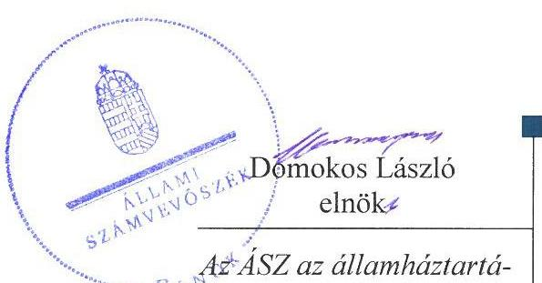
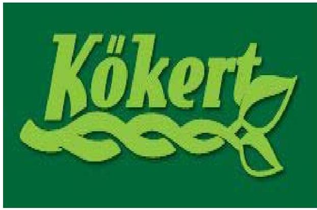
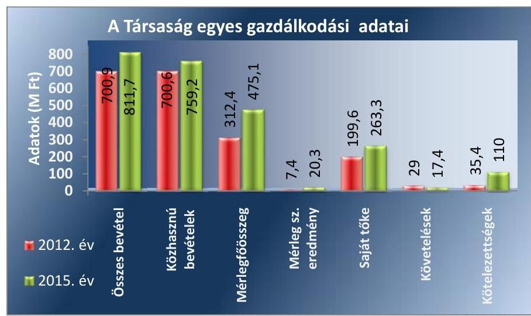
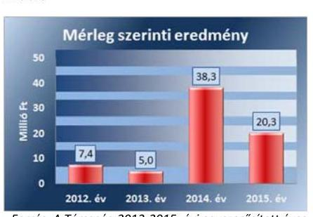
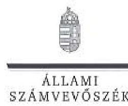
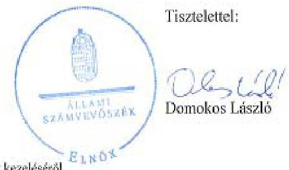
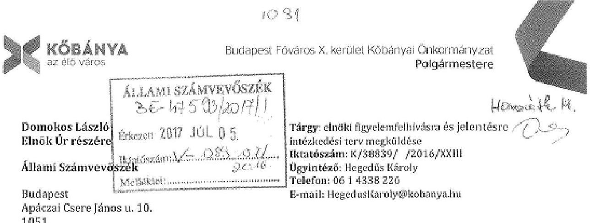
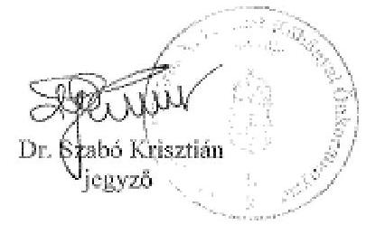
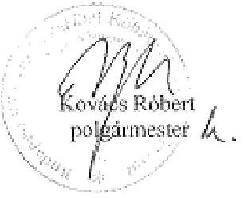

# Jelentés 

## Az önkormányzatok gazdasági társaságai

Az önkormányzatok többségi tulajdonában lévő gazdasági társaságok gazdálkodásának ellenőrzése - KÖKERT Kőbányai Kerületgondnoksági és Településüzemeltetési Non-profit Közhasznú Kft.

2017

Az ÁSZ az államháztartáson kívül müködő fel-adat-ellátó rendszerek ellenőrzéseivel hozzájárul ahhoz, hogy a közpénzeket az államháztartáson kívül müködő szervezetek is átlátható, rendezett módon használják fel a feladatok ellátása érde-
kében.

---

# Jelentés 

## Az önkormányzatok gazdasági társaságai

Az önkormányzatok többségi tulajdonában lévő gazdasági társaságok gazdálkodásának ellenőrzése - KÖKERT Kőbányai Kerületgondnoksági és Településüzemeltetési Non-profit Közhasznú Kft.
2017. 

17116
www.asz.hu

---

# AZ ELLENŐRZÉST FELÜGYELTE: 

DR. HORVÁTH MARGIT felügyeleti vezető

## AZ ELLENŐRZÉST VEZETTE ÉS A VÉGREHAJTÁSÁÉRT FELELŐS:

KLINGA LÁSZLÓ ellenőrzésvezető

## A PROGRAM ÖSSZEÁLLÍTÁSÁÉRT FELELŐS:

JANIK JÓZSEF osztályvezető

IKTATÓSZÁM: V-1289-145/2016.
TÉMASZÁM: 2323

## ELLENŐRZÉS-AZONOSÍTÓ SZÁM: V075814

Jelentéseink az Országgyúlés számítógépes hálózatán és az Interneten a www.asz.hu címen is olvashatóak.

---

# TARTALOMJEGYZÉK 

■ ÖSSZEGZÉS ..... 5
■ AZ ELLENŐRZÉS CÉLJA ..... 6
■ AZ ELLENŐRZÉS TERÜLETE ..... 7
■ AZ ELLENŐRZÉS HÁTTERE, INDOKOLTSÁGA ..... 9
■ A JELENTÉS LÉNYEGES KÉRDÉSKÖREI ..... 10
■ ELLENŐRZÉS HATÓKÖRE ÉS MÓDSZEREI ..... 11
■ MEGÁLLAPÍTÁSOK ..... 13
■ JAVASLATOK ..... 20
■ MELLÉKLETEK ..... 23
I. sz. melléklet: Értelmező szótár ..... 23
II. sz. melléklet: A Társaság mérlegadatainak alakulása 2012-2015 között ..... 24
III. sz. melléklet: A Társaság eredményének alakulása 2012-2015 között ..... 25
■ FÜGGELÉK: ÉSZREVÉTELEK ..... 27
■ RÖVIDÍTÉSEK JEGYZÉKE ..... 37

---

.

---

# ÖSSZEGZÉS 

Budapest Főváros X. kerület Kőbányai Önkormányzata a tulajdonosi jogait a 2012-2015. években szabályszerűen gyakorolta. A KÖKERT Kőbányai Kerületgondnoksági és Településüzemeltetési Non-profit Közhasznú Kft. fizetőképessége biztosított volt, a tervezési és beszámolási kötelezettségének eleget tett. A Társaság vagyongazdálkodása során a vagyonkezelésbe kapott ingatlant nem mutatta ki könyveiben, így a beszámolók nem mutattak valós képet.

## Az ellenőrzés társadalmi indokoltsága

Az Állami Számvevőszék kiemelt célja, hogy a helyi önkormányzatok gazdálkodásában rejlő pénzügyi kockázatok feltárásával, az államháztartáson kívülre nyújtott költségvetési támogatások és ingyenes vagyonjuttatások, valamint az államháztartáson kívül múködő feladat-ellátó rendszerek ellenőrzéseivel hozzájáruljon ahhoz, hogy a közpénzeket az államháztartáson kívül múködő szervezetek is átlátható, rendezett módon használják fel.

Az Állami Számvevőszék céljaival és a társadalmi igénnyel összhangban, a gazdasági társaságok kiemelt fontosságú szerepe miatt került sor a KÖKERT Kőbányai Kerületgondnoksági és Településüzemeltetési Non-profit Közhasznú Kft. ellenőrzésére.

## Főbb megállapítások, következtetések, javaslatok

Az Önkormányzat a tulajdonosi jogok gyakorlásának rendjét a Vagyonrendeletben és az SZMSZ-ben szabályszerűen meghatározta. A tulajdonosi jogokat a Képviselő-testület gyakorolta, hatáskört nem ruházott át. A Képviselő-testület az üzleti terv készítési kötelezettséget előírta a Társaság részére, a beszámoló elfogadásáról az FB írásbeli jelentésének birtokában döntött. A javadalmazással összefüggő szabályokat a Képviselő-testület a Taktv.-ben előírtaknak megfelelően meghatározta. Az Önkormányzat belső ellenőrzése a Társaságnál a 2014. évben végzett ellenőrzést, ezzel támogatta a szabályszerű múködés kontrollját.

A Társaság rendelkezett a Számv. tv. előírásainak megfelelő számviteli szabályzatokkal, azonban a számviteli politika az értékelési szabályzat és a leltározási szabályzat tartalma maradéktalanul nem felelt meg az előírásoknak. A Társaság az Önkormányzattól vagyonkezelésbe kapott ingatlant a könyveiben nem tartotta nyilván. Ennek következtében a Társaság egyszerűsített éves beszámolói nem mutattak megbízható és valós képet a vagyoni, pénzügyi és jövedelmi helyzetről, és azok változásáról annak ellenére, hogy a könyvvizsgáló hitelesítő záradékkal látta el.

A Társaság az ellenőrzött időszakban nyereségesen gazdálkodott, fizetőképessége biztosított volt. A tervezési, beszámolási és adatszolgáltatási kötelezettségének határidőben eleget tett. Az Info. tv.-ben meghatározott tartalmú közzétételi kötelezettségének a gazdálkodási adatok tekintetében teljes körűen nem tettek eleget, a közérdekú adatok igénylésének és közzétételének rendjét nem szabályozták. A bevételeket a ráfordításokat, továbbá a beruházásokat, felújításokat szabályszerűen számolták el, azonban a személyi juttatások elszámolása a béren kívüli juttatások miatti elszámolások hiányossága miatt nem volt szabályszerű.

---

# AZ ELLENŐRZÉS CÉLJA 

AZ ELLENŐRZÉS CÉLJA annak értékelése volt, hogy az önkormányzat vagyongazdálkodási tevékenysége során szabályszerűen gyakorolta-e a tulajdonosi jogait.

Ellenőriztük, hogy a gazdasági társaság szabályozottsága, gazdálkodása és vagyongazdálkodási tevékenysége, bevételeinek és ráfordításainak elszámolása megfelelt-e a jogszabályi és tulajdonosi előírásoknak.

Értékeltük továbbá, hogy a gazdasági társaság kötelezettségállománya jelentett-e kockázatot a múködésre, valamint a gazdálkodás átláthatósága és elszámoltathatósága érdekében biztosítva volt-e a szolgáltatás díjának megalapozottsága szabályszerű önköltségszámítással.

---

# **A Z ELLENŐRZÉS TERÜLETE**

## **Budapest Főváros X. kerület Kőbányai Önkormányzata és a kizárólagos tulajdonában lévő a KŐKERT Kerületgondnoksági és Településüzemeltetési Non-profit Közhasznú Kft.**

**BUDAPEST FŐVÁROS X. KERÜLET KŐBÁNYAI ÖNKORMÁNYZATA** 2008. április 17-én 50,0 millió Ft készpénz törzstőkével alapította a 100%-os tulajdonában lévő KŐKERT Kőbányai Kerületgondnoksági és Településüzemeltetési Non-profit Közhasznú Kft.-t. Az alapító Önkormányzat¹ a Társaság² törzstőkéjét 2008. december 4-én 64,0 millió Ft-ra emelte, ami az ellenőrzött időszakban nem változott.

Az ellenőrzött időszakban a Társaság székhelye az Önkormányzat által vagyonkezelésbe adott ingatlanban volt. A Társaság Alapító Okirata³ szerinti főtevékenysége egyéb emberierőforrás-ellátás és gazdálkodás volt. Az ellenőrzött időszakban a Társaság végezte Kőbánya területén a parkok, sétányok zöldfelületek, játszóterek takarítását, gondozását. A Társaság az ellenőrzött időszakban 150 hektáron látta el a helyi közterületek fenntartását és a településtisztasági feladatokat. A térfigyelő rendszer működtetése során a 2012. évben 53, a 2015. évben 89 kamerát működtetett.

A Társaság átlagos statisztikai létszáma a 2012. évben 151 fő a 2015. évben 258 fő volt, amely létszámnak több mint kétharmada közfoglalkoztatott volt.

Az Alapító Okiratban foglaltak alapján a Társaság üzletszerű gazdasági tevékenységet csak kiegészítő jelleggel, közhasznú tevékenységét nem veszélyeztetve folytathatott.

A Társaság gazdálkodásának főbb adatait a 2012. és 2015. évek tekintetében az 1. ábra szemlélteti:

1. ábra

*Forrás: a Társaság 2012. és 2015. évi egyszerűsített éves beszámolói*

---

A mérleg főösszeg 2012. év végéről 2015. december 31-re 312,4 millió Ft-ról 475,1 millió Ft-ra, összes bevétele 2012-ről 2015-re 700,9 millió Ft-ról 811,7 millió Ft-ra emelkedett. Az ellenőrzött időszakban az Önkormányzat a Feladat-ellátási szerződés alapján összesen 2540,4 millió Ft, míg a Munkaügyi Központ 392,9 millió Ft közfoglalkoztatási támogatásban részesítette a Társaságot. A Társaság működésének főbb jellemzőit a II. számú melléklet mutatja be.

A polgármester ${ }^{4}$, a jegyző ${ }^{5}$ és az ügyvezető ${ }^{6}$ személye az ellenőrzött időszakban nem változott.

---

# AZ ELLENŐRZÉS HÁTTERE, INDOKOLTSÁGA 

AZ ÖNKORMÁNYZATOK TÖBBSÉGI TULAJDONÁBAN ÁLLÓ GAZDASÁGI TÁRSASÁGOK ellenőrzése kiemelten fontos a vagyon megőrzése, megóvása érdekében, valamint a kormányzati szektor elszámolásaiban megjelenő önkormányzati tulajdonú gazdálkodó szervezetek esetében, amelyekkel szemben alapvető követelmény, hogy gazdálkodásuk, múködésük szabályszerű, az általuk szolgáltatott adatok minél megbízhatóbbak legyenek. A feladatellátás költségeinek, ráfordításainak alakulása a lakosság széles rétegét érinti.

Ellenőrzéseink feltárhatják, hogy az önkormányzat a feladatellátásához rendelt vagyon múködtetését a tulajdonostól elvárható gondossággal vé-geztette-e, a feladatot ellátó gazdasági társaság a létesítő okiratban, szolgáltatási szerződésben foglaltak betartásával biztosította-e a feladat ellátását. Az ellenőrzés rávilágíthat arra, hogy a gazdasági társaság a vagyon használatával biztosította-e a szolgáltatás folytatásának feltételeit, az önkormányzat tulajdonosi felügyelete hozzájárult-e a szabályszerű gazdálkodáshoz és feladatellátáshoz. A megállapítások alapján megfogalmazott számvevőszéki javaslatok hasznosítása elősegítheti a meglévő hibák megszüntetését. A jó gyakorlatok bemutatásával az ÁSZ hozzájárulhat a követendő megoldások megismertetéséhez, terjesztéséhez.

---

# A JELENTÉS LÉNYEGES KÉRDÉSKÖREI 

1.- Az önkormányzat tulajdonosi joggyakorlása szabályszerű volt-e?
2.- A gazdasági társaság vagyongazdálkodása szabályszerű volt-e, fizetőképessége biztositott volt-e a gazdálkodás során?
3.- A gazdasági társaság bevételeinek és ráfordításainak elszámolása, valamint az önköltségszámitás és árképzés szabályszerű volt-e?

---

# ELLENŐRZÉS HATÓKÖRE ÉS MÓDSZEREI 

## Az ellenőrzés típusa

Megfelelőségi ellenőrzés.

## Az ellenőrzött időszak

Az ellenőrzött időszak 2012. január 1-jétől 2015. december 31-ig tartott.

## Az ellenőrzés tárgya

Az önkormányzatok - többségi tulajdonában lévő gazdasági társaságok feletti - tulajdonosi joggyakorlása, valamint a gazdasági társaságok gazdálkodásának szabályozottsága és szabályszerűsége.

Az ellenőrzés kiterjedt minden olyan körülményre és adatra, amely az ÁSZ jogszabályban meghatározott feladatainak teljesítéséhez, valamint a program végrehajtása folyamán felmerült újabb összefüggések feltárásához szükséges volt.

## Az ellenőrzött szervezet

Budapest Főváros X. kerület Kőbányai Önkormányzat és a KŐKERT Kerületgondnoksági és Településüzemeltetési Non-profit Közhasznú Kft.

## Az ellenőrzés jogalapja

Az ellenőrzés jogszabályi alapját az ÁSZ tv. 1. § (3) bekezdése és 5. § (3)-(4)-(5) bekezdései képezték.

## Az ellenőrzés módszerei

Az ellenőrzést a nemzetközi standardokat irányadónak tekintve az ellenőrzési program ellenőrzési kérdései, az ellenőrzött időszakban hatályos jogszabályok, az ellenőrzés szakmai szabályok és módszertanok figyelembe vételével végeztük.

Az ellenőrzés ideje alatt az ellenőrzött szervezettel történő kapcsolattartást az ÁSZ Szervezeti és Müködési Szabályzatának vonatkozó előírásai alapján biztosítottuk.

Az ellenőrzés a kiválasztott, többségi tulajdonosi jogokat gyakorló önkormányzatra, illetve az ellenőrzött gazdasági társaságra terjedt ki.

---

Az ellenőrzési kérdések megválaszolásához szükséges bizonyítékok megszerzése a következő ellenőrzési eljárások alkalmazásával történt: megfigyelés, kérdésfeltevés (információkérés), összehasonlítás, valamint elemző eljárás. Az ellenőrzési bizonyítékként felhasználható adatforrások közé tartoztak egyrészt az ellenőrzési programban felsorolt adatforrások, másrészt adatforrás lehetett még minden - az ellenőrzés folyamán - feltárt, az ellenőrzés szempontjából információkat tartalmazó dokumentum.

Az ellenőrzést a kérdésekre adott válaszok kiértékelésével, valamint a megjelölt adatforrások, a csatolt tanúsítványok felhasználásával, továbbá az adott időszakban hatályos jogszabályok figyelembe vételével folytattuk le.

A bevételek és ráfordítások elszámolása, valamint a vagyonnyilvántartás terén a szabályszerű működést véletlen mintavétellel ellenőriztük. A mintavétellel ellenőrzött területek esetében minden egyes tétel vonatkozásában a szabályszerűségre vonatkozó kérdéseket tettünk fel, amelyek eredménye összesítésre került. Megfelelőnek értékeltünk egy ellenőrzött területet, amennyiben 95\%-os bizonyossággal a teljes sokaságban a hibaarány legfeljebb 10\%, nem megfelelőnek, amennyiben 10\%-nál magasabb arányt képviselt. Abban az esetben, ha a teljes sokaság tekintetében a 10\%os hibaarányhoz való viszony megítélésnek megbízhatósága nem érte el a 95\%-ot, annak elérése érdekében értékelésünket további szempontokkal egészítettük ki, és figyelembe vettük a feltárt hibák típusát és súlyát. A ráfordítások elszámolására és a vagyonnyilvántartásra vonatkozó véletlen mintavételt kockázati alapú kiválasztással egészítettük ki, amelynek során évente a három legnagyobb összegű tételt választottuk ki.

---

# 1. Az önkormányzat tulajdonosi joggyakorlása szabályszerű volt-e? 

Összegző megállapítás

### 1.1. számú megállapítás

Az Önkormányzat tulajdonosi joggyakorlása szabályszerű volt.
Az Önkormányzat a tulajdonosi joggyakorlásának kereteit szabályszerűen alakította ki.

Az Önkormányzat az Ötv. ${ }^{7}$ 91. § (1)-(6) bekezdéseiben és a Mötv. ${ }^{8}$ 116. § (1)-(5) bekezdésiben foglaltakkal összhangban Gazdasági Programban ${ }^{9}$ rögzítette a hosszú távú fejlesztési elképzeléseit, ami kiterjedt a Társaság feladataira. Az Önkormányzat az Nvtv. ${ }^{10}$ 9. § (1) bekezdésében foglaltak ellenére közép- és hosszú távú vagyongazdálkodási tervet nem készített.

## A TULAJDONOSI JOGOK GYAKORLÁSÁNAK

RENDJÉT az Önkormányzat a Gt. ${ }^{11}$ és a Ptk2. ${ }^{12}$ rendelkezéseivel összhangban a Vagyonrendeletében ${ }^{13}$ és az SZMSZ ${ }^{14}$-ében határozta meg. A Társaság feletti tulajdonosi jogok gyakorlása a Képviselő-testület ${ }^{15}$ feladata volt, tulajdonosi jogok átruházására nem került sor.

## A FELADAT ELLÁTÁST SZOLGÁLÓ VAGYON KÖ-

RÉT a Képviselő-testület - az ellenőrzött időszakot megelőzően - a Társaság Alapító Okiratában meghatározta, és azt az Ötv. 80/A. §-ának (5)(6) bekezdéseiben, illetve a Mötv. 109. §-ában foglaltaknak megfelelő Vagyonkezelési Szerződéssel a Társaság rendelkezésére bocsátotta. Az Önkormányzatnak a Társaság feladat ellátásával kapcsolatban rendeletalkotási, árképzéssel és díjmegállapítással összefüggő szabályozási kötelezettsége nem volt.

A feladatellátáshoz kapcsolódó követelményeket az Önkormányzat a Társaság Alapító Okiratában, a Javadalmazási Szabályzatban ${ }^{16}$, a Feladatellátási ${ }^{17}$-, Közhasznú ${ }^{18}$ - és Vagyonkezelési szerződésekben ${ }^{19}$ írt elő. Meghatározta az üzleti terv ${ }^{20}$ készítési kötelezettséget, továbbá beszámolási, tájékoztatási kötelezettséget írt elő a Társaság számára. A Feladat-ellátási szerződésekben meghatározta a szerződés időtartamát, teljesítendő szolgáltatási kötelezettségeket, az ellátási területet, a feladatellátáshoz szükséges vagyoni kört, az Önkormányzat érdekeit védő garanciális elemeket és a kezelt vagyonnal kapcsolatos részletes szabályokat.
1.2. számú megállapítás

Az Önkormányzat tulajdonosi jogainak gyakorlása szabályszerű volt.

AZ ÜZLETI TERVET a Társaság a Vagyonkezelési- és a Közhasznú szerződésben előírtaknak megfelelően az ellenőrzött időszak minden éve tekintetében elkészítette, amiket a Képviselő-testület határozattal elfogadott. Az üzleti tervek összhangban voltak az Önkormányzat Gazdasági

---

2. ábra

Fonrás: A Társaság 2012-2015. évi egyszerúsített éves beszámolói

Programjával, az Integrált Városfejlesztési Stratégiájával, az Integrált Tele-pülés-fejlesztési Stratégiájával és a Környezetvédelmi Programjával.

AZ FB a Gt. és a Ptk. 2 előírásának megfelelően három tagból állt. Az ellenőrzött években megtárgyalta és véleményezte a Társaság üzleti tervét, egyszerűsített éves beszámolóját és közhasznúsági mellékletét. Az FB a 2012-2015. években a Gt. 35. § (3) bekezdésében, illetve a Ptk. 2 3:120 § (2) bekezdésének megfelelően minden évben írásbeli jelentést készített a Társaság számviteli beszámolójáról.

AZ ÉVES BESZÁMOLÓ elfogadásáról a Képviselő-testület az FB írásbeli jelentésének és a független könyvvizsgálói vélemény birtokában döntött. A Társaság az ellenőrzött időszak minden évében pozitív mérleg szerinti eredményt ért el, amelyet eredménytartalékba helyezett. A Társaság mérleg szerinti eredményének alakulását az ellenőrzött időszakban a 2. ábra szemlélteti.

A JAVADALMAZÁSI SZABÁLYZATOT a Képviselő-testület a Taktv. ${ }^{21}$ 5. § (3) bekezdésében foglaltaknak megfelelő tartalommal elfogadta.

A TÁRSASÁG ELLENŐRZÉSÉT az Önkormányzat az Áht. ${ }^{22}$ 70. § (1) bekezdés d) pontjában kapott felhatalmazás alapján a belső ellenőrzésével 2013. január 1-je és 2014. június 30-a közötti időszak tekintetében végezte el a 2014. évben a beszámolási feladatokat alátámasztó folyamatokra kiterjedő rendszerellenőrzés keretében. A belső ellenőrzés intézkedési terv készítési kötelezettséget nem írt elő. Az ügyvezető ennek ellenére a hiányosságok felszámolása érdekében intézkedési tervet készített, melynek végrehajtásáról a jegyzőnek beszámolt. A jegyző az ügyvezető beszámolóját elfogadta.

# 2. A gazdasági társaság vagyongazdálkodása szabályszerű volt-e, fizetőképessége biztosított volt-e a gazdálkodás során? 

Összegző megállapítás

## 2.1. számú megállapítás

A Társaság saját vagyonnal való gazdálkodása szabályszerű, fizetőképessége biztosított volt. A vagyonkezelésbe átadott vagyon nyilvántartásáról nem gondoskodott.

A Társaság a Számv. tv. szerinti szabályzatokkal rendelkezett, azonban azok tartalma maradéktalanul nem felelt meg az előírásoknak.

A Társaság az ellenőrzött időszakban rendelkezett a Számv. tv. ${ }^{23}$ 14. § (3) bekezdésében előírt Számviteli Politikával ${ }^{24}$, a Számv. tv. 14. § (5) bekezdés a)-b) és d) pontjaiban foglaltaknak megfelelően Leltározási szabályzattal ${ }^{25}$, Pénzkezelési szabályzattal ${ }^{26}$ és Értékelési szabályzattal ${ }^{27}$ és a Számv. tv. 161. § (1) bekezdésében előírt Számlarenddel ${ }^{28}$. A Társaság az Önköltségszámítás rendjére vonatkozó szabályzat elkészítésére a Számv. tv. 14. § (6)-(7) bekezdésben foglaltak alapján nem volt kötelezett.

---

A SZÁMVITELI POLITIKA nem felelt meg a Számv. tv. 14. § (4) bekezdésében foglaltaknak, mert nem tartalmazta a Társaságra jellemző előírásokat, szabályokat, módszereket, nem határozta meg, hogy a törvényben biztosított választási, minősítési lehetőségek közül melyeket, milyen feltételek fennállása esetén alkalmaz, az alkalmazott gyakorlatot milyen okok miatt szükséges megváltoztatni.

Nem tért ki a szabályozás az immateriális javak és értékcsökkenésük elszámolási szabályaira, a tárgyi eszközök értékcsökkenési leírása alapjául azok könyv szerinti értékét határozta meg, a Számv. tv. 52. § (2) bekezdésében előírt bekerülési értékkel ellentétben.

AZ ÉRTÉKELÉSI SZABÁLYZAT egy előírása nem felelt meg a Számv. tv. előírásainak, mert céltartalék képzését írta elő értékvesztés elszámolása helyett a Számv. tv. 55. § (1) bekezdés előírása ellenére a mérlegkészítés időpontjáig pénzügyileg nem rendezett követeléseknél.

A LELTÁROZÁSI SZABÁLYZAT a Számv. tv. 69. § (1) bekezdésével összhangban előírta a mérlegtételek alátámasztásához az évenkénti leltár összeállítását. A mennyiségben is nyilvántartott eszközök esetében az ingatlanoknál és a lealapozott gépeknél három évenkénti, más esetekben évenkénti leltározási kötelezettséget határozott meg, amely megfelelt a Számv. tv. 69. § (3) bekezdése előírásának. A leltározási szabályzat nem terjedt ki a Társaság valamennyi eszközére és forrására, mert nem tartalmazott előírásokat az immateriális javak, valamint az egyéb - az Önkormányzattal, a Munkaügyi Központtal és a NAV ${ }^{29}$-val szemben fennálló - követelések és kötelezettségek leltározására. Ezért nem volt biztosított a Számv. tv. 69. § (1) bekezdésében foglaltaknak megfelelő, olyan leltár összeállíthatósága, amely a Társaságnak a mérleg fordulónapján meglévő eszközeit és forrásait tételesen, ellenőrizhető módon tartalmazza mennyiségben és értékben.

A PÉNZKEZELÉSI SZABÁLYZAT a Számv. tv. 14. § (8) bekezdésében előírt tartalmi követelményeknek megfelelt.

A SZÁMLAREND kialakítása a Számv. tv. 161. § (1)-(3) bekezdésében foglaltakkal összhangban történt.

A Társaság közhasznú tevékenysége mellett vállalkozási tevékenységet is folytatott, illetve vagyonkezelői szerződés alapján a feladat ellátásához szükséges ingatlant vagyonkezelésbe kapta. A Számv. tv. 161/A. § (1) és (2) bekezdés előírása ellenére belső szabályait nem alakította ki oly módon, hogy azok a mérleg és eredménykimutatás alátámasztásán túlmenően a kiegészítő melléklet adatainak közvetlen alátámasztására is alkalmasak legyenek, azaz a közpénzek felhasználásának és a köztulajdon használatának nyilvánossága és ellenőrizhetősége érdekében nem alakított ki olyan részletezettségű nyilvántartási (könyvvezetési) rendszert, melyből a vonatkozó külön jogszabályban - Civil tv. ${ }^{30}$ - meghatározott adatok rendelkezésre álltak.

A Társaság a Számv. tv. 14. § (11) bekezdése ellenére nem vezette át számviteli politikáján a Számv. tv. 2013. január 1-jei - eszközök bekerülési értéke, pénzügyi lízing, nem pénzbeli pótbefizetés - és a Számv. tv. 3. §

---

(3) bekezdés 3. pont szerinti jelentős összegű hiba meghatározása változásait.

# 2.2. számú megállapítás 

## A Társaság a vagyongazdálkodása során Önkormányzattól vagyonkezelésbe kapott vagyont a könyveiben nem tartotta nyilván.

A SAJÁT VAGYON nyilvántartása a jogszabályi és belső szabályzatokban foglalt előírásoknak megfelelt, saját vagyonának értékét megőrizte, gyarapította.

A VAGYONKEZELÉSBE KAPOTT INGATLAN - a Társaság székhelyéül szolgáló ingatlan - vonatkozásában a Társaság megsértve a Számv. tv. 23. § (2) bekezdésében és a Számv. tv. 42. § (5) bekezdésében foglaltakat nem mutatta ki az ingatlant az eszközei és az ingatlan kezelésbevételéhez kapcsolódó kötelezettségét a forrásai között, továbbá nem történt meg a Számv. tv. 52. § (1) bekezdése szerinti értékcsökkenés elszámolása. Így a Számv. tv. 18. § előírása ellenére a Társaság egyszerűsített éves beszámolói nem mutattak megbízható és valós képet a Társaság vagyoni, pénzügyi és jövedelmi helyzetéről, és azok változásáról.

Az ingatlan könyv szerinti értéke a Vagyonkezelési szerződés szerint 38,8 millió Ft (földingatlan 20,2 millió Ft, a felépítmény 18,6 millió Ft) volt. A vagyonkezelői jog földhivatali bejegyzése 2008-ban megtörtént. Nem érvényesült továbbá az Mötv. 109. § (6) bekezdésében foglalt előírás, amely szerint a vagyonkezelő a vagyon felújításáról, pótlólagos beruházásról legalább a vagyoni eszközök elszámolt értékcsökkenésének megfelelő mértékben köteles gondoskodni és e célokra az értékcsökkenésnek megfelelő mértékben tartalékot képezni.

A könyvvizsgáló a Társaság beszámolóját hitelesítő záradékkal látta el annak ellenére, hogy a mérleg a vagyonkezelt eszköz kimutatásának hiányában nem adott valós képet a Társaság vagyoni helyzetéről.

Nem történt meg a vagyonkezelésbe vett ingatlanok után a Számv. tv. 52. § (1) bekezdése szerinti értékcsökkenési leírás elszámolása és az Mötv. 109. § (6) bekezdésében előírt, a vagyonkezelésbe vett ingatlanok után elszámolandó értékcsökkenésnek megfelelő mértékű tartalékképzés.

A Társaság a Számv. tv. 69. § (1)-(3) bekezdései előírásának megfelelően a mérlegében - saját vagyonként - kimutatott eszközöket és forrásokat leltárral alátámasztotta, a folyamatosan vezetett, mennyiségi nyilvántartásaiban szereplő eszközei mennyiségi leltárfelvételét elvégezte és kiértékelte, az a mérlegében szereplő adatokat alátámasztotta.

A mérleg főösszeg 2012. január 1-jéről 2015.december 31-re 47,6\%-kal (153,3 millió Ft-tal) emelkedett, amelyet jellemzően a forgóeszközök és azon belül is a pénzeszközök 58,9\%-os (126,2 millió Ft-os) emelkedése eredményezett. Forrásoldalon a mérlegfőösszeg emelkedését elsősorban a rövid lejáratú kötelezettségek 215,6\%-os ( 75,1 millió Ft-os) és a saját tőke 36,9\%-os ( 71,1 millió Ft-os) növekedése okozott.

Az ellenőrzött időszakban a Társaság rendelkezett a társasági formájára kötelezően előírt jegyzett tőkének megfelelő összegű saját tőkével, így az Önkormányzatnak a Gt. 51. § (1) bekezdés és a Ptk.; 3:133. § (2) bekezdés szerinti intézkedési kötelezettsége nem keletkezett.

A mérlegadatok változását a II., az eredménykimutatás adatainak változását a III. számú melléklet szemlélteti.

---

### 2.3. számú megállapítás

1. táblázat

|  A TÁRSASÁG KÖTELEZETTSÉGEI (MFT) |  |   |
| --- | --- | --- |
|  Megnevezés | 2012. | 2015.  |
|  Szállítók | 18,5 | 20,0  |
|  Egyéb rövid lej. köt. | 16,9 | 90,0  |
|  Rövid lej. köt. | 35,4 | 110,0  |
|  Hosszú lej. köt. | 0,0 | 0,0  |
|  Összes köt. | 35,4 | 110,0  |
|  Forrás: a Társaság 2012. és 2015. évi éves egyszerüsített beszámolói |  |   |

### 2.4. számú megállapítás

A Társaság fizetőképessége az ellenőrzött időszakban biztosított volt, a kötelezettség állomány növekedése a Társaság múködőképességére nem jelentett veszélyt.

A FIZETŐKÉPESSÉG biztosított volt. A Társaság kötelezettségei a 2012. évről a 2015. évre több, mint háromszorosára, míg ezen belül a szállítói kötelezettségek mindössze 8,1\%-kal emelkedtek. Lejárt határidejú szállítói tartozással csak a 2013. évben rendelkeztek ( 0,2 millió Ft), amely a 30 napot nem haladta meg. A kötelezettségállomány növekedése a Társaság múködésére nem jelentett veszélyt.

Egyéb rövid lejáratú kötelezettségek jellemzően a december havi munkabérek tekintetében a munkavállalókkal, illetve a levont adók és járulékok tekintetében a NAV-val szemben fennálló kötelezettségek voltak. Ezen kívül 2015-ben kötelezettségként jelentkezett az Önkormányzat felé keletkezett 63,8 millió Ft támogatás visszafizetési kötelezettség.

A kötelezettségállományra vonatkozó adatokat a 1. táblázat tartalmazza.

A Társaság az ellenőrzött időszakban eleget tett az előírt tervezési, beszámolási, adatszolgáltatási kötelezettségeinek. A Társaság nem rendelkezett a közérdekú adatok megismerésére irányuló igények teljesítési rendjét rögzítő szabályzattal.

AZ EGYSZERŰSÍTETT ÉVES BESZÁMOLÓKAT és közhasznúsági mellékleteket a Társaság a Számv. tv., a Civil tv., az Alapító Okirat, az SZMSZ, a Feladat-ellátási-, Közhasznú- és Vagyonkezelési Szerződés előírásának megfelelően elkészítette. Az egyszerűsített éves beszámolókat a Képviselő-testület elfogadta, amelyhez a Gt. 35. § (3) bekezdése, valamint a Ptk. 3 3.120. §. (2) bekezdése szerinti FB jelentések és a Gt. 40. § (1) bekezdésének, illetve a Ptk. 2 3:129. § (1) bekezdésének megfelelő könyvvizsgálói jelentések rendelkezésre álltak.

Az ellenőrzött időszakban a Társaság gazdálkodása és tevékenysége nem adott okot az FB és a könyvvizsgáló számára, hogy a Gt. 35. (4), 44 § (2) bekezdései, illetve a Ptk. 2 3:121 § (3) bekezdése alapján kezdeményezze a legfőbb döntést hozó szerv összehívását.

A Társaság a 2012-2015. években az Info tv. ${ }^{31}$ 33. § (3) bekezdésében és a 37. § (1) bekezdésében foglalt, az 1. mellékletben meghatározott tartalmú közzétételi kötelezettségének részben tett eleget. Nem tette közzé az általános közzétételi lista, II. Tevékenységre, múködésre vonatkozó adatok közül feladatát, hatáskörét és alaptevékenységét meghatározó és vonatkozó alapvető jogszabályokat, valamint a közérdekú adatok megismerésére irányuló igények intézésének rendjét, az illetékes szervezeti egység nevét és elérhetőségét.

Az Info tv. 30. § (6) bekezdése előírása ellenére a közérdekú adatok megismerésére irányuló igények teljesítésének rendjére vonatkozó szabályzatot nem készített.

---

# 3. A gazdasági társaság bevételeinek és ráfordításainak elszámolása, valamint az önköltségszámítás és árképzés szabályszerű volt-e? 

Összegző megállapítás

A bevételek és a ráfordítások elszámolása szabályszerű volt, azonban a személyi juttatások elszámolása nem felelt meg az előírásoknak. A Társaság az önköltségszámítás rendjére vonatkozó szabályzat készítésére nem volt kötelezett.

## 3.1. számú megállapítás

2. táblázat

## AZ ÉRTÉKCSÖKKENÉS ÉS A BERUHÁZÁSOK (MFT)

| Évek | Elszámolt ár-   tékcsökkenés | Beruházások   felújítások |
| :--: | :--: | :--: |
| 2012. | 17,8 | 23,0 |
| 2013. | 21,2 | 25,8 |
| 2014. | 27,6 | 30,7 |
| 2015. | 23,0 | 23,7 |

A bevételek és a ráfordítások elszámolása a személyi juttatások kivételével megfelelt a Számv. tv. és a Társaság belső szabályzatai előírásainak.

AZ ÉRTÉKESÍTÉS NETTÓ ÁRBEVÉTELE, az egyéb, pénzügyi- és rendkívüli bevételek elszámolása összességében szabályszerű volt, azokat a Számv. tv. 72-77. §-ai előírásának megfelelően számolták el. A bevételeknél az Önkormányzattal kötött Feladat-ellátási szerződésekben meghatározott szolgáltatási díjakat érvényesítették.

AZ ANYAGJELLEGŰ-, EGYÉB-, PÉNZÜGYI- ÉS RENDKÍVÜLI RÁFORDÍTÁSOK elszámolása összességében szabályszerű volt. Az anyagjellegú ráfordítások és egyéb ráfordítások elszámolása a Számv. tv. 78. § és 81. §-ának megfelelően történt.

A SZEMÉLYI JELLEGŰ RÁFORDÍTÁSOK elszámolása nem volt szabályszerű. A Társaság nem rögzítette írásban az általa biztosított béren kívüli juttatások körét, feltételeit és folyósításának szabályait.

## A BERUHÁZÁSOK, FELÚJÍTÁSOK ÉS AZ ÉRTÉKCSÖKKENÉSI LEÍRÁS ELSZÁMOLÁSA a saját vagyon tekintetében szabályszerű volt. Az eszközök bekerülési értékének megállapítása a Számv. tv. 47-51. §-ok előírásainak megfelelt, az üzembe helyezést a Számv. tv. 52. § (2) bekezdésében foglaltaknak megfelelően dokumentálták. Az értékcsökkenés elszámolása a Számv. tv. 52-53. §-ai előírásának megfelelően történt.

A Társaság az ellenőrzött időszakban összességében az elszámolt értékcsökkenést ( 89,6 millió Ft) meghaladó összegű beruházásokat, felújításokat (103,2 millió Ft) hajtott végre, biztosítva az eszközök elhasználódási ütemét meghaladó mértékű eszközpótlást. A Társaság által elszámolt értékcsökkenés és végrehajtott beruházások, felújítások értékét évenkénti bontásban a 2. táblázat tartalmazza.

A KÖVETELÉSÁLLOMÁNY az ellenőrzött időszakban összességében csökkenő tendenciájú volt. A vevőkkel szembeni követelések állománya teljes egészében lejárt határidejű - éven túli - volt, amelyre az értékvesztés elszámolása megtörtént. Az egyéb követelések állománya a közfoglalkoztatással kapcsolatban felmerült és a Munkaügyi Központtal szemben, továbbá az Önkormányzattal szemben fennálló követelés, illetve

---

egyéb követelések (pl. munkavállalókkal szembeni) voltak. A Társaság követelés állományát a 3. táblázat tartalmazza.
3.2. számú megállapítás

A Társaság az önköltségszámítás rendjére vonatkozó szabályzat készítésére nem volt kötelezett.

ÖNKÖLTSÉGSZÁMÍTÁS RENDJÉRE VONATKOZÓ SZABÁLYZAT készítésére a Társaság a Számv. tv. 14. § (6)-(7) bekezdéseiben foglaltak alapján nem volt kötelezett, nem is készített.

Árképzéssel kapcsolatos tulajdonosi elvárás, ágazati előírás a 20122015. években nem volt a Társaság felé. Az értékesített termékek és szolgáltatások díjait az előző időszak adatai alapján és az árakat befolyásoló tényezők változása, valamint a kereslet-kínálat figyelembe vételével alakították ki.

---

# JAVASLATOK 

Az ÁSZ tv. 33. § (1) bekezdésében foglaltak értelmében az ellenőrzött szervezet vezetője köteles a jelentésben foglalt megállapításokhoz kapcsolódó intézkedési tervet összeállítani és azt a jelentés kézhezvételétől számított 30 napon belül az ÁSZ részére megküldeni. Amennyiben az ellenőrzött szervezet vezetője nem küldi meg határidőben az intézkedési tervet, vagy továbbra sem elfogadható intézkedési tervet küld, az Állami Számvevőszék elnöke az ÁSZ tv. 33. § (3) bekezdése a) és b) pontjaiban foglaltakat érvényesítheti.

Javaslataink célja a KŐKERT Kerületgondnoksági és Településüzemeltetési Non-profit Közhasznú Kft. gazdálkodása szabályszerűségének és gyakorlatának javítása annak érdekében, hogy a szabályozási környezet és az alkalmazott gyakorlat megfelelően tudja támogatni az átlátható múködést.

## A KŐKERT Kerületgondnoksági és Településüzemeltetési Non-profit Közhasznú Kft. ügyvezetőjének

1. Intézkedjen a Társaság számviteli politikájának a Számv. tv.-nek megfelelő tartalommal történő kiegészítéséről a Társaságra jellemző előírások, szabályok, módszerek meghatározása, az immateriális javak és értékcsökkenésük elszámolási szabályai vonatkozásában.
(2.1. sz. megállapítás 2., 3. és 9. bekezdései alapján)
2. Intézkedjen a Társaság értékelési szabályzatának a Számv. tv-nek megfelelő tartalommal történő módosításáról az értékvesztés elszámolása vonatkozásában.
(2.1. sz. megállapítás 4. és 9. bekezdései alapján)
3. Intézkedjen a Társaság leltározási szabályzatának kiegészítéséről az egyéb követelések és kötelezettségek leltározása tekintetében.
(2.1. sz. megállapítás 5. bekezdése alapján)
4. Alakítson ki a közhasznú tevékenység bevételei és ráfordításai elkülönített nyilvántartására szolgáló rendszert, amely alkalmas a Számv. tv. előírásai szerint az éves beszámoló kiegészítő melléklete adatainak közvetlen alátámasztására.
(2.1. sz. megállapítás 8. bekezdése alapján)

---

5. Intézkedjen az egyszerüsített éves beszámoló megbizható és valós tartalmú összeállítása érdekében a vagyonkezelésbe vett ingatlan eszközök és források közötti kimutatásáról a Számv. tv-nek megfelelően.
(2.2. sz. megállapítás 2. bekezdése alapján)
6. Intézkedjen az Info tv. szerinti közzétételi kötelezettség teljes körű teljesítéséről.
(2.4. sz. megállapítás 3. bekezdése alapján)
7. Intézkedjen a közérdekü adatok megismerésére irányuló igények teljesitésének rendjére vonatkozó szabályzat elkészitéséről az Info tv. előírásainak megfelelően.
(2.4. sz. megállapítás 4. bekezdése alapján)

---

Javaslataink célja az Önkormányzat szabályszerű működésének elősegítése, továbbá az önkormányzati tulajdonosi joggyakorlás kontrolljainak erősítése.

# Budapest Főváros X. Kerület Kőbánya Önkormányzata polgármesterének 

1. Intézkedjen a közép-és hosszú távú vagyongazdálkodási terv elkészitéséről az Nvtv. előírásainak megfelelően.
(1.1. sz. megállapítás 1. bekezdése alapján)

---

# MELLÉKLETEK 

- I. SZ. MELLÉKLET: ÉRTELMEZŐ SZÓTÁR
gazdasági társaság
gazdálkodó szervezet
nemzeti vagyon
nonprofit gazdasági társaság
vagyonkezelő
$\mathrm{Ptk}_{2}$. 3.88. § (1) bekezdése szerint „a gazdasági társaságok üzletszerű közös gazdasági tevékenység folytatására, a tagok vagyoni hozzájárulásával létrehozott, jogi személyiséggel rendelkező vállalkozások, amelyekben a tagok a nyereségből közösen részesednek, és a veszteséget közösen viselik".

A Ptk. 685. § c) pontja szerint gazdálkodó szervezet:
„az állami vállalat, az egyéb állami gazdálkodó szerv, a szövetkezet, a lakásszövetkezet, az európai szövetkezet, a gazdasági társaság, az európai részvénytársaság, az egyesülés, az európai gazdasági egyesülés, az európai területi együttműködési csoportosulás, az egyes jogi személyek vállalata, a leányvállalat, a vízgazdálkodási társulat, az erdő birtokossági társulat, a végrehajtói iroda, az egyéni cég, továbbá az egyéni vállalkozó." (2014. 03.15-ig hatályos)
Nvtv. 1. § (2) bekezdése szerint többek között:
„az állam vagy a helyi önkormányzat kizárólagos tulajdonában álló dolgok, az a) pont hatálya alá nem tartozó, állam vagy a helyi önkormányzat tulajdonában lévő dolog,
az állam vagy a helyi önkormányzat tulajdonában lévő pénzügyi eszközök, továbbá az államot vagy a helyi önkormányzatot megillető társasági részesedések, az államot vagy a helyi önkormányzatot megillető bármely vagyoni értékkel rendelkező jogosultság, amelyet jogszabály vagyoni értékű jogként nevesít."
Civil tv. 9/F. § (2) bekezdése szerint „az a gazdasági társaság minősül nonprofit gazdasági társaságnak és cégnevében az a gazdasági társaság tüntetheti fel a nonprofit jelleget, amelynek létesítő okirata tartalmazza, hogy a gazdasági társaság tevékenységéből származó nyereség a tagok között nem osztható fel, hanem az a gazdasági társaság vagyonát gyarapítja." (hatályos 2014. március 15-től)
vagyonkezelő:
a) az állam tulajdonában álló nemzeti vagyon tekintetében:
aa) költségvetési szerv,
ab) helyi önkormányzat, önkormányzati társulás,
ac) önkormányzati intézmény,
ad) köztestület,
ae) az állam, az aa)-ac) alpontban meghatározott személyek együtt vagy külön-külön 100\%-os tulajdonában álló gazdálkodó szervezet,
af) az ae) alpont szerinti gazdálkodó szervezet 100\%-os tulajdonában álló gazdálkodó szervezet,
ag) a törvény által kijelölt egyedileg meghatározott jogi személy.
b) a helyi önkormányzat tulajdonában álló nemzeti vagyon tekintetében:
ba) önkormányzati társulás,
bb) költségvetési szerv vagy önkormányzati intézmény,
bc) köztestület,
bd) az állam, a helyi önkormányzat, a ba)-bb) alpontban meghatározott személyek együtt vagy külön-külön 100\%-os tulajdonában álló gazdálkodó szervezet,
be) a bd) alpont szerinti gazdálkodó szervezet 100\%-os tulajdonában álló gazdálkodó szervezet.
c) * az egyházi jogi személy a tevékenysége ellátásához szükséges nemzeti vagyon tekintetében. (Forrás: Nvtv. 3. § (1) bekezdés 19. pontja)

---

|  |   |   |   |   |   |   |
| --- | --- | --- | --- | --- | --- | --- |
|  |   |   |   |   |   |   |
|  Megnevezés | 2012.01.01. | 2012.12.31 | 2013.12.31. | 2014.12.31. | 2015.12.31. | Változás
2015.12.31./
2012.01.01.
$(\%)$  |
|  1. | 2. | 3. | 4. | 5. | 6. | 7.  |
|  A. Befektetett eszközök | 85202 | 90744 | 96800 | 93083 | 94074 | $10,4 \%$  |
|  II. TÁRGYI ESZKÖZÖK | 85202 | 90744 | 96800 | 93083 | 94074 | $10,4 \%$  |
|  B. Forgóeszközök | 235811 | 220998 | 294258 | 345171 | 380598 | $61,4 \%$  |
|  I. KÉSZLETEK | 5828 | 8822 | 13919 | 16690 | 22900 | 292,9\%  |
|  II. KÖVETELÉSEK | 15872 | 29044 | 32551 | 3728 | 17351 | $9,3 \%$  |
|  IV. PÉNZESZKÖZÖK | 214111 | 183132 | 247788 | 324753 | 340347 | $58,9 \%$  |
|  C. Aktív időbeli elhatárolások | 839 | 685 | 1933 | 1003 | 473 | $-43,6 \%$  |
|  ESZKÖZÖK (AKTÍVÁK) ÖSSZESEN | 321852 | 312427 | 392991 | 439257 | 475145 | 47,62\%  |
|  D. SAJÁT TÖKE | 192193 | 199610 | 204637 | 242928 | 263268 | $36,9 \%$  |
|  I. JEGYZETT TÖKE | 64000 | 64000 | 64000 | 64000 | 64000 | -  |
|  IV. EREDMÉNYTARTALÉK | 93921 | 128193 | 135610 | 140637 | 178928 | $90,5 \%$  |
|  VII. MÉRLEG SZERINTI EREDMÉNY | 34272 | 7417 | 5027 | 38291 | 20340 | $-40,6 \%$  |
|  F. Kötelezettségek | 34867 | 35419 | 102109 | 54827 | 110036 | 215,6\%  |
|  III. RÖVID LEJÁRATÚ KÖTELEZETTSÉGEK | 34867 | 35419 | 102109 | 54827 | 110036 | 215,6\%  |
|  G. Passzív időbeli elhatárolások | 94792 | 77398 | 86245 | 139563 | 101841 | 7,4\%  |
|  FORRÁSOK (PASSZÍVÁK) ÖSSZESEN | 321852 | 312427 | 392991 | 439257 | 475145 | 47,6\%  |

Fonräs: a Társaság 2012-2015. évi egyszerűsített éves beszámolói

---

|  |   |   |   |   |   |   |
| --- | --- | --- | --- | --- | --- | --- |
|  Megnevezés | 2012.01.01. | 2012.12.31 | 2013.12.31. | 2014.12.31. | 2015.12.31. | Változás
2015.12.31./
2016.01.
(%)  |
|  1. | 2. | 3. | 4. | 5. | 6. | 7.  |
|  I. Értékesítés nettó árbevétele | 25 137 | 11 337 | 4 011 | 119 228 | 55 039 | 118,9%  |
|  III. Egyéb bevételek | 607 035 | 677 181 | 708 019 | 811 610 | 753 552 | 24,1%  |
|  IV. Anyagjellegű ráfordítások | 234 738 | 268 501 | 264 502 | 338 196 | 295 033 | 25,7%  |
|  V. Személyi jellegű ráfordítások | 218 776 | 243 146 | 257 260 | 384 506 | 339 123 | 55,0%  |
|  VI. Értékcsökkenési leírás | 13 450 | 17 410 | 19 710 | 21 339 | 22 676 | 68,6%  |
|  VII. Egyéb ráfordítások | 139 667 | 164 435 | 172 684 | 152 446 | 134 548 | -3,6%  |
|  Üzemi (üzleti) tevékenység eredménye | 25 541 | -4 974 | -2 126 | 34 351 | 17 211 | -32,6%  |
|  VIII. Pénzügyi műveletek bevételei | 8 731 | 12 391 | 7 153 | 3 940 | 3 129 | -64,2%  |
|  Pénzügyi műveletek eredménye | 8 731 | 12 391 | 7 153 | 3 940 | 3 129 | -64,2%  |
|  Szokásos vállalkozási eredmény | 34 272 | 7 417 | 5 027 | 38 291 | 20 340 | -40,6%  |
|  Adózás előtti eredmény | 34 272 | 7 417 | 5 027 | 38 291 | 20 340 | -40,6%  |
|  XII. Adófizetési kötelezettség | 0 | 0 | 0 | 0 | 0 | -  |
|  Adózott eredmény | 34 272 | 7 417 | 5 027 | 38 291 | 20 340 | -40,6%  |
|  Mérleg szerinti eredmény | 34 272 | 7 417 | 5 027 | 38 291 | 20 340 | -40,6%  |

*Adatok: ezer Ft-ban*

*Forrás: a Társaság 2012-2015. évi egyszerűsített éves beszámolói*

---

.

---

# FÜGGELÉK: ÉSZREVÉTELEK 

A jelentéstervezetet a Számvevőszék 15 napos észrevételezésre megküldte az ellenőrzött szervezet vezetőjének az ÁSZ tv. 29. §* (1) bekezdése előírásának megfelelően.

Budapest Főváros X. Kerület Kőbánya Önkormányzata polgármestere az észrevételezési lehetőségével nem élt. A Kőkert Kőbányai Kerületgondnoksági és Településüzemeltetési Nonprofit Közhasznú Kft. ügyvezetőjétől érkezett észrevételeket és azok kezeléséről szóló válaszlevelet a jelentés függeléke tartalmazza.

[^0]
[^0]:    * 29. § (1) Az Állami Számvevőszék az ellenőrzési megállapításait megküldi az ellenőrzött szervezet vezetőjének vagy az általa megbízott személynek, és annak, akinek személyes felelősségét állapította meg.
    (2) Az ellenőrzött szervezet vezetője és a felelősként megjelölt személy az ellenőrzés megállapításaira tizenöt napon belül írásban észrevételt tehet.
    (3) Az Állami Számvevőszék az észrevételre a beérkezésétől számított harminc napon belül írásban válaszol. A figyelembe nem vett észrevételeket köteles a jelentésben feltüntetni, és megindokolni, hogy azokat miért nem fogadta el.

---

Kőbányai Kerületgondnoksági és Településüzemeltetési Non-profit Közhasznú Kft.
1101. Budapest, Baza u. 1
Tel: 261-0843
Fax: 262-0471
www.kokerkfthu

Ikt.szám: 2016/883/10

Domokos László Elnök Úr
részére

ÁLLAMI SZÁMVEVŐSZÉK

Budapesten

Tárgy: Észrevételek a V-1289/2016 számú ellenőrzés jelentéstervezetére

Tisztelt Elnök Úr!

ÁLLAMI SZÁMVEVŐSZÉK
BE-38164/2017

Önkost: 2017 JON 18.
Iktatószám: V-1289-131/2016
Melléklet:

A KÖKERT Kőbányai Kerületgondnoksági és Településüzemeltetési Non-profit
Közhasznú Kft. ellenőrzéséről készült V-1289-131/2016. iktatószámú számvevőszéki
jelentéstervezetre az Állami Számvevőszékről szóló 2011. évi LXVI. törvény 29. §-ának (2)
bekezdése alapján az alábbi

Észrevételeket

tesszük:

Kérjük, hogy a jelen levelünkben foglalt észrevételeket a végleges jelentés kialakításában
szíveskedjenek figyelembe venni.

2.1. számú megállapítás:

A számviteli politika: A megállapítást elfogadjuk. A számviteli politikát módosítjuk az
immateriális javak és értékcsökkenésük elszámolási szabályai vonatkozásában.

Az értékelési szabályzat: A megállapítást elfogadjuk. A téves fogalombasználatot a szabályzatban
javítjuk.

Leltározási szabályzat: A megállapítást elfogadjuk. A leltári szabályzatot kiegészítjük az
immateriális javak, valamint az egyéb- az Önkormányzattal, a Munkaügyi Központtal és a NAV-
val szemben fennálló- követelések és kötelezettségek leltározására vonatkozó szabályokkal.

Számlarend: A közhasznú és vállalkozási tevékenység szétválasztására munkaszámos
nyilvántartást vezettünk és vezetünk. Az éves beszámolót e szerint készítettük és készítjük. A
kiegészítő mellékletben szereplő minden adat analitikával alátámasztott. A számviteli politikában és
számlarendben ezt a javaslat szerint pontosítjuk és a használt munkaszámokat évente függelékben
szerepelhetjük. Az eszközök bekerülési értéke, pénzügyi lízing és jelentős összegű hiba
meghatározása változásait a számlarendünkben átvezetjük.

---

A pótbefizetésről a vizsgálat lefolytatásához átadott, hatályos, Alapító Okirat az alábbiak szerint rendelkezik:
„... az Egyedüli tag az esetleges veszteségek pótlására pótbefizetésre nem kötelezhetü."
Számlarendünk ezért nem tartalmazza.

# 2.2. számú megállapítás 

A vagyonkezelésbe kapott ingatlan: A megállapítással nem értünk egyet. A vagyonkezelésbe adás a vizsgált években nem történt meg. Mind az Önkormányzat, mind a Kft. nyilvántartásaiban, könyvelésében e szerint járt el a vizsgált időszakban. Az ingatlan átadás-átvétel az Önkormányzat és a Kft. között 2016. október 1-vel történt meg. Ettől a naptól mind az Önkormányzat, mind a Kft. nyilvántartásaiban a vagyonkezelés szabályainak megfelelően szerepel az ingatlan.

### 2.4. számú megállapítás

Az információs önrendelkezési jogról és információszabadságról szóló 2011. évi CXII. törvény („Infotv.") 1. számú melléklete II. pontjában foglalt közzétételi kötelezettségünkben tartalmilag eleget tettünk. Az Infotv. 1. számú melléklete II. pontjában írt „Tevékenységen, müködésre vonatkozót adatok" a Társaság honlapján közzétett mindenkor hatályos alapító okiratban, a közhasznú szerződésben és a feladat-ellátási szerződésben pontosan nyomon követhetők. Az alapító okirat tartalmazza a közhasznú jogállás megalapozását biztosító jogszabályokat, a közhasznú szerződés a költségvetési-államháztartási szabályokat, a feladat-ellátási szerződés pedig tételesen tartalmazza azoknak a kötelező önkormányzati feladatoknak a felsorolását, amelyekhez a társaság alapfeladatai kapcsolódnak.

Az egyszerüsített éves beszámolókat: A tevékenységre, müködésre vonatkozó adatok közül feladatát, hatáskörét és alaptevékenységét meghatározó és vonatkozó alapvető jogszabályokat közzétesszük.

A közérdekủ adatok megismerésére irányuló igények intézkedésének rendjére vonatkozó rendet kialakítjuk, a szabályzatot elkészítjük.

### 3.1. számú megállapítás

A személy jellegú ráfordítások: Az elszámolás szabályos volt. A Kft. az elszámolási, elhatárolási, bevallási és befizetési kötelezettségeinek jogszabályban meghatározott időre eleget tett. A béren kívüli juttatások a Kft. üzleti terveiben elfogadott költségvetése alapján szerepelt, mely analitikával alátámasztott.

A béren kívüli juttatások körét, feltételeit és folyósításának szabályait szabályzatba foglaljuk.

Budapest, 2017. június 13.

Tisztelettel:

## KÖKERT Köbányai

Non-profit Közhasznú Kft.
1107 Budapest, Basa u. 1.

---

ELNÖK

Ikt.szám: V-1289-146/2016

## Hancz Sándor úr

Úgyvezető

KÖKERT Kőbányai Kerületgondnoksági és Településüzemeltetési Non-profit Közhasznú Kft.

## Budapest

## Tisztelt Ügyvezető Úr!

Köszönettel vettem a KÖKERT Kőbányai Kerületgondnoksági és Településüzemeltetési Non-profit Közhasznú Kft. Ellenőrzéséről készített számvevőszéki jelentéstervezetre megküldött észrevételeit.

Az Állami Számvevőszék észrevételekre vonatkozó álláspontjáról a felügyeleti vezető által készített részletes tájékoztatásból kap választ, amelyet levelemhez mellékeltem.

Tájékoztatom Ügyvezető urat, hogy az Állami Számvevőszék a figyelembe nem vett észrevételeket az Állami Számvevőszékről szóló 2011. évi LXVI. törvény 29. § (3) bekezdésében előírtak szerint köteles a jelentésében feltüntetni és megindokolni, hogy azokat miért nem fogadta el.

Budapest, 2017. 07. 06. nap

Melléklet: Tájékoztatás az észrevételek kezeléséről

1052 BUDAPEST, AFRICZO CSERÉ JÁRÓS LÉGÁ 10. 1364 Budapest 4. Ft. 54 telefon: 484 9301 fax: 484 9201

---

# Tájékoztatás az észrevételek kezeléséről 

Megköszönöm Ügyvezető úmak „Az önkormányzatok többségi tulajdonában lévő gazdasági társaságok gazdálkodásának ellenőrzése - KÖKERT Köbányai Kerület-gondnoksági és Településüzemeltetési Non-profit Közhasznú Kft." címmel készített jelentés-tervezetre tett észrevételeit. Az észrevételek kezeléséről az alábbi tájékoztatást adom.

A jelentéstervezet 2.1. számú - a számviteli politika, az értékelési és leltározási szabályzatok, valamint a számlarend módosítását, kiegészítését rögzítő - megállapításaival kapcsolatban adott tájékoztatását, mely szerint a megállapításokat elfogadják, tudomásul veszem.

A jelentéstervezet 2.1. számú, számlarenddel összefüggő megállapításával kapcsolatban az észrevétel a következőket rögzíti: „A pótbefizetésről a vizsgálat lefolytatásához átadott, hatályos, Alapitó Okirat az alábbiak szerint rendelkezik: „...az Egyedüli tag az esetleges veszteségek pótlására pótbefizetésre nem kötelezhető." Számlarendünk ezért nem tartalmazza.". Az észrevétel pótbefizetéssel kapcsolatos tájékoztatását tudomásul veszem, azonban a jelentéstervezet számlarenddel kapcsolatos megállapításait, valamint 4. számú javaslatát nem módosítom, mivel az abban foglaltak - pótbefizetéssel kapcsolatos javaslattételt nem tartalmaznak, így - továbbra is helytállóak.

A jelentéstervezet 2.2. számú - vagyonkezelésbe kapott ingatlan nyilvántartásával kapcsolatban tett megállapítására vonatkozó észrevétele szerint a vagyonkezelésbe kapott ingatlannal kapcsolatban tett megállapítással nem értenek egyet, mivel álláspontjuk szerint az ingatlan vagyonkezelésbe adására csak az ellenőrzött időszakot követően, 2016. október 1-vel került sor, ezért nem szerepelt a Társaság nyilvántartásában az ingatlan vagyonkezelésbe vett ingatlanként. Az észrevételében foglaltak nem megalapozottak, mivel az Önkormányzat és a Társaság az ingatlan vonatkozásában 2008. évben egyértelműen vagyonkezelési szerződést kötött, amellyel összefüggésben 2008-ban a vagyonkezelői jog földhivatali bejegyzése is megtörtént, annak számviteli nyilvántartásokon való átvezetése azonban elmaradt a Társaságnál. Az előbbiekben leírtak alapján a megállapítás továbbra is helytálló, így a jelentéstervezetet nem módosítom.

A jelentéstervezet 2.4 számú - a közzétételi kötelezettség teljes körű teljesítésére és közérdekủ adatok megismerésére irányuló igények teljesítésének rendjére vonatkozó szabályzat elkészítésére vonatkozó - megállapításra tett észrevétele szerint „az info iv. 1. melléklete II. pontjában irt „Tevékenységre, müködésre vonatkozó adatok" a Társaság honlapján közzétett mindenkor hatályos alapító okiratban, a közhasznú szerződésben és a feladat-ellátási szerződésben pontosan nyomon követhetők. Az alapító okirat tartalmazza a közhasznú jogállás megalapozását biztosító jogszabályokat, a közhasznú szerződés a költségvetési-államháztartási szabályokat, a feladat-ellátási szerződés pedig tételesen tartalmazza azoknak a kötelező önkormányzati feladatoknak a felsorolását, amelyekhez a társaság alapfeladatai kapcsolódnak."

---

Az Info tv. 1. melléklete („Általános közzétételi lista") II. táblázata a „Tevékenységre, működésre vonatkozó adatok" körét a közfeladatot ellátó szervek vonatkozásában - az észrevételben említett adatok tekintetében is - konkrétan meghatározza. Az Általános közzétételi listában az nem szerepel, hogy az ott meghatározott adatok helyett a közzététel más - az érintett adatokat egyébként hordozó dokumentumokkal is teljesíthető. Az Info tv. 1. melléklete vonatkozásában az Info tv. 37. § (1) bekezdése kógens előírás, azaz az abban foglalt kötelezettség csak a jogszabályban rögzített formában teljesíthető.
„37. § (1) A 33. § (2)-(4) bekezdésében meghatározott szervek (a továbbiakban együtt: közzétételre kötelezett szerv) - a (4) bekezdésben meghatározott kivétellel - tevékenységükhöz kapcsolódóan az 1. melléklet szerinti általános közzétételi listában meghatározott adatokat az 1. mellékletben foglaltak szerint közzétezzik."
Az előbbiekben leírtak alapján a megállapítás továbbra is helytálló, így a jelentéstervezetet nem módosítom. Megjegyzem, hogy a 2.4. számú megállapítással kapcsolatos észrevételben foglalt tájékoztatás -"A tevékenységre, müködésre vonatkozó adatok közül feladatát, hatáskörét és alaptevékenységét meghatározó és vonatkozó alapvető jogszabályokat közzétesszük." - szerint a vitatott adatok közzétételére csak a jövőben fog sor kerülni.

A jelentéstervezet 7. számú - 2.4. számú megállapítás 4. bekezdése alapján tett - javaslatát az észrevételben foglaltak szerint nem vitatják, az azzal kapcsolatban adott tájékoztatását, mely szerint - „A közérdekü adatok megismerésére irányuló igények intézkedésének rendjére vonatkozó rendet kialakítjuk, a szabályzatot elkészítjük." - tudomásul veszem.

Egyúttal tájékoztatom, hogy a megállapítások kapcsán tett javaslatok továbbra is helytállóak.
A jelentéstervezet 3.1. számú megállapításával kapcsolatos tájékoztatását, mely szerint a béren kívüli juttatások körét, feltételeit és folyósításának szabályait szabályzatba foglalják, tudomásul veszem.

Budapest, 2017. O 2. hó ๑ nap

Dr. Horváth Margit
felügyeleti vezető

---

# Tisztelt Elnök Úr!

Az Állami Számvevőszék 2016. évben az önkormányzatok többségi tulajdonában lévő gazdasági társaságok gazdálkodásának ellenőrzése keretében a KÖKERT Kőbányai Kerületgondnoksági és Településüzemeltetési Non-profit Közhasznú Kft. gazdálkodását és a tulajdonos Budapest Főváros X. kerület Kőbányai Önkormányzat tulajdonosi joggyakorlásának szabályszerűségét ellenőrizte. Az ellenőrzés lezárását követően megkaptuk a vizsgálatot összegező jelentéstervezetet, valamint a szabályszerű és felelős gazdálkodás érdekében tett elnöki figyelemfelhívást.

Az Állami Számvevőszékről szóló 2011. évi LXVI. törvény 29. § (2) bekezdése szerinti észrevételt a jelentéstervezetben leírtakra nem kívánok tenni.

Az Állami Számvevőszékről szóló 2011. évi LXVI. törvény 33. § (1) bekezdése értelmében a jelentéstervezetben megfogalmazott megállapításra és az elnöki figyelemfelhívásban foglaltakra a Budapest Főváros X. kerület Kőbányai Önkormányzat Képviselő-testülete elfogadta a KÖKERT Kőbányai Kerületgondnoksági és Településüzemeltetési Non-profit Közhasznú Kft. gazdálkodásának ellenőrzéséről készített számvevőszéki jelentéstervezet alapján készített intézkedési tervről szóló 232/2017. (VI. 22.) KÖKT határozatát, amelyet mellékelten megküldök.

Az Intézkedési tervben foglaltak végrehajtására utasítást adtam, a végrehajtás eredményességéről a Tisztelt Elnök Úrat jelentésben tájékoztatni fogom.

Kérem a tájékoztatásom szíves elfogadását.

Budapest, 2017. június 28.

Üdvözlettel,

Kovács Róbert L.

B02 Budapest, Szent László lér 29. | Levéciön: 1475 Budapest, Pf. 35
Telefon: +36 1 4338 201 | Fax: +36 1 4338 221 | www.kobanya.hu | E-mail: polg.armester@kobanya.hu

---

# BUDAPEST FÖVÁROS X. KERÜLET KÖBÁNYAI POLGÁRMESTERI HIVATAL 

## KIVONAT   BUDAPEST FÖVÁROS X. KERÜLET KÖBÁNYAI ÖNKORMÁNYZAT KÉPVISELŐ-TESTÜLETE

2017. június 22-ei ülésének jegyzőkönyvéből

## 232/2017. (VI. 22.) KÖKT határozat

a KÖKERT Kőbányai Kerületgondnoksági és Településüzemeltetési Non-profit Közhasznú Kft. gazdálkodásának ellenőrzéséről készített számvevőszéki jelentéstervezet alapján készített intézkedési tervről
(14 igen, egyhangú szavazattal)
Budapest Főváros X. kerület Kőbányai Önkormányzat Képviselő-testülete az 1. melléklet szerint jóváhagyja a KÖKERT Kőbányai Kerületgondnoksági és Településüzemeltetési Non-profit Közhasznú Kft. (a továbbiakban: KÖKERT) gazdálkodásának ellenőrzéséről készített számvevőszéki jelentéstervezet alapján készített intézkedési tervet.
Határidő: 2017. december 31.
Feladatkörében érintett: a Gazdasági és Pénzügyi Főosztály vezetője
az aljegyzó
a KÖKERT Kft. ügyvezetője

## 1. melléklet a 232/2017. (VI. 22.) KÖKT határozathoz

## intézkedési terv

1. A Kőbányai Önkormányzat közép- és hosszú távú vagyongazdálkodási tervének elkészítése a nemzeti vagyonról szóló 2011. évi CXCVI. törvény 9. § (1) bekezdése alapján.
Határidő: 2017. december 31.
2. A Kőbányai Önkormányzat mint tulajdonosi joggyakorló a KÖKERT-tel közösen határozza meg a KÖKERT számára a településüzemeltetési közfeladat-ellátással kapcsolatos árképzésre, díjmegállapításra és önköltségszámításra vonatkozó módszert és eljárásrendet.
Határidő: a 2018. évi költségvetés elfogadása
3. A Kőbányai Önkormányzat fordítson kiemelt figyelmet a KÖKERT vagyonkczelési tevékenységére.
Határidő: 2017. december 31.
4. A Kőbányai Önkormányzat fordítson kiemelt figyelmet a KÖKERT személyi jellegű rúfordításainak elszámolására.
Határidő: 2017. december 31.

---

5. A Köbányai Önkormányzat a KÖKERT-tel közösen sckiatse át a KÖKERT vagyonkczelésében lévô vagyonának elhasználódottságát, az eszközök használhatósági fokának javitására felhasználható forrásokat, a minőségi javitás lehetóségeit.
Határidő: a 2018. évi költségvetés elfogadása

Budapest, 2017. június 28.

---

.

---

# RÖVIDÍTÉSEK JEGYZÉKE 

${ }^{1}$ Önkormányzat ${ }^{2}$ Társaság ${ }^{3}$ Alapító Okirat

${ }^{4}$ polgármester ${ }^{5}$ jegyző ${ }^{6}$ ügyvezető ${ }^{7}$ Ötv. ${ }^{8}$ Mötv. ${ }^{9}$ Gazdasági Program ${ }^{10}$ Nvtv. ${ }^{11} \mathrm{Gt}$. ${ }^{12} \mathrm{Ptk}_{2}$. ${ }^{13}$ Vagyonrendelet

${ }^{14}$ Önkormányzat SZMSZ-e

${ }^{15}$ Képviselő-testület
${ }^{16}$ Javadalmazási Szabályzat
${ }^{17}$ Feladat-ellátási Szerződés

Budapest Főváros X. Kerület Kőbányai Önkormányzat
KÖKERT Kerületgondnoksági és Településüzemeltetési Non-profit Közhasznú Korlátolt Felelősségű Társaság
A KŐKERT Kerületgondnoksági és Településüzemeltetési Non-profit Közhasznú Kft. Alapító Okirata (módosítások az ellenőrzött időszakban: a jogszabályi változások átvezetése miatt (2012. április 19-étől a 122/2012. (III. 22.) KÖKT határozat és 2013. május 10-étől 166/2013. (IV. 18.) KÖKT határozat), a Társaság FB elnökének és/vagy tagjainak megválasztása miatt (2012. június 21-étől a 322/2012. (VI. 21.) KÖKT határozat, 2013. január 24-étől 15/2013. (I. 24.) KÖKT határozat) és feladatváltozás miatt (2014. május 7-étől 193/2014. (IV. 17.) KÖKT határozat, 2014. november 26 ától a 496/2014. (XI. 20.) KÖKT határozat)
Budapest Főváros X. Kerület Kőbányai Önkormányzat Polgármestere
Budapest Főváros X. Kerület Kőbányai Önkormányzat Jegyzője
KÖKERT Kerületgondnoksági és Településüzemeltetési Non-profit Közhasznú Korlátolt Felelősségű Társaság ügyvezetője
a helyi önkormányzatokról szóló 1990. évi LXV. törvény (hatálytalan: 2014. október 12-től)
Magyarország helyi önkormányzatairól szóló 2011. évi CLXXXIX. törvény
Budapest Főváros X. Kerület Kőbányai Önkormányzat Gazdasági Programja 2011. május 19. (rövidtávra 2012. december 31-éig, középtávra 2103-2015. és hosszútávra 2016-2020.) (az 528/2011. (VI. 16.) és az 528/2011. (VI. 16.) KÖKT határozatokkal elfogadott módosításokkal az 530/2011. (VI. 16.) KÖKT határozattal elfogadva)
a nemzeti vagyonról szóló 2011. évi CXCVI. törvény (hatályos: 2011. december 31étől)
a gazdasági társaságokról szóló 2006. évi IV. törvény (hatálytalan: 2014. március 15étől)
a Polgári Törvénykönyvről szóló 2013. évi V. törvény (hatályos: 2014. március 15-étől)
Budapest Kőbányai Önkormányzat vagyonáról, a vagyontárgyak feletti tulajdonosi jogok gyakorlásáról szóló 43/2004. (VI. 24.) Önk. rendelet (2012. január 1-jén hatályban lévő) és az azt módosító 19/2012. (IV. 23.) Önk. rendelet), továbbá a Budapest Főváros X. kerület Kőbányai Önkormányzat vagyonáról szóló 23/2013. (V. 30) Önk. rendelet és az azt módosító 35/2013. (IX. 20.), 13/2014. (IV. 18.) és 1/2015.(I. 23.) Önk. rendeletek

Budapest Főváros X. kerület Kőbányai Önkormányzat Képviselő-testületének Szervezeti és Múködési Szabályzatáról szóló 31/2011. (IX. 23.) Önk. rendelet és az azt módosító (7/2012. (II. 27.), 20/2012. (IV. 23.), 8/2013. (II. 25.), 28/2013. (VII. 2.), 9/2014. (III. 24.) 22/2014. (X. 30.), 29/2015. (XI. 20.) Önk. rendeletek)
Budapest Főváros X. Kerület Kőbányai Önkormányzat Képviselő-testülete
A KÖKERT Kerületgondnoksági és Településüzemeltetési Non-profit Közhasznú Kft. Javadalmazási Szabályzata 2010. július 29. (elfogadva a 1339/2010. (VI. 17.) KÖKT határozattal) és Budapest Főváros X. kerület Kőbányai Önkormányzat kizárólagos tulajdonában álló gazdasági társaságokra vonatkozó Javadalmazási szabályzata 2015. június 1-jétől (elfogadva a 209/2015. (V. 21.) KÖKT határozattal)
az Önkormányzat és a Társaság között 2011. július 11-én létrejött Feladat-ellátási Szerződés (elfogadva a 258/2011. (IV. 21.) KÖKT határozattal), módosítva 2012.04.02án (elfogadva a 120/2012. (III. 22.) KÖKT határozattal), 2013.05.10-én (elfogadva a

---

165/2013. (IV. 18.) KÖKT határozattal), 2014.01.29-én (elfogadva a 11/2014. (I. 23.) KÖKT határozattal), 2014.05.07-én (elfogadva a 192/2014. (IV. 17.) KÖKT határozattal) és 2015.04.29-én (elfogadva a 126/2015. (IV. 16.) KÖKT határozattal)
az Önkormányzat és a Társaság között 2011. július 11-én létrejött Közhasznú Szerződés (elfogadva a 257/2011. (IV. 21.) KÖKT határozattal), módosítva 2012. április 2-án (elfogadva a 12/2012. (III. 22.) KÖKT határozattal), 2013. május 10-én (elfogadva a 164/2013. (IV. 18.) KÖKT határozattal), és 2014. január 29-én (elfogadva a 12/2014. (I. 23.) KÖKT határozattal)
az Önkormányzat és a Társaság között 2008. június 26-án létrejött Vagyonkezelési Szerződés (elfogadva 800/2008. (V. 22.) KÖKT határozattal (módosítva: Kelt: 2011. február 7-én elfogadva a 2351/2010. (XI. 18.) KÖKT határozattal és Kelt: 2014. május 7-én elfogadva 191/2014. (IV. 17.) KÖKT határozattal, Ikt.szám: K/22017/2014/XXIII.) KÖKERT Kőbányai Kerületgondnoksági és Településüzemeltetési Non-profit Közhasznú Korlátolt Felelősségű Társaság 2012. évi üzleti terve (2013. március 31-én aláírt), a 2013. évi üzleti terve (2013. április 3-án aláírt), a 2014. évi üzleti terve (2014. március 25-én aláírt), a 2015. évi üzleti terv (2015. március 25-én aláírt) (2012. évi üzleti terv elfogadása a 169/2012. (IV. 19.) KÖKT határozattal, a 2013. évi üzleti terv elfogadása a 259/2013. (V. 16.) KÖKT határozattal, a 2014. évi üzleti terv elfogadása a 190/2014. (IV. 17.) KÖKT határozattal, a 2015. évi üzleti terv elfogadása a 125/2015. (IV. 16.) KÖKT határozattal).
a köztulajdonban álló gazdasági társaságok takarékosabb müködéséről szóló 2009. évi CXXII. törvény
az államháztartásról szóló 2011. évi CXCV. törvény
a számvitelről szóló 2000. évi C. törvény
a KŐKERT Kőbányai Kerületgondnoksági és Településüzemeltetési Non-profit Közhasznú Korlátolt Felelősségű Társaság 2008. május 13-án (1) és 2013. január 1-jén (2) hatályba lépett Számviteli politikája
a KŐKERT Kőbányai Kerületgondnoksági és Településüzemeltetési Non-profit Közhasznú Korlátolt Felelősségű Társaság 2008. május 13-án (1) és 2013. január 1-jén (2) hatályba lépett Eszközök és források leltárkészítési és leltározási szabályzatai
a KŐKERT Kőbányai Kerületgondnoksági és Településüzemeltetési Non-profit Közhasznú Korlátolt Felelősségű Társaság 2011. január 30-án (1), 2013. január 1-jén (2), 2014. június 30-án (3), 2014. december 1-jén (4) hatályba lépett Pénzkezelési szabályzata
a KŐKERT Kőbányai Kerületgondnoksági és Településüzemeltetési Non-profit Közhasznú Korlátolt Felelősségű Társaság 2008. május13-án (1) és 2013. január 1-jén (2) hatályba lépett Eszközök és források értékelési szabályzatai
a KŐKERT Kőbányai Kerületgondnoksági és Településüzemeltetési Non-profit Közhasznú Korlátolt Felelősségű Társaság 2010. augusztus 2-án hatályba lépett Számlarendje
Nemzeti Adó- és Vámhivatal
2011. évi CLXXV. törvény az egyesülési jogról, a közhasznú jogállásról, valamint a civil szervezetek müködéséről és támogatásáról
az információs önrendelkezési jogról és az információszabadságról szóló 2011. évi CXII. törvény

---

ÁLLAMI SZÁMVEVŐSZÉK
1052 Budapest, Apáczai Csere János utca 10.
Levélcím: 1364 Budapest 4. Pf. 54
Telefon: +36 14849100 Telefax: +36 14849200
www.asz.hu