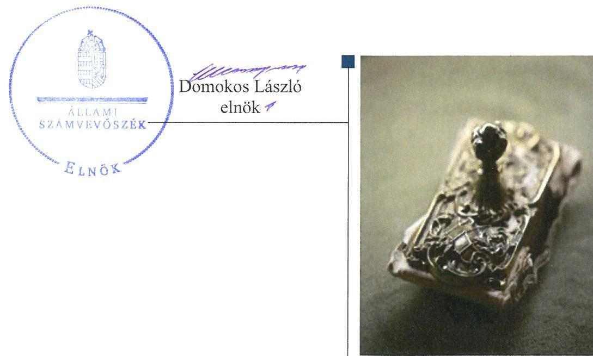

# Jelentés 

## Pártok gazdálkodása

A költségvetési támogatásban részesülő pártok 2014-2015. évi gazdálkodása törvényességének ellenőrzése a Fidesz - Magyar Polgári Szövetségnél 2017.

---

# Jelenetés 

## Pártok gazdálkodása

A költségvetési támogatásban részesülő pártok 2014-2015. évi gazdálkodása törvényességének ellenőrzése a Fidesz - Magyar Polgári Szövetségné

2017. 

---

|  J | AZ ELLENŐRZÉST FELÜGYELTE:  |
| --- | --- |
|   | DR. BENEDEK MÁRIA felügyeleti vezető  |
|   | AZ ELLENŐRZÉST VEZETTE ÉS A VÉGREHAJTÁSÁÉRT FELELŐS:  |
|   | KAKAS SÁNDOR ellenőrzésvezető  |
|   | A PROGRAM ÖSSZEÁLLÍTÁSÁÉRT FELELŐS:  |
|   | JANIK JÓZSEF LÁSZLÓ osztályvezető  |
|   | A TÉMÁHOZ KAPCSOLÓDÓ KORÁBBI SZÁMVEVŐSZÉKI JELENTÉSEK:  |
|   | - címe: Jelentés a költségvetési támogatásban részesülő pártok 2012-2013. évi gazdálkodása törvényességének ellenőrzéséről - Fidesz - Magyar Polgári Szövetség  |
|  J | - sorszáma: 15054  |
|   | IKTATÓSZÁM: EL-0030-046/2017  |
|   | TÉMASZÁM: 2295  |
|   | ELLENŐRZÉS-AZONOSÍTÓ SZÁM: V077601  |

---

# TARTALOMJEGYZÉK 

■ ÖSSZEGZÉS ..... 5
■ AZ ELLENŐRZÉS CÉLJA ..... 6
■ AZ ELLENŐRZÉS TERÜLETE ..... 7
■ AZ ELLENŐRZÉS HÁTTERE, INDOKOLTSÁGA ..... 8
■ A JELENTÉS LÉNYEGES KÉRDÉSKÖREI ..... 9
■ ELLENŐRZÉS HATÓKÖRE ÉS MÓDSZEREI ..... 10
■ MEGÁLLAPÍTÁSOK ..... 12
■ MELLÉKLETEK ..... 17
I. sz. melléklet: Értelmező szótár ..... 17
II. sz. melléklet: 2014. évi pénzügyi kimutatás ..... 18
III. sz. melléklet: 2015. évi pénzügyi kimutatás ..... 20
■ FÜGGELÉK: ÉSZREVÉTELEK ..... 21
■ RÖVIDÍTÉSEK JEGYZÉKE ..... 23

---

.

---

# ÖSSZEGZÉS 

Az Állami Számvevőszék a Fidesz - Magyar Polgári Szövetség gazdálkodásának törvényességét ellenőrizte 2014. január 1-jétől 2015. december 31-ig terjedő időszakra vonatkozóan. Megállapította, hogy gazdálkodásának szabályozási környezetét a jogszabályi előírásoknak megfelelően alakította ki, a könyvvezetése és gazdálkodása során a vonatkozó jogszabályi rendelkezéseket és belső előírásokat betartotta. A 2014. és 2015. évi pénzügyi kimutatásokat szabályszerűen elkészítette és közzétette, így biztosította a gazdálkodásának, vagyoni helyzetének áttekinthetőségét, valamint a közpénzek felhasználásának átláthatóságát.

## Az ellenőrzés társadalmi indokoltsága

A pártok az állampolgárok egyesülési szabadsága alapján létrehozott olyan szervezetek, amelyek kereteket nyújtanak a népakarat kialakításához és kinyilvánításához, a politikai életben való állampolgári részvételhez.

A politikai élet tisztasága érdekében törvény állapítja meg a pártok vagyonára és gazdálkodására vonatkozó szabályokat. Az egyesülési jog alapján létrejövő más szervezetekhez képest szűkebb körben határozza meg azt a gazdasági tevékenységet, amelyet a párt végezhet, biztosítja azonban a pártok részére azt a jogosultságot, hogy az állami költségvetésből támogatásban részesüljenek. A pártok gazdálkodását a politikai élet tisztasága érdekében rendszeresen indokolt ellenőrizni, ezért törvényi előírás alapján az Állami Számvevőszék a költségvetési támogatást kapott pártok gazdálkodását kétévente ellenőrzi.

## Főbb megállapítások, következtetések

A Fidesz - Magyar Polgári Szövetség gazdálkodására vonatkozó számviteli keretek kialakítása és a belső szabályozások megfeleltek a jogszabályi előírásoknak, ami támogatta a közpénzekkel való átlátható és ellenőrizhető gazdálkodást. A könyvvezetése, nyilvántartási rendszere megfelelt a jogszabályi és belső szabályozási előírásoknak, az ellenőrzési rendszerét az előírásoknak megfelelően múködtette.

A Fidesz - Magyar Polgári Szövetség 2014. és 2015. évi pénzügyi kimutatásai a jogszabályi előírásoknak megfeleltek. A 2014. és 2015. évi pénzügyi kimutatásokat a Magyar Közlöny mellékletét képező Hivatalos Értesítőben és a saját honlapján az előírt határidőben a jogszabályi előírásoknak megfelelően közzétette, ezzel biztosította gazdálkodásának áttekinthetőségét.

A múködéséhez a forrásokat, köztük a költségvetésből juttatott és az egyéb támogatásokat, adományokat szabályszerűen használta fel és számolta el, nem pénzbeli vagyoni hozzájárulást nem fogadott el. A gazdálkodással öszszefüggő tevékenységének keretében a kiadások kifizetése során a jogszabályok és a belső szabályzatok előírásait betartotta, múködése során a vagyont a törvényi előírásoknak megfelelően használta.

---

# AZ ELLENŐRZÉS CÉLJA 

AZ ELLENŐRZÉS CÉLJA annak értékelése volt, hogy a közzétett pénzügyi kimutatások a törvényi előírásoknak megfeleltek-e, a könyvvezetés és gazdálkodás során betartották-e a vonatkozó jogszabályi és belső előírásokat; a Fidesz - Magyar Polgári Szövetség a múködéséhez szabályszerűen igénybe vehető forrásokat hasz-nált-e fel.

---

# AZ ELLENŐRZÉS TERÜLETE 

## Fidesz - Magyar Polgári Szövetség

A Fidesz - Magyar Polgári Szövetség 1988-ban jött létre, olyan egyesület, amely nyilvántartott tagsággal rendelkezik, és amely a nyilvántartásba vételét végző bíróság előtt kinyilvánítja, hogy a Párttörvény ${ }^{1}$ rendelkezéseit magára nézve kötelezőnek ismeri el a Párttörvény 1. §-a alapján.

A Fidesz - Magyar Polgári Szövetség célja, hogy:
támogassa az ember méltóságán és felelősségvállalásán alapuló polgári társadalom megszilárdulását;
elősegítse a közéletben a családok megerősítését, a munka becsületét, a tudásához való hozzájutás egyenlő lehetőségét, az egyéni és közösségi jogokat biztosító rendet, valamint a nemzet összetartó erejének növelését, a hagyományok és a keresztény értékrend megerősítését szolgáló döntések meghozatalát;
erősítse a szabadság és joguralom jegyében múködő demokrácia, illetve a jövő nemzedékek érdekeit is figyelembe vevő közjó által korlátozott magántulajdonon alapuló gazdaság intézményeit;
biztosítsa tagjai számára a közös értéken nyugvó közéleti szerepvállalás lehetőségét;
megválasztott képviselőin keresztül részt vegyen a helyi önkormányzatok, az országgyűlés és az Európai Parlament munkájában.
A Fidesz - Magyar Polgári Szövetség a 2014. évben 1547897 ezer Ft, a 2015. évben 876000 ezer Ft központi költségvetési támogatásban részesült. A 2014. évi pénzügyi kimutatásban 2863421 ezer Ft bevételt, valamint 2826827 ezer Ft kiadást számolt el. A 2015. évi pénzügyi kimutatás szerint az összes bevétele 1083477 ezer Ft, a kiadások összege 920818 ezer Ft volt. A Fidesz - Magyar Polgári Szövetség 2014. és 2015. évi pénzügyi kimutatásait a II. és III. számú melléklet tartalmazza. Hitelállománya a 2014. év végén 839939 ezer Ft, a 2015. év végén 474162 ezer Ft volt.

A Fidesz - Magyar Polgári Szövetség 2003-ban létrehozta a Szövetség a Polgári Magyarországért Alapítványt, gazdasági társaságot nem alapított.

---

# AZ ELLENŐRZÉS HÁTTERE, INDOKOLTSÁGA 

Az ÁSZ tv. ${ }^{2}$ 5. § (11) bekezdés a) pontja, valamint a Párttörvény 10. § (1) bekezdése alapján a pártok gazdálkodása törvényességének ellenőrzésére az ÁSZ ${ }^{3}$ jogosult. A Párttörvény 10. § (3) bekezdése alapján az ÁSZ kétévente ellenőrzi azoknak a pártoknak a gazdálkodását, amelyek rendszeres költségvetési támogatásban részesültek.

Az ÁSZ legutóbb a Fidesz - Magyar Polgári Szövetség 2012-2013. évi gazdálkodásának törvényességét ellenőrizte.

A gazdálkodás szabályszerűségének, a felhasznált közpénzek nagyságának bemutatásával a társadalom objektív képet alkothat a pártok működéséről. Az ellenőrzés megállapításai a gazdálkodás megfelelőségének bemutatásával elősegíthetik, hogy a törvényalkotók konkrét lépéseket tegyenek a pártok finanszírozására vonatkozó szabályozások megváltoztatása, átláthatóbbá, ellenőrizhetőbbé tétele irányába. Az ellenőrzés rámutathat a pártok gazdálkodásával, valamint az állami költségvetésből származó források felhasználásával kapcsolatos jó gyakorlatokra és szabálytalanságokra.

---

# A JELENTÉS LÉNYEGES KÉRDÉSKÖREI 

1. A Fidesz - Magyar Polgári Szövetség gazdálkodásának törvényességi kerete biztositott volt-e?
2. A Fidesz - Magyar Polgári Szövetség pénzügyi kimutatása megfelelt-e a törvényi előírásoknak, közzétételi kötelezettségét szabályszerüen teljesítette-e?
3. A Fidesz - Magyar Polgári Szövetség könyvvezetése és gazdálkodása során a vonatkozó jogszabályi rendelkezéseket és belső előírásokat betartotta-e?

---

# ELLENŐRZÉS HATÓKÖRE ÉS MÓDSZEREI 

## Az ellenőrzés típusa

Szabályszerűségi ellenőrzés.

## Az ellenőrzött időszak

A 2014. január 1. - 2015. december 31. közötti időszak.

## Az ellenőrzés tárgya

A Fidesz - Magyar Polgári Szövetség ellenőrzése során az ellenőrzés tárgyát képezte a 2014. és a 2015. évi pénzügyi kimutatás elkészítésére, közzétételére, a párt könyvvezetésére, gazdálkodására, ennek keretében a számviteli szabályozás kialakítására, a bizonylati rend, bizonylati fegyelem betartására, egyéb gazdálkodási, ellenőrzési és pénzügyi-számviteli informatikai feladatok ellátására irányuló tevékenységek. Az ellenőrzés tárgya volt még a források elszámolása és felhasználása, valamint a vagyon jogszabályi előírásoknak megfelelő hasznosítása.

Az ellenőrzés kiterjedt minden olyan körülményre és adatra, amely az ÁSZ jogszabályban meghatározott feladatainak teljesítéséhez, valamint a program végrehajtása folyamán felmerült újabb összefüggések feltárásához szükséges volt.

## Az ellenőrzött szervezet

Fidesz - Magyar Polgári Szövetség

## Az ellenőrzés jogalapja

Az ellenőrzés jogalapját az ÁSZ tv. 5. § (11) bekezdés a) pontja, a Párttörvény 10. § (1) és (3)-(4) bekezdése képezte.

## Az ellenőrzés módszerei

Az ÁSZ az ellenőrzést az ellenőrzési program szempontjai, az ellenőrzött időszakban hatályos jogszabályok, az ellenőrzés szakmai szabályai az ellenőrzésre irányadó ÁSZ módszertanok figyelembevételével végezte.

---

Az ÁSZ az ellenőrzés ideje alatt a Fidesz - Magyar Polgári Szövetséggel történő kapcsolattartást az ÁSZ SZMSZ²-ének vonatkozó előírásai alapján biztosította.

Az ellenőrzési bizonyítékként felhasználható adatforrások közé tartoztak egyrészt az ellenőrzési program részletes szempontjainál felsorolt adatforrások, másrészt minden egyéb az ellenőrzés folyamán feltárt, az ellenőrzés szempontjából információt tartalmazó dokumentum.

Az ellenőrzés lefolytatásához a Fidesz - Magyar Polgári Szövetség a tanúsítványok elektronikus kitöltésével, valamint az ÁSZ által kért dokumentumok elektronikus megküldésével szolgáltatott adatokat. A rendelkezésre bocsátott adatok, információk kontrollja az ellenőrzés keretében történt.

Az ÁSZ az ellenőrzést a Fidesz - Magyar Polgári Szövetség által rendelkezésre bocsátott dokumentumokra, adatokra alapozta. Az ellenőrzés céljának eléréséhez szükséges bizonyítékokat a számvevő az egyes adatok közvetlen, részletes elemzésével alapozta meg, a következő ellenőrzési eljárások alkalmazásával: megfigyelés, szemle (szemrevételezés), kérdésfeltevés (információkérés), mintavételezés, valamint elemző eljárás.

---

# 1. A Fidesz - Magyar Polgári Szövetség gazdálkodásának törvényességi kerete biztosított volt-e? 

Összegző megállapítás

1.1. számú megállapítás

1.2. számú megállapítás

A Fidesz ${ }^{5}$ gazdálkodásának törvényességi kerete biztosított volt.

A Fidesz gazdálkodására vonatkozó számviteli keretek kialakítása és a belső szabályozások megfeleltek a jogszabályi előírásoknak.

## A FIDESZ A SZÁMV. TV.-BEN6 ELŐÍRT SZABÁLYZATOKKAL rendelkezett.

A Számviteli politika ${ }^{7}$ a Számv. tv. előírásainak megfelelően tartalmazta a könyvvezetés módját, az évközi és év végi zárlati feladatokat és azok időpontját, valamint azt, hogy az értékelés szempontjából a Fidesz mit tekint jelentősnek, illetve lényegesnek.

A Leltározási szabályzat ${ }^{8}$ tartalmazta a leltározás előkészítésének, megszervezésének, végrehajtásának, a leltár kiértékelésnek, valamint a selejtezésnek a rendjét.

Az Értékelési szabályzat ${ }^{9}$ az értékelési módokon, eljárásokon túl az amortizációs politika elveit is meghatározta.

A Pénzügyi szabályzat ${ }^{10}$ előírta a készpénz- és bankszámlaforgalom rendjét, a pénzkezelés személyi és tárgyi feltételeit, a pénzkezelés felelősségi szabályait, a napi záró készpénzállomány maximális értékét, a készpénzállományt érintő pénzmozgások eljárásrendjét, a bankszámlák feletti rendelkezésre jogosultak névsorát.

A Fidesz a 2014-2015. években rendelkezett aktualizált Számlarend ${ }_{1,2}$ vel $^{11}$, amelyben figyelembe vette a múködési sajátosságokat.

Az Informatikai szabályzat ${ }^{12}$ az adatok biztonságának, védelmének érvényre juttatásához szükséges eljárási szabályokat tartalmazta.

A Fidesz könyvvezetése, nyilvántartási rendszere megfelelt a jogszabályi és belső szabályozási előírásoknak.

A KÖNYVVEZETÉS összhangban volt a Számv. tv. előírásaival. A Fidesz kialakította és folyamatosan vezette a főkönyvi számlákhoz rendelt analitikus nyilvántartásokat. A könyvvezetés során gondoskodott a főkönyvi könyvelés és a bizonylatok adatai közötti egyeztetés és ellenőrzés logikailag zárt rendszerben való biztosításáról, az egyeztetések dokumentált módon megtörténtek. A könyvviteli feladatait megbízási szerződés alapján külső könyvviteli szolgáltató látta el, az ellenőrzött időszakban könyvviteli szolgáltató váltás nem történt, a feladatellátás folyamatossága biztosított volt.

---

A Fidesz a tulajdon védelme érdekében minden évben leltározást végzett. A leltározás eredményét a nyilvántartásokkal összevetette, a kiértékelést elvégezte.

A pénzkezelés szabályszerűségét a Számv. tv., valamint a Pénzügyi szabályzat előírásainak megfelelően biztosította. A 2014-2015. években a szigorú számadású bizonylatok nyilvántartása a Számv. tv-ben előírtaknak megfelelően történt.

A pénzügyi, számviteli adatállományok - Informatikai szabályzat előírásai szerinti - mentése megtörtént, ami biztosította az adatok visszaállításának lehetőségét, amelyre egy alkalommal, a 2014. évben került sor.
1.3. számú megállapítás

A Fidesz ellenőrzési rendszere az előírásoknak megfelelően múködött.

A VEZETŐI ELLENŐRZÉS kereteit a Költségvetési gazdálkodási szabályzat ${ }^{13}$, valamint a Pénzügyi szabályzat határozta meg. A gazdaságipénzügyi ellenőrzések megszervezéséért, folyamatos múködéséért, irányításáért a gazdasági igazgató volt felelős. A gazdasági területen dolgozók munkaköri leírással rendelkeztek, azok rögzítették a munkafolyamatba épített ellenőrzéssel kapcsolatos feladatokat. A kötelezettségvállalás és utalványozás szabályait a Pénzügyi szabályzat és a Költségvetési gazdálkodási szabályzat határozta meg. A pénztárellenőrzések a Pénzügyi szabályzat előírásainak megfelelően történtek.

A döntéshozó, irányító és ellenőrző szervek feladatait, hatáskörét az Alapszabály ${ }^{14}$ rögzítette. Ennek értelmében a Fidesz döntéshozó és irányító szervei a Kongresszus ${ }^{15}$, az Országos Választmány, valamint az Országos Elnökség, amelyek feladataikat az Alapszabályban rögzítettek szerint látták el.

Az Alapszabály értelmében a Fidesz vagyonkezelésének és pénzügyeinek folyamatos ellenőrzése a Számvizsgáló Bizottság feladata volt, amely múködési rendjét az Alapszabály keretei közt maga állapította meg. A Számvizsgáló Bizottság feladat- és hatáskörét az Alapszabály rögzítette. A Számvizsgáló Bizottság a 2014-2015. évi munkájáról az előírásokkal összhangban a Kongresszuson beszámolt.

# 2. A Fidesz - Magyar Polgári Szövetség pénzügyi kimutatása megfelelt-e a törvényi előírásoknak, közzétételi kötelezettségét szabályszerűen teljesítette-e? 

Összegző megállapítás

A Fidesz 2014. és 2015. évi pénzügyi kimutatása megfelelt a jogszabályi előírásoknak, közzétételi kötelezettségét szabályszerűen teljesítette.

## 2.1. számú megállapítás

A 2014. és 2015. évi pénzügyi kimutatás elkészítése megfelelt a jogszabályi előírásoknak.

A Fidesz a pénzügyi kimutatásait a jogszabályi előírásoknak megfelelően elkészítette. A pénzügyi kimutatások a Párttörvény 1. sz. mellékletének

---

megfelelően tartalmazták a bevételeket és a kiadásokat. Az Alapszabályban előírtaknak megfelelően a pénzügyi kimutatásokat az Országos Választmány elfogadta.
2.2. számú megállapítás

A Fidesz a 2014. és 2015. évi pénzügyi kimutatás közzétételéről a jogszabályi határidőben gondoskodott.

A Fidesz a 2014. évi pénzügyi kimutatását 2015. április 14-én, a 2015. évi pénzügyi kimutatását 2016. április 28-án a jogszabály által előírt határidőben a Magyar Közlöny mellékletét képező Hivatalos Értesítőben közzétette. Honlapján a 2014. évi pénzügyi kimutatását 2015. április 15-én, a 2015. évi pénzügyi kimutatását 2016. május 2-án a jogszabály által előírt határidőben nyilvánosságra hozta.

# 3. A Fidesz - Magyar Polgári Szövetség könyvvezetése és gazdálkodása során a vonatkozó jogszabályi rendelkezéseket és belső előírásokat betartotta-e? 

## Összegző megállapítás

3.1. számú megállapítás

A Fidesz a könyvvezetése és gazdálkodása során a vonatkozó jogszabályi rendelkezéseket és belső előírásokat betartotta.

A Fidesz szabályszerűen számolta el és használta fel a múködéséhez a forrásokat, köztük a költségvetésből jutatott és az egyéb támogatásokat, adományokat.

A Fidesz az ellenőrzött időszakban a kettős könyvvitel rendszerében vette nyilvántartásba a bevételeit, a bevételek elszámolása a Számlarendben foglalt főkönyvi számlákon történt.

A bevételek elszámolása 2014-2015-ben a jogszabályoknak és a belső szabályzatoknak megfelelően történt.

A Fidesz a Tagdíjszabályzatban ${ }^{16}$ meghatározta a tagdíjak fogalmi körébe tartozó tartalmat, a tagok által fizetendő tagdíj összegét, valamint a tagdíj befizetés szabályait.

A központi költségvetésből származó támogatás beszámolósor tartalma az ellenőrzött időszakot tekintve az előírásoknak megfelelően megegyezett a könyvviteli nyilvántartással, továbbá a 2014. évi ${ }^{17}$ és a 2015. évi költségvetési törvényekben ${ }^{18}$ meghatározott összegekkel.

A Fidesz az „Egyéb hozzájárulások, adományok" beszámoló soron az 500 ezer Ft összeghatáron felüli adományokat az előírások szerint nevesítve rögzítette. A 2014. évi pénzügyi kimutatásban 63656 ezer Ft, 53 magánszemélytől származó, a 2015. évi pénzügyi kimutatásban 6582 ezer Ft, nyolc magánszemélytől származó 500 ezer Ft feletti támogatást mutatott ki. A Párttörvény előírásainak megfelelően az egy adományozótól származó befizetéseket összesítette.

A Fidesz a Párttörvény 4. § (2)-(3) bekezdésének előírásait betartva tiltott vagyoni hozzájárulást nem fogadott el, gazdálkodási tevékenysége keretében a vagyonelemek hasznosítása során betartotta a jogszabályokban és a belső szabályzatokban foglaltakat.

---

# 3.2. számú megállapítás 

A Fidesz korlátolt felelősségű társaságot nem alapított. A Fidesz az általa alapított SZPMA-val ${ }^{19}$ az ellenőrzött időszakban közösen nem végzett feladatokat, továbbá a pártalapítványtól nem fogadott el vagyoni hozzájárulást.

## A Fidesz a gazdálkodással összefüggő tevékenysége keretében a kiadások kifizetése során a jogszabályok és a belső szabályzatok előírásait betartotta.

A Fidesz kiadásaira fordított összegek kifizetése, elszámolása a 2014. és a 2015. évben a jogszabályok és a belső szabályzatok előírásainak megfelelően történt.

A Fidesznél a foglalkoztatás, a munkabérek és egyéb személyi jellegű kiadások elszámolása az ellenőrzött időszakban szabályszerű volt. A Fidesz az Art. ${ }^{20}$-ban foglalt bejelentési kötelezettségének eleget tett, a foglalkoztatottakhoz kapcsolódó adó- és járulék bevallási, befizetési kötelezettségét az Art., a Tbj tv. ${ }^{21}$ és az Szja tv. ${ }^{22}$ előírásainak megfelelően teljesítette. Az ellenőrzött időszakban természetbeni juttatást nem nyújtott. A reprezentációs kiadásokat önálló főkönyvi számlaszámon tartotta nyilván, amelynek értéke az ellenőrzött időszak egyik évében sem haladta meg az Szja tv.-ben meghatározott határt, ezért az elszámolt reprezentáció után az Fidesznek adófizetési kötelezettsége nem keletkezett. A hivatali telefont használók által meg nem térített magáncélú használat miatti - Szja. tv. szerinti - adófizetési kötelezettségét a Fidesz az Art. 1. és 2. számú mellékletében előírt határidőben teljesítette.

A Fidesz a tulajdonában álló gépjárművek után az ellenőrzött időszakban keletkezett cégautó adóval kapcsolatos adóbevallási, adófizetési kötelezettségét a Gjt. ${ }^{23}$ előírásainak megfelelően teljesítette.

Az eszközök aktiválása, bekerülési értékének meghatározása szabályszerű volt. Az értékcsökkenés megállapítása és elszámolása megfelelt a Számviteli politika előírásainak.

### 3.3. számú megállapítás

A Fidesz vagyongazdálkodása megfelelt a törvényi előírásoknak.
A Fidesz a vagyonnal való gazdálkodás szabályait az Alapszabályban határozta meg.

A Fidesz az ellenőrzött időszakban 26 darab saját tulajdonú ingatlannal rendelkezett, amelyből 22 darab ingatlant a Vagyon tv. ${ }^{24}$ által biztosított jogával élve 2008-ban az MFB Zrt. ${ }^{25}$-től kapott kölcsönből vásárolt. A Fidesz a törlesztési kötelezettségének a hitelszerződésben előírt ütemezésben eleget tett.

---

.

---

# MELLÉKLETEK 

- I. SZ. MELLÉKLET: ÉRTELMEZŐ SZÓTÁR
pénzügyi kimutatás
gazdálkodó tevékenység
költségvetési támogatás
nem pénzbeli támogatás

A Párttörvény 9. § (1) bekezdésében meghatározott, a törvény 1. számú melléklete szerinti pénzügyi kimutatás (hatályos 2014. május 6-ától), amelyet a pártok kötelesek minden év május 31-ig a Magyar Közlönyben, valamint saját honlappal rendelkező pártok a honlapjukon is közzétenni.
A párt a költségeinek fedezése és vagyonának gyarapítása érdekében a gazdaságivállalkozási tevékenységeket folytathat. (Párttörvény 6. §)
politikai céljainak és tevékenységének megismertetése érdekében kiadványokat jelentethet meg és terjeszthet, a pártot szimbolizáló jelvényeket és más ilyen célú tárgyakat árusíthat, és pártrendezvényeket szervezhet;
a tulajdonában álló ingatlanokat és ingókat díj ellenében hasznosíthatja és elidegenítheti.
Az államháztartás alrendszerei terhére nyújtott pénzbeli vagy nem pénzbeli juttatás, amelyet a támogató nem elsősorban ellenszolgáltatás ellenében, de konkrét program megvalósítása vagy meghatározott időszakban a támogatott szervezet müködtetése érdekében nyújt. (Civil tv. ${ }^{26}$ 2. § 15. pont)
vagyoni értékkel rendelkező forgalomképes dolog, szellemi alkotás, illetve vagyoni értékű jog részben vagy egészében, véglegesen vagy ideiglenesen, teljesen vagy részben ingyenesen történő átruházása vagy átengedése, illetve szolgáltatás biztosítása. Civil tv. 2. § 25. pont)

---

# A Fidesz - Magyar Polgári Szövetség 2014. évi pénzügyi kimutatása a pártok müködéséről és gazdálkodásáról szóló törvény szerint 

Adatok ezer forintban

## Bevételek

1. Tagdíjak ..... 199910
2. Központi költségvetésből származó támogatás ..... 1547897

- ebből országgyűlési kampányra kapott ..... 597000

3. A párt országgyűlési képviselöcsoportjának nyújtott állami támogatás ..... -
4. Egyéb hozzájárulások, adományok ..... 413818
4/a. 500 ezer Ft alatt ..... 350162
4/b. 500 ezer Ft felett ..... 63656

- Andó Károly ..... 690
- B. Nagy László ..... 576
- Bánki Erik ..... 2100
- Barna László ..... 1000
- Bartos Mónika Éva ..... 598
- Batizi Sándor ..... 540
- Batizi Tamás ..... 1680
- Bernyák Adrienn ..... 501
- Bodó Sándor ..... 750
- Boldizsár Sándor ..... 8000
- Boros Árpád ..... 1000
- Csaholczi Attila ..... 505
- Csubákné Besesek Andrea ..... 506
- Demeter Zoltán ..... 685
- Fülöp Róbert ..... 501
- Galambos Dénes ..... 582
- Görgényi Ernő ..... 602
- Guzsvány Attila ..... 520
- Hidvéghi Balázs ..... 850
- Kalmár László ..... 3000
- Kasza Lajos ..... 10000
- Keszthelyi Erik ..... 1300
- Kiss Imre ..... 800
- Kiss Zoltán ..... 750
- Kiss Zsuzsanna ..... 700
- Kovács József Dezső ..... 740
- Kucsák László ..... 623
- Kukoda Nándor ..... 1200
- Losonczi Ottó ..... 1000
- Mészáros György ..... 1000
- Nagy Zoltán József ..... 600
- Németh Tibor ..... 1000
- Nyitrai Zsolt ..... 1000
- Papcsák Ferenc ..... 3322
- Petneházy Attila ..... 580
- Ritter Géza ..... 1000
- Schöpflin György András ..... 872

---

|  - Schumann Róbert | 1000  |
| --- | --- |
|  - Skuczi Nándor | 556  |
|  - Szabó István | 963  |
|  - Szabó Iván | 1000  |
|  - Szabó Sándor | 852  |
|  - Szemerey Szabolcs | 1166  |
|  - Szilvási István | 520  |
|  - Tapolczai Gergely József | 605  |
|  - Tiba István | 630  |
|  - Tóbiás Zoltán | 1000  |
|  - Turcsányi Dániel | 570  |
|  - Vas Imre | 700  |
|  - Vattamány Zsolt | 800  |
|  - Vidra Zoltán | 521  |
|  - Vazhányó Péter | 510  |
|  - Windbrechtinger Éva | 590  |

1. A párt által alapított korlátolt felelősségű társaság nyereségéből származó bevétel
2. Egyéb bevétel 701796

Összes bevétel a gazdasági évben 2863421

# Kiadások

1. Támogatás a párt országgyűlési képviselőcsoportja számára
2. Támogatás egyéb szervezetnek 1000
3. Vállalkozások alapítására fordított összegek
4. Müködési kiadások 348912
5. Eszközbeszerzés 13434
6. Politikai tevékenység kiadása 2008235
7. ebből országgyűlési kampány 883600
8. Egyéb kiadások 455246

Összes kiadás a gazdasági évben 2826827

Budapest, 2015. április 14.

Tóth Józsefné s. k., gazdasági vezető

Priszter Erzsébet s. k., főkönyvelő

---

# A Fidesz - Magyar Polgári Szövetség 2015. évi pénzügyi beszámolója a pártok müködéséről és gazdálkodásáról szóló törvény szerint 

Adatok ezer forintban

## Bevételek

1. Tagdíjak ..... 142415
2. Központi költségvetésből származó támogatás ..... 876600
3. A párt országgyúlési képviselöcsoportjának nyújtott állami támogatás ..... -
4. Egyéb hozzájárulások, adományok ..... 56447
4/a. 500 ezer Ft alatt ..... 49865
4/b. 500 ezer Ft felett ..... 6582

- Deli Andor ..... 895
- Illés István ..... 820
- Kósa Ádám ..... 697
- Kukoda Nándor ..... 1200
- Petricsevics István ..... 750
- Pollák Attila Róbert ..... 820
- Schöpflin György András ..... 800
- Szabó Sándor ..... 600

5. A párt által alapított korlátolt felelősségű társaság nyereségéből származó bevétel ..... -
6. Egyéb bevétel ..... 8015
Összes bevétel a gazdasági évben ..... 1083477

## Kiadások

1. Támogatás a párt országgyúlési képviselöcsoportja számára ..... -
2. Támogatás egyéb szervezetnek ..... 2704
3. Vállalkozások alapítására fordított összegek ..... -
4. Müködési kiadások ..... 359928
5. Eszközbeszerzés ..... 8759
6. Politikai tevékenység kiadása ..... 153393
7. Egyéb kiadások ..... 396034
Összes kiadás a gazdasági évben ..... 920818

Budapest, 2016. március 31.

Tóth Józsefné s. k., gazdasági vezető

Priszter Erzsébet s. k., fökönyvelő

---

# FÜGGELÉK: ÉSZREVÉTELEK 

A jelentéstervezetet a Számvevőszék 15 napos észrevételezésre megküldte az ellenőrzött szervezet vezetőjének az ÁSZ tv. 29. §* (1) bekezdése előírásának megfelelően.

Az ellenőrzött szervezet vezetője az ÁSZ tv. 29. § (2) bekezdésében foglalt észrevételezési jogával nem élt, a jelentéstervezetre észrevételt nem tett.

[^0]
[^0]:    * 29. § (1) Az Állami Számvevőszék az ellenőrzési megállapításait megküldi az ellenőrzött szervezet vezetőjének vagy az általa megbízott személynek, és annak, akinek személyes felelősségét állapította meg.
    (2) Az ellenőrzött szervezet vezetője és a felelősként megjelölt személy az ellenőrzés megállapításaira tizenöt napon belül írásban észrevételt tehet.
    (3) Az Állami Számvevőszék az észrevételre a beérkezésétől számított harminc napon belül írásban válaszol. A figyelembe nem vett észrevételeket köteles a jelentésben feltüntetni, és megindokolni, hogy azokat miért nem fogadta el.

---

.

---

# RÖVIDÍTÉSEK JEGYZÉKE 

${ }^{1}$ Párttörvény
${ }^{2}$ ÁSZ tv.
${ }^{3}$ ÁSZ
${ }^{4}$ ÁSZ SZMSZ
${ }^{5}$ Fidesz
${ }^{6}$ Számv. tv.
${ }^{7}$ Számviteli politika
${ }^{8}$ Leltározási szabályzat
${ }^{9}$ Értékelési szabályzat
${ }^{10}$ Pénzügyi szabályzat
${ }^{11}$ Számlarend:
Számlarend:
${ }^{12}$ Informatikai szabályzat
${ }^{13}$ Költségvetési gazdálkodási szabályzat
${ }^{14}$ Alapszabály
${ }^{15}$ Kongresszus
${ }^{16}$ Tagdíjszabályzat
${ }^{17}$ 2014. évi költségvetési törvény
${ }^{18}$ 2015. évi költségvetési törvény
${ }^{19}$ SZPMA
${ }^{20}$ Art.
${ }^{21} \mathrm{Tbj} \mathrm{tv}$.
${ }^{22}$ Szja tv.
${ }^{23}$ Gjt.
${ }^{24}$ Vagyon tv.
${ }^{25}$ MFB Zrt.
${ }^{26}$ Civil tv.
1989. évi XXXIII. törvény a pártok működéséről és gazdálkodásáról (hatályos 1989. október 30-tól)
2011. évi LXVI. törvény az Állami Számvevőszékről (hatályos 2011. július 1-jétől)

Állami Számvevőszék
Állami Számvevőszék Szervezeti és Működési Szabályzata
Fidesz- Magyar Polgári Szövetség
2000. évi C. törvény a számvitelről (2001. január 1-jétől)

Fidesz - Magyar Polgári Szövetség Számviteli politika (hatályos 2014. január 1jétől)
Fidesz - Magyar Polgári Szövetség Leltározási szabályzata (hatályos 2012. január 1-jétől)
Fidesz - Magyar Polgári Szövetség Értékelési szabályzata (hatályos 2011. január 1-jétől)
Fidesz - Magyar Polgári Szövetség Pénzügyi szabályzata (hatályos 2014. január 1-jétől)
Fidesz - Magyar Polgári Szövetség Számlarend (hatályos 2014. január 1-jétől)
Fidesz - Magyar Polgári Szövetség Számlarend (hatályos 2015. január 1-jétől)
Fidesz - Magyar Polgári Szövetség Informatikai szabályzata (hatályos 2008. január 1-jétől)
Fidesz - Magyar Polgári Szövetség költségvetési gazdálkodási szabályzat (hatályos 2014. január 1-jétől)
A Fidesz - Magyar Polgári Szövetség Alapszabálya (hatályos 2013. szeptember 28-ától)
Fidesz - Magyar Polgári Szövetség Kongresszusa
Fidesz - Magyar Polgári Szövetség Tagdíjszabályzata (hatályos 2004. december 10-étől)
2013. évi CCXXX. törvény Magyarország 2014. évi költségvetéséről
2014. évi C. törvény Magyarország 2015. évi költségvetéséről

Szóvetség a Polgári Magyarországért Alapítvány
2003. évi XCII. törvény az adózás rendjéről (hatályos 2004. január 1-jétől)
1997. évi LXXX. törvény a társadalombiztosítás ellátásaira és a magánnyugdíjra jogosultakról, valamint e szolgáltatások fedezetéről (hatályos 1998. január 1jétől)
1995. évi CXVII. törvény a személyi jövedelemadóról (hatályos 1996. január 1-jétől)
1991. évi LXXXII. törvény a gépjármúadóról (hatályos 1992. január 1-jétől)
2007. évi CVI. törvény az állami vagyonról (hatályos 2007. szeptember 25-től)

Magyar Fejlesztési Bank Zártkörűen Múködő Részvénytársaság
2011. évi CLXXV. törvény az egyesülési jogról, a közhasznú jogállásról, valamint a civil szervezetek múködéséről és támogatásáról (hatályos 2011. december 22-től)

---

# ÁLLAMI SZÁMVEVŐSZÉK 

1052 Budapest, Apáczai Csere János utca 10.
Levélcím: 1364 Budapest 4. Pf. 54
Telefon: +36 14849100 Telefax: +36 14849200
www.asz.hu