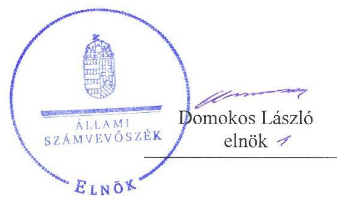
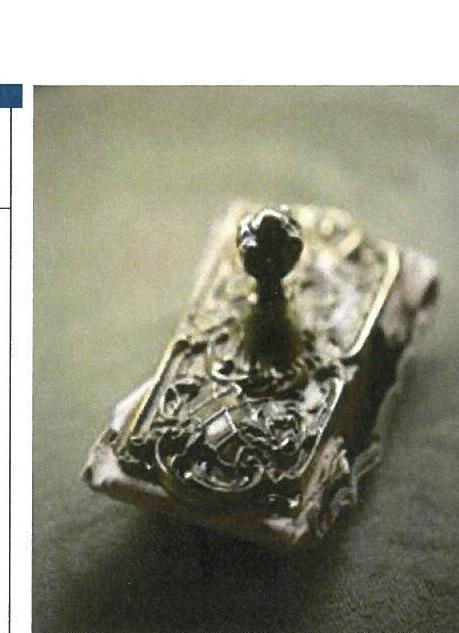
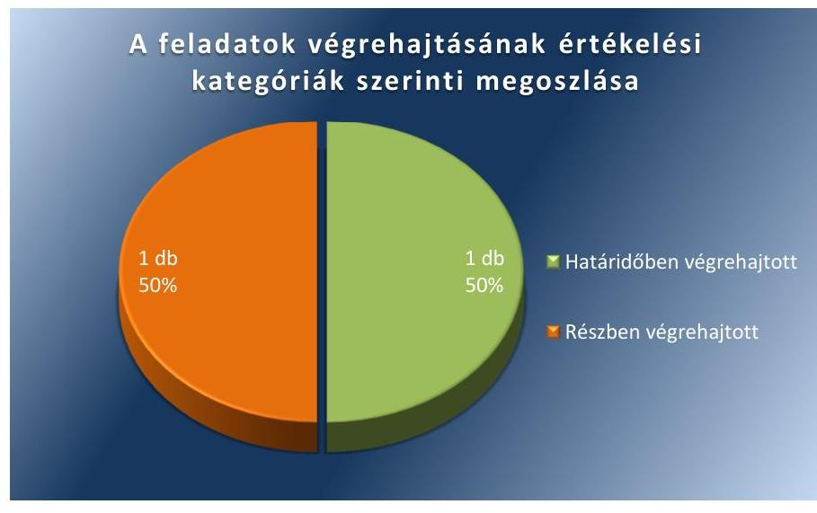
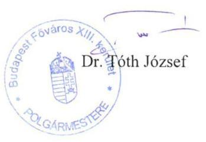
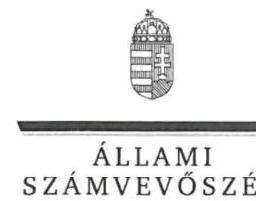
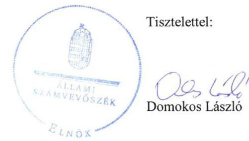
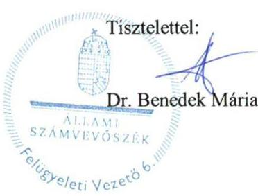

# Jelentés 

## Utóellenőrzések

Budapest Főváros XIII. Kerületi Önkormányzat vagyongazdálkodása szabályszerűségének utóellenőrzése 2017.

---

# Jelentés 

## Utóellenőrzések

Budapest Főváros XIII. Kerületi Önkormányzat vagyongazdálkodása szabályszerűségének utóellenőrzése 2017. o7 hó 12 nap

---

# AZ ELLENŐRZÉST FELÜGYELTE: 

DR. BENEDEK MÁRIA felügyeleti vezető

## AZ ELLENŐRZÉST VEZETTE ÉS A VÉGREHAJTÁSÁÉRT FELELŐS:

KLINGA LÁSZLÓ ellenőrzésvezető

## A PROGRAM ÖSSZEÁLLÍTÁSÁÉRT FELELŐS:

JANIK JÓZSEF LÁSZLÓ osztályvezető

## A TÉMÁHOZ KAPCSOLÓDÓ KORÁBBI SZÁMVEVŐSZÉKI JELENTÉSEK:

- címe: Jelentés az önkormányzatok vagyongazdálkodása szabályszerűségének ellenőrzéséről - Budapest Főváros XIII. kerület
- sorszáma: 14129

IKTATÓSZÁM: V-1308-032/2016.
TÉMASZÁM: 2342
ELLENŐRZÉS-AZONOSÍTÓ SZÁM: V-075567

---

# TARTALOMJEGYZÉK 

■ ÖSSZEGZÉS ..... 5
■ AZ ELLENŐRZÉS CÉLJA ..... 6
■ AZ ELLENŐRZÉS TERÜLETE ..... 7
■ AZ ELLENŐRZÉS HÁTTERE, INDOKOLTSÁGA ..... 8
■ A JELENTÉS LÉNYEGES KÉRDÉSKÖRE ..... 9
■ ELLENŐRZÉS HATÓKÖRE ÉS MÓDSZEREI ..... 10
■ MEGÁLLAPÍTÁSOK ..... 12
■ MELLÉKLETEK ..... 15
I. Sz. melléklet: Az ÁSZ 14129 számú jelentéséhez kapcsolódó intézkedési terv végrehajtása ..... 15
■ FÜGGELÉK: ÉSZREVÉTELEK ..... 17
■ RÖVIDÍTÉSEK JEGYZÉKE ..... 27

---

.

---

# ÖSSZEGZÉS 

Az Állami Számvevőszék Budapest Főváros XIII. Kerületi Önkormányzat vagyongazdálkodása szabályszerűségének utóellenőrzése során megállapította, hogy az intézkedési tervben meghatározott feladatok többségét végrehajtotta, ezáltal a vagyongazdálkodás szabályszerűsége javult. A 2015. évre vonatkozó leltár kiértékelésének elmaradása miatt a vagyongazdálkodás szabályszerűsége és elszámoltathatósága, a közpénzekkel történő felelős gazdálkodás nem volt biztosított.

## Az ellenőrzés társadalmi indokoltsága

Az Állami Számvevőszék stratégiájában célul tűzte ki a számvevőszéki munka hasznosulásának javítását. Ezzel összhangban ellenőrzi, hogy az ellenőrzött szervezetek megvalósították-e a korábbi ellenőrzései által feltárt hibák, hiányosságok és szabálytalanságok megszüntetése céljából elkészített intézkedési terveikben foglaltakat. A rendszeres utóellenőrzések hozzájárulnak a szükséges intézkedések tényleges végrehajtáshoz, ezáltal a közpénzügyek rendezettségének javulásához, igazolják, hogy lezárult a következmények nélküli ellenőrzések időszaka.

## Főbb megállapítások, következtetések

Budapest Főváros XIII. Kerületi Önkormányzat az intézkedési tervben meghatározott két feladatból egyet határidőben, egyet részben hajtott végre, ezáltal az Állami Számvevőszék korábbi ellenőrzése során feltárt kockázatokat csökkentette.

A polgármester az intézkedési tervben meghatározottaknak megfelelően gondoskodott az Angyalföld Fejlesztéséért Közalapítványtól átvett, közterületen elhelyezett köztéri berendezési tárgyak tulajdonba vételéről és annak Képviselő-testület általi utólagos jóváhagyásáról. A jegyző a leltározás végrehajtására, a felvett leltárak kiértékelésére vonatkozó feladatot részben hajtotta végre, mert a 2013. és 2014. évekre vonatkozóan intézkedett a leltározás kiértékelését is magában foglaló leltározás jogszabályban és a Leltározási szabályzatban előírtak szerinti elvégzéséről, azonban a 2015. évben nem gondoskodott a felvett leltárak kiértékeléséről, aminek következtében nem valósult meg maradéktalanul a szabályszerű és elszámoltatható vagyongazdálkodás, továbbá a közpénzekkel történő felelős gazdálkodás.

A jegyző az intézkedési tervben meghatározott feladatok végrehajtásáról a jogszabály szerinti nyilvántartást éves bontásban vezette, azonban annak tartalma nem felelt meg a jogszabályban előírtaknak.

---

# AZ ELLENŐRZÉS CÉLJA

Az ellenőrzés célja annak értékelése volt, hogy a Számvevőszéki jelentésben foglalt intézkedést igénylő megállapításokkal és javaslatokkal összhangban készített intézkedési tervben meghatározott feladatokat az ellenőrzött szervezet végrehajtotta-e.

---

# **A2 ELLENŐRZÉS TERÜLETE**

## **Budapest Főváros XIII. Kerületi Önkormányzat**

Budapest Főváros XIII. kerület lakossága 2016. január 1-jén a Központi Statisztikai Hivatal Magyarország Közigazgatási Helynév kötet szerint közzétett adatok alapján 120 256 fő volt.

A polgármester¹ az 1994. évi önkormányzati választások óta tölti be hivatalát, a jegyző² 2015. január 15-étől látja el feladatát.

Budapest Főváros XIII. Kerületi Önkormányzat a 2015. évi éves költségvetési beszámolója szerint 26 384,5 millió Ft költségvetési bevételt ért el, valamint 22 698,0 millió Ft költségvetési kiadást teljesített. 2015. december 31-én a könyvviteli mérleg szerinti követelések állományának értéke 1 986,4 millió Ft, a kötelezettségek állományának értéke 2 370,6 millió Ft, mérlegfőösszege 99 950,1 millió Ft volt.

Az Állami Számvevőszék 2013. évben ellenőrizte Budapest Főváros XIII. Kerületi Önkormányzatnál az önkormányzati vagyongazdálkodás szabályszerűségét a 2009. január 1. és 2012. december 31. közötti időszak vonatkozásában. Az erről szóló 14129. számú jelentését az ÁSZ³ 2014. október 22-én tette közzé. Az ellenőrzés célja annak értékelése volt, hogy az önkormányzat vagyongazdálkodási tevékenységének szabályozottsága és tevékenysége a jogszabályi előírásokkal összhangban volt-e, átlátható, a jogszabályi előírásoknak megfelelő volt-e a vagyon nyilvántartása, a külső és belső ellenőrzések megállapításai hozzájárultak-e az önkormányzati vagyongazdálkodási tevékenység szabályszerűségéhez. Az ÁSZ jelentésben foglalt javaslatok végrehajtása érdekében az Önkormányzat Képviselő-testülete⁴ a 134/2014. (XI. 13.) Ö.K. számú határozattal intézkedési tervet fogadott el.

Az utóellenőrzés – a 2014. október 22-től 2017. március 20-ig végrehajtott feladatokat figyelembe véve – az ÁSZ jelentésben a polgármester és a jegyző részére megfogalmazott intézkedést igénylő megállapításokra és javaslatokra készített, az ÁSZ részére megküldött intézkedési tervben foglalt feladatok megvalósításának ellenőrzésére, illetve értékelésére fókuszált.

---

# AZ ELLENŐRZÉS HÁTTERE, INDOKOLTSÁGA 

Az ÁSZ tv. ${ }^{5}$ 33. § (1) bekezdése értelmében a számvevőszéki jelentések intézkedést igénylő megállapításaihoz kapcsolódóan az ellenőrzött szervezet vezetője intézkedési tervet köteles összeállítani, és az ÁSZ részére megküldeni. Az intézkedési tervben foglaltak megvalósítását - az ÁSZ tv. 33. § (7) bekezdésében foglaltak alapján - az ÁSZ utóellenőrzés keretében ellenőrizheti. Az intézkedések megvalósulásának értékelése során az ÁSZ figyelembe veszi az ellenőrzött szervezetek működési feltételeiben, valamint a jogszabályi előírásokban bekövetkezett változásokat.

Az intézkedési tervben foglalt feladatok hiányos, illetve késedelmes végrehajtása, valamint megvalósításának elmaradása azt mutatja, hogy az ellenőrzések során feltárt hibák, hiányosságok és szabálytalanságok megszüntetése nem kapott kellő hangsúlyt. Ez a szabályszerű működés és a felelős vezetői magatartás vonatkozásában kockázatot hordoz. E kockázatok feltárásával az ÁSZ utóellenőrzési rendszere fokozza a fegyelmet, és igazolja, hogy a közpénzzel való szabályos gazdálkodás felelőssége elől nem lehet kitérni.

Az utóellenőrzés négy szinten hasznosulhat:
$\longrightarrow$ A társadalom szintjén az utóellenőrzés jelzi, hogy a számvevőszéki ellenőrzés megállapításainak van következménye: a hiányosságok megszüntetésére az ellenőrzött szervezet által meghatározott intézkedések végrehajtását is számon kéri az ÁSZ.
$\longrightarrow$ Az ellenőrzött terület szintjén az utóellenőrzés tájékoztatást nyújt a terület döntéshozóinak a hiányosságok kiküszöbölésének jó gyakorlatairól, ezzel lehetőséget biztosítva arra, hogy az ÁSZ ellenőrzési megállapításai, javaslatai a terület nem ellenőrzött szervezeteinek a működése során is hasznosuljanak.
$\longrightarrow$ Az ellenőrzött szervezet szintjén az utóellenőrzés feltárja, hogy a szervezet az intézkedések végrehajtásával hasznosította-e a korábbi ellenőrzési jelentésben a hiányosságok megszüntetése, illetve a kockázatok kezelése érdekében megfogalmazott javaslatokat.
$\longrightarrow$ Az ÁSZ szintjén az utóellenőrzés visszacsatolást ad az ellenőrzési jelentések hasznosulásáról, az intézkedések elmaradása vagy részleges megvalósulása a további ellenőrzésekhez kockázati jelzésként szolgál.

---

# A JELENTÉS LÉNYEGES KÉRDÉSKÖRE 

Az Önkormányzat az intézkedési tervben foglaltakat az elöirt határidőben végrehajtotta-e?

---

# ELLENŐRZÉS HATÓKÖRE ÉS MÓDSZEREI 

## Az ellenőrzés típusa

Megfelelőségi ellenőrzés.

## Az ellenőrzött időszak

Az utóellenőrzés alapját képező ÁSZ jelentés közzétételének napjától (2014. október 22.) az ellenőrzésről szóló kiértesítő levél keltének napjáig (2017. március 20.) tartó időszak.

## Az ellenőrzés tárgya

Az ÁSZ tv. 2011. július 1-jei hatálybalépését követően a számvevőszéki jelentésben foglalt intézkedést igénylő megállapításokkal és javaslatokkal összhangban - Budapest Főváros XIII. Kerületi Önkormányzat által - készített intézkedési tervben foglaltak végrehajtásának ellenőrzése.

Az ellenőrzés kiterjedt minden olyan körülményre és adatra, amely az ÁSZ jogszabályban meghatározott feladatainak teljesítéséhez, valamint a program végrehajtása folyamán felmerült újabb összefüggések feltárásához szükséges.

## Az ellenőrzött szervezet

Budapest Főváros XIII. Kerületi Önkormányzat

## Az ellenőrzés jogalapja

Az ÁSZ az ÁSZ törvényben meghatározott feladatkörében ellenőrzi a központi költségvetés végrehajtását, az államháztartás gazdálkodását, az államháztartásból származó források felhasználását és a nemzeti vagyon kezelését.

Az ÁSZ tv. 1. § (3) bekezdése szerint az ÁSZ általános hatáskörrel végzi a közpénzekkel és az állami és önkormányzati vagyonnal való felelős gazdálkodás ellenőrzését.

Az ÁSZ tv. 33. § (7) bekezdése alapján a 33. § (1)-(2) bekezdése szerinti intézkedési tervben foglaltak megvalósítását az ÁSZ utóellenőrzés keretében ellenőrizheti.

---

# Az ellenőrzés módszerei 

Az ÁSZ az ellenőrzést a nemzetközi standardokat irányadónak tekintve az ellenőrzési program ellenőrzési kérdései, az ellenőrzött időszakban hatályos jogszabályok, az ellenőrzés szakmai szabályok és módszertanok figyelembevételével, önálló ellenőrzés keretében végezte.

Az ÁSZ az ellenőrzés ideje alatt az Önkormányzattal történő kapcsolattartást az ÁSZ SZMSZ²-ének vonatkozó előírásai alapján biztosította.

Az utóellenőrzés megállapításait elsősorban az ÁSZ rendelkezésére álló, valamint az ellenőrzött szervezettől elektronikusan bekért dokumentumok alapozták meg.

Az ellenőrzési bizonyítékként felhasználható adatforrások közé tartoztak egyrészt a szakmai programban felsorolt adatforrások, másrészt minden - az ellenőrzés folyamán feltárt, az ellenőrzés szempontjából információt tartalmazó - dokumentum.

Az intézkedési tervben előírt feladatokat, azok végrehajthatósága, illetve végrehajtása szempontjából az alábbiak szerint értékelte az ÁSZ:
"határidőben végrehajtott" a feladat, ha a teljesítés dokumentáltan, az intézkedési tervben előírt határidőben és tartalommal megtörtént;
"határidőn túl végrehajtott" a feladat, ha annak teljesítése az intézkedési tervben meghatározott módon, de az előírt határidőn túl történt meg;
"részben végrehajtott" a feladat, ha végrehajtása teljes körűen az intézkedési tervben előírt módon nem történt meg;
"nem végrehajtott" a feladat, ha a végrehajtás nem történt meg, vagy amennyiben a teljesítést nem dokumentálták;
"okafogyottá vált" a feladat, ha végrehajtására - meghatározott esemény bekövetkezése, továbbá külső körülmény, a működést érintő feltétel változása miatt - már nincs szükség, illetve lehetőség, és egyértelműen megállapítható, hogy az intézkedést szükségessé tevő körülmény a jövőben nem fordulhat elő;
"nem időszerű" az a feladat, amelynek ellenőrzési időszakon belüli végrehajtására azért nem került (kerülhetett) sor, mert az intézkedés alapjául szolgáló esemény nem következett be, de annak jövőbeni előfordulása lehetséges, a végrehajtása nem volt esedékes, vagy a végrehajtás határideje még nem járt le.
Az ellenőrzés lefolytatásához az ellenőrzött szervezet a tanúsítványok elektronikus kitöltésével, valamint az ÁSZ által kért dokumentumok elektronikus megküldésével szolgáltatott adatokat, amelyek valódiságát és teljes körűségét az ellenőrzött szervezet vezetője által tett teljességi és hitelességi nyilatkozat igazolta. Az így rendelkezésre bocsátott adatok, információk kontrollja az ellenőrzés keretében történt.

---

# MEGÁLLAPÍTÁSOK 

## Az Önkormányzat az intézkedési tervben foglaltakat az előírt határidőben végrehajtotta-e?

Összegző megállapítás

Az Önkormányzat az intézkedési tervben meghatározott két feladatból egyet határidőben, egyet részben hajtott végre. Az intézkedési tervben meghatározott feladatok végrehajtásáról a jogszabályban előírt nyilvántartást vezette, azonban annak tartalma nem felelt meg a jogszabályi előírásoknak.

A számvevőszéki jelentés az Önkormányzat ${ }^{7}$ vagyongazdálkodása szabályszerű múködésének biztosítása érdekében egy-egy intézkedést igénylő javaslatot fogalmazott meg a polgármester és a jegyző számára. A polgármester által megküldött - a Képviselő-testület által elfogadott - intézkedési tervben egy-egy feladat került meghatározásra a polgármester és a jegyző részére.

Az intézkedési tervben meghatározott feladatokat, határidőket, felelősöket és a feladatok végrehajtását az I. számú melléklet mutatja be.

A jegyző az intézkedési terv végrehajtásáról a Bkr. ${ }^{8}$ 14. § (1) bekezdésében előírt nyilvántartást vezette, de annak tartalma nem felelt meg a Bkr. 47. § (2) bekezdésében meghatározott tartalmi követelményeknek, mivel nem tartalmazta az ellenőrzési jelentésben szereplő javaslatot, az elfogadott intézkedési tervet, továbbá az intézkedési terv alapján végrehajtott intézkedések rövid leírását.

Az Önkormányzat az intézkedési tervében meghatározott feladatok végrehajtásának értékelési kategóriák szerinti megoszlását az 1. ábra szemlélteti.

1. ábra

Forrás: ÁSZ

---

# HATÁRIDŐBEN VÉGREHAJTOTT feladat: 

1. A Képviselő-testület 2014. április 24-i ülésén az Mötv9.-ben előírtaknak megfelelően döntött az Angyalföld Fejlesztéséért Közalapítványtól a Budapest XIII. Kerület, 25400/4 helyrajzi számon felvett közterületen elhelyezett köztéri berendezési tárgyak térítésmentes tulajdonba vételéről.

## RÉSZBEN VÉGREHAJTOTT feladat:

2. A jegyző a 2013 és 2015. évekre vonatkozóan gondoskodott a mennyiségi felvétellel, 2014. év végén az egyeztetéssel történő leltározás határidőben történő végrehajtásáról. A leltározás alapján összeállított 2013-2014. év végi - a kiértékelést is magába foglaló - leltár megfelelt az Áhsz. ${ }^{10}{ }^{11}$-ben, valamint a Leltározási szabály-zat ${ }_{1}{ }^{12}$-ben foglalt előírásoknak. A 2015. év végén a mennyiségi leltározást elvégezték, azonban a leltár kiértékelése a Leltározási szabályzat ${ }_{2}{ }^{13}$-ben, valamint az Áhsz. ${ }_{2}$-ben foglaltak ellenére nem történt meg.

---

.

---

# MELLÉKLETEK

- I. SZ. MELLÉKLET: AZ ÁSZ 14129 SZÁMÚ JELENTÉSÉHEZ KAPCSOLÓDÓ INTÉZKEDÉSI TERV VÉGREHAJTÁSA

|  Sorszám | Intézkedési tervben meghatározott feladat
1. | Az Intézkedési tervben meghatározott határidő
2. | Az Intézkedési tervben meghatározott feladat felelőse
3. | A feladat végrehajtása
4.  |
| --- | --- | --- | --- | --- |
|  1. | Budapest Főváros XIII. Kerületi Önkormányzat Képviselő-testülete 2014. április 24-i ülésén a 46/2014. (IV.24.) számú határozatával döntött arról, hogy az Angyalföld Fejlesztéséért Közalapítványtól a 2009. július 8. napján kelt nyilatkozatban foglaltaknak megfelelően a Budapest XIII. ker., 25400/4 helyrajzi számon felvett közterületen elhelyezett köztéri berendezési tárgyakat térítésmentesen a tulajdonába átveszi. A feladat végrehajtása további intézkedést nem igényel. |  | Budapest Főváros XIII. Kerületi Önkormányzat Képviselő-testülete 2014. április 24-i ülésén a 46/2014. (IV.24.) számú határozatával - az Mötv. 42. § 4. pontjában előírtaknak megfelelően - döntött az Angyalföld Fejlesztéséért Közalapítványtól a 2009. július 8. napján kelt nyilatkozatban foglaltaknak megfelelően a Budapest XIII. kerület, 25400/4 helyrajzi számon felvett közterületen elhelyezett köztéri berendezési tárgyak térítésmentes tulajdonba vételéről. |   |
|  2. | Az államháztartási számviteli kormányrendelet előírásainak és a leltározási szabályzatnak megfelelő leltározás végrehajtása, a felvett leltárak kiértékelése. | a számviteli politikában és kapcsolódó szabályzataiban előírt határidők szerint | Jegyzői iroda vezetője, Pénzügyi osztály vezetője | A jegyző a Leltározási szabályzat ${ }_{1,2}$-ben előírtaknak megfelelően gondoskodott a 2013 és 2015. évekre vonatkozóan mennyiségi felvétellel, 2014. év végén az egyeztetéssel történő leltározás határidőben történő végrehajtásáról. A 2013. és 2015. év végi leltározást és a leltározás ellenőrzését a Leltározási szabályzat ${ }_{1,2} 4.3$. és 4.4. pontjában foglalt előírások szerint elvégezték. A leltározás alapján összeállított 2013-2014. év végi - a kiértékelést is magába foglaló - leltár megfelelt az Áhsz. ${ }_{1}$ 37. § (1)-(7) bekezdéseiben, az Áhsz. ${ }_{2}$ 22. § (1)-(2) bekezdéseiben, valamint a Leltározási szabályzat ${ }_{1}$-ben foglalt előírásoknak. A 2015. év végén a mennyiségi felvétellel történő leltározást elvégezték, a Leltározási szabályzat ${ }_{2} 4.5 .1$. és 4.5.2. pontjaiban előírtak alapján az eltéréseket (hiány, többlet) megállapították. A Leltározási szabályzat ${ }_{2} 4.5 .3$. és 4.5.4. pontjaiban előírt - az eltérés okának tisztázására, eltérésekről szóló jegyzőkönyv készítésére, eltérések jegyzői döntésen alapuló rendezésére vonatkozó - feladat végrehajtása nem történt meg.  |

Forrás: ÁSZ által készített táblázat

---

.

---

# FÜGGELÉK: ÉSZREVÉTELEK 

A jelentéstervezetet a Számvevőszék 15 napos észrevételezésre megküldte az ellenőrzött szervezet vezetőjének az ÁSZ tv. 29. §* (1) bekezdése előírásának megfelelően.

A függelék tartalmazza az ellenőrzött észrevételeit, illetve az el nem fogadott észrevételek elutasításának indoklását.

[^0]
[^0]:    * 29. § (1) Az Állami Számvevőszék az ellenőrzési megállapításait megküldi az ellenőrzött szervezet vezetőjének vagy az általa megbízott személynek, és annak, akinek személyes felelősségét állapította meg.
    (2) Az ellenőrzött szervezet vezetője és a felelősként megjelölt személy az ellenőrzés megállapításaira tizenöt napon belül írásban észrevételt tehet.
    (3) Az Állami Számvevőszék az észrevételre a beérkezésétől számított harminc napon belül írásban válaszol. A figyelembe nem vett észrevételeket köteles a jelentésben feltüntetni, és megindokolni, hogy azokat miért nem fogadta el.

---

# BUDAPEST FÖVÁROS XIII. KERÜLET POLGÁRMESTERE 

$\mathrm{XI} / 140 / 2017$

Állami Számvevőszék
Domokos László elnök

Budapest

## Tisztelt Elnök Úr!

Az Állami Számvevőszék által az önkormányzatok vagyongazdálkodása szabályszerűségének ellenőrzése keretében Budapest Főváros XIII. Kerületi Önkormányzat vagyongazdálkodása szabályszerűségének utóellenőrzéséről készített jelentéstervezetével kapcsolatban az alábbi észrevételeket teszem.

Budapest Főváros XIII. Kerületi Önkormányzat tevékenysége során kiemelt figyelmet fordít a jogszerű és szabályszerű működésre, melyet alátámaszt az Önkormányzat vagyongazdálkodásának szabályszerűségének ellenőrzéséről szóló 14129 számú számvevőszéki jelentés. A számvevőszéki jelentés az Önkormányzat vagyongazdálkodásával kapcsolatban két javaslatot tett, amely jól jelzi, hogy a vagyongazdálkodás szabályszerűsége és elszámoltathatósága, a közpénzekkel történő felelős gazdálkodás biztosított Budapest Főváros XIII. Kerületi Önkormányzatnál.

A két javaslat közül az egyik arra irányult, hogy az Önkormányzat részére alapítványi forrásból átadott vagyonelemekről a képviselő-testületnek kell döntenie. A Képviselő-testület 2014. április 24 -ei ülésén a 46/2014.(IV.24.) számú határozatával döntött arról, hogy az Angyalföld Fejlesztéséért Közalapítványtól a 2009. július 8. napján kelt nyilatkozatban foglaltaknak megfelelően a Budapest XIII. ker., 25400/4 helyrajzi számon felvett közterületen elhelyezett köztéri berendezési tárgyakat térítésmentesen a tulajdonába átveszi. Az utóvizsgálatról szóló jelentéstervezet ezt a feladatot végrehajtottnak tekinti.

A másik feladat a leltározással kapcsolatos, melyet a jelentéstervezet szerint az Önkormányzat részben hajtott végre. A jelentéstervezet megállapítja, hogy az Önkormányzat 2015. év végén a mennyiségi felvétellel történő leltározást elvégezte, az eltéréseket (hiány, többlet) megállapította. Elmaradt feladatként említi a jelentéstervezet az eltérések okának tisztázását, az eltérésekről szóló jegyzőkönyv elkészítését és az eltérések jegyzői döntésen alapuló rendezését, amelyek a leltárkiértékelés nem jogszabályban, hanem jegyzői utasításban

---

meghatározott elemei. Ezeket a feladatokat az Önkormányzat a jegyző által kiadott ütemtervben meghatározott határidőt követően végezte el.

A jelentéstervezetben foglaltaknak megfelelően az Önkormányzat 2015. év végén a leltározást elvégezte, a hiányt és a többletet megállapította. A leltározás alapján megállapítottuk, hogy a leltározás során feltárt hiányzó ingóságok kis számuk mellett, értékkel nem rendelkező tárgyi eszközök voltak, így az Önkormányzat vagyongazdálkodására, az Önkormányzat mérlegére a számvevőszéki jelentéstervezetben elmaradt feladatként meghatározottak kihatással nem voltak. A hiányolt feladatokat nem jogszabály, hanem belső utasítás határozza meg, amelytől az Önkormányzat a jegyzői utasítás módosításával bármikor eltérhet. Az utóellenőrzés a leltározásra azért terjedt ki, mert a számvevőszéki jelentés megállapította, hogy a 2010. és 2012. években nem volt mennyiségi felvétellel történő leltározás. A 14129 számú számvevőszéki jelentés az intézkedést igénylő megállapítása mellett tartalmazta, hogy „az Önkormányzatnál a vagyongazdálkodás belső szabályrendszerének kialakítása és müködtetése alkalmas a vagyongazdálkodási tevékenység feddhetetlenségének, az átláthatósági és elszámoltathatósági követelmények biztosítására". Kérem, hogy a jelentéstervezet 5. oldalán az „Összegzés" első bekezdésének utolsó mondatát a jelentésből töröljék. Ez a mondat aránytalan és nincs összhangban a korábbi jelentésben és a jelentéstervezet 5. oldalának „Főbb megállapítások, következtetések" második bekezdés utolsó mondatában foglaltakkal. A jelentéstervezet elismeri, hogy a leltározást az Önkormányzat elvégezte, kizárólag a jegyzői utasításban meghatározott további feladatokat teljesítette az Önkormányzat a jegyző által megállapított határidőt követően. Egy adminisztratív feladat határidőn túli teljesítése nem alapozza meg a törölni kért mondatban tett megállapítást.

A jelentéstervezet kifogásolja, hogy az Önkormányzat által az ellenőrzésekről vezetett nyilvántartás tartalma nem felel meg a jogszabályi előírásoknak. Az Önkormányzat a jogszabályban előírt nyilvántartást elektronikus formában vezeti. Az integritás biztosítása érdekében a nyilvántartás az Önkormányzat hivatalos honlapjának linkjét tartalmazza, ahol a teljes ellenőrzési jelentés és az intézkedési terv megtalálható. Álláspontom szerint a nyilvántartás részévé vált a teljes jelentés és az intézkedési terv azáltal, hogy a nyilvántartás az elérési útvonalat tartalmazza. A teljes ellenőrzési jelentés tartalmazza az ellenőrzési jelentésben szereplő javaslatokat, így az Önkormányzat a jogszabályi előírásokat teljesítette azzal, hogy nem csak az ellenőrzési jelentésben foglalt javaslatokat tartja nyilván, hanem a teljes ellenőrzési jelentést. Az intézkedési terv alapján végrehajtott intézkedések rövid leírását maga a nyilvántartás tartalmazza. Kérem, hogy a jelentéstervezetből a költségvetési szervek belső kontrollrendszeréről és belső ellenőrzéséről szóló 370/2011.(XII.31.) Korm. rendelet 14. § (1) bekezdésének megsértésére vonatkozó részeket törölni szíveskedjenek.

# Tisztelt Elnök Úr! 

Az önkormányzatok vagyongazdálkodásának számvevőszéki ellenőrzése körében a ismételten fontosnak tartom felvetni az önkormányzatok gazdálkodását befolyásoló alábbi két körülményt.

A Magyarország helyi önkormányzatairól szóló 2011. évi CLXXXIX. törvény 117.§-a alapján a helyi önkormányzatok a kötelezően ellátandó, törvényben előírt feladataik ellátásához feladatalapú támogatást kapnak a központi költségvetésből. A törvény alapján a feladatfinanszírozási rendszernek biztosítania kell a helyi önkormányzatok bevételi

---

érdekeltségének fenntartását. A feladatalapú finanszírozás keretében Budapest Főváros XIII. Kerületi Önkormányzat 2017. évben a kötelezően ellátandó feladataira a kiadások 13,2 \%ának megfelelő központi költségvetési támogatásban részesül. A feladatalapú finanszírozás rendszerének felülvizsgálatát és újraszabályozását az Önkormányzatunk példáján bemutatott aránytalanság miatt időszerűnek tartom.

Önkormányzatunk minden évben az elszámolt értékcsökkenés összegét meghaladó felújítási és beruházási kiadást teljesített, gyarapítva ezzel vagyonát. Az értékcsökkenés kezelése azonban - kedvező adatainktól függetlenül - az államháztartási körben nem megoldott, a költségvetési szerveknél és önkormányzatoknál az elszámolt értékcsökkenés (az eszközök pótlásának forrásszükséglete) a gazdasági társaságok gyakorlatától eltér. Vagyonuk megőrzése, gyarapítása érdekében indokolt e feladat központi költségvetési támogatással történő finanszírozása.

Kérem, hogy a végleges jelentés elkészítése során az észrevételeimet figyelembe venni szíveskedjen. Kezdeményezem, hogy az önkormányzatok vagyongazdálkodásának ellenőrzése során szerzett tapasztalataik alapján tegyenek javaslatot a jogalkotó felé a feladatalapú finanszírozás és az értékcsökkenés kezelésének központi szabályozására.

Budapest, 2017. június „, 20 ,

Tisztelettel:

---

ELNÖK

# Dr. Tóth József Sándor úr 

polgármester
Budapest Főváros XIII. Kerületi Önkormányzat

## Budapest

## Tisztelt Polgármester Úr!

Köszönettel megkaptam az Állami Számvevőszékhez 2017. június 15. napján érkezett " Utóellenörzések - Budapest Főváros XIII. Kerületi Önkormányzat vagyongazdálkodása szabályszerűségének utóellenőrzése" című számvevőszéki jelentéstervezetben foglalt megállapításokra tett észrevételét.

Tájékoztatom Polgármester urat, hogy az el nem fogadott észrevételeket - az Állami Számvevőszékről szóló 2011. évi LXVI. törvény 29. § (3) bekezdése alapján - a jelentésben szerepeltetjük az elutasítás indokainak feltüntetésével együtt.

Az Állami Számvevőszék észrevételekre vonatkozó álláspontjáról a felügyeleti vezető által készített részletes tájékoztatást csatoltan megküldöm.

Budapest, 2017. 07. hó 04. nap

Melléklet: Tájékoztatás az el nem fogadott észrevételekről, azok indokairól

---

# FELÜGYELETI VEZETŐ 

1. számú melléklet
a V-1308-030/2016. ikt. számú levélhez

## Tájékoztatás

az el nem fogadott észrevételekről, azok indokairól

| 1. | Észrevétel: | Az észrevétel 1. oldal negyedik bekezdésében kezdődő, az ÁSZ jelentéstervezet 5. oldal Összegzés fejezet utolsó mondatára tett észrevétel:   ,,A másik feladat a leltározással kapcsolatos, melyet a jelentéstervezet szerint az Önkormányzat részben hajtott végre. A jelentéstervezet megállapítja, hogy az Önkormányzat 2015. év végén a mennyiségi felvétellel történő leltározást elvégezte, az eltéréseket (hiány, többlet) megállapította. Elmaradt feladatként említi, a jelentéstervezet az eltérések okának tisztázását, az eltérésekről szóló jegyzőkönyv elkészitését és az eltérések jegyzői döntésen alapuló rendezését, amelyek a leltárkiértékelés nem jogszabályban, hanem jegyzői utasításban meghatározott elemei. Ezeket a feladatokat az Önkormányzat a jegyző által kiadott ütemtervben meghatározott határidőt követően végezte el. |
| :--: | :--: | :--: |
|  | Észrevétel: | A jelentéstervezetben foglaltaknak megfelelően az Önkormányzat 2015. végén a leltározást elvégezte, a hiányt és többletet megállapította. A leltározás alapján megállapítottuk, hogy a leltározás során feltárt hiányzó ingóságuk kis számuk mellett, értékkel nem rendelkező tárgyi eszközök voltak, így az Önkormányzat vagyongazdálkodására, az Önkormányzat mérlegére a számvevőszéki jelentéstervezetben elmaradt feladatként meghatározottak kihatással nem voltak. A hiányolt feladatokat nem jogszabály, hanem belső utasítás határozza meg, amelytől az Önkormányzat a jegyzői utasítás módosításával bármikor eltérhet. Az utóellenőrzés a leltározásra azért terjedt ki, mert a számvevőszéki ellenőrzés megállapította, hogy a 2010. és 2012. években nem volt mennyiségi felvétellel történő leltározás. A 14129 számú számvevőszéki jelentés az intézkedést igénylő megállapítása mellett tartalmazta, hogy ,,az Önkormányzatnál a vagyongazdálkodás belső szabályrendszerének kialakítása és müködtetése alkalmas a vagyongazdálkodási tevékenység |

---

|  | feddhetetlenségének, az átláthatósági és elszámoltathatósági követelmények biztosítására". Kérem, hogy a jelentéstervezet 5. oldalán az „Összegzés" első bekezdésének utolsó mondatát a jelentésböl töröljék. Ez a mondat aránytalan és nincs összhangban a korábbi jelentésben és a jelentéstervezet 5. oldalának „Föbb megállapítások, következtetések" második bekezdés utolsó mondatában foglaltakkal. A jelentéstervezet elismeri, hogy a leltározást az Önkormányzat elvégezte, kizárólag a jegyzői utasitásban meghatározott további feladatokat teljesítette az Önkormányzat a jegyzö által megállapított határidőt követően. Egy adminisztratív feladat határidőn túli teljesitése nem alapozza meg a törölni kért mondatban tett megállapítást. |
| :--: | :--: |
| Válasz: | Az ÁSZ az észrevételt nem fogadja el. |
| Indokolás: | Az észrevétel nem megalapozott. Az Önkormányzat a 14129 számú számvevőszéki jelentésben a jegyzőnek címzett javaslatra a 2014. november 13-án kelt intézkedési tervében végrehajtandó feladatként rögzítette „Az államháztartási számviteli kormányrendelet elöirásainak és a leltározási szabályzatnak megfelelő leltározás végrehajtása, a felvett leltárak kiértékelése" feladatot. A V-1308-004/2016. iktatószámú levél mellékleteként az ÁSZ elnöke által az Önkormányzat polgármestere részére 2017. március 20. napján megküldött V-1062-003/2016. iktatószámú „Utóellenörzések" című Ellenőrzési program alapján az utóellenőrzés célja annak értékelése volt, hogy a számvevőszéki jelentésben foglalt intézkedést igénylő megállapításokkal és javaslatokkal összhangban készített intézkedési tervben meghatározott feladatokat az ellenőrzött szervezet végrehajtotta-e. Így az észrevételben szereplő adatok, információk az Önkormányzat intézkedési tervének a jegyző részére tett javaslat végrehajtására meghatározott feladat végrehajtása szempontjából nem értékelhetők. Az ÁSZ ellenőrzés részére a 2017. március 30-i keltezésű Nyilatkozat szerint az Önkormányzat nem adott át a 2015. évi leltározás kiértékeléséhez kapcsolódó, a leltározás felülvizsgálatát követően fennálló eltérések megállapítását igazoló dokumentumot, ezért az intézkedési tervben meghatározott feladat végrehajtása nem történt meg.   Fentiek figyelembevételével az ÁSZ fenntartja a jelentéstervezetben a részben végrehajtott leltározási feladat vonatkozásában tett megállapítását és az ebből levont következtetését. |

---

| 2. | Észrevétel: | Az észrevétel 2. oldalán az ÁSZ jelentéstervezet 12. oldal Összegzö megállapítást alátámasztó harmadik bekezdésre tett észrevétel szerint:   A jelentéstervezet kifogásolja, hogy az Önkormányzat által az ellenörzésekröl vezetett nyilvántartás tartalma nem felel meg a jogszabályi elöirásoknak. Az Onkormányzat a jogszabályban elöirt nyilvántartást elektronikus formában vezeti. Az integritás biztositása érdekében a nyilvántartás az Onkormányzat hivatalos honlapjának linkjét tartalmazza, ahol a teljes ellenörzési jelentés és az intézkedési terv megtalálható. Alláspontom szerint a nyilvántartás részévé vált a teljes jelentés és az intézkedési terv azáltal, hogy a nyilvántartás az elérési útvonalat tartalmazza. A teljes ellenörzési jelentés tartalmazza az ellenörzési jelentésben szereplő javaslatokat, igy az Onkormányzat a jogszabályi elöirásokat teljesitette azzal, hogy nem csak az ellenörzési jelentésben foglalt javaslatokat tartja nyilván, hanem a teljes ellenörzési jelentést. Az intézkedési terv alapján végrehajtott intézkedések rövid leirását maga a nyilvántartás tartalmazza. Kérem, hogy a jelentéstervezetböl a költségvetési szervek belső kontrollrendszeréröl és belső ellenörzésről szóló 370/2011. (XII. 31.) Korm. rendelet 14. § (1) bekezdésének megsértésére vonatkozó részeket törölni szíveskedjenek. |
| :--: | :--: | :--: |
|  | Válasz: | Az ÁSZ az észrevételt nem fogadja el. |
|  | Indokolás: | Az észrevétel nem megalapozott. A költségvetési szervek belső kontrollrendszeréről és belső ellenőrzéséről szóló 370/2011. (XII. 31.) Korm. rendelet 14. § (1) bekezdése szerint „A költségvetési szerv vezetöje gondoskodik a külső ellenörzések koordinációjáról és éves bontásban nyilvántartást vezet a külső ellenörzések javaslatai alapján készült intézkedési tervek végrehajtásáról a 47. § (2) bekezdése szerinti tartalommal."A 47. § (2) bekezdés szerint: „A (1) bekezdésben meghatározott nyilvántartásnak - az államháztartásért felelös miniszter által közzétett módszertani útmutató figyelembevétele mellett - tartalmaznia kell az ellenörzési jelentésben szereplő javaslatot, az elfogadott intézkedési tervet, az intézkedési terv alapján végrehajtott intézkedések rövid leirását, és a végre nem hajtott intézkedések okát." Az ÁSZ az ellenőrzés során rendelkezésére bocsátott dokumentumok felülvizsgálata alapján megállapította, hogy az Önkormányzat által az ÁSZ részére megküldött dokumentum a fenti tartalmi követelményeknek nem felel meg, mert a fent ismertetett jogszabály által elöirt tartalmi követelmények ellenére abban „Az ellenörzési jelentésben szereplő javaslat rövid leírása" és „Az intézkedési terv elérési útvonalal" megnevezésủ oszlopok a jogszabályi elöirással |

---

|  |  | ellentétben csak elérési útvonalat tartalmaznak, a végrehajtott intézkedések rövid leírását azonban a megküldött dokumentum egyáltalán nem tartalmazza. Fentiek figyelembevételével az ÁSZ fenntartja a jelentéstervezetben az intézkedési tervben meghatározott feladatok végrehajtásáról vezetett nyilvántartásra tett megállapítását. |
| :--: | :--: | :--: |

Budapest, 2017. 04 . hó 05. nap

---

.

---

# RÖVIDÍTÉSEK JEGYZÉKE 

${ }^{1}$ polgármester
${ }^{2}$ jegyző
${ }^{3}$ ÁSZ
${ }^{4}$ Képviselő-testület
${ }^{5}$ ÁSZ tv.
${ }^{6}$ SZMSZ
${ }^{7}$ Önkormányzat
${ }^{8}$ Bkr.
${ }^{9}$ Mötv.
${ }^{10}$ Áhsz. 1
${ }^{11}$ Áhsz. 2
${ }^{12}$ Leltározási szabályzat ${ }_{1}$
${ }^{13}$ Leltározási szabályzat ${ }_{2}$

Budapest Főváros XIII. Kerületi Önkormányzat polgármestere
Budapest Főváros XIII. Kerületi Önkormányzat jegyzője
Állami Számvevőszék
Budapest Főváros XIII. Kerületi Önkormányzat Képviselő-testülete
2011. évi LXVI. törvény az Állami Számvevőszékről (hatályos: 2011. július 1-jétől)

Az Állami Számvevőszék elnökének 3/2016. (XII.29.) ÁSZ utasítása az Állami
Számvevőszék Szervezeti és Müködési Szabályzatáról (hatályos: 2017. január 1-jétől)
Budapest Főváros XIII. Kerületi Önkormányzat
370/2011. (XII.31.) Korm. rendelet a költségvetési szervek belső
kontrollrendszeréről és belső ellenőrzéséről
Magyarország helyi önkormányzatairól szóló 2011. évi CLXXXIX. törvény (hatályos: 2012. január 1-jétől)
249/2000. (XII. 24.) Korm. rendelet az államháztartás szervezetei beszámolási és könyvvezetési kötelezettségének sajátosságairól (hatályos 2001. január 1-jétől 2013. december 31-éig)

4/2013. (I. 11.) Korm. rendelet az államháztartás számviteléről (hatályos 2014. január 1-jétől)
Budapest Főváros XIII. Kerületi Önkormányzat jegyzőjének XXII/7-25/2013.
(XII.15.) számú jegyzői utasítása az eszközök és források leltározási és
leltárkészítési szabályzatáról (hatályos: 2015. december 14-ig)
Budapest Főváros XIII. Kerületi Önkormányzat jegyzőjének XXII/12-
34/2015.(XII.15.) számú jegyzői utasítása az eszközök és források leltározási és
leltárkészítési szabályzatáról (hatályos: 2015. december 15-étől)

---

# ÁLLAMI SZÁMVEVŐSZÉK 

1052 Budapest, Apáczai Csere János utca 10.
Levélcím: 1364 Budapest 4. Pf. 54
Telefon: +36 14849100 Telefax: +36 14849200
www.asz.hu