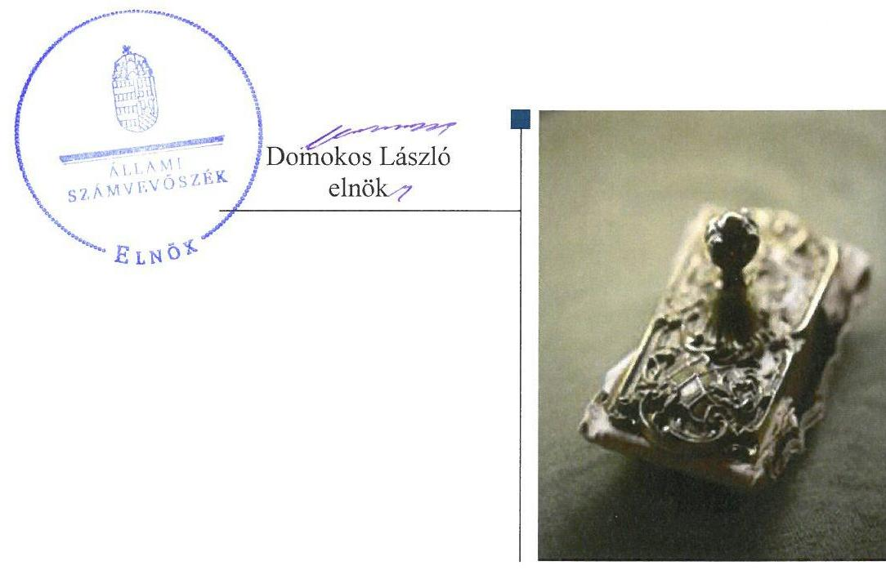
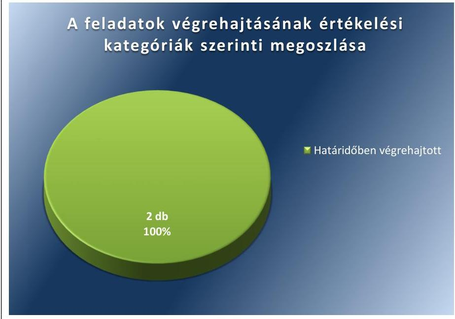
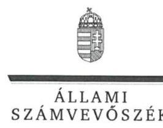
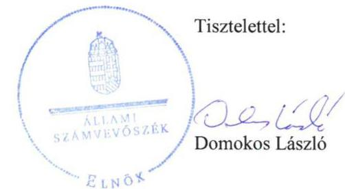
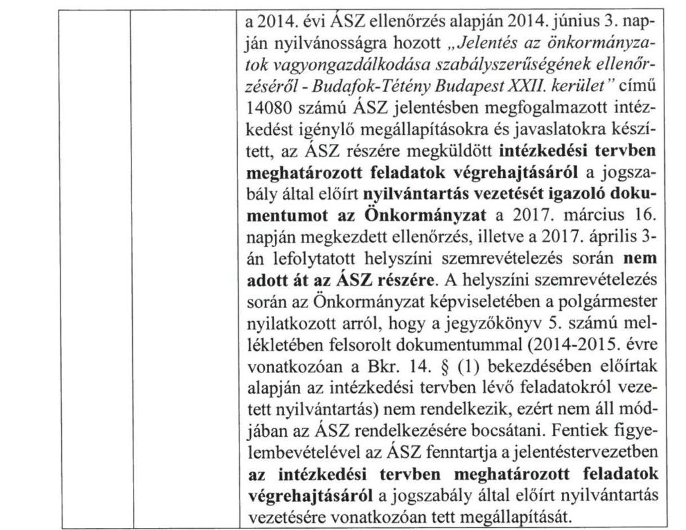
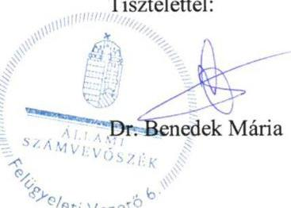

# Jelentés 

## Utóellenőrzések

Budafok-Tétény Budapest XXII. Kerület Önkormányzata vagyongazdálkodása szabályszerűségének utóellenőrzése 2017.

---

# Jelentés 

## Utóellenőrzések

Budafok-Tétény Budapest XXII. Kerület Önkormányzata vagyongazdálkodása szabályszerűségének utóellenőrzése 2017.  hó 12 nap

---

# AZ ELLENŐRZÉST FELÜGYELTE: 

DR. BENEDEK MÁRIA felügyeleti vezető

## AZ ELLENŐRZÉST VEZETTE ÉS A VÉGREHAJTÁSÁÉRT FELELŐS:

HOFMEISTER LÁSZLÓ ellenőrzésvezető

## A PROGRAM ÖSSZEÁLLÍTÁSÁÉRT FELELŐS:

JANIK JÓZSEF LÁSZLÓ osztályvezető

## A TÉMÁHOZ KAPCSOLÓDÓ KORÁBBI SZÁMVEVŐSZÉKI JELENTÉSEK:

- címe: Jelentés az önkormányzatok vagyongazdálkodása szabályszerűségének ellenőrzéséről - Budafok-Tétény Budapest XXII. kerület
- sorszáma: 14080

IKTATÓSZÁM: V-1317-036/2016.
TÉMASZÁM: 2351
ELLENŐRZÉS-AZONOSÍTÓ SZÁM: V075576

---

# TARTALOMJEGYZÉK 

■ ÖSSZEGZÉS ..... 5
■ AZ ELLENŐRZÉS CÉLJA ..... 6
■ AZ ELLENŐRZÉS TERÜLETE ..... 7
■ AZ ELLENŐRZÉS HÁTTERE, INDOKOLTSÁGA ..... 8
■ A JELENTÉS LÉNYEGES KÉRDÉSKÖRE ..... 9
■ ELLENŐRZÉS HATÓKÖRE ÉS MÓDSZEREI ..... 10
■ MEGÁLLAPÍTÁSOK ..... 12
■ MELLÉKLETEK ..... 15
I. Sz. melléklet: Az ÁSZ 14080 számú jelentéséhez kapcsolódó intézkedési terv végrehajtása ..... 15
■ FÜGGELÉK: ÉSZREVÉTELEK ..... 17
■ RÖVIDÍTÉSEK JEGYZÉKE ..... 25

---

.

---

# ÖSSZEGZÉS 

Az Állami Számvevőszék Budafok-Tétény Budapest XXII. Kerület Önkormányzata vagyongazdálkodása szabályszerűségének utóellenőrzése során megállapította, hogy az intézkedési tervben meghatározott feladatokat határidőben végrehajtották. A közpénzekkel, az önkormányzati vagyonnal való felelős gazdálkodás átláthatósága, valamint a belső kontrollrendszer és a vezetői irányítási rendszer támogatása érdekében meghatározott intézkedések hasznosultak, így a vagyongazdálkodásban és a működés szabályszerűségében korábban feltárt kockázatok csökkentek.

## Az ellenőrzés társadalmi indokoltsága

Az Állami Számvevőszék stratégiájában célul tűzte ki a számvevőszéki munka hasznosulásának javítását. Ezzel összhangban ellenőrzi, hogy az ellenőrzött szervezetek megvalósították-e a korábbi ellenőrzései által feltárt hibák, hiányosságok és szabálytalanságok megszüntetése céljából kialakított intézkedési terveikben foglaltakat. A rendszeres utóellenőrzések hozzájárulnak a szükséges intézkedések tényleges végrehajtásához, ezáltal a közpénzügyek rendezettségének javulásához, igazolják, hogy lezárult a következmények nélküli ellenőrzések időszaka.

## Főbb megállapítások, következtetések

Budafok-Tétény Budapest XXII. Kerület Önkormányzata az intézkedést igénylő megállapításokhoz és javaslatokhoz kapcsolódóan összeállított intézkedési tervben meghatározott két feladatot határidőben végrehajtotta. A határidőben végrehajtott feladattal a jogszabályban előírt, vagyonkezelési joggal kapcsolatos rendelkezések beépültek a Budafok-Tétény Budapest XXII. Kerület Önkormányzata vagyonrendeletébe, valamint a törvényben előírt hivatásetikai alapelvek és eljárási szabályok kidolgozásra kerültek. A végrehajtott intézkedések következtében szabályozásra került a közpénzekkel és önkormányzati vagyonnal történő vagyonkezelésre vonatkozó joggyakorlás, valamint erősödött a belső kontrollrendszer és a vezetői irányítási rendszer.

Budafok-Tétény Budapest XXII. Kerület Önkormányzata az intézkedési tervben meghatározott feladatok végrehajtásáról a jogszabály által előírt nyilvántartást nem vezette.

---

# AZ ELLENŐRZÉS CÉLJA

Az ellenőrzés célja annak értékelése volt, hogy a számvevőszéki jelentésben foglalt intézkedést igénylő megállapításokkal és javaslatokkal összhangban készített intézkedési tervben meghatározott feladatokat az ellenőrzött szervezet végrehajtotta-e.

---

# AZ ELLENŐRZÉS TERÜLETE

## Budafok-Tétény Budapest XXII. Kerület Önkormányzata

Budafok-Tétény Budapest XXII. kerület állandó lakosainak száma a Központi Statisztikai Hivatal Magyarország közigazgatási helynévkönyve alapján 2016. január 1-jén 54 611 fő volt.

A polgármester¹ a 2014. évi választásoktól tölti be tisztségét, a jegyző² 2011. június 10-étől látja el feladatait.

Budafok-Tétény Budapest XXII. Kerület Önkormányzata 2016. évi költségvetésének bevételi és kiadási főösszegét 19 152,4 M Ft-ban állapította meg. A jóváhagyott elemi éves költségvetés szerint 9062,5 M Ft költségvetési bevételt és 15 317,9 M Ft költségvetési kiadást tervezett.

Az ÁSZ³ a 2014. évben ellenőrizte Budafok-Tétény Budapest XXII. Kerület Önkormányzatánál az önkormányzat vagyongazdálkodás szabályszerűségét a 2009. január 1. és 2012. december 31. közötti időszak vonatkozásában. Az erről szóló 14080 számú jelentését az ÁSZ 2014. június 3-án tette közzé. Az ellenőrzés célja annak megállapítása volt, hogy az önkormányzat vagyongazdálkodási tevékenységének szabályozottsága és tevékenysége a jogszabályi előírásokkal összhangban volt-e, átlátható, a jogszabályi előírásoknak megfelelő volt-e a vagyon nyilvántartása, valamint a külső és belső ellenőrzések megállapításai hozzájárultak-e az önkormányzati vagyongazdálkodási tevékenység szabályszerűségéhez. Az ÁSZ jelentésben foglalt javaslatok végrehajtása érdekében a Képviselő-testület⁴ a 153/2014. (VI.19.) számú határozattal intézkedési tervet fogadott el, melyben két feladat került meghatározásra a Vagyongazdálkodási Iroda⁵ és a Gazdasági Iroda⁶ vezetője, valamint a Közigazgatási-fejlesztési és Szervezési Iroda⁷ vezetője számára.

Az utóellenőrzés – a 2014. június 3-ától 2017. március 16-áig végrehajtott feladatokat figyelembe véve – az ÁSZ jelentésben a jegyző részére megfogalmazott intézkedést igénylő megállapításokra és javaslatokra készített, az ÁSZ részére megküldött intézkedési tervben foglalt feladatok megvalósításának ellenőrzésére, illetve értékelésére fókuszált.

---

# AZ ELLENŐRZÉS HÁTTERE, INDOKOLTSÁGA 

Az ÁSZ tv. ${ }^{8}$ 33. § (1) bekezdése értelmében a számvevőszéki jelentések intézkedést igénylő megállapításaihoz kapcsolódóan az ellenőrzött szervezet vezetője intézkedési tervet köteles összeállítani, és az ÁSZ részére megküldeni. Az intézkedési tervben foglaltak megvalósítását - az ÁSZ tv. 33. § (7) bekezdésében foglaltak alapján - az ÁSZ utóellenőrzés keretében ellenőrizheti. Az intézkedések megvalósulásának értékelése során az ÁSZ figyelembe veszi az ellenőrzött szervezetek működési feltételeiben, valamint a jogszabályi előírásokban bekövetkezett változásokat.

Az intézkedési tervben foglalt feladatok hiányos, illetve késedelmes végrehajtása, valamint megvalósításának elmaradása azt mutatja, hogy az ellenőrzések során feltárt hibák, hiányosságok és szabálytalanságok megszüntetése nem kapott kellő hangsúlyt. Ez a szabályszerű működés és a felelős vezetői magatartás vonatkozásában kockázatot hordoz. E kockázatok feltárásával az ÁSZ utóellenőrzési rendszere fokozza a fegyelmet, és igazolja, hogy a közpénzzel való szabályos gazdálkodás felelőssége elől nem lehet kitérni.

Az utóellenőrzés négy szinten hasznosulhat:
$\longrightarrow$ A társadalom szintjén az utóellenőrzés jelzi, hogy a számvevőszéki ellenőrzés megállapításainak van következménye: a hiányosságok megszüntetésére az ellenőrzött szervezet által meghatározott intézkedések végrehajtását is számon kéri az ÁSZ.
$\longrightarrow$ Az ellenőrzött terület szintjén az utóellenőrzés tájékoztatást nyújt a terület döntéshozóinak a hiányosságok kiküszöbölésének jó gyakorlatairól, ezzel lehetőséget biztosítva arra, hogy az ÁSZ ellenőrzési megállapításai, javaslatai a terület nem ellenőrzött szervezeteinek a működése során is hasznosuljanak.
$\longrightarrow$ Az ellenőrzött szervezet szintjén az utóellenőrzés feltárja, hogy a szervezet az intézkedések végrehajtásával hasznosította-e a korábbi ellenőrzési jelentésben a hiányosságok megszüntetése, illetve a kockázatok kezelése érdekében megfogalmazott javaslatokat.
$\longrightarrow$ Az ÁSZ szintjén az utóellenőrzés visszacsatolást ad az ellenőrzési jelentések hasznosulásáról, az intézkedések elmaradása vagy részleges megvalósulása a további ellenőrzésekhez kockázati jelzésként szolgál.

---

# A JELENTÉS LÉNYEGES KÉRDÉSKÖRE 

Az Önkormányzat az intézkedési tervben foglaltakat az előírt határidőben végrehajtotta-e?

---

# ELLENŐRZÉS HATÓKÖRE ÉS MÓDSZEREI 

## Az ellenőrzés típusa

Megfelelőségi ellenőrzés.

## Az ellenőrzött időszak

Az utóellenőrzés alapját képező ÁSZ jelentés közzétételének napjától (2014. június 3.) az ellenőrzésről szóló kiértesítő levél keltének napjáig (2017. március 16.) tartó időszak.

## Az ellenőrzés tárgya

Az ÁSZ tv. 2011. július 1-jei hatálybalépését követően a számvevőszéki jelentésben foglalt intézkedést igénylő megállapításokkal és javaslatokkal összhangban - Budafok-Tétény Budapest XXII. Kerület Önkormányzata által - készített intézkedési tervben foglaltak végrehajtásának ellenőrzése volt.

Az ellenőrzés kiterjedt minden olyan körülményre és adatra, amely az ÁSZ jogszabályban meghatározott feladatainak teljesítéséhez, valamint a program végrehajtása folyamán felmerült újabb összefüggések feltárásához szükséges volt.

## Az ellenőrzött szervezet

Budafok-Tétény Budapest XXII. Kerület Önkormányzata

## Az ellenőrzés jogalapja

Az ÁSZ az ÁSZ törvényben meghatározott feladatkörében ellenőrzi a központi költségvetés végrehajtását, az államháztartás gazdálkodását, az államháztartásból származó források felhasználását és a nemzeti vagyon kezelését.

Az ÁSZ tv. 1. § (3) bekezdése szerint az ÁSZ általános hatáskörrel végzi a közpénzekkel és az állami és önkormányzati vagyonnal való felelős gazdálkodás ellenőrzését.

Az ÁSZ tv. 33. § (7) bekezdése alapján az ÁSZ tv. 33. § (1)-(2) bekezdése szerinti intézkedési tervben foglaltak megvalósítását az ÁSZ utóellenőrzés keretében ellenőrizheti.

---

# Az ellenőrzés módszerei 

Az ÁSZ az ellenőrzést a nemzetközi standardokat irányadónak tekintve az ellenőrzési program ellenőrzési kérdései, az ellenőrzött időszakban hatályos jogszabályok, az ellenőrzés szakmai szabályok és módszertanok figyelembevételével, önálló ellenőrzés keretében végezte.

Az ÁSZ az ellenőrzés ideje alatt az Önkormányzattal történő kapcsolattartást az ÁSZ SZMSZ²-ének vonatkozó előírásai alapján biztosította.

Az utóellenőrzés megállapításait elsősorban az ÁSZ rendelkezésére álló, valamint az ellenőrzött szervezetektől elektronikusan bekért dokumentumok alapozták meg.

Az ellenőrzési bizonyítékként felhasználható adatforrások közé tartoznak egyrészt a szakmai programban felsorolt adatforrások, másrészt minden - az ellenőrzés folyamán feltárt, az ellenőrzés szempontjából információt tartalmazó - dokumentum.

Az intézkedési tervben előírt feladatokat, azok végrehajtása, illetve végrehajtása szempontjából az alábbiak szerint értékelte az ÁSZ:
$\longrightarrow$ „határidőben végrehajtott" a feladat, ha a teljesítés dokumentáltan, az intézkedési tervben előírt határidőben és tartalommal megtörtént;
$\longrightarrow$ „határidőn túl végrehajtott" a feladat, ha annak teljesítése az intézkedési tervben meghatározott módon, de az előírt határidőn túl történt meg;
$\longrightarrow$ „részben végrehajtott" a feladat, ha végrehajtása teljes körűen az intézkedési tervben előírt módon nem történt meg;
$\longrightarrow$ „nem végrehajtott" a feladat, ha a végrehajtás nem történt meg, vagy amennyiben a teljesítést nem dokumentálták;
$\longrightarrow$ „okafogyottá vált" a feladat, ha végrehajtására - meghatározott esemény bekövetkezése, továbbá külső körülmény, a működést érintő feltétel változása miatt - már nincs szükség, illetve lehetőség, és egyértelműen megállapítható, hogy az intézkedést szükségessé tevő körülmény a jövőben nem fordulhat elő;
$\longrightarrow$ „nem időszerű" az a feladat, amelynek ellenőrzési időszakon belüli végrehajtására azért nem került (kerülhetett) sor, mert az intézkedés alapjául szolgáló esemény nem következett be, de annak jövőbeni előfordulása lehetséges, a végrehajtása nem volt esedékes, vagy a végrehajtás határideje még nem járt le.
Az ellenőrzés lefolytatásához az ellenőrzött szervezet a tanúsítványok elektronikus kitöltésével, valamint az ÁSZ által kért dokumentumok elektronikus megküldésével szolgáltatott adatokat, amelyek valódiságát és teljes körűségét az ellenőrzött szervezet vezetője által tett teljességi és hitelességi nyilatkozat igazolta. Az így rendelkezésre bocsátott adatok, információk kontrollja az ellenőrzés keretében történt.

---

# MEGÁLLAPÍTÁSOK 

## Az Önkormányzat az intézkedési tervben foglaltakat az előírt határidőben végrehajtotta-e?

Összegző megállapítás

Az Önkormányzat ${ }^{10}$ az intézkedési tervében meghatározott feladatokat az előírt határidőben végrehajtotta. Az intézkedési tervben foglalt feladatok végrehajtásáról nem vezette a jogszabály által előírt nyilvántartást.

Az ÁSZ jelentésében a jegyző részére két javaslatot fogalmazott meg. A Képviselő-testület által elfogadott és az ÁSZ részére a polgármester által megküldött intézkedési tervben a hiányosságok, szabálytalanságok megszüntetésére két feladatot határozott meg az Önkormányzat. A feladat végrehajtásának felelőseként az első intézkedés esetében a Vagyongazdálkodási Iroda és a Gazdasági Iroda vezetőjét, a második intézkedés esetében a Közigazgatás-fejlesztési és Szervezési Iroda vezetőjét jelölte meg a polgármester.

Az intézkedési tervben meghatározott feladatokat, határidőket, felelősöket és a feladatok végrehajtását az I. számú melléklet mutatja be.

Az ÁSZ javaslatai alapján készített intézkedési tervben foglalt feladatok végrehajtásáról a jegyző nem vezette a Bkr. ${ }^{11}$ 14. § (1) bekezdésében előírt nyilvántartást.

Az Önkormányzat intézkedési tervében meghatározott feladatok végrehajtásának értékelési kategóriák szerinti megoszlását az 1. ábra szemlélteti.

1. ábra

Forrás: ÁSZ

---

# HATÁRIDŐBEN VÉGREHAJTOTT feladatok: 

1. A Vagyongazdálkodási Iroda és a Gazdasági Iroda vezetője határidőre elkészítette és a Képviselő-testület határidőben elfogadta a polgármester által beterjesztett, az Önkormányzat vagyonáról, a vagyontárgyak feletti tulajdonosi jogok gyakorlásáról szóló önkormányzati rendelet módosítását.
2. A Közigazgatás-fejlesztési és Szervezési Iroda vezetője határidőben elkészítette és a Képviselő-testület határidőben elfogadta a jegyző által beterjesztett Hivatásetikai Szabályzat ${ }^{12}$-ot. A Hivatásetikai Szabályzat tartalmazta a Kttv. ${ }^{13}$-ben előírt, a köztisztviselőkre vonatkozó hivatásetikai alapelvek részletes tartalmát és az etikai eljárás szabályait.

---

.

---

# MELLÉKLETEK

- I. SZ. MELLÉKLET: AZ ÁSZ 14080
 SZÁMÚ JELENTÉSÉHEZ KAPCSOLÓDÓ INTÉZKEDÉSI TERV VÉGREHAJTÁSA

|  1. | Az intézkedési tervben meghatározott feladat | Az intézkedési tervben meghatározott határidő | Az intézkedési tervben meghatározott feladat felelőse | A feladat végrehajtása  |
| --- | --- | --- | --- | --- |
|   | 1. | 2. | 3. | Határidőben végrehajtott feladat | 4.  |
|  1. | Az Ötv. 80/B. és az MÖtv. 109. § (4) bekezdésében foglaltak alapján a vagyonkezelői joggal kapcsolatos rendelkezések kerüljenek beépítésre az Önkormányzat Vagyonrendeletébe (vagyonkezelési jog megszerzésével, gyakorlásával és a vagyonkezelés ellenőrzésével kapcsolatos szabályok). | 2014. szeptember Képviselő-testületi ülés | Vagyongazdálkodási Iroda vezetője és a Gazdasági Iroda vezetője | A Vagyongazdálkodási Iroda és a Gazdasági Iroda vezetője határidőre elkészítette a vagyonkezelésre vonatkozó szabályokat, melyek Önkormányzati Vagyonrendeletbe történő beépítését a polgármester előterjesztette a Képviselő-testület 2014. szeptember 11-i ülésére. A Képviselő-testület a 172/2014. (IX.11.) határozat alapján döntött a vagyonkezelési szabályoknak az Önkormányzat vagyonáról a vagyontárgyak feletti tulajdonosi jogok gyakorlásáról szóló 7/2012. (III.05.) önkormányzati rendeletbe történő beépítéséről. A Képviselő-testület a 19/2014. (IX.17.) önkormányzati rendelettel 2014. október 1-jei hatállyal módosította a 7/2012. (III.05.) önkormányzati rendeletet és azt kiegészítette a 16/A. § szerinti 4. sz. melléklettel, a „A vagyonkezelés megszerzésére, gyakorlására és ellenőrzésére vonatkozó szabályzat"-tal. Az önkormányzati rendelet 4. sz. melléklete tartalmazta az MÖtv. 109. § (4) bekezdésében és az intézkedési tervben előírtaknak megfelelően a vagyonkezelői jog megszerzésével (vagyonkezelői jog létrejöttével, a vagyonkezelői jog ellenértékével), a vagyonkezelői jog gyakorlásával (a vagyonkezelő jogai és kötelezettségével, adatszolgáltatási és tájékoztatási kötelezettségével) és a vagyonkezelés ellenőrzésével, valamint megszűnésével kapcsolatos szabályokat.  |
|  2. | A 8kr. 6. § (1) bekezdés c) pontjának megfelelően az etikai elvárások szervezet minden szintjére kerüljenek meghatározásra, továbbá a Kttv. 83. §-a szerinti hivatásetikai alapelvek, az etikai eljárások szabályai kerüljenek kidolgozásra a Polgármesteri Hivatal új Etikai Szabályzatában. | 2014. szeptember Képviselő-testületi ülés | Közigazgatás-fejlesztési és Szervezési Iroda vezetője | A Közigazgatási-fejlesztési és Szervezési Iroda vezetője határidőre elkészítette a Hivatásetikai Szabályzatot, melyet a jegyző a Képviselő-testület részére a 2014. szeptember 11-i ülésre előterjesztett. A Képviselő-testület a Hivatásetikai Szabályzatot a 173/2014. (IX.11.) határozatával fogadta el 2014. október 1-jei hatállyal. A Hivatásetikai Szabályzat I. fejezet 3. pontja tartalmazta az intézkedési tervben, valamint a Kttv. 83. §-ában előírt, a köztisztviselőkre vonatkozó hivatásetikai alapelvek részletes ismertetését, továbbá annak II. fejezetében az etikai eljárás szabályait.  |

---

.

---

# FÜGGELÉK: ÉSZREVÉTELEK 

A jelentéstervezetet a Számvevőszék 15 napos észrevételezésre megküldte az ellenőrzött szervezet vezetőjének az ÁSZ tv. 29. § (1) bekezdése előírásának megfelelően.

A függelék tartalmazza az ellenőrzött észrevételét, illetve az el nem fogadott észrevétel elutasításának indoklását.

[^0]
[^0]:    * 29. § (1) Az Állami Számvevőszék az ellenőrzési megállapításait megküldi az ellenőrzött szervezet vezetőjének vagy az általa megbízott személynek, és annak, akinek személyes felelősségét állapította meg.
    (2) Az ellenőrzött szervezet vezetője és a felelősként megjelölt személy az ellenőrzés megállapításaira tizenöt napon belül írásban észrevételt tehet.
    (3) Az Állami Számvevőszék az észrevételre a beérkezésétől számított harminc napon belül írásban válaszol. A figyelembe nem vett észrevételeket köteles a jelentésben feltüntetni, és megindokolni, hogy azokat miért nem fogadta el.

---

# Budafok-Tétény Budapest XXII. kerületi Önkormányzata 

Polgármester
1221.Budapest, Városház tér 11.
Levelezési cím: 1775 Budafok 1 Pf.: 109
Telefon: 229-2617 Fax: 229-2697
E-mail: polgarmester@bp22.hu $\cdot$ www.budafokteteny.hu
Ügyiratszám: 7976-6/2017/XIV
Tárgy: Észrevétel jelentéstervezetre
Hivatkozási szám.: V-1317-033/2016
Domokos László
Elnök részére
Állami Számvevőszék
1052 Budapest
Apáczai Csere János u. 10.

ÁLLAMI SZÁMVEVŐSZÉK
Érkeze: 2017. JÚNIUS 27.
Iktatószc: 36 - 45361/60ff/1
Moliókire: $1-1317-036 / 60f0$

Tisztelt Elnök Úr!

Az Állami Számvevőszék az önkormányzat vagyongazdálkodása szabályszerűségének utóellenőrzése keretében 2017. április 3-án helyszíni ellenőrzést végzett önkormányzatunknál. Az ellenőrzés megállapításait tartalmazó jelentéstervezetet 2017. június 13-án vettem kézhez és az abban foglalt megállapításra a rendelkezésemre álló törvényes határidőn belül észrevételt teszek.

## Megállapítás:

„Budafok-Tétény Budapest XXII. kerület Önkormányzata az intézkedési tervben meghatározott feladatok végrehajtásáról a jogszabály által előírt nyilvántartást nem vezette."

## Észrevétel

A „nyilvántartást nem vezette" általános érvényű megfogalmazás a kötelezettség teljeskörű elmulasztását jelenti, holott a felvett jegyzőkönyv sem ezt tükrözi.

A 2017. április 3-án tartott helyszíni ellenőrzés jegyzőkönyvéhez csatolt 4. számú mellékletben rögzítésre került, hogy a Bkr. 14.§ (1) bekezdésében előírt nyilvántartást a 2016. évre vonatkozóan hitelesített másolatban átadtuk. A jegyzőkönyvhöz csatolt 5. számú melléklet azt rögzítette, hogy " A 2014-2015. évre vonatkozóan a Bkr. 14.§ (1) bekezdésében előírtak alapján az intézkedési tervben lévő feladatokról vezetett nyilvántartás nem áll rendelkezésre."

---

A jegyzőkönyvet lezáró nyilatkozatot a jegyzőkönyv és mellékletei együttes tartalmának viszonylatában tettem, vagyis nem arra vonatkozott, hogy a jegyző nem gondoskodott a külső szervek ellenőrzéseit rögzítő nyilvántartások vezetéséről, hanem arra, hogy a 2014-2015. évről felvett nyilvántartások a helyszíni ellenőrzés - így a jegyzőkönyvfelvétel- során nem álltak rendelkezésre.
A 2014 - 2015. évről felvett nyilvántartásokat azért nem tudtuk az ellenőrzés során bemutatni, mert a Bkr. 14.§ (1) bekezdésében előírtak alapján vezetett nyilvántartások bemutatásának szükségessége csak a 2017. április 3-án lezajlott helyszíni ellenőrzés során merült fel. A belső ellenőrzési vezető a 2016. évre vonatkozó nyilvántartást ekkor bemutatta és átadta. Tájékoztatta az ellenőrzést végző számvevőket arról, hogy a 2016. évnél korábbi dokumentumok irattárban vannak. A belső ellenőrzési vezető bekérte az érintett ügyiratokat, a helyszíni ellenőrzés azonban azok beérkezése előtt befejeződött.
A nyilvántartásokat azért nem készítettük elő a helyszíni ellenőrzésre, mert azok bemutatási kötelezettségéről nem kaptunk előzetes tájékoztatást, magunk részéről pedig - a következőkben kifejtésre kerülő okok miatt- nem értékeltük úgy, hogy az intézkedési tervben foglalt feladatok végrehajtására nézve ezeknek bizonyító ereje lenne.

A Bkr. 14.§ (1) bekezdésében előírt nyilvántartások benyújtásának szükségessége részünkről - sem a dokumentum feltöltési időszak alatt, sem azt követően - a következők miatt nem merült fel.
Az Állami Számvevőszék V-1317-001/2016. iktatószámú, az utóvizsgálat előkészítésének megkezdését bejelentő levele, annak mellékletei, a kitöltési útmutatók, valamint az 1-2. számú tanúsítvány sem nevesítette a Bkr. 14.§ (1) bekezdés szerinti nyilvántartás benyújtását. A felsoroltak a bekért dokumentumok körét a kitöltött tanúsítványokban, az intézkedési tervben meghatározott feladatok végrehajtását igazoló dokumentumokban, az intézkedési tervben foglaltak végrehajtásáról esetleg készült beszámolókban határozták meg.
Az intézkedési tervben előírt feladatok határidőben történő végrehajtását érdemben bizonyító iratokat és az 1-2. számú tanúsítványt értelemszerűen kitöltve az elektronikus rendszerbe feltöltöttük és a papíralapú példányokat 2016. október 25-én megküldtük.
A feltöltés során nem merült fel részünkről, hogy az intézkedési tervben meghatározott feladatok végrehajtását a Bkr. 14.§ (1) bekezdés szerinti nyilvántartással kellene igazolnunk, mert a Bkr. 14.§ (1) bekezdés alapján vezetett nyilvántartás nem közhiteles, hanem regisztrációs- mintegy monitoring- jellegű nyilvántartás. Az intézkedések végrehajtási kötelezettségét nem a nyilvántartásba vétel keletkezteti, és a végrehajtás megtörténtét sem annak a nyilvántartásban való rögzítése igazolja. Az évenkénti, folyamatos regisztrálás célja a külső ellenőrzések javaslatai alapján készült intézkedési tervek végrehajtásának nyomon követése. Ennek megfelelően a nyilvántartás adatai nem alkalmasak valamely tény, állapot meglétének igazolására, a nyilvántartásban szereplő adatok valódiságát hitelt érdemlően az adatok bejegyzését megalapozó, bizonyító erejű dokumentumok igazolják.
Ennek megfelelően a kötelezettségek elvégzését ténylegesen és hitelt érdemlően bizonyító iratok becsatolásával a feltöltést teljeskörűnek tekintettük. A helyszíni ellenőrzés megkezdéséig nem kaptunk olyan jelzést, amely a dokumentumok hiányosságára mutatott volna rá.

---

Természetesen tudatában vagyok annak, hogy a helyszíni szemrevételezés során be nem mutatott dokumentumok pótlására a lezárást követően már nincs lehetőség, észrevételem nem is erre vonatkozik.

A leírtakat csak annak alátámasztásaként vezettem le, miszerint tényszerű ugyan, hogy a bekért iratok egy részét a vizsgálat során nem tudtuk bemutatni, ám maga a vizsgálati jegyzőkönyv 4. számú melléklete is tartalmazta a nyilvántartás egy részének meglétét, és az 5. számú melléklet sem a nyilvántartás vezetésének általános elmulasztását, csak az érintett időszakra vonatkozó nyilvántartások egy részének az adott időpontban rendelkezésre nem állását rögzítette.
Ez nem azonos tartalmú a nyilvántartás vezetési kötelezettség általános érvényű elmulasztásával, ezért kérem az ellenőrzési jegyzőkönyv ilyen irányú pontosítását.

Budapest, 2017. június 19.
Tisztelettel

---

ELNÖK

Ikt.szám: V-1317-035/2016.

# Karsay Ferenc úr 

polgármester
Budafok-Tétény Budapest XXII. kerület Önkormányzata

## Budapest

## Tisztelt Polgármester Úr!

Köszönettel megkaptam az Állami Számvevőszékhez 2017. június 27. napján érkezett "Utóellenőrzések - Budafok-Tétény Budapest XXII. kerület Önkormányzata vagyongazdálkodása szabályszerűségének utóellenőrzése" című számvevőszéki jelentéstervezetben foglalt megállapításokra tett észrevételét.

Tájékoztatom Polgármester urat, hogy az el nem fogadott észrevételt - az Állami Számvevőszékről szóló 2011. évi LXVI. törvény 29. § (3) bekezdése alapján - a jelentésben szerepeltetjük az elutasítás indokának feltüntetésével együtt.

Az Állami Számvevőszék észrevételre vonatkozó álláspontjáról a felügyeleti vezető által készített részletes tájékoztatást csatoltan megküldöm.

Budapest, 2017. 08. hó 04. nap

Melléklet: Tájékoztatás az el nem fogadott észrevételről, annak indokáról

---

# Tájékoztatás 

az el nem fogadott észrevételről, annak indokáról

| 1. | Észrevétel: | Az észrevétel 1. oldal 2. bekezdésében kezdődő, az ÁSZ jelentéstervezet 5. oldal a Főbb megállapítások, következtetések fejezet utolsó mondatára, megállapításra tett észrevétel: „Budafok-Tétény Budapest XXII. kerület Önkormányzata az intézkedési tervben meghatározott feladatok végrehajtásáról a jogszabály által előírt nyilvántartást nem vezette. "Észrevétel: „A "nyilvántartást nem vezette" általános érvényű megfogalmazás a kötelezettség teljeskörű elmulasztását jelenti, holott a felvett jegyzőkönyv sem ezt tükrözi. A 2017. április 3-án tartott helyszíni ellenőrzés jegyzőkönyvéhez csatolt 4. számú mellékletben rögzítésre került, hogy a Bkr. 14.§ (1) bekezdésében előírt nyilvántartást a 2016. évre vonatkozóan hitelesített másolatban átadtuk. A jegyzőkönyvhöz csatolt 5. számú melléklet azt rögzítette, hogy „A 2014-2015. évre vonatkozóan a Bkr. 14. § (1) bekezdésében előírtak alapján az intézkedési tervben lévő feladatokról vezetett nyilvántartás nem áll rendelkezésre. " A jegyzőkönyvet lezáró nyilatkozatot a jegyzőkönyv és mellékletei együttes tartalmának viszonylatában tettem, vagyis nem arra vonatkozott, hogy a jegyző nem gondoskodott |
| :--: | :--: | :--: |

---

|  | a külső szervek ellenőrzéseit rögzítő nyilvántartások vezetéséről, hanem arra, hogy a 2014-2015. évről felvett nyilvántartások a helyszíni ellenőrzés - így a jegyzőkönyvfelvétel - során nem álltak rendelkezésre. Természetesen tudatában vagyok annak, hogy a helyszíni szemrevételezés során be nem mutatott dokumentumok pótlására a lezárást követően már nincs lehetőség, észrevételem nem is erre vonatkozik. Tényszerű ugyan, hogy a bekért iratok egy részét a vizsgálat során nem tudtuk bemutatni, ám maga a vizsgálati jegyzőkönyv 4. számú melléklete is tartalmazta a nyilvántartás egy részének meglétét, és az 5. számú melléklet sem a nyilvántartás vezetésének általános elmulasztását, csak az érintett időszakra

 vonatkozó nyilvántartások egy részének az adott időpontban rendelkezésre nem állását rögzítette. ${ }^{11}$ |
| :--: | :--: |
| Válasz: | Az ÁSZ az észrevételt nem fogadja el. |
| Indokolás: | Az észrevétel nem megalapozott. A 2017. március 16. napján keltezett, az Önkormányzat részére megküldött ellenőrzés megkezdéséről szóló kiértesítő levélben foglaltak alapján az Önkormányzat tájékoztatást kapott arról, hogy az ellenőrzés a mellékelt ellenőrzési program szerint kerül lefolytatásra. A levél mellékletét képező V-1062-003/2016. számú ellenőrzési program szerint az ellenőrzés tárgya a számvevőszéki jelentésben foglalt intézkedést igénylő megállapításokkal és javaslatokkal összhangban - az ellenőrzött szervezet által - készített intézkedési tervben foglaltak végrehajtásának ellenőrzése, valamint a program 1.2. számú ellenőrzési alkérdése arra vonatkozik, hogy az intézkedési tervben meghatározott feladatok végrehajtásáról vezették-e a jogszabály által előírt nyilvántartást. A Bkr. 14. § (1) bekezdésében előírtak szerint a költségvetési szerv vezetője gondoskodik a külső ellenőrzések koordinációjáról és éves bontásban nyilvántartást vezet a külső ellenőrzések javaslatai alapján készült intézkedési tervek végrehajtásáról a 47. § (2) bekezdése szerinti tartalommal. Az Önkormányzat által az ellenőrzés rendelkezésére bocsátott nyilvántartás - a 2014. évi ÁSZ ellenőrzés kivételével - tartalmazza a külső ellenőrzések javaslatait, azok alapján készült intézkedési terveket, és annak végrehajtását a 2015-2016. évi ellenőrzési időszak tekintetében. A 2014. évre vonatkozóan nyilvántartás nem került átadásra az ÁSZ részére. Így |

---

Budapest, 2017. július " 5. ".
Tisztelettel:

---

# RÖVIDÍTÉSEK JEGYZÉKE 

${ }^{1}$ polgármester
${ }^{2}$ jegyző
${ }^{3}$ ÁSZ
${ }^{4}$ Képviselő-testület
${ }^{5}$ Vagyongazdálkodási Iroda
${ }^{6}$ Gazdasági Iroda
${ }^{7}$ Közigazgatás-fejlesztési és Szervezési Iroda
${ }^{8}$ ÁSZ tv.
${ }^{9}$ SZMSZ
${ }^{10}$ Önkormányzat
${ }^{11}$ Bkr.
${ }^{12}$ Hivatásetikai Szabályzat
${ }^{13} \mathrm{Kttv}$.

Budafok-Tétény Budapest XXII. Kerület Önkormányzatának polgármestere 2014. október 13-tól
Budafok-Tétény Budapest XXII. Kerület Önkormányzatának jegyzője Állami Számvevőszék
Budafok-Tétény Budapest XXII. Kerület Önkormányzatának Képviselőtestülete
Budafok-Tétény Budapest XXII. Kerület Önkormányzatának Vagyongazdálkodási Irodája
Budafok-Tétény Budapest XXII. Kerület Önkormányzatának Gazdasági Irodája
Budafok-Tétény Budapest XXII. Kerület Önkormányzatának Közigazgatásfejlesztési és Szervezési Irodája
2011. évi LXVI. törvény az Állami Számvevőszékről (hatályos 2011. július 1-jétől)
Az Állami Számvevőszék elnökének 3/2016. (XII.29.) ÁSZ utasítása az Állami Számvevőszék Szervezeti és Működési Szabályzatáról (hatályos 2017. január 1-jétől)
Budafok-Tétény Budapest XXII. Kerület Önkormányzata
370/2011. (XII.31.) Korm. rendelet a költségvetési szervek belső kontrollrendszeréről és belső ellenőrzéséről (hatályos 2012. január 1-jétől)
Budafok-Tétény Budapest XXII. Kerület Polgármesteri Hivatal Hivatásetikai Szabályzata (hatályos 2014. október 1-jétől)
2011. évi CXCIX. törvény a közszolgálati tisztviselőkről (hatályos 2012. március 1-jétől)

---

# ÁLLAMI SZÁMVEVŐSZÉK 

1052 Budapest, Apáczai Csere János utca 10.
Levélcím: 1364 Budapest 4. Pf. 54
Telefon: +36 14849100 Telefax: +36 14849200
www.asz.hu
