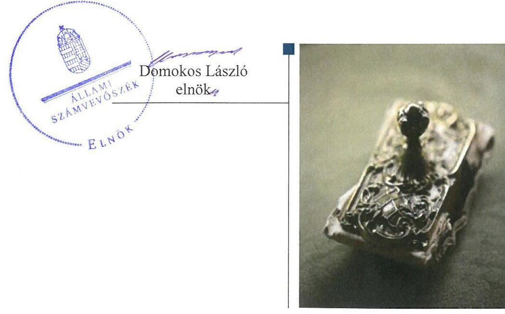
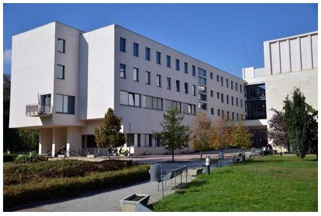
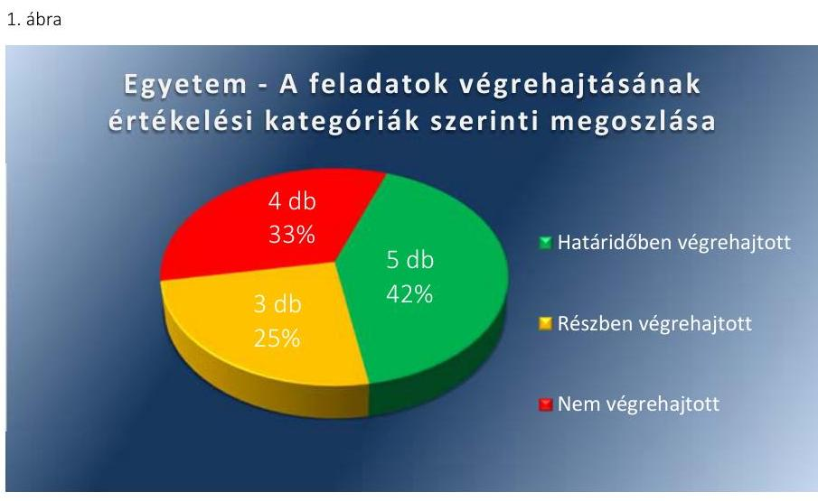
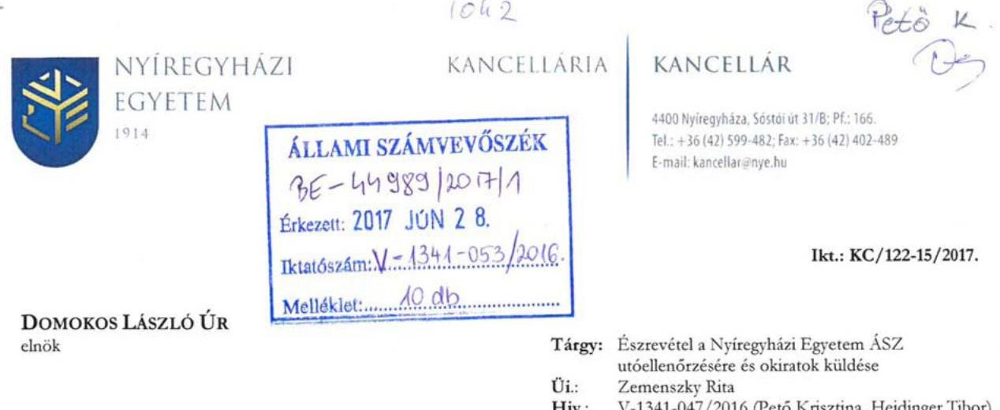
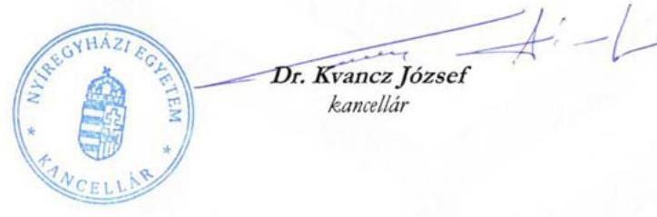
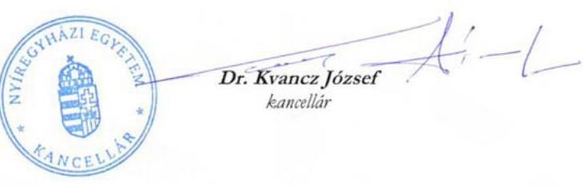
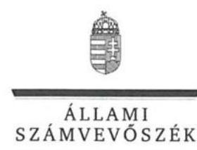
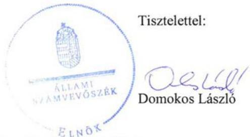
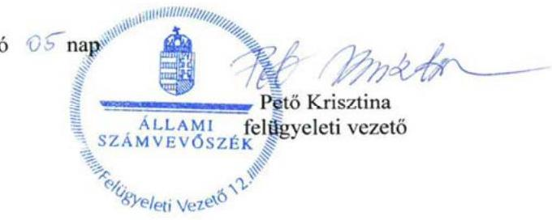

# Jelentés 

## Utóellenőrzések

Az állami felsőoktatási intézmények gazdálkodásának, működésének ellenőrzéséről készült jelentések utóellenőrzése - Nyíregyházi Egyetem 2017. 04. hó 25. nap

---

# AZ ELLENŐRZÉST FELÜGYELTE: 

PETŐ KRISZTINA felügyeleti vezető

## AZ ELLENŐRZÉST VEZETTE ÉS A VÉGREHAJTÁSÁÉRT FELELŐS:

HEIDINGER TIBOR ellenőrzésvezető

## A PROGRAM ÖSSZEÁLLÍTÁSÁÉRT FELELŐS:

JANIK JÓZSEF LÁSZLÓ osztályvezető

## A TÉMÁHOZ KAPCSOLÓDÓ KORÁBBI SZÁMVEVŐSZÉKI JELENTÉSEK:

- címe: Jelentés a Nyíregyházi Főiskola ellenőrzéséről Az állami felsőoktatási intézmények gazdálkodásának, működésének ellenőrzése
- sorszáma: 15028

IKTATÓSZÁM: V-1341-062/2016.
TÉMASZÁM: 2375
ELLENŐRZÉS-AZONOSÍTÓ SZÁM: V075542

---

# TARTALOMJEGYZÉK 

■ ÖSSZEGZÉS ..... 5
■ AZ ELLENŐRZÉS CÉLJA ..... 6
■ AZ ELLENŐRZÉS TERÜLETE ..... 7
■ AZ ELLENŐRZÉS HÁTTERE, INDOKOLTSÁGA ..... 8
■ A JELENTÉS LÉNYEGES KÉRDÉSKÖRE ..... 9
■ ELLENŐRZÉS HATÓKÖRE ÉS MÓDSZEREI ..... 10
■ MEGÁLLAPÍTÁSOK ..... 12
■ MELLÉKLETEK ..... 17
I. sz. melléklet: Az ÁSZ 15028. számú jelentéséhez kapcsolódó Egyetem intézkedési terv végrehajtása ..... 17
II. sz. melléklet: Az ÁSZ 15028. számú jelentéséhez kapcsolódó EMMI intézkedési terv végrehajtása ..... 21
■ FÜGGELÉK: ÉSZREVÉTELEK ..... 23
■ RÖVIDÍTÉSEK JEGYZÉKE ..... 33

---

.

---

# ÖSSZEGZÉS 

Az utóellenőrzés megállapította, hogy a Nyíregyházi Főiskola által készített intézkedési tervben meghatározott 12 feladatból öt feladatot határidőben, három feladatot részben, négy feladatot nem hajtottak végre. A gazdálkodási jogkörök gyakorlása területén az ÁSZ által korábban azonosított hiányosságok továbbra is fennállnak, amely veszélyezteti a kifizetések szabályosságát. A hallgatói költségtérítések önköltségszámítással történő alátámasztása elmaradt. Az Emberi Erőforrások Minisztériuma - mint fenntartói jogkör gyakorlója - az intézkedési tervében foglalt feladatait végrehajtotta.

## Az ellenőrzés társadalmi indokoltsága

Az Állami Számvevőszék stratégiájában célul tűzte ki a számvevőszéki munka hasznosulásának javítását. Ezzel összhangban ellenőrzi, hogy az ellenőrzött szervezetek megvalósították-e a korábbi ellenőrzései által feltárt hibák, hiányosságok és szabálytalanságok megszüntetése céljából kialakított intézkedési terveikben foglaltakat. A rendszeres utóellenőrzések hozzájárulnak a szükséges intézkedések tényleges végrehajtásához, ezáltal a közpénzügyek rendezettségének javulásához.

## Főbb megállapítások, következtetések

A Nyíregyházi Egyetem az intézkedési tervben meghatározott tizenkét feladatból öt feladatot határidőben, három feladatot részben, négy feladatot nem hajtott végre.

A gazdálkodási jogkörök gyakorlása területén feltárt, továbbra is fennálló szabálytalanságok továbbra is kockázatot hordoznak a szabályszerű kifizetések tekintetében. A hallgatói költségtérítések önköltségszámítással történő alátámasztása elmaradt, így a korábban azonosított hiányosság továbbra is fennáll. A kockázatkezelés folyamatának kialakítása, felülvizsgálata megtörtént ugyan, de továbbra sem mérték fel és állapították meg az Egyetem tevékenységében, gazdálkodásában rejlő kockázatokat. Az ellenőrzési jelentésekben megfogalmazott szabálytalanságok, hiányosságok megszüntetésére nem készült minden esetben intézkedési terv.

Az Emberi Erőforrások Minisztériuma az intézkedési tervben meghatározott feladatait határidőben végrehajtotta.

---

# AZ ELLENŐRZÉS CÉLJA 

Az ellenőrzés célja annak értékelése volt, hogy a számvevőszéki jelentésben foglalt intézkedést igénylő megállapításokkal és javaslatokkal összhangban készített intézkedési tervben meghatározott feladatokat az ellenőrzött szervezet végrehajtotta-e.

---

# AZ ELLENŐRZÉS TERÜLETE

## Nyíregyházi Egyetem

A Nyíregyházi Egyetem1 – 2016. január 1. előtt Nyíregyházi Főiskola – hajdani jogelődjei a Bessenyei György Tanárképző Főiskola és a Gödöllői Agrártudományi Egyetem Mezőgazdasági Főiskolai Karai voltak. Az Egyetemen agrár, bölcsészettudományi, gazdaságtudományi, informatikai, műszaki, sporttudományi, társadalomtudományi, természettudományi és pedagógusképzés folyik.

A Nyíregyházi Főiskola 2016. január 1-jétől Nyíregyházi Egyetem, alkalmazott tudományok egyeteme, irányító szerve az EMMI2. Az Egyetem hallgatóinak száma a 2016/2017 őszi szemeszterben 3761 fő volt.

A rektor3 személyében 2016. november 15-ig nem történt változás. 2016. november 16-tól az általános rektor-helyettes vezeti az Egyetemet. A kancellár4 2014. október 15-től látja el feladatait.

Az Egyetem a 2015. évi költségvetési beszámolója alapján 2133,7 millió Ft költségvetési bevételt és 4096,6 finanszírozási bevételt ért el, valamint 5769,2 millió Ft költségvetési kiadást teljesített. Az Egyetem mérlegfőösszegének értéke 2015. december 31-én 9262,6 millió Ft, a követelések állománya 398,3 millió Ft, a kötelezettségek állománya 786,9 millió Ft volt.

Az ÁSZ5 2015. évben ellenőrizte a Nyíregyházi Főiskola gazdálkodásának, működésének szabályszerűségét 2009. január 1. - 2013. december 31. közötti időszakra vonatkozóan, az erről szóló 15028. számú jelentését 2015. február 24-én tette közzé. Az ellenőrzés célja annak megállapítása volt, hogy szabályos volt-e az állami felsőoktatási intézmény pénzügyi és vagyongazdálkodása, biztosított volt-e a vagyonnal való felelős gazdálkodás követelményének érvényesülése, jogszabályi előírásoknak megfelelően működött-e a belső kontrollrendszer, az irányító szerv tevékenysége a jogszabályi előírásoknak megfelelő-e.

Az utóellenőrzés az ÁSZ jelentésben a rektor és a kancellár részére megfogalmazott intézkedést igénylő megállapításokra és javaslatokra készített, az ÁSZ részére megküldött intézkedési tervben foglalt feladatok megvalósításának ellenőrzésére, illetve értékelésére fókuszált.

---

# AZ ELLENŐRZÉS HÁTTERE, INDOKOLTSÁGA 

Az ÁSZ tv. ${ }^{6}$ 33. § (1) bekezdése értelmében a számvevőszéki jelentések intézkedést igénylő megállapításaihoz és javaslataihoz kapcsolódóan az ellenőrzött szervezet vezetője intézkedési tervet köteles összeállítani, és az ÁSZ részére megküldeni. Az intézkedési tervben foglaltak megvalósítását az ÁSZ tv. 33. § (7) bekezdésében foglaltak alapján - az ÁSZ utóellenőrzés keretében - ellenőrizheti. Az intézkedések megvalósulásának értékelése során az ÁSZ figyelembe vette az ellenőrzött szervezet működési feltételeiben, valamint a jogszabályi előírásokban bekövetkezett változásokat. Az intézkedési tervekben foglalt feladatok hiányos, illetve késedelmes végrehajtása, valamint megvalósításának elmaradása azt mutatja, hogy az ellenőrzések során feltárt hibák, hiányosságok és szabálytalanságok megszüntetése nem kapott kellő hangsúlyt. Ez a szabályszerű működés és a felelős vezetői magatartás vonatkozásában kockázatot hordoz. E kockázatok feltárásával az ÁSZ utóellenőrzési rendszere fokozza a fegyelmet, és igazolja, hogy a közpénzzel való szabályos gazdálkodás felelőssége elől nem lehet kitérni.

Az utóellenőrzés négy szinten hasznosulhat:
$\longrightarrow$ A társadalom szintjén az utóellenőrzés jelzi, hogy a számvevőszéki ellenőrzés megállapításainak van következménye: a hiányosságok megszüntetésére az ellenőrzött szervezet által meghatározott intézkedések végrehajtását is számon kéri az ÁSZ.
$\longrightarrow$ Az ellenőrzött terület szintjén az utóellenőrzés tájékoztatást nyújt a terület döntéshozóinak a hiányosságok kiküszöbölésének jó gyakorlatairól, ezzel lehetőséget biztosítva arra, hogy az ÁSZ ellenőrzési megállapításai, javaslatai a terület nem ellenőrzött szervezeteinek a működése során is hasznosuljanak.
$\longrightarrow$ Az ellenőrzött szervezet szintjén az utóellenőrzés feltárja, hogy a szervezet az intézkedések végrehajtásával hasznosította-e a korábbi ellenőrzési jelentésben a hiányosságok megszüntetése, illetve a kockázatok kezelése érdekében megfogalmazott javaslatokat.
$\longrightarrow$ Az ÁSZ szintjén az utóellenőrzés visszacsatolást ad az ellenőrzési jelentések hasznosulásáról, az intézkedések elmaradása vagy részleges megvalósulása a további ellenőrzésekhez kockázati jelzésként szolgál.

---

# A JELENTÉS LÉNYEGES KÉRDÉSKÖRE 

Az Egyetem és az EMMI az intézkedési terveikben foglaltakat az előírt határidőben végrehajtották-e?

---

# ELLENŐRZÉS HATÓKÖRE ÉS MÓDSZEREI 

## Az ellenőrzés típusa

Megfelelőségi ellenőrzés.

## Az ellenőrzött időszak

Az utóellenőrzés alapját képező ÁSZ jelentés közzétételének napjától (2015. február 24.) az ellenőrzésről szóló kiértesítő levél keltének napjáig (2017. február 10.) tartó időszak.

## Az ellenőrzés tárgya

Az ÁSZ tv. 2011. július 1-jei hatálybalépését követően a számvevőszéki jelentésben foglalt intézkedést igénylő megállapításokkal és javaslatokkal összhangban - a Nyíregyházi Egyetem és az Emberi Erőforrások Minisztériuma által - készített intézkedési tervekben foglaltak végrehajtásának ellenőrzése volt.

Az ellenőrzés kiterjedt minden olyan körülményre és adatra, amely az ÁSZ jogszabályban meghatározott feladatainak teljesítéséhez, valamint a program végrehajtása folyamán felmerült újabb összefüggések feltárásához szükséges volt.

## Az ellenőrzött szervezet

A Nyíregyházi Egyetem és az Emberi Erőforrások Minisztériuma

## Az ellenőrzés jogalapja

Az ÁSZ az Országgyűlés pénzügyi és gazdasági ellenőrző szerve. Az ÁSZ törvényben meghatározott feladatkörében ellenőrzi a központi költségvetés végrehajtását, az államháztartás gazdálkodását, az államháztartásból származó források felhasználását és a nemzeti vagyon kezelését.

Az ÁSZ tv. 1. § (3) bekezdése szerint az ÁSZ általános hatáskörrel végzi a közpénzekkel és az állami és önkormányzati vagyonnal való felelős gazdálkodás ellenőrzését.

Az ÁSZ tv. 33. § (7) bekezdése alapján az ÁSZ tv. 33. § (1) - (2) bekezdése szerinti intézkedési tervben foglaltak megvalósítását az ÁSZ utóellenőrzés keretében ellenőrizheti.

---

# Az ellenőrzés módszerei 

Az ÁSZ az ellenőrzést a nemzetközi standardokat irányadónak tekintve az ellenőrzési program ellenőrzési kérdései, az ellenőrzött időszakban hatályos jogszabályok, az ellenőrzés szakmai szabályok és módszertanok figyelembevételével, önálló ellenőrzés keretében végezte.

Az ÁSZ az ellenőrzés ideje alatt az ellenőrzött szervezettel történő kapcsolattartást az ÁSZ SZMSZ²-ének vonatkozó előírásai alapján biztosította.

Az utóellenőrzés megállapításait elsősorban az ÁSZ rendelkezésére álló, valamint az ellenőrzött szervezetektől elektronikusan bekért dokumentumok alapozták meg.

Az ellenőrzési bizonyítékként felhasználható adatforrások közé tartoztak egyrészt a szakmai programban felsorolt adatforrások, másrészt minden - az ellenőrzés folyamán feltárt, az ellenőrzés szempontjából információt tartalmazó - dokumentum. Az utóellenőrzés során az ÁSZ mintavételes ellenőrzési eljárást alkalmazott a működési megfelelőség ellenőrzésére. A gazdálkodási folyamatok szabályszerűségét 10-10 db véletlen mintavétellel kiválasztott tétel alapján értékelte az ÁSZ. A kiválasztott tételek esetében azt ellenőrizte az ÁSZ, hogy az Egyetem az intézkedési tervben meghatározott feladatok végrehajtása során biztosította-e a jogszabályok és a belső szabályzatok előírásainak megfelelő működést.

Az intézkedési tervben előírt feladatokat azok végrehajtása szempontjából az alábbiak szerint értékelte az ÁSZ.
"határidőben végrehajtott" a feladat, ha a teljesítés dokumentáltan, az intézkedési tervben előírt határidőben és tartalommal megtörtént;
"határidőn túl végrehajtott" a feladat, ha annak teljesítése az intézkedési tervben meghatározott módon, de az előírt határidőn túl történt meg;
"részben végrehajtott" a feladat, ha végrehajtása teljes körűen az intézkedési tervben előírt módon nem történt meg;
"nem végrehajtott" a feladat, ha a végrehajtás nem történt meg, vagy amennyiben a teljesítést nem dokumentálták;
"okafogyottá vált" a feladat, ha végrehajtására - meghatározott esemény bekövetkezése, továbbá külső körülmény, a működést érintő feltétel változása miatt - már nincs szükség, illetve lehetőség, és egyértelműen megállapítható, hogy az intézkedést szükségessé tevő körülmény a jövőben nem fordulhat elő;
"nem időszerű" az a feladat, amelynek ellenőrzési időszakon belüli végrehajtására azért nem került (kerülhetett) sor, mert az intézkedés alapjául szolgáló esemény nem következett be, de annak jövőbeni előfordulása lehetséges, a végrehajtása nem volt esedékes, vagy a végrehajtás határideje még nem járt le.
Az ellenőrzés lefolytatásához az ellenőrzött szervezet a tanúsítványok elektronikus kitöltésével, valamint az ÁSZ által kért dokumentumok elektronikus megküldésével szolgáltatott adatokat, amelyek valódiságát és teljes körűségét az ellenőrzött szervezet vezetője által tett teljességi és hitelességi nyilatkozat igazolta. Az így rendelkezésre bocsátott adatok, információk kontrollja az ellenőrzés keretében megtörtént.

---

# MEGÁLLAPÍTÁSOK 

## Az Egyetem és az EMMI az intézkedési terveikben foglaltakat az előírt határidőben végrehajtották-e?

Összegző megállapítás

Az Egyetem az intézkedési tervében meghatározott tizenkét feladatból ötöt határidőben, hármat részben, négyet nem hajtott végre. Az EMMI az intézkedési tervében meghatározott mindkét feladatát határidőben végrehajtotta. Az Egyetem az intézkedési tervében meghatározott feladatok végrehajtásáról a jogszabályban előírt tartalommal nem vezette a nyilvántartást. Az EMMI az intézkedési tervében meghatározott feladatok végrehajtásáról a jogszabályban előírt tartalommal vezette a nyilvántartást.

A 15028. sorszámú ÁSZ jelentés az Egyetem rektora részére nyolc, az emberi erőforrások minisztere részére kettő javaslatot fogalmazott meg. Az Egyetem és az EMMI elkészítette és az Állami Számvevőszék részére megküldte az intézkedési tervét. Az Egyetem rektora, kancellárja és szakterületi vezetői részére az intézkedési tervben 12 feladat került meghatározásra. Az EMMI emberi erőforrások minisztere részére kettő intézkedési terv feladat került meghatározásra.

Az Egyetem intézkedési tervében
 meghatározott feladatokat, határidőket, felelősöket, és a feladatok végrehajtását az I. számú melléklet mutatja be. Az EMMI intézkedési tervében meghatározott feladatokat, határidőket, felelősöket, és a feladatok végrehajtását az II. számú melléklet mutatja be.

## NYÍREGYHÁZI EGYETEM:

Az Egyetem az intézkedési tervben meghatározott tizenkét feladatból ötöt határidőben, hármat részben, négyet nem hajtott végre.

A rektor és a kancellár nem gondoskodott az ÁSZ megállapításaira és javaslataira készített intézkedési terv végrehajtását tartalmazó, a Bkr. ${ }^{8} 14 . \S$ (1) bekezdésében előírt nyilvántartás vezetéséről.

Az Egyetem intézkedési tervében tervezett feladatok végrehajtásának értékelési kategóriák szerinti megoszlását az 1. ábra szemlélteti.

---

Fonrás: ÁSZ

# HATÁRIDŐBEN VÉGREHAJTOTT feladatok: 

1. 1. a) A rektor és a kancellár hatáskör szerinti feladatmegosztás alapján gondoskodott arról, hogy az intézkedési tervben meghatározott 2015. augusztus 31-i véghatáridőig aktualizálásra és kiadásra kerüljenek a gazdálkodás szempontjából meghatározó belső szabályzatok. Az Egyetem Szenátusa kiadta az alábbi szabályzatokat: Szervezeti és működési szabályzat ${ }^{9}$, Gazdálkodási szabályzat ${ }^{10}$, a Számviteli politika ${ }^{11}$, az Eszközök és források értékelési szabályzata ${ }^{12}$, az Anyag- és eszközgazdálkodási szabályzat ${ }^{13}$, Leltározási és leltárkészítési szabályzat ${ }^{14}$. A nevesített szabályzatok teljeskörűen lefedték az intézkedési tervpontban meghatározott intézkedést. E mellett a kancellár a gazdálkodás rendjére vonatkozóan számos utasítást és körlevelet adott ki.
2. 3. d) A rektor és a kancellár az előírt határidőben intézkedett az Egyetem információs és kommunikációs rendszerének felülvizsgálatáról, a szabályozás aktualizálásáról. Az Egyetem kialakította a Bkr. előírásai szerinti szervezeten belüli és szervezeten kívüli információáramlás rendszerét. Az Egyetem Szenátusa kiadta a következő határozatokat: Szervezeti és működési szabályzat, Adatkezelési, adatvédelmi és adatbiztonsági szabályzat ${ }^{15}$, Informatikai biztonsági szabályzat ${ }^{16}$ módosítása, a Belső kontroll kézikönyv ${ }^{17}$ módosítása, Átláthatósági nyilatkozat kitöltésére vonatkozó előírás, Foglalkoztatási követelményrendszer ${ }^{18}$, amelyben rögzítették az összeférhetetlenségre vonatkozó szabályokat. A Belső kontroll kézikönyvben vezetői információs rendszer (VIR) illetve adattárház kialakítását és működtetését is elhatározták. A nevezett intézkedések igazolják az információs és kommunikációs rendszer felülvizsgálatát, a szabályozások aktualizálását.
3. 2. a) A kancellár a kincstári számla megnyitására a 2015. augusztus 31-i határidő előtt intézkedett. A kincstári számla 2015. augusztus 6-án megnyitásra került. A banknál vezetett számlát zárolták és a teljes bankszámla egyenleget az Egyetem kincstári számlájára 2015. szeptember 10-én átutalták. A hallgatói befizetések a kincstári számlára érkeznek, a szükséges intézkedéseket a kancellár határidőben végrehajtotta.

---

4. 2. d) A kancellár intézkedett, a 2014-es és a 2015-ös költségvetést a Szenátus véleményezte, elfogadta. A Szenátus az Egyetem 2014. évi költségvetését az RH/61-13/2014. (2014.02.28.) számú határozatával fogadta el. A Szenátus az Egyetem 2015. évi költségvetését az IHK/111-21/2015. (2015.02.27.) számú határozatával fogadta el.
5. 3. a) A kancellár az új bérleti konstrukciók vonatkozásában a feladatot végrehajtotta. A Vtv. 24. § (1) és (5) bekezdésének megfelelően az Egyetem a bérbeadásra vonatkozó bérleti szerződéseket versenyeztetés alapján, bizottsági javaslatra meghozott kancellári döntéssel kötötte meg. Idevonatkozó fenntartói intézkedések nem voltak.

# RÉSZBEN VÉGREHAJTOTT feladatok: 

6. 7. c) A kancellár részben gondoskodott a feladat megfelelő végrehajtásáról. Az Egyetem Szenátusa az intézkedési tervben meghatározott határidőben 2015. július 7-én kiadta IHK/111114/2015. számú határozatát, amely a Belső kontroll kézikönyv módosítását tartalmazta. A kockázatkezelés folyamatának kialakítása illetve felülvizsgálata szabályozottság, bizottság szintjén megtörtént. Nem valósult meg azonban a kockázatok integrált, rendszerszintű, teljes körű felmérése és elemzése a Bkr. 3. § és a 7. § (1)-(3) bekezdései előírásainak megfelelően. Az intézkedési terv feladatban vállalt az intézmény tevékenységével kapcsolatos kockázatok teljes körű felmérésére és elemzésére vonatkozó feladatrész részben teljesült.
7. 8. e) A rektor és a kancellár a feladatot részben hajtotta végre, mert nem minden esetben készültek el az intézkedési tervek. Az Egyetem kancellárja az ÁSZ jelentést követően több felelőst, határidőt tartalmazó intézkedési tervet készített, azonban a belső ellenőrzési vezető 2017. február 24-i nyilatkozata alapján 2015. évben öt jelentéshez nem készültek el az intézkedési tervek. A belső ellenőrzési vezető véleményezte az intézkedési terveket.
8. 3.) A kancellár a feladatot részben hajtotta végre. Az Egyetem Szenátusa a RH/61-72/2014. sz. határozatával elfogadta az Egyetem 2014. évi vagyongazdálkodási tervét ${ }^{19}$. Az Egyetem Szenátusa az IHK/111-23/2015. sz. határozatával elfogadta az Egyetem 2015. évi vagyongazdálkodási tervét. A nemzeti felsőoktatásról szóló 2011. évi CCIV. törvény 12. § (3) bekezdés g) pont gb) alpontja szerint az Egyetem vagyongazdálkodási tervéről a fenntartó egyetértésével a Szenátus dönt. Az Egyetem a 2015. évi vagyongazdálkodási terv tervezetét a Nemzeti Fejlesztési Minisztérium részére nem küldte meg.

## NEM VÉGREHAJTOTT feladatok:

9. 10. b) A kancellár nem hajtotta végre az intézkedési terv feladatot. A szabályozási környezet kialakítása megvalósult. A gazdálkodási jogkörök gyakorlása azonban a mintavételes ellenőrzés alapján nem szabályszerű, az előírásoknak nem megfelelő. A kötelezettségvállalás pénzügyi ellenjegyzésére, a teljesítés igazolására, az ér-

---

vényesítésre jogosultak írásbeli kijelölése - az Ávr. ${ }^{20} 55$. § (2) bekezdés a) pontjában, az 57. § (3) bekezdésben és az 58. § (4) bekezdésben foglaltak ellenére - elmaradt. Az Ávr. 60. § (3) bekezdése előírásai ellenére az Egyetem a gazdálkodási jogkörök gyakorlására jogosult személyekről és aláírás-mintájukról nem vezetett naprakész nyilvántartást. A rendszeres személyi kifizetéseknél elmaradt a teljesítés igazolása (jelenléti ív), az Ávr. 57. § (1) bekezdésben foglaltak ellenére. Az ellenőrzés eredménye nem támasztja alá, hogy az Egyetem fokozott figyelmet fordított a feladatban meghatározott kontrolltevékenységekre. A hallgatói költségtérítések önköltségszámítással történő alátámasztása az Áhsz. ${ }^{21} 50 . \S$ (5) bekezdése ellenére elmaradt.
10. 2.) A kancellár nem hajtotta végre az intézkedési terv feladatot. A gazdálkodási jogkörök gyakorlása a mintavételes ellenőrzés alapján nem szabályszerű, az előírásoknak nem megfelelő. A kötelezettségvállalás pénzügyi ellenjegyzésére, a teljesítés igazolására, az érvényesítésre jogosultak írásbeli kijelölése - az Ávr. 55. § (2) bekezdés a) pontjában, az 57. § (3) bekezdésben és az 58. § (4) bekezdésben foglaltak ellenére - elmaradt. Az Ávr. 60. § (3) bekezdése előírásai ellenére az Egyetem a gazdálkodási jogkörök gyakorlására jogosult személyekről és aláírás-mintájukról nem vezetett naprakész nyilvántartást. A rendszeres személyi kifizetéseknél hiányzott a teljesítés igazolása (jelenléti ív), az Ávr. 57. § (1) bekezdésben foglaltak ellenére. A gazdálkodási jogkörök ellátását szabályozták.
11. 2. b) Az Egyetem a hallgatói költségtérítéseket a jogszabályi előírások és a belső szabályzatban előírtak ellenére nem alapozta meg önköltségszámítással. Az Egyetem Szenátusa az IHK/111 - 117/2015. sz. (07.28.) határozatával határidőn belül elfogadta az Egyetem Szervezeti és működési szabályzata módosítását, amelyben meghatározza, hogy mely szolgáltatások esetében kell térítési díjat fizetni (85. § (3) bekezdés a)-c) pontjai). Az intézkedési terv feladat felelősei nem gondoskodtak arról, hogy az Áhsz. 50. § (5) bekezdésében és az Önköltség számítási szabályzat ${ }^{22}$ alapján elvégezzék az egyes, térítési díj ellenében igénybe vehető szolgáltatásokra vonatkozó önköltség-kalkulációkat.
12. 2. c) A vagyongazdálkodási központ vezetője nem hajtotta végre az intézkedési terv feladatot. A gazdálkodási jogkörök gyakorlása a mintavételes ellenőrzés alapján nem szabályszerű, az előírásoknak nem megfelelő. A kötelezettségvállalás pénzügyi ellenjegyzésére, a teljesítés igazolására, az érvényesítésre jogosultak írásbeli kijelölése - az Ávr. 55. § (2) bekezdés a) pontjában, az 57. § (3) bekezdésben és az 58. § (4) bekezdésben foglaltak ellenére - elmaradt. Az Ávr. 60. § (3) bekezdése előírásai ellenére az Egyetem a gazdálkodási jogkörök gyakorlására jogosult személyekről és aláírás-mintájukról nem vezetett naprakész nyilvántartást.

# EMBERI ERŐFORRÁSOK MINISZTÉRIUMA: 

Az EMMI intézkedési tervének 1. és 2. pontjában meghatározott feladatokat határidőben végrehajtotta. Az emberi erőforrások minisztere a kincstári körön kívüli számlavezetés miatt megállapított szabálytalan pénzkezeléshez kapcsolódó munkajogi felelősség kivizsgálását és a közbeszerzési szabálytalanságokhoz kapcsolódó munkajogi felelősség kivizsgálását végrehajtotta.

Az emberi erőforrások minisztere gondoskodott az ÁSZ megállapításaira és javaslataira készített intézkedési terv végrehajtásáról a Bkr. 14. § (1) bekezdésében előírt nyilvántartás vezetéséről a Bkr. 47. § (2) bekezdése szerinti tartalommal.

# HATÁRIDŐBEN VÉGREHAJTOTT feladatok: 

$\qquad$ 1. (1/2.) Az emberi erőforrások minisztere határidőben gondoskodott a munkajogi felelősség kivizsgálásáról. Az EMMI a Nyíregyházi Főiskolánál 2015. május 8. - 2015. május 14. között soron kívüli szabályszerűségi ellenőrzést végzett, az ellenőrzés megállapításairól 2015. június 4-én ellenőrzési jelentés készült. Az EMMI a kincstári körön kívüli számlavezetés miatt megállapított szabálytalan pénzkezeléshez kapcsolódó munkajogi felelősséget kivizsgálta. Az EMMI Belső Ellenőrzési Főosztálya úgy ítélte meg, hogy további intézkedés nem szükséges.
2. (2/2.) Az emberi erőforrások minisztere határidőben gondoskodott a munkajogi felelősség kivizsgálásáról. Az EMMI a Nyíregyházi Főiskolánál 2015. május 8. - 2015. május 14. között soron kívüli szabályszerűségi ellenőrzést végzett, az ellenőrzés megállapításairól 2015. június 4-én ellenőrzési jelentés készült. Az EMMI a közbeszerzési szabálytalanságok tekintetében a munkajogi felelősséget kivizsgálta. Az EMMI Belső Ellenőrzési Főosztálya úgy ítélte meg, hogy további intézkedés nem szükséges.

---

# MELLÉKLETEK

I. SZ. MELLÉKLET: AZ ÁSZ 15028. SZÁMÚ JELENTÉSÉHEZ KAPCSOLÓDÓ EGYETEM INTÉZKEDÉSI TERV VÉGREHAJTÁSA

|  5
SZRSZÁM | Az intézkedési tervben meghatározott feladat | Az intézkedési tervben meghatározott határidő | Az intézkedési tervben meghatározott feladat végrehajtásának felelőse | Az intézkedési tervben meghatározott feladat végrehajtása  |
| --- | --- | --- | --- | --- |
|   | 1. | 2. | 3. | 4.  |
|  Határidőben végrehajtott feladatok |  |  |  |   |
|  1. | 1. a) Hatáskör szerinti feladatmegosztás alapján az aktuális szabályzatok elkészítése és a szenátus által történő jóváhagyása. | folyamatosan, de legkésőbb 2015. augusztus 31. | rektor és kancellár | A rektor és a kancellár - hatáskör szerinti feladat megosztás alapján - gondoskodott arról, hogy határidőben aktualizálásra és a Szenátus által jóváhagyásra kerüljenek a gazdálkodás szempontjából meghatározó belső szabályzatok. Kiadásra kerültek a következő szabályzatok: SZMSZ módosítások - IHK/111-117/2015. (07.28.), IHK/111-139/2015. (09.29.), IHK/111202/2015. (12.03.); Gazdálkodási szabályzat - IHK/111-42/2015. (03.31.); Számviteli politika - IHK/111-43/2015. (03.31.); Eszközök és források értékelési szabályzata - IHK/111-77/2015. (04.21.); Anyag- és eszközgazdálkodási szabályzat - IHK/111-44/2015. (03.31.); Leltározási és leltárkészítési szabályzat - IHK/111-52/2015. (03.31.). A nevesített szabályzatok teljeskörűen lefedték az intézkedési tervpontban meghatározott intézkedést. E mellett a kancellár a gazdálkodás rendjére vonatkozóan számos utasítást és körlevelet adott ki.  |
|  2. | 1. d) Az információs és kommunikációs rendszer felülvizsgálata, a szabályozás aktualizálása. | folyamatosan, de legkésőbb 2015. augusztus 31. | rektor és kancellár | A rektor és a kancellár az információs és kommunikációs rendszer felülvizsgálatát, a szabályozás aktualizálását határidőben végrehajtotta. Az Egyetem kialakította a Bkr. előírásai szerinti szervezeten belüli és szervezeten kívüli információáramlás rendszerét. Az Egyetem Szenátusa jóváhagyta a következő szabályzatokat: SZMSZ módosítások - IHK/111-117/2015. (07.28.), IHK/111-139/2015. (09.29.), IHK/111-202/2015. (12.03), Adatkezelési, adatvédelmi és adatbiztonsági szabályzat - IHK/111-60/2015. (03.31.), Informatikai szabályzat

 módosítása - IHK/111-69/2015. (03.31), Informatikai biztonsági szabályzat módosítása - IHK/111-70/2015. (03.31.), Belső kontroll kézikönyv módosítása - IHK/111-114/2015. (07.07.). A Belső kontroll kézikönyvben vezetői információs rendszer (VIR) illetve adattárház kialakítását és működtetését is elhatározták. A nevezett intézkedések igazolják az információs és kommunikációs rendszer felülvizsgálatát, a szabályozások aktualizálását.  |

---

|  3. | 2. a) Kincstári számla megnyitása. A hallgatói befizetések felülvizsgálata és a szükséges intézkedések megtétele. | 2015. augusztus 31. | kancellár, vagyongazdálkodási központ vezetője, hallgatói szolgáltató központ vezetője, igazgatási és humánpolitikai központ vezetője | A kancellár a kincstári számla megnyitására határidőben intézkedett. A kincstári számla – Neptun gyűjtőszámla – 2015. augusztus 6-án megnyitásra került. A banknál vezetett számlát zárolták és a teljes bankszámla egyenleget az Egyetem kincstári számlájára 2015. szeptember 10-én átutalták. A hallgatói befizetések a kincstári számlára érkeznek, a szükséges intézkedéseket a kancellár határidőben megtette.  |
| --- | --- | --- | --- | --- |
|  4. | 2. d) A 2014 és a 2015-ös költségvetést a Szenátus véleményezte, elfogadta. | azonnal | kancellár | A kancellár intézkedett, a 2014-es és a 2015-ös költségvetést a Szenátus véleményezte, elfogadta. Az Egyetem 2014. évi költségvetését a Szenátus RH/61-13/2014. (2014.02.28.) számú határozatával fogadta el. Az Egyetem 2015. évi költségvetését a Szenátus IHK/111-21/2015. (2015.02.27.) számú határozatával fogadta el.  |
|  5. | 3. a) Az új bérleti konstrukciók vonatkozásában a mindenkori hatályos rendelkezések és fenntartói intézkedések alapján járunk el. | azonnal | kancellár | A kancellár az új bérleti konstrukciók vonatkozásában a feladatot végrehajtotta. Az Egyetem a bérbeadásra vonatkozó bérleti szerződéseket versenyeztetés alapján, bizottsági javaslatra meghozott kancellári döntéssel kötötte meg a Vtv 24. § (1) és (5) bekezdésében foglaltaknak megfelelően. Idevonatkozó fenntartói intézkedések nem voltak.  |
|   |  |  | Részben végrehajtott feladatok |   |
|  6. | 1. c) Kockázatkezelés folyamatának felülvizsgálata (szabályzat, bizottság). A Belső Kontroll Kézikönyv a hatályos jogszabályok alapján készült, II. fejezete tartalmazza a kockázatkezelés folyamatát. A Belső Kontroll Kézikönyv módosításának elkészítése és Szenátus elé terjesztése. Az intézmény tevékenységével kapcsolatos kockázatok teljes körű felmérésére és elemzésére törekszünk a továbbiakban. A módosított Belső Kontroll Kézikönyvben meghatározásra kerülnek a külön- | 2015. augusztus 31. | kancellár | A kancellár részben gondoskodott a feladat megfelelő végrehajtásáról. Az Egyetem Szenátusa az intézkedési tervben meghatározott határidőben 2015. július 7-én kiadta IHK/111-114/2015. számú határozatát, amely a Belső kontroll kézikönyv módosítását tartalmazta. A Belső kontroll kézikönyv előírása szerint a feltárt kockázatok nyilvántartása a Kockázatelemző és Kezelő Bizottság titkárának a feladata. A nyilvántartásnak minden kockázatra kiterjedően tartalmaznia kell - többek között - a kockázat típusát, rangsorolását. A kockázatkezelés folyamatának kialakítása illetve felülvizsgálata szabályozottság, bizottság szintjén megtörtént. Nem valósult meg azonban a kockázatok integrált, rendszerszintű, teljes körű felmérése és elemzése a Bkr. 3. § és 7. § (1)-(3) előírásainak megfelelően. Nem valósult meg a Kockázatelemző és Kezelő Bizottság célja, olyan intézkedések kidolgozása, melyek segítségével a kockázatok bekövetkezése megelőzhető (Kockázatelemző és Kezelő Bizottság ügyrendje 3. pontja). Az intézkedési terv feladatban vállalt az intézmény tevékenységével kapcsolatos kockázatok teljes körű felmérésére és elemzésére vonatkozó feladatrész részben teljesült.  |

---

|  Az intézkedési tervben meghatározott feladat | Az intézkedési tervben meghatározott határidő | Az intézkedési tervben meghatározott feladat végrehajtásának felelőse | Az intézkedési tervben meghatározott feladat végrehajtása  |
| --- | --- | --- | --- | --- |
|  bőző kockázati szintek, annak megfelelően állapítják meg, hogy meddig elfogadható, közepes és kritikus a kockázat. |  |  |   |
|  7. 1. e) Hatáskör szerinti feladatmegosztás alapján az elmaradt intézkedési tervek pótlása, új intézkedési tervek esetében a belső ellenőr bevonása a folyamatba. | folyamatosan, de legkésőbb 2015. augusztus 31. | rektor és kancellár | A rektor és a kancellár a feladatot részben végrehajtotta. A korábbi ÁSZ jelentés megállapította, hogy az Egyetem monitoring rendszere részben volt megfelelő, mert az ellenőrzési jelentésekben megfogalmazott szabálytalanságok, hiányosságok megszüntetésére nem készült minden esetben intézkedési terv. A kancellár az ÁSZ jelentést követően több felelőst, határidőt tartalmazó intézkedési tervet készített, azonban a belső ellenőrzési vezető 2017. február 24-i nyilatkozata alapján 2015. évben öt jelentéshez nem készültek el az intézkedési tervek. A belső ellenőrzési vezető véleményezte az intézkedési terveket.  |
|  8. 3.) A 2014-es, 2015-ös vagyongazdálkodási tervet a Szenátus véleményezte és elfogadta, az NFM miniszter jóváhagyta. | azonnal | kancellár | A kancellár a feladatot részben hajtotta végre. Az Egyetem Szenátusa a RH/61-72/2014. (07.22.) számú határozatával elfogadta az Egyetem 2014. évi vagyongazdálkodási tervét. Az Egyetem Szenátusa az IHK/111-23/2015. sz. határozatával elfogadta az Egyetem 2015. évi vagyongazdálkodási tervét. A nemzeti felsőoktatásról szóló 2011. évi CCIV. törvény 12. § (3) bekezdés g) pont gb) alpontja szerint az Egyetem vagyongazdálkodási tervéről a fenntartó egyetértésével a Szenátus dönt. Az Egyetem a 2015. évi vagyongazdálkodási terv tervezetét a Nemzeti Fejlesztési Minisztérium részére nem küldte meg.  |
|  Nem végrehajtott feladatok |  |  |   |
|  9. 1. b) Kontrolltevékenység azonnali felülvizsgálata (szabályzat, bizottság). A kontrolltevékenységek végzése során fokozott figyelmet fordítunk a teljesítésigazolások, az érvényesítés, illetve a kötelezettségvállalás ellenjegyzésének meglétére. A térítési díjak megállapításánál az önköltség számítási szabályzat előírásait vesszük figyelembe. | 2015. szeptember 30. | kancellár | A kancellár nem hajtotta végre az intézkedési terv feladatot. A kontrolltevékenységek felülvizsgálata során a kancellár az 1. a) intézkedési feladat kapcsán elfogadottakon túl, számos körlevelet és utasítást adott ki: A szerződéskötés, kötelezettségvállalás aláírása rendjének átmeneti szabályai; A gazdasági ügyintézés menete; A szakmai teljesítés igazolások, aláírások rendje; A szerződéskötés, kötelezettségvállalás aláírása rendjének átmeneti szabályai. A szabályozási környezet kialakítása megvalósult. A gazdálkodási jogkörök megfelelő gyakorlását, a szabályszerű működést mintavételes ellenőrzési eljárással ellenőriztük. Az Egyetem a bekért minta tételek bizonylatait az ÁSZ elektronikus rendszerébe feltöltötte. A gazdálkodási jogkörök gyakorlása a mintavételes ellenőrzés alapján nem szabályszerű, az előírásoknak nem megfelelő. Az Ávr. 60. § (3) bekezdése előírásai ellenére az Egyetem a gazdálkodási jogkörök gyakorlására jogosult személyekről és aláírás-mintájukról nem vezetett naprakész nyilvántartást. A rendszeres személyi kifizetéseknél elmaradt a teljesítés igazolása (jelenléti ív) az Ávr. 57. § (1) bekezdésben foglaltak ellenére. Az ellenőrzés eredménye nem támasztja alá,  |

---

|  10. | 2.) A rendszeres és nem rendszeres személyi kifizetések dokumentumain, (kinevezéseken, illetményváltozásokon, valamint kereset kiegészítések dokumentumain) a kötelezettségvállalás ellenjegyzése, a dátum feltüntetése. A teljesítést igazoló személy felelőssége lesz a továbbiakban a jelenléti ívek és a szabadság engedélyek összhangjának ellenőrzése. Gazdálkodási jogkörök szabályozása. | 2015. augusztus 31. | kancellár | A kancellár nem hajtotta végre az intézkedési terv feladatot. Az intézkedési terv feladat végrehajtását mintavételes ellenőrzési eljárással ellenőriztük. Az Egyetem a bekért minta tételek bizonylatait az ÁSZ elektronikus rendszerébe feltöltötte. A gazdálkodási jogkörök gyakorlása a mintavételes ellenőrzés alapján nem szabályszerű, az előírásoknak nem megfelelő. A kötelezettségvállalás pénzügyi ellenjegyzésére, a teljesítés igazolására, az érvényesítésre jogosultak írásbeli kijelölése – az Ávr. 55. § (2) bekezdés a) pontjában, az 57. § (3) bekezdésben és az 58. § (4) bekezdésben foglaltak ellenére – elmaradt. Az Ávr. 60. § (3) bekezdése előírásai ellenére az Egyetem a gazdálkodási jogkörök gyakorlására jogosult személyekről és aláírás-mintájukról nem vezetett naprakész nyilvántartást. A rendszeres személyi kifizetéseknél hiányzott a teljesítés igazolása (jelenléti ív) az Ávr. 57. § (1) bekezdésben, foglaltak ellenére. A gazdálkodási jogkörök ellátását szabályozták.  |
| --- | --- | --- | --- | --- |
|  11. | 2. b) Önklötség számítási szabályzat elkészítése, a költségtérítés összegének önköltségszámítással történő megalapozása. A hallgatói költségtérítések a továbbiakban az önköltség számítási szabályzat alapján kerülnek meghatározásra. Egyéb térítési díjak tekintetében a Nyíregyházi Főiskola hallgatóinak térítési és juttatási szabályzata az irányadó. | 2015. szeptember 30. | vagyongazdálkodási központ vezetője, hallgatói szolgáltató központ vezetője, igazgatási és humánpolitikai központ vezetője | Az intézkedési terv feladat felelősei a hallgatói költségtérítéseket a jogszabályi előírások és a belső szabályzatokban előírtak ellenére nem alapozták meg önköltségszámítással. Az Egyetem Szenátusa az IHK/111-117/2015. (07.28.) számú határozatával határidőn belül elfogadta az Egyetem Szervezeti és működési szabályzata módosítását, melyben meghatározza, hogy mely szolgáltatások esetében kell térítési díjat fizetni (85. § (3) bekezdés a)-c) pontjai). Az intézkedési terv feladat felelősei nem gondoskodtak arról, hogy az Áhsz. 50. § (5) bekezdésében és az Önköltségszámítási szabályzat alapján elvégezzék az egyes, térítési díj ellenében igénybe vehető szolgáltatásokra vonatkozó önköltség-kalkulációkat. Az Önköltségszámítási szabályzat 1-10. számú mellékletei tartalmazták az önköltség számítások kalkulációs adatlapjait.  |
|  12. | 2. c) A gazdálkodási jogkörök szabályszerű gyakorlásának érvényesítése. | 2015. augusztus 31. | vagyongazdálkodási központ vezetője | A vagyongazdálkodási központ vezetője nem hajtotta végre az intézkedési terv feladatot. Az intézkedési terv feladat végrehajtását mintavételes ellenőrzési eljárással ellenőriztük. Az Egyetem a bekért minta tételek bizonylatait az ÁSZ rendszerébe feltöltötte. A gazdálkodási jogkörök gyakorlása a mintavételes ellenőrzés alapján nem szabályszerű, az előírásoknak nem megfelelő. A kötelezettségvállalás pénzügyi ellenjegyzésére, a teljesítés igazolására, az érvényesítésre jogosultak írásbeli kijelölése – az Ávr. 55. § (2) bekezdés a) pontjában, az 57. § (3) bekezdésben és az 58. § (4) bekezdésben foglaltak ellenére – elmaradt. Az Ávr. 60. § (3) bekezdése előírásai ellenére az Egyetem a gazdálkodási jogkörök gyakorlására jogosult személyekről és aláírás-mintájukról nem vezetett naprakész nyilvántartást.  |

*Fonrás: ÁSZ által készített táblázat*

---

# II. SZ. MELLÉKLET: AZ ÁSZ 15028. SZÁMÚ JELENTÉSÉHEZ KAPCSOLÓDÓ EMMI INTÉZKEDÉSI TERV VÉGREHAJTÁSA

|  Sorszám | Az intézkedési tervben meghatározott feladat | Az intézkedési tervben meghatározott határidő | Az intézkedési tervben meghatározott feladat végrehajtásának felelőse | Az intézkedési tervben meghatározott feladat végrehajtása  |
| --- | --- | --- | --- | --- |
|   | 1. | 2. | 3. | 4.  |
|  Határidőben végrehajtott feladatok |  |  |  |   |
|  1. | (1/2.) A kincstári körön kívüli számlavezetés miatt megállapított szabálytalan pénzkezeléshez kapcsolódó munkajogi felelősség kivizsgálása, a szükséges intézkedések kezdeményezése. | 2015. december 31. | emberi erőforrások minisztere; Belső Ellenőrzési Főosztály | Az emberi erőforrások minisztere határidőben gondoskodott a munkajogi felelősség kivizsgálásáról. Az EMMI Belső Ellenőrzési Főosztálya az Egyetemnél 2015. május 8. - 2015. május 14. között soron kívüli szabályszerűségi ellenőrzést végzett. Az ellenőrzés megállapításairól 2015. június 4-én ellenőrzési
 jelentés készült.
Az EMMI Belső Ellenőrzési Főosztálya úgy ítélte meg, hogy az ÁSZ által tett megállapítások nem indokolják az Nftv. 73. § (3) bekezdés e) pontjában foglalt fenntartói intézkedést.  |
|  2. | (2/2.) A közbeszerzési szabálytalanságokhoz kapcsolódó munkajogi felelősség kivizsgálása, a szükséges intézkedések kezdeményezése. | 2015. december 31. | emberi erőforrások minisztere; Belső Ellenőrzési Főosztály | Az emberi erőforrások minisztere határidőben intézkedett a munkajogi felelősség kivizsgálásáról. Az EMMI Belső Ellenőrzési Főosztálya az Egyetemnél 2015. május 8. - 2015. május 14. között soron kívüli szabályszerűségi ellenőrzést végzett. Az ellenőrzés megállapításairól 2015. június 4-én ellenőrzési jelentés készült.
Az EMMI Belső Ellenőrzési Főosztálya úgy ítélte meg, hogy az ÁSZ által tett megállapítások nem indokolják az Nftv. 73. § (3) bekezdés e) pontjában foglalt fenntartói intézkedést.  |

Forrás: ÁSZ által készített táblázat

---

.

---

# FÜGGELÉK: ÉSZREVÉTELEK 

A jelentéstervezetet a Számvevőszék 15 napos észrevételezésre megküldte az ellenőrzött szervezetek vezetőinek az ÁSZ tv. 29. § (1) bekezdése előírásának megfelelően.
A Nyíregyházi Egyetem kancellárja az ellenőrzés megállapításaira írásban észrevételt tett.
A Nyíregyházi Egyetem általános rektorhelyettese és az Emberi Erőforrások Minisztériuma részéről észrevétel nem érkezett.
Az elfogadott észrevétel alapján a Számvevőszék módosította a jelentést.
A függelék tartalmazza mellékletek nélkül a Nyíregyházi Egyetem kancellárja észrevételeit, illetve az el nem fogadott észrevételek indoklását.

[^0]
[^0]:    * 29. § (1) Az Állami Számvevőszék az ellenőrzési megállapításait megküldi az ellenőrzött szervezet vezetőjének vagy az általa megbízott személynek, és annak, akinek személyes felelősségét állapította meg.
    (2) Az ellenőrzött szervezet vezetője és a felelősként megjelölt személy az ellenőrzés megállapításaira tizenöt napon belül írásban észrevételt tehet.
    (3) Az Állami Számvevőszék az észrevételre a beérkezésétől számított harminc napon belül írásban válaszol. A figyelembe nem vett észrevételeket köteles a jelentésben feltüntetni, és megindokolni, hogy azokat miért nem fogadta el.

---

# Domokos László Úr 

elnök

Tárgy: Észrevétel a Nyíregyházi Egyetem ÁSZ
utóellenőrzésére és okiratok küldése
ÜL: Zemenszky Rita
Hiv.: V-1341-047/2016 (Pető Krisztina, Heidinger Tibor)

Állami Számvevőszék

## Budapest

Apáczai Csere János utca 10.
1052

## Tisztelt Elnök Úr!

A Nyíregyházi Egyetem a rendelkezésére álló törvényes határidőn belül mellékelten hivatalosan megküldi válaszát a 2017. június 6-án kelt jelentéstervezetükre.

Amennyiben bármilyen további kérdése merül fel, készséggel állok a rendelkezésére az alábbi elérhetőségen: kancellar@nye.hu.

Nyíregyháza, 2017. június 23.

Tisztelettel,

Melléklet

1. A Nyíregyházi Egyetem észrevételei
2. Okirati bizonyítékok az észrevételek alátámasztására

## Kapják

1. Címzett
2. Irattár

---

# ÉSZREVÉTEL AZ ÁLLAMI SZÁMVEVŐSZÉK JELENTÉSTERVEZETÉRE 

A Nyíregyházi Egyetem (4400 Nyíregyháza, Sóstói út 31/b.) nevében eljárva dr. Kvancz József kancellár a 2017. június 6-án kelt (V-1341-047/2016.), ténylegesen 2017. június 9-én átvett jelentéstervezetükre a rendelkezésre álló törvényes határidőben az alábbi

## észrevételeket

terjesztem elő.

1. A jelentéstervezet 5. oldalán tett megállapításra: „a továbbra is fennálló szabálytalanságok továbbra is kockázatot hordoznak a szabályszerű kifizetések tekintetében."

## Ellenőrzött észrevétele

Mivel az ellenőrzés a jelentés tervezetében konkrét ügyre vagy tényekre alapozott megállapítást nem tett, így a fenti kijelentés relevanciával nem bír, azt bizonyítékokkal nem támasztotta alá, így annak törlését kérem a végleges jelentésből. Amennyiben az ellenőrzés a fenti kijelentését továbbra is fenntartja, azt konkrét dokumentumokkal kérem alátámasztani.
2. A jelentéstervezet 7. oldalán tett megállapítás: „a kancellár 2014. október 31-től látja el a feladatait".

## Ellenőrzött észrevétele

Az ellenőrzés a jelentés tervezetében a fenti megállapítás vonatkozásában pontatlan, az nem fedi a valóságot. A Magyar Közlöny 2014. 50. száma a 14835. oldalon a miniszterelnök 127/2014. (XI.04) határozatával a kancellárokat 2014. november 15-ével nevezte ki, melyről szóló okirat is ezt a dátumot támasztja alá.
Kérem, hogy a végleges jelentésben a helyes, pontos dátum szerepeljen.
3. A jelentéstervezet 14. oldalán tett megállapítás: „Az egyetem a 2015. évi vagyongazdálkodási terv tervezetét a Nemzeti Fejlesztési Minisztérium részére nem küldte meg."

## Ellenőrzött észrevétele

Az ellenőrzés fenti megállapítása tényszerűen nem igaz, az ellenőrzés nem tett eleget a tényállás tisztázási kötelezettségének, valótlan tényt és állapotot közölt a jelentés tervezetében. Az ellenőrzés a 80/2011. és a C142/2011. számú egyesített ügyben hozott és irányadó rendelkezést az ellenőrzött javára nem vette figyelembe, hiszen az említett ítéletben az Európai Unió Bírósága és a Kúria is egyértelműen rögzíti azt, hogy az adott helyzetben észszerűen elvárható intézkedést kell az ügyre vonatkozóan elvárni. Az intézményünk a fenti ítélettel összhangban minden rendelkezésre álló cselekményt foganatosított, de a miniszteri engedély kiadása elmaradt, független attól, hogy kétszer is megküldtük az ügyben hatáskörrel rendelkező szerv részére a kért dokumentumokat.
A fentiek alátámasztására az alábbi okiratokat csatolom:
a) A Nyíregyházi Főiskola szabályszerűen elkészítette és terjesztette be a 2015. évre vonatkozó vagyongazdálkodási tervét a Szenátus elé, aki azt 2017. február 27-én elfogadta.
b) A tervezetet a Nemzeti Fejlesztési Minisztérium (NFM) vezetőjének, dr. Seszták Miklós miniszternek 2015. március 2-án megküldtük (Ikt.: 103-1/2015).
c) Az NFM visszaérkezett válasza alapján módosítottuk és ismételten előterjesztettük az ügyben kompetens vezetőnek 2015. június 8-án (Ikt.: 103-3/2015). A feladás tényét postakönyvi másolattal igazolom.
4. A jelentéstervezet 15. oldalán tett megállapítás: „a gazdálkodási jogkörök gyakorlása nem megfelelő. A kötelezettségrállalások, pénzügyi ellenjegyzés, teljesítési igazolásra kijelölése elmaradt. A Gazdálkodási jogkörök gyakorlásáról aláírás mintát nem vezet naprakészen. A rendszeres kifizetésekről hiányzott a jelenléti ív."

---

# Ellenőrzött észrevétele 

Az ellenőrzés fenti megállapítása számos ténybeli tévedésen alapul, konkrétumokat nélkülöz, pontatlan, és mellőzi az ellenőrzés által becsatolt bizonyítékokat.
a) A munkavállalóink munkavégezését, annak nyilvántartását a kollektív szerződés szabályozza, ahol tételesen rögzítve van a jelenlét dokumentálásának módja. Az ellenőrzés a kollektív szerződést nem vizsgálta, annak bekérésére igényt nem fogalmazott meg. Valamennyi kifizetést jelenléti ív támasztja alá, melyek jelenleg is rendelkezésre állnak az egyetem Gazdasági és Kontrolling Irodájában.
b) A kötelezettségvállalás szabályozásra és lehatárolására került az ellenőrzés által is említett kancellári utasításokkal. Többek között az 1/2015. számú kancellári utasítás külön rendelkezik a kötelezettségvállalásról, annak eljárásáról. A 2/2015. számú munkáltatói körlevél is megerősíti a hatásköröket és a személyi ügyek vonatkozásában a kötelezettségvállalókat.
c) A szakmai teljesítési igazolások szabályozása és a kötelezettségvállalók kijelölése a 20/2015. számú kancellári körlevélben rögzítésre került, amit megküldünk az ellenőrzés számára, de azt mellőzte a bizonyítékok sorából. A 3/2015. számú kancellári utasítás részletesen taglalja a megrendelések és a szakmai teljesítésigazolás menetét. Valamennyi munkavállaló, aki jogosult a szakmai teljesítésre, az a munkaköri leírásban kap, kapott erre felhatalmazást.
d) Minden olyan személyről, aki kötelezettségvállalásra, pénzügyi ellenjegyzésre, teljesítési igazolás aláírására jogosult, nyilvántartást vezetünk, amit átadtunk az ellenőrzésnek, de jelenleg is csatolom és nyilatkozom, hogy ez a valóságnak megfelel, naprakész és hézagmentesen vezeti az intézmény.
Kérem, hogy a fentieket mérlegelni, az ellenőrzött által tett és okiratokkal alátámasztott észrevételeket elfogadni, az ÁSZ ezen megállapításait mellőzni szíveskedjenek a végleges jelentésből.

Jelen észrevétel készült a mai napon két eredeti példányban, amelyből egy az ellenőrző hatóság részére postai úton továbbításra került.

Nyíregyháza, 2017. június 23.
Tisztelettel,

## Mellékletek:

1. A Magyar Közlöny 2014. 50. számának 14835. oldala
2. Miniszterelnöki kinevezés (kancellár)
3. NFM miniszternek írt kísérőlevél (vagyongazdálkodási terv megküldése) - 2015. március 2.
4. NFM főosztályvezetőnek megküldött válasz - 2015. június 8.
5. Másolat a Nyíregyházi Főiskola postakönyvéből
6. 1/2015. kancellári utasítás
7. 2/2015. munkáltatói körlevél
8. 20/2015. kancellári körlevél
9. 3/2015. kancellári utasítás
10. Aláírásminták

## Kapják

1. Címzett
2. Irattár

---

ELNÖK

# Dr. Kvancz József 

kancellár
Nyíregyházi Egyetem

## Nyíregyháza

## Tisztelt Kancellár Úr!

Az „Utóellenőrzések - az állami felsőoktatási intézmények gazdálkodásának, működésének ellenőrzéséről készült jelentések utóellenőrzése - Nyíregyházi Egyetem" címmel készített számvevőszéki jelentéstervezetre tett észrevételét köszönettel megkaptam.
Az Állami Számvevőszék észrevételre vonatkozó álláspontjáról a felügyeleti vezető által készített részletes tájékoztatást csatoltán megküldöm.
Tájékoztatom Kancellár urat, hogy a számvevőszéki jelentésben - az Állami Számvevőszékről szóló 2011. évi LXVI. törvény 29. § (3) bekezdése alapján - a figyelembe nem vett észrevételeket szerepeltetjük az elutasítás indokának feltüntetésével.

Budapest, 2017. 07. 06.

Melléklet: Tájékoztatás az elfogadott és el nem fogadott észrevételekről

---

# Tájékoztatás az elfogadott és el nem fogadott észrevételekről 

Az „Utóellenőrzések - az állami felsőoktatási intézmények gazdálkodásának, működésének ellenőrzéséről készült jelentések utóellenőrzése - Nyíregyházi Egyetem" című jelentéstervezetre a KC-122-15/2017. iktatószámú levél mellékletében tett észrevételeit áttekintettem. Ezúton tájékoztatom, hogy az Állami Számvevőszékhez 2017. június 28-án beérkezett észrevételéhez csatolt 10 db mellékletet a számvevőszéki jelentés készítésekor már nem tudjuk figyelembe venni tekintettel arra, hogy az adatszolgáltatás 2017. március 3-án, a mintatételekhez kapcsolódóan 2017. április 13-án lezárult, továbbá a beküldött dokumentumok hitelességéről nem áll módunkban meggyőződni.

Észrevételeinek kezeléséről az alábbi tájékoztatást adom.
A jelentéstervezet 5. oldalán szereplő „a továbbra is fennálló szabálytalanságok továbbra is kockázatot hordoznak a szabályszerű kifizetések tekintetében" megállapítására tett 1. számú észrevétele kapcsán

A megállapítás törlésére tett javaslatát tartalmazó észrevételét nem fogadjuk el. Észrevételében Kancellár úr „konkrét ügyre vagy tényekre" alapozottság hiányát vetette fel, megkérdőjelezve a „kijelentés" bizonyítékokkal való alátámasztottságát. Az Állami Számvevőszék (továbbiakban: ÁSZ) a Nyíregyházi Egyetem (továbbiakban: Egyetem) utóellenőrzését a nemzetközi ellenőrzési standardokkal összhangban álló módszertan és az ellenőrzési szabályok figyelembevételével, az ÁSZ működésére vonatkozó alkotmányos és egyéb - különös tekintettel az Állami Számvevőszékről szóló 2011. évi LXVI. törvényben (továbbiakban: ÁSZ tv.) foglalt - jogszabályi követelményeknek megfelelően végezte el. Az utóellenőrzés megállapításait, következtetéseit a Nyíregyházi Egyetem által az ellenőrzés rendelkezésére bocsátott dokumentumok alapozták meg, amelyek a megállapítások alátámasztására elegendő és megfelelő ellenőrzési bizonyítékkal szolgáltak. A megfelelő működés ellenőrzésére az ÁSZ mintavételes ellenőrzési eljárást alkalmazott, amely a számvevőszéki jelentéstervezet „Az ellenőrzés módszerei" című fejezetben bemutatott módon valósult meg. Ellenőrzésünk megállapította, hogy a gazdálkodási jogkörök gyakorlása a mintavételes ellenőrzés alapján nem szabályszerű, az előírásoknak nem megfelelő. A jelentéstervezet 14. oldal 9. és 10. pontjai, továbbá a jelentéstervezet 1. számú mellékletének 9. és 10. sorai részletesen tartalmazzák a gazdálkodási jogkörökre vonatkozó megállapításainkat. A Kancellár úr által vitatott következtetésünk a jelentéstervezetben tett részmegállapításokon alapul és azt - a dokumentumok ismételt felülvizsgálata alapján - változatlanul fenntartjuk. Észrevétele ezért a megállapítást és az abból levont következtetést nem módosítja.

---

# A jelentéstervezet 7. oldalán szereplő „a kancellár 2014. október 31-től látja el feladatait" megállapítására tett 2. számú észrevétele kapcsán 

A kancellár kinevezésére vonatkozó pontosító észrevételét elfogadjuk, az állami felsőoktatási intézmények kancellárjainak megbízásáról szóló 127/2014. (XI.4). ME határozatban foglaltakra tekintettel elfogadjuk, a számvevőszéki jelentés készítésénél figyelembe vesszük.

A jelentéstervezet 14. oldalán szereplő „Az Egyetem a 2015. évi vagyongazdálkodási terv tervezetét a Nemzeti Fejlesztési Minisztérium részére nem küldte meg." megállapítására tett 3. számú észrevétele kapcsán

A vagyongazdálkodási terv megküldéséhez kapcsolódó megállapításra tett észrevételét nem fogadjuk el. A Kancellár úr által hivatkozott - a vagyongazdálkodási terv Nemzeti Fejlesztési Miniszter részére történő megküldését igazoló - dokumentumok az ellenőrzés részére nem kerültek átadásra annak ellenére, hogy az intézkedési terv 3.) pontjában meghatározásra került az „NFM miniszter” jóváhagyásának megszerzése. Ezúton tájékoztatom, hogy 2016. november 10-én kelt, V-1341-001/2016. iktatószámú
 adatbekérő levél 3. számú melléklet 2. a) pontjában az ÁSZ bekérte az intézkedési tervben foglaltak végrehajtását igazoló dokumentumokat. Továbbá 2017. február 28-án a Nyíregyházi Egyetemen megtartott helyszíni adatbetekintés során felvett jegyzőkönyv tanúsága szerint sem kerültek átadásra az ellenőrzés részére az észrevételében hivatkozott dokumentumok és a Kancellár úr által aláírt teljességi és hitelességi nyilatkozatok sem tartalmazták azokat. Az előzőekre tekintettel az észrevételben foglaltakat nem fogadjuk el, ezért megállapítást nem módosít.

Az észrevételében hivatkozott C-80/2011. és C-142/2011. sz. egyesített ügyekben 2012. június 21-én hozott ítélet 54. pontja úgy szól, hogy ,,nem ellentétes az uniós joggal, ha azt követelik a gazdasági szereplőtől, hogy tegyen meg minden tőle ésszerűen elvárható intézkedést annak érdekében, hogy az általa teljesítendő ügylet ne vezessen adókijátszáshoz". Ez a rendelkezés, illetve ennek a szövegkörnyezetből kiragadott része nem áll kapcsolatban azzal a megállapítással, hogy a vagyongazdálkodási terv tervezete 2015-ben nem került megküldésre a Nemzeti Fejlesztési Minisztérium részére.

A jelentéstervezet 15. oldalán szereplő ,,a gazdálkodási jogkörök gyakorlása nem megfelelő. A kötelezettségvállalások, pénzügyi ellenjegyzés, teljesítési igazolásra kijelölése elmaradt. A Gazdálkodási jogkörök gyakorlásáról aláírás mintát nem vezet naprakészen. A rendszeres kifizetésekről hiányzott a jelenléti ív" formában hivatkozott megállapítására tett 4. számú észrevétele kapcsán

A megállapítás mellőzésére tett javaslatát tartalmazó észrevételét nem fogadjuk el a következőkre tekintettel.
„A gazdálkodási jogkörök gyakorlása nem megfelelő. A kötelezettségvállalások, pénzügyi ellenjegyzés, teljesítési igazolásra kijelölése elmaradt. A Gazdálkodási jogkörök gyakorlásáról aláírás mintát nem vezet naprakészen. A rendszeres kifizetésekről hiányzott a jelenléti ív" formában

---

hivatkozott, 2.) feladat végrehajtásával kapcsolatos megállapítás szöveghűen az észrevételezésre megküldött számvevőszéki jelentéstervezetben az alábbiak szerint szerepel:
„2.) A kancellár nem hajtotta végre az intézkedési terv feladatot. A gazdálkodási jogkörök gyakorlása a mintavételes ellenőrzés alapján nem szabályszerű, az előírásoknak nem megfelelő. A kötelezettségvállalás pénzügyi ellenjegyzésére, a teljesítés igazolására, az érvényesítésre jogosultak írásbeli kijelölése - az Ávr. 55. § (2) bekezdés a) pontjában, az 57. § (3) bekezdésben és az 58. § (4) bekezdésben foglaltak ellenére - elmaradt. Az Avr. 60. § (3) bekezdése előírásai ellenére az Egyetem a gazdálkodási jogkörök gyakorlására jogosult személyekről és aláírásmintájukról nem vezetett naprakész nyilvántartást. A rendszeres személyi kifizetéseknél hiányzott a teljesítés igazolása (jelenléti ív), az Avr. 57. § (1) bekezdésben foglaltak ellenére. A gazdálkodási jogkörök ellátását szabályozták."

A megállapításban foglaltaknak megfelelően az értékelést az 1. számú észrevételére adott indokolásban már hivatkozott mintavételes ellenőrzési eljárás keretében végezte el az ÁSZ a rendszeres és nem rendszeres személyi kifizetések alapjából vett mintatételek alapján. A mintatételek kiértékelése a 2017. április 6-án kelt V-1341-031/2016. iktatószámú adatbekérő levél alapján az Egyetem által rendelkezésre bocsátott dokumentumok alapján történt. A hivatkozott adatbekérő levélben a kért adatok köre a következők szerint került meghatározásra:
„kötelezettségvállalás, pénzügyi ellenjegyzés, teljesítésigazolás, érvényesítés, utalványozás, jogosultságok bizonylatai /írásban történő kijelölések/, a gazdálkodási jogkörök szabályszerű ellátását alátámasztó dokumentumok, kinevezések, megbizások, a kötelezettségvállalásra, pénzügyi ellenjegyzésre, teljesítés igazolására, érvényesítésre, utalványozásra jogosult személyekről és aláírás-mintájukról vezetett nyilvántartás, utalványlap, kifizetések dokumentumai"

Az ÁSZ hivatkozott adatbekérései alapján rendelkezésre bocsátott dokumentumok, továbbá a 2017. március 3-án, valamint a 2017. április 11-én kelt és a Kancellár úr által aláírt teljességi és hitelességi nyilatkozatok alapján a részletes észrevételek kezeléséről - a KC/122-15/2017. iktatószámú levelében szereplő betűjelzéseket használva - az alábbi tájékoztatást adom:
a) A teljesítésigazolási jogkör gyakorlásához kapcsolódó jelenléti ívekre vonatkozó észrevételét nem fogadjuk el. A jelenléti íveket az Egyetem nem bocsátotta az ÁSZ rendelkezésére a V-1341-031/2016. iktatószámú adatbekérő levélben foglaltak ellenére, a dokumentumokra való hivatkozást a Kancellár úr által aláírt teljességi és hitelességi nyilatkozatok sem tartalmazták. Észrevétele ezért a megállapítást nem módosítja.

---

b) A kötelezettségvállalási jogkör gyakorlásával kapcsolatos észrevételét nem fogadjuk el tekintettel arra, hogy a megállapítás nem a kötelezettségvállalás szabályozásával, hanem a kötelezettségvállalás pénzügyi ellenjegyzése jogkör gyakorlásával kapcsolatban tárt fel szabálytalanságot. Az utóellenőrzés az intézkedési tervben foglaltak végrehajtásának megfelelőségére irányult, amelyre tekintettel az ÁSZ a kötelezettségvállalásokkal összefüggésben a pénzügyi ellenjegyzés megfelelőségét ellenőrizte és tárt fel hiányosságot. Az észrevételében Kancellár úr által hivatkozott 1/2015. számú kancellári utasítás kizárólag a kötelezettségvállalás, míg a 2/2015. számú kancellári utasítás kizárólag a munkáltatói jogkörök gyakorlására vonatkozó belső szabályozásra terjed ki. Észrevétele alapján a megállapítás nem módosul.
c) A szakmai teljesítésigazolások szabályozása és a kötelezettségvállalók kijelölése vonatkozásában tett észrevételét nem fogadjuk el. Az észrevételében hivatkozott 20/2015. számú kancellári körlevél, a 3/2015. számú kancellári utasítás és a munkaköri leírások az adatbekérő levelekben foglaltak ellenére az ellenőrzés keretében nem kerültek átadásra, a dokumentumokra hivatkozást a Kancellár úr által aláírt teljességi és hitelességi nyilatkozatok sem tartalmazták. Tekintettel arra, hogy a hivatkozott dokumentumok az ellenőrzés számára nem álltak rendelkezésre észrevétele alapján a megállapítás nem módosul.
d) A gazdálkodási jogkörök gyakorlására jogosultak aláírás-mintáját tartalmazó nyilvántartáshoz kapcsolódó észrevételét nem fogadjuk el. Az észrevételben foglaltak ellenére a vonatkozó dokumentumokat a V-1341-031/2016. iktatószámú adatbekérő levélben meghatározottak ellenére az Egyetem nem bocsátotta az ellenőrzés rendelkezésére, a ,,2_iratjegyzel_alairasminta.pdf" dokumentum a megnevezés ellenére sem tartalmazott a tárgyhoz tartozó adatokat. A dokumentumokra történő hivatkozást a Kancellár úr által aláírt teljességi és hitelességi nyilatkozatok sem tartalmazták, ezért az észrevétel a megállapítást nem módosítja.

Budapest, 2017. 07 hó 05 nap

---

.

---

# RÖVIDÍTÉSEK JEGYZÉKE 

${ }^{1}$ Egyetem
${ }^{2}$ EMMI
${ }^{3}$ rektor
${ }^{4}$ kancellár
${ }^{5}$ ÁSZ
${ }^{6}$ ÁSZ tv.
${ }^{7}$ ÁSZ SZMSZ
${ }^{8}$ Bkr.
${ }^{9}$ Szervezeti és működési szabályzat
${ }^{10}$ Gazdálkodási szabályzat
${ }^{11}$ Számviteli politika
${ }^{12}$ Eszközök és források ért. szabályzata
${ }^{13}$ Anyag- és eszközgazdálkodási szabályzat
${ }^{14}$ Leltározási és leltárkészítési szabályzat
${ }^{15}$ Adatkezelési, adatvédelmi és biztonsági sz. A Nyíregyházi Egyetem számviteli politikája [IHK/111-43/2015. (2015.03.31.), hatályos 2015. január 1-jétől]
A Nyíregyházi Egyetem számviteli politikája [IHK/111-43/2015. (2015.03.31.), hatályos 2015. január 1-jétől]
A Nyíregyházi Egyetem eszközök és források értékelési szabályzata [IHK/111 - 77/2015. (2015.04.21.), hatályos 2015. április 23-tól]
A Nyíregyházi Egyetem anyag- és eszközgazdálkodási szabályzata [IHK/111- 44/2015. (2015.03.31.), hatályos 2015. április 2-ától]
A Nyíregyházi Egyetem leltározási és leltárkészítési szabályzata [IHK/111- 52/2015. (2015.03.31.), hatályos 2015. január 1-jétől]
A Nyíregyházi Egyetem adatkezelési, adatvédelmi és biztonsági szabályzata [RH/26-71/2012. (2012.06.28.), hatályos 2012. július 2-ától; RH/61-73/2014. (2014.07.22.), hatályos 2014. július 24-től; IHK/111-60/2015. (2015.03.31.), hatályos 2015. április 2-ától; IHK/111-220/2015. (2015.12.15.), hatályos 2015. december 17-től]
A Nyíregyházi Egyetem informatikai biztonsági szabályzata [IHK/111-69/2015. (2015.03.31.), hatályos 2015. április 2-től; IHK/111-070/2015. (2015.03.31.), hatályos 2015. április 2-ától; IHK/111-216/2015. (2015.12.15.), hatályos 2015. december 17-től; IHK/111-217/2015. (2015.12.15.), hatályos 2015. december 17-től]
A Nyíregyházi Egyetem belső kontroll kézikönyve [IHK/111-114/2015. (2015.07.07.), hatályos 2015. július 9-től]

A Nyíregyházi Egyetem foglalkoztatási követelményrendszere (A foglalkoztatási követelményrendszer a szervezeti és működési szabályzat része.)
A Nyíregyházi Egyetem vagyongazdálkodási terve [RH/61-127/2014. (2014.11.18.), hatályos 2014. augusztus 5-től; IHK/111-23/2015. (2015.02.27.)] 368/2011. (XII. 31.) Korm. rendelet az államháztartásról szóló törvény végrehajtásáról (hatályos 2012. január 1-jétől)

---

${ }^{21}$ Áhsz.
${ }^{22}$ Önköltség számítási szabályzat

4/2013. (I. 11.) Korm. rendelet az államháztartás számviteléről (hatályos 2014. január 1-jétől)
A Nyíregyházi Egyetem önköltség számítási szabályzata (hatályos 2008. január 1-jétől)

---

ÁLLAMI SZÁMVEVŐSZÉK
1052 Budapest, Apáczai Csere János utca 10.
Levélcím: 1364 Budapest 4. Pf. 54
Telefon: +36 14849100 Telefax: +36 14849200
www.asz.hu
