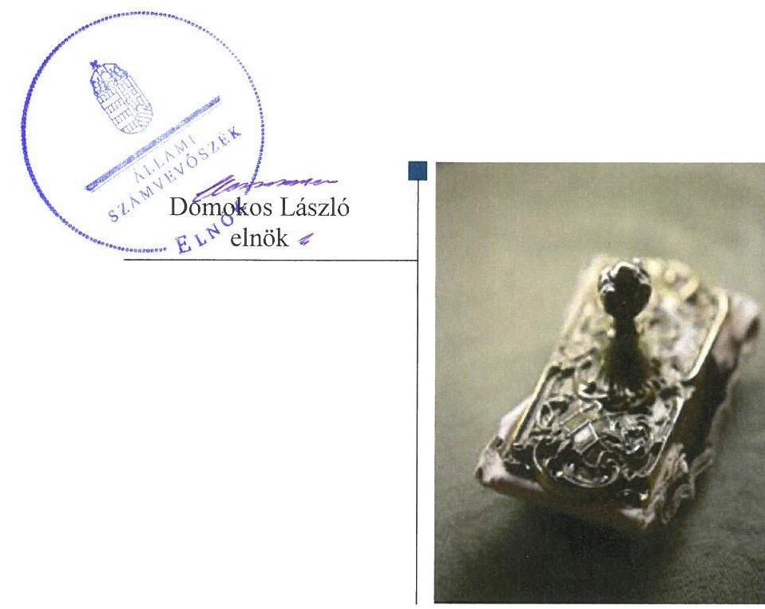
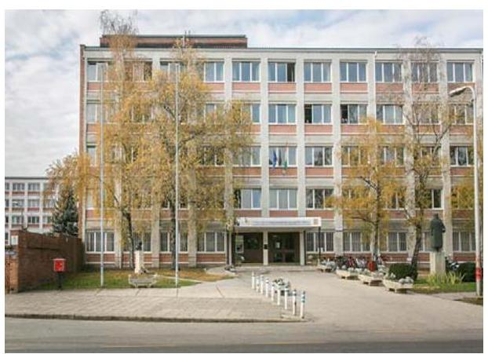
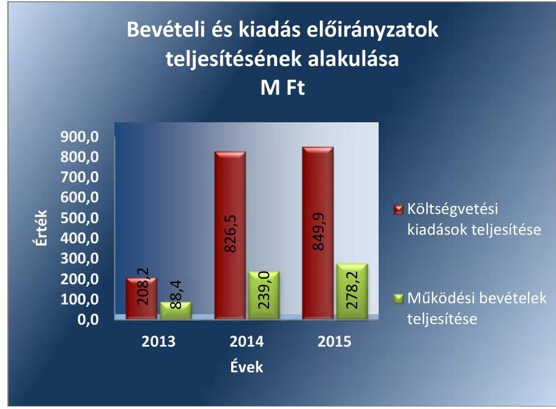
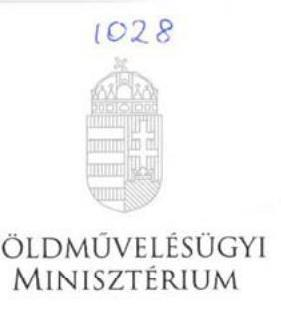
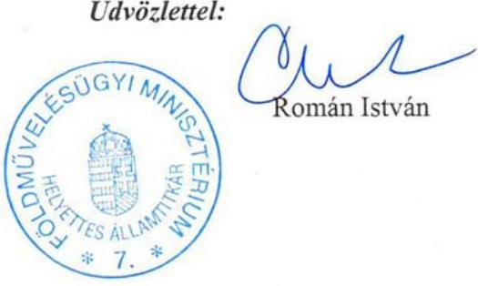
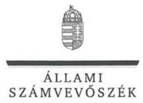
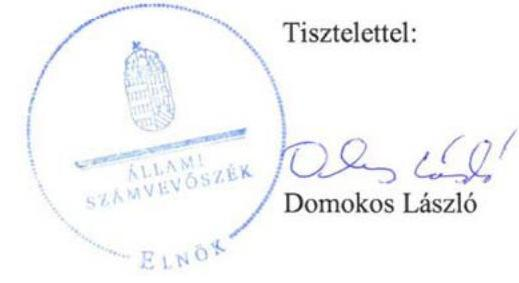
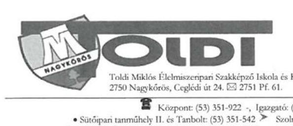
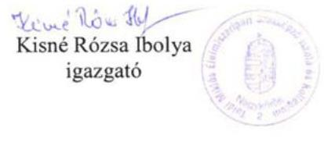

# Jelentés 

## A központi alrendszer intézményei

A központi alrendszer egyes intézményei pénzügyi és vagyongazdálkodásának ellenőrzése - Toldi Miklós Élelmiszeripari Szakképző Iskola és Kollégium 2017. Július 29.

---

|  J | AZ ELLENŐRZÉST FELÜGYELTE:  |
| --- | --- |
|   | MAKKAI MÁRIA felügyeleti vezető  |
|   | AZ ELLENŐRZÉST VEZETTE ÉS A VÉGREHAJTÁSÁÉRT FELELŐS:  |
|   | DR. KOVÁCS DIÁNA ellenőrzésvezető  |
|   | A PROGRAM ÖSSZEÁLLÍTÁSÁÉRT FELELŐS:  |
|   | JANIK JÓZSEF LÁSZLÓ osztályvezető  |
|   | A TÉMÁHOZ KAPCSOLÓDÓ KORÁBBI SZÁMVEVŐSZÉKI JELENTÉSEK:  |
|  - címe: | 2015. évi zárszámadás - Magyarország 2015. évi központi költségvetése végrehajtásának ellenőrzése  |
|  - sorszáma: | 16163  |
|  - címe: | 2014. évi zárszámadás - Magyarország 2014. évi központi költségvetése végrehajtásának ellenőrzéséről  |
|  - sorszáma: | 15167  |
|  |   |
|   | IKTATÓSZÁM: V-1253-087/2016  |
|   | TÉMASZÁM: 2287  |
|   | ELLENŐRZÉS-AZONOSÍTÓ SZÁM: V076016  |

---

# TARTALOMJEGYZÉK 

■ ÖSSZEGZÉS ..... 5
■ AZ ELLENŐRZÉS CÉLJA ..... 6
■ AZ ELLENŐRZÉS TERÜLETE ..... 7
■ AZ ELLENŐRZÉS HÁTTERE, INDOKOLTSÁGA ..... 8
■ A JELENTÉS LÉNYEGES KÉRDÉSKÖREI ..... 9
■ ELLENŐRZÉS HATÓKÖRE ÉS MÓDSZEREI ..... 10
■ MEGÁLLAPÍTÁSOK ..... 12
■ JAVASLATOK ..... 20
■ MELLÉKLETEK ..... 23
I. Sz. melléklet: Értelmező szótár ..... 23
II. Sz. melléklet: Az integritás kontrollrendszer értékelése. ..... 26
■ FÜGGELÉK: ÉSZREVÉTELEK ..... 27
■ RÖVIDÍTÉSEK JEGYZÉKE ..... 33

---

.

---

# ÖSSZEGZÉS 

A Minisztérium Toldi Miklós Élelmiszeripari Szakképző Iskola és Kollégiumra vonatkozó irányító szervi feladatellátása összességében nem volt szabályszerű. A vezetői irányítói rendszer nem biztosította a közpénzekkel és a nemzeti vagyonnal történő gazdaságos, hatékony és eredményes gazdálkodást, a beszámolási és adatszolgáltatási tevékenységek szabályszerű teljesítését. SZMSZ hiányában az irányítás feltételei nem voltak biztosítottak. A pénzügyi gazdálkodás összességében nem volt megfelelő. A vagyongazdálkodás nem volt szabályszerű. Az Intézmény vezetése nem építette ki a megfelelő védelmet a korrupciós veszélyekkel szemben. A közpénzfelhasználás eredményességét a gazdálkodás folyamatában mérhető célok nem támasztották alá.

## Az ellenőrzés társadalmi indokoltsága

A közpénzek felhasználásában és az állami vagyonnal való gazdálkodásban a központi alrendszer egyes intézményei meghatározó súlyt képviselnek. A foglalkoztatási problémák megoldásában a szakképzésnek kiemelkedő szerepe van. A munkavállalók megfelelő szakmai felkészültsége alapvető feltétele a gazdaság fejlődésének. A szakképzés legjelentősebb színterei a szakközépiskolák, szakiskolák. E szervezetekkel szemben társadalmi igény, hogy tevékenységükről a döntéshozók és a nyilvánosság felé elszámoljanak. Ezzel a társadalmi igénnyel és az ÁSZ ${ }^{1}$ Stratégiájával összhangban, a közpénzügyek átláthatóságának előmozdítása, a közvagyon védelme érdekében került sor az Intézmény² pénzügyi és vagyongazdálkodásának ellenőrzésére.

## Főbb megállapítások, következtetések, javaslatok

Az irányító szervi feladatellátás során az SZMSZ érvényességével, az irányítási, felügyeleti és ellenőrzési jogosultságok és a munkáltatói jogkör gyakorlásával kapcsolatban tapasztalt hiányosságot az ellenőrzés.

A belső kontrollrendszer kialakítása és működtetése nem volt megfelelő. A kontrollkörnyezet kialakítása nem volt szabályszerű, az Intézmény nem rendelkezett SZMSZ-szel. Az Intézményben az ellenőrzött időszak egyik évében sem működött sem a kockázatkezelési rendszer, sem a monitoring rendszer részét képező belső ellenőrzés. Az információs és kommunikációs rendszer kialakítása és működtetése nem volt szabályszerű.

A pénzügyi gazdálkodás nem volt megfelelő. A bevételek beszedése és elszámolása során az Intézmény a vállalkozási bevételeket nem különítette el az alaptevékenység bevételeitől.

A vagyongazdálkodás nem volt szabályszerű. Az Intézmény nem rendelkezett az ingatlanokra vonatkozó vagyonkezelési szerződéssel. Az ellenőrzés bérleti díj kiszámlázásával kapcsolatban tárt fel hiányosságot. A mérlegben kimutatott eszközök és források értékelése nem felelt meg a jogszabályi előírásoknak. A leltár egyik évben sem volt alkalmas a beszámoló alátámasztására.

Az Intézmény integritás kontrollrendszer kiépítettségi szintje alacsony volt. Az Intézmény a gazdálkodási folyamatok mérése érdekében célokat nem határozott meg.

---

# AZ ELLENŐRZÉS CÉLJA 

AZ ELLENŐRZÉS CÉLJA annak megítélése volt, hogy az ellenőrzött intézményre vonatkozó irányító szervi feladatellátás a jogszabályi előírások betartásával történt-e; az intézménynél a belső kontrollrendszer kialakítása és működtetése szabályszerű volt-e; kialakították-e az erőforrásokkal való szabályszerű, gazdaságos, hatékony és eredményes gazdálkodás követelményeit; szabályszerű volt-e a beszámolási és adatszolgáltatási kötelezettségek teljesítése; az intézmény pénzügyi és vagyongazdálkodása megfelelt-e a jogszabályi előírásoknak és belső szabályzatainak.

Az ellenőrzés keretében értékeltük az intézmény korrupciós kockázatainak kezelését szolgáló integritás kontrollok kiépítettségét és az integritás szemlélet érvényesülését.

Továbbá az ellenőrzés azt is értékelte, hogy a gazdálkodás folyamatában a gazdaságossági, hatékonysági és eredményességi célok kialakítása megtörtént-e, a célok elérése érdekében tettek-e intézkedéseket, a célkitűzéseket elérték-e; a szándékolt eredményeket elérték-e.

---

# **AZ ELLENŐRZÉS TERÜLETE**

## **Toldi Miklós Élelmiszeripari Szakképző Iskola és Kollégium**

A nagykőrösi Intézmény 2013. augusztus 1-jétől mint önállóan működő és gazdálkodó költségvetési szerv — a Minisztérium³ irányításával és fenntartásában — országos hatáskörrel működik, közfeladata szakmai középfokú oktatás.

Az Intézmény élelmiszeripari, gépészeti, mezőgazdasági, környezetvédelem-vízgazdálkodási, informatikai, kereskedelem-marketing, üzleti adminisztráció, illetve vendéglátás-turisztikai szakmacsoportban nyújtott szakközépiskolai és szakiskolai képzést.

Az ellenőrzött időszakban az igazgató személye nem változott, a gazdasági vezető személyét érintően 2015. év végén történt változás. Engedélyezett alkalmazotti létszáma 2013. és 2014. évben 147 fő, 2015. évben 160 fő volt.

Az Intézménynél szervezeti, szerkezeti átalakítás nem történt. Az Intézmény bevételi és kiadási előirányzatok teljesítésének alakulását az 1. ábra mutatja be.

1. ábra

*Forrás: Az Intézmény 2013-2015. évi beszámolói*

---

# AZ ELLENŐRZÉS HÁTTERE, INDOKOLTSÁGA 

Az államháztartás központi alrendszerének közpénz felhasználása, az intézmények által ellátott közfeladatok sokrétűsége, valamint a feladatellátásához rendelt vagyon nagyságrendje indokolja, hogy az ÁSZ ellenőrzéseket folytasson a pénzügyi és vagyongazdálkodás területén. Az ÁSZ az ellenőrzései során feltárja a gazdálkodást érintő szabályozások esetleges hiányosságait, a szabályozással nem érintett gazdálkodási területeket, rámutathat a vagyongazdálkodási tevékenység - ezen belül a tulajdonosi joggyakorlás és vagyonkezelés - esetleges szabálytalanságaira, értékeli az állami vagyon nyilvántartására és elszámolására vonatkozó eljárásokat.

Az ellenőrzés hozzájárul a központi intézmények pénzügyi helyzetének pontosabb megítéléséhez és a jó gyakorlat kialakításán, bemutatásán keresztül a gazdálkodás szabályszerűségének javításához.

Az ÁSZ teljesítmény-ellenőrzési kiegészítő modul alapján elvégzett ellenőrzése a döntéshozók, ellenőrzöttek, irányító szervek, a társadalom számára objektív visszajelzést ad a gazdálkodás területén végrehajtott szervezeti, szervezési intézkedésekről, a közfeladat-ellátásnak keretet adó gazdálkodási tevékenységek folyamatában kialakított célokról, intézkedésekről, azok teljesítéséről. Az ÁSZ értékteremtő elemzéseivel, tanácsadó szerepét erősítve támogatja a szervezetek önértékelő, alkalmazkodó (ön)tanuló tevékenységét. Irányt mutat az ellenőrzött intézmények gazdálkodási és kapcsolódó adminisztratív folyamatainak optimalizációjához. Támogatja a központi költségvetési szervek felügyelhetőségét, a „jó gyakorlatok" elterjesztésével támogatja a „jó kormányzást".

---

# A JELENTÉS LÉNYEGES KÉRDÉSKÖREI 

1. Az irányító szerv ellenőrzött költségvetési szervre vonatkozó feladatellátása szabályszerű volt-e?
2. A belső kontrollrendszer kialakítása és működtetése biztosította-e a közpénzekkel és a nemzeti vagyonnal történő szabályszerű, gazdaságos, hatékony és eredményes gazdálkodást, illetve a beszámolási és adatszolgáltatási kötelezettségek szabályszerű teljesítését?
3. A költségvetési szerv pénzügyi gazdálkodása szabályszerű volt-e?
4. A költségvetési szerv vagyongazdálkodása szabályszerű volt-e?
5. Érvényesült-e az integritás szemlélet és ennek megfelelően kiépítették-e az integritás kontrollrendszert a költségvetési szervnél?
6. A költségvetési szerv meghatározott-e célokat, célértékeket a gazdálkodási folyamatok tekintetében?

---

# ELLENŐRZÉS HATÓKÖRE ÉS MÓDSZEREI 

## Az ellenőrzés típusa

Megfelelőségi és teljesítmény-ellenőrzés.

## Az ellenőrzött időszak

Az ellenőrzött időszak 2013. augusztus 1-jétől 2015. december 31-ig tartó időszak volt.

## Az ellenőrzés tárgya

Az Intézményre vonatkozó irányító szervi feladatok ellátása. Az Intézmény belső kontroll rendszerének kialakítása és működtetése. A pénzügyi és vagyongazdálkodás szabályszerűsége. Az Intézmény beszámolási és adatszolgáltatási kötelezettségének teljesítése. Az Intézményre vonatkozóan a gazdálkodás folyamatában a gazdaságossági, hatékonysági és eredményességi célok és célértékek kialakítása, a kapcsolódó intézkedések meghatározása, a célkitűzések elérésének értékelése.

Az ellenőrzés kiterjedt minden olyan körülményre és adatra, amely az ÁSZ jogszabályban meghatározott feladatainak teljesítéséhez, valamint a program végrehajtása folyamán felmerült újabb összefüggések feltárásához szükséges.

## Az ellenőrzött szervezet

Toldi Miklós Élelmiszeripari Szakképző Iskola és Kollégium, Földművelésügyi Minisztérium (Vidékfejlesztési Minisztérium) mint irányító szerv.

## Az ellenőrzés jogalapja

Az ellenőrzés jogszabályi alapját az ÁSZ tv. ${ }^{4}$ 1. § (3) bekezdés, 5. § (2)-(6) bekezdései, valamint Áht. ${ }^{5}$ 61. § (2) bekezdésének előírásai képezték.

## Az ellenőrzés módszerei

Az ellenőrzést az ellenőrzési program szempontjai, az ellenőrzött időszakban hatályos jogszabályok, az ellenőrzés szakmai szabályai, a jelen ellenőrzésre irányadó ÁSZ módszertanok figyelembevételével végeztük.

---

Az ellenőrzési kérdések megválaszolásához szükséges bizonyítékok megszerzése az Intézmény által rendelkezésre bocsátott dokumentumokra, adatokra alapozva megfigyelés, szemle (szemrevételezés), kérdésfeltevés (információkérés), mintavételezés, valamint elemző eljárás útján történt. Az ellenőrzési bizonyítékként felhasználható adatforrások közé tartoznak egyrészt az ellenőrzési program részletes szempontjainál felsorolt adatforrások, másrészt minden egyéb - az ellenőrzés folyamán feltárt, az ellenőrzés szempontjából információt tartalmazó - dokumentum.

Az ellenőrzés lefolytatásához az Intézmény a tanúsítványok kitöltésével, valamint az ÁSZ által kért dokumentumok megküldésével szolgáltatott adatokat.

Az Intézmény kiadási előirányzatai felhasználásának, a vagyonhasznosítási bevételi előirányzatok teljesítésének szabályszerűségét, valamint ezekhez kapcsolódóan a gazdálkodási jogkörök gyakorlásának szabályszerűségét mintavételezéssel ellenőriztük. A minta alapján a sokaságban előforduló hibaarányt becsültük. Az értékelés eredményeként kétféle, "Megfelelő" és "Nem megfelelő" minősítést alkalmaztunk. „Megfelelő"-nek értékeltünk egy ellenőrzött területet, amennyiben a hibaarány a teljes sokaságban 95\%-os bizonyossággal legfeljebb 10\% arányt képviselt. Abban az esetben, ha adott sokaság tekintetében a 10\%-os hibaarány küszöbérték átlépése megítélésének megbízhatósága nem érte el a 95\%-ot, annak elérése érdekében értékelésünket lényegességi alapon további szempontokkal egészítettük ki, és figyelembe vettük a feltárt hibák értékét. Az ellenőrzött időszakon belüli változás esetében a változás trendjét értékeltük.

Az integritás szemlélet érvényesülésének értékelése az Intézmény önbevallás útján kitöltött tanúsítványa alapján, a kockázatkezelési rendszer keretében történt.

A teljesítmény-ellenőrzési kiegészítő modul ellenőrzése során értékeltük, hogy az Intézmény a gazdálkodás folyamatában a gazdaságossági, hatékonysági és eredményességi célokat és célértékeket kialakította-e, a célkitűzéseket elérte-e.

---

# 1. Az irányító szerv ellenőrzött költségvetési szervre vonatkozó feladatellátása szabályszerű volt-e? 

Összegző megállapítás

A Minisztérium Intézményre vonatkozó feladatellátása összességében nem volt szabályszerű.

AZ INTÉZMÉNY ALAPÍTÁSÁVAL kapcsolatos jogosultságok gyakorlása a jogszabályi előírásoknak megfelelően történt. Az Intézmény az ellenőrzött időszakban rendelkezett az irányítási jogkört gyakorló Minisztérium által kiadott, a jogszabályi előírásoknak megfelelő Alapító okirattal (1,2,3,4,5)${ }^{6}$.

Az Alapító okirat (1,3) az Intézmény közfeladat-ellátását biztosító ingatlanok vagyonkezelőjének a Minisztériumot jelölte meg. Az Alapító okirat (4) tartalmazta teljes körűen az Intézmény feladatellátását szolgáló állami ingatlanokat, rögzítette, hogy az ingatlanok vagyonkezelése az Intézmény feladata.

SZMSZ-SZEL NEM RENDELKEZETT az Intézmény az ellenőrzött időszakban. A SZMSZ (1,2)${ }^{7}$ elfogadásakor hatályban lévő Alapító okirat (1,4) a Minisztérium egyetértését az SZMSZ érvényességi kellékeként jelölte meg. A Minisztérium az egyetértéséről nem nyilatkozott. A Minisztérium az Áht. 9. § (1) bekezdés f) pontjában - 2015-ben az Áht. 9. § eb) pontjában - meghatározott jogkörét nem gyakorolta megfelelően, mert az általa az Alapító okirat (1,4)-ben
 előírt kritériumnak nem szerzett érvényt.

Az Intézmény elemi költségvetéseit a Minisztérium felülvizsgálta, éves költségvetési beszámolóit és 2013-2015. évi előirányzat-maradványát minden évre vonatkozóan jóváhagyta.

A munkáltatói jogosultságokat a Minisztérium nem gyakorolta megfelelően. Gazdasági vezetőt nem bízott meg 2013. augusztus 1. és 2013. szeptember 15. között, megsértve az Áht. 9. § (1) bekezdés c) pontjában foglaltakat, valamint a 2015. december 7. és 2015. december 31. közötti időszakban az Áht. 9. § d) pontjában foglaltak ellenére. A Minisztérium által 2014-ben pályázati eljárás útján kinevezett és megbízott gazdasági vezető nem rendelkezett az Ávr. ${ }^{8}$ 12. § (1) bekezdésében előírt, felsőoktatásban szerzett végzettséggel.

Az Intézmény vezetőjének megbízása és kinevezése az ellenőrzött időszakban a Minisztérium részéről szabályszerűen történt.

---

# 2. A belső kontrollrendszer kialakítása és működtetése biztosította-e a közpénzekkel és a nemzeti vagyonnal történő szabályszerű, gazdaságos, hatékony és eredményes gazdálkodást, illetve a beszámolási és adatszolgáltatási kötelezettségek szabályszerű teljesítését? 

Összegző megállapítás

A belső kontrollrendszer kialakítása és működtetése nem biztosította a közpénzekkel és a nemzeti vagyonnal történő szabályszerű, gazdaságos, hatékony és eredményes gazdálkodást, illetve a beszámolási és adatszolgáltatási kötelezettségek szabályszerű teljesítését.

1. táblázat

AZ INTÉZMÉNY BELSŐ KONTROLLRENDSZERE KIALAKÍTÁSÁNAK ÉS MŰKÖDTETÉSÉNEK ÉRTÉKELÉSE 2013-2015. ÉVEK KÖZÖTT

| Év | Kontroll-   környezet | Kockázatkezelési   rendszer | Kontroll-   tevékenységek | Információ és   kommunikáció | Monitoring | ÖSSZESEN |
| :--: | :--: | :--: | :--: | :--: | :--: | :--: |
| 2013. | nem | nem | nem | nem | nem | nem |
|  | szabályszerű | szabályszerű | szabályszerű | szabályszerű | szabályszerű | szabályszerű |
| 2014. | nem | nem | nem | nem | nem | nem |
|  | szabályszerű | szabályszerű | szabályszerű | szabályszerű | szabályszerű | szabályszerű |
| 2015. | nem | nem | nem | nem | nem | nem |
|  | szabályszerű | szabályszerű | szabályszerű | szabályszerű | szabályszerű | szabályszerű |

2.1. számú megállapítás

A kontrollkörnyezet kialakítása nem volt szabályszerű.
SZMSZ-szel az Intézmény az ellenőrzött időszakban - az Áht. 10. § (5) bekezdésében és az Nktv. 25. § (4) bekezdésében foglaltakat megsértve - nem rendelkezett, mert azokhoz az Alapító Okirat ${ }_{1}$, illetve az Alapító Okirat ${ }_{4}$-ben előírtaknak megfelelően a Minisztérium nem adta egyetértését. Az Alapító Okirat ${ }_{3}$ a teljes SZMSZ érvényességi kellékeként a Minisztérium egyetértését már nem tartalmazta. Ezt követően új SZMSZ-t nem adtak ki.

Az Intézmény gazdasági szervezete rendelkezett ügyrenddel, azonban az Ávr. 13. § (5) bekezdését megsértve nem szabályozta a gazdasági szervezet költségvetési szerv belüli belső és külső kapcsolattartásának szabályait, és nem tartalmazta a helyettesítések rendjét. Az etikai kódex ${ }^{9}$ magában foglalta a hivatásetikai alapelvek részletes tartalmát, ugyanakkor nem határozta meg az etikai elvárásokat a szervezet minden szintjén, megsértve a Bkr. ${ }^{10}$ 6. § (1) bekezdés c) pontjában foglaltakat.

A belső szabályzatok keretében kialakított számviteli politika ${ }_{2}{ }^{11}$ a 2014-2015. években - az Áhsz. ${ }_{2}{ }^{12}$ 50. § (7) bekezdése ellenére - nem tartalmazta az általános költségek szakfeladatokra és az általános kiadások tevékenységekre történő felosztásának módját, a felosztáshoz alkalmazott mutatókat, vetítési alapokat. A számlarend ${ }_{1}{ }^{13}$ a 2013. évben nem tartalmazta - a Számv. tv. ${ }^{14}$ 161. § (2) bekezdés b) pontja ellenére - a könyvviteli számla értéke növekedésének, csökkenésének jogcímeit, és -

---

az Áhsz. ${ }^{15}$ 49. § (3) bekezdése ellenére - a részletező nyilvántartások vezetési módját.
2013. augusztus 1. és 2014. június 30. között - az Ávr. 13. § (2) bekezdés b) pontja ellenére - nem rendelkezett az Intézmény a Kbt. ${ }^{16}$ hatálya alá nem tartozó beszerzések lebonyolításával kapcsolatos eljárásrenddel.

A Bkr. által előírt ellenőrzési nyomvonalakat és a szabálytalanság kezelés eljárásrendjét a FEUVE szabályzat tartalmazta.

# 2.2. számú megállapítás 

A kialakított kockázatkezelési rendszer működtetése hiányában nem volt szabályszerű.

Kockázatkezelési rendszer kialakításához kapcsolódó belső szabályozást az Intézmény megalkotta a FEUVE szabályzatában, de azt - a Bkr. 7. § (1) bekezdésében foglaltak ellenére - nem működtette. A Bkr. 7. § (2) bekezdésében foglaltak ellenére nem mérte fel, nem határozta meg a szervezet tevékenységében és a gazdálkodásában rejlő kockázatokat, illetve az egyes kockázatokkal kapcsolatban a szükséges intézkedéseket.

A kontrolltevékenység kialakítása összességében megfelelt, működtetése azonban nem felelt meg a jogszabályokban és a belső szabályzatokban foglaltaknak.

2013. augusztus 1. és 2013. szeptember 30. között az Intézmény nem rendelkezett a költségvetés megalapozott végrehajtását biztosítani hivatott kötelezettségvállalásra, a folyamatba épített, garanciális jellegű kontrollokra - pénzügyi ellenjegyzésre, teljesítésigazolásra, utalványozásra, érvényesítésre - vonatkozó előírásokat tartalmazó, a gazdálkodás rendjét szabályozó eljárásrenddel, ezáltal nem biztosította a Bkr. 8. § (2) bekezdés a), c), d) pontjaiban meghatározott tevékenységek feladatköri elkülönítését, az Ávr. 60. § (1) bekezdésében foglalt összeférhetetlenségi szabályok betartásának feltételeit. Az Ávr. előírásainak megfelelő Gazdálkodási szabályzatát ${ }^{17}$ az Intézmény 2013. október 1-jével léptette hatályba.

A kötelezettségvállalások nyilvántartását az Intézmény 2013. évben - az Ávr. 56. § (1) bekezdésében foglaltak ellenére - nem vezette.

A gazdálkodási jogkörök gyakorlásáról részletesen a 3.2. számú megállapítás szól.
2.4. számú megállapítás

Az információs és kommunikációs folyamatok kialakítása és működtetése a jogszabályi előírásoknak nem felelt meg.

Információs rendszert az Intézmény nem alakított ki és annak keretében beszámolási rendszereket nem működtetett a Bkr. 9. § (1)-(2) bekezdésében foglaltak ellenére.

Iratkezelési szabályzattal az Intézmény nem rendelkezett, megsértve az Ltv. ${ }^{18}$ 10. § (1) bekezdés a) pontjában foglaltakat.

Adatvédelmi és adatbiztonsági szabályzattal az Intézmény 2013. augusztus 1. és 2013. szeptember 30. között nem rendelkezett, megsértve az Info tv. 24. § (3) bekezdésében foglaltakat. A 2013.

---

október 1-jétől alkalmazott adatvédelmi szabályzat a 2012. január 1-jétől hatályon kívül helyezett személyes adatok védelméről és a közérdekű adatok nyilvánosságáról szóló 1992. évi LXIII. törvény végrehajtásával kapcsolatos rendelkezéseket tartalmaz, megsértve az Info tv. 7. § (2) bekezdésében foglaltakat.

Az Intézmény az Áht.-ban és az Ávr.-ben foglaltak alapján eleget tett a Kincstár ${ }^{19}$ felé, az időközi költségvetési- és mérlegjelentési, valamint a tartozásállományára vonatkozó adatszolgáltatási kötelezettségének. Az Intézmény a honlapján közzétette a költségvetését, beszámolóját és a 2013. október 1-jétől hatályos adatvédelmi és adatbiztonsági szabályzatát.
2.5. számú megállapítás

Belső ellenőrzési rendszerét az Intézmény nem alakította ki.
Belső ellenőrzés kialakításáról az Áht. 70. § (1) bekezdésben foglaltak ellenére nem gondoskodtak az Intézménynél az egész ellenőrzött időszakban. Az ellenőrzött időszakban végzett két külső ellenőrzés javaslatai alapján készült intézkedési tervek végrehajtásáról a Bkr. 14. § (1) bekezdése szerinti nyilvántartást az Intézménynél nem vezették.
2.6. számú megállapítás

Az Intézmény nem alakította ki a célok elérését szolgáló követelményeket, amelyek biztosítják a rendelkezésre álló források gazdaságos, hatékony és eredményes felhasználását.

Az Intézmény - a Bkr. 6. § (2) bekezdésében foglaltak ellenére - nem határozta meg belső szabályzó eszközben a források szabályszerű, gazdaságos, hatékony és eredményes felhasználásának a követelményeit.

# 3. A költségvetési szerv pénzügyi gazdálkodása szabályszerű volt-e? 

## Összegző megállapítás

Az Intézmény pénzügyi gazdálkodása összességében nem volt szabályszerű.
3.1. számú megállapítás

Az elemi költségvetés és az előirányzatok megállapítása, a bevételi és kiadási előirányzatainak módosítása, átcsoportosítása megfelelt a jogszabályi előírásoknak.

Az előzetes és a végleges költségvetés készítésének folyamata megfelelt a jogszabályban foglaltaknak.

A kiadási és bevételi előirányzat-módosítások végrehajtása, azok számviteli nyilvántartásokon történő átvezetése az Ávr., az Áhsz. ${ }_{1}$ és az Áhsz. ${ }_{2}$ előírásainak megfelelt.
2. táblázat

ELŐIRÁNYZAT-MÓDOSÍTÁSOK HATÁSKÖRÖNKÉNT MEGOSZLÁSA A 2013-2015. ÉVEKBEN (M FT)

|  | Előirányzat-módosítások hatáskörönként |  |  |  |  |
| :--: | :--: | :--: | :--: | :--: | :--: |
| Év | Országgyűlési | Kormányzati | Irányító   szervi | Saját | Összesen |
| 2013. | 141,7 | 12,6 | 59,1 | 0 | 213,4 |
| 2014. | 0 | 49,5 | 36,5 | 48,4 | 134,4 |
| 2015. | 0 | 4,9 | 107,6 | 40,9 | 153,4 |

---

### 3.2. számú megállapítás

3. táblázat

A GAZDÁLKODÁSI JOGKÖRÖK GYAKORLÁSÁNAK MINŐSÍTÉSE

| Ellenőrzött | Minősítés |
| :--: | :--: |
|  |  |
| 2013. év | nem megfelelő |
| 2014. év | nem megfelelő |
| 2015. év | nem megfelelő |

4. táblázat

A KIADÁSI ELŐIRÁNYZATOK FELHASZNÁLÁSA SZABÁLYSZERŰSÉGÉNEK MINŐSÍTÉSE

| Ellenőrzött | Minősítés |
| :--: | :--: |
|  |  |
| 2013. év | nem megfelelő |
| 2014. év | nem megfelelő |
| 2015. év | nem megfelelő |

3.3. számú megállapítás
2013. évben kiemelkedő volt a pedagógus-életpályamodell bevezetésével összefüggésben országgyűlési hatáskörben történt előirányzat-módosítás. 2015. évben az irányító szervi hatáskörben történt jelentős módosítás, amelynek oka négy másik intézmény gazdasági szervezeti feladatainak ellátása és munkatársainak alkalmazása volt.

A bevételek beszedése és elszámolása, a kiadási előirányzatok felhasználása vonatkozásában összességében nem tartották be a jogszabályokban és a belső szabályzatban foglaltakat.

A bevételek beszedése tekintetében a bérleti díjak és a kereskedelmi szálláshely díjának meghatározásához 2015. évben - az önköltség számítási szabályzatban: ${ }^{20}$ előírtakat figyelmen kívül hagyva - előkalkulációk nem készültek. 2014-2015. években a bevételek főkönyvi könyvelése nem volt szabályszerű, mivel az Áhsz. 244. § (1) bekezdésében foglaltak ellenére az Intézmény a bevételek teljesítésének nyilvántartási számláit nem bontotta meg alap és vállalkozási tevékenységre.

A kiadási előirányzatok felhasználása nem volt megfelelő.

A személyi juttatások kifizetését (átutalását) megelőző utalványozás nem volt szabályszerű. Az utalványozás nem érvényesített okmányon, hanem a havi összesített banki átutalási megbízáson történt. Az eljárás sértette az Ávr. 59. § (1) és (3) bekezdésének előírásait.

A külső személyi juttatások számviteli elszámolása nem volt szabályszerű a 2014-2015. évben, mivel a kifizetések könyvelése az Áhsz. 40. § (1) bekezdése és 15. számú melléklete előírásait megsértve nem megfelelő rovaton történt.

Az Intézmény a 2013. augusztus 1. és 2013. szeptember 30. közötti időszakban nem jelölte ki belső szabályzatban a gazdálkodási jogkörök gyakorlására jogosult személyeket, melynek hiányában a dologi kötelezettségvállalásokat az arra fel nem jogosított személyek tették meg, megsértve az Ávr. 52. § (1) bekezdés a) pontjának szabályait.

Az Intézmény 2013-ban több beszerzés esetében mellőzte a közbeszerzési eljárás lefolytatását, mellyel megsértette a Kbt. 119. §-ára tekintettel a Kbt. 5. §-ban foglalt előírást.

Az ellenőrzött időszakban az Intézmény nem a jogszabályi előírásoknak megfelelően készítette el éves költségvetési beszámolóját. Az éves beszámolókban a költségvetési maradvány megállapítása nem volt szabályszerű.

Költségvetési beszámolási kötelezettségét az Intézmény teljesítette, a beszámolók tartalma azonban nem volt megfelelő, mert 2013. évre - megsértve az Áhsz ${ }_{1}$ 38. § (2) bekezdésében előírtakat - valamint 2014. és 2015. évekre vonatkozóan - megsértve az Áhsz ${ }_{2}$ 8. § (3) bekezdésében foglaltakat - nem készített az Intézmény vállalkozási maradvány-kimutatást.

Az előirányzat-maradvány megállapítása során az Intézmény nem mutatta be a

 vállalkozási tevékenységének maradványát, így

---

2013. évre vonatkozóan az Áhsz 1. 38. § (2) bekezdésében, míg 2014. és 2015. évekre vonatkozóan az Áhsz 2. 8. § (3) bekezdésében foglaltakat megsértette.

# 4. A költségvetési szerv vagyongazdálkodása szabályszerű volt-e? 

## Összegző megállapítás

Az intézmény vagyongazdálkodása nem volt szabályszerű.
4.1. számú megállapítás

A vagyon értékének megőrzését, gyarapítását szolgáló vagyongazdálkodás feltételeinek kialakítása nem volt szabályszerű.

Az ingóságok vagyonkezelői jogát a KLIK ${ }^{21}$ mint az Intézmény jogelődje az Nvtv ${ }^{22}$-ben foglaltaknak megfelelően a 2013. november 12-én kötött megállapodásban átruházta az Intézményre.

Az oktatási feladatok ellátását támogató külterületi ingatlanokat az $\mathrm{NFA}^{23}$ az Intézménynek vagyonkezelésbe adta, a 2015. szeptember 3-án megkötött vagyonkezelői szerződés alapján a vagyonkezelői jog bejegyzésre került.

Az iskolaépület és az üzlethelyiségek hasznosítására irányuló írásba foglalt szerződéssel az Intézmény nem rendelkezett a Vtv. ${ }^{24}$ 25. § (4) bekezdésében foglaltak ellenére.

Az Intézmény által az ellenőrzött időszakot megelőzően kötött bérleti szerződéshez kapcsolódóan az ellenőrzött időszakot érintő bérleti díj kiszámlázása az Áfa tv. 163. § (1) bekezdését megsértve késedelmesen történt. Az ellenőrzött időszakban a bérleti díj beszedése elmaradt.
4.2. számú megállapítás

A mérlegben kimutatott eszközök és források értékelése nem felelt meg a jogszabályokban előírtaknak, a beszámolók leltárral való alátámasztása nem megfelelő.

A tárgyi eszközök és az immateriális javak mérleg szerinti értékének bemutatása a 2013-2014. években az Áhsz 1., 2. alapján történt. A 2015. évben a beszerzett eszközök bekerülési értékének meghatározása során megsértették a Számv. tv. 47. § (1) bekezdésében foglaltakat, mert a beszerzett informatikai eszközök bekerülési értékének meghatározása az Áhsz 1. § 7. pontjával ellentétesen - áfával ${ }^{25}$ növelt értéken történt.

Az ingatlan beruházás állományba vételéhez az Intézmény üzembe helyezést nem dokumentálta hitelt érdemlő módon, megsértve ezzel a Számv. tv. 52. § (2) bekezdésében foglaltakat.

A követelések mérlegben történő kimutatása nem az elfogadott, elismert összegben történt az ellenőrzött időszakban, megsértve a Számv. tv. 65. § (1) bekezdésének előírásait.

Képzőművészeti alkotások a tárgyi eszközök helyett a készletek között kerültek kimutatásra, az eljárás így nem felelt meg a Számv. tv. 24. § (1)(2) bekezdésében foglaltaknak.

A 2013. évi leltározási tevékenység keretében a tárgyi eszközök mennyiségi leltározásának befejezését követően tételes leltár -

---

megsértve a Számv. tv. 69. § (1) bekezdésében foglaltakat - nem készült. A saját tőkét, tartósan adott kölcsönt, követeléseket nem leltározták, amely nem felelt meg az Áhsz 1. 37. § (1) bekezdésében és a Számv. tv. 69. § (1)-(2) bekezdésében foglalt jogszabályi előírásoknak.

A 2014. évtől hatályos leltározási szabályzat ${ }^{26}$ - a költségvetési beszámoló alátámasztására - az értékben és mennyiségben kimutatott eszközök mennyiségi leltározásának három évenkénti elvégzését írta elő.

Az egyeztetéssel történő leltározás során 2014. évben saját tőkét, a passzív időbeli elhatárolást, a tartósan adott kölcsönt, és a követeléseket, 2015. évben pedig a saját tőkét az Áhsz 2. 2. § (1) bekezdésében és a Számv. tv. 69. § (1)-(2) bekezdésében foglalt jogszabályi előírások ellenére nem leltározták. A tartósan adott kölcsön egyeztetéssel történő leltározás végrehajtását igazoló dokumentumok 2015. évben nem állt teljes körűen rendelkezésre, megsértve a Számv. tv. 69. § (1)(2) bekezdésében foglaltakat.

Az ellenőrzött időszak leltárdokumentációja - kivéve a készletek leltározási dokumentációját - nem alkalmas az éves költségvetési beszámolókban bemutatott értékek alátámasztására, a mérleg leltárral való alátámasztása nem felelt meg a Számv. tv. 69.§ (1) bekezdésében foglaltaknak, és sérti a Számv. tv. 15. § (3) bekezdésében foglalt valódiság elvét.
4.3. számú megállapítás

# Az Intézmény nem teljesítette az állagmegóvási kötelezettségeit, a vagyonelemek hasznosítása nem volt szabályszerű. 

Az Intézmény a vagyontárgyak összességére kiterjedően a rendszeres időközönkénti állapotfelmérésről nem gondoskodott, felújítási, karbantartási terveket nem dolgozott ki. A vagyongazdálkodása nem volt összhangban a Nvtv. ${ }^{27}$ 7. § (2) bekezdésében előírtakkal.

A vagyonelemek hasznosítására ingatlanrészek bérbeadása útján sor került, azonban a Vtv. ${ }^{28}$ 25. § (4) bekezdésében előírtak ellenére az Intézmény az állami vagyon hasznosítására irányuló írásba foglalt szerződéssel nem rendelkezett. Az Intézmény az ingatlan bérbeadási folyamat során nem rendelkezett az Nvtv. 11. § (10) bekezdésében, illetve a 3. § (2) bekezdésében foglaltak ellenére a szerződő fél nyilatkozatával arról, hogy az átlátható szervezetnek minősül.

## 5. Érvényesült-e az integritás szemlélet és ennek megfelelően kiépítették-e az integritás kontrollrendszert a költségvetési szervnél?

Összegző megállapítás

Az Intézmény nem tett erőfeszítéseket az integritás szemlélet érvényesítése érdekében, az integritás kontrollok kiépítettségi szintje nem volt egyensúlyban a korrupciós kockázatok szintjével.

Az Intézmény nem vett részt az ÁSZ integritás felmérésében.
Az Intézményben a korrupciós kockázatokkal szembeni védettséget növelő integritás kontrollok kiépítettsége alacsony.

---

Az Intézmény integritás kontrollrendszerét a II. számú melléklet mutatja be részletesen.

# 6. A költségvetési szerv meghatározott-e célokat, célértékeket a gazdálkodási folyamatok tekintetében? 

| Összegző megállapítás | Az Intézmény a gazdálkodási folyamatok tekintetében cél- |
| :-- | :-- |
|  | kat, célértékeket nem határozott meg, intézkedéseket nem |
| tett. |  |

Gazdaságossági, hatékonysági és eredményességi követelményeket a gazdálkodási folyamatokban az Intézmény nem alakított ki. Célkitűzések hiányában azok teljesítése nem volt értékelhető.

---

# JAVASLATOK 

Az ÁSZ tv. 33. § (1) bekezdésében foglaltak értelmében az ellenőrzött szervezet vezetője köteles a jelentésben foglalt megállapításokhoz kapcsolódó intézkedési tervet összeállítani és azt a jelentés kézhezvételétől számított 30 napon belül az ÁSZ részére megküldeni. Amennyiben az ellenőrzött szervezet vezetője nem küldi meg határidőben az intézkedési tervet, vagy továbbra sem elfogadható intézkedési tervet küld, az Állami Számvevőszék elnöke az ÁSZ tv. 33. § (3) bekezdése a) és b) pontjaiban foglaltakat érvényesítheti.

## A Toldi Miklós Élelmiszeripari Szakképző Iskola és Kollégium igazgatójának

1. Intézkedjen az Intézmény SZMSZ-ének a jogszabályi előírásoknak megfelelő elkészítéséről és kezdeményezze az Nkt. előírásainak megfelelően az egyetértés megadását.
(2.1. sz. megállapítás 1. bekezdése alapján)
2. Intézkedjen a gazdasági szervezet ügyrendje, az etikai kódex, a számviteli politika módosításáról, hogy azok teljes körűen megfeleljenek a jogszabályi előírásoknak.
(2.1. sz. megállapítás 2-3. bekezdése alapján)
3. Intézkedjen az integrált kockázatkezelési rendszer jogszabályi előírásoknak megfelelő működtetéséről.
(2.2. sz. megállapítás 1. bekezdése alapján)
4. Intézkedjen az iratkezelési szabályzat szabályszerű kiadásáról.
(2.4. sz. megállapítás 2. bekezdése alapján)
5. Intézkedjen az adatvédelmi és adatbiztonsági szabályzat módosításáról annak érdekében, hogy az összhangban legyen a hatályos jogszabályi előírásokkal.
(2.4. sz. megállapítás 3. bekezdése alapján)
6. Intézkedjen az Áht. előírásának megfelelően belső ellenőrzés kialakításáról és megfelelő működtetéséről.
(2.5. sz. megállapítás 1. bekezdés első mondata alapján)

---

7. Intézkedjen arról, hogy az Intézmény alap- és vállalkozási tevékenységeire történő tagolás tekintetében a számviteli beszámolók, az azokat alátámasztó könyvvezetés, valamint az előirányzat-maradvány megállapítás megfeleljen a jogszabályi előírásoknak.
(3.2. sz. megállapítás 1. bekezdés 2. mondata, 3.3. sz. megállapítás 1-2. bekezdései alapján)
8. Kezdeményezze az MNV Zrt.-nél a feladatellátáshoz szükséges vagyon használata jogcímének szerződésben történő rendezését.
(4.1. sz. megállapítás 3. bekezdése alapján)
9. Intézkedjen az éves költségvetési beszámolók teljes körű alátámasztására alkalmas leltár elkészítéséről.
(4.2. sz. megállapítás 8. bekezdése alapján)
10. Intézkedjen a vagyonelemeknek a jogszabályi előírásokkal összhangban történő hasznosításáról.
(4.3. sz. megállapítás 2. bekezdése alapján)
11. Intézkedjen az ellenőrzés során feltárt hiányosságok és szabálytalanságok tekintetében a felelősség tisztázása érdekében, és szükség szerint intézkedjen a felelősség érvényesítéséről.
(3.3. sz. megállapítás 1-2. bekezdései, 4.2. sz. megállapítás 8. bekezdései, 4.3. sz. megállapítás 2. bekezdése alapján)

---

.

---

# MELLÉKLETEK 

- I. SZ. MELLÉKLET: ÉRTELMEZŐ SZÓTÁR
állami vagyon
állami vagyonnak minősül:
a) az állam tulajdonában lévő dolog, valamint a dolog módjára hasznosítható természeti erő,
b) az a) pont hatálya alá nem tartozó mindazon vagyon, amely vonatkozásában törvény az állam kizárólagos tulajdonjogát nevesíti,
c) az állam tulajdonában lévő tagsági jogviszonyt megtestesítő értékpapír, illetve az államot megillető egyéb társasági részesedés,
d) az államot megillető olyan immateriális, vagyoni értékkel rendelkező jogosultság, amelyet jogszabály vagyoni értékű jogként nevesít. (Forrás: Vtv. 1. § (2) bekezdése)
állami vagyon értékesítése
állami vagyon használója
állami vagyon használója
állami vagyon hasznosítása
állami vagyon hasznosítására kötött szerződés
állami vagyon kezelője /vagyonkezelő
Állami vagyonnak minősül:
a) az állam tulajdonában lévő dolog, valamint a dolog módjára hasznosítható természeti erő,
b) az a) pont hatálya alá nem tartozó mindazon vagyon, amely vonatkozásában törvény az állam kizárólagos tulajdonjogát nevesíti,
c) az állam tulajdonában lévő tagsági jogviszonyt megtestesítő értékpapír, illetve az államot megillető egyéb társasági részesedés,
d) az államot megillető olyan immateriális, vagyoni értékkel rendelkező jogosultság, amelyet jogszabály vagyoni értékű jogként nevesít. (Forrás: Vtv. 1. § (2) bekezdése)
Állami vagyon tulajdonjogának bármely jogcímen történő, visszterhes átruházása. (Forrás: Vtvr. 1. § (7) bekezdés d) pontja)
Az a természetes vagy jogi személy, jogi személyiséggel nem rendelkező szervezet, aki, vagy amely törvény vagy szerződés alapján, bármely jogcímen (bérlet, haszonbérlet, használat stb.) állami vagyont birtokol, használ, szedi annak hasznait, hasznosít, ide nem értve a haszonélvezőt, a vagyonkezelőt és a tulajdonosi jogok gyakorlóját". (Forrás: Vtvr. 1. § (7) bekezdés a) pontja)
Az állami vagyont az MNV Zrt. maga kezeli, vagy szerződés - így különösen bérlet, haszonbérlet, megbízás - alapján központi költségvetési szervnek, természetes vagy jogi személynek, vagy jogi személyiséggel nem rendelkező gazdálkodó szervezetnek hasznosításra átengedi.
(Forrás: Vtv. 23. § (1) bekezdése, hatályos 2012. január 1-jétől)
Az állami vagyonnal a tulajdonosi joggyakorló maga gazdálkodik, vagy szerződés így különösen bérlet, haszonbérlet, megbízás - alapján hasznosításra átengedi, illetőleg vagyonkezelésbe, haszonélvezetbe adja. (Forrás: Vtv. 23. § (1) bekezdése, hatályos 2013. június 28-ától)
Az állami vagyon hasznosítására kötött szerződések elsődleges célja az állami vagyon hatékony működtetése, állagának védelme, értékének megőrzése, illetve gyarapítása, az állami és közfeladatok ellátásának elősegítése. (Forrás: Vtv. 23. § (2) bekezdése)
Az állami vagyont az MNV Zrt. maga kezeli, vagy szerződés - így különösen bérlet, haszonbérlet, megbízás - alapján központi költségvetési szervnek, természetes vagy jogi személynek, vagy jogi személyiséggel nem rendelkező gazdálkodó szervezetnek hasznosításra átengedi." Az állami vagyonra vonatkozóan az MNV Zrt. kizárólag az Nvtv-ben meghatározott személyekkel köthet vagyonkezelési szerződést. (Forrás: Vtv. 27. § (1) bekezdése, hatályos 2012. január 1-jétől)

---

| ÁSZ Integritás Projekt | Az Állami Számvevőszék 2009-ben indította el a „Korrupciós kockázatok feltérképezése - Integritás alapú közigazgatási kultúra terjesztése" című, európai uniós forrásból megvalósított kiemelt projektjét (Integritás Projekt). Az Integritás Projekt célja, hogy felmérje a közszféra intézményei korrupciós kockázatoknak való kitettségét, illetőleg az azok mérséklésére hivatott kontrollok szintjét. Az Állami Számvevőszék a projekt révén az integritás szemlélet minél szélesebb körrel történő megismertetését, gyakorlatba ültetését kívánja elérni. Az integritás követelményeinek megfelelő szervezeti működést előnyben részesítő közigazgatási kultúra elterjesztését és a korrupció elleni fellépést az ÁSZ önmagára nézve is stratégiai jelentőségű célként fogalmazta meg. A projekt a felmérésben résztvevő intézmények számára helyzetükről egyfajta „tükörképet" mutat be, ami alapot teremt a jövőbeni pozitív irányú elmozduláshoz. (Forrás: a http://integritas.asz.hu honlapon közzétett, a 2013. évi Integritás felmérés eredményeiről készült összefoglaló tanulmány) |
| belső ellenőrzés | Független, tárgyilagos bizonyosságot adó és tanácsadó tevékenység, amelynek célja,

 hogy az ellenőrzött szervezet működését fejlessze és eredményességét növelje, az ellenőrzött szervezet céljai elérése érdekében rendszerszemléletű megközelítéssel és módszeresen értékeli, illetve fejleszti az ellenőrzött szervezet irányítási és belső kontrollrendszerének hatékonyságát. (Forrás: Bkr. 2. § b) pontja) |
| belső kontrollrendszer | A belső kontrollrendszer a kockázatok kezelése és tárgyilagos bizonyosság megszerzése érdekében kialakított folyamatrendszer, amely azt a célt szolgálja, hogy a működés és gazdálkodás során a tevékenységeket szabályszerűen, gazdaságosan, hatékonyan, eredményesen hajtsák végre, az elszámolási kötelezettségeket teljesítsék, megvédjék az erőforrásokat a veszteségektől, károktól és nem rendeltetésszerű használattól. (Forrás: Áht. 69. § (1) bekezdése) |
| belső kontrollrendszer területei | A kontrollkörnyezet, a kockázatkezelési rendszer, a kontrolltevékenységek, az információs és kommunikációs rendszer, valamint a nyomon követési (monitoring) rendszer. (Forrás: Bkr. 3. §-a) |
| felújítás | Az elhasználódott tárgyi eszköz eredeti állaga (kapacitása, pontossága) helyreállítását szolgáló időszakonként visszatérő olyan tevékenység, melynek során az eszköz élettartama megnövekszik, minősége, használata jelentősen javul, így a pótlólagos ráfordításból a jövőben gazdasági előnyök származnak. (Forrás: Számv. tv. 3. § (4) bekezdés 8. pontja) |
| információs és kommunikációs rendszer | A költségvetési szerv vezetője által kialakított és működtetett olyan rendszer, mely biztosítja, hogy a megfelelő információk a megfelelő időben eljutnak az illetékes szervezethez, szervezeti egységhez, illetve személyhez. (Forrás: Bkr. 9. § (1) bekezdés) |
| integritás | Az integritás az elvek, értékek, cselekvések, módszerek, intézkedések konzisztenciáját jelenti, vagyis olyan magatartásmódot, amely meghatározott értékeknek megfelel. (Forrás: Nemzetgazdasági Minisztérium: Magyarországi államháztartási belső kontroll standardok Útmutató 1.6.1. pontja, 2012. december) |
| irányító szerv/felügyeleti szerv | A költségvetési szerv tekintetében az e törvényben meghatározott irányítási hatás- |
| kincstári költségvetés | kört gyakorló szerv. (Forrás: Áht. 1. § 9. pontja)   A központi költségvetésről szóló törvény elfogadását követően a fejezetet irányító szerv az államháztartás központi alrendszerébe tartozó költségvetési szerv és a fejezeti kezelésű előirányzat kiemelt előirányzatait, valamint az elkülönített állami pénzalapok és a társadalombiztosítás pénzügyi alapjai jogszabályi előírás szerinti bevételeit és kiadásait kincstári költségvetés kiadásával állapítja meg. (Forrás: Áht. 28. § (2) bekezdés) |

---

kockázat

kockázatkezelési rendszer
kontrollkörnyezet
kontrolltevékenységek
kommunikáció
közfeladat
monitoring
monitoring-rendszer
tulajdonosi joggyakorló
vagyongazdálkodás

A kockázat annak a valószínűségét jelenti, hogy egy vagy több esemény vagy intézkedés nem kívánt módon befolyásolja a rendszer működését, céljainak megvalósulását. (Forrás: Javaslatok a korrupciós kockázatok kezelésére - Kockázatkezelési és ellenőrzési módszertan 35. oldal, ÁSZ)
Olyan irányítási eszközök és módszerek összessége, melynek elemei a szervezeti célok elérését veszélyeztető tényezők (kockázatok) azonosítása, elemzése, csoportosítása, nyomon követése, valamint szükség esetén a kockázati kitettség mérséklése. (Forrás: Bkr. 2. § m) pontja)
A költségvetési szerv vezetője által kialakított olyan elvek, eljárások, belső szabályzatok összessége, amelyben világos a szervezeti struktúra, egyértelműek a felelősségi, hatásköri viszonyok és feladatok, meghatározottak az etikai elvárások a szervezet minden szintjén, átlátható a humánerőforrás-kezelés. (Forrás: Bkr. 6. § (1) bekezdés)
A költségvetési szerv vezetője által a szervezeten belül kialakított (kontroll) tevékenységek, melyek biztosítják a kockázatok kezelését, hozzájárulnak a szervezet céljainak eléréséhez. (Forrás: Bkr. 8. § (1) bekezdés)
Az a tevékenység, melynek során információ továbbítása valósul meg. A kommunikációs folyamat résztvevői között tájékoztatás történik, mely során tényeket, ezek magyarázatát közlik.
Jogszabályban meghatározott állami vagy önkormányzati feladat, amit az arra kötelezett közérdekből, a jogszabályban meghatározott követelményeknek és feltételeknek megfelelve végez, ideértve a lakosság közszolgáltatásokkal való ellátását, továbbá az állam nemzetközi szerződésekben vállalt kötelezettségeiből adódó közérdekű feladatokat, valamint e feladatok ellátásakor szükséges infrastruktúra biztosítását is. (Forrás: Nvtv. 3. § (1) bekezdés 7. pontja)
A monitoring általánosságban a különböző szintű szervezeti célok megvalósításának folyamatát kíséri figyelemmel, melynek során a releváns eseményekről és tevékenységekről (együtt: folyamatokról) rendszeres jelleggel, strukturált, döntéstámogató információkhoz jutnak a szervezet vezetői. (Forrás: NGM Útmutató a költségvetési szervek monitoring rendszeréhez 2011. november)
A költségvetési szerv vezetője köteles olyan monitoring rendszert működtetni, mely lehetővé teszi a szervezet tevékenységének, a célok megvalósításának nyomon követését. A költségvetési szerv monitoring rendszere az operatív tevékenységek keretében megvalósuló folyamatos és eseti nyomon követésből, valamint az operatív tevékenységektől függetlenül működő belső ellenőrzésből áll. (Forrás: Bkr. 10. §)
Aki a nemzeti vagyon felett az államot vagy a helyi önkormányzatot megillető tulajdonosi jogok és kötelezettségek összességének gyakorlására jogosult. (Forrás: Nvtv. 3. § (1) bekezdés 17. pontja)

A nemzeti vagyongazdálkodás feladata a nemzeti vagyon rendeltetésének megfelelő, az állam, az önkormányzat mindenkori teherbíró képességéhez igazodó, elsődlegesen a közfeladatok ellátásához és a mindenkori társadalmi szükségletek kielégítéséhez szükséges, egységes elveken alapuló, átlátható, hatékony és költségtakarékos működtetése, értékének megőrzése, állagának védelme, értéknövelő használata, hasznosítása, gyarapítása, továbbá az állam vagy a helyi önkormányzat feladatának ellátása szempontjából feleslegessé váló vagyontárgyak elidegenítése. (Forrás: Nvtv. 7. § (2) bekezdése)

---

# II. SZ. MELLÉKLET: AZ INTEGRITÁS KONTROLLRENDSZER ÉRTÉKELÉSE 

A közintézmények korrupciós kockázatoknak való kitettségét, valamint az azzal szembeni ellenálló képességüket az ÁSZ az integritás projekt keretében feltérképezi és értékeli. Az Intézmény 2015. évben nem vett részt az ÁSZ integritás felmérésében. Az integritás szemlélet érvényesülésének értékelése az Intézmény által szolgáltatott adatok és az ellenőrzés tapasztalatai alapján történt.

Az Intézményben az integritási kontrollrendszer kiépítettsége alacsony szintű volt, az integritás szemlélet nem érvényesült megfelelően. A kiépült kontrollok nem voltak képesek megfelelően kezelni a kockázatokat és hatékonyan támogatni az Intézmény feladatellátását.

Az összeférhetetlenség és az etikai elvárások kiépítettségi szintje alacsony volt, az Intézmény belső szabályozása a munkatársak részére nem tette kötelezővé a nyilatkozattételt gazdasági érdekeltségeikről, vagy egyéb, a szervezet tevékenysége szempontjából releváns összeférhetetlenségről. A szervezet nem szabályozta a különféle meghívások, utaztatás elfogadásának feltételeit.

A Humánerőforrás-gazdálkodás és az Intézmény vagyonának megvédésére tett intézkedésekre vonatkozó integritási kontrollrendszer kiépítettségi szintje magas.

A nemkívánatos dolgozói magatartással szembeni intézkedések egyáltalán nem érvényesültek az intézményben. Nem rendelkeznek belső szabályzattal a szervezeten belüli közérdekű bejelentők védelmére vonatkozóan. Nem működtetnek közérdekű bejelentéseket kezelő-, a szervezeten kívülről érkező panaszokat és közérdekű bejelentéseket kezelő-, valamint egyéni teljesítményértékelési rendszert.

Az integritás erősítése, annak tudatosítása, valamint a kockázatelemzések alkalmazásának is alacsony volt az integritás-kontrollrendszer kiépítettségi szintje, mivel az Intézménynél nem volt korrupcióellenes képzés az elmúlt 3 évben. Nem rendelkeznek nyilvánosan közzétett stratégiával, nem végeztek kockázatelemzést a belső ellenőrzési tervek megalapozásához és nem végeztek korrupciós kockázatelemzést.

---

# FÜGGELÉK: ÉSZREVÉTELEK 

A jelentéstervezetet a Számvevőszék 15 napos észrevételezésre megküldte az ellenőrzött szervezetek vezetőinek az ÁSZ tv. 29. § (1) bekezdése előírásának megfelelően.

Az ÁSZ a jelentéstervezetet észrevételezésre megküldte a Földművelésügyi Miniszternek és a Toldi Miklós Élelmiszeripari Szakképző Iskola és Kollégium igazgatójának.
A Földművelésügyi Minisztérium észrevételét és az arra adott választ, valamint a Toldi Miklós Élelmiszeripari Szakképző Iskola és Kollégium igazgatójának nemleges észrevételét a függelék alább tartalmazza.

[^0]
[^0]:    * 29. § (1) Az Állami Számvevőszék az ellenőrzési megállapításait megküldi az ellenőrzött szervezet vezetőjének vagy az általa megbízott személynek, és annak, akinek személyes felelősségét állapította meg.
    (2) Az ellenőrzött szervezet vezetője és a felelősként megjelölt személy az ellenőrzés megállapításaira tizenöt napon belül írásban észrevételt tehet.
    (3) Az Állami Számvevőszék az észrevételre a beérkezésétől számított harminc napon belül írásban válaszol. A figyelembe nem vett észrevételeket köteles a jelentésben feltüntetni, és megindokolni, hogy azokat miért nem fogadta el.

---

# Halkal M. 

## ÁLLAMI SZÁMVEVŐSZÉK

## Érkezé: 2017. JÚNIUS 27.

Iktatószám: ASzF/ 504 / 1 /2017.
Iktatószám: 21 - 44468/407/1
Melléklet: V-1253-083/2016

## Domokos László úr   elnök részére

## Állami Számvevőszék

Budapest
Apáczai Csere János utca 10.
1052
Tárgy: Észrevételek a V-1253-078/2016. iktatószámmal megküldött számvevőszéki jelentéshez

## Tisztelt Elnök Úr!

Hivatkozva a tárgyban jelzett, 2017. május 31-én kelt számvevőszéki jelentéstervezetre, amely a Földművelésügyi Minisztérium (továbbiakban: minisztérium) által fenntartott Toldi Miklós Élelmiszeripari Szakképző Iskola és Kollégiumára (továbbiakban: intézmény) vonatkozó ellenőrzés megállapításait és javaslataikat tartalmazza; ezúton küldöm a minisztérium észrevételét az alábbiak szerint.

A jelentéstervezet „Megállapítások" rész 1. pontjához az alábbi észrevételeket tesszük:
A nemzeti köznevelésről szóló 2011. évi CXC. törvény 25. § (4) bekezdése szerint a köznevelési intézmény SzMSz-ét, a nevelési-oktatási intézmény házirendjét nevelési-oktatási intézményben a nevelőtestület, más köznevelési intézményben a szakalkalmazotti értekezlet az óvodaszék, iskolaszék, kollégiumi szék, továbbá az iskolai vagy a kollégiumi diákönkormányzat véleményének kikérésével fogadja el. Az SzMSz és a házirend azon rendelkezéseinek érvénybelépéséhez, amelyekből a fenntartóra, a működtetőre többletkötelezettség hárul, a fenntartó, a működtető egyetértése szükséges.

A jelentéstervezet „Megállapítások" rész 4. pontjához az alábbi észrevételeket tesszük:
Az MNV Zrt. és a szakiskolák - köztük a Toldi Miklós Élelmiszeripari Szakképző Iskola és Kollégium - közötti egységes vagyonkezelési szerződés megkötése érdekében a Földművelésügyi Minisztérium folyamatosan együttműködött az MNV Zrt.-vel.

---

A szakiskolákkal történő egységes vagyonkezelési szerződések megkötésének előkészítése folyamatban van.

A számvevőszéki jelentéstervezet fentieken túli megállapításait tudomásul vesszük, azokra észrevételt nem teszünk.

Az észrevételre biztosított rövid határidőre tekintettel a véleményt elektronikus úton továbbítom Önnek, de természetesen postai úton is megküldjük mindezt.

Budapest, 2017. június 20.

# Üdvözlettel: 

---

ELNÖK

Ikt.szám: V-1253-084/2016.

Dr. Fazekas Sándor úr
miniszter

Földművelésügyi Minisztérium

Budapest

Tisztelt Miniszter Úr!
„A központi alrendszer egyes intézményei pénzügyi és vagyongazdálkodásának ellenőrzése Toldi Miklós Élelmiszeripari Szakközép Iskola és Kollégium" címmel készített számvevőszéki jelentéstervezetre a Földművelésügyi Minisztérium agrárszakképzésért felelős Helyettes Államtitkár úr által tett észrevételét köszönettel megkaptam.

Az Állami Számvevőszék észrevételre vonatkozó álláspontjáról a felügyeleti vezető által készített tájékoztatást csatoltan megküldöm.

Tájékoztatom Miniszter urat, hogy a számvevőszéki jelentésben - az Állami Számvevőszékről szóló 2011. évi LXVI. törvény 29. § (3) bekezdése alapján - a figyelembe nem vett észrevételt szerepeltetjük az elutasítás indokának feltüntetésével.

Budapest, 2017. július hó …. nap

Melléklet: Tájékoztatás az észrevételek kezeléséről

---

# Tájékoztatás   az észrevételek kezeléséről 

„A központi alrendszer intézményei - A központi alrendszer egyes intézményei pénzügyi és vagyongazdálkodásának ellenőrzése - Toldi Miklós Élelmiszeripari Szakközép Iskola és Kollégium" címủ jelentéstervezetre 2017. június 27-én érkezett, a Földművelésügyi Minisztérium agrárszakképzésért felelős Helyettes Államtitkár úr által tett észrevételt értékeltük és annak kezelésével kapcsolatban a következő tájékoztatást adom.

## A „Megállapítások" rész 1. pontjához tett észrevételre adott válasz:

Az észrevételben leírt tájékoztatást - amely az SZMSZ elfogadásával kapcsolatban a nemzeti köznevelésről szóló 2011. évi CXC. törvény 25. § (4) bekezdésben foglaltakat tartalmazza - köszönettel vettük. A tájékoztatás a jelentéstervezet 1. pont 3. bekezdésében szereplő megállapítást nem cáfolja, mert az Intézmény SZMSZ$_{1,2}$-jének elfogadásakor hatályos Alapító okirat$_{1-4}$ írta elő a Minisztérium egyetértését az SZMSZ érvényességéhez. Ezért a megállapítás helytálló, annak módosítása nem indokolt.

## A „Megállapítások" rész 4. pontjához tett észrevételre adott válasz:

Az észrevételben leírt tájékoztatást, amely az egységes vagyonkezelési szerződés megkötése érdekében tett intézkedéseket tartalmazza - köszönettel vettük. A tájékoztatás a jelentéstervezet 4. 1. pont 3. bekezdésében foglalt megállapítást nem cáfolja, ezért annak módosítása nem indokolt.

Budapest, 2017. július hó …. nap

Makkai Mária
felügyeleti vezető

---

Iktatószám: 73/4/2/2017
Ügyintéző:
Ügyintézőjük:
Melléklet:

Központ: (53) 351-922 -, Igazgató: (53) 350-142 Telefax: (53-351-599
Szőlípari tanműhely II. és Taribolt: (53) 351-542 Szelezoki út

 56. Toldi Bolt: (53) 352-990 Ceglédi út 7/h.
E-mail: toldi@toldi-nk.sulinet.hu Web: www.toldi-nk.sulinet.hu OM azonosító: 032637

# Állami Számvevőszék 

Budapest
Apáczai Csere János u. 10.
1364

Tárgy: Intézkedési terv megküldése

## Tisztelt Állami Számvevőszék!

Az Állami Számvevőszék V-1253-077/2016. iktatószámmal megküldte intézményünknek „A központi alrendszer egyes intézményei pénzügyi és vagyongazdálkodásának ellenőrzése a Toldi Miklós Élelmiszeripari Szakképző Iskola és Kollégium" címmel készített számvevőszéki jelentéstervezetet.
A megküldött dokumentum „Javaslatok" fejezetében szereplő utasításnak eleget téve intézményünk elkészítette az érintett 11 ponttal kapcsolatban az intézkedési tervet, melyet jelen levelem mellékleteként megküldünk Önöknek.

Az intézkedési tervben igyekeztünk minden érintett pontra kitérve a lehető legkorábbi időpontra meghatározni a teljesítést, s bízom benne, hogy mivel a megvalósítást már megkezdtük, mind az intézkedések mind a határidők betartása maradéktalanul megtörténik. Tájékoztatás céljából ezzel a levéllel egyidejűleg az intézkedési tervet a fenntartó Földművelésügyi Minisztériumnak is megküldtük.

Kérem a Tisztelt Állami Számvevőszéktől az intézkedési terv elfogadását!

Nagykörös, 2017. június 21.

---

# RÖVIDÍTÉSEK JEGYZÉKE 

${ }^{1}$ ÁSZ
${ }^{2}$ Intézmény
${ }^{3}$ Minisztérium
${ }^{4}$ ÁSZ tv.
${ }^{5}$ Áht.
${ }^{6}$ Alapító Okirat ${ }_{1}$
Alapító Okirat ${ }_{2}$
Alapító Okirat ${ }_{3}$
Alapító Okirat ${ }_{4}$
Alapító Okirat ${ }_{5}$
${ }^{7}$ SZMSZ $_{1}$
SZMSZ $_{2}$
${ }^{8}$ Ávr.
${ }^{9}$ etikai kódex
${ }^{10}$ Bkr.
${ }^{11}$ számviteli politika $_{2}$
${ }^{12}$ Áhsz. $_{2}$
${ }^{13}$ számlarend $_{1}$
${ }^{14}$ Számv.tv.
${ }^{15}$ Áhsz. $_{1}$
${ }^{16} \mathrm{Kbt}$.
${ }^{17}$ Gazdálkodási szabályzat
${ }^{18}$ Ltv.
${ }^{19}$ Kincstár
${ }^{20}$ Önköltség számítási szabályzat ${ }_{2}$

Állami Számvevőszék
Toldi Miklós Élelmiszeripari Szakképző Iskola és Kollégium
Vidékfejlesztési Minisztérium (2014. 06. 05-ig)
Földművelésügyi Minisztérium (2014. 06. 06-tól)
az Állami Számvevőszékről szóló 2011. évi LXVI. törvény (hatályos: 2011.07.01-től)
az államháztartásról szóló 2011. évi CXCV. törvény (hatályos: 2012.01.01-től) Toldi Miklós Élelmiszeripari Szakképző Iskola és Kollégium alapító okirata (hatályos: 2013.08.01-től 2014.04.23-ig)
Toldi Miklós Élelmiszeripari Szakképző Iskola és Kollégium alapító okirata kiegészítés, kelt: 2014.02.25.
Toldi Miklós Élelmiszeripari Szakképző Iskola és Kollégium alapító okirata (hatályos: 2014.04.24-től 2014.08.27-ig)
Toldi Miklós Élelmiszeripari Szakképző Iskola és Kollégium alapító okirata (hatályos: 2014.08.28-tól 2015.08.30-ig)
Toldi Miklós Élelmiszeripari Szakképző Iskola és Kollégium alapító okirata (hatályos: 2015.08.31-től)
Toldi Miklós Élelmiszeripari Szakképző Iskola és Kollégium Szervezeti és Működési Szabályzat (2013.08.01-től 2014.08.31-ig)
Toldi Miklós Élelmiszeripari Szakközépiskola, Szakiskola és Kollégium Szervezeti és Működési Szabályzat (2014.09.01-től)
az államháztartásról szóló törvény végrehajtásáról szóló 368/2011. (XII.31.) Korm. rendelet (hatályos: 2012. január 1-jétől)
Toldi Miklós Élelmiszeripari Szakképző Iskola és Kollégium Pedagógus Etikai Kódex (hatályos 2013. június 28-tól)
a költségvetési szervek belső kontrollrendszeréről és a belső ellenőrzésről szóló 370/2011. (XII. 31.) Korm. rendelet (hatályos: 2012. január 1-jétől)
Toldi Miklós Élelmiszeripari Szakképző Iskola és Kollégium Számviteli Politika (hatályos: 2014. január 1-jétől)
az államháztartás számviteléről szóló 4/2013. (I. 11.) Korm. rendelet (hatályos: 2014. január 1-jétől)

Toldi Miklós Élelmiszeripari Szakképző Iskola és Kollégium Számlarend (hatályos: 2013. október 1 - 2013. december 31.)
a számvitelről szóló 2000. évi C. törvény, hatályos 2001. január 1-től
az államháztartás szervezetei beszámolási és könyvvezetési kötelezettségének sajátosságairól szóló 249/2000. (XII. 24.) Korm. rendelet (hatálytalan: 2014. január 1-jétől)
a közbeszerzésekről szóló 2011. évi CVIII. törvény
Toldi Miklós Élelmiszeripari Szakképző Iskola és Kollégium Gazdálkodási Szabályzat (hatályos: 2013. október 1-jétől)
1995. évi LXVI. törvény a közokiratokról, közlevéltárakról és a magánlevéltári anyag védelméről
Magyar Államkincstár
Toldi Miklós Élelmiszeripari Szakképző Iskola és Kollégium Önköltség számítási szabályzata, hatályos 2015. január 1-től

---

${ }^{21}$ KLIK
${ }^{22}$ Nvtv.
${ }^{23}$ NFA
${ }^{24} \mathrm{Vtv}$.
${ }^{25}$ áfa
${ }^{26}$ Leltározási szabályzat ${ }_{2}$
${ }^{27}$ Nvtv.
${ }^{28} \mathrm{Vtv}$.
Klebersberg Intézményfenntartó Központ
nemzeti vagyonról szóló 2011. évi CXCVI. sz. törvény, hatályos 2011. december 31-től
Nemzeti Földalapkezelő Szervezet
az állami vagyonról szóló 2007. évi CVI. törvény (hatályos: 2007. szeptember 25-től)
Általános forgalmi adó
Toldi Miklós Élelmiszeripari Szakképző Iskola és Kollégium eszközök és források leltározási és leltárkészítési szabályzata, hatályos 2014.január 1-től
2011. évi CXCVI. törvény a nemzeti vagyonról (Hatályos: 2011.12.31-től)
az állami vagyonról szóló 2007. évi CVI. törvény (hatályos: 2007. szeptember 25-től)

---

ÁLLAMI SZÁMVEVŐSZÉK
1052 Budapest, Apáczai Csere János utca 10.
Levélcím: 1364 Budapest 4. Pf. 54
Telefon: +36 14849100 Telefax: +36 14849200
www.asz.hu
