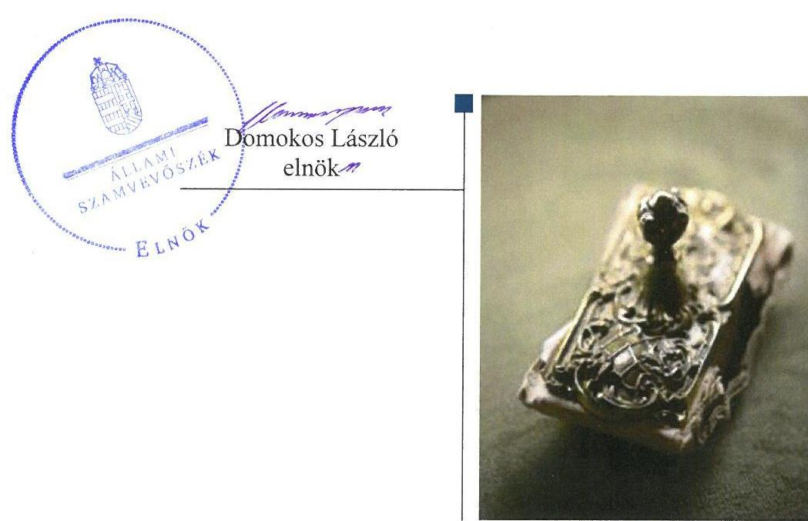
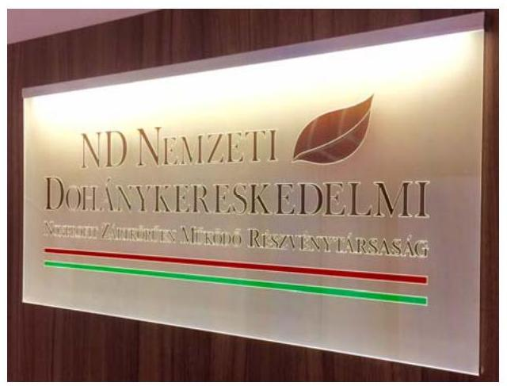
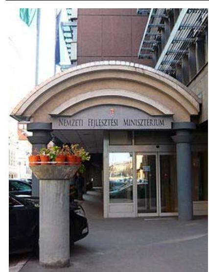
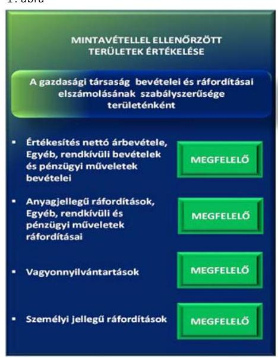
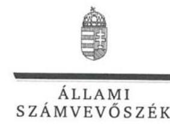
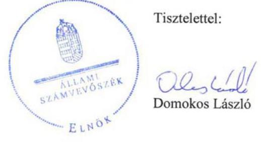
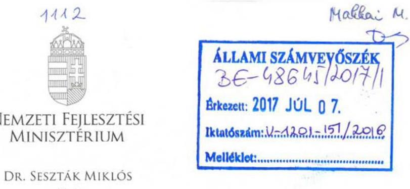
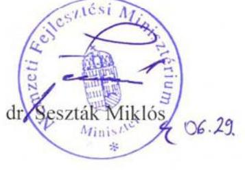

# Jelentés 

## ND Nemzeti Dohánykereskedelmi Nonprofit Zrt.

Az állami tulajdonban (résztulajdonban) lévő gazdálkodó szervezetek vagyonmegőrzési és gazdálkodási tevékenységének ellenőrzése 2017. 04. hó 31. nap

---

# AZ ELLENŐRZÉST FELÜGYELTE:

## MAKKAI MÁRIA felügyeleti vezető

## AZ ELLENŐRZÉST VEZETTE ÉS A VÉGREHAJTÁSÁÉRT FELELŐS:

### SALI SÁNDORNÉ ellenőrzésvezető

## A PROGRAM ÖSSZEÁLLÍTÁSÁÉRT FELELŐS:

### TÓTPÁL SZABOLCS osztályvezető

---

**IKTATÓSZÁM: V-1201-152/2016.**

**TÉMASZÁM: 2235**

**ELLENŐRZÉS-AZONOSÍTÓ SZÁM: V075905**

---

Jelentéseink az Országgyűlés számítógépes hálózatán és az Interneten a www.asz.hu címen is olvashatóak.

---

# TARTALOMJEGYZÉK 

■ ÖSSZEGZÉS ..... 5
■ AZ ELLENŐRZÉS CÉLJA ..... 6
■ AZ ELLENŐRZÉS TERÜLETE ..... 7
■ AZ ELLENŐRZÉS HÁTTERE, INDOKOLTSÁGA ..... 9
■ A JELENTÉS LÉNYEGES KÉRDÉSKÖREI ..... 10
■ ELLENŐRZÉS HATÓKÖRE ÉS MÓDSZEREI ..... 11
■ MEGÁLLAPÍTÁSOK ..... 13
■ JAVASLATOK ..... 17
■ MELLÉKLETEK ..... 19
I. Sz. melléklet: Értelmező szótár ..... 19
■ FÜGGELÉK: ÉSZREVÉTELEK ..... 21
■ RÖVIDÍTÉSEK JEGYZÉKE ..... 27

---

.

---

# ÖSSZEGZÉS 

A Magyar Nemzeti Vagyonkezelő Zrt. és a Nemzeti Fejlesztési Minisztérium ND Nemzeti Dohánykereskedelmi Nonprofit Zrt. feletti tulajdonosi joggyakorlása szabályszerű volt. A Társaság működésének szabályozottsága összességében megfelelő volt, javuló tendenciát mutatott. A vagyongazdálkodás, a pénzügyi és a számviteli feladatok ellátása szabályszerű volt.

## Az ellenőrzés társadalmi indokoltsága

Az állami tulajdonú gazdálkodó szervezetek a nemzeti vagyon részét képezik. Az állami vagyonnal való gazdálkodást illetően a tulajdonosi joggyakorlás és a vagyongazdálkodás feladata az állami vagyon átlátható, rendeltetésszerű és felelős felhasználásának biztosítása. Az állam meghatározza az ellátandó feladatokat, amelyhez a vagyonnal kapcsolatos döntéseknek igazodniuk kell. A nemzetgazdasági szempontból kiemelt jelentőségű nemzeti vagyonban tartandó állami tulajdonban álló társasági részesedést a nemzeti vagyonról szóló törvény határozza meg.

Az Állami Számvevőszék az általa korábban ellenőrizetlen területek, szervezetek körébe tartozó társaságnál végzett ellenőrzést. A számvevőszéki ellenőrzés hozzájárul a közpénzek szabályos, átlátható, elszámoltatható és eredményes felhasználásához, a rend pedig értéket teremt. Minden közpénzt, közvagyont használó szervezettel szemben társadalmi igény, hogy tevékenységükről elszámoljanak. Ezt figyelembe véve és az Állami Számvevőszék Stratégiájával összhangban került sor az ND Nemzeti Dohánykereskedelmi Nonprofit Zrt. ellenőrzésére a 2012-2015. évek vonatkozásában.

## Főbb megállapítások, következtetések

A Magyar Nemzeti Vagyonkezelő Zrt. és a Nemzeti Fejlesztési Minisztérium ND Nemzeti Dohánykereskedelmi Nonprofit Zrt. társasági részesedése feletti tulajdonosi joggyakorlása szabályszerű volt. Ennek keretében megtörtént a Társaság üzleti tervének jóváhagyása, a számviteli beszámolók jogszabályi előírások betartásával történő elfogadása, valamint a javadalmazási, juttatási rendszerről szóló szabályzat megalkotása.

Az ND Nonprofit Zrt. a jogszabály által előírt szabályzatokat az önköltségszámítási szabályzat kivételével szabályszerűen elkészítette. A Társaság jogszabályban előírt önköltségszámítási szabályzat készítésének kötelezettsége 2014. január 1-jétől állt fenn. Az eszközök és források leltárkészítési és leltározási szabályzatával 2013. december 31-ig nem rendelkezett, ezt követően a hatályos szabályzat összhangban volt a jogszabályi előírással.

A Társaságnál a bevételek és a ráfordítások elszámolása, a beszámolási és adatszolgáltatási kötelezettség teljesítése megfelelt a jogszabályi és a belső szabályozásban foglalt előírásoknak. Az ND Nonprofit Zrt. a belső ellenőrzést kialakította és a belső ellenőrzési szabályzata alapján működtette. A Társaság a vagyongazdálkodás feltételeit szabályszerűen alakította ki, a saját vagyonát előírások szerint tartotta nyilván és gondoskodott a vagyon értékének, állagának megőrzéséről. A vagyonváltozást eredményező döntései megfeleltek az előírásoknak.

---

# AZ ELLENŐRZÉS CÉLJA 

Az ellenőrzés célja annak értékelése volt, hogy a tulajdonosi jogok gyakorlása szabályszerű volt-e; a gazdálkodó szervezet szabályozottsága, gazdálkodása és vagyongazdálkodási tevékenysége megfelelt-e a jogszabályi és a tulajdonosi előírásoknak, biztosítva volt-e a feladatellátás átláthatósága és elszámoltathatósága; a vagyonváltozást eredményező döntések esetében a tulajdonosi jogok gyakorlója és a gazdálkodó szervezet szabályszerűen jártak-e el.

---

# AZ ELLENŐRZÉS TERÜLETE 

## Az ND Nemzeti Dohánykereskedelmi Nonprofit Zártkörűen Működő Részvénytársaság

Az ND Nonprofit Zrt. ${ }^{1}$-t a Magyar Állam nevében 2012. október 29-én az állami vagyonnal való gazdálkodás szabályozásáért felelős miniszter alapította. Alapításának célja az Fdtv. ${ }^{2}$ ben előírtak szerinti, dohánytermék-kiskereskedelmi tevékenység szervezésének szakmai irányítása volt. A társasági részesedés feletti tulajdonosi jogokat 2012. december 31-ig az MNV Zrt. ${ }^{3}$ gyakorolta. A tulajdonosi joggyakorló 2013. január 1-jétől - a 77/2012. (XII. 22.) számú NFM rendelet ${ }^{4}$ alapján - az NFM${ }^{5}$ lett. A Társaság alapításkori jegyzett tőkéje 5,0 M Ft ${ }^{6}$ volt, az MNV Zrt., mint a Magyar Állam nevében eljáró az alaptőke mellett a tőketartalék javára, pénzbeli hozzájárulásként 445,0 M Ft-ot teljesített. Az Alapító 2014-ben a jegyzett tőkét - egy ingatlan 94,0 M Ft értékben történő apportba adásával - 99,0 M Ft-ra emelte.

A kizárólagos állami tulajdonú ND Nonprofit Zrt. az NFM számlázási megbízottjaként számlázta ki és hajtotta be a minisztérium nevében - az ellenőrzött időszakban a 3 954,0 M Ft összegben - a koncessziós díjat. A Társaságnál a legfőbb szerv hatáskörébe tartozó kérdésekben az egyedüli tag, az Alapító által kijelölt tulajdonosi joggyakorló döntött. A Társaság árbevétele alapvetően pályázati költségtérítésből, adatforgalom értékesítésből és 2015-ben oktatási tevékenységből realizálódott. Az egyéb bevételek között mutatták ki a működésre kapott állami támogatás összegét. A Társaság 2013-ban rendkívüli bevételként számolta el az Fdtv. által előírt, véglegesen átvett pénzeszköz címén megkapott koncessziós díjat, 2014-től a koncessziós díj az NFM bevételét képezte.

Az ND Nonprofit Zrt. vezérigazgatójának személye az ellenőrzött időszakban nem változott. A Társaság feladatait saját eszközeivel látta el, vagyonkezelésbe vett vagyonnal nem rendelkezett, továbbá nem látott el közfeladatot. Az átlagos statisztikai létszám 2015-ben 32 fő volt.

---

A Társaság gazdálkodására jellemző gazdálkodási adatokat az 1. táblázat tartalmazza.

1. táblázat

|  A TÁRSASÁG FŐBB GAZDÁLKODÁSI ADATAINAK ALAKULÁSA (M FT) |  |  |  |   |
| --- | --- | --- | --- | --- |
|  Megnevezés | 2012. év | 2013. év | 2014. év | 2015. év  |
|  Mérlegfőösszeg | 441,7 | 2052,5 | 1753,4 | 1457,5  |
|  Befektetett eszközök | 1,5 | 100,9 | 244,0 | 545,1  |
|  Tárgyi eszközök | 0,8 | 19,1 | 146,3 | 259,7  |
|  Saját tőke | 424,6 | 1570,1 | 1452,5 | 1232,1  |
|  Mérleg szerinti eredmény | $-25,4$ | 1145,5 | $-211,6$ | $-220,4$  |
|  Értékesítés nettó árbevétele | 0,0 | 531,4 | 34,5 | 119,7  |
|  Egyéb bevételek | 0,0 | 294,3 | 484,4 | 446,5  |
|  ebből: költségvetésből működésre kapott támogatás | 0,0 | 293,3 | 482,7 | 445,3  |
|  Rendkívüli bevételek | 0,0 | 1058,2 | 23,4 | 28,8  |
|  ebből: koncessziós díjbevétel | 0,0 | 1044,1 | 0,0 | 0,0  |
|  Költségek költségnemek szerinti együttes összege | 25,9 | 503,0 | 686,0 | 719,0  |
|   |  |  | Forrás: a Társaság 2012-2015. évi beszámolója |   |

---

# AZ ELLENŐRZÉS HÁTTERE, INDOKOLTSÁGA 

## ND Nemzeti Dohánykereskedelmi Nonprofit Zártkörűen Működő Részvénytársaság

Az ÁSZ ${ }^{7}$ alapvető célkitűzése, hogy az államháztartáson kívülre nyújtott költségvetési támogatások és ingyenes vagyonjuttatások ellenőrzésével hozzájáruljon ahhoz, hogy a közpénzeket az államháztartáson kívül működő szervezetek is átlátható, rendezett módon használják fel a szerződésben átvállalt állami feladatok ellátása érdekében.

Az ellenőrzés feladata a közvagyonnal biztosított feladatellátással kapcsolatban a közpénzek átláthatósága, nyilvánossága érdekében a jogszabályokban, belső szabályzatokban megfogalmazott előírások érvényesülésének az állami tulajdonban lévő gazdálkodó szervezetek vagyonérték megőrzési és gazdálkodási tevékenységének értékelése.

Az ellenőrzés várható hasznosulásaként az ellenőrzés megállapításai a jogalkotás számára segítséget nyújthatnak a közvagyonnal való gazdálkodás értékeléséhez, jogszabályi keretei pontosításához, az átláthatóságot biztosító szabályozáshoz. Az ellenőrzöttek számára visszajelzést ad a vagyongazdálkodási tevékenységgel, beszámolással kapcsolatos szabálytalanságokról és kockázatokról. Az ellenőrzés tapasztalatai segítik és erősítik az ÁSZ hozzáadott értéket teremtő elemző tevékenységét és tanácsadó szerepét.

---

# A JELENTÉS LÉNYEGES KÉRDÉSKÖREI 

1.     - A tulajdonosi jogok gyakorlása szabályszerű volt-e?
2.     - A Társaság működésének szabályozottsága megfelelt-e az előírásoknak?
3.     - A Társaságnál a pénzügyi-számviteli, adatszolgáltatási és ellenőrzési feladatok ellátása szabályszerű volt-e?
4.     - A Társaság vagyongazdálkodása szabályszerű volt-e?

---

# ELLENŐRZÉS HATÓKÖRE ÉS MÓDSZEREI 

## Az ellenőrzés típusa

Megfelelőségi ellenőrzés.

## Az ellenőrzött időszak

2012. október 29-től 2015. december 31-ig.

## Az ellenőrzés tárgya

Az állami tulajdonban lévő gazdasági társaság gazdálkodása, kiemelten vagyongazdálkodási tevékenysége, valamint a tulajdonosi jogok gyakorlása.

## Az ellenőrzött szervezet

Az ND Nemzeti Dohánykereskedelmi Nonprofit Zrt., valamint a Magyar Nemzeti Vagyonkezelő Zrt. és a Nemzeti Fejlesztési Minisztérium, mint tulajdonosi joggyakorlók.

## Az ellenőrzés jogalapja

Az Állami Számvevőszékről szóló 2011. évi LXVI. törvény 5. § (3)-(5) bekezdései.

## Az ellenőrzés módszerei

Az ellenőrzést a nemzetközi standardokat irányadónak tekintve az ellenőrzött időszakban hatályos jogszabályok, az ellenőrzés szakmai szabályok és módszertanok figyelembevételével végeztük.

Az ellenőrzési kérdések megválaszolásához szükséges bizonyítékok megszerzése az ellenőrzött által rendelkezésre bocsátott dokumentumokra, adatokra alapozva kérdésfelvetés, mintavételezés, ellenőrzési eljárások útján történt.

Az ellenőrzési bizonyítékként felhasználható adatforrások közé tartoztak egyrészt a szakmai program részletes szempontjainál felsorolt adatforrások, másrészt minden egyéb - az ellenőrzés folyamán feltárt, az ellenőrzés szempontjából információkat tartalmazó - dokumentumok.

---

Az ellenőrzés lefolytatásához a gazdálkodó szervezet a tanúsítványok elektronikus kitöltésével, valamint az ÁSZ által kért dokumentumok megküldésével szolgáltatott adatokat.

A bevételek és ráfordítások elszámolása, valamint a vagyonnyilvántartás terén a szabályszerű működést véletlen mintavétellel és irányított kiválasztással ellenőriztük. A mintatételek értékelése alapján egyrészt a sokaságban előforduló hibás tételek arányát becsültük, másrészt az irányítottan kiválasztott tételeket értékeltük. A jogszabályoknak és a belső előírásoknak megfelelőnek, azaz szabályszerűnek tekintettük az adott területet, amennyiben a minta ellenőrzésének eredménye alapján 95%-os bizonyossággal a teljes sokaságban a hibaarány kisebb volt, mint 10%, nem megfelelőnek értékeltük, ha a hibaarány a 10%-ot meghaladta. A ráfordítások elszámolására és a vagyonnyilvántartásra vonatkozó véletlen mintavételt kockázati alapú kiválasztással egészítettük ki, amelynek során évente a három legnagyobb összegű tételt választottuk ki.

---

# 1. A tulajdonosi jogok gyakorlása szabályszerű volt-e? 

Összegző megállapítás

Az MNV Zrt. és az NFM tulajdonosi joggyakorlása szabályszerű volt.

A TULAJDONOSI JOGGYAKORLÁS szabályait az ND Nonprofit Zrt. Alapító okirata ${ }^{8}$ a tulajdonosi joggyakorló ${ }_{1}{ }^{9}{ }_{2}{ }^{10}$ szervezeti és működési szabályzataiban előírtakkal összhangban határozta meg. A Gt. ${ }^{11}$-ben foglaltak alapján az Alapító okiratban döntött a tulajdonosi joggyakorló ${ }_{1,2}$ az ND Nonprofit Zrt. vezérigazgatója, az FB${ }^{12}$ tagok és a könyvvizsgáló kijelöléséről. Igazgatóság kialakítására a Gt. 247. §-a alapján nem került sor, az igazgatóság jogait a vezérigazgató gyakorolta. Az FB a Gt. előírásaival összhangban szabályszerűen működött, az NFM az FB ügyrendjét 2013. szeptember 17-én hagyta jóvá. Tagjainak számát az Alapító okiratban három főben határozták meg, összhangban a Taktv. ${ }^{13}$ előírásaival.

A TÁRSASÁG JAVADALMAZÁSI SZABÁLYZATÁT a tulajdonosi joggyakorló2
 a Taktv. 5. § (3) bekezdésében előírtaknak megfelelően megalkotta. A szabályzat a Taktv. előírásainak megfelelően rendelkezett a vezető tisztségviselők, FB tagok, valamint a vezető állású munkavállalók javadalmazásáról, a jogviszony megszűnése esetére biztosított juttatások módjának, mértékének elveiről, annak rendszeréről.

A BESZÁMOLTATÁSI RENDSZER keretében a tulajdonosi joggyakorló ${ }_{1}$ két hetente készített előrehaladási jelentésben számoltatta be a vezérigazgatót. A tulajdonosi joggyakorló${ }^{2}$ részére az FB készített negyedéves, illetve éves beszámolót a Társaság működéséről, gazdálkodásáról. A Társaság számviteli beszámolóit - az FB előzetes írásbeli véleményezését követően - a tulajdonosi joggyakorló${ }^{2}$ a Gt. tv.-ben, illetve Ptk. ${ }^{14}$-ban előírtaknak megfelelően, a könyvvizsgálói jelentések birtokában fogadta el.

AZ ÜZLETI TERVET a tulajdonosi joggyakorló${ }^{2}$ a 2013-2015. évekre jóváhagyta. Az évente elkészített üzleti terveknek részét képezte a beruházási terv, a közbeszerzési terv, valamint a bevételek és kiadások középtávú stratégiája.

---

# 2. A Társaság működésének szabályozottsága megfelelt-e az előírásoknak? 

Összegző megállapítás

Az ND Nonprofit Zrt. működésének szabályozottsága összességében megfelelő volt.

A SZÁMVITELI POLITIKÁBAN a Számv. tv. ${ }^{15}$ előírásaival összhangban meghatározták a számviteli beszámoló elkészítése során alkalmazandó elveket, értékelési módszereket, eljárásokat. A számviteli politika keretében szabályszerűen elkészítették az eszközök és források értékelési szabályzatát, valamint a pénzkezelési szabályzatot.

A Számv. tv. 14. § (5) bekezdés a) pontjának előírásai ellenére a Társaság 2013. december 31-ig nem rendelkezett az eszközök és források leltárkészítési és leltározási szabályzatával. A 2014. január 1-jétől hatályos szabályzat összhangban volt a Számv. tv. előírásaival.

ÖNKÖLTSÉGSZÁMÍTÁSI SZABÁLYZATOT a Társaság a Számv. tv. 14. § (5) bekezdés c) pontjában előírtak ellenére nem készített, a szabályzatkészítés kötelezettsége alóli mentessége 2014. január 1-jétől nem állt fenn. Az ND Nonprofit Zrt. 2013. évi beszámolóban kimutatott költségnemek szerinti költségek együttes összege 503,0 M Ft volt, ezzel túllépte a Számv. tv. 14. § (7) bekezdése szerinti - szabályzatkészítés kötelezettsége alól mentesítő - küszöbértéket (500,0 M Ft).

A koncessziós díjakat a dohánytermék kiskereskedelmi jogosultság átengedésére szóló nyilvános koncessziós pályázat, az egyéb tevékenységek díjtételeit az NFM határozta meg.

## 3. A Társaságnál a pénzügyi-számviteli, adatszolgáltatási és ellenőrzési feladatok ellátása szabályszerű volt-e?

Összegző megállapítás

A Társaságnál a pénzügyi-számviteli, adatszolgáltatási és ellenőrzési feladatok ellátása szabályszerű volt.

A BEVÉTELEK ELSZÁMOLÁSA megfelelt a jogszabályi és belső szabályozásban foglalt előírásoknak. Az értékesítés nettó árbevétele, az egyéb, rendkívüli és pénzügyi műveletek bevétele kiszámlázása, főkönyvi számlákra történő elszámolása megfelelt a Számv. tv.-ben és a belső szabályozásban előírtaknak. A mintavétellel ellenőrzött területek értékelését az 1. ábra mutatja.

---

1. ábra

A RÁFORDÍTÁSOK ELSZÁMOLÁSA megfelelt a jogszabályi és belső szabályozásban foglalt előírásoknak, az elszámolást megalapozó dokumentumok rendelkezésre álltak. A ráfordítások elszámolása a számviteli bizonylatok alapján, a szerződés szerinti teljesítéssel, a megfelelő főkönyvi számlákra történt. A személyi jellegű egyéb, illetve cafetéria kifizetésekre a belső szabályzatok előírásaival összhangban került sor. A munkabérek kifizetését munkaszerződés alapján, a jogszabályi előírásoknak megfelelően teljesítették.

Az ND Nonprofit Zrt.-nek a 2012-2015. években nem volt lejárt határidejű követelés állománya.

A BESZÁMOLÁSI ÉS ADATSZOLGÁLTATÁSI kötelezettségének az ND Nonprofit Zrt. a jogszabályi előírások és belső szabályozás szerint eleget tett. Az éves beszámolókat az FB jóváhagyta, azokról a Gt., valamint a Ptk. előírásai szerint írásbeli jelentést készített. A könyvvizsgáló az ellenőrzött időszakban az éves beszámolókat hitelesítő záradékkal látta el. A Társaság az éves beszámolókat letétbe helyezte, közzétételi kötelezettségét teljesítette.

A Társaság az Info tv. ${ }^{16}$-ben és a közérdekű adatok közzétételéről szóló szabályzatában foglaltakat betartotta, a honlapján teljeskörűen közzé tette szervezetére, személyzetére, tevékenységére, működésére és gazdálkodására vonatkozó adatait.

A BELSŐ ELLENŐRZÉST a Társaság kialakította és a belső ellenőrzési szabályzata alapján működtette. Az NFM a működésre vonatkozó belső szabályozottságot, illetve a belső kontrollrendszer és a belső ellenőrzés működését ellenőrizte. A Társaság az ellenőrzések javaslatait hasznosította. Az NFM által végzett, 2013. és 2014. évi támogatási szerződések elszámolására, valamint a 2014-ben apportba adott ingatlan független könyvvizsgálói hitelesítésére irányuló ellenőrzés hiányosságot nem tárt fel.

# 4. A Társaság vagyongazdálkodása szabályszerű volt-e? 

## Összegző megállapítás

Az ND Nonprofit Zrt. vagyongazdálkodása szabályszerű volt.
A VAGYONGAZDÁLKODÁS feltételeit a jogszabályi előírásokon túl a létesítő okiratok és a Társaság belső szabályzatai rögzítették. A vagyon elidegenítésére, megterhelésére vonatkozó döntési hatásköröket az Alapító okirat előírásaival összhangban a szervezeti és működési szabályzatban határozták meg.

## AZ ANALITIKUS ÉS FŐKÖNYVI NYILVÁNTARTÁSI

RENDSZER biztosította a Társaság vagyonának Számv. tv. és belső szabályozás szerinti nyilvántartását, a változások folyamatos nyomon követését. Az éves beszámolók mérlegtételeit alátámasztó, Számv. tv. 69. § (1) bekezdés szerinti leltárakat elkészítették. A tárgyi eszközök mennyiségi felvétellel történő leltározása a Számv. tv. 69. § (3) bekezdés előírásainak megfelelt. Az ND Nonprofit Zrt. a 2012-2015. évi éves beszámolóinak kiegészítő mellékletében bemutatta az immateriális javak és tárgyi eszközök állományváltozását, a Számv. tv.-ben foglaltak szerint.

---

A Társaság befektetett eszközeinek mérlegértéke dinamikusan nőtt a megalakulást követően, gondoskodtak a vagyon értékének, állagának megőrzéséről.

Az ellenőrzött időszakban bekövetkezett vagyonnövekedés forrása elsősorban a 2013-ban beszedett, a Társaság bevételét képező koncessziós díj, a kapott állami támogatás, valamint a jegyzett tőke 2014. évi - ingatlan apportáláshoz kapcsolódó - megemelése volt.

A beruházások, felújítások együttes értéke (637,3 M Ft) jelentősen meghaladta az ellenőrzött időszakban elszámolt amortizációt (92,3 M Ft-ot). A 2014. évtől kezdték meg az apportként kapott ingatlan állapotfelmérésen alapuló felújítását.

# A VAGYONVÁLTOZÁST EREDMÉNYEZŐ DÖNTÉ-

SEK szabályszerűek voltak. A tervezett beruházások, felújítások végrehajtásáról szóló döntések előtt a vezérigazgató az Alapító okirat előírásai alapján - a fejlesztések értékének figyelembevételével - megkérte az FB jóváhagyását, a döntések megfeleltek a tulajdonosi, és a belső előírásoknak. A Társaság vagyontárgyainak értékesítésére a döntési hatáskörök betartása mellett, a jogszabályi előírások, a támogatási szerződésekben rögzítettek, valamint a belső szabályozás szerint került sor.

---

# JAVASLATOK 

Az ÁSZ tv. 33. § (1) bekezdésében foglaltak értelmében az ellenőrzött szervezet vezetője köteles a jelentésben foglalt megállapításokhoz kapcsolódó intézkedési tervet összeállítani és azt a jelentés kézhezvételétől számított 30 napon belül az ÁSZ részére megküldeni. Amennyiben az ellenőrzött szervezet vezetője nem küldi meg határidőben az intézkedési tervet, vagy továbbra sem elfogadható intézkedési tervet küld, az Állami Számvevőszék elnöke az ÁSZ tv. 33. § (3) bekezdés a) és b) pontjaiban foglaltakat érvényesítheti.

## az ND Nemzeti Dohánykereskedelmi Nonprofit Zrt. vezérigazgatójának

1. Intézkedjen a Számv. tv. előírásainak megfelelően az önköltségszámítási szabályzat elkészítéséről.
(2. sz. megállapítás 3. bekezdése alapján)

---

.

---

# MELLÉKLETEK 

- I. SZ. MELLÉKLET: ÉRTELMEZŐ SZÓTÁR
állami vagyon
a) Az állam tulajdonában lévő dolog, valamint a dolog módjára hasznosítható természeti erő,
b) az a) pont hatálya alá nem tartozó mindazon vagyon, amely vonatkozásában törvény az állam kizárólagos tulajdonjogát nevesíti,
c) az állam tulajdonában lévő tagsági jogviszonyt megtestesítő értékpapír, illetve az államot megillető egyéb társasági részesedés,
d) az államot megillető olyan immateriális, vagyoni értékkel rendelkező jogosultság, amelyet jogszabály vagyoni értékű jogként nevesít.
Forrás: Vtv. ${ }^{17}$ 1. § (2) bekezdése
2012. november 10-től az állami vagyon fogalma kiegészül a következő ponttal:
e) az állam tulajdonában lévő pénzügyi eszközök

Forrás: Vtv. 1. § (2) bekezdése
gazdasági társaság
A Ptk. 3:88. § (1) bekezdés szerint „a gazdasági társaságok üzletszerű közös gazdasági tevékenység folytatására, a tagok vagyoni hozzájárulásával létrehozott, jogi személyiséggel rendelkező vállalkozások, amelyekben a tagok a nyereségből közösen részesednek, és a veszteséget közösen viselik".
MNV Zrt.
Az állami vagyon felett, a Magyar Államot megillető tulajdonosi jogok és kötelezettségek összességét - a hatályos szabályozás szerint - az állami vagyon felügyeletéért felelős miniszter (jelenleg a nemzeti fejlesztési miniszter) gyakorolja. A miniszter feladatát nagy részben az MNV Zrt., mint tulajdonosi joggyakorló szervezet útján látja el.
tulajdonosi jogok gyakorlója 1.
2013. június 27-ig:

Az állami vagyon felett a Magyar Államot megillető tulajdonosi jogok és kötelezettségek összességét - ha törvény eltérően nem rendelkezik - az állami vagyon felügyeletéért felelős miniszter (a továbbiakban: miniszter) gyakorolja, aki e feladatát a Magyar Nemzeti Vagyonkezelő Zártkörűen Működő Részvénytársaság (a továbbiakban: MNV Zrt.), a Magyar Fejlesztési Bank, illetve a tulajdonosi joggyakorló szervezet útján látja el. A miniszter miniszteri rendeletben, a törvényben meghatározott állami vagyoni kör tekintetében, meghatározott időtartamra, a joggyakorlás egyes szabályainak meghatározásával - az őt megillető tulajdonosi jogok és kötelezettségek összességének, illetve azok meghatározott részének gyakorlóját az Áht. szerinti központi költségvetési szervek, ezek intézménye, továbbá a 100%-ban állami tulajdonban álló gazdasági társaságok közül kijelölheti.
Forrás: Vtv. 3. § (1) és (2) bekezdés
2013. június 28-ától:

A rábízott állami vagyon felett az államot megillető tulajdonosi jogok és kötelezettségek összességét tulajdonosi joggyakorlóként:
a) ha törvény vagy miniszteri rendelet eltérően nem rendelkezik, a Magyar Nemzeti Vagyonkezelő Zártkörűen Működő Részvénytársaság (a továbbiakban: MNV Zrt.),
b) törvényben kijelölt személy vagy
c) az állami vagyon felügyeletéért felelős miniszter (a továbbiakban: miniszter) által rendeletben kijelölt személy gyakorolja.

---

[...] A miniszter e törvény felhatalmazása alapján - a meghatározott célok hatékonyabb elérése érdekében, miniszteri rendeletben, az ott meghatározott állami vagyoni kör tekintetében, meghatározott időtartamra - e törvény keretei között, a joggyakorlás egyes szabályainak meghatározásával - az államot megillető tulajdonosi jogok és kötelezettségek összességének, illetve azok meghatározott részének gyakorlóját az Áht. szerinti központi költségvetési szervek, ezek intézménye, továbbá a 100%-ban állami tulajdonban álló gazdasági társaságok közül kijelölheti.
Forrás: Vtv. 3. § (1) és (2) bekezdés
2.

Aki a nemzeti vagyon felett az államot vagy a helyi önkormányzatot megillető tulajdonosi jogok és kötelezettségek összességének gyakorlására jogosult
Forrás: Nvtv. ${ }^{18}$ 3. § (1) bekezdés 17. pontja

---

# FÜGGELÉK: ÉSZREVÉTELEK 

A jelentéstervezetet a Számvevőszék 15 napos észrevételezésre megküldte az ellenőrzött szervezetek vezetőinek az ÁSZ tv. 29. § (1) bekezdése előírásának megfelelően.

Az ÁSZ a jelentéstervezetet észrevételezésre megküldte az ND Nemzeti Dohánykereskedelmi Nonprofit Zrt. vezérigazgatójának, a Nemzeti Fejlesztési Miniszternek, valamint az MNV Zrt. vezérigazgatójának.
Az ND Nemzeti Dohánykereskedelmi Nonprofit Zrt. vezérigazgatójának észrevételét és az arra adott választ, valamint a Nemzeti Fejlesztési Miniszternek, valamint az MNV Zrt. vezérigazgatójának nemleges észrevételét a függelék alább tartalmazza.

[^0]
[^0]:    * 29. § (1) Az Állami Számvevőszék az ellenőrzési megállapításait megküldi az ellenőrzött szervezet vezetőjének vagy az általa megbízott személynek, és annak, akinek személyes felelősségét állapította meg.
    (2) Az ellenőrzött szervezet vezetője és a felelősként megjelölt személy az ellenőrzés megállapításaira tizenöt napon belül írásban észrevételt tehet.
    (3) Az Állami Számvevőszék az észrevételre a beérkezésétől számított harminc napon belül írásban válaszol. A figyelembe nem vett észrevételeket köteles a jelentésben feltüntetni, és megindokolni, hogy azokat miért nem fogadta el.

---

# 380 

## NDI NEMZETI   DOHÁNYKERESKEDELMI

## Állami Számvevőszék

$BE-4 / 510 / 617 / 1$
Eikese: 2017. JÚNIUS 21.
Iktatószám: U-13201-148/2018
Melléklet:

## Állami Számvevőszék

## Domokos László

## Elnök részére

## Budapest

Apáczai Csere János utca 10. 1052

Iktatószám: ND-ÁLT/ 1794 - RE/2018
Ügyintéző: Polacsek Eszter
Telefonszám: 06 1 795-3458
e-mail: polacsek.eszter@nemzetidohany.hu

Tárgy: Jelentéstervezet észrevételezése és intézkedési terv megküldése

## Tisztelt Elnök Úr!

Tájékoztatom, hogy V-1201-142/2016. iktatószámú levelének
 mellékleteként csatolt tárgybeli jelentéstervezetet 2017. június 9-én köszönettel kézhez vettem.

A számvevőszéki jelentéstervezetre vonatkozóan az ÁSZ tv. 29. §. (2) bekezdésének megfelelően az alábbi pontosítást kívánom tenni:

A jelentéstervezet 7. oldalán - Az ellenőrzés területe fejezetben „Az ND Nonprofit Zrt. vezérigazgatójának személye egyszer, 2012. november 15-től változott.” mondat szerepel. Ezt javaslom pontosítani, mivel a Társaság alakulása óta a vezérigazgató személye változatlan volt az ellenőrzött időszakban.

Mellékelten megküldöm továbbá a jelentéstervezet 17. oldalán szereplő javaslatban foglaltaknak megfelelően Társaságunk Intézkedési tervét.

Budapest, 2017. június 14.

Együttműködő tisztelettel:

## dr. Esküdt Gábor

vezérigazgató

ND Nemzeti Dohánykereskedelmi Nonprofit
Zártkörűen Működő Részvénytársaság
1139 Budapest, Pihenőkert u. 40
Adószám: 24164982-7-41
Postacím: H-1398 Budapest, Pf. 562. Telefon (36 1) 7953778 Fax: (36 1) 7950555 E-mail: tdkarsag@nemzetidohany.hu Web : www.nemzetidohany.hu

---

ELNÖK

Ikt.szám: V-1201-149/2016.

# Dr. Esküdt Gábor úr 

vezérigazgató
ND Nemzeti Dohánykereskedelmi Nonprofit
Zártkörűen Működő Részvénytársaság

## Budapest

## Tisztelt Vezérigazgató Úr!

„Az állami tulajdonban (résztulajdonban) lévő gazdálkodó szervezetek vagyonmegőrzési és gazdálkodási tevékenységének ellenőrzése - ND Nemzeti Dohánykereskedelmi Nonprofit Zrt. " címmel készített számvevőszéki jelentéstervezetre tett észrevételét köszönettel megkaptam.

Az Állami Számvevőszék az észrevételre vonatkozó álláspontjáról a felügyeleti vezető által készített tájékoztatást csatoltan megküldöm.

Tájékoztatom Vezérigazgató urat, hogy a számvevőszéki jelentésben a figyelembe vett észrevételét szerepeltetjük.

Budapest, 2017. június 26.

Melléklet: Tájékoztatás az észrevétel kezeléséről

---

# Tájékoztatás   az észrevétel kezeléséről 

„Az állami tulajdonban (résztulajdonban) lévő gazdálkodó szervezetek vagyonmegőrzési és gazdálkodási tevékenységének ellenőrzése - ND Nemzeti Dohánykereskedelmi Nonprofit Zrt." címû jelentéstervezetre 2017. június 21-én érkezett észrevételét áttekintettük, annak kezelésével kapcsolatban a következő tájékoztatást adom.

Az észrevétel alapján a számvevőszéki jelentésben az ellenőrzés területét bemutató részt pontosítjuk, mely szerint: „Az ND Nonprofit Zrt. vezérigazgatójának személye az ellenőrzött időszakban nem változott.”

Budapest, 2017. június 26.

Makkai Mária
felügyeleti vezető

---

Iktatószám: EFO/42653-1/2017-NFM

Ügyintéző: Simonné Hábencius Gizella
Telefonszám: 79-54405
E-mail: gizella.habencius.simonne@nfm.gov.hu
Hiv. szám: V-1201-143/2016.

# Domokos László 

elnök
részére
Állami Számvevőszék

Budapest
Apáczai Csere János u. 10.
1052

Tárgy: Jelentéstervezet véleményezése

## Tisztelt Elnök Úr!

Köszönettel vettem „Az állami tulajdonban (résztulajdonban) lévő gazdálkodó szervezetek vagyonmegőrzési és gazdálkodási tevékenységének ellenőrzése - ND Nemzeti Dohánykereskedelmi Nonprofit Zrt." címen megküldött számvevőszéki jelentéstervezetüket. A tervezetre észrevételt nem teszek.

Budapest, 2017. június 22.

## Üdvözlettel:

---

# Függelék: Észrevételek

---

**MNV**

**MAGYAR NEMZETI**

**VAGYONKEZELŐ ZRT**

**VEZÉRIGAZGATÓ**

**Állami Számvevőszék**

---

**Domokos László**

**elnök**

1052 Budapest

Apáczai Cs. J. u. 10.

---

**Havdac M.**

**3E. 33384/2017/1**

**Telefon:** 2017. JÚNIUS 16.

**Telefonszám:** 2017. 46 3/2016.

**Melléklet:**

---

**Tisztelt Elnök Úr!**

Tájékoztatom, hogy az MNV Zrt. a 2017. június 9. napján „Az állami tulajdonban (résztulajdonban) lévő gazdálkodó szervezetek vagyonmegőrzési és gazdálkodási tevékenységének ellenőrzése – ND Nemzeti Dohánykereskedelmi Nonprofit Zrt.” tárgyában kézhez vett, V-1201-2144/2016. ikt. sz. Jelentéstervezetre nem kíván észrevételt tenni.

Budapest, 2017. június 22.

**Üdvözlettel:**

**dr. Szücs Norbert**

**vezérigazgató**

---

**Cím:** 1133 Budapest, Pozsony út 56. Postacím: 1399 Budapest, Pf. 708

**Telefon:** +36 1 237-4400 **Fax:** +36 1 237-4100 **Web:** menha@mail.infogymus.hu

---

# RÖVIDÍTÉSEK JEGYZÉKE 

${ }^{1}$ ND Nonprofit Zrt./Társaság
${ }^{2}$ Fdtv.
${ }^{3}$ MNV Zrt.
${ }^{4} 77 / 2012$. (XII. 22.) számú NFM rendelet
${ }^{5}$ NFM
${ }^{6}$ M Ft
${ }^{7}$ ÁSZ
${ }^{8}$ Alapító okirat
${ }^{9}$ tulajdonosi joggyakorló
${ }^{10}$ tulajdonosi joggyakorló
${ }^{11}$ Gt.
${ }^{12} \mathrm{FB}$
${ }^{13}$ Taktv.
${ }^{14}$ Ptk.
${ }^{15}$ Számv. tv.
${ }^{16}$ Info tv.
${ }^{17}$ Vtv.
${ }^{18} \mathrm{Nvtv}$.

ND Nemzeti Dohánykereskedelmi Nonprofit Zártkörűen Működő Részvénytársaság
2012. évi CXXXIV. törvény a fiatalkorúak dohányzásának visszaszorításáról és a dohánytermékek kiskereskedelméről
Magyar Nemzeti Vagyonkezelő Zrt.
77/2012. (XII. 22.) számú NFM rendelet egyes gazdasági társaságok felett az államot megillető tulajdonosi jogok és kötelezettségek összességét gyakorló szervezet kijelöléséről
Nemzeti Fejlesztési Minisztérium
millió forint
Állami Számvevőszék
ND Nonprofit Zrt. többször módosított alapító okirata
az MNV Zrt. 2012. október 29-től 2012. december 31-ig volt az ND Nonprofit Zrt. tulajdonosi joggyakorlója
az NFM 2013. január 1-jétől 2015. december 31-ig volt az ND Nonprofit Zrt. tulajdonosi joggyakorlója
2006. évi IV. törvény a gazdasági társaságokról (hatálytalan: 2014. március 15-től) ND Nonprofit Zrt. Felügyelőbizottsága
a köztulajdonban álló gazdasági társaságok takarékosabb működéséről szóló 2009. évi CXXII. törvény (hatályos: 2009. december 4-től)
2013. évi V. törvény a Polgári Törvénykönyvről (hatályos: 2014. március 15-től)
2000. évi C. törvény a számvitelről
2011. évi CXII. törvény az információs önrendelkezési jogról és az információszabadságról (hatályos: 2011. július 27-től)
2007. évi CVI. törvény az állami vagyonról
2011. évi CXCVI. törvény a nemzeti vagyonról (hatályos: 2012. január 1-jétől)

---

ÁLLAMI SZÁMVEVŐSZÉK
1052 Budapest, Apáczai Csere János utca 10.
Levélcím: 1364 Budapest 4. Pf. 54
Telefon: +36 14849100 Telefax: +36 14849200
www.asz.hu
