# Jellentés 

## Az állami vagyon feletti tulajdonosi joggyakorlással kapcsolatos tevékenységek ellenőrzése

2017.

---

# J elentés 

## Az állami vagyon feletti tulajdonosi joggyakorlással kapcsolatos tevékenységek ellenőrzése

2017. 07 hó 27 nap
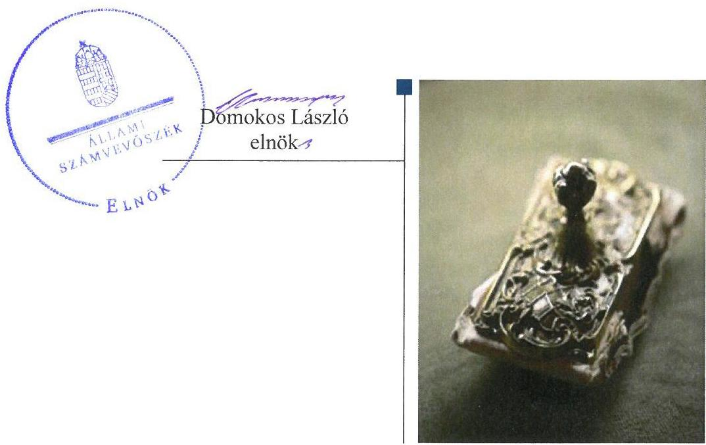

---

# AZ ELLENŐRZÉST FELÜGYELTE: 

HOLMAN MAGDOLNA felügyeleti vezető

## AZ ELLENŐRZÉST VEZETTE ÉS A VÉGREHAJTÁSÁÉRT FELELŐS:

IMRE ZSUZSANNA ellenőrzésvezető

## A PROGRAM ÖSSZEÁLLÍTÁSÁÉRT FELELŐS:

JANIK JÓZSEF osztályvezető

## A TÉMÁHOZ KAPCSOLÓDÓ KORÁBBI SZÁMVEVŐSZÉKI JELENTÉSEK:

- címe: Jelentés az állami vagyon feletti tulajdonosi joggyakorlással kapcsolatos tevékenységek ellenőrzéséről
- sorszáma: 15215
- címe: Jelentés az állami vagyon feletti tulajdonosi joggyakorlással kapcsolatos tevékenységek ellenőrzéséről
- sorszáma: 14236

IKTATÓSZÁM: V-1218-443/2016
TÉMASZÁM: 2252
ELLENŐRZÉS-AZONOSÍTÓ SZÁM: V0772

---

# TARTALOMJEGYZÉK 

■ ÖSSZEGZÉS ..... 5
■ AZ ELLENŐRZÉS CÉLJA ..... 7
■ AZ ELLENŐRZÉS TERÜLETE ..... 8
■ AZ ELLENŐRZÉS HÁTTERE, INDOKOLTSÁGA ..... 10
■ A JELENTÉS LÉNYEGES KÉRDÉSKÖREI ..... 11
■ ELLENŐRZÉS HATÓKÖRE ÉS MÓDSZEREI ..... 12
■ MEGÁLLAPÍTÁSOK ..... 14
■ JAVASLATOK ..... 33
■ MELLÉKLETEK ..... 37
I. Sz. melléklet: Értelmező szótár ..... 37
II. Sz. melléklet: A jogszabályi előírásokon alapuló vagyonátadások és vagyonátvételek 2015. évi alakulása ..... 41
III. Sz. melléklet: A tulajdonosi joggyakorlók rábízott eszközvagyonának változásai a 2015. évben ..... 42
■ FÜGGELÉK: ÉSZREVÉTELEK ..... 43
■ RÖVIDÍTÉSEK JEGYZÉKE ..... 77

---

.

---

# ÖSSZEGZÉS 

Az Alaptörvényben megfogalmazott, a nemzeti vagyon részét képező állami vagyonnal való felelős gazdálkodás követelményeinek teljesülését a legjelentősebb, kiemelt vagyoni kör feletti tulajdonosi joggyakorlók tevékenysége összességében támogatta. A vagyonhasznosítással összefüggő feladatellátás az állami vagyon meghatározó hányada fölött megfelelő volt, a földrészletek értékesítése szabályszerűen történt. Több tulajdonosi joggyakorlónál a rábízott vagyonról vezetett nyilvántartás ugyanakkor nem volt szabályszerű. Az egységes állami vagyon-nyilvántartási rendszerhez a tulajdonosi joggyakorlók teljesítették adatszolgáltatási kötelezettségeiket. A tulajdonosi joggyakorlók által kialakított és müködtetett belső kontrollrendszer összességében hozzájárult az Alaptörvényben és az állami vagyonról szóló törvényben megfogalmazottak teljesítéséhez.

## Az ellenőrzés társadalmi indokoltsága

Az Állami Számvevőszék stratégiájában hangsúlyos szerepet szán annak, hogy szilárd szakmai alapon álló, értékteremtő ellenőrzéseivel előmozdítsa a közpénzügyek átláthatóságát, rendezettségét, és javaslataival a közpénzek és a közvagyon szabályos, gazdaságos, hatékony és eredményes felhasználását támogassa. Az ÁSZ, a közvagyonnal való felelős gazdálkodás elősegítése érdekében, törvényi kötelezettségének is eleget téve évente ellenőrzi az állami vagyon feletti tulajdonosi joggyakorló szervezetek feladatellátását. Ezzel hozzájárul az állami vagyon megóvását, a közjó érdekében való hasznosítását célzó feladatellátás javításához, annak jövőbeli fejlesztését célzó döntések megalapozott, objektív véleményen nyugvó előkészítéséhez, ezzel is támogatva a jó kormányzás gyakorlatát.

## Főbb megállapítások, következtetések, javaslatok

A Magyar Nemzeti Vagyonkezelő Zrt.-nél - aki az állami vagyon meghatározó hányada felett gyakorolja a tulajdonosi jogokat - az állami tulajdonú ingatlanok vagyonkezelésbe adása szabályszerű volt. A Nemzeti Földalapkezelő Szervezet által az egyes állami tulajdonú földrészletek értékesítése összességében a jogszabályok és a belső szabályzatok betartásával történt. Az Állami Egészségügyi Ellátó Központnál és a Nemzeti Földalapkezelő Szervezetnél az állami tulajdonú ingatlanok vagyonkezelésbe adása során nem tartották be a jogszabályok és a belső szabályzatok előírásait, a vagyonkezelési szerződésekben a jogszabályokban előírtakat nem teljes körűen rögzítették.

A vagyon nyilvántartásával kapcsolatos kötelezettségét a Magyar Fejlesztési Bank Zrt. és a Magyar Nemzeti Vagyonkezelő Zrt. a jogszabályi előírásokkal és a vagyon változásával összhangban összességében teljesítette. Az Állami Egészségügyi Ellátó Központ és a Nemzeti Földalapkezelő Szervezet esetében a rábízott vagyonról vezetett nyilvántartás nem volt szabályszerű, s az ellenőrzés az Emberi Erőforrások Minisztériumánál, a Miniszterelnökségnél és a Nemzeti Fejlesztési Minisztériumnál is tárt fel hiányosságot. Az Állami Egészségügyi Ellátó Központ az államháztartáson belüli szervezeteknek vagyonkezelésbe adott ingatlanokat nem a vagyonkezelésbe adáskor vezette ki a könyveiből, azokról a főkönyvi nyilvántartást alátámasztó analitikus nyilvántartással nem rendelkezett. A nemzeti vagyonról szóló törvény előírása ellenére több tulajdonosi joggyakorló által a rábízott vagyonról vezetett nyilvántartás nem tartalmazta az állami vagyon elsődleges rendeltetése szerinti közfeladat megjelölését. A Nemzeti Földalapkezelő Szervezet az államháztartás számviteléről szóló kormányrendelet előírásaival ellentétesen az államháztartáson belüli szervezetekkel kötött vagyonkezelési szerződések alapján vagyonkezelésbe adott vagyonelemeket a vagyonkezelésbe adáskor könyveiből nem vezette ki, azokat nem a nullás számlaosztályban tartotta nyilván, így a rábízott vagyonáról készített mérlege nem felelt meg a számvitelről szóló törvény előírásainak. A Nemzeti Földalapkezelő Szervezet további vagyonváltozások (vagyonkezelési szerződés részleges megszüntetése, csereingatlanként hasznosított ingatlan esetében, földértékesítés során) esetében sem tartotta be a számvitelről szóló törvény előírásait.

---

A tulajdonosi joggyakorlók az egységes állami vagyon-nyilvántartáshoz az adatszolgáltatási kötelezettségüknek eleget tettek. Az Állami Egészségügyi Ellátó Központ által szolgáltatott adatok nem voltak megalapozottak, a rábízott vagyonába tartozó részesedések között kimutatott olyan részesedéseket is, amelyek kényszertörlés alatt álló, valamint negatív saját tőkéjű társaságokban álltak fenn. Az adatszolgáltatásban szerepeltetett közvetlen kezelésű rábízott vagyonának értéke, valamint a vagyonkezelésbe adott rábízott vagyon értéke a nyilvántartásaiban kimutatott értékkel nem egyezett meg.

A tulajdonosi joggyakorlással kapcsolatos feladatok szabályszerű ellátását támogató belső kontrollrendszer kialakítása és működtetése összességében az Magyar Nemzeti Vagyonkezelő Zrt.-nél, a Nemzeti Fejlesztési Minisztériumnál, a Miniszterelnökségnél megfelelő, a Földművelésügyi Minisztériumnál nem megfelelő volt. A Földművelésügyi Minisztérium a kontrollkörnyezetet az előírásoknak összességében megfelelően kialakította, míg a kockázatkezelési rendszer, a nyomon követési rendszer és az információs és kommunikációs folyamatok kialakítása és működtetése nem volt szabályszerű.

---

# AZ ELLENŐRZÉS CÉLJA 

Az ellenőrzés célja annak megítélése, hogy az állam tulajdonosi jogait gyakorló szervezetek tulajdonosi joggyakorlása megfelelt-e a vonatkozó jogszabályok előírásainak.

---

# AZ ELLENŐRZÉS TERÜLETE 

## Az állami vagyon feletti tulajdonosi joggyakorlással kapcsolatos tevékenységek ellenőrzése

A hazai jogszabályi környezetben az állami vagyonnal való gazdálkodás szabályozása több pilléren nyugszik. Az Alaptörvény 2011-ben bevezette a nemzeti vagyon fogalmát. 2011. december 31-én hatályba lépett a nemzeti vagyonról szóló 2011. évi CXCVI. törvény (Nvtv. ${ }^{1}$ ), amely meghatározta a nemzeti vagyon rendeltetését, kategóriáit és a vagyongazdálkodás keretszabályait. Az Nvtv. szerint az állam tulajdonában álló vagyon feletti tulajdonosi joggyakorlás módját, valamint a vagyonnal való gazdálkodás szabályait az állami vagyonról szóló 2007. évi CVI. törvény (Vtv. ${ }^{2}$ ) állapítja meg. Az állami tulajdonban lévő termőföldvagyon hasznosítására, vagyonkezelésére és nyilvántartására, - a kincstári vagyon részét képező - Nemzeti Földalap feletti tulajdonosi jogok gyakorlására vonatkozó szabályokat a Nemzeti Földalapról szóló 2010. évi LXXXVII. törvény (Nfatv. ${ }^{3}$ ) határozza meg.

Az ellenőrzés a legjelentősebb, nagy vagyoni kör feletti nyolc tulajdonosi joggyakorló tevékenységére terjedt ki, s az alábbi területekre irányult:
$\longrightarrow$ a tulajdonosi joggyakorlók közötti vagyon átadás-átvételek az NFMnél, az ME-nél és az MFB Zrt.-nél.
$\longrightarrow$ az állami vagyonnal kapcsolatos nyilvántartások kialakítása és vezetése, adatszolgáltatások, az ÁEEK4-nál, az EMMI5-nél, az FM6-nél, az $\mathrm{ME}^{7}$-nél, az MFB Zrt. ${ }^{8}$ nél, az MNV Zrt. ${ }^{9}$-nél, az NFA ${ }^{10}$-nál és az $\mathrm{NFM}^{11}$-nél.
$\longrightarrow$ az állami vagyon vagyonkezelésbe adása, tulajdonjogának átadása az ÁEEK-nál, az MNV Zrt.-nél és az NFA-nál.
$\longrightarrow$ a belső kontrollrendszer kialakítása, múködtetése az FM-nél, az MEnél, az MNV Zrt.-nél, és az NFM-nél.

AZ MNV ZRT. a Magyar Állam által alapított egyszemélyes részvénytársaság, amely főszabály szerint tulajdonosi joggyakorlóként gyakorolja a rábízott állami vagyon felett az államot megillető tulajdonosi jogok és kötelezettségek összességét.

AZ NFA a 2010. szeptember 1-jén jött létre, a Nfatv. hatálya alá tartozó ingatlanokkal kapcsolatos jogok és kötelezettségek tekintetében a Nemzeti Földalap létrejöttének napjával az MNV Zrt. jogutódja. A Nemzeti Földalap felett a Magyar Állam nevében a tulajdonosi jogokat és kötelezettségeket az agrárpolitikáért felelős miniszter az NFA útján gyakorolta.

AZ ME miniszter ${ }^{12}$ az állami vagyon feletti tulajdonosi jogokat a Vtv. 3. § (2) bekezdés a) pontja, valamint az MNV Zrt.-vel kötött megbízási szerződések alapján gyakorolta.

---

AZ FM miniszter ${ }^{13}$ gyakorolta a Magyar Állam nevében a tulajdonosi jogokat az Erdőtv. ${ }^{14} 1$. számú melléklete alapján az állami tulajdonban lévő 22 db erdőgazdálkodási tevékenységet folytató gazdasági társaság, valamint az Állattenyésztési tv. ${ }^{15}$ 15. § (2) bekezdése alapján két gazdasági társaság állami tulajdonú részesedése tekintetében.

AZ NFM miniszter ${ }^{16}$ négy ingatlan (koncessziós autópályák) és 20 gazdasági társasági részesedés felett gyakorolta a tulajdonosi jogokat. A tulajdonosi joggyakorlás 16 társasági részesedés esetében jogszabályi előírásokon alapult.

AZ EMMI miniszter ${ }^{17}$ gyakorolta a tulajdonosi jogokat a Vtv. 3. § (2) bekezdés c) és d) pontjai alapján a TB Alapok ${ }^{18}$ ellátási vagyona, valamint a Városliget megújításáról és fejlesztéséről szóló törvény ${ }^{19} 1 . \S$ (3) bekezdése alapján egy állami tulajdonú gazdasági társasági részesedés felett.

AZ MFB ZRT. 100\%-ban a Magyar Állam tulajdonában lévő szakosított hitelintézet. A társaság feletti tulajdonosi jogokat a Miniszterelnökséget vezető miniszter látta el. Az MFB Zrt. a 2015. évben jogszabályi előírások alapján nyolc gazdálkodó szervezet állami tulajdonú részesedése tekintetében gyakorolta a tulajdonosi jogokat.

AZ ÁEEK az EMMI irányítása alatt álló központi költségvetési szerv, 2015. március 1-től a GYEMSZi ${ }^{20}$ általános jogutódja. A GYEMSZI tulajdonosi joggyakorlási tevékenységének ellenőrzése az ÁEEK-nál történt. Az ÁEEK jogosult a Magyar Államot megillető tulajdonosi jogok és kötelezettségek összességének gyakorlására a megyei önkormányzatok konszolidációja, a megyei önkormányzati intézmények és a Fővárosi Önkormányzat egyes egészségügyi intézményeinek átvétele során állami tulajdonba került, állami egészségügyi feladatellátást szolgáló vagyon tekintetében.

A tulajdonosi joggyakorlók rábízott vagyonába tartozó, az állami vagyon részét képező ingatlan és részesedés vagyon nagyságát és összetételét a 2015. december 31-i állapotra vonatkozóan az 1. táblázat szemlélteti.

1. táblázat

TULAJDONOSI JOGGYAKORLÓK RÁBÍZOTT ÁLLAMI VAGYONA 2015. DECEMBER 31-ÉN (M FT-BAN)

| Ellenőrzött szervezet | Ingatlan |  | Részesedés |  | Összesen érték |
| :--: | :--: | :--: | :--: | :--: | :--: |
|  | db | érték | db | érték |  |
| ÁEEK | 87 | 14436 | 32 | 843 | 15279 |
| EMMI | - | - | 1 | 50 | 50 |
| FM | - | - | 24 | 49248 | 49248 |
| ME | - | - | 35 | 357671 | 357671 |
| MFB Zrt. | - | - | 8 | 36898 | 36898 |
| MNV Zrt. | 28650 | 136169 | 534 | 1791718 | 1927887 |
| NFA | 293010 | 440499 | - | - | 440499 |
| NFM | 4 | 629098 | 20 | 213111 | 842209 |
| Összesen | 321751 | 1220202 | 654 | 2449539 | 3669741 |

---

# AZ ELLENŐRZÉS HÁTTERE, INDOKOLTSÁGA 

Az ellenőrzést törvényi kötelezettség alapján minden évben elvégzi az ÁSZ ${ }^{21}$. Az ellenőrzés eredményeként az ÁSZ véleményt formál arról, hogy a Magyar Állam tulajdonosi joggyakorlásában érintett szervezetek múködése és az állami vagyonnal való gazdálkodása összhangban volt-e az állami vagyonra vonatkozó jogszabályok rendelkezéseivel. Az ellenőrzés rámutathat az állami vagyon feletti joggyakorlás tevékenységeinek esetleges szabályozási problémáira és hiányosságaira, hozzájárulva az állami vagyon feletti kontrollok, a felelős, szabályszerű vagyongazdálkodás erősítéséhez.

---

# A JELENTÉS LÉNYEGES KÉRDÉSKÖREI 

1. A rábizott vagyon tekintetében a tulajdonosi joggyakorló szervezetek vagyonátadással-átvétellel összefüggő intézkedései szabályszerűek voltak-e? Az állami vagyon szabályszerű nyilvántartása megvalósult-e, a jogszabályokban előirt adatszolgáltatásokat teljesítették-e?
2. A tulajdonosi joggyakorló szervezetek a vagyonkezelésbe adott ingatlanok és az állami tulajdonú földrészletek értékesítése tekintetében a tulajdonosi joggyakorlással összefüggő feladatokat szabályszerűen látták-e el?
3. Az állam tulajdonosi jogait gyakorlók rendelkeztek-e a tulajdonosi joggyakorlási feladatok szabályszerű ellátását támogató belső kontrollrendszerrel?
4. Az egységes vagyon-nyilvántartási rendszerhez kapcsolódó, jogszabályban előirt adatszolgáltatásokat a tulajdonosi joggyakorlók teljesítették-e, valamint a vagyon-nyilvántartási rendszer változáskövetésének, karbantartásának, fejlesztésének felügyelete megvalósult-e?

---

# ELLENŐRZÉS HATÓKÖRE ÉS MÓDSZEREI 

## Az ellenőrzés típusa

Szabályszerűségi ellenőrzés.

## Az ellenőrzött időszak

A 2015. január 1-je és 2015. december 31-e közötti időszak azzal, hogy amennyiben valamely ellenőrzött jogügylettel kapcsolatban releváns dokumentumok keletkeztek az ellenőrzött időszakot követően 2016. augusztus 31-ig, úgy azok értékelése is megtörtént.

## Az ellenőrzés tárgya

A Magyar Állam tulajdonosi joggyakorlásában érintett szervezetek állami vagyonra vonatkozó tulajdonosi joggyakorlással kapcsolatos intézkedései és belső kontrollrendszere.

Az ellenőrzés kiterjedt minden olyan körülményre és adatra, amely az ÁSZ jogszabályban meghatározott feladatainak teljesítéséhez, valamint a program végrehajtása folyamán felmerült újabb összefüggések feltárásához szükséges volt.

## Az ellenőrzött szervezet

A Miniszterelnökség, a Földművelésügyi Minisztérium, a Nemzeti Fejlesztési Minisztérium, az Emberi Erőforrások Minisztériuma, a Magyar Nemzeti Vagyonkezelő Zrt., a Nemzeti Földalapkezelő Szervezet, a Magyar Fejlesztési Bank Zrt. és az Állami Egészségügyi Ellátó Központ.

## Az ellenőrzés jogalapja

Az ellenőrzés jogszabályi alapját az ÁSZ tv. ${ }^{22}$ 5. § (4) bekezdés a) pontja, a Vtv. 3. § (4) bekezdése és az Nfatv. 14. § (1) bekezdése képezte.

## Az ellenőrzés módszerei

Az ellenőrzést az ellenőrzött időszakban hatályos jogszabályok, az ellenőrzés szakmai szabályai, a jelen ellenőrzésre irányadó ÁSZ módszertanok, az ellenőrzési programban foglalt értékelési szempontok szerint hajtottuk végre.

---

Az ellenőrzés ideje alatt az ellenőrzött szervezetekkel történő kapcsolattartást az ÁSZ SZMSZ ${ }^{23}$-ének vonatkozó előírásai alapján biztosítottuk.

Az ellenőrzési kérdések megválaszolásához szükséges bizonyítékok megszerzése az ellenőrzöttek által rendelkezésre bocsátott dokumentumokra, adatokra alapozva megfigyelés, szemle (szemrevételezés), kérdésfeltevés (információkérés), mintavételezés, valamint elemző eljárás alkalmazásával történt.

Az állami vagyon feletti tulajdonosi joggyakorlással kapcsolatos tevékenységek ellenőrzése során az állami tulajdonú ingatlanok vagyonkezelésbe adásának és a megkötött vagyonkezelési szerződések szabályszerűségének ellenőrzését egyszerű véletlen mintavétellel ellenőriztük. A Nemzeti Földalapba tartozó földrészletek értékesítésével kapcsolatos eljárásokat, valamint az értékesítési szerződések szabályszerűségét az értékesítés módja szerint rétegzett mintavétellel ellenőriztük. A mintavétellel ellenőrzött területek esetében minden egyes tétel vonatkozásában a szabályszerűségre vonatkozó kérdéseket tettünk fel, melyek eredménye összesítésre került. „Megfelelőnek" értékeltünk egy ellenőrzött területet, amennyiben 95\%-os bizonyossággal a teljes sokaságban a hibaarány legfeljebb 10\%, „nem megfelelőnek", amennyiben 10\%-nál magasabb arányt képviselt.

A tulajdonosi joggyakorló szervezetek ellenőrzési rendszere szabályszerűségének ellenőrzése a megküldött adatállomány teljes körű ellenőrzésével történt, mintavételezésre nem került sor, tekintettel arra, hogy a teljes alapsokaság tételeinek száma nem érte el a minta elemszámát.

Az ellenőrzési bizonyítékként felhasznált adatforrások közé tartoztak egyrészt a szakmai program részletes szempontjainál felsorolt adatforrások, másrészt minden - az ellenőrzés folyamán feltárt, az ellenőrzés szempontjából információt tartalmazó - dokumentum. Az ellenőrzés lefolytatásához az ellenőrzött által rendelkezésre bocsátott adatok, információk és a tanúsítványok adatai valódiságának kontrollja az ellenőrzés keretében megtörtént.

A tulajdonosi joggyakorló költségvetési szervek belső kontrollrendszer kialakításának és működtetésének vonatkozásában a szabályszerűségre vonatkozó kérdéseket tettünk fel. „Igen"választ adtunk a kérdésre, ha teljes egészében megvalósult a kérdezett tevékenység, vagy előírás, egyéb esetekben „nem választ adtunk. „Nem értelmezhető" választ adtunk, ha az intézményre nem volt értelmezhető a kérdés. Az elérhető és elért pontszámok arányát \%-ban fejeztük ki. Az egyes kontrollpillérek és a belső kontrollrendszer szabályozottságát megfelelőnek minősítettük, ha az igen válaszok aránya meghaladta a $85 \%$-ot, és nem megfelelő minősítést adtunk, ha az arány nem érte el a $85 \%$-ot, vagy elérte, de a tulajdonosi joggyakorlással kapcsolatos tevékenységeket ellátó szervezeti egységek nem rendelkeztek az operatív tevékenységet szabályozó ügyrenddel.

---

# MEGÁLLAPÍTÁSOK 

## 1. A rábízott vagyon tekintetében a tulajdonosi joggyakorló szervezetek vagyonátadással-átvétellel összefüggő intézkedései szabályszerűek voltak-e? Az állami vagyon szabályszerű nyilvántartása megvalósult-e, a jogszabályokban előírt adatszolgáltatásokat teljesítették-e?

Összegző megállapítás

A rábízott vagyon tekintetében a tulajdonosi joggyakorlók vagyonátadással-átvétellel összefüggő intézkedései összességében szabályszerűek voltak. Az MFB Zrt. és az MNV Zrt. kivételével az állami vagyon nyilvántartása a tulajdonosi joggyakorlóknál összességében nem volt szabályszerű. A jogszabályokban előírt adatszolgáltatásokat összességében teljesítették.
1.1. számú megállapítás

Az ME, az MFB Zrt. és más tulajdonosi joggyakorló szervezetek közötti vagyonátadással-átvétellel kapcsolatos intézkedések szabályszerűek voltak, az NFM az átvett vagyont nem a jogszabályban előírt időpontban vette nyilvántartásba. Az MFB Zrt. és az MNV Zrt. a jogszabályi előírásokkal és a vagyon változásával összhangban öszszességében teljesítette a vagyon nyilvántartásával kapcsolatos kötelezettségét. Az ÁEEK, az EMMI, az NFA és az NFM esetében a rábízott vagyonról vezetett nyilvántartás nem volt szabályszerű.

AZ ÁLLAMI VAGYON ÁTADÁS-ÁTVÉTELE a tulajdonosi joggyakorlók között az NFM kivételével szabályszerűen történt.

## Vagyonátadások - átvételek   szabályszerűsége (M Ft; db)

Forrás: ÁSZ saját szerkesztése

---

A ME-nél és az MFB Zrt.-nél a vagyonátadással-átvétellel kapcsolatos intézkedések az Nvtv., a Vtv. és az Áhsz. ${ }^{24}$ előírásaival összhangban kerültek végrehajtásra. A 2015. évben az ME-nél négy, az MFB Zrt.-nél három állami tulajdonú tartós részesedés átadására-átvételére került sor, összesen 32 863,5 M Ft, illetve 18 010,2 M Ft értékben.

A vagyonváltozások nyilvántartásba vételét a tulajdonosi joggyakorlók - az NFM kivételével - szabályszerűen végezték. A jogszabályi előírásokon alapuló vagyonátadások és vagyonátvételek 2015. évi alakulását részletesen a II. számú melléklet mutatja be, összegzését a 2. táblázat szemlélteti:
2. táblázat

VAGYONADÁSOK ÉS VAGYONÁTVÉTELEK 2015. ÉVBEN

| Vagyonátadó/vagyonátvevő | Átadott részesedések |  | Átvett részesedések |  |
| :-- | :--: | :--: | :--: | :--: |
|  | db | M Ft | db | M Ft |
| ME | 2 | 14863,5 | 2 | 18000,0 |
| MFB Zrt. | 2 | 18000,0 | 1 | 10,2 |
| NFM | 1 | 103,0 | 4 | 3269,8 |
| Részesedések összesen: | 5 | 32966,5 | 7 | 21280,0 |

Az ME és az MFB Zrt. a megkötött vagyon átadás-átvételi megállapodások alapján a részesedések értékének és változásának nyilvántartását a Vhr. ${ }^{25}$ előírásainak megfelelően szabályszerűen végezte.

Az NFM-nél a 2015. évi vagyon átadás-átvétellel érintett vagyonelemek nyilvántartásba vétele egy részesedés esetében az Áhsz. 15. § (2) bekezdésének előírása ellenére az átvevő NFM nem a jogszabályban előírt időpontban vette nyilvántartásba (az átadó MNV Zrt. nyilvántartása szerint a részesedés könyv szerinti értéke a vételárral megegyező bruttó 1 901,8 M Ft).

A RÁBÍZOTT VAGYONNAL KAPCSOLATOS NYILVÁNTARTÁSI KÖTELEZETTSÉGNEK az MNV Zrt. és az MFB Zrt. összességében szabályszerűen, ugyanakkor az ÁEEK, az NFA, az EMMI, az ME és az NFM nem szabályszerűen tett eleget. A tulajdonosi joggyakorlók nem megfelelő vagyon-nyilvántartási gyakorlata kockázatot jelent az MNV Zrt. által a Vtv. 17. § (1) bekezdés b) pontja alapján az állami vagyonról vezetett nyilvántartás megfelelősége és megbízhatósága tekintetében, amelyhez a Vhr. 13. § (3) bekezdése alapján a tulajdonosi joggyakorlók szolgáltatnak adatot.

A tulajdonosi joggyakorlók rábízott eszközvagyonának 2015. évi változásait a III. számú melléklet mutatja be.

A rábízott vagyon nyilvántartásának szabályszerűsége a hét ellenőrzött szervezetnél:

---

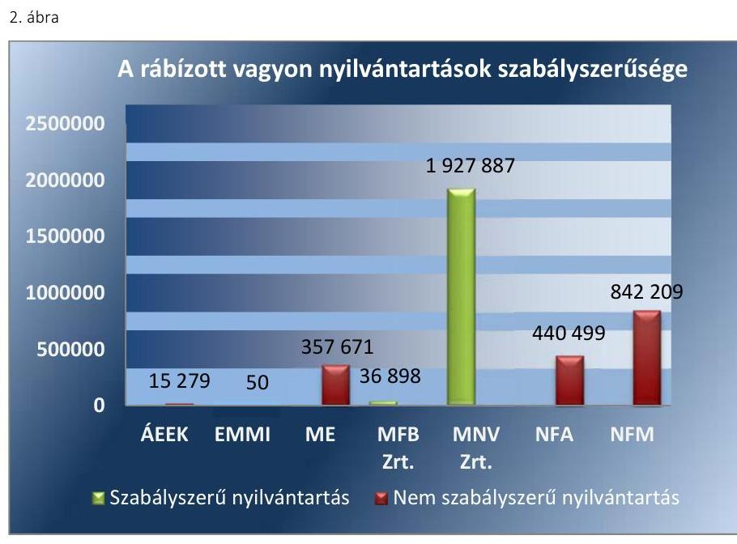

Forrás: ÁSZ saját szerkesztés
AZ MFB ZRT. a vagyon-nyilvántartás számviteli szabályait Számviteli politikájában és Számlarendjében a Vhr. előírásaival összhangban kialakította, azoknak megfelelve a részesedések analitikus nyilvántartásáról gondoskodott. Az MFB Zrt. a nyilvántartási adatok nyilvánosságát az Ávr. ${ }^{26}$, valamint az Nvtv. előírásainak megfelelően a rábízott vagyonba tartozó gazdasági társaságok éves beszámolójának saját weblapon való elérhetőségével biztosította.

AZ MNV ZRT. az Nvtv.-ben, Vtv.-ben előírt vagyon-nyilvántartási kötelezettségét a Vhr.-ben meghatározott tartalommal teljesítette, az öszszességében szabályszerű volt. Az MNV Zrt. a vagyon-nyilvántartási adatok - a minősített adat védelméről szóló törvény szerinti minősített adat kivételével - nyilvánosságát a honlapján közzétett adatokkal teljesítette az Nvtv. előírásának megfelelően. Az MNV Zrt. vagyon-nyilvántartási szabályzatban ${ }^{27}$ meghatározta a Vhr. előírásaival összhangban a rábízott vagyonnal kapcsolatos adatszolgáltatás részletes tartalmát, formáját.

A Vhr.-ben, az MNV Zrt. vagyon-nyilvántartási szabályzatában és a vagyonkezelési szerződésben előírtak a vagyon-nyilvántartás során maradéktalanul nem teljesültek, mivel:

Az MNV Zrt. nem teljesítette teljes körűen a vagyon változásával kapcsolatos adatszolgáltatási kötelezettségre vonatkozó felhívási kötelezettséget annak ellenére, hogy valamennyi vagyonkezelő maradéktalanul nem teljesítette a Vhr. 14. § (1) bekezdésében foglalt előírásokat. Így a Vhr. 14. § (8) bekezdésében, az MNV Zrt. vagyon-nyilvántartási szabályzat D. pontjának Felügyeleti, ellenőrzési rendjében és az általa kötött vagyonkezelési szerződésben meghatározottakat nem tartotta be. Ezáltal az MNV Zrt. által kötött vagyonkezelési szerződések, illetve azok módosításait követően a változások átvezetéséhez szükséges adatszolgáltatások ellenőrzésénél nem múködtek megfelelően a belső kontrollok. A fentiek következtében az MNV Zrt., mint tulajdonosi joggyakorló, a nyilvántartásában nem vezette át a nemzeti vagyon értékének (bruttó érték, értékcsökkenés) változásait, figyelmen kívül hagyva az Nvtv. 10. § (1) bekezdésében előírtakat.

---

3. táblázat

| ÁEEK ESZKÖZEINEK VÁLTOZÁSA   (M FT; \%) |  |  |  |
| :--: | :--: | :--: | :--: |
| Megnevezés | $\begin{gathered} 2014 . \\ \text { év } \end{gathered}$ | $\begin{gathered} 2015 . \\ \text { év } \end{gathered}$ | Változás |
| Befektetett eszközök | 16228,1 | 17532,7 | 8,0 |
| Pénzeszközök | 0 | 1806,3 |  |
| Követelések | 1579,7 | 1579,7 | 0 |
| Eszközök összesen: | 17807,9 | 20918,7 | 17,5 |

A Z ÁEEK-nál összességében a rábízott vagyon szabályszerű nyilvántartása nem valósult meg, annak szabályozását sem alakították ki megfelelően. Az ÁEEK a Vhr. 14. § (3) bekezdésének előírása ellenére 2015. június 30 -áig vagyon-nyilvántartási szabályzattal nem rendelkezett. 2015. július 1-jétől az ÁEEK vagyon-nyilvántartási szabályzata meghatározta a vagyonnyilvántartás vezetéséhez szükséges, a vagyonkezelőkre vonatkozó adatszolgáltatás tartalmát, feltételrendszerét és gyakoriságát.

Az ÁEEK vagyon-nyilvántartása a rábízott vagyon tekintetében nem felelt meg a jogszabályi előírásoknak, mivel:

- A rábízott vagyonról készített 2015. évi éves beszámolójának mérlegében bemutatott részesedések értéke nem felelt meg a Számv. tv. ${ }^{28}$ előírásainak, mert a rábízott vagyonába tartozó, negatív saját tőkéjű társaságokban fennálló részesedése (összesen: 91,6 M Ft) és egy kényszertörlés alatt álló gazdasági társaságban lévő részesedése ( 80 M Ft ) értékét a Számv. tv. 16. § (1) bekezdésben foglaltak ellenére egyedileg nem értékelte; a Számv. tv. 54. § (1) bekezdés szerinti értékvesztést nem számolt el; a megszűnő gazdasági társaságnál a várhatóan megtérülő összeget a Számv. tv. 54. § (2) bekezdés b) pontja ellenére nem vette figyelembe, valamint az ÁEEK Értékelési szabályzatának 5.1. Az eszközök és a források bekerülési értékének meghatározása, értékelésük a mérlegben címú fejezet E.III.1. pontjában előírtakat, miszerint a negatív saját tőkéjú társasági részesedések esetén a könyv szerinti érték nulla. Így 0 Ft helyett 91,6 M Ft értékben mutatott ki negatív saját tőkéjú társaságokban fennálló részesedést, továbbá 80 M Ft értékű részesedést mutatott ki egy kényszertörlés alatt álló gazdasági társaságban lévő részesedése esetén.
- Az Áhsz. 47. § (3) bekezdése ellenére nem a vagyonkezelésbe adáskor vezette ki a könyveiből az ÁEEK az államháztartáson belüli szervezeteknek vagyonkezelésébe adott tárgyi eszközök bruttó értékét és az elszámolt értékcsökkenést, valamint vette nyilvántartásba a tárgyi eszközök bruttó értékét a 0 . számlaosztály befektetett eszközei között. A vagyonkezelésbe adott tárgyi eszközök bruttó értékét és az elszámolt értékcsökkenést a könyvekből negyedévente vezette ki. A 0. számlaosztályban a vagyonkezelők év végi adatszolgáltatása alapján, főkönyvi számlánként összevontan, egy összegben könyvelték az államháztartáson belüli szervezeteknek vagyonkezelésébe adott tárgyi eszközök bruttó értékét és az elszámolt értékcsökkenést. Így az ÁEEK nem rendelkezett az Nvtv. 10. § (1) bekezdése szerinti, a nemzeti vagyon részét képező, az államháztartáson belüli szervezeteknek vagyonkezelésébe adott tárgyi eszközökről olyan nyilvántartással, amely tartalmazta volna azok értékét és változásait.
- Az ÁEEK az államháztartáson kívüli vagyonkezelők részére vagyonkezelésbe adott ingatlanokat átadáskor a tárgyi eszközök közül - a Számv. tv. 15. § (2) bekezdésében foglaltakat betartva - kivezette, ugyanakkor az Áhsz. 11. § (11) bekezdésének előírása ellenére a koncesszióba, vagyonkezelésbe adott eszközök között nem vette nyilvántartásba.

---

4. táblázat

NFA RÁBÍZOTT VAGYONÁNAK VÁLTOZÁSA (MRD FT; \%))

|  Magyar-
szóba | 2014. év | 2015. év | Változás  |
| --- | --- | --- | --- |
|  Tárgyi
eszközök | 145,4 | 145,3 | $-0,1$  |
|  Koncesz-
szóba
adott esz-
közök | 295,1 | 296,1 | 0,3  |
|  Pénzesz-
közök | 0,6 | 15,6 | 2320,7  |
|  Eszközök
összesen: | 443,2 | 460,2, | 3,8  |

Fonrös: NFA 2015. évi költségvetési beszámoló

- Az ÁEEK figyelmen kívül hagyva az Nvtv. 10. § (1) bekezdésében előírtakat, mert nyilvántartásában teljes körűen nem vezette át a nemzeti vagyon értékének (bruttó érték, értékcsökkenés) változásait, mivel a Vhr. 14. § (1) bekezdése ellenére nem minden vagyonkezelő teljesítette a vagyonkezelési szerződés szerinti adatszolgáltatási kötelezettségét.
- Az ÁEEK vagyon-nyilvántartása az Nvtv. 10. § (1) bekezdésében előírtak ellenére az állami vagyon elsődleges rendeltetése szerinti közfeladat megjelölését nem tartalmazta.

AZ EMMI a tulajdonosi joggyakorlása alá tartozó vagyonból - az Nvtv., a társadalombiztosítás pénzügyi alapjainak és a társadalom-biztosítás szerveinek állami felügyeletéről szóló törvény ${ }^{29}$, az Áht. ${ }^{30}$ és az Ávr. előírásai alapján - a Városliget Ingatlanfejlesztő Zrt.-ben levő 50,0 M Ft társasági részesedés nyilvántartására volt kötelezett.

A társasági részesedésről vezetett analitikus nyilvántartás nem felelt meg a Vhr. 14. § (2) bekezdésében előírtaknak, mivel nem tartalmazta az állami vagyonhoz kapcsolódó jogokat és jogi szempontból jelentős tényeket. A nyilvántartás nem felelt meg az Nvtv.10. § (1) bekezdése előírásának sem, mivel nem tartalmazta a vagyon elsődleges rendeltetése szerinti közfeladat megjelölését.

AZ NFA 2015. évben rendelkezett NFA vagyon-nyilvántartási szabályzattal ${ }^{31}$, ugyanakkor abban az Nfatv. vhr. ${ }^{32}$ 50/A. (3)-(5) és (6) bekezdésében foglaltakkal ellentétesen határozták meg a vagyonkezelők által az NFA részére teljesítendő tájékoztatási kötelezettség határidejét. Az Nfatv. vhr. szerinti „15 napon belül" határidő helyett a vagyonkezelők tájékoztatási kötelezettségének határnapja a „hasznosítási szerződésben foglaltak szerint", illetve „tárgyévet követő év január 15-éig" időpont került meghatározásra. Továbbá az NFA vagyon-nyilvántartási szabályzatban a „hasznosítási szerződésben foglaltak szerint" időpont került meghatározásra, az Nfatv. vhr. szerinti „haladéktalanul köteles" határidő helyett.
2015. január 1. -2015. október 5. között az Nfatv. vhr. 50/B. §-ában foglaltakkal ellentétesen nem határozták meg az NFA vagyon-nyilvántartási szabályzatban a szerződés típusától függően szolgáltatandó egyéb adatok körét, továbbá az adatszolgáltatás gyakoriságát, részletes tartalmát és módját. Az adatszolgáltatási kötelezettség nem megfelelő szabályozottsága kockázatot jelentett a vagyonkezelők által az NFA részére teljesítendő adatok pontosságára és Nfatv. vhr.-ben előírt határidők teljesítésére.

Az NFA-nál a vagyon-nyilvántartás vezetése nem volt szabályszerű, mivel:

- Az NFA az Áhsz. 47. § (3) bekezdésével ellentétesen az államháztartáson belüli szervezetekkel kötött vagyonkezelési szerződések esetében a vagyonkezelésbe adott ingatlanok nyilvántartott könyv szerinti értékét a vagyonkezelésbe adáskor a könyveiből nem vezette ki, és azok nyilvántartási értékét nem a 0 . számlaosztály befektetett eszközei között tartotta nyilván. Az NFA az Áhsz. 10. § (2) bekezdésével ellentétesen a vagyonkezelésbe adott eszközt hibásan a 2015. december 31-i fordulónapra elkészített mérlegében kimutatta, annak ellenére, hogy a rábízott vagyonra az államháztartáson belüli

---

szervezettel vagyonkezelési szerződést kötött a 2015. évben. Az államháztartáson belüli szervezettel kötött vagyonkezelési szerződések esetén tévesen a 2015. évi rábízott vagyonmérlegben az "A/II/1 Ingatlanok és a kapcsolódó vagyoni értékű jogok" között kimutatott eszközérték 107,1 M Ft. A feltárt hibák összege az NFA számviteli politika $2^{-b e n^{33}}$ és az Áhsz. 1. § (1) bekezdés 3. pontjában meghatározott jelentős hibahatár mértéket, azaz a 100,0 M Ft-ot meghaladta.

- Az NFA az államháztartáson kívüli szervezettel a vagyonkezelési szerződés részleges megszüntetésére kötött szerződés alapját képező eszközértéket az Áhsz. 11. § (11) bekezdésével ellentétesen a mérlegben az „A/IV/1 Koncesszióba, vagyonkezelésbe adott eszközök" mérlegsoron mutatta ki "A/II/1 Ingatlanok és a kapcsolódó vagyoni értékű jogok" mérlegsor helyett.
- Az államháztartáson belüli szervezettel kötött eredeti vagyonkezelési szerződés szerinti földterületek egy része tekintetében a vagyonkezelési szerződés megszűnése miatt a vagyonkezelési szerződés szerinti ingatlan értékét, az eszköz könyv szerinti értékét a 0 . számlaosztályból nem vezette vissza az 1-es számlaosztályba, így annak értéke a 2015. évi rábízott vagyonról készített mérlegében sem szerepelt, megsértve ezzel a Számv. tv. 26. § (2) bekezdésében foglaltak és a 15. § (2) bekezdésében rögzített teljesség elvét. A feltárt hiba összege önmagában nem jelentős.
- A 2015. III. negyedévben csereingatlanként hasznosított ingatlan esetében a gazdasági esemény főkönyvi nyilvántartásba vételét alátámasztó dokumentumok nem feleltek meg a számviteli bizonylattal szemben támasztott, a Számv. tv. 166. § (1) bekezdésében foglalt előírásoknak, mivel a gazdasági esemény számviteli elszámolását nem támasztotta alá. A 12111 „termőföldek állománya" főkönyvi számla „követel" oldalán 2015. 09. 30-i dátummal a 39,2 M Ft öszszeget rögzítettek, miközben a gazdasági eseményt alátámasztó vegyes könyvelési bizonylaton kontírozott összegként 37,0 M Ft szerepelt.
- A 2015. évi földértékesítések során két esetben bár az értékesítés 2015. évben megvalósult, az ingatlan vagyon kivezetése a főkönyvi könyvelésből 2016. évben történt meg, ami nem felelt meg a Számv. tv. 26. § (1)-(2) bekezdésében foglaltaknak, mivel a tárgyi eszközök között kimutatott földingatlanok értéke nem a 2015. december 31i állapotot tükrözték.
Az NFA a kialakított vagyonelem szintű nyilvántartási rendszerével öszszességében eleget tett a 11/2011. (II. 22.) Korm. rendelet 2-6. §-aiban előírt vagyon-nyilvántartás kialakítási kötelezettségének.

Az NFA által vezetett vagyonelem szintű nyilvántartás nem volt teljes körű, az nem tartalmazta az erdőkre vonatkozó előírt alábbi adatokat:

- erdőre vonatkozó, az Evt. ${ }^{34}$ törvénynek megfelelő területazonosító adatokat (11/2011. (II. 22.) Korm. rendelet 3. § (2) bek. c) pontja),
- az erdőgazdálkodó megnevezését, székhelyét és telephelyét a 11/2011. (II. 22.) Korm. rendelet 4. § ha) pontja),
- erdőgazdálkodói kódot (11/2011. (II. 22.) Korm. rendelet 4. § hb) pontja).

---

AZ ME az Áhsz.-ben foglalt előírásnak megfelelve a tulajdonosi joggyakorlási feladataival összefüggő könyvvezetési és beszámoló készítési szabályokat Eljárásrend ${ }^{35}$-ben szabályozta. Az Eljárásrend 1. számú mellékletében felsorolásra kerültek az ME tulajdonosi joggyakorlása alá tartozó tartós részesedések a 2015.01.01. napi állapotnak megfelelően. A Vhr. 14. § (1) bekezdésében foglaltaknak megfelelve az ME a vagyon-nyilvántartás számviteli szabályait Számviteli Politikájában ${ }^{36}$ szabályozta.

Az ME a Vhr.-nek megfelelve a tulajdonosi részesedéseket analitikus nyilvántartásában ${ }^{37}$ nyilvántartotta. Az analitikus nyilvántartás adatai megegyeztek a főkönyvi nyilvántartással, azok alátámasztották az adatszolgáltatásokban közölt adatokat.

Az Eljárásrend 1. számú melléklete, és az analitikus vagyon-nyilvántartás az Nvtv. 10. § (1) bekezdésében foglaltak ellenére nem tartalmazta a társaságokra vonatkozóan a vagyon elsődleges rendeltetése szerinti közfeladat megjelölését, amelyből adódóan az MNV Zrt. részére a vagyonnyilvántartási rendszerhez nyújtott adatszolgáltatás is hiányos volt.

Az ME a 2015. évben vagyon-nyilvántartási szabályzattal a Vhr. 14. § (3) bekezdésében rögzítettek ellenére nem rendelkezett.

AZ NFM az Áhsz. előírásaival összhangban az NFM Eszközök és források értékelésének szabályzatában rögzítette a tulajdonosi joggyakorlási feladataival összefüggő, nyilvántartásaiban megjelenő vagyonelemekre vonatkozó értékelési szabályokat.

Az NFM vagyon-nyilvántartási szabályzattal nem rendelkezett a Vhr. 14. § (3) bekezdése előírásai ellenére.

Az NFM nyilvántartása a 77/2012. (XII. 22.) NFM rendeletben felsorolt gazdasági társaságokról, illetve további három gazdasági társaságról tartalmazott a Vhr. 14. § (2) bekezdésében szereplő lényeges számviteli adatot.

Az NFM részesedésekről vezetett nyilvántartása nem volt teljes körű, tartalma nem felelt meg a jogszabályi előírásoknak, mivel:
— Az Nvtv. 10. § (1) bekezdésében foglaltakat megsértve a vagyonnyilvántartás nem tartalmazta a vagyon elsődleges rendeltetése szerinti közfeladat megjelölését;
— Az NFM megsértette a Vhr. 14. § (2) bekezdését, mivel az NFM nyilvántartása a vagyonváltozás ellenére nem tartalmazta a vagyon használóinak, vagyonkezelőinek, haszonélvezőinek azonosító adatait, valamint a kapcsolódó jogokat és jogi szempontból jelentős tényeket.
1.2. számú megállapítás

Az államháztartásért felelős miniszter részére a jogszabályokban előírt, időközi mérlegjelentésekhez és éves beszámolókhoz kapcsolódó adatszolgáltatási kötelezettségeket az FM, az ME és az MFB Zrt., határidőben, az EMMI és az NFM az ÁEEK és az NFA késedelmesen teljesítette. Az MNV Zrt. az adatszolgáltatási kötelezettségeinek nem, vagy késedelmesen tett eleget.

Az időközi mérlegjelentések és éves beszámolók tekintetében az Áht.-ban és az Ávr.-ben előírt adatszolgáltatások teljesítése a tulajdonosi joggyakorlók által több esetben késedelmesen valósult meg:

---

5. táblázat

ME, FM, MFB ZRT ÁHT. ÉS ÁVR. SZERINTI ADATSZOLGÁLTATÁSA A 2015. ÉVBEN

| Adatszolgáltatás | Határidőben |
| :-- | :--: |
| Elemi költségvetés | $\checkmark$ |
| Mérlegjelentés | $\checkmark$ |
| I. negyedév | $\checkmark$ |
| II. negyedév | $\checkmark$ |
| III. negyedév | $\checkmark$ |
| IV. gyorsjelentés) | $\checkmark$ |
| IV. éves elszámoló | $\checkmark$ |
| Éves költségvetési | $\checkmark |
| beszámoló |  |

Forrás: FM KGR K11 ${ }^{38}$ státusz történet
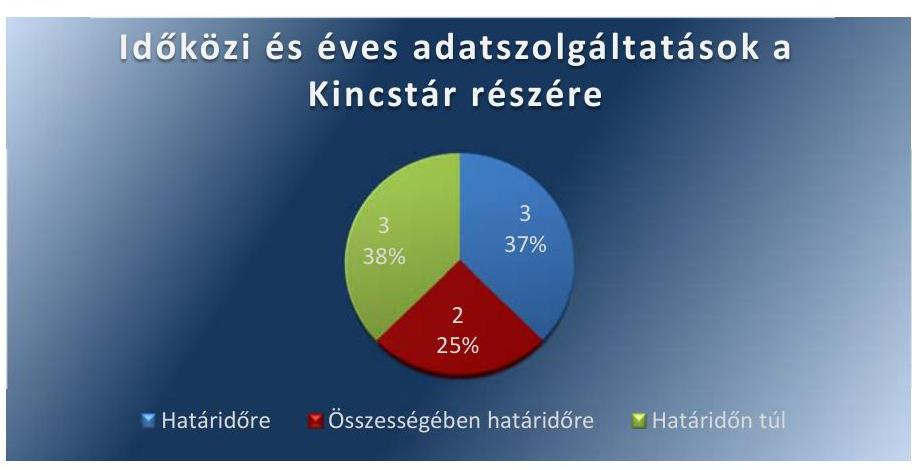

Forrás: ÁSZ saját szerkesztése

AZ FM, AZ ME ÉS AZ MFB ZRT. az Áht.-ban és az Ávr.-ben előírt adatszolgáltatásokat - a 2015. évre vonatkozó időközi mérlegjelentéseket, a IV. negyedévi gyorsjelentést és a 2015. évi éves költségvetési beszámolót - az előírásoknak megfelelően elkészítette és határidőben megküldte a Kincstárnak.

AZ EMMI a rábízott állami vagyonra vonatkozó 2015. évi időközi mérlegjelentéseit az Ávr.-ben foglaltaknak megfelelően elkészítette, azonban a 2015. I. negyedévi mérlegjelentést az Ávr. 170. § (7) bekezdésében meghatározott határidőn (az adott negyedévet követő 45 napon) túl, 2015. július 24-én töltötte fel a Kincstár által működtetett elektronikus adatszolgáltató rendszerbe.

AZ NFM a 2015. évi adatszolgáltatási kötelezettségeinek - a 2015. IV. negyedévi időközi mérlegjelentés kivételével - határidőre eleget tett. Az NFM a 2015. IV. negyedévi időközi mérlegjelentésre (gyorsjelentés) vonatkozó adatszolgáltatási kötelezettségét határidőn túl teljesítette, az Ávr. 170. § (7) bekezdésében előírt adatszolgáltatási határidőt nem tartotta be.

AZ ÁEEK a rábízott állami vagyonra vonatkozó 2015. évi I.-III. negyedévi időközi mérlegjelentését az Ávr. 170. § (7) bekezdés előírása ellenére nem a tárgynegyedévet követő negyvenöt napon belül, hanem 2016. február 5-én töltötte fel a Kincstár által működtetett elektronikus adatszolgáltató rendszerbe, a $\mathrm{KGR}^{38}$-be.

Az Ávr. előírásait betartva a 2015. IV. negyedévre vonatkozó gyorsjelentés a tárgynegyedévet követő 60 napon belül, az éves elszámolásra vonatkozó mérlegjelentés és az éves költségvetési beszámoló határidőben feltöltésre került a Kincstár által működtetett elektronikus adatszolgáltató rendszerbe.

Az ÁEEK közzétételi kötelezettségének nem teljes körűen tett eleget, mivel az Info tv. ${ }^{39}$ 37. § (1) bekezdés előírása ellenére, mint közfeladatot ellátó szerv az Info tv. 1. melléklet III. 1 pontja előírása szerinti 2015. évi éves költségvetési beszámolóját nem tette közzé.

---

AZ NFA a 2015. évi időközi mérlegjelentéseit - a harmadik negyedévi mérlegjelentés kivételével - jelentős, 95-179 nap közötti késedelemmel teljesítette, megsértve az Ávr. 170. §. (7) bekezdésében foglaltakat.

Az Nfatv 7. § (1) bekezdés f) pontjában előírt beszámolási kötelezettségét teljesítette, a 2015. évi elemi beszámolóját a KGR-be határidőben feltöltötte.

AZ MNV ZRT. az Áht. 108. § (1) bekezdés b) pontjában, és az Ávr. 170. § (1) bekezdés c) pontjában, valamint a 21/2015. számú vezérigazgatói utasítással kiadott Jelentéstételi eljárásrendben előírt időközi mérlegjelentési kötelezettségének a 2015. évben teljes körűen nem tett eleget a teljesített adatszolgáltatásoknál:

- Az Ávr. 170. § (1) bekezdés c) pontja előírása ellenére a 2015. év IIII. negyedévi időközi mérlegjelentések és a 2015. év IV. negyedévre vonatkozó gyorsjelentés nem készült, ezáltal azok Ávr. 170. § (7) bekezdés szerinti,Kincstár ${ }^{40}$ felé történő adatszolgáltatása elmaradt.
- Az MNV Zrt. 2015. évi éves elszámolással kapcsolatos, rábízott vagyonára vonatkozó éves költségvetési beszámoló Kincstár felé teljesítendő adatszolgáltatása megtörtént, azonban az Ávr. 170. § (7) és az Áhsz. 33. § (3) bekezdésében, valamint az MNV Zrt. Jelentéstételi eljárásrend ${ }^{41}$ II. fejezetében rögzített határidőt túllépve, késedelmesen teljesült (2016. június 30-a helyett, 2016. augusztus 11-én történt).

# 2. A tulajdonosi joggyakorló szervezetek a vagyonkezelésbe adott ingatlanok és az állami tulajdonú földrészletek értékesítése tekintetében a tulajdonosi joggyakorlással összefüggő feladatokat szabályszerűen látták-e el? 

Összegző megállapítás

Az 2.1. számú megállapítás

Az MNV Zrt. a vagyonkezelésbe adott ingatlanok tekintetében a tulajdonosi joggyakorlással összefüggő feladatokat szabályszerűen, az ÁEEK és az NFA nem szabályszerűen látta el. Az állami tulajdonú földrészletek értékesítését az NFA összességében szabályszerűen végezte.

Az MNV Zrt.-nél az állami tulajdonú ingatlanok vagyonkezelésbe adása szabályszerű volt. Az ÁEEK-nél és az NFA-nál az állami tulajdonú ingatlanok vagyonkezelésbe adási tevékenysége esetében a vagyonkezelési szerződések tartalma tekintetében nem tartották be a jogszabályok és a belső szabályzatok előírásait.

AZ MNV ZRT. az állami tulajdonú ingatlanok vagyonkezelésbe adása során az Nvtv., Vtv., Vhr. rendelkezései, az MNV Zrt. SZMSZ ${ }^{42}$ és az MNV Zrt. vagyon-nyilvántartási szabályzat előírásai szerint járt el.

Az állami tulajdonú ingatlanok vagyonkezelésbe adásával kapcsolatos intézkedések, a vagyonkezelői jog létesítésének, átadásának, illetve rész-

---

6. táblázat

## ÁEEK 2015. ÉVI VAGYONKEZELÉSI SZERZŐDÉSEI

|  | Vagyonkezelő | Szerződések   száma (db) |
| :-- | :--: | :--: |
| 1. | Kórházak, rende-   lőintézetek | 24 |
| 2. | HM | 1 |
| 3. | Legfőbb Ügyész-   ség | 1 |
| 4. | Erdőgazdasági tár-   saság | 1 |
| 5. | Alapítvány | 1 |
| 6. | Összesen: | 28 |

Forrás: ÁEEK adatszolgáltatása
7. táblázat

## AZ NFA 2015. ÉVI VAGYONKEZELÉSI SZERZŐDÉSEI

|  | Szerződő fél | Darab-   szám |
| :-- | :--: | :--: |
| 1. | Államháztartáson be-   lüli szervezet | 41 |
| 2. | Államháztartáson ki-   vüli szervezet | 6 |
| 3. | Összesen | 47 |

Forrás: NFA adatszolgáltatása
leges megszüntetésének végrehajtása összességében megfelelt a jogszabályi előírásoknak és a vagyonkezelési szerződések feltételeinek.

A vagyonkezelési szerződések tartalmazták a vagyonkezelés részletes szabályait, a tulajdonosi ellenőrzést, az adatszolgáltatási kötelezettséget, a költségvetési szervekre és az egyéb vagyonkezelőkre vonatkozó rendelkezéseket. A vagyonkezelési szerződésekben az MNV Zrt. előírta a visszapótlási kötelezettség módját és mértékét, vagy a visszapótlási kötelezettség alóli mentesülést.

A vagyonkezelési tevékenység során a vezetői kontrollok működtek, amelyek a tulajdonosi joggyakorlással kapcsolatos Nvtv.-ben, Vtv.-ben meghatározott célok elérését támogatták. Az MNV Zrt. ingatlanok vagyonkezelésével kapcsolatos intézkedéseit megfelelő szintű döntéshozó általi jóváhagyás előzte meg, ami egyúttal a folyamat vezetői és belső kontrollját jelentette.

AZ ÁEEK-NÁL a 2015. évben az állami vagyon vagyonkezelésbe adása az MÖKtv. ${ }^{43}$, az EÖtv. ${ }^{44}$ és a Ttv. ${ }^{45}$ előírásain, és a vagyonkezelők kérelmén alapult.

A vagyonkezelési szerződések tartalmazták a Vhr. előírásai alapján többek között a vagyonkezelők jogait és kötelezettségeit, a vagyon használatának ellenőrzését, adatszolgáltatási kötelezettséget, ugyanakkor előfordult, hogy az ÁEEK a megkötött vagyonkezelési szerződésekben a Vhr. 14. § (3) bekezdés előírása ellenére nem rögzítette, hogy a vagyonkezelő az ÁEEK vagyon-nyilvántartási szabályzatát ${ }^{46}$ megismerte és magára nézve kötelező érvényűnek ismeri el.

Az ÁEEK a vagyonkezelési szerződésekben az ÁEEK Leltárkészítési és leltározási szabályzat 2.5. pontjában előírtak ellenére nem írta elő, hogy a vagyonkezelésbe adott eszközről készített leltárt a vagyonkezelő meghatározott időpontig az ÁEEK részére megküldi. A vagyonkezelők a vagyonkezelt eszközök leltárát az ÁEEK részére nem küldték meg, ezáltal az ÁEEK - az Áhsz. 22.§ (1) bekezdése ellenére - a mérleg tételeinek alátámasztásához nem rendelkezett az Áhsz. 22. § (2) bekezdés a) pontjában szabályozott, a vagyonkezelők által készített és hitelesített leltárral.

A rábízott vagyon nyilvántartásával kapcsolatosan feltárt hiányosságokat a jelentés 1.1 számú megállapítása tartalmazza.

AZ NFA a Nemzeti Földalapba tartozó földrészleteket vagyonkezelésbe adással hasznosította. Az NFA a 2015. évben - többségében - iskolai rendszerú szakképzést folytató intézménnyel, felsőoktatási intézménnyel kötött vagyonkezelési szerződést, továbbá a korábbi években megkötött vagyonkezelési, ideiglenes vagyonkezelési szerződéseket módosította, részlegesen megszüntette.

A vagyonkezelés szabályainak kialakítása az NFA-nál összességében nem volt megfelelő. Az NFA 2015. január 1. - 2015. szeptember 21. között az NFA SZMSZ ${ }^{47}$ 15/4. pontjának előírása ellenére a vagyonkezelésbe vételi kérelmek eljárásrendjét nem szabályozta. 2015. szeptember 22-től az NFA vagyonkezelésbe vételi kérelmek ügyintézésének eljárásrendjében ${ }^{48}$ meghatározták a beérkezett kérelmek vizsgálati szempontjait az NFA központja és a Régió szervezeti egységeire vonatkozóan, amelyek az Nfatv. és az Nfatv. vhr. előírásaival összhangban voltak.

---

Az NFA által a 2015. évben megkötött vagyonkezelési szerződések az Nfatv. vhr. előírásaival összhangban tartalmazták a felek jogait és kötelezettségeit, ugyanakkor a szerződéskötések teljes mértékben nem feleltek meg a jogszabályi előírásoknak, mivel:
$\longrightarrow$ Az NFA az Nfatv. 20. § (3) bekezdésével ellentétesen az irányító vagy felügyelő szerv egyetértése nélkül kötött vagyonkezelési szerződéseket.
$\longrightarrow$ Az Nfatv. vhr. 39. § (3) bekezdésével ellentétesen a vagyonkezelők nem gondoskodtak a vagyonkezelői jog ingatlan-nyilvántartásba történő bejegyezéséről a szerződés megkötésétől számított 30 napon belül. A vagyonkezelési szerződések ugyan tartalmazták a vagyonkezelők földhivatali ingatlan-nyilvántartásba való bejegyzési kötelezettséget, az NFA nem követte nyomon a vagyonkezelők kötelezettségének teljesítését, eljárásrendben nem szabályozta annak figyelemmel kísérését. Az NFA nem határozott meg szankciókat a szerződés szerinti teljesítés kikényszerítésére, amely kockázatot jelentett az NFA ingatlan-nyilvántartásának pontosságára.
$\longrightarrow$ A 2015. január 1 - 2015. október 5. közötti időszakban az Nfatv. vhr. 50/8. § -ában előírtak ellenére nem rögzítették a vagyonkezelési szerződésekben a vagyonkezelők NFA vagyon-nyilvántartási szabályzatának megismerését, magukra nézve kötelező érvényű elismerését, továbbá az Nfatv. vhr. 56. § (6) bekezdésében foglaltak ellenére a vagyonkezelési szerződések módosítását ehhez kapcsolódóan nem kezdeményezték.
A rábízott vagyon nyilvántartásával kapcsolatosan feltárt hiányosságokat az 1.1 sz. megállapítást alátámasztó részmegállapítások tartalmazzák.

# 2.2. számú megállapítás 

Az NFA által az egyes állami tulajdonú földrészletek értékesítése összességében a jogszabályok és a belső szabályzatok betartásával történt.

AZ NFA-hoz tartozó földrészletek hasznosítása a 2015. évben a három ha alatti földértékesítések esetében az Nfatv. előírásaival összhangban valósultak meg. A 3 ha feletti földrészletek cserével való hasznosítása esetében az NFA élt az Nfatv. 18. § (1) bekezdés d) pontja szerinti lehetőséggel.

Az NFA az állami tulajdonú földrészek értékesítése során összességében szabályszerűen járt el.

---

# 3. Az állam tulajdonosi jogait gyakorlók rendelkeztek-e a tulajdonosi joggyakorlási feladatok szabályszerű ellátását támogató belső kontrollrendszerrel? 

Összegző megállapítás

A tulajdonosi joggyakorlási feladatok szabályszerű ellátását támogató belső kontrollrendszert - a feltárt hiányosságok mellett - a tulajdonosi joggyakorlók összességében kialakították.
3.1. számú megállapítás

Az FM a tulajdonosi joggyakorlási feladatok szabályszerű ellátását támogató kontrollkörnyezetet az előírásoknak összességében megfelelően kialakította, míg az ME, az MNV Zrt. és az NFM által kialakított kontrollkörnyezet nem támogatta a tulajdonosi joggyakorlási feladatok szabályszerű ellátását.

AZ FM a kontrollkörnyezetét a 2015. évben összességében az előírásoknak megfelelően kialakította. Az FM SZMSZ-e ${ }^{49}$ az Ávr. előírásainak megfelelően tartalmazta a tulajdonosi joggyakorlással kapcsolatos feladatokat, azok felelőseit. A tulajdonosi joggyakorláshoz kapcsolódó előírásokat a Számv. tv. és az Áhsz. előírásainak megfelelően az FM Számviteli politikájában ${ }^{50}$, az FM Leltározási- és leltárkészítési szabályzatában ${ }^{51}$, az FM Értékelési szabályzatában ${ }^{52}$, valamint az FM Számlarendjében ${ }^{53}$ határozta meg.

AZ ME a kontrollkörnyezetét - bár rendelkezett az Áht. előírásának megfelelő ME Alapító Okirat ${ }^{54}$-tal, az Áht. előírásainak megfelelő ME SZMSZ ${ }^{55}$-szel, valamint Számv. tv. -ben és az Áhsz. -ben előírt tartalmú számviteli szabályzatokkal - nem az előírásoknak megfelelően alakította ki, mivel:

- A tulajdonosi joggyakorlással kapcsolatos feladatokat ellátó kilenc szervezeti egység közül hét nem rendelkezett az Ávr. 13. § (5) bekezdés ellenére Ügyrenddel, valamint az ME a Bkr. ${ }^{56}$ 6. § (3) bekezdése előírásai ellenére ellenőrzési nyomvonallal nem rendelkezett.
- Az ME a Vhr. 14. § (3) bekezdésében előírtak ellenére vagyon-nyilvántartási szabályzatát nem alkotta meg.
- Az ME Számlarendjében az Áhsz. 51. § (3) bekezdésében foglaltak ellenére nem szabályozták a főkönyvi számla és az analitikus nyilvántartások egyeztetési módját, annak dokumentálását, valamint a részletező nyilvántartások vezetési módját.

AZ MNV ZRT. a kontrollkörnyezetet nem az előírásoknak megfelelően alakította ki. Rendelkezett a jogszabályi előírásoknak megfelelő Alapító Okirattal ${ }^{57}$, SZMSZ ${ }^{58}$-szel és Ügyrenddel ${ }^{59}$.

Az MNV Zrt. SZMSZ-ének 1. § (1)-(2) bekezdésében a Vtv. 3 § (1) bekezdés változása ellenére nem módosították azt, hogy a Magyar Államot megillető tulajdonosi jogok és kötelezettségek összességét tulajdonosi joggyakorlóként, - ha törvény vagy miniszteri rendelet máshogy nem rendelkezik - az MNV Zrt. gyakorolja. Az MNV Zrt. SZMSZ-e az Áht. 10. § (5) bekezdése ellenére nem tartalmazta a Vtv. 17. § (1) bekezdés g) pontja által 2015. július 10.-ét követően meghatározott elektronikus árverési rendszerrel

---

kapcsolatos feladatokat, ezzel az MNV Zrt. figyelmen kívül hagyta a Bkr. 3.§ a) és 4.§ a) pontjaiban foglaltakat.

Az MNV Zrt. a Bkr. 6. § (4) bekezdése ellenére szabálytalanságok kezelésének eljárásrendjével nem rendelkezett.

Az MNV Zrt. rendelkezett számviteli szabályzatokkal, ugyanakkor:
— Az MNV Zrt. Számviteli politikája ${ }^{60}$, a Számv. tv. 14. § (4) bekezdése ellenére nem tartalmazta, hogy mit tekintenek a számviteli elszámolás, az értékelés szempontjából lényegesnek, nem lényegesnek.
— Az MNV Zrt. Leltározási szabályzatában ${ }^{61}$, az ingatlanok esetében a Számv. tv. 69. § (3) bekezdésében foglaltakkal ellentétben a menynyiségi felvétellel történő leltározás gyakoriságát legalább „háromévente" helyett „négyévente" határozták meg.
— Az MNV Zrt. Értékelési szabályzata ${ }^{62}$ az Áhsz. 50. § (2) b) pontja ellenére nem tartalmazta követeléstípusonként a kis összegű követelések év végi meghatározásának elveit, dokumentálásának szabályait, továbbá a d) pontja ellenére a tulajdonosnak, a tulajdonosi joggyakorló szervezetnek a vagyonkezelésbe adott eszközök vagyonértékelése során alkalmazott értékelési eljárás elveit, módszerét, dokumentálásának szabályait, felelőseit.
— Az MNV Zrt. a Számv. tv. 161. § (2) bekezdés d) pontja ellenére a számlarendben foglaltakat alátámasztó bizonylati renddel nem rendelkezett.
Az MNV Zrt. Vagyon-nyilvántartási szabályzata a Vhr. 14. § (3) bekezdése ellenére nem írta elő az állami vagyon használója és haszonélvezője részére az adatszolgáltatás tartalmát, gyakoriságát, formáját, módját.

Az NFM Alapító okirata ${ }_{1,2}{ }^{63}$ és az SZMSZ-e ${ }^{64}$ az Áht. és az Ávr. előírásainak megfelelő tartalommal készült. Elkészítették az NFM Számviteli szabályzatait, ugyanakkor:
— Az NFM Számviteli politikát ${ }^{65}$ a 2015. évben nem aktualizálták, így az a Számv. tv. 14. § (4) bekezdés 2015. július 4-étől hatályos előírása ellenére nem tartalmazta, hogy mit tekintenek kivételes nagyságú és előfordulású bevételnek, költségnek, ráfordításnak.
— Az NFM Számlarendjében ${ }^{66}$ a Számv. tv. 161. § (2) bekezdés a) pontjának előírása ellenére nem határozták meg az alkalmazásra kijelölt számla számjelét és megnevezését (a számlatükröt), 161. § (2) bekezdés c) pontja és az Áhsz. 51. § (3) bekezdésének előírása ellenére a főkönyvi számla és az analitikus nyilvántartások egyeztetése dokumentálásának szabályait, továbbá a pénzügyi könyveléshez készült összesítő bizonylatok (feladások) elkészítésének rendjét.
— Az NFM Értékelési szabályzata ${ }^{67}$ nem tartalmazta az Áhsz. 50. § (2) bekezdés b) és d) pontjainak előírásai ellenére követeléstípusonként a kis összegű követelések év végi dokumentálásának szabályait, valamint az NFM-nek, mint tulajdonosi joggyakorló szervezetnek a vagyonkezelésbe adott eszközök vagyonértékelése során a dokumentálás szabályait, felelőseit.
Az NFM-nél a tulajdonosi joggyakorlással kapcsolatos feladatokat ellátó szervezeti egységek alkalmazottainak teljesítményértékelését a Kttv. ${ }^{68}$ és a 10/2013. (I. 21.) Korm. rendelet ${ }^{69}$ előírásainak megfelelően elkészítették.

---

A munkavállalók teljesítményértékelésének ajánlott elemeit önálló belső szabályzatban nem határozták meg a 10/2013. (I.21.) Korm. rendelet 9. § (1) és (3) bekezdéseinek előírása ellenére.
3.2. számú megállapítás

A tulajdonosi joggyakorlási feladatok szabályszerű ellátását támogató kockázatkezelési rendszer kialakítása és múködtetése az MNV Zrt.-nél és az NFM-nél összességében szabályszerű volt. Az ME és az FM nem alakította ki és nem múködtette a tulajdonosi joggyakorlási feladatok szabályszerű ellátását támogató kockázatkezelési rendszert.

AZ MNV ZRT. a kockázatkezelési rendszerét az Áht. és a Bkr. előírásainak összességében megfelelően alakította ki és múködtette. Az MNV Zrt. kockázat-nyilvántartásában a Bkr.-nek megfelelően meghatározták a kockázat kezelésére vonatkozó intézkedéseket, azok nyomon követéséről gondoskodtak.

AZ NFM a kockázatkezelési rendszerét az Áht. és a Bkr. előírásainak megfelelően kialakította. Az NFM FEUVE szabályzatban ${ }^{70}$ és az NFM ellenőrzési nyomvonal ${ }_{1,2,3,4,5,6}{ }^{71}$-ban határozta meg a kockázatok azonosításával, elemzésével, értékelésével, csoportosításával, a kockázati kitettség csökkentésével, kezelésével, nyomon követésével kapcsolatos szabályokat.

AZ ME-NÉL tulajdonosi joggyakorlási feladatok szabályszerű ellátását támogató kockázatkezelési rendszert az Áht. 69. § (2) bekezdésében és Bkr. 7. §-ban foglaltak ellenére nem alakították ki és nem működtették, mivel:
—_ A Miniszterelnökség a kockázatkezelési rendszerét a Bkr. 7. § (2) bekezdésében foglalt előírások ellenére úgy működtette, hogy az 50/2013. (II. 25.) Korm. rendelet 10. § (5) bekezdésben foglaltakkal szemben nem mérték fel az irányításuk alatt álló tisztviselők érdekérvényesítőkkel való találkozására vonatkozó információkat, valamint az ezzel kapcsolatos kockázatokat.
—_ Az ME rendelkezett a 2015. évben hatályos ME Kockázatkezelési szabályzattal ${ }^{72}$, ugyanakkor a tulajdonosi joggyakorlást végző szervezeti egységek a Bkr. 7. § (2) bekezdésében foglaltak ellenére nem mérték fel a szervezet tevékenységében és a gazdálkodásban rejlő kockázatokat és nem határozták meg az egyes kockázatokkal kapcsolatban a szükséges intézkedéseket.
—_ Az 50/2013. (II. 25.) Korm. rendelet ${ }^{73}$ 4. § (2) bekezdésében foglaltak ellenére a szervezet működésével összefüggő visszaélésekre, szabálytalanságokra és integritási és korrupciós kockázatokra vonatkozó bejelentések fogadására és kivizsgálására vonatkozó eljárásrend az ellenőrzött időszakban nem került kialakításra.

AZ FM-NÉL a tulajdonosi joggyakorló tevékenységgel kapcsolatos kockázatkezelési rendszert az Áht. 69. § (2) bekezdésben és a Bkr. 7. §-ban foglaltak ellenére nem alakították ki és nem működtették.

A gazdálkodási feladatokban rejlő kockázatokat felmérték a Bkr.-nek megfelelően, a feltárt kockázatokkal kapcsolatos szükséges intézkedéseket belső szabályzatban rögzítették.

---

Az FM a 2015. évre a kockázatok kezelésére az 50/2013. (II. 25.) Korm. rendelet 3. § (1) bekezdése ellenére korrupció-megelőzési intézkedési tervet nem fogalmazott meg, a 10. § (5) bekezdése ellenére nem tekintették át az FM tisztviselők érdekérvényesítőkkel való találkozására vonatkozó információkat és nem mérték fel az ezzel kapcsolatos kockázatokat.

# 3.3. számú megállapítás 

Az ME-nél, az MNV Zrt.-nél és az NFM-nél az információs és kommunikációs folyamatok kialakítása és múködtetése a jogszabályi előírásoknak összességében megfelelt. Az FM nem gondoskodott az információs és kommunikációs folyamatok jogszabályi előírásoknak megfelelő kialakításáról és múködtetéséről.

AZ ME információs rendszerének kialakítása és működtetése összességében megfelelt a jogszabályi előírásoknak, azt a Bkr.-ben foglaltakkal összhangban kialakította. Az ME SZMSZ-ben meghatározták a világos beszámolási szinteket, határidőket és a módokat. A Bkr.-ben foglaltaknak megfelelően összességében biztosították, hogy a szükséges információk maradéktalanul, megfelelő időben eljussanak az illetékes szervezethez, szervezeti egységhez, személyhez.

AZ MNV ZRT. információs és kommunikációs rendszerét az MNV Zrt. vezérigazgatója az Áht., valamint a Bkr. előírásainak megfelelően kialakította, melynek keret- és részletes szabályrendszerét az MNV Zrt. SZMSZ-e, Társasági Monitoring szabályzata ${ }^{74}$, a Tervezési és keretgazdálkodási eljárásrendje ${ }^{75}$, Kommunikációs szabályzata ${ }^{76}$, a Vezérigazgatói tárgyalások felkészítőivel kapcsolatos eljárásrendje ${ }^{77}$ képezte. A tulajdonosi joggyakorláshoz kapcsolódó információs és kommunikációs folyamatok további ke-ret- és részletszabályozásához az MNV Zrt. vezérigazgatója 2015. március 31-én kiadta a Portfóliós Kódexet ${ }^{78}$. Az MNV. Zrt.-nél a Bkr.-ben foglaltaknak megfelelően a kialakított szabályozási rendszerrel biztosított volt az, hogy a szükséges információk maradéktalanul, megfelelő időben eljussanak az illetékes szervezetekhez, szervezeti egységekhez, személyekhez.

AZ NFM információs és kommunikációs folyamatainak kialakítása megfelelő volt. Az NFM SZMSZ-ében és az NFM Kommunikációs és nyilatkozati rendjében a Bkr. előírásaival összhangban szabályozták az információk kezelésével, áramlásával, beszámolásával kapcsolatos előírásokat, amely megfelelően biztosította, hogy a szükséges információk a megfelelő időben eljussanak az illetékes szervezethez, szervezeti egységhez, személyhez.

AZ FM nem gondoskodott az információs és kommunikációs folyamatok jogszabályi előírásoknak megfelelő kialakításáról és múködtetéséről. Az információs rendszer keretében ugyan kialakították a beszámolási szinteket, határidőket és módokat, és szabályozták a szervezeten belüli és kívüli in-formáció-áramlás rendszerét, az ellenőrzés számos hiányosságot tárt fel.

Az információs és kommunikációs rendszer a Bkr. 9. § (1) bekezdésében foglaltak ellenére nem biztosította, hogy a megfelelő információk a megfelelő időben eljussanak az illetékes szervezethez, szervezeti egységhez, személyhez.
— Az FM Ellenőrzési Főosztály a Bkr. 14. § (1) bekezdésében előírt, a külső ellenőrzések javaslatai alapján készült intézkedési tervek végrehajtásáról nyilvántartást nem vezetett.

---

### 3.4. számú megállapítás

11. táblázat

## ELLENŐRZÉSI TEVÉKENYSÉG MNV ZRT,

Ellenőrzési tervek, összefoglaló jelentés

1. Stratégiai terv
2. 2015. évi ellenőrzési terv
3. 2015. évi összefoglaló jelentés

Fonrás: ÁSZ ellenörzés adatai

- Adatszolgáltatási kötelezettségét az FM nem a Vhr. -nek és a Megbízási szerződés ${ }^{79}$-ben előírtaknak megfelelően teljesítette. A rábízott vagyon december 31-ei állományáról az adatszolgáltatást az FM az MNV Zrt. részére a Vhr. 13. § (5) bekezdésben megadott június 30 -ai határidőt követően késedelmesen, 2016. július 8 -án teljesítette. Az FM az MNV Zrt.-vel kötött Megbízási szerződés 5.2. pontjában előírt, negyedéves - 2015. I. és II. negyedévre vonatkozóan - adatszolgáltatási kötelezettségét a BalHal Nonprofit Zrt. esetében 2015. augusztus 26 -áig nem teljesítette.
- Közzétételi kötelezettségének az FM az Info tv. 37. § (1) bekezdés előírása ellenére nem tett eleget, mert az Info tv. 1. melléket II/1. pontjában foglaltak ellenére az FM Adatvédelmi és adatbiztonsági szabályzatát, az Info tv. 1. melléklet III/1. pontjában előírtak ellenére a tulajdonosi joggyakorló szervezet 2015. évi éves költségvetését és éves költségvetési beszámolóját az FM nem tette közzé.
- Az Info tv. 30. § (6) bekezdésében, 35. § (3) bekezdésében és az Ávr. 13. § (2) bekezdés h) pontjában előírtak ellenére az FM a közérdekú adatok megismerésére irányuló igények teljesítésének rendjét nem készítette el és az elektronikus közzétételi kötelezettség teljesítésének részletes szabályait belső szabályzatban nem állapította meg.
- A panaszok és közérdekú bejelentések folyamata során az Info tv. 4. § (2) bekezdésében előírtak ellenére a személyes adatot nem csak a cél megvalósulásához szükséges ideig kezelték, mivel a bejelentő neve és elektronikus címe a bejelentéssel kapcsolatos dokumentumokon a panasz kivizsgálása után azonosítható volt.

A tulajdonosi joggyakorláshoz szükséges nyomon követési rendszert (monitoring) és ennek részeként a belső ellenőrzési rendszert az MNV Zrt. az NFM és az ME szabályszerűen, az előírásoknak öszszességében megfelelően kialakította és múködtette. Az FM a tulajdonosi joggyakorláshoz szükséges nyomon követési rendszert kialakította, annak múködtetése azonban nem volt megfelelő.

AZ MNV ZRT. Vezérigazgatója a monitoring rendszert a Bkr.-nek megfelelően kialakította és múködtette. A tulajdonosi joggyakorló tevékenységre vonatkozóan a nyomon követést biztosító előírásokat az MNV Zrt. Társasági monitoring szabályzata tartalmazta, amelyben rögzítették a feladatok megvalósulását mérő indikátorokat.

A belső ellenőrzést a Vezérigazgató a Bkr. előírásának megfelelően kialakította, az ellenőrzési feladatokat az MNV Zrt. Ellenőrzési Igazgatósága ${ }^{80}$ látta el, amelynek funkcionális függetlenségét biztosította.

Az MNV Zrt. a tulajdonosi ellenőrzési rendszert a Vtv.-nek és az Nvtv.nek megfelelően kialakította, az MNV Zrt. Tulajdonosi ellenőrzési szabályzatában ${ }^{81}$ szabályozta. A tulajdonosi ellenőrzések céljai a Vhr. előírásaival összhangban kerültek meghatározásra, azokat az Nvtv.-ben és a Vtv.-ben meghatározott témakörökben végezték, melyekről jelentés készült. Az MNV Zrt. Ellenőrzési Igazgatósága a Vhr.-nek megfelelően a 2015. évi tulajdonosi ellenőrzésekről, intézkedésekről összefoglaló jelentést készített, amelyet az előírt határidőig az NFM részére megküldött.

---

12. táblázat

## ELLENŐRZÉSI TEVÉKENYSÉG NFM

|  | Ellenőrzési tervek, összefoglaló jelentés | Készült |
| :--: | :--: | :--: |
| 1. | Stratégiai terv | $\checkmark$ |
| 2. | 2015. évi ellenőrzési terv | $\checkmark$ |
| 3. | 2015. évi összefoglaló jelentés | $\checkmark$ |

Forrás: ÁSZ ellenőrzés adatai
13. táblázat

## ELLENŐRZÉSI TEVÉKENYSÉG ME

Ellenőrzési tervek, öszszefoglaló jelentés
Készült

1. Stratégiai terv
2. 2015. évi ellenőrzési terv
3. 2015. évi összefoglaló jelentés
$\checkmark$
4. táblázat

## ELLENŐRZÉSI TEVÉKENYSÉG FM

Ellenőrzési tervek, összefoglaló jelentés
Készült

1. Stratégiai terv
2. 2015. évi ellenőrzési terv
3. 2015. évi összefoglaló jelentés

Forrás: ÁSZ ellenőrzés adatai

AZ NFM monitoring rendszerét a Bkr.-nek megfelelően kialakította és működtette, a tulajdonosi joggyakorlása alá tartozó gazdasági társaságok tevékenységének folyamatos és eseti nyomon követésére. A 2015-ben bevezetett új adatszolgáltatási rendszer ${ }^{82}$ működése során, az általános információkon ${ }^{83}$ és pénzügyi mutatókon kívül, társaság-specifikus $\mathrm{KPI}^{84}$ mutatókat is kialakítottak. Az NFM tulajdonosi joggyakorlása alá tartozó gazdasági társaságok negyedévenként teljesített monitoring adatszolgáltatásait a Társasági Portfólió Főosztály elemezte, értékelte.

Az NFM-nél a belső ellenőrzés kialakítása és működtetése megfelelt az Áht.-ban és a Bkr.-ben foglaltaknak. A Vhr. előírása szerinti tulajdonosi ellenőrzést az NFM Ellenőrzési Főosztálya látta el a belső ellenőrzés keretében, a belső ellenőrzések végrehajtását szabályozó NFM Belső ellenőrzési kézikönyve ${ }^{85}$ előírásaival összhangban.

A belső és külső ellenőrzések által tett megállapításokról és javaslatokról a Bkr. előírásai figyelembevételével nyilvántartást vezetettek, amely alapján az intézkedési terveket és azok végrehajtását nyomon követték.

AZ ME a tulajdonosi joggyakorláshoz szükséges nyomon követési rendszer részeként a belső ellenőrzési rendszert szabályszerűen, az előírásoknak összességében megfelelően kialakította és működtette.

Az Miniszterelnökséget vezető miniszter a Bkr.-ben foglaltak szerinti nyilatkozatában a Bkr.-ben foglaltaknak megfelelően értékelte az ME belső kontrollrendszerének minőségét.

Az ME a belső ellenőrzés kialakításáról az Áht.-nek és a Bkr.-nek megfelelően gondoskodott, az ME Belső Ellenőrzési Főosztálya útján az ME SZMSZ-ben és az ME Ügyrend ${ }_{5}{ }^{86}$-ben előírtak alapján biztosította a belső ellenőrök szervezeti és funkcionális függetlenségét.

AZ FM a monitoring-rendszert a Bkr. előírásainak megfelelően ugyan kialakította, azonban annak müködtetése, a tulajdonosi joggyakorlása alá tartozó gazdasági társaságok tevékenységének folyamatos és eseti nyomon követése nem volt megfelelő, az FM a Bkr. 3. § e) pontjában előírtak ellenére a monitoring-rendszert nem megfelelően müködtette, mivel:
— az FM tulajdonosi joggyakorlása alá tartozó gazdasági társaságok a BalHal Nonprofit Zrt.-t az évközi (negyedéves, havi) beszámoló készítési kötelezettségét nem teljesítette, s az FM az adatszolgáltatás elmaradását nem kifogásolta.
Az FM a belső ellenőrzést az Áht. és a Bkr. előírásaival összhangban kialakította - amely tevékenységet ellátó FM Ellenőrzési Főosztály funkcionális függetlensége biztosított volt -, ugyanakkor annak müködtetése a tulajdonosi joggyakorlási tevékenységhez kapcsolódóan nem volt megfelelő, mivel:
— Az FM SZMSZ az FM Ellenőrzési Főosztály feladatai között határozta meg a gazdasági társaságok ellenőrzését. A 2015. évben az FM SZMSZ 2. függeléke 1. fejezetének 1.2. pontja, 1.b) alpontjában előírtak ellenére az FM Ellenőrzési Főosztálya tulajdonosi ellenőrzést az FM Stratégiai ellenőrzési tervben és a kockázatelemzéssel alátámasztott FM 2015. évi ellenőrzési tervben - nem tervezett és nem folytatott le.

---

- Az FM Ellenőrzési Főosztálya a Bkr. 14. § (1) bekezdése ellenére nem vezetett nyilvántartást a tulajdonosi joggyakorlásra vonatkozó ellenőrzés javaslata alapján készített intézkedési terv végrehajtásáról.

# 4. Az egységes vagyon-nyilvántartási rendszerhez kapcsolódó, jogszabályban előírt adatszolgáltatásokat a tulajdonosi joggyakorlók teljesítették-e, valamint a vagyon-nyilvántartási rendszer változáskövetésének, karbantartásának, fejlesztésének felügyelete megvalósult-e? 

### 4.1. számú megállapítás

A tulajdonosi joggyakorlók teljesítették az MNV Zrt. részére az egységes vagyon - nyilvántartáshoz kapcsolódó adatszolgáltatási kötelezettségüket a rábízott vagyonuk december 31-i tárgyévi állományáról. Az NFM miniszter részére az MNV Zrt. biztosította a vagyonnyilvántartási rendszer változáskövetéséről, karbantartásáról, fejlesztéséről szóló beszámolókat.

ADATSZOLGÁLTATÁST TELJESÍTETTEK AZ MNV ZRT. RÉSZÉRE a tulajdonosi joggyakorlók - ÁEEK, EMMI, FM, ME, MFB Zrt., NFA, NFM - a Vhr.-ben foglaltak alapján a rábízott vagyon 2015. december 31-i tárgyévi állományáról. Az adatszolgáltatást az FM és az ME kivételével a Vhr.-ben előírt, a tárgyévet követő év június 30.-i határidőre a tulajdonosi joggyakorlók teljesítették.

Az adatszolgáltatást - a Vhr. 13. § (5) bekezdésében előírt határidőn túl - az FM 2016. július 08-án, az ME 2016. július 20-án teljesítette.

A tulajdonosi joggyakorlók által az MNV Zrt. részére a Vtv. 17. § (1) bekezdésében meghatározott nyilvántartás vezetéséhez szolgáltatott adatok - az ÁEEK adatszolgáltatása kivételével - az analitikus nyilvántartással és a mérleg adatával egyezőek voltak.

AZ ÁEEK az MNV Zrt. részére a részesedések értékéről nyújtott adatszolgáltatási kötelezettségét - 843,3 M Ft - bár a mérleg adatával egyezően teljesítette, az nem volt megfelelő. A hiányosság részletesen az 1.1 számú megállapítást alátámasztó részletes megállapítások között került bemutatásra.

Az ÁEEK a Vhr. 13. § (3) bekezdésben előírtak ellenére a rábízott ingatlan vagyona december 31-i tárgyévi állományáról nem a mérlegsoraival és a főkönyvi nyilvántartásával megegyezően szolgáltatott adatot az MNV Zrt. részére, mivel:

- Az adatszolgáltatás során az ÁEEK a közvetlen kezelésű rábízott ingatlan vagyon értékét az adatszolgáltatásában 4203,6 M Ft-tal alacsonyabb összegben szerepeltette, mint a rábízott ingatlan vagyon főkönyv szerinti bruttó értéke (14 436,2 M Ft).
- Az ÁEEK adatszolgáltatásában a vagyonkezelésbe adott rábízott ingatlan vagyon értéke 251 140,3 M Ft-tal eltért a 0 . számlaosztályban

---

kimutatott, vagyonkezelésbe adott rábízott ingatlan vagyon bruttó értékétől, ami 555 357,4 M Ft volt.

AZ NFM a tulajdonosi joggyakorlása alá tartozó rábízott vagyon állományáról a Vhr. -ben előírt éves adatszolgáltatási kötelezettségének határidőre eleget tett az MNV Zrt. felé.

Az NFM a 2015. évi beszámolóban a részesedések értékénél nem mutatta ki az MNV Zrt. részéről térítésmentes társasági részvénytulajdon átadásából származó 1901,8 M Ft-ot. Így az MNV Zrt. részére a Vtv. 17. § (1) bekezdésében meghatározott nyilvántartás vezetéséhez biztosított adatszolgáltatás sem tartalmazta azt.

# AZ EGYSÉGES VAGYON-NYILVÁNTARTÁSI RENDSZER kialakítása érdekében az Országleltár elkészítésével kapcsolatos időszerű intézkedésekről szóló 1172/2010. (VIII. 18.) Korm. határozat 5. pontja szerint a Kormány felhívta a nemzeti fejlesztési minisztert, hogy felügyelje a működő vagyon-nyilvántartási rendszer változáskövetését, karbantartását és fejlesztését. 

Az Országleltár projektről az MNV Zrt. kéthavi gyakorisággal készített „Teljesítési jelentés az MNV Zrt. új integrált vagyon-nyilvántartási rendszerének kialakításáról" című státuszjelentést, amit az NFM-nek megküldött. Az MNV Zrt az NFM-nek megküldte az MNV Zrt. rábízott vagyonának 2015. évi költségvetési beszámolóját, amely tartalmazta a rábízott vagyon vonatkozásában az MNV Zrt. 2015. évi tevékenységéről szóló üzleti jelentését. A jelentés „2.4.5 Állami ingatlanvagyon felmérése, Országleltár" című fejezete tartalmazta a 2015. évre vonatkozóan az MNV Zrt. Országleltár programjának státuszát, főbb eredményeit. Az MNV Zrt. 2015. évi költségvetési beszámolóját az NFM a 32/2016. (IX. 2.) RJGY határozattal ${ }^{87}$ jóváhagyta.

---

# JAVASLATOK 

Az ÁSZ tv. 33. § (1) bekezdésében foglaltak értelmében az ellenőrzött szervezet vezetője köteles a jelentésben foglalt megállapításokhoz kapcsolódó intézkedési tervet összeállítani és azt a jelentés kézhezvételétől számított 30 napon belül az ÁSZ részére megküldeni. Amennyiben az intézkedési tervet az ellenőrzött szervezet vezetője nem küldi meg határidőben, vagy továbbra sem elfogadható intézkedési tervet küld, az ÁSZ elnöke az ÁSZ tv. 33. § (3) bekezdés a)-b) pontjaiban foglaltakat érvényesítheti.

## Az MNV Zrt. vezérigazgatójának

1. Intézkedjen, hogy a nemzeti vagyon nyilvántartása feleljen meg az Nvtv. elöirásának.
(1.1. számú megállapítás 12. bekezdése alapján)
2. Intézkedjen az Áht. és az Ávr. által elöirt határidőben történő adatszolgáltatás teljesitéséről.
(1.2. számú megállapítás 10. bekezdése alapján)
3. Intézkedjen, hogy a mennyiségi felvétellel történő leltározás gyakoriságának elöirása feleljen meg a Szávm. tv. elöirásának.
(3.1. számú megállapítás 6. bekezdés 2. francia bekezdése alapján)
4. Intézkedjen, hogy az MNV Zrt. SZMSZ-e tartalmazza a Vtv. által elöirt elektronikus árverési rendszerrel kapcsolatos feladatokat.
(3.1. számú megállapítás 4. bekezdés 2. mondata alapján)

## A Nemzeti Földalapkezelő Szervezet elnökének

1. Intézkedjen, hogy a tulajdonosi joggyakorlóként rendelkezésére bocsátott vagyon, valamint a vagyonkezelésbe adott eszközök változása esetén a vagyon nyilvántartása feleljen meg a Számv. tv. és az Áhsz. elöirásainak.
(1.1. számú megállapítás 19. bekezdése alapján)

---

2. Intézkedjen, hogy a vagyonkezelési szerződések feleljenek meg a Nfatv. és az Nfatv. vhr. elöírásainak.
(2.1. számú megállapítás 11. bekezdés 1. és 2. francia bekezdése alapján)

# Az Állami Egészségügyi Ellátó Központ főigazgatójának 

1. Intézkedjen, hogy a vagyonkezelésbe adott eszközök esetében a vagyon nyilvántartása feleljen meg az Nvtv., a Számv. tv. és az Áhsz. elöírásainak.
(1.1. számú megállapítás 14. bekezdése alapján)
2. Intézkedjen az Info. tv. által elöírt közzétételi kötelezettségének teljesítése keretében az éves költségvetési beszámoló közzétételéről.
(1.2. számú megállapítás 7. bekezdése alapján)
3. Intézkedjen az MNV Zrt. részére tulajdonosi joggyakorlóként nyújtott adatszolgáltatása során a Vhr. elöírásainak betartására és szolgáltasson adatot a rábizott állami vagyonról készített mérlegről, valamint a mérleg soraival megegyező vagyonelemenkénti tételes adatokról.
(4.1. számú megállapítás 5. bekezdése alapján)
4. Intézkedjen, hogy a vagyonkezelési szerződések feleljenek meg a Vhr. elöírásainak.
(2.1. számú megállapítás 6. bekezdése alapján)
5. Intézkedjen, hogy az éves költségvetési beszámolót az Áhsz. elöírásainak megfelelően a vagyonkezelők által elkészített és hitelesített leltár támassza alá.
(2.1. számú megállapítás 7. bekezdése alapján)
6. Tegyen intézkedéseket a feltárt szabálytalanságok tekintetében a felelősség tisztázása érdekében, és szükség szerint intézkedjen a felelősség érvényesítéséről.
(1.1. számú megállapítás 13. és 14. bekezdése, a 2.1. számú megállapítás 7. bekezdése alapján)

## A Miniszterelnökséget vezető miniszternek

1. Intézkedjen a tulajdonosi joggyakorlásához kapcsolódó vagyonnyilvántartási szabályzat elkészitésére.
(1.1. számú megállapítás 25. bekezdése alapján)

---

# A nemzeti fejlesztési miniszternek 

1. Intézkedjen a tulajdonosi joggyakorlásához kapcsolódó vagyonnyilvántartási szabályzat elkészitésére.
(1.1. számú megállapítás 27. bekezdése alapján)
2. Intézkedjen, hogy a részesedések nyilvántartása feleljen meg az Nvtv. és a Vhr. elöirásainak.
(1.1. számú megállapítás 29. bekezdése alapján)

## A földművelésügyi miniszternek

1. Intézkedjen az MNV Zrt. részére teljesítendő adatszolgáltatási kötelezettség Vhr.-ben és Megbizási szerződésben foglaltak szerinti tejesitésére.
(3.3 számú megállapítás 5. bekezdés 2. francia bekezdése alapján)
2. Intézkedjen az Info tv. szerinti közzétételi kötelezettség teljesítéséről, valamint a közérdekü adatok megismerésére irányuló igények teljesitésének rendjét rögzítő szabályozásról.
(3.3 számú megállapítás 5. bekezdés 3. és 4. francia bekezdése alapján)

---

.

---

# MELLÉKLETEK 

- I. SZ. MELLÉKLET: ÉRTELMEZŐ SZÓTÁR
állami vagyon
átlátható szervezet

A Vtv. alkalmazásában állami vagyonnak minősül:
a) az állam tulajdonában lévő dolog, valamint dolog módjára hasznosítható természeti erő;
b) az a) pont hatálya alá tartozó mindazon vagyon, amely vonatkozásában törvény az állam kizárólagos tulajdonjogát nevesíti;
c) az állam tulajdonában lévő tagsági jogviszonyt megtestesítő értékpapír, illetve az államot megillető egyéb társasági részesedés;
d) az államot megillető olyan immateriális, vagyoni értékkel rendelkező jogosultság, amelyet jogszabály vagyoni értékű jogként nevesít;
e) az állam tulajdonában lévő pénzügyi eszközök.
(Forrás: Vtv. 1. § (2) bekezdése)
A nemzeti vagyontörvény szerint:
a) az állam, a költségvetési szerv, a köztestület, a helyi önkormányzat, a nemzetiségi önkormányzat, a társulás, az egyházi jogi személy, az olyan gazdálkodó szervezet, amelyben az állam vagy a helyi önkormányzat külön-külön vagy együtt 100\%-os részesedéssel rendelkezik, a nemzetközi szervezet, a külföldi állam, a külföldi helyhatóság, a külföldi állami vagy helyhatósági szerv és az Európai Gazdasági Térségről szóló megállapodásban részes állam szabályozott piacára bevezetett nyilvánosan múködő részvénytársaság,
b) az olyan belföldi vagy külföldi jogi személy vagy jogi személyiséggel nem rendelkező gazdálkodó szervezet, amely megfelel a következő feltételeknek:
ba) tulajdonosi szerkezete, a pénzmosás és a terrorizmus finanszírozása megelőzéséről és megakadályozásáról szóló törvény szerint meghatározott tényleges tulajdonosa megismerhető,
bb) az Európai Unió tagállamában, az Európai Gazdasági Térségről szóló megállapodásban részes államban, a Gazdasági Együttmúködési és Fejlesztési Szervezet tagállamában vagy olyan államban rendelkezik adóilletőséggel, amellyel Magyarországnak a kettős adóztatás elkerüléséről szóló egyezménye van,
bc) nem minősül a társasági adóról és az osztalékadóról szóló törvény szerint meghatározott ellenőrzött külföldi társaságnak,
bd) a gazdálkodó szervezetben közvetlenül vagy közvetetten több mint 25\%-os tulajdonnal, befolyással vagy szavazati joggal bíró jogi személy, jogi személyiséggel nem rendelkező gazdálkodó szervezet tekintetében a ba), bb) és bc) alpont szerinti feltételek fennállnak;
c) az a civil szervezet és a vízitársulat, amely megfelel a következő feltételeknek:
ca) vezető tisztségviselői megismerhetők,
cb) a civil szervezet és a vízitársulat, valamint ezek vezető tisztségviselői nem átlátható szervezetben nem rendelkeznek 25\%-ot meghaladó részesedéssel,
cc) székhelye az Európai Unió tagállamában, az Európai Gazdasági Térségről szóló megállapodásban részes államban, a Gazdasági Együttmúködési és Fejlesztési Szervezet tagállamában vagy olyan államban van, amellyel Magyarországnak a kettős adóztatás elkerüléséről szóló egyezménye van.
(Forrás: Nvtv. 3. § (1) 1. pontja)

---

belső kontrollrendszer

A belső kontrollrendszer a kockázatok kezelése és tárgyilagos bizonyosság megszerzése érdekében kialakított folyamatrendszer, amely azt a célt szolgálja, hogy megvalósuljanak a következő célok:
a) a múködés és gazdálkodás során a tevékenységeket szabályszerűen, gazdaságosan, hatékonyan, eredményesen hajtsák végre,
b) az elszámolási kötelezettségeket teljesítsék, és
c) megvédjék az erőforrásokat a veszteségektől, károktól és nem rendeltetésszerű használattól.
(Forrás: Áht. 69. § (1) bekezdése)
egységes vagyon-nyilvántartás

Az MNV Zrt. által az állami vagyonról szóló 2007. évi CVI. tv. 17. § (1) bekezdés b) pontja alapján vezetett, állami vagyonra vonatkozó nyilvántartás, melyben elkülönítve kell nyilvántartani az MNV Zrt. saját vagyonát, a rábízott vagyont, valamint a tulajdonosi joggyakorlókra rábízott állami vagyont.
Az egységes vagyon-nyilvántartás érdekében a tulajdonosi joggyakorlók kötelesek adatot szolgáltatni az MNV Zrt. részére a rábízott állami vagyonról készített mérlegről, valamint a mérleg soraival megegyező, vagyonelemenkénti tételes adatokról. A nyilvántartás egységessége, pontossága és az adatellenőrzések biztosítása érdekében a tulajdonosi joggyakorlók kötelesek az MNV Zrt.-vel együttműködni.
(Forrás: Vhr. 13. § (1) és (3) bekezdései)
információ és kommunikáció

A vezetés képességét a megfelelő döntések meghozatalára alapvetően befolyásolja az információ minősége, amely magában hordozza azt a követelményt, hogy az információnak megfelelőnek, időben rendelkezésre állónak, aktuálisnak, pontosnak és elérhetőnek kell lennie.
A hatékony kommunikáció lefelé, horizontálisan és felfelé irányuló információ áramoltatást jelent a szervezetben, annak minden részében és teljes struktúrájában.
A költségvetési szerv vezetője köteles olyan rendszereket kialakítani és múködtetni, melyek biztosítják, hogy a megfelelő információk a megfelelő időben eljutnak az illetékes szervezethez, szervezeti egységhez, illetve személyhez
(Forrás: Bkr. 3. § d) pont, 9. § (1) bekezdése).
kockázatkezelés

A kockázatkezelés a szervezet céljai elérésével kapcsolatos kockázatok azonosításának és elemzésének, valamint a megfelelő válaszok meghatározásának folyamata. A szervezet vezetője köteles a kockázati tényezők figyelembevételével kockázatelemzést végezni és kockázatkezelési rendszert múködtetni
Forrás: (Bkr. 3. § b) pont, 7. § (1) bekezdése).
kontrollkörnyezet

A szervezet vezetője köteles olyan kontrollkörnyezetet kialakítani, amelyben
a) világos a szervezeti struktúra,
b) egyértelműek a felelősségi, hatásköri viszonyok és feladatok,
c) meghatározottak az etikai elvárások a szervezet minden szintjén,
d) átlátható a humánerőforrás-kezelés.
(Forrás: Bkr. 3. § a) pont, 6. § (1) bekezdése)
nemzeti vagyon

A nemzeti vagyonba tartozik:
a) az állam vagy a helyi önkormányzat kizárólagos tulajdonában álló dolgok,
b) az a) pont hatálya alá nem tartozó, az állam vagy a helyi önkormányzat tulajdonában lévő dolog,
c) az állam vagy a helyi önkormányzat tulajdonában lévő pénzügyi eszközök, továbbá az államot vagy a helyi önkormányzatot megillető társasági részesedések,
d) az államot vagy a helyi önkormányzatot megillető bármely vagyoni értékkel rendelkező jogosultság, amelyet jogszabály vagyoni értékű jogként nevesít,

---

e) Magyarország határa által körbezárt terület feletti légtér,
f) az üvegházhatású gázok kibocsátási egységeinek kereskedelméről szóló törvény szerinti kibocsátási egység és légiközlekedési kibocsátási egység, valamint az ENSZ Éghajlatváltozási Keretegyezménye és annak Kiotói Jegyzőkönyv végrehajtási keretrendszeréről szóló törvény szerinti kiotói egység,
g) állami vagy helyi önkormányzati fenntartású közgyűjtemény (muzeális intézmény, levéltár, közgyűjteményként működő kép- és hangarchívum, valamint könyvtár) saját gyűjteményében nyilvántartott kulturális javak körébe tartozó dolog, kivéve, ha az állami vagy önkormányzati tulajdon jogszerű létrejötte kétséget kizáró módon nem bizonyítható és a dologra nézve más a tulajdonjogát bizonyítja vagy a kulturális javakra vonatkozó jogszabályokban meghatározott eljárás keretében valószínűsíti,
h) a régészeti lelet,
i) a nemzeti adatvagyon körébe tartozó állami nyilvántartások fokozottabb védelméről szóló törvény szerinti nemzeti adatvagyon.
(Forrás: Nvtv. 1. § (2) bekezdése)
nyomon követési tevékenység (monitoring)

Országleltár
rábízott állami vagyon
tulajdonosi ellenőrzés
tulajdonosi joggyakorlás módja
A szervezet tevékenységének, a célok megvalósításának nyomon követését biztosító rendszer, amely az operatív tevékenységek keretében megvalósuló folyamatos és eseti nyomon követésből, valamint az operatív tevékenységektől függetlenül működő belső ellenőrzésből áll.
(Forrás: Bkr. 3. § e) pont, 10. §-a).
Az Országleltár célja a magyar állam nevében tulajdonosi joggyakorlóként fellépő szervezetek (MNV Zrt., Magyar Fejlesztési Bank Zrt. (MFB Zrt.), Nemzeti Földalapkezelő Szervezet (NFA) és egyéb tulajdonosi joggyakorló szervezetek) kezelésében levő állami vagyon bemutatása egy adott időpontra vonatkoztatva, egységes szerkezetben, menynyiségben és értékben. Az Országleltárral kapcsolatos feladatokat, határidőket a 1172/2010. (VIII.18.) Korm. határozat tartalmazta.
Az Mfbtv. 3. § (9) bekezdése szerint az a vagyon, amely felett az Mfbtv. erejénél fogva az állam nevében az MFB Zrt. gyakorolja a tulajdonosi jogokat. A Nfatv. 1. § (1) bekezdése szerint a Nemzeti Földalapba tartozó földvagyon tekinthető rábízott vagyonnak. (Forrás:Vtv. 22. § (6) bekezdése; Mfbtv. 3. § (9) bekezdése; Nfatv. 1. § (1) bekezdése)
A Vhr. 20. §. (2) bekezdés alapján a tulajdonosi ellenőrzés célja az állami vagyonnal való gazdálkodás vizsgálata, ennek keretében a rendeltetésellenes, jogszerűtlen, szerződésellenes, vagy a tulajdonos érdekeit sértő, illetve a központi költségvetést hátrányosan érintő vagyongazdálkodási intézkedések feltárása és a jogszerű állapot helyreállítása, továbbá a vagyon-nyilvántartás hitelességének, teljességének és helyességének biztosítása.
A 262/2010. (XI. 17.) Korm. rendelet 47. § (2) bekezdése szerint a tulajdonosi ellenőrzés célja a földrészlettel való gazdálkodás vizsgálata, ennek keretében a rendeltetésellenes, jogszerűtlen, szerződésellenes, vagy a tulajdonos érdekeit sértő intézkedések feltárása és a jogszerű állapot helyreállítása, továbbá a vagyon-nyilvántartás hitelességének, teljességének és helyességének biztosítása.
A 263/2010. (XI. 17.) Korm. rendelet 11. § (1) bekezdése szerint a vagyonkezelési szerződésben foglaltak betartását az NFA ellenőrzi.
(Forrás: Vhr. 20. §. (2) bekezdése, 262/2010. (XI. 17.) 47. § (2) bekezdése, 263/2010. (XI. 17.) Korm. rendelet 11. § (1) bekezdése)
2013. június 27-éig a Vtv. 3. § (1) bekezdése szerint az állami vagyon felett az Magyar Államot megillető tulajdonosi jogoknak (és kötelezettségeknek) az összességét az állami vagyon felügyeletéért felelős miniszter gyakorolja, aki e feladatát az MNV, az MFB, illetve a (2) bekezdés szerinti tulajdonosi joggyakorló szervezet (pl. központi költségvetési szervek, 100\%-ban állami tulajdonban álló gazdasági társaságok) útján látja el.

---

2013. június 28-tól a Vtv. 3. § (1) bekezdése szerint a rábízott állami vagyon felett az államot megillető tulajdonosi jogok és kötelezettségek összességét már tulajdonosi joggyakorlóként, ha törvény vagy miniszteri rendelet eltérően nem rendelkezik, az MNV, vagy törvényben kijelölt személy, vagy az állami vagyon felügyeletéért felelős miniszter által rendeletben kijelölt személy gyakorolja.
Az Egészségbiztosítási Alap ellátási vagyona tekintetében a tulajdonosi jogokat az egészségbiztosításért felelős miniszter, a Nyugdíjbiztosítási Alap ellátási vagyona tekintetében a tulajdonosi jogokat a nyugdíjpolitikáért felelős miniszter gyakorolja.
A települési önkormányzatok fekvőbeteg-szakellátó intézményeinek átvételéről és az átvételhez kapcsolódó egyes törvények módosításáról szóló 2012. évi XXXVIII. törvény szerint a Magyar Államot megillető tulajdonosi jogok és kötelezettségek összességének gyakorlására 2012. május 1-jétől a Gyógyszerészeti és Egészségügyi Minőség- és Szer-vezetfejlesztési Intézet (GYEMSZI) jogosult. A fekvőbeteg-szakellátó és egyes fekvőbe-teg-szakellátóhoz kapcsolódó egészségügyi háttérszolgáltatást nyújtó, 100\%-os állami tulajdonban lévő, valamint azok 100\%-os tulajdonában lévő gazdasági társaságok által ellátott feladatok központi költségvetési szervek általi átvételéről, valamint az ezzel kapcsolatos eljárási kérdések rendezéséről szóló 2013. évi XXV. törvény szerint a feladat átvételének időpontjától az állam tulajdonába kerülő vagyon tekintetében a tulajdonosi jogok gyakorlására a GYEMSZI jogosult.
Az Nfatv. 3. § (1) bekezdése szerint a Nemzeti Földalap felett a Magyar Állam nevében a tulajdonosi jogokat (és kötelezettségeket) az agrárpolitikáért felelős miniszter a Nemzeti Földalapkezelő Szervezet (NFA) útján gyakorolja. A Nemzeti Földalappal kapcsolatos polgári jogviszonyokban az államot az NFA képviseli. Azon állami tulajdonban álló ingatlanok felett, amelyek egy része a Nemzeti Földalapba tartozik, a tulajdonosi jogokat a miniszter a nemzeti fejlesztési miniszterrel közösen gyakorolja.
(Forrás: Vtv., Nfatv.)
tulajdonosi joggyakorlás A Vtv. 2. § (1) bekezdése szerint az állami vagyon rendeltetésének megfelelő - az állami és vagyongazdálkodás feladata feladatok ellátásához, a társadalmi szükségletek kielégítéséhez, valamint a Kormány gazdaságpolitikája megvalósításának elősegítéséhez szükséges, egységes elveken alapuló, önálló ágazatként megjelenő - hatékony, költségtakarékos, értékmegőrző, értéknövelő felhasználásának biztosítása (közvetlen felhasználás), illetve közvetett hasznosítása (beleértve a vagyoni kör változását eredményező értékesítést), valamint az állami vagyon gyarapítása (ideértve a vagyoni kör bővítését is).
(Forrás: Vtv. 2. § (1) bekezdése)
tulajdonosi joggyakorló
Nvtv. 3. § (1) bekezdés 17. pontja szerint, aki a nemzeti vagyon felett az államot vagy a helyi önkormányzatot megillető tulajdonosi jogok és kötelezettségek összességének gyakorlására jogosult.
(Forrás: Nvtv. 3. § (1) bekezdés 17. pontja)
vagyonkezelői jog
A Vtv. alapján a vagyonkezelői jog az állami vagyon hasznosítására az MNV-vel kötött vagyonkezelési szerződéssel jön létre. A vagyonkezelési szerződés alapján a vagyonkezelő jogosult (vagyonkezelői jog) meghatározott, állami tulajdonba tartozó dolog birtoklására, használatára és hasznai szedésére.
Az Nfatv. alapján a vagyonkezelői jog az erre irányuló (NFA-val kötött) szerződéssel jön létre. A vagyonkezelési szerződés alapján a vagyonkezelő jogosult meghatározott földrészlet birtoklására, használatára és hasznai szedésére.
(Forrás: Vtv., Nfatv.)

---

# II. SZ. MELLÉKLET: A JOGSZABÁLYI ELŐÍRÁSOKON ALAPULÓ VAGYONÁTADÁSOK ÉS VAGYONÁTVÉTELEK 2015. ÉVI ALAKULÁSA

|  Sorszám | Ellenőrzött vagyonátadó/vagyonátvevő | Átadott részesedés | Részesedés értéke az átadónál (szer Ft-ban) | Átvett részesedés | Részesedés értéke az átvevőnél (szer Ft-ban) | Elterés, ha van a vagyonérték között (szer Ft-ban) | Az átadott/átvett vagyon vezetője  |
| --- | --- | --- | --- | --- | --- | --- | --- |
|  1. | Magyar Fejlesztési Bank Zrt. | KAF Zrt. | 3000000 |  | 3000000 | 0 | Miniszterelnökség  |
|  2. | Magyar Fejlesztési Bank Zrt. | ENKSZ Zrt. | 15000000 |  | 15000000 | 0 | Miniszterelnökség  |
|  3. | Magyar Fejlesztési Bank Zrt. |  | 10200 | NEG Zrt. | 10200 | 0 | MNV Zrt.  |
|  4. | Miniszterelnökség | Millenáris Tudományos Kulturális Nkft. | 8703580 |  | 8703580 | 0 | Forster Gyula Nemzeti Örökségvédelmi és Vagyongazdálkodási Központ  |
|  5. | Miniszterelnökség | Millenáris Széllkapu Beruházó, Fejlesztő és Üzemeltető Nkft. | 6159892 |  | 6159892 | 0 | Forster Gyula Nemzeti Örökségvédelmi és Vagyongazdálkodási Központ  |
|  6. | Miniszterelnökség |  | 3000000 | KAF Zrt. | 3000000 | 0 | Magyar Fejlesztési Bank Zrt.  |
|  7. | Miniszterelnökség |  | 15000000 | ENKSZ Zrt. | 15000000 | 0 | Magyar Fejlesztési Bank Zrt.  |
|  8. | Nemzeti Fejlesztési Minisztérium | NFSB Kft. | 103000 |  | 103000 | 0 | MNV Zrt.  |
|  9. | Nemzeti Fejlesztési Minisztérium |  | 362000 | NFSI Kft. | 362000 | 0 | MNV Zrt.  |
|  10. | Nemzeti Fejlesztési Minisztérium |  | 103000 | NFSB Kft. | 103000 | 0 | MNV Zrt.  |
|  11. | Nemzeti Fejlesztési Minisztérium |  | 903000 | MFK Nkft. | 903000 | 0 | MNV Zrt.  |
|  12. | Nemzeti Fejlesztési Minisztérium |  | 1901760 | Champagne projekt | 0 | 1901760 | MNV Zrt.  |
|  13. | Összesen: |  | 54246432 |  | 52344672 | 1901760 |   |

---

II. SZ. MELLÉKLET: A TULAJDONOSI JOGGYAKORLÓK RÁBÍZOTT ESZKÖZVAGYONÁNAK VÁLTOZÁSAI A 2015. ÉVBEN

|  Megnevezés | 2014.12.31.
(M Ft) | 2015.12.31.
(M Ft) | Változás |   |
| --- | --- | --- | --- | --- |
|   |  |  | M Ft-ban | \%-ban  |
|  Miniszterelnökség: |  |  |  |   |
|  Befektetett pénzügyi eszközök | 361340 | 357671 | $-3669$ | $-1,0$  |
|  Eszközök összesen | 361340 | 357671 | $-3669$ | $-1,0$  |
|  Földművelésügyi Minisztérium: |  |  |  |   |
|  Befektetett pénzügyi eszközök | 46939 | 49248 | 2309 | 4,9  |
|  Eszközök összesen | 46939 | 49248 | 2309 | 4,9  |
|  Nemzeti Fejlesztési Minisztérium: |  |  |  |   |
|  Befektetett pénzügyi eszközök | 188137 | 213111 | 24974 | 13,3  |
|  Koncesszióba, vagyonkezelésbe adott eszközök | 695675 | 629098 | $-66577$ | $-9,6$  |
|  Követelések | 0 | 5559 | 5559 |   |
|  Aktív időbeli elhatárolások | 563 | 563 | 0 | 0,0  |
|  Eszközök összesen | 884374 | 848331 | $-36044$ | $-4,1$  |
|  Emberi Eröforrások Minisztériuma: |  |  |  |   |
|  Befektetett pénzügyi eszközök | 50 | 50 | 0 | 0,0  |
|  Eszközök összesen | 50 | 50 | 0 |   |
|  Magyar Nemzeti Vagyonkezelő Zrt.: |  |  |  |   |
|  Immateriális javak | 1045990 | 623610 | $-422380$ | $-40,4$  |
|  Tárgyi eszközök | 156906 | 155370 | $-1537$ | $-1,0$  |
|  Befektetett pénzügyi eszközök | 1664242 | 1815349 | 151107 | 9,1  |
|  Koncesszióba, vagyonkezelésbe adott eszközök | 1841989 | 2424837 | 582848 | 31,6  |
|  Nemzeti vagyonba tartozó forgóeszközök | 37285 | 48804 | 11519 | 30,9  |
|  Pénzeszközök | 2268 | 2998 | 730 | 32,2  |
|  Követelések | 49761 | 95741 | 45980 | 92,4  |
|  Aktív időbeli elhatárolások | 31052 | 42206 | 11154 | 35,9  |
|  Eszközök összesen | 4829492 | 5208914 | 379422 | 7,9  |
|  Nemzeti Földalapkezelő Szervezet: |  |  |  |   |
|  Tárgyi eszközök | 145431 | 145355 | $-76$ | $-0,1$  |
|  Koncesszióba, vagyonkezelésbe adott eszközök | 295180 | 296177 | 998 | 0,3  |
|  Nemzeti vagyonba tartozó forgóeszközök | 409 | 77 | $-332$ | $-81,1$  |
|  Pénzeszközök | 646 | 15626 | 14980 | 2320,7  |
|  Követelések | 1510 | 3014 | 1503 | 99,5  |
|  Aktív időbeli elhatárolások | 66 | 0 | $-66$ | $-100,0$  |
|  Eszközök összesen | 443242 | 460249 | 17007 | 3,8  |
|  Magyar Fejlesztési Bank Zrt.: |  |  |  |   |
|  Befektetett pénzügyi eszközök | 43609 | 45151 | 1541 | 3,5  |
|  Követelések | 0 | 32441 | 32441 |   |
|  Eszközök összesen | 43609 | 77592 | 33982 | 77,9  |
|  Állami Egészségügyi Ellátó Központ: |  |  |  |   |
|  Tárgyi eszközök | 15421 | 16689 | 1268 | 8,2  |
|  Befektetett pénzügyi eszközök | 807 | 843 | 36 | 4,5  |
|  Pénzeszközök | 0 | 1806 | 1806 |   |
|  Követelések | 1580 | 1580 | 0 | 0,0  |
|  Eszközök összesen | 17808 | 20919 | 3111 | 17,5  |
|  Eszközök mindösszesen | 6626854 | 7022972 | 396119 | 6,0  |

---

# FÜGGELÉK: ÉSZREVÉTELEK 

A jelentéstervezetet a Számvevőszék 15 napos észrevételezésre megküldte az ellenőrzött szervezet vezetőjének az ÁSZ tv. 29. §* (1) bekezdése előírásának megfelelően.
Az elfogadott észrevételek alapján a Számvevőszék módosította a jelentést.

A függelék tartalmazza az ellenőrzött észrevételeit, illetve az el nem fogadott észrevételek elutasításának indoklását.

- A Magyar Fejlesztési Bank Zrt. ügyvezető igazgatóinak 722-11/2017. iktatószámú levele
- A Nemzeti Fejlesztési Minisztérium miniszterének EFO/39068-1/2017-NFM iktatószámú levele
- Az Állami Egészségügyi Ellátó Központ főigazgatójának AEEK/005639-001/2017. iktatószámú levele észrevételekkel
- Tájékoztatás az el nem fogadott észrevételekről (V-1218-422/2016.)
- Az Emberi Erőforrások Minisztériuma közigazgatási államtitkára 33352-2/2017/ELL iktatószámú levele észrevételekkel
- Tájékoztatás az el nem fogadott észrevételekről (V-1218-421/2016.)
- A Földművelésügyi Minisztérium miniszterének IfPF-843/1/2017. iktatószámú levele észrevételekkel
- Tájékoztatás az elfogadott észrevételekről (V-1218-437/2016.)
- A Magyar Nemzeti Vagyonkezelő Zrt. vezérigazgatójának MNV/01/12928/2/2017. iktatószámú levele észrevételekkel
- Tájékoztatás az elfogadott és az el nem fogadott észrevételekről (V-1218-432/2016.)
- A Nemzeti Földalapkezelő Szervezet elnökének NFA-036237/012/2016. iktatószámú levele észrevételekkel
- Tájékoztatás az elfogadott és az el nem fogadott észrevételekről (V-1218-433/2016.)

[^0]
[^0]:    * 29. § (1) Az Állami Számvevőszék az ellenőrzési megállapításait megküldi az ellenőrzött szervezet vezetőjének vagy az általa megbízott személynek, és annak, akinek személyes felelősségét állapította meg.
    (2) Az ellenőrzött szervezet vezetője és a felelősként megjelölt személy az ellenőrzés megállapításaira tizenöt napon belül írásban észrevételt tehet.
    (3) Az Állami Számvevőszék az észrevételre a beérkezésétől számított harminc napon belül írásban válaszol. A figyelembe nem vett észrevételeket köteles a jelentésben feltüntetni, és megindokolni, hogy azokat miért nem fogadta el.

---

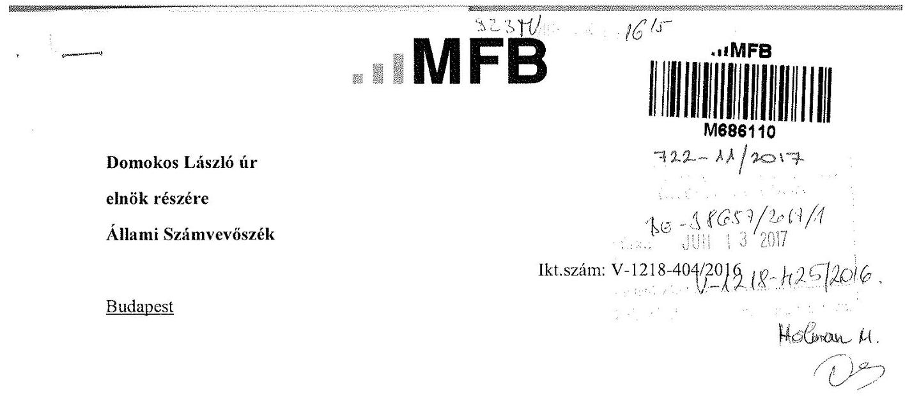

Tisztelt Elnök Úr!
2017. május 29-én köszönettel kézhez vettük az Állami Számvevőszék Magyarország 2015. évi az állami vagyon feletti tulajdonosi joggyakorlással kapcsolatos tevékenységek ellenőrzéséről szóló jelentéstervezetét.

Az MFB Zrt. a jelentéstervezettel kapcsolatban észrevételt nem kíván tenni.

Budapest, 2017. június 9.

Tisztelettel:
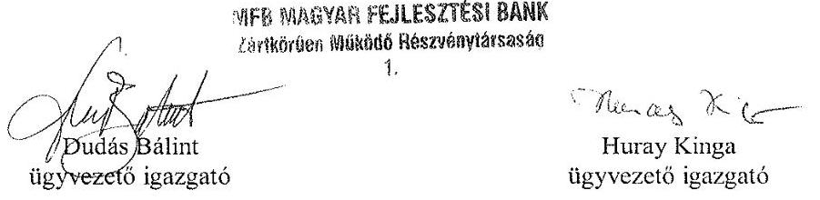

---

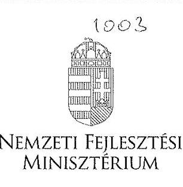

DR. SESZTÁK MIKLÓs
mámszter

# Iktatószám: EFO/39068-1/2017-NFM 

Ügyintéző: Simonné Hábencius Gizella
Telefonszám: 79-54405
E-mail:gizella.habencius.simonne@nfm.gov.hu
Hiv. szám: V-1218-407/2016.

## Domokos László

elnök
részére
Állami Számvevöszék

## Budapest

Apáczai Csere János u. 10.
1052

Tárgy: Az Állami Számvevőszék jelentéstervezetének véleményezése

## Tisztelt Elnök Úr!

Köszönettel vettem "az állami vagyon feletti tulajdonosi joggyakorlással kapcsolatos tevékenységek ellenőrzése" címen megküldött számvevőszéki jelentéstervezetüket.

A tervezetre észrevételt nem teszek.

Budapest, 2017. június, 16.,
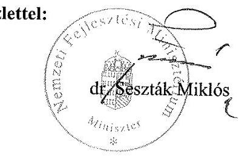

## Üdvözlettel:

---

# AEEK 

Állami Egészségügyi Ellátó Központ

## Domokos László elnök úr

részére

## Állami Számvevőszék

1364 Budapest 4. Pf. 54

## 328 44

1615 Holman M
1125 Budapest, Diós árok 3. Tel.: 1356 1522, Fax: 13757253 1525 Budapest 114 Pf. 32.

## $\mathrm{RE}-38666 / 2011 / 1$

JUN 132017
ÁEEK/005639-001/2017 V-12.08-427/2016
Szabó Tamás, főosztályvezető
$1 / 356-1522$

Tárgy: Észrevételek az állami vagyon feletti tulajdonosi joggyakorlással kapcsolatos tevékenységek ellenörzése tárgyú számvevőszéki jelentéstervezetre

## Tisztelt Elnök Úr!

Az Állami Egészségügyi Ellátó Központhoz érkezett V-1218-400/2016 iktatószámú levelét, és annak mellékleteként csatolt „Az állami vagyon feletti tulajdonosi joggyakorlással kapcsolatos tevékenységek ellenörzése" tárgyú jelentéstervezetet köszönettel megkaptam.

A jelentéstervezetet áttekintettük, mellyel kapcsolatban az alábbi észrevételeket teszem.

## 15. oldal alulról 3. bekezdés

Az ÁEEK-re vonatkozó minösítés túl általánosító, javasoljuk azt árnyalni és a „nem szabályszerű" megfogalmazást „részben szabályszerű"-re módosítani, mivel hiányosságokat nem teljes körűen, csak egyes területek tekintetében állapított meg az ÁSZ ellenőrzés.

## 17. oldal 1. bekezdés:

Kérjük a jelentéstervezet megállapításainak pontosítását az alábbiak figyelembe vételével.
A szabályszerű nyilvántartásra vonatkozó minősítést javasoljuk módosítani, mivel a vagyonnyilvántartás, a jelentéstervezet 17-18. oldalain megjelenítettek tekintetében nem felelt meg a jogszabályi előírásoknak, így a részben megfelelő minősítés szerepeltetését javasoljuk.

A bekezdés megállapítja, hogy a szabályozást 2015. II. félévében kialakította az ÁEEK, ezért a kapcsolódó megállapítás amely szerint „szabályozását sem alakították ki megfelelően" módosításra szorul.

## 17. oldal 2. bekezdés 2. pont:

A jelzett probléma az analitikus nyilvántartási rendszer fejlesztését igényli, amelyre vonatkozóan az ÁEEK/1200-020/2017. iktatószámú levélben (V-1405_Utóellenőrzések - Az állami vagyon feletti tulajdonosi joggyakorlással kapcsolatos tevékenységek utóellenőrzése) tett észrevételeket kérjük figyelembe venni.

---

# AEEK 

Állami Egészségügyi Ellátó Központ

## 17. oldal 2. bekezdés 3. pont:

Javasoljuk az államháztartáson kívüli vagyonkezelők Áhsz. 11. § (11) bekezdés szerinti nyilvántartásba vételére vonatkozó megállapítás pontosítását az alábbiak szerint, mivel az mindösszesen 2 db mintatétel ellenőrzésén alapul:
„Az ÁEEK az államháztartáson kívüli vagyonkezelők részére vagyonkezelésbe adott ingatlanokat átadáskor a tárgyi eszközök közül - a Számv. tv. 15. § (2) bekezdésében foglaltakat betartva kivezette, ugyanakkor a két ellenőrzött esetben az Áhsz. 11. § (11) bekezdésének elölrása ellenére a koncesszióba, vagyonkezelésbe adott eszközök között nem vette nyilvántartásba."

## 18. oldal 1. bekezdés:

Javasoljuk a megállapítás pontosítását arra tekintettel, hogy az ÁEEK fenntartásában álló intézmények közül mindegyik teljesítette a vagyonkezelési szerződés szerinti adatszolgáltatásait a 2015. évre vonatkozóan. A nem az ÁEEK fenntartása alá tartozó vagyonkezelők (a mintavételek alapjául szolgáló, 2015. évben megkötött vagyonkezelési szerződések/módosítások darabszámának 6,25\%-a, ami a vagyonkezelésbe adott ingatlanok értékének 1,6\%-a) nem küldték meg az adatszolgáltatást, annak ellenére, hogy a kötelezettség szerepelt a velük megkötött szerződésekben.

## 21. oldal utolsó bekezdés:

Kérjük a bekezdésben foglaltak pontosítását az alábbiak szerint, tekintettel arra, hogy az ÁEEK a beszámolót már közzétette a honlapján.
Az ÁEEK közzétételi kötelezettségének nem teljes körüen tett eleget, mivel az Info tv. 37. § (1) bekezdés elölrása ellenére, mint közfeladatot ellátó szerv az Info tv. 1. melléklet III. 1 pontja elölrása szerinti 2015. évi éves költségvetési beszámolóját a jogszabály által elöirt határidőn túl tette közzé.

## 23. oldal 3. bekezdés

A vagyonkezelési szerződések jogszabályi megfelelőségének felülvizsgálata 2016-ban megtörtént, a szerződésminta kiegészítésre került a vagyon-nyilvántartási szabályzat megismerésének tényével.

## 23. oldal 4. bekezdés

A vagyonkezelői szerződések valóban nem rendelkeztek a vagyonkezelői leltárról és annak megküldéséről, azonban a vagyonkezelőket 2015 júniusában, valamint 2015 októberében kelt levelekben (mellékelten megküldött ÁEEK/014296/2015., valamint az ÁEEK/014296-001/2015. iktatószámú levelek) az ÁEEK felszólította azon jogszabályi kötelezettségük teljesítésére, mely szerint a vagyonkezelő évente köteles vagyon leltárt elkészíteni és megküldeni. A vagyonkezelői leltárak 2015.12.31-ei fordulónappal tehát bekérésre kerültek, így álláspontunk szerint, az ÁEEK a mérleg tételeinek alátámasztáshoz rendelkezett a vagyonkezelők által készített és hitelesített leltárral. Mindezekre tekintettel kérjük a megállapítás pontosítását.

---

# AEEK 

Állami Egészségügyi Ellátó Központ

## 31. oldal utolsó bekezdés:

A jelentéstervezetben hivatkozott Országleltár adatszolgáltatás mellett az MNV Zrt. részére az ÁEEK kiegészítésként is küldött adatszolgáltatást, amely a 2017. január 5-én megtartott helyszíni interjú során bemutatásra került. Ebben az ÁEEK Tulajdonosi Joggyakorlása alá tartozó, ÁEEK által kezelt vagyon értéke megegyezik az éves beszámoló mérlegsorával, továbbá az Országleltár adatszolgáltatás részeként a részesedésekre vonatkozóan megküldött táblázat is azonos a 2015. évi beszámoló mérlegsorával, így kérjük a megállapítás pontosítását.
A vagyonkezelésbe adott vagyon nem része a mérlegjelentésnek, mivel az a 0. számlaosztályban, a nyilvántartási számlákon szerepel, így e tekintetben is kérjük a jelentéstervezet pontositását.

Kérem Elnök urat, hogy a jelentés tervezetben az ÁEEK Föigazgatója részére megfogalmazott javaslatok közül:

- a 4. pontban foglalt javaslatot törölni szíveskedjen, mivel az ÁEEK a 2015. évre vonatkozó beszámolót már közzétette az intézmény honlapján.
- a 7. pontban foglalt javaslatot módosítani szíveskedjen, mivel az ÁEEK a fenntartásában lévő intézményektől 2015 évtől éves rendszerességgel bekérte (csatolt ÁEEK/014296/2015, az ÁEEK/014296-001/2015. iktatószámú levelek) az analitikus nyilvántartási adatok leltárral való alátámasztottságát.

Kérem Elnök Urat, hogy a jelentés tervezet véglegezésekor a fenti észrevételeimet figyelembe venni szíveskedjék.

Szíves együttműködését előre is köszönöm!

Budapest, 2017. június 11.

Tisztelettel:
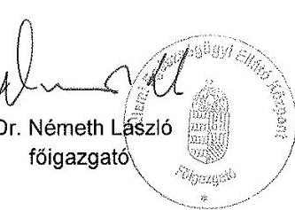

---

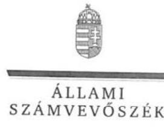

ELNÖK

Ikt.szám: V-1218-422/2016.

# Dr. Németh László úr   föigazgató   Állami Egészségügyi Ellátó Központ 

## Budapest

## Tisztelt Föigazgató Úr!

Az állami vagyon feletti tulajdonosi joggyakorlással kapcsolatos tevékenységek ellenörzése címủ számvevőszéki jelentéstervezetre tett észrevételeit köszönettel megkaptam.

Az Állami Számvevőszék észrevételekre vonatkozó álláspontjáról a felügyeleti vezető által készített részletes tájékoztatást csatoltan megküldöm.

Tájékoztatom Föigazgató urat, hogy a jelentésben - az Állami Számvevőszékről szóló 2011. évi LXVI. törvény 29. § (3) bekezdése alapján - a figyelembe nem vett észrevételeket szerepeltetjük az elutasítás indokának feltüntetésével együtt.

Budapest, 2017. 07 hó 04 nap
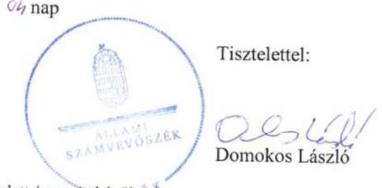

Tisztelettel:

Melléklet: Tájékoztatás az el nem fogadott észrevételekröl. 05

---

# Tájékoztatás az el nem fogadott észrevételekről 

Az állami vagyon feletti tulajdonosi joggyakorlással kapcsolatos tevékenységek ellenörzése címủ számvevőszéki jelentéstervezetre ÁEEK/005639-001/2017. iktatószámú levelében tett észrevételeit áttekintettük, annak kezeléséről az alábbi tájékoztatást adom.

1. A jelentéstervezet 1.1. számú megállapítás 6 . bekezdésére (15. oldal alulról 3. bekezdés) tett észrevételét nem fogadtuk el. A jelentéstervezet 12. oldalán Az ellenörzés módszerei címszó alatt tartalmazza az Állami Számvevőszék által a jelen ellenőrzés során alkalmazott módszereket. E szerint a mintavétellel ellenőrzött területek esetében az egyes tételek ellenőrzése szabályszerűségi kritériumok alapján történik. A mintavétel eredményének értékelése során minden esetben statisztikai módszerek alkalmazásával, a statisztika szabályai szerint jártunk el. Az ellenőrzés módszertana a kivetítés eredménye értékelésére két kategóriára, a „megfelelő" és a „nem megfelelő" minősítésre ad lehetőséget, a „részben megfelelő" minősítés alkalmazását nem teszi lehetővé. „Megfelelőnek" értékeltünk egy ellenőrzött területet, amennyiben $95 \%$-os bizonyossággal a teljes sokaságban a hibaarány legfeljebb $10 \%$, „nem megfelelőnek", amennyiben $10 \%$-nál magasabb arányt képviselt. Az Állami Számvevőszék által alkalmazott ellenőrzési módszertana alapján tett megállapítások megalapozottak.
2. A jelentéstervezet 1.1. számú megállapítás 13. bekezdésére (17. oldal 1. bekezdés) tett észrevételét nem fogadtuk el. Az észrevételében kifogásolt megállapítás szerint: „Az ÁEEK-nál összességében a rábizott vagyon szabályszerü nyilvántartása nem valósult meg...", mely megállapítás nincs ellentmondásban az észrevételében foglaltakkal. Észrevétele nem tartalmaz olyan információt, ami a szabályos nyilvántartást támasztaná alá. Egyebekben az 1. pontban leírtak szerint az Állami Számvevőszék ellenőrzési módszertana két minősítési kategóriát engedélyez, a „részben megfelelő" minősítés alkalmazását nem teszi lehetővé.

Az észrevétele második bekezdésében foglaltakat, a 17. oldal 1. bekezdés első mondatára tett észrevételét nem fogadtuk el. A jelentéstervezet megállapításai, így a vagyonnyilvántartás és annak szabályozása megfelelőségének ellenőrzésére tett megállapítás is a teljes ellenőrzött időszakra vonatkozik. A jelentéstervezet tartalmazza, hogy az ÁEEK a rábízott vagyon nyilvántartásának szabályozását az ellenőrzött időszakban nem alakította ki megfelelően. Az észrevételében jelzett megállapítást, mely szerint 2015. II. félévében kialakította a szabályozást, a jelentéstervezet is tartalmazza. Mindez azonban nem módosítja azt a tényt, hogy az ellenőrzött időszak egy részében nem került kialakításra a vagyon nyilvántartásának szabályozása.
3. A jelentéstervezet 1.1. számú megállapítás 14. bekezdés 2. francia bekezdésére (17. oldal 2. bekezdés 2. pont) nem fogadtuk el. Az analitikus nyilvántartási rendszer fejlesz-

---

tésének szükségességére tett észrevételét már az ÁEEK/1200-020/2017. iktatószámú, Az állami vagyon feletti tulajdonosi joggyakorlással kapcsolatos tevékenységek utóellenörzése címủ jelentésre tett észrevételénél sem fogadtuk el. Észrevétele, mely szerint a nyilvántartási rendszer jelenleg nem alkalmas a nemzeti vagyonról szóló 2011. évi CXCVI. törvény (Nvtv.) 10. § (1) bekezdés szerinti nyilvántartás vezetésére, a számvevőszéki jelentés megállapítását nem módosítja. Az Állami Számvevőszék szabályszerűségi ellenőrzése keretében a jogszabály által előírt kötelezettség teljesítésének való megfelelést ellenőrzi. Ennek megfelelően az Állami Számvevőszék a tulajdonosi joggyakorló által vezetett nyilvántartás Áhsz. és Nvtv. által előírt követelményeinek való megfelelésre, és nem a nyilvántartási rendszer kialakításának formájára, módjára tett megállapítást. A nyilvántartási rendszer kialakításának módját, formáját a nyilvántartásra kötelezett saját hatáskörében alakíthatja ki, választhatja meg.
4. A jelentéstervezet 1.1. számú megállapítás 14. bekezdés 3. francia bekezdésére (17. oldal 2. bekezdés 3. pont), a jelentéstervezet 1.1. számú megállapítás 14. bekezdés 4. francia bekezdés (18. oldal 1. bekezdés) tett észrevételeit nem fogadtuk el. Az észrevételezett területeket mintavétellel ellenőriztük, melyek esetében az értékelést és minősítést az ellenőrzött sokaságra történő statisztikai módszerek alkalmazásával, a statisztika szabályai szerint eljárva végeztük. A jelentéstervezet „Az ellenőrzés módszerei" című részében leírtak alapján a mintavétellel ellenőrzött területek esetében minden egyes tétel vonatkozásában a szabályszerűségre vonatkozó kérdéseket tettünk fel, melyek eredménye összesítésre került. „Megfelelőnek" értékeltünk egy ellenőrzött területet, amenynyiben $95 \%$-os bizonyossággal a teljes sokaságban a hibaarány legfeljebb $10 \%$, „nem megfelelőnek", amennyiben $10 \%$-nál magasabb arányt képviselt. Az Állami Számvevőszék által alkalmazott ellenőrzési módszertana alapján tett megállapítások megalapozottak.
5. A jelentéstervezet 1.2. számú megállapítás 7. bekezdésére (21. oldal utolsó bekezdés) tett észrevételét nem fogadtuk el. Örömmel vettük, hogy az ÁSZ által feltárt szabálytalanság kezelésére a számvevőszéki jelentés nyilvánosságra hozatala előtt lépéseket tettek. Ugyanakkor az ÁEEK 2015. évi éves költségvetési beszámolójának jogszabály szerinti közzététele az ellenőrzés időszakában nem történt meg, ezért az ellenőrzés időszakát követő időpontban történő teljesítésre a számvevőszéki jelentésben nem tudunk megállapítást tenni.
6. A jelentéstervezet 2.1. számú megállapítás 6. bekezdés (23. oldal 3. (helyesen: 4.) bekezdés) tett észrevételét nem fogadtuk el. Az észrevételében foglaltak szerint a szerződések jogszabályi megfelelőségének felülvizsgálata és a szerződésminta kiegészítése az ellenőrzött időszakot követően, 2016-ban történt, így azt a számvevőszéki jelentés készítésénél nem tudjuk figyelembe venni.
7. A jelentéstervezet 2.1. számú megállapítás 7. bekezdés (23. oldal 4. (helyesen: 5.) bekezdés) tett észrevételét nem fogadtuk el. Köszönettel vettük tájékoztatását, azonban az ÁEEK/005785/2017. iktatószámú levéllel megküldött 2015. júniusában, valamint 2015. októberében kelt ÁEEK/014296/2015., ÁEEK/014296-001/2015. iktatószámú dokumentumokat a számvevőszéki jelentés megállapításánál nem tudjuk figyelembe venni.

---

A megküldött dokumentumok az ellenőrzés keretében átadott dokumentumokat tartalmazó, az ellenőrzött szervezet által megküldött teljességi és hitelességi nyilatkozatban nem szerepelnek, így azok a jelentéstervezet megállapítását alátámasztó dokumentumként nem vehetők figyelembe. Ezen túl a hivatkozott levelekben az ÁEEK által a vagyonleltár elkészítésére és megküldésére szólította fel a vagyonkezelőket. A felszólítás azonban önmagában nem igazolja a vagyonkezelők által a mérleg tételeinek alátámasztásához készített és hitelesített leltárak rendelkezésre állását.
8. A jelentéstervezet 4.1. számú megállapítás 5. bekezdés (31. oldal utolsó bekezdés) tett észrevételét nem fogadtuk el. A jelentéstervezetben rögzített megállapítás az ÁEEK Vhr. 13. § (3) bekezdés által előírt jogszabályi kötelezettség be nem tartására irányult, mely szerint az egységes vagyonnyilvántartás érdekében a tulajdonosi joggyakorlók kötelesek adatot szolgáltatni az MNV Zrt. részére a tulajdonosi joggyakorlásuk alatt álló rábízott vagyonról készített mérlegről, valamint a mérleg soraival megegyező, vagyonelemenkénti tételes adatokról. Észrevételében is megerősítette, hogy az MNV Zrt. részére nyújtott adatszolgáltatás nem felelt meg a jogszabályi előírásoknak, az kiegészítésre szorult. Az észrevételében hivatkozott, az MNV Zrt. részére kiegészítésként küldött adatszolgáltatást az ellenőrzés megállapítása alátámasztásaként nem tudjuk figyelembe venni, mert az nem szerepel az ÁEEK 2016. december 14-én kelt, az ellenőrzés megállapításait megalapozó dokumentumokat rögzítő, záró teljességi és hitelességi nyilatkozatában.
Azon észrevételét, mely szerint a vagyonkezelésbe adott, 0 . számlaosztályban nyilvántartott vagyon nem része a mérlegjelentésnek, a jelentés készítésénél nem tudjuk figyelembe venni. A jelentéstervezet megállapítása az ÁEEK által a vagyonkezelésbe adott rábízott vagyon tekintetében teljesített adatszolgáltatás és az ÁEEK által a 0 . számlacostályban szereplő értékek közötti eltérésre irányult. Az Állami Számvevőszék arra vonatkozó megállapítást nem tett, hogy a 0 . számlaosztályban szereplő tételeknek a mérlegjelentésben kellett volna szerepelni.
9. A jelentéstervezet ÁEEK Főigazgatója részére megfogalmazott 4. és 7. számú javaslatra tett észrevételét nem fogadtuk el. A javaslatokat megalapozó megállapítás módosítására irányuló észrevételeit jelen levelünk 5. és 7. pontjában foglaltak alapján nem fogadtuk el. Tekintve, hogy a jelentéstervezet megállapításait nem módosítottuk, az ahhoz kapcsolódó javaslatokat továbbra is fenntartjuk.

Budapest, 2017. 03 hó 04 nap
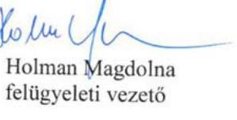

---

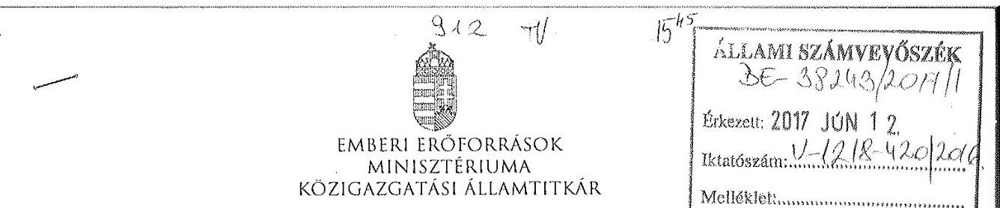

Iktatószám: 33352-2/2017/ELL

Hiv. szám: V-1218-401/2016.
Ügyintéző: Bánkné Simon Judit
Hé́rma H.
Tel. szám: +36 (1) 7954430
Melléklet: -

# Domokos László részére 

elnök

Állami Számvevőszék

## Budapest

Apáczai Csere János u. 10.
1052

Tárgy: Észrevétel „Az állami vagyon feletti tulajdonosi joggyakorlással kapcsolatos tevékenységek ellenőrzése 2017." címủ számvevőszéki jelentéstervezethez

Tisztelt Elnök Úr!
„Az állami vagyon feletti tulajdonosi joggyakorlással kapcsolatos tevékenységek ellenőrzése 2017." címủ számvevőszéki jelentéstervezethez - az SzMSz 145. § (1) bekezdés g) pontjában meghatározott jogkörömben eljárva - az alábbi észrevételeket teszem.

1) A jelentéstervezet 18. oldal 1. bekezdés utolsó mondatához:

Az EMMI Gazdálkodási Főosztálya által használt Forrás KGR IKMFI integrált nyilvántartó programban jelenleg nem lehetséges az Nvtv. 10. § (1) bekezdése szerinti nyilvántartás. A törvényi előírásoknak megfelelő nyilvántartás vezetése érdekében felvesszük a kapcsolatot a program üzemeltetőjével.
2) A jelentéstervezet 21. oldal 2. bekezdéséhez:

Az EMMI-nél új adatszolgáltatásként jelent meg a 2015. I. negyedévi mérlegjelentés KGR-be történő feltöltése. A Magyar Államkincstár 2015. július 24. időponttal biztosította a hozzáférést a rendszerhez. A KGR-ből letölthető eseménytörténet alátámasztja, hogy az adatszolgáltatás a jogosultság biztosításának napján megtörtént.

Kérem Elnök Urat, hogy a jelentés véglegezésekor az észrevételeket szíveskedjenek figyelembe venni.

Budapest, 2017. június $v^{2}$,
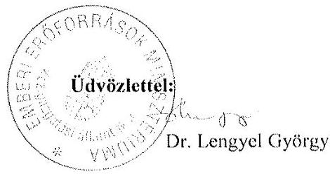

---

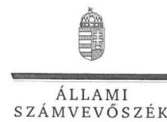

ELNÖK

Ikt.szám: V-1218-421/2016.

# Balog Zoltán úr 

miniszter
Emberi Eröforrások Minisztériuma

## Budapest

## Tisztelt Miniszter Úr!

Az állami vagyon feletti tulajdonosi joggyakorlással kapcsolatos tevékenységek ellenörzése címủ számvevőszéki jelentéstervezetre a közigazgatási államtitkár asszony által tett észrevételeket köszönettel megkaptam.

Az Állami Számvevőszék észrevételekre vonatkozó álláspontjáról a felügyeleti vezető által készített részletes tájékoztatást csatoltan megküldöm.

Tájékoztatom Miniszter urat, hogy a jelentésben - az Állami Számvevőszékről szóló 2011. évi LXVI. törvény 29. § (3) bekezdése alapján - a figyelembe nem vett észrevételeket szerepeltetjük az elutasítás indokának feltüntetésével együtt.

Budapest, 2017.
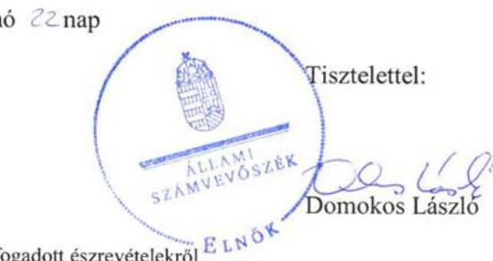

Melléklet: Tájékoztatás az el nem fogadott észrevételekről ${ }^{\text {E LNGK }}$

---

# Tájékoztatás az el nem fogadott észrevételekról 

Az állami vagyon feletti tulajdonosi joggyakorlással kapcsolatos tevékenységek ellenörzése címủ számvevőszéki jelentéstervezetre közigazgatási államtitkár asszony 33352-2/2017/ELL. iktatószámú levelében tett észrevételeit áttekintettük, annak kezeléséről az alábbi tájékoztatást adom.

1. A jelentéstervezet 1.1. számú megállapítás 14. bekezdés 4. francia bekezdésére (18. oldal 1. bekezdés) tett észrevételét nem fogadtuk el. Észrevétele, mely szerint a Forrás KGR IKMFI integrált nyilvántartó program jelenleg nem alkalmas a nemzeti vagyonról szóló 2011. évi CXCVI. törvény (Nvtv.) 10. § (1) bekezdés szerinti nyilvántartás vezetésére, a számvevőszéki jelentés megállapítását nem módosítja. Az Nvtv. a tulajdonosi joggyakorló által vezetett nyilvántartás tartalmi elemeire és nem a nyilvántartás módjára és formájára tartalmaz rendelkezést, annak kialakítása a nyilvántartásra kötelezett feladata és felelőssége.
2. A jelentéstervezet 1.2. számú megállapítás 3. bekezdésére (21. oldal 2. bekezdés) tett észrevételét nem fogadtuk el. A jelentéstervezet megállapítása szerint az ,,..a 2015. I. negyedévi mérlegjelentést az Ávr. 170. § (7) bekezdésében meghatározott határidőn (az adott negyedévet követő 45 napon) túl, 2015. július 24-én töltötte fel a Kincstár által müködtetett elektronikus adatszolgáltató rendszerbe.". Az észrevételében foglaltak nincsenek ellentmondásban a jelentéstervezet megállapításával, ahhoz további, kiegészítő információt nyújtanak. Ezen túl az abban leírtak a tulajdonosi joggyakorló szervezetet nem mentesítik az Ávr. szerinti határidő teljesítésének kötelezettsége alól, mert az Ávr. nem nyújt lehetőséget az abban foglalt határidőtől való eltérésre, illetve a határidő módosítására.

Budapest, 2017. 06 hó 22 nap
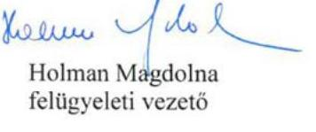

---

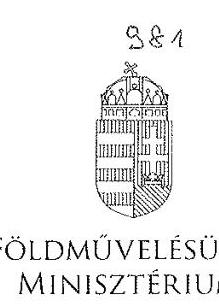

FÖLDMÜVELÉSÜGYI MINISZTÉRIUM

DR. FAZCKAS SÁNDOR
11990290
Iktatószám: IfPF/ 2017/1/2017.

Ügyintéző: dr. Molnár Máté Bálint
Telefon: 896-1061
E-mail: balint.mate.molnar@fm.gov.hu
Hivatkozási szám: V-1218-402/2016.

# Domokos László úr   elnök részére 

## Állami Számvevőszék

Budapest
Apáczai Csere János u. 10.
1052
Tárgy: Észrevételek „Az állami vagyon feletti tulajdonosi joggyakorlással kapcsolatos tevékenységek ellenörzése" címủ számvevőszéki jelentéstervezettel összefüggésben

## Tisztelt Elnök Úr!

Hivatkozással a V-1218-402/2016. iktatószámú levelére, az alábbiakról tájékoztatom.
Az Állami Számvevőszékről szóló 2011. évi LXVI. törvény 29. § (2) bekezdése alapján a Földművelésügyi Minisztérium (a továbbiakban: FM) mint ellenőrzött szervezet vezetőjeként az alábbi észrevételt teszem „Az állami vagyon feletti tulajdonosi joggyakorlással kapcsolatos tevékenységek ellenörzése" címủ számvevőszéki jelentéstervezet (a továbbiakban: Jelentéstervezet) megállapításaival összefüggésben.

- A Jelentéstervezet 3.2. számú megállapítása alatt az FM-re vonatkozóan rögzítésre került, hogy „A gazdálkodási feladatokban rejlő kockázatokat felmérték a Bkr.-nek megfelelően, ugyanakkor a feltárt kockázatokkal kapcsolatos szükséges intézkedéseket a Bkr. 7. § (2) bekezdése ellenére nem határozták meg.". Előbbi megállapítást nem áll módomban elfogadni, tekintettel arra, hogy a gazdálkodási kockázatokat az FM Gazdálkodási Főosztálya felmérte, és az FM Belső Kontrollrendszer Szabályzatának 1. számú függeléke alapján táblázatba foglalta, amely táblázatban szerepel

---

„Kockázatkezelésre javasolt intézkedés, válaszlépést a táblázat alatti kockázati térkép és alkalmazható kontroll táblázat mutatja" elnevezésủ oszlop, amely tartalmazza az adott kockázat kezelésére vonatkozó intézkedést (pl. eseti megfigyelés, időszakos megfigyelés stb.).

Kérem tájékoztatásom szíves tudomásulvételét.
Budapest, 2017. június „ 46 "
Tisztelettel:
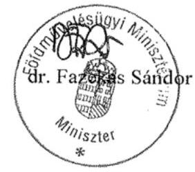

---

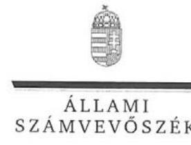

ELNÖK

Ikt.szám: V-1218-437/2016.

# Dr. Fazekas Sándor úr 

miniszter

Földművelésügyi Minisztérium

## Budapest

## Tisztelt Miniszter Úr!

Az állami vagyon feletti tulajdonosi joggyakorlással kapcsolatos tevékenységek ellenőrzése címủ számvevőszéki jelentéstervezetre a közigazgatási államtitkár asszony által tett észrevételeket köszönettel megkaptam.

Az Állami Számvevőszék észrevételekre vonatkozó álláspontjáról a felügyeleti vezető által készített tájékoztatást csatoltan megküldöm.

Tájékoztatom Miniszter urat, hogy a jelentésben - az Állami Számvevőszékről szóló 2011. évi LXVI. törvény 29. § (3) bekezdése alapján - a figyelembe nem vett észrevételeket szerepeltetjük az elutasítás indokának feltüntetésével együtt.

Budapest, 2017.
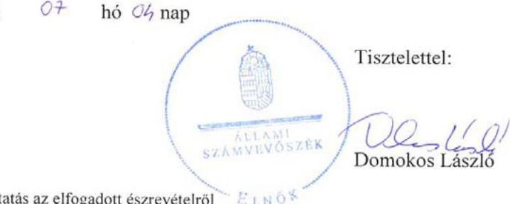

Melléklet: Tájékoztatás az elfogadott észrevételről

---

# Tájékoztatás az elfogadott észrevételekről 

Az állami vagyon feletti tulajdonosi joggyakorlással kapcsolatos tevékenységek ellenőrzése címủ számvevőszéki jelentéstervezetre közigazgatási államtitkár asszony IfPF/843/1/2017. iktatószámú levelében tett észrevételeit áttekintettük, annak kezeléséről az alábbi tájékoztatást adom.

1. A jelentéstervezet 3.2. számú megállapítás 5. bekezdésére tett észrevételét elfogadtuk, a számvevőszéki jelentés készitésénél figyelembe vesszük.

Budapest, 2017. O7 hó 0h nap

Holman Magdolna felügyeleti vezető

---

# MNV   Magyar Nemzet   VAGYONKEZElóZRT   VEZÉRIGAZGATO   Állami Számvevőszék 

## Domokos László

elnök

1052 Budapest
Apáczai Cs. J. u. 10.

Ikt. sz.: MNV/01/12928/2/2017.
Hiv. sz.: V-1218-405/2016.

Tisztelt Elnök Úr!
Tájékoztatom, hogy a 2017. május 29. napján „Az állami vagyon feletti tulajdonosi joggyakorlással kapcsolatos tevékenységek ellenőrzése" tárgyában kézhez vett, V-1218-405/2016. ikt. sz. levél mellékleteként megküldött Jelentés-tervezetre az alábbi észrevételeket tesszük:
„Megállapítások" 1.1. számú megállapítás / 16. oldal 4. bekezdése / „Javaslatok" / 33. oldal 1: számú javaslata:

Az MNV Zrt. Vagyon-nyilvántartási Szabályzatának D pontjában foglalt negyedéves jelentéstételi kötelezettség az államháztartás számviteléről szóló 4/2013. (I. 11.) Korm. rendelet 53. § (3) b) pontjának való megfelelés értelmében került rögzítésre.

A Vhr. 14. § (1) bekezdésében foglalt adatszolgáltatás magában foglalja a vagyonelemek mozgásával összefüggő nyilvántartásokon való átvezetést követő jelentéstételi kötelezettséget is. A jogszabályi előírásnak megfelelően már a vagyonmozgást eredményező szerződéskötés folyamatában jelezzük a vagyonkezelő felé a vagyonmozgással kapcsolatos adatszolgáltatási kötelezettséget.

A folyamatba épített kontrollpontokat az MNV Zrt. kialakította, azzal, hogy azokat a folyamatosan alakuló jogszabályi környezetnek, egymástól eltérő szerződéses rendelkezéseknek, a jelentkező problémáknak köszönhetően szerzett tapasztalatok fényében alakítani, javítani törekszik. Előfordulhat azonban olyan eset, hogy, informatikai vagy egyéb problémák okán, a vagyon-nyilvánartás(ok)on való átvezetésre a feleken kívül álló okból késedelmesen kerül sor.
„Megállapítások" 3.1. számú megállapítás / 25. oldal 3. bekezdés 2. mondata:
A hivatkozott megállapítás szerint az MNV Zrt. rendelkezett Alapító Okirattal, SZMSZ-el, Ügyrenddel, azonban az MNV Zrt. az Alapító Okiratát az MNV Zrt. Igazgatósága tagjaiban bekövetkezett változás, illetve a Vezérigazgató személyének változása miatt a Vtv. 18. § (1) bekezdése ellenére nem módosította.

Az MNV Zrt. Alapító Okiratát az Igazgatóság tagjai és a vezérigazgató személyének változása miatt nem szükséges módosítani, összhangban a Vtv. 18. § (2) bekezdésével, a Ptk. 3:5. § f) pontjával és 3:21. §ával, valamint a Ctv. 51. § (2) bekezdésével.

---

Mulasztás, vagy jogszabálysértés tehát nem történt, amely tény alapján kérjük a hivatkozott szövegrész pontositását.
„Megállapítások" 3.1. számú megállapítás / 25. oldal 4. bekezdés 2. mondata:
A megállapítás szerint az MNV Zrt. SZMSZ-e az Áht. 10. § (5) bekezdése ellenére nem tartalmazza a Vtv. 17. § 81) bekezdés g) pontja által 2015. július 10 -ét követően meghatározott elektronikus árverési rendszerrel kapcsolatos feladatokat, ezzel az MNV Zrt. figyelmen kívül hagyta a Bkr. 3. § a) és 4. § a) pontjaiban foglaltakat.

A Jelentés-tervezet mellékletek listája alapján, e bekezdés alapját a 430/2013 (VI.17.) számú IG döntéssel elfogadott SZMSZ képezte, amely oka lehet a Jelentés-tervezet 3.1. számú megállapítás 4. bekezdés 2. mondatában jelzett hiányosságnak, miszerint az SZMSZ nem tartalmazza a Vtv. által előírt elektronikus árverési rendszerrel kapcsolatos feladatokat.

Jelezzük, hogy az MNV Zrt. Igazgatósága által 158/2016. (IV.06.) IG határozattal elfogadott SZMSZ 19. § (15) b) pontja pótolta e hiányosságot az alábbiak szerint „ellátja a Vtv. 17. § (1) bekezdés g) pontja szerinti elektronikus árverési eljárás lebonyolításával kapcsolatos feladatokat, ideértve az elektronikus árverés keretében megbizás útján értékesítendő ingatlanok értékesitésére vonatkozó Általános Szerződési Feltételek előkészitését és folyamatos aktualizálását, döntéshozó elé terjesztését, valamint ez alapján a megbizási szerződések megkötését és a szerződésből eredő kapcsolattartást a megbizókkal, valamint az ezen megbizás keretében történő árverések lebonyolításához kapcsolódó egyéb feladatot is"

Tekintettel arra, hogy a Jelentés-tervezet 3.1. számú megállapítás 4. bekezdés 2. mondatában jelzett hiányosság a hatályos SZMSZ-ben nem tapasztalható, további intézkedést nem igényel.
„Megállapítások" 3.1. számú megállapítás / 26. oldal 2. bekezdés 1. francia bekezdése:
A Jelentés-tervezet szerint az MNV Zrt. Számviteli politikája, a Számv. tv. 14. § (4) bekezdése ellenére nem tartalmazza, hogy mit tekint a számviteli elszámolás, az értékelés szempontjából lényegesnek, nem lényegesnek.

A Számv. tv. 14. § (4) bekezdése alapján a számviteli politika keretében írásban rögzíteni kell - többek között - azokat a gazdálkodóra jellemző szabályokat, előírásokat, módszereket, amelyekkel meghatározza, hogy mit tekint a számviteli elszámolás, az értékelés szempontjából lényegesnek, jelentősnek, nem lényegesnek, nem jelentősnek, kivételes nagyságú vagy előfordulású bevételnek, költségnek, ráfordításnak továbbá meghatározza azt, hogy a törvényben biztosított választási, minősítési lehetőségek közül melyeket, milyen feltételek fennállása esetén alkalmaz, az alkalmazott gyakorlatot milyen okok miatt kell megváltoztatni.

Álláspontunk szerint mind a Számviteli politika (V. és VI. fejezete), mind az Értékelési szabályzat tartalmaz ilyen jellegű rendelkezéseket a szabályzat eszközökre, forrásokra vonatkozó részletes szabályainál.

- Számviteli Politika V. fejezet 2. bekezdés: „Az eszköz értékének utólagos módosítása során akkor kell a különbözet összegét jelentősnek tekinteni, ha az meghaladja az eredetileg elszámolt bekerülési érték $1 \%$-át, de legalább a százezer forintot."

---

- Számviteli Politika VI. fejezet 1. pontjában található: „Terven felüli értékcsökkenés elszámolására kerül sor: ...az immateriális javak eszközcsoportonként meghatározott módon és mértékben, a tárgyi eszközök esetében (kivéve a még üzembe nem helyezett beruházásokat), ha könyv szerinti értékük legalább egy éven túl és legalább $10 \%$-kal, de legalább 100.000 Ft-tal meghaladja az adott eszköz mérlegkészitéskor ismert piaci értékét,.."
- Számviteli Politika VI. fejezet 2. pontjában található: „Az MNV Zrt.-nél az értékhelyesbités elszámolásának a feltétele, hogy az egyedi vagyonkezelt eszköz piaci értéke tartósan és jelentősen eltér azok nyilvántartási értékétől. Az értékbecslést minden évben a vagyonkezelö aktualizálja. Tartósnak minösül az eltérés, ha legalább 1 éven át fennáll és jelentősnek minösül, és a könyv szerinti értéket legalább $20 \%$-kal meghaladja a mérlegkészitéskori piaci érték. Az értékhelyesbités eszközoldalon a Vagyonkezelésbe adott eszközök értékhelyesbitése mérlegsoron a Vagyonkezelésbe adott eszközök között, forrásoldalon az Államháztartáson kívüli eszközök értékhelyesbitése mérlegsoron az Eszközök értékhelyesbittésének forrása között kerül kimutatásra."
- Számviteli Politika VII. fejezetében található: Nem jelentős összegű hiba „Az MNV Zrt. nem jelentős összegü hibának minösíti az ellenörzés során feltárt, az eszközöket és a forrásokat, az eredményt, a saját tőkét érintő hibákat és hibahatásokat, ha azok értékének együttes (előjeltől független) összege nem haladja meg az ellenőrzött év mérlegfőösszegének $2 \%$-át. A nem jelentős összegü hibák eredményre gyakorolt hatását az eredménykimutatás megfelelő tárgyévi adatai tartalmazzák.,,
- Számviteli Politika VII. fejezet: Jelentős összegű hiba
„Jelentős összegü a hiba, ha a hiba megállapításának évében, az ellenőrzések során ugyanazon költségvetési évet érintően megállapított hibák, hibahatások együttes (előjeltől független) összege eléri, vagy meghaladja a költségvetési év mérlegfőösszegének $2 \%$-át, vagy - ha a mérlegfőösszeg $2 \%$-a meghaladja a százmillió forintot - a százmillió forintot."

Ilyen esetben a mérlegben külön-külön oszlopban szerepelnek az előző mérleg adatai, a módosítások, valamint a módosított időszak adatai. A megállapított jelentős összegű hibá(k) összegével az előző mérleg adatai nem módosíthatók.

- Értékelési szabályzat 5-6. oldalán található: „A bekerülési érték részét képező tételek elszámolásának időpontja azok felmerülése, a gazdasági esemény megtörténte. Amennyiben az üzembe helyezésig, a raktárba történő beszállitásig a számla, a megfelelő bizonylat nem érkezett meg, a fizetendő összeget az illetékes hatóság nem állapította meg, akkor az adott eszköz értékét a rendelkezésre álló dokumentumok (szerződés, piaci információ, jogszabályi előirás) alapján kell meghatározni. Az így meghatározott érték és a ténylegesen számlázott vagy később módosított fizetendő (kivetett) összeg közötti különbözettel a beszerzési értéket a végleges bizonylatok kézhezvétele időpontjában akkor kell módosítani, ha a különbözet összege az adott eszköz értékét jelentősen módosítja. Amennyiben a különbözet összege jelentősen nem módosítja az adott eszköz bekerülési (beszerzési) értékét, annak összegét a végleges bizonylatok kézhezvétele időpontjában egyéb ráfordításként, illetve egyéb bevételként kell elszámolni."
,,Az eszköz értékének utólagos módosítása során akkor kell a különbözet összegét jelentősnek tekinteni, ha az meghaladja az eredetileg elszámolt bekerülési érték $1 \%$-át, de legalább a 100.000 Ft-ot.

---

Értékelési szabályzat 8. oldalán található: A bekerülési érték részét képező tételeket azok felmerülésekor, a gazdasági esemény megtörténtekor (legkésöbb az üzembe helyezéskor) kell számításba venni a számlázott, a kivetett összegben. Amennyiben az üzembe helyezésig, a raktárba történő beszállitásig a számla, a megfelelő bizonylat nem érkezett meg, a fizetendő összeget az illetékes hatóság nem állapította meg, akkor az adott eszköz értékét a rendelkezésre álló dokumentumok (szerződés, piaci információ, jogszabályi előirás) alapján kell meghatározni. Az igy meghatározott érték és a ténylegesen számlázott vagy később módosított fizetendő (kivetett) összeg közötti különbözetetl a beszerzési értéket a végleges bizonylatok kézhezvétele időpontjában akkor kell módosítani, ha a különbözet összege az adott eszköz értékét jelentősen módosítja. Amennyiben a különbözet összege jelentősen nem módosítja az adott eszköz bekerülési (beszerzési) értékét, annak összegét a végleges bizonylatok kézhezvétele időpontjában egyéb ráfordításként, illetve egyéb bevételként kell elszámolni. Az eszköz értékének utólagos módosítása során akkor kell a különbözet összegét jelentösnek tekinteni, ha az meghaladja az eredetileg elszámolt bekerülési érték $1 \%$-át, de legalább a 100.000 Ft-ot."

- Értékelési szabályzat 14. oldalán található: „A terven felüli értékcsökkenés mértéke jelentösnek minősül, ha a könyv szerinti érték legalább $10 \%$-kal meghaladja a mérlegkészitéskor ismert piaci értéket, vagy a különbözet eléri a 100.000 Ft-ot, illetve tartósnak minősül, ha ez a tendencia legalább egy éven át fennáll."
„A visszairás tekintetében jelentösnek minösül, ha a mérlegkészitéskor ismert piaci érték legalább $10 \%$-kal meghaladja a könyv szerinti értéket, vagy a különbözet eléri a 100.000 Ft-ot, illetve tartósnak minösül, ha ez a tendencia legalább egy éven át fennáll."
- Értékelési szabályzat 16. oldalán található: „A nemzeti vagyonba tartozó befektetett eszközök és forgóeszközök között kimutatott részesedések, értékpapírok értékvesztésének elszámolása során akkor kell a különbözetet jelentös összegűnek tekinteni, ha az értékvesztés összege meghaladja a bekerülési érték 10\%-át, de legalább a 10.000.000,- Ft-ot."
,,Amennyiben az államháztartáson kivüli vagyonkezelő vagyonkezelésében lévő eszközök piaci értéke és nyilvántartási értéke között jelentös értékaránytalanság áll fenn és ezt értékbecslés alátámasztja, indokolt alkalmazni a Szv. tv. 58. § (5) bekezdése szerinti értékhelyesbités elszámolását. Az MNV Zrt-nél az értékhelyesbités elszámolásának a feltétele, hogy az egyedi vagyonkezelt eszköz piaci értéke tartósan és jelentősen eltér azok nyilvántartási értékétől. Az értékbecslést minden évben a vagyonkezelő aktualizálja. Tartósnak minősül az eltérés, ha legalább 1 éven át fennáll és jelentösnek minősül, ha a könyv szerinti értéket legalább $20 \%$-kal meghaladja a mérlegkészitéskori piaci érték. Az értékhelyesbités eszközoldalon a Koncesszióba, vagyonkezelésbe adott eszközök értékhelyesbitése soron, forrásoldalon az Eszközök értékhelyesbitésének forrása mérlegsoron kerül kimutatásra. ,,
- Értékelési szabályzat 19. oldalán található: „A nemzeti vagyonba tartozó a készletek értékvesztésének elszámolása során akkor kell a különbözetet jelentös összegűnek tekinteni, ha az értékvesztés összege meghaladja a bekerülési érték 10\%-át, de legalább a 100.000 Ft-ot, és tartósnak minősül, ha ez a tendencia legalább egy éven át fennáll."
,,A visszairás tekintetében jelentösnek minösül, ha a mérlegkészitéskor ismert piaci érték legalább $10 \%$-kal meghaladja a könyv szerinti értéket, vagy a különbözet eléri a 100.000 Ft-ot, illetve tartósnak minősül, ha ez a tendencia legalább egy éven át fennáll."

---

A fentiek alapján kérjük a megállapítás törlését.
„Megállapítások" 3.1. számú megállapítás / 26. oldal 2. bekezdés 2. francia bekezdése / „Javaslatok" / 33. oldal 3. számú javaslata:

A hivatkozott megállapítás szerint az MNV Zrt. Leltározási szabályzatában az ingatlanok esetében a Szám tv. 69. § (3) bekezdésében foglaltakkal ellentétben a mennyiségi felvétellel történő leltározás gyakoriságát legalább „három évente,, helyett „,négyévente,, határozták meg.
2016. június 1. napján lépett hatályba az MNV Zrt. Saját és Rábízott vagyonának Leltározási szabályzatáról szóló 16/2016. számú vezérigazgatói utasítás, amelynek az 1.2.1. pontjában foglalt rendelkezése megfelel a Sztv. 69. § (3) bekezdésében foglaltaknak.

Kérjük a vonatkozó megállapítás fenti körülménnyel történő kiegészitését és az MNV Zrt. vezérigazgatójának cimzett 3. sz. javaslat törlését, tekintettel arra, hogy az abban foglaltak megvalósultak.
„Megállapítások" 3.1. számú megállapítás / 26. oldal 2. bekezdés 3. francia bekezdése
A Jelentés-tervezetben megállapítást nyert, hogy az MNV Zrt. Értékelési szabályzata az Áhsz. 50. § (2) b) pontjában foglaltak ellenére nem tartalmazta követeléstípusonként a kis összegű követelések év végi meghatározásának elveit, dokumentálásának szabályait, továbbá a d) pontjában foglaltak ellenére a tulajdonosnak, a tulajdonosi joggyakorló szervezetnek a vagyonkezelésbe adott eszközök vagyonértékelése során alkalmazott értékelési eljárás elveit, módszerét, dokumentálásának szabályait, felelőseit.

Az MNV Zrt-nél a vevők értékelése egyedileg történik, tehát nem él a kis összegủ követelések összevonásának lehetőségével, ezért nem tartalmaz a szabályzat a kis összegủ követelések meghatározására vonatkozó előírásokat. A vagyonkezelésbe adott eszközök vagyonértékelésére vonatkozóan az Értékelési szabályzat III. fejezete tartalmazza az értékelési szabályokat. Az MNV Zrt.-nél az értékhelyesbítés elszámolásának a feltétele, hogy az egyedi vagyonkezelt eszköz piaci értéke tartósan és jelentősen eltér azok nyilvántartási értékétől. Az értékbecslést minden évben a vagyonkezelő aktualizálja.

A fentiek alapján kérjük a megállapítás törlését.
„Megállapítások" 3.1. számú megállapítás / 26. oldal 2. bekezdés 4 . francia bekezdése
A Jelentés-tervezet tartalmazza, hogy az MNV Zrt. a Számv. tv. 161. § (2) bekezdés d) pontja ellenére a számlarendben foglaltakat alátámasztó bizonylati renddel nem rendelkezett.

Az államháztartás számviteléről szóló 4/2013. (I.11.) Korm. rendelet 50. § (1) bekezdése alapján a Számviteli politika az Szt. 14. § (5) bekezdésében felsorolt szabályzatokból áll. A bizonylatolásra, illetve a bizonylati fegyelemre, szabályokra, a bizonylatolás folyamatára vonatkozóan a 2017-ben elfogadott számviteli politika XI. fejezete tartalmaz rendelkezéseket, a részletes bizonylatolási szabályok pedig a Számviteli politika XI. fejezetének 3. pontjában felsorolt szabályzatokban találhatóak.

Kérjük a bizonylati rend hiányára vonatkozó megállapítás törlését.

---

# „Megállapítások" 3.1. számú megállapítás / 26. oldal 3. bekezdése 

A hivatkozott megállapítás szerint az MNV Zrt. Vagyon-nyilvántartási szabályzata a Vhr. 14. § (3) bekezdése ellenére nem írta elő az állami vagyon használója és haszonélvezője részére az adatszolgáltatás tartalmát, gyakoriságát, formáját, módját.

A megjelölt hiányosság elöírás az MNV Zrt. Rábizott vagyonába tartozó, közvetlen kezelésü immateriális javak, tárgyi eszközök és készletek nyilvántartási szabályzatáról szóló 60/2016. vezérigazgatói utasitásban foglalt rendelkezés útján megvalósult. A 2016. december 18. napjával hatályba lépett fenti utasitás 14. fejezete tartalmazza az állami vagyonnal való gazdálkodásról szóló 254/2007.(X.4.) Korm. rendelet 14. § alapján az állami vagyon használóját és haszonélvezőjét terhelő adatszolgáltatási kötelezettség teljesitésére vonatkozó elöírásokat.

Fentiek alapján kérjük a hivatkozott szövegrész pontositását.
Kérem Elnök Urat, hogy a jelentés véglegesítése során jelen észrevételeinket szíveskedjenek figyelembe venni.

Budapest, 2017. június „ $\bigcirc$ "

Üdvözlettel:
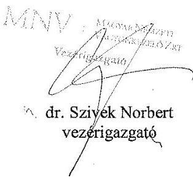

---

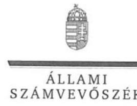

ELNÖK

Ikt.szám: V-1218-432/2016.

# Dr. Szivek Norbert úr 

vezérigazgató
Magyar Nemzeti Vagyonkezelő Zrt.

## Budapest

## Tisztelt Vezérigazgató Úr!

Az állami vagyon feletti tulajdonosi joggyakorlással kapcsolatos tevékenységek ellenörzése címủ számvevőszéki jelentéstervezetre tett észrevételeit köszönettel megkaptam.

Az Állami Számvevőszék észrevételekre vonatkozó álláspontjáról a felügyeleti vezető által készített részletes tájékoztatást csatoltan megküldöm.

Tájékoztatom Vezérigazgató urat, hogy a jelentésben - az Állami Számvevőszékről szóló 2011. évi LXVI. törvény 29. § (3) bekezdése alapján - a figyelembe nem vett észrevételeket szerepeltetjük az elutasítás indokának feltüntetésével együtt.

Budapest, 2017. 07 hó 41 nap
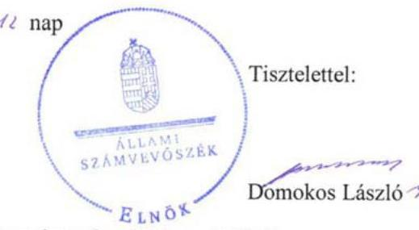

Melléklet: Tájékoztatás az elfogadott és az el nem fogadott észrevételekről

---

# Tájékoztatás az elfogadott és az el nem fogadott észrevételekről 

Az állami vagyon feletti tulajdonosi joggyakorlással kapcsolatos tevékenységek ellenörzése címủ számvevőszéki jelentéstervezetre MNV/01/12928/2/2017. iktatószámú levelében tett észrevételeit áttekintettük, annak kezeléséről az alábbi tájékoztatást adom.

1. A jelentéstervezet 1.1. számú megállapításra (16. oldal 4. bekezdés / 33. oldal MNV Zrt vezetőjének címzett 1. számú javaslat) tett észrevételét nem fogadtuk el. Örömmel vettük tájékoztatását a tekintetben, hogy az MNV Zrt. a vagyonkezelők adatszolgáltatása kapcsán a folyamatba épített kontrollpontokat kialakította, és azokat a válozó jogszabályi környezet, az egymástól eltérő szerződéses rendelkezések által jelentkező problémák kezelése érdekében alakítani, javítani törekszik. A jelentéstervezetben rögzített megállapítás az MNV Zrt. által az ellenőrzés rendelkezésére bocsátott dokumentumokon alapul. Észrevételében a jelentéstervezet megállapításait nem vitatja, és abban nem hivatkozik olyan bizonyítékra, amelyet a megállapításnál az ellenőrzés nem vett figyelembe. Ezért az észrevételét kiegészítő információként tudjuk kezelni, mely a jelentéstervezet megállapításának módosítását nem indokolja.
2. A jelentéstervezet 3.1. számú megállapítás 3. bekezdés 2. mondatára (25. oldal 3. bekezdés 2. mondata) tett észrevételét elfogadtuk, a számvevőszéki jelentés készítésénél figyelembe vesszük.
3. A jelentéstervezet 3.1. számú megállapítás 4. bekezdés 2. mondatára (25. oldal 4. bekezdés 2. mondata) tett észrevételét nem fogadtuk el. Örömmel vettük tájékoztatását, mely szerint a 158/2016. (IV. 6.) IG határozattal elfogadott SZMSZ már tartalmazza a jogszabály által az MNV Zrt. számára előírt feladatot, ugyanakkor azt a számvevőszéki jelentés készítésénél még nem tudjuk figyelembe venni, arra megállapítást nem tudunk tenni, mert a számvevőszéki ellenőrzés során feltárt hiányosságot kezelő inrézkedés az ellenőrzött időszakon túl, 2015. december 31-ét követeően történt.
4. A jelentéstervezet 3.1. számú megállapítás 6. bekezdés 1. francia bekezdésre (26. oldal 2. bekezdés 1. francia bekezdés) tett észrevételét nem fogadtuk el. Az MNV Zrt. a számvitelről szóló 2000. évi C. törvény (Számv. tv.) 14. § (4) bekezdésének megfelelően - ahogy azt észrevételében is jelezte - az MNV Zrt. Számviteli politikájában szabályozta, hogy mit tekint a számviteli elszámolás, az értékelés szempontjából jelentősnek, nem jelentősnek (V., VII. fejezet és MNV Zrt. Értékelési szabályzat), valamint rögzítette a törvényben biztosított választási, minősítési lehetőségek közüli választás szabályait és azt, hogy az alkalmazott gyakorlatot milyen okok miatt kell megváltoztatni (VI. főbb értékelési elvek). Ugyanakkor az MNV Zrt. Számviteli politikája nem tartalmazta, hogy mit tekint az MNV Zrt. a számviteli elszámolás, az értékelés szempontjából lényegesnek, nem lényegesnek, melyet szintén a Számv. tv. 14. § (4) bekezdése szabályoz.

---

Számv. tv. 14. § (4) A számviteli politika keretében írásban rögzíteni kell - többek közöttazokat a gazdálkodóra jellemző szabályokat, elöírásokat, módszereket, amelyekkel meghatározza, hogy mit tekint a számviteli elszámolás, az értékelés szempontjából lényegesnek, jelentösnek, nem lényegesnek, nem jelentösnek, kivételes nagyságú vagy elöfordulású bevételnek, költségnek, ráforditásnak továbbá meghatározza azt, hogy a törvényben biztositott választási, minösitési lehetőségek közül melyeket, milyen feltételek fennállása esetén alkalmaz, az alkalmazott gyakorlatot milyen okok miatt kell megváltoztatni.

Az észrevételében hivatkozott Számviteli politikából és Értékelési szabályzatból kiragadott részletek a „jelentős" és „nem jelentős" összegủ hibák és eltérések esetében fogalmaznak meg rendelkezéseket, a „lényeges" és „nem lényeges" információkra nem. A Számv.tv. a fent hivatkozott előírás, valamint a 3.§ (3) bekezdés 3. és 4. pont és a 16.§ (4) bekezdés alapján mind a „jelentős", mind a „lényeges" kategóriákat tartalmazza, ezért a számviteli politikának is mindkettő vonatkozásában kell tartalmaznia rendelkezéseket.
5. A jelentéstervezet 3.1. számú megállapítás 6 . bekezdés 2 . francia bekezdésre (26. oldal 2. bekezdés 2. francia bekezdés) tett észrevételét nem fogadtuk el. Örömmel vettük tájékoztatását, mely szerint a 2016. június 1-jén az MNV Zrt. Saját és Rábízott vagyonának Leltározasi leltározási szabályzatáról szóló 16/2016. számú vezérigazgatói utasítás megfelel a Számviteli törvény előírásainak, ugyanakkor azt a számvevőszéki jelentés készítésénél még nem tudjuk figyelembe venni, arra megállapítást nem tudunk tenni, mert a számvevőszéki ellenőrzés során feltárt hiányosságot kezelő inrézkedés az ellenőrzött időszakon túl, 2015. december 31 -ét követően történt.
6. A jelentéstervezet 3.1. számú megállapítás 6 . bekezdés 3 . francia bekezdésre (26. oldal 2. bekezdés 3. francia bekezdés) tett észrevételét nem fogadtuk el. Az államháztartás számviteléről szóló 4/2013. (I. 11.) Korm. rendelet (Áhsz.) 50. § (2) b) pontja előírja a követeléstípusonként a kis összegű követelések év végi meghatározásának elveit, dokumentálásának szabályait rögzítésének kötelezettségét, ezzel szemben, ahogy azt észrevételében is megerősítette, az MNV Zrt. szabályzata nem tartalmazta. Az Áhsz. 50. § (2) bekezdés a) pontjának megfelelően a szabályzat tartalmazta a követelések értékelésének elveit, szempontjait (21. 25. oldal), azonban a d) pont ellenére a tulajdonosnak, a tulajdonosi joggyakorló szervezetnek a vagyonkezelésbe adott eszközök vagyonértékelése során alkalmazott értékelési eljárás elveit, módszerét, dokumentálásának szabályait, felelőseit. Az észrevételében jelzett, az Értékelési szabályzat III. fejezete szintén nem az Áhsz. által elírt kötelező tartalmi elemeket rögzíti.
7. A jelentéstervezet 3.1. számú megállapítás 6 . bekezdés 4 . francia bekezdésre (26. oldal 2. bekezdés 4. francia bekezdés) tett észrevételét nem fogadtuk el. Örömmel vettük tájékoztatását, mely szerint az MNV Zrt. a 2017-ben elfogadott számviteli politika keretében elkészített szabályzatok már rendelkeznek a bizonylati renddel is, ugyanakkor azt a számvevőszéki jelentés készítésénél még nem tudjuk figyelembe venni, arra megállapítást nem tudunk tenni, mert a számvevőszéki ellenőrzés során feltárt hiányosságot kezelő inrézkedés az ellenőrzött időszakon túl, 2015. december 31-ét követeően történt.

---

8. A jelentéstervezet 3.1. számú megállapítás 7. bekezdésre (26. oldal 3. bekezdés) tett észrevételét nem fogadtuk el. Örömmel vettük tájékoztatását, mely szerint az MNV Zrt. a 2016. december 18. napjval hatályban lépett, az MNV Zrt. Rábízott vagyonába tartozó, közvetlen kezelésű immateriális javak, tárgyi eszközök és készletek nyilvántartási szabályzatáról szóló 60/2016. számú vezérigazgatói utasítás tartalmazza az állami vagyon használóját és haszonélvezőjét terhelő adatszolgáltatási kötelezettség teljesítésére vonatkozó előírásokat, ugyanakkor azt a számvevőszéki jelentés készítésénél még nem tudjuk figyelembe venni, arra megállapítást nem tudunk tenni, mert a számvevőszéki ellenőrzés során feltárt hiányosságot kezelő inrézkedés az ellenőrzött időszakon túl, 2015. december 31-ét követeően történt.

Budapest, 2017. feulim hó ${ }^{\text {to. }}$ nap

Holman Magdolna felügyeleti vezető

---

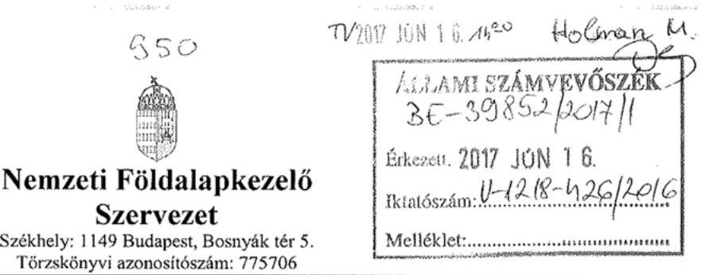

Dr. Domokos László
Elnök

Ügyiratszám: NFA-036237/012/2016

Állami Számvevőszék

Budapest 4. PF. 54.
1364

Tárgy: Az „Állami vagyon feletti tulajdonosi joggyakorlással kapcsolatos tevékenységek ellenőrzése" tárgyú vizsgálatról készült V-1218-406/2016. számú levelükben megküldött jelentéstervezetre készült észrevétel.

Tisztelt Elnök Úr!
Az Állami Számvevőszék „Az állami vagyon feletti tulajdonosi joggyakorlással kapcsolatos tevékenység ellenőrzése" tárgyú vizsgálathoz kapcsolódóan V-1218 számú, 2019. 05. 31-én átvett jelentéstervezetre az alábbi észrevételt tesszük:

Az Állami Számvevőszék jelentése azt tanúsítja, hogy az NFA a Nemzeti Földalapba tartozó állami vagyonnal szabályszerűen gazdálkodik, és kizárólag csckélyebb súlyú hiányosságra kellett felhívni a Szervczctünk figyelmét.

# 1., A jelentés tervezet 18. oldalán: 

„Az NFA-nál a vagyon-nyilvántartás vezetése nem volt szabályszerű, mivel:"
A megállapítás pontosítása szükséges, mert a vizsgálat megállapításai kizárólag a vagyonkezelésbe adott vagyon vagyoni-változásait érintette. Ezért utalni kellene arra, hogy túlnyomó részében az NFA vagyon-nyilvántartásai szabályszerűek. A vagyonnyilvántartás feladása alapján történik a főkönyvi könyvelés, így a számviteli nyilvántartás helyessége a vagyonnyilvántartás helyességén múlik.
„Az NFA nál a vagyon-nyilvántartás vezetése nem volt tcljcs cgćszćbcn szabályszcrü, mivel:"

## 2., A jelentés tervezet 23. oldalát érintően:

A SZMSZ 15/4. pontjában a következő szerepel:
4. A Vagyonkezelési Osztály felel feladatkörébe tartozó vagyonkezelési tevékenységek jogszabályoknak megfelelő eljárásrendjének, ellenörzési nyomvonalak, kialakításáért, a vagyonkezelési eljárások, jóváhagyott

---

eljárásrendek szerinti lebonyolításáért és az eljárásban rész̧i vevö más szervezeti egységekkel való együttmüködésért.

A fenti szöveg nem feltétlenül utal szabályozási kötelezettségre, csak a vagyonkczelési tevékenységek jogszabályoknak megfelelő eljárásrendjének kialakítására. Nyilvánvalóan egy belső szabályzat ezt elősegítheti, és mint arra a jelentés is utal 2015. szeptember 22. napjával a belső szabályozás kiadása megtörtént. Addig is a vagyonkczelési tevékenységek jogszabályoknak megfelelő eljárásrendje az. Osztály által ellátott feladatok körében egységesen kezelve volt.

# 3., A jelentés tervezet 23. oldalát érintően: 

A jelentés kifogásolja, hogy az NFA az Nfatv. 20.§ (3) bekezdésével ellentétesen az irányító vagy felügyelő szerv egyetértése nélkül kötött vagyonkczelési szcrződéseket.

Az Nfatv. 20.§ (3) bekezdése alapján központi költségvetési szervvel az azt irányító vagy felügyelő szerv egyetértésével köthető vagyonkczelési szerződés.
Szervezetünk álláspontja szcrint az NFA-val szcrződő központi költségvetési szerv feladata és felelőssége, hogy az irányító vagy felügyelő szcrve cgyctértését (cgyctértő nyilatkozatát) beszcrezzc. Amennyiben az intézmény az FM irányítása alá tartozott, és a vagyonkczelési szcrződés crdőt vagy védett területet érintett a földművelésügyi miniszter cbben a minőségében adta meg a hozzájáruló nyilatkozatot.

A vagyonkczelési szcrződésck az Inytv. rendelkezéseivel összhangban előirták, hogy a vagyonkczelői jog bejegyzését a vagyonkczelő köteles 30 napon belül kérelmezni, amit cgyes vagyonkczelők elmulasztottak. A jelentésben írtakkal szemben az NFA nem határozhat meg szankciókat cnnck kikényszerítésére, mert crről már jogszabály, az Inytv. rendelkezik. Az Inytv. 26.§ (5) bekezdése alapján a bejegyzés iránti kérelem benyújtására meghatározott határidő elmulasztása cscrén az adózás rendjéről szóló törvény szerinti mulasztási bírságot kell fizetni.

A Nemzeti Földalapba tartozó földrészletck hasznosításának részletes szabályairól szóló 262/2010. (XI. 17.) Korm. rendelet (Nfatv. vhr.) 50/B.§-a hatálytalan 2015. október 6. napjától. Az Nfatv. vhr. 56.§ (6) bekezdésénck hatályos szövege jelenleg is tartalmazza, hogy
„ba az NFA-val vagy az NFA jogelödjével kötött szerzödés az 50/B. §-ban meghatározott kikötést nem tartalmazza, akkor az NFA köteles - az 50/B. §-ban foglaltaknak a szerzödésben való rögzítése céljából-a szerzödés módositását kezdeményezni."
Az előbbi hatályos jogszabályszöveg hatályon kívül helyezett rendelkezésre utal. Az 50/B.§ hatályon kívül helyezése szakmailag azért történhetett, mert nem indokolt szerződésben az cgyik szerződő fél belső szabályzatának megismerését és alkalmazását clőírni. Az 56.§ (6) bekezdésénck hatályon kívül helyezése is indokolt lenne.

---

4., A jelentés tervezet 33. oldalán történő megállapítás pontositása lenne indokolt, mert az csak a számviteli nyilvántartásokra vonatkozhat, az ott megjelölt jogszabályi rövidítések alapján.

# Javasolt pontositás: 

„Intézkedjen, hogy a tulajdonosi joggyakorlóként rendelkezésére bocsátott vagyon, valamint a vagyonkezelésbe adott eszközök változása esetén a vagyon nyilvántartása feleljen meg a Számv. tv. és az Áhsz. előírásainak. A vagyon-nyilvántartás feladása alapján történik a főkönyvi könyvelés, így a számviteli nyilvántartás helyessége a vagyonnyilvántartás helyességén múlik.
(1.1. számú megállapítás 20. bekezdése alapján)"
5., A jelentés tervezet 34. oldalán történő megállapítás törlését javasoljuk.

A megállapítás szövege:
„Intézkedjen, bogy a vagyonkezelöi szerzödések feleljenek meg a Nfatv. és az Nfatv. Vbr. elöirásainak."
(2.1. számú megállapítás 11. bekezdés 1. és 3. francia bekezdése alapján)"

A megállapítás jogilag hibás. A felügyelő/irányító szerv egyetértése külön okiratban történhet, a vagyonkezelési szerződés tartalmát nem érinti. Az Nfatv. vhr. jelentésben hivatkozott 50/B.§-a hatályon kívül helyezésre került, míg Nfatv. vhr. 56.§ (6) bekezdése nem alkalmazható, mert hatályon kívül helyezett rendelkezésre utal. Az NFA vagyonkezelési szerződést, és nem vagyonkezelői szerződést köt, a jelölt megfogalmazás pontatlan.

Kérjük észrevételeinket a végleges jelentésbe beépíteni.

Budapest, 2017. június 12.
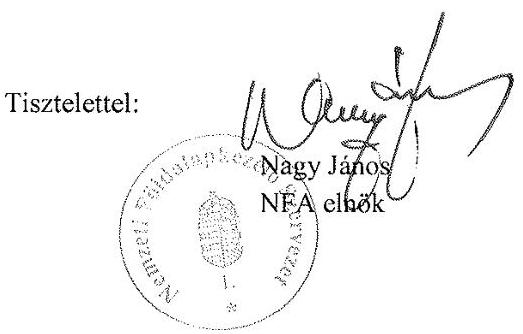

---

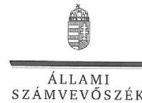

ELNÖK

Ikt.szám: V-1218-433/2016.

# Nagy János úr 

elnök

Nemzeti Földalapkezelő Szervezet

## Budapest

## Tisztelt Elnök Úr!

Az állami vagyon feletti tulajdonosi joggyakorlással kapcsolatos tevékenységek ellenörzése címủ számvevőszéki jelentéstervezetre tett észrevételeit köszönettel megkaptam.

Az Állami Számvevőszék észrevételekre vonatkozó álláspontjáról a felügyeleti vezető által készített részletes tájékoztatást csatoltan megküldöm.

Tájékoztatom Elnök urat, hogy a jelentésben - az Állami Számvevőszékről szóló 2011. évi LXVI. törvény 29. § (3) bekezdése alapján - a figyelembe nem vett észrevételeket szerepeltetjük az elutasítás indokának feltüntetésével együtt.

Budapest, 2017.
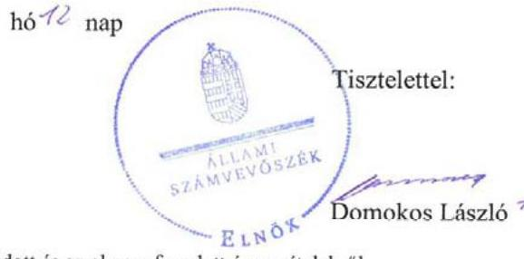

Melléklet: Tájékoztatás az elfogadott és az el nem fogadott észrevételekről

---

# Tájékoztatás az elfogadott és az el nem fogadott észrevételekről 

Az állami vagyon feletti tulajdonosi joggyakorlással kapcsolatos tevékenységek ellenörzése címủ számvevőszéki jelentéstervezetre NFA-036237/012/2016. iktatószámú levelében tett észrevételeit áttekintettük, annak kezeléséről az alábbi tájékoztatást adom.

1. A jelentéstervezet 1.1. számú megállapítás 19. bekezdésére (18. oldal) tett észrevételét nem fogadtuk el. Az Állami Számvevőszék az állami tulajdonú ingatlanok vagyonkezelésbe adása és a földrészletek értékesítése nyilvántartásának szabályszerűségét mintavételi eljárás módszerével értékelte. A jelentéstervezet 12. oldalán Az ellenörzés módszerei címszó alatt tartalmazza az Állami Számvevőszék által a jelen ellenőrzés során alkalmazott módszereket. A vagyonnyilvántartás értékelése során minden esetben statisztikai módszerek alkalmazásával, a statisztika szabályai szerint jártunk el. A vagyonnyilvántartás ellenőrzése során feltárt hibák alapján minősítette az ÁSZ nem szabályszerűnek a területet, a feltárt hibák az NFA esetében többségében a vagyonkezelésbe adott vagyon vagyoni változásaihoz kapcsolódtak.
2. A jelentéstervezet 2.1. számú megállapítás 10 . bekezdésre (23. oldal) tett észrevételét nem fogadtuk el. Észrevétele a jelentéstrevezetben rögzített megállapítással nincs ellentmondásban, mert az NFA valóban nem rendelkezett a vagyonkezelésbe vételi kérelmek eljárásrendjét szabályozó dokumentummal. A megállapítás megalapozottságát az észrevételében és a jelentéstervezetben foglaltak is megerősítik azzal, hogy 2015. szeptember 22. napjával a szabályozás kiadása megtörtént. A jelentéstervezetben a hiányosság kezelésére intézkedést igénylő javaslatot nem fogalamztunk meg, így a szervezetnek további intézkedési kötelezettsége nem áll fenn.
3. A jelentéstervezet 2.1. számú megállapítás 11. bekezdésre (23. oldal - helyesen 24. oldal) tett észrevételét nem fogadtuk el.
a) A jelentéstervezet 2.1. számú megállapítás 11. bekezdés 1. francia bekezdésére tett észrevételt nem fogadtuk el. A Nemzeti Földalapról szóló 2010. évi LXXXVII. törvény (Nfatv.) 20. § (3) bekezdés szerint Központi költségvetési szervvel az azt irányító vagy felügyelő szerv egyetértésével köthető vagyonkezelési szerződés, mely alapján a szerződés megkötésének jogszabályi feltétele irányító vagy felügyelő szerv egyetértése. E tekintetben nem releváns, hogy melyik szerződő fél feladata és felelőssége, hogy az irányító vagy felügyelő szerv egyetértését (egyetértő nyilatkozatát) beszerezze, mert a vagyonkezelési szerződés megkötéséhez az Nfatv. 20. § (3) bekezdésében rögzített feltétel teljesítése az NFA részéről is jogszabályi kötelezettség.

---

b) A jelentéstervezet 2.1. számú megállapítás 11. bekezdés 2. francia bekezdésére tett észrevételt nem fogadtuk el. Az ingatlan-nyilvántartásról szóló 1997. évi CXLI. törvény (továbbiakban: Inytv. ) 16. §-a előírja, hogy az ingatlannyilvántartásba jegyezhető be többek között az állami tulajdonban álló ingatlan estében az állam tulajdonosi jogait gyakorló szervezet, és a vagyonkezelői jog. A Nemzeti Földalapba tartozó földrészletek hasznosításának részletes szabályairól szóló 262/2010. (XI. 17.) Korm. rendelet (Nfatv. vhr.) 43. § (7) bekezdése is azt támasztja alá, hogy a vagyonkezelői jog az ingatlan-nyilvántartásba bejegyzéssel jön létre. A vagyonkezelői jog ingatlan-nyilvántartásba - a szerződés megkötésétől számított harminc napon belül - történő bejegyeztetésének kötelezettségét tehát mind jogszabály, mind a vagyonkezelési szerződések előirták. Ezen túl a Ptk. 5:168. §-a is tartalmaz a bejegyzési elvre vonatkozó rendelkezéseket, melyek szerint a törvényben meghatározott egyes jogok keletkezése, módosulása és megszủnése az ingatlan-nyilvántartási tulajdoni lapra történő bejegyzéssel megy végbe. A jogátruházásról kiállított okiraton alapuló bejegyzés keletkezteti az átruházáson alapuló tulajdonjogot, a jogalapításról kiállított okiraton alapuló bejegyzés pedig a szerződésen alapuló vagyonkezelői jogot, földhasználati jogot, haszonélvezeti jogot és a használat jogát, telki szolgalmi jogot és jelzálogjogot. Törvényben meghatározott egyes jogok bejegyzésének és jogilag jelentős tények feljegyzésének elmaradása esetén a jogosult azokat a jóhiszemú harmadik jogszerzővel szemben nem érvényesítheti. Az Nfatv. vhr. 43. § (2) bekezdés g) pontja szerint a vagyonkezelési szerződés azonnali hatállyal felmondható, ha a felek valamelyike jogszabályból vagy a szerződésből eredő lényeges kötelezettségét felróható módon megszegte. A vagyonkezelői jog jogszabályi előírásoknak megfelelő - ingatlan-nyilvántartásba történő bejegyzése tehát az NFA számára is fontos a jogszabály által előirt és a szerződésből adódó jogok és kötelezettségek érvényesítése érdekében.
c) A jelentéstervezet 2.1. számú megállapítás 11. bekezdés 3. francia bekezdésére tett észrevételt nem fogadtuk el. Az észrevételében jelzett jogszabályhely, az Nfatv. vhr. 50/B. § 2015. október 6-tól hatályon kívül helyezésre került, mely a jelentéstervezetben figyelembe vételre került. A jelentéstervezet észrevételezett bekezdése az ellenőrzött időszakon belül, figyelembe véve az 50/B. § hatályos időszakát, vagyis 2015. január 1 - 2015. október 5. közötti időszakra tartalmaz megállapítást. Az ÁSZ az ellenőrzött időszakban hatályos jogszabályi rendelkezések betartását ellenőrizte. Jelen tájékoztatás 5. pontjában foglaltak szerint a 2.1. számú megállapítás 11 . bekezdés 3 . francia bekezdésére történő hivatkozást töröljük. Ennek megfelelően a megállapítást fenntartjuk, de a megállapításra javaslatot nem fogalmazunk meg.
4. A jelentéstervezet 33. oldalán az NFA elnökének címzett 1. számú javaslatra tett észrevételét elfogadtuk. A javaslat szövegében az „esetén" szót javítjuk. A javaslatot megalapozó megállapítás a jelentéstervezetben tévesen szerepelt, a helyes hivatkozás: „1.1. számú megállapítás 19. bekezdése", melyet a számvevőszéki jelentés készítésénél figyelembe veszünk.

---

5. A jelentéstervezet 34. oldalán az NFA elnökének címzett 2. számú javaslatra tett észrevételét részben fogadtuk el. A jelen levelünk 3. pont a) és c) alpontjaiban foglaltak alapján a javaslatot továbbra is fenntartjuk, azonban a javaslatot megalapozó megállapítások közül a 2.1. számú megállapítás 11. bekezdés 3. francia bekezdésére történő hivatkozást töröljük, ugyanakkor kiegészítjük a 2.1. számú megállapítás 11. bekezdés 2. francia bekezdésére történő hivatkozásai.

A „vagyonkezelési szerzödés" helyett „vagyonkezelöi szerzödés" megfogalmazására tett észrevételét elfogadtuk, a számvevőszéki jelentés készítésénél figyelembe vesszük.

Budapest, 2017. Gülün hó tơ nap

Holman Magdolna felügyeleti vezető

---

# RÖVIDÍTÉSEK JEGYZÉKE 

${ }^{1}$ Nvtv.
${ }^{2}$ Vtv.
${ }^{3}$ Nfatv.
${ }^{4}$ ÁEEK
${ }^{5}$ EMMI
${ }^{6}$ FM
${ }^{7}$ ME
${ }^{8}$ MFB Zrt.
${ }^{9}$ MNV Zrt.
${ }^{10}$ NFA
${ }^{11}$ NFM
${ }^{12}$ ME miniszter
${ }^{13}$ FM miniszter
${ }^{14}$ Erdőtv.
${ }^{15}$ Állattenyésztési tv.
${ }^{16}$ NFM miniszter
${ }^{17}$ EMMI miniszter
${ }^{18}$ TB Alapok
${ }^{19}$ A Városliget megújításáról és fejlesztéséről szóló törvény
${ }^{20}$ GYEMSZI
${ }^{21}$ ÁSZ
${ }^{22}$ ÁSZ tv.
${ }^{23}$ ÁSZ SZMSZ
${ }^{24}$ Áhsz.
${ }^{25}$ Vhr.
26 Ávr.
${ }^{27}$ MNV Zrt. vagyon-nyilvántartási szabályzat
${ }^{28}$ Számv. tv.
${ }^{29}$ a társadalom-biztosítás szerveinek állami felügyeletéről szóló törvény
${ }^{30}$ Áht.
${ }^{31}$ NFA vagyon-nyilvántartási szabályzat
a nemzeti vagyonról szóló 2011. évi CXCVI. törvény az állami vagyonról szóló 2007. évi CVI. törvény
a Nemzeti Földalapról szóló 2010. évi LXXXVII. törvény
Állami Egészségügyi Ellátó Központ
Emberi Erőforrások Minisztériuma
Földművelésügyi Minisztérium
Miniszterelnökség
Magyar Fejlesztési Bank Zrt.
Magyar Nemzeti Vagyonkezelő Zrt.
Nemzeti Földalapkezelő Szervezet
Nemzeti Fejlesztési Minisztérium
a kormányzati tevékenység összehangolásáért felelős miniszter
agrárpolitikáért felelős miniszter
2009. évi XXXVII. törvény az erdőről, az erdő védelméről és az erdőgazdálkodásról
1993. évi CXIV. törvény az állattenyésztésről
az állami vagyon felügyeletéért felelős miniszter
az egészségbiztosításért és a nyugdíjpolitikáért felelős miniszter
Egészségbiztosítási Alap és Nyugdíjbiztosítási Alap
2013. évi CCXLII. törvény a Városliget megújításáról és fejlesztéséről

Gyógyszerészeti és Egészségügyi Minőség- és Szervezetfejlesztési Intézet
Állami Számvevőszék
az Állami Számvevőszékről szóló 2011. évi LXVI. törvény
Állami Számvevőszék Szervezeti és Működési Szabályzata
4/2013. (I. 11.) Korm. rendelet az államháztartás számviteléről
254/2007. (X. 4.) Korm. rendelet az állami vagyonnal való gazdálkodásról
368/2011. évi (XII.31.) Korm. rendelet az államháztartásról szóló törvény végrehajtásáról
12/2014. számú vezérigazgatói utasítás egységes szerkezetben a 24/2014. számú vezérigazgatói utasítással a Magyar Nemzeti Vagyonkezelő Zrt. állami vagyon vagyonkezelőire, az állami vagyont használókra és a társasági részesedések esetében az MNV Zrt. tulajdonosi joggyakorlását megbízottként ellátókra vonatkozó Vagyonnyilvántartási Szabályzatáról 2014. május
2000. évi C. törvény a számvitelről
1998. évi XXXIX. törvény a társadalombiztosítás pénzügyi alapjainak és a társadalom-biztosítás szerveinek állami felügyeletéről
2011. évi CXCV. törvény az államháztartásról

Az NFA vagyon-nyilvántartási szabályzata

---

${ }^{32}$ Nfatv. Vhr.
${ }^{33}$ NFA számviteli politika ${ }_{1,2}$
${ }^{34}$ Evt.
${ }^{35}$ Eljárásrend:
${ }^{36}$ Számviteli Politika:
${ }^{37}$ Analitikus nyilvántartás:
${ }^{38} \mathrm{KGR}$
${ }^{39}$ Info tv.
${ }^{40}$ Kincstár
${ }^{41}$ MNV Zrt. Jelentéstételi eljárásrend
${ }^{42}$ MNV Zrt. SZMSZ
${ }^{43}$ MÖKtv.
${ }^{44}$ EVÖtv.
${ }^{45} \mathrm{Ttv}$.
${ }^{46}$ ÁEEK Vagyon-nyilvántartási szabályzat
${ }^{47}$ NFA SZMSZ
${ }^{48}$ NFA vagyonkezelésbe vételi kérelmek ügyintézésének eljárásrendje
${ }^{49}$ FM SZMSZ

262/2010. (XI.17.) Korm. rendelet a Nemzeti Földalapba tartozó földrészletek hasznosításának részletes szabályairól
az egyes elnöki utasítások hatályon kívül helyezéséről és új szabályzatok hatályba lépéséről szóló a Nemzeti Földalapkezelő Szervezet Megbízott elnökének 20/2014. (XI.05.) számú mb. Elnöki utasítása - 2. számú melléklet Nemzeti Földalapkezelő Szervezet Számviteli politikája (hatályos: 2014. november 5-től),
a Nemzeti Földalapkezelő Szervezet elnökének a Nemzeti Földalapkezelő Szervezet vagyonfejezetét érintő utasításról szóló 18/2015. (III. 12.) NFA utasítása 2. számú melléklet (hatályos: 2015. március 12-től)
az erdőről, az erdő védelméről és az erdőgazdálkodásról szóló 2009. évi XXXVII. törvény
A Miniszterelnökség tulajdonosi joggyakorlási feladataival összefüggő pénzügyi-számviteli eljárásrend 2015.
A ME Számviteli politikája
A Miniszterelnökség TJSZ részesedések állományának 2015. évi analitikus nyilvántartása
Költségvetési Gazdálkodási Rendszer - Kincstár által működtetett elektronikus adatszolgáltató rendszer
2011. évi CXII. törvény az információs önrendelkezési jogról és az információszabadságról
Magyar Államkincstár
az MNV Zrt. vezérigazgatója által kiadott 21/2015. számú vezérigazgatói utasítás az MNV Zrt. rábízott vagyonára vonatkozó beszámoló-készítési és jelentéstételi kötelezettségének teljesítéséről (hatályos: 2015. július 13-ától)
az MNV Zrt. 430/2013. számú Igazgatósági határozatával elfogadott Szervezeti és Múködési Szabályzata (hatályos 2013. július 1-jétől)
2011. évi CLIV. törvény a megyei önkormányzatok konszolidációjáról, a megyei önkormányzati intézmények és a Fővárosi Önkormányzat egyes egészségügyi intézményeinek átvételéről
2011. évi CLXXXVI. törvény az Esztergom Város Önkormányzata egyes intézményeinek átvételéről (hatálytalan: 2015. július 1-jétől)
2012. évi XXXVIII. törvény a települési önkormányzatok fekvőbetegszakellátó intézményeinek átvételéről és az átvételhez kapcsolódó egyes törvények módosításáról
az ÁEEK Fölgazgatójának 14/2015. számú utasítása a Vagyonnyilvántartási szabályzatáról (hatályos 2015. július 1-jétől)
a Nemzeti Földalapkezelő Szervezet Szervezeti és Múködési Szabályzata (hatályos 2015. augusztus 6-ig)
a Nemzeti Földalapkezelő Szervezet Elnökének 1/2015. (VIII.7) NFA utasítás a Nemzeti Földalapkezelő Szervezet Szervezeti és Múködési Szabályzatáról (hatályos 2015. augusztus 7-től)
a Nemzeti Földalapkezelő Szervezet elnökének a Magyar Állam tulajdonában lévő a Nemzeti Földalapkezelő Szervezet tulajdonosi joggyakorlása alá tartozó földrészleteket érintő vagyonkezelésbe vételi kérelmek ügyintézésének eljárási rendjéről szóló 38/2015. (IX.22.) NFA utasítása (hatályos: 2015. szeptember22-től)
3/2014. (VIII. 1.) FM utasítás a Földmúvelésügyi Minisztérium Szervezeti és Múködési Szabályzatáról

---

${ }^{50}$ FM Számviteli politika
${ }^{51}$ FM Leltározási- és leltárkészítési szabályzat
${ }^{52}$ FM Értékelési szabályzat
${ }^{53}$ FM Számlarend
${ }^{54}$ ME Alapító Okirat
${ }^{55}$ ME SZMSZ
${ }^{56}$ Bkr.
${ }^{57}$ MNV Zrt. Alapító Okirata
${ }^{58}$ MNV Zrt. SZMSZ-e
${ }^{59}$ MNV Zrt. Ügyrendje
${ }^{60}$ MNV Zrt. Számviteli politikája
${ }^{61}$ MNV Zrt. Leltározási szabályzata
${ }^{62}$ MNV Zrt értékelési szabályzata
${ }^{63}$ NFM Alapító Okirat ${ }_{1}$
NFM Alapító Okirat ${ }_{2}$
${ }^{64}$ NFM SZMSZ

Földművelésügyi Minisztérium Igazgatása Számviteli politika (hatályos 2015. január 1-jétől)
Földművelésügyi Minisztérium Számviteli politika a központi kezelésű előirányzatokra (hatályos 2015. január 1-jétől)
Földművelésügyi Minisztérium Igazgatása Eszközök és források leltározási-, leltárkészítési és a feleslegessé vált vagyontárgyak hasznosítási és selejtezési szabályzata (hatályos 2015. január 1-jétől)
Földművelésügyi Minisztérium Eszközök és források leltározási és leltárkészítési szabályzata a központi kezelésű előirányzatokra (hatályos 2015. január 1-jétől)
Földművelésügyi Minisztérium Igazgatása Eszközök és források értékelési szabályzata (hatályos 2015. január 1-jétől)
Földművelésügyi Minisztérium Eszközök és források értékelési szabályzata a központi kezelésű előirányzatokra (hatályos 2015. január 1-jétől)
Földművelésügyi Minisztérium Számlarend (hatályod 2015. január 1-jétől)
Földművelésügyi Minisztérium Számlarend a központi kezelésű előirányzatokra (hatályos 2015. január 1-jétől)
a Miniszterelnök által kiadott Alapító Okirat (2014. július 24.)
1/2014. (VII. 23.) MvM utasítás a Miniszterelnökség Szervezeti és Müködési Szabályzatáról
a költségvetési szervek belső kontrollrendszeréről és belső ellenőrzéséről szóló 370/2011. (XII. 31.) Korm. rendelet
A Nemzeti Fejlesztési Minisztérium, a Magyar Nemzeti Vagyonkezelő Zrt. Részvényesi Jogok gyakorlója által kiadott 5/2013.(II.18.) sz. határozat az MNV Zrt. Alapító Okiratának módosításáról (hatályos: 2015. február 18-ától)
a 430/2013.(VI.17.) számú IG határozattal elfogadott az MNV Zrt. Szervezeti és Müködési Szabályzata (hatályos: 2013. július 17-étől)
52/2013. számú vezérigazgatói utasítás az MNV Zrt. szervezeti egységeinek feladatköreiről, a hatáskörök átruházásáról, valamint az aláírási jog gyakorlásáról (hatályos: 2014. január 1-jétől)
8/2015. számú vezérigazgatói utasítás az MNV Zrt. Rábízott vagyona Számviteli politikájáról és Számlatükréről (hatályos: 2015. március 31-étől azzal, hogy az utasítás rendelkezéseit a 2015. évi gazdasági események elszámolásakor kell alkalmazni)
24/2011. számú vezérigazgatói utasítás az MNV Zrt. Saját és Rábízott vagyonának Leltározási szabályzatáról (hatályos: 2011. április 12-étől)
az MNV Zrt. vezérigazgatója által kiadott 9/2015. sz. vezérigazgatói utasítás az MNV Zrt. rábízott vagyon eszközeire és forrásaira vonatkozó értékelés szabályzatról (hatályos: 2015. március 31-étől azzal, hogy az utasítás rendelkezéseit a 2014. évi gazdasági események elszámolásakor kell alkalmazni)
Nemzeti Fejlesztési Minisztérium alapító okirata (hatályos: 2014. október 1-jétől)
Nemzeti Fejlesztési Minisztérium alapító okirata (hatályos: 2015. július 17-től)
Nemzeti Fejlesztési Minisztérium Szervezeti Müködési Szabályzata (hatályos: 2015. január 1-jétől, módosítva 2015. május 30-ától, 2015. július 22-étől, 2015. december 13-ától)

---

${ }^{65}$ NFM Számviteli politika
${ }^{66}$ NFM Számlarend
${ }^{67}$ NFM Értékelési szabályzat
${ }^{68} \mathrm{Kttv}$.
${ }^{69}$ 10/2013. (I. 21.) Korm. rendelet
${ }^{70}$ NFM FEUVE szabályzata
${ }^{71}$ NFM Ellenőrzési nyomvonal ${ }_{1}$

NFM Ellenőrzési nyomvonal ${ }_{2}$

NFM Ellenőrzési nyomvonal ${ }_{3}$

NFM Ellenőrzési nyomvonal ${ }_{4}$

NFM Ellenőrzési nyomvonal ${ }_{5}$

NFM Ellenőrzési nyomvonal ${ }_{6}$
${ }^{72}$ ME Kockázatkezelési szabályzat
${ }^{73}$ 50/2013. (II. 25.) Korm. rendelet
${ }^{74}$ MNV Zrt. Társasági Monitoring szabályzata
${ }^{75}$ Tervezési és keretgazdálkodási eljárásrend
${ }^{76}$ MNV Zrt. Kommunikációs szabályzata
${ }^{77}$ MNV Zrt. Vezérigazgatói tárgyalások felkészítőivel kapcsolatos eljárásrendje
${ }^{78}$ MNV Zrt. Portfóliós kódexe
${ }^{79}$ Megbízási szerződés

Nemzeti Fejlesztési Minisztérium Számviteli politikája (hatályos: 2015. január 1-jétől)
Nemzeti Fejlesztési Minisztérium Számlarendje (hatályos: 2015. január 1-jétől)
Nemzeti Fejlesztési Minisztérium Eszközök és források értékelési szabályzata (hatályos: 2015. január 1-jétől)
2011. évi CXCIX. törvény a közszolgálati tisztviselőkről
a közszolgálati egyéni teljesítményértékelésről
31/2016. (IX. 20.) NFM utasítás a Nemzeti Fejlesztési Minisztérium gazdálkodásával kapcsolatos kockázatkezelésről és folyamatba épített előzetes és utólagos és vezetői ellenőrzésről (hatályos: 2013. szeptember 21-étől, módosítva 2015. január 30-ával)
Nemzeti Fejlesztési Minisztérium Állami Vagyonelemek Főosztálya egyéb tevékenységei 2016. évi ellenőrzési nyomvonala
Nemzeti Fejlesztési Minisztérium Vagyongazdálkodási, Stratégiai és Koordinációs Főosztály egyéb tevékenységei 2015. évi ellenőrzési nyomvonala
Nemzeti Fejlesztési Minisztérium Társasági Portfólió Főosztály egyéb tevékenységei 2015. évi ellenőrzési nyomvonala
Nemzeti Fejlesztési Minisztérium fejezeti előirányzatok tervezése, végrehajtása, elszámolása Autópálya rendelkezésre állási díj előirányzat (20. címszám, 36. alcímszám, 1. jogcímcsoportszám) 2015. évi ellenőrzési nyomvonala
Nemzeti Fejlesztési Minisztérium fejezeti előirányzatok tervezése, végrehajtása, elszámolása Hozzájárulás a Művészetek Palotája működtetéséhez előirányzat (20. címszám, 36. alcímszám, 7. jogcímcsoportszám) 2015. évi ellenőrzési nyomvonala
Nemzeti Fejlesztési Minisztérium fejezeti előirányzatok tervezése, végrehajtása, elszámolása Hozzájárulás a sportlétesítmények PPP bérleti díjához előirányzat (20 címszám, 36. alcímszám, 7. jogcímcsoportszám) 2015. évi ellenőrzési nyomvonala
a Miniszterelnökséget vezető miniszter által kiadott a Miniszterelnökség Kockázatkezelési Szabályzata (hatályos: 2013. évtől) 50/2013. (II. 25.) Korm. rendelet az államigazgatási szervek integritásirányítási rendszeréről és az érdekérvényesítők fogadásának rendjéről
az MNV Zrt. vezérigazgatója által kiadott 51/2013. számú vezérigazgatói utasítás a Társasági Monitoring Szabályzatról (hatályos 2013. december 19-étől)
az MNV Zrt. vezérigazgatója által kiadott 30/2014. számú vezérigazgatói utasítás az MNV Zrt. rábízott vagyonának tervezési és keretgazdálkodási eljárásrendjéről (hatályos 2014. június 19-étől)
az MNV Zrt. vezérigazgatója által kiadott 34/2014. számú vezérigazgatói utasítás az MNV Zrt. Kommunikációs szabályzatáról (hatályos 2014. július 8-ától)
az MNV Zrt. vezérigazgatója által kiadott 7/2014. számú vezérigazgatói utasítás a vezérigazgatói tárgyalások felkészítőivel kapcsolatos eljárásrendről (hatályos 2014. február 20-ától)
az MNV Zrt. vezérigazgatója által kiadott 7/2015. számú vezérigazgatói utasítás az MNV Zrt. Portfóliós Kódexéről (hatályos 2015. április 1-jétől) SZT-101744 Megbízási szerződés a Balatoni Halgazdálkodási Nonprofit

---

${ }^{80}$ MNV Zrt. Ellenőrzési Igazgatóság
${ }^{81}$ MNV Zrt. Tulajdonosi ellenőrzési szabályzata
${ }^{82}$ új adatszolgáltatási rendszer
${ }^{83}$ általános információk
${ }^{84} \mathrm{KPI}$
${ }^{85}$ NFM Belső ellenőrzési kézikönyv
${ }^{86}$ Ügyrend $_{3}$
${ }^{87}$ RJGY határozat

Zártkörűen Müködő Részvénytársaság állami tulajdonú társasági részesedéséhez kapcsolódó tulajdonosi jogok gyakorlására
A Magyar Nemzeti Vagyonkezelő Zrt. Ellenőrzési Igazgatósága
39/2014. vezérigazgatói utasítással elfogadott az MNV Zrt. Tulajdonosi ellenőrzési szabályzata (hatályos: 2014. szeptember 10-étől)
Társasági Monitoring Rendszer
általános információk az NFM részére: eredmény kimutatás, mérleg, beruházás, létszámadatok, vevő és szállítói állomány
Key Performance Indicator
Nemzeti Fejlesztési Minisztérium Belső ellenőrzési kézikönyve (hatályos: 2014. december 18-ától)
a Közigazgatási államtitkár által jóváhagyott a Belső Ellenőrzési Főosztály Ügyrendje (BEF/17/1/2015.)
részvényesi jogok gyakorlójának a határozata

---

ÁLLAMI SZÁMVEVŐSZÉK
1052 Budapest, Apáczai Csere János utca 10.
Levélcím: 1364 Budapest 4. Pf. 54
Telefon: +36 14849100 Telefax: +36 14849200
www.asz.hu