# Jelenetés 

## Köztestületek ellenőrzése

Magyar Gyógyszerészi Kamara 2017.

---

# ÁLLAMI   SZÁMVEVŐSZÉK 

## Jelentés

## Köztestületek ellenőrzése

Magyar Gyógyszerészi Kamara
2017. 08. hó 03. nap
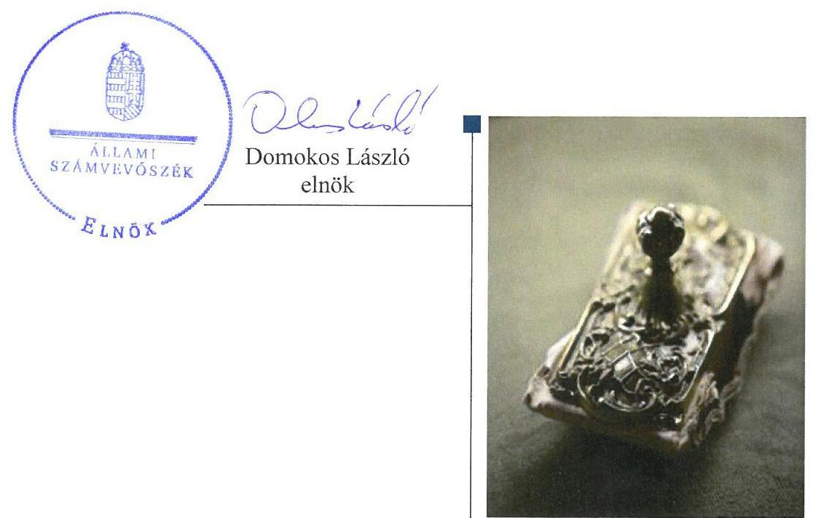

---

# AZ ELLENŐRZÉST FELÜGYELTE: 

PETŐ KRISZTINA felügyeleti vezető

## AZ ELLENŐRZÉST VEZETTE ÉS A VÉGREHAJTÁSÁÉRT FELELŐS:

NEMESVÁRI HORTHY ESZTER ellenőrzésvezető

## A PROGRAM ÖSSZEÁLLÍTÁSÁÉRT FELELŐS:

JANIK JÓZSEF LÁSZLÓ osztályvezető

IKTATÓSZÁM: V-1260-358/2016.
TÉMASZÁM: 2294

## ELLENŐRZÉS-AZONOSÍTÓ SZÁM: V077001

Jelentéseink az Országgyúlés számítógépes hálózatán és az Interneten a www.asz.hu címen is olvashatóak.

---

# TARTALOMJEGYZÉK 

■ ÖSSZEGZÉS ..... 5
■ AZ ELLENŐRZÉS CÉLJA ..... 6
■ AZ ELLENŐRZÉS TERÜLETE ..... 7
■ AZ ELLENŐRZÉS HÁTTERE, INDOKOLTSÁGA ..... 9
■ A JELENTÉS LÉNYEGES KÉRDÉSKÖREI ..... 10
■ ELLENŐRZÉS HATÓKÖRE ÉS MÓDSZEREI ..... 11
■ MEGÁLLAPÍTÁSOK ..... 13
■ JAVASLATOK ..... 20
■ MELLÉKLETEK ..... 23
I. Sz. melléklet: Értelmező szótár ..... 23
II. Sz. melléklet: Magyar Gyógyszerészi Kamara szervezeti felépítése ..... 24
■ FÜGGELÉK: ÉSZREVÉTELEK ..... 25
■ RÖVIDÍTÉSEK JEGYZÉKE ..... 43

---

.

---

# ÖSSZEGZÉS 

A Magyar Gyógyszerészi Kamara 2013-2015. évek közötti gazdálkodása nem volt szabályszerű. A központi költségvetési támogatás felhasználása szabályszerű volt, azonban a 2013-2014. évekre nyújtott támogatás pénzügyi elszámolása nem felelt meg a jogszabályoknak. A gazdálkodás körébe tartozó, közérdekű adatokkal kapcsolatos közzétételi kötelezettségeket nem teljesítették, ezért az átláthatóság nem volt biztosított.

## Az ellenőrzés társadalmi indokoltsága

A köztestületek közfeladatot látnak el, amelyre fokozott közérdeklődés irányul. Társadalmi elvárás a közpénzek értékelvű, rendeltetésszerű felhasználása, a közpénzekből nyújtott támogatások átláthatóságának megteremtése, amelyhez az Állami Számvevőszék az államháztartásból nyújtott támogatások ellenőrzésével kíván hozzájárulni.

A Magyar Gyógyszerészi Kamara a gyógyszerészi szakma minőségbiztosításának, képzési követelményeinek meghatározásában kulcsszerepet tölt be, tagságához, illetve a tagsága által végzett tevékenységhez kapcsolódóan közfeladatot lát el. Feladatkörében egyrészt megalkotja a gyógyszerészi szakma gyakorlásához kapcsolódó magatartásetikai szabályokat és tagjaival szemben szükség szerint lefolytatja az etikai eljárásokat. Másrészt ellátja a képzés, a szakképzés, a szakmai továbbképzés követelményszintjének, valamint a felvételi és képzési szakmánkénti keretszámoknak a meghatározását is. A Magyar Gyógyszerészi Kamara gazdálkodását az Állami Számvevőszék eddig még nem ellenőrizte.

## Főbb megállapítások, következtetések

A Magyar Gyógyszerészi Kamara gazdálkodása nem volt teljes körűen szabályozott. A gazdálkodás szabályozási kereteit alapvetően meghatározó számviteli politika és az annak keretében kötelezően elkészítendő pénzkezelési szabályzat egyes előírásai, valamint a számlarend és a bizonylati szabályzat nem felelt meg a jogszabályi előírásoknak, így azok nem támogatták a könyvvezetés szabályozott vitelét és a beszámolási kötelezettség számviteli előírásoknak megfelelő teljesítését.

A Magyar Gyógyszerészi Kamara gazdálkodása nem volt szabályszerű. A jogszabályi előírás ellenére nem állítottak össze olyan leltárt, amely tételesen és ellenőrizhető módon tartalmazza a mérleg fordulónapján meglévő eszközöket és forrásokat mennyiségben és értékben. A beruházási és felújítási kiadások elszámolása során nem érvényesült az egyedi értékelés elve, mert több eszközt egy nyilvántartási számon aktiváltak, továbbá az értékcsökkenés elszámolása sem volt szabályszerű. Az igénybevett és egyéb szolgáltatások, személyi jellegű ráfordítások elszámolása során a kifizetések szabályosságát biztosító utalványozás elmaradt. Az egyszerűsített éves beszámoló mérlegének és eredménykimutatásának tagolása nem felelt meg a jogszabályban foglalt tagolásnak.

A Magyar Gyógyszerészi Kamara a központi költségvetési támogatásokat a támogatási szerződésekben meghatározott célra használta fel, azonban a 2013-2014. évben kötött támogatási szerződések alapján készített elszámolások nem feleltek meg a jogszabályban előírtaknak, mert csak a támogatási összegre vonatkozóan számoltak el, a saját forrás felhasználását igazoló bizonylatok hitelesített másolatát nem mellékelték.

A Magyar Gyógyszerészi Kamara az információs önrendelkezési jogról és az információszabadságról szóló 2011. évi CXII. törvény előírásai ellenére a gazdálkodásra vonatkozó közérdekű adatok közzétételéről nem gondoskodott, amellyel nem biztosította a Magyar Gyógyszerészi Kamara gazdálkodásának átláthatóságát.

---

# AZ ELLENŐRZÉS CÉLJA 

Az ellenőrzés célja annak megállapítása volt, hogy a Magyar Gyógyszerészi Kamara gazdálkodása során betartotta-e a vonatkozó jogszabályi előírásokat, szabályszerűen használta-e fel a közfeladatai ellátására kapott állami támogatásokat, illetve az államháztartásból meghatározott célra ingyenesen juttatott vagyont, valamint megfelelően működtek-e a Magyar Gyógyszerészi Kamara szabályszerű működését biztosító ellenőrzési, monitoring és nyilvántartási rendszerek.

---

# **AZ ELLENŐRZÉS TERÜLETE**

## **A Magyar Gyógyszerészi Kamara**

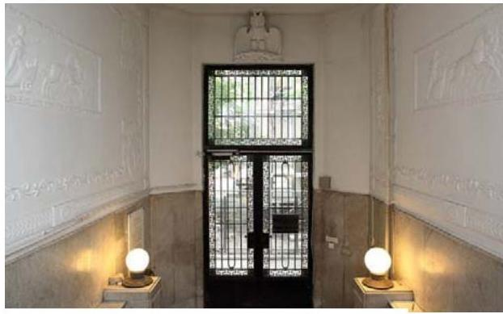

1. táblázat

|  A TAGLÉTSZÁM ALAKULÁSA (FŐ) |  |  |   |
| --- | --- | --- | --- |
|  Megnevezés | 2013 | 2014 | 2015  |
|  Nyilvántartott tagok | 7953 | 8399 | 8193  |

*Forrás: ÁSZ ellenőrzés*

**AZ MGYK** a gyógyszerészek önkormányzattal rendelkező, kötelező tagsággal működő szakmai, érdekképviseleti köztestület. Az MGYK, mint köztestület 2014. március 14-ig a Ptk. 1³ 65. § (1) bekezdése, majd Áhtm. ³ 8/A. § (1) bekezdése alapján jogi személy. Feladat-és hatáskörét, illetve szervezeti és működési kereteit az Ekt.⁴ határozza meg. A taglétszám 2013-2015. január 1-jei adatait az 1. táblázat mutatja be.

**AZ MGYK SZERVEZETRENDSZERE** kétszintű, feladatait az Ekt. 1. § (3) bekezdése alapján az alapszabálya szerint létrehozott területi szervezetei, valamint országos szervei⁵ útján látja el. Az MGYK szervezeti felépítését a II. sz. melléklet mutatja be.

**MŰKÖDÉSÉNEK KÖLTSÉGEIT** az MGYK az Ekt. 29. § (1) bekezdése szerint tagjai által befizetett tagdíj és egyéb díjbevételek, a központi költségvetésből átvett pénzeszközök, alapítványi és más támogatások, szolgáltatási, vállalkozási tevékenységből származó bevételek, pályázat útján elnyert pénzösszegek, nemzetközi vagy hazai együttműködésből származó pénzösszegek fedezik. Az MGYK bevételei a 2014. évi 202,9 M Ft-ról a 2015. évre 208,5 M Ft-ra növekedtek, kiadásai pedig ugyanezen időszak alatt 212,3 M Ft-ról 211,6 M Ft-ra csökkentek. A hiány fedezetéül a befolyt követelések és a pénzeszközök szolgáltak. Az MGYK tagnyilvántartó rendszerének adatai alapján a tagdíjbevétel a 2013. évi 185,1 M Ft-ról a 2015. évre 199,1 M Ft-ra növekedett. Az MGYK bevételeinek és kiadásainak alakulását a 2014-2015. években az 1. ábra mutatja.

1. ábra

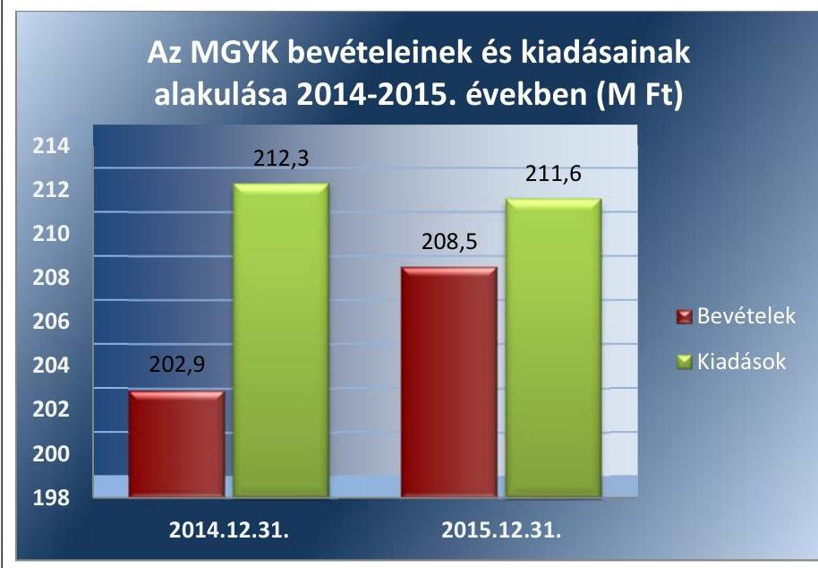

---

VÁLLALKOZÁSI TEVÉKENYSÉGET az MGYK ingatlanbérbeadással, hirdetési és oktatási tevékenységgel összefüggésben végzett. Az MGYK vállalkozási tevékenységeiből származó bevétele 2013-ban 3,2 M Ft, 2014-ben 5,0 M Ft, 2015-ben 7,0 M Ft volt.

TULAJDONI RÉSZESEDÉSSEL három gazdasági társaságban rendelkezett az MGYK, mint köztestület, illetve területi szervezetei. Az MGYK országos szervezete⁶ a BÉKÉSHELP Non-profit Kft.⁷-ben 58,33%-os, az MGYK a GALENUS Kft.⁸-ben 51,0%-os, a Gyógyszerészi Gondozásért Nonprofit Kft.⁹-ben 33,3%-os részesedéssel rendelkezett.

A KÖZPONTI KÖLTSÉGVETÉSBŐL az MGYK Magyarország 2013-2015. évi költségvetési törvényei¹⁰ XX. Emberi Erőforrások Minisztériuma (EMMI¹¹) fejezetének előirányzataiból egyes közfeladatai ellátásához támogatásban részesült. Az EMMI és az MGYK által megkötött támogatási szerződés₁,₂,₃¹² szerint a támogatás összege 2013-ban 4,7 M Ft, 2014-ben 1,5 M Ft, 2015-ben 2,4 M Ft, a három évre összesen 8,6 M Ft volt. Az MGYK államháztartásból meghatározott célra ingyenes vagyonjuttatást nem kapott.

A TÖRVÉNYESSÉGI FELÜGYELETET az Ekt. 27. § (1) bekezdése szerint az egészségügyért felelős miniszter gyakorolja. Ebben a jogkörében ellenőrzi, hogy az alapszabály jogszerű-e, továbbá más kamarai szabályzatok, illetve a kamarai szervek és tisztségviselők határozatai nem sértik-e a jogszabályokat, illetőleg az alapszabályt. Az Ekt. 27. § (11) bekezdése alapján az MGYK köteles az előző évi költségvetésének végrehajtásáról minden év május 31-ig írásban beszámolni a miniszternek.

---

# AZ ELLENŐRZÉS HÁTTERE, INDOKOLTSÁGA 

Az ellenőrzés eredményeképp a törvényalkotás számára tapasztalatok állnak rendelkezésre a köztestületek szabályozásához. Az ellenőrzöttek számára visszajelzést adhat az ellenőrzés a közfeladataik ellátására kapott állami támogatások felhasználásának szabályosságáról, esetleges hiányosságairól, míg a társadalom számára információt szolgáltat a köztestület gazdálkodásáról és a közpénzek felhasználásáról. Az ÁSZ¹³ szervezetén belül lehetőség nyílik arra, hogy az intézmény erősítse hozzáadott értéket teremtő tevékenységét és tanácsadó szerepét.

---

# A JELENTÉS LÉNYEGES KÉRDÉSKÖREI 

1. Megfelelően szabályozott és szabályszerű volt-e az MGYK gazdálkodása?
2. Szabályszerű volt-e az MGYK részére nyújtott központi költségvetési támogatások felhasználása és elszámolása?
3. Biztosította-e a nyilvánosságot az MGYK? Teljesítették-e a gazdálkodásra vonatkozó közérdekű adatokkal kapcsolatos közzétételi, illetve adatszolgáltatási kötelezettségeket?
4. Megfelelő volt-e az MGYK feletti törvényességi felügyelet gyakorlása?

---

# ELLENŐRZÉS HATÓKÖRE ÉS MÓDSZEREI 

## Az ellenőrzés típusa

Megfelelőségi ellenőrzés.

## Az ellenőrzött időszak

2013-2015. évek

## Az ellenőrzés tárgya

Az ellenőrzés tárgya az MGYK-nál a belső szabályozás kialakításának szabályszerűségére, a nyilvántartásba vétel szabályszerűségére, a pénzügyi gazdálkodási feladatok ellátására, a közfeladat ellátására kapott állami támogatás szabályszerű felhasználására irányuló tevékenység. Az ellenőrzés kiterjedt továbbá az MGYK ellenőrzési, monitoring tevékenységére, az általa végzett vállalkozási, tulajdonosi felügyeleti tevékenységre, a nyilvántartásba történő bejelentkezési, az adatszolgáltatási és közzétételi kötelezettségének teljesítésére, az MGYK-t létrehozó törvényben előírt törvényességi felügyeletet ellátó egészségügyért felelős miniszter feladatellátására.

## Az ellenőrzött szervezet

Magyar Gyógyszerészi Kamara, valamint az egészségügyért felelős miniszter törvényességi felügyeletének gyakorlása tekintetében az Emberi Erőforrások Minisztériuma.

## Az ellenőrzés jogalapja

Az ÁSZ tv.¹⁴ 1. § (3) bekezdésben és az 5. § (3) bekezdésében foglaltak.

## Az ellenőrzés módszerei

Az ellenőrzést az ellenőrzési program szempontjai, az ellenőrzött időszakban hatályos jogszabályok, az ellenőrzés szakmai szabályai, a jelen ellenőrzésre irányadó ÁSZ módszertan alapján végeztük. A gazdálkodás hibáinak kijavítására irányuló javaslatok kidolgozásakor a hatályos jogszabályok az irányadóak.

---

Az ellenőrzési kérdések megválaszolásához szükséges bizonyítékok megszerzése az ellenőrzéshez rendelkezésre bocsátott dokumentumokra, adatokra alapozva megfigyelés, szemle (szemrevételezés), kérdésfeltevés (információkérés), mintavételezés, valamint elemző eljárás útján történt. Az ellenőrzési bizonyítékként felhasználható adatforrások közé tartoztak egyrészt az ellenőrzési program részletes szempontjainál felsorolt adatforrások, másrészt minden egyéb - az ellenőrzés folyamán feltárt, az ellenőrzés szempontjából információt tartalmazó - dokumentumok.

Mintavétellel az alábbi területek szabályszerűségét ellenőriztük:
mérlegtételek (immateriális javak, tárgyi eszközök, befektetett pénzügyi eszközök, követelések és pénzeszközök mérlegtételei) elszámolását;
beruházások, felújítások ráfordításainak és értékcsökkenésének elszámolását;
igénybevett és egyéb szolgáltatások, illetve a személyi jellegű ráfordítások elszámolását.
Az egyes területek esetében évenkénti rétegezéssel, egyszerű mintavételi eljárással választottuk ki az ellenőrzött tételeket. Az értékelést az egyes területekre a teljes ellenőrzött időszakra összevontan végeztük el.

A minta alapján a sokaságban előforduló hibaarányt becsültük. „Szabályszerűnek" értékeltünk egy ellenőrzött területet, amennyiben 95%-os bizonyossággal a teljes sokaságban a hibaarány legfeljebb 10%, „nem szabályszerűnek", amennyiben 10%-nál magasabb arányt képviselt. Abban az esetben, ha a teljes sokaság tekintetében a 10%-os hibaarányhoz való viszony megítélésének megbízhatósága nem érte el a 95%-ot, „szabályszerűnek" minősítettük a területet, ha a minta alapján a teljes sokaság vonatkozásában nagyobb valószínűsége a 10% alatti hibaarány előfordulásának, „nem szabályszerűnek", ha nagyobb a valószínűsége a 10% feletti hibaarány előfordulásának.

Az MGYK részére az államháztartás alrendszeréből nyújtott költségvetési támogatások felhasználásának és elszámolásának szabályszerűségét a már lejárt elszámolási határidejű szerződésekhez kapcsolódóan elkészített elszámolások kifizetési bizonylatai alapján ítéltük meg.

Nem voltak ellenőrzött szervezetek a Magyar Gyógyszerészi Kamara területi szervezetei, amelyek 2013-2015. években nem részesültek központi költségvetési támogatásban.

---

# 1. Megfelelően szabályozott és szabályszerű volt-e az MGYK gazdálkodása? 

Összegző megállapítás

Az MGYK gazdálkodása nem volt teljes körűen szabályozott, gazdálkodása nem volt szabályszerű.
1.1. számú megállapítás

Az MGYK Alapszabálya a jogszabályi előírásokkal összhangban határozta meg a gazdálkodásra vonatkozó előírásokat. Az MGYK számviteli szabályzatai nem feleltek meg a Számv. tv. előírásainak.

AZ ALAPSZABÁLY meghatározta az MGYK gazdálkodására vonatkozó alapvető szabályokat. Az Alapszabály VII. fejezet 1.1. pontja az Ekt. 29. § (1)
 bekezdésével megegyezően sorolta fel, hogy az MGYK milyen forrásokból fedezi a működési költségeit. Az Alapszabály III. számú melléklete az Ekt. 29/A. §-ában rögzített korlátok betartásával határozta meg a kamarai tagdíj mértékét. Az Ekt. 29. § (2) bekezdésének előírásainak megfelelően az Alapszabály VII. fejezet 2. pontja úgy rendelkezett, hogy az etikai büntetésként kiszabott pénzbírság összegét az illetékes területi szervezet szociális alapjába kell elhelyezni. Az Alapszabály VII. fejezet 3-4. pontjai a gazdasági tevékenység végzésének korlátait - a Ptk.: 65. § (6) bekezdésére, illetve az Áhtm. 8/A. § (5) bekezdésére figyelemmel - a Ptk.: 61. § (2) bekezdésének, illetve a Ptk. ${ }^{15}$ 3:63. § (3)-(4) bekezdéseivel összhangban határozták meg.

A BÍRÓSÁG NYILVÁNTARTÁSBA VETTE az MGYK-t 2013. november 19-én.

A SZÁMVITELI SZABÁLYZATOK egyes rendelkezései nem voltak összhangban a Számv. tv. előírásaival. A Számviteli politikán ${ }^{16}$ nem vezették keresztül azokat a változásokat, amelyeket a Számv. tv. 14. § (11) bekezdése törvénymódosítás esetén előír annak hatálybalépését követő 90 napon belül. A Számviteli politika 13. pontja az ellenőrzött időszak egészében tartalmazta a „megbízható és valós képet lényegesen befolyásoló hiba" fogalmát, annak ellenére, hogy a fogalom 2013. január 1-jétől a Számv. tv. módosítása következtében nem volt hatályos. Nem vezették keresztül a Számviteli politikán a „jelentős összegű hiba" Számv. tv. 3. § (3) bekezdés 3. pontjának 2013. január 1-jétől hatályos értékhatárának változását sem.

A Leltározási szabályzat ${ }^{17}$ meghatározta az eszközök és források leltározásának, a leltár készítésének szabályait. Az Eszközök és források értékelési szabályzata ${ }^{18}$ tartalmazta a bekerülési érték meghatározásának, valamint az eszközök és források értékelésének elveit és módszereit, azonban az 1.1. pontjában a beszerzési költség meghatározása nem volt összhangban a Számv. tv. 47. § (1) bekezdésében foglaltakkal, mert a bekerülési érték nem foglalta magában az adójellegű tételeket. A Pénzkezelési szabályzat ${ }^{19}$ nem

---

felelt meg a Számv. tv. 14. § (8) bekezdése előírásainak, mert nem rendelkezett a pénzforgalom bankszámlán történő lebonyolításának rendjéről, a készpénzben és a bankszámlán tartott pénzeszközök közötti pénzforgalomról, a készpénzállomány ellenőrzésekor követendő eljárásról, illetve az ellenőrzés gyakoriságáról.

A Számviteli politika részét képező számlarend a Számv. tv. előírásainak megfelelően tartalmazta a főkönyvi és analitikus nyilvántartások kapcsolatát, azonban a Számv. tv. 161. § (2) bekezdésének a) pontjában foglaltak ellenére nem tartalmazta minden alkalmazásra kijelölt számla számjelét és megnevezését. A Számv. tv. szerinti, a számlarendben foglaltakat alátámasztó bizonylati rendet a Bizonylati szabályzat ${ }^{20}$ tartalmazott. A Bizonylati szabályzat 7. pontjában a bizonylatok alaki és tartalmi kellékei között - a Számv. tv. 167. § (1) bekezdés h) és i) pontjaiban foglaltak ellenére - nem állapította meg a könyvelés módjára, az érintett könyvviteli számlákra történő hivatkozást, valamint a könyvviteli nyilvántartásokba történő rögzítés időpontját és igazolását.

# 1.2. számú megállapítás 

A beszámolási kötelezettség teljesítése összességében nem volt szabályszerű.

BESZÁMOLÁSI KÖTELEZETTSÉGÉT az MGYK a 224/2000. (XII. 19.) Korm. rendeletben ${ }^{21}$ meghatározottak szerinti egyszerűsített éves beszámoló elkészítésével teljesítette. A küldöttközgyűlés ${ }^{22}$ a beterjesztett egyszerűsített éves beszámolókat elfogadta az Ekt.-ban és az Alapszabályban meghatározott kizárólagos jogkörében eljárva.

Az elkészített 2013-2015. évi egyszerűsített éves beszámolók mérlegei nem feleltek meg a 224/2000. (XII. 19.) Korm. rendelet 6. § (6) bekezdésében hivatkozott 4. számú mellékletben foglalt tagolásnak, mert „A. Befektetett eszközök" között megjelenítettek egy, a 4. számú mellékletben ebben az eszközcsoportban nem szereplő „IV. Befektetett eszközök értékhelyesbítése" sort, továbbá a források között az „F. Kötelezettségek" részeként külön sorban nem mutatták ki a hátrasorolt kötelezettségeket. Az elkészített 2013-2015. évi egyszerűsített éves beszámoló eredmény-kimutatásai nem feleltek meg a 224/2000. (XII. 19.) Korm. rendelet 6. § (6) bekezdésében hivatkozott 5. számú mellékletében meghatározott tagolásnak, mert a tagdíjakat a 3. Egyéb bevételek helyett az 5. számú mellékletben nem szereplő, külön megjelenített 6. sorban mutatták ki. Az eredménykimutatásban nem szerepelt továbbá a 7. Személyi jellegű ráfordítások sort követően a vezető tisztségviselők juttatásainak sora, valamint a „Tájékoztató adatok" A-F pontjai, amelyek közül az „A" Központi költségvetési támogatások sorban kellett volna bemutatni az MGYK-nak adott központi költségvetési támogatást.

A MÉRLEG TÉTELEINEK ALÁTÁMASZTÁSÁHOZ az MGYK - a Számv. tv. 69. § (1) bekezdésének, illetve a Leltározási szabályzat előírásaival ellentétben - nem állított össze olyan leltárat, amely tételesen és ellenőrizhető módon tartalmazza a mérleg fordulónapján meglévő eszközöket és forrásokat mennyiségben és értékben. A mérleg leltárral való alátámasztottságát nem biztosították.

A MÉRLEGTÉTELEK ELSZÁMOLÁSA nem volt szabályszerű, mert a Számv. tv. 69. § (1) és (3) bekezdéseinek, illetve a Leltározási

---

1.3. számú megállapítás

szabályzat előírásainak ellenére nem állítottak össze olyan leltárat, amely tételesen és ellenőrizhető módon tartalmazza a mérleg fordulónapján meglévő eszközöket és forrásokat mennyiségben és értékben. A befektetett pénzügyi eszközök között szereplő részesedések 2013-2015. évi mérlegértéke - a Számv. tv. 62. § (1) és 49. § (4) bekezdésével ellenére - nem beszerzési (bekerülési) értéken volt kimutatva, hanem az MGYK részesedésével működő gazdasági társaság társasági szerződése és az analitikus nyilvántartásban rögzített 1,8 M Ft-hoz képest 0,9 M Ft szerepelt a mérlegben. Tárgyi eszköz 2013. évi beszerzése esetében a Számv. tv. 16. § (1) bekezdésében rögzített egyedi értékelés elvét nem tartották be, mert két beszerzett eszközt egy tételként vettek állományba. A 2015. évi beszámoló mérlegének összeállítása során 2,8 M Ft értékvesztés elszámolására - a Számv. tv. 55. § (1) bekezdésének előírása ellenére - a vevő, adós minősítése nélkül került sor.

Az országos felügyelőbizottság ${ }^{23}$ az Alapszabály VI. fejezet 12.3. pontja előírása ellenére a küldöttközgyűlés elé nem terjesztette be állásfoglalását írásban a 2013-2015. évi költségvetések és a költségvetés végrehajtásáról szóló beszámolók tervezetéről.

A beruházások, felújítások ráfordításainak és értékcsökkenésének elszámolása, az igénybe vett és egyéb szolgáltatások, illetve a személyi jellegű ráfordítások elszámolása nem volt szabályszerű.

A BERUHÁZÁSOK, FELÚJÍTÁSOK ráfordításainak és értékcsökkenésének elszámolása során nem tartották be a Számv. tv. előírásait. A bekerülési érték részeként számoltak el előleget, ellentétben a Számv. tv. 26. § (8) bekezdésével, amely alapján az előleget nem a beruházások között, hanem a végszámla beérkezéséig beruházásra adott előlegek között kell kimutatni. Nem érvényesült a Számv. tv. 16. § (1) bekezdésében meghatározott egyedi értékelés elve, mert több eszközt egy nyilvántartási számon aktiváltak. Szoftverek beszerzésekor azokat - ellentétben a Számv. tv. 25. § (6) bekezdésében foglaltakkal - szellemi termékek között aktiváltak a vagyoni értékű jogok helyett. Az Értékelési szabályzat 2.2. pontjában foglaltak szerinti 100 ezer Ft egyedi bekerülési értékű eszközöknél a Számv. tv. 80. § (2) bekezdése ellenére nem használatba vételkor számolták el az értékcsökkenést.

AZ IGÉNYBE VETT ÉS EGYÉB SZOLGÁLTATÁSOK, ILLETVE A SZEMÉLYI JELLEGŰ ÉS EGYÉB RÁFORDÍTÁSOK ELSZÁMOLÁSA során a költségelszámolás alapjaként szolgáló bizonylatokon a Számv. tv. 167. § (1) bekezdés c), h) és i) pontjai ellenére nem történt meg az utalványozás, nem szerepelt a rendelkezés végrehajtását igazoló személy aláírása, az érintett könyvviteli számlákra történő hivatkozás, valamint a könyvviteli nyilvántartásokban történt rögzítés időpontja, igazolása.

---

### 1.4. számú megállapítás

Az Alapszabályban meghatározott tagdíjak beszedéséről az országos hivatal gondoskodott. Az MGYK az Ekt.-ban és az Alapszabályban foglaltaknak megfelelően a tagdíjbevételből a részére juttatott hányadot működésre fordította.

A FIZETENDŐ TAGDÍJAK MÉRTÉKÉT a küldöttközgyűlés határozatban állapította meg az Alapszabályban rögzített elvek figyelembevételével. A tagdíj mértéke az ellenőrzött időszakban 48 ezer Ft/év volt, amelyhez kedvezmények társultak. A tagdíjak beszedéséről az Alapszabályban foglaltaknak megfelelően az országos hivatal gondoskodott. Az MGYK könyveiben 2015. évben behajthatatlan tagdíj követelésként úgy írtak le 0,2 M Ft-ot, hogy arról nem volt bizonylat, amellyel a Számv. tv. 15. § (3) bekezdésében foglalt valódiság elve nem érvényesült.

A tagdíjbevételnek az országos és területi szervezetek közötti megosztásáról a küldöttközgyűlés az Alapszabály előírásának megfelelően szabályszerűen, az éves költségvetés elfogadása keretében, határozatban döntött. Az MGYK a tagdíjbevételeket az Ekt. és az Alapszabály előírásainak megfelelően a működésére fordították.

### 1.5. számú megállapítás

A gazdasági társaságok felügyelete során a tulajdonosi jogokat a taggyűléseken az MGYK elnöke vagy a küldöttközgyűlés által kijelölt személyek gyakorolták.

A gazdasági társaságokkal folytatott pénzügyi kapcsolatokra vonatkozó előírásokat a társasági szerződésekben, a tulajdonosi képviselet ellátására vonatkozó elnökségi határozatokban és az egyes gazdasági társaságokkal kötött szerződésekben és együttműködési megállapodásokban írták elő. A gazdasági társaságok részére az MGYK a feladatellátáshoz kapcsolódóan vagyont - a törzstőke biztosításán túlmenően - nem adtak át, kötelezettségeikkel kapcsolatban az MGYK garanciát, kezességet, kötelezettséget nem vállaltak, működési vagy fejlesztési célra, illetve szerződéses kötelezettségeik teljesítésére pénzeszközt nem adtak át. A gazdasági társaságok sem adtak át pénzeszközt, nem nyújtottak támogatást vagy kölcsönt az MGYK számára.

Tulajdonosi jogait az MGYK a gazdasági társaságokban az elnöke, vagy a taggyűlésekbe delegált képviselőjének és a felügyelőbizottsági tagoknak a kijelölése útján gyakorolta.

---

# 2. Szabályszerű volt-e az MGYK részére nyújtott központi költségvetési támogatások felhasználása és elszámolása? 

Összegző megállapítás

A központi költségvetési támogatás felhasználása és elkülönített számviteli nyilvántartása szabályszerű volt, azonban a 2013-2014. évekre nyújtott támogatás pénzügyi elszámolása nem volt szabályszerű.
2.1. számú megállapítás

A költségvetési támogatás felhasználásával és elszámolásával kapcsolatos követelményeket az EMMI-vel megkötött támogatási szerződés ${ }_{1,2,3}$-ban meghatározták, az MGYK a támogatások elkülönített számviteli nyilvántartását biztosította.

Az MGYK és az EMMI között megkötött támogatási szerződés ${ }_{1,2,3}$-ban az MGYK a központi költségvetési támogatást közfeladatok ellátására kapta. A Támogatási szerződés ${ }_{1,2}$ tárgyában az etikai normák megalkotásával, szankcióinak alkalmazásával, továbbképzés feltételeinek, programjának meghatározásával, teljesítésének ellenőrzésével, a szakmai továbbképzési jegyzék közzétételével, a nem egyetemi, főiskolai szintű egészségügyi képzések, szakképzések és továbbképzések szakmai feltételeinek megvizsgálásával, a képzésre jogosult intézmény, az intézmény szakmai felügyeletét ellátó szerv részére javaslattétellel, továbbá az egészségügyet érintő jogszabályok megalkotásával, a nemzetközi kapcsolatokkal összefüggő szakmai feladatok szerepeltek. A támogatási szerződés ${ }_{1}$-ben ezen túl támogatott szakmai feladatként szerepelt a tagsággal valamint az etikai kollégium működtetésével kapcsolatos feladat is. A Támogatási szerződés ${ }_{3}$-ban a szerződés tárgyaként etikai vétség tárgyában eljárások lefolytatását rögzítették.

A 2013-2015. években kapott támogatásokkal kapcsolatos adatokat a 2. táblázat mutatja.
2. táblázat

2013-2015. ÉVI TÁMOGATÁSI SZERZŐDÉSEK FŐBB ADATAI

| Megnevezés | Felhasználás-   kezdő időpontja |  |
| :-- | :--: | :--: |
| támogatási szerződés | 2013. 01. 01. | 2013. 12. 31. |
| támogatási szerződés | 2014. 01. 01. | 2014. 12. 31. |
| támogatási szerződés | 2015. 01. 01. | 2015. 12. 31. |

Az MGYK a támogatási szerződés ${ }_{1,2,3} 6.3$. pontjában foglaltaknak megfelelően - figyelemmel a Számv. tv. és a 224/2000. (XII. 19.) Korm. rendelet előírásaira - a főkönyvi számlák további részletezésével biztosította a támogatási összeg elkülönített kezelését, a támogatási összeg felhasználásáról az elkülönített számviteli nyilvántartás vezetését. A 2013.
 évi támogatási összegből - a Számv. tv. 77. § (3) bekezdés b) pontja ellenére 2,5 M Ft-ot nem egyéb bevételként, hanem aktív időbeli elhatárolások között elhatárolt bevételek feloldásaként könyvelték le és mutatták ki az MGYK 2013. évi egyszerűsített éves beszámolójában.

---

# 2.2. számú megállapítás 

## A központi költségvetési támogatásokkal az MGYK országos hivatala 2013-2014. évekre nem megfelelően számolt el.

A központi költségvetési támogatásokkal kapcsolatos főbb adatokat a 3. táblázat mutatja.
3. táblázat

## A 2013-2015. ÉVI KÖZPONTI KÖLTSÉGVETÉSI TÁMOGATÁSOK ELSZÁMOLÁSÁVAL KAPCSOLATOS FŐBB ADATOK

| Megnevezés | Elszámolás |  | A támogatás intenzitás (%) |
| :--: | :--: | :--: | :--: |
|  | határideje | időpontja |  |
| támogatási szerződés ${ }_{1}$ | 2014.03.01. | 2014. 05.16. | 2,3 |
| támogatási szerződés ${ }_{2}$ | 2015.03.01. | 2015. 03. 31. | 1,0 |
| támogatási szerződés ${ }_{3}$ | 2016.02.28. | 2016. 03. 08. | 100,0 |
|  |  |  | Forrás: ÁSZ ellenőrzés |

A költségvetési támogatás felhasználásáról az MGYK országos hivatala az EMMI felé a támogatási szerződés ${ }_{1,2,3}$ 6.4. pontjában foglalt határidőn túl számolt el. A 2013. és a 2014. évi pénzügyi elszámolások csak a támogatási összeg elszámolását tartalmazták, azonban a saját forrás felhasználását igazoló számviteli bizonylatoknak és a kifizetést igazoló bizonylatoknak a hitelesített másolatát - a 34/2012. (X. 17.) EMMI rendelet ${ }^{24}$ 9. § (2) és a 84/2013. (XII. 30) EMMI rendelet ${ }^{25}$ 10. § (2) bekezdésében foglalt előírás ellenére - nem tartalmazták. Az elszámolásokhoz benyújtott, ellenőrzött kifizetési bizonylatok a 2014-2015. években nem feleltek meg a Számv. tv. 167. § (1) bekezdés c) pontjában foglaltaknak, mert nem tartalmazták az utalványozó aláírását. A 2013. évi központi költségvetési támogatás elszámolásához benyújtott kifizetés bizonylat idegen nyelvű bizonylat volt, amelyen - a Számv. tv. 166. § (4) bekezdésében és a Bizonylati szabályzat 6. pontjában foglaltak ellenére - azokat az adatokat, megjelöléseket, amelyek a bizonylat hitelességéhez, a megbízható, a valóságnak megfelelő adatrögzítéshez, könyveléshez szükségesek, magyar nyelven nem tüntették fel.

Az MGYK - az ellenőrzött kifizetési bizonylatok alapján - a támogatást a támogatási szerződés ${ }_{1,2,3}$-ban rögzített célokra használta fel.

Az MGYK országos hivatala által elkészített szakmai és pénzügyi beszámolók felülvizsgálatáról a támogatási szerződés ${ }_{1,2,3}$-ban foglaltak szerint az EMMI gondoskodott. Intézkedést igénylő, pótlólagos adatszolgáltatást a 2014. évi támogatás ellenőrzése során kért az EMMI, amelyben a pénzügyi elszámolás kiegészítésére kérte fel az MGYK országos hivatalát, amelynek eleget tett.

---

# 3. Biztosította-e a nyilvánosságot az MGYK? Teljesítették-e a gazdálkodásra vonatkozó közérdekű adatokkal kapcsolatos közzétételi, illetve adatszolgáltatási kötelezettségeket? 

Összegző megállapítás

Az MGYK nem biztosította a nyilvánosságot. A gazdálkodás körébe tartozó közérdekű adatokkal kapcsolatos közzétételi, valamint a $\mathrm{KSH}^{26}$ felé az adatszolgáltatási kötelezettségek teljesítése az Info. tv. ${ }^{27}$ illetve a Stat. tv. ${ }^{28}$ előírásainak nem felelt meg, nem volt szabályszerű.

Az MGYK honlapján az Info. tv. előírásaival összhangban a 2013-2015. évi egyszerűsített éves beszámolókat közzétette. A honlapon a 2013-2015. évekre az Info. tv. 37. § (1) bekezdésében hivatkozott 1. melléklet III. fejezet „Gazdálkodási adatok" 1. pontja szerint éves költségvetését, 2. pontja szerint a foglalkoztatottak személyi juttatásaira (munkabér) vonatkozó összesített adatokat, összesítve a vezetők és vezető tisztségviselők illetményét (munkabér, tiszteletdíj) nem tette közzé.

Az MGYK mint köztestület a 288/2009. (XII. 15.) Korm. rendelet ${ }^{29}$ 1. sz. melléklet 1156-os nyilvántartási számmal jelölt statisztikai adatszolgáltatási kötelezettségét - ellentétben a Stat. tv. 9. § (1) bekezdésével - nem a valós adatok alapján teljesítette a 2013. és a 2015. években. A 2013. évi jelentés 2/A. „Tagok, foglalkoztatottak, önkéntesek, segítők" kérdésén belül a szervezet tagjainak létszámát 10 fő alattinak jelölte meg, holott a taglétszám 2013. évben meghaladta a 7900 főt. A 2015. évi statisztikai adatszolgáltatásban nem tüntették fel a fizetett alkalmazottak demográfiai adatait.

## 4. Megfelelő volt-e az MGYK feletti törvényességi felügyelet gyakorlása?

Összegző megállapítás

A törvényességi felügyeletet ellátó miniszter - az Ekt.-ban foglaltak ellenére - az MGYK működésével kapcsolatban törvényességi felügyeleti jogkörben nem intézkedett, törvényességi ellenőrzésekre nem került sor.

A miniszter az Ekt. 27. § (1) bekezdésében foglaltak ellenére az MGYK működésével kapcsolatban törvényességi felügyeleti jogkörben nem intézkedett, törvényességi ellenőrzésekre nem került sor. A miniszter az Ekt. 27. § (9) bekezdése szerint felhívást nem küldött az MGYK részére.

A küldöttközgyűlés által a 2013. május 11-i és a 2015. május 15-i döntésével módosított alapszabályt az MGYK - az Ekt. 27. § (9) bekezdésében foglalt 15 napos határidőt meghaladóan - 2013. június 3-án, illetve június 17-én küldte meg a törvényességi felügyeletet ellátó emberi erőforrások miniszterének.

---

# JAVASLATOK 

Az ÁSZ tv. 33. § (1) bekezdésében foglaltak értelmében az ellenőrzött szervezet vezetője köteles a jelentésben foglalt megállapításokhoz kapcsolódó intézkedési tervet összeállítani és azt a jelentés kézhezvételétől számított 30 napon belül az ÁSZ részére megküldeni. Amennyiben az ellenőrzött szervezet vezetője nem küldi meg határidőben az intézkedési tervet, vagy továbbra sem elfogadható intézkedési tervet küld, az Állami Számvevőszék elnöke az ÁSZ tv. 33. § (3) bekezdés a) és b) pontjaiban foglaltakat érvényesítheti.

## a Magyar Gyógyszerészi Kamara elnökének

1. A Magyar Gyógyszerészi Kamara szabályszerű gazdálkodása érdekében intézkedjen:
a) a számviteli politika, az eszközök és források értékelési szabályzata, a pénzkezelési szabályzat, valamint a számlarend módosítására a jogszabályi előírások betartása érdekében;
(1.1. sz. megállapítás 3. bekezdése, 1.1. sz. megállapítás 4. bekezdésének 2-3. mondatai, 1.1. sz. megállapítás 5. bekezdése alapján)
b) a küldöttközgyűlés intézkedés megtétele céljából történő tájékoztatására az országos felügyelőbizottság tevékenységével kapcsolatban az Alapszabályban előírt feladatai teljesítése érdekében;
(1.2. sz. megállapítás 5. bekezdése alapján)
2. Intézkedjen az Alapszabály módosításáról hozott döntés jogszabályban előírt határidőn belül történő megküldésére törvényességi ellenőrzés céljából az emberi erőforrások minisztere részére.
(4. sz. megállapítás 2. bekezdése alapján)

---

# a Magyar Gyógyszerészi Kamara országos hivatala hivatalvezetőjének 

1. A Magyar Gyógyszerészi Kamara szabályszerű gazdálkodása érdekében intézkedjen:
a) a jogszabályi előírásoknak megfelelő egyszerűsített éves beszámoló készítésére;
(1.2. sz. megállapítás 2. bekezdése, 1.2. sz. megállapítás 4. bekezdésének 2. mondata alapján)
b) a jogszabályi és belső szabályozási előírásoknak megfelelő leltár összeállítására;
(1.2. sz. megállapítás 3. bekezdése, 1.2. sz. megállapítás 4. bekezdésének 1. mondata alapján)
c) jogszabályi előírásnak megfelelő értékvesztés elszámolására;
(1.2. sz. megállapítás 4. bekezdésének 4. mondata alapján)
d) a beruházások, felújítások ráfordításainak és értékcsökkenésének jogszabályi és belső szabályozási előírásoknak megfelelő elszámolására;
(1.3. sz. megállapítás 1. bekezdése alapján)
e) a könyvviteli elszámolást közvetlenül alátámasztó bizonylat általános alaki és tartalmi kellékeit meghatározó jogszabályi előírások betartására;
(1.3. sz. megállapítás 2. bekezdése alapján)
f) a valódiság elve számviteli alapelv érvényesítésére.
(1.4. sz. megállapítás 1. bekezdésének 4. mondata alapján)
2. Intézkedjen a Magyar Gyógyszerészi Kamara gazdálkodása körébe tartozó közérdekű adatok elektronikus közzétételi kötelezettsége jogszabályi előírásoknak megfelelő teljesítésére.
(3. sz. megállapítás 1. bekezdésének 2. mondata alapján)

---

.

---

# MELLÉKLETEK 

- I. SZ. MELLÉKLET: ÉRTELMEZŐ SZÓTÁR
közfeladat
köztestület
köztestület országos szerve-
zete
támogatás intenzitás
ügyintéző szerv
ügyviteli szervezet

Jogszabályban meghatározott állami vagy önkormányzati feladat, amit az arra kötelezett közérdekből, jogszabályban meghatározott követelményeknek és feltételeknek megfelelve végez, ideértve a lakosság közszolgáltatásokkal való ellátását, továbbá az állam nemzetközi szerződésekben vállalt kötelezettségeiből adódó közérdekű feladatokat, valamint e feladatok ellátásához szükséges infrastruktúra biztosítását is. (Nvtv. 3. § (1) bekezdés 7. pontja)
A köztestület önkormányzattal és nyilvántartott tagsággal rendelkező szervezet, amelynek létrehozását törvény rendeli el. A köztestület a tagságához, illetőleg a tagsága által végzett tevékenységhez kapcsolódó közfeladatot lát el. A köztestület jogi személy. A szakmai kamarák köztestületként folytatják tevékenységüket (Ptk. 1 65. § (1) és (2) bekezdés alapján).

Az Országos Küldöttközgyűlés, valamint az Országos ügyintéző szervek (elnökség, etikai bizottság, felügyelőbizottság, etikai kollégium. A köztestület Alapszabályában meghatározott más állandó bizottságok)
A támogatás intenzitás a támogatás összegének és az elszámolható költségek hányadosa, százalékos formában kifejezve.
Az ügyintéző szervezet a köztestület operatív munkaszervezete, amely a jogszabályok, az Alapszabály, az önkormányzati szabályzatok és a testületi szervek által hozott döntések keretei között fejti ki tevékenységét.
Az ügyviteli szervezet látja el az igazgatási, ügyviteli, valamint gazdálkodási teendőket, továbbá biztosítja mindazokat a feltételeket, amelyek a szervezet ügyintéző szerveinek, illetve tisztségviselőinek a feladatellátását lehetővé teszik.

---

Mellékletek

II. SZ. MELLÉKLET: MAGYAR GYÓGYSZERÉSZI KAMARA SZERVEZETI FELÉPÍTÉSE

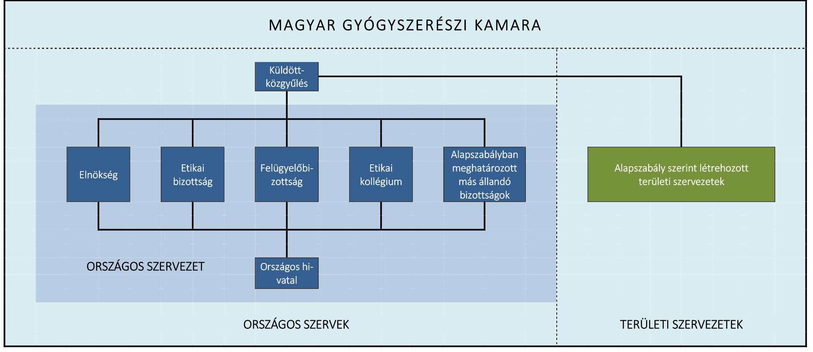

---

# FÜGGELÉK: ÉSZREVÉTELEK 

A jelentéstervezetet a Számvevőszék 15 napos észrevételezésre megküldte az ellenőrzött szervezetek vezetőinek az ÁSZ tv. 29. § (1) bekezdése előírásának megfelelően.
A Magyar Gyógyszerészi Kamara elnöke az ellenőrzés megállapításaira írásban észrevételt tett.

Az Emberi Erőforrások Minisztériuma részéről észrevétel nem érkezett.
Az elfogadott észrevételek alapján a Számvevőszék módosította a jelentést.
A függelék tartalmazza mellékletek nélkül a Magyar Gyógyszerészi Kamara elnökének észrevételeit, illetve az el nem fogadott észrevételek indoklását.

[^0]
[^0]:    * 29. § (1) Az Állami Számvevőszék az ellenőrzési megállapításait megküldi az ellenőrzött szervezet vezetőjének vagy az általa megbízott személynek, és annak, akinek személyes felelősségét állapította meg.
    (2) Az ellenőrzött szervezet vezetője és a felelősként megjelölt személy az ellenőrzés megállapításaira tizenöt napon belül írásban észrevételt tehet.
    (3) Az Állami Számvevőszék az észrevételre a beérkezésétől számított harminc napon belül írásban válaszol. A figyelembe nem vett észrevételeket köteles a jelentésben feltüntetni, és megindokolni, hogy azokat miért nem fogadta el.

---

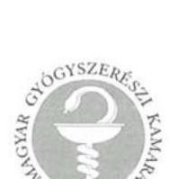

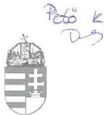

**MAGYAR GYÓGYSZERÉSZI KAMARA**

1008 Budapest, Dózsa György út 86/B H-1393 Budapest, Pf. 304
Telefon: 351-9483 Fax: 351-9485
http://www.mgyk.hu, e-mail: hivatal@mgyk.hu

**Domokos László elnök úr részére
Állami Számvevőszék
Budapest, Apáczai Csere János utca 10. 1052**

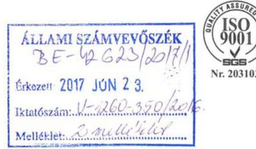

*Tárgy: Észrevételek a Magyar Gyógyszerészi Kamara vizsgálatának az ÁSZ V-1260-343/2016 ikt. számú leveléhez kapcsolódó, jelentés-tervezetéhez iktatószám: 161-2/2017*

## Tisztelt Elnök Úr!

A Magyar Gyógyszerészi Kamara (továbbiakban: Kamara) képviseletében eljárva köszönöm a lehetőséget, hogy a Kamaránál az Állami Számvevőszék (továbbiakban: ÁSZ) által 2016. szeptember és 2017. május között lefolytatott megfelelőségi vizsgálat jelentés-tervezetéhez észrevételt tehetek.

A jelentés-tervezethez kapcsolódó észrevételeket megelőzően azonban szeretnék a vizsgálathoz kapcsolódóan néhány olyan megjegyzést is tenni, amelyek a jelentés-tervezethez közvetlenül nem kapcsolódnak, ugyanakkor fontosnak tartom, hogy Elnök úr és az ÁSZ vizsgálatban résztvevő munkatársai ezekről tudomást szerezzenek.

1. A Kamara az elmúlt évtizedekben több olyan politikai döntéssel szembesült, amelyek a Kamara szervezeti struktúráját, köztestületiségét, funkcióját, szakmai érdekvédelmi és önkormányzati jogköreit, tagsági viszonyait alapvetően megváltoztatták. Ezek a változások párhuzamosak voltak a gyógyszerelátás rendszerének alapvető átalakítását célzó politikai döntésekkel [szociális piacgazdasági gyógyszerészet modell (1994) – liberalizáció (2006) – deliberáláció (2011)]. A Magyar Országgyűlés 2011-ben végrehajtott jogszabály-módosítása teremtette meg újra az alapját annak, hogy a Kamara a létrehozását indokolttá tevő eredeti elképzelésekhez igazodva, a kötelező tagság intézményével megerősítve, a gyógyszerészi hivatás valódi köztestületévé válhasson. Emiatt a 2011-2015 közötti ciklusban az elsődleges kamarai feladat – a liberalizáció leállításában és visszafordításában való elkötelezett részvétel mellett – a Kamara szervezeti struktúrájának újraalakítása, a köztestületi működés alapvető feltételeinek megteremtése, a Kamarába vetett tagsági és társadalmi bizalom helyreállítása
 és érdekvédelmi működésének megerősítése volt. Ezért rendkívül hasznosnak tartom, hogy

---

az ÁSZ vizsgálat egy olyan időszakra fókuszált, amikor ezek a szempontok elsődlegesek voltak, és a vizsgálat így utólag is lehetőséget biztosít arra, hogy a kezdeti időszak hibáit és esetleges működési zavarait korrigáljuk.
2. A 2015 végén (lényegében 2016-ban) elindult, a Kamara köztestületiségének helyreállítását követő második kamarai ciklusban már más elvárásoknak kell megfelelnünk. Ezeknek az új ciklus elején (2016 tavaszán) átfogóan megújított alapszabállyal és pontosított működési mechanizmusokkal igyekszünk megfelelni. Ezért az ÁSZ által is fontosnak tartott - átláthatóság, elszámoltathatóság és szervezeti integritás teljesülésének kontrollját a felügyelő bizottsághoz rendeltük. A most lefolytatott ÁSZ vizsgálat megállapításai és a javaslatok ennek a törekvésünknek a hatékonyságát javíthatják.
3. Úgyszintén hasznosak voltak a vizsgálat vezetőjével és a vizsgálatban résztvevőkkel az adatbekérés során a Kamara helyiségeiben folytatott konzultációk, amelyek eredményeit a napi munkában is igyekszünk érvényesíteni. Ezért a lehetőségért ez úton is köszönetet mondok az ÁSZ munkatársainak.

# A Kamara részletes észrevételei az ÁSZ jelentéstervezetéhez 

Észrevételeinket a jelentéstervezet tematikájához igazodóan, döntően a jelentéstervezet 13-19. oldalain megfogalmazottakhoz kapcsolódóan tesszük meg. Az észrevételek megtételekor a Kamarával szerződéses kapcsolatban álló könyvelő céggel is konzultáltunk.

## 1. Megfelelően szabályozott és szabályszerű volt-e az MGYK gazdálkodása?

Az ÁSZ összegző megállapítása szerint:
Az MGYK gazdálkodása nem volt teljes körűen szabályozott, gazdálkodása nem volt szabályszerű (13. old. összegző megállapítás).

Az ÁSZ jelentéstervezete is rögzíti, hogy a kamarai alapszabály a vonatkozó jogszabályokkal összhangban határozta meg a Kamara gazdálkodására vonatkozó alapvető szabályokat; a probléma az alapszabály alatti, belső szabályzati szinten merült fel.

A Kamara „Számviteli politikája", a „Leltározási Szabályzat", a „Pénzkezelési szabályzat", a „Bizonylati Szabályzat" a jelentéstervezet záradéka szerint 2012. január hónap 2. napján került jóváhagyásra. A szabályzatok szövege az elkészítéskor illetve elfogadáskor hatályos jogszabályok szerinti tartalomra épít. A szabályzatok módosítására a vizsgált időszakban nem került sor.

A számvitelről szóló 2000. évi C. törvény (továbbiakban: Számv. tv.) 14. § (11) bek. előírja, hogy törvénymódosítás esetén a változásokat annak hatálybalépését követő 90 napon belül kell a számviteli politikán keresztül vezetni. Tény, hogy a hatályosítási (átvezetési) kötelezettségének a Kamara nem tett eleget, ezért

- a Számviteli politika 13. pontja valóban az ellenőrzött időszak egészében tartalmazta a „megbízható és valós képet lényegesen befolyásoló hiba" fogalmát, annak ellenére, hogy

---

a fogalom 2013. január 1-jétől a Számv. tv. módosítása következtében nem volt hatályos, továbbá

- nem került átvezetésre a Számviteli politikán a „jelentős összegű hiba" Számv. tv. 3. § (3) bekezdés 3. pontjának 2013. január 1-jétől hatályos értékhatárának változása sem.

Azonban a szabályzatok elmaradt hatályosítása ellenére a könyvelés minden esetben az érintett jogszabályok hatályos szövegének alapulvételével történt, ezért a belső szabályozási hiányosság nem hathatott ki alapvetően a beszámoló szabályszerűségére.

A Kamara független könyvvizsgálója a vizsgált időszak mindhárom évére vonatkozóan elvégezte a Kamara lezárt üzleti éveiről szóló egyszerűsített éves beszámolók könyvvizsgálatát. Ennek keretében az egyszerűsített éves beszámoló, az eredmény kimutatás, valamint a számviteli politika meghatározó elemeit és az egyéb magyarázó információkat tartalmazó kiegészítő mellékletet ellenőrizte, továbbá a könyvvizsgálat magában foglalta az alkalmazott számviteli alapelvek megfelelőségének és a vezetés számviteli becslései ésszerűségének, valamint az egyszerűsített éves beszámoló átfogó bemutatásának értékelését is. A Kamara egyszerűsített éves beszámolóját mindhárom üzleti év könyvvizsgálata során, annak részeit és tételeit, azok könyvelési és bizonylati alátámasztását az érvényes Nemzeti Könyvvizsgálati Standardokban foglaltak szerint felülvizsgálta, és ennek alapján elegendő és megfelelő bizonyosságot szerzett arról, hogy az egyszerűsített éves beszámolót a Számv. tv.-ben foglaltak és az általános számviteli elvek szerint készítették el. Korlátozásmentes véleményében a könyvvizsgáló mindhárom alkalommal megerősítette, hogy az egyszerűsített éves beszámolók a Kamara 2013., 2014. és 2015. december 31-én fennálló vagyoni, pénzügyi és jövedelmi helyzetéről megbízható és valós képet adnak.

További észrevételeink:

- a 13. old. 1.1. megállapítás 4. bekezdésben foglaltakkal kapcsolatban: a Számv. tv. 47. §. (1) bekezdésében leírtakat vette a Kamara figyelembe a könyvelésben a bekerülési érték meghatározásakor, azaz a bekerülési érték magában foglalta az adójellegű tételeket is.
- a 14. old. 1.2. megállapítás 2. bekezdésben foglaltakkal kapcsolatban:
- A Kamara egyszerűsített éves beszámolóit a 224/2000. (XII. 19.) Korm. rendeletben foglaltaknak megfelelően készítette el a PK. 142 számú „A kettős könyvvitelt vezető egyéb szervezet egyszerűsített beszámolója és közhasznúsági melléklete" nyomtatvány szerint. A Kamara könyvvizsgálója ezt auditálta.
- E mellett a jogszabályoknak megfelelően elkészített nyomtatvány mellett, elkészült egy másik beszámoló-formátum is, ahol ténylegesen megjelentek az 1.2. sz. megállapítás 2. bekezdésében foglalt tételek. A PK. 142. számú beszámolóban a személyi jellegű ráfordítások után szerepelt a vezető tisztségviselők juttatásának sora, s amikor volt ezen jogcímen kifizetés (2013-ban), ez a táblázatban meg is jelent. A vizsgált időszak többi évében ezen a jogcímen kifizetés nem történt (lásd még: a jelentéstervezet 3. pontjára tett észrevételeink között az 5. francia bekezdést).
- a 14. old. 1.2. megállapítás 3. bekezdésében foglaltakkal kapcsolatban:
- A Kamara beszámolóinak minden mérlegsora leltárral alátámasztott. A befektetett eszközök alátámasztására tételes leltár készül, egyeztetésre kerül az eszközök bruttó, Számv. tv. és adótörvény szerinti tételes értékcsökkenése. A befektetett pénzügyi eszközök szintén leltárral alátámasztottak. A követelések között lévő

---

jelentősebb vevőtátelek valódiságát egyenlegközlő támasztja alá. A pénzeszközök közül a pénztárt aláírt, fordulónapra készített pénztárleltár, a banki záró egyenleget a fordulónap előtti és utáni bankkivonat támasztja alá.

- Az aktív időbeli elhatárolás egyenlegében szereplő minden egyes tétel másolata lefüzésre és egyeztetésre kerül év végén a fordulónapon és a tárgyévet követően újra egyeztetésre kerül sor.
- A források között levő szállítók szállító-analitikával alátámasztottak. A kötelezettségek valódiságát egyenlegközlők, illetve a tételek következő évi kiegyenlítése igazolja.
- A NAV folyószámla és a főkönyvi kivonat minden egyes fordulónapi tétele egyeztetésre kerül.
- A záráskor a jövedelem elszámolás záró egyenlegét leltár és a következő évi kifizetés támasztja alá.
- A passzív időbeli elhatárolás egyenlegében minden egyes tétel lefüzött és egyeztetett. E mellett a tételek a következő évi egyeztetéssel is alátámasztottak.
- Minden beszámoló mérlegtételének egyeztetéséről külön leltár is készült.

A mérleg leltárral való alátámasztottsága tehát biztosított.

- 15. old. 1.2. megállapítás 1. bekezdésben foglaltakkal kapcsolatban:
- A befektetett pénzügyi eszközökben szereplő részesedések a Számv. tv.-nek megfelelően bekerülési értéken kerültek kimutatásra minden tételnél. Ezen eszközök egyeztetése minden évfordulón megtörtént.
- A beszámolóban kimutatott 6.175 e Ft összegű befektetett pénzügyi eszközből 875 e Ft a Békéshelp Kft-nek 2006-ban fizetett összeg. Mivel ez az egyetlen összeg, ami a Kft részére átadásra került, a Kamara beszámolójában a Békéshelp részesedése csak ezzel az összeggel szerepelhet, vagyis tényleges bekerülési értéken.
- A Kamara könyvelésénél használt könyvelési program nem teszi lehetővé azt, hogy két beszerzett eszköz egy tételként kerüljön állományba vételre.
- A 2015. évi beszámolóban 2.760.300 Ft értékvesztés elszámolására került sor jegyzőkönyvvel alátámasztva.
- A vevők minősítése egyetlen ismérv alapján történt, ami minden 2012. évi tagdíjkövetelésre vonatkozott. A közös indok az, hogy 2012. évben a hatályos kamarai törvény nem biztosította ezen tételek behajthatóságát. Ez jegyzőkönyvben rögzítésre került, az értékvesztéssel érintett vevők tételesen vizsgálva. Az értékvesztés elszámolása az analitikában tételesen került elszámolásra a szintetikában egy összegben.
- A korábban leírtak alapján több eszköz egy nyilvántartási számon való aktiválása a könyvelési programban nem lehetséges.
- A szoftverek beszerzéskor valóban a szellemi termékek között kerültek aktiválásra a vagyoni értékű jogok helyett (mindkettő az immateriális javak között szerepel!).
- A 100 e Ft egyedi bekerülési értékű eszközöknél a leírás egy összegben, a bekerülés időpontjában történik az Értékelési szabályzatban foglaltaknak megfelelően.
- 15. old. 1.2. megállapítás 2. bekezdésben foglaltakkal kapcsolatban: Az Alapszabály VI. fejezet 12.3 pontja a kamarai költségvetés és a beszámoló tervezetével kapcsolatosan kétféle kötelezettséget ír elő: A felügyelő bizottságnak egyrészt véleményeznie kell (ez megtörtént), másrészt pedig kialakított véleményéről szóló állásfoglalását írásban kell a

---

küldöttközgyűlés elé terjeszteni. Ez utóbbi elmaradt, mivel a kialakult vélemény a felügyelő bizottság elnöke által szóban került ismertetésre a küldöttközgyűlés ülésén. A kétféle kötelezettség fennállását, és abból az utóbbi elmaradását nem vitatjuk, de ez olyan formai hiba, amely nem eredményezett olyan súlyú mulasztást, hogy írásbeli előterjesztés nélkül a küldöttek ne tudtak volna megalapozottan dönteni a költségvetés illetve a beszámoló elfogadásáról. A megfelelő gyakorlat kialakításáról gondoskodunk.

- 15. old. 1.3. megállapítás 2. bekezdésben foglaltakkal kapcsolatban: A költségelszámolás alapjául szolgáló bizonylatokra a könyvelés pillanatában rákerül a rögzítés időpontja és az összes érintett könyvviteli számla, valamint a számla sorszáma, amivel a számla utólagos azonosítása lehetséges.

Mindezek alapján nem tudjuk értelmezni a jelentéstervezet azon megállapítását, mely szerint a Kamara gazdálkodása nem volt szabályszerű, illetve a beszámolási kötelezettség teljesítése összességében nem volt szabályszerű.

# 2. Szabályszerű volt-e az MGYK részére nyújtott központi költségvetési támogatások felhasználása és elszámolása? 

Az ÁSZ összegző megállapítása szerint:
A központi költségvetési támogatás felhasználása és elkülönített számviteli nyilvántartása szabályszerű volt, azonban a 2013-2014. évekre nyújtott támogatás pénzügyi elszámolása nem volt szabályszerű (17. old., összegző megállapítás).

A jelentéstervezet lényeges megállapítása, hogy a költségvetési támogatás felhasználásával és elszámolásával kapcsolatos követelményeket az EMMI-vel megkötött támogatási szerződések meghatározták és a Kamara a támogatások elkülönített számviteli nyilvántartását biztosította, továbbá a támogatást nyújtó által ellenőrzött bizonylatok alapján minden esetben a támogatási szerződésben rögzített célokra használta fel.

- A 17. old. 2.1. megállapítás 3. bekezdéshez kapcsolódóan: A 2012. évre a hatályos jogszabályok alapján a Kamarát megillető állami támogatás összege 2,5 M Ft volt. Ennek pénzügyi rendezésére 2012-ben nem került sor, ezért - mivel a támogatás 2012-re vonatkozott - aktív időbeli elhatárolásként került könyvelésre. 2013-ban megtörtént a pénzügyi rendezés, de az erre vonatkozó szerződés már nem 2012-re, hanem 2013-ra vonatkozott. A támogatás 2013. évi banki jóváírásakor már nem lehetett a 2012. évi könyvelésen korrigálni - mivel ez a beszámoló elfogadását követően történt - így csak az volt a számvitelileg lehetséges megoldás, hogy a kapott támogatás a korábban előírt aktív időbeli elhatárolás feloldásaként került könyvelésre. Ennek eredményeként a 2,5 M Ft 2013-ban nem „tudott" egyéb bevételként megjelenni, mivel ennek előírása bevételként már 2012-ben megtörtént az akkori ismereteknek megfelelően. Amennyiben a 2012. évben előírt $2,5 \mathrm{M} \mathrm{Ft}$ tévesen került volna könyvelésre - hangsúlyozzuk, hogy véleményünk és a rendelkezésre álló iratok szerint nem - ennek rendezése sem lehetett volna másként. A 2012-ben előírt bevétel 2013-ban újra nem kerülhet előírásra. (Visszakönyvelésre kerül az aktív időbeli elhatárolásról az egyéb bevétellel szemben csökkentő tételként, majd a pénzügyi rendezésről megjelenik az egyéb bevételnövelő tételként, tehát összességében az egyéb bevétel 2013-ban nulla.)

---

A 2013-2014. évekre vonatkozó „nem megfelelő" elszámolást illetően ki kell emelni, hogy a támogatás utalása eleve határidőn túl történt (a 2014-es támogatás átcsúszott a következő évre), emiatt a
 határidőn túli támogatásról értelemszerűen lehetetlen volt határidőben elszámolni, ez nem róható fel a Kamarának. (Tényszerűen lásd a mellékelt nyilatkozatot, amit be is küldtünk és fel is töltöttünk az ÁSZ Elektronikus Adatszolgáltatási Rendszerbe.) Az EMMI Intézményfelügyeleti Osztálya - az általa kért pótlólagos adatszolgáltatás előírása és annak a Kamara általi teljesítése után - a benyújtott elszámolást elfogadta, ezzel jóváhagyta.

- A 18. old. 2.2. megállapítás táblázat alatti 1. bekezdésében a saját forrás felhasználását igazoló számviteli bizonylatok és a kifizetést igazoló bizonylatok hitelesített másolatának „elmaradásával" kapcsolatban: A Kamara részére az EMMI által folyósított működési célú állami támogatás szerződése nem írja elő kötelezően saját forrás felhasználását a megvalósítandó célhoz. A saját forrásra vonatkozó adatokat a szakmai, pénzügyi beszámoló részeként rendre feltüntettük, bemutatva az EMMI-nek a Kamara adott évre vonatkozó költségvetését, de bizonylatokat - az EMMI jelzésének megfelelően kizárólag az általuk biztosított forrás terhére finanszírozott kiadások esetén nyújtottunk be, amivel az EMMI felé tartoztunk elszámolással és igazolással. A Kamara beszámolóit a támogatással kapcsolatos teljesülésről az EMMI mindhárom vizsgált évben elfogadta.
- A 18. old. 2.2. megállapítás táblázat alatti 1. bekezdésében az „idegen nyelvű bizonylat"tal kapcsolatban: A Számv. tv. 166. § (4) bekezdés szerint „A számviteli bizonylatot - a (3) bekezdésben foglaltaktól eltérően, ha az eltérést az adott gazdasági művelet, esemény, illetve intézkedés jellemzői indokolják - idegen nyelven is ki lehet állítani. Az idegen nyelven kibocsátott, illetve a befogadott idegen nyelvű bizonylaton azokat az adatokat, megjelöléseket, amelyek a bizonylat hitelességéhez, a megbízható, a valóságnak megfelelő adatrögzítéshez, könyveléshez szükségesek - a könyvviteli nyilvántartásokban történő rögzítést megelőzően - belső szabályzatban meghatározott módon magyarul is fel kell tüntetni." Saját Bizonylati szabályzatunk is hasonlóan rendelkezik. Tekintettel arra, hogy a WHO EuroPharm Forum tagdíj bizonylatán a kiállító neve angol és magyar nyelven is azonosan íródik, valamint a díj mértéke is egyértelmű, ezért a Szám. tv. 166 § (4) bek. rendelkezésének ismeretében a bizonylatra további rájegyzés nem történt.

Mindezek alapján az ÁSZ jelentéstervezetben a 2013-2014. évekre vonatkozóan szereplő, a Kamarára vonatkoztatott „nem szabályszerű elszámolás" álláspontunk szerint nem helytálló megállapítás.

# 3. Biztosította-e a nyilvánosságot az MGYK? Teljesítették-e a gazdálkodásra vonatkozó közérdekű adatokkal kapcsolatos közzétételi, illetve adatszolgáltatási kötelezettségeket? 

Az ÁSZ összegző megállapítása szerint:
Az MGYK nem biztosította a nyilvánosságot. A gazdálkodás körébe tartozó közérdekű adatokkal kapcsolatos közzétételi valamint a KSH felé az adatszolgáltatási kötelezettségek teljesítése az Info. tv. illetve a Stat. tv. előírásainak nem felelt meg, nem volt szabályszerű (19. old. 3. ponthoz tartozó összegzö megállapítás).

A jelentéstervezet vonatkozó megállapítása szerint a Kamara honlapján az Info. tv. előírásaival összhangban a 2013-2015. évi egyszerűsített éves beszámolókat közzétette. A jelentéstervezet szerint a honlapon a 2013-2015. évekre az Info. tv. 37. § (1) bekezdésében

---

hivatkozott 1. melléklet III. fejezet „Gazdálkodási adatok" 1. pontja szerint éves költségvetését, 2. pontja szerint a foglalkoztatottak személyi juttatásaira (munkabér) vonatkozó összesített adatokat, összesítve a vezetők és vezető tisztségviselők illetményét (munkabér, tiszteletdíj) nem tette közzé.

A jelentéstervezet megállapításaival kapcsolatos észrevételeink:

- Az információs önrendelkezési jogról és az információszabadságról szóló 2011. évi CXII. törvény (továbbiakban: Infotv.) 37.§ (1) bekezdésének előírása szerint: „A 33. § (2)-(4) bekezdésében meghatározott szervek (a továbbiakban együtt: közzétételre kötelezett szerv) - a (4) bekezdésben meghatározott kivétellel - tevékenységükhöz kapcsolódóan az 1. melléklet szerinti általános közzétételi listában meghatározott adatokat az 1. mellékletben foglaltak szerint közzéteszik." A Kamara az Infotv. hivatkozott rendelkezésének hatálybalépésétől kezdve minden évben maradéktalanul eleget tesz a törvény előírásának, azaz az 1. melléklet szerinti általános közzétételi listában meghatározott adatokat az 1. mellékletben foglaltak szerint tartalommal teszi közzé saját honlapján, hasonlóan az egészségügyben működő többi szakmai kamarához.
- A Kamara az 1. melléklet szerinti általános közzétételi lista mindhárom részében (a szervezeti, személyzeti adatok, a tevékenységre és működésre, valamint a gazdálkodásra vonatkozó adatok) szereplő adatokat közzéteszi minden évben, így az ÁSZ vizsgálat által érintett években is közzétette azokat.
- Az általános közzétételi lista dokumentum, beágyazott linkként mutat arra a dokumentumra, amely a hiányolt adatot tartalmazza. Az általános közzétételi lista, mint a vizsgált időszak alapdokumentuma az első adatbekérés során feltöltésre került az Állami Számvevőszék Elektronikus Adatszolgáltatási Rendszerébe.
- Az Infotv. 32. § értelmében: „A közfeladatot ellátó szerv a feladatkörébe tartozó ügyekben - így különösen az állami és önkormányzati költségvetésre és annak végrehajtására, az állami és önkormányzati vagyon kezelésére, a közpénzek felhasználására és az erre kötött szerződésekre, a piaci szereplők, a magánszervezetek és személyek részére különleges vagy kizárólagos jogok biztosítására vonatkozóan - köteles elősegíteni és biztosítani a közvélemény pontos és gyors tájékoztatását." Az Infotv. 33. § (1) bekezdés előírja a közfeladatot ellátó szervek részére, hogy a közérdekű adatokat a nyilvánosság számára interneten is közzé kell tenni, ezzel egyidejűleg - az Infotv. 37/B. §-a alapján - leíró adatokat kell szolgáltatni a közadatkereső (www.kozadat.hu) felé. A jogszabályban definiált közérdekű adatok központi elektronikus jegyzékét és az egységes közadatkereső rendszer működtetését - a közérdekű adatok elektronikus közzétételére, az egységes közadatkereső rendszerre, valamint a központi jegyzék adattartalmára, az adatintegrációra vonatkozó részletes szabályokról szóló 305/2005. (XII. 25.) Korm. rendelet (továbbiakban: Korm. rendelet) 12. § (1) bekezdés előírása szerint - a közigazgatási informatika infrastrukturális megvalósíthatóságáért felelős miniszter (nemzeti fejlesztési miniszter) megbízásából a Nemzeti Infokommunikációs Szolgáltató Zrt. keretein belül működő Közadat program végzi.
- A tisztségviselők juttatásait (tiszteletdíj stb.) részletező dokumentum 2012. március 6-án került közzétételre a Kamara honlapján az akkor mandátummal rendelkező elnökségre vonatkozóan (http://www.mgyk.hu/admin/data/file/1154_mgyk_tisztsegviselokjuttatasai.pdf).

---

- A foglalkoztatottakra vonatkozó közzéteendő adatok az 1. pont alatti dokumentumban kerültek bemutatásra.
- A Kamara az ellenőrzött időszakban az Infó törvényen túl saját honlapján az egyedi elnökségi és küldöttközgyűlési határozatok strukturált megjelenítésével és a Gyógyszerészi Értesítőben való közzététellel is biztosítani kívánta a teljes körű nyilvánosságot és a működésével kapcsolatos adatok megismerését.
- Az egészségügyben működő szakmai kamarákat ebben a vonatkozásban 2011-ben a NEFMI vizsgálta [mellékelve a 1209-5/2010-JOGI (NEFMI) és 14-2/2011 MGYK ikt számú dokumentumok] a kért adatok folyamatos elérhetőségéről, a dokumentum tanúsága szerint is a jelzett struktúrában Kamaránk 2006. óta gondoskodik az adatok közzétételéről.
- A fenti előírások betartása során a Kamara minden esetben igazolhatóan eleget tett a Közadat program megfelelő tájékoztatására is annak érdekében, hogy a közzétételre előírt adatok a www.kozadattar.hu információs honlapon is rendelkezésre álljanak.
- A KSH felé történő adatszolgáltatási kötelezettséggel kapcsolatban: A 2013 évre vonatkozó 1156-os számú 22 oldalas KSH statisztikai adatgyűjtés „Tagok, foglalkoztatottak, önkéntesek, segítők" rovatában tévesen az Országos Hivatalnál foglalkoztatottak átlagos statisztikai számának megfelelő mező került kiválasztásra. A beküldés után a KSH a dokumentummal kapcsolatban jelzéssel nem élt. A 2014 évre vonatkozó adatközléskor azonosítottuk az adott mező nem megfelelő kitöltését, így 2014 évben a releváns adattal került benyújtásra. A 2015. évben a 1156-os számú adatszolgáltatásban, a fizetett dolgozókra vonatkozóan aggregált adatközlés történt, viszont a nyomtatvány 10. pontjában lévő tájékoztató adatként való demográfiai alábontása tényszerűen nem került rögzítésre.

Mindezekre tekintettel az összegző megállapítást a jelen szövegezésében nem tartjuk megalapozottnak.

# 4. Megfelelő volt-e az MGYK feletti törvényességi felügyelet gyakorlása? 

Az ÁSZ összegző megállapítása szerint:
A törvényességi felügyeletet ellátó miniszter - az Ekt.-ban foglaltak ellenére - az MGYK működésével kapcsolatban törvényességi felügyeleti jogkörben nem intézkedett, törvényességi ellenőrzésekre nem került sor (19. old. 4. ponthoz tartozó összegzö megállapítás).

Tény, hogy az alapszabály módosításának a törvényességi felügyeletet gyakorló miniszternek történő megküldése az Ekt. 27. § (9) bekezdésében előírtak szerint hivatalból megtörtént, azonban a 15 napos határidő helyett a 2013. májusi módosításkor a 23. napon, a 2014. novemberi módosítást követően a 15. napon, a 2015. májusi módosítást követően a 33. napon. A késedelem oka lehet, hogy a kialakult gyakorlat szerint a küldöttközgyűlés szó szerinti jegyzőkönyvének hitelesítését követően lehet az alapszabály-módosítás is végleges, és ez után lehet a törvényességi felügyeletet gyakorló miniszternek megküldeni. Ennek időigénye változó, amit a későbbiekben figyelembe kell vennünk. Ugyanakkor meg kell jegyezzük, hogy a törvényességi felügyeletet ellátó minisztérium a megvizsgált módosításokat illetően észrevételt nem tett, intézkedésre nem került sor.

---

# Tisztelt Elnök Úr! 

Kérem, hogy a fentiekben foglaltakat a jelentés összegzö és részletes megállapításainak a véglegesítése, valamint a javaslatok megfogalmazása során vegyék figyelembe és szükség szerint korrigálják a jelentéstervezetet. Amennyiben szükségesnek tartja, a személyes konzultációra is készen állunk.

A végleges jelentésben megfogalmazásra kerülő javaslatok végrehajtására kötelezettséget vállalunk.

Budapest, 2017. június 20.
Tisztelettel:
dr. Hankó Zoltán
elnök
Magyar Gyógyszerészi Kamara

Melléklet:

- NEFMI2011kozzetetel.pdf
- nyilatkozatEMMItám.pdf
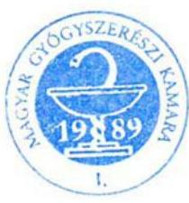

---

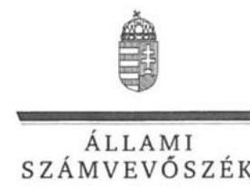

ELNÖK

# Dr. Hankó Zoltán úr 

elnök
Magyar Gyógyszerészi Kamara

## Budapest

## Tisztelt Elnök Úr!

A „Köztestületek ellenőrzése - Magyar Gyógyszerészi Kamara" címmel készített számvevőszéki jelentéstervezetre tett észrevételét köszönettel megkaptam.
Az Állami Számvevőszék észrevételre vonatkozó álláspontjáról a felügyeleti vezető által készített részletes tájékoztatást csatoltan megküldöm.
Tájékoztatom Elnök urat, hogy a számvevőszéki jelentésben - az Állami Számvevőszékről szóló 2011. évi LXVI. törvény 29. § (3) bekezdése alapján - a figyelembe nem vett észrevételeket szerepeltetjük az elutasítás indokának feltüntetésével.

Budapest, 2017. 27. hó 9. nap
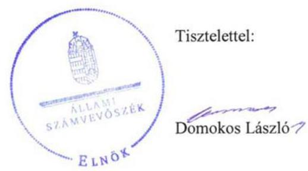

Melléklet: Tájékoztatás az elfogadott és el nem fogadott észrevételekről

---

# Tájékoztatás az elfogadott és el nem fogadott észrevételekről 

A „Köztestületek ellenőrzése - Magyar Gyógyszerészi Kamara" című jelentéstervezetre a 161-2/2017. iktatószámú levélben tett észrevételeit áttekintettem. Ezúton tájékoztatom, hogy az Állami Számvevőszékhez 2017. június 23-án beérkezett észrevételéhez csatolt 2 db mellékletet a számvevőszéki jelentés készítésekor már nem tudjuk figyelembe venni, tekintettel arra, hogy az adatszolgáltatás 2016. november 14-én lezárult, továbbá a beküldött dokumentumok hitelességéről nem áll módunkban meggyőződni.

Észrevételeinek kezeléséről az alábbi tájékoztatást adom.
A 161-2/2017. iktatószámú levél 1-2. oldalain az 1-3. pontokban foglalt megjegyzések kapcsán

Tekintettel arra, hogy a hivatkozott megjegyzések Elnök úr álláspontja szerint sem kapcsolódnak közvetlenül a jelentéstervezethez, ezért az abban foglaltakat az Állami Számvevőszék (továbbiakban: ÁSZ) nem értékelte.

A jelentéstervezet 13. oldalán szereplő „Az MGYK gazdálkodása nem volt teljes körűen szabályozott, gazdálkodása nem volt szabályszerű" összegző megállapításra tett észrevétele kapcsán

Az összegző megállapításban foglaltakat - „Az MGYK gazdálkodása nem volt teljes körűen szabályozott, gazdálkodása nem volt szabályszerű." - változatlanul fenntartjuk az alábbiakra tekintettel.

A jelentéstervezet 13. oldal 1.1. sz. megállapítás 3-4. bekezdésére tett észrevétele kapcsán
Köszönettel vettem Elnök úr tájékoztatását, amely szerint a Magyar Gyógyszerészi Kamara (továbbiakban: Kamara) Számviteli politikáját, Leltározási szabályzatát, Pénzkezelési szabályzatát és a Bizonylati szabályzatát az ellenőrzött időszakban nem módosította. Továbbá, hogy a Kamara a 2000. évi C. törvény (továbbiakban: Számv. tv.) 14. § (11) bekezdés előírása ellenére elmulasztotta a törvénymódosítás esetén a változásokat annak hatálybalépését követő 90 napon belül a Számviteli politikáján keresztülvezetni. Elnök úr tájékoztatott továbbá arról is, hogy „... a szabályzatok elmaradt hatályosítása ellenére a könyvelés
 minden esetben az érintett jogszabályok hatályos szövegének alapulvételével történt, ezért a belső szabályozási hiányosság nem hathatott ki alapvetően a beszámoló szabályszerűségére." Észrevétele a megállapított hiányosságokat megerősíti, ezért a belső szabályozás hiányosságaira vonatkozó megállapításokat nem módosítja.

---

Köszönettel vettem Elnök úr tájékoztatását, amely szerint a Kamara független könyvvizsgálója az ellenőrzött időszak mindhárom évére vonatkozóan elvégezte a Kamara lezárt üzleti éveiről szóló egyszerűsített éves beszámolók könyvvizsgálatát. Ezúton tájékoztatom, hogy a Kamara gazdálkodását az ellenőrzött időszakban az ellenőrzési kérdésekre adott válaszok alapján értékeltük, amelyet „Az ellenőrzés módszerei" című fejezet részletesen tartalmazza. Az ellenőrzés típusát tekintve megfelelőségi ellenőrzést végeztünk, amelynek keretében a Kamara gazdálkodását a jogszabályi előírások alapján értékeltük. Ennek nem része a Kamara könyvvizsgálója által elvégzett munka értékelése. Észrevétele megállapítást nem érint, ezért azt nem módosít.

Nem fogadjuk el a bekerülési érték meghatározására irányuló észrevételét, amely szerint a Kamara a Számv. tv. 47. § (1) bekezdésében leírtakat vette figyelembe a könyvelésben a bekerülési érték meghatározásakor arra tekintettel, hogy az a gyakorlatra (azaz a könyvelésre) vonatkozott, ezzel szemben az észrevétellel érintett megállapítás az eszközök és források értékelési szabályzatával kapcsolatos hiányosságot tartalmazza. Észrevétele ezért a megállapítást nem módosítja.

# A jelentéstervezet 14. oldal 1.2. sz. megállapítás 2. bekezdésére tett észrevétele kapcsán 

Nem fogadjuk el észrevételét, amely a 2013-2015. évi egyszerűsített éves beszámolókra vonatkozik. A V-1260-007/2016. iktatószámú adatbekérő levelünk 1.2. pontjában a köztestület gazdálkodásának ellenőrzése céljából kérte az ÁSZ az országos szervezet 2013-2015. évi számviteli beszámolóinak megküldését. Az adatszolgáltatás keretében rendelkezésre bocsátott és ismételten felülvizsgált számviteli beszámolók az észrevétellel érintett megállapítást alátámasztják. Továbbá az ellenőrzés részére átadott egyszerűsített éves beszámolók vonatkozásában fennálló hiányosságokat észrevételében Elnök úr sem vitatta. Az észrevételben hivatkozott, ,,jogszabályoknak megfelelő nyomtatvány" formátumban elkészített beszámoló - az ellenőrzés részére átadott dokumentumok, valamint a Kamara elnöke és hivatalvezetője által aláírt teljességi és hitelességi nyilatkozat tartalmának felülvizsgálata alapján - az adatszolgáltatásra irányuló közreműködési kötelezettség teljesítése során nem került benyújtásra.

## A jelentéstervezet 14. oldal 1.2. sz. megállapítás 3. bekezdésére tett észrevétele kapcsán

A mérleg leltárral való alátámasztottságára vonatkozó észrevételében foglaltakat nem fogadjuk el, tekintettel arra, hogy a rendelkezésre bocsátott leltározási dokumentumok nem támasztják alá a Számv. tv. 69. § (1) és (3) bekezdésekben, továbbá a Leltározási szabályzatban előírt leltározási kötelezettség megfelelő teljesítését. Az egyeztetési feladatokról készített ellenőrző lista és a tárgyi eszközök vonatkozásában az elektronikus nyilvántartó programból a tárgyévi leltározási időszakon kívül előállított dokumentumok a leltározás hivatkozott előírásokkal összhangban történő elvégzését nem igazolják. Észrevétele ezért a megállapítást nem módosítja.

---

A jelentéstervezet 15. oldal 1.2. sz. megállapítás 4. bekezdésére és az 1.3. sz. megállapítás 1. bekezdésére - levelében 15. oldal 1.2. megállapítás 1. bekezdésére hivatkozással - tett észrevételei kapcsán

A részesedések bekerülési értékének meghatározása vonatkozásában tett észrevételben foglaltakat nem fogadjuk el, tekintettel arra, hogy a részesedések bekerülési értékének meghatározása a Békéshelp NKft. esetében nem állt összhangban a társasági szerződésben foglaltakkal, előidézve a megállapításban foglalt - a mérleg és az analitikus nyilvántartás, illetve a mérleg és az alátámasztást szolgáló számviteli bizonylat közötti - 0,9 M Ft összegű eltérést. A Békéshelp NKft. társasági szerződése alapján a társaság tagjai részéről a törzsbetéteik összege befizetésre került, amely a Magyar Gyógyszerészi Kamara Országos Szervezetét érintően, az észrevételben foglalt 875 e Ft-tal szemben 1750 e Ft pénzbeli hozzájárulást jelentett.

A könyvelési programban működésére hivatkozó, egyedi értékelésre vonatkozó megállapítást kifogásoló észrevételében foglaltakat nem fogadjuk el, tekintettel arra, hogy a mintatételek ellenőrzéséhez kapcsolódóan a Kamara által az ellenőrzés részére átadott „Beruházások, tárgyi eszközök nyilvántartási lapja" dokumentum alapján megállapítható volt, hogy több eszközt egy nyilvántartási számon vettek állományba.

A 2015. évi beszámoló összeállításához kapcsolódóan az értékvesztés elszámolására vonatkozó megállapításra tett észrevételét szintén nem fogadjuk el. Az Elnök úr által hivatkozott, a vevő minősítés megtörténtét igazoló jegyzőkönyv az ellenőrzés részére nem került átadásra, annak ellenére, hogy a V-1260-007/2016. iktatószámú adatbekérő levél 1.2. pontjában a köztestület gazdálkodásának ellenőrzése céljából az ÁSZ bekérte a mérlegtételek év végi értékelésének dokumentumait. A jegyzőkönyv dokumentumára hivatkozást a Kamara elnöke és hivatalvezetője által aláírt teljességi és hitelességi nyilatkozat sem tartalmazta.

Az egyedi értékelés elvének megsértésére vonatkozó észrevételében foglaltakat nem fogadjuk el, tekintettel arra, hogy a mintatételek ellenőrzéséhez kapcsolódóan a Kamara által az ellenőrzés részére átadott „Beruházások, tárgyi eszközök nyilvántartási lapja" dokumentum alapján megállapítható volt, hogy több eszközt egy nyilvántartási számon vettek állományba.

A szoftverek elszámolásához kapcsolódóan tett észrevételben Elnök úr a megállapításban foglaltakat megerősítve a szellemi termékek és vagyoni értékű jogok egyazon mérlegcsoporthoz tartozását hangsúlyozza, amely körülmény a megállapításban foglaltak helytállóságát nem befolyásolja.

A jelentéstervezet 15. oldal 1.3. sz. megállapítás első bekezdés utolsó mondatára tett észrevételét részben fogadjuk el. A dokumentumok ismételt áttekintését követően elfogadjuk észrevételét, amely szerint a 100 e Ft egyedi bekerülési értékű eszközöknél a leírás egy összegben megtörtént és ezt a számvevőszéki jelentés készítésénél a megállapítás módosításával figyelembe vesszük. A dokumentumok ismételt felülvizsgálata alapján ugyanakkor továbbra is megállapítható, hogy a Számv. tv. 80. § (2) bekezdése ellenére az értékcsökkenés nem a használatba vételkor, hanem

---

későbbi időpontban került elszámolásra. Ezért észrevételét e tekintetében nem fogadjuk el, a megállapítást nem módosítja.

A jelentéstervezet 15. oldal 1.2. sz. megállapítás 5. bekezdésére - levelében a 15. oldal 1.2. megállapítás 2. bekezdésére hivatkozással - tett észrevétele kapcsán

Nem fogadjuk el észrevételét, amely a jelentéstervezet 15. oldal 1.2. sz. megállapítás 5. bekezdésében foglalt megállapításra (,Az országos felügyelőbizottság az Alapszabály VI. fejezet 12.3. pontja előírása ellenére a küldöttközgyűlés elé nem terjesztette be állásfoglalását írásban a 2013-2015. évi költségvetések és a költségvetés végrehajtásáról szóló beszámolók tervezetéről. ") vonatkozott, tekintettel arra, hogy Elnök úr az abban foglaltakat megerősítette. Észrevétele ezért megállapítást nem módosít.

# A jelentéstervezet 15. oldal 1.3. sz. megállapítás 2. bekezdésére tett észrevétele kapcsán 

A költségelszámolás alapjául szolgáló bizonylatokra vonatkozó megállapításra tett észrevételét nem fogadjuk el. Észrevételében Elnök úr arra hivatkozott, hogy a költségelszámolás alapjául szolgáló bizonylatokra a könyvelés pillanatában rákerült a rögzítés időpontja és az összes érintett könyvviteli számla, valamint a számla sorszáma, amivel az utólagos azonosítása lehetséges. Az igénybe vett és egyéb szolgáltatások, illetve a személyi jellegű és egyéb ráfordítások tekintetében a kifizetés bizonylatának jogszabályban foglaltak szerinti megfelelőségét mintavétellel kiválasztott mintatételek alapján értékeltük, amelynek sokaságra történő kivetítését a számvevőszéki jelentéstervezet „Az ellenőrzés módszerei" című fejezet részletesen tartalmazza. A rendelkezésre bocsátott és ismételten felülvizsgált dokumentumok alapján a hivatkozott módszertan szerint elvégzett kiértékelés eredményét figyelembe véve került megállapításra, hogy a Számv. tv. 167. § (1) bekezdés c), h) és i) pontjai ellenére nem történt meg az utalványozás, nem szerepelt a rendelkezés végrehajtását igazoló személy aláírása, az érintett könyvviteli számlákra történő hivatkozás, valamint a könyvviteli nyilvántartásokban történt rögzítés időpontja, igazolása. Észrevétele ezért megállapítást nem módosít.

A jelentéstervezet 17. oldalán szereplő „A központi költségvetési támogatás felhasználása és elkülönített számviteli nyilvántartása szabályszerű volt, azonban a 2013-2014. évekre nyújtott támogatás pénzügyi elszámolása nem volt szabályszerű." összegző megállapításra tett észrevétele kapcsán

Az összegző megállapításban foglaltakat - „A központi költségvetési támogatás felhasználása és elkülönített számviteli nyilvántartása szabályszerű volt, azonban a 2013-2014. évekre nyújtott támogatás pénzügyi elszámolása nem volt szabályszerű." - változatlanul fenntartjuk az alábbiakra tekintettel.

---

# A jelentéstervezet 17. oldal 2.1. sz. megállapítás 3. bekezdésére tett észrevétele kapcsán 

A 2013. évi támogatás elszámolásához kapcsolódó észrevételben Elnök úr arra hivatkozott, hogy a 2013. évre vonatkozó szerződés keretében megítélt támogatásból 2,5 M Ft a hatályos jogszabályok alapján a 2012. évre a Kamarát megillető támogatás összegének minősült, de annak folyósítására ,,2012-ben nem került sor, ezért - mivel a támogatás 2012-re vonatkozott - aktív időbeli elhatárolásként került könyvelésre". Az ÁSZ rendelkezésre bocsátott 200822/2013/EGP. iktatószámon nyilvántartott Támogatási szerződés 1. pontja alapján a támogatás nyújtására a kedvezményezett kérelmére egyedi döntés alapján került sor, amelynek forrása a Magyar Köztársaság 2013. évi költségvetéséről szóló 2012. évi CCIV. törvény XX. Emberi Erőforrások Minisztérium fejezeten belül elkülönített részfeladathoz tartozó fejezeti kezelésű előirányzat. A Támogatási szerződés megkötésére 2013. július 14-én került sor, a támogatás felhasználásának kezdő időpontja az 5.3. pontban foglaltak értelmében 2013. január 1-je volt. A Támogatási szerződés hivatkozott tartalma és a szerződéskötés időpontja nem támasztja alá, hogy a támogatás 2,5 M Ft összegű része a Számv. tv. 32. § (1) bekezdés szerinti aktív időbeli elhatárolásként nyilvántartandó olyan egyéb járó bevételnek minősült volna, amely a mérleg fordulónapja után esedékes, de a mérleggel lezárt időszakra - a konkrét esetben 2012. évre - számolandó el. Az előzőekre tekintettel az észrevételben foglaltakat nem fogadjuk el, ezért megállapítást nem módosít.

Köszönettel vettem Elnök úr tájékoztatását a jelentéstervezet 18. oldal 2.2. sz. megállapítás 2. bekezdésére vonatkozóan, hogy a 2014. évi támogatás összegének folyósítása ,,átcsúszott a következő évre", amelynek okán a Kamara részéről a határidőben történő elszámolás ellehetetlenült. Tekintettel arra, hogy a hivatkozott körülmények nem eredményezték a Támogatási szerződés módosítását, a változatlan formában és tartalommal fennálló Támogatási szerződés 6.4. pont szerinti elszámolási határidő elmulasztására vonatkozó - „A költségvetési támogatás felhasználásáról az MGYK országos hivatala az EMMI felé a támogatási szerződés 1,2,3 6.4. pontjában foglalt határidőn túl számolt el. " - megállapítást fenntartjuk, annak helytállóságát Elnök úr sem vitatta, ezért azt nem módosítja.

## A jelentéstervezet 18. oldal 2.2. sz. megállapítás táblázat alatti 1. bekezdésére tett észrevételei kapcsán

A 2013. és a 2014. évi költségvetési támogatások pénzügyi elszámolásaival összefüggésben tett észrevételt nem fogadjuk el. A dokumentumok ismételt felülvizsgálata alapján megállapításra került, hogy a vonatkozó 20082-2/2013/EGP. iktatószámú és 59772-2/2014/EIFF. iktatószámú Támogatási szerződéseket - a 2.3 pontokban megjelöltek szerint - a Kamara szakmai feladat teljesítése során felmerülő költségei tekintetében 2,3%-os, illetve 1,0%-os intenzitású (4750000 Ft és 1488000 Ft összegű) támogatás tárgyában kötötték meg. A támogatás intenzitás a támogatás összegének és az elszámolható költségek hányadosa, százalékos formában kifejezve. A támogatási szerződések a fent leírtak alapján 97,7%-os és 99,0%-os saját forrás felhasználását írták elő. Mindezek alapján a 2013. és a 2014. évi pénzügyi elszámolások csak a támogatási összeg elszámolását tartalmazták, azonban a saját forrás felhasználását igazoló számviteli

---

bizonylatoknak és a kifizetést igazoló bizonylatoknak a hitelesített másolatát - a XX. Emberi Erőforrások Minisztériuma költségvetési fejezethez tartozó fejezeti kezelésű előirányzatok 2012. évi felhasználásának szabályairól szóló 34/2012. (X. 17.) EMMI rendelet 9. § (2) és a fejezeti kezelésű előirányzatok kezeléséről és felhasználásáról szóló 84/2013. (XII. 30) EMMI rendelet 10. § (2) bekezdésében foglalt előírás ellenére - nem tartalmazták. Észrevétele ezért a megállapítást nem módosítja.

Az idegen
 nyelvű bizonylat elszámolásához kapcsolódó észrevételében foglaltakat nem fogadjuk el. Elnök úr a magyar nyelvű tartalom feltüntetésének hiányát azzal magyarázta, hogy a „kiállító neve angol és magyar nyelven is azonosan íródik, valamint a díj mértéke is egyértelmű, ezért a Számv. tv. 166. § (4) bekezdés rendelkezésének ismeretében a bizonylatra további rájegyzés nem történt". Tekintettel arra, hogy a Számv. tv. 166. § (4) bekezdés előírását figyelmen kívül hagyva az adatrögzítéshez, könyveléshez szükséges adatként magyar nyelven nem került feltüntetésre a gazdasági esemény tartalma (tagdíj) sem, a megállapításban foglaltakat fenntartjuk. Észrevétele ezért a megállapítást nem módosítja.
A jelentéstervezet 19. oldalán szereplő „Az MGYK nem biztosította a nyilvánosságot. A gazdálkodás körébe tartozó közérdekű adatokkal kapcsolatos közzétételi, valamint a KSH felé az adatszolgáltatási kötelezettségek teljesítése az Info. tv., illetve a Stat. tv. előírásainak nem felelt meg, nem volt szabályszerű." összegző megállapításra tett észrevétele kapcsán

Az összegző megállapításban foglaltakat - „Az MGYK nem biztosította a nyilvánosságot. A gazdálkodás körébe tartozó közérdekű adatokkal kapcsolatos közzétételi, valamint a KSH felé az adatszolgáltatási kötelezettségek teljesítése az Info. tv. illetve a Stat. tv. előírásainak nem felelt meg, nem volt szabályszerű." - változatlanul fenntartjuk az alábbiakra tekintettel.

# A jelentéstervezet 19. oldal 3. sz. megállapítás 1. bekezdésére tett észrevétele kapcsán 

Az információs önrendelkezési jogról és az információszabadságról szóló 2011. évi CXII. törvény (továbbiakban: Info tv.) 37. § (1) bekezdésében hivatkozott általános közzétételi lista szerinti adatok közzétételéhez kapcsolódó észrevételét nem fogadjuk el. Az észrevétel keretében Elnök úr arra hivatkozott, hogy a Kamara a törvényi előírásoknak megfelelő gyakorlatot folytatva minden évben maradéktalanul eleget tesz a közzétételi kötelezettségének, amelyet az ÁSZ részére benyújtott általános közzétételi lista dokumentuma is igazol. A dokumentumok ismételt felülvizsgálata alapján megállapítható, hogy az éves költségvetések, valamint a létszám és személyi juttatásokra vonatkozó adatok közzétételére az ellenőrzött időszakra vonatkozóan nem került sor.

Az Info tv. 33. § (2) bekezdés c) pontja alapján a Kamarának saját honlapján kellett közzétenni a közzétételi listán szereplő adatokat. Az ÁSZ részére benyújtott általános közzétételi lista dokumentumában a költségvetések és személyi juttatások tekintetében a saját honlapon elhelyezett 2016. évi költségvetésre mutató beágyazott link került elhelyezésre. Az Info tv. 1. melléklet III. fejezet 1. pontja alapján a költségvetés honlapon történő megőrzését a közzétételtől számított 10

---

évig szükséges biztosítani, ezért az ellenőrzés lefolytatásának időszakában többek között az ellenőrzött 2013-2015. évekre vonatkozó költségvetések elérhetőségét a Kamarának lehetővé kellett volna tennie. Az Info tv. 1. melléklet III. fejezet 2. pontja szerinti - létszámra és személyi juttatásokra vonatkozó - adatok közzétételét negyedévente történő frissítés mellett és a tényleges időszaki teljesítésnek megfelelő tartalommal (nem a költségvetési tervadatok formájában) szükséges közzétenni, amely a 2016. évi költségvetés és az észrevételben hivatkozott további dokumentum (2012. március 6-án közzétett, az elnökség tagjaira vonatkozó adatok) elérhetővé tételével nem valósult meg. Észrevétele megállapítást nem módosít.

Köszönettel vettem Elnök úr közzétételre vonatkozó további kiegészítő tájékoztatását, a nyilvánosság biztosítására irányuló törekvésekről történő beszámolását.

# A jelentéstervezet 19. oldal 3. sz. megállapítás 2. bekezdésére tett észrevétele kapcsán 

Észrevételében Elnök úr a 2013. és a 2015. évi statisztikai adatszolgáltatási kötelezettség tekintetében feltárt hiányosságok körülményeiről nyújtott kiegészítő tájékoztatást. Észrevételében foglaltak a statisztikáról szóló 1993. évi XLVI. törvény 9. § (1) bekezdése szerinti előírás megsértését nem vitatják, ezért az észrevétel a megállapítást nem módosítja.

A jelentéstervezet 19. oldalán szereplő „A törvényességi felügyeletet ellátó miniszter - az Ekt.-ban foglaltak ellenére - az MGYK működésével kapcsolatban törvényességi felügyeleti jogkörben nem intézkedett, törvényességi ellenőrzésekre nem került sor." összegző megállapításra tett észrevétele kapcsán

Az összegző megállapításban foglaltakat - „A törvényességi felügyeletet ellátó miniszter - az Ekt.-ban foglaltak ellenére - az MGYK működésével kapcsolatban törvényességi felügyeleti jogkörben nem intézkedett, törvényességi ellenőrzésekre nem került sor." - változatlanul fenntartjuk az alábbiakra tekintettel.

A jelentéstervezet 19. oldal 4. összegző megállapítás alatti 2. bekezdésére tett észrevétele kapcsán

Észrevétele alapján a rendelkezésre álló dokumentumokat ismételten áttekintettük és a 2014. év tekintetében a határidő elmulasztásával kapcsolatos megállapítást a jelentés készítése során töröljük. További észrevételét nem fogadjuk el arra tekintettel, hogy Elnök úr a megállapítás helytállóságát nem vitatta.

Budapest, 2017.
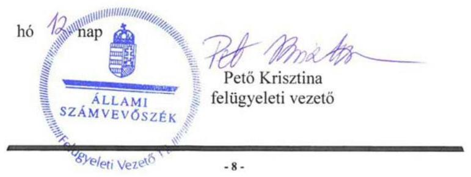

---

# RÖVIDÍTÉSEK JEGYZÉKE 

${ }^{1}$ MGYK
${ }^{2}$ Ptk. 1
${ }^{3}$ Áhtm.
${ }^{4}$ Ekt.
${ }^{5}$ MGYK országos szervei
${ }^{6}$ MGYK országos szervezete
${ }^{7}$ BÉKÉSHELP Non-profit Kft.
${ }^{8}$ GALENUS Kft.
${ }^{9}$ Gyógyszerészi Gondozásért Nonprofit Kft.
${ }^{10}$ Magyarország 2013-2015. évi költségvetési törvényei
${ }^{11}$ EMMI
${ }^{12}$ támogatási szerződés
támogatási szerződés
támogatási szerződés
${ }^{13}$ ÁSZ
${ }^{14}$ ÁSZ tv.
${ }^{15}$ Ptk. 2
${ }^{16}$ Számviteli politika
${ }^{17}$ Leltározási szabályzat
${ }^{18}$ Eszközök és források értékelési szabályzata (hatályos: 2012. január 2-ától)
${ }^{19}$ Pénzkezelési szabályzat
${ }^{20}$ Bizonylati szabályzat
${ }^{21}$ 224/2000. (XII. 19.) Korm. rendelet
${ }^{22}$ küldöttközgyűlés
${ }^{23}$ országos felügyelőbizottság

Magyar Gyógyszerészi Kamara
Polgári Törvénykönyvről szóló 1959. évi IV. törvény (hatályos: 2014. március 14-ig) az államháztartásról szóló 1992. évi XXXVIII. törvény és egyes kapcsolódó törvények módosításáról szóló 2006. évi LXV. törvény
az egészségügyben működő szakmai kamarákról szóló 2006. évi XCVII. törvény
Magyar Gyógyszerészi Kamara országos szervei az Ekt. 6. § (1) bekezdése szerinti országos ügyintéző szervek (elnökség, etikai bizottság, felügyelőbizottság, etikai kollégium, alapszabályban meghatározott más állandó bizottságok, valamint az Ekt. 10. § (1) bekezdése szerinti országos hivatal.
Az Ekt. 6. § (1) bekezdése szerinti országos ügyintéző szervek és a 10. § (1) bekezdése szerinti országos hivatal képezik az országos szervezetet. (Ekt. 6. § (1) bekezdése).
BÉKÉSHELP Szolgáltató Non-profit Korlátolt Felelősségű Társaság (alapítás dátuma: 2008. február 28., cégjegyzékszám: 01-09-897900)
GALENUS Gyógyszerészeti Lap és Könyvkiadó Korlátolt Felelősségű Társaság (alapítás dátuma: 1996. augusztus 22., cégjegyzékszám: 01-09-668409)
Gyógyszerészi Gondozásért Nonprofit Korlátolt Felelősségű Társaság (alapítás dátuma: 2010. szeptember 8., cégjegyzékszám: 01-09-945712)

Magyarország 2013. évi központi költségvetéséről szóló 2012. évi CCIV. törvény, Magyarország 2014. évi központi költségvetéséről szóló 2013. évi CCXXX. törvény, Magyarország 2015. évi központi költségvetéséről szóló 2014. évi C. törvény Emberi Erőforrások Minisztériuma
Az Emberi Erőforrások Minisztériumával 2013. július 14-én megkötött, 200822/2013/EGP ikt. számú támogatási szerződés
Az Emberi Erőforrások Minisztériumával 2014. december 31-én megkötött, 59772-2/2014/EIFF ikt. számú támogatási szerződés
Az Emberi Erőforrások Minisztériumával 2015. december 22-én megkötött, 49247-4/2015/EIFF ikt. számú támogatási szerződés
Állami Számvevőszék
az Állami Számvevőszékről szóló 2011. évi LVXI. törvény
Polgári Törvénykönyvről szóló 2013. évi V. törvény (hatályos: 2014. március 15-től)
Magyar Gyógyszerészi Kamara Számviteli politikája (hatályos: 2012. január 2-tól)
Magyar Gyógyszerészi Kamara Leltározási szabályzata (kiadva: 2012. január 2-án.)
Magyar Gyógyszerészi Kamara Eszközök és források értékelési szabályzata (hatályos: 2012. január 2-ától)
Magyar Gyógyszerészi Kamara Házipénztár kezelési szabályzata (hatályos: 2012. január 2-tól)
Magyar Gyógyszerészi Kamara Bizonylati szabályzata (hatályos: 2012. január 2-tól)
a számviteli törvény szerinti egyes egyéb szervezetek beszámolókészítési és könyvvezetési kötelezettségének sajátosságairól szóló 224/2000. (XII. 19.) Korm. rendelet (hatályos: 2016. december 31-ig)
Magyar Gyógyszerészi Kamara küldöttközgyűlése
Magyar Gyógyszerészi Kamara országos felügyelőbizottsága

---

${ }^{24}$ 34/2012. (X. 17.) EMMI rendelet
${ }^{25}$ 84/2013. (XII.30) EMMI rendelet
${ }^{26} \mathrm{KSH}$
${ }^{27}$ Info. tv.
${ }^{28}$ Stat. tv.
${ }^{29}$ 288/2009. (XII. 15.) Korm. rendelet

34/2012. (X. 17.) EMMI rendelet a XX. Emberi Erőforrások Minisztériuma költségvetési fejezethez tartozó fejezeti kezelésű előirányzatok 2012. évi felhasználásának szabályairól (hatályos: 2012. október 20-tól 2013. december 30-ig)
84/2013. (XII. 30.) EMMI rendelet a fejezeti kezelésű előirányzatok kezeléséről és felhasználásáról (hatályos: 2013. december 30-tól 2015. december 30-ig)
Központi Statisztikai Hivatal
az információs önrendelkezési jogról és az információszabadságról szóló 2011. évi CXII. törvény
a statisztikáról szóló 1993. évi XLVI. törvény (hatályos: 2016. december 31-ig)
az Országos Statisztikai Adatgyűjtési Program adatgyűjtéseiről és adatátvételeiről szóló 288/2009. (XII. 15.) Korm. rendelet

---

ÁLLAMI SZÁMVEVŐSZÉK
1052 Budapest, Apáczai Csere János utca 10.
Levélcím: 1364 Budapest 4. Pf. 54
Telefon: +36 14849100 Telefax: +36 14849200
www.asz.hu
