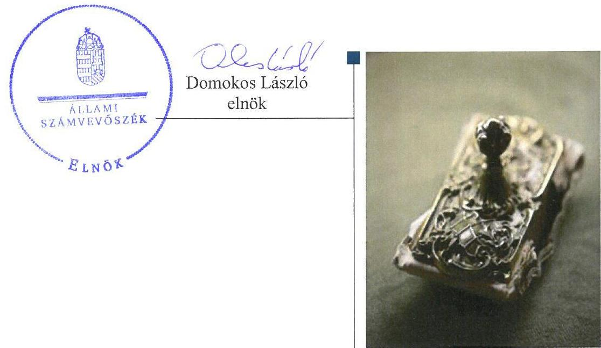
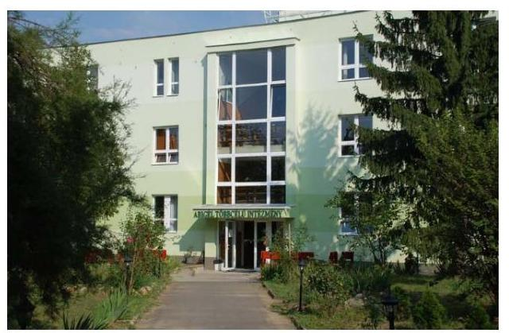
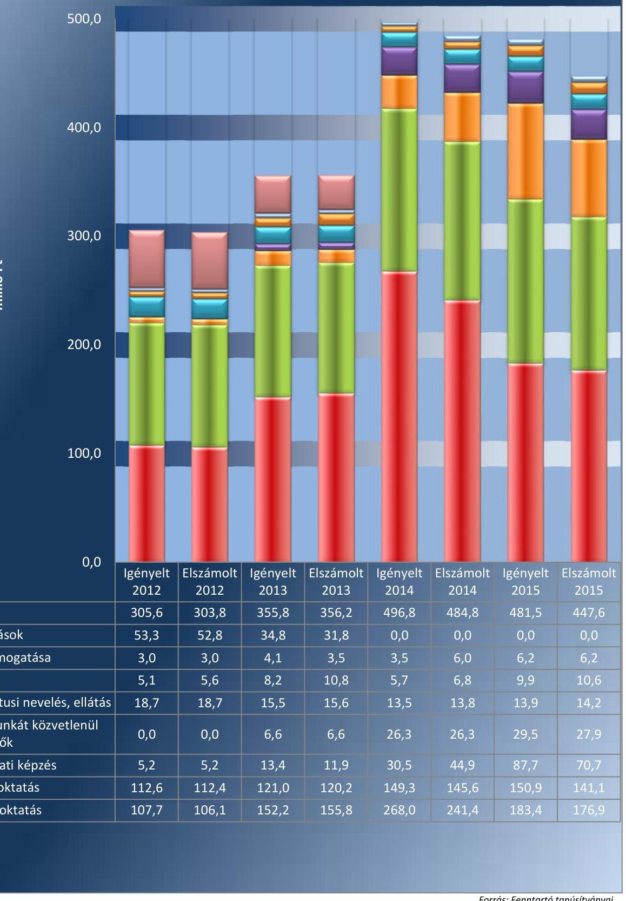
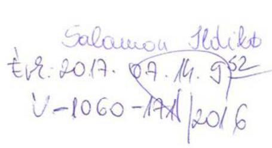
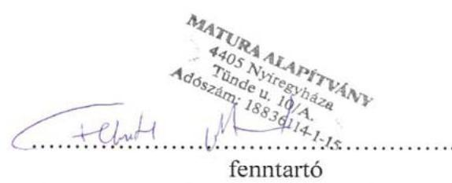

# Jelenetés 

## Nem állami humánszolgáltatók ellenőrzése

A humánszolgáltatást nyújtó államháztartáson kívüli köznevelési intézmények, szolgáltatók fenntartói központi költségvetésből kapott támogatásai felhasználásának ellenőrzése Matura Alapítvány
2017.

---

# Jelentés 

## Nem állami humánszolgáltatók ellenőrzése

A humánszolgáltatást nyújtó államháztartáson kívüli köznevelési intézmények, szolgáltatók fenntartói központi költségvetésből kapott támogatásai felhasználásának ellenőrzése Matura Alapítvány
2017. 08 hó 10 nap

---

# AZ ELLENŐRZÉST FELÜGYELTE:

- **SALAMON ILDIKÓ** felügyeleti vezető

- **AZ ELLENŐRZÉST VEZETTE ÉS A VÉGREHAJTÁSÁÉRT FELELŐS:**

- **CSORDÁS PÉTERNÉ** ellenőrzésvezető

- **A PROGRAM ÖSSZEÁLLÍTÁSÁÉRT FELELŐS:**

- **JANIK JÓZSEF LÁSZLÓ** osztályvezető

**IKTATÓSZÁM: V-1060-165/2016.**

**TÉMASZÁM: 2094**

**ELLENŐRZÉS-AZONOSÍTÓ SZÁM: V076603**

Jelentéseink az Országgyűlés számítógépes hálózatán és az Interneta a www.asz.hu címen is olvashatóak.

---

# TARTALOMJEGYZÉK 

■ ÖSSZEGZÉS ..... 5
■ AZ ELLENŐRZÉS CÉLJA ..... 6
■ AZ ELLENŐRZÉS TERÜLETE ..... 7
■ AZ ELLENŐRZÉS HÁTTERE, INDOKOLTSÁGA ..... 8
■ A JELENTÉS LÉNYEGES KÉRDÉSKÖREI ..... 9
■ ELLENŐRZÉS HATÓKÖRE ÉS MÓDSZEREI ..... 10
■ MEGÁLLAPÍTÁSOK ..... 12
■ JAVASLATOK ..... 16
■ MELLÉKLETEK ..... 17
I. sz. melléklet: Értelmező szótár ..... 17
II. sz. melléklet: Az ellenőrzött központi költségvetési támogatások alakulása. ..... 18
■ FÜGGELÉK: ÉSZREVÉTELEK ..... 19
■ RÖVIDÍTÉSEK JEGYZÉKE ..... 21

---

.

---

# ÖSSZEGZÉS 

A nyíregyházi székhelyű Matura Alapítványnál a közfeladat-ellátás kereteinek kialakítása szabályszerű volt. A központi költségvetésből kapott támogatásokat szabályszerűen átadta intézményének. A közfeladat-ellátás során az átláthatóság érvényesülését nem biztosította, mivel nem gondoskodott a jogszabályokban előírt közérdekü adatok, dokumentumok közzétételéről, így a nyilvánosság és a szolgáltatást igénybe vevők nem jutottak megfelelő információhoz.

## Az ellenőrzés társadalmi indokoltsága

Az Állami Számvevőszék stratégiájában hangsúlyos szerepet szán annak, hogy szilárd szakmai alapon álló, értékteremtő ellenőrzéseivel előmozdítsa a közpénzügyek átláthatóságát, rendezettségét és javaslataival a közpénzek és a közvagyon szabályos, gazdaságos, hatékony és eredményes felhasználását segítse. Stratégiájában az Állami Számvevőszék célul tűzte ki, hogy az államháztartáson kívülre nyújtott költségvetési támogatások ellenőrzésével hozzájárul ahhoz, hogy a közpénzeket az államháztartáson kívüli szervezetek is átlátható módon használják fel a közfeladatok szerződésben vállalt ellátása érdekében. Tekintettel az elmúlt években a köznevelés finanszírozását és a köznevelési intézmények fenntartását érintően végbement változásokra, a társadalom fokozott érdeklődéssel figyeli a köznevelési feladatok ellátására fordított források felhasználását. Fontos ezért az Állami Számvevőszéknek a közvéleményt biztosítani arról, hogy a közpénz államháztartáson kívüli felhasználása ezen a területen sem marad ellenőrizetlenül. Hozzájárul ezzel ahhoz is, hogy a nyilvánosság és az igénybe vevők megfelelő tájékoztatást kapjanak az államháztartáson kívüli közfeladatot ellátók múködéséről.

## Főbb megállapítások, következtetések

A Matura Alapítvány, mint intézményfenntartó a közfeladat-ellátás kereteit a jogszabályi előírásoknak megfelelően alakította ki. Alapító okirata megfelelt a jogszabályi előírásoknak, módosításait szabályszerűen bejelentette a bíróság felé. A Fenntartó a központi költségvetési támogatások igénybevételéhez előírt feltételeket biztosította és a belső szabályozottsága is megfelelt a jogszabályoknak, rendelkezett a jogszabályban előírt számviteli szabályzatokkal.

A Matura Alapítvány az Intézménye múködtetésének kereteit a jogszabályi előírásoknak megfelelően biztosította, az alapfeladatokat alapító okiratban meghatározta, a nyilvántartásokba vétel megtörtént és a szükséges múködési engedélyek is rendelkezésre álltak. Az intézményi alapdokumentumokat a jogszabályokban előírtak szerint jóváhagyta, illetve azokhoz egyetértését adta. A központi költségvetésből kapott támogatásokat - egy esetbeli késedelmes átadás kivételével - a jogszabályi előírásoknak megfelelően átadta az Intézményének. A támogatások felhasználásáról vezetett nyilvántartás megfelelt az előírásoknak.

A Matura Alapítvány a jogszabályi előírások ellenére nem biztosította az átláthatóság érvényesülését. Nem értékelte az Intézménye pedagógiai programjában meghatározott feladatok végrehajtását, a pedagógiai-szakmai munkájának eredményességét. Nyilvánosságra hozandó értékelés hiányában nem biztosította, hogy a szolgáltatást igénybe vevők megfelelő információkhoz jussanak a köznevelési intézmény múködéséről. A Matura Alapítvány nem határozta meg az adatok biztonságának, védelmének érvényre juttatásához szükséges eljárási szabályokat, továbbá nem szabályozta a kötelezően közzéteendő adatok nyilvánosságra hozatalának rendjét és nem gondoskodott az adatok jogszabály szerinti közzétételéről. A beszámoló készítési kötelezettségének a jogszabályi előírásoknak megfelelően eleget tett.

---

# AZ ELLENŐRZÉS CÉLJA 

AZ ELLENŐRZÉS CÉLJA annak értékelése volt, hogy a Fenntartó ${ }^{1}$ központi költségvetésből kapott támogatásainak felhasználása szabályszerű volt-e, a támogatások igénylése, évközi módosítása és év végi elszámolása megfelelt-e a jogszabályi előírásoknak.

---

# AZ ELLENŐRZÉS TERÜLETE 

## A Matura Alapítvány, mint Fenntartó

A Fenntartót magánszemély hozta létre 2002-ben azzal a céllal, hogy az észak-alföldi régióban élők elhelyezkedési esélyeit javítsa, a tudományok és a művészetek terén a gyermekeknek, fiatalkorúaknak és felnőtteknek nyújtott képzéseivel, szakképzéseivel és átképzéseivel. Az alapítástól eltelt időszak alatt a Fenntartó a vagyonát 2015-re 43,0 M Ft-ra gyarapította. A Fenntartó képviseletét az ellenőrzött időszakban a háromtagú kuratórium élén álló elnök, a felügyeletét háromtagú felügyelőbizottság látta el. A Fenntartó vállalkozási tevékenységet nem végzett, a könyvviteli szolgáltatás körébe tartozó feladatok ellátásával gazdasági társaságot bízott meg. A Fenntartónak könyvvizsgálati kötelezettsége nem volt a Számv. tv. ${ }^{2}$ alapján, könyvvizsgálat nem történt az ellenőrzött időszakban.

A Fenntartó az alapító okiratában ${ }^{3}$ meghatározott céljait Intézményén ${ }^{4}$, az Abigél Többcélú Intézményen keresztül látta el. Az Intézmény Hajdú-Bihar Megyében, Szabolcs-Szatmár-Bereg Megyében és Borsod-AbaújZemplén Megyében 2012. évben 45, a 2015. évben 31 feladatellátási helylyel rendelkezett. Az Intézmény feladatai között két tanítási nyelvű általános iskolai, kollégiumi, gimnáziumi és szakközépiskolai nevelés-oktatás, felnőttoktatás, alapfokú művészetoktatás, sajátos nevelési igényű tanulók iskolai nevelése-oktatása, szakiskolai és szakközépiskolai szakképzés, valamint iskola-egészségügyi ellátás szerepelt. Az Intézmény a Közokt. tv. ${ }^{5}$ és az Nkt. ${ }^{6}$ előírásai szerint jogi személynek minősült, önálló költségvetéssel rendelkezett, azzal önállóan gazdálkodott. Az Intézmény engedélyezett tanulói létszáma 2012-ben 10550 fő, 2013-ban 10865 fő, 2014-ben 10980 fő, 2015-ben 9733 fő volt. A vonatkozó statisztikai adatok szerinti tényleges létszám minden évben az engedélyezett alatt alakult, 2012-ben 2800 fő, 2013-ban 3023 fő, 2014-ben 2839 fő, 2015-ben 2906 fő volt.

A Fenntartó 2012-2015 között minden évben központi költségvetési támogatás iránti igénylést nyújtott be a Kincstárhoz ${ }^{7}$, majd a kapott támogatásokkal a tárgyévet követően elszámolt. A II. melléklet tartalmazza az ellenőrzött központi költségvetési támogatások alakulását. Emellett a Fenntartó közoktatási megállapodás alapján is kapott költségvetési támogatást az ellenőrzött időszakban.

A Matura Alapítvány, mint közfeladat-ellátásában részt vevő Intézményfenntartó, Magyarország éves költségvetéséből támogatásra volt jogosult, amelynek összege az egyszerűsített éves beszámoló alapján a 2012. évben 288,8 M Ft, 2013-ban 358,4 M Ft, 2014-ben 482,1 M Ft, 2015. évben pedig 449,1 M Ft volt. Az összes bevételének 100,0\%-át, illetve megközelítőleg 100,0\%-át tette ki az állami támogatás évente, amely 2012. évről 2015. évre 55,5\%-kal emelkedett.

A szakmai irányító szervi feladatokat a Minisztérium ${ }^{8}$ látta el az ellenőrzött időszakban, ellenőrzési feladatokat az illetékes kormányhivatalok ${ }^{9}$ végeztek.

---

# AZ ELLENŐRZÉS HÁTTERE, INDOKOLTSÁGA 

A köznevelési és szociális feladatokat ellátó nem állami Intézményfenntartók részére közfeladataik ellátására évente jelentős összegű pénzügyi támogatást biztosítottak a mindenkori költségvetési törvények a bennük megfogalmazott feltételek mellett. A felhasználható állami támogatások Kvtv. ${ }^{10}$ szerinti előirányzata 2012-2015. években együtt 894,0 Mrd Ft volt. A 2013. évben jelentős változások következtek be a normatív finanszírozás rendszerében, amely érintette a nem állami intézményfenntartókat is. Az Országgyűlés elfogadta a nemzeti köznevelésről szóló 2011. évi CXC. törvényt, amely jelentősen átalakította a korábbi finanszírozási rendszert 2013 szeptemberétől. A köznevelési területen új feladatfinanszírozási forma (átlagbéralapú támogatás) jelent meg, amely a nem állami intézményfenntartókra is vonatkozik. Az ellenőrzés a finanszírozási rendszerben 2011-2015 között bekövetkezett változásokra, azok közfeladat ellátásra gyakorolt hatására fókuszál a költségvetési támogatásokat felhasználó államháztartáson kívüli szervezetek körében. Az ellenőrzés indokoltságát az is alátámasztja, hogy az ÁSZ ${ }^{11}$ még nem ellenőrizte átfogóan e területet.

Az ÁSZ stratégiájában foglaltak alapján is indokolt az ellenőrzés, amely a társadalom számára jelzi, hogy a közpénz államháztartáson kívüli felhasználása sem maradhat ellenőrizetlenül. Az államháztartáson kívülre nyújtott költségvetési támogatások ellenőrzésével az ÁSZ hozzájárul ahhoz, hogy a közpénzeket a nem állami humán fenntartók átlátható módon használják fel a közfeladatok ellátására kötött szerződésekben vállalt kötelezettségek teljesítése érdekében. Az ellenőrzés javaslataival hozzájárulhat az említett rendszerek szabályszerű támogatás felhasználásához, javíthatja a társa-dalmi-gazdasági döntések megalapozottságát, amely a „jó kormányzás" feltétele.

---

# A JELENTÉS LÉNYEGES KÉRDÉSKÖREI 

1. A Fenntartónál a közfeladat-ellátás kereteinek kialakítása szabályszerű volt-e?
2. A Fenntartó a központi költségvetésből kapott támogatásokat szabályszerűen használta-e fel?
3. A Fenntartó közfeladat-ellátása során biztosította-e az átláthatóság érvényesülését?
4. A Fenntartó intézkedett-e a külső ellenőrzések megállapításaira?

---

# ELLENŐRZÉS HATÓKÖRE ÉS MÓDSZEREI 

## Az ellenőrzés típusa

Megfelelőségi ellenőrzés.

## Az ellenőrzött időszak

A 2012. január 1-je és 2015. december 31-e közötti évek. A 2012. év vonatkozásában a költségvetési támogatások 2012. évet megelőző időszakra eső igénylését, a 2015. év tekintetében annak 2016-ban történő elszámolását is ellenőrizte az ÁSZ.

## Az ellenőrzés tárgya

Az ellenőrzés a köznevelési közfeladatokat ellátó nem állami fenntartó központi költségvetésből kapott támogatásai felhasználására terjedt ki. Az alábbi jogcímek szabályszerűségének értékelését foglalta magában:
$\longrightarrow$ az alap normatív- és átlagbér alapú költségvetési támogatások közül az általános iskolai nevelés-oktatás, középfokú nevelés-oktatás, felnőttoktatás, alapfokú művészetoktatás, kollégiumi-, sajátos nevelési igényű tanulók iskolai nevelése-oktatása,
$\longrightarrow$ a kiegészítő támogatások közül a tanulóétkeztetési - és a tankönyvtámogatás.
Az ellenőrzés kiterjedt minden olyan körülményre és adatra, amely az ÁSZ jogszabályban meghatározott feladatainak teljesítéséhez, valamint a program végrehajtása folyamán felmerült újabb összefüggések feltárásához szükséges volt.

## Az ellenőrzött szervezet

Matura Alapítvány

## Az ellenőrzés jogalapja

Az ellenőrzés jogszabályi alapját az ÁSZ tv. ${ }^{12}$ 1. § (3) bekezdése és az 5. § (3) bekezdésében foglalt előírások adták.

---

# Az ellenőrzés módszerei 

Az ellenőrzést az ellenőrzési program kérdései, az adott időszakban hatályos jogszabályok, az ellenőrzés szakmai szabályok és módszertanok, valamint a nemzetközi standardok figyelembevételével végezte az ÁSZ.

A közpénzekkel való felelős gazdálkodás segítésére irányuló javaslatok kidolgozásakor a hatályos jogszabályok voltak az irányadóak.

Az ellenőrzés ideje alatt az ÁSZ a Fenntartóval történő kapcsolattartást az ÁSZ SZMSZ ${ }^{13}$-ének vonatkozó előírásai alapján biztosította.

Az ellenőrzési kérdések megválaszolásához szükséges bizonyítékok megszerzése az ellenőrzöttek által rendelkezésre bocsátott dokumentumokra, adatokra alapozva megfigyeléssel, szemlével (szemrevételezéssel), kérdésfeltevéssel (információkéréssel), valamint elemző eljárással történt.

Az ellenőrzési bizonyítékként felhasznált adatforrások közé tartoztak egyrészt a szakmai program részletes szempontjainál felsorolt adatforrások, másrészt minden - az ellenőrzés folyamán feltárt, az ellenőrzés szempontjából információt tartalmazó - dokumentum.

Az ellenőrzés lefolytatásához a Fenntartó a kitöltött tanúsítványok, valamint az ÁSZ által kért dokumentumok elektronikus úton való megküldésével szolgáltatott adatokat, információkat. Az így rendelkezésre bocsátott adatok, információk és a tanúsítványok adatai valódiságának kontrollja az ellenőrzés keretében történt.

A szabályosság megítélésének az alapját képezte, hogy a központi költségvetési támogatások Fenntartó általi igénylése és év végi elszámolása a Kincstár felé megtörtént.

A központi költségvetésből kapott támogatások szabályszerű felhasználását a Fenntartó vonatkozásában, a támogatások intézmény részére - annak múködtetésére - történő továbbutalásának, valamint a támogatások felhasználásáról a jogszabályban előírt nyilvántartás vezetésének az értékelésével végezte az ÁSZ.

---

# 1. A Fenntartónál a közfeladat-ellátás kereteinek kialakítása szabályszerű volt-e? 

## Összegző megállapítás

### 1.1. számú megállapítás

A Fenntartó a közfeladat-ellátás kereteit szabályszerűen alakította ki.

A Fenntartónál a közfeladat-ellátás szervezeti kereteinek kialakítása megfelelt a jogszabályi előírásoknak.

A Fenntartó a közoktatási, köznevelési közfeladat-ellátási tevékenységének szervezeti kereteit a Civil tv ${ }^{14}$., a Közokt. tv. és az Nkt. előírásainak megfelelően kialakította. A Fenntartó rendelkezett a Ptk. ${ }^{15}$ és a Ptk. ${ }^{16}$ előírásainak megfelelő hatályos alapító okirattal. A Fenntartó alapító okiratának módosítását minden esetben, annak jóváhagyását követően, a Cnytv. ${ }^{17}$ által előírt határidőn belül jelentette be a bíróságnak. A 2010. július 23. keltezésú alapító okirat 10. pontja, valamint a 2014. május 21. keltezésú alapító okirat 9. pontja évi legalább egy ülés megtartását írta elő a Fenntartó felügyelőbizottsága részére. A felügyelőbizottság az előírás ellenére az ellenőrzött időszakban egy alkalommal ülésezett, amelyre 2013-ban került sor.

A Fenntartó a támogatásigényléshez benyújtott dokumentációja szerint - a támogatás igénylés alapját jelentő - Áht.-ban ${ }^{18}$ foglalt feltételeknek megfelelt, mivel átlátható szervezetnek minősült, továbbá rendezett munkaügyi kapcsolatokkal rendelkezett. A költségvetési támogatás igénylését megalapozó - Közokt. vhr.-ben ${ }^{19}$ és az Nkt. vhr.-ben ${ }^{20}$ előírtaknak megfelelő - dokumentumok és összesítő nyilvántartások a Fenntartónál rendelkezésre álltak. A Fenntartó rendelkezett információval az Intézmény OM azonosítójáról ${ }^{21}$, a gyermek, illetve tanuló létszámról, az alkalmazottakról.

### 1.2. számú megállapítás

A Fenntartó belső szabályozottsága megfelelt a jogszabályi előírásoknak.

A Fenntartó rendelkezett számviteli politikával ${ }^{22}$, amelynek kialakítása megfelelt a Számv. tv. előírásainak, továbbá a számviteli politika keretében a Számv. tv.-ben foglalt előírásoknak megfelelően, elkészítette a leltározási ${ }^{23}$, értékelési ${ }^{24}$, valamint a pénzkezelési szabályzatot. ${ }^{25}$ A Fenntartó egyszerűsített éves beszámoló készítésére volt kötelezett, így a Számv. tv. 14. § (6) bekezdése alapján mentesült az önköltségszámítás rendjére vonatkozó belső szabályzat elkészítésének kötelezettsége alól. A Fenntartó a Számv. tv. általi kötelezettségét teljesítve elkészítette a számlarendjét ${ }^{26}$.

---

# 2. A Fenntartó a központi költségvetésből kapott támogatásokat szabályszerűen használta-e fel? 

Összegző megállapítás

2.1. számú megállapítás

A Fenntartó a központi költségvetésből kapott támogatásokat az Intézmény múködtetésére, szabályszerűen használta fel.

A Fenntartó a jogszabályi előírásoknak megfelelően biztosította az Intézmény múködtetésének a kereteit.

A Fenntartó meghatározta az Intézménye alapfeladatait a Közokt. tv , illetve az Nkt. előírásaival összhangban az Intézmény alapító okiratában. Az Intézmény az ellenőrzött időszakban szerepelt a feladatellátási helyei szerint illetékes kormányhivatalok nyilvántartásaiban, a KIR ${ }^{27}$ nyilvántartásban, valamint rendelkezett OM azonosítóval. A Fenntartónál rendelkezésre álltak a Közokt. tv.-ben, a Közokt. vhr.-ben, az Nkt.-ben, valamint az Nkt. vhr.-ben előírt hatályos intézményi múködési engedélyek. A Fenntartó az engedélyezési eljárások során igazolta, hogy az Intézménye közfel-adat-ellátásához szükséges személyi és tárgyi feltételeket biztosította.

A Fenntartó Intézmény múködtetését megalapozó feladatellátása szabályszerű volt. A Fenntartó a 2012. január 1. és 2012. augusztus 31. közötti időszakot érintően a Közokt. tv.-ben előírtaknak megfelelően jóváhagyta az Intézmény szervezeti és múködési szabályzatát, minőségirányítási programját, pedagógiai programját és házirendjét. Az Nkt.-ben előírtaknak megfelelően a 2012. szeptember 1. és 2015. december 31. közötti időszak vonatkozásában az Intézmény pedagógiai programjához, házirendjéhez, szervezeti és múködési szabályzatához egyetértését adta. A Fenntartó a Közokt. tv. és az Nkt. alapján évenként meghatározta a köznevelési Intézménye költségvetését, továbbá meghatározta a kérhető költségtérítés és tandíj megállapításának szabályait, a szociális alapon adható kedvezmények feltételeit.

A Fenntartó a Közokt. tv., majd a Nkt. alapján bízta meg az Intézmény vezetőjét. Az ellenőrzött időszakban négy alkalommal került sor vezetőváltásra.
2.2. számú megállapítás

A Fenntartó összességében a jogszabályi előírásoknak megfelelően átadta az Intézmény részére a központi költségvetési támogatásokat.

A központi költségvetési támogatások átadásának kötelezettségét a hatályos Kvtv.-ek figyelembevételével betartották, azonban egy esetben - a 2013. február 6-án folyósított támogatás átadása során - a Fenntartó a Kvtv. 2 35. § (5) bekezdésének előírásait megsértve szabálytalanul járt el, mivel a 15,5 M Ft összegű költségvetési támogatásból 4,1 M Ft-ot két részletbeli utalással 18, illetve 19 nap késedelemmel bocsátott az Intézmény rendelkezésére.

A Fenntartó a központi költségvetésből kapott támogatások nyilvántartását a Közokt. vhr. vonatkozó rendelkezésének megfelelően vezette, a normatív hozzájárulás és támogatás átadásával kapcsolatos adatok alaptevékenységenkénti bontásban való elkülönített és naprakész nyilvántartása biztosított volt. Az Nkt. vhr.-ben foglaltaknak megfelelően a Fenntartó a

---

támogatások felhasználását alapfeladatonkénti bontásban elkülönítetten és naprakészen tartotta nyilván, amely tartalmazta, hogy a támogatások milyen határnappal kerültek átadásra és milyen célra kerültek felhasználásra.

# 3. A Fenntartó közfeladat-ellátása során biztosította-e az átláthatóság érvényesülését? 

## Összegző megállapítás

### 3.1. számú megállapítás

A Fenntartó közfeladat-ellátása során nem biztosította az átláthatóság érvényesülését.

A Fenntartó nem biztosította, hogy a szolgáltatást igénybe vevők megfelelő információkhoz jussanak az Intézmény múködéséről.

Az ellenőrzött időszakon belül 2012. augusztus 31-ig a Közokt. tv. szerint négyévente egyszer elvégzendő - az Intézmény gazdálkodására, működése törvényességére, az Intézmény hatékonyságának, a szakmai munka eredményességének értékelésére, gyermek- és ifjúságvédelmi tevékenységére, valamint a tanuló- és gyermekbaleset megelőzése érdekében tett intézkedésekre vonatkozó - ellenőrzés nem történt. 2012. szeptember 1jét követően az Nkt. által biztosított ellenőrzési lehetőségével élve a Fenntartó két alkalommal folytatott ellenőrzést az Intézménynél, amelyek a Borsod-Abaúj-Zemplén megyében működő telephelyek létszámigényléseinek megalapozottságára irányultak.

A Fenntartó az ellenőrzött időszakban - a Közokt. tv. 102. § (2) bekezdés g) pontjában, illetve az Nkt. 83. § (2) bekezdés h) pontjában előírtak ellenére - nem értékelte az Intézmény pedagógiai programjában meghatározott feladatok végrehajtását, a pedagógiai-szakmai munka eredményességét. Értékelés hiányában a Közokt. tv. 104. § (6) bekezdésében, illetve az Nkt. 85. § (3) bekezdésében előírt nyilvánosságra hozatal sem történhetett meg.

## 3.2. számú megállapítás

A Fenntartó az ellenőrzött időszakban nem biztosította a közérdekú adatok nyilvánosságát.

A Fenntartó az Info. tv. ${ }^{28}$ 7. § (2) bekezdésében foglalt előírást megsértve nem alakította ki az Info. tv., valamint az egyéb adat- és titokvédelmi szabályok érvényre juttatásához szükséges eljárási szabályokat, ezáltal fennállt a személyes adatok jogellenes felhasználásának kockázata, továbbá az Info. tv. 35. § (3) bekezdésében előírtak ellenére a közérdekú adatok közzétételére vonatkozó kötelezettség teljesítésének részletes szabályait belső szabályzatban nem állapította meg.

A Fenntartó az Info. tv. 37. § (1) bekezdésében előírtak ellenére az ellenőrzött időszakban nem gondoskodott a tevékenységéhez kapcsolódóan az Info. tv. 1. melléklete szerinti általános közzétételi listában meghatározott szervezeti, személyzeti adatai, tevékenységére, müködésére vonatkozó adatai, valamint gazdálkodási adatai - beleértve az egyszerűsített éves beszámolót is - közzétételéről saját honlapján, vagy az Info. tv. 33. § (3) bekezdésében meghatározott más honlapokon.

---

# 3.3. számú megállapítás 

A Fenntartó a beszámolási kötelezettségének a jogszabályoknak megfelelően eleget tett.

A Fenntartó közhasznú alapítványi besorolása miatt kettős könyvvitelt vezetett a Civil tv. előírásának megfelelően, továbbá beszámoló készítési kötelezettségének eleget tett, a Civilszr. ${ }^{29}$-nek megfelelően kettős könyvvitellel alátámasztott egyszerűsített éves beszámolót készített, valamint a Civil tv. előírása szerint elkészítette a beszámoló közhasznúsági mellékletét.

A Fenntartó egyszerűsített éves beszámolói az Országos Bírósági Hivatal által fenntartott közhiteles Civil Szervezetek Névjegyzékében ${ }^{30}$ hozzáférhetőek.

## 4. A Fenntartó intézkedett-e a külső ellenőrzések megállapításaira?

## Összegző megállapítás

A Fenntartó intézkedett a külső ellenőrzések által tett, intézkedést igénylő megállapításokra.

A Kincstár a Fenntartó által benyújtott elszámolásokat az ellenőrzött időszak minden évében felülvizsgálta és annak eredményeként határozatban állapított meg 2013-ban, 2014-ben és 2015-ben többlettámogatást a Fenntartó részére, illetve visszafizetési kötelezettséget írt elő 2012-ben, amelyet a Fenntartó teljesített.

A Kincstár az ellenőrzött időszakban összesen hét alkalommal végzett helyszíni finanszírozói ellenőrzést a normatív hozzájárulás, támogatás igénylésének és elszámolásának jogszerűsége vonatkozásában. A Kincstár a határozataiban összesen két esetben írt elő visszafizetési kötelezettséget, egy esetben pedig többlettámogatást ítélt meg a Fenntartó részére. A Fenntartó a fizetési kötelezettségét teljesítette.

A Szabolcs-Szatmár-Bereg Megyei Kormányhivatal a 2012. és a 2014. évben törvényességi ellenőrzés keretében végzett ellenőrzést, a Fenntartó intézkedett a feltárt szabálytalanságok megszüntetése érdekében.

A Fenntartónál az ellenőrzött években két, az NFÜ ${ }^{31}$ által finanszírozott TÁMOP ${ }^{32}$ pályázat megvalósítására került sor. A támogatást ellenőrző szervezet a „Matura Alapítvány Intézményének szerepbővítése az önkéntesség jegyében" című pályázat elszámolását zárta helyszíni ellenőrzéssel. A 16,0 M Ft teljes támogatási összegű pályázat elszámolásaival kapcsolatban hiánypótlásra szólította fel a Fenntartót, amelynek a Fenntartó eleget tett.

---

# JAVASLATOK 

Az ÁSZ tv. 33. § (1) bekezdésében foglaltak értelmében az ellenőrzött szervezet vezetője köteles a jelentésben foglalt megállapításokhoz kapcsolódó intézkedési tervet összeállítani és azt a jelentés kézhezvételétől számított 30 napon belül az ÁSZ részére megküldeni. Amennyiben az ellenőrzött szervezet vezetője nem küldi meg határidőben az intézkedési tervet, vagy továbbra sem elfogadható intézkedési tervet küld, az Állami Számvevőszék elnöke az ÁSZ tv. 33. § (3) bekezdése a) és b) pontjaiban foglaltakat érvényesítheti.

## a Matura Alapítvány Kuratóriuma elnökének

1. Kezdeményezze, hogy a Fenntartó a jogszabályi előírásnak megfelelően értékelje az Intézmény pedagógiai programjában meghatározott feladatok végrehajtását, a pedagógiai-szakmai munka eredményességét.
3.1. számú megállapítás 2. bekezdés alapján)
2. Intézkedjen a jogszabályi előírásoknak megfelelően
a) az adatok biztonságának, védelmének érvényre juttatásához szükséges eljárási szabályok meghatározására;
b) a közzétételi kötelezettség teljesítése részletes szabályainak belső szabályzatban történő megállapítására.
(3.2. számú megállapítás 1. bekezdés alapján)
3. Intézkedjen az Info. tv. 1. melléklete szerinti általános közzétételi listában meghatározott adatok közzétételére.
(3.2. számú megállapítás 2. bekezdés alapján)

---

# MELLÉKLETEK 

- I. SZ. MELLÉKLET: ÉRTELMEZŐ SZÓTÁR
átlagbéralapú támogatás Az átlagbér alapú támogatás alapja a pedagógus-munkakörben, valamint nevelő-, ok-
tató munkát közvetlenül segítő munkakörben foglalkoztatottak után kifizetett személyi
juttatás és járulék. (2013. évi CCXXX. törvény Magyarország 2014. évi központi költség-
vetéséről 33. § (4) bekezdés)
feladatellátási hely Az a cím, ahol a köznevelési intézmény alapító okiratában, szakmai alapdokumentumá-
ban foglalt feladat ellátása történik. (Nkt. 4. § (7) pont)
feladatfinanszírozás A közfeladat államháztartáson kívüli szervezet által történő ellátásához közvetlenül kap-
csolódó, arányos múködési költségeket finanszírozó költségvetési támogatás. (az egye-
sülési jogról, a közhasznú jogállásról, valamint a civil szervezetek múködéséről és támogatásáról szóló 2011. évi CLXXV. törvény 2. § (8) bekezdés)
humánszolgáltatás Szociális, gyermekjóléti, gyermekvédelmi, közoktatási, felsőoktatási, kulturális közfeladatok. (2011. évi Kvtv. és a 2012. évi Kvtv.)
Intézményfenntartó

A közfeladat államháztartáson kívüli szervezet által történő ellátásához közvetlenül kap-
csolódó, arányos múködési költségeket finanszírozó költségvetési támogatás. (az egye-
sülési jogról, a közhasznú jogállásról, valamint a civil szervezetek múködéséről és támogatásáról szóló 2011. évi CLXXV. törvény 2. § (8) bekezdés)
köznevelési alapfeladat
köznevelési alapfeladat
köznevelési intézmény
köznevelési intézmény
köznevelési intézmény
közoktatási információs
rendszer (KIR)
nem állami fenntartású
köznevelési intézmények

Szociális, gyermekjóléti, gyermekvédelmi, közoktatási, felsőoktatási, kulturális közfeladatok. (2011. évi Kvtv. és a 2012. évi Kvtv.)
Az a természetes vagy jogi személy, aki vagy amely a köznevelési feladat ellátására való jogosultságot megszerezte vagy azzal rendelkezik, és - e törvényben foglalt esetben a müködtetővel közösen - a köznevelési intézmény múködéséhez szükséges feltételekről gondoskodik. (Nkt. 4. § 9. pont)
A köznevelési intézmény alapító okiratában foglalt feladat: óvodai nevelés, nemzetiséghez tartozók óvodai nevelése, általános iskolai nevelés-oktatás, nemzetiséghez tartozók általános iskolai nevelése-oktatása, kollégiumi ellátás, nemzetiségi kollégiumi ellátás, gimnáziumi nevelés-oktatás, szakközépiskolai nevelés-oktatás, szakiskolai nevelés-oktatás, nemzetiség gimnáziumi nevelés-oktatása, nemzetiség szakközépiskolai nevelés-oktatása, nemzetiség szakiskolai nevelés-oktatása, Köznevelési Hídprogramok keretében folyó nevelés-oktatás, felnőttoktatás, alapfokú múvészetoktatás, fejlesztő nevelés, fejlesztő nevelés-oktatás, pedagógiai szakszolgálati feladat, a többi gyermekkel, tanulóval együtt nevelhető, oktatható sajátos nevelési igényű gyermekek, tanulók óvodai nevelése és iskolai nevelése-oktatása, azoknak a sajátos nevelési igényű gyermekeknek, tanulóknak az óvodai, iskolai, kollégiumi ellátása, akik a többi gyermekkel, tanulóval nem foglalkoztathatók együtt, a gyermekgyógyüdülőkben, egészségügyi intézményekben, rehabilitációs intézményekben tartós gyógykezelés alatt álló gyermekek tankötelezettségének teljesítéséhez szükséges oktatás, pedagógiai-szakmai szolgáltatás.(Nkt. 4. § 1. pont)
A köznevelési intézmény a törvényben meghatározott köznevelési feladatok ellátására létesített Intézmény. A köznevelési intézmény a Fenntartójától elkülönült, önálló költségvetéssel rendelkező jogi személy, amely a nyilvántartásba való bejegyzéssel, a bejegyzés napján jön létre. (Nkt. 21. § (1) bekezdés)
A KIR a közoktatás feladataiban közremúködők által szolgáltatott adatokra épülő, országos, elektronikus nyilvántartási és adatszolgáltatási rendszer. (20/1997. (II. 13.) Korm. rendelet 11. § (1) bekezdése)
nem az állam és nem az önkormányzat által fenntartott egyházi és magán köznevelési intézmények

---

# II. SZ. MELLÉKLET: AZ ELLENŐRZÖTT KÖZPONTI KÖLTSÉGVETÉSI TÁMOGATÁSOK ALAKULÁSA 

## Az ellenőrzött központi költségvetési támogatások alakulása

---

# FÜGGELÉK: ÉSZREVÉTELEK 

Az Állami Számvevőszék a jelentéstervezetet 15 napos észrevételezésre megküldte az ellenőrzött szervezet vezetőjének az ÁSZ tv. 29. §* (1) bekezdése elöírásának megfelelően.

A Matura Alapítvány Kuratóriuma elnöke az ÁSZ tv. 29. § (2) bekezdésében foglalt észrevételezési jogával nem élt, írásban jelezte, hogy észrevételt nem tesz.

[^0]
[^0]:    * 29. § (1) Az Állami Számvevőszék az ellenőrzési megállapításait megküldi az ellenőrzött szervezet vezetőjének vagy az általa megbízott személynek, és annak, akinek személyes felelősségét állapította meg.
    (2) Az ellenőrzött szervezet vezetője és a felelősként megjelölt személy az ellenőrzés megállapításaira tizenöt napon belül írásban észrevételt tehet.
    (3) Az Állami Számvevőszék az észrevételre a beérkezésétől számított harminc napon belül írásban válaszol. A figyelembe nem vett észrevételeket köteles a jelentésben feltüntetni, és megindokolni, hogy azokat miért nem fogadta el.

---

# Natura Alapítvány   4405 Nyíregyháza, Tünde u. 10/a 

## NYILATKOZAT

Alulírott Fekete Antalné, mint a Matura Alapítvány kuratóriumának elnöke nyilatkozom, hogy a V-1060-158/2016. számú „Nem állami humánszolgáltatók ellenörzése - A humánszolgáltatást nyújtó államháztartáson kivüli köznevelési intézmények, szolgáltatók fenntartói központi költségvetésböl kapott támogatásai felhasználásának ellenörzése - Matura Alapítvány" címmel készített számvevőszéki jelentéstervezetre észrevételt tenni nem kívánok.

Nyíregyháza, 2017. július 12.

Fekete Antalné, mint a Matura Alapítvány kuratóriumának elnöke

---

# RÖVIDÍTÉSEK JEGYZÉKE 

${ }^{1}$ Fenntartó
${ }^{2}$ Számv. tv.
${ }^{3}$ alapító okirat
${ }^{4}$ Intézmény
${ }^{5}$ Közokt. tv.
${ }^{6}$ Nkt.
${ }^{7}$ Kincstár
${ }^{8}$ Minisztérium
${ }^{9}$ illetékes kormányhivatal
${ }^{10}$ Kvtv.
${ }^{11}$ ÁSZ
${ }^{12}$ ÁSZ tv.
${ }^{13}$ ÁSZ SZMSZ
${ }^{14}$ Civil tv.
${ }^{15}$ Ptk. 1
${ }^{16}$ Ptk. 2
${ }^{17}$ Cnytv.
${ }^{18}$ Áht.
${ }^{19}$ Közokt. vhr.
${ }^{20}$ Nkt. vhr.
${ }^{21}$ OM azonosító
${ }^{22}$ számviteli politika
${ }^{23}$ leltározási szabályzat

## Matura Alapítvány

2000. évi C. törvény a számvitelről

Matura Alapítvány ellenőrzött időszakban hatályos alapító okiratai
Abigél Két Tanítási Nyelvű Általános Iskola, Alapfokú Művészetoktatási Intézmény, Szakképző Iskola, Gimnázium, Művészeti Szakközépiskola és Kollégium
1993. évi LXXIX. törvény a közoktatásról (hatálytalan 2013. október 5-től)
2011. évi CXC. törvény a nemzeti köznevelésről (hatályos 2012. szeptember 1-től) Magyar Államkincstár
2012. május 13-ig Nemzeti Erőforrás Minisztérium, 2012. május 14-től Emberi Erőforrások Minisztériuma
Borsod-Abaúj-Zemplén Megyei Kormányhivatal, Hajdú-Bihar Megyei Kormányhivatal, Szabolcs-Szatmár-Bereg Megyei Kormányhivatal
Magyarország központi költségvetéséről szóló törvények
Kvtv1. - 2011. évi CLXXXVIII. törvény Magyarország 2012. évi központi költségvetéséről
Kvtv2. - 2012. évi CCIV. törvény Magyarország 2013. évi központi költségvetéséről
Kvtv3. - 2013. évi CCXXX. törvény Magyarország 2014. évi központi költségvetéséről
Kvtv4. - 2014. évi C. törvény Magyarország 2015. évi központi költségvetéséről Állami Számvevőszék
2011. évi LXVI. törvény az Állami Számvevőszékről (hatályos 2011. július 1-től) az Állami Számvevőszék szervezeti és működési szabályzata
2011. évi CLXXV. törvény az egyesülési jogról, a közhasznú jogállásról, valamint a civil szervezetek müködéséről és támogatásáról (hatályos 2011. december 22-től)
1959. évi IV. törvény a Polgári Törvénykönyvről
2013. évi V. törvény a Polgári Törvénykönyvről (hatályos 2014. március 15-től)
2011. évi CLXXXI. törvény a civil szervezetek bírósági nyilvántartásáról és az ezzel összefüggő eljárási szabályokról
2011. évi CXCV. törvény az államháztartásról (hatályos 2012. január 1-jétől)
20/1997. (II. 13.) Korm. rendelet a közoktatásról szóló 1993. évi LXXIX. törvény végrehajtásáról (hatálytalan 2013. október 5-től)
229/2012. (VIII. 28.) Korm. rendelet a nemzeti köznevelésről szóló törvény végrehajtásáról (hatályos 2012. szeptember 1-től)
egységes oktatási azonosító
Matura Alapítvány Számviteli Politikája
Számviteli politika, hatályos 2011. január 01-től 2011. december 31-ig Számviteli politika, hatályos 2012. január 01-től 2012. december 31-ig Számviteli politika, hatályos 2013. január 01-től 2013. december 31-ig Számviteli politika, hatályos 2014. január 01-től
Matura Alapítvány Leltározási Szabályzata
Leltározási szabályzat, hatályos2011. január 01-től 2011. december 31-ig Leltározási szabályzat, hatályos 2012. január 01-től 2012. december 31-ig

---

${ }^{24}$ értékelési szabályzat
${ }^{25}$ pénzkezelési szabályzat
${ }^{26}$ számlarend
${ }^{27} \mathrm{KIR}$
${ }^{28}$ Info.tv.
${ }^{29}$ Civilszr.
${ }^{30}$ Civil Szervezetek Névjegyzéke
${ }^{31}$ NFÜ
${ }^{32}$ TÁMOP

Leltározási szabályzat, hatályos 2013. január 01-től 2013. december 31-ig Leltározási szabályzat, hatályos 2014. január 01-től
Matura Alapítvány Értékelési Szabályzata
Értékelési szabályzat, hatályos 2011. január 01-től 2011. december 31-ig Értékelési szabályzat, hatályos 2012. január 01-től 2012. december 31-ig Értékelési szabályzat, hatályos 2013. január 01-től 2013. december 31-ig Értékelési szabályzat, hatályos 2014. január 01-től
Matura Alapítvány Pénzkezelési Szabályzata
Pénzkezelési szabályzat, hatályos 2011. január 01-től 2011. december 31-ig Pénzkezelési szabályzat, hatályos 2012. január 01-től 2012. december 31-ig Pénzkezelési szabályzat, hatályos 2013. január 01-től 2013. december 31-ig Pénzkezelési szabályzat, hatályos 2014. január 01-től
Matura Alapítvány Számlarendje
Számlarend, hatályos 2011. január 01-től 2011. december 31-ig Számlarend, hatályos 2012. január 01-től 2012. december 31-ig Számlarend, hatályos 2013. január 01-től 2013. december 31-ig Számlarend, hatályos 2014. január 01-től
Köznevelés információs rendszere
2011. évi CXII. törvény az információs önrendelkezési jogról és az információszabadságról
224/2000. (XII. 19.) Korm. rendelet a számviteli törvény szerinti egyes egyéb szervezetek beszámoló készítési és könyvvezetési kötelezettségnek sajátosságairól
http://birosag.hu/allampolgaroknak/civil-szervezetek/civil-szervezetek-nevjegyzeke-kereses
Nemzeti Fejlesztési Ügynökség
Társadalmi Megújulás Operatív Program

---

ÁLLAMI SZÁMVEVŐSZÉK
1052 Budapest, Apáczai Csere János utca 10.
Levélcím: 1364 Budapest 4. Pf. 54
Telefon: +36 14849100 Telefax: +36 14849200
www.asz.hu