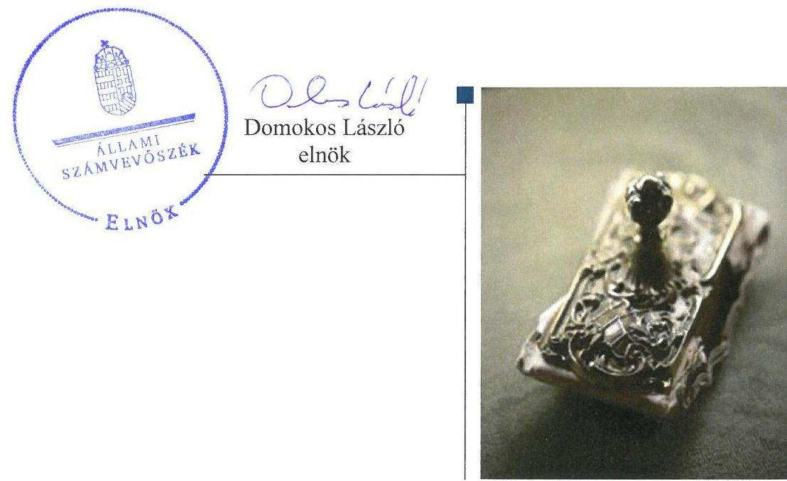
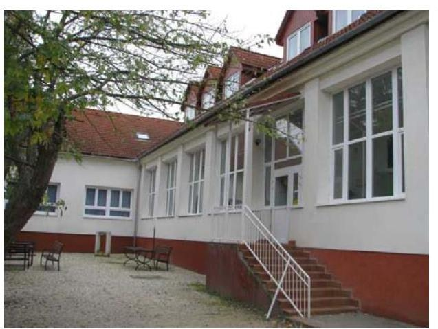
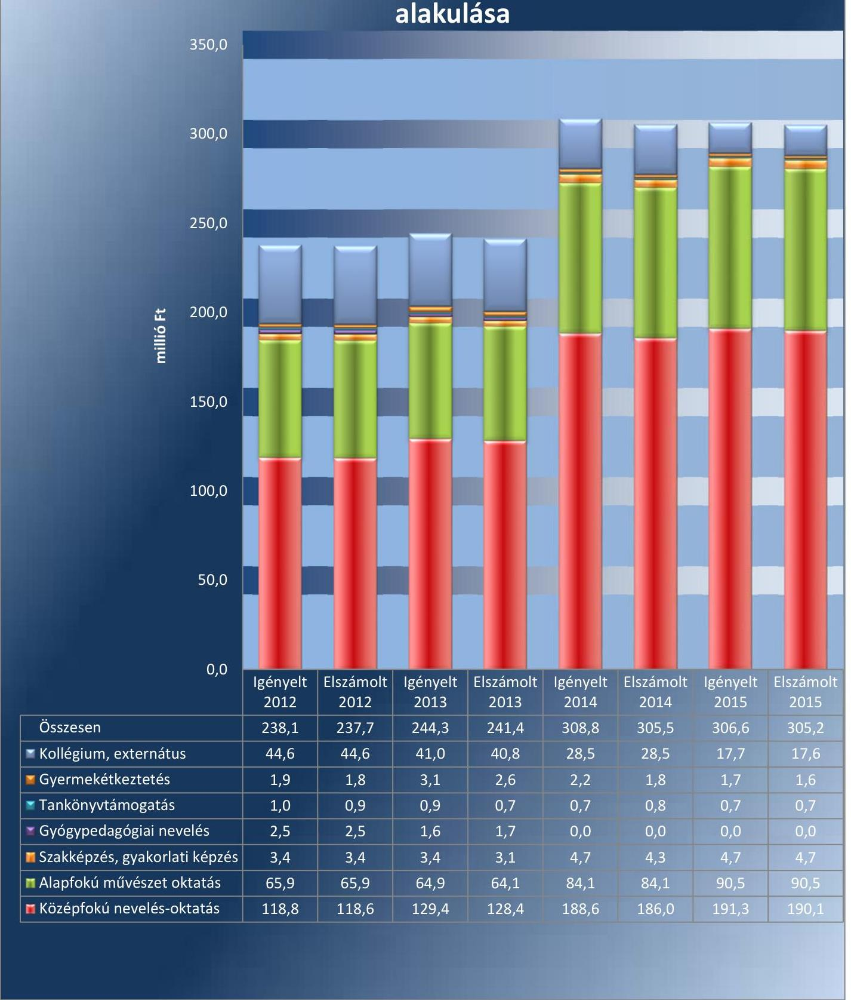

# Jelentés 

## Nem állami humánszolgáltatók ellenőrzése

A humánszolgáltatást nyújtó államháztartáson kívüli köznevelési intézmények, szolgáltatók fenntartói központi költségvetésből kapott támogatásai felhasználásának ellenőrzése Művészetért Közalapítvány
2017.

---

# J elentés 

## Nem állami humánszolgáltatók ellenőrzése

A humánszolgáltatást nyújtó államháztartáson kívüli köznevelési intézmények, szolgáltatók fenntartói központi költségvetésből kapott támogatásai felhasználásának ellenőrzése Művészetért Közalapítvány
2017. 08 hó 10 nap

---

# AZ ELLENŐRZÉST FELÜGYELTE:

- **SALAMON ILDIKÓ** felügyeleti vezető

- **AZ ELLENŐRZÉST VEZETTE ÉS A VÉGREHAJTÁSÁÉRT FELELŐS:**

- **KEREKES PÉTER** ellenőrzésvezető

- **A PROGRAM ÖSSZEÁLLÍTÁSÁÉRT FELELŐS:**

- **JANIK JÓZSEF LÁSZLÓ** osztályvezető

**IKTATÓSZÁM: V-1241-112/2016.**

**TÉMASZÁM: 2275**

**ELLENŐRZÉS-AZONOSÍTÓ SZÁM: V076605**

Jelentéseink az Országgyűlés számítógépes hálózatán és az Interneta a www.asz.hu címen is olvashatóak.

---

# TARTALOMJEGYZÉK 

■ ÖSSZEGZÉS ..... 5
■ AZ ELLENŐRZÉS CÉLJA ..... 6
■ AZ ELLENŐRZÉS TERÜLETE ..... 7
■ AZ ELLENŐRZÉS HÁTTERE, INDOKOLTSÁGA ..... 8
■ A JELENTÉS LÉNYEGES KÉRDÉSKÖREI ..... 9
■ ELLENŐRZÉS HATÓKÖRE ÉS MÓDSZEREI ..... 10
■ MEGÁLLAPÍTÁSOK ..... 12
■ JAVASLATOK ..... 16
■ MELLÉKLETEK ..... 17
I. melléklet: Értelmező szótár ..... 17
II. melléklet: Az ellenőrzött központi költségvetési támogatások alakulása. ..... 18
■ FÜGGELÉK: ÉSZREVÉTELEK ..... 19
■ RÖVIDÍTÉSEK JEGYZÉKE ..... 21

---

.

---

# ÖSSZEGZÉS 

A bodajki székhelyű Művészetért Közalapítványnál a közfeladat-ellátás kereteinek kialakítása összességében szabályszerű volt. A központi költségvetési támogatásokat összességében szabályszerűen átadta intézményének. A közfeladat-ellátás során az átláthatóság érvényesülését összességében biztosította, mivel a jogszabályokban előírt közérdekú adatok, dokumentumok közzétételével a nyilvánosság és a szolgáltatást igénybe vevők tájékoztatásáról gondoskodott.

## Az ellenőrzés társadalmi indokoltsága

Az Állami Számvevőszék stratégiájában hangsúlyos szerepet szán annak, hogy szilárd szakmai alapon álló, értékteremtő ellenőrzéseivel előmozdítsa a közpénzügyek átláthatóságát, rendezettségét és javaslataival a közpénzek és a közvagyon szabályos, gazdaságos, hatékony és eredményes felhasználását segítse. Az Állami Számvevőszék célul tűzte ki, hogy az államháztartáson kívülre nyújtott költségvetési támogatások ellenőrzésével hozzájárul ahhoz, hogy a közpénzeket az államháztartáson kívüli szervezetek is átlátható módon használják fel a közfeladatok szerződésben vállalt ellátása érdekében. Tekintettel az elmúlt években a köznevelés finanszírozását és a köznevelési intézmények fenntartását érintően végbement változásokra, a társadalom fokozott érdeklődéssel figyeli a köznevelési feladatok ellátására fordított források felhasználását. Fontos a közvéleményt biztosítani arról, hogy a közpénz államháztartáson kívüli felhasználása ezen a területen sem marad ellenőrizetlenül. Hozzájárul ezzel ahhoz is, hogy a nyilvánosság és a szolgáltatást igénybe vevők megfelelő tájékoztatást kapjanak az államháztartáson kívüli közfeladatot ellátók müködéséről.

## Főbb megállapítások, következtetések

A Művészetért Közalapítványnál a közfeladat-ellátás szervezeti kereteinek kialakítása szabályszerű volt. Alapító okirata megfelelt a jogszabályi előírásoknak. A támogatás igénylés alapját jelentő feltételeknek megfelelt, az igénybevételhez szükséges, jogszabályban előírt intézményi adatok, valamint az elszámoláshoz szükséges nyilvántartások és dokumentumok a rendelkezésére álltak. Belső szabályozottsága nem volt szabályszerű, mivel a számviteli politikája nem felelt meg a jogszabályi előírásoknak.

A központi költségvetésből kapott támogatásokat összességében szabályszerűen használta fel, a jogszabályi előírásoknak megfelelően átadta az intézményének. Intézménye működtetésének a kereteit összességében a jogszabályi előírásoknak megfelelően biztosította, az alapfeladatait alapító okiratban meghatározta, a nyilvántartásokba vétel megtörtént, és a szükséges müködési engedélyek is rendelkezésre álltak. Az intézményi alapdokumentumokat a jogszabályokban előírtak szerint jóváhagyta.

Az intézménye szakmai-pedagógiai munkájának értékelési feladatait szabályszerűen látta el, az értékeléseit és a törvényben előírt közérdekú adatokat a honlapján közzétette. Nem készített azonban az adatok védelmére és a közérdekú adatok közzétételére vonatkozó belső szabályozást. Beszámolási kötelezettségét a jogszabályokban előírtaknak megfelelően teljesítette.

---

# AZ ELLENŐRZÉS CÉLJA 

AZ ELLENŐRZÉS CÉLJA annak értékelése volt, hogy a Fenntartó ${ }^{1}$ központi költségvetésből kapott támogatásainak felhasználása szabályszerű volt-e, a támogatások igénylése, évközi módosítása és év végi elszámolása megfelelt-e a jogszabályi előírásoknak.

---

# **AZ ELLENŐRZÉS TERÜLETE**

## **Művészetért Közalapítvány**

A Művészetért Közalapítványt Bodajk Nagyközség Önkormányzata alapította 1998. január 6-i dátummal, 150 ezer Ft induló vagyonnal. Az ellenőrzött időszakban a Fenntartó alapító okiratának² módosítására két esetben került sor. A közalapítvány székhelye 2015. május 25-ig Székesfehérváron volt, azt követően Bodajkon.

A közalapítvány közfeladatokat látott el: alapfokú művészetoktatást, regionális jelleggel középfokú művészeti oktatást, továbbá felnőttképzés keretében művészeti tanfolyamszervezést. A Fenntartó 2012. augusztus 29-ig kiemelkedően közhasznú szervezet volt, majd 2012. augusztus 30-tól a jogszabályi változások miatt jogállása közhasznú szervezet lett.

A Fenntartó a közfeladat ellátását a Hang-Szín-Tér Művészeti Szakközépiskola, Alapfokú Művészeti Iskola és Kollégium fenntartásával végezte a Fejér megyében és Komárom-Esztergom megyében található telephelyein. Az Intézmény³ az ellenőrzött években önálló jogi személyként működő, önállóan gazdálkodó szervezet volt.

Az Intézmény engedélyezett tanulói létszáma 2012-ben 3307 fő, 2013-ban 3182 fő, 2014-ben 3182 fő, 2015-ben 3182 fő volt. A vonatkozó statisztikai adatok szerinti tényleges létszám minden évben az engedélyezett alatt alakult, 2012-ben 1231 fő, 2013-ban 1040 fő, 2014-ben 1008 fő, 2015-ben 1083 fő volt.

A Fenntartó az ellenőrzött időszak minden évében igényelt központi költségvetési támogatásokat, majd a kapott támogatásokkal a tárgyévet követően elszámolt. A II. melléklet tartalmazza az ellenőrzött központi költségvetési támogatások alakulását. Ezen felül szakképzési szerződés keretében és pályázati úton is részesült központi költségvetési támogatásban. A Fenntartó – tevékenységéből adódó jogosultsága alapján – Magyarország éves központi költségvetéséből az egyszerűsített éves beszámolói alapján 2012. évben 242 248 ezer Ft, 2013. évben 280 443 ezer Ft, 2014. évben 338 580 ezer Ft, 2015. évben 325 029 ezer Ft támogatást kapott.

A Fenntartó az ellenőrzött időszakban egy fő teljes állású alkalmazottat foglalkoztatott.

A szakmai irányító szervi feladatokat a Minisztérium⁴ látta el az ellenőrzött időszakban, törvényességi ellenőrzési feladatokat az illetékes Kormányhivatalok⁵ végeztek.

---

# AZ ELLENŐRZÉS HÁTTERE, INDOKOLTSÁGA 

A köznevelési és szociális feladatokat ellátó nem állami intézményfenntartók részére közfeladataik ellátására évente jelentős összegű pénzügyi támogatást biztosítottak a mindenkori költségvetési törvények a bennük megfogalmazott feltételek mellett. A felhasználható állami támogatások Kvtv. ${ }^{6}$ szerinti előirányzata 2012-2015. években együtt 894 Mrd Ft volt. A 2013. évben jelentős változások következtek be a normatív finanszírozás rendszerében, amely érintette a nem állami intézményfenntartókat is. Az Országgyűlés elfogadta a nemzeti köznevelésről szóló 2011. évi CXC. törvényt, amely jelentősen átalakította a korábbi finanszírozási rendszert 2013 szeptemberétől. A köznevelési területen új feladatfinanszírozási forma (átlagbéralapú támogatás) jelent meg, amely a nem állami intézményfenntartókra is vonatkozik. Az ellenőrzés a finanszírozási rendszerben 2012-2015. között bekövetkezett változásokra, azok közfeladat-ellátásra gyakorolt hatására fókuszál a költségvetési támogatásokat felhasználó államháztartáson kívüli szervezetek körében. Az ellenőrzés indokoltságát az is alátámasztja, hogy az ÁSZ ${ }^{7}$ még nem ellenőrizte átfogóan e területet.

Az ÁSZ stratégiájában foglaltak alapján is indokolt az ellenőrzés, amely a társadalom számára jelzi, hogy a közpénz államháztartáson kívüli felhasználása sem maradhat ellenőrizetlenül. Az államháztartáson kívülre nyújtott költségvetési támogatások ellenőrzésével az ÁSZ hozzájárul ahhoz, hogy a közpénzeket a nem állami humán fenntartók átlátható módon használják fel a közfeladatok ellátására kötött szerződésekben vállalt kötelezettségek teljesítése érdekében. Az ellenőrzés javaslataival hozzájárulhat az említett rendszerek szabályszerű támogatás felhasználásához, javíthatja a társa-dalmi-gazdasági döntések megalapozottságát, amely a „jó kormányzás" feltétele.

---

# A JELENTÉS LÉNYEGES KÉRDÉSKÖREI 

1. A Fenntartónál a közfeladat-ellátás kereteinek kialakítása szabályszerű volt-e?
2. A Fenntartó a központi költségvetésből kapott támogatásokat szabályszerűen használta-e fel?
3. A Fenntartó a közfeladat ellátása során biztosította-e az átláthatóság érvényesülését?
4. A Fenntartó intézkedett-e a külső ellenőrzések megállapításaira?

---

# ELLENŐRZÉS HATÓKÖRE ÉS MÓDSZEREI 

## Az ellenőrzés típusa

Megfelelőségi ellenőrzés.

## Az ellenőrzött időszak

A 2012. január 1-je és 2015. december 31-e közötti évek. A 2012. év vonatkozásában a költségvetési támogatások 2012. évet megelőző időszakra eső igénylését, a 2015. év tekintetében annak 2016-ban történő elszámolását is ellenőrizte az ÁSZ.

## Az ellenőrzés tárgya

Az ellenőrzés a köznevelési közfeladatokat ellátó nem állami fenntartó központi költségvetésből kapott támogatásai felhasználására terjedt ki. Az alábbi jogcímek szabályszerűségének értékelését foglalta magában:
$\longrightarrow$ az alap normatív- és átlagbér alapú költségvetési támogatások közül az általános iskolai nevelés-oktatás, középfokú nevelés-oktatás.
$\longrightarrow$ a kiegészítő támogatások közül a tanulóétkeztetési- és a tankönyvtámogatás.
Az ellenőrzés kiterjedt minden olyan körülményre és adatra, amely az ÁSZ jogszabályban meghatározott feladatainak teljesítéséhez, valamint a program végrehajtása folyamán felmerült újabb összefüggések feltárásához szükséges.

## Az ellenőrzött szervezet

Művészetért Közalapítvány

## Az ellenőrzés jogalapja

Az ellenőrzés jogszabályi alapját az ÁSZ tv. ${ }^{8} 1 . \S$ (3) bekezdése és az 5. § (3) bekezdésében foglalt előírások adták.

## Az ellenőrzés módszerei

Az ellenőrzést az ellenőrzési program kérdései, az adott időszakban hatályos jogszabályok, az ellenőrzés szakmai szabályok és módszertanok, valamint a nemzetközi standardok figyelembevételével végezte az ÁSZ.

---

A közpénzekkel való felelős gazdálkodás segítésére irányuló javaslatok kidolgozásakor a hatályos jogszabályok voltak az irányadóak.

Az ellenőrzés ideje alatt az ÁSZ a Fenntartóval történő kapcsolattartást az ÁSZ SZMSZ ${ }^{9}$-ének vonatkozó előírásai alapján biztosította.

Az ellenőrzési kérdések megválaszolásához szükséges bizonyítékok megszerzése az ellenőrzöttek által rendelkezésre bocsátott dokumentumokra, adatokra alapozva megfigyelés, szemle (szemrevételezés), kérdésfeltevés (információkérés), valamint elemző eljárással történt.

Az ellenőrzési bizonyítékként felhasznált adatforrások közé tartoztak egyrészt a szakmai program részletes szempontjainál felsorolt adatforrások, másrészt minden - az ellenőrzés folyamán feltárt, az ellenőrzés szempontjából információt tartalmazó - dokumentum.

Az ellenőrzés lefolytatásához a Fenntartó a kitöltött tanúsítványok, valamint az ÁSZ által kért dokumentumok elektronikus úton való megküldésével szolgáltatott adatokat, információkat. Az így rendelkezésre bocsátott adatok, információk és a tanúsítványok adatai valódiságának kontrollja az ellenőrzés keretében történt.

A szabályosság megítélésének az alapját képezte, hogy a központi költségvetési támogatások Fenntartó általi igénylése és év végi elszámolása a Kincstár ${ }^{10}$ felé megtörtént.

A központi költségvetésből kapott támogatások szabályszerű felhasználását a Fenntartó vonatkozásában, a támogatások intézmény részére - annak működtetésére - történő továbbutalásának, valamint a támogatások felhasználásáról a jogszabályban előírt nyilvántartás vezetésének az értékelésével végezte az ÁSZ.

---

# 1. A Fenntartónál a közfeladat-ellátás kereteinek kialakítása szabályszerű volt-e? 

## Összegző megállapítás

### 1.1. számú megállapítás

### 1.2. számú megállapítás

A Fenntartónál a közfeladat-ellátás kereteinek kialakítása öszszességében a jogszabályi előírásoknak megfelelően történt.

A Fenntartó a közfeladat-ellátás szervezeti kereteit a jogszabályi előírásoknak megfelelően alakította ki.

A Fenntartó a közoktatási, köznevelési közfeladat-ellátási tevékenységének kereteit a Közokt. tv. ${ }^{11}$ és az Nkt. ${ }^{12}$ előírásainak megfelelően kialakította. Rendelkezett alapító okirattal, amely 2015. május 25 -ig megfelelt a Ptk. ${ }^{13}$-ben előírtaknak, majd 2015. május 26 -tól a Ptk. ${ }^{14}$-ben előírtaknak. Az ellenőrzött időszakban az alapító okirat kétszer módosult. A Fenntartó az alapító okirat módosulásait szabályszerűen bejelentette a bíróság felé.

A Fenntartó rendelkezett SZMSZ-szel ${ }^{15}$, amely tartalmazta a döntési és hatásköri jogosultságokat.

A Fenntartó a támogatás igénylés alapját jelentő, Áht. ${ }^{16}$-ben foglalt feltételeknek megfelelt, mivel nyilatkozata szerint átlátható szervezetnek minősült, és rendezett munkaügyi kapcsolatokkal rendelkezett. A központi költségvetési támogatás igénylés alapját, feltételeit jelentő dokumentumok, nyilvántartások a jogszabályban előírtaknak megfeleltek. A Fenntartó bekérte az Intézménytől a támogatások igénybevételéhez szükséges, a Közokt. vhr. ${ }^{17}$, illetve az Nkt. vhr. ${ }^{18}$ által előírt adatokat. Rendelkezett információval az Intézmény OM azonosítójáról ${ }^{19}$, a tanulói létszámról, az alkalmazottakról, valamint az alapfokú művészetoktatásban részesülő tanulók esetében a szülők nyilatkozatáról. A Közokt. vhr., illetve az Nkt. vhr. által előírt tanügyi okmányokról (beírási napló, törzslap, csoportnapló) vezetett nyilvántartás a Fenntartó rendelkezésére állt.

A Fenntartó belső szabályozottsága nem felelt meg a jogszabályi előírásoknak.

A Fenntartó teljesítette a Számv. tv. ${ }^{20}$-ben előírt kötelezettségét a számviteli politika ${ }^{21}$ és a számlarend ${ }^{22}$ elkészítésére. A számviteli politika keretében elkészítette a pénzkezelési ${ }^{23}$ és leltározási ${ }^{24}$ szabályzatokat, valamint meghatározta az eszközök és a források értékelési szabályait. Az önköltségszámítás rendjére vonatkozó belső szabályzat készítésére vonatkozó kötelezettség alól a Számv. tv. 14. § (6) bekezdése alapján mentesült, mivel egyszerűsített éves beszámolót készített.

A Fenntartó a Számv.tv. 14. § (4) bekezdésében előírtak ellenére a számviteli politikájában nem rögzítette azokat a szabályokat, előírásokat, módszereket, amelyekkel meghatározza, hogy mit tekint a számviteli elszámolás, illetve az értékelés szempontjából lényegesnek és jelentősnek.

---

A Fenntartó számviteli politikája a bevételekkel kapcsolatos rendelkezései között rögzítette, hogy nem bevételként, hanem kötelezettségként kell azt az alaptevékenységre kapott támogatást kimutatni, amelyet pályázati vagy egyéb más úton kap a közalapítvány. Ez ellentétes a Civilszr. ${ }^{25} 16$. § (6) bekezdésében a továbbutalási céllal kapott támogatások kimutatására vonatkozó előírással. A gyakorlatban azonban nem a számviteli politikában előírtak szerint, hanem a Civilszr.-ben előírtaknak megfelelően történt a kapott támogatások könyvelése, ezért a főkönyvi elszámolások a valós állapotot tükrözték.

# 2. A Fenntartó a központi költségvetésből kapott támogatásokat szabályszerűen használta-e fel? 

Összegző megállapítás

A Fenntartó a központi költségvetésből kapott támogatásokat összességében szabályszerűen használta fel az Intézmény múködtetésére.
2.1. számú megállapítás

A Fenntartó összességében biztosította az Intézmény múködtetésének a kereteit.

A Fenntartó az intézménye alapfeladatait meghatározta a Közokt. tv., illetve az Nkt. előírásaival összhangban az Intézmény alapító okiratában ${ }^{26}$. Az Intézmény szerepelt az illetékes kormányhivatalok nyilvántartásában, a KIR $^{27}$ nyilvántartásban, valamint rendelkezett OM azonosítóval. A Fenntartó a Közokt. tv., illetve az Nkt. előírásainak megfelelően biztosította, hogy az Intézmény a székhelyét és a telephelyeit érintően rendelkezzen működési engedéllyel az alapító okirat szerinti közoktatási illetve köznevelési feladatokra. Új indítandó telephely múködési engedély-, illetve meglévő telephely múködési engedély módosítási kérelmeit a feladatellátási hely szerint illetékes kormányhivatalhoz benyújtotta. A Fenntartó a múködési engedélyezési eljárásban igazolta, hogy a közfeladat ellátásához szükséges személyi és tárgyi feltételeket biztosította.

A Fenntartó jóváhagyta az Intézmény szervezeti és múködési szabályzatát, minőségirányítási programját, pedagógiai programját és házirendjét. Ez a 2012. január 1. és 2012. augusztus 31. közötti időszakot érintően megfelelt a Közokt. tv.-ben előírtaknak, és ezzel 2012. szeptember 1-től az egyetértési kötelezettségének is eleget tett az Nkt.-ban előírt esetekben. A Közokt. tv.-ben és az Nkt.-ban előírtaknak megfelelően meghatározta az Intézmény éves költségvetéseit, a kérhető térítési díj megállapításának szabályait, valamint a szociális alapon adható kedvezmények feltételeit. A Közokt. tv. 102. § (2) bekezdés b) pontjának, valamint az Nkt. 83. § (2) bekezdés c) pontjának előírásai ellenére azonban nem határozta meg a tandíj megállapításának szabályait, mivel ugyan döntött arról, hogy a tandíj egyénileg kerül meghatározásra, nem jelölte ki sem a döntéshozót, sem a döntés szempontjait. Az Intézmény vezetőjének személye az ellenőrzött időszak alatt nem változott. A Fenntartó határozatban fogadta el az Intézmény egyszerűsített éves beszámolóit.

---

# 2.2. számú megállapítás 

A Fenntartó a központi költségvetési támogatásokat összességében szabályszerűen átadta az Intézmény részére.

A Fenntartó a kapott központi költségvetési támogatások teljes összegét átadta az Intézménynek az ellenőrzött időszakban, azonban a 2014. évi Kvtv. 33. § (25) bekezdésében és a 2015. évi Kvtv. 8. melléklet V. Kiegészítő szabályok 2. pontjában előírtak ellenére két alkalommal, 2014. júliusban és 2015. júliusban, 7 illetve 5 nappal a törvényben meghatározott 15 napos határidőn túl adta át a támogatást. A Fenntartó analitikus nyilvántartása tartalmazta, hogy milyen határnappal kerültek átadásra az Intézménynek a költségvetési támogatások.

## 3. A Fenntartó a közfeladat ellátása során biztosította-e az átláthatóság érvényesülését?

## Összegző megállapítás

A Fenntartó a közfeladat ellátása során összességében biztosította az átláthatóság érvényesülését.
3.1. számú megállapítás

A Fenntartó biztosította, hogy a szolgáltatást igénybe vevők megfelelő információhoz jussanak az Intézmény múködéséről.

A Fenntartó a Közokt. tv.-ben, illetve az Nkt.-ban előírtaknak megfelelően az ellenőrzött időszakban értékelte az Intézmény pedagógiai programjában meghatározott feladatok végrehajtását, a pedagógiai-szakmai munka eredményességét, és az értékeléseket a saját honlapján ${ }^{28}$ nyilvánosságra hozta.

## 3.2. számú megállapítás

A Fenntartó összességében biztosította a közérdekú adatok nyilvánosságát.

A Fenntartó az Info. tv. ${ }^{29}$-ben meghatározott közérdekú adatokat - beleértve az egyszerűsített éves beszámolóit - saját honlapján közzétette, azonban az Info. tv. 35. § (3) bekezdésében előírtak ellenére a közérdekú adatok közzétételére vonatkozó kötelezettség teljesítésének részletes szabályait belső szabályzatban nem állapította meg.

A Fenntartó az Info. tv. 7. § (2) bekezdésében előírtak ellenére nem alakította ki azokat az eljárási szabályokat, amelyek az Info. tv., valamint az egyéb adat- és titokvédelmi szabályok érvényre juttatásához szükségesek, ezáltal fennállt a személyes adatok jogellenes felhasználásának kockázata.

## 3.3. számú megállapítás

Beszámolási kötelezettségét a jogszabályokban előírtaknak megfelelően teljesítette.

A Fenntartó múködéséről, vagyoni, pénzügyi és jövedelmi helyzetéről az üzleti év könyveinek zárását követően kettős könyvvitellel alátámasztott egyszerűsített éves beszámolót készített. Az ellenőrzött időszakról készített egyszerűsített éves beszámolói megfeleltek a Civilszr.-ben előírtaknak, és tartalmazták a Civiltv. ${ }^{30}$-ben előírt közhasznúsági mellékletet is. Közalapítványként a Civilszr.-ben előírtak értelmében könyvvizsgálati kötelezettsége volt, amelynek eleget tett. Az egyszerűsített éves beszámolóiról korlátozás nélküli záradékkal ellátott könyvvizsgálói jelentések készültek.

---

Az egyszerűsített éves beszámolói az Országos Bírósági Hivatal által fenntartott közhiteles Civil Szervezetek Névjegyzékében ${ }^{31}$ hozzáférhetőek.

# 4. A Fenntartó intézkedett-e a külső ellenőrzések megállapításaira? 

## Összegző megállapítás

A Fenntartó az ellenőrzött időszakban intézkedett a külső ellenőrzések megállapításaira.

A Fenntartónál és az Intézménynél az ellenőrzött időszakban a Kormányhivatalok és a Kincstár végeztek külső ellenőrzést.

A Komárom-Esztergom Megyei Kormányhivatal 2013-ban, a Fejér Megyei Kormányhivatal 2014-ben végzett törvényességi ellenőrzést. A Fenntartó a törvényességi ellenőrzések megállapításai alapján intézkedett a feltárt hiányosságokkal kapcsolatban.

A Kincstár a Fenntartó által benyújtott elszámolások felülvizsgálatát követően határozataiban visszafizetési kötelezettséget írt elő, amelynek a Fenntartó eleget tett.

2015-ben a Kincstár a 2014. január 1-jétől 2014. december 31-éig terjedő időszakban igénybevett támogatások elszámolása szabályszerűségét, a közölt adatok valódiságát, a jogszabályi feltételek meglétét helyszíni ellenőrzés keretében ellenőrizte. A hatósági ellenőrzés az ellenőrzött időszak végén még folyamatban volt.

---

# JAVASLATOK 

Az ÁSZ tv. 33. § (1) bekezdésében foglaltak értelmében az ellenőrzött szervezet vezetője köteles a jelentésben foglalt megállapításokhoz kapcsolódó intézkedési tervet összeállítani és azt a jelentés kézhezvételétől számított 30 napon belül az ÁSZ részére megküldeni. Amennyiben az ellenőrzött szervezet vezetője nem küldi meg határidőben az intézkedési tervet, vagy továbbra sem elfogadható intézkedési tervet küld, az Állami Számvevőszék elnöke az ÁSZ tv. 33. § (3) bekezdése a) és b) pontjaiban foglaltakat érvényesítheti.

## a Művészetért Közalapítvány Kuratóriuma elnökének

1. Intézkedjen, hogy a számviteli politikában - a Számv. tv.-ben foglaltaknak megfelelően - rögzítésre kerüljenek azok a szabályok, előírások, módszerek, amelyekkel meghatározzák, mit tekintenek a számviteli elszámolás, illetve az értékelés szempontjából lényegesnek és jelentősnek.
(1.2. számú megállapítás 2. bekezdés alapján)
2. Intézkedjen, hogy a számviteli politika a jogszabályban elöirtaknak megfelelően tartalmazza a továbbutalási céllal kapott támogatások kimutatására vonatkozó szabályokat.
(1.2. számú megállapítás 3. bekezdés alapján)
3. Kezdeményezze, hogy a Fenntartó a jogszabályi előírásnak megfelelően határozza meg a tandíj megállapításának szabályait.
(2.1. számú megállapítás 2. bekezdés 4. mondata alapján)
4. Intézkedjen, hogy a kapott támogatás a hatályos költségvetési törvényben elöirtak szerint kerüljön átadásra az Intézmény részére.
(2.2. számú megállapítás 1. bekezdés alapján)
5. Intézkedjen a jogszabályi előírásoknak megfelelően
a) a közérdekü adatok közzétételére vonatkozó kötelezettség teljesítése részletes szabályainak belső szabályzatban történő megállapítására, valamint
b) az adatok biztonságának, védelmének érvényre juttatásához szükséges eljárási szabályok meghatározására.
(3.2. számú megállapítás 1-2. bekezdései alapján)

---

# MELLÉKLETEK 

## I. MELLÉKLET: ÉRTELMEZŐ SZÓTÁR

átlagbéralapú támogatás
civil szervezet
feladatellátási hely
feladatfinanszírozás
humánszolgáltatás
intézményfenntartó
köznevelési alapfeladat
köznevelési intézmény
nem állami intézmény fenntartó

Az átlagbér alapú támogatás alapja a pedagógus-munkakörben, valamint nevelő-, oktató munkát közvetlenül segítő munkakörben foglalkoztatottak után kifizetett személyi juttatás és járulék. (2013. évi Kvtv. 33. § (4) bekezdés)
A Civil tv. 2. § 6. pontja szerint civil szervezet a civil társaság, a Magyarországon nyilvántartásba vett egyesület (a párt, a szakszervezet és a kölcsönös biztosító egyesület kivételével), a közalapítvány és a pártalapítvány kivételével az alapítvány.
Az a cím, ahol a köznevelési intézmény alapító okiratában, szakmai alapdokumentumában foglalt feladat ellátása történik. (Nkt. 4. § (7) pont)
A közfeladat államháztartáson kívüli szervezet által történő ellátásához közvetlenül kapcsolódó, arányos müködési költségeket finanszírozó költségvetési támogatás.
Külön törvényben meghatározott szociális, gyermekjóléti, gyermekvédelmi, közoktatási, felsőoktatási, kulturális közfeladatok. (2012. évi Kvtv. 38. § (1) bekezdés, 2013. évi Kvtv. 25. §, 1. számú melléklet XX/20/2. alcím, 19. alcím, 2014. évi Kvtv. 33. §, 34. § (1), (4) bekezdés, 1. számú melléklet XX/20/2. alcím, 19. alcím, 2015. évi Kvtv. 42. §, 43. § (1), (4) bekezdés, 1. számú melléklet XX/20/2/3. jogcím csoport, 19. alcím).
Az a természetes vagy jogi személy, aki vagy amely a köznevelési feladat ellátására való jogosultságot megszerezte vagy azzal rendelkezik, és - e törvényben foglalt esetben a müködtetővel közösen - a köznevelési intézmény müködéséhez szükséges feltételekről gondoskodik. (Nkt. 4. § 9. pont)
A köznevelési intézmény alapító okiratában foglalt feladat: óvodai nevelés, nemzetiséghez tartozók óvodai nevelése, általános iskolai nevelés-oktatás, nemzetiséghez tartozók általános iskolai nevelése-oktatása, kollégiumi ellátás, nemzetiségi kollégiumi ellátás, gimnáziumi nevelés-oktatás, szakközépiskolai nevelés-oktatás, szakiskolai nevelés-oktatás, nemzetiség gimnáziumi nevelés-oktatása, nemzetiség szakközépiskolai nevelés-oktatása, nemzetiség szakiskolai nevelés-oktatása, köznevelési Hídprogramok keretében folyó nevelés-oktatás, felnőttoktatás, alapfokú művészetoktatás, fejlesztő nevelés, fejlesztő nevelés-oktatás, pedagógiai szakszolgálati feladat, a többi gyermekkel, tanulóval együtt nevelhető, oktatható sajátos nevelési igényű gyermekek, tanulók óvodai nevelése és iskolai nevelése-oktatása, azoknak a sajátos nevelési igényű gyermekeknek, tanulóknak az óvodai, iskolai, kollégiumi ellátása, akik a többi gyermekkel, tanulóval nem foglalkoztathatók együtt, a gyermekgyógyüdülőkben, egészségügyi intézményekben, rehabilitációs intézményekben tartós gyógykezelés alatt álló gyermekek tankötelezettségének teljesítéséhez szükséges oktatás, pedagógiai-szakmai szolgáltatás.
A nevelési- oktatási intézmény, pedagógiai szakszolgálati intézmény, pedagógiai-szakmai szolgáltatást nyújtó intézmény.
A köznevelési intézmény a törvényben meghatározott köznevelési feladatok ellátására létesített intézmény. A köznevelési intézmény a fenntartójától elkülönült, önálló költségvetéssel rendelkező jogi személy, amely a nyilvántartásba való bejegyzéssel, a bejegyzés napján jön létre. (Nkt. 21. § (1) bekezdés)
A köznevelési és szociális, gyermekjóléti és gyermekvédelmi közfeladatokat/humánszolgáltatásokat ellátó intézményt fenntartó egyházi jogi személy, társadalmi szervezet, alapítvány, közalapítvány, civil szervezet, országos nemzetiségi önkormányzat, nonprofit gazdasági társaság, gazdasági társaság és a humánszolgáltatást alaptevékenységként végző, Szja tv. hatálya alá tartozó egyéni vállalkozó. (2012. évi Kvtv. 38. § (1) bekezdés, 2013. évi Kvtv. 35. § (1), (3) bekezdés, 2014. évi Kvtv. 33. §, 34. § (1), (4) bekezdés, 2015. évi Kvtv. 42. §, 43. § (1), (4) bekezdés)

---

# II. MELLÉKLET: AZ ELLENŐRZÖTT KÖZPONTI KÖLTSÉGVETÉSI TÁMOGATÁSOK ALAKULÁSA 

## Az ellenőrzött központi költségvetési támogatások alakulása

Fonrás: Fenntartó tanúsítványai

---

# FÜGGELÉK: ÉSZREVÉTELEK 

Az Állami Számvevőszék a jelentéstervezetet 15 napos észrevételezésre megküldte az ellenőrzött szervezet vezetőjének az ÁSZ tv. 29. §* (1) bekezdése elöírásának megfelelően.

A Müvészetért Közalapítvány Kuratóriuma elnöke az ÁSZ tv. 29. § (2) bekezdésében foglalt észrevételezési jogával nem élt, a törvényi határidőn belül észrevételt nem tett.

[^0]
[^0]:    * 29. § (1) Az Állami Számvevőszék az ellenőrzési megállapításait megküldi az ellenőrzött szervezet vezetőjének vagy az általa megbízott személynek, és annak, akinek személyes felelősségét állapította meg.
    (2) Az ellenőrzött szervezet vezetője és a felelősként megjelölt személy az ellenőrzés megállapításaira tizenöt napon belül írásban észrevételt tehet.
    (3) Az Állami Számvevőszék az észrevételre a beérkezésétől számított harminc napon belül írásban válaszol. A figyelembe nem vett észrevételeket köteles a jelentésben feltüntetni, és megindokolni, hogy azokat miért nem fogadta el.

---

.

---

# RÖVIDÍTÉSEK JEGYZÉKE 

${ }^{1}$ Fenntartó
${ }^{2}$ alapító okirat
${ }^{3}$ Intézmény
${ }^{4}$ Minisztérium
${ }^{5}$ Kormányhivatalok
${ }^{6}$ Kvtv.
${ }^{7}$ ÁSZ
${ }^{8}$ ÁSZ tv.
${ }^{9}$ ÁSZ SZMSZ
${ }^{10}$ Kincstár
${ }^{11}$ Közokt. tv.
${ }^{12} \mathrm{Nkt}$.
${ }^{13}$ Ptk. 1
${ }^{14}$ Ptk. 2
${ }^{15}$ SZMSZ
${ }^{16}$ Áht.
${ }^{17}$ Közokt. vhr.
${ }^{18} \mathrm{Nkt}$. vhr.
${ }^{19}$ OM azonosító
${ }^{20}$ Számv. tv.
${ }^{21}$ számviteli politika
${ }^{22}$ számlarend
${ }^{23}$ pénzkezelési szabályzat
${ }^{24}$ leltározási szabályzat
${ }^{25}$ Civilszr.

Művészetért Közalapítvány
Művészetért Közalapítvány 2011. május 31-én kelt alapító okirata az előzményeket tartalmazó egységes szerkezetben, valamint annak a 2012. július 26-i és 2015. május 26-i módosításokkal egységes szerkezetbe foglalt szövege Hang-Szín-Tér Művészeti Szakközépiskola, Alapfokú Művészeti Iskola és Kollégium
2012. május 13-ig Nemzeti Erőforrás Minisztérium, 2012. május 14-től Emberi Erőforrások Minisztériuma
A Fenntartó ellenőrzött időszaki tevékenység ellátási helyei alapján illetékes Fejér Megyei Kormányhivatal és Komárom-Esztergom Megyei Kormányhivatal 2011. évi CLXXXVIII. törvény Magyarország 2012. évi központi költségvetéséről (2012. évi Kvtv.)
2012. évi CCIV. törvény Magyarország 2013. évi központi költségvetéséről (2013. évi Kvtv.)
2013. évi CCXXX. törvény Magyarország 2014. évi központi költségvetéséről (2014. évi Kvtv.)
2014. évi C. törvény Magyarország 2015. évi központi költségvetéséről (2015. évi Kvtv.)
Állami Számvevőszék
2011. évi LXVI. törvény az Állami Számvevőszékről, hatályos 2011. július 1-jétől az Állami Számvevőszék szervezeti és müködési szabályzata
Magyar Államkincstár
1993. évi LXXIX. törvény a közoktatásról (hatályon kívül helyezve 2013. október 5-től)
2011. évi CXC. törvény a nemzeti köznevelésről (hatályos 2012. szeptember 1-től)
1959. évi IV. törvény a Polgári törvénykönyvről (hatálytalan 2014. március 15-től) 2013. évi V. törvény a Polgári törvénykönyvről (hatályos 2014. március 15-től) Múvészetért Közalapítvány szervezeti és müködési szabályzata (hatályos 1999. január 5-től, majd 2015. május 27-től)
2011. évi CXCV. törvény az államháztartásról (hatályos 2012. január 1-jétől) 20/1997. (II. 13.) Korm. rendelet a közoktatásról szóló 1993. évi LXXIX. törvény végrehajtásáról (hatálytalan 2013. október 5-étől)
229/2012. (VIII. 28.) Korm. rendelet a nemzeti köznevelésről szóló törvény végrehajtásáról (hatályos 2012. szeptember 1-jétől)
egységes oktatási azonosító
2000. évi C. törvény a számvitelről

Művészetért Közalapítvány számviteli politikája (hatályos 2012. január 1-jétől)
Művészetért Közalapítvány számlarendje (hatályos 2012. január 1-jétől)
Művészetért Közalapítvány pénzkezelési szabályzata (hatályos 2012. január 1-jétől)
Művészetért Közalapítvány leltározási szabályzata (hatályos 2012. január 1-jétől)
224/2000. (XII. 19.) Korm. rendelet a számviteli törvény szerinti egyes egyéb szervezetek beszámoló készítési és könyvvezetési kötelezettségnek sajátosságairól

---

${ }^{26}$ Intézmény alapító okirata
${ }^{27}$ KIR
${ }^{28}$ honlap
${ }^{29}$ Info. tv.
${ }^{30}$ Civiltv.
${ }^{31}$ Civil Szervezetek Névjegyzéke

Hang-Szín-Tér Művészeti Szakközépiskola, Alapfokú Művészeti Iskola és Kollégium Alapító Okirata az előzményeket tartalmazó egységes szerkezetben. Hatályos 2011. május 3-tól, 2012. december 10-től, 2013. július 22-től, 2014. augusztus 4-től, majd 2015. május 27-től.
Köznevelés Információs Rendszere
Múvészetért Közalapítvány honlapja (http://www.muveszetertkozalapitvany.hu/)
2011. évi CXII. törvény az információs önrendelkezési jogról és az információszabadságról
2011. évi CLXXV. törvény az egyesülési jogról, a közhasznú jogállásról, valamint a civil szervezetek múködéséről és támogatásáról
birosag.hu/allampolgaroknak/civil-szervezetek/civil-szervezetek-nevjegyzeke

---

ÁLLAMI SZÁMVEVŐSZÉK
1052 Budapest, Apáczai Csere János utca 10.
Levélcím: 1364 Budapest 4. Pf. 54
Telefon: +36 14849100 Telefax: +36 14849200
www.asz.hu