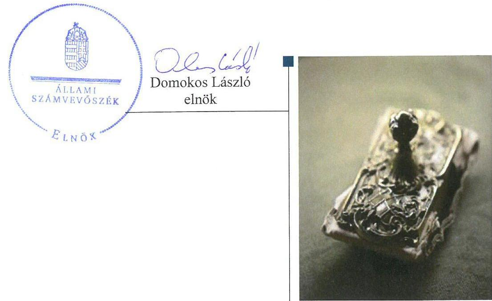
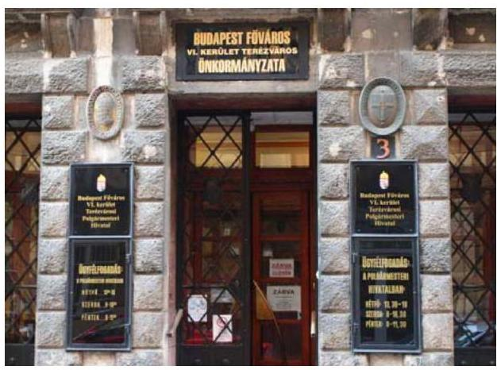
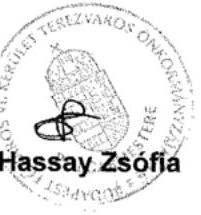
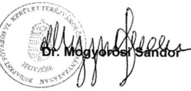

# Jelentés 

## Utóellenőrzések

Az önkormányzatok vagyongazdálkodása szabályszerűségének utóellenőrzése Budapest Főváros VI. kerület Terézváros Önkormányzata
2017.

---

# Jelentés 

## Utóellenőrzések

Az önkormányzatok vagyongazdálkodása szabályszerűségének utóellenőrzése Budapest Főváros VI. kerület Terézváros Önkormányzata
2017. 08. hó 09. nap

---

# AZ ELLENŐRZÉST FELÜGYELTE: 

RENKÓ ZSUZSANNA felügyeleti vezető

## AZ ELLENŐRZÉST VEZETTE ÉS A VÉGREHAJTÁSÁÉRT FELELŐS:

DR. NAGY JUDIT ellenőrzésvezető

## A PROGRAM ÖSSZEÁLLÍTÁSÁÉRT FELELŐS:

JANIK JÓZSEF LÁSZLÓ osztályvezető

## A TÉMÁHOZ KAPCSOLÓDÓ KORÁBBI SZÁMVEVŐSZÉKI JELENTÉSEK:

- címe: Jelentés az önkormányzatok vagyongazdálkodása szabályszerűségének ellenőrzéséről Budapest Főváros VI. kerület Terézváros
- sorszáma: 14081

IKTATÓSZÁM: V-1301-042/2016.
TÉMASZÁM: 2335
ELLENŐRZÉS-AZONOSÍTÓ SZÁM: V075560

---

# TARTALOMJEGYZÉK 

■ ÖSSZEGZÉS ..... 5
■ AZ ELLENŐRZÉS CÉLJA ..... 6
■ AZ ELLENŐRZÉS TERÜLETE ..... 7
■ AZ ELLENŐRZÉS HÁTTERE, INDOKOLTSÁGA ..... 8
■ A JELENTÉS LÉNYEGES KÉRDÉSKÖREI ..... 9
■ ELLENŐRZÉS HATÓKÖRE ÉS MÓDSZEREI ..... 10
■ MEGÁLLAPÍTÁSOK ..... 12
■ MELLÉKLETEK ..... 15
I. sz. melléklet: Budapest Főváros VI. Kerület Terézváros Önkormányzata intézkedési tervének végrehajtása ..... 15
■ FÜGGELÉK: ÉSZREVÉTELEK ..... 17
■ RÖVIDÍTÉSEK JEGYZÉKE ..... 21

---

.

---

# ÖSSZEGZÉS 

Budapest Főváros VI. Kerület Terézváros Önkormányzata vagyongazdálkodása szabályszerűségének utóellenőrzése során megállapítást nyert, hogy a vagyongazdálkodás szabályozottságára és szabályszerű müködésére vonatkozó feladatokat az Önkormányzat végrehajtotta. Ennek eredményeként a szabálytalanságok megszüntetése érdekében megfogalmazott javaslatok hasznosultak, a vagyongazdálkodás szabályszerűsége az Önkormányzatnál javult.

## Az ellenőrzés társadalmi indokoltsága

Az Állami Számvevőszék stratégiájában célul tűzte ki a számvevőszéki munka hasznosulásának javítását. Ezzel összhangban ellenőrzi, hogy az ellenőrzött szervezet megvalósította-e a korábbi ellenőrzései által feltárt hibák, hiányosságok és szabálytalanságok megszüntetése céljából elkészített intézkedési tervében foglaltakat. A rendszeres utóellenőrzések hozzájárulnak a szükséges intézkedések tényleges végrehajtásához, ezáltal a közpénzügyek rendezettségének javulásához.

Az ÁSZ korábbi ellenőrzésében megállapította, hogy az Önkormányzatnál a vagyongazdálkodás szabályozottságát, a vagyongazdálkodási tevékenység szabályszerűségét hiányosan biztosították, a leltározási tevékenységet nem a jogszabályi előírásoknak megfelelően végezték. A vagyongazdálkodás szabályozottságában és a vagyongazdálkodás müködésének szabályszerűségében megállapított hiányosságok indokolták az utóellenőrzés lefolytatását.

## Főbb megállapítások, következtetések

Az Állami Számvevőszék jelentésében foglalt javaslatok végrehajtása érdekében az Önkormányzat ${ }^{1}$ Képviselő-testülete intézkedési tervet fogadott el, amelyet határidőben megküldtek az Állami Számvevőszék részére.

Az Állami Számvevőszék a jelentésében a Jegyző részére négy javaslatot fogalmazott meg, amelynek hasznosítására a Képviselő-testület négy feladatot határozott meg. Az Önkormányzat az intézkedési terv minden pontját határidőben, maradéktalanul végrehajtotta. A jogszabályok előírásai szerint elkészültek a zárszámadási rendelettervezet mellékleteként a vagyonkimutatások. A könyvviteli mérleg tételeinek alátámasztásához a hatályos szabályozás előírásai figyelembevételével elkészült a leltár. Elkészült és hatályossá vált az Etikai Kódex. Gondoskodtak arról, hogy minden olyan esetben, amikor a belső ellenőrzési jelentés által feltárt hiányosságok intézkedési terv készítését tették szükségessé, akkor ennek elkészítésére az ellenőrzött szerv figyelmét felhívták. Mindezen intézkedések eredményeképpen az Önkormányzat vagyongazdálkodásának szabályszerűsége javult.

Az intézkedési tervben rögzített feladatok végrehajtásáról vezették a jogszabály előírásainak megfelelő nyilvántartást.

---

# AZ ELLENŐRZÉS CÉLJA 

Az ellenőrzés célja annak értékelése volt, hogy a számvevőszéki jelentésben foglalt intézkedést igénylő megállapításokkal és javaslatokkal összhangban készített intézkedési tervben meghatározott feladatokat az ellenőrzött szervezet végrehajtotta-e.

---

# **A2 ELLENŐRZÉS TERÜLETE**

## **Budapest Főváros VI. Kerület Terézváros Önkormányzata**

Budapest Főváros VI. Kerület Terézváros alapterületét tekintve a második legkisebb fővárosi kerület. A KSH által közzétett adatok² szerint a Kerület³ állandó lakosságszáma 2016. január 1-jén 38 504 fő volt. A Kerület képviseletét a Polgármester⁴ 2010. október óta látja el és vezeti a 15 tagú Képviselő-testületet⁵. A Polgármesteri Hivatal⁶ irányításáról a Jegyző⁷ 2011. július 1-jétől gondoskodik.

A 2015. évi költségvetési beszámoló⁸ szerint a 2015. évben az Önkormányzat 8 150,2 M Ft költségvetési kiadással és 9 896,4 M Ft költségvetési bevétellel gazdálkodott, 2015. december 31-én 28 470,3 M Ft értékű eszközvagyonnal rendelkezett.

Az Állami Számvevőszék az Önkormányzat ellenőrzését - a 2014. október 22-én nyilvánosságra hozott - 14081 számú jelentésben foglaltak szerint 2009. január 1. és a 2012. december 31. közötti időszakra vonatkozóan végezte az Önkormányzat vagyongazdálkodása szabályszerűségének ellenőrzése keretében.

Az ellenőrzés tapasztalatairól készült ÁSZ⁹ jelentés az Önkormányzat Jegyzője részére négy intézkedést igénylő megállapítást és javaslatot tartalmazott.

A jelentésben foglalt feladatok végrehajtása érdekében a Képviselő-testület 286/2014. (XI. 27.) számú határozattal intézkedési tervet fogadott el, amelyet a Képviselő-testület 81/2015. (III.26.) számú határozatán alapuló kiegészítést követően az ÁSZ elfogadott.

---

# AZ ELLENŐRZÉS HÁTTERE, INDOKOLTSÁGA 

Az ÁSZ tv. ${ }^{10}$ 33. § (1) bekezdése értelmében a számvevőszéki jelentések intézkedést igénylő megállapításaihoz és javaslataihoz kapcsolódóan az ellenőrzött szervezet vezetője intézkedési tervet köteles összeállítani, és az Állami Számvevőszék részére megküldeni. Az intézkedési tervben foglaltak megvalósítását - az ÁSZ tv. 33. § (7) bekezdésében foglaltak alapján - az Állami Számvevőszék utóellenőrzés keretében ellenőrizheti. Az intézkedések megvalósulásának értékelése során az Állami Számvevőszék figyelembe veszi az ellenőrzött szervezet működési feltételeiben, valamint a jogszabályi előírásokban bekövetkezett változásokat.

Az intézkedési tervekben foglalt feladatok hiányos, illetve késedelmes végrehajtása, valamint megvalósításának elmaradása azt mutatja, hogy az ellenőrzés során feltárt hibák, hiányosságok és szabálytalanságok megszüntetése nem kapott kellő hangsúlyt. Ez a szabályszerű működés és a felelős vezetői magatartás vonatkozásában kockázatot jelent. E kockázatok feltárásával az Állami Számvevőszék utóellenőrzési rendszere fokozza a fegyelmet, és igazolja, hogy a közpénzzel való szabályos gazdálkodás felelőssége elől nem lehet kitérni.

Az utóellenőrzés négy szinten hasznosulhat:
$\longrightarrow$ A társadalom szintjén az utóellenőrzés jelzi, hogy a számvevőszéki ellenőrzés megállapításainak van következménye: a hiányosságok megszüntetésére az ellenőrzött szervezet által meghatározott intézkedések végrehajtását is számon kéri az ÁSZ.
$\longrightarrow$ Az ellenőrzött terület szintjén az utóellenőrzés tájékoztatást nyújt a terület döntéshozóinak a hiányosságok kiküszöbölésének jó gyakorlatairól, ezzel lehetőséget biztosítva arra, hogy az ÁSZ ellenőrzési megállapításai, javaslatai a terület nem ellenőrzött szervezeteinek a működése során is hasznosuljanak.
$\longrightarrow$ Az ellenőrzött szervezet szintjén az utóellenőrzés feltárja, hogy a szervezet az intézkedések végrehajtásával hasznosította-e a korábbi ellenőrzési jelentésben a hiányosságok megszüntetése, illetve a kockázatok kezelése érdekében megfogalmazott javaslatokat.
$\longrightarrow$ Az ÁSZ szintjén az utóellenőrzés visszacsatolást ad az ellenőrzési jelentések hasznosulásáról, az intézkedések elmaradása vagy részleges megvalósulása a további ellenőrzésekhez kockázati jelzésként szolgál.

---

# A JELENTÉS LÉNYEGES KÉRDÉSKÖREI 

Az Önkormányzat az intézkedési tervben foglaltakat az elöirt határidőben végrehajtotta-e?

---

# ELLENŐRZÉS HATÓKÖRE ÉS MÓDSZEREI 

## Az ellenőrzés típusa

Megfelelőségi ellenőrzés.

## Az ellenőrzött időszak

Az utóellenőrzés alapját képező ÁSZ jelentés közzétételének napjától (2014. október 22.) az ellenőrzésről szóló kiértesítő levél keltének napjáig (2017. április 18.) tartó időszak.

## Az ellenőrzés tárgya

Az ÁSZ tv. 2011. július 1-jei hatálybalépését követően a számvevőszéki jelentésben foglalt intézkedést igénylő megállapításokkal és javaslatokkal összhangban - az Önkormányzat által - készített Intézkedési Tervben foglaltak végrehajtásának ellenőrzése.

Az ellenőrzés kiterjed minden olyan körülményre és adatra, amely az ÁSZ jogszabályban meghatározott feladatainak teljesítéséhez, valamint a program végrehajtása során felmerült újabb összefüggések feltárásához szükséges.

## Az ellenőrzött szervezet

Budapest Főváros VI. Kerület Terézváros Önkormányzata

## Az ellenőrzés jogalapja

Az ÁSZ törvényben meghatározott feladatkörében ellenőrzi a központi költségvetés végrehajtását, az államháztartás gazdálkodását, az államháztartásból származó források felhasználását és a nemzeti vagyon kezelését.

Az ÁSZ tv. 1. § (3) bekezdése szerint az ÁSZ általános hatáskörrel végzi a közpénzekkel és az állami és önkormányzati vagyonnal való felelős gazdálkodás ellenőrzését.

Az ÁSZ tv. 33. § (7) bekezdése alapján az ÁSZ tv. 33. § (1)-(2) bekezdése szerinti intézkedési tervben foglaltak megvalósítását az ÁSZ utóellenőrzés keretében ellenőrizheti.

---

# Az ellenőrzés módszerei 

Az utóellenőrzést a nemzetközi standardokat irányadónak tekintve az ellenőrzési program ellenőrzési kérdései, az ellenőrzött időszakban hatályos jogszabályok, az ellenőrzés szakmai szabályok és módszertanok figyelembevételével végeztük.

Az ÁSZ az ellenőrzés ideje alatt az Önkormányzattal történő kapcsolattartást az ÁSZ SZMSZ ${ }^{11}$-ének vonatkozó előírásai alapján biztosította.

Az utóellenőrzés megállapításait az ÁSZ rendelkezésére álló, valamint az ellenőrzött szervezettől elektronikusan bekért dokumentumok alapozták meg.

Az ellenőrzési bizonyítékként felhasználható adatforrások közé tartoztak egyrészt a szakmai programban felsorolt adatforrások, másrészt minden - az ellenőrzés folyamán feltárt, az ellenőrzés szempontjából információt tartalmazó - dokumentum.

Az intézkedési tervekben előírt feladatokat azok végrehajthatósága, illetve végrehajtása szempontjából az alábbiak szerint értékeltük:
"határidőben végrehajtott" a feladat, ha a teljesítés dokumentáltan, az intézkedési tervben előírt határidőben és tartalommal megtörtént;
"határidőn túl végrehajtott" a feladat, ha annak teljesítése az intézkedési tervben meghatározott módon, de az előírt határidőn túl történt meg;
"részben végrehajtott" a feladat, ha végrehajtása teljes körűen az intézkedési tervben előírt módon nem történt meg;
"nem végrehajtott" a feladat, ha a végrehajtás nem történt meg, vagy amennyiben a teljesítést nem dokumentálták;
"okafogyottá vált" a feladat, ha végrehajtására - meghatározott esemény bekövetkezése, továbbá külső körülmény, a működést érintő feltétel változása miatt - már nincs szükség, illetve lehetőség, és egyértelműen megállapítható, hogy az intézkedést szükségessé tevő körülmény a jövőben nem fordulhat elő;
"nem időszerü" az a feladat, amelynek ellenőrzési időszakon belüli végrehajtására azért nem került (kerülhetett) sor, mert az intézkedés alapjául szolgáló esemény nem következett be, de annak jövőbeni előfordulása lehetséges, a végrehajtása nem volt esedékes, vagy a végrehajtás határideje még nem járt le.
Az ellenőrzés lefolytatásához az ellenőrzött szervezet a tanúsítványok elektronikus kitöltésével, valamint az ÁSZ által kért dokumentumok elektronikus megküldésével szolgáltatott adatokat, amelyek valódiságát és teljes körűségét az ellenőrzött szervezet vezetője által tett teljességi és hitelességi nyilatkozat igazolja. Az így rendelkezésre bocsátott adatok, információk kontrollja az ellenőrzés keretében megtörtént.

---

# MEGÁLLAPÍTÁSOK 

## Az Önkormányzat az intézkedési tervben foglaltakat az előírt határidőben végrehajtotta-e?

Összegző megállapítás

Az Önkormányzat az intézkedési tervben meghatározott négy feladat mindegyikét határidőben végrehajtotta, ezzel biztosítva a vagyongazdálkodás szabályszerű múködtetése hiányosságainak korrekcióját. Az intézkedési tervben meghatározott feladatok végrehajtásáról a Bkr. ${ }^{12}$-ben előírt nyilvántartást vezették.

Az intézkedési tervben meghatározott feladatokat, határidőket, megjelölt felelősöket és a feladatok végrehajtását az I. sz. melléklet mutatja be.

Az ÁSZ a jelentésében a Jegyző részére négy javaslatot fogalmazott meg, amelynek alapján a Képviselő-testület négy feladatot határozott meg. Az ÁSZ javaslatai alapján készült intézkedési tervben előírt feladatok mindegyikét határidőben teljesítették.

A Jegyző gondoskodott az intézkedési tervben meghatározott feladatok végrehajtásáról szóló, a Bkr.-ben meghatározott nyilvántartás vezetéséről.

Az Önkormányzat intézkedési tervében vállalt feladatok végrehajtását az 1. ábra szemlélteti.

## HATÁRIDŐBEN VÉGREHAJTOTT FELADATOK:

1. A Jegyző, illetve a Polgármesteri Hivatal Költségvetési és Intézménygazdálkodási Főosztálya - az Áht. ${ }^{13}$ 91. §-ában és az Áhsz. ${ }^{14}$ 30. § (1)-(3) bekezdéseiben előírtaknak megfelelően - a 2014-2015. évekre elkészítette az Önkormányzat vagyonkimutatását, és azokat a zárszámadási rendelet ${ }^{15}$ mellékleteként bemutatta a Képviselő-testület részére.
2. Az Áhsz 22. §-ában előírtak figyelembevételével sor került az Eszközök és források leltárkészítési és leltározási szabályzat ${ }^{16}$ának módosítására. A könyvviteli mérleg tételeinek alátámasztásához 2014. december 31-én teljes körű leltár készült. Ennek részeként az Önkormányzat által üzemeltetésre átadott ingatlanokról az üzemeltető megküldte az általa elkészített leltárt az Önkormányzat részére.
3. A Jegyző előkészítette és a Képviselő-testület elé terjesztette a Polgármesteri Hivatal Etikai Kódex ${ }^{17}$-ét jóváhagyásra, amely a Bkr. 6. § (1) bekezdés c) pont előírásának megfelelően tartalmazta az etikai elvárásokat, a Kttv. 83. §-a szerinti hivatásetikai alapelveket, az etikai eljárás szabályait. A Képviselő-testület ezt a 129/2014. (V. 29.) számú határozatával elfogadta.

---

4. Az ellenőrzött szervek vezetői részére a Bkr. 45. § (2)-(3) bekezdéseiben foglalt intézkedési terv készítési kötelezettség előírásra került minden olyan esetben, amikor a belső ellenőrzés által feltárt hiányosságok intézkedést tettek szükségessé. Az intézkedési tervek végrehajtásának nyomon követéséről a jogszabályban előírt nyilvántartást vezették.

---

.

---

# MELLÉKLETEK

- I. SZ. MELLÉKLET: BUDAPEST FÖVÁROS VI. KERÜLET TERÉZVÁROS ÖNKORMÁNYZATA INTÉZKEDÉSI TERVÉNEK VÉGREHAJTÁSA

|  1. | Intézkedési terv alapján elvégzendő feladat | Az intézkedési tervben meghatározott határidő | Az intézkedési tervben meghatározott felelős | Az intézkedési tervben meghatározott feladat végrehajtása  |
| --- | --- | --- | --- | --- |
|   | 1. | 2. | 3. | 4.  |
|   |  | Határidőben végrehajtott feladat |  |   |
|  1. | Az Önkormányzat vagyonkimutatását az államháztartás számviteléről szóló 4/2013. (I. 11.) Korm. rendelet 30. § (1)-(3) bekezdéseiben előírtak szerint kell elkészíteni és a Képviselő-testület részére bemutatni a zárszámadási rendelettervezet mellékleteként. | Évente, az államháztartásról szóló
2011. évi CXCV. törvény 91. §-ában meghatározottak szerint az önkormányzat költségvetésének végrehajtására vonatkozó zárszámadási rendelet tervezet benyújtásának időpontja. | Jegyző, valamint a Költségvetési és Intézménygazdálkodási Főosztály | A Jegyző, illetve a Polgármesteri Hivatal Költségvetési és Intézménygazdálkodási Főosztály - az Áht. 91. §-ában és az Áhsz. 30. § (1)-(3) bekezdéseiben előírtaknak megfelelően - a 2014-2015. évekre elkészítette az Önkormányzat vagyonkimutatásait. Azokat a zárszámadási rendelettervezetek mellékleteként bemutatta a Képviselő-testületnek. A Képviselő-testület az Önkormányzat 2014. évi költségvetésének végrehajtásáról, a 2014. évi zárszámadásról szóló 10/2015. (IV. 30.) számú rendeletének 15. számú mellékletében, illetve a 2015. évi költségvetésének végrehajtásáról, a 2015. évi zárszámadásról szóló 15/2016. (V. 28.) számú rendeletének 14. számú mellékletében elfogadta az Önkormányzat vagyonkimutatásait.  |
|  2. | A 2014. január 1-jétől hatályos az államháztartás számviteléről szóló 4/2013. (I. 11.) Korm. rendeletben előírtak figyelembevételével kerüljön sor a Budapest Főváros Terézváros Önkormányzat Eszközei és forrásai leltározásának és leltárkészítési szabályzatában előírt határidők szerint. | 2014. december 31. illetve a Budapest Főváros Terézváros Önkormányzat Eszközei és forrásai leltározásának és leltárkészítési szabályzatában előírt határidők szerint. | Jegyző, valamint a Költségvetési és Intézménygazdálkodási Főosztály | Az Áhsz-22. §-ában előírtak figyelembevételével sor került az Eszközök és források leltárkészítési és leltározási szabályzatának módosítására. A könyvviteli mérleg tételeinek alátámasztásához 2014. december 31-én teljes körű leltár készült. Ennek részeként az Önkormányzat által üzemeltetésre átadott ingatlanokról az üzemeltető megküldte az általa elkészített leltárt az Önkormányzat részére.  |

---

|  1. | 2. | 3. | 4.  |
| --- | --- | --- | --- |
|  3. | Készítse elő a költségvetési szervek belső kontrollrendszeréről és belső ellenőrzéséről szóló 370/2011. (XII. 31.) Korm. rendelet 6. § (1) bekezdés c) pont előírásának megfelelő etikai elvárásokat, a közszolgálati tisztviselőkről szóló 2011. évi CXCIX. törvény 83. §-a szerinti hivatásetikai alapelveket, az etikai eljárás szabályait és terjessze a Képviselő-testület elé jóváhagyásra. | Végrehajtva, a Képviselőtestület a 2014.05.29-i ülésén a 129/2014. (V. 29.) számú határozatával megállapította a Polgármesteri Hivatal köztisztviselőire vonatkozó hivatásetikai alapelveket tartalmazó Etikai Kódexet. | Jegyző  |
|  4. | Az ellenőrzött szervek vezetői részére a költségvetési szervek belső kontrollrendszeréről és a belső ellenőrzésről szóló 370/2011. (XII. 31.) Korm. rendelet 45. § (2)-(3) bekezdéseiben foglaltaknak megfelelően intézkedési terv készítési kötelezettség előírása minden olyan esetben, amikor a belső ellenőrzés által feltárt hiányosságok intézkedést tesznek szükségessé. A belső ellenőrzés a lezárt ellenőrzési jelentés megküldésével egyidejűleg felhívja az ellenőrzött szervet az intézkedési terv elkészítésére. | A lezárt ellenőrzési jelentés megküldésének napja. | Jegyző és a Belső ellenőrzési Osztály  |

|  Az intézkedési tervben meghatározott feladat végrehajtása |  |   |
| --- | --- | --- |
|  |   |   |
|  |   |   |
|  |   |   |
|  |   |   |
|  |   |   |
|  |   |   |
|  |   |   |
|  |   |   |
|  |   |   |
|  |   |   |
|  |   |   |
|  |   |   |
|  |   |   |
|  |   |   |
|  |   |   |
|  |   |   |
|  |   |   |
|  |   |   |
|  |   |   |
|  |   |   |
|  |   |   |
|  |   |   |
|  |   |   |
|  |   |   |
|  |   |   |
|  |   |   |
|  |   |   |
|  |   |   |
|  |   |   |
|  |   |   |
|  |   |   |

---

# FÜGGELÉK: ÉSZREVÉTELEK 

A jelentéstervezetet a Számvevőszék 15 napos észrevételezésre megküldte az ellenőrzött szervezet vezetőjének az ÁSZ tv. 29. §* (1) bekezdése előírásának megfelelően.
A függelék tartalmazza az ellenőrzöttek válaszát, amely szerint az ellenőrzés megállapításait elfogadják, észrevételt nem kívánnak tenni.

[^0]
[^0]:    * 29. § (1) Az Állami Számvevőszék az ellenőrzési megállapításait megküldi az ellenőrzött szervezet vezetőjének vagy az általa megbízott személynek, és annak, akinek személyes felelősségét állapította meg.
    (2) Az ellenőrzött szervezet vezetője és a felelősként megjelölt személy az ellenőrzés megállapításaira tizenöt napon belül írásban észrevételt tehet.
    (3) Az Állami Számvevőszék az észrevételre a beérkezésétől számított harminc napon belül írásban válaszol. A figyelembe nem vett észrevételeket köteles a jelentésben feltüntetni, és megindokolni, hogy azokat miért nem fogadta el.

---

# 1164 

Budapest Fóváros VI. Kerület Terézvaros Önkormányzat POLGÁRMESTERE

Ügyiratszám: XVII/19372/2017.

## Domokos László úr

elnök
Állami Számvevőszék
1364. Budapest
Pf. 54.

## Tisztelt Elnök Úr!

A V-1301-030/2016. iktatószámon megküldött az „Utóellenőrzések - Az önkormányzatok vagyongazdálkodása szabályszerűségének utóellenőrzése - Budapest Fóváros VI. kerület Terézváros Önkormányzata" című számvevőszéki jelentéstervezet megállapításaira nem kívánok észrevételt tenni, az ellenőrzés megállapításait elfogadom.

Budapest, 2017. július 6.

Tisztelettel:

---

# Budapest Fóváros VI. kerület Terézváros ÖNKORMÁNYZAT JEGYZŐJE 

Ügyiratszám: III/25565/2017.

## Domokos László úr

elnök
Állami Számvevőszék
1364. Budapest
Pf. 54.

## Tisztelt Elnök Úr!

A V-1301-031/2016. iktatószámon megküldött az „Utóellenőrzések - Az önkormányzatok vagyongazdálkodása szabályszerűségének utóellenőrzése - Budapest Fóváros VI. kerület Terézváros Önkormányzata" című számvevőszéki jelentéstervezet megállapításaira nem kívánok észrevételt tenni, az ellenőrzés megállapításait elfogadom.

Budapest, 2017. július 6.

Tisztelettel:

---

.

---

# RÖVIDÍTÉSEK JEGYZÉKE 

[^0]Budapest Főváros VI. kerület Terézváros Önkormányzata
Magyarország Közigazgatási Helynévkönyve (2016. január 1.)
Budapest Főváros VI. kerület
Budapest Főváros VI. kerület Terézváros Önkormányzata Polgármestere
Budapest Főváros VI. kerület Terézváros Önkormányzata Képviselő-testülete
Budapest Főváros VI. kerület Terézváros Önkormányzatának Polgármesteri Hivatala
Budapest Főváros VI. kerület Terézváros Önkormányzata jegyzője
Budapest Főváros VI. kerület Terézváros Önkormányzata Képviselő-testületének 15/2016. (V.26.) önkormányzati rendelete a Budapest Főváros VI. Kerület Terézváros Önkormányzata 2015. évi költségvetésének végrehajtásáról, a 2015. évi zárszámadásról.
Állami Számvevőszék
2011. évi LXVI. törvény az Állami Számvevőszékről

Az Állami Számvevőszék elnökének 3/2015. (XII.30.) ÁSZ utasítása az Állami Számvevőszék Szervezeti és Müködési Szabályzat (hatályos 2016. január 1-jétől)
A költségvetési szervek belső kontrollrendszeréről és belső ellenőrzéséről szóló 370/2011. (XII. 31.) Korm. rendelet
Az államháztartásról szóló 2011. évi CXCV. törvény
Az államháztartás számviteléről szóló 4/2013.(I.11.) Korm.rendelet
Budapest Főváros VI. kerület Terézváros Önkormányzata Képviselő-testületének 10/2015 (IV.30.) önkormányzati rendelete a Budapest Főváros VI. Kerület Terézváros Önkormányzata 2014. évi költségvetésének végrehajtásáról, a 2014. évi zárszámadásról.
Budapest Főváros VI. kerület Terézváros Önkormányzata Képviselő-testületének 15/2016. (V.26.) önkormányzati rendelete a Budapest Főváros VI. Kerület Terézváros Önkormányzata 2015. évi költségvetésének végrehajtásáról, a 2015. évi zárszámadásról.
Budapest Főváros VI. kerület Terézváros Önkormányzata, Az eszközök és források leltár készítési és leltározási szabályzatáról készült 5/2014.(11.30.) polgármesterijegyzői közös utasítás (hatályos 2014. november 30.-tól)
Budapest Főváros VI. kerület Terézváros Polgármesteri Hivatal Etikai kódexe, jóváhagyva a Képviselő-testület 2014.05.29-i ülésén, a 129/2014. (V.29.) határozattal (hatályos 2014. június 1-jétől)
a közszolgálati tisztviselőkről szóló 2011. évi CXCIX. törvény

[^0]:    ${ }^{1}$ Önkormányzat
    ${ }^{2}$ KSH által közzétett adatok
    ${ }^{3}$ Kerület
    ${ }^{4}$ Polgármester
    ${ }^{5}$ Képviselő-testület
    ${ }^{6}$ Polgármesteri Hivatal
    ${ }^{7}$ Jegyző
    ${ }^{8}$ éves költségvetési beszámoló
    ${ }^{9}$ ÁSZ
    ${ }^{10}$ ÁSZ törvény
    ${ }^{11}$ SZMSZ
    ${ }^{12}$ Bkr.
    ${ }^{13}$ Áht.
    ${ }^{14}$ Áhsz.
    ${ }^{15}$ Zárszámadási rendelet ${ }_{1}$

    Zárszámadási rendelet ${ }_{2}$
    ${ }^{16}$ Eszközök és források leltárkészítési és leltározási szabályzata
    ${ }^{17}$ Etikai kódex
    ${ }^{18} \mathrm{Kttv}$.

---

ÁLLAMI SZÁMVEVŐSZÉK
1052 Budapest, Apáczai Csere János utca 10.
Levélcím: 1364 Budapest 4. Pf. 54
Telefon: +36 14849100 Telefax: +36 14849200
www.asz.hu