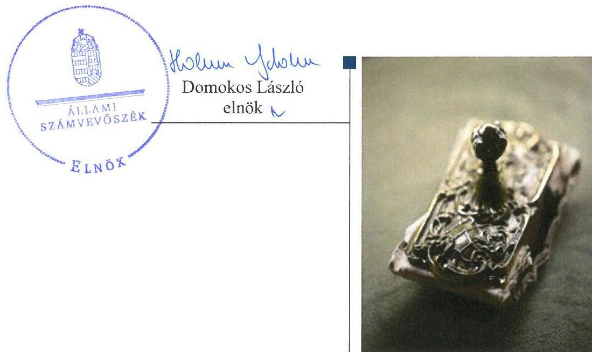
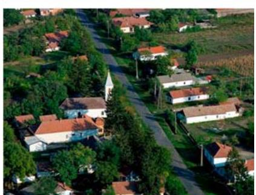
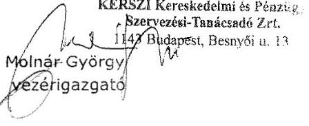
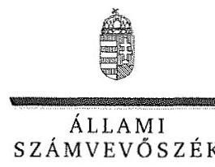
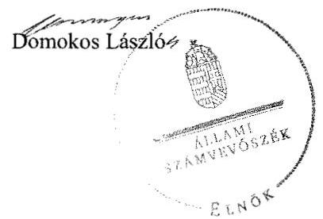
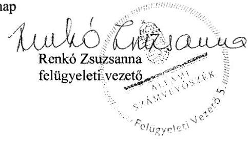

# Jelentés 

## Önkormányzati adósságrendezés ellenőrzése

Magyardombegyház Község Önkormányzata adósságrendezési eljárásának ellenőrzése 2017.

---

# Jellentés 

## Önkormányzati adósságrendezés ellenőrzése

Magyardombegyház Község Önkormányzata adósságrendezési eljárásának ellenőrzése 2017. 08. hó 16. nap

---

# AZ ELLENŐRZÉST FELÜGYELTE: 

RENKÓ ZSUZSANNA felügyeleti vezető

## AZ ELLENŐRZÉST VEZETTE ÉS A VÉGREHAJTÁSÁÉRT FELELŐS:

BAJNAI ZSUZSANNA ellenőrzésvezető

## A PROGRAM ÖSSZEÁLLÍTÁSÁÉRT FELELŐS:

JANIK JÓZSEF LÁSZLÓ osztályvezető

IKTATÓSZÁM: V-1323-075/2016

TÉMASZÁM: 2357

## ELLENŐRZÉS-AZONOSÍTÓ SZÁM: V073913

Jelentéseink az Országgyúlés számítógépes hálózatán és az Interneten a www.asz.hu címen is olvashatóak.

---

# TARTALOMJEGYZÉK 

■ ÖSSZEGZÉS ..... 5
■ AZ ELLENŐRZÉS CÉLJA ..... 6
■ AZ ELLENŐRZÉS TERÜLETE ..... 7
■ AZ ELLENŐRZÉS HÁTTERE, INDOKOLTSÁGA ..... 8
■ A JELENTÉS LÉNYEGES KÉRDÉSKÖREI ..... 9
■ ELLENŐRZÉS HATÓKÖRE ÉS MÓDSZEREI ..... 10
■ MEGÁLLAPÍTÁSOK ..... 12
■ JAVASLATOK ..... 18
■ MELLÉKLETEK ..... 19
I. sz. melléklet: Értelmező szótár ..... 19
■ FÜGGELÉK: ÉSZREVÉTELEK ..... 21
■ RÖVIDÍTÉSEK JEGYZÉKE ..... 31

---

.

---

# ÖSSZEGZÉS 

Magyardombegyház Község Önkormányzatánál az adósságrendezési eljárást szabálytalanul hajtották végre, a hitelezők igényeit nem az egyezségi megállapodásnak megfelelően, továbbá nem teljes körűen elégítették ki, ezért a hitelezői érdekek sérültek. A fizetőképesség alakulása megbizható adatok hiányában nem volt értékelhető, ezért a felelősségteljes gazdálkodásra vonatkozó jogalkotói szándék teljesülése nem volt megállapítható.

## Az ellenőrzés társadalmi indokoltsága

Pénzügyi egyensúlyi helyzetének, fizetőképességének megromlása miatt Magyardombegyház Község Önkormányzatánál 2010. szeptember 3-tól 2011. május 11-ig adósságrendezési eljárás folyt, amely során 14 841,7 ezer Ft kötelezettség teljesítésére nyújtottak be igényt. Ez a kötelezettségállomány az önkormányzat vagyonának mintegy tizedét jelentette, így indokolt volt ellenőrizni, hogy az adósságrendezési eljárás elérte-e a célját, az eljárás szereplői eleget tettek-e a törvényben meghatározott feladataiknak a fizetőképesség helyreállítása, a hitelezőknek hatékony jogvédelem nyújtása érdekében.

## Főbb megállapítások, következtetések

Az adósságrendezési eljárás szabálytalan végrehajtása akadályozta az eljárás céljainak elérését. Az adósságrendezés megindításakor elmaradt a hitelezői igények kielégítéséhez felhasználható vagyon és a valós pénzügyi helyzet felmérése, mert nem készült vagyonleltár és éves beszámoló. A képviselő-testület döntött a reorganizációs programról, de nem hozott határozatot az egyezségi javaslat elfogadásáról. Elkésett hitelezői igényeket is elfogadtak, ezért a rendelkezésre álló forrásból az adósságrendezési eljárásban nem érvényesíthető követeléseket is kiegyenlítettek, ami miatt a határidőn belül jelentkező hitelezők érdekei sérültek.

A hitelezőkkel megkötött egyezség a benyújtott igények mindössze 6,0\%-át tartalmazta, melynek 99,7\%-át elégítette ki az önkormányzat. A kifizetések az egyezségi megállapodásban foglaltak ellenére nem követelésarányosan teljesültek.

Nem álltak rendelkezésre adatok a követelések, kötelezettségek állományára vonatkozóan, ezért a fizetőképesség alakulása nem volt értékelhető, ennek hiányában nem lehetett megállapítást tenni az átgondolt gazdasági múködés jogalkotói elvárásának megvalósulására vonatkozóan.

---

# AZ ELLENŐRZÉS CÉLJA 

Az ellenőrzés célja annak megállapítása volt, hogy az adósságrendezési eljárás lefolytatása szabályszerű volt-e, az önkormányzat gazdálkodása az adósságrendezési eljárás alatt megfelelt-e a jogszabályi előírásoknak; az eljárás szereplői - kiemelten a pénzügyi gondnok - a jogszabályokban foglaltak szerint jártak-e el az adósságrendezés során. A lefolytatott eljárás elérte-e a törvényben kitűzött célokat; az adósságrendezési eljárás alatt az önkormányzat folyamatosan teljesítette-e kötelező feladatait, a hitelezők követelését vagyonarányosan kielégítette-e, helyre-állt-e fizetőképessége.

---

# AZ ELLENŐRZÉS TERÜLETE 

## Magyardombegyház Község Önkormányzata

Magyardombegyház község Békés megyében helyezkedik el. Állandó lakosainak száma 2009. január 1-jén 259 fő, 2014. december 31-én 237 fő volt. Az önkormányzat ${ }^{1}$ képviselő-testülete ${ }^{2}$ a 2010. évi önkormányzati választásokig hat fővel, azt követően öt fővel látta el feladatát. Állandó bizottságot - egyet a 2014. évben hoztak létre.

A polgármester ${ }^{3}$ személye nem változott az ellenőrzött időszakban, a jelenlegi jegyző 2013. április 1. napjától tölti be tisztségét.

Az igazgatási, gazdálkodási feladatokat az önkormányzat hivatala ${ }^{4}$ látta el, amelyen kívül más költségvetési szervezettel, továbbá gazdasági társasággal nem rendelkeztek.

A foglalkoztatottak létszáma - a közfoglalkoztatottakkal együtt - 2009. január 1-jén 31 fő, 2014. december 31-én 53 fő volt.

Az adósságrendezési eljárást az önkormányzat kezdeményezte 2010. szeptember 3-án, szállítók felé fennálló tartozására hivatkozva. A bíróság ${ }^{5}$ végzése az adósságrendezés megindításáról 2010. szeptember 9-én jelent meg a Cégközlönyben. Az adósságrendezés 2011. május 11-én egyezség megkötésével zárult.

A bíróság a KERSZI Zrt. ${ }^{6}$-t jelölte ki a pénzügyi gondnoki feladatok ellátására.

---

# AZ ELLENŐRZÉS HÁTTERE, INDOKOLTSÁGA 

Az önkormányzatok finanszírozásának, gazdálkodásának keretei és feladatellátása jelentős változásokon ment keresztül a Har. tv. ${ }^{7}$ hatályba lépésétől eltelt időszakban.

Az önkormányzati eladósodást 2011-ig csak az Ötv.-ben ${ }^{8}$ meghatározott hitelfelvételi korlát szabályozta, a korlát megsértését azonban jogszabályok nem szankcionálták. A 2012. évtől jelentős szigorítás lépett életbe, a korábbi passzív szabályozást a Stabilitási tv. ${ }^{9}$ hatályba lépésével az aktív kontroll váltotta fel, a törvény előírásai alapján az önkormányzatok hitelfelvételei engedélykötelessé váltak.

1996-ban a hitelfelvételi korlát bevezetése mellett az önkormányzatok adósságrendezésének szabályozására is sor került. Az adósságrendezési eljárás részben a lakosság védelmét szolgálta azzal, hogy biztosította az önkormányzatok által nyújtott kötelező közfeladatokhoz való hozzájutást az önkormányzat fizetésképtelensége esetén is. A Har. tv. alapján - 1996 és 2013 júniusa között - ugyanakkor elenyésző számú, mindösszesen 64 adósságrendezési eljárás indult. Az eljárások közel 60\%-a egyezséggel, $40 \%$-a vagyonfelosztással zárult.

Az adósságrendezés első időszakában (2009. évig) a forráshiányból eredeztethető eladósodás tette indokolttá az eljárások jelentős hányadának megindítását.

A második időszakban az eljárás alá vont önkormányzatok között megjelentek a nagyobb költségvetéssel és több intézménnyel is rendelkező települések. Az adósságrendezést szükségessé tevő problémák speciális pénzügyi elemekkel, a devizaalapú kötvénnyel történő finanszírozás begyűrűző hatásaival, valamint az anyagi lehetőségeket meghaladó, túlméretezett fejlesztésekkel összefüggő kötelezettségvállalásokkal egészültek ki, de a beruházások esetében fontos tényező volt a kellő szakértelem hiánya és a pénzügyi nehézségek szakszerűtlen kezelése is.

Az ÁSZ ${ }^{10}$ önkormányzati alrendszert érintő ellenőrzései, elemzései során számos ponton mutatott rá azokra a területekre, ahol a „szabályozás" módosításra, korrekcióra szorul. Az ellenőrzés alapján megfogalmazott javaslatok e területen is segítséget nyújthatnak a kormányzat és az Országgyűlés törvényhozó munkájában, hozzájárulhatnak az irányítói tevékenység erősítéséhez, végső soron a közpénzügyek átláthatóságához és a közvagyon védelméhez. Az ellenőrzés során tett megállapításaink megerősíthetik egy „megelőző monitoring funkció" kialakításának szükségességét a helyi önkormányzatok fizetésképtelenségének megelőzése érdekében.

---

# A JELENTÉS LÉNYEGES KÉRDÉSKÖREI 

1. Az adósságrendezési eljárás folyamata, végrehajtása során szabályszerű volt-e az önkormányzat és a pénzügyi gondnok feladatellátása?
2. A lefolytatott adósságrendezési eljárás elérte-e a törvényben kitüzött célokat?
3. Az adósságrendezési eljárást követően biztosított és fenntartható volt-e a pénzügyi egyensúly?

---

# ELLENŐRZÉS HATÓKÖRE ÉS MÓDSZEREI 

## Az ellenőrzés típusa

Rendszerellenőrzés.

## Az ellenőrzött időszak

2009. január 1. és 2015. június 30. közötti időszak.

## Az ellenőrzés tárgya

A Har. tv. által szabályozott adósságrendezési eljárás.

## Az ellenőrzött szervezet

Magyardombegyház Község Önkormányzata
Kevermesi Közös Önkormányzati Hivatal
KERSZI Zrt.

## Az ellenőrzés jogalapja

Az Állami Számvevőszékről szóló 2011. évi LXVI. törvény 5. § (2) bekezdése.

## Az ellenőrzés módszerei

Az ellenőrzés szakmai módszertana az ÁSZ hivatalos honlapján (www.asz.hu) közzétett szakmai szabályokon alapult, amelyek irányadónak tekintették a Legfőbb Ellenőrző Intézmények Nemzetközi Szervezete (INTOSAI) által kiadott nemzetközi (ISSAI) standardokat.

Az ellenőrzés alapját tanúsítványok, szabályzatok, szerződések, bírósági végzések, határozatok és egyéb dokumentumok, kimutatások, valamint az önkormányzati beszámolók adatai képezték. Az ellenőrzési kérdések megválaszolásához szükséges bizonyítékok megszerzése, összegyűjtése, az ellenőrzöttek által rendelkezésre bocsátott dokumentumok, adatok elemzés módszerével végrehajtott értékelésével történt, kiegészítve a megfigyelés, a szemle (szemrevételezés), a kérdésfeltevés (információkérés), mintavételezés módszerével. Az ellenőrzés keretében értékeltük az ellenőrzéshez elkészített tanúsítványok adatainak valódiságát.

---

Az adósságrendezési eljárás szabályszerűségét a bírósági végzések, határozatok, a testületi előterjesztések, jegyzőkönyvek és határozatok, a válságköltségvetések, a költségvetési beszámolók adatai, értesítések, közzétételek, a hitelezőkről készült kimutatások, jelentések, belső szabályzatok, és további releváns dokumentumok alapján ellenőriztük. A minősítés szempontja a Har. tv. által meghatározott dokumentumok határidőben és tartalmilag a vonatkozó előírásoknak megfelelő elkészítése volt.

A kontrolltevékenység múködését véletlen mintavétel alapján ellenőriztük.

Az önkormányzat fizetőképességének helyreállását likviditási mutatók számításával, pénzügyi egyensúlyának fenntarthatóságát a CLF módszer segítségével értékeltük.

Az önkormányzat adósságrendezési eljárása és az azt követő gazdálkodási tevékenysége hibáinak kijavítására, a közpénzekkel való felelős gazdálkodás segítésére irányuló javaslatok kidolgozásakor a hatályos jogszabályok voltak az irányadóak.

---

# MEGÁLLAPÍTÁSOK 

## 1. Az adósságrendezési eljárás folyamata, végrehajtása során szabályszerű volt-e az önkormányzat és a pénzügyi gondnok feladatellátása?

Összegző megállapítás

Az adósságrendezési eljárás szabálytalan végrehajtása miatt a hitelezői érdekek sérültek, az egyezségről a képviselő-testület nem hozott határozatot. A pénzügyi válság kezelésére irányuló törekvésekre kedvezőtlenül hatottak a belső kontrollrendszer kialakításának és múködtetésének hiányosságai.
1.1. számú megállapítás

A hitelezők tájékoztatása során elkövetett szabálytalanságok és a törvényi előírást megsértve elfogadott követelések miatt a jogszabályban megfogalmazott hitelezői jogvédelem sérült.

AZ ADÓSSÁGRENDEZÉSI ELJÁRÁST a polgármester nem azonnal kezdeményezte a képviselő-testület döntését követően a Har. tv. 5. § (1) bekezdése ellenére, hanem tíz napos késedelemmel. A lakosságot és a közigazgatási hivatalt ${ }^{11}$ a kezdeményezéssel egyidejűleg tájékoztatta.

A HITELEZŐKNEK SZÓLÓ FELHÍVÁS az adósságrendezés közzétételét követően a Har. tv. 10. § (3) bekezdése ellenére két országos napilap helyett egyben, az előírt határidőt követően, szeptember 24-e helyett október 7-én jelent meg. A felhívást a helyben szokásos módon kihirdették. A felhívásban a hitelezői igény bejelentésére nyitva álló határidőt pontosan megjelölték.

A polgármester nem tájékoztatta határidőben az adósságrendezés megindításáról a Har. tv. 10. § (4) bekezdése ellenére a közigazgatási hivatalt, a kincstárt, az önkormányzat hivatalának költségvetési elszámolási számláját vezető pénzforgalmi szolgáltatót, az illetékes adó- és vámhatóságot, a nyugdíjbiztosítási igazgatási szervet, az egészségbiztosítási szervet, arra két hetes késéssel került sor.

A HITELEZŐKET NYILVÁNTARTÁSBA VETTE a pénzügyi gondnok.

A követelések megvizsgálását követően elutasította egy hitelező igényét, vitatva annak 5 501,2 ezer Ft-os összegét. Nem utasított el azonban öt követelést összesen 3 952,4 ezer Ft értékben, annak ellenére, hogy a Har. tv. 15. § (1) bekezdése és a 10. § (2) bekezdés e) pontjában meghatározott határidőt követő napon késedelmesen, 2010. november 9-én jelentették be. Az érintett hitelezők érvényesítették követeléseiket, így az elutasítás elmaradása miatt a határidőben jelentkező hitelezőket kár érte.

---

### 1.2. számú megállapítás

1.3. számú megállapítás

A pénzügyi gondnok a hitelezőket követeléseik elfogadásáról a Har. tv. 15. § (1) bekezdése ellenére a jogszabályban meghatározott 15 napos 2010. november 24-ei - határidőhöz képest kilenc napos késedelemmel tájékoztatta, az elutasítást még később, 2011. február 3-án közölte.

Az adósságrendezésben 15-en vettek részt, követelésük összege 9 340,5 ezer Ft volt.

Nem készült vagyonleltár és éves beszámoló. A valós vagyoni-pénzügyi helyzet felmérésének elmaradása veszélyeztette a hitelezői igények kielégítését.

## NEM KÉSZÜLT VAGYONLELTÁR ÉS ÉVES BESZÁ-

MOLÓ az adósságrendezés megindításának időpontját megelőző nappal, így a polgármester nem adta át azokat a Har. tv. 13. § (2) bekezdés b) pontjának előírása ellenére a pénzügyi gondnoknak, továbbá az e) pont előírása ellenére az adósságrendezési eljárás kezdő időpontját megelőző egy éven belül és az azóta kötött szerződéseket.

Az önként vállalt és jogszabályban kötelezően előírt feladatainak és hatáskörének helyi ellátási formáiról, valamint ezek pénzügyi finanszírozásáról szóló jelentést, a folyamatban lévő bírósági eljárásról tájékoztatást, a válságköltségvetési rendelettervezetet megkapta a pénzügyi gondnok.

A válságköltségvetési rendeletek és a reorganizációs program tartalmában nem felelt meg a jogszabályi előírásnak.

AZ ADÓSSÁGRENDEZÉSI BIZOTTSÁG nem alakult meg a Har. tv. 16.§ (1) bekezdése ellenére az előírt határidőben 2010. szeptember 17-én, arra négy héttel később került sor.

Az adósságrendezési bizottság a válságköltségvetési rendelettervezeteket megtárgyalta és elfogadta.

A VÁLSÁGKÖLTSÉGVETÉSI RENDELETEK ${ }^{12}$ nem feleltek meg az előírásoknak, mert

- a Har. tv. 13. § (1) bekezdés d) és a 31. § (1) bekezdés a) pontjában foglaltak ellenére a 2010. évben nem rendszeres személyi jellegú juttatások kifizetésére is lehetőséget biztosított;
- a Har. tv. 13. § (1) bekezdés a) pontja ellenére a 2011. évben hitelfelvételt tartalmazott;
- Har. tv. 16. § (3) bekezdésében előírtak ellenére a 2011. évben az adósságrendezési bizottság helyett a polgármester hatáskörébe utalta a szociálpolitikai juttatások kiadási előirányzatai közötti átcsoportosítás jogát;
- a Har. tv. 18. § (1) bekezdése, a Melléklet 10. pontja és az Ötv. 8. § (4) bekezdése ellenére nem terveztek forrást a 2011. évi válságköltségvetésében az általános iskolai oktatási nevelési feladatok ellátásra;
- a Har. tv. 18. § (2) bekezdése előírása ellenére a múködési kiadásokon túl felhalmozási kiadásokat is tartalmazott a 2010-2011. években.

---

A pénzügyi gondnok a Har. tv. 14. § (1) bekezdésének előírása ellenére nem készített a költségvetést érintő előterjesztésekhez csatolható véleményt, továbbá nem vett részt a Har. tv. 14. § (2) bekezdés c) pontja ellenére a képviselő testület ülésén.

# A REORGANIZÁCIÓS PROGRAMOT ÉS EGYEZ- 

SÉGI JAVASLATOT az adósságrendezési bizottság elkészítette, és a pénzügyi gondnok határidőn belül a képviselő-testület elé terjesztette elfogadásra.

A reorganizációs program tartalmazta az adósságrendezéshez vezető okokat, az önkormányzat gazdasági helyzetének részletes leírását, az adósságrendezésbe vonható vagyon hasznosítására vonatkozó javaslatot.

Meghatározásra kerültek egyéb tervezett intézkedések: létszámcsökkentés, a méltányossági ápolási díj megszüntetése, azonban a Har. tv. 20. § (2) bekezdése ellenére nem jelölték meg, hogy az önkormányzat ilyen módon milyen bevételekhez juthat, ezért a reorganizációs program nem felelt meg tartalmilag az előírt követelménynek.

Az egyezségi javaslat szerint a hitelezői igények kielégítésének forrása két, a reorganizációs programban nevesített ingatlan értékesítéséből származó bevétel volt. A javaslat megfelelt a jogszabályi előírásoknak.

### 1.4. számú megállapítás

Az egyezségi javaslatról a képviselő-testület nem hozott határozatot, ami nem felet meg a jogszabályi előírásoknak.

AZ EGYEZSÉGI JAVASLATRÓL a képviselő-testület nem hozott határozatot. Erről a pénzügyi gondnok a Har. tv. 22. § (1) bekezdése ellenére nem értesítette a hitelezőket, továbbá a Har. tv. 22. § (5) bekezdése ellenére nem jelentette be a bíróságnak. A Har. tv. 23. § (1) bekezdése ellenére az egyezségi tárgyalásra szóló meghívóval a hitelezők részére a képviselő-testület által el nem fogadott egyezségi javaslatot küldött meg. A képviselő-testületi döntés hiányáról nem tájékoztatta a Har. tv. 14. § (2) bekezdés g) pontja ellenére a törvényességi ellenőrzésért felelős szervet.

AZ EGYEZSÉGHEZ az adósságrendezés időpontjában fennálló követeléssel rendelkező hitelezőknek több mint a fele hozzájárult, ezen hitelezők követelése elérte a bejelentett hitelezői követelés kétharmadát. Az egyezséget írásba foglalták, amely tartalmazta a jogszabály által előírt elemeket, a végrehajtás ellenőrzésével a pénzügyi gondnokot bízták meg.

Az egyezséget tartalmazó okiratot a pénzügyi gondnok nem nyújtotta be három napon belül a bírósághoz a Har. tv. 25. § (2) bekezdése ellenére, kötelezettségének 2011. április 4-én, 13 nappal később tett eleget.

Az egyezség alapján az önkormányzat fizetési haladékot ért el. A hitelezők elengedték a késedelmi kamatokat és a tőketartozás $94 \%$-át, együttesen 8 790,5 ezer Ft-ot.

---

### 1.5. számú megállapítás

A megfelelő kontrollkörnyezetet nem alakították ki, mert nem készítették el a gazdálkodásra vonatkozó szabályzatokat. A kifizetéshez kapcsolódó gazdálkodási jogkörgyakorlás nem volt ellenőrizhető a bizonylatőrzési kötelezettség megsértése miatt a válságköltségvetés időszakában. A belső ellenőrzésekről az előírt nyilvántartást nem vezették.

A KONTROLLKÖRNYEZETET kialakítása nem volt megfelelő, mert
nem rendelkeztek - a Számv. tv. ${ }^{13}$ 14. §(4), (5) a-b) és d), az Áhsz. ${ }^{14}$ 8. § (3)-(4) a-b) és d) pontjaiban előírt - számviteli politikával, és az annak keretében elkészítendő leltározási és leltárkészítési szabályzattal, az eszközök és források értékelési szabályzatával, pénzkezelési szabályzattal, továbbá a Számv. tv. 161. § (1) és az Áhsz. ${ }_{1} 49 . \S$ (1) bekezdéseiben előírt számlarenddel;
nem rendezték a gazdálkodással - így különösen a kötelezettségvállalás, ellenjegyzés, a szakmai teljesítés igazolása, az érvényesítés, utalványozás gyakorlásának módjával, eljárási és dokumentációs részletszabályaival, valamint az ezeket végző személyek kijelölésének rendjével, és az adatszolgáltatási feladatok teljesítésével - kapcsolatos belső előírásokat, feltételeket az Ámr. ${ }^{15}$ 20. § (3) bekezdés a) pontja előírása ellenére.

A gazdálkodási szabályzatot ${ }^{16}$ 2011. január 1-jével elkészítették, amely megfelelt az előírásoknak.

Az adósságrendezés időszakában rendelkeztek a képviselő-testület és az önkormányzat hivatala múködésének részletes szabályait tartalmazó SZMSZ ${ }^{17}$-szel, vagyongazdálkodási rendelettel ${ }^{18}$, amelyek megfeleltek a jogszabályi követelményeknek.

A KONTROLLTEVÉKENYSÉGEK - gazdálkodási jogkörök, pénzügyi gondnoki ellenjegyzés - gyakorlása nem volt ellenőrizhető a 2010-2011. években, mert a könyvviteli elszámolást alátámasztó számviteli bizonylatokat, főkönyvi számlákat nem őrizték meg a Számv. tv. 169. § (2) bekezdése ellenére.

A kötelezettségvállalásokhoz kapcsolódóan nem vezettek analitikus nyilvántartást az adósságrendezés időszakában az Ámr. ${ }_{2}$ 75. § (1) bekezdése ellenére, így nem volt megállapítható a rendelkezésre álló szabad előirányzatok összege.

A jegyző nem juttatta el a Har. vhr. ${ }^{19}$ 16. §-ában előírtak ellenére a pénzügyi gondnok ellenjegyzéshez szükséges aláírási címpéldányát az adósságrendezés megindításával egyidejűleg a számlavezető pénzügyi intézményhez.

A BELSŐ ELLENŐRZÉS kialakításáról nem gondoskodtak a Ber. ${ }^{20}$ 4. § (1) bekezdése ellenére a 2010. évben, a 2011. évben társulás ${ }^{21}$ keretében biztosították.

A 2011. évben nem készült belső ellenőrzési terv a Ber. 18. §-ában foglaltak ellenére, azonban az önkormányzat pénzkezelését vizsgálták. Az elvégzett ellenőrzésről az előírt nyilvántartást nem vezették a Ber. 32. § (1) bekezdése ellenére.

---

# 2. A lefolytatott adósságrendezési eljárás elérte-e a törvényben kitüzött célokat? 

## Összegző megállapítás

A kötelező feladatokat ellátták. Az egyezségben vállalt fizetési kötelezettséget nem a megállapodás szerint követelésarányosan teljesítették, egy hitelezői igényt nem elégítettek ki. A fizetőképesség nem volt értékelhető az elemzéshez szükséges adatok hiányában.

A KÖTELEZŐ FELADATOKAT az adósságrendezés alatt ellátták, feladat átadás-átvétel nem történt.

A REORGANIZÁCIÓS PROGRAMBAN szereplő bevételnövelő intézkedést végrehajtották. Az ingatlanok értékesítéséből egyszeri, 550 ezer Ft bevétel származott, amely a hitelezői igények kielégítésének kizárólagos forrása volt az egyezségi megállapodás szerint. A megvalósított létszámcsökkentésből az önkormányzat számítása szerint évente 2651,8 ezer Ft megtakarítás keletkezett.

A HITELEZŐI IGÉNYEKET az egyezségi megállapodás ellenére a 15 hitelező részére nem követelésarányosan elégítették ki, hanem 14 között egyenlő arányba osztották fel az ingatlanértékesítés bevételét. Egy hitelező felé a tartozást $-1,6$ ezer Ft, $0,3 \%$ - nem rendezték.

LIKVIDITÁSI TERVET nem készítettek a 2009. évben az Ámr. ${ }^{22}$ 139. § (1) bekezdésében, a 2010-2011. évben az Ámr. ${ }_{2}$ 201. § (1) bekezdésében, a 2012-2015. I. félévében az Ávr. ${ }^{23}$ 122. § (1)-(2) bekezdéseiben foglaltak ellenére. Likviditási tervek hiányában a fizetőképesség alakulást nem kísérték figyelemmel, így nem rendelkeztek információval arról, hogy a kiadások teljesítéséhez a megfelelő pénzügyi fedezet rendelkezésre áll-e, ezáltal nem volt biztosítva a tartozások kialakulásának megelőzése.

A FIZETŐKÉPESSÉG adatok hiányában nem volt értékelhető, mivel
nem gondoskodtak az Áhsz. ${ }_{1}$ 49. § (1) bekezdésében és a 9. számú mellékletének 4. d) ${ }^{*}$ pontjában, illetve az Áhsz. ${ }_{2}$ 39. § (3) bekezdésében és a 14. mellékletének II. pontjában előírt kötelezettségekhez kapcsolódó analitikus, illetve részletező nyilvántartás vezetéséről, továbbá az Áhsz. ${ }_{1}$ 49. § (1) bekezdésében és a 9. számú mellékletének 2. ca) pontjában, illetve az Áhsz. ${ }_{2} 5 . \S$ (1) és 39 § (3) bekezdésében valamint a 14. mellékletének III. pontjában előírt követelésekhez kapcsolódó analitikus, illetve részletező nyilvántartás vezetéséről;
a mérlegek fordulónapján a követelések és kötelezettségek leltározását a 2009-2013. években az Áhsz. ${ }_{1}$ 37. § (1) bekezdésében, a

[^0]
[^0]:    * A 2011. január 1-től hatályos szabályozás szerint da) pont

---

2014. évben az Áhsz.2 ${ }^{24}$ 22. § (1) bekezdésében foglaltak ellenére nem végezték el.
A megállapított hiányosságok miatt sérült a Számv. tv. 15. § (3) bekezdése szerinti valódiság elve.

# 3. Az adósságrendezési eljárást követően biztosított és fenntartható volt-e a pénzügyi egyensúly? 

## Összegző megállapítás

A pénzügyi egyensúly megítéléséhez szükséges adatok nem álltak rendelkezésre.

A PÉNZÜGYI EGYENSÚLY nem volt értékelhető, mivel a Számv. tv. 169. § (1) bekezdése ellenére az Áhsz. 13. § (1) és az Áhsz. 2 31. § (1) bekezdéseinek megfelelően aláírt éves költségvetési beszámolókat nem őrizték meg, továbbá a számviteli nyilvántartásokat érintő - a 2. összegző megállapítás 5. bekezdésében részletezett - hiányosságok miatt.

---

# JAVASLATOK 

Az ÁSZ tv. 33. § (1) bekezdésében foglaltak értelmében az ellenőrzött szervezet vezetője köteles a jelentésben foglalt megállapításokhoz kapcsolódó intézkedési tervet összeállítani és azt a jelentés kézhezvételétől számított 30 napon belül az ÁSZ részére megküldeni. Amennyiben az ellenőrzött szervezet vezetője nem küldi meg határidőben az intézkedési tervet, vagy továbbra sem elfogadható intézkedési tervet küld, az Állami Számvevőszék elnöke az ÁSZ tv. 33. § (3) bekezdése a) és b) pontjaiban foglaltakat érvényesítheti.

## a Kevermesi Közös Önkormányzati Hivatal jegyzőjének:

1. Intézkedjen a likviditási terv jogszabályi előírásoknak megfelelő elkészitéséről.
(2. sz. megállapítás 4. bekezdés 1. mondata alapján)
2. Intézkedjen a követelésekhez és kötelezettségekhez kapcsolódó részletező nyilvántartások jogszabályi előírásoknak megfelelő vezetéséről.
(2. számú megállapítás 5. bekezdés 1. pontja alapján)
3. Intézkedjen az éves költségvetési beszámoló mérlegében kimutatott követelések és kötelezettségek jogszabályi előírásoknak megfelelő leltárral történő alátámasztásáról.
(2. számú megállapítás 5. bekezdés 2. pontja alapján)
4. Intézkedjen az Állami Számvevőszék ellenőrzése során feltárt hiányosságok és/vagy szabálytalanságok tekintetében a munkajogi felelősség tisztázására irányuló eljárás megindításáról, és ennek eredménye ismeretében tegye meg a szükséges intézkedéseket.
(2. számú megállapítás 5. bekezdés 1-2. pontjai alapján)

---

# MELLÉKLETEK 

- I. SZ. MELLÉKLET: ÉRTELMEZŐ SZÓTÁR
adósságrendezés
adósságrendezésbe vonható vagyon
adósságrendezési bizottság
adósságrendezési eljárás
adósságrendezési eljárás kezdő időpontja
adósságrendezés megindításának időpontja
bíróság
CLF módszer
egyezségi javaslat
egyezségi tárgyalás
hitelező
közfeladat

Az adósságrendezési eljárás azon szakasza, amely a bíróság adósságrendezést megindító végzésének Cégközlönyben való közzétételével [10. § (1) bekezdés] kezdődik és az adósságrendezési eljárás befejezését elrendelő bírósági végzés Cégközlönyben való közzétételének napjáig tart. (Forrás: Har. tv. 2. § b) pontja és 32. § (6) bekezdése).

Törvényben meghatározott forgalomképteIen törzsvagyon feletti, valamint a hatósági feladatok és az alapvető lakossági szolgáltatások ellátásához szükséges vagyon feletti forgalomképes vagyonrész. (Forrás: Har. tv. 2.§ f) pontja)
Az adósságrendezési eljárás megindítását követően megalakult bizottság, melynek tagjai: az önkormányzat polgármestere, a jegyző, a pénzügyi bizottság elnöke, egy önkormányzati képviselő. Elnöke a pénzügyi gondnok. (Forrás: Har. tv. 16. § (1) bekezdése)

A helyi önkormányzat székhelye szerint illetékes törvényszék (2011. XII. 31.-ig a fővárosi, megyei bíróságok) hatáskörébe tartozó nem peres eljárás, amely a helyi önkormányzatok fizetőképességének helyreállítására irányul. (Forrás: Har. tv. 3. § (1) bekezdése)
az a nap, amelyen a kérelem a bírósághoz érkezik. (Forrás: Har. tv. 4. § (1) bekezdése)
a végzés Cégközlönyben való megjelenésének napja. (Forrás: Har. tv. 10. § (1) bekezdés d) pontja)
az adósságrendezési eljárás során eljáró törvényszék, 2011. XII. 31-ig a megyei (fővárosi) bíróság
Az önkormányzatok költségvetése elemzésének módszere, amely a pénzügyi kapacitás (nettó múködési jövedelem) fogalmát helyezi a középpontba. A módszer következetesen elkülöníti a folyó és a felhalmozási költségvetés bevételeit és kiadásait, azok költségvetési egyenlegeit. Bizonyos mértékig a vállalati gazdálkodás logikai elemeit érvényesíti az önkormányzatok pénzügyi, jövedelmi helyzetének vizsgálata során.
Az adósságrendezési bizottság által készített dokumentum az önkormányzat hitelezőinek a követeléséről, mely tartalmazza az indoklással alátámasztott egyezségi javaslatot. (Forrás: Har. tv. 20. § (3) bekezdése)
A képviselő-testület által elfogadott egyezségi javaslat alapján lefolytatott tárgyalás, mely egyezséggel vagy az adósságrendezési eljárásnak vagyonfelosztással történő folytatásának bírósági elrendelésével zárulhat.
Az adósságrendezés megindításának időpontjáig az, akinek a helyi önkormányzattal, vagy annak költségvetési szervével szemben vagyoni követelése áll fenn; az adósságrendezés megindításának időpontját követően az, aki a követelését a hitelezői igény bejelentésére nyitva álló határidő alatt bejelentette, és azt a pénzügyi gondnok elfogadta, illetve követelésének jogerős elbírálásáig az is, akinek az igénye vitatott. (Forrás: Har. tv. 2.§ c) pontja)
Jogszabályban meghatározott állami vagy önkormányzati feladat, amit az arra kötelezett közérdekből, a jogszabályban meghatározott követelményeknek és feltételeknek megfelelve végez, ideértve a lakosság közszolgáltatásokkal való ellátását, továbbá az állam nemzetközi szerződésekben vállalt kötelezettségeiből adódó közérdekú feladatokat, valamint e feladatok ellátásakor szükséges infrastruktúra biztosítását is. (Forrás: Nvtv. 3. § (1) bekezdés 7. pontja)

---

pénzügyi gondnok
pénzügyi pozíció reorganizációs program
válságköltségvetés

Az adósságrendezési eljárás lefolytatására, a bíróság által kijelölt, a pénzügyi gondnokok névjegyzékében szereplő szakember.
A tárgyévi GFS pozíció és a finanszírozási műveletek összevont egyenlege.
A helyi önkormányzat gazdasági helyzetét bemutató dokumentum, mely tartalmazza továbbá az adósságrendezésbe vonható vagyon hasznosítására, valamint az önkormányzat adósságrendezéssel kapcsolatosan tervezett intézkedéseire vonatkozó javaslatot annak megjelölésével, hogy ezzel milyen bevételhez juthat. (Forrás: Har. tv. 20.§ (2) bekezdése)
A helyi önkormányzat az adósságrendezési eljárás ideje alatt a képviselő-testület által elfogadott válság-költségvetés alapján gazdálkodik. A jegyző az adósságrendezés megindításának időpontját követő 30 napon belül készíti el a válság-költségvetési rendelettervezetet. A válság-költségvetésből az önkormányzat a Har. tv. 18. § (2) bekezdésében és a 19. § (3) bekezdésében foglalt kiadásokat finanszírozhatja. Amennyiben nem kerül elfogadásra válság-költségvetés a Har. tv. 29. § (2) bekezdése alapján az önkormányzat az adósságrendezési eljárás alatt, a pénzügyi gondnok által kidolgozott múködési válságterv alapján kell, hogy müködjön. (Forrás: Mötv. 122. §-a, Har. tv. 18. § (1)-(2) bekezdése, 19. § (2) bekezdése, 29. § (2) bekezdése)

---

# FÜGGELÉK: ÉSZREVÉTELEK 

A jelentéstervezetet a Számvevőszék 15 napos észrevételezésre megküldte az ellenőrzött szervezet vezetőjének az ÁSZ tv. 29. §̊ (1) bekezdése előírásának megfelelően.

A függelék tartalmazza az ellenőrzött észrevételeit, illetve az el nem fogadott észrevételek elutasításának indoklását.

[^0]
[^0]:    ${ }^{7}$ 29. § (1) Az Állami Számvevőszék az ellenőrzési megállapításait megküldi az ellenőrzött szervezet vezetőjének vagy az általa megbízott személynek, és annak, akinek személyes felelősségét állapította meg.
    (2) Az ellenőrzött szervezet vezetője és a felelősként megjelölt személy az ellenőrzés megállapításaira tizenöt napon belül írásban észrevételt tehet.
    (3) Az Állami Számvevőszék az észrevételre a beérkezésétől számított harminc napon belül írásban válaszol. A figyelembe nem vett észrevételeket köteles a jelentésben feltüntetni, és megindokolni, hogy azokat miért nem fogadta el.

---

# Állami Számvevőszék 

Dr. Domonkos László elnök úr részére.

## 1052 Budapest

Apáczai Csere János utca 10.

### 1364.Budapest 4.

Pf. 54.

Iktsz.: K-342/2017.

Táray: Észrevétel a 2017.06.13. napon kelt és a cégünk által 2017.06.19. napján átvett, számvevőszéki jelentéstervezetre.

## Iktatószám: V-1323-062/2016

Témaszám: 2357

## Ellenőrzés-azonosító szám: V073913

## Tisztelt Számvevőszék'

Az Állami számvevőszékrô szóló 2011. évi LXVI. Törvény (a továt-lnakban: ÁSZ tv.) 29 § (1) bekezdésében foglaltak alapján a 2017.június 13. napján kelt „Önkormányzati adósságrendezés ellenörzése - Magyardombegyház Község Önkormányzata adósságrendezési eljárásának ellenörzésé' cimú jelentéstervezetet kézhez vettük, melyre az ÁSZ tv. 29. § (2) bekezdésében biztosított határidőn belül az alábbi észrevételt tesszük:

Elöljáróban rögzítjük, hogy a nevezett Önkormányzat adósságrendezési eljárásának ellenörzéséről készült jele 1:és tervezet minden tekintetben azonosnak ítélhető az előző hasonló ellenörzések ta talmi megfogalmazásaival, azaz pcr tatlanságokkal és a körülmények teljes figyeln en kivül hagyásával, a rendelkezésre bussátott dokumentumok sajátos értelmezésével, avagy azok teljes mellózésével került sor annak megfogalmazására és a következtetések levonására.

Magyardombegyház Község Önkormányzata többszörösen hátrányos helyzetéből eredően és a lakosság összetételéből adódóan az egyik legnehezebb helyzetben lévő térségbeli önkormányzat. Az adósságrendezési eljárás kezdő időpontjában az önkormányzat a legalapvetőbb eszközökkel sem rendelkezett, irodai felszereltségét és infrastruktúráját, valamint személyi állományát tekintve jelentősen elmaradt még a hasonló körülmények között müködő Önkormányzatokhoz képest is.

KERSZI KERESKEDELMI ÉS PÉNZÜGVI
SZERVEZÉSI-TANÁCSKDOZ ZRT
SZERVEZY:H-1143 BUDAPEST, BEDMÓL: 13
POSTACISE: H-1561 BUDAPEST, PP. 108.
TELEFON: 239-4940, 239-4941
FAX: 239-5181
E-MAIL: vitela@kerszizit.hu
KSH:84446 ZRT 10400139-21410879-00000000

---

Az önkormányzat a müködés fenntarthatóságát biztosító pénzügyi eszközökkel sem rendelkezett, így nem lehet figyelmen kívül hagyni ezen tényeket az ellenőrzés lefolytatása során. A fentiekben ismertetett kiinduló feltételek ellenére a pénzügyi gondnok a törvényben előírt kötelezettségét maradéktalanul teljesítette, személyes jelenlétével elősegítette az adósságrendezési eljárás lefolytatását.
1./ A jelentés megfogalmazása tartalmában nem igazolja vissza az adósságrendezési eljárás eredményes befejezésének tényét, ugyanis az egyezség jogerős Törvényszéki végzéssel zárult, így a levont következtetés nem ad tényszerű és a dokumentumokkal igazolható tájékoztatást a nyilvánosság számára.
Magyardombegyház Község Önkormányzata adósságrendezési eljárásának végrehajtása során a polgármester, a körjegyző és a pénzügyi gondnok, az adott körülmények között, tevékenységükkel hozzájárultak az adósságrendezési eljárás céljainak eléréséhez, az egyezség megkötéséhez.
Sajnálatos tény, hogy az egyezség létrejöttét követően, az Önkormányzat gazdálkodásán kívüli körülményekből következően, az egyezségben vállalt kötelezettségek teljesítésére csak a hitelezők jó szándékú megértésének következtében tudott eleget tenni.
A község területén nem müködnek vállalkozások, így az Önkormányzatnak saját bevételi forrása nem keletkezik, amelyből következően a költségvetési forrásból nem tudott a megállapodásoknak határidőre eleget tenni, ugyanis a forgalomképes ingatlanok értékesítése csak késéssel volt realizálható.

Az adósságrendezési eljárás alatt, sem azt követően a hitelezők részéről nem érkezett észrevétel, avagy kifogás a pénzügyi gondokhoz, ill. a Törvényszékhez. Sem formai, sem tartalmi hiányosság nem merült fel az adósságrendezési eljárás lezárását szolgáló egyezségi előterjesztéssel szemben.
Szükséges kihangsúlyozni, hogy az eljárás során a jogszabályok és elsősorban az irányadó 1996. évi XXV. Har.tv. alapján végezte munkáját a polgármester, a jegyző és a pénzügyi gondnok.

Az ÁSZ vizsgálat megállapításaival szemben az egyezség eredményes volt és nem veszélyeztette az eljárás céljainak elérését, ugyanis a gazdálkodási és pénzügyi helyzet rendezetté vált, amelyből következően a pénzügyi gondnok kontrolltevékenysége az adósságrendezési időszakban megfelelő volt, mert minden kifizetést ellenjegyzett.
2./ Észrevételt teszünk továbbá arra vonatkozóan is, hogy:

- nem volt szabálytalan az adósságrendezési eljárás, erről egyetlen Törvényszéki végzés sem szól, hiszen minden határidő, esemény a vonatkozó törvényben előírtak szerint történt. A jogszabályok szerinti eljárás lefolytatásról a pénzügyi gondnok külön összefoglaló jelentést készített az ÁSZ ellenőrzése során, mely feltöltésre került a dokumentumok között, de az abban foglaltak többsége figyelmen kívül hagyásra került. - nem veszélyeztette az adósságrendezési eljárás a törvényben meghatározott célok elérését, mert az eredményesen zárult, a hitelezők az egyezséghez hozzájárultak. Valamennyi egyezségi megállapodás becsatolásra került.

---

- Tényekkel nem igazolható és ezért elfogadhatatlan az a jelentésbe rögzített mondat, hogy a pénzügyi gondnok nem kísérte figyelemmel az önkormányzat gazdálkodását, feladatainak ellátását, a válságköltségvetés időszakában több kifizetés szabálytalanul, a pénzügyi gondnok ellenjegyzése nélkül történt.
A pénzügyi gondnok ellenjegyzése nélkül sem utalás, sem pénzügyi kifizetés nem történt. Ez még abban az esetben is igaz, ha az Önkormányzat erre vonatkozó dokumentumai a vizsgálat során nem voltak teljes körűek.
A banki átutaláskor a 10 pontból 6 pont érték a pénzügyi gondnok engedélyéhez volt kötve, tehát a bankszámla feletti rendelkezések csak és kizárólag a pénzügyi gondnok ellenjegyzésével történtek. Minden pénztári kifizetést személyesen utalványozott a pénzügyi gondnok és szignóval látott el.
Az eljárási rend az volt, hogy előzetesen az elfogadott költségvetési rendeletterv alapján meghatározott időszakokra lebontott kiadásokat a pénzügyi gondnok rendelkezésére bocsájtották előzetes engedélyezésre, majd a befolyó pénzösszeg nagyságára való tekintettel kerülhetett sor a legsürgősebb és elengedhetetlen kiadásokra. Ennek ellenőrzése minden esetben megtörtént.
Amennyiben előfordult, hogy nem szerepel szignó az utalványozó rovatban, úgy annak kifizetéséről előzetes rendelkezési utalvány alapján e-mailban rendelkezett a pénzügyi gondnok. Az adósságrendezési eljárás alatt minden tevékenységről tudomása volt a pénzügyi gondnoknak, minden kiadást felügyelt és meggyőződött arról, hogy az Önkormányzat ellátja az alapvető feladatokat.

A pénzügyi gondnok minden hitelezői igényt a Har.tv. rendelkezései alapján regisztrált és igazolt vissza, a vitatott igényeket az eljáró Törvényszék elé terjesztette annak elbírálása érdekében, amelyből következően nem helytálló annak megállapítása, hogy a jogosulatlan hitelezői igény került befogadásra.

Fontosnak tartjuk azt is kijelenteni, hogy az Adósságrendezési Bizottság által elfogadott egyezségi javaslatot és a reorganizációs programot az Önkormányzat Képviselő Testületé érdemben és határidőben megtárgyalta, majd határozatban rögzítve elfogadta, amelyről a pénzügyi gondnok a jegyzőkönyv másolatát becsatolta.

Az előzőekben röviden összefoglaltak alapján kérjük, hogy az Önök által is ismert körülmények és a rendelkezésre bocsátott dokumentumaink tartalmának hasznosításával szíveskedjenek az észrevételeinket elfogadni, különösen a végleges jelentés nyilvánosságra hozatala előtt.

Budapest, 2017.június 30.
Tisztelettel:

---

ELNÖK

# Molnár György úr 

vezérigazgató

KERSZI Kereskedelmi és Pénzügyi Szervezési-
Tanácsadó Zártkörűen Müködő Részvénytársaság

## Budapest

## Tisztelt Vezérigazgató Úr!

Köszönettel megkaptam az „Önkormányzati adósságrendezés ellenörzése - Magyardombegyház Község Önkormányzata adósságrendezési eljárásának ellenörzése" címủ jelentéstervezet megállapításaira tett észrevételét.

Az ellenőrzési megállapításokra vonatkozó észrevételét az Állami Számvevőszékről szóló 2011. évi LXVI. törvény 29. § (2) bekezdésében meghatározott tizenöt napos határidőn belül küldte meg. Az Állami Számvevőszék észrevétellel kapcsolatos álláspontját a mellékletként csatolt, a felügyeleti vezető által készített indokolás tartalmazza.

Budapest, 2017. O7 hónap 47 nap

Tisztelettel:

Melléklet: Észrevételre adott válasz

---

# „Önkormányzati adósságrendezés ellenörzése - Magyardombegyház Község Önkormányzata adósságrendezési eljárásának ellenörzése" címú jelentéstervezetre tett észrevételekre adott válasz 

|  | Összegzés |
| :--: | :--: |
| Észrevétel: | Megállapítás: Magyardombegyház Község Önkormányzatánál az adósságrendezési eljárást szabálytalanul hajtották végre, a hitelezők igényeit nem az egyezségi megállapodásnak megfelelően, továbbá nem teljes körüen elégítették ki, ezért a hitelezői érdekek sérültek.   Észrevétel: A jelentés megfogalmazása tartalmában nem igazolja vissza az adósságrendezési eljárás eredményes befejezésének tényét, ugyanis az egyezség jogerős Törvényszéki végzéssel zárult, így a levont következtetés nem ad tényszerü és a dokumentumokkal igazolható tájékoztatást nyilvánosság számára.   Az egyezség eredményes volt és nem veszélyeztette az eljárás céljainak elérését, ugyanis a gazdálkodási és pénzügyi helyzet rendezetté vált, amelyből következően a pénzügyi gondnok kontrolltevékenysége az adósságrendezési időszakban megfelelő volt, mert minden kifizetést ellenjegyzett.   Nem veszélyeztette az adósságrendezési eljárás a törvényben meghatározott célok elérését, mert az eredményesen zárult, a hitelezők az egyezséghez hozzájárultak. Valamennyi egyezségi megállapodás becsatolásra került. |
| Válasz: | Az Állami Számvevőszék az észrevételt nem fogadja el. |
| Indoklás: | A lefolytatott adósságrendezési nem volt eredményes, mivel a helyi önkormányzatok adósságrendezési eljárásáról szóló 1996. évi XXV. törvényben (a továbbaiikban: Har. tv.) meghatározott célkitűzések közül az alábbiak szerint egy nem teljesült, egy nem értékelhető:   - a hitelezői igényeket az egyezségi megállapodás ellenére részére nem követelésarányosan elégítették ki;   - a fizetőképesség alakulása megbízható adatok hiányában nem volt értékelhető.   Az adósságrendezési eljárás eredményes befejezésének tényét az nem igazolja, hogy az egyezség jogerős Törvényszéki végzéssel zárult. |
| Észrevétel: | Föbb megállapítások, következtetések 1. mondata   Megállapítás: Az adósságrendezési eljárás szabálytalan végrehajtása akadályozta az eljárás céljainak elérését.   Észrevétel: Magyardombegyház Község Önkormányzata adósságrendezési eljárásának végrehajtása során a polgármester, a körjegyző és a pénzügyi gondnok, az adott körülmények között, tevékenységükkel hozzájárultak az adósságrendezési eljárás céljainak eléréséhez, az egyezség megkötéséhez.   Az észrevétel szerint az eljárás során a jogszabályok alapján végezte munkáját a polgármester, a jegyző és a pénzügyi gondnok. |

---

|  | Nem volt szabálytalan az adósságrendezési eljárás, erről egyetlen Törvényszéki vég-   zés sem szól, hiszem minden határidő, esemény a vonatkozó törvényben elöirtak   szerint történt. A jogszabályok szerinti eljárás lefolytatásáról a pénzügyi gondnok   külön összefoglaló jelentést készített az ÁSZ ellenőrzés során, de az abban foglaltak   többsége figyelmen kívül hagyásra került. |
| :--: | :--: |
| Válasz: | Az Állami Számvevőszék az észrevételt nem fogadja el. |
| Indoklás: | Az ellenőrzés rendelkezésére bocsátott dokumentumok felülvizsgálata alapján az   ÁSZ a megállapításait fenntartja, a polgármester a jelentés 1.1. számú megállapítás   1-3. bekezdéseiben, a pénzügyi gondnok a jelentés 1.1. számú megállapítás 5-6. be-   kezdéseiben, 1.3. számú megállapítás 4. bekezdésében, 1.4. számú megállapítás 1.   bekezdés 2-4. mondataiban és 3. bekezdésében, a jegyző a jelentés 1.2. számú mea-   állapítás 1. bekezdésében szereplő, a Har. tv-ben előírt kötelezettségeit nem, vagy   késedelmesen teljesítette, így az adósságrendezési eljárás végrehajtása szabálytalan   volt. |
| Észrevétel: | 2. számú megállapítás 3. bekezdés   Megállapítás: A hitelezői igényeket az egyezségi megállapodás ellenére a 15 hite-   lező részére nem követelésarányosan elégítették ki, hanem 14 között egyenlő   arányba osztották fel az ingatlanértékesítés bevételét. Egy hitelező felé a tartozást -   1,6 ezer Ft, $0,3 \%$ - nem rendezték.   Észrevétel: Sajnálatos tény, hogy az egyezség létrejöttét követően, az Önkormányzat   gazdálkodásán kívüli körülményekből következően, az egyezségben vállalt kötele-   zettségek teljesítésére csak a hitelezők jó szándékú megértésének következtében tu-   dott eleget tenni. A község területén nem müködnek vállalkozások, így az Önko-   mányzatnak saját bevételi forrása nem keletkezik, amelyből következően a költség-   vetési forrásból nem tudott a megállapodásoknak határidőre eleget tenni, ugyanis a   forgalomképes ingatlanok értékesítése csak késéssel volt realizálható. |
| Válasz: | Az Állami Számvevőszék az észrevételt nem fogadja el. |
| Indoklás: | Az észrevétel a megállapítást nem vitatta. |
| Észrevétel: | 1.4. számú megállapítás 1. és 3. bekezdései   Megállapítás: Az egyezségi javaslatról a képviselő-testület nem hozott határozatot.   Erről a pénzügyi gondnok nem értesítette a hitelezőket, továbbá nem jelentette be a   bíróságnak. Az egyezségi tárgyalásra szóló meghívóval a hitelezők részére a képvi-   selő-testület által el nem fogadott egyezségi javaslatot küldött meg. A képviselö-   testületi döntés hiányáról nem tájékoztatta a törvényességi ellenőrzésért felelős szer-   vet.   Az egyezséget tartalmazó okiratot a pénzügyi gondnok nem nyújtotta be három na-   pon belül a bírósághoz, kötelezettségének 2011. április 4-én, 13 nappal később tett   eleget.   Észrevétel: Az adósságrendezési eljárás alatt, sem azt követően a hitelezők részéről   nem érkezett észrevétel, avagy kifogás a pénzügyi gondnokhoz, ill. a Törvényszék-   hez. Sem formai, sem tartalmi hiányosság nem merült fel az adósságrendezési eljárás   lezárását szolgáló egyezségi előterjesztéssel szemben. |

---

| Válasz: | Az Állami Számvevőszék az észrevételt nem fogadja el. |
| :--: | :--: |
| Indoklás: | A jelentés 1.4. számú megállapítás 1. és 3. bekezdésében szereplő szabálytalanságokkal kapcsolatban az észrevétel konkrét dokumentumra történő hivatkozást nem tartalmazott. Az, hogy az adósságrendezési eljárás alatt, sem azt követően a hitelezők részéről nem érkezett észrevétel, avagy kifogás a pénzügyi gondnokhoz, ill. a Törvényszékhez nem bizonyítja, hogy sem formai, sem tartalmi hiányosság nem merült fel az adósságrendezési eljárás lezárását szolgáló egyezségi előterjesztéssel szemben. |
| Észrevétel: | 1.5. számú megállapítás 4. bekezdése   Megállapítás: A kontrolltevékenységek - gazdálkodási jogkörök, pénzügyi gondnoki ellenjegyzés - gyakorlása nem volt ellenőrizhető a 2010-2011. években, mert a könyvviteli elszámolást alátámasztó számviteli bizonylatokat, fökönyvi számlákat nem őrizték meg a Számv. tv. 169. § (2) bekezdése ellenére.   Észrevétel: Tényekkel nem igazolható, hogy a pénzügyi gondnok nem kísérte figyelemmel az önkormányzat gazdálkodását, feladatainak ellátását, a válságköltségvetés időszakában több kifizetés szabálytalanul, a pénzügyi gondnok ellenjegyzése nélkül történt. A pénzügyi gondnok ellenjegyzése nélkül sem utalás, sem pénzügyi kifizetés nem történt. Ez még abban az esetben is igaz, ha az Önkormányzat erre vonatkozó dokumentumai a vizsgálat során nem voltak teljes körűek. A banki átutaláskor a 10 pontból 6 pont érték a pénzügyi gondnok engedélyéhez volt kötve, tehát a bankszámla feletti rendelkezések csak és kizárólag a pénzügyi gondnok ellenjegyzésével történtek. Minden pénztári kifizetést személyesen utalványozott a pénzügyi gondnok és szignóval látott el. Az eljárási rend az volt, hogy előzetesen az elfogadott költségvetési rendeletterv alapján meghatározott időszakokra lebontott kiadásokat a pénzügyi gondnok a rendelkezésére bocsátották előzetes engedélyezésre, majd a befolyó pénzösszeg nagyságára való tekintettel kerülhetett sor a legsürgösebb és elengedhetetlen kiadásokra. Ennek ellenőrzése minden esetben megtörtént. Amennyiben előfordult, hogy nem szerepel szignó az utalványozó rovatban, úgy annak kifizetéséről előzetes rendelkezési utalvány alapján e-mailben rendelkezett a pénzügyi gondnok. Az adósságrendezési eljárás alatt minden tevékenységről tudomása volt a pénzügyi gondnoknak, minden kiadást felügyelet és meggyőződött arról, hogy az Önkormányzat ellátja az alapvető feladatokat. |
| Válasz: | Az Állami Számvevőszék az észrevételt nem fogadja el. |
| Indoklás: | A 2010-2011. évek könyvviteli elszámolást alátámasztó számviteli bizonylatait, fökönyvi számláit nem őrizték meg, ezért az észrevételben foglaltak nem bizonyhatóak, az abban foglaltakat alátámasztó dokumentumot nem bocsátottak az ellenőrzés rendelkezésére és az észrevételhez sem csatoltak. |
| Észrevétel: | 1.1. számú megállapítás   Megállapítás: A hitelezők tájékoztatása során elkövetett szabálytalanságok és a törvényi előirást megsértve elfogadott követelések miatt a jogszabályban megfogalmazott hitelezői jogvédelem sérült.   Észrevétel: A pénzügyi gondnok minden hitelezői igényt a Har. tv. rendelkezései alapján regisztrált és igazolt vissza, a vitatott igényeket az eljáró Törvényszék elé |

---

|  | terjesztette annak elbírálása érdekében, amelyből következően nem helytálló annak megállapítása, hogy jogosulatlan hitelezői igény került befogadásra. |
| :--: | :--: |
| Válasz: | Az Állami Számvevőszék az észrevételt nem fogadja el. |
| Indoklás: | Az ellenőrzés rendelkezésére bocsátott dokumentumok felülvizsgálata alapján az ÁSZ a megállapításait fenntartja, mivel öt követelést késedelmesen jelentettek be a pénzügyi gondnoknak, aki azokat nem utasította el. |
| Észrevétel: | 1.4. számú megállapítás   Megállapítás: Az egyezségi javaslatról a képviselő-testület nem hozott határozatot.   Észrevétel: Az Adósságrendezési Bizottság által elfogadott egyezségi javaslatot és a reorganizációs programot az Önkormányzat Képviselő-testülete érdemben és határidőben megtárgyalta, majd határozatban rögzítve elfogadta, amelyről a pénzügyi gondnok a jegyzőkönyv másolatát becsatolta. |
| Válasz: | Az Állami Számvevőszék az észrevételt nem fogadja el. |
| Indoklás: | A Képviselő-testület kizárólag a reorganizációs program elfogadásáról hozott határozatot, az egyezségi javaslatról nem. A polgármester és a jegyző együttes nyilatkozott arról, hogy az egyezségre vonatkozólag testületi határozat nem készült. |

Tájékoztatom Vezérigazgató Urat, hogy az Állami Számvevőszékről szóló 2011. évi LXVI. törvény 29. § (3) bekezdése alapján az Állami Számvevőszék a figyelembe nem vett észrevételeket köteles a jelentésben feltüntetni, és megindokolni, hogy azokat miért nem fogadta el.

Budapest, 2017. 07. hónap 17. nap

---

.

---

# RÖVIDÍTÉSEK JEGYZÉKE 

${ }^{1}$ önkormányzat
${ }^{2}$ képviselő-testület
${ }^{3}$ polgármester
${ }^{4}$ önkormányzat hivatala
${ }^{5}$ bíróság
${ }^{6}$ KERSZI Zrt.
${ }^{7}$ Har. tv.
${ }^{8}$ Ötv.
${ }^{9}$ Stabilitási tv.
${ }^{10}$ ÁSZ
${ }^{11}$ közigazgatási hivatal
${ }^{12}$ válságköltségvetési rendeletek
${ }^{13}$ Számv. tv.
${ }^{14}$ Áhsz. 1
${ }^{15}$ Ámr. 2
${ }^{16}$ gazdálkodási szabályzat
${ }^{17}$ SZMSZ
${ }^{18}$ vagyongazdálkodási rendelet
${ }^{19}$ Har. vhr.
${ }^{20}$ Ber.
${ }^{21}$ társulás
${ }^{22}$ Ámr. 1
${ }^{23}$ Ávr.
${ }^{24}$ Áhsz. 2

Magyardombegyház Község Önkormányzata
Magyardombegyház Község Önkormányzatának Képviselő-testülete
Magyardombegyház Község Önkormányzatának polgármestere
Kisdombegyház-Magyardombegyház Községi Önkormányzatok Körjegyzősége 2013. március 31-ig
2013. április 1-jétől Kevermesi Közös Önkormányzati Hivatal

Békés Megyei Bíróság, elnevezése 2012. január 1-jétől Gyulai Törvényszékre változott
KERSZI Kereskedelmi és Pénzügyi Szervezési- Tanácsadó Zártkörűen Működő Részvénytársaság
1996. évi XXV. törvény a helyi önkormányzatok adósságrendezési eljárásáról
1990. évi LXV. törvény a helyi önkormányzatokról (hatálytalan 2014. október 12-től)
2011. évi CXCIV. törvény Magyarország gazdasági stabilitásáról

Állami Számvevőszék
Békés Megyei Közigazgatási Hivatal
6/2010. (X.25.) Mdkt. rendelet az önkormányzat válságköltségvetéséről
1/2011. (II.3.) Mdkt. rendelet az önkormányzat 2011. évi (válság)költségvetéséről 2000. évi C. törvény a számvitelről

249/2000. (XII.24.) Korm. rendelet az államháztartás szervezetei beszámolási és könyvvezetési kötelezettségének sajátosságairól (hatálytalan 2014. január 1-jétől) 292/2009. (XII. 30.) Korm. rendelet az államháztartás müködési rendjéről (hatálytalan:2012. január 1-jétől)
Magyardombegyház önkormányzat pénzgazdálkodásával kapcsolatos kötelezettségvállalás, utalványozás, érvényesítés és ellenjegyzés hatásköri rendjéről (hatályos 2011. január 1-jétől)
14/2007. (X.15.) Mdkt. rendelet Magyardombegyház Község Önkormányzata Képviselő-testülete és szervei Szervezeti és Müködési i Szabályzatáról (hatályos 2014. november 26-ig)

12/2007. (VIII.02.) Mdkt. rendelet az önkormányzat vagyonáról (hatályos 2013. július 2-ig)

95/1996. (VII. 4.) Korm. rendelet a helyi önkormányzatok adósságrendezési eljárásáról szóló 1996. évi XXV. törvény végrehajtásának egyes kérdéseiről
193/2003. (XI. 26.) Korm. rendelet a költségvetési szervek belső ellenőrzéséről (hatálytalan 2012. január 1-jétől)
Dél-békési Többcélú Önkormányzati Kistérségi Társulás
217/1998. (XII. 30.) Korm. rendelet az államháztartás müködési rendjéről (hatálytalan 2010. január 1-jétől)
368/2011. (XII. 31) Korm. rendelet az államháztartásról szóló törvény végrehajtásáról
4/2013. (I. 11.) Korm. rendelet az államháztartás számviteléről (hatályos 2014. január 1-jétől)

---

ÁLLAMI SZÁMVEVŐSZÉK
1052 Budapest, Apáczai Csere János utca 10.
Levélcím: 1364 Budapest 4. Pf. 54
Telefon: +36 14849100 Telefax: +36 14849200
www.asz.hu