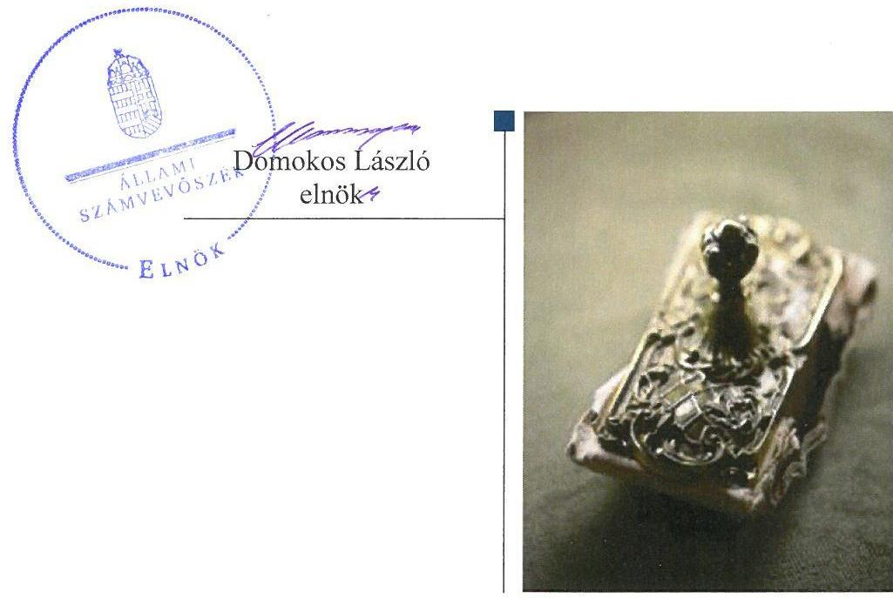
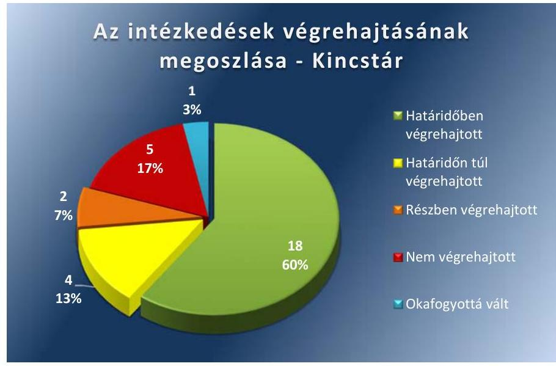
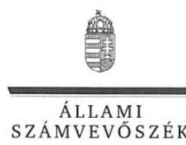
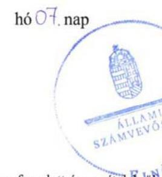

# Jelentés 

## Utóellenőrzések

A Magyar Államkincstár működésének és gazdálkodásának utóellenőrzése 2017.

---

# Jelentés 

## Utóellenőrzések

A Magyar Államkincstár működésének és gazdálkodásának utóellenőrzése 2017. 08. hó 01. nap

---

# AZ ELLENŐRZÉST FELÜGYELTE: 

HOLMAN MAGDOLNA JULIANNA felügyeleti vezető

## AZ ELLENŐRZÉST VEZETTE ÉS A VÉGREHAJTÁSÁÉRT FELELŐS:

GÖRGÉNYI GÁBOR ellenőrzésvezető

## A PROGRAM ÖSSZEÁLLÍTÁSÁÉRT FELELŐS:

JANIK JÓZSEF LÁSZLÓ osztályvezető

## A TÉMÁHOZ KAPCSOLÓDÓ KORÁBBI SZÁMVEVŐSZÉKI JELENTÉSEK:

- címe: JELENTÉS a Magyar Államkincstár működésének és gazdálkodásának ellenőrzéséről
- sorszáma: 14098

Jelentéseink az Országgyűlés számítógépes hálózatán és az Interneten a www.asz.hu címen is olvashatóak.

IKTATÓSZÁM: EL-0038-051/2017.
TÉMASZÁM: 21
ELLENŐRZÉS-AZONOSÍTÓ SZÁM: V075584

---

# TARTALOMJEGYZÉK 

■ ÖSSZEGZÉS ..... 5
■ AZ ELLENŐRZÉS CÉLJA ..... 6
■ AZ ELLENŐRZÉS TERÜLETE ..... 7
■ AZ ELLENŐRZÉS HÁTTERE, INDOKOLTSÁGA ..... 8
■ A JELENTÉS LÉNYEGES KÉRDÉSKÖREI ..... 9
■ ELLENŐRZÉS HATÓKÖRE ÉS MÓDSZEREI ..... 10
■ MEGÁLLAPÍTÁSOK ..... 12
■ MELLÉKLETEK ..... 17
I. Sz. melléklet: az ÁSZ 14098. számú jelentéséhez kapcsolódó Kincstár intézkedési terv végrehajtása ..... 17
II. Sz. melléklet: az ÁSZ 14098. számú jelentéséhez kapcsolódó NGM intézkedési terv végrehajtása ..... 25
■ FÜGGELÉK: ÉSZREVÉTELEK ..... 27
■ RÖVIDÍTÉSEK JEGYZÉKE ..... 37

---

.

---

# ÖSSZEGZÉS 

Az Állami Számvevőszék a Magyar Államkincstár működése és gazdálkodása ellenőrzésének utóellenőrzése során megállapította, hogy az intézkedési tervben meghatározott feladatok többségét végrehajtották. Ezzel a Magyar Államkincstár lépéseket tett a szabályszerű működése és gazdálkodása érdekében. Az informatikai és az elektronikus szolgáltatási területen a korábban azonosított hiányosságok egy része azonban továbbra is fennáll. Az irányító szervi feladatokat ellátó Nemzetgazdasági Minisztérium az intézkedési tervében foglalt feladatot végrehajtotta.

## Az ellenőrzés társadalmi indokoltsága

Az ÁSZ¹ stratégiájában célul tűzte ki a számvevőszéki munka hasznosulásának javítását. Ezzel összhangban ellenőrzi, hogy az ellenőrzött szervezetek megvalósították-e a korábbi ellenőrzései által feltárt hibák, hiányosságok és szabálytalanságok megszüntetése céljából elkészített intézkedési terveikben foglaltakat. A rendszeres utóellenőrzések hozzájárulnak a szükséges intézkedések tényleges végrehajtásához, ezáltal a közpénzügyek rendezettségének javulásához, igazolják, hogy lezárult a következmények nélküli ellenőrzések időszaka.

## Főbb megállapítások, következtetések, javaslatok

A Kincstár² az intézkedési tervében meghatározott harminc feladatból tizennyolcat határidőben végrehajtott, négyet határidőn túl, kettőt részben hajtott végre, öt feladatot nem hajtott végre, egy feladat pedig okafogyottá vált. Az intézkedési tervében rögzített feladatok végrehajtásáról a Bkr.³ által előírt nyilvántartást vezette.

A Kincstár az intézkedési terv alapján végrehajtott feladatokkal gondoskodott a hiányzó, vagy nem megfelelő belső szabályzatok elkészítéséről, illetve aktualizálásáról, amellyel hozzájárult a belső kontrollrendszer hatályos jogszabályoknak és intézményi sajátosságoknak megfelelő kialakításához és működtetéséhez.

Az informatikai feladatellátással és az elektronikus szolgáltatásokkal összefüggő intézkedések azonban többségében nem valósultak meg, így ezen a területen a szabályszerű és megfelelő működés érdekében a Kincstárnak további lépéseket kell tennie.

Az irányító szervi feladatokat ellátó NGM⁴ az intézkedési tervében meghatározott, a Kincstár megfelelő alapító okiratának kiadásával összefüggő feladatot végrehajtotta.

---

# AZ ELLENŐRZÉS CÉLJA 

AZ ELLENŐRZÉS CÉLJA annak értékelése volt, hogy a számvevőszéki jelentésben foglalt intézkedést igénylő megállapításokkal és javaslatokkal összhangban készített intézkedési tervben meghatározott feladatokat az ellenőrzött szervezet végrehajtotta-e.

---

# **AZ ELLENŐRZÉS TERÜLETE**

## **A Magyar Államkincstár**

A Kincstár az államháztartásért felelős miniszter irányítása alatt álló központi hivatal, központi költségvetési szerv, amely az NGM költségvetési fejezetében önálló címet alkot.

A Kincstár felelős a központi alrendszerhez tartozó intézmények pénzellátásáért, fizetőképességük biztosításáért, valamint az állami költségvetés keretében a pénzforgalmuk lebonyolításáért és elszámolásáért. Meghatározó szerepe van az állampapírok forgalmazásában, közreműködik az uniós támogatások folyósításában.

A Kincstár működésének és gazdálkodásának ellenőrzését az ÁSZ a 2008. január 1.- 2012. december 31. közötti időszakra végezte el, az erről szóló 14098. számú jelentését 2014. június 10-én tette közzé. Az ellenőrzés célja annak értékelése volt, hogy egyértelműen szabályozott-e a Kincstár intézményi működése, feladatellátása, gazdálkodása, belső kontrollrendszere. A kialakított szervezeti és belső kontrollrendszer biztosította-e az előírásoknak megfelelő feladatellátást, pénzügyi és vagyongazdálkodást. Érvényesült-e az átláthatóság követelménye a Kincstár működése és gazdálkodása során. Az irányító szerv tevékenysége hozzájárult-e a Kincstár feladatainak szabályszerű ellátásához. A Kincstár a korábbi számvevőszéki ellenőrzés során a 14098. számú ÁSZ jelentésben tett javaslatokat hasznosította-e.

Az utóellenőrzés az ÁSZ korábbi 14098. számú jelentésében a Kincstár elnöke és a miniszter részére megfogalmazott intézkedést igénylő megállapításokra és javaslatokra készített, az ÁSZ részére megküldött intézkedési tervben foglalt feladatok megvalósításának ellenőrzésére, illetve értékelésére terjedt ki.

---

# AZ ELLENŐRZÉS HÁTTERE, INDOKOLTSÁGA 

Az ÁSZ tv.⁶ 33. § (1) bekezdése értelmében a számvevőszéki jelentések intézkedést igénylő megállapításaihoz és javaslataihoz kapcsolódóan az ellenőrzött szervezet vezetője intézkedési tervet köteles összeállítani és az ÁSZ részére megküldeni. Az intézkedési tervekben foglaltak megvalósítását - az ÁSZ tv. 33. § (7) bekezdésében foglaltak alapján - az ÁSZ utóellenőrzés keretében ellenőrizheti. Az intézkedések megvalósulásának értékelése során az ÁSZ figyelembe veszi az ellenőrzött szervezetek működési feltételeiben, valamint a jogszabályi előírásokban bekövetkezett változásokat.

Az intézkedési tervekben foglalt feladatok hiányos, illetve késedelmes végrehajtása, valamint megvalósításának elmaradása azt mutatja, hogy az ellenőrzések során feltárt hibák, hiányosságok és szabálytalanságok megszüntetése nem kapott kellő hangsúlyt. Ez a szabályszerű működés és a felelős vezetői magatartás vonatkozásában kockázatot hordoz. E kockázatok feltárásával az ÁSZ utóellenőrzési rendszere fokozza a fegyelmet és igazolja, hogy a közpénzzel való szabályos gazdálkodás felelőssége elől nem lehet kitérni.

Az utóellenőrzés négy szinten hasznosulhat:
⟶ A társadalom szintjén az utóellenőrzés jelzi, hogy a számvevőszéki ellenőrzés megállapításainak van következménye: a hiányosságok megszüntetésére az ellenőrzött szervezet által meghatározott intézkedések végrehajtását is számon kéri az ÁSZ.
⟶ Az ellenőrzött terület szintjén az utóellenőrzés tájékoztatást nyújt a terület döntéshozóinak a hiányosságok kiküszöbölésének jó gyakorlatairól, ezzel lehetőséget biztosítva arra, hogy az ÁSZ ellenőrzési megállapításai, javaslatai a terület nem ellenőrzött szervezeteinek a működése során is hasznosuljanak.
⟶ Az ellenőrzött szervezet szintjén az utóellenőrzés feltárja, hogy a szervezet az intézkedések végrehajtásával hasznosította-e a korábbi ellenőrzési jelentésben a hiányosságok megszüntetése, illetve a kockázatok kezelése érdekében megfogalmazott javaslatokat.
⟶ Az ÁSZ szintjén az utóellenőrzés visszacsatolást ad az ellenőrzési jelentések hasznosulásáról, az intézkedések elmaradása vagy részleges megvalósulása a további ellenőrzésekhez kockázati jelzésként szolgál.

---

# A JELENTÉS LÉNYEGES KÉRDÉSKÖREI 

1. Az ellenőrzött szervezet az intézkedési tervben foglaltakat az előírt határidőben végrehajtotta-e?

---

# ELLENŐRZÉS HATÓKÖRE ÉS MÓDSZEREI 

## Az ellenőrzés típusa

Megfelelőségi ellenőrzés.

## Az ellenőrzött időszak

Az utóellenőrzés alapját képező ÁSZ jelentés közzétételének napjától (2014. június 10.) az ellenőrzésről szóló kiértesítő levél keltének napjáig (2017. február 10.) tartó időszak.

## Az ellenőrzés tárgya

A számvevőszéki jelentésben foglalt intézkedést igénylő megállapításokkal és javaslatokkal összhangban - a Kincstár és az NGM által - készített intézkedési tervben foglaltak végrehajtásának ellenőrzése.

Az ellenőrzés kiterjedt minden olyan körülményre és adatra, amely az ÁSZ jogszabályban meghatározott feladatainak teljesítéséhez, valamint a program végrehajtása folyamán felmerült újabb összefüggések feltárásához szükséges.

## Az ellenőrzött szervezet

A Magyar Államkincstár, valamint irányító szerve a Nemzetgazdasági Minisztérium.

## Az ellenőrzés jogalapja

Az ÁSZ tv. 1. § (3) bekezdése szerint az ÁSZ általános hatáskörrel végzi a közpénzekkel és az állami és önkormányzati vagyonnal való felelős gazdálkodás ellenőrzését. A 33. § (7) bekezdése alapján az ÁSZ tv. 33. § (1)-(2) bekezdése szerinti intézkedési tervben foglaltak megvalósítását az ÁSZ utóellenőrzés keretében ellenőrizheti.

## Az ellenőrzés módszerei

Az ÁSZ az utóellenőrzést a nemzetközi standardokat irányadónak tekintve az ellenőrzési program ellenőrzési kérdései, az ellenőrzött időszakban hatályos jogszabályok, az ellenőrzés szakmai szabályok és módszertanok figyelembevételével, önálló ellenőrzés keretében végezte.

---

Az ÁSZ az ellenőrzés ideje alatt a Kincstárral és az NGM-mel történő kapcsolattartást az ÁSZ SZMSZ⁷-ének vonatkozó előírásai alapján biztosította.

Az utóellenőrzés megállapításait elsősorban az ÁSZ rendelkezésére álló, valamint a Kincstártól és az NGM-től elektronikusan bekért dokumentumok alapozták meg.

Az ellenőrzési bizonyítékként felhasználható adatforrások közé tartoztak egyrészt a szakmai programban felsorolt adatforrások, másrészt minden - az ellenőrzés folyamán feltárt az ellenőrzés szempontjából információt tartalmazó - dokumentum.

Az intézkedési tervekben előírt feladatok értékelését azok végrehajthatósága, illetve végrehajtása szempontjából az alábbiak szerint értékeltük:
"határidőben végrehajtott" a feladat, ha a teljesítés dokumentáltan, az intézkedési tervben előírt határidőben és tartalommal megtörtént;
"határidőn túl végrehajtott" a feladat, ha annak teljesítése az intézkedési tervben meghatározott módon, de az előírt határidőn túl történt meg;
"részben végrehajtott" a feladat, ha végrehajtása teljes körűen az intézkedési tervben előírt módon nem történt meg;
"nem végrehajtott" a feladat, ha a végrehajtás nem történt meg, vagy amennyiben a teljesítést nem dokumentálták;
"okafogyottá vált" a feladat, ha végrehajtására - meghatározott esemény bekövetkezése, továbbá külső körülmény, a működést érintő feltétel változása miatt - már nincs szükség, illetve lehetőség, és egyértelműen megállapítható, hogy az intézkedést szükségessé tevő körülmény a jövőben nem fordulhat elő.
"nem időszerű" az a feladat, amelynek ellenőrzési időszakon belüli végrehajtására azért nem került (kerülhetett) sor, mert az intézkedés alapjául szolgáló esemény nem következett be, de annak jövőbeni előfordulása lehetséges, a végrehajtása nem volt esedékes, vagy a végrehajtás határideje még nem járt le.
Az ellenőrzés lefolytatásához az ellenőrzött szervezet a tanúsítványok elektronikus kitöltésével, valamint az ÁSZ által kért dokumentumok elektronikus megküldésével szolgáltatott adatokat, amelyek valódiságát és teljes körűségét az ellenőrzött szervezet vezetője által tett teljességi és hitelességi nyilatkozat igazolta. Az így rendelkezésre bocsátott adatok, információk kontrollja az ellenőrzés keretében történt meg.

---

# MEGÁLLAPÍTÁSOK

## 1. Az ellenőrzött szervezet az intézkedési tervben foglaltakat az előírt határidőben végrehajtotta-e?

### Összegző megállapítás

A Kincstár az intézkedési tervben meghatározott harminc feladatból tizennyolc feladatot határidőben, négy feladatot határidőn túl, két feladatot részben, továbbá öt feladatot nem hajtott végre. Egy feladat okafogyottá vált. Az intézkedési tervben rögzített feladatok végrehajtásáról a Kincstár a Bkr. által előírt nyilvántartást vezette. Az NGM az intézkedési tervben meghatározott egy feladatot határidőn túl hajtotta végre.

Az ÁSZ 14098. számú jelentésében a Kincstár elnöke részére huszonegy, a miniszter részére egy javaslatot fogalmazott meg.

A Kincstár által összeállított és az ÁSZ részére megküldött intézkedési tervben a hiányosságok, szabálytalanságok megszüntetésére harminc feladatot határoztak meg. Az NGM által összeállított és az ÁSZ részére megküldött intézkedési tervben egy feladatot határoztak meg.

Az ÁSZ javaslatai alapján készített intézkedési tervben rögzített feladatok végrehajtásáról a Kincstár a Bkr. által előírt nyilvántartást vezette.

Az NGM az intézkedési tervében rögzített egy feladatot határidőn túl hajtotta végre. A Kincstár intézkedési tervében tervezett feladatok végrehajtásának megoszlását az 1. ábra szemlélteti.

1. ábra

*Forrás: ÁSZ*

---

# HATÁRIDŐBEN VÉGREHAJTOTT feladatok Kincstár: 

- A nemzetgazdasági miniszter utasításaként kiadott, 2014. szeptember 11-től hatályos SZMSZ₁⁸ rögzítette a szervezeti egységek engedélyezett létszámát és a gazdasági szervezet megnevezését.
- A nemzetgazdasági miniszter utasításaként megjelent, 2015. január 1-től hatályos SZMSZ₂⁹ tartalmazta az egységes szociális nyilvántartás vezetési feladatokat.
- A 2014. szeptember 11-től hatályos SZMSZ₁-ben a Kincstár alaptevékenységei között megjelenítésre került a fővárosi és megyei kormányhivatalok részére természetben nyújtott családi pótlék kezelésének számlavezetési feladata.
- A 2014. szeptember 11-től hatályos SZMSZ₁ tartalmazta a kötött felhasználású hallgatói hitelhez kapcsolódó általános kamattámogatás kincstári feladatai ellátásának rendjét és módját.
- A

 Kincstár elkészítette, és a Kincstár elnöke által jóváhagyásra került az Államháztartási Összefoglaló és Szabályozási Főosztály ügyrendje, ${ }^{10}$ a Jogi és Törzskönyvi Főosztály ügyrendje ${ }^{11}$ és az ügyrendek függelékét képező ellenőrzési nyomvonalak. Az Információ-menedzsment Főosztály ügyrendje és ellenőrzési nyomvonalának elkészítése okafogyottá vált, mert a főosztály 2015. január 1-től megszüntetésre került.
- A Kincstár elvégezte az ETE működési kézikönyv ${ }^{12}$, a Svájci Hozzájárulás működési kézikönyv ${ }^{13}$, az Igazoló Hatóság Szabálytalanság kezelésének eljárásrendje ${ }^{14}$ aktualizálását. A Kohéziós Alap működési kézikönyv aktualizálása okafogyottá vált tekintettel arra, hogy a program befejeződött, az utolsó projektre is megtörtént a záró kifizetés, érdemi munkavégzés nem történik a hazai oldalon. Az EGT és Norvég Finanszírozási Mechanizmus működési kézikönyv aktualizálása nem időszerű, tekintettel arra, hogy a program felfüggesztés alatt állt. Ebből eredően a program újraindítását követően a jogszabályi változások és a program módosítás alapján lesz lehetőség a kézikönyv aktualizálására.
- A 2014. szeptember 11-től hatályos SZMSZ ${ }_{1}$ biztosítja, hogy az adatvédelmi felelős közvetlenül az elnök felügyelete alá tartozzon.
- Megszüntetésre került az SZMSZ-szel ellentmondó gyakorlat, tekintettel arra, hogy a 2014. szeptember 11-től hatályos SZMSZ ${ }_{1}$ Honlap Bizottságot már nem nevesít.
- A Kincstár biztosította, hogy a közérdekű adatok egyedi igénylésének szabályairól a Kincstár honlapján közzétett tájékoztatás tartalmazza az igénybe vehető jogorvoslati lehetőségeket, valamint a kérelem teljesítésének egyszeri, 15 nappal történő meghosszabbításának lehetőségét.
- A Kincstár elnöke a Magyar Államkincstár által kezelt közérdekű és közérdekből nyilvános igényre történő szolgáltatásának eljárásrendjéről 2014. december 23-i hatállyal elnöki utasításban rendelkezett. A közérdekű adatok kérelemre történő szolgáltatásának önköltsége számítási módját az Önköltségszámítási szabályzat ${ }^{15}$ rögzíti.
- A Kincstár elnöke elnöki utasítással rendelkezett az EGT és Norvég Finanszírozási Mechanizmus Számviteli Működési Kézikönyvének kiadásáról ${ }^{16}$, melyben a 242/2006. (XII.5.) Korm. rendelet 84. § (2) bekezdésének b) pontjában előírt számviteli politika meghatározásra került.
$\longrightarrow$ A Kincstár elkészítette és 2014. január 17-i hatállyal kiadta a 4/2011 (I.28.) Korm. rendelet ${ }^{17}$ 12. § (1) bekezdése d) pontjában előírt szabálytalanságkezelési eljárásrendet.
$\longrightarrow$ A Kincstár elnöke a 2014. október 28-án elnöki utasításként hatályba lépett Nemzeti Stratégiai Referenciakeret Számviteli Nyilvántartása Működési kézikönyve ${ }^{18}$ részeként kiadmányozta az eszközök és források leltározási szabályzatát és a pénzkezelési szabályzatot. A pénzkezelési szabályzat tartalmazta, hogy „az Európai Uniós Támogatások Számviteli Osztálya pénzeszközöket nem kezel, házipénztára nincs, a könyvelt bankszámlák felett rendelkezési jogosultsága nincs, így pénzkezelési szabályzat készítése nem szükséges."
$\longrightarrow$ A Kincstár a 2014. április 14-én elnöki utasításként kiadott Beszerzési szabályzatban ${ }^{19}$ rögzítette a kiadott, a közbeszerzési értékhatárt el nem érő beszerzések lebonyolításának szabályait.
$\longrightarrow$ A Kincstár a Beszerzési szabályzatban rögzítette a Kincstár közbeszerzési feladatait, az eljárások részvevőit és a részvevők felelősségét, az eljárások lebonyolításának szabályait. A Beszerzési szabályzat a közbeszerzési referens feladatai között nevesíti a közzétételi kötelezettséggel kapcsolatos feladatokat. A közbeszerzési értékhatárt elérő működési és felhalmozási kiadások esetében 2013-2015. években lefolytatták a közbeszerzési eljárást.
$\longrightarrow$ A Kincstár elnöke az ÁSZ ellenőrzése során feltárt közbeszerzési szabálytalanságok tekintetében a munkajogi felelősséggel kapcsolatos körülményeket soron kívüli ellenőrzés keretében vizsgáltatta ki. Az ellenőrzési jelentés munkajogi felelősségre vonást nem kezdeményezett, mert az érintettek munkaviszonya a vizsgálat idején már megszűnt.
$\longrightarrow$ A Kincstár a KINCSINFO Nkft.-vel 2014. április 17-én együttműködési megállapodást kötött, mely a bérszámfejtési és beszerzési feladatokat tekintve a KINCSINFO Nkft. részére térítési kötelezettséget már nem írt elő. A Kincstár a KINCSINFO Nkft. részére a társaság által használt ingatlanokkal kapcsolatos rezsiköltségeket a 2012. júniustól 2013. decemberig vonatkozó időszakra egy összegben továbbszámlázta.
$\longrightarrow$ A KINCSINFO Nkft. 2015. január 01-i hatállyal kiadta aktualizált, a projekt alapú munkavégzést támogató SZMSZ ${ }^{20}$-ét.

# HATÁRIDŐN TÚL VÉGREHAJTOTT feladatok Kincstár: 

$\longrightarrow$ A Kincstár az intézkedési tervben vállalt határidőn túl 2015. február 1-jét követően teljesítette az Info tv. ${ }^{21}$ 37. § (1) bekezdésében előírt, az I. melléklet II/1., II/12., II/15., III/1., III/2., III/7. pontja szerinti információszolgáltatási kötelezettségét.
$\longrightarrow$ A Kincstár az intézkedési tervben meghatározott 2014. december 31-i határidőn túl, a 2015. január 06-án kiadmányozott Kötelezettségvállalási szabályzatban ${ }^{22}$ rendelkezett a késedelmi kötbér érvényesítésének folyamatáról. A teljesítésigazolás folyamata kiegészítésre került a teljesítési határidők és a kötbérigény megállapításának, dokumentálásának előírásaival.

- A Kincstár az intézkedési tervben elfogadott 2014. szeptember 30-i határidőn túl 2014. november 11-én adta ki a 192/2010. (VI.10.) Korm. rendelet 9. §-ában és 9/A § (1) bekezdésében foglaltakkal összhangban készült Gépjárműhasználat eljárási és elszámolás rendjét ${ }^{23}$ és - a Kincstár elnöke kivételével - megszüntette a vezetők részére biztosított magáncélú gépjárműhasználatot.
- A Kincstár az intézkedési tervben rögzített 2015. június 30-i határidőn túl 2015. november 5-én kötött szerződést a honlapon történő adminisztrátori tevékenységek naplózására vonatkozó fejlesztések elvégzésére, melyet a szolgáltató 90 napos határidővel vállalt.

# RÉSZBEN VÉGREHAJTOTT feladatok Kincstár: 

- Az adóhatóság számára átadandó, illetményszámfejtés, illetve nettó-finanszírozás alá tartozással összefüggő adatok rendszeres átvétele biztosítottá vált a KIR ${ }^{24}$ rendszerből. A KTÖRZS részére a KIR rendszerből történő adatátadás biztosított volt, és az átadandó adatok tekintetében megtörtént az intézményi törzsadatok felülvizsgálata. A Kincstár a KIR rendszer adatainak tisztítását ugyanakkor nem végezte el. Nem történt meg a konzisztencia megteremtése a KTÖRZS rendszerrel és szükség esetén javítás a KIR rendszer adattárában. Nem történt meg továbbá a KTÖRZS részére megvalósuló adatátadás fejlesztése a KIR rendszerben.
- A Kincstár nem tett teljes körűen eleget a 83/2012. (IV.21.) Korm. rendelet ${ }^{25}$ 10. § és 11. § (2) bekezdés a), c), e), f) pontjaiban előírtaknak. A Kincstár elkészítette a Katasztrófa elhárítási tervet és a Változáskezelési szabályzatot, azonban nem készített Üzletmenet folytonossági tervet, és nem végzett vagy végeztetett auditot az információ biztonsági minimum követelmények teljesítésének ellenőrzésére. A SZEÚSZ ${ }^{26}$ szerződésben vállalt feltételeknek vagy szolgáltatási szabályzatnak megfelelést nem ellenőrizte, illetve az ellenőrzés tényét és eredményét jegyzőkönyvben nem rögzítették.
A 83/2012. (IV.21.) Korm. rendeletet 2017. január 1-től hatályon kívül helyezte az elektronikus ügyintézés részletszabályairól szóló 451/2016. (XII. 19.) Korm. rendelet, amelynek 66. §-a alapján a SZEÚSZ-t az általános szerződési feltételeknek vagy szolgáltatási szabályzatnak megfelelés szempontjából ellenőrizni kell. Az ellenőrzés tényét és eredményét jegyzőkönyvben kell rögzíteni. Ebből eredően az intézkedési kötelezettség ezen a területen továbbra is fennáll.

## NEM VÉGREHAJTOTT feladatok Kincstár:

- A Kincstár nem teremtette meg az összhangot a honlap szolgáltatás eljárásrendjére vonatkozó elnöki utasítás törzsszövege és függeléke között a törzskönyvi nyilvántartás adatainak üzemeltetőhöz történő továbbításának gyakorisága tekintetében.
- A Kincstár a belső szabályozó eszközök készítésének és kiadásának eljárásrendjébe nem építette be, hogy a szervezeti egységek vezetőinek félévet követő hónap 15. napjáig nyilatkozniuk kell arról, hogy a hatályos ügyrendjük aktualizált, illetve módosítása, hatályon kívül helyezése a hivatkozott belső szabályozó eszközben rögzített módon és határidőn belül megtörtént.
A Kincstár a közérdekű adat megismerésére irányuló eljárások vonatkozásában az igénylő személyes adatainak nyilvántartásból való törlését az Info tv. 28. § (2) bekezdésében foglaltak ellenére nem hajtotta végre.
A Kincstár a 2014-ben keletkezett építészeti, valamint informatikai tárgyú, 20 millió forint összeg feletti egyedi beszerzésekhez kapcsolódó teljesítésigazolások felülvizsgálatát, valamint késedelmes teljesítés esetén a szerződésben előírt kötbér érvényesítését nem hajtotta végre.
A Kincstár a 83/2012 (IV.21.) Korm. rendelet 9. § (1) bekezdés c) pontjában foglaltak ellenére nem jelölt ki szolgáltatás biztonsági felelőst.

# OKAFOGYOTTÁ VÁLT feladat Kincstár: 

- A 2000-2006. évi Kohéziós Alap projektek pénzügyi elszámolásának határideje 2013. július 30-án lezárult, ettől az időponttól további elszámolásokat az EU Bizottság felé nem lehet benyújtani, ezáltal a Kohéziós Alap kifizető hatósági feladataival kapcsolatban a 360/2004. (XII.26.) Korm. rendelet ${ }^{27}$ 9. § g) pontja szerinti kifizetési előrejelzés megküldésére vonatkozó intézkedés nem szükséges.

HATÁRIDŐN TÚL VÉGREHAJTOTT feladat NGM:

- Az NGM az intézkedési tervben rögzített 2014. július 15-i határidőn túl 2014. július 21-én kelt, 2014. augusztus 5-én postázott levelében kérte a Kincstár elnöke intézkedését a Kincstár alapító okiratának előkészítésével kapcsolatosan annak érdekében, hogy az alapító okirat tartalmazza a jogelődök székhelyét, a kárpótlási jegyek őrzésével és kezelésével kapcsolatos feladatokat, valamint a természetben nyújtott családi pótlék kezelésére vonatkozó számlavezetési feladatot.

---

# MELLÉKLETEK

- I. SZ. MELLÉKLET: AZ ÁSZ 14098. SZÁMÚ JELENTÉSÉHEZ KAPCSOLÓDÓ KINCSTÁR INTÉZKEDÉSI TERV VÉGREHAJTÁSA

|  SZPÉZET | Az intézkedési tervben rögzített feladat | Az intézkedési tervben meghatározott határidő | A feladatok elvégzésének felelőse | A feladat végrehajtása  |
| --- | --- | --- | --- | --- |
|   | 1. | 2.
Határidőben végrehajtott feladatok | 3.
3. | 4.  |
|  1.a) | A Kincstár szervezeti és működési szabályzatának módosítása, annak érdekben, hogy az tartalmazza az Ávr. 13. § (1) bekezdés e) pontjának megfelelően a szervezeti egységek engedélyezett létszámát, továbbá a gazdasági szervezet megnevezését. | 2014.12.31. | Humánpolitikai Főosztály vezetője | A nemzetgazdasági miniszter utasításaként kiadott, 2014. szeptember 11.-től hatályos SZMSZ ${ }_{1}$ az Ávr. 13. § (1) bekezdés e) pontja előírásának megfelelően tartalmazta a szervezeti egységek engedélyezett létszámát és a gazdasági szervezet megnevezését.  |
|  1.b) a. | A Kincstár szervezeti és működési szabályzatának módosítása, annak érdekben, hogy az tartalmazza az Ávr. 13. § (1) bekezdés c) pontja alapján az Áht. 2 106. § (1) bekezdése szerinti egységes szociális nyilvántartás vezetési feladatot. | 2014.12.31. | Családtámogatási Főosztály vezetője | A 2014. december 12-én a nemzetgazdasági miniszter utasításaként megjelent, 2015. január 1-től hatályos SZMSZ ${ }_{2}$ tartalmazta az Áht. 106. § (1) bekezdése szerinti egységes szociális nyilvántartás vezetési feladatokat.  |
|  1.b) b. | A Kincstár szervezeti és működési szabályzatának módosítása, annak érdekben, hogy az tartalmazza az Ávr. 13. § (1) bekezdés c) pontja alapján a Cst. 37. § (5) bekezdése és a Gyvt. 68/B. § (5) bekezdése szerinti a fővárosi és megyei kormányhivatalok részére természetben nyújtott családi pótlék kezelésének számlavezetési feladatot. | 2014.12.31. | Pénzforgalmi Hálózatirányítási Főosztály vezetője | A nemzetgazdasági miniszter utasításaként kiadott, 2014. szeptember 11-től hatályos SZMSZ ${ }_{1}$-ben a Kincstár alaptevékenységei között megjelenítésre került a Cst. 37. § (5) bekezdése és a Gyvt. 68/B. § (5) bekezdése szerinti, a fővárosi és megyei kormányhivatalok részére természetben nyújtott családi pótlék kezelésének számlavezetési feladata.  |
|  1.c) | A Kincstár szervezeti és működési szabályzatának módosítása, annak érdekben, hogy az Áht. 2 10. § (5) bekezdése alapján az 1/2012 (I.20.) Korm. rendelet szerinti kötött felhasználású hallgatói hitelhez kapcsolódó általános kamattámogatás kincstári feladatai ellátásának rendjét és módját tartalmazza. | 2014.12.31. | Államháztartási Összefoglaló és Szabályozási Főosztály vezetője | A nemzetgazdasági miniszter utasításaként kiadott, 2014. szeptember 11-től hatályos SZMSZ ${

 }_{1}$ tartalmazta az 1/2012. (I.20.) Korm. rendelet szerinti kötött felhasználású hallgatói hitelhez kapcsolódó általános kamattámogatás kincstári feladatai ellátásának rendjét és módját.  |

---

|  2. | Az Információ-menedzsment Főosztály, az Államháztartási Összefoglaló és Szabályozási Főosztály, és a Jogi és Törzskönyvi Főosztály ügyrendjének, illetve ellenőrzési nyomvonalának elkészítése. | Információ-menedzsment Főosztály: 2014.09.30., Államháztartási Összefoglaló és Szabályozási Főosztály: 2014.09.30., a Jogi és Törzskönyvi Főosztály: 2014.12.31. | Információmenedzsment Főosztály: 2014.09.30., Államháztartási Összefoglaló és Szabályozási Főosztály: 2014.09.30., a Jogi és Törzskönyvi Főosztály: 2014.12.31. | Elkészült és jóváhagyásra került az Államháztartási Összefoglaló és Szabályozási Főosztály ügyrendje illetve a Jogi és Törzskönyvi Főosztály ügyrendje és az ügyrendek függelékét képező ellenőrzési nyomvonalak. Az Információ-menedzsment Főosztály ügyrendjének és ellenőrzési nyomvonalának elkészítése okafogyottá vált, mert a Főosztály a 2015. január 1-től hatályos SZMSZ2-ben szervezeti egységként már nem jelent meg.  |
| --- | --- | --- | --- | --- |
|  3. | - Kohéziós Alap működési kézikönyv aktualizálása. - EGT és Norvég Finanszírozási Mechanizmus működési kézikönyv aktualizálása. - Európai Területi Együttműködés működési kézikönyv (a Nemzeti Programengedélyező Iroda 15/2010. számú igazgatói utasítás, valamint a Nemzeti Programengedélyező Iroda 19/2010. számú igazgatói utasítás vonatkozó része (ETE MKK v2)) aktualizálása. - Svájci Hozzájárulás működési kézikönyv (a Nemzeti Programengedélyező Iroda 16/2009. számú igazgatói utasítás (2009. november 15.), valamint a Nemzeti Programengedélyező Iroda 19/2010. számú igazgatói utasítás (2010. december 31.) vonatkozó része (v1)) aktualizálása. - Az Igazoló Hatóság Szabálytalanság kezelésének eljárásrendje (a Nemzeti Programengedélyező Iroda 16/2009. számú igazgatói utasítás (2009. november 15.), valamint a Nemzeti Programengedélyező Iroda 19/2010. számú igazgatói utasítás (2010. december 31.) vonatkozó része (v6)) aktualizálása. | - Kohéziós Alap működési kézikönyv: 2014.12.31. - EGT és Norvég Finanszírozási Mechanizmus működési kézikönyv: nincs határidő - Európai Területi Együttműködés működési kézikönyv: 2013.02.04. és 2013.05.29. - Svájci Hozzájárulás működési kézikönyv: 2013.07.02. - Igazoló Hatóság Szabálytalanság kezelésének eljárásrendje: 2014.01.17. | EU Támogatások Szabályosság Felülvizsgálati Főosztály vezetője és EU Támogatások Pénzügyi és Szabálytalanság-nyilvántartási Főosztály vezetője | A Kohéziós Alap működési kézikönyv aktualizálása okafogyottá vált tekintettel arra, hogy a program befejeződött, az utolsó projektre is megtörtént a záró kifizetés, érdemi munkavégzés nem történik a hazai oldalon. Az EGT és Norvég Finanszírozási Mechanizmus működési kézikönyv aktualizálása nem időszerű, tekintettel arra, hogy a program felfüggesztés alatt állt. Ebből eredően a program újraindítását követően a jogszabályi változások és a program módosítás alapján lesz lehetőség a kézikönyv aktualizálására. Az Európai Területi Együttműködési kézikönyv aktualizálása az EU Támogatások Szabályosság Felülvizsgálati Főosztály Európai Területi Együttműködés működési kézikönyv (v3) 2013. február 4.-i hatálybalépésével, és az EU Támogatások Pénzügyi és Szabálytalan-ság-nyilvántartási Főosztály Európai Területi Együttműködés működési kézikönyv (v3) 2013. május 29-i hatálybalépésével az intézkedési tervben megjelölt határidőkre megvalósult. A Svájci Hozzájárulás működési kézikönyv az EU Támogatások Pénzügyi és Szabálytalanság-nyilvántartási Főosztály Svájci Hozzájárulás működési kézikönyv (v2) kiadmányozásával 2013. július 2-án megvalósult. Az Igazoló Hatóság Szabálytalanság kezelésének eljárásrendje aktualizálását a Kincstár az intézkedési tervben vállalt határidőre (2014. január 17.) elvégezte.  |

---

|  5. | A Kincstár szervezeti és működési szabályzatának módosítása annak érdekében, hogy az adatvédelmi felelős az Infotv. 24. §. (1) bekezdésében előírtaknak megfelelve, közvetlenül az elnök felügyelete alá tartozzon. | 2014.12.31. | Jogi és Információmenedzsment Igazgató | A nemzetgazdasági miniszter utasításaként kiadott, 2014. szeptember 11-től hatályos SZMSZ ${ }_{1}$ az elnök feladatkörei között tünteti fel az adatvédelmi felelős tevékenységének irányítását és felügyeletét.  |
| --- | --- | --- | --- | --- |
|  7. | A szervezeti és működési szabályzat módosítása szükséges, mivel a honlapon közzétett adatok ellenőrzése nem a Honlap Bizottság feladata. | 2014.12.31. | Államháztartási Összefoglaló és Szabályozási Főosztály - Közgazdasági Osztály vezetője | A nemzetgazdasági miniszter utasításaként kiadott, 2014. szeptember 11-től hatályos SZMSZ ${ }_{1}$ Honlap Bizottságot már nem nevesít, helyette a megfelelő szervezeti egységek kerültek kijelölésre.  |
|  8. | A közérdekű adatok egyedi igénylésének szabályairól a Kincstár honlapján közzétett tájékoztatás kiegészítése az Infotv. 34. § (3) bekezdésében előírtak szerint az igénybe vehető jogorvoslati lehetőségekkel, valamint az Inf tv. 29. § (2) bekezdés szerinti, a kérelem teljesítésének egyszeri, 15 nappal történő meghosszabbításának lehetőségével. | 2014.03.27. | Államháztartási Összefoglaló és Szabályozási Főosztály - Közgazdasági Osztály vezetője | A közérdekű adatok egyedi igénylésének szabályairól a Kincstár honlapján közzétett tájékoztatás határidőre kiegészítésre került az Info tv. 34. § (3) bekezdésében előírtakkal összhangban az igénybe vehető jogorvoslati lehetőségekkel, valamint az Info tv. 29. § (2) bekezdésével összhangban a kérelem teljesítésének egyszeri, 15 nappal történő meghosszabbításának lehetőségével.  |
|  10. | A 29/2010. számú, a Magyar Államkincstár által kezelt közérdekű és közérdekből nyilvános igényre történő szolgáltatásának eljárásrendjének átfogó módosítása szükséges, amelyben részletezni kell a költségtérítés mértékére, annak megállapítására vonatkozó szabályokat. | 2014.12.31. | Államháztartási Összefoglaló és Szabályozási Főosztály - Közgazdasági Osztály vezetője, Adatvédelmi felelős | A 2014. december 23-tól hatályos Magyar Államkincstár által kezelt közérdekű és közérdekből nyilvános igényre történő szolgáltatásának eljárásrendje tartalmazta, hogy a költségtérítés elkészítéséhez szükséges pénzügyi információkat az Intézményi Gazdálkodási Főosztály közli a válaszadásra jogosult kormánytisztviselő számára. A közérdekű adatok kérelemre történő szolgáltatásának önköltsége számítási módját az Önköltségszámítási szabályzat határozta meg.  |
|  12. | A 242/2006. (XII. 5.) Korm. rendelet 84. § (2) bekezdésének b) pontjában előírt számviteli politika meghatározása az EGT és a Norvég Finanszírozási mechanizmus számviteli szabályozásához kapcsolódóan. | 2013.12.02. | Követeléseket és Közösségi Támogatásokat Kezelő Főosztály vezetője és az Európai Uniós Támogatások Számviteli Osztálya vezetője | A Kincstár elnöke az intézkedési tervben rögzített határidőben (2013. december 2-án) a 49/2013. számú elnöki utasítással rendelkezett az EGT és Norvég Finanszírozási Mechanizmus Számviteli Működési Kézikönyvének kiadásáról, melyben a 242/2006. (XII.5.) Korm. rendelet 84. § (2) bekezdésének b) pontjában előírt számviteli politika meghatározásra került.  |
|  13. | A 4/2011. (I. 28.) Korm. rendelet 12. § (1) bekezdés d) pontjában előírt szabálytalanságkezelési eljárásrend kialakítása. | 2014.01.17. | EU Támogatások Pénzügyi és Szabálytalanságnyilvántartási Főosztály | A Kincstár az intézkedési tervben rögzített határidőben, 2014. január 17-én az uniós támogatási igazgató 1/2014. sz. Igazgatói Utasításával rendelkezett a 4/2011. (I.28.) Korm. rendelet 12. § (1) bekezdés d) pontjában előírt szabálytalanságkezelési eljárásrend kiadásáról.  |

---

|  14. | A számviteli politika részeként az "ÜMFT számviteli működési kézikönyv" új fejezettel történő kiegészítése, mely az eszközök és források leltározási szabályzatát tartalmazza. Az „ÜMFT számviteli működési kézikönyvét" ki kell egészíteni azzal, hogy pénzkezelési szabályzat készítése azért nem szükséges, mert az Európai Uniós Támogatások Számviteli Osztálya pénzeszközöket nem kezel, házipénztára, valamint bankszámlák feletti rendelkezési joga nincs. | 2014.10.31. | Követeléseket és Közösségi Támogatásokat Kezelő Főosztály vezetője és az Európai Uniós Támogatások Számviteli Osztálya vezetője | Az intézkedést a Kincstár a 2014. október 28-án elnöki utasításként hatályba lépett Nemzeti Stratégiai Referenciakeret Számviteli Nyilvántartása Működési kézikönyve kiadmányozásával határidőben végrehajtotta. A kézikönyv részét képezte az eszközök és források leltározási szabályzata és a pénzkezelési szabályzat. A pénzkezelési szabályzat tartalmazta, hogy „az Európai Uniós Támogatások Számviteli Osztálya pénzeszközöket nem kezel, házipénztára nincs, a könyvelt bankszámlák felett rendelkezési jogosultsága nincs, így a pénzkezelési szabályzat készítése nem szükséges."  |
| --- | --- | --- | --- | --- |
|  (18.) | A közbeszerzési értékhatárt el nem érő beszerzések bonyolításával kapcsolatos szabályzat elkészítése és hatályba léptetése. | 2014.04.14. | Közbeszerzési Osztály vezetője | A közbeszerzési értékhatárt el nem érő beszerzések lebonyolítását is tartalmazó Beszerzési szabályzat elkészítése és hatályba léptetése a 14/2014. sz. elnöki utasítással az intézkedési tervben megjelölt határidőben 2014. április 14-én megtörtént.  |
|  19.a) | Annak biztosítása, hogy a Kincstár a Közbesz. tv.; 18. §-ának előírásai alapján a mindenkori költségvetési törvényben (Kvtv-ben) meghatározott közbeszerzési értékhatárt elérő beszerzéseinél minden esetben lefolytassa a közbeszerzési eljárást, és a 31. §-a alapján tegyen eleget a közbeszerzésekkel kapcsolatos közzétételi kötelezettségének. | 2014.04.14. | Intézményi Gazdálkodási Főosztály vezetője | A Kincstár elnöke az intézkedésben megfogalmazottak biztosítása érdekében a 14/2014. számú elnöki utasítással 2014. április 14-i hatállyal kiadta a Beszerzési szabályzatot. A szabályzat rendelkezett a Kincstár közbeszerzési feladatairól, az eljárások részvevőiről és a részvevők felelősségéről, az eljárások lebonyolításának szabályairól. A Beszerzési szabályzat II.3.2. pontja a közbeszerzési referens feladatai között nevesíti a közzétételi kötelezettséggel kapcsolatos feladatokat. A közbeszerzési értékhatárt elérő működési és felhalmozási kiadások esetében 2013-2015. években lefolytatták a közbeszerzési eljárást.  |
|  19.b) | A megállapítás b) pontjában hivatkozott (közbeszerzési eljárások elmulasztásával összefüggő munkajogi felelősséggel kapcsolatos) körülmények kivizsgálása érdekében a Kincstár Elnöke soron kívüli ellenőrzés lefolytatására kérte fel a belső ellenőrzést. | határidő nem került meghatározásra | felelős nem került meghatározásra | A Kincstár elnöke kérésére az Ellenőrzési Főosztály soron kívüli ellenőrzést folytatott le. Az E-9/2014. számú „Jelentés Az ÁSZ által lefolytatott „A Magyar Államkincstár működésének és gazdálkodásának ellenőrzése" vizsgálat során megállapított, a Közbeszerzési törvény megsértésével történt Kincstári beszerzések vizsgálata" című ellenőrzési jelentés munkajogi felelősségre vonást nem kezdeményezett, mert az érintettek munkaviszonya a vizsgálat idején már megszűnt.  |
|  20. | A bérszámfejtési és beszerzési feladatokat tekintve a Kincstár a KINCSINFO Nkft.-vel kötött együttműködési megállapodásban rögzíti azok térítésmentességét. | határidő nem került meghatározásra | gazdasági vezető | A bérszámfejtési és beszerzési feladatokat tekintve a Kincstár a KINCSINFO Nkft.-vel 2014. március 17-én kötött együttműködési megállapodásban a KINCSINFO Nkft. részére térítési kötelezettséget már nem írt elő.  |

---

|  Egyéb 02. | A KINCSINFO Szervezeti és működési Szabályzatának aktualizálása. | 2015.01.31. | KINCSINFO Nkft. | Az intézkedési tervben meghatározott határidőn belül a 27/2014. (2014. december 15.) számú ügyvezetői utasítással 2015. január 1-i hatállyal kiadmányozásra került az aktualizált KINCSINFO Nkft. SZMSZ.  |
| --- | --- | --- | --- | --- |
|  Határidőn túl végrehajtott feladatok |  |  |  |   |
|  6. | Az információs önrendelkezési jogról és az információszabadságról szóló 2011. évi CXII. törvény (Info tv.) 37. § (1) bekezdése alapján az I. melléklet II/1., II/12., II/15., III/1., III/2., III/7. pontja szerint fennállt információszolgáltatási feladatok teljesítése, a Magyar Államkincstár honlap szolgáltatásainak eljárásrendjéről szóló 16/2013. (05.24.) számú Elnöki utasításban előírtak figyelembevételével. | 2014.12.31. | Koordinációs Osztály - 1. melléklet II/1. Ellenőrzési Főosztály - 1. melléklet II/12. Adatvédelmi felelős - 1. melléklet II/15. Gazdasági Vezető 1. melléklet III/1. Humánpolitikai Főosztály vezetője 1. melléklet III/2. Elnöki titkárság vezetője / Szervezetfejlesztési Projektiroda vezetője - 1. melléklet III/7. Államháztartási Összefoglaló és Szabályozási Főosztály / Kabinetvezető | Az
 Info tv. 37. § (1) bekezdésében előírt, az I. melléklet II/1., II/12., II/15., III/1., III/2., III/7. pontja szerint fennállt információszolgáltatási feladatok teljesítése az intézkedési tervben rögzített határidőn túl valósult meg, tekintettel a Kincstár új webfelületének kialakítására és annak 2015. február 1-én történő indítására.  |
|  15.1. | Az Intézményi Gazdálkodási Főosztály a Kincstár Kötelezettségvállalási Szabályzatában a teljesítésigazolás folyamatát kiegészíti a szerződés szerinti teljesítési határidők figyelésének, dokumentálásának előírásával, felelősének kijelölésével. A szabályzatba, valamint a gyakorlatba beépíti a késedelmi kötbér érvényesítésének folyamatát, valamint annak során az igény jogszerűsége feletti kontrollt minden számla esetében. | 2014.09.30. | Gazdasági vezető | Az intézkedési tervben meghatározott 2014. december 31-ei határidőt követően 2015. január 6-án 1/2015. számú elnöki utasítással kiadmányozott Kötelezettségvállalási szabályzat rendelkezett a késedelmi kötbér érvényesítésének folyamatáról. A teljesítésigazolás folyamata kiegészítésre került a teljesítési határidők és a kötbérigény megállapításának, dokumentálásának előírásaival.  |

---

|  18. | 2014. év 25. hetén körlevélben kapnak tájékoztatást a Megyei Igazgatóságok arról, hogy a magáncélú gépjárműhasználat 2014. július 1-vel megszűnik. Ennek értelmében módosításra kerül a 33/2011. számú elnöki utasítás. | 2014.09.30. | Gazdasági vezető, Üzemeltetési, Beruházási és Ellátási Főosztály vezetője | A Kincstár elnöke az intézkedési tervben meghatározott határidőt (2014. szeptember 30.) követően 2014. november 11-én az 54/2014. számú elnöki utasításban rendelkezett a gépjárműhasználat eljárási és elszámolás rendjéről. A szabályzat a 192/2010. (VI.10.) Korm. rendelet 9. §-ában és 9/A § (1) bekezdésében foglaltakkal összhangban a magáncélú gépjármű használatot kizárólag a Kincstár elnöke vonatkozásában engedélyezi rögzítve, hogy a Kincstár elnökének a magánhasználatot és az ahhoz tartozó térítésmentes futásteljesítményt a közigazgatási minőségpolitikáért és személyzetpolitikáért felelős miniszter határozza meg. A Kincstár további vezetői vonatkozásában a szabályzat megszüntette a magáncélú gépjárműhasználatot.  |
| --- | --- | --- | --- | --- |
|  Egyéb 01. | A honlap adminisztrátori tevékenységei - friss adatok feltöltésének időpontja - a rendszerben naplózással dokumentáltak legyenek, az ezzel kapcsolatos fejlesztés elvégzése | 2015.06.30 | KINCSINFO NKft. | A naplózás fejlesztésére vonatkozó szerződést 2015. november 5-én írták alá. A honlap adminisztrátori tevékenységeit naplózással a kivitelezést követően dokumentálták.  |
|  16. | A KIR rendszer adatainak tisztítása, valamint az adóhatóság számára a közhiteles törzskönyvi nyilvántartásból „egyablakos bejelentkezés" keretében átadandó, illetményszámfejtés, illetve nettó-finanszírozás alá tartozással összefüggő adatok rendszeres átvételének biztosítása a KIR rendszerből.
A KTÖRZS részére a KIR rendszerből átadandó adatok tekintetében:
- az intézményi törzsadatok felülvizsgálata a KIR rendszerben, konzisztencia megteremtése a KTÖRZS rendszerrel, szükség esetén javítás a KIR rendszer adattárában,
- a KTÖRZS részére megvalósuló adatátadás fejlesztése a KIR rendszerben | 2014.09.30. | Jogi és Törzskönyvi Főosztály vezetője és Törzskönyvi nyilvántartási Osztály vezetője, Illetmény-számfejtési Főosztály vezetője | Az adóhatóság számára átadandó, illetményszámfejtés, illetve nettó-finanszírozás alá tartozással összefüggő adatok rendszeres átvétele biztosítottá vált a KIR rendszerből. A KTÖRZS részére a KIR rendszerből történő adatátadás biztosított volt és az átadandó adatok tekintetében megtörtént az intézményi törzsadatok felülvizsgálata. A Kincstár a KIR rendszer adatainak tisztítását ugyanakkor nem végezte el. Nem történt meg a konzisztencia megteremtése a KTÖRZS rendszerrel és szükség esetén javítás a KIR rendszer adattárában. Nem történt meg továbbá a KTÖRZS részére megvalósuló adatátadás fejlesztése a KIR rendszerben.  |
|  17.2. | A 83/2012. (IV.21.) Korm. rendelet 10.§ és a 11. § (2) bekezdés a), c), e), f) pontjaiban előírtak végrehajtása. | 2014.01.31 | Információ-menedzsment Főosztály vezetője | A 83/2012. (IV.21.) Korm. rendelet 11. § (2) bekezdés c) és e) pontjaiban foglaltaknak megfelelően a Kincstár elkészítette a katasztrófa-elhárítási tervet és a változáskezelési szabályzatot. A 83/2012. (IV.21.) Korm. rendelet 10. § alapján a SZEÚSZ-t legalább félévente a biztonsági felelős útján, évente pedig az ellenőr útján az általános  |

---

|   |  |  | szerződési feltételeknek vagy szolgáltatási szabályzatnak megfelelés szempontjából nem ellenőrizték, ezért az ellenőrzés tényét és eredményét jegyzőkönyvben nem rögzítették.
A 83/2012. (IV.21.) Korm. rendelet 11. § (2) bekezdés a) pontja alapján az informatikai rendszer tervezésére, beszerzésére, megvalósítására és felülvizsgálatára kiterjedő minőségirányítással nem támasztották alá az eljárási és biztonsági követelmények teljesülését. A 83/2012. (IV.21.) Korm. rendelet 11. § (2) bekezdés c) pontjában foglaltak ellenére nem rendelkezett a Kincstár üzletmenetfolytonossági tervvel, illetve az f) pont alapján a biztonsági minimum követelmények teljesülésének igazolására irányuló audittal. A 83/2012. (IV.21.) Korm. rendeletet 2017. január 1-től hatályon kívül helyezte az elektronikus ügyintézés részletszabályairól szóló 451/2016. (XII. 19.) Korm. rendelet, amelynek 66. §-a alapján a SZEÚSZ-t az általános szerződési feltételeknek vagy szolgáltatási szabályzatnak megfelelés szempontjából ellenőrizni kell. Az ellenőrzés tényét és eredményét jegyzőkönyvben kell rögzíteni. Ebből eredően az intézkedési kötelezettség ezen a területen továbbra is fennáll.  |
| --- | --- | --- | --- |
|  4.1. | A honlap szolgáltatás eljárásrendjére vonatkozó 39/2011. számú Elnöki Utasítás törzsszövege és függeléke közötti összhang megteremtése a törzskönyvi nyilvántartás adatainak üzemeltetőhöz történő továbbítása tekintetében. | 2014.05.24. | Államháztartási Összefoglaló és Szabályozási Főosztály vezetője  |
|  4.2 | A belső szabályozó eszközök készítésének és kiadásának eljárásrendjébe beépítésre kerül, hogy a szervezeti egységek vezetőinek a félévet követő hónap 15. napjáig nyilatkozniuk kell, arról, hogy a hatályos ügyrendjük aktualizált, illetve módosítása, hatályon kívül helyezése a hivatkozott belső szabályozó eszközben rögzített módon és határidőn belül megtörtént. | 2015.06.30. | Koordinációs
Osztály vezetője  |

---

|  9. | A feladat ellátás rendjének módosítása, a személyes adatok törlése az igényeket tartalmazó nyilvántartásból. | 2014.07.31. | Államháztartási Összefoglaló és Szabályozási Főosztály - Közgazdasági osztály vezetője | Az intézkedési tervben foglaltakat nem hajtották végre.  |
| --- | --- | --- | --- | --- |
|  15.2. | Az IGF felszólítja az érintett szakterületeket, hogy a 2014-ben keletkezett építészeti, valamint informatikai tárgyú, 20 millió forint összeg feletti, egyedi beszerzések tekintetében vizsgálják felül az általuk írt teljesítésigazolásokat a késedelmi kötbér igénylésének jogszerűsége szempontjából. Késedelmes teljesítés esetén a szakterület tájékoztatása alapján, az IGF érvényesíti a szerződésben előírt kötbért. | 2014.09.30 | Gazdasági vezető | Az intézkedési tervben foglaltakat nem hajtották végre.  |
|  17.1. | Szolgáltatásbiztonsági felelős kijelölése a 83/2012 (IV.21.) Korm. rendelet 9. § (1) bekezdés c) pontjában foglaltaknak megfelelően. | 2014.01.31. | Információ-menedzsment Főosztály vezetője | Az intézkedési tervben foglaltakat nem hajtották végre.  |
|  Okafogyottá vált feladat |  |  |  |   |
|  11. | Tekintettel arra, hogy a 2000-2006. évi Kohéziós Alap projektek pénzügyi elszámolásának határideje 2013.07.30-án lezárult, ezért az említett időponttól további elszámolásokat az EU Bizottság felé nem lehet benyújtani, így a további kifizetési előrejelzések összeállításának nincs relevanciája.
A fentiek alapján intézkedés nem szükséges. | - | - | A Kohéziós Alap kifizető hatósági feladataival kapcsolatban a 360/2004. (XII.26.) Korm. rendelet 9. § g) pontja szerinti kifizetési előrejelzés megküldésére vonatkozó intézkedés okafogyottá vált.  |

---

|  Sorszám | Az intézkedési tervben rögzített feladat | Az intézkedési tervben meghatározott határidő | A feladatok elvégzésének felelőse | A feladat végrehajtása  |
| --- | --- | --- | --- | --- |
|   | 1. | 2.
Határidőn túl végrehajtott feladat | 3. | 4.  |
|  1. | A Kincstár alapító okiratának kiegészítése érdekében a Nemzetgazdasági Minisztérium:
a.) felülvizsgálja a Kincstár alapító okiratát;
b.) az alapító okirat átfogó módosításának előkészítése érdekében javaslat kérése a Kincstár elnökétől. | 2014.07.15. | Költségvetési és
Gazdálkodási Főosztály vezetője | Az NGM közigazgatási államtitkár az intézkedési tervben rögzített 2014. július 15-i határidőt követően 2014. július 21-én kelt, 2014. augusztus 5-én postázott levelében kérte a Kincstár elnöke intézkedését a Kincstár alapító okiratának előkészítésével kapcsolatosan.
Az alapító okirat módosítás Kincstár általi előkészítését és NGM általi felülvizsgálatát követően az alapító okirat módosítását, illetve a módosított alapító okiratot a nemzetgazdasági miniszter 2014. december 8-án hagyta jóvá.
Az alapító okirat tartalmazta a jogelődök székhelyét, a kárpótlási jegyek őrzésével és kezelésével kapcsolatos feladatokat, valamint a természetben nyújtott családi pótlék kezelésére vonatkozó számlavezetési feladatot.  |

---

.

---

# FÜGGELÉK: ÉSZREVÉTELEK 

A jelentéstervezetet a Számvevőszék 15 napos észrevételezésre megküldte az ellenőrzött szervezet vezetőjének az ÁSZ tv. 29. § (1) bekezdése előírásának megfelelően.
A függelék tartalmazza az ellenőrzött észrevételeit, illetve az el nem fogadott észrevételek elutasításának indoklását.

- A Magyar Államkincstár elnökének ELL/82-92/2017. iktatószámú levele és észrevételei
- Tájékoztatás az el nem fogadott észrevételekről (EL-0038-049/2017.)

## * 29. § (1) Az Állami Számvevőszék az ellenőrzési megállapításait megküldi az ellenőrzött szervezet vezetőjének vagy az általa megbízott személynek, és annak, akinek személyes felelősségét állapította meg.
(2) Az ellenőrzött szervezet vezetője és a felelősként megjelölt személy az ellenőrzés megállapításaira tizenöt napon belül írásban észrevételt tehet.
(3) Az Állami Számvevőszék az észrevételre a beérkezésétől számított harminc napon belül írásban válaszol. A figyelembe nem vett észrevételeket köteles a jelentésben feltüntetni, és megindokolni, hogy azokat miért nem fogadta el.

---

# Magyar   Államkincstár 

## ELNÖK

Iktatószám:
ELL/82-92/2017
Hiv. szám:
EL-0038-040/2017

## Domokos László úr részére

elnök

## Állami Számvevőszék

Budapest

Tárgy: „A Magyar Államkincstár működésének és gazdálkodásának utóellenőrzése" tárgyú jelentéstervezet észrevételezése

## Tisztelt Elnök Úr!

„A Magyar Államkincstár működésének és gazdálkodásának utóellenőrzése" tárgyú, EL-0038-040/2017. hivatkozási számú jelentéstervezetet köszönettel megkaptuk és áttekintettük. A megállapításokkal kapcsolatban megfogalmazott észrevételeinket a mellékelt dokumentumban jelezzük, továbbá megküldjük az észrevételek alátámasztásául szolgáló dokumentumokat.

Kérem tájékoztatásom szíves elfogadását.

Budapest, 2017. június 27.

Tisztelettel:

## Mellékletek:

Dr. Dancso József

1. sz. melléklet: „A Magyar Államkincstár működésének és gazdálkodásának utóellenőrzése" tárgyú vizsgálatról készített számvevőszéki jelentéstervezet észrevételezése
2. sz. melléklet: Alátámasztó dokumentumokat tartalmazó DVD

---

1. számú melléklet

Iktatószám: ELL/82-92/2017

# „A Magyar Államkincstár működésének és gazdálkodásának utóellenőrzése" tárgyú vizsgálatról készített számvevőszéki jelentéstervezet észrevételezése 

Oldalszám: 15. oldal
Megállapítás: „A Kincstár a KIR rendszer adatainak tisztítását ugyanakkor nem végezte el."
Észrevétel: Az adattisztítás a Magyar Államkincstár megyei igazgatóságain megtörtént. Az ezzel kapcsolatosan egy-egy körlevelet, valamint a körlevelek mellékletét tartalmazó segédleteket, útmutatókat az 1. sz. „Adattisztítás" fájl tartalmazza. Kérjük, hogy az intézkedést a részben végrehajtott feladatok közül szíveskedjenek törölni, továbbá az 1. számú melléklet 22. oldal 16. sorszámú sorában a feladat végrehajtása oszlopban szíveskedjenek módosítani a feladat leírását.
Alátámasztó dokumentumok: 1_Adattisztítás.zip

## Oldalszám: 15. oldal

Megállapítás: „Nem történt meg a konzisztencia megteremtése a KTÖRZS rendszerrel és szükség esetén javítás a KIR rendszer adattárában."
Észrevétel: Az adatok KIR rendszer és KTÖRZS közötti konzisztenciájának megteremtése megtörtént. Az ezzel kapcsolatos levelezéseket a 2. „Adatkonzisztencia" fájl tartalmazza. Kérjük, hogy az intézkedést a részben végrehajtott feladatok közül szíveskedjenek törölni, továbbá az 1. számú melléklet 22. oldal 16. sorszámú sorában a feladat végrehajtása oszlopban szíveskedjenek
 módosítani a feladat leírását.
Alátámasztó dokumentumok: 2_Adatkonzisztencia.zip

## Oldalszám: 15. oldal

Megállapítás: „Nem történt meg továbbá a KTŐRZS részére megvalósuló adatátadás fejlesztése a KIR rendszerben."
Észrevétel: A KIRA rendszerben az ez irányú fejlesztés befejeződött, melynek eredményeképpen egyrészt az adóhatóság számára átadandó, illetményszámfejtés, illetve nettó finanszírozás alá tartozással összefüggő adatok rendszeres átadása biztosított a KIRA rendszerből, másrészt a szükséges adatok rendszeres átvétele a KTŐRZS rendszerből megvalósult. Az ezzel kapcsolatos levelezéseket, valamint a KTŐRZS részére megvalósuló adatátadás fejlesztését tartalmazó egyik programküldő levelet a 3. „Adatátadás" fájl tartalmazza. Továbbá, az adatátadás és átvételt bizonyító SharePoint felület képernyőjét tartalmazó nyilatkozatot is megküldjük. Kérjük, hogy az intézkedést a részben végrehajtott feladatok közül szíveskedjenek törölni, továbbá az 1. számú melléklet 22. oldal 16. sorszámú sorában a feladat végrehajtása oszlopban szíveskedjenek módosítani a feladat leírását.
Alátámasztó dokumentumok: 3_Adatátadás.zip; Nyilatkozat-0001; Nyilatkozat-0002; page0025.tif; page-0024.tif; page-0023.tif; page-0022.tif; page-0021.tif; page-0020.tif; page0019.tif; page-0018.tif; page-0017.tif; page-0016.tif; page-0015.tif; page-0014.tif; page0013.tif; page-0012.tif; page-0011.tif; page-0010.tif; page-0009.tif; page-0008.tif; page0007.tif; page-0006.tif; page-0005.tif; page-0004.tif; page-0003.tif; page-0002.tif; page0001.tif;

# Oldalszám: 15. oldal 

Megállapítás: „A Kincstár nem teremtette meg az összhangot a honlap szolgáltatás eljárásrendjére vonatkozó elnöki utasítás törzszövege és a függeléke között a törzskönyvi nyilvántartás adatainak üzemeltetőhöz történő továbbításának gyakorisága tekintetében."
Észrevétel: A Magyar Államkincstár honlap szolgáltatásainak eljárásrendjéről szóló 16/2013. (05.24.) számú elnöki utasítás és annak 1. számú módosításáról szóló 9/2014. számú elnöki utasítás 6. számú függeléke teremtette meg az összhangot a honlap szolgáltatás eljárásrendjére vonatkozó elnöki utasítás törzszövege és a függeléke között a törzskönyvi nyilvántartás adatainak üzemeltetőhöz történő továbbításának gyakorisága tekintetében.
Kérjük, hogy az intézkedést a végre nem hajtott feladatok közül szíveskedjenek törölni, továbbá az 1. számú melléklet 23. oldal 4.1. sorszámú sorában a feladat végrehajtása oszlopban szíveskedjenek módosítani a feladat leírását.
Alátámasztó dokumentumok: 9_2014_6 SZ függ; 9_2014_Előlap

## Oldalszám: 15. oldal

Megállapítás: „A Kincstár belső szabályozó eszközök készítésének és kiadásának eljárásrendjébe nem építette be, hogy a szervezeti egységek vezetőinek félévet követő hónap 15. napjáig nyilatkozniuk kell arról, hogy a hatályos ügyrendjük aktualizált, illetve

---

módosítása, hatályon kívül helyezése a hivatkozott belső szabályozó eszközökben rögzített módon és határidőn belül megtörtént."
Észrevétel: A belső szabályozó eszközök készítésének és kiadásának eljárásrendjéről szóló 2017. május 3-án aláírt és 2017. május 4-én hatályba lépett Elnöki Utasítás 1/1.2./a. pontjában, az intézkedési tervben meghatározásra került feladat beépítése megtörtént az alábbiak szerint: „Az ügyrendnek a hatályos jogszabályokkal összhangban álló folyamatos biztosítása érdekében - annak rendelkezéseit - azokat folyamatosan figyelemmel szükséges kísérni, melyről a Központban a feladatellátással érintett szervezeti egység főosztályvezetője, az igazgatóságokat érintő feladatellátás vonatkozásában a megyei igazgatók gondoskodnak és ezen feltételek meglétéről minden félévet követő hónap 15. napjáig külön felhívás nélkül írásban nyilatkozni kötelesek a Koordinációs Osztály felé." Kérjük, hogy az intézkedést a végre nem hajtott feladatok közül szíveskedjenek törölni, továbbá az 1. számú melléklet 23. oldal 4.2. sorszámú sorában a feladat végrehajtása oszlopban szíveskedjenek módosítani a feladat leírását.
Alátámasztó dokumentumok: előlap.pdf; Belső szabályozás rendje_Törzsszöveg.doc; Belső szabályozás rendje_Előlap.doc; Belső szabályozás rendje_7függ.xls; Belső szabályozás rendje_6.függ.xlsx; Belső szabályozás rendje_5függ.doc; Belső szabályozás rendje_4függ.doc; Belső szabályozás rendje_3függ.docx; Belső szabályozás rendje_2bfügg.xlsm; Belső szabályozás rendje_2afügg.xls; Belső szabályozás rendje_1bfügg.docx; Belső szabályozás rendje_1afügg.doc;

# Oldalszám: 16. oldal 

Megállapítás: „A Kincstár közérdekű adat megismerésére irányuló eljárások vonatkozásában az igénylő személyes adatainak nyilvántartásból való törlését az Info tv. 28. § (2) bekezdésében foglaltak ellenére nem hajtotta végre."
Észrevétel: A közérdekű adat megismerésére irányuló eljárások vonatkozásában az igénylő személyes adatainak nyilvántartásból való törlése megtörtént. Kérjük, hogy az intézkedést a végre nem hajtott feladatok közül szíveskedjenek törölni, továbbá az 1. számú melléklet 23. oldal 9. sorszámú sorában a feladat végrehajtása oszlopban szíveskedjenek módosítani a feladat leírását.
Alátámasztó dokumentumok: ÁSZ jelentéstervezet Államkincstár működésének és gazdálkodásának utóellenőrzése; RE ÁSZ jelentéstervezet Államkincstár működésének és gazdálkodásának utóellenőrzése

---

Oldalszám: 16. oldal
Megállapítás: „A Kincstár 2014-ben keletkezett építészeti, valamint informatikai tárgyú, 20 millió forint összeg feletti, egyedi beszerzésekhez kapcsolódó teljesítésigazolások felülvizsgálatát, valamint késedelmes teljesítés esetén a szerződésben előírt kötbér érvényesítését nem hajtotta végre."
Észrevétel: A Kincstár Elnöke 2014. március 21-én soron kívüli ellenőrzés lefolytatására kérte fel a belső ellenőrzést az érintett informatikai tárgyú szerződések áttekintése vonatkozásában. A Belső Ellenőrzési Osztály a helyszíni ellenőrzést lefolytatta, elkészítette és 2014. május 6-án lezárta az ellenőrzési jelentést, amely tartalmazza ezt az intézkedést.

Az intézkedési terv végrehajtásra határidő módosítás után 2014. december 31-ig történt. 2014. december 17-én legyűjtésre kerültek a meghatározott feltételeknek megfelelő számlák, és az illetékes szakterületek felkérésre kerültek, hogy a legyűjtött számlák kapcsán nyilatkozzanak az érvényesíthető kötbérigény mértékéről. Az érintett számlák kapcsán év közben nem érvényesített kötbérigény a szakterületek nyilatkozata szerint nem merült fel. Az ellenőrzés utóvizsgálatára 2017. februárjában került sor, amely során a vállalt intézkedés teljesülése került megállapításra.
Kérjük, hogy az intézkedést a végre nem hajtott feladatok közül szíveskedjenek törölni, továbbá az 1. számú melléklet 23. oldal 15.2. sorszámú sorában a feladat végrehajtása oszlopban szíveskedjenek módosítani a feladat leírását.
Alátámasztó dokumentumok: Utóvizsgálati jelentés.pdf; Kötváll Szabályzat
Törzsszöveg_v4_vegleges_1_2015.doc; Jelentés.docx;
5_sz_függelék_Kötbérigény_érvényesítése_v2_vegleges.doc; 20 mFt feletti számlák_kötbérigény nyilatkozat_LGF.pdf; 20 mFt feletti számlák_kötbérigény nyilatkozat_Információ_menedzsment.pdf; 20mFt feletti számlák_kötbérigény.pdf

---

ELNÖK

Ikt.szám: EL-0038-049/2017.

Dr. Dancsó József úr
elnök

Magyar Államkincstár

# Budapest 

## Tisztelt Elnök Úr!

Utóellenőrzések - A Magyar Államkincstár működésének és gazdálkodásának utóellenőrzése címủ számvevőszéki jelentéstervezetre tett észrevételeit köszönettel megkaptam.

Az Állami Számvevőszék észrevételekre vonatkozó álláspontjáról a felügyeleti vezető által készített részletes tájékoztatást csatoltan megküldöm.

Tájékoztatom Elnök urat, hogy a jelentésben - az Állami Számvevőszékről szóló 2011. évi LXVI. törvény 29. § (3) bekezdése alapján - a figyelembe nem vett észrevételeket szerepeltetjük az elutasítás indokának feltüntetésével együtt.

Budapest, 2017.

Tisztelettel:

Domokos László

Melléklet: Tájékoztatás az el nem fogadott észrevételekről

---

# Tájékoztatás az el nem fogadott észrevételekről 

Utóellenőrzések - A Magyar Államkincstár működésének és gazdálkodásának utóellenőrzése címủ számvevőszéki jelentéstervezetre ELL/82-92/2017. iktatószámú levelében tett észrevételeit áttekintettük, annak kezeléséről az alábbi tájékoztatást adom.

1. A jelentéstervezet 15. oldalán a Kincstár által részben végrehajtott feladatok első francia bekezdésében „A Kincstár a KIR rendszer adatainak tisztítását ugyanakkor nem végezte el. Nem történt meg a konzisztencia megteremtése a KTÖRZS rendszerrel és szükség esetén javítás a KIR rendszer adattárában. Nem történt meg továbbá a KTÖRZS részére megvalósuló adatátadás fejlesztése a KIR rendszerben." megállapításaira tett észrevételeit nem fogadtuk el. Köszönettel vettük tájékoztatását, és további adatszolgáltatását, azonban az ELL/82-92/2017. iktatószámú levél 2. sz. mellékleteként megküldött, Alátámasztó dokumentumokat tartalmazó DVD dokumentumait a számvevőszéki jelentés megállapításánál nem tudjuk figyelembe venni.

Az ellenőrzés megkezdésekor az EL-0038-014/2017. iktatószámú adatbekérő levelünkkel, annak 3. számú mellékletben szereplő alábbi dokumentumokat kértük be a Kincstártól, pdf formátumban:

- a kitöltött tanúsítványok,
- az intézkedési tervben meghatározott feladatok végrehajtását igazoló dokumentumok, az intézkedési tervben foglaltak végrehajtásáról esetleg készült beszámolók,
- a figyelemfelhívó levélre az ellenőrzött által tett intézkedéseket alátámasztó dokumentumok.

A Kincstár által az adatbekérő levélre adatszolgáltatásként megküldött dokumentumokat az ellenőrzött szervezet vezetője teljességi és hitelességi nyilatkozattal támasztotta alá. A jelentéstervezetben rögzített megállapításokat és következtetéseket ezen dokumentumok független és objektív értékelése alapján tettük. Az észrevétele mellékleteként csatolt dokumentumok közül az ellenőrzés keretében már megküldésre került dokumentumokat az ellenőrzési megállapításainknál figyelembe vettük. Ugyanakkor az ellenőrzés záró teljességi és hitelességi nyilatkozatában nem szereplő dokumentumok a jelentéstervezet megállapítását alátámasztó dokumentumként nem vehetők figyelembe.
2. A jelentéstervezet 15. oldalán a Kincstár által Nem végrehajtott feladatok első francia bekezdésére tett észrevételét nem fogadtuk el.

---

Az ellenőrzés megkezdésekor az EL-0038-014/2017. iktatószámú adatbekérő levelünkkel, annak 3. számú mellékletben a jelen levelünk 1. pontjában részletezett dokumentumokat kértük be a Kincstártól, pdf formátumban.
A Kincstár az észrevételében hivatkozott, A Magyar Államkincstár honlap szolgáltatásainak eljárásrendjéről szóló 16/2013. (05.24.) számú elnöki utasítás és annak 1. számú módosításáról szóló 9/2014. számú elnöki utasítás sem a Kincstár által megküldött Tanúsítványban, sem az intézkedési tervben meghatározott feladatok végrehajtását igazoló dokumentumok között, és így a Kincstár vezetője által megküldött teljességi és hitelességi nyilatkozatban sem szerepelt. Mindezek alapján a számvevőszéki jelentésben az észrevételében hivatkozott dokumentumra megállapítást nem tudunk tenni, az abban foglaltakat nem tudjuk figyelembe venni.
3. A jelentéstervezet 15. oldalán a Kincstár által Nem végrehajtott feladatok második francia bekezdésére tett észrevételét nem fogadtuk el. Örömmel vettük tájékoztatását, mely szerint a belső szabályozó eszközök készítésének és kiadásának eljárásrendjéről szóló 2017. május 3-án aláírt és 2017. május 4-én hatályban lépett Elnöki Utasítás már tartalmazza az intézkedési tervben meghatározásra került feladatot, ugyanakkor azt a számvevőszéki jelentés készítésénél nem tudjuk figyelembe venni, arra megállapítást nem tudunk tenni, mert a számvevőszéki ellenőrzés során feltárt hiányosságot kezelő intézkedés határidő túllépésével és az ellenőrzött időszakon túl történt.
4. A jelentéstervezet 16. oldalán a Kincstár által Nem végrehajtott feladatok harmadik francia bekezdésére tett észrevételét nem fogadtuk el. Az Államháztartási Összefoglaló és Adatszolgáltatási Főosztály vezetője 2017. 02. 28-án kelt nyilatkozatában rögzítette, hogy a közérdekű adat megismerésére irányuló eljárásokban az igénylő személyes adatai törlésre kerültek, azonban a törlés végrehajtását, a feladat tényleges teljesítését dokumentummal nem támasztotta alá. Az észrevételében hivatkozott alátámasztó dokumentumok az ellenőrzés keretében nem kerültek átadásra, azok sem a Tanúsítványban, sem a teljességi és hitelességi nyilatkozatban nem szerepelnek, ezért arra vonatkozó megállapítás a számvevőszéki jelentésben nem tehető.
5. A jelentéstervezet 16. oldalán a Kincstár által Nem végrehajtott feladatok negyedik francia bekezdésére tett észrevételét nem fogadtuk el. A Kincstár részére az EL-0038014/2017. iktatószámú adatbekérő levelünkre az intézkedési tervben meghatározott feladat végrehajtását igazoló, az objektív értékelést alátámasztó dokumentumot a Kincstár nem küldött be és nem bocsátott az ellenőrzés rendelkezésére. Ezen túlmenően a Kincstár intézkedési tervben vállalt feladata nem az észrevételében jelzett belső ellenőrzés lefolytatására, hanem az Intézmény Gazdálkodási Főosztály (IGF) felszólító, valamint kötbér érvényesítésére vonatkozó intézkedésére irányult. Mindezek alapján az észrevételében foglaltakat a számvevőszéki jelentés készítésekor nem tudjuk figyelembe venni.
Budapest, 2017. V/1 hó 6 nap

Holman Magdolna felügyeleti vezető

---

.

---

# RÖVIDÍTÉSEK JEGYZÉKE 

${ }^{1}$ ÁSZ
${ }^{2}$ Kincstár
${ }^{3}$ Bkr.
${ }^{4}$ NGM
${ }^{5}$ miniszter
${ }^{6}$ ÁSZ tv.
${ }^{7}$ ÁSZ SZMSZ
${ }^{8}$ SZMSZ ${ }_{1}$
${ }^{9}$ SZMSZ $_{2}$
${ }^{10}$ Államháztartási Összefoglaló és Szabályozási Főosztály ügyrendje
${ }^{11}$ Jogi és Törzskönyvi Főosztály ügyrendje
${ }^{12}$ ETE működési Kézikönyv
${ }^{13}$ Svájci Hozzájárulás működési kézikönyv
${ }^{14}$ Igazoló Hatóság Szabálytalanság kezelésének eljárásrendje
${ }^{15}$ Önköltségszámítási szabályzat
${ }^{16}$ EGT és Norvég Finanszírozási Mechanizmus Számviteli Működési Kézikönyve
${ }^{17}$ 4/2011 (I.28.) Korm. rendelet
${ }^{18}$ Nemzeti Stratégiai Referenciakeret Számviteli
Nyilvántartása Működési kézikönyve
${ }^{19}$ Beszerzési szabályzat
${ }^{20}$ KINCSINFO SZMSZ

Állami Számvevőszék
Magyar Államkincstár
370/2011. (XII.31.) Korm. rendelet a költségvetési szervek belső kontrollrendszeréről és belső ellenőrzéséről
Nemzetgazdasági Minisztérium
nemzetgazdasági miniszter
2011. évi LXVI. törvény az Állami Számvevőszékről (hatályos 2011. július 1-jétől)
az Állami Számvevőszék Szervezeti és Működési Szabályzata
24/2014. (IX. 10.) NGM utasítás a Magyar Államkincstár Szervezeti és Működési Szabályzatáról
27/2014. (XII. 12.) NGM utasítás

 a Magyar Államkincstár Szervezeti és Működési Szabályzatáról

A Magyar Államkincstár Államháztartási Összefoglaló és Szabályozási Főosztályának Ügyrendje (hatályos: 2014. augusztus 7-től)
A Magyar Államkincstár Jogi és Törzskönyvi Főosztályának Ügyrendje (hatályos: 2014. november 4-től)

1/2013. sz. Uniós Támogatási Igazgatói Utasítás az EU Támogatások Szabályosság Felülvizsgálati Főosztály Európai Területi Együttműködési működési kézikönyv (v3) kiadásáról (hatályos: 2013. február 4-től) és
2/2013. sz. Uniós Támogatási Igazgatói Utasítás az EU Támogatások Pénzügyi és Szabálytalanság-nyilvántartási Főosztály Európai Területi Együttműködési működési kézikönyv (v3) kiadásáról (hatályos: 2013. május 29-től)
3/2013. sz. Igazgatói utasítás az EU Támogatások Pénzügyi és Szabálytalanságnyilvántartási Főosztály Svájci Hozzájárulás működési kézikönyv (v2) kiadásáról (hatályos: 2013. július 2-től)
1/2014. sz. Igazgatói Utasítás az Igazoló Hatóság Szabálytalanság kezelésének eljárásrendje (v7) kiadásáról (hatályos: 2014. január 17-től)
32/2011. számú elnöki utasítás az Önköltségszámítási szabályzatról (hatályos: 2011. január 1-től)

49/2013. sz. Elnöki Utasítás az EGT és Norvég Finanszírozási Mechanizmus Számviteli Működési Kézikönyvének kiadásáról (hatályos: 2013. december 2-től)
4/2011 (I.28.) Korm. rendelet a 2007-2013 programozási időszakban az Európai Regionális Fejlesztési Alapból, az Európai Szociális Alapból és a Kohéziós Alapból származó támogatások felhasználásának rendjéről
44/2014. számú elnöki utasítás a Nemzeti Stratégiai Referenciakeret (NSRK) Számviteli Nyilvántartása Működési kézikönyvének kiadásáról (hatályos: 2014. október 28-től)
14/2014. sz. Elnöki Utasítás a Magyar Államkincstár beszerzési szabályzatáról (hatályos: 2014. április 14-től)
27/2014 (2014. december 15.) számú Ügyvezetői Utasítás a KINCSINFO Kincstári Informatikai Nonprofit Korlátolt Felelősségű Társaság Szervezeti és Működési Szabályzatáról (hatályos 2015. január 1-től)

---

${ }^{21}$ Info tv.
${ }^{22}$ Kötelezettségvállalási szabályzat
${ }^{23}$ Gépjárműhasználat eljárási és elszámolás rendje
${ }^{24}$ KIR
${ }^{25}$ 83/2012. (IV.21.) Korm. rendelet
${ }^{26}$ SZEÚSZ
${ }^{27}$ 360/2004. (XII.26.) Korm. rendelet
2011. évi CXII. törvény az információs önrendelkezési jogról és információszabadságról
1/2015. sz. Elnöki Utasítás a Magyar Államkincstár, mint központi költségvetési szerv (intézmény) kötelezettségvállalási szabályzatáról (hatályos: 2015. január 6-tól)
54/2014. sz. Elnöki Utasítás a gépjárműhasználat eljárási és elszámolás rendjéről (hatályos: 2014. november 11-től)
Központosított Illetmény-számfejtési rendszer
83/2012. (IV.21.) Korm. rendelet a szabályozott elektronikus ügyintézési szolgáltatásokról és az állam által kötelezően nyújtandó szolgáltatásokról
Szabályozott elektronikus ügyintézési szolgáltatás
360/2004. (XII.26.) Korm. rendelet a Nemzeti Fejlesztési Terv operatív programjai, az EQUAL Közösségi Kezdeményezés program és a Kohéziós Alap projektek támogatásainak fogadásához kapcsolódó pénzügyi lebonyolítási, számviteli és ellenőrzési rendszerek kialakításáról

---

ÁLLAMI SZÁMVEVŐSZÉK
1052 Budapest, Apáczai Csere János utca 10.
Levélcím: 1364 Budapest 4. Pf. 54
Telefon: +36 14849100 Telefax: +36 14849200
www.asz.hu
