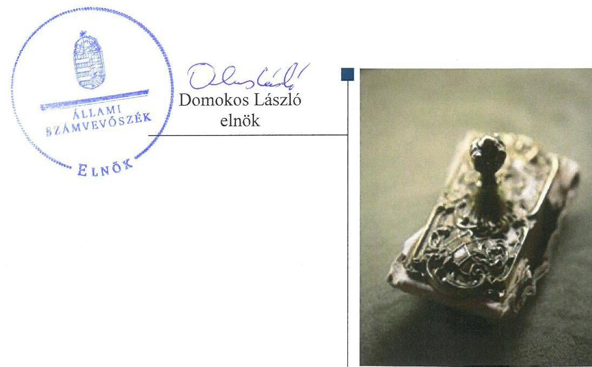
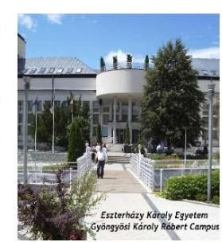
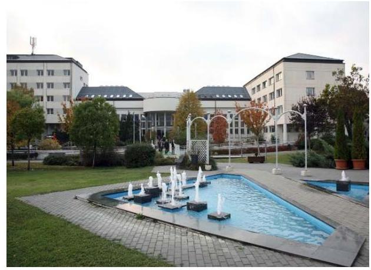
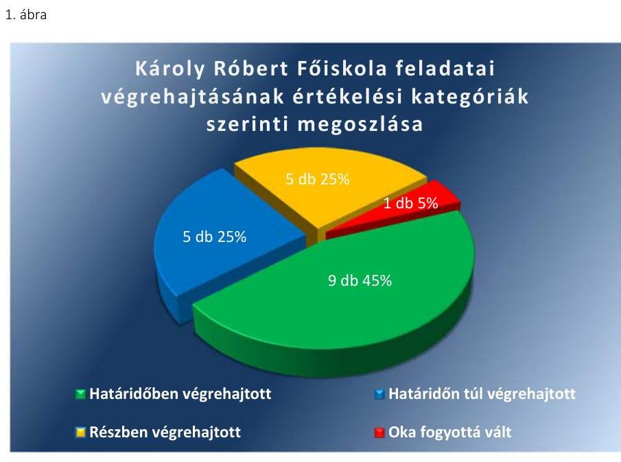

# Jelentés 

## Utóellenőrzések

Az állami felsőoktatási intézmények gazdálkodásának, működésének ellenőrzéséről készült jelentések utóellenőrzése - Károly Róbert Főiskola, mint az Eszterházy Károly Egyetem jogelődje
2017. 08. hó 24. nap

---

# AZ ELLENŐRZÉST FELÜGYELTE: 

PETŐ KRISZTINA felügyeleti vezető

## AZ ELLENŐRZÉST VEZETTE ÉS A VÉGREHAJTÁSÁÉRT FELELŐS:

MOLNÁR ZSUZSANNA ellenőrzésvezető

## A PROGRAM ÖSSZEÁLLÍTÁSÁÉRT FELELŐS:

JANIK JÓZSEF LÁSZLÓ osztályvezető

## A TÉMÁHOZ KAPCSOLÓDÓ KORÁBBI SZÁMVEVŐSZÉKI JELENTÉS:

- címe: Jelentés a Károly Róbert Főiskola ellenőrzéséről Az állami felsőoktatási intézmények gazdálkodásának, működésének ellenőrzése
- sorszáma: 14198

IKTATÓSZÁM: V-1186-057/2016.
TÉMASZÁM: 2220
ELLENŐRZÉS-AZONOSÍTÓ SZÁM: V075532

---

# TARTALOMJEGYZÉK 

■ ÖSSZEGZÉS ..... 5
■ AZ ELLENŐRZÉS CÉLJA ..... 6
■ AZ ELLENŐRZÉS TERÜLETE ..... 7
■ AZ ELLENŐRZÉS HÁTTERE, INDOKOLTSÁGA ..... 9
■ A JELENTÉS LÉNYEGES KÉRDÉSKÖRE ..... 10
■ ELLENŐRZÉS HATÓKÖRE ÉS MÓDSZEREI ..... 11
■ MEGÁLLAPÍTÁSOK ..... 14
■ MELLÉKLETEK ..... 19
I. Sz. melléklet: Az ÁSZ 14198 számú jelentéséhez kapcsolódó intézkedési terv végrehajtása ..... 19
II. Sz. melléklet: Az ÁSZ 14198 számú jelentéséhez kapcsolódó intézkedési terv végrehajtása az Emberi Erőforrások Minisztériumánál. ..... 25
■ FÜGGELÉK: ÉSZREVÉTELEK ..... 27
■ RÖVIDÍTÉSEK JEGYZÉKE ..... 29

---

.

---

# ÖSSZEGZÉS 

A Károly Róbert Főiskola a számvevőszéki jelentés javaslatai alapján az elkészített intézkedési tervben vállalt feladatok többségét végrehajtotta. A gazdálkodás terén az ÁSZ által korábban azonosított hiányosságok nagy része kijavításra került. Az Emberi Erőforrások Minisztériuma mint a fenntartói jogkör gyakorlója - az intézkedési tervben foglalt feladatát végrehajtotta.

## Az ellenőrzés társadalmi indokoltsága

Az Állami Számvevőszék stratégiájában célul tűzte ki a számvevőszéki munka hasznosulásának javítását. Ezzel összhangban ellenőrzi, hogy az ellenőrzött szervezetek megvalósították-e a korábbi ellenőrzései által feltárt hibák, hiányosságok és szabálytalanságok megszüntetése céljából kialakított intézkedési terveikben foglaltakat. A rendszeres utóellenőrzések hozzájárulnak a szükséges intézkedések tényleges végrehajtásához, ezáltal a közpénzügyek rendezettségének javulásához.

## Főbb megállapítások, következtetések

Az intézkedési tervben meghatározott húsz feladatból kilencet határidőben, ötöt határidőn túl, ötöt részben hajtottak végre, egy feladat végrehajtása okafogyottá vált. Így az Állami Számvevőszék által korábban azonosított hiányosságok nagy része kijavításra került.

A belső kontrollrendszer öt pillérét érintően az intézkedési tervben - a kontrolltevékenységek szabályszerű kialakítása és működtetése érdekében - vállalt engedélyezési és jóváhagyási eljárások határidejének és a beszámolási eljárás felelősének a gazdálkodási szabályzatban történő meghatározása nem történt meg. A költségvetési beszámoló valódiságához kapcsolódó, a beszámoló készítésével összefüggő információáramlással kapcsolatosan vállaltakat részben hajtották végre. A belső ellenőr a belső ellenőrzés jogszabályoknak megfelelő működtetése érdekében elvégezte a belső ellenőrzési kézikönyv rendszeres felülvizsgálatát és a belső ellenőrzési tervvel kapcsolatos hiányosságot is pótolta. A végrehajtott intézkedésekkel az intézmény működésének szabályozottsága és a belső kontrollrendszer szabályszerű működtetése az ellenőrzött időszakban lényegesen javult.

A mérlegtételek leltárral történő alátámasztása, továbbá a mérlegtételekkel kapcsolatban feltárt hiányosságok, szabálytalanságok kijavítására vállalt feladatok nagy részét végrehajtották. A kötelezettségek analitikus és főkönyvi állományának határidőre történő felülvizsgálatát elvégezték. A 2014. évi vevőkövetelések értékelése nem történt meg, a 2015. évre és 2016. évben a Főiskola megszűnése időpontjára vonatkozóan azonban már értékelték a vevőköveteléseket és a kapcsolódó értékvesztést elszámolták. Az aláírásminták aktualizálására több esetben a Kötelezettségvállalási szabályzatok hatályba lépését követő 30 napon túl került sor, amely kockázatot hordoz a jogutód Eszterházy Károly Egyetem gazdálkodásában.

---

# AZ ELLENŐRZÉS CÉLJA 

Az ellenőrzés célja annak értékelése volt, hogy a számvevőszéki jelentésben ${ }^{1}$ foglalt intézkedést igénylő megállapításokkal és javaslatokkal összhangban készített intézkedési tervben meghatározott feladatokat az ellenőrzött szervezetek végrehajtották-e.

---

# AZ ELLENŐRZÉS TERÜLETE 

## Károly Róbert Főiskola, mint az Eszterházy Károly Egyetem jogelődje

Gyöngyösön a felsőfokú szintű szakemberképzés története 1962-ig nyúlik vissza. A Károly Róbert Főiskolát az Országgyűlés 2003. szeptember 1-jei hatállyal nyilvánította önálló felsőoktatási intézménnyé. 2004. január 1-jétől a Károly Róbert Főiskolán Gazdálkodási Főiskolai Kar és Mezőgazdasági Főiskolai Kar működött. Az Eszterházy Károly Főiskola és a Károly Róbert Főiskola összeolvadásával alakult meg 2016. július 1. napján az Eszterházy Károly Egyetem, amelyhez csatlakozott a Szent István Egyetem jászberényi székhelyű Alkalmazott Bölcsészeti és Pedagógiai Kara.

A több mint fél évszázados múlttal rendelkező Gyöngyösi Károly Róbert Campus a gazdaságtudományok, az agrár és az informatika képzési területeken képez szakembereket napjainkban is.
A rektor személyében 2013. január 1-jétől 2016. június 30-ig, az Egyetem $^{2}$ megalapításáig nem volt változás. 2016. július 1. és 2016. december 31. között az intézményt új vezető, az Egyetem jelenlegi rektora irányította intézményvezetőként, akinek rektorrá történő kinevezésére 2017. január 1-jétől került sor.

A Főiskola $^{3}$ gazdasági vezetésével 2014. november 15-től a Miniszterelnök $^{4}$ kancellárt $^{5}$ bízott meg. A kancellár személye 2015. november 10-től megváltozott. 2016. július 1-jétől, az Egyetem megalapításával új kancellár került kinevezésre.

A Főiskola 2015. évi költségvetési beszámolója szerint 1684,4 millió Ft költségvetési bevételt, 1356,1 millió Ft finanszírozási bevételt ért el, valamint 2555,7 millió Ft költségvetési kiadást teljesített. A 2015. december 31-i könyvviteli mérleg szerint az eszközei 6426,7 millió Ft-ot tettek ki.

A Főiskola gazdálkodásának és működésének ellenőrzését az ÁSZ 2009. január 1. és a 2012. december 31. közötti időszakra végezte el, az erről szóló 14198 számú jelentést 2014. augusztus 7-én tette közzé.

Az ellenőrzés célja annak értékelése volt, hogy szabályos volt-e az állami felsőoktatási intézmény pénzügyi és vagyongazdálkodása, biztosított volt-e a vagyonnal való felelős gazdálkodás követelményének érvényesülése, a jogszabályi előírásoknak megfelelően működött-e a belső kontrollrendszer, a fenntartó tevékenysége a jogszabályi előírásoknak megfelelt-e.

A Főiskola fenntartói jogkörének gyakorlója az Emberi Erőforrások Minisztériuma volt.

Az utóellenőrzés a 2016. június 30-ig végrehajtott intézkedéseket figyelembe véve a Főiskola ellenőrzéséről készült számvevőszéki jelentés, intézkedést igénylő megállapításai és javaslatai hasznosítására elfogadott intézkedési tervben foglalt feladatok végrehajtására irányult. A számvevőszéki

---

jelentés a Főiskola rektora részére kettő, az Emberi erőforrások Minisztériuma részére egy javaslatot tartalmazott.

---

# AZ ELLENŐRZÉS HÁTTERE, INDOKOLTSÁGA 

Az ÁSZ tv. 33. § (1) bekezdése értelmében a számvevőszéki jelentések intézkedést igénylő megállapításaihoz kapcsolódóan az ellenőrzött szervezet vezetője intézkedési tervet köteles összeállítani, és az ÁSZ részére megküldeni. Az intézkedési tervben foglaltak megvalósítását - az ÁSZ tv. 33. § (7) bekezdésében foglaltak alapján - az ÁSZ utóellenőrzés keretében ellenőrizheti. Az intézkedések megvalósulásának értékelése során az ÁSZ figyelembe vette az ellenőrzött szervezetek működési feltételeiben, valamint a jogszabályi előírásokban bekövetkezett változásokat.

Az intézkedési tervben foglalt feladatok hiányos, illetve késedelmes végrehajtása, valamint megvalósításának elmaradása azt mutatja, hogy az ellenőrzés során feltárt hibák, hiányosságok és szabálytalanságok megszüntetése nem kapott kellő hangsúlyt. Ez a szabályszerű működés és a felelős vezetői magatartás vonatkozásában kockázatot hordoz. E kockázatok feltárásával az ÁSZ utóellenőrzési rendszere fokozza a fegyelmet, és igazolja, hogy a közpénzzel való szabályos gazdálkodás felelőssége elől nem lehet kitérni.

Az utóellenőrzés négy szinten hasznosulhat:

- A társadalom szintjén az utóellenőrzés jelzi, hogy a számvevőszéki ellenőrzés megállapításainak van következménye: a hiányosságok megszüntetésére az ellenőrzött szervezet által meghatározott intézkedések végrehajtását is számon kéri az ÁSZ.
- Az ellenőrzött terület szintjén az utóellenőrzés tájékoztatást nyújt a terület döntéshozóinak a hiányosságok kiküszöbölésének jó gyakorlatairól, ezzel lehetőséget biztosítva arra, hogy az ÁSZ ellenőrzési megállapításai, javaslatai a terület nem ellenőrzött szervezeteinek a működése során is hasznosuljanak.
- Az ellenőrzött szervezet szintjén az utóellenőrzés feltárja, hogy a szervezet az intézkedések végrehajtásával hasznosította-e a korábbi ellenőrzési jelentésben a hiányosságok megszüntetése, illetve a kockázatok kezelése érdekében megfogalmazott javaslatokat.
- Az ÁSZ szintjén az utóellenőrzés visszacsatolást ad az ellenőrzési jelentések hasznosulásáról, az intézkedések elmaradása vagy részleges megvalósulása a további ellenőrzésekhez kockázati jelzésként szolgál.

---

# A JELENTÉS LÉNYEGES KÉRDÉSKÖRE 

Az ellenőrzött szervezetek az intézkedési tervben foglaltakat az előírt határidőben végrehajtották-e?

---

# ELLENŐRZÉS HATÓKÖRE ÉS MÓDSZEREI 

## Az ellenőrzés típusa

Megfelelőségi ellenőrzés.

## Az ellenőrzött időszak

Az utóellenőrzés alapját képező számvevőszéki jelentés közzétételének napjától (2014. augusztus 7.) az Eszterházy Károly Egyetem megalapításának napjáig (2016. július 1.) tartó időszak.

## Az ellenőrzés tárgya

Az ÁSZ tv. 2011. július 1-jei hatálybalépését követően a számvevőszéki jelentésben foglalt intézkedést igénylő megállapításokkal és javaslatokkal összhangban - az ellenőrzött szervezetek által - készített intézkedési tervekben foglaltak végrehajtásának ellenőrzése.

Az ellenőrzés kiterjedt minden olyan körülményre és adatra, amely az ÁSZ jogszabályban meghatározott feladatainak teljesítéséhez, valamint a program végrehajtása folyamán felmerült újabb összefüggések feltárásához szükséges.

## Az ellenőrzött szervezet

A Károly Róbert Főiskola, mint az Eszterházy Károly Egyetem jogelődje és az Emberi Erőforrások Minisztériuma.

## Az ellenőrzés jogalapja

Az ÁSZ az Országgyűlés pénzügyi és gazdasági ellenőrző szerve. Az ÁSZ törvényben meghatározott feladatkörében ellenőrzi a központi költségvetés végrehajtását, az államháztartás gazdálkodását, az államháztartásból származó források felhasználását és a nemzeti vagyon kezelését.

Az ÁSZ tv. 1. § (3) bekezdése szerint az ÁSZ általános hatáskörrel végzi a közpénzekkel és az állami és önkormányzati vagyonnal való felelős gazdálkodás ellenőrzését.

A 33. § (7) bekezdés alapján az ÁSZ tv. 33. § (1)-(2) bekezdése szerinti intézkedési tervben foglaltak megvalósítását az ÁSZ utóellenőrzés keretében ellenőrizheti.

---

# Az ellenőrzés módszerei 

Az ÁSZ az ellenőrzést a nemzetközi standardokat irányadónak tekintve az ellenőrzési program ellenőrzési kérdései, az ellenőrzött időszakban hatályos jogszabályok, az ellenőrzés szakmai szabályok és módszertanok figyelembevételével, önálló ellenőrzés keretében végezte.

Az ÁSZ az ellenőrzés ideje alatt az ellenőrzött szervezetekkel történő kapcsolattartást az ÁSZ SZMSZ5-ének vonatkozó előírásai alapján biztosította.

Az utóellenőrzés megállapításait elsősorban az ÁSZ rendelkezésére álló, valamint az ellenőrzött szervezettől elektronikusan bekért dokumentumok alapozták meg.

Az ellenőrzési bizonyítékként felhasználható adatforrások közé tartoztak egyrészt a szakmai programban felsorolt adatforrások, másrészt minden - az ellenőrzés folyamán feltárt, az ellenőrzés szempontjából információt tartalmazó - dokumentum.

A pénzügyi gazdálkodás szabályszerűségét az ellenőrzött szervezet követelésállományából 10 véletlen mintavétellel kiválasztott tétel alapján értékelte az ÁSZ. A kiválasztott tételek esetében azt ellenőrizte, hogy a Károly Róbert Főiskola az intézkedési tervben meghatározott feladatok végrehajtása során biztosította-e a jogszabályok és a belső szabályzatok előírásainak megfelelő működtetést.

Az intézkedési tervben előírt feladatokat azok végrehajthatósága, illetve végrehajtása szempontjából az alábbiak szerint értékeltük:
$\longrightarrow$ „határidőben végrehajtott" a feladat, ha a teljesítés dokumentáltan, az intézkedési tervben előírt határidőben és tartalommal megtörtént;
$\longrightarrow$ „határidőn túl végrehajtott" a feladat, ha annak teljesítése az intézkedési tervben meghatározott módon, de az előírt határidőn túl történt meg;
$\longrightarrow$ „részben végrehajtott" a feladat, ha végrehajtása teljes körűen az intézkedési tervben előírt módon nem történt meg;
$\longrightarrow$ „nem végrehajtott" ha a végrehajtás nem történt meg, vagy amenynyiben a teljesítést nem dokumentálták;
$\longrightarrow$ „okafogyottá vált" a feladat, ha végrehajtására - meghatározott esemény bekövetkezése, továbbá külső körülmény, a működést érintő feltétel változása miatt - már nincs szükség, illetve lehetőség, és egyértelműen megállapítható, hogy az intézkedést szükségessé tevő körülmény a jövőben nem fordulhat elő;
$\longrightarrow$ „nem időszerű" az a feladat, amelynek ellenőrzési időszakon belüli végrehajtására azért nem került (kerülhetett) sor, mert az intézkedés alapjául szolgáló esemény nem következett be, de annak jövőbeni előfordulása lehetséges, a végrehajtása nem volt esedékes,

 vagy a végrehajtás határideje még nem járt le.
Az ellenőrzés lefolytatásához az ellenőrzött szervezet a tanúsítványok elektronikus kitöltésével, valamint az ÁSZ által kért dokumentumok elektronikus megküldésével szolgáltatott adatokat, amelyek valódiságát és tel-

---

jes körűségét az ellenőrzött szervezet vezetője által tett teljességi és hitelességi nyilatkozat igazolta. Az így rendelkezésre bocsátott adatok, információk kontrollja az ellenőrzés keretében történt meg.

---

# MEGÁLLAPÍTÁSOK 

## Az ellenőrzött szervezetek az intézkedési tervben foglaltakat az előírt határidőben végrehajtották-e?

Összegző megállapítás

A Károly Róbert Főiskola az intézkedési tervben meghatározott feladatok közül kilencet határidőben, ötöt határidőn túl, ötöt részben végrehajtott, egy feladat végrehajtása okafogyottá vált. Az Emberi Erőforrások Minisztériuma az intézkedési tervében meghatározott feladatot határidőben végrehajtotta. A feladatok végrehajtásáról a jogszabályban előírt nyilvántartást mindkét ellenőrzött szervezet vezette.

A számvevőszéki jelentés a Főiskola pénzügyi és vagyongazdálkodása és a belső kontrollrendszer szabályszerű működésének biztosítása érdekében két intézkedést igénylő javaslatot fogalmazott meg a rektor számára.

A Főiskola rektora által megküldött, elfogadott intézkedési tervben hat pontban húsz feladat került meghatározásra a végrehajtásért felelősök megjelölésével.

Az ÁSZ javaslatai alapján készített intézkedési tervben rögzített feladatok végrehajtásáról a Főiskola a Bkr. ${ }^{7}$ által előírt nyilvántartást 2014-ben teljes körűen vezette. A 2015. évi és a megszűnés időpontjáig vezetett 2016. évi nyilvántartás nem tartalmazta a számvevőszéki jelentéshez kapcsolódó intézkedési tervben vállalt folyamatosan teljesítendő feladatokat, ezért nem felelt meg a Bkr. 14. § (1) bekezdésében foglaltaknak.

A Főiskola intézkedési tervében meghatározott feladatokat, határidőket, a feladatok végrehajtásáért felelős személyt és a feladatok végrehajtását az I. számú melléklet, az EMMI ${ }^{8}$ intézkedési tervében meghatározott feladatok végrehajtását a II. számú melléklet mutatja be.

A Főiskola intézkedési tervében meghatározott feladatok végrehajtásának értékelési kategóriák szerinti megoszlását az 1. ábra szemlélteti.

---

Forrás: ÁSZ

# HATÁRIDŐBEN VÉGREHAJTOTT feladatok: 

1. (1.1.a) A rektor gondoskodott az intézkedési tervben vállalt feladat határidőn belül történő teljesítéséről, feltüntették az SZMSZ ${ }^{9}$-ben az intézmény engedélyezett létszámát.
2. (1.1.b) A belső ellenőrzés részletes szabályozására (az ellenőrzési szabályzatra) történő hivatkozás az SZMSZ-ben határidőn belül rögzítésre került.
3. (1.2.b) A pénzügyi és vagyongazdálkodás szempontjából releváns kockázatok kezelése érdekében az ÁSZ elnökének figyelemfelhívó levele alapján a belső ellenőr kiegészítette a 2015. évi belső ellenőrzési tervet a 2014. évi dologi és felhalmozási célú előirányzat felhasználások szabályszerűségi vizsgálatával. A belső ellenőrzési terv rektor általi jóváhagyása az intézkedési tervben vállalt határidőn belül megtörtént.
4. (1.3.a) A pénzügyi és vagyongazdálkodás területén az ellenőrzési nyomvonalak éves felülvizsgálatánál - az intézkedési tervben vállaltaknak megfelelően - 2014-ben új kontrollpontok kerültek beépítésre az ellenőrzési nyomvonalakba. Módosította a Főiskola „A költségvetés tervezési folyamatainak ellenőrzési nyomvonalát", „Az intézményi beszámolás ellenőrzési nyomvonalát" és a „Vagyongazdálkodással kapcsolatos feladatok ellenőrzési nyomvonalát". A költségvetés tervezési folyamatainak ellenőrzési nyomvonalának kiegészítése nem fedi le a saját hatáskörben történő előirányzat módosításokat teljes körét, ezért nem biztosítja maradéktalanul az előirányzat módosítások nyomon követését, utólagos ellenőrzését.
5. (1.4.b) A szervezeti egységek közötti eszköz és készletmozgások jelentéséről a leltári körzetfelelősök felé határidőben gondoskodtak. Az eszköz és készletmozgások jelentése - az intézkedési tervben vállaltaknak megfelelően - az erre a célra bevezetett 617.

---

számú formanyomtatványon folyamatosan határidőre megtörtént.
6. (1.5.a) A belső ellenőr határidőben elvégezte a belső ellenőrzési kézikönyv két évenként esedékes felülvizsgálatát. Ennek tényéről és a módosítások átvezetéséről írásos feljegyzést készített az intézmény vezetője számára.
7. (1.5.b) A 2015. és 2016. évi belső ellenőrzési tervek b) oszlopában az ellenőrzésre kijelölt szervezeti egységek megnevezése - az intézkedési tervben vállalt határidőn belül - minden esetben feltüntetésre került.
8. (2.2) A részesedések értékének felülvizsgálatáról a társaságok tevékenységének értékelése alapján és a szükséges értékvesztés elszámolásáról a gazdasági igazgató határidőn belül gondoskodott. A végelszámolásra került Károly Róbert Pincészet Kft.-ben fennálló részesedés értékét felülvizsgálták, és a maradék részesedést értékvesztésként 2014. december 31-i fordulónapra elszámolták.
9. (2.9) A Főiskola a beszámoló valamennyi mérlegtételének a vonatkozó jogszabályok és belső szabályzatok szerinti leltározását elvégezte. A beszámolót megalapozó összesítő leltárakat minden évben az intézkedési tervben vállalt határidőre, - 2016-ban az Eszterházy Károly Főiskolával való összeolvadásának időpontjára vonatkozóan - elkészítette.

# HATÁRIDŐN TÚL VÉGREHAJTOTT feladatok: 

10. (1.2.a) A pénzügyi és vagyongazdálkodás területén az intézkedési tervben vállalt, az ÁSZ ellenőrzés során feltárt szabályszerűségi hibák megelőzésére a gazdasági főigazgató 2015-ben határidőn túl, - 2015. november 10-én - gondoskodott az ellenőrzési nyomvonalak éves felülvizsgálatáról és a kockázatok felmérésének, értékelésének, kezelésének és nyilvántartásának felülvizsgálatáról.
11. (2.4) Az egyes vagyonelemek besorolásának felülvizsgálatát határidőn túl - 2015. december 18-án - végezték el. A saját vagyon és az üzemeltetésre átadott eszközök az analitikus nyilvántartásban elkülönítésre kerültek.
12. (2.5) Az intézkedési tervben vállalt feladat végrehajtása a számvevőszéki jelentésben megállapított hiányosság pótlása érdekében határidőn túl történt meg. Az egyes mérlegsorok egyeztetéssel történő leltározásának eljárási szabályai és a leltározás dokumentálásának módja 2014. december 9-től, a leltárak kiértékelésekor követendő eljárásrend 2014. december 18-tól került meghatározásra.
13. (2.6) A Főiskola a számvevőszéki jelentésben megfogalmazott jogszabályi hiányosságot határidőn túl - 2015. február 26-án - pótolta. Számviteli Politikáját ${ }^{10}$ módosította és az Eszközök és források minősítési, elszámolási, dokumentálási szabályain belül a Magyar Nemzeti Bank által közzétett hivatalos devizaárfolyamot határozta meg deviza elszámolásra és értékelésre vonatkozó rendjében.

---

14. (2.7) A Főiskola - intézkedési tervben vállaltak szerint - módosított vagyongazdálkodási szabályzata ${ }^{11}$ határidőt követően - 2014. december 18-án - lépett hatályba. A saját és vagyonkezelt vagyon elkülönített nyilvántartásának éves felülvizsgálatát - 2015. december 18-án - határidőn túl végezték el.

# RÉSZBEN VÉGREHAJTOTT feladatok: 

15. (1.3.b) A Gazdálkodási Szabályzatban az engedélyezési, jóváhagyási és beszámolási eljárások folyamatának, határidejének és felelősének meghatározása a kontrolltevékenységek szabályszerű kialakítása és működtetése érdekében nem történt meg teljes körűen. Az ellenőrzött időszakban nem került meghatározásra az engedélyezési és a jóváhagyási eljárások határideje és a beszámolási eljárás felelőse.
16. (1.4.a) A költségvetési beszámoló valódiságának érdekében vállalt feladatát a Főiskola részben teljesítette, mert az előzetes írásbeli felkérdezés - az intézkedési tervben vállaltak ellenére - nem minden, a beszámoló valódiságát befolyásoló információra, hanem csak a leltározás szempontjából lényegesnek tekinthetőkre kérdezett rá. A beszámoló valódiságát befolyásoló követelések, kötelezettségek értékelésére, terven felüli értékcsökkenés elszámolására vonatkozó információk megküldésére nem terjedt ki az előzetes írásbeli felkérdezés. A leltárt érintő, a beszámoló valódiságát befolyásoló információról, egyéb körülményről a szervezeti egységek a leltározás során tájékoztatást adtak.
17. (1.5.c) A belső ellenőr az intézkedési tervre vonatkozó véleményét írásban rögzítette. Az intézkedési tervnek - a Bkr. rendelkezésével összhangban vállaltaknak megfelelően - a rektori jóváhagyást megelőzően történt véleményezése nem dokumentált, ezért az intézkedési tervben vállalt feladat végrehajtása részben igazolt.
18. (2.1) Az intézkedési tervben vállalt 2014. évi vevőkövetelések analitikus és főkönyvi állományának felülvizsgálatát nem végezték el. A 2015. december 31-i és a 2016. június 30-i vevőkövetelések értékelése megtörtént és a kapcsolódó értékvesztést elszámolták. 2014-ben a kötelezettségek analitikus és főkönyvi állományát - az intézkedési tervben vállaltaknak megfelelően - határidőre felülvizsgálták. A számvevőszéki jelentésben megfogalmazott 2010-2012. évek mérlegében hibásan kimutatott pályázati támogatási előlegekkel kapcsolatos hibák az ellenőrzés időszakát megelőzően kijavításra kerültek.
19. (2.8) A gazdálkodási jogköröket érintő szabályzatokban ${ }^{12}$ a változásokat nem minden esetben vezették át folyamatosan 30 napon belül, mert az aláírás minták aktualizálására több esetben a Kötelezettségvállalási szabályzatban meghatározott kötelezettségvállalási, ellenjegyzési és utalványozási jogkörök módosulását követően - az intézkedési tervben vállalt - 30 napos határidőn túl került sor.

## OKAFOGYOTTÁ VÁLT feladat:

20. (2.3) A jogszabályi környezet 2012. évben történt változása miatt az értékpapír elszámolása tekintetében vállalt feladat okafogyottá vált.

---

EMMI ÁLTAL HATÁRIDŐBEN VÉGREHAJTOTT feladat: $\qquad$

1. (1) Az Emberi Erőforrások Minisztériuma intézkedési tervében vállalt munkajogi felelősség kivizsgálása tekintetében intézkedett, a munkajogi felelősség megállapítása - a rektor személyében történt változása miatt - okafogyottá vált.

---

# MELLÉKLETEK

- I. SZ. MELLÉKLET: AZ ÁSZ 14198 SZÁMÚ JELENTÉSÉHEZ KAPCSOLÓDÓ INTÉZKEDÉSI TERV VÉGREHAJTÁSA

|  Sorszám | Intézkedési tervben meghatározott feladat | Az intézkedési tervben meghatározott határidő | Az intézkedési tervben meghatározott feladat felelőse | A feladat végrehajtása  |
| --- | --- | --- | --- | --- |
|   | 1. | 2. | 3. | 4.  |
|  Határidőben végrehajtott feladat |  |  |  |   |
|  1. | (1.1.a) „Az SZMSZ-ben rögzíteni kell az intézmény engedélyezett létszámát." | 2014. október 30. | rektor | A rektor határidőben gondoskodott az intézkedési tervben vállalt, az SZMSZ tartalmi hiányosságának pótlásáról. A 2014. október 22-től hatályos Szervezeti Működési Szabályzat I. kötet Szervezeti Működési Rendjében rögzítésre került az intézmény engedélyezett létszáma.  |
|  2. | (1.1.b) „Az SZMSZ-ben rögzíteni kell a belső ellenőrzés részletes szabályozására (az ellenőrzési szabályzatra) történő hivatkozást." | 2014. október 30. | rektor | A rektor határidőben gondoskodott az SZMSZ kiegészítéséről. A 2014. október 22-től hatályos Szervezeti Működési Szabályzat I. kötet Szervezeti Működési Rendjében hivatkozik az ellenőrzési szabályzatra. Az SZMSZ 58. § (2) bekezdésében rögzítésre került, hogy a rektor az Ellenőrzési rendszerek szabályzat szerint gondoskodik a megfelelő kontrollkörnyezet kialakításáról az államháztartás rendjére vonatkozó szabályok betartása, a rendelkezésre álló források szabályszerű, szabályozott, gazdaságos, hatékony és eredményes felhasználása érdekében.  |
|  3. | (1.2.b) „Az ÁSZ elnökének V-0352-327/2014. számú figyelemfelhívó levele alapján, a 2014. évi dologi és felhalmozási előirányzat-felhasználások szabályszerűségi vizsgálatát szerepeltetni kell a 2015. évi ellenőrzési tervben." | 2014. november 15. | belső ellenőr | A belső ellenőr határidőben elkészítette a 2015. évi ellenőrzési tervet, amelynek 3. pontjában szerepeltette a 2014. évi dologi és felhalmozási előirányzat felhasználások szabályszerűségi vizsgálatát. A belső ellenőrzési terv rektor általi jóváhagyása az intézkedési tervben vállalt határidőn belül megtörtént.  |
|  4. | (1.3.a) „A pénzügyi és vagyongazdálkodás területén az ellenőrzési nyomvonalak éves felülvizsgálatánál szükség esetén megfelelő (FEUVE) kontrollokat kell beépíteni különös tekintettel a következő folyamatokra:
- az előirányzat módosítások megfelelő jogosultsági kör szerinti dokumentálása | 2014. október 15. | gazdasági főigazgató | Az előirányzat módosítások megfelelő jogosultsági kör szerinti dokumentálása érdekében a gazdasági főigazgató az előirányzat maradvány terhére történő előirányzat módosításra vonatkozóan kontrollokat épített be „A költségvetés tervezési folyamatainak ellenőrzési nyomvonala" című dokumentumba. Az ellenőrzési nyomvonal kiegészítés nem fedi le a saját hatáskörben történő előirányzat módosításokat teljes körét, ezért nem biztosítja maradéktalanul az előirányzat módosítások nyomon követését, utólagos ellenőrzését.  |

---

|  Sorszám | Intézkedési tervben meghatározott feladat | Az intézkedési tervben meghatározott határidő | Az intézkedési tervben meghatározott feladat felelőse | A feladat végrehajtása  |
| --- | --- | --- | --- | --- |
|   | 1. | 2. | 3. | 4.  |
|   |  előirányzat maradvány megállapítása a bruttó elszámolás elve szerint


 az eszközértékesítés, bérbeadás bevételének elszámolásakor valamennyi dokumentum meglétének ellenőrzése
 az eszközértékelés során a helyes besorolás és a valós érték meghatározása, az analitika és a főkönyv egyezőségének ellenőrzése |  |  | Az előirányzat maradvány bruttó elszámolás elve szerinti megállapítás érdekében, "Az intézményi beszámolás ellenőrzési nyomvonala" dokumentumba – az intézkedési tervben vállaltaknak megfelelően – a szükséges kontrollok beépítésre kerültek.
A gazdasági főigazgató gondoskodott a "Vagyongazdálkodással kapcsolatos feladatok ellenőrzési nyomvonala" kiegészítéséről annak érdekében, hogy az eszközértékesítés, bérbeadás bevételének elszámolásakor valamennyi dokumentum megléte ellenőrzésre kerüljön.
Az eszközértékelés során a helyes besorolásra és a valós érték meghatározására, az analitika és a főkönyv egyezőségének ellenőrzésére vonatkozóan vállalt feladatnak a gazdasági főigazgató a "Vagyongazdálkodással kapcsolatos feladatok ellenőrzési nyomvonala" dokumentumba kontrollpontok beépítésével tett eleget.  |
|  5. | (1.4.b) "A szervezeti egységek közötti eszköz és készletmozgásokat folyamatosan, legkésőbb a vagyonkimutatáshoz szükséges leltározás megkezdése előtt a leltári körzetfelelősök az erre rendszeresített 617.sz.-ú formanyomtatványon kötelesek jelenteni a tárgyi eszköz könyvelő felé." | folyamatos, legkésőbb a tárgyév október 30. | gazdasági főigazgató és szervezeti egység vezetők | Az eszköz és készletmozgások jelentése a leltári körzetfelelősök felé az ellenőrzés időszakában az erre a célra szolgáló 617-es számú formanyomtatványok kitöltésével és a tárgyi eszköz könyvelő felé történő megküldésével folyamatosan, határidőben megtörtént.  |
|  6. | (1.5.a) "A belső ellenőrzési kézikönyv rendszeres legalább két évenkénti felülvizsgálatáról, az esetleges módosítások átvezetéséről írásos feljegyzést kell készíteni az Intézmény vezetője részére." | 2014. december 31. ezt követően folyamatos | belső ellenőr | A belső ellenőr határidőben elvégezte a belső ellenőrzési kézikönyv két évenként esedékes felülvizsgálatát és erről, valamint a módosítások átvezetéséről feljegyzés formájában tájékoztatta a rektort és a kancellárt.  |
|  7. | (1.5.b) "a KRF éves ellenőrzési tervének b) oszlopában minden esetben fel kell tüntetni az ellenőrzésre kijelölt szervezeti egység(ek) megnevezését." | minden év november 15-ig | belső ellenőr | A belső ellenőr az intézkedési tervben vállalt feladatot határidőben végrehajtotta, a 2015. és 2016. évi belső ellenőrzési terv b) oszlopában az ellenőrzésre kijelölt szervezeti egységek minden esetben feltüntetésre kerültek.  |

---

|  8. | (2.2) „Részesedések értékének felülvizsgálata, a társaságok tevékenységének értékelése alapján a szükséges esetben értékvesztés elszámolása." | 2015. február 28. | gazdasági igazgató | A részesedések értékének felülvizsgálatáról a gazdasági igazgató határidőn belül gondoskodott. A felülvizsgálat során a végelszámolásra került Károly Róbert Pincészeti részesedés értékét felülvizsgálták, és a maradék részesedést értékvesztésként 2014. december 31-i fordulónapra elszámolták. A további négy részesedés leltár szerinti értéke 2014-ről 2015-re nem változott, nem kellett értékvesztést elszámolni.  |
| --- | --- | --- | --- | --- |
|  9. | (2.9) „A beszámoló valamennyi mérlegtételének a vonatkozó jogszabályok, és belső szabályzatok szerinti leltározása." | tárgyévet követő január 31. | gazdasági főigazgató | A Főiskola a beszámoló valamennyi mérlegtételének a vonatkozó jogszabályok és belső szabályzatok szerinti leltározását elvégezte. A beszámolót megalapozó összesítő leltárakat minden évben az intézkedési tervben vállalt határidőre, - 2016-ban az Eszterházy Károly Főiskolával való összeolvadásának időpontjára vonatkozóan - elkészítette.  |
|   |  | Határidőn túl végrehajtott feladat |  |   |
|  10. | (1.2. a) „A pénzügyi és vagyongazdálkodás területén az ellenőrzési nyomvonalak és a kockázat felmérés, - értékelés, - kezelés, - nyilvántartás éves felülvizsgálatánál figyelembe kell venni az ellenőrzés során feltárt szabályszerűségi hibák megelőzését kockázat felmérés" | minden év okt. 15 -ig | gazdasági főigazgató | A pénzügyi és vagyongazdálkodás területén 2015-ben a kockázatok felmérése, értékelése, kezelése és nyilvántartása éves felülvizsgálata - 2015. november 10-én - határidőn túl történt meg. 2014-ben határidőn belül készítették el a Kockázat felmérés űrlapot, amely ötfokozatú skálán értékelte a kockázatok bekövetkezésének valószínűségét, valamint a kockázatoknak az intézményre gyakorolt hatását. A kockázatok kezelésére a Bkr.-ben foglaltaknak megfelelően intézkedéseket határoztak meg, amelyeket a kockázatok nyilvántartásra készített űrlap tartalmaz. Az ellenőrzési nyomvonalak éves felülvizsgálata 2014-ben határidőben, 2015-ben határidőn túl - 2015. november 10-én - valósult meg.  |
|  11. | (2.4) „Az egyes vagyonelemek besorolásának felülvizsgálata, kiemelten a saját vagyon, és az üzemeltetésre átadott eszközök tekintetében." | 2015. február 28. | gazdasági igazgató | Az egyes vagyonelemek besorolásának felülvizsgálata határidőn túl - 2015. december 18-án - valósult meg. A saját vagyon és az üzemeltetésre átadott eszközök analitikus nyilvántartásban történő elkülönítése megtörtént.  |
|  12. | (2.5) „Leltározási szabályzat módosítása, amelyben rögzíteni kell a vizsgálat során megfogalmazott hiányosságokat." | 2014. november 30. | gazdasági főigazgató | Az egyes mérlegsorok egyeztetéssel történő leltározásának eljárási szabályai és a leltározás dokumentálásának módja a Főiskola szabályzatában $^{13}$ határidőn túl - 2014. december 9-től - került rögzítésre. A leltárak kiértékelésekor követendő eljárásrendet a - 2014. december 18-tól - módosított értékelési szabályzatában $^{14}$ határozták meg.  |

---

|  1. | (2.6) „Értékelési szabályzat módosítása, amelyben rögzíteni kell a vizsgálat során megfogalmazott hiányosságokat." | 2014. december 15. | az intézkedési tervben meghatározott feladat felelőse | A feladat végrehajtása  |
| --- | --- | --- | --- | --- |
|  14. | (2.7) „Vagyongazdálkodási szabályzat módosítása, amelyben rögzíteni kell a vizsgálat során megfogalmazott hiányosságokat; továbbá a saját és vagyonkezelt vagyon nyilvántartását évente felülvizsgálni szükséges." | 2014. december 15. | gazdasági főigazgató | A Főiskola a számvevőszéki jelentésben megfogalmazott hiányosságot határidőn túl - 2015. február 26-án - pótolta. Számviteli Politikáját módosította és az Eszközök és források minősítési, elszámolási, dokumentálási szabályain belül a deviza elszámolásra és értékelésre vonatkozó rendjében a Magyar Nemzeti Bank által közzétett hivatalos deviza árfolyam került meghatározásra. Ezzel a korábbi számvevőszéki jelentésben feltárt Számv. tv. $^{15}$ 60. § (1) bekezdésben foglalt szabályoknak eleget tett.  |
|   |  | 2014. december 15. | gazdasági főigazgató | A módosított vagyongazdálkodási szabályzat, amelyben rögzítik a vizsgálat során megfogalmazott hiányosságokat, a saját és a vagyonkezelt vagyon elkülönített nyilvántartására vonatkozó kötelezettséget az intézkedési tervben vállalt határidőn túl - 2014. december 18-án - lépett hatályba. A saját vagyon Nftv. $^{16}$ 87. § (4) bekezdésének megfelelő elkülönített nyilvántartása - 2015. december 18-án - határidőn túl készült el az analitikus nyilvántartásban.  |
|   |  |  | Részben végrehajtott feladat |   |
|  15. | (1.3.b) „Gazdálkodási szabályzatban rögzíteni kell az engedélyezési, jóváhagyási és beszámolási eljárások folyamatát, határidejét, felelősét." | 2014. november 30. | gazdasági főigazgató | Az engedélyezési, jóváhagyási és beszámolási eljárások folyamatának, határidejének, felelősének a Főiskola gazdálkodási szabályzatában való meghatározása a kontrolltevékenységek kialakítása és működtetése érdekében nem történt meg teljes körűen.
Az engedélyezési eljárások folyamatának meghatározására - határidőn túl - a 2014. december 9-től érvénybe lépő Gazdálkodási Szabályzat $_{2}$-ben $^{17}$ került sor. A módosított szabályzat nem tartalmazza az előirányzat módosítási engedélyezési eljárás felelősét és határidejét, ezért a szabályozás nem felel meg a Bkr. 8. § (4) a) pontjában foglaltaknak, valamint az intézkedési tervben vállaltaknak.
A jóváhagyási eljárások folyamatát és felelősét a 2014. augusztus 15-től érvényes Gazdálkodási Szabályzat $_{1}$-ben $^{18}$ rögzítették. Határidőt az intézkedési tervben vállaltak ellenére nem határoztak meg.
A beszámolási eljárások folyamatát a Gazdálkodási szabályzat $_{1}$-ben, határidejét a Gazdálkodási szabályzat $_{1,2}$-ben rögzítették. A beszámolással kap-  |

---

|  16. | (1.4.a) „A költségvetési beszámoló készítésének időszakában azon szervezeti egységek esetében, melyek rendelkezhetnek olyan jellegű információval, amely a beszámoló valódiságát befolyásolhatja, a részükre megküldött előzetes írásbeli felkérdezés alapján kötelesek az abban megjelölt határidőig tájékoztatást adni." | minden év január 31. | gazdasági igazgató és szervezeti egységvezetők | a feladat végrehajtása  |
| --- | --- | --- | --- | --- |
|  17. | (1.5.c) „Az intézkedési tervek rektori jóváhagyását megelőzően, a belső ellenőrzés intézkedési tervre vonatkozó véleményét írásban kell rögzíteni." | folyamatos | belső ellenőr | a Belső ellenőr az intézkedési tervekben foglalt ellenőrzési tervre vonatkozó véleményét írásban rögzítette. Az intézkedési tervnek a rektori jóváhagyást megelőzően történt véleményezése nem dokumentált, mert a rektori jóváhagyás dátuma nem szerepel az intézkedési tervben.  |
|  18. | (2.1) „A követelések és kötelezettségek analitikus és főkönyvi állományának felülvizsgálata, a jelentésben megfogalmazott és fennálló, besorolásra és értékelésre vonatkozó hibák javítása." | 2015. február 28. | gazdasági igazgató | Az intézkedési tervben vállalt 2014. évi vevőkövetelések analitikus és főkönyvi állományának felülvizsgálata nem történt meg, a 2014. évi vevőkövetelések határidőben történő értékelésének végrehajtását nem végezték el. A 2015. december 31-i és a 2016. június 30-i vevőkövetelések értékelése megtörtént és a kapcsolódó értékvesztést elszámolták. A Főiskola a 2014-ben a kötelezettségek analitikus és főkönyvi állományát határidőre felülvizsgálta és az analitika alapján egyeztetéssel leltározott kö-  |

---

|  1. | (2.8) „A gazdálkodási jogköröket érintő szabályzatokban a változásokat folyamatosan, a változás bekövetkezte után 30 napon belül kell aktualizálni." |  |  |   |
| --- | --- | --- | --- | --- |
|  |   |   |   |   |
|  19. | (2.3) „Az értékpapír elszámolása tekintetében, miután 2012. évtől hatályos jogszabály nem teszi lehetővé a Főiskola számára értékpapír forgalmazását, a 2012. évre vonatkozó beszámolóban már nem szerepel." |  |  |   |
|  |   |   |   |   |
|  |   |   |   |   |
|  |   |   |   |   |
|  |   |   |   |   |
|  |   |   |   |   |
|  |   |   |   |   |
|  |   |   |   |   |
|  |   |   |   |   |
|  |   |   |   |   |
|  |   |   |   |   |
|  |  

 |   |   |   |
|  |   |   |   |   |
|  |   |   |   |   |
|  |   |   |   |   |
|  |   |   |   |   |
|  |   |   |   |   |
|  |   |   |   |   |
|  |   |   |   |   |
|  |   |   |   |   |
|  |   |   |   |   |
|  |   |   |   |   |
|  |   |   |   |   |
|  |   |   |   |   |
|  |   |   |   |   |
|  |   |   |   |   |
|  |   |   |   |   |
|  |   |   |   |   |
|  |   |   |   |   |
|  |   |   |   |   |
|  |   |   |   |   |

---

#### *Mellékletek*

|  II. SZ. MELLÉKLET: AZ ÁSZ 14198 SZÁMÚ JELENTÉSÉHEZ KAPCSOLÓDÓ INTÉZKEDÉSI TERV VÉGREHAJTÁSA AZ EMBERI ERŐFORRÁSOK MINISZTÉRIUMÁNÁL |  |  |  |   |
| --- | --- | --- | --- | --- |
|  1. | 2. | 3. | 4. |   |
|  Intézkedési tervben meghatározott feladat |  |  |  |   |
|  1. | (1) "A belső kontrollrendszer kialakításával és működésével, a pénzügyi és vagyongazdálkodással összefüggésben feltárt szabálytalanságokhoz kapcsolódó munkajogi felelősség kivizsgálása, a szükséges intézkedések kezdeményezése." | 2015. december 15. | Belső Ellenőrzési Főosztály | Az EMMI Belső Ellenőrzési Főosztálya az intézkedési tervben vállalt munkajogi felelősség kivizsgálására vonatkozó feladatokat határidőben végrehajtotta. A közigazgatási államtitkár részére 2015. július 10-én készített 37395/2015/ELL számú feljegyzésében megállapította, hogy a Károly Róbert Főiskolánál "…az ellenőrzött időszakot követően került kinevezésre a jelenlegi rektor, így a munkajogi felelősség vizsgálata okafogyottá vált." A feljegyzést a közigazgatási államtitkár aláírásával ellátta, elfogadta azt.  |

---

.

---

# FÜGGELÉK: ÉSZREVÉTELEK 

A jelentéstervezetet a Számvevőszék 15 napos észrevételezésre megküldte az ellenőrzött szervezetek vezetőinek az ÁSZ tv. 29. § (1) bekezdése előírásának megfelelően.
Az Emberi Erőforrások Minisztériuma nemleges észrevételt tett, az Eszterházy Károly Egyetem rektora és kancellárja az ÁSZ tv. 29. § (2) bekezdésében foglalt észrevételezési jogával nem élt, a törvényes határidőn belül észrevételt nem tett.

[^0]
[^0]:    * 29. § (1) Az Állami Számvevőszék az ellenőrzési megállapításait megküldi az ellenőrzött szervezet vezetőjének vagy az általa megbízott személynek, és annak, akinek személyes felelősségét állapította meg.
    (2) Az ellenőrzött szervezet vezetője és a felelősként megjelölt személy az ellenőrzés megállapításaira tizenöt napon belül írásban észrevételt tehet.
    (3) Az Állami Számvevőszék az észrevételre a beérkezésétől számított harminc napon belül írásban válaszol. A figyelembe nem vett észrevételeket köteles a jelentésben feltüntetni, és megindokolni, hogy azokat miért nem fogadta el.

---

.

---

# RÖVIDÍTÉSEK JEGYZÉKE 

${ }^{1}$ számvevőszéki jelentés
${ }^{2}$ Egyetem
${ }^{3}$ Főiskola
${ }^{4}$ Miniszterelnök
${ }^{5}$ kancellár
${ }^{6}$ ÁSZ SZMSZ
${ }^{7}$ Bkr.
${ }^{8}$ EMMI
${ }^{9}$ SZMSZ
${ }^{10}$ Számviteli Politika
${ }^{11}$ vagyongazdálkodási szabályzat
${ }^{12}$ gazdálkodási jogköröket érintő szabályzatok
${ }^{13}$ leltár szabályzat
${ }^{14}$ értékelési szabályzat
${ }^{15}$ Számv. tv.
${ }^{16} \mathrm{Nftv}$.
${ }^{17}$ Gazdálkodási Szabályzat ${ }_{2}$
${ }^{18}$ Gazdálkodási Szabályzat ${ }_{1}$
${ }^{19}$ Kötelezettségvállalási Szabályzat ${ }_{1,2}$

14198. számú Jelentés a Károly Róbert Főiskola ellenőrzéséről - Az állami felsőoktatási intézmények gazdálkodásának, működésének ellenőrzése (Közzétételi időpontja: 2014. augusztus 7.)

Eszterházy Károly Egyetem
Károly Róbert Főiskola
Magyarország miniszterelnöke
Károly Róbert Főiskola kancellárja
Az Állami Számvevőszék elnökének 3/2016. (XII. 29.) ÁSZ utasítása az Állami Számvevőszék Szervezeti és Működési Szabályzatáról (Hatályos: 2017. január 1-jétől) 370/2011. (XII. 31.) Kormányrendelet a költségvetési szervek belső kontrollrendszeréről és belső ellenőrzéséről
Emberi Erőforrások Minisztériuma
Károly Róbert Főiskola Szervezeti Működési Szabályzat (Hatályos: 2014. október 22-től)
Károly Róbert Főiskola Számviteli Politika (Hatályos: 2015. február 26-tól)
Károly Róbert Főiskola Vagyongazdálkodási Szabályzat (Hatályos: 2014. december 18-tól)
Aláírásminta - A Károly Róbert Főiskola „Kötelezettségvállalás, ellenjegyzés, érvényesítés és utalványozás rendjéről" szóló szabályzatának 1. sz. mellékletében foglalt jogkörök szerint kötelezettségvállalásra jogosultak: (Hatályos: 2014. augusztus 13-tól, 2014. december 10-től, 2015. július 15-től, 2015. december 15-től)
Leltározási és leltárkészítési szabályzat (Hatályos: 2014. december 9-től)
Eszközök és Források Értékelési Szabályzat (Hatályos: 2015. május 1-jétől)
2000. évi C. törvény a számvitelről
2011. évi CCIV. törvény a nemzeti felsőoktatásról
Károly Róbert Főiskola Gazdálkodási Szabályzat (Hatályos: 2014. december 9-től)
Károly Róbert Főiskola Gazdálkodási Szabályzat (Hatályos: 2014. augusztus 15-től 2014. december 8-ig)
Károly Róbert Főiskola Kötelezettségvállalás, ellenjegyzés, érvényesítés és utalványozás rendje (Hatályos: 2008. február 20-tól, illetve 2015. február 1-től)

---

ÁLLAMI SZÁMVEVŐSZÉK
1052 Budapest, Apáczai Csere János utca 10.
Levélcím: 1364 Budapest 4. Pf. 54
Telefon: +36 14849100 Telefax: +36 14849200
www.asz.hu

