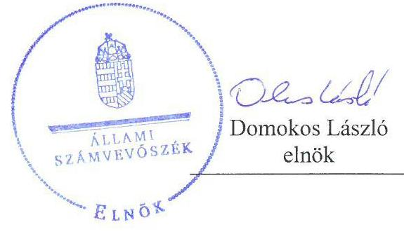
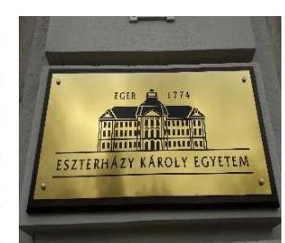
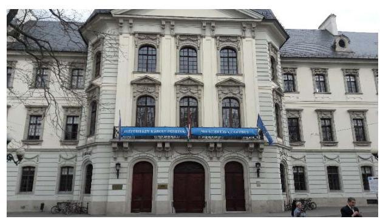
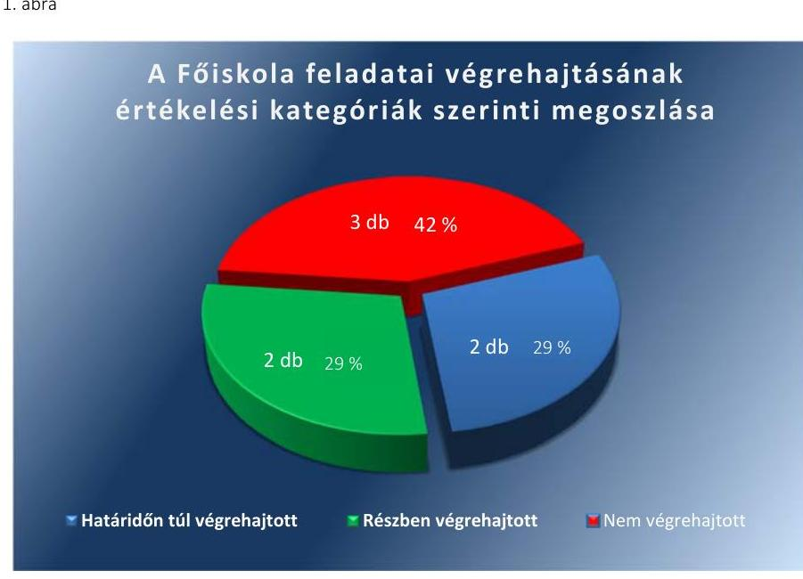

# Jelentés 

## Utóellenőrzések

Az állami felsőoktatási intézmények gazdálkodásának, működésének ellenőrzéséről készült jelentések utóellenőrzése - Eszterházy Károly Főiskola, mint az Eszterházy Károly Egyetem jogelődje
2017. 08. hó 24. nap

---

# AZ ELLENŐRZÉST FELÜGYELTE: 

PETŐ KRISZTINA felügyeleti vezető

## AZ ELLENŐRZÉST VEZETTE ÉS A VÉGREHAJTÁSÁÉRT FELELŐS:

MOLNÁR ZSUZSANNA ellenőrzésvezető

## A PROGRAM ÖSSZEÁLLÍTÁSÁÉRT FELELŐS:

JANIK JÓZSEF LÁSZLÓ osztályvezető

## A TÉMÁHOZ KAPCSOLÓDÓ KORÁBBI SZÁMVEVŐSZÉKI JELENTÉS:

- címe: Jelentés az Eszterházy Károly Főiskola ellenőrzéséről - Az állami felsőoktatási intézmények gazdálkodásának, működésének ellenőrzése
- sorszáma: 14204

IKTATÓSZÁM: V-1183-050/2016.
TÉMASZÁM: 2217
ELLENŐRZÉS-AZONOSÍTÓ SZÁM: V075529

---

# TARTALOMJEGYZÉK 

■ ÖSSZEGZÉS ..... 5
■ AZ ELLENŐRZÉS CÉLJA ..... 6
■ AZ ELLENŐRZÉS TERÜLETE ..... 7
■ AZ ELLENŐRZÉS HÁTTERE, INDOKOLTSÁGA ..... 9
■ A JELENTÉS LÉNYEGES KÉRDÉSKÖRE ..... 10
■ ELLENŐRZÉS HATÓKÖRE ÉS MÓDSZEREI ..... 11
■ MEGÁLLAPÍTÁSOK ..... 13
■ MELLÉKLETEK ..... 17
I. Sz. melléklet: Az ÁSZ 14204. számú jelentéséhez kapcsolódó intézkedési terv végrehajtása az Eszterházy Károly Főiskolánál ..... 17
II. Sz. melléklet: Az ÁSZ 14204. számú jelentéséhez kapcsolódó intézkedési terv végrehajtása az Emberi Erőforrások Minisztériumánál. ..... 21
■ FÜGGELÉK: ÉSZREVÉTELEK ..... 23
■ RÖVIDÍTÉSEK JEGYZÉKE ..... 25

---

.

---

# ÖSSZEGZÉS 

Az utóellenőrzés megállapította, hogy az Eszterházy Károly Főiskola a korábbi számvevőszéki jelentés javaslatai alapján az intézkedési tervben szereplő hét feladatból kettő feladatot határidőn túl, kettő feladatot részben, három feladatot nem hajtott végre. A gazdálkodás terén az ÁSZ által korábban azonosított hiányosságok egy része az ellenőrzött időszakban továbbra is fennállt, amely kockázatot hordoz az összeolvas-

dással létrehozott jogutód Eszterházy Károly Egyetem gazdálkodásában. Az Emberi Erőforrások Minisztériuma - mint a fenntartói jogkör gyakorlója - az intézkedési tervben foglalt feladatait végrehajtotta.

## Az ellenőrzés társadalmi indokoltsága

Az Állami Számvevőszék stratégiájában célul tűzte ki a számvevőszéki munka hasznosulásának javítását. Ezzel összhangban ellenőrzi, hogy az ellenőrzött szervezetek megvalósították-e a korábbi ellenőrzései által feltárt hibák, hiányosságok és szabálytalanságok megszüntetése céljából kialakított intézkedési terveikben foglaltakat. A rendszeres utóellenőrzések hozzájárulnak a szükséges intézkedések tényleges végrehajtásához, ezáltal a közpénzügyek rendezettségének javulásához.

## Főbb megállapítások, következtetések

Az Eszterházy Károly Főiskola az intézkedési tervében szereplő hét feladatból kettő feladatot határidőn túl, kettő feladatot részben, három feladatot pedig nem hajtott végre. Így az Állami Számvevőszék által korábban azonosított hiányosságok egy része az Eszterházy Károly Egyetem létrehozásáig fennállt, amely kockázatot hordoz a jogutód intézmény gazdálkodásában.

A határidőn túl aktualizált gazdálkodási szabályzatok, valamint a reprezentációhoz és a vezetékes telefon használatához kapcsolódó folyamatok szabályozásának hiánya miatt a szabályszerű gazdálkodás kereteit nem biztosították az ellenőrzött időszakban.

A gazdálkodás nyomon követésére, a könyvelési feladatok végrehajtására bevezetett új szoftver nem teremtette meg annak lehetőségét, hogy a kifizetések előtti kontrollokra vonatkozó szabályok betartása és betartatása biztosított legyen.

A gazdasági főigazgató nem gondoskodott a Főiskolánál megállapításra kerülő díjak és költségtérítések vonatkozásában elvégzett önköltségszámítás elfogadásra való beterjesztéséről. A követelésekkel kapcsolatos értékelés és a jogszabályoknak megfelelő nyilvántartás, szükség szerint értékvesztés elszámolása az intézkedési tervben vállalt 2014. és 2015. évi éves beszámoló elkészítésekor nem történt meg.

Az Emberi Erőforrások Minisztériuma intézkedési tervében vállalt munkajogi felelősség kivizsgálása tekintetében intézkedett, a munkajogi felelősség megállapítása - a rektor személyében történt változása miatt - okafogyottá vált.

---

# AZ ELLENŐRZÉS CÉLJA 

Az ellenőrzés célja annak értékelése volt, hogy a számvevőszéki jelentésben ${ }^{1}$ foglalt intézkedést igénylő megállapításokkal és javaslatokkal összhangban készített intézkedési tervben meghatározott feladatokat az ellenőrzött szervezetek végrehajtották-e.

---

# AZ ELLENŐRZÉS TERÜLETE 

## Eszterházy Károly Főiskola, mint az Eszterházy Károly Egyetem jogelődje

Egerben a felső szintű oktatás története 1774-ig nyúlik vissza. Az Eszterházy Károly Főiskola legkorábbi jogelődjét Egerben 1774-ben alapították és 1989 óta viselte az intézmény megálmodójának, Eszterházy Károly püspöknek a nevét. Az Eszterházy Károly Főiskola és a Károly Róbert Főiskola összeolvadásának törvénybe iktatásával jött létre 2016. július 1. napjával az Eszterházy Károly Egyetem.

Az Eszterházy Károly Egyetem az Észak-magyarországi régió önálló egyeteme, a magyar állami felsőoktatás egyik jelentős, dinamikusan fejlődő intézménye.

A képzés öt karon, alapszakokon és mesterszakokon közel egyenlő arányban folyik - a bölcsészettudományok, a pedagógusképzés, a gazdaság- és társadalomtudományok, a természettudományok, az informatika, a sporttudományok és a művészetek terén - nappali, részidős, valamint távoktatásos formában. Az Egyetem² közel 7000 hallgatóval és 700 dolgozóval rendelkező intézmény.

A rektor ${ }^{3}$ személyében 2013. július 1. óta nem volt változás. A jelenlegi rektor 2016. június 30-ig a Főiskola ${ }^{4}$ rektoraként, a 2016. július 1. és 2016. december 31. közötti időszakban a fenntartó által megbízottként, 2017. január 1-től az Egyetem rektoraként látja el az intézményvezetői feladatokat.

Az ellenőrzött időszakban változások történtek a Főiskola gazdasági vezetésében, 2014. november 15-től a Miniszterelnök ${ }^{5}$ kancellárt ${ }^{6}$ bízott meg, aki 2016. február 9-ig látta el tisztségét. 2016. február 10-től 2016. június 30-ig kancellárhelyettes, 2016. július 1-jétől kancellár látta el az intézmény gazdasági vezetését.

A Főiskola 2015. évi költségvetési beszámolója szerint 4969,5 millió Ft költségvetési bevételt, 4662,0 millió Ft finanszírozási bevételt ért el, valamint 9067,0 millió Ft költségvetési kiadást teljesített. A 2015. december 31-i könyvviteli mérleg szerint az eszközei 9170,3 millió Ft-ot tettek ki.

A Főiskola gazdálkodásának és működésének ellenőrzését az ÁSZ ${ }^{7}$ a 2009-2012. közötti időszakra végezte el, az erről szóló 14204. számú jelentést 2014. augusztus 21-én tette közzé. Az ellenőrzés célja annak értékelése volt, hogy szabályos volt-e az állami felsőoktatási intézmény pénzügyi és vagyongazdálkodása, biztosított volt-e a vagyonnal való felelős gazdálkodás követelményének érvényesülése, a jogszabályi előírásoknak megfelelően működött-e a belső kontrollrendszer, a fenntartó tevékenysége a jogszabályi előírásoknak megfelelt-e.

A fenntartói jogkörök gyakorlója az Emberi Erőforrások Minisztériuma volt.

---

Az utóellenőrzés a 2016. június 30-ig végrehajtott intézkedéseket figyelembe véve a Főiskola ellenőrzéséről készült számvevőszéki jelentés, intézkedést igénylő megállapításai és javaslatai hasznosítására elfogadott intézkedési tervben foglalt feladatok végrehajtására irányult. A számvevőszéki jelentés a Főiskola rektora részére három, az Emberi erőforrások Minisztériuma részére kettő javaslatot tartalmazott.

---

# AZ ELLENŐRZÉS HÁTTERE, INDOKOLTSÁGA 

Az ÁSZ tv. ${ }^{8}$ 33. § (1) bekezdése értelmében a számvevőszéki jelentések intézkedést igénylő megállapításaihoz kapcsolódóan az ellenőrzött szervezet vezetője intézkedési tervet köteles összeállítani, és az ÁSZ részére megküldeni. Az intézkedési tervben foglaltak megvalósítását - az ÁSZ tv. 33. § (7) bekezdésében foglaltak alapján - az ÁSZ utóellenőrzés keretében ellenőrizheti. Az intézkedések megvalósulásának értékelése során az ÁSZ figyelembe vette az ellenőrzött szervezetek működési feltételeiben, valamint a jogszabályi előírásokban bekövetkezett változásokat.

Az intézkedési tervben foglalt feladatok hiányos, illetve késedelmes végrehajtása, valamint megvalósításának elmaradása azt mutatja, hogy az ellenőrzés során feltárt hibák, hiányosságok és szabálytalanságok megszüntetése nem kapott kellő hangsúlyt. Ez a szabályszerű működés és a felelős vezetői magatartás vonatkozásában kockázatot hordoz. E kockázatok feltárásával az ÁSZ utóellenőrzési rendszere fokozza a fegyelmet, és igazolja, hogy a közpénzzel való szabályos gazdálkodás felelőssége elől nem lehet kitérni.

Az utóellenőrzés négy szinten hasznosulhat:

- A társadalom szintjén az utóellenőrzés jelzi, hogy a számvevőszéki ellenőrzés megállapításainak van következménye: a hiányosságok megszüntetésére az ellenőrzött szervezet által meghatározott intézkedések végrehajtását is számon kéri az ÁSZ.
- Az ellenőrzött terület szintjén az utóellenőrzés tájékoztatást nyújt a terület döntéshozóinak a hiányosságok kiküszöbölésének jó gyakorlatairól, ezzel lehetőséget biztosítva arra, hogy az ÁSZ ellenőrzési megállapításai, javaslatai a terület nem ellenőrzött szervezeteinek a működése során is hasznosuljanak.
- Az ellenőrzött szervezet szintjén az utóellenőrzés feltárja, hogy a szervezet az intézkedések végrehajtásával hasznosította-e a korábbi ellenőrzési jelentésben a hiányosságok megszüntetése, illetve a kockázatok kezelése érdekében megfogalmazott javaslatokat.
- Az ÁSZ szintjén az utóellenőrzés visszacsatolást ad az ellenőrzési jelentések hasznosulásáról, az intézkedések elmaradása vagy részleges megvalósulása a további ellenőrzésekhez kockázati jelzésként szolgál.

---

# A JELENTÉS LÉNYEGES KÉRDÉSKÖRE 

Az ellenőrzött szervezetek az intézkedési tervben foglaltakat az előírt határidőben végrehajtották-e?

---

# ELLENŐRZÉS HATÓKÖRE ÉS MÓDSZEREI 

## Az ellenőrzés típusa

Megfelelőségi ellenőrzés.

## Az ellenőrzött időszak

Az utóellenőrzés alapját képező számvevőszéki jelentés közzétételének napjától (2014. augusztus 21.) az Eszterházy Károly Egyetem megalapításának napjáig (2016. július 1.) tartó időszak.

## Az ellenőrzés tárgya

Az ÁSZ tv. 2011. július 1-jei hatálybalépését követően a számvevőszéki jelentésben foglalt intézkedést igénylő megállapításokkal és javaslatokkal összhangban - a Főiskola és az EMMI ${ }^{\circledR}$ által - készített intézkedési tervekben foglaltak végrehajtásának ellenőrzése.

Az ellenőrzés kiterjedt minden olyan körülményre és adatra, amely az ÁSZ jogszabályban meghatározott feladatainak teljesítéséhez, valamint a program végrehajtása folyamán felmerült újabb összefüggések feltárásához szükséges.

## Az ellenőrzött szervezet

Az Eszterházy Károly Főiskola, mint az Eszterházy Károly Egyetem jogelődje és az Emberi Erőforrások Minisztériuma.

## Az ellenőrzés jogalapja

Az ÁSZ az Országgyűlés pénzügyi és gazdasági ellenőrző szerve. Az ÁSZ törvényben meghatározott feladatkörében ellenőrzi a központi költségvetés végrehajtását, az államháztartás gazdálkodását, az államháztartásból származó források felhasználását és a nemzeti vagyon kezelését.

Az ÁSZ tv. 1. § (3) bekezdése szerint az ÁSZ általános hatáskörrel végzi a közpénzekkel és az állami és önkormányzati vagyonnal való felelős gazdálkodás ellenőrzését.

Az ÁSZ tv. 33. § (7) bekezdés alapján a 33. § (1) - (2) bekezdés szerinti intézkedési tervben foglaltak megvalósítását az ÁSZ utóellenőrzés keretében ellenőrizheti.

---

# Az ellenőrzés módszerei 

Az ÁSZ az ellenőrzést a nemzetközi standardokat irányadónak tekintve az ellenőrzési program ellenőrzési kérdései, az ellenőrzött időszakban hatályos jogszabályok, az ellenőrzés szakmai szabályok és módszertanok figyelembevételével, önálló ellenőrzés keretében végezte.

Az ÁSZ az ellenőrzés ideje alatt az Egyetemmel - mint a Főiskola jogutódjával - és az EMMI-vel történő kapcsolattartást az ÁSZ SZMSZ ${ }^{10}$-ének vonatkozó előírásai alapján biztosította.

Az utóellenőrzés megállapításait elsősorban az ÁSZ rendelkezésére álló, valamint az ellenőrzött szervezetektől elektronikusan bekért dokumentumok alapozták meg.

Az ellenőrzési bizonyítékként felhasználható adatforrások közé tartoztak egyrészt a szakmai programban felsorolt adatforrások, másrészt minden - az ellenőrzés folyamán feltárt, az ellenőrzés szempontjából információt tartalmazó - dokumentum.

Az intézkedési tervben előírt feladatokat azok végrehajthatósága, illetve végrehajtása szempontjából az alábbiak szerint értékelte az ÁSZ:
$\longrightarrow$ „határidőben végrehajtott" a feladat, ha a teljesítés dokumentáltan, az intézkedési tervben előírt határidőben és tartalommal megtörtént;
$\longrightarrow$ „határidőn túl végrehajtott" a feladat, ha annak teljesítése az intézkedési tervben meghatározott módon, de az előírt határidőn túl történt meg;
$\longrightarrow$ „részben végrehajtott" a feladat, ha végrehajtása teljes körűen az intézkedési tervben előírt módon nem történt meg;
$\longrightarrow$ „nem végrehajtott" ha a végrehajtás nem történt meg, vagy amenynyiben a teljesítést nem dokumentálták;
$\longrightarrow$ „okafogyottá vált" a feladat, ha végrehajtására - meghatározott esemény bekövetkezése, továbbá külső körülmény, a működést érintő feltétel változása miatt - már nincs szükség, illetve lehetőség, és egyértelműen megállapítható, hogy az intézkedést szükségessé tevő körülmény a jövőben nem fordulhat elő;
$\longrightarrow$ „nem időszerű" az a feladat, amelynek ellenőrzési időszakon belüli végrehajtására azért nem került (kerülhetett) sor, mert az intézkedés alapjául szolgáló esemény nem következett be, de annak jövőbeni előfordulása

 lehetséges, a végrehajtása nem volt esedékes, vagy a végrehajtás határideje még nem járt le.
Az ellenőrzés lefolytatásához az ellenőrzött szervezetek a tanúsítványok elektronikus kitöltésével, valamint az ÁSZ által kért dokumentumok elektronikus megküldésével szolgáltatott adatokat, amelyek valódiságát és teljes körűségét az ellenőrzött szervezet vezetője által tett teljességi és hitelességi nyilatkozat igazolta. Az így rendelkezésre bocsátott adatok, információk kontrollja az ellenőrzés keretében történt meg.

---

# MEGÁLLAPÍTÁSOK 

## Az ellenőrzött szervezetek az intézkedési tervben foglaltakat az előírt határidőben végrehajtották-e?

Összegző megállapítás

Az Eszterházy Károly Főiskola az intézkedési tervben meghatározott feladatok közül két feladatot határidőn túl, két feladatot részben, három feladatot nem hajtott végre. Az Emberi Erőforrások Minisztériuma az intézkedési tervében meghatározott két feladatot határidőben végrehajtotta. A feladatok végrehajtásáról a jogszabályban előírt nyilvántartást mindkét ellenőrzött szervezet vezette.

A számvevőszéki jelentés a Főiskola pénzügyi és vagyongazdálkodása és a belső kontrollrendszer szabályszerű működésének biztosítása érdekében három intézkedést igénylő javaslatot fogalmazott meg a rektor számára.

A rektor által megküldött, elfogadott intézkedési tervben hét pontban tizenegy részfeladat került meghatározásra a végrehajtásért felelősök megjelölésével.

Az ÁSZ elnöke által tudomásul vett intézkedési tervben foglalt feladatok elvégzésének felelőseként egy-egy részfeladat esetében a rektort és a gazdasági főigazgató-helyettest, öt esetben a gazdasági főigazgatót, kettő részfeladat esetében a főtitkárt, egy feladat esetében a belső ellenőrzési vezetőt, egy feladatnál pedig minden felelős megjelölésre került. Az ÁSZ javaslatai alapján készített intézkedési tervben rögzített feladatok végrehajtásáról a Főiskola a Bkr. ${ }^{11}$ által előírt nyilvántartást vezette.

A Főiskola intézkedési tervében meghatározott feladatokat, határidőket, a feladatok végrehajtásáért felelős személyt és a feladatok végrehajtását az I. számú melléklet, az EMMI intézkedési tervében meghatározott feladatok végrehajtását a II. számú melléklet mutatja be.

A Főiskola intézkedési tervében meghatározott feladatok végrehajtásának értékelési kategóriák szerinti megoszlását az 1. ábra szemlélteti.

---

Forrás: ÁSZ

# HATÁRIDŐN TÚL VÉGREHAJTOTT feladatok: 

$\qquad$ 1. (4/7) A 2015. évi belső ellenőrzési tervbe - a következő év I. negyedévére határidőben beütemezett - a megbízási díjak elszámolásának és a felhalmozási kiadások előirányzatai felhasználásának szabályszerűségére irányuló ellenőrzések végrehajtására az intézkedési tervben meghatározott - 2015. március 31-i - határidő után került sor.
2. (5/7) Az intézkedési tervben a hallgató befizetések jogszabályi előírások szerinti kezelésére, illetve az ennek érdekében meghatározott Magyar Államkincstárral történő kapcsolatfelvételre és egyeztetésre és az ügyrend meghatározására a vállalt határidőn túl került sor.

## RÉSZBEN VÉGREHAJTOTT feladatok:

3. (1/7) A belső kontrollrendszer, ezen belül a kontrollkörnyezet és a kontrolltevékenységek területén feltárt hiányosságok megszüntetéséről, a jogszabályoknak megfelelő kialakításáról és működtetéséről a Főiskola nem gondoskodott az intézkedési tervben vállaltak szerint minden részfeladat esetében határidőre és teljes körűen. A rektor az intézkedési terv ÁSZ elnöke általi elfogadást követően az intézkedési tervet megküldte a feladattal érintett felelősöknek és írásban utasította őket az abban meghatározott feladatok határidőben történő, maradéktalan végrehajtására. A gazdasági főigazgató a szabályszerű gazdálkodásához kapcsolódó szabályzatok aktualizálását, illetve elkészítését határidőn túl hajtotta végre. A főtitkár nem gondoskodott a reprezentációhoz, és a vezetékes telefonok használatához kapcsolódó folyamatok szabályzására rektori utasítás hatályba léptetéséről. A közérdekű adatok megismerésére irányuló kérelmek intézésének, a kötelezően közzéteendő adatok nyilvánosságra hozatali rendjének beépítése az Adatvédelmi és Adatbiztonsági Szabályzatba határidőn túl történt meg.

---

4. (3/7) A rektor 2014. október 22-án, ezt követően 2014. november 20-án az intézkedési tervvel együtt megküldött levelében kötelezte a gazdasági főigazgatót arra, hogy az intézményben megállapításra kerülő díjak és költségtérítések vonatkozásában minden esetben végezze el az önköltség számítását és terjessze azt elfogadásra a Rektori Tanács elé. Az Önköltségszámítási Szabályzaton alapuló díjak és költségtérítések az írásos rektori intézkedés ellenére nem kerültek elfogadtatásra, az intézményben megállapított díjak és költségtérítések meghatározása nem elfogadott önköltségszámításon alapult.

# NEM VÉGREHAJTOTT feladatok: 

5. (2/7) A gazdálkodási jogkörök jogszabályoknak és belső szabályzatoknak megfelelő gyakorlása érdekében a megbízási díjak elszámolásának módját, a szerződések tartalmát és a teljesítés igazolás rendjét a rektor - az intézkedési tervben meghatározott - utasításban nem szabályozta. A gazdálkodás nyomon követésére, a könyvelési feladatok végrehajtására fejlesztett és alkalmazott új szoftverben a gazdasági főigazgató-helyettes - az intézkedési tervben vállaltak ellenére - nem teremtette meg meghatározott kontrollok beépítésével a lehetőségét annak, hogy a gazdálkodási jogkörök tekintetében a jogszabályok és a belső szabályzatok előírásainak betartása és betartatása teljes körű legyen.
6. (6/7) A követelésekkel kapcsolatos értékelés, a követelések jogszabályoknak megfelelő nyilvántartása, szükség szerint az értékvesztés elszámolása az intézkedési tervben vállalt 2014. és 2015. évi éves beszámoló elkészítésével egyidejűleg nem történt meg. Ez nem felelt meg a Számv. tv. ${ }^{12} 15 . \S$ (3) és a 16. § (1) bekezdésében foglaltaknak.
7. (7/7) Nem tett minden felelős írásban jelentést a rektornak az intézkedési tervben meghatározott határidők leteltét követően az elvégzett feladatok teljesítéséről. A gazdasági főigazgató, a gazdasági főigazgató-helyettes és a főtitkár nem számoltak be a határidőt követően írásban a rektornak.

## HATÁRIDŐBEN VÉGREHAJTOTT feladatok:

8. (1-2/2) Az EMMI az intézkedési tervben vállalt két feladatot határidőben végrehajtotta, a közbeszerzési szabálytalanságok és a kincstári körön kívüli számlavezetés miatt megállapított szabálytalan pénzkezeléshez kapcsolódó munkajogi felelősség kivizsgálása tekintetében intézkedett. Megállapította, hogy a munkajogi felelősség megállapítása okafogyottá vált, mert az Eszterházy Károly Főiskola rektora az ellenőrzött időszakot követően került kinevezésre.

---

.

---

# MELLÉKLETEK

- I. SZ. MELLÉKLET: AZ ÁSZ 14204. SZÁMÚ JELENTÉSÉHEZ KAPCSOLÓDÓ INTÉZKEDÉSI TERV VÉGREHAJTÁSA AZ ESZTERHÁZY KÁROLY FŐISKOLÁNÁL

|  1. | Intézkedési
tervben
meghatározott
határidő
2. | Az intézkedési
tervben meghatározott feladatok felelőse
3. | A feladat végrehajtása  |
| --- | --- | --- | --- |
|  1. |  |  | 4.  |
|  1. 4. „A 2015. évi belső ellenőrzési tervbe - a következő
év I. negyedévére ütemezve - beépítésre kerül a meg-
bizási díjak elszámolásának és a felhalmozási kiadá-
sok előirányzatai felhasználásának szabályszerűsé-
gére irányuló ellenőrzés lefolytatása. (Javaslatok 2/c.
pontja)" | 2014. november
15. (terv) - 2015.
március 31. (vég-
rehajtás) | belső ellenőrzési vezető | A 2015. évi belső ellenőrzési tervbe az intézkedési tervben meghatározott határidőre a megbízási díjak elszámolásának, és a felhalmozási kiadások előirányzatai felhasználásának szabályszerűségére irányuló ellenőrzések lefolytatása beépítésre kerültek.
Az ellenőrzések végrehajtására az intézkedési tervben meghatározott 2015. március 31-i - határidő után került sor. A megbízási díjak elszámolásának ellenőrzését 2015. április 20-án, a felhalmozási kiadások előirányzatai felhasználásának szabályszerűségére irányuló ellenőrzést 2015. november 16-án folytatták le.
Az intézkedési tervben meghatározott Magyar Államkincstárral történő kapcsolatfelvételre, egyeztetésre, az ügyrend meghatározására a hallgatói befizetések jogszabályi előírásoknak megfelelő kezelésre érdekében a vállalt határidőn túl került sor. A Főiskola 2015. március 2-án szüntette meg a kereskedelmi banknál vezetett számláját, a hallgatói befizetések teljes egyenlege átutalásra került a Magyar Államkincstárnál vezetett gyűjtőszámlára. Az átállás ügyrendjére vonatkozó leírás 2015. február 23-án készült el, a hallgatói befizetésekre vonatkozó változásról a Főiskola 2015. február 26-án értesítette a hallgatókat.  |
|  2. 5. „Intézkedek (szóbeli utasítással), hogy a hallgatói befizetések kezelése a jogszabályi előírásoknak megfelelő legyen - kapcsolatfelvétel és egyeztetés a Magyar Államkincstárral, ügyrend meghatározása (Javaslatok 2/d. pontja)" | azonnali kezdéssel, legkésőbb 2014. december 31. | gazdasági főigazgató |   |
|  3. 1. „Intézkedek a belső kontrollrendszer, ezen belül a kontrollkörnyezet és a kontrolltevékenységek területén feltárt hiányosságok megszüntetéséről, a jogszabályoknak megfelelő kialakításáról és működtetéséről az alábbiak szerint: |  |  |   |

## Részben végrehajtott feladatok

Azonnali kezdéssel, 2015. január 31.

Határidőben végrehajtott feladatrész: A rektor az intézkedési terv ÁSZ elnöke általi elfogadást követően az intézkedési tervet megküldte a feladattal érintett felelősöknek és írásban intézkedett az abban meghatározott feladatok határidőben történő, maradéktalan végrehajtására.

---

|  3. | Intézkedési | Az intézkedési | Az intézkedési  |
| --- | --- | --- | --- |
|   | tervben | tervben | tervben meghatározott feladatok felelőse  |
|   | meghatározott | meghatározott feladatok felelőse |   |
|   | 1. | 2. | 3.  |
|   | Írásbeli intézkedésem szerint haladéktalanul meg kell |  |   |
|   | kezdeni a jelentésben meghatározott szabályzatok fel- |  |   |
|   | ülvizsgálatát és aktualizálását, a hiányzó szabályza- |  |   |
|   | tok, utasítások megalkotását, továbbá felhívtam a fi- |  |   |
|   | gyelmet a szabályzatok folyamatos karbantartásának |  |   |
|   | szükségességére. (Javaslatok 1. pontja.) |  |   |
|   | Felelős: |  |   |
|   | a) Gazdálkodási Szabályzat, a Számviteli Politika, az | gazdasági főigaz- | gazdasági főigaz-  |
|   | Értékelési Szabályzat és a Gazdasági Főigazgatóság | gató | gató  |
|   | ügyrendje felülvizsgálata és aktualizálása vonatko- |  |   |
|   | zásában: gazdasági főigazgató |  |   |
|   | b) a Beszerzési Szabályzat, Önköltségszámítási Sza- | gazdasági főigaz- | gazdasági főigaz-  |
|   | bályzat elkészítése és szenátusi elfogadtatása: gaz- | gató | gató  |
|   | dasági főigazgató |  |   |
|   | c) Rektori utasítások hatályba léptetése a bel- és a kül- | főtitkár |   |
|   | földi kiküldetésekhez, a reprezentációhoz, a vezeté- |  |   |
|   | kes és a rádiótelefonok használatához kapcsolódó |  |   |
|   | folyamatok szabályozására vonatkozóan: főtitkár |  |   |
|   | d) a közérdekű adatok megismerésére irányuló kérel- |  |   |
|   | mek intézésének, a kötelezően közzéteendő adatok |  |   |
|   | nyilvánosságra hozatali rendjének beépítése az |  |   |
|   | Adatvédelmi és Adatbiztonsági Szabályzatba: főtit- |  |   |
|   | kár" |  |   |
|  4. | 3. „Intézkedek a díjak és költségtérítések önköltség- | az | gazdasági főigaz-  |
|   | számítással történő megalapozásáról. Kötelezem a |  |   |
|   | gazdasági főigazgató, hogy az Önköltségszámítási |  |   |
|   | Szabályzatban meghatározott módon az intézmény- |  |   |
|   | ben megállapításra kerülő díjak és költségtérítések vo- |  |   |
|   | natkozásában minden esetben végezze el az önkölts-

 |  |   |
|   | ség számítását és terjessze azt elfogadásra a Rektori |  |   |
|   | Tanács elé. (Javaslatok 2/b. pontja)" | az | gazdasági főigaz- |
|   |  | Önköltségszámítás | gató |
|   |  | si Szabályzat ha- |   |
|   |  | tályba lépésétől |   |
|   |  | kezdődően folya- |   |
|   |  | matosan |   |

|  Az intézkedési tervben meghatározott feladat | Az intézkedési tervben meghatározott feladatok felelőse | A feladat végrehajtása  |
| --- | --- | --- |
|  2. | 3. | 4.  |
|  |   |   |
|   |  | Határidőn túl végrehajtott feladatrészek:  |
|   | gazdasági főigazgató | 1. d) A közérdekű adatok megismerésére irányuló kérelmek intézésének, a kötelezően közzéteendő adatok nyilvánosságra hozatali rendjének beépítése az Adatvédelmi és Adatbiztonsági Szabályzatba határidőn túl – 2015. május 7-én – történt meg.  |
|   | gazdasági főigazgató | 1. a) A gazdasági főigazgató határidőn túl gondoskodott a Gazdálkodási Szabályzat, a Számviteli Politika, az Eszközök és Források Értékelési Szabályzata és a Gazdasági Főigazgatóság ügyrendje aktualizálásáról.  |
|   | gazdasági főigazgató | 1. b) A Beszerzési és Önköltségszámítási Szabályzat elkészítése és szenátusi elfogadtatása az intézkedési tervben vállalt határidőn túl történt meg. A Beszerzési Szabályzatot 2015. december 9-én, az Önköltségszámítási Szabályzatot 2016. február 23-án fogadta el a Szenátus13.  |
|   | főtitkár | 1. c) A bel- és a külföldi kiküldetéseket szabályozó rektori-kancellári együttes utasítások 2016. május 20-án, illetve 2016. január 7-én kerültek elfogadásra. Mindkét utasítás az intézkedési tervben vállalt határidőn túl lépett hatályba.  |
|   | főtitkár | 1. c) A rádiótelefonok használatához kapcsolódó folyamatok szabályozásáról szóló kancellári utasítás 2015. szeptember 1-jén került elfogadásra, hatályba léptetése a vállalt határidőn túl történt meg.  |
|   |  | Nem végrehajtott feladatrészek:  |
|   |  | 1.c) A főtitkár nem gondoskodott a reprezentációhoz, és a vezetékes telefonok használatához kapcsolódó folyamatok szabályzására rektori utasítás hatályba léptetéséről. Ezzel megsértette az Ávr.14 13. § (2) bekezdés e) pontját és nem tett eleget a g) pontban foglaltaknak.  |
|  az | gazdasági főigazgató | Határidőben végrehajtott feladatrész:  |
|  Önköltségszámítási Szabályzat hatályba lépésétől kezdődően folyamatosan |  | A rektor határidőben végrehajtotta az intézkedés megtételével kapcsolatban vállalt részfeladatot, mert a 2014. október 22-án, ezt követően 2014. november 20-án kelt levelében megküldte a Gazdasági Főigazgatóság vezetőjének az intézkedési tervet, illetve annak módosítását. Mindkét levélben kötelezte a rektor a gazdasági főigazgatót arra, hogy az intézményben megállapításra kerülő díjak és költségtérítések vonatkozásában minden |

---

|  5. | Intézkedési
tervben
meghatározott
határidő | Az intézkedési
tervben
megha-
tározott felada-
tok felelőse | A feladat végrehajtása  |
| --- | --- | --- | --- |
|   | 1. | 2. | 3.  |
|   |  |  |  | esetben végezze el az önköltség számítását és terjessze azt elfogadásra a Rektori Tanács elé.  |
|   |  |  |  | Nem végrehajtott feladatrész:  |
|   |  |  |  | A Főiskola Önköltségszámítási Szabályzata a Szenátus a 15/2016. (II. 23.) számú határozatával került elfogadásra és 2016. február 24-én lépett hatályba. Az oktatás és a K+F szolgáltatások területén készültek kalkulációk, illetve kalkulációs modell. A 2016. év elején létrehozott munkacsoport tagjai több területen végeztek számításokat, sor került az egyes képzések költségeire, az egyes kurzusok közvetlen bérköltségeire, az egy hallgatóra eső közvetlen bérköltségekre vonatkozóan egyeztetésre, azonban az intézményben megállapításra kerülő díjak és költségtérítések meghatározása nem elfogadott önköltségszámításon alapult. A szabályzat érvénybelépését követően az intézményben megállapításra kerülő díjak és költségtérítések minden esetben önköltségszámításon alapuló meghatározásáról és annak elfogadásra történő beterjesztéséről a gazdasági főigazgató nem gondoskodott.  |
|   |  | Nem végrehajtott feladat |   |
|  5. | 2. „Intézkedek, hogy a gazdálkodási jogkörök gyakorlása megfeleljen a jogszabályokban és a belső szabályzatokban foglaltaknak. (Javaslatok 2/a pontja)
Ennek érdekében
a)Rektori utasításban szabályozom a megbízási díjak elszámolásának módját, a szerződések tartalmát, a teljesítés igazolások rendjét.
b) A gazdálkodás nyomon követésére, a könyvelési feladatok végrehajtására új szoftver került alkalmazásra 2014-ben (EOS), melyben megteremtjük a lehetőségét annak, hogy - meghatározott kontrollok beépítésével a szoftverben - teljes körűen biztosított legyen a gazdálkodási jogkörök tekintetében a jogszabályok és a belső szabályzatok előírásainak betartása és betartatása." | Rektori utasítás kiadásának határideje: 2014. december 31.
2014. december 10. | rektor
gazdasági főigaz-
gató-helyettes  |
|   |  | A rektor az intézkedési tervben vállalt határidőre nem szabályozta a megbízási díjak elszámolásának módját, a szerződések tartalmát, a teljesítésigazolások rendjét.
A gazdasági főigazgató-helyettes nem teremtette meg az új szoftverben meghatározott kontrollok beépítésével - a lehetőségét annak, hogy a gazdálkodási jogkörök tekintetében a jogszabályok és a belső szabályzatok előírásainak betartása és betartatása teljes körűen biztosított legyen.
A gazdálkodás nyomon követésére, a könyvelési feladatok végrehajtására 2014-ben új szoftver alkalmazására került sor. A szoftverrel előállított utalványrendelet nem felel meg a jogszabályi és a belső szabályzatok előírásainak, mert az utalványon az utalványozás dátuma és az utalványozott összeg nem szerepelnek. Ezzel nem tettek eleget a 368/2011. (XII. 31.) Korm. rendelet 59 § (3) bekezdés d) és g) pontjában előírtaknak, illetve az Főiskola |   |

---

|  5. | Intézkedési
tervben
meghatározott
feladat | Az intézkedési
tervben
meghatározott
határidő | Az intézkedési
tervben megha-
tározott felada-
tok felelőse | A feladat végrehajtása  |
| --- | --- | --- | --- | --- |
|   | 1. | 2. | 3. | 4.  |
|   |  |  |  | kötelezettségvállalásra vonatkozó érvényes belső szabályzatában15 foglaltaknak. A szoftverbe nem kerültek beépítésre azok a kontrollok, amelyek az utalvány hiányos kitöltését megakadályozták volna.  |
|  6. | 6. "Intézkedek, hogy történjen meg - a mindenkori
éves beszámoló elkészítésével egyidejűleg - a követelésekkel kapcsolatos értékelés és a jogszabályoknak megfelelő nyilvántartás, szükség szerint az értékvesztés elszámolása. (Javaslatok 3. pontja)" | első alkalommal 2015. február 28. majd folyamatosan | gazdasági főigazgató | A 2014. és 2015. évi követelések értékelését nem végezték el, a gazdasági főigazgató nem gondoskodott a követelések jogszabályoknak megfelelő nyilvántartásáról, a követelésekkel kapcsolatos szükség szerinti értékvesztés elszámolásáról. Ez nem felel meg a Számv. tv. 15. § (3) és a 16. § (1) bekezdésében foglaltaknak.  |
|  7. | Az Intézkedési Tervben számozás nélküli (utolsó) feladat:
"Az intézkedések meghatározásával egyidejűleg kértem, illetve kérem, hogy a határidők leteltét követően az elvégzett feladatok teljesítéséről, a megtett intézkedésekről a felelősök tegyenek részemre írásban jelentést." | a határidő leteltét követően | minden felelős | Nem tett minden felelős írásban jelentést a rektornak a határidő leteltét követően az elvégzett feladatok teljesítéséről, a megtett intézkedésekről. Az intézkedési tervben megjelölt felelősök közül egyedül a belső ellenőrzési vezető számolt be írásban, a határidő leteltét követő 29. napon. A gazdasági főigazgató, a gazdasági főigazgató-helyettes és a főtitkár nem számoltak be a határidőt követően írásban a rektornak.  |

---

#### *Mellékletek*

|  II. SZ. MELLÉKLET: AZ ÁSZ 14204. SZÁMÚ JELENTÉSÉHEZ KAPCSOLÓDÓ INTÉZKEDÉSI TERV VÉGREHAJTÁSA AZ EMBERI ERŐFORRÁSOK MINISZTÉRIUMÁNÁL |  |  |  |   |
| --- | --- | --- | --- | --- |
|  I. SZ. MELLÉKLET: AZ ÁSZ 14204. SZÁMÚ JELENTÉSÉHEZ KAPCSOLÓDÓ INTÉZKEDÉSI TERV VÉGREHAJTÁSA AZ EMBERI ERŐFORRÁSOK MINISZTÉRIUMÁNÁL |  |  |  |   |
|  1. SZ. MELLÉKLET: AZ ÁSZ 14204. SZÁMÚ JELENTÉSÉHEZ KAPCSOLÓDÓ INTÉZKEDÉSI TERV VÉGREHAJTÁSA AZ EMBERI ERŐFORRÁSOK MINISZTÉRIUMÁNÁL |  |  |  |   |
|  2. 2. A kincstári körön kívüli számlavezetés miatt megállapított szabálytalan pénzkezeléshez kapcsolódó munkajogi felelősség kivizsgálása, a szükséges intézkedések kezdeményezése. | 2015. december 31. | 2015. december 31. | 2015. december 31. | 2015. december 31.  |
|  3. 3. A kincstári körön kívüli számlavezetés miatt megállapított szabálytalan pénzkezeléshez kapcsolódó munkajogi felelősség kivizsgálása, a szükséges intézkedések kezdeményezése. | 2015. december 31. | 2015. december 31. | 2015. december 31. | 2015. december 31.  |

---

.

---

# FÜGGELÉK: ÉSZREVÉTELEK 

A jelentéstervezetet a Számvevőszék 15 napos észrevételezésre megküldte az ellenőrzött szervezetek vezetőinek az ÁSZ tv. 29. § (1) bekezdése előírásának megfelelően.
Az Emberi Erőforrások Minisztériuma nemleges észrevételt tett, az Eszterházy Károly Egyetem rektora és kancellárja az ÁSZ tv. 29. § (2) bekezdésében foglalt észrevételezési jogával nem élt, a törvényes határidőn belül észrevételt nem tett.

[^0]
[^0]:    * 29. § (1) Az Állami Számvevőszék az ellenőrzési megállapításait megküldi az ellenőrzött szervezet vezetőjének vagy az általa megbízott személynek, és annak, akinek személyes felelősségét állapította meg.
    (2) Az ellenőrzött szervezet vezetője és a felelősként megjelölt személy az ellenőrzés megállapításaira tizenöt napon belül írásban észrevételt tehet.
    (3) Az Állami Számvevőszék az észrevételre a beérkezésétől számított harminc napon belül írásban válaszol. A figyelembe nem vett észrevételeket köteles a jelentésben feltüntetni, és megindokolni, hogy azokat miért nem fogadta el.

---

.

---

# RÖVIDÍTÉSEK JEGYZÉKE 

${ }^{1}$ számvevőszéki jelentés
${ }^{2}$ Egyetem
${ }^{3}$ rektor
${ }^{4}$ Főiskola
${ }^{5}$ Miniszterelnök
${ }^{6}$ kancellár
${ }^{7}$ ÁSZ
${ }^{8}$ ÁSZ tv.
${ }^{9}$ EMMI
${ }^{10}$ ÁSZ SZMSZ
${ }^{11}$ Bkr.
${ }^{12}$ Számv. tv.
${ }^{13}$ Szenátus
${ }^{14}$ Ávr.
${ }^{15}$ belső szabályzat

ÁSZ 14204. számú, Jelentés az Eszterházy Károly Főiskola ellenőrzéséről - Az állami felsőoktatási intézmények gazdálkodásának, működésének ellenőrzése, amelynek közzétételi időpontja: 2014. augusztus 21.
2016. július 1-jétől Eszterházy Károly Egyetem, jogelődje az Eszterházy Károly Főiskola 2016. június 30-ig

Eszterházy Károly Főiskola rektora 2016. június 30-ig
Eszterházy Károly Főiskola 2016. június 30-ig
Magyarország miniszterelnöke
Eszterházy Károly Főiskola kancellárja
Állami Számvevőszék
2011. évi LXVI. törvény az Állami Számvevőszékről, hatályos 2011. július 1-jétől

Emberi Erőforrások Minisztériuma
Az Állami Számvevőszék elnökének 3/2016. (XII. 29.) ÁSZ utasítása az Állami Számvevőszék Szervezeti és Működési Szabályzatáról (Hatályos: 2017. január 1-jétől) 370/2011. (XII. 31.) Kormányrendelet a költségvetési szervek belső kontrollrendszeréről és belső ellenőrzéséről
2000. évi C. törvény a számvitelről

Károly Róbert Főiskola szenátusa
368/2011. (XII. 31.) Korm. rendelet az államháztartásról szóló törvény végrehajtásáról Kötelezettségvállalási Szabályzat (hatályos: 2015. december 10-től)

---

ÁLLAMI SZÁMVEVŐSZÉK
1052 Budapest, Apáczai
 Csere János utca 10.
Levélcím: 1364 Budapest Pf. 54
Telefon: +36 1 484 9100 Telefax: +36 1 484 9200
www.asz.hu
