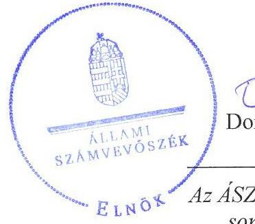
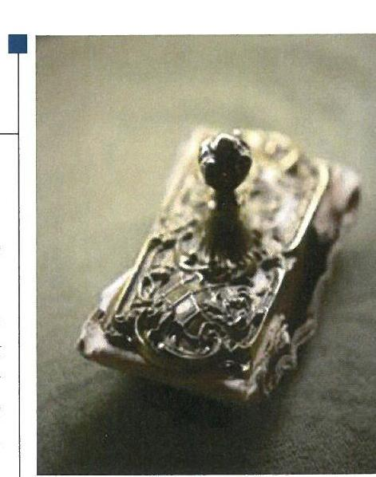
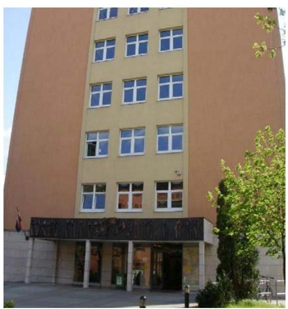
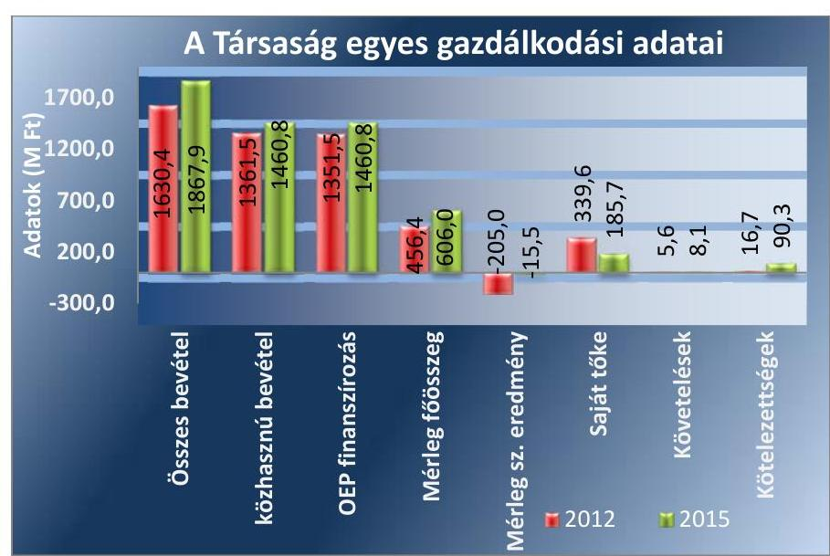
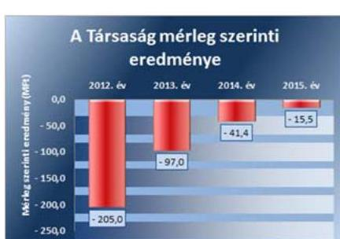
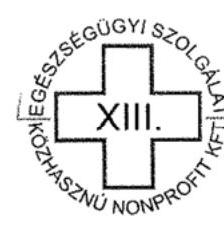
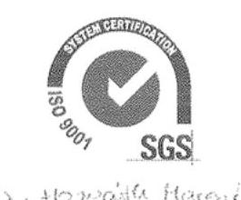

# Jelentés 

## Az önkormányzatok gazdasági társaságai

Az önkormányzatok többségi tulajdonában lévő gazdasági társaságok gazdálkodásának ellenőrzése - XIII. Kerületi Egészségügyi Szolgálat Közhasznú Nonprofit Kft.
2017.

Az ÁSZ az államháztartáson kívül müködő fel-adat-ellátó rendszerek ellenőrzéseivel hozzájárul ahhoz, hogy a közpénzeket az államháztartáson kívül müködő szervezetek is átlátható, rendezett módon használják fel a feladatok ellátása érde-

---

# Jelentés 

## Az önkormányzatok gazdasági társaságai

Az önkormányzatok többségi tulajdonában lévő gazdasági társaságok gazdálkodásának ellenőrzése - XIII. Kerületi Egészségügyi Szolgálat Közhasznú Nonprofit Kft.
2017. augusta hó 15. nap

17132
www.asz.hu

---

# AZ ELLENŐRZÉST FELÜGYELTE: 

DR. HORVÁTH MARGIT felügyeleti vezető

## AZ ELLENŐRZÉST VEZETTE ÉS A VÉGREHAJTÁSÁÉRT FELELŐS:

KLINGA LÁSZLÓ ellenőrzésvezető

## A PROGRAM ÖSSZEÁLLÍTÁSÁÉRT FELELŐS:

JANIK JÓZSEF osztályvezető

IKTATÓSZÁM: V-1291-142/2016
TÉMASZÁM: 2325.
ELLENŐRZÉS-AZONOSÍTÓ SZÁM: V075816

---

# TARTALOMJEGYZÉK 

■ ÖSSZEGZÉS ..... 5
■ AZ ELLENŐRZÉS CÉLJA ..... 6
■ AZ ELLENŐRZÉS TERÜLETE ..... 7
■ AZ ELLENŐRZÉS HÁTTERE, INDOKOLTSÁGA ..... 9
■ A JELENTÉS LÉNYEGES KÉRDÉSKÖREI ..... 10
■ ELLENŐRZÉS HATÓKÖRE ÉS MÓDSZEREI ..... 11
■ MEGÁLLAPÍTÁSOK ..... 13
■ JAVASLATOK ..... 20
■ MELLÉKLETEK ..... 21
I. sz. melléklet: Értelmező szótár. ..... 21
II. sz. melléklet: A Társaság mérlegadatainak alakulása 2012-2015 között ..... 22
III. sz. melléklet: A Társaság eredményének alakulása 2012-2015 között ..... 23
■ FÜGGELÉK: ÉSZREVÉTELEK ..... 25
■ RÖVIDÍTÉSEK JEGYZÉKE ..... 29

---

.

---

# ÖSSZEGZÉS 

Budapest Főváros XIII. Kerületi Önkormányzat a tulajdonosi jogait a 2012-2015. években összességében szabályszerűen gyakorolta. A XIII. Kerületi Egészségügyi Szolgálat Közhasznú Nonprofit Kft. vagyongazdálkodása szabályszerű volt. A Társaság fizetőképessége biztosított volt. A Társaság belső szabályozása összességében megfelelt az előírásoknak, de önköltségszámitási szabályzattal csak a 2015. évtől rendelkezett. A Társaság önköltségszámitást a térítési díj ellenében nyújtott szolgáltatások tekintetében nem végzett. A bevételek és ráfordítások elszámolása összességében szabályszerű volt.

## Az ellenőrzés társadalmi indokoltsága

Az Állami Számvevőszék kiemelt célja, hogy a helyi önkormányzatok gazdálkodásában rejlő pénzügyi kockázatok feltárásával, az államháztartáson kívülre nyújtott költségvetési támogatások és ingyenes vagyonjuttatások, valamint az államháztartáson kívül múködő feladat-ellátó rendszerek ellenőrzéseivel hozzájáruljon ahhoz, hogy a közpénzeket az államháztartáson kívül múködő szervezetek is átlátható, rendezett módon használják fel.

Az Állami Számvevőszék céljaival és a társadalmi igénnyel összhangban, a gazdasági társaságok kiemelt fontosságú szerepe miatt került sor a XIII. Kerületi Egészségügyi Szolgálat Közhasznú Nonprofit Kft. ellenőrzésére.

## Főbb megállapítások, következtetések, javaslatok

Az Önkormányzat a tulajdonosi jogok gyakorlásának kereteit a Vagyongazdálkodási rendelet ${ }_{1,2}$-ben szabályszerűen meghatározta. A Társaság Alapító Okirat ${ }_{1-6}$-ában az előírásoknak megfelelően rögzítették a Képviselő-testület kizárólagos hatáskörébe tartozó ügyeket. A tulajdonosi jogokat a Képviselő-testület összességében szabályszerűen gyakorolta. A Képviselő-testület az üzleti terv készítési kötelezettséget a Közszolgáltatási szerződésben előírta a Társaság részére, a beszámoló elfogadásáról az FB írásbeli jelentésének birtokában döntött. Az FB Ügyrendjét az előírások ellenére a Képviselő-testület nem hagyta jóvá, ezért az FB szabályszerű múködésének feltételei nem voltak biztosítottak. A 2014. évben a Társaság saját tőkéje a törzstőke fele alá csökkent, ennek következtében a Képviselő-testület szabályszerűen döntött a törzstőke 5,0 millió Ft-ra való leszállításáról és az eredménytartalék 73,5 millió Ft-ra történő emeléséről. Az Önkormányzat belső ellenőrzése a Társaságnál az ellenőrzött időszakban tíz alkalommal végzett ellenőrzést, ezzel folyamatosan támogatta a szabályszerű múködés kontrollját.

A Társaság rendelkezett a Számv. tv. előírásainak megfelelő számviteli szabályzatokkal, azonban az önköltségszámítás rendjére vonatkozó szabályzatot a Számv. tv.-ben előírtak ellenére csak a 2015. évtől léptették hatályba. A saját vagyon nyilvántartása és leltározása a jogszabályi és a belső előírásoknak megfelelt. A Társaság fizetőképessége biztosított volt. A rövid lejáratú kötelezettségeinek az ellenőrzött időszakban döntően határidőben eleget tudott tenni. A Társaság a tervezési, beszámolási, adatszolgáltatási és közzétételi kötelezettségének határidőben eleget tett.

A bevételeket és a ráfordításokat, továbbá a beruházásokat, felújításokat összességében szabályszerűen számolták el. Önköltségszámítást a Társaság az Önköltségszámítás rendjére vonatkozó szabályzatban foglaltak ellenére a térítési díj ellenében ellátott tevékenységei tekintetében nem végzett.

---

# AZ ELLENŐRZÉS CÉLJA 

AZ ELLENŐRZÉS CÉLJA annak értékelése volt, hogy az önkormányzat vagyongazdálkodási tevékenysége során szabályszerűen gyakorolta-e a tulajdonosi jogait.

Ellenőriztük, hogy a gazdasági társaság szabályozottsága, gazdálkodása és vagyongazdálkodási tevékenysége, bevételeinek és ráfordításainak elszámolása megfelelt-e a jogszabályi és tulajdonosi előírásoknak.

Értékeltük, hogy a gazdasági társaság kötelezettségállománya jelentett-e kockázatot a múködésre, valamint a gazdálkodás átláthatósága és elszámoltathatósága érdekében biztosítva volt-e a szolgáltatás dijának megalapozottsága szabályszerű önköltségszámítással.

---

# **A Z ELLENŐRZÉS TERÜLETE**

## **Budapest Főváros XIII. Kerületi Önkormányzat és a kizárólagos tulajdonában lévő XIII. Kerületi Egészségügyi Szolgálat Közhasznú Nonprofit Kft.**

Budapest Főváros XIII. Kerületi Önkormányzat 2005. június 1-jén alapította a 100%-os tulajdonában lévő XIII. Kerületi Egészségügyi Szolgálat Közhasznú Társaságot. A Társaság1 2007. november 15-én nonprofit korlátolt felelősségű társasággá alakult, továbbá ezzel a nappal a közhasznú jogállást is megszerezte.

A feladatellátást szolgáló ingatlanokat az Önkormányzat2 a Társaság ingyenes használatába adta.

A Társaság feladata az Alapító Okirat1-63 alapján a kerület lakosságának általános-, szakorvosi és fogorvosi járóbeteg ellátása, valamint egyéb humán-egészségügyi ellátás volt. Az Alapító Okirat1-6-ban foglaltak szerint vállalkozási, üzletszerű gazdasági tevékenységet közhasznú céljainak megvalósítása érdekében, azokat nem veszélyeztetve végezhetett.

A XIII. kerület lakosainak száma 2015. január 1-jén 120 199 fő volt. A Társaság a 2015. évben járóbeteg szakellátás keretében összesen 458 287 esetet látott el, az egynapos sebészet keretében 1169 műtétet végzett, míg a gyermekorvosok és védőnők 1215 újszülöttet gondoztak.

A Társaság átlagos statisztikai létszáma a 2012. évben 274 fő, a 2015. évben 285 fő volt.

A Társaság egyes gazdálkodási adatait a 2012. és a 2015. években az 1. ábra szemlélteti.

1. ábra

*Forrás: A Társaság 2012. és 2015. évi beszámolói*

---

A mérlegfőösszeg a 2012. év végéről 2015. év végére 456,4 millió Ft-ról 606,0 millió Ft-ra növekedett, amelyet eszközoldalon a befektetett eszközök 125,3 millió Ft-os növekedése, míg forrás oldalon a passzív időbeli elhatárolások 229,9 millió Ft-os emelkedése okozott annak ellenére, hogy a 2015. évben a törzstőke 402,6 millió Ft-tal történő leszállítására került sor. A bevételek összege az OEP ${ }^{4}$ finanszírozás és a közhasznú bevételek növekedésének hatására a 2012. évről a 2015. évre 99,3 millió Ft-tal emelkedett. A Társaság az Önkormányzattól az ellenőrzött időszakban összesen 474,8 millió Ft működési és 467,9 millió Ft felhalmozási célú támogatásban részesült. A kötelezettségek több mint ötszörösére, 73,6 millió Ft-tal történő növekedése a Társaság fizetőképességére nem jelentett kockázatot.

A Társaság a 2011. évtől a kormányzati alszektorba besorolt társaságnak minősült. A Társaságnak az ellenőrzött időszakban adósságot keletkeztető ügylete nem volt, a kormányzati szektor hiányára befolyást gyakorló bevételt és ráfordítást nem számolt el, osztalékot nem fizetett.
A polgármester ${ }^{5}$ és az ügyvezető ${ }^{6}$ személyében változás nem történt, a jegyző ${ }^{7}$ személye 2015. január 15. napjával változott.

---

# AZ ELLENŐRZÉS HÁTTERE, INDOKOLTSÁGA 

AZ ÖNKORMÁNYZATOK TÖBBSÉGI TULAJDONÁBAN ÁLLÓ GAZDASÁGI TÁRSASÁGOK ellenőrzése kiemelten fontos a vagyon megőrzése, megóvása érdekében, valamint a kormányzati szektor elszámolásaiban megjelenő önkormányzati tulajdonú gazdálkodó szervezetek esetében, amelyekkel szemben alapvető követelmény, hogy gazdálkodásuk, múködésük szabályszerű, az általuk szolgáltatott adatok minél megbízhatóbbak legyenek. A feladatellátás költségeinek, ráfordításainak alakulása a lakosság széles rétegét érinti.

Ellenőrzéseink feltárhatják, hogy az önkormányzat a feladatellátásához rendelt vagyon múködtetését a tulajdonostól elvárható gondossággal vé-geztette-e, a feladatot ellátó gazdasági társaság a létesítő okiratban, szolgáltatási szerződésben foglaltak betartásával biztosította-e a feladat ellátását. Az ellenőrzés eredményeképp meghatározhatóvá válnak a költségvetési hiányt befolyásoló szervezetek kockázatai, lehetővé válik ezen kockázatok csökkentése. Az ellenőrzés rávilágíthat arra, hogy a gazdasági társaság a vagyon használatával biztosította-e a szolgáltatás folytatásának feltételeit, az önkormányzat tulajdonosi felügyelete hozzájárult-e a szabályszerű gazdálkodáshoz és feladatellátáshoz. A megállapítások alapján megfogalmazott számvevőszéki javaslatok hasznosítása elősegítheti a meglévő hibák megszüntetését. A jó gyakorlatok bemutatásával az ÁSZ ${ }^{6}$ hozzájárulhat a követendő megoldások megismertetéséhez, terjesztéséhez.

---

# A JELENTÉS LÉNYEGES KÉRDÉSKÖREI 

1- Az önkormányzat tulajdonosi joggyakorlása szabályszerű volt-e?
2. A gazdasági társaság vagyongazdálkodása szabályszerű volt-e, fizetőképessége biztositott volt-e a gazdálkodás során?
3. A gazdasági társaság bevételeinek és ráforditásainak elszámolása, valamint az önköltségszámitás és árképzés szabályszerű volt-e?

---

# ELLENŐRZÉS HATÓKÖRE ÉS MÓDSZEREI 

## Az ellenőrzés típusa

Megfelelőségi ellenőrzés.

## Az ellenőrzött időszak

Az ellenőrzött időszak 2012. január 1-jétől 2015. december 31-ig tartott.

## Az ellenőrzés tárgya

Az önkormányzatok - többségi tulajdonában lévő gazdasági társaságok feletti - tulajdonosi joggyakorlása, valamint a gazdasági társaságok gazdálkodásának szabályozottsága és szabályszerűsége.

Az ellenőrzés kiterjedt minden olyan körülményre és adatra, amely az ÁSZ jogszabályban meghatározott feladatainak teljesítéséhez, valamint a program végrehajtása folyamán felmerült újabb összefüggések feltárásához szükséges volt.

## Az ellenőrzött szervezet

Budapest Főváros XIII. Kerületi Önkormányzat és a XIII. Kerületi Egészségügyi Szolgálat Közhasznú Nonprofit Korlátolt Felelősségű Társaság

## Az ellenőrzés jogalapja

Az ellenőrzés jogszabályi alapját az ÁSZ tv. 1. § (3) bekezdése és 5. § (3)-(4)-(5) bekezdései képezték.

## Az ellenőrzés módszerei

Az ellenőrzést a nemzetközi standardokat irányadónak tekintve az ellenőrzési program ellenőrzési kérdései, az ellenőrzött időszakban hatályos jogszabályok, az ellenőrzés szakmai szabályok és módszertanok figyelembe vételével végeztük.

Az ellenőrzés ideje alatt az ellenőrzött szervezettel történő kapcsolattartást az ÁSZ Szervezeti és Müködési Szabályzatának vonatkozó előírásai alapján biztosítottuk.

Az ellenőrzés a kiválasztott, többségi tulajdonosi jogokat gyakorló önkormányzatra, illetve az ellenőrzött gazdasági társaságra terjedt ki.

---

Az ellenőrzési kérdések megválaszolásához szükséges bizonyítékok megszerzése a következő ellenőrzési eljárások alkalmazásával történt: megfigyelés, kérdésfeltevés (információkérés), összehasonlítás, valamint elemző eljárás. Az ellenőrzési bizonyítékként felhasználható adatforrások közé tartoztak egyrészt az ellenőrzési programban felsorolt adatforrások, másrészt adatforrás lehetett még minden - az ellenőrzés folyamán - feltárt, az ellenőrzés szempontjából információkat tartalmazó dokumentum.

Az ellenőrzést a kérdésekre adott válaszok kiértékelésével, valamint a megjelölt adatforrások, a csatolt tanúsítványok felhasználásával, továbbá az adott időszakban hatályos jogszabályok figyelembe vételével folytattuk le.

A bevételek és ráfordítások elszámolása, valamint a vagyonnyilvántartás terén a szabályszerű működést véletlen mintavétellel ellenőriztük. A mintavétellel ellenőrzött területek esetében minden egyes tétel vonatkozásában a szabályszerűségre vonatkozó kérdéseket tettünk fel, amelyek eredménye összesítésre került. Megfelelőnek értékeltünk egy ellenőrzött területet, amennyiben 95\%-os bizonyossággal a teljes sokaságban a hibaarány legfeljebb 10\%, nem megfelelőnek, amennyiben 10\%-nál magasabb arányt képviselt. Abban az esetben, ha a teljes sokaság tekintetében a 10\%os hibaarányhoz való viszony megítélésnek megbízhatósága nem érte el a 95\%-ot, annak elérése érdekében értékelésünket további szempontokkal egészítettük ki, és figyelembe vettük a feltárt hibák típusát és súlyát. A ráfordítások elszámolására és a vagyonnyilvántartásra vonatkozó véletlen mintavételt kockázati alapú kiválasztással egészítettük ki, amelynek során évente a három legnagyobb összegű tételt választottuk ki.

---

# 1. Az önkormányzat tulajdonosi joggyakorlása szabályszerű volt-e? 

Összegző megállapítás

### 1.1. számú megállapítás

Az Önkormányzat tulajdonosi joggyakorlása összességében szabályszerű volt.

A tulajdonosi joggyakorlás kereteit összességében szabályszerűen alakították ki.

Az Önkormányzat az Mötv. ${ }^{9}$ 13. § (1) bekezdés 4. pontja szerinti kötelezettségének - egészségügyi alapellátás és egészséges életmód segítését célzó szolgáltatások biztosítása - a Társasága útján tett eleget. Egészségügyi célkitűzéseit a Gazdasági program ${ }_{1,2}{ }^{10}$-jában, valamint Egészségügyi koncepciójában rögzítette.

## A TULAJDONOSI JOGOK GYAKORLÁSÁNAK

RENDJÉT az Önkormányzat a Gt. ${ }^{11}$ és a Ptk. ${ }_{2}{ }^{12}$ előírásaival összhangban a Vagyongazdálkodási rendelet ${ }_{1,2}{ }^{13}$-ben alakította ki. A tulajdonosi jogokat a Képviselő-testület ${ }^{14}$ szabályszerűen gyakorolta.

Az Alapító Okirat ${ }_{1-6}$ a Gt., a Ptk. ${ }_{2}$ és a Civil tv. ${ }^{15}$ által meghatározott tartalmi előírásoknak megfelelt. Az Alapító Okirat ${ }_{1-6}$-ban - a Gt. és a Ptk. ${ }_{2}$ előírásának megfelelően - rögzítették a Képviselő-testület kizárólagos hatáskörébe tartozó ügyeket.

A RENDELET-ALKOTÁSI KÖTELEZETTSÉGÉT az Önkormányzat a Társaság feladatellátásával kapcsolatosan az ágazati jogszabályoknak megfelelően - egészségügyi alapellátások körzeteinek, háziorvosi körzetek kialakításával - teljesítette.

A FELADAT-ELLÁTÁST SZOLGÁLÓ VAGYONT - ingatlanokat - az Önkormányzat a Társaság részére Használatba adási ${ }^{16}$ - és Közszolgáltatási szerződés ${ }^{17}$ alapján térítésmentesen biztosította. A szerződésekben a használatba adott vagyon tekintetében a Társaság jogait és kötelezettségeit meghatározták. Az Alapító Okirat ${ }_{1-6}$ és a Használatba adási szerződés összhangja nem volt biztosított, mert a feladatellátást szolgáló a Társaság használatába adott - ingatlanok változásait a Használatba adási szerződésen nem vezették át, az nem tartalmazott négy, a feladat ellátást szolgáló ingatlant.

A Társaság által nyújtandó szolgáltatási kapacitást - ellátandó feladatok és azok helyszíne, szakorvosi órák száma, finanszírozási feltételek - az Önkormányzat a Közszolgáltatási szerződésben határozta meg.

---

### 1.2. számú megállapítás

1. ábra

Forrás: A Társaság éves beszámolói

A tulajdonosi jogok gyakorlása összességében szabályszerű volt. Az FB ügyrendjét a Képviselő-testület nem hagyta jóvá.

ÜZLETI TERVÉT a Társaság az ellenőrzött időszak minden évében elkészítette a Közszolgáltatási szerződésben foglaltak szerint, amit a Képvi-selő-testület részére az előírt határidőben benyújtott. Az üzleti terveket a Képviselő-testület minden esetben jóváhagyta.

AZ FB ${ }^{18}$ a Gt. és a Ptk. ${ }_{2}$ előírásainak megfelelően három tagból állt. Az ellenőrzött években megtárgyalta és véleményezte a Társaság üzleti tervét, éves beszámolóját és közhasznúsági mellékletét. Az FB a 20122015. években a Gt. 35. § (3) bekezdésében, illetve a Ptk. ${ }_{2}$ 3:120 § (2) bekezdésének megfelelően minden évben írásbeli jelentést készített a Társaság számviteli beszámolójáról.

Az FB Ügyrend ${ }_{1,2}{ }^{19}$-jét a Gt 34. § (4), illetve a Ptk. ${ }_{2}$ 3:122. § (3) bekezdés előírása ellenére a Képviselő-testület nem hagyta jóvá, így az FB szabályszerű múködésének feltételei nem voltak biztosítottak.

AZ ÉVES BESZÁMOLÓ elfogadásáról a Képviselő-testület az FB írásbeli jelentésének és a független könyvvizsgálói vélemény birtokában döntött. A mérleg szerinti eredményt a Képviselő-testület az éves beszámoló elfogadásával együtt jóváhagyta, amit a Társaság eredménytartalékba helyezett. A Társaság az ellenőrzött időszak minden évében - csökkenő mértékben - veszteséges volt, amelynek összegeit a 2. ábra szemlélteti.

A 2014. évi éves beszámoló alapján a Társaság saját tőkéje (201,2 millió Ft) a törzstőke (407,6 millió Ft) fele alá csökkent, amit az ügyvezető a Ptk. ${ }_{2}$ 3:189 § (1) bekezdés a) pontjában foglalt előírás alapján a Társaság 2014. évi tevékenységéről szóló beszámolójában jelzett az Önkormányzat felé. A saját tőke törzstőke fele alá történt csökkenésére a könyvvizsgáló a 2014. évi könyvvizsgálói jelentésében felhívta a figyelmet a Ptk. ${ }_{2}$ 3:38 § (2) bekezdésében foglaltaknak eleget téve.

A JAVADALMAZÁSI SZABÁLYZATÁT a Képviselő-testület elfogadta, az a Taktv. ${ }^{20}$ 5. § (3) bekezdésében foglalt tartalmi előírásoknak megfelelt. A Javadalmazási szabályzat hatálya kiterjedt a Társaság FB tagjaira, ügyvezetőjére, helyettesére és más vezető állású munkavállalóira.

A TÁRSASÁG ELLENŐRZÉSÉT az Önkormányzat az Ötv. ${ }^{21}$ 92. § (11) bekezdés b), illetve az Áht. ${ }^{22}$ 70. § (1) bekezdés d) pontjában foglaltak alapján az ellenőrzött időszakban tíz esetben végezte el belső ellenőrzés keretében. A tulajdonos érdekeit sértő, jogszerűtlen, Önkormányzatot hátrányosan érintő vagyongazdálkodási tevékenységet nem tártak fel, az ellenőrzési javaslatok alapján a Társaság intézkedési terveket készített a hibák kijavítása érdekében.

---

# 2. A gazdasági társaság vagyongazdálkodása szabályszerű volt-e, fizetőképessége biztosított volt-e a gazdálkodás során? 

Összegző megállapítás

2.1. számú megállapítás

A Társaság a vagyongazdálkodása összességében szabályszerű, a fizetőképessége biztosított volt a gazdálkodás során.

A Társaság a vagyongazdálkodással összefüggő szabályzatait elkészítette, azonban az Önköltség számítás rendjére vonatkozó szabályzattal csak a 2015. évtől rendelkezett. A szabályzatok a Számv. tv. előírásainak összességében megfeleltek.

A Társaság az ellenőrzött időszakban rendelkezett a Számv. tv. ${ }^{23}$ 14. § (3) bekezdésében előírt Számviteli Politikával és értékelési szabályzat ${ }_{1-2}{ }^{24}$ tal, mely a Számv. tv. 14. § (5) bekezdés b) pontja szerinti értékelési szabályzatot is tartalmazta, valamint a Számv. tv. 14. § (5) bekezdés a) és d) pontjaiban foglaltaknak megfelelően Leltározási szabályzat ${ }_{1-4}{ }^{25}$ _tal, Pénzkezelési szabályzat ${ }_{3-6}{ }^{26}$-tal és a Számv. tv. 161. § (1) bekezdésében előírt Számlarend ${ }_{1-3}{ }^{27}$-del. A Társaság az Önköltségszámítás rendjére vonatkozó szabályzatát ${ }^{28} 2015$. január 1-jével alkotta meg és helyezte hatályba.

## A SZÁMVITELI POLITIKA ÉS ÉRTÉKELÉSI SZABÁLYZAT a Számv. tv. 9. § (1)-(2) bekezdéseiben foglaltak ellenére

egyszerűsített éves beszámoló készítési kötelezettséget határozott meg éves beszámoló készítési kötelezettség helyett. Az eszközök és források értékelésével kapcsolatos előírásait a Számviteli politika és értékelési szabályzatában, továbbá Számlarendjében rögzítette.

A Társaság a Számviteli Politika és Értékelési Szabályzatában ${ }_{1,2}$ Számlarendjében ${ }_{1-3}$ és Bizonylati rendjében ${ }^{29}$ határozta meg a maradványérték képzésének feltételeit és módját. A szabályzatok előírásai azonban nem voltak összhangban egymással, a maradványérték megállapítási kötelezettséget nem azonos összegű bekerülési értékhez és nem azonos mértékben határozták meg. Ezért nem volt biztosított a Számv. tv. 52. § (2) bekezdésében előírt évenként elszámolandó értékcsökkenés alapja - maradványértékkel csökkentett bekerülési érték -helyességének megállapíthatósága.

A LELTÁROZÁSI SZABÁLYZAT a mennyiségben is nyilvántartott eszközök esetében évenkénti leltározási kötelezettséget írt elő, amely megfelelt a Számv. tv. 69. § (3) bekezdése előírásának.

A PÉNZKEZELÉSI SZABÁLYZAT a Számv. tv. 14. § (8) bekezdésében előírt tartalmi követelményeknek megfelelt.

A SZÁMLAREND kialakítása a Számv. tv. 161. § (1)-(3) bekezdésében foglaltakkal összhangban történt.

AZ ÖNKÖLTSÉGSZÁMÍTÁS RENDJÉT a Társaság a Számv. tv. 14. § (5) bekezdés c) pontjában foglaltakat megsértve - 2012től 2014-ig nem szabályozta - nem szabályozta, annak ellenére, hogy a Számv. tv. 14. § (6)-(7) bekezdései alapján az Önköltségszámítás rendjére

---

vonatkozó szabályzat készítési kötelezettség alól nem mentesült. A Társaság a Számv. tv. 14. § (7) bekezdésében foglaltak alapján a végzett szolgáltatások 51. § szerinti önköltségének az önköltségszámítás rendjére vonatkozó belső szabályzat szerinti utókalkuláció módszerével történő megállapítására volt kötelezett, mert az ellenőrzött időszak minden évében a közvetített szolgáltatások értékével csökkentett nettó árbevétele az egymilliárd forintot, a költségnemek szerinti költségei együttes összege az ötszázmillió forintot meghaladta. A 2015. január 1-jétől hatályos Önköltségszámítás rendjére vonatkozó szabályzat nem biztosította a Számv. tv. 14. § (7) bekezdésében foglalt kötelezettsége teljesíthetőségét, mert nem határozta meg tevékenységenként az önköltség megállapítását szolgáló kalkulációs sémákat, továbbá nem biztosítsa a térítési díj ellenében végzett szolgáltatások Számv. tv. szerinti önköltségének meghatározhatóságát.

A Társaság közhasznú tevékenysége mellett vállalkozási tevékenységet is folytatott. Számlarendjében rögzítette a bevételek és ráfordítások elkülönítésére vonatkozó előírásait, a Számlatükörben szereplő főkönyvi számlák alábontásával kialakította a közpénzek felhasználásának, a köztulajdon használatának ellenőrizhetőségét biztosító nyilvántartási, könyvvezetési rendszerét a Számv. tv 161/A. § (2) előírásának megfelelően. Ezzel biztosította a Civil tv. 46. § (1) szerinti közhasznúsági melléklet készítési kötelezettség teljesítéséhez szükséges adatok előállíthatóságát és a Civil tv. 32.§ előírásainak való megfelelőség igazolhatóságát.

# 2.2. számú megállapítás 

## A Társaság vagyongazdálkodása megfelelt a jogszabályi és a belső szabályzatokban foglalt előírásoknak.

A SAJÁT VAGYON nyilvántartása a jogszabályi és belső szabályzatokban foglalt előírásoknak megfelelt.

A Társaság a Számv. tv. 69. § (1)-(3) bekezdései előírásának megfelelően a mérlegében - saját vagyonként - kimutatott eszközöket és forrásokat leltárral alátámasztotta, a folyamatosan vezetett, mennyiségi nyilvántartásaiban szereplő eszközei mennyiségi leltárfelvételét az előírásoknak megfelelően évente elvégezte és kiértékelte, a mérlegében szereplő adatokat alátámasztotta.

A mérleg főösszeg 2012. január 1-jéről 2015.december 31-re 14,2\%-kal (100,2 millió Ft-tal) csökkent, amelyet jellemzően a forgóeszközök és azon belül is a pénzeszközök 93,8\%-os (163,0 millió Ft-os) csökkenése okozott. A mérlegfőösszeg csökkenése ellenére a Társaság befektetett eszközeinek értéke 14,4\%-kal (49,1 millió Ft-tal) emelkedett. Forrásoldalon a mérlegfőösszeg csökkenését a törzstőke leszállítása okozta.

A Társaság mérlegadatainak alakulását a II. számú, az eredményének alakulását a III. számú melléklet szemlélteti a 2012-2015. évek között.

BELSŐ ELLENŐRZÉSI KÖTELEZETTSÉGÉNEK a Társaság, mint kormányzati szektorba sorolt egyéb szervezet a Bkr. ${ }^{30}$ 10. § előírásának megfelelően eleget tett, a 2012-2015. években azt külső erőforrás bevonásával biztosította. A belső ellenőrzési tevékenységet éves ellenőrzési tervek alapján végezték. A Társaság a belső ellenőrzés megállapításai és javaslatai alapján minden esetben intézkedési tervet készített és az abban foglaltak végrehajtását figyelemmel kísérte.

---

### 2.3. számú megállapítás

1. táblázat

A TÁRSASÁG KÖTELEZETTSÉGEI 2012.01.01.-2015.12.31. KÖZÖTT (MFT)

| Megnevezés | 2012 | 2015 |
| :--: | :--: | :--: |
|  | 01.01 | 12.31 |
| Szállítók | 17,3 | 39,4 |
| Egyéb rövid lej. köt. | 10,7 | 50,9 |
| Rövid lej. köt. | 28,0 | 90,3 |
| Hosszú lej. köt. | 0,0 | 0,0 |
| Összes köt. | 28,0 | 90,3 |

A Társaság fizetőképessége a gazdálkodás során biztosított volt. A kötelezettségállomány nem jelentett veszélyt a feladat ellátásra.

A FIZETŐKÉPESSÉG az ellenőrzött időszakban biztosított volt. A Társaság kötelezettségei a 2012. évről a 2015. évre több, mint háromszorosukra, míg ezen belül a szállítói kötelezettségek több, mint kétszeresükre emelkedtek. A jogszabályi előíráson alapuló kötelezettségeinek - adók, járulékok, hatósági díjak - határidőben eleget tett. A szállítókkal szembeni kötelezettségei tekintetében 30 napot meghaladó határidőn túli kötelezettséggel az ellenőrzött időszakban nem rendelkezett. A 30 napot meg nem haladó lejárt határidejű szállítói kötelezettségek összege 2012-ben 0,2 millió Ft, 2015-ben 10,6 millió Ft volt.

Egyéb rövid lejáratú kötelezettségek jellemzően a december havi munkabérek tekintetében a munkavállalókkal, illetve a levont adók és járulékok tekintetében a NAV ${ }^{31}$-val szemben fennálló kötelezettségek voltak.

A Társaság kötelezettségeinek 2012. és 2015. évi alakulását az 1. táblázat tartalmazza.

### 2.4. számú megállapítás

A Társaság beszámolási, adatszolgáltatási és közzétételi kötelezettségét az előírásoknak megfelelően teljesítette.

AZ ÉVES BESZÁMOLÓKAT, üzleti jelentéseket és közhasznúsági mellékleteket a Társaság a Számv. tv., a Civil tv., és az Alapító Okirat előírásának megfelelően elkészítette. Az éves beszámolókat a Képviselőtestület elfogadta, amelyhez a Gt. 35. § (3) bekezdése, valamint a Ptk. 3:120. §. (2) bekezdése szerinti FB jelentések és a Gt. 40. § (1) bekezdésének, illetve a Ptk. 3 : 129. § (1) bekezdésének megfelelő könyvvizsgálói jelentések rendelkezésre álltak.

A könyvvizsgáló a 2014. évi éves beszámoló esetében a könyvvizsgáló figyelemfelhívással élt a Ptk. 3 :38. § (2) bekezdésében foglaltaknak megfelelően a vagyon változása következtében.

A Társaság honlapján az Info tv. ${ }^{32}$ 33. § (3) bekezdésében és az 1. sz. mellékletének II/1. pontjában meghatározott, a szervezetre vonatkozó adatok - szervezetre, személyzeti adatokra, tevékenységre, múködésre és gazdálkodásra vonatkozó adatok - közzététele megtörtént, a közérdekú adatainak megismerhetőségét biztosította. Az Adatvédelmi és adatbiztonsági szabályzatot a Társaság 2014. szeptember 1-jétől léptette hatályba. A belső adatvédelmi nyilvántartási rendszert kialakították, a belső adatvédelmi felelőst kijelölték.

A közérdekú adatok megismerésére irányuló igények teljesítésének rendjét a Társaság az Info tv. előírásának megfelelően szabályozta.

---

# 3. A gazdasági társaság bevételeinek és ráfordításainak elszámolása, valamint az önköltségszámítás és árképzés szabályszerű volt-e? 

Összegző megállapítás
3.1. számú megállapítás
2. táblázat

A TÁRSASÁG BEVÉTELEI ÉS OEP
FINANSZÍROZÁSA (MFT)

| Megnevezés | 2012. | 2015. |
| :-- | --: | --: |
| Összes bevétel | 1630,4 | 1867,9 |
| ebből: OEP finan-   szírozás bevételei | 1351,5 | 1460,8 |

A Társaság bevételeinek és ráfordításainak elszámolása öszszességében szabályszerű volt. Önköltségszámítást a térítési díj ellenében nyújtott szolgáltatások tekintetében nem végzett. A térítési díj ellenében igénybe vehető egészségügyi szolgáltatásai díját a jogszabályi előírások alapján térítési díj szabályzatban határozta meg.

A bevételek és a ráfordítások elszámolása összességében szabályszerű volt, melyek során a jogszabályokban és a belső szabályzatokban foglalt előírásokat betartották.

A BEVÉTELEK elszámolása szabályszerű volt, azokat a Számv. tv. 7277. §-ai előírásának megfelelően számolták el. A bevételeknél a szolgáltatások végzésére irányuló szerződésekben - bérleti szerződés, egészségügyi és kutatási szolgáltatások végzésére irányuló szerződések - meghatározott díjakat érvényesítették. A Társaság bevételei a 2012. évről 14,6\%-kal, míg az OEP finanszírozásból származó bevételei 8,1\%-kal emelkedtek. A bevételek alakulását a 2. táblázat tartalmazza.

AZ ANYAGJELLEGŰ-, EGYÉB-, PÉNZÜGYI- ÉS RENDKIVÜLI RÁFORDÍTÁSOK elszámolása összességében szabályszerű volt. Az anyagjellegú ráfordítások és egyéb ráfordítások elszámolása a Számv. tv. 78. § és 81. §-ának megfelelően történt.

A SZEMÉLYI JELLEGŰ RÁFORDÍTÁSOK és az azokat terhelő adók és járulékok elszámolása a jogszabályi előírásoknak megfelelően történt. A Társaság által nyújtott cafetéria elemek esetében a munkavállalói cafetéria-nyilatkozatok rendelkezésre álltak, a cafetéria elemek munkavállalók részére történő folyósításakor a Kollektív szerződés és a vonatkozó Ügyvezetői utasítás előírásait figyelembe vették, a béren kívüli juttatások elszámolása szabályszerű volt.

## A BERUHÁZÁSOK, FELÚJÍTÁSOK ÉS AZ ÉRTÉKCSÖKKENÉSI LEÍRÁS ELSZÁMOLÁSA összességében szabályszerű volt. Az eszközök bekerülési értékének megállapítása a Számv. tv. 47-51. §-ok előírásainak megfelelt, az üzembe helyezést a Számv. tv. 52. § (2) bekezdésében foglaltaknak megfelelően hitelt érdemlően dokumentálták. Az értékcsökkenés elszámolása a Számv. tv. 52-53. §ai előírásának megfelelően történt.

A Társaság az ellenőrzött időszakban összességében az elszámolt értékcsökkenést ( 454,8 millió Ft) meghaladó összegű beruházást és felújítást (513,2 millió Ft) hajtott végre, biztosítva az eszközök elhasználódási ütemét meghaladó mértékű eszközpótlást. Az elszámolt értékcsökkenésre és beruházások értékére vonatkozó adatokat a 3. táblázat tartalmazza.

---

4. táblázat

| A KÖVETELÉSÁLLOMÁNY (MFT) |  |  |
| :--: | :--: | :--: |
| Megnevezés | $\begin{gathered} 2012 \\ 01.01 \end{gathered}$ | $\begin{gathered} 2015 \\ 12.31 \end{gathered}$ |
| Vevők | 11,5 | 3,0 |
| Egyéb követelések | 2,1 | 5,1 |
| Összes követelés | 13,6 | 8,1 |

A KÖVETELÉSÁLLOMÁNY a 2012. év elejéről közel felére, a vevőkkel szembeni követelések csaknem negyedükre csökkentek a 2015. év végére. Ezen belül a lejárt határidejű vevőkövetelések 2,2 millió Ft-ról 72,7\%-kal ( 0,6 millió Ft-ra) csökkentek. Behajthatatlan követelésként öszszesen 1,6 millió Ft-ot írt le a Társaság az ellenőrzött időszakban, amelynek során a Számv. tv. 65. § (7) bekezdésében, a 3. § (4) bekezdés 10. pontjában és a Számlarend ${ }_{3}$-ban foglalt előírásokat betartotta, a behajthatatlanság tényét igazolta. A követelésállományra vonatkozó adatokat az 4. táblázat tartalmaz.

A Társaság önköltségszámítást a térítési díj ellenében nyújtott szolgáltatások tekintetében nem végzett. A térítési díj ellenében igénybe vehető egészségügyi szolgáltatásai diját a jogszabályi előírások alapján Térítési díj szabályzatban határozta meg.

## ÖNKÖLTSÉGSZÁMÍTÁS RENDJÉRE VONATKOZÓ

SZABÁLYZAT készítési kötelezettségének a Társaság 2015. január 1jétől tett eleget annak ellenére, hogy a Számv. tv. 14. § (6)-(7) bekezdései alapján az önköltségszámítás rendjére vonatkozó szabályzatkészítési kötelezettség alól nem mentesült.

Önköltségszámítást a Társaság a 2015. évben az önköltségszámítás rendjére vonatkozó szabályozásában foglaltak ellenére a térítési díj ellenében nyújtott szolgáltatások - megrendelés alapján ellátott kutatási tevékenység, bérbeadás, térítésköteles egészségügyi szolgáltatások - tekintetében nem végzett.

## AZ EGYES EGÉSZSÉGÜGYI SZOLGÁLTATÁSOK

DIJÁT a Társaság a térítési díj ellenében igénybe vehető egészségügyi szolgáltatások térítési díjáról szóló 284/1997. (VII. 14.) Korm. rendelet előírása alapján - annak 2. számú mellékletében nem szabályozott esetekre vonatkozóan - a Térítési díj szabályzataiban ${ }_{1-8}{ }^{33}$-ban rögzítette. A térítési díj szabályzatokban meghatározásra kerültek továbbá a foglalkozás-egészségügyi szolgálatról szóló 89/1995. (VII. 14.) Korm. rendelet alapján a Társaság által a tevékenység ellátására irányuló megállapodásokban alkalmazandó díjak.

---

# JAVASLATOK 

Az ÁSZ tv. 33. § (1) bekezdésében foglaltak értelmében az ellenőrzött szervezet vezetője köteles a jelentésben foglalt megállapításokhoz kapcsolódó intézkedési tervet összeállítani és azt a jelentés kézhezvételétől számított 30 napon belül az ÁSZ részére megküldeni. Amennyiben az ellenőrzött szervezet vezetője nem küldi meg határidőben az intézkedési tervet, vagy továbbra sem elfogadható intézkedési tervet küld, az Állami Számvevőszék elnöke az ÁSZ tv. 33. § (3) bekezdése a) és b) pontjaiban foglaltakat érvényesítheti.

Javaslataink célja a XIII. Kerületi Egészségügyi Szolgálat Közhasznú Nonprofit Kft. gazdálkodása szabályszerűségének és gyakorlatának javítása annak érdekében, hogy a szabályozási környezet és az alkalmazott gyakorlat megfelelően tudja támogatni az átlátható múködést.

## A XIII. Kerületi Egészségügyi Szolgálat Közhasznú Nonprofit Kft. ügyvezetőjének

1. Intézkedjen a számviteli politika, számlarend és a bizonylati rend módosításával azok összhangjáról az eszközök maradvány értéke Számv. tv. szerinti megállapításának biztositása érdekében.
(2.1. sz. megállapítás 3. bekezdése alapján)
2. Intézkedjen az Önköltségszámítás rendjére vonatkozó szabályzat módosításáról, hogy az biztosítsa a térítési dij ellenében végzett szolgáltatások Számv. tv. szerinti önköltségének meghatározhatóságát.
(2.1. sz. megállapítás 7. bekezdése alapján)

Javaslataink célja az Önkormányzat szabályszerű működésének elősegítése, továbbá az önkormányzati tulajdonosi joggyakorlás kontrolljainak erősítése.

## Budapest Főváros XIII. Kerület Önkormányzata polgármesterének

1. Kezdeményezze a Képviselő-testület elé jóváhagyásra a Ptk. elöirása alapján a Társaság FB-jének Ügyrendjét.
(1.2. sz. megállapítás 3. bekezdése alapján)

---

# MELLÉKLETEK 

- I. SZ. MELLÉKLET: ÉRTELMEZŐ SZÓTÁR
gazdasági társaság
gazdálkodó szervezet
nemzeti vagyon
nonprofit gazdasági társaság
vagyonkezelő
$\mathrm{Ptk}_{2} .3: 88 . \S$ (1) bekezdése szerint „a gazdasági társaságok üzletszerű közös gazdasági tevékenység folytatására, a tagok vagyoni hozzájárulásával létrehozott, jogi személyiséggel rendelkező vállalkozások, amelyekben a tagok a nyereségből közösen részesednek, és a veszteséget közösen viselik".
A Ptk. ${ }^{34} 685$. § c) pontja szerint gazdálkodó szervezet:
„az állami vállalat, az egyéb állami gazdálkodó szerv, a szövetkezet, a lakásszövetkezet, az európai szövetkezet, a gazdasági társaság, az európai részvénytársaság, az egyesülés, az európai gazdasági egyesülés, az európai területi együttmüködési csoportosulás, az egyes jogi személyek vállalata, a leányvállalat, a vízgazdálkodási társulat, az erdő birtokossági társulat, a végrehajtói iroda, az egyéni cég, továbbá az egyéni vállalkozó." (2014. 03.15-ig hatályos)
Nvtv. ${ }^{35} 1 . \S$ (2) bekezdése szerint többek között:
„az állam vagy a helyi önkormányzat kizárólagos tulajdonában álló dolgok,
az a) pont hatálya alá nem tartozó, állam vagy a helyi önkormányzat tulajdonában lévő dolog,
az állam vagy a helyi önkormányzat tulajdonában lévő pénzügyi eszközök, továbbá az államot vagy a helyi önkormányzatot megillető társasági részesedések,
az államot vagy a helyi önkormányzatot megillető bármely vagyoni értékkel rendelkező jogosultság, amelyet jogszabály vagyoni értékű jogként nevesít."
Civil tv. 9/F. § (2) bekezdése szerint „az a gazdasági társaság minősül nonprofit gazdasági társaságnak és cégnevében az a gazdasági társaság tüntetheti fel a nonprofit jelleget, amelynek létesítő okirata tartalmazza, hogy a gazdasági társaság tevékenységéből származó nyereség a tagok között nem osztható fel, hanem az a gazdasági társaság vagyonát gyarapítja." (hatályos 2014. március 15-től)
vagyonkezelő:
a) az állam tulajdonában álló nemzeti vagyon tekintetében:
aa) költségvetési szerv,
ab) helyi önkormányzat, önkormányzati társulás,
ac) önkormányzati intézmény,
ad) köztestület,
ae) az állam, az aa)-ac) alpontban meghatározott személyek együtt vagy külön-külön 100\%-os tulajdonában álló gazdálkodó szervezet,
af) az ae) alpont szerinti gazdálkodó szervezet 100\%-os tulajdonában álló gazdálkodó szervezet,
ag) a törvény által kijelölt egyedileg meghatározott jogi személy.
b) a helyi önkormányzat tulajdonában álló nemzeti vagyon tekintetében:
ba) önkormányzati társulás,
bb) költségvetési szerv vagy önkormányzati intézmény,
bc) köztestület,
bd) az állam, a helyi önkormányzat, a ba)-bb) alpontban meghatározott személyek együtt vagy külön-külön 100\%-os tulajdonában álló gazdálkodó szervezet,
be) a bd) alpont szerinti gazdálkodó szervezet 100\%-os tulajdonában álló gazdálkodó szervezet.
c) * az egyházi jogi személy a tevékenysége ellátásához szükséges nemzeti vagyon tekintetében. (Forrás: Nvtv. 3. § (1) bekezdés 19. pontja)

---

|  Mégseverés | 2012.01.01. | 2012.12.31. | 2013.12.31. | 2014.12.31. | 2015.12.31. | Változás
(2012.01.01. -
100\%)  |
| --- | --- | --- | --- | --- | --- | --- |
|  1 | 2 | 3 | 4 | 5 | 6 | 7  |
|  A. Befektetett eszközök | 340433 | 264117 | 391948 | 349095 | 389459 | $14,4 \%$  |
|  II. TÁRGYI ESZKÖZÖK | 332258 | 258313 | 371673 | 334597 | 381648 | $14,9 \%$  |
|  B. Forgóeszközök | 204390 | 32936 | 37727 | 37557 | 38163 | $-81,3 \%$  |
|  I. KÉSZLETEK | 16864 | 17159 | 16679 | 14847 | 19219 | $13,9 \%$  |
|  II. KÖVETELÉSEK | 13608 | 5622 | 6988 | 5376 | 8089 | $-40,6 \%$  |
|  IV. PÉNZESZKÖZÖK | 173918 | 10155 | 14060 | 17334 | 10855 | $-93,8 \%$  |
|  C. Aktív időbeli elhatárolások | 161403 | 159332 | 170472 | 169360 | 178413 | $10,5 \%$  |
|  ESZKÖZÖK (AKTÍVÁK) ÖSSZESEN | 706226 | 456385 | 600147 | 556012 | 606035 | $-14,2 \%$  |
|  D. SAJÁT TÖKE | 544561 | 339585 | 242602 | 201224 | 185736 | $-65,9 \%$  |
|  I. JEGYZETT TÖKE | 407600 | 407600 | 407600 | 407600 | 5000 | $-98,8 \%$  |
|  III. TÖKETARTALÉK | 122752 | 122752 | 122752 | 122752 | 122752 | -  |
|  IV. EREDMÉNYTARTALÉK | 94035 | 14209 | $-190767$ | $-287750$ | 73472 | $-21,9 \%$  |
|  VII. MÉRLEG SZERINTI EREDMÉNY | $-79826$ | $-204976$ | $-96983$ | $-41378$ | $-15488$ | $80,6 \%$  |
|  F. Kötelezettségek | 27993 | 16701 | 72410 | 85107 | 90309 | 222,6\%  |
|  III. RÖVID LEJÁRATÚ KÖTELEZETTSÉGEK | 27993 | 16701 | 72410 | 85107 | 90309 | 222,6\%  |
|  G. Passzív időbeli elhatárolások | 133672 | 100099 | 285135 | 269681 | 329990 | 146,9\%  |
|  FORRÁSOK (PASSZÍVÁK) ÖSSZESEN | 706226 | 456385 | 600147 | 556012 | 606035 | $-14,2 \%$  |

Fonrás: A Társaság 2012-2015. évi beszámolói

---

|  Megnevezés | 2012.01.01. | 2012.12.31. | 2013.12.31. | 2014.12.31. | 2015.12.31. | Változás (2012.01.01.e 100\%)  |
| --- | --- | --- | --- | --- | --- | --- |
|  1 | 2 | 3 | 4 | 5 | 6 | 7  |
|  I. Értékesítés nettó árbevétele | 1483780 | 1515340 | 1567601 | 1598264 | 1606657 | 8,3\%  |
|  III. Egyéb bevételek | 142764 | 72818 | 125433 | 178553 | 168402 | 17,9\%  |
|  IV. Anyagjellegú ráfordítások | 519271 | 566519 | 550189 | 569314 | 561419 | 8,1\%  |
|  V. Személyi jellegú ráfordítások | 1057221 | 1117147 | 1171557 | 1204693 | 1191114 | 12,7\%  |
|  VI. Értékcsökkenési leírás | 124411 | 129447 | 84712 | 128405 | 112301 | $-9,7 \%$  |
|  VII. Egyéb ráfordítások | 54636 | 22272 | 16240 | 11664 | 18580 | $-66,0 \%$  |
|  Üzemi (üzleti) tevékenység eredménye | $-128995$ | $-247227$ | $-129664$ | $-137259$ | $-108335$ | 16,0\%  |
|  VIII. Pénzügyi műveletek bevételei | 12152 | 6292 | 1431 | 159 | 318 | $-97,4 \%$  |
|  Pénzügyi műveletek eredménye | 12152 | 6292 | 1431 | 159 | 318 | $-97,4 \%$  |
|  Szokásos vállalkozási eredmény | $-116843$ | $-240935$ | $-128233$ | $-137100$ | $-108037$ | 7,5\%  |
|  X. Rendkívüli bevételek | 37017 | 35959 | 54821 | 95722 | 92549 | 150,0\%  |
|  XI. Rendkívüli ráfordítások | 0 | 0 | 23571 | 0 | 0 | -  |
|  Rendkívüli eredmény | 37017 | 35959 | 31250 | 95722 | 92549 | 150,0\%  |
|  Adózás előtti eredmény | $-79826$ | $-204976$ | $-96983$ | $-41378$ | $-15488$ | 80,6\%  |
|  XII. Adófizetési kötelezettség | 0 | 0 | 0 | 0 | 0 | -  |
|  Adózott eredmény | $-79826$ | $-204976$ | $-96983$ | $-41378$ | $-15488$ | 80,6\%  |
|  Mérleg szerinti eredmény | $-79826$ | $-204976$ | $-96983$ | $-41378$ | $-15488$ | 80,6\%  |

Fonrás: a Társaság 2012-2015. évi beszámolói

---

.

---

# FÜGGELÉK: ÉSZREVÉTELEK 

A jelentéstervezetet a Számvevőszék 15 napos észrevételezésre megküldte az ellenőrzött szervezet vezetőjének az ÁSZ tv. 29. §* (1) bekezdése előírásának megfelelően.
Budapest Főváros XIII. Kerület Önkormányzat polgármestere, valamint a XIII. Kerületi Egészségügyi Szolgálat Közhasznú Nonprofit Kft. ügyvezetője észrevételezési lehetőségével nem élt.

* 29. § (1) Az Állami Számvevőszék az ellenőrzési megállapításait megküldi az ellenőrzött szervezet vezetőjének vagy az általa megbízott személynek, és annak, akinek személyes felelősségét állapította meg.
(2) Az ellenőrzött szervezet vezetője és a felelősként megjelölt személy az ellenőrzés megállapításaira tizenöt napon belül írásban észrevételt tehet.
(3) Az Állami Számvevőszék az észrevételre a beérkezésétől számított harminc napon belül írásban válaszol. A figyelembe nem vett észrevételeket köteles a jelentésben feltüntetni, és megindokolni, hogy azokat miért nem fogadta el.

---

# XIII. KERÜLETI EGÉSZSÉGÜGYI SZOLGÁLAT KÖZHASZNÚ NONPROFIT KORLÁTOLT FELELŐSSÉGŰ TÁRSASÁG ÜGYVEZETŐ IGAZGATÓ 

Cím: 1139 Budapest, Szeged út 17. Levelezési cim: 1555 Budapest, 136 Pf. 62. Telefon: (36-1) 4524201 Fax: (36-1) 3500957
E-mail: tdkarsag@euszolg13.hu www.euszolg13.hu

Domokos László
elnök

Állami Számvevőszék

1364 Budapest 4
Pf. 54

Ikt.sz.: 712/8/2017.
Hiv.sz.: V-1291-120/2016.

## ÁLLAMI SZÁMVEVÖSZÉK

$B E-4103220171$
Erkeze: 2017 JOL 04
Iktalószám: $\qquad$ 2016
Melléklet: $\qquad$

## Tisztelt Elnök Úr!

Az Állami Számvevőszék részéről a XIII. kerületi Egészségügyi Szolgálat Közhasznú Nonprofit Kft-nél végzett ellenőrzés kapcsán készült számvevőszéki jelentéstervezethez észrevételt nem kívánunk tenni.

Budapest, 2017. június 26.

Tisztelettel:

Dr. Herztka Péter
föigazgató föorvos

[^0]
[^0]:    13. Kerületi Egészségegyi Szolgálat Kármazóni
    13.2.2017. Egészsés 13.2.2017. Egészsés 13.2.2017. 13.2.2017. 13.2.2017. 13.2.2017. 13.2.2017. 13.2.2017. 13.2.2017.

---

BUDAPEST FÖVÁROS XIII. KERÜLET
POLGÁRMESTERE

Állami Számvevőszék
Domokos László
elnök

Ikt.sz.: XI/228/2017
Tárgy: észrevétel jelentéstervezethez

ÁLLAMI SZÁMVEVŐSZÉK
DE- 49688/2017/11
Érkeze: 2017 JOL 11
Iktatószám: V-4294-G-2016
Melléklet: $\qquad$

Tisztelt Elnök Úr!

Kézhez kaptam és munkatársaimmal áttanulmányoztam az Állami Számvevőszék „Az önkormányzatok többségi tulajdonában lévő gazdasági társaságok gazdálkodásának ellenörzése - XIII. Kerületi Egészségügyi Szolgálat Közhasznú Nonprofit Kft." címủ jelentéstervezetét.

Elsősorban szeretném megköszönni Önnek és munkatársainak a vizsgálat során nyújtott szakmai segítséget, konzultációs lehetőségeket, tanácsokat, melyek hasznosításával tovább javíthatjuk Önkormányzatunk szabályszerű müködésének, feladatellátásának színvonalát.

Örömmel olvastam a tervezet „Összegzés" fejezetében azon megállapításaikat, hogy a vizsgált időszakban az Önkormányzat tulajdonosi jogait összességében szabályszerűen gyakorolta, a XIII. Kerületi Egészségügyi Szolgálat Közhasznú Nonprofit Kft. vagyongazdálkodása szabályszerű, fizetőképessége biztosított volt.

A jelentéstervezetben megfogalmazott javaslatokat elfogadom, végrehajtásuk érdekében intézkedem.

Tájékoztatom Önt, hogy a polgármesternek szóló javaslat (,Kezdeményezze a képviselötestület elé jóváhagyásra a Ptk. elölrása alapján a Társaság FB-jének Úgyrendjét.") végrehajtása megtörtént: az Önkormányzat képviselő-testülete 2017. május 25 -i ülésén 67/2017.(V.25.)Ö.K. számú határozatával jóváhagyta a XIII. Kerületi Egészségügyi Szolgálat Közhasznú Nonprofit Kft. Felügyelőbizottsága módosított Úgyrendjét.

A számvevőszéki vizsgálat a XIII. Kerületi Egészségügyi Szolgálat Közhasznú Nonprofit Kft. gazdálkodásának áttekintése során a vagyongazdálkodásra is kiterjedt, így Önök előtt is ismert, hogy Önkormányzatunk saját forrásaiból évről évre jelentős összeggel támogatja a

---

XIII. Kerületi Egészségügyi Kft. beruházásait, eszközbeszerzéseit, melyek a kerületi betegellátás színvonalát, a gyógyító munka hatékonyságát javítják. Bár ebben az esetben a támogatásból megvalósított beruházások értékcsökkenése a Kft-nél jelentkezik, a tervszerű, folyamatos pótlás is a többségi tulajdonos Önkormányzat költségvetéséből biztosítható. Az önkormányzatok befektetett eszközeinek értékcsökkenése a mérlegvalódiság érdekében az államháztartási jogszabályoknak megfelelően elszámolásra kerül, ennek pótlására folyamatosan elő kell teremtenünk a megfelelő nagyságú forrásokat, hogy a feladatellátás, a lakosság felé nyújtott szolgáltatások színvonalát megtartsuk. Az önkormányzati finanszírozási rendszer korábban sem, és az átalakítást követően sem tartalmazott erre a „kötelező" jellegű feladatra központi támogatást, pedig ezen kiadások nélkül az önkormányzati feladatellátás néhány év alatt ellehetetlenülne.

Kérem Elnök Úr és munkatársai szakmai támogatását, hogy az önkormányzatok e fontos feladata a központi finanszírozásban megjelenjen.

Budapest, 2017. július, 1 / ,

Tisztelettel

Dr. Tóth József

---

# RÖVIDÍTÉSEK JEGYZÉKE 

${ }^{1}$ Társaság
${ }^{2}$ Önkormányzat
${ }^{3}$ Alapító Okirat ${ }_{1-6}$
${ }^{4}$ OEP
${ }^{5}$ polgármester
${ }^{6}$ ügyvezető
${ }^{7}$ jegyző
${ }^{8}$ ÁSZ
${ }^{9}$ Mötv.
${ }^{10}$ Gazdasági program ${ }_{1,2}$
${ }^{11}$ Gt.
${ }^{12}$ Ptk. ${ }_{2}$
${ }^{13}$ Vagyongazdálkodási rendelet ${ }_{1,2}$
${ }^{14}$ Képviselő-testület
${ }^{15}$ Civil tv.
${ }^{16}$ Használatba adási szerződés
${ }^{17}$ Közszolgáltatási szerződés
${ }^{18} \mathrm{FB}$
${ }^{19}$ Ügyrend ${ }_{1,2}$
${ }^{20}$ Taktv.
${ }^{21}$ Ötv.
${ }^{22}$ Áht. ${ }_{2}$
${ }^{23}$ Számv. tv.
${ }^{24}$ Számviteli politika és értékelési szabályzat ${ }_{1}$
Számviteli politika és értékelési szabályzat ${ }_{2}$
${ }^{25}$ Leltározási szabályzat ${ }_{1}$
Leltározási szabályzat ${ }_{2}$
Leltározási szabályzat ${ }_{3}$
Leltározási szabályzat ${ }_{4}$

XIII. Kerületi Egészségügyi Szolgáltató Közhasznú Nonprofit Korlátolt Felelősségű Társaság
Budapest Főváros XIII. Kerületi Önkormányzat
a Társaság ellenőrzött időszakban hatályos alapító okiratai
Országos Egészségbiztosítási Pénztár
Budapest Főváros XIII. Kerületi Önkormányzat Polgármestere
a Társaság ügyvezetője
Budapest Főváros XIII. Kerületi Önkormányzat Jegyzője
Állami Számvevőszék
Magyarország helyi önkormányzatairól szóló 2011. évi CLXXXIX. törvény
az Önkormányzat 2011-2014. évre és 2015-2020. közötti időszakra szóló gazdasági programja, amelyet a Képviselő-testület a 6/2011. (I. 13.) Ö.K. számú, illetve 2/2015. (I. 15.) Ö.K. számú határozatával fogadott el
a gazdasági társaságokról szóló 2006. évi IV. törvény
a Polgári Törvénykönyvről szóló 2013. évi V. törvény
Budapest Főváros XIII. Kerületi Önkormányzat 9/2003. (III. 17.), illetve 28/2012. (VII. 3.) önkormányzati rendeletei az Önkormányzat vagyonáról és a vagyongazdálkodás szabályairól
Budapest Főváros XIII. Kerületi Önkormányzat Képviselő-testülete az egyesülési jogról, a közhasznú jogállásról, valamint a civil szervezetek müködéséről és támogatásáról szóló 2011. évi CLXXV. törvény
az Önkormányzat és a XIII. kerületi Egészségügyi Szolgálat Közhasznú Társaság (a Társaság jogelődje) által 2005. június 1-jével megkötött Használatba adási szerződés
az Önkormányzat és a Társaság által 2007. november 22-én megkötött Közszolgáltatási szerződés
a Társaság Felügyelő Bizottsága
a Társaság felügyelő bizottságának maga által, 2008. január 18-ával, illetve 2015. szeptember 1-jével megállapított ügyrendje
a köztulajdonban álló gazdasági társaságok takarékosabb müködéséről szóló 2009. évi CXXII. törvény
a helyi önkormányzatokról szóló 1990. évi LXV. törvény
az államháztartásról szóló 2011. évi CXCV. törvény (hatályos: 2012. január 01-től)
a számvitelről szóló 2000. évi C. törvény
a Társaság Számviteli politikája és értékelési szabályzata (hatályos 2010. március 1-től 2013. február 28-ig)
a Társaság Számviteli politikája és értékelési szabályzata (hatályos 2013. március 1-től)
a Társaság Leltározási és selejtezési szabályzata (hatályos 2008. január 1-től 2012. augusztus 31-ig)
a Társaság Leltározási és selejtezési szabályzata (hatályos 2012. szeptember 1-től -től 2014. augusztus 14-ig)
a Társaság Leltározási és selejtezési szabályzata (hatályos 2015. február 15-től)
a Társaság Leltározási és selejtezési szabályzata (hatályos 2014. augusztus 15-től 2015. február 14-ig)

---

${ }^{26}$ Pénzkezelési szabályzat ${ }_{1}$

Pénzkezelési szabályzat ${ }_{2}$

Pénzkezelési szabályzat ${ }_{3}$

Pénzkezelési szabályzat ${ }_{4}$

Pénzkezelési szabályzat ${ }_{5}$
Pénzkezelési szabályzat ${ }_{6}$
${ }^{27}$ Számlarend $_{1}$
Számlarend $_{2}$
Számlarend $_{3}$
${ }^{28}$ Önköltség számítás rendjére vonatkozó szabályzat
${ }^{29}$ Bizonylati rend
${ }^{30} \mathrm{Bkr}$.
${ }^{31}$ NAV
${ }^{32}$ Info tv.
${ }^{33}$ Térítési díj szabályzat
${ }^{34}$ Ptk. 1
${ }^{35}$ Nvtv.
a Társaság Pénzkezelési szabályzata (hatályos 2008. január 1-től 2012. február 28-ig)
a Társaság Bankszámla-pénz kezelési szabályzata (hatályos 2008. január 1-től 2012. február 28-ig)
a Társaság Bankszámla-pénz kezelési szabályzata (hatályos 2012. március 1-től 2012. június 30-ig)
a Társaság Bankszámla-pénz kezelési szabályzata (hatályos 2012. július 1-től 2013. február 28-ig)
a Társaság Bankszámla-pénz kezelési szabályzata (hatályos 2013. március 1-től)
a Társaság Pénzkezelési szabályzata (hatályos 2013. március 1-től)
a Társaság Számlarendje (hatályos 2012. január 1-től 2012. december 31-ig)
a Társaság Számlarendje (hatályos 2013. január 1-től 2013. június 30-ig)
a Társaság Számlarendje (hatályos 2013. július 1-től)
a Társaság Önköltség számítási szabályzata (hatályos 2015. január 1-től)
a Társaság Bizonylati rendje (hatályos 2012. január 1-től)
a költségvetési szervek belső kontrollrendszeréről és belső ellenőrzéséről szóló 370/2011. (XII. 31.) Korm. rendelet
Nemzeti Adó- és Vámhivatal
az információs önrendelkezési jogról és az információszabadságról szóló 2011. évi CXII. törvény
a Társaság Térítési díjakról szóló szabályzatai
a Polgári Törvénykönyvről szóló 1959. évi IV. törvény
a nemzeti vagyonról szóló 2011. évi CXCVI. törvény (hatályos: 2011. december 31-től)

---

ÁLLAMI SZÁMVEVŐSZÉK
1052 Budapest, Apáczai Csere János utca 10.
Levélcím: 1364 Budapest 4. Pf. 54
Telefon: +36 14849100 Telefax: +36 14849200
www.asz.hu